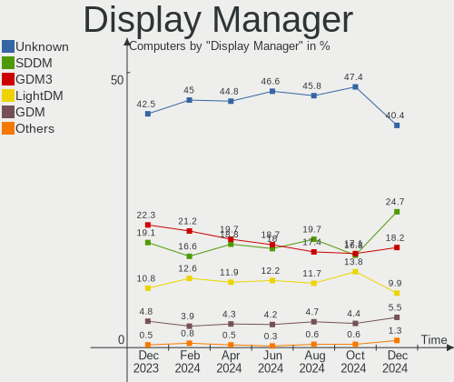
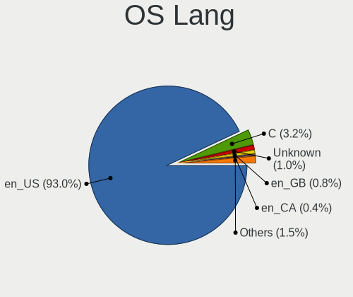
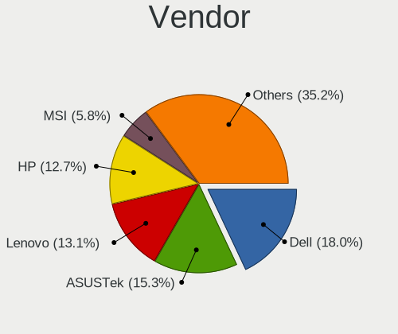
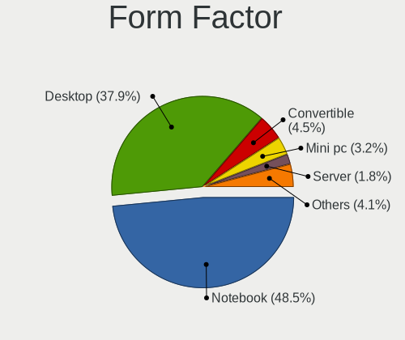
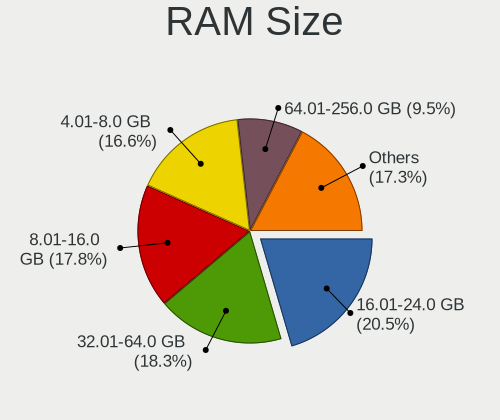
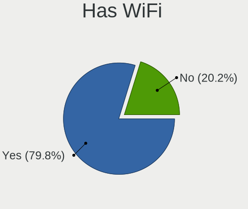
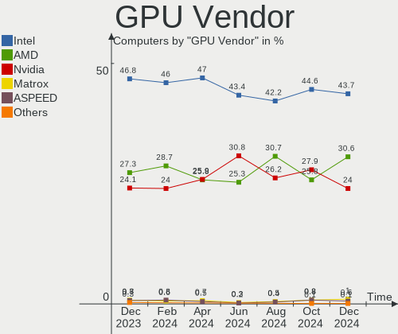
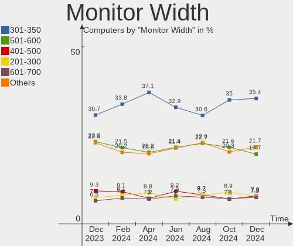
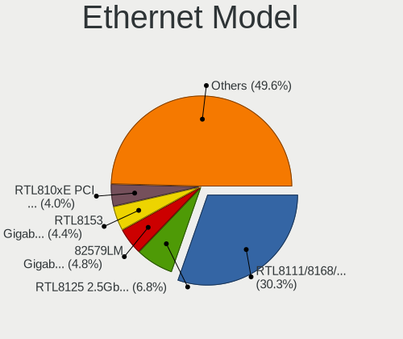
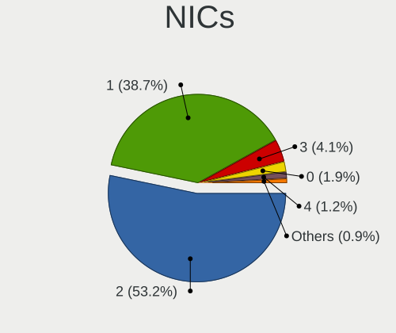

Linux in USA - Hardware Trends
------------------------------

A project to identify most popular hardware characteristics and track their change
over time based on data collected by Linux users at https://Linux-Hardware.org.

Anyone can contribute to this report by the [hw-probe](https://github.com/linuxhw/hw-probe) tool:

    sudo -E hw-probe -all -upload

This is a report for all computer types. See also reports for [desktops](/Location/USA/Desktop/README.md) and [notebooks](/Location/USA/Notebook/README.md).

Period: Jul, 2022.

Contents
--------

* [ System ](#system)
  - [ OS                       ](#os)
  - [ OS Family                ](#os-family)
  - [ Kernel                   ](#kernel)
  - [ Kernel Family            ](#kernel-family)
  - [ Kernel Major Ver.        ](#kernel-major-ver)
  - [ Arch                     ](#arch)
  - [ DE                       ](#de)
  - [ Display Server           ](#display-server)
  - [ Display Manager          ](#display-manager)
  - [ OS Lang                  ](#os-lang)
  - [ Boot Mode                ](#boot-mode)
  - [ Filesystem               ](#filesystem)
  - [ Part. scheme             ](#part-scheme)
  - [ Dual Boot with Linux/BSD ](#dual-boot-with-linuxbsd)
  - [ Dual Boot (Win)          ](#dual-boot-win)

* [ Board ](#board)
  - [ Vendor                   ](#vendor)
  - [ Model                    ](#model)
  - [ Model Family             ](#model-family)
  - [ MFG Year                 ](#mfg-year)
  - [ Form Factor              ](#form-factor)
  - [ Secure Boot              ](#secure-boot)
  - [ Coreboot                 ](#coreboot)
  - [ RAM Size                 ](#ram-size)
  - [ RAM Used                 ](#ram-used)
  - [ Total Drives             ](#total-drives)
  - [ Has CD-ROM               ](#has-cd-rom)
  - [ Has Ethernet             ](#has-ethernet)
  - [ Has WiFi                 ](#has-wifi)
  - [ Has Bluetooth            ](#has-bluetooth)

* [ Location ](#location)
  - [ Country                  ](#country)
  - [ City                     ](#city)

* [ Drives ](#drives)
  - [ Drive Vendor             ](#drive-vendor)
  - [ Drive Model              ](#drive-model)
  - [ HDD Vendor               ](#hdd-vendor)
  - [ SSD Vendor               ](#ssd-vendor)
  - [ Drive Kind               ](#drive-kind)
  - [ Drive Connector          ](#drive-connector)
  - [ Drive Size               ](#drive-size)
  - [ Space Total              ](#space-total)
  - [ Space Used               ](#space-used)
  - [ Malfunc. Drives          ](#malfunc-drives)
  - [ Malfunc. Drive Vendor    ](#malfunc-drive-vendor)
  - [ Malfunc. HDD Vendor      ](#malfunc-hdd-vendor)
  - [ Malfunc. Drive Kind      ](#malfunc-drive-kind)
  - [ Failed Drives            ](#failed-drives)
  - [ Failed Drive Vendor      ](#failed-drive-vendor)
  - [ Drive Status             ](#drive-status)

* [ Storage controller ](#storage-controller)
  - [ Storage Vendor           ](#storage-vendor)
  - [ Storage Model            ](#storage-model)
  - [ Storage Kind             ](#storage-kind)

* [ Processor ](#processor)
  - [ CPU Vendor               ](#cpu-vendor)
  - [ CPU Model                ](#cpu-model)
  - [ CPU Model Family         ](#cpu-model-family)
  - [ CPU Cores                ](#cpu-cores)
  - [ CPU Sockets              ](#cpu-sockets)
  - [ CPU Threads              ](#cpu-threads)
  - [ CPU Op-Modes             ](#cpu-op-modes)
  - [ CPU Microcode            ](#cpu-microcode)
  - [ CPU Microarch            ](#cpu-microarch)

* [ Graphics ](#graphics)
  - [ GPU Vendor               ](#gpu-vendor)
  - [ GPU Model                ](#gpu-model)
  - [ GPU Combo                ](#gpu-combo)
  - [ GPU Driver               ](#gpu-driver)
  - [ GPU Memory               ](#gpu-memory)

* [ Monitor ](#monitor)
  - [ Monitor Vendor           ](#monitor-vendor)
  - [ Monitor Model            ](#monitor-model)
  - [ Monitor Resolution       ](#monitor-resolution)
  - [ Monitor Diagonal         ](#monitor-diagonal)
  - [ Monitor Width            ](#monitor-width)
  - [ Aspect Ratio             ](#aspect-ratio)
  - [ Monitor Area             ](#monitor-area)
  - [ Pixel Density            ](#pixel-density)
  - [ Multiple Monitors        ](#multiple-monitors)

* [ Network ](#network)
  - [ Net Controller Vendor    ](#net-controller-vendor)
  - [ Net Controller Model     ](#net-controller-model)
  - [ Wireless Vendor          ](#wireless-vendor)
  - [ Wireless Model           ](#wireless-model)
  - [ Ethernet Vendor          ](#ethernet-vendor)
  - [ Ethernet Model           ](#ethernet-model)
  - [ Net Controller Kind      ](#net-controller-kind)
  - [ Used Controller          ](#used-controller)
  - [ NICs                     ](#nics)
  - [ IPv6                     ](#ipv6)

* [ Bluetooth ](#bluetooth)
  - [ Bluetooth Vendor         ](#bluetooth-vendor)
  - [ Bluetooth Model          ](#bluetooth-model)

* [ Sound ](#sound)
  - [ Sound Vendor             ](#sound-vendor)
  - [ Sound Model              ](#sound-model)

* [ Memory ](#memory)
  - [ Memory Vendor            ](#memory-vendor)
  - [ Memory Model             ](#memory-model)
  - [ Memory Kind              ](#memory-kind)
  - [ Memory Form Factor       ](#memory-form-factor)
  - [ Memory Size              ](#memory-size)
  - [ Memory Speed             ](#memory-speed)

* [ Printers & scanners ](#printers--scanners)
  - [ Printer Vendor           ](#printer-vendor)
  - [ Printer Model            ](#printer-model)
  - [ Scanner Vendor           ](#scanner-vendor)
  - [ Scanner Model            ](#scanner-model)

* [ Camera ](#camera)
  - [ Camera Vendor            ](#camera-vendor)
  - [ Camera Model             ](#camera-model)

* [ Security ](#security)
  - [ Fingerprint Vendor       ](#fingerprint-vendor)
  - [ Fingerprint Model        ](#fingerprint-model)
  - [ Chipcard Vendor          ](#chipcard-vendor)
  - [ Chipcard Model           ](#chipcard-model)

* [ Unsupported ](#unsupported)
  - [ Unsupported Devices      ](#unsupported-devices)
  - [ Unsupported Device Types ](#unsupported-device-types)

System
------

OS
--

Installed operating systems

| Name                         | Computers | Percent |
|------------------------------|-----------|---------|
| Ubuntu 22.04                 | 126       | 13.55%  |
| Pop!_OS 22.04                | 83        | 8.92%   |
| Fedora 36                    | 72        | 7.74%   |
| Ubuntu 20.04                 | 68        | 7.31%   |
| Linux Mint 20.3              | 67        | 7.2%    |
| OpenMandriva 4.3             | 53        | 5.7%    |
| OpenMandriva 4.90            | 41        | 4.41%   |
| KDE neon 20.04               | 41        | 4.41%   |
| Debian 11                    | 37        | 3.98%   |
| Zorin 16                     | 27        | 2.9%    |
| Arch                         | 23        | 2.47%   |
| Manjaro                      | 17        | 1.83%   |
| SteamOS 3.2                  | 13        | 1.4%    |
| Gentoo 2.8                   | 12        | 1.29%   |
| Elementary 6.1               | 10        | 1.08%   |
| openSUSE Tumbleweed-XXXXXXXX | 9         | 0.97%   |
| Kali 2022.2                  | 9         | 0.97%   |
| ArcoLinux Rolling            | 9         | 0.97%   |
| Arch Rolling                 | 9         | 0.97%   |
| Ubuntu 21.10                 | 8         | 0.86%   |
| Parrot 5.0                   | 8         | 0.86%   |
| Kubuntu 22.04                | 8         | 0.86%   |
| Xubuntu 20.04                | 6         | 0.65%   |
| LMDE 5                       | 6         | 0.65%   |
| Linux Mint 20.2              | 6         | 0.65%   |
| SteamOS 3.3                  | 5         | 0.54%   |
| OpenMandriva 4.2             | 5         | 0.54%   |
| Manjaro 21.3.2               | 5         | 0.54%   |
| Lubuntu 22.04                | 5         | 0.54%   |
| Zorin 15                     | 4         | 0.43%   |
| Xubuntu 22.04                | 4         | 0.43%   |
| Ubuntu 18.04                 | 4         | 0.43%   |
| Pop!_OS 20.04                | 4         | 0.43%   |
| Nobara 36                    | 4         | 0.43%   |
| Linux Mint 20.1              | 4         | 0.43%   |
| Garuda Linux Soaring         | 4         | 0.43%   |
| Debian Testing               | 4         | 0.43%   |
| Manjaro 21.3.3               | 3         | 0.32%   |
| Linux Mint 21                | 3         | 0.32%   |
| Kubuntu 20.04                | 3         | 0.32%   |
| Fedora 35                    | 3         | 0.32%   |
| Endless 4.0.7                | 3         | 0.32%   |
| EndeavourOS Rolling          | 3         | 0.32%   |
| Debian Unstable              | 3         | 0.32%   |
| ArcoLinux                    | 3         | 0.32%   |
| Xubuntu 18.04                | 2         | 0.22%   |
| Xubuntu 16.04                | 2         | 0.22%   |
| Ultramarine Linux 36         | 2         | 0.22%   |
| Ubuntu MATE 22.04            | 2         | 0.22%   |
| Ubuntu MATE 20.04            | 2         | 0.22%   |
| Ubuntu Budgie 22.04          | 2         | 0.22%   |
| RHEL 9                       | 2         | 0.22%   |
| Reborn OS                    | 2         | 0.22%   |
| PCLinuxOS 2022               | 2         | 0.22%   |
| MX 21                        | 2         | 0.22%   |
| Manjaro 21.3.6               | 2         | 0.22%   |
| Lubuntu 20.04                | 2         | 0.22%   |
| Linux Mint 19.3              | 2         | 0.22%   |
| Lilidog 22                   | 2         | 0.22%   |
| Kali 2022.1                  | 2         | 0.22%   |

OS Family
---------

OS without a version

| Name              | Computers | Percent |
|-------------------|-----------|---------|
| Ubuntu            | 209       | 22.47%  |
| OpenMandriva      | 99        | 10.65%  |
| Pop!_OS           | 89        | 9.57%   |
| Linux Mint        | 83        | 8.92%   |
| Fedora            | 76        | 8.17%   |
| Debian            | 44        | 4.73%   |
| KDE neon          | 41        | 4.41%   |
| Arch              | 32        | 3.44%   |
| Zorin             | 31        | 3.33%   |
| Manjaro           | 30        | 3.23%   |
| SteamOS           | 21        | 2.26%   |
| Xubuntu           | 14        | 1.51%   |
| Kubuntu           | 13        | 1.4%    |
| Kali              | 12        | 1.29%   |
| Gentoo            | 12        | 1.29%   |
| ArcoLinux         | 12        | 1.29%   |
| Parrot            | 10        | 1.08%   |
| openSUSE          | 10        | 1.08%   |
| Elementary        | 10        | 1.08%   |
| Lubuntu           | 7         | 0.75%   |
| LMDE              | 6         | 0.65%   |
| Garuda Linux      | 6         | 0.65%   |
| Ubuntu MATE       | 5         | 0.54%   |
| EndeavourOS       | 5         | 0.54%   |
| Nobara            | 4         | 0.43%   |
| Endless           | 4         | 0.43%   |
| Clear Linux       | 4         | 0.43%   |
| Ubuntu Budgie     | 3         | 0.32%   |
| RHEL              | 3         | 0.32%   |
| Void Linux        | 2         | 0.22%   |
| Ultramarine Linux | 2         | 0.22%   |
| Reborn OS         | 2         | 0.22%   |
| Peppermint        | 2         | 0.22%   |
| PCLinuxOS         | 2         | 0.22%   |
| MX                | 2         | 0.22%   |
| Lilidog           | 2         | 0.22%   |
| Bottlerocket      | 2         | 0.22%   |
| antiX             | 2         | 0.22%   |
| Xero              | 1         | 0.11%   |
| Trisquel          | 1         | 0.11%   |
| Solus             | 1         | 0.11%   |
| SLES              | 1         | 0.11%   |
| Raspbian          | 1         | 0.11%   |
| org.kde.Platform  | 1         | 0.11%   |
| Oracle Linux      | 1         | 0.11%   |
| MassOS            | 1         | 0.11%   |
| Manjaro-ARM       | 1         | 0.11%   |
| KaOS              | 1         | 0.11%   |
| Kaisen            | 1         | 0.11%   |
| Guix              | 1         | 0.11%   |
| Drauger OS        | 1         | 0.11%   |
| Devuan            | 1         | 0.11%   |
| Deepin            | 1         | 0.11%   |
| BlackPanther      | 1         | 0.11%   |
| Android           | 1         | 0.11%   |

Kernel
------

Version of the Linux kernel

| Version                                      | Computers | Percent |
|----------------------------------------------|-----------|---------|
| 5.15.0-41-generic                            | 132       | 14.19%  |
| 5.17.15-76051715-generic                     | 62        | 6.67%   |
| 5.13.0-52-generic                            | 55        | 5.91%   |
| 5.16.7-desktop-1omv4003                      | 49        | 5.27%   |
| 5.15.0-40-generic                            | 47        | 5.05%   |
| 5.18.12-desktop-3omv4090                     | 38        | 4.09%   |
| 5.4.0-122-generic                            | 37        | 3.98%   |
| 5.4.0-121-generic                            | 32        | 3.44%   |
| 5.18.11-200.fc36.x86_64                      | 23        | 2.47%   |
| 5.18.13-200.fc36.x86_64                      | 16        | 1.72%   |
| 5.15.0-43-generic                            | 14        | 1.51%   |
| 5.13.0-valve15-1-neptune-02197-gf6ec7ad3762a | 14        | 1.51%   |
| 5.18.10-76051810-generic                     | 13        | 1.4%    |
| 5.10.0-16-amd64                              | 12        | 1.29%   |
| 5.18.10-200.fc36.x86_64                      | 11        | 1.18%   |
| 5.13.0-51-generic                            | 11        | 1.18%   |
| 5.17.5-76051705-generic                      | 10        | 1.08%   |
| 5.10.0-15-amd64                              | 10        | 1.08%   |
| 5.18.9-200.fc36.x86_64                       | 9         | 0.97%   |
| 5.18.7-200.fc36.x86_64                       | 9         | 0.97%   |
| 5.15.0-25-generic                            | 9         | 0.97%   |
| 5.18.0-1parrot1-amd64                        | 8         | 0.86%   |
| 5.4.0-91-generic                             | 7         | 0.75%   |
| 5.18.9-arch1-1                               | 7         | 0.75%   |
| 5.18.12-arch1-1                              | 7         | 0.75%   |
| 5.18.0-2-amd64                               | 7         | 0.75%   |
| 5.18.6-1-default                             | 6         | 0.65%   |
| 5.18.11-arch1-1                              | 6         | 0.65%   |
| 5.10.0-13-amd64                              | 6         | 0.65%   |
| 5.18.7-arch1-1                               | 5         | 0.54%   |
| 5.18.0-kali5-amd64                           | 5         | 0.54%   |
| 5.13.0-44-generic                            | 5         | 0.54%   |
| 5.10.14-desktop-1omv4002                     | 5         | 0.54%   |
| 5.18.14-arch1-1                              | 4         | 0.43%   |
| 5.18.10-arch1-1                              | 4         | 0.43%   |
| 5.18.10-1-MANJARO                            | 4         | 0.43%   |
| 5.16.13-desktop-1omv4003                     | 4         | 0.43%   |
| 5.15.0-1011-raspi                            | 4         | 0.43%   |
| 5.13.0-30-generic                            | 4         | 0.43%   |
| 5.11.0-35-generic                            | 4         | 0.43%   |
| 5.4.0-117-generic                            | 3         | 0.32%   |
| 5.18.12-3-MANJARO                            | 3         | 0.32%   |
| 5.18.11-zen1-1-zen                           | 3         | 0.32%   |
| 5.18.11-051811-generic                       | 3         | 0.32%   |
| 5.18.0-0.bpo.1-amd64                         | 3         | 0.32%   |
| 5.15.50-1-MANJARO                            | 3         | 0.32%   |
| 5.15.0-39-generic                            | 3         | 0.32%   |
| 5.15.0-33-generic                            | 3         | 0.32%   |
| 5.15.0-1012-raspi                            | 3         | 0.32%   |
| 5.4.0-107-generic                            | 2         | 0.22%   |
| 5.18.8-arch1-1                               | 2         | 0.22%   |
| 5.18.6-200.fc36.x86_64                       | 2         | 0.22%   |
| 5.18.3-zen1-1-zen                            | 2         | 0.22%   |
| 5.18.3-arch1-1                               | 2         | 0.22%   |
| 5.18.15-arch1-1                              | 2         | 0.22%   |
| 5.18.13-desktop-1omv4090                     | 2         | 0.22%   |
| 5.18.13-arch1-1                              | 2         | 0.22%   |
| 5.18.13-201.fsync.fc36.x86_64                | 2         | 0.22%   |
| 5.18.12-zen1-1-zen                           | 2         | 0.22%   |
| 5.18.12-pclos1                               | 2         | 0.22%   |

Kernel Family
-------------

Linux kernel without a distro release

| Version  | Computers | Percent |
|----------|-----------|---------|
| 5.15.0   | 220       | 23.66%  |
| 5.13.0   | 102       | 10.97%  |
| 5.4.0    | 89        | 9.57%   |
| 5.17.15  | 65        | 6.99%   |
| 5.18.12  | 57        | 6.13%   |
| 5.16.7   | 49        | 5.27%   |
| 5.18.11  | 42        | 4.52%   |
| 5.18.10  | 38        | 4.09%   |
| 5.10.0   | 33        | 3.55%   |
| 5.18.0   | 31        | 3.33%   |
| 5.18.13  | 24        | 2.58%   |
| 5.18.9   | 21        | 2.26%   |
| 5.18.7   | 15        | 1.61%   |
| 5.18.6   | 13        | 1.4%    |
| 5.17.5   | 12        | 1.29%   |
| 5.11.0   | 11        | 1.18%   |
| 5.18.14  | 9         | 0.97%   |
| 5.16.0   | 8         | 0.86%   |
| 5.16.13  | 6         | 0.65%   |
| 5.17.0   | 5         | 0.54%   |
| 5.15.52  | 5         | 0.54%   |
| 5.10.14  | 5         | 0.54%   |
| 5.8.0    | 4         | 0.43%   |
| 5.19.0   | 4         | 0.43%   |
| 5.18.3   | 4         | 0.43%   |
| 5.15.50  | 4         | 0.43%   |
| 5.14.0   | 4         | 0.43%   |
| 4.15.0   | 4         | 0.43%   |
| 5.18.8   | 3         | 0.32%   |
| 5.15.32  | 3         | 0.32%   |
| 5.18.15  | 2         | 0.22%   |
| 5.15.57  | 2         | 0.22%   |
| 5.15.54  | 2         | 0.22%   |
| 5.15.53  | 2         | 0.22%   |
| 5.15.49  | 2         | 0.22%   |
| 5.15.43  | 2         | 0.22%   |
| 4.18.0   | 2         | 0.22%   |
| 5.8.18   | 1         | 0.11%   |
| 5.5.0    | 1         | 0.11%   |
| 5.3.18   | 1         | 0.11%   |
| 5.18.4   | 1         | 0.11%   |
| 5.17.7   | 1         | 0.11%   |
| 5.17.6   | 1         | 0.11%   |
| 5.17.3   | 1         | 0.11%   |
| 5.17.14  | 1         | 0.11%   |
| 5.17.12  | 1         | 0.11%   |
| 5.15.56  | 1         | 0.11%   |
| 5.15.55  | 1         | 0.11%   |
| 5.15.46  | 1         | 0.11%   |
| 5.15.44  | 1         | 0.11%   |
| 5.15.41  | 1         | 0.11%   |
| 5.15.39  | 1         | 0.11%   |
| 5.15.25  | 1         | 0.11%   |
| 5.14.21  | 1         | 0.11%   |
| 5.13.19  | 1         | 0.11%   |
| 5.10.57  | 1         | 0.11%   |
| 5.10.43  | 1         | 0.11%   |
| 5.10.131 | 1         | 0.11%   |
| 5.10.101 | 1         | 0.11%   |
| 4.9.194  | 1         | 0.11%   |

Kernel Major Ver.
-----------------

Linux kernel major version

| Version | Computers | Percent |
|---------|-----------|---------|
| 5.18    | 260       | 27.96%  |
| 5.15    | 249       | 26.77%  |
| 5.13    | 103       | 11.08%  |
| 5.4     | 89        | 9.57%   |
| 5.17    | 87        | 9.35%   |
| 5.16    | 63        | 6.77%   |
| 5.10    | 42        | 4.52%   |
| 5.11    | 11        | 1.18%   |
| 5.8     | 5         | 0.54%   |
| 5.14    | 5         | 0.54%   |
| 5.19    | 4         | 0.43%   |
| 4.15    | 4         | 0.43%   |
| 4.18    | 3         | 0.32%   |
| 5.5     | 1         | 0.11%   |
| 5.3     | 1         | 0.11%   |
| 4.9     | 1         | 0.11%   |
| 4.4     | 1         | 0.11%   |
| 4.19    | 1         | 0.11%   |

Arch
----

OS architecture (x86_64, i586, etc.)

| Name    | Computers | Percent |
|---------|-----------|---------|
| x86_64  | 906       | 97.42%  |
| aarch64 | 15        | 1.61%   |
| i686    | 6         | 0.65%   |
| armv7l  | 3         | 0.32%   |

DE
--

Desktop Environment

| Name              | Computers | Percent |
|-------------------|-----------|---------|
| GNOME             | 407       | 43.76%  |
| KDE5              | 258       | 27.74%  |
| X-Cinnamon        | 75        | 8.06%   |
| XFCE              | 62        | 6.67%   |
| Unknown           | 40        | 4.3%    |
| MATE              | 30        | 3.23%   |
| Pantheon          | 10        | 1.08%   |
| LXDE              | 6         | 0.65%   |
| Cinnamon          | 6         | 0.65%   |
| LXQt              | 5         | 0.54%   |
| Budgie            | 5         | 0.54%   |
| bspwm             | 5         | 0.54%   |
| i3                | 4         | 0.43%   |
| Unity             | 2         | 0.22%   |
| sway              | 2         | 0.22%   |
| lightdm-xsession  | 2         | 0.22%   |
| GNOME Flashback   | 2         | 0.22%   |
| awesome           | 2         | 0.22%   |
| x-session-manager | 1         | 0.11%   |
| Phosh:GNOME       | 1         | 0.11%   |
| openbox           | 1         | 0.11%   |
| icewm             | 1         | 0.11%   |
| GNOME Classic     | 1         | 0.11%   |
| dwm               | 1         | 0.11%   |
| Deepin            | 1         | 0.11%   |

Display Server
--------------

X11 or Wayland

| Name    | Computers | Percent |
|---------|-----------|---------|
| X11     | 713       | 76.67%  |
| Wayland | 177       | 19.03%  |
| Tty     | 20        | 2.15%   |
| Unknown | 20        | 2.15%   |

Display Manager
---------------

SDDM, LightDM, etc.

| Name    | Computers | Percent |
|---------|-----------|---------|
| Unknown | 382       | 41.08%  |
| GDM3    | 185       | 19.89%  |
| SDDM    | 162       | 17.42%  |
| LightDM | 130       | 13.98%  |
| GDM     | 62        | 6.67%   |
| LXDM    | 5         | 0.54%   |
| XDM     | 3         | 0.32%   |
| Ly      | 1         | 0.11%   |

OS Lang
-------

Language

| Lang    | Computers | Percent |
|---------|-----------|---------|
| en_US   | 881       | 94.73%  |
| C       | 17        | 1.83%   |
| Unknown | 13        | 1.4%    |
| en_CA   | 5         | 0.54%   |
| zh_CN   | 2         | 0.22%   |
| POSIX   | 2         | 0.22%   |
| en_NZ   | 2         | 0.22%   |
| en_AU   | 2         | 0.22%   |
| pt_BR   | 1         | 0.11%   |
| pl_PL   | 1         | 0.11%   |
| es_US   | 1         | 0.11%   |
| en_IN   | 1         | 0.11%   |
| de_DE   | 1         | 0.11%   |
| ca_ES   | 1         | 0.11%   |

Boot Mode
---------

EFI or BIOS

| Mode | Computers | Percent |
|------|-----------|---------|
| EFI  | 478       | 51.4%   |
| BIOS | 452       | 48.6%   |

Filesystem
----------

Type of filesystem

| Type    | Computers | Percent |
|---------|-----------|---------|
| Ext4    | 651       | 70%     |
| Btrfs   | 139       | 14.95%  |
| Overlay | 108       | 11.61%  |
| Xfs     | 14        | 1.51%   |
| Zfs     | 11        | 1.18%   |
| F2fs    | 3         | 0.32%   |
| Tmpfs   | 1         | 0.11%   |
| Ext3    | 1         | 0.11%   |
| Ext2    | 1         | 0.11%   |
| Unknown | 1         | 0.11%   |

Part. scheme
------------

Scheme of partitioning

| Type    | Computers | Percent |
|---------|-----------|---------|
| Unknown | 512       | 55.05%  |
| GPT     | 344       | 36.99%  |
| MBR     | 74        | 7.96%   |

Dual Boot with Linux/BSD
------------------------

Hosting more than one Linux/BSD

| Dual boot | Computers | Percent |
|-----------|-----------|---------|
| No        | 778       | 83.66%  |
| Yes       | 152       | 16.34%  |

Dual Boot (Win)
---------------

Hosting Linux and Windows

| Dual boot | Computers | Percent |
|-----------|-----------|---------|
| No        | 739       | 79.46%  |
| Yes       | 191       | 20.54%  |

Board
-----

Vendor
------

Motherboard manufacturer

| Name                    | Computers | Percent |
|-------------------------|-----------|---------|
| Dell                    | 157       | 16.88%  |
| Hewlett-Packard         | 147       | 15.81%  |
| ASUSTek Computer        | 132       | 14.19%  |
| Lenovo                  | 107       | 11.51%  |
| MSI                     | 71        | 7.63%   |
| Gigabyte Technology     | 42        | 4.52%   |
| Apple                   | 33        | 3.55%   |
| Acer                    | 33        | 3.55%   |
| ASRock                  | 26        | 2.8%    |
| Valve                   | 17        | 1.83%   |
| Raspberry Pi Foundation | 15        | 1.61%   |
| Google                  | 12        | 1.29%   |
| System76                | 10        | 1.08%   |
| Toshiba                 | 9         | 0.97%   |
| GPU Company             | 9         | 0.97%   |
| Unknown                 | 9         | 0.97%   |
| Pegatron                | 8         | 0.86%   |
| Intel                   | 8         | 0.86%   |
| Samsung Electronics     | 7         | 0.75%   |
| AZW                     | 6         | 0.65%   |
| Alienware               | 6         | 0.65%   |
| Panasonic               | 5         | 0.54%   |
| Microsoft               | 5         | 0.54%   |
| Gateway                 | 5         | 0.54%   |
| Supermicro              | 4         | 0.43%   |
| Framework               | 4         | 0.43%   |
| Foxconn                 | 3         | 0.32%   |
| Biostar                 | 3         | 0.32%   |
| Sony                    | 2         | 0.22%   |
| Razer                   | 2         | 0.22%   |
| LG Electronics          | 2         | 0.22%   |
| GMKtec                  | 2         | 0.22%   |
| ECS                     | 2         | 0.22%   |
| BESSTAR Tech            | 2         | 0.22%   |
| ZOTAC                   | 1         | 0.11%   |
| TYAN Computer           | 1         | 0.11%   |
| SLIMBOOK                | 1         | 0.11%   |
| Shuttle                 | 1         | 0.11%   |
| Seeed Studio            | 1         | 0.11%   |
| Schenker                | 1         | 0.11%   |
| Purism                  | 1         | 0.11%   |
| Pine Microsystems       | 1         | 0.11%   |
| ONE-NETBOOK TECHNOLOGY  | 1         | 0.11%   |
| Notebook                | 1         | 0.11%   |
| NCR                     | 1         | 0.11%   |
| Micro Electronics       | 1         | 0.11%   |
| IP3 Tech                | 1         | 0.11%   |
| GPD                     | 1         | 0.11%   |
| Getac                   | 1         | 0.11%   |
| Fujitsu                 | 1         | 0.11%   |
| Fanless Mini PC         | 1         | 0.11%   |
| eMachines               | 1         | 0.11%   |
| Compaq                  | 1         | 0.11%   |
| Clevo                   | 1         | 0.11%   |
| ByteSpeed               | 1         | 0.11%   |
| AYANEO                  | 1         | 0.11%   |
| AVERATEC                | 1         | 0.11%   |
| ASRockRack              | 1         | 0.11%   |
| AMI                     | 1         | 0.11%   |

Model
-----

Motherboard model

| Name                                      | Computers | Percent |
|-------------------------------------------|-----------|---------|
| Valve Jupiter                             | 17        | 1.83%   |
| Unknown                                   | 10        | 1.08%   |
| MSI MS-7C37                               | 6         | 0.65%   |
| ASUS TUF Gaming X570-PLUS                 | 6         | 0.65%   |
| RPi Raspberry Pi                          | 5         | 0.54%   |
| HP ENVY x360 2-in-1 Laptop 15-ey0xxx      | 5         | 0.54%   |
| RPi Raspberry Pi 4 Model B Rev 1.2        | 4         | 0.43%   |
| MSI MS-7C91                               | 4         | 0.43%   |
| Lenovo ThinkPad L13 Yoga Gen 2 20VK0019US | 4         | 0.43%   |
| GPU Company GWTC116-2                     | 4         | 0.43%   |
| Gigabyte X570 AORUS MASTER                | 4         | 0.43%   |
| Framework Laptop                          | 4         | 0.43%   |
| ASUS ROG STRIX B550-F GAMING              | 4         | 0.43%   |
| ASUS ROG STRIX B450-F GAMING              | 4         | 0.43%   |
| ASUS All Series                           | 4         | 0.43%   |
| System76 Lemur Pro                        | 3         | 0.32%   |
| MSI MS-7C35                               | 3         | 0.32%   |
| HP Laptop 15-dy2xxx                       | 3         | 0.32%   |
| HP ENVY 17                                | 3         | 0.32%   |
| Gigabyte X570 I AORUS PRO WIFI            | 3         | 0.32%   |
| Dell OptiPlex 9020                        | 3         | 0.32%   |
| Dell OptiPlex 790                         | 3         | 0.32%   |
| Dell OptiPlex 7020                        | 3         | 0.32%   |
| Dell OptiPlex 7010                        | 3         | 0.32%   |
| Dell OptiPlex 3010                        | 3         | 0.32%   |
| Dell Latitude E7450                       | 3         | 0.32%   |
| Dell Inspiron 7306 2n1                    | 3         | 0.32%   |
| Apple Macmini7,1                          | 3         | 0.32%   |
| Apple MacBookPro9,2                       | 3         | 0.32%   |
| Apple MacBookPro14,1                      | 3         | 0.32%   |
| System76 Oryx Pro                         | 2         | 0.22%   |
| Samsung 950QDB                            | 2         | 0.22%   |
| Samsung 760XDA                            | 2         | 0.22%   |
| RPi Raspberry Pi 4 Model B Rev 1.4        | 2         | 0.22%   |
| MSI MS-7D25                               | 2         | 0.22%   |
| MSI MS-7D09                               | 2         | 0.22%   |
| MSI MS-7C75                               | 2         | 0.22%   |
| MSI MS-7C02                               | 2         | 0.22%   |
| MSI MS-7917                               | 2         | 0.22%   |
| MSI MS-7693                               | 2         | 0.22%   |
| Lenovo Yoga 9 14ITL5 82BG                 | 2         | 0.22%   |
| Lenovo ThinkPad T14s Gen 3 21CQ000GUS     | 2         | 0.22%   |
| Lenovo Legion S7 15ACH6 82K8              | 2         | 0.22%   |
| Lenovo IdeaPad Gaming 3 15ACH6 82K2       | 2         | 0.22%   |
| Lenovo IdeaPad 3 15IIL05 81WE             | 2         | 0.22%   |
| HP ProDesk 600 G1 SFF                     | 2         | 0.22%   |
| HP ProBook 645 G1                         | 2         | 0.22%   |
| HP Pavilion Laptop 15-cs0xxx              | 2         | 0.22%   |
| HP Pavilion dv6                           | 2         | 0.22%   |
| HP Pavilion Desktop 590-p0xxx             | 2         | 0.22%   |
| HP Notebook                               | 2         | 0.22%   |
| HP Laptop 14-bw0xx                        | 2         | 0.22%   |
| HP ENVY x360 Convertible 13-bd0xxx        | 2         | 0.22%   |
| HP EliteBook 8460p                        | 2         | 0.22%   |
| HP EliteBook 745 G6                       | 2         | 0.22%   |
| HP Dev One Notebook PC                    | 2         | 0.22%   |
| HP Compaq Pro 6300 SFF                    | 2         | 0.22%   |
| HP 15 Notebook PC                         | 2         | 0.22%   |
| GPU Company GWTN141-10                    | 2         | 0.22%   |
| GPU Company GWNR51416                     | 2         | 0.22%   |

Model Family
------------

Motherboard model prefix

| Name                  | Computers | Percent |
|-----------------------|-----------|---------|
| Dell Inspiron         | 49        | 5.27%   |
| Lenovo ThinkPad       | 46        | 4.95%   |
| Dell Latitude         | 37        | 3.98%   |
| ASUS ROG              | 36        | 3.87%   |
| Dell OptiPlex         | 30        | 3.23%   |
| Acer Aspire           | 23        | 2.47%   |
| HP Laptop             | 21        | 2.26%   |
| Dell XPS              | 20        | 2.15%   |
| HP Pavilion           | 19        | 2.04%   |
| Lenovo IdeaPad        | 18        | 1.94%   |
| Valve Jupiter         | 17        | 1.83%   |
| HP ENVY               | 17        | 1.83%   |
| ASUS PRIME            | 17        | 1.83%   |
| RPi Raspberry         | 15        | 1.61%   |
| HP EliteBook          | 14        | 1.51%   |
| ASUS TUF              | 14        | 1.51%   |
| Lenovo ThinkCentre    | 12        | 1.29%   |
| HP ProBook            | 11        | 1.18%   |
| HP Compaq             | 11        | 1.18%   |
| Dell Precision        | 11        | 1.18%   |
| Unknown               | 10        | 1.08%   |
| Toshiba Satellite     | 8         | 0.86%   |
| Gigabyte X570         | 8         | 0.86%   |
| ASUS VivoBook         | 8         | 0.86%   |
| HP ZBook              | 7         | 0.75%   |
| MSI MS-7C37           | 6         | 0.65%   |
| Lenovo Yoga           | 6         | 0.65%   |
| HP OMEN               | 6         | 0.65%   |
| Microsoft Surface     | 5         | 0.54%   |
| Lenovo Legion         | 5         | 0.54%   |
| Lenovo IdeaPadFlex    | 5         | 0.54%   |
| Dell Vostro           | 5         | 0.54%   |
| Acer Nitro            | 5         | 0.54%   |
| System76 Lemur        | 4         | 0.43%   |
| MSI MS-7C91           | 4         | 0.43%   |
| HP Stream             | 4         | 0.43%   |
| HP ProDesk            | 4         | 0.43%   |
| HP EliteDesk          | 4         | 0.43%   |
| GPU Company GWTC116-2 | 4         | 0.43%   |
| Framework Laptop      | 4         | 0.43%   |
| ASUS SABERTOOTH       | 4         | 0.43%   |
| ASUS All              | 4         | 0.43%   |
| Apple MacBookPro14    | 4         | 0.43%   |
| MSI MS-7C35           | 3         | 0.32%   |
| HP ProLiant           | 3         | 0.32%   |
| Dell Dimension        | 3         | 0.32%   |
| ASUS ZenBook          | 3         | 0.32%   |
| ASUS M5A99X           | 3         | 0.32%   |
| ASUS M5A97            | 3         | 0.32%   |
| ASRock Z270           | 3         | 0.32%   |
| Apple Macmini7        | 3         | 0.32%   |
| Apple MacBookPro9     | 3         | 0.32%   |
| Apple MacBookPro11    | 3         | 0.32%   |
| Alienware Aurora      | 3         | 0.32%   |
| System76 Oryx         | 2         | 0.22%   |
| Samsung 950QDB        | 2         | 0.22%   |
| Samsung 760XDA        | 2         | 0.22%   |
| Razer Blade           | 2         | 0.22%   |
| MSI MS-7D25           | 2         | 0.22%   |
| MSI MS-7D09           | 2         | 0.22%   |

MFG Year
--------

Motherboard manufacture year

| Year    | Computers | Percent |
|---------|-----------|---------|
| 2021    | 131       | 14.09%  |
| 2020    | 106       | 11.4%   |
| 2019    | 84        | 9.03%   |
| 2022    | 77        | 8.28%   |
| 2018    | 76        | 8.17%   |
| 2012    | 64        | 6.88%   |
| 2017    | 54        | 5.81%   |
| 2014    | 51        | 5.48%   |
| 2013    | 49        | 5.27%   |
| 2011    | 45        | 4.84%   |
| 2015    | 43        | 4.62%   |
| 2010    | 38        | 4.09%   |
| 2016    | 30        | 3.23%   |
| 2009    | 24        | 2.58%   |
| 2008    | 16        | 1.72%   |
| Unknown | 16        | 1.72%   |
| 2007    | 15        | 1.61%   |
| 2006    | 7         | 0.75%   |
| 2005    | 3         | 0.32%   |
| 2001    | 1         | 0.11%   |

Form Factor
-----------

Physical design of the computer

| Name           | Computers | Percent |
|----------------|-----------|---------|
| Notebook       | 436       | 46.88%  |
| Desktop        | 375       | 40.32%  |
| Convertible    | 57        | 6.13%   |
| Mini pc        | 18        | 1.94%   |
| System on chip | 16        | 1.72%   |
| All in one     | 13        | 1.4%    |
| Tablet         | 9         | 0.97%   |
| Server         | 5         | 0.54%   |
| Phone          | 1         | 0.11%   |

Secure Boot
-----------

Enabled or disabled

| State    | Computers | Percent |
|----------|-----------|---------|
| Disabled | 868       | 93.33%  |
| Enabled  | 62        | 6.67%   |

Coreboot
--------

Have coreboot on board

| Used | Computers | Percent |
|------|-----------|---------|
| No   | 912       | 98.06%  |
| Yes  | 18        | 1.94%   |

RAM Size
--------

Total RAM memory

| Size in GB      | Computers | Percent |
|-----------------|-----------|---------|
| 16.01-24.0      | 226       | 24.3%   |
| 4.01-8.0        | 180       | 19.35%  |
| 32.01-64.0      | 147       | 15.81%  |
| 8.01-16.0       | 141       | 15.16%  |
| 3.01-4.0        | 122       | 13.12%  |
| 64.01-256.0     | 50        | 5.38%   |
| 24.01-32.0      | 31        | 3.33%   |
| 1.01-2.0        | 15        | 1.61%   |
| 2.01-3.0        | 9         | 0.97%   |
| 0.51-1.0        | 6         | 0.65%   |
| More than 256.0 | 2         | 0.22%   |
| 0.01-0.5        | 1         | 0.11%   |

RAM Used
--------

Used RAM memory

| Used GB         | Computers | Percent |
|-----------------|-----------|---------|
| 1.01-2.0        | 321       | 34.52%  |
| 2.01-3.0        | 243       | 26.13%  |
| 4.01-8.0        | 152       | 16.34%  |
| 3.01-4.0        | 116       | 12.47%  |
| 0.51-1.0        | 48        | 5.16%   |
| 8.01-16.0       | 30        | 3.23%   |
| 16.01-24.0      | 9         | 0.97%   |
| 0.01-0.5        | 9         | 0.97%   |
| More than 256.0 | 1         | 0.11%   |
| 24.01-32.0      | 1         | 0.11%   |

Total Drives
------------

Number of drives on board

| Drives | Computers | Percent |
|--------|-----------|---------|
| 1      | 521       | 56.02%  |
| 2      | 226       | 24.3%   |
| 3      | 84        | 9.03%   |
| 4      | 48        | 5.16%   |
| 5      | 22        | 2.37%   |
| 7      | 11        | 1.18%   |
| 6      | 6         | 0.65%   |
| 0      | 6         | 0.65%   |
| 11     | 2         | 0.22%   |
| 16     | 1         | 0.11%   |
| 12     | 1         | 0.11%   |
| 10     | 1         | 0.11%   |
| 8      | 1         | 0.11%   |

Has CD-ROM
----------

Has CD-ROM on board

| Presented | Computers | Percent |
|-----------|-----------|---------|
| No        | 613       | 65.91%  |
| Yes       | 317       | 34.09%  |

Has Ethernet
------------

Has Ethernet on board

| Presented | Computers | Percent |
|-----------|-----------|---------|
| Yes       | 751       | 80.75%  |
| No        | 179       | 19.25%  |

Has WiFi
--------

Has WiFi module

| Presented | Computers | Percent |
|-----------|-----------|---------|
| Yes       | 755       | 81.18%  |
| No        | 175       | 18.82%  |

Has Bluetooth
-------------

Has Bluetooth module

| Presented | Computers | Percent |
|-----------|-----------|---------|
| Yes       | 594       | 63.87%  |
| No        | 336       | 36.13%  |

Location
--------

Country
-------

Geographic location (country)

| Country | Computers | Percent |
|---------|-----------|---------|
| USA     | 930       | 100%    |

City
----

Geographic location (city)

| City           | Computers | Percent |
|----------------|-----------|---------|
| Seattle        | 19        | 2.04%   |
| Chicago        | 14        | 1.51%   |
| New York       | 12        | 1.29%   |
| Miami          | 11        | 1.18%   |
| San Antonio    | 10        | 1.08%   |
| Atlanta        | 10        | 1.08%   |
| San Jose       | 9         | 0.97%   |
| San Francisco  | 9         | 0.97%   |
| Los Angeles    | 9         | 0.97%   |
| Austin         | 9         | 0.97%   |
| Denver         | 8         | 0.86%   |
| Phoenix        | 7         | 0.75%   |
| Philadelphia   | 7         | 0.75%   |
| Kansas City    | 7         | 0.75%   |
| Houston        | 7         | 0.75%   |
| Dallas         | 7         | 0.75%   |
| Bangor         | 7         | 0.75%   |
| Salt Lake City | 6         | 0.65%   |
| Queens         | 6         | 0.65%   |
| Portland       | 6         | 0.65%   |
| Milwaukee      | 6         | 0.65%   |
| Mesa           | 6         | 0.65%   |
| Jacksonville   | 6         | 0.65%   |
| Tucson         | 5         | 0.54%   |
| St Louis       | 5         | 0.54%   |
| Springfield    | 5         | 0.54%   |
| Orlando        | 5         | 0.54%   |
| Omaha          | 5         | 0.54%   |
| Indianapolis   | 5         | 0.54%   |
| The Bronx      | 4         | 0.43%   |
| Southampton    | 4         | 0.43%   |
| Saint Paul     | 4         | 0.43%   |
| Rochester      | 4         | 0.43%   |
| Minneapolis    | 4         | 0.43%   |
| Lincoln        | 4         | 0.43%   |
| Lansing        | 4         | 0.43%   |
| Columbus       | 4         | 0.43%   |
| Charlotte      | 4         | 0.43%   |
| Baton Rouge    | 4         | 0.43%   |
| Wilmington     | 3         | 0.32%   |
| Virginia Beach | 3         | 0.32%   |
| Valencia       | 3         | 0.32%   |
| Stevens Point  | 3         | 0.32%   |
| Santa Clara    | 3         | 0.32%   |
| Sandpoint      | 3         | 0.32%   |
| San Diego      | 3         | 0.32%   |
| Raleigh        | 3         | 0.32%   |
| Quincy         | 3         | 0.32%   |
| Pittsburgh     | 3         | 0.32%   |
| Middletown     | 3         | 0.32%   |
| Marion         | 3         | 0.32%   |
| Lowell         | 3         | 0.32%   |
| Las Vegas      | 3         | 0.32%   |
| Largo          | 3         | 0.32%   |
| Lancaster      | 3         | 0.32%   |
| Greenville     | 3         | 0.32%   |
| Greenfield     | 3         | 0.32%   |
| Fresno         | 3         | 0.32%   |
| Everett        | 3         | 0.32%   |
| Durham         | 3         | 0.32%   |

Drives
------

Drive Vendor
------------

Hard drive vendors

| Vendor                    | Computers | Drives | Percent |
|---------------------------|-----------|--------|---------|
| Samsung Electronics       | 237       | 312    | 16.62%  |
| Seagate                   | 204       | 276    | 14.31%  |
| WDC                       | 177       | 237    | 12.41%  |
| SanDisk                   | 87        | 99     | 6.1%    |
| Unknown                   | 82        | 88     | 5.75%   |
| Toshiba                   | 71        | 73     | 4.98%   |
| Kingston                  | 50        | 54     | 3.51%   |
| SK hynix                  | 48        | 48     | 3.37%   |
| Crucial                   | 45        | 51     | 3.16%   |
| Hitachi                   | 42        | 43     | 2.95%   |
| Intel                     | 39        | 57     | 2.73%   |
| HGST                      | 30        | 30     | 2.1%    |
| Phison                    | 28        | 36     | 1.96%   |
| PNY                       | 20        | 20     | 1.4%    |
| Apple                     | 19        | 26     | 1.33%   |
| Micron Technology         | 18        | 19     | 1.26%   |
| A-DATA Technology         | 16        | 17     | 1.12%   |
| China                     | 15        | 18     | 1.05%   |
| SPCC                      | 14        | 15     | 0.98%   |
| Unknown                   | 14        | 14     | 0.98%   |
| Team                      | 10        | 10     | 0.7%    |
| KIOXIA                    | 10        | 10     | 0.7%    |
| SABRENT                   | 8         | 10     | 0.56%   |
| Micron/Crucial Technology | 8         | 8      | 0.56%   |
| Realtek Semiconductor     | 7         | 7      | 0.49%   |
| JMicron Technology        | 7         | 7      | 0.49%   |
| Silicon Motion            | 6         | 6      | 0.42%   |
| Hewlett-Packard           | 6         | 6      | 0.42%   |
| Netac                     | 5         | 5      | 0.35%   |
| Mushkin                   | 5         | 6      | 0.35%   |
| OCZ                       | 4         | 4      | 0.28%   |
| NGFF                      | 4         | 4      | 0.28%   |
| LITEON                    | 4         | 4      | 0.28%   |
| XPG                       | 3         | 3      | 0.21%   |
| TO Exter                  | 3         | 3      | 0.21%   |
| Timetec                   | 3         | 3      | 0.21%   |
| T-FORCE                   | 3         | 3      | 0.21%   |
| SSK                       | 3         | 4      | 0.21%   |
| Phison Electronics        | 3         | 3      | 0.21%   |
| KingFast                  | 3         | 3      | 0.21%   |
| Gigabyte Technology       | 3         | 5      | 0.21%   |
| ASMT                      | 3         | 3      | 0.21%   |
| WD MediaMax               | 2         | 2      | 0.14%   |
| W800S                     | 2         | 3      | 0.14%   |
| USB3.0                    | 2         | 2      | 0.14%   |
| OWC                       | 2         | 2      | 0.14%   |
| Lexar                     | 2         | 2      | 0.14%   |
| HGST HTS                  | 2         | 2      | 0.14%   |
| Corsair                   | 2         | 2      | 0.14%   |
| BHT                       | 2         | 2      | 0.14%   |
| addlink                   | 2         | 2      | 0.14%   |
| Zheino                    | 1         | 1      | 0.07%   |
| Union Memory (Shenzhen)   | 1         | 1      | 0.07%   |
| UD0401                    | 1         | 1      | 0.07%   |
| Transcend                 | 1         | 1      | 0.07%   |
| T-CREATE                  | 1         | 1      | 0.07%   |
| Super Talent              | 1         | 1      | 0.07%   |
| SSSTC                     | 1         | 1      | 0.07%   |
| SPCC M.2                  | 1         | 1      | 0.07%   |
| SATADOM-ML                | 1         | 1      | 0.07%   |

Drive Model
-----------

Hard drive models

| Model                            | Computers | Percent |
|----------------------------------|-----------|---------|
| Samsung NVMe SSD Drive 1TB       | 27        | 1.68%   |
| Seagate ST2000DM008-2FR102 2TB   | 14        | 0.87%   |
| Unknown                          | 14        | 0.87%   |
| Samsung SSD 860 EVO 1TB          | 13        | 0.81%   |
| Toshiba DT01ACA100 1TB           | 12        | 0.75%   |
| SanDisk NVMe SSD Drive 1TB       | 12        | 0.75%   |
| Samsung SSD 850 EVO 250GB        | 12        | 0.75%   |
| HGST HTS721010A9E630 1TB         | 12        | 0.75%   |
| Unknown SD/MMC/MS PRO 64GB       | 11        | 0.68%   |
| SanDisk NVMe SSD Drive 500GB     | 11        | 0.68%   |
| Intel NVMe SSD Drive 512GB       | 11        | 0.68%   |
| WDC WD10EZEX-08WN4A0 1TB         | 10        | 0.62%   |
| Samsung SSD 860 EVO 500GB        | 10        | 0.62%   |
| Samsung NVMe SSD Drive 512GB     | 10        | 0.62%   |
| Samsung NVMe SSD Drive 500GB     | 10        | 0.62%   |
| Phison NVMe SSD Drive 512GB      | 10        | 0.62%   |
| Unknown MMC Card  32GB           | 9         | 0.56%   |
| Seagate ST2000DM001-1ER164 2TB   | 9         | 0.56%   |
| Samsung SSD 970 EVO Plus 2TB     | 9         | 0.56%   |
| Samsung SSD 970 EVO Plus 1TB     | 9         | 0.56%   |
| Samsung SSD 850 EVO 500GB        | 9         | 0.56%   |
| Samsung NVMe SSD Drive 256GB     | 9         | 0.56%   |
| Seagate ST1000LM035-1RK172 1TB   | 8         | 0.5%    |
| Seagate ST1000DM010-2EP102 1TB   | 8         | 0.5%    |
| SanDisk NVMe SSD Drive 512GB     | 8         | 0.5%    |
| Samsung SSD 980 PRO 1TB          | 8         | 0.5%    |
| Samsung NVMe SSD Drive 1024GB    | 8         | 0.5%    |
| Crucial CT1000MX500SSD1 1TB      | 8         | 0.5%    |
| Seagate ST4000DM004-2CV104 4TB   | 7         | 0.44%   |
| Samsung SSD 970 EVO Plus 500GB   | 7         | 0.44%   |
| Samsung SSD 870 EVO 1TB          | 7         | 0.44%   |
| Samsung NVMe SSD Drive 2TB       | 7         | 0.44%   |
| WDC WDS100T2B0A-00SM50 1TB SSD   | 6         | 0.37%   |
| Toshiba NVMe SSD Drive 512GB     | 6         | 0.37%   |
| SPCC Solid State Disk 256GB      | 6         | 0.37%   |
| SK hynix NVMe SSD Drive 256GB    | 6         | 0.37%   |
| Seagate ST2000LM007-1R8174 2TB   | 6         | 0.37%   |
| Seagate Backup+ Hub BK 4TB       | 6         | 0.37%   |
| Samsung SSD 980 1TB              | 6         | 0.37%   |
| SABRENT Disk 1TB                 | 6         | 0.37%   |
| Kingston SA400S37240G 240GB SSD  | 6         | 0.37%   |
| Intel NVMe SSD Drive 32GB        | 6         | 0.37%   |
| Crucial CT500MX500SSD1 500GB     | 6         | 0.37%   |
| WDC WDS500G2B0A-00SM50 500GB SSD | 5         | 0.31%   |
| Unknown MMC Card  64GB           | 5         | 0.31%   |
| Unknown MMC Card  128GB          | 5         | 0.31%   |
| Seagate ST500LT012-9WS142 500GB  | 5         | 0.31%   |
| Seagate ST500LM021-1KJ152 500GB  | 5         | 0.31%   |
| Seagate ST2000DM006-2DM164 2TB   | 5         | 0.31%   |
| SanDisk Extreme 55AE 2TB SSD     | 5         | 0.31%   |
| Samsung SSD 870 QVO 2TB          | 5         | 0.31%   |
| PNY CS900 500GB SSD              | 5         | 0.31%   |
| PNY CS900 240GB SSD              | 5         | 0.31%   |
| Kingston SV300S37A240G 240GB SSD | 5         | 0.31%   |
| Kingston NVMe SSD Drive 512GB    | 5         | 0.31%   |
| Kingston NVMe SSD Drive 256GB    | 5         | 0.31%   |
| Intel NVMe SSD Drive 1024GB      | 5         | 0.31%   |
| China SATA SSD 240GB             | 5         | 0.31%   |
| WDC WDS100T2B0C-00PXH0 1TB       | 4         | 0.25%   |
| WDC WDBNCE0010PNC 1TB SSD        | 4         | 0.25%   |

HDD Vendor
----------

Hard disk drive vendors

| Vendor              | Computers | Drives | Percent |
|---------------------|-----------|--------|---------|
| Seagate             | 199       | 264    | 40.2%   |
| WDC                 | 130       | 176    | 26.26%  |
| Toshiba             | 53        | 55     | 10.71%  |
| Hitachi             | 42        | 43     | 8.48%   |
| HGST                | 30        | 30     | 6.06%   |
| Unknown             | 12        | 12     | 2.42%   |
| SABRENT             | 8         | 10     | 1.62%   |
| Samsung Electronics | 6         | 7      | 1.21%   |
| Apple               | 4         | 4      | 0.81%   |
| WD MediaMax         | 2         | 2      | 0.4%    |
| ASMT                | 2         | 2      | 0.4%    |
| UD0401              | 1         | 1      | 0.2%    |
| HPE                 | 1         | 1      | 0.2%    |
| HGST HTS            | 1         | 1      | 0.2%    |
| Hewlett-Packard     | 1         | 1      | 0.2%    |
| Fantom              | 1         | 1      | 0.2%    |
| ASMedia             | 1         | 1      | 0.2%    |
| Apricorn            | 1         | 1      | 0.2%    |

SSD Vendor
----------

Solid state drive vendors

| Vendor              | Computers | Drives | Percent |
|---------------------|-----------|--------|---------|
| Samsung Electronics | 100       | 117    | 24.39%  |
| SanDisk             | 41        | 49     | 10%     |
| Crucial             | 35        | 41     | 8.54%   |
| WDC                 | 28        | 32     | 6.83%   |
| Kingston            | 26        | 29     | 6.34%   |
| PNY                 | 19        | 19     | 4.63%   |
| China               | 15        | 18     | 3.66%   |
| SPCC                | 14        | 15     | 3.41%   |
| SK hynix            | 13        | 13     | 3.17%   |
| A-DATA Technology   | 13        | 14     | 3.17%   |
| Team                | 9         | 9      | 2.2%    |
| Apple               | 9         | 9      | 2.2%    |
| Intel               | 7         | 8      | 1.71%   |
| Mushkin             | 5         | 6      | 1.22%   |
| Micron Technology   | 5         | 5      | 1.22%   |
| Hewlett-Packard     | 5         | 5      | 1.22%   |
| Unknown             | 5         | 5      | 1.22%   |
| Toshiba             | 4         | 4      | 0.98%   |
| OCZ                 | 4         | 4      | 0.98%   |
| NGFF                | 4         | 4      | 0.98%   |
| Netac               | 4         | 4      | 0.98%   |
| LITEON              | 4         | 4      | 0.98%   |
| TO Exter            | 3         | 3      | 0.73%   |
| USB3.0              | 2         | 2      | 0.49%   |
| Timetec             | 2         | 2      | 0.49%   |
| OWC                 | 2         | 2      | 0.49%   |
| Lexar               | 2         | 2      | 0.49%   |
| BHT                 | 2         | 2      | 0.49%   |
| W800S               | 1         | 1      | 0.24%   |
| Unknown             | 1         | 1      | 0.24%   |
| Transcend           | 1         | 1      | 0.24%   |
| Super Talent        | 1         | 1      | 0.24%   |
| SPCC M.2            | 1         | 1      | 0.24%   |
| Seagate             | 1         | 2      | 0.24%   |
| Radeon              | 1         | 1      | 0.24%   |
| PNY USB             | 1         | 1      | 0.24%   |
| Plextor             | 1         | 1      | 0.24%   |
| Pioneer             | 1         | 1      | 0.24%   |
| Patriot             | 1         | 1      | 0.24%   |
| OCZ-VERTEX3         | 1         | 1      | 0.24%   |
| MyDigitalSSD        | 1         | 1      | 0.24%   |
| Maxtor              | 1         | 1      | 0.24%   |
| LITEONIT            | 1         | 1      | 0.24%   |
| KingFast            | 1         | 1      | 0.24%   |
| JMicron Technology  | 1         | 1      | 0.24%   |
| Intenso             | 1         | 1      | 0.24%   |
| INTEL SS            | 1         | 1      | 0.24%   |
| Innodisk            | 1         | 1      | 0.24%   |
| Inland              | 1         | 1      | 0.24%   |
| Hoodisk             | 1         | 1      | 0.24%   |
| Dogfish             | 1         | 1      | 0.24%   |
| Corsair             | 1         | 1      | 0.24%   |
| ASMT                | 1         | 1      | 0.24%   |
| Argon               | 1         | 1      | 0.24%   |
| Apacer              | 1         | 1      | 0.24%   |
| 2.5''               | 1         | 1      | 0.24%   |

Drive Kind
----------

HDD or SSD

| Kind    | Computers | Drives | Percent |
|---------|-----------|--------|---------|
| HDD     | 405       | 612    | 32.3%   |
| NVMe    | 395       | 527    | 31.5%   |
| SSD     | 350       | 456    | 27.91%  |
| MMC     | 70        | 76     | 5.58%   |
| Unknown | 34        | 40     | 2.71%   |

Drive Connector
---------------

SATA, SAS, NVMe, etc.

| Type | Computers | Drives | Percent |
|------|-----------|--------|---------|
| SATA | 615       | 990    | 52.3%   |
| NVMe | 394       | 522    | 33.5%   |
| SAS  | 97        | 123    | 8.25%   |
| MMC  | 70        | 76     | 5.95%   |

Drive Size
----------

Size of hard drive

| Size in TB | Computers | Drives | Percent |
|------------|-----------|--------|---------|
| 0.01-0.5   | 380       | 477    | 45.78%  |
| 0.51-1.0   | 255       | 319    | 30.72%  |
| 1.01-2.0   | 111       | 129    | 13.37%  |
| 3.01-4.0   | 34        | 43     | 4.1%    |
| 4.01-10.0  | 24        | 36     | 2.89%   |
| 2.01-3.0   | 16        | 22     | 1.93%   |
| 10.01-20.0 | 10        | 42     | 1.2%    |

Space Total
-----------

Amount of disk space available on the file system

| Size in GB     | Computers | Percent |
|----------------|-----------|---------|
| 251-500        | 190       | 20.43%  |
| 101-250        | 183       | 19.68%  |
| 501-1000       | 168       | 18.06%  |
| 1-20           | 98        | 10.54%  |
| More than 3000 | 82        | 8.82%   |
| 1001-2000      | 76        | 8.17%   |
| 51-100         | 36        | 3.87%   |
| 2001-3000      | 35        | 3.76%   |
| 21-50          | 31        | 3.33%   |
| Unknown        | 31        | 3.33%   |

Space Used
----------

Amount of used disk space

| Used GB        | Computers | Percent |
|----------------|-----------|---------|
| 1-20           | 365       | 39.25%  |
| 21-50          | 145       | 15.59%  |
| 101-250        | 107       | 11.51%  |
| 51-100         | 93        | 10%     |
| 251-500        | 68        | 7.31%   |
| 501-1000       | 46        | 4.95%   |
| More than 3000 | 32        | 3.44%   |
| 1001-2000      | 32        | 3.44%   |
| Unknown        | 31        | 3.33%   |
| 2001-3000      | 11        | 1.18%   |

Malfunc. Drives
---------------

Drive models with a malfunction

| Model                                          | Computers | Drives | Percent |
|------------------------------------------------|-----------|--------|---------|
| Seagate ST500LT012-9WS142 500GB                | 4         | 4      | 5.88%   |
| SK hynix PC711 HFS001TDE9X073N 1TB             | 2         | 2      | 2.94%   |
| Hitachi HTS545050B9A300 500GB                  | 2         | 2      | 2.94%   |
| Hitachi HDS721010CLA630 1TB                    | 2         | 2      | 2.94%   |
| HGST HTS721010A9E630 1TB                       | 2         | 2      | 2.94%   |
| WDC WDS200T2B0A-00SM50 2TB SSD                 | 1         | 1      | 1.47%   |
| WDC WD6400AAKS-22A7B2 640GB                    | 1         | 1      | 1.47%   |
| WDC WD5000BPVT-24HXZT3 500GB                   | 1         | 1      | 1.47%   |
| WDC WD5000AVDS-61U7B1 500GB                    | 1         | 1      | 1.47%   |
| WDC WD3200BEVT-75A23T0 320GB                   | 1         | 1      | 1.47%   |
| WDC WD3200AAJS-40VWA1 320GB                    | 1         | 1      | 1.47%   |
| WDC WD20SPZX-60UA7T0 2TB                       | 1         | 1      | 1.47%   |
| WDC WD1600AAJS-22L7A0 160GB                    | 1         | 1      | 1.47%   |
| WDC WD10JPVX-22JC3T0 1TB                       | 1         | 1      | 1.47%   |
| WDC WD10EZEX-60ZF5A0 1TB                       | 1         | 1      | 1.47%   |
| WDC WD1003FBYX-01Y7B1 752GB                    | 1         | 1      | 1.47%   |
| WDC WD1001FALS-00J7B1 1TB                      | 1         | 1      | 1.47%   |
| WDC WD1001FALS-00J7B0 1TB                      | 1         | 1      | 1.47%   |
| Toshiba MQ01ABD100 1TB                         | 1         | 1      | 1.47%   |
| Toshiba MQ01ABD075 752GB                       | 1         | 1      | 1.47%   |
| Toshiba MQ01ABD050 500GB                       | 1         | 1      | 1.47%   |
| Toshiba MK3275GSX 320GB                        | 1         | 1      | 1.47%   |
| Toshiba MK1665GSX 160GB                        | 1         | 1      | 1.47%   |
| SPCC Solid State Disk 1TB                      | 1         | 2      | 1.47%   |
| SK hynix SH920 2.5 7MM 256GB SSD               | 1         | 1      | 1.47%   |
| SK hynix BC501 HFM256GDJTNG-8310A 256GB        | 1         | 1      | 1.47%   |
| Seagate ST9500325AS 500GB                      | 1         | 1      | 1.47%   |
| Seagate ST500LM000-1EJ162 500GB                | 1         | 1      | 1.47%   |
| Seagate ST5000LM000-2AN170 5TB                 | 1         | 1      | 1.47%   |
| Seagate ST340810A 40GB                         | 1         | 1      | 1.47%   |
| Seagate ST33000651NS 3TB                       | 1         | 3      | 1.47%   |
| Seagate ST33000651AS 3TB                       | 1         | 1      | 1.47%   |
| Seagate ST320LT007-9ZV142 320GB                | 1         | 1      | 1.47%   |
| Seagate ST31000520AS 1TB                       | 1         | 1      | 1.47%   |
| Seagate ST2000DX002-2DV164 2TB                 | 1         | 1      | 1.47%   |
| Seagate ST2000DX 002-2DV164 2TB                | 1         | 1      | 1.47%   |
| Seagate ST1000DX001-1NS162 1TB                 | 1         | 1      | 1.47%   |
| Seagate ST1000DM010-2EP102 1TB                 | 1         | 1      | 1.47%   |
| Samsung Electronics SSD PM800 Series 2.5 256GB | 1         | 1      | 1.47%   |
| Samsung Electronics SSD 970 EVO Plus 500GB     | 1         | 1      | 1.47%   |
| Samsung Electronics SSD 960 EVO 500GB          | 1         | 1      | 1.47%   |
| Samsung Electronics SSD 870 EVO 500GB          | 1         | 1      | 1.47%   |
| Samsung Electronics SSD 870 EVO 1TB            | 1         | 1      | 1.47%   |
| Samsung Electronics MMCQE28G8MUP-0VA 128GB SSD | 1         | 1      | 1.47%   |
| Samsung Electronics HD322GJ 320GB              | 1         | 1      | 1.47%   |
| Netac SSD 256GB                                | 1         | 1      | 1.47%   |
| Micron Technology 1100 SATA 256GB SSD          | 1         | 1      | 1.47%   |
| Kingston SV300S37A240G 240GB SSD               | 1         | 2      | 1.47%   |
| Kingston SNS4151S316GD 16GB SSD                | 1         | 1      | 1.47%   |
| Kingston SNS4151S316G 16GB SSD                 | 1         | 1      | 1.47%   |
| Intel SSDSA2CW120G3 120GB                      | 1         | 1      | 1.47%   |
| Hitachi HTS723232A7A364 320GB                  | 1         | 1      | 1.47%   |
| Hitachi HDS722020ALA330 2TB                    | 1         | 1      | 1.47%   |
| Hitachi HDS721616PLA380 160GB                  | 1         | 1      | 1.47%   |
| Hitachi HDP725050GLA360 500GB                  | 1         | 1      | 1.47%   |
| HGST HTS725050A7E630 500GB                     | 1         | 1      | 1.47%   |
| HGST HTS725032A7E630 320GB                     | 1         | 1      | 1.47%   |
| HGST HTS 721010A9E630 1TB                      | 1         | 1      | 1.47%   |
| Hewlett-Packard MB2000EBUCF 2TB                | 1         | 1      | 1.47%   |
| Crucial CT1050MX300SSD1 1TB                    | 1         | 1      | 1.47%   |

Malfunc. Drive Vendor
---------------------

Vendors of faulty drives

| Vendor              | Computers | Drives | Percent |
|---------------------|-----------|--------|---------|
| Seagate             | 16        | 18     | 23.88%  |
| WDC                 | 12        | 13     | 17.91%  |
| Hitachi             | 8         | 8      | 11.94%  |
| Samsung Electronics | 7         | 7      | 10.45%  |
| Toshiba             | 5         | 5      | 7.46%   |
| SK hynix            | 4         | 4      | 5.97%   |
| HGST                | 4         | 4      | 5.97%   |
| Kingston            | 3         | 4      | 4.48%   |
| SPCC                | 1         | 2      | 1.49%   |
| Netac               | 1         | 1      | 1.49%   |
| Micron Technology   | 1         | 1      | 1.49%   |
| Intel               | 1         | 1      | 1.49%   |
| HGST HTS            | 1         | 1      | 1.49%   |
| Hewlett-Packard     | 1         | 1      | 1.49%   |
| Crucial             | 1         | 1      | 1.49%   |
| Unknown             | 1         | 1      | 1.49%   |

Malfunc. HDD Vendor
-------------------

Vendors of faulty HDD drives

| Vendor              | Computers | Drives | Percent |
|---------------------|-----------|--------|---------|
| Seagate             | 16        | 18     | 34.04%  |
| WDC                 | 11        | 12     | 23.4%   |
| Hitachi             | 8         | 8      | 17.02%  |
| Toshiba             | 5         | 5      | 10.64%  |
| HGST                | 4         | 4      | 8.51%   |
| Samsung Electronics | 1         | 1      | 2.13%   |
| HGST HTS            | 1         | 1      | 2.13%   |
| Hewlett-Packard     | 1         | 1      | 2.13%   |

Malfunc. Drive Kind
-------------------

Kinds of faulty drives

| Kind | Computers | Drives | Percent |
|------|-----------|--------|---------|
| HDD  | 46        | 50     | 69.7%   |
| SSD  | 15        | 17     | 22.73%  |
| NVMe | 5         | 5      | 7.58%   |

Failed Drives
-------------

Failed drive models

| Model                      | Computers | Drives | Percent |
|----------------------------|-----------|--------|---------|
| WDC WD4001FFSX-68JNUN0 4TB | 1         | 1      | 33.33%  |
| Seagate ST9500420AS 500GB  | 1         | 1      | 33.33%  |
| External USB3.0 1TB        | 1         | 1      | 33.33%  |

Failed Drive Vendor
-------------------

Failed drive vendors

| Vendor   | Computers | Drives | Percent |
|----------|-----------|--------|---------|
| WDC      | 1         | 1      | 33.33%  |
| Seagate  | 1         | 1      | 33.33%  |
| External | 1         | 1      | 33.33%  |

Drive Status
------------

Number of failed and malfunc. drives

| Status   | Computers | Drives | Percent |
|----------|-----------|--------|---------|
| Detected | 591       | 1016   | 58.34%  |
| Works    | 355       | 620    | 35.04%  |
| Malfunc  | 64        | 72     | 6.32%   |
| Failed   | 3         | 3      | 0.3%    |

Storage controller
------------------

Storage Vendor
--------------

Storage controller vendors

| Vendor                         | Computers | Percent |
|--------------------------------|-----------|---------|
| Intel                          | 527       | 42.99%  |
| AMD                            | 218       | 17.78%  |
| Samsung Electronics            | 163       | 13.3%   |
| SanDisk                        | 61        | 4.98%   |
| Phison Electronics             | 38        | 3.1%    |
| SK hynix                       | 35        | 2.85%   |
| ASMedia Technology             | 30        | 2.45%   |
| Kingston Technology Company    | 24        | 1.96%   |
| Micron/Crucial Technology      | 16        | 1.31%   |
| Micron Technology              | 15        | 1.22%   |
| Toshiba America Info Systems   | 14        | 1.14%   |
| Marvell Technology Group       | 14        | 1.14%   |
| Nvidia                         | 13        | 1.06%   |
| KIOXIA                         | 9         | 0.73%   |
| Silicon Motion                 | 8         | 0.65%   |
| Realtek Semiconductor          | 8         | 0.65%   |
| JMicron Technology             | 6         | 0.49%   |
| Apple                          | 6         | 0.49%   |
| ADATA Technology               | 5         | 0.41%   |
| Seagate Technology             | 3         | 0.24%   |
| Hewlett-Packard                | 3         | 0.24%   |
| Unknown                        | 2         | 0.16%   |
| LSI Logic / Symbios Logic      | 2         | 0.16%   |
| VIA Technologies               | 1         | 0.08%   |
| Union Memory (Shenzhen)        | 1         | 0.08%   |
| Solid State Storage Technology | 1         | 0.08%   |
| O2 Micro                       | 1         | 0.08%   |
| Biwin Storage Technology       | 1         | 0.08%   |
| Adaptec                        | 1         | 0.08%   |

Storage Model
-------------

Storage controller models

| Model                                                                          | Computers | Percent |
|--------------------------------------------------------------------------------|-----------|---------|
| AMD FCH SATA Controller [AHCI mode]                                            | 156       | 11.27%  |
| Samsung NVMe SSD Controller SM981/PM981/PM983                                  | 65        | 4.7%    |
| Samsung NVMe SSD Controller 980                                                | 39        | 2.82%   |
| Intel 8 Series/C220 Series Chipset Family 6-port SATA Controller 1 [AHCI mode] | 37        | 2.67%   |
| Samsung NVMe SSD Controller PM9A1/PM9A3/980PRO                                 | 35        | 2.53%   |
| Intel Sunrise Point-LP SATA Controller [AHCI mode]                             | 34        | 2.46%   |
| Intel 82801 Mobile SATA Controller [RAID mode]                                 | 31        | 2.24%   |
| Intel 7 Series Chipset Family 6-port SATA Controller [AHCI mode]               | 29        | 2.1%    |
| ASMedia ASM1062 Serial ATA Controller                                          | 27        | 1.95%   |
| Intel 500 Series Chipset Family SATA AHCI Controller                           | 26        | 1.88%   |
| AMD 500 Series Chipset SATA Controller                                         | 26        | 1.88%   |
| AMD 400 Series Chipset SATA Controller                                         | 22        | 1.59%   |
| AMD SB7x0/SB8x0/SB9x0 SATA Controller [AHCI mode]                              | 21        | 1.52%   |
| Intel Volume Management Device NVMe RAID Controller                            | 20        | 1.45%   |
| Intel Celeron/Pentium Silver Processor SATA Controller                         | 19        | 1.37%   |
| Intel SATA Controller [RAID mode]                                              | 18        | 1.3%    |
| Intel 6 Series/C200 Series Chipset Family 6 port Desktop SATA AHCI Controller  | 18        | 1.3%    |
| Intel 200 Series PCH SATA controller [AHCI mode]                               | 18        | 1.3%    |
| SK hynix Gold P31 SSD                                                          | 17        | 1.23%   |
| SanDisk WD Black SN750 / PC SN730 NVMe SSD                                     | 17        | 1.23%   |
| Intel Q170/Q150/B150/H170/H110/Z170/CM236 Chipset SATA Controller [AHCI Mode]  | 17        | 1.23%   |
| Intel Non-Volatile memory controller                                           | 17        | 1.23%   |
| Samsung NVMe SSD Controller SM961/PM961/SM963                                  | 16        | 1.16%   |
| Intel 7 Series/C210 Series Chipset Family 6-port SATA Controller [AHCI mode]   | 16        | 1.16%   |
| Intel 6 Series/C200 Series Chipset Family 6 port Mobile SATA AHCI Controller   | 16        | 1.16%   |
| SanDisk Non-Volatile memory controller                                         | 15        | 1.08%   |
| Phison E12 NVMe Controller                                                     | 15        | 1.08%   |
| Phison PS5013 E13 NVMe Controller                                              | 14        | 1.01%   |
| Micron Non-Volatile memory controller                                          | 14        | 1.01%   |
| Intel Comet Lake SATA AHCI Controller                                          | 14        | 1.01%   |
| Intel 8 Series SATA Controller 1 [AHCI mode]                                   | 13        | 0.94%   |
| AMD SB7x0/SB8x0/SB9x0 IDE Controller                                           | 13        | 0.94%   |
| SanDisk WD Blue SN550 NVMe SSD                                                 | 12        | 0.87%   |
| Kingston Company OM3PDP3 NVMe SSD                                              | 12        | 0.87%   |
| Intel Cannon Lake PCH SATA AHCI Controller                                     | 12        | 0.87%   |
| Intel Cannon Lake Mobile PCH SATA AHCI Controller                              | 12        | 0.87%   |
| Intel 9 Series Chipset Family SATA Controller [AHCI Mode]                      | 11        | 0.79%   |
| Intel Wildcat Point-LP SATA Controller [AHCI Mode]                             | 10        | 0.72%   |
| Intel SSD 660P Series                                                          | 10        | 0.72%   |
| Intel 82801JI (ICH10 Family) 4 port SATA IDE Controller #1                     | 9         | 0.65%   |
| Intel 5 Series/3400 Series Chipset 6 port SATA AHCI Controller                 | 9         | 0.65%   |
| AMD 300 Series Chipset SATA Controller                                         | 9         | 0.65%   |
| Micron/Crucial P2 NVMe PCIe SSD                                                | 8         | 0.58%   |
| KIOXIA NVMe SSD Controller BG4                                                 | 8         | 0.58%   |
| Intel 82801IBM/IEM (ICH9M/ICH9M-E) 4 port SATA Controller [AHCI mode]          | 8         | 0.58%   |
| Intel 82801G (ICH7 Family) IDE Controller                                      | 8         | 0.58%   |
| AMD SB7x0/SB8x0/SB9x0 SATA Controller [IDE mode]                               | 8         | 0.58%   |
| SanDisk WD PC SN810 / Black SN850 NVMe SSD                                     | 7         | 0.51%   |
| Phison E16 PCIe4 NVMe Controller                                               | 7         | 0.51%   |
| Intel Cannon Point-LP SATA Controller [AHCI Mode]                              | 7         | 0.51%   |
| Intel Alder Lake-S PCH SATA Controller [AHCI Mode]                             | 7         | 0.51%   |
| Intel 82801JI (ICH10 Family) 2 port SATA IDE Controller #2                     | 7         | 0.51%   |
| Intel 82801HM/HEM (ICH8M/ICH8M-E) IDE Controller                               | 7         | 0.51%   |
| Intel 5 Series/3400 Series Chipset 4 port SATA AHCI Controller                 | 7         | 0.51%   |
| SK hynix PC401 NVMe Solid State Drive 256GB                                    | 6         | 0.43%   |
| Samsung NVMe SSD Controller SM951/PM951                                        | 6         | 0.43%   |
| Kingston Company Company Non-Volatile memory controller                        | 6         | 0.43%   |
| Intel Tiger Lake-LP SATA Controller                                            | 6         | 0.43%   |
| Intel HM170/QM170 Chipset SATA Controller [AHCI Mode]                          | 6         | 0.43%   |
| Intel Celeron N3350/Pentium N4200/Atom E3900 Series SATA AHCI Controller       | 6         | 0.43%   |

Storage Kind
------------

Kind of storage controller (IDE, SATA, NVMe, SAS, ...)

| Kind | Computers | Percent |
|------|-----------|---------|
| SATA | 639       | 53.16%  |
| NVMe | 394       | 32.78%  |
| IDE  | 84        | 6.99%   |
| RAID | 82        | 6.82%   |
| SCSI | 2         | 0.17%   |
| SAS  | 1         | 0.08%   |

Processor
---------

CPU Vendor
----------

Processor vendors

| Vendor  | Computers | Percent |
|---------|-----------|---------|
| Intel   | 630       | 67.74%  |
| AMD     | 281       | 30.22%  |
| ARM     | 18        | 1.94%   |
| Unknown | 1         | 0.11%   |

CPU Model
---------

Processor models

| Model                                         | Computers | Percent |
|-----------------------------------------------|-----------|---------|
| Intel 11th Gen Core i7-1165G7 @ 2.80GHz       | 22        | 2.37%   |
| AMD Custom APU 0405                           | 17        | 1.83%   |
| ARM Processor                                 | 15        | 1.61%   |
| Intel 11th Gen Core i5-1135G7 @ 2.40GHz       | 12        | 1.29%   |
| AMD Ryzen 5 5600X 6-Core Processor            | 12        | 1.29%   |
| AMD Ryzen 9 5900X 12-Core Processor           | 9         | 0.97%   |
| Intel Core i5-3470 CPU @ 3.20GHz              | 8         | 0.86%   |
| AMD Ryzen 7 5800X 8-Core Processor            | 8         | 0.86%   |
| AMD Ryzen 7 5700U with Radeon Graphics        | 8         | 0.86%   |
| AMD Ryzen 7 3700X 8-Core Processor            | 8         | 0.86%   |
| Intel Core i7-8750H CPU @ 2.20GHz             | 7         | 0.75%   |
| Intel Core i7-4790K CPU @ 4.00GHz             | 7         | 0.75%   |
| Intel Core i5-8250U CPU @ 1.60GHz             | 7         | 0.75%   |
| Intel Core i5-4570 CPU @ 3.20GHz              | 7         | 0.75%   |
| Intel 11th Gen Core i7-11800H @ 2.30GHz       | 7         | 0.75%   |
| AMD Ryzen 9 5950X 16-Core Processor           | 7         | 0.75%   |
| Intel Core i7-7700HQ CPU @ 2.80GHz            | 6         | 0.65%   |
| Intel Core i5-7200U CPU @ 2.50GHz             | 6         | 0.65%   |
| Intel Core i3-1005G1 CPU @ 1.20GHz            | 6         | 0.65%   |
| Intel Celeron N4020 CPU @ 1.10GHz             | 6         | 0.65%   |
| Intel Celeron J4125 CPU @ 2.00GHz             | 6         | 0.65%   |
| AMD Ryzen 7 5700G with Radeon Graphics        | 6         | 0.65%   |
| AMD Ryzen 5 3600 6-Core Processor             | 6         | 0.65%   |
| AMD FX-8350 Eight-Core Processor              | 6         | 0.65%   |
| Intel Core i7-8565U CPU @ 1.80GHz             | 5         | 0.54%   |
| Intel Core i7-8550U CPU @ 1.80GHz             | 5         | 0.54%   |
| Intel Core i7-7500U CPU @ 2.70GHz             | 5         | 0.54%   |
| Intel Core i7-4790 CPU @ 3.60GHz              | 5         | 0.54%   |
| Intel Core i7-4770 CPU @ 3.40GHz              | 5         | 0.54%   |
| Intel Core i7-3770 CPU @ 3.40GHz              | 5         | 0.54%   |
| Intel Core i7-2600 CPU @ 3.40GHz              | 5         | 0.54%   |
| Intel Core i7-10510U CPU @ 1.80GHz            | 5         | 0.54%   |
| Intel Core i5-6300U CPU @ 2.40GHz             | 5         | 0.54%   |
| Intel Core i5-3340M CPU @ 2.70GHz             | 5         | 0.54%   |
| Intel Core i5-3320M CPU @ 2.60GHz             | 5         | 0.54%   |
| Intel Core i5-3210M CPU @ 2.50GHz             | 5         | 0.54%   |
| Intel Core i5-2520M CPU @ 2.50GHz             | 5         | 0.54%   |
| Intel Core i3-2350M CPU @ 2.30GHz             | 5         | 0.54%   |
| Intel Celeron CPU N2840 @ 2.16GHz             | 5         | 0.54%   |
| Intel 11th Gen Core i7-1185G7 @ 3.00GHz       | 5         | 0.54%   |
| AMD Ryzen 5 5600G with Radeon Graphics        | 5         | 0.54%   |
| AMD Ryzen 5 5500U with Radeon Graphics        | 5         | 0.54%   |
| AMD Ryzen 5 3500U with Radeon Vega Mobile Gfx | 5         | 0.54%   |
| AMD Ryzen 3 2200G with Radeon Vega Graphics   | 5         | 0.54%   |
| Intel Core i7-9750H CPU @ 2.60GHz             | 4         | 0.43%   |
| Intel Core i7-8700K CPU @ 3.70GHz             | 4         | 0.43%   |
| Intel Core i7-4710HQ CPU @ 2.50GHz            | 4         | 0.43%   |
| Intel Core i7-10750H CPU @ 2.60GHz            | 4         | 0.43%   |
| Intel Core i7-1065G7 CPU @ 1.30GHz            | 4         | 0.43%   |
| Intel Core i5-6200U CPU @ 2.30GHz             | 4         | 0.43%   |
| Intel Core i5-10210U CPU @ 1.60GHz            | 4         | 0.43%   |
| Intel Celeron CPU N3060 @ 1.60GHz             | 4         | 0.43%   |
| Intel 11th Gen Core i5-11400 @ 2.60GHz        | 4         | 0.43%   |
| AMD Ryzen 9 3900X 12-Core Processor           | 4         | 0.43%   |
| AMD Ryzen 7 PRO 5850U with Radeon Graphics    | 4         | 0.43%   |
| AMD Ryzen 7 5825U with Radeon Graphics        | 4         | 0.43%   |
| AMD Ryzen 5 2600 Six-Core Processor           | 4         | 0.43%   |
| Intel Core i7-8700 CPU @ 3.20GHz              | 3         | 0.32%   |
| Intel Core i7-7700 CPU @ 3.60GHz              | 3         | 0.32%   |
| Intel Core i7-6820HQ CPU @ 2.70GHz            | 3         | 0.32%   |

CPU Model Family
----------------

Processor model prefix

| Model                   | Computers | Percent |
|-------------------------|-----------|---------|
| Intel Core i7           | 174       | 18.71%  |
| Intel Core i5           | 156       | 16.77%  |
| Other                   | 126       | 13.55%  |
| AMD Ryzen 7             | 61        | 6.56%   |
| AMD Ryzen 5             | 58        | 6.24%   |
| Intel Celeron           | 56        | 6.02%   |
| Intel Core i3           | 51        | 5.48%   |
| AMD Ryzen 9             | 30        | 3.23%   |
| Intel Core 2 Duo        | 27        | 2.9%    |
| Intel Xeon              | 19        | 2.04%   |
| AMD FX                  | 16        | 1.72%   |
| Intel Pentium           | 12        | 1.29%   |
| AMD A6                  | 12        | 1.29%   |
| AMD Ryzen 3             | 11        | 1.18%   |
| AMD Ryzen 7 PRO         | 10        | 1.08%   |
| Intel Core i9           | 9         | 0.97%   |
| AMD A8                  | 9         | 0.97%   |
| Intel Atom              | 8         | 0.86%   |
| Intel Pentium Dual-Core | 7         | 0.75%   |
| AMD A10                 | 7         | 0.75%   |
| Intel Core 2 Quad       | 5         | 0.54%   |
| AMD Ryzen Threadripper  | 5         | 0.54%   |
| AMD Ryzen 5 PRO         | 5         | 0.54%   |
| Intel Core 2            | 4         | 0.43%   |
| Intel Pentium Silver    | 3         | 0.32%   |
| AMD Phenom II X4        | 3         | 0.32%   |
| AMD E2                  | 3         | 0.32%   |
| AMD E                   | 3         | 0.32%   |
| AMD Athlon II X4        | 3         | 0.32%   |
| AMD Athlon              | 3         | 0.32%   |
| Intel Pentium Dual      | 2         | 0.22%   |
| Intel Pentium D         | 2         | 0.22%   |
| ARM BCM                 | 2         | 0.22%   |
| AMD Turion 64 X2 Mobile | 2         | 0.22%   |
| AMD Sempron             | 2         | 0.22%   |
| AMD Phenom II           | 2         | 0.22%   |
| AMD Phenom              | 2         | 0.22%   |
| AMD EPYC                | 2         | 0.22%   |
| AMD Athlon X4           | 2         | 0.22%   |
| AMD Athlon II X2        | 2         | 0.22%   |
| AMD Athlon 64           | 2         | 0.22%   |
| AMD A4                  | 2         | 0.22%   |
| Intel Xeon Silver       | 1         | 0.11%   |
| Intel Pentium Gold      | 1         | 0.11%   |
| Intel Pentium 4         | 1         | 0.11%   |
| Intel Celeron M         | 1         | 0.11%   |
| AMD V120                | 1         | 0.11%   |
| AMD Phenom II X6        | 1         | 0.11%   |
| AMD Athlon Neo          | 1         | 0.11%   |
| AMD Athlon II Dual-Core | 1         | 0.11%   |
| AMD Athlon Dual Core    | 1         | 0.11%   |
| AMD A12                 | 1         | 0.11%   |

CPU Cores
---------

Number of processor cores

| Number  | Computers | Percent |
|---------|-----------|---------|
| 4       | 350       | 37.63%  |
| 2       | 279       | 30%     |
| 6       | 114       | 12.26%  |
| 8       | 104       | 11.18%  |
| 12      | 26        | 2.8%    |
| 1       | 19        | 2.04%   |
| 16      | 13        | 1.4%    |
| 10      | 8         | 0.86%   |
| 3       | 5         | 0.54%   |
| 14      | 4         | 0.43%   |
| Unknown | 4         | 0.43%   |
| 32      | 2         | 0.22%   |
| 48      | 1         | 0.11%   |
| 28      | 1         | 0.11%   |

CPU Sockets
-----------

Number of sockets

| Number  | Computers | Percent |
|---------|-----------|---------|
| 1       | 915       | 98.39%  |
| 2       | 11        | 1.18%   |
| Unknown | 4         | 0.43%   |

CPU Threads
-----------

Threads per core (Hyper-Threading)

| Number  | Computers | Percent |
|---------|-----------|---------|
| 2       | 661       | 71.08%  |
| 1       | 265       | 28.49%  |
| Unknown | 4         | 0.43%   |

CPU Op-Modes
------------

CPU Operation Modes (32-bit, 64-bit)

| Op mode        | Computers | Percent |
|----------------|-----------|---------|
| 32-bit, 64-bit | 917       | 98.6%   |
| Unknown        | 8         | 0.86%   |
| 32-bit         | 3         | 0.32%   |
| 64-bit         | 2         | 0.22%   |

CPU Microcode
-------------

Microcode number

| Number     | Computers | Percent |
|------------|-----------|---------|
| Unknown    | 318       | 34.19%  |
| 0x306a9    | 40        | 4.3%    |
| 0x306c3    | 36        | 3.87%   |
| 0x206a7    | 33        | 3.55%   |
| 0x806c1    | 30        | 3.23%   |
| 0x906ea    | 22        | 2.37%   |
| 0x0a50000c | 22        | 2.37%   |
| 0x1067a    | 18        | 1.94%   |
| 0x806e9    | 17        | 1.83%   |
| 0x806ec    | 14        | 1.51%   |
| 0x0a201016 | 14        | 1.51%   |
| 0x806ea    | 13        | 1.4%    |
| 0x906e9    | 11        | 1.18%   |
| 0x706a8    | 11        | 1.18%   |
| 0x40651    | 11        | 1.18%   |
| 0x08701021 | 11        | 1.18%   |
| 0x08108109 | 11        | 1.18%   |
| 0x706e5    | 10        | 1.08%   |
| 0x08608103 | 10        | 1.08%   |
| 0x06001119 | 10        | 1.08%   |
| 0x806d1    | 9         | 0.97%   |
| 0x506e3    | 9         | 0.97%   |
| 0x406e3    | 9         | 0.97%   |
| 0x306d4    | 9         | 0.97%   |
| 0x0800820d | 9         | 0.97%   |
| 0xa0671    | 8         | 0.86%   |
| 0xa0653    | 8         | 0.86%   |
| 0x20655    | 8         | 0.86%   |
| 0xa0652    | 7         | 0.75%   |
| 0x30678    | 7         | 0.75%   |
| 0x906c0    | 6         | 0.65%   |
| 0x406c4    | 6         | 0.65%   |
| 0x906ed    | 5         | 0.54%   |
| 0x906a3    | 5         | 0.54%   |
| 0x6fd      | 5         | 0.54%   |
| 0x6fb      | 5         | 0.54%   |
| 0x6f6      | 5         | 0.54%   |
| 0x506c9    | 5         | 0.54%   |
| 0x0a201009 | 5         | 0.54%   |
| 0x08600106 | 5         | 0.54%   |
| 0x0810100b | 5         | 0.54%   |
| 0x07030105 | 5         | 0.54%   |
| 0x06000852 | 5         | 0.54%   |
| 0x90672    | 4         | 0.43%   |
| 0x806eb    | 4         | 0.43%   |
| 0x206c2    | 4         | 0.43%   |
| 0x0a404101 | 4         | 0.43%   |
| 0x08101016 | 4         | 0.43%   |
| 0xa0660    | 3         | 0.32%   |
| 0xa0655    | 3         | 0.32%   |
| 0x906ec    | 3         | 0.32%   |
| 0x306e4    | 3         | 0.32%   |
| 0x206d7    | 3         | 0.32%   |
| 0x08108102 | 3         | 0.32%   |
| 0x08001126 | 3         | 0.32%   |
| 0x06006705 | 3         | 0.32%   |
| 0x010000c8 | 3         | 0.32%   |
| 0x706a1    | 2         | 0.22%   |
| 0x406c3    | 2         | 0.22%   |
| 0x40661    | 2         | 0.22%   |

CPU Microarch
-------------

Microarchitecture

| Name             | Computers | Percent |
|------------------|-----------|---------|
| KabyLake         | 131       | 14.09%  |
| Unknown          | 78        | 8.39%   |
| Haswell          | 75        | 8.06%   |
| Zen 3            | 74        | 7.96%   |
| IvyBridge        | 60        | 6.45%   |
| SandyBridge      | 47        | 5.05%   |
| TigerLake        | 46        | 4.95%   |
| Skylake          | 37        | 3.98%   |
| Zen 2            | 35        | 3.76%   |
| Zen+             | 33        | 3.55%   |
| Penryn           | 29        | 3.12%   |
| CometLake        | 27        | 2.9%    |
| Piledriver       | 26        | 2.8%    |
| Icelake          | 26        | 2.8%    |
| Westmere         | 23        | 2.47%   |
| Zen              | 21        | 2.26%   |
| Goldmont plus    | 21        | 2.26%   |
| Core             | 20        | 2.15%   |
| Silvermont       | 18        | 1.94%   |
| Broadwell        | 16        | 1.72%   |
| K10              | 15        | 1.61%   |
| Alderlake Hybrid | 10        | 1.08%   |
| Puma             | 8         | 0.86%   |
| K8 Hammer        | 8         | 0.86%   |
| Excavator        | 8         | 0.86%   |
| Goldmont         | 7         | 0.75%   |
| Steamroller      | 6         | 0.65%   |
| Tremont          | 5         | 0.54%   |
| Bonnell          | 4         | 0.43%   |
| NetBurst         | 3         | 0.32%   |
| K10 Llano        | 3         | 0.32%   |
| Bobcat           | 3         | 0.32%   |
| P6               | 2         | 0.22%   |
| Nehalem          | 2         | 0.22%   |
| Bulldozer        | 2         | 0.22%   |
| Jaguar           | 1         | 0.11%   |

Graphics
--------

GPU Vendor
----------

Vendors of graphics cards

| Vendor                     | Computers | Percent |
|----------------------------|-----------|---------|
| Intel                      | 481       | 46.07%  |
| AMD                        | 285       | 27.3%   |
| Nvidia                     | 274       | 26.25%  |
| ASPEED Technology          | 3         | 0.29%   |
| Matrox Electronics Systems | 1         | 0.1%    |

GPU Model
---------

Graphics card models

| Model                                                                                    | Computers | Percent |
|------------------------------------------------------------------------------------------|-----------|---------|
| Intel TigerLake-LP GT2 [Iris Xe Graphics]                                                | 44        | 4.12%   |
| Intel 2nd Generation Core Processor Family Integrated Graphics Controller                | 36        | 3.37%   |
| Intel 3rd Gen Core processor Graphics Controller                                         | 27        | 2.53%   |
| AMD Cezanne                                                                              | 24        | 2.25%   |
| AMD Ellesmere [Radeon RX 470/480/570/570X/580/580X/590]                                  | 21        | 1.97%   |
| Intel Xeon E3-1200 v3/4th Gen Core Processor Integrated Graphics Controller              | 20        | 1.87%   |
| AMD Picasso/Raven 2 [Radeon Vega Series / Radeon Vega Mobile Series]                     | 20        | 1.87%   |
| Intel GeminiLake [UHD Graphics 600]                                                      | 19        | 1.78%   |
| Nvidia GP107 [GeForce GTX 1050 Ti]                                                       | 17        | 1.59%   |
| Intel Skylake GT2 [HD Graphics 520]                                                      | 17        | 1.59%   |
| Intel CoffeeLake-H GT2 [UHD Graphics 630]                                                | 17        | 1.59%   |
| AMD VanGogh [AMD Custom GPU 0405]                                                        | 17        | 1.59%   |
| Intel UHD Graphics 620                                                                   | 16        | 1.5%    |
| Intel HD Graphics 620                                                                    | 16        | 1.5%    |
| Intel Haswell-ULT Integrated Graphics Controller                                         | 15        | 1.4%    |
| Intel TigerLake-H GT1 [UHD Graphics]                                                     | 14        | 1.31%   |
| Intel HD Graphics 630                                                                    | 14        | 1.31%   |
| Intel Core Processor Integrated Graphics Controller                                      | 14        | 1.31%   |
| Intel Xeon E3-1200 v2/3rd Gen Core processor Graphics Controller                         | 13        | 1.22%   |
| Intel 4th Gen Core Processor Integrated Graphics Controller                              | 13        | 1.22%   |
| AMD Lucienne                                                                             | 13        | 1.22%   |
| Intel CometLake-U GT2 [UHD Graphics]                                                     | 12        | 1.12%   |
| AMD Navi 10 [Radeon RX 5600 OEM/5600 XT / 5700/5700 XT]                                  | 11        | 1.03%   |
| Intel WhiskeyLake-U GT2 [UHD Graphics 620]                                               | 10        | 0.94%   |
| Intel HD Graphics 5500                                                                   | 10        | 0.94%   |
| Intel CometLake-H GT2 [UHD Graphics]                                                     | 10        | 0.94%   |
| Intel CoffeeLake-S GT2 [UHD Graphics 630]                                                | 10        | 0.94%   |
| Intel Atom Processor Z36xxx/Z37xxx Series Graphics & Display                             | 10        | 0.94%   |
| AMD Renoir                                                                               | 10        | 0.94%   |
| Nvidia GA107M [GeForce RTX 3050 Ti Mobile]                                               | 9         | 0.84%   |
| Nvidia GA106M [GeForce RTX 3060 Mobile / Max-Q]                                          | 9         | 0.84%   |
| Intel Mobile 4 Series Chipset Integrated Graphics Controller                             | 9         | 0.84%   |
| Intel 4 Series Chipset Integrated Graphics Controller                                    | 9         | 0.84%   |
| AMD Raven Ridge [Radeon Vega Series / Radeon Vega Mobile Series]                         | 9         | 0.84%   |
| Nvidia GP108 [GeForce GT 1030]                                                           | 8         | 0.75%   |
| Intel Atom/Celeron/Pentium Processor x5-E8000/J3xxx/N3xxx Integrated Graphics Controller | 8         | 0.75%   |
| Intel Alder Lake-P Integrated Graphics Controller                                        | 8         | 0.75%   |
| AMD Navi 22 [Radeon RX 6700/6700 XT/6750 XT / 6800M]                                     | 8         | 0.75%   |
| Intel Iris Plus Graphics G1 (Ice Lake)                                                   | 7         | 0.66%   |
| Intel HD Graphics 530                                                                    | 7         | 0.66%   |
| AMD Rembrandt [Radeon 680M]                                                              | 7         | 0.66%   |
| AMD Navi 21 [Radeon RX 6800/6800 XT / 6900 XT]                                           | 7         | 0.66%   |
| AMD Navi 14 [Radeon RX 5500/5500M / Pro 5500M]                                           | 7         | 0.66%   |
| AMD Mullins [Radeon R4/R5 Graphics]                                                      | 7         | 0.66%   |
| AMD Barcelo                                                                              | 7         | 0.66%   |
| AMD Baffin [Radeon RX 460/560D / Pro 450/455/460/555/555X/560/560X]                      | 7         | 0.66%   |
| Nvidia GK208B [GeForce GT 710]                                                           | 6         | 0.56%   |
| Intel JasperLake [UHD Graphics]                                                          | 6         | 0.56%   |
| Intel HD Graphics 500                                                                    | 6         | 0.56%   |
| AMD Stoney [Radeon R2/R3/R4/R5 Graphics]                                                 | 6         | 0.56%   |
| Nvidia TU117M [GeForce GTX 1650 Mobile / Max-Q]                                          | 5         | 0.47%   |
| Nvidia GP104 [GeForce GTX 1070 Ti]                                                       | 5         | 0.47%   |
| Nvidia TU117 [GeForce GTX 1650]                                                          | 4         | 0.37%   |
| Nvidia TU116M [GeForce GTX 1660 Ti Mobile]                                               | 4         | 0.37%   |
| Nvidia TU116 [GeForce GTX 1660 SUPER]                                                    | 4         | 0.37%   |
| Nvidia GP106M [GeForce GTX 1060 Mobile]                                                  | 4         | 0.37%   |
| Nvidia GP104 [GeForce GTX 1080]                                                          | 4         | 0.37%   |
| Nvidia GA107M [GeForce RTX 3050 Mobile]                                                  | 4         | 0.37%   |
| Nvidia GA102 [GeForce RTX 3080 Ti]                                                       | 4         | 0.37%   |
| Nvidia GA102 [GeForce RTX 3080 Lite Hash Rate]                                           | 4         | 0.37%   |

GPU Combo
---------

Combinations of graphics cards

| Name                    | Computers | Percent |
|-------------------------|-----------|---------|
| 1 x Intel               | 370       | 39.78%  |
| 1 x AMD                 | 236       | 25.38%  |
| 1 x Nvidia              | 169       | 18.17%  |
| Intel + Nvidia          | 80        | 8.6%    |
| Other                   | 19        | 2.04%   |
| AMD + Nvidia            | 19        | 2.04%   |
| 2 x AMD                 | 14        | 1.51%   |
| Intel + AMD             | 14        | 1.51%   |
| 2 x Nvidia              | 3         | 0.32%   |
| 2 x Intel               | 2         | 0.22%   |
| 2 x Nvidia + 1 x ASPEED | 1         | 0.11%   |
| 1 x Matrox              | 1         | 0.11%   |
| 1 x ASPEED              | 1         | 0.11%   |
| AMD + ASPEED            | 1         | 0.11%   |

GPU Driver
----------

Free vs proprietary

| Driver      | Computers | Percent |
|-------------|-----------|---------|
| Free        | 736       | 79.14%  |
| Proprietary | 154       | 16.56%  |
| Unknown     | 40        | 4.3%    |

GPU Memory
----------

Total video memory

| Size in GB | Computers | Percent |
|------------|-----------|---------|
| Unknown    | 593       | 63.76%  |
| 1.01-2.0   | 70        | 7.53%   |
| 0.01-0.5   | 70        | 7.53%   |
| 7.01-8.0   | 51        | 5.48%   |
| 3.01-4.0   | 51        | 5.48%   |
| 0.51-1.0   | 47        | 5.05%   |
| 8.01-16.0  | 28        | 3.01%   |
| 5.01-6.0   | 15        | 1.61%   |
| 2.01-3.0   | 4         | 0.43%   |
| 16.01-24.0 | 1         | 0.11%   |

Monitor
-------

Monitor Vendor
--------------

Monitor vendors

| Vendor                  | Computers | Percent |
|-------------------------|-----------|---------|
| AU Optronics            | 102       | 10.27%  |
| Samsung Electronics     | 96        | 9.67%   |
| BOE                     | 88        | 8.86%   |
| LG Display              | 73        | 7.35%   |
| Dell                    | 70        | 7.05%   |
| Chimei Innolux          | 61        | 6.14%   |
| Hewlett-Packard         | 57        | 5.74%   |
| Goldstar                | 48        | 4.83%   |
| Ancor Communications    | 34        | 3.42%   |
| Acer                    | 32        | 3.22%   |
| Sharp                   | 25        | 2.52%   |
| Apple                   | 25        | 2.52%   |
| Sceptre Tech            | 19        | 1.91%   |
| Vizio                   | 17        | 1.71%   |
| ViewSonic               | 17        | 1.71%   |
| Lenovo                  | 17        | 1.71%   |
| ANX                     | 16        | 1.61%   |
| InfoVision              | 14        | 1.41%   |
| AOC                     | 12        | 1.21%   |
| BenQ                    | 10        | 1.01%   |
| ASUSTek Computer        | 10        | 1.01%   |
| Sony                    | 8         | 0.81%   |
| Toshiba                 | 7         | 0.7%    |
| PANDA                   | 7         | 0.7%    |
| ONN                     | 7         | 0.7%    |
| MSI                     | 7         | 0.7%    |
| Gigabyte Technology     | 7         | 0.7%    |
| Chi Mei Optoelectronics | 7         | 0.7%    |
| NEC Computers           | 6         | 0.6%    |
| Pixio                   | 5         | 0.5%    |
| Philips                 | 5         | 0.5%    |
| Unknown                 | 5         | 0.5%    |
| LG Electronics          | 4         | 0.4%    |
| Insignia                | 4         | 0.4%    |
| CSO                     | 4         | 0.4%    |
| Unknown                 | 3         | 0.3%    |
| Panasonic               | 3         | 0.3%    |
| HannStar                | 3         | 0.3%    |
| Element                 | 3         | 0.3%    |
| Westinghouse            | 2         | 0.2%    |
| VIZ                     | 2         | 0.2%    |
| Seiki                   | 2         | 0.2%    |
| MSF                     | 2         | 0.2%    |
| HKC                     | 2         | 0.2%    |
| Hitachi                 | 2         | 0.2%    |
| Gateway                 | 2         | 0.2%    |
| G-Story                 | 2         | 0.2%    |
| ___                     | 1         | 0.1%    |
| Zoran                   | 1         | 0.1%    |
| YCT                     | 1         | 0.1%    |
| Xiaomi                  | 1         | 0.1%    |
| Viotek                  | 1         | 0.1%    |
| Valve                   | 1         | 0.1%    |
| Unknown (XXX)           | 1         | 0.1%    |
| Unknown (ADA)           | 1         | 0.1%    |
| Unknown (AAA)           | 1         | 0.1%    |
| TVL                     | 1         | 0.1%    |
| SKY                     | 1         | 0.1%    |
| SHD                     | 1         | 0.1%    |
| SGT                     | 1         | 0.1%    |

Monitor Model
-------------

Monitor models

| Model                                                                   | Computers | Percent |
|-------------------------------------------------------------------------|-----------|---------|
| ANX ANX7530 U ANX7539 800x1280                                          | 16        | 1.57%   |
| Samsung Electronics LCD Monitor SEC5441 1366x768 344x194mm 15.5-inch    | 7         | 0.69%   |
| BOE LCD Monitor BOE08A8 1920x1080 344x194mm 15.5-inch                   | 6         | 0.59%   |
| AU Optronics LCD Monitor AUO22EC 1366x768 344x193mm 15.5-inch           | 6         | 0.59%   |
| Goldstar LG Ultra HD GSM5B08 3840x2160 600x340mm 27.2-inch              | 5         | 0.49%   |
| Chimei Innolux LCD Monitor CMN1132 1366x768 256x144mm 11.6-inch         | 5         | 0.49%   |
| Unknown                                                                 | 5         | 0.49%   |
| Vizio D32x-D1 VIZ1005 1920x1080 700x390mm 31.5-inch                     | 4         | 0.39%   |
| Sceptre Tech E248W-1920 SPT099D 1920x1080 443x249mm 20.0-inch           | 4         | 0.39%   |
| Pixio U29I WAM2900 2560x1080 690x260mm 29.0-inch                        | 4         | 0.39%   |
| ONN ONA24HB19T01 ONN0101 1920x1080 517x323mm 24.0-inch                  | 4         | 0.39%   |
| Chimei Innolux LCD Monitor CMN14D5 1920x1080 309x173mm 13.9-inch        | 4         | 0.39%   |
| BOE LCD Monitor BOE095F 2256x1504 285x190mm 13.5-inch                   | 4         | 0.39%   |
| AU Optronics LCD Monitor AUO2B2B 3840x2160 293x165mm 13.2-inch          | 4         | 0.39%   |
| AU Optronics LCD Monitor AUO10EC 1366x768 344x193mm 15.5-inch           | 4         | 0.39%   |
| Sceptre Tech E32 SPT0CB8 1366x768 575x323mm 26.0-inch                   | 3         | 0.29%   |
| Samsung Electronics LCD Monitor SDC5441 1366x768 344x193mm 15.5-inch    | 3         | 0.29%   |
| Samsung Electronics LCD Monitor SDC4159 1920x1080 344x194mm 15.5-inch   | 3         | 0.29%   |
| Samsung Electronics C27F390 SAM0D32 1920x1080 598x336mm 27.0-inch       | 3         | 0.29%   |
| LG Display LCD Monitor LGD0563 1920x1080 344x194mm 15.5-inch            | 3         | 0.29%   |
| Goldstar ULTRAGEAR GSM5B7F 2560x1440 597x336mm 27.0-inch                | 3         | 0.29%   |
| Goldstar FULL HD GSM5B55 1920x1080 480x270mm 21.7-inch                  | 3         | 0.29%   |
| Chimei Innolux LCD Monitor CMN14D4 1920x1080 309x173mm 13.9-inch        | 3         | 0.29%   |
| BOE NV116WHM-T16 BOE0956 1366x768 256x144mm 11.6-inch                   | 3         | 0.29%   |
| BOE LCD Monitor BOE07C9 1920x1080 309x173mm 13.9-inch                   | 3         | 0.29%   |
| AU Optronics LCD Monitor AUO592D 1920x1080 293x165mm 13.2-inch          | 3         | 0.29%   |
| AU Optronics LCD Monitor AUO2D3C 1366x768 309x173mm 13.9-inch           | 3         | 0.29%   |
| AU Optronics LCD Monitor AUO235C 1366x768 256x144mm 11.6-inch           | 3         | 0.29%   |
| AU Optronics LCD Monitor AUO133D 1920x1080 309x173mm 13.9-inch          | 3         | 0.29%   |
| Apple Color LCD APPA034 2880x1800 286x179mm 13.3-inch                   | 3         | 0.29%   |
| Vizio VO320E VIZ0035 1280x720 700x390mm 31.5-inch                       | 2         | 0.2%    |
| Vizio V705-H3 VIZ1039 3840x2160 1538x865mm 69.5-inch                    | 2         | 0.2%    |
| Toshiba ScreenXpert TSB8888 1080x2160                                   | 2         | 0.2%    |
| Sharp LQ134N1JW55 SHP1558 1920x1200 288x180mm 13.4-inch                 | 2         | 0.2%    |
| Sharp LCD Monitor SHP14D0 3840x2400 336x210mm 15.6-inch                 | 2         | 0.2%    |
| Sharp LCD Monitor SHP148D 3840x2160 344x194mm 15.5-inch                 | 2         | 0.2%    |
| Sceptre Tech Sceptre E20 SPT080D 1600x900 410x280mm 19.5-inch           | 2         | 0.2%    |
| Sceptre Tech Sceptre B34 SPT0D52 2560x1080 800x340mm 34.2-inch          | 2         | 0.2%    |
| Sceptre Tech C32 SPT0CB3 1920x1080 598x336mm 27.0-inch                  | 2         | 0.2%    |
| Samsung Electronics S24F350 SAM0D20 1920x1080 521x293mm 23.5-inch       | 2         | 0.2%    |
| Samsung Electronics LCD Monitor SDC4C48 1920x1080 309x174mm 14.0-inch   | 2         | 0.2%    |
| Samsung Electronics LCD Monitor SDC415A 3200x1800 293x165mm 13.2-inch   | 2         | 0.2%    |
| Samsung Electronics LCD Monitor SAM7016 3840x2160 1872x1053mm 84.6-inch | 2         | 0.2%    |
| Samsung Electronics LCD Monitor SAM0A7A 1920x1080 890x500mm 40.2-inch   | 2         | 0.2%    |
| Samsung Electronics LCD Monitor SAM07BA 1920x1080 480x270mm 21.7-inch   | 2         | 0.2%    |
| Samsung Electronics C32F391 SAM0D34 1920x1080 698x393mm 31.5-inch       | 2         | 0.2%    |
| Philips PHL 252B9 PHL092C 1920x1200 535x339mm 24.9-inch                 | 2         | 0.2%    |
| PANDA LCD Monitor NCP005E 1920x1080 309x174mm 14.0-inch                 | 2         | 0.2%    |
| PANDA LCD Monitor NCP002D 1920x1080 344x194mm 15.5-inch                 | 2         | 0.2%    |
| Panasonic TDM13O56 MEI96A2 3000x2000 285x190mm 13.5-inch                | 2         | 0.2%    |
| ONN onn. TV ONN007D 3840x2160 800x450mm 36.1-inch                       | 2         | 0.2%    |
| MSI Optix MAG27CQ MSI1462 2560x1440 597x336mm 27.0-inch                 | 2         | 0.2%    |
| MSI G27C4 MSI3CA9 1920x1080 598x336mm 27.0-inch                         | 2         | 0.2%    |
| MSF TV080WUM-NL0 MSF1003 1600x2560 113x181mm 8.4-inch                   | 2         | 0.2%    |
| LG Display LCD Monitor LGD065A 1920x1080 344x194mm 15.5-inch            | 2         | 0.2%    |
| LG Display LCD Monitor LGD04B9 1920x1080 344x194mm 15.5-inch            | 2         | 0.2%    |
| LG Display LCD Monitor LGD046F 1920x1080 345x194mm 15.6-inch            | 2         | 0.2%    |
| LG Display LCD Monitor LGD045E 1366x768 309x174mm 14.0-inch             | 2         | 0.2%    |
| LG Display LCD Monitor LGD0372 1600x900 382x215mm 17.3-inch             | 2         | 0.2%    |
| LG Display LCD Monitor LGD02DC 1366x768 344x194mm 15.5-inch             | 2         | 0.2%    |

Monitor Resolution
------------------

Monitor screen resolution

| Resolution         | Computers | Percent |
|--------------------|-----------|---------|
| 1920x1080 (FHD)    | 433       | 46.06%  |
| 1366x768 (WXGA)    | 140       | 14.89%  |
| 3840x2160 (4K)     | 71        | 7.55%   |
| 2560x1440 (QHD)    | 53        | 5.64%   |
| 1600x900 (HD+)     | 39        | 4.15%   |
| 1920x1200 (WUXGA)  | 30        | 3.19%   |
| 800x1280           | 17        | 1.81%   |
| 2560x1080          | 16        | 1.7%    |
| 1440x900 (WXGA+)   | 16        | 1.7%    |
| 1280x1024 (SXGA)   | 14        | 1.49%   |
| 1280x800 (WXGA)    | 12        | 1.28%   |
| 3440x1440          | 11        | 1.17%   |
| 1680x1050 (WSXGA+) | 11        | 1.17%   |
| 2560x1600          | 10        | 1.06%   |
| Unknown            | 10        | 1.06%   |
| 2880x1800          | 8         | 0.85%   |
| 3840x2400          | 5         | 0.53%   |
| 3840x1080          | 4         | 0.43%   |
| 2256x1504          | 4         | 0.43%   |
| 1920x540           | 4         | 0.43%   |
| 1360x768           | 4         | 0.43%   |
| 1024x768 (XGA)     | 4         | 0.43%   |
| 1024x600           | 3         | 0.32%   |
| 3840x1200          | 2         | 0.21%   |
| 3200x1800 (QHD+)   | 2         | 0.21%   |
| 1600x2560          | 2         | 0.21%   |
| 1600x1200          | 2         | 0.21%   |
| 1280x720 (HD)      | 2         | 0.21%   |
| 6400x2160          | 1         | 0.11%   |
| 5760x2160          | 1         | 0.11%   |
| 5504x1440          | 1         | 0.11%   |
| 5440x1080          | 1         | 0.11%   |
| 4480x1440          | 1         | 0.11%   |
| 3520x1080          | 1         | 0.11%   |
| 3200x1024          | 1         | 0.11%   |
| 3072x1920          | 1         | 0.11%   |
| 2736x1824          | 1         | 0.11%   |
| 1800x1200          | 1         | 0.11%   |
| 1400x1050          | 1         | 0.11%   |

Monitor Diagonal
----------------

Diagonal size in inches

| Inches  | Computers | Percent |
|---------|-----------|---------|
| 15      | 202       | 20.63%  |
| 13      | 98        | 10.01%  |
| 27      | 86        | 8.78%   |
| 24      | 68        | 6.95%   |
| 14      | 63        | 6.44%   |
| 23      | 60        | 6.13%   |
| 17      | 55        | 5.62%   |
| 31      | 54        | 5.52%   |
| Unknown | 52        | 5.31%   |
| 21      | 38        | 3.88%   |
| 11      | 18        | 1.84%   |
| 20      | 17        | 1.74%   |
| 34      | 15        | 1.53%   |
| 19      | 14        | 1.43%   |
| 12      | 14        | 1.43%   |
| 18      | 13        | 1.33%   |
| 84      | 10        | 1.02%   |
| 29      | 9         | 0.92%   |
| 26      | 8         | 0.82%   |
| 72      | 7         | 0.72%   |
| 32      | 7         | 0.72%   |
| 22      | 7         | 0.72%   |
| 16      | 7         | 0.72%   |
| 36      | 6         | 0.61%   |
| 25      | 6         | 0.61%   |
| 54      | 4         | 0.41%   |
| 49      | 4         | 0.41%   |
| 40      | 4         | 0.41%   |
| 10      | 4         | 0.41%   |
| 48      | 3         | 0.31%   |
| 46      | 3         | 0.31%   |
| 8       | 3         | 0.31%   |
| 74      | 2         | 0.2%    |
| 69      | 2         | 0.2%    |
| 41      | 2         | 0.2%    |
| 28      | 2         | 0.2%    |
| 7       | 2         | 0.2%    |
| 85      | 1         | 0.1%    |
| 65      | 1         | 0.1%    |
| 52      | 1         | 0.1%    |
| 50      | 1         | 0.1%    |
| 47      | 1         | 0.1%    |
| 43      | 1         | 0.1%    |
| 38      | 1         | 0.1%    |
| 37      | 1         | 0.1%    |
| 35      | 1         | 0.1%    |
| 5       | 1         | 0.1%    |

Monitor Width
-------------

Physical width

| Width in mm | Computers | Percent |
|-------------|-----------|---------|
| 301-350     | 314       | 32.71%  |
| 501-600     | 203       | 21.15%  |
| 201-300     | 90        | 9.38%   |
| 401-500     | 84        | 8.75%   |
| 601-700     | 72        | 7.5%    |
| 351-400     | 61        | 6.35%   |
| Unknown     | 52        | 5.42%   |
| 701-800     | 28        | 2.92%   |
| 1501-2000   | 22        | 2.29%   |
| 1001-1500   | 19        | 1.98%   |
| 801-900     | 7         | 0.73%   |
| 101-200     | 5         | 0.52%   |
| 901-1000    | 2         | 0.21%   |
| 1-100       | 1         | 0.1%    |

Aspect Ratio
------------

Proportional relationship between the width and the height

| Ratio   | Computers | Percent |
|---------|-----------|---------|
| 16/9    | 687       | 77.36%  |
| 16/10   | 90        | 10.14%  |
| Unknown | 30        | 3.38%   |
| 21/9    | 19        | 2.14%   |
| 0.62    | 17        | 1.91%   |
| 3/2     | 12        | 1.35%   |
| 5/4     | 11        | 1.24%   |
| 4/3     | 10        | 1.13%   |
| 2.65    | 4         | 0.45%   |
| 32/9    | 3         | 0.34%   |
| 0.58    | 2         | 0.23%   |
| 3.20    | 1         | 0.11%   |
| 1.98    | 1         | 0.11%   |
| 0.67    | 1         | 0.11%   |

Monitor Area
------------

Area in inch

| Area in inch | Computers | Percent |
|----------------|-----------|---------|
| 101-110        | 203       | 20.91%  |
| 201-250        | 133       | 13.7%   |
| 81-90          | 117       | 12.05%  |
| 301-350        | 93        | 9.58%   |
| 351-500        | 77        | 7.93%   |
| 151-200        | 55        | 5.66%   |
| Unknown        | 52        | 5.36%   |
| 71-80          | 45        | 4.63%   |
| 121-130        | 42        | 4.33%   |
| More than 1000 | 34        | 3.5%    |
| 251-300        | 32        | 3.3%    |
| 501-1000       | 22        | 2.27%   |
| 51-60          | 18        | 1.85%   |
| 61-70          | 13        | 1.34%   |
| 141-150        | 13        | 1.34%   |
| 1-40           | 6         | 0.62%   |
| 131-140        | 6         | 0.62%   |
| 111-120        | 6         | 0.62%   |
| 41-50          | 4         | 0.41%   |

Pixel Density
-------------

Pixels per inch

| Density       | Computers | Percent |
|---------------|-----------|---------|
| 51-100        | 326       | 34.35%  |
| 121-160       | 244       | 25.71%  |
| 101-120       | 185       | 19.49%  |
| 161-240       | 77        | 8.11%   |
| Unknown       | 52        | 5.48%   |
| 1-50          | 33        | 3.48%   |
| More than 240 | 32        | 3.37%   |

Multiple Monitors
-----------------

Total monitors connected

| Total | Computers | Percent |
|-------|-----------|---------|
| 1     | 735       | 79.03%  |
| 2     | 136       | 14.62%  |
| 0     | 39        | 4.19%   |
| 3     | 16        | 1.72%   |
| 4     | 3         | 0.32%   |
| 7     | 1         | 0.11%   |

Network
-------

Net Controller Vendor
---------------------

Controller vendors

| Vendor                          | Computers | Percent |
|---------------------------------|-----------|---------|
| Intel                           | 516       | 37.18%  |
| Realtek Semiconductor           | 469       | 33.79%  |
| Qualcomm Atheros                | 110       | 7.93%   |
| Broadcom                        | 79        | 5.69%   |
| MediaTek                        | 26        | 1.87%   |
| Broadcom Limited                | 21        | 1.51%   |
| Ralink Technology               | 17        | 1.22%   |
| TP-Link                         | 11        | 0.79%   |
| ASIX Electronics                | 10        | 0.72%   |
| Samsung Electronics             | 9         | 0.65%   |
| Ralink                          | 9         | 0.65%   |
| Nvidia                          | 9         | 0.65%   |
| NetGear                         | 9         | 0.65%   |
| Marvell Technology Group        | 9         | 0.65%   |
| Aquantia                        | 8         | 0.58%   |
| ASUSTek Computer                | 7         | 0.5%    |
| Microsoft                       | 5         | 0.36%   |
| Linksys                         | 4         | 0.29%   |
| Cypress Semiconductor           | 4         | 0.29%   |
| Sierra Wireless                 | 3         | 0.22%   |
| Qualcomm Atheros Communications | 3         | 0.22%   |
| Qualcomm                        | 3         | 0.22%   |
| Motorola PCS                    | 3         | 0.22%   |
| Microchip Technology            | 3         | 0.22%   |
| DisplayLink                     | 3         | 0.22%   |
| Apple                           | 3         | 0.22%   |
| T & A Mobile Phones             | 2         | 0.14%   |
| OnePlus Technology (Shenzhen)   | 2         | 0.14%   |
| LG Electronics                  | 2         | 0.14%   |
| Hewlett-Packard                 | 2         | 0.14%   |
| Google                          | 2         | 0.14%   |
| Edimax Technology               | 2         | 0.14%   |
| Dell                            | 2         | 0.14%   |
| Belkin Components               | 2         | 0.14%   |
| ZyXEL Communications            | 1         | 0.07%   |
| Seeed Technology                | 1         | 0.07%   |
| ROCCAT                          | 1         | 0.07%   |
| Raspberry Pi                    | 1         | 0.07%   |
| QLogic                          | 1         | 0.07%   |
| QinHeng Electronics             | 1         | 0.07%   |
| PCTel                           | 1         | 0.07%   |
| Micro Star International        | 1         | 0.07%   |
| Mellanox Technologies           | 1         | 0.07%   |
| InterBiometrics                 | 1         | 0.07%   |
| Insyde Software                 | 1         | 0.07%   |
| Hyperkin                        | 1         | 0.07%   |
| Gemtek                          | 1         | 0.07%   |
| Emulex                          | 1         | 0.07%   |
| D-Link System                   | 1         | 0.07%   |
| Conexant Systems                | 1         | 0.07%   |
| Beceem Communications           | 1         | 0.07%   |
| Arduino SA                      | 1         | 0.07%   |
| Accton Technology               | 1         | 0.07%   |

Net Controller Model
--------------------

Controller models

| Model                                                             | Computers | Percent |
|-------------------------------------------------------------------|-----------|---------|
| Realtek RTL8111/8168/8411 PCI Express Gigabit Ethernet Controller | 265       | 15.94%  |
| Intel Wi-Fi 6 AX200                                               | 58        | 3.49%   |
| Intel 82579LM Gigabit Network Connection (Lewisville)             | 44        | 2.65%   |
| Realtek RTL810xE PCI Express Fast Ethernet controller             | 41        | 2.47%   |
| Intel Wi-Fi 6 AX201                                               | 36        | 2.16%   |
| Realtek RTL8125 2.5GbE Controller                                 | 35        | 2.1%    |
| Intel I211 Gigabit Network Connection                             | 35        | 2.1%    |
| Realtek RTL8153 Gigabit Ethernet Adapter                          | 33        | 1.98%   |
| Realtek RTL8822CE 802.11ac PCIe Wireless Network Adapter          | 28        | 1.68%   |
| Intel Wireless 7265                                               | 28        | 1.68%   |
| Realtek RTL8821CE 802.11ac PCIe Wireless Network Adapter          | 27        | 1.62%   |
| Intel Wireless 7260                                               | 27        | 1.62%   |
| Intel Ethernet Controller I225-V                                  | 27        | 1.62%   |
| Intel Wireless 8265 / 8275                                        | 25        | 1.5%    |
| Intel Wi-Fi 6 AX210/AX211/AX411 160MHz                            | 25        | 1.5%    |
| Qualcomm Atheros QCA6174 802.11ac Wireless Network Adapter        | 20        | 1.2%    |
| Intel Ethernet Connection (2) I219-V                              | 17        | 1.02%   |
| Qualcomm Atheros AR9485 Wireless Network Adapter                  | 16        | 0.96%   |
| Intel Tiger Lake PCH CNVi WiFi                                    | 16        | 0.96%   |
| Intel Ethernet Connection I217-LM                                 | 16        | 0.96%   |
| Realtek RTL88x2bu [AC1200 Techkey]                                | 13        | 0.78%   |
| Realtek 802.11ac NIC                                              | 13        | 0.78%   |
| Intel Wireless-AC 9260                                            | 13        | 0.78%   |
| Intel Dual Band Wireless-AC 3168NGW [Stone Peak]                  | 13        | 0.78%   |
| Intel Comet Lake PCH CNVi WiFi                                    | 13        | 0.78%   |
| Intel Cannon Lake PCH CNVi WiFi                                   | 13        | 0.78%   |
| Realtek RTL8822BE 802.11a/b/g/n/ac WiFi adapter                   | 12        | 0.72%   |
| Realtek RTL8188CE 802.11b/g/n WiFi Adapter                        | 12        | 0.72%   |
| Intel Wireless 8260                                               | 12        | 0.72%   |
| Qualcomm Atheros QCA9377 802.11ac Wireless Network Adapter        | 11        | 0.66%   |
| Intel Wireless 3165                                               | 11        | 0.66%   |
| Intel Comet Lake PCH-LP CNVi WiFi                                 | 11        | 0.66%   |
| Qualcomm Atheros QCA9565 / AR9565 Wireless Network Adapter        | 10        | 0.6%    |
| Intel Ice Lake-LP PCH CNVi WiFi                                   | 10        | 0.6%    |
| Intel Centrino Advanced-N 6205 [Taylor Peak]                      | 10        | 0.6%    |
| Intel Alder Lake-P PCH CNVi WiFi                                  | 9         | 0.54%   |
| ASIX AX88179 Gigabit Ethernet                                     | 9         | 0.54%   |
| MediaTek MT7921 802.11ax PCI Express Wireless Network Adapter     | 8         | 0.48%   |
| Intel Ethernet Connection (7) I219-V                              | 8         | 0.48%   |
| Intel 82574L Gigabit Network Connection                           | 8         | 0.48%   |
| Broadcom BCM4360 802.11ac Wireless Network Adapter                | 8         | 0.48%   |
| Broadcom BCM4313 802.11bgn Wireless Network Adapter               | 8         | 0.48%   |
| Realtek RTL8852AE 802.11ax PCIe Wireless Network Adapter          | 7         | 0.42%   |
| Realtek RTL8188EUS 802.11n Wireless Network Adapter               | 7         | 0.42%   |
| Qualcomm Atheros Killer E2500 Gigabit Ethernet Controller         | 7         | 0.42%   |
| Intel Wireless 3160                                               | 7         | 0.42%   |
| Intel I210 Gigabit Network Connection                             | 7         | 0.42%   |
| Intel Centrino Advanced-N 6235                                    | 7         | 0.42%   |
| Broadcom NetXtreme BCM57766 Gigabit Ethernet PCIe                 | 7         | 0.42%   |
| Samsung Galaxy series, misc. (tethering mode)                     | 6         | 0.36%   |
| Realtek RTL8188EE Wireless Network Adapter                        | 6         | 0.36%   |
| Realtek 802.11n WLAN Adapter                                      | 6         | 0.36%   |
| Qualcomm Atheros Killer E220x Gigabit Ethernet Controller         | 6         | 0.36%   |
| Qualcomm Atheros AR8152 v2.0 Fast Ethernet                        | 6         | 0.36%   |
| Intel Ethernet Connection I219-LM                                 | 6         | 0.36%   |
| Intel Ethernet Connection I217-V                                  | 6         | 0.36%   |
| Intel Ethernet Connection (4) I219-LM                             | 6         | 0.36%   |
| Intel Ethernet Connection (3) I218-LM                             | 6         | 0.36%   |
| Intel Ethernet Connection (2) I219-LM                             | 6         | 0.36%   |
| Intel Centrino Ultimate-N 6300                                    | 6         | 0.36%   |

Wireless Vendor
---------------

Wireless vendors

| Vendor                          | Computers | Percent |
|---------------------------------|-----------|---------|
| Intel                           | 387       | 48.13%  |
| Realtek Semiconductor           | 157       | 19.53%  |
| Qualcomm Atheros                | 82        | 10.2%   |
| Broadcom                        | 60        | 7.46%   |
| MediaTek                        | 26        | 3.23%   |
| Ralink Technology               | 17        | 2.11%   |
| Broadcom Limited                | 12        | 1.49%   |
| TP-Link                         | 10        | 1.24%   |
| Ralink                          | 9         | 1.12%   |
| NetGear                         | 9         | 1.12%   |
| ASUSTek Computer                | 6         | 0.75%   |
| Microsoft                       | 4         | 0.5%    |
| Linksys                         | 4         | 0.5%    |
| Sierra Wireless                 | 3         | 0.37%   |
| Qualcomm Atheros Communications | 3         | 0.37%   |
| Qualcomm                        | 3         | 0.37%   |
| Marvell Technology Group        | 2         | 0.25%   |
| Edimax Technology               | 2         | 0.25%   |
| Dell                            | 2         | 0.25%   |
| Belkin Components               | 2         | 0.25%   |
| ZyXEL Communications            | 1         | 0.12%   |
| Micro Star International        | 1         | 0.12%   |
| Gemtek                          | 1         | 0.12%   |
| D-Link System                   | 1         | 0.12%   |

Wireless Model
--------------

Wireless models

| Model                                                          | Computers | Percent |
|----------------------------------------------------------------|-----------|---------|
| Intel Wi-Fi 6 AX200                                            | 58        | 7.17%   |
| Intel Wi-Fi 6 AX201                                            | 36        | 4.45%   |
| Realtek RTL8822CE 802.11ac PCIe Wireless Network Adapter       | 28        | 3.46%   |
| Intel Wireless 7265                                            | 28        | 3.46%   |
| Realtek RTL8821CE 802.11ac PCIe Wireless Network Adapter       | 27        | 3.34%   |
| Intel Wireless 7260                                            | 27        | 3.34%   |
| Intel Wireless 8265 / 8275                                     | 25        | 3.09%   |
| Intel Wi-Fi 6 AX210/AX211/AX411 160MHz                         | 25        | 3.09%   |
| Qualcomm Atheros QCA6174 802.11ac Wireless Network Adapter     | 20        | 2.47%   |
| Qualcomm Atheros AR9485 Wireless Network Adapter               | 16        | 1.98%   |
| Intel Tiger Lake PCH CNVi WiFi                                 | 16        | 1.98%   |
| Realtek RTL88x2bu [AC1200 Techkey]                             | 13        | 1.61%   |
| Realtek 802.11ac NIC                                           | 13        | 1.61%   |
| Intel Wireless-AC 9260                                         | 13        | 1.61%   |
| Intel Dual Band Wireless-AC 3168NGW [Stone Peak]               | 13        | 1.61%   |
| Intel Comet Lake PCH CNVi WiFi                                 | 13        | 1.61%   |
| Intel Cannon Lake PCH CNVi WiFi                                | 13        | 1.61%   |
| Realtek RTL8822BE 802.11a/b/g/n/ac WiFi adapter                | 12        | 1.48%   |
| Realtek RTL8188CE 802.11b/g/n WiFi Adapter                     | 12        | 1.48%   |
| Intel Wireless 8260                                            | 12        | 1.48%   |
| Qualcomm Atheros QCA9377 802.11ac Wireless Network Adapter     | 11        | 1.36%   |
| Intel Wireless 3165                                            | 11        | 1.36%   |
| Intel Comet Lake PCH-LP CNVi WiFi                              | 11        | 1.36%   |
| Qualcomm Atheros QCA9565 / AR9565 Wireless Network Adapter     | 10        | 1.24%   |
| Intel Ice Lake-LP PCH CNVi WiFi                                | 10        | 1.24%   |
| Intel Centrino Advanced-N 6205 [Taylor Peak]                   | 10        | 1.24%   |
| Intel Alder Lake-P PCH CNVi WiFi                               | 9         | 1.11%   |
| MediaTek MT7921 802.11ax PCI Express Wireless Network Adapter  | 8         | 0.99%   |
| Broadcom BCM4360 802.11ac Wireless Network Adapter             | 8         | 0.99%   |
| Broadcom BCM4313 802.11bgn Wireless Network Adapter            | 8         | 0.99%   |
| Realtek RTL8852AE 802.11ax PCIe Wireless Network Adapter       | 7         | 0.87%   |
| Realtek RTL8188EUS 802.11n Wireless Network Adapter            | 7         | 0.87%   |
| Intel Wireless 3160                                            | 7         | 0.87%   |
| Intel Centrino Advanced-N 6235                                 | 7         | 0.87%   |
| Realtek RTL8188EE Wireless Network Adapter                     | 6         | 0.74%   |
| Realtek 802.11n WLAN Adapter                                   | 6         | 0.74%   |
| Intel Centrino Ultimate-N 6300                                 | 6         | 0.74%   |
| Intel Cannon Point-LP CNVi [Wireless-AC]                       | 6         | 0.74%   |
| Broadcom Limited BCM4360 802.11ac Wireless Network Adapter     | 6         | 0.74%   |
| Broadcom BCM4331 802.11a/b/g/n                                 | 6         | 0.74%   |
| Ralink MT7601U Wireless Adapter                                | 5         | 0.62%   |
| Qualcomm Atheros AR9462 Wireless Network Adapter               | 5         | 0.62%   |
| Qualcomm Atheros AR928X Wireless Network Adapter (PCI-Express) | 5         | 0.62%   |
| MediaTek MT7922 802.11ax PCI Express Wireless Network Adapter  | 5         | 0.62%   |
| MediaTek MT7921K (RZ608) Wi-Fi 6E 80MHz                        | 5         | 0.62%   |
| Intel Centrino Wireless-N 1000 [Condor Peak]                   | 5         | 0.62%   |
| Broadcom BCM43142 802.11b/g/n                                  | 5         | 0.62%   |
| Realtek RTL8814AU 802.11a/b/g/n/ac Wireless Adapter            | 4         | 0.49%   |
| Qualcomm Atheros AR93xx Wireless Network Adapter               | 4         | 0.49%   |
| Qualcomm Atheros AR9285 Wireless Network Adapter (PCI-Express) | 4         | 0.49%   |
| NetGear A6210                                                  | 4         | 0.49%   |
| Broadcom BCM4364 802.11ac Wireless Network Adapter             | 4         | 0.49%   |
| Broadcom BCM43602 802.11ac Wireless LAN SoC                    | 4         | 0.49%   |
| Broadcom BCM4350 802.11ac Wireless Network Adapter             | 4         | 0.49%   |
| Broadcom BCM43228 802.11a/b/g/n                                | 4         | 0.49%   |
| Broadcom BCM43224 802.11a/b/g/n                                | 4         | 0.49%   |
| ASUS 802.11ac NIC                                              | 4         | 0.49%   |
| TP-Link TL-WN722N v2/v3 [Realtek RTL8188EUS]                   | 3         | 0.37%   |
| TP-Link 802.11ac NIC                                           | 3         | 0.37%   |
| Realtek RTL8821AE 802.11ac PCIe Wireless Network Adapter       | 3         | 0.37%   |

Ethernet Vendor
---------------

Ethernet vendors

| Vendor                        | Computers | Percent |
|-------------------------------|-----------|---------|
| Realtek Semiconductor         | 386       | 47.77%  |
| Intel                         | 270       | 33.42%  |
| Qualcomm Atheros              | 36        | 4.46%   |
| Broadcom                      | 34        | 4.21%   |
| ASIX Electronics              | 10        | 1.24%   |
| Samsung Electronics           | 9         | 1.11%   |
| Nvidia                        | 9         | 1.11%   |
| Broadcom Limited              | 9         | 1.11%   |
| Aquantia                      | 8         | 0.99%   |
| Marvell Technology Group      | 7         | 0.87%   |
| Cypress Semiconductor         | 4         | 0.5%    |
| DisplayLink                   | 3         | 0.37%   |
| Apple                         | 3         | 0.37%   |
| Motorola PCS                  | 2         | 0.25%   |
| Microchip Technology          | 2         | 0.25%   |
| LG Electronics                | 2         | 0.25%   |
| Hewlett-Packard               | 2         | 0.25%   |
| Google                        | 2         | 0.25%   |
| TP-Link                       | 1         | 0.12%   |
| T & A Mobile Phones           | 1         | 0.12%   |
| QLogic                        | 1         | 0.12%   |
| OnePlus Technology (Shenzhen) | 1         | 0.12%   |
| Microsoft                     | 1         | 0.12%   |
| Insyde Software               | 1         | 0.12%   |
| Emulex                        | 1         | 0.12%   |
| Beceem Communications         | 1         | 0.12%   |
| ASUSTek Computer              | 1         | 0.12%   |
| Accton Technology             | 1         | 0.12%   |

Ethernet Model
--------------

Ethernet models

| Model                                                                          | Computers | Percent |
|--------------------------------------------------------------------------------|-----------|---------|
| Realtek RTL8111/8168/8411 PCI Express Gigabit Ethernet Controller              | 265       | 31.59%  |
| Intel 82579LM Gigabit Network Connection (Lewisville)                          | 44        | 5.24%   |
| Realtek RTL810xE PCI Express Fast Ethernet controller                          | 41        | 4.89%   |
| Realtek RTL8125 2.5GbE Controller                                              | 35        | 4.17%   |
| Intel I211 Gigabit Network Connection                                          | 35        | 4.17%   |
| Realtek RTL8153 Gigabit Ethernet Adapter                                       | 33        | 3.93%   |
| Intel Ethernet Controller I225-V                                               | 27        | 3.22%   |
| Intel Ethernet Connection (2) I219-V                                           | 17        | 2.03%   |
| Intel Ethernet Connection I217-LM                                              | 16        | 1.91%   |
| ASIX AX88179 Gigabit Ethernet                                                  | 9         | 1.07%   |
| Intel Ethernet Connection (7) I219-V                                           | 8         | 0.95%   |
| Intel 82574L Gigabit Network Connection                                        | 8         | 0.95%   |
| Qualcomm Atheros Killer E2500 Gigabit Ethernet Controller                      | 7         | 0.83%   |
| Intel I210 Gigabit Network Connection                                          | 7         | 0.83%   |
| Broadcom NetXtreme BCM57766 Gigabit Ethernet PCIe                              | 7         | 0.83%   |
| Samsung Galaxy series, misc. (tethering mode)                                  | 6         | 0.72%   |
| Qualcomm Atheros Killer E220x Gigabit Ethernet Controller                      | 6         | 0.72%   |
| Qualcomm Atheros AR8152 v2.0 Fast Ethernet                                     | 6         | 0.72%   |
| Intel Ethernet Connection I219-LM                                              | 6         | 0.72%   |
| Intel Ethernet Connection I217-V                                               | 6         | 0.72%   |
| Intel Ethernet Connection (4) I219-LM                                          | 6         | 0.72%   |
| Intel Ethernet Connection (3) I218-LM                                          | 6         | 0.72%   |
| Intel Ethernet Connection (2) I219-LM                                          | 6         | 0.72%   |
| Intel 82579V Gigabit Network Connection                                        | 6         | 0.72%   |
| Intel 82577LM Gigabit Network Connection                                       | 6         | 0.72%   |
| Intel 82567LM-3 Gigabit Network Connection                                     | 6         | 0.72%   |
| Broadcom NetXtreme BCM57765 Gigabit Ethernet PCIe                              | 6         | 0.72%   |
| Realtek RTL8152 Fast Ethernet Adapter                                          | 5         | 0.6%    |
| Qualcomm Atheros Killer E2400 Gigabit Ethernet Controller                      | 5         | 0.6%    |
| Intel Ethernet Connection (7) I219-LM                                          | 5         | 0.6%    |
| Intel Ethernet Connection (13) I219-V                                          | 5         | 0.6%    |
| Intel Ethernet Connection (10) I219-V                                          | 5         | 0.6%    |
| Realtek Killer E3000 2.5GbE Controller                                         | 4         | 0.48%   |
| Realtek Killer E2600 Gigabit Ethernet Controller                               | 4         | 0.48%   |
| Intel Ethernet Connection I218-LM                                              | 4         | 0.48%   |
| Intel Ethernet Connection (4) I219-V                                           | 4         | 0.48%   |
| Cypress K38231_03                                                              | 4         | 0.48%   |
| Samsung GT-I9070 (network tethering, USB debugging enabled)                    | 3         | 0.36%   |
| Qualcomm Atheros QCA8171 Gigabit Ethernet                                      | 3         | 0.36%   |
| Qualcomm Atheros AR8152 v1.1 Fast Ethernet                                     | 3         | 0.36%   |
| Qualcomm Atheros AR8151 v2.0 Gigabit Ethernet                                  | 3         | 0.36%   |
| Nvidia MCP79 Ethernet                                                          | 3         | 0.36%   |
| Nvidia MCP61 Ethernet                                                          | 3         | 0.36%   |
| Intel Ethernet Controller I225-LM                                              | 3         | 0.36%   |
| Intel Ethernet Connection (6) I219-LM                                          | 3         | 0.36%   |
| Intel Ethernet Connection (2) I218-V                                           | 3         | 0.36%   |
| Intel Ethernet Connection (14) I219-V                                          | 3         | 0.36%   |
| Intel Ethernet Connection (13) I219-LM                                         | 3         | 0.36%   |
| Intel 82567LM Gigabit Network Connection                                       | 3         | 0.36%   |
| Broadcom NetXtreme BCM5761 Gigabit Ethernet PCIe                               | 3         | 0.36%   |
| Broadcom Limited NetLink BCM57780 Gigabit Ethernet PCIe                        | 3         | 0.36%   |
| Broadcom BCM4401-B0 100Base-TX                                                 | 3         | 0.36%   |
| Aquantia AQC107 NBase-T/IEEE 802.3bz Ethernet Controller [AQtion]              | 3         | 0.36%   |
| Realtek USB 10/100/1G/2.5G LAN                                                 | 2         | 0.24%   |
| Realtek RTL-8100/8101L/8139 PCI Fast Ethernet Adapter                          | 2         | 0.24%   |
| Qualcomm Atheros AR8161 Gigabit Ethernet                                       | 2         | 0.24%   |
| Motorola PCS moto g(9) play                                                    | 2         | 0.24%   |
| Microchip SMSC9512/9514 Fast Ethernet Adapter                                  | 2         | 0.24%   |
| Marvell Group Yukon Optima 88E8059 [PCIe Gigabit Ethernet Controller with AVB] | 2         | 0.24%   |
| Marvell Group 88E8040 PCI-E Fast Ethernet Controller                           | 2         | 0.24%   |

Net Controller Kind
-------------------

Ethernet, WiFi or modem

| Kind     | Computers | Percent |
|----------|-----------|---------|
| WiFi     | 753       | 49.7%   |
| Ethernet | 748       | 49.37%  |
| Modem    | 8         | 0.53%   |
| Unknown  | 6         | 0.4%    |

Used Controller
---------------

Currently used network controller

| Kind     | Computers | Percent |
|----------|-----------|---------|
| WiFi     | 543       | 57.04%  |
| Ethernet | 408       | 42.86%  |
| Unknown  | 1         | 0.11%   |

NICs
----

Total network controllers on board

| Total | Computers | Percent |
|-------|-----------|---------|
| 2     | 464       | 49.89%  |
| 1     | 389       | 41.83%  |
| 0     | 32        | 3.44%   |
| 3     | 28        | 3.01%   |
| 4     | 15        | 1.61%   |
| 7     | 1         | 0.11%   |
| 6     | 1         | 0.11%   |

IPv6
----

IPv6 vs IPv4

| Used | Computers | Percent |
|------|-----------|---------|
| No   | 597       | 64.19%  |
| Yes  | 333       | 35.81%  |

Bluetooth
---------

Bluetooth Vendor
----------------

Controller vendors

| Vendor                          | Computers | Percent |
|---------------------------------|-----------|---------|
| Intel                           | 333       | 55.41%  |
| Realtek Semiconductor           | 58        | 9.65%   |
| IMC Networks                    | 37        | 6.16%   |
| Qualcomm Atheros Communications | 30        | 4.99%   |
| Broadcom                        | 27        | 4.49%   |
| Apple                           | 27        | 4.49%   |
| Foxconn / Hon Hai               | 17        | 2.83%   |
| Cambridge Silicon Radio         | 17        | 2.83%   |
| Lite-On Technology              | 13        | 2.16%   |
| ASUSTek Computer                | 9         | 1.5%    |
| Dell                            | 8         | 1.33%   |
| MediaTek                        | 6         | 1%      |
| Toshiba                         | 3         | 0.5%    |
| USI                             | 2         | 0.33%   |
| Ralink                          | 2         | 0.33%   |
| Marvell Semiconductor           | 2         | 0.33%   |
| Hewlett-Packard                 | 2         | 0.33%   |
| Edimax Technology               | 2         | 0.33%   |
| TP-Link                         | 1         | 0.17%   |
| Primax Electronics              | 1         | 0.17%   |
| Micro Star International        | 1         | 0.17%   |
| Kensington                      | 1         | 0.17%   |
| Integrated System Solution      | 1         | 0.17%   |
| Dynex                           | 1         | 0.17%   |

Bluetooth Model
---------------

Controller models

| Model                                                                               | Computers | Percent |
|-------------------------------------------------------------------------------------|-----------|---------|
| Intel Bluetooth wireless interface                                                  | 104       | 17.3%   |
| Intel AX201 Bluetooth                                                               | 73        | 12.15%  |
| Intel AX200 Bluetooth                                                               | 56        | 9.32%   |
| Intel Bluetooth 9460/9560 Jefferson Peak (JfP)                                      | 35        | 5.82%   |
| Realtek Bluetooth Radio                                                             | 31        | 5.16%   |
| Intel Bluetooth Device                                                              | 25        | 4.16%   |
| IMC Networks Bluetooth Radio                                                        | 25        | 4.16%   |
| Qualcomm Atheros  Bluetooth Device                                                  | 24        | 3.99%   |
| Intel AX210 Bluetooth                                                               | 24        | 3.99%   |
| Realtek  Bluetooth 4.2 Adapter                                                      | 21        | 3.49%   |
| Cambridge Silicon Radio Bluetooth Dongle (HCI mode)                                 | 17        | 2.83%   |
| Apple Bluetooth Host Controller                                                     | 12        | 2%      |
| Apple Bluetooth USB Host Controller                                                 | 11        | 1.83%   |
| Intel Wireless-AC 3168 Bluetooth                                                    | 10        | 1.66%   |
| Foxconn / Hon Hai Wireless_Device                                                   | 8         | 1.33%   |
| IMC Networks Wireless_Device                                                        | 7         | 1.16%   |
| Broadcom BCM20702A0 Bluetooth 4.0                                                   | 7         | 1.16%   |
| Intel Centrino Bluetooth Wireless Transceiver                                       | 6         | 1%      |
| ASUS ASUS USB-BT500                                                                 | 6         | 1%      |
| MediaTek Wireless_Device                                                            | 5         | 0.83%   |
| Foxconn / Hon Hai Bluetooth Device                                                  | 5         | 0.83%   |
| Dell BCM20702A0 Bluetooth Module                                                    | 5         | 0.83%   |
| Qualcomm Atheros AR9462 Bluetooth                                                   | 4         | 0.67%   |
| Lite-On Qualcomm Atheros QCA9377 Bluetooth                                          | 4         | 0.67%   |
| Lite-On Bluetooth Device                                                            | 4         | 0.67%   |
| Broadcom BCM20702 Bluetooth 4.0 [ThinkPad]                                          | 4         | 0.67%   |
| Realtek RTL8822BE Bluetooth 4.2 Adapter                                             | 3         | 0.5%    |
| Apple Built-in Bluetooth 2.0+EDR HCI                                                | 3         | 0.5%    |
| USI Bluetooth Device                                                                | 2         | 0.33%   |
| Realtek RTL8821A Bluetooth                                                          | 2         | 0.33%   |
| Ralink RT3290 Bluetooth                                                             | 2         | 0.33%   |
| Marvell Bluetooth and Wireless LAN Composite                                        | 2         | 0.33%   |
| Lite-On Bluetooth Radio                                                             | 2         | 0.33%   |
| Lite-On Atheros AR3012 Bluetooth                                                    | 2         | 0.33%   |
| IMC Networks Bluetooth Device                                                       | 2         | 0.33%   |
| IMC Networks Atheros AR3012 Bluetooth 4.0 Adapter                                   | 2         | 0.33%   |
| HP Broadcom 2070 Bluetooth Combo                                                    | 2         | 0.33%   |
| Edimax Bluetooth Adapter                                                            | 2         | 0.33%   |
| Broadcom BCM43142A0 Bluetooth Device                                                | 2         | 0.33%   |
| Broadcom BCM43142 Bluetooth 4.0                                                     | 2         | 0.33%   |
| Broadcom BCM2070 Bluetooth 2.1 + EDR                                                | 2         | 0.33%   |
| Broadcom BCM2045B (BDC-2.1)                                                         | 2         | 0.33%   |
| TP-Link TP-hink UB500 Adapter                                                       | 1         | 0.17%   |
| Toshiba Integrated Bluetooth HCI                                                    | 1         | 0.17%   |
| Toshiba BCM43142A0                                                                  | 1         | 0.17%   |
| Toshiba Askey Bluetooth Module                                                      | 1         | 0.17%   |
| Realtek Bluetooth 5.1 Radio                                                         | 1         | 0.17%   |
| Qualcomm Atheros Bluetooth USB Host Controller                                      | 1         | 0.17%   |
| Qualcomm Atheros AR3011 Bluetooth                                                   | 1         | 0.17%   |
| Primax Rocketfish RF-FLBTAD Bluetooth Adapter                                       | 1         | 0.17%   |
| Micro Star International Bluetooth Device                                           | 1         | 0.17%   |
| MediaTek BT                                                                         | 1         | 0.17%   |
| Lite-On Wireless_Device                                                             | 1         | 0.17%   |
| Kensington Bluetooth EDR Dongle                                                     | 1         | 0.17%   |
| Integrated System Solution KY-BT100 Bluetooth Adapter                               | 1         | 0.17%   |
| IMC Networks Bluetooth                                                              | 1         | 0.17%   |
| Foxconn / Hon Hai Foxconn T77H114 BCM2070 [Single-Chip Bluetooth 2.1 + EDR Adapter] | 1         | 0.17%   |
| Foxconn / Hon Hai Broadcom Bluetooth 2.1 Device                                     | 1         | 0.17%   |
| Foxconn / Hon Hai Broadcom BCM20702 Bluetooth                                       | 1         | 0.17%   |
| Foxconn / Hon Hai BCM2045A0                                                         | 1         | 0.17%   |

Sound
-----

Sound Vendor
------------

Sound card vendors

| Vendor                                       | Computers | Percent |
|----------------------------------------------|-----------|---------|
| Intel                                        | 611       | 46.11%  |
| AMD                                          | 330       | 24.91%  |
| Nvidia                                       | 224       | 16.91%  |
| C-Media Electronics                          | 25        | 1.89%   |
| Logitech                                     | 12        | 0.91%   |
| JMTek                                        | 9         | 0.68%   |
| Creative Labs                                | 9         | 0.68%   |
| Texas Instruments                            | 7         | 0.53%   |
| Razer USA                                    | 7         | 0.53%   |
| Blue Microphones                             | 7         | 0.53%   |
| Sony                                         | 5         | 0.38%   |
| Kingston Technology                          | 5         | 0.38%   |
| SteelSeries ApS                              | 4         | 0.3%    |
| Realtek Semiconductor                        | 4         | 0.3%    |
| Corsair                                      | 4         | 0.3%    |
| Astro Gaming                                 | 4         | 0.3%    |
| Apple                                        | 4         | 0.3%    |
| Zoran Co. Personal Media Division (Nogatech) | 3         | 0.23%   |
| Plantronics                                  | 3         | 0.23%   |
| Micro Star International                     | 3         | 0.23%   |
| KTMicro                                      | 3         | 0.23%   |
| GN Netcom                                    | 3         | 0.23%   |
| Generalplus Technology                       | 3         | 0.23%   |
| Schiit Audio                                 | 2         | 0.15%   |
| SAVITECH                                     | 2         | 0.15%   |
| Lenovo                                       | 2         | 0.15%   |
| Dell                                         | 2         | 0.15%   |
| ASUSTek Computer                             | 2         | 0.15%   |
| XMOS                                         | 1         | 0.08%   |
| Tenx Technology                              | 1         | 0.08%   |
| Samsung Electronics                          | 1         | 0.08%   |
| Samson Technologies                          | 1         | 0.08%   |
| PreSonus Audio Electronics                   | 1         | 0.08%   |
| No brand                                     | 1         | 0.08%   |
| Microsoft                                    | 1         | 0.08%   |
| Microchip Technology                         | 1         | 0.08%   |
| Mackie Designs                               | 1         | 0.08%   |
| M-Audio                                      | 1         | 0.08%   |
| JOUNIVO                                      | 1         | 0.08%   |
| Jieli Technology                             | 1         | 0.08%   |
| iRiver                                       | 1         | 0.08%   |
| INSIGNIA                                     | 1         | 0.08%   |
| Hewlett-Packard                              | 1         | 0.08%   |
| GYROCOM C&C                                  | 1         | 0.08%   |
| Google                                       | 1         | 0.08%   |
| Fry's Electronics                            | 1         | 0.08%   |
| FiiO Electronics Technology                  | 1         | 0.08%   |
| FIFINE Microphones                           | 1         | 0.08%   |
| EGO SYStems                                  | 1         | 0.08%   |
| Creative Technology                          | 1         | 0.08%   |
| BEHRINGER International                      | 1         | 0.08%   |
| AVerMedia Technologies                       | 1         | 0.08%   |
| Audio-Technica                               | 1         | 0.08%   |
| Unknown                                      | 1         | 0.08%   |

Sound Model
-----------

Sound card models

| Model                                                                      | Computers | Percent |
|----------------------------------------------------------------------------|-----------|---------|
| AMD Family 17h/19h HD Audio Controller                                     | 96        | 6.07%   |
| AMD Starship/Matisse HD Audio Controller                                   | 59        | 3.73%   |
| Intel Sunrise Point-LP HD Audio                                            | 58        | 3.67%   |
| Intel 7 Series/C216 Chipset Family High Definition Audio Controller        | 58        | 3.67%   |
| AMD Renoir Radeon High Definition Audio Controller                         | 55        | 3.48%   |
| Intel 8 Series/C220 Series Chipset High Definition Audio Controller        | 47        | 2.97%   |
| Intel Tiger Lake-LP Smart Sound Technology Audio Controller                | 46        | 2.91%   |
| Intel 6 Series/C200 Series Chipset Family High Definition Audio Controller | 42        | 2.65%   |
| AMD SBx00 Azalia (Intel HDA)                                               | 34        | 2.15%   |
| Intel Xeon E3-1200 v3/4th Gen Core Processor HD Audio Controller           | 32        | 2.02%   |
| Intel Cannon Lake PCH cAVS                                                 | 32        | 2.02%   |
| AMD FCH Azalia Controller                                                  | 31        | 1.96%   |
| AMD Raven/Raven2/Fenghuang HDMI/DP Audio Controller                        | 29        | 1.83%   |
| Intel Tiger Lake-H HD Audio Controller                                     | 28        | 1.77%   |
| AMD Rembrandt Radeon High Definition Audio Controller                      | 24        | 1.52%   |
| Intel 100 Series/C230 Series Chipset Family HD Audio Controller            | 23        | 1.45%   |
| AMD Navi 21/23 HDMI/DP Audio Controller                                    | 22        | 1.39%   |
| AMD Family 17h (Models 00h-0fh) HD Audio Controller                        | 22        | 1.39%   |
| Intel Celeron/Pentium Silver Processor High Definition Audio               | 21        | 1.33%   |
| Intel 200 Series PCH HD Audio                                              | 21        | 1.33%   |
| AMD Ellesmere HDMI Audio [Radeon RX 470/480 / 570/580/590]                 | 21        | 1.33%   |
| Nvidia GP107GL High Definition Audio Controller                            | 20        | 1.26%   |
| Intel 5 Series/3400 Series Chipset High Definition Audio                   | 18        | 1.14%   |
| AMD Navi 10 HDMI Audio                                                     | 18        | 1.14%   |
| Nvidia GA104 High Definition Audio Controller                              | 17        | 1.07%   |
| Intel Comet Lake PCH cAVS                                                  | 17        | 1.07%   |
| Nvidia GA106 High Definition Audio Controller                              | 16        | 1.01%   |
| Intel Haswell-ULT HD Audio Controller                                      | 15        | 0.95%   |
| Intel Comet Lake PCH-LP cAVS                                               | 15        | 0.95%   |
| Intel Broadwell-U Audio Controller                                         | 15        | 0.95%   |
| Intel 8 Series HD Audio Controller                                         | 15        | 0.95%   |
| Nvidia GP104 High Definition Audio Controller                              | 14        | 0.88%   |
| Intel Wildcat Point-LP High Definition Audio Controller                    | 14        | 0.88%   |
| Intel 82801I (ICH9 Family) HD Audio Controller                             | 14        | 0.88%   |
| Nvidia TU107 GeForce GTX 1650 High Definition Audio Controller             | 13        | 0.82%   |
| Nvidia GA102 High Definition Audio Controller                              | 13        | 0.82%   |
| Intel Cannon Point-LP High Definition Audio Controller                     | 13        | 0.82%   |
| Nvidia TU116 High Definition Audio Controller                              | 12        | 0.76%   |
| Intel 82801JI (ICH10 Family) HD Audio Controller                           | 12        | 0.76%   |
| Intel NM10/ICH7 Family High Definition Audio Controller                    | 11        | 0.7%    |
| Intel Ice Lake-LP Smart Sound Technology Audio Controller                  | 11        | 0.7%    |
| Intel 9 Series Chipset Family HD Audio Controller                          | 11        | 0.7%    |
| AMD Turks HDMI Audio [Radeon HD 6500/6600 / 6700M Series]                  | 11        | 0.7%    |
| AMD Trinity HDMI Audio Controller                                          | 11        | 0.7%    |
| AMD Oland/Hainan/Cape Verde/Pitcairn HDMI Audio [Radeon HD 7000 Series]    | 11        | 0.7%    |
| Nvidia TU106 High Definition Audio Controller                              | 10        | 0.63%   |
| Nvidia GM107 High Definition Audio Controller [GeForce 940MX]              | 10        | 0.63%   |
| Intel Alder Lake PCH-P High Definition Audio Controller                    | 10        | 0.63%   |
| Intel 82801H (ICH8 Family) HD Audio Controller                             | 10        | 0.63%   |
| AMD Kabini HDMI/DP Audio                                                   | 10        | 0.63%   |
| Nvidia GK208 HDMI/DP Audio Controller                                      | 9         | 0.57%   |
| Intel Atom Processor Z36xxx/Z37xxx Series High Definition Audio Controller | 9         | 0.57%   |
| AMD Baffin HDMI/DP Audio [Radeon RX 550 640SP / RX 560/560X]               | 9         | 0.57%   |
| Nvidia GP108 High Definition Audio Controller                              | 8         | 0.51%   |
| Nvidia GP106 High Definition Audio Controller                              | 8         | 0.51%   |
| Nvidia GK107 HDMI Audio Controller                                         | 8         | 0.51%   |
| AMD RV710/730 HDMI Audio [Radeon HD 4000 series]                           | 8         | 0.51%   |
| AMD Family 15h (Models 60h-6fh) Audio Controller                           | 8         | 0.51%   |
| Intel CM238 HD Audio Controller                                            | 7         | 0.44%   |
| Intel Celeron N3350/Pentium N4200/Atom E3900 Series Audio Cluster          | 7         | 0.44%   |

Memory
------

Memory Vendor
-------------

Memory module vendors

| Vendor                       | Computers | Percent |
|------------------------------|-----------|---------|
| Samsung Electronics          | 123       | 23.52%  |
| SK hynix                     | 89        | 17.02%  |
| Micron Technology            | 63        | 12.05%  |
| Crucial                      | 47        | 8.99%   |
| G.Skill                      | 37        | 7.07%   |
| Corsair                      | 34        | 6.5%    |
| Kingston                     | 27        | 5.16%   |
| Unknown                      | 25        | 4.78%   |
| Unknown                      | 12        | 2.29%   |
| Team                         | 9         | 1.72%   |
| Unknown (ABCD)               | 7         | 1.34%   |
| A-DATA Technology            | 7         | 1.34%   |
| Nanya Technology             | 5         | 0.96%   |
| Elpida                       | 5         | 0.96%   |
| Patriot                      | 4         | 0.76%   |
| Ramaxel Technology           | 3         | 0.57%   |
| PNY                          | 3         | 0.57%   |
| Neo Forza                    | 3         | 0.57%   |
| Avant                        | 3         | 0.57%   |
| Unifosa                      | 2         | 0.38%   |
| Timetec                      | 2         | 0.38%   |
| Goldkey                      | 2         | 0.38%   |
| Unknown (0x5846)             | 1         | 0.19%   |
| Unknown (08C8)               | 1         | 0.19%   |
| Unknown (07F7)               | 1         | 0.19%   |
| Silicon Power                | 1         | 0.19%   |
| Patriot Memory (PDP Systems) | 1         | 0.19%   |
| Multilaser                   | 1         | 0.19%   |
| Innodisk                     | 1         | 0.19%   |
| Infineon                     | 1         | 0.19%   |
| Chun Well                    | 1         | 0.19%   |
| Anucell Technology Holding   | 1         | 0.19%   |
| 7F40FFFFFFFFFFFF             | 1         | 0.19%   |

Memory Model
------------

Memory module models

| Model                                                            | Computers | Percent |
|------------------------------------------------------------------|-----------|---------|
| Unknown                                                          | 12        | 2.17%   |
| Samsung RAM M471A1G44AB0-CWE 8192MB SODIMM DDR4 3200MT/s         | 10        | 1.81%   |
| SK hynix RAM HMA81GS6AFR8N-UH 8GB SODIMM DDR4 2667MT/s           | 6         | 1.08%   |
| Samsung RAM M471A5244CB0-CTD 4096MB SODIMM DDR4 3266MT/s         | 6         | 1.08%   |
| Micron RAM 4ATF51264HZ-2G6E1 4GB SODIMM DDR4 2667MT/s            | 6         | 1.08%   |
| Samsung RAM M471B5273DH0-CH9 4GB SODIMM DDR3 1334MT/s            | 5         | 0.9%    |
| Samsung RAM M471A5244CB0-CWE 4GB SODIMM DDR4 3200MT/s            | 5         | 0.9%    |
| Unknown (ABCD) RAM 123456789012345678 4GB SODIMM LPDDR4 2400MT/s | 4         | 0.72%   |
| SK hynix RAM HMT351S6CFR8C-PB 4GB SODIMM DDR3 1600MT/s           | 4         | 0.72%   |
| SK hynix RAM HMA851S6CJR6N-VK 4GB SODIMM DDR4 2667MT/s           | 4         | 0.72%   |
| Samsung RAM M471B5173QH0-YK0 4GB SODIMM DDR3 1600MT/s            | 4         | 0.72%   |
| Samsung RAM M471A2G43AB2-CWE 16GB SODIMM DDR4 3200MT/s           | 4         | 0.72%   |
| Samsung RAM M471A1K43DB1-CWE 8GB SODIMM DDR4 3200MT/s            | 4         | 0.72%   |
| Samsung RAM M471A1K43CB1-CTD 8GB SODIMM DDR4 2667MT/s            | 4         | 0.72%   |
| Micron RAM 53E1G32D2NP-046 2GB Row Of Chips LPDDR4 4267MT/s      | 4         | 0.72%   |
| G.Skill RAM F4-3200C16-8GVKB 8GB DIMM DDR4 3200MT/s              | 4         | 0.72%   |
| Unknown (ABCD) RAM 123456789012345678 4GB DIMM LPDDR4 2400MT/s   | 3         | 0.54%   |
| Team RAM TEAMGROUP-UD4-3200 16GB DIMM DDR4 3200MT/s              | 3         | 0.54%   |
| Team RAM TEAMGROUP-SD4-3200 16GB SODIMM DDR4 3200MT/s            | 3         | 0.54%   |
| SK hynix RAM HMT451S6BFR8A-PB 4GB SODIMM DDR3 1600MT/s           | 3         | 0.54%   |
| SK hynix RAM HMT425S6AFR6A-PB 2GB SODIMM DDR3 1600MT/s           | 3         | 0.54%   |
| SK hynix RAM HMAA1GS6CJR6N-XN 8GB SODIMM DDR4 3200MT/s           | 3         | 0.54%   |
| SK hynix RAM HMAA1GS6CJR6N-XN 8GB Row Of Chips DDR4 3200MT/s     | 3         | 0.54%   |
| SK hynix RAM HMA81GS6DJR8N-XN 8GB SODIMM DDR4 3200MT/s           | 3         | 0.54%   |
| Samsung RAM M471B5273CH0-CH9 4GB SODIMM DDR3 1334MT/s            | 3         | 0.54%   |
| Samsung RAM M471B5173EB0-YK0 4GB SODIMM DDR3 1600MT/s            | 3         | 0.54%   |
| Samsung RAM M471B5173DB0-YK0 4GB SODIMM DDR3 1600MT/s            | 3         | 0.54%   |
| Samsung RAM M471B1G73DB0-YK0 8GB SODIMM DDR3 1600MT/s            | 3         | 0.54%   |
| Micron RAM 8JTF51264AZ-1G6E1 4096MB DIMM DDR3 1600MT/s           | 3         | 0.54%   |
| Micron RAM 8ATF1G64HZ-2G6E1 8GB SODIMM DDR4 2667MT/s             | 3         | 0.54%   |
| G.Skill RAM F4-3200C22-16GRS 16GB SODIMM DDR4 3200MT/s           | 3         | 0.54%   |
| Corsair RAM CMK16GX4M2B3200C16 8GB DIMM DDR4 3600MT/s            | 3         | 0.54%   |
| Unknown RAM Module 8GB Row Of Chips LPDDR4 4267MT/s              | 2         | 0.36%   |
| Unknown RAM Module 2048MB SODIMM DDR3 1600MT/s                   | 2         | 0.36%   |
| Unifosa RAM Module 2GB DIMM DDR3 1333MT/s                        | 2         | 0.36%   |
| SK hynix RAM Module 16GB SODIMM DDR4 2133MT/s                    | 2         | 0.36%   |
| SK hynix RAM HMT41GS6BFR8A-PB 8GB SODIMM DDR3 1600MT/s           | 2         | 0.36%   |
| SK hynix RAM HMT351U6EFR8C-PB 4GB DIMM DDR3 1800MT/s             | 2         | 0.36%   |
| SK hynix RAM HMA851S6JJR6N-VK 4GB SODIMM DDR4 2667MT/s           | 2         | 0.36%   |
| SK hynix RAM HMA851S6DJR6N-XN 4GB SODIMM DDR4 3200MT/s           | 2         | 0.36%   |
| SK hynix RAM HMA82GS6JJR8N-VK 16GB SODIMM DDR4 2667MT/s          | 2         | 0.36%   |
| SK hynix RAM HMA81GU6CJR8N-VK 8GB DIMM DDR4 2666MT/s             | 2         | 0.36%   |
| Samsung RAM UBE3D4AA-MGCR 2GB Row Of Chips LPDDR4 4267MT/s       | 2         | 0.36%   |
| Samsung RAM M471A5244CB0-CTD 4096MB Row Of Chips DDR4 2667MT/s   | 2         | 0.36%   |
| Samsung RAM M471A5244CB0-CRC 4GB SODIMM DDR4 2667MT/s            | 2         | 0.36%   |
| Samsung RAM M471A4G43MB1-CTD 32GB SODIMM DDR4 2667MT/s           | 2         | 0.36%   |
| Samsung RAM M471A2G44AM0-CWE 16GB SODIMM DDR4 3200MT/s           | 2         | 0.36%   |
| Samsung RAM M471A1K43CB1-CRC 8GB SODIMM DDR4 2667MT/s            | 2         | 0.36%   |
| Samsung RAM M471A1G44AB0-CWE 8GB Row Of Chips DDR4 3200MT/s      | 2         | 0.36%   |
| Samsung RAM M425R1GB4BB0-CQKOL 8GB SODIMM 4800MT/s               | 2         | 0.36%   |
| Samsung RAM M378B5273CH0-CK0 4GB DIMM DDR3 2000MT/s              | 2         | 0.36%   |
| Samsung RAM M378B5273CH0-CH9 4GB DIMM DDR3 1867MT/s              | 2         | 0.36%   |
| Samsung RAM K4F8E304HB-MGCj 4GB SODIMM DDR4 2400MT/s             | 2         | 0.36%   |
| Neo Forza RAM NMSO416E82-3200E 16GB SODIMM DDR4 3200MT/s         | 2         | 0.36%   |
| Nanya RAM NT2GT64U8HD0BY-AD 2GB DIMM DDR2 2048MT/s               | 2         | 0.36%   |
| Micron RAM MT62F2G32D8DR-031 WT 8GB SODIMM 6400MT/s              | 2         | 0.36%   |
| Micron RAM 8ATF1G64HZ-3G2J1 8GB SODIMM DDR4 3200MT/s             | 2         | 0.36%   |
| Micron RAM 8ATF1G64AZ-2G3B1 8GB DIMM DDR4 2400MT/s               | 2         | 0.36%   |
| Micron RAM 4ATS2G64HZ-3G2B1 16384MB SODIMM DDR4 3200MT/s         | 2         | 0.36%   |
| Micron RAM 4ATF51264HZ-3G2J1 4GB SODIMM DDR4 3200MT/s            | 2         | 0.36%   |

Memory Kind
-----------

Memory module kinds

| Kind    | Computers | Percent |
|---------|-----------|---------|
| DDR4    | 230       | 51.11%  |
| DDR3    | 137       | 30.44%  |
| LPDDR4  | 29        | 6.44%   |
| Unknown | 17        | 3.78%   |
| LPDDR3  | 14        | 3.11%   |
| DDR2    | 11        | 2.44%   |
| SDRAM   | 8         | 1.78%   |
| LPDDR5  | 2         | 0.44%   |
| DDR     | 2         | 0.44%   |

Memory Form Factor
------------------

Physical design of the memory module

| Name         | Computers | Percent |
|--------------|-----------|---------|
| SODIMM       | 246       | 54.67%  |
| DIMM         | 161       | 35.78%  |
| Row Of Chips | 38        | 8.44%   |
| Unknown      | 3         | 0.67%   |
| Chip         | 2         | 0.44%   |

Memory Size
-----------

Memory module size

| Size  | Computers | Percent |
|-------|-----------|---------|
| 8192  | 187       | 38.96%  |
| 4096  | 133       | 27.71%  |
| 16384 | 77        | 16.04%  |
| 2048  | 40        | 8.33%   |
| 32768 | 27        | 5.63%   |
| 1024  | 12        | 2.5%    |
| 65536 | 3         | 0.63%   |
| 256   | 1         | 0.21%   |

Memory Speed
------------

Memory module speed

| Speed   | Computers | Percent |
|---------|-----------|---------|
| 3200    | 97        | 19.92%  |
| 1600    | 88        | 18.07%  |
| 2667    | 69        | 14.17%  |
| 2400    | 31        | 6.37%   |
| 2133    | 28        | 5.75%   |
| 1333    | 23        | 4.72%   |
| 3600    | 17        | 3.49%   |
| 4267    | 14        | 2.87%   |
| 1867    | 11        | 2.26%   |
| 1334    | 11        | 2.26%   |
| 1067    | 8         | 1.64%   |
| 4800    | 7         | 1.44%   |
| 2666    | 7         | 1.44%   |
| 6400    | 6         | 1.23%   |
| 3266    | 6         | 1.23%   |
| 800     | 6         | 1.23%   |
| 3466    | 5         | 1.03%   |
| 1066    | 5         | 1.03%   |
| 667     | 5         | 1.03%   |
| 3000    | 4         | 0.82%   |
| 2048    | 4         | 0.82%   |
| Unknown | 4         | 0.82%   |
| 3733    | 3         | 0.62%   |
| 2933    | 3         | 0.62%   |
| 1800    | 3         | 0.62%   |
| 533     | 3         | 0.62%   |
| 4199    | 2         | 0.41%   |
| 3100    | 2         | 0.41%   |
| 2000    | 2         | 0.41%   |
| 1866    | 2         | 0.41%   |
| 4333    | 1         | 0.21%   |
| 4266    | 1         | 0.21%   |
| 3866    | 1         | 0.21%   |
| 3400    | 1         | 0.21%   |
| 3334    | 1         | 0.21%   |
| 2800    | 1         | 0.21%   |
| 2465    | 1         | 0.21%   |
| 1400    | 1         | 0.21%   |
| 975     | 1         | 0.21%   |
| 333     | 1         | 0.21%   |
| 133     | 1         | 0.21%   |

Printers & scanners
-------------------

Printer Vendor
--------------

Printer device vendors

| Vendor              | Computers | Percent |
|---------------------|-----------|---------|
| Hewlett-Packard     | 11        | 42.31%  |
| Brother Industries  | 6         | 23.08%  |
| Canon               | 4         | 15.38%  |
| Xerox               | 1         | 3.85%   |
| Seiko Epson         | 1         | 3.85%   |
| QinHeng Electronics | 1         | 3.85%   |
| Prolific Technology | 1         | 3.85%   |
| Dymo-CoStar         | 1         | 3.85%   |

Printer Model
-------------

Printer device models

| Model                                  | Computers | Percent |
|----------------------------------------|-----------|---------|
| HP LaserJet 1320                       | 2         | 7.69%   |
| Xerox Phaser 6022                      | 1         | 3.85%   |
| Seiko Epson WF-4830 Series             | 1         | 3.85%   |
| QinHeng CH340S                         | 1         | 3.85%   |
| Prolific PL2305 Parallel Port          | 1         | 3.85%   |
| HP PhotoSmart P1000                    | 1         | 3.85%   |
| HP Officejet Pro 8100                  | 1         | 3.85%   |
| HP OfficeJet Pro 8020 series           | 1         | 3.85%   |
| HP OfficeJet 5200 series               | 1         | 3.85%   |
| HP Officejet 4500 G510n-z              | 1         | 3.85%   |
| HP LaserJet Professional P1102w        | 1         | 3.85%   |
| HP LaserJet M14-M17                    | 1         | 3.85%   |
| HP LaserJet 400 M401dne                | 1         | 3.85%   |
| HP LaserJet 1012                       | 1         | 3.85%   |
| Dymo-CoStar DYMO LabelWriter 450 Turbo | 1         | 3.85%   |
| Canon TS300 series                     | 1         | 3.85%   |
| Canon TR4500 series                    | 1         | 3.85%   |
| Canon PIXMA MX920 Series               | 1         | 3.85%   |
| Canon PIXMA MG2500 Series              | 1         | 3.85%   |
| Brother Printer                        | 1         | 3.85%   |
| Brother MFC-J485DW                     | 1         | 3.85%   |
| Brother MFC-J475DW                     | 1         | 3.85%   |
| Brother HL-3140CW series               | 1         | 3.85%   |
| Brother HL-2220 series                 | 1         | 3.85%   |
| Brother HL-1440 Laser Printer          | 1         | 3.85%   |

Scanner Vendor
--------------

Scanner device vendors

| Vendor      | Computers | Percent |
|-------------|-----------|---------|
| Seiko Epson | 2         | 100%    |

Scanner Model
-------------

Scanner device models

| Model                                         | Computers | Percent |
|-----------------------------------------------|-----------|---------|
| Seiko Epson GT-X770 [Perfection V500]         | 1         | 50%     |
| Seiko Epson GT-9300UF [Perfection 2400 PHOTO] | 1         | 50%     |

Camera
------

Camera Vendor
-------------

Camera device vendors

| Vendor                                 | Computers | Percent |
|----------------------------------------|-----------|---------|
| Chicony Electronics                    | 92        | 18.59%  |
| Microdia                               | 57        | 11.52%  |
| IMC Networks                           | 42        | 8.48%   |
| Realtek Semiconductor                  | 38        | 7.68%   |
| Acer                                   | 34        | 6.87%   |
| Logitech                               | 32        | 6.46%   |
| Quanta                                 | 29        | 5.86%   |
| Suyin                                  | 22        | 4.44%   |
| Sunplus Innovation Technology          | 22        | 4.44%   |
| Apple                                  | 19        | 3.84%   |
| Cheng Uei Precision Industry (Foxlink) | 18        | 3.64%   |
| Luxvisions Innotech Limited            | 9         | 1.82%   |
| Syntek                                 | 8         | 1.62%   |
| Lenovo                                 | 6         | 1.21%   |
| ARC International                      | 5         | 1.01%   |
| Unknown                                | 4         | 0.81%   |
| SunplusIT                              | 4         | 0.81%   |
| Primax Electronics                     | 4         | 0.81%   |
| Microsoft                              | 4         | 0.81%   |
| ALi                                    | 4         | 0.81%   |
| Samsung Electronics                    | 3         | 0.61%   |
| Ricoh                                  | 3         | 0.61%   |
| Lite-On Technology                     | 3         | 0.61%   |
| AVerMedia Technologies                 | 3         | 0.61%   |
| Alcor Micro                            | 3         | 0.61%   |
| 2M UVC CAMERA                          | 3         | 0.61%   |
| Z-Star Microelectronics                | 2         | 0.4%    |
| Sonix Technology                       | 2         | 0.4%    |
| KYE Systems (Mouse Systems)            | 2         | 0.4%    |
| Intel                                  | 2         | 0.4%    |
| Importek                               | 2         | 0.4%    |
| Generalplus Technology                 | 2         | 0.4%    |
| eMeet                                  | 2         | 0.4%    |
| XHT-210518                             | 1         | 0.2%    |
| Razer USA                              | 1         | 0.2%    |
| OmniVision Technologies                | 1         | 0.2%    |
| Motorola PCS                           | 1         | 0.2%    |
| Linux Foundation                       | 1         | 0.2%    |
| Jieli Technology                       | 1         | 0.2%    |
| icSpring                               | 1         | 0.2%    |
| HRY                                    | 1         | 0.2%    |
| Hewlett-Packard                        | 1         | 0.2%    |
| GEMBIRD                                | 1         | 0.2%    |

Camera Model
------------

Camera device models

| Model                                                          | Computers | Percent |
|----------------------------------------------------------------|-----------|---------|
| Microdia Integrated_Webcam_HD                                  | 20        | 3.99%   |
| Chicony Integrated Camera                                      | 19        | 3.79%   |
| Realtek Integrated_Webcam_HD                                   | 18        | 3.59%   |
| IMC Networks USB2.0 HD UVC WebCam                              | 15        | 2.99%   |
| IMC Networks Integrated Camera                                 | 14        | 2.79%   |
| Acer Integrated Camera                                         | 10        | 2%      |
| Sunplus Integrated_Webcam_HD                                   | 9         | 1.8%    |
| Apple iPhone 5/5C/5S/6/SE                                      | 8         | 1.6%    |
| Acer HD Webcam                                                 | 8         | 1.6%    |
| Syntek Integrated Camera                                       | 7         | 1.4%    |
| Microdia Integrated Webcam                                     | 7         | 1.4%    |
| Logitech HD Pro Webcam C920                                    | 7         | 1.4%    |
| Suyin HP Truevision HD                                         | 6         | 1.2%    |
| Quanta HP HD Camera                                            | 6         | 1.2%    |
| Quanta HD User Facing                                          | 6         | 1.2%    |
| Microdia Amcrest AWC2198 USB Webcam                            | 6         | 1.2%    |
| Logitech Webcam C270                                           | 6         | 1.2%    |
| Chicony HP HD Camera                                           | 6         | 1.2%    |
| Chicony HD Webcam                                              | 6         | 1.2%    |
| Quanta HP TrueVision HD Camera                                 | 5         | 1%      |
| Microdia HDP Webcam USB                                        | 5         | 1%      |
| Logitech BRIO Ultra HD Webcam                                  | 5         | 1%      |
| IMC Networks USB2.0 VGA UVC WebCam                             | 5         | 1%      |
| Chicony HP Truevision HD                                       | 5         | 1%      |
| Cheng Uei Precision Industry (Foxlink) HP TrueVision HD Camera | 5         | 1%      |
| ARC International Camera                                       | 5         | 1%      |
| Apple Built-in iSight                                          | 5         | 1%      |
| Quanta HP Wide Vision HD Camera                                | 4         | 0.8%    |
| Chicony USB2.0 Camera                                          | 4         | 0.8%    |
| Chicony Lenovo EasyCamera                                      | 4         | 0.8%    |
| Chicony HP Wide Vision HD Camera                               | 4         | 0.8%    |
| Chicony HP TrueVision HD Camera                                | 4         | 0.8%    |
| Chicony HP HD Webcam                                           | 4         | 0.8%    |
| Cheng Uei Precision Industry (Foxlink) HP Webcam               | 4         | 0.8%    |
| Apple FaceTime HD Camera                                       | 4         | 0.8%    |
| Unknown 720p HD Camera                                         | 3         | 0.6%    |
| Suyin Laptop_Integrated_Webcam_HD                              | 3         | 0.6%    |
| Samsung Galaxy A5 (MTP)                                        | 3         | 0.6%    |
| Realtek USB Camera                                             | 3         | 0.6%    |
| Realtek MTD camera                                             | 3         | 0.6%    |
| Realtek Integrated Webcam HD                                   | 3         | 0.6%    |
| Realtek HP Wide Vision FHD Camera                              | 3         | 0.6%    |
| Quanta HP True Vision 5MP Camera                               | 3         | 0.6%    |
| Primax HP HD Webcam [Fixed]                                    | 3         | 0.6%    |
| Microdia Laptop_Integrated_Webcam_E4HD                         | 3         | 0.6%    |
| Microdia Integrated_Webcam_FHD                                 | 3         | 0.6%    |
| Microdia 1.3 MPixel Integrated Webcam                          | 3         | 0.6%    |
| Luxvisions Innotech Limited HP TrueVision HD Camera            | 3         | 0.6%    |
| Logitech C922 Pro Stream Webcam                                | 3         | 0.6%    |
| IMC Networks USB2.0 UVC HD Webcam                              | 3         | 0.6%    |
| Chicony USB2.0 HD UVC WebCam                                   | 3         | 0.6%    |
| Chicony Integrated Camera (1280x720@30)                        | 3         | 0.6%    |
| Chicony HP Webcam                                              | 3         | 0.6%    |
| Chicony EasyCamera                                             | 3         | 0.6%    |
| ALi Gateway Webcam                                             | 3         | 0.6%    |
| Acer HD Camera                                                 | 3         | 0.6%    |
| Acer BisonCam,NB Pro                                           | 3         | 0.6%    |
| 2M UVC CAMERA NexiGo N660 FHD Webcam                           | 3         | 0.6%    |
| Suyin USB 2.0 Camera                                           | 2         | 0.4%    |
| Suyin Integrated_Webcam_HD                                     | 2         | 0.4%    |

Security
--------

Fingerprint Vendor
------------------

Fingerprint sensor vendors

| Vendor                     | Computers | Percent |
|----------------------------|-----------|---------|
| Validity Sensors           | 35        | 34.31%  |
| Synaptics                  | 35        | 34.31%  |
| Shenzhen Goodix Technology | 11        | 10.78%  |
| Elan Microelectronics      | 6         | 5.88%   |
| Upek                       | 4         | 3.92%   |
| Focal-systems.Corp         | 3         | 2.94%   |
| AuthenTec                  | 3         | 2.94%   |
| HOLTEK                     | 2         | 1.96%   |
| DigitalPersona             | 2         | 1.96%   |
| Samsung Electronics        | 1         | 0.98%   |

Fingerprint Model
-----------------

Fingerprint sensor models

| Model                                                      | Computers | Percent |
|------------------------------------------------------------|-----------|---------|
| Validity Sensors VFS495 Fingerprint Reader                 | 12        | 11.76%  |
| Synaptics Prometheus MIS Touch Fingerprint Reader          | 12        | 11.76%  |
| Unknown                                                    | 9         | 8.82%   |
| Synaptics  WBDI                                            | 5         | 4.9%    |
| Shenzhen Goodix Fingerprint Reader                         | 5         | 4.9%    |
| Validity Sensors VFS5011 Fingerprint Reader                | 4         | 3.92%   |
| Upek Biometric Touchchip/Touchstrip Fingerprint Sensor     | 4         | 3.92%   |
| Shenzhen Goodix FingerPrint                                | 4         | 3.92%   |
| Elan ELAN:Fingerprint                                      | 4         | 3.92%   |
| Validity Sensors VFS471 Fingerprint Reader                 | 3         | 2.94%   |
| Validity Sensors Synaptics WBDI                            | 3         | 2.94%   |
| Validity Sensors Fingerprint scanner                       | 3         | 2.94%   |
| Synaptics  VFS7552 Touch Fingerprint Sensor with PurePrint | 3         | 2.94%   |
| Synaptics  FS7604 Touch Fingerprint Sensor with PurePrint  | 3         | 2.94%   |
| Focal-systems.Corp FT9201Fingerprint.                      | 3         | 2.94%   |
| AuthenTec AES2810                                          | 3         | 2.94%   |
| Validity Sensors VFS7552 Touch Fingerprint Sensor          | 2         | 1.96%   |
| Validity Sensors VFS491                                    | 2         | 1.96%   |
| Validity Sensors VFS 5011 fingerprint sensor               | 2         | 1.96%   |
| Validity Sensors Swipe Fingerprint Sensor                  | 2         | 1.96%   |
| Synaptics Metallica MIS Touch Fingerprint Reader           | 2         | 1.96%   |
| Shenzhen Goodix  FingerPrint Device                        | 2         | 1.96%   |
| HOLTEK FocalTech Fingerprint Device                        | 2         | 1.96%   |
| Elan ELAN:ARM-M4                                           | 2         | 1.96%   |
| DigitalPersona Fingerprint Reader                          | 2         | 1.96%   |
| Validity Sensors VFS7500 Touch Fingerprint Sensor          | 1         | 0.98%   |
| Validity Sensors VFS451 Fingerprint Reader                 | 1         | 0.98%   |
| Synaptics WBDI Device                                      | 1         | 0.98%   |
| Samsung Fingerprint Device                                 | 1         | 0.98%   |

Chipcard Vendor
---------------

Chipcard module vendors

| Vendor                | Computers | Percent |
|-----------------------|-----------|---------|
| Broadcom              | 20        | 55.56%  |
| Alcor Micro           | 6         | 16.67%  |
| Upek                  | 3         | 8.33%   |
| O2 Micro              | 3         | 8.33%   |
| Lenovo                | 2         | 5.56%   |
| Yubico.com            | 1         | 2.78%   |
| Gemalto (was Gemplus) | 1         | 2.78%   |

Chipcard Model
--------------

Chipcard module models

| Model                                                                        | Computers | Percent |
|------------------------------------------------------------------------------|-----------|---------|
| Broadcom BCM5880 Secure Applications Processor                               | 9         | 25%     |
| Alcor Micro AU9540 Smartcard Reader                                          | 6         | 16.67%  |
| Broadcom 5880                                                                | 5         | 13.89%  |
| Broadcom 58200                                                               | 4         | 11.11%  |
| Upek TouchChip Fingerprint Coprocessor (WBF advanced mode)                   | 3         | 8.33%   |
| O2 Micro OZ776 CCID Smartcard Reader                                         | 2         | 5.56%   |
| Lenovo Integrated Smart Card Reader                                          | 2         | 5.56%   |
| Broadcom BCM5880 Secure Applications Processor with fingerprint swipe sensor | 2         | 5.56%   |
| Yubico.com Yubikey 4/5 U2F+CCID                                              | 1         | 2.78%   |
| O2 Micro Oz776 SmartCard Reader                                              | 1         | 2.78%   |
| Gemalto (was Gemplus) Compact Smart Card Reader Writer                       | 1         | 2.78%   |

Unsupported
-----------

Unsupported Devices
-------------------

Total unsupported devices on board

| Total | Computers | Percent |
|-------|-----------|---------|
| 0     | 651       | 70%     |
| 1     | 225       | 24.19%  |
| 2     | 46        | 4.95%   |
| 3     | 4         | 0.43%   |
| 4     | 3         | 0.32%   |
| 5     | 1         | 0.11%   |

Unsupported Device Types
------------------------

Types of unsupported devices

| Type                     | Computers | Percent |
|--------------------------|-----------|---------|
| Fingerprint reader       | 101       | 30.15%  |
| Net/wireless             | 60        | 17.91%  |
| Graphics card            | 50        | 14.93%  |
| Chipcard                 | 33        | 9.85%   |
| Multimedia controller    | 29        | 8.66%   |
| Communication controller | 16        | 4.78%   |
| Sound                    | 8         | 2.39%   |
| Bluetooth                | 8         | 2.39%   |
| Camera                   | 6         | 1.79%   |
| Unassigned class         | 5         | 1.49%   |
| Storage                  | 5         | 1.49%   |
| Net/ethernet             | 5         | 1.49%   |
| Network                  | 3         | 0.9%    |
| Modem                    | 3         | 0.9%    |
| Flash memory             | 1         | 0.3%    |
| Firewire controller      | 1         | 0.3%    |
| Dvb card                 | 1         | 0.3%    |

