Linux in USA - Hardware Trends
------------------------------

A project to identify most popular hardware characteristics and track their change
over time based on data collected by Linux users at https://Linux-Hardware.org.

Anyone can contribute to this report by the [hw-probe](https://github.com/linuxhw/hw-probe) tool:

    sudo -E hw-probe -all -upload

This is a report for all computer types. See also reports for [desktops](/Location/USA/Desktop/README.md) and [notebooks](/Location/USA/Notebook/README.md).

Period: Jan, 2024.

Contents
--------

* [ System ](#system)
  - [ OS                       ](#os)
  - [ OS Family                ](#os-family)
  - [ Kernel                   ](#kernel)
  - [ Kernel Family            ](#kernel-family)
  - [ Kernel Major Ver.        ](#kernel-major-ver)
  - [ Arch                     ](#arch)
  - [ DE                       ](#de)
  - [ Display Server           ](#display-server)
  - [ Display Manager          ](#display-manager)
  - [ OS Lang                  ](#os-lang)
  - [ Boot Mode                ](#boot-mode)
  - [ Filesystem               ](#filesystem)
  - [ Part. scheme             ](#part-scheme)
  - [ Dual Boot with Linux/BSD ](#dual-boot-with-linuxbsd)
  - [ Dual Boot (Win)          ](#dual-boot-win)

* [ Board ](#board)
  - [ Vendor                   ](#vendor)
  - [ Model                    ](#model)
  - [ Model Family             ](#model-family)
  - [ MFG Year                 ](#mfg-year)
  - [ Form Factor              ](#form-factor)
  - [ Secure Boot              ](#secure-boot)
  - [ Coreboot                 ](#coreboot)
  - [ RAM Size                 ](#ram-size)
  - [ RAM Used                 ](#ram-used)
  - [ Total Drives             ](#total-drives)
  - [ Has CD-ROM               ](#has-cd-rom)
  - [ Has Ethernet             ](#has-ethernet)
  - [ Has WiFi                 ](#has-wifi)
  - [ Has Bluetooth            ](#has-bluetooth)

* [ Location ](#location)
  - [ Country                  ](#country)
  - [ City                     ](#city)

* [ Drives ](#drives)
  - [ Drive Vendor             ](#drive-vendor)
  - [ Drive Model              ](#drive-model)
  - [ HDD Vendor               ](#hdd-vendor)
  - [ SSD Vendor               ](#ssd-vendor)
  - [ Drive Kind               ](#drive-kind)
  - [ Drive Connector          ](#drive-connector)
  - [ Drive Size               ](#drive-size)
  - [ Space Total              ](#space-total)
  - [ Space Used               ](#space-used)
  - [ Malfunc. Drives          ](#malfunc-drives)
  - [ Malfunc. Drive Vendor    ](#malfunc-drive-vendor)
  - [ Malfunc. HDD Vendor      ](#malfunc-hdd-vendor)
  - [ Malfunc. Drive Kind      ](#malfunc-drive-kind)
  - [ Failed Drives            ](#failed-drives)
  - [ Failed Drive Vendor      ](#failed-drive-vendor)
  - [ Drive Status             ](#drive-status)

* [ Storage controller ](#storage-controller)
  - [ Storage Vendor           ](#storage-vendor)
  - [ Storage Model            ](#storage-model)
  - [ Storage Kind             ](#storage-kind)

* [ Processor ](#processor)
  - [ CPU Vendor               ](#cpu-vendor)
  - [ CPU Model                ](#cpu-model)
  - [ CPU Model Family         ](#cpu-model-family)
  - [ CPU Cores                ](#cpu-cores)
  - [ CPU Sockets              ](#cpu-sockets)
  - [ CPU Threads              ](#cpu-threads)
  - [ CPU Op-Modes             ](#cpu-op-modes)
  - [ CPU Microcode            ](#cpu-microcode)
  - [ CPU Microarch            ](#cpu-microarch)

* [ Graphics ](#graphics)
  - [ GPU Vendor               ](#gpu-vendor)
  - [ GPU Model                ](#gpu-model)
  - [ GPU Combo                ](#gpu-combo)
  - [ GPU Driver               ](#gpu-driver)
  - [ GPU Memory               ](#gpu-memory)

* [ Monitor ](#monitor)
  - [ Monitor Vendor           ](#monitor-vendor)
  - [ Monitor Model            ](#monitor-model)
  - [ Monitor Resolution       ](#monitor-resolution)
  - [ Monitor Diagonal         ](#monitor-diagonal)
  - [ Monitor Width            ](#monitor-width)
  - [ Aspect Ratio             ](#aspect-ratio)
  - [ Monitor Area             ](#monitor-area)
  - [ Pixel Density            ](#pixel-density)
  - [ Multiple Monitors        ](#multiple-monitors)

* [ Network ](#network)
  - [ Net Controller Vendor    ](#net-controller-vendor)
  - [ Net Controller Model     ](#net-controller-model)
  - [ Wireless Vendor          ](#wireless-vendor)
  - [ Wireless Model           ](#wireless-model)
  - [ Ethernet Vendor          ](#ethernet-vendor)
  - [ Ethernet Model           ](#ethernet-model)
  - [ Net Controller Kind      ](#net-controller-kind)
  - [ Used Controller          ](#used-controller)
  - [ NICs                     ](#nics)
  - [ IPv6                     ](#ipv6)

* [ Bluetooth ](#bluetooth)
  - [ Bluetooth Vendor         ](#bluetooth-vendor)
  - [ Bluetooth Model          ](#bluetooth-model)

* [ Sound ](#sound)
  - [ Sound Vendor             ](#sound-vendor)
  - [ Sound Model              ](#sound-model)

* [ Memory ](#memory)
  - [ Memory Vendor            ](#memory-vendor)
  - [ Memory Model             ](#memory-model)
  - [ Memory Kind              ](#memory-kind)
  - [ Memory Form Factor       ](#memory-form-factor)
  - [ Memory Size              ](#memory-size)
  - [ Memory Speed             ](#memory-speed)

* [ Printers & scanners ](#printers--scanners)
  - [ Printer Vendor           ](#printer-vendor)
  - [ Printer Model            ](#printer-model)
  - [ Scanner Vendor           ](#scanner-vendor)
  - [ Scanner Model            ](#scanner-model)

* [ Camera ](#camera)
  - [ Camera Vendor            ](#camera-vendor)
  - [ Camera Model             ](#camera-model)

* [ Security ](#security)
  - [ Fingerprint Vendor       ](#fingerprint-vendor)
  - [ Fingerprint Model        ](#fingerprint-model)
  - [ Chipcard Vendor          ](#chipcard-vendor)
  - [ Chipcard Model           ](#chipcard-model)

* [ Unsupported ](#unsupported)
  - [ Unsupported Devices      ](#unsupported-devices)
  - [ Unsupported Device Types ](#unsupported-device-types)

System
------

OS
--

Installed operating systems

| Name                         | Computers | Percent |
|------------------------------|-----------|---------|
| Ubuntu 22.04                 | 172       | 14.27%  |
| Fedora 39                    | 114       | 9.46%   |
| Debian 12                    | 78        | 6.47%   |
| Linux Mint 21.2              | 65        | 5.39%   |
| Pop!_OS 22.04                | 63        | 5.23%   |
| Ubuntu 23.10                 | 52        | 4.32%   |
| Arch Rolling                 | 51        | 4.23%   |
| Zorin 17                     | 44        | 3.65%   |
| ArcoLinux Rolling            | 36        | 2.99%   |
| Linux Mint 21.3              | 28        | 2.32%   |
| Zorin 16                     | 24        | 1.99%   |
| SteamOS 3.5.7                | 23        | 1.91%   |
| Kubuntu 22.04                | 20        | 1.66%   |
| KDE neon 22.04               | 20        | 1.66%   |
| OpenMandriva 5.0             | 19        | 1.58%   |
| Kubuntu 23.10                | 17        | 1.41%   |
| Kali 2023.4                  | 17        | 1.41%   |
| Nobara 39                    | 16        | 1.33%   |
| EndeavourOS Rolling          | 16        | 1.33%   |
| Ubuntu 20.04                 | 14        | 1.16%   |
| OpenMandriva 23.08           | 14        | 1.16%   |
| openSUSE Tumbleweed-XXXXXXXX | 13        | 1.08%   |
| Manjaro                      | 13        | 1.08%   |
| Fedora 38                    | 13        | 1.08%   |
| LMDE 6                       | 12        | 1%      |
| Gentoo 2.14                  | 11        | 0.91%   |
| Debian 11                    | 11        | 0.91%   |
| OpenMandriva 24.01           | 10        | 0.83%   |
| Xubuntu 22.04                | 9         | 0.75%   |
| NixOS 24.05                  | 9         | 0.75%   |
| ChimeraOS 44-1               | 9         | 0.75%   |
| Xero Rolling                 | 8         | 0.66%   |
| Linux Mint 20.3              | 8         | 0.66%   |
| MX 23                        | 7         | 0.58%   |
| Linux Mint 21.1              | 7         | 0.58%   |
| Manjaro 23.1.3               | 6         | 0.5%    |
| Ubuntu MATE 22.04            | 5         | 0.41%   |
| Parrot 6.0                   | 5         | 0.41%   |
| openSUSE Leap-15.5           | 5         | 0.41%   |
| Nobara 38                    | 5         | 0.41%   |

OS Family
---------

OS without a version

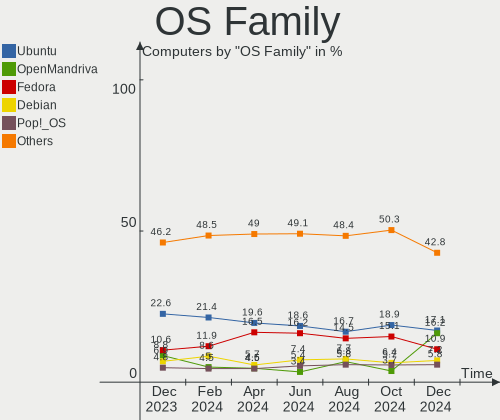

| Name         | Computers | Percent |
|--------------|-----------|---------|
| Ubuntu       | 249       | 20.66%  |
| Fedora       | 128       | 10.62%  |
| Linux Mint   | 113       | 9.38%   |
| Debian       | 93        | 7.72%   |
| Zorin        | 69        | 5.73%   |
| Pop!_OS      | 63        | 5.23%   |
| OpenMandriva | 53        | 4.4%    |
| Arch         | 51        | 4.23%   |
| Kubuntu      | 41        | 3.4%    |
| ArcoLinux    | 36        | 2.99%   |
| SteamOS      | 31        | 2.57%   |
| Manjaro      | 24        | 1.99%   |
| Nobara       | 21        | 1.74%   |
| KDE neon     | 21        | 1.74%   |
| openSUSE     | 20        | 1.66%   |
| Kali         | 17        | 1.41%   |
| EndeavourOS  | 16        | 1.33%   |
| NixOS        | 15        | 1.24%   |
| Xubuntu      | 14        | 1.16%   |
| LMDE         | 13        | 1.08%   |
| Gentoo       | 11        | 0.91%   |
| ChimeraOS    | 9         | 0.75%   |
| Xero         | 8         | 0.66%   |
| Ubuntu MATE  | 8         | 0.66%   |
| Parrot       | 8         | 0.66%   |
| MX           | 7         | 0.58%   |
| Lubuntu      | 6         | 0.5%    |
| Garuda Linux | 6         | 0.5%    |
| Elementary   | 5         | 0.41%   |
| Rocky Linux  | 4         | 0.33%   |
| RHEL         | 4         | 0.33%   |
| Q4OS         | 3         | 0.25%   |
| Clear Linux  | 3         | 0.25%   |
| Alpine       | 3         | 0.25%   |
| AlmaLinux    | 3         | 0.25%   |
| Ultramarine  | 2         | 0.17%   |
| Ubuntu Unity | 2         | 0.17%   |
| TUXEDO OS    | 2         | 0.17%   |
| Redcore      | 2         | 0.17%   |
| Linux Lite   | 2         | 0.17%   |

Kernel
------

Version of the Linux kernel

| Version                     | Computers | Percent |
|-----------------------------|-----------|---------|
| 6.5.0-14-generic            | 158       | 13.11%  |
| 5.15.0-91-generic           | 110       | 9.13%   |
| 6.2.0-39-generic            | 94        | 7.8%    |
| 6.1.0-17-amd64              | 63        | 5.23%   |
| 6.6.6-76060606-generic      | 45        | 3.73%   |
| 6.6.9-200.fc39.x86_64       | 39        | 3.24%   |
| 6.5.0-15-generic            | 32        | 2.66%   |
| 6.6.2-desktop-1omv2390      | 28        | 2.32%   |
| 5.15.0-92-generic           | 25        | 2.07%   |
| 6.1.52-valve9-1-neptune-61  | 23        | 1.91%   |
| 6.6.11-200.fc39.x86_64      | 18        | 1.49%   |
| 6.4.11-desktop-1omv2390     | 17        | 1.41%   |
| 6.5.0-kali3-amd64           | 16        | 1.33%   |
| 6.6.13-200.fc39.x86_64      | 15        | 1.24%   |
| 6.6.8-arch1-1               | 14        | 1.16%   |
| 6.6.10-arch1-1              | 14        | 1.16%   |
| 5.4.0-169-generic           | 13        | 1.08%   |
| 5.15.0-76-generic           | 12        | 1%      |
| 6.6.8-200.fc39.x86_64       | 11        | 0.91%   |
| 6.5.6-300.fc39.x86_64       | 11        | 0.91%   |
| 6.7.0-arch3-1               | 10        | 0.83%   |
| 6.6.12-200.fc39.x86_64      | 10        | 0.83%   |
| 6.6.9-arch1-1               | 9         | 0.75%   |
| 6.6.10-76060610-generic     | 9         | 0.75%   |
| 6.5.6-chos1-chimeraos-1     | 9         | 0.75%   |
| 6.7.2-arch1-1               | 8         | 0.66%   |
| 6.7.1-arch1-1               | 8         | 0.66%   |
| 6.7.0-zen3-1-zen            | 8         | 0.66%   |
| 6.6.9-zen1-1-zen            | 8         | 0.66%   |
| 6.6.8-2-MANJARO             | 8         | 0.66%   |
| 6.6.10-zen1-1-zen           | 7         | 0.58%   |
| 6.6.1-arch1-1               | 7         | 0.58%   |
| 6.2.0-26-generic            | 7         | 0.58%   |
| 6.1.0-13-amd64              | 7         | 0.58%   |
| 6.7.0-204.fsync.fc39.x86_64 | 6         | 0.5%    |
| 6.6.9-200.fsync.fc39.x86_64 | 6         | 0.5%    |
| 6.6.10-1-MANJARO            | 6         | 0.5%    |
| 6.1.0-16-amd64              | 6         | 0.5%    |
| 6.6.9-100.fc38.x86_64       | 5         | 0.41%   |
| 6.6.8-zen1-1-zen            | 5         | 0.41%   |

Kernel Family
-------------

Linux kernel without a distro release

| Version | Computers | Percent |
|---------|-----------|---------|
| 6.5.0   | 233       | 19.34%  |
| 5.15.0  | 170       | 14.11%  |
| 6.2.0   | 107       | 8.88%   |
| 6.1.0   | 92        | 7.63%   |
| 6.6.9   | 72        | 5.98%   |
| 6.6.8   | 52        | 4.32%   |
| 6.6.6   | 48        | 3.98%   |
| 6.6.10  | 42        | 3.49%   |
| 6.7.0   | 41        | 3.4%    |
| 6.6.2   | 30        | 2.49%   |
| 6.6.11  | 29        | 2.41%   |
| 6.1.52  | 27        | 2.24%   |
| 6.5.6   | 22        | 1.83%   |
| 6.6.13  | 20        | 1.66%   |
| 5.4.0   | 20        | 1.66%   |
| 6.7.1   | 18        | 1.49%   |
| 6.6.12  | 17        | 1.41%   |
| 6.4.11  | 17        | 1.41%   |
| 6.7.2   | 11        | 0.91%   |
| 6.6.7   | 11        | 0.91%   |
| 5.10.0  | 11        | 0.91%   |
| 6.6.1   | 8         | 0.66%   |
| 5.14.0  | 7         | 0.58%   |
| 6.5.11  | 6         | 0.5%    |
| 6.1.69  | 6         | 0.5%    |
| 5.19.0  | 6         | 0.5%    |
| 6.6.4   | 5         | 0.41%   |
| 6.6.0   | 5         | 0.41%   |
| 5.14.21 | 5         | 0.41%   |
| 4.18.0  | 5         | 0.41%   |
| 4.15.0  | 4         | 0.33%   |
| 6.6.3   | 3         | 0.25%   |
| 6.5.13  | 3         | 0.25%   |
| 6.4.6   | 3         | 0.25%   |
| 6.3.7   | 3         | 0.25%   |
| 6.2.16  | 3         | 0.25%   |
| 6.1.67  | 3         | 0.25%   |
| 6.6.14  | 2         | 0.17%   |
| 6.5.5   | 2         | 0.17%   |
| 6.2.6   | 2         | 0.17%   |

Kernel Major Ver.
-----------------

Linux kernel major version

| Version | Computers | Percent |
|---------|-----------|---------|
| 6.6     | 344       | 28.55%  |
| 6.5     | 270       | 22.41%  |
| 5.15    | 173       | 14.36%  |
| 6.1     | 135       | 11.2%   |
| 6.2     | 114       | 9.46%   |
| 6.7     | 70        | 5.81%   |
| 6.4     | 23        | 1.91%   |
| 5.4     | 20        | 1.66%   |
| 5.14    | 12        | 1%      |
| 5.10    | 11        | 0.91%   |
| 6.3     | 6         | 0.5%    |
| 5.19    | 6         | 0.5%    |
| 4.18    | 5         | 0.41%   |
| 4.15    | 4         | 0.33%   |
| 6.0     | 3         | 0.25%   |
| 5.16    | 2         | 0.17%   |
| 5.13    | 2         | 0.17%   |
| 6.8     | 1         | 0.08%   |
| 5.18    | 1         | 0.08%   |
| 5.17    | 1         | 0.08%   |
| 4.9     | 1         | 0.08%   |
| 4.4     | 1         | 0.08%   |

Arch
----

OS architecture (x86_64, i586, etc.)

| Name    | Computers | Percent |
|---------|-----------|---------|
| x86_64  | 1186      | 98.42%  |
| aarch64 | 13        | 1.08%   |
| i686    | 5         | 0.41%   |
| ppc     | 1         | 0.08%   |

DE
--

Desktop Environment

| Name            | Computers | Percent |
|-----------------|-----------|---------|
| GNOME           | 522       | 43.32%  |
| KDE5            | 308       | 25.56%  |
| X-Cinnamon      | 103       | 8.55%   |
| XFCE            | 79        | 6.56%   |
| Unknown         | 78        | 6.47%   |
| MATE            | 36        | 2.99%   |
| LXQt            | 17        | 1.41%   |
| i3              | 8         | 0.66%   |
| Cinnamon        | 8         | 0.66%   |
| Budgie          | 7         | 0.58%   |
| Pantheon        | 5         | 0.41%   |
| LXDE            | 5         | 0.41%   |
| Hyprland        | 5         | 0.41%   |
| Deepin          | 4         | 0.33%   |
| Trinity         | 3         | 0.25%   |
| Unity           | 2         | 0.17%   |
| sway            | 2         | 0.17%   |
| KDE6            | 2         | 0.17%   |
| GNOME Flashback | 2         | 0.17%   |
| wayfire         | 1         | 0.08%   |
| sway:GNOME      | 1         | 0.08%   |
| Openbox         | 1         | 0.08%   |
| KDE             | 1         | 0.08%   |
| GNOME Classic   | 1         | 0.08%   |
| Enlightenment   | 1         | 0.08%   |
| Endless:GNOME   | 1         | 0.08%   |
| dwm             | 1         | 0.08%   |
| awesome         | 1         | 0.08%   |

Display Server
--------------

X11 or Wayland

| Name    | Computers | Percent |
|---------|-----------|---------|
| X11     | 617       | 51.2%   |
| Wayland | 490       | 40.66%  |
| Unknown | 56        | 4.65%   |
| Tty     | 42        | 3.49%   |

Display Manager
---------------

SDDM, LightDM, etc.

| Name    | Computers | Percent |
|---------|-----------|---------|
| Unknown | 548       | 45.48%  |
| GDM3    | 243       | 20.17%  |
| SDDM    | 203       | 16.85%  |
| LightDM | 159       | 13.2%   |
| GDM     | 46        | 3.82%   |
| TDM     | 3         | 0.25%   |
| XDM     | 1         | 0.08%   |
| Ly      | 1         | 0.08%   |
| GREETD  | 1         | 0.08%   |

OS Lang
-------

Language

| Lang    | Computers | Percent |
|---------|-----------|---------|
| en_US   | 1103      | 91.54%  |
| C       | 42        | 3.49%   |
| Unknown | 28        | 2.32%   |
| en_GB   | 8         | 0.66%   |
| en_CA   | 5         | 0.41%   |
| ru_RU   | 3         | 0.25%   |
| it_IT   | 3         | 0.25%   |
| C.UTF8  | 3         | 0.25%   |
| POSIX   | 2         | 0.17%   |
| zh_CN   | 1         | 0.08%   |
| us      | 1         | 0.08%   |
| pl_PL   | 1         | 0.08%   |
| fr_CA   | 1         | 0.08%   |
| es_MX   | 1         | 0.08%   |
| en_IN   | 1         | 0.08%   |
| en_IE   | 1         | 0.08%   |
| aa_DJ   | 1         | 0.08%   |

Boot Mode
---------

EFI or BIOS

| Mode | Computers | Percent |
|------|-----------|---------|
| EFI  | 637       | 52.86%  |
| BIOS | 568       | 47.14%  |

Filesystem
----------

Type of filesystem

| Type    | Computers | Percent |
|---------|-----------|---------|
| Ext4    | 648       | 53.78%  |
| Btrfs   | 271       | 22.49%  |
| Tmpfs   | 185       | 15.35%  |
| Overlay | 57        | 4.73%   |
| Xfs     | 23        | 1.91%   |
| Zfs     | 12        | 1%      |
| Ext3    | 6         | 0.5%    |
| Jfs     | 1         | 0.08%   |
| F2fs    | 1         | 0.08%   |
| Unknown | 1         | 0.08%   |

Part. scheme
------------

Scheme of partitioning

| Type    | Computers | Percent |
|---------|-----------|---------|
| GPT     | 653       | 54.19%  |
| Unknown | 474       | 39.34%  |
| MBR     | 78        | 6.47%   |

Dual Boot with Linux/BSD
------------------------

Hosting more than one Linux/BSD

| Dual boot | Computers | Percent |
|-----------|-----------|---------|
| No        | 1060      | 87.97%  |
| Yes       | 145       | 12.03%  |

Dual Boot (Win)
---------------

Hosting Linux and Windows

| Dual boot | Computers | Percent |
|-----------|-----------|---------|
| No        | 990       | 82.16%  |
| Yes       | 215       | 17.84%  |

Board
-----

Vendor
------

Motherboard manufacturer

| Name                                 | Computers | Percent |
|--------------------------------------|-----------|---------|
| Dell                                 | 216       | 17.93%  |
| Hewlett-Packard                      | 181       | 15.02%  |
| ASUSTek Computer                     | 162       | 13.44%  |
| Lenovo                               | 148       | 12.28%  |
| MSI                                  | 85        | 7.05%   |
| Apple                                | 63        | 5.23%   |
| Gigabyte Technology                  | 58        | 4.81%   |
| ASRock                               | 40        | 3.32%   |
| Valve                                | 27        | 2.24%   |
| Acer                                 | 27        | 2.24%   |
| Intel                                | 17        | 1.41%   |
| Google                               | 17        | 1.41%   |
| Microsoft                            | 15        | 1.24%   |
| Toshiba                              | 10        | 0.83%   |
| Unknown                              | 10        | 0.83%   |
| Supermicro                           | 9         | 0.75%   |
| Raspberry Pi Foundation              | 9         | 0.75%   |
| AZW                                  | 9         | 0.75%   |
| System76                             | 6         | 0.5%    |
| Gateway                              | 6         | 0.5%    |
| Foxconn                              | 6         | 0.5%    |
| Samsung Electronics                  | 5         | 0.41%   |
| Pegatron                             | 5         | 0.41%   |
| Framework                            | 5         | 0.41%   |
| Alienware                            | 5         | 0.41%   |
| MOMENTPLUS                           | 4         | 0.33%   |
| Sony                                 | 3         | 0.25%   |
| Shenzhen Meigao Electronic Equipment | 3         | 0.25%   |
| Razer                                | 3         | 0.25%   |
| BESSTAR Tech                         | 3         | 0.25%   |
| TUXEDO                               | 2         | 0.17%   |
| OriginPC                             | 2         | 0.17%   |
| GPU Company                          | 2         | 0.17%   |
| ECS                                  | 2         | 0.17%   |
| Biostar                              | 2         | 0.17%   |
| Timi                                 | 1         | 0.08%   |
| Star Labs                            | 1         | 0.08%   |
| SJS                                  | 1         | 0.08%   |
| Rockchip                             | 1         | 0.08%   |
| PIPO                                 | 1         | 0.08%   |

Model
-----

Motherboard model

| Name                                      | Computers | Percent |
|-------------------------------------------|-----------|---------|
| Valve Jupiter                             | 20        | 1.66%   |
| Unknown                                   | 11        | 0.91%   |
| ASUS All Series                           | 9         | 0.75%   |
| Valve Galileo                             | 7         | 0.58%   |
| Dell Latitude 7490                        | 7         | 0.58%   |
| Dell OptiPlex 9020                        | 6         | 0.5%    |
| ASUS TUF Gaming X570-PLUS                 | 6         | 0.5%    |
| Apple MacBookAir7,2                       | 6         | 0.5%    |
| MSI MS-7C91                               | 5         | 0.41%   |
| AZW SER                                   | 5         | 0.41%   |
| Apple MacBookPro9,2                       | 5         | 0.41%   |
| Supermicro AS -2124BT-HTR                 | 4         | 0.33%   |
| MSI MS-7C95                               | 4         | 0.33%   |
| Dell OptiPlex 9010                        | 4         | 0.33%   |
| ASUS SABERTOOTH 990FX R2.0                | 4         | 0.33%   |
| ASUS PRIME B550-PLUS                      | 4         | 0.33%   |
| Apple Macmini7,1                          | 4         | 0.33%   |
| Apple MacBookPro14,1                      | 4         | 0.33%   |
| Apple MacBookAir6,2                       | 4         | 0.33%   |
| RPi Raspberry Pi 5 Model B Rev 1.0        | 3         | 0.25%   |
| RPi Raspberry Pi 4 Model B Rev 1.5        | 3         | 0.25%   |
| MSI MS-7E12                               | 3         | 0.25%   |
| MSI MS-7D67                               | 3         | 0.25%   |
| MSI MS-7C37                               | 3         | 0.25%   |
| MSI MS-7B86                               | 3         | 0.25%   |
| MOMENTPLUS MP90                           | 3         | 0.25%   |
| Lenovo ThinkPad L13 Yoga Gen 2 20VK0019US | 3         | 0.25%   |
| Intel Jasper Lake Client Platform         | 3         | 0.25%   |
| HP Pavilion dv6                           | 3         | 0.25%   |
| HP Notebook                               | 3         | 0.25%   |
| HP Laptop 15-dy2xxx                       | 3         | 0.25%   |
| HP ENVY x360 2-in-1 Laptop 15-fh0xxx      | 3         | 0.25%   |
| HP 15 Notebook PC                         | 3         | 0.25%   |
| HP 15                                     | 3         | 0.25%   |
| Google Garg                               | 3         | 0.25%   |
| Dell Precision T1700                      | 3         | 0.25%   |
| Dell Latitude E7450                       | 3         | 0.25%   |
| Dell Latitude E6420                       | 3         | 0.25%   |
| Dell Latitude E5530 non-vPro              | 3         | 0.25%   |
| Dell Inspiron 3650                        | 3         | 0.25%   |

Model Family
------------

Motherboard model prefix

| Name               | Computers | Percent |
|--------------------|-----------|---------|
| Lenovo ThinkPad    | 81        | 6.72%   |
| Dell Inspiron      | 62        | 5.15%   |
| Dell Latitude      | 58        | 4.81%   |
| ASUS ROG           | 41        | 3.4%    |
| Dell OptiPlex      | 29        | 2.41%   |
| HP Laptop          | 28        | 2.32%   |
| Dell Precision     | 28        | 2.32%   |
| HP Pavilion        | 27        | 2.24%   |
| ASUS PRIME         | 23        | 1.91%   |
| Acer Aspire        | 23        | 1.91%   |
| Valve Jupiter      | 20        | 1.66%   |
| Lenovo IdeaPad     | 19        | 1.58%   |
| ASUS TUF           | 19        | 1.58%   |
| HP ENVY            | 17        | 1.41%   |
| Dell XPS           | 17        | 1.41%   |
| Lenovo ThinkCentre | 16        | 1.33%   |
| HP EliteBook       | 16        | 1.33%   |
| Microsoft Surface  | 15        | 1.24%   |
| Dell PowerEdge     | 13        | 1.08%   |
| HP ProBook         | 12        | 1%      |
| Lenovo Yoga        | 11        | 0.91%   |
| Unknown            | 11        | 0.91%   |
| Toshiba Satellite  | 10        | 0.83%   |
| HP Spectre         | 10        | 0.83%   |
| RPi Raspberry      | 9         | 0.75%   |
| ASUS All           | 9         | 0.75%   |
| HP OMEN            | 8         | 0.66%   |
| HP EliteDesk       | 8         | 0.66%   |
| ASUS VivoBook      | 8         | 0.66%   |
| Valve Galileo      | 7         | 0.58%   |
| HP Compaq          | 7         | 0.58%   |
| ASUS SABERTOOTH    | 7         | 0.58%   |
| HP 15              | 6         | 0.5%    |
| ASUS ZenBook       | 6         | 0.5%    |
| Apple MacBookPro9  | 6         | 0.5%    |
| Apple MacBookAir7  | 6         | 0.5%    |
| MSI MS-7C91        | 5         | 0.41%   |
| Lenovo Legion      | 5         | 0.41%   |
| Gigabyte B550      | 5         | 0.41%   |
| Framework Laptop   | 5         | 0.41%   |

MFG Year
--------

Motherboard manufacture year

| Year    | Computers | Percent |
|---------|-----------|---------|
| 2022    | 134       | 11.12%  |
| 2023    | 130       | 10.79%  |
| 2020    | 110       | 9.13%   |
| 2021    | 102       | 8.46%   |
| 2018    | 95        | 7.88%   |
| 2019    | 94        | 7.8%    |
| 2012    | 83        | 6.89%   |
| 2015    | 66        | 5.48%   |
| 2017    | 63        | 5.23%   |
| 2013    | 60        | 4.98%   |
| 2014    | 58        | 4.81%   |
| 2016    | 56        | 4.65%   |
| 2011    | 37        | 3.07%   |
| 2010    | 30        | 2.49%   |
| 2009    | 24        | 1.99%   |
| 2008    | 24        | 1.99%   |
| 2007    | 18        | 1.49%   |
| Unknown | 14        | 1.16%   |
| 2006    | 4         | 0.33%   |
| 2005    | 3         | 0.25%   |

Form Factor
-----------

Physical design of the computer

| Name           | Computers | Percent |
|----------------|-----------|---------|
| Notebook       | 556       | 46.14%  |
| Desktop        | 486       | 40.33%  |
| Convertible    | 57        | 4.73%   |
| Mini pc        | 31        | 2.57%   |
| Tablet         | 24        | 1.99%   |
| Server         | 24        | 1.99%   |
| All in one     | 16        | 1.33%   |
| System on chip | 11        | 0.91%   |

Secure Boot
-----------

Enabled or disabled

| State    | Computers | Percent |
|----------|-----------|---------|
| Disabled | 1124      | 93.28%  |
| Enabled  | 81        | 6.72%   |

Coreboot
--------

Have coreboot on board

| Used | Computers | Percent |
|------|-----------|---------|
| No   | 1187      | 98.51%  |
| Yes  | 18        | 1.49%   |

RAM Size
--------

Total RAM memory

| Size in GB      | Computers | Percent |
|-----------------|-----------|---------|
| 4.01-8.0        | 247       | 20.5%   |
| 16.01-24.0      | 247       | 20.5%   |
| 32.01-64.0      | 224       | 18.59%  |
| 8.01-16.0       | 202       | 16.76%  |
| 3.01-4.0        | 114       | 9.46%   |
| 64.01-256.0     | 103       | 8.55%   |
| 24.01-32.0      | 39        | 3.24%   |
| More than 256.0 | 12        | 1%      |
| 1.01-2.0        | 8         | 0.66%   |
| 2.01-3.0        | 7         | 0.58%   |
| 0.01-0.5        | 2         | 0.17%   |

RAM Used
--------

Used RAM memory

| Used GB     | Computers | Percent |
|-------------|-----------|---------|
| 4.01-8.0    | 291       | 24.15%  |
| 2.01-3.0    | 291       | 24.15%  |
| 1.01-2.0    | 265       | 21.99%  |
| 3.01-4.0    | 192       | 15.93%  |
| 8.01-16.0   | 82        | 6.8%    |
| 0.51-1.0    | 38        | 3.15%   |
| 16.01-24.0  | 18        | 1.49%   |
| 64.01-256.0 | 9         | 0.75%   |
| 0.01-0.5    | 8         | 0.66%   |
| 32.01-64.0  | 7         | 0.58%   |
| 24.01-32.0  | 4         | 0.33%   |

Total Drives
------------

Number of drives on board

| Drives | Computers | Percent |
|--------|-----------|---------|
| 1      | 722       | 59.92%  |
| 2      | 273       | 22.66%  |
| 3      | 103       | 8.55%   |
| 4      | 41        | 3.4%    |
| 5      | 33        | 2.74%   |
| 6      | 13        | 1.08%   |
| 7      | 7         | 0.58%   |
| 0      | 4         | 0.33%   |
| 11     | 2         | 0.17%   |
| 8      | 2         | 0.17%   |
| 33     | 1         | 0.08%   |
| 21     | 1         | 0.08%   |
| 13     | 1         | 0.08%   |
| 10     | 1         | 0.08%   |
| 9      | 1         | 0.08%   |

Has CD-ROM
----------

Has CD-ROM on board

| Presented | Computers | Percent |
|-----------|-----------|---------|
| No        | 843       | 69.96%  |
| Yes       | 362       | 30.04%  |

Has Ethernet
------------

Has Ethernet on board

| Presented | Computers | Percent |
|-----------|-----------|---------|
| Yes       | 971       | 80.58%  |
| No        | 234       | 19.42%  |

Has WiFi
--------

Has WiFi module

| Presented | Computers | Percent |
|-----------|-----------|---------|
| Yes       | 995       | 82.57%  |
| No        | 210       | 17.43%  |

Has Bluetooth
-------------

Has Bluetooth module

| Presented | Computers | Percent |
|-----------|-----------|---------|
| Yes       | 837       | 69.46%  |
| No        | 368       | 30.54%  |

Location
--------

Country
-------

Geographic location (country)

| Country | Computers | Percent |
|---------|-----------|---------|
| USA     | 1205      | 100%    |

City
----

Geographic location (city)

| City           | Computers | Percent |
|----------------|-----------|---------|
| Los Angeles    | 21        | 1.74%   |
| Denver         | 19        | 1.58%   |
| New York       | 17        | 1.41%   |
| Seattle        | 14        | 1.16%   |
| Dallas         | 14        | 1.16%   |
| Portland       | 13        | 1.08%   |
| Minneapolis    | 13        | 1.08%   |
| Bangor         | 12        | 1%      |
| Jacksonville   | 11        | 0.91%   |
| Chicago        | 11        | 0.91%   |
| Phoenix        | 10        | 0.83%   |
| Atlanta        | 10        | 0.83%   |
| Wilmington     | 9         | 0.75%   |
| St Louis       | 9         | 0.75%   |
| Raleigh        | 9         | 0.75%   |
| Kansas City    | 9         | 0.75%   |
| Tucson         | 8         | 0.66%   |
| Miami          | 8         | 0.66%   |
| Louisville     | 8         | 0.66%   |
| Columbus       | 8         | 0.66%   |
| Charlotte      | 8         | 0.66%   |
| Austin         | 8         | 0.66%   |
| Salt Lake City | 7         | 0.58%   |
| Rochester      | 7         | 0.58%   |
| San Jose       | 6         | 0.5%    |
| San Antonio    | 6         | 0.5%    |
| Philadelphia   | 6         | 0.5%    |
| New Orleans    | 6         | 0.5%    |
| Las Vegas      | 6         | 0.5%    |
| Lansing        | 6         | 0.5%    |
| San Diego      | 5         | 0.41%   |
| Richmond       | 5         | 0.41%   |
| Pittsburgh     | 5         | 0.41%   |
| Mesa           | 5         | 0.41%   |
| Kalamazoo      | 5         | 0.41%   |
| Indianapolis   | 5         | 0.41%   |
| Harrisonburg   | 5         | 0.41%   |
| Flushing       | 5         | 0.41%   |
| Boston         | 5         | 0.41%   |
| Albany         | 5         | 0.41%   |

Drives
------

Drive Vendor
------------

Hard drive vendors

| Vendor                      | Computers | Drives | Percent |
|-----------------------------|-----------|--------|---------|
| Samsung Electronics         | 306       | 400    | 17.26%  |
| WDC                         | 216       | 298    | 12.18%  |
| Seagate                     | 180       | 267    | 10.15%  |
| SanDisk                     | 160       | 182    | 9.02%   |
| Unknown                     | 95        | 108    | 5.36%   |
| Toshiba                     | 79        | 85     | 4.46%   |
| SK hynix                    | 63        | 65     | 3.55%   |
| Intel                       | 45        | 59     | 2.54%   |
| Crucial                     | 45        | 49     | 2.54%   |
| Phison Electronics          | 44        | 46     | 2.48%   |
| Micron Technology           | 41        | 42     | 2.31%   |
| Kingston                    | 40        | 42     | 2.26%   |
| Hitachi                     | 38        | 42     | 2.14%   |
| Apple                       | 33        | 42     | 1.86%   |
| Micron/Crucial Technology   | 32        | 32     | 1.8%    |
| PNY                         | 26        | 26     | 1.47%   |
| KIOXIA                      | 24        | 24     | 1.35%   |
| Kingston Technology Company | 20        | 21     | 1.13%   |
| SPCC                        | 19        | 19     | 1.07%   |
| China                       | 19        | 26     | 1.07%   |
| Unknown                     | 19        | 20     | 1.07%   |
| HGST                        | 18        | 26     | 1.02%   |
| Team                        | 12        | 16     | 0.68%   |
| MAXIO Technology (Hangzhou) | 11        | 11     | 0.62%   |
| A-DATA Technology           | 10        | 11     | 0.56%   |
| Realtek Semiconductor       | 9         | 9      | 0.51%   |
| Silicon Motion              | 7         | 7      | 0.39%   |
| Phison                      | 7         | 9      | 0.39%   |
| SABRENT                     | 6         | 6      | 0.34%   |
| LITEON                      | 6         | 6      | 0.34%   |
| KingFast                    | 6         | 6      | 0.34%   |
| Hewlett-Packard             | 6         | 7      | 0.34%   |
| T-FORCE                     | 5         | 5      | 0.28%   |
| OCZ                         | 5         | 5      | 0.28%   |
| O2 Micro                    | 5         | 5      | 0.28%   |
| ADATA Technology            | 5         | 5      | 0.28%   |
| Fujitsu                     | 4         | 9      | 0.23%   |
| FIKWOT                      | 4         | 4      | 0.23%   |
| Fanxiang                    | 4         | 5      | 0.23%   |
| USB3.0                      | 3         | 3      | 0.17%   |

Drive Model
-----------

Hard drive models

| Model                                               | Computers | Percent |
|-----------------------------------------------------|-----------|---------|
| Samsung NVMe SSD Controller SM981/PM981/PM983 1TB   | 60        | 3.03%   |
| Samsung NVMe SSD Controller PM9A1/PM9A3/980PRO 2TB  | 38        | 1.92%   |
| Unknown                                             | 19        | 0.96%   |
| Micron/Crucial P2 NVMe PCIe SSD 1TB                 | 16        | 0.81%   |
| Unknown MMC Card  32GB                              | 15        | 0.76%   |
| Seagate ST2000DM008-2FR102 2TB                      | 15        | 0.76%   |
| Samsung SSD 870 EVO 1TB                             | 15        | 0.76%   |
| Sandisk WD_BLACK SN770 1TB                          | 14        | 0.71%   |
| Samsung SSD 860 EVO 500GB                           | 14        | 0.71%   |
| Unknown MMC Card  64GB                              | 13        | 0.66%   |
| Samsung SSD 850 EVO 250GB                           | 13        | 0.66%   |
| Phison E12 NVMe Controller 1TB                      | 13        | 0.66%   |
| WDC WD10EZEX-08WN4A0 1TB                            | 12        | 0.61%   |
| Toshiba MQ01ABD100 1TB                              | 11        | 0.55%   |
| Seagate ST1000LM035-1RK172 1TB                      | 11        | 0.55%   |
| Samsung SSD 980 PRO 2TB                             | 11        | 0.55%   |
| Samsung NVMe SSD Controller SM961/PM961/SM963 256GB | 11        | 0.55%   |
| Toshiba DT01ACA100 1TB                              | 10        | 0.5%    |
| Samsung SSD 850 EVO 500GB                           | 10        | 0.5%    |
| Crucial CT1000MX500SSD1 1TB                         | 10        | 0.5%    |
| Unknown SD/MMC/MS PRO 256GB                         | 9         | 0.45%   |
| Sandisk WD Blue SN550 NVMe SSD 512GB                | 9         | 0.45%   |
| Samsung SSD 980 1TB                                 | 9         | 0.45%   |
| Samsung SSD 860 EVO 1TB                             | 9         | 0.45%   |
| Phison E16 PCIe4 NVMe Controller 2TB                | 9         | 0.45%   |
| WDC WDBNCE5000PNC 500GB SSD                         | 8         | 0.4%    |
| Unknown MMC Card  256GB                             | 8         | 0.4%    |
| Unknown MMC Card  128GB                             | 8         | 0.4%    |
| SanDisk NVMe SSD Drive 1TB                          | 8         | 0.4%    |
| Phison PS5013 E13 NVMe Controller 256GB             | 8         | 0.4%    |
| Kingston Company OM3PDP3 NVMe SSD 256GB             | 8         | 0.4%    |
| WDC WDS500G2B0A-00SM50 500GB SSD                    | 7         | 0.35%   |
| WDC WD1003FZEX-00MK2A0 1TB                          | 7         | 0.35%   |
| Toshiba XG6 NVMe SSD Controller 256GB               | 7         | 0.35%   |
| SK hynix BC501 NVMe Solid State Drive 512GB         | 7         | 0.35%   |
| Seagate ST2000DM006-2DM164 2TB                      | 7         | 0.35%   |
| SanDisk SSD PLUS 1000GB                             | 7         | 0.35%   |
| Samsung SSD 870 EVO 500GB                           | 7         | 0.35%   |
| Apple SSD SM0128G 121GB                             | 7         | 0.35%   |
| WDC WD10EZEX-60WN4A0 1TB                            | 6         | 0.3%    |

HDD Vendor
----------

Hard disk drive vendors

| Vendor              | Computers | Drives | Percent |
|---------------------|-----------|--------|---------|
| Seagate             | 171       | 251    | 34.76%  |
| WDC                 | 168       | 240    | 34.15%  |
| Toshiba             | 58        | 63     | 11.79%  |
| Hitachi             | 38        | 42     | 7.72%   |
| HGST                | 18        | 26     | 3.66%   |
| Unknown             | 9         | 9      | 1.83%   |
| Apple               | 8         | 8      | 1.63%   |
| Samsung Electronics | 5         | 5      | 1.02%   |
| Fujitsu             | 4         | 9      | 0.81%   |
| Maxtor              | 3         | 3      | 0.61%   |
| MARSHAL             | 2         | 2      | 0.41%   |
| USB3.0              | 1         | 1      | 0.2%    |
| SSK                 | 1         | 2      | 0.2%    |
| MaxDigital          | 1         | 1      | 0.2%    |
| LaCie               | 1         | 1      | 0.2%    |
| Inateck             | 1         | 1      | 0.2%    |
| HPE                 | 1         | 1      | 0.2%    |
| ASMT                | 1         | 2      | 0.2%    |
| Asm                 | 1         | 1      | 0.2%    |

SSD Vendor
----------

Solid state drive vendors

| Vendor              | Computers | Drives | Percent |
|---------------------|-----------|--------|---------|
| Samsung Electronics | 143       | 173    | 27.24%  |
| SanDisk             | 51        | 55     | 9.71%   |
| WDC                 | 41        | 42     | 7.81%   |
| Crucial             | 37        | 38     | 7.05%   |
| Kingston            | 29        | 29     | 5.52%   |
| PNY                 | 26        | 26     | 4.95%   |
| China               | 19        | 26     | 3.62%   |
| SK hynix            | 18        | 19     | 3.43%   |
| Apple               | 18        | 18     | 3.43%   |
| SPCC                | 15        | 15     | 2.86%   |
| Micron Technology   | 11        | 12     | 2.1%    |
| Intel               | 10        | 12     | 1.9%    |
| Team                | 9         | 12     | 1.71%   |
| A-DATA Technology   | 8         | 9      | 1.52%   |
| LITEON              | 6         | 6      | 1.14%   |
| SABRENT             | 5         | 5      | 0.95%   |
| OCZ                 | 5         | 5      | 0.95%   |
| Toshiba             | 4         | 4      | 0.76%   |
| KingFast            | 4         | 4      | 0.76%   |
| Hewlett-Packard     | 4         | 4      | 0.76%   |
| FIKWOT              | 4         | 4      | 0.76%   |
| Seagate             | 3         | 4      | 0.57%   |
| Patriot             | 3         | 3      | 0.57%   |
| Netac               | 3         | 3      | 0.57%   |
| Lexar               | 3         | 3      | 0.57%   |
| Wibtek              | 2         | 2      | 0.38%   |
| USB3.0              | 2         | 2      | 0.38%   |
| Transcend           | 2         | 2      | 0.38%   |
| Timetec             | 2         | 2      | 0.38%   |
| SSSTC               | 2         | 2      | 0.38%   |
| MSI                 | 2         | 2      | 0.38%   |
| Leven               | 2         | 6      | 0.38%   |
| KLEVV               | 2         | 2      | 0.38%   |
| Fanxiang            | 2         | 3      | 0.38%   |
| BHT                 | 2         | 2      | 0.38%   |
| XrayDisk            | 1         | 1      | 0.19%   |
| T-FORCE             | 1         | 1      | 0.19%   |
| Super Talent        | 1         | 1      | 0.19%   |
| SUNEAST             | 1         | 1      | 0.19%   |
| SCY                 | 1         | 1      | 0.19%   |

Drive Kind
----------

HDD or SSD

| Kind    | Computers | Drives | Percent |
|---------|-----------|--------|---------|
| NVMe    | 604       | 763    | 37.54%  |
| SSD     | 465       | 582    | 28.9%   |
| HDD     | 417       | 668    | 25.92%  |
| MMC     | 87        | 98     | 5.41%   |
| Unknown | 36        | 46     | 2.24%   |

Drive Connector
---------------

SATA, SAS, NVMe, etc.

| Type | Computers | Drives | Percent |
|------|-----------|--------|---------|
| SATA | 715       | 1183   | 47.83%  |
| NVMe | 603       | 757    | 40.33%  |
| SAS  | 90        | 119    | 6.02%   |
| MMC  | 87        | 98     | 5.82%   |

Drive Size
----------

Size of hard drive

| Size in TB | Computers | Drives | Percent |
|------------|-----------|--------|---------|
| 0.01-0.5   | 449       | 540    | 46.63%  |
| 0.51-1.0   | 300       | 368    | 31.15%  |
| 1.01-2.0   | 112       | 150    | 11.63%  |
| 4.01-10.0  | 38        | 73     | 3.95%   |
| 3.01-4.0   | 36        | 60     | 3.74%   |
| 2.01-3.0   | 15        | 18     | 1.56%   |
| 10.01-20.0 | 13        | 41     | 1.35%   |

Space Total
-----------

Amount of disk space available on the file system

| Size in GB     | Computers | Percent |
|----------------|-----------|---------|
| 251-500        | 238       | 19.75%  |
| 101-250        | 225       | 18.67%  |
| 501-1000       | 219       | 18.17%  |
| More than 3000 | 148       | 12.28%  |
| 1001-2000      | 143       | 11.87%  |
| 1-20           | 60        | 4.98%   |
| 51-100         | 53        | 4.4%    |
| Unknown        | 48        | 3.98%   |
| 2001-3000      | 43        | 3.57%   |
| 21-50          | 28        | 2.32%   |

Space Used
----------

Amount of used disk space

| Used GB        | Computers | Percent |
|----------------|-----------|---------|
| 1-20           | 355       | 29.46%  |
| 21-50          | 212       | 17.59%  |
| 101-250        | 177       | 14.69%  |
| 51-100         | 117       | 9.71%   |
| 251-500        | 102       | 8.46%   |
| 501-1000       | 76        | 6.31%   |
| 1001-2000      | 50        | 4.15%   |
| Unknown        | 48        | 3.98%   |
| More than 3000 | 40        | 3.32%   |
| 2001-3000      | 27        | 2.24%   |
| 0              | 1         | 0.08%   |

Malfunc. Drives
---------------

Drive models with a malfunction

| Model                                    | Computers | Drives | Percent |
|------------------------------------------|-----------|--------|---------|
| WDC WD20EARS-00MVWB0 2TB                 | 2         | 2      | 2.82%   |
| WDC WD2002FAEX-007BA0 2TB                | 2         | 2      | 2.82%   |
| Toshiba HDWE150 5TB                      | 2         | 2      | 2.82%   |
| Seagate ST500DM002-1BD142 500GB          | 2         | 2      | 2.82%   |
| Seagate ST2000DM008-2FR102 2TB           | 2         | 2      | 2.82%   |
| Samsung Electronics SSD 870 EVO 1TB      | 2         | 2      | 2.82%   |
| Hitachi HTS723232L9A360 320GB            | 2         | 2      | 2.82%   |
| Hitachi HTS545050B9A300 500GB            | 2         | 2      | 2.82%   |
| Wibtek W800S 512GB SSD                   | 1         | 1      | 1.41%   |
| WDC WD5000LPVX-75V0TT0 500GB             | 1         | 1      | 1.41%   |
| WDC WD5000LPVX-60V0TT0 500GB             | 1         | 1      | 1.41%   |
| WDC WD5000AAVS-00N7B0 500GB              | 1         | 1      | 1.41%   |
| WDC WD5000AADS-00S9B0 500GB              | 1         | 1      | 1.41%   |
| WDC WD40EFAX-68JH4N1 4TB                 | 1         | 4      | 1.41%   |
| WDC WD3200JD-22KLB0 320GB                | 1         | 1      | 1.41%   |
| WDC WD3200BPVT-75ZEST0 320GB             | 1         | 1      | 1.41%   |
| WDC WD2500AAJS-75M0A0 249GB              | 1         | 1      | 1.41%   |
| WDC WD20EFRX-68EUZN0 2TB                 | 1         | 2      | 1.41%   |
| WDC WD15EARS-00Z5B1 1TB                  | 1         | 1      | 1.41%   |
| WDC WD10EARX-32N0YB0 1TB                 | 1         | 1      | 1.41%   |
| WDC WD1003FBYX-01Y7B0 1TB                | 1         | 1      | 1.41%   |
| WDC WD1002FBYS-02A6B0 1TB                | 1         | 1      | 1.41%   |
| WDC WD1001FALS-40U9B0 1TB                | 1         | 1      | 1.41%   |
| Toshiba THNSNK256GVN8 M.2 2280 256GB SSD | 1         | 1      | 1.41%   |
| Toshiba MQ01ABD100 1TB                   | 1         | 1      | 1.41%   |
| Toshiba MQ01ABD050 500GB                 | 1         | 1      | 1.41%   |
| Toshiba MK6475GSX 640GB                  | 1         | 1      | 1.41%   |
| Toshiba MK5056GSYF 500GB                 | 1         | 1      | 1.41%   |
| Toshiba DT01ACA100 1TB                   | 1         | 1      | 1.41%   |
| SK hynix SHGS31-500GS-2 500GB SSD        | 1         | 1      | 1.41%   |
| SK hynix SC210 mSATA 256GB SSD           | 1         | 1      | 1.41%   |
| SK hynix HFS250G32TND-N1A2A 250GB SSD    | 1         | 1      | 1.41%   |
| Seagate ST9500325AS 500GB                | 1         | 1      | 1.41%   |
| Seagate ST9250827AS 250GB                | 1         | 1      | 1.41%   |
| Seagate ST500LT012-9WS142 500GB          | 1         | 1      | 1.41%   |
| Seagate ST4000VN008-2DR166 4TB           | 1         | 1      | 1.41%   |
| Seagate ST380815AS 80GB                  | 1         | 1      | 1.41%   |
| Seagate ST31000528AS 1TB                 | 1         | 1      | 1.41%   |
| Seagate ST3000DM008-2DM166 3TB           | 1         | 1      | 1.41%   |
| Seagate ST2000VN000-1H3164 2TB           | 1         | 2      | 1.41%   |

Malfunc. Drive Vendor
---------------------

Vendors of faulty drives

| Vendor              | Computers | Drives | Percent |
|---------------------|-----------|--------|---------|
| WDC                 | 17        | 22     | 24.64%  |
| Seagate             | 15        | 17     | 21.74%  |
| Hitachi             | 9         | 9      | 13.04%  |
| Toshiba             | 8         | 8      | 11.59%  |
| Samsung Electronics | 8         | 8      | 11.59%  |
| SK hynix            | 3         | 3      | 4.35%   |
| SanDisk             | 2         | 2      | 2.9%    |
| Intel               | 2         | 3      | 2.9%    |
| Wibtek              | 1         | 1      | 1.45%   |
| Kingston            | 1         | 1      | 1.45%   |
| Crucial             | 1         | 1      | 1.45%   |
| ASMT                | 1         | 2      | 1.45%   |
| Apple               | 1         | 1      | 1.45%   |

Malfunc. HDD Vendor
-------------------

Vendors of faulty HDD drives

| Vendor              | Computers | Drives | Percent |
|---------------------|-----------|--------|---------|
| WDC                 | 17        | 22     | 32.69%  |
| Seagate             | 15        | 17     | 28.85%  |
| Hitachi             | 9         | 9      | 17.31%  |
| Toshiba             | 7         | 7      | 13.46%  |
| Samsung Electronics | 2         | 2      | 3.85%   |
| ASMT                | 1         | 2      | 1.92%   |
| Apple               | 1         | 1      | 1.92%   |

Malfunc. Drive Kind
-------------------

Kinds of faulty drives

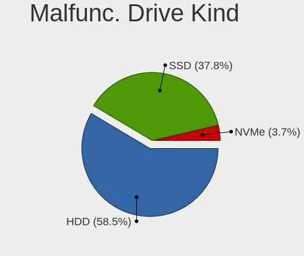

| Kind | Computers | Drives | Percent |
|------|-----------|--------|---------|
| HDD  | 51        | 60     | 75%     |
| SSD  | 16        | 17     | 23.53%  |
| NVMe | 1         | 1      | 1.47%   |

Failed Drives
-------------

Failed drive models

| Model                                 | Computers | Drives | Percent |
|---------------------------------------|-----------|--------|---------|
| Toshiba XG6 NVMe SSD Controller 256GB | 1         | 1      | 25%     |
| Toshiba THNSN5256GPUK NVMe 256GB      | 1         | 1      | 25%     |
| Seagate ST91000430AS 1TB              | 1         | 1      | 25%     |
| HGST HTS721010A9E630 1TB              | 1         | 1      | 25%     |

Failed Drive Vendor
-------------------

Failed drive vendors

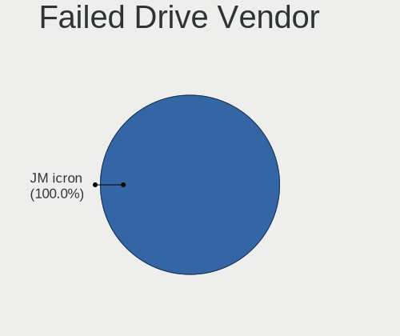

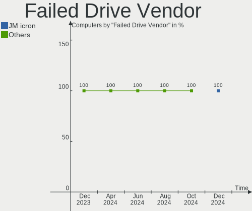

| Vendor  | Computers | Drives | Percent |
|---------|-----------|--------|---------|
| Toshiba | 2         | 2      | 50%     |
| Seagate | 1         | 1      | 25%     |
| HGST    | 1         | 1      | 25%     |

Drive Status
------------

Number of failed and malfunc. drives

| Status   | Computers | Drives | Percent |
|----------|-----------|--------|---------|
| Detected | 746       | 1228   | 57.87%  |
| Works    | 473       | 847    | 36.7%   |
| Malfunc  | 66        | 78     | 5.12%   |
| Failed   | 4         | 4      | 0.31%   |

Storage controller
------------------

Storage Vendor
--------------

Storage controller vendors

| Vendor                               | Computers | Percent |
|--------------------------------------|-----------|---------|
| Intel                                | 657       | 39.08%  |
| AMD                                  | 279       | 16.6%   |
| Samsung Electronics                  | 200       | 11.9%   |
| SanDisk                              | 124       | 7.38%   |
| Phison Electronics                   | 55        | 3.27%   |
| SK hynix                             | 45        | 2.68%   |
| ASMedia Technology                   | 42        | 2.5%    |
| Micron/Crucial Technology            | 39        | 2.32%   |
| Kingston Technology Company          | 31        | 1.84%   |
| Micron Technology                    | 30        | 1.78%   |
| KIOXIA                               | 26        | 1.55%   |
| Toshiba America Info Systems         | 19        | 1.13%   |
| Marvell Technology Group             | 18        | 1.07%   |
| Silicon Motion                       | 15        | 0.89%   |
| Nvidia                               | 13        | 0.77%   |
| Realtek Semiconductor                | 12        | 0.71%   |
| MAXIO Technology (Hangzhou)          | 12        | 0.71%   |
| JMicron Technology                   | 9         | 0.54%   |
| LSI Logic / Symbios Logic            | 8         | 0.48%   |
| Solidigm                             | 7         | 0.42%   |
| Apple                                | 7         | 0.42%   |
| ADATA Technology                     | 7         | 0.42%   |
| O2 Micro                             | 5         | 0.3%    |
| Seagate Technology                   | 3         | 0.18%   |
| Broadcom / LSI                       | 3         | 0.18%   |
| Union Memory (Shenzhen)              | 2         | 0.12%   |
| Hosin Global Electronics             | 2         | 0.12%   |
| Yangtze Memory Technologies          | 1         | 0.06%   |
| Swissbit                             | 1         | 0.06%   |
| Silicon Integrated Systems [SiS]     | 1         | 0.06%   |
| Silicon Image                        | 1         | 0.06%   |
| Shenzhen Longsys Electronics         | 1         | 0.06%   |
| Ramaxel Technology(Shenzhen) Limited | 1         | 0.06%   |
| Nextorage                            | 1         | 0.06%   |
| Lite-On Technology                   | 1         | 0.06%   |
| Lenovo                               | 1         | 0.06%   |
| INNOGRIT                             | 1         | 0.06%   |
| Apacer Technology                    | 1         | 0.06%   |

Storage Model
-------------

Storage controller models

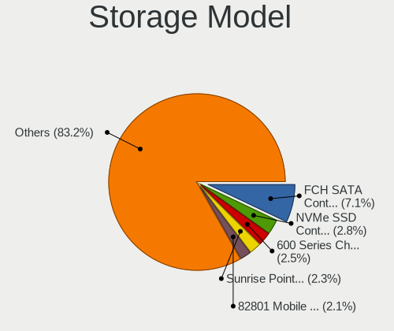

| Model                                                                          | Computers | Percent |
|--------------------------------------------------------------------------------|-----------|---------|
| AMD FCH SATA Controller [AHCI mode]                                            | 161       | 8.68%   |
| Samsung NVMe SSD Controller SM981/PM981/PM983                                  | 72        | 3.88%   |
| Samsung NVMe SSD Controller PM9A1/PM9A3/980PRO                                 | 58        | 3.13%   |
| Intel Sunrise Point-LP SATA Controller [AHCI mode]                             | 47        | 2.54%   |
| AMD 500 Series Chipset SATA Controller                                         | 43        | 2.32%   |
| Intel 82801 Mobile SATA Controller [RAID mode]                                 | 40        | 2.16%   |
| Intel Volume Management Device NVMe RAID Controller                            | 39        | 2.1%    |
| Intel Q170/Q150/B150/H170/H110/Z170/CM236 Chipset SATA Controller [AHCI Mode]  | 39        | 2.1%    |
| Intel 7 Series Chipset Family 6-port SATA Controller [AHCI mode]               | 39        | 2.1%    |
| AMD 600 Series Chipset SATA Controller                                         | 38        | 2.05%   |
| Intel 8 Series/C220 Series Chipset Family 6-port SATA Controller 1 [AHCI mode] | 36        | 1.94%   |
| ASMedia ASM1061/ASM1062 Serial ATA Controller                                  | 36        | 1.94%   |
| SanDisk WD Black SN770 / PC SN740 256GB / PC SN560 (DRAM-less) NVMe SSD        | 34        | 1.83%   |
| Samsung NVMe SSD Controller 980 (DRAM-less)                                    | 30        | 1.62%   |
| Intel SATA Controller [RAID mode]                                              | 30        | 1.62%   |
| AMD 400 Series Chipset SATA Controller                                         | 29        | 1.56%   |
| Intel Alder Lake-S PCH SATA Controller [AHCI Mode]                             | 24        | 1.29%   |
| AMD SB7x0/SB8x0/SB9x0 SATA Controller [AHCI mode]                              | 24        | 1.29%   |
| Micron/Crucial P2 [Nick P2] / P3 / P3 Plus NVMe PCIe SSD (DRAM-less)           | 21        | 1.13%   |
| Intel 8 Series SATA Controller 1 [AHCI mode]                                   | 21        | 1.13%   |
| Intel 7 Series/C210 Series Chipset Family 6-port SATA Controller [AHCI mode]   | 20        | 1.08%   |
| Intel 6 Series/C200 Series Chipset Family 6 port Mobile SATA AHCI Controller   | 20        | 1.08%   |
| Intel 200 Series PCH SATA controller [AHCI mode]                               | 20        | 1.08%   |
| SK hynix Gold P31/BC711/PC711 NVMe Solid State Drive                           | 18        | 0.97%   |
| Sandisk WD Black SN850X NVMe SSD                                               | 17        | 0.92%   |
| Intel Cannon Lake PCH SATA AHCI Controller                                     | 17        | 0.92%   |
| Phison E12 NVMe Controller                                                     | 16        | 0.86%   |
| KIOXIA NVMe SSD Controller BG4 (DRAM-less)                                     | 16        | 0.86%   |
| Intel Volume Management Device NVMe RAID Controller Intel Corporation          | 15        | 0.81%   |
| SanDisk Ultra 3D / WD Blue SN550 NVMe SSD                                      | 14        | 0.76%   |
| Samsung NVMe SSD Controller SM961/PM961/SM963                                  | 14        | 0.76%   |
| Intel Wildcat Point-LP SATA Controller [AHCI Mode]                             | 14        | 0.76%   |
| Intel Raptor Lake SATA AHCI Controller                                         | 14        | 0.76%   |
| AMD SB7x0/SB8x0/SB9x0 IDE Controller                                           | 14        | 0.76%   |
| Silicon Motion SM2263EN/SM2263XT (DRAM-less) NVMe SSD Controllers              | 13        | 0.7%    |
| SanDisk Extreme Pro / WD Black SN750 / PC SN730 / Red SN700 NVMe SSD           | 13        | 0.7%    |
| Intel 6 Series/C200 Series Chipset Family 6 port Desktop SATA AHCI Controller  | 13        | 0.7%    |
| SK hynix Platinum P41/PC801 NVMe Solid State Drive                             | 12        | 0.65%   |
| Phison E16 PCIe4 NVMe Controller                                               | 12        | 0.65%   |
| Intel 5 Series/3400 Series Chipset 6 port SATA AHCI Controller                 | 12        | 0.65%   |

Storage Kind
------------

Kind of storage controller (IDE, SATA, NVMe, SAS, ...)

| Kind | Computers | Percent |
|------|-----------|---------|
| SATA | 812       | 49.79%  |
| NVMe | 604       | 37.03%  |
| RAID | 137       | 8.4%    |
| IDE  | 71        | 4.35%   |
| SAS  | 6         | 0.37%   |
| SCSI | 1         | 0.06%   |

Processor
---------

CPU Vendor
----------

Processor vendors

| Vendor       | Computers | Percent |
|--------------|-----------|---------|
| Intel        | 819       | 67.97%  |
| AMD          | 372       | 30.87%  |
| ARM          | 11        | 0.91%   |
| Unknown      | 2         | 0.17%   |
| PowerBook3,5 | 1         | 0.08%   |

CPU Model
---------

Processor models

| Model                                   | Computers | Percent |
|-----------------------------------------|-----------|---------|
| AMD Custom APU 0405                     | 26        | 2.16%   |
| Intel Core i5-6300U CPU @ 2.40GHz       | 16        | 1.33%   |
| AMD Ryzen 7 5800X 8-Core Processor      | 15        | 1.24%   |
| Intel Core i7-8650U CPU @ 1.90GHz       | 12        | 1%      |
| Intel 11th Gen Core i7-1165G7 @ 2.80GHz | 12        | 1%      |
| ARM Processor                           | 11        | 0.91%   |
| AMD Ryzen 7 5700G with Radeon Graphics  | 11        | 0.91%   |
| Intel Core i5-3210M CPU @ 2.50GHz       | 10        | 0.83%   |
| Intel Core i7-9750H CPU @ 2.60GHz       | 9         | 0.75%   |
| Intel Core i7-8550U CPU @ 1.80GHz       | 9         | 0.75%   |
| Intel Core i7-10750H CPU @ 2.60GHz      | 9         | 0.75%   |
| Intel Core i5-8350U CPU @ 1.70GHz       | 9         | 0.75%   |
| AMD Ryzen 5 5600X 6-Core Processor      | 9         | 0.75%   |
| Intel Core i7-6700 CPU @ 3.40GHz        | 8         | 0.66%   |
| Intel 11th Gen Core i3-1115G4 @ 3.00GHz | 8         | 0.66%   |
| AMD Ryzen 9 7950X3D 16-Core Processor   | 8         | 0.66%   |
| AMD Ryzen 9 5950X 16-Core Processor     | 8         | 0.66%   |
| Intel Core i7-1065G7 CPU @ 1.30GHz      | 7         | 0.58%   |
| Intel Core i7-10510U CPU @ 1.80GHz      | 7         | 0.58%   |
| Intel Core i5-6500 CPU @ 3.20GHz        | 7         | 0.58%   |
| Intel Core i5-3470 CPU @ 3.20GHz        | 7         | 0.58%   |
| Intel 13th Gen Core i7-1355U            | 7         | 0.58%   |
| Intel 12th Gen Core i7-12700H           | 7         | 0.58%   |
| Intel 11th Gen Core i5-1135G7 @ 2.40GHz | 7         | 0.58%   |
| AMD Ryzen 7 7800X3D 8-Core Processor    | 7         | 0.58%   |
| AMD Ryzen 7 7700X 8-Core Processor      | 7         | 0.58%   |
| AMD Ryzen 5 3600 6-Core Processor       | 7         | 0.58%   |
| Intel Core i7-8700 CPU @ 3.20GHz        | 6         | 0.5%    |
| Intel Core i7-7700HQ CPU @ 2.80GHz      | 6         | 0.5%    |
| Intel Core i7-6700K CPU @ 4.00GHz       | 6         | 0.5%    |
| Intel Core i7-3770 CPU @ 3.40GHz        | 6         | 0.5%    |
| Intel Core i5-7300U CPU @ 2.60GHz       | 6         | 0.5%    |
| Intel Core i5-5300U CPU @ 2.30GHz       | 6         | 0.5%    |
| Intel 13th Gen Core i9-13900H           | 6         | 0.5%    |
| Intel 12th Gen Core i5-12600K           | 6         | 0.5%    |
| Intel 12th Gen Core i5-1235U            | 6         | 0.5%    |
| AMD Ryzen 9 7950X 16-Core Processor     | 6         | 0.5%    |
| AMD Ryzen 9 7900X 12-Core Processor     | 6         | 0.5%    |
| AMD Ryzen 5 5600G with Radeon Graphics  | 6         | 0.5%    |
| Intel N100                              | 5         | 0.41%   |

CPU Model Family
----------------

Processor model prefix

| Model                   | Computers | Percent |
|-------------------------|-----------|---------|
| Intel Core i5           | 223       | 18.51%  |
| Intel Core i7           | 220       | 18.26%  |
| Other                   | 205       | 17.01%  |
| AMD Ryzen 7             | 95        | 7.88%   |
| AMD Ryzen 5             | 67        | 5.56%   |
| Intel Celeron           | 47        | 3.9%    |
| AMD Ryzen 9             | 47        | 3.9%    |
| Intel Core i3           | 44        | 3.65%   |
| Intel Xeon              | 41        | 3.4%    |
| Intel Pentium           | 21        | 1.74%   |
| Intel Core 2 Duo        | 20        | 1.66%   |
| AMD Ryzen 3             | 19        | 1.58%   |
| AMD FX                  | 19        | 1.58%   |
| AMD A8                  | 15        | 1.24%   |
| AMD Ryzen 7 PRO         | 12        | 1%      |
| Intel Pentium Dual-Core | 8         | 0.66%   |
| AMD A6                  | 7         | 0.58%   |
| Intel Core 2 Quad       | 6         | 0.5%    |
| AMD EPYC                | 6         | 0.5%    |
| AMD A4                  | 6         | 0.5%    |
| AMD A10                 | 6         | 0.5%    |
| Intel Xeon Gold         | 5         | 0.41%   |
| Intel Core 2            | 5         | 0.41%   |
| AMD Ryzen Threadripper  | 5         | 0.41%   |
| Intel Pentium Silver    | 4         | 0.33%   |
| Intel Core i9           | 4         | 0.33%   |
| Intel Pentium Dual      | 3         | 0.25%   |
| Intel Core m3           | 3         | 0.25%   |
| Intel Atom              | 3         | 0.25%   |
| AMD Phenom II X6        | 3         | 0.25%   |
| AMD Athlon II X2        | 3         | 0.25%   |
| AMD Athlon 64 X2        | 3         | 0.25%   |
| AMD Athlon              | 3         | 0.25%   |
| Intel Pentium 4         | 2         | 0.17%   |
| Intel Genuine           | 2         | 0.17%   |
| AMD Ryzen 5 PRO         | 2         | 0.17%   |
| AMD PRO A10             | 2         | 0.17%   |
| AMD E2                  | 2         | 0.17%   |
| AMD Athlon II           | 2         | 0.17%   |
| AMD A12                 | 2         | 0.17%   |

CPU Cores
---------

Number of processor cores

| Number  | Computers | Percent |
|---------|-----------|---------|
| 4       | 406       | 33.69%  |
| 2       | 340       | 28.22%  |
| 8       | 149       | 12.37%  |
| 6       | 131       | 10.87%  |
| 12      | 36        | 2.99%   |
| 10      | 35        | 2.9%    |
| 16      | 33        | 2.74%   |
| 14      | 22        | 1.83%   |
| 1       | 11        | 0.91%   |
| 24      | 10        | 0.83%   |
| Unknown | 9         | 0.75%   |
| 64      | 5         | 0.41%   |
| 32      | 5         | 0.41%   |
| 40      | 3         | 0.25%   |
| 3       | 3         | 0.25%   |
| 20      | 2         | 0.17%   |
| 56      | 1         | 0.08%   |
| 48      | 1         | 0.08%   |
| 36      | 1         | 0.08%   |
| 22      | 1         | 0.08%   |
| 18      | 1         | 0.08%   |

CPU Sockets
-----------

Number of sockets

| Number  | Computers | Percent |
|---------|-----------|---------|
| 1       | 1171      | 97.18%  |
| 2       | 24        | 1.99%   |
| Unknown | 9         | 0.75%   |
| 4       | 1         | 0.08%   |

CPU Threads
-----------

Threads per core (Hyper-Threading)

| Number  | Computers | Percent |
|---------|-----------|---------|
| 2       | 892       | 74.02%  |
| 1       | 304       | 25.23%  |
| Unknown | 9         | 0.75%   |

CPU Op-Modes
------------

CPU Operation Modes (32-bit, 64-bit)

| Op mode        | Computers | Percent |
|----------------|-----------|---------|
| 32-bit, 64-bit | 1194      | 99.09%  |
| 32-bit         | 6         | 0.5%    |
| 64-bit         | 3         | 0.25%   |
| Unknown        | 2         | 0.17%   |

CPU Microcode
-------------

Microcode number

| Number     | Computers | Percent |
|------------|-----------|---------|
| Unknown    | 812       | 67.39%  |
| 0x306a9    | 23        | 1.91%   |
| 0x206a7    | 16        | 1.33%   |
| 0x0a601206 | 16        | 1.33%   |
| 0x306c3    | 13        | 1.08%   |
| 0x08701021 | 13        | 1.08%   |
| 0x806c1    | 12        | 1%      |
| 0x0a50000d | 12        | 1%      |
| 0x1067a    | 11        | 0.91%   |
| 0x0a20120a | 11        | 0.91%   |
| 0x906e9    | 9         | 0.75%   |
| 0x806ec    | 9         | 0.75%   |
| 0x806ea    | 9         | 0.75%   |
| 0x40651    | 8         | 0.66%   |
| 0x0a404102 | 8         | 0.66%   |
| 0x406e3    | 7         | 0.58%   |
| 0x06000852 | 7         | 0.58%   |
| 0x0a50000c | 6         | 0.5%    |
| 0x0a201016 | 6         | 0.5%    |
| 0x08108109 | 6         | 0.5%    |
| 0x906ea    | 5         | 0.41%   |
| 0x0a704103 | 5         | 0.41%   |
| 0x08600106 | 5         | 0.41%   |
| 0x08600104 | 5         | 0.41%   |
| 0x08101016 | 5         | 0.41%   |
| 0x07030105 | 5         | 0.41%   |
| 0x06006704 | 5         | 0.41%   |
| 0x90672    | 4         | 0.33%   |
| 0x806e9    | 4         | 0.33%   |
| 0x506e3    | 4         | 0.33%   |
| 0x306d4    | 4         | 0.33%   |
| 0x10676    | 4         | 0.33%   |
| 0x0a704104 | 4         | 0.33%   |
| 0x0a601203 | 4         | 0.33%   |
| 0x0830107a | 4         | 0.33%   |
| 0x0800820d | 4         | 0.33%   |
| 0x06006705 | 4         | 0.33%   |
| 0x0600611a | 4         | 0.33%   |
| 0xb0671    | 3         | 0.25%   |
| 0x906ed    | 3         | 0.25%   |

CPU Microarch
-------------

Microarchitecture

| Name              | Computers | Percent |
|-------------------|-----------|---------|
| KabyLake          | 168       | 13.94%  |
| Unknown           | 150       | 12.45%  |
| Zen 3             | 89        | 7.39%   |
| IvyBridge         | 85        | 7.05%   |
| Haswell           | 84        | 6.97%   |
| Skylake           | 73        | 6.06%   |
| Alderlake Hybrid  | 73        | 6.06%   |
| Zen 2             | 47        | 3.9%    |
| SandyBridge       | 41        | 3.4%    |
| TigerLake         | 38        | 3.15%   |
| Icelake           | 31        | 2.57%   |
| Broadwell         | 31        | 2.57%   |
| Zen+              | 30        | 2.49%   |
| Penryn            | 28        | 2.32%   |
| CometLake         | 27        | 2.24%   |
| Excavator         | 26        | 2.16%   |
| Westmere          | 23        | 1.91%   |
| Piledriver        | 20        | 1.66%   |
| Goldmont plus     | 20        | 1.66%   |
| Zen               | 18        | 1.49%   |
| Core              | 18        | 1.49%   |
| Silvermont        | 15        | 1.24%   |
| K10               | 13        | 1.08%   |
| Puma              | 8         | 0.66%   |
| Nehalem           | 8         | 0.66%   |
| Goldmont          | 7         | 0.58%   |
| Tremont           | 5         | 0.41%   |
| K10 Llano         | 5         | 0.41%   |
| Bulldozer         | 5         | 0.41%   |
| K8 Hammer         | 4         | 0.33%   |
| Gracemont         | 4         | 0.33%   |
| P6                | 3         | 0.25%   |
| Jaguar            | 3         | 0.25%   |
| NetBurst          | 2         | 0.17%   |
| Steamroller       | 1         | 0.08%   |
| Meteorlake Hybrid | 1         | 0.08%   |
| Bobcat            | 1         | 0.08%   |

Graphics
--------

GPU Vendor
----------

Vendors of graphics cards

| Vendor                     | Computers | Percent |
|----------------------------|-----------|---------|
| Intel                      | 627       | 45.63%  |
| AMD                        | 377       | 27.44%  |
| Nvidia                     | 339       | 24.67%  |
| Matrox Electronics Systems | 15        | 1.09%   |
| ASPEED Technology          | 15        | 1.09%   |
| ATI Technologies           | 1         | 0.07%   |

GPU Model
---------

Graphics card models

| Model                                                                       | Computers | Percent |
|-----------------------------------------------------------------------------|-----------|---------|
| Intel 3rd Gen Core processor Graphics Controller                            | 42        | 2.96%   |
| Intel UHD Graphics 620                                                      | 36        | 2.54%   |
| AMD Raphael                                                                 | 32        | 2.26%   |
| Intel 2nd Generation Core Processor Family Integrated Graphics Controller   | 31        | 2.18%   |
| Intel Haswell-ULT Integrated Graphics Controller                            | 29        | 2.04%   |
| Intel TigerLake-LP GT2 [Iris Xe Graphics]                                   | 28        | 1.97%   |
| Intel Skylake GT2 [HD Graphics 520]                                         | 27        | 1.9%    |
| AMD Ellesmere [Radeon RX 470/480/570/570X/580/580X/590]                     | 27        | 1.9%    |
| AMD Cezanne [Radeon Vega Series / Radeon Vega Mobile Series]                | 26        | 1.83%   |
| Intel HD Graphics 530                                                       | 23        | 1.62%   |
| Intel Raptor Lake-P [Iris Xe Graphics]                                      | 20        | 1.41%   |
| AMD VanGogh [AMD Custom GPU 0405]                                           | 20        | 1.41%   |
| Intel HD Graphics 630                                                       | 19        | 1.34%   |
| Intel Xeon E3-1200 v3/4th Gen Core Processor Integrated Graphics Controller | 18        | 1.27%   |
| Intel HD Graphics 620                                                       | 18        | 1.27%   |
| Intel GeminiLake [UHD Graphics 600]                                         | 18        | 1.27%   |
| AMD Picasso/Raven 2 [Radeon Vega Series / Radeon Vega Mobile Series]        | 18        | 1.27%   |
| Intel HD Graphics 5500                                                      | 17        | 1.2%    |
| Intel CoffeeLake-S GT2 [UHD Graphics 630]                                   | 16        | 1.13%   |
| AMD Stoney [Radeon R2/R3/R4/R5 Graphics]                                    | 16        | 1.13%   |
| ASPEED Technology ASPEED Graphics Family                                    | 15        | 1.06%   |
| AMD Renoir [Radeon RX Vega 6 (Ryzen 4000/5000 Mobile Series)]               | 15        | 1.06%   |
| AMD Rembrandt [Radeon 680M]                                                 | 15        | 1.06%   |
| Intel Core Processor Integrated Graphics Controller                         | 14        | 0.99%   |
| Intel CometLake-U GT2 [UHD Graphics]                                        | 14        | 0.99%   |
| Intel Alder Lake-P GT2 [Iris Xe Graphics]                                   | 14        | 0.99%   |
| AMD Navi 22 [Radeon RX 6700/6700 XT/6750 XT / 6800M/6850M XT]               | 14        | 0.99%   |
| Intel WhiskeyLake-U GT2 [UHD Graphics 620]                                  | 13        | 0.92%   |
| Intel CoffeeLake-H GT2 [UHD Graphics 630]                                   | 13        | 0.92%   |
| AMD Barcelo                                                                 | 13        | 0.92%   |
| Nvidia GP104 [GeForce GTX 1070]                                             | 12        | 0.85%   |
| Intel Xeon E3-1200 v2/3rd Gen Core processor Graphics Controller            | 12        | 0.85%   |
| Intel CometLake-H GT2 [UHD Graphics]                                        | 12        | 0.85%   |
| Intel AlderLake-S GT1                                                       | 12        | 0.85%   |
| AMD Phoenix1                                                                | 12        | 0.85%   |
| AMD Navi 23 [Radeon RX 6600/6600 XT/6600M]                                  | 12        | 0.85%   |
| AMD Navi 10 [Radeon RX 5600 OEM/5600 XT / 5700/5700 XT]                     | 12        | 0.85%   |
| Nvidia GA106 [GeForce RTX 3060 Lite Hash Rate]                              | 10        | 0.7%    |
| Nvidia GA106 [Geforce RTX 3050]                                             | 10        | 0.7%    |
| Intel Tiger Lake-LP GT2 [UHD Graphics G4]                                   | 10        | 0.7%    |

GPU Combo
---------

Combinations of graphics cards

| Name            | Computers | Percent |
|-----------------|-----------|---------|
| 1 x Intel       | 475       | 39.42%  |
| 1 x AMD         | 293       | 24.32%  |
| 1 x Nvidia      | 197       | 16.35%  |
| Intel + Nvidia  | 101       | 8.38%   |
| 2 x AMD         | 34        | 2.82%   |
| AMD + Nvidia    | 27        | 2.24%   |
| Intel + AMD     | 20        | 1.66%   |
| Other           | 16        | 1.33%   |
| 1 x Matrox      | 10        | 0.83%   |
| 1 x ASPEED      | 10        | 0.83%   |
| 2 x Intel       | 7         | 0.58%   |
| 2 x Nvidia      | 4         | 0.33%   |
| Nvidia + Matrox | 4         | 0.33%   |
| Nvidia + ASPEED | 4         | 0.33%   |
| Intel + 2 x AMD | 1         | 0.08%   |
| AMD + Matrox    | 1         | 0.08%   |
| AMD + ASPEED    | 1         | 0.08%   |

GPU Driver
----------

Free vs proprietary

| Driver      | Computers | Percent |
|-------------|-----------|---------|
| Free        | 958       | 79.5%   |
| Proprietary | 189       | 15.68%  |
| Unknown     | 58        | 4.81%   |

GPU Memory
----------

Total video memory

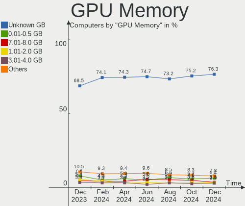

| Size in GB | Computers | Percent |
|------------|-----------|---------|
| Unknown    | 841       | 69.79%  |
| 0.01-0.5   | 88        | 7.3%    |
| 7.01-8.0   | 61        | 5.06%   |
| 3.01-4.0   | 59        | 4.9%    |
| 0.51-1.0   | 49        | 4.07%   |
| 1.01-2.0   | 46        | 3.82%   |
| 8.01-16.0  | 32        | 2.66%   |
| 5.01-6.0   | 18        | 1.49%   |
| 16.01-24.0 | 8         | 0.66%   |
| 2.01-3.0   | 3         | 0.25%   |

Monitor
-------

Monitor Vendor
--------------

Monitor vendors

| Vendor                  | Computers | Percent |
|-------------------------|-----------|---------|
| Samsung Electronics     | 139       | 10.6%   |
| AU Optronics            | 131       | 9.99%   |
| Dell                    | 124       | 9.46%   |
| BOE                     | 113       | 8.62%   |
| LG Display              | 87        | 6.64%   |
| Chimei Innolux          | 80        | 6.1%    |
| Acer                    | 76        | 5.8%    |
| Goldstar                | 67        | 5.11%   |
| Hewlett-Packard         | 55        | 4.2%    |
| Apple                   | 53        | 4.04%   |
| Ancor Communications    | 38        | 2.9%    |
| ViewSonic               | 28        | 2.14%   |
| ASUSTek Computer        | 27        | 2.06%   |
| Sharp                   | 26        | 1.98%   |
| Valve                   | 24        | 1.83%   |
| Sceptre Tech            | 23        | 1.75%   |
| AOC                     | 21        | 1.6%    |
| Vizio                   | 18        | 1.37%   |
| Lenovo                  | 15        | 1.14%   |
| PANDA                   | 9         | 0.69%   |
| InfoVision              | 9         | 0.69%   |
| Panasonic               | 8         | 0.61%   |
| Sony                    | 7         | 0.53%   |
| Insignia                | 7         | 0.53%   |
| ONN                     | 6         | 0.46%   |
| MSI                     | 6         | 0.46%   |
| Hitachi                 | 6         | 0.46%   |
| TMX                     | 5         | 0.38%   |
| Philips                 | 5         | 0.38%   |
| HKC                     | 5         | 0.38%   |
| Gigabyte Technology     | 5         | 0.38%   |
| CSO                     | 5         | 0.38%   |
| Chi Mei Optoelectronics | 5         | 0.38%   |
| BenQ                    | 5         | 0.38%   |
| Unknown                 | 5         | 0.38%   |
| Westinghouse            | 4         | 0.31%   |
| Unknown                 | 4         | 0.31%   |
| Pixio                   | 4         | 0.31%   |
| Onkyo                   | 3         | 0.23%   |
| NEC Computers           | 3         | 0.23%   |

Monitor Model
-------------

Monitor models

| Model                                                                 | Computers | Percent |
|-----------------------------------------------------------------------|-----------|---------|
| Valve ANX7530 U VLV3001 800x1280 100x150mm 7.1-inch                   | 17        | 1.26%   |
| Valve ANX7530 U VLV3003 800x1280 100x160mm 7.4-inch                   | 6         | 0.44%   |
| Sceptre Tech Sceptre F24 SPT09AB 1920x1080 530x290mm 23.8-inch        | 6         | 0.44%   |
| Samsung Electronics LCD Monitor SEC5441 1366x768 344x194mm 15.5-inch  | 6         | 0.44%   |
| Vizio V405-H9 VIZ1039 3840x2160 878x485mm 39.5-inch                   | 5         | 0.37%   |
| Goldstar Ultra HD GSM5B09 3840x2160 600x340mm 27.2-inch               | 5         | 0.37%   |
| AU Optronics LCD Monitor AUO10EC 1366x768 344x193mm 15.5-inch         | 5         | 0.37%   |
| Ancor Communications VE247 ACI2493 1920x1080 531x299mm 24.0-inch      | 5         | 0.37%   |
| Unknown                                                               | 5         | 0.37%   |
| Samsung Electronics C27F390 SAM0D32 1920x1080 598x336mm 27.0-inch     | 4         | 0.3%    |
| Pixio U29I WAM2900 2560x1080 690x260mm 29.0-inch                      | 4         | 0.3%    |
| ONN 100002487 ONN0101 1920x1080 517x323mm 24.0-inch                   | 4         | 0.3%    |
| Goldstar ULTRAWIDE GSM59F1 2560x1080 673x284mm 28.8-inch              | 4         | 0.3%    |
| Goldstar TV SSCR2 GSMC0C8 3840x2160                                   | 4         | 0.3%    |
| Dell P2314H DEL409A 1920x1080 510x290mm 23.1-inch                     | 4         | 0.3%    |
| Dell 1907FP DEL4015 1280x1024 376x301mm 19.0-inch                     | 4         | 0.3%    |
| BOE LCD Monitor BOE095F 2256x1504 285x190mm 13.5-inch                 | 4         | 0.3%    |
| BOE LCD Monitor BOE084E 1920x1080 382x215mm 17.3-inch                 | 4         | 0.3%    |
| BOE LCD Monitor BOE06EE 1920x1080 309x173mm 13.9-inch                 | 4         | 0.3%    |
| AU Optronics LCD Monitor AUO38ED 1920x1080 344x193mm 15.5-inch        | 4         | 0.3%    |
| AU Optronics LCD Monitor AUO2E3C 1366x768 309x173mm 13.9-inch         | 4         | 0.3%    |
| AU Optronics LCD Monitor AUO20EC 1366x768 344x193mm 15.5-inch         | 4         | 0.3%    |
| Apple iMac APPA012 1920x1080 475x267mm 21.5-inch                      | 4         | 0.3%    |
| Apple Color LCD APP9CF0 1440x900 290x180mm 13.4-inch                  | 4         | 0.3%    |
| AOC G19LWk AOC1902 1440x900 410x257mm 19.1-inch                       | 4         | 0.3%    |
| Ancor Communications ASUS VS229 ACI22D3 1920x1080 475x267mm 21.5-inch | 4         | 0.3%    |
| Vizio D32f-E1 VIZ1027 1920x1080 698x392mm 31.5-inch                   | 3         | 0.22%   |
| Unknown LCD Monitor FFFF 2288x1287 2550x2550mm 142.0-inch             | 3         | 0.22%   |
| Samsung Electronics S34J55x SAM0F70 3440x1440 797x333mm 34.0-inch     | 3         | 0.22%   |
| Samsung Electronics C24F390 SAM0D2C 1920x1080 521x293mm 23.5-inch     | 3         | 0.22%   |
| Panasonic VVX14P048M00 MEI96A2 3000x2000 285x190mm 13.5-inch          | 3         | 0.22%   |
| Panasonic TV MEIA0AE 1920x540                                         | 3         | 0.22%   |
| LG Display LCD Monitor LGD05FA 1920x1080 309x174mm 14.0-inch          | 3         | 0.22%   |
| LG Display LCD Monitor LGD0555 1536x1024 263x175mm 12.4-inch          | 3         | 0.22%   |
| LG Display LCD Monitor LGD0521 1920x1080 309x174mm 14.0-inch          | 3         | 0.22%   |
| Hitachi HISENSE HEC0030 3840x2160 1872x1053mm 84.6-inch               | 3         | 0.22%   |
| Hewlett-Packard 27er HWP3326 1920x1080 598x336mm 27.0-inch            | 3         | 0.22%   |
| Hewlett-Packard 25x HPN357F 1920x1080 544x303mm 24.5-inch             | 3         | 0.22%   |
| Goldstar Ultra HD GSM5B08 3840x2160 600x340mm 27.2-inch               | 3         | 0.22%   |
| Goldstar MP59HT GSM5B44 1920x1080 480x270mm 21.7-inch                 | 3         | 0.22%   |

Monitor Resolution
------------------

Monitor screen resolution

| Resolution         | Computers | Percent |
|--------------------|-----------|---------|
| 1920x1080 (FHD)    | 526       | 42.01%  |
| 1366x768 (WXGA)    | 152       | 12.14%  |
| 3840x2160 (4K)     | 134       | 10.7%   |
| 2560x1440 (QHD)    | 74        | 5.91%   |
| 1920x1200 (WUXGA)  | 41        | 3.27%   |
| 1600x900 (HD+)     | 39        | 3.12%   |
| 1440x900 (WXGA+)   | 39        | 3.12%   |
| 3440x1440          | 26        | 2.08%   |
| 1280x1024 (SXGA)   | 25        | 2%      |
| 800x1280           | 24        | 1.92%   |
| 1680x1050 (WSXGA+) | 23        | 1.84%   |
| 1280x800 (WXGA)    | 18        | 1.44%   |
| 2560x1600          | 15        | 1.2%    |
| 2560x1080          | 15        | 1.2%    |
| 2880x1800          | 12        | 0.96%   |
| 1920x540           | 11        | 0.88%   |
| 3840x1080          | 8         | 0.64%   |
| Unknown            | 7         | 0.56%   |
| 3840x2400          | 6         | 0.48%   |
| 2256x1504          | 6         | 0.48%   |
| 1600x1200          | 5         | 0.4%    |
| 1360x768           | 5         | 0.4%    |
| 3840x1600          | 4         | 0.32%   |
| 2736x1824          | 4         | 0.32%   |
| 1920x1280          | 4         | 0.32%   |
| 2288x1287          | 3         | 0.24%   |
| 2160x1440          | 3         | 0.24%   |
| 1400x1050          | 3         | 0.24%   |
| 3200x2000          | 2         | 0.16%   |
| 3200x1800 (QHD+)   | 2         | 0.16%   |
| 2880x1920          | 2         | 0.16%   |
| 2304x1440          | 2         | 0.16%   |
| 5760x2160          | 1         | 0.08%   |
| 4480x1080          | 1         | 0.08%   |
| 4096x2304          | 1         | 0.08%   |
| 3840x1200          | 1         | 0.08%   |
| 3840x1100          | 1         | 0.08%   |
| 3600x1080          | 1         | 0.08%   |
| 3456x2160          | 1         | 0.08%   |
| 3286x1080          | 1         | 0.08%   |

Monitor Diagonal
----------------

Diagonal size in inches

| Inches  | Computers | Percent |
|---------|-----------|---------|
| 15      | 251       | 19.12%  |
| 27      | 138       | 10.51%  |
| 13      | 125       | 9.52%   |
| 14      | 88        | 6.7%    |
| 23      | 85        | 6.47%   |
| 24      | 84        | 6.4%    |
| 31      | 69        | 5.26%   |
| 21      | 59        | 4.49%   |
| 17      | 53        | 4.04%   |
| 19      | 36        | 2.74%   |
| 16      | 30        | 2.28%   |
| 34      | 29        | 2.21%   |
| Unknown | 29        | 2.21%   |
| 7       | 25        | 1.9%    |
| 12      | 24        | 1.83%   |
| 20      | 20        | 1.52%   |
| 22      | 19        | 1.45%   |
| 32      | 16        | 1.22%   |
| 84      | 15        | 1.14%   |
| 11      | 13        | 0.99%   |
| 18      | 11        | 0.84%   |
| 54      | 9         | 0.69%   |
| 72      | 7         | 0.53%   |
| 48      | 7         | 0.53%   |
| 40      | 7         | 0.53%   |
| 26      | 6         | 0.46%   |
| 25      | 6         | 0.46%   |
| 69      | 5         | 0.38%   |
| 49      | 5         | 0.38%   |
| 29      | 5         | 0.38%   |
| 28      | 5         | 0.38%   |
| 42      | 4         | 0.3%    |
| 37      | 4         | 0.3%    |
| 142     | 3         | 0.23%   |
| 35      | 3         | 0.23%   |
| 74      | 2         | 0.15%   |
| 44      | 2         | 0.15%   |
| 38      | 2         | 0.15%   |
| 86      | 1         | 0.08%   |
| 85      | 1         | 0.08%   |

Monitor Width
-------------

Physical width

| Width in mm    | Computers | Percent |
|----------------|-----------|---------|
| 301-350        | 410       | 31.91%  |
| 501-600        | 287       | 22.33%  |
| 401-500        | 126       | 9.81%   |
| 201-300        | 110       | 8.56%   |
| 601-700        | 90        | 7%      |
| 351-400        | 78        | 6.07%   |
| 701-800        | 44        | 3.42%   |
| 1501-2000      | 31        | 2.41%   |
| 1001-1500      | 30        | 2.33%   |
| Unknown        | 29        | 2.26%   |
| 1-100          | 24        | 1.87%   |
| 801-900        | 17        | 1.32%   |
| 901-1000       | 5         | 0.39%   |
| More than 2000 | 3         | 0.23%   |
| 101-200        | 1         | 0.08%   |

Aspect Ratio
------------

Proportional relationship between the width and the height

| Ratio   | Computers | Percent |
|---------|-----------|---------|
| 16/9    | 870       | 72.93%  |
| 16/10   | 170       | 14.25%  |
| 21/9    | 41        | 3.44%   |
| 5/4     | 21        | 1.76%   |
| 3/2     | 21        | 1.76%   |
| Unknown | 19        | 1.59%   |
| 0.67    | 17        | 1.42%   |
| 32/9    | 7         | 0.59%   |
| 0.62    | 7         | 0.59%   |
| 4/3     | 6         | 0.5%    |
| 2.65    | 4         | 0.34%   |
| 1.96    | 3         | 0.25%   |
| 1.00    | 3         | 0.25%   |
| 6/5     | 2         | 0.17%   |
| 3.40    | 1         | 0.08%   |
| 3.20    | 1         | 0.08%   |

Monitor Area
------------

Area in inch

| Area in inch | Computers | Percent |
|----------------|-----------|---------|
| 101-110        | 252       | 19.46%  |
| 201-250        | 191       | 14.75%  |
| 81-90          | 168       | 12.97%  |
| 301-350        | 142       | 10.97%  |
| 351-500        | 117       | 9.03%   |
| 151-200        | 74        | 5.71%   |
| More than 1000 | 51        | 3.94%   |
| 71-80          | 47        | 3.63%   |
| 121-130        | 43        | 3.32%   |
| 251-300        | 41        | 3.17%   |
| 501-1000       | 32        | 2.47%   |
| Unknown        | 29        | 2.24%   |
| 1-40           | 25        | 1.93%   |
| 111-120        | 23        | 1.78%   |
| 61-70          | 21        | 1.62%   |
| 51-60          | 15        | 1.16%   |
| 141-150        | 14        | 1.08%   |
| 131-140        | 7         | 0.54%   |
| 91-100         | 3         | 0.23%   |

Pixel Density
-------------

Pixels per inch

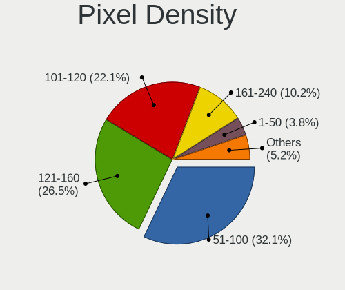

| Density       | Computers | Percent |
|---------------|-----------|---------|
| 51-100        | 422       | 33.65%  |
| 121-160       | 306       | 24.4%   |
| 101-120       | 273       | 21.77%  |
| 161-240       | 135       | 10.77%  |
| More than 240 | 52        | 4.15%   |
| 1-50          | 37        | 2.95%   |
| Unknown       | 29        | 2.31%   |

Multiple Monitors
-----------------

Total monitors connected

| Total | Computers | Percent |
|-------|-----------|---------|
| 1     | 925       | 76.76%  |
| 2     | 191       | 15.85%  |
| 0     | 58        | 4.81%   |
| 3     | 30        | 2.49%   |
| 5     | 1         | 0.08%   |

Network
-------

Net Controller Vendor
---------------------

Controller vendors

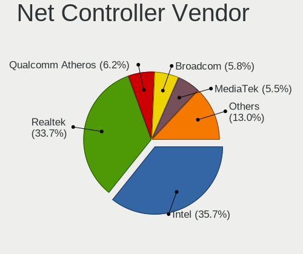

| Vendor                          | Computers | Percent |
|---------------------------------|-----------|---------|
| Intel                           | 666       | 36.78%  |
| Realtek Semiconductor           | 567       | 31.31%  |
| Broadcom                        | 115       | 6.35%   |
| Qualcomm Atheros                | 104       | 5.74%   |
| MediaTek                        | 85        | 4.69%   |
| Broadcom Limited                | 32        | 1.77%   |
| TP-Link                         | 24        | 1.33%   |
| ASIX Electronics                | 20        | 1.1%    |
| Qualcomm                        | 18        | 0.99%   |
| Marvell Technology Group        | 16        | 0.88%   |
| Ralink Technology               | 14        | 0.77%   |
| Nvidia                          | 11        | 0.61%   |
| NetGear                         | 11        | 0.61%   |
| Motorola PCS                    | 9         | 0.5%    |
| Aquantia                        | 9         | 0.5%    |
| Samsung Electronics             | 8         | 0.44%   |
| Ralink                          | 8         | 0.44%   |
| Mellanox Technologies           | 7         | 0.39%   |
| Linksys                         | 7         | 0.39%   |
| Microsoft                       | 6         | 0.33%   |
| DisplayLink                     | 6         | 0.33%   |
| Google                          | 5         | 0.28%   |
| Edimax Technology               | 5         | 0.28%   |
| Dell                            | 4         | 0.22%   |
| Cypress Semiconductor           | 4         | 0.22%   |
| ASUSTek Computer                | 4         | 0.22%   |
| T & A Mobile Phones             | 3         | 0.17%   |
| Raspberry Pi                    | 3         | 0.17%   |
| Qualcomm Atheros Communications | 3         | 0.17%   |
| Lenovo                          | 3         | 0.17%   |
| D-Link                          | 3         | 0.17%   |
| Belkin Components               | 3         | 0.17%   |
| Apple                           | 3         | 0.17%   |
| American Megatrends             | 3         | 0.17%   |
| U-Blox                          | 2         | 0.11%   |
| JMicron Technology              | 2         | 0.11%   |
| ADMtek                          | 2         | 0.11%   |
| Xiaomi                          | 1         | 0.06%   |
| VIA Technologies                | 1         | 0.06%   |
| STMicroelectronics              | 1         | 0.06%   |

Net Controller Model
--------------------

Controller models

| Model                                                                  | Computers | Percent |
|------------------------------------------------------------------------|-----------|---------|
| Realtek RTL8111/8168/8211/8411 PCI Express Gigabit Ethernet Controller | 316       | 14.54%  |
| Intel Wi-Fi 6 AX200                                                    | 67        | 3.08%   |
| Realtek RTL8125 2.5GbE Controller                                      | 62        | 2.85%   |
| Realtek RTL810xE PCI Express Fast Ethernet controller                  | 48        | 2.21%   |
| Intel Ethernet Controller I225-V                                       | 48        | 2.21%   |
| Intel Wireless 8265 / 8275                                             | 46        | 2.12%   |
| Realtek RTL8822CE 802.11ac PCIe Wireless Network Adapter               | 43        | 1.98%   |
| Realtek RTL8153 Gigabit Ethernet Adapter                               | 41        | 1.89%   |
| Intel 82579LM Gigabit Network Connection (Lewisville)                  | 40        | 1.84%   |
| Intel Wi-Fi 6E(802.11ax) AX210/AX1675* 2x2 [Typhoon Peak]              | 39        | 1.79%   |
| Realtek RTL8821CE 802.11ac PCIe Wireless Network Adapter               | 33        | 1.52%   |
| MediaTek MT7922 802.11ax PCI Express Wireless Network Adapter          | 31        | 1.43%   |
| Intel Wireless 7265                                                    | 30        | 1.38%   |
| Intel I211 Gigabit Network Connection                                  | 28        | 1.29%   |
| Intel Wireless 8260                                                    | 26        | 1.2%    |
| Intel Wi-Fi 6 AX201                                                    | 26        | 1.2%    |
| MediaTek MT7921K (RZ608) Wi-Fi 6E 80MHz                                | 24        | 1.1%    |
| Intel Alder Lake-P PCH CNVi WiFi                                       | 23        | 1.06%   |
| Intel Ethernet Connection (4) I219-LM                                  | 22        | 1.01%   |
| Qualcomm Atheros QCA6174 802.11ac Wireless Network Adapter             | 21        | 0.97%   |
| Intel Raptor Lake PCH CNVi WiFi                                        | 21        | 0.97%   |
| Intel Ethernet Connection I217-LM                                      | 20        | 0.92%   |
| Intel Dual Band Wireless-AC 3168NGW [Stone Peak]                       | 20        | 0.92%   |
| Intel Wireless 7260                                                    | 18        | 0.83%   |
| Intel Wi-Fi 5(802.11ac) Wireless-AC 9x6x [Thunder Peak]                | 18        | 0.83%   |
| Intel Centrino Advanced-N 6205 [Taylor Peak]                           | 18        | 0.83%   |
| ASIX AX88179 Gigabit Ethernet                                          | 18        | 0.83%   |
| Qualcomm Atheros QCA9377 802.11ac Wireless Network Adapter             | 17        | 0.78%   |
| Qualcomm QCNFA765 Wireless Network Adapter                             | 16        | 0.74%   |
| MediaTek MT7921 802.11ax PCI Express Wireless Network Adapter          | 16        | 0.74%   |
| Broadcom Limited BCM4360 802.11ac Dual Band Wireless Network Adapter   | 16        | 0.74%   |
| Intel Ethernet Connection I219-LM                                      | 15        | 0.69%   |
| Intel Ethernet Connection (2) I219-V                                   | 15        | 0.69%   |
| Broadcom NetXtreme BCM57766 Gigabit Ethernet PCIe                      | 15        | 0.69%   |
| Broadcom BCM4331 802.11a/b/g/n                                         | 15        | 0.69%   |
| Realtek 802.11ac NIC                                                   | 14        | 0.64%   |
| Broadcom BCM4360 802.11ac Dual Band Wireless Network Adapter           | 14        | 0.64%   |
| Qualcomm Atheros QCA9565 / AR9565 Wireless Network Adapter             | 13        | 0.6%    |
| Realtek RTL8852CE PCIe 802.11ax Wireless Network Controller            | 12        | 0.55%   |
| Intel Comet Lake PCH CNVi WiFi                                         | 12        | 0.55%   |

Wireless Vendor
---------------

Wireless vendors

| Vendor                                | Computers | Percent |
|---------------------------------------|-----------|---------|
| Intel                                 | 500       | 47.08%  |
| Realtek Semiconductor                 | 180       | 16.95%  |
| Qualcomm Atheros                      | 85        | 8%      |
| MediaTek                              | 82        | 7.72%   |
| Broadcom                              | 76        | 7.16%   |
| Broadcom Limited                      | 25        | 2.35%   |
| TP-Link                               | 22        | 2.07%   |
| Qualcomm                              | 16        | 1.51%   |
| Ralink Technology                     | 14        | 1.32%   |
| NetGear                               | 11        | 1.04%   |
| Ralink                                | 8         | 0.75%   |
| Marvell Technology Group              | 8         | 0.75%   |
| Linksys                               | 6         | 0.56%   |
| Microsoft                             | 5         | 0.47%   |
| Edimax Technology                     | 5         | 0.47%   |
| ASUSTek Computer                      | 4         | 0.38%   |
| Qualcomm Atheros Communications       | 3         | 0.28%   |
| Dell                                  | 3         | 0.28%   |
| Belkin Components                     | 3         | 0.28%   |
| D-Link                                | 2         | 0.19%   |
| Sierra Wireless                       | 1         | 0.09%   |
| Qualcomm Technologies                 | 1         | 0.09%   |
| Gemtek                                | 1         | 0.09%   |
| 802.11g Adapter [Linksys WUSB54GC v3] | 1         | 0.09%   |

Wireless Model
--------------

Wireless models

| Model                                                                | Computers | Percent |
|----------------------------------------------------------------------|-----------|---------|
| Intel Wi-Fi 6 AX200                                                  | 67        | 6.27%   |
| Intel Wireless 8265 / 8275                                           | 46        | 4.3%    |
| Realtek RTL8822CE 802.11ac PCIe Wireless Network Adapter             | 43        | 4.02%   |
| Intel Wi-Fi 6E(802.11ax) AX210/AX1675* 2x2 [Typhoon Peak]            | 39        | 3.65%   |
| Realtek RTL8821CE 802.11ac PCIe Wireless Network Adapter             | 33        | 3.09%   |
| MediaTek MT7922 802.11ax PCI Express Wireless Network Adapter        | 31        | 2.9%    |
| Intel Wireless 7265                                                  | 30        | 2.81%   |
| Intel Wireless 8260                                                  | 26        | 2.43%   |
| Intel Wi-Fi 6 AX201                                                  | 26        | 2.43%   |
| MediaTek MT7921K (RZ608) Wi-Fi 6E 80MHz                              | 24        | 2.25%   |
| Intel Alder Lake-P PCH CNVi WiFi                                     | 23        | 2.15%   |
| Qualcomm Atheros QCA6174 802.11ac Wireless Network Adapter           | 21        | 1.96%   |
| Intel Raptor Lake PCH CNVi WiFi                                      | 21        | 1.96%   |
| Intel Dual Band Wireless-AC 3168NGW [Stone Peak]                     | 20        | 1.87%   |
| Intel Wireless 7260                                                  | 18        | 1.68%   |
| Intel Wi-Fi 5(802.11ac) Wireless-AC 9x6x [Thunder Peak]              | 18        | 1.68%   |
| Intel Centrino Advanced-N 6205 [Taylor Peak]                         | 18        | 1.68%   |
| Qualcomm Atheros QCA9377 802.11ac Wireless Network Adapter           | 17        | 1.59%   |
| Qualcomm QCNFA765 Wireless Network Adapter                           | 16        | 1.5%    |
| MediaTek MT7921 802.11ax PCI Express Wireless Network Adapter        | 16        | 1.5%    |
| Broadcom Limited BCM4360 802.11ac Dual Band Wireless Network Adapter | 16        | 1.5%    |
| Broadcom BCM4331 802.11a/b/g/n                                       | 15        | 1.4%    |
| Realtek 802.11ac NIC                                                 | 14        | 1.31%   |
| Broadcom BCM4360 802.11ac Dual Band Wireless Network Adapter         | 14        | 1.31%   |
| Qualcomm Atheros QCA9565 / AR9565 Wireless Network Adapter           | 13        | 1.22%   |
| Realtek RTL8852CE PCIe 802.11ax Wireless Network Controller          | 12        | 1.12%   |
| Intel Comet Lake PCH CNVi WiFi                                       | 12        | 1.12%   |
| Intel Alder Lake-S PCH CNVi WiFi                                     | 12        | 1.12%   |
| Intel Comet Lake PCH-LP CNVi WiFi                                    | 11        | 1.03%   |
| Qualcomm Atheros AR9485 Wireless Network Adapter                     | 10        | 0.94%   |
| Intel Wireless 3165                                                  | 10        | 0.94%   |
| Intel Tiger Lake PCH CNVi WiFi                                       | 10        | 0.94%   |
| Intel Raptor Lake-S PCH CNVi WiFi                                    | 10        | 0.94%   |
| Intel Cannon Lake PCH CNVi WiFi                                      | 10        | 0.94%   |
| Realtek RTL8852BE PCIe 802.11ax Wireless Network Controller          | 9         | 0.84%   |
| Realtek RTL8188EE Wireless Network Adapter                           | 9         | 0.84%   |
| Intel Ice Lake-LP PCH CNVi WiFi                                      | 9         | 0.84%   |
| Marvell Group 88W8897 [AVASTAR] 802.11ac Wireless                    | 8         | 0.75%   |
| Intel Wireless 3160                                                  | 8         | 0.75%   |
| Realtek RTL88x2bu [AC1200 Techkey]                                   | 7         | 0.65%   |

Ethernet Vendor
---------------

Ethernet vendors

| Vendor                           | Computers | Percent |
|----------------------------------|-----------|---------|
| Realtek Semiconductor            | 470       | 44.51%  |
| Intel                            | 373       | 35.32%  |
| Broadcom                         | 66        | 6.25%   |
| Qualcomm Atheros                 | 28        | 2.65%   |
| ASIX Electronics                 | 20        | 1.89%   |
| Nvidia                           | 11        | 1.04%   |
| Aquantia                         | 9         | 0.85%   |
| Samsung Electronics              | 8         | 0.76%   |
| Marvell Technology Group         | 8         | 0.76%   |
| Broadcom Limited                 | 7         | 0.66%   |
| DisplayLink                      | 6         | 0.57%   |
| Google                           | 5         | 0.47%   |
| Motorola PCS                     | 4         | 0.38%   |
| Cypress Semiconductor            | 4         | 0.38%   |
| T & A Mobile Phones              | 3         | 0.28%   |
| Raspberry Pi                     | 3         | 0.28%   |
| Mellanox Technologies            | 3         | 0.28%   |
| MediaTek                         | 3         | 0.28%   |
| Lenovo                           | 3         | 0.28%   |
| Apple                            | 3         | 0.28%   |
| American Megatrends              | 3         | 0.28%   |
| TP-Link                          | 2         | 0.19%   |
| Qualcomm                         | 2         | 0.19%   |
| JMicron Technology               | 2         | 0.19%   |
| ADMtek                           | 2         | 0.19%   |
| Xiaomi                           | 1         | 0.09%   |
| VIA Technologies                 | 1         | 0.09%   |
| Silicon Integrated Systems [SiS] | 1         | 0.09%   |
| Microsoft                        | 1         | 0.09%   |
| Linksys                          | 1         | 0.09%   |
| Insyde Software                  | 1         | 0.09%   |
| D-Link                           | 1         | 0.09%   |
| Accton Technology                | 1         | 0.09%   |

Ethernet Model
--------------

Ethernet models

| Model                                                                           | Computers | Percent |
|---------------------------------------------------------------------------------|-----------|---------|
| Realtek RTL8111/8168/8211/8411 PCI Express Gigabit Ethernet Controller          | 316       | 29.23%  |
| Realtek RTL8125 2.5GbE Controller                                               | 62        | 5.74%   |
| Realtek RTL810xE PCI Express Fast Ethernet controller                           | 48        | 4.44%   |
| Intel Ethernet Controller I225-V                                                | 48        | 4.44%   |
| Realtek RTL8153 Gigabit Ethernet Adapter                                        | 41        | 3.79%   |
| Intel 82579LM Gigabit Network Connection (Lewisville)                           | 40        | 3.7%    |
| Intel I211 Gigabit Network Connection                                           | 28        | 2.59%   |
| Intel Ethernet Connection (4) I219-LM                                           | 22        | 2.04%   |
| Intel Ethernet Connection I217-LM                                               | 20        | 1.85%   |
| ASIX AX88179 Gigabit Ethernet                                                   | 18        | 1.67%   |
| Intel Ethernet Connection I219-LM                                               | 15        | 1.39%   |
| Intel Ethernet Connection (2) I219-V                                            | 15        | 1.39%   |
| Broadcom NetXtreme BCM57766 Gigabit Ethernet PCIe                               | 15        | 1.39%   |
| Broadcom NetXtreme BCM57765 Gigabit Ethernet PCIe                               | 12        | 1.11%   |
| Intel Ethernet Connection (2) I219-LM                                           | 11        | 1.02%   |
| Intel Ethernet Connection (7) I219-V                                            | 10        | 0.93%   |
| Intel I210 Gigabit Network Connection                                           | 9         | 0.83%   |
| Intel Ethernet Connection (3) I218-LM                                           | 9         | 0.83%   |
| Intel 82574L Gigabit Network Connection                                         | 9         | 0.83%   |
| Intel Ethernet Connection (7) I219-LM                                           | 8         | 0.74%   |
| Intel Ethernet Connection (5) I219-LM                                           | 8         | 0.74%   |
| Intel 82579V Gigabit Network Connection                                         | 8         | 0.74%   |
| Nvidia MCP79 Ethernet                                                           | 7         | 0.65%   |
| Intel Ethernet Controller I226-V                                                | 7         | 0.65%   |
| Qualcomm Atheros AR8161 Gigabit Ethernet                                        | 6         | 0.56%   |
| Intel I350 Gigabit Network Connection                                           | 6         | 0.56%   |
| Intel Ethernet Connection I218-LM                                               | 6         | 0.56%   |
| Intel Ethernet Connection I217-V                                                | 6         | 0.56%   |
| Intel Ethernet Connection (4) I219-V                                            | 6         | 0.56%   |
| Qualcomm Atheros Killer E2500 Gigabit Ethernet Controller                       | 5         | 0.46%   |
| Intel Ethernet Connection (2) I218-V                                            | 5         | 0.46%   |
| Intel Ethernet Connection (17) I219-V                                           | 5         | 0.46%   |
| Intel 82599ES 10-Gigabit SFI/SFP+ Network Connection                            | 5         | 0.46%   |
| Broadcom NetXtreme BCM5761 Gigabit Ethernet PCIe                                | 5         | 0.46%   |
| Aquantia AQtion AQC113CS NBase-T/IEEE 802.3an Ethernet Controller [Antigua 10G] | 5         | 0.46%   |
| Samsung GT-I9070 (network tethering, USB debugging enabled)                     | 4         | 0.37%   |
| Samsung Galaxy series, misc. (tethering mode)                                   | 4         | 0.37%   |
| Realtek RTL8152 Fast Ethernet Adapter                                           | 4         | 0.37%   |
| Qualcomm Atheros AR8162 Fast Ethernet                                           | 4         | 0.37%   |
| Motorola PCS moto g52                                                           | 4         | 0.37%   |

Net Controller Kind
-------------------

Ethernet, WiFi or modem

| Kind     | Computers | Percent |
|----------|-----------|---------|
| WiFi     | 993       | 50.05%  |
| Ethernet | 968       | 48.79%  |
| Unknown  | 14        | 0.71%   |
| Modem    | 9         | 0.45%   |

Used Controller
---------------

Currently used network controller

| Kind     | Computers | Percent |
|----------|-----------|---------|
| WiFi     | 732       | 58.56%  |
| Ethernet | 518       | 41.44%  |

NICs
----

Total network controllers on board

| Total | Computers | Percent |
|-------|-----------|---------|
| 2     | 651       | 54.02%  |
| 1     | 481       | 39.92%  |
| 3     | 41        | 3.4%    |
| 0     | 14        | 1.16%   |
| 4     | 13        | 1.08%   |
| 5     | 3         | 0.25%   |
| 6     | 2         | 0.17%   |

IPv6
----

IPv6 vs IPv4

| Used | Computers | Percent |
|------|-----------|---------|
| No   | 778       | 64.56%  |
| Yes  | 427       | 35.44%  |

Bluetooth
---------

Bluetooth Vendor
----------------

Controller vendors

| Vendor                          | Computers | Percent |
|---------------------------------|-----------|---------|
| Intel                           | 420       | 49.65%  |
| Realtek Semiconductor           | 96        | 11.35%  |
| Apple                           | 55        | 6.5%    |
| IMC Networks                    | 53        | 6.26%   |
| Qualcomm Atheros Communications | 41        | 4.85%   |
| MediaTek                        | 40        | 4.73%   |
| Foxconn / Hon Hai               | 29        | 3.43%   |
| Cambridge Silicon Radio         | 28        | 3.31%   |
| Broadcom                        | 21        | 2.48%   |
| Lite-On Technology              | 13        | 1.54%   |
| Marvell Semiconductor           | 10        | 1.18%   |
| USI                             | 6         | 0.71%   |
| Dell                            | 6         | 0.71%   |
| ASUSTek Computer                | 6         | 0.71%   |
| Toshiba                         | 5         | 0.59%   |
| Hewlett-Packard                 | 4         | 0.47%   |
| Edimax Technology               | 4         | 0.47%   |
| TP-Link                         | 3         | 0.35%   |
| Realtek                         | 2         | 0.24%   |
| Ralink                          | 2         | 0.24%   |
| Taiyo Yuden                     | 1         | 0.12%   |
| Dynex                           | 1         | 0.12%   |

Bluetooth Model
---------------

Controller models

| Model                                               | Computers | Percent |
|-----------------------------------------------------|-----------|---------|
| Intel Bluetooth wireless interface                  | 122       | 14.4%   |
| Realtek Bluetooth Radio                             | 77        | 9.09%   |
| Intel AX201 Bluetooth                               | 75        | 8.85%   |
| Intel AX200 Bluetooth                               | 59        | 6.97%   |
| Intel Bluetooth Device                              | 56        | 6.61%   |
| MediaTek Wireless_Device                            | 40        | 4.72%   |
| Intel AX210 Bluetooth                               | 38        | 4.49%   |
| IMC Networks Bluetooth Radio                        | 35        | 4.13%   |
| Intel Bluetooth 9460/9560 Jefferson Peak (JfP)      | 30        | 3.54%   |
| Cambridge Silicon Radio Bluetooth Dongle (HCI mode) | 28        | 3.31%   |
| Apple Bluetooth USB Host Controller                 | 27        | 3.19%   |
| Qualcomm Atheros  Bluetooth Device                  | 26        | 3.07%   |
| Apple Bluetooth Host Controller                     | 25        | 2.95%   |
| Realtek  Bluetooth 4.2 Adapter                      | 18        | 2.13%   |
| Intel Wireless-AC 9260 Bluetooth Adapter            | 18        | 2.13%   |
| Intel Wireless-AC 3168 Bluetooth                    | 18        | 2.13%   |
| Foxconn / Hon Hai Wireless_Device                   | 15        | 1.77%   |
| IMC Networks Wireless_Device                        | 14        | 1.65%   |
| Foxconn / Hon Hai Bluetooth Device                  | 8         | 0.94%   |
| USI Bluetooth Device                                | 6         | 0.71%   |
| Qualcomm Atheros QCA61x4 Bluetooth 4.0              | 6         | 0.71%   |
| Marvell Bluetooth and Wireless LAN Composite        | 6         | 0.71%   |
| Qualcomm Atheros AR9462 Bluetooth                   | 5         | 0.59%   |
| Intel Centrino Bluetooth Wireless Transceiver       | 5         | 0.59%   |
| Broadcom BCM20702A0 Bluetooth 4.0                   | 5         | 0.59%   |
| Marvell Bluetooth and Wireless LAN Composite Device | 4         | 0.47%   |
| Lite-On Wireless_Device                             | 4         | 0.47%   |
| Lite-On Qualcomm Atheros QCA9377 Bluetooth          | 4         | 0.47%   |
| Edimax Bluetooth Adapter                            | 4         | 0.47%   |
| Broadcom HP Portable SoftSailing                    | 4         | 0.47%   |
| ASUS ASUS USB-BT500                                 | 4         | 0.47%   |
| TP-Link UB500 Adapter                               | 3         | 0.35%   |
| Toshiba BCM43142A0                                  | 3         | 0.35%   |
| Lite-On Bluetooth Device                            | 3         | 0.35%   |
| Broadcom BCM20702 Bluetooth 4.0 [ThinkPad]          | 3         | 0.35%   |
| Realtek Bluetooth Radio                             | 2         | 0.24%   |
| Ralink RT3290 Bluetooth                             | 2         | 0.24%   |
| Qualcomm Atheros Bluetooth USB Host Controller      | 2         | 0.24%   |
| IMC Networks Bluetooth Device                       | 2         | 0.24%   |
| IMC Networks BCM20702A0                             | 2         | 0.24%   |

Sound
-----

Sound Vendor
------------

Sound card vendors

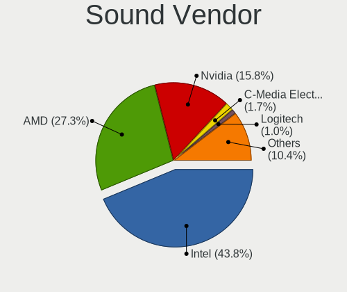

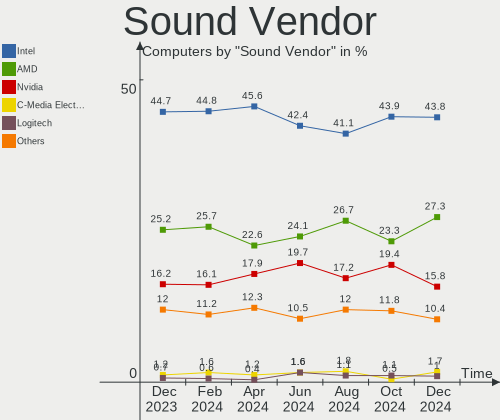

| Vendor                                       | Computers | Percent |
|----------------------------------------------|-----------|---------|
| Intel                                        | 784       | 44.77%  |
| AMD                                          | 431       | 24.61%  |
| Nvidia                                       | 289       | 16.5%   |
| C-Media Electronics                          | 27        | 1.54%   |
| ASUSTek Computer                             | 17        | 0.97%   |
| Logitech                                     | 16        | 0.91%   |
| Texas Instruments                            | 14        | 0.8%    |
| SteelSeries ApS                              | 11        | 0.63%   |
| Micro Star International                     | 10        | 0.57%   |
| Creative Labs                                | 10        | 0.57%   |
| Razer USA                                    | 9         | 0.51%   |
| Generalplus Technology                       | 9         | 0.51%   |
| JMTek                                        | 8         | 0.46%   |
| Tenx Technology                              | 6         | 0.34%   |
| Kingston Technology                          | 6         | 0.34%   |
| Blue Microphones                             | 6         | 0.34%   |
| Plantronics                                  | 5         | 0.29%   |
| Apple                                        | 5         | 0.29%   |
| Sony                                         | 4         | 0.23%   |
| Lenovo                                       | 4         | 0.23%   |
| JOUNIVO                                      | 4         | 0.23%   |
| Giga-Byte Technology                         | 4         | 0.23%   |
| Focusrite-Novation                           | 4         | 0.23%   |
| SAVITECH                                     | 3         | 0.17%   |
| Realtek Semiconductor                        | 3         | 0.17%   |
| Jieli Technology                             | 3         | 0.17%   |
| Hewlett-Packard                              | 3         | 0.17%   |
| Corsair                                      | 3         | 0.17%   |
| Zoran Co. Personal Media Division (Nogatech) | 2         | 0.11%   |
| Valve Software                               | 2         | 0.11%   |
| Silicon Motion                               | 2         | 0.11%   |
| Schiit Audio                                 | 2         | 0.11%   |
| PreSonus Audio Electronics                   | 2         | 0.11%   |
| Mark of the Unicorn                          | 2         | 0.11%   |
| KTMicro                                      | 2         | 0.11%   |
| GN Netcom                                    | 2         | 0.11%   |
| Dell                                         | 2         | 0.11%   |
| Cambridge Silicon Radio                      | 2         | 0.11%   |
| Astro Gaming                                 | 2         | 0.11%   |
| Arturia                                      | 2         | 0.11%   |

Sound Model
-----------

Sound card models

| Model                                                                      | Computers | Percent |
|----------------------------------------------------------------------------|-----------|---------|
| AMD Family 17h/19h HD Audio Controller                                     | 156       | 7.34%   |
| Intel Sunrise Point-LP HD Audio                                            | 93        | 4.37%   |
| AMD Rembrandt Radeon High Definition Audio Controller                      | 89        | 4.19%   |
| Intel 7 Series/C216 Chipset Family High Definition Audio Controller        | 74        | 3.48%   |
| AMD Renoir Radeon High Definition Audio Controller                         | 67        | 3.15%   |
| AMD Starship/Matisse HD Audio Controller                                   | 65        | 3.06%   |
| Intel 8 Series/C220 Series Chipset High Definition Audio Controller        | 42        | 1.98%   |
| AMD Navi 21/23 HDMI/DP Audio Controller                                    | 42        | 1.98%   |
| Intel 6 Series/C200 Series Chipset Family High Definition Audio Controller | 39        | 1.83%   |
| Intel 100 Series/C230 Series Chipset Family HD Audio Controller            | 39        | 1.83%   |
| Intel Tiger Lake-LP Smart Sound Technology Audio Controller                | 38        | 1.79%   |
| Intel Cannon Lake PCH cAVS                                                 | 36        | 1.69%   |
| AMD Ellesmere HDMI Audio [Radeon RX 470/480 / 570/580/590]                 | 32        | 1.51%   |
| Intel Alder Lake PCH-P High Definition Audio Controller                    | 30        | 1.41%   |
| Nvidia Audio device                                                        | 29        | 1.36%   |
| Intel Haswell-ULT HD Audio Controller                                      | 29        | 1.36%   |
| Intel 8 Series HD Audio Controller                                         | 29        | 1.36%   |
| Nvidia GA106 High Definition Audio Controller                              | 28        | 1.32%   |
| AMD Raven/Raven2/Fenghuang HDMI/DP Audio Controller                        | 27        | 1.27%   |
| AMD SBx00 Azalia (Intel HDA)                                               | 26        | 1.22%   |
| AMD FCH Azalia Controller                                                  | 26        | 1.22%   |
| Intel Xeon E3-1200 v3/4th Gen Core Processor HD Audio Controller           | 25        | 1.18%   |
| Intel Raptor Lake-P/U/H cAVS                                               | 25        | 1.18%   |
| Intel Broadwell-U Audio Controller                                         | 25        | 1.18%   |
| Intel Alder Lake-S HD Audio Controller                                     | 25        | 1.18%   |
| Intel Wildcat Point-LP High Definition Audio Controller                    | 24        | 1.13%   |
| Intel 200 Series PCH HD Audio                                              | 22        | 1.03%   |
| AMD Family 15h (Models 60h-6fh) Audio Controller                           | 22        | 1.03%   |
| Nvidia TU116 High Definition Audio Controller                              | 21        | 0.99%   |
| Nvidia GP104 High Definition Audio Controller                              | 21        | 0.99%   |
| AMD Family 17h (Models 00h-0fh) HD Audio Controller                        | 21        | 0.99%   |
| Intel Celeron/Pentium Silver Processor High Definition Audio               | 20        | 0.94%   |
| Intel 5 Series/3400 Series Chipset High Definition Audio                   | 20        | 0.94%   |
| AMD Kabini HDMI/DP Audio                                                   | 20        | 0.94%   |
| Intel Comet Lake PCH cAVS                                                  | 19        | 0.89%   |
| Nvidia GA104 High Definition Audio Controller                              | 18        | 0.85%   |
| AMD Navi 10 HDMI Audio                                                     | 18        | 0.85%   |
| Intel Tiger Lake-H HD Audio Controller                                     | 17        | 0.8%    |
| Intel Cannon Point-LP High Definition Audio Controller                     | 17        | 0.8%    |
| AMD Navi 31 HDMI/DP Audio                                                  | 17        | 0.8%    |

Memory
------

Memory Vendor
-------------

Memory module vendors

| Vendor                       | Computers | Percent |
|------------------------------|-----------|---------|
| Samsung Electronics          | 150       | 23.15%  |
| SK hynix                     | 107       | 16.51%  |
| Micron Technology            | 84        | 12.96%  |
| Corsair                      | 59        | 9.1%    |
| G.Skill                      | 49        | 7.56%   |
| Crucial                      | 46        | 7.1%    |
| Kingston                     | 27        | 4.17%   |
| Unknown                      | 24        | 3.7%    |
| Unknown                      | 19        | 2.93%   |
| A-DATA Technology            | 10        | 1.54%   |
| Team                         | 9         | 1.39%   |
| Nanya Technology             | 8         | 1.23%   |
| Elpida                       | 6         | 0.93%   |
| Ramaxel Technology           | 4         | 0.62%   |
| Patriot                      | 4         | 0.62%   |
| Unknown (ABCD)               | 3         | 0.46%   |
| PNY                          | 3         | 0.46%   |
| Wodposit                     | 2         | 0.31%   |
| Unknown (000000B30000)       | 2         | 0.31%   |
| Timetec                      | 2         | 0.31%   |
| Sesame                       | 2         | 0.31%   |
| OLOY                         | 2         | 0.31%   |
| ff                           | 2         | 0.31%   |
| Avant                        | 2         | 0.31%   |
| 4ea5                         | 2         | 0.31%   |
| 057F000000AD                 | 2         | 0.31%   |
| Unknown (F785)               | 1         | 0.15%   |
| Unknown (0xD306)             | 1         | 0.15%   |
| Unknown (0x8634)             | 1         | 0.15%   |
| Unknown (0x29E)              | 1         | 0.15%   |
| Unknown (0x0E9D)             | 1         | 0.15%   |
| Unknown (00007FB380CE)       | 1         | 0.15%   |
| Unknown (0000000080CE)       | 1         | 0.15%   |
| RZX                          | 1         | 0.15%   |
| Patriot Memory (PDP Systems) | 1         | 0.15%   |
| Mushkin                      | 1         | 0.15%   |
| Micro Memory Bank            | 1         | 0.15%   |
| Lexar                        | 1         | 0.15%   |
| Hewlett-Packard              | 1         | 0.15%   |
| Gold Key                     | 1         | 0.15%   |

Memory Model
------------

Memory module models

| Model                                                        | Computers | Percent |
|--------------------------------------------------------------|-----------|---------|
| Unknown                                                      | 19        | 2.77%   |
| Samsung RAM M471A1K43CB1-CTD 8GB SODIMM DDR4 2667MT/s        | 7         | 1.02%   |
| Samsung RAM M471A1G44AB0-CWE 8GB SODIMM DDR4 3200MT/s        | 6         | 0.87%   |
| G.Skill RAM F4-3200C16-16GVK 16GB DIMM DDR4 3600MT/s         | 6         | 0.87%   |
| SK hynix RAM Module 8GB SODIMM DDR3 1600MT/s                 | 5         | 0.73%   |
| Samsung RAM M471A5244CB0-CWE 4GB SODIMM DDR4 3200MT/s        | 5         | 0.73%   |
| Samsung RAM M471A1K43DB1-CWE 8GB SODIMM DDR4 3200MT/s        | 5         | 0.73%   |
| Samsung RAM M471A1K43DB1-CTD 8GB SODIMM DDR4 2667MT/s        | 5         | 0.73%   |
| Samsung RAM K4F8E304HB-MGCJ 1GB LPDDR4 2400MT/s              | 5         | 0.73%   |
| G.Skill RAM F5-6000J3636F16G 16GB DIMM DDR5 6400MT/s         | 5         | 0.73%   |
| SK hynix RAM HMT451S6BFR8A-PB 4GB SODIMM DDR3 1600MT/s       | 4         | 0.58%   |
| SK hynix RAM HMT41GU6MFR8C-PB 8GB DIMM DDR3 1600MT/s         | 4         | 0.58%   |
| Samsung RAM M471B1G73EB0-YK0 8GB SODIMM DDR3 1600MT/s        | 4         | 0.58%   |
| Samsung RAM M471A5244CB0-CTD 4096MB SODIMM DDR4 3266MT/s     | 4         | 0.58%   |
| Samsung RAM M471A1K43BB1-CTD 8GB SODIMM DDR4 2667MT/s        | 4         | 0.58%   |
| Samsung RAM M393A2K40DB3-CWE 16GB DIMM DDR4 3200MT/s         | 4         | 0.58%   |
| Corsair RAM CMK16GX4M2B3200C16 8GB DIMM DDR4 3600MT/s        | 4         | 0.58%   |
| Corsair RAM CMK16GX4M2B3000C15 8GB DIMM DDR4 3533MT/s        | 4         | 0.58%   |
| Team RAM TEAMGROUP-UD4-3200 16GB DIMM DDR4 3800MT/s          | 3         | 0.44%   |
| SK hynix RAM Module 4GB SODIMM DDR3 1600MT/s                 | 3         | 0.44%   |
| SK hynix RAM HMT451S6AFR8A-PB 4GB SODIMM DDR3 1600MT/s       | 3         | 0.44%   |
| SK hynix RAM HMAA2GS6CJR8N-XN 16GB SODIMM DDR4 3200MT/s      | 3         | 0.44%   |
| SK hynix RAM HMAA1GS6CJR6N-XN 8GB SODIMM DDR4 3200MT/s       | 3         | 0.44%   |
| SK hynix RAM HMAA1GS6CJR6N-XN 8GB Row Of Chips DDR4 3200MT/s | 3         | 0.44%   |
| SK hynix RAM HMA81GS6AFR8N-UH 8GB SODIMM DDR4 2667MT/s       | 3         | 0.44%   |
| Samsung RAM Module 8GB SODIMM DDR4 2133MT/s                  | 3         | 0.44%   |
| Samsung RAM Module 8GB SODIMM DDR3 1600MT/s                  | 3         | 0.44%   |
| Samsung RAM M471B5273DH0-CH9 4GB SODIMM DDR3 1334MT/s        | 3         | 0.44%   |
| Samsung RAM M471A1K43EB1-CWE 8GB SODIMM DDR4 3200MT/s        | 3         | 0.44%   |
| Samsung RAM M471A1G44BB0-CWE 8GB SODIMM DDR4 3200MT/s        | 3         | 0.44%   |
| Samsung RAM K3LKBKB@BM-MGCP 2GB Row Of Chips LPDDR5 6400MT/s | 3         | 0.44%   |
| Micron RAM 8ATF1G64HZ-3G2J1 8GB SODIMM DDR4 3200MT/s         | 3         | 0.44%   |
| Micron RAM 8ATF1G64HZ-2G3E1 8GB SODIMM DDR4 2400MT/s         | 3         | 0.44%   |
| Micron RAM 4ATF51264HZ-2G6E1 4GB SODIMM DDR4 2667MT/s        | 3         | 0.44%   |
| G.Skill RAM F5-6000J3040G32G 32GB DIMM DDR5 6000MT/s         | 3         | 0.44%   |
| G.Skill RAM F4-3600C16-16GVKC 16GB DIMM DDR4 3866MT/s        | 3         | 0.44%   |
| Crucial RAM CT51264BF160B.C16F 4GB SODIMM DDR3 1600MT/s      | 3         | 0.44%   |
| Crucial RAM CT102464BF160B.M16 8GB SODIMM DDR3 1600MT/s      | 3         | 0.44%   |
| Corsair RAM CMK32GX5M2D6000C36 16GB DIMM DDR5 6000MT/s       | 3         | 0.44%   |
| Corsair RAM CMK32GX4M2D3600C18 16GB DIMM DDR4 3800MT/s       | 3         | 0.44%   |

Memory Kind
-----------

Memory module kinds

| Kind    | Computers | Percent |
|---------|-----------|---------|
| DDR4    | 280       | 48.11%  |
| DDR3    | 143       | 24.57%  |
| DDR5    | 52        | 8.93%   |
| LPDDR5  | 27        | 4.64%   |
| LPDDR4  | 26        | 4.47%   |
| DDR2    | 20        | 3.44%   |
| LPDDR3  | 18        | 3.09%   |
| SDRAM   | 7         | 1.2%    |
| Unknown | 6         | 1.03%   |
| DDR     | 2         | 0.34%   |
| DRAM    | 1         | 0.17%   |

Memory Form Factor
------------------

Physical design of the memory module

| Name         | Computers | Percent |
|--------------|-----------|---------|
| SODIMM       | 277       | 47.76%  |
| DIMM         | 233       | 40.17%  |
| Row Of Chips | 54        | 9.31%   |
| Unknown      | 11        | 1.9%    |
| FB-DIMM      | 2         | 0.34%   |
| RIMM         | 1         | 0.17%   |
| DIP          | 1         | 0.17%   |
| Chip         | 1         | 0.17%   |

Memory Size
-----------

Memory module size

| Size  | Computers | Percent |
|-------|-----------|---------|
| 8192  | 230       | 38.08%  |
| 16384 | 141       | 23.34%  |
| 4096  | 121       | 20.03%  |
| 32768 | 55        | 9.11%   |
| 2048  | 34        | 5.63%   |
| 1024  | 18        | 2.98%   |
| 65536 | 3         | 0.5%    |
| 49152 | 1         | 0.17%   |
| 3072  | 1         | 0.17%   |

Memory Speed
------------

Memory module speed

| Speed   | Computers | Percent |
|---------|-----------|---------|
| 3200    | 104       | 16.8%   |
| 1600    | 96        | 15.51%  |
| 2667    | 70        | 11.31%  |
| 2400    | 43        | 6.95%   |
| 6400    | 29        | 4.68%   |
| 2133    | 28        | 4.52%   |
| 1333    | 28        | 4.52%   |
| 3600    | 24        | 3.88%   |
| 4800    | 22        | 3.55%   |
| 1867    | 14        | 2.26%   |
| 5600    | 11        | 1.78%   |
| 6000    | 9         | 1.45%   |
| 800     | 9         | 1.45%   |
| 4267    | 8         | 1.29%   |
| 3733    | 8         | 1.29%   |
| 1334    | 8         | 1.29%   |
| 3800    | 7         | 1.13%   |
| 667     | 7         | 1.13%   |
| 4266    | 6         | 0.97%   |
| 5200    | 5         | 0.81%   |
| 3266    | 5         | 0.81%   |
| 2666    | 5         | 0.81%   |
| 1066    | 5         | 0.81%   |
| 3866    | 4         | 0.65%   |
| 3666    | 4         | 0.65%   |
| 3533    | 4         | 0.65%   |
| 2933    | 4         | 0.65%   |
| 1866    | 4         | 0.65%   |
| 1067    | 4         | 0.65%   |
| Unknown | 4         | 0.65%   |
| 4199    | 3         | 0.48%   |
| 4000    | 3         | 0.48%   |
| 1800    | 3         | 0.48%   |
| 533     | 3         | 0.48%   |
| 8400    | 2         | 0.32%   |
| 7500    | 2         | 0.32%   |
| 3534    | 2         | 0.32%   |
| 3100    | 2         | 0.32%   |
| 3066    | 2         | 0.32%   |
| 2733    | 2         | 0.32%   |

Printers & scanners
-------------------

Printer Vendor
--------------

Printer device vendors

| Vendor                | Computers | Percent |
|-----------------------|-----------|---------|
| Hewlett-Packard       | 11        | 44%     |
| Brother Industries    | 6         | 24%     |
| Canon                 | 5         | 20%     |
| Seiko Epson           | 1         | 4%      |
| Lexmark International | 1         | 4%      |
| Belkin Components     | 1         | 4%      |

Printer Model
-------------

Printer device models

| Model                                  | Computers | Percent |
|----------------------------------------|-----------|---------|
| Canon LBP6030w/6018w                   | 2         | 7.69%   |
| Canon CanoScan LiDE 300                | 2         | 7.69%   |
| Seiko Epson XP-4100 Series             | 1         | 3.85%   |
| Lexmark International MC3224dwe        | 1         | 3.85%   |
| HP OfficeJet Pro 9020 series           | 1         | 3.85%   |
| HP OfficeJet Pro 8020 series           | 1         | 3.85%   |
| HP LaserJet Pro M404-M405              | 1         | 3.85%   |
| HP HP OfficeJet Pro 8210               | 1         | 3.85%   |
| HP HP LaserJet M14-M17                 | 1         | 3.85%   |
| HP ENVY Photo 7800 series              | 1         | 3.85%   |
| HP ENVY 5540 series                    | 1         | 3.85%   |
| HP DeskJet Plus 4100 series            | 1         | 3.85%   |
| HP DeskJet F4100 Printer series        | 1         | 3.85%   |
| HP DeskJet 4100 series                 | 1         | 3.85%   |
| HP Color LaserJet CP1215               | 1         | 3.85%   |
| Canon PIXMA MP280                      | 1         | 3.85%   |
| Canon iP90                             | 1         | 3.85%   |
| Brother PT-D610BT                      | 1         | 3.85%   |
| Brother Printer                        | 1         | 3.85%   |
| Brother MFC-L2710DW series             | 1         | 3.85%   |
| Brother MFC-J480DW                     | 1         | 3.85%   |
| Brother HL-L2390DW                     | 1         | 3.85%   |
| Brother HL-2270DW Laser Printer        | 1         | 3.85%   |
| Belkin Components IEEE-1284 Controller | 1         | 3.85%   |

Scanner Vendor
--------------

Scanner device vendors

Zero info for selected period =(

Scanner Model
-------------

Scanner device models

Zero info for selected period =(

Camera
------

Camera Vendor
-------------

Camera device vendors

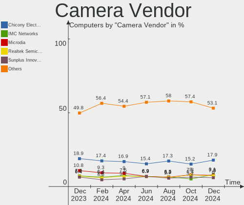

| Vendor                                 | Computers | Percent |
|----------------------------------------|-----------|---------|
| Chicony Electronics                    | 95        | 15.6%   |
| Microdia                               | 66        | 10.84%  |
| Logitech                               | 53        | 8.7%    |
| Realtek Semiconductor                  | 45        | 7.39%   |
| Quanta                                 | 41        | 6.73%   |
| Sunplus Innovation Technology          | 40        | 6.57%   |
| Bison Electronics                      | 40        | 6.57%   |
| IMC Networks                           | 38        | 6.24%   |
| Apple                                  | 34        | 5.58%   |
| Cheng Uei Precision Industry (Foxlink) | 17        | 2.79%   |
| Lite-On Technology                     | 16        | 2.63%   |
| Luxvisions Innotech Limited            | 14        | 2.3%    |
| Suyin                                  | 13        | 2.13%   |
| Syntek                                 | 11        | 1.81%   |
| Sonix Technology                       | 9         | 1.48%   |
| Acer                                   | 8         | 1.31%   |
| Microsoft                              | 7         | 1.15%   |
| Samsung Electronics                    | 4         | 0.66%   |
| Ricoh                                  | 4         | 0.66%   |
| Importek                               | 4         | 0.66%   |
| ARC International                      | 4         | 0.66%   |
| Silicon Motion                         | 3         | 0.49%   |
| Shinetech                              | 3         | 0.49%   |
| Razer USA                              | 3         | 0.49%   |
| Primax Electronics                     | 3         | 0.49%   |
| MacroSilicon                           | 3         | 0.49%   |
| Lenovo                                 | 3         | 0.49%   |
| Z-Star Microelectronics                | 2         | 0.33%   |
| webcamvendor                           | 2         | 0.33%   |
| Valve Software                         | 2         | 0.33%   |
| OmniVision Technologies                | 2         | 0.33%   |
| Linux Foundation                       | 2         | 0.33%   |
| HRY                                    | 2         | 0.33%   |
| Creative Technology                    | 2         | 0.33%   |
| ValueHD                                | 1         | 0.16%   |
| USB Camera                             | 1         | 0.16%   |
| Tobii Technology AB                    | 1         | 0.16%   |
| Sunplus Technology                     | 1         | 0.16%   |
| Shenzhen Kingcome Optoelectronic       | 1         | 0.16%   |
| Remo Tech                              | 1         | 0.16%   |

Camera Model
------------

Camera device models

| Model                                               | Computers | Percent |
|-----------------------------------------------------|-----------|---------|
| Chicony Integrated Camera                           | 32        | 5.13%   |
| Microdia Integrated_Webcam_HD                       | 27        | 4.33%   |
| Realtek Integrated_Webcam_HD                        | 24        | 3.85%   |
| IMC Networks Integrated Camera                      | 17        | 2.72%   |
| Bison Integrated Camera                             | 17        | 2.72%   |
| Sunplus Integrated_Webcam_HD                        | 13        | 2.08%   |
| IMC Networks USB2.0 HD UVC WebCam                   | 12        | 1.92%   |
| Apple FaceTime HD Camera (Built-in)                 | 11        | 1.76%   |
| Syntek Integrated Camera                            | 10        | 1.6%    |
| Apple FaceTime HD Camera                            | 10        | 1.6%    |
| Logitech Webcam C270                                | 9         | 1.44%   |
| Quanta HP TrueVision HD Camera                      | 8         | 1.28%   |
| Realtek USB Camera                                  | 7         | 1.12%   |
| Quanta HP Wide Vision HD Camera                     | 7         | 1.12%   |
| Microdia Integrated_Webcam_FHD                      | 7         | 1.12%   |
| Logitech HD Pro Webcam C920                         | 7         | 1.12%   |
| Apple Built-in iSight                               | 7         | 1.12%   |
| Logitech C922 Pro Stream Webcam                     | 6         | 0.96%   |
| Lite-On Integrated Camera                           | 6         | 0.96%   |
| Chicony HP TrueVision HD Camera                     | 6         | 0.96%   |
| Quanta HD User Facing                               | 5         | 0.8%    |
| Microdia Webcam Vitade AF                           | 5         | 0.8%    |
| Microdia Integrated Webcam                          | 5         | 0.8%    |
| Logitech BRIO Ultra HD Webcam                       | 5         | 0.8%    |
| Chicony HP Wide Vision HD Camera                    | 5         | 0.8%    |
| Chicony HP HD Camera                                | 5         | 0.8%    |
| Chicony HD WebCam                                   | 5         | 0.8%    |
| Chicony HD User Facing                              | 5         | 0.8%    |
| Cheng Uei Precision Industry (Foxlink) HP Webcam    | 5         | 0.8%    |
| Apple iPhone 5/5C/5S/6/SE/7/8/X/XR                  | 5         | 0.8%    |
| Acer SunplusIT Integrated Camera                    | 5         | 0.8%    |
| Sonix USB2.0 FHD UVC WebCam                         | 4         | 0.64%   |
| Samsung Galaxy series, misc. (MTP mode)             | 4         | 0.64%   |
| Microdia Laptop_Integrated_Webcam_HD                | 4         | 0.64%   |
| Luxvisions Innotech Limited HP TrueVision HD Camera | 4         | 0.64%   |
| Lite-On HP HD Camera                                | 4         | 0.64%   |
| Bison Integrated RGB Camera                         | 4         | 0.64%   |
| Suyin Integrated_Webcam_HD                          | 3         | 0.48%   |
| Sunplus Laptop_Integrated_Webcam_FHD                | 3         | 0.48%   |
| Sunplus Integrated_Webcam_FHD                       | 3         | 0.48%   |

Security
--------

Fingerprint Vendor
------------------

Fingerprint sensor vendors

| Vendor                     | Computers | Percent |
|----------------------------|-----------|---------|
| Synaptics                  | 48        | 43.64%  |
| Validity Sensors           | 34        | 30.91%  |
| Shenzhen Goodix Technology | 11        | 10%     |
| Upek                       | 5         | 4.55%   |
| Elan Microelectronics      | 3         | 2.73%   |
| Samsung Electronics        | 2         | 1.82%   |
| LighTuning Technology      | 2         | 1.82%   |
| Focal-systems.Corp         | 2         | 1.82%   |
| AuthenTec                  | 2         | 1.82%   |
| DigitalPersona             | 1         | 0.91%   |

Fingerprint Model
-----------------

Fingerprint sensor models

| Model                                                                      | Computers | Percent |
|----------------------------------------------------------------------------|-----------|---------|
| Synaptics Prometheus MIS Touch Fingerprint Reader                          | 18        | 16.36%  |
| Synaptics Metallica MIS Touch Fingerprint Reader                           | 9         | 8.18%   |
| Validity Sensors VFS495 Fingerprint Reader                                 | 8         | 7.27%   |
| Shenzhen Goodix Fingerprint Reader                                         | 7         | 6.36%   |
| Validity Sensors Fingerprint scanner                                       | 6         | 5.45%   |
| Validity Sensors Synaptics WBDI                                            | 5         | 4.55%   |
| Synaptics WBDI                                                             | 5         | 4.55%   |
| Upek Biometric Touchchip/Touchstrip Fingerprint Sensor                     | 4         | 3.64%   |
| Synaptics UWP WBDI                                                         | 4         | 3.64%   |
| Synaptics FS7604 Touch Fingerprint Sensor with PurePrint                   | 4         | 3.64%   |
| Validity Sensors VFS5011 Fingerprint Reader                                | 3         | 2.73%   |
| Validity Sensors VFS491                                                    | 3         | 2.73%   |
| Validity Sensors VFS 5011 fingerprint sensor                               | 3         | 2.73%   |
| Synaptics UWP WBDI Device                                                  | 3         | 2.73%   |
| Shenzhen Goodix  FingerPrint Device                                        | 3         | 2.73%   |
| Elan ELAN:ARM-M4                                                           | 3         | 2.73%   |
| Validity Sensors VFS7500 Touch Fingerprint Sensor                          | 2         | 1.82%   |
| Validity Sensors Synaptics VFS7552 Touch Fingerprint Sensor with PurePrint | 2         | 1.82%   |
| Synaptics WBDI Device                                                      | 2         | 1.82%   |
| LighTuning ES603 Swipe Fingerprint Sensor                                  | 2         | 1.82%   |
| Focal-systems.Corp FT9201Fingerprint.                                  | 2         | 1.82%   |
| Validity Sensors VFS7552 Touch Fingerprint Sensor                          | 1         | 0.91%   |
| Validity Sensors VFS301 Fingerprint Reader                                 | 1         | 0.91%   |
| Upek TCS5B Fingerprint sensor                                              | 1         | 0.91%   |
| Synaptics WBDI Fingerprint Reader USB 102                                  | 1         | 0.91%   |
| Synaptics  WBDI                                                            | 1         | 0.91%   |
| Synaptics  FS7604 Touch Fingerprint Sensor with PurePrint                  | 1         | 0.91%   |
| Shenzhen Goodix FingerPrint                                                | 1         | 0.91%   |
| Samsung Fingerprint Sensor Device - 730B                                   | 1         | 0.91%   |
| Samsung Fingerprint Device                                                 | 1         | 0.91%   |
| DigitalPersona Fingerprint Reader                                          | 1         | 0.91%   |
| AuthenTec AES2501 Fingerprint Sensor                                       | 1         | 0.91%   |
| AuthenTec AES1660 Fingerprint Sensor                                       | 1         | 0.91%   |

Chipcard Vendor
---------------

Chipcard module vendors

| Vendor                | Computers | Percent |
|-----------------------|-----------|---------|
| Broadcom              | 37        | 69.81%  |
| Alcor Micro           | 4         | 7.55%   |
| Upek                  | 3         | 5.66%   |
| SCM Microsystems      | 2         | 3.77%   |
| OmniKey               | 2         | 3.77%   |
| O2 Micro              | 2         | 3.77%   |
| Lenovo                | 1         | 1.89%   |
| Hewlett-Packard       | 1         | 1.89%   |
| Gemalto (was Gemplus) | 1         | 1.89%   |

Chipcard Model
--------------

Chipcard module models

| Model                                                                        | Computers | Percent |
|------------------------------------------------------------------------------|-----------|---------|
| Broadcom 5880                                                                | 21        | 39.62%  |
| Broadcom BCM5880 Secure Applications Processor                               | 8         | 15.09%  |
| Broadcom BCM5880 Secure Applications Processor with fingerprint swipe sensor | 5         | 9.43%   |
| Alcor Micro AU9540 Smartcard Reader                                          | 4         | 7.55%   |
| Upek TouchChip Fingerprint Coprocessor (WBF advanced mode)                   | 3         | 5.66%   |
| O2 Micro Oz776 SmartCard Reader                                              | 2         | 3.77%   |
| Broadcom 58200                                                               | 2         | 3.77%   |
| SCM Microsystems SCR3340 - ExpressCard54 Smart Card Reader                   | 1         | 1.89%   |
| SCM Microsystems SCR331-LC1 / SCR3310 SmartCard Reader                       | 1         | 1.89%   |
| OmniKey CardMan Smart@Link                                                   | 1         | 1.89%   |
| OmniKey 3x21 Smart Card Reader                                               | 1         | 1.89%   |
| Lenovo Integrated Smart Card Reader                                          | 1         | 1.89%   |
| Hewlett-Packard SC Keyboard - Apollo (Liteon)                                | 1         | 1.89%   |
| Gemalto (was Gemplus) GemPC Twin SmartCard Reader                            | 1         | 1.89%   |
| Broadcom BCM5880 Secure Applications Processor with fingerprint touch sensor | 1         | 1.89%   |

Unsupported
-----------

Unsupported Devices
-------------------

Total unsupported devices on board

| Total | Computers | Percent |
|-------|-----------|---------|
| 0     | 820       | 68.05%  |
| 1     | 316       | 26.22%  |
| 2     | 57        | 4.73%   |
| 3     | 8         | 0.66%   |
| 5     | 2         | 0.17%   |
| 4     | 2         | 0.17%   |

Unsupported Device Types
------------------------

Types of unsupported devices

| Type                     | Computers | Percent |
|--------------------------|-----------|---------|
| Graphics card            | 115       | 25.33%  |
| Fingerprint reader       | 110       | 24.23%  |
| Net/wireless             | 52        | 11.45%  |
| Chipcard                 | 45        | 9.91%   |
| Multimedia controller    | 43        | 9.47%   |
| Communication controller | 20        | 4.41%   |
| Unassigned class         | 15        | 3.3%    |
| Camera                   | 14        | 3.08%   |
| Net/ethernet             | 8         | 1.76%   |
| Bluetooth                | 8         | 1.76%   |
| Storage                  | 6         | 1.32%   |
| Sound                    | 6         | 1.32%   |
| Card reader              | 5         | 1.1%    |
| Storage/ide              | 2         | 0.44%   |
| Storage/raid             | 1         | 0.22%   |
| Storage/nvme             | 1         | 0.22%   |
| Network                  | 1         | 0.22%   |
| Modem                    | 1         | 0.22%   |
| Firewire controller      | 1         | 0.22%   |

