Linux - Hardware Trends (Notebooks)
-----------------------------------

A project to identify most popular hardware characteristics and track their change
over time based on data collected by Linux users at https://Linux-Hardware.org.

Anyone can contribute to this report by the [hw-probe](https://github.com/linuxhw/hw-probe) tool:

    sudo -E hw-probe -all -upload

This report is for one last month. Overall report since the beginning of time: [TestDays](https://github.com/linuxhw/TestDays)

Period: Dec, 2025.

Contents
--------

* [ System ](#system)
  - [ OS                       ](#os)
  - [ OS Family                ](#os-family)
  - [ Kernel                   ](#kernel)
  - [ Kernel Family            ](#kernel-family)
  - [ Kernel Major Ver.        ](#kernel-major-ver)
  - [ Arch                     ](#arch)
  - [ DE                       ](#de)
  - [ Display Server           ](#display-server)
  - [ Display Manager          ](#display-manager)
  - [ OS Lang                  ](#os-lang)
  - [ Boot Mode                ](#boot-mode)
  - [ Filesystem               ](#filesystem)
  - [ Part. scheme             ](#part-scheme)
  - [ Dual Boot with Linux/BSD ](#dual-boot-with-linuxbsd)
  - [ Dual Boot (Win)          ](#dual-boot-win)

* [ Board ](#board)
  - [ Vendor                   ](#vendor)
  - [ Model                    ](#model)
  - [ Model Family             ](#model-family)
  - [ MFG Year                 ](#mfg-year)
  - [ Form Factor              ](#form-factor)
  - [ Secure Boot              ](#secure-boot)
  - [ Coreboot                 ](#coreboot)
  - [ RAM Size                 ](#ram-size)
  - [ RAM Used                 ](#ram-used)
  - [ Total Drives             ](#total-drives)
  - [ Has CD-ROM               ](#has-cd-rom)
  - [ Has Ethernet             ](#has-ethernet)
  - [ Has WiFi                 ](#has-wifi)
  - [ Has Bluetooth            ](#has-bluetooth)

* [ Location ](#location)
  - [ Country                  ](#country)
  - [ City                     ](#city)

* [ Drives ](#drives)
  - [ Drive Vendor             ](#drive-vendor)
  - [ Drive Model              ](#drive-model)
  - [ HDD Vendor               ](#hdd-vendor)
  - [ SSD Vendor               ](#ssd-vendor)
  - [ Drive Kind               ](#drive-kind)
  - [ Drive Connector          ](#drive-connector)
  - [ Drive Size               ](#drive-size)
  - [ Space Total              ](#space-total)
  - [ Space Used               ](#space-used)
  - [ Malfunc. Drives          ](#malfunc-drives)
  - [ Malfunc. Drive Vendor    ](#malfunc-drive-vendor)
  - [ Malfunc. HDD Vendor      ](#malfunc-hdd-vendor)
  - [ Malfunc. Drive Kind      ](#malfunc-drive-kind)
  - [ Failed Drives            ](#failed-drives)
  - [ Failed Drive Vendor      ](#failed-drive-vendor)
  - [ Drive Status             ](#drive-status)

* [ Storage controller ](#storage-controller)
  - [ Storage Vendor           ](#storage-vendor)
  - [ Storage Model            ](#storage-model)
  - [ Storage Kind             ](#storage-kind)

* [ Processor ](#processor)
  - [ CPU Vendor               ](#cpu-vendor)
  - [ CPU Model                ](#cpu-model)
  - [ CPU Model Family         ](#cpu-model-family)
  - [ CPU Cores                ](#cpu-cores)
  - [ CPU Sockets              ](#cpu-sockets)
  - [ CPU Threads              ](#cpu-threads)
  - [ CPU Op-Modes             ](#cpu-op-modes)
  - [ CPU Microcode            ](#cpu-microcode)
  - [ CPU Microarch            ](#cpu-microarch)

* [ Graphics ](#graphics)
  - [ GPU Vendor               ](#gpu-vendor)
  - [ GPU Model                ](#gpu-model)
  - [ GPU Combo                ](#gpu-combo)
  - [ GPU Driver               ](#gpu-driver)
  - [ GPU Memory               ](#gpu-memory)

* [ Monitor ](#monitor)
  - [ Monitor Vendor           ](#monitor-vendor)
  - [ Monitor Model            ](#monitor-model)
  - [ Monitor Resolution       ](#monitor-resolution)
  - [ Monitor Diagonal         ](#monitor-diagonal)
  - [ Monitor Width            ](#monitor-width)
  - [ Aspect Ratio             ](#aspect-ratio)
  - [ Monitor Area             ](#monitor-area)
  - [ Pixel Density            ](#pixel-density)
  - [ Multiple Monitors        ](#multiple-monitors)

* [ Network ](#network)
  - [ Net Controller Vendor    ](#net-controller-vendor)
  - [ Net Controller Model     ](#net-controller-model)
  - [ Wireless Vendor          ](#wireless-vendor)
  - [ Wireless Model           ](#wireless-model)
  - [ Ethernet Vendor          ](#ethernet-vendor)
  - [ Ethernet Model           ](#ethernet-model)
  - [ Net Controller Kind      ](#net-controller-kind)
  - [ Used Controller          ](#used-controller)
  - [ NICs                     ](#nics)
  - [ IPv6                     ](#ipv6)

* [ Bluetooth ](#bluetooth)
  - [ Bluetooth Vendor         ](#bluetooth-vendor)
  - [ Bluetooth Model          ](#bluetooth-model)

* [ Sound ](#sound)
  - [ Sound Vendor             ](#sound-vendor)
  - [ Sound Model              ](#sound-model)

* [ Memory ](#memory)
  - [ Memory Vendor            ](#memory-vendor)
  - [ Memory Model             ](#memory-model)
  - [ Memory Kind              ](#memory-kind)
  - [ Memory Form Factor       ](#memory-form-factor)
  - [ Memory Size              ](#memory-size)
  - [ Memory Speed             ](#memory-speed)

* [ Printers & scanners ](#printers--scanners)
  - [ Printer Vendor           ](#printer-vendor)
  - [ Printer Model            ](#printer-model)
  - [ Scanner Vendor           ](#scanner-vendor)
  - [ Scanner Model            ](#scanner-model)

* [ Camera ](#camera)
  - [ Camera Vendor            ](#camera-vendor)
  - [ Camera Model             ](#camera-model)

* [ Security ](#security)
  - [ Fingerprint Vendor       ](#fingerprint-vendor)
  - [ Fingerprint Model        ](#fingerprint-model)
  - [ Chipcard Vendor          ](#chipcard-vendor)
  - [ Chipcard Model           ](#chipcard-model)

* [ Unsupported ](#unsupported)
  - [ Unsupported Devices      ](#unsupported-devices)
  - [ Unsupported Device Types ](#unsupported-device-types)

System
------

OS
--

Installed operating systems

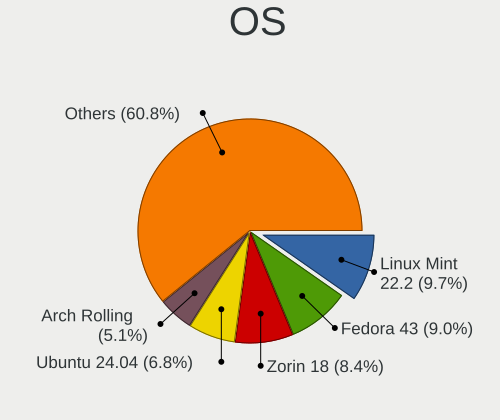

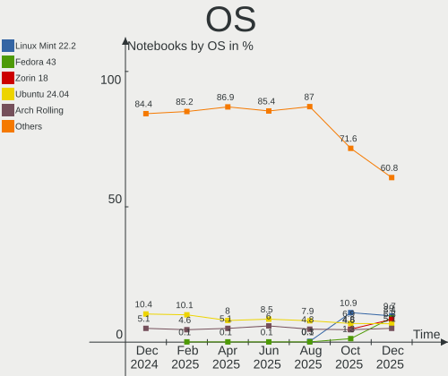

| Name                | Notebooks | Percent |
|---------------------|-----------|---------|
| Linux Mint 22.2     | 319       | 9.7%    |
| Fedora 43           | 297       | 9.04%   |
| Zorin 18            | 277       | 8.43%   |
| Ubuntu 24.04        | 225       | 6.85%   |
| Arch Rolling        | 169       | 5.14%   |
| Debian 13           | 142       | 4.32%   |
| OpenMandriva 6.0    | 133       | 4.05%   |
| OpenMandriva 25.90  | 102       | 3.1%    |
| Bazzite 43          | 95        | 2.89%   |
| OpenMandriva 25.11  | 91        | 2.77%   |
| Ubuntu 25.10        | 88        | 2.68%   |
| Pop!_OS 24.04       | 88        | 2.68%   |
| ROSA 13.1           | 53        | 1.61%   |
| CachyOS Rolling     | 50        | 1.52%   |
| Zorin 17            | 45        | 1.37%   |
| Kubuntu 25.10       | 40        | 1.22%   |
| Pop!_OS 22.04       | 39        | 1.19%   |
| Fedora 42           | 39        | 1.19%   |
| LMDE 7              | 36        | 1.1%    |
| OpenMandriva 25.06  | 34        | 1.03%   |
| Linux Mint 22.1     | 33        | 1%      |
| OpenMandriva 24.12  | 30        | 0.91%   |
| Debian              | 29        | 0.88%   |
| EndeavourOS Rolling | 28        | 0.85%   |
| SteamOS 3.7.17      | 27        | 0.82%   |
| CachyOS             | 27        | 0.82%   |
| KDE neon 24.04      | 26        | 0.79%   |
| Debian 12           | 24        | 0.73%   |
| Ubuntu 22.04        | 22        | 0.67%   |
| ROSA 12.5.1         | 22        | 0.67%   |
| Bazzite 42          | 22        | 0.67%   |
| ALT Linux 11.0      | 22        | 0.67%   |
| Kali 2025.4         | 21        | 0.64%   |
| Elementary 8        | 21        | 0.64%   |
| ROSA 12             | 19        | 0.58%   |
| NixOS 26.05         | 19        | 0.58%   |
| Kubuntu 24.04       | 19        | 0.58%   |
| Linux Mint 21.3     | 18        | 0.55%   |
| Manjaro 25.1.0      | 16        | 0.49%   |
| Gentoo 2.18         | 16        | 0.49%   |

OS Family
---------

OS without a version

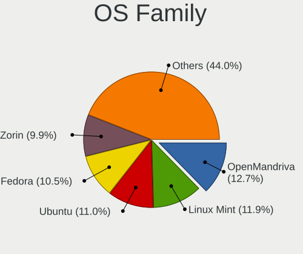

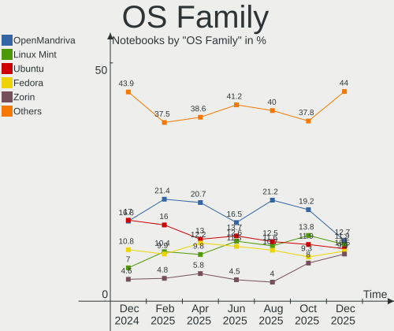

| Name             | Notebooks | Percent |
|------------------|-----------|---------|
| OpenMandriva     | 417       | 12.69%  |
| Linux Mint       | 390       | 11.86%  |
| Ubuntu           | 362       | 11.01%  |
| Fedora           | 345       | 10.5%   |
| Zorin            | 326       | 9.92%   |
| Debian           | 204       | 6.21%   |
| Arch             | 171       | 5.2%    |
| Pop!_OS          | 127       | 3.86%   |
| Bazzite          | 117       | 3.56%   |
| ROSA             | 102       | 3.1%    |
| CachyOS          | 77        | 2.34%   |
| Kubuntu          | 63        | 1.92%   |
| Manjaro          | 41        | 1.25%   |
| SteamOS          | 37        | 1.13%   |
| LMDE             | 37        | 1.13%   |
| NixOS            | 36        | 1.1%    |
| ALT Linux        | 34        | 1.03%   |
| openSUSE         | 28        | 0.85%   |
| EndeavourOS      | 28        | 0.85%   |
| KDE neon         | 27        | 0.82%   |
| Xubuntu          | 26        | 0.79%   |
| Elementary       | 25        | 0.76%   |
| Kali             | 22        | 0.67%   |
| BlackPanther     | 19        | 0.58%   |
| Gentoo           | 17        | 0.52%   |
| MX               | 15        | 0.46%   |
| Nobara           | 13        | 0.4%    |
| Lubuntu          | 13        | 0.4%    |
| Garuda Linux     | 13        | 0.4%    |
| Ubuntu MATE      | 11        | 0.33%   |
| TUXEDO OS        | 11        | 0.33%   |
| Anduinos         | 9         | 0.27%   |
| Void Linux       | 7         | 0.21%   |
| org.kde.Platform | 7         | 0.21%   |
| Artix            | 7         | 0.21%   |
| Ubuntu Budgie    | 6         | 0.18%   |
| Red OS           | 6         | 0.18%   |
| Aurora           | 6         | 0.18%   |
| Ultramarine      | 5         | 0.15%   |
| Q4OS             | 5         | 0.15%   |

Kernel
------

Version of the Linux kernel

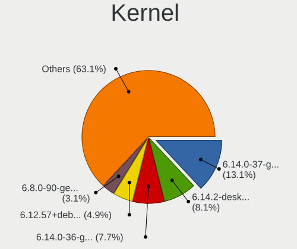

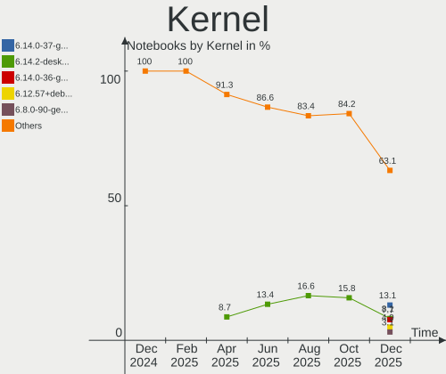

| Version                                     | Notebooks | Percent |
|---------------------------------------------|-----------|---------|
| 6.14.0-37-generic                           | 429       | 13.05%  |
| 6.14.2-desktop-3omv2590                     | 266       | 8.09%   |
| 6.14.0-36-generic                           | 254       | 7.73%   |
| 6.12.57+deb13-amd64                         | 161       | 4.9%    |
| 6.8.0-90-generic                            | 102       | 3.1%    |
| 6.17.12-300.fc43.x86_64                     | 93        | 2.83%   |
| 6.17.9-arch1-1                              | 88        | 2.68%   |
| 6.17.9-300.fc43.x86_64                      | 77        | 2.34%   |
| 6.17.9-76061709-generic                     | 73        | 2.22%   |
| 6.8.0-88-generic                            | 72        | 2.19%   |
| 6.17.0-8-generic                            | 69        | 2.1%    |
| 6.17.7-ba20.fc43.x86_64                     | 64        | 1.95%   |
| 6.12.47-generic-5rosa13-x86_64              | 54        | 1.64%   |
| 6.17.0-7-generic                            | 48        | 1.46%   |
| 6.18.0-desktop-1omv2590                     | 44        | 1.34%   |
| 6.17.1-300.fc43.x86_64                      | 44        | 1.34%   |
| 6.17.4-76061704-generic                     | 40        | 1.22%   |
| 6.8.0-87-generic                            | 37        | 1.13%   |
| 6.14.0-29-generic                           | 36        | 1.1%    |
| 6.17.7-desktop-1omv2590                     | 34        | 1.03%   |
| 6.17.10-300.fc43.x86_64                     | 33        | 1%      |
| 6.12.1-desktop-1omv2490                     | 31        | 0.94%   |
| 6.17.7-ba19.fc43.x86_64                     | 29        | 0.88%   |
| 6.17.11-300.fc43.x86_64                     | 29        | 0.88%   |
| 6.11.11-valve24-2-neptune-611-gfd0dd251480d | 27        | 0.82%   |
| 6.17.9-2-cachyos                            | 24        | 0.73%   |
| 6.17.9-zen1-1-zen                           | 23        | 0.7%    |
| 6.14.0-33-generic                           | 22        | 0.67%   |
| 6.12.48+deb13-amd64                         | 22        | 0.67%   |
| 6.18.2-arch2-1                              | 21        | 0.64%   |
| 6.17.8-300.fc43.x86_64                      | 21        | 0.64%   |
| 6.16.4-116.bazzite.fc42.x86_64              | 20        | 0.61%   |
| 6.17.10+kali-amd64                          | 15        | 0.46%   |
| 6.17.8-arch1-1                              | 14        | 0.43%   |
| 6.12.34-6.12-alt1                           | 14        | 0.43%   |
| 6.1.0-41-amd64                              | 14        | 0.43%   |
| 6.6.106-generic-3rosa2021.1-x86_64          | 13        | 0.4%    |
| 6.18.1-arch1-2                              | 13        | 0.4%    |
| 6.18.0-3-cachyos                            | 13        | 0.4%    |
| 6.17.0-6-generic                            | 13        | 0.4%    |

Kernel Family
-------------

Linux kernel without a distro release

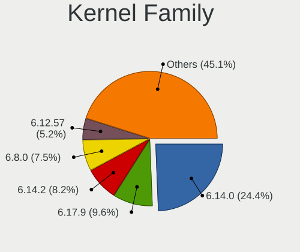

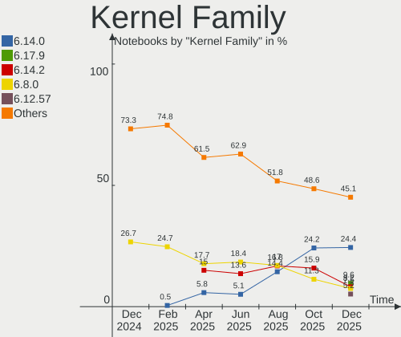

| Version | Notebooks | Percent |
|---------|-----------|---------|
| 6.14.0  | 801       | 24.37%  |
| 6.17.9  | 317       | 9.64%   |
| 6.14.2  | 268       | 8.15%   |
| 6.8.0   | 248       | 7.54%   |
| 6.12.57 | 170       | 5.17%   |
| 6.17.0  | 146       | 4.44%   |
| 6.17.7  | 144       | 4.38%   |
| 6.18.0  | 115       | 3.5%    |
| 6.17.12 | 102       | 3.1%    |
| 6.18.2  | 73        | 2.22%   |
| 6.17.8  | 69        | 2.1%    |
| 6.12.47 | 66        | 2.01%   |
| 6.17.10 | 63        | 1.92%   |
| 6.17.1  | 49        | 1.49%   |
| 6.18.1  | 48        | 1.46%   |
| 6.17.4  | 48        | 1.46%   |
| 6.17.11 | 41        | 1.25%   |
| 5.15.0  | 38        | 1.16%   |
| 6.11.11 | 35        | 1.06%   |
| 6.12.48 | 33        | 1%      |
| 6.12.1  | 32        | 0.97%   |
| 6.1.0   | 27        | 0.82%   |
| 6.16.4  | 23        | 0.7%    |
| 6.6.106 | 15        | 0.46%   |
| 6.12.0  | 15        | 0.46%   |
| 6.12.61 | 14        | 0.43%   |
| 6.12.34 | 14        | 0.43%   |
| 6.12.63 | 12        | 0.37%   |
| 6.6.32  | 11        | 0.33%   |
| 6.17.13 | 11        | 0.33%   |
| 6.12.58 | 10        | 0.3%    |
| 6.12.59 | 9         | 0.27%   |
| 6.16.3  | 8         | 0.24%   |
| 6.12.62 | 8         | 0.24%   |
| 6.11.0  | 8         | 0.24%   |
| 6.16.8  | 7         | 0.21%   |
| 6.16.12 | 7         | 0.21%   |
| 6.12.60 | 7         | 0.21%   |
| 5.10.0  | 7         | 0.21%   |
| 6.6.2   | 6         | 0.18%   |

Kernel Major Ver.
-----------------

Linux kernel major version

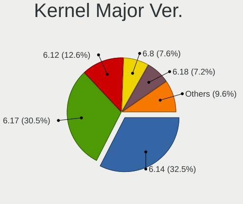

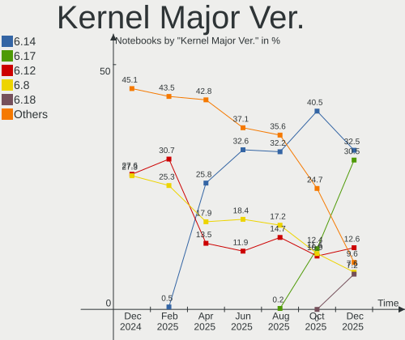

| Version | Notebooks | Percent |
|---------|-----------|---------|
| 6.14    | 1069      | 32.52%  |
| 6.17    | 1002      | 30.48%  |
| 6.12    | 414       | 12.6%   |
| 6.8     | 250       | 7.61%   |
| 6.18    | 236       | 7.18%   |
| 6.16    | 51        | 1.55%   |
| 6.6     | 50        | 1.52%   |
| 6.11    | 46        | 1.4%    |
| 5.15    | 44        | 1.34%   |
| 6.1     | 42        | 1.28%   |
| 5.10    | 12        | 0.37%   |
| 6.4     | 10        | 0.3%    |
| 6.15    | 8         | 0.24%   |
| 6.10    | 8         | 0.24%   |
| 6.5     | 7         | 0.21%   |
| 4.18    | 7         | 0.21%   |
| 5.4     | 6         | 0.18%   |
| 4.15    | 4         | 0.12%   |
| 5.14    | 3         | 0.09%   |
| 6.19    | 2         | 0.06%   |
| 6.13    | 2         | 0.06%   |
| 6.0     | 2         | 0.06%   |
| 5.19    | 2         | 0.06%   |
| 5.16    | 2         | 0.06%   |
| 5.11    | 2         | 0.06%   |
| 4.4     | 2         | 0.06%   |
| 6.7     | 1         | 0.03%   |
| 6.2     | 1         | 0.03%   |
| 6       | 1         | 0.03%   |
| 4.14    | 1         | 0.03%   |

Arch
----

OS architecture (x86_64, i586, etc.)

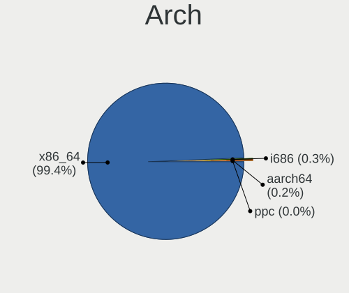

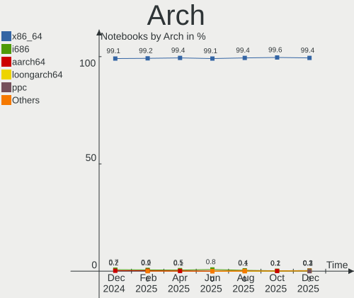

| Name        | Notebooks | Percent |
|-------------|-----------|---------|
| x86_64      | 3266      | 99.36%  |
| i686        | 10        | 0.3%    |
| aarch64     | 7         | 0.21%   |
| loongarch64 | 3         | 0.09%   |
| ppc         | 1         | 0.03%   |

DE
--

Desktop Environment

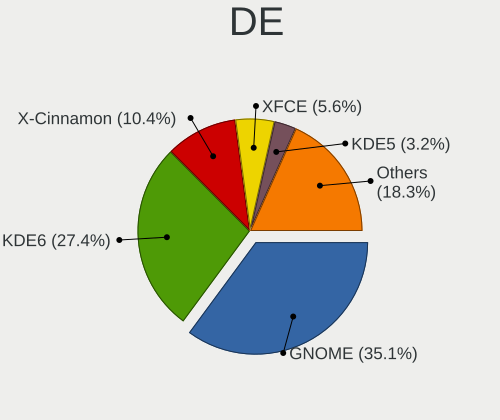

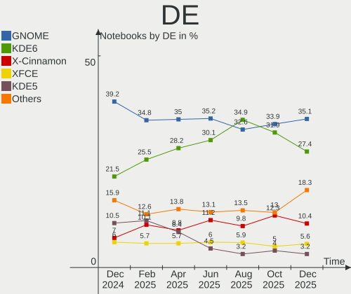

| Name                        | Notebooks | Percent |
|-----------------------------|-----------|---------|
| GNOME                       | 1154      | 35.11%  |
| KDE6                        | 901       | 27.41%  |
| X-Cinnamon                  | 341       | 10.37%  |
| XFCE                        | 185       | 5.63%   |
| KDE5                        | 104       | 3.16%   |
| Unknown                     | 96        | 2.92%   |
| COSMIC                      | 92        | 2.8%    |
| LXQt                        | 73        | 2.22%   |
| KDE                         | 64        | 1.95%   |
| MATE                        | 58        | 1.76%   |
| Hyprland                    | 56        | 1.7%    |
| Pantheon                    | 26        | 0.79%   |
| niri                        | 21        | 0.64%   |
| i3                          | 20        | 0.61%   |
| sway                        | 14        | 0.43%   |
| Cinnamon                    | 13        | 0.4%    |
| KDE4                        | 12        | 0.37%   |
| Budgie                      | 12        | 0.37%   |
| Trinity                     | 7         | 0.21%   |
| LXDE                        | 6         | 0.18%   |
| GNOME Flashback             | 4         | 0.12%   |
| sway:wlroots                | 3         | 0.09%   |
| GNOME Classic               | 3         | 0.09%   |
| Endless:GNOME               | 3         | 0.09%   |
| Unity                       | 2         | 0.06%   |
| icewm                       | 2         | 0.06%   |
| Enlightenment               | 2         | 0.06%   |
| Deepin                      | 2         | 0.06%   |
| wlroots                     | 1         | 0.03%   |
| UKUI                        | 1         | 0.03%   |
| TDE:                        | 1         | 0.03%   |
| Phosh:GNOME                 | 1         | 0.03%   |
| LeftWM                      | 1         | 0.03%   |
| Hyprland:start-hyprland     | 1         | 0.03%   |
| GNUstep                     | 1         | 0.03%   |
| DWM                         | 1         | 0.03%   |
| BunsenLabs:XFCE             | 1         | 0.03%   |
| bspwm:                      | 1         | 0.03%   |
| /usr/local/bin/start-mwm.sh | 1         | 0.03%   |

Display Server
--------------

X11 or Wayland

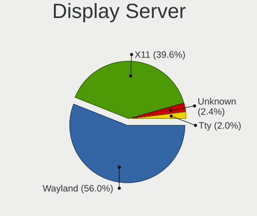

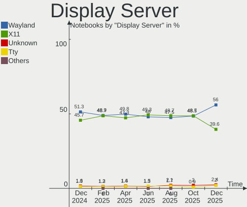

| Name    | Notebooks | Percent |
|---------|-----------|---------|
| Wayland | 1841      | 56.01%  |
| X11     | 1301      | 39.58%  |
| Unknown | 80        | 2.43%   |
| Tty     | 65        | 1.98%   |

Display Manager
---------------

SDDM, LightDM, etc.

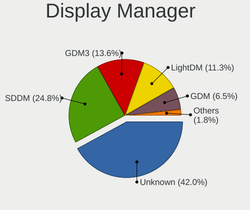

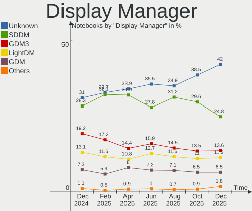

| Name                  | Notebooks | Percent |
|-----------------------|-----------|---------|
| Unknown               | 1382      | 42.04%  |
| SDDM                  | 816       | 24.83%  |
| GDM3                  | 448       | 13.63%  |
| LightDM               | 370       | 11.26%  |
| GDM                   | 213       | 6.48%   |
| GREETD                | 20        | 0.61%   |
| COSMIC-GREETER        | 15        | 0.46%   |
| LY-DM                 | 8         | 0.24%   |
| TDM                   | 5         | 0.15%   |
| Ly                    | 2         | 0.06%   |
| DISPLAY-MANAGER-START | 2         | 0.06%   |
| XDM                   | 1         | 0.03%   |
| SLIMSKI               | 1         | 0.03%   |
| PLASMALOGIN           | 1         | 0.03%   |
| MDM                   | 1         | 0.03%   |
| LXDM                  | 1         | 0.03%   |
| KDM                   | 1         | 0.03%   |

OS Lang
-------

Language

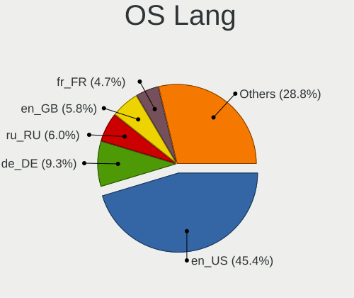

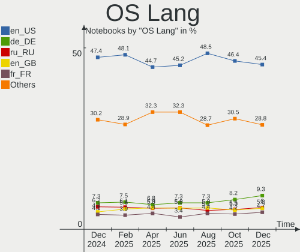

| Lang    | Notebooks | Percent |
|---------|-----------|---------|
| en_US   | 1491      | 45.36%  |
| de_DE   | 306       | 9.31%   |
| ru_RU   | 197       | 5.99%   |
| en_GB   | 191       | 5.81%   |
| fr_FR   | 156       | 4.75%   |
| pt_BR   | 109       | 3.32%   |
| it_IT   | 105       | 3.19%   |
| es_ES   | 79        | 2.4%    |
| pl_PL   | 64        | 1.95%   |
| C       | 64        | 1.95%   |
| en_CA   | 52        | 1.58%   |
| en_AU   | 42        | 1.28%   |
| es_MX   | 34        | 1.03%   |
| nl_NL   | 32        | 0.97%   |
| Unknown | 31        | 0.94%   |
| en_IN   | 26        | 0.79%   |
| zh_CN   | 22        | 0.67%   |
| hu_HU   | 20        | 0.61%   |
| tr_TR   | 19        | 0.58%   |
| de_AT   | 18        | 0.55%   |
| cs_CZ   | 16        | 0.49%   |
| pt_PT   | 15        | 0.46%   |
| en_ZA   | 11        | 0.33%   |
| en_NZ   | 11        | 0.33%   |
| en_DK   | 11        | 0.33%   |
| sv_SE   | 10        | 0.3%    |
| es_CO   | 10        | 0.3%    |
| es_CL   | 10        | 0.3%    |
| es_AR   | 9         | 0.27%   |
| de_CH   | 9         | 0.27%   |
| fi_FI   | 7         | 0.21%   |
| en_PH   | 7         | 0.21%   |
| en_IE   | 7         | 0.21%   |
| zh_TW   | 6         | 0.18%   |
| fr_CH   | 6         | 0.18%   |
| es_EC   | 6         | 0.18%   |
| uk_UA   | 4         | 0.12%   |
| nb_NO   | 4         | 0.12%   |
| ja_JP   | 4         | 0.12%   |
| en_IL   | 4         | 0.12%   |

Boot Mode
---------

EFI or BIOS

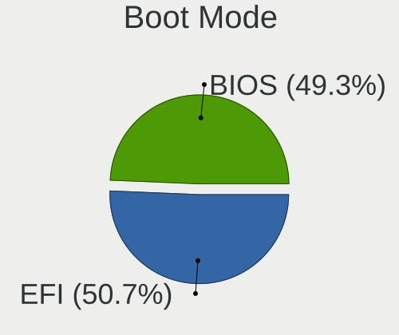

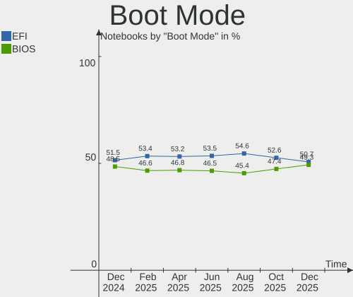

| Mode | Notebooks | Percent |
|------|-----------|---------|
| EFI  | 1665      | 50.65%  |
| BIOS | 1622      | 49.35%  |

Filesystem
----------

Type of filesystem

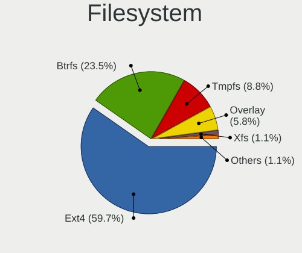

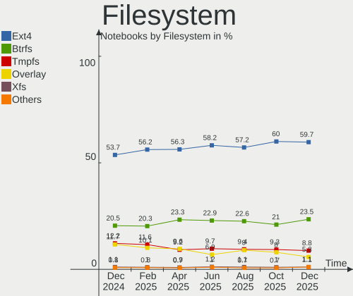

| Type     | Notebooks | Percent |
|----------|-----------|---------|
| Ext4     | 1963      | 59.72%  |
| Btrfs    | 772       | 23.49%  |
| Tmpfs    | 289       | 8.79%   |
| Overlay  | 192       | 5.84%   |
| Xfs      | 35        | 1.06%   |
| Zfs      | 15        | 0.46%   |
| F2fs     | 10        | 0.3%    |
| Ext2     | 3         | 0.09%   |
| Rootfs   | 2         | 0.06%   |
| Ext3     | 2         | 0.06%   |
| Bcachefs | 2         | 0.06%   |
| Unknown  | 2         | 0.06%   |

Part. scheme
------------

Scheme of partitioning

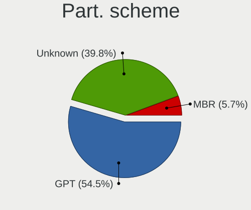

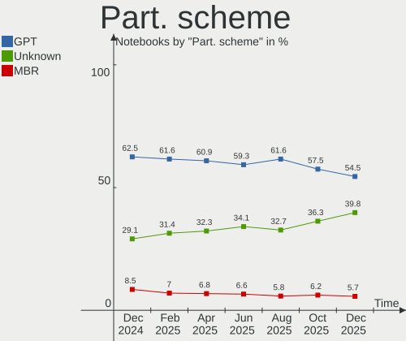

| Type    | Notebooks | Percent |
|---------|-----------|---------|
| GPT     | 1792      | 54.52%  |
| Unknown | 1308      | 39.79%  |
| MBR     | 187       | 5.69%   |

Dual Boot with Linux/BSD
------------------------

Hosting more than one Linux/BSD

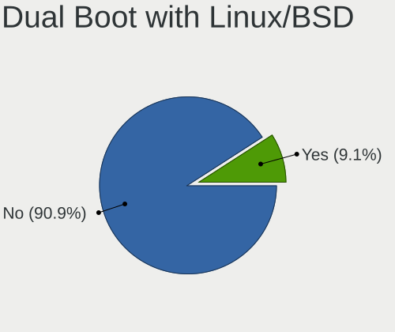

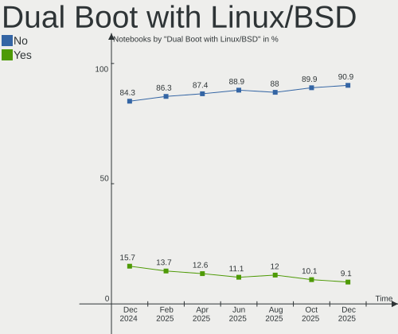

| Dual boot | Notebooks | Percent |
|-----------|-----------|---------|
| No        | 2988      | 90.9%   |
| Yes       | 299       | 9.1%    |

Dual Boot (Win)
---------------

Hosting Linux and Windows

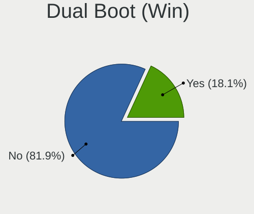

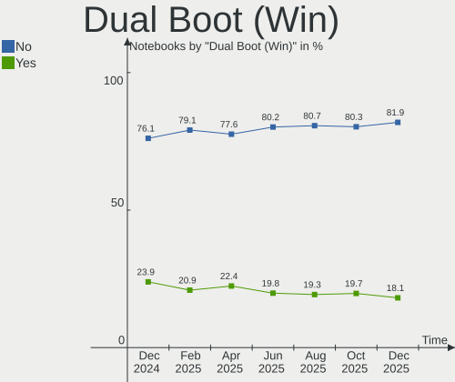

| Dual boot | Notebooks | Percent |
|-----------|-----------|---------|
| No        | 2691      | 81.87%  |
| Yes       | 596       | 18.13%  |

Board
-----

Vendor
------

Motherboard manufacturer

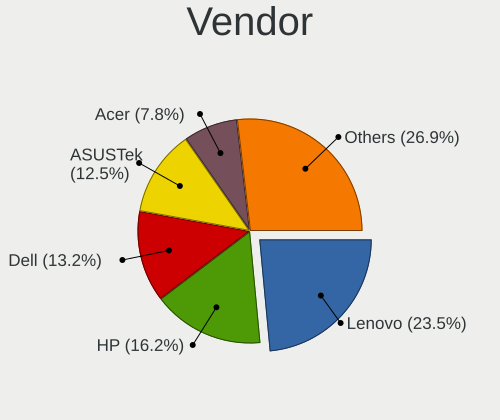

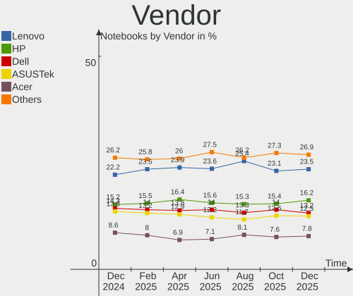

| Name                | Notebooks | Percent |
|---------------------|-----------|---------|
| Lenovo              | 773       | 23.52%  |
| Hewlett-Packard     | 531       | 16.15%  |
| Dell                | 433       | 13.17%  |
| ASUSTek Computer    | 410       | 12.47%  |
| Acer                | 257       | 7.82%   |
| Apple               | 142       | 4.32%   |
| MSI                 | 84        | 2.56%   |
| Toshiba             | 55        | 1.67%   |
| Samsung Electronics | 46        | 1.4%    |
| Framework           | 42        | 1.28%   |
| HUAWEI              | 38        | 1.16%   |
| Google              | 35        | 1.06%   |
| Valve               | 34        | 1.03%   |
| Sony                | 26        | 0.79%   |
| Fujitsu             | 26        | 0.79%   |
| Medion              | 25        | 0.76%   |
| Unknown             | 22        | 0.67%   |
| Gigabyte Technology | 18        | 0.55%   |
| Alienware           | 17        | 0.52%   |
| TUXEDO              | 14        | 0.43%   |
| Notebook            | 13        | 0.4%    |
| Chuwi               | 10        | 0.3%    |
| System76            | 9         | 0.27%   |
| Razer               | 9         | 0.27%   |
| Packard Bell        | 9         | 0.27%   |
| LG Electronics      | 7         | 0.21%   |
| HONOR               | 7         | 0.21%   |
| Aquarius            | 7         | 0.21%   |
| Positivo            | 6         | 0.18%   |
| KVADRA              | 6         | 0.18%   |
| TongFang            | 5         | 0.15%   |
| Timi                | 5         | 0.15%   |
| Standard            | 5         | 0.15%   |
| Panasonic           | 5         | 0.15%   |
| MECHREVO            | 5         | 0.15%   |
| ICL Techno          | 5         | 0.15%   |
| Schenker            | 4         | 0.12%   |
| PC Specialist       | 4         | 0.12%   |
| Infinix             | 4         | 0.12%   |
| Gateway             | 4         | 0.12%   |

Model
-----

Motherboard model

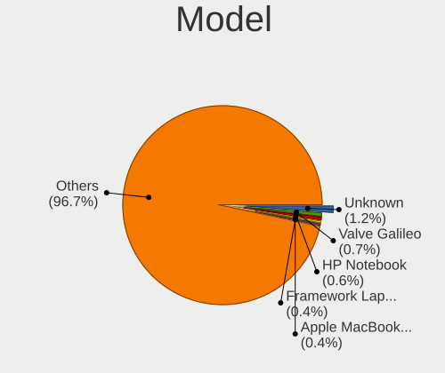

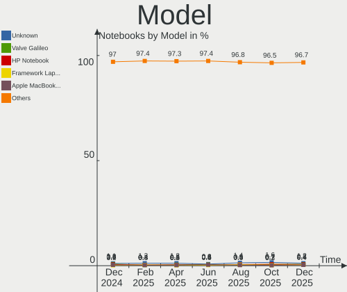

| Name                                          | Notebooks | Percent |
|-----------------------------------------------|-----------|---------|
| Unknown                                       | 39        | 1.19%   |
| Valve Galileo                                 | 22        | 0.67%   |
| HP Notebook                                   | 21        | 0.64%   |
| Framework Laptop 13 (AMD Ryzen 7040Series)    | 14        | 0.43%   |
| Apple MacBookPro9,2                           | 14        | 0.43%   |
| Apple MacBookAir7,2                           | 14        | 0.43%   |
| ASUS Vivobook Go E1504FA_E1504FA              | 13        | 0.4%    |
| Apple MacBookPro8,1                           | 13        | 0.4%    |
| Valve Jupiter                                 | 12        | 0.37%   |
| Framework Laptop 16 (AMD Ryzen 7040 Series)   | 12        | 0.37%   |
| ASUS VivoBook_ASUSLaptop M1605YA_M1605YA      | 12        | 0.37%   |
| HP Laptop 15-fd0xxx                           | 11        | 0.33%   |
| HP EliteBook 840 G6                           | 10        | 0.3%    |
| HP Pavilion 15                                | 9         | 0.27%   |
| HP 15                                         | 9         | 0.27%   |
| Apple MacBookPro12,1                          | 9         | 0.27%   |
| HP Pavilion dv7                               | 8         | 0.24%   |
| HP Pavilion dv6                               | 8         | 0.24%   |
| Apple MacBookAir6,2                           | 8         | 0.24%   |
| Framework Laptop 13 (AMD Ryzen AI 300 Series) | 7         | 0.21%   |
| Dell Latitude E6430                           | 7         | 0.21%   |
| ASUS ASUS Zenbook S 16 UM5606WA_UM5606WA      | 7         | 0.21%   |
| Apple MacBookPro11,5                          | 7         | 0.21%   |
| Lenovo Legion 5 15IRX10 83LY                  | 6         | 0.18%   |
| Lenovo G50-45 80E3                            | 6         | 0.18%   |
| HP Pavilion Notebook                          | 6         | 0.18%   |
| HP Laptop 15s-eq2xxx                          | 6         | 0.18%   |
| HP Laptop 15-fc0xxx                           | 6         | 0.18%   |
| Dell XPS 15 9530                              | 6         | 0.18%   |
| Dell XPS 13 9360                              | 6         | 0.18%   |
| Dell Latitude 7480                            | 6         | 0.18%   |
| Dell Latitude 5410                            | 6         | 0.18%   |
| Dell Latitude 5400                            | 6         | 0.18%   |
| Dell Inspiron 3521                            | 6         | 0.18%   |
| Apple MacBookPro14,1                          | 6         | 0.18%   |
| Apple MacBookPro11,1                          | 6         | 0.18%   |
| Lenovo Legion Pro 7 16AFR10H 83RU             | 5         | 0.15%   |
| Lenovo G50-70 20351                           | 5         | 0.15%   |
| KVADRA NAU LE14U                              | 5         | 0.15%   |
| HP Pavilion 17                                | 5         | 0.15%   |

Model Family
------------

Motherboard model prefix

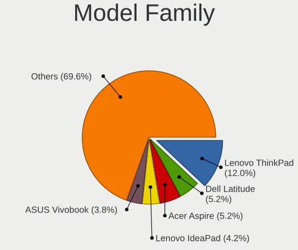

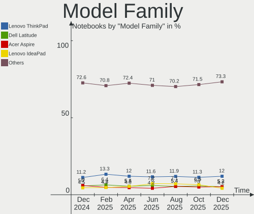

| Name               | Notebooks | Percent |
|--------------------|-----------|---------|
| Lenovo ThinkPad    | 395       | 12.02%  |
| Dell Latitude      | 171       | 5.2%    |
| Acer Aspire        | 171       | 5.2%    |
| Lenovo IdeaPad     | 139       | 4.23%   |
| ASUS Vivobook      | 124       | 3.77%   |
| Dell Inspiron      | 114       | 3.47%   |
| HP Laptop          | 90        | 2.74%   |
| HP EliteBook       | 84        | 2.56%   |
| HP Pavilion        | 75        | 2.28%   |
| ASUS ASUS          | 75        | 2.28%   |
| HP ProBook         | 65        | 1.98%   |
| Lenovo Legion      | 64        | 1.95%   |
| Dell XPS           | 50        | 1.52%   |
| Dell Precision     | 46        | 1.4%    |
| ASUS ROG           | 43        | 1.31%   |
| Framework Laptop   | 42        | 1.28%   |
| Toshiba Satellite  | 41        | 1.25%   |
| Unknown            | 39        | 1.19%   |
| HP Victus          | 29        | 0.88%   |
| Acer Nitro         | 29        | 0.88%   |
| Lenovo ThinkBook   | 27        | 0.82%   |
| Lenovo Yoga        | 26        | 0.79%   |
| ASUS ZenBook       | 24        | 0.73%   |
| Apple MacBookPro11 | 23        | 0.7%    |
| Valve Galileo      | 22        | 0.67%   |
| HP ZBook           | 22        | 0.67%   |
| HP OMEN            | 21        | 0.64%   |
| HP Notebook        | 21        | 0.64%   |
| Fujitsu LIFEBOOK   | 21        | 0.64%   |
| Lenovo LOQ         | 19        | 0.58%   |
| Apple MacBookPro9  | 19        | 0.58%   |
| Acer Swift         | 19        | 0.58%   |
| HP ENVY            | 18        | 0.55%   |
| Dell Vostro        | 17        | 0.52%   |
| HP 250             | 16        | 0.49%   |
| Apple MacBookPro8  | 16        | 0.49%   |
| Apple MacBookAir7  | 16        | 0.49%   |
| ASUS TUF           | 14        | 0.43%   |
| Acer Predator      | 14        | 0.43%   |
| Lenovo V15         | 13        | 0.4%    |

MFG Year
--------

Motherboard manufacture year

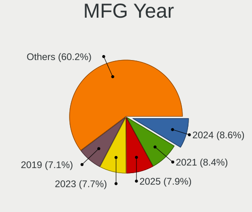

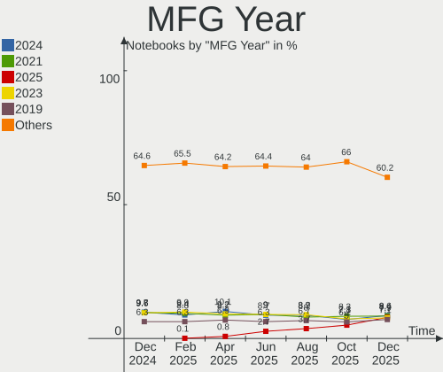

| Year    | Notebooks | Percent |
|---------|-----------|---------|
| 2024    | 284       | 8.64%   |
| 2021    | 277       | 8.43%   |
| 2025    | 259       | 7.88%   |
| 2023    | 254       | 7.73%   |
| 2019    | 233       | 7.09%   |
| 2020    | 226       | 6.88%   |
| 2022    | 213       | 6.48%   |
| 2018    | 190       | 5.78%   |
| 2012    | 185       | 5.63%   |
| 2013    | 179       | 5.45%   |
| 2017    | 172       | 5.23%   |
| 2011    | 163       | 4.96%   |
| 2015    | 139       | 4.23%   |
| 2016    | 124       | 3.77%   |
| 2014    | 122       | 3.71%   |
| 2010    | 81        | 2.46%   |
| 2009    | 64        | 1.95%   |
| 2008    | 64        | 1.95%   |
| 2007    | 23        | 0.7%    |
| 2006    | 23        | 0.7%    |
| Unknown | 10        | 0.3%    |
| 2004    | 1         | 0.03%   |
| 2003    | 1         | 0.03%   |

Form Factor
-----------

Physical design of the computer

| Name     | Notebooks | Percent |
|----------|-----------|---------|
| Notebook | 3287      | 100%    |

Secure Boot
-----------

Enabled or disabled

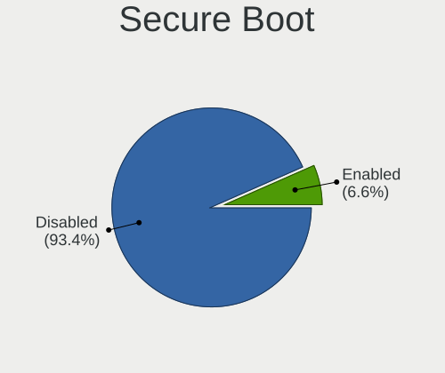

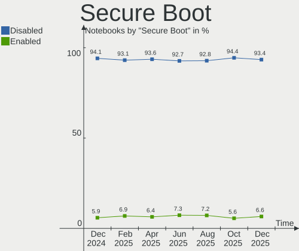

| State    | Notebooks | Percent |
|----------|-----------|---------|
| Disabled | 3070      | 93.4%   |
| Enabled  | 217       | 6.6%    |

Coreboot
--------

Have coreboot on board

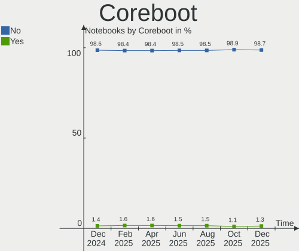

| Used | Notebooks | Percent |
|------|-----------|---------|
| No   | 3243      | 98.66%  |
| Yes  | 44        | 1.34%   |

RAM Size
--------

Total RAM memory

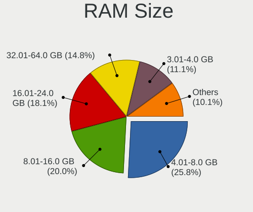

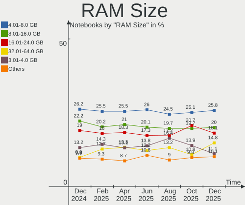

| Size in GB  | Notebooks | Percent |
|-------------|-----------|---------|
| 4.01-8.0    | 849       | 25.83%  |
| 8.01-16.0   | 658       | 20.02%  |
| 16.01-24.0  | 596       | 18.13%  |
| 32.01-64.0  | 486       | 14.79%  |
| 3.01-4.0    | 366       | 11.13%  |
| 24.01-32.0  | 152       | 4.62%   |
| 64.01-256.0 | 102       | 3.1%    |
| 1.01-2.0    | 40        | 1.22%   |
| 2.01-3.0    | 34        | 1.03%   |
| 0.51-1.0    | 4         | 0.12%   |

RAM Used
--------

Used RAM memory

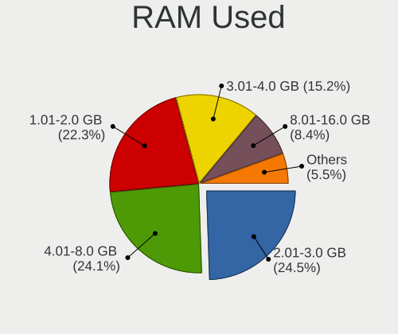

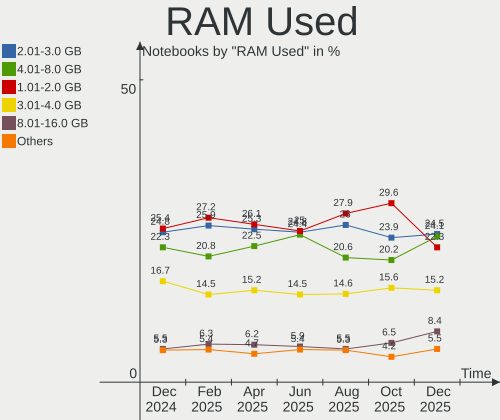

| Used GB    | Notebooks | Percent |
|------------|-----------|---------|
| 2.01-3.0   | 804       | 24.46%  |
| 4.01-8.0   | 791       | 24.06%  |
| 1.01-2.0   | 733       | 22.3%   |
| 3.01-4.0   | 501       | 15.24%  |
| 8.01-16.0  | 276       | 8.4%    |
| 0.51-1.0   | 114       | 3.47%   |
| 16.01-24.0 | 33        | 1%      |
| 0.01-0.5   | 17        | 0.52%   |
| 24.01-32.0 | 14        | 0.43%   |
| 32.01-64.0 | 4         | 0.12%   |

Total Drives
------------

Number of drives on board

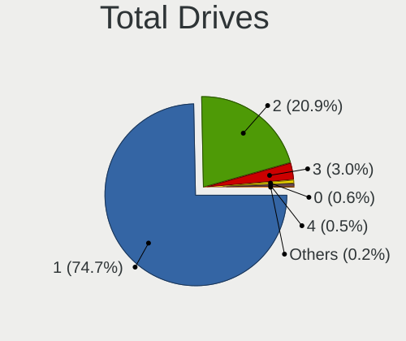

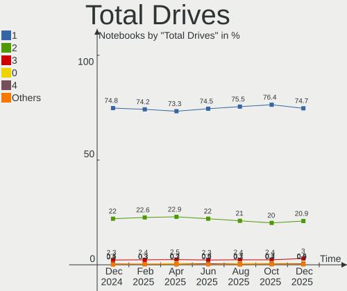

| Drives | Notebooks | Percent |
|--------|-----------|---------|
| 1      | 2455      | 74.69%  |
| 2      | 688       | 20.93%  |
| 3      | 99        | 3.01%   |
| 0      | 21        | 0.64%   |
| 4      | 18        | 0.55%   |
| 5      | 3         | 0.09%   |
| 6      | 2         | 0.06%   |
| 7      | 1         | 0.03%   |

Has CD-ROM
----------

Has CD-ROM on board

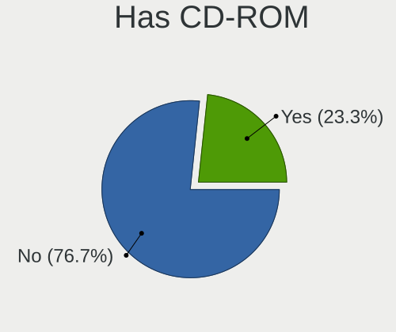

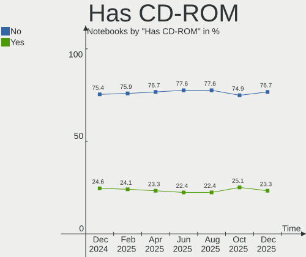

| Presented | Notebooks | Percent |
|-----------|-----------|---------|
| No        | 2520      | 76.67%  |
| Yes       | 767       | 23.33%  |

Has Ethernet
------------

Has Ethernet on board

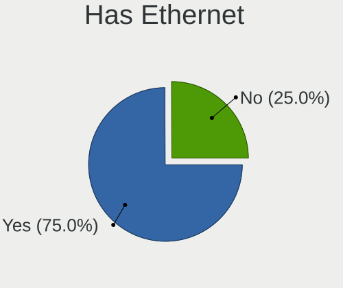

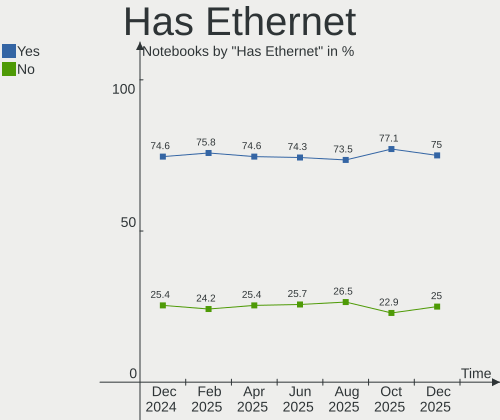

| Presented | Notebooks | Percent |
|-----------|-----------|---------|
| Yes       | 2464      | 74.96%  |
| No        | 823       | 25.04%  |

Has WiFi
--------

Has WiFi module

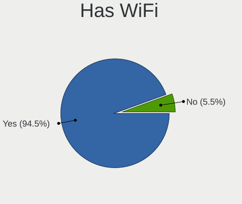

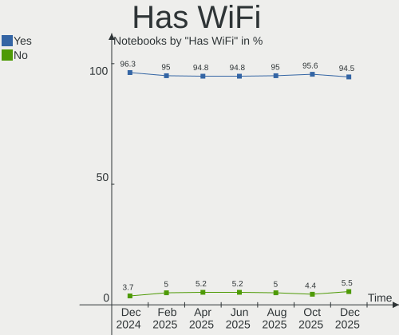

| Presented | Notebooks | Percent |
|-----------|-----------|---------|
| Yes       | 3105      | 94.46%  |
| No        | 182       | 5.54%   |

Has Bluetooth
-------------

Has Bluetooth module

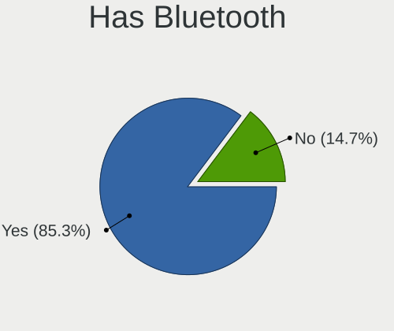

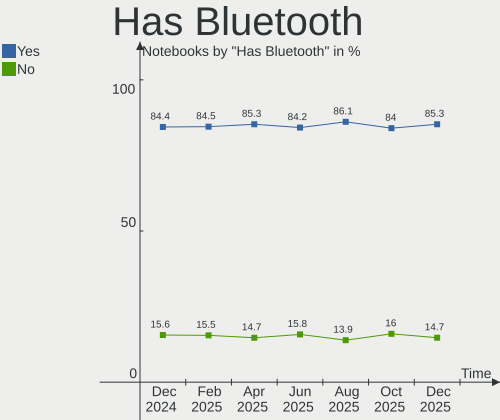

| Presented | Notebooks | Percent |
|-----------|-----------|---------|
| Yes       | 2803      | 85.28%  |
| No        | 484       | 14.72%  |

Location
--------

Country
-------

Geographic location (country)

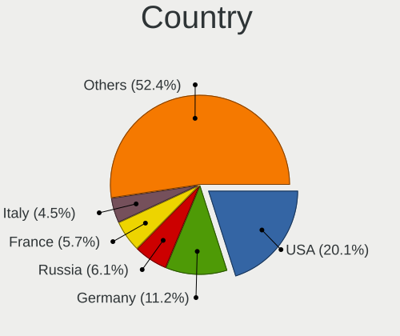

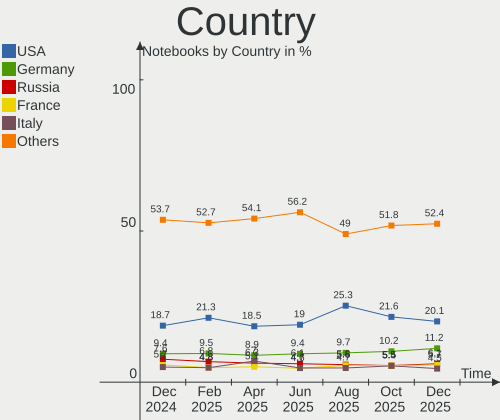

| Country         | Notebooks | Percent |
|-----------------|-----------|---------|
| USA             | 660       | 20.08%  |
| Germany         | 367       | 11.17%  |
| Russia          | 202       | 6.15%   |
| France          | 188       | 5.72%   |
| Italy           | 149       | 4.53%   |
| Brazil          | 145       | 4.41%   |
| UK              | 135       | 4.11%   |
| Poland          | 104       | 3.16%   |
| Canada          | 95        | 2.89%   |
| Spain           | 82        | 2.49%   |
| India           | 75        | 2.28%   |
| Australia       | 70        | 2.13%   |
| Netherlands     | 58        | 1.76%   |
| Mexico          | 45        | 1.37%   |
| Switzerland     | 44        | 1.34%   |
| Austria         | 43        | 1.31%   |
| Hungary         | 40        | 1.22%   |
| Turkey          | 39        | 1.19%   |
| Indonesia       | 34        | 1.03%   |
| Sweden          | 33        | 1%      |
| China           | 29        | 0.88%   |
| Portugal        | 28        | 0.85%   |
| Romania         | 26        | 0.79%   |
| Denmark         | 26        | 0.79%   |
| Finland         | 25        | 0.76%   |
| Czechia         | 24        | 0.73%   |
| Norway          | 21        | 0.64%   |
| Colombia        | 21        | 0.64%   |
| Chile           | 20        | 0.61%   |
| New Zealand     | 19        | 0.58%   |
| Argentina       | 19        | 0.58%   |
| South Africa    | 18        | 0.55%   |
| Bulgaria        | 18        | 0.55%   |
| Philippines     | 17        | 0.52%   |
| Iran            | 17        | 0.52%   |
| Japan           | 16        | 0.49%   |
| Greece          | 15        | 0.46%   |
| The Netherlands | 14        | 0.43%   |
| Belgium         | 14        | 0.43%   |
| Thailand        | 13        | 0.4%    |

City
----

Geographic location (city)

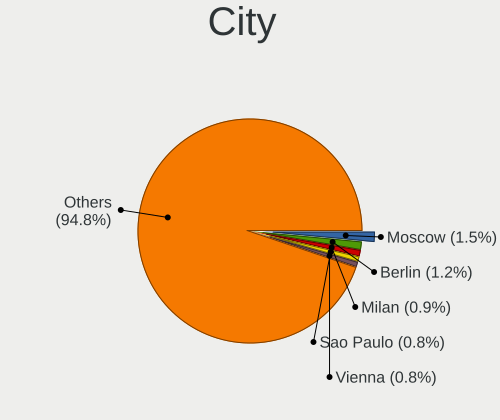

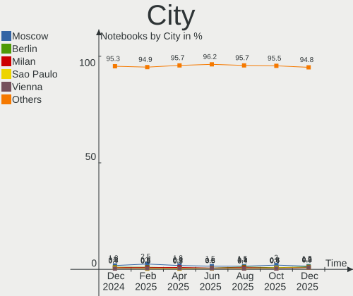

| City              | Notebooks | Percent |
|-------------------|-----------|---------|
| Moscow            | 49        | 1.49%   |
| Berlin            | 40        | 1.22%   |
| Milan             | 31        | 0.94%   |
| Sao Paulo         | 26        | 0.79%   |
| Vienna            | 25        | 0.76%   |
| St Petersburg     | 24        | 0.73%   |
| Warsaw            | 22        | 0.67%   |
| Sydney            | 20        | 0.61%   |
| Madrid            | 20        | 0.61%   |
| Seattle           | 19        | 0.58%   |
| Melbourne         | 19        | 0.58%   |
| Paris             | 18        | 0.55%   |
| Rio de Janeiro    | 16        | 0.49%   |
| Hamburg           | 16        | 0.49%   |
| Munich            | 15        | 0.46%   |
| Los Angeles       | 15        | 0.46%   |
| Istanbul          | 15        | 0.46%   |
| Helsinki          | 15        | 0.46%   |
| Budapest          | 15        | 0.46%   |
| Frankfurt am Main | 14        | 0.43%   |
| Zurich            | 13        | 0.4%    |
| Brisbane          | 12        | 0.37%   |
| Krakow            | 11        | 0.33%   |
| Stuttgart         | 10        | 0.3%    |
| London            | 10        | 0.3%    |
| Kazan’          | 10        | 0.3%    |
| Barcelona         | 10        | 0.3%    |
| Amsterdam         | 10        | 0.3%    |
| Santiago          | 9         | 0.27%   |
| Phoenix           | 9         | 0.27%   |
| Milano            | 9         | 0.27%   |
| Delhi             | 9         | 0.27%   |
| Chicago           | 9         | 0.27%   |
| Toronto           | 8         | 0.24%   |
| Rome              | 8         | 0.24%   |
| Oslo              | 8         | 0.24%   |
| Novosibirsk       | 8         | 0.24%   |
| Jakarta           | 8         | 0.24%   |
| Copenhagen        | 8         | 0.24%   |
| Calgary           | 8         | 0.24%   |

Drives
------

Drive Vendor
------------

Hard drive vendors

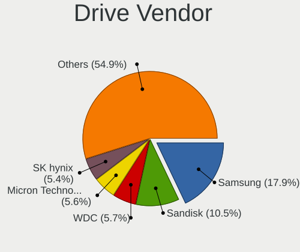

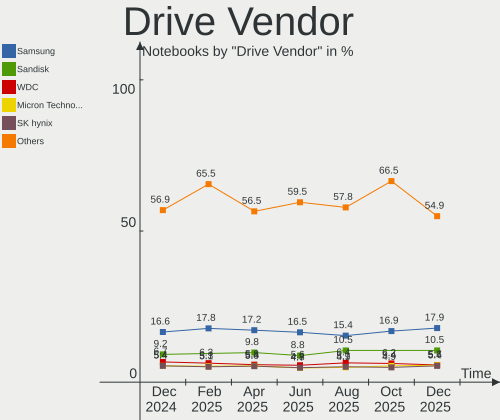

| Vendor                       | Notebooks | Drives | Percent |
|------------------------------|-----------|--------|---------|
| Samsung Electronics          | 721       | 800    | 17.92%  |
| Sandisk                      | 422       | 436    | 10.49%  |
| WDC                          | 229       | 237    | 5.69%   |
| Micron Technology            | 224       | 225    | 5.57%   |
| SK hynix                     | 219       | 224    | 5.44%   |
| Seagate                      | 211       | 221    | 5.24%   |
| Toshiba                      | 177       | 182    | 4.4%    |
| Unknown                      | 169       | 185    | 4.2%    |
| Kingston                     | 159       | 163    | 3.95%   |
| Crucial                      | 116       | 116    | 2.88%   |
| Intel                        | 106       | 115    | 2.63%   |
| KIOXIA                       | 102       | 111    | 2.54%   |
| Apple                        | 81        | 103    | 2.01%   |
| Kingston Technology Company  | 73        | 76     | 1.81%   |
| A-DATA Technology            | 69        | 69     | 1.72%   |
| HGST                         | 66        | 66     | 1.64%   |
| Phison Electronics           | 49        | 50     | 1.22%   |
| Hitachi                      | 49        | 51     | 1.22%   |
| Micron/Crucial Technology    | 48        | 51     | 1.19%   |
| China                        | 48        | 48     | 1.19%   |
| MAXIO Technology (Hangzhou)  | 45        | 46     | 1.12%   |
| Unknown                      | 32        | 32     | 0.8%    |
| ADATA Technology             | 24        | 25     | 0.6%    |
| SPCC                         | 23        | 26     | 0.57%   |
| Silicon Motion               | 23        | 23     | 0.57%   |
| PNY                          | 21        | 21     | 0.52%   |
| KingSpec                     | 20        | 20     | 0.5%    |
| Shenzhen Longsys Electronics | 18        | 18     | 0.45%   |
| Patriot                      | 18        | 18     | 0.45%   |
| Fujitsu                      | 18        | 18     | 0.45%   |
| Intenso                      | 16        | 17     | 0.4%    |
| SABRENT                      | 13        | 17     | 0.32%   |
| JMicron Technology           | 13        | 13     | 0.32%   |
| Transcend                    | 12        | 12     | 0.3%    |
| LITEON                       | 12        | 12     | 0.3%    |
| Realtek Semiconductor        | 11        | 11     | 0.27%   |
| Netac                        | 11        | 11     | 0.27%   |
| Lexar                        | 11        | 11     | 0.27%   |
| Phison                       | 9         | 10     | 0.22%   |
| GOODRAM                      | 9         | 9      | 0.22%   |

Drive Model
-----------

Hard drive models

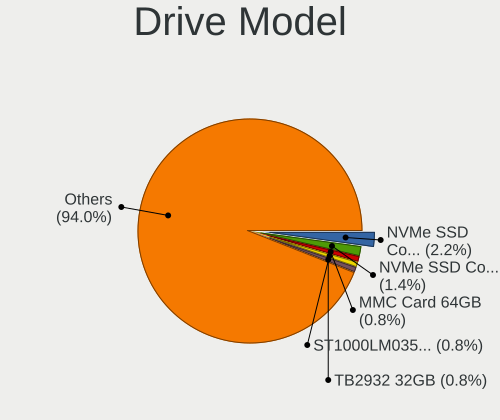

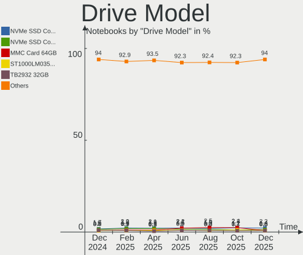

| Model                                                                   | Notebooks | Percent |
|-------------------------------------------------------------------------|-----------|---------|
| Samsung NVMe SSD Controller SM981/PM981/PM983 1TB                       | 90        | 2.16%   |
| Samsung NVMe SSD Controller PM9A1/PM9A3/980PRO 1TB                      | 60        | 1.44%   |
| Unknown MMC Card  64GB                                                  | 35        | 0.84%   |
| Seagate ST1000LM035-1RK172 1TB                                          | 32        | 0.77%   |
| Unknown                                                                 | 32        | 0.77%   |
| Kingston SA400S37240G 240GB SSD                                         | 26        | 0.62%   |
| Unknown MMC Card  32GB                                                  | 25        | 0.6%    |
| Unknown MMC Card  128GB                                                 | 25        | 0.6%    |
| Kingston SA400S37480G 480GB SSD                                         | 25        | 0.6%    |
| MAXIO (Hangzhou) NVMe SSD Controller MAP1202 2TB                        | 24        | 0.58%   |
| Sandisk WD Black SN770 / PC SN740 256GB / PC SN560 (DRAM-less) NVMe SSD | 22        | 0.53%   |
| SanDisk NVMe SSD Drive 1TB                                              | 22        | 0.53%   |
| Samsung NVMe SSD Controller SM961/PM961/SM963 1024GB                    | 22        | 0.53%   |
| Toshiba MQ01ABD100 1TB                                                  | 21        | 0.5%    |
| Toshiba MQ04ABF100 1TB                                                  | 20        | 0.48%   |
| Sandisk WD Black SN750 / PC SN730 NVMe SSD 500GB                        | 19        | 0.46%   |
| HGST HTS721010A9E630 1TB                                                | 19        | 0.46%   |
| Seagate ST500LT012-1DG142 500GB                                         | 18        | 0.43%   |
| Samsung SSD 990 PRO 2TB                                                 | 18        | 0.43%   |
| Seagate ST1000LM024 HN-M101MBB 1TB                                      | 17        | 0.41%   |
| Samsung SSD 850 EVO 500GB                                               | 17        | 0.41%   |
| Unknown SD/MMC/MS PRO 2GB                                               | 16        | 0.38%   |
| Toshiba XG6 NVMe SSD Controller 1024GB                                  | 16        | 0.38%   |
| Sandisk WD Blue SN550 NVMe SSD 1024GB                                   | 16        | 0.38%   |
| Samsung SSD 990 PRO 1TB                                                 | 16        | 0.38%   |
| Samsung NVMe SSD Controller 980 (DRAM-less) 256GB                       | 16        | 0.38%   |
| Micron/Crucial P2 NVMe PCIe SSD 2TB                                     | 16        | 0.38%   |
| Crucial CT240BX500SSD1 240GB                                            | 16        | 0.38%   |
| Crucial CT1000MX500SSD1 1TB                                             | 16        | 0.38%   |
| SK hynix BC501 NVMe Solid State Drive 512GB                             | 15        | 0.36%   |
| SanDisk NVMe SSD Drive 512GB                                            | 15        | 0.36%   |
| Samsung NVMe SSD Controller PM9C1a (DRAM-less) 1TB                      | 15        | 0.36%   |
| Micron 2400_MTFDKBA512QFM 512GB                                         | 15        | 0.36%   |
| Intel SSDPEKNU512GZ 512GB                                               | 15        | 0.36%   |
| Intel SSD 660P Series 512GB                                             | 15        | 0.36%   |
| Samsung MZVL4512HBLU-00BTW 512GB                                        | 14        | 0.34%   |
| HGST HTS545050A7E680 500GB                                              | 14        | 0.34%   |
| SK hynix BC511 512GB                                                    | 13        | 0.31%   |
| Samsung SSD 850 EVO 250GB                                               | 13        | 0.31%   |
| Kingston Company OM3PDP3 NVMe SSD 256GB                                 | 13        | 0.31%   |

HDD Vendor
----------

Hard disk drive vendors

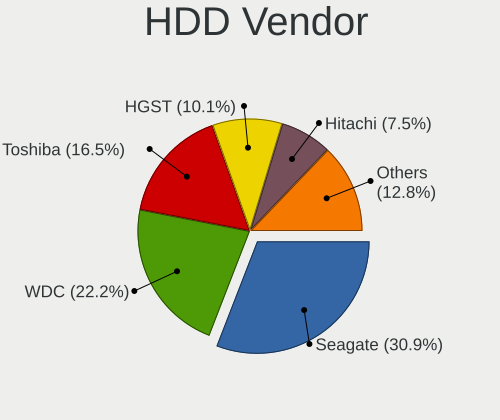

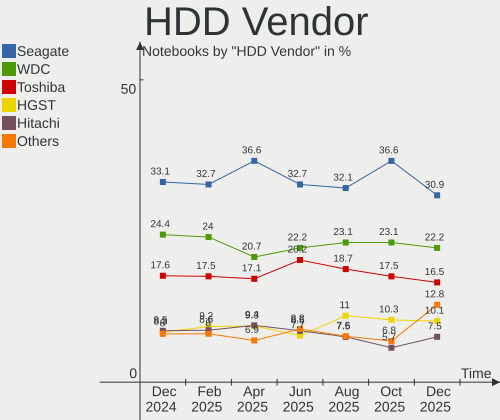

| Vendor              | Notebooks | Drives | Percent |
|---------------------|-----------|--------|---------|
| Seagate             | 202       | 210    | 30.89%  |
| WDC                 | 145       | 149    | 22.17%  |
| Toshiba             | 108       | 110    | 16.51%  |
| HGST                | 66        | 66     | 10.09%  |
| Hitachi             | 49        | 51     | 7.49%   |
| Fujitsu             | 18        | 18     | 2.75%   |
| Unknown             | 17        | 17     | 2.6%    |
| Samsung Electronics | 16        | 16     | 2.45%   |
| JMicron Technology  | 5         | 5      | 0.76%   |
| Apple               | 4         | 4      | 0.61%   |
| JetFlash            | 3         | 3      | 0.46%   |
| Intenso             | 3         | 3      | 0.46%   |
| HGST HTS            | 3         | 3      | 0.46%   |
| SABRENT             | 2         | 5      | 0.31%   |
| ASMT                | 2         | 2      | 0.31%   |
| USB3.0              | 1         | 1      | 0.15%   |
| T-FORCE             | 1         | 1      | 0.15%   |
| SSK                 | 1         | 1      | 0.15%   |
| SILICONMOTION       | 1         | 1      | 0.15%   |
| Shenzhen            | 1         | 1      | 0.15%   |
| PASOUL 2            | 1         | 1      | 0.15%   |
| KIOXIA              | 1         | 1      | 0.15%   |
| IB-AC703            | 1         | 1      | 0.15%   |
| External            | 1         | 1      | 0.15%   |
| Apricorn            | 1         | 1      | 0.15%   |
| Unknown             | 1         | 1      | 0.15%   |

SSD Vendor
----------

Solid state drive vendors

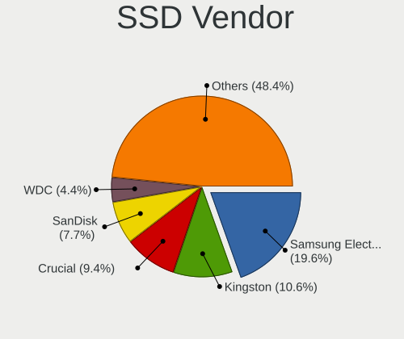

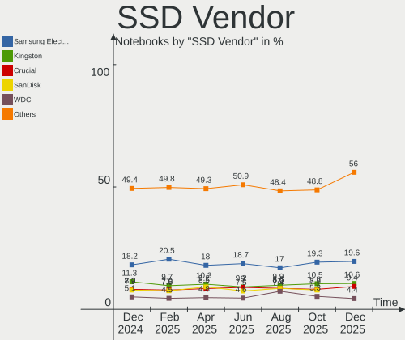

| Vendor              | Notebooks | Drives | Percent |
|---------------------|-----------|--------|---------|
| Samsung Electronics | 222       | 238    | 19.56%  |
| Kingston            | 120       | 121    | 10.57%  |
| Crucial             | 107       | 107    | 9.43%   |
| SanDisk             | 87        | 89     | 7.67%   |
| WDC                 | 50        | 50     | 4.41%   |
| Apple               | 50        | 50     | 4.41%   |
| China               | 47        | 47     | 4.14%   |
| A-DATA Technology   | 46        | 46     | 4.05%   |
| SK hynix            | 27        | 27     | 2.38%   |
| Toshiba             | 24        | 24     | 2.11%   |
| Micron Technology   | 24        | 24     | 2.11%   |
| SPCC                | 21        | 23     | 1.85%   |
| Intel               | 21        | 21     | 1.85%   |
| PNY                 | 20        | 20     | 1.76%   |
| KingSpec            | 17        | 17     | 1.5%    |
| Patriot             | 15        | 15     | 1.32%   |
| Transcend           | 12        | 12     | 1.06%   |
| SABRENT             | 12        | 12     | 1.06%   |
| LITEON              | 12        | 12     | 1.06%   |
| Intenso             | 12        | 13     | 1.06%   |
| Netac               | 10        | 10     | 0.88%   |
| Team                | 8         | 8      | 0.7%    |
| GOODRAM             | 8         | 8      | 0.7%    |
| Lexar               | 7         | 7      | 0.62%   |
| Verbatim            | 6         | 6      | 0.53%   |
| KIOXIA-EXCERIA      | 6         | 6      | 0.53%   |
| Unknown             | 6         | 6      | 0.53%   |
| Plextor             | 5         | 5      | 0.44%   |
| Timetec             | 4         | 4      | 0.35%   |
| LITEONIT            | 4         | 5      | 0.35%   |
| Apacer              | 4         | 4      | 0.35%   |
| Wibtek              | 3         | 3      | 0.26%   |
| QOPP                | 3         | 3      | 0.26%   |
| HS-SSD-E100         | 3         | 3      | 0.26%   |
| CONSISTENT          | 3         | 3      | 0.26%   |
| XUM                 | 2         | 2      | 0.18%   |
| XrayDisk            | 2         | 2      | 0.18%   |
| Smartbuy            | 2         | 2      | 0.18%   |
| Seagate             | 2         | 2      | 0.18%   |
| OV                  | 2         | 2      | 0.18%   |

Drive Kind
----------

HDD or SSD

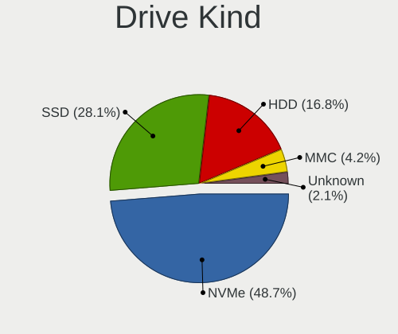

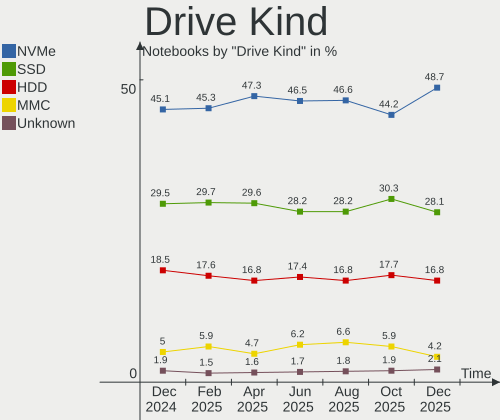

| Kind    | Notebooks | Drives | Percent |
|---------|-----------|--------|---------|
| NVMe    | 1840      | 2138   | 48.73%  |
| SSD     | 1061      | 1159   | 28.1%   |
| HDD     | 636       | 673    | 16.84%  |
| MMC     | 159       | 176    | 4.21%   |
| Unknown | 80        | 83     | 2.12%   |

Drive Connector
---------------

SATA, SAS, NVMe, etc.

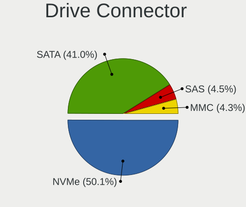

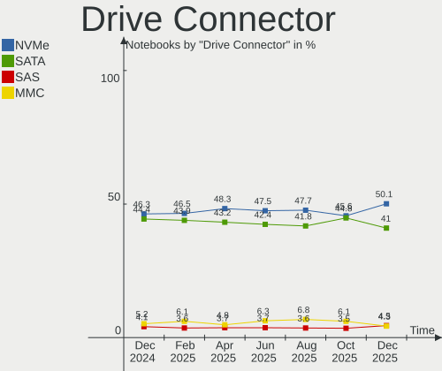

| Type | Notebooks | Drives | Percent |
|------|-----------|--------|---------|
| NVMe | 1840      | 2121   | 50.08%  |
| SATA | 1508      | 1737   | 41.05%  |
| SAS  | 167       | 195    | 4.55%   |
| MMC  | 159       | 176    | 4.33%   |

Drive Size
----------

Size of hard drive

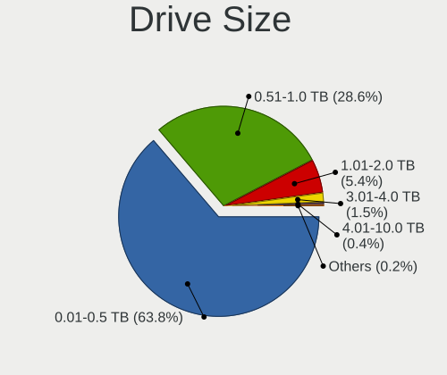

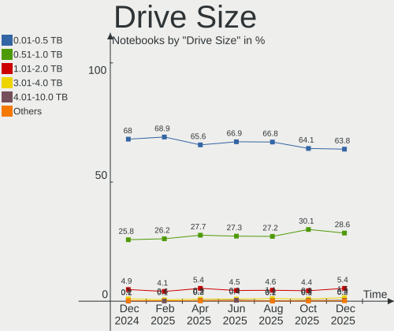

| Size in TB | Notebooks | Drives | Percent |
|------------|-----------|--------|---------|
| 0.01-0.5   | 1079      | 1185   | 63.77%  |
| 0.51-1.0   | 484       | 506    | 28.61%  |
| 1.01-2.0   | 92        | 101    | 5.44%   |
| 3.01-4.0   | 26        | 27     | 1.54%   |
| 4.01-10.0  | 7         | 7      | 0.41%   |
| 2.01-3.0   | 3         | 5      | 0.18%   |
| 10.01-20.0 | 1         | 1      | 0.06%   |

Space Total
-----------

Amount of disk space available on the file system

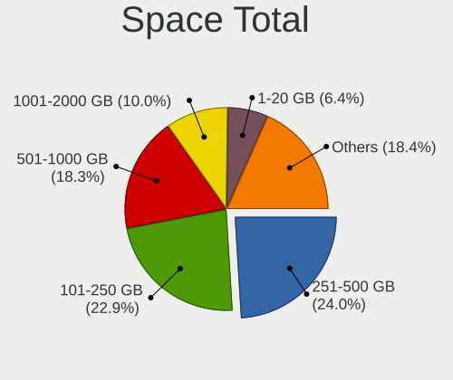

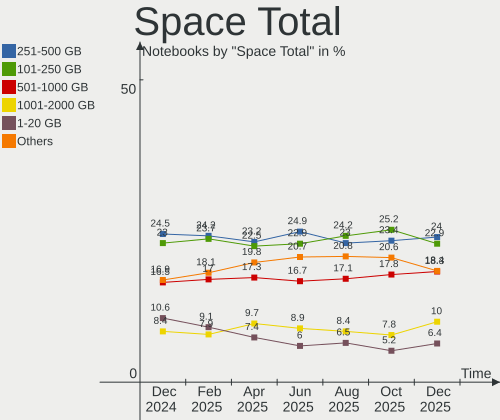

| Size in GB     | Notebooks | Percent |
|----------------|-----------|---------|
| 251-500        | 790       | 24.03%  |
| 101-250        | 753       | 22.91%  |
| 501-1000       | 601       | 18.28%  |
| 1001-2000      | 328       | 9.98%   |
| 1-20           | 211       | 6.42%   |
| More than 3000 | 168       | 5.11%   |
| Unknown        | 146       | 4.44%   |
| 51-100         | 124       | 3.77%   |
| 2001-3000      | 95        | 2.89%   |
| 21-50          | 71        | 2.16%   |

Space Used
----------

Amount of used disk space

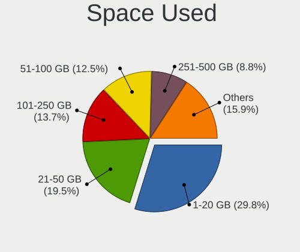

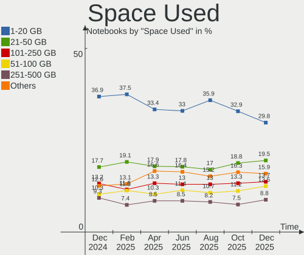

| Used GB        | Notebooks | Percent |
|----------------|-----------|---------|
| 1-20           | 979       | 29.78%  |
| 21-50          | 640       | 19.47%  |
| 101-250        | 449       | 13.66%  |
| 51-100         | 410       | 12.47%  |
| 251-500        | 288       | 8.76%   |
| 501-1000       | 196       | 5.96%   |
| Unknown        | 146       | 4.44%   |
| 1001-2000      | 98        | 2.98%   |
| 2001-3000      | 33        | 1%      |
| More than 3000 | 30        | 0.91%   |
| 0              | 18        | 0.55%   |

Malfunc. Drives
---------------

Drive models with a malfunction

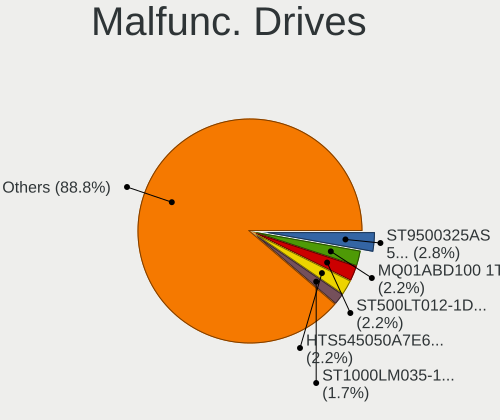

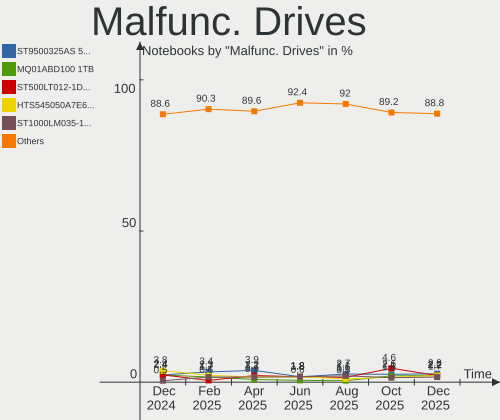

| Model                                                         | Notebooks | Drives | Percent |
|---------------------------------------------------------------|-----------|--------|---------|
| Seagate ST9500325AS 500GB                                     | 5         | 5      | 2.81%   |
| Toshiba MQ01ABD100 1TB                                        | 4         | 4      | 2.25%   |
| Seagate ST500LT012-1DG142 500GB                               | 4         | 4      | 2.25%   |
| HGST HTS545050A7E680 500GB                                    | 4         | 4      | 2.25%   |
| Seagate ST1000LM035-1RK172 1TB                                | 3         | 3      | 1.69%   |
| Seagate ST1000LM024 HN-M101MBB 1TB                            | 3         | 3      | 1.69%   |
| Hitachi HTS545050A7E380 500GB                                 | 3         | 3      | 1.69%   |
| Hitachi HTS545032B9A300 320GB                                 | 3         | 3      | 1.69%   |
| Toshiba MQ01ACF050 500GB                                      | 2         | 2      | 1.12%   |
| Toshiba MK2555GSX 250GB                                       | 2         | 2      | 1.12%   |
| Seagate ST9750420AS 752GB                                     | 2         | 2      | 1.12%   |
| Seagate ST9320325AS 320GB                                     | 2         | 2      | 1.12%   |
| Seagate ST750LM022 HN-M750MBB 752GB                           | 2         | 2      | 1.12%   |
| Samsung Electronics SSD 980 1TB                               | 2         | 2      | 1.12%   |
| Samsung Electronics NVMe SSD Controller SM981/PM981/PM983 1TB | 2         | 2      | 1.12%   |
| Samsung Electronics HM321HI 320GB                             | 2         | 2      | 1.12%   |
| Realtek Semiconductor RTS5762 NVMe SSD Controller 1TB         | 2         | 2      | 1.12%   |
| Micron Technology 1100_MTFDDAK256TBN 256GB SSD                | 2         | 2      | 1.12%   |
| HGST HTS725050A7E630 500GB                                    | 2         | 2      | 1.12%   |
| HGST HTS545050A7E380 500GB                                    | 2         | 2      | 1.12%   |
| HGST HTS541010A9E680 1TB                                      | 2         | 2      | 1.12%   |
| Fujitsu MJA2320BH G2 320GB                                    | 2         | 2      | 1.12%   |
| A-DATA Technology SU800 128GB SSD                             | 2         | 2      | 1.12%   |
| WDC WDS240G2G0A-00JH30 240GB SSD                              | 1         | 1      | 0.56%   |
| WDC WD800BEVT-22ZCT0 80GB                                     | 1         | 1      | 0.56%   |
| WDC WD7500BPVX-60JC3T0 752GB                                  | 1         | 1      | 0.56%   |
| WDC WD5000LPVX-80V0TT0 500GB                                  | 1         | 1      | 0.56%   |
| WDC WD5000LPCX-24VHAT0 500GB                                  | 1         | 1      | 0.56%   |
| WDC WD5000LPCX-24C6HT0 500GB                                  | 1         | 1      | 0.56%   |
| WDC WD5000BUCT-63PUZY0 500GB                                  | 1         | 1      | 0.56%   |
| WDC WD5000BPVT-75HXZT3 500GB                                  | 1         | 1      | 0.56%   |
| WDC WD3200BPVT-75JJ5T0 320GB                                  | 1         | 1      | 0.56%   |
| WDC WD3200BEVT-26A23T0 320GB                                  | 1         | 1      | 0.56%   |
| WDC WD2500BEVT-60ZCT1 250GB                                   | 1         | 1      | 0.56%   |
| WDC WD2500BEVT-24A23T0 250GB                                  | 1         | 1      | 0.56%   |
| WDC WD2500BEVT-22A23T0 250GB                                  | 1         | 1      | 0.56%   |
| WDC WD10SPZX-35Z10T0 1TB                                      | 1         | 1      | 0.56%   |
| WDC WD10SPZX-24Z10 1TB                                        | 1         | 1      | 0.56%   |
| WDC WD10JPVX-60JC3T0 1TB                                      | 1         | 1      | 0.56%   |
| WDC WD10JPVX-22JC3T0 1TB                                      | 1         | 1      | 0.56%   |

Malfunc. Drive Vendor
---------------------

Vendors of faulty drives

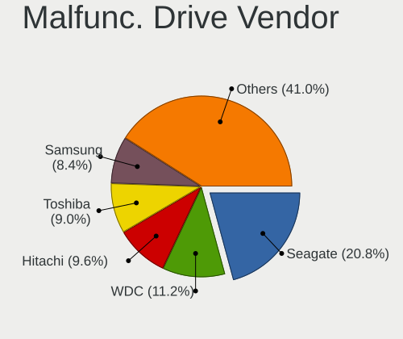

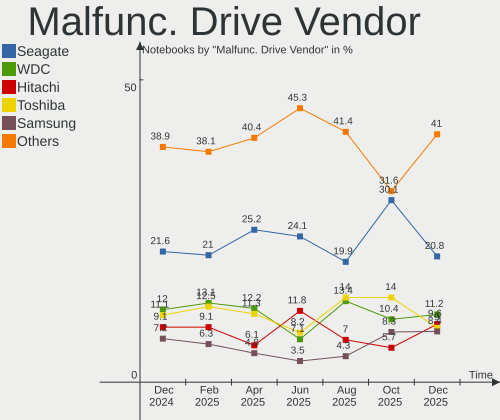

| Vendor                         | Notebooks | Drives | Percent |
|--------------------------------|-----------|--------|---------|
| Seagate                        | 37        | 38     | 20.79%  |
| WDC                            | 20        | 20     | 11.24%  |
| Hitachi                        | 17        | 17     | 9.55%   |
| Toshiba                        | 16        | 16     | 8.99%   |
| Samsung Electronics            | 15        | 15     | 8.43%   |
| HGST                           | 13        | 13     | 7.3%    |
| Intel                          | 7         | 7      | 3.93%   |
| Micron Technology              | 6         | 6      | 3.37%   |
| SK hynix                       | 5         | 5      | 2.81%   |
| SanDisk                        | 5         | 5      | 2.81%   |
| Fujitsu                        | 5         | 5      | 2.81%   |
| A-DATA Technology              | 5         | 5      | 2.81%   |
| Kingston                       | 4         | 4      | 2.25%   |
| Crucial                        | 3         | 3      | 1.69%   |
| SSSTC                          | 2         | 2      | 1.12%   |
| Realtek Semiconductor          | 2         | 2      | 1.12%   |
| LITEON                         | 2         | 2      | 1.12%   |
| ValueTech                      | 1         | 1      | 0.56%   |
| Transcend                      | 1         | 1      | 0.56%   |
| Solid State Storage Technology | 1         | 1      | 0.56%   |
| Philips                        | 1         | 1      | 0.56%   |
| Neo Forza                      | 1         | 1      | 0.56%   |
| Neo                            | 1         | 1      | 0.56%   |
| LITEONIT                       | 1         | 2      | 0.56%   |
| KIOXIA                         | 1         | 1      | 0.56%   |
| KingSpec                       | 1         | 1      | 0.56%   |
| EDILOCA                        | 1         | 1      | 0.56%   |
| Dogfish                        | 1         | 1      | 0.56%   |
| CUSU                           | 1         | 1      | 0.56%   |
| China                          | 1         | 1      | 0.56%   |
| Apple                          | 1         | 1      | 0.56%   |

Malfunc. HDD Vendor
-------------------

Vendors of faulty HDD drives

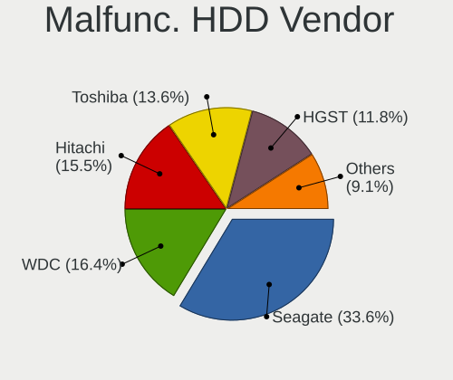

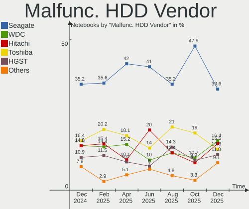

| Vendor              | Notebooks | Drives | Percent |
|---------------------|-----------|--------|---------|
| Seagate             | 37        | 38     | 33.64%  |
| WDC                 | 18        | 18     | 16.36%  |
| Hitachi             | 17        | 17     | 15.45%  |
| Toshiba             | 15        | 15     | 13.64%  |
| HGST                | 13        | 13     | 11.82%  |
| Fujitsu             | 5         | 5      | 4.55%   |
| Samsung Electronics | 4         | 4      | 3.64%   |
| Apple               | 1         | 1      | 0.91%   |

Malfunc. Drive Kind
-------------------

Kinds of faulty drives

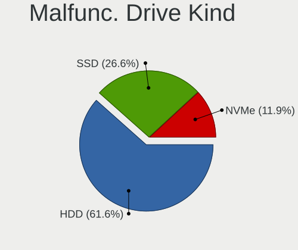

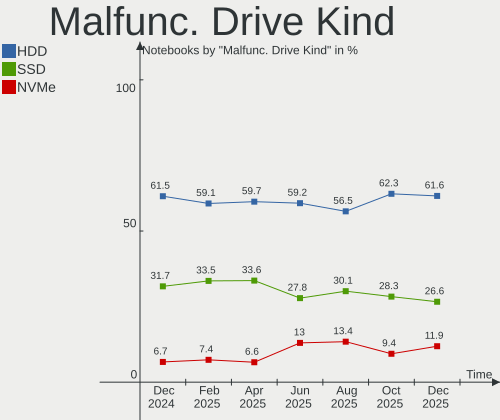

| Kind | Notebooks | Drives | Percent |
|------|-----------|--------|---------|
| HDD  | 109       | 111    | 61.58%  |
| SSD  | 47        | 48     | 26.55%  |
| NVMe | 21        | 21     | 11.86%  |

Failed Drives
-------------

Failed drive models

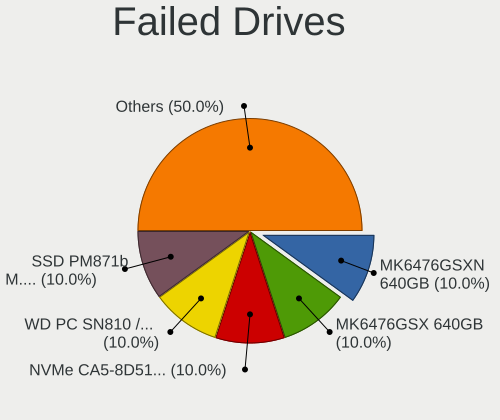

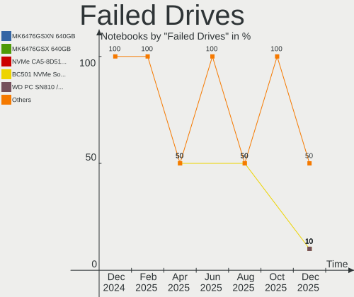

| Model                                            | Notebooks | Drives | Percent |
|--------------------------------------------------|-----------|--------|---------|
| Toshiba MK6476GSXN 640GB                         | 1         | 1      | 10%     |
| Toshiba MK6476GSX 640GB                          | 1         | 1      | 10%     |
| Solid State Storage NVMe CA5-8D512 512GB         | 1         | 1      | 10%     |
| SK hynix BC501 NVMe Solid State Drive 512GB      | 1         | 1      | 10%     |
| Sandisk WD PC SN810 / Black SN850 NVMe SSD 500GB | 1         | 1      | 10%     |
| Samsung Electronics SSD PM871b M.2 2280 128GB    | 1         | 1      | 10%     |
| Samsung Electronics MZMPC032HBCD-000H1 32GB SSD  | 1         | 1      | 10%     |
| LITEON IT LCS-128L9S-11 2.5 7mm 128GB SSD        | 1         | 1      | 10%     |
| Hitachi HTS543225L9SA02 250GB                    | 1         | 1      | 10%     |
| Unknown                                          | 1         | 1      | 10%     |

Failed Drive Vendor
-------------------

Failed drive vendors

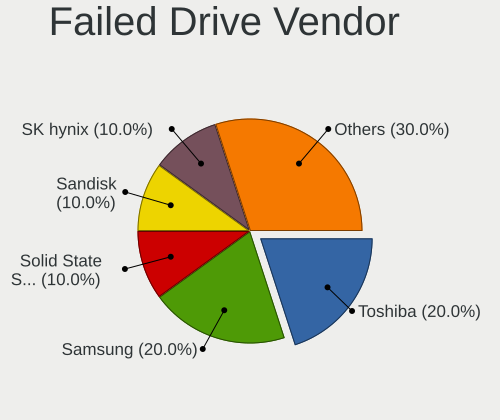

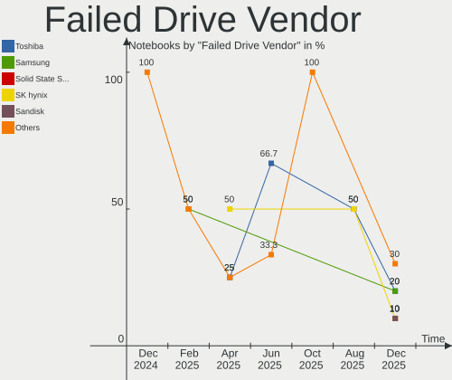

| Vendor              | Notebooks | Drives | Percent |
|---------------------|-----------|--------|---------|
| Toshiba             | 2         | 2      | 20%     |
| Samsung Electronics | 2         | 2      | 20%     |
| Solid State Storage | 1         | 1      | 10%     |
| SK hynix            | 1         | 1      | 10%     |
| Sandisk             | 1         | 1      | 10%     |
| LITEON              | 1         | 1      | 10%     |
| Hitachi             | 1         | 1      | 10%     |
| Unknown             | 1         | 1      | 10%     |

Drive Status
------------

Number of failed and malfunc. drives

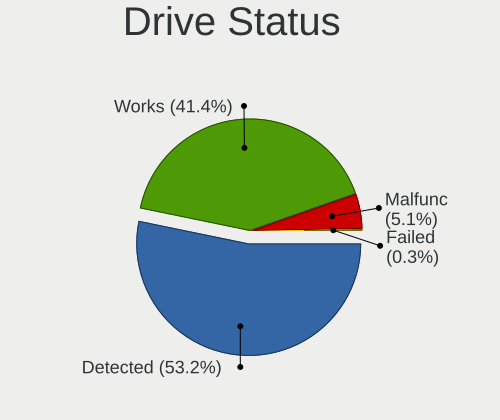

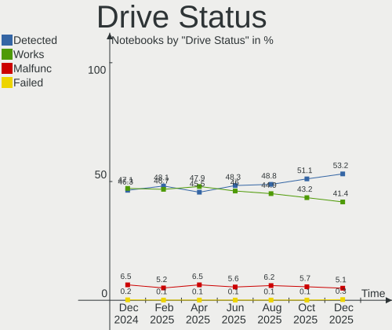

| Status   | Notebooks | Drives | Percent |
|----------|-----------|--------|---------|
| Detected | 1814      | 2364   | 53.23%  |
| Works    | 1411      | 1675   | 41.4%   |
| Malfunc  | 173       | 180    | 5.08%   |
| Failed   | 10        | 10     | 0.29%   |

Storage controller
------------------

Storage Vendor
--------------

Storage controller vendors

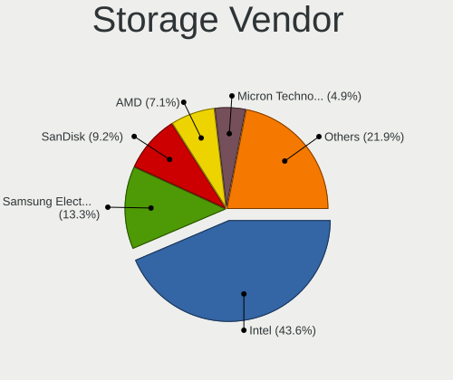

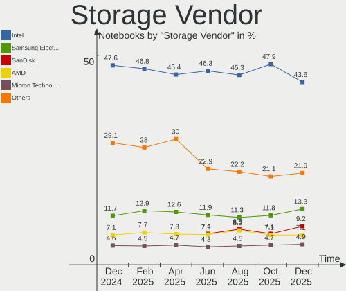

| Vendor                                  | Notebooks | Percent |
|-----------------------------------------|-----------|---------|
| Intel                                   | 1766      | 43.58%  |
| Samsung Electronics                     | 537       | 13.25%  |
| SanDisk                                 | 371       | 9.16%   |
| AMD                                     | 289       | 7.13%   |
| Micron Technology                       | 200       | 4.94%   |
| SK hynix                                | 191       | 4.71%   |
| Kingston Technology Company             | 112       | 2.76%   |
| KIOXIA                                  | 102       | 2.52%   |
| Phison Electronics                      | 62        | 1.53%   |
| Micron/Crucial Technology               | 57        | 1.41%   |
| MAXIO Technology (Hangzhou)             | 55        | 1.36%   |
| Toshiba America Info Systems            | 48        | 1.18%   |
| ADATA Technology                        | 45        | 1.11%   |
| Shenzhen Longsys Electronics            | 28        | 0.69%   |
| Silicon Motion                          | 26        | 0.64%   |
| Apple                                   | 21        | 0.52%   |
| Nvidia                                  | 20        | 0.49%   |
| Realtek Semiconductor                   | 17        | 0.42%   |
| Solid State Storage Technology          | 13        | 0.32%   |
| Shenzhen Unionmemory Information System | 11        | 0.27%   |
| Yangtze Memory Technologies             | 10        | 0.25%   |
| Union Memory (Shenzhen)                 | 10        | 0.25%   |
| Solidigm                                | 7         | 0.17%   |
| Marvell Technology Group                | 6         | 0.15%   |
| JMicron Technology                      | 5         | 0.12%   |
| INNOGRIT                                | 5         | 0.12%   |
| Unknown                                 | 5         | 0.12%   |
| Shenzhen Shichuangyi Electronics        | 4         | 0.1%    |
| Seagate Technology                      | 4         | 0.1%    |
| Lite-On Technology                      | 4         | 0.1%    |
| Hosin Global Electronics                | 3         | 0.07%   |
| ASMedia Technology                      | 3         | 0.07%   |
| Silicon Integrated Systems [SiS]        | 2         | 0.05%   |
| Shenzhen Techwinsemi Technology         | 2         | 0.05%   |
| O2 Micro                                | 2         | 0.05%   |
| Loongson Technology                     | 2         | 0.05%   |
| Biwin Storage Technology                | 2         | 0.05%   |
| Zhaoxin                                 | 1         | 0.02%   |
| TenaFe                                  | 1         | 0.02%   |
| Silicon Image                           | 1         | 0.02%   |

Storage Model
-------------

Storage controller models

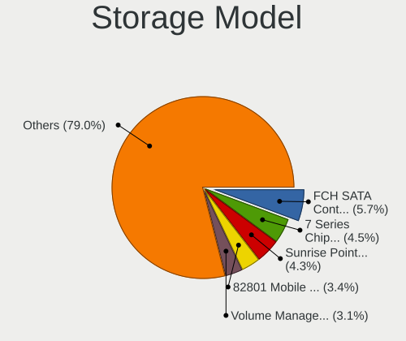

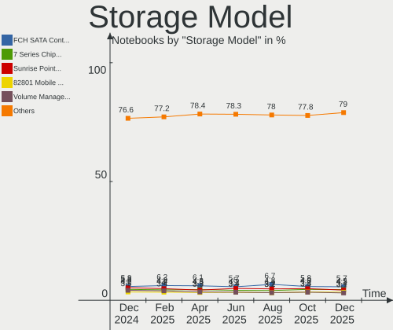

| Model                                                                          | Notebooks | Percent |
|--------------------------------------------------------------------------------|-----------|---------|
| AMD FCH SATA Controller [AHCI mode]                                            | 241       | 5.67%   |
| Intel 7 Series Chipset Family 6-port SATA Controller [AHCI mode]               | 190       | 4.47%   |
| Intel Sunrise Point-LP SATA Controller [AHCI mode]                             | 185       | 4.35%   |
| Intel 82801 Mobile SATA Controller [RAID mode]                                 | 146       | 3.43%   |
| Intel Volume Management Device NVMe RAID Controller                            | 133       | 3.13%   |
| Intel 6 Series/C200 Series Chipset Family 6 port Mobile SATA AHCI Controller   | 130       | 3.06%   |
| Samsung NVMe SSD Controller SM981/PM981/PM983                                  | 111       | 2.61%   |
| SanDisk WD SN560/SN740/SN770/SN5000 NVMe SSD                                   | 98        | 2.3%    |
| Samsung NVMe SSD Controller 980 (DRAM-less)                                    | 89        | 2.09%   |
| Intel 8 Series SATA Controller 1 [AHCI mode]                                   | 84        | 1.98%   |
| Samsung NVMe SSD Controller PM9C1a (DRAM-less)                                 | 78        | 1.83%   |
| Samsung NVMe SSD Controller PM9A1/PM9A3/980PRO                                 | 76        | 1.79%   |
| Intel Wildcat Point-LP SATA Controller [AHCI Mode]                             | 74        | 1.74%   |
| Intel Tiger Lake-LP SATA Controller                                            | 67        | 1.58%   |
| Intel 8 Series/C220 Series Chipset Family 6-port SATA Controller 1 [AHCI mode] | 66        | 1.55%   |
| Intel Cannon Lake Mobile PCH SATA AHCI Controller                              | 60        | 1.41%   |
| Intel Alder Lake-P SATA AHCI Controller                                        | 57        | 1.34%   |
| Intel 82801IBM/IEM (ICH9M/ICH9M-E) 4 port SATA Controller [AHCI mode]          | 54        | 1.27%   |
| Micron 2400 NVMe SSD (DRAM-less)                                               | 49        | 1.15%   |
| Intel RST Volume Management Device Controller                                  | 49        | 1.15%   |
| Samsung NVMe SSD Controller PM9B1 (DRAM-less)                                  | 48        | 1.13%   |
| Samsung NVMe SSD Controller S4LV008[Pascal]                                    | 47        | 1.11%   |
| Intel 5 Series/3400 Series Chipset 4 port SATA AHCI Controller                 | 47        | 1.11%   |
| Intel HM170/QM170 Chipset SATA Controller [AHCI Mode]                          | 43        | 1.01%   |
| MAXIO (Hangzhou) NVMe SSD Controller MAP1202 (DRAM-less)                       | 42        | 0.99%   |
| Micron 2500 NVMe SSD (DRAM-less)                                               | 41        | 0.96%   |
| SK hynix Platinum P41/PC801 NVMe Solid State Drive                             | 38        | 0.89%   |
| SK hynix Gold P31/BC711/PC711 NVMe Solid State Drive                           | 36        | 0.85%   |
| Sandisk WD PC SN5000S M.2 2280 NVMe SSD (DRAM-less)                            | 36        | 0.85%   |
| Intel SSD 670p Series [Keystone Harbor]                                        | 34        | 0.8%    |
| SanDisk Extreme Pro / WD Black SN750 / PC SN730 / Red SN700 NVMe SSD           | 32        | 0.75%   |
| Samsung NVMe SSD Controller SM961/PM961/SM963                                  | 32        | 0.75%   |
| KIOXIA NVMe SSD Controller BG4 (DRAM-less)                                     | 32        | 0.75%   |
| Intel Cannon Point-LP SATA Controller [AHCI Mode]                              | 32        | 0.75%   |
| SK hynix BC901 NVMe Solid State Drive (DRAM-less)                              | 30        | 0.71%   |
| Samsung S4LN058A01[SSUBX] AHCI SSD Controller (Apple slot)                     | 30        | 0.71%   |
| Micron 2450 NVMe SSD [HendrixV] (DRAM-less)                                    | 30        | 0.71%   |
| Intel Comet Lake SATA AHCI Controller                                          | 30        | 0.71%   |
| Intel 82801HM/HEM (ICH8M/ICH8M-E) IDE Controller                               | 30        | 0.71%   |
| Intel Celeron/Pentium Silver Processor SATA Controller                         | 29        | 0.68%   |

Storage Kind
------------

Kind of storage controller (IDE, SATA, NVMe, SAS, ...)

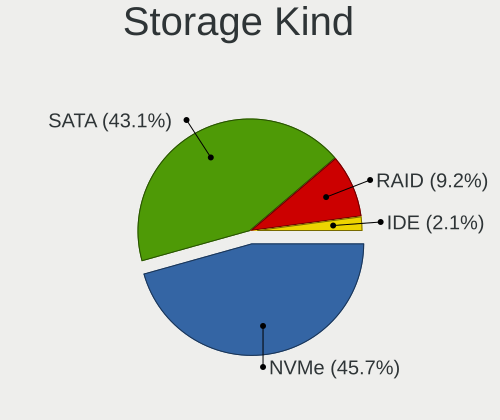

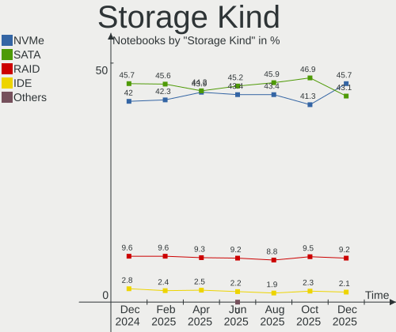

| Kind | Notebooks | Percent |
|------|-----------|---------|
| NVMe | 1835      | 45.66%  |
| SATA | 1732      | 43.1%   |
| RAID | 368       | 9.16%   |
| IDE  | 84        | 2.09%   |

Processor
---------

CPU Vendor
----------

Processor vendors

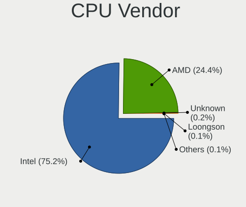

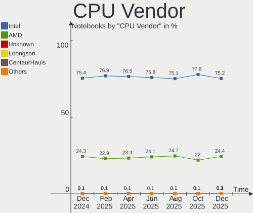

| Vendor       | Notebooks | Percent |
|--------------|-----------|---------|
| Intel        | 2472      | 75.21%  |
| AMD          | 802       | 24.4%   |
| Unknown      | 6         | 0.18%   |
| Loongson     | 3         | 0.09%   |
| CentaurHauls | 2         | 0.06%   |
| Qualcomm     | 1         | 0.03%   |
| PowerBook5,6 | 1         | 0.03%   |

CPU Model
---------

Processor models

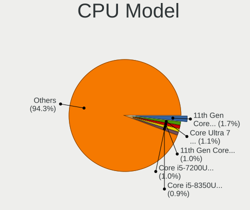

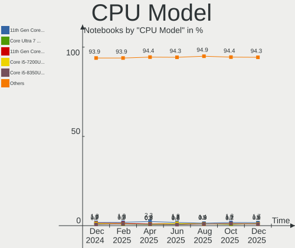

| Model                                         | Notebooks | Percent |
|-----------------------------------------------|-----------|---------|
| Intel 11th Gen Core i5-1135G7 @ 2.40GHz       | 57        | 1.73%   |
| Intel Core Ultra 7 155H                       | 35        | 1.06%   |
| Intel 11th Gen Core i7-1165G7 @ 2.80GHz       | 33        | 1%      |
| Intel Core i5-7200U CPU @ 2.50GHz             | 32        | 0.97%   |
| Intel Core i5-8350U CPU @ 1.70GHz             | 31        | 0.94%   |
| AMD Ryzen 7 7730U with Radeon Graphics        | 31        | 0.94%   |
| Intel Core i5-8250U CPU @ 1.60GHz             | 29        | 0.88%   |
| Intel Core i5-3210M CPU @ 2.50GHz             | 29        | 0.88%   |
| Intel Core i5-6200U CPU @ 2.30GHz             | 28        | 0.85%   |
| Intel 12th Gen Core i5-1235U                  | 28        | 0.85%   |
| Intel Core i7-9750H CPU @ 2.60GHz             | 26        | 0.79%   |
| Intel Core i7-8550U CPU @ 1.80GHz             | 26        | 0.79%   |
| Intel Core i5-6300U CPU @ 2.40GHz             | 26        | 0.79%   |
| AMD Ryzen 5 7520U with Radeon Graphics        | 26        | 0.79%   |
| Intel Core i7-10750H CPU @ 2.60GHz            | 23        | 0.7%    |
| Intel Core i5-8365U CPU @ 1.60GHz             | 23        | 0.7%    |
| Intel Core i5-8265U CPU @ 1.60GHz             | 23        | 0.7%    |
| Intel Core i5-2520M CPU @ 2.50GHz             | 22        | 0.67%   |
| AMD Ryzen 5 5500U with Radeon Graphics        | 22        | 0.67%   |
| AMD Custom APU 0932                           | 22        | 0.67%   |
| Intel Core Ultra 7 258V                       | 21        | 0.64%   |
| AMD Ryzen 5 3500U with Radeon Vega Mobile Gfx | 21        | 0.64%   |
| Intel Core i5-3320M CPU @ 2.60GHz             | 20        | 0.61%   |
| Intel Celeron N4020 CPU @ 1.10GHz             | 20        | 0.61%   |
| Intel 13th Gen Core i7-13620H                 | 20        | 0.61%   |
| AMD Ryzen AI 9 HX 370 w/ Radeon 890M          | 20        | 0.61%   |
| Intel Core Ultra 9 275HX                      | 19        | 0.58%   |
| Intel Core i7-7700HQ CPU @ 2.80GHz            | 19        | 0.58%   |
| Intel Core i7-5500U CPU @ 2.40GHz             | 19        | 0.58%   |
| Intel 12th Gen Core i3-1215U                  | 19        | 0.58%   |
| AMD Ryzen 5 5600H with Radeon Graphics        | 19        | 0.58%   |
| Intel Core i7-6700HQ CPU @ 2.60GHz            | 18        | 0.55%   |
| Intel Core i5-7300U CPU @ 2.60GHz             | 18        | 0.55%   |
| Intel Core i5-5200U CPU @ 2.20GHz             | 18        | 0.55%   |
| Intel Core i5-10210U CPU @ 1.60GHz            | 18        | 0.55%   |
| Intel 11th Gen Core i3-1115G4 @ 3.00GHz       | 18        | 0.55%   |
| Intel Core i7-6500U CPU @ 2.50GHz             | 17        | 0.52%   |
| Intel 12th Gen Core i5-12450H                 | 17        | 0.52%   |
| Intel Core i7-8750H CPU @ 2.20GHz             | 16        | 0.49%   |
| Intel Core i5-3230M CPU @ 2.60GHz             | 16        | 0.49%   |

CPU Model Family
----------------

Processor model prefix

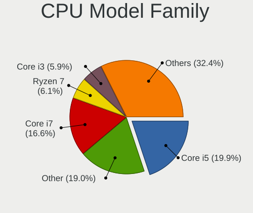

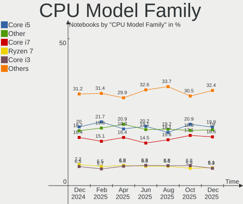

| Model                   | Notebooks | Percent |
|-------------------------|-----------|---------|
| Intel Core i5           | 653       | 19.87%  |
| Other                   | 625       | 19.01%  |
| Intel Core i7           | 546       | 16.61%  |
| AMD Ryzen 7             | 202       | 6.15%   |
| Intel Core i3           | 195       | 5.93%   |
| Intel Core              | 191       | 5.81%   |
| AMD Ryzen 5             | 185       | 5.63%   |
| Intel Celeron           | 132       | 4.02%   |
| Intel Core 2 Duo        | 75        | 2.28%   |
| AMD Ryzen 9             | 55        | 1.67%   |
| AMD Ryzen 3             | 51        | 1.55%   |
| Intel Pentium           | 43        | 1.31%   |
| AMD Ryzen 7 PRO         | 35        | 1.06%   |
| Intel Core i9           | 27        | 0.82%   |
| AMD A6                  | 26        | 0.79%   |
| AMD Ryzen 5 PRO         | 23        | 0.7%    |
| Intel Atom              | 21        | 0.64%   |
| AMD A8                  | 20        | 0.61%   |
| Intel Pentium Dual-Core | 17        | 0.52%   |
| Intel Xeon              | 15        | 0.46%   |
| AMD A4                  | 15        | 0.46%   |
| AMD A10                 | 13        | 0.4%    |
| Intel Pentium Silver    | 12        | 0.37%   |
| Intel Core m3           | 10        | 0.3%    |
| AMD Athlon              | 10        | 0.3%    |
| Intel Pentium Dual      | 9         | 0.27%   |
| AMD E1                  | 9         | 0.27%   |
| Intel Core M            | 8         | 0.24%   |
| AMD E2                  | 8         | 0.24%   |
| AMD E                   | 7         | 0.21%   |
| Intel Core 2            | 6         | 0.18%   |
| Intel Genuine           | 4         | 0.12%   |
| Intel Core m5           | 4         | 0.12%   |
| AMD Phenom II           | 4         | 0.12%   |
| AMD Athlon II           | 4         | 0.12%   |
| Intel Pentium M         | 3         | 0.09%   |
| AMD Turion 64 X2 Mobile | 3         | 0.09%   |
| Intel Pentium Gold      | 2         | 0.06%   |
| Intel Core m7           | 2         | 0.06%   |
| AMD Ryzen 3 PRO         | 2         | 0.06%   |

CPU Cores
---------

Number of processor cores

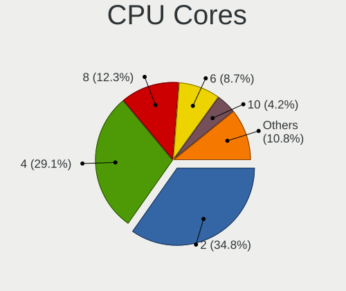

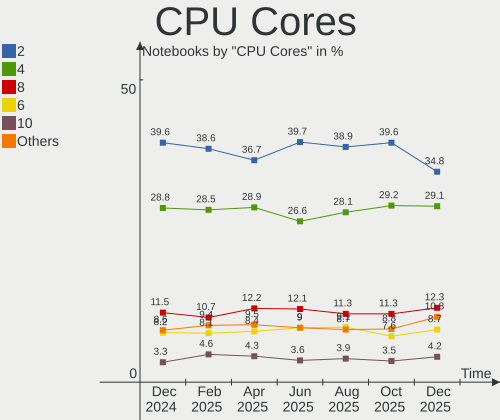

| Number  | Notebooks | Percent |
|---------|-----------|---------|
| 2       | 1143      | 34.77%  |
| 4       | 958       | 29.15%  |
| 8       | 405       | 12.32%  |
| 6       | 287       | 8.73%   |
| 10      | 138       | 4.2%    |
| 12      | 107       | 3.26%   |
| 16      | 100       | 3.04%   |
| 14      | 71        | 2.16%   |
| 24      | 40        | 1.22%   |
| 1       | 21        | 0.64%   |
| 20      | 14        | 0.43%   |
| 18      | 1         | 0.03%   |
| 5       | 1         | 0.03%   |
| Unknown | 1         | 0.03%   |

CPU Sockets
-----------

Number of sockets

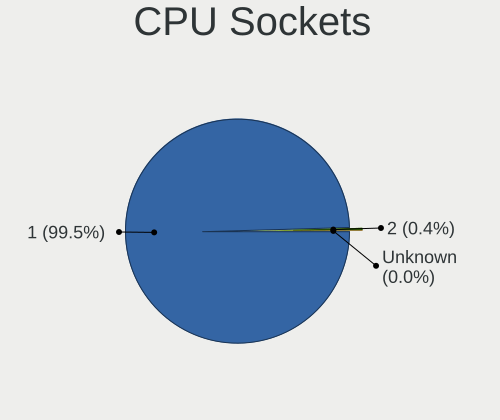

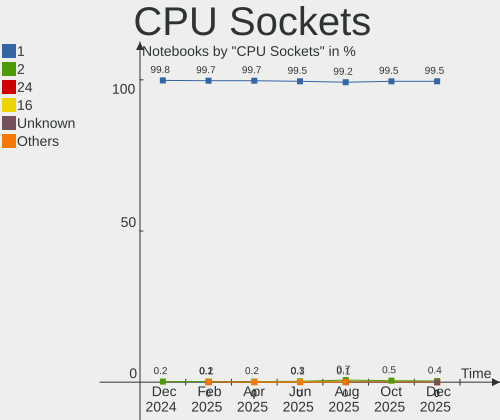

| Number  | Notebooks | Percent |
|---------|-----------|---------|
| 1       | 3272      | 99.54%  |
| 2       | 12        | 0.37%   |
| 24      | 1         | 0.03%   |
| 16      | 1         | 0.03%   |
| Unknown | 1         | 0.03%   |

CPU Threads
-----------

Threads per core (Hyper-Threading)

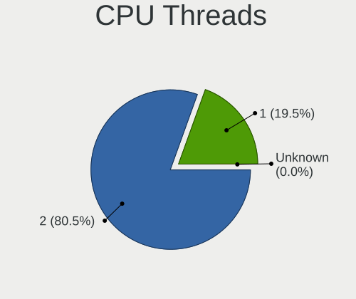

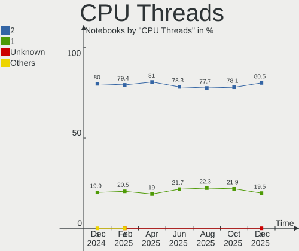

| Number  | Notebooks | Percent |
|---------|-----------|---------|
| 2       | 2646      | 80.5%   |
| 1       | 640       | 19.47%  |
| Unknown | 1         | 0.03%   |

CPU Op-Modes
------------

CPU Operation Modes (32-bit, 64-bit)

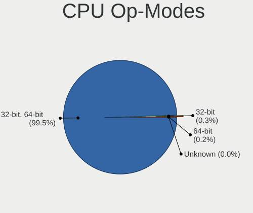

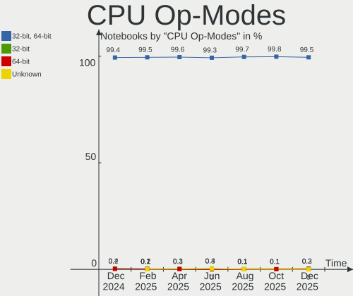

| Op mode        | Notebooks | Percent |
|----------------|-----------|---------|
| 32-bit, 64-bit | 3270      | 99.48%  |
| 32-bit         | 9         | 0.27%   |
| 64-bit         | 7         | 0.21%   |
| Unknown        | 1         | 0.03%   |

CPU Microcode
-------------

Microcode number

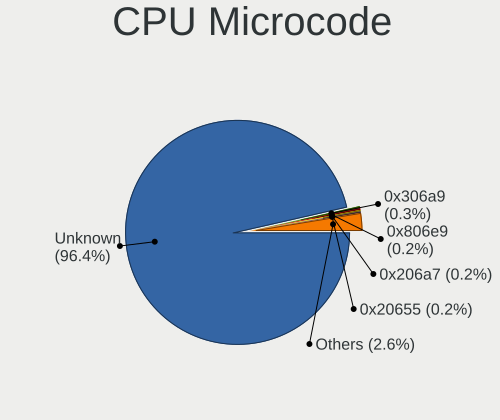

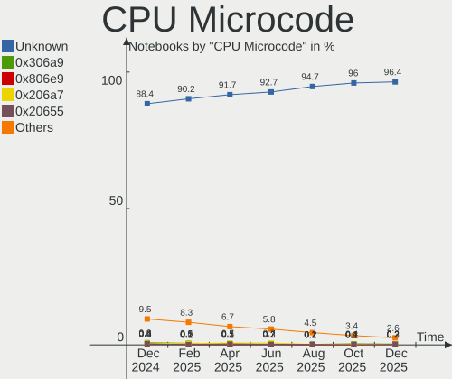

| Number     | Notebooks | Percent |
|------------|-----------|---------|
| Unknown    | 3170      | 96.44%  |
| 0x306a9    | 10        | 0.3%    |
| 0x806e9    | 8         | 0.24%   |
| 0x206a7    | 7         | 0.21%   |
| 0x20655    | 7         | 0.21%   |
| 0x40651    | 6         | 0.18%   |
| 0x0b204037 | 6         | 0.18%   |
| 0x6fd      | 5         | 0.15%   |
| 0x1067a    | 5         | 0.15%   |
| 0x20652    | 4         | 0.12%   |
| 0x106c2    | 4         | 0.12%   |
| 0x906c0    | 3         | 0.09%   |
| 0x806ec    | 3         | 0.09%   |
| 0x806c1    | 3         | 0.09%   |
| 0x6fb      | 3         | 0.09%   |
| 0x106ca    | 3         | 0.09%   |
| 0x0b600037 | 3         | 0.09%   |
| 0x906a4    | 2         | 0.06%   |
| 0x6d8      | 2         | 0.06%   |
| 0x406e3    | 2         | 0.06%   |
| 0x406c4    | 2         | 0.06%   |
| 0x306d4    | 2         | 0.06%   |
| 0x30678    | 2         | 0.06%   |
| 0x30661    | 2         | 0.06%   |
| 0x08a0000a | 2         | 0.06%   |
| 0x08108102 | 2         | 0.06%   |
| 0x906ed    | 1         | 0.03%   |
| 0x906a3    | 1         | 0.03%   |
| 0x706a1    | 1         | 0.03%   |
| 0x6f2      | 1         | 0.03%   |
| 0x6d6      | 1         | 0.03%   |
| 0x40661    | 1         | 0.03%   |
| 0x306c3    | 1         | 0.03%   |
| 0x0a500014 | 1         | 0.03%   |
| 0x0a500011 | 1         | 0.03%   |
| 0x0a50000c | 1         | 0.03%   |
| 0x08608103 | 1         | 0.03%   |
| 0x0860010d | 1         | 0.03%   |
| 0x08600109 | 1         | 0.03%   |
| 0x08600102 | 1         | 0.03%   |

CPU Microarch
-------------

Microarchitecture

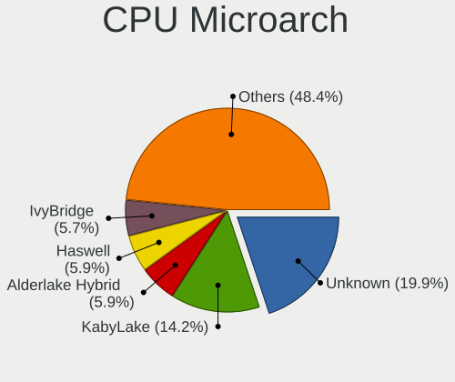

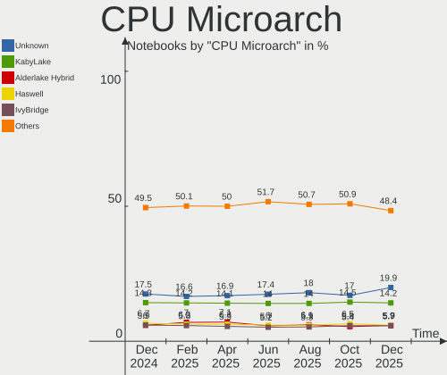

| Name               | Notebooks | Percent |
|--------------------|-----------|---------|
| Unknown            | 654       | 19.9%   |
| KabyLake           | 467       | 14.21%  |
| Alderlake Hybrid   | 195       | 5.93%   |
| Haswell            | 194       | 5.9%    |
| IvyBridge          | 187       | 5.69%   |
| SandyBridge        | 164       | 4.99%   |
| TigerLake          | 159       | 4.84%   |
| Skylake            | 152       | 4.62%   |
| Zen 3              | 136       | 4.14%   |
| Broadwell          | 108       | 3.29%   |
| Zen+               | 75        | 2.28%   |
| Westmere           | 75        | 2.28%   |
| Penryn             | 75        | 2.28%   |
| Zen 2              | 61        | 1.86%   |
| Silvermont         | 60        | 1.83%   |
| CometLake          | 60        | 1.83%   |
| IceLake            | 59        | 1.79%   |
| Meteorlake Hybrid  | 47        | 1.43%   |
| Goldmont plus      | 46        | 1.4%    |
| Core               | 44        | 1.34%   |
| Puma               | 34        | 1.03%   |
| Lunarlake Hybrid   | 34        | 1.03%   |
| Goldmont           | 25        | 0.76%   |
| Excavator          | 24        | 0.73%   |
| Zen                | 17        | 0.52%   |
| Gracemont          | 16        | 0.49%   |
| Tremont            | 15        | 0.46%   |
| Piledriver         | 15        | 0.46%   |
| Bobcat             | 15        | 0.46%   |
| Jaguar             | 13        | 0.4%    |
| Bonnell            | 13        | 0.4%    |
| ArrowLake-H Hybrid | 10        | 0.3%    |
| K10                | 9         | 0.27%   |
| K10 Llano          | 8         | 0.24%   |
| Nehalem            | 7         | 0.21%   |
| K8 Hammer          | 5         | 0.15%   |
| Steamroller        | 3         | 0.09%   |
| P6                 | 3         | 0.09%   |
| K8 & K10 hybrid    | 3         | 0.09%   |

Graphics
--------

GPU Vendor
----------

Vendors of graphics cards

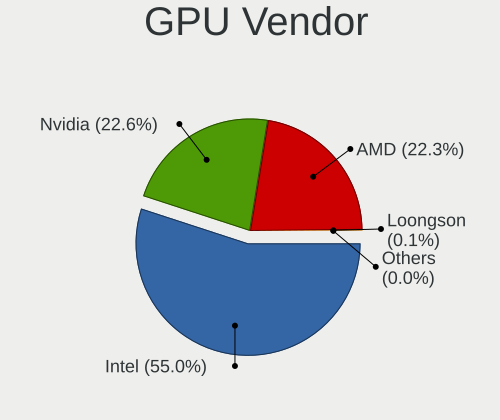

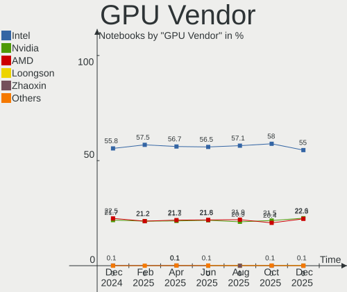

| Vendor                           | Notebooks | Percent |
|----------------------------------|-----------|---------|
| Intel                            | 2291      | 55.02%  |
| Nvidia                           | 939       | 22.55%  |
| AMD                              | 927       | 22.26%  |
| Loongson Technology              | 3         | 0.07%   |
| Zhaoxin                          | 2         | 0.05%   |
| Silicon Integrated Systems [SiS] | 2         | 0.05%   |

GPU Model
---------

Graphics card models

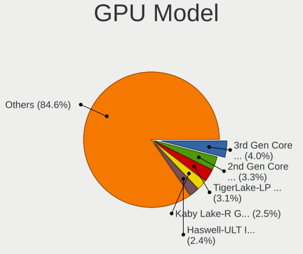

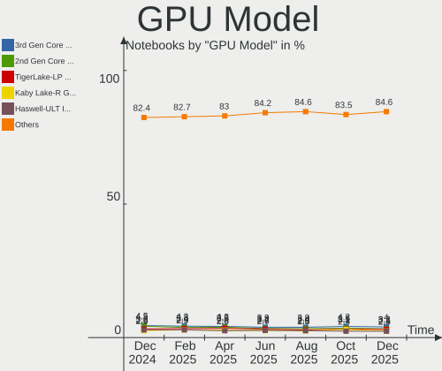

| Model                                                                     | Notebooks | Percent |
|---------------------------------------------------------------------------|-----------|---------|
| Intel 3rd Gen Core processor Graphics Controller                          | 171       | 4.02%   |
| Intel 2nd Generation Core Processor Family Integrated Graphics Controller | 142       | 3.34%   |
| Intel TigerLake-LP GT2 [Iris Xe Graphics]                                 | 132       | 3.1%    |
| Intel Kaby Lake-R GT2 [UHD Graphics 620]                                  | 105       | 2.47%   |
| Intel Haswell-ULT Integrated Graphics Controller                          | 103       | 2.42%   |
| Intel Skylake-U GT2 [HD Graphics 520]                                     | 94        | 2.21%   |
| Intel CoffeeLake-H GT2 [UHD Graphics 630]                                 | 84        | 1.98%   |
| Intel Kaby Lake-U GT2 [HD Graphics 620]                                   | 83        | 1.95%   |
| AMD Picasso/Raven 2 [Radeon Vega Series / Radeon Vega Mobile Series]      | 80        | 1.88%   |
| Intel Broadwell-U GT2 [HD Graphics 5500]                                  | 71        | 1.67%   |
| AMD Barcelo                                                               | 68        | 1.6%    |
| Intel WhiskeyLake-U GT2 [UHD Graphics 620]                                | 65        | 1.53%   |
| Intel 4th Gen Core Processor Integrated Graphics Controller               | 65        | 1.53%   |
| Intel Raptor Lake-P [Iris Xe Graphics]                                    | 60        | 1.41%   |
| AMD Renoir [Radeon Vega Series / Radeon Vega Mobile Series]               | 58        | 1.36%   |
| Intel Meteor Lake-P [Intel Arc Graphics]                                  | 56        | 1.32%   |
| Intel Alder Lake-P GT2 [Iris Xe Graphics]                                 | 55        | 1.29%   |
| AMD Phoenix1                                                              | 55        | 1.29%   |
| AMD Cezanne [Radeon Vega Series / Radeon Vega Mobile Series]              | 55        | 1.29%   |
| Nvidia AD107M [GeForce RTX 4060 Max-Q / Mobile]                           | 52        | 1.22%   |
| Intel Raptor Lake-P [UHD Graphics]                                        | 51        | 1.2%    |
| Intel Core Processor Integrated Graphics Controller                       | 50        | 1.18%   |
| Intel CometLake-H GT2 [UHD Graphics]                                      | 47        | 1.11%   |
| AMD Lucienne                                                              | 47        | 1.11%   |
| Intel CometLake-U GT2 [UHD Graphics]                                      | 46        | 1.08%   |
| AMD Rembrandt [Radeon 680M]                                               | 46        | 1.08%   |
| AMD Mendocino [Radeon 610M]                                               | 45        | 1.06%   |
| Intel Mobile 4 Series Chipset Integrated Graphics Controller              | 44        | 1.03%   |
| AMD Strix [Radeon 880M / 890M]                                            | 42        | 0.99%   |
| AMD HawkPoint1                                                            | 41        | 0.96%   |
| Nvidia TU117M [GeForce GTX 1650 Mobile / Max-Q]                           | 37        | 0.87%   |
| Intel GeminiLake [UHD Graphics 600]                                       | 37        | 0.87%   |
| Nvidia GA107M [GeForce RTX 3050 Mobile]                                   | 36        | 0.85%   |
| Nvidia GA106M [GeForce RTX 3060 Mobile / Max-Q]                           | 36        | 0.85%   |
| Intel Lunar Lake [Intel Arc Graphics 130V / 140V]                         | 36        | 0.85%   |
| Intel TigerLake-H GT1 [UHD Graphics]                                      | 34        | 0.8%    |
| Intel Raptor Lake-S UHD Graphics                                          | 34        | 0.8%    |
| Intel Kaby Lake-H GT2 [HD Graphics 630]                                   | 32        | 0.75%   |
| Intel Alder Lake-UP3 GT2 [Iris Xe Graphics]                               | 32        | 0.75%   |
| Intel Skylake-H GT2 [HD Graphics 530]                                     | 31        | 0.73%   |

GPU Combo
---------

Combinations of graphics cards

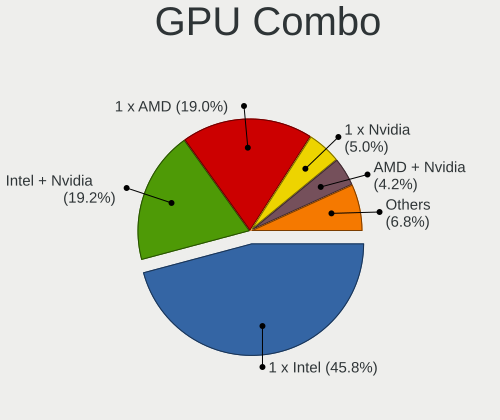

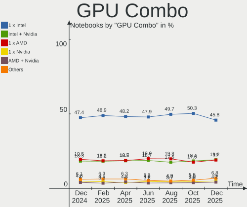

| Name                    | Notebooks | Percent |
|-------------------------|-----------|---------|
| 1 x Intel               | 1507      | 45.85%  |
| Intel + Nvidia          | 632       | 19.23%  |
| 1 x AMD                 | 625       | 19.01%  |
| 1 x Nvidia              | 163       | 4.96%   |
| AMD + Nvidia            | 137       | 4.17%   |
| Intel + AMD             | 106       | 3.22%   |
| 2 x AMD                 | 58        | 1.76%   |
| 2 x Intel               | 34        | 1.03%   |
| Other                   | 13        | 0.4%    |
| 2 x Nvidia              | 5         | 0.15%   |
| 1 x Loongson Technology | 3         | 0.09%   |
| 1 x Zhaoxin             | 2         | 0.06%   |
| 1 x SiS                 | 2         | 0.06%   |

GPU Driver
----------

Free vs proprietary

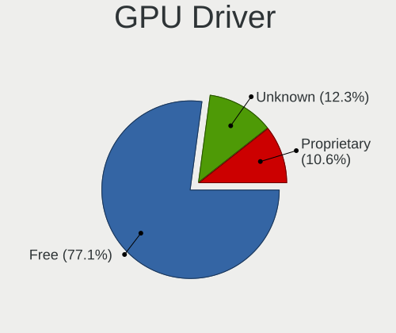

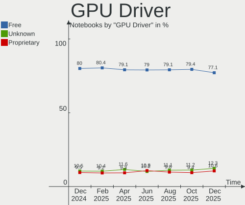

| Driver      | Notebooks | Percent |
|-------------|-----------|---------|
| Free        | 2535      | 77.12%  |
| Unknown     | 403       | 12.26%  |
| Proprietary | 349       | 10.62%  |

GPU Memory
----------

Total video memory

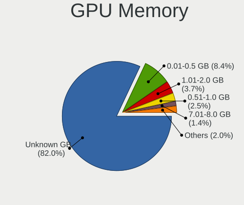

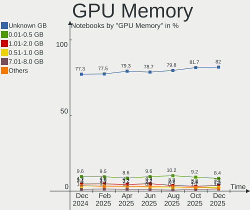

| Size in GB | Notebooks | Percent |
|------------|-----------|---------|
| Unknown    | 2696      | 82.02%  |
| 0.01-0.5   | 276       | 8.4%    |
| 1.01-2.0   | 121       | 3.68%   |
| 0.51-1.0   | 81        | 2.46%   |
| 7.01-8.0   | 46        | 1.4%    |
| 3.01-4.0   | 46        | 1.4%    |
| 5.01-6.0   | 9         | 0.27%   |
| 8.01-16.0  | 7         | 0.21%   |
| 2.01-3.0   | 4         | 0.12%   |
| 24.01-32.0 | 1         | 0.03%   |

Monitor
-------

Monitor Vendor
--------------

Monitor vendors

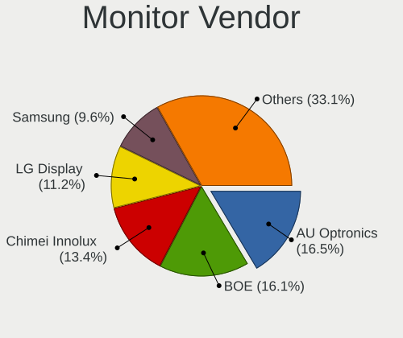

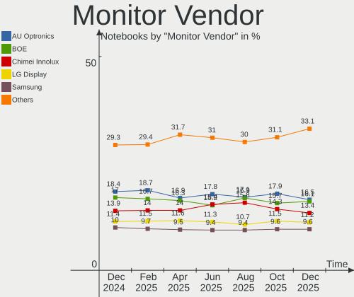

| Vendor                  | Notebooks | Percent |
|-------------------------|-----------|---------|
| AU Optronics            | 612       | 16.46%  |
| BOE                     | 600       | 16.14%  |
| Chimei Innolux          | 500       | 13.45%  |
| LG Display              | 416       | 11.19%  |
| Samsung Electronics     | 358       | 9.63%   |
| Lenovo                  | 162       | 4.36%   |
| Apple                   | 140       | 3.77%   |
| Dell                    | 83        | 2.23%   |
| Sharp                   | 77        | 2.07%   |
| Goldstar                | 64        | 1.72%   |
| Chi Mei Optoelectronics | 58        | 1.56%   |
| PANDA                   | 44        | 1.18%   |
| CSW                     | 43        | 1.16%   |
| CSOT                    | 43        | 1.16%   |
| InfoVision              | 39        | 1.05%   |
| Acer                    | 38        | 1.02%   |
| Valve                   | 34        | 0.91%   |
| Hewlett-Packard         | 33        | 0.89%   |
| Philips                 | 30        | 0.81%   |
| BenQ                    | 25        | 0.67%   |
| AOC                     | 25        | 0.67%   |
| ASUSTek Computer        | 22        | 0.59%   |
| MSI                     | 19        | 0.51%   |
| HKC                     | 18        | 0.48%   |
| EDO                     | 16        | 0.43%   |
| LG Philips              | 14        | 0.38%   |
| TMX                     | 11        | 0.3%    |
| Ancor Communications    | 9         | 0.24%   |
| Unknown                 | 8         | 0.22%   |
| HannStar                | 8         | 0.22%   |
| Toshiba                 | 7         | 0.19%   |
| TMA                     | 7         | 0.19%   |
| Sony                    | 7         | 0.19%   |
| Panasonic               | 7         | 0.19%   |
| ViewSonic               | 6         | 0.16%   |
| Iiyama                  | 6         | 0.16%   |
| Eizo                    | 6         | 0.16%   |
| CPT                     | 6         | 0.16%   |
| Vizio                   | 5         | 0.13%   |
| RTK                     | 5         | 0.13%   |

Monitor Model
-------------

Monitor models

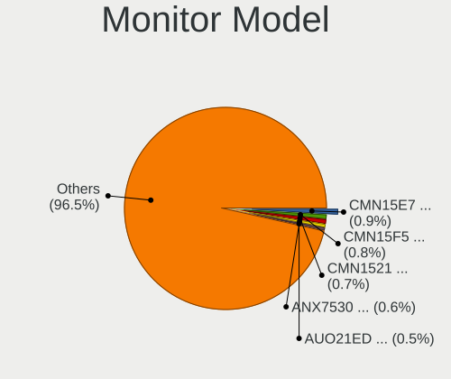

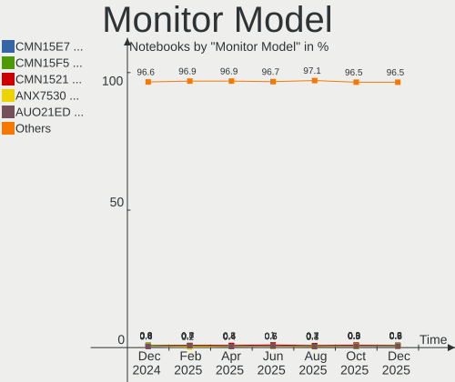

| Model                                                                    | Notebooks | Percent |
|--------------------------------------------------------------------------|-----------|---------|
| Chimei Innolux LCD Monitor CMN15E7 1920x1080 344x193mm 15.5-inch         | 35        | 0.93%   |
| Chimei Innolux LCD Monitor CMN15F5 1920x1080 344x193mm 15.5-inch         | 29        | 0.77%   |
| Chimei Innolux LCD Monitor CMN1521 1920x1080 344x193mm 15.5-inch         | 28        | 0.75%   |
| Valve ANX7530 U VLV3003 800x1280 100x160mm 7.4-inch                      | 22        | 0.59%   |
| AU Optronics LCD Monitor AUO21ED 1920x1080 344x193mm 15.5-inch           | 18        | 0.48%   |
| Lenovo LCD Monitor LEN40A9 1920x1080 309x173mm 13.9-inch                 | 16        | 0.43%   |
| AU Optronics LCD Monitor AUO106C 1366x768 276x155mm 12.5-inch            | 16        | 0.43%   |
| Chimei Innolux LCD Monitor CMN14D4 1920x1080 309x173mm 13.9-inch         | 15        | 0.4%    |
| AU Optronics LCD Monitor AUO61ED 1920x1080 344x194mm 15.5-inch           | 15        | 0.4%    |
| LG Display LCD Monitor LGD02DC 1366x768 344x194mm 15.5-inch              | 14        | 0.37%   |
| CSW MNE007ZA3-2 CSW1431 2880x1800 301x188mm 14.0-inch                    | 13        | 0.35%   |
| BOE LCD Monitor BOE0BCA 2256x1504 285x190mm 13.5-inch                    | 13        | 0.35%   |
| BOE LCD Monitor BOE084E 1920x1080 382x215mm 17.3-inch                    | 13        | 0.35%   |
| AU Optronics LCD Monitor AUO38ED 1920x1080 344x193mm 15.5-inch           | 13        | 0.35%   |
| Valve ANX7530 U VLV3001 800x1280 100x150mm 7.1-inch                      | 12        | 0.32%   |
| Samsung Electronics LCD Monitor SEC5441 1280x800 331x207mm 15.4-inch     | 12        | 0.32%   |
| BOE LCD Monitor BOE0BC9 2560x1600 345x215mm 16.0-inch                    | 12        | 0.32%   |
| AU Optronics LCD Monitor AUO10EC 1366x768 344x193mm 15.5-inch            | 12        | 0.32%   |
| PANDA LCD Monitor NCP004D 1920x1080 344x194mm 15.5-inch                  | 11        | 0.29%   |
| Lenovo LCD Monitor LEN40BA 1920x1080 344x194mm 15.5-inch                 | 11        | 0.29%   |
| Lenovo B140UAN02.7 LEN403A 1920x1200 302x188mm 14.0-inch                 | 11        | 0.29%   |
| Chimei Innolux LCD Monitor CMN1618 1920x1200 344x215mm 16.0-inch         | 11        | 0.29%   |
| Chimei Innolux LCD Monitor CMN15DB 1366x768 344x193mm 15.5-inch          | 11        | 0.29%   |
| Chimei Innolux LCD Monitor CMN15AB 1366x768 344x193mm 15.5-inch          | 11        | 0.29%   |
| Chimei Innolux LCD Monitor CMN14C9 1920x1080 309x173mm 13.9-inch         | 11        | 0.29%   |
| BOE NE135A1M-NY1 BOE0CB4 2880x1920 285x190mm 13.5-inch                   | 11        | 0.29%   |
| LG Display LCD Monitor LGD046F 1920x1080 344x194mm 15.5-inch             | 10        | 0.27%   |
| EDO EF10QBC64.C EDO4245                                                  | 10        | 0.27%   |
| Chi Mei Optoelectronics LCD Monitor CMO15A7 1366x768 344x193mm 15.5-inch | 10        | 0.27%   |
| AU Optronics LCD Monitor AUOAF90 1920x1080 344x193mm 15.5-inch           | 10        | 0.27%   |
| AU Optronics LCD Monitor AUO7EAD 1920x1080 344x193mm 15.5-inch           | 10        | 0.27%   |
| Apple Color LCD APPA01B 1440x900 286x179mm 13.3-inch                     | 10        | 0.27%   |
| Samsung Electronics LCD Monitor SDC419D 2880x1800 302x189mm 14.0-inch    | 9         | 0.24%   |
| Samsung Electronics LCD Monitor SDC4171 2880x1800 302x189mm 14.0-inch    | 9         | 0.24%   |
| LG Display LCD Monitor LGD033A 1366x768 344x194mm 15.5-inch              | 9         | 0.24%   |
| BOE LCD Monitor BOE08D5 1920x1080 344x194mm 15.5-inch                    | 9         | 0.24%   |
| BOE LCD Monitor BOE0872 1920x1080 344x194mm 15.5-inch                    | 9         | 0.24%   |
| BOE LCD Monitor BOE0687 1920x1080 344x193mm 15.5-inch                    | 9         | 0.24%   |
| AU Optronics LCD Monitor AUO45EC 1366x768 344x193mm 15.5-inch            | 9         | 0.24%   |
| AU Optronics LCD Monitor AUO403D 1920x1080 309x174mm 14.0-inch           | 9         | 0.24%   |

Monitor Resolution
------------------

Monitor screen resolution

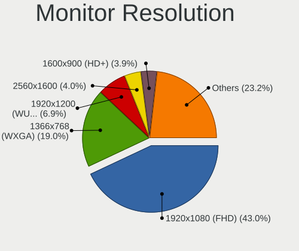

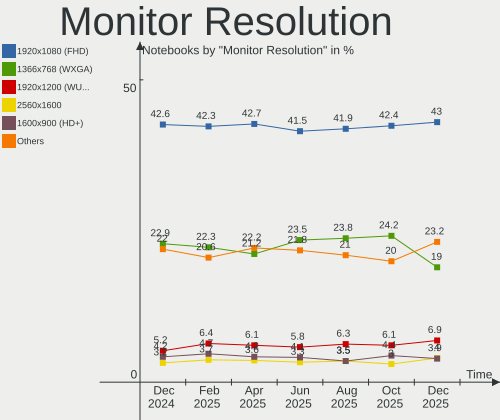

| Resolution         | Notebooks | Percent |
|--------------------|-----------|---------|
| 1920x1080 (FHD)    | 1538      | 43.01%  |
| 1366x768 (WXGA)    | 679       | 18.99%  |
| 1920x1200 (WUXGA)  | 247       | 6.91%   |
| 2560x1600          | 144       | 4.03%   |
| 1600x900 (HD+)     | 138       | 3.86%   |
| 3840x2160 (4K)     | 137       | 3.83%   |
| 2880x1800          | 119       | 3.33%   |
| 2560x1440 (QHD)    | 119       | 3.33%   |
| 1280x800 (WXGA)    | 75        | 2.1%    |
| 1440x900 (WXGA+)   | 65        | 1.82%   |
| Unknown            | 51        | 1.43%   |
| 800x1280           | 34        | 0.95%   |
| 1680x1050 (WSXGA+) | 23        | 0.64%   |
| 2256x1504          | 18        | 0.5%    |
| 3440x1440          | 17        | 0.48%   |
| 2560x1080          | 16        | 0.45%   |
| 2880x1920          | 14        | 0.39%   |
| 3840x2400          | 13        | 0.36%   |
| 3200x1800 (QHD+)   | 13        | 0.36%   |
| 2160x1440          | 12        | 0.34%   |
| 3072x1920          | 11        | 0.31%   |
| 2240x1400          | 9         | 0.25%   |
| 1024x600           | 9         | 0.25%   |
| 2288x1287          | 7         | 0.2%    |
| 3840x1080          | 6         | 0.17%   |
| 3200x2000          | 5         | 0.14%   |
| 2520x1680          | 5         | 0.14%   |
| 1024x768 (XGA)     | 5         | 0.14%   |
| 2304x1440          | 4         | 0.11%   |
| 1280x1024 (SXGA)   | 4         | 0.11%   |
| 3840x1600          | 3         | 0.08%   |
| 3456x2160          | 3         | 0.08%   |
| 2880x1620          | 3         | 0.08%   |
| 2400x1600          | 3         | 0.08%   |
| 1920x1280          | 3         | 0.08%   |
| 1360x768           | 3         | 0.08%   |
| 3000x2000          | 2         | 0.06%   |
| 2944x1840          | 2         | 0.06%   |
| 2160x1350          | 2         | 0.06%   |
| 1600x2560          | 2         | 0.06%   |

Monitor Diagonal
----------------

Diagonal size in inches

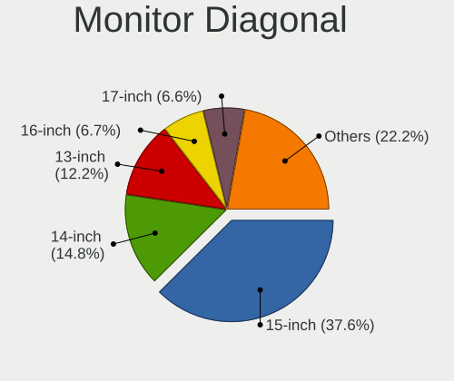

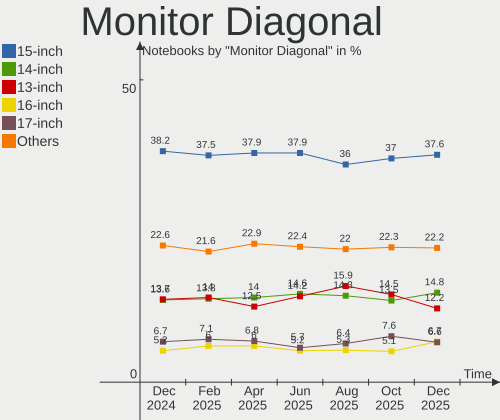

| Inches  | Notebooks | Percent |
|---------|-----------|---------|
| 15      | 1398      | 37.55%  |
| 14      | 552       | 14.83%  |
| 13      | 453       | 12.17%  |
| 16      | 249       | 6.69%   |
| 17      | 245       | 6.58%   |
| 27      | 140       | 3.76%   |
| 24      | 108       | 2.9%    |
| 12      | 73        | 1.96%   |
| Unknown | 58        | 1.56%   |
| 21      | 54        | 1.45%   |
| 31      | 53        | 1.42%   |
| 23      | 49        | 1.32%   |
| 11      | 47        | 1.26%   |
| 7       | 34        | 0.91%   |
| 18      | 30        | 0.81%   |
| 34      | 27        | 0.73%   |
| 84      | 16        | 0.43%   |
| 10      | 12        | 0.32%   |
| 22      | 10        | 0.27%   |
| 54      | 9         | 0.24%   |
| 32      | 9         | 0.24%   |
| 19      | 9         | 0.24%   |
| 26      | 8         | 0.21%   |
| 20      | 8         | 0.21%   |
| 142     | 7         | 0.19%   |
| 63      | 6         | 0.16%   |
| 40      | 6         | 0.16%   |
| 72      | 5         | 0.13%   |
| 86      | 4         | 0.11%   |
| 49      | 4         | 0.11%   |
| 28      | 4         | 0.11%   |
| 48      | 3         | 0.08%   |
| 37      | 3         | 0.08%   |
| 29      | 3         | 0.08%   |
| 25      | 3         | 0.08%   |
| 74      | 2         | 0.05%   |
| 64      | 2         | 0.05%   |
| 57      | 2         | 0.05%   |
| 52      | 2         | 0.05%   |
| 42      | 2         | 0.05%   |

Monitor Width
-------------

Physical width

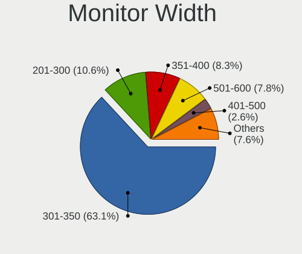

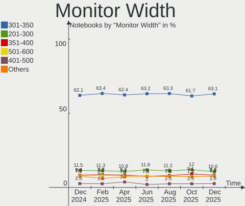

| Width in mm    | Notebooks | Percent |
|----------------|-----------|---------|
| 301-350        | 2334      | 63.08%  |
| 201-300        | 394       | 10.65%  |
| 351-400        | 307       | 8.3%    |
| 501-600        | 287       | 7.76%   |
| 401-500        | 95        | 2.57%   |
| 601-700        | 68        | 1.84%   |
| Unknown        | 58        | 1.57%   |
| 701-800        | 39        | 1.05%   |
| 1001-1500      | 37        | 1%      |
| 1-100          | 34        | 0.92%   |
| 1501-2000      | 24        | 0.65%   |
| 801-900        | 9         | 0.24%   |
| More than 2000 | 7         | 0.19%   |
| 901-1000       | 6         | 0.16%   |
| 101-200        | 1         | 0.03%   |

Aspect Ratio
------------

Proportional relationship between the width and the height

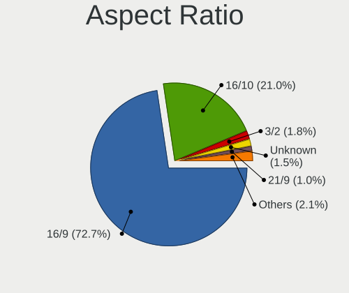

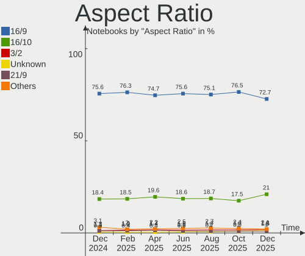

| Ratio   | Notebooks | Percent |
|---------|-----------|---------|
| 16/9    | 2484      | 72.65%  |
| 16/10   | 718       | 21%     |
| 3/2     | 60        | 1.75%   |
| Unknown | 51        | 1.49%   |
| 21/9    | 34        | 0.99%   |
| 0.62    | 22        | 0.64%   |
| 0.67    | 12        | 0.35%   |
| 4/3     | 9         | 0.26%   |
| 32/9    | 9         | 0.26%   |
| 1.00    | 7         | 0.2%    |
| 0.56    | 5         | 0.15%   |
| 6/5     | 2         | 0.06%   |
| 5/4     | 1         | 0.03%   |
| 3.73    | 1         | 0.03%   |
| 3.40    | 1         | 0.03%   |
| 2.00    | 1         | 0.03%   |
| 0.89    | 1         | 0.03%   |
| 0.63    | 1         | 0.03%   |

Monitor Area
------------

Area in inch²

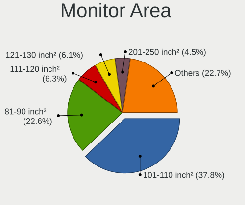

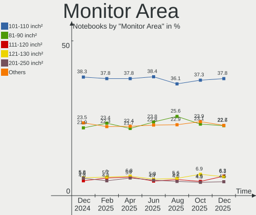

| Area in inch² | Notebooks | Percent |
|----------------|-----------|---------|
| 101-110        | 1403      | 37.83%  |
| 81-90          | 837       | 22.57%  |
| 111-120        | 234       | 6.31%   |
| 121-130        | 226       | 6.09%   |
| 201-250        | 166       | 4.48%   |
| 71-80          | 152       | 4.1%    |
| 301-350        | 146       | 3.94%   |
| 351-500        | 94        | 2.53%   |
| 61-70          | 71        | 1.91%   |
| More than 1000 | 58        | 1.56%   |
| Unknown        | 58        | 1.56%   |
| 51-60          | 47        | 1.27%   |
| 251-300        | 36        | 0.97%   |
| 1-40           | 35        | 0.94%   |
| 151-200        | 32        | 0.86%   |
| 141-150        | 29        | 0.78%   |
| 501-1000       | 27        | 0.73%   |
| 131-140        | 25        | 0.67%   |
| 91-100         | 21        | 0.57%   |
| 41-50          | 12        | 0.32%   |

Pixel Density
-------------

Pixels per inch

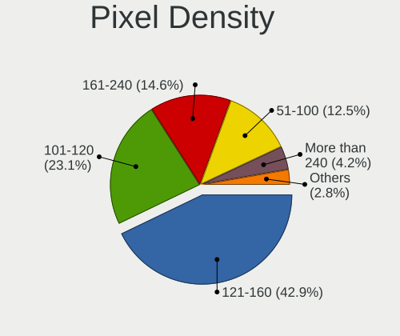

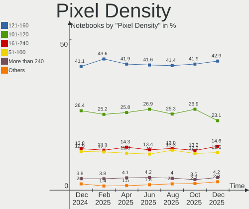

| Density       | Notebooks | Percent |
|---------------|-----------|---------|
| 121-160       | 1573      | 42.86%  |
| 101-120       | 847       | 23.08%  |
| 161-240       | 537       | 14.63%  |
| 51-100        | 457       | 12.45%  |
| More than 240 | 155       | 4.22%   |
| Unknown       | 58        | 1.58%   |
| 1-50          | 43        | 1.17%   |

Multiple Monitors
-----------------

Total monitors connected

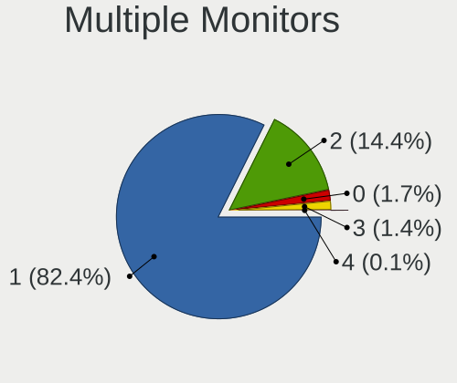

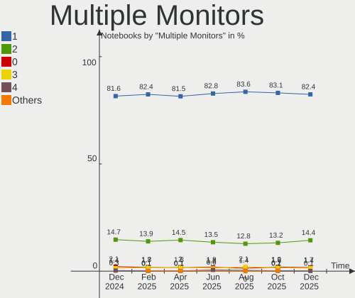

| Total | Notebooks | Percent |
|-------|-----------|---------|
| 1     | 2707      | 82.35%  |
| 2     | 472       | 14.36%  |
| 0     | 57        | 1.73%   |
| 3     | 47        | 1.43%   |
| 4     | 4         | 0.12%   |

Network
-------

Net Controller Vendor
---------------------

Controller vendors

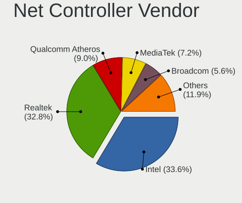

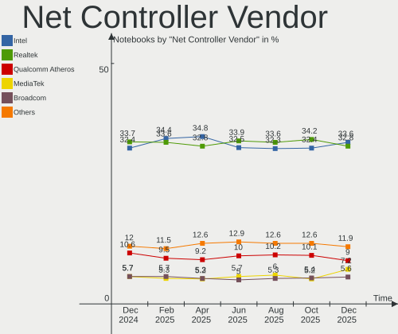

| Vendor                                 | Notebooks | Percent |
|----------------------------------------|-----------|---------|
| Intel                                  | 1693      | 33.58%  |
| Realtek Semiconductor                  | 1654      | 32.81%  |
| Qualcomm Atheros                       | 455       | 9.03%   |
| MediaTek                               | 361       | 7.16%   |
| Broadcom                               | 280       | 5.55%   |
| Broadcom Limited                       | 76        | 1.51%   |
| Qualcomm                               | 50        | 0.99%   |
| ASIX Electronics                       | 47        | 0.93%   |
| Ralink                                 | 35        | 0.69%   |
| TP-Link                                | 31        | 0.61%   |
| Samsung Electronics                    | 30        | 0.6%    |
| Marvell Technology Group               | 27        | 0.54%   |
| Sierra Wireless                        | 26        | 0.52%   |
| Shenzhen Goodix Technology             | 21        | 0.42%   |
| Suzhou Motorcomm Electronic Technology | 17        | 0.34%   |
| Nvidia                                 | 17        | 0.34%   |
| Lenovo                                 | 16        | 0.32%   |
| Ericsson Business Mobile Networks      | 15        | 0.3%    |
| Ralink Technology                      | 13        | 0.26%   |
| Motorcomm Microelectronics.            | 13        | 0.26%   |
| Dell                                   | 12        | 0.24%   |
| OPPO Electronics                       | 11        | 0.22%   |
| DisplayLink                            | 11        | 0.22%   |
| Xiaomi                                 | 10        | 0.2%    |
| Hewlett-Packard                        | 9         | 0.18%   |
| Apple                                  | 8         | 0.16%   |
| ASUSTek Computer                       | 7         | 0.14%   |
| NetGear                                | 6         | 0.12%   |
| Huawei Technologies                    | 6         | 0.12%   |
| Google                                 | 6         | 0.12%   |
| D-Link                                 | 6         | 0.12%   |
| JMicron Technology                     | 5         | 0.1%    |
| Qualcomm Technologies                  | 4         | 0.08%   |
| QinHeng Electronics                    | 4         | 0.08%   |
| Fibocom                                | 4         | 0.08%   |
| Realtek                                | 3         | 0.06%   |
| Quectel Wireless Solutions             | 3         | 0.06%   |
| Qualcomm Atheros Communications        | 3         | 0.06%   |
| Microsoft                              | 3         | 0.06%   |
| Framework Computer                     | 3         | 0.06%   |

Net Controller Model
--------------------

Controller models

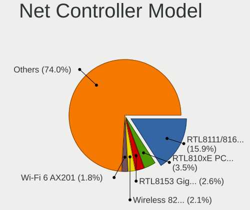

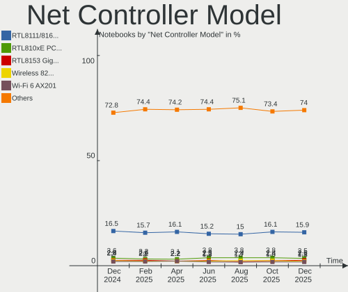

| Model                                                                           | Notebooks | Percent |
|---------------------------------------------------------------------------------|-----------|---------|
| Realtek RTL8111/8168/8211/8411 PCI Express Gigabit Ethernet Controller          | 966       | 15.92%  |
| Realtek RTL810xE PCI Express Fast Ethernet controller                           | 210       | 3.46%   |
| Realtek RTL8153 Gigabit Ethernet Adapter                                        | 160       | 2.64%   |
| Intel Wireless 8265 / 8275                                                      | 129       | 2.13%   |
| Intel Wi-Fi 6 AX201                                                             | 110       | 1.81%   |
| Intel Wi-Fi 6 AX200                                                             | 108       | 1.78%   |
| Intel Alder Lake-P PCH CNVi WiFi                                                | 108       | 1.78%   |
| Realtek RTL8821CE 802.11ac PCIe Wireless Network Adapter                        | 106       | 1.75%   |
| MediaTek MT7922 802.11ax PCI Express Wireless Network Adapter                   | 104       | 1.71%   |
| Intel Wireless 7265                                                             | 101       | 1.66%   |
| Realtek RTL8822CE 802.11ac PCIe Wireless Network Adapter                        | 95        | 1.57%   |
| Intel 82579LM Gigabit Network Connection (Lewisville)                           | 91        | 1.5%    |
| MediaTek MT7921 802.11ax PCIe Wireless Network Adapter [Filogic 330]            | 88        | 1.45%   |
| Realtek RTL8852BE PCIe 802.11ax Wireless Network Controller                     | 77        | 1.27%   |
| Intel Wireless 8260                                                             | 77        | 1.27%   |
| Intel Ethernet Connection (4) I219-LM                                           | 77        | 1.27%   |
| Qualcomm Atheros QCA9565 / AR9565 Wireless Network Adapter                      | 76        | 1.25%   |
| Intel Raptor Lake PCH CNVi WiFi                                                 | 76        | 1.25%   |
| Qualcomm Atheros QCA9377 802.11ac Wireless Network Adapter                      | 74        | 1.22%   |
| Qualcomm Atheros QCA6174 802.11ac Wireless Network Adapter                      | 68        | 1.12%   |
| Intel Wi-Fi 6E(802.11ax) AX210/AX1675* 2x2 [Typhoon Peak]                       | 68        | 1.12%   |
| MediaTek MT7902 802.11ax PCIe Wireless Network Adapter [Filogic 310]            | 67        | 1.1%    |
| MediaTek MT7925 802.11be 160MHz 2x2 PCIe Wireless Network Adapter [Filogic 360] | 66        | 1.09%   |
| Qualcomm Atheros AR9485 Wireless Network Adapter                                | 63        | 1.04%   |
| Intel Centrino Advanced-N 6205 [Taylor Peak]                                    | 62        | 1.02%   |
| Intel Wireless 7260                                                             | 60        | 0.99%   |
| Qualcomm Atheros AR9285 Wireless Network Adapter (PCI-Express)                  | 54        | 0.89%   |
| Intel Meteor Lake PCH CNVi WiFi                                                 | 51        | 0.84%   |
| Intel Comet Lake PCH CNVi WiFi                                                  | 51        | 0.84%   |
| Qualcomm QCNFA765 Wireless Network Adapter                                      | 46        | 0.76%   |
| Intel Cannon Point-LP CNVi [Wireless-AC]                                        | 46        | 0.76%   |
| Broadcom BCM43142 802.11b/g/n                                                   | 46        | 0.76%   |
| Realtek RTL8125 2.5GbE Controller                                               | 45        | 0.74%   |
| Intel Comet Lake PCH-LP CNVi WiFi                                               | 45        | 0.74%   |
| Intel Wi-Fi 7(802.11be) AX1775*/AX1790*/BE20*/BE401/BE1750* 2x2                 | 43        | 0.71%   |
| ASIX AX88179 Gigabit Ethernet                                                   | 43        | 0.71%   |
| Realtek RTL8723BE PCIe Wireless Network Adapter                                 | 41        | 0.68%   |
| Intel Cannon Lake PCH CNVi WiFi                                                 | 38        | 0.63%   |
| Intel Ethernet Connection I219-LM                                               | 37        | 0.61%   |
| Intel BE201 320MHz                                                              | 36        | 0.59%   |

Wireless Vendor
---------------

Wireless vendors

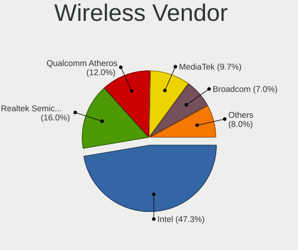

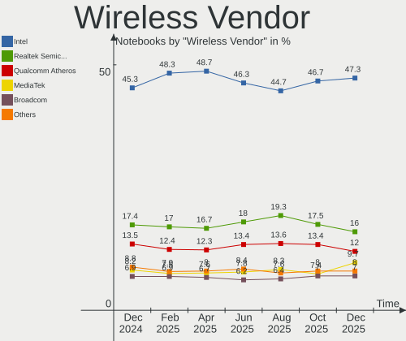

| Vendor                          | Notebooks | Percent |
|---------------------------------|-----------|---------|
| Intel                           | 1545      | 47.33%  |
| Realtek Semiconductor           | 522       | 15.99%  |
| Qualcomm Atheros                | 391       | 11.98%  |
| MediaTek                        | 318       | 9.74%   |
| Broadcom                        | 228       | 6.99%   |
| Broadcom Limited                | 58        | 1.78%   |
| Qualcomm                        | 46        | 1.41%   |
| Ralink                          | 35        | 1.07%   |
| Sierra Wireless                 | 26        | 0.8%    |
| TP-Link                         | 23        | 0.7%    |
| Ralink Technology               | 13        | 0.4%    |
| Dell                            | 9         | 0.28%   |
| NetGear                         | 6         | 0.18%   |
| D-Link                          | 6         | 0.18%   |
| ASUSTek Computer                | 6         | 0.18%   |
| Fibocom                         | 4         | 0.12%   |
| Realtek                         | 3         | 0.09%   |
| Quectel Wireless Solutions      | 3         | 0.09%   |
| Qualcomm Technologies           | 3         | 0.09%   |
| Qualcomm Atheros Communications | 3         | 0.09%   |
| Hewlett-Packard                 | 3         | 0.09%   |
| Microsoft                       | 2         | 0.06%   |
| Edimax Technology               | 2         | 0.06%   |
| AVM                             | 2         | 0.06%   |
| ZyXEL Communications            | 1         | 0.03%   |
| ZyDAS                           | 1         | 0.03%   |
| Mercucys                        | 1         | 0.03%   |
| D-Link System                   | 1         | 0.03%   |
| Cypress Semiconductor           | 1         | 0.03%   |
| Belkin Components               | 1         | 0.03%   |
| 3Com                            | 1         | 0.03%   |

Wireless Model
--------------

Wireless models

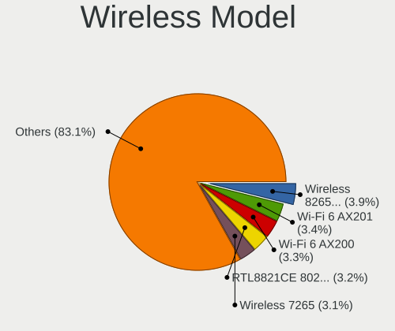

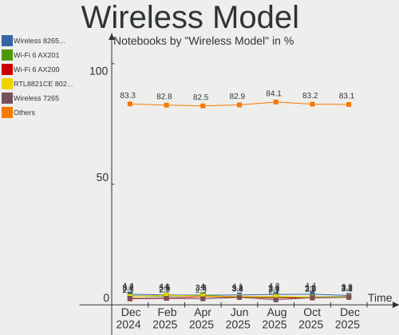

| Model                                                                           | Notebooks | Percent |
|---------------------------------------------------------------------------------|-----------|---------|
| Intel Wireless 8265 / 8275                                                      | 129       | 3.94%   |
| Intel Wi-Fi 6 AX201                                                             | 110       | 3.36%   |
| Intel Wi-Fi 6 AX200                                                             | 108       | 3.3%    |
| Realtek RTL8821CE 802.11ac PCIe Wireless Network Adapter                        | 106       | 3.24%   |
| Intel Wireless 7265                                                             | 101       | 3.09%   |
| Realtek RTL8822CE 802.11ac PCIe Wireless Network Adapter                        | 95        | 2.9%    |
| MediaTek MT7922 802.11ax PCI Express Wireless Network Adapter                   | 88        | 2.69%   |
| MediaTek MT7921 802.11ax PCIe Wireless Network Adapter [Filogic 330]            | 88        | 2.69%   |
| Intel Wireless 8260                                                             | 77        | 2.35%   |
| Qualcomm Atheros QCA9565 / AR9565 Wireless Network Adapter                      | 76        | 2.32%   |
| Qualcomm Atheros QCA9377 802.11ac Wireless Network Adapter                      | 74        | 2.26%   |
| Intel Raptor Lake PCH CNVi WiFi                                                 | 74        | 2.26%   |
| Realtek RTL8852BE PCIe 802.11ax Wireless Network Controller                     | 69        | 2.11%   |
| Qualcomm Atheros QCA6174 802.11ac Wireless Network Adapter                      | 68        | 2.08%   |
| Intel Wi-Fi 6E(802.11ax) AX210/AX1675* 2x2 [Typhoon Peak]                       | 68        | 2.08%   |
| MediaTek MT7902 802.11ax PCIe Wireless Network Adapter [Filogic 310]            | 67        | 2.05%   |
| Intel Alder Lake-P PCH CNVi WiFi                                                | 66        | 2.02%   |
| Qualcomm Atheros AR9485 Wireless Network Adapter                                | 63        | 1.92%   |
| Intel Centrino Advanced-N 6205 [Taylor Peak]                                    | 62        | 1.89%   |
| Intel Wireless 7260                                                             | 60        | 1.83%   |
| Qualcomm Atheros AR9285 Wireless Network Adapter (PCI-Express)                  | 54        | 1.65%   |
| Intel Meteor Lake PCH CNVi WiFi                                                 | 51        | 1.56%   |
| Intel Comet Lake PCH CNVi WiFi                                                  | 51        | 1.56%   |
| MediaTek MT7925 802.11be 160MHz 2x2 PCIe Wireless Network Adapter [Filogic 360] | 46        | 1.41%   |
| Intel Cannon Point-LP CNVi [Wireless-AC]                                        | 46        | 1.41%   |
| Broadcom BCM43142 802.11b/g/n                                                   | 46        | 1.41%   |
| Qualcomm QCNFA765 Wireless Network Adapter                                      | 45        | 1.37%   |
| Intel Comet Lake PCH-LP CNVi WiFi                                               | 45        | 1.37%   |
| Realtek RTL8723BE PCIe Wireless Network Adapter                                 | 41        | 1.25%   |
| Intel Wi-Fi 7(802.11be) AX1775*/AX1790*/BE20*/BE401/BE1750* 2x2                 | 38        | 1.16%   |
| Intel Cannon Lake PCH CNVi WiFi                                                 | 38        | 1.16%   |
| Broadcom BCM4331 802.11a/b/g/n                                                  | 35        | 1.07%   |
| Broadcom BCM4313 802.11bgn Wireless Network Adapter                             | 35        | 1.07%   |
| Intel Wireless 3165                                                             | 33        | 1.01%   |
| Intel Wi-Fi 5(802.11ac) Wireless-AC 9x6x [Thunder Peak]                         | 31        | 0.95%   |
| Broadcom Limited BCM4360 802.11ac Dual Band Wireless Network Adapter            | 31        | 0.95%   |
| Intel Tiger Lake PCH CNVi WiFi                                                  | 29        | 0.89%   |
| Qualcomm Atheros AR9462 Wireless Network Adapter                                | 25        | 0.76%   |
| Intel 700 Series Chipset CNVi WiFi                                              | 24        | 0.73%   |
| Intel Centrino Ultimate-N 6300                                                  | 23        | 0.7%    |

Ethernet Vendor
---------------

Ethernet vendors

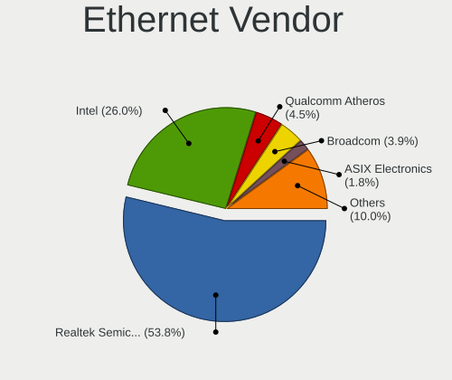

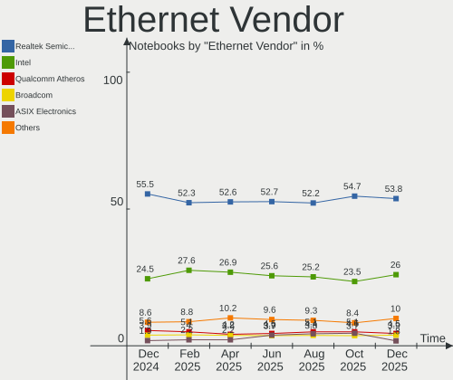

| Vendor                                 | Notebooks | Percent |
|----------------------------------------|-----------|---------|
| Realtek Semiconductor                  | 1422      | 53.76%  |
| Intel                                  | 689       | 26.05%  |
| Qualcomm Atheros                       | 118       | 4.46%   |
| Broadcom                               | 104       | 3.93%   |
| ASIX Electronics                       | 47        | 1.78%   |
| MediaTek                               | 39        | 1.47%   |
| Samsung Electronics                    | 30        | 1.13%   |
| Marvell Technology Group               | 27        | 1.02%   |
| Broadcom Limited                       | 18        | 0.68%   |
| Suzhou Motorcomm Electronic Technology | 17        | 0.64%   |
| Nvidia                                 | 17        | 0.64%   |
| Motorcomm Microelectronics.            | 13        | 0.49%   |
| Lenovo                                 | 13        | 0.49%   |
| OPPO Electronics                       | 11        | 0.42%   |
| DisplayLink                            | 11        | 0.42%   |
| Xiaomi                                 | 10        | 0.38%   |
| TP-Link                                | 8         | 0.3%    |
| Apple                                  | 8         | 0.3%    |
| Google                                 | 6         | 0.23%   |
| JMicron Technology                     | 5         | 0.19%   |
| Qualcomm                               | 4         | 0.15%   |
| QinHeng Electronics                    | 4         | 0.15%   |
| Hewlett-Packard                        | 3         | 0.11%   |
| Aquantia                               | 3         | 0.11%   |
| Silicon Integrated Systems [SiS]       | 2         | 0.08%   |
| ICS Advent                             | 2         | 0.08%   |
| Huawei Technologies                    | 2         | 0.08%   |
| vivo                                   | 1         | 0.04%   |
| T & A Mobile Phones                    | 1         | 0.04%   |
| Sony Ericsson Mobile Communications AB | 1         | 0.04%   |
| Raspberry Pi                           | 1         | 0.04%   |
| Qualcomm Technologies                  | 1         | 0.04%   |
| Motorola PCS                           | 1         | 0.04%   |
| Microsoft                              | 1         | 0.04%   |
| Linksys                                | 1         | 0.04%   |
| Cypress Semiconductor                  | 1         | 0.04%   |
| Attansic Technology                    | 1         | 0.04%   |
| ASUSTek Computer                       | 1         | 0.04%   |
| AMTelecom                              | 1         | 0.04%   |

Ethernet Model
--------------

Ethernet models

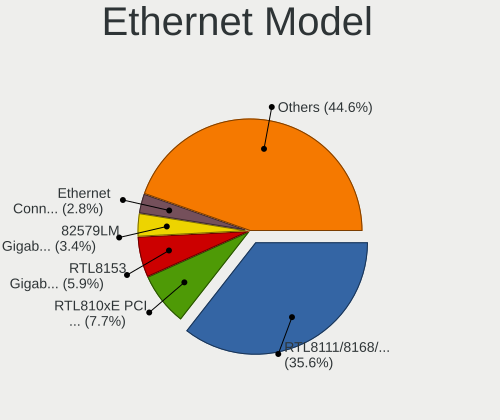

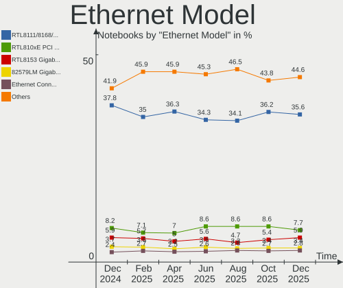

| Model                                                                           | Notebooks | Percent |
|---------------------------------------------------------------------------------|-----------|---------|
| Realtek RTL8111/8168/8211/8411 PCI Express Gigabit Ethernet Controller          | 966       | 35.57%  |
| Realtek RTL810xE PCI Express Fast Ethernet controller                           | 210       | 7.73%   |
| Realtek RTL8153 Gigabit Ethernet Adapter                                        | 160       | 5.89%   |
| Intel 82579LM Gigabit Network Connection (Lewisville)                           | 91        | 3.35%   |
| Intel Ethernet Connection (4) I219-LM                                           | 77        | 2.84%   |
| Realtek RTL8125 2.5GbE Controller                                               | 45        | 1.66%   |
| ASIX AX88179 Gigabit Ethernet                                                   | 43        | 1.58%   |
| Intel Alder Lake-P PCH CNVi WiFi                                                | 42        | 1.55%   |
| Intel Ethernet Connection I219-LM                                               | 37        | 1.36%   |
| Broadcom NetXtreme BCM57765 Gigabit Ethernet PCIe                               | 35        | 1.29%   |
| Intel Ethernet Connection (6) I219-LM                                           | 26        | 0.96%   |
| Intel Ethernet Connection I217-LM                                               | 25        | 0.92%   |
| Intel Ethernet Connection (7) I219-LM                                           | 25        | 0.92%   |
| Samsung Galaxy series, misc. (tethering mode)                                   | 24        | 0.88%   |
| Intel Ethernet Connection (13) I219-V                                           | 24        | 0.88%   |
| Intel Ethernet Connection (3) I218-LM                                           | 22        | 0.81%   |
| Intel Ethernet Connection (18) I219-LM                                          | 22        | 0.81%   |
| Intel 82577LM Gigabit Network Connection                                        | 22        | 0.81%   |
| Qualcomm Atheros AR8151 v2.0 Gigabit Ethernet                                   | 21        | 0.77%   |
| Realtek Killer E2600 GbE Controller                                             | 20        | 0.74%   |
| MediaTek MT7925 802.11be 160MHz 2x2 PCIe Wireless Network Adapter [Filogic 360] | 20        | 0.74%   |
| Intel Arrow Lake CNVi WiFi                                                      | 20        | 0.74%   |
| Intel Ethernet Connection (4) I219-V                                            | 18        | 0.66%   |
| Intel BE201 320MHz                                                              | 18        | 0.66%   |
| Suzhou Motorcomm Electronic YT6801 Gigabit Ethernet Controller                  | 17        | 0.63%   |
| Realtek USB 10/100/1G/2.5 LAN                                                   | 17        | 0.63%   |
| Realtek RTL8152 Fast Ethernet Adapter                                           | 17        | 0.63%   |
| MediaTek MT7922 802.11ax PCI Express Wireless Network Adapter                   | 16        | 0.59%   |
| Intel Ethernet Connection I218-LM                                               | 16        | 0.59%   |
| Broadcom NetLink BCM57785 Gigabit Ethernet PCIe                                 | 16        | 0.59%   |
| Qualcomm Atheros AR8131 Gigabit Ethernet                                        | 15        | 0.55%   |
| Nvidia MCP79 Ethernet                                                           | 15        | 0.55%   |
| Qualcomm Atheros AR8161 Gigabit Ethernet                                        | 14        | 0.52%   |
| Motorcomm Microelectronics. YT6801 Gigabit Ethernet Controller                  | 13        | 0.48%   |
| Intel Ethernet Connection (13) I219-LM                                          | 13        | 0.48%   |
| Intel Ethernet Connection (10) I219-LM                                          | 13        | 0.48%   |
| Broadcom NetLink BCM57780 Gigabit Ethernet PCIe                                 | 13        | 0.48%   |
| Intel Ethernet Connection (6) I219-V                                            | 12        | 0.44%   |
| Intel Ethernet Connection (24) I219-V                                           | 12        | 0.44%   |
| Intel Ethernet Connection (2) I219-LM                                           | 12        | 0.44%   |

Net Controller Kind
-------------------

Ethernet, WiFi or modem

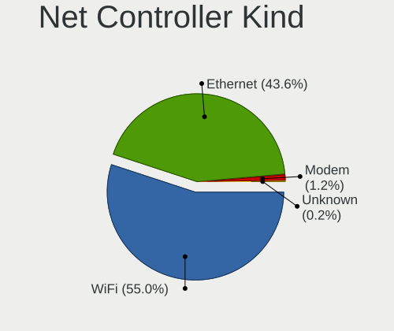

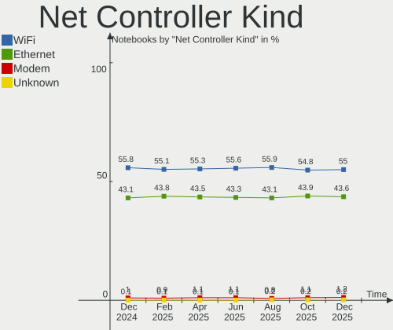

| Kind     | Notebooks | Percent |
|----------|-----------|---------|
| WiFi     | 3105      | 55.04%  |
| Ethernet | 2457      | 43.56%  |
| Modem    | 66        | 1.17%   |
| Unknown  | 13        | 0.23%   |

Used Controller
---------------

Currently used network controller

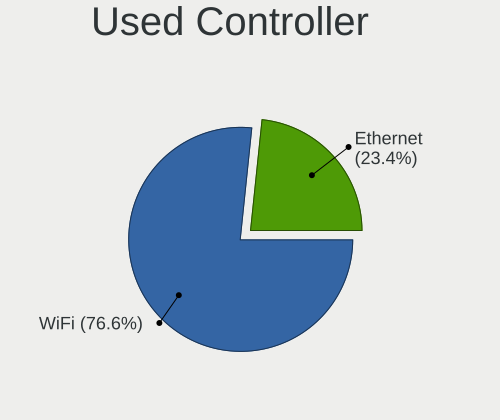

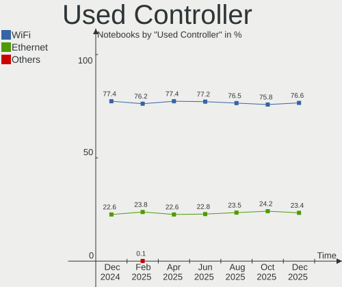

| Kind     | Notebooks | Percent |
|----------|-----------|---------|
| WiFi     | 2570      | 76.65%  |
| Ethernet | 783       | 23.35%  |

NICs
----

Total network controllers on board

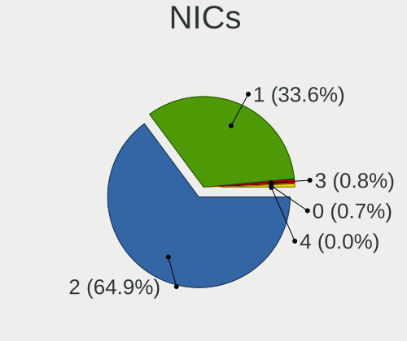

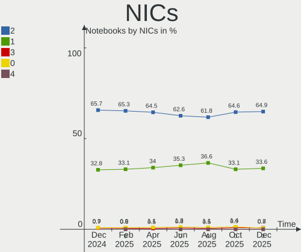

| Total | Notebooks | Percent |
|-------|-----------|---------|
| 2     | 2132      | 64.86%  |
| 1     | 1105      | 33.62%  |
| 3     | 26        | 0.79%   |
| 0     | 23        | 0.7%    |
| 4     | 1         | 0.03%   |

IPv6
----

IPv6 vs IPv4

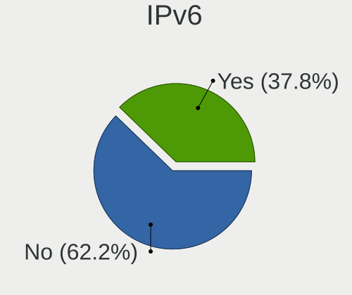

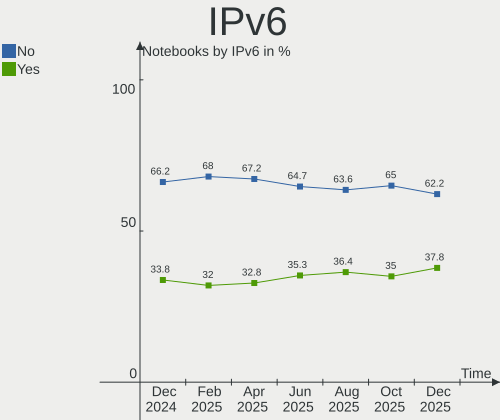

| Used | Notebooks | Percent |
|------|-----------|---------|
| No   | 2046      | 62.25%  |
| Yes  | 1241      | 37.75%  |

Bluetooth
---------

Bluetooth Vendor
----------------

Controller vendors

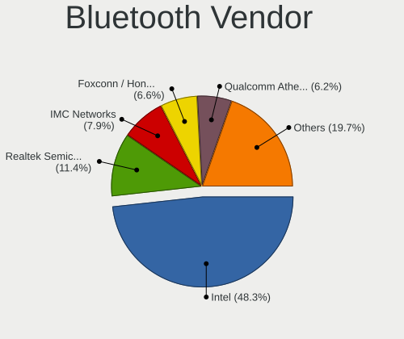

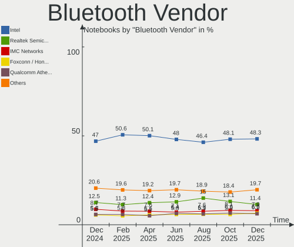

| Vendor                          | Notebooks | Percent |
|---------------------------------|-----------|---------|
| Intel                           | 1368      | 48.25%  |
| Realtek Semiconductor           | 322       | 11.36%  |
| IMC Networks                    | 224       | 7.9%    |
| Foxconn / Hon Hai               | 188       | 6.63%   |
| Qualcomm Atheros Communications | 175       | 6.17%   |
| Apple                           | 118       | 4.16%   |
| Broadcom                        | 96        | 3.39%   |
| MediaTek                        | 88        | 3.1%    |
| Lite-On Technology              | 73        | 2.57%   |
| Toshiba                         | 22        | 0.78%   |
| Ralink                          | 22        | 0.78%   |
| Hewlett-Packard                 | 21        | 0.74%   |
| Dell                            | 21        | 0.74%   |
| Cambridge Silicon Radio         | 20        | 0.71%   |
| USI                             | 13        | 0.46%   |
| Foxconn International           | 12        | 0.42%   |
| ASUSTek Computer                | 12        | 0.42%   |
| Realtek                         | 9         | 0.32%   |
| TP-Link                         | 7         | 0.25%   |
| Askey Computer                  | 5         | 0.18%   |
| Chicony Electronics             | 3         | 0.11%   |
| Alps Electric                   | 3         | 0.11%   |
| Actions                         | 3         | 0.11%   |
| Unknown                         | 3         | 0.11%   |
| Smart Modular Technologies      | 2         | 0.07%   |
| Ralink Technology               | 1         | 0.04%   |
| Opticis                         | 1         | 0.04%   |
| Integrated System Solution      | 1         | 0.04%   |
| Fujitsu                         | 1         | 0.04%   |
| AICSemi                         | 1         | 0.04%   |

Bluetooth Model
---------------

Controller models

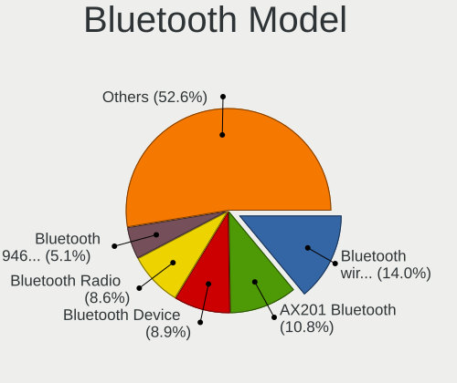

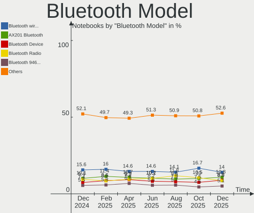

| Model                                               | Notebooks | Percent |
|-----------------------------------------------------|-----------|---------|
| Intel Bluetooth wireless interface                  | 397       | 14%     |
| Intel AX201 Bluetooth                               | 305       | 10.76%  |
| Intel Bluetooth Device                              | 253       | 8.92%   |
| Realtek Bluetooth Radio                             | 244       | 8.61%   |
| Intel Bluetooth 9460/9560 Jefferson Peak (JfP)      | 145       | 5.11%   |
| IMC Networks Wireless_Device                        | 122       | 4.3%    |
| Intel AX200 Bluetooth                               | 102       | 3.6%    |
| Qualcomm Atheros  Bluetooth Device                  | 91        | 3.21%   |
| MediaTek Wireless_Device                            | 87        | 3.07%   |
| Foxconn / Hon Hai Wireless_Device                   | 87        | 3.07%   |
| IMC Networks Bluetooth Radio                        | 71        | 2.5%    |
| Apple Bluetooth Host Controller                     | 68        | 2.4%    |
| Intel AX210 Bluetooth                               | 65        | 2.29%   |
| Realtek  Bluetooth 4.2 Adapter                      | 48        | 1.69%   |
| Apple Bluetooth USB Host Controller                 | 41        | 1.45%   |
| Intel Centrino Bluetooth Wireless Transceiver       | 32        | 1.13%   |
| Foxconn / Hon Hai MediaTek Bluetooth Adapter        | 32        | 1.13%   |
| Foxconn / Hon Hai Bluetooth Device                  | 31        | 1.09%   |
| Intel Wireless-AC 9260 Bluetooth Adapter            | 30        | 1.06%   |
| Qualcomm Atheros AR3012 Bluetooth 4.0               | 28        | 0.99%   |
| Qualcomm Atheros QCA61x4 Bluetooth 4.0              | 24        | 0.85%   |
| Ralink RT3290 Bluetooth                             | 22        | 0.78%   |
| Broadcom BCM2045B (BDC-2.1)                         | 21        | 0.74%   |
| Cambridge Silicon Radio Bluetooth Dongle (HCI mode) | 20        | 0.71%   |
| Lite-On Qualcomm Atheros QCA9377 Bluetooth          | 18        | 0.63%   |
| HP Broadcom 2070 Bluetooth Combo                    | 18        | 0.63%   |
| Lite-On Wireless_Device                             | 17        | 0.6%    |
| Lite-On Bluetooth Device                            | 17        | 0.6%    |
| Intel Bluetooth                                     | 16        | 0.56%   |
| Broadcom BCM20702 Bluetooth 4.0 [ThinkPad]          | 16        | 0.56%   |
| Qualcomm Atheros AR3011 Bluetooth                   | 15        | 0.53%   |
| USI Bluetooth Device                                | 13        | 0.46%   |
| Intel Wireless-AC 3168 Bluetooth                    | 12        | 0.42%   |
| IMC Networks Atheros AR3012 Bluetooth 4.0 Adapter   | 12        | 0.42%   |
| Foxconn International BCM43142A0 Bluetooth module   | 12        | 0.42%   |
| Intel Centrino Advanced-N 6230 Bluetooth adapter    | 11        | 0.39%   |
| IMC Networks Bluetooth Device                       | 11        | 0.39%   |
| Realtek 802.11ac WLAN Adapter                       | 10        | 0.35%   |
| Broadcom HP Portable SoftSailing                    | 10        | 0.35%   |
| Realtek RTL8723B Bluetooth                          | 9         | 0.32%   |

Sound
-----

Sound Vendor
------------

Sound card vendors

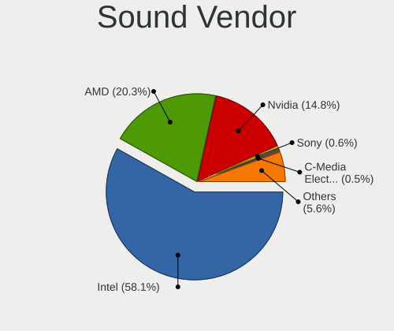

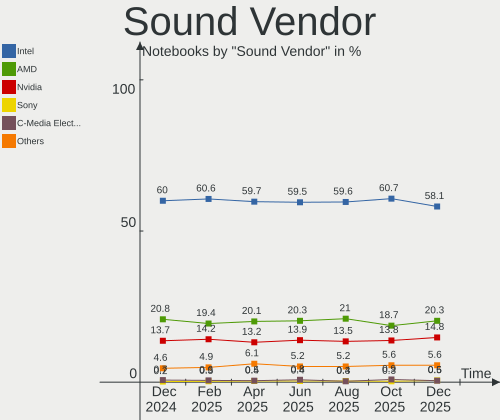

| Vendor                                       | Notebooks | Percent |
|----------------------------------------------|-----------|---------|
| Intel                                        | 2441      | 58.12%  |
| AMD                                          | 854       | 20.33%  |
| Nvidia                                       | 622       | 14.81%  |
| Sony                                         | 25        | 0.6%    |
| C-Media Electronics                          | 23        | 0.55%   |
| Lenovo                                       | 22        | 0.52%   |
| Logitech                                     | 17        | 0.4%    |
| Realtek Semiconductor                        | 14        | 0.33%   |
| Hewlett-Packard                              | 12        | 0.29%   |
| ASUSTek Computer                             | 11        | 0.26%   |
| Apple                                        | 11        | 0.26%   |
| SteelSeries ApS                              | 9         | 0.21%   |
| Texas Instruments                            | 8         | 0.19%   |
| JMTek                                        | 8         | 0.19%   |
| Razer USA                                    | 7         | 0.17%   |
| Plantronics                                  | 7         | 0.17%   |
| Zoran Co. Personal Media Division (Nogatech) | 5         | 0.12%   |
| KTMicro                                      | 5         | 0.12%   |
| GN Netcom                                    | 5         | 0.12%   |
| Thesycon Systemsoftware & Consulting         | 4         | 0.1%    |
| DSEA A/S                                     | 4         | 0.1%    |
| Corsair                                      | 4         | 0.1%    |
| Walmart                                      | 3         | 0.07%   |
| Turtle Beach                                 | 3         | 0.07%   |
| Micro Star International                     | 3         | 0.07%   |
| Loongson Technology                          | 3         | 0.07%   |
| Kingston Technology                          | 3         | 0.07%   |
| Huawei Technologies                          | 3         | 0.07%   |
| Generalplus Technology                       | 3         | 0.07%   |
| BEHRINGER International                      | 3         | 0.07%   |
| Zhaoxin                                      | 2         | 0.05%   |
| Silicon Integrated Systems [SiS]             | 2         | 0.05%   |
| Samsung Electronics                          | 2         | 0.05%   |
| Samson Technologies                          | 2         | 0.05%   |
| MV-SILICON                                   | 2         | 0.05%   |
| Jieli Technology                             | 2         | 0.05%   |
| Focusrite-Novation                           | 2         | 0.05%   |
| DisplayLink                                  | 2         | 0.05%   |
| Dell                                         | 2         | 0.05%   |
| Creative Technology                          | 2         | 0.05%   |

Sound Model
-----------

Sound card models

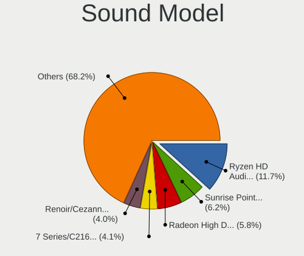

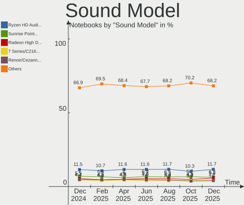

| Model                                                                      | Notebooks | Percent |
|----------------------------------------------------------------------------|-----------|---------|
| AMD Ryzen HD Audio Controller                                              | 609       | 11.74%  |
| Intel Sunrise Point-LP HD Audio                                            | 320       | 6.17%   |
| AMD Radeon High Definition Audio Controller                                | 300       | 5.78%   |
| Intel 7 Series/C216 Chipset Family High Definition Audio Controller        | 212       | 4.09%   |
| AMD Renoir/Cezanne HDMI/DP Audio Controller                                | 209       | 4.03%   |
| Intel Tiger Lake-LP Smart Sound Technology Audio Controller                | 158       | 3.05%   |
| Intel Alder Lake PCH-P High Definition Audio Controller                    | 146       | 2.81%   |
| Intel 6 Series/C200 Series Chipset Family High Definition Audio Controller | 139       | 2.68%   |
| Intel Raptor Lake-P/U/H cAVS                                               | 125       | 2.41%   |
| Intel Broadwell-U Audio Controller                                         | 107       | 2.06%   |
| Intel Haswell-ULT HD Audio Controller                                      | 104       | 2%      |
| Intel 8 Series HD Audio Controller                                         | 104       | 2%      |
| Intel Wildcat Point-LP High Definition Audio Controller                    | 103       | 1.99%   |
| Intel 8 Series/C220 Series Chipset High Definition Audio Controller        | 93        | 1.79%   |
| Intel Cannon Lake PCH cAVS                                                 | 92        | 1.77%   |
| AMD Raven/Raven2/Fenghuang HDMI/DP Audio Controller                        | 84        | 1.62%   |
| Intel 5 Series/3400 Series Chipset High Definition Audio                   | 82        | 1.58%   |
| AMD FCH Azalia Controller                                                  | 80        | 1.54%   |
| Nvidia AD107 High Definition Audio Controller                              | 76        | 1.46%   |
| Intel Meteor Lake-P HD Audio Controller                                    | 73        | 1.41%   |
| Intel Cannon Point-LP High Definition Audio Controller                     | 73        | 1.41%   |
| Intel 82801I (ICH9 Family) HD Audio Controller                             | 64        | 1.23%   |
| Intel Xeon E3-1200 v3/4th Gen Core Processor HD Audio Controller           | 62        | 1.2%    |
| Intel Comet Lake PCH cAVS                                                  | 55        | 1.06%   |
| AMD Kabini HDMI/DP Audio                                                   | 55        | 1.06%   |
| Intel Comet Lake PCH-LP cAVS                                               | 52        | 1%      |
| Nvidia GA107 High Definition Audio Controller                              | 48        | 0.93%   |
| Nvidia TU107 GeForce GTX 1650 High Definition Audio Controller             | 46        | 0.89%   |
| Intel Celeron/Pentium Silver Processor High Definition Audio               | 46        | 0.89%   |
| Intel Raptor Lake High Definition Audio Controller                         | 45        | 0.87%   |
| Intel Ice Lake-LP Smart Sound Technology Audio Controller                  | 43        | 0.83%   |
| Intel 100 Series/C230 Series Chipset Family HD Audio Controller            | 42        | 0.81%   |
| Nvidia GB206 High Definition Audio Controller                              | 40        | 0.77%   |
| Intel Arrow Lake cAVS                                                      | 40        | 0.77%   |
| Intel CM238 HD Audio Controller                                            | 39        | 0.75%   |
| Nvidia GA106 High Definition Audio Controller                              | 36        | 0.69%   |
| Intel Tiger Lake-H HD Audio Controller                                     | 36        | 0.69%   |
| Intel Lunar Lake-M HD Audio Controller                                     | 36        | 0.69%   |
| Intel Alder Lake-N PCH High Definition Audio Controller                    | 31        | 0.6%    |
| Intel 82801H (ICH8 Family) HD Audio Controller                             | 31        | 0.6%    |

Memory
------

Memory Vendor
-------------

Memory module vendors

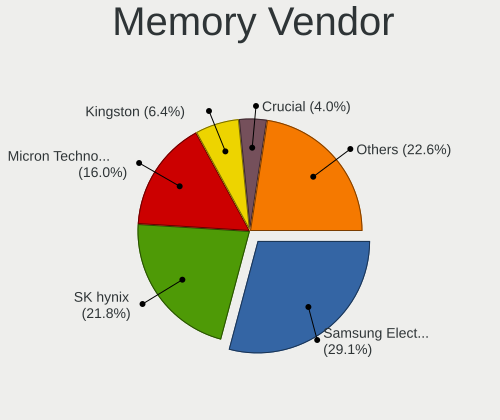

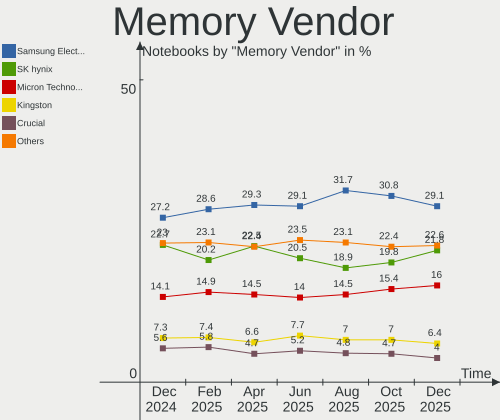

| Vendor                       | Notebooks | Percent |
|------------------------------|-----------|---------|
| Samsung Electronics          | 603       | 29.14%  |
| SK hynix                     | 452       | 21.85%  |
| Micron Technology            | 332       | 16.05%  |
| Kingston                     | 132       | 6.38%   |
| Crucial                      | 83        | 4.01%   |
| Unknown                      | 70        | 3.38%   |
| Unknown                      | 63        | 3.04%   |
| Ramaxel Technology           | 62        | 3%      |
| A-DATA Technology            | 59        | 2.85%   |
| Corsair                      | 24        | 1.16%   |
| Nanya Technology             | 20        | 0.97%   |
| Elpida                       | 17        | 0.82%   |
| G.Skill                      | 13        | 0.63%   |
| Unknown (ABCD)               | 12        | 0.58%   |
| Smart                        | 11        | 0.53%   |
| Team                         | 8         | 0.39%   |
| Patriot                      | 8         | 0.39%   |
| Foxline                      | 8         | 0.39%   |
| GOODRAM                      | 6         | 0.29%   |
| Transcend                    | 5         | 0.24%   |
| Apacer                       | 5         | 0.24%   |
| 4ea5                         | 5         | 0.24%   |
| Unknown (0x0B5E)             | 4         | 0.19%   |
| Timetec                      | 4         | 0.19%   |
| AMD                          | 4         | 0.19%   |
| Silicon Power                | 3         | 0.14%   |
| Patriot Memory (PDP Systems) | 3         | 0.14%   |
| Hikvision                    | 3         | 0.14%   |
| ff                           | 3         | 0.14%   |
| Wodposit                     | 2         | 0.1%    |
| Unknown (0x0BEC)             | 2         | 0.1%    |
| Unknown (0x0080)             | 2         | 0.1%    |
| Shenzhen SCY                 | 2         | 0.1%    |
| KingFast                     | 2         | 0.1%    |
| fef5                         | 2         | 0.1%    |
| Essencore Limited            | 2         | 0.1%    |
| ChangXin Memory              | 2         | 0.1%    |
| ASint Technology             | 2         | 0.1%    |
| ACPI Digital                 | 2         | 0.1%    |
| V-GeN                        | 1         | 0.05%   |

Memory Model
------------

Memory module models

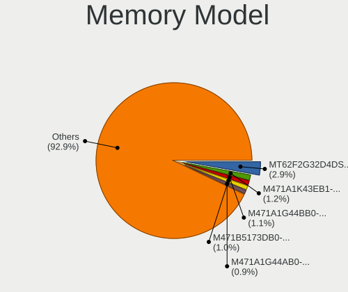

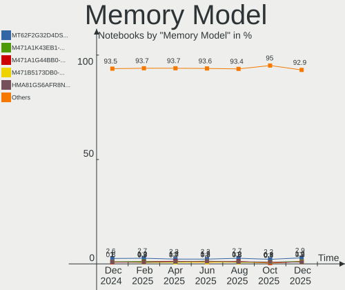

| Model                                                            | Notebooks | Percent |
|------------------------------------------------------------------|-----------|---------|
| Unknown                                                          | 63        | 2.89%   |
| Samsung RAM M471A1K43EB1-CWE 8GB SODIMM DDR4 3200MT/s            | 27        | 1.24%   |
| Samsung RAM M471A1G44BB0-CWE 8GB SODIMM DDR4 3200MT/s            | 23        | 1.06%   |
| Samsung RAM M471B5173DB0-YK0 4GB SODIMM DDR3 1600MT/s            | 21        | 0.96%   |
| SK hynix RAM HMA81GS6AFR8N-UH 8GB SODIMM DDR4 2667MT/s           | 20        | 0.92%   |
| Samsung RAM M471A1G44AB0-CWE 8GiB SODIMM DDR4 3200MT/s           | 20        | 0.92%   |
| Micron RAM 4ATF1G64HZ-3G2F1 8GB SODIMM DDR4 3200MT/s             | 20        | 0.92%   |
| SK hynix RAM HMT451S6BFR8A-PB 4GB SODIMM DDR3 1600MT/s           | 19        | 0.87%   |
| Samsung RAM M471A5244CB0-CWE 4GB SODIMM DDR4 3200MT/s            | 19        | 0.87%   |
| Samsung RAM M425R2GA3EB0-CWMOL 16GB SODIMM DDR5 5600MT/s         | 19        | 0.87%   |
| Samsung RAM M471B5273DH0-CH9 4GB SODIMM DDR3 1600MT/s            | 18        | 0.83%   |
| Samsung RAM M471A1K43DB1-CWE 8GB SODIMM DDR4 3200MT/s            | 14        | 0.64%   |
| Micron RAM 8ATF1G64HZ-3G2R1 8GB SODIMM DDR4 3200MT/s             | 14        | 0.64%   |
| Samsung RAM M471B5273CH0-CH9 4GB SODIMM DDR3 1334MT/s            | 13        | 0.6%    |
| Samsung RAM M471B5173QH0-YK0 4GB SODIMM DDR3 1600MT/s            | 13        | 0.6%    |
| Samsung RAM M471A5244CB0-CTD 4GB SODIMM DDR4 3266MT/s            | 13        | 0.6%    |
| SK hynix RAM HMAG68EXNSA051N 8GB SODIMM DDR4 3200MT/s            | 12        | 0.55%   |
| SK hynix RAM HMAA1GS6CJR6N-XN 8GB SODIMM DDR4 3200MT/s           | 12        | 0.55%   |
| Samsung RAM M471A1K43BB1-CRC 8GB SODIMM DDR4 2667MT/s            | 12        | 0.55%   |
| Samsung RAM M471A1G44CB0-CWE 8GB SODIMM DDR4 3200MT/s            | 12        | 0.55%   |
| Unknown (ABCD) RAM 123456789012345678 2GB SODIMM LPDDR4 2400MT/s | 11        | 0.5%    |
| SK hynix RAM HMCG78AGBSA095N 16GB SODIMM DDR5 5600MT/s           | 11        | 0.5%    |
| Micron RAM MT62F2G32D4DS-026 WT 8GiB SODIMM LPDDR5 7500MT/s      | 11        | 0.5%    |
| Micron RAM Module 4GB Row Of Chips LPDDR5 8533MT/s               | 11        | 0.5%    |
| Samsung RAM M471B5273DH0-CK0 4GB SODIMM DDR3 2400MT/s            | 10        | 0.46%   |
| Micron RAM MTC4C10163S1SC56BD1 8GB SODIMM DDR5 5600MT/s          | 10        | 0.46%   |
| Micron RAM 4ATF1G64HZ-3G2E1 8GB SODIMM DDR4 3200MT/s             | 10        | 0.46%   |
| SK hynix RAM HMA81GS6DJR8N-XN 8GB SODIMM DDR4 3200MT/s           | 9         | 0.41%   |
| Samsung RAM M471B1G73DB0-YK0 8GB SODIMM DDR3 1600MT/s            | 9         | 0.41%   |
| Samsung RAM M471A5244CB0-CWE 4GB Row Of Chips DDR4 3200MT/s      | 9         | 0.41%   |
| Samsung RAM M471A2K43CB1-CRC 16GB SODIMM DDR4 2667MT/s           | 9         | 0.41%   |
| Samsung RAM M471A1K43CB1-CRC 8GB SODIMM DDR4 8400MT/s            | 9         | 0.41%   |
| Samsung RAM M425R2GA3EB0-CWMOD 16GB SODIMM DDR5 5600MT/s         | 9         | 0.41%   |
| A-DATA RAM AD5S560032G-SFW 32GB SODIMM DDR5 5600MT/s             | 9         | 0.41%   |
| SK hynix RAM HMT451S6AFR8A-PB 4GB SODIMM DDR3 1600MT/s           | 8         | 0.37%   |
| SK hynix RAM HMT351S6BFR8C-H9 4GB SODIMM 1334MT/s                | 8         | 0.37%   |
| SK hynix RAM HMA851S6AFR6N-UH 4GB SODIMM DDR4 2667MT/s           | 8         | 0.37%   |
| Samsung RAM M471B1G73QH0-YK0 8GB SODIMM DDR3 1600MT/s            | 8         | 0.37%   |
| Micron RAM 4ATF51264HZ-2G3B1 4GB SODIMM DDR4 3200MT/s            | 8         | 0.37%   |
| Unknown RAM Module 4GB SODIMM DDR3                               | 7         | 0.32%   |

Memory Kind
-----------

Memory module kinds

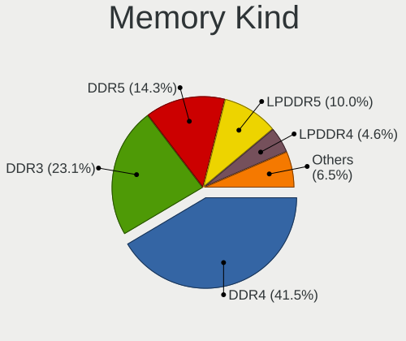

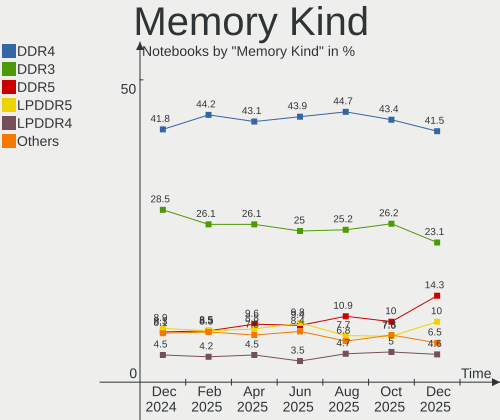

| Kind    | Notebooks | Percent |
|---------|-----------|---------|
| DDR4    | 733       | 41.48%  |
| DDR3    | 409       | 23.15%  |
| DDR5    | 252       | 14.26%  |
| LPDDR5  | 177       | 10.02%  |
| LPDDR4  | 82        | 4.64%   |
| LPDDR3  | 41        | 2.32%   |
| DDR2    | 31        | 1.75%   |
| SDRAM   | 27        | 1.53%   |
| Unknown | 11        | 0.62%   |
| DDR     | 3         | 0.17%   |
| DRAM    | 1         | 0.06%   |

Memory Form Factor
------------------

Physical design of the memory module

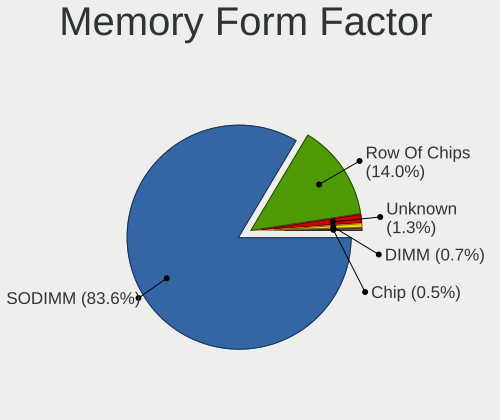

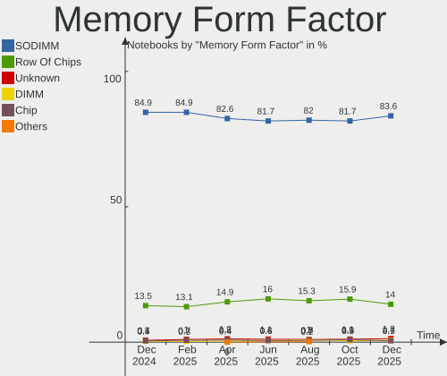

| Name         | Notebooks | Percent |
|--------------|-----------|---------|
| SODIMM       | 1484      | 83.56%  |
| Row Of Chips | 249       | 14.02%  |
| Unknown      | 23        | 1.3%    |
| DIMM         | 12        | 0.68%   |
| Chip         | 8         | 0.45%   |

Memory Size
-----------

Memory module size

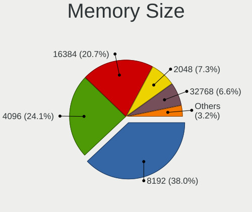

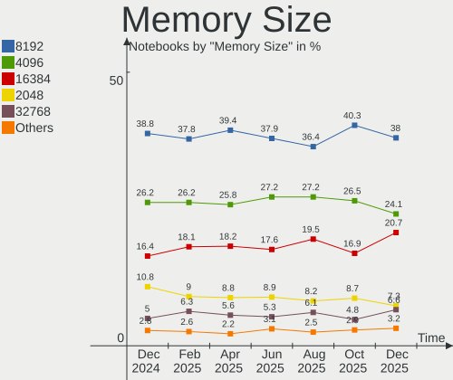

| Size  | Notebooks | Percent |
|-------|-----------|---------|
| 8192  | 732       | 38.01%  |
| 4096  | 465       | 24.14%  |
| 16384 | 398       | 20.66%  |
| 2048  | 141       | 7.32%   |
| 32768 | 128       | 6.65%   |
| 1024  | 34        | 1.77%   |
| 49152 | 9         | 0.47%   |
| 12288 | 7         | 0.36%   |
| 3072  | 5         | 0.26%   |
| 65536 | 3         | 0.16%   |
| 512   | 3         | 0.16%   |
| 6144  | 1         | 0.05%   |

Memory Speed
------------

Memory module speed

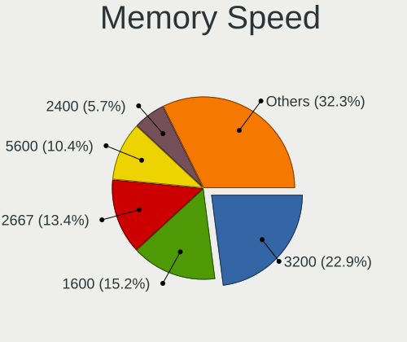

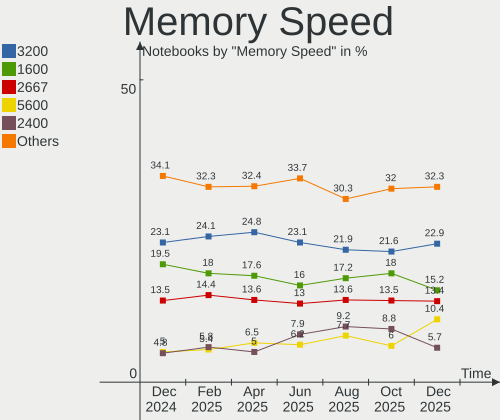

| Speed   | Notebooks | Percent |
|---------|-----------|---------|
| 3200    | 433       | 22.95%  |
| 1600    | 287       | 15.21%  |
| 2667    | 252       | 13.35%  |
| 5600    | 197       | 10.44%  |
| 2400    | 108       | 5.72%   |
| 6400    | 62        | 3.29%   |
| 1334    | 56        | 2.97%   |
| 2133    | 51        | 2.7%    |
| 7500    | 49        | 2.6%    |
| 4800    | 47        | 2.49%   |
| 1333    | 45        | 2.38%   |
| 8533    | 40        | 2.12%   |
| 4267    | 35        | 1.85%   |
| 1867    | 23        | 1.22%   |
| 1067    | 22        | 1.17%   |
| 667     | 20        | 1.06%   |
| Unknown | 17        | 0.9%    |
| 4199    | 14        | 0.74%   |
| 3266    | 13        | 0.69%   |
| 800     | 13        | 0.69%   |
| 8400    | 12        | 0.64%   |
| 7467    | 12        | 0.64%   |
| 4266    | 12        | 0.64%   |
| 2048    | 8         | 0.42%   |
| 8000    | 7         | 0.37%   |
| 3733    | 6         | 0.32%   |
| 2933    | 5         | 0.26%   |
| 1066    | 5         | 0.26%   |
| 975     | 5         | 0.26%   |
| 6000    | 4         | 0.21%   |
| 1639    | 4         | 0.21%   |
| 5500    | 3         | 0.16%   |
| 533     | 3         | 0.16%   |
| 8600    | 2         | 0.11%   |
| 7400    | 2         | 0.11%   |
| 5200    | 2         | 0.11%   |
| 1866    | 2         | 0.11%   |
| 8448    | 1         | 0.05%   |
| 4000    | 1         | 0.05%   |
| 3866    | 1         | 0.05%   |

Printers & scanners
-------------------

Printer Vendor
--------------

Printer device vendors

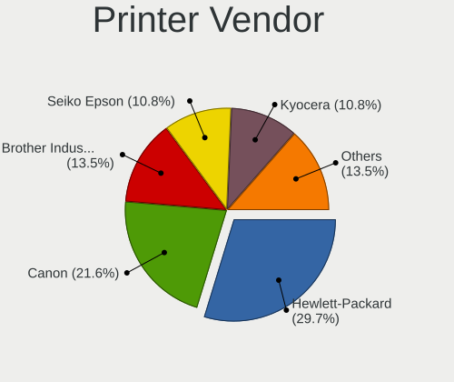

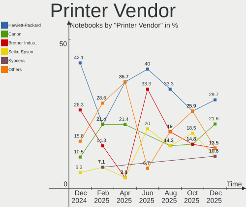

| Vendor              | Notebooks | Percent |
|---------------------|-----------|---------|
| Hewlett-Packard     | 11        | 29.73%  |
| Canon               | 8         | 21.62%  |
| Brother Industries  | 5         | 13.51%  |
| Seiko Epson         | 4         | 10.81%  |
| Kyocera             | 4         | 10.81%  |
| Samsung Electronics | 3         | 8.11%   |
| Pantum              | 1         | 2.7%    |
| Katusha"            | 1         | 2.7%    |

Printer Model
-------------

Printer device models

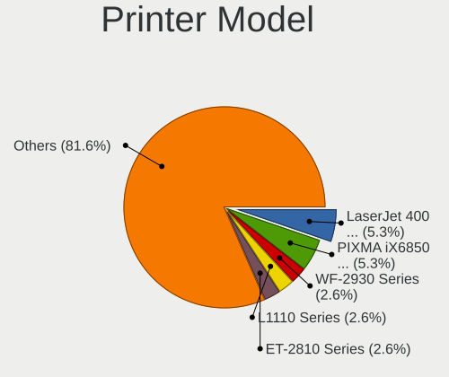

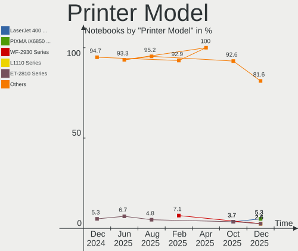

| Model                                | Notebooks | Percent |
|--------------------------------------|-----------|---------|
| HP LaserJet 400 M401dne              | 2         | 5.26%   |
| Canon PIXMA iX6850 Printer           | 2         | 5.26%   |
| Seiko Epson WF-2930 Series           | 1         | 2.63%   |
| Seiko Epson L1110 Series             | 1         | 2.63%   |
| Seiko Epson ET-2810 Series           | 1         | 2.63%   |
| Seiko Epson ET-2710 Series           | 1         | 2.63%   |
| Samsung ML-3470 Series               | 1         | 2.63%   |
| Samsung ML-1210 Printer              | 1         | 2.63%   |
| Samsung M2070 Series                 | 1         | 2.63%   |
| Pantum M7100DN series                | 1         | 2.63%   |
| Kyocera Kyocera ECOSYS M2640idw      | 1         | 2.63%   |
| Kyocera Kyocera ECOSYS M2040dn       | 1         | 2.63%   |
| Kyocera FS-1040                      | 1         | 2.63%   |
| Kyocera ECOSYS M5521cdn              | 1         | 2.63%   |
| Katusha" M240"                       | 1         | 2.63%   |
| HP Smart Tank 580-590 series         | 1         | 2.63%   |
| HP Smart Tank 5100 series            | 1         | 2.63%   |
| HP ScanJet Pro 3000 s3               | 1         | 2.63%   |
| HP LaserJet Pro 4001                 | 1         | 2.63%   |
| HP Laserjet P1505                    | 1         | 2.63%   |
| HP LaserJet P1102                    | 1         | 2.63%   |
| HP LaserJet M507                     | 1         | 2.63%   |
| HP LaserJet 1200                     | 1         | 2.63%   |
| HP LaserJet 1010                     | 1         | 2.63%   |
| HP DeskJet 4100 series               | 1         | 2.63%   |
| Canon TS3600 series                  | 1         | 2.63%   |
| Canon PIXMA MP270 All-In-One Printer | 1         | 2.63%   |
| Canon MF440 Series                   | 1         | 2.63%   |
| Canon LiDE 400                       | 1         | 2.63%   |
| Canon LBP7010C/7018C                 | 1         | 2.63%   |
| Canon G7000 series                   | 1         | 2.63%   |
| Brother MFC-L3770CDW                 | 1         | 2.63%   |
| Brother MFC-L2700DW                  | 1         | 2.63%   |
| Brother MFC-L2700DN                  | 1         | 2.63%   |
| Brother MFC-J245                     | 1         | 2.63%   |
| Brother MFC-7340                     | 1         | 2.63%   |

Scanner Vendor
--------------

Scanner device vendors

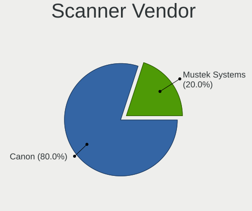

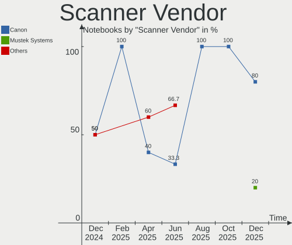

| Vendor         | Notebooks | Percent |
|----------------|-----------|---------|
| Canon          | 4         | 80%     |
| Mustek Systems | 1         | 20%     |

Scanner Model
-------------

Scanner device models

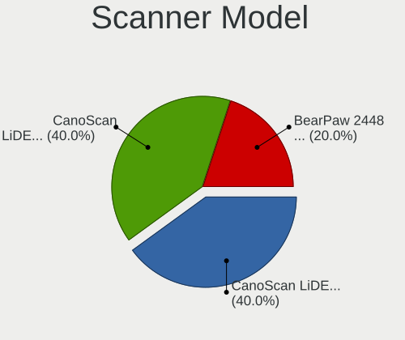

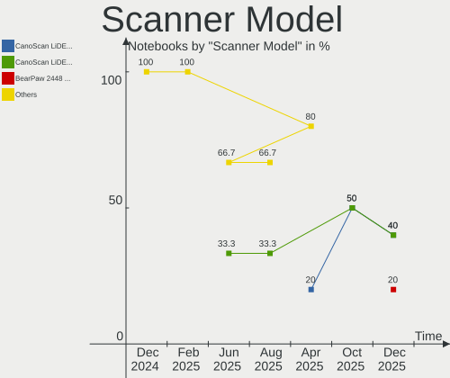

| Model                              | Notebooks | Percent |
|------------------------------------|-----------|---------|
| Canon CanoScan LiDE 220            | 2         | 40%     |
| Canon CanoScan LiDE 110            | 2         | 40%     |
| Mustek Systems BearPaw 2448 CU Pro | 1         | 20%     |

Camera
------

Camera Vendor
-------------

Camera device vendors

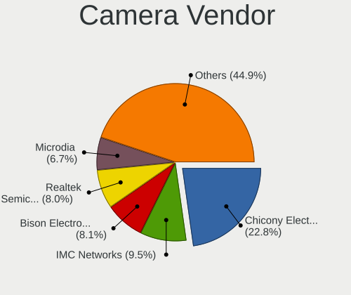

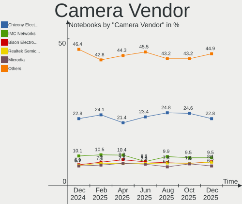

| Vendor                                 | Notebooks | Percent |
|----------------------------------------|-----------|---------|
| Chicony Electronics                    | 663       | 22.77%  |
| IMC Networks                           | 278       | 9.55%   |
| Bison Electronics                      | 235       | 8.07%   |
| Realtek Semiconductor                  | 234       | 8.04%   |
| Microdia                               | 195       | 6.7%    |
| Quanta                                 | 176       | 6.04%   |
| Sunplus Innovation Technology          | 160       | 5.49%   |
| Luxvisions Innotech Limited            | 153       | 5.25%   |
| Syntek                                 | 104       | 3.57%   |
| Cheng Uei Precision Industry (Foxlink) | 98        | 3.37%   |
| Apple                                  | 73        | 2.51%   |
| Shinetech                              | 63        | 2.16%   |
| Suyin                                  | 62        | 2.13%   |
| Lite-On Technology                     | 50        | 1.72%   |
| Sonix Technology                       | 45        | 1.55%   |
| Silicon Motion                         | 28        | 0.96%   |
| Logitech                               | 28        | 0.96%   |
| kingcome                               | 24        | 0.82%   |
| Alcor Micro                            | 24        | 0.82%   |
| Ricoh                                  | 19        | 0.65%   |
| SunplusIT                              | 15        | 0.52%   |
| Lenovo                                 | 14        | 0.48%   |
| Framework                              | 14        | 0.48%   |
| Acer                                   | 14        | 0.48%   |
| Shine-optics                           | 10        | 0.34%   |
| Unknown                                | 10        | 0.34%   |
| Samsung Electronics                    | 9         | 0.31%   |
| Primax Electronics                     | 9         | 0.31%   |
| ALi                                    | 9         | 0.31%   |
| ShineOptics                            | 6         | 0.21%   |
| icSpring                               | 6         | 0.21%   |
| SenseTek                               | 5         | 0.17%   |
| BillionPixels                          | 5         | 0.17%   |
| Z-Star Microelectronics                | 4         | 0.14%   |
| Microsoft                              | 4         | 0.14%   |
| Importek                               | 4         | 0.14%   |
| Generalplus Technology                 | 4         | 0.14%   |
| DigiTech                               | 4         | 0.14%   |
| Sunwingroup                            | 3         | 0.1%    |
| OYT Tech                               | 3         | 0.1%    |

Camera Model
------------

Camera device models

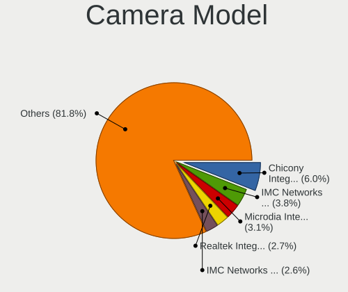

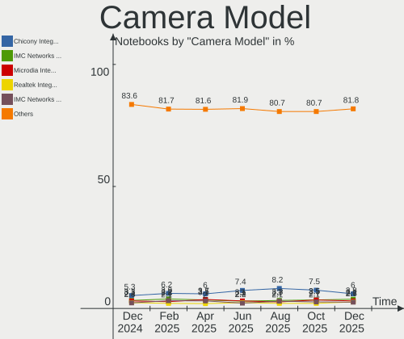

| Model                                               | Notebooks | Percent |
|-----------------------------------------------------|-----------|---------|
| Chicony Integrated Camera                           | 175       | 5.99%   |
| IMC Networks USB2.0 HD UVC WebCam                   | 110       | 3.76%   |
| Microdia Integrated_Webcam_HD                       | 92        | 3.15%   |
| Realtek Integrated_Webcam_HD                        | 78        | 2.67%   |
| IMC Networks Integrated Camera                      | 77        | 2.63%   |
| Bison Integrated Camera                             | 74        | 2.53%   |
| Syntek Integrated Camera                            | 73        | 2.5%    |
| Chicony HD WebCam                                   | 66        | 2.26%   |
| Luxvisions Innotech Limited Integrated Camera       | 59        | 2.02%   |
| Sunplus Integrated_Webcam_HD                        | 47        | 1.61%   |
| Apple FaceTime HD Camera                            | 35        | 1.2%    |
| Bison SunplusIT Integrated Camera                   | 28        | 0.96%   |
| ShineTech USB2.0 HD UVC WebCam                      | 25        | 0.86%   |
| Realtek Integrated_Webcam_FHD                       | 25        | 0.86%   |
| Quanta HD User Facing                               | 24        | 0.82%   |
| Chicony HP HD Camera                                | 24        | 0.82%   |
| Chicony Chicony USB2.0 Camera                       | 24        | 0.82%   |
| kingcome FHD WebCam                                 | 23        | 0.79%   |
| IMC Networks USB2.0 VGA UVC WebCam                  | 23        | 0.79%   |
| Bison Lenovo EasyCamera                             | 23        | 0.79%   |
| Quanta HP TrueVision HD Camera                      | 22        | 0.75%   |
| Luxvisions Innotech Limited HP TrueVision HD Camera | 22        | 0.75%   |
| Lite-On Integrated Camera                           | 22        | 0.75%   |
| Chicony ACER HD User Facing                         | 22        | 0.75%   |
| Chicony HP TrueVision HD Camera                     | 21        | 0.72%   |
| Quanta ACER HD User Facing                          | 20        | 0.68%   |
| Chicony USB2.0 HD UVC WebCam                        | 20        | 0.68%   |
| Chicony Integrated Camera (1280x720@30)             | 20        | 0.68%   |
| Sonix USB2.0 HD UVC WebCam                          | 19        | 0.65%   |
| Shinetech USB2.0 FHD UVC WebCam                     | 19        | 0.65%   |
| Realtek USB Camera                                  | 19        | 0.65%   |
| Chicony TOSHIBA Web Camera - HD                     | 19        | 0.65%   |
| Chicony HP Truevision HD                            | 19        | 0.65%   |
| Bison HD Webcam                                     | 19        | 0.65%   |
| Quanta HP HD Camera                                 | 18        | 0.62%   |
| Sunplus Integrated Camera                           | 17        | 0.58%   |
| Shinetech ASUS FHD webcam                           | 17        | 0.58%   |
| Realtek Integrated Webcam HD                        | 16        | 0.55%   |
| Chicony HD User Facing                              | 16        | 0.55%   |
| Chicony FJ Camera                                   | 16        | 0.55%   |

Security
--------

Fingerprint Vendor
------------------

Fingerprint sensor vendors

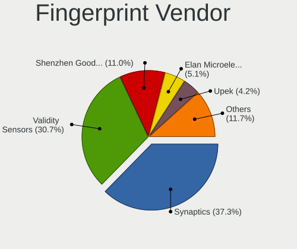

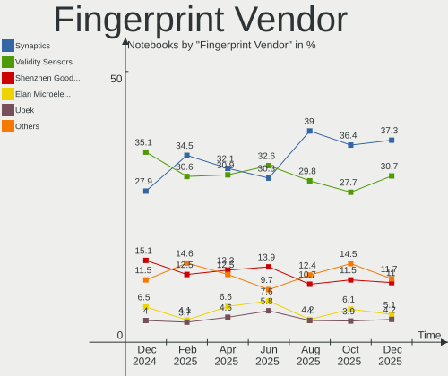

| Vendor                             | Notebooks | Percent |
|------------------------------------|-----------|---------|
| Synaptics                          | 169       | 37.31%  |
| Validity Sensors                   | 139       | 30.68%  |
| Shenzhen Goodix Technology         | 50        | 11.04%  |
| Elan Microelectronics              | 23        | 5.08%   |
| Upek                               | 19        | 4.19%   |
| AuthenTec                          | 18        | 3.97%   |
| LighTuning Technology              | 17        | 3.75%   |
| HOLTEK                             | 7         | 1.55%   |
| STMicroelectronics                 | 4         | 0.88%   |
| Focal-systems.Corp                 | 3         | 0.66%   |
| Samsung Electronics                | 2         | 0.44%   |
| Realtek USB2.0 Finger Print Bridge | 1         | 0.22%   |
| GDMicroelectronics                 | 1         | 0.22%   |

Fingerprint Model
-----------------

Fingerprint sensor models

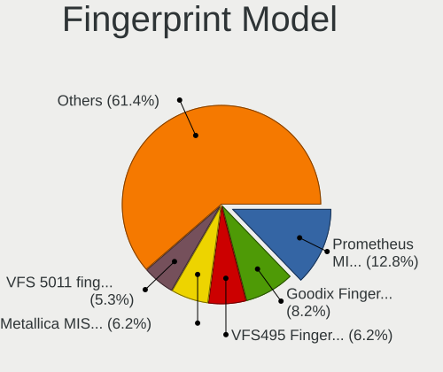

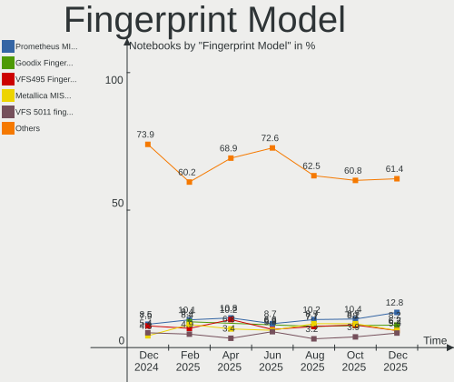

| Model                                                                      | Notebooks | Percent |
|----------------------------------------------------------------------------|-----------|---------|
| Synaptics Prometheus MIS Touch Fingerprint Reader                          | 58        | 12.8%   |
| Shenzhen Goodix  FingerPrint Device                                        | 37        | 8.17%   |
| Validity Sensors VFS495 Fingerprint Reader                                 | 28        | 6.18%   |
| Synaptics Metallica MIS Touch Fingerprint Reader                           | 28        | 6.18%   |
| Validity Sensors VFS 5011 fingerprint sensor                               | 24        | 5.3%    |
| Synaptics UWP WBDI Device                                                  | 22        | 4.86%   |
| Upek Biometric Touchchip/Touchstrip Fingerprint Sensor                     | 18        | 3.97%   |
| Synaptics Fingerprint reader [HP G6]                                       | 18        | 3.97%   |
| Validity Sensors Swipe Fingerprint Sensor                                  | 15        | 3.31%   |
| Synaptics FS7604 Touch Fingerprint Sensor with PurePrint                   | 15        | 3.31%   |
| Validity Sensors VFS5011 Fingerprint Reader                                | 13        | 2.87%   |
| Validity Sensors Synaptics WBDI                                            | 12        | 2.65%   |
| Synaptics Prometheus Fingerprint Reader                                    | 12        | 2.65%   |
| Elan ELAN:Fingerprint                                                      | 12        | 2.65%   |
| Elan ELAN:ARM-M4                                                           | 11        | 2.43%   |
| LighTuning EgisTec Touch Fingerprint Sensor                                | 10        | 2.21%   |
| Validity Sensors VFS491                                                    | 8         | 1.77%   |
| Validity Sensors VFS471 Fingerprint Reader                                 | 8         | 1.77%   |
| Validity Sensors Synaptics VFS7552 Touch Fingerprint Sensor with PurePrint | 8         | 1.77%   |
| Validity Sensors Fingerprint scanner                                       | 8         | 1.77%   |
| Shenzhen Goodix Fingerprint Reader                                         | 8         | 1.77%   |
| HOLTEK FocalTech Fingerprint Device                                        | 7         | 1.55%   |
| Validity Sensors VFS7500 Touch Fingerprint Sensor                          | 5         | 1.1%    |
| Synaptics  FS7604 Touch Fingerprint Sensor with PurePrint                  | 5         | 1.1%    |
| Shenzhen Goodix FingerPrint                                                | 5         | 1.1%    |
| AuthenTec Fingerprint Sensor                                               | 5         | 1.1%    |
| AuthenTec AES2810                                                          | 5         | 1.1%    |
| AuthenTec AES2501 Fingerprint Sensor                                       | 5         | 1.1%    |
| Validity Sensors VFS451 Fingerprint Reader                                 | 4         | 0.88%   |
| Synaptics Metallica MOH Touch Fingerprint Reader                           | 4         | 0.88%   |
| STMicroelectronics Fingerprint Reader                                      | 4         | 0.88%   |
| LighTuning ES603 Swipe Fingerprint Sensor                                  | 4         | 0.88%   |
| Validity Sensors VFS7552 Touch Fingerprint Sensor                          | 3         | 0.66%   |
| Synaptics WBDI                                                             | 3         | 0.66%   |
| LighTuning Fingerprint Reader                                              | 3         | 0.66%   |
| Focal-systems.Corp FT9201Fingerprint.                                      | 3         | 0.66%   |
| AuthenTec AES1600                                                          | 3         | 0.66%   |
| Validity Sensors VFS Fingerprint sensor                                    | 2         | 0.44%   |
| Validity Sensors VFS301 Fingerprint Reader                                 | 1         | 0.22%   |
| Upek TCS5B Fingerprint sensor                                              | 1         | 0.22%   |

Chipcard Vendor
---------------

Chipcard module vendors

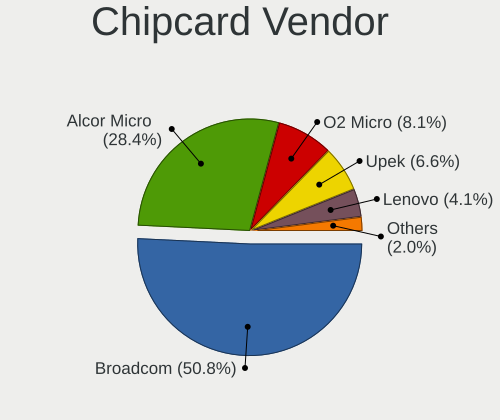

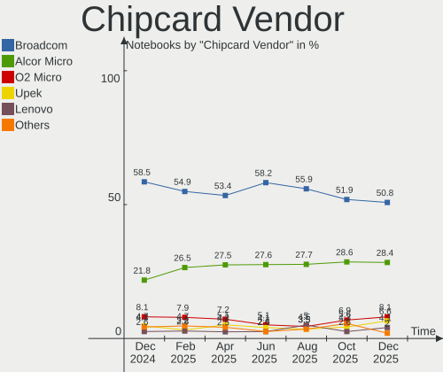

| Vendor                | Notebooks | Percent |
|-----------------------|-----------|---------|
| Broadcom              | 100       | 50.76%  |
| Alcor Micro           | 56        | 28.43%  |
| O2 Micro              | 16        | 8.12%   |
| Upek                  | 13        | 6.6%    |
| Lenovo                | 8         | 4.06%   |
| Yubico.com            | 1         | 0.51%   |
| SCM Microsystems      | 1         | 0.51%   |
| Gemalto (was Gemplus) | 1         | 0.51%   |
| Cherry                | 1         | 0.51%   |

Chipcard Model
--------------

Chipcard module models

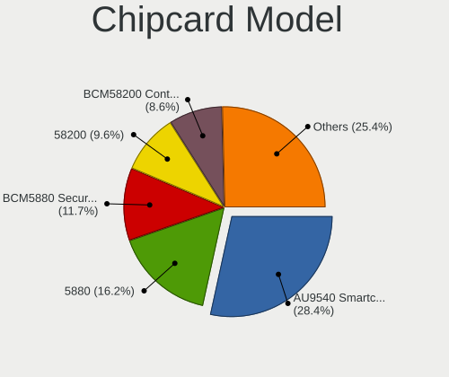

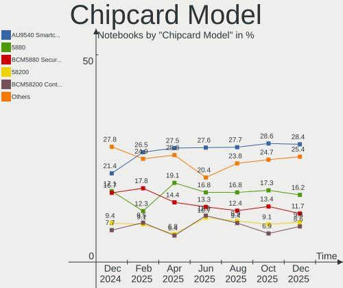

| Model                                                                        | Notebooks | Percent |
|------------------------------------------------------------------------------|-----------|---------|
| Alcor Micro AU9540 Smartcard Reader                                          | 56        | 28.43%  |
| Broadcom 5880                                                                | 32        | 16.24%  |
| Broadcom BCM5880 Secure Applications Processor                               | 23        | 11.68%  |
| Broadcom 58200                                                               | 19        | 9.64%   |
| Broadcom BCM58200 ControlVault 3 (FingerPrint sensor + Contacted SmartCard)  | 17        | 8.63%   |
| O2 Micro OZ776 CCID Smartcard Reader                                         | 15        | 7.61%   |
| Upek TouchChip Fingerprint Coprocessor (WBF advanced mode)                   | 13        | 6.6%    |
| Broadcom BCM5880 Secure Applications Processor with fingerprint swipe sensor | 9         | 4.57%   |
| Lenovo Integrated Smart Card Reader                                          | 8         | 4.06%   |
| Yubico.com Yubikey 4/5 CCID                                                  | 1         | 0.51%   |
| SCM Microsystems SCR3340 - ExpressCard54 Smart Card Reader                   | 1         | 0.51%   |
| O2 Micro Oz776 SmartCard Reader                                              | 1         | 0.51%   |
| Gemalto (was Gemplus) GemPC Twin SmartCard Reader                            | 1         | 0.51%   |
| Cherry SmartTerminal ST-2xxx                                                 | 1         | 0.51%   |

Unsupported
-----------

Unsupported Devices
-------------------

Total unsupported devices on board

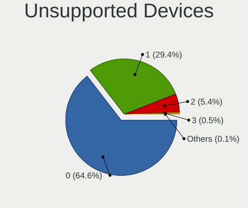

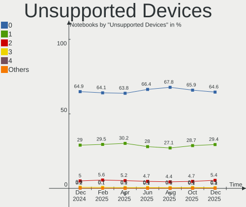

| Total | Notebooks | Percent |
|-------|-----------|---------|
| 0     | 2122      | 64.56%  |
| 1     | 968       | 29.45%  |
| 2     | 177       | 5.38%   |
| 3     | 15        | 0.46%   |
| 4     | 2         | 0.06%   |
| 10    | 1         | 0.03%   |
| 6     | 1         | 0.03%   |
| 5     | 1         | 0.03%   |

Unsupported Device Types
------------------------

Types of unsupported devices

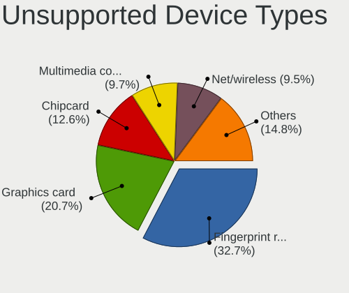

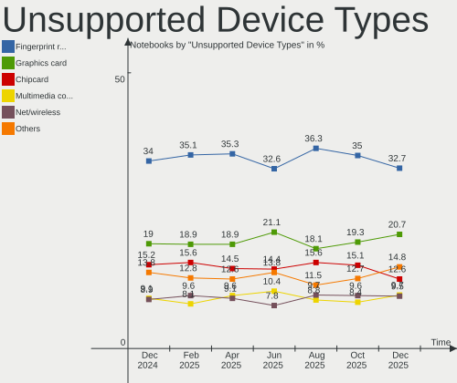

| Type                     | Notebooks | Percent |
|--------------------------|-----------|---------|
| Fingerprint reader       | 449       | 32.65%  |
| Graphics card            | 284       | 20.65%  |
| Chipcard                 | 173       | 12.58%  |
| Multimedia controller    | 134       | 9.75%   |
| Net/wireless             | 131       | 9.53%   |
| Communication controller | 50        | 3.64%   |
| Bluetooth                | 45        | 3.27%   |
| Net/ethernet             | 28        | 2.04%   |
| Camera                   | 22        | 1.6%    |
| Storage                  | 17        | 1.24%   |
| Sound                    | 13        | 0.95%   |
| Card reader              | 13        | 0.95%   |
| Network                  | 5         | 0.36%   |
| Unassigned class         | 3         | 0.22%   |
| Modem                    | 3         | 0.22%   |
| Flash memory             | 2         | 0.15%   |
| Dvb card                 | 2         | 0.15%   |
| Storage/raid             | 1         | 0.07%   |

