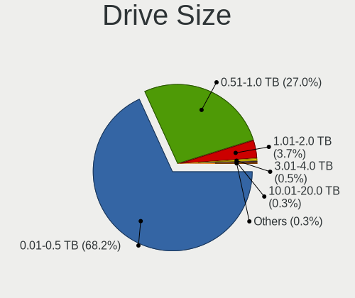
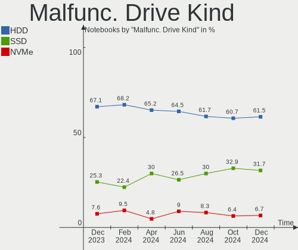
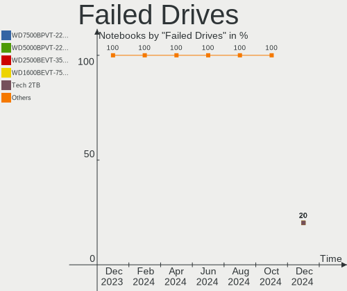

Linux - Hardware Trends (Notebooks)
-----------------------------------

A project to identify most popular hardware characteristics and track their change
over time based on data collected by Linux users at https://Linux-Hardware.org.

Anyone can contribute to this report by the [hw-probe](https://github.com/linuxhw/hw-probe) tool:

    sudo -E hw-probe -all -upload

This report is for one last month. Overall report since the beginning of time: [TestCoverage](https://github.com/linuxhw/TestCoverage)

Period: Dec, 2022.

Contents
--------

* [ System ](#system)
  - [ OS                       ](#os)
  - [ OS Family                ](#os-family)
  - [ Kernel                   ](#kernel)
  - [ Kernel Family            ](#kernel-family)
  - [ Kernel Major Ver.        ](#kernel-major-ver)
  - [ Arch                     ](#arch)
  - [ DE                       ](#de)
  - [ Display Server           ](#display-server)
  - [ Display Manager          ](#display-manager)
  - [ OS Lang                  ](#os-lang)
  - [ Boot Mode                ](#boot-mode)
  - [ Filesystem               ](#filesystem)
  - [ Part. scheme             ](#part-scheme)
  - [ Dual Boot with Linux/BSD ](#dual-boot-with-linuxbsd)
  - [ Dual Boot (Win)          ](#dual-boot-win)

* [ Board ](#board)
  - [ Vendor                   ](#vendor)
  - [ Model                    ](#model)
  - [ Model Family             ](#model-family)
  - [ MFG Year                 ](#mfg-year)
  - [ Form Factor              ](#form-factor)
  - [ Secure Boot              ](#secure-boot)
  - [ Coreboot                 ](#coreboot)
  - [ RAM Size                 ](#ram-size)
  - [ RAM Used                 ](#ram-used)
  - [ Total Drives             ](#total-drives)
  - [ Has CD-ROM               ](#has-cd-rom)
  - [ Has Ethernet             ](#has-ethernet)
  - [ Has WiFi                 ](#has-wifi)
  - [ Has Bluetooth            ](#has-bluetooth)

* [ Location ](#location)
  - [ Country                  ](#country)
  - [ City                     ](#city)

* [ Drives ](#drives)
  - [ Drive Vendor             ](#drive-vendor)
  - [ Drive Model              ](#drive-model)
  - [ HDD Vendor               ](#hdd-vendor)
  - [ SSD Vendor               ](#ssd-vendor)
  - [ Drive Kind               ](#drive-kind)
  - [ Drive Connector          ](#drive-connector)
  - [ Drive Size               ](#drive-size)
  - [ Space Total              ](#space-total)
  - [ Space Used               ](#space-used)
  - [ Malfunc. Drives          ](#malfunc-drives)
  - [ Malfunc. Drive Vendor    ](#malfunc-drive-vendor)
  - [ Malfunc. HDD Vendor      ](#malfunc-hdd-vendor)
  - [ Malfunc. Drive Kind      ](#malfunc-drive-kind)
  - [ Failed Drives            ](#failed-drives)
  - [ Failed Drive Vendor      ](#failed-drive-vendor)
  - [ Drive Status             ](#drive-status)

* [ Storage controller ](#storage-controller)
  - [ Storage Vendor           ](#storage-vendor)
  - [ Storage Model            ](#storage-model)
  - [ Storage Kind             ](#storage-kind)

* [ Processor ](#processor)
  - [ CPU Vendor               ](#cpu-vendor)
  - [ CPU Model                ](#cpu-model)
  - [ CPU Model Family         ](#cpu-model-family)
  - [ CPU Cores                ](#cpu-cores)
  - [ CPU Sockets              ](#cpu-sockets)
  - [ CPU Threads              ](#cpu-threads)
  - [ CPU Op-Modes             ](#cpu-op-modes)
  - [ CPU Microcode            ](#cpu-microcode)
  - [ CPU Microarch            ](#cpu-microarch)

* [ Graphics ](#graphics)
  - [ GPU Vendor               ](#gpu-vendor)
  - [ GPU Model                ](#gpu-model)
  - [ GPU Combo                ](#gpu-combo)
  - [ GPU Driver               ](#gpu-driver)
  - [ GPU Memory               ](#gpu-memory)

* [ Monitor ](#monitor)
  - [ Monitor Vendor           ](#monitor-vendor)
  - [ Monitor Model            ](#monitor-model)
  - [ Monitor Resolution       ](#monitor-resolution)
  - [ Monitor Diagonal         ](#monitor-diagonal)
  - [ Monitor Width            ](#monitor-width)
  - [ Aspect Ratio             ](#aspect-ratio)
  - [ Monitor Area             ](#monitor-area)
  - [ Pixel Density            ](#pixel-density)
  - [ Multiple Monitors        ](#multiple-monitors)

* [ Network ](#network)
  - [ Net Controller Vendor    ](#net-controller-vendor)
  - [ Net Controller Model     ](#net-controller-model)
  - [ Wireless Vendor          ](#wireless-vendor)
  - [ Wireless Model           ](#wireless-model)
  - [ Ethernet Vendor          ](#ethernet-vendor)
  - [ Ethernet Model           ](#ethernet-model)
  - [ Net Controller Kind      ](#net-controller-kind)
  - [ Used Controller          ](#used-controller)
  - [ NICs                     ](#nics)
  - [ IPv6                     ](#ipv6)

* [ Bluetooth ](#bluetooth)
  - [ Bluetooth Vendor         ](#bluetooth-vendor)
  - [ Bluetooth Model          ](#bluetooth-model)

* [ Sound ](#sound)
  - [ Sound Vendor             ](#sound-vendor)
  - [ Sound Model              ](#sound-model)

* [ Memory ](#memory)
  - [ Memory Vendor            ](#memory-vendor)
  - [ Memory Model             ](#memory-model)
  - [ Memory Kind              ](#memory-kind)
  - [ Memory Form Factor       ](#memory-form-factor)
  - [ Memory Size              ](#memory-size)
  - [ Memory Speed             ](#memory-speed)

* [ Printers & scanners ](#printers--scanners)
  - [ Printer Vendor           ](#printer-vendor)
  - [ Printer Model            ](#printer-model)
  - [ Scanner Vendor           ](#scanner-vendor)
  - [ Scanner Model            ](#scanner-model)

* [ Camera ](#camera)
  - [ Camera Vendor            ](#camera-vendor)
  - [ Camera Model             ](#camera-model)

* [ Security ](#security)
  - [ Fingerprint Vendor       ](#fingerprint-vendor)
  - [ Fingerprint Model        ](#fingerprint-model)
  - [ Chipcard Vendor          ](#chipcard-vendor)
  - [ Chipcard Model           ](#chipcard-model)

* [ Unsupported ](#unsupported)
  - [ Unsupported Devices      ](#unsupported-devices)
  - [ Unsupported Device Types ](#unsupported-device-types)

System
------

OS
--

Installed operating systems

| Name                         | Notebooks | Percent |
|------------------------------|-----------|---------|
| Ubuntu 22.04                 | 444       | 15.21%  |
| Fedora 37                    | 224       | 7.67%   |
| Linux Mint 21                | 172       | 5.89%   |
| Debian 11                    | 159       | 5.45%   |
| Pop!_OS 22.04                | 133       | 4.55%   |
| Ubuntu 22.10                 | 119       | 4.08%   |
| Arch Rolling                 | 109       | 3.73%   |
| OpenMandriva 4.3             | 102       | 3.49%   |
| ROSA 12.3                    | 95        | 3.25%   |
| Zorin 16                     | 88        | 3.01%   |
| Ubuntu 20.04                 | 86        | 2.95%   |
| Linux Mint 21.1              | 62        | 2.12%   |
| Linux Mint 20.3              | 62        | 2.12%   |
| Manjaro 22.0.0               | 52        | 1.78%   |
| Manjaro                      | 50        | 1.71%   |
| KDE neon 22.04               | 49        | 1.68%   |
| Kali 2022.4                  | 44        | 1.51%   |
| Kubuntu 22.04                | 42        | 1.44%   |
| openSUSE Tumbleweed-XXXXXXXX | 31        | 1.06%   |
| Fedora 36                    | 30        | 1.03%   |
| Debian                       | 30        | 1.03%   |
| Xubuntu 22.04                | 29        | 0.99%   |
| SteamOS 3.3.2                | 26        | 0.89%   |
| Gentoo 2.9                   | 24        | 0.82%   |
| Elementary 6.1               | 24        | 0.82%   |
| OpenMandriva 4.50            | 23        | 0.79%   |
| Kubuntu 22.10                | 23        | 0.79%   |
| EndeavourOS Rolling          | 22        | 0.75%   |
| SteamOS 3.4.2                | 21        | 0.72%   |
| OpenMandriva 22.12           | 21        | 0.72%   |
| Nobara 36                    | 20        | 0.68%   |
| LMDE 5                       | 19        | 0.65%   |
| ArcoLinux Rolling            | 19        | 0.65%   |
| BlackPanther 18.1            | 18        | 0.62%   |
| Lubuntu 22.04                | 16        | 0.55%   |
| Ubuntu 18.04                 | 15        | 0.51%   |
| SteamOS 3.3.3                | 14        | 0.48%   |
| Garuda Linux Soaring         | 13        | 0.45%   |
| Ubuntu MATE 22.04            | 12        | 0.41%   |
| MX 21                        | 12        | 0.41%   |

OS Family
---------

OS without a version

| Name          | Notebooks | Percent |
|---------------|-----------|---------|
| Ubuntu        | 672       | 23.01%  |
| Linux Mint    | 314       | 10.75%  |
| Fedora        | 258       | 8.84%   |
| Debian        | 193       | 6.61%   |
| OpenMandriva  | 163       | 5.58%   |
| Pop!_OS       | 136       | 4.66%   |
| ROSA          | 109       | 3.73%   |
| Arch          | 109       | 3.73%   |
| Manjaro       | 107       | 3.66%   |
| Zorin         | 93        | 3.18%   |
| SteamOS       | 91        | 3.12%   |
| Kubuntu       | 73        | 2.5%    |
| KDE neon      | 50        | 1.71%   |
| Kali          | 48        | 1.64%   |
| openSUSE      | 43        | 1.47%   |
| Xubuntu       | 41        | 1.4%    |
| Lubuntu       | 29        | 0.99%   |
| Gentoo        | 27        | 0.92%   |
| Elementary    | 27        | 0.92%   |
| Endless       | 25        | 0.86%   |
| Ubuntu MATE   | 24        | 0.82%   |
| EndeavourOS   | 22        | 0.75%   |
| Nobara        | 20        | 0.68%   |
| LMDE          | 19        | 0.65%   |
| ArcoLinux     | 19        | 0.65%   |
| BlackPanther  | 18        | 0.62%   |
| Garuda Linux  | 17        | 0.58%   |
| ALT Linux     | 15        | 0.51%   |
| Ubuntu Unity  | 13        | 0.45%   |
| MX            | 12        | 0.41%   |
| Red OS        | 11        | 0.38%   |
| Ubuntu Budgie | 10        | 0.34%   |
| Parrot        | 9         | 0.31%   |
| CentOS        | 9         | 0.31%   |
| Clear Linux   | 8         | 0.27%   |
| NixOS         | 6         | 0.21%   |
| Xero          | 5         | 0.17%   |
| Slackware     | 4         | 0.14%   |
| Rocky Linux   | 4         | 0.14%   |
| RHEL          | 4         | 0.14%   |

Kernel
------

Version of the Linux kernel

| Version                            | Notebooks | Percent |
|------------------------------------|-----------|---------|
| 5.15.0-56-generic                  | 806       | 27.6%   |
| 5.19.0-26-generic                  | 117       | 4.01%   |
| 5.16.7-desktop-1omv4003            | 100       | 3.42%   |
| 6.0.6-76060006-generic             | 87        | 2.98%   |
| 5.4.0-135-generic                  | 78        | 2.67%   |
| 5.10.0-20-amd64                    | 66        | 2.26%   |
| 5.15.0-53-generic                  | 63        | 2.16%   |
| 5.10.0-19-amd64                    | 63        | 2.16%   |
| 6.0.12-300.fc37.x86_64             | 49        | 1.68%   |
| 5.13.0-valve21.3-1-neptune         | 42        | 1.44%   |
| 6.0.15-300.fc37.x86_64             | 40        | 1.37%   |
| 6.0.12-76060006-generic            | 39        | 1.34%   |
| 5.13.0-valve36-1-neptune           | 38        | 1.3%    |
| 6.0.11-300.fc37.x86_64             | 35        | 1.2%    |
| 6.0.10-300.fc37.x86_64             | 33        | 1.13%   |
| 5.15.79-generic-1rosa2021.1-x86_64 | 33        | 1.13%   |
| 5.15.75-generic-1rosa2021.1-x86_64 | 33        | 1.13%   |
| 5.15.0-57-generic                  | 33        | 1.13%   |
| 6.0.12-arch1-1                     | 32        | 1.1%    |
| 5.15.81-1-MANJARO                  | 30        | 1.03%   |
| 5.15.0-43-generic                  | 28        | 0.96%   |
| 6.1.1-arch1-1                      | 27        | 0.92%   |
| 6.0.10-desktop-2omv22090           | 22        | 0.75%   |
| 5.15.0-52-generic                  | 21        | 0.72%   |
| 5.10.0-18-amd64                    | 21        | 0.72%   |
| 6.0.11-arch1-1                     | 20        | 0.68%   |
| 6.0.0-kali3-amd64                  | 19        | 0.65%   |
| 5.15.0-41-generic                  | 18        | 0.62%   |
| 6.0.0-0.deb11.2-amd64              | 17        | 0.58%   |
| 5.19.12-desktop-2omv4090           | 17        | 0.58%   |
| 5.11.0-35-generic                  | 17        | 0.58%   |
| 6.1.1-1-MANJARO                    | 16        | 0.55%   |
| 6.0.10-201.fc36.x86_64             | 16        | 0.55%   |
| 6.0.0-5-amd64                      | 16        | 0.55%   |
| 6.1.1-zen1-1-zen                   | 15        | 0.51%   |
| 6.0.14-300.fc37.x86_64             | 15        | 0.51%   |
| 5.6.14-desktop-2bP                 | 15        | 0.51%   |
| 6.0.9-300.fc37.x86_64              | 14        | 0.48%   |
| 6.1.0-1-MANJARO                    | 13        | 0.45%   |
| 6.0.13-300.fc37.x86_64             | 13        | 0.45%   |

Kernel Family
-------------

Linux kernel without a distro release

| Version  | Notebooks | Percent |
|----------|-----------|---------|
| 5.15.0   | 1000      | 34.25%  |
| 5.10.0   | 171       | 5.86%   |
| 5.19.0   | 163       | 5.58%   |
| 6.0.12   | 148       | 5.07%   |
| 6.0.10   | 119       | 4.08%   |
| 6.0.0    | 112       | 3.84%   |
| 5.13.0   | 103       | 3.53%   |
| 5.16.7   | 101       | 3.46%   |
| 5.4.0    | 99        | 3.39%   |
| 6.0.11   | 91        | 3.12%   |
| 6.0.6    | 88        | 3.01%   |
| 6.1.1    | 72        | 2.47%   |
| 5.15.75  | 43        | 1.47%   |
| 6.0.15   | 42        | 1.44%   |
| 6.0.9    | 40        | 1.37%   |
| 6.1.0    | 38        | 1.3%    |
| 5.15.79  | 37        | 1.27%   |
| 5.15.81  | 33        | 1.13%   |
| 5.11.0   | 26        | 0.89%   |
| 6.0.14   | 22        | 0.75%   |
| 5.14.0   | 22        | 0.75%   |
| 5.15.80  | 20        | 0.68%   |
| 5.19.12  | 17        | 0.58%   |
| 4.15.0   | 17        | 0.58%   |
| 6.0.8    | 16        | 0.55%   |
| 6.0.13   | 15        | 0.51%   |
| 5.6.14   | 15        | 0.51%   |
| 6.0.7    | 14        | 0.48%   |
| 5.8.0    | 12        | 0.41%   |
| 5.15.78  | 11        | 0.38%   |
| 5.18.0   | 10        | 0.34%   |
| 5.17.0   | 10        | 0.34%   |
| 6.0.2    | 9         | 0.31%   |
| 5.15.72  | 9         | 0.31%   |
| 5.10.155 | 9         | 0.31%   |
| 5.15.85  | 8         | 0.27%   |
| 5.15.84  | 6         | 0.21%   |
| 5.14.21  | 6         | 0.21%   |
| 5.10.74  | 6         | 0.21%   |
| 5.10.156 | 6         | 0.21%   |

Kernel Major Ver.
-----------------

Linux kernel major version

| Version | Notebooks | Percent |
|---------|-----------|---------|
| 5.15    | 1194      | 40.89%  |
| 6.0     | 720       | 24.66%  |
| 5.10    | 210       | 7.19%   |
| 5.19    | 196       | 6.71%   |
| 6.1     | 110       | 3.77%   |
| 5.16    | 106       | 3.63%   |
| 5.13    | 105       | 3.6%    |
| 5.4     | 101       | 3.46%   |
| 5.14    | 29        | 0.99%   |
| 5.11    | 28        | 0.96%   |
| 5.18    | 26        | 0.89%   |
| 5.17    | 22        | 0.75%   |
| 4.15    | 17        | 0.58%   |
| 5.6     | 15        | 0.51%   |
| 5.8     | 12        | 0.41%   |
| 4.18    | 9         | 0.31%   |
| 3.10    | 5         | 0.17%   |
| 4.9     | 4         | 0.14%   |
| 4.4     | 4         | 0.14%   |
| 5.3     | 2         | 0.07%   |
| 4.19    | 2         | 0.07%   |
| 6.2     | 1         | 0.03%   |
| 4.16    | 1         | 0.03%   |
| 4.12    | 1         | 0.03%   |

Arch
----

OS architecture (x86_64, i586, etc.)

| Name    | Notebooks | Percent |
|---------|-----------|---------|
| x86_64  | 2888      | 98.9%   |
| i686    | 29        | 0.99%   |
| aarch64 | 2         | 0.07%   |
| armv7l  | 1         | 0.03%   |

DE
--

Desktop Environment

| Name              | Notebooks | Percent |
|-------------------|-----------|---------|
| GNOME             | 1316      | 45.07%  |
| KDE5              | 731       | 25.03%  |
| X-Cinnamon        | 279       | 9.55%   |
| XFCE              | 210       | 7.19%   |
| MATE              | 92        | 3.15%   |
| Unknown           | 74        | 2.53%   |
| LXQt              | 56        | 1.92%   |
| Pantheon          | 25        | 0.86%   |
| i3                | 17        | 0.58%   |
| Cinnamon          | 17        | 0.58%   |
| Unity             | 13        | 0.45%   |
| LXDE              | 13        | 0.45%   |
| Budgie            | 13        | 0.45%   |
| KDE               | 8         | 0.27%   |
| sway              | 7         | 0.24%   |
| KDE4              | 7         | 0.24%   |
| GNOME Flashback   | 5         | 0.17%   |
| GNOME Classic     | 5         | 0.17%   |
| Deepin            | 4         | 0.14%   |
| awesome           | 4         | 0.14%   |
| bspwm             | 3         | 0.1%    |
| Trinity           | 2         | 0.07%   |
| openbox           | 2         | 0.07%   |
| icewm             | 2         | 0.07%   |
| Hyprland          | 2         | 0.07%   |
| fluxbox           | 2         | 0.07%   |
| Enlightenment     | 2         | 0.07%   |
| xmonad            | 1         | 0.03%   |
| x-session-manager | 1         | 0.03%   |
| qtile             | 1         | 0.03%   |
| lightdm-xsession  | 1         | 0.03%   |
| LeftWM            | 1         | 0.03%   |
| i3-with-shmlog    | 1         | 0.03%   |
| herbstluftwm      | 1         | 0.03%   |
| dwm               | 1         | 0.03%   |
| BunsenLabs        | 1         | 0.03%   |

Display Server
--------------

X11 or Wayland

| Name        | Notebooks | Percent |
|-------------|-----------|---------|
| X11         | 1942      | 66.51%  |
| Wayland     | 882       | 30.21%  |
| Unknown     | 56        | 1.92%   |
| Tty         | 38        | 1.3%    |
| Web         | 1         | 0.03%   |
| Unspecified | 1         | 0.03%   |

Display Manager
---------------

SDDM, LightDM, etc.

| Name    | Notebooks | Percent |
|---------|-----------|---------|
| Unknown | 936       | 32.05%  |
| GDM3    | 668       | 22.88%  |
| SDDM    | 515       | 17.64%  |
| LightDM | 469       | 16.06%  |
| GDM     | 305       | 10.45%  |
| XDM     | 7         | 0.24%   |
| KDM     | 7         | 0.24%   |
| LXDM    | 5         | 0.17%   |
| SLiM    | 3         | 0.1%    |
| TDM     | 2         | 0.07%   |
| Ly      | 2         | 0.07%   |
| LDM     | 1         | 0.03%   |

OS Lang
-------

Language

| Lang    | Notebooks | Percent |
|---------|-----------|---------|
| en_US   | 1289      | 44.14%  |
| ru_RU   | 240       | 8.22%   |
| de_DE   | 212       | 7.26%   |
| fr_FR   | 137       | 4.69%   |
| en_GB   | 136       | 4.66%   |
| pt_BR   | 125       | 4.28%   |
| it_IT   | 107       | 3.66%   |
| es_ES   | 66        | 2.26%   |
| en_IN   | 54        | 1.85%   |
| Unknown | 54        | 1.85%   |
| pl_PL   | 45        | 1.54%   |
| en_CA   | 42        | 1.44%   |
| C       | 37        | 1.27%   |
| en_AU   | 34        | 1.16%   |
| es_MX   | 29        | 0.99%   |
| hu_HU   | 17        | 0.58%   |
| nl_NL   | 16        | 0.55%   |
| zh_CN   | 15        | 0.51%   |
| de_AT   | 15        | 0.51%   |
| de_CH   | 14        | 0.48%   |
| tr_TR   | 13        | 0.45%   |
| es_AR   | 12        | 0.41%   |
| cs_CZ   | 12        | 0.41%   |
| ko_KR   | 10        | 0.34%   |
| pt_PT   | 9         | 0.31%   |
| en_ZA   | 9         | 0.31%   |
| fr_CA   | 8         | 0.27%   |
| fr_BE   | 8         | 0.27%   |
| en_NZ   | 8         | 0.27%   |
| sv_SE   | 7         | 0.24%   |
| POSIX   | 7         | 0.24%   |
| es_CL   | 7         | 0.24%   |
| da_DK   | 7         | 0.24%   |
| bg_BG   | 7         | 0.24%   |
| en_IE   | 6         | 0.21%   |
| nl_BE   | 5         | 0.17%   |
| es_CO   | 5         | 0.17%   |
| ca_ES   | 5         | 0.17%   |
| zh_TW   | 4         | 0.14%   |
| ru_UA   | 4         | 0.14%   |

Boot Mode
---------

EFI or BIOS

| Mode | Notebooks | Percent |
|------|-----------|---------|
| EFI  | 1629      | 55.79%  |
| BIOS | 1291      | 44.21%  |

Filesystem
----------

Type of filesystem

| Type     | Notebooks | Percent |
|----------|-----------|---------|
| Ext4     | 2105      | 72.09%  |
| Btrfs    | 504       | 17.26%  |
| Overlay  | 226       | 7.74%   |
| Xfs      | 43        | 1.47%   |
| Zfs      | 22        | 0.75%   |
| Tmpfs    | 8         | 0.27%   |
| F2fs     | 3         | 0.1%    |
| Ext3     | 3         | 0.1%    |
| Unknown  | 2         | 0.07%   |
| XXXXXXX  | 1         | 0.03%   |
| Rootfs   | 1         | 0.03%   |
| Reiserfs | 1         | 0.03%   |
| Ext2     | 1         | 0.03%   |

Part. scheme
------------

Scheme of partitioning

| Type    | Notebooks | Percent |
|---------|-----------|---------|
| GPT     | 1686      | 57.74%  |
| Unknown | 873       | 29.9%   |
| MBR     | 361       | 12.36%  |

Dual Boot with Linux/BSD
------------------------

Hosting more than one Linux/BSD

| Dual boot | Notebooks | Percent |
|-----------|-----------|---------|
| No        | 2607      | 89.28%  |
| Yes       | 313       | 10.72%  |

Dual Boot (Win)
---------------

Hosting Linux and Windows

| Dual boot | Notebooks | Percent |
|-----------|-----------|---------|
| No        | 2159      | 73.94%  |
| Yes       | 761       | 26.06%  |

Board
-----

Vendor
------

Motherboard manufacturer

| Name                   | Notebooks | Percent |
|------------------------|-----------|---------|
| Lenovo                 | 616       | 21.1%   |
| Hewlett-Packard        | 476       | 16.3%   |
| Dell                   | 408       | 13.97%  |
| ASUSTek Computer       | 313       | 10.72%  |
| Acer                   | 258       | 8.84%   |
| Valve                  | 89        | 3.05%   |
| MSI                    | 81        | 2.77%   |
| Apple                  | 74        | 2.53%   |
| Toshiba                | 68        | 2.33%   |
| HUAWEI                 | 57        | 1.95%   |
| Samsung Electronics    | 51        | 1.75%   |
| Google                 | 39        | 1.34%   |
| Sony                   | 27        | 0.92%   |
| Unknown                | 27        | 0.92%   |
| Notebook               | 17        | 0.58%   |
| System76               | 14        | 0.48%   |
| GPU Company            | 14        | 0.48%   |
| Timi                   | 13        | 0.45%   |
| Fujitsu                | 13        | 0.45%   |
| Packard Bell           | 12        | 0.41%   |
| Alienware              | 12        | 0.41%   |
| Gigabyte Technology    | 11        | 0.38%   |
| TUXEDO                 | 10        | 0.34%   |
| Medion                 | 10        | 0.34%   |
| Positivo               | 9         | 0.31%   |
| LG Electronics         | 9         | 0.31%   |
| Schenker               | 8         | 0.27%   |
| Clevo                  | 8         | 0.27%   |
| Razer                  | 7         | 0.24%   |
| Pegatron               | 7         | 0.24%   |
| GPD                    | 7         | 0.24%   |
| Dynabook               | 7         | 0.24%   |
| Chuwi                  | 7         | 0.24%   |
| Aquarius               | 7         | 0.24%   |
| HONOR                  | 6         | 0.21%   |
| Framework              | 6         | 0.21%   |
| Panasonic              | 5         | 0.17%   |
| Avell High Performance | 5         | 0.17%   |
| Positivo Bahia - VAIO  | 4         | 0.14%   |
| Monster                | 4         | 0.14%   |

Model
-----

Motherboard model

| Name                                   | Notebooks | Percent |
|----------------------------------------|-----------|---------|
| Valve Jupiter                          | 89        | 3.05%   |
| Unknown                                | 34        | 1.16%   |
| HP Notebook                            | 13        | 0.45%   |
| HP Pavilion g6                         | 10        | 0.34%   |
| Dell Latitude E7440                    | 10        | 0.34%   |
| Lenovo ThinkBook 15 G3 ACL 21A4        | 9         | 0.31%   |
| Apple MacBookPro8,1                    | 9         | 0.31%   |
| Dell Latitude E6430                    | 8         | 0.27%   |
| Lenovo IdeaPad 330-15IKB 81DE          | 7         | 0.24%   |
| HP Pavilion dv7                        | 7         | 0.24%   |
| HP Pavilion dv6                        | 7         | 0.24%   |
| HP Pavilion 15                         | 7         | 0.24%   |
| ASUS UX31E                             | 7         | 0.24%   |
| Apple MacBookPro9,2                    | 7         | 0.24%   |
| Apple MacBookAir7,2                    | 7         | 0.24%   |
| Lenovo Y520-15IKBN 80WK                | 6         | 0.21%   |
| HUAWEI BOHK-WAX9X                      | 6         | 0.21%   |
| HP Pavilion g7                         | 6         | 0.21%   |
| HP Pavilion 17                         | 6         | 0.21%   |
| HP OMEN by Laptop 16-c0xxx             | 6         | 0.21%   |
| HP Laptop 15-da0xxx                    | 6         | 0.21%   |
| HP 250 G8 Notebook PC                  | 6         | 0.21%   |
| Framework Laptop (12th Gen Intel Core) | 6         | 0.21%   |
| Dell Latitude E7240                    | 6         | 0.21%   |
| Dell Latitude E6420                    | 6         | 0.21%   |
| Dell Inspiron 3583                     | 6         | 0.21%   |
| ASUS TUF Gaming FX505DT_FX505DT        | 6         | 0.21%   |
| Lenovo ThinkBook 15 G2 ITL 20VE        | 5         | 0.17%   |
| Lenovo Legion 5 15ACH6H 82JU           | 5         | 0.17%   |
| Lenovo IdeaPad Gaming 3 15ARH05 82EY   | 5         | 0.17%   |
| Lenovo IdeaPad Gaming 3 15ACH6 82K2    | 5         | 0.17%   |
| HUAWEI HVY-WXX9                        | 5         | 0.17%   |
| HUAWEI BOM-WXX9                        | 5         | 0.17%   |
| HP EliteBook 8470p                     | 5         | 0.17%   |
| HP EliteBook 840 G5                    | 5         | 0.17%   |
| HP 255 G8 Notebook PC                  | 5         | 0.17%   |
| HP 15                                  | 5         | 0.17%   |
| GPU Company GWTC116-2                  | 5         | 0.17%   |
| GPU Company GWNR71517                  | 5         | 0.17%   |
| Dell XPS 15 9570                       | 5         | 0.17%   |

Model Family
------------

Motherboard model prefix

| Name                  | Notebooks | Percent |
|-----------------------|-----------|---------|
| Lenovo ThinkPad       | 306       | 10.48%  |
| Acer Aspire           | 165       | 5.65%   |
| Dell Latitude         | 144       | 4.93%   |
| Lenovo IdeaPad        | 139       | 4.76%   |
| Dell Inspiron         | 136       | 4.66%   |
| HP Pavilion           | 103       | 3.53%   |
| Valve Jupiter         | 89        | 3.05%   |
| HP EliteBook          | 87        | 2.98%   |
| ASUS VivoBook         | 77        | 2.64%   |
| HP Laptop             | 66        | 2.26%   |
| Toshiba Satellite     | 52        | 1.78%   |
| HP ProBook            | 50        | 1.71%   |
| Dell XPS              | 49        | 1.68%   |
| Lenovo Legion         | 34        | 1.16%   |
| Unknown               | 34        | 1.16%   |
| Dell Vostro           | 33        | 1.13%   |
| Lenovo ThinkBook      | 32        | 1.1%    |
| Acer Nitro            | 29        | 0.99%   |
| ASUS ROG              | 27        | 0.92%   |
| ASUS ASUS             | 27        | 0.92%   |
| Acer Swift            | 25        | 0.86%   |
| ASUS ZenBook          | 24        | 0.82%   |
| HP ZBook              | 21        | 0.72%   |
| HP Compaq             | 20        | 0.68%   |
| HP Stream             | 14        | 0.48%   |
| Dell Precision        | 14        | 0.48%   |
| Lenovo Yoga           | 13        | 0.45%   |
| HP Notebook           | 13        | 0.45%   |
| HP ENVY               | 13        | 0.45%   |
| Apple MacBookPro8     | 13        | 0.45%   |
| HP OMEN               | 12        | 0.41%   |
| Acer TravelMate       | 12        | 0.41%   |
| Acer Predator         | 12        | 0.41%   |
| HP 250                | 11        | 0.38%   |
| Apple MacBookAir7     | 11        | 0.38%   |
| HP 255                | 10        | 0.34%   |
| Fujitsu LIFEBOOK      | 10        | 0.34%   |
| Packard Bell EasyNote | 9         | 0.31%   |
| MSI Modern            | 9         | 0.31%   |
| ASUS TUF              | 9         | 0.31%   |

MFG Year
--------

Motherboard manufacture year

| Year    | Notebooks | Percent |
|---------|-----------|---------|
| 2021    | 445       | 15.24%  |
| 2022    | 375       | 12.84%  |
| 2020    | 288       | 9.86%   |
| 2019    | 257       | 8.8%    |
| 2018    | 189       | 6.47%   |
| 2013    | 182       | 6.23%   |
| 2012    | 179       | 6.13%   |
| 2017    | 168       | 5.75%   |
| 2011    | 165       | 5.65%   |
| 2015    | 135       | 4.62%   |
| 2014    | 119       | 4.08%   |
| 2010    | 114       | 3.9%    |
| 2016    | 110       | 3.77%   |
| 2008    | 78        | 2.67%   |
| 2009    | 64        | 2.19%   |
| 2007    | 31        | 1.06%   |
| 2006    | 14        | 0.48%   |
| Unknown | 3         | 0.1%    |
| 2005    | 2         | 0.07%   |
| 2004    | 2         | 0.07%   |

Form Factor
-----------

Physical design of the computer

| Name     | Notebooks | Percent |
|----------|-----------|---------|
| Notebook | 2920      | 100%    |

Secure Boot
-----------

Enabled or disabled

| State    | Notebooks | Percent |
|----------|-----------|---------|
| Disabled | 2640      | 90.41%  |
| Enabled  | 280       | 9.59%   |

Coreboot
--------

Have coreboot on board

| Used | Notebooks | Percent |
|------|-----------|---------|
| No   | 2869      | 98.25%  |
| Yes  | 51        | 1.75%   |

RAM Size
--------

Total RAM memory

| Size in GB  | Notebooks | Percent |
|-------------|-----------|---------|
| 4.01-8.0    | 825       | 28.25%  |
| 8.01-16.0   | 602       | 20.62%  |
| 3.01-4.0    | 533       | 18.25%  |
| 16.01-24.0  | 512       | 17.53%  |
| 32.01-64.0  | 238       | 8.15%   |
| 1.01-2.0    | 79        | 2.71%   |
| 24.01-32.0  | 46        | 1.58%   |
| 2.01-3.0    | 37        | 1.27%   |
| 64.01-256.0 | 37        | 1.27%   |
| 0.51-1.0    | 11        | 0.38%   |

RAM Used
--------

Used RAM memory

| Used GB    | Notebooks | Percent |
|------------|-----------|---------|
| 1.01-2.0   | 847       | 29.01%  |
| 2.01-3.0   | 768       | 26.3%   |
| 3.01-4.0   | 486       | 16.64%  |
| 4.01-8.0   | 485       | 16.61%  |
| 0.51-1.0   | 148       | 5.07%   |
| 8.01-16.0  | 147       | 5.03%   |
| 0.01-0.5   | 25        | 0.86%   |
| 16.01-24.0 | 11        | 0.38%   |
| 24.01-32.0 | 2         | 0.07%   |
| Unknown    | 1         | 0.03%   |

Total Drives
------------

Number of drives on board

| Drives | Notebooks | Percent |
|--------|-----------|---------|
| 1      | 2145      | 73.46%  |
| 2      | 683       | 23.39%  |
| 3      | 73        | 2.5%    |
| 0      | 11        | 0.38%   |
| 4      | 7         | 0.24%   |
| 5      | 1         | 0.03%   |

Has CD-ROM
----------

Has CD-ROM on board

| Presented | Notebooks | Percent |
|-----------|-----------|---------|
| No        | 2116      | 72.47%  |
| Yes       | 804       | 27.53%  |

Has Ethernet
------------

Has Ethernet on board

| Presented | Notebooks | Percent |
|-----------|-----------|---------|
| Yes       | 2243      | 76.82%  |
| No        | 677       | 23.18%  |

Has WiFi
--------

Has WiFi module

| Presented | Notebooks | Percent |
|-----------|-----------|---------|
| Yes       | 2883      | 98.73%  |
| No        | 37        | 1.27%   |

Has Bluetooth
-------------

Has Bluetooth module

| Presented | Notebooks | Percent |
|-----------|-----------|---------|
| Yes       | 2410      | 82.53%  |
| No        | 510       | 17.47%  |

Location
--------

Country
-------

Geographic location (country)

| Country      | Notebooks | Percent |
|--------------|-----------|---------|
| USA          | 471       | 16.13%  |
| Germany      | 291       | 9.97%   |
| Russia       | 282       | 9.66%   |
| France       | 177       | 6.06%   |
| Italy        | 168       | 5.75%   |
| Brazil       | 162       | 5.55%   |
| UK           | 100       | 3.42%   |
| Spain        | 92        | 3.15%   |
| Canada       | 81        | 2.77%   |
| Poland       | 79        | 2.71%   |
| India        | 79        | 2.71%   |
| Netherlands  | 55        | 1.88%   |
| Mexico       | 47        | 1.61%   |
| Hungary      | 44        | 1.51%   |
| Australia    | 39        | 1.34%   |
| Switzerland  | 36        | 1.23%   |
| Sweden       | 32        | 1.1%    |
| Turkey       | 31        | 1.06%   |
| Belgium      | 31        | 1.06%   |
| Austria      | 29        | 0.99%   |
| Czechia      | 26        | 0.89%   |
| Romania      | 25        | 0.86%   |
| Indonesia    | 25        | 0.86%   |
| Argentina    | 23        | 0.79%   |
| Denmark      | 22        | 0.75%   |
| China        | 22        | 0.75%   |
| Bulgaria     | 22        | 0.75%   |
| Greece       | 18        | 0.62%   |
| South Korea  | 17        | 0.58%   |
| Chile        | 17        | 0.58%   |
| Portugal     | 15        | 0.51%   |
| Slovakia     | 14        | 0.48%   |
| Japan        | 14        | 0.48%   |
| Belarus      | 14        | 0.48%   |
| South Africa | 13        | 0.45%   |
| Norway       | 12        | 0.41%   |
| Ireland      | 12        | 0.41%   |
| Finland      | 12        | 0.41%   |
| New Zealand  | 11        | 0.38%   |
| Colombia     | 11        | 0.38%   |

City
----

Geographic location (city)

| City              | Notebooks | Percent |
|-------------------|-----------|---------|
| Moscow            | 70        | 2.4%    |
| St Petersburg     | 34        | 1.16%   |
| Paris             | 31        | 1.06%   |
| Milan             | 28        | 0.96%   |
| Berlin            | 28        | 0.96%   |
| Bangor            | 28        | 0.96%   |
| Warsaw            | 22        | 0.75%   |
| Madrid            | 21        | 0.72%   |
| London            | 21        | 0.72%   |
| Vienna            | 18        | 0.62%   |
| Hamburg           | 18        | 0.62%   |
| Rome              | 14        | 0.48%   |
| Istanbul          | 14        | 0.48%   |
| Frankfurt am Main | 14        | 0.48%   |
| Sao Paulo         | 13        | 0.45%   |
| Brisbane          | 13        | 0.45%   |
| Sofia             | 11        | 0.38%   |
| Novosibirsk       | 11        | 0.38%   |
| Prague            | 10        | 0.34%   |
| Munich            | 10        | 0.34%   |
| Krasnodar         | 10        | 0.34%   |
| Budapest          | 10        | 0.34%   |
| Amsterdam         | 10        | 0.34%   |
| Yekaterinburg     | 9         | 0.31%   |
| Voronezh          | 9         | 0.31%   |
| Santiago          | 9         | 0.31%   |
| Helsinki          | 9         | 0.31%   |
| Bengaluru         | 9         | 0.31%   |
| Stuttgart         | 8         | 0.27%   |
| Nuremberg         | 8         | 0.27%   |
| Mexico City       | 8         | 0.27%   |
| Melbourne         | 8         | 0.27%   |
| Lisbon            | 8         | 0.27%   |
| Delhi             | 8         | 0.27%   |
| Cologne           | 8         | 0.27%   |
| Chicago           | 8         | 0.27%   |
| Bogotá           | 8         | 0.27%   |
| Athens            | 8         | 0.27%   |
| Zurich            | 7         | 0.24%   |
| Toronto           | 7         | 0.24%   |

Drives
------

Drive Vendor
------------

Hard drive vendors

| Vendor                      | Notebooks | Drives | Percent |
|-----------------------------|-----------|--------|---------|
| Samsung Electronics         | 645       | 692    | 17.78%  |
| WDC                         | 353       | 368    | 9.73%   |
| Seagate                     | 254       | 266    | 7%      |
| Sandisk                     | 235       | 241    | 6.48%   |
| Toshiba                     | 227       | 228    | 6.26%   |
| Unknown                     | 226       | 244    | 6.23%   |
| Kingston                    | 185       | 190    | 5.1%    |
| SK hynix                    | 174       | 177    | 4.8%    |
| Intel                       | 126       | 133    | 3.47%   |
| Micron Technology           | 118       | 119    | 3.25%   |
| Crucial                     | 110       | 116    | 3.03%   |
| Hitachi                     | 74        | 74     | 2.04%   |
| A-DATA Technology           | 66        | 66     | 1.82%   |
| HGST                        | 64        | 64     | 1.76%   |
| KIOXIA                      | 52        | 52     | 1.43%   |
| Phison Electronics          | 46        | 46     | 1.27%   |
| Kingston Technology Company | 45        | 45     | 1.24%   |
| China                       | 43        | 43     | 1.19%   |
| Unknown                     | 38        | 39     | 1.05%   |
| Apple                       | 36        | 39     | 0.99%   |
| Silicon Motion              | 24        | 24     | 0.66%   |
| SPCC                        | 22        | 22     | 0.61%   |
| PNY                         | 19        | 20     | 0.52%   |
| Phison                      | 18        | 20     | 0.5%    |
| Netac                       | 18        | 19     | 0.5%    |
| Micron/Crucial Technology   | 17        | 17     | 0.47%   |
| O2 Micro                    | 16        | 16     | 0.44%   |
| ADATA Technology            | 16        | 16     | 0.44%   |
| LITEON                      | 15        | 15     | 0.41%   |
| JMicron Technology          | 15        | 15     | 0.41%   |
| Intenso                     | 15        | 17     | 0.41%   |
| Fujitsu                     | 14        | 15     | 0.39%   |
| SSSTC                       | 11        | 11     | 0.3%    |
| Patriot                     | 11        | 11     | 0.3%    |
| KingSpec                    | 11        | 11     | 0.3%    |
| Team                        | 10        | 10     | 0.28%   |
| UMIS                        | 9         | 9      | 0.25%   |
| LITEONIT                    | 9         | 9      | 0.25%   |
| Apacer                      | 9         | 9      | 0.25%   |
| Lexar                       | 8         | 8      | 0.22%   |

Drive Model
-----------

Hard drive models

| Model                                                  | Notebooks | Percent |
|--------------------------------------------------------|-----------|---------|
| Samsung NVMe SSD Controller SM981/PM981/PM983 500GB    | 83        | 2.23%   |
| Kingston SA400S37240G 240GB SSD                        | 45        | 1.21%   |
| Unknown                                                | 38        | 1.02%   |
| Unknown MMC Card  32GB                                 | 37        | 0.99%   |
| Samsung NVMe SSD Controller PM9A1/PM9A3/980PRO 2TB     | 37        | 0.99%   |
| Kingston Company OM3PDP3 NVMe SSD 512GB                | 34        | 0.91%   |
| Seagate ST1000LM035-1RK172 1TB                         | 33        | 0.89%   |
| Toshiba MQ01ABF050 500GB                               | 32        | 0.86%   |
| Phison PS5013 E13 NVMe Controller 512GB                | 32        | 0.86%   |
| Sandisk WD Black SN750 / PC SN730 NVMe SSD 512GB       | 31        | 0.83%   |
| Unknown MMC Card  64GB                                 | 30        | 0.8%    |
| Toshiba MQ01ABD100 1TB                                 | 29        | 0.78%   |
| Toshiba MQ04ABF100 1TB                                 | 26        | 0.7%    |
| Seagate ST1000LM024 HN-M101MBB 1TB                     | 25        | 0.67%   |
| Unknown MMC Card  128GB                                | 24        | 0.64%   |
| Kingston SA400S37480G 480GB SSD                        | 24        | 0.64%   |
| Unknown MMC Card  512GB                                | 22        | 0.59%   |
| Seagate ST500LT012-1DG142 500GB                        | 22        | 0.59%   |
| Intel SSD 660P Series 1024GB                           | 19        | 0.51%   |
| Samsung NVMe SSD Controller SM961/PM961/SM963 256GB    | 17        | 0.46%   |
| SK hynix BC501 NVMe Solid State Drive 512GB            | 16        | 0.43%   |
| Seagate ST9500325AS 500GB                              | 16        | 0.43%   |
| Samsung SSD 850 EVO 500GB                              | 16        | 0.43%   |
| O2 Micro E2M2 64GB                                     | 16        | 0.43%   |
| Toshiba XG6 NVMe SSD Controller 256GB                  | 15        | 0.4%    |
| Crucial CT240BX500SSD1 240GB                           | 15        | 0.4%    |
| Sandisk WD Blue SN550 NVMe SSD 500GB                   | 14        | 0.38%   |
| Sandisk WD Black SN850 1TB                             | 14        | 0.38%   |
| Samsung SSD 850 EVO 250GB                              | 14        | 0.38%   |
| HGST HTS721010A9E630 1TB                               | 14        | 0.38%   |
| Silicon Motion SM2263EN/SM2263XT SSD Controller 1024GB | 13        | 0.35%   |
| Samsung SSD 980 1TB                                    | 13        | 0.35%   |
| Micron/Crucial P2 NVMe PCIe SSD 500GB                  | 13        | 0.35%   |
| Micron 2450_MTFDKBA512TFK 512GB                        | 13        | 0.35%   |
| KIOXIA KBG40ZNS512G NVMe 512GB                         | 13        | 0.35%   |
| Intel SSDPEKNU512GZ 512GB                              | 13        | 0.35%   |
| HGST HTS541010A9E680 1TB                               | 13        | 0.35%   |
| Unknown MMC Card  256GB                                | 12        | 0.32%   |
| Sandisk WD Blue SN500 / PC SN520 NVMe SSD 256GB        | 12        | 0.32%   |
| Samsung SSD 980 500GB                                  | 12        | 0.32%   |

HDD Vendor
----------

Hard disk drive vendors

| Vendor              | Notebooks | Drives | Percent |
|---------------------|-----------|--------|---------|
| Seagate             | 247       | 256    | 30.05%  |
| WDC                 | 221       | 225    | 26.89%  |
| Toshiba             | 155       | 155    | 18.86%  |
| Hitachi             | 74        | 74     | 9%      |
| HGST                | 64        | 64     | 7.79%   |
| Samsung Electronics | 19        | 19     | 2.31%   |
| Fujitsu             | 13        | 14     | 1.58%   |
| Unknown             | 10        | 10     | 1.22%   |
| HGST HTS            | 4         | 4      | 0.49%   |
| Apple               | 4         | 4      | 0.49%   |
| ASMT                | 3         | 3      | 0.36%   |
| Intenso             | 2         | 2      | 0.24%   |
| StoreJet            | 1         | 1      | 0.12%   |
| Pioneer             | 1         | 1      | 0.12%   |
| MARSHAL             | 1         | 1      | 0.12%   |
| LaCie               | 1         | 1      | 0.12%   |
| JMicron Technology  | 1         | 1      | 0.12%   |
| External            | 1         | 1      | 0.12%   |

SSD Vendor
----------

Solid state drive vendors

| Vendor              | Notebooks | Drives | Percent |
|---------------------|-----------|--------|---------|
| Samsung Electronics | 212       | 218    | 19.67%  |
| Kingston            | 128       | 131    | 11.87%  |
| SanDisk             | 103       | 104    | 9.55%   |
| Crucial             | 97        | 102    | 9%      |
| WDC                 | 62        | 63     | 5.75%   |
| China               | 43        | 43     | 3.99%   |
| A-DATA Technology   | 40        | 40     | 3.71%   |
| Micron Technology   | 32        | 32     | 2.97%   |
| Toshiba             | 25        | 25     | 2.32%   |
| SK hynix            | 24        | 24     | 2.23%   |
| Intel               | 23        | 23     | 2.13%   |
| SPCC                | 21        | 21     | 1.95%   |
| Apple               | 20        | 20     | 1.86%   |
| PNY                 | 15        | 15     | 1.39%   |
| Netac               | 15        | 15     | 1.39%   |
| LITEON              | 12        | 12     | 1.11%   |
| KingSpec            | 11        | 11     | 1.02%   |
| Unknown             | 11        | 11     | 1.02%   |
| Patriot             | 9         | 9      | 0.83%   |
| LITEONIT            | 9         | 9      | 0.83%   |
| Intenso             | 8         | 9      | 0.74%   |
| GOODRAM             | 8         | 8      | 0.74%   |
| Team                | 7         | 7      | 0.65%   |
| Apacer              | 7         | 7      | 0.65%   |
| Transcend           | 6         | 6      | 0.56%   |
| Lexar               | 6         | 6      | 0.56%   |
| JMicron Technology  | 6         | 6      | 0.56%   |
| OCZ                 | 5         | 5      | 0.46%   |
| FORESEE             | 5         | 5      | 0.46%   |
| Dogfish             | 5         | 5      | 0.46%   |
| Verbatim            | 4         | 4      | 0.37%   |
| Smartbuy            | 4         | 5      | 0.37%   |
| Hewlett-Packard     | 4         | 4      | 0.37%   |
| Gigabyte Technology | 4         | 4      | 0.37%   |
| AMD                 | 4         | 4      | 0.37%   |
| XrayDisk            | 3         | 3      | 0.28%   |
| SSSTC               | 3         | 3      | 0.28%   |
| Seagate             | 3         | 3      | 0.28%   |
| Phison              | 3         | 3      | 0.28%   |
| NGFF                | 3         | 3      | 0.28%   |

Drive Kind
----------

HDD or SSD

| Kind    | Notebooks | Drives | Percent |
|---------|-----------|--------|---------|
| NVMe    | 1362      | 1519   | 39.24%  |
| SSD     | 1011      | 1096   | 29.13%  |
| HDD     | 804       | 836    | 23.16%  |
| MMC     | 243       | 259    | 7%      |
| Unknown | 51        | 52     | 1.47%   |

Drive Connector
---------------

SATA, SAS, NVMe, etc.

| Type | Notebooks | Drives | Percent |
|------|-----------|--------|---------|
| SATA | 1624      | 1855   | 48.39%  |
| NVMe | 1360      | 1511   | 40.52%  |
| MMC  | 243       | 259    | 7.24%   |
| SAS  | 129       | 137    | 3.84%   |

Drive Size
----------

Size of hard drive

| Size in TB | Notebooks | Drives | Percent |
|------------|-----------|--------|---------|
| 0.01-0.5   | 1190      | 1302   | 66.48%  |
| 0.51-1.0   | 527       | 549    | 29.44%  |
| 1.01-2.0   | 54        | 60     | 3.02%   |
| 3.01-4.0   | 11        | 11     | 0.61%   |
| 4.01-10.0  | 8         | 10     | 0.45%   |

Space Total
-----------

Amount of disk space available on the file system

| Size in GB     | Notebooks | Percent |
|----------------|-----------|---------|
| 101-250        | 826       | 28.29%  |
| 251-500        | 767       | 26.27%  |
| 501-1000       | 451       | 15.45%  |
| 1-20           | 205       | 7.02%   |
| 1001-2000      | 198       | 6.78%   |
| 51-100         | 172       | 5.89%   |
| 21-50          | 100       | 3.42%   |
| Unknown        | 97        | 3.32%   |
| More than 3000 | 62        | 2.12%   |
| 2001-3000      | 42        | 1.44%   |

Space Used
----------

Amount of used disk space

| Used GB        | Notebooks | Percent |
|----------------|-----------|---------|
| 1-20           | 1047      | 35.86%  |
| 21-50          | 543       | 18.6%   |
| 101-250        | 414       | 14.18%  |
| 51-100         | 365       | 12.5%   |
| 251-500        | 257       | 8.8%    |
| 501-1000       | 129       | 4.42%   |
| Unknown        | 97        | 3.32%   |
| 1001-2000      | 43        | 1.47%   |
| More than 3000 | 19        | 0.65%   |
| 2001-3000      | 6         | 0.21%   |

Malfunc. Drives
---------------

Drive models with a malfunction

| Model                                 | Notebooks | Drives | Percent |
|---------------------------------------|-----------|--------|---------|
| Toshiba MQ01ABD075 752GB              | 6         | 6      | 2.84%   |
| Seagate ST9500325AS 500GB             | 6         | 6      | 2.84%   |
| Seagate ST500LT012-9WS142 500GB       | 6         | 6      | 2.84%   |
| Seagate ST500LT012-1DG142 500GB       | 6         | 6      | 2.84%   |
| Seagate ST1000LM035-1RK172 1TB        | 5         | 5      | 2.37%   |
| Seagate ST1000LM024 HN-M101MBB 1TB    | 4         | 4      | 1.9%    |
| SanDisk SSD U100 256GB                | 4         | 4      | 1.9%    |
| HGST HTS545050A7E680 500GB            | 4         | 4      | 1.9%    |
| Toshiba MQ01ABF050 500GB              | 3         | 3      | 1.42%   |
| Toshiba MQ01ABD100 1TB                | 3         | 3      | 1.42%   |
| Seagate ST9320325AS 320GB             | 3         | 3      | 1.42%   |
| Seagate ST2000LM007-1R8174 2TB        | 3         | 3      | 1.42%   |
| HGST HTS545050A7E380 500GB            | 3         | 3      | 1.42%   |
| HGST HTS541010A9E680 1TB              | 3         | 3      | 1.42%   |
| WDC WDS240G2G0A-00JH30 240GB SSD      | 2         | 2      | 0.95%   |
| WDC WD5000BEVT-22A0RT0 500GB          | 2         | 2      | 0.95%   |
| WDC WD3200BPVT-22ZEST0 320GB          | 2         | 2      | 0.95%   |
| Toshiba THNSNK256GCS8 SATA 256GB SSD  | 2         | 2      | 0.95%   |
| Toshiba MK3275GSX 320GB               | 2         | 2      | 0.95%   |
| SanDisk SSD PLUS 480GB                | 2         | 2      | 0.95%   |
| Samsung Electronics SSD 870 EVO 500GB | 2         | 2      | 0.95%   |
| Samsung Electronics HM160HC 160GB     | 2         | 2      | 0.95%   |
| Hitachi HTS547550A9E384 500GB         | 2         | 2      | 0.95%   |
| Hitachi HTS543232L9A300 320GB         | 2         | 2      | 0.95%   |
| Hitachi HTS543232A7A384 320GB         | 2         | 2      | 0.95%   |
| Hitachi HTS543216L9SA00 160GB         | 2         | 2      | 0.95%   |
| XrayDisk 240GB SSD                    | 1         | 1      | 0.47%   |
| WDC WDS120G2G0A-00JH30 120GB SSD      | 1         | 1      | 0.47%   |
| WDC WDS100T2B0A-00SM50 1TB SSD        | 1         | 1      | 0.47%   |
| WDC WD7500BPVX-22JC3T0 752GB          | 1         | 1      | 0.47%   |
| WDC WD7500BPKT-75PK4T0 752GB          | 1         | 1      | 0.47%   |
| WDC WD6400BEVT-22A0RT0 640GB          | 1         | 1      | 0.47%   |
| WDC WD5000LPVX-75V0TT0 500GB          | 1         | 1      | 0.47%   |
| WDC WD5000LPVX-22V0TT0 500GB          | 1         | 1      | 0.47%   |
| WDC WD5000LPCX-21VHAT0 500GB          | 1         | 1      | 0.47%   |
| WDC WD5000BPVT-24HXZT3 500GB          | 1         | 1      | 0.47%   |
| WDC WD5000BPVT-22HXZT1 500GB          | 1         | 1      | 0.47%   |
| WDC WD3200LPCX-22VHAT0 320GB          | 1         | 1      | 0.47%   |
| WDC WD3200BPVT-80JJ5T0 320GB          | 1         | 1      | 0.47%   |
| WDC WD3200BPVT-35ZEST0 320GB          | 1         | 1      | 0.47%   |

Malfunc. Drive Vendor
---------------------

Vendors of faulty drives

| Vendor              | Notebooks | Drives | Percent |
|---------------------|-----------|--------|---------|
| Seagate             | 50        | 51     | 23.7%   |
| Toshiba             | 33        | 33     | 15.64%  |
| WDC                 | 30        | 30     | 14.22%  |
| Hitachi             | 15        | 15     | 7.11%   |
| Samsung Electronics | 12        | 12     | 5.69%   |
| HGST                | 11        | 11     | 5.21%   |
| SanDisk             | 10        | 10     | 4.74%   |
| Kingston            | 7         | 7      | 3.32%   |
| Intel               | 7         | 7      | 3.32%   |
| SK hynix            | 5         | 5      | 2.37%   |
| Crucial             | 5         | 5      | 2.37%   |
| A-DATA Technology   | 5         | 5      | 2.37%   |
| Micron Technology   | 4         | 4      | 1.9%    |
| China               | 2         | 2      | 0.95%   |
| XrayDisk            | 1         | 1      | 0.47%   |
| SSSTC               | 1         | 1      | 0.47%   |
| ShiJi               | 1         | 1      | 0.47%   |
| RX7                 | 1         | 1      | 0.47%   |
| R580                | 1         | 1      | 0.47%   |
| OSCOO               | 1         | 1      | 0.47%   |
| NGFF                | 1         | 1      | 0.47%   |
| LITEONIT            | 1         | 1      | 0.47%   |
| LITEON              | 1         | 1      | 0.47%   |
| LaCie               | 1         | 1      | 0.47%   |
| KingSpec            | 1         | 1      | 0.47%   |
| HGST HTS            | 1         | 1      | 0.47%   |
| Fujitsu             | 1         | 1      | 0.47%   |
| Apple               | 1         | 1      | 0.47%   |
| AMD                 | 1         | 1      | 0.47%   |

Malfunc. HDD Vendor
-------------------

Vendors of faulty HDD drives

| Vendor              | Notebooks | Drives | Percent |
|---------------------|-----------|--------|---------|
| Seagate             | 50        | 51     | 36.23%  |
| Toshiba             | 28        | 28     | 20.29%  |
| WDC                 | 26        | 26     | 18.84%  |
| Hitachi             | 15        | 15     | 10.87%  |
| HGST                | 11        | 11     | 7.97%   |
| Samsung Electronics | 4         | 4      | 2.9%    |
| LaCie               | 1         | 1      | 0.72%   |
| HGST HTS            | 1         | 1      | 0.72%   |
| Fujitsu             | 1         | 1      | 0.72%   |
| Apple               | 1         | 1      | 0.72%   |

Malfunc. Drive Kind
-------------------

Kinds of faulty drives

| Kind | Notebooks | Drives | Percent |
|------|-----------|--------|---------|
| HDD  | 138       | 139    | 65.4%   |
| SSD  | 60        | 60     | 28.44%  |
| NVMe | 13        | 13     | 6.16%   |

Failed Drives
-------------

Failed drive models

| Model                             | Notebooks | Drives | Percent |
|-----------------------------------|-----------|--------|---------|
| WDC WD7500BPVT-22HXZT1 752GB      | 1         | 1      | 33.33%  |
| Samsung Electronics SSD 980 1TB   | 1         | 1      | 33.33%  |
| Samsung Electronics HM500JI 500GB | 1         | 1      | 33.33%  |

Failed Drive Vendor
-------------------

Failed drive vendors

| Vendor              | Notebooks | Drives | Percent |
|---------------------|-----------|--------|---------|
| Samsung Electronics | 2         | 2      | 66.67%  |
| WDC                 | 1         | 1      | 33.33%  |

Drive Status
------------

Number of failed and malfunc. drives

| Status   | Notebooks | Drives | Percent |
|----------|-----------|--------|---------|
| Detected | 1535      | 1949   | 49.97%  |
| Works    | 1328      | 1598   | 43.23%  |
| Malfunc  | 206       | 212    | 6.71%   |
| Failed   | 3         | 3      | 0.1%    |

Storage controller
------------------

Storage Vendor
--------------

Storage controller vendors

| Vendor                                  | Notebooks | Percent |
|-----------------------------------------|-----------|---------|
| Intel                                   | 1849      | 51.39%  |
| Samsung Electronics                     | 439       | 12.2%   |
| AMD                                     | 358       | 9.95%   |
| SanDisk                                 | 203       | 5.64%   |
| SK hynix                                | 147       | 4.09%   |
| Kingston Technology Company             | 102       | 2.83%   |
| Micron Technology                       | 89        | 2.47%   |
| Phison Electronics                      | 73        | 2.03%   |
| Toshiba America Info Systems            | 51        | 1.42%   |
| KIOXIA                                  | 50        | 1.39%   |
| ADATA Technology                        | 39        | 1.08%   |
| Silicon Motion                          | 31        | 0.86%   |
| Micron/Crucial Technology               | 29        | 0.81%   |
| Solid State Storage Technology          | 23        | 0.64%   |
| Union Memory (Shenzhen)                 | 17        | 0.47%   |
| Nvidia                                  | 17        | 0.47%   |
| O2 Micro                                | 16        | 0.44%   |
| Apple                                   | 8         | 0.22%   |
| Realtek Semiconductor                   | 6         | 0.17%   |
| Yangtze Memory Technologies             | 5         | 0.14%   |
| MAXIO Technology (Hangzhou)             | 5         | 0.14%   |
| Lite-On Technology                      | 5         | 0.14%   |
| INNOGRIT                                | 5         | 0.14%   |
| Shenzhen Longsys Electronics            | 4         | 0.11%   |
| Marvell Technology Group                | 4         | 0.11%   |
| Zhaoxin                                 | 3         | 0.08%   |
| Transcend                               | 3         | 0.08%   |
| Netac Technology                        | 3         | 0.08%   |
| Lenovo                                  | 3         | 0.08%   |
| Silicon Integrated Systems [SiS]        | 2         | 0.06%   |
| Seagate Technology                      | 2         | 0.06%   |
| Biwin Storage Technology                | 2         | 0.06%   |
| ASMedia Technology                      | 2         | 0.06%   |
| Silicon Image                           | 1         | 0.03%   |
| Shenzhen Unionmemory Information System | 1         | 0.03%   |
| Ramaxel Technology(Shenzhen) Limited    | 1         | 0.03%   |

Storage Model
-------------

Storage controller models

| Model                                                                          | Notebooks | Percent |
|--------------------------------------------------------------------------------|-----------|---------|
| AMD FCH SATA Controller [AHCI mode]                                            | 322       | 8.41%   |
| Intel 7 Series Chipset Family 6-port SATA Controller [AHCI mode]               | 215       | 5.62%   |
| Intel Sunrise Point-LP SATA Controller [AHCI mode]                             | 188       | 4.91%   |
| Intel Volume Management Device NVMe RAID Controller                            | 162       | 4.23%   |
| Samsung NVMe SSD Controller SM981/PM981/PM983                                  | 160       | 4.18%   |
| Samsung NVMe SSD Controller 980                                                | 159       | 4.15%   |
| Intel 82801 Mobile SATA Controller [RAID mode]                                 | 147       | 3.84%   |
| Intel 6 Series/C200 Series Chipset Family 6 port Mobile SATA AHCI Controller   | 121       | 3.16%   |
| Micron Non-Volatile memory controller                                          | 89        | 2.33%   |
| Intel 8 Series SATA Controller 1 [AHCI mode]                                   | 84        | 2.19%   |
| Intel Tiger Lake-LP SATA Controller                                            | 76        | 1.99%   |
| Samsung NVMe SSD Controller PM9A1/PM9A3/980PRO                                 | 75        | 1.96%   |
| SK hynix Gold P31/PC711 NVMe Solid State Drive                                 | 74        | 1.93%   |
| Intel 82801IBM/IEM (ICH9M/ICH9M-E) 4 port SATA Controller [AHCI mode]          | 72        | 1.88%   |
| Intel Celeron/Pentium Silver Processor SATA Controller                         | 64        | 1.67%   |
| Intel Cannon Lake Mobile PCH SATA AHCI Controller                              | 64        | 1.67%   |
| Intel Wildcat Point-LP SATA Controller [AHCI Mode]                             | 63        | 1.65%   |
| Intel 8 Series/C220 Series Chipset Family 6-port SATA Controller 1 [AHCI mode] | 61        | 1.59%   |
| Intel 5 Series/3400 Series Chipset 4 port SATA AHCI Controller                 | 57        | 1.49%   |
| SanDisk Non-Volatile memory controller                                         | 56        | 1.46%   |
| SanDisk WD Black SN750 / PC SN730 NVMe SSD                                     | 50        | 1.31%   |
| Intel Comet Lake SATA AHCI Controller                                          | 50        | 1.31%   |
| Phison PS5013 E13 NVMe Controller                                              | 47        | 1.23%   |
| Kingston Company OM3PDP3 NVMe SSD                                              | 45        | 1.18%   |
| Intel HM170/QM170 Chipset SATA Controller [AHCI Mode]                          | 45        | 1.18%   |
| SanDisk WD Blue SN550 NVMe SSD                                                 | 39        | 1.02%   |
| Intel Non-Volatile memory controller                                           | 39        | 1.02%   |
| KIOXIA NVMe SSD Controller BG4                                                 | 37        | 0.97%   |
| Kingston Company Company Non-Volatile memory controller                        | 37        | 0.97%   |
| Intel 400 Series Chipset Family SATA AHCI Controller                           | 37        | 0.97%   |
| Intel SSD 660P Series                                                          | 36        | 0.94%   |
| Intel Cannon Point-LP SATA Controller [AHCI Mode]                              | 36        | 0.94%   |
| Intel Atom Processor E3800 Series SATA AHCI Controller                         | 36        | 0.94%   |
| Intel 82801HM/HEM (ICH8M/ICH8M-E) IDE Controller                               | 36        | 0.94%   |
| Intel 82801HM/HEM (ICH8M/ICH8M-E) SATA Controller [AHCI mode]                  | 34        | 0.89%   |
| Intel Ice Lake-LP SATA Controller [AHCI mode]                                  | 31        | 0.81%   |
| Intel 5 Series/3400 Series Chipset 6 port SATA AHCI Controller                 | 31        | 0.81%   |
| SK hynix BC501 NVMe Solid State Drive                                          | 28        | 0.73%   |
| Toshiba America Info Systems XG6 NVMe SSD Controller                           | 27        | 0.71%   |
| Samsung NVMe SSD Controller SM961/PM961/SM963                                  | 27        | 0.71%   |

Storage Kind
------------

Kind of storage controller (IDE, SATA, NVMe, SAS, ...)

| Kind | Notebooks | Percent |
|------|-----------|---------|
| SATA | 1888      | 51.17%  |
| NVMe | 1359      | 36.83%  |
| RAID | 314       | 8.51%   |
| IDE  | 129       | 3.5%    |

Processor
---------

CPU Vendor
----------

Processor vendors

| Vendor       | Notebooks | Percent |
|--------------|-----------|---------|
| Intel        | 2246      | 76.92%  |
| AMD          | 668       | 22.88%  |
| CentaurHauls | 3         | 0.1%    |
| ARM          | 2         | 0.07%   |
| Unknown      | 1         | 0.03%   |

CPU Model
---------

Processor models

| Model                                         | Notebooks | Percent |
|-----------------------------------------------|-----------|---------|
| AMD Custom APU 0405                           | 89        | 3.05%   |
| Intel 11th Gen Core i5-1135G7 @ 2.40GHz       | 77        | 2.64%   |
| Intel 11th Gen Core i7-1165G7 @ 2.80GHz       | 61        | 2.09%   |
| AMD Ryzen 7 5800H with Radeon Graphics        | 43        | 1.47%   |
| AMD Ryzen 5 5500U with Radeon Graphics        | 42        | 1.44%   |
| AMD Ryzen 5 3500U with Radeon Vega Mobile Gfx | 42        | 1.44%   |
| Intel Celeron N4020 CPU @ 1.10GHz             | 41        | 1.4%    |
| Intel Core i5-8250U CPU @ 1.60GHz             | 40        | 1.37%   |
| Intel Core i7-8550U CPU @ 1.80GHz             | 38        | 1.3%    |
| Intel Core i5-7200U CPU @ 2.50GHz             | 36        | 1.23%   |
| Intel Core i5-10210U CPU @ 1.60GHz            | 34        | 1.16%   |
| Intel 12th Gen Core i7-12700H                 | 34        | 1.16%   |
| Intel Core i7-10750H CPU @ 2.60GHz            | 31        | 1.06%   |
| AMD Ryzen 7 5700U with Radeon Graphics        | 31        | 1.06%   |
| Intel Core i7-9750H CPU @ 2.60GHz             | 30        | 1.03%   |
| Intel Core i5-3320M CPU @ 2.60GHz             | 29        | 0.99%   |
| Intel Core i5-6200U CPU @ 2.30GHz             | 28        | 0.96%   |
| Intel 12th Gen Core i7-1260P                  | 28        | 0.96%   |
| Intel Core i7-8565U CPU @ 1.80GHz             | 27        | 0.92%   |
| Intel 11th Gen Core i7-11800H @ 2.30GHz       | 27        | 0.92%   |
| Intel Core i7-7700HQ CPU @ 2.80GHz            | 24        | 0.82%   |
| Intel Core i7-10510U CPU @ 1.80GHz            | 23        | 0.79%   |
| Intel Celeron CPU N2840 @ 2.16GHz             | 23        | 0.79%   |
| Intel Core i5-8265U CPU @ 1.60GHz             | 22        | 0.75%   |
| Intel Core i5-3210M CPU @ 2.50GHz             | 22        | 0.75%   |
| AMD Ryzen 7 4800H with Radeon Graphics        | 21        | 0.72%   |
| Intel Core i7-8750H CPU @ 2.20GHz             | 20        | 0.68%   |
| Intel Core i5-5200U CPU @ 2.20GHz             | 20        | 0.68%   |
| Intel Core i5-1035G1 CPU @ 1.00GHz            | 20        | 0.68%   |
| Intel 12th Gen Core i5-1235U                  | 20        | 0.68%   |
| AMD Ryzen 7 3700U with Radeon Vega Mobile Gfx | 20        | 0.68%   |
| Intel 11th Gen Core i3-1115G4 @ 3.00GHz       | 19        | 0.65%   |
| Intel Core i5-3230M CPU @ 2.60GHz             | 18        | 0.62%   |
| Intel Core i5-2520M CPU @ 2.50GHz             | 18        | 0.62%   |
| AMD Ryzen 7 6800H with Radeon Graphics        | 18        | 0.62%   |
| AMD Ryzen 5 4600H with Radeon Graphics        | 17        | 0.58%   |
| Intel Core i7-7500U CPU @ 2.70GHz             | 16        | 0.55%   |
| Intel Core i7-3630QM CPU @ 2.40GHz            | 16        | 0.55%   |
| Intel Core i5-4210U CPU @ 1.70GHz             | 16        | 0.55%   |
| Intel Core i5-4200U CPU @ 1.60GHz             | 16        | 0.55%   |

CPU Model Family
----------------

Processor model prefix

| Model                   | Notebooks | Percent |
|-------------------------|-----------|---------|
| Intel Core i5           | 634       | 21.71%  |
| Intel Core i7           | 519       | 17.77%  |
| Other                   | 503       | 17.23%  |
| Intel Core i3           | 208       | 7.12%   |
| Intel Celeron           | 189       | 6.47%   |
| AMD Ryzen 7             | 175       | 5.99%   |
| AMD Ryzen 5             | 168       | 5.75%   |
| Intel Core 2 Duo        | 94        | 3.22%   |
| Intel Pentium           | 65        | 2.23%   |
| Intel Atom              | 37        | 1.27%   |
| AMD Ryzen 3             | 28        | 0.96%   |
| AMD Ryzen 7 PRO         | 27        | 0.92%   |
| AMD Ryzen 9             | 24        | 0.82%   |
| Intel Pentium Dual-Core | 21        | 0.72%   |
| AMD A6                  | 20        | 0.68%   |
| AMD Ryzen 5 PRO         | 17        | 0.58%   |
| Intel Pentium Silver    | 16        | 0.55%   |
| AMD A4                  | 16        | 0.55%   |
| AMD A8                  | 13        | 0.45%   |
| Intel Pentium Dual      | 11        | 0.38%   |
| Intel Core i9           | 11        | 0.38%   |
| AMD E1                  | 11        | 0.38%   |
| Intel Core 2            | 10        | 0.34%   |
| AMD E2                  | 9         | 0.31%   |
| AMD E                   | 9         | 0.31%   |
| AMD Athlon              | 9         | 0.31%   |
| AMD A10                 | 7         | 0.24%   |
| Intel Genuine           | 6         | 0.21%   |
| AMD Turion 64 X2 Mobile | 6         | 0.21%   |
| Intel Xeon              | 5         | 0.17%   |
| Intel Pentium M         | 5         | 0.17%   |
| Intel Core m3           | 5         | 0.17%   |
| AMD A12                 | 4         | 0.14%   |
| Intel Core M            | 3         | 0.1%    |
| Intel Celeron Dual-Core | 3         | 0.1%    |
| AMD Athlon X2           | 3         | 0.1%    |
| Intel Pentium Gold      | 2         | 0.07%   |
| Intel Celeron M         | 2         | 0.07%   |
| AMD Turion II Dual-Core | 2         | 0.07%   |
| AMD Turion 64 Mobile    | 2         | 0.07%   |

CPU Cores
---------

Number of processor cores

| Number | Notebooks | Percent |
|--------|-----------|---------|
| 2      | 1245      | 42.64%  |
| 4      | 994       | 34.04%  |
| 8      | 258       | 8.84%   |
| 6      | 237       | 8.12%   |
| 14     | 54        | 1.85%   |
| 12     | 52        | 1.78%   |
| 1      | 42        | 1.44%   |
| 10     | 32        | 1.1%    |
| 16     | 5         | 0.17%   |
| 5      | 1         | 0.03%   |

CPU Sockets
-----------

Number of sockets

| Number | Notebooks | Percent |
|--------|-----------|---------|
| 1      | 2920      | 100%    |

CPU Threads
-----------

Threads per core (Hyper-Threading)

| Number | Notebooks | Percent |
|--------|-----------|---------|
| 2      | 2269      | 77.71%  |
| 1      | 649       | 22.23%  |
| 8      | 1         | 0.03%   |
| 4      | 1         | 0.03%   |

CPU Op-Modes
------------

CPU Operation Modes (32-bit, 64-bit)

| Op mode        | Notebooks | Percent |
|----------------|-----------|---------|
| 32-bit, 64-bit | 2905      | 99.49%  |
| 32-bit         | 12        | 0.41%   |
| Unknown        | 2         | 0.07%   |
| 64-bit         | 1         | 0.03%   |

CPU Microcode
-------------

Microcode number

| Number     | Notebooks | Percent |
|------------|-----------|---------|
| Unknown    | 856       | 29.32%  |
| 0x806c1    | 144       | 4.93%   |
| 0x306a9    | 141       | 4.83%   |
| 0x206a7    | 130       | 4.45%   |
| 0x806ea    | 91        | 3.12%   |
| 0x906a3    | 85        | 2.91%   |
| 0x806ec    | 84        | 2.88%   |
| 0x40651    | 75        | 2.57%   |
| 0x0a50000c | 68        | 2.33%   |
| 0x406e3    | 67        | 2.29%   |
| 0x806e9    | 64        | 2.19%   |
| 0x306d4    | 56        | 1.92%   |
| 0x1067a    | 54        | 1.85%   |
| 0x306c3    | 49        | 1.68%   |
| 0x08608103 | 49        | 1.68%   |
| 0xa0652    | 46        | 1.58%   |
| 0x08108109 | 45        | 1.54%   |
| 0x906ea    | 44        | 1.51%   |
| 0x20655    | 42        | 1.44%   |
| 0x706a8    | 39        | 1.34%   |
| 0x08600106 | 37        | 1.27%   |
| 0x906e9    | 33        | 1.13%   |
| 0x706e5    | 33        | 1.13%   |
| 0x30678    | 33        | 1.13%   |
| 0x806d1    | 27        | 0.92%   |
| 0x6fd      | 27        | 0.92%   |
| 0x906a4    | 26        | 0.89%   |
| 0x08108102 | 22        | 0.75%   |
| 0x706a1    | 21        | 0.72%   |
| 0x406c4    | 21        | 0.72%   |
| 0x506e3    | 19        | 0.65%   |
| 0x20652    | 19        | 0.65%   |
| 0x10676    | 19        | 0.65%   |
| 0x08600104 | 19        | 0.65%   |
| 0x06006705 | 19        | 0.65%   |
| 0x806eb    | 18        | 0.62%   |
| 0x0a50000d | 17        | 0.58%   |
| 0x906ed    | 15        | 0.51%   |
| 0x406c3    | 15        | 0.51%   |
| 0x506c9    | 14        | 0.48%   |

CPU Microarch
-------------

Microarchitecture

| Name             | Notebooks | Percent |
|------------------|-----------|---------|
| KabyLake         | 497       | 17.02%  |
| Unknown          | 277       | 9.49%   |
| TigerLake        | 203       | 6.95%   |
| IvyBridge        | 194       | 6.64%   |
| SandyBridge      | 178       | 6.1%    |
| Haswell          | 177       | 6.06%   |
| Zen 3            | 127       | 4.35%   |
| Skylake          | 114       | 3.9%    |
| Alderlake Hybrid | 111       | 3.8%    |
| Silvermont       | 100       | 3.42%   |
| Penryn           | 94        | 3.22%   |
| Zen+             | 92        | 3.15%   |
| Westmere         | 91        | 3.12%   |
| Zen 2            | 89        | 3.05%   |
| Broadwell        | 83        | 2.84%   |
| Goldmont plus    | 79        | 2.71%   |
| IceLake          | 75        | 2.57%   |
| CometLake        | 65        | 2.23%   |
| Core             | 58        | 1.99%   |
| Excavator        | 37        | 1.27%   |
| Zen              | 22        | 0.75%   |
| Goldmont         | 22        | 0.75%   |
| Puma             | 20        | 0.68%   |
| Bonnell          | 17        | 0.58%   |
| Bobcat           | 16        | 0.55%   |
| Piledriver       | 12        | 0.41%   |
| P6               | 10        | 0.34%   |
| K8 Hammer        | 10        | 0.34%   |
| K10 Llano        | 10        | 0.34%   |
| Jaguar           | 10        | 0.34%   |
| K8 & K10 hybrid  | 8         | 0.27%   |
| Tremont          | 7         | 0.24%   |
| Nehalem          | 7         | 0.24%   |
| K10              | 7         | 0.24%   |
| Steamroller      | 1         | 0.03%   |

Graphics
--------

GPU Vendor
----------

Vendors of graphics cards

| Vendor                           | Notebooks | Percent |
|----------------------------------|-----------|---------|
| Intel                            | 2093      | 55.92%  |
| AMD                              | 823       | 21.99%  |
| Nvidia                           | 822       | 21.96%  |
| Zhaoxin                          | 3         | 0.08%   |
| Silicon Integrated Systems [SiS] | 2         | 0.05%   |

GPU Model
---------

Graphics card models

| Model                                                                                    | Notebooks | Percent |
|------------------------------------------------------------------------------------------|-----------|---------|
| Intel 3rd Gen Core processor Graphics Controller                                         | 180       | 4.7%    |
| Intel TigerLake-LP GT2 [Iris Xe Graphics]                                                | 179       | 4.68%   |
| Intel 2nd Generation Core Processor Family Integrated Graphics Controller                | 164       | 4.29%   |
| Intel UHD Graphics 620                                                                   | 106       | 2.77%   |
| Intel Alder Lake-P Integrated Graphics Controller                                        | 105       | 2.74%   |
| AMD Cezanne [Radeon Vega Series / Radeon Vega Mobile Series]                             | 103       | 2.69%   |
| Intel Haswell-ULT Integrated Graphics Controller                                         | 102       | 2.67%   |
| AMD Picasso/Raven 2 [Radeon Vega Series / Radeon Vega Mobile Series]                     | 95        | 2.48%   |
| Intel HD Graphics 620                                                                    | 89        | 2.33%   |
| AMD VanGogh [AMD Custom GPU 0405]                                                        | 89        | 2.33%   |
| AMD Renoir                                                                               | 87        | 2.27%   |
| Intel CoffeeLake-H GT2 [UHD Graphics 630]                                                | 82        | 2.14%   |
| AMD Lucienne                                                                             | 80        | 2.09%   |
| Intel Skylake GT2 [HD Graphics 520]                                                      | 78        | 2.04%   |
| Intel CometLake-U GT2 [UHD Graphics]                                                     | 73        | 1.91%   |
| Intel GeminiLake [UHD Graphics 600]                                                      | 68        | 1.78%   |
| Intel 4th Gen Core Processor Integrated Graphics Controller                              | 67        | 1.75%   |
| Intel Core Processor Integrated Graphics Controller                                      | 65        | 1.7%    |
| Intel HD Graphics 5500                                                                   | 62        | 1.62%   |
| Intel Mobile 4 Series Chipset Integrated Graphics Controller                             | 60        | 1.57%   |
| Intel CometLake-H GT2 [UHD Graphics]                                                     | 58        | 1.52%   |
| Intel WhiskeyLake-U GT2 [UHD Graphics 620]                                               | 57        | 1.49%   |
| Intel Atom Processor Z36xxx/Z37xxx Series Graphics & Display                             | 54        | 1.41%   |
| Nvidia GA106M [GeForce RTX 3060 Mobile / Max-Q]                                          | 53        | 1.39%   |
| Nvidia TU117M [GeForce GTX 1650 Mobile / Max-Q]                                          | 49        | 1.28%   |
| Intel Atom/Celeron/Pentium Processor x5-E8000/J3xxx/N3xxx Integrated Graphics Controller | 46        | 1.2%    |
| Intel TigerLake-H GT1 [UHD Graphics]                                                     | 45        | 1.18%   |
| Intel HD Graphics 630                                                                    | 42        | 1.1%    |
| AMD Rembrandt [Radeon 680M]                                                              | 37        | 0.97%   |
| Nvidia GA107M [GeForce RTX 3050 Mobile]                                                  | 36        | 0.94%   |
| Intel Iris Plus Graphics G1 (Ice Lake)                                                   | 33        | 0.86%   |
| AMD Topaz XT [Radeon R7 M260/M265 / M340/M360 / M440/M445 / 530/535 / 620/625 Mobile]    | 33        | 0.86%   |
| Nvidia GA107M [GeForce RTX 3050 Ti Mobile]                                               | 30        | 0.78%   |
| Intel Mobile GM965/GL960 Integrated Graphics Controller (secondary)                      | 29        | 0.76%   |
| Intel Mobile GM965/GL960 Integrated Graphics Controller (primary)                        | 29        | 0.76%   |
| Nvidia GP107M [GeForce GTX 1050 Ti Mobile]                                               | 28        | 0.73%   |
| Intel Alder Lake-UP3 GT2 [Iris Xe Graphics]                                              | 27        | 0.71%   |
| AMD Stoney [Radeon R2/R3/R4/R5 Graphics]                                                 | 26        | 0.68%   |
| Nvidia GF117M [GeForce 610M/710M/810M/820M / GT 620M/625M/630M/720M]                     | 25        | 0.65%   |
| Nvidia TU116M [GeForce GTX 1660 Ti Mobile]                                               | 24        | 0.63%   |

GPU Combo
---------

Combinations of graphics cards

| Name                     | Notebooks | Percent |
|--------------------------|-----------|---------|
| 1 x Intel                | 1367      | 46.82%  |
| Intel + Nvidia           | 606       | 20.75%  |
| 1 x AMD                  | 566       | 19.38%  |
| AMD + Nvidia             | 111       | 3.8%    |
| Intel + AMD              | 102       | 3.49%   |
| 1 x Nvidia               | 99        | 3.39%   |
| 2 x AMD                  | 43        | 1.47%   |
| Other                    | 9         | 0.31%   |
| 2 x Intel                | 9         | 0.31%   |
| 1 x Zhaoxin              | 3         | 0.1%    |
| 1 x SiS                  | 2         | 0.07%   |
| 2 x Nvidia               | 1         | 0.03%   |
| Intel + 2 x Nvidia       | 1         | 0.03%   |
| Intel + AMD + 1 x Nvidia | 1         | 0.03%   |

GPU Driver
----------

Free vs proprietary

| Driver      | Notebooks | Percent |
|-------------|-----------|---------|
| Free        | 2441      | 83.6%   |
| Proprietary | 420       | 14.38%  |
| Unknown     | 59        | 2.02%   |

GPU Memory
----------

Total video memory

| Size in GB | Notebooks | Percent |
|------------|-----------|---------|
| Unknown    | 2086      | 71.44%  |
| 0.01-0.5   | 307       | 10.51%  |
| 1.01-2.0   | 248       | 8.49%   |
| 0.51-1.0   | 124       | 4.25%   |
| 3.01-4.0   | 89        | 3.05%   |
| 5.01-6.0   | 25        | 0.86%   |
| 7.01-8.0   | 21        | 0.72%   |
| 2.01-3.0   | 10        | 0.34%   |
| 8.01-16.0  | 10        | 0.34%   |

Monitor
-------

Monitor Vendor
--------------

Monitor vendors

| Vendor                  | Notebooks | Percent |
|-------------------------|-----------|---------|
| AU Optronics            | 613       | 18.35%  |
| BOE                     | 553       | 16.56%  |
| Chimei Innolux          | 442       | 13.23%  |
| LG Display              | 431       | 12.9%   |
| Samsung Electronics     | 282       | 8.44%   |
| Dell                    | 99        | 2.96%   |
| Apple                   | 74        | 2.22%   |
| Goldstar                | 69        | 2.07%   |
| Sharp                   | 67        | 2.01%   |
| Chi Mei Optoelectronics | 60        | 1.8%    |
| PANDA                   | 54        | 1.62%   |
| Valve                   | 50        | 1.5%    |
| Lenovo                  | 49        | 1.47%   |
| Analogix                | 41        | 1.23%   |
| InfoVision              | 37        | 1.11%   |
| Hewlett-Packard         | 34        | 1.02%   |
| CSO                     | 31        | 0.93%   |
| AOC                     | 27        | 0.81%   |
| Acer                    | 26        | 0.78%   |
| Ancor Communications    | 24        | 0.72%   |
| LG Philips              | 23        | 0.69%   |
| BenQ                    | 23        | 0.69%   |
| Philips                 | 21        | 0.63%   |
| ViewSonic               | 19        | 0.57%   |
| Iiyama                  | 10        | 0.3%    |
| HKC                     | 9         | 0.27%   |
| CPT                     | 9         | 0.27%   |
| TMX                     | 8         | 0.24%   |
| Sony                    | 8         | 0.24%   |
| Panasonic               | 7         | 0.21%   |
| Eizo                    | 7         | 0.21%   |
| Toshiba                 | 6         | 0.18%   |
| IBM                     | 6         | 0.18%   |
| HannStar                | 6         | 0.18%   |
| MSI                     | 5         | 0.15%   |
| JDI                     | 5         | 0.15%   |
| ASUSTek Computer        | 5         | 0.15%   |
| Vizio                   | 4         | 0.12%   |
| Vestel Elektronik       | 3         | 0.09%   |
| STA                     | 3         | 0.09%   |

Monitor Model
-------------

Monitor models

| Model                                                                    | Notebooks | Percent |
|--------------------------------------------------------------------------|-----------|---------|
| Valve ANX7530 U VLV3001 800x1280 100x150mm 7.1-inch                      | 50        | 1.48%   |
| Analogix ANX7530 U ANX7539 800x1280                                      | 41        | 1.22%   |
| Chimei Innolux LCD Monitor CMN15F5 1920x1080 344x193mm 15.5-inch         | 26        | 0.77%   |
| AU Optronics LCD Monitor AUO21ED 1920x1080 344x193mm 15.5-inch           | 26        | 0.77%   |
| Chimei Innolux LCD Monitor CMN14D4 1920x1080 309x173mm 13.9-inch         | 24        | 0.71%   |
| AU Optronics LCD Monitor AUO38ED 1920x1080 344x193mm 15.5-inch           | 20        | 0.59%   |
| Chimei Innolux LCD Monitor CMN15E7 1920x1080 344x193mm 15.5-inch         | 18        | 0.53%   |
| BOE LCD Monitor BOE0872 1920x1080 344x194mm 15.5-inch                    | 18        | 0.53%   |
| AU Optronics LCD Monitor AUO61ED 1920x1080 344x194mm 15.5-inch           | 18        | 0.53%   |
| LG Display LCD Monitor LGD02DC 1366x768 344x194mm 15.5-inch              | 17        | 0.5%    |
| Chimei Innolux LCD Monitor CMN14D5 1920x1080 309x173mm 13.9-inch         | 17        | 0.5%    |
| Samsung Electronics LCD Monitor SEC5441 1366x768 344x194mm 15.5-inch     | 16        | 0.48%   |
| PANDA LCD Monitor NCP004D 1920x1080 344x194mm 15.5-inch                  | 14        | 0.42%   |
| Chimei Innolux LCD Monitor CMN15DB 1366x768 344x193mm 15.5-inch          | 13        | 0.39%   |
| Chimei Innolux LCD Monitor CMN151E 1920x1080 344x193mm 15.5-inch         | 13        | 0.39%   |
| Chimei Innolux LCD Monitor CMN15D5 1920x1080 344x193mm 15.5-inch         | 12        | 0.36%   |
| AU Optronics LCD Monitor AUO22EC 1366x768 344x193mm 15.5-inch            | 12        | 0.36%   |
| AU Optronics LCD Monitor AUO21EC 1366x768 344x193mm 15.5-inch            | 12        | 0.36%   |
| Chimei Innolux LCD Monitor CMN1735 1920x1080 382x215mm 17.3-inch         | 11        | 0.33%   |
| Chimei Innolux LCD Monitor CMN14C3 1366x768 309x173mm 13.9-inch          | 11        | 0.33%   |
| Chimei Innolux LCD Monitor CMN1521 1920x1080 344x193mm 15.5-inch         | 10        | 0.3%    |
| BOE LCD Monitor BOE06A4 1366x768 344x194mm 15.5-inch                     | 10        | 0.3%    |
| AU Optronics LCD Monitor AUO403D 1920x1080 309x173mm 13.9-inch           | 10        | 0.3%    |
| AU Optronics LCD Monitor AUO235C 1366x768 256x144mm 11.6-inch            | 10        | 0.3%    |
| Samsung Electronics LCD Monitor SDC4171 2880x1800 302x189mm 14.0-inch    | 9         | 0.27%   |
| LG Display LCD Monitor LGD033A 1366x768 344x194mm 15.5-inch              | 9         | 0.27%   |
| BOE LCD Monitor BOE07AA 1366x768 344x194mm 15.5-inch                     | 9         | 0.27%   |
| AU Optronics LCD Monitor AUOAF90 1920x1080 344x193mm 15.5-inch           | 9         | 0.27%   |
| AU Optronics LCD Monitor AUO71EC 1366x768 344x193mm 15.5-inch            | 9         | 0.27%   |
| AU Optronics LCD Monitor AUO45EC 1366x768 344x193mm 15.5-inch            | 9         | 0.27%   |
| Samsung Electronics LCD Monitor SEC544B 1600x900 382x214mm 17.2-inch     | 8         | 0.24%   |
| LG Display LCD Monitor LGD039F 1366x768 345x194mm 15.6-inch              | 8         | 0.24%   |
| Chi Mei Optoelectronics LCD Monitor CMO15A3 1366x768 344x193mm 15.5-inch | 8         | 0.24%   |
| BOE LCD Monitor BOE095F 2256x1504 285x190mm 13.5-inch                    | 8         | 0.24%   |
| BOE LCD Monitor BOE0812 1920x1080 344x194mm 15.5-inch                    | 8         | 0.24%   |
| BOE LCD Monitor BOE0696 1366x768 309x173mm 13.9-inch                     | 8         | 0.24%   |
| BOE LCD Monitor BOE0687 1920x1080 344x193mm 15.5-inch                    | 8         | 0.24%   |
| AU Optronics LCD Monitor AUO573D 1920x1080 309x174mm 14.0-inch           | 8         | 0.24%   |
| AU Optronics LCD Monitor AUO46EC 1366x768 344x193mm 15.5-inch            | 8         | 0.24%   |
| AU Optronics LCD Monitor AUO40EC 1366x768 344x193mm 15.5-inch            | 8         | 0.24%   |

Monitor Resolution
------------------

Monitor screen resolution

| Resolution         | Notebooks | Percent |
|--------------------|-----------|---------|
| 1920x1080 (FHD)    | 1386      | 44%     |
| 1366x768 (WXGA)    | 796       | 25.27%  |
| 1600x900 (HD+)     | 166       | 5.27%   |
| 3840x2160 (4K)     | 112       | 3.56%   |
| 2560x1440 (QHD)    | 92        | 2.92%   |
| 1280x800 (WXGA)    | 91        | 2.89%   |
| 800x1280           | 89        | 2.83%   |
| 1920x1200 (WUXGA)  | 84        | 2.67%   |
| 2560x1600          | 54        | 1.71%   |
| 1440x900 (WXGA+)   | 48        | 1.52%   |
| 2880x1800          | 35        | 1.11%   |
| 1680x1050 (WSXGA+) | 27        | 0.86%   |
| 3440x1440          | 20        | 0.63%   |
| 3840x2400          | 16        | 0.51%   |
| 2560x1080          | 14        | 0.44%   |
| 1280x1024 (SXGA)   | 14        | 0.44%   |
| 1024x600           | 11        | 0.35%   |
| 2256x1504          | 9         | 0.29%   |
| 2160x1440          | 9         | 0.29%   |
| 1360x768           | 8         | 0.25%   |
| 3200x1800 (QHD+)   | 6         | 0.19%   |
| 2240x1400          | 6         | 0.19%   |
| 3840x1080          | 5         | 0.16%   |
| 2520x1680          | 5         | 0.16%   |
| 3200x2000          | 4         | 0.13%   |
| 3000x2000          | 4         | 0.13%   |
| 1920x540           | 4         | 0.13%   |
| 1600x1200          | 4         | 0.13%   |
| 3840x1600          | 3         | 0.1%    |
| 3072x1920          | 3         | 0.1%    |
| 1400x1050          | 3         | 0.1%    |
| 1024x768 (XGA)     | 3         | 0.1%    |
| Unknown            | 3         | 0.1%    |
| 3456x2160          | 2         | 0.06%   |
| 2880x1620          | 2         | 0.06%   |
| 2160x1350          | 2         | 0.06%   |
| 1280x720 (HD)      | 2         | 0.06%   |
| 5760x1080          | 1         | 0.03%   |
| 4093x4093          | 1         | 0.03%   |
| 3840x1100          | 1         | 0.03%   |

Monitor Diagonal
----------------

Diagonal size in inches

| Inches  | Notebooks | Percent |
|---------|-----------|---------|
| 15      | 1338      | 40.04%  |
| 13      | 434       | 12.99%  |
| 14      | 413       | 12.36%  |
| 17      | 264       | 7.9%    |
| 27      | 108       | 3.23%   |
| 24      | 96        | 2.87%   |
| 23      | 76        | 2.27%   |
| 16      | 73        | 2.18%   |
| 12      | 71        | 2.12%   |
| 11      | 70        | 2.09%   |
| 21      | 63        | 1.89%   |
| Unknown | 63        | 1.89%   |
| 7       | 50        | 1.5%    |
| 31      | 37        | 1.11%   |
| 34      | 31        | 0.93%   |
| 18      | 25        | 0.75%   |
| 84      | 13        | 0.39%   |
| 19      | 13        | 0.39%   |
| 22      | 12        | 0.36%   |
| 10      | 12        | 0.36%   |
| 20      | 11        | 0.33%   |
| 40      | 8         | 0.24%   |
| 26      | 8         | 0.24%   |
| 25      | 7         | 0.21%   |
| 32      | 5         | 0.15%   |
| 37      | 4         | 0.12%   |
| 29      | 4         | 0.12%   |
| 57      | 3         | 0.09%   |
| 54      | 3         | 0.09%   |
| 28      | 3         | 0.09%   |
| 8       | 3         | 0.09%   |
| 72      | 2         | 0.06%   |
| 52      | 2         | 0.06%   |
| 49      | 2         | 0.06%   |
| 48      | 2         | 0.06%   |
| 47      | 2         | 0.06%   |
| 33      | 2         | 0.06%   |
| 142     | 1         | 0.03%   |
| 65      | 1         | 0.03%   |
| 61      | 1         | 0.03%   |

Monitor Width
-------------

Physical width

| Width in mm    | Notebooks | Percent |
|----------------|-----------|---------|
| 301-350        | 2013      | 60.63%  |
| 201-300        | 351       | 10.57%  |
| 351-400        | 312       | 9.4%    |
| 501-600        | 270       | 8.13%   |
| 401-500        | 116       | 3.49%   |
| Unknown        | 63        | 1.9%    |
| 601-700        | 55        | 1.66%   |
| 1-100          | 50        | 1.51%   |
| 701-800        | 40        | 1.2%    |
| 1001-1500      | 16        | 0.48%   |
| 1501-2000      | 15        | 0.45%   |
| 801-900        | 11        | 0.33%   |
| 101-200        | 4         | 0.12%   |
| 901-1000       | 3         | 0.09%   |
| More than 2000 | 1         | 0.03%   |

Aspect Ratio
------------

Proportional relationship between the width and the height

| Ratio   | Notebooks | Percent |
|---------|-----------|---------|
| 16/9    | 2407      | 80.47%  |
| 16/10   | 367       | 12.27%  |
| 0.67    | 50        | 1.67%   |
| 0.62    | 42        | 1.4%    |
| 21/9    | 38        | 1.27%   |
| 3/2     | 35        | 1.17%   |
| 4/3     | 18        | 0.6%    |
| 5/4     | 13        | 0.43%   |
| Unknown | 11        | 0.37%   |
| 32/9    | 3         | 0.1%    |
| 0.56    | 2         | 0.07%   |
| 3.73    | 1         | 0.03%   |
| 3.40    | 1         | 0.03%   |
| 2.65    | 1         | 0.03%   |
| 2.00    | 1         | 0.03%   |
| 1.00    | 1         | 0.03%   |

Monitor Area
------------

Area in inch²

| Area in inch² | Notebooks | Percent |
|----------------|-----------|---------|
| 101-110        | 1345      | 40.32%  |
| 81-90          | 706       | 21.16%  |
| 121-130        | 230       | 6.89%   |
| 201-250        | 196       | 5.88%   |
| 71-80          | 135       | 4.05%   |
| 301-350        | 113       | 3.39%   |
| 351-500        | 81        | 2.43%   |
| 51-60          | 71        | 2.13%   |
| 61-70          | 68        | 2.04%   |
| Unknown        | 63        | 1.89%   |
| 111-120        | 54        | 1.62%   |
| 1-40           | 53        | 1.59%   |
| 151-200        | 43        | 1.29%   |
| 251-300        | 42        | 1.26%   |
| More than 1000 | 29        | 0.87%   |
| 131-140        | 29        | 0.87%   |
| 141-150        | 27        | 0.81%   |
| 91-100         | 20        | 0.6%    |
| 501-1000       | 18        | 0.54%   |
| 41-50          | 13        | 0.39%   |

Pixel Density
-------------

Pixels per inch

| Density       | Notebooks | Percent |
|---------------|-----------|---------|
| 121-160       | 1410      | 43.17%  |
| 101-120       | 897       | 27.46%  |
| 51-100        | 463       | 14.18%  |
| 161-240       | 304       | 9.31%   |
| More than 240 | 104       | 3.18%   |
| Unknown       | 63        | 1.93%   |
| 1-50          | 25        | 0.77%   |

Multiple Monitors
-----------------

Total monitors connected

| Total | Notebooks | Percent |
|-------|-----------|---------|
| 1     | 2334      | 79.93%  |
| 2     | 456       | 15.62%  |
| 0     | 70        | 2.4%    |
| 3     | 52        | 1.78%   |
| 4     | 8         | 0.27%   |

Network
-------

Net Controller Vendor
---------------------

Controller vendors

| Vendor                            | Notebooks | Percent |
|-----------------------------------|-----------|---------|
| Realtek Semiconductor             | 1656      | 36.19%  |
| Intel                             | 1488      | 32.52%  |
| Qualcomm Atheros                  | 586       | 12.81%  |
| Broadcom                          | 236       | 5.16%   |
| MediaTek                          | 123       | 2.69%   |
| Broadcom Limited                  | 73        | 1.6%    |
| ASIX Electronics                  | 44        | 0.96%   |
| Marvell Technology Group          | 38        | 0.83%   |
| TP-Link                           | 33        | 0.72%   |
| Ralink                            | 33        | 0.72%   |
| Samsung Electronics               | 27        | 0.59%   |
| Ralink Technology                 | 23        | 0.5%    |
| Lenovo                            | 20        | 0.44%   |
| Sierra Wireless                   | 15        | 0.33%   |
| Ericsson Business Mobile Networks | 15        | 0.33%   |
| DisplayLink                       | 15        | 0.33%   |
| Qualcomm                          | 14        | 0.31%   |
| Xiaomi                            | 13        | 0.28%   |
| Hewlett-Packard                   | 13        | 0.28%   |
| Dell                              | 13        | 0.28%   |
| JMicron Technology                | 11        | 0.24%   |
| Nvidia                            | 10        | 0.22%   |
| Huawei Technologies               | 8         | 0.17%   |
| D-Link                            | 6         | 0.13%   |
| Qualcomm Atheros Communications   | 5         | 0.11%   |
| NetGear                           | 5         | 0.11%   |
| Microsoft                         | 4         | 0.09%   |
| ICS Advent                        | 4         | 0.09%   |
| ZTE WCDMA Technologies MSM        | 3         | 0.07%   |
| Google                            | 3         | 0.07%   |
| T & A Mobile Phones               | 2         | 0.04%   |
| OPPO Electronics                  | 2         | 0.04%   |
| OnePlus Technology (Shenzhen)     | 2         | 0.04%   |
| Motorola PCS                      | 2         | 0.04%   |
| Linksys                           | 2         | 0.04%   |
| Fibocom                           | 2         | 0.04%   |
| Edimax Technology                 | 2         | 0.04%   |
| Attansic Technology               | 2         | 0.04%   |
| ASUSTek Computer                  | 2         | 0.04%   |
| U-Blox                            | 1         | 0.02%   |

Net Controller Model
--------------------

Controller models

| Model                                                             | Notebooks | Percent |
|-------------------------------------------------------------------|-----------|---------|
| Realtek RTL8111/8168/8411 PCI Express Gigabit Ethernet Controller | 920       | 16.85%  |
| Realtek RTL810xE PCI Express Fast Ethernet controller             | 237       | 4.34%   |
| Realtek RTL8822CE 802.11ac PCIe Wireless Network Adapter          | 200       | 3.66%   |
| Intel Wi-Fi 6 AX201                                               | 154       | 2.82%   |
| Intel Wi-Fi 6 AX200                                               | 134       | 2.45%   |
| Realtek RTL8153 Gigabit Ethernet Adapter                          | 128       | 2.34%   |
| Intel Alder Lake-P PCH CNVi WiFi                                  | 114       | 2.09%   |
| Qualcomm Atheros QCA9377 802.11ac Wireless Network Adapter        | 113       | 2.07%   |
| Intel Wireless 8265 / 8275                                        | 112       | 2.05%   |
| Realtek RTL8821CE 802.11ac PCIe Wireless Network Adapter          | 106       | 1.94%   |
| Qualcomm Atheros QCA9565 / AR9565 Wireless Network Adapter        | 87        | 1.59%   |
| MediaTek MT7921 802.11ax PCI Express Wireless Network Adapter     | 84        | 1.54%   |
| Intel Wireless 7265                                               | 84        | 1.54%   |
| Intel 82579LM Gigabit Network Connection (Lewisville)             | 84        | 1.54%   |
| Qualcomm Atheros AR9485 Wireless Network Adapter                  | 83        | 1.52%   |
| Qualcomm Atheros AR9285 Wireless Network Adapter (PCI-Express)    | 76        | 1.39%   |
| Intel Wireless 7260                                               | 73        | 1.34%   |
| Qualcomm Atheros QCA6174 802.11ac Wireless Network Adapter        | 66        | 1.21%   |
| Intel Comet Lake PCH-LP CNVi WiFi                                 | 63        | 1.15%   |
| Intel Centrino Advanced-N 6205 [Taylor Peak]                      | 54        | 0.99%   |
| Intel Comet Lake PCH CNVi WiFi                                    | 50        | 0.92%   |
| Intel Cannon Lake PCH CNVi WiFi                                   | 50        | 0.92%   |
| Intel Wireless 8260                                               | 49        | 0.9%    |
| Intel Ethernet Connection (4) I219-LM                             | 49        | 0.9%    |
| Intel Wi-Fi 6 AX210/AX211/AX411 160MHz                            | 46        | 0.84%   |
| Broadcom BCM43142 802.11b/g/n                                     | 45        | 0.82%   |
| Broadcom BCM4313 802.11bgn Wireless Network Adapter               | 42        | 0.77%   |
| ASIX AX88179 Gigabit Ethernet                                     | 41        | 0.75%   |
| Intel Wireless 3165                                               | 40        | 0.73%   |
| Realtek RTL8852AE 802.11ax PCIe Wireless Network Adapter          | 39        | 0.71%   |
| Realtek RTL8723BE PCIe Wireless Network Adapter                   | 37        | 0.68%   |
| Intel Cannon Point-LP CNVi [Wireless-AC]                          | 32        | 0.59%   |
| Intel Tiger Lake PCH CNVi WiFi                                    | 31        | 0.57%   |
| Intel Ethernet Connection I218-LM                                 | 31        | 0.57%   |
| Realtek 802.11n WLAN Adapter                                      | 30        | 0.55%   |
| Realtek RTL8125 2.5GbE Controller                                 | 29        | 0.53%   |
| Qualcomm Atheros AR9462 Wireless Network Adapter                  | 27        | 0.49%   |
| Intel PRO/Wireless 3945ABG [Golan] Network Connection             | 27        | 0.49%   |
| Intel Ice Lake-LP PCH CNVi WiFi                                   | 27        | 0.49%   |
| Intel Ethernet Connection I219-LM                                 | 26        | 0.48%   |

Wireless Vendor
---------------

Wireless vendors

| Vendor                          | Notebooks | Percent |
|---------------------------------|-----------|---------|
| Intel                           | 1430      | 47.35%  |
| Realtek Semiconductor           | 590       | 19.54%  |
| Qualcomm Atheros                | 497       | 16.46%  |
| Broadcom                        | 180       | 5.96%   |
| MediaTek                        | 118       | 3.91%   |
| Broadcom Limited                | 49        | 1.62%   |
| Ralink                          | 33        | 1.09%   |
| TP-Link                         | 26        | 0.86%   |
| Ralink Technology               | 23        | 0.76%   |
| Sierra Wireless                 | 15        | 0.5%    |
| Dell                            | 11        | 0.36%   |
| Qualcomm                        | 9         | 0.3%    |
| Qualcomm Atheros Communications | 5         | 0.17%   |
| NetGear                         | 5         | 0.17%   |
| Hewlett-Packard                 | 5         | 0.17%   |
| D-Link                          | 5         | 0.17%   |
| Microsoft                       | 3         | 0.1%    |
| Linksys                         | 2         | 0.07%   |
| Fibocom                         | 2         | 0.07%   |
| Edimax Technology               | 2         | 0.07%   |
| ASUSTek Computer                | 2         | 0.07%   |
| Texas Instruments               | 1         | 0.03%   |
| Tenda                           | 1         | 0.03%   |
| Sitecom Europe                  | 1         | 0.03%   |
| Quectel Wireless Solutions      | 1         | 0.03%   |
| Panasonic (Matsushita)          | 1         | 0.03%   |
| Logitec                         | 1         | 0.03%   |
| I-O Data Device                 | 1         | 0.03%   |
| Belkin Components               | 1         | 0.03%   |

Wireless Model
--------------

Wireless models

| Model                                                          | Notebooks | Percent |
|----------------------------------------------------------------|-----------|---------|
| Realtek RTL8822CE 802.11ac PCIe Wireless Network Adapter       | 200       | 6.59%   |
| Intel Wi-Fi 6 AX201                                            | 154       | 5.07%   |
| Intel Wi-Fi 6 AX200                                            | 134       | 4.41%   |
| Intel Alder Lake-P PCH CNVi WiFi                               | 114       | 3.75%   |
| Qualcomm Atheros QCA9377 802.11ac Wireless Network Adapter     | 113       | 3.72%   |
| Intel Wireless 8265 / 8275                                     | 112       | 3.69%   |
| Realtek RTL8821CE 802.11ac PCIe Wireless Network Adapter       | 106       | 3.49%   |
| Qualcomm Atheros QCA9565 / AR9565 Wireless Network Adapter     | 87        | 2.86%   |
| MediaTek MT7921 802.11ax PCI Express Wireless Network Adapter  | 84        | 2.77%   |
| Intel Wireless 7265                                            | 84        | 2.77%   |
| Qualcomm Atheros AR9485 Wireless Network Adapter               | 83        | 2.73%   |
| Qualcomm Atheros AR9285 Wireless Network Adapter (PCI-Express) | 76        | 2.5%    |
| Intel Wireless 7260                                            | 73        | 2.4%    |
| Qualcomm Atheros QCA6174 802.11ac Wireless Network Adapter     | 66        | 2.17%   |
| Intel Comet Lake PCH-LP CNVi WiFi                              | 63        | 2.07%   |
| Intel Centrino Advanced-N 6205 [Taylor Peak]                   | 54        | 1.78%   |
| Intel Comet Lake PCH CNVi WiFi                                 | 50        | 1.65%   |
| Intel Cannon Lake PCH CNVi WiFi                                | 50        | 1.65%   |
| Intel Wireless 8260                                            | 49        | 1.61%   |
| Intel Wi-Fi 6 AX210/AX211/AX411 160MHz                         | 46        | 1.51%   |
| Broadcom BCM43142 802.11b/g/n                                  | 45        | 1.48%   |
| Broadcom BCM4313 802.11bgn Wireless Network Adapter            | 42        | 1.38%   |
| Intel Wireless 3165                                            | 40        | 1.32%   |
| Realtek RTL8852AE 802.11ax PCIe Wireless Network Adapter       | 39        | 1.28%   |
| Realtek RTL8723BE PCIe Wireless Network Adapter                | 37        | 1.22%   |
| Intel Cannon Point-LP CNVi [Wireless-AC]                       | 32        | 1.05%   |
| Intel Tiger Lake PCH CNVi WiFi                                 | 31        | 1.02%   |
| Realtek 802.11n WLAN Adapter                                   | 30        | 0.99%   |
| Qualcomm Atheros AR9462 Wireless Network Adapter               | 27        | 0.89%   |
| Intel PRO/Wireless 3945ABG [Golan] Network Connection          | 27        | 0.89%   |
| Intel Ice Lake-LP PCH CNVi WiFi                                | 27        | 0.89%   |
| Intel Centrino Ultimate-N 6300                                 | 26        | 0.86%   |
| Realtek Realtek Network controller                             | 25        | 0.82%   |
| Intel Dual Band Wireless-AC 3168NGW [Stone Peak]               | 24        | 0.79%   |
| Intel Wireless 3160                                            | 22        | 0.72%   |
| Intel WiFi Link 5100                                           | 21        | 0.69%   |
| Intel Dual Band Wireless-AC 3165 Plus Bluetooth                | 21        | 0.69%   |
| Broadcom BCM4331 802.11a/b/g/n                                 | 21        | 0.69%   |
| Ralink RT3290 Wireless 802.11n 1T/1R PCIe                      | 20        | 0.66%   |
| Intel Centrino Advanced-N 6235                                 | 20        | 0.66%   |

Ethernet Vendor
---------------

Ethernet vendors

| Vendor                           | Notebooks | Percent |
|----------------------------------|-----------|---------|
| Realtek Semiconductor            | 1358      | 57.79%  |
| Intel                            | 508       | 21.62%  |
| Qualcomm Atheros                 | 140       | 5.96%   |
| Broadcom                         | 94        | 4%      |
| ASIX Electronics                 | 44        | 1.87%   |
| Marvell Technology Group         | 38        | 1.62%   |
| Samsung Electronics              | 27        | 1.15%   |
| Broadcom Limited                 | 24        | 1.02%   |
| Lenovo                           | 19        | 0.81%   |
| DisplayLink                      | 15        | 0.64%   |
| Xiaomi                           | 13        | 0.55%   |
| JMicron Technology               | 11        | 0.47%   |
| Nvidia                           | 10        | 0.43%   |
| TP-Link                          | 7         | 0.3%    |
| Qualcomm                         | 5         | 0.21%   |
| MediaTek                         | 5         | 0.21%   |
| ICS Advent                       | 4         | 0.17%   |
| Huawei Technologies              | 4         | 0.17%   |
| Google                           | 3         | 0.13%   |
| ZTE WCDMA Technologies MSM       | 2         | 0.09%   |
| OPPO Electronics                 | 2         | 0.09%   |
| OnePlus Technology (Shenzhen)    | 2         | 0.09%   |
| Motorola PCS                     | 2         | 0.09%   |
| Hewlett-Packard                  | 2         | 0.09%   |
| Attansic Technology              | 2         | 0.09%   |
| Spreadtrum Communications        | 1         | 0.04%   |
| Silicon Integrated Systems [SiS] | 1         | 0.04%   |
| MosChip Semiconductor            | 1         | 0.04%   |
| Microsoft                        | 1         | 0.04%   |
| HTC (High Tech Computer)         | 1         | 0.04%   |
| GoPro                            | 1         | 0.04%   |
| D-Link                           | 1         | 0.04%   |
| Cypress Semiconductor            | 1         | 0.04%   |
| Aquantia                         | 1         | 0.04%   |

Ethernet Model
--------------

Ethernet models

| Model                                                             | Notebooks | Percent |
|-------------------------------------------------------------------|-----------|---------|
| Realtek RTL8111/8168/8411 PCI Express Gigabit Ethernet Controller | 920       | 38.67%  |
| Realtek RTL810xE PCI Express Fast Ethernet controller             | 237       | 9.96%   |
| Realtek RTL8153 Gigabit Ethernet Adapter                          | 128       | 5.38%   |
| Intel 82579LM Gigabit Network Connection (Lewisville)             | 84        | 3.53%   |
| Intel Ethernet Connection (4) I219-LM                             | 49        | 2.06%   |
| ASIX AX88179 Gigabit Ethernet                                     | 41        | 1.72%   |
| Intel Ethernet Connection I218-LM                                 | 31        | 1.3%    |
| Realtek RTL8125 2.5GbE Controller                                 | 29        | 1.22%   |
| Intel Ethernet Connection I219-LM                                 | 26        | 1.09%   |
| Intel Ethernet Connection I217-LM                                 | 24        | 1.01%   |
| Intel 82577LM Gigabit Network Connection                          | 24        | 1.01%   |
| Realtek Killer E2600 Gigabit Ethernet Controller                  | 23        | 0.97%   |
| Intel Ethernet Connection (3) I218-LM                             | 23        | 0.97%   |
| Intel Ethernet Connection (13) I219-V                             | 22        | 0.92%   |
| Qualcomm Atheros AR8151 v2.0 Gigabit Ethernet                     | 21        | 0.88%   |
| Broadcom NetXtreme BCM57765 Gigabit Ethernet PCIe                 | 20        | 0.84%   |
| Samsung Galaxy series, misc. (tethering mode)                     | 19        | 0.8%    |
| Intel Ethernet Connection (4) I219-V                              | 18        | 0.76%   |
| Intel 82567LM Gigabit Network Connection                          | 16        | 0.67%   |
| Realtek RTL8152 Fast Ethernet Adapter                             | 15        | 0.63%   |
| Intel Ethernet Connection I219-V                                  | 14        | 0.59%   |
| Intel Ethernet Connection (6) I219-V                              | 14        | 0.59%   |
| Intel Ethernet Connection (16) I219-V                             | 14        | 0.59%   |
| Qualcomm Atheros AR8161 Gigabit Ethernet                          | 13        | 0.55%   |
| Qualcomm Atheros AR8131 Gigabit Ethernet                          | 13        | 0.55%   |
| Intel Ethernet Connection (10) I219-V                             | 13        | 0.55%   |
| Intel 82579V Gigabit Network Connection                           | 13        | 0.55%   |
| Broadcom NetLink BCM57785 Gigabit Ethernet PCIe                   | 13        | 0.55%   |
| Realtek Killer E3000 2.5GbE Controller                            | 12        | 0.5%    |
| Qualcomm Atheros AR8162 Fast Ethernet                             | 12        | 0.5%    |
| Intel Ethernet Connection (7) I219-LM                             | 12        | 0.5%    |
| Xiaomi Mi/Redmi series (RNDIS)                                    | 11        | 0.46%   |
| Qualcomm Atheros QCA8172 Fast Ethernet                            | 11        | 0.46%   |
| Intel Ethernet Connection (10) I219-LM                            | 11        | 0.46%   |
| Broadcom NetXtreme BCM57786 Gigabit Ethernet PCIe                 | 11        | 0.46%   |
| Broadcom NetXtreme BCM5764M Gigabit Ethernet PCIe                 | 11        | 0.46%   |
| Qualcomm Atheros QCA8171 Gigabit Ethernet                         | 10        | 0.42%   |
| Qualcomm Atheros Killer E2400 Gigabit Ethernet Controller         | 10        | 0.42%   |
| Qualcomm Atheros AR8152 v2.0 Fast Ethernet                        | 10        | 0.42%   |
| Qualcomm Atheros AR8132 Fast Ethernet                             | 10        | 0.42%   |

Net Controller Kind
-------------------

Ethernet, WiFi or modem

| Kind     | Notebooks | Percent |
|----------|-----------|---------|
| WiFi     | 2883      | 55.82%  |
| Ethernet | 2239      | 43.35%  |
| Modem    | 37        | 0.72%   |
| Unknown  | 6         | 0.12%   |

Used Controller
---------------

Currently used network controller

| Kind     | Notebooks | Percent |
|----------|-----------|---------|
| WiFi     | 2397      | 79.66%  |
| Ethernet | 612       | 20.34%  |

NICs
----

Total network controllers on board

| Total | Notebooks | Percent |
|-------|-----------|---------|
| 2     | 1986      | 68.01%  |
| 1     | 845       | 28.94%  |
| 0     | 56        | 1.92%   |
| 3     | 32        | 1.1%    |
| 7     | 1         | 0.03%   |

IPv6
----

IPv6 vs IPv4

| Used | Notebooks | Percent |
|------|-----------|---------|
| No   | 2099      | 71.88%  |
| Yes  | 821       | 28.12%  |

Bluetooth
---------

Bluetooth Vendor
----------------

Controller vendors

| Vendor                          | Notebooks | Percent |
|---------------------------------|-----------|---------|
| Intel                           | 1159      | 47.79%  |
| Realtek Semiconductor           | 283       | 11.67%  |
| IMC Networks                    | 208       | 8.58%   |
| Qualcomm Atheros Communications | 183       | 7.55%   |
| Broadcom                        | 120       | 4.95%   |
| Lite-On Technology              | 109       | 4.49%   |
| Foxconn / Hon Hai               | 109       | 4.49%   |
| Apple                           | 64        | 2.64%   |
| Realtek                         | 30        | 1.24%   |
| Hewlett-Packard                 | 24        | 0.99%   |
| Toshiba                         | 22        | 0.91%   |
| Dell                            | 22        | 0.91%   |
| Ralink                          | 20        | 0.82%   |
| Cambridge Silicon Radio         | 17        | 0.7%    |
| Foxconn International           | 10        | 0.41%   |
| ASUSTek Computer                | 10        | 0.41%   |
| MediaTek                        | 6         | 0.25%   |
| USI                             | 5         | 0.21%   |
| Alps Electric                   | 4         | 0.16%   |
| TP-Link                         | 3         | 0.12%   |
| Ralink Technology               | 3         | 0.12%   |
| Opticis                         | 3         | 0.12%   |
| Taiyo Yuden                     | 2         | 0.08%   |
| SINO WEALTH                     | 2         | 0.08%   |
| Edimax Technology               | 2         | 0.08%   |
| Unknown                         | 1         | 0.04%   |
| Fujitsu Siemens Computers       | 1         | 0.04%   |
| Fujitsu                         | 1         | 0.04%   |
| Corsair                         | 1         | 0.04%   |
| Actions                         | 1         | 0.04%   |

Bluetooth Model
---------------

Controller models

| Model                                               | Notebooks | Percent |
|-----------------------------------------------------|-----------|---------|
| Intel Bluetooth wireless interface                  | 365       | 15.04%  |
| Intel AX201 Bluetooth                               | 276       | 11.37%  |
| Realtek Bluetooth Radio                             | 205       | 8.45%   |
| Intel Bluetooth 9460/9560 Jefferson Peak (JfP)      | 167       | 6.88%   |
| Intel AX200 Bluetooth                               | 132       | 5.44%   |
| IMC Networks Bluetooth Radio                        | 132       | 5.44%   |
| Qualcomm Atheros  Bluetooth Device                  | 101       | 4.16%   |
| Intel Bluetooth Device                              | 83        | 3.42%   |
| Realtek  Bluetooth 4.2 Adapter                      | 61        | 2.51%   |
| Foxconn / Hon Hai Wireless_Device                   | 50        | 2.06%   |
| Intel AX210 Bluetooth                               | 46        | 1.9%    |
| Lite-On Qualcomm Atheros QCA9377 Bluetooth          | 40        | 1.65%   |
| IMC Networks Wireless_Device                        | 38        | 1.57%   |
| Intel Centrino Bluetooth Wireless Transceiver       | 35        | 1.44%   |
| Apple Bluetooth Host Controller                     | 35        | 1.44%   |
| Qualcomm Atheros AR3012 Bluetooth 4.0               | 31        | 1.28%   |
| Realtek Bluetooth Radio                             | 30        | 1.24%   |
| Foxconn / Hon Hai Bluetooth Device                  | 25        | 1.03%   |
| Intel Wireless-AC 3168 Bluetooth                    | 24        | 0.99%   |
| Lite-On Bluetooth Device                            | 23        | 0.95%   |
| Apple Bluetooth USB Host Controller                 | 22        | 0.91%   |
| Ralink RT3290 Bluetooth                             | 20        | 0.82%   |
| Qualcomm Atheros QCA61x4 Bluetooth 4.0              | 20        | 0.82%   |
| Qualcomm Atheros AR3011 Bluetooth                   | 20        | 0.82%   |
| Broadcom BCM20702 Bluetooth 4.0 [ThinkPad]          | 20        | 0.82%   |
| Lite-On Wireless_Device                             | 19        | 0.78%   |
| Intel Centrino Advanced-N 6230 Bluetooth adapter    | 19        | 0.78%   |
| IMC Networks Bluetooth Device                       | 17        | 0.7%    |
| Cambridge Silicon Radio Bluetooth Dongle (HCI mode) | 17        | 0.7%    |
| Lite-On Atheros AR3012 Bluetooth                    | 16        | 0.66%   |
| Broadcom HP Portable SoftSailing                    | 15        | 0.62%   |
| Broadcom BCM2045B (BDC-2.1)                         | 14        | 0.58%   |
| Intel Wireless-AC 9260 Bluetooth Adapter            | 13        | 0.54%   |
| HP Broadcom 2070 Bluetooth Combo                    | 13        | 0.54%   |
| HP Bluetooth 2.0 Interface [Broadcom BCM2045]       | 10        | 0.41%   |
| Foxconn International BCM43142A0 Bluetooth module   | 10        | 0.41%   |
| Broadcom BCM2045B (BDC-2) [Bluetooth Controller]    | 10        | 0.41%   |
| Realtek RTL8723B Bluetooth                          | 9         | 0.37%   |
| Dell DW375 Bluetooth Module                         | 9         | 0.37%   |
| Broadcom BCM43142A0 Bluetooth Device                | 9         | 0.37%   |

Sound
-----

Sound Vendor
------------

Sound card vendors

| Vendor                                       | Notebooks | Percent |
|----------------------------------------------|-----------|---------|
| Intel                                        | 2207      | 61.1%   |
| AMD                                          | 725       | 20.07%  |
| Nvidia                                       | 460       | 12.74%  |
| C-Media Electronics                          | 27        | 0.75%   |
| Realtek Semiconductor                        | 20        | 0.55%   |
| Lenovo                                       | 20        | 0.55%   |
| Logitech                                     | 19        | 0.53%   |
| GN Netcom                                    | 14        | 0.39%   |
| Plantronics                                  | 11        | 0.3%    |
| Hewlett-Packard                              | 11        | 0.3%    |
| JMTek                                        | 7         | 0.19%   |
| Texas Instruments                            | 6         | 0.17%   |
| Generalplus Technology                       | 6         | 0.17%   |
| ASUSTek Computer                             | 6         | 0.17%   |
| Focusrite-Novation                           | 4         | 0.11%   |
| Creative Technology                          | 4         | 0.11%   |
| Apple                                        | 4         | 0.11%   |
| Zhaoxin                                      | 3         | 0.08%   |
| Sony                                         | 3         | 0.08%   |
| RODE Microphones                             | 3         | 0.08%   |
| Kingston Technology                          | 3         | 0.08%   |
| CMX Systems                                  | 3         | 0.08%   |
| Zoran Co. Personal Media Division (Nogatech) | 2         | 0.06%   |
| XMOS                                         | 2         | 0.06%   |
| Silicon Integrated Systems [SiS]             | 2         | 0.06%   |
| Samsung Electronics                          | 2         | 0.06%   |
| Samson Technologies                          | 2         | 0.06%   |
| DSEA A/S                                     | 2         | 0.06%   |
| Corsair                                      | 2         | 0.06%   |
| Conexant Systems                             | 2         | 0.06%   |
| BEHRINGER International                      | 2         | 0.06%   |
| TTGK Technology                              | 1         | 0.03%   |
| Trust                                        | 1         | 0.03%   |
| Thesycon Systemsoftware & Consulting         | 1         | 0.03%   |
| TEAC                                         | 1         | 0.03%   |
| SteelSeries ApS                              | 1         | 0.03%   |
| Sennheiser Communications                    | 1         | 0.03%   |
| SAVITECH                                     | 1         | 0.03%   |
| ROCCAT                                       | 1         | 0.03%   |
| Razer USA                                    | 1         | 0.03%   |

Sound Model
-----------

Sound card models

| Model                                                                                             | Notebooks | Percent |
|---------------------------------------------------------------------------------------------------|-----------|---------|
| AMD Family 17h/19h HD Audio Controller                                                            | 423       | 9.67%   |
| Intel Sunrise Point-LP HD Audio                                                                   | 303       | 6.93%   |
| AMD Renoir Radeon High Definition Audio Controller                                                | 258       | 5.9%    |
| Intel 7 Series/C216 Chipset Family High Definition Audio Controller                               | 236       | 5.4%    |
| Intel Tiger Lake-LP Smart Sound Technology Audio Controller                                       | 202       | 4.62%   |
| Intel Alder Lake PCH-P High Definition Audio Controller                                           | 143       | 3.27%   |
| Intel 6 Series/C200 Series Chipset Family High Definition Audio Controller                        | 136       | 3.11%   |
| AMD Rembrandt Radeon High Definition Audio Controller                                             | 120       | 2.74%   |
| Intel Haswell-ULT HD Audio Controller                                                             | 102       | 2.33%   |
| Intel 8 Series HD Audio Controller                                                                | 102       | 2.33%   |
| AMD Raven/Raven2/Fenghuang HDMI/DP Audio Controller                                               | 101       | 2.31%   |
| Intel 5 Series/3400 Series Chipset High Definition Audio                                          | 98        | 2.24%   |
| Intel Cannon Lake PCH cAVS                                                                        | 91        | 2.08%   |
| Intel 82801I (ICH9 Family) HD Audio Controller                                                    | 84        | 1.92%   |
| Intel Broadwell-U Audio Controller                                                                | 83        | 1.9%    |
| Intel Wildcat Point-LP High Definition Audio Controller                                           | 81        | 1.85%   |
| Intel Celeron/Pentium Silver Processor High Definition Audio                                      | 79        | 1.81%   |
| Intel Comet Lake PCH-LP cAVS                                                                      | 78        | 1.78%   |
| Intel 8 Series/C220 Series Chipset High Definition Audio Controller                               | 75        | 1.71%   |
| Intel Cannon Point-LP High Definition Audio Controller                                            | 69        | 1.58%   |
| Intel Xeon E3-1200 v3/4th Gen Core Processor HD Audio Controller                                  | 63        | 1.44%   |
| Intel Comet Lake PCH cAVS                                                                         | 61        | 1.39%   |
| AMD FCH Azalia Controller                                                                         | 59        | 1.35%   |
| Nvidia TU107 GeForce GTX 1650 High Definition Audio Controller                                    | 58        | 1.33%   |
| Nvidia GA106 High Definition Audio Controller                                                     | 51        | 1.17%   |
| Nvidia Audio device                                                                               | 50        | 1.14%   |
| Intel Ice Lake-LP Smart Sound Technology Audio Controller                                         | 49        | 1.12%   |
| Intel Tiger Lake-H HD Audio Controller                                                            | 48        | 1.1%    |
| Intel CM238 HD Audio Controller                                                                   | 48        | 1.1%    |
| Intel Atom Processor Z36xxx/Z37xxx Series High Definition Audio Controller                        | 46        | 1.05%   |
| Nvidia GA104 High Definition Audio Controller                                                     | 45        | 1.03%   |
| Intel 82801H (ICH8 Family) HD Audio Controller                                                    | 42        | 0.96%   |
| AMD Kabini HDMI/DP Audio                                                                          | 41        | 0.94%   |
| Nvidia GF108 High Definition Audio Controller                                                     | 40        | 0.91%   |
| Intel Atom/Celeron/Pentium Processor x5-E8000/J3xxx/N3xxx Series High Definition Audio Controller | 36        | 0.82%   |
| AMD Family 15h (Models 60h-6fh) Audio Controller                                                  | 35        | 0.8%    |
| AMD SBx00 Azalia (Intel HDA)                                                                      | 32        | 0.73%   |
| Intel NM10/ICH7 Family High Definition Audio Controller                                           | 29        | 0.66%   |
| Nvidia TU106 High Definition Audio Controller                                                     | 27        | 0.62%   |
| Nvidia GP107GL High Definition Audio Controller                                                   | 27        | 0.62%   |

Memory
------

Memory Vendor
-------------

Memory module vendors

| Vendor              | Notebooks | Percent |
|---------------------|-----------|---------|
| Samsung Electronics | 600       | 29.34%  |
| SK hynix            | 446       | 21.81%  |
| Micron Technology   | 264       | 12.91%  |
| Kingston            | 162       | 7.92%   |
| Crucial             | 113       | 5.53%   |
| Unknown             | 104       | 5.09%   |
| A-DATA Technology   | 42        | 2.05%   |
| Ramaxel Technology  | 33        | 1.61%   |
| Elpida              | 33        | 1.61%   |
| Unknown (ABCD)      | 27        | 1.32%   |
| Corsair             | 24        | 1.17%   |
| Nanya Technology    | 21        | 1.03%   |
| Unknown             | 20        | 0.98%   |
| Smart               | 14        | 0.68%   |
| Team                | 11        | 0.54%   |
| Transcend           | 9         | 0.44%   |
| G.Skill             | 9         | 0.44%   |
| GOODRAM             | 7         | 0.34%   |
| Foxline             | 7         | 0.34%   |
| Patriot             | 6         | 0.29%   |
| Goldkey             | 6         | 0.29%   |
| AMD                 | 6         | 0.29%   |
| Teikon              | 4         | 0.2%    |
| ChangXin Memory     | 4         | 0.2%    |
| Apacer              | 4         | 0.2%    |
| ACPI Digital        | 4         | 0.2%    |
| Toshiba             | 3         | 0.15%   |
| Timetec             | 3         | 0.15%   |
| SHARETRONIC         | 3         | 0.15%   |
| PNY                 | 3         | 0.15%   |
| Kllisre             | 3         | 0.15%   |
| 4ea5                | 3         | 0.15%   |
| Smart Brazil        | 2         | 0.1%    |
| Shenzhen WODPOSIT   | 2         | 0.1%    |
| Sesame              | 2         | 0.1%    |
| PUSKILL             | 2         | 0.1%    |
| Neo Forza           | 2         | 0.1%    |
| fef5                | 2         | 0.1%    |
| Avant               | 2         | 0.1%    |
| Atermiter           | 2         | 0.1%    |

Memory Model
------------

Memory module models

| Model                                                            | Notebooks | Percent |
|------------------------------------------------------------------|-----------|---------|
| Samsung RAM M471A1G44AB0-CWE 8GB SODIMM DDR4 3200MT/s            | 33        | 1.54%   |
| SK hynix RAM HMAA1GS6CJR6N-XN 8GB SODIMM DDR4 3200MT/s           | 28        | 1.3%    |
| Unknown (ABCD) RAM 123456789012345678 2GB SODIMM LPDDR4 2400MT/s | 25        | 1.16%   |
| Samsung RAM M471A1K43EB1-CWE 8GB SODIMM DDR4 3200MT/s            | 24        | 1.12%   |
| Samsung RAM M471A5244CB0-CTD 4GB SODIMM DDR4 3266MT/s            | 23        | 1.07%   |
| Samsung RAM M471A1K43DB1-CWE 8GB SODIMM DDR4 3200MT/s            | 20        | 0.93%   |
| Unknown                                                          | 20        | 0.93%   |
| SK hynix RAM HMT451S6BFR8A-PB 4GB SODIMM DDR3 1600MT/s           | 19        | 0.88%   |
| Samsung RAM M471B5173QH0-YK0 4GB SODIMM DDR3 1600MT/s            | 19        | 0.88%   |
| Samsung RAM M471A5244CB0-CWE 4GB SODIMM DDR4 3200MT/s            | 19        | 0.88%   |
| Samsung RAM M471B5173EB0-YK0 4GB SODIMM DDR3 1600MT/s            | 18        | 0.84%   |
| Samsung RAM M471B5173DB0-YK0 4GB SODIMM DDR3 1600MT/s            | 18        | 0.84%   |
| SK hynix RAM HMA81GS6DJR8N-XN 8GB SODIMM DDR4 3200MT/s           | 17        | 0.79%   |
| Samsung RAM M471A5244CB0-CRC 4GB SODIMM DDR4 2667MT/s            | 17        | 0.79%   |
| Samsung RAM M471A2K43DB1-CWE 16GB SODIMM DDR4 3200MT/s           | 17        | 0.79%   |
| SK hynix RAM HMA81GS6AFR8N-UH 8GB SODIMM DDR4 2667MT/s           | 16        | 0.75%   |
| Samsung RAM M471B5273DH0-CH9 4096MB SODIMM DDR3 1334MT/s         | 15        | 0.7%    |
| Samsung RAM M471B5273CH0-CH9 4GB SODIMM DDR3 1334MT/s            | 15        | 0.7%    |
| Samsung RAM M471A1G44BB0-CWE 8GB SODIMM DDR4 3200MT/s            | 15        | 0.7%    |
| SK hynix RAM HMT41GS6BFR8A-PB 8GB SODIMM DDR3 1600MT/s           | 14        | 0.65%   |
| SK hynix RAM HMT351S6CFR8C-PB 4GB SODIMM DDR3 1600MT/s           | 14        | 0.65%   |
| Unknown RAM Module 2GB SODIMM DDR2 667MT/s                       | 13        | 0.61%   |
| SK hynix RAM HMT451S6AFR8A-PB 4GB SODIMM DDR3 1600MT/s           | 13        | 0.61%   |
| Samsung RAM M471B5273DH0-CK0 4GB SODIMM DDR3 1600MT/s            | 13        | 0.61%   |
| Samsung RAM M471A1K43CB1-CTD 8GB SODIMM DDR4 2667MT/s            | 13        | 0.61%   |
| SK hynix RAM HMA851S6AFR6N-UH 2GB SODIMM LPDDR4 2667MT/s         | 12        | 0.56%   |
| Samsung RAM M471A1K43DB1-CTD 8GB SODIMM DDR4 2667MT/s            | 12        | 0.56%   |
| Samsung RAM M471A1K43CB1-CRC 8GB SODIMM DDR4 2667MT/s            | 12        | 0.56%   |
| Samsung RAM M471A1K43BB1-CRC 8192MB SODIMM DDR4 2667MT/s         | 12        | 0.56%   |
| SK hynix RAM HMA81GS6JJR8N-VK 8GB SODIMM DDR4 2667MT/s           | 11        | 0.51%   |
| Samsung RAM M471B1G73DB0-YK0 8GB SODIMM DDR3 1600MT/s            | 11        | 0.51%   |
| Micron RAM 8ATF1G64HZ-3G2R1 8GB SODIMM DDR4 3200MT/s             | 11        | 0.51%   |
| Micron RAM 4ATF1G64HZ-3G2E1 8GB SODIMM DDR4 3200MT/s             | 11        | 0.51%   |
| Micron RAM 4ATF1G64HZ-3G2E1 8GB Row Of Chips DDR4 3200MT/s       | 11        | 0.51%   |
| Samsung RAM M471A1G44AB0-CWE 8GB Row Of Chips DDR4 3200MT/s      | 10        | 0.47%   |
| Samsung RAM M425R2GA3BB0-CQKOL 16GB SODIMM 4800MT/s              | 10        | 0.47%   |
| Micron RAM 4ATF51264HZ-2G6E1 4GB SODIMM DDR4 2667MT/s            | 10        | 0.47%   |
| SK hynix RAM HMT351S6EFR8C-PB 4GB SODIMM DDR3 1600MT/s           | 9         | 0.42%   |
| Micron RAM 8ATF1G64HZ-3G2J1 8GB SODIMM DDR4 3200MT/s             | 9         | 0.42%   |
| Micron RAM 4ATF51264HZ-3G2J1 4GB SODIMM DDR4 3200MT/s            | 9         | 0.42%   |

Memory Kind
-----------

Memory module kinds

| Kind    | Notebooks | Percent |
|---------|-----------|---------|
| DDR4    | 858       | 49.57%  |
| DDR3    | 521       | 30.1%   |
| LPDDR4  | 99        | 5.72%   |
| DDR2    | 66        | 3.81%   |
| DDR5    | 51        | 2.95%   |
| LPDDR3  | 49        | 2.83%   |
| SDRAM   | 32        | 1.85%   |
| LPDDR5  | 32        | 1.85%   |
| Unknown | 10        | 0.58%   |
| DDR     | 7         | 0.4%    |
| DRAM    | 6         | 0.35%   |

Memory Form Factor
------------------

Physical design of the memory module

| Name         | Notebooks | Percent |
|--------------|-----------|---------|
| SODIMM       | 1526      | 87.65%  |
| Row Of Chips | 178       | 10.22%  |
| Unknown      | 16        | 0.92%   |
| DIMM         | 11        | 0.63%   |
| Chip         | 10        | 0.57%   |

Memory Size
-----------

Memory module size

| Size  | Notebooks | Percent |
|-------|-----------|---------|
| 8192  | 706       | 37.39%  |
| 4096  | 563       | 29.82%  |
| 16384 | 273       | 14.46%  |
| 2048  | 235       | 12.45%  |
| 1024  | 53        | 2.81%   |
| 32768 | 52        | 2.75%   |
| 512   | 4         | 0.21%   |
| 6144  | 1         | 0.05%   |
| 3072  | 1         | 0.05%   |

Memory Speed
------------

Memory module speed

| Speed   | Notebooks | Percent |
|---------|-----------|---------|
| 3200    | 442       | 23.83%  |
| 1600    | 384       | 20.7%   |
| 2667    | 329       | 17.74%  |
| 2400    | 132       | 7.12%   |
| 1334    | 72        | 3.88%   |
| 2133    | 66        | 3.56%   |
| 4800    | 52        | 2.8%    |
| 1333    | 51        | 2.75%   |
| 667     | 39        | 2.1%    |
| 4267    | 32        | 1.73%   |
| 6400    | 31        | 1.67%   |
| Unknown | 31        | 1.67%   |
| 3266    | 23        | 1.24%   |
| 1867    | 23        | 1.24%   |
| 1067    | 22        | 1.19%   |
| 1066    | 18        | 0.97%   |
| 800     | 17        | 0.92%   |
| 4199    | 15        | 0.81%   |
| 4266    | 13        | 0.7%    |
| 2048    | 12        | 0.65%   |
| 2933    | 11        | 0.59%   |
| 3733    | 9         | 0.49%   |
| 975     | 7         | 0.38%   |
| 8400    | 6         | 0.32%   |
| 533     | 5         | 0.27%   |
| 2666    | 3         | 0.16%   |
| 1639    | 2         | 0.11%   |
| 933     | 2         | 0.11%   |
| 333     | 2         | 0.11%   |
| 3600    | 1         | 0.05%   |
| 1866    | 1         | 0.05%   |
| 1200    | 1         | 0.05%   |
| 400     | 1         | 0.05%   |

Printers & scanners
-------------------

Printer Vendor
--------------

Printer device vendors

| Vendor                 | Notebooks | Percent |
|------------------------|-----------|---------|
| Hewlett-Packard        | 5         | 25%     |
| Samsung Electronics    | 3         | 15%     |
| Brother Industries     | 3         | 15%     |
| Seiko Epson            | 2         | 10%     |
| Canon                  | 2         | 10%     |
| Xerox                  | 1         | 5%      |
| QinHeng Electronics    | 1         | 5%      |
| Panasonic (Matsushita) | 1         | 5%      |
| Kyocera                | 1         | 5%      |
| Dymo-CoStar            | 1         | 5%      |

Printer Model
-------------

Printer device models

| Model                                | Notebooks | Percent |
|--------------------------------------|-----------|---------|
| Xerox Phaser 3260                    | 1         | 5%      |
| Seiko Epson XP-4100 Series           | 1         | 5%      |
| Seiko Epson L355 Series              | 1         | 5%      |
| Samsung SCX-472x Series              | 1         | 5%      |
| Samsung ML-216x Series Laser Printer | 1         | 5%      |
| Samsung M2020 Series                 | 1         | 5%      |
| QinHeng CH340S                       | 1         | 5%      |
| Panasonic (Matsushita) KX-MB283RU    | 1         | 5%      |
| Kyocera FS-1116MFP                   | 1         | 5%      |
| HP Laser 107a                        | 1         | 5%      |
| HP DeskJet 2620 All-in-One Printer   | 1         | 5%      |
| HP DeskJet 2300 series               | 1         | 5%      |
| HP Color LaserJet CP2025dn           | 1         | 5%      |
| HP Color LaserJet CP1215             | 1         | 5%      |
| Dymo-CoStar LabelWriter 400          | 1         | 5%      |
| Canon TS3100 series                  | 1         | 5%      |
| Canon PIXMA MX340                    | 1         | 5%      |
| Brother HL-L2360D series             | 1         | 5%      |
| Brother HL-3142CW series             | 1         | 5%      |
| Brother DCP-1600                     | 1         | 5%      |

Scanner Vendor
--------------

Scanner device vendors

| Vendor | Notebooks | Percent |
|--------|-----------|---------|
| Canon  | 4         | 100%    |

Scanner Model
-------------

Scanner device models

| Model                              | Notebooks | Percent |
|------------------------------------|-----------|---------|
| Canon CanoScan LIDE 25             | 2         | 50%     |
| Canon CanoScan N670U/N676U/LiDE 20 | 1         | 25%     |
| Canon CanoScan LiDE 120            | 1         | 25%     |

Camera
------

Camera Vendor
-------------

Camera device vendors

| Vendor                                 | Notebooks | Percent |
|----------------------------------------|-----------|---------|
| Chicony Electronics                    | 556       | 21.85%  |
| IMC Networks                           | 278       | 10.92%  |
| Acer                                   | 243       | 9.55%   |
| Microdia                               | 227       | 8.92%   |
| Realtek Semiconductor                  | 197       | 7.74%   |
| Quanta                                 | 190       | 7.47%   |
| Sunplus Innovation Technology          | 122       | 4.79%   |
| Cheng Uei Precision Industry (Foxlink) | 100       | 3.93%   |
| Suyin                                  | 74        | 2.91%   |
| Syntek                                 | 72        | 2.83%   |
| Luxvisions Innotech Limited            | 64        | 2.51%   |
| Lite-On Technology                     | 55        | 2.16%   |
| Apple                                  | 53        | 2.08%   |
| Silicon Motion                         | 32        | 1.26%   |
| Sonix Technology                       | 31        | 1.22%   |
| Logitech                               | 31        | 1.22%   |
| Alcor Micro                            | 29        | 1.14%   |
| USB Camera                             | 19        | 0.75%   |
| Lenovo                                 | 17        | 0.67%   |
| Samsung Electronics                    | 16        | 0.63%   |
| Primax Electronics                     | 15        | 0.59%   |
| Ricoh                                  | 12        | 0.47%   |
| Importek                               | 10        | 0.39%   |
| ALi                                    | 9         | 0.35%   |
| SunplusIT                              | 8         | 0.31%   |
| Z-Star Microelectronics                | 7         | 0.28%   |
| Y Media                                | 5         | 0.2%    |
| USB Camera CS                          | 4         | 0.16%   |
| HRY                                    | 4         | 0.16%   |
| Microsoft                              | 3         | 0.12%   |
| Generalplus Technology                 | 3         | 0.12%   |
| GEMBIRD                                | 3         | 0.12%   |
| DJJHFA1BIF5595                         | 3         | 0.12%   |
| Alpha Imaging Technology               | 3         | 0.12%   |
| Unknown                                | 3         | 0.12%   |
| Unknown                                | 2         | 0.08%   |
| Tripath Technology                     | 2         | 0.08%   |
| ShineTech                              | 2         | 0.08%   |
| OYT Tech                               | 2         | 0.08%   |
| OmniVision Technologies                | 2         | 0.08%   |

Camera Model
------------

Camera device models

| Model                                                   | Notebooks | Percent |
|---------------------------------------------------------|-----------|---------|
| Chicony Integrated Camera                               | 128       | 5.01%   |
| Microdia Integrated_Webcam_HD                           | 101       | 3.95%   |
| Acer Integrated Camera                                  | 87        | 3.41%   |
| IMC Networks USB2.0 HD UVC WebCam                       | 76        | 2.98%   |
| IMC Networks Integrated Camera                          | 74        | 2.9%    |
| Realtek Integrated_Webcam_HD                            | 72        | 2.82%   |
| Chicony HD WebCam                                       | 67        | 2.62%   |
| Syntek Integrated Camera                                | 41        | 1.61%   |
| Quanta HD User Facing                                   | 35        | 1.37%   |
| Sunplus Integrated_Webcam_HD                            | 34        | 1.33%   |
| Chicony HD User Facing                                  | 29        | 1.14%   |
| IMC Networks USB2.0 VGA UVC WebCam                      | 28        | 1.1%    |
| Chicony HP TrueVision HD Camera                         | 28        | 1.1%    |
| Acer BisonCam,NB Pro                                    | 26        | 1.02%   |
| Microdia Integrated Webcam                              | 25        | 0.98%   |
| Realtek USB Camera                                      | 22        | 0.86%   |
| Quanta HP TrueVision HD Camera                          | 22        | 0.86%   |
| Chicony HP HD Camera                                    | 22        | 0.86%   |
| Acer HD Webcam                                          | 22        | 0.86%   |
| Sonix USB2.0 HD UVC WebCam                              | 21        | 0.82%   |
| Acer Lenovo EasyCamera                                  | 21        | 0.82%   |
| USB Camera USB Camera                                   | 19        | 0.74%   |
| Quanta VGA WebCam                                       | 19        | 0.74%   |
| Quanta HP Wide Vision HD Camera                         | 19        | 0.74%   |
| Lite-On Integrated Camera                               | 19        | 0.74%   |
| IMC Networks HD Camera                                  | 19        | 0.74%   |
| Microdia USB 2.0 Camera                                 | 18        | 0.7%    |
| Apple FaceTime HD Camera                                | 18        | 0.7%    |
| Chicony USB2.0 HD UVC WebCam                            | 17        | 0.67%   |
| Chicony HP Truevision HD                                | 17        | 0.67%   |
| Syntek Lenovo EasyCamera                                | 16        | 0.63%   |
| Samsung Galaxy A5 (MTP)                                 | 16        | 0.63%   |
| Luxvisions Innotech Limited Integrated Camera           | 16        | 0.63%   |
| Lite-On HP HD Camera                                    | 16        | 0.63%   |
| Chicony USB2.0 Camera                                   | 16        | 0.63%   |
| Acer BisonCam, NB Pro                                   | 16        | 0.63%   |
| Chicony HP Wide Vision HD Camera                        | 15        | 0.59%   |
| Cheng Uei Precision Industry (Foxlink) HP TrueVision HD | 15        | 0.59%   |
| Quanta HP HD Camera                                     | 14        | 0.55%   |
| Quanta HD WebCam                                        | 14        | 0.55%   |

Security
--------

Fingerprint Vendor
------------------

Fingerprint sensor vendors

| Vendor                             | Notebooks | Percent |
|------------------------------------|-----------|---------|
| Validity Sensors                   | 134       | 28.82%  |
| Synaptics                          | 114       | 24.52%  |
| Shenzhen Goodix Technology         | 93        | 20%     |
| AuthenTec                          | 31        | 6.67%   |
| Elan Microelectronics              | 29        | 6.24%   |
| Upek                               | 25        | 5.38%   |
| LighTuning Technology              | 16        | 3.44%   |
| Focal-systems.Corp                 | 10        | 2.15%   |
| STMicroelectronics                 | 8         | 1.72%   |
| Realtek USB2.0 Finger Print Bridge | 5         | 1.08%   |

Fingerprint Model
-----------------

Fingerprint sensor models

| Model                                                                      | Notebooks | Percent |
|----------------------------------------------------------------------------|-----------|---------|
| Shenzhen Goodix  Fingerprint Device                                        | 74        | 15.91%  |
| Synaptics Prometheus MIS Touch Fingerprint Reader                          | 51        | 10.97%  |
| Validity Sensors VFS495 Fingerprint Reader                                 | 25        | 5.38%   |
| Unknown                                                                    | 25        | 5.38%   |
| Upek Biometric Touchchip/Touchstrip Fingerprint Sensor                     | 23        | 4.95%   |
| Synaptics Metallica MIS Touch Fingerprint Reader                           | 19        | 4.09%   |
| Validity Sensors VFS 5011 fingerprint sensor                               | 18        | 3.87%   |
| Validity Sensors Synaptics WBDI                                            | 18        | 3.87%   |
| Elan ELAN:ARM-M4                                                           | 18        | 3.87%   |
| Validity Sensors VFS5011 Fingerprint Reader                                | 11        | 2.37%   |
| Validity Sensors Synaptics VFS7552 Touch Fingerprint Sensor with PurePrint | 11        | 2.37%   |
| Elan ELAN:Fingerprint                                                      | 11        | 2.37%   |
| AuthenTec AES2810                                                          | 11        | 2.37%   |
| Validity Sensors VFS491                                                    | 10        | 2.15%   |
| Shenzhen Goodix FingerPrint                                                | 10        | 2.15%   |
| LighTuning EgisTec Touch Fingerprint Sensor                                | 10        | 2.15%   |
| Focal-systems.Corp FT9201Fingerprint.                                      | 10        | 2.15%   |
| Validity Sensors VFS471 Fingerprint Reader                                 | 9         | 1.94%   |
| Validity Sensors Fingerprint scanner                                       | 9         | 1.94%   |
| Shenzhen Goodix Fingerprint Reader                                         | 9         | 1.94%   |
| Validity Sensors VFS451 Fingerprint Reader                                 | 8         | 1.72%   |
| STMicroelectronics Fingerprint Reader                                      | 8         | 1.72%   |
| Synaptics  FS7604 Touch Fingerprint Sensor with PurePrint                  | 7         | 1.51%   |
| AuthenTec Fingerprint Sensor                                               | 7         | 1.51%   |
| AuthenTec AES1600                                                          | 6         | 1.29%   |
| Validity Sensors VFS7500 Touch Fingerprint Sensor                          | 5         | 1.08%   |
| Validity Sensors Swipe Fingerprint Sensor                                  | 5         | 1.08%   |
| Synaptics  VFS7552 Touch Fingerprint Sensor with PurePrint                 | 5         | 1.08%   |
| Synaptics Metallica MOH Touch Fingerprint Reader                           | 5         | 1.08%   |
| Realtek USB2.0 Finger Print Bridge FocalTech Fingerprint Device            | 5         | 1.08%   |
| AuthenTec AES2501 Fingerprint Sensor                                       | 5         | 1.08%   |
| Validity Sensors VFS Fingerprint sensor                                    | 4         | 0.86%   |
| LighTuning Fingerprint Reader                                              | 4         | 0.86%   |
| Upek TCS5B Fingerprint sensor                                              | 2         | 0.43%   |
| LighTuning ES603 Swipe Fingerprint Sensor                                  | 2         | 0.43%   |
| Validity Sensors VFS101 Fingerprint Reader                                 | 1         | 0.22%   |
| Synaptics WBDI Device                                                      | 1         | 0.22%   |
| Synaptics  WBDI                                                            | 1         | 0.22%   |
| AuthenTec AES2550 Fingerprint Sensor                                       | 1         | 0.22%   |
| AuthenTec AES1660 Fingerprint Sensor                                       | 1         | 0.22%   |

Chipcard Vendor
---------------

Chipcard module vendors

| Vendor                | Notebooks | Percent |
|-----------------------|-----------|---------|
| Broadcom              | 72        | 40%     |
| Alcor Micro           | 66        | 36.67%  |
| Lenovo                | 14        | 7.78%   |
| Upek                  | 13        | 7.22%   |
| O2 Micro              | 10        | 5.56%   |
| SCM Microsystems      | 2         | 1.11%   |
| Gemalto (was Gemplus) | 1         | 0.56%   |
| Clay Logic            | 1         | 0.56%   |
| Chicony Electronics   | 1         | 0.56%   |

Chipcard Model
--------------

Chipcard module models

| Model                                                                        | Notebooks | Percent |
|------------------------------------------------------------------------------|-----------|---------|
| Alcor Micro AU9540 Smartcard Reader                                          | 66        | 36.67%  |
| Broadcom BCM5880 Secure Applications Processor                               | 20        | 11.11%  |
| Broadcom BCM5880 Secure Applications Processor with fingerprint swipe sensor | 18        | 10%     |
| Broadcom 5880                                                                | 18        | 10%     |
| Broadcom 58200                                                               | 16        | 8.89%   |
| Lenovo Integrated Smart Card Reader                                          | 14        | 7.78%   |
| Upek TouchChip Fingerprint Coprocessor (WBF advanced mode)                   | 13        | 7.22%   |
| O2 Micro OZ776 CCID Smartcard Reader                                         | 7         | 3.89%   |
| O2 Micro Oz776 SmartCard Reader                                              | 3         | 1.67%   |
| SCM Microsystems SCR331-LC1 / SCR3310 SmartCard Reader                       | 1         | 0.56%   |
| SCM Microsystems CLOUD 2900 R Smart Card Reader                              | 1         | 0.56%   |
| Gemalto (was Gemplus) GemPC Twin SmartCard Reader                            | 1         | 0.56%   |
| Clay Logic Nitrokey Pro                                                      | 1         | 0.56%   |
| Chicony Electronics HP Skylab USB Smartcard Keyboard                         | 1         | 0.56%   |

Unsupported
-----------

Unsupported Devices
-------------------

Total unsupported devices on board

| Total | Notebooks | Percent |
|-------|-----------|---------|
| 0     | 1878      | 64.32%  |
| 1     | 823       | 28.18%  |
| 2     | 182       | 6.23%   |
| 3     | 27        | 0.92%   |
| 5     | 6         | 0.21%   |
| 4     | 3         | 0.1%    |
| 6     | 1         | 0.03%   |

Unsupported Device Types
------------------------

Types of unsupported devices

| Type                     | Notebooks | Percent |
|--------------------------|-----------|---------|
| Fingerprint reader       | 459       | 35.44%  |
| Graphics card            | 257       | 19.85%  |
| Chipcard                 | 152       | 11.74%  |
| Net/wireless             | 107       | 8.26%   |
| Multimedia controller    | 106       | 8.19%   |
| Camera                   | 57        | 4.4%    |
| Bluetooth                | 38        | 2.93%   |
| Communication controller | 28        | 2.16%   |
| Card reader              | 23        | 1.78%   |
| Storage                  | 20        | 1.54%   |
| Net/ethernet             | 18        | 1.39%   |
| Sound                    | 13        | 1%      |
| Network                  | 6         | 0.46%   |
| Modem                    | 5         | 0.39%   |
| Flash memory             | 2         | 0.15%   |
| Unassigned class         | 1         | 0.08%   |
| Storage/raid             | 1         | 0.08%   |
| Storage/nvme             | 1         | 0.08%   |
| Storage/ide              | 1         | 0.08%   |

