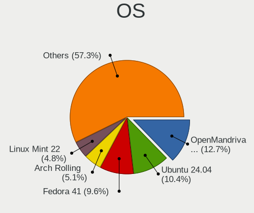
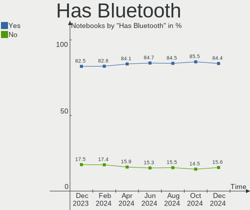
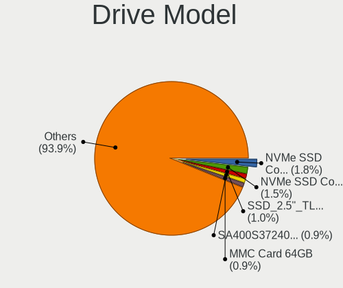
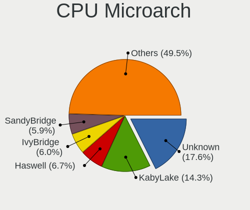
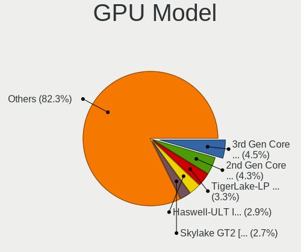
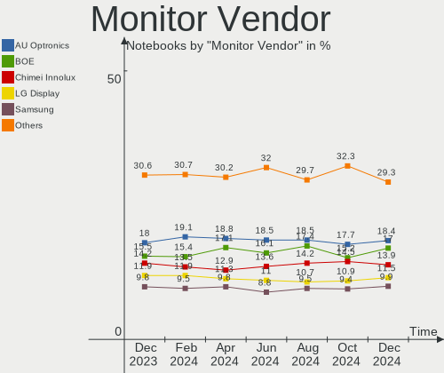
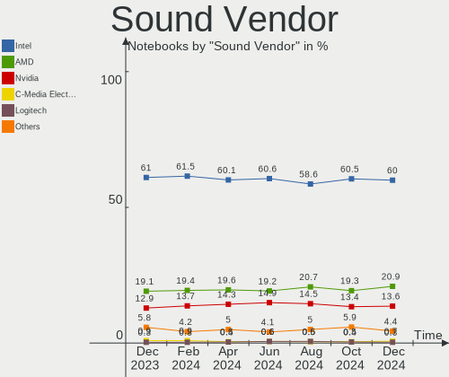

Linux - Hardware Trends (Notebooks)
-----------------------------------

A project to identify most popular hardware characteristics and track their change
over time based on data collected by Linux users at https://Linux-Hardware.org.

Anyone can contribute to this report by the [hw-probe](https://github.com/linuxhw/hw-probe) tool:

    sudo -E hw-probe -all -upload

This report is for one last month. Overall report since the beginning of time: [TestDays](https://github.com/linuxhw/TestDays)

Period: Sep, 2023.

Contents
--------

* [ System ](#system)
  - [ OS                       ](#os)
  - [ OS Family                ](#os-family)
  - [ Kernel                   ](#kernel)
  - [ Kernel Family            ](#kernel-family)
  - [ Kernel Major Ver.        ](#kernel-major-ver)
  - [ Arch                     ](#arch)
  - [ DE                       ](#de)
  - [ Display Server           ](#display-server)
  - [ Display Manager          ](#display-manager)
  - [ OS Lang                  ](#os-lang)
  - [ Boot Mode                ](#boot-mode)
  - [ Filesystem               ](#filesystem)
  - [ Part. scheme             ](#part-scheme)
  - [ Dual Boot with Linux/BSD ](#dual-boot-with-linuxbsd)
  - [ Dual Boot (Win)          ](#dual-boot-win)

* [ Board ](#board)
  - [ Vendor                   ](#vendor)
  - [ Model                    ](#model)
  - [ Model Family             ](#model-family)
  - [ MFG Year                 ](#mfg-year)
  - [ Form Factor              ](#form-factor)
  - [ Secure Boot              ](#secure-boot)
  - [ Coreboot                 ](#coreboot)
  - [ RAM Size                 ](#ram-size)
  - [ RAM Used                 ](#ram-used)
  - [ Total Drives             ](#total-drives)
  - [ Has CD-ROM               ](#has-cd-rom)
  - [ Has Ethernet             ](#has-ethernet)
  - [ Has WiFi                 ](#has-wifi)
  - [ Has Bluetooth            ](#has-bluetooth)

* [ Location ](#location)
  - [ Country                  ](#country)
  - [ City                     ](#city)

* [ Drives ](#drives)
  - [ Drive Vendor             ](#drive-vendor)
  - [ Drive Model              ](#drive-model)
  - [ HDD Vendor               ](#hdd-vendor)
  - [ SSD Vendor               ](#ssd-vendor)
  - [ Drive Kind               ](#drive-kind)
  - [ Drive Connector          ](#drive-connector)
  - [ Drive Size               ](#drive-size)
  - [ Space Total              ](#space-total)
  - [ Space Used               ](#space-used)
  - [ Malfunc. Drives          ](#malfunc-drives)
  - [ Malfunc. Drive Vendor    ](#malfunc-drive-vendor)
  - [ Malfunc. HDD Vendor      ](#malfunc-hdd-vendor)
  - [ Malfunc. Drive Kind      ](#malfunc-drive-kind)
  - [ Failed Drives            ](#failed-drives)
  - [ Failed Drive Vendor      ](#failed-drive-vendor)
  - [ Drive Status             ](#drive-status)

* [ Storage controller ](#storage-controller)
  - [ Storage Vendor           ](#storage-vendor)
  - [ Storage Model            ](#storage-model)
  - [ Storage Kind             ](#storage-kind)

* [ Processor ](#processor)
  - [ CPU Vendor               ](#cpu-vendor)
  - [ CPU Model                ](#cpu-model)
  - [ CPU Model Family         ](#cpu-model-family)
  - [ CPU Cores                ](#cpu-cores)
  - [ CPU Sockets              ](#cpu-sockets)
  - [ CPU Threads              ](#cpu-threads)
  - [ CPU Op-Modes             ](#cpu-op-modes)
  - [ CPU Microcode            ](#cpu-microcode)
  - [ CPU Microarch            ](#cpu-microarch)

* [ Graphics ](#graphics)
  - [ GPU Vendor               ](#gpu-vendor)
  - [ GPU Model                ](#gpu-model)
  - [ GPU Combo                ](#gpu-combo)
  - [ GPU Driver               ](#gpu-driver)
  - [ GPU Memory               ](#gpu-memory)

* [ Monitor ](#monitor)
  - [ Monitor Vendor           ](#monitor-vendor)
  - [ Monitor Model            ](#monitor-model)
  - [ Monitor Resolution       ](#monitor-resolution)
  - [ Monitor Diagonal         ](#monitor-diagonal)
  - [ Monitor Width            ](#monitor-width)
  - [ Aspect Ratio             ](#aspect-ratio)
  - [ Monitor Area             ](#monitor-area)
  - [ Pixel Density            ](#pixel-density)
  - [ Multiple Monitors        ](#multiple-monitors)

* [ Network ](#network)
  - [ Net Controller Vendor    ](#net-controller-vendor)
  - [ Net Controller Model     ](#net-controller-model)
  - [ Wireless Vendor          ](#wireless-vendor)
  - [ Wireless Model           ](#wireless-model)
  - [ Ethernet Vendor          ](#ethernet-vendor)
  - [ Ethernet Model           ](#ethernet-model)
  - [ Net Controller Kind      ](#net-controller-kind)
  - [ Used Controller          ](#used-controller)
  - [ NICs                     ](#nics)
  - [ IPv6                     ](#ipv6)

* [ Bluetooth ](#bluetooth)
  - [ Bluetooth Vendor         ](#bluetooth-vendor)
  - [ Bluetooth Model          ](#bluetooth-model)

* [ Sound ](#sound)
  - [ Sound Vendor             ](#sound-vendor)
  - [ Sound Model              ](#sound-model)

* [ Memory ](#memory)
  - [ Memory Vendor            ](#memory-vendor)
  - [ Memory Model             ](#memory-model)
  - [ Memory Kind              ](#memory-kind)
  - [ Memory Form Factor       ](#memory-form-factor)
  - [ Memory Size              ](#memory-size)
  - [ Memory Speed             ](#memory-speed)

* [ Printers & scanners ](#printers--scanners)
  - [ Printer Vendor           ](#printer-vendor)
  - [ Printer Model            ](#printer-model)
  - [ Scanner Vendor           ](#scanner-vendor)
  - [ Scanner Model            ](#scanner-model)

* [ Camera ](#camera)
  - [ Camera Vendor            ](#camera-vendor)
  - [ Camera Model             ](#camera-model)

* [ Security ](#security)
  - [ Fingerprint Vendor       ](#fingerprint-vendor)
  - [ Fingerprint Model        ](#fingerprint-model)
  - [ Chipcard Vendor          ](#chipcard-vendor)
  - [ Chipcard Model           ](#chipcard-model)

* [ Unsupported ](#unsupported)
  - [ Unsupported Devices      ](#unsupported-devices)
  - [ Unsupported Device Types ](#unsupported-device-types)

System
------

OS
--

Installed operating systems

| Name                         | Notebooks | Percent |
|------------------------------|-----------|---------|
| Ubuntu 22.04                 | 447       | 14.69%  |
| Fedora 38                    | 288       | 9.47%   |
| Linux Mint 21.2              | 194       | 6.38%   |
| OpenMandriva 23.08           | 177       | 5.82%   |
| Debian 12                    | 155       | 5.1%    |
| Ubuntu 23.04                 | 133       | 4.37%   |
| Arch Rolling                 | 116       | 3.81%   |
| Pop!_OS 22.04                | 101       | 3.32%   |
| Zorin 16                     | 84        | 2.76%   |
| OpenMandriva 23.09           | 78        | 2.56%   |
| ROSA 12.4                    | 73        | 2.4%    |
| ArcoLinux Rolling            | 73        | 2.4%    |
| Ubuntu 20.04                 | 53        | 1.74%   |
| Kali 2023.3                  | 52        | 1.71%   |
| BlackPanther 18.1            | 52        | 1.71%   |
| SteamOS 3.4.10               | 50        | 1.64%   |
| EndeavourOS Rolling          | 41        | 1.35%   |
| KDE neon 22.04               | 40        | 1.31%   |
| openSUSE Tumbleweed-XXXXXXXX | 37        | 1.22%   |
| Xero Rolling                 | 36        | 1.18%   |
| Kubuntu 22.04                | 34        | 1.12%   |
| Linux Mint 21.1              | 31        | 1.02%   |
| Manjaro                      | 30        | 0.99%   |
| Debian 11                    | 26        | 0.85%   |
| Gentoo 2.14                  | 22        | 0.72%   |
| Kubuntu 23.04                | 21        | 0.69%   |
| OpenMandriva 4.3             | 20        | 0.66%   |
| Xubuntu 22.04                | 19        | 0.62%   |
| OpenMandriva 23.03           | 19        | 0.62%   |
| MX 23                        | 18        | 0.59%   |
| Linux Mint 20.3              | 18        | 0.59%   |
| TUXEDO OS 22.04              | 14        | 0.46%   |
| Debian                       | 14        | 0.46%   |
| openSUSE Leap-15.5           | 13        | 0.43%   |
| Manjaro 23.0.2               | 13        | 0.43%   |
| Manjaro 23.0.0               | 13        | 0.43%   |
| Fedora 39                    | 13        | 0.43%   |
| LMDE 5                       | 12        | 0.39%   |
| Ubuntu MATE 22.04            | 11        | 0.36%   |
| Manjaro 23.0.1               | 11        | 0.36%   |

OS Family
---------

OS without a version

| Name          | Notebooks | Percent |
|---------------|-----------|---------|
| Ubuntu        | 658       | 21.63%  |
| OpenMandriva  | 323       | 10.62%  |
| Fedora        | 313       | 10.29%  |
| Linux Mint    | 263       | 8.65%   |
| Debian        | 199       | 6.54%   |
| Arch          | 117       | 3.85%   |
| Pop!_OS       | 102       | 3.35%   |
| ROSA          | 90        | 2.96%   |
| Zorin         | 84        | 2.76%   |
| ArcoLinux     | 74        | 2.43%   |
| SteamOS       | 68        | 2.24%   |
| Manjaro       | 68        | 2.24%   |
| Kubuntu       | 60        | 1.97%   |
| openSUSE      | 54        | 1.78%   |
| BlackPanther  | 54        | 1.78%   |
| Kali          | 52        | 1.71%   |
| KDE neon      | 42        | 1.38%   |
| EndeavourOS   | 41        | 1.35%   |
| Xero          | 36        | 1.18%   |
| Xubuntu       | 28        | 0.92%   |
| Gentoo        | 22        | 0.72%   |
| MX            | 21        | 0.69%   |
| LMDE          | 18        | 0.59%   |
| Ubuntu MATE   | 16        | 0.53%   |
| Endless       | 15        | 0.49%   |
| TUXEDO OS     | 14        | 0.46%   |
| NixOS         | 14        | 0.46%   |
| Elementary    | 14        | 0.46%   |
| Lubuntu       | 12        | 0.39%   |
| Garuda Linux  | 12        | 0.39%   |
| Nobara        | 10        | 0.33%   |
| Ubuntu Budgie | 8         | 0.26%   |
| Devuan        | 8         | 0.26%   |
| Parrot        | 7         | 0.23%   |
| ChimeraOS     | 7         | 0.23%   |
| Ubuntu Unity  | 6         | 0.2%    |
| Red OS        | 6         | 0.2%    |
| Clear Linux   | 6         | 0.2%    |
| blendOS       | 6         | 0.2%    |
| Artix         | 6         | 0.2%    |

Kernel
------

Version of the Linux kernel

| Version                           | Notebooks | Percent |
|-----------------------------------|-----------|---------|
| 6.2.0-32-generic                  | 284       | 9.34%   |
| 6.2.0-33-generic                  | 203       | 6.67%   |
| 6.4.11-desktop-1omv2390           | 156       | 5.13%   |
| 5.15.0-83-generic                 | 130       | 4.27%   |
| 5.15.0-84-generic                 | 105       | 3.45%   |
| 6.4.15-200.fc38.x86_64            | 95        | 3.12%   |
| 6.2.0-31-generic                  | 88        | 2.89%   |
| 6.4.6-76060406-generic            | 87        | 2.86%   |
| 6.1.0-12-amd64                    | 74        | 2.43%   |
| 6.4.12-arch1-1                    | 71        | 2.33%   |
| 6.1.0-11-amd64                    | 65        | 2.14%   |
| 5.15.0-82-generic                 | 63        | 2.07%   |
| 5.13.0-valve37-1-neptune          | 51        | 1.68%   |
| 6.4.14-200.fc38.x86_64            | 50        | 1.64%   |
| 6.4.13-200.fc38.x86_64            | 44        | 1.45%   |
| 6.2.9-300.fc38.x86_64             | 44        | 1.45%   |
| 6.5.3-arch1-1                     | 37        | 1.22%   |
| 6.5.0-desktop-1omv2390            | 37        | 1.22%   |
| 6.2.0-26-generic                  | 36        | 1.18%   |
| 6.5.4-arch2-1                     | 29        | 0.95%   |
| 5.15.0-76-generic                 | 29        | 0.95%   |
| 6.4.0-kali3-amd64                 | 28        | 0.92%   |
| 6.1.46-generic-2rosa2021.1-x86_64 | 28        | 0.92%   |
| 5.10.0-25-amd64                   | 27        | 0.89%   |
| 6.1.0-10-amd64                    | 25        | 0.82%   |
| 6.5.3-desktop-1omv2390            | 24        | 0.79%   |
| 6.4.8-desktop-2omv2390            | 21        | 0.69%   |
| 6.4.12-zen1-1-zen                 | 21        | 0.69%   |
| 5.15.85-desktop-1bP               | 21        | 0.69%   |
| 6.5.2-arch1-1                     | 20        | 0.66%   |
| 6.5.5-200.fc38.x86_64             | 18        | 0.59%   |
| 5.6.14-desktop-2bP                | 18        | 0.59%   |
| 6.2.6-desktop-1omv2390            | 17        | 0.56%   |
| 6.1.20-generic-2rosa2021.1-x86_64 | 17        | 0.56%   |
| 6.4.12-200.fc38.x86_64            | 15        | 0.49%   |
| 6.1.38-generic-1rosa2021.1-x86_64 | 15        | 0.49%   |
| 5.15.0-79-generic                 | 15        | 0.49%   |
| 6.5.3-1-MANJARO                   | 14        | 0.46%   |
| 6.5.3-1-default                   | 14        | 0.46%   |
| 6.2.0-34-generic                  | 14        | 0.46%   |

Kernel Family
-------------

Linux kernel without a distro release

| Version | Notebooks | Percent |
|---------|-----------|---------|
| 6.2.0   | 661       | 21.73%  |
| 5.15.0  | 396       | 13.02%  |
| 6.1.0   | 196       | 6.44%   |
| 6.4.11  | 181       | 5.95%   |
| 6.4.12  | 123       | 4.04%   |
| 6.5.3   | 119       | 3.91%   |
| 6.4.15  | 101       | 3.32%   |
| 6.4.6   | 90        | 2.96%   |
| 6.5.0   | 84        | 2.76%   |
| 5.13.0  | 59        | 1.94%   |
| 6.5.5   | 58        | 1.91%   |
| 6.4.14  | 55        | 1.81%   |
| 6.5.4   | 53        | 1.74%   |
| 6.4.13  | 48        | 1.58%   |
| 6.4.0   | 47        | 1.55%   |
| 6.2.9   | 46        | 1.51%   |
| 5.10.0  | 44        | 1.45%   |
| 6.5.2   | 43        | 1.41%   |
| 5.4.0   | 43        | 1.41%   |
| 6.5.1   | 41        | 1.35%   |
| 6.1.46  | 37        | 1.22%   |
| 5.19.0  | 31        | 1.02%   |
| 6.2.6   | 29        | 0.95%   |
| 6.4.8   | 24        | 0.79%   |
| 5.15.85 | 21        | 0.69%   |
| 6.1.51  | 19        | 0.62%   |
| 6.1.20  | 19        | 0.62%   |
| 5.6.14  | 19        | 0.62%   |
| 6.1.38  | 17        | 0.56%   |
| 6.1.53  | 16        | 0.53%   |
| 6.1.52  | 16        | 0.53%   |
| 5.14.0  | 15        | 0.49%   |
| 6.3.9   | 14        | 0.46%   |
| 6.1.1   | 14        | 0.46%   |
| 5.14.21 | 13        | 0.43%   |
| 4.15.0  | 13        | 0.43%   |
| 6.3.0   | 12        | 0.39%   |
| 5.16.7  | 12        | 0.39%   |
| 4.18.16 | 9         | 0.3%    |
| 6.1.49  | 8         | 0.26%   |

Kernel Major Ver.
-----------------

Linux kernel major version

| Version | Notebooks | Percent |
|---------|-----------|---------|
| 6.2     | 749       | 24.62%  |
| 6.4     | 692       | 22.75%  |
| 5.15    | 438       | 14.4%   |
| 6.5     | 398       | 13.08%  |
| 6.1     | 370       | 12.16%  |
| 5.10    | 65        | 2.14%   |
| 5.13    | 59        | 1.94%   |
| 6.3     | 50        | 1.64%   |
| 5.4     | 47        | 1.55%   |
| 5.19    | 35        | 1.15%   |
| 5.14    | 28        | 0.92%   |
| 5.6     | 21        | 0.69%   |
| 5.16    | 20        | 0.66%   |
| 4.15    | 13        | 0.43%   |
| 4.18    | 12        | 0.39%   |
| 6.0     | 9         | 0.3%    |
| 5.11    | 8         | 0.26%   |
| 5.17    | 7         | 0.23%   |
| 6.6     | 6         | 0.2%    |
| 5.8     | 4         | 0.13%   |
| 5.18    | 3         | 0.1%    |
| 4.4     | 2         | 0.07%   |
| 4.19    | 2         | 0.07%   |
| 3.18    | 1         | 0.03%   |
| 3.16    | 1         | 0.03%   |
| 3.10    | 1         | 0.03%   |
| Unknown | 1         | 0.03%   |

Arch
----

OS architecture (x86_64, i586, etc.)

| Name    | Notebooks | Percent |
|---------|-----------|---------|
| x86_64  | 3015      | 99.11%  |
| i686    | 24        | 0.79%   |
| ppc     | 1         | 0.03%   |
| armv7l  | 1         | 0.03%   |
| aarch64 | 1         | 0.03%   |

DE
--

Desktop Environment

| Name             | Notebooks | Percent |
|------------------|-----------|---------|
| GNOME            | 1326      | 43.59%  |
| KDE5             | 861       | 28.3%   |
| X-Cinnamon       | 234       | 7.69%   |
| XFCE             | 222       | 7.3%    |
| Unknown          | 100       | 3.29%   |
| MATE             | 75        | 2.47%   |
| LXQt             | 60        | 1.97%   |
| i3               | 30        | 0.99%   |
| Budgie           | 18        | 0.59%   |
| Pantheon         | 15        | 0.49%   |
| Cinnamon         | 15        | 0.49%   |
| Hyprland         | 14        | 0.46%   |
| Unity            | 9         | 0.3%    |
| KDE              | 9         | 0.3%    |
| sway             | 6         | 0.2%    |
| GNOME Flashback  | 6         | 0.2%    |
| awesome          | 5         | 0.16%   |
| LXDE             | 4         | 0.13%   |
| KDE4             | 4         | 0.13%   |
| GNOME Classic    | 4         | 0.13%   |
| Enlightenment    | 3         | 0.1%    |
| Unicorn:XFCE     | 2         | 0.07%   |
| qtile            | 2         | 0.07%   |
| lightdm-xsession | 2         | 0.07%   |
| Endless:GNOME    | 2         | 0.07%   |
| chadwm           | 2         | 0.07%   |
| bspwm            | 2         | 0.07%   |
| xmonad           | 1         | 0.03%   |
| XFCE:GNOME:      | 1         | 0.03%   |
| Trinity          | 1         | 0.03%   |
| KDE6             | 1         | 0.03%   |
| Jwm              | 1         | 0.03%   |
| icewm            | 1         | 0.03%   |
| gamescope        | 1         | 0.03%   |
| DWM              | 1         | 0.03%   |
| Deepin           | 1         | 0.03%   |
| BunsenLabs       | 1         | 0.03%   |

Display Server
--------------

X11 or Wayland

| Name    | Notebooks | Percent |
|---------|-----------|---------|
| X11     | 1648      | 54.17%  |
| Wayland | 1297      | 42.64%  |
| Unknown | 60        | 1.97%   |
| Tty     | 37        | 1.22%   |

Display Manager
---------------

SDDM, LightDM, etc.

| Name    | Notebooks | Percent |
|---------|-----------|---------|
| Unknown | 959       | 31.53%  |
| SDDM    | 737       | 24.23%  |
| GDM3    | 694       | 22.81%  |
| LightDM | 386       | 12.69%  |
| GDM     | 239       | 7.86%   |
| SLiM    | 7         | 0.23%   |
| GREETD  | 5         | 0.16%   |
| LXDM    | 4         | 0.13%   |
| KDM     | 4         | 0.13%   |
| LY-DM   | 3         | 0.1%    |
| Ly      | 2         | 0.07%   |
| TDM     | 1         | 0.03%   |
| SLIMSKI | 1         | 0.03%   |

OS Lang
-------

Language

| Lang    | Notebooks | Percent |
|---------|-----------|---------|
| en_US   | 1324      | 43.52%  |
| de_DE   | 228       | 7.5%    |
| ru_RU   | 221       | 7.26%   |
| en_GB   | 154       | 5.06%   |
| fr_FR   | 139       | 4.57%   |
| pt_BR   | 115       | 3.78%   |
| Unknown | 101       | 3.32%   |
| it_IT   | 82        | 2.7%    |
| es_ES   | 71        | 2.33%   |
| C       | 71        | 2.33%   |
| en_IN   | 51        | 1.68%   |
| en_CA   | 43        | 1.41%   |
| pl_PL   | 38        | 1.25%   |
| es_MX   | 36        | 1.18%   |
| en_AU   | 35        | 1.15%   |
| tr_TR   | 28        | 0.92%   |
| zh_CN   | 19        | 0.62%   |
| es_CO   | 19        | 0.62%   |
| nl_NL   | 17        | 0.56%   |
| hu_HU   | 17        | 0.56%   |
| es_AR   | 16        | 0.53%   |
| sv_SE   | 13        | 0.43%   |
| es_CL   | 12        | 0.39%   |
| cs_CZ   | 11        | 0.36%   |
| pt_PT   | 10        | 0.33%   |
| ja_JP   | 10        | 0.33%   |
| de_AT   | 10        | 0.33%   |
| sk_SK   | 8         | 0.26%   |
| fr_BE   | 7         | 0.23%   |
| es_PE   | 7         | 0.23%   |
| en_ZA   | 7         | 0.23%   |
| en_PH   | 7         | 0.23%   |
| en_NZ   | 7         | 0.23%   |
| nl_BE   | 6         | 0.2%    |
| en_DK   | 6         | 0.2%    |
| ca_ES   | 6         | 0.2%    |
| en_AG   | 5         | 0.16%   |
| da_DK   | 5         | 0.16%   |
| nb_NO   | 4         | 0.13%   |
| fr_CA   | 4         | 0.13%   |

Boot Mode
---------

EFI or BIOS

| Mode | Notebooks | Percent |
|------|-----------|---------|
| EFI  | 1788      | 58.78%  |
| BIOS | 1254      | 41.22%  |

Filesystem
----------

Type of filesystem

| Type                | Notebooks | Percent |
|---------------------|-----------|---------|
| Ext4                | 1779      | 58.48%  |
| Btrfs               | 588       | 19.33%  |
| Tmpfs               | 383       | 12.59%  |
| Overlay             | 216       | 7.1%    |
| Xfs                 | 38        | 1.25%   |
| Zfs                 | 24        | 0.79%   |
| F2fs                | 7         | 0.23%   |
| XXXXX               | 1         | 0.03%   |
| XXX4                | 1         | 0.03%   |
| Fuse.fuse-overlayfs | 1         | 0.03%   |
| Ext3                | 1         | 0.03%   |
| Ext2                | 1         | 0.03%   |
| Aufs                | 1         | 0.03%   |
| Unknown             | 1         | 0.03%   |

Part. scheme
------------

Scheme of partitioning

| Type    | Notebooks | Percent |
|---------|-----------|---------|
| GPT     | 1834      | 60.29%  |
| Unknown | 885       | 29.09%  |
| MBR     | 323       | 10.62%  |

Dual Boot with Linux/BSD
------------------------

Hosting more than one Linux/BSD

| Dual boot | Notebooks | Percent |
|-----------|-----------|---------|
| No        | 2677      | 88%     |
| Yes       | 365       | 12%     |

Dual Boot (Win)
---------------

Hosting Linux and Windows

| Dual boot | Notebooks | Percent |
|-----------|-----------|---------|
| No        | 2240      | 73.64%  |
| Yes       | 802       | 26.36%  |

Board
-----

Vendor
------

Motherboard manufacturer

| Name                | Notebooks | Percent |
|---------------------|-----------|---------|
| Lenovo              | 651       | 21.4%   |
| Hewlett-Packard     | 503       | 16.54%  |
| Dell                | 451       | 14.83%  |
| ASUSTek Computer    | 377       | 12.39%  |
| Acer                | 239       | 7.86%   |
| Apple               | 119       | 3.91%   |
| Valve               | 68        | 2.24%   |
| MSI                 | 68        | 2.24%   |
| Toshiba             | 57        | 1.87%   |
| HUAWEI              | 55        | 1.81%   |
| Samsung Electronics | 48        | 1.58%   |
| Google              | 40        | 1.31%   |
| Sony                | 25        | 0.82%   |
| Timi                | 21        | 0.69%   |
| Fujitsu             | 20        | 0.66%   |
| Notebook            | 18        | 0.59%   |
| Unknown             | 18        | 0.59%   |
| Medion              | 13        | 0.43%   |
| System76            | 12        | 0.39%   |
| Chuwi               | 12        | 0.39%   |
| TUXEDO              | 11        | 0.36%   |
| Clevo               | 11        | 0.36%   |
| Alienware           | 11        | 0.36%   |
| Packard Bell        | 10        | 0.33%   |
| Framework           | 10        | 0.33%   |
| Fujitsu Siemens     | 9         | 0.3%    |
| Panasonic           | 8         | 0.26%   |
| LG Electronics      | 6         | 0.2%    |
| HONOR               | 6         | 0.2%    |
| Gigabyte Technology | 6         | 0.2%    |
| eMachines           | 6         | 0.2%    |
| Positivo            | 5         | 0.16%   |
| Gateway             | 5         | 0.16%   |
| Schenker            | 4         | 0.13%   |
| Razer               | 4         | 0.13%   |
| Infinix             | 4         | 0.13%   |
| GPU Company         | 4         | 0.13%   |
| SLIMBOOK            | 3         | 0.1%    |
| PC Specialist       | 3         | 0.1%    |
| Monster             | 3         | 0.1%    |

Model
-----

Motherboard model

| Name                                | Notebooks | Percent |
|-------------------------------------|-----------|---------|
| Valve Jupiter                       | 68        | 2.24%   |
| Unknown                             | 27        | 0.89%   |
| HP Notebook                         | 16        | 0.53%   |
| Google Enguarde                     | 15        | 0.49%   |
| Apple MacBookPro9,2                 | 13        | 0.43%   |
| Apple MacBookPro8,1                 | 11        | 0.36%   |
| HP Pavilion dv6                     | 9         | 0.3%    |
| Apple MacBookPro11,1                | 9         | 0.3%    |
| Apple MacBookAir7,2                 | 9         | 0.3%    |
| HUAWEI BOM-WXX9                     | 8         | 0.26%   |
| HP Pavilion g6                      | 8         | 0.26%   |
| HP Laptop 15s-eq2xxx                | 8         | 0.26%   |
| Lenovo IdeaPad 3 15ALC6 82KU        | 7         | 0.23%   |
| HP Pavilion Notebook                | 7         | 0.23%   |
| Dell Latitude 5420                  | 7         | 0.23%   |
| Apple MacBookPro11,2                | 7         | 0.23%   |
| Acer Aspire E5-575G                 | 7         | 0.23%   |
| Lenovo IdeaPad 3 15ITL6 82H8        | 6         | 0.2%    |
| HUAWEI NBD-WXX9                     | 6         | 0.2%    |
| HUAWEI KLVL-WXXW                    | 6         | 0.2%    |
| HP EliteBook 840 G8 Notebook PC     | 6         | 0.2%    |
| Dell Latitude 7390                  | 6         | 0.2%    |
| Dell Inspiron 5567                  | 6         | 0.2%    |
| Apple MacBookPro10,1                | 6         | 0.2%    |
| Acer Aspire A515-56                 | 6         | 0.2%    |
| Lenovo ThinkBook 15 G2 ITL 20VE     | 5         | 0.16%   |
| Lenovo Legion 5 Pro 16ACH6H 82JQ    | 5         | 0.16%   |
| Lenovo IdeaPad Gaming 3 15ACH6 82K2 | 5         | 0.16%   |
| HP Pavilion dv7                     | 5         | 0.16%   |
| HP ElitePad 1000 G2                 | 5         | 0.16%   |
| HP EliteBook 845 G8 Notebook PC     | 5         | 0.16%   |
| HP EliteBook 840 G6                 | 5         | 0.16%   |
| HP EliteBook 840 G3                 | 5         | 0.16%   |
| HP 250 G7 Notebook PC               | 5         | 0.16%   |
| HP 15                               | 5         | 0.16%   |
| Dell XPS 15 9560                    | 5         | 0.16%   |
| Dell Precision 5570                 | 5         | 0.16%   |
| Dell Latitude E6430                 | 5         | 0.16%   |
| Dell Latitude E6410                 | 5         | 0.16%   |
| Dell Latitude E6400                 | 5         | 0.16%   |

Model Family
------------

Motherboard model prefix

| Name                  | Notebooks | Percent |
|-----------------------|-----------|---------|
| Lenovo ThinkPad       | 325       | 10.68%  |
| Dell Latitude         | 174       | 5.72%   |
| Lenovo IdeaPad        | 170       | 5.59%   |
| Acer Aspire           | 162       | 5.33%   |
| Dell Inspiron         | 122       | 4.01%   |
| HP EliteBook          | 99        | 3.25%   |
| ASUS VivoBook         | 96        | 3.16%   |
| HP Laptop             | 86        | 2.83%   |
| HP Pavilion           | 85        | 2.79%   |
| Valve Jupiter         | 68        | 2.24%   |
| HP ProBook            | 60        | 1.97%   |
| Dell XPS              | 56        | 1.84%   |
| Toshiba Satellite     | 44        | 1.45%   |
| Dell Precision        | 43        | 1.41%   |
| ASUS ASUS             | 40        | 1.31%   |
| ASUS ROG              | 38        | 1.25%   |
| Lenovo Legion         | 37        | 1.22%   |
| ASUS ZenBook          | 32        | 1.05%   |
| Acer Nitro            | 31        | 1.02%   |
| Dell Vostro           | 30        | 0.99%   |
| Unknown               | 27        | 0.89%   |
| HP 250                | 22        | 0.72%   |
| Apple MacBookPro11    | 21        | 0.69%   |
| Acer Swift            | 19        | 0.62%   |
| Fujitsu LIFEBOOK      | 17        | 0.56%   |
| HP OMEN               | 16        | 0.53%   |
| HP Notebook           | 16        | 0.53%   |
| Apple MacBookPro8     | 16        | 0.53%   |
| Lenovo ThinkBook      | 15        | 0.49%   |
| HP ENVY               | 15        | 0.49%   |
| Google Enguarde       | 15        | 0.49%   |
| Apple MacBookPro9     | 15        | 0.49%   |
| HP ZBook              | 14        | 0.46%   |
| HP Compaq             | 13        | 0.43%   |
| Lenovo Yoga           | 12        | 0.39%   |
| Lenovo V15            | 11        | 0.36%   |
| Framework Laptop      | 10        | 0.33%   |
| ASUS TUF              | 10        | 0.33%   |
| Acer TravelMate       | 10        | 0.33%   |
| Packard Bell EasyNote | 9         | 0.3%    |

MFG Year
--------

Motherboard manufacture year

| Year    | Notebooks | Percent |
|---------|-----------|---------|
| 2021    | 378       | 12.43%  |
| 2022    | 347       | 11.41%  |
| 2020    | 279       | 9.17%   |
| 2019    | 221       | 7.26%   |
| 2023    | 203       | 6.67%   |
| 2012    | 192       | 6.31%   |
| 2018    | 185       | 6.08%   |
| 2011    | 174       | 5.72%   |
| 2013    | 173       | 5.69%   |
| 2017    | 161       | 5.29%   |
| 2014    | 150       | 4.93%   |
| 2015    | 145       | 4.77%   |
| 2016    | 136       | 4.47%   |
| 2010    | 100       | 3.29%   |
| 2008    | 78        | 2.56%   |
| 2009    | 73        | 2.4%    |
| 2007    | 27        | 0.89%   |
| 2006    | 9         | 0.3%    |
| Unknown | 7         | 0.23%   |
| 2005    | 4         | 0.13%   |

Form Factor
-----------

Physical design of the computer

| Name     | Notebooks | Percent |
|----------|-----------|---------|
| Notebook | 3042      | 100%    |

Secure Boot
-----------

Enabled or disabled

| State    | Notebooks | Percent |
|----------|-----------|---------|
| Disabled | 2789      | 91.68%  |
| Enabled  | 253       | 8.32%   |

Coreboot
--------

Have coreboot on board

| Used | Notebooks | Percent |
|------|-----------|---------|
| No   | 2990      | 98.29%  |
| Yes  | 52        | 1.71%   |

RAM Size
--------

Total RAM memory

| Size in GB  | Notebooks | Percent |
|-------------|-----------|---------|
| 4.01-8.0    | 892       | 29.32%  |
| 8.01-16.0   | 627       | 20.61%  |
| 16.01-24.0  | 529       | 17.39%  |
| 3.01-4.0    | 487       | 16.01%  |
| 32.01-64.0  | 264       | 8.68%   |
| 1.01-2.0    | 79        | 2.6%    |
| 64.01-256.0 | 62        | 2.04%   |
| 24.01-32.0  | 55        | 1.81%   |
| 2.01-3.0    | 39        | 1.28%   |
| 0.51-1.0    | 8         | 0.26%   |

RAM Used
--------

Used RAM memory

| Used GB    | Notebooks | Percent |
|------------|-----------|---------|
| 1.01-2.0   | 876       | 28.8%   |
| 2.01-3.0   | 817       | 26.86%  |
| 4.01-8.0   | 556       | 18.28%  |
| 3.01-4.0   | 472       | 15.52%  |
| 8.01-16.0  | 163       | 5.36%   |
| 0.51-1.0   | 121       | 3.98%   |
| 16.01-24.0 | 21        | 0.69%   |
| 0.01-0.5   | 10        | 0.33%   |
| 24.01-32.0 | 6         | 0.2%    |

Total Drives
------------

Number of drives on board

| Drives | Notebooks | Percent |
|--------|-----------|---------|
| 1      | 2234      | 73.44%  |
| 2      | 714       | 23.47%  |
| 3      | 75        | 2.47%   |
| 0      | 14        | 0.46%   |
| 4      | 3         | 0.1%    |
| 6      | 1         | 0.03%   |
| 5      | 1         | 0.03%   |

Has CD-ROM
----------

Has CD-ROM on board

| Presented | Notebooks | Percent |
|-----------|-----------|---------|
| No        | 2234      | 73.44%  |
| Yes       | 808       | 26.56%  |

Has Ethernet
------------

Has Ethernet on board

| Presented | Notebooks | Percent |
|-----------|-----------|---------|
| Yes       | 2288      | 75.21%  |
| No        | 754       | 24.79%  |

Has WiFi
--------

Has WiFi module

| Presented | Notebooks | Percent |
|-----------|-----------|---------|
| Yes       | 2992      | 98.36%  |
| No        | 50        | 1.64%   |

Has Bluetooth
-------------

Has Bluetooth module

| Presented | Notebooks | Percent |
|-----------|-----------|---------|
| Yes       | 2544      | 83.63%  |
| No        | 498       | 16.37%  |

Location
--------

Country
-------

Geographic location (country)

| Country     | Notebooks | Percent |
|-------------|-----------|---------|
| USA         | 446       | 14.66%  |
| Germany     | 296       | 9.73%   |
| Russia      | 251       | 8.25%   |
| Brazil      | 160       | 5.26%   |
| France      | 152       | 5%      |
| UK          | 116       | 3.81%   |
| Italy       | 116       | 3.81%   |
| Spain       | 113       | 3.71%   |
| India       | 90        | 2.96%   |
| Canada      | 87        | 2.86%   |
| Hungary     | 74        | 2.43%   |
| Poland      | 72        | 2.37%   |
| Turkey      | 70        | 2.3%    |
| Mexico      | 53        | 1.74%   |
| Netherlands | 48        | 1.58%   |
| Australia   | 40        | 1.31%   |
| Austria     | 33        | 1.08%   |
| Colombia    | 32        | 1.05%   |
| Indonesia   | 31        | 1.02%   |
| Sweden      | 30        | 0.99%   |
| Argentina   | 30        | 0.99%   |
| China       | 27        | 0.89%   |
| Belgium     | 27        | 0.89%   |
| Czechia     | 26        | 0.85%   |
| Portugal    | 25        | 0.82%   |
| Switzerland | 24        | 0.79%   |
| Norway      | 24        | 0.79%   |
| Japan       | 22        | 0.72%   |
| Greece      | 22        | 0.72%   |
| Finland     | 22        | 0.72%   |
| Ukraine     | 20        | 0.66%   |
| Slovakia    | 19        | 0.62%   |
| Romania     | 19        | 0.62%   |
| Chile       | 19        | 0.62%   |
| Bulgaria    | 19        | 0.62%   |
| Denmark     | 17        | 0.56%   |
| Philippines | 14        | 0.46%   |
| Iran        | 14        | 0.46%   |
| Belarus     | 14        | 0.46%   |
| Serbia      | 13        | 0.43%   |

City
----

Geographic location (city)

| City              | Notebooks | Percent |
|-------------------|-----------|---------|
| Moscow            | 64        | 2.1%    |
| St Petersburg     | 31        | 1.02%   |
| Vienna            | 28        | 0.92%   |
| Budapest          | 27        | 0.89%   |
| Berlin            | 24        | 0.79%   |
| Bangor            | 22        | 0.72%   |
| Madrid            | 20        | 0.66%   |
| Istanbul          | 20        | 0.66%   |
| Sao Paulo         | 19        | 0.62%   |
| Paris             | 18        | 0.59%   |
| Milan             | 18        | 0.59%   |
| Barcelona         | 17        | 0.56%   |
| Munich            | 16        | 0.53%   |
| Warsaw            | 14        | 0.46%   |
| Helsinki          | 14        | 0.46%   |
| Hamburg           | 13        | 0.43%   |
| Bengaluru         | 13        | 0.43%   |
| Melbourne         | 12        | 0.39%   |
| Bogotá           | 11        | 0.36%   |
| Athens            | 11        | 0.36%   |
| Seattle           | 10        | 0.33%   |
| Los Angeles       | 10        | 0.33%   |
| Delhi             | 10        | 0.33%   |
| Ankara            | 10        | 0.33%   |
| Amsterdam         | 10        | 0.33%   |
| Singapore         | 9         | 0.3%    |
| Santiago          | 9         | 0.3%    |
| Minsk             | 9         | 0.3%    |
| Mexico City       | 9         | 0.3%    |
| Lisbon            | 9         | 0.3%    |
| Krakow            | 9         | 0.3%    |
| Frankfurt am Main | 9         | 0.3%    |
| Dublin            | 9         | 0.3%    |
| Buenos Aires      | 9         | 0.3%    |
| Toronto           | 8         | 0.26%   |
| Tehran            | 8         | 0.26%   |
| Sydney            | 8         | 0.26%   |
| Sofia             | 8         | 0.26%   |
| New York          | 8         | 0.26%   |
| Milano            | 8         | 0.26%   |

Drives
------

Drive Vendor
------------

Hard drive vendors

| Vendor                      | Notebooks | Drives | Percent |
|-----------------------------|-----------|--------|---------|
| Samsung Electronics         | 616       | 666    | 16.53%  |
| WDC                         | 314       | 327    | 8.43%   |
| Sandisk                     | 288       | 299    | 7.73%   |
| Seagate                     | 264       | 276    | 7.08%   |
| Toshiba                     | 219       | 226    | 5.88%   |
| Unknown                     | 214       | 234    | 5.74%   |
| SK hynix                    | 181       | 181    | 4.86%   |
| Kingston                    | 161       | 164    | 4.32%   |
| Micron Technology           | 150       | 153    | 4.02%   |
| Intel                       | 128       | 134    | 3.43%   |
| Crucial                     | 127       | 130    | 3.41%   |
| KIOXIA                      | 84        | 84     | 2.25%   |
| Hitachi                     | 75        | 76     | 2.01%   |
| Apple                       | 66        | 68     | 1.77%   |
| HGST                        | 63        | 63     | 1.69%   |
| Phison Electronics          | 50        | 50     | 1.34%   |
| Kingston Technology Company | 46        | 46     | 1.23%   |
| China                       | 43        | 43     | 1.15%   |
| A-DATA Technology           | 43        | 45     | 1.15%   |
| Unknown                     | 30        | 31     | 0.8%    |
| Silicon Motion              | 29        | 29     | 0.78%   |
| SPCC                        | 25        | 25     | 0.67%   |
| Intenso                     | 23        | 23     | 0.62%   |
| Micron/Crucial Technology   | 22        | 22     | 0.59%   |
| LITEON                      | 20        | 20     | 0.54%   |
| ADATA Technology            | 19        | 20     | 0.51%   |
| Fujitsu                     | 16        | 19     | 0.43%   |
| Phison                      | 15        | 18     | 0.4%    |
| Netac                       | 15        | 15     | 0.4%    |
| O2 Micro                    | 12        | 12     | 0.32%   |
| Patriot                     | 11        | 11     | 0.3%    |
| JMicron Technology          | 11        | 11     | 0.3%    |
| SSSTC                       | 10        | 10     | 0.27%   |
| PNY                         | 10        | 10     | 0.27%   |
| LITEONIT                    | 10        | 10     | 0.27%   |
| Lexar                       | 10        | 10     | 0.27%   |
| Union Memory                | 9         | 9      | 0.24%   |
| MAXIO Technology (Hangzhou) | 9         | 9      | 0.24%   |
| Apacer                      | 9         | 9      | 0.24%   |
| UMIS                        | 8         | 8      | 0.21%   |

Drive Model
-----------

Hard drive models

| Model                                               | Notebooks | Percent |
|-----------------------------------------------------|-----------|---------|
| Samsung NVMe SSD Controller SM981/PM981/PM983 256GB | 76        | 1.98%   |
| Samsung NVMe SSD Controller PM9A1/PM9A3/980PRO 1TB  | 58        | 1.51%   |
| Seagate ST1000LM035-1RK172 1TB                      | 39        | 1.02%   |
| Unknown MMC Card  64GB                              | 30        | 0.78%   |
| Seagate ST1000LM024 HN-M101MBB 1TB                  | 30        | 0.78%   |
| Kingston SA400S37480G 480GB SSD                     | 30        | 0.78%   |
| Intel SSDPEKNU512GZ 512GB                           | 30        | 0.78%   |
| Unknown                                             | 30        | 0.78%   |
| Sandisk WD Blue SN550 NVMe SSD 512GB                | 28        | 0.73%   |
| Toshiba MQ01ABD100 1TB                              | 26        | 0.68%   |
| Phison PS5013 E13 NVMe Controller 512GB             | 25        | 0.65%   |
| Kingston SA400S37240G 240GB SSD                     | 24        | 0.63%   |
| Toshiba MQ04ABF100 1TB                              | 23        | 0.6%    |
| Sandisk WD Black SN750 / PC SN730 NVMe SSD 512GB    | 22        | 0.57%   |
| Crucial CT500MX500SSD1 500GB                        | 22        | 0.57%   |
| Seagate ST500LT012-1DG142 500GB                     | 21        | 0.55%   |
| Kingston Company OM3PDP3 NVMe SSD 512GB             | 21        | 0.55%   |
| Unknown MMC Card  512GB                             | 19        | 0.5%    |
| Unknown MMC Card  32GB                              | 19        | 0.5%    |
| Toshiba MQ01ABF050 500GB                            | 19        | 0.5%    |
| Seagate ST9500325AS 500GB                           | 19        | 0.5%    |
| Crucial CT240BX500SSD1 240GB                        | 18        | 0.47%   |
| Unknown MMC Card  128GB                             | 17        | 0.44%   |
| SK hynix HFM512GD3JX013N 512GB                      | 17        | 0.44%   |
| Crucial CT1000MX500SSD1 1TB                         | 17        | 0.44%   |
| Unknown MMC Card  256GB                             | 16        | 0.42%   |
| HGST HTS721010A9E630 1TB                            | 16        | 0.42%   |
| Toshiba XG6 NVMe SSD Controller 512GB               | 15        | 0.39%   |
| Samsung SSD 870 EVO 1TB                             | 15        | 0.39%   |
| Samsung NVMe SSD Controller SM961/PM961/SM963 500GB | 15        | 0.39%   |
| Micron/Crucial P2 NVMe PCIe SSD 1TB                 | 14        | 0.36%   |
| Samsung SSD 860 EVO 500GB                           | 13        | 0.34%   |
| Micron 2450_MTFDKBA512TFK 512GB                     | 13        | 0.34%   |
| HGST HTS545050A7E680 500GB                          | 13        | 0.34%   |
| Samsung SSD 980 1TB                                 | 12        | 0.31%   |
| Samsung MZVLQ512HBLU-00B00 512GB                    | 12        | 0.31%   |
| Samsung MZALQ512HBLU-00BL2 512GB                    | 12        | 0.31%   |
| O2 Micro E2M2 64GB                                  | 12        | 0.31%   |
| Kingston SA400S37960G 960GB SSD                     | 12        | 0.31%   |
| Intel SSDPEKNW512GZL 512GB                          | 12        | 0.31%   |

HDD Vendor
----------

Hard disk drive vendors

| Vendor              | Notebooks | Drives | Percent |
|---------------------|-----------|--------|---------|
| Seagate             | 256       | 264    | 32.28%  |
| WDC                 | 197       | 200    | 24.84%  |
| Toshiba             | 143       | 147    | 18.03%  |
| Hitachi             | 75        | 76     | 9.46%   |
| HGST                | 63        | 63     | 7.94%   |
| Samsung Electronics | 17        | 17     | 2.14%   |
| Fujitsu             | 16        | 19     | 2.02%   |
| Unknown             | 9         | 9      | 1.13%   |
| SABRENT             | 4         | 4      | 0.5%    |
| Apple               | 3         | 3      | 0.38%   |
| USB3.0              | 1         | 1      | 0.13%   |
| USB                 | 1         | 1      | 0.13%   |
| Teleplan            | 1         | 1      | 0.13%   |
| SSK                 | 1         | 1      | 0.13%   |
| SAGE                | 1         | 1      | 0.13%   |
| Maxone              | 1         | 1      | 0.13%   |
| Intenso             | 1         | 1      | 0.13%   |
| Initio              | 1         | 1      | 0.13%   |
| External            | 1         | 1      | 0.13%   |
| Unknown             | 1         | 1      | 0.13%   |

SSD Vendor
----------

Solid state drive vendors

| Vendor              | Notebooks | Drives | Percent |
|---------------------|-----------|--------|---------|
| Samsung Electronics | 210       | 219    | 18.6%   |
| Crucial             | 119       | 121    | 10.54%  |
| Kingston            | 116       | 118    | 10.27%  |
| SanDisk             | 109       | 115    | 9.65%   |
| WDC                 | 64        | 67     | 5.67%   |
| Apple               | 47        | 47     | 4.16%   |
| China               | 43        | 43     | 3.81%   |
| A-DATA Technology   | 31        | 32     | 2.75%   |
| Micron Technology   | 30        | 31     | 2.66%   |
| SK hynix            | 25        | 25     | 2.21%   |
| Intel               | 24        | 24     | 2.13%   |
| Toshiba             | 22        | 22     | 1.95%   |
| SPCC                | 21        | 21     | 1.86%   |
| LITEON              | 19        | 19     | 1.68%   |
| Intenso             | 19        | 19     | 1.68%   |
| Patriot             | 11        | 11     | 0.97%   |
| Netac               | 11        | 11     | 0.97%   |
| LITEONIT            | 10        | 10     | 0.89%   |
| PNY                 | 9         | 9      | 0.8%    |
| Team                | 7         | 7      | 0.62%   |
| Lexar               | 7         | 7      | 0.62%   |
| JMicron Technology  | 7         | 7      | 0.62%   |
| GOODRAM             | 7         | 7      | 0.62%   |
| Apacer              | 7         | 7      | 0.62%   |
| Transcend           | 6         | 6      | 0.53%   |
| Unknown             | 6         | 6      | 0.53%   |
| Verbatim            | 5         | 5      | 0.44%   |
| Dogfish             | 5         | 5      | 0.44%   |
| XrayDisk            | 4         | 4      | 0.35%   |
| KIOXIA-EXCERIA      | 4         | 4      | 0.35%   |
| Gigabyte Technology | 4         | 4      | 0.35%   |
| StoreJet            | 3         | 3      | 0.27%   |
| Plextor             | 3         | 3      | 0.27%   |
| Leven               | 3         | 3      | 0.27%   |
| KingSpec            | 3         | 3      | 0.27%   |
| Kingmax             | 3         | 3      | 0.27%   |
| Hewlett-Packard     | 3         | 4      | 0.27%   |
| GLOWAY              | 3         | 3      | 0.27%   |
| Corsair             | 3         | 3      | 0.27%   |
| Wibtek              | 2         | 2      | 0.18%   |

Drive Kind
----------

HDD or SSD

| Kind    | Notebooks | Drives | Percent |
|---------|-----------|--------|---------|
| NVMe    | 1459      | 1602   | 40.95%  |
| SSD     | 1051      | 1155   | 29.5%   |
| HDD     | 773       | 812    | 21.7%   |
| MMC     | 219       | 242    | 6.15%   |
| Unknown | 61        | 61     | 1.71%   |

Drive Connector
---------------

SATA, SAS, NVMe, etc.

| Type | Notebooks | Drives | Percent |
|------|-----------|--------|---------|
| SATA | 1643      | 1900   | 47.69%  |
| NVMe | 1458      | 1597   | 42.32%  |
| MMC  | 219       | 242    | 6.36%   |
| SAS  | 125       | 133    | 3.63%   |

Drive Size
----------

Size of hard drive

| Size in TB | Notebooks | Drives | Percent |
|------------|-----------|--------|---------|
| 0.01-0.5   | 1210      | 1341   | 67.11%  |
| 0.51-1.0   | 530       | 559    | 29.4%   |
| 1.01-2.0   | 44        | 47     | 2.44%   |
| 4.01-10.0  | 7         | 8      | 0.39%   |
| 3.01-4.0   | 6         | 6      | 0.33%   |
| 10.01-20.0 | 5         | 5      | 0.28%   |
| 2.01-3.0   | 1         | 1      | 0.06%   |

Space Total
-----------

Amount of disk space available on the file system

| Size in GB     | Notebooks | Percent |
|----------------|-----------|---------|
| 251-500        | 756       | 24.85%  |
| 101-250        | 754       | 24.79%  |
| 501-1000       | 533       | 17.52%  |
| 1-20           | 230       | 7.56%   |
| 1001-2000      | 218       | 7.17%   |
| 51-100         | 201       | 6.61%   |
| Unknown        | 106       | 3.48%   |
| 21-50          | 100       | 3.29%   |
| More than 3000 | 98        | 3.22%   |
| 2001-3000      | 46        | 1.51%   |

Space Used
----------

Amount of used disk space

| Used GB        | Notebooks | Percent |
|----------------|-----------|---------|
| 1-20           | 1107      | 36.39%  |
| 21-50          | 596       | 19.59%  |
| 101-250        | 391       | 12.85%  |
| 51-100         | 371       | 12.2%   |
| 251-500        | 244       | 8.02%   |
| 501-1000       | 122       | 4.01%   |
| Unknown        | 106       | 3.48%   |
| 1001-2000      | 66        | 2.17%   |
| 2001-3000      | 22        | 0.72%   |
| More than 3000 | 17        | 0.56%   |

Malfunc. Drives
---------------

Drive models with a malfunction

| Model                                                           | Notebooks | Drives | Percent |
|-----------------------------------------------------------------|-----------|--------|---------|
| Seagate ST9500325AS 500GB                                       | 8         | 8      | 3.43%   |
| Toshiba MQ01ABF050 500GB                                        | 7         | 7      | 3%      |
| Toshiba MQ01ABD100 1TB                                          | 7         | 7      | 3%      |
| Seagate ST500LT012-9WS142 500GB                                 | 5         | 5      | 2.15%   |
| Seagate ST500LT012-1DG142 500GB                                 | 5         | 5      | 2.15%   |
| SanDisk SSD PLUS 240GB                                          | 4         | 4      | 1.72%   |
| HGST HTS721010A9E630 1TB                                        | 4         | 4      | 1.72%   |
| HGST HTS545050A7E680 500GB                                      | 4         | 4      | 1.72%   |
| Seagate ST1000LM035-1RK172 1TB                                  | 3         | 3      | 1.29%   |
| Kingston SV300S37A120G 120GB SSD                                | 3         | 3      | 1.29%   |
| HGST HTS725050A7E630 500GB                                      | 3         | 3      | 1.29%   |
| WDC WD3200BPVT-22ZEST0 320GB                                    | 2         | 2      | 0.86%   |
| Toshiba MQ04ABF100 1TB                                          | 2         | 2      | 0.86%   |
| Toshiba MQ01ABD050 500GB                                        | 2         | 2      | 0.86%   |
| SK hynix PC711 HFS512GDE9X073N 512GB                            | 2         | 2      | 0.86%   |
| SK hynix HFS256G39TND-N210A 256GB SSD                           | 2         | 2      | 0.86%   |
| SK hynix BC711 HFM512GD3JX013N 512GB                            | 2         | 2      | 0.86%   |
| Seagate ST9320423AS 320GB                                       | 2         | 2      | 0.86%   |
| Seagate ST9320325AS 320GB                                       | 2         | 2      | 0.86%   |
| Seagate ST500LM021-1KJ152 500GB                                 | 2         | 2      | 0.86%   |
| Seagate ST1000LM049-2GH172 1TB                                  | 2         | 2      | 0.86%   |
| Seagate ST1000LM014-SSHD-8GB                                    | 2         | 2      | 0.86%   |
| Samsung Electronics NVMe SSD Controller SM981/PM981/PM983 256GB | 2         | 2      | 0.86%   |
| Micron Technology MTFDDAV256TDL-1AW1ZABHA 256GB SSD             | 2         | 2      | 0.86%   |
| Kingston SA400S37480G 480GB SSD                                 | 2         | 2      | 0.86%   |
| Intel SSDSC2BF180A5L 180GB                                      | 2         | 2      | 0.86%   |
| Hitachi HTS545050A7E380 500GB                                   | 2         | 2      | 0.86%   |
| Hitachi HTS543232A7A384 320GB                                   | 2         | 2      | 0.86%   |
| Hitachi HTS542512K9SA00 120GB                                   | 2         | 2      | 0.86%   |
| HGST HTS545032A7E380 320GB                                      | 2         | 2      | 0.86%   |
| HGST HTS541010A9E680 1TB                                        | 2         | 2      | 0.86%   |
| Crucial CT525MX300SSD1 528GB                                    | 2         | 2      | 0.86%   |
| Wibtek W800S 512GB SSD                                          | 1         | 1      | 0.43%   |
| WDC WDS480G2G0B-00EPW0 480GB SSD                                | 1         | 1      | 0.43%   |
| WDC WDS240G2G0A-00JH30 240GB SSD                                | 1         | 1      | 0.43%   |
| WDC WDS120G2G0A-00JH30 120GB SSD                                | 1         | 1      | 0.43%   |
| WDC WD7500BPVT-75HXZT3 752GB                                    | 1         | 1      | 0.43%   |
| WDC WD5000LPVX-80V0TT0 500GB                                    | 1         | 1      | 0.43%   |
| WDC WD5000LPVX-55V0TT0 500GB                                    | 1         | 1      | 0.43%   |
| WDC WD5000LPCX-60VHAT1 500GB                                    | 1         | 1      | 0.43%   |

Malfunc. Drive Vendor
---------------------

Vendors of faulty drives

| Vendor              | Notebooks | Drives | Percent |
|---------------------|-----------|--------|---------|
| Seagate             | 46        | 47     | 19.91%  |
| WDC                 | 31        | 32     | 13.42%  |
| Toshiba             | 31        | 32     | 13.42%  |
| HGST                | 18        | 18     | 7.79%   |
| Hitachi             | 16        | 17     | 6.93%   |
| Kingston            | 9         | 9      | 3.9%    |
| Intel               | 9         | 9      | 3.9%    |
| SK hynix            | 8         | 8      | 3.46%   |
| Samsung Electronics | 8         | 8      | 3.46%   |
| SanDisk             | 7         | 7      | 3.03%   |
| Micron Technology   | 7         | 7      | 3.03%   |
| Apple               | 5         | 5      | 2.16%   |
| Fujitsu             | 4         | 4      | 1.73%   |
| Crucial             | 4         | 4      | 1.73%   |
| Netac               | 3         | 3      | 1.3%    |
| SSSTC               | 2         | 2      | 0.87%   |
| Corsair             | 2         | 2      | 0.87%   |
| China               | 2         | 2      | 0.87%   |
| A-DATA Technology   | 2         | 2      | 0.87%   |
| Wibtek              | 1         | 1      | 0.43%   |
| Timetec             | 1         | 1      | 0.43%   |
| TARGET              | 1         | 1      | 0.43%   |
| SPCC                | 1         | 1      | 0.43%   |
| Silicon Motion      | 1         | 1      | 0.43%   |
| Secure              | 1         | 1      | 0.43%   |
| POLION              | 1         | 1      | 0.43%   |
| OCZ-AGIL            | 1         | 1      | 0.43%   |
| LITEONIT            | 1         | 1      | 0.43%   |
| LITEON              | 1         | 1      | 0.43%   |
| Kingmax             | 1         | 1      | 0.43%   |
| Kingchuxing         | 1         | 1      | 0.43%   |
| Intenso             | 1         | 1      | 0.43%   |
| Inateck             | 1         | 1      | 0.43%   |
| DTECHCO             | 1         | 1      | 0.43%   |
| Colorful            | 1         | 1      | 0.43%   |
| Unknown             | 1         | 1      | 0.43%   |

Malfunc. HDD Vendor
-------------------

Vendors of faulty HDD drives

| Vendor              | Notebooks | Drives | Percent |
|---------------------|-----------|--------|---------|
| Seagate             | 46        | 47     | 31.94%  |
| Toshiba             | 31        | 32     | 21.53%  |
| WDC                 | 25        | 25     | 17.36%  |
| HGST                | 18        | 18     | 12.5%   |
| Hitachi             | 16        | 17     | 11.11%  |
| Fujitsu             | 4         | 4      | 2.78%   |
| Samsung Electronics | 3         | 3      | 2.08%   |
| Apple               | 1         | 1      | 0.69%   |

Malfunc. Drive Kind
-------------------

Kinds of faulty drives

| Kind | Notebooks | Drives | Percent |
|------|-----------|--------|---------|
| HDD  | 142       | 147    | 62.01%  |
| SSD  | 74        | 75     | 32.31%  |
| NVMe | 13        | 13     | 5.68%   |

Failed Drives
-------------

Failed drive models

| Model                             | Notebooks | Drives | Percent |
|-----------------------------------|-----------|--------|---------|
| Toshiba MK1234GSX 120GB           | 1         | 1      | 16.67%  |
| Samsung Electronics SSD 980 500GB | 1         | 1      | 16.67%  |
| Samsung Electronics HM160HC 160GB | 1         | 1      | 16.67%  |
| Intenso JAJP600M1TB               | 1         | 1      | 16.67%  |
| Hitachi HTS543232A7A384 320GB     | 1         | 1      | 16.67%  |
| A-DATA Technology SX8200PNP 256GB | 1         | 1      | 16.67%  |

Failed Drive Vendor
-------------------

Failed drive vendors

| Vendor              | Notebooks | Drives | Percent |
|---------------------|-----------|--------|---------|
| Samsung Electronics | 2         | 2      | 33.33%  |
| Toshiba             | 1         | 1      | 16.67%  |
| Intenso             | 1         | 1      | 16.67%  |
| Hitachi             | 1         | 1      | 16.67%  |
| A-DATA Technology   | 1         | 1      | 16.67%  |

Drive Status
------------

Number of failed and malfunc. drives

| Status   | Notebooks | Drives | Percent |
|----------|-----------|--------|---------|
| Detected | 1500      | 1894   | 46.82%  |
| Works    | 1470      | 1737   | 45.88%  |
| Malfunc  | 228       | 235    | 7.12%   |
| Failed   | 6         | 6      | 0.19%   |

Storage controller
------------------

Storage Vendor
--------------

Storage controller vendors

| Vendor                                  | Notebooks | Percent |
|-----------------------------------------|-----------|---------|
| Intel                                   | 1877      | 50.98%  |
| Samsung Electronics                     | 428       | 11.62%  |
| AMD                                     | 299       | 8.12%   |
| Sandisk                                 | 232       | 6.3%    |
| SK hynix                                | 150       | 4.07%   |
| Micron Technology                       | 120       | 3.26%   |
| Kingston Technology Company             | 90        | 2.44%   |
| KIOXIA                                  | 83        | 2.25%   |
| Phison Electronics                      | 72        | 1.96%   |
| Toshiba America Info Systems            | 58        | 1.58%   |
| Silicon Motion                          | 36        | 0.98%   |
| ADATA Technology                        | 32        | 0.87%   |
| Micron/Crucial Technology               | 31        | 0.84%   |
| Nvidia                                  | 25        | 0.68%   |
| Union Memory (Shenzhen)                 | 21        | 0.57%   |
| Solid State Storage Technology          | 18        | 0.49%   |
| Apple                                   | 15        | 0.41%   |
| Shenzhen Longsys Electronics            | 14        | 0.38%   |
| O2 Micro                                | 12        | 0.33%   |
| MAXIO Technology (Hangzhou)             | 11        | 0.3%    |
| Marvell Technology Group                | 10        | 0.27%   |
| Yangtze Memory Technologies             | 9         | 0.24%   |
| Realtek Semiconductor                   | 8         | 0.22%   |
| INNOGRIT                                | 5         | 0.14%   |
| Netac Technology                        | 4         | 0.11%   |
| Unknown                                 | 4         | 0.11%   |
| Shenzhen Unionmemory Information System | 3         | 0.08%   |
| Solidigm                                | 2         | 0.05%   |
| Seagate Technology                      | 2         | 0.05%   |
| Lite-On Technology                      | 2         | 0.05%   |
| JMicron Technology                      | 2         | 0.05%   |
| Hosin Global Electronics                | 2         | 0.05%   |
| VIA Technologies                        | 1         | 0.03%   |
| Silicon Integrated Systems [SiS]        | 1         | 0.03%   |
| Lenovo                                  | 1         | 0.03%   |
| Jiangsu Huacun Elec.                    | 1         | 0.03%   |
| Biwin Storage Technology                | 1         | 0.03%   |

Storage Model
-------------

Storage controller models

| Model                                                                          | Notebooks | Percent |
|--------------------------------------------------------------------------------|-----------|---------|
| AMD FCH SATA Controller [AHCI mode]                                            | 269       | 6.89%   |
| Intel 7 Series Chipset Family 6-port SATA Controller [AHCI mode]               | 212       | 5.43%   |
| Intel Sunrise Point-LP SATA Controller [AHCI mode]                             | 208       | 5.33%   |
| Intel Volume Management Device NVMe RAID Controller                            | 171       | 4.38%   |
| Intel 82801 Mobile SATA Controller [RAID mode]                                 | 149       | 3.81%   |
| Intel 6 Series/C200 Series Chipset Family 6 port Mobile SATA AHCI Controller   | 140       | 3.58%   |
| Samsung NVMe SSD Controller 980                                                | 136       | 3.48%   |
| Samsung NVMe SSD Controller SM981/PM981/PM983                                  | 131       | 3.35%   |
| Intel 8 Series SATA Controller 1 [AHCI mode]                                   | 95        | 2.43%   |
| Samsung NVMe SSD Controller PM9A1/PM9A3/980PRO                                 | 89        | 2.28%   |
| Intel Wildcat Point-LP SATA Controller [AHCI Mode]                             | 77        | 1.97%   |
| Intel Tiger Lake-LP SATA Controller                                            | 75        | 1.92%   |
| Intel 8 Series/C220 Series Chipset Family 6-port SATA Controller 1 [AHCI mode] | 71        | 1.82%   |
| SK hynix Gold P31/BC711/PC711 NVMe Solid State Drive                           | 69        | 1.77%   |
| Intel 82801IBM/IEM (ICH9M/ICH9M-E) 4 port SATA Controller [AHCI mode]          | 66        | 1.69%   |
| Intel Celeron/Pentium Silver Processor SATA Controller                         | 61        | 1.56%   |
| Intel 5 Series/3400 Series Chipset 4 port SATA AHCI Controller                 | 59        | 1.51%   |
| Intel SSD 670p Series [Keystone Harbor]                                        | 56        | 1.43%   |
| Intel Cannon Lake Mobile PCH SATA AHCI Controller                              | 54        | 1.38%   |
| KIOXIA NVMe SSD Controller BG4 (DRAM-less)                                     | 51        | 1.31%   |
| SanDisk WD Blue SN550 NVMe SSD                                                 | 43        | 1.1%    |
| Intel HM170/QM170 Chipset SATA Controller [AHCI Mode]                          | 41        | 1.05%   |
| SanDisk WD Black SN750 / PC SN730 NVMe SSD                                     | 40        | 1.02%   |
| Micron 2450 NVMe SSD [HendrixV] (DRAM-less)                                    | 37        | 0.95%   |
| Intel 82801HM/HEM (ICH8M/ICH8M-E) SATA Controller [AHCI mode]                  | 36        | 0.92%   |
| Intel 82801HM/HEM (ICH8M/ICH8M-E) IDE Controller                               | 36        | 0.92%   |
| Intel Cannon Point-LP SATA Controller [AHCI Mode]                              | 35        | 0.9%    |
| Phison PS5013 E13 NVMe Controller                                              | 34        | 0.87%   |
| SanDisk WD Black SN770 / PC SN740 256GB / PC SN560 (DRAM-less) NVMe SSD        | 30        | 0.77%   |
| Intel Comet Lake SATA AHCI Controller                                          | 30        | 0.77%   |
| Intel Alder Lake-P SATA AHCI Controller                                        | 30        | 0.77%   |
| Intel 400 Series Chipset Family SATA AHCI Controller                           | 28        | 0.72%   |
| Samsung NVMe SSD Controller SM961/PM961/SM963                                  | 26        | 0.67%   |
| Intel 5 Series/3400 Series Chipset 6 port SATA AHCI Controller                 | 26        | 0.67%   |
| Kingston Company OM3PDP3 NVMe SSD                                              | 25        | 0.64%   |
| Toshiba America Info Systems XG6 NVMe SSD Controller                           | 24        | 0.61%   |
| SK hynix Platinum P41/PC801 NVMe Solid State Drive                             | 24        | 0.61%   |
| Intel Celeron N3350/Pentium N4200/Atom E3900 Series SATA AHCI Controller       | 24        | 0.61%   |
| Silicon Motion SM2263EN/SM2263XT (DRAM-less) NVMe SSD Controllers              | 23        | 0.59%   |
| Micron 3400 NVMe SSD [Hendrix]                                                 | 23        | 0.59%   |

Storage Kind
------------

Kind of storage controller (IDE, SATA, NVMe, SAS, ...)

| Kind | Notebooks | Percent |
|------|-----------|---------|
| SATA | 1846      | 48.95%  |
| NVMe | 1459      | 38.69%  |
| RAID | 350       | 9.28%   |
| IDE  | 116       | 3.08%   |

Processor
---------

CPU Vendor
----------

Processor vendors

| Vendor       | Notebooks | Percent |
|--------------|-----------|---------|
| Intel        | 2399      | 78.86%  |
| AMD          | 638       | 20.97%  |
| CentaurHauls | 2         | 0.07%   |
| ARM          | 2         | 0.07%   |
| PowerBook5,6 | 1         | 0.03%   |

CPU Model
---------

Processor models

| Model                                         | Notebooks | Percent |
|-----------------------------------------------|-----------|---------|
| Intel 11th Gen Core i5-1135G7 @ 2.40GHz       | 78        | 2.56%   |
| AMD Custom APU 0405                           | 68        | 2.24%   |
| Intel 11th Gen Core i7-1165G7 @ 2.80GHz       | 52        | 1.71%   |
| Intel Core i5-8250U CPU @ 1.60GHz             | 46        | 1.51%   |
| Intel 11th Gen Core i3-1115G4 @ 3.00GHz       | 37        | 1.22%   |
| Intel Core i5-6300U CPU @ 2.40GHz             | 35        | 1.15%   |
| Intel Core i5-7200U CPU @ 2.50GHz             | 34        | 1.12%   |
| AMD Ryzen 5 5500U with Radeon Graphics        | 33        | 1.08%   |
| Intel Core i5-6200U CPU @ 2.30GHz             | 32        | 1.05%   |
| Intel Core i7-10750H CPU @ 2.60GHz            | 31        | 1.02%   |
| Intel Celeron N4020 CPU @ 1.10GHz             | 31        | 1.02%   |
| Intel 12th Gen Core i7-12700H                 | 31        | 1.02%   |
| Intel Core i7-9750H CPU @ 2.60GHz             | 29        | 0.95%   |
| Intel Core i5-3210M CPU @ 2.50GHz             | 29        | 0.95%   |
| AMD Ryzen 7 5700U with Radeon Graphics        | 29        | 0.95%   |
| Intel Celeron CPU N2840 @ 2.16GHz             | 28        | 0.92%   |
| AMD Ryzen 7 5800H with Radeon Graphics        | 28        | 0.92%   |
| Intel Core i7-8550U CPU @ 1.80GHz             | 24        | 0.79%   |
| Intel Core i5-8265U CPU @ 1.60GHz             | 24        | 0.79%   |
| Intel Core i5-4210U CPU @ 1.70GHz             | 22        | 0.72%   |
| Intel Core i5-2520M CPU @ 2.50GHz             | 22        | 0.72%   |
| Intel 12th Gen Core i7-1255U                  | 22        | 0.72%   |
| AMD Ryzen 5 3500U with Radeon Vega Mobile Gfx | 22        | 0.72%   |
| Intel Core i7-7700HQ CPU @ 2.80GHz            | 21        | 0.69%   |
| Intel Core i7-7500U CPU @ 2.70GHz             | 21        | 0.69%   |
| Intel Core i5-1035G1 CPU @ 1.00GHz            | 21        | 0.69%   |
| Intel Core i5-10210U CPU @ 1.60GHz            | 20        | 0.66%   |
| Intel Core i7-8565U CPU @ 1.80GHz             | 19        | 0.62%   |
| Intel 12th Gen Core i5-1235U                  | 19        | 0.62%   |
| Intel Core i7-8750H CPU @ 2.20GHz             | 18        | 0.59%   |
| Intel Core i7-2670QM CPU @ 2.20GHz            | 18        | 0.59%   |
| Intel Core i7-10510U CPU @ 1.80GHz            | 18        | 0.59%   |
| Intel Core i5-5200U CPU @ 2.20GHz             | 18        | 0.59%   |
| Intel Core i5-3320M CPU @ 2.60GHz             | 18        | 0.59%   |
| Intel Core i3-5005U CPU @ 2.00GHz             | 18        | 0.59%   |
| Intel Core i3-1005G1 CPU @ 1.20GHz            | 18        | 0.59%   |
| Intel Celeron CPU N3350 @ 1.10GHz             | 18        | 0.59%   |
| Intel Core i7-6700HQ CPU @ 2.60GHz            | 17        | 0.56%   |
| Intel Core i7-6500U CPU @ 2.50GHz             | 17        | 0.56%   |
| Intel Core i5-5300U CPU @ 2.30GHz             | 17        | 0.56%   |

CPU Model Family
----------------

Processor model prefix

| Model                          | Notebooks | Percent |
|--------------------------------|-----------|---------|
| Intel Core i5                  | 651       | 21.4%   |
| Other                          | 591       | 19.43%  |
| Intel Core i7                  | 562       | 18.47%  |
| Intel Core i3                  | 205       | 6.74%   |
| Intel Celeron                  | 191       | 6.28%   |
| AMD Ryzen 7                    | 168       | 5.52%   |
| AMD Ryzen 5                    | 143       | 4.7%    |
| Intel Core 2 Duo               | 83        | 2.73%   |
| Intel Pentium                  | 62        | 2.04%   |
| Intel Atom                     | 44        | 1.45%   |
| AMD Ryzen 3                    | 43        | 1.41%   |
| AMD Ryzen 7 PRO                | 32        | 1.05%   |
| Intel Pentium Dual-Core        | 24        | 0.79%   |
| AMD Ryzen 9                    | 24        | 0.79%   |
| AMD A6                         | 21        | 0.69%   |
| AMD A4                         | 17        | 0.56%   |
| AMD Ryzen 5 PRO                | 16        | 0.53%   |
| Intel Pentium Silver           | 15        | 0.49%   |
| AMD A8                         | 14        | 0.46%   |
| Intel Genuine                  | 10        | 0.33%   |
| AMD E1                         | 10        | 0.33%   |
| Intel Pentium Dual             | 9         | 0.3%    |
| AMD A10                        | 8         | 0.26%   |
| Intel Core i9                  | 7         | 0.23%   |
| AMD Turion 64 X2 Mobile        | 7         | 0.23%   |
| AMD E                          | 6         | 0.2%    |
| Intel Core 2                   | 5         | 0.16%   |
| Intel Celeron Dual-Core        | 5         | 0.16%   |
| AMD E2                         | 5         | 0.16%   |
| AMD Athlon II                  | 5         | 0.16%   |
| AMD Athlon                     | 5         | 0.16%   |
| Intel Xeon                     | 4         | 0.13%   |
| Intel Core m5                  | 3         | 0.1%    |
| AMD Turion X2 Dual-Core Mobile | 3         | 0.1%    |
| AMD PRO A10                    | 3         | 0.1%    |
| AMD FX                         | 3         | 0.1%    |
| AMD A12                        | 3         | 0.1%    |
| Intel Pentium Gold             | 2         | 0.07%   |
| Intel Core m3                  | 2         | 0.07%   |
| Intel Core M                   | 2         | 0.07%   |

CPU Cores
---------

Number of processor cores

| Number  | Notebooks | Percent |
|---------|-----------|---------|
| 2       | 1314      | 43.2%   |
| 4       | 953       | 31.33%  |
| 8       | 255       | 8.38%   |
| 6       | 236       | 7.76%   |
| 14      | 81        | 2.66%   |
| 10      | 81        | 2.66%   |
| 12      | 59        | 1.94%   |
| 1       | 41        | 1.35%   |
| 24      | 13        | 0.43%   |
| 16      | 7         | 0.23%   |
| 3       | 1         | 0.03%   |
| Unknown | 1         | 0.03%   |

CPU Sockets
-----------

Number of sockets

| Number  | Notebooks | Percent |
|---------|-----------|---------|
| 1       | 3041      | 99.97%  |
| Unknown | 1         | 0.03%   |

CPU Threads
-----------

Threads per core (Hyper-Threading)

| Number  | Notebooks | Percent |
|---------|-----------|---------|
| 2       | 2396      | 78.76%  |
| 1       | 643       | 21.14%  |
| 4       | 2         | 0.07%   |
| Unknown | 1         | 0.03%   |

CPU Op-Modes
------------

CPU Operation Modes (32-bit, 64-bit)

| Op mode        | Notebooks | Percent |
|----------------|-----------|---------|
| 32-bit, 64-bit | 3026      | 99.47%  |
| 32-bit         | 12        | 0.39%   |
| Unknown        | 3         | 0.1%    |
| 64-bit         | 1         | 0.03%   |

CPU Microcode
-------------

Microcode number

| Number     | Notebooks | Percent |
|------------|-----------|---------|
| Unknown    | 1862      | 61.21%  |
| 0x206a7    | 71        | 2.33%   |
| 0x306a9    | 60        | 1.97%   |
| 0x806c1    | 55        | 1.81%   |
| 0x0a50000c | 55        | 1.81%   |
| 0x08608103 | 46        | 1.51%   |
| 0x406e3    | 40        | 1.31%   |
| 0x08108109 | 37        | 1.22%   |
| 0x0a50000d | 34        | 1.12%   |
| 0x1067a    | 33        | 1.08%   |
| 0x806ea    | 31        | 1.02%   |
| 0x40651    | 31        | 1.02%   |
| 0x906a3    | 30        | 0.99%   |
| 0x806e9    | 29        | 0.95%   |
| 0x08600106 | 27        | 0.89%   |
| 0x806ec    | 26        | 0.85%   |
| 0x306d4    | 26        | 0.85%   |
| 0x306c3    | 26        | 0.85%   |
| 0x30678    | 26        | 0.85%   |
| 0x0a404102 | 22        | 0.72%   |
| 0x20655    | 19        | 0.62%   |
| 0x906a4    | 18        | 0.59%   |
| 0x06006705 | 18        | 0.59%   |
| 0x906ea    | 17        | 0.56%   |
| 0x6fd      | 17        | 0.56%   |
| 0x706e5    | 13        | 0.43%   |
| 0x706a8    | 13        | 0.43%   |
| 0x08600104 | 13        | 0.43%   |
| 0xb06a2    | 12        | 0.39%   |
| 0xa0652    | 11        | 0.36%   |
| 0x506c9    | 11        | 0.36%   |
| 0x0a704103 | 11        | 0.36%   |
| 0x506e3    | 10        | 0.33%   |
| 0x08608102 | 10        | 0.33%   |
| 0x08108102 | 10        | 0.33%   |
| 0x806d1    | 9         | 0.3%    |
| 0x406c3    | 9         | 0.3%    |
| 0x10676    | 9         | 0.3%    |
| 0x08600103 | 9         | 0.3%    |
| 0x906e9    | 8         | 0.26%   |

CPU Microarch
-------------

Microarchitecture

| Name             | Notebooks | Percent |
|------------------|-----------|---------|
| KabyLake         | 443       | 14.56%  |
| Unknown          | 311       | 10.22%  |
| TigerLake        | 213       | 7%      |
| Haswell          | 208       | 6.84%   |
| IvyBridge        | 197       | 6.48%   |
| SandyBridge      | 196       | 6.44%   |
| Alderlake Hybrid | 190       | 6.25%   |
| Skylake          | 163       | 5.36%   |
| Zen 3            | 120       | 3.94%   |
| Broadwell        | 100       | 3.29%   |
| Penryn           | 95        | 3.12%   |
| Westmere         | 89        | 2.93%   |
| Silvermont       | 86        | 2.83%   |
| IceLake          | 75        | 2.47%   |
| Goldmont plus    | 74        | 2.43%   |
| Zen 2            | 72        | 2.37%   |
| CometLake        | 68        | 2.24%   |
| Zen+             | 66        | 2.17%   |
| Core             | 45        | 1.48%   |
| Excavator        | 43        | 1.41%   |
| Goldmont         | 26        | 0.85%   |
| Zen              | 22        | 0.72%   |
| Bonnell          | 19        | 0.62%   |
| Jaguar           | 16        | 0.53%   |
| Tremont          | 14        | 0.46%   |
| K8 Hammer        | 12        | 0.39%   |
| Puma             | 11        | 0.36%   |
| Piledriver       | 11        | 0.36%   |
| K10              | 11        | 0.36%   |
| K10 Llano        | 9         | 0.3%    |
| Bobcat           | 9         | 0.3%    |
| P6               | 7         | 0.23%   |
| K8 & K10 hybrid  | 6         | 0.2%    |
| Steamroller      | 5         | 0.16%   |
| Nehalem          | 5         | 0.16%   |
| Gracemont        | 4         | 0.13%   |
| NetBurst         | 1         | 0.03%   |

Graphics
--------

GPU Vendor
----------

Vendors of graphics cards

| Vendor                           | Notebooks | Percent |
|----------------------------------|-----------|---------|
| Intel                            | 2249      | 58.2%   |
| Nvidia                           | 817       | 21.14%  |
| AMD                              | 795       | 20.57%  |
| Zhaoxin                          | 1         | 0.03%   |
| VIA Technologies                 | 1         | 0.03%   |
| Silicon Integrated Systems [SiS] | 1         | 0.03%   |

GPU Model
---------

Graphics card models

| Model                                                                                    | Notebooks | Percent |
|------------------------------------------------------------------------------------------|-----------|---------|
| Intel 3rd Gen Core processor Graphics Controller                                         | 186       | 4.71%   |
| Intel 2nd Generation Core Processor Family Integrated Graphics Controller                | 180       | 4.56%   |
| Intel TigerLake-LP GT2 [Iris Xe Graphics]                                                | 172       | 4.36%   |
| Intel Haswell-ULT Integrated Graphics Controller                                         | 115       | 2.91%   |
| Intel Skylake GT2 [HD Graphics 520]                                                      | 105       | 2.66%   |
| Intel UHD Graphics 620                                                                   | 104       | 2.64%   |
| Intel Alder Lake-P Integrated Graphics Controller                                        | 94        | 2.38%   |
| Intel HD Graphics 620                                                                    | 82        | 2.08%   |
| Intel HD Graphics 5500                                                                   | 79        | 2%      |
| AMD Lucienne                                                                             | 77        | 1.95%   |
| Intel CoffeeLake-H GT2 [UHD Graphics 630]                                                | 75        | 1.9%    |
| AMD Cezanne [Radeon Vega Series / Radeon Vega Mobile Series]                             | 74        | 1.88%   |
| AMD Picasso/Raven 2 [Radeon Vega Series / Radeon Vega Mobile Series]                     | 72        | 1.82%   |
| AMD Renoir                                                                               | 70        | 1.77%   |
| Intel 4th Gen Core Processor Integrated Graphics Controller                              | 69        | 1.75%   |
| AMD VanGogh [AMD Custom GPU 0405]                                                        | 68        | 1.72%   |
| Intel WhiskeyLake-U GT2 [UHD Graphics 620]                                               | 67        | 1.7%    |
| Intel GeminiLake [UHD Graphics 600]                                                      | 65        | 1.65%   |
| Intel Mobile 4 Series Chipset Integrated Graphics Controller                             | 63        | 1.6%    |
| Intel Core Processor Integrated Graphics Controller                                      | 62        | 1.57%   |
| Intel CometLake-H GT2 [UHD Graphics]                                                     | 57        | 1.44%   |
| Intel Raptor Lake-P [Iris Xe Graphics]                                                   | 56        | 1.42%   |
| Intel CometLake-U GT2 [UHD Graphics]                                                     | 53        | 1.34%   |
| Intel Atom Processor Z36xxx/Z37xxx Series Graphics & Display                             | 52        | 1.32%   |
| AMD Barcelo                                                                              | 42        | 1.06%   |
| Intel TigerLake-H GT1 [UHD Graphics]                                                     | 41        | 1.04%   |
| Intel Tiger Lake-LP GT2 [UHD Graphics G4]                                                | 40        | 1.01%   |
| AMD Rembrandt [Radeon 680M]                                                              | 40        | 1.01%   |
| Nvidia GA106M [GeForce RTX 3060 Mobile / Max-Q]                                          | 39        | 0.99%   |
| Intel Iris Plus Graphics G1 (Ice Lake)                                                   | 39        | 0.99%   |
| Intel Alder Lake-UP3 GT2 [Iris Xe Graphics]                                              | 39        | 0.99%   |
| Nvidia TU117M [GeForce GTX 1650 Mobile / Max-Q]                                          | 37        | 0.94%   |
| Intel Atom/Celeron/Pentium Processor x5-E8000/J3xxx/N3xxx Integrated Graphics Controller | 34        | 0.86%   |
| Intel HD Graphics 530                                                                    | 32        | 0.81%   |
| Nvidia GA107M [GeForce RTX 3050 Ti Mobile]                                               | 30        | 0.76%   |
| Nvidia GA107M [GeForce RTX 3050 Mobile]                                                  | 30        | 0.76%   |
| Intel HD Graphics 630                                                                    | 28        | 0.71%   |
| AMD Sun XT [Radeon HD 8670A/8670M/8690M / R5 M330 / M430 / Radeon 520 Mobile]            | 28        | 0.71%   |
| Nvidia AD107M [GeForce RTX 4060 Max-Q / Mobile]                                          | 26        | 0.66%   |
| AMD Topaz XT [Radeon R7 M260/M265 / M340/M360 / M440/M445 / 530/535 / 620/625 Mobile]    | 26        | 0.66%   |

GPU Combo
---------

Combinations of graphics cards

| Name           | Notebooks | Percent |
|----------------|-----------|---------|
| 1 x Intel      | 1486      | 48.85%  |
| Intel + Nvidia | 601       | 19.76%  |
| 1 x AMD        | 540       | 17.75%  |
| Intel + AMD    | 115       | 3.78%   |
| 1 x Nvidia     | 111       | 3.65%   |
| AMD + Nvidia   | 100       | 3.29%   |
| 2 x AMD        | 39        | 1.28%   |
| 2 x Intel      | 35        | 1.15%   |
| Other          | 9         | 0.3%    |
| 2 x Nvidia     | 3         | 0.1%    |
| 1 x Zhaoxin    | 1         | 0.03%   |
| 1 x VIA        | 1         | 0.03%   |
| 1 x SiS        | 1         | 0.03%   |

GPU Driver
----------

Free vs proprietary

| Driver      | Notebooks | Percent |
|-------------|-----------|---------|
| Free        | 2581      | 84.85%  |
| Proprietary | 407       | 13.38%  |
| Unknown     | 54        | 1.78%   |

GPU Memory
----------

Total video memory

| Size in GB | Notebooks | Percent |
|------------|-----------|---------|
| Unknown    | 2182      | 71.73%  |
| 0.01-0.5   | 319       | 10.49%  |
| 1.01-2.0   | 227       | 7.46%   |
| 0.51-1.0   | 125       | 4.11%   |
| 3.01-4.0   | 111       | 3.65%   |
| 5.01-6.0   | 42        | 1.38%   |
| 7.01-8.0   | 25        | 0.82%   |
| 2.01-3.0   | 6         | 0.2%    |
| 8.01-16.0  | 5         | 0.16%   |

Monitor
-------

Monitor Vendor
--------------

Monitor vendors

| Vendor                  | Notebooks | Percent |
|-------------------------|-----------|---------|
| AU Optronics            | 634       | 18.04%  |
| BOE                     | 549       | 15.62%  |
| Chimei Innolux          | 494       | 14.05%  |
| LG Display              | 435       | 12.38%  |
| Samsung Electronics     | 327       | 9.3%    |
| Apple                   | 115       | 3.27%   |
| Dell                    | 92        | 2.62%   |
| Goldstar                | 79        | 2.25%   |
| Sharp                   | 72        | 2.05%   |
| Valve                   | 68        | 1.93%   |
| Chi Mei Optoelectronics | 68        | 1.93%   |
| PANDA                   | 65        | 1.85%   |
| Lenovo                  | 62        | 1.76%   |
| Hewlett-Packard         | 39        | 1.11%   |
| InfoVision              | 37        | 1.05%   |
| CSO                     | 30        | 0.85%   |
| AOC                     | 29        | 0.83%   |
| Acer                    | 29        | 0.83%   |
| BenQ                    | 26        | 0.74%   |
| Philips                 | 23        | 0.65%   |
| LG Philips              | 18        | 0.51%   |
| Iiyama                  | 16        | 0.46%   |
| TMX                     | 14        | 0.4%    |
| Sony                    | 14        | 0.4%    |
| Ancor Communications    | 12        | 0.34%   |
| ASUSTek Computer        | 10        | 0.28%   |
| ViewSonic               | 9         | 0.26%   |
| Panasonic               | 8         | 0.23%   |
| HKC                     | 8         | 0.23%   |
| InnoLux Display         | 6         | 0.17%   |
| CPT                     | 6         | 0.17%   |
| Vizio                   | 5         | 0.14%   |
| Unknown                 | 5         | 0.14%   |
| Toshiba                 | 5         | 0.14%   |
| Quanta Display          | 5         | 0.14%   |
| MSI                     | 5         | 0.14%   |
| Eizo                    | 5         | 0.14%   |
| Sceptre Tech            | 4         | 0.11%   |
| MStar                   | 4         | 0.11%   |
| HUAWEI                  | 4         | 0.11%   |

Monitor Model
-------------

Monitor models

| Model                                                                     | Notebooks | Percent |
|---------------------------------------------------------------------------|-----------|---------|
| Valve ANX7530 U VLV3001 800x1280 100x150mm 7.1-inch                       | 68        | 1.92%   |
| Chimei Innolux LCD Monitor CMN15F5 1920x1080 344x193mm 15.5-inch          | 31        | 0.88%   |
| Chimei Innolux LCD Monitor CMN1521 1920x1080 344x193mm 15.5-inch          | 27        | 0.76%   |
| Chimei Innolux LCD Monitor CMN14D4 1920x1080 309x173mm 13.9-inch          | 24        | 0.68%   |
| LG Display LCD Monitor LGD02DC 1366x768 344x194mm 15.5-inch               | 22        | 0.62%   |
| Chimei Innolux LCD Monitor CMN15E7 1920x1080 344x193mm 15.5-inch          | 22        | 0.62%   |
| Samsung Electronics LCD Monitor SEC5441 1366x768 344x194mm 15.5-inch      | 21        | 0.59%   |
| AU Optronics LCD Monitor AUO38ED 1920x1080 344x193mm 15.5-inch            | 21        | 0.59%   |
| AU Optronics LCD Monitor AUO22EC 1366x768 344x193mm 15.5-inch             | 19        | 0.54%   |
| Chimei Innolux LCD Monitor CMN15DB 1366x768 344x193mm 15.5-inch           | 18        | 0.51%   |
| AU Optronics LCD Monitor AUO403D 1920x1080 309x173mm 13.9-inch            | 18        | 0.51%   |
| PANDA LCD Monitor NCP004D 1920x1080 344x194mm 15.5-inch                   | 17        | 0.48%   |
| AU Optronics LCD Monitor AUO26EC 1366x768 344x193mm 15.5-inch             | 15        | 0.42%   |
| BOE LCD Monitor BOE0687 1920x1080 344x193mm 15.5-inch                     | 14        | 0.4%    |
| Chi Mei Optoelectronics LCD Monitor CMO1720 1920x1080 380x210mm 17.1-inch | 13        | 0.37%   |
| AU Optronics LCD Monitor AUO71EC 1366x768 344x193mm 15.5-inch             | 13        | 0.37%   |
| Samsung Electronics LCD Monitor SDC4171 2880x1800 302x189mm 14.0-inch     | 12        | 0.34%   |
| BOE LCD Monitor BOE0893 2160x1440 296x197mm 14.0-inch                     | 12        | 0.34%   |
| BOE LCD Monitor BOE0872 1920x1080 344x194mm 15.5-inch                     | 12        | 0.34%   |
| Apple Color LCD APP9CC7 1280x800 286x179mm 13.3-inch                      | 12        | 0.34%   |
| Samsung Electronics LCD Monitor SDC4161 1920x1080 344x194mm 15.5-inch     | 11        | 0.31%   |
| Chimei Innolux LCD Monitor CMN14D6 1366x768 309x173mm 13.9-inch           | 11        | 0.31%   |
| Chimei Innolux LCD Monitor CMN14D5 1920x1080 309x173mm 13.9-inch          | 11        | 0.31%   |
| BOE LCD Monitor BOE08D5 1920x1080 344x194mm 15.5-inch                     | 11        | 0.31%   |
| BOE LCD Monitor BOE0812 1920x1080 344x194mm 15.5-inch                     | 11        | 0.31%   |
| BOE LCD Monitor BOE06A4 1366x768 344x194mm 15.5-inch                      | 11        | 0.31%   |
| BOE LCD Monitor BOE0609 1366x768 256x144mm 11.6-inch                      | 11        | 0.31%   |
| AU Optronics LCD Monitor AUO61ED 1920x1080 340x190mm 15.3-inch            | 11        | 0.31%   |
| AU Optronics LCD Monitor AUO21ED 1920x1080 344x194mm 15.5-inch            | 11        | 0.31%   |
| LG Display LCD Monitor LGD046F 1920x1080 345x194mm 15.6-inch              | 10        | 0.28%   |
| Chimei Innolux LCD Monitor CMN15E8 1920x1080 344x193mm 15.5-inch          | 10        | 0.28%   |
| Chi Mei Optoelectronics LCD Monitor CMO15A7 1366x768 344x193mm 15.5-inch  | 10        | 0.28%   |
| BOE LCD Monitor BOE0877 1920x1080 309x173mm 13.9-inch                     | 10        | 0.28%   |
| AU Optronics LCD Monitor AUO139E 1600x900 382x214mm 17.2-inch             | 10        | 0.28%   |
| AU Optronics LCD Monitor AUO106C 1366x768 277x156mm 12.5-inch             | 10        | 0.28%   |
| Chimei Innolux LCD Monitor CMN14E5 1920x1080 309x173mm 13.9-inch          | 9         | 0.25%   |
| Chimei Innolux LCD Monitor CMN14C9 1920x1080 309x173mm 13.9-inch          | 9         | 0.25%   |
| Chimei Innolux LCD Monitor CMN140A 1920x1080 309x173mm 13.9-inch          | 9         | 0.25%   |
| BOE LCD Monitor BOE0700 1920x1080 344x194mm 15.5-inch                     | 9         | 0.25%   |
| Apple Color LCD APP9CF0 1440x900 290x180mm 13.4-inch                      | 9         | 0.25%   |

Monitor Resolution
------------------

Monitor screen resolution

| Resolution         | Notebooks | Percent |
|--------------------|-----------|---------|
| 1920x1080 (FHD)    | 1436      | 43.17%  |
| 1366x768 (WXGA)    | 837       | 25.17%  |
| 1600x900 (HD+)     | 132       | 3.97%   |
| 3840x2160 (4K)     | 126       | 3.79%   |
| 1920x1200 (WUXGA)  | 122       | 3.67%   |
| 1280x800 (WXGA)    | 92        | 2.77%   |
| 2560x1440 (QHD)    | 87        | 2.62%   |
| 2560x1600          | 80        | 2.41%   |
| 800x1280           | 68        | 2.04%   |
| 1440x900 (WXGA+)   | 54        | 1.62%   |
| 2880x1800          | 50        | 1.5%    |
| 3840x2400          | 22        | 0.66%   |
| 2560x1080          | 21        | 0.63%   |
| 3440x1440          | 20        | 0.6%    |
| 2160x1440          | 20        | 0.6%    |
| 1680x1050 (WSXGA+) | 20        | 0.6%    |
| 1280x1024 (SXGA)   | 17        | 0.51%   |
| 1024x600           | 12        | 0.36%   |
| 3200x2000          | 11        | 0.33%   |
| 2256x1504          | 9         | 0.27%   |
| 1920x1280          | 9         | 0.27%   |
| 3456x2160          | 8         | 0.24%   |
| 1360x768           | 7         | 0.21%   |
| 1024x768 (XGA)     | 7         | 0.21%   |
| 2880x1620          | 6         | 0.18%   |
| 3200x1800 (QHD+)   | 5         | 0.15%   |
| 2288x1287          | 5         | 0.15%   |
| 3072x1920          | 4         | 0.12%   |
| 1920x540           | 4         | 0.12%   |
| 3840x1600          | 3         | 0.09%   |
| 3840x1080          | 3         | 0.09%   |
| 3000x2000          | 3         | 0.09%   |
| 2240x1400          | 3         | 0.09%   |
| 2944x1840          | 2         | 0.06%   |
| 2520x1680          | 2         | 0.06%   |
| 2304x1440          | 2         | 0.06%   |
| 2160x1350          | 2         | 0.06%   |
| 1680x945           | 2         | 0.06%   |
| 1024x576           | 2         | 0.06%   |
| 5760x1080          | 1         | 0.03%   |

Monitor Diagonal
----------------

Diagonal size in inches

| Inches  | Notebooks | Percent |
|---------|-----------|---------|
| 15      | 1365      | 38.89%  |
| 13      | 484       | 13.79%  |
| 14      | 472       | 13.45%  |
| 17      | 241       | 6.87%   |
| 27      | 116       | 3.3%    |
| 24      | 113       | 3.22%   |
| 16      | 106       | 3.02%   |
| 12      | 91        | 2.59%   |
| 23      | 81        | 2.31%   |
| 7       | 68        | 1.94%   |
| 11      | 56        | 1.6%    |
| 21      | 53        | 1.51%   |
| 34      | 38        | 1.08%   |
| 31      | 29        | 0.83%   |
| 10      | 23        | 0.66%   |
| 19      | 19        | 0.54%   |
| 18      | 19        | 0.54%   |
| Unknown | 14        | 0.4%    |
| 84      | 12        | 0.34%   |
| 40      | 10        | 0.28%   |
| 20      | 10        | 0.28%   |
| 22      | 9         | 0.26%   |
| 72      | 8         | 0.23%   |
| 54      | 7         | 0.2%    |
| 25      | 7         | 0.2%    |
| 32      | 6         | 0.17%   |
| 28      | 6         | 0.17%   |
| 29      | 5         | 0.14%   |
| 142     | 4         | 0.11%   |
| 52      | 4         | 0.11%   |
| 37      | 4         | 0.11%   |
| 65      | 3         | 0.09%   |
| 48      | 3         | 0.09%   |
| 26      | 3         | 0.09%   |
| 86      | 2         | 0.06%   |
| 69      | 2         | 0.06%   |
| 60      | 2         | 0.06%   |
| 49      | 2         | 0.06%   |
| 43      | 2         | 0.06%   |
| 8       | 2         | 0.06%   |

Monitor Width
-------------

Physical width

| Width in mm    | Notebooks | Percent |
|----------------|-----------|---------|
| 301-350        | 2128      | 61.06%  |
| 201-300        | 416       | 11.94%  |
| 351-400        | 295       | 8.46%   |
| 501-600        | 292       | 8.38%   |
| 401-500        | 97        | 2.78%   |
| 1-100          | 68        | 1.95%   |
| 601-700        | 55        | 1.58%   |
| 701-800        | 46        | 1.32%   |
| 1001-1500      | 26        | 0.75%   |
| 1501-2000      | 23        | 0.66%   |
| 801-900        | 17        | 0.49%   |
| Unknown        | 14        | 0.4%    |
| More than 2000 | 4         | 0.11%   |
| 101-200        | 2         | 0.06%   |
| 901-1000       | 2         | 0.06%   |

Aspect Ratio
------------

Proportional relationship between the width and the height

| Ratio   | Notebooks | Percent |
|---------|-----------|---------|
| 16/9    | 2449      | 78.09%  |
| 16/10   | 475       | 15.15%  |
| 0.67    | 68        | 2.17%   |
| 3/2     | 50        | 1.59%   |
| 21/9    | 44        | 1.4%    |
| 5/4     | 16        | 0.51%   |
| 4/3     | 10        | 0.32%   |
| Unknown | 7         | 0.22%   |
| 1.00    | 4         | 0.13%   |
| 32/9    | 3         | 0.1%    |
| 6/5     | 2         | 0.06%   |
| 0.56    | 2         | 0.06%   |
| 3.40    | 1         | 0.03%   |
| 3.20    | 1         | 0.03%   |
| 2.65    | 1         | 0.03%   |
| 2.00    | 1         | 0.03%   |
| 0.89    | 1         | 0.03%   |
| 0.62    | 1         | 0.03%   |

Monitor Area
------------

Area in inch²

| Area in inch² | Notebooks | Percent |
|----------------|-----------|---------|
| 101-110        | 1366      | 39.04%  |
| 81-90          | 780       | 22.29%  |
| 121-130        | 209       | 5.97%   |
| 201-250        | 194       | 5.54%   |
| 71-80          | 165       | 4.72%   |
| 301-350        | 117       | 3.34%   |
| 111-120        | 99        | 2.83%   |
| 61-70          | 88        | 2.52%   |
| 351-500        | 82        | 2.34%   |
| 1-40           | 70        | 2%      |
| 51-60          | 57        | 1.63%   |
| 251-300        | 49        | 1.4%    |
| More than 1000 | 48        | 1.37%   |
| 151-200        | 46        | 1.31%   |
| 131-140        | 30        | 0.86%   |
| 501-1000       | 25        | 0.71%   |
| 41-50          | 23        | 0.66%   |
| 141-150        | 22        | 0.63%   |
| 91-100         | 15        | 0.43%   |
| Unknown        | 14        | 0.4%    |

Pixel Density
-------------

Pixels per inch

| Density       | Notebooks | Percent |
|---------------|-----------|---------|
| 121-160       | 1446      | 42.05%  |
| 101-120       | 909       | 26.43%  |
| 51-100        | 475       | 13.81%  |
| 161-240       | 433       | 12.59%  |
| More than 240 | 115       | 3.34%   |
| 1-50          | 47        | 1.37%   |
| Unknown       | 14        | 0.41%   |

Multiple Monitors
-----------------

Total monitors connected

| Total | Notebooks | Percent |
|-------|-----------|---------|
| 1     | 2421      | 79.59%  |
| 2     | 489       | 16.07%  |
| 0     | 67        | 2.2%    |
| 3     | 62        | 2.04%   |
| 4     | 3         | 0.1%    |

Network
-------

Net Controller Vendor
---------------------

Controller vendors

| Vendor                            | Notebooks | Percent |
|-----------------------------------|-----------|---------|
| Realtek Semiconductor             | 1606      | 34.1%   |
| Intel                             | 1586      | 33.67%  |
| Qualcomm Atheros                  | 537       | 11.4%   |
| Broadcom                          | 284       | 6.03%   |
| MediaTek                          | 157       | 3.33%   |
| Broadcom Limited                  | 85        | 1.8%    |
| ASIX Electronics                  | 61        | 1.3%    |
| Ralink                            | 34        | 0.72%   |
| Marvell Technology Group          | 34        | 0.72%   |
| TP-Link                           | 32        | 0.68%   |
| Samsung Electronics               | 24        | 0.51%   |
| Qualcomm                          | 22        | 0.47%   |
| Sierra Wireless                   | 20        | 0.42%   |
| Nvidia                            | 20        | 0.42%   |
| Ralink Technology                 | 16        | 0.34%   |
| DisplayLink                       | 16        | 0.34%   |
| Dell                              | 15        | 0.32%   |
| Xiaomi                            | 14        | 0.3%    |
| Hewlett-Packard                   | 12        | 0.25%   |
| JMicron Technology                | 11        | 0.23%   |
| Qualcomm Atheros Communications   | 9         | 0.19%   |
| Lenovo                            | 9         | 0.19%   |
| Ericsson Business Mobile Networks | 9         | 0.19%   |
| ICS Advent                        | 8         | 0.17%   |
| Huawei Technologies               | 8         | 0.17%   |
| Google                            | 8         | 0.17%   |
| OPPO Electronics                  | 7         | 0.15%   |
| Motorola PCS                      | 7         | 0.15%   |
| Microchip Technology              | 5         | 0.11%   |
| NetGear                           | 4         | 0.08%   |
| Edimax Technology                 | 4         | 0.08%   |
| D-Link System                     | 3         | 0.06%   |
| Aquantia                          | 3         | 0.06%   |
| Apple                             | 3         | 0.06%   |
| ZyDAS                             | 2         | 0.04%   |
| ZTE WCDMA Technologies MSM        | 2         | 0.04%   |
| Qualcomm Technologies             | 2         | 0.04%   |
| Fujitsu Siemens Computers         | 2         | 0.04%   |
| D-Link                            | 2         | 0.04%   |
| Attansic Technology               | 2         | 0.04%   |

Net Controller Model
--------------------

Controller models

| Model                                                             | Notebooks | Percent |
|-------------------------------------------------------------------|-----------|---------|
| Realtek RTL8111/8168/8411 PCI Express Gigabit Ethernet Controller | 901       | 16.03%  |
| Realtek RTL810xE PCI Express Fast Ethernet controller             | 220       | 3.91%   |
| Realtek RTL8822CE 802.11ac PCIe Wireless Network Adapter          | 172       | 3.06%   |
| Intel Wi-Fi 6 AX201                                               | 159       | 2.83%   |
| Realtek RTL8153 Gigabit Ethernet Adapter                          | 140       | 2.49%   |
| Intel Alder Lake-P PCH CNVi WiFi                                  | 138       | 2.45%   |
| Intel Wireless 8265 / 8275                                        | 124       | 2.21%   |
| Qualcomm Atheros QCA9377 802.11ac Wireless Network Adapter        | 107       | 1.9%    |
| Intel Wi-Fi 6 AX200                                               | 104       | 1.85%   |
| Realtek RTL8821CE 802.11ac PCIe Wireless Network Adapter          | 102       | 1.81%   |
| Intel Wireless 7260                                               | 98        | 1.74%   |
| Intel 82579LM Gigabit Network Connection (Lewisville)             | 85        | 1.51%   |
| MediaTek MT7921 802.11ax PCI Express Wireless Network Adapter     | 81        | 1.44%   |
| Intel Wireless 8260                                               | 80        | 1.42%   |
| Qualcomm Atheros QCA9565 / AR9565 Wireless Network Adapter        | 78        | 1.39%   |
| Qualcomm Atheros AR9485 Wireless Network Adapter                  | 76        | 1.35%   |
| Intel Wireless 7265                                               | 72        | 1.28%   |
| Qualcomm Atheros AR9285 Wireless Network Adapter (PCI-Express)    | 70        | 1.25%   |
| Qualcomm Atheros QCA6174 802.11ac Wireless Network Adapter        | 59        | 1.05%   |
| Intel Centrino Advanced-N 6205 [Taylor Peak]                      | 59        | 1.05%   |
| ASIX AX88179 Gigabit Ethernet                                     | 55        | 0.98%   |
| Intel Cannon Lake PCH CNVi WiFi                                   | 51        | 0.91%   |
| Intel Raptor Lake PCH CNVi WiFi                                   | 49        | 0.87%   |
| Intel Ethernet Connection (4) I219-LM                             | 49        | 0.87%   |
| Realtek RTL8852BE PCIe 802.11ax Wireless Network Controller       | 47        | 0.84%   |
| Intel Wireless 3165                                               | 46        | 0.82%   |
| Intel Comet Lake PCH CNVi WiFi                                    | 46        | 0.82%   |
| Intel Wi-Fi 6 AX210/AX211/AX411 160MHz                            | 45        | 0.8%    |
| Intel Ethernet Connection I219-LM                                 | 44        | 0.78%   |
| MediaTek MT7922 802.11ax PCI Express Wireless Network Adapter     | 43        | 0.76%   |
| Intel Comet Lake PCH-LP CNVi WiFi                                 | 41        | 0.73%   |
| Broadcom BCM43142 802.11b/g/n                                     | 40        | 0.71%   |
| Broadcom BCM4313 802.11bgn Wireless Network Adapter               | 40        | 0.71%   |
| Intel Cannon Point-LP CNVi [Wireless-AC]                          | 37        | 0.66%   |
| Intel Wireless 3160                                               | 36        | 0.64%   |
| Broadcom NetXtreme BCM57765 Gigabit Ethernet PCIe                 | 32        | 0.57%   |
| Realtek RTL8852AE 802.11ax PCIe Wireless Network Adapter          | 30        | 0.53%   |
| Realtek RTL8723BE PCIe Wireless Network Adapter                   | 30        | 0.53%   |
| Broadcom BCM4331 802.11a/b/g/n                                    | 30        | 0.53%   |
| Intel Wireless-AC 9260                                            | 29        | 0.52%   |

Wireless Vendor
---------------

Wireless vendors

| Vendor                          | Notebooks | Percent |
|---------------------------------|-----------|---------|
| Intel                           | 1525      | 48.71%  |
| Realtek Semiconductor           | 540       | 17.25%  |
| Qualcomm Atheros                | 466       | 14.88%  |
| Broadcom                        | 223       | 7.12%   |
| MediaTek                        | 151       | 4.82%   |
| Broadcom Limited                | 62        | 1.98%   |
| Ralink                          | 34        | 1.09%   |
| TP-Link                         | 26        | 0.83%   |
| Sierra Wireless                 | 20        | 0.64%   |
| Qualcomm                        | 18        | 0.57%   |
| Ralink Technology               | 16        | 0.51%   |
| Dell                            | 10        | 0.32%   |
| Qualcomm Atheros Communications | 9         | 0.29%   |
| Hewlett-Packard                 | 5         | 0.16%   |
| NetGear                         | 4         | 0.13%   |
| Edimax Technology               | 4         | 0.13%   |
| D-Link System                   | 3         | 0.1%    |
| ZyDAS                           | 2         | 0.06%   |
| Qualcomm Technologies           | 2         | 0.06%   |
| Fujitsu Siemens Computers       | 2         | 0.06%   |
| D-Link                          | 2         | 0.06%   |
| ASUSTek Computer                | 2         | 0.06%   |
| ZyXEL Communications            | 1         | 0.03%   |
| Quectel Wireless Solutions      | 1         | 0.03%   |
| Microsoft                       | 1         | 0.03%   |
| Belkin Components               | 1         | 0.03%   |
| AVM                             | 1         | 0.03%   |

Wireless Model
--------------

Wireless models

| Model                                                          | Notebooks | Percent |
|----------------------------------------------------------------|-----------|---------|
| Realtek RTL8822CE 802.11ac PCIe Wireless Network Adapter       | 172       | 5.48%   |
| Intel Wi-Fi 6 AX201                                            | 159       | 5.06%   |
| Intel Alder Lake-P PCH CNVi WiFi                               | 136       | 4.33%   |
| Intel Wireless 8265 / 8275                                     | 124       | 3.95%   |
| Qualcomm Atheros QCA9377 802.11ac Wireless Network Adapter     | 107       | 3.41%   |
| Intel Wi-Fi 6 AX200                                            | 104       | 3.31%   |
| Realtek RTL8821CE 802.11ac PCIe Wireless Network Adapter       | 102       | 3.25%   |
| Intel Wireless 7260                                            | 98        | 3.12%   |
| MediaTek MT7921 802.11ax PCI Express Wireless Network Adapter  | 81        | 2.58%   |
| Intel Wireless 8260                                            | 80        | 2.55%   |
| Qualcomm Atheros QCA9565 / AR9565 Wireless Network Adapter     | 78        | 2.48%   |
| Qualcomm Atheros AR9485 Wireless Network Adapter               | 76        | 2.42%   |
| Intel Wireless 7265                                            | 72        | 2.29%   |
| Qualcomm Atheros AR9285 Wireless Network Adapter (PCI-Express) | 70        | 2.23%   |
| Qualcomm Atheros QCA6174 802.11ac Wireless Network Adapter     | 59        | 1.88%   |
| Intel Centrino Advanced-N 6205 [Taylor Peak]                   | 59        | 1.88%   |
| Intel Cannon Lake PCH CNVi WiFi                                | 51        | 1.62%   |
| Realtek RTL8852BE PCIe 802.11ax Wireless Network Controller    | 47        | 1.5%    |
| Intel Raptor Lake PCH CNVi WiFi                                | 47        | 1.5%    |
| Intel Wireless 3165                                            | 46        | 1.46%   |
| Intel Comet Lake PCH CNVi WiFi                                 | 46        | 1.46%   |
| Intel Wi-Fi 6 AX210/AX211/AX411 160MHz                         | 45        | 1.43%   |
| MediaTek MT7922 802.11ax PCI Express Wireless Network Adapter  | 43        | 1.37%   |
| Intel Comet Lake PCH-LP CNVi WiFi                              | 41        | 1.31%   |
| Broadcom BCM43142 802.11b/g/n                                  | 40        | 1.27%   |
| Broadcom BCM4313 802.11bgn Wireless Network Adapter            | 40        | 1.27%   |
| Intel Cannon Point-LP CNVi [Wireless-AC]                       | 37        | 1.18%   |
| Intel Wireless 3160                                            | 36        | 1.15%   |
| Realtek RTL8852AE 802.11ax PCIe Wireless Network Adapter       | 30        | 0.96%   |
| Realtek RTL8723BE PCIe Wireless Network Adapter                | 30        | 0.96%   |
| Broadcom BCM4331 802.11a/b/g/n                                 | 30        | 0.96%   |
| Intel Wireless-AC 9260                                         | 29        | 0.92%   |
| Intel Tiger Lake PCH CNVi WiFi                                 | 29        | 0.92%   |
| Broadcom Limited BCM4360 802.11ac Wireless Network Adapter     | 25        | 0.8%    |
| Realtek RTL8188CE 802.11b/g/n WiFi Adapter                     | 24        | 0.76%   |
| Intel Ice Lake-LP PCH CNVi WiFi                                | 24        | 0.76%   |
| Intel Gemini Lake PCH CNVi WiFi                                | 23        | 0.73%   |
| Ralink RT3290 Wireless 802.11n 1T/1R PCIe                      | 21        | 0.67%   |
| Intel Dual Band Wireless-AC 3165 Plus Bluetooth                | 21        | 0.67%   |
| Intel Centrino Ultimate-N 6300                                 | 20        | 0.64%   |

Ethernet Vendor
---------------

Ethernet vendors

| Vendor                           | Notebooks | Percent |
|----------------------------------|-----------|---------|
| Realtek Semiconductor            | 1315      | 54.91%  |
| Intel                            | 554       | 23.13%  |
| Qualcomm Atheros                 | 130       | 5.43%   |
| Broadcom                         | 111       | 4.63%   |
| ASIX Electronics                 | 61        | 2.55%   |
| Marvell Technology Group         | 34        | 1.42%   |
| Samsung Electronics              | 24        | 1%      |
| Broadcom Limited                 | 24        | 1%      |
| Nvidia                           | 20        | 0.84%   |
| DisplayLink                      | 16        | 0.67%   |
| Xiaomi                           | 14        | 0.58%   |
| JMicron Technology               | 11        | 0.46%   |
| ICS Advent                       | 8         | 0.33%   |
| Google                           | 8         | 0.33%   |
| OPPO Electronics                 | 7         | 0.29%   |
| MediaTek                         | 7         | 0.29%   |
| Lenovo                           | 7         | 0.29%   |
| TP-Link                          | 6         | 0.25%   |
| Microchip Technology             | 5         | 0.21%   |
| Qualcomm                         | 4         | 0.17%   |
| Motorola PCS                     | 4         | 0.17%   |
| Huawei Technologies              | 4         | 0.17%   |
| Hewlett-Packard                  | 4         | 0.17%   |
| Aquantia                         | 3         | 0.13%   |
| Apple                            | 3         | 0.13%   |
| ZTE WCDMA Technologies MSM       | 2         | 0.08%   |
| Attansic Technology              | 2         | 0.08%   |
| Spreadtrum Communications        | 1         | 0.04%   |
| Silicon Integrated Systems [SiS] | 1         | 0.04%   |
| OnePlus Technology (Shenzhen)    | 1         | 0.04%   |
| LSI                              | 1         | 0.04%   |
| HMD Global                       | 1         | 0.04%   |
| Foxconn / Hon Hai                | 1         | 0.04%   |
| Cypress Semiconductor            | 1         | 0.04%   |

Ethernet Model
--------------

Ethernet models

| Model                                                             | Notebooks | Percent |
|-------------------------------------------------------------------|-----------|---------|
| Realtek RTL8111/8168/8411 PCI Express Gigabit Ethernet Controller | 901       | 36.94%  |
| Realtek RTL810xE PCI Express Fast Ethernet controller             | 220       | 9.02%   |
| Realtek RTL8153 Gigabit Ethernet Adapter                          | 140       | 5.74%   |
| Intel 82579LM Gigabit Network Connection (Lewisville)             | 85        | 3.49%   |
| ASIX AX88179 Gigabit Ethernet                                     | 55        | 2.26%   |
| Intel Ethernet Connection (4) I219-LM                             | 49        | 2.01%   |
| Intel Ethernet Connection I219-LM                                 | 44        | 1.8%    |
| Broadcom NetXtreme BCM57765 Gigabit Ethernet PCIe                 | 32        | 1.31%   |
| Intel Ethernet Connection (3) I218-LM                             | 29        | 1.19%   |
| Realtek Killer E2600 Gigabit Ethernet Controller                  | 27        | 1.11%   |
| Intel Ethernet Connection I217-LM                                 | 27        | 1.11%   |
| Intel Ethernet Connection I218-LM                                 | 26        | 1.07%   |
| Intel Ethernet Connection (13) I219-V                             | 25        | 1.03%   |
| Intel 82577LM Gigabit Network Connection                          | 25        | 1.03%   |
| Intel Ethernet Connection (4) I219-V                              | 24        | 0.98%   |
| Realtek RTL8125 2.5GbE Controller                                 | 22        | 0.9%    |
| Qualcomm Atheros AR8151 v2.0 Gigabit Ethernet                     | 20        | 0.82%   |
| Intel 82567LM Gigabit Network Connection                          | 20        | 0.82%   |
| Realtek RTL8152 Fast Ethernet Adapter                             | 19        | 0.78%   |
| Qualcomm Atheros AR8161 Gigabit Ethernet                          | 19        | 0.78%   |
| Intel Ethernet Connection (16) I219-V                             | 18        | 0.74%   |
| Broadcom NetLink BCM57785 Gigabit Ethernet PCIe                   | 18        | 0.74%   |
| Broadcom NetLink BCM57780 Gigabit Ethernet PCIe                   | 18        | 0.74%   |
| Intel Ethernet Connection (6) I219-LM                             | 17        | 0.7%    |
| Samsung Galaxy series, misc. (tethering mode)                     | 15        | 0.62%   |
| Intel 82579V Gigabit Network Connection                           | 15        | 0.62%   |
| Nvidia MCP79 Ethernet                                             | 13        | 0.53%   |
| Intel Ethernet Connection (2) I219-LM                             | 13        | 0.53%   |
| Intel Ethernet Connection (16) I219-LM                            | 13        | 0.53%   |
| Broadcom NetXtreme BCM57786 Gigabit Ethernet PCIe                 | 13        | 0.53%   |
| Qualcomm Atheros AR8152 v2.0 Fast Ethernet                        | 12        | 0.49%   |
| Xiaomi Mi/Redmi series (RNDIS)                                    | 11        | 0.45%   |
| Qualcomm Atheros AR8131 Gigabit Ethernet                          | 11        | 0.45%   |
| Intel Ethernet Connection I219-V                                  | 11        | 0.45%   |
| Qualcomm Atheros Killer E2500 Gigabit Ethernet Controller         | 10        | 0.41%   |
| Marvell Group 88E8040 PCI-E Fast Ethernet Controller              | 10        | 0.41%   |
| Samsung GT-I9070 (network tethering, USB debugging enabled)       | 9         | 0.37%   |
| Qualcomm Atheros AR8162 Fast Ethernet                             | 9         | 0.37%   |
| JMicron JMC250 PCI Express Gigabit Ethernet Controller            | 9         | 0.37%   |
| Intel Ethernet Connection (6) I219-V                              | 9         | 0.37%   |

Net Controller Kind
-------------------

Ethernet, WiFi or modem

| Kind     | Notebooks | Percent |
|----------|-----------|---------|
| WiFi     | 2991      | 56.32%  |
| Ethernet | 2278      | 42.89%  |
| Modem    | 35        | 0.66%   |
| Unknown  | 7         | 0.13%   |

Used Controller
---------------

Currently used network controller

| Kind     | Notebooks | Percent |
|----------|-----------|---------|
| WiFi     | 2456      | 78.12%  |
| Ethernet | 687       | 21.85%  |
| Modem    | 1         | 0.03%   |

NICs
----

Total network controllers on board

| Total | Notebooks | Percent |
|-------|-----------|---------|
| 2     | 2014      | 66.21%  |
| 1     | 961       | 31.59%  |
| 0     | 48        | 1.58%   |
| 3     | 19        | 0.62%   |

IPv6
----

IPv6 vs IPv4

| Used | Notebooks | Percent |
|------|-----------|---------|
| No   | 2112      | 69.43%  |
| Yes  | 930       | 30.57%  |

Bluetooth
---------

Bluetooth Vendor
----------------

Controller vendors

| Vendor                          | Notebooks | Percent |
|---------------------------------|-----------|---------|
| Intel                           | 1280      | 49.94%  |
| Realtek Semiconductor           | 292       | 11.39%  |
| IMC Networks                    | 206       | 8.04%   |
| Qualcomm Atheros Communications | 180       | 7.02%   |
| Foxconn / Hon Hai               | 117       | 4.56%   |
| Apple                           | 102       | 3.98%   |
| Lite-On Technology              | 97        | 3.78%   |
| Broadcom                        | 89        | 3.47%   |
| Dell                            | 31        | 1.21%   |
| Cambridge Silicon Radio         | 25        | 0.98%   |
| Realtek                         | 24        | 0.94%   |
| Ralink                          | 21        | 0.82%   |
| Toshiba                         | 19        | 0.74%   |
| Hewlett-Packard                 | 15        | 0.59%   |
| MediaTek                        | 10        | 0.39%   |
| Foxconn International           | 10        | 0.39%   |
| USI                             | 9         | 0.35%   |
| Opticis                         | 7         | 0.27%   |
| Alps Electric                   | 7         | 0.27%   |
| Askey Computer                  | 5         | 0.2%    |
| ASUSTek Computer                | 4         | 0.16%   |
| Integrated System Solution      | 3         | 0.12%   |
| Actions                         | 3         | 0.12%   |
| TP-Link                         | 2         | 0.08%   |
| Edimax Technology               | 2         | 0.08%   |
| Smart Modular Technologies      | 1         | 0.04%   |
| Micro Star International        | 1         | 0.04%   |
| Unknown                         | 1         | 0.04%   |

Bluetooth Model
---------------

Controller models

| Model                                               | Notebooks | Percent |
|-----------------------------------------------------|-----------|---------|
| Intel Bluetooth wireless interface                  | 437       | 17.05%  |
| Intel AX201 Bluetooth                               | 283       | 11.04%  |
| Realtek Bluetooth Radio                             | 223       | 8.7%    |
| Intel Bluetooth 9460/9560 Jefferson Peak (JfP)      | 177       | 6.91%   |
| Intel Bluetooth Device                              | 146       | 5.7%    |
| IMC Networks Bluetooth Radio                        | 107       | 4.17%   |
| Intel AX200 Bluetooth                               | 98        | 3.82%   |
| Qualcomm Atheros  Bluetooth Device                  | 92        | 3.59%   |
| IMC Networks Wireless_Device                        | 64        | 2.5%    |
| Apple Bluetooth Host Controller                     | 56        | 2.18%   |
| Realtek  Bluetooth 4.2 Adapter                      | 51        | 1.99%   |
| Intel AX210 Bluetooth                               | 42        | 1.64%   |
| Intel Centrino Bluetooth Wireless Transceiver       | 34        | 1.33%   |
| Foxconn / Hon Hai Wireless_Device                   | 34        | 1.33%   |
| Apple Bluetooth USB Host Controller                 | 33        | 1.29%   |
| Foxconn / Hon Hai Bluetooth Device                  | 27        | 1.05%   |
| Lite-On Qualcomm Atheros QCA9377 Bluetooth          | 26        | 1.01%   |
| Intel Wireless-AC 9260 Bluetooth Adapter            | 26        | 1.01%   |
| Cambridge Silicon Radio Bluetooth Dongle (HCI mode) | 25        | 0.98%   |
| Realtek Bluetooth Radio                             | 24        | 0.94%   |
| Lite-On Bluetooth Device                            | 24        | 0.94%   |
| Qualcomm Atheros AR3012 Bluetooth 4.0               | 23        | 0.9%    |
| Qualcomm Atheros QCA61x4 Bluetooth 4.0              | 22        | 0.86%   |
| Qualcomm Atheros AR3011 Bluetooth                   | 22        | 0.86%   |
| IMC Networks Bluetooth Device                       | 22        | 0.86%   |
| Ralink RT3290 Bluetooth                             | 21        | 0.82%   |
| Intel Centrino Advanced-N 6230 Bluetooth adapter    | 20        | 0.78%   |
| Foxconn / Hon Hai MediaTek Bluetooth Adapter        | 20        | 0.78%   |
| Broadcom BCM2045B (BDC-2.1)                         | 20        | 0.78%   |
| Intel Wireless-AC 3168 Bluetooth                    | 17        | 0.66%   |
| Lite-On Wireless_Device                             | 16        | 0.62%   |
| Lite-On Atheros AR3012 Bluetooth                    | 16        | 0.62%   |
| Dell DW375 Bluetooth Module                         | 14        | 0.55%   |
| Broadcom HP Portable SoftSailing                    | 13        | 0.51%   |
| HP Broadcom 2070 Bluetooth Combo                    | 12        | 0.47%   |
| MediaTek Wireless_Device                            | 10        | 0.39%   |
| Foxconn International BCM43142A0 Bluetooth module   | 10        | 0.39%   |
| Qualcomm Atheros AR9462 Bluetooth                   | 9         | 0.35%   |
| Broadcom BCM20702 Bluetooth 4.0 [ThinkPad]          | 9         | 0.35%   |
| USI Bluetooth Device                                | 8         | 0.31%   |

Sound
-----

Sound Vendor
------------

Sound card vendors

| Vendor                                       | Notebooks | Percent |
|----------------------------------------------|-----------|---------|
| Intel                                        | 2356      | 62.28%  |
| AMD                                          | 689       | 18.21%  |
| Nvidia                                       | 493       | 13.03%  |
| C-Media Electronics                          | 24        | 0.63%   |
| Logitech                                     | 23        | 0.61%   |
| Lenovo                                       | 20        | 0.53%   |
| Realtek Semiconductor                        | 17        | 0.45%   |
| GN Netcom                                    | 13        | 0.34%   |
| Apple                                        | 13        | 0.34%   |
| JMTek                                        | 11        | 0.29%   |
| Hewlett-Packard                              | 9         | 0.24%   |
| Generalplus Technology                       | 9         | 0.24%   |
| ASUSTek Computer                             | 9         | 0.24%   |
| Plantronics                                  | 7         | 0.19%   |
| Kingston Technology                          | 7         | 0.19%   |
| Texas Instruments                            | 6         | 0.16%   |
| Creative Technology                          | 6         | 0.16%   |
| Razer USA                                    | 5         | 0.13%   |
| Yamaha                                       | 3         | 0.08%   |
| VIA Technologies                             | 3         | 0.08%   |
| SteelSeries ApS                              | 3         | 0.08%   |
| Sony                                         | 3         | 0.08%   |
| Focusrite-Novation                           | 3         | 0.08%   |
| Dell                                         | 3         | 0.08%   |
| Samsung Electronics                          | 2         | 0.05%   |
| Microchip Technology                         | 2         | 0.05%   |
| FiiO Electronics Technology                  | 2         | 0.05%   |
| DCMT Technology                              | 2         | 0.05%   |
| BR23                                         | 2         | 0.05%   |
| BEHRINGER International                      | 2         | 0.05%   |
| Audio-Technica                               | 2         | 0.05%   |
| Unknown                                      | 2         | 0.05%   |
| Zoran Co. Personal Media Division (Nogatech) | 1         | 0.03%   |
| Zhaoxin                                      | 1         | 0.03%   |
| YSTEK Technology                             | 1         | 0.03%   |
| Xiamen VBeT Electronics                      | 1         | 0.03%   |
| Unknown (ABC)                                | 1         | 0.03%   |
| Turtle Beach                                 | 1         | 0.03%   |
| Trust                                        | 1         | 0.03%   |
| Tenx Technology                              | 1         | 0.03%   |

Sound Model
-----------

Sound card models

| Model                                                                      | Notebooks | Percent |
|----------------------------------------------------------------------------|-----------|---------|
| AMD Family 17h/19h HD Audio Controller                                     | 415       | 9.07%   |
| Intel Sunrise Point-LP HD Audio                                            | 321       | 7.01%   |
| Intel 7 Series/C216 Chipset Family High Definition Audio Controller        | 236       | 5.16%   |
| AMD Renoir Radeon High Definition Audio Controller                         | 233       | 5.09%   |
| Intel Tiger Lake-LP Smart Sound Technology Audio Controller                | 212       | 4.63%   |
| Intel Alder Lake PCH-P High Definition Audio Controller                    | 164       | 3.58%   |
| Intel 6 Series/C200 Series Chipset Family High Definition Audio Controller | 158       | 3.45%   |
| AMD Rembrandt Radeon High Definition Audio Controller                      | 137       | 2.99%   |
| Intel 8 Series HD Audio Controller                                         | 116       | 2.53%   |
| Intel Haswell-ULT HD Audio Controller                                      | 115       | 2.51%   |
| Nvidia Audio device                                                        | 104       | 2.27%   |
| Intel Wildcat Point-LP High Definition Audio Controller                    | 100       | 2.19%   |
| Intel Broadwell-U Audio Controller                                         | 100       | 2.19%   |
| Intel 5 Series/3400 Series Chipset High Definition Audio                   | 94        | 2.05%   |
| Intel 8 Series/C220 Series Chipset High Definition Audio Controller        | 92        | 2.01%   |
| AMD Raven/Raven2/Fenghuang HDMI/DP Audio Controller                        | 83        | 1.81%   |
| Intel 82801I (ICH9 Family) HD Audio Controller                             | 82        | 1.79%   |
| Intel Cannon Lake PCH cAVS                                                 | 81        | 1.77%   |
| Intel Celeron/Pentium Silver Processor High Definition Audio               | 74        | 1.62%   |
| Intel Cannon Point-LP High Definition Audio Controller                     | 73        | 1.6%    |
| Intel Xeon E3-1200 v3/4th Gen Core Processor HD Audio Controller           | 67        | 1.46%   |
| Intel Comet Lake PCH cAVS                                                  | 63        | 1.38%   |
| Intel Raptor Lake-P/U/H cAVS                                               | 60        | 1.31%   |
| Intel Comet Lake PCH-LP cAVS                                               | 57        | 1.25%   |
| Nvidia TU107 GeForce GTX 1650 High Definition Audio Controller             | 56        | 1.22%   |
| AMD FCH Azalia Controller                                                  | 55        | 1.2%    |
| Intel Ice Lake-LP Smart Sound Technology Audio Controller                  | 45        | 0.98%   |
| AMD Kabini HDMI/DP Audio                                                   | 45        | 0.98%   |
| Intel Tiger Lake-H HD Audio Controller                                     | 42        | 0.92%   |
| AMD Family 15h (Models 60h-6fh) Audio Controller                           | 41        | 0.9%    |
| Nvidia GF108 High Definition Audio Controller                              | 40        | 0.87%   |
| Intel Atom Processor Z36xxx/Z37xxx Series High Definition Audio Controller | 40        | 0.87%   |
| Intel 100 Series/C230 Series Chipset Family HD Audio Controller            | 39        | 0.85%   |
| Nvidia GA106 High Definition Audio Controller                              | 38        | 0.83%   |
| Intel 82801H (ICH8 Family) HD Audio Controller                             | 38        | 0.83%   |
| Intel CM238 HD Audio Controller                                            | 34        | 0.74%   |
| Nvidia TU106 High Definition Audio Controller                              | 27        | 0.59%   |
| Nvidia GA104 High Definition Audio Controller                              | 27        | 0.59%   |
| Intel NM10/ICH7 Family High Definition Audio Controller                    | 27        | 0.59%   |
| Intel Celeron N3350/Pentium N4200/Atom E3900 Series Audio Cluster          | 26        | 0.57%   |

Memory
------

Memory Vendor
-------------

Memory module vendors

| Vendor                                  | Notebooks | Percent |
|-----------------------------------------|-----------|---------|
| Samsung Electronics                     | 643       | 28.59%  |
| SK hynix                                | 534       | 23.74%  |
| Micron Technology                       | 295       | 13.12%  |
| Kingston                                | 187       | 8.31%   |
| Unknown                                 | 108       | 4.8%    |
| Crucial                                 | 106       | 4.71%   |
| Elpida                                  | 48        | 2.13%   |
| Ramaxel Technology                      | 47        | 2.09%   |
| A-DATA Technology                       | 35        | 1.56%   |
| Corsair                                 | 25        | 1.11%   |
| Unknown (ABCD)                          | 24        | 1.07%   |
| Nanya Technology                        | 20        | 0.89%   |
| Unknown                                 | 17        | 0.76%   |
| Smart                                   | 16        | 0.71%   |
| G.Skill                                 | 16        | 0.71%   |
| Transcend                               | 9         | 0.4%    |
| Team                                    | 9         | 0.4%    |
| Apacer                                  | 9         | 0.4%    |
| 4ea5                                    | 8         | 0.36%   |
| ff                                      | 7         | 0.31%   |
| Teikon                                  | 6         | 0.27%   |
| Patriot                                 | 5         | 0.22%   |
| GOODRAM                                 | 5         | 0.22%   |
| Goldkey                                 | 4         | 0.18%   |
| ACPI Digital                            | 4         | 0.18%   |
| 48spaces                                | 4         | 0.18%   |
| Timetec                                 | 3         | 0.13%   |
| Silicon Power Computer & Communications | 3         | 0.13%   |
| ChangXin Memory                         | 3         | 0.13%   |
| V-GeN                                   | 2         | 0.09%   |
| SpecTek Incorporated                    | 2         | 0.09%   |
| Smart Brazil                            | 2         | 0.09%   |
| PUSKILL                                 | 2         | 0.09%   |
| Lexar                                   | 2         | 0.09%   |
| High Bridge                             | 2         | 0.09%   |
| Foxline                                 | 2         | 0.09%   |
| Avant                                   | 2         | 0.09%   |
| ASint Technology                        | 2         | 0.09%   |
| AMD                                     | 2         | 0.09%   |
| 2B0B00000000                            | 2         | 0.09%   |

Memory Model
------------

Memory module models

| Model                                                            | Notebooks | Percent |
|------------------------------------------------------------------|-----------|---------|
| Samsung RAM M471A1G44AB0-CWE 8GB SODIMM DDR4 3200MT/s            | 38        | 1.6%    |
| Samsung RAM M471A1K43EB1-CWE 8GB SODIMM DDR4 3200MT/s            | 30        | 1.27%   |
| SK hynix RAM HMT451S6BFR8A-PB 4GB SODIMM DDR3 1600MT/s           | 28        | 1.18%   |
| SK hynix RAM HMAA1GS6CJR6N-XN 8GB SODIMM DDR4 3200MT/s           | 27        | 1.14%   |
| SK hynix RAM HMA81GS6AFR8N-UH 8GB SODIMM DDR4 2667MT/s           | 27        | 1.14%   |
| Samsung RAM M471B5273DH0-CH9 4GB SODIMM DDR3 1334MT/s            | 23        | 0.97%   |
| Samsung RAM M471A5244CB0-CWE 4GB SODIMM DDR4 3200MT/s            | 22        | 0.93%   |
| SK hynix RAM HMT41GS6BFR8A-PB 8GB SODIMM DDR3 1600MT/s           | 21        | 0.89%   |
| Samsung RAM M471B5173QH0-YK0 4GB SODIMM DDR3 1600MT/s            | 21        | 0.89%   |
| Unknown (ABCD) RAM 123456789012345678 1GB SODIMM LPDDR4 2400MT/s | 19        | 0.8%    |
| SK hynix RAM HMT351S6CFR8C-PB 4GB SODIMM DDR3 1600MT/s           | 19        | 0.8%    |
| Samsung RAM M471A1G44BB0-CWE 8GB SODIMM DDR4 3200MT/s            | 19        | 0.8%    |
| Samsung RAM M471A5244CB0-CTD 4GB SODIMM DDR4 3266MT/s            | 18        | 0.76%   |
| Unknown                                                          | 17        | 0.72%   |
| Samsung RAM M471B1G73DB0-YK0 8GB SODIMM DDR3 1600MT/s            | 16        | 0.68%   |
| Micron RAM 8ATF1G64HZ-3G2R1 8GB SODIMM DDR4 3200MT/s             | 16        | 0.68%   |
| SK hynix RAM Module 4GB SODIMM DDR3 1600MT/s                     | 15        | 0.63%   |
| SK hynix RAM HMA851S6AFR6N-UH 4GB SODIMM DDR4 2667MT/s           | 15        | 0.63%   |
| Samsung RAM M471B5674QH0-YK0 2GB SODIMM DDR3 1600MT/s            | 15        | 0.63%   |
| Samsung RAM M471B1G73QH0-YK0 8GB SODIMM DDR3 1867MT/s            | 15        | 0.63%   |
| Unknown RAM Module 2GB SODIMM DDR2 667MT/s                       | 14        | 0.59%   |
| Samsung RAM M471B5273CH0-CH9 4GB SODIMM DDR3 1334MT/s            | 14        | 0.59%   |
| Samsung RAM M471B5173EB0-YK0 4GB SODIMM DDR3 1600MT/s            | 14        | 0.59%   |
| Samsung RAM M471B5173DB0-YK0 4GB SODIMM DDR3 1600MT/s            | 14        | 0.59%   |
| Samsung RAM M471A1G44AB0-CWE 8GB Row Of Chips DDR4 3200MT/s      | 14        | 0.59%   |
| Samsung RAM M425R2GA3BB0-CQKOL 16GB SODIMM DDR5 4800MT/s         | 14        | 0.59%   |
| Samsung RAM M471A5244CB0-CRC 4GB SODIMM DDR4 2667MT/s            | 13        | 0.55%   |
| Samsung RAM M471A1K43DB1-CWE 8GB SODIMM DDR4 3200MT/s            | 13        | 0.55%   |
| Micron RAM 4ATF1G64HZ-3G2E1 8GB Row Of Chips DDR4 3200MT/s       | 13        | 0.55%   |
| SK hynix RAM HMA81GS6JJR8N-VK 8GB SODIMM DDR4 2667MT/s           | 12        | 0.51%   |
| Samsung RAM M471A1K43CB1-CRC 8GB SODIMM DDR4 2667MT/s            | 12        | 0.51%   |
| SK hynix RAM HMA81GS6CJR8N-VK 8GB SODIMM DDR4 2667MT/s           | 11        | 0.46%   |
| Samsung RAM M471A1K43DB1-CTD 8GB SODIMM DDR4 2667MT/s            | 11        | 0.46%   |
| Samsung RAM M425R1GB4BB0-CQKOL 8GB SODIMM DDR5 4800MT/s          | 11        | 0.46%   |
| Micron RAM 8ATF1G64HZ-3G2J1 8GB SODIMM DDR4 3200MT/s             | 11        | 0.46%   |
| Samsung RAM M471B1G73EB0-YK0 8GB SODIMM DDR3 1600MT/s            | 10        | 0.42%   |
| Samsung RAM M471A5244CB0-CTD 4GB Row Of Chips DDR4 2667MT/s      | 10        | 0.42%   |
| Micron RAM 4ATF51264HZ-3G2J1 4GB SODIMM DDR4 3200MT/s            | 10        | 0.42%   |
| SK hynix RAM HMAA1GS6CJR6N-XN 8GB Row Of Chips DDR4 3200MT/s     | 9         | 0.38%   |
| SK hynix RAM HMA851S6DJR6N-XN 4GB SODIMM DDR4 3200MT/s           | 9         | 0.38%   |

Memory Kind
-----------

Memory module kinds

| Kind    | Notebooks | Percent |
|---------|-----------|---------|
| DDR4    | 870       | 45.84%  |
| DDR3    | 574       | 30.24%  |
| LPDDR4  | 129       | 6.8%    |
| DDR5    | 98        | 5.16%   |
| LPDDR5  | 69        | 3.64%   |
| DDR2    | 62        | 3.27%   |
| LPDDR3  | 39        | 2.05%   |
| SDRAM   | 26        | 1.37%   |
| Unknown | 17        | 0.9%    |
| DDR     | 8         | 0.42%   |
| DRAM    | 6         | 0.32%   |

Memory Form Factor
------------------

Physical design of the memory module

| Name            | Notebooks | Percent |
|-----------------|-----------|---------|
| SODIMM          | 1633      | 85.1%   |
| Row Of Chips    | 247       | 12.87%  |
| Chip            | 13        | 0.68%   |
| Unknown         | 13        | 0.68%   |
| DIMM            | 12        | 0.63%   |
| Proprietary Car | 1         | 0.05%   |

Memory Size
-----------

Memory module size

| Size  | Notebooks | Percent |
|-------|-----------|---------|
| 8192  | 829       | 39.63%  |
| 4096  | 574       | 27.44%  |
| 16384 | 306       | 14.63%  |
| 2048  | 241       | 11.52%  |
| 32768 | 83        | 3.97%   |
| 1024  | 53        | 2.53%   |
| 512   | 3         | 0.14%   |
| 6144  | 1         | 0.05%   |
| 3072  | 1         | 0.05%   |
| 1536  | 1         | 0.05%   |

Memory Speed
------------

Memory module speed

| Speed   | Notebooks | Percent |
|---------|-----------|---------|
| 3200    | 486       | 23.85%  |
| 1600    | 408       | 20.02%  |
| 2667    | 308       | 15.11%  |
| 2400    | 138       | 6.77%   |
| 1334    | 87        | 4.27%   |
| 2133    | 84        | 4.12%   |
| 4800    | 79        | 3.88%   |
| 6400    | 66        | 3.24%   |
| 1333    | 64        | 3.14%   |
| 4267    | 47        | 2.31%   |
| 667     | 32        | 1.57%   |
| 1067    | 25        | 1.23%   |
| Unknown | 25        | 1.23%   |
| 800     | 24        | 1.18%   |
| 5600    | 23        | 1.13%   |
| 4266    | 19        | 0.93%   |
| 1867    | 19        | 0.93%   |
| 3266    | 18        | 0.88%   |
| 1066    | 17        | 0.83%   |
| 4199    | 15        | 0.74%   |
| 2048    | 10        | 0.49%   |
| 533     | 9         | 0.44%   |
| 3733    | 7         | 0.34%   |
| 975     | 7         | 0.34%   |
| 8400    | 6         | 0.29%   |
| 2933    | 6         | 0.29%   |
| 1866    | 2         | 0.1%    |
| 7500    | 1         | 0.05%   |
| 7400    | 1         | 0.05%   |
| 3000    | 1         | 0.05%   |
| 1776    | 1         | 0.05%   |
| 400     | 1         | 0.05%   |
| 333     | 1         | 0.05%   |
| 266     | 1         | 0.05%   |

Printers & scanners
-------------------

Printer Vendor
--------------

Printer device vendors

| Vendor                | Notebooks | Percent |
|-----------------------|-----------|---------|
| Hewlett-Packard       | 14        | 51.85%  |
| Brother Industries    | 4         | 14.81%  |
| Canon                 | 2         | 7.41%   |
| Xiaomi                | 1         | 3.7%    |
| Seiko Epson           | 1         | 3.7%    |
| Samsung Electronics   | 1         | 3.7%    |
| Pantum                | 1         | 3.7%    |
| Lexmark International | 1         | 3.7%    |
| Dymo-CoStar           | 1         | 3.7%    |
| Dell                  | 1         | 3.7%    |

Printer Model
-------------

Printer device models

| Model                            | Notebooks | Percent |
|----------------------------------|-----------|---------|
| HP DeskJet 2700 series           | 2         | 7.14%   |
| HP DeskJet 2600 series           | 2         | 7.14%   |
| Xiaomi MiMouse 2                 | 1         | 3.57%   |
| Seiko Epson L120 Series          | 1         | 3.57%   |
| Samsung SCX-4100 Scanner         | 1         | 3.57%   |
| Pantum M7100DW series            | 1         | 3.57%   |
| Lexmark International E260dn     | 1         | 3.57%   |
| HP LaserJet P1102                | 1         | 3.57%   |
| HP LaserJet M14-M17              | 1         | 3.57%   |
| HP LaserJet 1020                 | 1         | 3.57%   |
| HP LaserJet 1010                 | 1         | 3.57%   |
| HP Laser 107a                    | 1         | 3.57%   |
| HP DeskJet Plus 6400 series      | 1         | 3.57%   |
| HP Deskjet 3540 series           | 1         | 3.57%   |
| HP Deskjet 3050A                 | 1         | 3.57%   |
| HP DeskJet 2300 series           | 1         | 3.57%   |
| HP Deskjet 2050 J510             | 1         | 3.57%   |
| Dymo-CoStar DYMO XTL             | 1         | 3.57%   |
| Dymo-CoStar DYMO LabelWriter 4XL | 1         | 3.57%   |
| Dell B1160 Mono Laser Printer    | 1         | 3.57%   |
| Canon TS6300 series              | 1         | 3.57%   |
| Canon LBP2900                    | 1         | 3.57%   |
| Brother MFC-J4540DW              | 1         | 3.57%   |
| Brother HL-L2320D series         | 1         | 3.57%   |
| Brother FAX-2940                 | 1         | 3.57%   |
| Brother DCP-1600                 | 1         | 3.57%   |

Scanner Vendor
--------------

Scanner device vendors

| Vendor             | Notebooks | Percent |
|--------------------|-----------|---------|
| Canon              | 2         | 66.67%  |
| Ultima Electronics | 1         | 33.33%  |

Scanner Model
-------------

Scanner device models

| Model                                                                                 | Notebooks | Percent |
|---------------------------------------------------------------------------------------|-----------|---------|
| Ultima Artec Ultima 2000 (GT6801 based)/Lifetec LT9385/ScanMagic 1200 UB Plus Scanner | 1         | 33.33%  |
| Canon CanoScan LiDE 600F                                                              | 1         | 33.33%  |
| Canon CanoScan LiDE 120                                                               | 1         | 33.33%  |

Camera
------

Camera Vendor
-------------

Camera device vendors

| Vendor                                 | Notebooks | Percent |
|----------------------------------------|-----------|---------|
| Chicony Electronics                    | 579       | 21.63%  |
| IMC Networks                           | 294       | 10.98%  |
| Microdia                               | 225       | 8.4%    |
| Quanta                                 | 190       | 7.1%    |
| Realtek Semiconductor                  | 174       | 6.5%    |
| Bison Electronics                      | 166       | 6.2%    |
| Sunplus Innovation Technology          | 153       | 5.72%   |
| Cheng Uei Precision Industry (Foxlink) | 106       | 3.96%   |
| Luxvisions Innotech Limited            | 87        | 3.25%   |
| Apple                                  | 77        | 2.88%   |
| Suyin                                  | 76        | 2.84%   |
| Syntek                                 | 69        | 2.58%   |
| Acer                                   | 69        | 2.58%   |
| Lite-On Technology                     | 64        | 2.39%   |
| Sonix Technology                       | 59        | 2.2%    |
| Logitech                               | 39        | 1.46%   |
| Silicon Motion                         | 35        | 1.31%   |
| Alcor Micro                            | 31        | 1.16%   |
| SunplusIT                              | 22        | 0.82%   |
| Ricoh                                  | 18        | 0.67%   |
| Lenovo                                 | 16        | 0.6%    |
| ALi                                    | 14        | 0.52%   |
| Samsung Electronics                    | 12        | 0.45%   |
| Importek                               | 10        | 0.37%   |
| Primax Electronics                     | 9         | 0.34%   |
| Z-Star Microelectronics                | 7         | 0.26%   |
| Shinetech                              | 5         | 0.19%   |
| Intel                                  | 5         | 0.19%   |
| Unknown                                | 4         | 0.15%   |
| Microsoft                              | 4         | 0.15%   |
| icSpring                               | 4         | 0.15%   |
| Tripath Technology                     | 3         | 0.11%   |
| KYE Systems (Mouse Systems)            | 3         | 0.11%   |
| Genesys Logic                          | 3         | 0.11%   |
| Foxconn / Hon Hai                      | 3         | 0.11%   |
| ShineOptics                            | 2         | 0.07%   |
| Shine-optics                           | 2         | 0.07%   |
| OmniVision Technologies                | 2         | 0.07%   |
| Jieli Technology                       | 2         | 0.07%   |
| HRY                                    | 2         | 0.07%   |

Camera Model
------------

Camera device models

| Model                                               | Notebooks | Percent |
|-----------------------------------------------------|-----------|---------|
| Chicony Integrated Camera                           | 144       | 5.37%   |
| Microdia Integrated_Webcam_HD                       | 102       | 3.8%    |
| IMC Networks USB2.0 HD UVC WebCam                   | 89        | 3.32%   |
| IMC Networks Integrated Camera                      | 74        | 2.76%   |
| Realtek Integrated_Webcam_HD                        | 68        | 2.53%   |
| Sunplus Integrated_Webcam_HD                        | 58        | 2.16%   |
| Bison Integrated Camera                             | 56        | 2.09%   |
| Syntek Integrated Camera                            | 50        | 1.86%   |
| Chicony HD WebCam                                   | 45        | 1.68%   |
| IMC Networks USB2.0 VGA UVC WebCam                  | 39        | 1.45%   |
| Sonix USB2.0 HD UVC WebCam                          | 38        | 1.42%   |
| Quanta HD User Facing                               | 31        | 1.15%   |
| Lite-On Integrated Camera                           | 29        | 1.08%   |
| Apple FaceTime HD Camera                            | 29        | 1.08%   |
| Luxvisions Innotech Limited HP TrueVision HD Camera | 27        | 1.01%   |
| Bison HD Webcam                                     | 26        | 0.97%   |
| Chicony HP TrueVision HD Camera                     | 25        | 0.93%   |
| Chicony HD User Facing                              | 24        | 0.89%   |
| Chicony USB2.0 HD UVC WebCam                        | 21        | 0.78%   |
| Chicony HP Truevision HD                            | 20        | 0.75%   |
| Chicony HP HD Camera                                | 20        | 0.75%   |
| Apple iPhone 5/5C/5S/6/SE/7/8/X/XR                  | 20        | 0.75%   |
| Acer Integrated Camera                              | 20        | 0.75%   |
| Sonix USB2.0 FHD UVC WebCam                         | 18        | 0.67%   |
| Acer BisonCam,NB Pro                                | 18        | 0.67%   |
| Quanta HP TrueVision HD Camera                      | 17        | 0.63%   |
| Quanta HP HD Camera                                 | 17        | 0.63%   |
| Realtek USB Camera                                  | 16        | 0.6%    |
| Luxvisions Innotech Limited Integrated Camera       | 16        | 0.6%    |
| Chicony USB2.0 Camera                               | 16        | 0.6%    |
| Quanta USB2.0 HD UVC WebCam                         | 15        | 0.56%   |
| Microdia USB 2.0 Camera                             | 15        | 0.56%   |
| Luxvisions Innotech Limited HP HD Camera            | 15        | 0.56%   |
| Chicony USB2.0 VGA UVC WebCam                       | 15        | 0.56%   |
| Suyin HP TrueVision HD                              | 14        | 0.52%   |
| Sunplus HD WebCam                                   | 14        | 0.52%   |
| Quanta VGA Webcam                                   | 14        | 0.52%   |
| Quanta ov9734_techfront_camera                      | 14        | 0.52%   |
| Quanta ACER HD User Facing                          | 14        | 0.52%   |
| Lite-On HP HD Camera                                | 14        | 0.52%   |

Security
--------

Fingerprint Vendor
------------------

Fingerprint sensor vendors

| Vendor                             | Notebooks | Percent |
|------------------------------------|-----------|---------|
| Validity Sensors                   | 149       | 29.27%  |
| Synaptics                          | 139       | 27.31%  |
| Shenzhen Goodix Technology         | 94        | 18.47%  |
| Upek                               | 33        | 6.48%   |
| Elan Microelectronics              | 28        | 5.5%    |
| AuthenTec                          | 26        | 5.11%   |
| Realtek USB2.0 Finger Print Bridge | 12        | 2.36%   |
| LighTuning Technology              | 11        | 2.16%   |
| STMicroelectronics                 | 5         | 0.98%   |
| Focal-systems.Corp                 | 4         | 0.79%   |
| HOLTEK                             | 3         | 0.59%   |
| Samsung Electronics                | 2         | 0.39%   |
| Microsoft                          | 1         | 0.2%    |
| GDMicroelectronics                 | 1         | 0.2%    |
| DigitalPersona                     | 1         | 0.2%    |

Fingerprint Model
-----------------

Fingerprint sensor models

| Model                                                                      | Notebooks | Percent |
|----------------------------------------------------------------------------|-----------|---------|
| Shenzhen Goodix  Fingerprint Device                                        | 66        | 12.97%  |
| Synaptics Prometheus MIS Touch Fingerprint Reader                          | 46        | 9.04%   |
| Validity Sensors VFS495 Fingerprint Reader                                 | 33        | 6.48%   |
| Upek Biometric Touchchip/Touchstrip Fingerprint Sensor                     | 32        | 6.29%   |
| Validity Sensors VFS 5011 fingerprint sensor                               | 29        | 5.7%    |
| Validity Sensors VFS5011 Fingerprint Reader                                | 20        | 3.93%   |
| Synaptics Metallica MIS Touch Fingerprint Reader                           | 20        | 3.93%   |
| Synaptics FS7604 Touch Fingerprint Sensor with PurePrint                   | 17        | 3.34%   |
| Shenzhen Goodix FingerPrint                                                | 15        | 2.95%   |
| Elan ELAN:ARM-M4                                                           | 15        | 2.95%   |
| Validity Sensors Synaptics WBDI                                            | 14        | 2.75%   |
| Validity Sensors VFS491                                                    | 13        | 2.55%   |
| Shenzhen Goodix Fingerprint Reader                                         | 13        | 2.55%   |
| Synaptics UWP WBDI Device                                                  | 12        | 2.36%   |
| Realtek USB2.0 Finger Print Bridge FocalTech Fingerprint Device            | 12        | 2.36%   |
| Elan ELAN:Fingerprint                                                      | 12        | 2.36%   |
| Validity Sensors Fingerprint scanner                                       | 9         | 1.77%   |
| Synaptics Metallica MOH Touch Fingerprint Reader                           | 9         | 1.77%   |
| AuthenTec AES2810                                                          | 9         | 1.77%   |
| Validity Sensors VFS471 Fingerprint Reader                                 | 7         | 1.38%   |
| Synaptics WBDI Fingerprint Reader USB 086                                  | 7         | 1.38%   |
| Synaptics  FS7604 Touch Fingerprint Sensor with PurePrint                  | 7         | 1.38%   |
| Validity Sensors VFS7500 Touch Fingerprint Sensor                          | 5         | 0.98%   |
| Validity Sensors Swipe Fingerprint Sensor                                  | 5         | 0.98%   |
| Synaptics WBDI                                                             | 5         | 0.98%   |
| Synaptics Fingerprint reader [HP G6]                                       | 5         | 0.98%   |
| STMicroelectronics Fingerprint Reader                                      | 5         | 0.98%   |
| LighTuning ES603 Swipe Fingerprint Sensor                                  | 5         | 0.98%   |
| AuthenTec Fingerprint Sensor                                               | 5         | 0.98%   |
| AuthenTec AES2501 Fingerprint Sensor                                       | 5         | 0.98%   |
| Focal-systems.Corp FT9201Fingerprint.                                      | 4         | 0.79%   |
| AuthenTec AES1600                                                          | 4         | 0.79%   |
| Validity Sensors VFS451 Fingerprint Reader                                 | 3         | 0.59%   |
| Validity Sensors VFS301 Fingerprint Reader                                 | 3         | 0.59%   |
| Validity Sensors Synaptics VFS7552 Touch Fingerprint Sensor with PurePrint | 3         | 0.59%   |
| Synaptics WBDI Device                                                      | 3         | 0.59%   |
| Synaptics  WBDI                                                            | 3         | 0.59%   |
| LighTuning Fingerprint Reader                                              | 3         | 0.59%   |
| LighTuning EgisTec Touch Fingerprint Sensor                                | 3         | 0.59%   |
| HOLTEK FocalTech Fingerprint Device                                        | 3         | 0.59%   |

Chipcard Vendor
---------------

Chipcard module vendors

| Vendor                | Notebooks | Percent |
|-----------------------|-----------|---------|
| Broadcom              | 116       | 57.43%  |
| Alcor Micro           | 62        | 30.69%  |
| O2 Micro              | 9         | 4.46%   |
| Upek                  | 5         | 2.48%   |
| Lenovo                | 5         | 2.48%   |
| Yubico.com            | 2         | 0.99%   |
| SCM Microsystems      | 1         | 0.5%    |
| OmniKey               | 1         | 0.5%    |
| Gemalto (was Gemplus) | 1         | 0.5%    |

Chipcard Model
--------------

Chipcard module models

| Model                                                                        | Notebooks | Percent |
|------------------------------------------------------------------------------|-----------|---------|
| Alcor Micro AU9540 Smartcard Reader                                          | 62        | 30.69%  |
| Broadcom BCM5880 Secure Applications Processor                               | 35        | 17.33%  |
| Broadcom 5880                                                                | 33        | 16.34%  |
| Broadcom 58200                                                               | 30        | 14.85%  |
| Broadcom BCM5880 Secure Applications Processor with fingerprint swipe sensor | 18        | 8.91%   |
| O2 Micro OZ776 CCID Smartcard Reader                                         | 8         | 3.96%   |
| Upek TouchChip Fingerprint Coprocessor (WBF advanced mode)                   | 5         | 2.48%   |
| Lenovo Integrated Smart Card Reader                                          | 5         | 2.48%   |
| Yubico.com Yubikey 4/5 U2F+CCID                                              | 2         | 0.99%   |
| SCM Microsystems SCR3340 - ExpressCard54 Smart Card Reader                   | 1         | 0.5%    |
| OmniKey CardMan 3021 / 3121                                                  | 1         | 0.5%    |
| O2 Micro Oz776 SmartCard Reader                                              | 1         | 0.5%    |
| Gemalto (was Gemplus) Compact Smart Card Reader Writer                       | 1         | 0.5%    |

Unsupported
-----------

Unsupported Devices
-------------------

Total unsupported devices on board

| Total | Notebooks | Percent |
|-------|-----------|---------|
| 0     | 1896      | 62.33%  |
| 1     | 929       | 30.54%  |
| 2     | 182       | 5.98%   |
| 3     | 29        | 0.95%   |
| 4     | 4         | 0.13%   |
| 6     | 1         | 0.03%   |
| 5     | 1         | 0.03%   |

Unsupported Device Types
------------------------

Types of unsupported devices

| Type                     | Notebooks | Percent |
|--------------------------|-----------|---------|
| Fingerprint reader       | 499       | 36.08%  |
| Graphics card            | 266       | 19.23%  |
| Chipcard                 | 175       | 12.65%  |
| Multimedia controller    | 125       | 9.04%   |
| Net/wireless             | 116       | 8.39%   |
| Camera                   | 53        | 3.83%   |
| Bluetooth                | 44        | 3.18%   |
| Communication controller | 27        | 1.95%   |
| Storage                  | 25        | 1.81%   |
| Sound                    | 15        | 1.08%   |
| Net/ethernet             | 13        | 0.94%   |
| Card reader              | 11        | 0.8%    |
| Network                  | 5         | 0.36%   |
| Modem                    | 3         | 0.22%   |
| Firewire controller      | 2         | 0.14%   |
| Wireless                 | 1         | 0.07%   |
| Storage/raid             | 1         | 0.07%   |
| Storage/ata              | 1         | 0.07%   |
| Flash memory             | 1         | 0.07%   |

