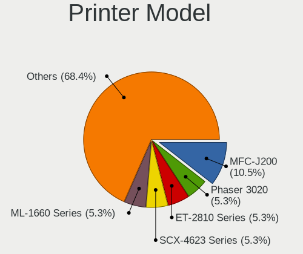

Linux Hardware Trends (Notebooks)
---------------------------------

A project to identify most popular hardware characteristics and track their change
over time based on data collected by Linux users at https://Linux-Hardware.org.

Anyone can contribute to this report by the [hw-probe](https://github.com/linuxhw/hw-probe) tool:

    sudo -E hw-probe -all -upload

This report is for one last month. Overall report since the beginning of time: [TestCoverage](https://github.com/linuxhw/TestCoverage)

Period: Apr, 2022.

Contents
--------

* [ System ](#system)
  - [ OS                       ](#os)
  - [ OS Family                ](#os-family)
  - [ Kernel                   ](#kernel)
  - [ Kernel Family            ](#kernel-family)
  - [ Kernel Major Ver.        ](#kernel-major-ver)
  - [ Arch                     ](#arch)
  - [ DE                       ](#de)
  - [ Display Server           ](#display-server)
  - [ Display Manager          ](#display-manager)
  - [ OS Lang                  ](#os-lang)
  - [ Boot Mode                ](#boot-mode)
  - [ Filesystem               ](#filesystem)
  - [ Part. scheme             ](#part-scheme)
  - [ Dual Boot with Linux/BSD ](#dual-boot-with-linuxbsd)
  - [ Dual Boot (Win)          ](#dual-boot-win)

* [ Board ](#board)
  - [ Vendor                   ](#vendor)
  - [ Model                    ](#model)
  - [ Model Family             ](#model-family)
  - [ MFG Year                 ](#mfg-year)
  - [ Form Factor              ](#form-factor)
  - [ Secure Boot              ](#secure-boot)
  - [ Coreboot                 ](#coreboot)
  - [ RAM Size                 ](#ram-size)
  - [ RAM Used                 ](#ram-used)
  - [ Total Drives             ](#total-drives)
  - [ Has CD-ROM               ](#has-cd-rom)
  - [ Has Ethernet             ](#has-ethernet)
  - [ Has WiFi                 ](#has-wifi)
  - [ Has Bluetooth            ](#has-bluetooth)

* [ Location ](#location)
  - [ Country                  ](#country)
  - [ City                     ](#city)

* [ Drives ](#drives)
  - [ Drive Vendor             ](#drive-vendor)
  - [ Drive Model              ](#drive-model)
  - [ HDD Vendor               ](#hdd-vendor)
  - [ SSD Vendor               ](#ssd-vendor)
  - [ Drive Kind               ](#drive-kind)
  - [ Drive Connector          ](#drive-connector)
  - [ Drive Size               ](#drive-size)
  - [ Space Total              ](#space-total)
  - [ Space Used               ](#space-used)
  - [ Malfunc. Drives          ](#malfunc-drives)
  - [ Malfunc. Drive Vendor    ](#malfunc-drive-vendor)
  - [ Malfunc. HDD Vendor      ](#malfunc-hdd-vendor)
  - [ Malfunc. Drive Kind      ](#malfunc-drive-kind)
  - [ Failed Drives            ](#failed-drives)
  - [ Failed Drive Vendor      ](#failed-drive-vendor)
  - [ Drive Status             ](#drive-status)

* [ Storage controller ](#storage-controller)
  - [ Storage Vendor           ](#storage-vendor)
  - [ Storage Model            ](#storage-model)
  - [ Storage Kind             ](#storage-kind)

* [ Processor ](#processor)
  - [ CPU Vendor               ](#cpu-vendor)
  - [ CPU Model                ](#cpu-model)
  - [ CPU Model Family         ](#cpu-model-family)
  - [ CPU Cores                ](#cpu-cores)
  - [ CPU Sockets              ](#cpu-sockets)
  - [ CPU Threads              ](#cpu-threads)
  - [ CPU Op-Modes             ](#cpu-op-modes)
  - [ CPU Microcode            ](#cpu-microcode)
  - [ CPU Microarch            ](#cpu-microarch)

* [ Graphics ](#graphics)
  - [ GPU Vendor               ](#gpu-vendor)
  - [ GPU Model                ](#gpu-model)
  - [ GPU Combo                ](#gpu-combo)
  - [ GPU Driver               ](#gpu-driver)
  - [ GPU Memory               ](#gpu-memory)

* [ Monitor ](#monitor)
  - [ Monitor Vendor           ](#monitor-vendor)
  - [ Monitor Model            ](#monitor-model)
  - [ Monitor Resolution       ](#monitor-resolution)
  - [ Monitor Diagonal         ](#monitor-diagonal)
  - [ Monitor Width            ](#monitor-width)
  - [ Aspect Ratio             ](#aspect-ratio)
  - [ Monitor Area             ](#monitor-area)
  - [ Pixel Density            ](#pixel-density)
  - [ Multiple Monitors        ](#multiple-monitors)

* [ Network ](#network)
  - [ Net Controller Vendor    ](#net-controller-vendor)
  - [ Net Controller Model     ](#net-controller-model)
  - [ Wireless Vendor          ](#wireless-vendor)
  - [ Wireless Model           ](#wireless-model)
  - [ Ethernet Vendor          ](#ethernet-vendor)
  - [ Ethernet Model           ](#ethernet-model)
  - [ Net Controller Kind      ](#net-controller-kind)
  - [ Used Controller          ](#used-controller)
  - [ NICs                     ](#nics)
  - [ IPv6                     ](#ipv6)

* [ Bluetooth ](#bluetooth)
  - [ Bluetooth Vendor         ](#bluetooth-vendor)
  - [ Bluetooth Model          ](#bluetooth-model)

* [ Sound ](#sound)
  - [ Sound Vendor             ](#sound-vendor)
  - [ Sound Model              ](#sound-model)

* [ Memory ](#memory)
  - [ Memory Vendor            ](#memory-vendor)
  - [ Memory Model             ](#memory-model)
  - [ Memory Kind              ](#memory-kind)
  - [ Memory Form Factor       ](#memory-form-factor)
  - [ Memory Size              ](#memory-size)
  - [ Memory Speed             ](#memory-speed)

* [ Printers & scanners ](#printers--scanners)
  - [ Printer Vendor           ](#printer-vendor)
  - [ Printer Model            ](#printer-model)
  - [ Scanner Vendor           ](#scanner-vendor)
  - [ Scanner Model            ](#scanner-model)

* [ Camera ](#camera)
  - [ Camera Vendor            ](#camera-vendor)
  - [ Camera Model             ](#camera-model)

* [ Security ](#security)
  - [ Fingerprint Vendor       ](#fingerprint-vendor)
  - [ Fingerprint Model        ](#fingerprint-model)
  - [ Chipcard Vendor          ](#chipcard-vendor)
  - [ Chipcard Model           ](#chipcard-model)

* [ Unsupported ](#unsupported)
  - [ Unsupported Devices      ](#unsupported-devices)
  - [ Unsupported Device Types ](#unsupported-device-types)

System
------

OS
--

Installed operating systems

| Name                 | Notebooks | Percent |
|----------------------|-----------|---------|
| Ubuntu 20.04         | 362       | 12.23%  |
| Linux Mint 20.3      | 212       | 7.16%   |
| Fedora 35            | 189       | 6.39%   |
| Debian 11            | 179       | 6.05%   |
| ROSA 12.2            | 178       | 6.01%   |
| Ubuntu 22.04         | 147       | 4.97%   |
| OpenMandriva 4.3     | 146       | 4.93%   |
| Ubuntu 21.10         | 122       | 4.12%   |
| Pop!_OS 21.10        | 115       | 3.89%   |
| KDE neon 20.04       | 80        | 2.7%    |
| Zorin 16             | 79        | 2.67%   |
| Arch                 | 75        | 2.53%   |
| Manjaro              | 59        | 1.99%   |
| Kometa P10           | 48        | 1.62%   |
| Fedora 36            | 47        | 1.59%   |
| Arch Rolling         | 44        | 1.49%   |
| Pop!_OS 22.04        | 39        | 1.32%   |
| Manjaro 21.2.5       | 36        | 1.22%   |
| Elementary 6.1       | 33        | 1.11%   |
| Kubuntu 20.04        | 31        | 1.05%   |
| Manjaro 21.2.6       | 29        | 0.98%   |
| ArcoLinux Rolling    | 27        | 0.91%   |
| Kali 2022.1          | 25        | 0.84%   |
| Xubuntu 20.04        | 23        | 0.78%   |
| Ubuntu 18.04         | 23        | 0.78%   |
| Kubuntu 21.10        | 23        | 0.78%   |
| ROSA R11.1           | 22        | 0.74%   |
| LMDE 5               | 20        | 0.68%   |
| BlackPanther 18.1    | 19        | 0.64%   |
| EndeavourOS Rolling  | 17        | 0.57%   |
| Linux Mint 20.2      | 16        | 0.54%   |
| Debian Testing       | 16        | 0.54%   |
| OpenMandriva 4.2     | 15        | 0.51%   |
| SteamOS Snapshot     | 13        | 0.44%   |
| Linux Mint 19.3      | 13        | 0.44%   |
| Endless 4.0.4        | 13        | 0.44%   |
| Parrot 5.0           | 12        | 0.41%   |
| MX 21                | 12        | 0.41%   |
| Fedora 34            | 12        | 0.41%   |
| Pop!_OS 20.04        | 11        | 0.37%   |
| Kubuntu 22.04        | 11        | 0.37%   |
| Debian Unstable      | 10        | 0.34%   |
| Zorin 15             | 9         | 0.3%    |
| Ubuntu Budgie 20.04  | 9         | 0.3%    |
| Gentoo 2.6           | 9         | 0.3%    |
| Xubuntu 22.04        | 8         | 0.27%   |
| Ubuntu MATE 20.04    | 8         | 0.27%   |
| Slackware 15.0       | 8         | 0.27%   |
| Debian 10            | 8         | 0.27%   |
| Gentoo 2.8           | 7         | 0.24%   |
| Gentoo 2.7           | 7         | 0.24%   |
| Garuda Linux Soaring | 7         | 0.24%   |
| OpenMandriva 4.50    | 6         | 0.2%    |
| Lubuntu 20.04        | 6         | 0.2%    |
| Linux Mint 20        | 6         | 0.2%    |
| Endless 3.9.7        | 6         | 0.2%    |
| Ubuntu Budgie 21.10  | 5         | 0.17%   |
| ROSA 12.1            | 5         | 0.17%   |
| Lubuntu 22.04        | 5         | 0.17%   |
| Lubuntu 21.10        | 5         | 0.17%   |

OS Family
---------

OS without a version

| Name             | Notebooks | Percent |
|------------------|-----------|---------|
| Ubuntu           | 663       | 22.4%   |
| Linux Mint       | 257       | 8.68%   |
| Fedora           | 252       | 8.51%   |
| Debian           | 215       | 7.26%   |
| ROSA             | 208       | 7.03%   |
| Pop!_OS          | 167       | 5.64%   |
| OpenMandriva     | 167       | 5.64%   |
| Manjaro          | 124       | 4.19%   |
| Arch             | 119       | 4.02%   |
| Zorin            | 88        | 2.97%   |
| KDE neon         | 80        | 2.7%    |
| Kubuntu          | 72        | 2.43%   |
| ALT Linux        | 53        | 1.79%   |
| Xubuntu          | 39        | 1.32%   |
| Endless          | 36        | 1.22%   |
| Elementary       | 35        | 1.18%   |
| ArcoLinux        | 30        | 1.01%   |
| openSUSE         | 28        | 0.95%   |
| Kali             | 28        | 0.95%   |
| LMDE             | 23        | 0.78%   |
| Gentoo           | 23        | 0.78%   |
| EndeavourOS      | 21        | 0.71%   |
| Lubuntu          | 20        | 0.68%   |
| BlackPanther     | 19        | 0.64%   |
| Ubuntu Budgie    | 16        | 0.54%   |
| Ubuntu MATE      | 14        | 0.47%   |
| SteamOS          | 14        | 0.47%   |
| Parrot           | 13        | 0.44%   |
| MX               | 12        | 0.41%   |
| Clear Linux      | 11        | 0.37%   |
| Garuda Linux     | 10        | 0.34%   |
| Slackware        | 8         | 0.27%   |
| NixOS            | 7         | 0.24%   |
| PureOS           | 6         | 0.2%    |
| LinuxFX          | 6         | 0.2%    |
| RHEL             | 5         | 0.17%   |
| Deepin           | 5         | 0.17%   |
| Artix            | 5         | 0.17%   |
| Xero             | 4         | 0.14%   |
| CentOS           | 4         | 0.14%   |
| Void Linux       | 3         | 0.1%    |
| Red OS           | 3         | 0.1%    |
| Peppermint       | 3         | 0.1%    |
| Oracle Linux     | 3         | 0.1%    |
| Devuan           | 3         | 0.1%    |
| Trisquel         | 2         | 0.07%   |
| Sparky           | 2         | 0.07%   |
| Solus            | 2         | 0.07%   |
| org.kde.Platform | 2         | 0.07%   |
| No1              | 2         | 0.07%   |
| Mageia           | 2         | 0.07%   |
| Linux Lite       | 2         | 0.07%   |
| GNOME OS         | 2         | 0.07%   |
| Funtoo           | 2         | 0.07%   |
| CachyOS          | 2         | 0.07%   |
| Ubuntu Studio    | 1         | 0.03%   |
| SystemRescue     | 1         | 0.03%   |
| Storm OS         | 1         | 0.03%   |
| Rocky Linux      | 1         | 0.03%   |
| RELD             | 1         | 0.03%   |

Kernel
------

Version of the Linux kernel

| Version                                        | Notebooks | Percent |
|------------------------------------------------|-----------|---------|
| 5.13.0-39-generic                              | 426       | 14.39%  |
| 5.13.0-40-generic                              | 181       | 6.11%   |
| 5.4.0-107-generic                              | 151       | 5.1%    |
| 5.10.74-generic-2rosa2021.1-x86_64             | 146       | 4.93%   |
| 5.16.7-desktop-1omv4003                        | 139       | 4.7%    |
| 5.10.0-13-amd64                                | 130       | 4.39%   |
| 5.15.0-25-generic                              | 88        | 2.97%   |
| 5.16.18-200.fc35.x86_64                        | 86        | 2.91%   |
| 5.16.15-76051615-generic                       | 86        | 2.91%   |
| 5.4.0-109-generic                              | 82        | 2.77%   |
| 5.17.1-arch1-1                                 | 63        | 2.13%   |
| 5.16.19-76051619-generic                       | 57        | 1.93%   |
| 5.15.0-27-generic                              | 57        | 1.93%   |
| 5.15.28-1-MANJARO                              | 33        | 1.11%   |
| 5.13.0-30-generic                              | 31        | 1.05%   |
| 5.10.102-std-def-alt1                          | 31        | 1.05%   |
| 5.15.32-1-MANJARO                              | 29        | 0.98%   |
| 5.10.0-10-amd64                                | 27        | 0.91%   |
| 5.4.0-91-generic                               | 24        | 0.81%   |
| 5.11.0-35-generic                              | 24        | 0.81%   |
| 5.16.20-200.fc35.x86_64                        | 23        | 0.78%   |
| 5.17.1-zen1-1-zen                              | 21        | 0.71%   |
| 5.16.19-200.fc35.x86_64                        | 21        | 0.71%   |
| 5.16.0-6-amd64                                 | 21        | 0.71%   |
| 5.17.4-200.fc35.x86_64                         | 18        | 0.61%   |
| 5.17.3-arch1-1                                 | 17        | 0.57%   |
| 5.15.0-23-generic                              | 17        | 0.57%   |
| 5.10.109-std-def-alt1                          | 17        | 0.57%   |
| 5.17.4-arch1-1                                 | 15        | 0.51%   |
| 5.16.14-1-MANJARO                              | 15        | 0.51%   |
| 5.16.11-76051611-generic                       | 15        | 0.51%   |
| 5.17.2-300.fc36.x86_64                         | 14        | 0.47%   |
| 5.17.1-3-MANJARO                               | 14        | 0.47%   |
| 5.10.14-desktop-1omv4002                       | 14        | 0.47%   |
| 5.10.0-13-686-pae                              | 14        | 0.47%   |
| 5.13.0-37-generic                              | 13        | 0.44%   |
| 5.13.0-35-generic                              | 13        | 0.44%   |
| 5.13.0-27-generic                              | 13        | 0.44%   |
| 5.6.14-desktop-2bP                             | 12        | 0.41%   |
| 5.16.0-12parrot1-amd64                         | 12        | 0.41%   |
| 5.15.32-generic-5rosa2021.1-x86_64             | 12        | 0.41%   |
| 5.17.1-300.fc36.x86_64                         | 11        | 0.37%   |
| 5.17.1-1-default                               | 11        | 0.37%   |
| 5.16.0-kali7-amd64                             | 11        | 0.37%   |
| 5.14.10-300.fc35.x86_64                        | 11        | 0.37%   |
| 5.13.0-valve10.1-1-neptune-02144-g7fffaf925dfb | 11        | 0.37%   |
| 5.13.0-19-generic                              | 11        | 0.37%   |
| 5.17.3-zen1-1-zen                              | 10        | 0.34%   |
| 5.15.33-1-lts                                  | 10        | 0.34%   |
| 5.8.0-14-generic                               | 9         | 0.3%    |
| 5.17.2-arch3-1                                 | 9         | 0.3%    |
| 5.16.16-200.fc35.x86_64                        | 9         | 0.3%    |
| 5.14.0-1032-oem                                | 9         | 0.3%    |
| 5.10.74-generic-2rosa2021.1-i586               | 9         | 0.3%    |
| 5.17.3-302.fc36.x86_64                         | 8         | 0.27%   |
| 5.17.0-0.rc7.116.fc36.x86_64                   | 8         | 0.27%   |
| 5.10.0-13-686                                  | 8         | 0.27%   |
| 5.10.0-12-amd64                                | 8         | 0.27%   |
| 5.4.0-105-generic                              | 7         | 0.24%   |
| 5.4.0-100-generic                              | 7         | 0.24%   |

Kernel Family
-------------

Linux kernel without a distro release

| Version  | Notebooks | Percent |
|----------|-----------|---------|
| 5.13.0   | 718       | 24.26%  |
| 5.4.0    | 310       | 10.47%  |
| 5.10.0   | 208       | 7.03%   |
| 5.15.0   | 175       | 5.91%   |
| 5.10.74  | 155       | 5.24%   |
| 5.17.1   | 144       | 4.86%   |
| 5.16.7   | 139       | 4.7%    |
| 5.16.18  | 103       | 3.48%   |
| 5.16.15  | 96        | 3.24%   |
| 5.16.19  | 82        | 2.77%   |
| 5.15.32  | 72        | 2.43%   |
| 5.16.0   | 65        | 2.2%    |
| 5.17.4   | 54        | 1.82%   |
| 5.11.0   | 46        | 1.55%   |
| 5.17.3   | 45        | 1.52%   |
| 5.17.2   | 38        | 1.28%   |
| 5.15.28  | 35        | 1.18%   |
| 5.10.102 | 31        | 1.05%   |
| 5.17.0   | 30        | 1.01%   |
| 5.16.20  | 27        | 0.91%   |
| 5.14.0   | 25        | 0.84%   |
| 5.10.109 | 22        | 0.74%   |
| 4.15.0   | 22        | 0.74%   |
| 5.8.0    | 18        | 0.61%   |
| 5.16.16  | 17        | 0.57%   |
| 5.16.11  | 16        | 0.54%   |
| 5.16.14  | 15        | 0.51%   |
| 5.15.33  | 15        | 0.51%   |
| 5.10.14  | 14        | 0.47%   |
| 5.6.14   | 12        | 0.41%   |
| 5.16.13  | 12        | 0.41%   |
| 5.17.5   | 11        | 0.37%   |
| 5.14.10  | 11        | 0.37%   |
| 5.4.83   | 10        | 0.34%   |
| 5.15.34  | 8         | 0.27%   |
| 4.19.0   | 8         | 0.27%   |
| 5.4.32   | 7         | 0.24%   |
| 5.14.7   | 7         | 0.24%   |
| 5.10.105 | 7         | 0.24%   |
| 4.18.16  | 7         | 0.24%   |
| 4.18.0   | 7         | 0.24%   |
| 5.18.0   | 6         | 0.2%    |
| 5.3.0    | 4         | 0.14%   |
| 5.16.17  | 4         | 0.14%   |
| 5.16.12  | 4         | 0.14%   |
| 5.15.5   | 4         | 0.14%   |
| 5.15.11  | 4         | 0.14%   |
| 5.10.101 | 4         | 0.14%   |
| 5.4.17   | 3         | 0.1%    |
| 5.3.18   | 3         | 0.1%    |
| 5.16.10  | 3         | 0.1%    |
| 5.15.26  | 3         | 0.1%    |
| 5.15.16  | 3         | 0.1%    |
| 5.15.15  | 3         | 0.1%    |
| 5.15.10  | 3         | 0.1%    |
| 5.14.18  | 3         | 0.1%    |
| 4.4.0    | 3         | 0.1%    |
| 5.16.9   | 2         | 0.07%   |
| 5.15.36  | 2         | 0.07%   |
| 5.15.35  | 2         | 0.07%   |

Kernel Major Ver.
-----------------

Linux kernel major version

| Version | Notebooks | Percent |
|---------|-----------|---------|
| 5.13    | 721       | 24.36%  |
| 5.16    | 589       | 19.9%   |
| 5.10    | 452       | 15.27%  |
| 5.15    | 343       | 11.59%  |
| 5.4     | 334       | 11.28%  |
| 5.17    | 322       | 10.88%  |
| 5.14    | 50        | 1.69%   |
| 5.11    | 48        | 1.62%   |
| 4.15    | 22        | 0.74%   |
| 5.8     | 19        | 0.64%   |
| 5.6     | 14        | 0.47%   |
| 4.18    | 14        | 0.47%   |
| 4.19    | 9         | 0.3%    |
| 5.3     | 7         | 0.24%   |
| 5.18    | 6         | 0.2%    |
| 4.4     | 3         | 0.1%    |
| 3.10    | 2         | 0.07%   |
| 5.12    | 1         | 0.03%   |
| 4.9     | 1         | 0.03%   |
| 4.7     | 1         | 0.03%   |
| 3.8     | 1         | 0.03%   |
| 3.0     | 1         | 0.03%   |

Arch
----

OS architecture (x86_64, i586, etc.)

| Name    | Notebooks | Percent |
|---------|-----------|---------|
| x86_64  | 2887      | 97.53%  |
| i686    | 69        | 2.33%   |
| armv7l  | 2         | 0.07%   |
| aarch64 | 2         | 0.07%   |

DE
--

Desktop Environment

| Name             | Notebooks | Percent |
|------------------|-----------|---------|
| GNOME            | 1325      | 44.76%  |
| KDE5             | 704       | 23.78%  |
| X-Cinnamon       | 222       | 7.5%    |
| XFCE             | 199       | 6.72%   |
| Unknown          | 150       | 5.07%   |
| MATE             | 79        | 2.67%   |
| LXQt             | 65        | 2.2%    |
| Pantheon         | 34        | 1.15%   |
| i3               | 32        | 1.08%   |
| Cinnamon         | 28        | 0.95%   |
| Budgie           | 20        | 0.68%   |
| KDE4             | 18        | 0.61%   |
| LXDE             | 12        | 0.41%   |
| Unity            | 9         | 0.3%    |
| GNOME Flashback  | 8         | 0.27%   |
| sway             | 6         | 0.2%    |
| Deepin           | 6         | 0.2%    |
| awesome          | 6         | 0.2%    |
| GNOME Classic    | 4         | 0.14%   |
| Trinity          | 3         | 0.1%    |
| openbox          | 3         | 0.1%    |
| LeftWM           | 3         | 0.1%    |
| icewm            | 3         | 0.1%    |
| DWM              | 3         | 0.1%    |
| bspwm            | 3         | 0.1%    |
| KDE              | 2         | 0.07%   |
| Enlightenment    | 2         | 0.07%   |
| xwmconfig        | 1         | 0.03%   |
| xmonad           | 1         | 0.03%   |
| ubuntu           | 1         | 0.03%   |
| qtile-default    | 1         | 0.03%   |
| qtile            | 1         | 0.03%   |
| plasma5          | 1         | 0.03%   |
| none+xmonad      | 1         | 0.03%   |
| none+i3          | 1         | 0.03%   |
| lightdm-xsession | 1         | 0.03%   |
| jwm              | 1         | 0.03%   |
| herbstluftwm     | 1         | 0.03%   |

Display Server
--------------

X11 or Wayland

| Name    | Notebooks | Percent |
|---------|-----------|---------|
| X11     | 2117      | 71.52%  |
| Wayland | 696       | 23.51%  |
| Unknown | 111       | 3.75%   |
| Tty     | 36        | 1.22%   |

Display Manager
---------------

SDDM, LightDM, etc.

| Name    | Notebooks | Percent |
|---------|-----------|---------|
| Unknown | 977       | 33.01%  |
| SDDM    | 556       | 18.78%  |
| GDM     | 552       | 18.65%  |
| GDM3    | 424       | 14.32%  |
| LightDM | 416       | 14.05%  |
| KDM     | 18        | 0.61%   |
| XDM     | 6         | 0.2%    |
| Ly      | 5         | 0.17%   |
| SLiM    | 2         | 0.07%   |
| GREETD  | 2         | 0.07%   |
| LXDM    | 1         | 0.03%   |
| EMPTTY  | 1         | 0.03%   |

OS Lang
-------

Language

| Lang    | Notebooks | Percent |
|---------|-----------|---------|
| en_US   | 1200      | 40.54%  |
| ru_RU   | 330       | 11.15%  |
| de_DE   | 218       | 7.36%   |
| pt_BR   | 133       | 4.49%   |
| en_GB   | 130       | 4.39%   |
| fr_FR   | 123       | 4.16%   |
| Unknown | 114       | 3.85%   |
| it_IT   | 71        | 2.4%    |
| es_ES   | 60        | 2.03%   |
| pl_PL   | 53        | 1.79%   |
| en_IN   | 48        | 1.62%   |
| en_CA   | 46        | 1.55%   |
| en_AU   | 30        | 1.01%   |
| es_MX   | 27        | 0.91%   |
| C       | 26        | 0.88%   |
| zh_CN   | 23        | 0.78%   |
| nl_NL   | 23        | 0.78%   |
| en_ZA   | 19        | 0.64%   |
| cs_CZ   | 18        | 0.61%   |
| pt_PT   | 17        | 0.57%   |
| tr_TR   | 13        | 0.44%   |
| sv_SE   | 13        | 0.44%   |
| hu_HU   | 13        | 0.44%   |
| es_CO   | 11        | 0.37%   |
| es_AR   | 11        | 0.37%   |
| de_AT   | 10        | 0.34%   |
| es_PE   | 9         | 0.3%    |
| fr_BE   | 8         | 0.27%   |
| es_CL   | 8         | 0.27%   |
| de_CH   | 8         | 0.27%   |
| nl_BE   | 7         | 0.24%   |
| es_UY   | 7         | 0.24%   |
| en_NZ   | 7         | 0.24%   |
| fr_CA   | 6         | 0.2%    |
| en_IE   | 6         | 0.2%    |
| ro_RO   | 5         | 0.17%   |
| ja_JP   | 5         | 0.17%   |
| fi_FI   | 5         | 0.17%   |
| es_VE   | 5         | 0.17%   |
| en_PH   | 5         | 0.17%   |
| en_IL   | 5         | 0.17%   |
| da_DK   | 5         | 0.17%   |
| zh_TW   | 4         | 0.14%   |
| sk_SK   | 4         | 0.14%   |
| es_EC   | 4         | 0.14%   |
| el_GR   | 4         | 0.14%   |
| ca_ES   | 4         | 0.14%   |
| nb_NO   | 3         | 0.1%    |
| ko_KR   | 3         | 0.1%    |
| es_US   | 3         | 0.1%    |
| en_HK   | 3         | 0.1%    |
| en_DK   | 3         | 0.1%    |
| en_DE   | 3         | 0.1%    |
| C.UTF8  | 3         | 0.1%    |
| bg_BG   | 3         | 0.1%    |
| uk_UA   | 2         | 0.07%   |
| szl_PL  | 2         | 0.07%   |
| POSIX   | 2         | 0.07%   |
| it_CH   | 2         | 0.07%   |
| fr_CH   | 2         | 0.07%   |

Boot Mode
---------

EFI or BIOS

| Mode | Notebooks | Percent |
|------|-----------|---------|
| EFI  | 1682      | 56.82%  |
| BIOS | 1278      | 43.18%  |

Filesystem
----------

Type of filesystem

| Type    | Notebooks | Percent |
|---------|-----------|---------|
| Ext4    | 2271      | 76.72%  |
| Btrfs   | 353       | 11.93%  |
| Overlay | 271       | 9.16%   |
| Xfs     | 36        | 1.22%   |
| Zfs     | 16        | 0.54%   |
| F2fs    | 4         | 0.14%   |
| Ext3    | 2         | 0.07%   |
| Unknown | 2         | 0.07%   |
| XXXXXXX | 1         | 0.03%   |
| Tmpfs   | 1         | 0.03%   |
| Rootfs  | 1         | 0.03%   |
| Ext2    | 1         | 0.03%   |
| Aufs    | 1         | 0.03%   |

Part. scheme
------------

Scheme of partitioning

| Type    | Notebooks | Percent |
|---------|-----------|---------|
| GPT     | 1359      | 45.91%  |
| Unknown | 1269      | 42.87%  |
| MBR     | 332       | 11.22%  |

Dual Boot with Linux/BSD
------------------------

Hosting more than one Linux/BSD

| Dual boot | Notebooks | Percent |
|-----------|-----------|---------|
| No        | 2589      | 87.47%  |
| Yes       | 371       | 12.53%  |

Dual Boot (Win)
---------------

Hosting Linux and Windows

| Dual boot | Notebooks | Percent |
|-----------|-----------|---------|
| No        | 2167      | 73.21%  |
| Yes       | 793       | 26.79%  |

Board
-----

Vendor
------

Motherboard manufacturer

| Name                   | Notebooks | Percent |
|------------------------|-----------|---------|
| Lenovo                 | 634       | 21.42%  |
| Hewlett-Packard        | 510       | 17.23%  |
| Dell                   | 489       | 16.52%  |
| ASUSTek Computer       | 313       | 10.57%  |
| Acer                   | 250       | 8.45%   |
| Apple                  | 87        | 2.94%   |
| Toshiba                | 81        | 2.74%   |
| MSI                    | 73        | 2.47%   |
| Samsung Electronics    | 51        | 1.72%   |
| Google                 | 43        | 1.45%   |
| Sony                   | 35        | 1.18%   |
| HUAWEI                 | 24        | 0.81%   |
| TUXEDO                 | 22        | 0.74%   |
| Timi                   | 19        | 0.64%   |
| Framework              | 19        | 0.64%   |
| Fujitsu                | 17        | 0.57%   |
| Positivo               | 16        | 0.54%   |
| Packard Bell           | 16        | 0.54%   |
| Notebook               | 16        | 0.54%   |
| Medion                 | 15        | 0.51%   |
| Unknown                | 15        | 0.51%   |
| Valve                  | 14        | 0.47%   |
| Alienware              | 12        | 0.41%   |
| System76               | 10        | 0.34%   |
| Razer                  | 9         | 0.3%    |
| eMachines              | 9         | 0.3%    |
| Gigabyte Technology    | 8         | 0.27%   |
| Chuwi                  | 7         | 0.24%   |
| Intel                  | 6         | 0.2%    |
| ICL                    | 6         | 0.2%    |
| Avell High Performance | 6         | 0.2%    |
| PC Specialist          | 5         | 0.17%   |
| LG Electronics         | 5         | 0.17%   |
| Fujitsu Siemens        | 4         | 0.14%   |
| Clevo                  | 4         | 0.14%   |
| Wortmann AG            | 3         | 0.1%    |
| Teclast                | 3         | 0.1%    |
| SLIMBOOK               | 3         | 0.1%    |
| Purism                 | 3         | 0.1%    |
| Philco                 | 3         | 0.1%    |
| Multilaser             | 3         | 0.1%    |
| HONOR                  | 3         | 0.1%    |
| Gateway                | 3         | 0.1%    |
| TrekStor               | 2         | 0.07%   |
| Schenker               | 2         | 0.07%   |
| SANTECH                | 2         | 0.07%   |
| Positivo Bahia - VAIO  | 2         | 0.07%   |
| Pegatron               | 2         | 0.07%   |
| Panasonic              | 2         | 0.07%   |
| ONDA                   | 2         | 0.07%   |
| MouseComputer          | 2         | 0.07%   |
| Monster                | 2         | 0.07%   |
| Microtech              | 2         | 0.07%   |
| MECHREVO               | 2         | 0.07%   |
| Maibenben              | 2         | 0.07%   |
| LincPlus               | 2         | 0.07%   |
| Jumper                 | 2         | 0.07%   |
| Hungaro Flotta Kft     | 2         | 0.07%   |
| Haier                  | 2         | 0.07%   |
| GPU Company            | 2         | 0.07%   |

Model
-----

Motherboard model

| Name                                  | Notebooks | Percent |
|---------------------------------------|-----------|---------|
| Unknown                               | 29        | 0.98%   |
| Google Enguarde                       | 27        | 0.91%   |
| HP Notebook                           | 22        | 0.74%   |
| Framework Laptop                      | 19        | 0.64%   |
| Apple MacBook5,2                      | 19        | 0.64%   |
| HP 250 G7 Notebook PC                 | 15        | 0.51%   |
| Valve Jupiter                         | 14        | 0.47%   |
| HP Pavilion Notebook                  | 14        | 0.47%   |
| HP Pavilion g6                        | 11        | 0.37%   |
| ASUS 1005HA                           | 11        | 0.37%   |
| HP ProBook 440 G5                     | 9         | 0.3%    |
| Dell Inspiron 15-3567                 | 9         | 0.3%    |
| Acer Nitro AN515-44                   | 9         | 0.3%    |
| HP EliteBook 840 G1                   | 8         | 0.27%   |
| HP 15                                 | 8         | 0.27%   |
| Dell Latitude E6430                   | 8         | 0.27%   |
| HP Pavilion dv6                       | 7         | 0.24%   |
| HP Laptop 15-bw0xx                    | 7         | 0.24%   |
| Dell XPS 13 9370                      | 7         | 0.24%   |
| Dell XPS 13 9310                      | 7         | 0.24%   |
| ASUS UX31E                            | 7         | 0.24%   |
| Apple MacBookPro9,2                   | 7         | 0.24%   |
| Lenovo ThinkBook 15 G2 ITL 20VE       | 6         | 0.2%    |
| Lenovo IdeaPad L340-15IRH Gaming 81LK | 6         | 0.2%    |
| ICL RAYbook Si1512                    | 6         | 0.2%    |
| HUAWEI HVY-WXX9                       | 6         | 0.2%    |
| HP ZBook 17 G5                        | 6         | 0.2%    |
| Dell XPS 15 9560                      | 6         | 0.2%    |
| Dell XPS 15 9510                      | 6         | 0.2%    |
| Dell XPS 15 7590                      | 6         | 0.2%    |
| Dell XPS 13 9360                      | 6         | 0.2%    |
| Dell XPS 13 7390                      | 6         | 0.2%    |
| Dell Latitude E6540                   | 6         | 0.2%    |
| Dell Latitude E6530                   | 6         | 0.2%    |
| Dell Latitude 7480                    | 6         | 0.2%    |
| Dell Inspiron N5110                   | 6         | 0.2%    |
| Dell Inspiron 5570                    | 6         | 0.2%    |
| Dell Inspiron 3542                    | 6         | 0.2%    |
| TUXEDO Pulse 15 Gen1                  | 5         | 0.17%   |
| HP ZBook 15 G3                        | 5         | 0.17%   |
| HP ProBook 450 G8 Notebook PC         | 5         | 0.17%   |
| HP Pavilion dv7                       | 5         | 0.17%   |
| HP Pavilion 17                        | 5         | 0.17%   |
| HP Pavilion 15                        | 5         | 0.17%   |
| HP Laptop 15-da0xxx                   | 5         | 0.17%   |
| HP EliteBook 840 G8 Notebook PC       | 5         | 0.17%   |
| HP EliteBook 840 G5                   | 5         | 0.17%   |
| HP EliteBook 840 G4                   | 5         | 0.17%   |
| HP EliteBook 840 G2                   | 5         | 0.17%   |
| HP 250 G6 Notebook PC                 | 5         | 0.17%   |
| Dell XPS 13 9300                      | 5         | 0.17%   |
| Dell Latitude E7250                   | 5         | 0.17%   |
| Dell Latitude E5440                   | 5         | 0.17%   |
| Dell Latitude 5480                    | 5         | 0.17%   |
| Dell Latitude 5420                    | 5         | 0.17%   |
| Apple MacBookPro8,1                   | 5         | 0.17%   |
| Apple MacBookPro10,1                  | 5         | 0.17%   |
| Timi TM1701                           | 4         | 0.14%   |
| Timi RedmiBook Pro 15S                | 4         | 0.14%   |
| System76 Oryx Pro                     | 4         | 0.14%   |

Model Family
------------

Motherboard model prefix

| Name                  | Notebooks | Percent |
|-----------------------|-----------|---------|
| Lenovo ThinkPad       | 321       | 10.84%  |
| Dell Latitude         | 168       | 5.68%   |
| Acer Aspire           | 149       | 5.03%   |
| Lenovo IdeaPad        | 143       | 4.83%   |
| Dell Inspiron         | 142       | 4.8%    |
| HP Pavilion           | 114       | 3.85%   |
| Dell XPS              | 78        | 2.64%   |
| HP Laptop             | 71        | 2.4%    |
| HP ProBook            | 68        | 2.3%    |
| HP EliteBook          | 66        | 2.23%   |
| Toshiba Satellite     | 63        | 2.13%   |
| ASUS VivoBook         | 45        | 1.52%   |
| Dell Precision        | 43        | 1.45%   |
| Lenovo Legion         | 36        | 1.22%   |
| ASUS ROG              | 35        | 1.18%   |
| Acer Nitro            | 34        | 1.15%   |
| Unknown               | 29        | 0.98%   |
| HP ZBook              | 28        | 0.95%   |
| Lenovo ThinkBook      | 27        | 0.91%   |
| Google Enguarde       | 27        | 0.91%   |
| Dell Vostro           | 27        | 0.91%   |
| Acer Swift            | 27        | 0.91%   |
| HP 250                | 26        | 0.88%   |
| HP Notebook           | 22        | 0.74%   |
| ASUS ASUS             | 21        | 0.71%   |
| Apple MacBook5        | 20        | 0.68%   |
| Framework Laptop      | 19        | 0.64%   |
| ASUS ZenBook          | 17        | 0.57%   |
| Acer TravelMate       | 17        | 0.57%   |
| HP ENVY               | 15        | 0.51%   |
| Fujitsu LIFEBOOK      | 15        | 0.51%   |
| Valve Jupiter         | 14        | 0.47%   |
| Packard Bell EasyNote | 14        | 0.47%   |
| HP OMEN               | 12        | 0.41%   |
| HP Compaq             | 12        | 0.41%   |
| Lenovo Yoga           | 11        | 0.37%   |
| HP Stream             | 11        | 0.37%   |
| HP 255                | 11        | 0.37%   |
| HP 15                 | 11        | 0.37%   |
| ASUS 1005HA           | 11        | 0.37%   |
| Razer Blade           | 9         | 0.3%    |
| MSI Modern            | 9         | 0.3%    |
| Apple MacBookPro11    | 9         | 0.3%    |
| Apple MacBookPro10    | 9         | 0.3%    |
| Apple MacBookPro9     | 8         | 0.27%   |
| Apple MacBookPro8     | 8         | 0.27%   |
| Acer Extensa          | 8         | 0.27%   |
| MSI GF63              | 7         | 0.24%   |
| HP Presario           | 7         | 0.24%   |
| ASUS UX31E            | 7         | 0.24%   |
| TUXEDO Pulse          | 6         | 0.2%    |
| Toshiba TECRA         | 6         | 0.2%    |
| ICL RAYbook           | 6         | 0.2%    |
| HUAWEI HVY-WXX9       | 6         | 0.2%    |
| Dell Studio           | 6         | 0.2%    |
| Dell G7               | 6         | 0.2%    |
| Dell G5               | 6         | 0.2%    |
| ASUS TUF              | 6         | 0.2%    |
| TUXEDO InfinityBook   | 5         | 0.17%   |
| Timi RedmiBook        | 5         | 0.17%   |

MFG Year
--------

Motherboard manufacture year

| Year    | Notebooks | Percent |
|---------|-----------|---------|
| 2021    | 420       | 14.19%  |
| 2020    | 347       | 11.72%  |
| 2019    | 264       | 8.92%   |
| 2018    | 224       | 7.57%   |
| 2017    | 195       | 6.59%   |
| 2012    | 190       | 6.42%   |
| 2013    | 189       | 6.39%   |
| 2011    | 189       | 6.39%   |
| 2016    | 168       | 5.68%   |
| 2015    | 163       | 5.51%   |
| 2014    | 151       | 5.1%    |
| 2010    | 126       | 4.26%   |
| 2009    | 97        | 3.28%   |
| 2008    | 87        | 2.94%   |
| 2022    | 61        | 2.06%   |
| 2007    | 49        | 1.66%   |
| Unknown | 18        | 0.61%   |
| 2006    | 14        | 0.47%   |
| 2005    | 5         | 0.17%   |
| 2004    | 3         | 0.1%    |

Form Factor
-----------

Physical design of the computer

| Name     | Notebooks | Percent |
|----------|-----------|---------|
| Notebook | 2960      | 100%    |

Secure Boot
-----------

Enabled or disabled

| State    | Notebooks | Percent |
|----------|-----------|---------|
| Disabled | 2693      | 90.98%  |
| Enabled  | 267       | 9.02%   |

Coreboot
--------

Have coreboot on board

| Used | Notebooks | Percent |
|------|-----------|---------|
| No   | 2905      | 98.14%  |
| Yes  | 55        | 1.86%   |

RAM Size
--------

Total RAM memory

| Size in GB  | Notebooks | Percent |
|-------------|-----------|---------|
| 4.01-8.0    | 825       | 27.87%  |
| 3.01-4.0    | 580       | 19.59%  |
| 16.01-24.0  | 546       | 18.45%  |
| 8.01-16.0   | 489       | 16.52%  |
| 32.01-64.0  | 215       | 7.26%   |
| 1.01-2.0    | 130       | 4.39%   |
| 64.01-256.0 | 60        | 2.03%   |
| 2.01-3.0    | 53        | 1.79%   |
| 24.01-32.0  | 35        | 1.18%   |
| 0.51-1.0    | 25        | 0.84%   |
| 0.01-0.5    | 2         | 0.07%   |

RAM Used
--------

Used RAM memory

| Used GB    | Notebooks | Percent |
|------------|-----------|---------|
| 1.01-2.0   | 1029      | 34.76%  |
| 2.01-3.0   | 711       | 24.02%  |
| 4.01-8.0   | 455       | 15.37%  |
| 3.01-4.0   | 354       | 11.96%  |
| 0.51-1.0   | 204       | 6.89%   |
| 8.01-16.0  | 152       | 5.14%   |
| 0.01-0.5   | 22        | 0.74%   |
| 16.01-24.0 | 17        | 0.57%   |
| 24.01-32.0 | 8         | 0.27%   |
| 32.01-64.0 | 6         | 0.2%    |
| Unknown    | 2         | 0.07%   |

Total Drives
------------

Number of drives on board

| Drives | Notebooks | Percent |
|--------|-----------|---------|
| 1      | 2183      | 73.75%  |
| 2      | 659       | 22.26%  |
| 3      | 87        | 2.94%   |
| 4      | 16        | 0.54%   |
| 0      | 13        | 0.44%   |
| 5      | 2         | 0.07%   |

Has CD-ROM
----------

Has CD-ROM on board

| Presented | Notebooks | Percent |
|-----------|-----------|---------|
| No        | 2039      | 68.89%  |
| Yes       | 921       | 31.11%  |

Has Ethernet
------------

Has Ethernet on board

| Presented | Notebooks | Percent |
|-----------|-----------|---------|
| Yes       | 2381      | 80.44%  |
| No        | 579       | 19.56%  |

Has WiFi
--------

Has WiFi module

| Presented | Notebooks | Percent |
|-----------|-----------|---------|
| Yes       | 2911      | 98.34%  |
| No        | 49        | 1.66%   |

Has Bluetooth
-------------

Has Bluetooth module

| Presented | Notebooks | Percent |
|-----------|-----------|---------|
| Yes       | 2367      | 79.97%  |
| No        | 593       | 20.03%  |

Location
--------

Country
-------

Geographic location (country)

| Country      | Notebooks | Percent |
|--------------|-----------|---------|
| USA          | 522       | 17.64%  |
| Russia       | 362       | 12.23%  |
| Germany      | 294       | 9.93%   |
| Brazil       | 188       | 6.35%   |
| France       | 144       | 4.86%   |
| Italy        | 99        | 3.34%   |
| UK           | 95        | 3.21%   |
| Poland       | 80        | 2.7%    |
| Canada       | 76        | 2.57%   |
| India        | 73        | 2.47%   |
| Spain        | 70        | 2.36%   |
| Netherlands  | 65        | 2.2%    |
| Australia    | 42        | 1.42%   |
| Mexico       | 41        | 1.39%   |
| Hungary      | 39        | 1.32%   |
| Romania      | 36        | 1.22%   |
| Belgium      | 35        | 1.18%   |
| Sweden       | 34        | 1.15%   |
| Turkey       | 32        | 1.08%   |
| Portugal     | 32        | 1.08%   |
| China        | 30        | 1.01%   |
| Czechia      | 28        | 0.95%   |
| Austria      | 27        | 0.91%   |
| South Africa | 24        | 0.81%   |
| Switzerland  | 23        | 0.78%   |
| Greece       | 23        | 0.78%   |
| Ukraine      | 19        | 0.64%   |
| Japan        | 19        | 0.64%   |
| Norway       | 18        | 0.61%   |
| Argentina    | 18        | 0.61%   |
| Colombia     | 15        | 0.51%   |
| Peru         | 13        | 0.44%   |
| Indonesia    | 13        | 0.44%   |
| Finland      | 13        | 0.44%   |
| Egypt        | 13        | 0.44%   |
| Chile        | 12        | 0.41%   |
| Belarus      | 12        | 0.41%   |
| Iran         | 11        | 0.37%   |
| Croatia      | 11        | 0.37%   |
| Bulgaria     | 11        | 0.37%   |
| Venezuela    | 10        | 0.34%   |
| Philippines  | 10        | 0.34%   |
| Ireland      | 10        | 0.34%   |
| Denmark      | 10        | 0.34%   |
| Thailand     | 9         | 0.3%    |
| Serbia       | 9         | 0.3%    |
| Uruguay      | 8         | 0.27%   |
| Taiwan       | 8         | 0.27%   |
| South Korea  | 8         | 0.27%   |
| Israel       | 8         | 0.27%   |
| Slovakia     | 7         | 0.24%   |
| Pakistan     | 7         | 0.24%   |
| New Zealand  | 7         | 0.24%   |
| Kazakhstan   | 7         | 0.24%   |
| Morocco      | 6         | 0.2%    |
| Latvia       | 6         | 0.2%    |
| Hong Kong    | 6         | 0.2%    |
| Estonia      | 6         | 0.2%    |
| Vietnam      | 5         | 0.17%   |
| Uzbekistan   | 5         | 0.17%   |

City
----

Geographic location (city)

| City              | Notebooks | Percent |
|-------------------|-----------|---------|
| Moscow            | 123       | 4.16%   |
| Bangor            | 64        | 2.16%   |
| St Petersburg     | 33        | 1.11%   |
| Sao Paulo         | 28        | 0.95%   |
| Warsaw            | 27        | 0.91%   |
| Berlin            | 25        | 0.84%   |
| Vienna            | 19        | 0.64%   |
| Budapest          | 17        | 0.57%   |
| Milan             | 16        | 0.54%   |
| Prague            | 15        | 0.51%   |
| Munich            | 15        | 0.51%   |
| Athens            | 15        | 0.51%   |
| Paris             | 14        | 0.47%   |
| Amsterdam         | 14        | 0.47%   |
| Voronezh          | 12        | 0.41%   |
| Yekaterinburg     | 11        | 0.37%   |
| Rio de Janeiro    | 11        | 0.37%   |
| Madrid            | 11        | 0.37%   |
| London            | 11        | 0.37%   |
| Brisbane          | 11        | 0.37%   |
| Barcelona         | 11        | 0.37%   |
| Sydney            | 10        | 0.34%   |
| Krasnodar         | 10        | 0.34%   |
| Istanbul          | 10        | 0.34%   |
| Cologne           | 10        | 0.34%   |
| Samara            | 9         | 0.3%    |
| Rome              | 9         | 0.3%    |
| Melbourne         | 9         | 0.3%    |
| Frankfurt am Main | 9         | 0.3%    |
| Dallas            | 9         | 0.3%    |
| Chicago           | 9         | 0.3%    |
| Tehran            | 8         | 0.27%   |
| Sofia             | 8         | 0.27%   |
| Porto             | 8         | 0.27%   |
| Novosibirsk       | 8         | 0.27%   |
| Minsk             | 8         | 0.27%   |
| Hudson            | 8         | 0.27%   |
| Bengaluru         | 8         | 0.27%   |
| Belgrade          | 8         | 0.27%   |
| Toronto           | 7         | 0.24%   |
| Stuttgart         | 7         | 0.24%   |
| Portland          | 7         | 0.24%   |
| Lisbon            | 7         | 0.24%   |
| Jakarta           | 7         | 0.24%   |
| Helsinki          | 7         | 0.24%   |
| Dublin            | 7         | 0.24%   |
| Ankara            | 7         | 0.24%   |
| Zagreb            | 6         | 0.2%    |
| Stockholm         | 6         | 0.2%    |
| San Diego         | 6         | 0.2%    |
| Nuremberg         | 6         | 0.2%    |
| New York          | 6         | 0.2%    |
| Mumbai            | 6         | 0.2%    |
| Montreal          | 6         | 0.2%    |
| Lyon              | 6         | 0.2%    |
| Leipzig           | 6         | 0.2%    |
| Karlsruhe         | 6         | 0.2%    |
| Delhi             | 6         | 0.2%    |
| Chelyabinsk       | 6         | 0.2%    |
| Calgary           | 6         | 0.2%    |

Drives
------

Drive Vendor
------------

Hard drive vendors

| Vendor                         | Notebooks | Drives | Percent |
|--------------------------------|-----------|--------|---------|
| Samsung Electronics            | 584       | 638    | 16.11%  |
| WDC                            | 419       | 434    | 11.56%  |
| Seagate                        | 383       | 395    | 10.56%  |
| Toshiba                        | 273       | 280    | 7.53%   |
| Unknown                        | 211       | 236    | 5.82%   |
| SanDisk                        | 201       | 207    | 5.54%   |
| SK Hynix                       | 197       | 203    | 5.43%   |
| Kingston                       | 184       | 190    | 5.07%   |
| Crucial                        | 127       | 133    | 3.5%    |
| Intel                          | 109       | 119    | 3.01%   |
| Micron Technology              | 87        | 89     | 2.4%    |
| HGST                           | 85        | 87     | 2.34%   |
| Hitachi                        | 84        | 85     | 2.32%   |
| KIOXIA                         | 61        | 61     | 1.68%   |
| A-DATA Technology              | 47        | 47     | 1.3%    |
| Apple                          | 37        | 39     | 1.02%   |
| Phison                         | 35        | 37     | 0.97%   |
| Fujitsu                        | 32        | 32     | 0.88%   |
| China                          | 32        | 33     | 0.88%   |
| Transcend                      | 23        | 23     | 0.63%   |
| LITEON                         | 21        | 21     | 0.58%   |
| Unknown                        | 20        | 20     | 0.55%   |
| SPCC                           | 16        | 17     | 0.44%   |
| PNY                            | 15        | 15     | 0.41%   |
| KingSpec                       | 14        | 14     | 0.39%   |
| GOODRAM                        | 14        | 14     | 0.39%   |
| Silicon Motion                 | 11        | 11     | 0.3%    |
| ADATA Technology               | 11        | 13     | 0.3%    |
| OCZ                            | 10        | 10     | 0.28%   |
| Netac                          | 10        | 10     | 0.28%   |
| LITEONIT                       | 10        | 10     | 0.28%   |
| Apacer                         | 10        | 10     | 0.28%   |
| SSSTC                          | 9         | 9      | 0.25%   |
| JMicron                        | 9         | 9      | 0.25%   |
| XPG                            | 8         | 9      | 0.22%   |
| UMIS                           | 8         | 8      | 0.22%   |
| Micron/Crucial Technology      | 7         | 7      | 0.19%   |
| Intenso                        | 7         | 7      | 0.19%   |
| Lenovo                         | 6         | 6      | 0.17%   |
| FOXLINE                        | 6         | 6      | 0.17%   |
| YMTC                           | 5         | 5      | 0.14%   |
| Solid State Storage Technology | 5         | 5      | 0.14%   |
| Patriot                        | 5         | 5      | 0.14%   |
| MAXIO Technology (Hangzhou)    | 5         | 5      | 0.14%   |
| Lexar                          | 5         | 5      | 0.14%   |
| KingDian                       | 5         | 5      | 0.14%   |
| Gigabyte Technology            | 5         | 5      | 0.14%   |
| BIWIN                          | 5         | 5      | 0.14%   |
| BHT                            | 5         | 5      | 0.14%   |
| ASMT                           | 5         | 5      | 0.14%   |
| Union Memory (Shenzhen)        | 4         | 4      | 0.11%   |
| Teclast                        | 4         | 4      | 0.11%   |
| Lite-On                        | 4         | 4      | 0.11%   |
| HS-SSD-C100                    | 4         | 4      | 0.11%   |
| Hewlett-Packard                | 4         | 4      | 0.11%   |
| AMD                            | 4         | 5      | 0.11%   |
| XrayDisk                       | 3         | 4      | 0.08%   |
| Team                           | 3         | 3      | 0.08%   |
| Smartbuy                       | 3         | 3      | 0.08%   |
| KIOXIA-EXCERIA                 | 3         | 3      | 0.08%   |

Drive Model
-----------

Hard drive models

| Model                                   | Notebooks | Percent |
|-----------------------------------------|-----------|---------|
| Seagate ST1000LM035-1RK172 1TB          | 53        | 1.41%   |
| Seagate ST1000LM024 HN-M101MBB 1TB      | 48        | 1.28%   |
| Samsung NVMe SSD Drive 512GB            | 41        | 1.09%   |
| Toshiba MQ04ABF100 1TB                  | 36        | 0.96%   |
| Sandisk NVMe SSD Drive 512GB            | 35        | 0.93%   |
| Toshiba MQ01ABD100 1TB                  | 33        | 0.88%   |
| SK Hynix NVMe SSD Drive 512GB           | 33        | 0.88%   |
| Kingston SA400S37240G 240GB SSD         | 33        | 0.88%   |
| Toshiba MQ01ABF050 500GB                | 31        | 0.82%   |
| Unknown MMC Card  32GB                  | 27        | 0.72%   |
| Seagate ST500LT012-1DG142 500GB         | 23        | 0.61%   |
| Samsung SSD 860 EVO 500GB               | 23        | 0.61%   |
| Intel NVMe SSD Drive 512GB              | 23        | 0.61%   |
| Unknown MMC Card  64GB                  | 22        | 0.58%   |
| Seagate ST9500325AS 500GB               | 22        | 0.58%   |
| Kingston SA400S37480G 480GB SSD         | 22        | 0.58%   |
| Crucial CT500MX500SSD1 500GB            | 21        | 0.56%   |
| Crucial CT240BX500SSD1 240GB            | 21        | 0.56%   |
| Unknown                                 | 20        | 0.53%   |
| Samsung NVMe SSD Drive 1024GB           | 19        | 0.51%   |
| Samsung NVMe SSD Drive 256GB            | 18        | 0.48%   |
| HGST HTS721010A9E630 1TB                | 18        | 0.48%   |
| Seagate ST1000LM049-2GH172 1TB          | 17        | 0.45%   |
| Samsung SSD 850 EVO 500GB               | 17        | 0.45%   |
| Samsung NVMe SSD Drive 1TB              | 17        | 0.45%   |
| WDC WD10SPZX-24Z10 1TB                  | 15        | 0.4%    |
| SK Hynix NVMe SSD Drive 256GB           | 15        | 0.4%    |
| Samsung SSD 850 EVO 250GB               | 15        | 0.4%    |
| Kingston SA400S37120G 120GB SSD         | 15        | 0.4%    |
| Fujitsu MHZ2160BH FFS G1 160GB          | 15        | 0.4%    |
| Unknown SD/MMC/MS PRO 16GB              | 14        | 0.37%   |
| Unknown AGND3R  16GB                    | 14        | 0.37%   |
| Seagate ST2000LM007-1R8174 2TB          | 14        | 0.37%   |
| Sandisk NVMe SSD Drive 1TB              | 14        | 0.37%   |
| HGST HTS545050A7E680 500GB              | 14        | 0.37%   |
| WDC WDS240G2G0A-00JH30 240GB SSD        | 13        | 0.35%   |
| WDC WD10SPZX-21Z10T0 1TB                | 13        | 0.35%   |
| Unknown MMC Card  128GB                 | 13        | 0.35%   |
| Seagate ST1000LM048-2E7172 1TB          | 13        | 0.35%   |
| Seagate Expansion+ 2TB                  | 13        | 0.35%   |
| Samsung SSD 980 1TB                     | 13        | 0.35%   |
| Unknown HAG2e  16GB                     | 12        | 0.32%   |
| Toshiba NVMe SSD Drive 512GB            | 12        | 0.32%   |
| SK Hynix BC501 HFM256GDJTNG-8310A 256GB | 12        | 0.32%   |
| Seagate ST500LM000-1EJ162 500GB         | 12        | 0.32%   |
| Sandisk NVMe SSD Drive 256GB            | 12        | 0.32%   |
| Samsung SSD 970 EVO Plus 500GB          | 12        | 0.32%   |
| Samsung NVMe SSD Drive 2TB              | 12        | 0.32%   |
| HGST HTS725050A7E630 500GB              | 12        | 0.32%   |
| HGST HTS541010A9E680 1TB                | 12        | 0.32%   |
| Unknown MMC Card  16GB                  | 11        | 0.29%   |
| Toshiba MQ01ABD075 752GB                | 11        | 0.29%   |
| Toshiba KBG30ZMS128G 128GB NVMe SSD     | 11        | 0.29%   |
| KIOXIA NVMe SSD Drive 512GB             | 11        | 0.29%   |
| Kingston NVMe SSD Drive 256GB           | 11        | 0.29%   |
| Hitachi HTS547575A9E384 752GB           | 11        | 0.29%   |
| Crucial CT1000MX500SSD1 1TB             | 11        | 0.29%   |
| WDC WDS500G2B0A-00SM50 500GB SSD        | 10        | 0.27%   |
| WDC WD10JPVX-22JC3T0 1TB                | 10        | 0.27%   |
| Seagate ST2000LM015-2E8174 2TB          | 10        | 0.27%   |

HDD Vendor
----------

Hard disk drive vendors

| Vendor              | Notebooks | Drives | Percent |
|---------------------|-----------|--------|---------|
| Seagate             | 374       | 384    | 34.92%  |
| WDC                 | 257       | 260    | 24%     |
| Toshiba             | 191       | 192    | 17.83%  |
| HGST                | 85        | 87     | 7.94%   |
| Hitachi             | 84        | 85     | 7.84%   |
| Fujitsu             | 32        | 32     | 2.99%   |
| Samsung Electronics | 19        | 19     | 1.77%   |
| Unknown             | 16        | 16     | 1.49%   |
| ASMT                | 4         | 4      | 0.37%   |
| SABRENT             | 2         | 2      | 0.19%   |
| Unknown (CF)        | 1         | 1      | 0.09%   |
| PHD 3.0             | 1         | 1      | 0.09%   |
| Intenso             | 1         | 1      | 0.09%   |
| asmedia             | 1         | 1      | 0.09%   |
| Apricorn            | 1         | 1      | 0.09%   |
| APPLE HD            | 1         | 1      | 0.09%   |
| Apple               | 1         | 1      | 0.09%   |

SSD Vendor
----------

Solid state drive vendors

| Vendor              | Notebooks | Drives | Percent |
|---------------------|-----------|--------|---------|
| Samsung Electronics | 228       | 240    | 20.12%  |
| SanDisk             | 120       | 124    | 10.59%  |
| Kingston            | 118       | 121    | 10.41%  |
| Crucial             | 110       | 114    | 9.71%   |
| WDC                 | 76        | 76     | 6.71%   |
| Micron Technology   | 37        | 37     | 3.27%   |
| A-DATA Technology   | 37        | 37     | 3.27%   |
| Apple               | 32        | 32     | 2.82%   |
| China               | 31        | 32     | 2.74%   |
| SK Hynix            | 30        | 30     | 2.65%   |
| Intel               | 26        | 27     | 2.29%   |
| Transcend           | 23        | 23     | 2.03%   |
| LITEON              | 18        | 18     | 1.59%   |
| Toshiba             | 15        | 16     | 1.32%   |
| SPCC                | 15        | 16     | 1.32%   |
| KingSpec            | 14        | 14     | 1.24%   |
| GOODRAM             | 14        | 14     | 1.24%   |
| PNY                 | 12        | 12     | 1.06%   |
| OCZ                 | 10        | 10     | 0.88%   |
| Netac               | 10        | 10     | 0.88%   |
| LITEONIT            | 10        | 10     | 0.88%   |
| Apacer              | 9         | 9      | 0.79%   |
| Unknown             | 9         | 9      | 0.79%   |
| Seagate             | 5         | 5      | 0.44%   |
| Patriot             | 5         | 5      | 0.44%   |
| JMicron             | 5         | 5      | 0.44%   |
| BHT                 | 5         | 5      | 0.44%   |
| Teclast             | 4         | 4      | 0.35%   |
| Lexar               | 4         | 4      | 0.35%   |
| KingDian            | 4         | 4      | 0.35%   |
| Intenso             | 4         | 4      | 0.35%   |
| XrayDisk            | 3         | 3      | 0.26%   |
| Smartbuy            | 3         | 3      | 0.26%   |
| KIOXIA-EXCERIA      | 3         | 3      | 0.26%   |
| Hewlett-Packard     | 3         | 3      | 0.26%   |
| Gigabyte Technology | 3         | 3      | 0.26%   |
| DOGFISH             | 3         | 3      | 0.26%   |
| TwinMOS             | 2         | 2      | 0.18%   |
| Team                | 2         | 2      | 0.18%   |
| S3+                 | 2         | 2      | 0.18%   |
| PLEXTOR             | 2         | 2      | 0.18%   |
| Mushkin             | 2         | 2      | 0.18%   |
| LONDISK             | 2         | 2      | 0.18%   |
| Leven               | 2         | 2      | 0.18%   |
| KINGBANK            | 2         | 2      | 0.18%   |
| INTEL SS            | 2         | 2      | 0.18%   |
| INNOVATION IT       | 2         | 2      | 0.18%   |
| Goldkey             | 2         | 2      | 0.18%   |
| Dell                | 2         | 2      | 0.18%   |
| Corsair             | 2         | 3      | 0.18%   |
| BIWIN               | 2         | 2      | 0.18%   |
| AMD                 | 2         | 2      | 0.18%   |
| Zozt                | 1         | 1      | 0.09%   |
| Wdxsky              | 1         | 1      | 0.09%   |
| Wdstars             | 1         | 1      | 0.09%   |
| WDC WDS4            | 1         | 1      | 0.09%   |
| WDC WDS2            | 1         | 1      | 0.09%   |
| WANGCHU             | 1         | 1      | 0.09%   |
| Vaseky              | 1         | 1      | 0.09%   |
| Varro               | 1         | 1      | 0.09%   |

Drive Kind
----------

HDD or SSD

| Kind    | Notebooks | Drives | Percent |
|---------|-----------|--------|---------|
| NVMe    | 1131      | 1261   | 32.43%  |
| SSD     | 1058      | 1162   | 30.33%  |
| HDD     | 1046      | 1088   | 29.99%  |
| MMC     | 209       | 236    | 5.99%   |
| Unknown | 44        | 45     | 1.26%   |

Drive Connector
---------------

SATA, SAS, NVMe, etc.

| Type | Notebooks | Drives | Percent |
|------|-----------|--------|---------|
| SATA | 1882      | 2167   | 56.41%  |
| NVMe | 1130      | 1257   | 33.87%  |
| MMC  | 209       | 236    | 6.26%   |
| SAS  | 115       | 132    | 3.45%   |

Drive Size
----------

Size of hard drive

| Size in TB | Notebooks | Drives | Percent |
|------------|-----------|--------|---------|
| 0.01-0.5   | 1414      | 1541   | 67.66%  |
| 0.51-1.0   | 591       | 621    | 28.28%  |
| 1.01-2.0   | 68        | 71     | 3.25%   |
| 4.01-10.0  | 8         | 8      | 0.38%   |
| 3.01-4.0   | 7         | 7      | 0.33%   |
| 2.01-3.0   | 2         | 2      | 0.1%    |

Space Total
-----------

Amount of disk space available on the file system

| Size in GB     | Notebooks | Percent |
|----------------|-----------|---------|
| 101-250        | 804       | 27.16%  |
| 251-500        | 759       | 25.64%  |
| 501-1000       | 419       | 14.16%  |
| 1-20           | 272       | 9.19%   |
| 1001-2000      | 202       | 6.82%   |
| 51-100         | 155       | 5.24%   |
| Unknown        | 134       | 4.53%   |
| 21-50          | 98        | 3.31%   |
| More than 3000 | 74        | 2.5%    |
| 2001-3000      | 43        | 1.45%   |

Space Used
----------

Amount of used disk space

| Used GB        | Notebooks | Percent |
|----------------|-----------|---------|
| 1-20           | 1098      | 37.09%  |
| 21-50          | 498       | 16.82%  |
| 101-250        | 427       | 14.43%  |
| 51-100         | 360       | 12.16%  |
| 251-500        | 232       | 7.84%   |
| Unknown        | 134       | 4.53%   |
| 501-1000       | 113       | 3.82%   |
| 1001-2000      | 65        | 2.2%    |
| 2001-3000      | 18        | 0.61%   |
| More than 3000 | 15        | 0.51%   |

Malfunc. Drives
---------------

Drive models with a malfunction

| Model                                               | Notebooks | Drives | Percent |
|-----------------------------------------------------|-----------|--------|---------|
| Seagate ST9500325AS 500GB                           | 9         | 9      | 3.56%   |
| Seagate ST9500420AS 500GB                           | 7         | 7      | 2.77%   |
| Seagate ST1000LM024 HN-M101MBB 1TB                  | 7         | 8      | 2.77%   |
| Toshiba MQ01ABD100 1TB                              | 6         | 6      | 2.37%   |
| SanDisk SSD U100 256GB                              | 6         | 6      | 2.37%   |
| HGST HTS541010A9E680 1TB                            | 6         | 6      | 2.37%   |
| Seagate ST500LT012-9WS142 500GB                     | 5         | 5      | 1.98%   |
| Seagate ST1000LM035-1RK172 1TB                      | 5         | 5      | 1.98%   |
| Hitachi HTS547575A9E384 752GB                       | 5         | 5      | 1.98%   |
| HGST HTS545050A7E680 500GB                          | 4         | 4      | 1.58%   |
| WDC WD5000LPVX-22V0TT0 500GB                        | 3         | 3      | 1.19%   |
| Toshiba MQ01ABF050 500GB                            | 3         | 3      | 1.19%   |
| Seagate ST9320325AS 320GB                           | 3         | 3      | 1.19%   |
| Seagate ST9250315AS 250GB                           | 3         | 3      | 1.19%   |
| Seagate ST500LT012-1DG142 500GB                     | 3         | 3      | 1.19%   |
| HGST HTS725050A7E630 500GB                          | 3         | 3      | 1.19%   |
| HGST HTS721010A9E630 1TB                            | 3         | 3      | 1.19%   |
| HGST HTS545050A7E380 500GB                          | 3         | 3      | 1.19%   |
| WDC WDS240G2G0B-00EPW0 240GB SSD                    | 2         | 2      | 0.79%   |
| WDC WD1600BEVS-60RST0 160GB                         | 2         | 2      | 0.79%   |
| Toshiba MQ04ABF100 1TB                              | 2         | 2      | 0.79%   |
| Toshiba MQ01ABF032 320GB                            | 2         | 2      | 0.79%   |
| Toshiba MQ01ABD075 752GB                            | 2         | 2      | 0.79%   |
| Toshiba MK1652GSX 160GB                             | 2         | 2      | 0.79%   |
| Toshiba MK1246GSX 120GB                             | 2         | 2      | 0.79%   |
| Toshiba KSG60ZMV256G M.2 2280 256GB SSD             | 2         | 2      | 0.79%   |
| SK Hynix HFS512G39TND-N210A 512GB SSD               | 2         | 2      | 0.79%   |
| Seagate ST500LM012 HN-M500MBB 500GB                 | 2         | 2      | 0.79%   |
| Seagate ST500LM000-1EJ162 500GB                     | 2         | 2      | 0.79%   |
| SanDisk SD9SN8W-128G-1006 128GB SSD                 | 2         | 2      | 0.79%   |
| Samsung Electronics SSD 870 EVO 1TB                 | 2         | 2      | 0.79%   |
| Samsung Electronics HM321HI 320GB                   | 2         | 2      | 0.79%   |
| Micron Technology MTFDDAV256TDL-1AW1ZABHA 256GB SSD | 2         | 2      | 0.79%   |
| Hitachi HTS547550A9E384 500GB                       | 2         | 2      | 0.79%   |
| Hitachi HTS542525K9SA00 250GB                       | 2         | 2      | 0.79%   |
| HGST HTS725032A7E630 320GB                          | 2         | 2      | 0.79%   |
| XPG GAMMIX S11 Pro 512GB                            | 1         | 1      | 0.4%    |
| WDC WDS120G2G0B-00EPW0 120GB SSD                    | 1         | 1      | 0.4%    |
| WDC WDS100T2G0A-00JH30 1TB SSD                      | 1         | 1      | 0.4%    |
| WDC WD7500BPVT-22HXZT3 752GB                        | 1         | 1      | 0.4%    |
| WDC WD5000LPVX-75V0TT0 500GB                        | 1         | 1      | 0.4%    |
| WDC WD5000LPVX-00V0TT0 500GB                        | 1         | 1      | 0.4%    |
| WDC WD5000LPLX-60ZNTT2 500GB                        | 1         | 1      | 0.4%    |
| WDC WD5000LPLX-60ZNTT1 500GB                        | 1         | 1      | 0.4%    |
| WDC WD5000LPLX-00ZNTT0 500GB                        | 1         | 1      | 0.4%    |
| WDC WD5000BPVT-22HXZT1 500GB                        | 1         | 1      | 0.4%    |
| WDC WD5000BEVT-26A0RT0 500GB                        | 1         | 1      | 0.4%    |
| WDC WD5000BEKT-75KA9T0 500GB                        | 1         | 1      | 0.4%    |
| WDC WD3200BUDT-63DPZY0 320GB                        | 1         | 1      | 0.4%    |
| WDC WD3200BPVT-22JJ5T0 320GB                        | 1         | 1      | 0.4%    |
| WDC WD3200BEVT-60A23T0 320GB                        | 1         | 1      | 0.4%    |
| WDC WD3200BEVT-24A23T0 320GB                        | 1         | 1      | 0.4%    |
| WDC WD3200BEKT-60V5T1 320GB                         | 1         | 1      | 0.4%    |
| WDC WD2500BEVT-60ZCT1 250GB                         | 1         | 1      | 0.4%    |
| WDC WD2500BEVT-22ZCT0 250GB                         | 1         | 1      | 0.4%    |
| WDC WD2500BEVT-22A23T0 250GB                        | 1         | 1      | 0.4%    |
| WDC WD2500BEKT-60A25T1 250GB                        | 1         | 1      | 0.4%    |
| WDC WD1600BEVT-80A23T0 160GB                        | 1         | 1      | 0.4%    |
| WDC WD1600BEVT-60ZCT1 160GB                         | 1         | 1      | 0.4%    |
| WDC WD1200UE-22KVT0 120GB                           | 1         | 1      | 0.4%    |

Malfunc. Drive Vendor
---------------------

Vendors of faulty drives

| Vendor              | Notebooks | Drives | Percent |
|---------------------|-----------|--------|---------|
| Seagate             | 59        | 60     | 23.32%  |
| Toshiba             | 37        | 37     | 14.62%  |
| WDC                 | 32        | 32     | 12.65%  |
| HGST                | 24        | 25     | 9.49%   |
| Hitachi             | 20        | 20     | 7.91%   |
| SanDisk             | 12        | 12     | 4.74%   |
| SK Hynix            | 10        | 10     | 3.95%   |
| Intel               | 10        | 11     | 3.95%   |
| Samsung Electronics | 8         | 8      | 3.16%   |
| Micron Technology   | 7         | 7      | 2.77%   |
| Kingston            | 5         | 5      | 1.98%   |
| Crucial             | 5         | 5      | 1.98%   |
| A-DATA Technology   | 4         | 4      | 1.58%   |
| Fujitsu             | 3         | 3      | 1.19%   |
| LITEONIT            | 2         | 2      | 0.79%   |
| KingSpec            | 2         | 2      | 0.79%   |
| Apple               | 2         | 2      | 0.79%   |
| XPG                 | 1         | 1      | 0.4%    |
| Unknown             | 1         | 1      | 0.4%    |
| Teclast             | 1         | 1      | 0.4%    |
| SSSTC               | 1         | 1      | 0.4%    |
| PLEXTOR             | 1         | 1      | 0.4%    |
| LITEON              | 1         | 1      | 0.4%    |
| asmedia             | 1         | 1      | 0.4%    |
| ASENNO              | 1         | 1      | 0.4%    |
| Apricorn            | 1         | 1      | 0.4%    |
| Apacer              | 1         | 1      | 0.4%    |
| AMD                 | 1         | 1      | 0.4%    |

Malfunc. HDD Vendor
-------------------

Vendors of faulty HDD drives

| Vendor              | Notebooks | Drives | Percent |
|---------------------|-----------|--------|---------|
| Seagate             | 59        | 60     | 33.91%  |
| Toshiba             | 34        | 34     | 19.54%  |
| WDC                 | 28        | 28     | 16.09%  |
| HGST                | 24        | 25     | 13.79%  |
| Hitachi             | 20        | 20     | 11.49%  |
| Samsung Electronics | 3         | 3      | 1.72%   |
| Fujitsu             | 3         | 3      | 1.72%   |
| Unknown             | 1         | 1      | 0.57%   |
| asmedia             | 1         | 1      | 0.57%   |
| Apricorn            | 1         | 1      | 0.57%   |

Malfunc. Drive Kind
-------------------

Kinds of faulty drives

| Kind | Notebooks | Drives | Percent |
|------|-----------|--------|---------|
| HDD  | 174       | 176    | 69.05%  |
| SSD  | 72        | 74     | 28.57%  |
| NVMe | 6         | 6      | 2.38%   |

Failed Drives
-------------

Failed drive models

| Model                                        | Notebooks | Drives | Percent |
|----------------------------------------------|-----------|--------|---------|
| WDC WD5000BEVT-22A0RT0 500GB                 | 1         | 1      | 11.11%  |
| WDC WD3200BPVT-22JJ5T0 320GB                 | 1         | 1      | 11.11%  |
| WDC WD3200BEVT-11ZCT0 320GB                  | 1         | 1      | 11.11%  |
| WDC WD10JPVX-60JC3T0 1TB                     | 1         | 1      | 11.11%  |
| Toshiba THNSN5512GPU7 512GB                  | 1         | 1      | 11.11%  |
| Samsung Electronics MZVLB512HAJQ-000H1 512GB | 1         | 1      | 11.11%  |
| LITEON CA3-8D512 512GB                       | 1         | 1      | 11.11%  |
| Hitachi HTS545050A7E380 500GB                | 1         | 1      | 11.11%  |
| HGST HTS721010A9E630 1TB                     | 1         | 1      | 11.11%  |

Failed Drive Vendor
-------------------

Failed drive vendors

| Vendor              | Notebooks | Drives | Percent |
|---------------------|-----------|--------|---------|
| WDC                 | 4         | 4      | 44.44%  |
| Toshiba             | 1         | 1      | 11.11%  |
| Samsung Electronics | 1         | 1      | 11.11%  |
| LITEON              | 1         | 1      | 11.11%  |
| Hitachi             | 1         | 1      | 11.11%  |
| HGST                | 1         | 1      | 11.11%  |

Drive Status
------------

Number of failed and malfunc. drives

| Status   | Notebooks | Drives | Percent |
|----------|-----------|--------|---------|
| Detected | 1473      | 1866   | 47.08%  |
| Works    | 1397      | 1661   | 44.65%  |
| Malfunc  | 250       | 256    | 7.99%   |
| Failed   | 9         | 9      | 0.29%   |

Storage controller
------------------

Storage Vendor
--------------

Storage controller vendors

| Vendor                           | Notebooks | Percent |
|----------------------------------|-----------|---------|
| Intel                            | 1967      | 56.07%  |
| AMD                              | 369       | 10.52%  |
| Samsung Electronics              | 362       | 10.32%  |
| Sandisk                          | 169       | 4.82%   |
| SK Hynix                         | 163       | 4.65%   |
| Toshiba America Info Systems     | 76        | 2.17%   |
| Kingston Technology Company      | 67        | 1.91%   |
| KIOXIA                           | 53        | 1.51%   |
| Micron Technology                | 51        | 1.45%   |
| Phison Electronics               | 47        | 1.34%   |
| Nvidia                           | 36        | 1.03%   |
| ADATA Technology                 | 27        | 0.77%   |
| Micron/Crucial Technology        | 24        | 0.68%   |
| Silicon Motion                   | 15        | 0.43%   |
| Solid State Storage Technology   | 13        | 0.37%   |
| Union Memory (Shenzhen)          | 12        | 0.34%   |
| Yangtze Memory Technologies      | 6         | 0.17%   |
| Silicon Integrated Systems [SiS] | 6         | 0.17%   |
| Lite-On Technology               | 6         | 0.17%   |
| Lenovo                           | 6         | 0.17%   |
| MAXIO Technology (Hangzhou)      | 5         | 0.14%   |
| JMicron Technology               | 5         | 0.14%   |
| Realtek Semiconductor            | 4         | 0.11%   |
| Apple                            | 4         | 0.11%   |
| Shenzhen Longsys Electronics     | 3         | 0.09%   |
| Marvell Technology Group         | 3         | 0.09%   |
| Seagate Technology               | 2         | 0.06%   |
| Biwin Storage Technology         | 2         | 0.06%   |
| ASMedia Technology               | 2         | 0.06%   |
| Zhaoxin                          | 1         | 0.03%   |
| Silicon Image                    | 1         | 0.03%   |
| OCZ Technology Group             | 1         | 0.03%   |

Storage Model
-------------

Storage controller models

| Model                                                                            | Notebooks | Percent |
|----------------------------------------------------------------------------------|-----------|---------|
| AMD FCH SATA Controller [AHCI mode]                                              | 323       | 8.66%   |
| Intel Sunrise Point-LP SATA Controller [AHCI mode]                               | 242       | 6.49%   |
| Intel 7 Series Chipset Family 6-port SATA Controller [AHCI mode]                 | 205       | 5.5%    |
| Intel 82801 Mobile SATA Controller [RAID mode]                                   | 174       | 4.67%   |
| Samsung NVMe SSD Controller SM981/PM981/PM983                                    | 168       | 4.51%   |
| Intel 6 Series/C200 Series Chipset Family 6 port Mobile SATA AHCI Controller     | 143       | 3.84%   |
| Intel 8 Series SATA Controller 1 [AHCI mode]                                     | 115       | 3.08%   |
| Samsung NVMe SSD Controller 980                                                  | 108       | 2.9%    |
| Intel Volume Management Device NVMe RAID Controller                              | 108       | 2.9%    |
| Intel Cannon Lake Mobile PCH SATA AHCI Controller                                | 87        | 2.33%   |
| Intel Wildcat Point-LP SATA Controller [AHCI Mode]                               | 86        | 2.31%   |
| Intel 82801IBM/IEM (ICH9M/ICH9M-E) 4 port SATA Controller [AHCI mode]            | 82        | 2.2%    |
| Intel 8 Series/C220 Series Chipset Family 6-port SATA Controller 1 [AHCI mode]   | 79        | 2.12%   |
| SK Hynix Gold P31 SSD                                                            | 68        | 1.82%   |
| Intel Tiger Lake-LP SATA Controller [AHCI mode]                                  | 59        | 1.58%   |
| Intel 5 Series/3400 Series Chipset 4 port SATA AHCI Controller                   | 55        | 1.48%   |
| Intel 82801HM/HEM (ICH8M/ICH8M-E) IDE Controller                                 | 54        | 1.45%   |
| Sandisk WD Blue SN550 NVMe SSD                                                   | 53        | 1.42%   |
| KIOXIA Non-Volatile memory controller                                            | 52        | 1.39%   |
| Micron Non-Volatile memory controller                                            | 51        | 1.37%   |
| Intel HM170/QM170 Chipset SATA Controller [AHCI Mode]                            | 51        | 1.37%   |
| Sandisk WD Black SN750 / PC SN730 NVMe SSD                                       | 48        | 1.29%   |
| Samsung NVMe SSD Controller PM9A1/PM9A3/980PRO                                   | 48        | 1.29%   |
| Intel 82801HM/HEM (ICH8M/ICH8M-E) SATA Controller [AHCI mode]                    | 45        | 1.21%   |
| Intel Comet Lake SATA AHCI Controller                                            | 43        | 1.15%   |
| Toshiba America Info Systems XG6 NVMe SSD Controller                             | 42        | 1.13%   |
| Intel Celeron/Pentium Silver Processor SATA Controller                           | 42        | 1.13%   |
| Intel 400 Series Chipset Family SATA AHCI Controller                             | 34        | 0.91%   |
| Intel SSD 660P Series                                                            | 33        | 0.89%   |
| Intel 5 Series/3400 Series Chipset 6 port SATA AHCI Controller                   | 31        | 0.83%   |
| SK Hynix BC501 NVMe Solid State Drive                                            | 30        | 0.8%    |
| Intel Atom Processor E3800 Series SATA AHCI Controller                           | 30        | 0.8%    |
| SK Hynix Non-Volatile memory controller                                          | 29        | 0.78%   |
| SK Hynix BC511                                                                   | 28        | 0.75%   |
| Intel 500 Series Chipset Family SATA AHCI Controller                             | 28        | 0.75%   |
| AMD SB7x0/SB8x0/SB9x0 SATA Controller [AHCI mode]                                | 28        | 0.75%   |
| Phison PS5013 E13 NVMe Controller                                                | 27        | 0.72%   |
| Intel NM10/ICH7 Family SATA Controller [AHCI mode]                               | 27        | 0.72%   |
| Samsung NVMe SSD Controller SM961/PM961/SM963                                    | 26        | 0.7%    |
| Nvidia MCP79 AHCI Controller                                                     | 26        | 0.7%    |
| Intel Celeron N3350/Pentium N4200/Atom E3900 Series SATA AHCI Controller         | 25        | 0.67%   |
| Sandisk Non-Volatile memory controller                                           | 23        | 0.62%   |
| Intel Q170/Q150/B150/H170/H110/Z170/CM236 Chipset SATA Controller [AHCI Mode]    | 23        | 0.62%   |
| Intel Non-Volatile memory controller                                             | 23        | 0.62%   |
| Intel Atom/Celeron/Pentium Processor x5-E8000/J3xxx/N3xxx Series SATA Controller | 23        | 0.62%   |
| Intel 82801GBM/GHM (ICH7-M Family) SATA Controller [AHCI mode]                   | 23        | 0.62%   |
| Kingston Company Company Non-Volatile memory controller                          | 22        | 0.59%   |
| Kingston Company OM3PDP3 NVMe SSD                                                | 20        | 0.54%   |
| ADATA Non-Volatile memory controller                                             | 18        | 0.48%   |
| Sandisk WD Blue SN500 / PC SN520 NVMe SSD                                        | 16        | 0.43%   |
| Phison E12 NVMe Controller                                                       | 16        | 0.43%   |
| Intel Cannon Point-LP SATA Controller [AHCI Mode]                                | 16        | 0.43%   |
| Intel 82801GBM/GHM (ICH7-M Family) SATA Controller [IDE mode]                    | 16        | 0.43%   |
| Intel SSD Pro 7600p/760p/E 6100p Series                                          | 14        | 0.38%   |
| Intel Ice Lake-LP SATA Controller [AHCI mode]                                    | 14        | 0.38%   |
| Toshiba America Info Systems Toshiba America Info Non-Volatile memory controller | 13        | 0.35%   |
| Solid State Storage Non-Volatile memory controller                               | 13        | 0.35%   |
| Sandisk WD PC SN810 / Black SN850 NVMe SSD                                       | 13        | 0.35%   |
| Intel 82801G (ICH7 Family) IDE Controller                                        | 13        | 0.35%   |
| Toshiba America Info Systems BG3 NVMe SSD Controller                             | 12        | 0.32%   |

Storage Kind
------------

Kind of storage controller (IDE, SATA, NVMe, SAS, ...)

| Kind | Notebooks | Percent |
|------|-----------|---------|
| SATA | 2027      | 56.17%  |
| NVMe | 1131      | 31.34%  |
| RAID | 288       | 7.98%   |
| IDE  | 163       | 4.52%   |

Processor
---------

CPU Vendor
----------

Processor vendors

| Vendor       | Notebooks | Percent |
|--------------|-----------|---------|
| Intel        | 2415      | 81.59%  |
| AMD          | 540       | 18.24%  |
| ARM          | 3         | 0.1%    |
| PHYTIUM      | 1         | 0.03%   |
| CentaurHauls | 1         | 0.03%   |

CPU Model
---------

Processor models

| Model                                         | Notebooks | Percent |
|-----------------------------------------------|-----------|---------|
| Intel 11th Gen Core i5-1135G7 @ 2.40GHz       | 75        | 2.53%   |
| Intel 11th Gen Core i7-1165G7 @ 2.80GHz       | 69        | 2.33%   |
| Intel Core i5-7200U CPU @ 2.50GHz             | 45        | 1.52%   |
| Intel Core i7-8550U CPU @ 1.80GHz             | 42        | 1.42%   |
| Intel Celeron CPU N2840 @ 2.16GHz             | 41        | 1.39%   |
| Intel Core i5-8250U CPU @ 1.60GHz             | 37        | 1.25%   |
| Intel Core i5-10210U CPU @ 1.60GHz            | 37        | 1.25%   |
| AMD Ryzen 7 4800H with Radeon Graphics        | 37        | 1.25%   |
| Intel 11th Gen Core i7-11800H @ 2.30GHz       | 35        | 1.18%   |
| AMD Ryzen 7 5800H with Radeon Graphics        | 35        | 1.18%   |
| Intel Core i7-9750H CPU @ 2.60GHz             | 34        | 1.15%   |
| Intel Core i5-8265U CPU @ 1.60GHz             | 34        | 1.15%   |
| Intel Core i5-6200U CPU @ 2.30GHz             | 33        | 1.11%   |
| Intel Core i7-8750H CPU @ 2.20GHz             | 30        | 1.01%   |
| Intel Core i7-7700HQ CPU @ 2.80GHz            | 30        | 1.01%   |
| AMD Ryzen 5 5500U with Radeon Graphics        | 29        | 0.98%   |
| Intel Core i7-10750H CPU @ 2.60GHz            | 28        | 0.95%   |
| AMD Ryzen 5 3500U with Radeon Vega Mobile Gfx | 28        | 0.95%   |
| Intel Core i7-7500U CPU @ 2.70GHz             | 27        | 0.91%   |
| Intel Core i7-8565U CPU @ 1.80GHz             | 25        | 0.84%   |
| Intel Core i5-5200U CPU @ 2.20GHz             | 25        | 0.84%   |
| Intel Core i5-4210U CPU @ 1.70GHz             | 25        | 0.84%   |
| Intel Core i5-3210M CPU @ 2.50GHz             | 25        | 0.84%   |
| Intel Core i5-4200U CPU @ 1.60GHz             | 24        | 0.81%   |
| Intel Core i7-6700HQ CPU @ 2.60GHz            | 23        | 0.78%   |
| Intel Core i7-10510U CPU @ 1.80GHz            | 23        | 0.78%   |
| AMD Ryzen 7 5700U with Radeon Graphics        | 22        | 0.74%   |
| Intel Core i5-3320M CPU @ 2.60GHz             | 21        | 0.71%   |
| Intel Core 2 Duo CPU P7450 @ 2.13GHz          | 21        | 0.71%   |
| Intel Core i5-6300U CPU @ 2.40GHz             | 20        | 0.68%   |
| Intel Core i5-3230M CPU @ 2.60GHz             | 20        | 0.68%   |
| Intel Core i5-2520M CPU @ 2.50GHz             | 20        | 0.68%   |
| Intel Core i3-6006U CPU @ 2.00GHz             | 20        | 0.68%   |
| Intel Celeron N4020 CPU @ 1.10GHz             | 20        | 0.68%   |
| AMD Ryzen 5 4600H with Radeon Graphics        | 20        | 0.68%   |
| Intel Core i7-1065G7 CPU @ 1.30GHz            | 19        | 0.64%   |
| Intel Core i3-5005U CPU @ 2.00GHz             | 19        | 0.64%   |
| Intel Atom CPU N270 @ 1.60GHz                 | 19        | 0.64%   |
| Intel 11th Gen Core i7-1185G7 @ 3.00GHz       | 19        | 0.64%   |
| Intel Core i7-6500U CPU @ 2.50GHz             | 17        | 0.57%   |
| Intel Core i5-2410M CPU @ 2.30GHz             | 17        | 0.57%   |
| AMD Ryzen 7 4700U with Radeon Graphics        | 17        | 0.57%   |
| Intel Core i5-5300U CPU @ 2.30GHz             | 16        | 0.54%   |
| Intel Celeron CPU N3060 @ 1.60GHz             | 16        | 0.54%   |
| Intel Core i7-6600U CPU @ 2.60GHz             | 15        | 0.51%   |
| Intel Core i5-4300U CPU @ 1.90GHz             | 15        | 0.51%   |
| Intel Core i5-2430M CPU @ 2.40GHz             | 15        | 0.51%   |
| Intel Core i3-7100U CPU @ 2.40GHz             | 15        | 0.51%   |
| Intel Core i3-7020U CPU @ 2.30GHz             | 15        | 0.51%   |
| Intel Core i7-4510U CPU @ 2.00GHz             | 14        | 0.47%   |
| Intel Core i7-3630QM CPU @ 2.40GHz            | 14        | 0.47%   |
| Intel Core i5-10300H CPU @ 2.50GHz            | 14        | 0.47%   |
| AMD Custom APU 0405                           | 14        | 0.47%   |
| Intel Core i7-8665U CPU @ 1.90GHz             | 13        | 0.44%   |
| Intel Core i5-2450M CPU @ 2.50GHz             | 13        | 0.44%   |
| Intel Core i3-3110M CPU @ 2.40GHz             | 13        | 0.44%   |
| Intel Core i3-2330M CPU @ 2.20GHz             | 13        | 0.44%   |
| AMD Ryzen 7 PRO 4750U with Radeon Graphics    | 13        | 0.44%   |
| Intel Core i7-8650U CPU @ 1.90GHz             | 12        | 0.41%   |
| Intel Core i7-4700MQ CPU @ 2.40GHz            | 12        | 0.41%   |

CPU Model Family
----------------

Processor model prefix

| Model                                | Notebooks | Percent |
|--------------------------------------|-----------|---------|
| Intel Core i7                        | 657       | 22.2%   |
| Intel Core i5                        | 651       | 21.99%  |
| Other                                | 313       | 10.57%  |
| Intel Core i3                        | 232       | 7.84%   |
| Intel Celeron                        | 182       | 6.15%   |
| AMD Ryzen 7                          | 153       | 5.17%   |
| Intel Core 2 Duo                     | 139       | 4.7%    |
| AMD Ryzen 5                          | 121       | 4.09%   |
| Intel Atom                           | 79        | 2.67%   |
| Intel Pentium                        | 75        | 2.53%   |
| AMD A6                               | 34        | 1.15%   |
| AMD Ryzen 3                          | 27        | 0.91%   |
| AMD Ryzen 7 PRO                      | 21        | 0.71%   |
| AMD A8                               | 21        | 0.71%   |
| AMD Ryzen 9                          | 18        | 0.61%   |
| Intel Pentium Dual-Core              | 17        | 0.57%   |
| Intel Pentium Dual                   | 17        | 0.57%   |
| Intel Genuine                        | 17        | 0.57%   |
| AMD A10                              | 16        | 0.54%   |
| Intel Pentium Silver                 | 15        | 0.51%   |
| Intel Core i9                        | 15        | 0.51%   |
| AMD A4                               | 15        | 0.51%   |
| AMD E2                               | 13        | 0.44%   |
| AMD E1                               | 10        | 0.34%   |
| Intel Core 2                         | 9         | 0.3%    |
| AMD E                                | 9         | 0.3%    |
| Intel Xeon                           | 7         | 0.24%   |
| Intel Celeron M                      | 6         | 0.2%    |
| AMD Ryzen 5 PRO                      | 6         | 0.2%    |
| AMD Athlon II                        | 6         | 0.2%    |
| Intel Core m3                        | 5         | 0.17%   |
| AMD Turion 64 X2 Mobile              | 5         | 0.17%   |
| AMD Athlon                           | 4         | 0.14%   |
| AMD A12                              | 4         | 0.14%   |
| Intel Pentium M                      | 3         | 0.1%    |
| AMD V140                             | 3         | 0.1%    |
| AMD Turion X2 Dual-Core Mobile       | 3         | 0.1%    |
| AMD Ryzen 3 PRO                      | 3         | 0.1%    |
| AMD FX                               | 3         | 0.1%    |
| AMD C-50                             | 3         | 0.1%    |
| Intel Pentium Gold                   | 2         | 0.07%   |
| Intel Core m5                        | 2         | 0.07%   |
| AMD Turion 64 Mobile                 | 2         | 0.07%   |
| AMD C-60                             | 2         | 0.07%   |
| AMD Athlon 64                        | 2         | 0.07%   |
| Intel Core M                         | 1         | 0.03%   |
| Intel Core Duo                       | 1         | 0.03%   |
| Intel Core                           | 1         | 0.03%   |
| Intel Celeron Dual-Core              | 1         | 0.03%   |
| ARM ARMv7                            | 1         | 0.03%   |
| AMD Z                                | 1         | 0.03%   |
| AMD Turion X2 Ultra Dual-Core Mobile | 1         | 0.03%   |
| AMD Turion II Dual-Core              | 1         | 0.03%   |
| AMD Turion II                        | 1         | 0.03%   |
| AMD Phenom II                        | 1         | 0.03%   |
| AMD C-30                             | 1         | 0.03%   |
| AMD Athlon Neo                       | 1         | 0.03%   |
| AMD Athlon II Dual-Core              | 1         | 0.03%   |

CPU Cores
---------

Number of processor cores

| Number | Notebooks | Percent |
|--------|-----------|---------|
| 2      | 1438      | 48.58%  |
| 4      | 950       | 32.09%  |
| 8      | 261       | 8.82%   |
| 6      | 224       | 7.57%   |
| 1      | 75        | 2.53%   |
| 14     | 10        | 0.34%   |
| 12     | 1         | 0.03%   |
| 10     | 1         | 0.03%   |

CPU Sockets
-----------

Number of sockets

| Number | Notebooks | Percent |
|--------|-----------|---------|
| 1      | 2959      | 99.97%  |
| 2      | 1         | 0.03%   |

CPU Threads
-----------

Threads per core (Hyper-Threading)

| Number | Notebooks | Percent |
|--------|-----------|---------|
| 2      | 2244      | 75.81%  |
| 1      | 716       | 24.19%  |

CPU Op-Modes
------------

CPU Operation Modes (32-bit, 64-bit)

| Op mode        | Notebooks | Percent |
|----------------|-----------|---------|
| 32-bit, 64-bit | 2914      | 98.45%  |
| 32-bit         | 42        | 1.42%   |
| Unknown        | 4         | 0.14%   |

CPU Microcode
-------------

Microcode number

| Number     | Notebooks | Percent |
|------------|-----------|---------|
| Unknown    | 662       | 22.36%  |
| 0x206a7    | 159       | 5.37%   |
| 0x306a9    | 157       | 5.3%    |
| 0x806c1    | 154       | 5.2%    |
| 0x806ec    | 99        | 3.34%   |
| 0x806e9    | 95        | 3.21%   |
| 0x406e3    | 94        | 3.18%   |
| 0x40651    | 92        | 3.11%   |
| 0x806ea    | 90        | 3.04%   |
| 0x1067a    | 87        | 2.94%   |
| 0x906ea    | 80        | 2.7%    |
| 0x306d4    | 65        | 2.2%    |
| 0x306c3    | 62        | 2.09%   |
| 0x30678    | 61        | 2.06%   |
| 0xa0652    | 57        | 1.93%   |
| 0x20655    | 55        | 1.86%   |
| 0x6fd      | 54        | 1.82%   |
| 0x0a50000c | 50        | 1.69%   |
| 0x08600106 | 48        | 1.62%   |
| 0x806d1    | 46        | 1.55%   |
| 0x906e9    | 34        | 1.15%   |
| 0x08108109 | 30        | 1.01%   |
| 0x706e5    | 27        | 0.91%   |
| 0x506e3    | 26        | 0.88%   |
| 0x706a8    | 25        | 0.84%   |
| 0x08608103 | 25        | 0.84%   |
| 0x406c4    | 24        | 0.81%   |
| 0x08108102 | 24        | 0.81%   |
| 0x10676    | 23        | 0.78%   |
| 0x06006705 | 22        | 0.74%   |
| 0x506c9    | 21        | 0.71%   |
| 0x106c2    | 21        | 0.71%   |
| 0x08600103 | 21        | 0.71%   |
| 0x106ca    | 20        | 0.68%   |
| 0x406c3    | 19        | 0.64%   |
| 0x906ed    | 16        | 0.54%   |
| 0x806eb    | 16        | 0.54%   |
| 0x08600104 | 16        | 0.54%   |
| 0x20652    | 15        | 0.51%   |
| 0x706a1    | 14        | 0.47%   |
| 0x08608102 | 13        | 0.44%   |
| 0x07030105 | 12        | 0.41%   |
| 0x0700010f | 12        | 0.41%   |
| 0x906a3    | 11        | 0.37%   |
| 0x6e8      | 10        | 0.34%   |
| 0x0810100b | 10        | 0.34%   |
| 0xa0660    | 9         | 0.3%    |
| 0x6f6      | 9         | 0.3%    |
| 0x06001119 | 9         | 0.3%    |
| 0x05000119 | 9         | 0.3%    |
| 0x03000027 | 9         | 0.3%    |
| 0x010000c8 | 9         | 0.3%    |
| 0x906c0    | 8         | 0.27%   |
| 0x0a50000b | 8         | 0.27%   |
| 0x30661    | 7         | 0.24%   |
| 0x106e5    | 6         | 0.2%    |
| 0x06006704 | 6         | 0.2%    |
| 0x06006118 | 6         | 0.2%    |
| 0x806c2    | 5         | 0.17%   |
| 0x6fb      | 5         | 0.17%   |

CPU Microarch
-------------

Microarchitecture

| Name             | Notebooks | Percent |
|------------------|-----------|---------|
| KabyLake         | 549       | 18.55%  |
| Haswell          | 223       | 7.53%   |
| TigerLake        | 206       | 6.96%   |
| IvyBridge        | 200       | 6.76%   |
| SandyBridge      | 195       | 6.59%   |
| Skylake          | 162       | 5.47%   |
| Penryn           | 124       | 4.19%   |
| Silvermont       | 123       | 4.16%   |
| Zen 2            | 116       | 3.92%   |
| Unknown          | 106       | 3.58%   |
| Broadwell        | 97        | 3.28%   |
| Zen 3            | 90        | 3.04%   |
| CometLake        | 90        | 3.04%   |
| Westmere         | 89        | 3.01%   |
| IceLake          | 83        | 2.8%    |
| Core             | 80        | 2.7%    |
| Zen+             | 70        | 2.36%   |
| Goldmont plus    | 51        | 1.72%   |
| Bonnell          | 51        | 1.72%   |
| Excavator        | 50        | 1.69%   |
| Goldmont         | 25        | 0.84%   |
| Zen              | 22        | 0.74%   |
| Puma             | 22        | 0.74%   |
| Jaguar           | 20        | 0.68%   |
| Bobcat           | 19        | 0.64%   |
| P6               | 16        | 0.54%   |
| Piledriver       | 15        | 0.51%   |
| K10              | 13        | 0.44%   |
| K8 Hammer        | 10        | 0.34%   |
| K10 Llano        | 10        | 0.34%   |
| Alderlake Hybrid | 9         | 0.3%    |
| Tremont          | 8         | 0.27%   |
| Nehalem          | 7         | 0.24%   |
| Steamroller      | 5         | 0.17%   |
| K8 & K10 hybrid  | 4         | 0.14%   |

Graphics
--------

GPU Vendor
----------

Vendors of graphics cards

| Vendor                           | Notebooks | Percent |
|----------------------------------|-----------|---------|
| Intel                            | 2203      | 58.28%  |
| Nvidia                           | 893       | 23.62%  |
| AMD                              | 678       | 17.94%  |
| Silicon Integrated Systems [SiS] | 5         | 0.13%   |
| Zhaoxin                          | 1         | 0.03%   |

GPU Model
---------

Graphics card models

| Model                                                                                    | Notebooks | Percent |
|------------------------------------------------------------------------------------------|-----------|---------|
| Intel TigerLake-LP GT2 [Iris Xe Graphics]                                                | 189       | 4.85%   |
| Intel 3rd Gen Core processor Graphics Controller                                         | 180       | 4.62%   |
| Intel 2nd Generation Core Processor Family Integrated Graphics Controller                | 178       | 4.57%   |
| Intel Haswell-ULT Integrated Graphics Controller                                         | 127       | 3.26%   |
| Intel HD Graphics 620                                                                    | 111       | 2.85%   |
| AMD Renoir                                                                               | 109       | 2.8%    |
| Intel Skylake GT2 [HD Graphics 520]                                                      | 107       | 2.75%   |
| Intel UHD Graphics 620                                                                   | 105       | 2.7%    |
| Intel CoffeeLake-H GT2 [UHD Graphics 630]                                                | 102       | 2.62%   |
| Intel HD Graphics 5500                                                                   | 86        | 2.21%   |
| AMD Cezanne                                                                              | 85        | 2.18%   |
| Intel 4th Gen Core Processor Integrated Graphics Controller                              | 84        | 2.16%   |
| Intel WhiskeyLake-U GT2 [UHD Graphics 620]                                               | 79        | 2.03%   |
| AMD Picasso/Raven 2 [Radeon Vega Series / Radeon Vega Mobile Series]                     | 75        | 1.93%   |
| Intel CometLake-H GT2 [UHD Graphics]                                                     | 74        | 1.9%    |
| Intel Atom Processor Z36xxx/Z37xxx Series Graphics & Display                             | 73        | 1.87%   |
| Intel Mobile 4 Series Chipset Integrated Graphics Controller                             | 70        | 1.8%    |
| Intel Core Processor Integrated Graphics Controller                                      | 69        | 1.77%   |
| Intel CometLake-U GT2 [UHD Graphics]                                                     | 67        | 1.72%   |
| Intel TigerLake-H GT1 [UHD Graphics]                                                     | 59        | 1.52%   |
| AMD Lucienne                                                                             | 55        | 1.41%   |
| Intel Atom/Celeron/Pentium Processor x5-E8000/J3xxx/N3xxx Integrated Graphics Controller | 50        | 1.28%   |
| Nvidia GA106M [GeForce RTX 3060 Mobile / Max-Q]                                          | 49        | 1.26%   |
| Intel HD Graphics 630                                                                    | 42        | 1.08%   |
| Intel GeminiLake [UHD Graphics 600]                                                      | 42        | 1.08%   |
| Nvidia TU117M                                                                            | 35        | 0.9%    |
| Nvidia GF117M [GeForce 610M/710M/810M/820M / GT 620M/625M/630M/720M]                     | 35        | 0.9%    |
| AMD Stoney [Radeon R2/R3/R4/R5 Graphics]                                                 | 35        | 0.9%    |
| Nvidia TU117M [GeForce GTX 1650 Mobile / Max-Q]                                          | 33        | 0.85%   |
| Intel Mobile GM965/GL960 Integrated Graphics Controller (secondary)                      | 33        | 0.85%   |
| Intel Mobile GM965/GL960 Integrated Graphics Controller (primary)                        | 33        | 0.85%   |
| Intel Mobile 945GM/GMS/GME, 943/940GML Express Integrated Graphics Controller            | 32        | 0.82%   |
| Intel HD Graphics 530                                                                    | 32        | 0.82%   |
| Nvidia GP107M [GeForce GTX 1050 Mobile]                                                  | 30        | 0.77%   |
| AMD Topaz XT [Radeon R7 M260/M265 / M340/M360 / M440/M445 / 530/535 / 620/625 Mobile]    | 29        | 0.74%   |
| Nvidia GA107M [GeForce RTX 3050 Mobile]                                                  | 23        | 0.59%   |
| Nvidia TU106M [GeForce RTX 2060 Mobile]                                                  | 22        | 0.56%   |
| Nvidia GA107M [GeForce RTX 3050 Ti Mobile]                                               | 21        | 0.54%   |
| Nvidia GP107M [GeForce GTX 1050 Ti Mobile]                                               | 20        | 0.51%   |
| Nvidia GM108M [GeForce 940MX]                                                            | 20        | 0.51%   |
| Intel Atom Processor D4xx/D5xx/N4xx/N5xx Integrated Graphics Controller                  | 20        | 0.51%   |
| Nvidia C79 [GeForce 9400M G]                                                             | 19        | 0.49%   |
| Intel Iris Plus Graphics G7                                                              | 19        | 0.49%   |
| Nvidia TU117M [GeForce GTX 1650 Ti Mobile]                                               | 18        | 0.46%   |
| Intel Mobile 945GSE Express Integrated Graphics Controller                               | 18        | 0.46%   |
| Intel Iris Plus Graphics G1 (Ice Lake)                                                   | 18        | 0.46%   |
| AMD Sun XT [Radeon HD 8670A/8670M/8690M / R5 M330 / M430 / Radeon 520 Mobile]            | 18        | 0.46%   |
| Nvidia TU116M [GeForce GTX 1660 Ti Mobile]                                               | 17        | 0.44%   |
| Nvidia GM108M [GeForce 840M]                                                             | 17        | 0.44%   |
| Nvidia GM107M [GeForce GTX 960M]                                                         | 17        | 0.44%   |
| Intel Tiger Lake UHD Graphics                                                            | 17        | 0.44%   |
| Intel HD Graphics 500                                                                    | 17        | 0.44%   |
| AMD Raven Ridge [Radeon Vega Series / Radeon Vega Mobile Series]                         | 17        | 0.44%   |
| Nvidia GP108M [GeForce MX150]                                                            | 16        | 0.41%   |
| AMD Mullins [Radeon R4/R5 Graphics]                                                      | 16        | 0.41%   |
| AMD Wani [Radeon R5/R6/R7 Graphics]                                                      | 15        | 0.39%   |
| Nvidia GP106M [GeForce GTX 1060 Mobile]                                                  | 14        | 0.36%   |
| Intel Mobile 945GM/GMS, 943/940GML Express Integrated Graphics Controller                | 14        | 0.36%   |
| AMD VanGogh [AMD Custom GPU 0405]                                                        | 14        | 0.36%   |
| Nvidia GA104M [GeForce RTX 3070 Mobile / Max-Q]                                          | 13        | 0.33%   |

GPU Combo
---------

Combinations of graphics cards

| Name           | Notebooks | Percent |
|----------------|-----------|---------|
| 1 x Intel      | 1455      | 49.16%  |
| Intel + Nvidia | 640       | 21.62%  |
| 1 x AMD        | 452       | 15.27%  |
| 1 x Nvidia     | 168       | 5.68%   |
| Intel + AMD    | 95        | 3.21%   |
| AMD + Nvidia   | 83        | 2.8%    |
| 2 x AMD        | 48        | 1.62%   |
| Other          | 11        | 0.37%   |
| 1 x SiS        | 5         | 0.17%   |
| 2 x Nvidia     | 1         | 0.03%   |
| 2 x Intel      | 1         | 0.03%   |
| 1 x Zhaoxin    | 1         | 0.03%   |

GPU Driver
----------

Free vs proprietary

| Driver      | Notebooks | Percent |
|-------------|-----------|---------|
| Free        | 2464      | 83.24%  |
| Proprietary | 434       | 14.66%  |
| Unknown     | 62        | 2.09%   |

GPU Memory
----------

Total video memory

| Size in GB | Notebooks | Percent |
|------------|-----------|---------|
| Unknown    | 2003      | 67.67%  |
| 0.01-0.5   | 345       | 11.66%  |
| 1.01-2.0   | 264       | 8.92%   |
| 3.01-4.0   | 131       | 4.43%   |
| 0.51-1.0   | 124       | 4.19%   |
| 5.01-6.0   | 52        | 1.76%   |
| 7.01-8.0   | 33        | 1.11%   |
| 2.01-3.0   | 6         | 0.2%    |
| 8.01-16.0  | 2         | 0.07%   |

Monitor
-------

Monitor Vendor
--------------

Monitor vendors

| Vendor                  | Notebooks | Percent |
|-------------------------|-----------|---------|
| AU Optronics            | 622       | 18.51%  |
| BOE                     | 506       | 15.06%  |
| LG Display              | 461       | 13.72%  |
| Chimei Innolux          | 448       | 13.33%  |
| Samsung Electronics     | 284       | 8.45%   |
| Sharp                   | 110       | 3.27%   |
| Dell                    | 108       | 3.21%   |
| Apple                   | 92        | 2.74%   |
| Goldstar                | 76        | 2.26%   |
| Chi Mei Optoelectronics | 64        | 1.9%    |
| PANDA                   | 61        | 1.82%   |
| Lenovo                  | 58        | 1.73%   |
| Hewlett-Packard         | 36        | 1.07%   |
| InfoVision              | 31        | 0.92%   |
| Acer                    | 28        | 0.83%   |
| LG Philips              | 26        | 0.77%   |
| HannStar                | 26        | 0.77%   |
| AOC                     | 26        | 0.77%   |
| BenQ                    | 23        | 0.68%   |
| Philips                 | 21        | 0.63%   |
| CSO                     | 21        | 0.63%   |
| CPT                     | 20        | 0.6%    |
| Iiyama                  | 19        | 0.57%   |
| Ancor Communications    | 16        | 0.48%   |
| ANX                     | 14        | 0.42%   |
| ViewSonic               | 13        | 0.39%   |
| Toshiba                 | 10        | 0.3%    |
| ASUSTek Computer        | 10        | 0.3%    |
| Eizo                    | 9         | 0.27%   |
| InnoLux Display         | 8         | 0.24%   |
| TMX                     | 7         | 0.21%   |
| Sony                    | 7         | 0.21%   |
| Panasonic               | 6         | 0.18%   |
| Unknown                 | 5         | 0.15%   |
| MSI                     | 5         | 0.15%   |
| Seiko/Epson             | 4         | 0.12%   |
| Vizio                   | 3         | 0.09%   |
| SLD                     | 3         | 0.09%   |
| Sceptre Tech            | 3         | 0.09%   |
| RTK                     | 2         | 0.06%   |
| Quanta Display          | 2         | 0.06%   |
| LGD                     | 2         | 0.06%   |
| KDC                     | 2         | 0.06%   |
| JDI                     | 2         | 0.06%   |
| Insignia                | 2         | 0.06%   |
| IBM                     | 2         | 0.06%   |
| Hitachi                 | 2         | 0.06%   |
| Gigabyte Technology     | 2         | 0.06%   |
| Envision                | 2         | 0.06%   |
| Unknown                 | 2         | 0.06%   |
| YTH                     | 1         | 0.03%   |
| WST                     | 1         | 0.03%   |
| VOXICON                 | 1         | 0.03%   |
| Vestel Elektronik       | 1         | 0.03%   |
| Unknown (DAE)           | 1         | 0.03%   |
| TIANMA XM               | 1         | 0.03%   |
| TCL                     | 1         | 0.03%   |
| Targa Visionary         | 1         | 0.03%   |
| STA                     | 1         | 0.03%   |
| SDC                     | 1         | 0.03%   |

Monitor Model
-------------

Monitor models

| Model                                                                     | Notebooks | Percent |
|---------------------------------------------------------------------------|-----------|---------|
| AU Optronics LCD Monitor AUO21ED 1920x1080 344x194mm 15.5-inch            | 30        | 0.88%   |
| AU Optronics LCD Monitor AUO38ED 1920x1080 344x193mm 15.5-inch            | 25        | 0.74%   |
| Chimei Innolux LCD Monitor CMN15DB 1366x768 344x193mm 15.5-inch           | 24        | 0.71%   |
| Chimei Innolux LCD Monitor CMN14D4 1920x1080 309x173mm 13.9-inch          | 24        | 0.71%   |
| Samsung Electronics LCD Monitor SEC5441 1366x768 309x174mm 14.0-inch      | 20        | 0.59%   |
| LG Display LCD Monitor LGD02DC 1366x768 344x194mm 15.5-inch               | 20        | 0.59%   |
| Chimei Innolux LCD Monitor CMN15E7 1920x1080 344x193mm 15.5-inch          | 20        | 0.59%   |
| BOE LCD Monitor BOE095F 2256x1504 285x190mm 13.5-inch                     | 19        | 0.56%   |
| BOE LCD Monitor BOE0609 1366x768 256x144mm 11.6-inch                      | 19        | 0.56%   |
| BOE LCD Monitor BOE0687 1920x1080 344x193mm 15.5-inch                     | 17        | 0.5%    |
| LG Display LCD Monitor LGD05E5 1920x1080 344x194mm 15.5-inch              | 14        | 0.41%   |
| HannStar HSD101PFW2 HSD03E9 1024x600 222x125mm 10.0-inch                  | 14        | 0.41%   |
| Chimei Innolux LCD Monitor CMN15F5 1920x1080 344x193mm 15.5-inch          | 14        | 0.41%   |
| ANX ANX7530 U ANX7539 800x1280                                            | 14        | 0.41%   |
| PANDA LCD Monitor NCP004D 1920x1080 344x194mm 15.5-inch                   | 13        | 0.38%   |
| Apple Color LCD APP9C5B 1280x800 286x179mm 13.3-inch                      | 13        | 0.38%   |
| Chimei Innolux LCD Monitor CMN1482 1600x900 309x174mm 14.0-inch           | 12        | 0.35%   |
| Chimei Innolux LCD Monitor CMN1521 1920x1080 344x193mm 15.5-inch          | 11        | 0.32%   |
| AU Optronics LCD Monitor AUOAF90 1920x1080 344x193mm 15.5-inch            | 11        | 0.32%   |
| AU Optronics LCD Monitor AUO61ED 1920x1080 344x194mm 15.5-inch            | 11        | 0.32%   |
| AU Optronics LCD Monitor AUO573D 1920x1080 309x174mm 14.0-inch            | 11        | 0.32%   |
| AU Optronics LCD Monitor AUO26EC 1366x768 344x193mm 15.5-inch             | 11        | 0.32%   |
| Chimei Innolux LCD Monitor CMN15C4 1920x1080 344x193mm 15.5-inch          | 10        | 0.29%   |
| Chimei Innolux LCD Monitor CMN14D5 1920x1080 309x173mm 13.9-inch          | 10        | 0.29%   |
| AU Optronics LCD Monitor AUO403D 1920x1080 309x174mm 14.0-inch            | 10        | 0.29%   |
| LG Display LCD Monitor LGD046F 1920x1080 344x194mm 15.5-inch              | 9         | 0.27%   |
| LG Display LCD Monitor LGD033B 1366x768 344x194mm 15.5-inch               | 9         | 0.27%   |
| LG Display LCD Monitor LGD033A 1366x768 344x194mm 15.5-inch               | 9         | 0.27%   |
| LG Display LCD Monitor LGD02D8 1366x768 277x156mm 12.5-inch               | 9         | 0.27%   |
| Goldstar ULTRAWIDE GSM59F1 2560x1080 677x290mm 29.0-inch                  | 9         | 0.27%   |
| Chimei Innolux LCD Monitor CMN15BF 1366x768 344x193mm 15.5-inch           | 9         | 0.27%   |
| Chimei Innolux LCD Monitor CMN14C3 1366x768 309x173mm 13.9-inch           | 9         | 0.27%   |
| Chi Mei Optoelectronics LCD Monitor CMO1720 1920x1080 382x215mm 17.3-inch | 9         | 0.27%   |
| BOE LCD Monitor BOE0696 1366x768 309x173mm 13.9-inch                      | 9         | 0.27%   |
| AU Optronics LCD Monitor AUO22EC 1366x768 344x193mm 15.5-inch             | 9         | 0.27%   |
| Samsung Electronics LCD Monitor SEC4251 1366x768 344x194mm 15.5-inch      | 8         | 0.24%   |
| LG Display LCD Monitor LGD0456 1366x768 344x194mm 15.5-inch               | 8         | 0.24%   |
| Lenovo LCD Monitor LEN40B2 1920x1080 344x193mm 15.5-inch                  | 8         | 0.24%   |
| Chimei Innolux LCD Monitor CMN15E8 1920x1080 344x193mm 15.5-inch          | 8         | 0.24%   |
| Chimei Innolux LCD Monitor CMN15E6 1366x768 344x193mm 15.5-inch           | 8         | 0.24%   |
| Chimei Innolux LCD Monitor CMN15CA 1366x768 344x193mm 15.5-inch           | 8         | 0.24%   |
| Chimei Innolux LCD Monitor CMN14C9 1920x1080 309x173mm 13.9-inch          | 8         | 0.24%   |
| Chimei Innolux LCD Monitor CMN1490 1366x768 309x173mm 13.9-inch           | 8         | 0.24%   |
| BOE LCD Monitor BOE0812 1920x1080 344x194mm 15.5-inch                     | 8         | 0.24%   |
| BOE LCD Monitor BOE0747 1920x1080 344x194mm 15.5-inch                     | 8         | 0.24%   |
| BOE LCD Monitor BOE0700 1920x1080 344x194mm 15.5-inch                     | 8         | 0.24%   |
| BOE LCD Monitor BOE06A5 1366x768 344x194mm 15.5-inch                      | 8         | 0.24%   |
| BOE LCD Monitor BOE0675 1366x768 344x194mm 15.5-inch                      | 8         | 0.24%   |
| BOE LCD Monitor BOE0674 1366x768 344x194mm 15.5-inch                      | 8         | 0.24%   |
| AU Optronics LCD Monitor AUO71EC 1366x768 344x193mm 15.5-inch             | 8         | 0.24%   |
| AU Optronics LCD Monitor AUO23EC 1366x768 344x193mm 15.5-inch             | 8         | 0.24%   |
| AU Optronics LCD Monitor AUO133D 1920x1080 309x173mm 13.9-inch            | 8         | 0.24%   |
| AU Optronics LCD Monitor AUO106C 1366x768 277x156mm 12.5-inch             | 8         | 0.24%   |
| Apple LCD Monitor APP9C5F 1280x800 286x179mm 13.3-inch                    | 8         | 0.24%   |
| Samsung Electronics LCD Monitor SDC4161 1920x1080 344x194mm 15.5-inch     | 7         | 0.21%   |
| Samsung Electronics C27F390 SAM0D32 1920x1080 598x336mm 27.0-inch         | 7         | 0.21%   |
| LG Display LCD Monitor LGD05FA 1920x1080 309x174mm 14.0-inch              | 7         | 0.21%   |
| LG Display LCD Monitor LGD053F 1920x1080 344x194mm 15.5-inch              | 7         | 0.21%   |
| LG Display LCD Monitor LGD038E 1366x768 344x194mm 15.5-inch               | 7         | 0.21%   |
| CPT LCD Monitor COR17DB 1600x900 293x164mm 13.2-inch                      | 7         | 0.21%   |

Monitor Resolution
------------------

Monitor screen resolution

| Resolution         | Notebooks | Percent |
|--------------------|-----------|---------|
| 1920x1080 (FHD)    | 1373      | 43.41%  |
| 1366x768 (WXGA)    | 911       | 28.8%   |
| 1600x900 (HD+)     | 151       | 4.77%   |
| 3840x2160 (4K)     | 130       | 4.11%   |
| 1280x800 (WXGA)    | 120       | 3.79%   |
| 2560x1440 (QHD)    | 76        | 2.4%    |
| 1440x900 (WXGA+)   | 52        | 1.64%   |
| 1920x1200 (WUXGA)  | 51        | 1.61%   |
| 1024x600           | 39        | 1.23%   |
| 2560x1600          | 27        | 0.85%   |
| 1280x1024 (SXGA)   | 25        | 0.79%   |
| 2880x1800          | 23        | 0.73%   |
| 1680x1050 (WSXGA+) | 22        | 0.7%    |
| 2256x1504          | 20        | 0.63%   |
| 2560x1080          | 18        | 0.57%   |
| 3440x1440          | 15        | 0.47%   |
| 800x1280           | 14        | 0.44%   |
| 3840x2400          | 11        | 0.35%   |
| 3200x1800 (QHD+)   | 9         | 0.28%   |
| 1360x768           | 9         | 0.28%   |
| 3456x2160          | 7         | 0.22%   |
| 2240x1400          | 6         | 0.19%   |
| 2160x1440          | 6         | 0.19%   |
| 1024x768 (XGA)     | 6         | 0.19%   |
| 3200x2000          | 5         | 0.16%   |
| 2288x1287          | 5         | 0.16%   |
| Unknown            | 4         | 0.13%   |
| 3840x1080          | 3         | 0.09%   |
| 3000x2000          | 3         | 0.09%   |
| 1920x540           | 3         | 0.09%   |
| 1400x1050          | 3         | 0.09%   |
| 1280x720 (HD)      | 3         | 0.09%   |
| 1680x945           | 2         | 0.06%   |
| 6400x1600          | 1         | 0.03%   |
| 5760x2160          | 1         | 0.03%   |
| 3840x2560          | 1         | 0.03%   |
| 3840x1600          | 1         | 0.03%   |
| 3840x1200          | 1         | 0.03%   |
| 3840x1100          | 1         | 0.03%   |
| 3072x1920          | 1         | 0.03%   |
| 2520x1680          | 1         | 0.03%   |
| 1920x1280          | 1         | 0.03%   |
| 1792x768           | 1         | 0.03%   |
| 1200x1920          | 1         | 0.03%   |

Monitor Diagonal
----------------

Diagonal size in inches

| Inches  | Notebooks | Percent |
|---------|-----------|---------|
| 15      | 1373      | 40.83%  |
| 13      | 487       | 14.48%  |
| 14      | 409       | 12.16%  |
| 17      | 262       | 7.79%   |
| 24      | 107       | 3.18%   |
| 27      | 97        | 2.88%   |
| 11      | 95        | 2.82%   |
| 23      | 81        | 2.41%   |
| 12      | 77        | 2.29%   |
| 21      | 49        | 1.46%   |
| 10      | 42        | 1.25%   |
| Unknown | 40        | 1.19%   |
| 31      | 35        | 1.04%   |
| 16      | 31        | 0.92%   |
| 34      | 29        | 0.86%   |
| 19      | 21        | 0.62%   |
| 18      | 21        | 0.62%   |
| 22      | 18        | 0.54%   |
| 84      | 10        | 0.3%    |
| 54      | 7         | 0.21%   |
| 28      | 7         | 0.21%   |
| 20      | 7         | 0.21%   |
| 72      | 6         | 0.18%   |
| 40      | 6         | 0.18%   |
| 25      | 6         | 0.18%   |
| 26      | 5         | 0.15%   |
| 142     | 4         | 0.12%   |
| 52      | 4         | 0.12%   |
| 32      | 4         | 0.12%   |
| 8       | 3         | 0.09%   |
| 55      | 2         | 0.06%   |
| 49      | 2         | 0.06%   |
| 47      | 2         | 0.06%   |
| 43      | 2         | 0.06%   |
| 39      | 2         | 0.06%   |
| 37      | 2         | 0.06%   |
| 65      | 1         | 0.03%   |
| 60      | 1         | 0.03%   |
| 59      | 1         | 0.03%   |
| 48      | 1         | 0.03%   |
| 46      | 1         | 0.03%   |
| 42      | 1         | 0.03%   |
| 35      | 1         | 0.03%   |
| 9       | 1         | 0.03%   |

Monitor Width
-------------

Physical width

| Width in mm    | Notebooks | Percent |
|----------------|-----------|---------|
| 301-350        | 2000      | 60.08%  |
| 201-300        | 470       | 14.12%  |
| 351-400        | 299       | 8.98%   |
| 501-600        | 266       | 7.99%   |
| 401-500        | 107       | 3.21%   |
| 601-700        | 55        | 1.65%   |
| Unknown        | 40        | 1.2%    |
| 701-800        | 33        | 0.99%   |
| 1001-1500      | 23        | 0.69%   |
| 1501-2000      | 16        | 0.48%   |
| 801-900        | 10        | 0.3%    |
| More than 2000 | 4         | 0.12%   |
| 101-200        | 3         | 0.09%   |
| 901-1000       | 3         | 0.09%   |

Aspect Ratio
------------

Proportional relationship between the width and the height

| Ratio   | Notebooks | Percent |
|---------|-----------|---------|
| 16/9    | 2500      | 83.72%  |
| 16/10   | 336       | 11.25%  |
| 3/2     | 37        | 1.24%   |
| 21/9    | 35        | 1.17%   |
| 5/4     | 22        | 0.74%   |
| Unknown | 17        | 0.57%   |
| 4/3     | 15        | 0.5%    |
| 0.62    | 14        | 0.47%   |
| 1.00    | 4         | 0.13%   |
| 32/9    | 3         | 0.1%    |
| 3.40    | 1         | 0.03%   |
| 3.20    | 1         | 0.03%   |
| 0.65    | 1         | 0.03%   |

Monitor Area
------------

Area in inch

| Area in inch | Notebooks | Percent |
|----------------|-----------|---------|
| 101-110        | 1382      | 41.2%   |
| 81-90          | 712       | 21.23%  |
| 121-130        | 223       | 6.65%   |
| 201-250        | 204       | 6.08%   |
| 71-80          | 186       | 5.55%   |
| 301-350        | 100       | 2.98%   |
| 51-60          | 96        | 2.86%   |
| 61-70          | 72        | 2.15%   |
| 351-500        | 70        | 2.09%   |
| 41-50          | 43        | 1.28%   |
| 151-200        | 42        | 1.25%   |
| 251-300        | 41        | 1.22%   |
| Unknown        | 40        | 1.19%   |
| More than 1000 | 37        | 1.1%    |
| 141-150        | 31        | 0.92%   |
| 131-140        | 30        | 0.89%   |
| 501-1000       | 19        | 0.57%   |
| 111-120        | 17        | 0.51%   |
| 91-100         | 6         | 0.18%   |
| 1-40           | 3         | 0.09%   |

Pixel Density
-------------

Pixels per inch

| Density       | Notebooks | Percent |
|---------------|-----------|---------|
| 121-160       | 1405      | 42.8%   |
| 101-120       | 981       | 29.88%  |
| 51-100        | 487       | 14.83%  |
| 161-240       | 221       | 6.73%   |
| More than 240 | 115       | 3.5%    |
| Unknown       | 40        | 1.22%   |
| 1-50          | 34        | 1.04%   |

Multiple Monitors
-----------------

Total monitors connected

| Total | Notebooks | Percent |
|-------|-----------|---------|
| 1     | 2373      | 80.17%  |
| 2     | 452       | 15.27%  |
| 0     | 75        | 2.53%   |
| 3     | 54        | 1.82%   |
| 4     | 5         | 0.17%   |
| 5     | 1         | 0.03%   |

Network
-------

Net Controller Vendor
---------------------

Controller vendors

| Vendor                            | Notebooks | Percent |
|-----------------------------------|-----------|---------|
| Intel                             | 1605      | 34.16%  |
| Realtek Semiconductor             | 1598      | 34.01%  |
| Qualcomm Atheros                  | 664       | 14.13%  |
| Broadcom                          | 289       | 6.15%   |
| Broadcom Limited                  | 66        | 1.4%    |
| MEDIATEK                          | 64        | 1.36%   |
| Marvell Technology Group          | 48        | 1.02%   |
| Ralink                            | 38        | 0.81%   |
| ASIX Electronics                  | 28        | 0.6%    |
| TP-Link                           | 26        | 0.55%   |
| Nvidia                            | 26        | 0.55%   |
| Ralink Technology                 | 23        | 0.49%   |
| Sierra Wireless                   | 20        | 0.43%   |
| Lenovo                            | 20        | 0.43%   |
| Dell                              | 20        | 0.43%   |
| Ericsson Business Mobile Networks | 18        | 0.38%   |
| Xiaomi                            | 16        | 0.34%   |
| Samsung Electronics               | 15        | 0.32%   |
| Huawei Technologies               | 12        | 0.26%   |
| JMicron Technology                | 10        | 0.21%   |
| Hewlett-Packard                   | 10        | 0.21%   |
| Qualcomm                          | 8         | 0.17%   |
| ASUSTek Computer                  | 7         | 0.15%   |
| Silicon Integrated Systems [SiS]  | 6         | 0.13%   |
| Attansic Technology               | 6         | 0.13%   |
| Fibocom                           | 5         | 0.11%   |
| DisplayLink                       | 5         | 0.11%   |
| Apple                             | 5         | 0.11%   |
| Qualcomm Atheros Communications   | 4         | 0.09%   |
| Motorola PCS                      | 3         | 0.06%   |
| Google                            | 3         | 0.06%   |
| AMD                               | 3         | 0.06%   |
| NetGear                           | 2         | 0.04%   |
| Microsoft                         | 2         | 0.04%   |
| Linksys                           | 2         | 0.04%   |
| Lego Group                        | 2         | 0.04%   |
| D-Link                            | 2         | 0.04%   |
| AVM                               | 2         | 0.04%   |
| ZyXEL Communications              | 1         | 0.02%   |
| ZyDAS                             | 1         | 0.02%   |
| Trendchip Technologies            | 1         | 0.02%   |
| Tenda                             | 1         | 0.02%   |
| Spreadtrum Communications         | 1         | 0.02%   |
| Sitecom Europe                    | 1         | 0.02%   |
| Shenzhen Goodix Technology        | 1         | 0.02%   |
| OPPO Electronics                  | 1         | 0.02%   |
| OnePlus Technology (Shenzhen)     | 1         | 0.02%   |
| OnePlus                           | 1         | 0.02%   |
| HMD Global                        | 1         | 0.02%   |
| Gemtek                            | 1         | 0.02%   |
| D-Link System                     | 1         | 0.02%   |
| Cypress Semiconductor             | 1         | 0.02%   |
| Comneon                           | 1         | 0.02%   |
| Arduino SA                        | 1         | 0.02%   |

Net Controller Model
--------------------

Controller models

| Model                                                                   | Notebooks | Percent |
|-------------------------------------------------------------------------|-----------|---------|
| Realtek RTL8111/8168/8411 PCI Express Gigabit Ethernet Controller       | 955       | 16.99%  |
| Realtek RTL810xE PCI Express Fast Ethernet controller                   | 291       | 5.18%   |
| Intel Wi-Fi 6 AX200                                                     | 184       | 3.27%   |
| Intel Wi-Fi 6 AX201                                                     | 139       | 2.47%   |
| Intel Wireless 8265 / 8275                                              | 129       | 2.29%   |
| Realtek RTL8153 Gigabit Ethernet Adapter                                | 122       | 2.17%   |
| Qualcomm Atheros QCA9565 / AR9565 Wireless Network Adapter              | 117       | 2.08%   |
| Intel Wireless 7260                                                     | 116       | 2.06%   |
| Qualcomm Atheros QCA9377 802.11ac Wireless Network Adapter              | 114       | 2.03%   |
| Intel 82579LM Gigabit Network Connection (Lewisville)                   | 104       | 1.85%   |
| Qualcomm Atheros AR9285 Wireless Network Adapter (PCI-Express)          | 103       | 1.83%   |
| Qualcomm Atheros AR9485 Wireless Network Adapter                        | 87        | 1.55%   |
| Realtek RTL8821CE 802.11ac PCIe Wireless Network Adapter                | 85        | 1.51%   |
| Realtek RTL8822CE 802.11ac PCIe Wireless Network Adapter                | 84        | 1.49%   |
| Intel Wireless 7265                                                     | 80        | 1.42%   |
| Qualcomm Atheros QCA6174 802.11ac Wireless Network Adapter              | 78        | 1.39%   |
| Intel Comet Lake PCH CNVi WiFi                                          | 70        | 1.25%   |
| Intel Wireless 8260                                                     | 68        | 1.21%   |
| Intel Centrino Advanced-N 6205 [Taylor Peak]                            | 67        | 1.19%   |
| Intel Comet Lake PCH-LP CNVi WiFi                                       | 61        | 1.09%   |
| Intel Cannon Lake PCH CNVi WiFi                                         | 57        | 1.01%   |
| Intel Wireless 3165                                                     | 55        | 0.98%   |
| MEDIATEK MT7921 802.11ax PCI Express Wireless Network Adapter           | 51        | 0.91%   |
| Intel Wi-Fi 6 AX210/AX211/AX411 160MHz                                  | 51        | 0.91%   |
| Broadcom BCM4313 802.11bgn Wireless Network Adapter                     | 51        | 0.91%   |
| Realtek RTL8723BE PCIe Wireless Network Adapter                         | 44        | 0.78%   |
| Intel Tiger Lake PCH CNVi WiFi                                          | 43        | 0.76%   |
| Broadcom BCM43142 802.11b/g/n                                           | 43        | 0.76%   |
| Intel Cannon Point-LP CNVi [Wireless-AC]                                | 41        | 0.73%   |
| Intel Ethernet Connection (4) I219-LM                                   | 38        | 0.68%   |
| Realtek RTL8822BE 802.11a/b/g/n/ac WiFi adapter                         | 31        | 0.55%   |
| Intel Wireless 3160                                                     | 31        | 0.55%   |
| Intel Ethernet Connection I218-LM                                       | 30        | 0.53%   |
| Qualcomm Atheros AR8132 Fast Ethernet                                   | 29        | 0.52%   |
| Intel Ethernet Connection I219-LM                                       | 29        | 0.52%   |
| Intel Ethernet Connection I217-LM                                       | 29        | 0.52%   |
| Intel Dual Band Wireless-AC 3165 Plus Bluetooth                         | 28        | 0.5%    |
| Intel Centrino Advanced-N 6235                                          | 28        | 0.5%    |
| Intel Ethernet Connection (3) I218-LM                                   | 27        | 0.48%   |
| Intel Dual Band Wireless-AC 3168NGW [Stone Peak]                        | 27        | 0.48%   |
| Realtek RTL8188CE 802.11b/g/n WiFi Adapter                              | 26        | 0.46%   |
| Intel PRO/Wireless 3945ABG [Golan] Network Connection                   | 26        | 0.46%   |
| Intel Ethernet Connection (7) I219-LM                                   | 26        | 0.46%   |
| Realtek RTL8852AE 802.11ax PCIe Wireless Network Adapter                | 25        | 0.44%   |
| Realtek Killer E2600 Gigabit Ethernet Controller                        | 25        | 0.44%   |
| Qualcomm Atheros AR242x / AR542x Wireless Network Adapter (PCI-Express) | 25        | 0.44%   |
| Broadcom BCM4322 802.11a/b/g/n Wireless LAN Controller                  | 25        | 0.44%   |
| ASIX AX88179 Gigabit Ethernet                                           | 24        | 0.43%   |
| Realtek RTL8723DE Wireless Network Adapter                              | 23        | 0.41%   |
| Ralink RT3290 Wireless 802.11n 1T/1R PCIe                               | 23        | 0.41%   |
| Nvidia MCP79 Ethernet                                                   | 22        | 0.39%   |
| Intel Ethernet Connection (4) I219-V                                    | 22        | 0.39%   |
| Intel Centrino Ultimate-N 6300                                          | 22        | 0.39%   |
| Intel 82577LM Gigabit Network Connection                                | 22        | 0.39%   |
| Realtek RTL8125 2.5GbE Controller                                       | 21        | 0.37%   |
| Qualcomm Atheros AR8151 v2.0 Gigabit Ethernet                           | 21        | 0.37%   |
| Intel Wireless-AC 9260                                                  | 21        | 0.37%   |
| Intel Ice Lake-LP PCH CNVi WiFi                                         | 21        | 0.37%   |
| Intel Ethernet Connection (13) I219-V                                   | 21        | 0.37%   |
| Intel PRO/Wireless 4965 AG or AGN [Kedron] Network Connection           | 20        | 0.36%   |

Wireless Vendor
---------------

Wireless vendors

| Vendor                          | Notebooks | Percent |
|---------------------------------|-----------|---------|
| Intel                           | 1553      | 50.98%  |
| Qualcomm Atheros                | 575       | 18.88%  |
| Realtek Semiconductor           | 445       | 14.61%  |
| Broadcom                        | 219       | 7.19%   |
| MEDIATEK                        | 60        | 1.97%   |
| Broadcom Limited                | 49        | 1.61%   |
| Ralink                          | 38        | 1.25%   |
| Ralink Technology               | 23        | 0.76%   |
| Sierra Wireless                 | 20        | 0.66%   |
| TP-Link                         | 19        | 0.62%   |
| Dell                            | 11        | 0.36%   |
| ASUSTek Computer                | 7         | 0.23%   |
| Qualcomm Atheros Communications | 4         | 0.13%   |
| Fibocom                         | 4         | 0.13%   |
| Qualcomm                        | 3         | 0.1%    |
| Hewlett-Packard                 | 3         | 0.1%    |
| D-Link                          | 2         | 0.07%   |
| AVM                             | 2         | 0.07%   |
| ZyXEL Communications            | 1         | 0.03%   |
| ZyDAS                           | 1         | 0.03%   |
| Tenda                           | 1         | 0.03%   |
| Sitecom Europe                  | 1         | 0.03%   |
| NetGear                         | 1         | 0.03%   |
| Linksys                         | 1         | 0.03%   |
| Lenovo                          | 1         | 0.03%   |
| D-Link System                   | 1         | 0.03%   |
| Apple                           | 1         | 0.03%   |

Wireless Model
--------------

Wireless models

| Model                                                                   | Notebooks | Percent |
|-------------------------------------------------------------------------|-----------|---------|
| Intel Wi-Fi 6 AX200                                                     | 184       | 6.01%   |
| Intel Wi-Fi 6 AX201                                                     | 139       | 4.54%   |
| Intel Wireless 8265 / 8275                                              | 129       | 4.21%   |
| Qualcomm Atheros QCA9565 / AR9565 Wireless Network Adapter              | 117       | 3.82%   |
| Intel Wireless 7260                                                     | 116       | 3.79%   |
| Qualcomm Atheros QCA9377 802.11ac Wireless Network Adapter              | 114       | 3.72%   |
| Qualcomm Atheros AR9285 Wireless Network Adapter (PCI-Express)          | 103       | 3.36%   |
| Qualcomm Atheros AR9485 Wireless Network Adapter                        | 87        | 2.84%   |
| Realtek RTL8821CE 802.11ac PCIe Wireless Network Adapter                | 85        | 2.78%   |
| Realtek RTL8822CE 802.11ac PCIe Wireless Network Adapter                | 84        | 2.74%   |
| Intel Wireless 7265                                                     | 80        | 2.61%   |
| Qualcomm Atheros QCA6174 802.11ac Wireless Network Adapter              | 78        | 2.55%   |
| Intel Comet Lake PCH CNVi WiFi                                          | 70        | 2.29%   |
| Intel Wireless 8260                                                     | 68        | 2.22%   |
| Intel Centrino Advanced-N 6205 [Taylor Peak]                            | 67        | 2.19%   |
| Intel Comet Lake PCH-LP CNVi WiFi                                       | 61        | 1.99%   |
| Intel Cannon Lake PCH CNVi WiFi                                         | 57        | 1.86%   |
| Intel Wireless 3165                                                     | 55        | 1.8%    |
| MEDIATEK MT7921 802.11ax PCI Express Wireless Network Adapter           | 51        | 1.67%   |
| Intel Wi-Fi 6 AX210/AX211/AX411 160MHz                                  | 51        | 1.67%   |
| Broadcom BCM4313 802.11bgn Wireless Network Adapter                     | 51        | 1.67%   |
| Realtek RTL8723BE PCIe Wireless Network Adapter                         | 44        | 1.44%   |
| Intel Tiger Lake PCH CNVi WiFi                                          | 43        | 1.4%    |
| Broadcom BCM43142 802.11b/g/n                                           | 43        | 1.4%    |
| Intel Cannon Point-LP CNVi [Wireless-AC]                                | 41        | 1.34%   |
| Realtek RTL8822BE 802.11a/b/g/n/ac WiFi adapter                         | 31        | 1.01%   |
| Intel Wireless 3160                                                     | 31        | 1.01%   |
| Intel Dual Band Wireless-AC 3165 Plus Bluetooth                         | 28        | 0.91%   |
| Intel Centrino Advanced-N 6235                                          | 28        | 0.91%   |
| Intel Dual Band Wireless-AC 3168NGW [Stone Peak]                        | 27        | 0.88%   |
| Realtek RTL8188CE 802.11b/g/n WiFi Adapter                              | 26        | 0.85%   |
| Intel PRO/Wireless 3945ABG [Golan] Network Connection                   | 26        | 0.85%   |
| Realtek RTL8852AE 802.11ax PCIe Wireless Network Adapter                | 25        | 0.82%   |
| Qualcomm Atheros AR242x / AR542x Wireless Network Adapter (PCI-Express) | 25        | 0.82%   |
| Broadcom BCM4322 802.11a/b/g/n Wireless LAN Controller                  | 25        | 0.82%   |
| Realtek RTL8723DE Wireless Network Adapter                              | 23        | 0.75%   |
| Ralink RT3290 Wireless 802.11n 1T/1R PCIe                               | 23        | 0.75%   |
| Intel Centrino Ultimate-N 6300                                          | 22        | 0.72%   |
| Intel Wireless-AC 9260                                                  | 21        | 0.69%   |
| Intel Ice Lake-LP PCH CNVi WiFi                                         | 21        | 0.69%   |
| Intel PRO/Wireless 4965 AG or AGN [Kedron] Network Connection           | 20        | 0.65%   |
| Intel Centrino Advanced-N 6200                                          | 20        | 0.65%   |
| Broadcom BCM4331 802.11a/b/g/n                                          | 20        | 0.65%   |
| Intel Centrino Wireless-N 2230                                          | 18        | 0.59%   |
| Realtek 802.11ac NIC                                                    | 17        | 0.56%   |
| Intel Centrino Wireless-N 1030 [Rainbow Peak]                           | 17        | 0.56%   |
| Realtek RTL8188EE Wireless Network Adapter                              | 16        | 0.52%   |
| Intel WiFi Link 5100                                                    | 16        | 0.52%   |
| Intel PRO/Wireless 5100 AGN [Shiloh] Network Connection                 | 16        | 0.52%   |
| Broadcom BCM43224 802.11a/b/g/n                                         | 16        | 0.52%   |
| Realtek RTL8821AE 802.11ac PCIe Wireless Network Adapter                | 15        | 0.49%   |
| Qualcomm Atheros AR9462 Wireless Network Adapter                        | 15        | 0.49%   |
| Intel Centrino Wireless-N 1000 [Condor Peak]                            | 15        | 0.49%   |
| Qualcomm Atheros AR928X Wireless Network Adapter (PCI-Express)          | 14        | 0.46%   |
| Realtek RTL8723BU 802.11b/g/n WLAN Adapter                              | 13        | 0.42%   |
| Qualcomm Atheros AR9287 Wireless Network Adapter (PCI-Express)          | 13        | 0.42%   |
| Broadcom Limited BCM4312 802.11b/g LP-PHY                               | 13        | 0.42%   |
| Realtek RTL88x2bu [AC1200 Techkey]                                      | 11        | 0.36%   |
| Intel Gemini Lake PCH CNVi WiFi                                         | 11        | 0.36%   |
| Realtek RTL8191SEvB Wireless LAN Controller                             | 10        | 0.33%   |

Ethernet Vendor
---------------

Ethernet vendors

| Vendor                           | Notebooks | Percent |
|----------------------------------|-----------|---------|
| Realtek Semiconductor            | 1428      | 57.81%  |
| Intel                            | 520       | 21.05%  |
| Qualcomm Atheros                 | 170       | 6.88%   |
| Broadcom                         | 111       | 4.49%   |
| Marvell Technology Group         | 48        | 1.94%   |
| ASIX Electronics                 | 28        | 1.13%   |
| Nvidia                           | 26        | 1.05%   |
| Broadcom Limited                 | 20        | 0.81%   |
| Lenovo                           | 19        | 0.77%   |
| Xiaomi                           | 16        | 0.65%   |
| Samsung Electronics              | 15        | 0.61%   |
| JMicron Technology               | 10        | 0.4%    |
| TP-Link                          | 7         | 0.28%   |
| Silicon Integrated Systems [SiS] | 6         | 0.24%   |
| Attansic Technology              | 6         | 0.24%   |
| Qualcomm                         | 5         | 0.2%    |
| Huawei Technologies              | 5         | 0.2%    |
| DisplayLink                      | 5         | 0.2%    |
| Apple                            | 4         | 0.16%   |
| Google                           | 3         | 0.12%   |
| Motorola PCS                     | 2         | 0.08%   |
| Microsoft                        | 2         | 0.08%   |
| MediaTek                         | 2         | 0.08%   |
| Hewlett-Packard                  | 2         | 0.08%   |
| Trendchip Technologies           | 1         | 0.04%   |
| Spreadtrum Communications        | 1         | 0.04%   |
| OPPO Electronics                 | 1         | 0.04%   |
| OnePlus Technology (Shenzhen)    | 1         | 0.04%   |
| NetGear                          | 1         | 0.04%   |
| Linksys                          | 1         | 0.04%   |
| HMD Global                       | 1         | 0.04%   |
| Gemtek                           | 1         | 0.04%   |
| FIBOCOM                          | 1         | 0.04%   |
| Cypress Semiconductor            | 1         | 0.04%   |

Ethernet Model
--------------

Ethernet models

| Model                                                             | Notebooks | Percent |
|-------------------------------------------------------------------|-----------|---------|
| Realtek RTL8111/8168/8411 PCI Express Gigabit Ethernet Controller | 955       | 38.2%   |
| Realtek RTL810xE PCI Express Fast Ethernet controller             | 291       | 11.64%  |
| Realtek RTL8153 Gigabit Ethernet Adapter                          | 122       | 4.88%   |
| Intel 82579LM Gigabit Network Connection (Lewisville)             | 104       | 4.16%   |
| Intel Ethernet Connection (4) I219-LM                             | 38        | 1.52%   |
| Intel Ethernet Connection I218-LM                                 | 30        | 1.2%    |
| Qualcomm Atheros AR8132 Fast Ethernet                             | 29        | 1.16%   |
| Intel Ethernet Connection I219-LM                                 | 29        | 1.16%   |
| Intel Ethernet Connection I217-LM                                 | 29        | 1.16%   |
| Intel Ethernet Connection (3) I218-LM                             | 27        | 1.08%   |
| Intel Ethernet Connection (7) I219-LM                             | 26        | 1.04%   |
| Realtek Killer E2600 Gigabit Ethernet Controller                  | 25        | 1%      |
| ASIX AX88179 Gigabit Ethernet                                     | 24        | 0.96%   |
| Nvidia MCP79 Ethernet                                             | 22        | 0.88%   |
| Intel Ethernet Connection (4) I219-V                              | 22        | 0.88%   |
| Intel 82577LM Gigabit Network Connection                          | 22        | 0.88%   |
| Qualcomm Atheros AR8151 v2.0 Gigabit Ethernet                     | 21        | 0.84%   |
| Intel Ethernet Connection (13) I219-V                             | 21        | 0.84%   |
| Realtek RTL8125 2.5GbE Controller                                 | 20        | 0.8%    |
| Broadcom NetLink BCM57785 Gigabit Ethernet PCIe                   | 20        | 0.8%    |
| Intel Ethernet Connection (10) I219-V                             | 19        | 0.76%   |
| Qualcomm Atheros AR8131 Gigabit Ethernet                          | 16        | 0.64%   |
| Intel Ethernet Connection I219-V                                  | 16        | 0.64%   |
| Broadcom NetXtreme BCM57765 Gigabit Ethernet PCIe                 | 16        | 0.64%   |
| Broadcom NetXtreme BCM57786 Gigabit Ethernet PCIe                 | 14        | 0.56%   |
| Qualcomm Atheros AR8162 Fast Ethernet                             | 13        | 0.52%   |
| Marvell Group 88E8040 PCI-E Fast Ethernet Controller              | 13        | 0.52%   |
| Intel 82567LM Gigabit Network Connection                          | 13        | 0.52%   |
| Xiaomi Mi/Redmi series (RNDIS)                                    | 12        | 0.48%   |
| Qualcomm Atheros QCA8172 Fast Ethernet                            | 12        | 0.48%   |
| Qualcomm Atheros AR8161 Gigabit Ethernet                          | 12        | 0.48%   |
| Intel Ethernet Connection (6) I219-V                              | 12        | 0.48%   |
| Intel Ethernet Connection (6) I219-LM                             | 12        | 0.48%   |
| Intel Ethernet Connection (2) I219-LM                             | 12        | 0.48%   |
| Samsung Galaxy series, misc. (tethering mode)                     | 11        | 0.44%   |
| Realtek RTL-8100/8101L/8139 PCI Fast Ethernet Adapter             | 11        | 0.44%   |
| Broadcom NetLink BCM57780 Gigabit Ethernet PCIe                   | 11        | 0.44%   |
| Realtek Killer E3000 2.5GbE Controller                            | 10        | 0.4%    |
| Qualcomm Atheros Killer E220x Gigabit Ethernet Controller         | 10        | 0.4%    |
| Qualcomm Atheros AR8152 v2.0 Fast Ethernet                        | 10        | 0.4%    |
| Qualcomm Atheros AR8121/AR8113/AR8114 Gigabit or Fast Ethernet    | 10        | 0.4%    |
| Qualcomm Atheros AR8152 v1.1 Fast Ethernet                        | 9         | 0.36%   |
| Intel 82566MM Gigabit Network Connection                          | 9         | 0.36%   |
| Qualcomm Atheros QCA8171 Gigabit Ethernet                         | 8         | 0.32%   |
| Intel Ethernet Connection I217-V                                  | 8         | 0.32%   |
| Intel Ethernet Connection (5) I219-LM                             | 8         | 0.32%   |
| Intel Ethernet Connection (11) I219-LM                            | 8         | 0.32%   |
| Intel 82579V Gigabit Network Connection                           | 8         | 0.32%   |
| Broadcom NetXtreme BCM5764M Gigabit Ethernet PCIe                 | 8         | 0.32%   |
| Realtek RTL8152 Fast Ethernet Adapter                             | 7         | 0.28%   |
| Realtek Realtek Ethernet controller                               | 7         | 0.28%   |
| Realtek Killer E2500 Gigabit Ethernet Controller                  | 7         | 0.28%   |
| Qualcomm Atheros Killer E2400 Gigabit Ethernet Controller         | 7         | 0.28%   |
| Lenovo ThinkPad TBT 3 Dock                                        | 7         | 0.28%   |
| JMicron JMC250 PCI Express Gigabit Ethernet Controller            | 7         | 0.28%   |
| Intel WiMAX Connection 2400m                                      | 7         | 0.28%   |
| Intel Ethernet Connection (10) I219-LM                            | 7         | 0.28%   |
| Broadcom NetLink BCM5784M Gigabit Ethernet PCIe                   | 7         | 0.28%   |
| Silicon Integrated Systems [SiS] 191 Gigabit Ethernet Adapter     | 6         | 0.24%   |
| Qualcomm Atheros Killer E2500 Gigabit Ethernet Controller         | 6         | 0.24%   |

Net Controller Kind
-------------------

Ethernet, WiFi or modem

| Kind     | Notebooks | Percent |
|----------|-----------|---------|
| WiFi     | 2911      | 54.44%  |
| Ethernet | 2379      | 44.49%  |
| Modem    | 50        | 0.94%   |
| Unknown  | 7         | 0.13%   |

Used Controller
---------------

Currently used network controller

| Kind     | Notebooks | Percent |
|----------|-----------|---------|
| WiFi     | 2437      | 78.77%  |
| Ethernet | 657       | 21.23%  |

NICs
----

Total network controllers on board

| Total | Notebooks | Percent |
|-------|-----------|---------|
| 2     | 2185      | 73.82%  |
| 1     | 701       | 23.68%  |
| 0     | 52        | 1.76%   |
| 3     | 22        | 0.74%   |

IPv6
----

IPv6 vs IPv4

| Used | Notebooks | Percent |
|------|-----------|---------|
| No   | 2201      | 74.36%  |
| Yes  | 759       | 25.64%  |

Bluetooth
---------

Bluetooth Vendor
----------------

Controller vendors

| Vendor                          | Notebooks | Percent |
|---------------------------------|-----------|---------|
| Intel                           | 1236      | 51.87%  |
| Realtek Semiconductor           | 235       | 9.86%   |
| Qualcomm Atheros Communications | 220       | 9.23%   |
| Broadcom                        | 128       | 5.37%   |
| IMC Networks                    | 118       | 4.95%   |
| Lite-On Technology              | 99        | 4.15%   |
| Apple                           | 83        | 3.48%   |
| Foxconn / Hon Hai               | 78        | 3.27%   |
| Dell                            | 36        | 1.51%   |
| Toshiba                         | 25        | 1.05%   |
| Ralink                          | 23        | 0.97%   |
| Cambridge Silicon Radio         | 19        | 0.8%    |
| ASUSTek Computer                | 17        | 0.71%   |
| Hewlett-Packard                 | 16        | 0.67%   |
| Realtek                         | 11        | 0.46%   |
| Foxconn International           | 7         | 0.29%   |
| Opticis                         | 5         | 0.21%   |
| Alps Electric                   | 5         | 0.21%   |
| TP-Link                         | 4         | 0.17%   |
| MediaTek                        | 4         | 0.17%   |
| Unknown                         | 3         | 0.13%   |
| Ralink Technology               | 3         | 0.13%   |
| Chicony Electronics             | 2         | 0.08%   |
| Askey Computer                  | 2         | 0.08%   |
| Taiyo Yuden                     | 1         | 0.04%   |
| Micro Star International        | 1         | 0.04%   |
| Logitech                        | 1         | 0.04%   |
| Dynex                           | 1         | 0.04%   |

Bluetooth Model
---------------

Controller models

| Model                                               | Notebooks | Percent |
|-----------------------------------------------------|-----------|---------|
| Intel Bluetooth wireless interface                  | 456       | 19.14%  |
| Intel Bluetooth Device                              | 295       | 12.38%  |
| Intel AX200 Bluetooth                               | 179       | 7.51%   |
| Intel Bluetooth 9460/9560 Jefferson Peak (JfP)      | 151       | 6.34%   |
| Realtek Bluetooth Radio                             | 148       | 6.21%   |
| Qualcomm Atheros  Bluetooth Device                  | 118       | 4.95%   |
| Realtek  Bluetooth 4.2 Adapter                      | 59        | 2.48%   |
| Lite-On Bluetooth Device                            | 58        | 2.43%   |
| Intel AX210 Bluetooth                               | 47        | 1.97%   |
| Intel Centrino Bluetooth Wireless Transceiver       | 40        | 1.68%   |
| Qualcomm Atheros AR3012 Bluetooth 4.0               | 37        | 1.55%   |
| IMC Networks Wireless_Device                        | 28        | 1.17%   |
| Foxconn / Hon Hai Bluetooth Device                  | 28        | 1.17%   |
| Apple Bluetooth Host Controller                     | 28        | 1.17%   |
| Apple Built-in Bluetooth 2.0+EDR HCI                | 26        | 1.09%   |
| Intel Wireless-AC 3168 Bluetooth                    | 25        | 1.05%   |
| IMC Networks Bluetooth Radio                        | 24        | 1.01%   |
| Ralink RT3290 Bluetooth                             | 23        | 0.97%   |
| Intel Centrino Advanced-N 6230 Bluetooth adapter    | 23        | 0.97%   |
| Apple Bluetooth USB Host Controller                 | 23        | 0.97%   |
| Qualcomm Atheros AR3011 Bluetooth                   | 22        | 0.92%   |
| IMC Networks Bluetooth Device                       | 22        | 0.92%   |
| Broadcom BCM2045B (BDC-2.1)                         | 22        | 0.92%   |
| Qualcomm Atheros QCA61x4 Bluetooth 4.0              | 21        | 0.88%   |
| Intel Wireless-AC 9260 Bluetooth Adapter            | 20        | 0.84%   |
| Lite-On Atheros AR3012 Bluetooth                    | 19        | 0.8%    |
| Cambridge Silicon Radio Bluetooth Dongle (HCI mode) | 19        | 0.8%    |
| Broadcom BCM20702 Bluetooth 4.0 [ThinkPad]          | 17        | 0.71%   |
| IMC Networks Atheros AR3012 Bluetooth 4.0 Adapter   | 16        | 0.67%   |
| IMC Networks 802.11ac WLAN Adapter                  | 14        | 0.59%   |
| Foxconn / Hon Hai Wireless_Device                   | 14        | 0.59%   |
| Lite-On Wireless_Device                             | 13        | 0.55%   |
| Qualcomm Atheros AR9462 Bluetooth                   | 12        | 0.5%    |
| Dell BCM20702A0 Bluetooth Module                    | 12        | 0.5%    |
| Realtek Bluetooth Radio                             | 11        | 0.46%   |
| Broadcom HP Portable SoftSailing                    | 11        | 0.46%   |
| Realtek RTL8821A Bluetooth                          | 10        | 0.42%   |
| Realtek RTL8723B Bluetooth                          | 10        | 0.42%   |
| Broadcom BCM43142A0 Bluetooth 4.0                   | 10        | 0.42%   |
| Broadcom BCM2070 Bluetooth 2.1 + EDR                | 10        | 0.42%   |
| HP Bluetooth 2.0 Interface [Broadcom BCM2045]       | 9         | 0.38%   |
| Foxconn / Hon Hai Bluetooth USB Host Controller     | 9         | 0.38%   |
| Dell DW375 Bluetooth Module                         | 9         | 0.38%   |
| IMC Networks Bluetooth USB Host Controller          | 7         | 0.29%   |
| HP Broadcom 2070 Bluetooth Combo                    | 7         | 0.29%   |
| Foxconn International BCM43142A0 Bluetooth module   | 7         | 0.29%   |
| Foxconn / Hon Hai BCM20702A0                        | 7         | 0.29%   |
| Broadcom BCM43142A0 Bluetooth Device                | 7         | 0.29%   |
| Broadcom BCM2045 Bluetooth                          | 7         | 0.29%   |
| Toshiba Integrated Bluetooth HCI                    | 6         | 0.25%   |
| Realtek RTL8822BE Bluetooth 4.2 Adapter             | 6         | 0.25%   |
| Broadcom BCM2070 Bluetooth Device                   | 6         | 0.25%   |
| Toshiba BCM43142A0                                  | 5         | 0.21%   |
| Qualcomm Atheros Bluetooth USB Host Controller      | 5         | 0.21%   |
| Opticis Bluetooth Radio                             | 5         | 0.21%   |
| Broadcom BCM43142 Bluetooth 4.0                     | 5         | 0.21%   |
| Broadcom BCM2045B (BDC-2) [Bluetooth Controller]    | 5         | 0.21%   |
| TP-Link UB500 Adapter                               | 4         | 0.17%   |
| Toshiba RT Bluetooth Radio                          | 4         | 0.17%   |
| Toshiba Bluetooth Device                            | 4         | 0.17%   |

Sound
-----

Sound Vendor
------------

Sound card vendors

| Vendor                           | Notebooks | Percent |
|----------------------------------|-----------|---------|
| Intel                            | 2341      | 63.25%  |
| AMD                              | 594       | 16.05%  |
| Nvidia                           | 532       | 14.37%  |
| Realtek Semiconductor            | 27        | 0.73%   |
| C-Media Electronics              | 26        | 0.7%    |
| GN Netcom                        | 18        | 0.49%   |
| Lenovo                           | 17        | 0.46%   |
| Logitech                         | 13        | 0.35%   |
| Texas Instruments                | 9         | 0.24%   |
| SteelSeries ApS                  | 8         | 0.22%   |
| Plantronics                      | 8         | 0.22%   |
| Generalplus Technology           | 8         | 0.22%   |
| Corsair                          | 7         | 0.19%   |
| Silicon Integrated Systems [SiS] | 6         | 0.16%   |
| Focusrite-Novation               | 6         | 0.16%   |
| Creative Technology              | 6         | 0.16%   |
| Hewlett-Packard                  | 5         | 0.14%   |
| Samson Technologies              | 4         | 0.11%   |
| Kingston Technology              | 4         | 0.11%   |
| JMTek                            | 4         | 0.11%   |
| RODE Microphones                 | 3         | 0.08%   |
| Elite Silicon                    | 3         | 0.08%   |
| Apple                            | 3         | 0.08%   |
| XMOS                             | 2         | 0.05%   |
| Sony                             | 2         | 0.05%   |
| Sennheiser Communications        | 2         | 0.05%   |
| Microsoft                        | 2         | 0.05%   |
| Micro Star International         | 2         | 0.05%   |
| Huawei Technologies              | 2         | 0.05%   |
| ELMCU                            | 2         | 0.05%   |
| Cooler Master                    | 2         | 0.05%   |
| Conexant Systems                 | 2         | 0.05%   |
| Cambridge Silicon Radio          | 2         | 0.05%   |
| Blue Microphones                 | 2         | 0.05%   |
| Zhaoxin                          | 1         | 0.03%   |
| Yamaha                           | 1         | 0.03%   |
| Toshiba                          | 1         | 0.03%   |
| Syntek                           | 1         | 0.03%   |
| Synaptics                        | 1         | 0.03%   |
| Shure                            | 1         | 0.03%   |
| Samsung Electronics              | 1         | 0.03%   |
| Roland                           | 1         | 0.03%   |
| PreSonus Audio Electronics       | 1         | 0.03%   |
| OLKB                             | 1         | 0.03%   |
| No brand                         | 1         | 0.03%   |
| Native Instruments               | 1         | 0.03%   |
| Meridian                         | 1         | 0.03%   |
| JBL                              | 1         | 0.03%   |
| GYROCOM C&C                      | 1         | 0.03%   |
| Google                           | 1         | 0.03%   |
| FiiO Electronics Technology      | 1         | 0.03%   |
| fifinemicrophone.com             | 1         | 0.03%   |
| FIFINE Microphones               | 1         | 0.03%   |
| ESS Technology                   | 1         | 0.03%   |
| eMPIA Technology                 | 1         | 0.03%   |
| DigiTech                         | 1         | 0.03%   |
| Digidesign                       | 1         | 0.03%   |
| Dell                             | 1         | 0.03%   |
| Bose                             | 1         | 0.03%   |
| BEHRINGER International          | 1         | 0.03%   |

Sound Model
-----------

Sound card models

| Model                                                                                             | Notebooks | Percent |
|---------------------------------------------------------------------------------------------------|-----------|---------|
| Intel Sunrise Point-LP HD Audio                                                                   | 349       | 7.83%   |
| AMD Family 17h/19h HD Audio Controller                                                            | 343       | 7.69%   |
| Intel 7 Series/C216 Chipset Family High Definition Audio Controller                               | 236       | 5.29%   |
| AMD Renoir Radeon High Definition Audio Controller                                                | 207       | 4.64%   |
| Intel Tiger Lake-LP Smart Sound Technology Audio Controller                                       | 206       | 4.62%   |
| Intel 6 Series/C200 Series Chipset Family High Definition Audio Controller                        | 159       | 3.57%   |
| Intel 8 Series HD Audio Controller                                                                | 128       | 2.87%   |
| Intel Haswell-ULT HD Audio Controller                                                             | 126       | 2.83%   |
| Intel Cannon Lake PCH cAVS                                                                        | 120       | 2.69%   |
| Intel Broadwell-U Audio Controller                                                                | 97        | 2.18%   |
| Intel 82801I (ICH9 Family) HD Audio Controller                                                    | 97        | 2.18%   |
| Intel 5 Series/3400 Series Chipset High Definition Audio                                          | 96        | 2.15%   |
| Intel Wildcat Point-LP High Definition Audio Controller                                           | 95        | 2.13%   |
| Intel 8 Series/C220 Series Chipset High Definition Audio Controller                               | 94        | 2.11%   |
| AMD Raven/Raven2/Fenghuang HDMI/DP Audio Controller                                               | 89        | 2%      |
| Nvidia Audio device                                                                               | 82        | 1.84%   |
| Intel Xeon E3-1200 v3/4th Gen Core Processor HD Audio Controller                                  | 82        | 1.84%   |
| Intel Comet Lake PCH-LP cAVS                                                                      | 80        | 1.79%   |
| Intel Cannon Point-LP High Definition Audio Controller                                            | 80        | 1.79%   |
| Intel Comet Lake PCH cAVS                                                                         | 78        | 1.75%   |
| AMD FCH Azalia Controller                                                                         | 76        | 1.7%    |
| Nvidia TU107 GeForce GTX 1650 High Definition Audio Controller                                    | 70        | 1.57%   |
| Intel NM10/ICH7 Family High Definition Audio Controller                                           | 68        | 1.53%   |
| Intel Tiger Lake-H HD Audio Controller                                                            | 67        | 1.5%    |
| Intel Atom Processor Z36xxx/Z37xxx Series High Definition Audio Controller                        | 64        | 1.44%   |
| Intel 82801H (ICH8 Family) HD Audio Controller                                                    | 58        | 1.3%    |
| AMD Kabini HDMI/DP Audio                                                                          | 57        | 1.28%   |
| Nvidia GP107GL High Definition Audio Controller                                                   | 54        | 1.21%   |
| Intel Celeron/Pentium Silver Processor High Definition Audio                                      | 51        | 1.14%   |
| Intel CM238 HD Audio Controller                                                                   | 49        | 1.1%    |
| AMD Family 15h (Models 60h-6fh) Audio Controller                                                  | 49        | 1.1%    |
| Intel Ice Lake-LP Smart Sound Technology Audio Controller                                         | 39        | 0.87%   |
| Nvidia TU106 High Definition Audio Controller                                                     | 38        | 0.85%   |
| Nvidia GF108 High Definition Audio Controller                                                     | 37        | 0.83%   |
| Intel 100 Series/C230 Series Chipset Family HD Audio Controller                                   | 37        | 0.83%   |
| AMD SBx00 Azalia (Intel HDA)                                                                      | 37        | 0.83%   |
| AMD High Definition Audio Controller                                                              | 35        | 0.78%   |
| Intel Atom/Celeron/Pentium Processor x5-E8000/J3xxx/N3xxx Series High Definition Audio Controller | 33        | 0.74%   |
| Nvidia GA104 High Definition Audio Controller                                                     | 29        | 0.65%   |
| Nvidia MCP79 High Definition Audio                                                                | 27        | 0.61%   |
| Nvidia GK107 HDMI Audio Controller                                                                | 25        | 0.56%   |
| Realtek Semiconductor USB Audio                                                                   | 24        | 0.54%   |
| Nvidia GM107 High Definition Audio Controller [GeForce 940MX]                                     | 24        | 0.54%   |
| Intel Celeron N3350/Pentium N4200/Atom E3900 Series Audio Cluster                                 | 24        | 0.54%   |
| Nvidia High Definition Audio Controller                                                           | 20        | 0.45%   |
| AMD Rembrandt Radeon High Definition Audio Controller                                             | 19        | 0.43%   |
| Nvidia TU116 High Definition Audio Controller                                                     | 18        | 0.4%    |
| Nvidia GP106 High Definition Audio Controller                                                     | 18        | 0.4%    |
| AMD Trinity HDMI Audio Controller                                                                 | 15        | 0.34%   |
| Nvidia GK208 HDMI/DP Audio Controller                                                             | 14        | 0.31%   |
| Nvidia GT216 HDMI Audio Controller                                                                | 13        | 0.29%   |
| AMD Turks HDMI Audio [Radeon HD 6500/6600 / 6700M Series]                                         | 13        | 0.29%   |
| AMD Wrestler HDMI Audio                                                                           | 12        | 0.27%   |
| AMD RV710/730 HDMI Audio [Radeon HD 4000 series]                                                  | 12        | 0.27%   |
| Intel Alder Lake PCH-P High Definition Audio Controller                                           | 11        | 0.25%   |
| AMD Cedar HDMI Audio [Radeon HD 5400/6300/7300 Series]                                            | 11        | 0.25%   |
| Nvidia TU104 HD Audio Controller                                                                  | 10        | 0.22%   |
| Nvidia GM204 High Definition Audio Controller                                                     | 10        | 0.22%   |
| Nvidia GF119 HDMI Audio Controller                                                                | 10        | 0.22%   |
| Intel Jasper Lake HD Audio                                                                        | 10        | 0.22%   |

Memory
------

Memory Vendor
-------------

Memory module vendors

| Vendor                       | Notebooks | Percent |
|------------------------------|-----------|---------|
| Samsung Electronics          | 571       | 26.52%  |
| SK Hynix                     | 478       | 22.2%   |
| Micron Technology            | 276       | 12.82%  |
| Kingston                     | 173       | 8.04%   |
| Unknown                      | 156       | 7.25%   |
| Crucial                      | 129       | 5.99%   |
| A-DATA Technology            | 53        | 2.46%   |
| Ramaxel Technology           | 52        | 2.42%   |
| Elpida                       | 41        | 1.9%    |
| Unknown (ABCD)               | 25        | 1.16%   |
| Nanya Technology             | 25        | 1.16%   |
| Corsair                      | 25        | 1.16%   |
| G.Skill                      | 16        | 0.74%   |
| Smart                        | 13        | 0.6%    |
| AMD                          | 9         | 0.42%   |
| Unknown                      | 9         | 0.42%   |
| Team                         | 7         | 0.33%   |
| Patriot                      | 7         | 0.33%   |
| GOODRAM                      | 7         | 0.33%   |
| Transcend                    | 5         | 0.23%   |
| Teikon                       | 5         | 0.23%   |
| SMART Brazil                 | 5         | 0.23%   |
| ASint Technology             | 5         | 0.23%   |
| SHARETRONIC                  | 4         | 0.19%   |
| Qimonda                      | 4         | 0.19%   |
| Goldkey                      | 4         | 0.19%   |
| 48spaces                     | 4         | 0.19%   |
| Neo Forza                    | 3         | 0.14%   |
| Kllisre                      | 3         | 0.14%   |
| Toshiba                      | 2         | 0.09%   |
| Multilaser                   | 2         | 0.09%   |
| Essencore                    | 2         | 0.09%   |
| CSX                          | 2         | 0.09%   |
| AXIOM                        | 2         | 0.09%   |
| Avant                        | 2         | 0.09%   |
| Apacer                       | 2         | 0.09%   |
| Wilk                         | 1         | 0.05%   |
| Unknown (8A02)               | 1         | 0.05%   |
| Unknown (7F7F7F94FFFFFFFF)   | 1         | 0.05%   |
| Unknown (0x89AD)             | 1         | 0.05%   |
| Unknown (0x7F7F7F7F7F7F7F07) | 1         | 0.05%   |
| Unknown (0x7301)             | 1         | 0.05%   |
| Unknown (0x1007)             | 1         | 0.05%   |
| Unknown (08B5)               | 1         | 0.05%   |
| Unknown (07F7)               | 1         | 0.05%   |
| Unifosa                      | 1         | 0.05%   |
| TIMETEC                      | 1         | 0.05%   |
| Smart Modular                | 1         | 0.05%   |
| Shenzhen WODPOSIT            | 1         | 0.05%   |
| Sesame                       | 1         | 0.05%   |
| RZX                          | 1         | 0.05%   |
| PNY                          | 1         | 0.05%   |
| PKI                          | 1         | 0.05%   |
| Miron                        | 1         | 0.05%   |
| Magnum Tech                  | 1         | 0.05%   |
| Lexar                        | 1         | 0.05%   |
| Kingmax                      | 1         | 0.05%   |
| HT Micron                    | 1         | 0.05%   |
| Hikvision                    | 1         | 0.05%   |
| Hewlett-Packard              | 1         | 0.05%   |

Memory Model
------------

Memory module models

| Model                                                            | Notebooks | Percent |
|------------------------------------------------------------------|-----------|---------|
| Samsung RAM M471A5244CB0-CTD 4096MB SODIMM DDR4 3266MT/s         | 42        | 1.84%   |
| SK Hynix RAM HMA81GS6AFR8N-UH 8GB SODIMM DDR4 2667MT/s           | 30        | 1.32%   |
| Samsung RAM M471A1G44AB0-CWE 8192MB SODIMM DDR4 3200MT/s         | 29        | 1.27%   |
| Samsung RAM M471B5173QH0-YK0 4GB SODIMM DDR3 1600MT/s            | 25        | 1.1%    |
| Micron RAM 4ATF1G64HZ-3G2E1 8GB SODIMM DDR4 3200MT/s             | 25        | 1.1%    |
| Unknown (ABCD) RAM 123456789012345678 3GB SODIMM LPDDR4 2400MT/s | 23        | 1.01%   |
| Samsung RAM M471B5173DB0-YK0 4096MB SODIMM DDR3 1600MT/s         | 23        | 1.01%   |
| SK Hynix RAM HMAA1GS6CJR6N-XN 8GB SODIMM DDR4 3200MT/s           | 22        | 0.97%   |
| SK Hynix RAM HMA81GS6DJR8N-XN 8GB SODIMM DDR4 3200MT/s           | 22        | 0.97%   |
| Samsung RAM M471A1K43DB1-CWE 8192MB SODIMM DDR4 3200MT/s         | 22        | 0.97%   |
| Samsung RAM M471B5674QH0-YK0 2GB SODIMM DDR3 1600MT/s            | 21        | 0.92%   |
| SK Hynix RAM HMT351S6CFR8C-PB 4GB SODIMM DDR3 1600MT/s           | 20        | 0.88%   |
| Samsung RAM M471B5273DH0-CH9 4096MB SODIMM DDR3 1334MT/s         | 19        | 0.83%   |
| Samsung RAM M471A5244CB0-CRC 4GB SODIMM DDR4 2667MT/s            | 19        | 0.83%   |
| Samsung RAM M471A1K43DB1-CTD 8GB SODIMM DDR4 2667MT/s            | 19        | 0.83%   |
| SK Hynix RAM HMA81GS6JJR8N-VK 8GB SODIMM DDR4 2667MT/s           | 18        | 0.79%   |
| SK Hynix RAM Module 1GB SODIMM DDR2 800MT/s                      | 17        | 0.75%   |
| Unknown RAM Module 2GB SODIMM DDR2 667MT/s                       | 16        | 0.7%    |
| Samsung RAM M471B1G73QH0-YK0 8GB SODIMM DDR3 1600MT/s            | 15        | 0.66%   |
| Samsung RAM M471A1K43BB1-CRC 8192MB SODIMM DDR4 2667MT/s         | 14        | 0.61%   |
| Samsung RAM M471A1G44AB0-CWE 8GB Row Of Chips DDR4 3200MT/s      | 14        | 0.61%   |
| SK Hynix RAM HMT451S6BFR8A-PB 4096MB SODIMM DDR3 1600MT/s        | 13        | 0.57%   |
| Samsung RAM M471B5173EB0-YK0 4GB SODIMM DDR3 1600MT/s            | 13        | 0.57%   |
| Samsung RAM M471A5244CB0-CWE 4GB SODIMM DDR4 3200MT/s            | 13        | 0.57%   |
| Samsung RAM M471A1K43CB1-CRC 8GB SODIMM DDR4 2667MT/s            | 13        | 0.57%   |
| Unknown RAM Module 1GB SODIMM SDRAM                              | 12        | 0.53%   |
| Samsung RAM M471A2K43DB1-CWE 16GB SODIMM DDR4 3200MT/s           | 12        | 0.53%   |
| Micron RAM 8ATF1G64HZ-2G6E1 8GB SODIMM DDR4 2667MT/s             | 12        | 0.53%   |
| Micron RAM 4ATF1G64HZ-3G2E1 8GB Row Of Chips DDR4 3200MT/s       | 12        | 0.53%   |
| SK Hynix RAM HMA851S6CJR6N-VK 4GB SODIMM DDR4 2667MT/s           | 11        | 0.48%   |
| SK Hynix RAM HMA851S6AFR6N-UH 4096MB SODIMM DDR4 2667MT/s        | 11        | 0.48%   |
| Samsung RAM M471B1G73DB0-YK0 8GB SODIMM DDR3 1600MT/s            | 11        | 0.48%   |
| Micron RAM 8ATF1G64HZ-3G2J1 8192MB SODIMM DDR4 3200MT/s          | 11        | 0.48%   |
| Micron RAM 4ATF1G64HZ-3G2E2 8GB SODIMM DDR4 3200MT/s             | 11        | 0.48%   |
| Micron RAM 16KTF51264HZ-1G6M1 4096MB SODIMM DDR3 1600MT/s        | 11        | 0.48%   |
| Samsung RAM M471A4G43AB1-CWE 32GB SODIMM DDR4 3200MT/s           | 10        | 0.44%   |
| Samsung RAM Module 8GB SODIMM DDR4 2133MT/s                      | 9         | 0.39%   |
| Samsung RAM M471A2K43DB1-CTD 16GB SODIMM DDR4 2667MT/s           | 9         | 0.39%   |
| Micron RAM 4ATF51264HZ-2G6E1 4GB SODIMM DDR4 2667MT/s            | 9         | 0.39%   |
| Kingston RAM 99U5428-018.A00LF 8GB SODIMM DDR3 1600MT/s          | 9         | 0.39%   |
| Elpida RAM EBJ41UF8BCS0-DJ-F 4GB SODIMM DDR3 1334MT/s            | 9         | 0.39%   |
| Unknown                                                          | 9         | 0.39%   |
| SK Hynix RAM HMT451S6AFR8A-PB 4GB SODIMM DDR3 1600MT/s           | 8         | 0.35%   |
| SK Hynix RAM HMT41GS6BFR8A-PB 8192MB SODIMM DDR3 1600MT/s        | 8         | 0.35%   |
| SK Hynix RAM HMA82GS6DJR8N-XN 16384MB SODIMM DDR4 3200MT/s       | 8         | 0.35%   |
| SK Hynix RAM HMA82GS6AFR8N-UH 16384MB SODIMM DDR4 2667MT/s       | 8         | 0.35%   |
| SK Hynix RAM HMA81GS6CJR8N-VK 8192MB SODIMM DDR4 2667MT/s        | 8         | 0.35%   |
| SK Hynix RAM H9CCNNNCLGALAR-NVD 8GB Row Of Chips LPDDR3 2133MT/s | 8         | 0.35%   |
| Samsung RAM Module 16GB SODIMM DDR4 2667MT/s                     | 8         | 0.35%   |
| Samsung RAM M471B1G73EB0-YK0 8192MB SODIMM DDR3 1600MT/s         | 8         | 0.35%   |
| Samsung RAM M471A1K43EB1-CWE 8GB SODIMM DDR4 3200MT/s            | 8         | 0.35%   |
| Samsung RAM M471A1K43CB1-CTD 8192MB SODIMM DDR4 2667MT/s         | 8         | 0.35%   |
| Ramaxel RAM RMT3160ED58E9W1600 4GB SODIMM DDR3 1600MT/s          | 8         | 0.35%   |
| Elpida RAM Module 2GB SODIMM DDR3 1333MT/s                       | 8         | 0.35%   |
| Crucial RAM CT102464BF160B.M16 8GB SODIMM DDR3 1600MT/s          | 8         | 0.35%   |
| Unknown RAM Module 2GB SODIMM DDR2                               | 7         | 0.31%   |
| SK Hynix RAM Module 8GB SODIMM DDR4 2133MT/s                     | 7         | 0.31%   |
| SK Hynix RAM HMT425S6AFR6A-PB 2GB SODIMM DDR3 1600MT/s           | 7         | 0.31%   |
| SK Hynix RAM HMAA2GS6CJR8N-XN 16GB SODIMM DDR4 3200MT/s          | 7         | 0.31%   |
| SK Hynix RAM HMAA1GS6CJR6N-XN 8GB Row Of Chips DDR4 3200MT/s     | 7         | 0.31%   |

Memory Kind
-----------

Memory module kinds

| Kind    | Notebooks | Percent |
|---------|-----------|---------|
| DDR4    | 892       | 49.09%  |
| DDR3    | 590       | 32.47%  |
| LPDDR4  | 103       | 5.67%   |
| DDR2    | 100       | 5.5%    |
| LPDDR3  | 47        | 2.59%   |
| SDRAM   | 43        | 2.37%   |
| Unknown | 28        | 1.54%   |
| DDR     | 8         | 0.44%   |
| DRAM    | 6         | 0.33%   |

Memory Form Factor
------------------

Physical design of the memory module

| Name         | Notebooks | Percent |
|--------------|-----------|---------|
| SODIMM       | 1642      | 90.32%  |
| Row Of Chips | 152       | 8.36%   |
| Chip         | 13        | 0.72%   |
| DIMM         | 7         | 0.39%   |
| Unknown      | 4         | 0.22%   |

Memory Size
-----------

Memory module size

| Size  | Notebooks | Percent |
|-------|-----------|---------|
| 8192  | 737       | 37.07%  |
| 4096  | 595       | 29.93%  |
| 2048  | 258       | 12.98%  |
| 16384 | 248       | 12.47%  |
| 1024  | 80        | 4.02%   |
| 32768 | 63        | 3.17%   |
| 512   | 4         | 0.2%    |
| 6144  | 1         | 0.05%   |
| 3072  | 1         | 0.05%   |
| 256   | 1         | 0.05%   |

Memory Speed
------------

Memory module speed

| Speed   | Notebooks | Percent |
|---------|-----------|---------|
| 1600    | 419       | 21.39%  |
| 2667    | 388       | 19.81%  |
| 3200    | 385       | 19.65%  |
| 2400    | 132       | 6.74%   |
| 2133    | 96        | 4.9%    |
| 1334    | 86        | 4.39%   |
| 1333    | 80        | 4.08%   |
| 667     | 56        | 2.86%   |
| Unknown | 49        | 2.5%    |
| 4267    | 45        | 2.3%    |
| 3266    | 42        | 2.14%   |
| 800     | 41        | 2.09%   |
| 1867    | 23        | 1.17%   |
| 1067    | 21        | 1.07%   |
| 4266    | 14        | 0.71%   |
| 4199    | 14        | 0.71%   |
| 2048    | 14        | 0.71%   |
| 4800    | 12        | 0.61%   |
| 1066    | 12        | 0.61%   |
| 533     | 6         | 0.31%   |
| 3733    | 5         | 0.26%   |
| 975     | 5         | 0.26%   |
| 2933    | 3         | 0.15%   |
| 1866    | 3         | 0.15%   |
| 2666    | 2         | 0.1%    |
| 8400    | 1         | 0.05%   |
| 2000    | 1         | 0.05%   |
| 1777    | 1         | 0.05%   |
| 1200    | 1         | 0.05%   |
| 666     | 1         | 0.05%   |
| 266     | 1         | 0.05%   |

Printers & scanners
-------------------

Printer Vendor
--------------

Printer device vendors

| Vendor                 | Notebooks | Percent |
|------------------------|-----------|---------|
| Hewlett-Packard        | 9         | 29.03%  |
| Canon                  | 6         | 19.35%  |
| Samsung Electronics    | 4         | 12.9%   |
| Seiko Epson            | 3         | 9.68%   |
| Brother Industries     | 3         | 9.68%   |
| Panasonic (Matsushita) | 2         | 6.45%   |
| Xiaomi                 | 1         | 3.23%   |
| Xerox                  | 1         | 3.23%   |
| MIIIW                  | 1         | 3.23%   |
| Lexmark International  | 1         | 3.23%   |

Printer Model
-------------

Printer device models

| Model                                                        | Notebooks | Percent |
|--------------------------------------------------------------|-----------|---------|
| Samsung ML-216x Series Laser Printer                         | 2         | 6.45%   |
| Panasonic (Matsushita) KX-MB2030 Multifunction Laser Printer | 2         | 6.45%   |
| HP LaserJet 1320                                             | 2         | 6.45%   |
| HP LaserJet 1018                                             | 2         | 6.45%   |
| Brother HL-L2300D series                                     | 2         | 6.45%   |
| Xiaomi MiMouse 2                                             | 1         | 3.23%   |
| Xerox Phaser 3020                                            | 1         | 3.23%   |
| Seiko Epson XP-2150 Series                                   | 1         | 3.23%   |
| Seiko Epson L3110 Series                                     | 1         | 3.23%   |
| Seiko Epson AL-M310DN                                        | 1         | 3.23%   |
| Samsung ML-1210 Printer                                      | 1         | 3.23%   |
| Samsung M267x 287x Series                                    | 1         | 3.23%   |
| MIIIW MW Keyboard Air Mini                                   | 1         | 3.23%   |
| Lexmark International E360d                                  | 1         | 3.23%   |
| HP LaserJet 1020                                             | 1         | 3.23%   |
| HP ENVY Photo 6200 series                                    | 1         | 3.23%   |
| HP ENVY 6000 series                                          | 1         | 3.23%   |
| HP DeskJet 2700 series                                       | 1         | 3.23%   |
| HP Deskjet 1050 J410                                         | 1         | 3.23%   |
| Canon TR8500 series                                          | 1         | 3.23%   |
| Canon PIXMA MG3600 Series                                    | 1         | 3.23%   |
| Canon MP160                                                  | 1         | 3.23%   |
| Canon MF4010 series                                          | 1         | 3.23%   |
| Canon MF3110                                                 | 1         | 3.23%   |
| Canon LBP6020                                                | 1         | 3.23%   |
| Brother HL-L2340D series                                     | 1         | 3.23%   |

Scanner Vendor
--------------

Scanner device vendors

| Vendor         | Notebooks | Percent |
|----------------|-----------|---------|
| Canon          | 3         | 75%     |
| Mustek Systems | 1         | 25%     |

Scanner Model
-------------

Scanner device models

| Model                         | Notebooks | Percent |
|-------------------------------|-----------|---------|
| Mustek Systems SNAPSCAN e22   | 1         | 25%     |
| Canon CanoScan N1240U/LiDE 30 | 1         | 25%     |
| Canon CanoScan LiDE 220       | 1         | 25%     |
| Canon CanoScan LiDE 110       | 1         | 25%     |

Camera
------

Camera Vendor
-------------

Camera device vendors

| Vendor                                 | Notebooks | Percent |
|----------------------------------------|-----------|---------|
| Chicony Electronics                    | 690       | 26.03%  |
| IMC Networks                           | 277       | 10.45%  |
| Microdia                               | 249       | 9.39%   |
| Acer                                   | 237       | 8.94%   |
| Realtek Semiconductor                  | 225       | 8.49%   |
| Quanta                                 | 156       | 5.88%   |
| Sunplus Innovation Technology          | 152       | 5.73%   |
| Cheng Uei Precision Industry (Foxlink) | 125       | 4.72%   |
| Suyin                                  | 76        | 2.87%   |
| Apple                                  | 59        | 2.23%   |
| Lite-On Technology                     | 51        | 1.92%   |
| Syntek                                 | 49        | 1.85%   |
| Luxvisions Innotech Limited            | 43        | 1.62%   |
| Silicon Motion                         | 41        | 1.55%   |
| Logitech                               | 39        | 1.47%   |
| Alcor Micro                            | 27        | 1.02%   |
| Ricoh                                  | 19        | 0.72%   |
| Samsung Electronics                    | 16        | 0.6%    |
| Sonix Technology                       | 15        | 0.57%   |
| Importek                               | 12        | 0.45%   |
| Lenovo                                 | 10        | 0.38%   |
| ALi                                    | 10        | 0.38%   |
| Z-Star Microelectronics                | 7         | 0.26%   |
| Primax Electronics                     | 6         | 0.23%   |
| USB Camera                             | 5         | 0.19%   |
| OmniVision Technologies                | 4         | 0.15%   |
| DigiTech                               | 4         | 0.15%   |
| SunplusIT                              | 3         | 0.11%   |
| KYE Systems (Mouse Systems)            | 3         | 0.11%   |
| Genesys Logic                          | 3         | 0.11%   |
| Generalplus Technology                 | 3         | 0.11%   |
| Y Media                                | 2         | 0.08%   |
| Unknown                                | 2         | 0.08%   |
| MacroSilicon                           | 2         | 0.08%   |
| Intel                                  | 2         | 0.08%   |
| Hewlett-Packard                        | 2         | 0.08%   |
| GEMBIRD                                | 2         | 0.08%   |
| ARC International                      | 2         | 0.08%   |
| 8SSC20F27145V1SR19P0BEK                | 2         | 0.08%   |
| Xiaomi                                 | 1         | 0.04%   |
| webcam                                 | 1         | 0.04%   |
| U0AS01A-0                              | 1         | 0.04%   |
| Tripath Technology                     | 1         | 0.04%   |
| Tobii Technology AB                    | 1         | 0.04%   |
| Sunplus Technology                     | 1         | 0.04%   |
| ShineTech                              | 1         | 0.04%   |
| Pixart Imaging                         | 1         | 0.04%   |
| Oculus VR                              | 1         | 0.04%   |
| Nebraska Furniture Mart                | 1         | 0.04%   |
| Mustek Systems                         | 1         | 0.04%   |
| Microsoft                              | 1         | 0.04%   |
| Jieli Technology                       | 1         | 0.04%   |
| Google                                 | 1         | 0.04%   |
| Goodong Industry                       | 1         | 0.04%   |
| Goertek Electronics                    | 1         | 0.04%   |
| EMEET                                  | 1         | 0.04%   |
| DMWCV0ABIG5EGN                         | 1         | 0.04%   |
| Denron                                 | 1         | 0.04%   |

Camera Model
------------

Camera device models

| Model                                                          | Notebooks | Percent |
|----------------------------------------------------------------|-----------|---------|
| Chicony integrated camera                                      | 156       | 5.86%   |
| Microdia Integrated_Webcam_HD                                  | 126       | 4.73%   |
| IMC Networks Integrated Camera                                 | 81        | 3.04%   |
| Chicony HD Webcam                                              | 75        | 2.82%   |
| Realtek Integrated_Webcam_HD                                   | 73        | 2.74%   |
| Sunplus Integrated_Webcam_HD                                   | 72        | 2.7%    |
| Acer Integrated Camera                                         | 61        | 2.29%   |
| IMC Networks USB2.0 HD UVC WebCam                              | 60        | 2.25%   |
| Quanta HD User Facing                                          | 37        | 1.39%   |
| Chicony HP HD Camera                                           | 34        | 1.28%   |
| Chicony USB2.0 Camera                                          | 28        | 1.05%   |
| Chicony HD User Facing                                         | 28        | 1.05%   |
| Acer HD Webcam                                                 | 26        | 0.98%   |
| IMC Networks USB2.0 VGA UVC WebCam                             | 24        | 0.9%    |
| Cheng Uei Precision Industry (Foxlink) HP TrueVision HD Camera | 24        | 0.9%    |
| Chicony HP Truevision HD camera                                | 23        | 0.86%   |
| Quanta HP TrueVision HD Camera                                 | 22        | 0.83%   |
| Quanta Chromebook HD Camera                                    | 22        | 0.83%   |
| Chicony USB2.0 HD UVC WebCam                                   | 22        | 0.83%   |
| Cheng Uei Precision Industry (Foxlink) Webcam                  | 22        | 0.83%   |
| Microdia Integrated Webcam                                     | 21        | 0.79%   |
| Lite-On Integrated Camera                                      | 21        | 0.79%   |
| Acer Lenovo EasyCamera                                         | 20        | 0.75%   |
| Acer BisonCam,NB Pro                                           | 20        | 0.75%   |
| Sunplus HD WebCam                                              | 19        | 0.71%   |
| Realtek Integrated Webcam                                      | 19        | 0.71%   |
| Chicony USB 2.0 Camera                                         | 19        | 0.71%   |
| Chicony HP Truevision HD                                       | 19        | 0.71%   |
| Syntek Integrated Camera                                       | 18        | 0.68%   |
| Acer EasyCamera                                                | 18        | 0.68%   |
| Luxvisions Innotech Limited HP HD Camera                       | 17        | 0.64%   |
| Chicony Integrated Camera (1280x720@30)                        | 17        | 0.64%   |
| Acer Lenovo Integrated Webcam                                  | 17        | 0.64%   |
| Quanta HP HD Camera                                            | 16        | 0.6%    |
| Chicony VGA Webcam                                             | 16        | 0.6%    |
| Chicony Lenovo EasyCamera                                      | 16        | 0.6%    |
| Apple iPhone 5/5C/5S/6/SE                                      | 16        | 0.6%    |
| Apple FaceTime HD Camera                                       | 16        | 0.6%    |
| Samsung Galaxy A5 (MTP)                                        | 15        | 0.56%   |
| Realtek USB Camera                                             | 14        | 0.53%   |
| Quanta VGA WebCam                                              | 14        | 0.53%   |
| Chicony TOSHIBA Web Camera - HD                                | 14        | 0.53%   |
| Apple FaceTime HD Camera (Built-in)                            | 14        | 0.53%   |
| Acer BisonCam, NB Pro                                          | 14        | 0.53%   |
| Syntek Lenovo EasyCamera                                       | 13        | 0.49%   |
| Microdia Integrated Webcam HD                                  | 13        | 0.49%   |
| Chicony HP Wide Vision HD Camera                               | 13        | 0.49%   |
| Chicony HP Webcam                                              | 13        | 0.49%   |
| Chicony HP HD Webcam                                           | 13        | 0.49%   |
| Cheng Uei Precision Industry (Foxlink) HP Webcam               | 13        | 0.49%   |
| Cheng Uei Precision Industry (Foxlink) HP Truevision HD        | 13        | 0.49%   |
| Acer SunplusIT Integrated Camera                               | 13        | 0.49%   |
| Suyin Acer/HP Integrated Webcam [CN0314]                       | 12        | 0.45%   |
| Sonix USB2.0 HD UVC WebCam                                     | 12        | 0.45%   |
| Realtek USB2.0 HD UVC WebCam                                   | 12        | 0.45%   |
| Realtek Integrated Webcam HD                                   | 12        | 0.45%   |
| IMC Networks HD Camera                                         | 12        | 0.45%   |
| Alcor Micro USB 2.0 Web Camera                                 | 12        | 0.45%   |
| Suyin HP Truevision HD                                         | 11        | 0.41%   |
| Quanta HP Webcam                                               | 11        | 0.41%   |

Security
--------

Fingerprint Vendor
------------------

Fingerprint sensor vendors

| Vendor                     | Notebooks | Percent |
|----------------------------|-----------|---------|
| Validity Sensors           | 148       | 31.29%  |
| Synaptics                  | 121       | 25.58%  |
| Shenzhen Goodix Technology | 83        | 17.55%  |
| Elan Microelectronics      | 31        | 6.55%   |
| Upek                       | 29        | 6.13%   |
| LighTuning Technology      | 26        | 5.5%    |
| AuthenTec                  | 22        | 4.65%   |
| STMicroelectronics         | 8         | 1.69%   |
| HOLTEK                     | 2         | 0.42%   |
| Focal-systems.Corp         | 2         | 0.42%   |
| Samsung Electronics        | 1         | 0.21%   |

Fingerprint Model
-----------------

Fingerprint sensor models

| Model                                                                      | Notebooks | Percent |
|----------------------------------------------------------------------------|-----------|---------|
| Synaptics Prometheus MIS Touch Fingerprint Reader                          | 60        | 12.68%  |
| Shenzhen Goodix  Fingerprint Device                                        | 49        | 10.36%  |
| Validity Sensors VFS495 Fingerprint Reader                                 | 31        | 6.55%   |
| Upek Biometric Touchchip/Touchstrip Fingerprint Sensor                     | 29        | 6.13%   |
| Unknown                                                                    | 27        | 5.71%   |
| Validity Sensors VFS 5011 fingerprint sensor                               | 22        | 4.65%   |
| Validity Sensors VFS5011 Fingerprint Reader                                | 17        | 3.59%   |
| Shenzhen Goodix Fingerprint Reader                                         | 17        | 3.59%   |
| Shenzhen Goodix FingerPrint                                                | 17        | 3.59%   |
| Validity Sensors Synaptics WBDI                                            | 16        | 3.38%   |
| Elan ELAN:Fingerprint                                                      | 16        | 3.38%   |
| Elan ELAN:ARM-M4                                                           | 15        | 3.17%   |
| LighTuning ES603 Swipe Fingerprint Sensor                                  | 13        | 2.75%   |
| Validity Sensors Synaptics VFS7552 Touch Fingerprint Sensor with PurePrint | 11        | 2.33%   |
| Validity Sensors Fingerprint scanner                                       | 11        | 2.33%   |
| Synaptics Metallica MIS Touch Fingerprint Reader                           | 10        | 2.11%   |
| LighTuning EgisTec Touch Fingerprint Sensor                                | 10        | 2.11%   |
| Validity Sensors VFS7500 Touch Fingerprint Sensor                          | 9         | 1.9%    |
| Validity Sensors VFS491                                                    | 9         | 1.9%    |
| Synaptics  FS7604 Touch Fingerprint Sensor with PurePrint                  | 8         | 1.69%   |
| STMicroelectronics Fingerprint Reader                                      | 8         | 1.69%   |
| Synaptics Metallica MOH Touch Fingerprint Reader                           | 7         | 1.48%   |
| Validity Sensors Swipe Fingerprint Sensor                                  | 6         | 1.27%   |
| AuthenTec AES2810                                                          | 6         | 1.27%   |
| Validity Sensors VFS471 Fingerprint Reader                                 | 5         | 1.06%   |
| Validity Sensors VFS451 Fingerprint Reader                                 | 5         | 1.06%   |
| AuthenTec Fingerprint Sensor                                               | 5         | 1.06%   |
| Synaptics  VFS7552 Touch Fingerprint Sensor with PurePrint                 | 4         | 0.85%   |
| AuthenTec AES2501 Fingerprint Sensor                                       | 4         | 0.85%   |
| Validity Sensors VFS7552 Touch Fingerprint Sensor                          | 3         | 0.63%   |
| Synaptics WBDI Device                                                      | 3         | 0.63%   |
| LighTuning Fingerprint Reader                                              | 3         | 0.63%   |
| AuthenTec AES1600                                                          | 3         | 0.63%   |
| HOLTEK FocalTech Fingerprint Device                                        | 2         | 0.42%   |
| Focal-systems.Corp FT9201Fingerprint.                                      | 2         | 0.42%   |
| AuthenTec AES2550 Fingerprint Sensor                                       | 2         | 0.42%   |
| Validity Sensors VFS301 Fingerprint Reader                                 | 1         | 0.21%   |
| Validity Sensors VFS101 Fingerprint Reader                                 | 1         | 0.21%   |
| Validity Sensors VFS Fingerprint sensor                                    | 1         | 0.21%   |
| Synaptics  WBDI Fingerprint Reader - USB 052                               | 1         | 0.21%   |
| Synaptics  WBDI                                                            | 1         | 0.21%   |
| Samsung Fingerprint Sensor Device - 730B                                   | 1         | 0.21%   |
| AuthenTec AES3500 TruePrint Sensor                                         | 1         | 0.21%   |
| AuthenTec AES1660 Fingerprint Sensor                                       | 1         | 0.21%   |

Chipcard Vendor
---------------

Chipcard module vendors

| Vendor                            | Notebooks | Percent |
|-----------------------------------|-----------|---------|
| Broadcom                          | 106       | 47.11%  |
| Alcor Micro                       | 75        | 33.33%  |
| O2 Micro                          | 16        | 7.11%   |
| Lenovo                            | 9         | 4%      |
| Upek                              | 8         | 3.56%   |
| Gemalto (was Gemplus)             | 3         | 1.33%   |
| Yubico.com                        | 1         | 0.44%   |
| VASCO Data Security International | 1         | 0.44%   |
| SCM Microsystems                  | 1         | 0.44%   |
| Realtek Semiconductor             | 1         | 0.44%   |
| In Focus Systems                  | 1         | 0.44%   |
| Hewlett-Packard                   | 1         | 0.44%   |
| Clay Logic                        | 1         | 0.44%   |
| ARDS                              | 1         | 0.44%   |

Chipcard Model
--------------

Chipcard module models

| Model                                                                        | Notebooks | Percent |
|------------------------------------------------------------------------------|-----------|---------|
| Alcor Micro AU9540 Smartcard Reader                                          | 74        | 32.89%  |
| Broadcom BCM5880 Secure Applications Processor                               | 34        | 15.11%  |
| Broadcom 58200                                                               | 29        | 12.89%  |
| Broadcom 5880                                                                | 25        | 11.11%  |
| Broadcom BCM5880 Secure Applications Processor with fingerprint swipe sensor | 17        | 7.56%   |
| O2 Micro OZ776 CCID Smartcard Reader                                         | 13        | 5.78%   |
| Lenovo Integrated Smart Card Reader                                          | 9         | 4%      |
| Upek TouchChip Fingerprint Coprocessor (WBF advanced mode)                   | 8         | 3.56%   |
| O2 Micro Oz776 SmartCard Reader                                              | 3         | 1.33%   |
| Yubico.com Yubikey 4/5 U2F+CCID                                              | 1         | 0.44%   |
| VASCO Data Security International Digipass 905 SmartCard Reader              | 1         | 0.44%   |
| SCM Microsystems uTrust 3700 F CL Reader                                     | 1         | 0.44%   |
| Realtek Semiconductor Smart Card Reader Interface                            | 1         | 0.44%   |
| In Focus Systems EMV Smartcard Reader                                        | 1         | 0.44%   |
| Hewlett-Packard SC Keyboard - Apollo (Liteon)                                | 1         | 0.44%   |
| Gemalto (was Gemplus) GemPC Twin SmartCard Reader                            | 1         | 0.44%   |
| Gemalto (was Gemplus) GemPC Key SmartCard Reader                             | 1         | 0.44%   |
| Gemalto (was Gemplus) Compact Smart Card Reader Writer                       | 1         | 0.44%   |
| Clay Logic Nitrokey Pro                                                      | 1         | 0.44%   |
| Broadcom BCM5880 Secure Applications Processor with fingerprint touch sensor | 1         | 0.44%   |
| ARDS JaCarta                                                                 | 1         | 0.44%   |
| Alcor Micro Watchdata W 1981                                                 | 1         | 0.44%   |

Unsupported
-----------

Unsupported Devices
-------------------

Total unsupported devices on board

| Total | Notebooks | Percent |
|-------|-----------|---------|
| 0     | 1905      | 64.36%  |
| 1     | 832       | 28.11%  |
| 2     | 186       | 6.28%   |
| 3     | 26        | 0.88%   |
| 4     | 7         | 0.24%   |
| 8     | 2         | 0.07%   |
| 7     | 1         | 0.03%   |
| 5     | 1         | 0.03%   |

Unsupported Device Types
------------------------

Types of unsupported devices

| Type                     | Notebooks | Percent |
|--------------------------|-----------|---------|
| Fingerprint reader       | 463       | 35.34%  |
| Graphics card            | 240       | 18.32%  |
| Chipcard                 | 186       | 14.2%   |
| Net/wireless             | 114       | 8.7%    |
| Multimedia controller    | 97        | 7.4%    |
| Bluetooth                | 58        | 4.43%   |
| Communication controller | 31        | 2.37%   |
| Camera                   | 31        | 2.37%   |
| Storage                  | 21        | 1.6%    |
| Net/ethernet             | 20        | 1.53%   |
| Card reader              | 19        | 1.45%   |
| Sound                    | 13        | 0.99%   |
| Network                  | 8         | 0.61%   |
| Modem                    | 3         | 0.23%   |
| Flash memory             | 2         | 0.15%   |
| Firewire controller      | 2         | 0.15%   |
| Wireless                 | 1         | 0.08%   |
| Storage/ata              | 1         | 0.08%   |

