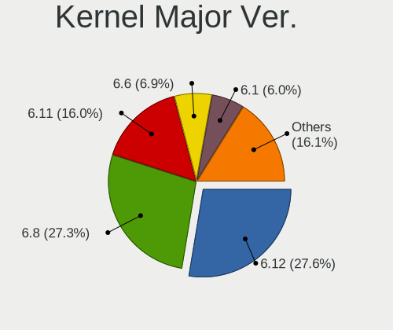
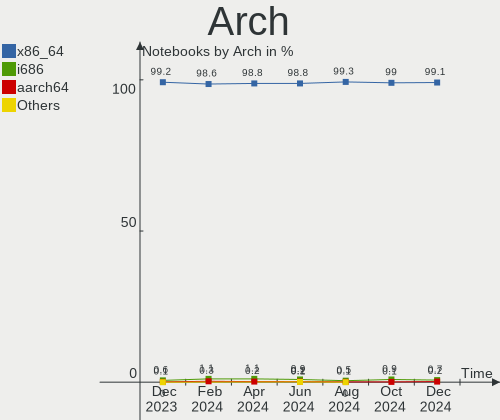
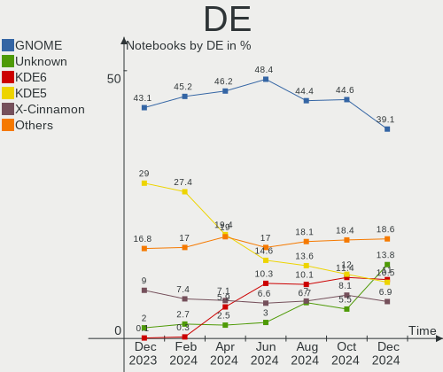
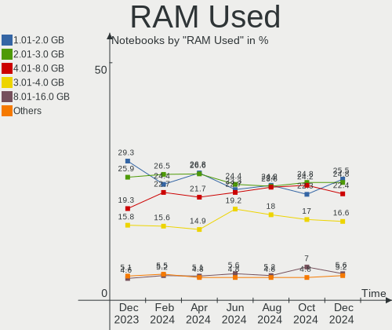
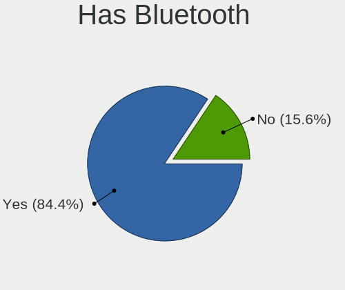
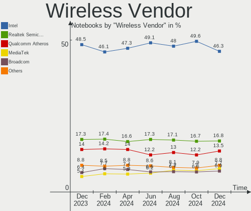
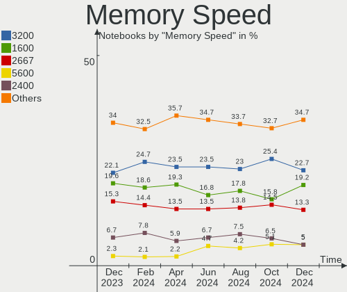
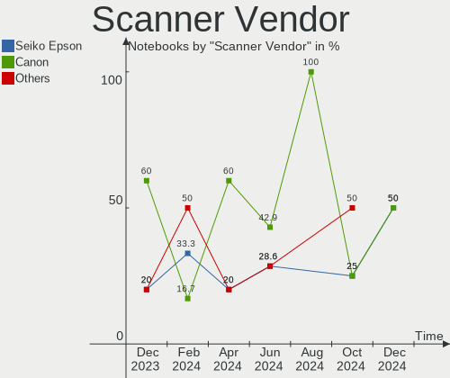

Linux Hardware Trends (Notebook)
--------------------------------

A project to identify most popular hardware characteristics and track their change
over time based on data collected by Linux users at https://Linux-Hardware.org.

Anyone can contribute to the study by uploading probes of their computers by
the [hw-probe](https://github.com/linuxhw/hw-probe) tool:

    sudo -E hw-probe -all -upload

Full-feature report is available here: https://linux-hardware.org/?view=trends&formfactor=notebook

Period: Apr, 2021.

Contents
--------

- [ OS                       ](#os)
- [ OS Family                ](#os-family)
- [ Kernel                   ](#kernel)
- [ Kernel Family            ](#kernel-family)
- [ Kernel Major Ver.        ](#kernel-major-ver)
- [ Arch                     ](#arch)
- [ DE                       ](#de)
- [ Display Server           ](#display-server)
- [ Display Manager          ](#display-manager)
- [ OS Lang                  ](#os-lang)
- [ Boot Mode                ](#boot-mode)
- [ Filesystem               ](#filesystem)
- [ Part. scheme             ](#part-scheme)
- [ Dual Boot with Linux/BSD ](#dual-boot-with-linux/bsd)
- [ Dual Boot (Win)          ](#dual-boot-win)
- [ Country                  ](#country)
- [ City                     ](#city)
- [ Vendor                   ](#vendor)
- [ Model                    ](#model)
- [ Model Family             ](#model-family)
- [ MFG Year                 ](#mfg-year)
- [ Form Factor              ](#form-factor)
- [ Secure Boot              ](#secure-boot)
- [ Coreboot                 ](#coreboot)
- [ RAM Size                 ](#ram-size)
- [ RAM Used                 ](#ram-used)
- [ Has CD-ROM               ](#has-cd-rom)
- [ Total Drives             ](#total-drives)
- [ Has Ethernet             ](#has-ethernet)
- [ Has WiFi                 ](#has-wifi)
- [ Has Bluetooth            ](#has-bluetooth)
- [ Drive Vendor             ](#drive-vendor)
- [ Drive Model              ](#drive-model)
- [ HDD Vendor               ](#hdd-vendor)
- [ SSD Vendor               ](#ssd-vendor)
- [ Drive Kind               ](#drive-kind)
- [ Drive Connector          ](#drive-connector)
- [ Drive Size               ](#drive-size)
- [ Space Total              ](#space-total)
- [ Space Used               ](#space-used)
- [ Malfunc. Drives          ](#malfunc-drives)
- [ Malfunc. Drive Vendor    ](#malfunc-drive-vendor)
- [ Malfunc. HDD Vendor      ](#malfunc-hdd-vendor)
- [ Malfunc. Drive Kind      ](#malfunc-drive-kind)
- [ Failed Drives            ](#failed-drives)
- [ Failed Drive Vendor      ](#failed-drive-vendor)
- [ Drive Status             ](#drive-status)
- [ Storage Vendor           ](#storage-vendor)
- [ Storage Model            ](#storage-model)
- [ Storage Kind             ](#storage-kind)
- [ CPU Vendor               ](#cpu-vendor)
- [ CPU Model                ](#cpu-model)
- [ CPU Model Family         ](#cpu-model-family)
- [ CPU Cores                ](#cpu-cores)
- [ CPU Sockets              ](#cpu-sockets)
- [ CPU Threads              ](#cpu-threads)
- [ CPU Op-Modes             ](#cpu-op-modes)
- [ CPU Microcode            ](#cpu-microcode)
- [ CPU Microarch            ](#cpu-microarch)
- [ GPU Vendor               ](#gpu-vendor)
- [ GPU Model                ](#gpu-model)
- [ GPU Combo                ](#gpu-combo)
- [ GPU Driver               ](#gpu-driver)
- [ GPU Memory               ](#gpu-memory)
- [ Monitor Vendor           ](#monitor-vendor)
- [ Monitor Model            ](#monitor-model)
- [ Monitor Resolution       ](#monitor-resolution)
- [ Monitor Diagonal         ](#monitor-diagonal)
- [ Monitor Width            ](#monitor-width)
- [ Aspect Ratio             ](#aspect-ratio)
- [ Monitor Area             ](#monitor-area)
- [ Pixel Density            ](#pixel-density)
- [ Multiple Monitors        ](#multiple-monitors)
- [ Net Controller Vendor    ](#net-controller-vendor)
- [ Net Controller Model     ](#net-controller-model)
- [ Wireless Vendor          ](#wireless-vendor)
- [ Wireless Model           ](#wireless-model)
- [ Ethernet Vendor          ](#ethernet-vendor)
- [ Ethernet Model           ](#ethernet-model)
- [ Net Controller Kind      ](#net-controller-kind)
- [ Used Controller          ](#used-controller)
- [ NICs                     ](#nics)
- [ IPv6                     ](#ipv6)
- [ Memory Vendor            ](#memory-vendor)
- [ Memory Model             ](#memory-model)
- [ Memory Kind              ](#memory-kind)
- [ Memory Form Factor       ](#memory-form-factor)
- [ Memory Size              ](#memory-size)
- [ Memory Speed             ](#memory-speed)
- [ Sound Vendor             ](#sound-vendor)
- [ Sound Model              ](#sound-model)
- [ Camera Vendor            ](#camera-vendor)
- [ Camera Model             ](#camera-model)
- [ Fingerprint Vendor       ](#fingerprint-vendor)
- [ Fingerprint Model        ](#fingerprint-model)
- [ Chipcard Vendor          ](#chipcard-vendor)
- [ Chipcard Model           ](#chipcard-model)
- [ Printer Vendor           ](#printer-vendor)
- [ Printer Model            ](#printer-model)
- [ Scanner Vendor           ](#scanner-vendor)
- [ Scanner Model            ](#scanner-model)
- [ Bluetooth Vendor         ](#bluetooth-vendor)
- [ Bluetooth Model          ](#bluetooth-model)
- [ Unsupported Devices      ](#unsupported-devices)
- [ Unsupported Device Types ](#unsupported-device-types)

OS
--

Installed operating systems

| Name                | Notebooks | Percent |
|---------------------|-----------|---------|
| Ubuntu 20.04        | 533       | 20.84%  |
| Mint 20.1           | 203       | 7.94%   |
| OpenMandriva 4.2    | 173       | 6.76%   |
| Ubuntu 20.10        | 135       | 5.28%   |
| Pop!_OS 20.10       | 123       | 4.81%   |
| Fedora 33           | 104       | 4.07%   |
| Fedora 34           | 92        | 3.6%    |
| KDE neon 20.04      | 88        | 3.44%   |
| BlackPanther 18.1   | 70        | 2.74%   |
| ROSA R11.1          | 66        | 2.58%   |
| Ubuntu 18.04        | 57        | 2.23%   |
| Arch                | 56        | 2.19%   |
| Manjaro             | 50        | 1.95%   |
| Debian 10           | 45        | 1.76%   |
| Xubuntu 20.04       | 40        | 1.56%   |
| Ubuntu 21.04        | 35        | 1.37%   |
| Mint 19.3           | 34        | 1.33%   |
| Mint 20             | 33        | 1.29%   |
| Endless 3.9.3       | 32        | 1.25%   |
| Zorin 15            | 31        | 1.21%   |
| Kubuntu 20.04       | 31        | 1.21%   |
| Kali 2021.1         | 23        | 0.9%    |
| ArcoLinux Rolling   | 23        | 0.9%    |
| Pop!_OS 20.04       | 22        | 0.86%   |
| Debian Testing      | 20        | 0.78%   |
| Arch Rolling        | 20        | 0.78%   |
| Manjaro 21.0.2      | 17        | 0.66%   |
| Manjaro 21.0.1      | 17        | 0.66%   |
| Xubuntu 18.04       | 16        | 0.63%   |
| Manjaro 21.0        | 14        | 0.55%   |
| Debian              | 14        | 0.55%   |
| LMDE 4              | 12        | 0.47%   |
| Kubuntu 20.10       | 11        | 0.43%   |
| Elementary 5.1.7    | 11        | 0.43%   |
| Gentoo              | 10        | 0.39%   |
| Endless 3.9.4       | 9         | 0.35%   |
| CentOS 8            | 9         | 0.35%   |
| Ubuntu MATE 20.04   | 8         | 0.31%   |
| Lubuntu 20.04       | 8         | 0.31%   |
| Debian 11           | 8         | 0.31%   |
| ROSA R11            | 7         | 0.27%   |
| RHEL 8.3            | 7         | 0.27%   |
| Peppermint 10       | 7         | 0.27%   |
| Mint 19.1           | 7         | 0.27%   |
| Mint 19             | 7         | 0.27%   |
| EndeavourOS Rolling | 7         | 0.27%   |
| Xubuntu 20.10       | 6         | 0.23%   |
| Fedora 32           | 6         | 0.23%   |
| Ubuntu Budgie 20.04 | 5         | 0.2%    |
| openSUSE Leap-15.2  | 5         | 0.2%    |
| MX 19.4             | 5         | 0.2%    |
| Lubuntu 20.10       | 5         | 0.2%    |
| Lubuntu 18.04       | 5         | 0.2%    |
| Kubuntu 21.04       | 5         | 0.2%    |
| Solus 4.2           | 4         | 0.16%   |
| Mint 18.3           | 4         | 0.16%   |
| Gentoo 2.7          | 4         | 0.16%   |
| Garuda Soaring      | 4         | 0.16%   |
| Garuda              | 4         | 0.16%   |
| ArcoLinux           | 4         | 0.16%   |

OS Family
---------

OS without a version

| Name           | Notebooks | Percent |
|----------------|-----------|---------|
| Ubuntu         | 770       | 30.1%   |
| Mint           | 290       | 11.34%  |
| Fedora         | 203       | 7.94%   |
| OpenMandriva   | 175       | 6.84%   |
| Pop!_OS        | 145       | 5.67%   |
| Manjaro        | 102       | 3.99%   |
| Debian         | 92        | 3.6%    |
| KDE neon       | 88        | 3.44%   |
| ROSA           | 77        | 3.01%   |
| Arch           | 76        | 2.97%   |
| BlackPanther   | 73        | 2.85%   |
| Xubuntu        | 64        | 2.5%    |
| Endless        | 52        | 2.03%   |
| Kubuntu        | 51        | 1.99%   |
| Zorin          | 35        | 1.37%   |
| ArcoLinux      | 27        | 1.06%   |
| Kali           | 25        | 0.98%   |
| Lubuntu        | 22        | 0.86%   |
| Ubuntu MATE    | 17        | 0.66%   |
| openSUSE       | 16        | 0.63%   |
| Gentoo         | 14        | 0.55%   |
| LMDE           | 12        | 0.47%   |
| Elementary     | 11        | 0.43%   |
| Ubuntu Budgie  | 10        | 0.39%   |
| EndeavourOS    | 10        | 0.39%   |
| MX             | 9         | 0.35%   |
| CentOS         | 9         | 0.35%   |
| RHEL           | 8         | 0.31%   |
| Garuda         | 8         | 0.31%   |
| Peppermint     | 7         | 0.27%   |
| Clear Linux    | 7         | 0.27%   |
| Solus          | 4         | 0.16%   |
| ALT Linux      | 4         | 0.16%   |
| Mageia         | 3         | 0.12%   |
| Devuan         | 3         | 0.12%   |
| Scientific     | 2         | 0.08%   |
| Reborn OS      | 2         | 0.08%   |
| PostmarketOS   | 2         | 0.08%   |
| PCLinuxOS      | 2         | 0.08%   |
| Kaisen         | 2         | 0.08%   |
| GNOME OS       | 2         | 0.08%   |
| Deepin         | 2         | 0.08%   |
| Artix          | 2         | 0.08%   |
| Void           | 1         | 0.04%   |
| Siduction      | 1         | 0.04%   |
| RELS           | 1         | 0.04%   |
| Red OS         | 1         | 0.04%   |
| RED            | 1         | 0.04%   |
| Poky           | 1         | 0.04%   |
| Parrot         | 1         | 0.04%   |
| Parabola       | 1         | 0.04%   |
| Obarun         | 1         | 0.04%   |
| NST            | 1         | 0.04%   |
| NixOS          | 1         | 0.04%   |
| LFS            | 1         | 0.04%   |
| Kylin          | 1         | 0.04%   |
| Gentoo-pelikan | 1         | 0.04%   |
| Generic        | 1         | 0.04%   |
| GalliumOS      | 1         | 0.04%   |
| Freedesktop    | 1         | 0.04%   |

Kernel
------

Version of the Linux kernel

| Version                             | Notebooks | Percent |
|-------------------------------------|-----------|---------|
| 5.8.0-48-generic                    | 258       | 10.09%  |
| 5.4.0-70-generic                    | 220       | 8.6%    |
| 5.8.0-50-generic                    | 218       | 8.52%   |
| 5.4.0-72-generic                    | 180       | 7.04%   |
| 5.10.14-desktop-1omv4002            | 165       | 6.45%   |
| 5.11.0-7612-generic                 | 106       | 4.14%   |
| 5.8.0-49-generic                    | 79        | 3.09%   |
| 5.4.0-71-generic                    | 50        | 1.95%   |
| 5.6.14-desktop-2bP                  | 49        | 1.92%   |
| 5.8.0-14-generic                    | 44        | 1.72%   |
| 4.19.0-16-amd64                     | 38        | 1.49%   |
| 5.11.11-200.fc33.x86_64             | 37        | 1.45%   |
| 5.8.0-43-generic                    | 32        | 1.25%   |
| 5.11.0-16-generic                   | 32        | 1.25%   |
| 5.11.11-arch1-1                     | 26        | 1.02%   |
| 5.4.0-58-generic                    | 25        | 0.98%   |
| 5.11.11-300.fc34.x86_64             | 24        | 0.94%   |
| 5.4.83-generic-2rosa-x86_64         | 23        | 0.9%    |
| 5.11.14-200.fc33.x86_64             | 22        | 0.86%   |
| 4.15.0-142-generic                  | 22        | 0.86%   |
| 4.18.16-desktop-1bP                 | 21        | 0.82%   |
| 5.11.0-7614-generic                 | 20        | 0.78%   |
| 5.4.32-generic-2rosa-x86_64         | 18        | 0.7%    |
| 5.11.16-arch1-1                     | 16        | 0.63%   |
| 5.11.15-300.fc34.x86_64             | 16        | 0.63%   |
| 5.10.30-1-MANJARO                   | 16        | 0.63%   |
| 5.11.15-arch1-2                     | 15        | 0.59%   |
| 4.15.0-140-generic                  | 15        | 0.59%   |
| 5.11.12-300.fc34.x86_64             | 14        | 0.55%   |
| 5.4.0-26-generic                    | 13        | 0.51%   |
| 5.10.26-1-MANJARO                   | 13        | 0.51%   |
| 5.10.0-6-amd64                      | 13        | 0.51%   |
| 5.11.12-arch1-1                     | 12        | 0.47%   |
| 5.10.23-1-MANJARO                   | 12        | 0.47%   |
| 5.10.0-5-amd64                      | 12        | 0.47%   |
| 5.8.0-7642-generic                  | 11        | 0.43%   |
| 5.4.0-42-generic                    | 11        | 0.43%   |
| 5.0.0-32-generic                    | 11        | 0.43%   |
| 4.15.0-desktop-122.124.1rosa-x86_64 | 11        | 0.43%   |
| 5.8.15-301.fc33.x86_64              | 10        | 0.39%   |
| 5.8.0-25-generic                    | 9         | 0.35%   |
| 5.12.0-1-MANJARO                    | 9         | 0.35%   |
| 5.11.10-1-MANJARO                   | 9         | 0.35%   |
| 5.11.0-13-generic                   | 9         | 0.35%   |
| 5.10.0-kali7-amd64                  | 9         | 0.35%   |
| 5.10.0-kali6-amd64                  | 9         | 0.35%   |
| 5.8.0-45-generic                    | 8         | 0.31%   |
| 5.11.16-300.fc34.x86_64             | 8         | 0.31%   |
| 5.10.0-2-amd64                      | 8         | 0.31%   |
| 5.9.16-1-MANJARO                    | 7         | 0.27%   |
| 5.4.32-generic-2rosa-i586           | 7         | 0.27%   |
| 5.4.0-66-generic                    | 7         | 0.27%   |
| 5.4.0-65-generic                    | 7         | 0.27%   |
| 5.11.3-300.fc34.x86_64              | 7         | 0.27%   |
| 5.11.15-200.fc33.x86_64             | 7         | 0.27%   |
| 5.11.14-300.fc34.x86_64             | 7         | 0.27%   |
| 5.11.13-300.fc34.x86_64             | 7         | 0.27%   |
| 4.19.0-16-686                       | 7         | 0.27%   |
| 4.18.0-240.15.1.el8_3.x86_64        | 7         | 0.27%   |
| 4.15.0-desktop-45.1rosa-x86_64      | 7         | 0.27%   |

Kernel Family
-------------

Linux kernel without a distro release

| Version  | Notebooks | Percent |
|----------|-----------|---------|
| 5.8.0    | 696       | 27.21%  |
| 5.4.0    | 551       | 21.54%  |
| 5.11.0   | 184       | 7.19%   |
| 5.10.14  | 165       | 6.45%   |
| 5.11.11  | 113       | 4.42%   |
| 4.15.0   | 80        | 3.13%   |
| 5.10.0   | 70        | 2.74%   |
| 4.19.0   | 58        | 2.27%   |
| 5.11.12  | 52        | 2.03%   |
| 5.6.14   | 49        | 1.92%   |
| 5.11.14  | 48        | 1.88%   |
| 5.11.15  | 45        | 1.76%   |
| 5.11.16  | 41        | 1.6%    |
| 5.12.0   | 27        | 1.06%   |
| 5.11.10  | 27        | 1.06%   |
| 5.4.32   | 25        | 0.98%   |
| 5.4.83   | 24        | 0.94%   |
| 5.11.13  | 21        | 0.82%   |
| 4.18.16  | 21        | 0.82%   |
| 5.10.30  | 19        | 0.74%   |
| 4.18.0   | 19        | 0.74%   |
| 5.0.0    | 15        | 0.59%   |
| 5.10.26  | 14        | 0.55%   |
| 5.10.23  | 12        | 0.47%   |
| 5.8.15   | 10        | 0.39%   |
| 5.3.0    | 10        | 0.39%   |
| 5.11.6   | 9         | 0.35%   |
| 5.10.27  | 8         | 0.31%   |
| 5.9.16   | 7         | 0.27%   |
| 5.6.0    | 7         | 0.27%   |
| 5.11.3   | 7         | 0.27%   |
| 5.10.32  | 6         | 0.23%   |
| 5.10.28  | 6         | 0.23%   |
| 5.3.18   | 5         | 0.2%    |
| 5.10.19  | 5         | 0.2%    |
| 5.4.105  | 4         | 0.16%   |
| 5.11.2   | 4         | 0.16%   |
| 5.10.31  | 4         | 0.16%   |
| 5.4.97   | 3         | 0.12%   |
| 5.4.111  | 3         | 0.12%   |
| 5.11.8   | 3         | 0.12%   |
| 4.9.20   | 3         | 0.12%   |
| 4.19.180 | 3         | 0.12%   |
| 4.16.18  | 3         | 0.12%   |
| 3.10.0   | 3         | 0.12%   |
| 5.8.16   | 2         | 0.08%   |
| 5.7.0    | 2         | 0.08%   |
| 5.4.112  | 2         | 0.08%   |
| 5.4.101  | 2         | 0.08%   |
| 5.11.9   | 2         | 0.08%   |
| 5.11.7   | 2         | 0.08%   |
| 5.10.29  | 2         | 0.08%   |
| 5.10.24  | 2         | 0.08%   |
| 5.10.20  | 2         | 0.08%   |
| 5.10.18  | 2         | 0.08%   |
| 5.10.17  | 2         | 0.08%   |
| 5.10.16  | 2         | 0.08%   |
| 5.10.13  | 2         | 0.08%   |
| 5.10.11  | 2         | 0.08%   |
| 4.4.0    | 2         | 0.08%   |

Kernel Major Ver.
-----------------

Linux kernel major version

| Version | Notebooks | Percent |
|---------|-----------|---------|
| 5.8     | 710       | 27.76%  |
| 5.4     | 621       | 24.28%  |
| 5.11    | 559       | 21.85%  |
| 5.10    | 327       | 12.78%  |
| 4.15    | 80        | 3.13%   |
| 4.19    | 62        | 2.42%   |
| 5.6     | 60        | 2.35%   |
| 4.18    | 40        | 1.56%   |
| 5.12    | 27        | 1.06%   |
| 5.0     | 16        | 0.63%   |
| 5.3     | 15        | 0.59%   |
| 5.9     | 10        | 0.39%   |
| 4.9     | 5         | 0.2%    |
| 4.4     | 5         | 0.2%    |
| 5.7     | 4         | 0.16%   |
| 3.10    | 4         | 0.16%   |
| 4.16    | 3         | 0.12%   |
| 3.16    | 2         | 0.08%   |
| Unknown | 2         | 0.08%   |
| 5.4.104 | 1         | 0.04%   |
| 4.12    | 1         | 0.04%   |
| 4.10    | 1         | 0.04%   |
| 4.1     | 1         | 0.04%   |
| 3.18    | 1         | 0.04%   |
| 3.0     | 1         | 0.04%   |

Arch
----

OS architecture (x86_64, i586, etc.)

| Name    | Notebooks | Percent |
|---------|-----------|---------|
| x86_64  | 2473      | 96.68%  |
| i686    | 76        | 2.97%   |
| aarch64 | 6         | 0.23%   |
| armv7l  | 2         | 0.08%   |
| Unknown | 1         | 0.04%   |

DE
--

Desktop Environment

| Name                | Notebooks | Percent |
|---------------------|-----------|---------|
| GNOME               | 1176      | 45.97%  |
| KDE5                | 393       | 15.36%  |
| X-Cinnamon          | 221       | 8.64%   |
| XFCE                | 208       | 8.13%   |
| KDE                 | 153       | 5.98%   |
| Unknown             | 138       | 5.39%   |
| MATE                | 68        | 2.66%   |
| KDE4                | 52        | 2.03%   |
| Cinnamon            | 26        | 1.02%   |
| LXQt                | 25        | 0.98%   |
| i3                  | 21        | 0.82%   |
| LXDE                | 15        | 0.59%   |
| Budgie              | 15        | 0.59%   |
| Pantheon            | 8         | 0.31%   |
| Deepin              | 7         | 0.27%   |
| GNOME Flashback     | 6         | 0.23%   |
| Unity               | 5         | 0.2%    |
| GNOME Classic       | 4         | 0.16%   |
| bspwm               | 4         | 0.16%   |
| DWM                 | 3         | 0.12%   |
| awesome             | 3         | 0.12%   |
| xmonad              | 1         | 0.04%   |
| UKUI                | 1         | 0.04%   |
| qtile               | 1         | 0.04%   |
| lightdm-xsession    | 1         | 0.04%   |
| i3-with-shmlog      | 1         | 0.04%   |
| herbstluftwm        | 1         | 0.04%   |
| /usr/bin/startxfce4 | 1         | 0.04%   |

Display Server
--------------

X11 or Wayland

| Name    | Notebooks | Percent |
|---------|-----------|---------|
| X11     | 2196      | 85.85%  |
| Wayland | 254       | 9.93%   |
| Unknown | 77        | 3.01%   |
| Tty     | 31        | 1.21%   |

Display Manager
---------------

SDDM, LightDM, etc.

| Name    | Notebooks | Percent |
|---------|-----------|---------|
| Unknown | 1475      | 57.66%  |
| SDDM    | 414       | 16.18%  |
| GDM     | 344       | 13.45%  |
| TDM     | 218       | 8.52%   |
| KDM     | 53        | 2.07%   |
| LightDM | 41        | 1.6%    |
| XDM     | 6         | 0.23%   |
| Ly      | 3         | 0.12%   |
| SLiM    | 1         | 0.04%   |
| MDM     | 1         | 0.04%   |
| LXDM    | 1         | 0.04%   |
| GDM3    | 1         | 0.04%   |

OS Lang
-------

Language

| Lang    | Notebooks | Percent |
|---------|-----------|---------|
| en_US   | 957       | 37.41%  |
| de_DE   | 200       | 7.82%   |
| ru_RU   | 171       | 6.68%   |
| pt_BR   | 154       | 6.02%   |
| fr_FR   | 136       | 5.32%   |
| en_GB   | 116       | 4.53%   |
| Unknown | 114       | 4.46%   |
| es_ES   | 70        | 2.74%   |
| it_IT   | 69        | 2.7%    |
| pl_PL   | 52        | 2.03%   |
| en_IN   | 46        | 1.8%    |
| en_AU   | 39        | 1.52%   |
| C       | 39        | 1.52%   |
| en_CA   | 35        | 1.37%   |
| sv_SE   | 21        | 0.82%   |
| es_MX   | 19        | 0.74%   |
| pt_PT   | 18        | 0.7%    |
| cs_CZ   | 18        | 0.7%    |
| nl_NL   | 15        | 0.59%   |
| zh_CN   | 14        | 0.55%   |
| ru_UA   | 14        | 0.55%   |
| hu_HU   | 14        | 0.55%   |
| es_CL   | 14        | 0.55%   |
| es_AR   | 14        | 0.55%   |
| en_ZA   | 13        | 0.51%   |
| de_CH   | 12        | 0.47%   |
| tr_TR   | 11        | 0.43%   |
| ja_JP   | 9         | 0.35%   |
| fi_FI   | 9         | 0.35%   |
| de_AT   | 9         | 0.35%   |
| uk_UA   | 8         | 0.31%   |
| fr_CA   | 7         | 0.27%   |
| es_UY   | 7         | 0.27%   |
| sk_SK   | 6         | 0.23%   |
| hr_HR   | 6         | 0.23%   |
| nl_BE   | 5         | 0.2%    |
| fr_CH   | 5         | 0.2%    |
| ca_ES   | 5         | 0.2%    |
| ro_RO   | 4         | 0.16%   |
| id_ID   | 4         | 0.16%   |
| fr_BE   | 4         | 0.16%   |
| en_IE   | 4         | 0.16%   |
| bg_BG   | 4         | 0.16%   |
| sl_SI   | 3         | 0.12%   |
| ko_KR   | 3         | 0.12%   |
| es_CR   | 3         | 0.12%   |
| en_PH   | 3         | 0.12%   |
| en_NG   | 3         | 0.12%   |
| en_DK   | 3         | 0.12%   |
| el_GR   | 3         | 0.12%   |
| nb_NO   | 2         | 0.08%   |
| gl_ES   | 2         | 0.08%   |
| es_SV   | 2         | 0.08%   |
| es_PE   | 2         | 0.08%   |
| es_EC   | 2         | 0.08%   |
| es_CO   | 2         | 0.08%   |
| en_NZ   | 2         | 0.08%   |
| en_IL   | 2         | 0.08%   |
| da_DK   | 2         | 0.08%   |
| C.UTF8  | 2         | 0.08%   |

Boot Mode
---------

EFI or BIOS

| Mode | Notebooks | Percent |
|------|-----------|---------|
| BIOS | 1304      | 50.98%  |
| EFI  | 1254      | 49.02%  |

Filesystem
----------

Type of filesystem

| Type     | Notebooks | Percent |
|----------|-----------|---------|
| Ext4     | 2042      | 79.83%  |
| Overlay  | 242       | 9.46%   |
| Btrfs    | 196       | 7.66%   |
| Xfs      | 38        | 1.49%   |
| Zfs      | 20        | 0.78%   |
| Ext3     | 5         | 0.2%    |
| F2fs     | 4         | 0.16%   |
| Ext2     | 3         | 0.12%   |
| Unknown  | 3         | 0.12%   |
| Tmpfs    | 2         | 0.08%   |
| Aufs     | 2         | 0.08%   |
| Reiserfs | 1         | 0.04%   |

Part. scheme
------------

Scheme of partitioning

| Type    | Notebooks | Percent |
|---------|-----------|---------|
| Unknown | 1419      | 55.47%  |
| GPT     | 790       | 30.88%  |
| MBR     | 349       | 13.64%  |

Dual Boot with Linux/BSD
------------------------

Hosting more than one Linux/BSD

| Dual boot | Notebooks | Percent |
|-----------|-----------|---------|
| No        | 2265      | 88.55%  |
| Yes       | 293       | 11.45%  |

Dual Boot (Win)
---------------

Hosting Linux and Windows

| Dual boot | Notebooks | Percent |
|-----------|-----------|---------|
| No        | 1870      | 73.1%   |
| Yes       | 688       | 26.9%   |

Country
-------

Geographic location (country)

| Country      | Notebooks | Percent |
|--------------|-----------|---------|
| USA          | 342       | 13.37%  |
| Germany      | 256       | 10.01%  |
| Brazil       | 210       | 8.21%   |
| Russia       | 202       | 7.9%    |
| France       | 150       | 5.86%   |
| Italy        | 100       | 3.91%   |
| UK           | 92        | 3.6%    |
| Spain        | 90        | 3.52%   |
| Poland       | 78        | 3.05%   |
| Hungary      | 74        | 2.89%   |
| India        | 70        | 2.74%   |
| Canada       | 54        | 2.11%   |
| Netherlands  | 50        | 1.95%   |
| Ukraine      | 44        | 1.72%   |
| Australia    | 42        | 1.64%   |
| Sweden       | 40        | 1.56%   |
| Mexico       | 33        | 1.29%   |
| Turkey       | 31        | 1.21%   |
| Switzerland  | 29        | 1.13%   |
| Czechia      | 27        | 1.06%   |
| Romania      | 24        | 0.94%   |
| Portugal     | 24        | 0.94%   |
| Austria      | 24        | 0.94%   |
| Chile        | 23        | 0.9%    |
| Belgium      | 22        | 0.86%   |
| Indonesia    | 21        | 0.82%   |
| Argentina    | 21        | 0.82%   |
| Japan        | 20        | 0.78%   |
| China        | 19        | 0.74%   |
| South Africa | 18        | 0.7%    |
| Finland      | 18        | 0.7%    |
| Iran         | 16        | 0.63%   |
| Bulgaria     | 15        | 0.59%   |
| Greece       | 14        | 0.55%   |
| Slovakia     | 13        | 0.51%   |
| Norway       | 12        | 0.47%   |
| Denmark      | 12        | 0.47%   |
| Croatia      | 12        | 0.47%   |
| Vietnam      | 11        | 0.43%   |
| Belarus      | 11        | 0.43%   |
| Uruguay      | 9         | 0.35%   |
| Egypt        | 9         | 0.35%   |
| Colombia     | 8         | 0.31%   |
| South Korea  | 7         | 0.27%   |
| Algeria      | 7         | 0.27%   |
| Slovenia     | 6         | 0.23%   |
| Philippines  | 6         | 0.23%   |
| Estonia      | 6         | 0.23%   |
| New Zealand  | 5         | 0.2%    |
| Morocco      | 5         | 0.2%    |
| Ecuador      | 5         | 0.2%    |
| Costa Rica   | 5         | 0.2%    |
| Serbia       | 4         | 0.16%   |
| Qatar        | 4         | 0.16%   |
| Lithuania    | 4         | 0.16%   |
| Kenya        | 4         | 0.16%   |
| Kazakhstan   | 4         | 0.16%   |
| Ireland      | 4         | 0.16%   |
| Hong Kong    | 4         | 0.16%   |
| Tunisia      | 3         | 0.12%   |

City
----

Geographic location (city)

| City              | Notebooks | Percent |
|-------------------|-----------|---------|
| Moscow            | 50        | 1.95%   |
| Budapest          | 25        | 0.98%   |
| Berlin            | 24        | 0.94%   |
| São Paulo        | 19        | 0.74%   |
| Warsaw            | 18        | 0.7%    |
| Rome              | 18        | 0.7%    |
| St Petersburg     | 17        | 0.66%   |
| Milan             | 16        | 0.63%   |
| Paris             | 15        | 0.59%   |
| Madrid            | 15        | 0.59%   |
| Prague            | 14        | 0.55%   |
| London            | 14        | 0.55%   |
| Kyiv              | 14        | 0.55%   |
| Rio de Janeiro    | 13        | 0.51%   |
| Barcelona         | 13        | 0.51%   |
| Vienna            | 12        | 0.47%   |
| Tehran            | 12        | 0.47%   |
| Munich            | 11        | 0.43%   |
| Krasnodar         | 11        | 0.43%   |
| Istanbul          | 11        | 0.43%   |
| Zagreb            | 10        | 0.39%   |
| Cologne           | 10        | 0.39%   |
| The Hague         | 9         | 0.35%   |
| Sydney            | 9         | 0.35%   |
| Sofia             | 9         | 0.35%   |
| Perm              | 9         | 0.35%   |
| New York          | 9         | 0.35%   |
| Belo Horizonte    | 9         | 0.35%   |
| Amsterdam         | 9         | 0.35%   |
| Voronezh          | 8         | 0.31%   |
| Krakow            | 8         | 0.31%   |
| Hamburg           | 8         | 0.31%   |
| Frankfurt am Main | 8         | 0.31%   |
| Curitiba          | 8         | 0.31%   |
| Zurich            | 7         | 0.27%   |
| Wroclaw           | 7         | 0.27%   |
| Toronto           | 7         | 0.27%   |
| Saratov           | 7         | 0.27%   |
| Santiago          | 7         | 0.27%   |
| Montevideo        | 7         | 0.27%   |
| Minsk             | 7         | 0.27%   |
| Los Angeles       | 7         | 0.27%   |
| Ho Chi Minh City  | 7         | 0.27%   |
| Buenos Aires      | 7         | 0.27%   |
| Bucharest         | 7         | 0.27%   |
| Brasília         | 7         | 0.27%   |
| Bengaluru         | 7         | 0.27%   |
| Wooster           | 6         | 0.23%   |
| Stuttgart         | 6         | 0.23%   |
| Stockholm         | 6         | 0.23%   |
| New Delhi         | 6         | 0.23%   |
| Melbourne         | 6         | 0.23%   |
| Glasgow           | 6         | 0.23%   |
| Fortaleza         | 6         | 0.23%   |
| Delhi             | 6         | 0.23%   |
| Chicago           | 6         | 0.23%   |
| Bratislava        | 6         | 0.23%   |
| Athens            | 6         | 0.23%   |
| Yekaterinburg     | 5         | 0.2%    |
| Tallinn           | 5         | 0.2%    |

Vendor
------

Motherboard manufacturer

| Name                             | Notebooks | Percent |
|----------------------------------|-----------|---------|
| Lenovo                           | 547       | 21.38%  |
| Hewlett-Packard                  | 468       | 18.3%   |
| Dell                             | 436       | 17.04%  |
| ASUSTek Computer                 | 263       | 10.28%  |
| Acer                             | 252       | 9.85%   |
| Toshiba                          | 81        | 3.17%   |
| Samsung Electronics              | 60        | 2.35%   |
| MSI                              | 55        | 2.15%   |
| Apple                            | 52        | 2.03%   |
| Sony                             | 33        | 1.29%   |
| Notebook                         | 22        | 0.86%   |
| HUAWEI                           | 19        | 0.74%   |
| Fujitsu                          | 16        | 0.63%   |
| Positivo                         | 15        | 0.59%   |
| Packard Bell                     | 15        | 0.59%   |
| System76                         | 13        | 0.51%   |
| Medion                           | 13        | 0.51%   |
| Unknown                          | 13        | 0.51%   |
| Fujitsu Siemens                  | 11        | 0.43%   |
| LG Electronics                   | 10        | 0.39%   |
| TUXEDO                           | 9         | 0.35%   |
| Alienware                        | 9         | 0.35%   |
| Semp Toshiba                     | 8         | 0.31%   |
| Google                           | 8         | 0.31%   |
| Panasonic                        | 7         | 0.27%   |
| Gigabyte Technology              | 6         | 0.23%   |
| TrekStor                         | 5         | 0.2%    |
| Jumper                           | 4         | 0.16%   |
| Gateway                          | 4         | 0.16%   |
| eMachines                        | 4         | 0.16%   |
| Chuwi                            | 4         | 0.16%   |
| Timi                             | 3         | 0.12%   |
| SLIMBOOK                         | 3         | 0.12%   |
| Schenker                         | 3         | 0.12%   |
| Itautec                          | 3         | 0.12%   |
| Clevo                            | 3         | 0.12%   |
| whyopencomputing                 | 2         | 0.08%   |
| Teclast                          | 2         | 0.08%   |
| Standard                         | 2         | 0.08%   |
| Razer                            | 2         | 0.08%   |
| Radxa                            | 2         | 0.08%   |
| PC Specialist                    | 2         | 0.08%   |
| ONE-NETBOOK TECHNOLOGY           | 2         | 0.08%   |
| NEC Computers                    | 2         | 0.08%   |
| MECHREVO                         | 2         | 0.08%   |
| MAIBENBEN                        | 2         | 0.08%   |
| Intel                            | 2         | 0.08%   |
| HASEE Computer                   | 2         | 0.08%   |
| Hampoo                           | 2         | 0.08%   |
| GPD                              | 2         | 0.08%   |
| FUJITSU CLIENT COMPUTING LIMITED | 2         | 0.08%   |
| Entroware                        | 2         | 0.08%   |
| Xplore                           | 1         | 0.04%   |
| WS                               | 1         | 0.04%   |
| Wortmann AG                      | 1         | 0.04%   |
| VINGA                            | 1         | 0.04%   |
| TQ-Group                         | 1         | 0.04%   |
| Thomson                          | 1         | 0.04%   |
| TEKNOSERVICE                     | 1         | 0.04%   |
| Shuttle                          | 1         | 0.04%   |

Model
-----

Motherboard model

| Name                                       | Notebooks | Percent |
|--------------------------------------------|-----------|---------|
| Unknown                                    | 27        | 1.06%   |
| HP Notebook                                | 17        | 0.66%   |
| HP Pavilion g6                             | 13        | 0.51%   |
| HP Pavilion dv7                            | 11        | 0.43%   |
| HP Pavilion dv6                            | 10        | 0.39%   |
| Dell Latitude E6420                        | 9         | 0.35%   |
| Dell XPS 15 7590                           | 8         | 0.31%   |
| Dell Latitude E7440                        | 8         | 0.31%   |
| Dell Inspiron 15-3567                      | 8         | 0.31%   |
| Apple MacBookPro8,1                        | 8         | 0.31%   |
| HP Pavilion Gaming Laptop 15-ec1xxx        | 7         | 0.27%   |
| HP Pavilion 15                             | 7         | 0.27%   |
| HP EliteBook 8470p                         | 7         | 0.27%   |
| HP EliteBook 8460p                         | 7         | 0.27%   |
| HP 15                                      | 7         | 0.27%   |
| Dell XPS 15 9570                           | 7         | 0.27%   |
| Dell XPS 15 9500                           | 7         | 0.27%   |
| Dell XPS 13 7390                           | 7         | 0.27%   |
| Samsung 300E4A/300E5A/300E7A/3430EA/3530EA | 6         | 0.23%   |
| HP Pavilion Notebook                       | 6         | 0.23%   |
| HP Laptop 15-da0xxx                        | 6         | 0.23%   |
| HP EliteBook 8440p                         | 6         | 0.23%   |
| HP EliteBook 840 G2                        | 6         | 0.23%   |
| HP 250 G6 Notebook PC                      | 6         | 0.23%   |
| Dell XPS 13 9360                           | 6         | 0.23%   |
| Dell Latitude E6540                        | 6         | 0.23%   |
| Dell Latitude 5480                         | 6         | 0.23%   |
| Dell Inspiron N5110                        | 6         | 0.23%   |
| Dell Inspiron 5570                         | 6         | 0.23%   |
| System76 Lemur Pro                         | 5         | 0.2%    |
| Lenovo G50-70 20351                        | 5         | 0.2%    |
| HUAWEI NBLK-WAX9X                          | 5         | 0.2%    |
| HP ProBook 650 G1                          | 5         | 0.2%    |
| HP Pavilion 17                             | 5         | 0.2%    |
| HP Laptop 15-db0xxx                        | 5         | 0.2%    |
| HP EliteBook 845 G7 Notebook PC            | 5         | 0.2%    |
| Dell XPS L502X                             | 5         | 0.2%    |
| Dell XPS 17 9700                           | 5         | 0.2%    |
| Dell XPS 15 9560                           | 5         | 0.2%    |
| Dell Vostro 3550                           | 5         | 0.2%    |
| Dell Latitude E6400                        | 5         | 0.2%    |
| Dell Latitude E6330                        | 5         | 0.2%    |
| Acer Nitro AN515-54                        | 5         | 0.2%    |
| Acer Nitro AN515-43                        | 5         | 0.2%    |
| Acer Aspire A315-34                        | 5         | 0.2%    |
| Toshiba Satellite L40                      | 4         | 0.16%   |
| Samsung 355V4C/356V4C/3445VC/3545VC        | 4         | 0.16%   |
| Packard Bell EasyNote TS11HR               | 4         | 0.16%   |
| Lenovo Z50-70 20354                        | 4         | 0.16%   |
| Lenovo IdeaPad L340-15IRH Gaming 81LK      | 4         | 0.16%   |
| Lenovo IdeaPad 520-15IKB 81BF              | 4         | 0.16%   |
| Lenovo IdeaPad 5 14ARE05 81YM              | 4         | 0.16%   |
| Lenovo IdeaPad 330-15IKB 81DE              | 4         | 0.16%   |
| Lenovo IdeaPad 320-15IAP 80XR              | 4         | 0.16%   |
| HUAWEI BOHK-WAX9X                          | 4         | 0.16%   |
| HP ProBook 6460b                           | 4         | 0.16%   |
| HP Pavilion g7                             | 4         | 0.16%   |
| HP Pavilion dv4                            | 4         | 0.16%   |
| HP Laptop 15s-eq1xxx                       | 4         | 0.16%   |
| HP Laptop 15-dw1xxx                        | 4         | 0.16%   |

Model Family
------------

Motherboard model prefix

| Name                    | Notebooks | Percent |
|-------------------------|-----------|---------|
| Lenovo ThinkPad         | 296       | 11.57%  |
| Acer Aspire             | 179       | 7%      |
| Dell Latitude           | 143       | 5.59%   |
| Dell Inspiron           | 137       | 5.36%   |
| Lenovo IdeaPad          | 123       | 4.81%   |
| HP Pavilion             | 113       | 4.42%   |
| HP EliteBook            | 90        | 3.52%   |
| Dell XPS                | 74        | 2.89%   |
| Toshiba Satellite       | 69        | 2.7%    |
| HP ProBook              | 55        | 2.15%   |
| HP Laptop               | 55        | 2.15%   |
| ASUS VivoBook           | 44        | 1.72%   |
| Dell Vostro             | 27        | 1.06%   |
| Dell Precision          | 27        | 1.06%   |
| Unknown                 | 27        | 1.06%   |
| Acer Nitro              | 22        | 0.86%   |
| HP Compaq               | 19        | 0.74%   |
| ASUS ROG                | 18        | 0.7%    |
| Lenovo Legion           | 17        | 0.66%   |
| HP Notebook             | 17        | 0.66%   |
| Packard Bell EasyNote   | 15        | 0.59%   |
| Fujitsu LIFEBOOK        | 15        | 0.59%   |
| HP 250                  | 14        | 0.55%   |
| Acer Swift              | 14        | 0.55%   |
| Lenovo Yoga             | 13        | 0.51%   |
| HP ENVY                 | 13        | 0.51%   |
| ASUS ZenBook            | 13        | 0.51%   |
| ASUS TUF                | 13        | 0.51%   |
| HP ZBook                | 11        | 0.43%   |
| HP 255                  | 11        | 0.43%   |
| HP OMEN                 | 10        | 0.39%   |
| Dell G3                 | 10        | 0.39%   |
| ASUS ASUS               | 10        | 0.39%   |
| Apple MacBookPro8       | 10        | 0.39%   |
| Acer Extensa            | 10        | 0.39%   |
| HP 15                   | 9         | 0.35%   |
| Dell Studio             | 8         | 0.31%   |
| Apple MacBookPro11      | 8         | 0.31%   |
| Acer TravelMate         | 8         | 0.31%   |
| Samsung 300E4A          | 7         | 0.27%   |
| System76 Lemur          | 6         | 0.23%   |
| Lenovo ThinkBook        | 6         | 0.23%   |
| HP Stream               | 6         | 0.23%   |
| Fujitsu Siemens ESPRIMO | 6         | 0.23%   |
| Acer Predator           | 6         | 0.23%   |
| Lenovo G50-70           | 5         | 0.2%    |
| HUAWEI NBLK-WAX9X       | 5         | 0.2%    |
| HP Presario             | 5         | 0.2%    |
| Toshiba PORTEGE         | 4         | 0.16%   |
| Toshiba dynabook        | 4         | 0.16%   |
| Semp Toshiba IS         | 4         | 0.16%   |
| Samsung 355V4C          | 4         | 0.16%   |
| MSI Prestige            | 4         | 0.16%   |
| Lenovo Z50-70           | 4         | 0.16%   |
| Lenovo G50-80           | 4         | 0.16%   |
| HUAWEI BOHK-WAX9X       | 4         | 0.16%   |
| HP G62                  | 4         | 0.16%   |
| HP Elite                | 4         | 0.16%   |
| Fujitsu Siemens AMILO   | 4         | 0.16%   |
| Dell G5                 | 4         | 0.16%   |

MFG Year
--------

Motherboard manufacture year

| Year    | Notebooks | Percent |
|---------|-----------|---------|
| 2020    | 622       | 24.32%  |
| 2019    | 308       | 12.04%  |
| 2018    | 210       | 8.21%   |
| 2013    | 183       | 7.15%   |
| 2012    | 163       | 6.37%   |
| 2011    | 150       | 5.86%   |
| 2014    | 127       | 4.96%   |
| 2021    | 126       | 4.93%   |
| 2017    | 125       | 4.89%   |
| 2016    | 116       | 4.53%   |
| 2015    | 105       | 4.1%    |
| 2009    | 87        | 3.4%    |
| 2010    | 85        | 3.32%   |
| 2008    | 76        | 2.97%   |
| 2007    | 44        | 1.72%   |
| 2006    | 18        | 0.7%    |
| Unknown | 10        | 0.39%   |
| 2003    | 2         | 0.08%   |
| 2005    | 1         | 0.04%   |

Form Factor
-----------

Physical design of the computer

| Name     | Notebooks | Percent |
|----------|-----------|---------|
| Notebook | 2557      | 99.96%  |
| Other    | 1         | 0.04%   |

Secure Boot
-----------

Enabled or disabled

| State    | Notebooks | Percent |
|----------|-----------|---------|
| Disabled | 2331      | 91.13%  |
| Enabled  | 227       | 8.87%   |

Coreboot
--------

Have coreboot on board

| Used | Notebooks | Percent |
|------|-----------|---------|
| No   | 2540      | 99.3%   |
| Yes  | 18        | 0.7%    |

RAM Size
--------

Total RAM memory

| Size in GB  | Notebooks | Percent |
|-------------|-----------|---------|
| 4.01-8.0    | 774       | 30.26%  |
| 3.01-4.0    | 576       | 22.52%  |
| 8.01-16.0   | 403       | 15.75%  |
| 16.01-24.0  | 397       | 15.52%  |
| 32.01-64.0  | 152       | 5.94%   |
| 1.01-2.0    | 138       | 5.39%   |
| 2.01-3.0    | 46        | 1.8%    |
| 0.51-1.0    | 27        | 1.06%   |
| 64.01-256.0 | 23        | 0.9%    |
| 24.01-32.0  | 20        | 0.78%   |
| 0.01-0.5    | 1         | 0.04%   |
| Unknown     | 1         | 0.04%   |

RAM Used
--------

Used RAM memory

| Used GB    | Notebooks | Percent |
|------------|-----------|---------|
| 1.01-2.0   | 987       | 38.58%  |
| 2.01-3.0   | 607       | 23.73%  |
| 4.01-8.0   | 339       | 13.25%  |
| 3.01-4.0   | 280       | 10.95%  |
| 0.51-1.0   | 230       | 8.99%   |
| 8.01-16.0  | 72        | 2.81%   |
| 0.01-0.5   | 29        | 1.13%   |
| 16.01-24.0 | 9         | 0.35%   |
| Unknown    | 3         | 0.12%   |
| 24.01-32.0 | 2         | 0.08%   |

Has CD-ROM
----------

Has CD-ROM on board

| Presented | Notebooks | Percent |
|-----------|-----------|---------|
| No        | 1511      | 59.07%  |
| Yes       | 1047      | 40.93%  |

Total Drives
------------

Number of drives on board

| Drives | Notebooks | Percent |
|--------|-----------|---------|
| 1      | 1844      | 72.09%  |
| 2      | 583       | 22.79%  |
| 3      | 85        | 3.32%   |
| 0      | 24        | 0.94%   |
| 4      | 17        | 0.66%   |
| 5      | 4         | 0.16%   |
| 6      | 1         | 0.04%   |

Has Ethernet
------------

Has Ethernet on board

| Presented | Notebooks | Percent |
|-----------|-----------|---------|
| Yes       | 2190      | 85.61%  |
| No        | 368       | 14.39%  |

Has WiFi
--------

Has WiFi module

| Presented | Notebooks | Percent |
|-----------|-----------|---------|
| Yes       | 2493      | 97.46%  |
| No        | 65        | 2.54%   |

Has Bluetooth
-------------

Has Bluetooth module

| Presented | Notebooks | Percent |
|-----------|-----------|---------|
| Yes       | 1936      | 75.68%  |
| No        | 622       | 24.32%  |

Drive Vendor
------------

Hard drive vendors

| Vendor                    | Notebooks | Drives | Percent |
|---------------------------|-----------|--------|---------|
| Samsung Electronics       | 480       | 545    | 15.3%   |
| WDC                       | 438       | 451    | 13.96%  |
| Seagate                   | 371       | 388    | 11.82%  |
| Toshiba                   | 287       | 301    | 9.15%   |
| Unknown                   | 179       | 200    | 5.7%    |
| Kingston                  | 178       | 183    | 5.67%   |
| SanDisk                   | 161       | 163    | 5.13%   |
| SK Hynix                  | 121       | 125    | 3.86%   |
| Intel                     | 110       | 116    | 3.51%   |
| Hitachi                   | 103       | 104    | 3.28%   |
| HGST                      | 92        | 93     | 2.93%   |
| Crucial                   | 76        | 79     | 2.42%   |
| Micron Technology         | 56        | 57     | 1.78%   |
| A-DATA Technology         | 38        | 38     | 1.21%   |
| Fujitsu                   | 30        | 31     | 0.96%   |
| Apple                     | 28        | 30     | 0.89%   |
| LITEON                    | 23        | 23     | 0.73%   |
| China                     | 23        | 24     | 0.73%   |
| Transcend                 | 22        | 22     | 0.7%    |
| KIOXIA                    | 18        | 18     | 0.57%   |
| Phison                    | 17        | 17     | 0.54%   |
| PNY                       | 14        | 14     | 0.45%   |
| GOODRAM                   | 13        | 13     | 0.41%   |
| SPCC                      | 12        | 12     | 0.38%   |
| Team                      | 11        | 11     | 0.35%   |
| Patriot                   | 11        | 11     | 0.35%   |
| LITEONIT                  | 11        | 11     | 0.35%   |
| JMicron                   | 10        | 10     | 0.32%   |
| Silicon Motion            | 9         | 9      | 0.29%   |
| Union Memory              | 8         | 8      | 0.25%   |
| OCZ                       | 8         | 8      | 0.25%   |
| Union Memory (Shenzhen)   | 7         | 7      | 0.22%   |
| Apacer                    | 7         | 7      | 0.22%   |
| SABRENT                   | 6         | 8      | 0.19%   |
| KingSpec                  | 6         | 6      | 0.19%   |
| Hewlett-Packard           | 6         | 6      | 0.19%   |
| Corsair                   | 6         | 6      | 0.19%   |
| ASMT                      | 6         | 9      | 0.19%   |
| XPG                       | 5         | 6      | 0.16%   |
| PLEXTOR                   | 5         | 5      | 0.16%   |
| Lenovo                    | 5         | 5      | 0.16%   |
| Intenso                   | 5         | 5      | 0.16%   |
| Gigabyte Technology       | 5         | 5      | 0.16%   |
| Smartbuy                  | 4         | 4      | 0.13%   |
| Realtek Semiconductor     | 4         | 4      | 0.13%   |
| Micron/Crucial Technology | 4         | 4      | 0.13%   |
| FORESEE                   | 4         | 4      | 0.13%   |
| Dogfish                   | 4         | 4      | 0.13%   |
| ADATA Technology          | 4         | 4      | 0.13%   |
| Leven                     | 3         | 3      | 0.1%    |
| LDLC                      | 3         | 3      | 0.1%    |
| EMTEC                     | 3         | 3      | 0.1%    |
| WDC WDS                   | 2         | 2      | 0.06%   |
| W800S                     | 2         | 2      | 0.06%   |
| Vaseky                    | 2         | 2      | 0.06%   |
| USB30                     | 2         | 2      | 0.06%   |
| Phison Electronics        | 2         | 2      | 0.06%   |
| Netac                     | 2         | 2      | 0.06%   |
| Mass                      | 2         | 2      | 0.06%   |
| Lexar                     | 2         | 2      | 0.06%   |

Drive Model
-----------

Hard drive models

| Model                               | Notebooks | Percent |
|-------------------------------------|-----------|---------|
| Seagate ST1000LM035-1RK172 1TB      | 61        | 1.87%   |
| Kingston SA400S37240G 240GB SSD     | 52        | 1.59%   |
| Seagate ST1000LM024 HN-M101MBB 1TB  | 40        | 1.23%   |
| Toshiba MQ01ABD100 1TB              | 36        | 1.1%    |
| Toshiba MQ04ABF100 1TB              | 32        | 0.98%   |
| Unknown MMC Card  32GB              | 30        | 0.92%   |
| Samsung NVMe SSD Drive 512GB        | 30        | 0.92%   |
| Seagate ST500LT012-1DG142 500GB     | 29        | 0.89%   |
| Toshiba MQ01ABF050 500GB            | 27        | 0.83%   |
| Unknown MMC Card  64GB              | 26        | 0.8%    |
| Samsung SSD 860 EVO 500GB           | 24        | 0.74%   |
| Samsung NVMe SSD Drive 256GB        | 23        | 0.7%    |
| Intel NVMe SSD Drive 512GB          | 23        | 0.7%    |
| HGST HTS721010A9E630 1TB            | 22        | 0.67%   |
| WDC WD10SPZX-21Z10T0 1TB            | 21        | 0.64%   |
| WDC WD10JPVX-22JC3T0 1TB            | 19        | 0.58%   |
| Toshiba NVMe SSD Drive 512GB        | 19        | 0.58%   |
| Seagate ST9500325AS 500GB           | 19        | 0.58%   |
| Sandisk NVMe SSD Drive 512GB        | 19        | 0.58%   |
| HGST HTS541010A9E680 1TB            | 19        | 0.58%   |
| SK Hynix NVMe SSD Drive 512GB       | 18        | 0.55%   |
| SK Hynix NVMe SSD Drive 256GB       | 17        | 0.52%   |
| Kingston SA400S37120G 120GB SSD     | 17        | 0.52%   |
| Seagate ST500LM012 HN-M500MBB 500GB | 16        | 0.49%   |
| Seagate Expansion 4TB               | 16        | 0.49%   |
| Samsung SSD 850 EVO 250GB           | 16        | 0.49%   |
| Samsung SSD 850 EVO 500GB           | 15        | 0.46%   |
| Samsung NVMe SSD Drive 500GB        | 15        | 0.46%   |
| Unknown MMC Card  128GB             | 14        | 0.43%   |
| Samsung SSD 860 EVO 1TB             | 14        | 0.43%   |
| Samsung NVMe SSD Drive 1024GB       | 14        | 0.43%   |
| Kingston SA400S37480G 480GB SSD     | 14        | 0.43%   |
| WDC WDS240G2G0A-00JH30 240GB SSD    | 13        | 0.4%    |
| WDC WDS120G2G0A-00JH30 120GB SSD    | 13        | 0.4%    |
| Samsung SSD 860 EVO 250GB           | 13        | 0.4%    |
| HGST HTS545050A7E680 500GB          | 12        | 0.37%   |
| Crucial CT240BX500SSD1 240GB        | 12        | 0.37%   |
| WDC WDS500G2B0A-00SM50 500GB SSD    | 11        | 0.34%   |
| Unknown MMC Card  16GB              | 11        | 0.34%   |
| Seagate ST2000LM007-1R8174 2TB      | 11        | 0.34%   |
| Seagate ST1000LM049-2GH172 1TB      | 11        | 0.34%   |
| Seagate ST1000LM048-2E7172 1TB      | 11        | 0.34%   |
| Toshiba MQ01ABD050 500GB            | 10        | 0.31%   |
| Sandisk NVMe SSD Drive 256GB        | 10        | 0.31%   |
| Samsung MZVLB1T0HBLR-000L7 1TB      | 10        | 0.31%   |
| Intel NVMe SSD Drive 256GB          | 10        | 0.31%   |
| Intel NVMe SSD Drive 1024GB         | 10        | 0.31%   |
| Crucial CT500MX500SSD1 500GB        | 10        | 0.31%   |
| Crucial CT1000MX500SSD1 1TB         | 10        | 0.31%   |
| WDC WD10JPCX-24UE4T0 1TB            | 9         | 0.28%   |
| Toshiba NVMe SSD Drive 256GB        | 9         | 0.28%   |
| Seagate ST9320325AS 320GB           | 9         | 0.28%   |
| SanDisk SSD PLUS 240GB              | 9         | 0.28%   |
| Hitachi HTS547575A9E384 752GB       | 9         | 0.28%   |
| Hitachi HTS547550A9E384 500GB       | 9         | 0.28%   |
| Hitachi HTS545050B9A300 500GB       | 9         | 0.28%   |
| HGST HTS545050A7E380 500GB          | 9         | 0.28%   |
| WDC WD2500BEVS-22UST0 250GB         | 8         | 0.25%   |
| WDC WD10SPZX-24Z10 1TB              | 8         | 0.25%   |
| Seagate ST500LT012-9WS142 500GB     | 8         | 0.25%   |

HDD Vendor
----------

Hard disk drive vendors

| Vendor              | Notebooks | Drives | Percent |
|---------------------|-----------|--------|---------|
| Seagate             | 362       | 375    | 31.98%  |
| WDC                 | 298       | 299    | 26.33%  |
| Toshiba             | 204       | 206    | 18.02%  |
| Hitachi             | 103       | 104    | 9.1%    |
| HGST                | 92        | 93     | 8.13%   |
| Fujitsu             | 30        | 31     | 2.65%   |
| Samsung Electronics | 21        | 21     | 1.86%   |
| ASMT                | 5         | 8      | 0.44%   |
| Apple               | 5         | 5      | 0.44%   |
| Sabrent             | 2         | 3      | 0.18%   |
| USB3.0              | 1         | 1      | 0.09%   |
| PHD 3.0             | 1         | 1      | 0.09%   |
| OEM                 | 1         | 1      | 0.09%   |
| Maxone              | 1         | 1      | 0.09%   |
| MARSHAL             | 1         | 1      | 0.09%   |
| KESU                | 1         | 1      | 0.09%   |
| IBM/Hitachi         | 1         | 1      | 0.09%   |
| Generic-            | 1         | 1      | 0.09%   |
| ASMedia             | 1         | 1      | 0.09%   |
| ACASIS              | 1         | 1      | 0.09%   |

SSD Vendor
----------

Solid state drive vendors

| Vendor              | Notebooks | Drives | Percent |
|---------------------|-----------|--------|---------|
| Samsung Electronics | 255       | 273    | 23.55%  |
| Kingston            | 149       | 153    | 13.76%  |
| SanDisk             | 109       | 111    | 10.06%  |
| WDC                 | 75        | 76     | 6.93%   |
| Crucial             | 73        | 76     | 6.74%   |
| A-DATA Technology   | 34        | 34     | 3.14%   |
| Intel               | 31        | 31     | 2.86%   |
| SK Hynix            | 28        | 28     | 2.59%   |
| Micron Technology   | 26        | 27     | 2.4%    |
| Toshiba             | 24        | 24     | 2.22%   |
| China               | 23        | 24     | 2.12%   |
| Transcend           | 22        | 22     | 2.03%   |
| LITEON              | 19        | 19     | 1.75%   |
| Apple               | 16        | 16     | 1.48%   |
| PNY                 | 14        | 14     | 1.29%   |
| GOODRAM             | 13        | 13     | 1.2%    |
| SPCC                | 12        | 12     | 1.11%   |
| Patriot             | 11        | 11     | 1.02%   |
| LITEONIT            | 11        | 11     | 1.02%   |
| Unknown             | 10        | 10     | 0.92%   |
| Team                | 9         | 9      | 0.83%   |
| OCZ                 | 8         | 8      | 0.74%   |
| JMicron             | 8         | 8      | 0.74%   |
| Apacer              | 7         | 7      | 0.65%   |
| Seagate             | 5         | 5      | 0.46%   |
| PLEXTOR             | 5         | 5      | 0.46%   |
| Smartbuy            | 4         | 4      | 0.37%   |
| SABRENT             | 4         | 4      | 0.37%   |
| KingSpec            | 4         | 4      | 0.37%   |
| Intenso             | 4         | 4      | 0.37%   |
| Gigabyte Technology | 4         | 4      | 0.37%   |
| FORESEE             | 4         | 4      | 0.37%   |
| Dogfish             | 4         | 4      | 0.37%   |
| Corsair             | 4         | 4      | 0.37%   |
| Hewlett-Packard     | 3         | 3      | 0.28%   |
| WDC WDS             | 2         | 2      | 0.18%   |
| W800S               | 2         | 2      | 0.18%   |
| Vaseky              | 2         | 2      | 0.18%   |
| USB30               | 2         | 2      | 0.18%   |
| Union Memory        | 2         | 2      | 0.18%   |
| Netac               | 2         | 2      | 0.18%   |
| Leven               | 2         | 2      | 0.18%   |
| LDLC                | 2         | 2      | 0.18%   |
| External            | 2         | 2      | 0.18%   |
| ZTC                 | 1         | 1      | 0.09%   |
| UMAX                | 1         | 1      | 0.09%   |
| Teclast             | 1         | 1      | 0.09%   |
| TAMMUZ              | 1         | 1      | 0.09%   |
| SPCC Sol            | 1         | 1      | 0.09%   |
| SMI                 | 1         | 1      | 0.09%   |
| S3+                 | 1         | 2      | 0.09%   |
| Radeon              | 1         | 1      | 0.09%   |
| PNY USB             | 1         | 1      | 0.09%   |
| PNY CS90            | 1         | 1      | 0.09%   |
| Pioneer             | 1         | 1      | 0.09%   |
| NGFF                | 1         | 1      | 0.09%   |
| MyDigitalSSD        | 1         | 1      | 0.09%   |
| Maxtor              | 1         | 1      | 0.09%   |
| LONDISK             | 1         | 1      | 0.09%   |
| Lexar               | 1         | 1      | 0.09%   |

Drive Kind
----------

HDD or SSD

| Kind    | Notebooks | Drives | Percent |
|---------|-----------|--------|---------|
| HDD     | 1090      | 1155   | 36.03%  |
| SSD     | 1011      | 1114   | 33.42%  |
| NVMe    | 716       | 803    | 23.67%  |
| MMC     | 155       | 176    | 5.12%   |
| Unknown | 53        | 54     | 1.75%   |

Drive Connector
---------------

SATA, SAS, NVMe, etc.

| Type | Notebooks | Drives | Percent |
|------|-----------|--------|---------|
| SATA | 1897      | 2190   | 65.78%  |
| NVMe | 715       | 801    | 24.79%  |
| MMC  | 155       | 176    | 5.37%   |
| SAS  | 117       | 135    | 4.06%   |

Drive Size
----------

Size of hard drive

| Size in TB | Notebooks | Drives | Percent |
|------------|-----------|--------|---------|
| 0.01-0.5   | 1405      | 1544   | 66.97%  |
| 0.51-1.0   | 605       | 635    | 28.84%  |
| 1.01-2.0   | 65        | 67     | 3.1%    |
| 3.01-4.0   | 19        | 19     | 0.91%   |
| 4.01-10.0  | 4         | 4      | 0.19%   |

Space Total
-----------

Amount of disk space available on the file system

| Size in GB     | Notebooks | Percent |
|----------------|-----------|---------|
| 101-250        | 739       | 28.89%  |
| 251-500        | 627       | 24.51%  |
| 501-1000       | 370       | 14.46%  |
| 1-20           | 208       | 8.13%   |
| 51-100         | 166       | 6.49%   |
| 1001-2000      | 146       | 5.71%   |
| Unknown        | 122       | 4.77%   |
| 21-50          | 117       | 4.57%   |
| More than 3000 | 36        | 1.41%   |
| 2001-3000      | 27        | 1.06%   |

Space Used
----------

Amount of used disk space

| Used GB        | Notebooks | Percent |
|----------------|-----------|---------|
| 1-20           | 1019      | 39.84%  |
| 21-50          | 452       | 17.67%  |
| 101-250        | 346       | 13.53%  |
| 51-100         | 280       | 10.95%  |
| 251-500        | 183       | 7.15%   |
| Unknown        | 122       | 4.77%   |
| 501-1000       | 96        | 3.75%   |
| 1001-2000      | 44        | 1.72%   |
| 2001-3000      | 12        | 0.47%   |
| More than 3000 | 4         | 0.16%   |

Malfunc. Drives
---------------

Drive models with a malfunction

| Model                                    | Notebooks | Drives | Percent |
|------------------------------------------|-----------|--------|---------|
| Seagate ST9500325AS 500GB                | 8         | 8      | 4.12%   |
| Seagate ST1000LM024 HN-M101MBB 1TB       | 6         | 6      | 3.09%   |
| Seagate ST500LT012-1DG142 500GB          | 5         | 5      | 2.58%   |
| Toshiba MQ01ABF050 500GB                 | 4         | 4      | 2.06%   |
| Seagate ST9320325AS 320GB                | 4         | 4      | 2.06%   |
| Toshiba MQ01ABD100 1TB                   | 3         | 3      | 1.55%   |
| Seagate ST500LT012-9WS142 500GB          | 3         | 3      | 1.55%   |
| Seagate ST320LT020-9YG142 320GB          | 3         | 3      | 1.55%   |
| Seagate ST320LT007-9ZV142 320GB          | 3         | 3      | 1.55%   |
| Seagate ST2000LM007-1R8174 2TB           | 3         | 3      | 1.55%   |
| Seagate ST1000LM035-1RK172 1TB           | 3         | 3      | 1.55%   |
| Hitachi HTS547550A9E384 500GB            | 3         | 3      | 1.55%   |
| Hitachi HTS545050A7E380 500GB            | 3         | 3      | 1.55%   |
| HGST HTS721010A9E630 1TB                 | 3         | 3      | 1.55%   |
| HGST HTS545050A7E380 500GB               | 3         | 3      | 1.55%   |
| HGST HTS541010A9E680 1TB                 | 3         | 3      | 1.55%   |
| WDC WD3200BPVT-22ZEST0 320GB             | 2         | 2      | 1.03%   |
| WDC WD2500BEVT-80A23T0 250GB             | 2         | 2      | 1.03%   |
| WDC WD10JPVX-22JC3T0 1TB                 | 2         | 2      | 1.03%   |
| Toshiba MQ01ABD075 752GB                 | 2         | 2      | 1.03%   |
| Toshiba MQ01ABD050 500GB                 | 2         | 2      | 1.03%   |
| Toshiba MK3259GSXP 320GB                 | 2         | 2      | 1.03%   |
| Toshiba MK1652GSX 160GB                  | 2         | 2      | 1.03%   |
| Seagate ST9500420AS 500GB                | 2         | 3      | 1.03%   |
| Seagate ST9120822AS 120GB                | 2         | 2      | 1.03%   |
| Seagate ST500LM021-1KJ152 500GB          | 2         | 2      | 1.03%   |
| Samsung Electronics HM641JI 640GB        | 2         | 2      | 1.03%   |
| Hitachi HTS547575A9E384 752GB            | 2         | 2      | 1.03%   |
| Hitachi HTS545032B9A300 320GB            | 2         | 2      | 1.03%   |
| Hitachi HTS545025B9A300 250GB            | 2         | 2      | 1.03%   |
| WDC WDS240G2G0A-00JH30 240GB SSD         | 1         | 1      | 0.52%   |
| WDC WDS120G2G0A-00JH30 120GB SSD         | 1         | 1      | 0.52%   |
| WDC WD7500BPVX-75JC3T0 752GB             | 1         | 1      | 0.52%   |
| WDC WD7500BPVT-80HXZT3 752GB             | 1         | 1      | 0.52%   |
| WDC WD6400BPVT-60HXZT1 640GB             | 1         | 1      | 0.52%   |
| WDC WD5000LPVX-75V0TT0 500GB             | 1         | 1      | 0.52%   |
| WDC WD5000LPVT-08G33T1 500GB             | 1         | 1      | 0.52%   |
| WDC WD5000LPLX-60ZNTT1 500GB             | 1         | 1      | 0.52%   |
| WDC WD3200LPVX-08V0TT5 320GB             | 1         | 1      | 0.52%   |
| WDC WD3200BEVT-80A0RT0 320GB             | 1         | 1      | 0.52%   |
| WDC WD3200BEVT-60A23T0 320GB             | 1         | 1      | 0.52%   |
| WDC WD3200BEVT-22A23T0 320GB             | 1         | 1      | 0.52%   |
| WDC WD3200BEVT-08A23T1 320GB             | 1         | 1      | 0.52%   |
| WDC WD3200BEKT-60V5T1 320GB              | 1         | 1      | 0.52%   |
| WDC WD3200BEKT-60F3T1 320GB              | 1         | 1      | 0.52%   |
| WDC WD2500BPVT-75JJ5T0 250GB             | 1         | 1      | 0.52%   |
| WDC WD2500BEVT-22ZCT0 250GB              | 1         | 1      | 0.52%   |
| WDC WD1600BJKT-75F4T0 160GB              | 1         | 1      | 0.52%   |
| WDC WD10JPCX-24UE4T0 1TB                 | 1         | 1      | 0.52%   |
| Unknown External 480GB SSD               | 1         | 1      | 0.52%   |
| Unknown Bamba-240GB SSD                  | 1         | 1      | 0.52%   |
| Toshiba THNSNK256GVN8 M.2 2280 256GB SSD | 1         | 1      | 0.52%   |
| Toshiba THNSFJ256GCSU 256GB SSD          | 1         | 1      | 0.52%   |
| Toshiba MQ04ABF100 1TB                   | 1         | 1      | 0.52%   |
| Toshiba MQ01ACF032 320GB                 | 1         | 1      | 0.52%   |
| Toshiba MQ01ABU050W 500GB                | 1         | 1      | 0.52%   |
| Toshiba MK8046GSX 80GB                   | 1         | 1      | 0.52%   |
| Toshiba MK7559GSXP 752GB                 | 1         | 1      | 0.52%   |
| Toshiba MK6459GSXP 640GB                 | 1         | 1      | 0.52%   |
| Toshiba MK5076GSX 500GB                  | 1         | 1      | 0.52%   |

Malfunc. Drive Vendor
---------------------

Vendors of faulty drives

| Vendor              | Notebooks | Drives | Percent |
|---------------------|-----------|--------|---------|
| Seagate             | 52        | 53     | 26.8%   |
| Toshiba             | 31        | 31     | 15.98%  |
| WDC                 | 25        | 25     | 12.89%  |
| Hitachi             | 25        | 25     | 12.89%  |
| HGST                | 13        | 13     | 6.7%    |
| Fujitsu             | 8         | 8      | 4.12%   |
| Samsung Electronics | 6         | 6      | 3.09%   |
| Kingston            | 5         | 5      | 2.58%   |
| Intel               | 5         | 5      | 2.58%   |
| SanDisk             | 4         | 4      | 2.06%   |
| Micron Technology   | 4         | 4      | 2.06%   |
| SK Hynix            | 3         | 3      | 1.55%   |
| Unknown             | 2         | 2      | 1.03%   |
| Crucial             | 2         | 2      | 1.03%   |
| A-DATA Technology   | 2         | 2      | 1.03%   |
| OCZ                 | 1         | 1      | 0.52%   |
| MARSHAL             | 1         | 1      | 0.52%   |
| KingSpec            | 1         | 1      | 0.52%   |
| Corsair             | 1         | 1      | 0.52%   |
| China               | 1         | 1      | 0.52%   |
| ASMT                | 1         | 1      | 0.52%   |
| Apple               | 1         | 1      | 0.52%   |

Malfunc. HDD Vendor
-------------------

Vendors of faulty HDD drives

| Vendor              | Notebooks | Drives | Percent |
|---------------------|-----------|--------|---------|
| Seagate             | 52        | 53     | 33.33%  |
| Toshiba             | 29        | 29     | 18.59%  |
| Hitachi             | 25        | 25     | 16.03%  |
| WDC                 | 23        | 23     | 14.74%  |
| HGST                | 13        | 13     | 8.33%   |
| Fujitsu             | 8         | 8      | 5.13%   |
| Samsung Electronics | 3         | 3      | 1.92%   |
| MARSHAL             | 1         | 1      | 0.64%   |
| ASMT                | 1         | 1      | 0.64%   |
| Apple               | 1         | 1      | 0.64%   |

Malfunc. Drive Kind
-------------------

Kinds of faulty drives

| Kind | Notebooks | Drives | Percent |
|------|-----------|--------|---------|
| HDD  | 152       | 157    | 80%     |
| SSD  | 37        | 37     | 19.47%  |
| NVMe | 1         | 1      | 0.53%   |

Failed Drives
-------------

Failed drive models

| Model                                            | Notebooks | Drives | Percent |
|--------------------------------------------------|-----------|--------|---------|
| WDC WD5000M22K-24Z1LT0-SSHD-16GB                 | 1         | 1      | 25%     |
| Toshiba MK6475GSX 640GB                          | 1         | 1      | 25%     |
| Samsung Electronics MZNTY128HDHP-000L1 128GB SSD | 1         | 1      | 25%     |
| Samsung Electronics MZNTY128HDHP-000H1 128GB SSD | 1         | 1      | 25%     |

Failed Drive Vendor
-------------------

Failed drive vendors

| Vendor              | Notebooks | Drives | Percent |
|---------------------|-----------|--------|---------|
| Samsung Electronics | 2         | 2      | 50%     |
| WDC                 | 1         | 1      | 25%     |
| Toshiba             | 1         | 1      | 25%     |

Drive Status
------------

Number of failed and malfunc. drives

| Status   | Notebooks | Drives | Percent |
|----------|-----------|--------|---------|
| Detected | 1509      | 1950   | 56.62%  |
| Works    | 963       | 1153   | 36.14%  |
| Malfunc  | 189       | 195    | 7.09%   |
| Failed   | 4         | 4      | 0.15%   |

Storage Vendor
--------------

Storage controller vendors

| Vendor                           | Notebooks | Percent |
|----------------------------------|-----------|---------|
| Intel                            | 1828      | 63.08%  |
| AMD                              | 341       | 11.77%  |
| Samsung Electronics              | 232       | 8.01%   |
| Sandisk                          | 121       | 4.18%   |
| SK Hynix                         | 88        | 3.04%   |
| Toshiba America Info Systems     | 60        | 2.07%   |
| Nvidia                           | 30        | 1.04%   |
| Micron Technology                | 30        | 1.04%   |
| Kingston Technology Company      | 29        | 1%      |
| Phison Electronics               | 22        | 0.76%   |
| KIOXIA                           | 22        | 0.76%   |
| Silicon Motion                   | 14        | 0.48%   |
| ADATA Technology                 | 13        | 0.45%   |
| Union Memory (Shenzhen)          | 11        | 0.38%   |
| Silicon Integrated Systems [SiS] | 9         | 0.31%   |
| Apple                            | 7         | 0.24%   |
| VIA Technologies                 | 6         | 0.21%   |
| Micron/Crucial Technology        | 6         | 0.21%   |
| Solid State Storage Technology   | 5         | 0.17%   |
| Lite-On Technology               | 5         | 0.17%   |
| JMicron Technology               | 5         | 0.17%   |
| Realtek Semiconductor            | 4         | 0.14%   |
| Lenovo                           | 4         | 0.14%   |
| Seagate Technology               | 3         | 0.1%    |
| Marvell Technology Group         | 2         | 0.07%   |
| Shenzhen Longsys Electronics     | 1         | 0.03%   |

Storage Model
-------------

Storage controller models

| Model                                                                            | Notebooks | Percent |
|----------------------------------------------------------------------------------|-----------|---------|
| AMD FCH SATA Controller [AHCI mode]                                              | 292       | 9.43%   |
| Intel Sunrise Point-LP SATA Controller [AHCI mode]                               | 206       | 6.66%   |
| Intel 7 Series Chipset Family 6-port SATA Controller [AHCI mode]                 | 204       | 6.59%   |
| Intel 6 Series/C200 Series Chipset Family 6 port Mobile SATA AHCI Controller     | 196       | 6.33%   |
| Intel 82801 Mobile SATA Controller [RAID mode]                                   | 168       | 5.43%   |
| Samsung NVMe SSD Controller SM981/PM981/PM983                                    | 152       | 4.91%   |
| Intel 8 Series SATA Controller 1 [AHCI mode]                                     | 102       | 3.3%    |
| Intel 82801IBM/IEM (ICH9M/ICH9M-E) 4 port SATA Controller [AHCI mode]            | 92        | 2.97%   |
| Intel Cannon Lake Mobile PCH SATA AHCI Controller                                | 77        | 2.49%   |
| Intel 8 Series/C220 Series Chipset Family 6-port SATA Controller 1 [AHCI mode]   | 77        | 2.49%   |
| Intel Wildcat Point-LP SATA Controller [AHCI Mode]                               | 72        | 2.33%   |
| Intel 5 Series/3400 Series Chipset 4 port SATA AHCI Controller                   | 68        | 2.2%    |
| Intel 82801HM/HEM (ICH8M/ICH8M-E) IDE Controller                                 | 53        | 1.71%   |
| Intel HM170/QM170 Chipset SATA Controller [AHCI Mode]                            | 49        | 1.58%   |
| Intel 82801HM/HEM (ICH8M/ICH8M-E) SATA Controller [AHCI mode]                    | 46        | 1.49%   |
| Intel Celeron/Pentium Silver Processor SATA Controller                           | 44        | 1.42%   |
| Intel Comet Lake SATA AHCI Controller                                            | 43        | 1.39%   |
| Intel SSD 660P Series                                                            | 41        | 1.32%   |
| Samsung NVMe Controller                                                          | 39        | 1.26%   |
| Intel 5 Series/3400 Series Chipset 6 port SATA AHCI Controller                   | 38        | 1.23%   |
| Sandisk WD Black SN750 / PC SN730 NVMe SSD                                       | 36        | 1.16%   |
| AMD SB7x0/SB8x0/SB9x0 SATA Controller [AHCI mode]                                | 36        | 1.16%   |
| Sandisk WD Blue SN550 NVMe SSD                                                   | 33        | 1.07%   |
| Micron Non-Volatile memory controller                                            | 30        | 0.97%   |
| Toshiba America Info Systems XG6 NVMe SSD Controller                             | 27        | 0.87%   |
| SK Hynix BC511                                                                   | 27        | 0.87%   |
| Intel Celeron N3350/Pentium N4200/Atom E3900 Series SATA AHCI Controller         | 27        | 0.87%   |
| Intel Atom Processor E3800 Series SATA AHCI Controller                           | 27        | 0.87%   |
| SK Hynix Non-Volatile memory controller                                          | 26        | 0.84%   |
| Intel Cannon Point-LP SATA Controller [AHCI Mode]                                | 26        | 0.84%   |
| Intel Atom/Celeron/Pentium Processor x5-E8000/J3xxx/N3xxx Series SATA Controller | 26        | 0.84%   |
| Intel 400 Series Chipset Family SATA AHCI Controller                             | 26        | 0.84%   |
| Intel 82801GBM/GHM (ICH7-M Family) SATA Controller [IDE mode]                    | 23        | 0.74%   |
| Intel 82801G (ICH7 Family) IDE Controller                                        | 23        | 0.74%   |
| KIOXIA Non-Volatile memory controller                                            | 22        | 0.71%   |
| Intel Ice Lake-LP SATA Controller [AHCI mode]                                    | 22        | 0.71%   |
| SK Hynix BC501 NVMe Solid State Drive 512GB                                      | 21        | 0.68%   |
| Sandisk WD Blue SN500 / PC SN520 NVMe SSD                                        | 20        | 0.65%   |
| Intel NM10/ICH7 Family SATA Controller [AHCI mode]                               | 18        | 0.58%   |
| Samsung NVMe SSD Controller SM961/PM961/SM963                                    | 16        | 0.52%   |
| Intel Volume Management Device NVMe RAID Controller                              | 15        | 0.48%   |
| Intel SSD Pro 7600p/760p/E 6100p Series                                          | 14        | 0.45%   |
| Intel Q170/Q150/B150/H170/H110/Z170/CM236 Chipset SATA Controller [AHCI Mode]    | 14        | 0.45%   |
| Intel 82801HM/HEM (ICH8M/ICH8M-E) SATA Controller [IDE mode]                     | 14        | 0.45%   |
| Toshiba America Info Systems BG3 NVMe SSD Controller                             | 13        | 0.42%   |
| Kingston Company U-SNS8154P3 NVMe SSD                                            | 13        | 0.42%   |
| Silicon Motion SM2263EN/SM2263XT SSD Controller                                  | 12        | 0.39%   |
| Sandisk WD Black 2018/SN750 / PC SN720 NVMe SSD                                  | 12        | 0.39%   |
| Sandisk Non-Volatile memory controller                                           | 12        | 0.39%   |
| Intel PROSet/Wireless WiFi Software extension                                    | 12        | 0.39%   |
| Intel 82801GBM/GHM (ICH7-M Family) SATA Controller [AHCI mode]                   | 12        | 0.39%   |
| Union Memory (Shenzhen) Non-Volatile memory controller                           | 11        | 0.36%   |
| Phison E12 NVMe Controller                                                       | 11        | 0.36%   |
| Nvidia MCP79 AHCI Controller                                                     | 11        | 0.36%   |
| AMD SB7x0/SB8x0/SB9x0 IDE Controller                                             | 11        | 0.36%   |
| Toshiba America Info Systems Toshiba America Info Non-Volatile memory controller | 10        | 0.32%   |
| Kingston Company Company Non-Volatile memory controller                          | 10        | 0.32%   |
| Intel 82801IBM/IEM (ICH9M/ICH9M-E) 2 port SATA Controller [IDE mode]             | 10        | 0.32%   |
| SK Hynix NVMe SSD Controller                                                     | 9         | 0.29%   |
| Silicon Integrated Systems [SiS] 5513 IDE Controller                             | 9         | 0.29%   |

Storage Kind
------------

Kind of storage controller (IDE, SATA, NVMe, SAS, ...)

| Kind | Notebooks | Percent |
|------|-----------|---------|
| SATA | 1901      | 63.51%  |
| NVMe | 715       | 23.89%  |
| IDE  | 199       | 6.65%   |
| RAID | 178       | 5.95%   |

CPU Vendor
----------

Processor vendors

| Vendor       | Notebooks | Percent |
|--------------|-----------|---------|
| Intel        | 2106      | 82.33%  |
| AMD          | 443       | 17.32%  |
| ARM          | 6         | 0.23%   |
| QUALCOMM     | 2         | 0.08%   |
| CentaurHauls | 1         | 0.04%   |

CPU Model
---------

Processor models

| Model                                         | Notebooks | Percent |
|-----------------------------------------------|-----------|---------|
| Intel Core i5-8250U CPU @ 1.60GHz             | 51        | 1.99%   |
| Intel Core i5-7200U CPU @ 2.50GHz             | 48        | 1.88%   |
| Intel Core i7-10510U CPU @ 1.80GHz            | 40        | 1.56%   |
| Intel Core i5-2520M CPU @ 2.50GHz             | 39        | 1.52%   |
| AMD Ryzen 5 3500U with Radeon Vega Mobile Gfx | 39        | 1.52%   |
| Intel Core i7-8550U CPU @ 1.80GHz             | 36        | 1.41%   |
| Intel Core i7-10750H CPU @ 2.60GHz            | 36        | 1.41%   |
| Intel Core i7-9750H CPU @ 2.60GHz             | 35        | 1.37%   |
| Intel Core i7-8565U CPU @ 1.80GHz             | 34        | 1.33%   |
| Intel Core i5-6200U CPU @ 2.30GHz             | 32        | 1.25%   |
| Intel Core i7-7700HQ CPU @ 2.80GHz            | 31        | 1.21%   |
| Intel Core i5-10210U CPU @ 1.60GHz            | 30        | 1.17%   |
| Intel Core i5-3320M CPU @ 2.60GHz             | 28        | 1.09%   |
| AMD Ryzen 7 4800H with Radeon Graphics        | 28        | 1.09%   |
| Intel Core i5-5200U CPU @ 2.20GHz             | 26        | 1.02%   |
| Intel Core i7-2670QM CPU @ 2.20GHz            | 24        | 0.94%   |
| Intel Core i7-6700HQ CPU @ 2.60GHz            | 23        | 0.9%    |
| Intel Core i5-3210M CPU @ 2.50GHz             | 22        | 0.86%   |
| AMD Ryzen 5 2500U with Radeon Vega Mobile Gfx | 22        | 0.86%   |
| Intel Core i5-2450M CPU @ 2.50GHz             | 21        | 0.82%   |
| AMD Ryzen 7 4700U with Radeon Graphics        | 21        | 0.82%   |
| Intel Core i7-8750H CPU @ 2.20GHz             | 20        | 0.78%   |
| Intel Core i5-8265U CPU @ 1.60GHz             | 19        | 0.74%   |
| Intel Core i5-1035G1 CPU @ 1.00GHz            | 19        | 0.74%   |
| Intel Core i3-2350M CPU @ 2.30GHz             | 18        | 0.7%    |
| Intel Core i7-3630QM CPU @ 2.40GHz            | 17        | 0.66%   |
| Intel Core i5-9300H CPU @ 2.40GHz             | 17        | 0.66%   |
| Intel Core i5-3230M CPU @ 2.60GHz             | 17        | 0.66%   |
| Intel Celeron N4000 CPU @ 1.10GHz             | 17        | 0.66%   |
| AMD Ryzen 5 4500U with Radeon Graphics        | 17        | 0.66%   |
| Intel Core i7-7500U CPU @ 2.70GHz             | 16        | 0.63%   |
| Intel Core i7-5500U CPU @ 2.40GHz             | 16        | 0.63%   |
| Intel Core i5-8300H CPU @ 2.30GHz             | 16        | 0.63%   |
| Intel Core i5-6300U CPU @ 2.40GHz             | 16        | 0.63%   |
| Intel Core i5-2410M CPU @ 2.30GHz             | 16        | 0.63%   |
| Intel Core i3-2310M CPU @ 2.10GHz             | 16        | 0.63%   |
| Intel 11th Gen Core i7-1165G7 @ 2.80GHz       | 16        | 0.63%   |
| AMD Ryzen 5 4600H with Radeon Graphics        | 16        | 0.63%   |
| Intel Core i5-5300U CPU @ 2.30GHz             | 15        | 0.59%   |
| Intel Core i5-4210U CPU @ 1.70GHz             | 15        | 0.59%   |
| Intel Core i5-2430M CPU @ 2.40GHz             | 15        | 0.59%   |
| Intel Core i3-5005U CPU @ 2.00GHz             | 15        | 0.59%   |
| AMD Ryzen 7 PRO 4750U with Radeon Graphics    | 15        | 0.59%   |
| Intel Core i7-6500U CPU @ 2.50GHz             | 14        | 0.55%   |
| Intel Core i5-4200U CPU @ 1.60GHz             | 14        | 0.55%   |
| Intel Core i3-4005U CPU @ 1.70GHz             | 14        | 0.55%   |
| Intel Celeron CPU N3350 @ 1.10GHz             | 14        | 0.55%   |
| Intel Celeron CPU N3060 @ 1.60GHz             | 14        | 0.55%   |
| Intel Atom x5-Z8350 CPU @ 1.44GHz             | 14        | 0.55%   |
| Intel 11th Gen Core i5-1135G7 @ 2.40GHz       | 14        | 0.55%   |
| Intel Core i3-4030U CPU @ 1.90GHz             | 12        | 0.47%   |
| Intel Core i3-3110M CPU @ 2.40GHz             | 12        | 0.47%   |
| Intel Core 2 Duo CPU T8100 @ 2.10GHz          | 12        | 0.47%   |
| AMD Ryzen 7 3700U with Radeon Vega Mobile Gfx | 12        | 0.47%   |
| Intel Core i7-4700MQ CPU @ 2.40GHz            | 11        | 0.43%   |
| Intel Core i7-10850H CPU @ 2.70GHz            | 11        | 0.43%   |
| Intel Core i3-6006U CPU @ 2.00GHz             | 11        | 0.43%   |
| Intel Core i3-1005G1 CPU @ 1.20GHz            | 11        | 0.43%   |
| Intel Core i3 CPU M 330 @ 2.13GHz             | 11        | 0.43%   |
| Intel Core 2 Duo CPU P8600 @ 2.40GHz          | 11        | 0.43%   |

CPU Model Family
----------------

Processor model prefix

| Model                          | Notebooks | Percent |
|--------------------------------|-----------|---------|
| Intel Core i5                  | 661       | 25.84%  |
| Intel Core i7                  | 622       | 24.32%  |
| Intel Core i3                  | 222       | 8.68%   |
| Intel Celeron                  | 134       | 5.24%   |
| Intel Core 2 Duo               | 129       | 5.04%   |
| AMD Ryzen 5                    | 106       | 4.14%   |
| Intel Pentium                  | 82        | 3.21%   |
| AMD Ryzen 7                    | 74        | 2.89%   |
| Intel Atom                     | 65        | 2.54%   |
| Other                          | 58        | 2.27%   |
| AMD A6                         | 31        | 1.21%   |
| Intel Pentium Dual-Core        | 27        | 1.06%   |
| AMD A4                         | 26        | 1.02%   |
| AMD Ryzen 3                    | 22        | 0.86%   |
| Intel Pentium Dual             | 21        | 0.82%   |
| Intel Core i9                  | 21        | 0.82%   |
| AMD E1                         | 21        | 0.82%   |
| Intel Core 2                   | 19        | 0.74%   |
| AMD Ryzen 7 PRO                | 18        | 0.7%    |
| AMD A8                         | 16        | 0.63%   |
| AMD A10                        | 12        | 0.47%   |
| Intel Pentium Silver           | 11        | 0.43%   |
| Intel Genuine                  | 11        | 0.43%   |
| AMD E2                         | 11        | 0.43%   |
| AMD Turion 64 X2 Mobile        | 10        | 0.39%   |
| AMD E                          | 10        | 0.39%   |
| Intel Celeron M                | 9         | 0.35%   |
| AMD Ryzen 9                    | 8         | 0.31%   |
| Intel Core m3                  | 7         | 0.27%   |
| AMD Turion X2 Dual-Core Mobile | 7         | 0.27%   |
| Intel Xeon                     | 6         | 0.23%   |
| AMD FX                         | 6         | 0.23%   |
| AMD Athlon 64 X2               | 6         | 0.23%   |
| AMD Ryzen 5 PRO                | 5         | 0.2%    |
| AMD Athlon                     | 5         | 0.2%    |
| AMD A12                        | 5         | 0.2%    |
| Intel Core m7                  | 4         | 0.16%   |
| AMD Turion II Dual-Core        | 4         | 0.16%   |
| AMD Athlon II Dual-Core        | 4         | 0.16%   |
| Intel Pentium M                | 3         | 0.12%   |
| Intel Core Duo                 | 3         | 0.12%   |
| Intel Celeron Dual-Core        | 3         | 0.12%   |
| AMD Phenom II                  | 3         | 0.12%   |
| AMD C-60                       | 3         | 0.12%   |
| AMD Athlon X2                  | 3         | 0.12%   |
| QUALCOMM AArch64               | 2         | 0.08%   |
| Intel Core m5                  | 2         | 0.08%   |
| ARM ARMv7                      | 2         | 0.08%   |
| AMD Turion 64 Mobile           | 2         | 0.08%   |
| AMD Sempron                    | 2         | 0.08%   |
| Intel Pentium 4                | 1         | 0.04%   |
| Intel Mobile Pentium 4         | 1         | 0.04%   |
| Intel Core 2 Quad              | 1         | 0.04%   |
| CentaurHauls VIA C7            | 1         | 0.04%   |
| ARM AArch64                    | 1         | 0.04%   |
| AMD V120                       | 1         | 0.04%   |
| AMD Turion II                  | 1         | 0.04%   |
| AMD Turion Dual-Core           | 1         | 0.04%   |
| AMD Quad-Core                  | 1         | 0.04%   |
| AMD PRO A10                    | 1         | 0.04%   |

CPU Cores
---------

Number of processor cores

| Number  | Notebooks | Percent |
|---------|-----------|---------|
| 2       | 1399      | 54.69%  |
| 4       | 809       | 31.63%  |
| 6       | 160       | 6.25%   |
| 8       | 112       | 4.38%   |
| 1       | 73        | 2.85%   |
| 3       | 2         | 0.08%   |
| 12      | 1         | 0.04%   |
| 10      | 1         | 0.04%   |
| Unknown | 1         | 0.04%   |

CPU Sockets
-----------

Number of sockets

| Number  | Notebooks | Percent |
|---------|-----------|---------|
| 1       | 2554      | 99.84%  |
| 2       | 3         | 0.12%   |
| Unknown | 1         | 0.04%   |

CPU Threads
-----------

Threads per core (Hyper-Threading)

| Number  | Notebooks | Percent |
|---------|-----------|---------|
| 2       | 1844      | 72.09%  |
| 1       | 713       | 27.87%  |
| Unknown | 1         | 0.04%   |

CPU Op-Modes
------------

CPU Operation Modes (32-bit, 64-bit)

| Op mode        | Notebooks | Percent |
|----------------|-----------|---------|
| 32-bit, 64-bit | 2514      | 98.28%  |
| 32-bit         | 37        | 1.45%   |
| Unknown        | 4         | 0.16%   |
| 64-bit         | 3         | 0.12%   |

CPU Microcode
-------------

Microcode number

| Number     | Notebooks | Percent |
|------------|-----------|---------|
| Unknown    | 529       | 20.68%  |
| 0x206a7    | 189       | 7.39%   |
| 0x306a9    | 160       | 6.25%   |
| 0x806ec    | 111       | 4.34%   |
| 0x40651    | 88        | 3.44%   |
| 0x906ea    | 76        | 2.97%   |
| 0x806e9    | 75        | 2.93%   |
| 0x406e3    | 75        | 2.93%   |
| 0x806ea    | 74        | 2.89%   |
| 0x1067a    | 72        | 2.81%   |
| 0x306d4    | 69        | 2.7%    |
| 0x306c3    | 65        | 2.54%   |
| 0x20655    | 63        | 2.46%   |
| 0xa0652    | 54        | 2.11%   |
| 0x6fd      | 45        | 1.76%   |
| 0x08600106 | 42        | 1.64%   |
| 0x08108109 | 42        | 1.64%   |
| 0x706e5    | 38        | 1.49%   |
| 0x10676    | 35        | 1.37%   |
| 0x806c1    | 34        | 1.33%   |
| 0x506e3    | 32        | 1.25%   |
| 0x30678    | 32        | 1.25%   |
| 0x906e9    | 31        | 1.21%   |
| 0x706a1    | 29        | 1.13%   |
| 0x406c4    | 29        | 1.13%   |
| 0x08108102 | 29        | 1.13%   |
| 0x08600104 | 24        | 0.94%   |
| 0x08600103 | 22        | 0.86%   |
| 0x506c9    | 21        | 0.82%   |
| 0x05000119 | 21        | 0.82%   |
| 0x806eb    | 20        | 0.78%   |
| 0x906ed    | 18        | 0.7%    |
| 0x20652    | 18        | 0.7%    |
| 0x06006705 | 18        | 0.7%    |
| 0x06001119 | 17        | 0.66%   |
| 0x6f6      | 16        | 0.63%   |
| 0x406c3    | 16        | 0.63%   |
| 0x0810100b | 13        | 0.51%   |
| 0x07030105 | 13        | 0.51%   |
| 0x0700010f | 13        | 0.51%   |
| 0x106ca    | 11        | 0.43%   |
| 0x106c2    | 11        | 0.43%   |
| 0x106e5    | 10        | 0.39%   |
| 0x706a8    | 8         | 0.31%   |
| 0x30661    | 8         | 0.31%   |
| 0x02000057 | 8         | 0.31%   |
| 0x06006704 | 7         | 0.27%   |
| 0x03000027 | 7         | 0.27%   |
| 0x6e8      | 6         | 0.23%   |
| 0x6d8      | 6         | 0.23%   |
| 0x06006118 | 6         | 0.23%   |
| 0x6fa      | 5         | 0.2%    |
| 0x6ec      | 5         | 0.2%    |
| 0x10661    | 5         | 0.2%    |
| 0x08101007 | 5         | 0.2%    |
| 0x07030104 | 5         | 0.2%    |
| 0x0600611a | 5         | 0.2%    |
| 0x02000032 | 5         | 0.2%    |
| 0x010000c8 | 5         | 0.2%    |
| 0xa0660    | 4         | 0.16%   |

CPU Microarch
-------------

Microarchitecture

| Name            | Notebooks | Percent |
|-----------------|-----------|---------|
| KabyLake        | 518       | 20.25%  |
| SandyBridge     | 238       | 9.3%    |
| Haswell         | 205       | 8.01%   |
| IvyBridge       | 201       | 7.86%   |
| Skylake         | 138       | 5.39%   |
| Penryn          | 127       | 4.96%   |
| Zen 2           | 113       | 4.42%   |
| Westmere        | 103       | 4.03%   |
| Silvermont      | 94        | 3.67%   |
| Zen+            | 91        | 3.56%   |
| Core            | 89        | 3.48%   |
| Broadwell       | 86        | 3.36%   |
| CometLake       | 82        | 3.21%   |
| Goldmont plus   | 46        | 1.8%    |
| Excavator       | 45        | 1.76%   |
| TigerLake       | 41        | 1.6%    |
| IceLake         | 41        | 1.6%    |
| Bonnell         | 32        | 1.25%   |
| Zen             | 30        | 1.17%   |
| Goldmont        | 29        | 1.13%   |
| Bobcat          | 27        | 1.06%   |
| Piledriver      | 26        | 1.02%   |
| Puma            | 24        | 0.94%   |
| Jaguar          | 24        | 0.94%   |
| P6              | 20        | 0.78%   |
| K8 Hammer       | 18        | 0.7%    |
| K8 & K10 hybrid | 14        | 0.55%   |
| K10             | 14        | 0.55%   |
| Nehalem         | 12        | 0.47%   |
| Unknown         | 11        | 0.43%   |
| K10 Llano       | 9         | 0.35%   |
| Zen 3           | 4         | 0.16%   |
| Steamroller     | 4         | 0.16%   |
| NetBurst        | 2         | 0.08%   |

GPU Vendor
----------

Vendors of graphics cards

| Vendor                           | Notebooks | Percent |
|----------------------------------|-----------|---------|
| Intel                            | 1911      | 58.87%  |
| Nvidia                           | 728       | 22.43%  |
| AMD                              | 597       | 18.39%  |
| VIA Technologies                 | 5         | 0.15%   |
| Silicon Integrated Systems [SiS] | 5         | 0.15%   |

GPU Model
---------

Graphics card models

| Model                                                                                    | Notebooks | Percent |
|------------------------------------------------------------------------------------------|-----------|---------|
| Intel 2nd Generation Core Processor Family Integrated Graphics Controller                | 219       | 6.49%   |
| Intel 3rd Gen Core processor Graphics Controller                                         | 195       | 5.78%   |
| Intel Haswell-ULT Integrated Graphics Controller                                         | 115       | 3.41%   |
| AMD Renoir                                                                               | 111       | 3.29%   |
| Intel UHD Graphics 620                                                                   | 96        | 2.85%   |
| Intel CoffeeLake-H GT2 [UHD Graphics 630]                                                | 96        | 2.85%   |
| AMD Picasso                                                                              | 92        | 2.73%   |
| Intel Skylake GT2 [HD Graphics 520]                                                      | 86        | 2.55%   |
| Intel CometLake-U GT2 [UHD Graphics]                                                     | 86        | 2.55%   |
| Intel HD Graphics 620                                                                    | 84        | 2.49%   |
| Intel Core Processor Integrated Graphics Controller                                      | 80        | 2.37%   |
| Intel HD Graphics 5500                                                                   | 78        | 2.31%   |
| Intel Mobile 4 Series Chipset Integrated Graphics Controller                             | 77        | 2.28%   |
| Intel WhiskeyLake-U GT2 [UHD Graphics 620]                                               | 74        | 2.19%   |
| Intel 4th Gen Core Processor Integrated Graphics Controller                              | 74        | 2.19%   |
| Intel CometLake-H GT2 [UHD Graphics]                                                     | 70        | 2.08%   |
| Intel Atom/Celeron/Pentium Processor x5-E8000/J3xxx/N3xxx Integrated Graphics Controller | 54        | 1.6%    |
| Intel TigerLake-LP GT2 [Iris Xe Graphics]                                                | 41        | 1.22%   |
| Intel Atom Processor Z36xxx/Z37xxx Series Graphics & Display                             | 40        | 1.19%   |
| Intel Mobile GM965/GL960 Integrated Graphics Controller (secondary)                      | 39        | 1.16%   |
| Intel Mobile GM965/GL960 Integrated Graphics Controller (primary)                        | 39        | 1.16%   |
| Intel HD Graphics 630                                                                    | 38        | 1.13%   |
| Intel GeminiLake [UHD Graphics 600]                                                      | 36        | 1.07%   |
| Nvidia TU117M [GeForce GTX 1650 Mobile / Max-Q]                                          | 34        | 1.01%   |
| Nvidia GP107M [GeForce GTX 1050 Mobile]                                                  | 34        | 1.01%   |
| Nvidia GF117M [GeForce 610M/710M/810M/820M / GT 620M/625M/630M/720M]                     | 34        | 1.01%   |
| Intel Mobile 945GM/GMS/GME, 943/940GML Express Integrated Graphics Controller            | 32        | 0.95%   |
| AMD Topaz XT [Radeon R7 M260/M265 / M340/M360 / M440/M445 / 530/535 / 620/625 Mobile]    | 31        | 0.92%   |
| AMD Stoney [Radeon R2/R3/R4/R5 Graphics]                                                 | 31        | 0.92%   |
| Intel Iris Plus Graphics G1 (Ice Lake)                                                   | 30        | 0.89%   |
| AMD Raven Ridge [Radeon Vega Series / Radeon Vega Mobile Series]                         | 29        | 0.86%   |
| Intel HD Graphics 530                                                                    | 28        | 0.83%   |
| Nvidia TU116M [GeForce GTX 1660 Ti Mobile]                                               | 25        | 0.74%   |
| Nvidia TU117M [GeForce GTX 1650 Ti Mobile]                                               | 24        | 0.71%   |
| Nvidia TU117M                                                                            | 22        | 0.65%   |
| Nvidia GP108M [GeForce MX150]                                                            | 22        | 0.65%   |
| Intel Mobile 945GM/GMS, 943/940GML Express Integrated Graphics Controller                | 22        | 0.65%   |
| Nvidia TU106M [GeForce RTX 2060 Mobile]                                                  | 20        | 0.59%   |
| Nvidia GP107M [GeForce GTX 1050 Ti Mobile]                                               | 20        | 0.59%   |
| Intel HD Graphics 500                                                                    | 20        | 0.59%   |
| AMD Sun XT [Radeon HD 8670A/8670M/8690M / R5 M330 / M430 / Radeon 520 Mobile]            | 19        | 0.56%   |
| Nvidia GM108M [GeForce 940MX]                                                            | 18        | 0.53%   |
| Nvidia GF108M [GeForce GT 540M]                                                          | 18        | 0.53%   |
| Nvidia GM107M [GeForce GTX 960M]                                                         | 14        | 0.42%   |
| AMD Wani [Radeon R5/R6/R7 Graphics]                                                      | 14        | 0.42%   |
| Nvidia GM108M [GeForce 840M]                                                             | 13        | 0.39%   |
| Nvidia GK208BM [GeForce 920M]                                                            | 13        | 0.39%   |
| AMD Thames [Radeon HD 7500M/7600M Series]                                                | 13        | 0.39%   |
| Nvidia GM108M [GeForce MX110]                                                            | 12        | 0.36%   |
| Intel Atom Processor D4xx/D5xx/N4xx/N5xx Integrated Graphics Controller                  | 12        | 0.36%   |
| AMD Seymour [Radeon HD 6400M/7400M Series]                                               | 12        | 0.36%   |
| AMD RV620/M82 [Mobility Radeon HD 3450/3470]                                             | 12        | 0.36%   |
| AMD Mullins [Radeon R4/R5 Graphics]                                                      | 12        | 0.36%   |
| AMD Jet PRO [Radeon R5 M230 / R7 M260DX / Radeon 520 Mobile]                             | 12        | 0.36%   |
| Nvidia TU106M [GeForce RTX 2070 Mobile / Max-Q Refresh]                                  | 10        | 0.3%    |
| Nvidia GP106M [GeForce GTX 1060 Mobile]                                                  | 10        | 0.3%    |
| Nvidia GK208M [GeForce GT 740M]                                                          | 10        | 0.3%    |
| Nvidia GF119M [GeForce 610M]                                                             | 10        | 0.3%    |
| Intel Mobile 945GSE Express Integrated Graphics Controller                               | 10        | 0.3%    |
| Intel Iris Plus Graphics G7                                                              | 10        | 0.3%    |

GPU Combo
---------

Combinations of graphics cards

| Name           | Notebooks | Percent |
|----------------|-----------|---------|
| 1 x Intel      | 1262      | 49.34%  |
| Intel + Nvidia | 542       | 21.19%  |
| 1 x AMD        | 394       | 15.4%   |
| 1 x Nvidia     | 134       | 5.24%   |
| Intel + AMD    | 103       | 4.03%   |
| 2 x AMD        | 52        | 2.03%   |
| AMD + Nvidia   | 48        | 1.88%   |
| Other          | 9         | 0.35%   |
| 1 x VIA        | 5         | 0.2%    |
| 1 x SiS        | 5         | 0.2%    |
| 2 x Nvidia     | 4         | 0.16%   |

GPU Driver
----------

Free vs proprietary

| Driver      | Notebooks | Percent |
|-------------|-----------|---------|
| Free        | 2140      | 83.66%  |
| Proprietary | 347       | 13.57%  |
| Unknown     | 71        | 2.78%   |

GPU Memory
----------

Total video memory

| Size in GB | Notebooks | Percent |
|------------|-----------|---------|
| Unknown    | 1619      | 63.29%  |
| 0.01-0.5   | 292       | 11.42%  |
| 1.01-2.0   | 271       | 10.59%  |
| 0.51-1.0   | 155       | 6.06%   |
| 3.01-4.0   | 139       | 5.43%   |
| 5.01-6.0   | 45        | 1.76%   |
| 7.01-8.0   | 23        | 0.9%    |
| 2.01-3.0   | 14        | 0.55%   |

Monitor Vendor
--------------

Monitor vendors

| Vendor                  | Notebooks | Percent |
|-------------------------|-----------|---------|
| AU Optronics            | 580       | 20.31%  |
| LG Display              | 438       | 15.34%  |
| Chimei Innolux          | 370       | 12.96%  |
| BOE                     | 335       | 11.73%  |
| Samsung Electronics     | 301       | 10.54%  |
| Chi Mei Optoelectronics | 88        | 3.08%   |
| Sharp                   | 81        | 2.84%   |
| Dell                    | 72        | 2.52%   |
| Lenovo                  | 61        | 2.14%   |
| Goldstar                | 54        | 1.89%   |
| Apple                   | 51        | 1.79%   |
| PANDA                   | 40        | 1.4%    |
| LG Philips              | 39        | 1.37%   |
| Hewlett-Packard         | 36        | 1.26%   |
| InfoVision              | 26        | 0.91%   |
| BenQ                    | 25        | 0.88%   |
| Philips                 | 24        | 0.84%   |
| Ancor Communications    | 22        | 0.77%   |
| Acer                    | 22        | 0.77%   |
| AOC                     | 18        | 0.63%   |
| Sony                    | 15        | 0.53%   |
| ASUSTek Computer        | 13        | 0.46%   |
| HannStar                | 11        | 0.39%   |
| CPT                     | 10        | 0.35%   |
| Toshiba                 | 8         | 0.28%   |
| Iiyama                  | 8         | 0.28%   |
| CSO                     | 8         | 0.28%   |
| LGD                     | 5         | 0.18%   |
| InnoLux Display         | 5         | 0.18%   |
| ViewSonic               | 4         | 0.14%   |
| Vestel Elektronik       | 4         | 0.14%   |
| Sceptre Tech            | 4         | 0.14%   |
| MSI                     | 4         | 0.14%   |
| Panasonic               | 3         | 0.11%   |
| NEC Computers           | 3         | 0.11%   |
| Fujitsu Siemens         | 3         | 0.11%   |
| SKY                     | 2         | 0.07%   |
| Quanta Display          | 2         | 0.07%   |
| Packard Bell            | 2         | 0.07%   |
| OEM                     | 2         | 0.07%   |
| Nvidia                  | 2         | 0.07%   |
| MiTAC                   | 2         | 0.07%   |
| LPL                     | 2         | 0.07%   |
| JDI                     | 2         | 0.07%   |
| HYD                     | 2         | 0.07%   |
| Hitachi                 | 2         | 0.07%   |
| GDH                     | 2         | 0.07%   |
| Eizo                    | 2         | 0.07%   |
| Xiaomi                  | 1         | 0.04%   |
| Vizio                   | 1         | 0.04%   |
| Unknown (XXX)           | 1         | 0.04%   |
| Unknown                 | 1         | 0.04%   |
| UMC                     | 1         | 0.04%   |
| TMX                     | 1         | 0.04%   |
| TIANMA XM               | 1         | 0.04%   |
| SNC                     | 1         | 0.04%   |
| Seiko/Epson             | 1         | 0.04%   |
| S2-Tek                  | 1         | 0.04%   |
| RKU                     | 1         | 0.04%   |
| Pixio                   | 1         | 0.04%   |

Monitor Model
-------------

Monitor models

| Model                                                                     | Notebooks | Percent |
|---------------------------------------------------------------------------|-----------|---------|
| Samsung Electronics LCD Monitor SEC5441 1366x768 344x194mm 15.5-inch      | 28        | 0.97%   |
| AU Optronics LCD Monitor AUO38ED 1920x1080 340x190mm 15.3-inch            | 27        | 0.94%   |
| LG Display LCD Monitor LGD02DC 1366x768 344x194mm 15.5-inch               | 24        | 0.83%   |
| AU Optronics LCD Monitor AUO61ED 1920x1080 340x190mm 15.3-inch            | 23        | 0.8%    |
| Chimei Innolux LCD Monitor CMN15DB 1366x768 344x193mm 15.5-inch           | 22        | 0.76%   |
| AU Optronics LCD Monitor AUO22EC 1366x768 344x193mm 15.5-inch             | 18        | 0.63%   |
| AU Optronics LCD Monitor AUO21ED 1920x1080 344x194mm 15.5-inch            | 18        | 0.63%   |
| Chimei Innolux LCD Monitor CMN15F5 1920x1080 344x193mm 15.5-inch          | 17        | 0.59%   |
| LG Display LCD Monitor LGD033A 1366x768 340x190mm 15.3-inch               | 16        | 0.56%   |
| AU Optronics LCD Monitor AUO71EC 1366x768 340x190mm 15.3-inch             | 15        | 0.52%   |
| Chimei Innolux LCD Monitor CMN15E8 1920x1080 344x193mm 15.5-inch          | 14        | 0.49%   |
| LG Display LCD Monitor LGD046F 1920x1080 344x194mm 15.5-inch              | 13        | 0.45%   |
| AU Optronics LCD Monitor AUO403D 1920x1080 309x173mm 13.9-inch            | 13        | 0.45%   |
| Chimei Innolux LCD Monitor CMN15E6 1366x768 344x193mm 15.5-inch           | 12        | 0.42%   |
| Chimei Innolux LCD Monitor CMN14D5 1920x1080 309x173mm 13.9-inch          | 12        | 0.42%   |
| AU Optronics LCD Monitor AUO26EC 1366x768 344x193mm 15.5-inch             | 12        | 0.42%   |
| LG Display LCD Monitor LGD0395 1366x768 344x194mm 15.5-inch               | 11        | 0.38%   |
| Chi Mei Optoelectronics LCD Monitor CMO15A7 1366x768 350x190mm 15.7-inch  | 11        | 0.38%   |
| BOE LCD Monitor BOE0812 1920x1080 344x194mm 15.5-inch                     | 11        | 0.38%   |
| AU Optronics LCD Monitor AUO313C 1366x768 310x170mm 13.9-inch             | 11        | 0.38%   |
| LG Display LCD Monitor LGD02D8 1366x768 277x156mm 12.5-inch               | 10        | 0.35%   |
| Chi Mei Optoelectronics LCD Monitor CMO15A3 1366x768 344x193mm 15.5-inch  | 10        | 0.35%   |
| BOE LCD Monitor BOE06A4 1366x768 344x194mm 15.5-inch                      | 10        | 0.35%   |
| AU Optronics LCD Monitor AUO573D 1920x1080 309x174mm 14.0-inch            | 10        | 0.35%   |
| LG Display LCD Monitor LGD0563 1920x1080 344x194mm 15.5-inch              | 9         | 0.31%   |
| Chimei Innolux LCD Monitor CMN1734 1600x900 382x214mm 17.2-inch           | 9         | 0.31%   |
| Chimei Innolux LCD Monitor CMN15E7 1920x1080 344x193mm 15.5-inch          | 9         | 0.31%   |
| Chimei Innolux LCD Monitor CMN14D4 1920x1080 309x173mm 13.9-inch          | 9         | 0.31%   |
| AU Optronics LCD Monitor AUO5B2D 1920x1080 293x162mm 13.2-inch            | 9         | 0.31%   |
| AU Optronics LCD Monitor AUO21EC 1366x768 340x190mm 15.3-inch             | 9         | 0.31%   |
| Sharp LCD Monitor SHP149A 1920x1080 344x194mm 15.5-inch                   | 8         | 0.28%   |
| Samsung Electronics S24F350 SAM0D20 1920x1080 521x293mm 23.5-inch         | 8         | 0.28%   |
| PANDA LCD Monitor NCP004D 1920x1080 344x194mm 15.5-inch                   | 8         | 0.28%   |
| Lenovo LCD Monitor LEN40BA 1920x1080 344x194mm 15.5-inch                  | 8         | 0.28%   |
| Chimei Innolux LCD Monitor CMN1728 1600x900 382x215mm 17.3-inch           | 8         | 0.28%   |
| Chimei Innolux LCD Monitor CMN15D5 1920x1080 340x190mm 15.3-inch          | 8         | 0.28%   |
| Chimei Innolux LCD Monitor CMN14C3 1366x768 309x173mm 13.9-inch           | 8         | 0.28%   |
| Chi Mei Optoelectronics LCD Monitor CMO1720 1920x1080 382x215mm 17.3-inch | 8         | 0.28%   |
| Chi Mei Optoelectronics LCD Monitor CMO1592 1366x768 344x193mm 15.5-inch  | 8         | 0.28%   |
| AU Optronics LCD Monitor AUO183C 1366x768 309x173mm 13.9-inch             | 8         | 0.28%   |
| AU Optronics LCD Monitor AUO139E 1600x900 382x214mm 17.2-inch             | 8         | 0.28%   |
| AU Optronics LCD Monitor AUO106C 1366x768 277x156mm 12.5-inch             | 8         | 0.28%   |
| Sharp LCD Monitor SHP144A 3200x1800 294x165mm 13.3-inch                   | 7         | 0.24%   |
| Samsung Electronics LCD Monitor SEC324A 1366x768 344x194mm 15.5-inch      | 7         | 0.24%   |
| Chimei Innolux LCD Monitor CMN15DC 1366x768 344x193mm 15.5-inch           | 7         | 0.24%   |
| Chimei Innolux LCD Monitor CMN15AB 1366x768 350x190mm 15.7-inch           | 7         | 0.24%   |
| BOE LCD Monitor BOE0700 1920x1080 344x194mm 15.5-inch                     | 7         | 0.24%   |
| BOE LCD Monitor BOE0672 1366x768 344x194mm 15.5-inch                      | 7         | 0.24%   |
| AU Optronics LCD Monitor AUO45EC 1366x768 340x190mm 15.3-inch             | 7         | 0.24%   |
| AU Optronics LCD Monitor AUO315C 1366x768 260x140mm 11.6-inch             | 7         | 0.24%   |
| AU Optronics LCD Monitor AUO223E 1600x900 309x174mm 14.0-inch             | 7         | 0.24%   |
| AU Optronics LCD Monitor AUO123D 1920x1080 309x173mm 13.9-inch            | 7         | 0.24%   |
| Sharp LCD Monitor SHP14BA 1920x1080 344x194mm 15.5-inch                   | 6         | 0.21%   |
| Samsung Electronics LCD Monitor SEC544B 1600x900 382x214mm 17.2-inch      | 6         | 0.21%   |
| Samsung Electronics LCD Monitor SEC315A 1366x768 344x194mm 15.5-inch      | 6         | 0.21%   |
| Samsung Electronics LCD Monitor SEC3041 1366x768 353x198mm 15.9-inch      | 6         | 0.21%   |
| Samsung Electronics Color LCD SDCA029 2160x1440 252x168mm 11.9-inch       | 6         | 0.21%   |
| LG Display LCD Monitor LGD0521 1920x1080 309x174mm 14.0-inch              | 6         | 0.21%   |
| LG Display LCD Monitor LGD0456 1366x768 344x194mm 15.5-inch               | 6         | 0.21%   |
| Lenovo LCD Monitor LEN4031 1280x800 303x190mm 14.1-inch                   | 6         | 0.21%   |

Monitor Resolution
------------------

Monitor screen resolution

| Resolution         | Notebooks | Percent |
|--------------------|-----------|---------|
| 1920x1080 (FHD)    | 1067      | 39.53%  |
| 1366x768 (WXGA)    | 913       | 33.83%  |
| 1600x900 (HD+)     | 168       | 6.22%   |
| 1280x800 (WXGA)    | 137       | 5.08%   |
| 3840x2160 (4K)     | 97        | 3.59%   |
| 2560x1440 (QHD)    | 46        | 1.7%    |
| 1440x900 (WXGA+)   | 41        | 1.52%   |
| 1920x1200 (WUXGA)  | 37        | 1.37%   |
| 1024x600           | 24        | 0.89%   |
| 1680x1050 (WSXGA+) | 21        | 0.78%   |
| 1280x1024 (SXGA)   | 14        | 0.52%   |
| 3200x1800 (QHD+)   | 13        | 0.48%   |
| 3840x2400          | 12        | 0.44%   |
| 2560x1600          | 11        | 0.41%   |
| 2560x1080          | 11        | 0.41%   |
| 3440x1440          | 10        | 0.37%   |
| 1360x768           | 9         | 0.33%   |
| 2880x1800          | 8         | 0.3%    |
| 2160x1440          | 8         | 0.3%    |
| Unknown            | 7         | 0.26%   |
| 3840x1080          | 4         | 0.15%   |
| 1920x540           | 4         | 0.15%   |
| 1920x1280          | 4         | 0.15%   |
| 1400x1050          | 4         | 0.15%   |
| 1680x945           | 3         | 0.11%   |
| 1080x2160          | 3         | 0.11%   |
| 3840x1600          | 2         | 0.07%   |
| 3200x1080          | 2         | 0.07%   |
| 3072x1920          | 2         | 0.07%   |
| 3000x2000          | 2         | 0.07%   |
| 1280x720 (HD)      | 2         | 0.07%   |
| 1024x768 (XGA)     | 2         | 0.07%   |
| 800x480            | 1         | 0.04%   |
| 7680x2160          | 1         | 0.04%   |
| 7680x1440          | 1         | 0.04%   |
| 3840x1100          | 1         | 0.04%   |
| 2560x1700          | 1         | 0.04%   |
| 2304x1440          | 1         | 0.04%   |
| 2288x1287          | 1         | 0.04%   |
| 2256x1504          | 1         | 0.04%   |
| 1920x515           | 1         | 0.04%   |
| 1280x768           | 1         | 0.04%   |
| 1024x576           | 1         | 0.04%   |

Monitor Diagonal
----------------

Diagonal size in inches

| Inches  | Notebooks | Percent |
|---------|-----------|---------|
| 15      | 1275      | 44.66%  |
| 13      | 359       | 12.57%  |
| 14      | 348       | 12.19%  |
| 17      | 227       | 7.95%   |
| 23      | 82        | 2.87%   |
| 24      | 78        | 2.73%   |
| 27      | 75        | 2.63%   |
| 12      | 72        | 2.52%   |
| 21      | 60        | 2.1%    |
| 11      | 48        | 1.68%   |
| Unknown | 32        | 1.12%   |
| 18      | 29        | 1.02%   |
| 10      | 25        | 0.88%   |
| 34      | 21        | 0.74%   |
| 22      | 15        | 0.53%   |
| 31      | 14        | 0.49%   |
| 19      | 14        | 0.49%   |
| 84      | 8         | 0.28%   |
| 40      | 8         | 0.28%   |
| 32      | 8         | 0.28%   |
| 72      | 6         | 0.21%   |
| 16      | 6         | 0.21%   |
| 25      | 5         | 0.18%   |
| 8       | 5         | 0.18%   |
| 54      | 4         | 0.14%   |
| 20      | 4         | 0.14%   |
| 49      | 3         | 0.11%   |
| 26      | 3         | 0.11%   |
| 5       | 3         | 0.11%   |
| 52      | 2         | 0.07%   |
| 39      | 2         | 0.07%   |
| 37      | 2         | 0.07%   |
| 65      | 1         | 0.04%   |
| 63      | 1         | 0.04%   |
| 55      | 1         | 0.04%   |
| 48      | 1         | 0.04%   |
| 47      | 1         | 0.04%   |
| 46      | 1         | 0.04%   |
| 43      | 1         | 0.04%   |
| 42      | 1         | 0.04%   |
| 33      | 1         | 0.04%   |
| 29      | 1         | 0.04%   |
| 28      | 1         | 0.04%   |
| 9       | 1         | 0.04%   |

Monitor Width
-------------

Physical width

| Width in mm | Notebooks | Percent |
|-------------|-----------|---------|
| 301-350     | 1789      | 62.99%  |
| 201-300     | 293       | 10.32%  |
| 351-400     | 281       | 9.89%   |
| 501-600     | 229       | 8.06%   |
| 401-500     | 114       | 4.01%   |
| Unknown     | 32        | 1.13%   |
| 701-800     | 30        | 1.06%   |
| 601-700     | 20        | 0.7%    |
| 1001-1500   | 15        | 0.53%   |
| 1501-2000   | 14        | 0.49%   |
| 801-900     | 12        | 0.42%   |
| 101-200     | 6         | 0.21%   |
| 1-100       | 3         | 0.11%   |
| 901-1000    | 2         | 0.07%   |

Aspect Ratio
------------

Proportional relationship between the width and the height

| Ratio   | Notebooks | Percent |
|---------|-----------|---------|
| 16/9    | 2167      | 85.86%  |
| 16/10   | 256       | 10.14%  |
| Unknown | 25        | 0.99%   |
| 21/9    | 22        | 0.87%   |
| 3/2     | 20        | 0.79%   |
| 5/4     | 13        | 0.52%   |
| 4/3     | 8         | 0.32%   |
| 32/9    | 4         | 0.16%   |
| 0.46    | 3         | 0.12%   |
| 0.62    | 2         | 0.08%   |
| 6/5     | 1         | 0.04%   |
| 3.88    | 1         | 0.04%   |
| 3.40    | 1         | 0.04%   |
| 1.00    | 1         | 0.04%   |

Monitor Area
------------

Area in inch²

| Area in inch² | Notebooks | Percent |
|----------------|-----------|---------|
| 101-110        | 1271      | 44.58%  |
| 81-90          | 582       | 20.41%  |
| 121-130        | 190       | 6.66%   |
| 201-250        | 189       | 6.63%   |
| 71-80          | 121       | 4.24%   |
| 301-350        | 75        | 2.63%   |
| 61-70          | 69        | 2.42%   |
| 51-60          | 49        | 1.72%   |
| 351-500        | 45        | 1.58%   |
| 151-200        | 43        | 1.51%   |
| 131-140        | 33        | 1.16%   |
| 141-150        | 32        | 1.12%   |
| Unknown        | 32        | 1.12%   |
| 251-300        | 27        | 0.95%   |
| More than 1000 | 25        | 0.88%   |
| 41-50          | 25        | 0.88%   |
| 501-1000       | 19        | 0.67%   |
| 91-100         | 11        | 0.39%   |
| 1-40           | 10        | 0.35%   |
| 111-120        | 3         | 0.11%   |

Pixel Density
-------------

Pixels per inch

| Density       | Notebooks | Percent |
|---------------|-----------|---------|
| 121-160       | 1064      | 37.88%  |
| 101-120       | 1002      | 35.67%  |
| 51-100        | 491       | 17.48%  |
| 161-240       | 113       | 4.02%   |
| More than 240 | 84        | 2.99%   |
| Unknown       | 32        | 1.14%   |
| 1-50          | 23        | 0.82%   |

Multiple Monitors
-----------------

Total monitors connected

| Total | Notebooks | Percent |
|-------|-----------|---------|
| 1     | 2056      | 80.38%  |
| 2     | 409       | 15.99%  |
| 0     | 65        | 2.54%   |
| 3     | 27        | 1.06%   |
| 4     | 1         | 0.04%   |

Net Controller Vendor
---------------------

Controller vendors

| Vendor                            | Notebooks | Percent |
|-----------------------------------|-----------|---------|
| Realtek Semiconductor             | 1377      | 33.33%  |
| Intel                             | 1276      | 30.88%  |
| Qualcomm Atheros                  | 702       | 16.99%  |
| Broadcom                          | 286       | 6.92%   |
| Broadcom Limited                  | 72        | 1.74%   |
| Marvell Technology Group          | 51        | 1.23%   |
| Ralink                            | 50        | 1.21%   |
| Nvidia                            | 23        | 0.56%   |
| TP-LINK                           | 22        | 0.53%   |
| Ericsson Business Mobile Networks | 22        | 0.53%   |
| Ralink Technology                 | 21        | 0.51%   |
| Dell                              | 20        | 0.48%   |
| Sierra Wireless                   | 18        | 0.44%   |
| Samsung Electronics               | 18        | 0.44%   |
| ASIX Electronics                  | 17        | 0.41%   |
| JMicron Technology                | 16        | 0.39%   |
| Lenovo                            | 13        | 0.31%   |
| Huawei Technologies               | 13        | 0.31%   |
| Qualcomm Atheros Communications   | 10        | 0.24%   |
| Silicon Integrated Systems [SiS]  | 9         | 0.22%   |
| Hewlett-Packard                   | 9         | 0.22%   |
| DisplayLink                       | 9         | 0.22%   |
| ASUSTek Computer                  | 8         | 0.19%   |
| Xiaomi                            | 7         | 0.17%   |
| Qualcomm                          | 7         | 0.17%   |
| NetGear                           | 6         | 0.15%   |
| D-Link                            | 6         | 0.15%   |
| ZTE WCDMA Technologies MSM        | 4         | 0.1%    |
| VIA Technologies                  | 4         | 0.1%    |
| Fibocom                           | 4         | 0.1%    |
| Attansic Technology               | 4         | 0.1%    |
| MEDIATEK                          | 3         | 0.07%   |
| Apple                             | 3         | 0.07%   |
| T & A Mobile Phones               | 2         | 0.05%   |
| Motorola PCS                      | 2         | 0.05%   |
| ICS Advent                        | 2         | 0.05%   |
| Google                            | 2         | 0.05%   |
| Wacom                             | 1         | 0.02%   |
| U-Blox                            | 1         | 0.02%   |
| QinHeng Electronics               | 1         | 0.02%   |
| OPPO Electronics                  | 1         | 0.02%   |
| Microchip Technology              | 1         | 0.02%   |
| Micro Star International          | 1         | 0.02%   |
| LSI                               | 1         | 0.02%   |
| Linksys                           | 1         | 0.02%   |
| Edimax Technology                 | 1         | 0.02%   |
| D-Link System                     | 1         | 0.02%   |
| Belkin Components                 | 1         | 0.02%   |
| Arduino SA                        | 1         | 0.02%   |
| Android                           | 1         | 0.02%   |
| AMD                               | 1         | 0.02%   |

Net Controller Model
--------------------

Controller models

| Model                                                                   | Notebooks | Percent |
|-------------------------------------------------------------------------|-----------|---------|
| Realtek RTL8111/8168/8411 PCI Express Gigabit Ethernet Controller       | 852       | 17.14%  |
| Realtek RTL810xE PCI Express Fast Ethernet controller                   | 318       | 6.4%    |
| Intel Wi-Fi 6 AX200                                                     | 162       | 3.26%   |
| Qualcomm Atheros QCA9377 802.11ac Wireless Network Adapter              | 156       | 3.14%   |
| Intel 82579LM Gigabit Network Connection (Lewisville)                   | 127       | 2.55%   |
| Qualcomm Atheros QCA9565 / AR9565 Wireless Network Adapter              | 109       | 2.19%   |
| Qualcomm Atheros AR9485 Wireless Network Adapter                        | 93        | 1.87%   |
| Intel Centrino Advanced-N 6205 [Taylor Peak]                            | 86        | 1.73%   |
| Qualcomm Atheros AR9285 Wireless Network Adapter (PCI-Express)          | 84        | 1.69%   |
| Intel Wireless 8265 / 8275                                              | 84        | 1.69%   |
| Intel Wireless 7260                                                     | 82        | 1.65%   |
| Realtek RTL8153 Gigabit Ethernet Adapter                                | 79        | 1.59%   |
| Intel Wireless 7265                                                     | 73        | 1.47%   |
| Realtek RTL8821CE 802.11ac PCIe Wireless Network Adapter                | 71        | 1.43%   |
| Qualcomm Atheros QCA6174 802.11ac Wireless Network Adapter              | 68        | 1.37%   |
| Intel Comet Lake PCH CNVi WiFi                                          | 66        | 1.33%   |
| Intel Comet Lake PCH-LP CNVi WiFi                                       | 64        | 1.29%   |
| Realtek RTL8723BE PCIe Wireless Network Adapter                         | 58        | 1.17%   |
| Broadcom BCM4313 802.11bgn Wireless Network Adapter                     | 57        | 1.15%   |
| Realtek RTL8822CE 802.11ac PCIe Wireless Network Adapter                | 55        | 1.11%   |
| Intel Wireless 8260                                                     | 55        | 1.11%   |
| Intel Wireless-AC 9560 [Jefferson Peak]                                 | 48        | 0.97%   |
| Intel Wireless 3165                                                     | 39        | 0.78%   |
| Qualcomm Atheros AR242x / AR542x Wireless Network Adapter (PCI-Express) | 36        | 0.72%   |
| Intel PRO/Wireless 3945ABG [Golan] Network Connection                   | 36        | 0.72%   |
| Broadcom BCM43142 802.11b/g/n                                           | 35        | 0.7%    |
| Intel Wi-Fi 6 AX201                                                     | 34        | 0.68%   |
| Intel Wireless 3160                                                     | 33        | 0.66%   |
| Intel Cannon Point-LP CNVi [Wireless-AC]                                | 33        | 0.66%   |
| Intel 82577LM Gigabit Network Connection                                | 31        | 0.62%   |
| Qualcomm Atheros AR8151 v2.0 Gigabit Ethernet                           | 29        | 0.58%   |
| Intel Ethernet Connection I218-LM                                       | 29        | 0.58%   |
| Intel Ethernet Connection I217-LM                                       | 29        | 0.58%   |
| Realtek RTL8822BE 802.11a/b/g/n/ac WiFi adapter                         | 28        | 0.56%   |
| Realtek RTL8188CE 802.11b/g/n WiFi Adapter                              | 28        | 0.56%   |
| Ralink RT3290 Wireless 802.11n 1T/1R PCIe                               | 28        | 0.56%   |
| Intel Centrino Ultimate-N 6300                                          | 28        | 0.56%   |
| Intel Ethernet Connection (4) I219-LM                                   | 26        | 0.52%   |
| Intel Ethernet Connection (3) I218-LM                                   | 25        | 0.5%    |
| Intel Dual Band Wireless-AC 3168NGW [Stone Peak]                        | 25        | 0.5%    |
| Intel Centrino Advanced-N 6200                                          | 24        | 0.48%   |
| Intel Ethernet Connection I219-LM                                       | 23        | 0.46%   |
| Intel Dual Band Wireless-AC 3165 Plus Bluetooth                         | 23        | 0.46%   |
| Broadcom NetLink BCM57785 Gigabit Ethernet PCIe                         | 23        | 0.46%   |
| Intel Wireless-AC 9260                                                  | 22        | 0.44%   |
| Intel Centrino Advanced-N 6235                                          | 22        | 0.44%   |
| Broadcom BCM4312 802.11b/g LP-PHY                                       | 22        | 0.44%   |
| Qualcomm Atheros AR9462 Wireless Network Adapter                        | 21        | 0.42%   |
| Intel WiFi Link 5100                                                    | 21        | 0.42%   |
| Intel Killer Wi-Fi 6 AX1650i 160MHz Wireless Network Adapter (201NGW)   | 20        | 0.4%    |
| Intel Centrino Wireless-N 1030 [Rainbow Peak]                           | 20        | 0.4%    |
| Intel 82567LM Gigabit Network Connection                                | 20        | 0.4%    |
| Realtek RTL8188EE Wireless Network Adapter                              | 18        | 0.36%   |
| Realtek RTL8191SEvB Wireless LAN Controller                             | 17        | 0.34%   |
| Qualcomm Atheros QCA8171 Gigabit Ethernet                               | 17        | 0.34%   |
| Qualcomm Atheros AR8131 Gigabit Ethernet                                | 17        | 0.34%   |
| Intel Ethernet Connection (4) I219-V                                    | 17        | 0.34%   |
| Realtek RTL8723AE PCIe Wireless Network Adapter                         | 16        | 0.32%   |
| Qualcomm Atheros QCA8172 Fast Ethernet                                  | 16        | 0.32%   |
| Intel PRO/Wireless 5100 AGN [Shiloh] Network Connection                 | 16        | 0.32%   |

Wireless Vendor
---------------

Wireless vendors

| Vendor                          | Notebooks | Percent |
|---------------------------------|-----------|---------|
| Intel                           | 1218      | 46.58%  |
| Qualcomm Atheros                | 610       | 23.33%  |
| Realtek Semiconductor           | 372       | 14.23%  |
| Broadcom                        | 218       | 8.34%   |
| Ralink                          | 50        | 1.91%   |
| Broadcom Limited                | 42        | 1.61%   |
| Ralink Technology               | 21        | 0.8%    |
| Sierra Wireless                 | 18        | 0.69%   |
| TP-Link                         | 12        | 0.46%   |
| Dell                            | 11        | 0.42%   |
| Qualcomm Atheros Communications | 10        | 0.38%   |
| ASUSTek Computer                | 8         | 0.31%   |
| D-Link                          | 6         | 0.23%   |
| NetGear                         | 5         | 0.19%   |
| Fibocom                         | 4         | 0.15%   |
| MediaTek                        | 3         | 0.11%   |
| Hewlett-Packard                 | 2         | 0.08%   |
| Wacom                           | 1         | 0.04%   |
| Micro Star International        | 1         | 0.04%   |
| Edimax Technology               | 1         | 0.04%   |
| D-Link System                   | 1         | 0.04%   |
| Belkin Components               | 1         | 0.04%   |

Wireless Model
--------------

Wireless models

| Model                                                                   | Notebooks | Percent |
|-------------------------------------------------------------------------|-----------|---------|
| Intel Wi-Fi 6 AX200                                                     | 162       | 6.16%   |
| Qualcomm Atheros QCA9377 802.11ac Wireless Network Adapter              | 156       | 5.94%   |
| Qualcomm Atheros QCA9565 / AR9565 Wireless Network Adapter              | 109       | 4.15%   |
| Qualcomm Atheros AR9485 Wireless Network Adapter                        | 93        | 3.54%   |
| Intel Centrino Advanced-N 6205 [Taylor Peak]                            | 86        | 3.27%   |
| Qualcomm Atheros AR9285 Wireless Network Adapter (PCI-Express)          | 84        | 3.2%    |
| Intel Wireless 8265 / 8275                                              | 84        | 3.2%    |
| Intel Wireless 7260                                                     | 82        | 3.12%   |
| Intel Wireless 7265                                                     | 73        | 2.78%   |
| Realtek RTL8821CE 802.11ac PCIe Wireless Network Adapter                | 71        | 2.7%    |
| Qualcomm Atheros QCA6174 802.11ac Wireless Network Adapter              | 68        | 2.59%   |
| Intel Comet Lake PCH CNVi WiFi                                          | 66        | 2.51%   |
| Intel Comet Lake PCH-LP CNVi WiFi                                       | 64        | 2.44%   |
| Realtek RTL8723BE PCIe Wireless Network Adapter                         | 58        | 2.21%   |
| Broadcom BCM4313 802.11bgn Wireless Network Adapter                     | 57        | 2.17%   |
| Realtek RTL8822CE 802.11ac PCIe Wireless Network Adapter                | 55        | 2.09%   |
| Intel Wireless 8260                                                     | 55        | 2.09%   |
| Intel Wireless-AC 9560 [Jefferson Peak]                                 | 48        | 1.83%   |
| Intel Wireless 3165                                                     | 39        | 1.48%   |
| Qualcomm Atheros AR242x / AR542x Wireless Network Adapter (PCI-Express) | 36        | 1.37%   |
| Intel PRO/Wireless 3945ABG [Golan] Network Connection                   | 36        | 1.37%   |
| Broadcom BCM43142 802.11b/g/n                                           | 35        | 1.33%   |
| Intel Wi-Fi 6 AX201                                                     | 34        | 1.29%   |
| Intel Wireless 3160                                                     | 33        | 1.26%   |
| Intel Cannon Point-LP CNVi [Wireless-AC]                                | 33        | 1.26%   |
| Realtek RTL8822BE 802.11a/b/g/n/ac WiFi adapter                         | 28        | 1.07%   |
| Realtek RTL8188CE 802.11b/g/n WiFi Adapter                              | 28        | 1.07%   |
| Ralink RT3290 Wireless 802.11n 1T/1R PCIe                               | 28        | 1.07%   |
| Intel Centrino Ultimate-N 6300                                          | 28        | 1.07%   |
| Intel Dual Band Wireless-AC 3168NGW [Stone Peak]                        | 25        | 0.95%   |
| Intel Centrino Advanced-N 6200                                          | 24        | 0.91%   |
| Intel Dual Band Wireless-AC 3165 Plus Bluetooth                         | 23        | 0.88%   |
| Intel Wireless-AC 9260                                                  | 22        | 0.84%   |
| Intel Centrino Advanced-N 6235                                          | 22        | 0.84%   |
| Broadcom BCM4312 802.11b/g LP-PHY                                       | 22        | 0.84%   |
| Qualcomm Atheros AR9462 Wireless Network Adapter                        | 21        | 0.8%    |
| Intel WiFi Link 5100                                                    | 21        | 0.8%    |
| Intel Killer Wi-Fi 6 AX1650i 160MHz Wireless Network Adapter (201NGW)   | 20        | 0.76%   |
| Intel Centrino Wireless-N 1030 [Rainbow Peak]                           | 20        | 0.76%   |
| Realtek RTL8188EE Wireless Network Adapter                              | 18        | 0.68%   |
| Realtek RTL8191SEvB Wireless LAN Controller                             | 17        | 0.65%   |
| Realtek RTL8723AE PCIe Wireless Network Adapter                         | 16        | 0.61%   |
| Intel PRO/Wireless 5100 AGN [Shiloh] Network Connection                 | 16        | 0.61%   |
| Qualcomm Atheros AR928X Wireless Network Adapter (PCI-Express)          | 15        | 0.57%   |
| Intel PRO/Wireless 4965 AG or AGN [Kedron] Network Connection           | 15        | 0.57%   |
| Intel Centrino Wireless-N 2230                                          | 15        | 0.57%   |
| Broadcom BCM43228 802.11a/b/g/n                                         | 15        | 0.57%   |
| Broadcom BCM43224 802.11a/b/g/n                                         | 15        | 0.57%   |
| Intel Centrino Wireless-N 1000 [Condor Peak]                            | 14        | 0.53%   |
| Broadcom BCM4331 802.11a/b/g/n                                          | 14        | 0.53%   |
| Qualcomm Atheros AR9287 Wireless Network Adapter (PCI-Express)          | 13        | 0.49%   |
| Realtek RTL8821AE 802.11ac PCIe Wireless Network Adapter                | 12        | 0.46%   |
| Realtek RTL8723DE Wireless Network Adapter                              | 12        | 0.46%   |
| Broadcom Limited BCM4312 802.11b/g LP-PHY                               | 11        | 0.42%   |
| Intel AC 1550i Wireless                                                 | 10        | 0.38%   |
| Realtek 802.11ac NIC                                                    | 9         | 0.34%   |
| Intel Centrino Wireless-N 130                                           | 9         | 0.34%   |
| Broadcom BCM4311 802.11b/g WLAN                                         | 9         | 0.34%   |
| Realtek RTL8188EUS 802.11n Wireless Network Adapter                     | 8         | 0.3%    |
| Ralink RT2870/RT3070 Wireless Adapter                                   | 8         | 0.3%    |

Ethernet Vendor
---------------

Ethernet vendors

| Vendor                           | Notebooks | Percent |
|----------------------------------|-----------|---------|
| Realtek Semiconductor            | 1267      | 55.81%  |
| Intel                            | 478       | 21.06%  |
| Qualcomm Atheros                 | 167       | 7.36%   |
| Broadcom                         | 107       | 4.71%   |
| Marvell Technology Group         | 51        | 2.25%   |
| Broadcom Limited                 | 31        | 1.37%   |
| Nvidia                           | 23        | 1.01%   |
| Samsung Electronics              | 17        | 0.75%   |
| ASIX Electronics                 | 17        | 0.75%   |
| JMicron Technology               | 16        | 0.7%    |
| Lenovo                           | 13        | 0.57%   |
| Huawei Technologies              | 11        | 0.48%   |
| TP-LINK                          | 10        | 0.44%   |
| Silicon Integrated Systems [SiS] | 9         | 0.4%    |
| DisplayLink                      | 9         | 0.4%    |
| Xiaomi                           | 7         | 0.31%   |
| Qualcomm                         | 7         | 0.31%   |
| VIA Technologies                 | 4         | 0.18%   |
| Attansic Technology              | 4         | 0.18%   |
| ZTE WCDMA Technologies MSM       | 3         | 0.13%   |
| Apple                            | 3         | 0.13%   |
| Motorola PCS                     | 2         | 0.09%   |
| ICS Advent                       | 2         | 0.09%   |
| Hewlett-Packard                  | 2         | 0.09%   |
| Google                           | 2         | 0.09%   |
| T & A Mobile Phones              | 1         | 0.04%   |
| QinHeng Electronics              | 1         | 0.04%   |
| OPPO Electronics                 | 1         | 0.04%   |
| NetGear                          | 1         | 0.04%   |
| Microchip Technology             | 1         | 0.04%   |
| LSI                              | 1         | 0.04%   |
| Linksys                          | 1         | 0.04%   |
| Android                          | 1         | 0.04%   |

Ethernet Model
--------------

Ethernet models

| Model                                                             | Notebooks | Percent |
|-------------------------------------------------------------------|-----------|---------|
| Realtek RTL8111/8168/8411 PCI Express Gigabit Ethernet Controller | 852       | 37.17%  |
| Realtek RTL810xE PCI Express Fast Ethernet controller             | 318       | 13.87%  |
| Intel 82579LM Gigabit Network Connection (Lewisville)             | 127       | 5.54%   |
| Realtek RTL8153 Gigabit Ethernet Adapter                          | 79        | 3.45%   |
| Intel 82577LM Gigabit Network Connection                          | 31        | 1.35%   |
| Qualcomm Atheros AR8151 v2.0 Gigabit Ethernet                     | 29        | 1.27%   |
| Intel Ethernet Connection I218-LM                                 | 29        | 1.27%   |
| Intel Ethernet Connection I217-LM                                 | 29        | 1.27%   |
| Intel Ethernet Connection (4) I219-LM                             | 26        | 1.13%   |
| Intel Ethernet Connection (3) I218-LM                             | 25        | 1.09%   |
| Intel Ethernet Connection I219-LM                                 | 23        | 1%      |
| Broadcom NetLink BCM57785 Gigabit Ethernet PCIe                   | 23        | 1%      |
| Intel 82567LM Gigabit Network Connection                          | 20        | 0.87%   |
| Qualcomm Atheros QCA8171 Gigabit Ethernet                         | 17        | 0.74%   |
| Qualcomm Atheros AR8131 Gigabit Ethernet                          | 17        | 0.74%   |
| Intel Ethernet Connection (4) I219-V                              | 17        | 0.74%   |
| Qualcomm Atheros QCA8172 Fast Ethernet                            | 16        | 0.7%    |
| Qualcomm Atheros AR8161 Gigabit Ethernet                          | 15        | 0.65%   |
| Marvell Group 88E8040 PCI-E Fast Ethernet Controller              | 14        | 0.61%   |
| JMicron JMC250 PCI Express Gigabit Ethernet Controller            | 14        | 0.61%   |
| Intel Ethernet Connection (6) I219-V                              | 14        | 0.61%   |
| Broadcom NetXtreme BCM57765 Gigabit Ethernet PCIe                 | 14        | 0.61%   |
| Qualcomm Atheros Killer E2500 Gigabit Ethernet Controller         | 13        | 0.57%   |
| Intel Ethernet Connection (10) I219-V                             | 13        | 0.57%   |
| Realtek RTL-8100/8101L/8139 PCI Fast Ethernet Adapter             | 12        | 0.52%   |
| Qualcomm Atheros Killer E220x Gigabit Ethernet Controller         | 12        | 0.52%   |
| Qualcomm Atheros AR8132 Fast Ethernet                             | 12        | 0.52%   |
| Intel 82579V Gigabit Network Connection                           | 12        | 0.52%   |
| ASIX AX88179 Gigabit Ethernet                                     | 12        | 0.52%   |
| Intel Ethernet Connection I219-V                                  | 11        | 0.48%   |
| Intel Ethernet Connection (7) I219-LM                             | 11        | 0.48%   |
| Broadcom NetLink BCM5787M Gigabit Ethernet PCI Express            | 11        | 0.48%   |
| Intel Ethernet Connection (6) I219-LM                             | 10        | 0.44%   |
| Broadcom BCM4401-B0 100Base-TX                                    | 10        | 0.44%   |
| Samsung Galaxy series, misc. (tethering mode)                     | 9         | 0.39%   |
| Qualcomm Atheros AR8152 v2.0 Fast Ethernet                        | 9         | 0.39%   |
| Intel Ethernet Connection (10) I219-LM                            | 9         | 0.39%   |
| TP-Link UE300 10/100/1000 LAN (ethernet mode) [Realtek RTL8153]   | 8         | 0.35%   |
| Silicon Integrated Systems [SiS] 191 Gigabit Ethernet Adapter     | 8         | 0.35%   |
| Samsung GT-I9070 (network tethering, USB debugging enabled)       | 8         | 0.35%   |
| Realtek Killer E2600 Gigabit Ethernet Controller                  | 8         | 0.35%   |
| Qualcomm Atheros AR8162 Fast Ethernet                             | 8         | 0.35%   |
| Qualcomm Atheros AR8121/AR8113/AR8114 Gigabit or Fast Ethernet    | 8         | 0.35%   |
| Nvidia MCP79 Ethernet                                             | 8         | 0.35%   |
| Intel Ethernet Connection (2) I219-LM                             | 8         | 0.35%   |
| Intel Ethernet Connection (11) I219-LM                            | 8         | 0.35%   |
| Broadcom NetLink BCM5784M Gigabit Ethernet PCIe                   | 8         | 0.35%   |
| Broadcom Limited NetLink BCM5787M Gigabit Ethernet PCI Express    | 8         | 0.35%   |
| Huawei MAR-LX1M                                                   | 7         | 0.31%   |
| Broadcom NetLink BCM5906M Fast Ethernet PCI Express               | 7         | 0.31%   |
| Broadcom NetLink BCM57780 Gigabit Ethernet PCIe                   | 7         | 0.31%   |
| Broadcom Limited NetLink BCM57780 Gigabit Ethernet PCIe           | 7         | 0.31%   |
| Xiaomi Mi/Redmi series (RNDIS)                                    | 6         | 0.26%   |
| Qualcomm Atheros Killer E2400 Gigabit Ethernet Controller         | 6         | 0.26%   |
| Intel Ethernet Connection I217-V                                  | 6         | 0.26%   |
| Intel 82573L Gigabit Ethernet Controller                          | 6         | 0.26%   |
| Realtek RTL8152 Fast Ethernet Adapter                             | 5         | 0.22%   |
| Qualcomm QCA6390 Wireless Network Adapter [AX500-DBS (2x2)]       | 5         | 0.22%   |
| Nvidia MCP67 Ethernet                                             | 5         | 0.22%   |
| Marvell Group 88E8057 PCI-E Gigabit Ethernet Controller           | 5         | 0.22%   |

Net Controller Kind
-------------------

Ethernet, WiFi or modem

| Kind     | Notebooks | Percent |
|----------|-----------|---------|
| WiFi     | 2492      | 52.68%  |
| Ethernet | 2186      | 46.22%  |
| Modem    | 51        | 1.08%   |
| Unknown  | 1         | 0.02%   |

Used Controller
---------------

Currently used network controller

| Kind     | Notebooks | Percent |
|----------|-----------|---------|
| WiFi     | 2179      | 64.7%   |
| Ethernet | 1183      | 35.12%  |
| Modem    | 6         | 0.18%   |

NICs
----

Total network controllers on board

| Total | Notebooks | Percent |
|-------|-----------|---------|
| 2     | 2023      | 79.09%  |
| 1     | 467       | 18.26%  |
| 0     | 50        | 1.95%   |
| 3     | 18        | 0.7%    |

IPv6
----

IPv6 vs IPv4

| Used | Notebooks | Percent |
|------|-----------|---------|
| No   | 1932      | 75.53%  |
| Yes  | 626       | 24.47%  |

Memory Vendor
-------------

Memory module vendors

| Vendor                     | Notebooks | Percent |
|----------------------------|-----------|---------|
| Samsung Electronics        | 447       | 28.71%  |
| SK Hynix                   | 368       | 23.64%  |
| Micron Technology          | 164       | 10.53%  |
| Kingston                   | 149       | 9.57%   |
| Unknown                    | 128       | 8.22%   |
| Crucial                    | 59        | 3.79%   |
| A-DATA Technology          | 38        | 2.44%   |
| Elpida                     | 36        | 2.31%   |
| Ramaxel Technology         | 32        | 2.06%   |
| Nanya Technology           | 22        | 1.41%   |
| Corsair                    | 22        | 1.41%   |
| Unknown (ABCD)             | 9         | 0.58%   |
| G.Skill                    | 8         | 0.51%   |
| Team                       | 7         | 0.45%   |
| AMD                        | 6         | 0.39%   |
| Transcend                  | 5         | 0.32%   |
| Patriot                    | 5         | 0.32%   |
| Smart                      | 4         | 0.26%   |
| GOODRAM                    | 4         | 0.26%   |
| ASint Technology           | 4         | 0.26%   |
| Apacer                     | 4         | 0.26%   |
| Toshiba                    | 3         | 0.19%   |
| Teikon                     | 3         | 0.19%   |
| SMART Brazil               | 3         | 0.19%   |
| High Bridge                | 3         | 0.19%   |
| Goldkey                    | 3         | 0.19%   |
| 48spaces                   | 3         | 0.19%   |
| Unknown (08AE)             | 2         | 0.13%   |
| PNY                        | 2         | 0.13%   |
| Kllisre                    | 2         | 0.13%   |
| CSX                        | 2         | 0.13%   |
| Unknown (CD04)             | 1         | 0.06%   |
| Unknown (8C97)             | 1         | 0.06%   |
| Unknown (0x8C26)           | 1         | 0.06%   |
| Unknown (000000000000947F) | 1         | 0.06%   |
| SHARETRONIC                | 1         | 0.06%   |
| Qimonda                    | 1         | 0.06%   |
| Multilaser                 | 1         | 0.06%   |
| Micron/Elpida              | 1         | 0.06%   |
| Kingmax                    | 1         | 0.06%   |
| Atermiter                  | 1         | 0.06%   |

Memory Model
------------

Memory module models

| Model                                                            | Notebooks | Percent |
|------------------------------------------------------------------|-----------|---------|
| Samsung RAM M471B5273DH0-CH9 4GB SODIMM DDR3 1334MT/s            | 29        | 1.74%   |
| Samsung RAM M471B5273CH0-CH9 4GB SODIMM DDR3 1334MT/s            | 24        | 1.44%   |
| SK Hynix RAM HMT451S6BFR8A-PB 4096MB SODIMM DDR3 1600MT/s        | 21        | 1.26%   |
| Samsung RAM M471A5244CB0-CRC 4096MB SODIMM DDR4 2667MT/s         | 20        | 1.2%    |
| SK Hynix RAM HMT41GS6BFR8A-PB 8GB SODIMM DDR3 1600MT/s           | 19        | 1.14%   |
| Samsung RAM M471B5173DB0-YK0 4GB SODIMM DDR3 1600MT/s            | 19        | 1.14%   |
| Samsung RAM M471A1K43DB1-CWE 8192MB SODIMM DDR4 3200MT/s         | 19        | 1.14%   |
| SK Hynix RAM HMA81GS6AFR8N-UH 8192MB SODIMM DDR4 2667MT/s        | 17        | 1.02%   |
| Samsung RAM M471B5173QH0-YK0 4096MB SODIMM DDR3 1600MT/s         | 17        | 1.02%   |
| Samsung RAM M471B5173EB0-YK0 4GB SODIMM DDR3 1600MT/s            | 17        | 1.02%   |
| Samsung RAM M471A5244CB0-CTD 4GB SODIMM DDR4 2667MT/s            | 16        | 0.96%   |
| SK Hynix RAM HMA851S6CJR6N-VK 4096MB SODIMM DDR4 2667MT/s        | 14        | 0.84%   |
| Samsung RAM M471A1K43CB1-CTD 8192MB SODIMM DDR4 2667MT/s         | 13        | 0.78%   |
| SK Hynix RAM HMT351S6CFR8C-PB 4096MB SODIMM DDR3 1600MT/s        | 12        | 0.72%   |
| Samsung RAM M471A1K43DB1-CTD 8GB SODIMM DDR4 2667MT/s            | 12        | 0.72%   |
| Samsung RAM M471A1G44AB0-CWE 8GB SODIMM DDR4 3200MT/s            | 12        | 0.72%   |
| SK Hynix RAM HMA851S6AFR6N-UH 4GB SODIMM DDR4 2667MT/s           | 11        | 0.66%   |
| Samsung RAM M471B1G73DB0-YK0 8192MB SODIMM DDR3 1600MT/s         | 11        | 0.66%   |
| SK Hynix RAM HMT351S6BFR8C-H9 4GB SODIMM DDR3 1333MT/s           | 10        | 0.6%    |
| Samsung RAM M471A2K43DB1-CWE 16384MB SODIMM DDR4 3200MT/s        | 10        | 0.6%    |
| Samsung RAM M471A1K43BB1-CRC 8GB SODIMM DDR4 2667MT/s            | 10        | 0.6%    |
| Micron RAM 8ATF1G64HZ-3G2J1 8GB SODIMM DDR4 3200MT/s             | 10        | 0.6%    |
| SK Hynix RAM HMT451S6AFR8A-PB 4GB SODIMM DDR3 1600MT/s           | 9         | 0.54%   |
| SK Hynix RAM HMA82GS6AFR8N-UH 16GB SODIMM DDR4 2400MT/s          | 9         | 0.54%   |
| Samsung RAM M471B5273DH0-CK0 4GB SODIMM DDR3 1600MT/s            | 9         | 0.54%   |
| Micron RAM 8ATF1G64HZ-2G6E1 8GB SODIMM DDR4 2667MT/s             | 9         | 0.54%   |
| Micron RAM 4ATF51264HZ-2G6E1 4096MB SODIMM DDR4 2667MT/s         | 9         | 0.54%   |
| Crucial RAM CT102464BF160B.C16 8GB SODIMM DDR3 1600MT/s          | 9         | 0.54%   |
| SK Hynix RAM HMA81GS6CJR8N-VK 8192MB SODIMM DDR4 2667MT/s        | 8         | 0.48%   |
| Micron RAM 4ATF1G64HZ-3G2E1 8192MB SODIMM DDR4 3200MT/s          | 8         | 0.48%   |
| Unknown RAM Module 8GB SODIMM DDR3 1600MT/s                      | 7         | 0.42%   |
| Unknown (ABCD) RAM 123456789012345678 2GB SODIMM LPDDR4 2400MT/s | 7         | 0.42%   |
| SK Hynix RAM HMT451S6MFR8C-PB 4GB SODIMM DDR3 1600MT/s           | 7         | 0.42%   |
| SK Hynix RAM HMA851S6CJR6N-VK 4GB Row Of Chips DDR4 2667MT/s     | 7         | 0.42%   |
| SK Hynix RAM HMA81GS6JJR8N-VK 8GB SODIMM DDR4 2667MT/s           | 7         | 0.42%   |
| SK Hynix RAM HMA81GS6DJR8N-XN 8GB SODIMM DDR4 3200MT/s           | 7         | 0.42%   |
| Samsung RAM M471B5273CH0-CK0 4096MB SODIMM DDR3 1600MT/s         | 7         | 0.42%   |
| Samsung RAM M471A2K43CB1-CRC 16384MB SODIMM DDR4 2667MT/s        | 7         | 0.42%   |
| Samsung RAM M471A1K43CB1-CRC 8GB SODIMM DDR4 2667MT/s            | 7         | 0.42%   |
| Nanya RAM NT2GC64B88B0NS-CG 2GB SODIMM DDR3 1334MT/s             | 7         | 0.42%   |
| Kingston RAM 99U5428-018.A00LF 8GB SODIMM DDR3 1600MT/s          | 7         | 0.42%   |
| Unknown RAM Module 2GB SODIMM DDR2                               | 6         | 0.36%   |
| SK Hynix RAM HMA82GS6CJR8N-VK 16384MB SODIMM DDR4 2667MT/s       | 6         | 0.36%   |
| SK Hynix RAM HMA41GS6AFR8N-TF 8192MB SODIMM DDR4 2133MT/s        | 6         | 0.36%   |
| Samsung RAM M471B5773DH0-CH9 2048MB SODIMM DDR3 1600MT/s         | 6         | 0.36%   |
| Samsung RAM M471B1G73QH0-YK0 8GB SODIMM DDR3 1600MT/s            | 6         | 0.36%   |
| Samsung RAM M471B1G73EB0-YK0 8192MB SODIMM DDR3 1600MT/s         | 6         | 0.36%   |
| Samsung RAM M471A5244CB0-CWE 4096MB SODIMM DDR4 3200MT/s         | 6         | 0.36%   |
| Samsung RAM M471A4G43MB1-CTD 32GB SODIMM DDR4 2667MT/s           | 6         | 0.36%   |
| Samsung RAM M471A2K43DB1-CTD 16384MB SODIMM DDR4 2667MT/s        | 6         | 0.36%   |
| Samsung RAM M471A2G44AM0-CWE 16384MB SODIMM DDR4 3200MT/s        | 6         | 0.36%   |
| Micron RAM 4ATF51264HZ-2G3B1 4GB SODIMM DDR4 2400MT/s            | 6         | 0.36%   |
| Kingston RAM KHX1600C9S3L/8G 8GB SODIMM DDR3 1600MT/s            | 6         | 0.36%   |
| SK Hynix RAM HYMP125S64CP8-S6 2GB SODIMM DDR2 975MT/s            | 5         | 0.3%    |
| SK Hynix RAM HMT41GS6AFR8A-PB 8GB SODIMM DDR3 1600MT/s           | 5         | 0.3%    |
| SK Hynix RAM HMT351S6EFR8A-PB 4096MB SODIMM DDR3 1600MT/s        | 5         | 0.3%    |
| SK Hynix RAM HMT351S6CFR8C-H9 4GB SODIMM DDR3 1334MT/s           | 5         | 0.3%    |
| SK Hynix RAM HMT325S6BFR8C-H9 2048MB SODIMM DDR3 1600MT/s        | 5         | 0.3%    |
| SK Hynix RAM HMA82GS6JJR8N-VK 16384MB SODIMM DDR4 2667MT/s       | 5         | 0.3%    |
| SK Hynix RAM HMA82GS6DJR8N-XN 16384MB SODIMM DDR4 3200MT/s       | 5         | 0.3%    |

Memory Kind
-----------

Memory module kinds

| Kind    | Notebooks | Percent |
|---------|-----------|---------|
| DDR3    | 554       | 41.31%  |
| DDR4    | 551       | 41.09%  |
| DDR2    | 86        | 6.41%   |
| LPDDR4  | 47        | 3.5%    |
| LPDDR3  | 47        | 3.5%    |
| SDRAM   | 30        | 2.24%   |
| Unknown | 10        | 0.75%   |
| DRAM    | 8         | 0.6%    |
| DDR     | 7         | 0.52%   |
| RAM     | 1         | 0.07%   |

Memory Form Factor
------------------

Physical design of the memory module

| Name         | Notebooks | Percent |
|--------------|-----------|---------|
| SODIMM       | 1222      | 92.23%  |
| Row Of Chips | 80        | 6.04%   |
| Chip         | 14        | 1.06%   |
| DIMM         | 6         | 0.45%   |
| Unknown      | 3         | 0.23%   |

Memory Size
-----------

Memory module size

| Size    | Notebooks | Percent |
|---------|-----------|---------|
| 4096    | 530       | 36.23%  |
| 8192    | 467       | 31.92%  |
| 2048    | 226       | 15.45%  |
| 16384   | 144       | 9.84%   |
| 1024    | 66        | 4.51%   |
| 32768   | 24        | 1.64%   |
| 512     | 4         | 0.27%   |
| 256     | 1         | 0.07%   |
| Unknown | 1         | 0.07%   |

Memory Speed
------------

Memory module speed

| Speed   | Notebooks | Percent |
|---------|-----------|---------|
| 1600    | 386       | 26.57%  |
| 2667    | 285       | 19.61%  |
| 3200    | 168       | 11.56%  |
| 2400    | 122       | 8.4%    |
| 1334    | 97        | 6.68%   |
| 1333    | 75        | 5.16%   |
| 2133    | 74        | 5.09%   |
| 667     | 52        | 3.58%   |
| Unknown | 35        | 2.41%   |
| 1067    | 34        | 2.34%   |
| 800     | 17        | 1.17%   |
| 1867    | 16        | 1.1%    |
| 1066    | 16        | 1.1%    |
| 4267    | 15        | 1.03%   |
| 4199    | 15        | 1.03%   |
| 2048    | 11        | 0.76%   |
| 975     | 9         | 0.62%   |
| 533     | 8         | 0.55%   |
| 4266    | 5         | 0.34%   |
| 1866    | 3         | 0.21%   |
| 400     | 3         | 0.21%   |
| 333     | 2         | 0.14%   |
| 3733    | 1         | 0.07%   |
| 2933    | 1         | 0.07%   |
| 1777    | 1         | 0.07%   |
| 1776    | 1         | 0.07%   |
| 1639    | 1         | 0.07%   |

Sound Vendor
------------

Sound card vendors

| Vendor                               | Notebooks | Percent |
|--------------------------------------|-----------|---------|
| Intel                                | 2037      | 66.01%  |
| AMD                                  | 487       | 15.78%  |
| Nvidia                               | 379       | 12.28%  |
| C-Media Electronics                  | 31        | 1%      |
| Realtek Semiconductor                | 17        | 0.55%   |
| Logitech                             | 10        | 0.32%   |
| Creative Technology                  | 10        | 0.32%   |
| Silicon Integrated Systems [SiS]     | 9         | 0.29%   |
| Plantronics                          | 9         | 0.29%   |
| Lenovo                               | 9         | 0.29%   |
| JMTek                                | 7         | 0.23%   |
| Focusrite-Novation                   | 7         | 0.23%   |
| GN Netcom                            | 6         | 0.19%   |
| VIA Technologies                     | 5         | 0.16%   |
| Hewlett-Packard                      | 5         | 0.16%   |
| Dell                                 | 4         | 0.13%   |
| Texas Instruments                    | 3         | 0.1%    |
| SteelSeries ApS                      | 3         | 0.1%    |
| Kingston Technology                  | 3         | 0.1%    |
| Apple                                | 3         | 0.1%    |
| Razer USA                            | 2         | 0.06%   |
| Native Instruments                   | 2         | 0.06%   |
| Generalplus Technology               | 2         | 0.06%   |
| BEHRINGER International              | 2         | 0.06%   |
| Audio-Technica                       | 2         | 0.06%   |
| ZOOM                                 | 1         | 0.03%   |
| Yamaha                               | 1         | 0.03%   |
| XMOS                                 | 1         | 0.03%   |
| USB MICROPHONE                       | 1         | 0.03%   |
| Thesycon Systemsoftware & Consulting | 1         | 0.03%   |
| TEAC                                 | 1         | 0.03%   |
| Syntek                               | 1         | 0.03%   |
| Sony                                 | 1         | 0.03%   |
| Shenzhen Riitek Technology           | 1         | 0.03%   |
| Sennheiser Communications            | 1         | 0.03%   |
| SAVITECH                             | 1         | 0.03%   |
| Samson Technologies                  | 1         | 0.03%   |
| RODE Microphones                     | 1         | 0.03%   |
| OPPO Electronics                     | 1         | 0.03%   |
| No brand                             | 1         | 0.03%   |
| NanosIC                              | 1         | 0.03%   |
| Micronas                             | 1         | 0.03%   |
| Meizu                                | 1         | 0.03%   |
| M-Audio                              | 1         | 0.03%   |
| GYROCOM C&C                          | 1         | 0.03%   |
| Fujitsu                              | 1         | 0.03%   |
| FiiO Electronics Technology          | 1         | 0.03%   |
| EasyPass Industrial                  | 1         | 0.03%   |
| DigiTech                             | 1         | 0.03%   |
| Conexant Systems                     | 1         | 0.03%   |
| CMX Systems                          | 1         | 0.03%   |
| Cambridge Silicon Radio              | 1         | 0.03%   |
| BY EDIFIER                           | 1         | 0.03%   |
| Blue Microphones                     | 1         | 0.03%   |
| Behringer.......                     | 1         | 0.03%   |
| Astro Gaming                         | 1         | 0.03%   |
| A4Tech                               | 1         | 0.03%   |

Sound Model
-----------

Sound card models

| Model                                                                                             | Notebooks | Percent |
|---------------------------------------------------------------------------------------------------|-----------|---------|
| Intel Sunrise Point-LP HD Audio                                                                   | 299       | 7.98%   |
| AMD Family 17h (Models 10h-1fh) HD Audio Controller                                               | 237       | 6.32%   |
| Intel 7 Series/C216 Chipset Family High Definition Audio Controller                               | 230       | 6.14%   |
| Intel 6 Series/C200 Series Chipset Family High Definition Audio Controller                        | 209       | 5.58%   |
| Intel Haswell-ULT HD Audio Controller                                                             | 115       | 3.07%   |
| Intel 8 Series HD Audio Controller                                                                | 115       | 3.07%   |
| Intel 5 Series/3400 Series Chipset High Definition Audio                                          | 115       | 3.07%   |
| AMD Raven/Raven2/Fenghuang HDMI/DP Audio Controller                                               | 115       | 3.07%   |
| Intel Cannon Lake PCH cAVS                                                                        | 108       | 2.88%   |
| Intel 82801I (ICH9 Family) HD Audio Controller                                                    | 108       | 2.88%   |
| AMD FCH Azalia Controller                                                                         | 101       | 2.69%   |
| Intel Comet Lake PCH-LP cAVS                                                                      | 94        | 2.51%   |
| Intel 8 Series/C220 Series Chipset High Definition Audio Controller                               | 90        | 2.4%    |
| AMD Renoir Radeon High Definition Audio Controller                                                | 89        | 2.37%   |
| Intel Broadwell-U Audio Controller                                                                | 86        | 2.29%   |
| Intel Wildcat Point-LP High Definition Audio Controller                                           | 85        | 2.27%   |
| Intel Comet Lake PCH cAVS                                                                         | 77        | 2.05%   |
| Intel Cannon Point-LP High Definition Audio Controller                                            | 76        | 2.03%   |
| Intel Xeon E3-1200 v3/4th Gen Core Processor HD Audio Controller                                  | 70        | 1.87%   |
| AMD Kabini HDMI/DP Audio                                                                          | 62        | 1.65%   |
| Intel NM10/ICH7 Family High Definition Audio Controller                                           | 61        | 1.63%   |
| Nvidia GF108 High Definition Audio Controller                                                     | 60        | 1.6%    |
| Intel 82801H (ICH8 Family) HD Audio Controller                                                    | 60        | 1.6%    |
| Nvidia TU107 GeForce GTX 1650 High Definition Audio Controller                                    | 55        | 1.47%   |
| Nvidia TU106 High Definition Audio Controller                                                     | 46        | 1.23%   |
| Intel Celeron/Pentium Silver Processor High Definition Audio                                      | 46        | 1.23%   |
| AMD Family 15h (Models 60h-6fh) Audio Controller                                                  | 45        | 1.2%    |
| Intel CM238 HD Audio Controller                                                                   | 42        | 1.12%   |
| AMD SBx00 Azalia (Intel HDA)                                                                      | 42        | 1.12%   |
| Intel Tiger Lake-LP Smart Sound Technology Audio Controller                                       | 41        | 1.09%   |
| Intel Ice Lake-LP Smart Sound Technology Audio Controller                                         | 41        | 1.09%   |
| Intel 100 Series/C230 Series Chipset Family HD Audio Controller                                   | 35        | 0.93%   |
| Intel Atom/Celeron/Pentium Processor x5-E8000/J3xxx/N3xxx Series High Definition Audio Controller | 31        | 0.83%   |
| Intel Atom Processor Z36xxx/Z37xxx Series High Definition Audio Controller                        | 31        | 0.83%   |
| AMD High Definition Audio Controller                                                              | 31        | 0.83%   |
| Intel Celeron N3350/Pentium N4200/Atom E3900 Series Audio Cluster                                 | 29        | 0.77%   |
| Nvidia GP107GL High Definition Audio Controller                                                   | 26        | 0.69%   |
| AMD Trinity HDMI Audio Controller                                                                 | 26        | 0.69%   |
| Nvidia TU116 High Definition Audio Controller                                                     | 25        | 0.67%   |
| AMD Wrestler HDMI Audio                                                                           | 24        | 0.64%   |
| Nvidia GM107 High Definition Audio Controller [GeForce 940MX]                                     | 18        | 0.48%   |
| Realtek Semiconductor USB Audio                                                                   | 16        | 0.43%   |
| Nvidia GK208 HDMI/DP Audio Controller                                                             | 13        | 0.35%   |
| Nvidia GK107 HDMI Audio Controller                                                                | 12        | 0.32%   |
| AMD RV710/730 HDMI Audio [Radeon HD 4000 series]                                                  | 12        | 0.32%   |
| Nvidia MCP79 High Definition Audio                                                                | 11        | 0.29%   |
| Nvidia High Definition Audio Controller                                                           | 10        | 0.27%   |
| Nvidia GP106 High Definition Audio Controller                                                     | 10        | 0.27%   |
| Nvidia GP104 High Definition Audio Controller                                                     | 10        | 0.27%   |
| Nvidia GF119 HDMI Audio Controller                                                                | 10        | 0.27%   |
| AMD Cedar HDMI Audio [Radeon HD 5400/6300/7300 Series]                                            | 10        | 0.27%   |
| Nvidia GT216 HDMI Audio Controller                                                                | 9         | 0.24%   |
| Nvidia GK104 HDMI Audio Controller                                                                | 9         | 0.24%   |
| C-Media Electronics Audio Adapter (Unitek Y-247A)                                                 | 9         | 0.24%   |
| AMD BeaverCreek HDMI Audio [Radeon HD 6500D and 6400G-6600G series]                               | 9         | 0.24%   |
| Silicon Integrated Systems [SiS] Azalia Audio Controller                                          | 8         | 0.21%   |
| Nvidia GM204 High Definition Audio Controller                                                     | 8         | 0.21%   |
| AMD RV635 HDMI Audio [Radeon HD 3650/3730/3750]                                                   | 7         | 0.19%   |
| AMD Redwood HDMI Audio [Radeon HD 5000 Series]                                                    | 7         | 0.19%   |
| AMD Navi 10 HDMI Audio                                                                            | 7         | 0.19%   |

Camera Vendor
-------------

Camera device vendors

| Vendor                                 | Notebooks | Percent |
|----------------------------------------|-----------|---------|
| Chicony Electronics                    | 587       | 26.02%  |
| IMC Networks                           | 233       | 10.33%  |
| Realtek Semiconductor                  | 209       | 9.26%   |
| Microdia                               | 201       | 8.91%   |
| Acer                                   | 190       | 8.42%   |
| Sunplus Innovation Technology          | 124       | 5.5%    |
| Quanta                                 | 112       | 4.96%   |
| Cheng Uei Precision Industry (Foxlink) | 84        | 3.72%   |
| Suyin                                  | 81        | 3.59%   |
| Syntek                                 | 64        | 2.84%   |
| Lite-On Technology                     | 55        | 2.44%   |
| Silicon Motion                         | 49        | 2.17%   |
| Apple                                  | 38        | 1.68%   |
| Ricoh                                  | 36        | 1.6%    |
| Alcor Micro                            | 32        | 1.42%   |
| Logitech                               | 21        | 0.93%   |
| Luxvisions Innotech Limited            | 18        | 0.8%    |
| Samsung Electronics                    | 15        | 0.66%   |
| Lenovo                                 | 13        | 0.58%   |
| Z-Star Microelectronics                | 12        | 0.53%   |
| ALi                                    | 11        | 0.49%   |
| Primax Electronics                     | 9         | 0.4%    |
| Importek                               | 8         | 0.35%   |
| Genesys Logic                          | 6         | 0.27%   |
| Microsoft                              | 4         | 0.18%   |
| Intel                                  | 4         | 0.18%   |
| DigiTech                               | 4         | 0.18%   |
| Pixart Imaging                         | 3         | 0.13%   |
| OmniVision Technologies                | 3         | 0.13%   |
| Generalplus Technology                 | 3         | 0.13%   |
| Tobii Technology AB                    | 2         | 0.09%   |
| Aveo Technology                        | 2         | 0.09%   |
| Y Media                                | 1         | 0.04%   |
| Xiongmai                               | 1         | 0.04%   |
| Unknown                                | 1         | 0.04%   |
| SunplusIT                              | 1         | 0.04%   |
| Sunplus Technology                     | 1         | 0.04%   |
| Sony                                   | 1         | 0.04%   |
| SHENZHEN EMEET TECHNOLOGY              | 1         | 0.04%   |
| PCTV Systems                           | 1         | 0.04%   |
| Novatek Microelectronics               | 1         | 0.04%   |
| Nikon                                  | 1         | 0.04%   |
| Linux Foundation                       | 1         | 0.04%   |
| LG Electronics                         | 1         | 0.04%   |
| Leap Motion                            | 1         | 0.04%   |
| KYE Systems (Mouse Systems)            | 1         | 0.04%   |
| kingcome                               | 1         | 0.04%   |
| Hisense                                | 1         | 0.04%   |
| HD WEBCAM                              | 1         | 0.04%   |
| Google                                 | 1         | 0.04%   |
| GEMBIRD                                | 1         | 0.04%   |
| Dynex                                  | 1         | 0.04%   |
| DJKANA1BIELDCG                         | 1         | 0.04%   |
| Arkmicro Technologies                  | 1         | 0.04%   |
| ARC International                      | 1         | 0.04%   |

Camera Model
------------

Camera device models

| Model                                                          | Notebooks | Percent |
|----------------------------------------------------------------|-----------|---------|
| Chicony Integrated Camera                                      | 114       | 5.03%   |
| Realtek Integrated_Webcam_HD                                   | 91        | 4.02%   |
| Microdia Integrated_Webcam_HD                                  | 85        | 3.75%   |
| IMC Networks USB2.0 HD UVC WebCam                              | 58        | 2.56%   |
| IMC Networks Integrated Camera                                 | 55        | 2.43%   |
| Chicony HD WebCam                                              | 51        | 2.25%   |
| Acer Integrated Camera                                         | 41        | 1.81%   |
| Sunplus Integrated_Webcam_HD                                   | 39        | 1.72%   |
| Acer Lenovo EasyCamera                                         | 38        | 1.68%   |
| IMC Networks USB2.0 VGA UVC WebCam                             | 34        | 1.5%    |
| Syntek Integrated Camera                                       | 29        | 1.28%   |
| Quanta VGA WebCam                                              | 27        | 1.19%   |
| Chicony USB2.0 Camera                                          | 26        | 1.15%   |
| Sunplus HD WebCam                                              | 24        | 1.06%   |
| Microdia Integrated Webcam                                     | 24        | 1.06%   |
| Chicony USB 2.0 Camera                                         | 22        | 0.97%   |
| Chicony HP Truevision HD                                       | 22        | 0.97%   |
| Lite-On Integrated Camera                                      | 21        | 0.93%   |
| Chicony EasyCamera                                             | 21        | 0.93%   |
| Chicony HP HD Camera                                           | 20        | 0.88%   |
| Quanta HD User Facing                                          | 19        | 0.84%   |
| Chicony VGA WebCam                                             | 19        | 0.84%   |
| Chicony USB2.0 VGA UVC WebCam                                  | 19        | 0.84%   |
| Chicony USB2.0 HD UVC WebCam                                   | 19        | 0.84%   |
| Realtek USB Camera                                             | 18        | 0.79%   |
| Quanta HP TrueVision HD Camera                                 | 18        | 0.79%   |
| Chicony Integrated Camera (1280x720@30)                        | 18        | 0.79%   |
| Syntek Lenovo EasyCamera                                       | 16        | 0.71%   |
| Chicony HP Truevision HD camera                                | 16        | 0.71%   |
| Chicony HD User Facing                                         | 16        | 0.71%   |
| Acer SunplusIT Integrated Camera                               | 16        | 0.71%   |
| Samsung Galaxy A5 (MTP)                                        | 15        | 0.66%   |
| Realtek Integrated Webcam                                      | 14        | 0.62%   |
| Chicony TOSHIBA Web Camera - HD                                | 14        | 0.62%   |
| Lite-On HP HD Camera                                           | 13        | 0.57%   |
| Chicony HP Webcam                                              | 12        | 0.53%   |
| Apple FaceTime HD Camera                                       | 12        | 0.53%   |
| Syntek EasyCamera                                              | 11        | 0.49%   |
| Suyin HP Truevision HD                                         | 11        | 0.49%   |
| Quanta HP HD Camera                                            | 11        | 0.49%   |
| Luxvisions Innotech Limited HP TrueVision HD Camera            | 11        | 0.49%   |
| Chicony FJ Camera                                              | 11        | 0.49%   |
| Cheng Uei Precision Industry (Foxlink) HP TrueVision HD Camera | 11        | 0.49%   |
| Cheng Uei Precision Industry (Foxlink) HP TrueVision HD        | 11        | 0.49%   |
| Acer HD Webcam                                                 | 11        | 0.49%   |
| Acer BisonCam,NB Pro                                           | 11        | 0.49%   |
| Acer BisonCam, NB Pro                                          | 11        | 0.49%   |
| Suyin Acer/HP Integrated Webcam [CN0314]                       | 10        | 0.44%   |
| Ricoh Integrated Webcam                                        | 10        | 0.44%   |
| Realtek Lenovo EasyCamera                                      | 10        | 0.44%   |
| Realtek HD WebCam                                              | 10        | 0.44%   |
| Microdia Laptop_Integrated_Webcam_HD                           | 10        | 0.44%   |
| Microdia Integrated Webcam HD                                  | 10        | 0.44%   |
| IMC Networks UVC VGA Webcam                                    | 10        | 0.44%   |
| IMC Networks HP TrueVision HD Camera                           | 10        | 0.44%   |
| Chicony HP HD Webcam [Fixed]                                   | 10        | 0.44%   |
| Cheng Uei Precision Industry (Foxlink) Webcam                  | 10        | 0.44%   |
| Acer EasyCamera                                                | 10        | 0.44%   |
| Sunplus HP HD Webcam [Fixed]                                   | 9         | 0.4%    |
| Quanta HD Webcam                                               | 9         | 0.4%    |

Fingerprint Vendor
------------------

Fingerprint sensor vendors

| Vendor                     | Notebooks | Percent |
|----------------------------|-----------|---------|
| Validity Sensors           | 171       | 38%     |
| Synaptics                  | 124       | 27.56%  |
| Shenzhen Goodix Technology | 51        | 11.33%  |
| Upek                       | 33        | 7.33%   |
| AuthenTec                  | 26        | 5.78%   |
| LighTuning Technology      | 18        | 4%      |
| Elan Microelectronics      | 17        | 3.78%   |
| STMicroelectronics         | 8         | 1.78%   |
| Focal-systems.Corp         | 2         | 0.44%   |

Fingerprint Model
-----------------

Fingerprint sensor models

| Model                                                                      | Notebooks | Percent |
|----------------------------------------------------------------------------|-----------|---------|
| Synaptics Prometheus MIS Touch Fingerprint Reader                          | 45        | 10%     |
| Validity Sensors VFS495 Fingerprint Reader                                 | 33        | 7.33%   |
| Upek Biometric Touchchip/Touchstrip Fingerprint Sensor                     | 32        | 7.11%   |
| Validity Sensors VFS 5011 fingerprint sensor                               | 29        | 6.44%   |
| Shenzhen Goodix  Fingerprint Device                                        | 23        | 5.11%   |
| Synaptics  FS7604 Touch Fingerprint Sensor with PurePrint                  | 20        | 4.44%   |
| Shenzhen Goodix FingerPrint                                                | 19        | 4.22%   |
| Elan ELAN:Fingerprint                                                      | 17        | 3.78%   |
| Unknown                                                                    | 16        | 3.56%   |
| Validity Sensors VFS5011 Fingerprint Reader                                | 14        | 3.11%   |
| Validity Sensors VFS491                                                    | 14        | 3.11%   |
| Validity Sensors VFS451 Fingerprint Reader                                 | 13        | 2.89%   |
| Synaptics Metallica MIS Touch Fingerprint Reader                           | 12        | 2.67%   |
| LighTuning EgisTec Touch Fingerprint Sensor                                | 12        | 2.67%   |
| Validity Sensors VFS471 Fingerprint Reader                                 | 11        | 2.44%   |
| Validity Sensors Fingerprint scanner                                       | 11        | 2.44%   |
| Validity Sensors VFS7500 Touch Fingerprint Sensor                          | 9         | 2%      |
| Synaptics  WBDI                                                            | 9         | 2%      |
| Synaptics Metallica MOH Touch Fingerprint Reader                           | 9         | 2%      |
| Shenzhen Goodix Fingerprint Reader                                         | 9         | 2%      |
| AuthenTec AES2810                                                          | 9         | 2%      |
| Validity Sensors Synaptics WBDI                                            | 8         | 1.78%   |
| Synaptics  VFS7552 Touch Fingerprint Sensor with PurePrint                 | 8         | 1.78%   |
| STMicroelectronics Fingerprint Reader                                      | 8         | 1.78%   |
| Validity Sensors Swipe Fingerprint Sensor                                  | 7         | 1.56%   |
| Validity Sensors VFS101 Fingerprint Reader                                 | 6         | 1.33%   |
| Validity Sensors VFS7552 Touch Fingerprint Sensor                          | 5         | 1.11%   |
| Synaptics WBDI Device                                                      | 5         | 1.11%   |
| AuthenTec AES2501 Fingerprint Sensor                                       | 5         | 1.11%   |
| AuthenTec AES1600                                                          | 5         | 1.11%   |
| Validity Sensors VFS301 Fingerprint Reader                                 | 4         | 0.89%   |
| LighTuning ES603 Swipe Fingerprint Sensor                                  | 4         | 0.89%   |
| AuthenTec Fingerprint Sensor                                               | 4         | 0.89%   |
| Validity Sensors Synaptics VFS7552 Touch Fingerprint Sensor with PurePrint | 3         | 0.67%   |
| Validity Sensors VFS Fingerprint sensor                                    | 2         | 0.44%   |
| LighTuning Fingerprint Reader                                              | 2         | 0.44%   |
| Focal-systems.Corp FT9201Fingerprint.                                      | 2         | 0.44%   |
| AuthenTec AES2550 Fingerprint Sensor                                       | 2         | 0.44%   |
| Validity Sensors VFS300 Fingerprint Reader                                 | 1         | 0.22%   |
| Validity Sensors Synaptics VFS7552 Touch Fingerprint Sensor                | 1         | 0.22%   |
| Upek TCS5B Fingerprint sensor                                              | 1         | 0.22%   |
| AuthenTec AES1660 Fingerprint Sensor                                       | 1         | 0.22%   |

Chipcard Vendor
---------------

Chipcard module vendors

| Vendor                | Notebooks | Percent |
|-----------------------|-----------|---------|
| Broadcom              | 88        | 44%     |
| Alcor Micro           | 56        | 28%     |
| Lenovo                | 16        | 8%      |
| O2 Micro              | 14        | 7%      |
| Upek                  | 13        | 6.5%    |
| Gemalto (was Gemplus) | 6         | 3%      |
| Yubico.com            | 1         | 0.5%    |
| SCM Microsystems      | 1         | 0.5%    |
| NXP Semiconductors    | 1         | 0.5%    |
| Giesecke & Devrient   | 1         | 0.5%    |
| Cherry                | 1         | 0.5%    |
| C3PO                  | 1         | 0.5%    |
| Advanced Card Systems | 1         | 0.5%    |

Chipcard Model
--------------

Chipcard module models

| Model                                                                        | Notebooks | Percent |
|------------------------------------------------------------------------------|-----------|---------|
| Alcor Micro AU9540 Smartcard Reader                                          | 56        | 28%     |
| Broadcom BCM5880 Secure Applications Processor                               | 32        | 16%     |
| Broadcom 58200                                                               | 20        | 10%     |
| Broadcom 5880                                                                | 18        | 9%      |
| Lenovo Integrated Smart Card Reader                                          | 16        | 8%      |
| Broadcom BCM5880 Secure Applications Processor with fingerprint swipe sensor | 16        | 8%      |
| Upek TouchChip Fingerprint Coprocessor (WBF advanced mode)                   | 13        | 6.5%    |
| O2 Micro OZ776 CCID Smartcard Reader                                         | 11        | 5.5%    |
| Gemalto (was Gemplus) Compact Smart Card Reader Writer                       | 5         | 2.5%    |
| O2 Micro Oz776 SmartCard Reader                                              | 3         | 1.5%    |
| Broadcom BCM5880 Secure Applications Processor with fingerprint touch sensor | 2         | 1%      |
| Yubico.com Yubikey NEO(-N) OTP+CCID                                          | 1         | 0.5%    |
| SCM Microsystems SCR331-LC1 / SCR3310 SmartCard Reader                       | 1         | 0.5%    |
| NXP Semiconductors PR533                                                     | 1         | 0.5%    |
| Giesecke & Devrient StarSign CUT                                             | 1         | 0.5%    |
| Gemalto (was Gemplus) GemPC Twin SmartCard Reader                            | 1         | 0.5%    |
| Cherry SmartTerminal XX1X                                                    | 1         | 0.5%    |
| C3PO USB SMART CARD READER                                                   | 1         | 0.5%    |
| Advanced Card Systems ACR122U                                                | 1         | 0.5%    |

Printer Vendor
--------------

Printer device vendors

| Vendor                 | Notebooks | Percent |
|------------------------|-----------|---------|
| Hewlett-Packard        | 9         | 36%     |
| Seiko Epson            | 3         | 12%     |
| Samsung Electronics    | 3         | 12%     |
| Brother Industries     | 3         | 12%     |
| TSC Auto ID Technology | 1         | 4%      |
| STMicroelectronics     | 1         | 4%      |
| Pantum                 | 1         | 4%      |
| Panasonic (Matsushita) | 1         | 4%      |
| Lexmark International  | 1         | 4%      |
| Kyocera                | 1         | 4%      |
| Canon                  | 1         | 4%      |

Printer Model
-------------

Printer device models

| Model                                                        | Notebooks | Percent |
|--------------------------------------------------------------|-----------|---------|
| Seiko Epson L3150 Series                                     | 2         | 8%      |
| HP ENVY 4520 series                                          | 2         | 8%      |
| HP DeskJet 2130 series                                       | 2         | 8%      |
| TSC Auto ID Printer                                          | 1         | 4%      |
| STMicroelectronics LED badge -- mini LED display -- 11x44    | 1         | 4%      |
| Seiko Epson PX-105 Series                                    | 1         | 4%      |
| Samsung SCX-4623 Series                                      | 1         | 4%      |
| Samsung ML-1660 Series                                       | 1         | 4%      |
| Samsung M2020 Series                                         | 1         | 4%      |
| Pantum P2500W series                                         | 1         | 4%      |
| Panasonic (Matsushita) KX-MB2030 Multifunction Laser Printer | 1         | 4%      |
| Lexmark International InkJet Color Printer                   | 1         | 4%      |
| Kyocera FS-1030D printer                                     | 1         | 4%      |
| HP Officejet 4500 G510g-m                                    | 1         | 4%      |
| HP LaserJet P1005                                            | 1         | 4%      |
| HP LaserJet 1010                                             | 1         | 4%      |
| HP EWS UPD                                                   | 1         | 4%      |
| HP DeskJet 1110 series                                       | 1         | 4%      |
| Canon LBP2900                                                | 1         | 4%      |
| Brother MFC-J485DW                                           | 1         | 4%      |
| Brother HL-1110 series                                       | 1         | 4%      |
| Brother DCP-T710W                                            | 1         | 4%      |

Scanner Vendor
--------------

Scanner device vendors

| Vendor          | Notebooks | Percent |
|-----------------|-----------|---------|
| Canon           | 3         | 75%     |
| Hewlett-Packard | 1         | 25%     |

Scanner Model
-------------

Scanner device models

| Model                    | Notebooks | Percent |
|--------------------------|-----------|---------|
| HP ScanJet 3770          | 1         | 25%     |
| Canon CanoScan LiDE 600F | 1         | 25%     |
| Canon CanoScan LiDE 60   | 1         | 25%     |
| Canon CanoScan LiDE 110  | 1         | 25%     |

Bluetooth Vendor
----------------

Controller vendors

| Vendor                          | Notebooks | Percent |
|---------------------------------|-----------|---------|
| Intel                           | 896       | 45.95%  |
| Qualcomm Atheros Communications | 239       | 12.26%  |
| Realtek Semiconductor           | 183       | 9.38%   |
| Broadcom                        | 132       | 6.77%   |
| Lite-On Technology              | 115       | 5.9%    |
| IMC Networks                    | 83        | 4.26%   |
| Foxconn / Hon Hai               | 48        | 2.46%   |
| Apple                           | 46        | 2.36%   |
| Dell                            | 40        | 2.05%   |
| Hewlett-Packard                 | 31        | 1.59%   |
| Cambridge Silicon Radio         | 31        | 1.59%   |
| Ralink                          | 28        | 1.44%   |
| Toshiba                         | 18        | 0.92%   |
| Realtek                         | 13        | 0.67%   |
| ASUSTek Computer                | 13        | 0.67%   |
| Alps Electric                   | 10        | 0.51%   |
| Foxconn International           | 9         | 0.46%   |
| Ralink Technology               | 5         | 0.26%   |
| Chicony Electronics             | 3         | 0.15%   |
| Unknown                         | 2         | 0.1%    |
| Askey Computer                  | 2         | 0.1%    |
| Taiyo Yuden                     | 1         | 0.05%   |
| Qcom                            | 1         | 0.05%   |
| Edimax Technology               | 1         | 0.05%   |

Bluetooth Model
---------------

Controller models

| Model                                               | Notebooks | Percent |
|-----------------------------------------------------|-----------|---------|
| Intel Bluetooth Device                              | 574       | 29.44%  |
| Qualcomm Atheros  Bluetooth Device                  | 139       | 7.13%   |
| Intel Bluetooth wireless interface                  | 129       | 6.62%   |
| Intel Bluetooth 9460/9560 Jefferson Peak (JfP)      | 119       | 6.1%    |
| Realtek Bluetooth Radio                             | 100       | 5.13%   |
| Realtek  Bluetooth 4.2 Adapter                      | 58        | 2.97%   |
| Lite-On Qualcomm Atheros QCA9377 Bluetooth          | 54        | 2.77%   |
| Qualcomm Atheros AR3012 Bluetooth 4.0               | 38        | 1.95%   |
| Intel Centrino Advanced-N 6230 Bluetooth adapter    | 31        | 1.59%   |
| Cambridge Silicon Radio Bluetooth Dongle (HCI mode) | 31        | 1.59%   |
| IMC Networks Bluetooth Device                       | 30        | 1.54%   |
| Apple Bluetooth Host Controller                     | 29        | 1.49%   |
| Ralink RT3290 Bluetooth                             | 28        | 1.44%   |
| Lite-On Bluetooth Device                            | 28        | 1.44%   |
| Broadcom BCM2045B (BDC-2.1)                         | 28        | 1.44%   |
| Qualcomm Atheros AR3011 Bluetooth                   | 26        | 1.33%   |
| IMC Networks Bluetooth Radio                        | 26        | 1.33%   |
| Qualcomm Atheros QCA61x4 Bluetooth 4.0              | 25        | 1.28%   |
| Intel Wireless-AC 3168 Bluetooth                    | 23        | 1.18%   |
| Foxconn / Hon Hai Bluetooth Device                  | 21        | 1.08%   |
| Intel Wireless-AC 9260 Bluetooth Adapter            | 20        | 1.03%   |
| HP Bluetooth 2.0 Interface [Broadcom BCM2045]       | 16        | 0.82%   |
| Dell DW375 Bluetooth Module                         | 16        | 0.82%   |
| Lite-On Atheros AR3012 Bluetooth                    | 15        | 0.77%   |
| Realtek RTL8723B Bluetooth                          | 14        | 0.72%   |
| HP Broadcom 2070 Bluetooth Combo                    | 14        | 0.72%   |
| Broadcom HP Portable SoftSailing                    | 14        | 0.72%   |
| Broadcom BCM20702 Bluetooth 4.0 [ThinkPad]          | 14        | 0.72%   |
| Realtek Bluetooth Radio                             | 13        | 0.67%   |
| IMC Networks Atheros AR3012 Bluetooth 4.0 Adapter   | 12        | 0.62%   |
| Foxconn / Hon Hai BCM20702A0                        | 12        | 0.62%   |
| Broadcom BCM2070 Bluetooth 2.1 + EDR                | 12        | 0.62%   |
| Apple Bluetooth USB Host Controller                 | 10        | 0.51%   |
| Realtek RTL8821A Bluetooth                          | 9         | 0.46%   |
| Foxconn International BCM43142A0 Bluetooth module   | 9         | 0.46%   |
| Broadcom BCM2045 Bluetooth                          | 9         | 0.46%   |
| Broadcom BCM43142A0 Bluetooth 4.0                   | 8         | 0.41%   |
| Dell BCM20702A0 Bluetooth Module                    | 7         | 0.36%   |
| Broadcom HP Portable Bumble Bee                     | 7         | 0.36%   |
| Broadcom BCM2070 Bluetooth Device                   | 7         | 0.36%   |
| ASUS BT-270 Bluetooth Adapter                       | 7         | 0.36%   |
| Toshiba RT Bluetooth Radio                          | 6         | 0.31%   |
| Toshiba Bluetooth Device                            | 6         | 0.31%   |
| Qualcomm Atheros Bluetooth USB Host Controller      | 6         | 0.31%   |
| Lite-On Qualcomm Atheros Bluetooth                  | 6         | 0.31%   |
| Lite-On Bluetooth Radio                             | 6         | 0.31%   |
| IMC Networks Bluetooth                              | 6         | 0.31%   |
| Dell Wireless 360 Bluetooth                         | 5         | 0.26%   |
| Broadcom BCM43142A0 Bluetooth Device                | 5         | 0.26%   |
| Broadcom BCM2046 Bluetooth Device                   | 5         | 0.26%   |
| Apple Bluetooth HCI                                 | 5         | 0.26%   |
| Ralink CSR BS8510                                   | 4         | 0.21%   |
| IMC Networks BCM20702A0                             | 4         | 0.21%   |
| Foxconn / Hon Hai Bluetooth USB Host Controller     | 4         | 0.21%   |
| Dell Wireless 370 Bluetooth Mini-card               | 4         | 0.21%   |
| Broadcom BCM43142 Bluetooth 4.0                     | 4         | 0.21%   |
| Broadcom BCM20702A0                                 | 4         | 0.21%   |
| Broadcom BCM2045B (BDC-2.1) [Bluetooth Controller]  | 4         | 0.21%   |
| Broadcom BCM2045B (BDC-2) [Bluetooth Controller]    | 4         | 0.21%   |
| Alps Electric Bluetooth Controller (ALPS/UGPZ6)     | 4         | 0.21%   |

Unsupported Devices
-------------------

Total unsupported devices on board

| Total | Notebooks | Percent |
|-------|-----------|---------|
| 0     | 1648      | 64.43%  |
| 1     | 718       | 28.07%  |
| 2     | 166       | 6.49%   |
| 3     | 17        | 0.66%   |
| 4     | 6         | 0.23%   |
| 5     | 2         | 0.08%   |
| 7     | 1         | 0.04%   |

Unsupported Device Types
------------------------

Types of unsupported devices

| Type                     | Notebooks | Percent |
|--------------------------|-----------|---------|
| Fingerprint reader       | 442       | 39.64%  |
| Graphics card            | 172       | 15.43%  |
| Chipcard                 | 171       | 15.34%  |
| Net/wireless             | 91        | 8.16%   |
| Multimedia controller    | 69        | 6.19%   |
| Bluetooth                | 39        | 3.5%    |
| Storage                  | 32        | 2.87%   |
| Communication controller | 26        | 2.33%   |
| Camera                   | 22        | 1.97%   |
| Sound                    | 13        | 1.17%   |
| Net/ethernet             | 11        | 0.99%   |
| Card reader              | 10        | 0.9%    |
| Modem                    | 7         | 0.63%   |
| Flash memory             | 6         | 0.54%   |
| Network                  | 2         | 0.18%   |
| Storage/ide              | 1         | 0.09%   |
| Dvb card                 | 1         | 0.09%   |

