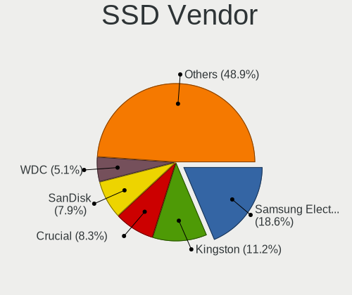
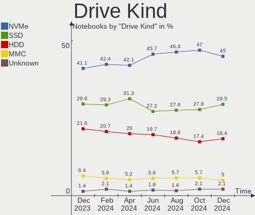
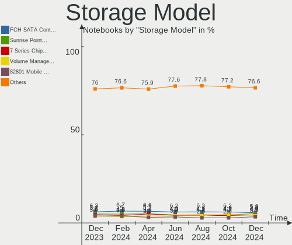
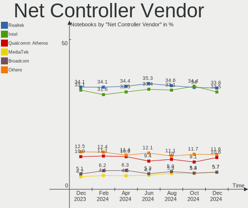
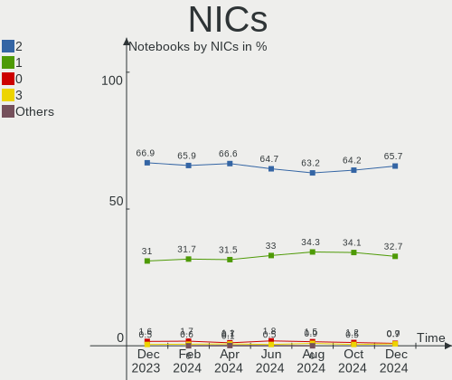
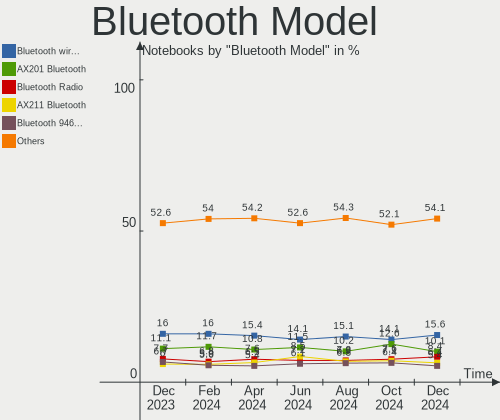
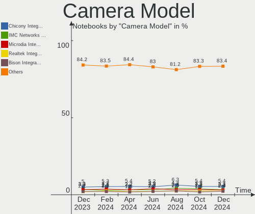
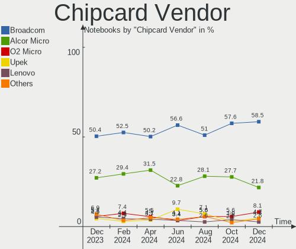

Linux - Hardware Trends (Notebooks)
-----------------------------------

A project to identify most popular hardware characteristics and track their change
over time based on data collected by Linux users at https://Linux-Hardware.org.

Anyone can contribute to this report by the [hw-probe](https://github.com/linuxhw/hw-probe) tool:

    sudo -E hw-probe -all -upload

This report is for one last month. Overall report since the beginning of time: [TestDays](https://github.com/linuxhw/TestDays)

Period: Apr, 2023.

Contents
--------

* [ System ](#system)
  - [ OS                       ](#os)
  - [ OS Family                ](#os-family)
  - [ Kernel                   ](#kernel)
  - [ Kernel Family            ](#kernel-family)
  - [ Kernel Major Ver.        ](#kernel-major-ver)
  - [ Arch                     ](#arch)
  - [ DE                       ](#de)
  - [ Display Server           ](#display-server)
  - [ Display Manager          ](#display-manager)
  - [ OS Lang                  ](#os-lang)
  - [ Boot Mode                ](#boot-mode)
  - [ Filesystem               ](#filesystem)
  - [ Part. scheme             ](#part-scheme)
  - [ Dual Boot with Linux/BSD ](#dual-boot-with-linuxbsd)
  - [ Dual Boot (Win)          ](#dual-boot-win)

* [ Board ](#board)
  - [ Vendor                   ](#vendor)
  - [ Model                    ](#model)
  - [ Model Family             ](#model-family)
  - [ MFG Year                 ](#mfg-year)
  - [ Form Factor              ](#form-factor)
  - [ Secure Boot              ](#secure-boot)
  - [ Coreboot                 ](#coreboot)
  - [ RAM Size                 ](#ram-size)
  - [ RAM Used                 ](#ram-used)
  - [ Total Drives             ](#total-drives)
  - [ Has CD-ROM               ](#has-cd-rom)
  - [ Has Ethernet             ](#has-ethernet)
  - [ Has WiFi                 ](#has-wifi)
  - [ Has Bluetooth            ](#has-bluetooth)

* [ Location ](#location)
  - [ Country                  ](#country)
  - [ City                     ](#city)

* [ Drives ](#drives)
  - [ Drive Vendor             ](#drive-vendor)
  - [ Drive Model              ](#drive-model)
  - [ HDD Vendor               ](#hdd-vendor)
  - [ SSD Vendor               ](#ssd-vendor)
  - [ Drive Kind               ](#drive-kind)
  - [ Drive Connector          ](#drive-connector)
  - [ Drive Size               ](#drive-size)
  - [ Space Total              ](#space-total)
  - [ Space Used               ](#space-used)
  - [ Malfunc. Drives          ](#malfunc-drives)
  - [ Malfunc. Drive Vendor    ](#malfunc-drive-vendor)
  - [ Malfunc. HDD Vendor      ](#malfunc-hdd-vendor)
  - [ Malfunc. Drive Kind      ](#malfunc-drive-kind)
  - [ Failed Drives            ](#failed-drives)
  - [ Failed Drive Vendor      ](#failed-drive-vendor)
  - [ Drive Status             ](#drive-status)

* [ Storage controller ](#storage-controller)
  - [ Storage Vendor           ](#storage-vendor)
  - [ Storage Model            ](#storage-model)
  - [ Storage Kind             ](#storage-kind)

* [ Processor ](#processor)
  - [ CPU Vendor               ](#cpu-vendor)
  - [ CPU Model                ](#cpu-model)
  - [ CPU Model Family         ](#cpu-model-family)
  - [ CPU Cores                ](#cpu-cores)
  - [ CPU Sockets              ](#cpu-sockets)
  - [ CPU Threads              ](#cpu-threads)
  - [ CPU Op-Modes             ](#cpu-op-modes)
  - [ CPU Microcode            ](#cpu-microcode)
  - [ CPU Microarch            ](#cpu-microarch)

* [ Graphics ](#graphics)
  - [ GPU Vendor               ](#gpu-vendor)
  - [ GPU Model                ](#gpu-model)
  - [ GPU Combo                ](#gpu-combo)
  - [ GPU Driver               ](#gpu-driver)
  - [ GPU Memory               ](#gpu-memory)

* [ Monitor ](#monitor)
  - [ Monitor Vendor           ](#monitor-vendor)
  - [ Monitor Model            ](#monitor-model)
  - [ Monitor Resolution       ](#monitor-resolution)
  - [ Monitor Diagonal         ](#monitor-diagonal)
  - [ Monitor Width            ](#monitor-width)
  - [ Aspect Ratio             ](#aspect-ratio)
  - [ Monitor Area             ](#monitor-area)
  - [ Pixel Density            ](#pixel-density)
  - [ Multiple Monitors        ](#multiple-monitors)

* [ Network ](#network)
  - [ Net Controller Vendor    ](#net-controller-vendor)
  - [ Net Controller Model     ](#net-controller-model)
  - [ Wireless Vendor          ](#wireless-vendor)
  - [ Wireless Model           ](#wireless-model)
  - [ Ethernet Vendor          ](#ethernet-vendor)
  - [ Ethernet Model           ](#ethernet-model)
  - [ Net Controller Kind      ](#net-controller-kind)
  - [ Used Controller          ](#used-controller)
  - [ NICs                     ](#nics)
  - [ IPv6                     ](#ipv6)

* [ Bluetooth ](#bluetooth)
  - [ Bluetooth Vendor         ](#bluetooth-vendor)
  - [ Bluetooth Model          ](#bluetooth-model)

* [ Sound ](#sound)
  - [ Sound Vendor             ](#sound-vendor)
  - [ Sound Model              ](#sound-model)

* [ Memory ](#memory)
  - [ Memory Vendor            ](#memory-vendor)
  - [ Memory Model             ](#memory-model)
  - [ Memory Kind              ](#memory-kind)
  - [ Memory Form Factor       ](#memory-form-factor)
  - [ Memory Size              ](#memory-size)
  - [ Memory Speed             ](#memory-speed)

* [ Printers & scanners ](#printers--scanners)
  - [ Printer Vendor           ](#printer-vendor)
  - [ Printer Model            ](#printer-model)
  - [ Scanner Vendor           ](#scanner-vendor)
  - [ Scanner Model            ](#scanner-model)

* [ Camera ](#camera)
  - [ Camera Vendor            ](#camera-vendor)
  - [ Camera Model             ](#camera-model)

* [ Security ](#security)
  - [ Fingerprint Vendor       ](#fingerprint-vendor)
  - [ Fingerprint Model        ](#fingerprint-model)
  - [ Chipcard Vendor          ](#chipcard-vendor)
  - [ Chipcard Model           ](#chipcard-model)

* [ Unsupported ](#unsupported)
  - [ Unsupported Devices      ](#unsupported-devices)
  - [ Unsupported Device Types ](#unsupported-device-types)

System
------

OS
--

Installed operating systems

| Name                         | Notebooks | Percent |
|------------------------------|-----------|---------|
| OpenMandriva 23.03           | 407       | 13.63%  |
| Ubuntu 22.04                 | 356       | 11.93%  |
| Linux Mint 21.1              | 211       | 7.07%   |
| Fedora 38                    | 161       | 5.39%   |
| Debian 11                    | 117       | 3.92%   |
| Pop!_OS 22.04                | 116       | 3.89%   |
| Fedora 37                    | 106       | 3.55%   |
| Arch Rolling                 | 103       | 3.45%   |
| Ubuntu 23.04                 | 86        | 2.88%   |
| Ubuntu 22.10                 | 84        | 2.81%   |
| ROSA 12.4                    | 77        | 2.58%   |
| Zorin 16                     | 74        | 2.48%   |
| Debian 12                    | 71        | 2.38%   |
| Ubuntu 20.04                 | 60        | 2.01%   |
| KDE neon 22.04               | 60        | 2.01%   |
| SteamOS 3.4.6                | 57        | 1.91%   |
| Kali 2023.1                  | 45        | 1.51%   |
| OpenMandriva 4.3             | 42        | 1.41%   |
| openSUSE Tumbleweed-XXXXXXXX | 39        | 1.31%   |
| Manjaro                      | 36        | 1.21%   |
| EndeavourOS Rolling          | 34        | 1.14%   |
| ArcoLinux Rolling            | 34        | 1.14%   |
| Manjaro 22.1.0               | 32        | 1.07%   |
| Kubuntu 22.04                | 31        | 1.04%   |
| Xubuntu 22.04                | 26        | 0.87%   |
| Linux Mint 20.3              | 26        | 0.87%   |
| Linux Mint 21                | 25        | 0.84%   |
| Gentoo 2.13                  | 25        | 0.84%   |
| OpenMandriva 23.01           | 21        | 0.7%    |
| Elementary 7                 | 21        | 0.7%    |
| LMDE 5                       | 20        | 0.67%   |
| BlackPanther 18.1            | 20        | 0.67%   |
| Lubuntu 22.04                | 18        | 0.6%    |
| Kubuntu 23.04                | 16        | 0.54%   |
| MX 21                        | 14        | 0.47%   |
| Nobara 37                    | 13        | 0.44%   |
| Ubuntu 18.04                 | 10        | 0.34%   |
| ROSA R11.1                   | 10        | 0.34%   |
| Fedora 36                    | 9         | 0.3%    |
| Parrot 5.2                   | 8         | 0.27%   |

OS Family
---------

OS without a version

| Name          | Notebooks | Percent |
|---------------|-----------|---------|
| Ubuntu        | 597       | 20%     |
| OpenMandriva  | 483       | 16.18%  |
| Fedora        | 285       | 9.55%   |
| Linux Mint    | 279       | 9.35%   |
| Debian        | 191       | 6.4%    |
| Pop!_OS       | 116       | 3.89%   |
| Arch          | 103       | 3.45%   |
| ROSA          | 101       | 3.38%   |
| Zorin         | 76        | 2.55%   |
| Manjaro       | 69        | 2.31%   |
| SteamOS       | 62        | 2.08%   |
| KDE neon      | 60        | 2.01%   |
| Kubuntu       | 58        | 1.94%   |
| openSUSE      | 47        | 1.57%   |
| Kali          | 46        | 1.54%   |
| Xubuntu       | 36        | 1.21%   |
| ArcoLinux     | 35        | 1.17%   |
| EndeavourOS   | 34        | 1.14%   |
| Lubuntu       | 27        | 0.9%    |
| Elementary    | 27        | 0.9%    |
| Gentoo        | 26        | 0.87%   |
| BlackPanther  | 21        | 0.7%    |
| LMDE          | 20        | 0.67%   |
| Parrot        | 15        | 0.5%    |
| Nobara        | 14        | 0.47%   |
| MX            | 14        | 0.47%   |
| Ubuntu Budgie | 9         | 0.3%    |
| Ubuntu MATE   | 8         | 0.27%   |
| Garuda Linux  | 8         | 0.27%   |
| ALT Linux     | 8         | 0.27%   |
| NixOS         | 7         | 0.23%   |
| BunsenLabs    | 7         | 0.23%   |
| TUXEDO OS     | 6         | 0.2%    |
| Red OS        | 6         | 0.2%    |
| Endless       | 5         | 0.17%   |
| Devuan        | 5         | 0.17%   |
| blendOS       | 5         | 0.17%   |
| Void Linux    | 4         | 0.13%   |
| ChimeraOS     | 4         | 0.13%   |
| antiX         | 4         | 0.13%   |

Kernel
------

Version of the Linux kernel

| Version                           | Notebooks | Percent |
|-----------------------------------|-----------|---------|
| 6.2.6-desktop-1omv2390            | 402       | 13.47%  |
| 5.19.0-38-generic                 | 301       | 10.08%  |
| 5.15.0-69-generic                 | 231       | 7.74%   |
| 5.19.0-40-generic                 | 134       | 4.49%   |
| 6.2.6-76060206-generic            | 103       | 3.45%   |
| 5.10.0-21-amd64                   | 92        | 3.08%   |
| 6.2.11-300.fc38.x86_64            | 81        | 2.71%   |
| 6.2.0-20-generic                  | 74        | 2.48%   |
| 6.1.20-generic-2rosa2021.1-x86_64 | 61        | 2.04%   |
| 5.13.0-valve36-1-neptune          | 57        | 1.91%   |
| 5.15.0-70-generic                 | 48        | 1.61%   |
| 5.15.0-71-generic                 | 47        | 1.57%   |
| 5.19.0-41-generic                 | 44        | 1.47%   |
| 6.1.0-7-amd64                     | 38        | 1.27%   |
| 6.2.9-200.fc37.x86_64             | 35        | 1.17%   |
| 6.2.10-arch1-1                    | 34        | 1.14%   |
| 5.15.0-56-generic                 | 32        | 1.07%   |
| 6.2.12-300.fc38.x86_64            | 31        | 1.04%   |
| 6.1.0-kali7-amd64                 | 30        | 1.01%   |
| 6.1.0-4-amd64                     | 29        | 0.97%   |
| 5.16.7-desktop-1omv4003           | 29        | 0.97%   |
| 6.2.11-arch1-1                    | 28        | 0.94%   |
| 6.2.8-200.fc37.x86_64             | 27        | 0.9%    |
| 6.2.12-arch1-1                    | 26        | 0.87%   |
| 6.2.9-arch1-1                     | 25        | 0.84%   |
| 5.19.0-32-generic                 | 25        | 0.84%   |
| 5.10.0-20-amd64                   | 23        | 0.77%   |
| 6.2.9-300.fc38.x86_64             | 21        | 0.7%    |
| 5.4.0-146-generic                 | 21        | 0.7%    |
| 5.15.0-67-generic                 | 21        | 0.7%    |
| 6.1.1-desktop-1omv2290            | 19        | 0.64%   |
| 5.4.0-147-generic                 | 18        | 0.6%    |
| 6.2.8-arch1-1                     | 16        | 0.54%   |
| 6.1.0-0.deb11.5-amd64             | 15        | 0.5%    |
| 5.16.13-desktop-1omv4003          | 15        | 0.5%    |
| 6.2.9-1-default                   | 14        | 0.47%   |
| 6.2.13-300.fc38.x86_64            | 13        | 0.44%   |
| 6.2.11-060211-generic             | 13        | 0.44%   |
| 6.2.10-200.fc37.x86_64            | 13        | 0.44%   |
| 6.1.23-1-MANJARO                  | 13        | 0.44%   |

Kernel Family
-------------

Linux kernel without a distro release

| Version  | Notebooks | Percent |
|----------|-----------|---------|
| 5.19.0   | 533       | 17.86%  |
| 6.2.6    | 508       | 17.02%  |
| 5.15.0   | 421       | 14.1%   |
| 6.2.11   | 155       | 5.19%   |
| 6.1.0    | 148       | 4.96%   |
| 5.10.0   | 135       | 4.52%   |
| 6.2.9    | 119       | 3.99%   |
| 6.2.0    | 108       | 3.62%   |
| 6.2.10   | 93        | 3.12%   |
| 6.2.12   | 91        | 3.05%   |
| 6.2.8    | 68        | 2.28%   |
| 6.1.20   | 64        | 2.14%   |
| 5.13.0   | 61        | 2.04%   |
| 5.4.0    | 57        | 1.91%   |
| 5.16.7   | 29        | 0.97%   |
| 6.2.13   | 26        | 0.87%   |
| 6.1.1    | 19        | 0.64%   |
| 6.1.21   | 18        | 0.6%    |
| 6.3.0    | 17        | 0.57%   |
| 6.0.0    | 17        | 0.57%   |
| 6.1.23   | 15        | 0.5%    |
| 5.16.13  | 15        | 0.5%    |
| 5.14.0   | 14        | 0.47%   |
| 4.15.0   | 14        | 0.47%   |
| 6.1.22   | 13        | 0.44%   |
| 5.6.14   | 12        | 0.4%    |
| 5.15.103 | 12        | 0.4%    |
| 6.1.25   | 11        | 0.37%   |
| 6.1.19   | 9         | 0.3%    |
| 6.0.7    | 9         | 0.3%    |
| 6.0.12   | 9         | 0.3%    |
| 5.10.74  | 8         | 0.27%   |
| 4.18.16  | 8         | 0.27%   |
| 5.15.106 | 7         | 0.23%   |
| 5.14.21  | 7         | 0.23%   |
| 6.2.7    | 6         | 0.2%    |
| 5.11.0   | 6         | 0.2%    |
| 6.2.2    | 5         | 0.17%   |
| 6.1.24   | 5         | 0.17%   |
| 5.15.75  | 5         | 0.17%   |

Kernel Major Ver.
-----------------

Linux kernel major version

| Version | Notebooks | Percent |
|---------|-----------|---------|
| 6.2     | 1181      | 39.56%  |
| 5.19    | 536       | 17.96%  |
| 5.15    | 464       | 15.54%  |
| 6.1     | 324       | 10.85%  |
| 5.10    | 160       | 5.36%   |
| 5.4     | 64        | 2.14%   |
| 5.13    | 62        | 2.08%   |
| 5.16    | 44        | 1.47%   |
| 6.0     | 42        | 1.41%   |
| 5.14    | 21        | 0.7%    |
| 6.3     | 17        | 0.57%   |
| 4.15    | 14        | 0.47%   |
| 5.6     | 13        | 0.44%   |
| 4.18    | 10        | 0.34%   |
| 5.17    | 8         | 0.27%   |
| 5.11    | 8         | 0.27%   |
| 5.18    | 7         | 0.23%   |
| 4.9     | 5         | 0.17%   |
| 4.19    | 2         | 0.07%   |
| 5.8     | 1         | 0.03%   |
| 5.5     | 1         | 0.03%   |
| 4.4     | 1         | 0.03%   |

Arch
----

OS architecture (x86_64, i586, etc.)

| Name    | Notebooks | Percent |
|---------|-----------|---------|
| x86_64  | 2955      | 98.99%  |
| i686    | 28        | 0.94%   |
| aarch64 | 2         | 0.07%   |

DE
--

Desktop Environment

| Name             | Notebooks | Percent |
|------------------|-----------|---------|
| GNOME            | 1209      | 40.5%   |
| KDE5             | 943       | 31.59%  |
| X-Cinnamon       | 219       | 7.34%   |
| XFCE             | 209       | 7%      |
| MATE             | 87        | 2.91%   |
| Unknown          | 82        | 2.75%   |
| LXQt             | 69        | 2.31%   |
| Pantheon         | 28        | 0.94%   |
| i3               | 16        | 0.54%   |
| Cinnamon         | 15        | 0.5%    |
| Budgie           | 14        | 0.47%   |
| LXDE             | 11        | 0.37%   |
| Hyprland         | 9         | 0.3%    |
| KDE              | 8         | 0.27%   |
| sway             | 6         | 0.2%    |
| GNOME Flashback  | 6         | 0.2%    |
| bspwm            | 6         | 0.2%    |
| BunsenLabs       | 5         | 0.17%   |
| KDE4             | 4         | 0.13%   |
| GNOME Classic    | 4         | 0.13%   |
| Unity            | 3         | 0.1%    |
| icewm            | 3         | 0.1%    |
| chadwm           | 3         | 0.1%    |
| Trinity          | 2         | 0.07%   |
| Openbox          | 2         | 0.07%   |
| Enlightenment    | 2         | 0.07%   |
| dwm              | 2         | 0.07%   |
| Deepin           | 2         | 0.07%   |
| xmonad           | 1         | 0.03%   |
| ratflow          | 1         | 0.03%   |
| qtile            | 1         | 0.03%   |
| pika:GNOME       | 1         | 0.03%   |
| none+i3          | 1         | 0.03%   |
| none+awesome     | 1         | 0.03%   |
| mwm              | 1         | 0.03%   |
| lightdm-xsession | 1         | 0.03%   |
| Jwm              | 1         | 0.03%   |
| i3-with-shmlog   | 1         | 0.03%   |
| herbstluftwm     | 1         | 0.03%   |
| GNOME-Classic    | 1         | 0.03%   |

Display Server
--------------

X11 or Wayland

| Name        | Notebooks | Percent |
|-------------|-----------|---------|
| X11         | 2009      | 67.3%   |
| Wayland     | 882       | 29.55%  |
| Unknown     | 65        | 2.18%   |
| Tty         | 27        | 0.9%    |
| Unspecified | 2         | 0.07%   |

Display Manager
---------------

SDDM, LightDM, etc.

| Name    | Notebooks | Percent |
|---------|-----------|---------|
| Unknown | 850       | 28.48%  |
| SDDM    | 791       | 26.5%   |
| GDM3    | 577       | 19.33%  |
| LightDM | 419       | 14.04%  |
| GDM     | 321       | 10.75%  |
| XDM     | 8         | 0.27%   |
| LXDM    | 6         | 0.2%    |
| SLiM    | 4         | 0.13%   |
| KDM     | 4         | 0.13%   |
| TDM     | 2         | 0.07%   |
| SU      | 1         | 0.03%   |
| Ly      | 1         | 0.03%   |
| EMPTTY  | 1         | 0.03%   |

OS Lang
-------

Language

| Lang    | Notebooks | Percent |
|---------|-----------|---------|
| en_US   | 1288      | 43.15%  |
| de_DE   | 235       | 7.87%   |
| ru_RU   | 233       | 7.81%   |
| en_GB   | 158       | 5.29%   |
| fr_FR   | 155       | 5.19%   |
| pt_BR   | 96        | 3.22%   |
| it_IT   | 87        | 2.91%   |
| pl_PL   | 68        | 2.28%   |
| es_ES   | 58        | 1.94%   |
| C       | 48        | 1.61%   |
| en_IN   | 45        | 1.51%   |
| Unknown | 43        | 1.44%   |
| en_CA   | 42        | 1.41%   |
| en_AU   | 39        | 1.31%   |
| es_MX   | 34        | 1.14%   |
| nl_NL   | 25        | 0.84%   |
| cs_CZ   | 24        | 0.8%    |
| es_AR   | 18        | 0.6%    |
| tr_TR   | 17        | 0.57%   |
| hu_HU   | 17        | 0.57%   |
| zh_CN   | 16        | 0.54%   |
| es_CL   | 16        | 0.54%   |
| pt_PT   | 15        | 0.5%    |
| sv_SE   | 12        | 0.4%    |
| de_CH   | 11        | 0.37%   |
| de_AT   | 10        | 0.34%   |
| es_CO   | 8         | 0.27%   |
| ja_JP   | 7         | 0.23%   |
| fr_BE   | 7         | 0.23%   |
| en_ZA   | 7         | 0.23%   |
| en_IE   | 7         | 0.23%   |
| en_AG   | 7         | 0.23%   |
| fr_CA   | 6         | 0.2%    |
| en_SG   | 6         | 0.2%    |
| en_NZ   | 6         | 0.2%    |
| en_IL   | 6         | 0.2%    |
| da_DK   | 6         | 0.2%    |
| POSIX   | 5         | 0.17%   |
| nb_NO   | 5         | 0.17%   |
| fi_FI   | 5         | 0.17%   |

Boot Mode
---------

EFI or BIOS

| Mode | Notebooks | Percent |
|------|-----------|---------|
| EFI  | 1732      | 58.02%  |
| BIOS | 1253      | 41.98%  |

Filesystem
----------

Type of filesystem

| Type    | Notebooks | Percent |
|---------|-----------|---------|
| Ext4    | 1949      | 65.29%  |
| Btrfs   | 518       | 17.35%  |
| Overlay | 301       | 10.08%  |
| Tmpfs   | 143       | 4.79%   |
| Xfs     | 40        | 1.34%   |
| Zfs     | 25        | 0.84%   |
| F2fs    | 7         | 0.23%   |
| Ext2    | 2         | 0.07%   |

Part. scheme
------------

Scheme of partitioning

| Type    | Notebooks | Percent |
|---------|-----------|---------|
| GPT     | 1857      | 62.21%  |
| Unknown | 772       | 25.86%  |
| MBR     | 356       | 11.93%  |

Dual Boot with Linux/BSD
------------------------

Hosting more than one Linux/BSD

| Dual boot | Notebooks | Percent |
|-----------|-----------|---------|
| No        | 2557      | 85.66%  |
| Yes       | 428       | 14.34%  |

Dual Boot (Win)
---------------

Hosting Linux and Windows

| Dual boot | Notebooks | Percent |
|-----------|-----------|---------|
| No        | 2164      | 72.5%   |
| Yes       | 821       | 27.5%   |

Board
-----

Vendor
------

Motherboard manufacturer

| Name                   | Notebooks | Percent |
|------------------------|-----------|---------|
| Lenovo                 | 635       | 21.27%  |
| Hewlett-Packard        | 499       | 16.72%  |
| Dell                   | 404       | 13.53%  |
| ASUSTek Computer       | 336       | 11.26%  |
| Acer                   | 243       | 8.14%   |
| Apple                  | 92        | 3.08%   |
| MSI                    | 70        | 2.35%   |
| HUAWEI                 | 70        | 2.35%   |
| Toshiba                | 67        | 2.24%   |
| Valve                  | 62        | 2.08%   |
| Samsung Electronics    | 47        | 1.57%   |
| Sony                   | 38        | 1.27%   |
| Google                 | 30        | 1.01%   |
| Notebook               | 28        | 0.94%   |
| Aquarius               | 25        | 0.84%   |
| Fujitsu                | 24        | 0.8%    |
| Timi                   | 20        | 0.67%   |
| Unknown                | 17        | 0.57%   |
| Medion                 | 16        | 0.54%   |
| Gigabyte Technology    | 13        | 0.44%   |
| GPU Company            | 11        | 0.37%   |
| Clevo                  | 10        | 0.34%   |
| TUXEDO                 | 9         | 0.3%    |
| System76               | 9         | 0.3%    |
| Positivo               | 9         | 0.3%    |
| eMachines              | 8         | 0.27%   |
| Chuwi                  | 8         | 0.27%   |
| LG Electronics         | 7         | 0.23%   |
| HONOR                  | 7         | 0.23%   |
| Gateway                | 7         | 0.23%   |
| Fujitsu Siemens        | 7         | 0.23%   |
| Framework              | 6         | 0.2%    |
| Packard Bell           | 5         | 0.17%   |
| Intel                  | 5         | 0.17%   |
| Avell High Performance | 5         | 0.17%   |
| Alienware              | 5         | 0.17%   |
| Razer                  | 4         | 0.13%   |
| PC Specialist          | 4         | 0.13%   |
| UMAX                   | 3         | 0.1%    |
| Thomson                | 3         | 0.1%    |

Model
-----

Motherboard model

| Name                                        | Notebooks | Percent |
|---------------------------------------------|-----------|---------|
| Valve Jupiter                               | 62        | 2.08%   |
| Unknown                                     | 27        | 0.9%    |
| Aquarius NS585                              | 25        | 0.84%   |
| HP Notebook                                 | 22        | 0.74%   |
| HP Pavilion dv7                             | 12        | 0.4%    |
| HUAWEI HVY-WXX9                             | 11        | 0.37%   |
| HP Pavilion 15                              | 11        | 0.37%   |
| Apple MacBookPro8,1                         | 11        | 0.37%   |
| Apple MacBookAir7,2                         | 11        | 0.37%   |
| HP Laptop 15s-eq2xxx                        | 10        | 0.34%   |
| Apple MacBookPro9,2                         | 10        | 0.34%   |
| HP Pavilion dv6                             | 9         | 0.3%    |
| HP Pavilion g6                              | 8         | 0.27%   |
| Dell XPS 15 9500                            | 8         | 0.27%   |
| HUAWEI BOHK-WAX9X                           | 7         | 0.23%   |
| HP Laptop 17-cp0xxx                         | 7         | 0.23%   |
| HP 255 G8 Notebook PC                       | 7         | 0.23%   |
| Apple MacBookPro12,1                        | 7         | 0.23%   |
| HUAWEI NBLK-WAX9X                           | 6         | 0.2%    |
| HUAWEI BOM-WXX9                             | 6         | 0.2%    |
| HP ProBook 4540s                            | 6         | 0.2%    |
| HP Pavilion Gaming Laptop 15-ec2xxx         | 6         | 0.2%    |
| HP Laptop 15-db0xxx                         | 6         | 0.2%    |
| Dell XPS 13 9310                            | 6         | 0.2%    |
| Dell Latitude E6440                         | 6         | 0.2%    |
| Dell Inspiron N5110                         | 6         | 0.2%    |
| Dell G15 5510                               | 6         | 0.2%    |
| ASUS S551LN                                 | 6         | 0.2%    |
| ASUS ROG Strix G513QY_G513QY                | 6         | 0.2%    |
| Acer Aspire E5-575G                         | 6         | 0.2%    |
| Acer Aspire A515-57                         | 6         | 0.2%    |
| Timi Redmi Book Pro 15 2022                 | 5         | 0.17%   |
| Lenovo V15 G2 ALC 82KD                      | 5         | 0.17%   |
| Lenovo ThinkPad X1 Carbon Gen 10 21CBCTO1WW | 5         | 0.17%   |
| Lenovo IdeaPad 5 Pro 16ACH6 82L5            | 5         | 0.17%   |
| Lenovo IdeaPad 3 15ALC6 82MF                | 5         | 0.17%   |
| Lenovo IdeaPad 1 14ADA05 82GW               | 5         | 0.17%   |
| Lenovo G50-70 20351                         | 5         | 0.17%   |
| HUAWEI NBLB-WAX9N                           | 5         | 0.17%   |
| HP Pavilion Gaming Laptop 15-ec1xxx         | 5         | 0.17%   |

Model Family
------------

Motherboard model prefix

| Name               | Notebooks | Percent |
|--------------------|-----------|---------|
| Lenovo ThinkPad    | 319       | 10.69%  |
| Dell Latitude      | 159       | 5.33%   |
| Acer Aspire        | 151       | 5.06%   |
| Lenovo IdeaPad     | 148       | 4.96%   |
| HP Pavilion        | 110       | 3.69%   |
| Dell Inspiron      | 102       | 3.42%   |
| HP Laptop          | 82        | 2.75%   |
| ASUS VivoBook      | 78        | 2.61%   |
| HP EliteBook       | 64        | 2.14%   |
| HP ProBook         | 63        | 2.11%   |
| Valve Jupiter      | 62        | 2.08%   |
| Dell XPS           | 58        | 1.94%   |
| Toshiba Satellite  | 54        | 1.81%   |
| ASUS ASUS          | 42        | 1.41%   |
| Lenovo Legion      | 38        | 1.27%   |
| ASUS ROG           | 38        | 1.27%   |
| Dell Vostro        | 30        | 1.01%   |
| Dell Precision     | 30        | 1.01%   |
| Acer Swift         | 27        | 0.9%    |
| Unknown            | 27        | 0.9%    |
| ASUS ZenBook       | 26        | 0.87%   |
| Aquarius NS585     | 25        | 0.84%   |
| Lenovo ThinkBook   | 23        | 0.77%   |
| HP Notebook        | 22        | 0.74%   |
| Acer Nitro         | 22        | 0.74%   |
| HP ZBook           | 19        | 0.64%   |
| Fujitsu LIFEBOOK   | 19        | 0.64%   |
| HP Compaq          | 18        | 0.6%    |
| HP 250             | 18        | 0.6%    |
| HP OMEN            | 15        | 0.5%    |
| HP 255             | 15        | 0.5%    |
| Acer TravelMate    | 15        | 0.5%    |
| HP ENVY            | 12        | 0.4%    |
| Apple MacBookPro8  | 12        | 0.4%    |
| Apple MacBookAir7  | 12        | 0.4%    |
| HUAWEI HVY-WXX9    | 11        | 0.37%   |
| Apple MacBookPro11 | 11        | 0.37%   |
| Lenovo Yoga        | 10        | 0.34%   |
| Lenovo V15         | 10        | 0.34%   |
| Dell G15           | 10        | 0.34%   |

MFG Year
--------

Motherboard manufacture year

| Year    | Notebooks | Percent |
|---------|-----------|---------|
| 2021    | 405       | 13.57%  |
| 2022    | 371       | 12.43%  |
| 2020    | 311       | 10.42%  |
| 2019    | 249       | 8.34%   |
| 2011    | 193       | 6.47%   |
| 2018    | 185       | 6.2%    |
| 2012    | 173       | 5.8%    |
| 2013    | 168       | 5.63%   |
| 2015    | 163       | 5.46%   |
| 2016    | 134       | 4.49%   |
| 2017    | 131       | 4.39%   |
| 2014    | 119       | 3.99%   |
| 2010    | 106       | 3.55%   |
| 2008    | 89        | 2.98%   |
| 2009    | 69        | 2.31%   |
| 2023    | 51        | 1.71%   |
| 2007    | 42        | 1.41%   |
| 2006    | 18        | 0.6%    |
| Unknown | 5         | 0.17%   |
| 2005    | 3         | 0.1%    |

Form Factor
-----------

Physical design of the computer

| Name     | Notebooks | Percent |
|----------|-----------|---------|
| Notebook | 2985      | 100%    |

Secure Boot
-----------

Enabled or disabled

| State    | Notebooks | Percent |
|----------|-----------|---------|
| Disabled | 2741      | 91.83%  |
| Enabled  | 244       | 8.17%   |

Coreboot
--------

Have coreboot on board

| Used | Notebooks | Percent |
|------|-----------|---------|
| No   | 2941      | 98.53%  |
| Yes  | 44        | 1.47%   |

RAM Size
--------

Total RAM memory

| Size in GB  | Notebooks | Percent |
|-------------|-----------|---------|
| 4.01-8.0    | 887       | 29.72%  |
| 8.01-16.0   | 571       | 19.13%  |
| 16.01-24.0  | 547       | 18.32%  |
| 3.01-4.0    | 502       | 16.82%  |
| 32.01-64.0  | 223       | 7.47%   |
| 1.01-2.0    | 97        | 3.25%   |
| 24.01-32.0  | 57        | 1.91%   |
| 64.01-256.0 | 49        | 1.64%   |
| 2.01-3.0    | 39        | 1.31%   |
| 0.51-1.0    | 13        | 0.44%   |

RAM Used
--------

Used RAM memory

| Used GB    | Notebooks | Percent |
|------------|-----------|---------|
| 1.01-2.0   | 927       | 31.06%  |
| 2.01-3.0   | 782       | 26.2%   |
| 4.01-8.0   | 486       | 16.28%  |
| 3.01-4.0   | 451       | 15.11%  |
| 0.51-1.0   | 170       | 5.7%    |
| 8.01-16.0  | 134       | 4.49%   |
| 0.01-0.5   | 19        | 0.64%   |
| 16.01-24.0 | 11        | 0.37%   |
| 24.01-32.0 | 5         | 0.17%   |

Total Drives
------------

Number of drives on board

| Drives | Notebooks | Percent |
|--------|-----------|---------|
| 1      | 2157      | 72.26%  |
| 2      | 713       | 23.89%  |
| 3      | 94        | 3.15%   |
| 0      | 14        | 0.47%   |
| 4      | 4         | 0.13%   |
| 7      | 1         | 0.03%   |
| 6      | 1         | 0.03%   |
| 5      | 1         | 0.03%   |

Has CD-ROM
----------

Has CD-ROM on board

| Presented | Notebooks | Percent |
|-----------|-----------|---------|
| No        | 2131      | 71.39%  |
| Yes       | 854       | 28.61%  |

Has Ethernet
------------

Has Ethernet on board

| Presented | Notebooks | Percent |
|-----------|-----------|---------|
| Yes       | 2244      | 75.18%  |
| No        | 741       | 24.82%  |

Has WiFi
--------

Has WiFi module

| Presented | Notebooks | Percent |
|-----------|-----------|---------|
| Yes       | 2942      | 98.56%  |
| No        | 43        | 1.44%   |

Has Bluetooth
-------------

Has Bluetooth module

| Presented | Notebooks | Percent |
|-----------|-----------|---------|
| Yes       | 2463      | 82.51%  |
| No        | 522       | 17.49%  |

Location
--------

Country
-------

Geographic location (country)

| Country      | Notebooks | Percent |
|--------------|-----------|---------|
| USA          | 470       | 15.75%  |
| Germany      | 311       | 10.42%  |
| Russia       | 266       | 8.91%   |
| France       | 184       | 6.16%   |
| Brazil       | 144       | 4.82%   |
| Italy        | 119       | 3.99%   |
| UK           | 118       | 3.95%   |
| Poland       | 113       | 3.79%   |
| Spain        | 80        | 2.68%   |
| India        | 78        | 2.61%   |
| Netherlands  | 75        | 2.51%   |
| Canada       | 66        | 2.21%   |
| Australia    | 46        | 1.54%   |
| Mexico       | 43        | 1.44%   |
| Hungary      | 41        | 1.37%   |
| Turkey       | 36        | 1.21%   |
| Czechia      | 35        | 1.17%   |
| Belgium      | 30        | 1.01%   |
| Sweden       | 29        | 0.97%   |
| Japan        | 26        | 0.87%   |
| Chile        | 26        | 0.87%   |
| Finland      | 25        | 0.84%   |
| Austria      | 25        | 0.84%   |
| Argentina    | 25        | 0.84%   |
| Indonesia    | 24        | 0.8%    |
| Portugal     | 22        | 0.74%   |
| Switzerland  | 20        | 0.67%   |
| Colombia     | 20        | 0.67%   |
| Bulgaria     | 20        | 0.67%   |
| Norway       | 18        | 0.6%    |
| Romania      | 17        | 0.57%   |
| China        | 17        | 0.57%   |
| Belarus      | 16        | 0.54%   |
| Vietnam      | 15        | 0.5%    |
| Greece       | 15        | 0.5%    |
| Denmark      | 15        | 0.5%    |
| South Africa | 12        | 0.4%    |
| Iran         | 12        | 0.4%    |
| Venezuela    | 11        | 0.37%   |
| Slovakia     | 11        | 0.37%   |

City
----

Geographic location (city)

| City              | Notebooks | Percent |
|-------------------|-----------|---------|
| Moscow            | 53        | 1.78%   |
| Voronezh          | 35        | 1.17%   |
| St Petersburg     | 32        | 1.07%   |
| Berlin            | 31        | 1.04%   |
| Warsaw            | 27        | 0.9%    |
| Paris             | 24        | 0.8%    |
| Frankfurt am Main | 19        | 0.64%   |
| London            | 17        | 0.57%   |
| Istanbul          | 16        | 0.54%   |
| Bengaluru         | 16        | 0.54%   |
| Sao Paulo         | 15        | 0.5%    |
| Prague            | 15        | 0.5%    |
| Milan             | 15        | 0.5%    |
| Melbourne         | 15        | 0.5%    |
| Madrid            | 15        | 0.5%    |
| Vienna            | 14        | 0.47%   |
| Amsterdam         | 14        | 0.47%   |
| Santiago          | 13        | 0.44%   |
| Munich            | 13        | 0.44%   |
| Budapest          | 13        | 0.44%   |
| Poznan            | 12        | 0.4%    |
| Helsinki          | 12        | 0.4%    |
| Barcelona         | 12        | 0.4%    |
| Rome              | 11        | 0.37%   |
| Rio de Janeiro    | 11        | 0.37%   |
| New York          | 11        | 0.37%   |
| Mannheim          | 10        | 0.34%   |
| Los Angeles       | 10        | 0.34%   |
| Hamburg           | 10        | 0.34%   |
| Cologne           | 10        | 0.34%   |
| Brussels          | 10        | 0.34%   |
| Tehran            | 9         | 0.3%    |
| Sydney            | 9         | 0.3%    |
| Seville           | 9         | 0.3%    |
| Chorzele          | 9         | 0.3%    |
| Stockholm         | 8         | 0.27%   |
| Sofia             | 8         | 0.27%   |
| Singapore         | 8         | 0.27%   |
| Novosibirsk       | 8         | 0.27%   |
| Montreal          | 8         | 0.27%   |

Drives
------

Drive Vendor
------------

Hard drive vendors

| Vendor                      | Notebooks | Drives | Percent |
|-----------------------------|-----------|--------|---------|
| Samsung Electronics         | 625       | 679    | 16.8%   |
| WDC                         | 342       | 347    | 9.19%   |
| Seagate                     | 282       | 286    | 7.58%   |
| SanDisk                     | 248       | 260    | 6.66%   |
| Unknown                     | 241       | 258    | 6.48%   |
| Toshiba                     | 198       | 200    | 5.32%   |
| Kingston                    | 190       | 195    | 5.11%   |
| SK hynix                    | 158       | 160    | 4.25%   |
| Intel                       | 126       | 130    | 3.39%   |
| Micron Technology           | 117       | 118    | 3.14%   |
| Crucial                     | 117       | 120    | 3.14%   |
| Hitachi                     | 94        | 95     | 2.53%   |
| HGST                        | 74        | 76     | 1.99%   |
| A-DATA Technology           | 68        | 69     | 1.83%   |
| KIOXIA                      | 67        | 67     | 1.8%    |
| China                       | 50        | 50     | 1.34%   |
| Apple                       | 48        | 57     | 1.29%   |
| Phison Electronics          | 47        | 48     | 1.26%   |
| Unknown                     | 35        | 35     | 0.94%   |
| Kingston Technology Company | 33        | 33     | 0.89%   |
| Silicon Motion              | 30        | 30     | 0.81%   |
| Phison                      | 30        | 30     | 0.81%   |
| SPCC                        | 27        | 27     | 0.73%   |
| Intenso                     | 27        | 27     | 0.73%   |
| Transcend                   | 20        | 20     | 0.54%   |
| Micron/Crucial Technology   | 20        | 21     | 0.54%   |
| LITEON                      | 17        | 17     | 0.46%   |
| JMicron Technology          | 16        | 16     | 0.43%   |
| ADATA Technology            | 15        | 15     | 0.4%    |
| PNY                         | 14        | 14     | 0.38%   |
| Fujitsu                     | 13        | 13     | 0.35%   |
| UMIS                        | 11        | 11     | 0.3%    |
| Netac                       | 11        | 11     | 0.3%    |
| KingSpec                    | 11        | 11     | 0.3%    |
| GOODRAM                     | 10        | 10     | 0.27%   |
| Team                        | 9         | 9      | 0.24%   |
| SSSTC                       | 9         | 9      | 0.24%   |
| Patriot                     | 9         | 9      | 0.24%   |
| O2 Micro                    | 9         | 9      | 0.24%   |
| LITEONIT                    | 8         | 8      | 0.21%   |

Drive Model
-----------

Hard drive models

| Model                                                  | Notebooks | Percent |
|--------------------------------------------------------|-----------|---------|
| Samsung NVMe SSD Controller SM981/PM981/PM983 1TB      | 63        | 1.65%   |
| Unknown MMC Card  32GB                                 | 41        | 1.08%   |
| Seagate ST1000LM035-1RK172 970GB                       | 40        | 1.05%   |
| Samsung NVMe SSD Controller PM9A1/PM9A3/980PRO 2TB     | 38        | 1%      |
| Unknown                                                | 35        | 0.92%   |
| Unknown MMC Card  64GB                                 | 34        | 0.89%   |
| Kingston SA400S37480G 480GB SSD                        | 33        | 0.87%   |
| Toshiba MQ04ABF100 1TB                                 | 28        | 0.74%   |
| Toshiba MQ01ABD100 1TB                                 | 28        | 0.74%   |
| Seagate ST500LT012-1DG142 500GB                        | 27        | 0.71%   |
| Kingston SA400S37240G 240GB SSD                        | 26        | 0.68%   |
| Sandisk WD Blue SN550 NVMe SSD 1024GB                  | 25        | 0.66%   |
| Intel SSDPEKNU512GZ 512GB                              | 25        | 0.66%   |
| A-DATA SU800 512GB SSD                                 | 25        | 0.66%   |
| Toshiba MQ01ABF050 500GB                               | 23        | 0.6%    |
| Crucial CT240BX500SSD1 240GB                           | 22        | 0.58%   |
| Unknown MMC Card  128GB                                | 20        | 0.53%   |
| Sandisk WD Black SN750 / PC SN730 NVMe SSD 512GB       | 20        | 0.53%   |
| HGST HTS721010A9E630 1TB                               | 20        | 0.53%   |
| Intel SSD 660P Series 512GB                            | 19        | 0.5%    |
| Seagate ST1000LM024 HN-M101MBB 1TB                     | 18        | 0.47%   |
| Phison PS5013 E13 NVMe Controller 500GB                | 18        | 0.47%   |
| Unknown MMC Card  512GB                                | 17        | 0.45%   |
| Silicon Motion SM2263EN/SM2263XT SSD Controller 1024GB | 17        | 0.45%   |
| Samsung SSD 980 1TB                                    | 17        | 0.45%   |
| Samsung SSD 860 EVO 500GB                              | 17        | 0.45%   |
| Kingston Company OM3PDP3 NVMe SSD 512GB                | 17        | 0.45%   |
| Crucial CT500MX500SSD1 500GB                           | 17        | 0.45%   |
| Seagate ST1000LM048-2E7172 1TB                         | 15        | 0.39%   |
| SanDisk NVMe SSD Drive 1TB                             | 15        | 0.39%   |
| Kingston SA400S37120G 120GB SSD                        | 15        | 0.39%   |
| HGST HTS545050A7E680 500GB                             | 15        | 0.39%   |
| Seagate ST9500325AS 500GB                              | 14        | 0.37%   |
| Samsung NVMe SSD Controller SM961/PM961/SM963 500GB    | 14        | 0.37%   |
| Micron/Crucial P2 NVMe PCIe SSD 1TB                    | 14        | 0.37%   |
| Samsung SSD 980 500GB                                  | 13        | 0.34%   |
| Samsung SSD 850 EVO 250GB                              | 13        | 0.34%   |
| Phison E12 NVMe Controller 512GB                       | 13        | 0.34%   |
| Crucial CT250MX500SSD1 250GB                           | 13        | 0.34%   |
| Unknown MMC Card  16GB                                 | 12        | 0.32%   |

HDD Vendor
----------

Hard disk drive vendors

| Vendor              | Notebooks | Drives | Percent |
|---------------------|-----------|--------|---------|
| Seagate             | 270       | 272    | 31.95%  |
| WDC                 | 193       | 195    | 22.84%  |
| Toshiba             | 154       | 154    | 18.22%  |
| Hitachi             | 94        | 95     | 11.12%  |
| HGST                | 74        | 76     | 8.76%   |
| Samsung Electronics | 16        | 16     | 1.89%   |
| Fujitsu             | 13        | 13     | 1.54%   |
| Unknown             | 8         | 8      | 0.95%   |
| JMicron Technology  | 8         | 8      | 0.95%   |
| Intenso             | 3         | 3      | 0.36%   |
| Apple               | 3         | 3      | 0.36%   |
| USB3.0              | 2         | 2      | 0.24%   |
| ASMT                | 2         | 2      | 0.24%   |
| ASMedia             | 2         | 2      | 0.24%   |
| HGST HTS            | 1         | 1      | 0.12%   |
| Generic-            | 1         | 1      | 0.12%   |
| CSD                 | 1         | 1      | 0.12%   |

SSD Vendor
----------

Solid state drive vendors

| Vendor              | Notebooks | Drives | Percent |
|---------------------|-----------|--------|---------|
| Samsung Electronics | 221       | 228    | 19.44%  |
| Kingston            | 131       | 132    | 11.52%  |
| Crucial             | 102       | 105    | 8.97%   |
| SanDisk             | 91        | 92     | 8%      |
| WDC                 | 56        | 56     | 4.93%   |
| A-DATA Technology   | 53        | 53     | 4.66%   |
| China               | 49        | 49     | 4.31%   |
| Apple               | 38        | 38     | 3.34%   |
| SK hynix            | 29        | 29     | 2.55%   |
| Micron Technology   | 28        | 28     | 2.46%   |
| SPCC                | 27        | 27     | 2.37%   |
| Intel               | 27        | 27     | 2.37%   |
| Intenso             | 21        | 21     | 1.85%   |
| Transcend           | 17        | 17     | 1.5%    |
| Toshiba             | 16        | 17     | 1.41%   |
| LITEON              | 14        | 14     | 1.23%   |
| PNY                 | 13        | 13     | 1.14%   |
| Netac               | 10        | 10     | 0.88%   |
| KingSpec            | 10        | 10     | 0.88%   |
| GOODRAM             | 10        | 10     | 0.88%   |
| Patriot             | 9         | 9      | 0.79%   |
| LITEONIT            | 8         | 8      | 0.7%    |
| Verbatim            | 7         | 7      | 0.62%   |
| Team                | 7         | 7      | 0.62%   |
| Fanxiang            | 5         | 5      | 0.44%   |
| ASMT                | 5         | 6      | 0.44%   |
| XrayDisk            | 4         | 4      | 0.35%   |
| Wibtek              | 4         | 4      | 0.35%   |
| TO Exter            | 4         | 4      | 0.35%   |
| Seagate             | 4         | 5      | 0.35%   |
| Plextor             | 4         | 4      | 0.35%   |
| Lexar               | 4         | 4      | 0.35%   |
| KingFast            | 4         | 4      | 0.35%   |
| JMicron Technology  | 4         | 4      | 0.35%   |
| Emtec               | 4         | 4      | 0.35%   |
| Unknown             | 4         | 4      | 0.35%   |
| OWC                 | 3         | 3      | 0.26%   |
| Gigabyte Technology | 3         | 3      | 0.26%   |
| FORESEE             | 3         | 3      | 0.26%   |
| Dogfish             | 3         | 3      | 0.26%   |

Drive Kind
----------

HDD or SSD

| Kind    | Notebooks | Drives | Percent |
|---------|-----------|--------|---------|
| NVMe    | 1354      | 1516   | 38.3%   |
| SSD     | 1054      | 1152   | 29.82%  |
| HDD     | 821       | 852    | 23.22%  |
| MMC     | 263       | 279    | 7.44%   |
| Unknown | 43        | 47     | 1.22%   |

Drive Connector
---------------

SATA, SAS, NVMe, etc.

| Type | Notebooks | Drives | Percent |
|------|-----------|--------|---------|
| SATA | 1690      | 1903   | 49.14%  |
| NVMe | 1351      | 1509   | 39.28%  |
| MMC  | 263       | 279    | 7.65%   |
| SAS  | 135       | 155    | 3.93%   |

Drive Size
----------

Size of hard drive

| Size in TB | Notebooks | Drives | Percent |
|------------|-----------|--------|---------|
| 0.01-0.5   | 1232      | 1342   | 66.17%  |
| 0.51-1.0   | 554       | 581    | 29.75%  |
| 1.01-2.0   | 57        | 60     | 3.06%   |
| 3.01-4.0   | 12        | 12     | 0.64%   |
| 4.01-10.0  | 6         | 8      | 0.32%   |
| 10.01-20.0 | 1         | 1      | 0.05%   |

Space Total
-----------

Amount of disk space available on the file system

| Size in GB     | Notebooks | Percent |
|----------------|-----------|---------|
| 101-250        | 766       | 25.66%  |
| 251-500        | 752       | 25.19%  |
| 501-1000       | 441       | 14.77%  |
| 1-20           | 281       | 9.41%   |
| 1001-2000      | 189       | 6.33%   |
| 51-100         | 189       | 6.33%   |
| Unknown        | 126       | 4.22%   |
| 21-50          | 116       | 3.89%   |
| More than 3000 | 74        | 2.48%   |
| 2001-3000      | 51        | 1.71%   |

Space Used
----------

Amount of used disk space

| Used GB        | Notebooks | Percent |
|----------------|-----------|---------|
| 1-20           | 1139      | 38.16%  |
| 21-50          | 555       | 18.59%  |
| 101-250        | 395       | 13.23%  |
| 51-100         | 350       | 11.73%  |
| 251-500        | 203       | 6.8%    |
| 501-1000       | 127       | 4.25%   |
| Unknown        | 126       | 4.22%   |
| 1001-2000      | 61        | 2.04%   |
| 2001-3000      | 15        | 0.5%    |
| More than 3000 | 12        | 0.4%    |
| 0              | 2         | 0.07%   |

Malfunc. Drives
---------------

Drive models with a malfunction

| Model                                 | Notebooks | Drives | Percent |
|---------------------------------------|-----------|--------|---------|
| Toshiba MQ01ABD100 1TB                | 7         | 7      | 2.73%   |
| Seagate ST500LT012-1DG142 500GB       | 7         | 7      | 2.73%   |
| HGST HTS545050A7E680 500GB            | 7         | 7      | 2.73%   |
| Seagate ST9500325AS 500GB             | 6         | 6      | 2.34%   |
| Seagate ST1000LM035-1RK172 970GB      | 6         | 6      | 2.34%   |
| HGST HTS721010A9E630 1TB              | 5         | 5      | 1.95%   |
| HGST HTS541010A9E680 1TB              | 5         | 5      | 1.95%   |
| SK hynix PC711 HFS512GDE9X073N 512GB  | 4         | 4      | 1.56%   |
| Seagate ST500LT012-9WS142 500GB       | 4         | 4      | 1.56%   |
| Hitachi HTS543232A7A384 320GB         | 4         | 4      | 1.56%   |
| HGST HTS545050A7E380 500GB            | 4         | 4      | 1.56%   |
| Toshiba MQ04ABF100 1TB                | 3         | 3      | 1.17%   |
| SanDisk SSD U100 256GB                | 3         | 3      | 1.17%   |
| Hitachi HTS723232A7A364 320GB         | 3         | 3      | 1.17%   |
| Hitachi HTS547575A9E384 752GB         | 3         | 3      | 1.17%   |
| WDC WD5000LPVX-22V0TT0 500GB          | 2         | 2      | 0.78%   |
| WDC WD5000BPVT-22HXZT3 500GB          | 2         | 2      | 0.78%   |
| WDC WD3200BPVT-22JJ5T0 320GB          | 2         | 2      | 0.78%   |
| Toshiba MQ01ABF050 500GB              | 2         | 2      | 0.78%   |
| Toshiba MQ01ABD050 500GB              | 2         | 2      | 0.78%   |
| Toshiba MK2546GSX 250GB               | 2         | 2      | 0.78%   |
| SK hynix BC711 HFM512GD3JX013N 512GB  | 2         | 2      | 0.78%   |
| Seagate ST9500420AS 500GB             | 2         | 2      | 0.78%   |
| Seagate ST9320325AS 320GB             | 2         | 2      | 0.78%   |
| Seagate ST750LM022 HN-M750MBB 752GB   | 2         | 2      | 0.78%   |
| Seagate ST500LM012 HN-M500MBB 500GB   | 2         | 2      | 0.78%   |
| Seagate ST320LT007-9ZV142 320GB       | 2         | 2      | 0.78%   |
| Seagate ST1000LM024 HN-M101MBB 1TB    | 2         | 2      | 0.78%   |
| Samsung Electronics SSD 750 EVO 250GB | 2         | 2      | 0.78%   |
| Samsung Electronics HM641JI 640GB     | 2         | 2      | 0.78%   |
| Kingston SV300S37A120G 120GB SSD      | 2         | 2      | 0.78%   |
| Hitachi HTS725050A9A364 500GB         | 2         | 2      | 0.78%   |
| Hitachi HTS545032B9A300 320GB         | 2         | 2      | 0.78%   |
| Hitachi HTS542525K9SA00 250GB         | 2         | 2      | 0.78%   |
| HGST HTS725050A7E630 500GB            | 2         | 2      | 0.78%   |
| HGST HTS541010B7E610 1TB              | 2         | 2      | 0.78%   |
| Fujitsu MHY2120BH 120GB               | 2         | 2      | 0.78%   |
| China G521N256GB                      | 2         | 2      | 0.78%   |
| WDC WD800UE-22HCT0 80GB               | 1         | 1      | 0.39%   |
| WDC WD7500BPVT-00HXZT3 752GB          | 1         | 1      | 0.39%   |

Malfunc. Drive Vendor
---------------------

Vendors of faulty drives

| Vendor              | Notebooks | Drives | Percent |
|---------------------|-----------|--------|---------|
| Seagate             | 56        | 56     | 21.96%  |
| Hitachi             | 33        | 33     | 12.94%  |
| WDC                 | 31        | 31     | 12.16%  |
| Toshiba             | 30        | 30     | 11.76%  |
| HGST                | 27        | 28     | 10.59%  |
| SK hynix            | 15        | 15     | 5.88%   |
| Samsung Electronics | 13        | 13     | 5.1%    |
| SanDisk             | 7         | 7      | 2.75%   |
| Intel               | 6         | 6      | 2.35%   |
| Fujitsu             | 5         | 5      | 1.96%   |
| Micron Technology   | 4         | 4      | 1.57%   |
| Kingston            | 4         | 4      | 1.57%   |
| KingSpec            | 4         | 4      | 1.57%   |
| Crucial             | 3         | 3      | 1.18%   |
| China               | 3         | 3      | 1.18%   |
| Intenso             | 2         | 2      | 0.78%   |
| Apple               | 2         | 2      | 0.78%   |
| VISIPRO             | 1         | 1      | 0.39%   |
| Transcend           | 1         | 1      | 0.39%   |
| Teclast             | 1         | 1      | 0.39%   |
| SPCC                | 1         | 1      | 0.39%   |
| Plextor             | 1         | 1      | 0.39%   |
| LITEON              | 1         | 1      | 0.39%   |
| Drevo               | 1         | 1      | 0.39%   |
| CSD                 | 1         | 1      | 0.39%   |
| BIWIN               | 1         | 1      | 0.39%   |
| A-DATA Technology   | 1         | 1      | 0.39%   |

Malfunc. HDD Vendor
-------------------

Vendors of faulty HDD drives

| Vendor              | Notebooks | Drives | Percent |
|---------------------|-----------|--------|---------|
| Seagate             | 56        | 56     | 29.47%  |
| Hitachi             | 33        | 33     | 17.37%  |
| WDC                 | 31        | 31     | 16.32%  |
| Toshiba             | 29        | 29     | 15.26%  |
| HGST                | 27        | 28     | 14.21%  |
| Samsung Electronics | 7         | 7      | 3.68%   |
| Fujitsu             | 5         | 5      | 2.63%   |
| CSD                 | 1         | 1      | 0.53%   |
| Apple               | 1         | 1      | 0.53%   |

Malfunc. Drive Kind
-------------------

Kinds of faulty drives

| Kind | Notebooks | Drives | Percent |
|------|-----------|--------|---------|
| HDD  | 189       | 191    | 74.41%  |
| SSD  | 53        | 53     | 20.87%  |
| NVMe | 12        | 12     | 4.72%   |

Failed Drives
-------------

Failed drive models

| Model                                            | Notebooks | Drives | Percent |
|--------------------------------------------------|-----------|--------|---------|
| Toshiba MK3261GSYN 320GB                         | 1         | 1      | 20%     |
| Seagate ST750LM022 HN-M750MBB 752GB              | 1         | 1      | 20%     |
| Samsung Electronics MZNLN256HCHP-000L7 256GB SSD | 1         | 1      | 20%     |
| HGST HTS545050B7E660 500GB                       | 1         | 1      | 20%     |
| Crucial CT500P2SSD8 500GB                        | 1         | 1      | 20%     |

Failed Drive Vendor
-------------------

Failed drive vendors

| Vendor              | Notebooks | Drives | Percent |
|---------------------|-----------|--------|---------|
| Toshiba             | 1         | 1      | 20%     |
| Seagate             | 1         | 1      | 20%     |
| Samsung Electronics | 1         | 1      | 20%     |
| HGST                | 1         | 1      | 20%     |
| Crucial             | 1         | 1      | 20%     |

Drive Status
------------

Number of failed and malfunc. drives

| Status   | Notebooks | Drives | Percent |
|----------|-----------|--------|---------|
| Works    | 1547      | 1820   | 48.51%  |
| Detected | 1385      | 1765   | 43.43%  |
| Malfunc  | 252       | 256    | 7.9%    |
| Failed   | 5         | 5      | 0.16%   |

Storage controller
------------------

Storage Vendor
--------------

Storage controller vendors

| Vendor                           | Notebooks | Percent |
|----------------------------------|-----------|---------|
| Intel                            | 1864      | 51.38%  |
| Samsung Electronics              | 432       | 11.91%  |
| AMD                              | 366       | 10.09%  |
| SanDisk                          | 238       | 6.56%   |
| SK hynix                         | 128       | 3.53%   |
| Kingston Technology Company      | 92        | 2.54%   |
| Micron Technology                | 89        | 2.45%   |
| Phison Electronics               | 86        | 2.37%   |
| KIOXIA                           | 60        | 1.65%   |
| Toshiba America Info Systems     | 37        | 1.02%   |
| Silicon Motion                   | 37        | 1.02%   |
| Micron/Crucial Technology        | 33        | 0.91%   |
| ADATA Technology                 | 30        | 0.83%   |
| Nvidia                           | 20        | 0.55%   |
| Union Memory (Shenzhen)          | 16        | 0.44%   |
| Solid State Storage Technology   | 15        | 0.41%   |
| MAXIO Technology (Hangzhou)      | 10        | 0.28%   |
| Shenzhen Longsys Electronics     | 9         | 0.25%   |
| O2 Micro                         | 9         | 0.25%   |
| Yangtze Memory Technologies      | 8         | 0.22%   |
| Realtek Semiconductor            | 7         | 0.19%   |
| Lite-On Technology               | 6         | 0.17%   |
| INNOGRIT                         | 5         | 0.14%   |
| Apple                            | 5         | 0.14%   |
| Seagate Technology               | 4         | 0.11%   |
| Marvell Technology Group         | 4         | 0.11%   |
| ASMedia Technology               | 3         | 0.08%   |
| VIA Technologies                 | 2         | 0.06%   |
| Transcend                        | 2         | 0.06%   |
| Lenovo                           | 2         | 0.06%   |
| Biwin Storage Technology         | 2         | 0.06%   |
| Unknown                          | 2         | 0.06%   |
| Zhaoxin                          | 1         | 0.03%   |
| Solidigm                         | 1         | 0.03%   |
| Silicon Integrated Systems [SiS] | 1         | 0.03%   |
| Netac Technology                 | 1         | 0.03%   |
| JMicron Technology               | 1         | 0.03%   |

Storage Model
-------------

Storage controller models

| Model                                                                            | Notebooks | Percent |
|----------------------------------------------------------------------------------|-----------|---------|
| AMD FCH SATA Controller [AHCI mode]                                              | 314       | 8.11%   |
| Intel Sunrise Point-LP SATA Controller [AHCI mode]                               | 188       | 4.86%   |
| Intel 7 Series Chipset Family 6-port SATA Controller [AHCI mode]                 | 188       | 4.86%   |
| Intel 6 Series/C200 Series Chipset Family 6 port Mobile SATA AHCI Controller     | 156       | 4.03%   |
| Samsung NVMe SSD Controller 980                                                  | 153       | 3.95%   |
| Intel Volume Management Device NVMe RAID Controller                              | 152       | 3.93%   |
| Intel 82801 Mobile SATA Controller [RAID mode]                                   | 132       | 3.41%   |
| Samsung NVMe SSD Controller SM981/PM981/PM983                                    | 124       | 3.2%    |
| Samsung NVMe SSD Controller PM9A1/PM9A3/980PRO                                   | 89        | 2.3%    |
| Micron NVMe Storage Controller                                                   | 86        | 2.22%   |
| Intel 82801IBM/IEM (ICH9M/ICH9M-E) 4 port SATA Controller [AHCI mode]            | 79        | 2.04%   |
| Intel 8 Series SATA Controller 1 [AHCI mode]                                     | 76        | 1.96%   |
| SK hynix Gold P31/PC711 NVMe Solid State Drive                                   | 72        | 1.86%   |
| Intel Wildcat Point-LP SATA Controller [AHCI Mode]                               | 71        | 1.83%   |
| Intel Tiger Lake-LP SATA Controller                                              | 67        | 1.73%   |
| Intel Celeron/Pentium Silver Processor SATA Controller                           | 61        | 1.58%   |
| Intel 5 Series/3400 Series Chipset 4 port SATA AHCI Controller                   | 61        | 1.58%   |
| Intel 8 Series/C220 Series Chipset Family 6-port SATA Controller 1 [AHCI mode]   | 60        | 1.55%   |
| SanDisk WD Blue SN550 NVMe SSD                                                   | 56        | 1.45%   |
| Intel Cannon Lake Mobile PCH SATA AHCI Controller                                | 55        | 1.42%   |
| SanDisk WD Black SN750 / PC SN730 NVMe SSD                                       | 51        | 1.32%   |
| Intel Comet Lake SATA AHCI Controller                                            | 49        | 1.27%   |
| Intel 82801HM/HEM (ICH8M/ICH8M-E) IDE Controller                                 | 49        | 1.27%   |
| Intel Non-Volatile memory controller                                             | 48        | 1.24%   |
| Intel HM170/QM170 Chipset SATA Controller [AHCI Mode]                            | 48        | 1.24%   |
| KIOXIA NVMe SSD Controller BG4                                                   | 43        | 1.11%   |
| Intel Alder Lake-P SATA AHCI Controller                                          | 40        | 1.03%   |
| Intel 82801HM/HEM (ICH8M/ICH8M-E) SATA Controller [AHCI mode]                    | 40        | 1.03%   |
| Intel SSD 660P Series                                                            | 36        | 0.93%   |
| AMD SB7x0/SB8x0/SB9x0 SATA Controller [AHCI mode]                                | 35        | 0.9%    |
| SanDisk Non-Volatile memory controller                                           | 34        | 0.88%   |
| Intel 400 Series Chipset Family SATA AHCI Controller                             | 33        | 0.85%   |
| Intel Atom Processor E3800 Series SATA AHCI Controller                           | 32        | 0.83%   |
| Phison PS5013 E13 NVMe Controller                                                | 31        | 0.8%    |
| Kingston Company Company Non-Volatile memory controller                          | 31        | 0.8%    |
| Kingston Company OM3PDP3 NVMe SSD                                                | 31        | 0.8%    |
| Intel Cannon Point-LP SATA Controller [AHCI Mode]                                | 30        | 0.77%   |
| Intel Atom/Celeron/Pentium Processor x5-E8000/J3xxx/N3xxx Series SATA Controller | 30        | 0.77%   |
| Samsung NVMe SSD Controller SM961/PM961/SM963                                    | 29        | 0.75%   |
| Intel 5 Series/3400 Series Chipset 6 port SATA AHCI Controller                   | 27        | 0.7%    |

Storage Kind
------------

Kind of storage controller (IDE, SATA, NVMe, SAS, ...)

| Kind | Notebooks | Percent |
|------|-----------|---------|
| SATA | 1933      | 51.88%  |
| NVMe | 1351      | 36.26%  |
| RAID | 295       | 7.92%   |
| IDE  | 147       | 3.95%   |

Processor
---------

CPU Vendor
----------

Processor vendors

| Vendor       | Notebooks | Percent |
|--------------|-----------|---------|
| Intel        | 2293      | 76.82%  |
| AMD          | 689       | 23.08%  |
| Phytium      | 1         | 0.03%   |
| CentaurHauls | 1         | 0.03%   |
| ARM          | 1         | 0.03%   |

CPU Model
---------

Processor models

| Model                                         | Notebooks | Percent |
|-----------------------------------------------|-----------|---------|
| Intel 11th Gen Core i5-1135G7 @ 2.40GHz       | 68        | 2.28%   |
| AMD Custom APU 0405                           | 62        | 2.08%   |
| AMD Ryzen 5 5500U with Radeon Graphics        | 46        | 1.54%   |
| Intel 11th Gen Core i7-1165G7 @ 2.80GHz       | 45        | 1.51%   |
| Intel 12th Gen Core i7-12700H                 | 38        | 1.27%   |
| AMD Ryzen 5 3500U with Radeon Vega Mobile Gfx | 37        | 1.24%   |
| Intel Core i5-10210U CPU @ 1.60GHz            | 36        | 1.21%   |
| AMD Ryzen 7 5800H with Radeon Graphics        | 36        | 1.21%   |
| Intel Core i7-10750H CPU @ 2.60GHz            | 33        | 1.11%   |
| Intel Core i5-7200U CPU @ 2.50GHz             | 33        | 1.11%   |
| AMD Ryzen 7 5700U with Radeon Graphics        | 32        | 1.07%   |
| Intel 12th Gen Core i7-1260P                  | 31        | 1.04%   |
| Intel Core i7-8550U CPU @ 1.80GHz             | 29        | 0.97%   |
| Intel Core i5-3210M CPU @ 2.50GHz             | 29        | 0.97%   |
| Intel 11th Gen Core i3-1115G4 @ 3.00GHz       | 29        | 0.97%   |
| Intel Core i5-2520M CPU @ 2.50GHz             | 28        | 0.94%   |
| AMD Ryzen 5 5600H with Radeon Graphics        | 28        | 0.94%   |
| Intel Core i7-10510U CPU @ 1.80GHz            | 27        | 0.9%    |
| Intel Core i5-8250U CPU @ 1.60GHz             | 27        | 0.9%    |
| Intel Celeron N4020 CPU @ 1.10GHz             | 27        | 0.9%    |
| Intel Core i5-6200U CPU @ 2.30GHz             | 26        | 0.87%   |
| AMD Ryzen 5 4600H with Radeon Graphics        | 26        | 0.87%   |
| Intel Core i7-9750H CPU @ 2.60GHz             | 25        | 0.84%   |
| Intel Core i7-6700HQ CPU @ 2.60GHz            | 25        | 0.84%   |
| Intel Core i3-9100 CPU @ 3.60GHz              | 25        | 0.84%   |
| Intel Core i5-5200U CPU @ 2.20GHz             | 24        | 0.8%    |
| Intel Core i7-8565U CPU @ 1.80GHz             | 23        | 0.77%   |
| Intel Core i5-8265U CPU @ 1.60GHz             | 22        | 0.74%   |
| Intel Core i5-6300U CPU @ 2.40GHz             | 22        | 0.74%   |
| Intel Celeron CPU N3060 @ 1.60GHz             | 22        | 0.74%   |
| Intel Core i5-3320M CPU @ 2.60GHz             | 21        | 0.7%    |
| Intel Core i5-3230M CPU @ 2.60GHz             | 21        | 0.7%    |
| Intel 12th Gen Core i7-1255U                  | 21        | 0.7%    |
| Intel 11th Gen Core i7-11800H @ 2.30GHz       | 21        | 0.7%    |
| AMD Ryzen 7 4800H with Radeon Graphics        | 21        | 0.7%    |
| Intel Core i7-7500U CPU @ 2.70GHz             | 20        | 0.67%   |
| Intel Core i7-7700HQ CPU @ 2.80GHz            | 19        | 0.64%   |
| Intel Core i5-5300U CPU @ 2.30GHz             | 19        | 0.64%   |
| AMD Ryzen 7 6800H with Radeon Graphics        | 19        | 0.64%   |
| Intel Core i5-2450M CPU @ 2.50GHz             | 18        | 0.6%    |

CPU Model Family
----------------

Processor model prefix

| Model                   | Notebooks | Percent |
|-------------------------|-----------|---------|
| Intel Core i5           | 630       | 21.11%  |
| Intel Core i7           | 508       | 17.02%  |
| Other                   | 494       | 16.55%  |
| Intel Core i3           | 225       | 7.54%   |
| AMD Ryzen 5             | 193       | 6.47%   |
| Intel Celeron           | 183       | 6.13%   |
| AMD Ryzen 7             | 167       | 5.59%   |
| Intel Core 2 Duo        | 112       | 3.75%   |
| Intel Pentium           | 71        | 2.38%   |
| Intel Atom              | 41        | 1.37%   |
| AMD Ryzen 3             | 32        | 1.07%   |
| AMD Ryzen 9             | 31        | 1.04%   |
| Intel Pentium Dual-Core | 25        | 0.84%   |
| AMD A6                  | 25        | 0.84%   |
| Intel Pentium Silver    | 20        | 0.67%   |
| AMD Ryzen 7 PRO         | 18        | 0.6%    |
| AMD A8                  | 17        | 0.57%   |
| AMD E                   | 16        | 0.54%   |
| AMD A10                 | 15        | 0.5%    |
| Intel Pentium Dual      | 14        | 0.47%   |
| AMD A4                  | 14        | 0.47%   |
| Intel Core 2            | 12        | 0.4%    |
| AMD Ryzen 5 PRO         | 11        | 0.37%   |
| AMD E2                  | 10        | 0.34%   |
| AMD E1                  | 9         | 0.3%    |
| AMD Athlon              | 9         | 0.3%    |
| Intel Celeron Dual-Core | 6         | 0.2%    |
| AMD Athlon 64 X2        | 6         | 0.2%    |
| Intel Genuine           | 5         | 0.17%   |
| Intel Core m5           | 5         | 0.17%   |
| AMD Turion 64 X2 Mobile | 5         | 0.17%   |
| Intel Core i9           | 4         | 0.13%   |
| Intel Xeon              | 3         | 0.1%    |
| Intel Pentium M         | 3         | 0.1%    |
| Intel Core Duo          | 3         | 0.1%    |
| AMD Ryzen 3 PRO         | 3         | 0.1%    |
| AMD C-70                | 3         | 0.1%    |
| AMD C-60                | 3         | 0.1%    |
| Intel Pentium Gold      | 2         | 0.07%   |
| Intel Core m7           | 2         | 0.07%   |

CPU Cores
---------

Number of processor cores

| Number | Notebooks | Percent |
|--------|-----------|---------|
| 2      | 1329      | 44.52%  |
| 4      | 933       | 31.26%  |
| 6      | 252       | 8.44%   |
| 8      | 251       | 8.41%   |
| 12     | 59        | 1.98%   |
| 14     | 53        | 1.78%   |
| 10     | 48        | 1.61%   |
| 1      | 48        | 1.61%   |
| 16     | 7         | 0.23%   |
| 24     | 2         | 0.07%   |
| 5      | 2         | 0.07%   |
| 3      | 1         | 0.03%   |

CPU Sockets
-----------

Number of sockets

| Number | Notebooks | Percent |
|--------|-----------|---------|
| 1      | 2985      | 100%    |

CPU Threads
-----------

Threads per core (Hyper-Threading)

| Number | Notebooks | Percent |
|--------|-----------|---------|
| 2      | 2263      | 75.81%  |
| 1      | 717       | 24.02%  |
| 4      | 3         | 0.1%    |
| 16     | 1         | 0.03%   |
| 8      | 1         | 0.03%   |

CPU Op-Modes
------------

CPU Operation Modes (32-bit, 64-bit)

| Op mode        | Notebooks | Percent |
|----------------|-----------|---------|
| 32-bit, 64-bit | 2973      | 99.6%   |
| 32-bit         | 12        | 0.4%    |

CPU Microcode
-------------

Microcode number

| Number     | Notebooks | Percent |
|------------|-----------|---------|
| Unknown    | 1494      | 50.05%  |
| 0x206a7    | 92        | 3.08%   |
| 0x306a9    | 84        | 2.81%   |
| 0x806c1    | 82        | 2.75%   |
| 0x0a50000c | 81        | 2.71%   |
| 0x806ec    | 64        | 2.14%   |
| 0x08608103 | 53        | 1.78%   |
| 0x1067a    | 52        | 1.74%   |
| 0x906a3    | 50        | 1.68%   |
| 0x406e3    | 44        | 1.47%   |
| 0x08108109 | 41        | 1.37%   |
| 0x806ea    | 40        | 1.34%   |
| 0x306d4    | 39        | 1.31%   |
| 0x40651    | 38        | 1.27%   |
| 0x08600106 | 32        | 1.07%   |
| 0xa0652    | 29        | 0.97%   |
| 0x20655    | 29        | 0.97%   |
| 0x306c3    | 28        | 0.94%   |
| 0x406c4    | 27        | 0.9%    |
| 0x906eb    | 25        | 0.84%   |
| 0x0a50000d | 24        | 0.8%    |
| 0x06006705 | 23        | 0.77%   |
| 0x806e9    | 22        | 0.74%   |
| 0x906a4    | 21        | 0.7%    |
| 0x0a404102 | 21        | 0.7%    |
| 0x706e5    | 18        | 0.6%    |
| 0x6fd      | 18        | 0.6%    |
| 0x08108102 | 18        | 0.6%    |
| 0x806d1    | 17        | 0.57%   |
| 0x706a8    | 17        | 0.57%   |
| 0x706a1    | 17        | 0.57%   |
| 0x08600104 | 16        | 0.54%   |
| 0x906ea    | 15        | 0.5%    |
| 0x906e9    | 15        | 0.5%    |
| 0x30678    | 15        | 0.5%    |
| 0x10676    | 13        | 0.44%   |
| 0x0a404101 | 13        | 0.44%   |
| 0x20652    | 11        | 0.37%   |
| 0x07030105 | 11        | 0.37%   |
| 0x506e3    | 10        | 0.34%   |

CPU Microarch
-------------

Microarchitecture

| Name             | Notebooks | Percent |
|------------------|-----------|---------|
| KabyLake         | 460       | 15.41%  |
| Unknown          | 278       | 9.31%   |
| TigerLake        | 194       | 6.5%    |
| SandyBridge      | 191       | 6.4%    |
| IvyBridge        | 188       | 6.3%    |
| Haswell          | 166       | 5.56%   |
| Skylake          | 144       | 4.82%   |
| Zen 3            | 138       | 4.62%   |
| Alderlake Hybrid | 129       | 4.32%   |
| Penryn           | 112       | 3.75%   |
| Silvermont       | 107       | 3.58%   |
| Broadwell        | 98        | 3.28%   |
| Westmere         | 94        | 3.15%   |
| Zen+             | 86        | 2.88%   |
| Zen 2            | 79        | 2.65%   |
| CometLake        | 77        | 2.58%   |
| Goldmont plus    | 73        | 2.45%   |
| Core             | 66        | 2.21%   |
| Icelake          | 59        | 1.98%   |
| Excavator        | 39        | 1.31%   |
| Bobcat           | 32        | 1.07%   |
| Zen              | 26        | 0.87%   |
| Goldmont         | 21        | 0.7%    |
| Puma             | 19        | 0.64%   |
| Piledriver       | 18        | 0.6%    |
| K8 Hammer        | 16        | 0.54%   |
| Bonnell          | 16        | 0.54%   |
| Tremont          | 12        | 0.4%    |
| K10              | 11        | 0.37%   |
| Jaguar           | 11        | 0.37%   |
| P6               | 10        | 0.34%   |
| Steamroller      | 5         | 0.17%   |
| Nehalem          | 4         | 0.13%   |
| K8 & K10 hybrid  | 3         | 0.1%    |
| K10 Llano        | 3         | 0.1%    |

Graphics
--------

GPU Vendor
----------

Vendors of graphics cards

| Vendor                           | Notebooks | Percent |
|----------------------------------|-----------|---------|
| Intel                            | 2123      | 56.51%  |
| AMD                              | 824       | 21.93%  |
| Nvidia                           | 805       | 21.43%  |
| VIA Technologies                 | 2         | 0.05%   |
| Zhaoxin                          | 1         | 0.03%   |
| Silicon Integrated Systems [SiS] | 1         | 0.03%   |
| Nanjing Ruixinview Technology    | 1         | 0.03%   |

GPU Model
---------

Graphics card models

| Model                                                                                    | Notebooks | Percent |
|------------------------------------------------------------------------------------------|-----------|---------|
| Intel 3rd Gen Core processor Graphics Controller                                         | 174       | 4.51%   |
| Intel 2nd Generation Core Processor Family Integrated Graphics Controller                | 170       | 4.4%    |
| Intel TigerLake-LP GT2 [Iris Xe Graphics]                                                | 163       | 4.22%   |
| Intel Alder Lake-P Integrated Graphics Controller                                        | 104       | 2.69%   |
| AMD Cezanne [Radeon Vega Series / Radeon Vega Mobile Series]                             | 97        | 2.51%   |
| AMD Picasso/Raven 2 [Radeon Vega Series / Radeon Vega Mobile Series]                     | 94        | 2.44%   |
| Intel UHD Graphics 620                                                                   | 90        | 2.33%   |
| AMD Lucienne                                                                             | 89        | 2.31%   |
| Intel Haswell-ULT Integrated Graphics Controller                                         | 87        | 2.25%   |
| Intel Skylake GT2 [HD Graphics 520]                                                      | 86        | 2.23%   |
| Intel CometLake-U GT2 [UHD Graphics]                                                     | 85        | 2.2%    |
| Intel HD Graphics 620                                                                    | 80        | 2.07%   |
| AMD Renoir                                                                               | 78        | 2.02%   |
| Intel Core Processor Integrated Graphics Controller                                      | 72        | 1.87%   |
| Intel HD Graphics 5500                                                                   | 71        | 1.84%   |
| Intel Mobile 4 Series Chipset Integrated Graphics Controller                             | 68        | 1.76%   |
| Intel CometLake-H GT2 [UHD Graphics]                                                     | 63        | 1.63%   |
| Intel Atom/Celeron/Pentium Processor x5-E8000/J3xxx/N3xxx Integrated Graphics Controller | 63        | 1.63%   |
| AMD VanGogh [AMD Custom GPU 0405]                                                        | 62        | 1.61%   |
| Intel CoffeeLake-H GT2 [UHD Graphics 630]                                                | 61        | 1.58%   |
| Intel 4th Gen Core Processor Integrated Graphics Controller                              | 61        | 1.58%   |
| Intel GeminiLake [UHD Graphics 600]                                                      | 58        | 1.5%    |
| Intel WhiskeyLake-U GT2 [UHD Graphics 620]                                               | 56        | 1.45%   |
| Nvidia GA106M [GeForce RTX 3060 Mobile / Max-Q]                                          | 53        | 1.37%   |
| Nvidia TU117M [GeForce GTX 1650 Mobile / Max-Q]                                          | 45        | 1.17%   |
| AMD Rembrandt [Radeon 680M]                                                              | 45        | 1.17%   |
| Intel Atom Processor Z36xxx/Z37xxx Series Graphics & Display                             | 44        | 1.14%   |
| Intel TigerLake-H GT1 [UHD Graphics]                                                     | 42        | 1.09%   |
| Intel Mobile GM965/GL960 Integrated Graphics Controller (secondary)                      | 40        | 1.04%   |
| Intel Mobile GM965/GL960 Integrated Graphics Controller (primary)                        | 40        | 1.04%   |
| Nvidia GA107M [GeForce RTX 3050 Mobile]                                                  | 36        | 0.93%   |
| Intel HD Graphics 530                                                                    | 36        | 0.93%   |
| AMD Barcelo                                                                              | 32        | 0.83%   |
| Intel Tiger Lake-LP GT2 [UHD Graphics G4]                                                | 31        | 0.8%    |
| Intel HD Graphics 630                                                                    | 30        | 0.78%   |
| Intel Alder Lake-UP3 GT2 [Iris Xe Graphics]                                              | 29        | 0.75%   |
| AMD Sun XT [Radeon HD 8670A/8670M/8690M / R5 M330 / M430 / Radeon 520 Mobile]            | 29        | 0.75%   |
| Nvidia TU117M [GeForce GTX 1650 Ti Mobile]                                               | 27        | 0.7%    |
| Nvidia GA107M [GeForce RTX 3050 Ti Mobile]                                               | 27        | 0.7%    |
| AMD Stoney [Radeon R2/R3/R4/R5 Graphics]                                                 | 27        | 0.7%    |

GPU Combo
---------

Combinations of graphics cards

| Name                              | Notebooks | Percent |
|-----------------------------------|-----------|---------|
| 1 x Intel                         | 1417      | 47.47%  |
| 1 x AMD                           | 572       | 19.16%  |
| Intel + Nvidia                    | 566       | 18.96%  |
| 1 x Nvidia                        | 121       | 4.05%   |
| AMD + Nvidia                      | 115       | 3.85%   |
| Intel + AMD                       | 91        | 3.05%   |
| 2 x Intel                         | 46        | 1.54%   |
| 2 x AMD                           | 45        | 1.51%   |
| Other                             | 4         | 0.13%   |
| 2 x Nvidia                        | 3         | 0.1%    |
| 1 x VIA                           | 2         | 0.07%   |
| 1 x Zhaoxin                       | 1         | 0.03%   |
| 1 x SiS                           | 1         | 0.03%   |
| 1 x Nanjing Ruixinview Technology | 1         | 0.03%   |

GPU Driver
----------

Free vs proprietary

| Driver      | Notebooks | Percent |
|-------------|-----------|---------|
| Free        | 2531      | 84.79%  |
| Proprietary | 363       | 12.16%  |
| Unknown     | 91        | 3.05%   |

GPU Memory
----------

Total video memory

| Size in GB | Notebooks | Percent |
|------------|-----------|---------|
| Unknown    | 2063      | 69.11%  |
| 0.01-0.5   | 336       | 11.26%  |
| 1.01-2.0   | 236       | 7.91%   |
| 0.51-1.0   | 145       | 4.86%   |
| 3.01-4.0   | 126       | 4.22%   |
| 5.01-6.0   | 44        | 1.47%   |
| 7.01-8.0   | 18        | 0.6%    |
| 8.01-16.0  | 14        | 0.47%   |
| 2.01-3.0   | 3         | 0.1%    |

Monitor
-------

Monitor Vendor
--------------

Monitor vendors

| Vendor                  | Notebooks | Percent |
|-------------------------|-----------|---------|
| AU Optronics            | 578       | 17.66%  |
| BOE                     | 520       | 15.89%  |
| Chimei Innolux          | 487       | 14.88%  |
| LG Display              | 402       | 12.28%  |
| Samsung Electronics     | 297       | 9.07%   |
| Apple                   | 87        | 2.66%   |
| Sharp                   | 84        | 2.57%   |
| PANDA                   | 78        | 2.38%   |
| Dell                    | 70        | 2.14%   |
| Valve                   | 61        | 1.86%   |
| Lenovo                  | 54        | 1.65%   |
| Chi Mei Optoelectronics | 54        | 1.65%   |
| Goldstar                | 47        | 1.44%   |
| Hewlett-Packard         | 41        | 1.25%   |
| CSO                     | 29        | 0.89%   |
| InfoVision              | 27        | 0.82%   |
| BenQ                    | 25        | 0.76%   |
| Acer                    | 25        | 0.76%   |
| LG Philips              | 24        | 0.73%   |
| AOC                     | 20        | 0.61%   |
| Philips                 | 18        | 0.55%   |
| Ancor Communications    | 14        | 0.43%   |
| TMX                     | 13        | 0.4%    |
| Sony                    | 13        | 0.4%    |
| ViewSonic               | 12        | 0.37%   |
| HannStar                | 12        | 0.37%   |
| CPT                     | 12        | 0.37%   |
| Toshiba                 | 11        | 0.34%   |
| ASUSTek Computer        | 11        | 0.34%   |
| Iiyama                  | 8         | 0.24%   |
| Panasonic               | 6         | 0.18%   |
| HKC                     | 6         | 0.18%   |
| Unknown                 | 6         | 0.18%   |
| Hitachi                 | 5         | 0.15%   |
| BOE Technology Group    | 5         | 0.15%   |
| Unknown                 | 4         | 0.12%   |
| Quanta Display          | 4         | 0.12%   |
| LGD                     | 4         | 0.12%   |
| KDC                     | 4         | 0.12%   |
| InnoLux Display         | 4         | 0.12%   |

Monitor Model
-------------

Monitor models

| Model                                                                 | Notebooks | Percent |
|-----------------------------------------------------------------------|-----------|---------|
| Valve ANX7530 U VLV3001 800x1280 100x150mm 7.1-inch                   | 61        | 1.85%   |
| PANDA LCD Monitor NCP004D 1920x1080 344x194mm 15.5-inch               | 27        | 0.82%   |
| Chimei Innolux LCD Monitor CMN14D4 1920x1080 309x173mm 13.9-inch      | 25        | 0.76%   |
| Chimei Innolux LCD Monitor CMN15F5 1920x1080 344x193mm 15.5-inch      | 22        | 0.67%   |
| Chimei Innolux LCD Monitor CMN15DB 1366x768 344x193mm 15.5-inch       | 21        | 0.64%   |
| AU Optronics LCD Monitor AUO38ED 1920x1080 344x193mm 15.5-inch        | 21        | 0.64%   |
| Samsung Electronics LCD Monitor SEC5441 1366x768 344x194mm 15.5-inch  | 20        | 0.61%   |
| LG Display LCD Monitor LGD02DC 1366x768 344x194mm 15.5-inch           | 18        | 0.54%   |
| Chimei Innolux LCD Monitor CMN15E7 1920x1080 344x193mm 15.5-inch      | 17        | 0.51%   |
| Chimei Innolux LCD Monitor CMN1521 1920x1080 344x193mm 15.5-inch      | 17        | 0.51%   |
| AU Optronics LCD Monitor AUO403D 1920x1080 309x174mm 14.0-inch        | 16        | 0.48%   |
| AU Optronics LCD Monitor AUO21ED 1920x1080 344x193mm 15.5-inch        | 16        | 0.48%   |
| LG Display LCD Monitor LGD033A 1366x768 344x194mm 15.5-inch           | 15        | 0.45%   |
| BOE LCD Monitor BOE0872 1920x1080 344x194mm 15.5-inch                 | 15        | 0.45%   |
| AU Optronics LCD Monitor AUO61ED 1920x1080 344x193mm 15.5-inch        | 14        | 0.42%   |
| AU Optronics LCD Monitor AUO22EC 1366x768 344x193mm 15.5-inch         | 14        | 0.42%   |
| Chimei Innolux LCD Monitor CMN14D5 1920x1080 309x173mm 13.9-inch      | 12        | 0.36%   |
| BOE LCD Monitor BOE0878 1920x1080 355x200mm 16.0-inch                 | 12        | 0.36%   |
| AU Optronics LCD Monitor AUO10EC 1366x768 344x193mm 15.5-inch         | 11        | 0.33%   |
| TMX TL156MDMP11-0 TMX1560 3200x2000 336x210mm 15.6-inch               | 10        | 0.3%    |
| Samsung Electronics LCD Monitor SDC4171 2880x1800 302x189mm 14.0-inch | 10        | 0.3%    |
| Chimei Innolux LCD Monitor CMN14D6 1366x768 309x173mm 13.9-inch       | 10        | 0.3%    |
| BOE LCD Monitor BOE08D5 1920x1080 344x194mm 15.5-inch                 | 10        | 0.3%    |
| BOE LCD Monitor BOE06A5 1366x768 344x194mm 15.5-inch                  | 10        | 0.3%    |
| AU Optronics LCD Monitor AUOAF90 1920x1080 344x193mm 15.5-inch        | 10        | 0.3%    |
| Chimei Innolux LCD Monitor CMN15E6 1366x768 344x193mm 15.5-inch       | 9         | 0.27%   |
| Chimei Innolux LCD Monitor CMN15C4 1920x1080 344x193mm 15.5-inch      | 9         | 0.27%   |
| BOE LCD Monitor BOE0675 1366x768 344x194mm 15.5-inch                  | 9         | 0.27%   |
| AU Optronics LCD Monitor AUO26EC 1366x768 344x193mm 15.5-inch         | 9         | 0.27%   |
| AU Optronics LCD Monitor AUO106C 1366x768 277x156mm 12.5-inch         | 9         | 0.27%   |
| LG Display LCD Monitor LGD046F 1920x1080 345x194mm 15.6-inch          | 8         | 0.24%   |
| LG Display LCD Monitor LGD02D8 1366x768 277x156mm 12.5-inch           | 8         | 0.24%   |
| Chimei Innolux LCD Monitor CMN1735 1920x1080 381x214mm 17.2-inch      | 8         | 0.24%   |
| Chimei Innolux LCD Monitor CMN14E5 1920x1080 309x173mm 13.9-inch      | 8         | 0.24%   |
| Chimei Innolux LCD Monitor CMN14C9 1920x1080 309x173mm 13.9-inch      | 8         | 0.24%   |
| Chimei Innolux LCD Monitor CMN1132 1366x768 256x144mm 11.6-inch       | 8         | 0.24%   |
| BOE LCD Monitor BOE0877 1920x1080 309x173mm 13.9-inch                 | 8         | 0.24%   |
| BOE LCD Monitor BOE0812 1920x1080 344x194mm 15.5-inch                 | 8         | 0.24%   |
| BOE LCD Monitor BOE0696 1366x768 309x173mm 13.9-inch                  | 8         | 0.24%   |
| BOE LCD Monitor BOE0672 1366x768 344x194mm 15.5-inch                  | 8         | 0.24%   |

Monitor Resolution
------------------

Monitor screen resolution

| Resolution         | Notebooks | Percent |
|--------------------|-----------|---------|
| 1920x1080 (FHD)    | 1358      | 43.69%  |
| 1366x768 (WXGA)    | 824       | 26.51%  |
| 1600x900 (HD+)     | 145       | 4.67%   |
| 1280x800 (WXGA)    | 117       | 3.76%   |
| 3840x2160 (4K)     | 100       | 3.22%   |
| 1920x1200 (WUXGA)  | 87        | 2.8%    |
| 2560x1440 (QHD)    | 79        | 2.54%   |
| 800x1280           | 61        | 1.96%   |
| 2560x1600          | 59        | 1.9%    |
| 1440x900 (WXGA+)   | 59        | 1.9%    |
| 2880x1800          | 40        | 1.29%   |
| 3840x2400          | 22        | 0.71%   |
| 1680x1050 (WSXGA+) | 16        | 0.51%   |
| 2160x1440          | 15        | 0.48%   |
| 3440x1440          | 11        | 0.35%   |
| 3200x2000          | 10        | 0.32%   |
| 2560x1080          | 8         | 0.26%   |
| 2256x1504          | 8         | 0.26%   |
| 1920x540           | 8         | 0.26%   |
| 1280x1024 (SXGA)   | 8         | 0.26%   |
| 1024x600           | 8         | 0.26%   |
| Unknown            | 8         | 0.26%   |
| 3840x1080          | 7         | 0.23%   |
| 3200x1800 (QHD+)   | 7         | 0.23%   |
| 1360x768           | 7         | 0.23%   |
| 2520x1680          | 5         | 0.16%   |
| 3840x1100          | 2         | 0.06%   |
| 3120x2080          | 2         | 0.06%   |
| 3072x1920          | 2         | 0.06%   |
| 3000x2000          | 2         | 0.06%   |
| 2240x1400          | 2         | 0.06%   |
| 2160x1350          | 2         | 0.06%   |
| 1920x1280          | 2         | 0.06%   |
| 1600x2560          | 2         | 0.06%   |
| 1024x768 (XGA)     | 2         | 0.06%   |
| 5760x2160          | 1         | 0.03%   |
| 5120x1600          | 1         | 0.03%   |
| 3840x1600          | 1         | 0.03%   |
| 3520x1080          | 1         | 0.03%   |
| 3456x2160          | 1         | 0.03%   |

Monitor Diagonal
----------------

Diagonal size in inches

| Inches  | Notebooks | Percent |
|---------|-----------|---------|
| 15      | 1347      | 41.18%  |
| 13      | 442       | 13.51%  |
| 14      | 414       | 12.66%  |
| 17      | 219       | 6.7%    |
| 24      | 105       | 3.21%   |
| 27      | 92        | 2.81%   |
| 16      | 90        | 2.75%   |
| 12      | 83        | 2.54%   |
| 11      | 77        | 2.35%   |
| 23      | 62        | 1.9%    |
| 7       | 61        | 1.86%   |
| 21      | 50        | 1.53%   |
| Unknown | 40        | 1.22%   |
| 31      | 33        | 1.01%   |
| 34      | 17        | 0.52%   |
| 18      | 15        | 0.46%   |
| 20      | 12        | 0.37%   |
| 84      | 10        | 0.31%   |
| 54      | 10        | 0.31%   |
| 40      | 9         | 0.28%   |
| 72      | 8         | 0.24%   |
| 22      | 8         | 0.24%   |
| 19      | 8         | 0.24%   |
| 10      | 8         | 0.24%   |
| 26      | 7         | 0.21%   |
| 48      | 6         | 0.18%   |
| 32      | 5         | 0.15%   |
| 65      | 4         | 0.12%   |
| 52      | 4         | 0.12%   |
| 74      | 2         | 0.06%   |
| 36      | 2         | 0.06%   |
| 35      | 2         | 0.06%   |
| 29      | 2         | 0.06%   |
| 28      | 2         | 0.06%   |
| 25      | 2         | 0.06%   |
| 8       | 2         | 0.06%   |
| 142     | 1         | 0.03%   |
| 86      | 1         | 0.03%   |
| 60      | 1         | 0.03%   |
| 55      | 1         | 0.03%   |

Monitor Width
-------------

Physical width

| Width in mm    | Notebooks | Percent |
|----------------|-----------|---------|
| 301-350        | 2018      | 61.98%  |
| 201-300        | 386       | 11.86%  |
| 351-400        | 274       | 8.42%   |
| 501-600        | 252       | 7.74%   |
| 401-500        | 88        | 2.7%    |
| 1-100          | 61        | 1.87%   |
| 601-700        | 46        | 1.41%   |
| Unknown        | 40        | 1.23%   |
| 1001-1500      | 28        | 0.86%   |
| 701-800        | 25        | 0.77%   |
| 1501-2000      | 20        | 0.61%   |
| 801-900        | 13        | 0.4%    |
| 101-200        | 2         | 0.06%   |
| 901-1000       | 2         | 0.06%   |
| More than 2000 | 1         | 0.03%   |

Aspect Ratio
------------

Proportional relationship between the width and the height

| Ratio   | Notebooks | Percent |
|---------|-----------|---------|
| 16/9    | 2349      | 79.9%   |
| 16/10   | 412       | 14.01%  |
| 0.67    | 61        | 2.07%   |
| 3/2     | 41        | 1.39%   |
| Unknown | 28        | 0.95%   |
| 21/9    | 20        | 0.68%   |
| 4/3     | 8         | 0.27%   |
| 32/9    | 6         | 0.2%    |
| 5/4     | 4         | 0.14%   |
| 3.40    | 2         | 0.07%   |
| 6/5     | 1         | 0.03%   |
| 3.73    | 1         | 0.03%   |
| 3.33    | 1         | 0.03%   |
| 2.65    | 1         | 0.03%   |
| 2.12    | 1         | 0.03%   |
| 1.96    | 1         | 0.03%   |
| 1.00    | 1         | 0.03%   |
| 0.63    | 1         | 0.03%   |
| 0.62    | 1         | 0.03%   |

Monitor Area
------------

Area in inch

| Area in inch | Notebooks | Percent |
|----------------|-----------|---------|
| 101-110        | 1366      | 41.84%  |
| 81-90          | 694       | 21.26%  |
| 121-130        | 185       | 5.67%   |
| 201-250        | 172       | 5.27%   |
| 71-80          | 155       | 4.75%   |
| 301-350        | 96        | 2.94%   |
| 61-70          | 79        | 2.42%   |
| 51-60          | 79        | 2.42%   |
| 111-120        | 65        | 1.99%   |
| 1-40           | 63        | 1.93%   |
| 351-500        | 62        | 1.9%    |
| More than 1000 | 44        | 1.35%   |
| 251-300        | 41        | 1.26%   |
| Unknown        | 40        | 1.23%   |
| 151-200        | 35        | 1.07%   |
| 131-140        | 34        | 1.04%   |
| 501-1000       | 19        | 0.58%   |
| 141-150        | 14        | 0.43%   |
| 91-100         | 14        | 0.43%   |
| 41-50          | 8         | 0.25%   |

Pixel Density
-------------

Pixels per inch

| Density       | Notebooks | Percent |
|---------------|-----------|---------|
| 121-160       | 1394      | 43.22%  |
| 101-120       | 878       | 27.22%  |
| 51-100        | 441       | 13.67%  |
| 161-240       | 324       | 10.05%  |
| More than 240 | 109       | 3.38%   |
| Unknown       | 40        | 1.24%   |
| 1-50          | 39        | 1.21%   |

Multiple Monitors
-----------------

Total monitors connected

| Total | Notebooks | Percent |
|-------|-----------|---------|
| 1     | 2413      | 80.84%  |
| 2     | 421       | 14.1%   |
| 0     | 111       | 3.72%   |
| 3     | 40        | 1.34%   |

Network
-------

Net Controller Vendor
---------------------

Controller vendors

| Vendor                            | Notebooks | Percent |
|-----------------------------------|-----------|---------|
| Realtek Semiconductor             | 1640      | 35.54%  |
| Intel                             | 1552      | 33.63%  |
| Qualcomm Atheros                  | 497       | 10.77%  |
| Broadcom                          | 266       | 5.76%   |
| MediaTek                          | 140       | 3.03%   |
| Broadcom Limited                  | 79        | 1.71%   |
| Ralink                            | 42        | 0.91%   |
| ASIX Electronics                  | 41        | 0.89%   |
| Marvell Technology Group          | 36        | 0.78%   |
| TP-Link                           | 33        | 0.72%   |
| Xiaomi                            | 24        | 0.52%   |
| Ralink Technology                 | 24        | 0.52%   |
| Lenovo                            | 19        | 0.41%   |
| Sierra Wireless                   | 18        | 0.39%   |
| Dell                              | 18        | 0.39%   |
| Samsung Electronics               | 16        | 0.35%   |
| Qualcomm                          | 16        | 0.35%   |
| Nvidia                            | 15        | 0.33%   |
| JMicron Technology                | 12        | 0.26%   |
| Ericsson Business Mobile Networks | 12        | 0.26%   |
| DisplayLink                       | 12        | 0.26%   |
| Hewlett-Packard                   | 9         | 0.2%    |
| NetGear                           | 7         | 0.15%   |
| Huawei Technologies               | 7         | 0.15%   |
| Google                            | 7         | 0.15%   |
| OPPO Electronics                  | 6         | 0.13%   |
| ASUSTek Computer                  | 5         | 0.11%   |
| Qualcomm Atheros Communications   | 4         | 0.09%   |
| D-Link                            | 4         | 0.09%   |
| T & A Mobile Phones               | 3         | 0.07%   |
| OnePlus Technology (Shenzhen)     | 3         | 0.07%   |
| Fibocom                           | 3         | 0.07%   |
| ZTE WCDMA Technologies MSM        | 2         | 0.04%   |
| Vimtron Electronics               | 2         | 0.04%   |
| VIA Technologies                  | 2         | 0.04%   |
| Motorola PCS                      | 2         | 0.04%   |
| Linksys                           | 2         | 0.04%   |
| D-Link System                     | 2         | 0.04%   |
| Belkin Components                 | 2         | 0.04%   |
| Attansic Technology               | 2         | 0.04%   |

Net Controller Model
--------------------

Controller models

| Model                                                             | Notebooks | Percent |
|-------------------------------------------------------------------|-----------|---------|
| Realtek RTL8111/8168/8411 PCI Express Gigabit Ethernet Controller | 937       | 16.96%  |
| Realtek RTL810xE PCI Express Fast Ethernet controller             | 220       | 3.98%   |
| Realtek RTL8822CE 802.11ac PCIe Wireless Network Adapter          | 178       | 3.22%   |
| Intel Wi-Fi 6 AX201                                               | 155       | 2.81%   |
| Intel Alder Lake-P PCH CNVi WiFi                                  | 135       | 2.44%   |
| Realtek RTL8153 Gigabit Ethernet Adapter                          | 125       | 2.26%   |
| Intel Wi-Fi 6 AX200                                               | 121       | 2.19%   |
| Intel Wireless 7265                                               | 107       | 1.94%   |
| Intel 82579LM Gigabit Network Connection (Lewisville)             | 102       | 1.85%   |
| Intel Wireless 8265 / 8275                                        | 101       | 1.83%   |
| Realtek RTL8821CE 802.11ac PCIe Wireless Network Adapter          | 98        | 1.77%   |
| MediaTek MT7921 802.11ax PCI Express Wireless Network Adapter     | 96        | 1.74%   |
| Qualcomm Atheros QCA9377 802.11ac Wireless Network Adapter        | 84        | 1.52%   |
| Qualcomm Atheros QCA9565 / AR9565 Wireless Network Adapter        | 80        | 1.45%   |
| Qualcomm Atheros AR9285 Wireless Network Adapter (PCI-Express)    | 71        | 1.29%   |
| Intel Comet Lake PCH-LP CNVi WiFi                                 | 71        | 1.29%   |
| Qualcomm Atheros AR9485 Wireless Network Adapter                  | 70        | 1.27%   |
| Intel Wireless 8260                                               | 69        | 1.25%   |
| Intel Cannon Lake PCH CNVi WiFi                                   | 69        | 1.25%   |
| Intel Centrino Advanced-N 6205 [Taylor Peak]                      | 64        | 1.16%   |
| Intel Comet Lake PCH CNVi WiFi                                    | 62        | 1.12%   |
| Intel Wireless 7260                                               | 61        | 1.1%    |
| Qualcomm Atheros QCA6174 802.11ac Wireless Network Adapter        | 49        | 0.89%   |
| Intel Ethernet Connection (4) I219-LM                             | 47        | 0.85%   |
| Realtek RTL8723BE PCIe Wireless Network Adapter                   | 39        | 0.71%   |
| Broadcom BCM43142 802.11b/g/n                                     | 39        | 0.71%   |
| ASIX AX88179 Gigabit Ethernet                                     | 39        | 0.71%   |
| Realtek RTL8852BE PCIe 802.11ax Wireless Network Controller       | 37        | 0.67%   |
| Intel Wireless 3165                                               | 36        | 0.65%   |
| Broadcom BCM4313 802.11bgn Wireless Network Adapter               | 36        | 0.65%   |
| Intel Wi-Fi 6 AX210/AX211/AX411 160MHz                            | 34        | 0.62%   |
| Intel Cannon Point-LP CNVi [Wireless-AC]                          | 34        | 0.62%   |
| Intel Centrino Ultimate-N 6300                                    | 31        | 0.56%   |
| Intel Ethernet Connection I219-LM                                 | 30        | 0.54%   |
| Realtek RTL8852AE 802.11ax PCIe Wireless Network Adapter          | 29        | 0.52%   |
| Intel Tiger Lake PCH CNVi WiFi                                    | 29        | 0.52%   |
| Intel Ethernet Connection (3) I218-LM                             | 29        | 0.52%   |
| Intel Wireless 3160                                               | 28        | 0.51%   |
| Intel PRO/Wireless 3945ABG [Golan] Network Connection             | 28        | 0.51%   |
| Realtek RTL8125 2.5GbE Controller                                 | 26        | 0.47%   |

Wireless Vendor
---------------

Wireless vendors

| Vendor                                | Notebooks | Percent |
|---------------------------------------|-----------|---------|
| Intel                                 | 1499      | 48.43%  |
| Realtek Semiconductor                 | 596       | 19.26%  |
| Qualcomm Atheros                      | 429       | 13.86%  |
| Broadcom                              | 214       | 6.91%   |
| MediaTek                              | 138       | 4.46%   |
| Broadcom Limited                      | 48        | 1.55%   |
| Ralink                                | 42        | 1.36%   |
| TP-Link                               | 24        | 0.78%   |
| Ralink Technology                     | 24        | 0.78%   |
| Sierra Wireless                       | 17        | 0.55%   |
| Qualcomm                              | 14        | 0.45%   |
| Dell                                  | 10        | 0.32%   |
| NetGear                               | 7         | 0.23%   |
| ASUSTek Computer                      | 5         | 0.16%   |
| Qualcomm Atheros Communications       | 4         | 0.13%   |
| D-Link                                | 4         | 0.13%   |
| Hewlett-Packard                       | 3         | 0.1%    |
| Fibocom                               | 3         | 0.1%    |
| Linksys                               | 2         | 0.06%   |
| D-Link System                         | 2         | 0.06%   |
| Belkin Components                     | 2         | 0.06%   |
| Quectel Wireless Solutions            | 1         | 0.03%   |
| Qualcomm Technologies                 | 1         | 0.03%   |
| PLANEX                                | 1         | 0.03%   |
| Philips (or NXP)                      | 1         | 0.03%   |
| Microsoft                             | 1         | 0.03%   |
| AVM                                   | 1         | 0.03%   |
| AboCom Systems                        | 1         | 0.03%   |
| 802.11g Adapter [Linksys WUSB54GC v3] | 1         | 0.03%   |

Wireless Model
--------------

Wireless models

| Model                                                                   | Notebooks | Percent |
|-------------------------------------------------------------------------|-----------|---------|
| Realtek RTL8822CE 802.11ac PCIe Wireless Network Adapter                | 178       | 5.73%   |
| Intel Wi-Fi 6 AX201                                                     | 155       | 4.99%   |
| Intel Alder Lake-P PCH CNVi WiFi                                        | 135       | 4.35%   |
| Intel Wi-Fi 6 AX200                                                     | 121       | 3.9%    |
| Intel Wireless 7265                                                     | 107       | 3.44%   |
| Intel Wireless 8265 / 8275                                              | 101       | 3.25%   |
| Realtek RTL8821CE 802.11ac PCIe Wireless Network Adapter                | 98        | 3.16%   |
| MediaTek MT7921 802.11ax PCI Express Wireless Network Adapter           | 96        | 3.09%   |
| Qualcomm Atheros QCA9377 802.11ac Wireless Network Adapter              | 84        | 2.7%    |
| Qualcomm Atheros QCA9565 / AR9565 Wireless Network Adapter              | 80        | 2.58%   |
| Qualcomm Atheros AR9285 Wireless Network Adapter (PCI-Express)          | 71        | 2.29%   |
| Intel Comet Lake PCH-LP CNVi WiFi                                       | 71        | 2.29%   |
| Qualcomm Atheros AR9485 Wireless Network Adapter                        | 70        | 2.25%   |
| Intel Wireless 8260                                                     | 69        | 2.22%   |
| Intel Cannon Lake PCH CNVi WiFi                                         | 69        | 2.22%   |
| Intel Centrino Advanced-N 6205 [Taylor Peak]                            | 64        | 2.06%   |
| Intel Comet Lake PCH CNVi WiFi                                          | 62        | 2%      |
| Intel Wireless 7260                                                     | 61        | 1.96%   |
| Qualcomm Atheros QCA6174 802.11ac Wireless Network Adapter              | 49        | 1.58%   |
| Realtek RTL8723BE PCIe Wireless Network Adapter                         | 39        | 1.26%   |
| Broadcom BCM43142 802.11b/g/n                                           | 39        | 1.26%   |
| Realtek RTL8852BE PCIe 802.11ax Wireless Network Controller             | 37        | 1.19%   |
| Intel Wireless 3165                                                     | 36        | 1.16%   |
| Broadcom BCM4313 802.11bgn Wireless Network Adapter                     | 36        | 1.16%   |
| Intel Wi-Fi 6 AX210/AX211/AX411 160MHz                                  | 34        | 1.09%   |
| Intel Cannon Point-LP CNVi [Wireless-AC]                                | 34        | 1.09%   |
| Intel Centrino Ultimate-N 6300                                          | 31        | 1%      |
| Realtek RTL8852AE 802.11ax PCIe Wireless Network Adapter                | 29        | 0.93%   |
| Intel Tiger Lake PCH CNVi WiFi                                          | 29        | 0.93%   |
| Intel Wireless 3160                                                     | 28        | 0.9%    |
| Intel PRO/Wireless 3945ABG [Golan] Network Connection                   | 28        | 0.9%    |
| Intel Gemini Lake PCH CNVi WiFi                                         | 26        | 0.84%   |
| Qualcomm Atheros AR9462 Wireless Network Adapter                        | 24        | 0.77%   |
| Qualcomm Atheros AR242x / AR542x Wireless Network Adapter (PCI-Express) | 24        | 0.77%   |
| Intel Dual Band Wireless-AC 3168NGW [Stone Peak]                        | 24        | 0.77%   |
| Ralink RT3290 Wireless 802.11n 1T/1R PCIe                               | 23        | 0.74%   |
| MediaTek MT7922 802.11ax PCI Express Wireless Network Adapter           | 23        | 0.74%   |
| Broadcom BCM4331 802.11a/b/g/n                                          | 23        | 0.74%   |
| Realtek RTL8188CE 802.11b/g/n WiFi Adapter                              | 22        | 0.71%   |
| Intel Centrino Advanced-N 6235                                          | 22        | 0.71%   |

Ethernet Vendor
---------------

Ethernet vendors

| Vendor                           | Notebooks | Percent |
|----------------------------------|-----------|---------|
| Realtek Semiconductor            | 1352      | 57.63%  |
| Intel                            | 521       | 22.21%  |
| Qualcomm Atheros                 | 120       | 5.12%   |
| Broadcom                         | 95        | 4.05%   |
| ASIX Electronics                 | 41        | 1.75%   |
| Marvell Technology Group         | 36        | 1.53%   |
| Broadcom Limited                 | 33        | 1.41%   |
| Xiaomi                           | 24        | 1.02%   |
| Lenovo                           | 19        | 0.81%   |
| Nvidia                           | 15        | 0.64%   |
| JMicron Technology               | 12        | 0.51%   |
| DisplayLink                      | 12        | 0.51%   |
| Samsung Electronics              | 11        | 0.47%   |
| TP-Link                          | 10        | 0.43%   |
| Google                           | 7         | 0.3%    |
| OPPO Electronics                 | 6         | 0.26%   |
| Huawei Technologies              | 4         | 0.17%   |
| Hewlett-Packard                  | 3         | 0.13%   |
| ZTE WCDMA Technologies MSM       | 2         | 0.09%   |
| Vimtron Electronics              | 2         | 0.09%   |
| VIA Technologies                 | 2         | 0.09%   |
| Qualcomm                         | 2         | 0.09%   |
| OnePlus Technology (Shenzhen)    | 2         | 0.09%   |
| MediaTek                         | 2         | 0.09%   |
| Attansic Technology              | 2         | 0.09%   |
| vivo                             | 1         | 0.04%   |
| Silicon Integrated Systems [SiS] | 1         | 0.04%   |
| Sierra Wireless                  | 1         | 0.04%   |
| Research In Motion               | 1         | 0.04%   |
| Motorola PCS                     | 1         | 0.04%   |
| LeEco                            | 1         | 0.04%   |
| ICS Advent                       | 1         | 0.04%   |
| HTC (High Tech Computer)         | 1         | 0.04%   |
| Davicom Semiconductor            | 1         | 0.04%   |
| Cypress Semiconductor            | 1         | 0.04%   |
| Aquantia                         | 1         | 0.04%   |

Ethernet Model
--------------

Ethernet models

| Model                                                             | Notebooks | Percent |
|-------------------------------------------------------------------|-----------|---------|
| Realtek RTL8111/8168/8411 PCI Express Gigabit Ethernet Controller | 937       | 39.55%  |
| Realtek RTL810xE PCI Express Fast Ethernet controller             | 220       | 9.29%   |
| Realtek RTL8153 Gigabit Ethernet Adapter                          | 125       | 5.28%   |
| Intel 82579LM Gigabit Network Connection (Lewisville)             | 102       | 4.31%   |
| Intel Ethernet Connection (4) I219-LM                             | 47        | 1.98%   |
| ASIX AX88179 Gigabit Ethernet                                     | 39        | 1.65%   |
| Intel Ethernet Connection I219-LM                                 | 30        | 1.27%   |
| Intel Ethernet Connection (3) I218-LM                             | 29        | 1.22%   |
| Realtek RTL8125 2.5GbE Controller                                 | 26        | 1.1%    |
| Intel Ethernet Connection I217-LM                                 | 26        | 1.1%    |
| Realtek RTL8152 Fast Ethernet Adapter                             | 24        | 1.01%   |
| Intel Ethernet Connection (16) I219-V                             | 23        | 0.97%   |
| Intel 82567LM Gigabit Network Connection                          | 22        | 0.93%   |
| Broadcom NetXtreme BCM57765 Gigabit Ethernet PCIe                 | 22        | 0.93%   |
| Intel Ethernet Connection I218-LM                                 | 21        | 0.89%   |
| Xiaomi Mi/Redmi series (RNDIS)                                    | 20        | 0.84%   |
| Intel 82577LM Gigabit Network Connection                          | 20        | 0.84%   |
| Realtek Killer E2600 Gigabit Ethernet Controller                  | 19        | 0.8%    |
| Qualcomm Atheros AR8151 v2.0 Gigabit Ethernet                     | 18        | 0.76%   |
| Intel Ethernet Connection (13) I219-V                             | 18        | 0.76%   |
| Intel Ethernet Connection (4) I219-V                              | 16        | 0.68%   |
| Broadcom NetLink BCM57785 Gigabit Ethernet PCIe                   | 16        | 0.68%   |
| Qualcomm Atheros AR8161 Gigabit Ethernet                          | 14        | 0.59%   |
| Broadcom Limited NetLink BCM57780 Gigabit Ethernet PCIe           | 14        | 0.59%   |
| Qualcomm Atheros AR8152 v2.0 Fast Ethernet                        | 13        | 0.55%   |
| Intel Ethernet Connection I219-V                                  | 13        | 0.55%   |
| Intel Ethernet Connection (16) I219-LM                            | 13        | 0.55%   |
| Nvidia MCP79 Ethernet                                             | 12        | 0.51%   |
| Intel Ethernet Connection (6) I219-V                              | 12        | 0.51%   |
| Intel Ethernet Connection (13) I219-LM                            | 12        | 0.51%   |
| Samsung Galaxy series, misc. (tethering mode)                     | 11        | 0.46%   |
| Qualcomm Atheros QCA8171 Gigabit Ethernet                         | 11        | 0.46%   |
| Qualcomm Atheros AR8162 Fast Ethernet                             | 11        | 0.46%   |
| Marvell Group 88E8040 PCI-E Fast Ethernet Controller              | 11        | 0.46%   |
| TP-Link UE300 10/100/1000 LAN (ethernet mode) [Realtek RTL8153]   | 10        | 0.42%   |
| JMicron JMC250 PCI Express Gigabit Ethernet Controller            | 10        | 0.42%   |
| Intel Ethernet Connection (2) I219-LM                             | 10        | 0.42%   |
| Intel 82579V Gigabit Network Connection                           | 10        | 0.42%   |
| Qualcomm Atheros AR8132 Fast Ethernet                             | 9         | 0.38%   |
| Intel Ethernet Connection (7) I219-LM                             | 9         | 0.38%   |

Net Controller Kind
-------------------

Ethernet, WiFi or modem

| Kind     | Notebooks | Percent |
|----------|-----------|---------|
| WiFi     | 2942      | 56.2%   |
| Ethernet | 2244      | 42.87%  |
| Modem    | 41        | 0.78%   |
| Unknown  | 8         | 0.15%   |

Used Controller
---------------

Currently used network controller

| Kind     | Notebooks | Percent |
|----------|-----------|---------|
| WiFi     | 2383      | 77.93%  |
| Ethernet | 674       | 22.04%  |
| Modem    | 1         | 0.03%   |

NICs
----

Total network controllers on board

| Total | Notebooks | Percent |
|-------|-----------|---------|
| 2     | 1999      | 66.97%  |
| 1     | 899       | 30.12%  |
| 0     | 68        | 2.28%   |
| 3     | 19        | 0.64%   |

IPv6
----

IPv6 vs IPv4

| Used | Notebooks | Percent |
|------|-----------|---------|
| No   | 2099      | 70.32%  |
| Yes  | 886       | 29.68%  |

Bluetooth
---------

Bluetooth Vendor
----------------

Controller vendors

| Vendor                          | Notebooks | Percent |
|---------------------------------|-----------|---------|
| Intel                           | 1222      | 49.21%  |
| Realtek Semiconductor           | 276       | 11.12%  |
| IMC Networks                    | 183       | 7.37%   |
| Qualcomm Atheros Communications | 155       | 6.24%   |
| Foxconn / Hon Hai               | 115       | 4.63%   |
| Broadcom                        | 107       | 4.31%   |
| Lite-On Technology              | 103       | 4.15%   |
| Apple                           | 80        | 3.22%   |
| Realtek                         | 34        | 1.37%   |
| Cambridge Silicon Radio         | 33        | 1.33%   |
| Dell                            | 31        | 1.25%   |
| Toshiba                         | 29        | 1.17%   |
| Ralink                          | 23        | 0.93%   |
| Hewlett-Packard                 | 23        | 0.93%   |
| MediaTek                        | 12        | 0.48%   |
| Foxconn International           | 11        | 0.44%   |
| ASUSTek Computer                | 11        | 0.44%   |
| Opticis                         | 7         | 0.28%   |
| USI                             | 6         | 0.24%   |
| TP-Link                         | 4         | 0.16%   |
| Alps Electric                   | 4         | 0.16%   |
| Ralink Technology               | 3         | 0.12%   |
| Fujitsu                         | 2         | 0.08%   |
| Chicony Electronics             | 2         | 0.08%   |
| Taiyo Yuden                     | 1         | 0.04%   |
| Qcom                            | 1         | 0.04%   |
| Logitech                        | 1         | 0.04%   |
| Dynex                           | 1         | 0.04%   |
| Belkin Components               | 1         | 0.04%   |
| Askey Computer                  | 1         | 0.04%   |
| Unknown                         | 1         | 0.04%   |

Bluetooth Model
---------------

Controller models

| Model                                                                               | Notebooks | Percent |
|-------------------------------------------------------------------------------------|-----------|---------|
| Intel Bluetooth wireless interface                                                  | 391       | 15.75%  |
| Intel AX201 Bluetooth                                                               | 305       | 12.28%  |
| Realtek Bluetooth Radio                                                             | 202       | 8.14%   |
| Intel Bluetooth 9460/9560 Jefferson Peak (JfP)                                      | 198       | 7.97%   |
| Intel AX200 Bluetooth                                                               | 120       | 4.83%   |
| IMC Networks Bluetooth Radio                                                        | 101       | 4.07%   |
| Intel Bluetooth Device                                                              | 96        | 3.87%   |
| Qualcomm Atheros  Bluetooth Device                                                  | 94        | 3.79%   |
| Foxconn / Hon Hai Wireless_Device                                                   | 50        | 2.01%   |
| Realtek  Bluetooth 4.2 Adapter                                                      | 48        | 1.93%   |
| Apple Bluetooth Host Controller                                                     | 44        | 1.77%   |
| IMC Networks Wireless_Device                                                        | 42        | 1.69%   |
| Realtek 802.11ac WLAN Adapter                                                       | 33        | 1.33%   |
| Cambridge Silicon Radio Bluetooth Dongle (HCI mode)                                 | 33        | 1.33%   |
| Intel AX210 Bluetooth                                                               | 32        | 1.29%   |
| Lite-On Wireless_Device                                                             | 30        | 1.21%   |
| Lite-On Qualcomm Atheros QCA9377 Bluetooth                                          | 30        | 1.21%   |
| Qualcomm Atheros AR3011 Bluetooth                                                   | 27        | 1.09%   |
| Intel Centrino Bluetooth Wireless Transceiver                                       | 27        | 1.09%   |
| Foxconn / Hon Hai Bluetooth Device                                                  | 27        | 1.09%   |
| Apple Bluetooth USB Host Controller                                                 | 26        | 1.05%   |
| Intel Wireless-AC 3168 Bluetooth                                                    | 24        | 0.97%   |
| Ralink RT3290 Bluetooth                                                             | 23        | 0.93%   |
| Broadcom BCM2045B (BDC-2.1)                                                         | 23        | 0.93%   |
| Qualcomm Atheros AR3012 Bluetooth 4.0                                               | 22        | 0.89%   |
| IMC Networks Bluetooth Device                                                       | 22        | 0.89%   |
| Lite-On Atheros AR3012 Bluetooth                                                    | 19        | 0.77%   |
| Intel Centrino Advanced-N 6230 Bluetooth adapter                                    | 18        | 0.72%   |
| HP Broadcom 2070 Bluetooth Combo                                                    | 14        | 0.56%   |
| Broadcom HP Portable SoftSailing                                                    | 12        | 0.48%   |
| Broadcom BCM20702 Bluetooth 4.0 [ThinkPad]                                          | 12        | 0.48%   |
| Toshiba Bluetooth Device                                                            | 11        | 0.44%   |
| Intel Wireless-AC 9260 Bluetooth Adapter                                            | 11        | 0.44%   |
| Foxconn International BCM43142A0 Bluetooth module                                   | 11        | 0.44%   |
| Realtek RTL8723B Bluetooth                                                          | 10        | 0.4%    |
| Lite-On Bluetooth Device                                                            | 10        | 0.4%    |
| IMC Networks Atheros AR3012 Bluetooth 4.0 Adapter                                   | 10        | 0.4%    |
| Dell DW375 Bluetooth Module                                                         | 10        | 0.4%    |
| MediaTek Wireless_Device                                                            | 9         | 0.36%   |
| Foxconn / Hon Hai Foxconn T77H114 BCM2070 [Single-Chip Bluetooth 2.1 + EDR Adapter] | 8         | 0.32%   |

Sound
-----

Sound Vendor
------------

Sound card vendors

| Vendor                                       | Notebooks | Percent |
|----------------------------------------------|-----------|---------|
| Intel                                        | 2246      | 61.02%  |
| AMD                                          | 737       | 20.02%  |
| Nvidia                                       | 464       | 12.61%  |
| C-Media Electronics                          | 28        | 0.76%   |
| Logitech                                     | 21        | 0.57%   |
| Realtek Semiconductor                        | 18        | 0.49%   |
| Lenovo                                       | 18        | 0.49%   |
| Generalplus Technology                       | 14        | 0.38%   |
| GN Netcom                                    | 12        | 0.33%   |
| Plantronics                                  | 10        | 0.27%   |
| Texas Instruments                            | 9         | 0.24%   |
| JMTek                                        | 9         | 0.24%   |
| Hewlett-Packard                              | 9         | 0.24%   |
| ASUSTek Computer                             | 9         | 0.24%   |
| Kingston Technology                          | 5         | 0.14%   |
| Sony                                         | 4         | 0.11%   |
| Razer USA                                    | 4         | 0.11%   |
| Focusrite-Novation                           | 4         | 0.11%   |
| VIA Technologies                             | 3         | 0.08%   |
| SteelSeries ApS                              | 3         | 0.08%   |
| BEHRINGER International                      | 3         | 0.08%   |
| Zoran Co. Personal Media Division (Nogatech) | 2         | 0.05%   |
| Nordic Semiconductor ASA                     | 2         | 0.05%   |
| M-Audio                                      | 2         | 0.05%   |
| Huawei Technologies                          | 2         | 0.05%   |
| Fujitsu                                      | 2         | 0.05%   |
| Dell                                         | 2         | 0.05%   |
| Creative Technology                          | 2         | 0.05%   |
| Corsair                                      | 2         | 0.05%   |
| BR25                                         | 2         | 0.05%   |
| Asahi Kasei Microsystems                     | 2         | 0.05%   |
| Apple                                        | 2         | 0.05%   |
| Zhaoxin                                      | 1         | 0.03%   |
| Yamaha                                       | 1         | 0.03%   |
| Unknown                                      | 1         | 0.03%   |
| Turtle Beach                                 | 1         | 0.03%   |
| TTGK Technology                              | 1         | 0.03%   |
| Superlux digit                               | 1         | 0.03%   |
| Silicon Motion                               | 1         | 0.03%   |
| Silicon Integrated Systems [SiS]             | 1         | 0.03%   |

Sound Model
-----------

Sound card models

| Model                                                                                             | Notebooks | Percent |
|---------------------------------------------------------------------------------------------------|-----------|---------|
| AMD Family 17h/19h HD Audio Controller                                                            | 444       | 9.94%   |
| Intel Sunrise Point-LP HD Audio                                                                   | 277       | 6.2%    |
| AMD Renoir Radeon High Definition Audio Controller                                                | 258       | 5.77%   |
| Intel 7 Series/C216 Chipset Family High Definition Audio Controller                               | 213       | 4.77%   |
| Intel Tiger Lake-LP Smart Sound Technology Audio Controller                                       | 194       | 4.34%   |
| Intel 6 Series/C200 Series Chipset Family High Definition Audio Controller                        | 166       | 3.71%   |
| Intel Alder Lake PCH-P High Definition Audio Controller                                           | 163       | 3.65%   |
| AMD Rembrandt Radeon High Definition Audio Controller                                             | 106       | 2.37%   |
| AMD Raven/Raven2/Fenghuang HDMI/DP Audio Controller                                               | 105       | 2.35%   |
| Intel Broadwell-U Audio Controller                                                                | 98        | 2.19%   |
| Intel 5 Series/3400 Series Chipset High Definition Audio                                          | 98        | 2.19%   |
| Intel Wildcat Point-LP High Definition Audio Controller                                           | 97        | 2.17%   |
| Intel Cannon Lake PCH cAVS                                                                        | 96        | 2.15%   |
| Intel 82801I (ICH9 Family) HD Audio Controller                                                    | 95        | 2.13%   |
| Intel Comet Lake PCH-LP cAVS                                                                      | 91        | 2.04%   |
| Intel Haswell-ULT HD Audio Controller                                                             | 90        | 2.01%   |
| Intel 8 Series HD Audio Controller                                                                | 90        | 2.01%   |
| Intel 8 Series/C220 Series Chipset High Definition Audio Controller                               | 76        | 1.7%    |
| Intel Celeron/Pentium Silver Processor High Definition Audio                                      | 73        | 1.63%   |
| Intel Comet Lake PCH cAVS                                                                         | 71        | 1.59%   |
| Nvidia TU107 GeForce GTX 1650 High Definition Audio Controller                                    | 70        | 1.57%   |
| AMD FCH Azalia Controller                                                                         | 68        | 1.52%   |
| Intel Cannon Point-LP High Definition Audio Controller                                            | 65        | 1.45%   |
| Intel Xeon E3-1200 v3/4th Gen Core Processor HD Audio Controller                                  | 58        | 1.3%    |
| Nvidia Audio device                                                                               | 57        | 1.28%   |
| Nvidia GA106 High Definition Audio Controller                                                     | 52        | 1.16%   |
| Intel 82801H (ICH8 Family) HD Audio Controller                                                    | 49        | 1.1%    |
| Intel Atom/Celeron/Pentium Processor x5-E8000/J3xxx/N3xxx Series High Definition Audio Controller | 46        | 1.03%   |
| AMD SBx00 Azalia (Intel HDA)                                                                      | 46        | 1.03%   |
| Intel Tiger Lake-H HD Audio Controller                                                            | 44        | 0.98%   |
| AMD Kabini HDMI/DP Audio                                                                          | 42        | 0.94%   |
| Intel 100 Series/C230 Series Chipset Family HD Audio Controller                                   | 41        | 0.92%   |
| Nvidia GF108 High Definition Audio Controller                                                     | 40        | 0.9%    |
| AMD Family 15h (Models 60h-6fh) Audio Controller                                                  | 39        | 0.87%   |
| Intel CM238 HD Audio Controller                                                                   | 38        | 0.85%   |
| Intel Atom Processor Z36xxx/Z37xxx Series High Definition Audio Controller                        | 36        | 0.81%   |
| Nvidia TU106 High Definition Audio Controller                                                     | 35        | 0.78%   |
| Intel NM10/ICH7 Family High Definition Audio Controller                                           | 35        | 0.78%   |
| Intel Ice Lake-LP Smart Sound Technology Audio Controller                                         | 32        | 0.72%   |
| Nvidia GA104 High Definition Audio Controller                                                     | 30        | 0.67%   |

Memory
------

Memory Vendor
-------------

Memory module vendors

| Vendor                                           | Notebooks | Percent |
|--------------------------------------------------|-----------|---------|
| Samsung Electronics                              | 645       | 27.3%   |
| SK hynix                                         | 514       | 21.75%  |
| Micron Technology                                | 316       | 13.37%  |
| Kingston                                         | 168       | 7.11%   |
| Unknown                                          | 141       | 5.97%   |
| Crucial                                          | 136       | 5.76%   |
| A-DATA Technology                                | 56        | 2.37%   |
| Ramaxel Technology                               | 48        | 2.03%   |
| Elpida                                           | 47        | 1.99%   |
| Unknown (ABCD)                                   | 30        | 1.27%   |
| Nanya Technology                                 | 30        | 1.27%   |
| Corsair                                          | 24        | 1.02%   |
| Unknown                                          | 23        | 0.97%   |
| GOODRAM                                          | 17        | 0.72%   |
| Smart                                            | 16        | 0.68%   |
| G.Skill                                          | 16        | 0.68%   |
| Transcend                                        | 11        | 0.47%   |
| Team                                             | 11        | 0.47%   |
| Patriot                                          | 6         | 0.25%   |
| Apacer                                           | 6         | 0.25%   |
| Timetec                                          | 5         | 0.21%   |
| Teikon                                           | 5         | 0.21%   |
| Qimonda                                          | 5         | 0.21%   |
| Avant                                            | 5         | 0.21%   |
| 4ea5                                             | 5         | 0.21%   |
| ACPI Digital                                     | 4         | 0.17%   |
| Wilk                                             | 3         | 0.13%   |
| Toshiba                                          | 3         | 0.13%   |
| Smart Brazil                                     | 3         | 0.13%   |
| Innodisk                                         | 3         | 0.13%   |
| Gold Key                                         | 3         | 0.13%   |
| ff                                               | 3         | 0.13%   |
| Unknown (0x48594D503132355336344350382D53362020) | 2         | 0.08%   |
| Silicon Power                                    | 2         | 0.08%   |
| Sesame                                           | 2         | 0.08%   |
| PUSKILL                                          | 2         | 0.08%   |
| PNY                                              | 2         | 0.08%   |
| Neo Forza                                        | 2         | 0.08%   |
| Lexar                                            | 2         | 0.08%   |
| Goldkey                                          | 2         | 0.08%   |

Memory Model
------------

Memory module models

| Model                                                            | Notebooks | Percent |
|------------------------------------------------------------------|-----------|---------|
| Samsung RAM M471A1K43EB1-CWE 8GB SODIMM DDR4 3200MT/s            | 33        | 1.32%   |
| SK hynix RAM HMA81GS6DJR8N-XN 8GB SODIMM DDR4 3200MT/s           | 32        | 1.28%   |
| Unknown (ABCD) RAM 123456789012345678 3GB SODIMM LPDDR4 2400MT/s | 29        | 1.16%   |
| SK hynix RAM HMAA1GS6CJR6N-XN 8GB SODIMM DDR4 3200MT/s           | 29        | 1.16%   |
| Samsung RAM M471A1G44AB0-CWE 8GB SODIMM DDR4 3200MT/s            | 28        | 1.12%   |
| SK hynix RAM HMA81GS6AFR8N-UH 8GB SODIMM DDR4 2667MT/s           | 26        | 1.04%   |
| Samsung RAM M471A5244CB0-CTD 4GB SODIMM DDR4 3266MT/s            | 26        | 1.04%   |
| Crucial RAM CT8G4SFRA266.C8FD1 8GB SODIMM DDR4 2667MT/s          | 25        | 1%      |
| Unknown                                                          | 23        | 0.92%   |
| Unknown RAM Module 2GB SODIMM DDR2 667MT/s                       | 22        | 0.88%   |
| SK hynix RAM HMT451S6BFR8A-PB 4GB SODIMM DDR3 1600MT/s           | 22        | 0.88%   |
| SK hynix RAM HMT41GS6BFR8A-PB 8GB SODIMM DDR3 1600MT/s           | 21        | 0.84%   |
| Samsung RAM M471B5173QH0-YK0 4GB SODIMM DDR3 1600MT/s            | 21        | 0.84%   |
| Samsung RAM M471B5173DB0-YK0 4GB SODIMM DDR3 1600MT/s            | 21        | 0.84%   |
| Samsung RAM M471B5173EB0-YK0 4GB SODIMM DDR3 1600MT/s            | 20        | 0.8%    |
| Samsung RAM M471A5244CB0-CWE 4GB SODIMM DDR4 3200MT/s            | 18        | 0.72%   |
| Samsung RAM M471A1K43DB1-CWE 8GB SODIMM DDR4 3200MT/s            | 18        | 0.72%   |
| Samsung RAM M471A1G44BB0-CWE 8GB SODIMM DDR4 3200MT/s            | 18        | 0.72%   |
| Micron RAM 4ATF1G64HZ-3G2E1 8GB Row Of Chips DDR4 3200MT/s       | 18        | 0.72%   |
| Samsung RAM M471B5273DH0-CH9 4GB SODIMM DDR3 1334MT/s            | 17        | 0.68%   |
| SK hynix RAM HMT351S6CFR8C-PB 4GB SODIMM DDR3 1600MT/s           | 16        | 0.64%   |
| Samsung RAM M471A5244CB0-CWE 4GB Row Of Chips DDR4 3200MT/s      | 16        | 0.64%   |
| Samsung RAM M471A1G44AB0-CWE 8GB Row Of Chips DDR4 3200MT/s      | 16        | 0.64%   |
| Micron RAM 4ATF1G64HZ-3G2E2 8GB SODIMM DDR4 3200MT/s             | 16        | 0.64%   |
| Samsung RAM M471A1K43DB1-CTD 8GB SODIMM DDR4 2667MT/s            | 15        | 0.6%    |
| Samsung RAM M471A1K43CB1-CRC 8GB SODIMM DDR4 2667MT/s            | 15        | 0.6%    |
| Samsung RAM M471A1K43BB1-CRC 8GB SODIMM DDR4 2667MT/s            | 15        | 0.6%    |
| Micron RAM 8ATF1G64HZ-3G2R1 8GB SODIMM DDR4 3200MT/s             | 15        | 0.6%    |
| SK hynix RAM HMT451S6AFR8A-PB 4GB SODIMM DDR3 1600MT/s           | 13        | 0.52%   |
| Samsung RAM M471A1K43CB1-CTD 8GB SODIMM DDR4 2667MT/s            | 13        | 0.52%   |
| Micron RAM Module 4GB SODIMM DDR3 1600MT/s                       | 13        | 0.52%   |
| SK hynix RAM HMT351S6BFR8C-H9 4GB SODIMM DDR3 1333MT/s           | 12        | 0.48%   |
| SK hynix RAM HMA81GS6JJR8N-VK 8GB SODIMM DDR4 2667MT/s           | 12        | 0.48%   |
| Samsung RAM M471B5273CH0-CH9 4GB SODIMM DDR3 1334MT/s            | 12        | 0.48%   |
| Samsung RAM M471B1G73DB0-YK0 8GB SODIMM DDR3 1600MT/s            | 12        | 0.48%   |
| Micron RAM 8ATF1G64HZ-3G2J1 8GB SODIMM DDR4 3200MT/s             | 12        | 0.48%   |
| Unknown RAM Module 4GB SODIMM DDR3                               | 11        | 0.44%   |
| Micron RAM 4ATF51264HZ-3G2J1 4GB SODIMM DDR4 3200MT/s            | 11        | 0.44%   |
| SK hynix RAM HMT425S6AFR6A-PB 2GB SODIMM DDR3 3200MT/s           | 10        | 0.4%    |
| SK hynix RAM HMAA1GS6CJR6N-XN 8GB Row Of Chips DDR4 3200MT/s     | 10        | 0.4%    |

Memory Kind
-----------

Memory module kinds

| Kind    | Notebooks | Percent |
|---------|-----------|---------|
| DDR4    | 953       | 48.11%  |
| DDR3    | 590       | 29.78%  |
| LPDDR4  | 117       | 5.91%   |
| DDR2    | 100       | 5.05%   |
| LPDDR5  | 57        | 2.88%   |
| DDR5    | 52        | 2.62%   |
| LPDDR3  | 44        | 2.22%   |
| SDRAM   | 32        | 1.62%   |
| Unknown | 19        | 0.96%   |
| DDR     | 15        | 0.76%   |
| DRAM    | 2         | 0.1%    |

Memory Form Factor
------------------

Physical design of the memory module

| Name            | Notebooks | Percent |
|-----------------|-----------|---------|
| SODIMM          | 1729      | 86.67%  |
| Row Of Chips    | 219       | 10.98%  |
| Unknown         | 29        | 1.45%   |
| Chip            | 11        | 0.55%   |
| DIMM            | 6         | 0.3%    |
| Proprietary Car | 1         | 0.05%   |

Memory Size
-----------

Memory module size

| Size  | Notebooks | Percent |
|-------|-----------|---------|
| 8192  | 839       | 38.49%  |
| 4096  | 649       | 29.77%  |
| 16384 | 278       | 12.75%  |
| 2048  | 268       | 12.29%  |
| 1024  | 70        | 3.21%   |
| 32768 | 66        | 3.03%   |
| 512   | 8         | 0.37%   |
| 65536 | 1         | 0.05%   |
| 256   | 1         | 0.05%   |

Memory Speed
------------

Memory module speed

| Speed   | Notebooks | Percent |
|---------|-----------|---------|
| 3200    | 529       | 24.73%  |
| 1600    | 408       | 19.07%  |
| 2667    | 345       | 16.13%  |
| 2400    | 150       | 7.01%   |
| 1334    | 85        | 3.97%   |
| 2133    | 75        | 3.51%   |
| 1333    | 71        | 3.32%   |
| 667     | 59        | 2.76%   |
| 6400    | 54        | 2.52%   |
| 4800    | 49        | 2.29%   |
| 4267    | 44        | 2.06%   |
| Unknown | 39        | 1.82%   |
| 800     | 36        | 1.68%   |
| 1067    | 30        | 1.4%    |
| 3266    | 26        | 1.22%   |
| 1867    | 24        | 1.12%   |
| 1066    | 18        | 0.84%   |
| 4266    | 16        | 0.75%   |
| 4199    | 16        | 0.75%   |
| 2048    | 13        | 0.61%   |
| 533     | 13        | 0.61%   |
| 8400    | 8         | 0.37%   |
| 975     | 7         | 0.33%   |
| 3733    | 5         | 0.23%   |
| 2933    | 4         | 0.19%   |
| 5600    | 3         | 0.14%   |
| 5500    | 2         | 0.09%   |
| 2666    | 2         | 0.09%   |
| 1866    | 2         | 0.09%   |
| 333     | 2         | 0.09%   |
| 3600    | 1         | 0.05%   |
| 1777    | 1         | 0.05%   |
| 666     | 1         | 0.05%   |
| 200     | 1         | 0.05%   |

Printers & scanners
-------------------

Printer Vendor
--------------

Printer device vendors

| Vendor             | Notebooks | Percent |
|--------------------|-----------|---------|
| Canon              | 7         | 35%     |
| Hewlett-Packard    | 4         | 20%     |
| Seiko Epson        | 2         | 10%     |
| Ricoh              | 2         | 10%     |
| Brother Industries | 2         | 10%     |
| Xiaomi             | 1         | 5%      |
| Xerox              | 1         | 5%      |
| Pantum             | 1         | 5%      |

Printer Model
-------------

Printer device models

| Model                               | Notebooks | Percent |
|-------------------------------------|-----------|---------|
| Xiaomi MiMouse 2                    | 1         | 4.76%   |
| Xerox WorkCentre 5222               | 1         | 4.76%   |
| Seiko Epson L120 Series             | 1         | 4.76%   |
| Seiko Epson Epson Stylus Photo 1500 | 1         | 4.76%   |
| Ricoh SP 210SU                      | 1         | 4.76%   |
| Ricoh Aficio SP C240DN              | 1         | 4.76%   |
| Pantum P2200 series                 | 1         | 4.76%   |
| HP LaserJet 1150                    | 1         | 4.76%   |
| HP ENVY Inspire 7900 series         | 1         | 4.76%   |
| HP ENVY 4500 series                 | 1         | 4.76%   |
| HP Deskjet F4500 series             | 1         | 4.76%   |
| Canon PIXMA MP240                   | 1         | 4.76%   |
| Canon PIXMA MG3600 Series           | 1         | 4.76%   |
| Canon MF3110                        | 1         | 4.76%   |
| Canon LiDE 300                      | 1         | 4.76%   |
| Canon LBP6030w/6018w                | 1         | 4.76%   |
| Canon LBP6020                       | 1         | 4.76%   |
| Canon LBP3010/LBP3018/LBP3050       | 1         | 4.76%   |
| Brother Printer                     | 1         | 4.76%   |
| Brother MFC-J6535DW                 | 1         | 4.76%   |
| Brother MFC-J480DW                  | 1         | 4.76%   |

Scanner Vendor
--------------

Scanner device vendors

| Vendor | Notebooks | Percent |
|--------|-----------|---------|
| Canon  | 1         | 100%    |

Scanner Model
-------------

Scanner device models

| Model                   | Notebooks | Percent |
|-------------------------|-----------|---------|
| Canon CanoScan LiDE 100 | 1         | 100%    |

Camera
------

Camera Vendor
-------------

Camera device vendors

| Vendor                                 | Notebooks | Percent |
|----------------------------------------|-----------|---------|
| Chicony Electronics                    | 597       | 22.91%  |
| IMC Networks                           | 285       | 10.94%  |
| Microdia                               | 208       | 7.98%   |
| Quanta                                 | 191       | 7.33%   |
| Realtek Semiconductor                  | 188       | 7.21%   |
| Sunplus Innovation Technology          | 150       | 5.76%   |
| Bison Electronics                      | 133       | 5.1%    |
| Cheng Uei Precision Industry (Foxlink) | 107       | 4.11%   |
| Acer                                   | 106       | 4.07%   |
| Syntek                                 | 87        | 3.34%   |
| Suyin                                  | 74        | 2.84%   |
| Luxvisions Innotech Limited            | 62        | 2.38%   |
| Apple                                  | 57        | 2.19%   |
| Lite-On Technology                     | 48        | 1.84%   |
| Silicon Motion                         | 38        | 1.46%   |
| Logitech                               | 36        | 1.38%   |
| Sonix Technology                       | 30        | 1.15%   |
| Alcor Micro                            | 23        | 0.88%   |
| Ricoh                                  | 21        | 0.81%   |
| Samsung Electronics                    | 19        | 0.73%   |
| SunplusIT                              | 15        | 0.58%   |
| Primax Electronics                     | 13        | 0.5%    |
| Lenovo                                 | 13        | 0.5%    |
| icSpring                               | 11        | 0.42%   |
| Y Media                                | 9         | 0.35%   |
| ALi                                    | 9         | 0.35%   |
| OmniVision Technologies                | 7         | 0.27%   |
| Z-Star Microelectronics                | 6         | 0.23%   |
| Importek                               | 6         | 0.23%   |
| ShineTech                              | 4         | 0.15%   |
| Sunplus Technology                     | 3         | 0.12%   |
| Shenzhen Kingcome Optoelectronic       | 3         | 0.12%   |
| Microsoft                              | 3         | 0.12%   |
| Intel                                  | 3         | 0.12%   |
| Genesys Logic                          | 3         | 0.12%   |
| DigiTech                               | 3         | 0.12%   |
| BRS 2Mp Camera                         | 3         | 0.12%   |
| BKX                                    | 3         | 0.12%   |
| Unknown                                | 3         | 0.12%   |
| Generalplus Technology                 | 2         | 0.08%   |

Camera Model
------------

Camera device models

| Model                                               | Notebooks | Percent |
|-----------------------------------------------------|-----------|---------|
| Chicony Integrated Camera                           | 138       | 5.27%   |
| Microdia Integrated_Webcam_HD                       | 96        | 3.67%   |
| IMC Networks USB2.0 HD UVC WebCam                   | 88        | 3.36%   |
| IMC Networks Integrated Camera                      | 80        | 3.06%   |
| Realtek Integrated_Webcam_HD                        | 61        | 2.33%   |
| Chicony HD WebCam                                   | 60        | 2.29%   |
| Syntek Integrated Camera                            | 58        | 2.22%   |
| Sunplus Integrated_Webcam_HD                        | 44        | 1.68%   |
| Quanta HP TrueVision HD Camera                      | 41        | 1.57%   |
| Acer Integrated Camera                              | 33        | 1.26%   |
| IMC Networks USB2.0 VGA UVC WebCam                  | 29        | 1.11%   |
| Acer BisonCam, NB Pro                               | 29        | 1.11%   |
| Quanta HD User Facing                               | 27        | 1.03%   |
| Chicony HD User Facing                              | 27        | 1.03%   |
| Chicony HP TrueVision HD Camera                     | 26        | 0.99%   |
| Sunplus HD WebCam                                   | 23        | 0.88%   |
| Realtek USB Camera                                  | 23        | 0.88%   |
| Chicony USB2.0 Camera                               | 23        | 0.88%   |
| Bison Integrated Camera                             | 23        | 0.88%   |
| Bison HD Webcam                                     | 23        | 0.88%   |
| Apple FaceTime HD Camera                            | 22        | 0.84%   |
| Sonix USB2.0 HD UVC WebCam                          | 21        | 0.8%    |
| Bison SunplusIT Integrated Camera                   | 20        | 0.76%   |
| Bison BisonCam,NB Pro                               | 19        | 0.73%   |
| Samsung Galaxy series, misc. (MTP mode)             | 18        | 0.69%   |
| Quanta HP HD Camera                                 | 18        | 0.69%   |
| Microdia Integrated Webcam                          | 18        | 0.69%   |
| Luxvisions Innotech Limited HP TrueVision HD Camera | 18        | 0.69%   |
| Chicony HP Truevision HD                            | 18        | 0.69%   |
| Chicony HP HD Camera                                | 18        | 0.69%   |
| Chicony HP Wide Vision HD Camera                    | 17        | 0.65%   |
| Quanta ov9734_techfront_camera                      | 16        | 0.61%   |
| Quanta HP Wide Vision HD Camera                     | 16        | 0.61%   |
| Apple Built-in iSight                               | 16        | 0.61%   |
| Lite-On Integrated Camera                           | 15        | 0.57%   |
| IMC Networks HD Camera                              | 15        | 0.57%   |
| Quanta ACER HD User Facing                          | 14        | 0.53%   |
| IMC Networks ov9734_azurewave_camera                | 14        | 0.53%   |
| Chicony USB2.0 HD UVC WebCam                        | 14        | 0.53%   |
| Chicony TOSHIBA Web Camera - HD                     | 14        | 0.53%   |

Security
--------

Fingerprint Vendor
------------------

Fingerprint sensor vendors

| Vendor                             | Notebooks | Percent |
|------------------------------------|-----------|---------|
| Validity Sensors                   | 128       | 25.35%  |
| Shenzhen Goodix Technology         | 117       | 23.17%  |
| Synaptics                          | 109       | 21.58%  |
| Elan Microelectronics              | 43        | 8.51%   |
| Upek                               | 36        | 7.13%   |
| AuthenTec                          | 31        | 6.14%   |
| LighTuning Technology              | 18        | 3.56%   |
| Focal-systems.Corp                 | 9         | 1.78%   |
| STMicroelectronics                 | 4         | 0.79%   |
| Realtek USB2.0 Finger Print Bridge | 4         | 0.79%   |
| Samsung Electronics                | 3         | 0.59%   |
| HOLTEK                             | 3         | 0.59%   |

Fingerprint Model
-----------------

Fingerprint sensor models

| Model                                                                      | Notebooks | Percent |
|----------------------------------------------------------------------------|-----------|---------|
| Shenzhen Goodix  Fingerprint Device                                        | 84        | 16.63%  |
| Synaptics Prometheus MIS Touch Fingerprint Reader                          | 41        | 8.12%   |
| Upek Biometric Touchchip/Touchstrip Fingerprint Sensor                     | 32        | 6.34%   |
| Validity Sensors VFS495 Fingerprint Reader                                 | 28        | 5.54%   |
| Elan ELAN:ARM-M4                                                           | 27        | 5.35%   |
| Synaptics Metallica MIS Touch Fingerprint Reader                           | 21        | 4.16%   |
| Shenzhen Goodix Fingerprint Reader                                         | 18        | 3.56%   |
| Validity Sensors Synaptics WBDI                                            | 16        | 3.17%   |
| Elan ELAN:Fingerprint                                                      | 16        | 3.17%   |
| Shenzhen Goodix FingerPrint                                                | 15        | 2.97%   |
| Validity Sensors VFS491                                                    | 14        | 2.77%   |
| Validity Sensors VFS 5011 fingerprint sensor                               | 12        | 2.38%   |
| AuthenTec AES2810                                                          | 11        | 2.18%   |
| Validity Sensors VFS5011 Fingerprint Reader                                | 10        | 1.98%   |
| Validity Sensors VFS471 Fingerprint Reader                                 | 10        | 1.98%   |
| Synaptics UWP WBDI Device                                                  | 9         | 1.78%   |
| Synaptics  FS7604 Touch Fingerprint Sensor with PurePrint                  | 9         | 1.78%   |
| LighTuning EgisTec Touch Fingerprint Sensor                                | 9         | 1.78%   |
| Focal-systems.Corp FT9201Fingerprint.                                      | 9         | 1.78%   |
| Validity Sensors VFS7500 Touch Fingerprint Sensor                          | 8         | 1.58%   |
| Synaptics WBDI Fingerprint Reader USB 086                                  | 8         | 1.58%   |
| Validity Sensors VFS451 Fingerprint Reader                                 | 7         | 1.39%   |
| Validity Sensors Fingerprint scanner                                       | 7         | 1.39%   |
| AuthenTec AES2501 Fingerprint Sensor                                       | 7         | 1.39%   |
| Synaptics  VFS7552 Touch Fingerprint Sensor with PurePrint                 | 6         | 1.19%   |
| Synaptics FS7604 Touch Fingerprint Sensor with PurePrint                   | 6         | 1.19%   |
| LighTuning ES603 Swipe Fingerprint Sensor                                  | 6         | 1.19%   |
| Validity Sensors VFS301 Fingerprint Reader                                 | 5         | 0.99%   |
| Validity Sensors Synaptics VFS7552 Touch Fingerprint Sensor with PurePrint | 5         | 0.99%   |
| AuthenTec Fingerprint Sensor                                               | 5         | 0.99%   |
| Validity Sensors Swipe Fingerprint Sensor                                  | 4         | 0.79%   |
| Upek TCS5B Fingerprint sensor                                              | 4         | 0.79%   |
| Synaptics UWP WBDI                                                         | 4         | 0.79%   |
| STMicroelectronics Fingerprint Reader                                      | 4         | 0.79%   |
| Realtek USB2.0 Finger Print Bridge FocalTech Fingerprint Device            | 4         | 0.79%   |
| AuthenTec AES1660 Fingerprint Sensor                                       | 4         | 0.79%   |
| Synaptics Metallica MOH Touch Fingerprint Reader                           | 3         | 0.59%   |
| Samsung Fingerprint Sensor Device - 730B                                   | 3         | 0.59%   |
| LighTuning Fingerprint Reader                                              | 3         | 0.59%   |
| HOLTEK FocalTech Fingerprint Device                                        | 3         | 0.59%   |

Chipcard Vendor
---------------

Chipcard module vendors

| Vendor                    | Notebooks | Percent |
|---------------------------|-----------|---------|
| Broadcom                  | 91        | 44.17%  |
| Alcor Micro               | 63        | 30.58%  |
| O2 Micro                  | 21        | 10.19%  |
| Lenovo                    | 13        | 6.31%   |
| Upek                      | 9         | 4.37%   |
| Gemalto (was Gemplus)     | 4         | 1.94%   |
| Yubico.com                | 1         | 0.49%   |
| Realtek Semiconductor     | 1         | 0.49%   |
| OmniKey                   | 1         | 0.49%   |
| Giesecke & Devrient       | 1         | 0.49%   |
| Fujitsu Siemens Computers | 1         | 0.49%   |

Chipcard Model
--------------

Chipcard module models

| Model                                                                        | Notebooks | Percent |
|------------------------------------------------------------------------------|-----------|---------|
| Alcor Micro AU9540 Smartcard Reader                                          | 63        | 30.58%  |
| Broadcom BCM5880 Secure Applications Processor                               | 27        | 13.11%  |
| Broadcom 58200                                                               | 27        | 13.11%  |
| Broadcom 5880                                                                | 21        | 10.19%  |
| O2 Micro OZ776 CCID Smartcard Reader                                         | 20        | 9.71%   |
| Broadcom BCM5880 Secure Applications Processor with fingerprint swipe sensor | 16        | 7.77%   |
| Lenovo Integrated Smart Card Reader                                          | 13        | 6.31%   |
| Upek TouchChip Fingerprint Coprocessor (WBF advanced mode)                   | 9         | 4.37%   |
| Gemalto (was Gemplus) GemPC Twin SmartCard Reader                            | 2         | 0.97%   |
| Gemalto (was Gemplus) Compact Smart Card Reader Writer                       | 2         | 0.97%   |
| Yubico.com Yubikey 4 U2F+CCID                                                | 1         | 0.49%   |
| Realtek Semiconductor Smart Card Reader Interface                            | 1         | 0.49%   |
| OmniKey CardMan 3021 / 3121                                                  | 1         | 0.49%   |
| O2 Micro Oz776 SmartCard Reader                                              | 1         | 0.49%   |
| Giesecke & Devrient StarSign CUT                                             | 1         | 0.49%   |
| Fujitsu Siemens Computers SmartCard Reader 2A                                | 1         | 0.49%   |

Unsupported
-----------

Unsupported Devices
-------------------

Total unsupported devices on board

| Total | Notebooks | Percent |
|-------|-----------|---------|
| 0     | 1837      | 61.54%  |
| 1     | 915       | 30.65%  |
| 2     | 190       | 6.37%   |
| 3     | 28        | 0.94%   |
| 4     | 9         | 0.3%    |
| 6     | 2         | 0.07%   |
| 10    | 1         | 0.03%   |
| 8     | 1         | 0.03%   |
| 7     | 1         | 0.03%   |
| 5     | 1         | 0.03%   |

Unsupported Device Types
------------------------

Types of unsupported devices

| Type                     | Notebooks | Percent |
|--------------------------|-----------|---------|
| Fingerprint reader       | 497       | 35%     |
| Graphics card            | 301       | 21.2%   |
| Chipcard                 | 167       | 11.76%  |
| Net/wireless             | 125       | 8.8%    |
| Multimedia controller    | 103       | 7.25%   |
| Camera                   | 81        | 5.7%    |
| Bluetooth                | 47        | 3.31%   |
| Communication controller | 20        | 1.41%   |
| Storage                  | 19        | 1.34%   |
| Sound                    | 17        | 1.2%    |
| Card reader              | 16        | 1.13%   |
| Net/ethernet             | 9         | 0.63%   |
| Network                  | 8         | 0.56%   |
| Modem                    | 4         | 0.28%   |
| Flash memory             | 3         | 0.21%   |
| Storage/ide              | 2         | 0.14%   |
| Tv card                  | 1         | 0.07%   |

