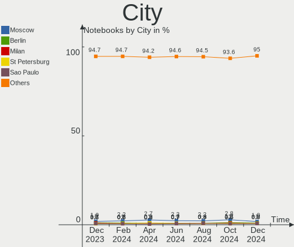
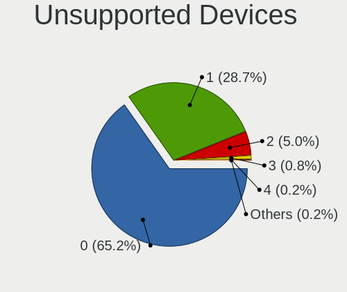

Linux Hardware Trends (Notebooks)
---------------------------------

A project to identify most popular hardware characteristics and track their change
over time based on data collected by Linux users at https://Linux-Hardware.org.

Anyone can contribute to this report by the [hw-probe](https://github.com/linuxhw/hw-probe) tool:

    sudo -E hw-probe -all -upload

Full-feature report is available here: https://linux-hardware.org/?view=trends&formfactor=notebook

Period: Sep, 2021.

Contents
--------

* [ System ](#system)
  - [ OS                       ](#os)
  - [ OS Family                ](#os-family)
  - [ Kernel                   ](#kernel)
  - [ Kernel Family            ](#kernel-family)
  - [ Kernel Major Ver.        ](#kernel-major-ver)
  - [ Arch                     ](#arch)
  - [ DE                       ](#de)
  - [ Display Server           ](#display-server)
  - [ Display Manager          ](#display-manager)
  - [ OS Lang                  ](#os-lang)
  - [ Boot Mode                ](#boot-mode)
  - [ Filesystem               ](#filesystem)
  - [ Part. scheme             ](#part-scheme)
  - [ Dual Boot with Linux/BSD ](#dual-boot-with-linuxbsd)
  - [ Dual Boot (Win)          ](#dual-boot-win)

* [ Board ](#board)
  - [ Vendor                   ](#vendor)
  - [ Model                    ](#model)
  - [ Model Family             ](#model-family)
  - [ MFG Year                 ](#mfg-year)
  - [ Form Factor              ](#form-factor)
  - [ Secure Boot              ](#secure-boot)
  - [ Coreboot                 ](#coreboot)
  - [ RAM Size                 ](#ram-size)
  - [ RAM Used                 ](#ram-used)
  - [ Total Drives             ](#total-drives)
  - [ Has CD-ROM               ](#has-cd-rom)
  - [ Has Ethernet             ](#has-ethernet)
  - [ Has WiFi                 ](#has-wifi)
  - [ Has Bluetooth            ](#has-bluetooth)

* [ Location ](#location)
  - [ Country                  ](#country)
  - [ City                     ](#city)

* [ Drives ](#drives)
  - [ Drive Vendor             ](#drive-vendor)
  - [ Drive Model              ](#drive-model)
  - [ HDD Vendor               ](#hdd-vendor)
  - [ SSD Vendor               ](#ssd-vendor)
  - [ Drive Kind               ](#drive-kind)
  - [ Drive Connector          ](#drive-connector)
  - [ Drive Size               ](#drive-size)
  - [ Space Total              ](#space-total)
  - [ Space Used               ](#space-used)
  - [ Malfunc. Drives          ](#malfunc-drives)
  - [ Malfunc. Drive Vendor    ](#malfunc-drive-vendor)
  - [ Malfunc. HDD Vendor      ](#malfunc-hdd-vendor)
  - [ Malfunc. Drive Kind      ](#malfunc-drive-kind)
  - [ Failed Drives            ](#failed-drives)
  - [ Failed Drive Vendor      ](#failed-drive-vendor)
  - [ Drive Status             ](#drive-status)

* [ Storage controller ](#storage-controller)
  - [ Storage Vendor           ](#storage-vendor)
  - [ Storage Model            ](#storage-model)
  - [ Storage Kind             ](#storage-kind)

* [ Processor ](#processor)
  - [ CPU Vendor               ](#cpu-vendor)
  - [ CPU Model                ](#cpu-model)
  - [ CPU Model Family         ](#cpu-model-family)
  - [ CPU Cores                ](#cpu-cores)
  - [ CPU Sockets              ](#cpu-sockets)
  - [ CPU Threads              ](#cpu-threads)
  - [ CPU Op-Modes             ](#cpu-op-modes)
  - [ CPU Microcode            ](#cpu-microcode)
  - [ CPU Microarch            ](#cpu-microarch)

* [ Graphics ](#graphics)
  - [ GPU Vendor               ](#gpu-vendor)
  - [ GPU Model                ](#gpu-model)
  - [ GPU Combo                ](#gpu-combo)
  - [ GPU Driver               ](#gpu-driver)
  - [ GPU Memory               ](#gpu-memory)

* [ Monitor ](#monitor)
  - [ Monitor Vendor           ](#monitor-vendor)
  - [ Monitor Model            ](#monitor-model)
  - [ Monitor Resolution       ](#monitor-resolution)
  - [ Monitor Diagonal         ](#monitor-diagonal)
  - [ Monitor Width            ](#monitor-width)
  - [ Aspect Ratio             ](#aspect-ratio)
  - [ Monitor Area             ](#monitor-area)
  - [ Pixel Density            ](#pixel-density)
  - [ Multiple Monitors        ](#multiple-monitors)

* [ Network ](#network)
  - [ Net Controller Vendor    ](#net-controller-vendor)
  - [ Net Controller Model     ](#net-controller-model)
  - [ Wireless Vendor          ](#wireless-vendor)
  - [ Wireless Model           ](#wireless-model)
  - [ Ethernet Vendor          ](#ethernet-vendor)
  - [ Ethernet Model           ](#ethernet-model)
  - [ Net Controller Kind      ](#net-controller-kind)
  - [ Used Controller          ](#used-controller)
  - [ NICs                     ](#nics)
  - [ IPv6                     ](#ipv6)

* [ Bluetooth ](#bluetooth)
  - [ Bluetooth Vendor         ](#bluetooth-vendor)
  - [ Bluetooth Model          ](#bluetooth-model)

* [ Sound ](#sound)
  - [ Sound Vendor             ](#sound-vendor)
  - [ Sound Model              ](#sound-model)

* [ Memory ](#memory)
  - [ Memory Vendor            ](#memory-vendor)
  - [ Memory Model             ](#memory-model)
  - [ Memory Kind              ](#memory-kind)
  - [ Memory Form Factor       ](#memory-form-factor)
  - [ Memory Size              ](#memory-size)
  - [ Memory Speed             ](#memory-speed)

* [ Printers & scanners ](#printers--scanners)
  - [ Printer Vendor           ](#printer-vendor)
  - [ Printer Model            ](#printer-model)
  - [ Scanner Vendor           ](#scanner-vendor)
  - [ Scanner Model            ](#scanner-model)

* [ Camera ](#camera)
  - [ Camera Vendor            ](#camera-vendor)
  - [ Camera Model             ](#camera-model)

* [ Security ](#security)
  - [ Fingerprint Vendor       ](#fingerprint-vendor)
  - [ Fingerprint Model        ](#fingerprint-model)
  - [ Chipcard Vendor          ](#chipcard-vendor)
  - [ Chipcard Model           ](#chipcard-model)

* [ Unsupported ](#unsupported)
  - [ Unsupported Devices      ](#unsupported-devices)
  - [ Unsupported Device Types ](#unsupported-device-types)

System
------

OS
--

Installed operating systems

| Name                | Notebooks | Percent |
|---------------------|-----------|---------|
| Ubuntu 20.04        | 475       | 18.61%  |
| Mint 20.2           | 208       | 8.15%   |
| Ubuntu 21.04        | 167       | 6.54%   |
| Pop!_OS 21.04       | 166       | 6.5%    |
| Debian 11           | 147       | 5.76%   |
| Fedora 34           | 128       | 5.01%   |
| Zorin 16            | 121       | 4.74%   |
| OpenMandriva 4.2    | 100       | 3.92%   |
| Arch                | 55        | 2.15%   |
| KDE neon 20.04      | 50        | 1.96%   |
| ArcoLinux Rolling   | 43        | 1.68%   |
| Manjaro             | 42        | 1.65%   |
| Ubuntu 18.04        | 40        | 1.57%   |
| ROSA R11.1          | 40        | 1.57%   |
| Xubuntu 20.04       | 35        | 1.37%   |
| Elementary 6        | 34        | 1.33%   |
| Linux Mint 19.3     | 29        | 1.14%   |
| Arch Rolling        | 29        | 1.14%   |
| Endless 3.9.5       | 28        | 1.1%    |
| Zorin 15            | 26        | 1.02%   |
| BlackPanther 18.1   | 26        | 1.02%   |
| Manjaro 21.1.2      | 23        | 0.9%    |
| Kubuntu 20.04       | 23        | 0.9%    |
| Gentoo 2.7          | 23        | 0.9%    |
| Pop!_OS 20.04       | 22        | 0.86%   |
| Mint 20.1           | 20        | 0.78%   |
| Ubuntu 21.10        | 19        | 0.74%   |
| Manjaro 21.1.3      | 18        | 0.71%   |
| Kali 2021.3         | 18        | 0.71%   |
| Kubuntu 21.04       | 17        | 0.67%   |
| EndeavourOS Rolling | 17        | 0.67%   |
| Linux Mint 20       | 16        | 0.63%   |
| Xubuntu 18.04       | 14        | 0.55%   |
| Debian 10           | 14        | 0.55%   |
| Ubuntu 20.10        | 12        | 0.47%   |
| LMDE 4              | 12        | 0.47%   |
| OpenMandriva 4.50   | 10        | 0.39%   |
| Fedora 35           | 10        | 0.39%   |
| Manjaro 21.1.4      | 9         | 0.35%   |
| Manjaro 21.1.1      | 9         | 0.35%   |
| Garuda Soaring      | 8         | 0.31%   |
| Ubuntu 16.04        | 7         | 0.27%   |
| ROSA R11            | 7         | 0.27%   |
| Parrot 4.11         | 7         | 0.27%   |
| LinuxFX 11          | 7         | 0.27%   |
| Pop!_OS 20.10       | 6         | 0.24%   |
| Lubuntu 20.04       | 6         | 0.24%   |
| Fedora 33           | 6         | 0.24%   |
| Debian Testing      | 6         | 0.24%   |
| Xubuntu 21.04       | 5         | 0.2%    |
| Ubuntu MATE 20.04   | 5         | 0.2%    |
| Peppermint 10       | 5         | 0.2%    |
| Kali 2021.2         | 5         | 0.2%    |
| CentOS 8            | 5         | 0.2%    |
| Void                | 4         | 0.16%   |
| Ubuntu MATE 21.04   | 4         | 0.16%   |
| Ubuntu Budgie 21.04 | 4         | 0.16%   |
| Ubuntu              | 4         | 0.16%   |
| RHEL 8              | 4         | 0.16%   |
| Lubuntu 21.04       | 4         | 0.16%   |

OS Family
---------

OS without a version

| Name          | Notebooks | Percent |
|---------------|-----------|---------|
| Ubuntu        | 729       | 28.55%  |
| Mint          | 278       | 10.89%  |
| Pop!_OS       | 194       | 7.6%    |
| Debian        | 170       | 6.66%   |
| Fedora        | 149       | 5.84%   |
| Zorin         | 147       | 5.76%   |
| OpenMandriva  | 110       | 4.31%   |
| Manjaro       | 102       | 4%      |
| Arch          | 84        | 3.29%   |
| Xubuntu       | 57        | 2.23%   |
| ROSA          | 50        | 1.96%   |
| KDE neon      | 50        | 1.96%   |
| Kubuntu       | 46        | 1.8%    |
| ArcoLinux     | 44        | 1.72%   |
| Elementary    | 37        | 1.45%   |
| Endless       | 35        | 1.37%   |
| BlackPanther  | 26        | 1.02%   |
| Gentoo        | 24        | 0.94%   |
| Kali          | 23        | 0.9%    |
| openSUSE      | 22        | 0.86%   |
| EndeavourOS   | 21        | 0.82%   |
| Lubuntu       | 15        | 0.59%   |
| Ubuntu MATE   | 12        | 0.47%   |
| LMDE          | 12        | 0.47%   |
| CentOS        | 9         | 0.35%   |
| Parrot        | 8         | 0.31%   |
| LinuxFX       | 8         | 0.31%   |
| Garuda        | 8         | 0.31%   |
| Void          | 6         | 0.24%   |
| MX            | 6         | 0.24%   |
| Ubuntu Budgie | 5         | 0.2%    |
| Peppermint    | 5         | 0.2%    |
| Clear Linux   | 5         | 0.2%    |
| ALT Linux     | 5         | 0.2%    |
| RHEL          | 4         | 0.16%   |
| Artix         | 4         | 0.16%   |
| Slackware     | 3         | 0.12%   |
| Kaisen        | 3         | 0.12%   |
| GNOME OS      | 3         | 0.12%   |
| Alpine        | 3         | 0.12%   |
| Solus         | 2         | 0.08%   |
| Red OS        | 2         | 0.08%   |
| Reborn OS     | 2         | 0.08%   |
| Q4OS          | 2         | 0.08%   |
| Devuan        | 2         | 0.08%   |
| Virtuozzo     | 1         | 0.04%   |
| UHU           | 1         | 0.04%   |
| Trisquel      | 1         | 0.04%   |
| Sparky        | 1         | 0.04%   |
| Siduction     | 1         | 0.04%   |
| Sabayon       | 1         | 0.04%   |
| RED           | 1         | 0.04%   |
| PureOS        | 1         | 0.04%   |
| Puppy         | 1         | 0.04%   |
| Pardus        | 1         | 0.04%   |
| Oracle Linux  | 1         | 0.04%   |
| Makulu        | 1         | 0.04%   |
| Mageia        | 1         | 0.04%   |
| Hefftor       | 1         | 0.04%   |
| Hash Linux    | 1         | 0.04%   |

Kernel
------

Version of the Linux kernel

| Version                             | Notebooks | Percent |
|-------------------------------------|-----------|---------|
| 5.11.0-34-generic                   | 350       | 13.71%  |
| 5.11.0-27-generic                   | 227       | 8.89%   |
| 5.11.0-36-generic                   | 144       | 5.64%   |
| 5.4.0-84-generic                    | 139       | 5.44%   |
| 5.10.0-8-amd64                      | 133       | 5.21%   |
| 5.4.0-81-generic                    | 108       | 4.23%   |
| 5.10.14-desktop-1omv4002            | 94        | 3.68%   |
| 5.11.0-7633-generic                 | 87        | 3.41%   |
| 5.13.0-7614-generic                 | 74        | 2.9%    |
| 5.11.0-37-generic                   | 56        | 2.19%   |
| 5.11.0-31-generic                   | 44        | 1.72%   |
| 5.4.0-86-generic                    | 41        | 1.61%   |
| 5.13.13-arch1-1                     | 36        | 1.41%   |
| 5.8.0-14-generic                    | 28        | 1.1%    |
| 5.13.16-200.fc34.x86_64             | 26        | 1.02%   |
| 5.13.14-200.fc34.x86_64             | 26        | 1.02%   |
| 5.11.0-7620-generic                 | 23        | 0.9%    |
| 5.4.0-74-generic                    | 21        | 0.82%   |
| 5.10.0-kali9-amd64                  | 20        | 0.78%   |
| 5.13.13-200.fc34.x86_64             | 19        | 0.74%   |
| 5.13.13-1-MANJARO                   | 19        | 0.74%   |
| 5.4.83-generic-2rosa-x86_64         | 16        | 0.63%   |
| 5.13.19-200.fc34.x86_64             | 16        | 0.63%   |
| 5.13.0-16-generic                   | 15        | 0.59%   |
| 5.10.0-7-amd64                      | 15        | 0.59%   |
| 4.18.16-desktop-1bP                 | 15        | 0.59%   |
| 5.4.0-88-generic                    | 14        | 0.55%   |
| 5.13.12-200.fc34.x86_64             | 14        | 0.55%   |
| 5.14.2-arch1-2                      | 13        | 0.51%   |
| 4.19.0-17-amd64                     | 13        | 0.51%   |
| 5.8.0-63-generic                    | 12        | 0.47%   |
| 5.10.61-1-MANJARO                   | 12        | 0.47%   |
| 5.6.14-desktop-2bP                  | 11        | 0.43%   |
| 5.14.7-arch1-1                      | 11        | 0.43%   |
| 5.14.6-arch1-1                      | 11        | 0.43%   |
| 5.14.5-arch1-1                      | 11        | 0.43%   |
| 5.13.15-1-MANJARO                   | 11        | 0.43%   |
| 5.11.12-300.fc34.x86_64             | 11        | 0.43%   |
| 5.11.0-35-generic                   | 11        | 0.43%   |
| 5.11.0-16-generic                   | 11        | 0.43%   |
| 5.13.12-1-MANJARO                   | 10        | 0.39%   |
| 5.4.0-80-generic                    | 9         | 0.35%   |
| 5.13.15-200.fc34.x86_64             | 9         | 0.35%   |
| 5.14.8-arch1-1                      | 8         | 0.31%   |
| 5.14.2-1-MANJARO                    | 8         | 0.31%   |
| 5.13.13-zen1-1-zen                  | 8         | 0.31%   |
| 5.13.0-14-generic                   | 8         | 0.31%   |
| 5.10.61-gentoo                      | 8         | 0.31%   |
| 4.15.0-desktop-122.124.1rosa-x86_64 | 8         | 0.31%   |
| 5.4.32-generic-2rosa-x86_64         | 7         | 0.27%   |
| 5.4.0-87-generic                    | 7         | 0.27%   |
| 5.4.0-42-generic                    | 7         | 0.27%   |
| 5.12.4-desktop-1omv4050             | 7         | 0.27%   |
| 5.10.60-1-MANJARO                   | 7         | 0.27%   |
| 5.10.0-1045-oem                     | 7         | 0.27%   |
| 5.8.0-43-generic                    | 6         | 0.24%   |
| 5.4.0-72-generic                    | 6         | 0.24%   |
| 5.14.7-2-MANJARO                    | 6         | 0.24%   |
| 5.14.6-zen1-1-zen                   | 6         | 0.24%   |
| 5.14.3-arch1-1                      | 6         | 0.24%   |

Kernel Family
-------------

Linux kernel without a distro release

| Version | Notebooks | Percent |
|---------|-----------|---------|
| 5.11.0  | 975       | 38.19%  |
| 5.4.0   | 379       | 14.85%  |
| 5.10.0  | 206       | 8.07%   |
| 5.13.0  | 102       | 4%      |
| 5.10.14 | 94        | 3.68%   |
| 5.13.13 | 93        | 3.64%   |
| 5.8.0   | 62        | 2.43%   |
| 4.15.0  | 37        | 1.45%   |
| 5.14.2  | 32        | 1.25%   |
| 5.13.12 | 30        | 1.18%   |
| 5.13.16 | 29        | 1.14%   |
| 5.13.15 | 29        | 1.14%   |
| 5.13.14 | 28        | 1.1%    |
| 5.10.61 | 26        | 1.02%   |
| 5.14.7  | 25        | 0.98%   |
| 5.14.6  | 24        | 0.94%   |
| 5.13.19 | 24        | 0.94%   |
| 5.14.0  | 22        | 0.86%   |
| 4.19.0  | 22        | 0.86%   |
| 5.14.5  | 18        | 0.71%   |
| 5.4.83  | 17        | 0.67%   |
| 5.14.8  | 17        | 0.67%   |
| 5.11.12 | 17        | 0.67%   |
| 4.18.16 | 15        | 0.59%   |
| 5.14.1  | 13        | 0.51%   |
| 5.4.32  | 12        | 0.47%   |
| 5.0.0   | 12        | 0.47%   |
| 5.6.14  | 11        | 0.43%   |
| 4.18.0  | 11        | 0.43%   |
| 5.14.3  | 10        | 0.39%   |
| 5.10.60 | 10        | 0.39%   |
| 5.12.4  | 7         | 0.27%   |
| 5.10.68 | 7         | 0.27%   |
| 5.10.63 | 7         | 0.27%   |
| 5.10.52 | 7         | 0.27%   |
| 5.3.0   | 6         | 0.24%   |
| 5.13.9  | 6         | 0.24%   |
| 5.13.8  | 5         | 0.2%    |
| 5.10.62 | 5         | 0.2%    |
| 4.4.0   | 5         | 0.2%    |
| 3.10.0  | 5         | 0.2%    |
| 5.3.18  | 4         | 0.16%   |
| 5.15.0  | 4         | 0.16%   |
| 5.12.19 | 4         | 0.16%   |
| 4.9.0   | 4         | 0.16%   |
| 5.4.144 | 3         | 0.12%   |
| 5.13.10 | 3         | 0.12%   |
| 5.12.7  | 3         | 0.12%   |
| 5.10.64 | 3         | 0.12%   |
| 5.9.16  | 2         | 0.08%   |
| 5.5.19  | 2         | 0.08%   |
| 5.13.18 | 2         | 0.08%   |
| 5.13.17 | 2         | 0.08%   |
| 5.12.13 | 2         | 0.08%   |
| 5.11.6  | 2         | 0.08%   |
| 5.11.22 | 2         | 0.08%   |
| 5.10.69 | 2         | 0.08%   |
| 5.10.67 | 2         | 0.08%   |
| 5.10.56 | 2         | 0.08%   |
| 4.9.155 | 2         | 0.08%   |

Kernel Major Ver.
-----------------

Linux kernel major version

| Version | Notebooks | Percent |
|---------|-----------|---------|
| 5.11    | 997       | 39.05%  |
| 5.4     | 414       | 16.22%  |
| 5.10    | 378       | 14.81%  |
| 5.13    | 356       | 13.94%  |
| 5.14    | 162       | 6.35%   |
| 5.8     | 64        | 2.51%   |
| 4.15    | 37        | 1.45%   |
| 4.18    | 26        | 1.02%   |
| 5.12    | 24        | 0.94%   |
| 4.19    | 23        | 0.9%    |
| 5.6     | 14        | 0.55%   |
| 5.0     | 12        | 0.47%   |
| 5.3     | 10        | 0.39%   |
| 4.9     | 6         | 0.24%   |
| 3.10    | 6         | 0.24%   |
| 4.4     | 5         | 0.2%    |
| 5.15    | 4         | 0.16%   |
| 5.9     | 3         | 0.12%   |
| 5.5     | 3         | 0.12%   |
| 4.16    | 3         | 0.12%   |
| 5.7     | 2         | 0.08%   |
| 5       | 1         | 0.04%   |
| 4.17    | 1         | 0.04%   |
| 4.13    | 1         | 0.04%   |
| 4.1     | 1         | 0.04%   |

Arch
----

OS architecture (x86_64, i586, etc.)

| Name   | Notebooks | Percent |
|--------|-----------|---------|
| x86_64 | 2488      | 97.45%  |
| i686   | 64        | 2.51%   |
| armv7l | 1         | 0.04%   |

DE
--

Desktop Environment

| Name             | Notebooks | Percent |
|------------------|-----------|---------|
| GNOME            | 1289      | 50.49%  |
| KDE5             | 352       | 13.79%  |
| XFCE             | 222       | 8.7%    |
| X-Cinnamon       | 193       | 7.56%   |
| Unknown          | 125       | 4.9%    |
| KDE              | 78        | 3.06%   |
| MATE             | 77        | 3.02%   |
| Pantheon         | 35        | 1.37%   |
| Cinnamon         | 33        | 1.29%   |
| KDE4             | 28        | 1.1%    |
| i3               | 23        | 0.9%    |
| LXQt             | 20        | 0.78%   |
| GNOME Flashback  | 13        | 0.51%   |
| LXDE             | 12        | 0.47%   |
| Unity            | 8         | 0.31%   |
| awesome          | 6         | 0.24%   |
| xmonad           | 5         | 0.2%    |
| Deepin           | 5         | 0.2%    |
| Budgie           | 5         | 0.2%    |
| sway             | 4         | 0.16%   |
| GNOME Classic    | 4         | 0.16%   |
| bspwm            | 4         | 0.16%   |
| Trinity          | 2         | 0.08%   |
| lightdm-xsession | 2         | 0.08%   |
| i3-with-shmlog   | 2         | 0.08%   |
| DWM              | 2         | 0.08%   |
| qtile            | 1         | 0.04%   |
| Peppermint       | 1         | 0.04%   |
| openbox          | 1         | 0.04%   |
| Enlightenment    | 1         | 0.04%   |

Display Server
--------------

X11 or Wayland

| Name    | Notebooks | Percent |
|---------|-----------|---------|
| X11     | 2071      | 81.12%  |
| Wayland | 374       | 14.65%  |
| Unknown | 78        | 3.06%   |
| Tty     | 30        | 1.18%   |

Display Manager
---------------

SDDM, LightDM, etc.

| Name    | Notebooks | Percent |
|---------|-----------|---------|
| Unknown | 1236      | 48.41%  |
| GDM     | 492       | 19.27%  |
| SDDM    | 356       | 13.94%  |
| LightDM | 310       | 12.14%  |
| GDM3    | 118       | 4.62%   |
| KDM     | 26        | 1.02%   |
| LXDM    | 8         | 0.31%   |
| XDM     | 3         | 0.12%   |
| TDM     | 2         | 0.08%   |
| SLiM    | 1         | 0.04%   |
| MDM     | 1         | 0.04%   |

OS Lang
-------

Language

| Lang    | Notebooks | Percent |
|---------|-----------|---------|
| en_US   | 1060      | 41.52%  |
| de_DE   | 196       | 7.68%   |
| ru_RU   | 140       | 5.48%   |
| pt_BR   | 138       | 5.41%   |
| en_GB   | 133       | 5.21%   |
| fr_FR   | 122       | 4.78%   |
| Unknown | 77        | 3.02%   |
| es_ES   | 66        | 2.59%   |
| en_IN   | 63        | 2.47%   |
| it_IT   | 48        | 1.88%   |
| pl_PL   | 46        | 1.8%    |
| en_CA   | 40        | 1.57%   |
| cs_CZ   | 34        | 1.33%   |
| en_AU   | 33        | 1.29%   |
| hu_HU   | 30        | 1.18%   |
| C       | 29        | 1.14%   |
| es_MX   | 23        | 0.9%    |
| zh_CN   | 20        | 0.78%   |
| nl_NL   | 17        | 0.67%   |
| en_ZA   | 16        | 0.63%   |
| de_AT   | 13        | 0.51%   |
| pt_PT   | 12        | 0.47%   |
| ru_UA   | 11        | 0.43%   |
| nb_NO   | 10        | 0.39%   |
| fi_FI   | 10        | 0.39%   |
| tr_TR   | 9         | 0.35%   |
| sv_SE   | 9         | 0.35%   |
| es_CL   | 9         | 0.35%   |
| es_AR   | 8         | 0.31%   |
| fr_BE   | 7         | 0.27%   |
| de_CH   | 7         | 0.27%   |
| uk_UA   | 6         | 0.24%   |
| nl_BE   | 6         | 0.24%   |
| ja_JP   | 6         | 0.24%   |
| fr_CA   | 6         | 0.24%   |
| es_CO   | 6         | 0.24%   |
| en_NZ   | 6         | 0.24%   |
| hr_HR   | 5         | 0.2%    |
| es_CR   | 5         | 0.2%    |
| en_IE   | 5         | 0.2%    |
| sk_SK   | 4         | 0.16%   |
| ro_RO   | 4         | 0.16%   |
| en_PH   | 4         | 0.16%   |
| en_IL   | 4         | 0.16%   |
| da_DK   | 4         | 0.16%   |
| ko_KR   | 3         | 0.12%   |
| en_SG   | 3         | 0.12%   |
| el_GR   | 3         | 0.12%   |
| zh_TW   | 2         | 0.08%   |
| szl_PL  | 2         | 0.08%   |
| POSIX   | 2         | 0.08%   |
| id_ID   | 2         | 0.08%   |
| en_ZM   | 2         | 0.08%   |
| en_NG   | 2         | 0.08%   |
| en_DK   | 2         | 0.08%   |
| vi_VN   | 1         | 0.04%   |
| unm_US  | 1         | 0.04%   |
| ms_MY   | 1         | 0.04%   |
| ks_IN   | 1         | 0.04%   |
| ga_IE   | 1         | 0.04%   |

Boot Mode
---------

EFI or BIOS

| Mode | Notebooks | Percent |
|------|-----------|---------|
| EFI  | 1385      | 54.25%  |
| BIOS | 1168      | 45.75%  |

Filesystem
----------

Type of filesystem

| Type     | Notebooks | Percent |
|----------|-----------|---------|
| Ext4     | 2055      | 80.49%  |
| Btrfs    | 233       | 9.13%   |
| Overlay  | 189       | 7.4%    |
| Xfs      | 39        | 1.53%   |
| Zfs      | 17        | 0.67%   |
| Ext3     | 6         | 0.24%   |
| Ext2     | 6         | 0.24%   |
| Reiserfs | 2         | 0.08%   |
| F2fs     | 2         | 0.08%   |
| Aufs     | 2         | 0.08%   |
| Tmpfs    | 1         | 0.04%   |
| Unknown  | 1         | 0.04%   |

Part. scheme
------------

Scheme of partitioning

| Type    | Notebooks | Percent |
|---------|-----------|---------|
| Unknown | 1293      | 50.65%  |
| GPT     | 950       | 37.21%  |
| MBR     | 310       | 12.14%  |

Dual Boot with Linux/BSD
------------------------

Hosting more than one Linux/BSD

| Dual boot | Notebooks | Percent |
|-----------|-----------|---------|
| No        | 2320      | 90.87%  |
| Yes       | 233       | 9.13%   |

Dual Boot (Win)
---------------

Hosting Linux and Windows

| Dual boot | Notebooks | Percent |
|-----------|-----------|---------|
| No        | 1871      | 73.29%  |
| Yes       | 682       | 26.71%  |

Board
-----

Vendor
------

Motherboard manufacturer

| Name                             | Notebooks | Percent |
|----------------------------------|-----------|---------|
| Lenovo                           | 532       | 20.84%  |
| Dell                             | 422       | 16.53%  |
| Hewlett-Packard                  | 418       | 16.37%  |
| ASUSTek Computer                 | 286       | 11.2%   |
| Acer                             | 273       | 10.69%  |
| Apple                            | 82        | 3.21%   |
| Toshiba                          | 77        | 3.02%   |
| MSI                              | 55        | 2.15%   |
| Samsung Electronics              | 44        | 1.72%   |
| Sony                             | 36        | 1.41%   |
| Google                           | 21        | 0.82%   |
| Positivo                         | 17        | 0.67%   |
| HUAWEI                           | 17        | 0.67%   |
| Notebook                         | 16        | 0.63%   |
| Unknown                          | 16        | 0.63%   |
| Timi                             | 15        | 0.59%   |
| Fujitsu                          | 15        | 0.59%   |
| TUXEDO                           | 13        | 0.51%   |
| Packard Bell                     | 13        | 0.51%   |
| Medion                           | 12        | 0.47%   |
| Gateway                          | 10        | 0.39%   |
| Fujitsu Siemens                  | 10        | 0.39%   |
| Alienware                        | 8         | 0.31%   |
| System76                         | 7         | 0.27%   |
| Razer                            | 6         | 0.24%   |
| LG Electronics                   | 6         | 0.24%   |
| Intel                            | 6         | 0.24%   |
| Clevo                            | 6         | 0.24%   |
| Chuwi                            | 6         | 0.24%   |
| PC Specialist                    | 5         | 0.2%    |
| Gigabyte Technology              | 5         | 0.2%    |
| Framework                        | 5         | 0.2%    |
| Panasonic                        | 4         | 0.16%   |
| HONOR                            | 4         | 0.16%   |
| eMachines                        | 4         | 0.16%   |
| Schenker                         | 3         | 0.12%   |
| Metabox                          | 3         | 0.12%   |
| GPD                              | 3         | 0.12%   |
| FUJITSU CLIENT COMPUTING LIMITED | 3         | 0.12%   |
| Eluktronics                      | 3         | 0.12%   |
| Dynabook                         | 3         | 0.12%   |
| Wortmann AG                      | 2         | 0.08%   |
| UNOWHY                           | 2         | 0.08%   |
| TrekStor                         | 2         | 0.08%   |
| Semp Toshiba                     | 2         | 0.08%   |
| Pegatron                         | 2         | 0.08%   |
| Monster                          | 2         | 0.08%   |
| Jumper                           | 2         | 0.08%   |
| Intel Client Systems             | 2         | 0.08%   |
| IBM                              | 2         | 0.08%   |
| GPU Company                      | 2         | 0.08%   |
| Digibras                         | 2         | 0.08%   |
| AMI                              | 2         | 0.08%   |
| VIT                              | 1         | 0.04%   |
| TianBei                          | 1         | 0.04%   |
| Thomson                          | 1         | 0.04%   |
| Terrans Force                    | 1         | 0.04%   |
| Teclast                          | 1         | 0.04%   |
| SLIMBOOK                         | 1         | 0.04%   |
| Quanta                           | 1         | 0.04%   |

Model
-----

Motherboard model

| Name                                | Notebooks | Percent |
|-------------------------------------|-----------|---------|
| Unknown                             | 21        | 0.82%   |
| HP Notebook                         | 16        | 0.63%   |
| HP Pavilion dv6                     | 14        | 0.55%   |
| ASUS UX31E                          | 14        | 0.55%   |
| Dell Latitude E6430                 | 12        | 0.47%   |
| Dell XPS 15 9500                    | 10        | 0.39%   |
| HP Pavilion g6                      | 9         | 0.35%   |
| HP 15                               | 9         | 0.35%   |
| Apple MacBookPro8,1                 | 9         | 0.35%   |
| HP Pavilion dv7                     | 8         | 0.31%   |
| HP Pavilion 15                      | 8         | 0.31%   |
| Google Enguarde                     | 8         | 0.31%   |
| Dell XPS 15 9570                    | 8         | 0.31%   |
| Acer Nitro AN515-54                 | 8         | 0.31%   |
| Acer Aspire V3-571G                 | 8         | 0.31%   |
| Acer Aspire A315-23                 | 8         | 0.31%   |
| HP Pavilion Notebook                | 7         | 0.27%   |
| HP EliteBook 820 G1                 | 7         | 0.27%   |
| Dell XPS 15 9560                    | 7         | 0.27%   |
| Dell XPS 15 7590                    | 7         | 0.27%   |
| Dell Latitude E7450                 | 7         | 0.27%   |
| Dell Latitude E6410                 | 7         | 0.27%   |
| Apple MacBookAir7,2                 | 7         | 0.27%   |
| Positivo MOBILE                     | 6         | 0.24%   |
| Dell XPS 15 9510                    | 6         | 0.24%   |
| Dell XPS 13 7390                    | 6         | 0.24%   |
| Dell Latitude E6420                 | 6         | 0.24%   |
| Dell Latitude 5480                  | 6         | 0.24%   |
| Apple MacBookAir7,1                 | 6         | 0.24%   |
| Lenovo ThinkPad T400 2768WGB        | 5         | 0.2%    |
| HP Pavilion Laptop 15-eg0xxx        | 5         | 0.2%    |
| HP Laptop 15s-fq2xxx                | 5         | 0.2%    |
| HP Laptop 15s-eq2xxx                | 5         | 0.2%    |
| HP Laptop 15-bs0xx                  | 5         | 0.2%    |
| HP G60                              | 5         | 0.2%    |
| HP EliteBook 845 G7 Notebook PC     | 5         | 0.2%    |
| HP 250 G6 Notebook PC               | 5         | 0.2%    |
| Framework Laptop                    | 5         | 0.2%    |
| Dell XPS 13 9370                    | 5         | 0.2%    |
| Dell Latitude E5470                 | 5         | 0.2%    |
| Dell Inspiron 5577                  | 5         | 0.2%    |
| Dell Inspiron 15-3567               | 5         | 0.2%    |
| Chuwi GemiBook Pro                  | 5         | 0.2%    |
| Apple MacBookPro5,5                 | 5         | 0.2%    |
| Apple MacBookPro16,1                | 5         | 0.2%    |
| Apple MacBookPro12,1                | 5         | 0.2%    |
| Apple MacBook4,1                    | 5         | 0.2%    |
| Timi TM1613                         | 4         | 0.16%   |
| Lenovo V130-15IKB 81HN              | 4         | 0.16%   |
| Lenovo IdeaPad 5 14ALC05 82LM       | 4         | 0.16%   |
| Lenovo IdeaPad 3 15ADA05 81W1       | 4         | 0.16%   |
| Lenovo IdeaPad 3 14ITL6 82H7        | 4         | 0.16%   |
| Lenovo G500 20236                   | 4         | 0.16%   |
| Lenovo G50-80 80E5                  | 4         | 0.16%   |
| Lenovo G50-45 80E3                  | 4         | 0.16%   |
| HUAWEI NBLK-WAX9X                   | 4         | 0.16%   |
| HP ProBook 4540s                    | 4         | 0.16%   |
| HP ProBook 450 G8 Notebook PC       | 4         | 0.16%   |
| HP Pavilion Gaming Laptop 15-ec2xxx | 4         | 0.16%   |
| HP Laptop 15-db0xxx                 | 4         | 0.16%   |

Model Family
------------

Motherboard model prefix

| Name                  | Notebooks | Percent |
|-----------------------|-----------|---------|
| Lenovo ThinkPad       | 283       | 11.08%  |
| Acer Aspire           | 183       | 7.17%   |
| Dell Latitude         | 158       | 6.19%   |
| Lenovo IdeaPad        | 130       | 5.09%   |
| Dell Inspiron         | 113       | 4.43%   |
| HP Pavilion           | 103       | 4.03%   |
| Dell XPS              | 84        | 3.29%   |
| HP EliteBook          | 73        | 2.86%   |
| Toshiba Satellite     | 61        | 2.39%   |
| HP ProBook            | 50        | 1.96%   |
| ASUS VivoBook         | 50        | 1.96%   |
| HP Laptop             | 48        | 1.88%   |
| Dell Precision        | 29        | 1.14%   |
| Acer Swift            | 26        | 1.02%   |
| Dell Vostro           | 24        | 0.94%   |
| Acer Nitro            | 23        | 0.9%    |
| ASUS ROG              | 22        | 0.86%   |
| Unknown               | 21        | 0.82%   |
| ASUS ZenBook          | 17        | 0.67%   |
| Acer TravelMate       | 17        | 0.67%   |
| HP ZBook              | 16        | 0.63%   |
| HP Notebook           | 16        | 0.63%   |
| HP 250                | 16        | 0.63%   |
| ASUS ASUS             | 16        | 0.63%   |
| Lenovo Legion         | 15        | 0.59%   |
| HP ENVY               | 15        | 0.59%   |
| Fujitsu LIFEBOOK      | 15        | 0.59%   |
| ASUS UX31E            | 14        | 0.55%   |
| ASUS TUF              | 14        | 0.55%   |
| Apple MacBookAir7     | 13        | 0.51%   |
| Packard Bell EasyNote | 12        | 0.47%   |
| HP Compaq             | 12        | 0.47%   |
| Lenovo Yoga           | 11        | 0.43%   |
| Apple MacBookPro8     | 11        | 0.43%   |
| Lenovo ThinkBook      | 10        | 0.39%   |
| HP OMEN               | 9         | 0.35%   |
| HP 15                 | 9         | 0.35%   |
| MSI Modern            | 8         | 0.31%   |
| Google Enguarde       | 8         | 0.31%   |
| Apple MacBookPro9     | 8         | 0.31%   |
| Apple MacBookPro5     | 8         | 0.31%   |
| Lenovo G50-80         | 7         | 0.27%   |
| HP Presario           | 7         | 0.27%   |
| HP 255                | 7         | 0.27%   |
| Apple MacBookPro16    | 7         | 0.27%   |
| Acer Extensa          | 7         | 0.27%   |
| Razer Blade           | 6         | 0.24%   |
| Positivo MOBILE       | 6         | 0.24%   |
| Fujitsu Siemens AMILO | 6         | 0.24%   |
| Dell G3               | 6         | 0.24%   |
| Toshiba TECRA         | 5         | 0.2%    |
| Toshiba PORTEGE       | 5         | 0.2%    |
| HP G60                | 5         | 0.2%    |
| Framework Laptop      | 5         | 0.2%    |
| Chuwi GemiBook        | 5         | 0.2%    |
| Apple MacBookPro12    | 5         | 0.2%    |
| Apple MacBook4        | 5         | 0.2%    |
| Toshiba dynabook      | 4         | 0.16%   |
| Timi TM1613           | 4         | 0.16%   |
| Timi Mi               | 4         | 0.16%   |

MFG Year
--------

Motherboard manufacture year

| Year    | Notebooks | Percent |
|---------|-----------|---------|
| 2021    | 553       | 21.66%  |
| 2020    | 382       | 14.96%  |
| 2019    | 283       | 11.08%  |
| 2018    | 198       | 7.76%   |
| 2011    | 154       | 6.03%   |
| 2012    | 145       | 5.68%   |
| 2013    | 134       | 5.25%   |
| 2014    | 115       | 4.5%    |
| 2015    | 112       | 4.39%   |
| 2016    | 98        | 3.84%   |
| 2017    | 97        | 3.8%    |
| 2010    | 81        | 3.17%   |
| 2009    | 80        | 3.13%   |
| 2008    | 69        | 2.7%    |
| 2007    | 28        | 1.1%    |
| 2006    | 10        | 0.39%   |
| 2005    | 8         | 0.31%   |
| Unknown | 4         | 0.16%   |
| 2004    | 1         | 0.04%   |
| 1970    | 1         | 0.04%   |

Form Factor
-----------

Physical design of the computer

| Name     | Notebooks | Percent |
|----------|-----------|---------|
| Notebook | 2553      | 100%    |

Secure Boot
-----------

Enabled or disabled

| State    | Notebooks | Percent |
|----------|-----------|---------|
| Disabled | 2305      | 90.29%  |
| Enabled  | 248       | 9.71%   |

Coreboot
--------

Have coreboot on board

| Used | Notebooks | Percent |
|------|-----------|---------|
| No   | 2528      | 99.02%  |
| Yes  | 25        | 0.98%   |

RAM Size
--------

Total RAM memory

| Size in GB  | Notebooks | Percent |
|-------------|-----------|---------|
| 4.01-8.0    | 757       | 29.65%  |
| 3.01-4.0    | 546       | 21.39%  |
| 16.01-24.0  | 443       | 17.35%  |
| 8.01-16.0   | 435       | 17.04%  |
| 32.01-64.0  | 163       | 6.38%   |
| 1.01-2.0    | 106       | 4.15%   |
| 2.01-3.0    | 40        | 1.57%   |
| 64.01-256.0 | 27        | 1.06%   |
| 24.01-32.0  | 22        | 0.86%   |
| 0.51-1.0    | 14        | 0.55%   |

RAM Used
--------

Used RAM memory

| Used GB    | Notebooks | Percent |
|------------|-----------|---------|
| 1.01-2.0   | 948       | 37.13%  |
| 2.01-3.0   | 642       | 25.15%  |
| 4.01-8.0   | 337       | 13.2%   |
| 3.01-4.0   | 310       | 12.14%  |
| 0.51-1.0   | 180       | 7.05%   |
| 8.01-16.0  | 87        | 3.41%   |
| 0.01-0.5   | 32        | 1.25%   |
| 16.01-24.0 | 15        | 0.59%   |
| 24.01-32.0 | 1         | 0.04%   |
| Unknown    | 1         | 0.04%   |

Total Drives
------------

Number of drives on board

| Drives | Notebooks | Percent |
|--------|-----------|---------|
| 1      | 1908      | 74.74%  |
| 2      | 562       | 22.01%  |
| 3      | 67        | 2.62%   |
| 4      | 11        | 0.43%   |
| 0      | 5         | 0.2%    |

Has CD-ROM
----------

Has CD-ROM on board

| Presented | Notebooks | Percent |
|-----------|-----------|---------|
| No        | 1639      | 64.2%   |
| Yes       | 914       | 35.8%   |

Has Ethernet
------------

Has Ethernet on board

| Presented | Notebooks | Percent |
|-----------|-----------|---------|
| Yes       | 2057      | 80.57%  |
| No        | 496       | 19.43%  |

Has WiFi
--------

Has WiFi module

| Presented | Notebooks | Percent |
|-----------|-----------|---------|
| Yes       | 2512      | 98.39%  |
| No        | 41        | 1.61%   |

Has Bluetooth
-------------

Has Bluetooth module

| Presented | Notebooks | Percent |
|-----------|-----------|---------|
| Yes       | 2018      | 79.04%  |
| No        | 535       | 20.96%  |

Location
--------

Country
-------

Geographic location (country)

| Country      | Notebooks | Percent |
|--------------|-----------|---------|
| USA          | 419       | 16.41%  |
| Germany      | 235       | 9.2%    |
| Brazil       | 169       | 6.62%   |
| Russia       | 158       | 6.19%   |
| France       | 155       | 6.07%   |
| UK           | 98        | 3.84%   |
| India        | 98        | 3.84%   |
| Spain        | 73        | 2.86%   |
| Poland       | 67        | 2.62%   |
| Italy        | 65        | 2.55%   |
| Hungary      | 64        | 2.51%   |
| Canada       | 63        | 2.47%   |
| Netherlands  | 49        | 1.92%   |
| Czechia      | 45        | 1.76%   |
| Ukraine      | 41        | 1.61%   |
| Australia    | 38        | 1.49%   |
| Mexico       | 35        | 1.37%   |
| Austria      | 34        | 1.33%   |
| Romania      | 30        | 1.18%   |
| Portugal     | 29        | 1.14%   |
| Belgium      | 26        | 1.02%   |
| Turkey       | 25        | 0.98%   |
| Sweden       | 25        | 0.98%   |
| Norway       | 25        | 0.98%   |
| Argentina    | 25        | 0.98%   |
| China        | 24        | 0.94%   |
| South Africa | 23        | 0.9%    |
| Indonesia    | 23        | 0.9%    |
| Finland      | 19        | 0.74%   |
| Switzerland  | 16        | 0.63%   |
| Japan        | 16        | 0.63%   |
| Iran         | 15        | 0.59%   |
| Bulgaria     | 14        | 0.55%   |
| Israel       | 13        | 0.51%   |
| Greece       | 13        | 0.51%   |
| Chile        | 13        | 0.51%   |
| Denmark      | 12        | 0.47%   |
| Belarus      | 12        | 0.47%   |
| Colombia     | 11        | 0.43%   |
| Slovakia     | 10        | 0.39%   |
| New Zealand  | 10        | 0.39%   |
| Malaysia     | 10        | 0.39%   |
| Vietnam      | 9         | 0.35%   |
| Philippines  | 9         | 0.35%   |
| Ireland      | 9         | 0.35%   |
| Croatia      | 9         | 0.35%   |
| Taiwan       | 7         | 0.27%   |
| South Korea  | 7         | 0.27%   |
| Latvia       | 7         | 0.27%   |
| Serbia       | 6         | 0.24%   |
| Luxembourg   | 6         | 0.24%   |
| Kenya        | 6         | 0.24%   |
| Estonia      | 6         | 0.24%   |
| Costa Rica   | 6         | 0.24%   |
| Thailand     | 5         | 0.2%    |
| Pakistan     | 5         | 0.2%    |
| Morocco      | 5         | 0.2%    |
| Algeria      | 5         | 0.2%    |
| Venezuela    | 4         | 0.16%   |
| Singapore    | 4         | 0.16%   |

City
----

Geographic location (city)

| City              | Notebooks | Percent |
|-------------------|-----------|---------|
| Moscow            | 33        | 1.29%   |
| Paris             | 27        | 1.06%   |
| Prague            | 26        | 1.02%   |
| Portland          | 24        | 0.94%   |
| Budapest          | 23        | 0.9%    |
| S??o Paulo        | 21        | 0.82%   |
| St Petersburg     | 19        | 0.74%   |
| Warsaw            | 18        | 0.71%   |
| Voronezh          | 17        | 0.67%   |
| Vienna            | 17        | 0.67%   |
| Sydney            | 16        | 0.63%   |
| M??laga           | 15        | 0.59%   |
| Amsterdam         | 15        | 0.59%   |
| Tehran            | 13        | 0.51%   |
| London            | 13        | 0.51%   |
| Kyiv              | 13        | 0.51%   |
| Munich            | 12        | 0.47%   |
| Madrid            | 12        | 0.47%   |
| Helsinki          | 12        | 0.47%   |
| Berlin            | 11        | 0.43%   |
| Tatab??nya        | 10        | 0.39%   |
| Sofia             | 10        | 0.39%   |
| Montreal          | 10        | 0.39%   |
| Milan             | 10        | 0.39%   |
| Istanbul          | 9         | 0.35%   |
| Fortaleza         | 9         | 0.35%   |
| Bengaluru         | 9         | 0.35%   |
| Rome              | 8         | 0.31%   |
| Oslo              | 8         | 0.31%   |
| Minsk             | 8         | 0.31%   |
| Melbourne         | 8         | 0.31%   |
| Krasnodar         | 8         | 0.31%   |
| Jakarta           | 8         | 0.31%   |
| Frankfurt am Main | 8         | 0.31%   |
| Curitiba          | 8         | 0.31%   |
| Austin            | 8         | 0.31%   |
| Toronto           | 7         | 0.27%   |
| Mexico City       | 7         | 0.27%   |
| Lisbon            | 7         | 0.27%   |
| Johannesburg      | 7         | 0.27%   |
| Dublin            | 7         | 0.27%   |
| Buenos Aires      | 7         | 0.27%   |
| Barcelona         | 7         | 0.27%   |
| Tel Aviv          | 6         | 0.24%   |
| Rennes            | 6         | 0.24%   |
| Nuremberg         | 6         | 0.24%   |
| Miami             | 6         | 0.24%   |
| Hamburg           | 6         | 0.24%   |
| Glasgow           | 6         | 0.24%   |
| Essen             | 6         | 0.24%   |
| Edmonton          | 6         | 0.24%   |
| Delhi             | 6         | 0.24%   |
| Bucharest         | 6         | 0.24%   |
| Bogot??           | 6         | 0.24%   |
| Aurec-sur-Loire   | 6         | 0.24%   |
| Auckland          | 6         | 0.24%   |
| Athens            | 6         | 0.24%   |
| Ankara            | 6         | 0.24%   |
| Zagreb            | 5         | 0.2%    |
| Yekaterinburg     | 5         | 0.2%    |

Drives
------

Drive Vendor
------------

Hard drive vendors

| Vendor                    | Notebooks | Drives | Percent |
|---------------------------|-----------|--------|---------|
| Samsung Electronics       | 481       | 526    | 15.57%  |
| WDC                       | 389       | 404    | 12.59%  |
| Seagate                   | 357       | 364    | 11.56%  |
| Toshiba                   | 252       | 258    | 8.16%   |
| SK Hynix                  | 164       | 170    | 5.31%   |
| Kingston                  | 164       | 167    | 5.31%   |
| Unknown                   | 161       | 181    | 5.21%   |
| Sandisk                   | 161       | 167    | 5.21%   |
| Crucial                   | 96        | 98     | 3.11%   |
| Intel                     | 95        | 98     | 3.08%   |
| Hitachi                   | 94        | 94     | 3.04%   |
| HGST                      | 94        | 95     | 3.04%   |
| Micron Technology         | 81        | 82     | 2.62%   |
| Apple                     | 45        | 48     | 1.46%   |
| A-DATA Technology         | 42        | 42     | 1.36%   |
| KIOXIA                    | 30        | 33     | 0.97%   |
| Fujitsu                   | 25        | 26     | 0.81%   |
| China                     | 21        | 21     | 0.68%   |
| LITEON                    | 19        | 19     | 0.62%   |
| PNY                       | 18        | 18     | 0.58%   |
| Phison                    | 18        | 19     | 0.58%   |
| SPCC                      | 16        | 16     | 0.52%   |
| LITEONIT                  | 14        | 15     | 0.45%   |
| JMicron                   | 12        | 13     | 0.39%   |
| Union Memory              | 10        | 10     | 0.32%   |
| Silicon Motion            | 10        | 10     | 0.32%   |
| Transcend                 | 9         | 9      | 0.29%   |
| Patriot                   | 9         | 9      | 0.29%   |
| Intenso                   | 8         | 8      | 0.26%   |
| GOODRAM                   | 8         | 8      | 0.26%   |
| Corsair                   | 8         | 8      | 0.26%   |
| Solid State Storage       | 7         | 7      | 0.23%   |
| Lite-On                   | 7         | 7      | 0.23%   |
| Union Memory (Shenzhen)   | 6         | 7      | 0.19%   |
| Micron/Crucial Technology | 6         | 6      | 0.19%   |
| Lexar                     | 6         | 6      | 0.19%   |
| Lenovo                    | 6         | 7      | 0.19%   |
| Team                      | 5         | 5      | 0.16%   |
| SABRENT                   | 5         | 6      | 0.16%   |
| PLEXTOR                   | 5         | 5      | 0.16%   |
| OCZ                       | 5         | 5      | 0.16%   |
| Netac                     | 5         | 5      | 0.16%   |
| KingSpec                  | 5         | 5      | 0.16%   |
| Hewlett-Packard           | 5         | 5      | 0.16%   |
| ASMT                      | 5         | 6      | 0.16%   |
| BIWIN                     | 4         | 4      | 0.13%   |
| Biostar                   | 4         | 4      | 0.13%   |
| XPG                       | 3         | 3      | 0.1%    |
| TO Exter                  | 3         | 3      | 0.1%    |
| MAXTOR                    | 3         | 3      | 0.1%    |
| HS-SSD-C100               | 3         | 4      | 0.1%    |
| Yangtze Memory            | 2         | 2      | 0.06%   |
| XrayDisk                  | 2         | 2      | 0.06%   |
| VisionTek                 | 2         | 4      | 0.06%   |
| Verbatim                  | 2         | 2      | 0.06%   |
| Vaseky                    | 2         | 2      | 0.06%   |
| SSSTC                     | 2         | 2      | 0.06%   |
| Realtek Semiconductor     | 2         | 2      | 0.06%   |
| Mushkin                   | 2         | 2      | 0.06%   |
| Mass                      | 2         | 2      | 0.06%   |

Drive Model
-----------

Hard drive models

| Model                               | Notebooks | Percent |
|-------------------------------------|-----------|---------|
| Seagate ST1000LM035-1RK172 1TB      | 64        | 2%      |
| Toshiba MQ01ABD100 1TB              | 38        | 1.19%   |
| Samsung NVMe SSD Drive 512GB        | 36        | 1.13%   |
| Seagate ST1000LM024 HN-M101MBB 1TB  | 34        | 1.06%   |
| HGST HTS721010A9E630 1TB            | 31        | 0.97%   |
| Toshiba MQ01ABF050 500GB            | 29        | 0.91%   |
| Unknown MMC Card  32GB              | 27        | 0.84%   |
| Toshiba MQ04ABF100 1TB              | 26        | 0.81%   |
| SK Hynix NVMe SSD Drive 512GB       | 26        | 0.81%   |
| Seagate ST500LT012-1DG142 500GB     | 25        | 0.78%   |
| Sandisk NVMe SSD Drive 512GB        | 25        | 0.78%   |
| Unknown MMC Card  64GB              | 24        | 0.75%   |
| Kingston SA400S37240G 240GB SSD     | 24        | 0.75%   |
| Samsung SSD 860 EVO 500GB           | 23        | 0.72%   |
| Samsung NVMe SSD Drive 256GB        | 21        | 0.66%   |
| Samsung SSD 850 EVO 250GB           | 20        | 0.63%   |
| Seagate ST9500325AS 500GB           | 19        | 0.59%   |
| Kingston SA400S37480G 480GB SSD     | 19        | 0.59%   |
| Intel NVMe SSD Drive 512GB          | 17        | 0.53%   |
| WDC WD10JPVX-22JC3T0 1TB            | 16        | 0.5%    |
| Kingston SA400S37120G 120GB SSD     | 16        | 0.5%    |
| Toshiba NVMe SSD Drive 512GB        | 15        | 0.47%   |
| WDC WDS500G2B0A-00SM50 500GB SSD    | 14        | 0.44%   |
| Seagate ST500LM012 HN-M500MBB 500GB | 14        | 0.44%   |
| Seagate Expansion 1TB               | 14        | 0.44%   |
| SanDisk SSD U100 256GB              | 14        | 0.44%   |
| Sandisk NVMe SSD Drive 256GB        | 14        | 0.44%   |
| Intel SSDPEKNW512G8 512GB           | 14        | 0.44%   |
| HGST HTS545050A7E680 500GB          | 14        | 0.44%   |
| HGST HTS541010A9E680 1TB            | 14        | 0.44%   |
| Crucial CT240BX500SSD1 240GB        | 14        | 0.44%   |
| WDC WD10SPZX-21Z10T0 1TB            | 13        | 0.41%   |
| Samsung SSD 860 EVO 250GB           | 13        | 0.41%   |
| Samsung SSD 850 EVO 500GB           | 13        | 0.41%   |
| Samsung NVMe SSD Drive 1024GB       | 13        | 0.41%   |
| HGST HTS725050A7E630 500GB          | 13        | 0.41%   |
| Seagate ST1000LM049-2GH172 1TB      | 12        | 0.38%   |
| Samsung NVMe SSD Drive 1TB          | 12        | 0.38%   |
| Crucial CT500MX500SSD1 500GB        | 12        | 0.38%   |
| Unknown MMC Card  128GB             | 11        | 0.34%   |
| Seagate ST500LM021-1KJ152 500GB     | 11        | 0.34%   |
| Hitachi HTS547550A9E384 500GB       | 11        | 0.34%   |
| Unknown MMC Card  16GB              | 10        | 0.31%   |
| Toshiba MQ01ABD075 752GB            | 10        | 0.31%   |
| SK Hynix NVMe SSD Drive 256GB       | 10        | 0.31%   |
| Seagate ST1000LM048-2E7172 1TB      | 10        | 0.31%   |
| Samsung SSD 860 EVO 1TB             | 10        | 0.31%   |
| Samsung NVMe SSD Drive 500GB        | 10        | 0.31%   |
| WDC WDS240G2G0A-00JH30 240GB SSD    | 9         | 0.28%   |
| WDC WDS120G2G0A-00JH30 120GB SSD    | 9         | 0.28%   |
| Seagate ST9320325AS 320GB           | 9         | 0.28%   |
| Sandisk NVMe SSD Drive 1024GB       | 9         | 0.28%   |
| Samsung SSD 980 PRO 1TB             | 9         | 0.28%   |
| Samsung SSD 970 EVO 1TB             | 9         | 0.28%   |
| Hitachi HTS543232A7A384 320GB       | 9         | 0.28%   |
| Crucial CT480BX500SSD1 480GB        | 9         | 0.28%   |
| Apple SSD SM0128G 121GB             | 9         | 0.28%   |
| WDC WDS500G2B0B-00YS70 500GB SSD    | 8         | 0.25%   |
| WDC WD5000LPCX-24C6HT0 500GB        | 8         | 0.25%   |
| WDC WD10SPZX-24Z10 1TB              | 8         | 0.25%   |

HDD Vendor
----------

Hard disk drive vendors

| Vendor              | Notebooks | Drives | Percent |
|---------------------|-----------|--------|---------|
| Seagate             | 348       | 354    | 34.97%  |
| WDC                 | 226       | 228    | 22.71%  |
| Toshiba             | 165       | 166    | 16.58%  |
| Hitachi             | 94        | 94     | 9.45%   |
| HGST                | 94        | 95     | 9.45%   |
| Fujitsu             | 25        | 26     | 2.51%   |
| Samsung Electronics | 19        | 19     | 1.91%   |
| Apple               | 7         | 7      | 0.7%    |
| Unknown             | 6         | 6      | 0.6%    |
| TO Exter            | 3         | 3      | 0.3%    |
| IBM/Hitachi         | 2         | 2      | 0.2%    |
| HGST HTS            | 2         | 2      | 0.2%    |
| USB3.0              | 1         | 1      | 0.1%    |
| SILICONMOTION       | 1         | 1      | 0.1%    |
| ASMT                | 1         | 2      | 0.1%    |
| Asmedia             | 1         | 1      | 0.1%    |

SSD Vendor
----------

Solid state drive vendors

| Vendor              | Notebooks | Drives | Percent |
|---------------------|-----------|--------|---------|
| Samsung Electronics | 229       | 237    | 23.02%  |
| Kingston            | 107       | 107    | 10.75%  |
| SanDisk             | 97        | 100    | 9.75%   |
| Crucial             | 90        | 92     | 9.05%   |
| WDC                 | 73        | 74     | 7.34%   |
| SK Hynix            | 39        | 39     | 3.92%   |
| Micron Technology   | 35        | 35     | 3.52%   |
| Intel               | 27        | 27     | 2.71%   |
| Toshiba             | 25        | 25     | 2.51%   |
| A-DATA Technology   | 25        | 25     | 2.51%   |
| China               | 21        | 21     | 2.11%   |
| Apple               | 20        | 20     | 2.01%   |
| PNY                 | 16        | 16     | 1.61%   |
| LITEON              | 16        | 16     | 1.61%   |
| SPCC                | 14        | 14     | 1.41%   |
| LITEONIT            | 14        | 15     | 1.41%   |
| Patriot             | 9         | 9      | 0.9%    |
| Transcend           | 8         | 8      | 0.8%    |
| GOODRAM             | 8         | 8      | 0.8%    |
| Unknown             | 7         | 7      | 0.7%    |
| Intenso             | 7         | 7      | 0.7%    |
| Lexar               | 6         | 6      | 0.6%    |
| Corsair             | 6         | 6      | 0.6%    |
| Team                | 5         | 5      | 0.5%    |
| PLEXTOR             | 5         | 5      | 0.5%    |
| OCZ                 | 5         | 5      | 0.5%    |
| KingSpec            | 5         | 5      | 0.5%    |
| Seagate             | 4         | 4      | 0.4%    |
| SABRENT             | 4         | 5      | 0.4%    |
| Netac               | 4         | 4      | 0.4%    |
| Biostar             | 4         | 4      | 0.4%    |
| ASMT                | 4         | 4      | 0.4%    |
| MAXTOR              | 3         | 3      | 0.3%    |
| Hewlett-Packard     | 3         | 3      | 0.3%    |
| BIWIN               | 3         | 3      | 0.3%    |
| Verbatim            | 2         | 2      | 0.2%    |
| Mushkin             | 2         | 2      | 0.2%    |
| Leven               | 2         | 2      | 0.2%    |
| KingDian            | 2         | 2      | 0.2%    |
| HS-SSD-C100         | 2         | 2      | 0.2%    |
| FORESEE             | 2         | 2      | 0.2%    |
| DOGFISH             | 2         | 3      | 0.2%    |
| Apacer              | 2         | 2      | 0.2%    |
| Zheino              | 1         | 1      | 0.1%    |
| Yeyian              | 1         | 1      | 0.1%    |
| XrayDisk            | 1         | 1      | 0.1%    |
| WDC WDS1            | 1         | 1      | 0.1%    |
| W800SH              | 1         | 1      | 0.1%    |
| W800S               | 1         | 1      | 0.1%    |
| VisionTek           | 1         | 2      | 0.1%    |
| Vaseky              | 1         | 1      | 0.1%    |
| TYPEC 1T            | 1         | 1      | 0.1%    |
| TwinMOS             | 1         | 1      | 0.1%    |
| SSSTC               | 1         | 1      | 0.1%    |
| Smartbuy            | 1         | 1      | 0.1%    |
| RDM-II              | 1         | 1      | 0.1%    |
| QUMO                | 1         | 1      | 0.1%    |
| PHISON              | 1         | 1      | 0.1%    |
| ORICO               | 1         | 1      | 0.1%    |
| NGFF                | 1         | 1      | 0.1%    |

Drive Kind
----------

HDD or SSD

| Kind    | Notebooks | Drives | Percent |
|---------|-----------|--------|---------|
| HDD     | 976       | 1007   | 32.73%  |
| SSD     | 933       | 1014   | 31.29%  |
| NVMe    | 893       | 999    | 29.95%  |
| MMC     | 140       | 161    | 4.69%   |
| Unknown | 40        | 42     | 1.34%   |

Drive Connector
---------------

SATA, SAS, NVMe, etc.

| Type | Notebooks | Drives | Percent |
|------|-----------|--------|---------|
| SATA | 1730      | 1962   | 60.49%  |
| NVMe | 887       | 988    | 31.01%  |
| MMC  | 140       | 161    | 4.9%    |
| SAS  | 103       | 112    | 3.6%    |

Drive Size
----------

Size of hard drive

| Size in TB | Notebooks | Drives | Percent |
|------------|-----------|--------|---------|
| 0.01-0.5   | 1271      | 1372   | 67.11%  |
| 0.51-1.0   | 569       | 595    | 30.04%  |
| 1.01-2.0   | 45        | 45     | 2.38%   |
| 3.01-4.0   | 8         | 8      | 0.42%   |
| 4.01-10.0  | 1         | 1      | 0.05%   |

Space Total
-----------

Amount of disk space available on the file system

| Size in GB     | Notebooks | Percent |
|----------------|-----------|---------|
| 101-250        | 767       | 30.04%  |
| 251-500        | 678       | 26.56%  |
| 501-1000       | 360       | 14.1%   |
| 51-100         | 189       | 7.4%    |
| 1-20           | 157       | 6.15%   |
| 1001-2000      | 133       | 5.21%   |
| 21-50          | 99        | 3.88%   |
| Unknown        | 87        | 3.41%   |
| More than 3000 | 44        | 1.72%   |
| 2001-3000      | 39        | 1.53%   |

Space Used
----------

Amount of used disk space

| Used GB        | Notebooks | Percent |
|----------------|-----------|---------|
| 1-20           | 1011      | 39.6%   |
| 21-50          | 511       | 20.02%  |
| 101-250        | 323       | 12.65%  |
| 51-100         | 290       | 11.36%  |
| 251-500        | 177       | 6.93%   |
| 501-1000       | 94        | 3.68%   |
| Unknown        | 87        | 3.41%   |
| 1001-2000      | 38        | 1.49%   |
| More than 3000 | 12        | 0.47%   |
| 2001-3000      | 9         | 0.35%   |
| 0              | 1         | 0.04%   |

Malfunc. Drives
---------------

Drive models with a malfunction

| Model                                          | Notebooks | Drives | Percent |
|------------------------------------------------|-----------|--------|---------|
| SanDisk SSD U100 256GB                         | 14        | 14     | 6.54%   |
| Seagate ST1000LM024 HN-M101MBB 1TB             | 8         | 8      | 3.74%   |
| Seagate ST1000LM035-1RK172 1TB                 | 6         | 6      | 2.8%    |
| Toshiba MQ01ABD100 1TB                         | 5         | 5      | 2.34%   |
| Seagate ST9500325AS 500GB                      | 4         | 4      | 1.87%   |
| Seagate ST500LT012-9WS142 500GB                | 4         | 4      | 1.87%   |
| Seagate ST500LT012-1DG142 500GB                | 4         | 4      | 1.87%   |
| HGST HTS721010A9E630 1TB                       | 4         | 4      | 1.87%   |
| HGST HTS545050A7E680 500GB                     | 4         | 4      | 1.87%   |
| HGST HTS541010A9E680 1TB                       | 4         | 4      | 1.87%   |
| WDC WD10JPVX-22JC3T0 1TB                       | 3         | 3      | 1.4%    |
| Toshiba MK7575GSX 752GB                        | 3         | 3      | 1.4%    |
| Seagate ST500LM012 HN-M500MBB 500GB            | 3         | 3      | 1.4%    |
| Seagate ST1000LX015-1U7172 1TB                 | 3         | 3      | 1.4%    |
| Hitachi HTS547550A9E384 500GB                  | 3         | 3      | 1.4%    |
| Hitachi HTS542516K9SA00 160GB                  | 3         | 3      | 1.4%    |
| Fujitsu MHZ2320BH G2 320GB                     | 3         | 3      | 1.4%    |
| WDC WDS120G2G0A-00JH30 120GB SSD               | 2         | 2      | 0.93%   |
| WDC WD5000LPCX-24C6HT0 500GB                   | 2         | 2      | 0.93%   |
| Toshiba MQ01ABD075 752GB                       | 2         | 2      | 0.93%   |
| Toshiba MK3276GSX 320GB                        | 2         | 2      | 0.93%   |
| Seagate ST9750420AS 752GB                      | 2         | 2      | 0.93%   |
| Seagate ST500LM021-1KJ152 500GB                | 2         | 2      | 0.93%   |
| Seagate ST500LM000-1EJ162 500GB                | 2         | 2      | 0.93%   |
| Seagate ST320LT020-9YG142 320GB                | 2         | 2      | 0.93%   |
| Samsung Electronics HM160HI 160GB              | 2         | 2      | 0.93%   |
| Micron Technology 1100_MTFDDAK256TBN 256GB SSD | 2         | 2      | 0.93%   |
| Kingston SV300S37A120G 120GB SSD               | 2         | 2      | 0.93%   |
| Intel SSDPEKKF256G7L 256GB                     | 2         | 2      | 0.93%   |
| Hitachi HTS547575A9E384 752GB                  | 2         | 2      | 0.93%   |
| Hitachi HTS545032B9A300 320GB                  | 2         | 2      | 0.93%   |
| Hitachi HTS545025B9SA02 250GB                  | 2         | 2      | 0.93%   |
| Hitachi HTS545025B9A300 250GB                  | 2         | 2      | 0.93%   |
| Crucial CT240M500SSD1 240GB                    | 2         | 2      | 0.93%   |
| WDC WD7500BPVT-60HXZT3 752GB                   | 1         | 1      | 0.47%   |
| WDC WD6400BEVT-60A0RT0 640GB                   | 1         | 1      | 0.47%   |
| WDC WD5000LPVX-60V0TT0 500GB                   | 1         | 1      | 0.47%   |
| WDC WD5000LPLX-75ZNTT0 500GB                   | 1         | 1      | 0.47%   |
| WDC WD5000LPCX-60VHAT0 500GB                   | 1         | 1      | 0.47%   |
| WDC WD5000LPCX-24VHAT0 500GB                   | 1         | 1      | 0.47%   |
| WDC WD5000BPKT-75PK4T0 500GB                   | 1         | 1      | 0.47%   |
| WDC WD50 00BEVT-11ZAT0 500GB                   | 1         | 1      | 0.47%   |
| WDC WD3200BPVT-75ZEST0 320GB                   | 1         | 1      | 0.47%   |
| WDC WD3200BPVT-00JJ5T0 320GB                   | 1         | 1      | 0.47%   |
| WDC WD3200BEKT-60PVMT0 320GB                   | 1         | 1      | 0.47%   |
| WDC WD10SPZX-24Z10 1TB                         | 1         | 1      | 0.47%   |
| WDC WD10JPVX-60JC3T0 1TB                       | 1         | 1      | 0.47%   |
| WDC WD10JPVT-08A1YT2 1TB                       | 1         | 1      | 0.47%   |
| WDC WD10JPCX-24UE4T0 1TB                       | 1         | 1      | 0.47%   |
| Toshiba THNSNH128GCST 128GB SSD                | 1         | 1      | 0.47%   |
| Toshiba THNSFJ256GCSU 256GB SSD                | 1         | 1      | 0.47%   |
| Toshiba MQ01ABF050 500GB                       | 1         | 1      | 0.47%   |
| Toshiba MQ01ABD050V 500GB                      | 1         | 1      | 0.47%   |
| Toshiba MQ01ABD050 500GB                       | 1         | 1      | 0.47%   |
| Toshiba MK6465GSX 640GB                        | 1         | 1      | 0.47%   |
| Toshiba MK5065GSXF 500GB                       | 1         | 1      | 0.47%   |
| Toshiba MK5055GSX 500GB                        | 1         | 1      | 0.47%   |
| Toshiba MK3252GSX 320GB                        | 1         | 1      | 0.47%   |
| Toshiba MK2556GSY 250GB                        | 1         | 1      | 0.47%   |
| Toshiba MK1665GSX 160GB                        | 1         | 1      | 0.47%   |

Malfunc. Drive Vendor
---------------------

Vendors of faulty drives

| Vendor              | Notebooks | Drives | Percent |
|---------------------|-----------|--------|---------|
| Seagate             | 56        | 57     | 26.29%  |
| Toshiba             | 28        | 28     | 13.15%  |
| Hitachi             | 24        | 24     | 11.27%  |
| WDC                 | 22        | 22     | 10.33%  |
| SanDisk             | 21        | 21     | 9.86%   |
| HGST                | 15        | 15     | 7.04%   |
| Samsung Electronics | 7         | 7      | 3.29%   |
| SK Hynix            | 6         | 6      | 2.82%   |
| Micron Technology   | 5         | 5      | 2.35%   |
| Intel               | 5         | 5      | 2.35%   |
| Fujitsu             | 5         | 5      | 2.35%   |
| Crucial             | 5         | 5      | 2.35%   |
| Kingston            | 4         | 4      | 1.88%   |
| LITEON              | 2         | 2      | 0.94%   |
| A-DATA Technology   | 2         | 2      | 0.94%   |
| SSSTC               | 1         | 1      | 0.47%   |
| LITEONIT            | 1         | 1      | 0.47%   |
| KingSpec            | 1         | 1      | 0.47%   |
| IBM/Hitachi         | 1         | 1      | 0.47%   |
| Corsair             | 1         | 1      | 0.47%   |
| Apple               | 1         | 1      | 0.47%   |

Malfunc. HDD Vendor
-------------------

Vendors of faulty HDD drives

| Vendor              | Notebooks | Drives | Percent |
|---------------------|-----------|--------|---------|
| Seagate             | 56        | 57     | 36.84%  |
| Toshiba             | 26        | 26     | 17.11%  |
| Hitachi             | 24        | 24     | 15.79%  |
| WDC                 | 20        | 20     | 13.16%  |
| HGST                | 15        | 15     | 9.87%   |
| Fujitsu             | 5         | 5      | 3.29%   |
| Samsung Electronics | 4         | 4      | 2.63%   |
| IBM/Hitachi         | 1         | 1      | 0.66%   |
| Apple               | 1         | 1      | 0.66%   |

Malfunc. Drive Kind
-------------------

Kinds of faulty drives

| Kind | Notebooks | Drives | Percent |
|------|-----------|--------|---------|
| HDD  | 150       | 153    | 71.09%  |
| SSD  | 56        | 56     | 26.54%  |
| NVMe | 5         | 5      | 2.37%   |

Failed Drives
-------------

Failed drive models

| Model                            | Notebooks | Drives | Percent |
|----------------------------------|-----------|--------|---------|
| WDC WD5000LPVX-80V0TT0 500GB     | 1         | 1      | 20%     |
| WDC WD5000BEVT-22ZAT0 500GB      | 1         | 1      | 20%     |
| Toshiba MK6475GSX 640GB          | 1         | 1      | 20%     |
| Kingston SV300S37A120G 120GB SSD | 1         | 1      | 20%     |
| HGST HTS541010A9E680 1TB         | 1         | 1      | 20%     |

Failed Drive Vendor
-------------------

Failed drive vendors

| Vendor   | Notebooks | Drives | Percent |
|----------|-----------|--------|---------|
| WDC      | 2         | 2      | 40%     |
| Toshiba  | 1         | 1      | 20%     |
| Kingston | 1         | 1      | 20%     |
| HGST     | 1         | 1      | 20%     |

Drive Status
------------

Number of failed and malfunc. drives

| Status   | Notebooks | Drives | Percent |
|----------|-----------|--------|---------|
| Detected | 1407      | 1734   | 52.27%  |
| Works    | 1073      | 1270   | 39.86%  |
| Malfunc  | 207       | 214    | 7.69%   |
| Failed   | 5         | 5      | 0.19%   |

Storage controller
------------------

Storage Vendor
--------------

Storage controller vendors

| Vendor                           | Notebooks | Percent |
|----------------------------------|-----------|---------|
| Intel                            | 1784      | 59.17%  |
| AMD                              | 314       | 10.41%  |
| Samsung Electronics              | 264       | 8.76%   |
| Sandisk                          | 156       | 5.17%   |
| SK Hynix                         | 124       | 4.11%   |
| Toshiba America Info Systems     | 58        | 1.92%   |
| Kingston Technology Company      | 57        | 1.89%   |
| Micron Technology                | 46        | 1.53%   |
| KIOXIA                           | 37        | 1.23%   |
| Phison Electronics               | 24        | 0.8%    |
| Nvidia                           | 20        | 0.66%   |
| Apple                            | 18        | 0.6%    |
| ADATA Technology                 | 18        | 0.6%    |
| Union Memory (Shenzhen)          | 15        | 0.5%    |
| Silicon Motion                   | 14        | 0.46%   |
| Silicon Integrated Systems [SiS] | 14        | 0.46%   |
| Micron/Crucial Technology        | 12        | 0.4%    |
| Solid State Storage Technology   | 10        | 0.33%   |
| Lite-On Technology               | 9         | 0.3%    |
| Realtek Semiconductor            | 5         | 0.17%   |
| Lenovo                           | 4         | 0.13%   |
| Yangtze Memory Technologies      | 2         | 0.07%   |
| VIA Technologies                 | 2         | 0.07%   |
| Seagate Technology               | 2         | 0.07%   |
| Biwin Storage Technology         | 2         | 0.07%   |
| Unknown                          | 1         | 0.03%   |
| Silicon Image                    | 1         | 0.03%   |
| Shenzhen Longsys Electronics     | 1         | 0.03%   |
| JMicron Technology               | 1         | 0.03%   |

Storage Model
-------------

Storage controller models

| Model                                                                                  | Notebooks | Percent |
|----------------------------------------------------------------------------------------|-----------|---------|
| AMD FCH SATA Controller [AHCI mode]                                                    | 268       | 8.33%   |
| Intel Sunrise Point-LP SATA Controller [AHCI mode]                                     | 207       | 6.43%   |
| Intel 7 Series Chipset Family 6-port SATA Controller [AHCI mode]                       | 178       | 5.53%   |
| Intel 82801 Mobile SATA Controller [RAID mode]                                         | 162       | 5.03%   |
| Intel 6 Series/C200 Series Chipset Family 6 port Mobile SATA AHCI Controller           | 154       | 4.78%   |
| Samsung NVMe SSD Controller SM981/PM981/PM983                                          | 130       | 4.04%   |
| Intel 82801IBM/IEM (ICH9M/ICH9M-E) 4 port SATA Controller [AHCI mode]                  | 86        | 2.67%   |
| Intel 8 Series SATA Controller 1 [AHCI mode]                                           | 84        | 2.61%   |
| Intel Cannon Lake Mobile PCH SATA AHCI Controller                                      | 81        | 2.52%   |
| Intel Volume Management Device NVMe RAID Controller                                    | 70        | 2.17%   |
| Intel Wildcat Point-LP SATA Controller [AHCI Mode]                                     | 67        | 2.08%   |
| Intel HM170/QM170 Chipset SATA Controller [AHCI Mode]                                  | 67        | 2.08%   |
| Samsung NVMe SSD Controller 980                                                        | 62        | 1.93%   |
| Intel 8 Series/C220 Series Chipset Family 6-port SATA Controller 1 [AHCI mode]         | 61        | 1.89%   |
| Intel 5 Series/3400 Series Chipset 4 port SATA AHCI Controller                         | 61        | 1.89%   |
| Intel 82801HM/HEM (ICH8M/ICH8M-E) IDE Controller                                       | 57        | 1.77%   |
| Sandisk WD Black SN750 / PC SN730 NVMe SSD                                             | 48        | 1.49%   |
| Intel 82801HM/HEM (ICH8M/ICH8M-E) SATA Controller [AHCI mode]                          | 48        | 1.49%   |
| Micron Non-Volatile memory controller                                                  | 46        | 1.43%   |
| Sandisk WD Blue SN550 NVMe SSD                                                         | 45        | 1.4%    |
| Intel Celeron/Pentium Silver Processor SATA Controller                                 | 41        | 1.27%   |
| Intel SSD 660P Series                                                                  | 40        | 1.24%   |
| Intel Comet Lake SATA AHCI Controller                                                  | 39        | 1.21%   |
| Intel Atom Processor E3800 Series SATA AHCI Controller                                 | 38        | 1.18%   |
| SK Hynix Gold P31 SSD                                                                  | 34        | 1.06%   |
| KIOXIA Non-Volatile memory controller                                                  | 34        | 1.06%   |
| Intel Cannon Point-LP SATA Controller [AHCI Mode]                                      | 33        | 1.03%   |
| Toshiba America Info Systems XG6 NVMe SSD Controller                                   | 31        | 0.96%   |
| Intel 5 Series/3400 Series Chipset 6 port SATA AHCI Controller                         | 31        | 0.96%   |
| AMD SB7x0/SB8x0/SB9x0 SATA Controller [AHCI mode]                                      | 31        | 0.96%   |
| SK Hynix BC511                                                                         | 30        | 0.93%   |
| Intel Tiger Lake-LP SATA Controller [AHCI mode]                                        | 29        | 0.9%    |
| Samsung NVMe SSD Controller PM9A1/PM9A3/980PRO                                         | 28        | 0.87%   |
| SK Hynix BC501 NVMe Solid State Drive                                                  | 26        | 0.81%   |
| Kingston Company Company Non-Volatile memory controller                                | 26        | 0.81%   |
| Intel 400 Series Chipset Family SATA AHCI Controller                                   | 26        | 0.81%   |
| Sandisk Non-Volatile memory controller                                                 | 24        | 0.75%   |
| Intel Celeron N3350/Pentium N4200/Atom E3900 Series SATA AHCI Controller               | 24        | 0.75%   |
| Samsung NVMe SSD Controller SM961/PM961/SM963                                          | 23        | 0.71%   |
| Intel Ice Lake-LP SATA Controller [AHCI mode]                                          | 23        | 0.71%   |
| SK Hynix Non-Volatile memory controller                                                | 22        | 0.68%   |
| Intel Atom/Celeron/Pentium Processor x5-E8000/J3xxx/N3xxx Series SATA Controller       | 22        | 0.68%   |
| Intel Q170/Q150/B150/H170/H110/Z170/CM236 Chipset SATA Controller [AHCI Mode]          | 20        | 0.62%   |
| Sandisk WD Blue SN500 / PC SN520 NVMe SSD                                              | 18        | 0.56%   |
| Union Memory (Shenzhen) Non-Volatile memory controller                                 | 15        | 0.47%   |
| Samsung Electronics SATA controller                                                    | 15        | 0.47%   |
| Phison E12 NVMe Controller                                                             | 15        | 0.47%   |
| Intel 82801GBM/GHM (ICH7-M Family) SATA Controller [IDE mode]                          | 15        | 0.47%   |
| Kingston Company U-SNS8154P3 NVMe SSD                                                  | 14        | 0.43%   |
| Kingston Company A2000 NVMe SSD                                                        | 14        | 0.43%   |
| Intel NM10/ICH7 Family SATA Controller [AHCI mode]                                     | 14        | 0.43%   |
| Silicon Integrated Systems [SiS] SATA Controller / IDE mode                            | 13        | 0.4%    |
| Silicon Integrated Systems [SiS] 5513 IDE Controller                                   | 13        | 0.4%    |
| Intel 82801IBM/IEM (ICH9M/ICH9M-E) 2 port SATA Controller [IDE mode]                   | 13        | 0.4%    |
| Samsung NVMe SSD Controller SM951/PM951                                                | 12        | 0.37%   |
| Intel 5 Series/3400 Series Chipset 4 port SATA IDE Controller                          | 12        | 0.37%   |
| Sandisk PC SN520 NVMe SSD                                                              | 11        | 0.34%   |
| Intel 82801HM/HEM (ICH8M/ICH8M-E) SATA Controller [IDE mode]                           | 11        | 0.34%   |
| Intel 6 Series/C200 Series Chipset Family Mobile SATA Controller (IDE mode, ports 0-3) | 11        | 0.34%   |
| Intel 5 Series/3400 Series Chipset 2 port SATA IDE Controller                          | 11        | 0.34%   |

Storage Kind
------------

Kind of storage controller (IDE, SATA, NVMe, SAS, ...)

| Kind | Notebooks | Percent |
|------|-----------|---------|
| SATA | 1794      | 57.8%   |
| NVMe | 887       | 28.58%  |
| RAID | 236       | 7.6%    |
| IDE  | 187       | 6.02%   |

Processor
---------

CPU Vendor
----------

Processor vendors

| Vendor | Notebooks | Percent |
|--------|-----------|---------|
| Intel  | 2122      | 83.12%  |
| AMD    | 430       | 16.84%  |
| ARM    | 1         | 0.04%   |

CPU Model
---------

Processor models

| Model                                         | Notebooks | Percent |
|-----------------------------------------------|-----------|---------|
| Intel 11th Gen Core i7-1165G7 @ 2.80GHz       | 59        | 2.31%   |
| Intel 11th Gen Core i5-1135G7 @ 2.40GHz       | 42        | 1.65%   |
| Intel Core i7-7700HQ CPU @ 2.80GHz            | 41        | 1.61%   |
| Intel Core i5-7200U CPU @ 2.50GHz             | 41        | 1.61%   |
| AMD Ryzen 5 3500U with Radeon Vega Mobile Gfx | 41        | 1.61%   |
| Intel Core i5-8250U CPU @ 1.60GHz             | 40        | 1.57%   |
| Intel Core i7-8565U CPU @ 1.80GHz             | 36        | 1.41%   |
| Intel Core i5-10210U CPU @ 1.60GHz            | 35        | 1.37%   |
| Intel Core i7-9750H CPU @ 2.60GHz             | 34        | 1.33%   |
| Intel Core i7-8750H CPU @ 2.20GHz             | 31        | 1.21%   |
| Intel Core i7-8550U CPU @ 1.80GHz             | 31        | 1.21%   |
| Intel Core i5-3210M CPU @ 2.50GHz             | 30        | 1.18%   |
| Intel Core i7-10510U CPU @ 1.80GHz            | 28        | 1.1%    |
| Intel Core i5-6200U CPU @ 2.30GHz             | 28        | 1.1%    |
| Intel Core i5-8265U CPU @ 1.60GHz             | 26        | 1.02%   |
| Intel Core i7-10750H CPU @ 2.60GHz            | 25        | 0.98%   |
| Intel Core i5-2520M CPU @ 2.50GHz             | 22        | 0.86%   |
| AMD Ryzen 7 PRO 4750U with Radeon Graphics    | 22        | 0.86%   |
| Intel Core i7-7500U CPU @ 2.70GHz             | 21        | 0.82%   |
| Intel Core i5-9300H CPU @ 2.40GHz             | 19        | 0.74%   |
| Intel Core i5-1035G1 CPU @ 1.00GHz            | 19        | 0.74%   |
| Intel Celeron CPU N2840 @ 2.16GHz             | 19        | 0.74%   |
| Intel Core i7-6600U CPU @ 2.60GHz             | 18        | 0.71%   |
| Intel Core i5-5300U CPU @ 2.30GHz             | 18        | 0.71%   |
| Intel Core i5-5200U CPU @ 2.20GHz             | 18        | 0.71%   |
| Intel Core i5-3230M CPU @ 2.60GHz             | 18        | 0.71%   |
| Intel Core i5-6300U CPU @ 2.40GHz             | 17        | 0.67%   |
| Intel Core i5-3320M CPU @ 2.60GHz             | 17        | 0.67%   |
| Intel 11th Gen Core i7-11800H @ 2.30GHz       | 17        | 0.67%   |
| AMD Ryzen 7 5800H with Radeon Graphics        | 17        | 0.67%   |
| AMD Ryzen 7 4800H with Radeon Graphics        | 17        | 0.67%   |
| Intel Core i3-5005U CPU @ 2.00GHz             | 16        | 0.63%   |
| Intel Core i3-2310M CPU @ 2.10GHz             | 16        | 0.63%   |
| Intel Core i7-2630QM CPU @ 2.00GHz            | 15        | 0.59%   |
| Intel Core i5-4210U CPU @ 1.70GHz             | 15        | 0.59%   |
| Intel Core i5 CPU M 520 @ 2.40GHz             | 15        | 0.59%   |
| Intel 11th Gen Core i7-1185G7 @ 3.00GHz       | 15        | 0.59%   |
| AMD Ryzen 5 4500U with Radeon Graphics        | 15        | 0.59%   |
| Intel Core i7-6700HQ CPU @ 2.60GHz            | 14        | 0.55%   |
| Intel Core i7-6500U CPU @ 2.50GHz             | 14        | 0.55%   |
| Intel Core i7-2677M CPU @ 1.80GHz             | 14        | 0.55%   |
| Intel Core i7-2670QM CPU @ 2.20GHz            | 14        | 0.55%   |
| Intel Core i5-7300HQ CPU @ 2.50GHz            | 14        | 0.55%   |
| Intel Core i5-2410M CPU @ 2.30GHz             | 14        | 0.55%   |
| Intel Core i3-6006U CPU @ 2.00GHz             | 14        | 0.55%   |
| Intel Core i3-2350M CPU @ 2.30GHz             | 14        | 0.55%   |
| Intel Core 2 Duo CPU P8600 @ 2.40GHz          | 14        | 0.55%   |
| Intel Celeron CPU N3060 @ 1.60GHz             | 14        | 0.55%   |
| AMD Ryzen 7 4700U with Radeon Graphics        | 14        | 0.55%   |
| AMD Ryzen 5 5500U with Radeon Graphics        | 14        | 0.55%   |
| Intel Core i7-6820HQ CPU @ 2.70GHz            | 13        | 0.51%   |
| Intel Core i7-3632QM CPU @ 2.20GHz            | 13        | 0.51%   |
| Intel Core i5-2450M CPU @ 2.50GHz             | 13        | 0.51%   |
| Intel Core i3-3120M CPU @ 2.50GHz             | 13        | 0.51%   |
| Intel Core i3-3110M CPU @ 2.40GHz             | 13        | 0.51%   |
| Intel Core 2 Duo CPU P8700 @ 2.53GHz          | 13        | 0.51%   |
| Intel Core i5-4300U CPU @ 1.90GHz             | 12        | 0.47%   |
| Intel Core i3-1005G1 CPU @ 1.20GHz            | 12        | 0.47%   |
| Intel Celeron CPU N3350 @ 1.10GHz             | 12        | 0.47%   |
| Intel 11th Gen Core i3-1115G4 @ 3.00GHz       | 12        | 0.47%   |

CPU Model Family
----------------

Processor model prefix

| Model                                | Notebooks | Percent |
|--------------------------------------|-----------|---------|
| Intel Core i5                        | 635       | 24.87%  |
| Intel Core i7                        | 596       | 23.35%  |
| Intel Core i3                        | 227       | 8.89%   |
| Other                                | 173       | 6.78%   |
| Intel Celeron                        | 146       | 5.72%   |
| Intel Core 2 Duo                     | 137       | 5.37%   |
| AMD Ryzen 5                          | 114       | 4.47%   |
| AMD Ryzen 7                          | 78        | 3.06%   |
| Intel Pentium                        | 56        | 2.19%   |
| Intel Atom                           | 44        | 1.72%   |
| AMD Ryzen 7 PRO                      | 28        | 1.1%    |
| AMD A6                               | 27        | 1.06%   |
| AMD A8                               | 25        | 0.98%   |
| Intel Pentium Dual-Core              | 20        | 0.78%   |
| Intel Pentium Dual                   | 18        | 0.71%   |
| AMD Ryzen 9                          | 17        | 0.67%   |
| AMD A4                               | 17        | 0.67%   |
| AMD A10                              | 17        | 0.67%   |
| AMD Ryzen 3                          | 16        | 0.63%   |
| AMD E1                               | 16        | 0.63%   |
| Intel Pentium Silver                 | 13        | 0.51%   |
| AMD E                                | 13        | 0.51%   |
| Intel Core 2                         | 11        | 0.43%   |
| Intel Core i9                        | 10        | 0.39%   |
| Intel Pentium M                      | 8         | 0.31%   |
| Intel Genuine                        | 8         | 0.31%   |
| AMD Ryzen 5 PRO                      | 7         | 0.27%   |
| AMD E2                               | 7         | 0.27%   |
| Intel Core m3                        | 6         | 0.24%   |
| Intel Celeron M                      | 6         | 0.24%   |
| AMD Athlon                           | 6         | 0.24%   |
| AMD C-60                             | 5         | 0.2%    |
| Intel Xeon                           | 4         | 0.16%   |
| Intel Core m5                        | 4         | 0.16%   |
| Intel Celeron Dual-Core              | 4         | 0.16%   |
| AMD C-70                             | 4         | 0.16%   |
| AMD Turion II Dual-Core              | 3         | 0.12%   |
| AMD Athlon II Dual-Core              | 3         | 0.12%   |
| AMD A12                              | 3         | 0.12%   |
| Intel Core Duo                       | 2         | 0.08%   |
| AMD Turion X2 Ultra Dual-Core Mobile | 2         | 0.08%   |
| AMD Turion 64 X2 Mobile              | 2         | 0.08%   |
| AMD Turion 64 Mobile                 | 2         | 0.08%   |
| AMD FX                               | 2         | 0.08%   |
| AMD C-50                             | 2         | 0.08%   |
| AMD Athlon II                        | 2         | 0.08%   |
| Intel Core m7                        | 1         | 0.04%   |
| Intel Core 2 Extreme                 | 1         | 0.04%   |
| AMD Turion X2 Dual-Core Mobile       | 1         | 0.04%   |
| AMD Turion II                        | 1         | 0.04%   |
| AMD Phenom II                        | 1         | 0.04%   |
| AMD Mobile Sempron                   | 1         | 0.04%   |
| AMD Athlon X2                        | 1         | 0.04%   |

CPU Cores
---------

Number of processor cores

| Number | Notebooks | Percent |
|--------|-----------|---------|
| 2      | 1285      | 50.33%  |
| 4      | 878       | 34.39%  |
| 6      | 181       | 7.09%   |
| 8      | 153       | 5.99%   |
| 1      | 53        | 2.08%   |
| 12     | 2         | 0.08%   |
| 3      | 1         | 0.04%   |

CPU Sockets
-----------

Number of sockets

| Number | Notebooks | Percent |
|--------|-----------|---------|
| 1      | 2553      | 100%    |

CPU Threads
-----------

Threads per core (Hyper-Threading)

| Number | Notebooks | Percent |
|--------|-----------|---------|
| 2      | 1905      | 74.62%  |
| 1      | 648       | 25.38%  |

CPU Op-Modes
------------

CPU Operation Modes (32-bit, 64-bit)

| Op mode        | Notebooks | Percent |
|----------------|-----------|---------|
| 32-bit, 64-bit | 2523      | 98.82%  |
| 32-bit         | 28        | 1.1%    |
| Unknown        | 2         | 0.08%   |

CPU Microcode
-------------

Microcode number

| Number     | Notebooks | Percent |
|------------|-----------|---------|
| Unknown    | 531       | 20.8%   |
| 0x206a7    | 166       | 6.5%    |
| 0x306a9    | 141       | 5.52%   |
| 0x806c1    | 115       | 4.5%    |
| 0x806ec    | 101       | 3.96%   |
| 0x406e3    | 84        | 3.29%   |
| 0x306d4    | 76        | 2.98%   |
| 0x906ea    | 75        | 2.94%   |
| 0x1067a    | 75        | 2.94%   |
| 0x806ea    | 73        | 2.86%   |
| 0x806e9    | 69        | 2.7%    |
| 0x40651    | 68        | 2.66%   |
| 0x306c3    | 53        | 2.08%   |
| 0xa0652    | 52        | 2.04%   |
| 0x20655    | 47        | 1.84%   |
| 0x906e9    | 44        | 1.72%   |
| 0x30678    | 41        | 1.61%   |
| 0x0a50000c | 39        | 1.53%   |
| 0x706e5    | 38        | 1.49%   |
| 0x6fd      | 38        | 1.49%   |
| 0x08108109 | 34        | 1.33%   |
| 0x08600106 | 32        | 1.25%   |
| 0x08108102 | 31        | 1.21%   |
| 0x20652    | 29        | 1.14%   |
| 0x10676    | 24        | 0.94%   |
| 0x806eb    | 22        | 0.86%   |
| 0x506e3    | 22        | 0.86%   |
| 0x506c9    | 22        | 0.86%   |
| 0x05000119 | 22        | 0.86%   |
| 0x806d1    | 21        | 0.82%   |
| 0x706a1    | 21        | 0.82%   |
| 0x08600104 | 21        | 0.82%   |
| 0x406c4    | 20        | 0.78%   |
| 0x906ed    | 17        | 0.67%   |
| 0x08608103 | 17        | 0.67%   |
| 0x706a8    | 16        | 0.63%   |
| 0x08600103 | 15        | 0.59%   |
| 0x07030105 | 15        | 0.59%   |
| 0x6fb      | 13        | 0.51%   |
| 0x06006705 | 13        | 0.51%   |
| 0x406c3    | 12        | 0.47%   |
| 0x106ca    | 12        | 0.47%   |
| 0x06001119 | 11        | 0.43%   |
| 0x03000027 | 11        | 0.43%   |
| 0x0810100b | 9         | 0.35%   |
| 0x0700010f | 9         | 0.35%   |
| 0x6f6      | 8         | 0.31%   |
| 0x6d8      | 7         | 0.27%   |
| 0x106c2    | 7         | 0.27%   |
| 0x10661    | 7         | 0.27%   |
| 0x07030106 | 7         | 0.27%   |
| 0x6fa      | 6         | 0.24%   |
| 0x06003106 | 6         | 0.24%   |
| 0x6e8      | 5         | 0.2%    |
| 0x08608102 | 5         | 0.2%    |
| 0xa0660    | 4         | 0.16%   |
| 0x106e5    | 4         | 0.16%   |
| 0x0a50000b | 4         | 0.16%   |
| 0x06006118 | 4         | 0.16%   |
| 0x05000101 | 4         | 0.16%   |

CPU Microarch
-------------

Microarchitecture

| Name            | Notebooks | Percent |
|-----------------|-----------|---------|
| KabyLake        | 527       | 20.64%  |
| SandyBridge     | 206       | 8.07%   |
| IvyBridge       | 184       | 7.21%   |
| Haswell         | 160       | 6.27%   |
| Skylake         | 144       | 5.64%   |
| TigerLake       | 139       | 5.44%   |
| Penryn          | 126       | 4.94%   |
| Westmere        | 101       | 3.96%   |
| Silvermont      | 99        | 3.88%   |
| Zen 2           | 93        | 3.64%   |
| Broadwell       | 93        | 3.64%   |
| Core            | 83        | 3.25%   |
| Zen+            | 78        | 3.06%   |
| CometLake       | 71        | 2.78%   |
| IceLake         | 64        | 2.51%   |
| Zen 3           | 51        | 2%      |
| Goldmont plus   | 41        | 1.61%   |
| Bobcat          | 36        | 1.41%   |
| Unknown         | 35        | 1.37%   |
| Puma            | 29        | 1.14%   |
| Goldmont        | 27        | 1.06%   |
| Excavator       | 27        | 1.06%   |
| Bonnell         | 22        | 0.86%   |
| P6              | 19        | 0.74%   |
| Zen             | 17        | 0.67%   |
| Piledriver      | 15        | 0.59%   |
| K10 Llano       | 15        | 0.59%   |
| Jaguar          | 14        | 0.55%   |
| K10             | 10        | 0.39%   |
| Steamroller     | 9         | 0.35%   |
| Nehalem         | 6         | 0.24%   |
| K8 Hammer       | 6         | 0.24%   |
| K8 & K10 hybrid | 5         | 0.2%    |
| Tremont         | 1         | 0.04%   |

Graphics
--------

GPU Vendor
----------

Vendors of graphics cards

| Vendor                           | Notebooks | Percent |
|----------------------------------|-----------|---------|
| Intel                            | 1930      | 59.42%  |
| Nvidia                           | 730       | 22.48%  |
| AMD                              | 579       | 17.83%  |
| Silicon Integrated Systems [SiS] | 7         | 0.22%   |
| VIA Technologies                 | 1         | 0.03%   |
| ATI Technologies                 | 1         | 0.03%   |

GPU Model
---------

Graphics card models

| Model                                                                                    | Notebooks | Percent |
|------------------------------------------------------------------------------------------|-----------|---------|
| Intel 2nd Generation Core Processor Family Integrated Graphics Controller                | 190       | 5.67%   |
| Intel 3rd Gen Core processor Graphics Controller                                         | 179       | 5.34%   |
| Intel TigerLake-LP GT2 [Iris Xe Graphics]                                                | 126       | 3.76%   |
| Intel CoffeeLake-H GT2 [UHD Graphics 630]                                                | 105       | 3.13%   |
| Intel UHD Graphics 620                                                                   | 94        | 2.81%   |
| Intel Skylake GT2 [HD Graphics 520]                                                      | 94        | 2.81%   |
| AMD Renoir                                                                               | 90        | 2.69%   |
| Intel Haswell-ULT Integrated Graphics Controller                                         | 89        | 2.66%   |
| Intel WhiskeyLake-U GT2 [UHD Graphics 620]                                               | 78        | 2.33%   |
| AMD Picasso                                                                              | 78        | 2.33%   |
| Intel HD Graphics 620                                                                    | 76        | 2.27%   |
| Intel CometLake-U GT2 [UHD Graphics]                                                     | 76        | 2.27%   |
| Intel HD Graphics 5500                                                                   | 73        | 2.18%   |
| Intel Core Processor Integrated Graphics Controller                                      | 71        | 2.12%   |
| Intel Mobile 4 Series Chipset Integrated Graphics Controller                             | 66        | 1.97%   |
| Intel CometLake-H GT2 [UHD Graphics]                                                     | 60        | 1.79%   |
| Intel 4th Gen Core Processor Integrated Graphics Controller                              | 60        | 1.79%   |
| Intel HD Graphics 630                                                                    | 58        | 1.73%   |
| Intel Atom Processor Z36xxx/Z37xxx Series Graphics & Display                             | 53        | 1.58%   |
| Nvidia GP107M [GeForce GTX 1050 Mobile]                                                  | 47        | 1.4%    |
| AMD Cezanne                                                                              | 47        | 1.4%    |
| Intel Atom/Celeron/Pentium Processor x5-E8000/J3xxx/N3xxx Integrated Graphics Controller | 46        | 1.37%   |
| Intel Mobile GM965/GL960 Integrated Graphics Controller (secondary)                      | 43        | 1.28%   |
| Intel Mobile GM965/GL960 Integrated Graphics Controller (primary)                        | 43        | 1.28%   |
| Nvidia TU117M [GeForce GTX 1650 Mobile / Max-Q]                                          | 38        | 1.13%   |
| Intel HD Graphics 530                                                                    | 35        | 1.04%   |
| Intel Iris Plus Graphics G1 (Ice Lake)                                                   | 32        | 0.95%   |
| Nvidia GP107M [GeForce GTX 1050 Ti Mobile]                                               | 30        | 0.9%    |
| Intel GeminiLake [UHD Graphics 600]                                                      | 30        | 0.9%    |
| Intel TigerLake-H GT1 [UHD Graphics]                                                     | 25        | 0.75%   |
| AMD Lucienne                                                                             | 25        | 0.75%   |
| AMD Sun XT [Radeon HD 8670A/8670M/8690M / R5 M330 / M430 / Radeon 520 Mobile]            | 23        | 0.69%   |
| Nvidia TU117M [GeForce GTX 1650 Ti Mobile]                                               | 22        | 0.66%   |
| Nvidia TU117M                                                                            | 22        | 0.66%   |
| Nvidia GF117M [GeForce 610M/710M/810M/820M / GT 620M/625M/630M/720M]                     | 21        | 0.63%   |
| AMD Mullins [Radeon R4/R5 Graphics]                                                      | 21        | 0.63%   |
| Nvidia GA106M [GeForce RTX 3060 Mobile / Max-Q]                                          | 19        | 0.57%   |
| Intel HD Graphics 500                                                                    | 19        | 0.57%   |
| Nvidia GP108M [GeForce MX250]                                                            | 18        | 0.54%   |
| AMD Seymour [Radeon HD 6400M/7400M Series]                                               | 18        | 0.54%   |
| Nvidia TU116M [GeForce GTX 1660 Ti Mobile]                                               | 17        | 0.51%   |
| AMD Stoney [Radeon R2/R3/R4/R5 Graphics]                                                 | 17        | 0.51%   |
| AMD Raven Ridge [Radeon Vega Series / Radeon Vega Mobile Series]                         | 17        | 0.51%   |
| Nvidia GM108M [GeForce 940MX]                                                            | 16        | 0.48%   |
| Nvidia TU106M [GeForce RTX 2060 Mobile]                                                  | 15        | 0.45%   |
| Nvidia GP108M [GeForce MX150]                                                            | 15        | 0.45%   |
| Intel Mobile 945GM/GMS/GME, 943/940GML Express Integrated Graphics Controller            | 15        | 0.45%   |
| AMD Thames [Radeon HD 7500M/7600M Series]                                                | 15        | 0.45%   |
| Nvidia GM107M [GeForce GTX 950M]                                                         | 14        | 0.42%   |
| Nvidia GA107M [GeForce RTX 3050 Ti Mobile]                                               | 14        | 0.42%   |
| Nvidia GP106M [GeForce GTX 1060 Mobile]                                                  | 13        | 0.39%   |
| Nvidia GM108M [GeForce 840M]                                                             | 13        | 0.39%   |
| Intel Tiger Lake UHD Graphics                                                            | 13        | 0.39%   |
| Intel HD Graphics 6000                                                                   | 13        | 0.39%   |
| AMD Topaz XT [Radeon R7 M260/M265 / M340/M360 / M440/M445 / 530/535 / 620/625 Mobile]    | 13        | 0.39%   |
| Nvidia GF108M [GeForce GT 540M]                                                          | 12        | 0.36%   |
| Intel Atom Processor D4xx/D5xx/N4xx/N5xx Integrated Graphics Controller                  | 12        | 0.36%   |
| Nvidia GM107M [GeForce GTX 960M]                                                         | 11        | 0.33%   |
| Intel Mobile 945GM/GMS, 943/940GML Express Integrated Graphics Controller                | 11        | 0.33%   |
| Intel GeminiLake [UHD Graphics 605]                                                      | 11        | 0.33%   |

GPU Combo
---------

Combinations of graphics cards

| Name           | Notebooks | Percent |
|----------------|-----------|---------|
| 1 x Intel      | 1296      | 50.76%  |
| Intel + Nvidia | 533       | 20.88%  |
| 1 x AMD        | 377       | 14.77%  |
| 1 x Nvidia     | 134       | 5.25%   |
| Intel + AMD    | 97        | 3.8%    |
| AMD + Nvidia   | 61        | 2.39%   |
| 2 x AMD        | 43        | 1.68%   |
| 1 x SiS        | 7         | 0.27%   |
| Other          | 2         | 0.08%   |
| 2 x Nvidia     | 2         | 0.08%   |
| 1 x VIA        | 1         | 0.04%   |

GPU Driver
----------

Free vs proprietary

| Driver      | Notebooks | Percent |
|-------------|-----------|---------|
| Free        | 2126      | 83.27%  |
| Proprietary | 348       | 13.63%  |
| Unknown     | 79        | 3.09%   |

GPU Memory
----------

Total video memory

| Size in GB | Notebooks | Percent |
|------------|-----------|---------|
| Unknown    | 1697      | 66.47%  |
| 0.01-0.5   | 281       | 11.01%  |
| 1.01-2.0   | 229       | 8.97%   |
| 3.01-4.0   | 145       | 5.68%   |
| 0.51-1.0   | 126       | 4.94%   |
| 5.01-6.0   | 37        | 1.45%   |
| 7.01-8.0   | 24        | 0.94%   |
| 2.01-3.0   | 9         | 0.35%   |
| 8.01-16.0  | 5         | 0.2%    |

Monitor
-------

Monitor Vendor
--------------

Monitor vendors

| Vendor                  | Notebooks | Percent |
|-------------------------|-----------|---------|
| AU Optronics            | 552       | 19.56%  |
| LG Display              | 433       | 15.34%  |
| Chimei Innolux          | 379       | 13.43%  |
| BOE                     | 338       | 11.98%  |
| Samsung Electronics     | 258       | 9.14%   |
| Sharp                   | 92        | 3.26%   |
| Chi Mei Optoelectronics | 81        | 2.87%   |
| Apple                   | 80        | 2.83%   |
| Dell                    | 73        | 2.59%   |
| PANDA                   | 65        | 2.3%    |
| Goldstar                | 61        | 2.16%   |
| Lenovo                  | 50        | 1.77%   |
| Philips                 | 28        | 0.99%   |
| InfoVision              | 27        | 0.96%   |
| CPT                     | 26        | 0.92%   |
| Hewlett-Packard         | 25        | 0.89%   |
| Acer                    | 25        | 0.89%   |
| AOC                     | 19        | 0.67%   |
| Iiyama                  | 18        | 0.64%   |
| LG Philips              | 17        | 0.6%    |
| BenQ                    | 16        | 0.57%   |
| CSO                     | 15        | 0.53%   |
| Panasonic               | 13        | 0.46%   |
| Ancor Communications    | 11        | 0.39%   |
| HannStar                | 10        | 0.35%   |
| Sony                    | 9         | 0.32%   |
| Toshiba                 | 8         | 0.28%   |
| InnoLux Display         | 8         | 0.28%   |
| ViewSonic               | 6         | 0.21%   |
| TMX                     | 6         | 0.21%   |
| ASUSTek Computer        | 5         | 0.18%   |
| KDC                     | 4         | 0.14%   |
| JDI                     | 4         | 0.14%   |
| eMachines               | 3         | 0.11%   |
| Vestel Elektronik       | 2         | 0.07%   |
| Unknown                 | 2         | 0.07%   |
| SKY                     | 2         | 0.07%   |
| SGT                     | 2         | 0.07%   |
| Seiko/Epson             | 2         | 0.07%   |
| Nvidia                  | 2         | 0.07%   |
| MStar                   | 2         | 0.07%   |
| MSI                     | 2         | 0.07%   |
| LGD                     | 2         | 0.07%   |
| HB@                     | 2         | 0.07%   |
| Fujitsu Siemens         | 2         | 0.07%   |
| Westinghouse            | 1         | 0.04%   |
| Vizio                   | 1         | 0.04%   |
| Videoseven              | 1         | 0.04%   |
| Unknown (XXX)           | 1         | 0.04%   |
| TIANMA XM               | 1         | 0.04%   |
| TCL                     | 1         | 0.04%   |
| Seiki                   | 1         | 0.04%   |
| Sceptre Tech            | 1         | 0.04%   |
| Quanta Display          | 1         | 0.04%   |
| Plain Tree Systems      | 1         | 0.04%   |
| Pixio                   | 1         | 0.04%   |
| Onkyo                   | 1         | 0.04%   |
| Olevia                  | 1         | 0.04%   |
| NLK                     | 1         | 0.04%   |
| MTD                     | 1         | 0.04%   |

Monitor Model
-------------

Monitor models

| Model                                                                    | Notebooks | Percent |
|--------------------------------------------------------------------------|-----------|---------|
| AU Optronics LCD Monitor AUO38ED 1920x1080 340x190mm 15.3-inch           | 34        | 1.19%   |
| Chimei Innolux LCD Monitor CMN15F5 1920x1080 344x193mm 15.5-inch         | 23        | 0.81%   |
| Chimei Innolux LCD Monitor CMN15DB 1366x768 344x193mm 15.5-inch          | 22        | 0.77%   |
| AU Optronics LCD Monitor AUO21ED 1920x1080 344x194mm 15.5-inch           | 22        | 0.77%   |
| Chimei Innolux LCD Monitor CMN14D4 1920x1080 309x173mm 13.9-inch         | 21        | 0.74%   |
| LG Display LCD Monitor LGD02DC 1366x768 344x194mm 15.5-inch              | 19        | 0.67%   |
| AU Optronics LCD Monitor AUO403D 1920x1080 309x173mm 13.9-inch           | 17        | 0.6%    |
| PANDA LCD Monitor NCP004D 1920x1080 344x194mm 15.5-inch                  | 16        | 0.56%   |
| Chimei Innolux LCD Monitor CMN15E7 1920x1080 344x193mm 15.5-inch         | 15        | 0.53%   |
| AU Optronics LCD Monitor AUO61ED 1920x1080 340x190mm 15.3-inch           | 15        | 0.53%   |
| Samsung Electronics LCD Monitor SEC5441 1366x768 344x194mm 15.5-inch     | 14        | 0.49%   |
| CPT LCD Monitor COR17DB 1600x900 293x164mm 13.2-inch                     | 14        | 0.49%   |
| AU Optronics LCD Monitor AUO22EC 1366x768 344x193mm 15.5-inch            | 14        | 0.49%   |
| AU Optronics LCD Monitor AUO26EC 1366x768 344x193mm 15.5-inch            | 12        | 0.42%   |
| Chimei Innolux LCD Monitor CMN1735 1920x1080 382x215mm 17.3-inch         | 11        | 0.39%   |
| Chimei Innolux LCD Monitor CMN15E8 1920x1080 344x193mm 15.5-inch         | 11        | 0.39%   |
| Chi Mei Optoelectronics LCD Monitor CMO15A7 1366x768 350x190mm 15.7-inch | 11        | 0.39%   |
| BOE LCD Monitor BOE0812 1920x1080 344x194mm 15.5-inch                    | 11        | 0.39%   |
| LG Display LCD Monitor LGD033A 1366x768 340x190mm 15.3-inch              | 10        | 0.35%   |
| Lenovo LCD Monitor LEN40BA 1920x1080 344x194mm 15.5-inch                 | 10        | 0.35%   |
| BOE LCD Monitor BOE06A4 1366x768 344x194mm 15.5-inch                     | 10        | 0.35%   |
| Sharp LCD Monitor SHP14D1 1920x1200 336x210mm 15.6-inch                  | 9         | 0.32%   |
| LG Display LCD Monitor LGD065A 1920x1080 344x194mm 15.5-inch             | 9         | 0.32%   |
| Chimei Innolux LCD Monitor CMN15D5 1920x1080 340x190mm 15.3-inch         | 9         | 0.32%   |
| Chimei Innolux LCD Monitor CMN15CA 1366x768 340x190mm 15.3-inch          | 9         | 0.32%   |
| Chimei Innolux LCD Monitor CMN1521 1920x1080 344x193mm 15.5-inch         | 9         | 0.32%   |
| AU Optronics LCD Monitor AUO71EC 1366x768 340x190mm 15.3-inch            | 9         | 0.32%   |
| AU Optronics LCD Monitor AUO183C 1366x768 309x173mm 13.9-inch            | 9         | 0.32%   |
| PANDA LCD Monitor NCP0035 1920x1080 309x174mm 14.0-inch                  | 8         | 0.28%   |
| Panasonic VVX13F009G00 MEI96A2 1920x1080 290x170mm 13.2-inch             | 8         | 0.28%   |
| LG Display LCD Monitor LGD0456 1366x768 344x194mm 15.5-inch              | 8         | 0.28%   |
| Chimei Innolux LCD Monitor CMN15E6 1366x768 344x193mm 15.5-inch          | 8         | 0.28%   |
| Chimei Innolux LCD Monitor CMN14D5 1920x1080 309x173mm 13.9-inch         | 8         | 0.28%   |
| Chimei Innolux LCD Monitor CMN14C3 1366x768 309x173mm 13.9-inch          | 8         | 0.28%   |
| Chi Mei Optoelectronics LCD Monitor CMO15A2 1366x768 344x193mm 15.5-inch | 8         | 0.28%   |
| Chi Mei Optoelectronics LCD Monitor CMO1592 1366x768 344x193mm 15.5-inch | 8         | 0.28%   |
| BOE LCD Monitor BOE0687 1920x1080 344x193mm 15.5-inch                    | 8         | 0.28%   |
| AU Optronics LCD Monitor AUO23EC 1366x768 344x193mm 15.5-inch            | 8         | 0.28%   |
| AU Optronics LCD Monitor AUO20EC 1366x768 344x193mm 15.5-inch            | 8         | 0.28%   |
| AU Optronics LCD Monitor AUO106C 1366x768 277x156mm 12.5-inch            | 8         | 0.28%   |
| Apple LCD Monitor APP9CC5 1280x800 286x179mm 13.3-inch                   | 8         | 0.28%   |
| Sharp LCD Monitor SHP14BA 1920x1080 344x194mm 15.5-inch                  | 7         | 0.25%   |
| Samsung Electronics LCD Monitor SEC544B 1600x900 382x214mm 17.2-inch     | 7         | 0.25%   |
| LG Display LCD Monitor LGD038E 1366x768 340x190mm 15.3-inch              | 7         | 0.25%   |
| BOE LCD Monitor BOE0672 1366x768 344x194mm 15.5-inch                     | 7         | 0.25%   |
| BOE LCD Monitor BOE0609 1366x768 256x144mm 11.6-inch                     | 7         | 0.25%   |
| AU Optronics LCD Monitor AUO5B2D 1920x1080 293x162mm 13.2-inch           | 7         | 0.25%   |
| AU Optronics LCD Monitor AUO21EC 1366x768 340x190mm 15.3-inch            | 7         | 0.25%   |
| Sharp LCD Monitor SHP14D0 3840x2400 336x210mm 15.6-inch                  | 6         | 0.21%   |
| PANDA LCD Monitor NCP0046 1920x1080 344x194mm 15.5-inch                  | 6         | 0.21%   |
| LG Display LCD Monitor LGD0590 1920x1080 344x194mm 15.5-inch             | 6         | 0.21%   |
| LG Display LCD Monitor LGD046D 1920x1080 309x174mm 14.0-inch             | 6         | 0.21%   |
| LG Display LCD Monitor LGD039F 1366x768 345x194mm 15.6-inch              | 6         | 0.21%   |
| LG Display LCD Monitor LGD02F2 1366x768 344x194mm 15.5-inch              | 6         | 0.21%   |
| LG Display LCD Monitor LGD02E9 1366x768 309x174mm 14.0-inch              | 6         | 0.21%   |
| Lenovo LCD Monitor LEN4036 1440x900 304x190mm 14.1-inch                  | 6         | 0.21%   |
| Goldstar HDR WFHD GSM7714 2560x1080 798x334mm 34.1-inch                  | 6         | 0.21%   |
| Goldstar FULL HD GSM5B55 1920x1080 480x270mm 21.7-inch                   | 6         | 0.21%   |
| Chimei Innolux LCD Monitor CMN14E5 1920x1080 309x173mm 13.9-inch         | 6         | 0.21%   |
| Chimei Innolux LCD Monitor CMN14C9 1920x1080 309x173mm 13.9-inch         | 6         | 0.21%   |

Monitor Resolution
------------------

Monitor screen resolution

| Resolution         | Notebooks | Percent |
|--------------------|-----------|---------|
| 1920x1080 (FHD)    | 1158      | 43.44%  |
| 1366x768 (WXGA)    | 809       | 30.35%  |
| 1600x900 (HD+)     | 142       | 5.33%   |
| 1280x800 (WXGA)    | 111       | 4.16%   |
| 3840x2160 (4K)     | 95        | 3.56%   |
| 1920x1200 (WUXGA)  | 54        | 2.03%   |
| 2560x1440 (QHD)    | 53        | 1.99%   |
| 1440x900 (WXGA+)   | 50        | 1.88%   |
| 1680x1050 (WSXGA+) | 19        | 0.71%   |
| 2560x1600          | 18        | 0.68%   |
| 1024x600           | 15        | 0.56%   |
| 3840x2400          | 13        | 0.49%   |
| 2560x1080          | 13        | 0.49%   |
| 2880x1800          | 12        | 0.45%   |
| 3440x1440          | 9         | 0.34%   |
| 3200x1800 (QHD+)   | 9         | 0.34%   |
| 2160x1440          | 9         | 0.34%   |
| 1360x768           | 8         | 0.3%    |
| 1024x768 (XGA)     | 8         | 0.3%    |
| 3072x1920          | 7         | 0.26%   |
| 1920x540           | 7         | 0.26%   |
| 3000x2000          | 6         | 0.23%   |
| 2256x1504          | 6         | 0.23%   |
| 3200x2000          | 5         | 0.19%   |
| 1280x1024 (SXGA)   | 5         | 0.19%   |
| 1680x945           | 4         | 0.15%   |
| Unknown            | 4         | 0.15%   |
| 3840x1080          | 2         | 0.08%   |
| 3456x2160          | 2         | 0.08%   |
| 2288x1287          | 2         | 0.08%   |
| 1920x1280          | 2         | 0.08%   |
| 7040x1440          | 1         | 0.04%   |
| 3600x1080          | 1         | 0.04%   |
| 3286x1080          | 1         | 0.04%   |
| 2304x1440          | 1         | 0.04%   |
| 2240x1400          | 1         | 0.04%   |
| 1920x550           | 1         | 0.04%   |
| 1920x515           | 1         | 0.04%   |
| 1080x2160          | 1         | 0.04%   |
| 1024x576           | 1         | 0.04%   |

Monitor Diagonal
----------------

Diagonal size in inches

| Inches  | Notebooks | Percent |
|---------|-----------|---------|
| 15      | 1222      | 43.35%  |
| 13      | 417       | 14.79%  |
| 14      | 345       | 12.24%  |
| 17      | 203       | 7.2%    |
| 27      | 82        | 2.91%   |
| 24      | 81        | 2.87%   |
| 12      | 71        | 2.52%   |
| 11      | 65        | 2.31%   |
| 23      | 58        | 2.06%   |
| 21      | 54        | 1.92%   |
| Unknown | 26        | 0.92%   |
| 31      | 24        | 0.85%   |
| 18      | 23        | 0.82%   |
| 34      | 20        | 0.71%   |
| 16      | 17        | 0.6%    |
| 10      | 17        | 0.6%    |
| 19      | 15        | 0.53%   |
| 72      | 10        | 0.35%   |
| 84      | 9         | 0.32%   |
| 22      | 8         | 0.28%   |
| 20      | 8         | 0.28%   |
| 40      | 7         | 0.25%   |
| 54      | 6         | 0.21%   |
| 32      | 5         | 0.18%   |
| 25      | 4         | 0.14%   |
| 52      | 2         | 0.07%   |
| 46      | 2         | 0.07%   |
| 33      | 2         | 0.07%   |
| 29      | 2         | 0.07%   |
| 28      | 2         | 0.07%   |
| 8       | 2         | 0.07%   |
| 142     | 1         | 0.04%   |
| 74      | 1         | 0.04%   |
| 65      | 1         | 0.04%   |
| 49      | 1         | 0.04%   |
| 48      | 1         | 0.04%   |
| 47      | 1         | 0.04%   |
| 44      | 1         | 0.04%   |
| 39      | 1         | 0.04%   |
| 37      | 1         | 0.04%   |
| 5       | 1         | 0.04%   |

Monitor Width
-------------

Physical width

| Width in mm    | Notebooks | Percent |
|----------------|-----------|---------|
| 301-350        | 1755      | 62.57%  |
| 201-300        | 367       | 13.08%  |
| 351-400        | 233       | 8.31%   |
| 501-600        | 202       | 7.2%    |
| 401-500        | 108       | 3.85%   |
| 601-700        | 39        | 1.39%   |
| 701-800        | 27        | 0.96%   |
| Unknown        | 26        | 0.93%   |
| 1501-2000      | 20        | 0.71%   |
| 1001-1500      | 14        | 0.5%    |
| 801-900        | 9         | 0.32%   |
| 101-200        | 2         | 0.07%   |
| More than 2000 | 1         | 0.04%   |
| 901-1000       | 1         | 0.04%   |
| 1-100          | 1         | 0.04%   |

Aspect Ratio
------------

Proportional relationship between the width and the height

| Ratio   | Notebooks | Percent |
|---------|-----------|---------|
| 16/9    | 2128      | 84.92%  |
| 16/10   | 287       | 11.45%  |
| 3/2     | 29        | 1.16%   |
| 21/9    | 21        | 0.84%   |
| Unknown | 19        | 0.76%   |
| 4/3     | 9         | 0.36%   |
| 5/4     | 5         | 0.2%    |
| 32/9    | 3         | 0.12%   |
| 3.73    | 1         | 0.04%   |
| 2.65    | 1         | 0.04%   |
| 1.00    | 1         | 0.04%   |
| 0.62    | 1         | 0.04%   |
| 0.46    | 1         | 0.04%   |

Monitor Area
------------

Area in inch

| Area in inch | Notebooks | Percent |
|----------------|-----------|---------|
| 101-110        | 1219      | 43.33%  |
| 81-90          | 598       | 21.26%  |
| 121-130        | 177       | 6.29%   |
| 71-80          | 163       | 5.79%   |
| 201-250        | 159       | 5.65%   |
| 301-350        | 82        | 2.92%   |
| 61-70          | 68        | 2.42%   |
| 51-60          | 65        | 2.31%   |
| 351-500        | 52        | 1.85%   |
| 151-200        | 40        | 1.42%   |
| More than 1000 | 31        | 1.1%    |
| 251-300        | 26        | 0.92%   |
| Unknown        | 26        | 0.92%   |
| 141-150        | 25        | 0.89%   |
| 131-140        | 23        | 0.82%   |
| 41-50          | 17        | 0.6%    |
| 111-120        | 15        | 0.53%   |
| 501-1000       | 14        | 0.5%    |
| 91-100         | 10        | 0.36%   |
| 1-40           | 3         | 0.11%   |

Pixel Density
-------------

Pixels per inch

| Density       | Notebooks | Percent |
|---------------|-----------|---------|
| 121-160       | 1164      | 41.95%  |
| 101-120       | 885       | 31.89%  |
| 51-100        | 403       | 14.52%  |
| 161-240       | 171       | 6.16%   |
| More than 240 | 92        | 3.32%   |
| 1-50          | 34        | 1.23%   |
| Unknown       | 26        | 0.94%   |

Multiple Monitors
-----------------

Total monitors connected

| Total | Notebooks | Percent |
|-------|-----------|---------|
| 1     | 2057      | 80.57%  |
| 2     | 368       | 14.41%  |
| 0     | 82        | 3.21%   |
| 3     | 41        | 1.61%   |
| 4     | 5         | 0.2%    |

Network
-------

Net Controller Vendor
---------------------

Controller vendors

| Vendor                                | Notebooks | Percent |
|---------------------------------------|-----------|---------|
| Intel                                 | 1386      | 33.68%  |
| Realtek Semiconductor                 | 1315      | 31.96%  |
| Qualcomm Atheros                      | 633       | 15.38%  |
| Broadcom                              | 270       | 6.56%   |
| Broadcom Limited                      | 71        | 1.73%   |
| Marvell Technology Group              | 47        | 1.14%   |
| Ralink                                | 41        | 1%      |
| MEDIATEK                              | 34        | 0.83%   |
| TP-Link                               | 25        | 0.61%   |
| Samsung Electronics                   | 25        | 0.61%   |
| Sierra Wireless                       | 23        | 0.56%   |
| Dell                                  | 18        | 0.44%   |
| Ralink Technology                     | 16        | 0.39%   |
| Lenovo                                | 16        | 0.39%   |
| Ericsson Business Mobile Networks     | 15        | 0.36%   |
| Nvidia                                | 14        | 0.34%   |
| Xiaomi                                | 12        | 0.29%   |
| Hewlett-Packard                       | 12        | 0.29%   |
| ASIX Electronics                      | 12        | 0.29%   |
| Silicon Integrated Systems [SiS]      | 11        | 0.27%   |
| JMicron Technology                    | 11        | 0.27%   |
| Huawei Technologies                   | 11        | 0.27%   |
| DisplayLink                           | 11        | 0.27%   |
| Qualcomm Atheros Communications       | 6         | 0.15%   |
| Qualcomm                              | 6         | 0.15%   |
| Motorola PCS                          | 5         | 0.12%   |
| D-Link                                | 5         | 0.12%   |
| Apple                                 | 5         | 0.12%   |
| NetGear                               | 4         | 0.1%    |
| Microsoft                             | 4         | 0.1%    |
| Linksys                               | 4         | 0.1%    |
| ASUSTek Computer                      | 4         | 0.1%    |
| LG Electronics                        | 3         | 0.07%   |
| ICS Advent                            | 3         | 0.07%   |
| Google                                | 3         | 0.07%   |
| Belkin Components                     | 3         | 0.07%   |
| Attansic Technology                   | 3         | 0.07%   |
| AMD                                   | 3         | 0.07%   |
| ZTE WCDMA Technologies MSM            | 2         | 0.05%   |
| T & A Mobile Phones                   | 2         | 0.05%   |
| OPPO                                  | 2         | 0.05%   |
| OnePlus Technology (Shenzhen)         | 2         | 0.05%   |
| Fibocom                               | 2         | 0.05%   |
| Arduino SA                            | 2         | 0.05%   |
| ZyXEL Communications                  | 1         | 0.02%   |
| VIA Technologies                      | 1         | 0.02%   |
| TRENDnet                              | 1         | 0.02%   |
| Quectel Wireless Solutions            | 1         | 0.02%   |
| Pegatron                              | 1         | 0.02%   |
| Manta                                 | 1         | 0.02%   |
| Lab126                                | 1         | 0.02%   |
| Edimax Technology                     | 1         | 0.02%   |
| Davicom Semiconductor                 | 1         | 0.02%   |
| D-Link System                         | 1         | 0.02%   |
| Cypress Semiconductor                 | 1         | 0.02%   |
| Cisco Aironet Wireless Communications | 1         | 0.02%   |
| Allwinner Technology                  | 1         | 0.02%   |

Net Controller Model
--------------------

Controller models

| Model                                                                   | Notebooks | Percent |
|-------------------------------------------------------------------------|-----------|---------|
| Realtek RTL8111/8168/8411 PCI Express Gigabit Ethernet Controller       | 820       | 16.81%  |
| Realtek RTL810xE PCI Express Fast Ethernet controller                   | 248       | 5.08%   |
| Intel Wi-Fi 6 AX200                                                     | 156       | 3.2%    |
| Qualcomm Atheros QCA9377 802.11ac Wireless Network Adapter              | 109       | 2.23%   |
| Intel Wi-Fi 6 AX201                                                     | 106       | 2.17%   |
| Intel Wireless 8265 / 8275                                              | 98        | 2.01%   |
| Qualcomm Atheros AR9485 Wireless Network Adapter                        | 92        | 1.89%   |
| Realtek RTL8153 Gigabit Ethernet Adapter                                | 91        | 1.87%   |
| Qualcomm Atheros QCA9565 / AR9565 Wireless Network Adapter              | 89        | 1.82%   |
| Intel 82579LM Gigabit Network Connection (Lewisville)                   | 89        | 1.82%   |
| Intel Wireless 7260                                                     | 87        | 1.78%   |
| Intel Wireless 7265                                                     | 84        | 1.72%   |
| Qualcomm Atheros AR9285 Wireless Network Adapter (PCI-Express)          | 81        | 1.66%   |
| Intel Wireless 8260                                                     | 75        | 1.54%   |
| Realtek RTL8821CE 802.11ac PCIe Wireless Network Adapter                | 74        | 1.52%   |
| Qualcomm Atheros QCA6174 802.11ac Wireless Network Adapter              | 65        | 1.33%   |
| Intel Comet Lake PCH-LP CNVi WiFi                                       | 58        | 1.19%   |
| Intel Wireless 3165                                                     | 57        | 1.17%   |
| Realtek RTL8822CE 802.11ac PCIe Wireless Network Adapter                | 54        | 1.11%   |
| Intel Comet Lake PCH CNVi WiFi                                          | 53        | 1.09%   |
| Intel Centrino Advanced-N 6205 [Taylor Peak]                            | 53        | 1.09%   |
| Intel Cannon Lake PCH CNVi WiFi                                         | 53        | 1.09%   |
| Broadcom BCM4313 802.11bgn Wireless Network Adapter                     | 47        | 0.96%   |
| Intel Cannon Point-LP CNVi [Wireless-AC]                                | 45        | 0.92%   |
| Realtek RTL8723BE PCIe Wireless Network Adapter                         | 37        | 0.76%   |
| Intel Wireless 3160                                                     | 36        | 0.74%   |
| Broadcom BCM43142 802.11b/g/n                                           | 32        | 0.66%   |
| Qualcomm Atheros AR8151 v2.0 Gigabit Ethernet                           | 30        | 0.62%   |
| Intel Ethernet Connection (3) I218-LM                                   | 29        | 0.59%   |
| Broadcom NetLink BCM57785 Gigabit Ethernet PCIe                         | 29        | 0.59%   |
| Intel WiFi Link 5100                                                    | 28        | 0.57%   |
| Intel Ethernet Connection I219-LM                                       | 28        | 0.57%   |
| Intel 82577LM Gigabit Network Connection                                | 28        | 0.57%   |
| Realtek RTL8852AE 802.11ax PCIe Wireless Network Adapter                | 27        | 0.55%   |
| MEDIATEK Network controller                                             | 27        | 0.55%   |
| Intel Ice Lake-LP PCH CNVi WiFi                                         | 26        | 0.53%   |
| Intel Ethernet Connection I218-LM                                       | 26        | 0.53%   |
| Intel Dual Band Wireless-AC 3168NGW [Stone Peak]                        | 26        | 0.53%   |
| Intel Ethernet Connection (4) I219-V                                    | 25        | 0.51%   |
| Intel 82567LM Gigabit Network Connection                                | 25        | 0.51%   |
| Samsung Galaxy series, misc. (tethering mode)                           | 24        | 0.49%   |
| Realtek RTL8188CE 802.11b/g/n WiFi Adapter                              | 24        | 0.49%   |
| Qualcomm Atheros AR242x / AR542x Wireless Network Adapter (PCI-Express) | 24        | 0.49%   |
| Intel PRO/Wireless 3945ABG [Golan] Network Connection                   | 24        | 0.49%   |
| Intel Ethernet Connection (4) I219-LM                                   | 24        | 0.49%   |
| Intel Dual Band Wireless-AC 3165 Plus Bluetooth                         | 24        | 0.49%   |
| Qualcomm Atheros AR9462 Wireless Network Adapter                        | 23        | 0.47%   |
| Qualcomm Atheros AR9287 Wireless Network Adapter (PCI-Express)          | 23        | 0.47%   |
| Intel Centrino Ultimate-N 6300                                          | 23        | 0.47%   |
| Ralink RT3290 Wireless 802.11n 1T/1R PCIe                               | 21        | 0.43%   |
| Intel Ethernet Connection I217-LM                                       | 21        | 0.43%   |
| Broadcom BCM4331 802.11a/b/g/n                                          | 21        | 0.43%   |
| Qualcomm Atheros AR928X Wireless Network Adapter (PCI-Express)          | 20        | 0.41%   |
| Intel Tiger Lake PCH CNVi WiFi                                          | 20        | 0.41%   |
| Intel PRO/Wireless 4965 AG or AGN [Kedron] Network Connection           | 20        | 0.41%   |
| Intel Ethernet Connection (2) I219-LM                                   | 20        | 0.41%   |
| Intel Centrino Advanced-N 6200                                          | 20        | 0.41%   |
| Realtek RTL8822BE 802.11a/b/g/n/ac WiFi adapter                         | 19        | 0.39%   |
| Broadcom NetXtreme BCM57765 Gigabit Ethernet PCIe                       | 19        | 0.39%   |
| Intel Wi-Fi 6 AX210/AX211/AX411 160MHz                                  | 18        | 0.37%   |

Wireless Vendor
---------------

Wireless vendors

| Vendor                                | Notebooks | Percent |
|---------------------------------------|-----------|---------|
| Intel                                 | 1332      | 50.55%  |
| Qualcomm Atheros                      | 538       | 20.42%  |
| Realtek Semiconductor                 | 339       | 12.87%  |
| Broadcom                              | 190       | 7.21%   |
| Broadcom Limited                      | 52        | 1.97%   |
| Ralink                                | 41        | 1.56%   |
| MEDIATEK                              | 29        | 1.1%    |
| Sierra Wireless                       | 23        | 0.87%   |
| TP-Link                               | 21        | 0.8%    |
| Ralink Technology                     | 16        | 0.61%   |
| Dell                                  | 11        | 0.42%   |
| Qualcomm Atheros Communications       | 6         | 0.23%   |
| D-Link                                | 5         | 0.19%   |
| NetGear                               | 4         | 0.15%   |
| Microsoft                             | 4         | 0.15%   |
| ASUSTek Computer                      | 4         | 0.15%   |
| Qualcomm                              | 3         | 0.11%   |
| Hewlett-Packard                       | 3         | 0.11%   |
| Belkin Components                     | 3         | 0.11%   |
| Linksys                               | 2         | 0.08%   |
| Fibocom                               | 2         | 0.08%   |
| ZyXEL Communications                  | 1         | 0.04%   |
| TRENDnet                              | 1         | 0.04%   |
| Quectel Wireless Solutions            | 1         | 0.04%   |
| Pegatron                              | 1         | 0.04%   |
| Edimax Technology                     | 1         | 0.04%   |
| D-Link System                         | 1         | 0.04%   |
| Cisco Aironet Wireless Communications | 1         | 0.04%   |

Wireless Model
--------------

Wireless models

| Model                                                                   | Notebooks | Percent |
|-------------------------------------------------------------------------|-----------|---------|
| Intel Wi-Fi 6 AX200                                                     | 156       | 5.89%   |
| Qualcomm Atheros QCA9377 802.11ac Wireless Network Adapter              | 109       | 4.12%   |
| Intel Wi-Fi 6 AX201                                                     | 106       | 4%      |
| Intel Wireless 8265 / 8275                                              | 98        | 3.7%    |
| Qualcomm Atheros AR9485 Wireless Network Adapter                        | 92        | 3.48%   |
| Qualcomm Atheros QCA9565 / AR9565 Wireless Network Adapter              | 89        | 3.36%   |
| Intel Wireless 7260                                                     | 87        | 3.29%   |
| Intel Wireless 7265                                                     | 84        | 3.17%   |
| Qualcomm Atheros AR9285 Wireless Network Adapter (PCI-Express)          | 81        | 3.06%   |
| Intel Wireless 8260                                                     | 75        | 2.83%   |
| Realtek RTL8821CE 802.11ac PCIe Wireless Network Adapter                | 74        | 2.8%    |
| Qualcomm Atheros QCA6174 802.11ac Wireless Network Adapter              | 65        | 2.46%   |
| Intel Comet Lake PCH-LP CNVi WiFi                                       | 58        | 2.19%   |
| Intel Wireless 3165                                                     | 57        | 2.15%   |
| Realtek RTL8822CE 802.11ac PCIe Wireless Network Adapter                | 54        | 2.04%   |
| Intel Centrino Advanced-N 6205 [Taylor Peak]                            | 53        | 2%      |
| Intel Cannon Lake PCH CNVi WiFi                                         | 53        | 2%      |
| Intel Comet Lake PCH CNVi WiFi                                          | 47        | 1.78%   |
| Broadcom BCM4313 802.11bgn Wireless Network Adapter                     | 47        | 1.78%   |
| Intel Cannon Point-LP CNVi [Wireless-AC]                                | 45        | 1.7%    |
| Realtek RTL8723BE PCIe Wireless Network Adapter                         | 37        | 1.4%    |
| Intel Wireless 3160                                                     | 36        | 1.36%   |
| Broadcom BCM43142 802.11b/g/n                                           | 32        | 1.21%   |
| Intel WiFi Link 5100                                                    | 28        | 1.06%   |
| Realtek RTL8852AE 802.11ax PCIe Wireless Network Adapter                | 27        | 1.02%   |
| MEDIATEK Network controller                                             | 26        | 0.98%   |
| Intel Ice Lake-LP PCH CNVi WiFi                                         | 26        | 0.98%   |
| Intel Dual Band Wireless-AC 3168NGW [Stone Peak]                        | 26        | 0.98%   |
| Realtek RTL8188CE 802.11b/g/n WiFi Adapter                              | 24        | 0.91%   |
| Qualcomm Atheros AR242x / AR542x Wireless Network Adapter (PCI-Express) | 24        | 0.91%   |
| Intel PRO/Wireless 3945ABG [Golan] Network Connection                   | 24        | 0.91%   |
| Intel Dual Band Wireless-AC 3165 Plus Bluetooth                         | 24        | 0.91%   |
| Qualcomm Atheros AR9462 Wireless Network Adapter                        | 23        | 0.87%   |
| Qualcomm Atheros AR9287 Wireless Network Adapter (PCI-Express)          | 23        | 0.87%   |
| Intel Centrino Ultimate-N 6300                                          | 23        | 0.87%   |
| Ralink RT3290 Wireless 802.11n 1T/1R PCIe                               | 21        | 0.79%   |
| Broadcom BCM4331 802.11a/b/g/n                                          | 21        | 0.79%   |
| Qualcomm Atheros AR928X Wireless Network Adapter (PCI-Express)          | 20        | 0.76%   |
| Intel Tiger Lake PCH CNVi WiFi                                          | 20        | 0.76%   |
| Intel PRO/Wireless 4965 AG or AGN [Kedron] Network Connection           | 20        | 0.76%   |
| Intel Centrino Advanced-N 6200                                          | 20        | 0.76%   |
| Realtek RTL8822BE 802.11a/b/g/n/ac WiFi adapter                         | 19        | 0.72%   |
| Intel Wi-Fi 6 AX210/AX211/AX411 160MHz                                  | 18        | 0.68%   |
| Intel Centrino Wireless-N 2230                                          | 18        | 0.68%   |
| Intel Wireless-AC 9260                                                  | 17        | 0.64%   |
| Intel Centrino Wireless-N 1000 [Condor Peak]                            | 17        | 0.64%   |
| Intel PRO/Wireless 5100 AGN [Shiloh] Network Connection                 | 15        | 0.57%   |
| Intel Centrino Advanced-N 6235                                          | 14        | 0.53%   |
| Realtek RTL8188EE Wireless Network Adapter                              | 13        | 0.49%   |
| Broadcom Limited BCM4360 802.11ac Wireless Network Adapter              | 13        | 0.49%   |
| Realtek 802.11ac NIC                                                    | 12        | 0.45%   |
| Broadcom BCM43228 802.11a/b/g/n                                         | 12        | 0.45%   |
| Broadcom BCM4322 802.11a/b/g/n Wireless LAN Controller                  | 12        | 0.45%   |
| Intel Ultimate N WiFi Link 5300                                         | 11        | 0.42%   |
| Intel Centrino Wireless-N 1030 [Rainbow Peak]                           | 11        | 0.42%   |
| Broadcom Limited BCM4312 802.11b/g LP-PHY                               | 11        | 0.42%   |
| Broadcom BCM43224 802.11a/b/g/n                                         | 11        | 0.42%   |
| Realtek RTL8723DE Wireless Network Adapter                              | 10        | 0.38%   |
| Broadcom BCM4312 802.11b/g LP-PHY                                       | 10        | 0.38%   |
| Sierra Wireless EM7345 4G LTE                                           | 9         | 0.34%   |

Ethernet Vendor
---------------

Ethernet vendors

| Vendor                           | Notebooks | Percent |
|----------------------------------|-----------|---------|
| Realtek Semiconductor            | 1183      | 54.82%  |
| Intel                            | 467       | 21.64%  |
| Qualcomm Atheros                 | 153       | 7.09%   |
| Broadcom                         | 118       | 5.47%   |
| Marvell Technology Group         | 47        | 2.18%   |
| Samsung Electronics              | 25        | 1.16%   |
| Broadcom Limited                 | 22        | 1.02%   |
| Lenovo                           | 16        | 0.74%   |
| Nvidia                           | 14        | 0.65%   |
| Xiaomi                           | 12        | 0.56%   |
| ASIX Electronics                 | 12        | 0.56%   |
| Silicon Integrated Systems [SiS] | 11        | 0.51%   |
| JMicron Technology               | 11        | 0.51%   |
| DisplayLink                      | 11        | 0.51%   |
| Huawei Technologies              | 9         | 0.42%   |
| Apple                            | 5         | 0.23%   |
| TP-Link                          | 4         | 0.19%   |
| Motorola PCS                     | 4         | 0.19%   |
| MediaTek                         | 4         | 0.19%   |
| Qualcomm                         | 3         | 0.14%   |
| ICS Advent                       | 3         | 0.14%   |
| Hewlett-Packard                  | 3         | 0.14%   |
| Attansic Technology              | 3         | 0.14%   |
| ZTE WCDMA Technologies MSM       | 2         | 0.09%   |
| OPPO                             | 2         | 0.09%   |
| OnePlus Technology (Shenzhen)    | 2         | 0.09%   |
| Linksys                          | 2         | 0.09%   |
| LG Electronics                   | 2         | 0.09%   |
| Google                           | 2         | 0.09%   |
| VIA Technologies                 | 1         | 0.05%   |
| T & A Mobile Phones              | 1         | 0.05%   |
| Lab126                           | 1         | 0.05%   |
| Davicom Semiconductor            | 1         | 0.05%   |
| Cypress Semiconductor            | 1         | 0.05%   |
| Allwinner Technology             | 1         | 0.05%   |

Ethernet Model
--------------

Ethernet models

| Model                                                             | Notebooks | Percent |
|-------------------------------------------------------------------|-----------|---------|
| Realtek RTL8111/8168/8411 PCI Express Gigabit Ethernet Controller | 820       | 37.61%  |
| Realtek RTL810xE PCI Express Fast Ethernet controller             | 248       | 11.38%  |
| Realtek RTL8153 Gigabit Ethernet Adapter                          | 91        | 4.17%   |
| Intel 82579LM Gigabit Network Connection (Lewisville)             | 89        | 4.08%   |
| Qualcomm Atheros AR8151 v2.0 Gigabit Ethernet                     | 30        | 1.38%   |
| Intel Ethernet Connection (3) I218-LM                             | 29        | 1.33%   |
| Broadcom NetLink BCM57785 Gigabit Ethernet PCIe                   | 29        | 1.33%   |
| Intel Ethernet Connection I219-LM                                 | 28        | 1.28%   |
| Intel 82577LM Gigabit Network Connection                          | 28        | 1.28%   |
| Intel Ethernet Connection I218-LM                                 | 26        | 1.19%   |
| Intel Ethernet Connection (4) I219-V                              | 25        | 1.15%   |
| Intel 82567LM Gigabit Network Connection                          | 25        | 1.15%   |
| Samsung Galaxy series, misc. (tethering mode)                     | 24        | 1.1%    |
| Intel Ethernet Connection (4) I219-LM                             | 24        | 1.1%    |
| Intel Ethernet Connection I217-LM                                 | 21        | 0.96%   |
| Intel Ethernet Connection (2) I219-LM                             | 20        | 0.92%   |
| Broadcom NetXtreme BCM57765 Gigabit Ethernet PCIe                 | 19        | 0.87%   |
| Qualcomm Atheros AR8131 Gigabit Ethernet                          | 17        | 0.78%   |
| Qualcomm Atheros Killer E2500 Gigabit Ethernet Controller         | 15        | 0.69%   |
| Qualcomm Atheros AR8162 Fast Ethernet                             | 15        | 0.69%   |
| Broadcom NetLink BCM57780 Gigabit Ethernet PCIe                   | 15        | 0.69%   |
| Marvell Group 88E8040 PCI-E Fast Ethernet Controller              | 14        | 0.64%   |
| Qualcomm Atheros AR8152 v2.0 Fast Ethernet                        | 13        | 0.6%    |
| Intel Ethernet Connection (7) I219-LM                             | 13        | 0.6%    |
| Qualcomm Atheros AR8161 Gigabit Ethernet                          | 12        | 0.55%   |
| Intel Ethernet Connection I219-V                                  | 11        | 0.5%    |
| Xiaomi Mi/Redmi series (RNDIS)                                    | 10        | 0.46%   |
| Silicon Integrated Systems [SiS] 191 Gigabit Ethernet Adapter     | 10        | 0.46%   |
| Realtek RTL-8100/8101L/8139 PCI Fast Ethernet Adapter             | 10        | 0.46%   |
| Realtek Killer E2600 Gigabit Ethernet Controller                  | 10        | 0.46%   |
| Qualcomm Atheros QCA8171 Gigabit Ethernet                         | 10        | 0.46%   |
| Nvidia MCP79 Ethernet                                             | 10        | 0.46%   |
| Intel Ethernet Connection (6) I219-LM                             | 10        | 0.46%   |
| Intel 82566MM Gigabit Network Connection                          | 10        | 0.46%   |
| Intel Ethernet Connection (6) I219-V                              | 9         | 0.41%   |
| Intel Ethernet Connection (5) I219-LM                             | 9         | 0.41%   |
| Intel Ethernet Connection (13) I219-V                             | 9         | 0.41%   |
| Intel Ethernet Connection (10) I219-V                             | 9         | 0.41%   |
| Broadcom NetLink BCM5784M Gigabit Ethernet PCIe                   | 9         | 0.41%   |
| ASIX AX88179 Gigabit Ethernet                                     | 9         | 0.41%   |
| Qualcomm Atheros AR8121/AR8113/AR8114 Gigabit or Fast Ethernet    | 8         | 0.37%   |
| Marvell Group 88E8058 PCI-E Gigabit Ethernet Controller           | 8         | 0.37%   |
| JMicron JMC250 PCI Express Gigabit Ethernet Controller            | 8         | 0.37%   |
| Intel 82579V Gigabit Network Connection                           | 8         | 0.37%   |
| Qualcomm Atheros Killer E220x Gigabit Ethernet Controller         | 7         | 0.32%   |
| Lenovo USB-C Dock Ethernet                                        | 7         | 0.32%   |
| Intel Ethernet Connection (13) I219-LM                            | 7         | 0.32%   |
| Intel Ethernet Connection (11) I219-LM                            | 7         | 0.32%   |
| Broadcom NetXtreme BCM57786 Gigabit Ethernet PCIe                 | 7         | 0.32%   |
| Realtek RTL8152 Fast Ethernet Adapter                             | 6         | 0.28%   |
| Qualcomm Atheros AR8152 v1.1 Fast Ethernet                        | 6         | 0.28%   |
| Marvell Group 88E8055 PCI-E Gigabit Ethernet Controller           | 6         | 0.28%   |
| Intel Ethernet Connection (10) I219-LM                            | 6         | 0.28%   |
| Intel Comet Lake PCH CNVi WiFi                                    | 6         | 0.28%   |
| Huawei ANE-LX1                                                    | 6         | 0.28%   |
| Broadcom NetXtreme BCM5764M Gigabit Ethernet PCIe                 | 6         | 0.28%   |
| Broadcom NetXtreme BCM5761 Gigabit Ethernet PCIe                  | 6         | 0.28%   |
| Broadcom NetLink BCM5906M Fast Ethernet PCI Express               | 6         | 0.28%   |
| Broadcom NetLink BCM5787M Gigabit Ethernet PCI Express            | 6         | 0.28%   |
| Qualcomm Atheros QCA8172 Fast Ethernet                            | 5         | 0.23%   |

Net Controller Kind
-------------------

Ethernet, WiFi or modem

| Kind     | Notebooks | Percent |
|----------|-----------|---------|
| WiFi     | 2512      | 54.43%  |
| Ethernet | 2052      | 44.46%  |
| Modem    | 47        | 1.02%   |
| Unknown  | 4         | 0.09%   |

Used Controller
---------------

Currently used network controller

| Kind     | Notebooks | Percent |
|----------|-----------|---------|
| WiFi     | 2204      | 64.58%  |
| Ethernet | 1206      | 35.34%  |
| Modem    | 3         | 0.09%   |

NICs
----

Total network controllers on board

| Total | Notebooks | Percent |
|-------|-----------|---------|
| 2     | 1873      | 73.36%  |
| 1     | 634       | 24.83%  |
| 0     | 24        | 0.94%   |
| 3     | 21        | 0.82%   |
| 4     | 1         | 0.04%   |

IPv6
----

IPv6 vs IPv4

| Used | Notebooks | Percent |
|------|-----------|---------|
| No   | 1895      | 74.23%  |
| Yes  | 658       | 25.77%  |

Bluetooth
---------

Bluetooth Vendor
----------------

Controller vendors

| Vendor                          | Notebooks | Percent |
|---------------------------------|-----------|---------|
| Intel                           | 1047      | 51.6%   |
| Qualcomm Atheros Communications | 202       | 9.96%   |
| Realtek Semiconductor           | 164       | 8.08%   |
| Broadcom                        | 106       | 5.22%   |
| IMC Networks                    | 104       | 5.13%   |
| Lite-On Technology              | 94        | 4.63%   |
| Apple                           | 70        | 3.45%   |
| Foxconn / Hon Hai               | 62        | 3.06%   |
| Dell                            | 33        | 1.63%   |
| Cambridge Silicon Radio         | 28        | 1.38%   |
| Hewlett-Packard                 | 27        | 1.33%   |
| Toshiba                         | 24        | 1.18%   |
| Ralink                          | 21        | 1.03%   |
| Realtek                         | 11        | 0.54%   |
| ASUSTek Computer                | 10        | 0.49%   |
| Foxconn International           | 9         | 0.44%   |
| Ralink Technology               | 3         | 0.15%   |
| Chicony Electronics             | 3         | 0.15%   |
| Askey Computer                  | 3         | 0.15%   |
| Alps Electric                   | 3         | 0.15%   |
| Unknown                         | 1         | 0.05%   |
| Taiyo Yuden                     | 1         | 0.05%   |
| Syntek                          | 1         | 0.05%   |
| Qcom                            | 1         | 0.05%   |
| Edimax Technology               | 1         | 0.05%   |

Bluetooth Model
---------------

Controller models

| Model                                                                               | Notebooks | Percent |
|-------------------------------------------------------------------------------------|-----------|---------|
| Intel Bluetooth wireless interface                                                  | 270       | 13.31%  |
| Intel AX201 Bluetooth                                                               | 214       | 10.55%  |
| Intel Bluetooth Device                                                              | 200       | 9.86%   |
| Intel AX200 Bluetooth                                                               | 153       | 7.54%   |
| Intel Bluetooth 9460/9560 Jefferson Peak (JfP)                                      | 145       | 7.15%   |
| Realtek Bluetooth Radio                                                             | 130       | 6.41%   |
| Qualcomm Atheros  Bluetooth Device                                                  | 92        | 4.53%   |
| IMC Networks Bluetooth Radio                                                        | 37        | 1.82%   |
| Lite-On Qualcomm Atheros QCA9377 Bluetooth                                          | 36        | 1.77%   |
| Apple Bluetooth Host Controller                                                     | 36        | 1.77%   |
| Realtek  Bluetooth 4.2 Adapter                                                      | 30        | 1.48%   |
| Qualcomm Atheros AR3011 Bluetooth                                                   | 30        | 1.48%   |
| Qualcomm Atheros QCA61x4 Bluetooth 4.0                                              | 29        | 1.43%   |
| Intel Centrino Bluetooth Wireless Transceiver                                       | 29        | 1.43%   |
| Qualcomm Atheros AR3012 Bluetooth 4.0                                               | 28        | 1.38%   |
| Cambridge Silicon Radio Bluetooth Dongle (HCI mode)                                 | 28        | 1.38%   |
| IMC Networks Bluetooth Device                                                       | 27        | 1.33%   |
| Foxconn / Hon Hai Bluetooth Device                                                  | 26        | 1.28%   |
| Apple Bluetooth USB Host Controller                                                 | 23        | 1.13%   |
| Ralink RT3290 Bluetooth                                                             | 21        | 1.03%   |
| Lite-On Bluetooth Device                                                            | 19        | 0.94%   |
| Intel Centrino Advanced-N 6230 Bluetooth adapter                                    | 19        | 0.94%   |
| IMC Networks Wireless_Device                                                        | 19        | 0.94%   |
| Lite-On Atheros AR3012 Bluetooth                                                    | 18        | 0.89%   |
| Intel AX210 Bluetooth                                                               | 17        | 0.84%   |
| HP Broadcom 2070 Bluetooth Combo                                                    | 17        | 0.84%   |
| Dell BCM20702A0                                                                     | 14        | 0.69%   |
| Broadcom BCM2045B (BDC-2.1)                                                         | 14        | 0.69%   |
| Broadcom BCM20702 Bluetooth 4.0 [ThinkPad]                                          | 13        | 0.64%   |
| Broadcom BCM43142A0 Bluetooth 4.0                                                   | 12        | 0.59%   |
| Realtek Bluetooth Radio                                                             | 11        | 0.54%   |
| Qualcomm Atheros Bluetooth USB Host Controller                                      | 10        | 0.49%   |
| Qualcomm Atheros AR9462 Bluetooth                                                   | 10        | 0.49%   |
| Foxconn / Hon Hai Foxconn T77H114 BCM2070 [Single-Chip Bluetooth 2.1 + EDR Adapter] | 10        | 0.49%   |
| Dell DW375 Bluetooth Module                                                         | 10        | 0.49%   |
| Broadcom BCM2045 Bluetooth                                                          | 10        | 0.49%   |
| IMC Networks Atheros AR3012 Bluetooth 4.0 Adapter                                   | 9         | 0.44%   |
| Foxconn International BCM43142A0 Bluetooth module                                   | 9         | 0.44%   |
| Apple Bluetooth HCI                                                                 | 9         | 0.44%   |
| HP Bluetooth 2.0 Interface [Broadcom BCM2045]                                       | 8         | 0.39%   |
| Broadcom BCM2070 Bluetooth 2.1 + EDR                                                | 8         | 0.39%   |
| Toshiba Bluetooth Device                                                            | 7         | 0.34%   |
| Lite-On Wireless_Device                                                             | 7         | 0.34%   |
| Foxconn / Hon Hai BCM20702A0                                                        | 7         | 0.34%   |
| Broadcom HP Portable SoftSailing                                                    | 7         | 0.34%   |
| Broadcom BCM2045B (BDC-2) [Bluetooth Controller]                                    | 7         | 0.34%   |
| Broadcom BCM20702A0                                                                 | 6         | 0.3%    |
| Toshiba RT Bluetooth Radio                                                          | 5         | 0.25%   |
| Lite-On Bluetooth Radio                                                             | 5         | 0.25%   |
| IMC Networks Bluetooth USB Host Controller                                          | 5         | 0.25%   |
| Foxconn / Hon Hai Bluetooth USB Host Controller                                     | 5         | 0.25%   |
| Foxconn / Hon Hai Acer Bluetooth module                                             | 5         | 0.25%   |
| Broadcom BCM2045B (BDC-2.1) [Bluetooth Controller]                                  | 5         | 0.25%   |
| ASUS BT-253 Bluetooth Adapter                                                       | 5         | 0.25%   |
| Toshiba Integrated Bluetooth HCI                                                    | 4         | 0.2%    |
| Toshiba BCM43142A0                                                                  | 4         | 0.2%    |
| Realtek RTL8822BE Bluetooth 4.2 Adapter                                             | 4         | 0.2%    |
| Lite-On Broadcom BCM43142A0 Bluetooth Device                                        | 4         | 0.2%    |
| Broadcom BCM20702A0 Bluetooth 4.0                                                   | 4         | 0.2%    |
| Toshiba Bluetooth Radio                                                             | 3         | 0.15%   |

Sound
-----

Sound Vendor
------------

Sound card vendors

| Vendor                               | Notebooks | Percent |
|--------------------------------------|-----------|---------|
| Intel                                | 2060      | 66.8%   |
| AMD                                  | 480       | 15.56%  |
| Nvidia                               | 367       | 11.9%   |
| C-Media Electronics                  | 25        | 0.81%   |
| Realtek Semiconductor                | 16        | 0.52%   |
| Silicon Integrated Systems [SiS]     | 14        | 0.45%   |
| GN Netcom                            | 13        | 0.42%   |
| Lenovo                               | 12        | 0.39%   |
| Logitech                             | 11        | 0.36%   |
| Apple                                | 9         | 0.29%   |
| Plantronics                          | 7         | 0.23%   |
| Creative Technology                  | 6         | 0.19%   |
| SteelSeries ApS                      | 5         | 0.16%   |
| Texas Instruments                    | 4         | 0.13%   |
| Sennheiser Communications            | 4         | 0.13%   |
| Kingston Technology                  | 4         | 0.13%   |
| JMTek                                | 4         | 0.13%   |
| Hewlett-Packard                      | 4         | 0.13%   |
| Samson Technologies                  | 3         | 0.1%    |
| Microsoft                            | 3         | 0.1%    |
| Corsair                              | 3         | 0.1%    |
| Samsung Electronics                  | 2         | 0.06%   |
| Generalplus Technology               | 2         | 0.06%   |
| Focusrite-Novation                   | 2         | 0.06%   |
| FiiO Electronics Technology          | 2         | 0.06%   |
| CMX Systems                          | 2         | 0.06%   |
| ZOOM                                 | 1         | 0.03%   |
| XMOS                                 | 1         | 0.03%   |
| VIA Technologies                     | 1         | 0.03%   |
| USB MICROPHONE                       | 1         | 0.03%   |
| Trust                                | 1         | 0.03%   |
| Thesycon Systemsoftware & Consulting | 1         | 0.03%   |
| TEAC                                 | 1         | 0.03%   |
| RODE Microphones                     | 1         | 0.03%   |
| ROCCAT                               | 1         | 0.03%   |
| Razer USA                            | 1         | 0.03%   |
| Other World Computing                | 1         | 0.03%   |
| Griffin Technology                   | 1         | 0.03%   |
| Google                               | 1         | 0.03%   |
| Fujitsu                              | 1         | 0.03%   |
| Dell                                 | 1         | 0.03%   |
| Datelink Technology                  | 1         | 0.03%   |
| Conexant Systems                     | 1         | 0.03%   |
| bestechnic                           | 1         | 0.03%   |
| Asahi Kasei Microsystems             | 1         | 0.03%   |
| ACTIONS                              | 1         | 0.03%   |

Sound Model
-----------

Sound card models

| Model                                                                                             | Notebooks | Percent |
|---------------------------------------------------------------------------------------------------|-----------|---------|
| Intel Sunrise Point-LP HD Audio                                                                   | 292       | 7.86%   |
| AMD Family 17h (Models 10h-1fh) HD Audio Controller                                               | 262       | 7.06%   |
| Intel 7 Series/C216 Chipset Family High Definition Audio Controller                               | 212       | 5.71%   |
| Intel 6 Series/C200 Series Chipset Family High Definition Audio Controller                        | 177       | 4.77%   |
| Intel Tiger Lake-LP Smart Sound Technology Audio Controller                                       | 139       | 3.74%   |
| AMD Renoir Radeon High Definition Audio Controller                                                | 132       | 3.56%   |
| Intel Cannon Lake PCH cAVS                                                                        | 113       | 3.04%   |
| Intel 5 Series/3400 Series Chipset High Definition Audio                                          | 107       | 2.88%   |
| Intel 82801I (ICH9 Family) HD Audio Controller                                                    | 105       | 2.83%   |
| AMD FCH Azalia Controller                                                                         | 99        | 2.67%   |
| Intel Broadwell-U Audio Controller                                                                | 93        | 2.5%    |
| Intel Wildcat Point-LP High Definition Audio Controller                                           | 91        | 2.45%   |
| Intel Haswell-ULT HD Audio Controller                                                             | 91        | 2.45%   |
| Intel 8 Series HD Audio Controller                                                                | 91        | 2.45%   |
| AMD Raven/Raven2/Fenghuang HDMI/DP Audio Controller                                               | 89        | 2.4%    |
| Intel Comet Lake PCH-LP cAVS                                                                      | 81        | 2.18%   |
| Intel Cannon Point-LP High Definition Audio Controller                                            | 79        | 2.13%   |
| Intel 8 Series/C220 Series Chipset High Definition Audio Controller                               | 68        | 1.83%   |
| Intel Comet Lake PCH cAVS                                                                         | 66        | 1.78%   |
| Intel CM238 HD Audio Controller                                                                   | 64        | 1.72%   |
| Nvidia TU107 GeForce GTX 1650 High Definition Audio Controller                                    | 60        | 1.62%   |
| Intel 82801H (ICH8 Family) HD Audio Controller                                                    | 60        | 1.62%   |
| Intel Xeon E3-1200 v3/4th Gen Core Processor HD Audio Controller                                  | 58        | 1.56%   |
| AMD Kabini HDMI/DP Audio                                                                          | 53        | 1.43%   |
| Intel Atom Processor Z36xxx/Z37xxx Series High Definition Audio Controller                        | 47        | 1.27%   |
| Intel Ice Lake-LP Smart Sound Technology Audio Controller                                         | 43        | 1.16%   |
| Intel Celeron/Pentium Silver Processor High Definition Audio                                      | 41        | 1.1%    |
| Intel NM10/ICH7 Family High Definition Audio Controller                                           | 38        | 1.02%   |
| Intel 100 Series/C230 Series Chipset Family HD Audio Controller                                   | 38        | 1.02%   |
| Nvidia GP107GL High Definition Audio Controller                                                   | 35        | 0.94%   |
| AMD SBx00 Azalia (Intel HDA)                                                                      | 34        | 0.92%   |
| Nvidia GF108 High Definition Audio Controller                                                     | 32        | 0.86%   |
| Intel Atom/Celeron/Pentium Processor x5-E8000/J3xxx/N3xxx Series High Definition Audio Controller | 32        | 0.86%   |
| AMD Wrestler HDMI Audio                                                                           | 31        | 0.83%   |
| Nvidia Audio device                                                                               | 28        | 0.75%   |
| Nvidia TU106 High Definition Audio Controller                                                     | 27        | 0.73%   |
| Intel Tiger Lake-H HD Audio Controller                                                            | 27        | 0.73%   |
| Intel Celeron N3350/Pentium N4200/Atom E3900 Series Audio Cluster                                 | 27        | 0.73%   |
| AMD Family 15h (Models 60h-6fh) Audio Controller                                                  | 27        | 0.73%   |
| AMD RV710/730 HDMI Audio [Radeon HD 4000 series]                                                  | 18        | 0.48%   |
| AMD High Definition Audio Controller                                                              | 17        | 0.46%   |
| Realtek Semiconductor USB Audio                                                                   | 16        | 0.43%   |
| Nvidia TU116 High Definition Audio Controller                                                     | 16        | 0.43%   |
| Nvidia GA104 High Definition Audio Controller                                                     | 16        | 0.43%   |
| Nvidia GK107 HDMI Audio Controller                                                                | 15        | 0.4%    |
| AMD Trinity HDMI Audio Controller                                                                 | 15        | 0.4%    |
| AMD BeaverCreek HDMI Audio [Radeon HD 6500D and 6400G-6600G series]                               | 15        | 0.4%    |
| Nvidia High Definition Audio Controller                                                           | 14        | 0.38%   |
| Nvidia GP106 High Definition Audio Controller                                                     | 14        | 0.38%   |
| Silicon Integrated Systems [SiS] Azalia Audio Controller                                          | 13        | 0.35%   |
| Nvidia GF119 HDMI Audio Controller                                                                | 13        | 0.35%   |
| Nvidia MCP79 High Definition Audio                                                                | 12        | 0.32%   |
| Nvidia GM107 High Definition Audio Controller [GeForce 940MX]                                     | 12        | 0.32%   |
| Nvidia GP104 High Definition Audio Controller                                                     | 11        | 0.3%    |
| Nvidia GK208 HDMI/DP Audio Controller                                                             | 11        | 0.3%    |
| Nvidia GT216 HDMI Audio Controller                                                                | 10        | 0.27%   |
| Apple Audio Device                                                                                | 9         | 0.24%   |
| AMD Navi 10 HDMI Audio                                                                            | 9         | 0.24%   |
| AMD Kaveri HDMI/DP Audio Controller                                                               | 9         | 0.24%   |
| AMD Redwood HDMI Audio [Radeon HD 5000 Series]                                                    | 8         | 0.22%   |

Memory
------

Memory Vendor
-------------

Memory module vendors

| Vendor                 | Notebooks | Percent |
|------------------------|-----------|---------|
| Samsung Electronics    | 470       | 27.2%   |
| SK Hynix               | 389       | 22.51%  |
| Micron Technology      | 237       | 13.72%  |
| Kingston               | 139       | 8.04%   |
| Unknown                | 117       | 6.77%   |
| Crucial                | 87        | 5.03%   |
| Elpida                 | 45        | 2.6%    |
| Ramaxel Technology     | 42        | 2.43%   |
| A-DATA Technology      | 33        | 1.91%   |
| Nanya Technology       | 28        | 1.62%   |
| Smart                  | 21        | 1.22%   |
| Corsair                | 20        | 1.16%   |
| Unknown (ABCD)         | 13        | 0.75%   |
| Transcend              | 7         | 0.41%   |
| G.Skill                | 7         | 0.41%   |
| ASint Technology       | 6         | 0.35%   |
| Teikon                 | 5         | 0.29%   |
| Avant                  | 4         | 0.23%   |
| AMD                    | 4         | 0.23%   |
| Team                   | 3         | 0.17%   |
| SHARETRONIC            | 3         | 0.17%   |
| PNY                    | 3         | 0.17%   |
| Patriot                | 3         | 0.17%   |
| GOODRAM                | 3         | 0.17%   |
| Goldkey                | 3         | 0.17%   |
| 48spaces               | 3         | 0.17%   |
| V-Color                | 2         | 0.12%   |
| Unknown (09D5)         | 2         | 0.12%   |
| SMART Brazil           | 2         | 0.12%   |
| Qimonda                | 2         | 0.12%   |
| Kingmax                | 2         | 0.12%   |
| High Bridge            | 2         | 0.12%   |
| CSX                    | 2         | 0.12%   |
| Unknown                | 2         | 0.12%   |
| Wilk                   | 1         | 0.06%   |
| Unknown (8AAE)         | 1         | 0.06%   |
| Unknown (0xF705)       | 1         | 0.06%   |
| Unknown (08AE)         | 1         | 0.06%   |
| Unknown (009C162D0000) | 1         | 0.06%   |
| Unifosa                | 1         | 0.06%   |
| TIMETEC                | 1         | 0.06%   |
| Strontium              | 1         | 0.06%   |
| Spectek                | 1         | 0.06%   |
| Silicon Power          | 1         | 0.06%   |
| Qumo                   | 1         | 0.06%   |
| Novatech               | 1         | 0.06%   |
| Neo Forza              | 1         | 0.06%   |
| Memox                  | 1         | 0.06%   |
| Kllisre                | 1         | 0.06%   |
| Kingmax Semiconductor  | 1         | 0.06%   |
| Essencore Limited      | 1         | 0.06%   |

Memory Model
------------

Memory module models

| Model                                                            | Notebooks | Percent |
|------------------------------------------------------------------|-----------|---------|
| Samsung RAM M471A5244CB0-CTD 4096MB SODIMM DDR4 3266MT/s         | 26        | 1.42%   |
| Samsung RAM M471A1G44AB0-CWE 8GB SODIMM DDR4 3200MT/s            | 25        | 1.37%   |
| SK Hynix RAM HMA81GS6AFR8N-UH 8192MB SODIMM DDR4 2667MT/s        | 24        | 1.31%   |
| Samsung RAM M471A1K43DB1-CWE 8192MB SODIMM DDR4 3200MT/s         | 20        | 1.09%   |
| Samsung RAM M471B5173QH0-YK0 4GB SODIMM DDR3 1600MT/s            | 18        | 0.98%   |
| Micron RAM 4ATF51264HZ-3G2J1 4GB SODIMM DDR4 3200MT/s            | 18        | 0.98%   |
| SK Hynix RAM HMT451S6BFR8A-PB 4GB SODIMM DDR3 1600MT/s           | 17        | 0.93%   |
| SK Hynix RAM HMA81GS6CJR8N-VK 8192MB SODIMM DDR4 2667MT/s        | 16        | 0.87%   |
| Samsung RAM M471B5173EB0-YK0 4GB SODIMM DDR3 1600MT/s            | 16        | 0.87%   |
| Samsung RAM M471B5273DH0-CH9 4096MB SODIMM DDR3 1334MT/s         | 15        | 0.82%   |
| Samsung RAM M471B5273CH0-CH9 4096MB SODIMM DDR3 1334MT/s         | 15        | 0.82%   |
| Samsung RAM M471B5173DB0-YK0 4GB SODIMM DDR3 1600MT/s            | 15        | 0.82%   |
| Samsung RAM M471A1K43CB1-CTD 8192MB SODIMM DDR4 2667MT/s         | 15        | 0.82%   |
| SK Hynix RAM HMT351S6CFR8C-PB 4096MB SODIMM DDR3 1600MT/s        | 14        | 0.76%   |
| Samsung RAM M471A1K43CB1-CRC 8192MB SODIMM DDR4 2667MT/s         | 14        | 0.76%   |
| Micron RAM 8ATF1G64HZ-3G2J1 8GB SODIMM DDR4 3200MT/s             | 14        | 0.76%   |
| Micron RAM 4ATF1G64HZ-3G2E1 8GB SODIMM DDR4 3200MT/s             | 14        | 0.76%   |
| Elpida RAM Module 2GB SODIMM DDR3 1333MT/s                       | 14        | 0.76%   |
| Samsung RAM M471B1G73DB0-YK0 8192MB SODIMM DDR3 1600MT/s         | 13        | 0.71%   |
| Samsung RAM M471A5244CB0-CRC 4096MB SODIMM DDR4 2667MT/s         | 13        | 0.71%   |
| Unknown (ABCD) RAM 123456789012345678 3GB SODIMM LPDDR4 2400MT/s | 12        | 0.66%   |
| SK Hynix RAM HMT41GS6BFR8A-PB 8GB SODIMM DDR3 1600MT/s           | 12        | 0.66%   |
| SK Hynix RAM HMA81GS6JJR8N-VK 8192MB SODIMM DDR4 2667MT/s        | 12        | 0.66%   |
| SK Hynix RAM HMA81GS6DJR8N-XN 8GB SODIMM DDR4 3200MT/s           | 12        | 0.66%   |
| SK Hynix RAM H9CCNNNCLGALAR-NVD 8GB Row Of Chips LPDDR3 2133MT/s | 12        | 0.66%   |
| Micron RAM 4ATF1G64HZ-3G2E2 8GB SODIMM DDR4 3200MT/s             | 12        | 0.66%   |
| SK Hynix RAM HMAA1GS6CJR6N-XN 8GB SODIMM DDR4 3200MT/s           | 11        | 0.6%    |
| SK Hynix RAM HMA851S6AFR6N-UH 4GB SODIMM DDR4 2667MT/s           | 11        | 0.6%    |
| Samsung RAM M471A1K43DB1-CTD 8192MB SODIMM DDR4 2667MT/s         | 11        | 0.6%    |
| Micron RAM 4ATF51264HZ-2G6E1 4096MB SODIMM DDR4 2667MT/s         | 11        | 0.6%    |
| Samsung RAM M471B5674QH0-YK0 2048MB SODIMM DDR3 1600MT/s         | 10        | 0.55%   |
| Samsung RAM M471A1G44AB0-CWE 8GB Row Of Chips DDR4 3200MT/s      | 10        | 0.55%   |
| Samsung RAM M471B1G73QH0-YK0 8GB SODIMM DDR3 2667MT/s            | 9         | 0.49%   |
| Samsung RAM M471A4G43AB1-CWE 32GB SODIMM DDR4 3200MT/s           | 9         | 0.49%   |
| Samsung RAM M471A2K43DB1-CWE 16384MB SODIMM DDR4 3200MT/s        | 9         | 0.49%   |
| Samsung RAM M471A2K43CB1-CRC 16GB SODIMM DDR4 2667MT/s           | 9         | 0.49%   |
| Samsung RAM M471A2G44AM0-CWE 16GB SODIMM DDR4 3200MT/s           | 9         | 0.49%   |
| Micron RAM 8ATF1G64HZ-2G6E1 8192MB SODIMM DDR4 2667MT/s          | 9         | 0.49%   |
| Kingston RAM 99U5428-018.A00LF 8GB SODIMM DDR3 1600MT/s          | 9         | 0.49%   |
| Unknown RAM Module 2GB SODIMM DDR2                               | 8         | 0.44%   |
| SK Hynix RAM HMT451S6AFR8A-PB 4096MB SODIMM DDR3 1600MT/s        | 8         | 0.44%   |
| Samsung RAM M471A1K43BB1-CRC 8GB SODIMM DDR4 2667MT/s            | 8         | 0.44%   |
| Micron RAM 4ATF51264HZ-3G2J1 4GB Row Of Chips DDR4 3200MT/s      | 8         | 0.44%   |
| Crucial RAM CT102464BF160B.M16 8192MB SODIMM DDR3 1600MT/s       | 8         | 0.44%   |
| SK Hynix RAM HMT451S6BFR8A-PB 4096MB SODIMM DDR3 1600MT/s        | 7         | 0.38%   |
| SK Hynix RAM HMA82GS6DJR8N-XN 16GB SODIMM DDR4 3200MT/s          | 7         | 0.38%   |
| Samsung RAM M471B5673FH0-CF8 2048MB SODIMM DDR3 1067MT/s         | 7         | 0.38%   |
| Samsung RAM M471A5244CB0-CWE 4096MB SODIMM DDR4 3200MT/s         | 7         | 0.38%   |
| Samsung RAM M471A2G43AB2-CWE 16384MB SODIMM DDR4 3200MT/s        | 7         | 0.38%   |
| Nanya RAM NT2GC64B88B0NS-CG 2048MB SODIMM DDR3 1334MT/s          | 7         | 0.38%   |
| Crucial RAM CT51264BF160B.C16F 4096MB SODIMM DDR3 1600MT/s       | 7         | 0.38%   |
| SK Hynix RAM HMAA2GS6CJR8N-XN 16GB SODIMM DDR4 3200MT/s          | 6         | 0.33%   |
| SK Hynix RAM HMAA2GS6AJR8N-XN 16GB SODIMM DDR4 3200MT/s          | 6         | 0.33%   |
| SK Hynix RAM HMA851S6CJR6N-VK 4096MB SODIMM DDR4 2667MT/s        | 6         | 0.33%   |
| Samsung RAM M471B5773DH0-CH9 2048MB SODIMM DDR3 1600MT/s         | 6         | 0.33%   |
| Samsung RAM M471A5244BB0-CRC 4096MB SODIMM DDR4 2667MT/s         | 6         | 0.33%   |
| Samsung RAM M471A4G43MB1-CTD 32GB SODIMM DDR4 2667MT/s           | 6         | 0.33%   |
| Samsung RAM M471A2K43DB1-CTD 16384MB SODIMM DDR4 2667MT/s        | 6         | 0.33%   |
| Samsung RAM M471A1K43EB1-CWE 8GB SODIMM DDR4 3200MT/s            | 6         | 0.33%   |
| Micron RAM 4ATF1G64HZ-3G2E1 8192MB Row Of Chips DDR4 3200MT/s    | 6         | 0.33%   |

Memory Kind
-----------

Memory module kinds

| Kind    | Notebooks | Percent |
|---------|-----------|---------|
| DDR4    | 702       | 48.12%  |
| DDR3    | 500       | 34.27%  |
| DDR2    | 77        | 5.28%   |
| LPDDR4  | 73        | 5%      |
| LPDDR3  | 55        | 3.77%   |
| SDRAM   | 34        | 2.33%   |
| Unknown | 10        | 0.69%   |
| DRAM    | 5         | 0.34%   |
| DDR     | 3         | 0.21%   |

Memory Form Factor
------------------

Physical design of the memory module

| Name         | Notebooks | Percent |
|--------------|-----------|---------|
| SODIMM       | 1299      | 89.4%   |
| Row Of Chips | 128       | 8.81%   |
| Chip         | 10        | 0.69%   |
| Unknown      | 10        | 0.69%   |
| DIMM         | 6         | 0.41%   |

Memory Size
-----------

Memory module size

| Size  | Notebooks | Percent |
|-------|-----------|---------|
| 8192  | 571       | 35.96%  |
| 4096  | 495       | 31.17%  |
| 2048  | 250       | 15.74%  |
| 16384 | 176       | 11.08%  |
| 1024  | 58        | 3.65%   |
| 32768 | 36        | 2.27%   |
| 512   | 2         | 0.13%   |

Memory Speed
------------

Memory module speed

| Speed   | Notebooks | Percent |
|---------|-----------|---------|
| 1600    | 337       | 21.41%  |
| 2667    | 318       | 20.2%   |
| 3200    | 291       | 18.49%  |
| 2400    | 124       | 7.88%   |
| 1334    | 80        | 5.08%   |
| 2133    | 73        | 4.64%   |
| 1333    | 67        | 4.26%   |
| 667     | 44        | 2.8%    |
| Unknown | 33        | 2.1%    |
| 4267    | 32        | 2.03%   |
| 1067    | 31        | 1.97%   |
| 3266    | 26        | 1.65%   |
| 1867    | 26        | 1.65%   |
| 800     | 21        | 1.33%   |
| 2048    | 14        | 0.89%   |
| 4199    | 9         | 0.57%   |
| 1066    | 8         | 0.51%   |
| 975     | 8         | 0.51%   |
| 533     | 7         | 0.44%   |
| 4266    | 6         | 0.38%   |
| 3733    | 6         | 0.38%   |
| 1866    | 5         | 0.32%   |
| 1639    | 3         | 0.19%   |
| 2933    | 2         | 0.13%   |
| 2800    | 1         | 0.06%   |
| 2267    | 1         | 0.06%   |
| 1776    | 1         | 0.06%   |

Printers & scanners
-------------------

Printer Vendor
--------------

Printer device vendors

| Vendor                | Notebooks | Percent |
|-----------------------|-----------|---------|
| Hewlett-Packard       | 5         | 23.81%  |
| Canon                 | 5         | 23.81%  |
| Brother Industries    | 4         | 19.05%  |
| Samsung Electronics   | 3         | 14.29%  |
| Seiko Epson           | 2         | 9.52%   |
| Lexmark International | 1         | 4.76%   |
| Kyocera               | 1         | 4.76%   |

Printer Model
-------------

Printer device models

| Model                                      | Notebooks | Percent |
|--------------------------------------------|-----------|---------|
| Samsung M2070 Series                       | 2         | 9.52%   |
| Seiko Epson Printer                        | 1         | 4.76%   |
| Seiko Epson L355 Series                    | 1         | 4.76%   |
| Samsung ML-216x Series Laser Printer       | 1         | 4.76%   |
| Lexmark International InkJet Color Printer | 1         | 4.76%   |
| Kyocera FS-1030D printer                   | 1         | 4.76%   |
| HP LaserJet 1018                           | 1         | 4.76%   |
| HP Laser 107a                              | 1         | 4.76%   |
| HP DeskJet 2700 series                     | 1         | 4.76%   |
| HP DeskJet 2600 series                     | 1         | 4.76%   |
| HP DeskJet 2300 series                     | 1         | 4.76%   |
| Canon TS700 series                         | 1         | 4.76%   |
| Canon Pixma iP4500 Printer                 | 1         | 4.76%   |
| Canon MF210 Series                         | 1         | 4.76%   |
| Canon LBP6020                              | 1         | 4.76%   |
| Canon G4010 series                         | 1         | 4.76%   |
| Brother MFC-T800W                          | 1         | 4.76%   |
| Brother MFC-L2710DW series                 | 1         | 4.76%   |
| Brother HL-3140CW series                   | 1         | 4.76%   |
| Brother HL-3040CN series                   | 1         | 4.76%   |

Scanner Vendor
--------------

Scanner device vendors

| Vendor             | Notebooks | Percent |
|--------------------|-----------|---------|
| Canon              | 3         | 50%     |
| Seiko Epson        | 2         | 33.33%  |
| Ultima Electronics | 1         | 16.67%  |

Scanner Model
-------------

Scanner device models

| Model                                                         | Notebooks | Percent |
|---------------------------------------------------------------|-----------|---------|
| Ultima Artec Ultima 2000                                      | 1         | 14.29%  |
| Seiko Epson GT-F500/GT-F550 [Perfection 2480/2580 PHOTO]      | 1         | 14.29%  |
| Seiko Epson GT-8700/GT-8700F [Perfection 1640SU/1640SU PHOTO] | 1         | 14.29%  |
| Canon CanoScan N1240U/LiDE 30                                 | 1         | 14.29%  |
| Canon CanoScan LiDE 220                                       | 1         | 14.29%  |
| Canon CanoScan 4400F                                          | 1         | 14.29%  |
| Canon CanoScan 1220U                                          | 1         | 14.29%  |

Camera
------

Camera Vendor
-------------

Camera device vendors

| Vendor                                 | Notebooks | Percent |
|----------------------------------------|-----------|---------|
| Chicony Electronics                    | 548       | 24.2%   |
| IMC Networks                           | 246       | 10.87%  |
| Microdia                               | 198       | 8.75%   |
| Realtek Semiconductor                  | 196       | 8.66%   |
| Acer                                   | 191       | 8.44%   |
| Quanta                                 | 126       | 5.57%   |
| Sunplus Innovation Technology          | 121       | 5.34%   |
| Cheng Uei Precision Industry (Foxlink) | 107       | 4.73%   |
| Suyin                                  | 98        | 4.33%   |
| Lite-On Technology                     | 64        | 2.83%   |
| Apple                                  | 58        | 2.56%   |
| Syntek                                 | 54        | 2.39%   |
| Silicon Motion                         | 30        | 1.33%   |
| Logitech                               | 26        | 1.15%   |
| Ricoh                                  | 25        | 1.1%    |
| Alcor Micro                            | 21        | 0.93%   |
| Luxvisions Innotech Limited            | 20        | 0.88%   |
| Samsung Electronics                    | 16        | 0.71%   |
| Lenovo                                 | 13        | 0.57%   |
| Primax Electronics                     | 11        | 0.49%   |
| Importek                               | 11        | 0.49%   |
| Sonix Technology                       | 10        | 0.44%   |
| Z-Star Microelectronics                | 7         | 0.31%   |
| Genesys Logic                          | 6         | 0.27%   |
| ALi                                    | 6         | 0.27%   |
| SunplusIT                              | 4         | 0.18%   |
| Sunplus Technology                     | 4         | 0.18%   |
| OmniVision Technologies                | 4         | 0.18%   |
| Intel                                  | 4         | 0.18%   |
| DigiTech                               | 4         | 0.18%   |
| Unknown                                | 3         | 0.13%   |
| Microsoft                              | 3         | 0.13%   |
| KYE Systems (Mouse Systems)            | 3         | 0.13%   |
| DJKCVA1BIDQ8CL                         | 3         | 0.13%   |
| DJKANA1BIEMDD7                         | 3         | 0.13%   |
| YGTek                                  | 2         | 0.09%   |
| Generalplus Technology                 | 2         | 0.09%   |
| Y Media                                | 1         | 0.04%   |
| Xiongmai                               | 1         | 0.04%   |
| Xiaomi                                 | 1         | 0.04%   |
| Trust                                  | 1         | 0.04%   |
| SHENZHEN Fullhan                       | 1         | 0.04%   |
| Mimaki Engineering                     | 1         | 0.04%   |
| icSpring                               | 1         | 0.04%   |
| Guillemot                              | 1         | 0.04%   |
| GEMBIRD                                | 1         | 0.04%   |
| eMPIA Technology                       | 1         | 0.04%   |
| Denron                                 | 1         | 0.04%   |
| Creative Technology                    | 1         | 0.04%   |
| AVerMedia Technologies                 | 1         | 0.04%   |
| Arkmicro Technologies                  | 1         | 0.04%   |
| ARC International                      | 1         | 0.04%   |
| Anchor Chips                           | 1         | 0.04%   |

Camera Model
------------

Camera device models

| Model                                                           | Notebooks | Percent |
|-----------------------------------------------------------------|-----------|---------|
| Chicony Integrated Camera                                       | 129       | 5.68%   |
| Microdia Integrated_Webcam_HD                                   | 101       | 4.45%   |
| Realtek Integrated_Webcam_HD                                    | 80        | 3.52%   |
| IMC Networks Integrated Camera                                  | 70        | 3.08%   |
| Acer Integrated Camera                                          | 66        | 2.91%   |
| Chicony HD Webcam                                               | 60        | 2.64%   |
| IMC Networks USB2.0 HD UVC WebCam                               | 57        | 2.51%   |
| Sunplus Integrated_Webcam_HD                                    | 46        | 2.03%   |
| Quanta HD User Facing                                           | 45        | 1.98%   |
| IMC Networks USB2.0 VGA UVC WebCam                              | 40        | 1.76%   |
| Syntek Integrated Camera                                        | 34        | 1.5%    |
| Chicony USB2.0 Camera                                           | 25        | 1.1%    |
| Lite-On Integrated Camera                                       | 24        | 1.06%   |
| Chicony TOSHIBA Web Camera - HD                                 | 22        | 0.97%   |
| Sunplus HD WebCam                                               | 21        | 0.92%   |
| Chicony Lenovo EasyCamera                                       | 21        | 0.92%   |
| Acer Lenovo EasyCamera                                          | 21        | 0.92%   |
| Acer BisonCam, NB Pro                                           | 20        | 0.88%   |
| Microdia Laptop_Integrated_Webcam_HD                            | 19        | 0.84%   |
| Apple FaceTime HD Camera                                        | 19        | 0.84%   |
| Quanta VGA WebCam                                               | 18        | 0.79%   |
| Chicony HD User Facing                                          | 18        | 0.79%   |
| Acer HD Webcam                                                  | 18        | 0.79%   |
| Realtek USB Camera                                              | 17        | 0.75%   |
| Chicony HP TrueVision HD                                        | 17        | 0.75%   |
| Samsung Galaxy A5 (MTP)                                         | 16        | 0.7%    |
| Realtek Integrated Webcam                                       | 16        | 0.7%    |
| Quanta HP TrueVision HD Camera                                  | 16        | 0.7%    |
| Microdia Integrated Webcam                                      | 16        | 0.7%    |
| Chicony USB2.0 VGA UVC WebCam                                   | 16        | 0.7%    |
| Chicony HP HD Camera                                            | 16        | 0.7%    |
| Cheng Uei Precision Industry (Foxlink) HP Truevision HD         | 16        | 0.7%    |
| Realtek HD WebCam                                               | 15        | 0.66%   |
| Apple Built-in iSight                                           | 15        | 0.66%   |
| Suyin HP Truevision HD                                          | 14        | 0.62%   |
| Chicony VGA Webcam                                              | 14        | 0.62%   |
| Chicony USB2.0 HD UVC WebCam                                    | 13        | 0.57%   |
| Chicony EasyCamera                                              | 13        | 0.57%   |
| Acer EasyCamera                                                 | 13        | 0.57%   |
| Realtek USB2.0 HD UVC WebCam                                    | 12        | 0.53%   |
| Suyin Acer/HP Integrated Webcam [CN0314]                        | 11        | 0.48%   |
| Realtek Lenovo EasyCamera                                       | 11        | 0.48%   |
| Lite-On HP HD Camera                                            | 11        | 0.48%   |
| Chicony HP TrueVision HD Camera                                 | 11        | 0.48%   |
| Chicony FJ Camera                                               | 11        | 0.48%   |
| Acer BisonCam,NB Pro                                            | 11        | 0.48%   |
| Sunplus Laptop_Integrated_Webcam_FHD                            | 10        | 0.44%   |
| Sonix USB2.0 HD UVC WebCam                                      | 10        | 0.44%   |
| Microdia Webcam Vitade AF                                       | 10        | 0.44%   |
| Luxvisions Innotech Limited HP HD Camera                        | 10        | 0.44%   |
| Lite-On HP HD Webcam                                            | 10        | 0.44%   |
| Lenovo Integrated Webcam                                        | 10        | 0.44%   |
| IMC Networks USB2.0 UVC HD Webcam                               | 10        | 0.44%   |
| Chicony USB 2.0 Camera                                          | 10        | 0.44%   |
| Chicony HP Webcam                                               | 10        | 0.44%   |
| Cheng Uei Precision Industry (Foxlink) HP Wide Vision HD Camera | 10        | 0.44%   |
| Cheng Uei Precision Industry (Foxlink) HP Webcam                | 10        | 0.44%   |
| Cheng Uei Precision Industry (Foxlink) HP TrueVision HD Camera  | 10        | 0.44%   |
| Apple iPhone5/5C/5S/6                                           | 10        | 0.44%   |
| IMC Networks UVC VGA Webcam                                     | 9         | 0.4%    |

Security
--------

Fingerprint Vendor
------------------

Fingerprint sensor vendors

| Vendor                     | Notebooks | Percent |
|----------------------------|-----------|---------|
| Validity Sensors           | 173       | 38.11%  |
| Synaptics                  | 119       | 26.21%  |
| Shenzhen Goodix Technology | 67        | 14.76%  |
| Upek                       | 26        | 5.73%   |
| AuthenTec                  | 23        | 5.07%   |
| LighTuning Technology      | 19        | 4.19%   |
| Elan Microelectronics      | 15        | 3.3%    |
| STMicroelectronics         | 9         | 1.98%   |
| Samsung Electronics        | 2         | 0.44%   |
| Focal-systems.Corp         | 1         | 0.22%   |

Fingerprint Model
-----------------

Fingerprint sensor models

| Model                                                                      | Notebooks | Percent |
|----------------------------------------------------------------------------|-----------|---------|
| Synaptics Prometheus MIS Touch Fingerprint Reader                          | 54        | 11.89%  |
| Validity Sensors VFS495 Fingerprint Reader                                 | 35        | 7.71%   |
| Shenzhen Goodix  FingerPrint Device                                        | 34        | 7.49%   |
| Upek Biometric Touchchip/Touchstrip Fingerprint Sensor                     | 25        | 5.51%   |
| Validity Sensors VFS5011 Fingerprint Reader                                | 21        | 4.63%   |
| Shenzhen Goodix FingerPrint                                                | 19        | 4.19%   |
| Unknown                                                                    | 18        | 3.96%   |
| Validity Sensors VFS7500 Touch Fingerprint Sensor                          | 16        | 3.52%   |
| Synaptics Metallica MIS Touch Fingerprint Reader                           | 16        | 3.52%   |
| Validity Sensors VFS 5011 fingerprint sensor                               | 15        | 3.3%    |
| Elan ELAN:Fingerprint                                                      | 15        | 3.3%    |
| Validity Sensors Synaptics WBDI                                            | 14        | 3.08%   |
| Validity Sensors Fingerprint scanner                                       | 14        | 3.08%   |
| Shenzhen Goodix Fingerprint Reader                                         | 14        | 3.08%   |
| LighTuning EgisTec Touch Fingerprint Sensor                                | 14        | 3.08%   |
| Validity Sensors Synaptics VFS7552 Touch Fingerprint Sensor with PurePrint | 10        | 2.2%    |
| Validity Sensors VFS491                                                    | 9         | 1.98%   |
| Validity Sensors VFS471 Fingerprint Reader                                 | 9         | 1.98%   |
| Validity Sensors VFS451 Fingerprint Reader                                 | 9         | 1.98%   |
| STMicroelectronics Fingerprint Reader                                      | 9         | 1.98%   |
| Synaptics  FS7604 Touch Fingerprint Sensor with PurePrint                  | 8         | 1.76%   |
| Synaptics  VFS7552 Touch Fingerprint Sensor with PurePrint                 | 7         | 1.54%   |
| Synaptics Metallica MOH Touch Fingerprint Reader                           | 7         | 1.54%   |
| AuthenTec AES2810                                                          | 7         | 1.54%   |
| Validity Sensors Swipe Fingerprint Sensor                                  | 6         | 1.32%   |
| AuthenTec AES2501 Fingerprint Sensor                                       | 6         | 1.32%   |
| Validity Sensors VFS101 Fingerprint Reader                                 | 5         | 1.1%    |
| Synaptics  WBDI                                                            | 5         | 1.1%    |
| Validity Sensors VFS Fingerprint sensor                                    | 4         | 0.88%   |
| Synaptics WBDI Device                                                      | 4         | 0.88%   |
| AuthenTec Fingerprint Sensor                                               | 4         | 0.88%   |
| AuthenTec AES1600                                                          | 4         | 0.88%   |
| Validity Sensors VFS7552 Touch Fingerprint Sensor                          | 3         | 0.66%   |
| LighTuning ES603 Swipe Fingerprint Sensor                                  | 3         | 0.66%   |
| Validity Sensors VFS301 Fingerprint Reader                                 | 2         | 0.44%   |
| Samsung Fingerprint Sensor Device - 730B                                   | 2         | 0.44%   |
| LighTuning Fingerprint Reader                                              | 2         | 0.44%   |
| Validity Sensors Synaptics VFS7552 Touch Fingerprint Sensor                | 1         | 0.22%   |
| Upek TCS5B Fingerprint sensor                                              | 1         | 0.22%   |
| Focal-systems.Corp FT9201Fingerprint.                                      | 1         | 0.22%   |
| AuthenTec AES2550 Fingerprint Sensor                                       | 1         | 0.22%   |
| AuthenTec AES1660 Fingerprint Sensor                                       | 1         | 0.22%   |

Chipcard Vendor
---------------

Chipcard module vendors

| Vendor                    | Notebooks | Percent |
|---------------------------|-----------|---------|
| Broadcom                  | 96        | 45.93%  |
| Alcor Micro               | 65        | 31.1%   |
| Lenovo                    | 16        | 7.66%   |
| O2 Micro                  | 13        | 6.22%   |
| Upek                      | 11        | 5.26%   |
| Giesecke & Devrient       | 2         | 0.96%   |
| SCM Microsystems          | 1         | 0.48%   |
| Purism, SPC               | 1         | 0.48%   |
| In Focus Systems          | 1         | 0.48%   |
| Hewlett-Packard           | 1         | 0.48%   |
| Gemalto (was Gemplus)     | 1         | 0.48%   |
| Aladdin Knowledge Systems | 1         | 0.48%   |

Chipcard Model
--------------

Chipcard module models

| Model                                                                        | Notebooks | Percent |
|------------------------------------------------------------------------------|-----------|---------|
| Alcor Micro AU9540 Smartcard Reader                                          | 65        | 31.1%   |
| Broadcom BCM5880 Secure Applications Processor                               | 34        | 16.27%  |
| Broadcom BCM5880 Secure Applications Processor with fingerprint swipe sensor | 24        | 11.48%  |
| Broadcom 5880                                                                | 19        | 9.09%   |
| Broadcom 58200                                                               | 18        | 8.61%   |
| Lenovo Integrated Smart Card Reader                                          | 16        | 7.66%   |
| Upek TouchChip Fingerprint Coprocessor (WBF advanced mode)                   | 11        | 5.26%   |
| O2 Micro OZ776 CCID Smartcard Reader                                         | 11        | 5.26%   |
| O2 Micro Oz776 SmartCard Reader                                              | 2         | 0.96%   |
| SCM Microsystems SCR3311 Smart Card Reader                                   | 1         | 0.48%   |
| Purism, SPC Librem Key                                                       | 1         | 0.48%   |
| In Focus Systems EMV Smartcard Reader                                        | 1         | 0.48%   |
| Hewlett-Packard SC Keyboard - Apollo (Liteon)                                | 1         | 0.48%   |
| Giesecke & Devrient StarSign CUT S                                           | 1         | 0.48%   |
| Giesecke & Devrient StarSign CUT                                             | 1         | 0.48%   |
| Gemalto (was Gemplus) Prox SU USB PC Link Reader                             | 1         | 0.48%   |
| Broadcom BCM5880 Secure Applications Processor with fingerprint touch sensor | 1         | 0.48%   |
| Aladdin Knowledge Systems Token JC                                           | 1         | 0.48%   |

Unsupported
-----------

Unsupported Devices
-------------------

Total unsupported devices on board

| Total | Notebooks | Percent |
|-------|-----------|---------|
| 0     | 1574      | 61.65%  |
| 1     | 767       | 30.04%  |
| 2     | 164       | 6.42%   |
| 3     | 36        | 1.41%   |
| 4     | 6         | 0.24%   |
| 5     | 3         | 0.12%   |
| 6     | 2         | 0.08%   |
| 9     | 1         | 0.04%   |

Unsupported Device Types
------------------------

Types of unsupported devices

| Type                     | Notebooks | Percent |
|--------------------------|-----------|---------|
| Fingerprint reader       | 448       | 36.3%   |
| Graphics card            | 224       | 18.15%  |
| Chipcard                 | 183       | 14.83%  |
| Net/wireless             | 112       | 9.08%   |
| Multimedia controller    | 84        | 6.81%   |
| Bluetooth                | 37        | 3%      |
| Communication controller | 30        | 2.43%   |
| Storage                  | 28        | 2.27%   |
| Camera                   | 26        | 2.11%   |
| Card reader              | 16        | 1.3%    |
| Sound                    | 13        | 1.05%   |
| Net/ethernet             | 11        | 0.89%   |
| Modem                    | 10        | 0.81%   |
| Unassigned class         | 3         | 0.24%   |
| Network                  | 3         | 0.24%   |
| Tv card                  | 1         | 0.08%   |
| Storage/raid             | 1         | 0.08%   |
| Storage/nvme             | 1         | 0.08%   |
| Flash memory             | 1         | 0.08%   |
| Firewire controller      | 1         | 0.08%   |
| Dvb card                 | 1         | 0.08%   |

