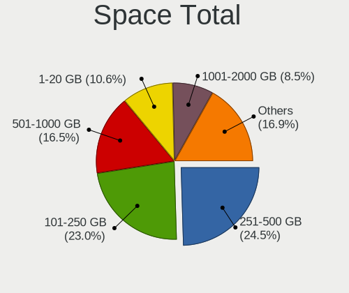
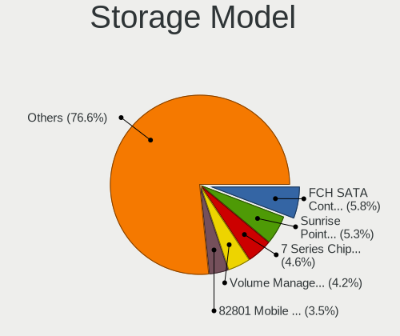
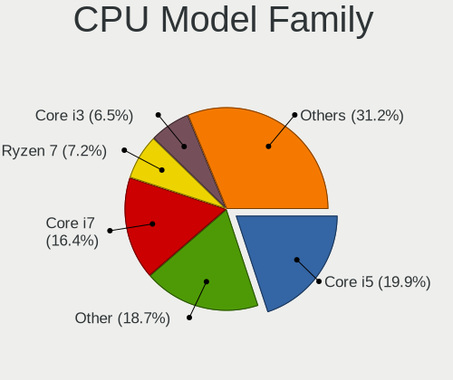
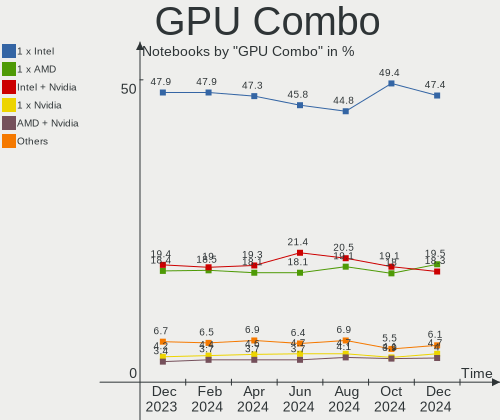

Linux - Hardware Trends (Notebooks)
-----------------------------------

A project to identify most popular hardware characteristics and track their change
over time based on data collected by Linux users at https://Linux-Hardware.org.

Anyone can contribute to this report by the [hw-probe](https://github.com/linuxhw/hw-probe) tool:

    sudo -E hw-probe -all -upload

This report is for one last month. Overall report since the beginning of time: [TestDays](https://github.com/linuxhw/TestDays)

Period: Aug, 2023.

Contents
--------

* [ System ](#system)
  - [ OS                       ](#os)
  - [ OS Family                ](#os-family)
  - [ Kernel                   ](#kernel)
  - [ Kernel Family            ](#kernel-family)
  - [ Kernel Major Ver.        ](#kernel-major-ver)
  - [ Arch                     ](#arch)
  - [ DE                       ](#de)
  - [ Display Server           ](#display-server)
  - [ Display Manager          ](#display-manager)
  - [ OS Lang                  ](#os-lang)
  - [ Boot Mode                ](#boot-mode)
  - [ Filesystem               ](#filesystem)
  - [ Part. scheme             ](#part-scheme)
  - [ Dual Boot with Linux/BSD ](#dual-boot-with-linuxbsd)
  - [ Dual Boot (Win)          ](#dual-boot-win)

* [ Board ](#board)
  - [ Vendor                   ](#vendor)
  - [ Model                    ](#model)
  - [ Model Family             ](#model-family)
  - [ MFG Year                 ](#mfg-year)
  - [ Form Factor              ](#form-factor)
  - [ Secure Boot              ](#secure-boot)
  - [ Coreboot                 ](#coreboot)
  - [ RAM Size                 ](#ram-size)
  - [ RAM Used                 ](#ram-used)
  - [ Total Drives             ](#total-drives)
  - [ Has CD-ROM               ](#has-cd-rom)
  - [ Has Ethernet             ](#has-ethernet)
  - [ Has WiFi                 ](#has-wifi)
  - [ Has Bluetooth            ](#has-bluetooth)

* [ Location ](#location)
  - [ Country                  ](#country)
  - [ City                     ](#city)

* [ Drives ](#drives)
  - [ Drive Vendor             ](#drive-vendor)
  - [ Drive Model              ](#drive-model)
  - [ HDD Vendor               ](#hdd-vendor)
  - [ SSD Vendor               ](#ssd-vendor)
  - [ Drive Kind               ](#drive-kind)
  - [ Drive Connector          ](#drive-connector)
  - [ Drive Size               ](#drive-size)
  - [ Space Total              ](#space-total)
  - [ Space Used               ](#space-used)
  - [ Malfunc. Drives          ](#malfunc-drives)
  - [ Malfunc. Drive Vendor    ](#malfunc-drive-vendor)
  - [ Malfunc. HDD Vendor      ](#malfunc-hdd-vendor)
  - [ Malfunc. Drive Kind      ](#malfunc-drive-kind)
  - [ Failed Drives            ](#failed-drives)
  - [ Failed Drive Vendor      ](#failed-drive-vendor)
  - [ Drive Status             ](#drive-status)

* [ Storage controller ](#storage-controller)
  - [ Storage Vendor           ](#storage-vendor)
  - [ Storage Model            ](#storage-model)
  - [ Storage Kind             ](#storage-kind)

* [ Processor ](#processor)
  - [ CPU Vendor               ](#cpu-vendor)
  - [ CPU Model                ](#cpu-model)
  - [ CPU Model Family         ](#cpu-model-family)
  - [ CPU Cores                ](#cpu-cores)
  - [ CPU Sockets              ](#cpu-sockets)
  - [ CPU Threads              ](#cpu-threads)
  - [ CPU Op-Modes             ](#cpu-op-modes)
  - [ CPU Microcode            ](#cpu-microcode)
  - [ CPU Microarch            ](#cpu-microarch)

* [ Graphics ](#graphics)
  - [ GPU Vendor               ](#gpu-vendor)
  - [ GPU Model                ](#gpu-model)
  - [ GPU Combo                ](#gpu-combo)
  - [ GPU Driver               ](#gpu-driver)
  - [ GPU Memory               ](#gpu-memory)

* [ Monitor ](#monitor)
  - [ Monitor Vendor           ](#monitor-vendor)
  - [ Monitor Model            ](#monitor-model)
  - [ Monitor Resolution       ](#monitor-resolution)
  - [ Monitor Diagonal         ](#monitor-diagonal)
  - [ Monitor Width            ](#monitor-width)
  - [ Aspect Ratio             ](#aspect-ratio)
  - [ Monitor Area             ](#monitor-area)
  - [ Pixel Density            ](#pixel-density)
  - [ Multiple Monitors        ](#multiple-monitors)

* [ Network ](#network)
  - [ Net Controller Vendor    ](#net-controller-vendor)
  - [ Net Controller Model     ](#net-controller-model)
  - [ Wireless Vendor          ](#wireless-vendor)
  - [ Wireless Model           ](#wireless-model)
  - [ Ethernet Vendor          ](#ethernet-vendor)
  - [ Ethernet Model           ](#ethernet-model)
  - [ Net Controller Kind      ](#net-controller-kind)
  - [ Used Controller          ](#used-controller)
  - [ NICs                     ](#nics)
  - [ IPv6                     ](#ipv6)

* [ Bluetooth ](#bluetooth)
  - [ Bluetooth Vendor         ](#bluetooth-vendor)
  - [ Bluetooth Model          ](#bluetooth-model)

* [ Sound ](#sound)
  - [ Sound Vendor             ](#sound-vendor)
  - [ Sound Model              ](#sound-model)

* [ Memory ](#memory)
  - [ Memory Vendor            ](#memory-vendor)
  - [ Memory Model             ](#memory-model)
  - [ Memory Kind              ](#memory-kind)
  - [ Memory Form Factor       ](#memory-form-factor)
  - [ Memory Size              ](#memory-size)
  - [ Memory Speed             ](#memory-speed)

* [ Printers & scanners ](#printers--scanners)
  - [ Printer Vendor           ](#printer-vendor)
  - [ Printer Model            ](#printer-model)
  - [ Scanner Vendor           ](#scanner-vendor)
  - [ Scanner Model            ](#scanner-model)

* [ Camera ](#camera)
  - [ Camera Vendor            ](#camera-vendor)
  - [ Camera Model             ](#camera-model)

* [ Security ](#security)
  - [ Fingerprint Vendor       ](#fingerprint-vendor)
  - [ Fingerprint Model        ](#fingerprint-model)
  - [ Chipcard Vendor          ](#chipcard-vendor)
  - [ Chipcard Model           ](#chipcard-model)

* [ Unsupported ](#unsupported)
  - [ Unsupported Devices      ](#unsupported-devices)
  - [ Unsupported Device Types ](#unsupported-device-types)

System
------

OS
--

Installed operating systems

| Name                         | Notebooks | Percent |
|------------------------------|-----------|---------|
| Ubuntu 22.04                 | 446       | 14.71%  |
| Fedora 38                    | 261       | 8.61%   |
| OpenMandriva 23.08           | 238       | 7.85%   |
| Linux Mint 21.2              | 188       | 6.2%    |
| Ubuntu 23.04                 | 137       | 4.52%   |
| Debian 12                    | 126       | 4.16%   |
| Arch Rolling                 | 121       | 3.99%   |
| Pop!_OS 22.04                | 115       | 3.79%   |
| Zorin 16                     | 89        | 2.94%   |
| ArcoLinux Rolling            | 80        | 2.64%   |
| Ubuntu 20.04                 | 65        | 2.14%   |
| ROSA 12.4                    | 65        | 2.14%   |
| OpenMandriva 23.03           | 51        | 1.68%   |
| BlackPanther 18.1            | 50        | 1.65%   |
| SteamOS 3.4.8                | 44        | 1.45%   |
| Linux Mint 21.1              | 42        | 1.39%   |
| openSUSE Tumbleweed-XXXXXXXX | 36        | 1.19%   |
| KDE neon 22.04               | 35        | 1.15%   |
| EndeavourOS Rolling          | 35        | 1.15%   |
| Xero Rolling                 | 34        | 1.12%   |
| Manjaro 23.0.0               | 33        | 1.09%   |
| Manjaro                      | 33        | 1.09%   |
| Kubuntu 22.04                | 31        | 1.02%   |
| Kali 2023.3                  | 29        | 0.96%   |
| Kubuntu 23.04                | 27        | 0.89%   |
| Elementary 7                 | 26        | 0.86%   |
| Xubuntu 22.04                | 25        | 0.82%   |
| Debian 11                    | 19        | 0.63%   |
| OpenMandriva 4.3             | 18        | 0.59%   |
| Debian                       | 18        | 0.59%   |
| Linux Mint 21                | 15        | 0.49%   |
| MX 23                        | 14        | 0.46%   |
| Fedora 37                    | 14        | 0.46%   |
| Ubuntu 18.04                 | 13        | 0.43%   |
| openSUSE Leap-15.5           | 13        | 0.43%   |
| Lubuntu 22.04                | 13        | 0.43%   |
| Linux Mint 20.3              | 13        | 0.43%   |
| Gentoo 2.14                  | 13        | 0.43%   |
| Nobara 38                    | 11        | 0.36%   |
| Kali 2023.2                  | 11        | 0.36%   |

OS Family
---------

OS without a version

| Name          | Notebooks | Percent |
|---------------|-----------|---------|
| Ubuntu        | 675       | 22.27%  |
| OpenMandriva  | 342       | 11.28%  |
| Fedora        | 284       | 9.37%   |
| Linux Mint    | 269       | 8.87%   |
| Debian        | 164       | 5.41%   |
| Arch          | 121       | 3.99%   |
| Pop!_OS       | 119       | 3.93%   |
| Zorin         | 91        | 3%      |
| ArcoLinux     | 81        | 2.67%   |
| ROSA          | 79        | 2.61%   |
| Manjaro       | 66        | 2.18%   |
| Kubuntu       | 62        | 2.05%   |
| openSUSE      | 60        | 1.98%   |
| SteamOS       | 56        | 1.85%   |
| BlackPanther  | 52        | 1.72%   |
| Kali          | 41        | 1.35%   |
| KDE neon      | 36        | 1.19%   |
| Xubuntu       | 35        | 1.15%   |
| EndeavourOS   | 35        | 1.15%   |
| Xero          | 34        | 1.12%   |
| Elementary    | 32        | 1.06%   |
| Gentoo        | 23        | 0.76%   |
| MX            | 21        | 0.69%   |
| Lubuntu       | 20        | 0.66%   |
| Endless       | 19        | 0.63%   |
| Ubuntu MATE   | 15        | 0.49%   |
| Garuda Linux  | 14        | 0.46%   |
| Nobara        | 12        | 0.4%    |
| Parrot        | 10        | 0.33%   |
| LMDE          | 10        | 0.33%   |
| Ubuntu Unity  | 8         | 0.26%   |
| TUXEDO OS     | 8         | 0.26%   |
| NixOS         | 8         | 0.26%   |
| Red OS        | 7         | 0.23%   |
| Ubuntu Budgie | 6         | 0.2%    |
| Slackware     | 6         | 0.2%    |
| Rocky Linux   | 5         | 0.16%   |
| BunsenLabs    | 5         | 0.16%   |
| blendOS       | 5         | 0.16%   |
| Artix         | 5         | 0.16%   |

Kernel
------

Version of the Linux kernel

| Version                           | Notebooks | Percent |
|-----------------------------------|-----------|---------|
| 6.2.0-26-generic                  | 444       | 14.65%  |
| 5.15.0-78-generic                 | 180       | 5.94%   |
| 6.4.11-desktop-1omv2390           | 150       | 4.95%   |
| 5.15.0-79-generic                 | 143       | 4.72%   |
| 6.4.8-desktop-2omv2390            | 94        | 3.1%    |
| 6.4.6-76060406-generic            | 75        | 2.47%   |
| 6.2.0-27-generic                  | 67        | 2.21%   |
| 6.1.0-10-amd64                    | 65        | 2.14%   |
| 5.19.0-50-generic                 | 64        | 2.11%   |
| 6.1.0-11-amd64                    | 56        | 1.85%   |
| 6.2.6-desktop-1omv2390            | 50        | 1.65%   |
| 5.13.0-valve36-1-neptune          | 46        | 1.52%   |
| 6.4.7-200.fc38.x86_64             | 45        | 1.48%   |
| 6.4.10-200.fc38.x86_64            | 42        | 1.39%   |
| 6.4.11-200.fc38.x86_64            | 40        | 1.32%   |
| 6.2.0-31-generic                  | 38        | 1.25%   |
| 5.15.0-76-generic                 | 37        | 1.22%   |
| 6.2.6-76060206-generic            | 36        | 1.19%   |
| 6.1.38-generic-1rosa2021.1-x86_64 | 36        | 1.19%   |
| 6.2.9-300.fc38.x86_64             | 35        | 1.15%   |
| 6.4.10-arch1-1                    | 34        | 1.12%   |
| 6.4.12-arch1-1                    | 31        | 1.02%   |
| 6.3.0-kali1-amd64                 | 31        | 1.02%   |
| 6.4.11-arch2-1                    | 29        | 0.96%   |
| 6.4.6-200.fc38.x86_64             | 28        | 0.92%   |
| 6.4.12-200.fc38.x86_64            | 27        | 0.89%   |
| 6.4.9-200.fc38.x86_64             | 26        | 0.86%   |
| 5.19.0-46-generic                 | 25        | 0.82%   |
| 6.4.9-arch1-1                     | 24        | 0.79%   |
| 6.4.8-arch1-1                     | 23        | 0.76%   |
| 6.1.20-generic-2rosa2021.1-x86_64 | 20        | 0.66%   |
| 5.15.0-82-generic                 | 19        | 0.63%   |
| 4.18.16-desktop-1bP               | 19        | 0.63%   |
| 6.2.0-20-generic                  | 17        | 0.56%   |
| 6.1.44-1-MANJARO                  | 17        | 0.56%   |
| 6.1.41-1-MANJARO                  | 15        | 0.49%   |
| 5.19.0-32-generic                 | 15        | 0.49%   |
| 5.16.7-desktop-1omv4003           | 15        | 0.49%   |
| 5.6.14-desktop-2bP                | 14        | 0.46%   |
| 6.4.7-arch1-1                     | 13        | 0.43%   |

Kernel Family
-------------

Linux kernel without a distro release

| Version | Notebooks | Percent |
|---------|-----------|---------|
| 6.2.0   | 596       | 19.66%  |
| 5.15.0  | 435       | 14.35%  |
| 6.4.11  | 257       | 8.48%   |
| 6.4.8   | 155       | 5.11%   |
| 6.1.0   | 154       | 5.08%   |
| 6.4.6   | 127       | 4.19%   |
| 5.19.0  | 122       | 4.03%   |
| 6.4.10  | 107       | 3.53%   |
| 6.4.7   | 91        | 3%      |
| 6.2.6   | 86        | 2.84%   |
| 6.4.9   | 84        | 2.77%   |
| 6.4.12  | 82        | 2.71%   |
| 5.13.0  | 53        | 1.75%   |
| 5.4.0   | 46        | 1.52%   |
| 6.1.38  | 43        | 1.42%   |
| 6.3.0   | 37        | 1.22%   |
| 6.2.9   | 36        | 1.19%   |
| 5.10.0  | 33        | 1.09%   |
| 6.4.0   | 28        | 0.92%   |
| 6.1.44  | 25        | 0.82%   |
| 6.1.41  | 23        | 0.76%   |
| 6.1.20  | 22        | 0.73%   |
| 4.18.16 | 19        | 0.63%   |
| 5.11.0  | 16        | 0.53%   |
| 4.15.0  | 16        | 0.53%   |
| 5.6.14  | 15        | 0.49%   |
| 5.16.7  | 15        | 0.49%   |
| 6.5.0   | 14        | 0.46%   |
| 5.15.85 | 13        | 0.43%   |
| 5.14.21 | 13        | 0.43%   |
| 6.1.46  | 12        | 0.4%    |
| 6.4.3   | 11        | 0.36%   |
| 6.3.8   | 11        | 0.36%   |
| 6.3.5   | 11        | 0.36%   |
| 6.3.12  | 11        | 0.36%   |
| 5.14.0  | 11        | 0.36%   |
| 6.4.4   | 10        | 0.33%   |
| 6.3.9   | 9         | 0.3%    |
| 6.1.39  | 9         | 0.3%    |
| 6.0.12  | 8         | 0.26%   |

Kernel Major Ver.
-----------------

Linux kernel major version

| Version | Notebooks | Percent |
|---------|-----------|---------|
| 6.4     | 960       | 31.67%  |
| 6.2     | 728       | 24.02%  |
| 5.15    | 475       | 15.67%  |
| 6.1     | 327       | 10.79%  |
| 5.19    | 124       | 4.09%   |
| 6.3     | 92        | 3.04%   |
| 5.13    | 54        | 1.78%   |
| 5.4     | 51        | 1.68%   |
| 5.10    | 50        | 1.65%   |
| 5.14    | 24        | 0.79%   |
| 4.18    | 24        | 0.79%   |
| 5.16    | 22        | 0.73%   |
| 6.0     | 19        | 0.63%   |
| 5.11    | 16        | 0.53%   |
| 4.15    | 16        | 0.53%   |
| 5.6     | 15        | 0.49%   |
| 6.5     | 14        | 0.46%   |
| 5.17    | 7         | 0.23%   |
| 4.19    | 3         | 0.1%    |
| 5.8     | 2         | 0.07%   |
| 5.18    | 2         | 0.07%   |
| 3.10    | 2         | 0.07%   |
| 5.3     | 1         | 0.03%   |
| 4.9     | 1         | 0.03%   |
| 4.4     | 1         | 0.03%   |
| 4.14    | 1         | 0.03%   |

Arch
----

OS architecture (x86_64, i586, etc.)

| Name   | Notebooks | Percent |
|--------|-----------|---------|
| x86_64 | 3005      | 99.14%  |
| i686   | 24        | 0.79%   |
| armv7l | 2         | 0.07%   |

DE
--

Desktop Environment

| Name             | Notebooks | Percent |
|------------------|-----------|---------|
| GNOME            | 1305      | 43.06%  |
| KDE5             | 868       | 28.64%  |
| X-Cinnamon       | 246       | 8.12%   |
| XFCE             | 242       | 7.98%   |
| Unknown          | 80        | 2.64%   |
| MATE             | 66        | 2.18%   |
| LXQt             | 53        | 1.75%   |
| Pantheon         | 32        | 1.06%   |
| i3               | 25        | 0.82%   |
| Cinnamon         | 21        | 0.69%   |
| Hyprland         | 12        | 0.4%    |
| LXDE             | 10        | 0.33%   |
| Budgie           | 10        | 0.33%   |
| Unity            | 9         | 0.3%    |
| sway             | 8         | 0.26%   |
| lightdm-xsession | 4         | 0.13%   |
| KDE              | 4         | 0.13%   |
| GNOME Classic    | 4         | 0.13%   |
| Deepin           | 4         | 0.13%   |
| openbox          | 3         | 0.1%    |
| KDE4             | 3         | 0.1%    |
| GNOME Flashback  | 3         | 0.1%    |
| BunsenLabs       | 3         | 0.1%    |
| icewm            | 2         | 0.07%   |
| dwm              | 2         | 0.07%   |
| chadwm           | 2         | 0.07%   |
| bspwm            | 2         | 0.07%   |
| Trinity          | 1         | 0.03%   |
| qtile            | 1         | 0.03%   |
| none+i3          | 1         | 0.03%   |
| Lubuntu          | 1         | 0.03%   |
| Jwm              | 1         | 0.03%   |
| fluxbox          | 1         | 0.03%   |
| enlightenment    | 1         | 0.03%   |
| awesome          | 1         | 0.03%   |

Display Server
--------------

X11 or Wayland

| Name    | Notebooks | Percent |
|---------|-----------|---------|
| X11     | 1742      | 57.47%  |
| Wayland | 1202      | 39.66%  |
| Unknown | 50        | 1.65%   |
| Tty     | 37        | 1.22%   |

Display Manager
---------------

SDDM, LightDM, etc.

| Name    | Notebooks | Percent |
|---------|-----------|---------|
| Unknown | 950       | 31.34%  |
| SDDM    | 744       | 24.55%  |
| GDM3    | 661       | 21.81%  |
| LightDM | 414       | 13.66%  |
| GDM     | 230       | 7.59%   |
| XDM     | 9         | 0.3%    |
| SLiM    | 8         | 0.26%   |
| LXDM    | 6         | 0.2%    |
| Ly      | 2         | 0.07%   |
| KDM     | 2         | 0.07%   |
| GREETD  | 2         | 0.07%   |
| TDM     | 1         | 0.03%   |
| SLIMSKI | 1         | 0.03%   |
| EMPTTY  | 1         | 0.03%   |

OS Lang
-------

Language

| Lang    | Notebooks | Percent |
|---------|-----------|---------|
| en_US   | 1319      | 43.52%  |
| de_DE   | 243       | 8.02%   |
| ru_RU   | 186       | 6.14%   |
| en_GB   | 152       | 5.01%   |
| pt_BR   | 145       | 4.78%   |
| fr_FR   | 133       | 4.39%   |
| Unknown | 87        | 2.87%   |
| it_IT   | 72        | 2.38%   |
| es_ES   | 69        | 2.28%   |
| en_IN   | 51        | 1.68%   |
| C       | 49        | 1.62%   |
| en_CA   | 47        | 1.55%   |
| en_AU   | 47        | 1.55%   |
| pl_PL   | 40        | 1.32%   |
| es_MX   | 38        | 1.25%   |
| zh_CN   | 25        | 0.82%   |
| cs_CZ   | 20        | 0.66%   |
| hu_HU   | 18        | 0.59%   |
| tr_TR   | 16        | 0.53%   |
| es_CO   | 16        | 0.53%   |
| es_AR   | 16        | 0.53%   |
| pt_PT   | 15        | 0.49%   |
| nl_NL   | 14        | 0.46%   |
| en_ZA   | 14        | 0.46%   |
| es_CL   | 13        | 0.43%   |
| fr_CA   | 11        | 0.36%   |
| en_IE   | 11        | 0.36%   |
| sv_SE   | 9         | 0.3%    |
| ja_JP   | 9         | 0.3%    |
| en_IL   | 8         | 0.26%   |
| de_CH   | 7         | 0.23%   |
| fr_CH   | 6         | 0.2%    |
| en_PH   | 6         | 0.2%    |
| nl_BE   | 5         | 0.16%   |
| ko_KR   | 5         | 0.16%   |
| es_VE   | 5         | 0.16%   |
| en_SG   | 5         | 0.16%   |
| en_NZ   | 5         | 0.16%   |
| zh_TW   | 4         | 0.13%   |
| sk_SK   | 4         | 0.13%   |

Boot Mode
---------

EFI or BIOS

| Mode | Notebooks | Percent |
|------|-----------|---------|
| EFI  | 1733      | 57.18%  |
| BIOS | 1298      | 42.82%  |

Filesystem
----------

Type of filesystem

| Type    | Notebooks | Percent |
|---------|-----------|---------|
| Ext4    | 1792      | 59.12%  |
| Btrfs   | 517       | 17.06%  |
| Tmpfs   | 409       | 13.49%  |
| Overlay | 239       | 7.89%   |
| Xfs     | 46        | 1.52%   |
| Zfs     | 13        | 0.43%   |
| F2fs    | 7         | 0.23%   |
| Ext3    | 3         | 0.1%    |
| Ext2    | 2         | 0.07%   |
| Aufs    | 2         | 0.07%   |
| Unknown | 1         | 0.03%   |

Part. scheme
------------

Scheme of partitioning

| Type    | Notebooks | Percent |
|---------|-----------|---------|
| GPT     | 1811      | 59.75%  |
| Unknown | 905       | 29.86%  |
| MBR     | 315       | 10.39%  |

Dual Boot with Linux/BSD
------------------------

Hosting more than one Linux/BSD

| Dual boot | Notebooks | Percent |
|-----------|-----------|---------|
| No        | 2607      | 86.01%  |
| Yes       | 424       | 13.99%  |

Dual Boot (Win)
---------------

Hosting Linux and Windows

| Dual boot | Notebooks | Percent |
|-----------|-----------|---------|
| No        | 2235      | 73.74%  |
| Yes       | 796       | 26.26%  |

Board
-----

Vendor
------

Motherboard manufacturer

| Name                  | Notebooks | Percent |
|-----------------------|-----------|---------|
| Lenovo                | 652       | 21.51%  |
| Hewlett-Packard       | 522       | 17.22%  |
| Dell                  | 483       | 15.94%  |
| ASUSTek Computer      | 330       | 10.89%  |
| Acer                  | 262       | 8.64%   |
| Apple                 | 102       | 3.37%   |
| MSI                   | 59        | 1.95%   |
| HUAWEI                | 56        | 1.85%   |
| Valve                 | 54        | 1.78%   |
| Toshiba               | 50        | 1.65%   |
| Samsung Electronics   | 41        | 1.35%   |
| Google                | 31        | 1.02%   |
| Sony                  | 29        | 0.96%   |
| Notebook              | 24        | 0.79%   |
| Fujitsu               | 18        | 0.59%   |
| Timi                  | 17        | 0.56%   |
| System76              | 17        | 0.56%   |
| Unknown               | 16        | 0.53%   |
| Packard Bell          | 15        | 0.49%   |
| Chuwi                 | 15        | 0.49%   |
| Medion                | 14        | 0.46%   |
| Positivo              | 12        | 0.4%    |
| Alienware             | 12        | 0.4%    |
| Panasonic             | 11        | 0.36%   |
| TUXEDO                | 10        | 0.33%   |
| GPU Company           | 9         | 0.3%    |
| Gigabyte Technology   | 8         | 0.26%   |
| Framework             | 8         | 0.26%   |
| Schenker              | 6         | 0.2%    |
| HONOR                 | 6         | 0.2%    |
| LG Electronics        | 5         | 0.16%   |
| Infinix               | 5         | 0.16%   |
| Clevo                 | 5         | 0.16%   |
| PC Specialist         | 4         | 0.13%   |
| GPD                   | 4         | 0.13%   |
| BANGHO                | 4         | 0.13%   |
| Positivo Bahia - VAIO | 3         | 0.1%    |
| Gateway               | 3         | 0.1%    |
| Fujitsu Siemens       | 3         | 0.1%    |
| eMachines             | 3         | 0.1%    |

Model
-----

Motherboard model

| Name                                   | Notebooks | Percent |
|----------------------------------------|-----------|---------|
| Valve Jupiter                          | 54        | 1.78%   |
| Unknown                                | 22        | 0.73%   |
| HP Notebook                            | 17        | 0.56%   |
| Apple MacBookPro9,2                    | 13        | 0.43%   |
| HP EliteBook 840 G3                    | 11        | 0.36%   |
| ASUS VivoBook_ASUSLaptop X515EA_X515EA | 9         | 0.3%    |
| Apple MacBookPro8,1                    | 9         | 0.3%    |
| HP Pavilion 15                         | 8         | 0.26%   |
| Dell Latitude E5470                    | 8         | 0.26%   |
| Chuwi GemiBook Pro                     | 8         | 0.26%   |
| HUAWEI BOM-WXX9                        | 7         | 0.23%   |
| HP Pavilion Notebook                   | 7         | 0.23%   |
| HP Pavilion g6                         | 7         | 0.23%   |
| Dell XPS 15 9500                       | 7         | 0.23%   |
| Dell XPS 15 7590                       | 7         | 0.23%   |
| Dell Latitude E6420                    | 7         | 0.23%   |
| Apple MacBookAir6,2                    | 7         | 0.23%   |
| Lenovo ThinkPad L13 Gen 3 21BAS0X700   | 6         | 0.2%    |
| Lenovo IdeaPad L340-15IRH Gaming 81LK  | 6         | 0.2%    |
| Lenovo IdeaPad Gaming 3 15ACH6 82K2    | 6         | 0.2%    |
| HP Victus by Laptop 16-e0xxx           | 6         | 0.2%    |
| HP OMEN by Laptop                      | 6         | 0.2%    |
| HP Laptop 15s-eq2xxx                   | 6         | 0.2%    |
| HP Laptop 15-db0xxx                    | 6         | 0.2%    |
| HP 15                                  | 6         | 0.2%    |
| Dell XPS 15 9560                       | 6         | 0.2%    |
| Dell XPS 13 9310                       | 6         | 0.2%    |
| Dell Latitude E6430                    | 6         | 0.2%    |
| Dell Latitude E6410                    | 6         | 0.2%    |
| Dell Latitude E6400                    | 6         | 0.2%    |
| Dell Inspiron 15-3567                  | 6         | 0.2%    |
| Dell Inspiron 15 3511                  | 6         | 0.2%    |
| Apple MacBookAir7,2                    | 6         | 0.2%    |
| Lenovo ThinkBook 16p Gen 2 20YM        | 5         | 0.16%   |
| Lenovo Legion 5 Pro 16ACH6H 82JQ       | 5         | 0.16%   |
| Lenovo IdeaPad 3 14ALC6 82KT           | 5         | 0.16%   |
| Lenovo G50-80 80E5                     | 5         | 0.16%   |
| HUAWEI NBLK-WAX9X                      | 5         | 0.16%   |
| HUAWEI HVY-WXX9                        | 5         | 0.16%   |
| HP Pavilion g7                         | 5         | 0.16%   |

Model Family
------------

Motherboard model prefix

| Name                  | Notebooks | Percent |
|-----------------------|-----------|---------|
| Lenovo ThinkPad       | 321       | 10.59%  |
| Dell Latitude         | 188       | 6.2%    |
| Acer Aspire           | 175       | 5.77%   |
| Lenovo IdeaPad        | 158       | 5.21%   |
| Dell Inspiron         | 129       | 4.26%   |
| HP EliteBook          | 98        | 3.23%   |
| HP Laptop             | 93        | 3.07%   |
| HP Pavilion           | 90        | 2.97%   |
| ASUS VivoBook         | 90        | 2.97%   |
| HP ProBook            | 63        | 2.08%   |
| Dell XPS              | 63        | 2.08%   |
| Valve Jupiter         | 54        | 1.78%   |
| Lenovo Legion         | 50        | 1.65%   |
| Toshiba Satellite     | 45        | 1.48%   |
| Dell Precision        | 42        | 1.39%   |
| ASUS ROG              | 41        | 1.35%   |
| ASUS ZenBook          | 28        | 0.92%   |
| Acer Nitro            | 28        | 0.92%   |
| Dell Vostro           | 26        | 0.86%   |
| ASUS ASUS             | 25        | 0.82%   |
| Lenovo ThinkBook      | 23        | 0.76%   |
| Unknown               | 22        | 0.73%   |
| HP ZBook              | 21        | 0.69%   |
| Acer Swift            | 18        | 0.59%   |
| Lenovo Yoga           | 17        | 0.56%   |
| HP Notebook           | 17        | 0.56%   |
| HP 250                | 17        | 0.56%   |
| Packard Bell EasyNote | 15        | 0.49%   |
| HP Victus             | 15        | 0.49%   |
| HP Compaq             | 15        | 0.49%   |
| Apple MacBookPro9     | 15        | 0.49%   |
| HP 255                | 14        | 0.46%   |
| Apple MacBookPro8     | 14        | 0.46%   |
| HP ENVY               | 13        | 0.43%   |
| HP OMEN               | 12        | 0.4%    |
| Fujitsu LIFEBOOK      | 12        | 0.4%    |
| Apple MacBookPro11    | 11        | 0.36%   |
| Acer Predator         | 11        | 0.36%   |
| Chuwi GemiBook        | 10        | 0.33%   |
| Acer Extensa          | 10        | 0.33%   |

MFG Year
--------

Motherboard manufacture year

| Year    | Notebooks | Percent |
|---------|-----------|---------|
| 2021    | 407       | 13.43%  |
| 2022    | 338       | 11.15%  |
| 2020    | 254       | 8.38%   |
| 2019    | 214       | 7.06%   |
| 2018    | 206       | 6.8%    |
| 2012    | 199       | 6.57%   |
| 2011    | 198       | 6.53%   |
| 2013    | 185       | 6.1%    |
| 2017    | 173       | 5.71%   |
| 2023    | 154       | 5.08%   |
| 2015    | 150       | 4.95%   |
| 2016    | 143       | 4.72%   |
| 2014    | 142       | 4.68%   |
| 2010    | 112       | 3.7%    |
| 2008    | 64        | 2.11%   |
| 2009    | 49        | 1.62%   |
| 2007    | 28        | 0.92%   |
| 2006    | 10        | 0.33%   |
| Unknown | 2         | 0.07%   |
| 2005    | 1         | 0.03%   |
| 2004    | 1         | 0.03%   |
| 2003    | 1         | 0.03%   |

Form Factor
-----------

Physical design of the computer

| Name     | Notebooks | Percent |
|----------|-----------|---------|
| Notebook | 3031      | 100%    |

Secure Boot
-----------

Enabled or disabled

| State    | Notebooks | Percent |
|----------|-----------|---------|
| Disabled | 2765      | 91.22%  |
| Enabled  | 266       | 8.78%   |

Coreboot
--------

Have coreboot on board

| Used | Notebooks | Percent |
|------|-----------|---------|
| No   | 2982      | 98.38%  |
| Yes  | 49        | 1.62%   |

RAM Size
--------

Total RAM memory

| Size in GB  | Notebooks | Percent |
|-------------|-----------|---------|
| 4.01-8.0    | 882       | 29.1%   |
| 8.01-16.0   | 592       | 19.53%  |
| 16.01-24.0  | 583       | 19.23%  |
| 3.01-4.0    | 464       | 15.31%  |
| 32.01-64.0  | 277       | 9.14%   |
| 1.01-2.0    | 75        | 2.47%   |
| 24.01-32.0  | 63        | 2.08%   |
| 64.01-256.0 | 56        | 1.85%   |
| 2.01-3.0    | 32        | 1.06%   |
| 0.51-1.0    | 4         | 0.13%   |
| 0.01-0.5    | 3         | 0.1%    |

RAM Used
--------

Used RAM memory

| Used GB    | Notebooks | Percent |
|------------|-----------|---------|
| 1.01-2.0   | 863       | 28.47%  |
| 2.01-3.0   | 784       | 25.87%  |
| 4.01-8.0   | 559       | 18.44%  |
| 3.01-4.0   | 494       | 16.3%   |
| 8.01-16.0  | 162       | 5.34%   |
| 0.51-1.0   | 124       | 4.09%   |
| 16.01-24.0 | 20        | 0.66%   |
| 0.01-0.5   | 17        | 0.56%   |
| 24.01-32.0 | 5         | 0.16%   |
| 32.01-64.0 | 2         | 0.07%   |
| Unknown    | 1         | 0.03%   |

Total Drives
------------

Number of drives on board

| Drives | Notebooks | Percent |
|--------|-----------|---------|
| 1      | 2149      | 70.9%   |
| 2      | 760       | 25.07%  |
| 3      | 95        | 3.13%   |
| 0      | 18        | 0.59%   |
| 4      | 6         | 0.2%    |
| 5      | 3         | 0.1%    |

Has CD-ROM
----------

Has CD-ROM on board

| Presented | Notebooks | Percent |
|-----------|-----------|---------|
| No        | 2235      | 73.74%  |
| Yes       | 796       | 26.26%  |

Has Ethernet
------------

Has Ethernet on board

| Presented | Notebooks | Percent |
|-----------|-----------|---------|
| Yes       | 2293      | 75.65%  |
| No        | 738       | 24.35%  |

Has WiFi
--------

Has WiFi module

| Presented | Notebooks | Percent |
|-----------|-----------|---------|
| Yes       | 2993      | 98.75%  |
| No        | 38        | 1.25%   |

Has Bluetooth
-------------

Has Bluetooth module

| Presented | Notebooks | Percent |
|-----------|-----------|---------|
| Yes       | 2524      | 83.27%  |
| No        | 507       | 16.73%  |

Location
--------

Country
-------

Geographic location (country)

| Country      | Notebooks | Percent |
|--------------|-----------|---------|
| USA          | 476       | 15.7%   |
| Germany      | 317       | 10.46%  |
| Russia       | 214       | 7.06%   |
| Brazil       | 185       | 6.1%    |
| France       | 156       | 5.15%   |
| Italy        | 111       | 3.66%   |
| UK           | 105       | 3.46%   |
| Canada       | 94        | 3.1%    |
| India        | 92        | 3.04%   |
| Spain        | 87        | 2.87%   |
| Poland       | 74        | 2.44%   |
| Australia    | 62        | 2.05%   |
| Hungary      | 60        | 1.98%   |
| Netherlands  | 55        | 1.81%   |
| Mexico       | 46        | 1.52%   |
| Turkey       | 42        | 1.39%   |
| Czechia      | 42        | 1.39%   |
| China        | 35        | 1.15%   |
| Sweden       | 33        | 1.09%   |
| Argentina    | 33        | 1.09%   |
| Indonesia    | 31        | 1.02%   |
| Portugal     | 28        | 0.92%   |
| Austria      | 28        | 0.92%   |
| Colombia     | 26        | 0.86%   |
| Switzerland  | 23        | 0.76%   |
| Romania      | 23        | 0.76%   |
| Chile        | 23        | 0.76%   |
| Japan        | 21        | 0.69%   |
| Bulgaria     | 20        | 0.66%   |
| Belgium      | 18        | 0.59%   |
| South Africa | 17        | 0.56%   |
| Finland      | 17        | 0.56%   |
| Denmark      | 17        | 0.56%   |
| Slovakia     | 16        | 0.53%   |
| Serbia       | 16        | 0.53%   |
| Israel       | 16        | 0.53%   |
| Philippines  | 15        | 0.49%   |
| Norway       | 15        | 0.49%   |
| Greece       | 15        | 0.49%   |
| Iran         | 14        | 0.46%   |

City
----

Geographic location (city)

| City           | Notebooks | Percent |
|----------------|-----------|---------|
| Moscow         | 57        | 1.88%   |
| Berlin         | 30        | 0.99%   |
| Paris          | 21        | 0.69%   |
| Madrid         | 21        | 0.69%   |
| Melbourne      | 20        | 0.66%   |
| Prague         | 19        | 0.63%   |
| Istanbul       | 19        | 0.63%   |
| Hamburg        | 19        | 0.63%   |
| Vienna         | 18        | 0.59%   |
| Sao Paulo      | 18        | 0.59%   |
| Sydney         | 16        | 0.53%   |
| St Petersburg  | 16        | 0.53%   |
| Budapest       | 16        | 0.53%   |
| Warsaw         | 13        | 0.43%   |
| Rome           | 13        | 0.43%   |
| Montreal       | 12        | 0.4%    |
| Milano         | 12        | 0.4%    |
| Delhi          | 12        | 0.4%    |
| Brisbane       | 12        | 0.4%    |
| Toronto        | 11        | 0.36%   |
| Singapore      | 11        | 0.36%   |
| Rio de Janeiro | 11        | 0.36%   |
| Milan          | 11        | 0.36%   |
| Dublin         | 11        | 0.36%   |
| Bengaluru      | 11        | 0.36%   |
| Belgrade       | 11        | 0.36%   |
| Pune           | 10        | 0.33%   |
| Nairobi        | 10        | 0.33%   |
| Copenhagen     | 10        | 0.33%   |
| Cologne        | 10        | 0.33%   |
| Amsterdam      | 10        | 0.33%   |
| Stockholm      | 9         | 0.3%    |
| Sofia          | 9         | 0.3%    |
| Seattle        | 9         | 0.3%    |
| Santiago       | 9         | 0.3%    |
| Munich         | 9         | 0.3%    |
| Mexico City    | 9         | 0.3%    |
| Krakow         | 9         | 0.3%    |
| Johannesburg   | 9         | 0.3%    |
| Bogotá        | 9         | 0.3%    |

Drives
------

Drive Vendor
------------

Hard drive vendors

| Vendor                      | Notebooks | Drives | Percent |
|-----------------------------|-----------|--------|---------|
| Samsung Electronics         | 634       | 686    | 16.72%  |
| WDC                         | 318       | 334    | 8.39%   |
| Sandisk                     | 285       | 303    | 7.52%   |
| Seagate                     | 259       | 267    | 6.83%   |
| Toshiba                     | 230       | 233    | 6.07%   |
| Unknown                     | 189       | 213    | 4.98%   |
| Kingston                    | 189       | 193    | 4.98%   |
| SK hynix                    | 180       | 184    | 4.75%   |
| Intel                       | 148       | 159    | 3.9%    |
| Micron Technology           | 135       | 135    | 3.56%   |
| Crucial                     | 130       | 135    | 3.43%   |
| Hitachi                     | 74        | 76     | 1.95%   |
| KIOXIA                      | 69        | 69     | 1.82%   |
| Apple                       | 56        | 66     | 1.48%   |
| HGST                        | 53        | 53     | 1.4%    |
| China                       | 49        | 49     | 1.29%   |
| A-DATA Technology           | 45        | 45     | 1.19%   |
| Kingston Technology Company | 42        | 42     | 1.11%   |
| Unknown                     | 38        | 38     | 1%      |
| Silicon Motion              | 34        | 34     | 0.9%    |
| Phison Electronics          | 33        | 33     | 0.87%   |
| Micron/Crucial Technology   | 30        | 30     | 0.79%   |
| ADATA Technology            | 25        | 25     | 0.66%   |
| SPCC                        | 22        | 23     | 0.58%   |
| Phison                      | 19        | 19     | 0.5%    |
| Netac                       | 19        | 20     | 0.5%    |
| JMicron Technology          | 19        | 20     | 0.5%    |
| PNY                         | 18        | 19     | 0.47%   |
| LITEON                      | 17        | 17     | 0.45%   |
| Team                        | 15        | 15     | 0.4%    |
| Intenso                     | 15        | 15     | 0.4%    |
| Patriot                     | 14        | 14     | 0.37%   |
| Fujitsu                     | 13        | 13     | 0.34%   |
| Apacer                      | 12        | 12     | 0.32%   |
| MAXIO Technology (Hangzhou) | 11        | 11     | 0.29%   |
| FORESEE                     | 11        | 11     | 0.29%   |
| Gigabyte Technology         | 10        | 10     | 0.26%   |
| Union Memory (Shenzhen)     | 9         | 9      | 0.24%   |
| UMIS                        | 9         | 9      | 0.24%   |
| O2 Micro                    | 9         | 9      | 0.24%   |

Drive Model
-----------

Hard drive models

| Model                                                 | Notebooks | Percent |
|-------------------------------------------------------|-----------|---------|
| Samsung NVMe SSD Controller SM981/PM981/PM983 500GB   | 72        | 1.84%   |
| Samsung NVMe SSD Controller PM9A1/PM9A3/980PRO 1024GB | 51        | 1.3%    |
| Kingston SA400S37240G 240GB SSD                       | 51        | 1.3%    |
| Seagate ST1000LM035-1RK172 1TB                        | 42        | 1.07%   |
| Unknown                                               | 38        | 0.97%   |
| Intel SSDPEKNU512GZ 512GB                             | 36        | 0.92%   |
| Unknown MMC Card  64GB                                | 35        | 0.89%   |
| Unknown MMC Card  32GB                                | 28        | 0.72%   |
| Toshiba MQ01ABF050 500GB                              | 28        | 0.72%   |
| Sandisk WD Blue SN550 NVMe SSD 250GB                  | 27        | 0.69%   |
| Kingston SA400S37480G 480GB SSD                       | 27        | 0.69%   |
| Seagate ST1000LM024 HN-M101MBB 1TB                    | 26        | 0.66%   |
| Sandisk WD Black SN750 / PC SN730 NVMe SSD 1024GB     | 26        | 0.66%   |
| Micron/Crucial P2 NVMe PCIe SSD 1TB                   | 26        | 0.66%   |
| Toshiba MQ01ABD100 1TB                                | 25        | 0.64%   |
| Toshiba MQ04ABF100 1TB                                | 24        | 0.61%   |
| Unknown MMC Card  128GB                               | 21        | 0.54%   |
| Kingston Company OM3PDP3 NVMe SSD 256GB               | 21        | 0.54%   |
| Intel SSD 660P Series 512GB                           | 20        | 0.51%   |
| Samsung SSD 870 EVO 500GB                             | 19        | 0.49%   |
| Samsung SSD 860 EVO 500GB                             | 19        | 0.49%   |
| Seagate ST500LT012-1DG142 500GB                       | 17        | 0.43%   |
| Samsung SSD 980 1TB                                   | 17        | 0.43%   |
| Crucial CT500MX500SSD1 500GB                          | 16        | 0.41%   |
| WDC WD10JPVX-22JC3T0 1TB                              | 14        | 0.36%   |
| Samsung SSD 860 EVO 1TB                               | 14        | 0.36%   |
| HGST HTS721010A9E630 1TB                              | 14        | 0.36%   |
| Crucial CT1000MX500SSD1 1TB                           | 14        | 0.36%   |
| Unknown MMC Card  512GB                               | 13        | 0.33%   |
| Toshiba XG6 NVMe SSD Controller 1024GB                | 13        | 0.33%   |
| SanDisk NVMe SSD Drive 1TB                            | 13        | 0.33%   |
| Phison PS5013 E13 NVMe Controller 512GB               | 13        | 0.33%   |
| KIOXIA KBG40ZNV512G 512GB                             | 13        | 0.33%   |
| Unknown MMC Card  256GB                               | 12        | 0.31%   |
| Sandisk WD Black SN850 256GB                          | 12        | 0.31%   |
| Samsung NVMe SSD Controller SM961/PM961/SM963 1024GB  | 12        | 0.31%   |
| Micron 2450_MTFDKBA512TFK 512GB                       | 12        | 0.31%   |
| Kingston Company SNV2S1000G 1TB                       | 12        | 0.31%   |
| JMicron Generic 1TB                                   | 12        | 0.31%   |
| WDC WDS240G2G0A-00JH30 240GB SSD                      | 11        | 0.28%   |

HDD Vendor
----------

Hard disk drive vendors

| Vendor              | Notebooks | Drives | Percent |
|---------------------|-----------|--------|---------|
| Seagate             | 253       | 261    | 30.97%  |
| WDC                 | 207       | 209    | 25.34%  |
| Toshiba             | 154       | 156    | 18.85%  |
| Hitachi             | 74        | 76     | 9.06%   |
| HGST                | 53        | 53     | 6.49%   |
| Samsung Electronics | 19        | 19     | 2.33%   |
| Fujitsu             | 13        | 13     | 1.59%   |
| Unknown             | 10        | 10     | 1.22%   |
| Apple               | 7         | 7      | 0.86%   |
| USB                 | 4         | 4      | 0.49%   |
| SABRENT             | 4         | 5      | 0.49%   |
| USB3.0              | 2         | 2      | 0.24%   |
| SAGE                | 2         | 2      | 0.24%   |
| External            | 2         | 3      | 0.24%   |
| WD_BLACK            | 1         | 1      | 0.12%   |
| WALRAM              | 1         | 1      | 0.12%   |
| Teleplan            | 1         | 1      | 0.12%   |
| StoreJet            | 1         | 1      | 0.12%   |
| SSK                 | 1         | 1      | 0.12%   |
| SINTECHI            | 1         | 1      | 0.12%   |
| PHD 3.0             | 1         | 1      | 0.12%   |
| LaCie               | 1         | 1      | 0.12%   |
| Initio              | 1         | 1      | 0.12%   |
| HGST HTS            | 1         | 1      | 0.12%   |
| Generic-            | 1         | 1      | 0.12%   |
| ASMT                | 1         | 2      | 0.12%   |
| ACASIS              | 1         | 1      | 0.12%   |

SSD Vendor
----------

Solid state drive vendors

| Vendor              | Notebooks | Drives | Percent |
|---------------------|-----------|--------|---------|
| Samsung Electronics | 249       | 258    | 20.6%   |
| Kingston            | 140       | 142    | 11.58%  |
| Crucial             | 113       | 116    | 9.35%   |
| SanDisk             | 97        | 102    | 8.02%   |
| WDC                 | 61        | 64     | 5.05%   |
| China               | 49        | 49     | 4.05%   |
| SK hynix            | 32        | 32     | 2.65%   |
| Micron Technology   | 30        | 30     | 2.48%   |
| Apple               | 29        | 29     | 2.4%    |
| Intel               | 27        | 27     | 2.23%   |
| A-DATA Technology   | 26        | 26     | 2.15%   |
| Toshiba             | 22        | 23     | 1.82%   |
| SPCC                | 19        | 19     | 1.57%   |
| Netac               | 18        | 19     | 1.49%   |
| PNY                 | 17        | 18     | 1.41%   |
| LITEON              | 16        | 16     | 1.32%   |
| Intenso             | 14        | 14     | 1.16%   |
| Team                | 13        | 13     | 1.08%   |
| Patriot             | 13        | 13     | 1.08%   |
| JMicron Technology  | 12        | 13     | 0.99%   |
| Apacer              | 11        | 11     | 0.91%   |
| LITEONIT            | 9         | 9      | 0.74%   |
| Unknown             | 9         | 9      | 0.74%   |
| GOODRAM             | 8         | 8      | 0.66%   |
| Gigabyte Technology | 8         | 8      | 0.66%   |
| Transcend           | 6         | 6      | 0.5%    |
| Lexar               | 6         | 6      | 0.5%    |
| Wibtek              | 5         | 5      | 0.41%   |
| KingFast            | 5         | 5      | 0.41%   |
| Hewlett-Packard     | 5         | 5      | 0.41%   |
| FORESEE             | 5         | 5      | 0.41%   |
| Emtec               | 5         | 5      | 0.41%   |
| Verbatim            | 4         | 4      | 0.33%   |
| Seagate             | 4         | 4      | 0.33%   |
| Phison              | 4         | 4      | 0.33%   |
| Mushkin             | 4         | 4      | 0.33%   |
| Fanxiang            | 4         | 4      | 0.33%   |
| VISIPRO             | 3         | 3      | 0.25%   |
| Plextor             | 3         | 3      | 0.25%   |
| KIOXIA-EXCERIA      | 3         | 3      | 0.25%   |

Drive Kind
----------

HDD or SSD

| Kind    | Notebooks | Drives | Percent |
|---------|-----------|--------|---------|
| NVMe    | 1406      | 1608   | 39.21%  |
| SSD     | 1123      | 1236   | 31.32%  |
| HDD     | 798       | 834    | 22.25%  |
| MMC     | 197       | 220    | 5.49%   |
| Unknown | 62        | 62     | 1.73%   |

Drive Connector
---------------

SATA, SAS, NVMe, etc.

| Type | Notebooks | Drives | Percent |
|------|-----------|--------|---------|
| SATA | 1712      | 1974   | 49.39%  |
| NVMe | 1405      | 1599   | 40.54%  |
| MMC  | 197       | 220    | 5.68%   |
| SAS  | 152       | 167    | 4.39%   |

Drive Size
----------

Size of hard drive

| Size in TB | Notebooks | Drives | Percent |
|------------|-----------|--------|---------|
| 0.01-0.5   | 1231      | 1342   | 64.08%  |
| 0.51-1.0   | 601       | 635    | 31.29%  |
| 1.01-2.0   | 77        | 81     | 4.01%   |
| 3.01-4.0   | 6         | 6      | 0.31%   |
| 4.01-10.0  | 6         | 6      | 0.31%   |

Space Total
-----------

Amount of disk space available on the file system

| Size in GB     | Notebooks | Percent |
|----------------|-----------|---------|
| 101-250        | 795       | 26.23%  |
| 251-500        | 745       | 24.58%  |
| 501-1000       | 514       | 16.96%  |
| 1-20           | 259       | 8.55%   |
| 1001-2000      | 223       | 7.36%   |
| 51-100         | 173       | 5.71%   |
| More than 3000 | 91        | 3%      |
| 21-50          | 91        | 3%      |
| Unknown        | 80        | 2.64%   |
| 2001-3000      | 60        | 1.98%   |

Space Used
----------

Amount of used disk space

| Used GB        | Notebooks | Percent |
|----------------|-----------|---------|
| 1-20           | 1080      | 35.63%  |
| 21-50          | 587       | 19.37%  |
| 101-250        | 431       | 14.22%  |
| 51-100         | 371       | 12.24%  |
| 251-500        | 247       | 8.15%   |
| 501-1000       | 151       | 4.98%   |
| Unknown        | 80        | 2.64%   |
| 1001-2000      | 53        | 1.75%   |
| More than 3000 | 17        | 0.56%   |
| 2001-3000      | 14        | 0.46%   |

Malfunc. Drives
---------------

Drive models with a malfunction

| Model                                 | Notebooks | Drives | Percent |
|---------------------------------------|-----------|--------|---------|
| Toshiba MQ01ABF050 500GB              | 7         | 7      | 2.82%   |
| Toshiba MQ01ABD100 1TB                | 6         | 6      | 2.42%   |
| Seagate ST500LT012-1DG142 500GB       | 6         | 6      | 2.42%   |
| HGST HTS721010A9E630 1TB              | 6         | 6      | 2.42%   |
| Seagate ST9500325AS 500GB             | 5         | 5      | 2.02%   |
| Seagate ST1000LM024 HN-M101MBB 1TB    | 5         | 5      | 2.02%   |
| HGST HTS545050A7E680 500GB            | 5         | 5      | 2.02%   |
| LITEON CV8-8E128-HP 128GB SSD         | 4         | 4      | 1.61%   |
| Toshiba MK2555GSX 250GB               | 3         | 3      | 1.21%   |
| SK hynix HFS128G39TND-N210A 128GB SSD | 3         | 3      | 1.21%   |
| SK hynix BC711 HFM512GD3JX013N 512GB  | 3         | 3      | 1.21%   |
| Seagate ST500LT012-9WS142 500GB       | 3         | 3      | 1.21%   |
| Seagate ST1000LM035-1RK172 1TB        | 3         | 3      | 1.21%   |
| Hitachi HTS547550A9E384 500GB         | 3         | 3      | 1.21%   |
| WDC WDS240G2G0A-00JH30 240GB SSD      | 2         | 2      | 0.81%   |
| WDC WD5000LPVX-22V0TT0 500GB          | 2         | 2      | 0.81%   |
| WDC WD5000BEVT-00A0RT0 500GB          | 2         | 2      | 0.81%   |
| WDC WD2500BEVT-80A23T0 250GB          | 2         | 2      | 0.81%   |
| WDC WD10JPVX-60JC3T0 1TB              | 2         | 2      | 0.81%   |
| WDC WD Green 2.5 240GB SSD            | 2         | 2      | 0.81%   |
| SK hynix PC711 HFS512GDE9X073N 512GB  | 2         | 2      | 0.81%   |
| Seagate ST9750420AS 752GB             | 2         | 2      | 0.81%   |
| Seagate ST9500423AS 500GB             | 2         | 2      | 0.81%   |
| Seagate ST500LM021-1KJ152 500GB       | 2         | 2      | 0.81%   |
| Seagate ST500LM012 HN-M500MBB 500GB   | 2         | 2      | 0.81%   |
| Seagate ST500LM000-1EJ162 500GB       | 2         | 2      | 0.81%   |
| Seagate ST320LT012-9WS14C 320GB       | 2         | 2      | 0.81%   |
| Seagate ST320LT007-9ZV142 320GB       | 2         | 2      | 0.81%   |
| Seagate ST1000LM048-2E7172 1TB        | 2         | 2      | 0.81%   |
| Samsung Electronics SSD 750 EVO 250GB | 2         | 2      | 0.81%   |
| Samsung Electronics HM160HI 160GB     | 2         | 2      | 0.81%   |
| Hitachi HTS545050B9A300 500GB         | 2         | 2      | 0.81%   |
| Hitachi HTS545050A7E380 500GB         | 2         | 2      | 0.81%   |
| Hitachi HTS543216L9A300 160GB         | 2         | 2      | 0.81%   |
| HGST HTS541010A9E680 1TB              | 2         | 2      | 0.81%   |
| WDC WDS480G2G0A-00JH30 480GB SSD      | 1         | 1      | 0.4%    |
| WDC WDS240G2G0B-00EPW0 240GB SSD      | 1         | 1      | 0.4%    |
| WDC WD7500BPVT-55HXZT3 752GB          | 1         | 1      | 0.4%    |
| WDC WD6400BEVT-75A0RT0 640GB          | 1         | 1      | 0.4%    |
| WDC WD5000LPVX-08V0TT5 500GB          | 1         | 1      | 0.4%    |

Malfunc. Drive Vendor
---------------------

Vendors of faulty drives

| Vendor                | Notebooks | Drives | Percent |
|-----------------------|-----------|--------|---------|
| Seagate               | 52        | 53     | 21.14%  |
| WDC                   | 38        | 39     | 15.45%  |
| Toshiba               | 30        | 31     | 12.2%   |
| Hitachi               | 26        | 26     | 10.57%  |
| HGST                  | 18        | 18     | 7.32%   |
| SK hynix              | 15        | 15     | 6.1%    |
| Intel                 | 11        | 11     | 4.47%   |
| Samsung Electronics   | 10        | 10     | 4.07%   |
| SanDisk               | 7         | 7      | 2.85%   |
| LITEON                | 4         | 4      | 1.63%   |
| Fujitsu               | 4         | 4      | 1.63%   |
| Crucial               | 4         | 4      | 1.63%   |
| Micron Technology     | 3         | 3      | 1.22%   |
| Kingston              | 3         | 3      | 1.22%   |
| Netac                 | 2         | 2      | 0.81%   |
| LITEONIT              | 2         | 2      | 0.81%   |
| China                 | 2         | 2      | 0.81%   |
| A-DATA Technology     | 2         | 2      | 0.81%   |
| Timetec               | 1         | 1      | 0.41%   |
| Team                  | 1         | 1      | 0.41%   |
| SSSTC                 | 1         | 1      | 0.41%   |
| ShiJi                 | 1         | 1      | 0.41%   |
| SAGE                  | 1         | 1      | 0.41%   |
| Realtek Semiconductor | 1         | 1      | 0.41%   |
| RDM-II                | 1         | 1      | 0.41%   |
| POWER                 | 1         | 1      | 0.41%   |
| KingDian              | 1         | 1      | 0.41%   |
| GLOWAY                | 1         | 1      | 0.41%   |
| DeTech                | 1         | 1      | 0.41%   |
| Colorful              | 1         | 1      | 0.41%   |
| Apple                 | 1         | 1      | 0.41%   |

Malfunc. HDD Vendor
-------------------

Vendors of faulty HDD drives

| Vendor              | Notebooks | Drives | Percent |
|---------------------|-----------|--------|---------|
| Seagate             | 52        | 53     | 32.1%   |
| WDC                 | 30        | 30     | 18.52%  |
| Toshiba             | 28        | 29     | 17.28%  |
| Hitachi             | 26        | 26     | 16.05%  |
| HGST                | 18        | 18     | 11.11%  |
| Fujitsu             | 4         | 4      | 2.47%   |
| Samsung Electronics | 3         | 3      | 1.85%   |
| SAGE                | 1         | 1      | 0.62%   |

Malfunc. Drive Kind
-------------------

Kinds of faulty drives

| Kind | Notebooks | Drives | Percent |
|------|-----------|--------|---------|
| HDD  | 161       | 164    | 65.71%  |
| SSD  | 68        | 69     | 27.76%  |
| NVMe | 16        | 16     | 6.53%   |

Failed Drives
-------------

Failed drive models

| Model                                           | Notebooks | Drives | Percent |
|-------------------------------------------------|-----------|--------|---------|
| Union Memory (Shenzhen) RPFTJ128PDD2EWX 128GB   | 1         | 1      | 14.29%  |
| Seagate ST9320325AS 320GB                       | 1         | 1      | 14.29%  |
| Samsung Electronics SSD 980 1TB                 | 1         | 1      | 14.29%  |
| Samsung Electronics MZMPC032HBCD-000H1 32GB SSD | 1         | 1      | 14.29%  |
| Samsung Electronics HM160HC 160GB               | 1         | 1      | 14.29%  |
| Hitachi HTS545050B9SA00 500GB                   | 1         | 1      | 14.29%  |
| Hitachi HTS545032B9A300 320GB                   | 1         | 1      | 14.29%  |

Failed Drive Vendor
-------------------

Failed drive vendors

| Vendor                  | Notebooks | Drives | Percent |
|-------------------------|-----------|--------|---------|
| Samsung Electronics     | 3         | 3      | 42.86%  |
| Hitachi                 | 2         | 2      | 28.57%  |
| Union Memory (Shenzhen) | 1         | 1      | 14.29%  |
| Seagate                 | 1         | 1      | 14.29%  |

Drive Status
------------

Number of failed and malfunc. drives

| Status   | Notebooks | Drives | Percent |
|----------|-----------|--------|---------|
| Detected | 1505      | 1936   | 47.06%  |
| Works    | 1445      | 1768   | 45.18%  |
| Malfunc  | 241       | 249    | 7.54%   |
| Failed   | 7         | 7      | 0.22%   |

Storage controller
------------------

Storage Vendor
--------------

Storage controller vendors

| Vendor                                  | Notebooks | Percent |
|-----------------------------------------|-----------|---------|
| Intel                                   | 1941      | 52.21%  |
| Samsung Electronics                     | 396       | 10.65%  |
| AMD                                     | 328       | 8.82%   |
| SanDisk                                 | 242       | 6.51%   |
| SK hynix                                | 145       | 3.9%    |
| Micron Technology                       | 105       | 2.82%   |
| Kingston Technology Company             | 89        | 2.39%   |
| KIOXIA                                  | 68        | 1.83%   |
| Toshiba America Info Systems            | 56        | 1.51%   |
| Phison Electronics                      | 54        | 1.45%   |
| Micron/Crucial Technology               | 47        | 1.26%   |
| Silicon Motion                          | 42        | 1.13%   |
| ADATA Technology                        | 42        | 1.13%   |
| Union Memory (Shenzhen)                 | 20        | 0.54%   |
| Nvidia                                  | 19        | 0.51%   |
| Apple                                   | 19        | 0.51%   |
| Solid State Storage Technology          | 17        | 0.46%   |
| Shenzhen Longsys Electronics            | 15        | 0.4%    |
| MAXIO Technology (Hangzhou)             | 13        | 0.35%   |
| Realtek Semiconductor                   | 10        | 0.27%   |
| O2 Micro                                | 9         | 0.24%   |
| Marvell Technology Group                | 9         | 0.24%   |
| INNOGRIT                                | 5         | 0.13%   |
| Yangtze Memory Technologies             | 4         | 0.11%   |
| Lenovo                                  | 4         | 0.11%   |
| Shenzhen Unionmemory Information System | 3         | 0.08%   |
| Lite-On Technology                      | 3         | 0.08%   |
| Biwin Storage Technology                | 3         | 0.08%   |
| Solidigm                                | 2         | 0.05%   |
| Silicon Integrated Systems [SiS]        | 2         | 0.05%   |
| Zhaoxin                                 | 1         | 0.03%   |
| TenaFe                                  | 1         | 0.03%   |
| Silicon Image                           | 1         | 0.03%   |
| Shenzhen Shichuangyi Electronics        | 1         | 0.03%   |
| Jiangsu Huacun Elec.                    | 1         | 0.03%   |
| ASMedia Technology                      | 1         | 0.03%   |

Storage Model
-------------

Storage controller models

| Model                                                                          | Notebooks | Percent |
|--------------------------------------------------------------------------------|-----------|---------|
| AMD FCH SATA Controller [AHCI mode]                                            | 290       | 7.34%   |
| Intel 7 Series Chipset Family 6-port SATA Controller [AHCI mode]               | 217       | 5.49%   |
| Intel Sunrise Point-LP SATA Controller [AHCI mode]                             | 216       | 5.47%   |
| Intel Volume Management Device NVMe RAID Controller                            | 162       | 4.1%    |
| Intel 82801 Mobile SATA Controller [RAID mode]                                 | 161       | 4.08%   |
| Intel 6 Series/C200 Series Chipset Family 6 port Mobile SATA AHCI Controller   | 147       | 3.72%   |
| Samsung NVMe SSD Controller SM981/PM981/PM983                                  | 128       | 3.24%   |
| Samsung NVMe SSD Controller 980                                                | 124       | 3.14%   |
| Intel 8 Series SATA Controller 1 [AHCI mode]                                   | 106       | 2.68%   |
| Samsung NVMe SSD Controller PM9A1/PM9A3/980PRO                                 | 86        | 2.18%   |
| Intel Tiger Lake-LP SATA Controller                                            | 86        | 2.18%   |
| Intel Wildcat Point-LP SATA Controller [AHCI Mode]                             | 85        | 2.15%   |
| Intel Cannon Lake Mobile PCH SATA AHCI Controller                              | 70        | 1.77%   |
| Intel 82801IBM/IEM (ICH9M/ICH9M-E) 4 port SATA Controller [AHCI mode]          | 67        | 1.7%    |
| Intel SSD 670p Series [Keystone Harbor]                                        | 66        | 1.67%   |
| SK hynix Gold P31/BC711/PC711 NVMe Solid State Drive                           | 65        | 1.65%   |
| Intel Celeron/Pentium Silver Processor SATA Controller                         | 55        | 1.39%   |
| Intel 5 Series/3400 Series Chipset 4 port SATA AHCI Controller                 | 54        | 1.37%   |
| SanDisk WD Blue SN550 NVMe SSD                                                 | 49        | 1.24%   |
| Intel 8 Series/C220 Series Chipset Family 6-port SATA Controller 1 [AHCI mode] | 49        | 1.24%   |
| Intel HM170/QM170 Chipset SATA Controller [AHCI Mode]                          | 42        | 1.06%   |
| SanDisk WD Black SN750 / PC SN730 NVMe SSD                                     | 40        | 1.01%   |
| KIOXIA NVMe SSD Controller BG4 (DRAM-less)                                     | 40        | 1.01%   |
| Intel Comet Lake SATA AHCI Controller                                          | 38        | 0.96%   |
| Micron/Crucial P2 [Nick P2] / P3 / P3 Plus NVMe PCIe SSD (DRAM-less)           | 34        | 0.86%   |
| Intel Alder Lake-P SATA AHCI Controller                                        | 34        | 0.86%   |
| Intel Atom Processor E3800 Series SATA AHCI Controller                         | 33        | 0.84%   |
| Intel SSD 660P Series                                                          | 31        | 0.78%   |
| Intel 5 Series/3400 Series Chipset 6 port SATA AHCI Controller                 | 31        | 0.78%   |
| Micron 2450 NVMe SSD [HendrixV] (DRAM-less)                                    | 30        | 0.76%   |
| Intel 82801HM/HEM (ICH8M/ICH8M-E) IDE Controller                               | 29        | 0.73%   |
| Kingston Company OM3PDP3 NVMe SSD                                              | 28        | 0.71%   |
| Intel Cannon Point-LP SATA Controller [AHCI Mode]                              | 28        | 0.71%   |
| Intel 82801HM/HEM (ICH8M/ICH8M-E) SATA Controller [AHCI mode]                  | 27        | 0.68%   |
| Intel Volume Management Device NVMe RAID Controller Intel Corporation          | 26        | 0.66%   |
| AMD SB7x0/SB8x0/SB9x0 SATA Controller [AHCI mode]                              | 24        | 0.61%   |
| Toshiba America Info Systems XG6 NVMe SSD Controller                           | 23        | 0.58%   |
| SanDisk WD Black SN770 / PC SN740 256GB / PC SN560 (DRAM-less) NVMe SSD        | 23        | 0.58%   |
| Intel Q170/Q150/B150/H170/H110/Z170/CM236 Chipset SATA Controller [AHCI Mode]  | 23        | 0.58%   |
| Intel Ice Lake-LP SATA Controller [AHCI mode]                                  | 23        | 0.58%   |

Storage Kind
------------

Kind of storage controller (IDE, SATA, NVMe, SAS, ...)

| Kind | Notebooks | Percent |
|------|-----------|---------|
| SATA | 1910      | 50.6%   |
| NVMe | 1406      | 37.25%  |
| RAID | 354       | 9.38%   |
| IDE  | 105       | 2.78%   |

Processor
---------

CPU Vendor
----------

Processor vendors

| Vendor       | Notebooks | Percent |
|--------------|-----------|---------|
| Intel        | 2360      | 77.86%  |
| AMD          | 668       | 22.04%  |
| ARM          | 2         | 0.07%   |
| CentaurHauls | 1         | 0.03%   |

CPU Model
---------

Processor models

| Model                                         | Notebooks | Percent |
|-----------------------------------------------|-----------|---------|
| Intel 11th Gen Core i5-1135G7 @ 2.40GHz       | 65        | 2.14%   |
| AMD Custom APU 0405                           | 54        | 1.78%   |
| Intel 11th Gen Core i7-1165G7 @ 2.80GHz       | 48        | 1.58%   |
| AMD Ryzen 7 5800H with Radeon Graphics        | 45        | 1.48%   |
| AMD Ryzen 5 5500U with Radeon Graphics        | 41        | 1.35%   |
| Intel Core i5-8250U CPU @ 1.60GHz             | 38        | 1.25%   |
| Intel Core i7-9750H CPU @ 2.60GHz             | 34        | 1.12%   |
| Intel Core i5-7200U CPU @ 2.50GHz             | 34        | 1.12%   |
| AMD Ryzen 7 5700U with Radeon Graphics        | 34        | 1.12%   |
| Intel Core i5-6300U CPU @ 2.40GHz             | 33        | 1.09%   |
| Intel Core i7-8550U CPU @ 1.80GHz             | 30        | 0.99%   |
| Intel 12th Gen Core i7-12700H                 | 30        | 0.99%   |
| Intel 11th Gen Core i3-1115G4 @ 3.00GHz       | 30        | 0.99%   |
| AMD Ryzen 5 3500U with Radeon Vega Mobile Gfx | 30        | 0.99%   |
| Intel Core i5-3210M CPU @ 2.50GHz             | 29        | 0.96%   |
| Intel Core i5-6200U CPU @ 2.30GHz             | 28        | 0.92%   |
| Intel Core i5-8265U CPU @ 1.60GHz             | 27        | 0.89%   |
| Intel Celeron N4020 CPU @ 1.10GHz             | 27        | 0.89%   |
| Intel 11th Gen Core i7-11800H @ 2.30GHz       | 27        | 0.89%   |
| Intel Core i7-8750H CPU @ 2.20GHz             | 26        | 0.86%   |
| Intel Core i5-3320M CPU @ 2.60GHz             | 26        | 0.86%   |
| Intel Core i5-1035G1 CPU @ 1.00GHz            | 25        | 0.82%   |
| Intel Core i5-5200U CPU @ 2.20GHz             | 24        | 0.79%   |
| Intel Core i5-4210U CPU @ 1.70GHz             | 24        | 0.79%   |
| Intel Core i5-2520M CPU @ 2.50GHz             | 23        | 0.76%   |
| Intel Core i7-7700HQ CPU @ 2.80GHz            | 22        | 0.73%   |
| Intel Core i7-6600U CPU @ 2.60GHz             | 22        | 0.73%   |
| AMD Ryzen 5 5600H with Radeon Graphics        | 21        | 0.69%   |
| Intel Core i7-6700HQ CPU @ 2.60GHz            | 20        | 0.66%   |
| Intel Core i7-10510U CPU @ 1.80GHz            | 20        | 0.66%   |
| Intel Core i7-10750H CPU @ 2.60GHz            | 19        | 0.63%   |
| Intel Core i5-10210U CPU @ 1.60GHz            | 19        | 0.63%   |
| Intel Core i3-5005U CPU @ 2.00GHz             | 19        | 0.63%   |
| Intel Core i7-6820HQ CPU @ 2.70GHz            | 18        | 0.59%   |
| Intel Core i7-6500U CPU @ 2.50GHz             | 18        | 0.59%   |
| Intel Core i5-3230M CPU @ 2.60GHz             | 18        | 0.59%   |
| Intel Core i7-8650U CPU @ 1.90GHz             | 17        | 0.56%   |
| Intel Celeron CPU N3060 @ 1.60GHz             | 17        | 0.56%   |
| Intel 12th Gen Core i5-1235U                  | 17        | 0.56%   |
| Intel Core i7-2670QM CPU @ 2.20GHz            | 16        | 0.53%   |

CPU Model Family
----------------

Processor model prefix

| Model                   | Notebooks | Percent |
|-------------------------|-----------|---------|
| Intel Core i5           | 670       | 22.1%   |
| Intel Core i7           | 561       | 18.51%  |
| Other                   | 526       | 17.35%  |
| Intel Core i3           | 213       | 7.03%   |
| Intel Celeron           | 186       | 6.14%   |
| AMD Ryzen 7             | 183       | 6.04%   |
| AMD Ryzen 5             | 167       | 5.51%   |
| Intel Core 2 Duo        | 78        | 2.57%   |
| Intel Pentium           | 66        | 2.18%   |
| AMD Ryzen 9             | 36        | 1.19%   |
| Intel Atom              | 29        | 0.96%   |
| AMD Ryzen 3             | 28        | 0.92%   |
| AMD A6                  | 27        | 0.89%   |
| Intel Pentium Dual-Core | 23        | 0.76%   |
| AMD Ryzen 7 PRO         | 23        | 0.76%   |
| Intel Pentium Silver    | 18        | 0.59%   |
| AMD Ryzen 5 PRO         | 16        | 0.53%   |
| AMD A4                  | 16        | 0.53%   |
| AMD A8                  | 14        | 0.46%   |
| AMD E1                  | 13        | 0.43%   |
| AMD Athlon              | 13        | 0.43%   |
| AMD E2                  | 11        | 0.36%   |
| AMD E                   | 11        | 0.36%   |
| Intel Genuine           | 10        | 0.33%   |
| Intel Core i9           | 10        | 0.33%   |
| AMD A10                 | 9         | 0.3%    |
| Intel Core 2            | 7         | 0.23%   |
| Intel Xeon              | 6         | 0.2%    |
| Intel Pentium Dual      | 6         | 0.2%    |
| Intel Core m3           | 5         | 0.16%   |
| AMD Athlon II           | 5         | 0.16%   |
| Intel Core M            | 4         | 0.13%   |
| Intel Celeron M         | 4         | 0.13%   |
| AMD Turion 64 Mobile    | 4         | 0.13%   |
| AMD Turion 64 X2 Mobile | 3         | 0.1%    |
| AMD Phenom II           | 3         | 0.1%    |
| Intel Pentium Gold      | 2         | 0.07%   |
| Intel Core m5           | 2         | 0.07%   |
| Intel Celeron Dual-Core | 2         | 0.07%   |
| AMD Sempron             | 2         | 0.07%   |

CPU Cores
---------

Number of processor cores

| Number | Notebooks | Percent |
|--------|-----------|---------|
| 2      | 1322      | 43.62%  |
| 4      | 937       | 30.91%  |
| 8      | 274       | 9.04%   |
| 6      | 238       | 7.85%   |
| 14     | 71        | 2.34%   |
| 10     | 60        | 1.98%   |
| 12     | 59        | 1.95%   |
| 1      | 42        | 1.39%   |
| 16     | 16        | 0.53%   |
| 24     | 8         | 0.26%   |
| 3      | 2         | 0.07%   |
| 20     | 1         | 0.03%   |
| 5      | 1         | 0.03%   |

CPU Sockets
-----------

Number of sockets

| Number | Notebooks | Percent |
|--------|-----------|---------|
| 1      | 3031      | 100%    |

CPU Threads
-----------

Threads per core (Hyper-Threading)

| Number | Notebooks | Percent |
|--------|-----------|---------|
| 2      | 2415      | 79.68%  |
| 1      | 615       | 20.29%  |
| 4      | 1         | 0.03%   |

CPU Op-Modes
------------

CPU Operation Modes (32-bit, 64-bit)

| Op mode        | Notebooks | Percent |
|----------------|-----------|---------|
| 32-bit, 64-bit | 3019      | 99.6%   |
| 32-bit         | 8         | 0.26%   |
| Unknown        | 4         | 0.13%   |

CPU Microcode
-------------

Microcode number

| Number     | Notebooks | Percent |
|------------|-----------|---------|
| Unknown    | 1802      | 59.45%  |
| 0x306a9    | 74        | 2.44%   |
| 0x206a7    | 74        | 2.44%   |
| 0x0a50000c | 72        | 2.38%   |
| 0x806c1    | 51        | 1.68%   |
| 0x08608103 | 51        | 1.68%   |
| 0x306d4    | 46        | 1.52%   |
| 0x08108109 | 43        | 1.42%   |
| 0x0a50000d | 42        | 1.39%   |
| 0x40651    | 39        | 1.29%   |
| 0x406e3    | 35        | 1.15%   |
| 0x1067a    | 33        | 1.09%   |
| 0x0a404102 | 33        | 1.09%   |
| 0x20655    | 29        | 0.96%   |
| 0x806e9    | 28        | 0.92%   |
| 0x306c3    | 28        | 0.92%   |
| 0x806ec    | 27        | 0.89%   |
| 0x08600106 | 23        | 0.76%   |
| 0x806ea    | 22        | 0.73%   |
| 0x906ea    | 20        | 0.66%   |
| 0x08108102 | 18        | 0.59%   |
| 0x06006705 | 18        | 0.59%   |
| 0xb06a2    | 16        | 0.53%   |
| 0x706e5    | 16        | 0.53%   |
| 0x706a1    | 16        | 0.53%   |
| 0x706a8    | 15        | 0.49%   |
| 0x30678    | 15        | 0.49%   |
| 0x906a3    | 14        | 0.46%   |
| 0x906a4    | 13        | 0.43%   |
| 0x506c9    | 13        | 0.43%   |
| 0x806d1    | 12        | 0.4%    |
| 0x406c4    | 12        | 0.4%    |
| 0x07030105 | 12        | 0.4%    |
| 0x506e3    | 10        | 0.33%   |
| 0x10676    | 9         | 0.3%    |
| 0x08608102 | 9         | 0.3%    |
| 0x0600611a | 9         | 0.3%    |
| 0x906e9    | 8         | 0.26%   |
| 0x6fd      | 8         | 0.26%   |
| 0x406c3    | 8         | 0.26%   |

CPU Microarch
-------------

Microarchitecture

| Name             | Notebooks | Percent |
|------------------|-----------|---------|
| KabyLake         | 474       | 15.64%  |
| Unknown          | 301       | 9.93%   |
| SandyBridge      | 209       | 6.9%    |
| IvyBridge        | 206       | 6.8%    |
| Haswell          | 192       | 6.33%   |
| TigerLake        | 191       | 6.3%    |
| Skylake          | 173       | 5.71%   |
| Zen 3            | 153       | 5.05%   |
| Alderlake Hybrid | 153       | 5.05%   |
| Broadwell        | 102       | 3.37%   |
| Penryn           | 91        | 3%      |
| Westmere         | 90        | 2.97%   |
| Silvermont       | 87        | 2.87%   |
| Icelake          | 83        | 2.74%   |
| Zen+             | 80        | 2.64%   |
| Goldmont plus    | 65        | 2.14%   |
| Zen 2            | 59        | 1.95%   |
| CometLake        | 50        | 1.65%   |
| Core             | 40        | 1.32%   |
| Excavator        | 38        | 1.25%   |
| Goldmont         | 29        | 0.96%   |
| Puma             | 21        | 0.69%   |
| Bobcat           | 20        | 0.66%   |
| Zen              | 17        | 0.56%   |
| Tremont          | 14        | 0.46%   |
| Jaguar           | 14        | 0.46%   |
| Piledriver       | 12        | 0.4%    |
| K10              | 12        | 0.4%    |
| K8 Hammer        | 10        | 0.33%   |
| K10 Llano        | 10        | 0.33%   |
| Bonnell          | 10        | 0.33%   |
| Nehalem          | 9         | 0.3%    |
| P6               | 5         | 0.16%   |
| K8 & K10 hybrid  | 5         | 0.16%   |
| Steamroller      | 4         | 0.13%   |
| NetBurst         | 1         | 0.03%   |
| Gracemont        | 1         | 0.03%   |

Graphics
--------

GPU Vendor
----------

Vendors of graphics cards

| Vendor                           | Notebooks | Percent |
|----------------------------------|-----------|---------|
| Intel                            | 2214      | 57.48%  |
| Nvidia                           | 842       | 21.86%  |
| AMD                              | 791       | 20.53%  |
| Silicon Integrated Systems [SiS] | 2         | 0.05%   |
| Zhaoxin                          | 1         | 0.03%   |
| Silicon Motion                   | 1         | 0.03%   |
| ATI Technologies                 | 1         | 0.03%   |

GPU Model
---------

Graphics card models

| Model                                                                                    | Notebooks | Percent |
|------------------------------------------------------------------------------------------|-----------|---------|
| Intel 3rd Gen Core processor Graphics Controller                                         | 196       | 4.98%   |
| Intel 2nd Generation Core Processor Family Integrated Graphics Controller                | 196       | 4.98%   |
| Intel TigerLake-LP GT2 [Iris Xe Graphics]                                                | 159       | 4.04%   |
| Intel Haswell-ULT Integrated Graphics Controller                                         | 125       | 3.18%   |
| Intel Skylake GT2 [HD Graphics 520]                                                      | 114       | 2.9%    |
| Intel UHD Graphics 620                                                                   | 109       | 2.77%   |
| AMD Cezanne [Radeon Vega Series / Radeon Vega Mobile Series]                             | 99        | 2.52%   |
| Intel CoffeeLake-H GT2 [UHD Graphics 630]                                                | 89        | 2.26%   |
| AMD Lucienne                                                                             | 86        | 2.19%   |
| AMD Picasso/Raven 2 [Radeon Vega Series / Radeon Vega Mobile Series]                     | 85        | 2.16%   |
| Intel HD Graphics 5500                                                                   | 84        | 2.13%   |
| Intel HD Graphics 620                                                                    | 80        | 2.03%   |
| Intel Alder Lake-P Integrated Graphics Controller                                        | 80        | 2.03%   |
| Intel Core Processor Integrated Graphics Controller                                      | 71        | 1.8%    |
| Intel WhiskeyLake-U GT2 [UHD Graphics 620]                                               | 59        | 1.5%    |
| Intel CometLake-U GT2 [UHD Graphics]                                                     | 58        | 1.47%   |
| Nvidia GA107M [GeForce RTX 3050 Mobile]                                                  | 56        | 1.42%   |
| Intel Raptor Lake-P [Iris Xe Graphics]                                                   | 54        | 1.37%   |
| Intel Mobile 4 Series Chipset Integrated Graphics Controller                             | 54        | 1.37%   |
| Intel GeminiLake [UHD Graphics 600]                                                      | 54        | 1.37%   |
| AMD VanGogh [AMD Custom GPU 0405]                                                        | 54        | 1.37%   |
| AMD Renoir                                                                               | 53        | 1.35%   |
| Intel 4th Gen Core Processor Integrated Graphics Controller                              | 50        | 1.27%   |
| AMD Rembrandt [Radeon 680M]                                                              | 50        | 1.27%   |
| Intel TigerLake-H GT1 [UHD Graphics]                                                     | 45        | 1.14%   |
| Nvidia GA106M [GeForce RTX 3060 Mobile / Max-Q]                                          | 44        | 1.12%   |
| Intel Atom Processor Z36xxx/Z37xxx Series Graphics & Display                             | 44        | 1.12%   |
| AMD Barcelo                                                                              | 44        | 1.12%   |
| Intel CometLake-H GT2 [UHD Graphics]                                                     | 43        | 1.09%   |
| Intel Atom/Celeron/Pentium Processor x5-E8000/J3xxx/N3xxx Integrated Graphics Controller | 43        | 1.09%   |
| Nvidia TU117M [GeForce GTX 1650 Mobile / Max-Q]                                          | 42        | 1.07%   |
| Intel HD Graphics 530                                                                    | 38        | 0.97%   |
| Intel Iris Plus Graphics G1 (Ice Lake)                                                   | 36        | 0.91%   |
| Intel Tiger Lake-LP GT2 [UHD Graphics G4]                                                | 32        | 0.81%   |
| Nvidia GP107M [GeForce GTX 1050 Mobile]                                                  | 31        | 0.79%   |
| Nvidia GA107M [GeForce RTX 3050 Ti Mobile]                                               | 31        | 0.79%   |
| Intel HD Graphics 630                                                                    | 30        | 0.76%   |
| AMD Sun XT [Radeon HD 8670A/8670M/8690M / R5 M330 / M430 / Radeon 520 Mobile]            | 30        | 0.76%   |
| Intel Alder Lake-UP3 GT2 [Iris Xe Graphics]                                              | 27        | 0.69%   |
| AMD Stoney [Radeon R2/R3/R4/R5 Graphics]                                                 | 27        | 0.69%   |

GPU Combo
---------

Combinations of graphics cards

| Name               | Notebooks | Percent |
|--------------------|-----------|---------|
| 1 x Intel          | 1469      | 48.47%  |
| Intel + Nvidia     | 599       | 19.76%  |
| 1 x AMD            | 529       | 17.45%  |
| 1 x Nvidia         | 126       | 4.16%   |
| AMD + Nvidia       | 112       | 3.7%    |
| Intel + AMD        | 107       | 3.53%   |
| 2 x AMD            | 44        | 1.45%   |
| 2 x Intel          | 31        | 1.02%   |
| Other              | 7         | 0.23%   |
| 2 x Nvidia         | 3         | 0.1%    |
| 1 x SiS            | 2         | 0.07%   |
| 1 x Zhaoxin        | 1         | 0.03%   |
| 1 x Silicon Motion | 1         | 0.03%   |

GPU Driver
----------

Free vs proprietary

| Driver      | Notebooks | Percent |
|-------------|-----------|---------|
| Free        | 2569      | 84.76%  |
| Proprietary | 417       | 13.76%  |
| Unknown     | 45        | 1.48%   |

GPU Memory
----------

Total video memory

| Size in GB | Notebooks | Percent |
|------------|-----------|---------|
| Unknown    | 2157      | 71.16%  |
| 0.01-0.5   | 298       | 9.83%   |
| 1.01-2.0   | 248       | 8.18%   |
| 3.01-4.0   | 124       | 4.09%   |
| 0.51-1.0   | 121       | 3.99%   |
| 7.01-8.0   | 33        | 1.09%   |
| 5.01-6.0   | 31        | 1.02%   |
| 8.01-16.0  | 10        | 0.33%   |
| 2.01-3.0   | 8         | 0.26%   |
| 16.01-24.0 | 1         | 0.03%   |

Monitor
-------

Monitor Vendor
--------------

Monitor vendors

| Vendor                  | Notebooks | Percent |
|-------------------------|-----------|---------|
| AU Optronics            | 645       | 18.43%  |
| BOE                     | 596       | 17.03%  |
| Chimei Innolux          | 482       | 13.78%  |
| LG Display              | 411       | 11.75%  |
| Samsung Electronics     | 296       | 8.46%   |
| Apple                   | 100       | 2.86%   |
| Dell                    | 97        | 2.77%   |
| Sharp                   | 84        | 2.4%    |
| Goldstar                | 73        | 2.09%   |
| Chi Mei Optoelectronics | 63        | 1.8%    |
| Lenovo                  | 57        | 1.63%   |
| PANDA                   | 55        | 1.57%   |
| Valve                   | 54        | 1.54%   |
| InfoVision              | 44        | 1.26%   |
| Hewlett-Packard         | 41        | 1.17%   |
| CSO                     | 35        | 1%      |
| Acer                    | 31        | 0.89%   |
| AOC                     | 25        | 0.71%   |
| BenQ                    | 23        | 0.66%   |
| LG Philips              | 21        | 0.6%    |
| Philips                 | 19        | 0.54%   |
| ASUSTek Computer        | 17        | 0.49%   |
| ViewSonic               | 15        | 0.43%   |
| Iiyama                  | 13        | 0.37%   |
| Sony                    | 11        | 0.31%   |
| Ancor Communications    | 11        | 0.31%   |
| TMX                     | 9         | 0.26%   |
| HKC                     | 8         | 0.23%   |
| MSI                     | 7         | 0.2%    |
| Mi                      | 7         | 0.2%    |
| Gigabyte Technology     | 7         | 0.2%    |
| Sceptre Tech            | 6         | 0.17%   |
| HannStar                | 6         | 0.17%   |
| Vestel Elektronik       | 5         | 0.14%   |
| Unknown                 | 5         | 0.14%   |
| Toshiba                 | 5         | 0.14%   |
| Quanta Display          | 5         | 0.14%   |
| Panasonic               | 5         | 0.14%   |
| CPT                     | 5         | 0.14%   |
| Vizio                   | 4         | 0.11%   |

Monitor Model
-------------

Monitor models

| Model                                                                     | Notebooks | Percent |
|---------------------------------------------------------------------------|-----------|---------|
| Valve ANX7530 U VLV3001 800x1280 100x150mm 7.1-inch                       | 54        | 1.53%   |
| Chimei Innolux LCD Monitor CMN15F5 1920x1080 344x193mm 15.5-inch          | 29        | 0.82%   |
| Chimei Innolux LCD Monitor CMN15E7 1920x1080 344x193mm 15.5-inch          | 23        | 0.65%   |
| Chimei Innolux LCD Monitor CMN14D4 1920x1080 309x173mm 13.9-inch          | 23        | 0.65%   |
| Chimei Innolux LCD Monitor CMN15DB 1366x768 344x193mm 15.5-inch           | 22        | 0.62%   |
| Chimei Innolux LCD Monitor CMN1521 1920x1080 344x193mm 15.5-inch          | 22        | 0.62%   |
| AU Optronics LCD Monitor AUO22EC 1366x768 344x193mm 15.5-inch             | 19        | 0.54%   |
| Samsung Electronics LCD Monitor SEC5441 1280x800 331x207mm 15.4-inch      | 18        | 0.51%   |
| BOE LCD Monitor BOE0872 1920x1080 344x194mm 15.5-inch                     | 18        | 0.51%   |
| LG Display LCD Monitor LGD02DC 1366x768 344x194mm 15.5-inch               | 17        | 0.48%   |
| AU Optronics LCD Monitor AUO21ED 1920x1080 344x193mm 15.5-inch            | 17        | 0.48%   |
| AU Optronics LCD Monitor AUO26EC 1366x768 344x193mm 15.5-inch             | 16        | 0.45%   |
| AU Optronics LCD Monitor AUO71EC 1366x768 344x193mm 15.5-inch             | 13        | 0.37%   |
| AU Optronics LCD Monitor AUO106C 1366x768 276x155mm 12.5-inch             | 13        | 0.37%   |
| Samsung Electronics LCD Monitor SDC4171 2880x1800 302x189mm 14.0-inch     | 12        | 0.34%   |
| AU Optronics LCD Monitor AUOE48D 1920x1080 344x194mm 15.5-inch            | 12        | 0.34%   |
| Samsung Electronics LCD Monitor SDC4161 1920x1080 344x194mm 15.5-inch     | 11        | 0.31%   |
| Chimei Innolux LCD Monitor CMN15E6 1366x768 344x193mm 15.5-inch           | 11        | 0.31%   |
| BOE LCD Monitor BOE084E 1920x1080 382x215mm 17.3-inch                     | 11        | 0.31%   |
| BOE LCD Monitor BOE0812 1920x1080 344x194mm 15.5-inch                     | 11        | 0.31%   |
| AU Optronics LCD Monitor AUO38ED 1920x1080 344x193mm 15.5-inch            | 11        | 0.31%   |
| AU Optronics LCD Monitor AUO133D 1920x1080 309x173mm 13.9-inch            | 11        | 0.31%   |
| AU Optronics LCD Monitor AUO10EC 1366x768 344x193mm 15.5-inch             | 11        | 0.31%   |
| PANDA LCD Monitor NCP004D 1920x1080 344x194mm 15.5-inch                   | 10        | 0.28%   |
| Chimei Innolux LCD Monitor CMN15D5 1920x1080 344x193mm 15.5-inch          | 10        | 0.28%   |
| Chi Mei Optoelectronics LCD Monitor CMO15A7 1366x768 344x193mm 15.5-inch  | 10        | 0.28%   |
| BOE LCD Monitor BOE0893 2160x1440 296x197mm 14.0-inch                     | 10        | 0.28%   |
| AU Optronics LCD Monitor AUO61ED 1920x1080 344x194mm 15.5-inch            | 10        | 0.28%   |
| PANDA LCD Monitor NCP0035 1920x1080 344x194mm 15.5-inch                   | 9         | 0.25%   |
| LG Display LCD Monitor LGD0521 1920x1080 309x174mm 14.0-inch              | 9         | 0.25%   |
| Chi Mei Optoelectronics LCD Monitor CMO1720 1920x1080 382x215mm 17.3-inch | 9         | 0.25%   |
| BOE LCD Monitor BOE0A81 1920x1080 344x194mm 15.5-inch                     | 9         | 0.25%   |
| BOE LCD Monitor BOE0877 1920x1080 309x173mm 13.9-inch                     | 9         | 0.25%   |
| BOE LCD Monitor BOE0700 1920x1080 344x194mm 15.5-inch                     | 9         | 0.25%   |
| BOE LCD Monitor BOE06A5 1366x768 344x194mm 15.5-inch                      | 9         | 0.25%   |
| BOE LCD Monitor BOE06A4 1366x768 344x194mm 15.5-inch                      | 9         | 0.25%   |
| BOE LCD Monitor BOE0672 1366x768 344x194mm 15.5-inch                      | 9         | 0.25%   |
| AU Optronics LCD Monitor AUOAF90 1920x1080 344x193mm 15.5-inch            | 9         | 0.25%   |
| AU Optronics LCD Monitor AUO403D 1920x1080 309x173mm 13.9-inch            | 9         | 0.25%   |
| Apple Color LCD APP9CC7 1280x800 286x179mm 13.3-inch                      | 9         | 0.25%   |

Monitor Resolution
------------------

Monitor screen resolution

| Resolution         | Notebooks | Percent |
|--------------------|-----------|---------|
| 1920x1080 (FHD)    | 1425      | 43.09%  |
| 1366x768 (WXGA)    | 868       | 26.25%  |
| 1600x900 (HD+)     | 144       | 4.35%   |
| 2560x1440 (QHD)    | 107       | 3.24%   |
| 3840x2160 (4K)     | 105       | 3.18%   |
| 1920x1200 (WUXGA)  | 102       | 3.08%   |
| 1280x800 (WXGA)    | 91        | 2.75%   |
| 2560x1600          | 89        | 2.69%   |
| 1440x900 (WXGA+)   | 57        | 1.72%   |
| 800x1280           | 54        | 1.63%   |
| 2880x1800          | 43        | 1.3%    |
| 3840x2400          | 22        | 0.67%   |
| 2560x1080          | 22        | 0.67%   |
| 2160x1440          | 21        | 0.64%   |
| 1680x1050 (WSXGA+) | 20        | 0.6%    |
| 3440x1440          | 18        | 0.54%   |
| 3072x1920          | 9         | 0.27%   |
| 2256x1504          | 9         | 0.27%   |
| 1920x1280          | 8         | 0.24%   |
| 1280x1024 (SXGA)   | 8         | 0.24%   |
| 3456x2160          | 7         | 0.21%   |
| 1024x600           | 7         | 0.21%   |
| 3200x1800 (QHD+)   | 6         | 0.18%   |
| 1024x768 (XGA)     | 6         | 0.18%   |
| 3200x2000          | 5         | 0.15%   |
| 2240x1400          | 5         | 0.15%   |
| 3000x2000          | 4         | 0.12%   |
| 2880x1620          | 4         | 0.12%   |
| 2288x1287          | 4         | 0.12%   |
| 1920x540           | 4         | 0.12%   |
| 1360x768           | 4         | 0.12%   |
| 2520x1680          | 3         | 0.09%   |
| 2304x1440          | 3         | 0.09%   |
| 1600x2560          | 3         | 0.09%   |
| 1280x720 (HD)      | 3         | 0.09%   |
| 3840x1100          | 2         | 0.06%   |
| 1152x864           | 2         | 0.06%   |
| Unknown            | 2         | 0.06%   |
| 5760x2160          | 1         | 0.03%   |
| 3840x1600          | 1         | 0.03%   |

Monitor Diagonal
----------------

Diagonal size in inches

| Inches  | Notebooks | Percent |
|---------|-----------|---------|
| 15      | 1347      | 38.47%  |
| 13      | 490       | 14%     |
| 14      | 464       | 13.25%  |
| 17      | 257       | 7.34%   |
| 27      | 119       | 3.4%    |
| 16      | 117       | 3.34%   |
| 24      | 106       | 3.03%   |
| 23      | 87        | 2.49%   |
| 12      | 84        | 2.4%    |
| 21      | 58        | 1.66%   |
| 11      | 57        | 1.63%   |
| 7       | 54        | 1.54%   |
| 34      | 35        | 1%      |
| 31      | 32        | 0.91%   |
| 18      | 24        | 0.69%   |
| 19      | 20        | 0.57%   |
| Unknown | 19        | 0.54%   |
| 20      | 12        | 0.34%   |
| 10      | 12        | 0.34%   |
| 26      | 11        | 0.31%   |
| 22      | 11        | 0.31%   |
| 40      | 10        | 0.29%   |
| 84      | 8         | 0.23%   |
| 72      | 7         | 0.2%    |
| 54      | 7         | 0.2%    |
| 25      | 6         | 0.17%   |
| 39      | 5         | 0.14%   |
| 32      | 5         | 0.14%   |
| 29      | 5         | 0.14%   |
| 8       | 4         | 0.11%   |
| 142     | 3         | 0.09%   |
| 49      | 3         | 0.09%   |
| 46      | 3         | 0.09%   |
| 57      | 2         | 0.06%   |
| 52      | 2         | 0.06%   |
| 43      | 2         | 0.06%   |
| 37      | 2         | 0.06%   |
| 36      | 2         | 0.06%   |
| 28      | 2         | 0.06%   |
| 95      | 1         | 0.03%   |

Monitor Width
-------------

Physical width

| Width in mm    | Notebooks | Percent |
|----------------|-----------|---------|
| 301-350        | 2113      | 60.77%  |
| 201-300        | 400       | 11.5%   |
| 351-400        | 317       | 9.12%   |
| 501-600        | 301       | 8.66%   |
| 401-500        | 117       | 3.36%   |
| 1-100          | 54        | 1.55%   |
| 601-700        | 49        | 1.41%   |
| 701-800        | 44        | 1.27%   |
| 801-900        | 20        | 0.58%   |
| Unknown        | 19        | 0.55%   |
| 1001-1500      | 17        | 0.49%   |
| 1501-2000      | 16        | 0.46%   |
| 101-200        | 4         | 0.12%   |
| More than 2000 | 3         | 0.09%   |
| 901-1000       | 3         | 0.09%   |

Aspect Ratio
------------

Proportional relationship between the width and the height

| Ratio   | Notebooks | Percent |
|---------|-----------|---------|
| 16/9    | 2478      | 79.07%  |
| 16/10   | 457       | 14.58%  |
| 3/2     | 55        | 1.75%   |
| 0.67    | 54        | 1.72%   |
| 21/9    | 39        | 1.24%   |
| 4/3     | 13        | 0.41%   |
| Unknown | 12        | 0.38%   |
| 5/4     | 7         | 0.22%   |
| 32/9    | 3         | 0.1%    |
| 1.00    | 3         | 0.1%    |
| 0.62    | 3         | 0.1%    |
| 6/5     | 2         | 0.06%   |
| 3.40    | 2         | 0.06%   |
| 2.65    | 2         | 0.06%   |
| 0.56    | 2         | 0.06%   |
| 2.00    | 1         | 0.03%   |
| 0.63    | 1         | 0.03%   |

Monitor Area
------------

Area in inch²

| Area in inch² | Notebooks | Percent |
|----------------|-----------|---------|
| 101-110        | 1359      | 38.88%  |
| 81-90          | 776       | 22.2%   |
| 121-130        | 229       | 6.55%   |
| 201-250        | 195       | 5.58%   |
| 71-80          | 164       | 4.69%   |
| 301-350        | 129       | 3.69%   |
| 111-120        | 101       | 2.89%   |
| 61-70          | 83        | 2.37%   |
| 351-500        | 77        | 2.2%    |
| 51-60          | 59        | 1.69%   |
| 1-40           | 58        | 1.66%   |
| 251-300        | 56        | 1.6%    |
| 151-200        | 47        | 1.34%   |
| More than 1000 | 33        | 0.94%   |
| 131-140        | 28        | 0.8%    |
| 501-1000       | 27        | 0.77%   |
| 141-150        | 25        | 0.72%   |
| Unknown        | 19        | 0.54%   |
| 91-100         | 18        | 0.52%   |
| 41-50          | 12        | 0.34%   |

Pixel Density
-------------

Pixels per inch

| Density       | Notebooks | Percent |
|---------------|-----------|---------|
| 121-160       | 1416      | 41.22%  |
| 101-120       | 990       | 28.82%  |
| 51-100        | 472       | 13.74%  |
| 161-240       | 378       | 11%     |
| More than 240 | 125       | 3.64%   |
| 1-50          | 35        | 1.02%   |
| Unknown       | 19        | 0.55%   |

Multiple Monitors
-----------------

Total monitors connected

| Total | Notebooks | Percent |
|-------|-----------|---------|
| 1     | 2414      | 79.64%  |
| 2     | 502       | 16.56%  |
| 3     | 60        | 1.98%   |
| 0     | 53        | 1.75%   |
| 5     | 1         | 0.03%   |
| 4     | 1         | 0.03%   |

Network
-------

Net Controller Vendor
---------------------

Controller vendors

| Vendor                            | Notebooks | Percent |
|-----------------------------------|-----------|---------|
| Realtek Semiconductor             | 1603      | 34.43%  |
| Intel                             | 1568      | 33.68%  |
| Qualcomm Atheros                  | 534       | 11.47%  |
| Broadcom                          | 276       | 5.93%   |
| MediaTek                          | 149       | 3.2%    |
| Broadcom Limited                  | 73        | 1.57%   |
| ASIX Electronics                  | 54        | 1.16%   |
| Ralink                            | 38        | 0.82%   |
| TP-Link                           | 30        | 0.64%   |
| Marvell Technology Group          | 25        | 0.54%   |
| Dell                              | 24        | 0.52%   |
| Qualcomm                          | 23        | 0.49%   |
| Sierra Wireless                   | 21        | 0.45%   |
| Samsung Electronics               | 21        | 0.45%   |
| Ralink Technology                 | 21        | 0.45%   |
| Lenovo                            | 21        | 0.45%   |
| Hewlett-Packard                   | 17        | 0.37%   |
| Nvidia                            | 16        | 0.34%   |
| DisplayLink                       | 14        | 0.3%    |
| Xiaomi                            | 13        | 0.28%   |
| JMicron Technology                | 11        | 0.24%   |
| Huawei Technologies               | 10        | 0.21%   |
| Ericsson Business Mobile Networks | 10        | 0.21%   |
| OPPO Electronics                  | 7         | 0.15%   |
| D-Link                            | 7         | 0.15%   |
| Google                            | 6         | 0.13%   |
| ASUSTek Computer                  | 6         | 0.13%   |
| Qualcomm Technologies             | 4         | 0.09%   |
| Qualcomm Atheros Communications   | 4         | 0.09%   |
| Motorola PCS                      | 4         | 0.09%   |
| Apple                             | 4         | 0.09%   |
| ZTE WCDMA Technologies MSM        | 3         | 0.06%   |
| U-Blox                            | 3         | 0.06%   |
| Microsoft                         | 3         | 0.06%   |
| Fibocom                           | 3         | 0.06%   |
| Edimax Technology                 | 3         | 0.06%   |
| Attansic Technology               | 3         | 0.06%   |
| Silicon Integrated Systems [SiS]  | 2         | 0.04%   |
| NetGear                           | 2         | 0.04%   |
| Mercucys                          | 2         | 0.04%   |

Net Controller Model
--------------------

Controller models

| Model                                                             | Notebooks | Percent |
|-------------------------------------------------------------------|-----------|---------|
| Realtek RTL8111/8168/8411 PCI Express Gigabit Ethernet Controller | 884       | 15.71%  |
| Realtek RTL810xE PCI Express Fast Ethernet controller             | 254       | 4.51%   |
| Realtek RTL8822CE 802.11ac PCIe Wireless Network Adapter          | 153       | 2.72%   |
| Realtek RTL8153 Gigabit Ethernet Adapter                          | 133       | 2.36%   |
| Intel Wi-Fi 6 AX201                                               | 132       | 2.35%   |
| Intel Wireless 8265 / 8275                                        | 120       | 2.13%   |
| Intel Wi-Fi 6 AX200                                               | 119       | 2.11%   |
| Realtek RTL8821CE 802.11ac PCIe Wireless Network Adapter          | 107       | 1.9%    |
| Intel Alder Lake-P PCH CNVi WiFi                                  | 107       | 1.9%    |
| Intel 82579LM Gigabit Network Connection (Lewisville)             | 107       | 1.9%    |
| Qualcomm Atheros QCA9377 802.11ac Wireless Network Adapter        | 102       | 1.81%   |
| Intel Wireless 8260                                               | 99        | 1.76%   |
| Qualcomm Atheros QCA9565 / AR9565 Wireless Network Adapter        | 96        | 1.71%   |
| Intel Wireless 7265                                               | 89        | 1.58%   |
| MediaTek MT7921 802.11ax PCI Express Wireless Network Adapter     | 85        | 1.51%   |
| Intel Centrino Advanced-N 6205 [Taylor Peak]                      | 77        | 1.37%   |
| Intel Wireless 7260                                               | 71        | 1.26%   |
| Qualcomm Atheros AR9485 Wireless Network Adapter                  | 67        | 1.19%   |
| Qualcomm Atheros AR9285 Wireless Network Adapter (PCI-Express)    | 60        | 1.07%   |
| Intel Ethernet Connection (4) I219-LM                             | 55        | 0.98%   |
| Intel Comet Lake PCH-LP CNVi WiFi                                 | 54        | 0.96%   |
| Intel Wi-Fi 6 AX210/AX211/AX411 160MHz                            | 52        | 0.92%   |
| Qualcomm Atheros QCA6174 802.11ac Wireless Network Adapter        | 51        | 0.91%   |
| Intel Ethernet Connection I219-LM                                 | 51        | 0.91%   |
| Intel Raptor Lake PCH CNVi WiFi                                   | 49        | 0.87%   |
| ASIX AX88179 Gigabit Ethernet                                     | 49        | 0.87%   |
| Intel Cannon Lake PCH CNVi WiFi                                   | 48        | 0.85%   |
| Realtek RTL8723BE PCIe Wireless Network Adapter                   | 46        | 0.82%   |
| Intel Wireless 3165                                               | 45        | 0.8%    |
| MediaTek MT7922 802.11ax PCI Express Wireless Network Adapter     | 41        | 0.73%   |
| Realtek RTL8852BE PCIe 802.11ax Wireless Network Controller       | 40        | 0.71%   |
| Intel Comet Lake PCH CNVi WiFi                                    | 38        | 0.68%   |
| Realtek RTL8852AE 802.11ax PCIe Wireless Network Adapter          | 36        | 0.64%   |
| Intel 82577LM Gigabit Network Connection                          | 35        | 0.62%   |
| Intel Cannon Point-LP CNVi [Wireless-AC]                          | 34        | 0.6%    |
| Qualcomm Atheros AR9462 Wireless Network Adapter                  | 33        | 0.59%   |
| Qualcomm Atheros AR8151 v2.0 Gigabit Ethernet                     | 33        | 0.59%   |
| Intel Ethernet Connection (3) I218-LM                             | 31        | 0.55%   |
| Realtek RTL8188CE 802.11b/g/n WiFi Adapter                        | 30        | 0.53%   |
| Broadcom NetLink BCM57785 Gigabit Ethernet PCIe                   | 30        | 0.53%   |

Wireless Vendor
---------------

Wireless vendors

| Vendor                            | Notebooks | Percent |
|-----------------------------------|-----------|---------|
| Intel                             | 1506      | 48.02%  |
| Realtek Semiconductor             | 577       | 18.4%   |
| Qualcomm Atheros                  | 457       | 14.57%  |
| Broadcom                          | 205       | 6.54%   |
| MediaTek                          | 147       | 4.69%   |
| Broadcom Limited                  | 53        | 1.69%   |
| Ralink                            | 38        | 1.21%   |
| TP-Link                           | 25        | 0.8%    |
| Qualcomm                          | 22        | 0.7%    |
| Sierra Wireless                   | 21        | 0.67%   |
| Ralink Technology                 | 21        | 0.67%   |
| Dell                              | 14        | 0.45%   |
| D-Link                            | 7         | 0.22%   |
| ASUSTek Computer                  | 6         | 0.19%   |
| Hewlett-Packard                   | 5         | 0.16%   |
| Qualcomm Technologies             | 4         | 0.13%   |
| Qualcomm Atheros Communications   | 4         | 0.13%   |
| Microsoft                         | 3         | 0.1%    |
| Fibocom                           | 3         | 0.1%    |
| Edimax Technology                 | 3         | 0.1%    |
| NetGear                           | 2         | 0.06%   |
| Mercucys                          | 2         | 0.06%   |
| AVM                               | 2         | 0.06%   |
| ZyXEL Communications              | 1         | 0.03%   |
| ZyDAS                             | 1         | 0.03%   |
| Quectel Wireless Solutions        | 1         | 0.03%   |
| Micro Star International          | 1         | 0.03%   |
| Guillemot                         | 1         | 0.03%   |
| Fujitsu Siemens Computers         | 1         | 0.03%   |
| Ericsson Business Mobile Networks | 1         | 0.03%   |
| D-Link System                     | 1         | 0.03%   |
| Belkin Components                 | 1         | 0.03%   |

Wireless Model
--------------

Wireless models

| Model                                                          | Notebooks | Percent |
|----------------------------------------------------------------|-----------|---------|
| Realtek RTL8822CE 802.11ac PCIe Wireless Network Adapter       | 153       | 4.86%   |
| Intel Wi-Fi 6 AX201                                            | 132       | 4.19%   |
| Intel Wireless 8265 / 8275                                     | 120       | 3.81%   |
| Intel Wi-Fi 6 AX200                                            | 119       | 3.78%   |
| Realtek RTL8821CE 802.11ac PCIe Wireless Network Adapter       | 107       | 3.4%    |
| Intel Alder Lake-P PCH CNVi WiFi                               | 107       | 3.4%    |
| Qualcomm Atheros QCA9377 802.11ac Wireless Network Adapter     | 102       | 3.24%   |
| Intel Wireless 8260                                            | 99        | 3.14%   |
| Qualcomm Atheros QCA9565 / AR9565 Wireless Network Adapter     | 96        | 3.05%   |
| Intel Wireless 7265                                            | 89        | 2.82%   |
| MediaTek MT7921 802.11ax PCI Express Wireless Network Adapter  | 85        | 2.7%    |
| Intel Centrino Advanced-N 6205 [Taylor Peak]                   | 77        | 2.44%   |
| Intel Wireless 7260                                            | 71        | 2.25%   |
| Qualcomm Atheros AR9485 Wireless Network Adapter               | 67        | 2.13%   |
| Qualcomm Atheros AR9285 Wireless Network Adapter (PCI-Express) | 60        | 1.9%    |
| Intel Comet Lake PCH-LP CNVi WiFi                              | 54        | 1.71%   |
| Intel Wi-Fi 6 AX210/AX211/AX411 160MHz                         | 52        | 1.65%   |
| Qualcomm Atheros QCA6174 802.11ac Wireless Network Adapter     | 51        | 1.62%   |
| Intel Raptor Lake PCH CNVi WiFi                                | 49        | 1.56%   |
| Intel Cannon Lake PCH CNVi WiFi                                | 48        | 1.52%   |
| Realtek RTL8723BE PCIe Wireless Network Adapter                | 46        | 1.46%   |
| Intel Wireless 3165                                            | 45        | 1.43%   |
| MediaTek MT7922 802.11ax PCI Express Wireless Network Adapter  | 41        | 1.3%    |
| Realtek RTL8852BE PCIe 802.11ax Wireless Network Controller    | 40        | 1.27%   |
| Intel Comet Lake PCH CNVi WiFi                                 | 38        | 1.21%   |
| Realtek RTL8852AE 802.11ax PCIe Wireless Network Adapter       | 36        | 1.14%   |
| Intel Cannon Point-LP CNVi [Wireless-AC]                       | 34        | 1.08%   |
| Qualcomm Atheros AR9462 Wireless Network Adapter               | 33        | 1.05%   |
| Realtek RTL8188CE 802.11b/g/n WiFi Adapter                     | 30        | 0.95%   |
| Broadcom BCM4313 802.11bgn Wireless Network Adapter            | 30        | 0.95%   |
| Intel Tiger Lake PCH CNVi WiFi                                 | 28        | 0.89%   |
| Broadcom BCM4331 802.11a/b/g/n                                 | 28        | 0.89%   |
| Intel Wireless 3160                                            | 27        | 0.86%   |
| Intel Centrino Advanced-N 6200                                 | 27        | 0.86%   |
| Broadcom BCM43142 802.11b/g/n                                  | 27        | 0.86%   |
| Intel Ice Lake-LP PCH CNVi WiFi                                | 25        | 0.79%   |
| Realtek RTL8188EE Wireless Network Adapter                     | 24        | 0.76%   |
| Intel Centrino Ultimate-N 6300                                 | 24        | 0.76%   |
| Intel Wireless-AC 9260                                         | 23        | 0.73%   |
| Broadcom BCM43228 802.11a/b/g/n                                | 23        | 0.73%   |

Ethernet Vendor
---------------

Ethernet vendors

| Vendor                           | Notebooks | Percent |
|----------------------------------|-----------|---------|
| Realtek Semiconductor            | 1334      | 55.61%  |
| Intel                            | 566       | 23.59%  |
| Qualcomm Atheros                 | 128       | 5.34%   |
| Broadcom                         | 124       | 5.17%   |
| ASIX Electronics                 | 54        | 2.25%   |
| Marvell Technology Group         | 25        | 1.04%   |
| Samsung Electronics              | 21        | 0.88%   |
| Broadcom Limited                 | 21        | 0.88%   |
| Lenovo                           | 19        | 0.79%   |
| Nvidia                           | 16        | 0.67%   |
| DisplayLink                      | 14        | 0.58%   |
| Xiaomi                           | 13        | 0.54%   |
| JMicron Technology               | 11        | 0.46%   |
| Huawei Technologies              | 8         | 0.33%   |
| OPPO Electronics                 | 7         | 0.29%   |
| Hewlett-Packard                  | 6         | 0.25%   |
| Google                           | 6         | 0.25%   |
| TP-Link                          | 5         | 0.21%   |
| Apple                            | 4         | 0.17%   |
| ZTE WCDMA Technologies MSM       | 3         | 0.13%   |
| Attansic Technology              | 3         | 0.13%   |
| Silicon Integrated Systems [SiS] | 2         | 0.08%   |
| Motorola PCS                     | 2         | 0.08%   |
| MediaTek                         | 2         | 0.08%   |
| Cypress Semiconductor            | 2         | 0.08%   |
| Qualcomm                         | 1         | 0.04%   |
| Microchip Technology             | 1         | 0.04%   |
| ICS Advent                       | 1         | 0.04%   |

Ethernet Model
--------------

Ethernet models

| Model                                                             | Notebooks | Percent |
|-------------------------------------------------------------------|-----------|---------|
| Realtek RTL8111/8168/8411 PCI Express Gigabit Ethernet Controller | 884       | 36.33%  |
| Realtek RTL810xE PCI Express Fast Ethernet controller             | 254       | 10.44%  |
| Realtek RTL8153 Gigabit Ethernet Adapter                          | 133       | 5.47%   |
| Intel 82579LM Gigabit Network Connection (Lewisville)             | 107       | 4.4%    |
| Intel Ethernet Connection (4) I219-LM                             | 55        | 2.26%   |
| Intel Ethernet Connection I219-LM                                 | 51        | 2.1%    |
| ASIX AX88179 Gigabit Ethernet                                     | 49        | 2.01%   |
| Intel 82577LM Gigabit Network Connection                          | 35        | 1.44%   |
| Qualcomm Atheros AR8151 v2.0 Gigabit Ethernet                     | 33        | 1.36%   |
| Intel Ethernet Connection (3) I218-LM                             | 31        | 1.27%   |
| Broadcom NetLink BCM57785 Gigabit Ethernet PCIe                   | 30        | 1.23%   |
| Realtek RTL8125 2.5GbE Controller                                 | 29        | 1.19%   |
| Intel Ethernet Connection I218-LM                                 | 29        | 1.19%   |
| Broadcom NetXtreme BCM57765 Gigabit Ethernet PCIe                 | 29        | 1.19%   |
| Realtek Killer E2600 Gigabit Ethernet Controller                  | 25        | 1.03%   |
| Intel Ethernet Connection (4) I219-V                              | 25        | 1.03%   |
| Intel Ethernet Connection (2) I219-LM                             | 22        | 0.9%    |
| Realtek RTL8152 Fast Ethernet Adapter                             | 20        | 0.82%   |
| Intel Ethernet Connection I217-LM                                 | 19        | 0.78%   |
| Samsung Galaxy series, misc. (tethering mode)                     | 17        | 0.7%    |
| Intel 82567LM Gigabit Network Connection                          | 17        | 0.7%    |
| Intel Ethernet Connection I219-V                                  | 15        | 0.62%   |
| Intel Ethernet Connection (16) I219-V                             | 15        | 0.62%   |
| Intel Ethernet Connection (13) I219-V                             | 15        | 0.62%   |
| Intel Ethernet Connection (6) I219-LM                             | 13        | 0.53%   |
| Broadcom NetXtreme BCM57786 Gigabit Ethernet PCIe                 | 13        | 0.53%   |
| Qualcomm Atheros AR8161 Gigabit Ethernet                          | 12        | 0.49%   |
| Intel Ethernet Connection (16) I219-LM                            | 11        | 0.45%   |
| Qualcomm Atheros QCA8171 Gigabit Ethernet                         | 10        | 0.41%   |
| Qualcomm Atheros Killer E2400 Gigabit Ethernet Controller         | 10        | 0.41%   |
| Qualcomm Atheros AR8162 Fast Ethernet                             | 10        | 0.41%   |
| Intel Ethernet Connection (7) I219-LM                             | 10        | 0.41%   |
| Broadcom NetLink BCM57780 Gigabit Ethernet PCIe                   | 10        | 0.41%   |
| Xiaomi Mi/Redmi series (RNDIS)                                    | 9         | 0.37%   |
| Qualcomm Atheros AR8132 Fast Ethernet                             | 9         | 0.37%   |
| Intel Ethernet Controller I225-V                                  | 9         | 0.37%   |
| Intel Ethernet Connection (6) I219-V                              | 9         | 0.37%   |
| Intel Ethernet Connection (10) I219-LM                            | 9         | 0.37%   |
| Broadcom NetXtreme BCM5764M Gigabit Ethernet PCIe                 | 9         | 0.37%   |
| Qualcomm Atheros Killer E2500 Gigabit Ethernet Controller         | 8         | 0.33%   |

Net Controller Kind
-------------------

Ethernet, WiFi or modem

| Kind     | Notebooks | Percent |
|----------|-----------|---------|
| WiFi     | 2991      | 56.21%  |
| Ethernet | 2286      | 42.96%  |
| Modem    | 37        | 0.7%    |
| Unknown  | 7         | 0.13%   |

Used Controller
---------------

Currently used network controller

| Kind     | Notebooks | Percent |
|----------|-----------|---------|
| WiFi     | 2492      | 78.71%  |
| Ethernet | 674       | 21.29%  |

NICs
----

Total network controllers on board

| Total | Notebooks | Percent |
|-------|-----------|---------|
| 2     | 2044      | 67.44%  |
| 1     | 931       | 30.72%  |
| 0     | 43        | 1.42%   |
| 3     | 13        | 0.43%   |

IPv6
----

IPv6 vs IPv4

| Used | Notebooks | Percent |
|------|-----------|---------|
| No   | 2078      | 68.56%  |
| Yes  | 953       | 31.44%  |

Bluetooth
---------

Bluetooth Vendor
----------------

Controller vendors

| Vendor                          | Notebooks | Percent |
|---------------------------------|-----------|---------|
| Intel                           | 1229      | 48.29%  |
| Realtek Semiconductor           | 312       | 12.26%  |
| Qualcomm Atheros Communications | 209       | 8.21%   |
| IMC Networks                    | 193       | 7.58%   |
| Foxconn / Hon Hai               | 125       | 4.91%   |
| Lite-On Technology              | 96        | 3.77%   |
| Broadcom                        | 93        | 3.65%   |
| Apple                           | 79        | 3.1%    |
| Dell                            | 37        | 1.45%   |
| Realtek                         | 31        | 1.22%   |
| Cambridge Silicon Radio         | 25        | 0.98%   |
| Hewlett-Packard                 | 22        | 0.86%   |
| Ralink                          | 20        | 0.79%   |
| Toshiba                         | 16        | 0.63%   |
| ASUSTek Computer                | 13        | 0.51%   |
| USI                             | 7         | 0.28%   |
| MediaTek                        | 7         | 0.28%   |
| Alps Electric                   | 7         | 0.28%   |
| Opticis                         | 4         | 0.16%   |
| TP-Link                         | 3         | 0.12%   |
| Askey Computer                  | 3         | 0.12%   |
| Unknown                         | 3         | 0.12%   |
| Ralink Technology               | 2         | 0.08%   |
| Foxconn International           | 2         | 0.08%   |
| Taiyo Yuden                     | 1         | 0.04%   |
| Syntek                          | 1         | 0.04%   |
| SINO WEALTH                     | 1         | 0.04%   |
| Micro Star International        | 1         | 0.04%   |
| Fujitsu                         | 1         | 0.04%   |
| Dynex                           | 1         | 0.04%   |
| Chicony Electronics             | 1         | 0.04%   |

Bluetooth Model
---------------

Controller models

| Model                                               | Notebooks | Percent |
|-----------------------------------------------------|-----------|---------|
| Intel Bluetooth wireless interface                  | 436       | 17.12%  |
| Intel AX201 Bluetooth                               | 252       | 9.9%    |
| Realtek Bluetooth Radio                             | 235       | 9.23%   |
| Intel Bluetooth 9460/9560 Jefferson Peak (JfP)      | 173       | 6.79%   |
| Intel Bluetooth Device                              | 142       | 5.58%   |
| Intel AX200 Bluetooth                               | 118       | 4.63%   |
| Qualcomm Atheros  Bluetooth Device                  | 103       | 4.05%   |
| IMC Networks Bluetooth Radio                        | 94        | 3.69%   |
| IMC Networks Wireless_Device                        | 62        | 2.44%   |
| Realtek  Bluetooth 4.2 Adapter                      | 58        | 2.28%   |
| Intel AX210 Bluetooth                               | 47        | 1.85%   |
| Apple Bluetooth Host Controller                     | 43        | 1.69%   |
| Qualcomm Atheros AR3012 Bluetooth 4.0               | 37        | 1.45%   |
| Foxconn / Hon Hai Bluetooth Device                  | 35        | 1.37%   |
| Intel Centrino Bluetooth Wireless Transceiver       | 33        | 1.3%    |
| Foxconn / Hon Hai Wireless_Device                   | 31        | 1.22%   |
| Apple Bluetooth USB Host Controller                 | 31        | 1.22%   |
| Qualcomm Atheros AR3011 Bluetooth                   | 30        | 1.18%   |
| Realtek 802.11ac WLAN Adapter                       | 27        | 1.06%   |
| Cambridge Silicon Radio Bluetooth Dongle (HCI mode) | 25        | 0.98%   |
| Qualcomm Atheros QCA61x4 Bluetooth 4.0              | 24        | 0.94%   |
| Lite-On Qualcomm Atheros QCA9377 Bluetooth          | 24        | 0.94%   |
| Broadcom BCM2045B (BDC-2.1)                         | 22        | 0.86%   |
| Lite-On Wireless_Device                             | 21        | 0.82%   |
| Intel Wireless-AC 9260 Bluetooth Adapter            | 21        | 0.82%   |
| Ralink RT3290 Bluetooth                             | 20        | 0.79%   |
| Lite-On Atheros AR3012 Bluetooth                    | 20        | 0.79%   |
| Foxconn / Hon Hai MediaTek Bluetooth Adapter        | 19        | 0.75%   |
| Dell DW375 Bluetooth Module                         | 18        | 0.71%   |
| Lite-On Bluetooth Device                            | 17        | 0.67%   |
| IMC Networks Bluetooth Device                       | 17        | 0.67%   |
| Broadcom BCM20702 Bluetooth 4.0 [ThinkPad]          | 16        | 0.63%   |
| HP Broadcom 2070 Bluetooth Combo                    | 15        | 0.59%   |
| Realtek RTL8821A Bluetooth                          | 10        | 0.39%   |
| Broadcom HP Portable SoftSailing                    | 10        | 0.39%   |
| Dell BCM20702A0 Bluetooth Module                    | 9         | 0.35%   |
| Realtek RTL8822BE Bluetooth 4.2 Adapter             | 8         | 0.31%   |
| Intel Centrino Advanced-N 6230 Bluetooth adapter    | 8         | 0.31%   |
| IMC Networks Atheros AR3012 Bluetooth 4.0 Adapter   | 8         | 0.31%   |
| USI Bluetooth Device                                | 7         | 0.27%   |

Sound
-----

Sound Vendor
------------

Sound card vendors

| Vendor                           | Notebooks | Percent |
|----------------------------------|-----------|---------|
| Intel                            | 2320      | 61.44%  |
| AMD                              | 705       | 18.67%  |
| Nvidia                           | 496       | 13.14%  |
| Realtek Semiconductor            | 31        | 0.82%   |
| Lenovo                           | 28        | 0.74%   |
| C-Media Electronics              | 27        | 0.72%   |
| Logitech                         | 21        | 0.56%   |
| GN Netcom                        | 14        | 0.37%   |
| Plantronics                      | 9         | 0.24%   |
| ASUSTek Computer                 | 9         | 0.24%   |
| Apple                            | 9         | 0.24%   |
| Hewlett-Packard                  | 8         | 0.21%   |
| Kingston Technology              | 7         | 0.19%   |
| Generalplus Technology           | 7         | 0.19%   |
| Sony                             | 6         | 0.16%   |
| FiiO Electronics Technology      | 5         | 0.13%   |
| SteelSeries ApS                  | 4         | 0.11%   |
| JMTek                            | 4         | 0.11%   |
| Creative Technology              | 4         | 0.11%   |
| Corsair                          | 4         | 0.11%   |
| Yamaha                           | 3         | 0.08%   |
| Texas Instruments                | 3         | 0.08%   |
| Razer USA                        | 3         | 0.08%   |
| No brand                         | 3         | 0.08%   |
| Jieli Technology                 | 3         | 0.08%   |
| Silicon Integrated Systems [SiS] | 2         | 0.05%   |
| ROCCAT                           | 2         | 0.05%   |
| Focusrite-Novation               | 2         | 0.05%   |
| DCMT Technology                  | 2         | 0.05%   |
| BEHRINGER International          | 2         | 0.05%   |
| Barco Display Systems            | 2         | 0.05%   |
| AKAI Professional M.I.           | 2         | 0.05%   |
| Zhaoxin                          | 1         | 0.03%   |
| Turtle Beach                     | 1         | 0.03%   |
| shw                              | 1         | 0.03%   |
| Sennheiser electronic            | 1         | 0.03%   |
| Sennheiser Communications        | 1         | 0.03%   |
| Samson Technologies              | 1         | 0.03%   |
| Plugable                         | 1         | 0.03%   |
| Phoenix Audio Technologies       | 1         | 0.03%   |

Sound Model
-----------

Sound card models

| Model                                                                                             | Notebooks | Percent |
|---------------------------------------------------------------------------------------------------|-----------|---------|
| AMD Family 17h/19h HD Audio Controller                                                            | 442       | 9.65%   |
| Intel Sunrise Point-LP HD Audio                                                                   | 336       | 7.33%   |
| Intel 7 Series/C216 Chipset Family High Definition Audio Controller                               | 246       | 5.37%   |
| AMD Renoir Radeon High Definition Audio Controller                                                | 244       | 5.33%   |
| Intel Tiger Lake-LP Smart Sound Technology Audio Controller                                       | 190       | 4.15%   |
| Intel 6 Series/C200 Series Chipset Family High Definition Audio Controller                        | 168       | 3.67%   |
| Intel Alder Lake PCH-P High Definition Audio Controller                                           | 129       | 2.82%   |
| Intel Haswell-ULT HD Audio Controller                                                             | 127       | 2.77%   |
| Intel 8 Series HD Audio Controller                                                                | 127       | 2.77%   |
| AMD Rembrandt Radeon High Definition Audio Controller                                             | 116       | 2.53%   |
| Nvidia Audio device                                                                               | 103       | 2.25%   |
| Intel Broadwell-U Audio Controller                                                                | 102       | 2.23%   |
| Intel Wildcat Point-LP High Definition Audio Controller                                           | 101       | 2.2%    |
| Intel Cannon Lake PCH cAVS                                                                        | 99        | 2.16%   |
| Intel 5 Series/3400 Series Chipset High Definition Audio                                          | 98        | 2.14%   |
| AMD Raven/Raven2/Fenghuang HDMI/DP Audio Controller                                               | 93        | 2.03%   |
| Intel 82801I (ICH9 Family) HD Audio Controller                                                    | 77        | 1.68%   |
| AMD FCH Azalia Controller                                                                         | 69        | 1.51%   |
| Intel Cannon Point-LP High Definition Audio Controller                                            | 66        | 1.44%   |
| Intel Celeron/Pentium Silver Processor High Definition Audio                                      | 65        | 1.42%   |
| Intel 8 Series/C220 Series Chipset High Definition Audio Controller                               | 64        | 1.4%    |
| Intel Comet Lake PCH-LP cAVS                                                                      | 62        | 1.35%   |
| Intel Raptor Lake-P/U/H cAVS                                                                      | 61        | 1.33%   |
| Nvidia TU107 GeForce GTX 1650 High Definition Audio Controller                                    | 51        | 1.11%   |
| Intel Xeon E3-1200 v3/4th Gen Core Processor HD Audio Controller                                  | 49        | 1.07%   |
| Nvidia GF108 High Definition Audio Controller                                                     | 47        | 1.03%   |
| Intel Comet Lake PCH cAVS                                                                         | 47        | 1.03%   |
| Intel Tiger Lake-H HD Audio Controller                                                            | 46        | 1%      |
| Intel Ice Lake-LP Smart Sound Technology Audio Controller                                         | 46        | 1%      |
| AMD Kabini HDMI/DP Audio                                                                          | 46        | 1%      |
| Intel 100 Series/C230 Series Chipset Family HD Audio Controller                                   | 45        | 0.98%   |
| Nvidia GA106 High Definition Audio Controller                                                     | 44        | 0.96%   |
| Intel CM238 HD Audio Controller                                                                   | 40        | 0.87%   |
| Intel Atom Processor Z36xxx/Z37xxx Series High Definition Audio Controller                        | 38        | 0.83%   |
| AMD Family 15h (Models 60h-6fh) Audio Controller                                                  | 35        | 0.76%   |
| Intel 82801H (ICH8 Family) HD Audio Controller                                                    | 33        | 0.72%   |
| Intel Atom/Celeron/Pentium Processor x5-E8000/J3xxx/N3xxx Series High Definition Audio Controller | 31        | 0.68%   |
| Nvidia GP107GL High Definition Audio Controller                                                   | 29        | 0.63%   |
| Intel Celeron N3350/Pentium N4200/Atom E3900 Series Audio Cluster                                 | 29        | 0.63%   |
| AMD SBx00 Azalia (Intel HDA)                                                                      | 28        | 0.61%   |

Memory
------

Memory Vendor
-------------

Memory module vendors

| Vendor              | Notebooks | Percent |
|---------------------|-----------|---------|
| Samsung Electronics | 587       | 26.56%  |
| SK hynix            | 498       | 22.53%  |
| Micron Technology   | 316       | 14.3%   |
| Kingston            | 157       | 7.1%    |
| Crucial             | 112       | 5.07%   |
| Unknown             | 101       | 4.57%   |
| A-DATA Technology   | 54        | 2.44%   |
| Ramaxel Technology  | 52        | 2.35%   |
| Elpida              | 35        | 1.58%   |
| Unknown             | 34        | 1.54%   |
| Unknown (ABCD)      | 31        | 1.4%    |
| Nanya Technology    | 28        | 1.27%   |
| Smart               | 26        | 1.18%   |
| Corsair             | 24        | 1.09%   |
| G.Skill             | 20        | 0.9%    |
| AMD                 | 10        | 0.45%   |
| Team                | 8         | 0.36%   |
| ASint Technology    | 8         | 0.36%   |
| Apacer              | 8         | 0.36%   |
| GOODRAM             | 7         | 0.32%   |
| Timetec             | 5         | 0.23%   |
| Patriot             | 5         | 0.23%   |
| ChangXin Memory     | 5         | 0.23%   |
| 4ea5                | 5         | 0.23%   |
| Smart Brazil        | 4         | 0.18%   |
| PNY                 | 4         | 0.18%   |
| Goldkey             | 4         | 0.18%   |
| ff                  | 4         | 0.18%   |
| Transcend           | 3         | 0.14%   |
| Teikon              | 3         | 0.14%   |
| CSX                 | 3         | 0.14%   |
| V-GeN               | 2         | 0.09%   |
| Super Talent        | 2         | 0.09%   |
| PUSKILL             | 2         | 0.09%   |
| Multilaser          | 2         | 0.09%   |
| Kllisre             | 2         | 0.09%   |
| Kingmax             | 2         | 0.09%   |
| KingFast            | 2         | 0.09%   |
| Innodisk            | 2         | 0.09%   |
| High Bridge         | 2         | 0.09%   |

Memory Model
------------

Memory module models

| Model                                                            | Notebooks | Percent |
|------------------------------------------------------------------|-----------|---------|
| Samsung RAM M471A1G44AB0-CWE 8GB SODIMM DDR4 3200MT/s            | 34        | 1.45%   |
| Unknown                                                          | 34        | 1.45%   |
| Unknown (ABCD) RAM 123456789012345678 4GB SODIMM LPDDR4 2400MT/s | 28        | 1.2%    |
| SK hynix RAM HMA81GS6AFR8N-UH 8GB SODIMM DDR4 2667MT/s           | 28        | 1.2%    |
| SK hynix RAM HMT451S6BFR8A-PB 4GB SODIMM DDR3 1600MT/s           | 26        | 1.11%   |
| SK hynix RAM HMAA1GS6CJR6N-XN 8GB SODIMM DDR4 3200MT/s           | 25        | 1.07%   |
| Samsung RAM M471A1K43EB1-CWE 8GB SODIMM DDR4 3200MT/s            | 24        | 1.03%   |
| Samsung RAM M471A1G44BB0-CWE 8GB SODIMM DDR4 3200MT/s            | 23        | 0.98%   |
| SK hynix RAM HMT351S6CFR8C-PB 4GB SODIMM DDR3 1600MT/s           | 20        | 0.86%   |
| Samsung RAM M471A5244CB0-CTD 4GB SODIMM DDR4 3266MT/s            | 18        | 0.77%   |
| SK hynix RAM HMA81GS6DJR8N-XN 8GB SODIMM DDR4 3200MT/s           | 17        | 0.73%   |
| Samsung RAM M471B5273DH0-CH9 4GB SODIMM DDR3 1334MT/s            | 17        | 0.73%   |
| Samsung RAM M471B5173EB0-YK0 4GB SODIMM DDR3 1600MT/s            | 17        | 0.73%   |
| Samsung RAM M471B5173QH0-YK0 4GB SODIMM DDR3 1600MT/s            | 16        | 0.68%   |
| Samsung RAM M471B5173DB0-YK0 4GB SODIMM DDR3 1600MT/s            | 16        | 0.68%   |
| Samsung RAM M471A5244CB0-CWE 4GB SODIMM DDR4 3200MT/s            | 16        | 0.68%   |
| Samsung RAM M471B5273DH0-CK0 4GB SODIMM DDR3 1600MT/s            | 14        | 0.6%    |
| Samsung RAM M471B1G73DB0-YK0 8GB SODIMM DDR3 1600MT/s            | 14        | 0.6%    |
| Samsung RAM M471A1G44AB0-CWE 8GB Row Of Chips DDR4 3200MT/s      | 14        | 0.6%    |
| SK hynix RAM HMT41GS6BFR8A-PB 8192MB SODIMM DDR3 1600MT/s        | 13        | 0.56%   |
| Samsung RAM M471A1K43CB1-CTD 8GB SODIMM DDR4 2667MT/s            | 13        | 0.56%   |
| Micron RAM 8ATF1G64HZ-3G2R1 8GB SODIMM DDR4 3200MT/s             | 13        | 0.56%   |
| Micron RAM 4ATF51264HZ-2G6E1 4GB SODIMM DDR4 2667MT/s            | 13        | 0.56%   |
| Micron RAM 4ATF1G64HZ-3G2F1 8GB SODIMM DDR4 3200MT/s             | 13        | 0.56%   |
| SK hynix RAM HMT351S6BFR8C-H9 4GB SODIMM DDR3 1333MT/s           | 12        | 0.51%   |
| SK hynix RAM HMA851S6DJR6N-XN 4GB SODIMM DDR4 3200MT/s           | 12        | 0.51%   |
| SK hynix RAM HMA81GS6JJR8N-VK 8GB SODIMM DDR4 2667MT/s           | 12        | 0.51%   |
| Samsung RAM M471B5273CH0-CH9 4GB SODIMM DDR3 1334MT/s            | 12        | 0.51%   |
| Samsung RAM M471B1G73EB0-YK0 8GB SODIMM DDR3 1600MT/s            | 12        | 0.51%   |
| Samsung RAM M471A1K43BB1-CRC 8GB SODIMM DDR4 2667MT/s            | 12        | 0.51%   |
| Micron RAM 4ATF1G64HZ-3G2E1 8GB SODIMM DDR4 3200MT/s             | 12        | 0.51%   |
| Micron RAM 4ATF1G64HZ-3G2E1 8GB Row Of Chips DDR4 3200MT/s       | 12        | 0.51%   |
| Crucial RAM CT102464BF160B.C16 8GB SODIMM DDR3 1600MT/s          | 12        | 0.51%   |
| SK hynix RAM HMT451S6AFR8A-PB 4GB SODIMM DDR3 1600MT/s           | 11        | 0.47%   |
| Samsung RAM M471B5773CHS-CH9 2048MB SODIMM DDR3 4199MT/s         | 11        | 0.47%   |
| Samsung RAM M471B1G73QH0-YK0 8GB SODIMM DDR3 1867MT/s            | 11        | 0.47%   |
| Samsung RAM M471A1K43DB1-CWE 8GB SODIMM DDR4 3200MT/s            | 11        | 0.47%   |
| Samsung RAM M425R2GA3BB0-CQKOL 16GB SODIMM DDR5 4800MT/s         | 11        | 0.47%   |
| Micron RAM 4ATF1G64HZ-3G2E2 8GB SODIMM DDR4 3200MT/s             | 11        | 0.47%   |
| SK hynix RAM HMT41GS6AFR8A-PB 8GB SODIMM DDR3 1600MT/s           | 10        | 0.43%   |

Memory Kind
-----------

Memory module kinds

| Kind    | Notebooks | Percent |
|---------|-----------|---------|
| DDR4    | 862       | 47.08%  |
| DDR3    | 573       | 31.29%  |
| LPDDR4  | 110       | 6.01%   |
| DDR5    | 86        | 4.7%    |
| LPDDR5  | 58        | 3.17%   |
| DDR2    | 47        | 2.57%   |
| LPDDR3  | 41        | 2.24%   |
| SDRAM   | 28        | 1.53%   |
| Unknown | 14        | 0.76%   |
| DRAM    | 11        | 0.6%    |
| DDR     | 1         | 0.05%   |

Memory Form Factor
------------------

Physical design of the memory module

| Name         | Notebooks | Percent |
|--------------|-----------|---------|
| SODIMM       | 1596      | 86.32%  |
| Row Of Chips | 214       | 11.57%  |
| Unknown      | 19        | 1.03%   |
| Chip         | 11        | 0.59%   |
| DIMM         | 9         | 0.49%   |

Memory Size
-----------

Memory module size

| Size  | Notebooks | Percent |
|-------|-----------|---------|
| 8192  | 838       | 41.14%  |
| 4096  | 559       | 27.44%  |
| 16384 | 308       | 15.12%  |
| 2048  | 209       | 10.26%  |
| 32768 | 67        | 3.29%   |
| 1024  | 47        | 2.31%   |
| 512   | 5         | 0.25%   |
| 256   | 2         | 0.1%    |
| 12288 | 1         | 0.05%   |
| 6144  | 1         | 0.05%   |

Memory Speed
------------

Memory module speed

| Speed   | Notebooks | Percent |
|---------|-----------|---------|
| 3200    | 470       | 23.73%  |
| 1600    | 407       | 20.55%  |
| 2667    | 303       | 15.3%   |
| 2400    | 135       | 6.81%   |
| 2133    | 92        | 4.64%   |
| 1334    | 92        | 4.64%   |
| 1333    | 80        | 4.04%   |
| 4800    | 73        | 3.69%   |
| 6400    | 55        | 2.78%   |
| 1067    | 31        | 1.56%   |
| 4267    | 30        | 1.51%   |
| 667     | 27        | 1.36%   |
| 1867    | 24        | 1.21%   |
| Unknown | 24        | 1.21%   |
| 4199    | 18        | 0.91%   |
| 3266    | 18        | 0.91%   |
| 5600    | 16        | 0.81%   |
| 800     | 14        | 0.71%   |
| 4266    | 10        | 0.5%    |
| 3733    | 9         | 0.45%   |
| 975     | 9         | 0.45%   |
| 2048    | 7         | 0.35%   |
| 533     | 7         | 0.35%   |
| 8400    | 5         | 0.25%   |
| 1066    | 5         | 0.25%   |
| 5500    | 3         | 0.15%   |
| 2933    | 3         | 0.15%   |
| 2666    | 2         | 0.1%    |
| 666     | 2         | 0.1%    |
| 7500    | 1         | 0.05%   |
| 6000    | 1         | 0.05%   |
| 3467    | 1         | 0.05%   |
| 3000    | 1         | 0.05%   |
| 1866    | 1         | 0.05%   |
| 1777    | 1         | 0.05%   |
| 1639    | 1         | 0.05%   |
| 1330    | 1         | 0.05%   |
| 1200    | 1         | 0.05%   |
| 400     | 1         | 0.05%   |

Printers & scanners
-------------------

Printer Vendor
--------------

Printer device vendors

| Vendor              | Notebooks | Percent |
|---------------------|-----------|---------|
| Hewlett-Packard     | 7         | 31.82%  |
| Brother Industries  | 5         | 22.73%  |
| Canon               | 4         | 18.18%  |
| Seiko Epson         | 2         | 9.09%   |
| STMicroelectronics  | 1         | 4.55%   |
| Samsung Electronics | 1         | 4.55%   |
| Ricoh               | 1         | 4.55%   |
| Dymo-CoStar         | 1         | 4.55%   |

Printer Model
-------------

Printer device models

| Model                                                                 | Notebooks | Percent |
|-----------------------------------------------------------------------|-----------|---------|
| HP LaserJet P1102                                                     | 2         | 9.09%   |
| HP DeskJet 2700 series                                                | 2         | 9.09%   |
| STMicroelectronics USB Printing Support                               | 1         | 4.55%   |
| Seiko Epson ME OFFICE 620F Series/Stylus Office BX305F/BX305FW/TX320F | 1         | 4.55%   |
| Seiko Epson L360 Series                                               | 1         | 4.55%   |
| Samsung C48x Series Color Laser Multifunction Printer                 | 1         | 4.55%   |
| Ricoh SP 311DN                                                        | 1         | 4.55%   |
| HP Ink Tank 310 series                                                | 1         | 4.55%   |
| HP ENVY 6000 series                                                   | 1         | 4.55%   |
| HP DeskJet 4100 series                                                | 1         | 4.55%   |
| Dymo-CoStar LabelWriter 450                                           | 1         | 4.55%   |
| Canon TS6300 series                                                   | 1         | 4.55%   |
| Canon PIXMA MX920 Series                                              | 1         | 4.55%   |
| Canon PIXMA MG3600 Series                                             | 1         | 4.55%   |
| Canon LBP6020                                                         | 1         | 4.55%   |
| Brother HL-1110 series                                                | 1         | 4.55%   |
| Brother DCP-L2535DW series                                            | 1         | 4.55%   |
| Brother DCP-L2520DW                                                   | 1         | 4.55%   |
| Brother DCP-J1050DW                                                   | 1         | 4.55%   |
| Brother DCP-7057 scanner/printer                                      | 1         | 4.55%   |

Scanner Vendor
--------------

Scanner device vendors

| Vendor | Notebooks | Percent |
|--------|-----------|---------|
| Canon  | 3         | 100%    |

Scanner Model
-------------

Scanner device models

| Model                   | Notebooks | Percent |
|-------------------------|-----------|---------|
| Canon CanoScan LiDE 120 | 2         | 66.67%  |
| Canon CanoScan LiDE 110 | 1         | 33.33%  |

Camera
------

Camera Vendor
-------------

Camera device vendors

| Vendor                                 | Notebooks | Percent |
|----------------------------------------|-----------|---------|
| Chicony Electronics                    | 639       | 23.92%  |
| IMC Networks                           | 277       | 10.37%  |
| Microdia                               | 241       | 9.02%   |
| Realtek Semiconductor                  | 196       | 7.34%   |
| Bison Electronics                      | 188       | 7.04%   |
| Quanta                                 | 168       | 6.29%   |
| Sunplus Innovation Technology          | 137       | 5.13%   |
| Cheng Uei Precision Industry (Foxlink) | 115       | 4.31%   |
| Luxvisions Innotech Limited            | 88        | 3.29%   |
| Suyin                                  | 83        | 3.11%   |
| Apple                                  | 71        | 2.66%   |
| Syntek                                 | 69        | 2.58%   |
| Lite-On Technology                     | 61        | 2.28%   |
| Sonix Technology                       | 48        | 1.8%    |
| Acer                                   | 38        | 1.42%   |
| Silicon Motion                         | 34        | 1.27%   |
| Logitech                               | 34        | 1.27%   |
| Alcor Micro                            | 25        | 0.94%   |
| Ricoh                                  | 15        | 0.56%   |
| Lenovo                                 | 15        | 0.56%   |
| Samsung Electronics                    | 12        | 0.45%   |
| SunplusIT                              | 10        | 0.37%   |
| icSpring                               | 10        | 0.37%   |
| Importek                               | 9         | 0.34%   |
| ALi                                    | 7         | 0.26%   |
| Sunplus Technology                     | 5         | 0.19%   |
| ShineTech                              | 5         | 0.19%   |
| Shine-optics                           | 5         | 0.19%   |
| OmniVision Technologies                | 5         | 0.19%   |
| Z-Star Microelectronics                | 4         | 0.15%   |
| Razer USA                              | 4         | 0.15%   |
| Primax Electronics                     | 4         | 0.15%   |
| Microsoft                              | 4         | 0.15%   |
| Unknown                                | 4         | 0.15%   |
| Y Media                                | 3         | 0.11%   |
| USB Camera CS                          | 3         | 0.11%   |
| MacroSilicon                           | 3         | 0.11%   |
| HRY                                    | 3         | 0.11%   |
| Jieli Technology                       | 2         | 0.07%   |
| DigiTech                               | 2         | 0.07%   |

Camera Model
------------

Camera device models

| Model                                                          | Notebooks | Percent |
|----------------------------------------------------------------|-----------|---------|
| Chicony Integrated Camera                                      | 144       | 5.36%   |
| Microdia Integrated_Webcam_HD                                  | 114       | 4.24%   |
| IMC Networks USB2.0 HD UVC WebCam                              | 93        | 3.46%   |
| Realtek Integrated_Webcam_HD                                   | 78        | 2.9%    |
| IMC Networks Integrated Camera                                 | 72        | 2.68%   |
| Chicony HD Webcam                                              | 71        | 2.64%   |
| Bison Integrated Camera                                        | 56        | 2.08%   |
| Syntek Integrated Camera                                       | 51        | 1.9%    |
| Sunplus Integrated_Webcam_HD                                   | 48        | 1.79%   |
| Quanta HD User Facing                                          | 35        | 1.3%    |
| Chicony HP HD Camera                                           | 35        | 1.3%    |
| Chicony USB2.0 Camera                                          | 30        | 1.12%   |
| Sonix USB2.0 HD UVC WebCam                                     | 28        | 1.04%   |
| IMC Networks USB2.0 VGA UVC WebCam                             | 28        | 1.04%   |
| Luxvisions Innotech Limited HP TrueVision HD Camera            | 27        | 1.01%   |
| Chicony HP TrueVision HD Camera                                | 27        | 1.01%   |
| Apple FaceTime HD Camera                                       | 26        | 0.97%   |
| Microdia Integrated Webcam                                     | 23        | 0.86%   |
| Lite-On Integrated Camera                                      | 22        | 0.82%   |
| Bison HD Webcam                                                | 22        | 0.82%   |
| Bison BisonCam,NB Pro                                          | 22        | 0.82%   |
| Chicony HD User Facing                                         | 21        | 0.78%   |
| Quanta HP Wide Vision HD Camera                                | 20        | 0.74%   |
| Apple iPhone 5/5C/5S/6/SE/7/8/X                                | 19        | 0.71%   |
| Quanta ov9734_techfront_camera                                 | 17        | 0.63%   |
| Chicony VGA WebCam                                             | 17        | 0.63%   |
| Chicony HP Wide Vision HD Camera                               | 17        | 0.63%   |
| Chicony HP Truevision HD                                       | 17        | 0.63%   |
| Sonix USB2.0 FHD UVC WebCam                                    | 16        | 0.6%    |
| Quanta HP TrueVision HD Camera                                 | 16        | 0.6%    |
| Luxvisions Innotech Limited Integrated Camera                  | 16        | 0.6%    |
| IMC Networks HD Camera                                         | 16        | 0.6%    |
| Microdia Integrated_Webcam_FHD                                 | 15        | 0.56%   |
| Chicony HP Webcam                                              | 15        | 0.56%   |
| Cheng Uei Precision Industry (Foxlink) HP TrueVision HD Camera | 15        | 0.56%   |
| Cheng Uei Precision Industry (Foxlink) HP HD Camera            | 15        | 0.56%   |
| Apple Built-in iSight                                          | 15        | 0.56%   |
| Quanta HP HD Camera                                            | 14        | 0.52%   |
| Luxvisions Innotech Limited HP HD Camera                       | 14        | 0.52%   |
| Lite-On HP HD Webcam                                           | 14        | 0.52%   |

Security
--------

Fingerprint Vendor
------------------

Fingerprint sensor vendors

| Vendor                             | Notebooks | Percent |
|------------------------------------|-----------|---------|
| Validity Sensors                   | 172       | 35.32%  |
| Synaptics                          | 113       | 23.2%   |
| Shenzhen Goodix Technology         | 91        | 18.69%  |
| Elan Microelectronics              | 37        | 7.6%    |
| AuthenTec                          | 22        | 4.52%   |
| Upek                               | 18        | 3.7%    |
| LighTuning Technology              | 13        | 2.67%   |
| Realtek USB2.0 Finger Print Bridge | 9         | 1.85%   |
| Focal-systems.Corp                 | 6         | 1.23%   |
| STMicroelectronics                 | 4         | 0.82%   |
| Samsung Electronics                | 1         | 0.21%   |
| GDMicroelectronics                 | 1         | 0.21%   |

Fingerprint Model
-----------------

Fingerprint sensor models

| Model                                                                      | Notebooks | Percent |
|----------------------------------------------------------------------------|-----------|---------|
| Shenzhen Goodix  Fingerprint Device                                        | 65        | 13.35%  |
| Validity Sensors VFS495 Fingerprint Reader                                 | 48        | 9.86%   |
| Synaptics Prometheus MIS Touch Fingerprint Reader                          | 35        | 7.19%   |
| Validity Sensors VFS 5011 fingerprint sensor                               | 24        | 4.93%   |
| Validity Sensors Synaptics WBDI                                            | 21        | 4.31%   |
| Synaptics FS7604 Touch Fingerprint Sensor with PurePrint                   | 21        | 4.31%   |
| Elan ELAN:ARM-M4                                                           | 21        | 4.31%   |
| Synaptics Metallica MIS Touch Fingerprint Reader                           | 17        | 3.49%   |
| Upek Biometric Touchchip/Touchstrip Fingerprint Sensor                     | 15        | 3.08%   |
| Validity Sensors VFS5011 Fingerprint Reader                                | 14        | 2.87%   |
| Shenzhen Goodix FingerPrint                                                | 14        | 2.87%   |
| Validity Sensors VFS491                                                    | 13        | 2.67%   |
| Validity Sensors VFS7500 Touch Fingerprint Sensor                          | 12        | 2.46%   |
| Synaptics UWP WBDI Device                                                  | 12        | 2.46%   |
| Shenzhen Goodix Fingerprint Reader                                         | 12        | 2.46%   |
| Elan ELAN:Fingerprint                                                      | 10        | 2.05%   |
| Validity Sensors VFS451 Fingerprint Reader                                 | 9         | 1.85%   |
| Realtek USB2.0 Finger Print Bridge FocalTech Fingerprint Device            | 9         | 1.85%   |
| LighTuning EgisTec Touch Fingerprint Sensor                                | 8         | 1.64%   |
| AuthenTec AES2810                                                          | 8         | 1.64%   |
| Validity Sensors Fingerprint scanner                                       | 7         | 1.44%   |
| Synaptics  FS7604 Touch Fingerprint Sensor with PurePrint                  | 7         | 1.44%   |
| Validity Sensors VFS471 Fingerprint Reader                                 | 6         | 1.23%   |
| Validity Sensors Synaptics VFS7552 Touch Fingerprint Sensor with PurePrint | 6         | 1.23%   |
| Focal-systems.Corp FT9201Fingerprint.                                      | 6         | 1.23%   |
| Elan WBF Fingerprint Sensor                                                | 6         | 1.23%   |
| AuthenTec AES2501 Fingerprint Sensor                                       | 6         | 1.23%   |
| Validity Sensors Swipe Fingerprint Sensor                                  | 5         | 1.03%   |
| Synaptics Fingerprint reader [HP G6]                                       | 5         | 1.03%   |
| Synaptics Metallica MOH Touch Fingerprint Reader                           | 4         | 0.82%   |
| STMicroelectronics Fingerprint Reader                                      | 4         | 0.82%   |
| Upek TCS5B Fingerprint sensor                                              | 3         | 0.62%   |
| LighTuning ES603 Swipe Fingerprint Sensor                                  | 3         | 0.62%   |
| AuthenTec Fingerprint Sensor                                               | 3         | 0.62%   |
| Unknown                                                                    | 3         | 0.62%   |
| Validity Sensors VFS7552 Touch Fingerprint Sensor                          | 2         | 0.41%   |
| Validity Sensors VFS301 Fingerprint Reader                                 | 2         | 0.41%   |
| Validity Sensors VFS101 Fingerprint Reader                                 | 2         | 0.41%   |
| Synaptics WBDI                                                             | 2         | 0.41%   |
| Synaptics UWP WBDI                                                         | 2         | 0.41%   |

Chipcard Vendor
---------------

Chipcard module vendors

| Vendor                    | Notebooks | Percent |
|---------------------------|-----------|---------|
| Broadcom                  | 128       | 57.66%  |
| Alcor Micro               | 58        | 26.13%  |
| Upek                      | 15        | 6.76%   |
| O2 Micro                  | 6         | 2.7%    |
| Lenovo                    | 4         | 1.8%    |
| Gemalto (was Gemplus)     | 2         | 0.9%    |
| Cherry                    | 2         | 0.9%    |
| SCM Microsystems          | 1         | 0.45%   |
| Realtek Semiconductor     | 1         | 0.45%   |
| NXP Semiconductors        | 1         | 0.45%   |
| Clay Logic                | 1         | 0.45%   |
| Aladdin Knowledge Systems | 1         | 0.45%   |
| Aktiv                     | 1         | 0.45%   |
| Advanced Card Systems     | 1         | 0.45%   |

Chipcard Model
--------------

Chipcard module models

| Model                                                                        | Notebooks | Percent |
|------------------------------------------------------------------------------|-----------|---------|
| Alcor Micro AU9540 Smartcard Reader                                          | 58        | 26.13%  |
| Broadcom 5880                                                                | 41        | 18.47%  |
| Broadcom BCM5880 Secure Applications Processor                               | 39        | 17.57%  |
| Broadcom 58200                                                               | 28        | 12.61%  |
| Broadcom BCM5880 Secure Applications Processor with fingerprint swipe sensor | 20        | 9.01%   |
| Upek TouchChip Fingerprint Coprocessor (WBF advanced mode)                   | 15        | 6.76%   |
| O2 Micro OZ776 CCID Smartcard Reader                                         | 6         | 2.7%    |
| Lenovo Integrated Smart Card Reader                                          | 4         | 1.8%    |
| Gemalto (was Gemplus) Compact Smart Card Reader Writer                       | 2         | 0.9%    |
| Cherry SmartCard Reader Keyboard KC 1000 SC                                  | 2         | 0.9%    |
| SCM Microsystems SCR331-LC1 / SCR3310 SmartCard Reader                       | 1         | 0.45%   |
| Realtek Semiconductor Smart Card Reader Interface                            | 1         | 0.45%   |
| NXP Semiconductors PR533                                                     | 1         | 0.45%   |
| Clay Logic Nitrokey Pro                                                      | 1         | 0.45%   |
| Aladdin Knowledge Systems Token JC                                           | 1         | 0.45%   |
| Aktiv Rutoken lite                                                           | 1         | 0.45%   |
| Advanced Card Systems ACR122U                                                | 1         | 0.45%   |

Unsupported
-----------

Unsupported Devices
-------------------

Total unsupported devices on board

| Total | Notebooks | Percent |
|-------|-----------|---------|
| 0     | 1929      | 63.64%  |
| 1     | 881       | 29.07%  |
| 2     | 184       | 6.07%   |
| 3     | 25        | 0.82%   |
| 4     | 8         | 0.26%   |
| 5     | 2         | 0.07%   |
| 10    | 1         | 0.03%   |
| 7     | 1         | 0.03%   |

Unsupported Device Types
------------------------

Types of unsupported devices

| Type                     | Notebooks | Percent |
|--------------------------|-----------|---------|
| Fingerprint reader       | 482       | 35.68%  |
| Graphics card            | 258       | 19.1%   |
| Chipcard                 | 185       | 13.69%  |
| Multimedia controller    | 115       | 8.51%   |
| Net/wireless             | 96        | 7.11%   |
| Camera                   | 56        | 4.15%   |
| Bluetooth                | 50        | 3.7%    |
| Storage                  | 28        | 2.07%   |
| Communication controller | 23        | 1.7%    |
| Sound                    | 14        | 1.04%   |
| Card reader              | 14        | 1.04%   |
| Net/ethernet             | 12        | 0.89%   |
| Network                  | 6         | 0.44%   |
| Modem                    | 4         | 0.3%    |
| Flash memory             | 2         | 0.15%   |
| Wireless                 | 1         | 0.07%   |
| Unassigned class         | 1         | 0.07%   |
| Storage/raid             | 1         | 0.07%   |
| Storage/ide              | 1         | 0.07%   |
| Firewire controller      | 1         | 0.07%   |
| Dvb card                 | 1         | 0.07%   |

