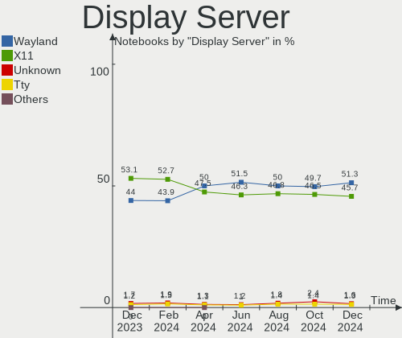
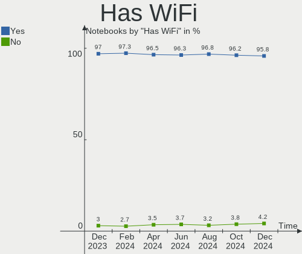

Linux - Hardware Trends (Notebooks)
-----------------------------------

A project to identify most popular hardware characteristics and track their change
over time based on data collected by Linux users at https://Linux-Hardware.org.

Anyone can contribute to this report by the [hw-probe](https://github.com/linuxhw/hw-probe) tool:

    sudo -E hw-probe -all -upload

This report is for one last month. Overall report since the beginning of time: [TestCoverage](https://github.com/linuxhw/TestCoverage)

Period: Sep, 2022.

Contents
--------

* [ System ](#system)
  - [ OS                       ](#os)
  - [ OS Family                ](#os-family)
  - [ Kernel                   ](#kernel)
  - [ Kernel Family            ](#kernel-family)
  - [ Kernel Major Ver.        ](#kernel-major-ver)
  - [ Arch                     ](#arch)
  - [ DE                       ](#de)
  - [ Display Server           ](#display-server)
  - [ Display Manager          ](#display-manager)
  - [ OS Lang                  ](#os-lang)
  - [ Boot Mode                ](#boot-mode)
  - [ Filesystem               ](#filesystem)
  - [ Part. scheme             ](#part-scheme)
  - [ Dual Boot with Linux/BSD ](#dual-boot-with-linuxbsd)
  - [ Dual Boot (Win)          ](#dual-boot-win)

* [ Board ](#board)
  - [ Vendor                   ](#vendor)
  - [ Model                    ](#model)
  - [ Model Family             ](#model-family)
  - [ MFG Year                 ](#mfg-year)
  - [ Form Factor              ](#form-factor)
  - [ Secure Boot              ](#secure-boot)
  - [ Coreboot                 ](#coreboot)
  - [ RAM Size                 ](#ram-size)
  - [ RAM Used                 ](#ram-used)
  - [ Total Drives             ](#total-drives)
  - [ Has CD-ROM               ](#has-cd-rom)
  - [ Has Ethernet             ](#has-ethernet)
  - [ Has WiFi                 ](#has-wifi)
  - [ Has Bluetooth            ](#has-bluetooth)

* [ Location ](#location)
  - [ Country                  ](#country)
  - [ City                     ](#city)

* [ Drives ](#drives)
  - [ Drive Vendor             ](#drive-vendor)
  - [ Drive Model              ](#drive-model)
  - [ HDD Vendor               ](#hdd-vendor)
  - [ SSD Vendor               ](#ssd-vendor)
  - [ Drive Kind               ](#drive-kind)
  - [ Drive Connector          ](#drive-connector)
  - [ Drive Size               ](#drive-size)
  - [ Space Total              ](#space-total)
  - [ Space Used               ](#space-used)
  - [ Malfunc. Drives          ](#malfunc-drives)
  - [ Malfunc. Drive Vendor    ](#malfunc-drive-vendor)
  - [ Malfunc. HDD Vendor      ](#malfunc-hdd-vendor)
  - [ Malfunc. Drive Kind      ](#malfunc-drive-kind)
  - [ Failed Drives            ](#failed-drives)
  - [ Failed Drive Vendor      ](#failed-drive-vendor)
  - [ Drive Status             ](#drive-status)

* [ Storage controller ](#storage-controller)
  - [ Storage Vendor           ](#storage-vendor)
  - [ Storage Model            ](#storage-model)
  - [ Storage Kind             ](#storage-kind)

* [ Processor ](#processor)
  - [ CPU Vendor               ](#cpu-vendor)
  - [ CPU Model                ](#cpu-model)
  - [ CPU Model Family         ](#cpu-model-family)
  - [ CPU Cores                ](#cpu-cores)
  - [ CPU Sockets              ](#cpu-sockets)
  - [ CPU Threads              ](#cpu-threads)
  - [ CPU Op-Modes             ](#cpu-op-modes)
  - [ CPU Microcode            ](#cpu-microcode)
  - [ CPU Microarch            ](#cpu-microarch)

* [ Graphics ](#graphics)
  - [ GPU Vendor               ](#gpu-vendor)
  - [ GPU Model                ](#gpu-model)
  - [ GPU Combo                ](#gpu-combo)
  - [ GPU Driver               ](#gpu-driver)
  - [ GPU Memory               ](#gpu-memory)

* [ Monitor ](#monitor)
  - [ Monitor Vendor           ](#monitor-vendor)
  - [ Monitor Model            ](#monitor-model)
  - [ Monitor Resolution       ](#monitor-resolution)
  - [ Monitor Diagonal         ](#monitor-diagonal)
  - [ Monitor Width            ](#monitor-width)
  - [ Aspect Ratio             ](#aspect-ratio)
  - [ Monitor Area             ](#monitor-area)
  - [ Pixel Density            ](#pixel-density)
  - [ Multiple Monitors        ](#multiple-monitors)

* [ Network ](#network)
  - [ Net Controller Vendor    ](#net-controller-vendor)
  - [ Net Controller Model     ](#net-controller-model)
  - [ Wireless Vendor          ](#wireless-vendor)
  - [ Wireless Model           ](#wireless-model)
  - [ Ethernet Vendor          ](#ethernet-vendor)
  - [ Ethernet Model           ](#ethernet-model)
  - [ Net Controller Kind      ](#net-controller-kind)
  - [ Used Controller          ](#used-controller)
  - [ NICs                     ](#nics)
  - [ IPv6                     ](#ipv6)

* [ Bluetooth ](#bluetooth)
  - [ Bluetooth Vendor         ](#bluetooth-vendor)
  - [ Bluetooth Model          ](#bluetooth-model)

* [ Sound ](#sound)
  - [ Sound Vendor             ](#sound-vendor)
  - [ Sound Model              ](#sound-model)

* [ Memory ](#memory)
  - [ Memory Vendor            ](#memory-vendor)
  - [ Memory Model             ](#memory-model)
  - [ Memory Kind              ](#memory-kind)
  - [ Memory Form Factor       ](#memory-form-factor)
  - [ Memory Size              ](#memory-size)
  - [ Memory Speed             ](#memory-speed)

* [ Printers & scanners ](#printers--scanners)
  - [ Printer Vendor           ](#printer-vendor)
  - [ Printer Model            ](#printer-model)
  - [ Scanner Vendor           ](#scanner-vendor)
  - [ Scanner Model            ](#scanner-model)

* [ Camera ](#camera)
  - [ Camera Vendor            ](#camera-vendor)
  - [ Camera Model             ](#camera-model)

* [ Security ](#security)
  - [ Fingerprint Vendor       ](#fingerprint-vendor)
  - [ Fingerprint Model        ](#fingerprint-model)
  - [ Chipcard Vendor          ](#chipcard-vendor)
  - [ Chipcard Model           ](#chipcard-model)

* [ Unsupported ](#unsupported)
  - [ Unsupported Devices      ](#unsupported-devices)
  - [ Unsupported Device Types ](#unsupported-device-types)

System
------

OS
--

Installed operating systems

| Name                         | Notebooks | Percent |
|------------------------------|-----------|---------|
| Ubuntu 22.04                 | 478       | 17.23%  |
| Fedora 36                    | 218       | 7.86%   |
| Debian 11                    | 189       | 6.81%   |
| Linux Mint 21                | 153       | 5.51%   |
| OpenMandriva 4.3             | 149       | 5.37%   |
| Pop!_OS 22.04                | 145       | 5.23%   |
| ROSA 12.2                    | 105       | 3.78%   |
| Ubuntu 20.04                 | 95        | 3.42%   |
| Zorin 16                     | 80        | 2.88%   |
| Linux Mint 20.3              | 76        | 2.74%   |
| Arch                         | 73        | 2.63%   |
| SteamOS 3.3.1                | 63        | 2.27%   |
| KDE neon 20.04               | 56        | 2.02%   |
| Kubuntu 22.04                | 39        | 1.41%   |
| Manjaro                      | 37        | 1.33%   |
| Arch Rolling                 | 36        | 1.3%    |
| Manjaro 22.0.0               | 35        | 1.26%   |
| Fedora 37                    | 34        | 1.23%   |
| OpenMandriva 4.50            | 33        | 1.19%   |
| Elementary 6.1               | 31        | 1.12%   |
| Xubuntu 22.04                | 28        | 1.01%   |
| Kali 2022.3                  | 28        | 1.01%   |
| EndeavourOS Rolling          | 26        | 0.94%   |
| Nobara 36                    | 23        | 0.83%   |
| Ubuntu 18.04                 | 22        | 0.79%   |
| Debian Testing               | 19        | 0.68%   |
| BlackPanther 18.1            | 19        | 0.68%   |
| openSUSE Tumbleweed-XXXXXXXX | 18        | 0.65%   |
| Gentoo 2.8                   | 18        | 0.65%   |
| ArcoLinux Rolling            | 16        | 0.58%   |
| OpenMandriva 4.90            | 14        | 0.5%    |
| Lubuntu 22.04                | 13        | 0.47%   |
| Linux Mint 20.2              | 13        | 0.47%   |
| ROSA R11.1                   | 12        | 0.43%   |
| MX 21                        | 12        | 0.43%   |
| Manjaro 21.3.7               | 12        | 0.43%   |
| LMDE 5                       | 12        | 0.43%   |
| Endless 4.0.9                | 12        | 0.43%   |
| EndeavourOS                  | 11        | 0.4%    |
| Xubuntu 20.04                | 10        | 0.36%   |

OS Family
---------

OS without a version

| Name              | Notebooks | Percent |
|-------------------|-----------|---------|
| Ubuntu            | 606       | 21.84%  |
| Fedora            | 263       | 9.48%   |
| Linux Mint        | 252       | 9.08%   |
| Debian            | 224       | 8.07%   |
| OpenMandriva      | 205       | 7.39%   |
| Pop!_OS           | 151       | 5.44%   |
| ROSA              | 124       | 4.47%   |
| Arch              | 109       | 3.93%   |
| Zorin             | 88        | 3.17%   |
| Manjaro           | 86        | 3.1%    |
| SteamOS           | 79        | 2.85%   |
| KDE neon          | 65        | 2.34%   |
| Kubuntu           | 54        | 1.95%   |
| Xubuntu           | 40        | 1.44%   |
| EndeavourOS       | 37        | 1.33%   |
| Kali              | 31        | 1.12%   |
| Elementary        | 31        | 1.12%   |
| Endless           | 25        | 0.9%    |
| openSUSE          | 23        | 0.83%   |
| Nobara            | 23        | 0.83%   |
| Gentoo            | 20        | 0.72%   |
| BlackPanther      | 19        | 0.68%   |
| Garuda Linux      | 17        | 0.61%   |
| Lubuntu           | 16        | 0.58%   |
| ArcoLinux         | 16        | 0.58%   |
| Ubuntu MATE       | 13        | 0.47%   |
| MX                | 13        | 0.47%   |
| LMDE              | 13        | 0.47%   |
| Clear Linux       | 13        | 0.47%   |
| Parrot            | 10        | 0.36%   |
| Ubuntu Unity      | 7         | 0.25%   |
| ALT Linux         | 7         | 0.25%   |
| Ubuntu Studio     | 6         | 0.22%   |
| Ubuntu Budgie     | 6         | 0.22%   |
| Red OS            | 6         | 0.22%   |
| NixOS             | 6         | 0.22%   |
| Rocky Linux       | 4         | 0.14%   |
| org.kde.Platform  | 4         | 0.14%   |
| Void Linux        | 3         | 0.11%   |
| Ultramarine Linux | 3         | 0.11%   |

Kernel
------

Version of the Linux kernel

| Version                                        | Notebooks | Percent |
|------------------------------------------------|-----------|---------|
| 5.15.0-47-generic                              | 393       | 14.16%  |
| 5.15.0-48-generic                              | 269       | 9.69%   |
| 5.15.0-46-generic                              | 195       | 7.03%   |
| 5.16.7-desktop-1omv4003                        | 146       | 5.26%   |
| 5.19.0-76051900-generic                        | 140       | 5.05%   |
| 5.10.0-18-amd64                                | 67        | 2.41%   |
| 5.4.0-125-generic                              | 66        | 2.38%   |
| 5.13.0-valve21.1-1-neptune-02211-gc54cda5a36f3 | 66        | 2.38%   |
| 5.10.74-generic-2rosa2021.1-x86_64             | 52        | 1.87%   |
| 5.10.0-17-amd64                                | 48        | 1.73%   |
| 5.19.9-200.fc36.x86_64                         | 41        | 1.48%   |
| 5.10.0-16-amd64                                | 39        | 1.41%   |
| 5.19.8-200.fc36.x86_64                         | 37        | 1.33%   |
| 5.19.6-200.fc36.x86_64                         | 37        | 1.33%   |
| 5.15.0-43-generic                              | 35        | 1.26%   |
| 5.4.0-126-generic                              | 34        | 1.23%   |
| 5.19.5-desktop-1omv4090                        | 32        | 1.15%   |
| 5.10.118-generic-2rosa2021.1-x86_64            | 31        | 1.12%   |
| 5.10.0-7-amd64                                 | 31        | 1.12%   |
| 5.19.11-200.fc36.x86_64                        | 26        | 0.94%   |
| 5.15.65-1-MANJARO                              | 26        | 0.94%   |
| 5.19.0-1-amd64                                 | 25        | 0.9%    |
| 5.19.4-200.fc36.x86_64                         | 23        | 0.83%   |
| 5.11.0-35-generic                              | 20        | 0.72%   |
| 5.17.5-300.fc36.x86_64                         | 19        | 0.68%   |
| 5.15.0-41-generic                              | 19        | 0.68%   |
| 5.19.7-arch1-1                                 | 17        | 0.61%   |
| 5.19.11-arch1-1                                | 17        | 0.61%   |
| 5.19.9-arch1-1                                 | 16        | 0.58%   |
| 5.19.6-arch1-1                                 | 16        | 0.58%   |
| 5.18.0-kali7-amd64                             | 15        | 0.54%   |
| 4.18.16-desktop-1bP                            | 14        | 0.5%    |
| 5.19.7-1-MANJARO                               | 13        | 0.47%   |
| 5.15.60-1-MANJARO                              | 13        | 0.47%   |
| 5.19.10-arch1-1                                | 12        | 0.43%   |
| 5.19.10-200.fc36.x86_64                        | 11        | 0.4%    |
| 5.17.11-generic-2rosa2021.1-x86_64             | 11        | 0.4%    |
| 5.19.8-300.fc37.x86_64                         | 10        | 0.36%   |
| 5.18.0-kali5-amd64                             | 10        | 0.36%   |
| 5.14.0-1051-oem                                | 10        | 0.36%   |

Kernel Family
-------------

Linux kernel without a distro release

| Version  | Notebooks | Percent |
|----------|-----------|---------|
| 5.15.0   | 943       | 33.98%  |
| 5.10.0   | 202       | 7.28%   |
| 5.19.0   | 187       | 6.74%   |
| 5.16.7   | 146       | 5.26%   |
| 5.4.0    | 134       | 4.83%   |
| 5.13.0   | 100       | 3.6%    |
| 5.19.9   | 81        | 2.92%   |
| 5.19.8   | 75        | 2.7%    |
| 5.19.6   | 70        | 2.52%   |
| 5.19.11  | 65        | 2.34%   |
| 5.19.7   | 60        | 2.16%   |
| 5.18.0   | 57        | 2.05%   |
| 5.10.74  | 55        | 1.98%   |
| 5.19.5   | 50        | 1.8%    |
| 5.19.10  | 45        | 1.62%   |
| 5.19.4   | 34        | 1.23%   |
| 5.15.65  | 32        | 1.15%   |
| 5.10.118 | 31        | 1.12%   |
| 5.11.0   | 28        | 1.01%   |
| 5.14.0   | 23        | 0.83%   |
| 6.0.0    | 22        | 0.79%   |
| 5.17.5   | 21        | 0.76%   |
| 5.19.2   | 16        | 0.58%   |
| 5.17.0   | 14        | 0.5%    |
| 4.18.16  | 14        | 0.5%    |
| 5.18.19  | 13        | 0.47%   |
| 5.15.60  | 13        | 0.47%   |
| 4.15.0   | 13        | 0.47%   |
| 5.19.1   | 12        | 0.43%   |
| 5.17.11  | 12        | 0.43%   |
| 5.8.0    | 11        | 0.4%    |
| 5.15.67  | 10        | 0.36%   |
| 5.10.14  | 9         | 0.32%   |
| 5.18.12  | 8         | 0.29%   |
| 5.16.13  | 8         | 0.29%   |
| 5.18.18  | 7         | 0.25%   |
| 5.15.68  | 7         | 0.25%   |
| 5.4.83   | 6         | 0.22%   |
| 5.18.10  | 6         | 0.22%   |
| 5.16.0   | 6         | 0.22%   |

Kernel Major Ver.
-----------------

Linux kernel major version

| Version | Notebooks | Percent |
|---------|-----------|---------|
| 5.15    | 1060      | 38.2%   |
| 5.19    | 703       | 25.33%  |
| 5.10    | 305       | 10.99%  |
| 5.16    | 161       | 5.8%    |
| 5.4     | 144       | 5.19%   |
| 5.18    | 110       | 3.96%   |
| 5.13    | 101       | 3.64%   |
| 5.17    | 51        | 1.84%   |
| 5.14    | 31        | 1.12%   |
| 5.11    | 28        | 1.01%   |
| 6.0     | 22        | 0.79%   |
| 4.18    | 17        | 0.61%   |
| 4.15    | 13        | 0.47%   |
| 5.8     | 11        | 0.4%    |
| 5.6     | 5         | 0.18%   |
| 4.19    | 5         | 0.18%   |
| 5.5     | 2         | 0.07%   |
| 4.9     | 2         | 0.07%   |
| 4.4     | 1         | 0.04%   |
| 4.16    | 1         | 0.04%   |
| 4.14    | 1         | 0.04%   |
| 3.0     | 1         | 0.04%   |

Arch
----

OS architecture (x86_64, i586, etc.)

| Name    | Notebooks | Percent |
|---------|-----------|---------|
| x86_64  | 2743      | 98.85%  |
| i686    | 27        | 0.97%   |
| aarch64 | 4         | 0.14%   |
| armv7l  | 1         | 0.04%   |

DE
--

Desktop Environment

| Name             | Notebooks | Percent |
|------------------|-----------|---------|
| GNOME            | 1295      | 46.67%  |
| KDE5             | 698       | 25.15%  |
| X-Cinnamon       | 205       | 7.39%   |
| XFCE             | 188       | 6.77%   |
| Unknown          | 132       | 4.76%   |
| MATE             | 64        | 2.31%   |
| LXQt             | 37        | 1.33%   |
| Pantheon         | 32        | 1.15%   |
| Cinnamon         | 25        | 0.9%    |
| i3               | 22        | 0.79%   |
| Budgie           | 10        | 0.36%   |
| KDE4             | 8         | 0.29%   |
| sway             | 7         | 0.25%   |
| GNOME Flashback  | 7         | 0.25%   |
| Unity            | 6         | 0.22%   |
| LXDE             | 5         | 0.18%   |
| openbox          | 4         | 0.14%   |
| KDE              | 4         | 0.14%   |
| Deepin           | 4         | 0.14%   |
| qtile            | 3         | 0.11%   |
| trinity          | 2         | 0.07%   |
| lightdm-xsession | 2         | 0.07%   |
| Hyprland         | 2         | 0.07%   |
| awesome          | 2         | 0.07%   |
| xmonad           | 1         | 0.04%   |
| UKUI             | 1         | 0.04%   |
| KDE:old          | 1         | 0.04%   |
| jwm              | 1         | 0.04%   |
| herbstluftwm     | 1         | 0.04%   |
| GNOME Classic    | 1         | 0.04%   |
| fluxbox          | 1         | 0.04%   |
| Enlightenment    | 1         | 0.04%   |
| dwm              | 1         | 0.04%   |
| Cutefish         | 1         | 0.04%   |
| bspwm            | 1         | 0.04%   |

Display Server
--------------

X11 or Wayland

| Name    | Notebooks | Percent |
|---------|-----------|---------|
| X11     | 1816      | 65.44%  |
| Wayland | 833       | 30.02%  |
| Unknown | 91        | 3.28%   |
| Tty     | 35        | 1.26%   |

Display Manager
---------------

SDDM, LightDM, etc.

| Name    | Notebooks | Percent |
|---------|-----------|---------|
| Unknown | 979       | 35.28%  |
| GDM3    | 591       | 21.3%   |
| SDDM    | 507       | 18.27%  |
| LightDM | 356       | 12.83%  |
| GDM     | 318       | 11.46%  |
| KDM     | 9         | 0.32%   |
| XDM     | 5         | 0.18%   |
| LXDM    | 5         | 0.18%   |
| Ly      | 3         | 0.11%   |
| SLiM    | 1         | 0.04%   |
| CDM     | 1         | 0.04%   |

OS Lang
-------

Language

| Lang    | Notebooks | Percent |
|---------|-----------|---------|
| en_US   | 1237      | 44.58%  |
| ru_RU   | 247       | 8.9%    |
| de_DE   | 182       | 6.56%   |
| en_GB   | 139       | 5.01%   |
| it_IT   | 117       | 4.22%   |
| pt_BR   | 110       | 3.96%   |
| fr_FR   | 100       | 3.6%    |
| es_ES   | 79        | 2.85%   |
| Unknown | 73        | 2.63%   |
| en_CA   | 45        | 1.62%   |
| pl_PL   | 39        | 1.41%   |
| C       | 37        | 1.33%   |
| en_AU   | 34        | 1.23%   |
| en_IN   | 31        | 1.12%   |
| es_MX   | 25        | 0.9%    |
| nl_NL   | 17        | 0.61%   |
| zh_CN   | 15        | 0.54%   |
| en_AG   | 15        | 0.54%   |
| tr_TR   | 14        | 0.5%    |
| de_AT   | 13        | 0.47%   |
| es_CL   | 12        | 0.43%   |
| es_AR   | 12        | 0.43%   |
| cs_CZ   | 12        | 0.43%   |
| pt_PT   | 9         | 0.32%   |
| en_NZ   | 8         | 0.29%   |
| en_DK   | 8         | 0.29%   |
| fr_BE   | 7         | 0.25%   |
| es_VE   | 7         | 0.25%   |
| en_ZA   | 7         | 0.25%   |
| en_SG   | 7         | 0.25%   |
| ro_RO   | 6         | 0.22%   |
| nb_NO   | 6         | 0.22%   |
| es_CO   | 6         | 0.22%   |
| da_DK   | 6         | 0.22%   |
| en_PH   | 5         | 0.18%   |
| ca_ES   | 5         | 0.18%   |
| id_ID   | 4         | 0.14%   |
| fi_FI   | 4         | 0.14%   |
| es_BO   | 4         | 0.14%   |
| en_IE   | 4         | 0.14%   |

Boot Mode
---------

EFI or BIOS

| Mode | Notebooks | Percent |
|------|-----------|---------|
| EFI  | 1555      | 56.04%  |
| BIOS | 1220      | 43.96%  |

Filesystem
----------

Type of filesystem

| Type    | Notebooks | Percent |
|---------|-----------|---------|
| Ext4    | 1965      | 70.81%  |
| Btrfs   | 448       | 16.14%  |
| Overlay | 282       | 10.16%  |
| Xfs     | 39        | 1.41%   |
| Zfs     | 20        | 0.72%   |
| Ext3    | 6         | 0.22%   |
| Tmpfs   | 4         | 0.14%   |
| F2fs    | 4         | 0.14%   |
| Ext2    | 3         | 0.11%   |
| XXXXXXX | 1         | 0.04%   |
| XXXXX   | 1         | 0.04%   |
| Jfs     | 1         | 0.04%   |
| Unknown | 1         | 0.04%   |

Part. scheme
------------

Scheme of partitioning

| Type    | Notebooks | Percent |
|---------|-----------|---------|
| Unknown | 1281      | 46.16%  |
| GPT     | 1241      | 44.72%  |
| MBR     | 253       | 9.12%   |

Dual Boot with Linux/BSD
------------------------

Hosting more than one Linux/BSD

| Dual boot | Notebooks | Percent |
|-----------|-----------|---------|
| No        | 2434      | 87.71%  |
| Yes       | 341       | 12.29%  |

Dual Boot (Win)
---------------

Hosting Linux and Windows

| Dual boot | Notebooks | Percent |
|-----------|-----------|---------|
| No        | 2016      | 72.65%  |
| Yes       | 759       | 27.35%  |

Board
-----

Vendor
------

Motherboard manufacturer

| Name                   | Notebooks | Percent |
|------------------------|-----------|---------|
| Lenovo                 | 592       | 21.33%  |
| Dell                   | 446       | 16.07%  |
| Hewlett-Packard        | 435       | 15.68%  |
| ASUSTek Computer       | 319       | 11.5%   |
| Acer                   | 201       | 7.24%   |
| Valve                  | 80        | 2.88%   |
| Toshiba                | 69        | 2.49%   |
| Apple                  | 63        | 2.27%   |
| MSI                    | 58        | 2.09%   |
| HUAWEI                 | 55        | 1.98%   |
| Samsung Electronics    | 50        | 1.8%    |
| Google                 | 39        | 1.41%   |
| Aquarius               | 36        | 1.3%    |
| Timi                   | 21        | 0.76%   |
| Chuwi                  | 18        | 0.65%   |
| Unknown                | 18        | 0.65%   |
| Sony                   | 17        | 0.61%   |
| Notebook               | 15        | 0.54%   |
| System76               | 13        | 0.47%   |
| TUXEDO                 | 12        | 0.43%   |
| Gigabyte Technology    | 12        | 0.43%   |
| Fujitsu                | 12        | 0.43%   |
| Positivo               | 11        | 0.4%    |
| Medion                 | 11        | 0.4%    |
| Alienware              | 10        | 0.36%   |
| Razer                  | 8         | 0.29%   |
| LG Electronics         | 8         | 0.29%   |
| Packard Bell           | 7         | 0.25%   |
| Framework              | 7         | 0.25%   |
| Gateway                | 6         | 0.22%   |
| Panasonic              | 5         | 0.18%   |
| Avell High Performance | 5         | 0.18%   |
| NEC Computers          | 4         | 0.14%   |
| HONOR                  | 4         | 0.14%   |
| Clevo                  | 4         | 0.14%   |
| AZW                    | 4         | 0.14%   |
| UMAX                   | 3         | 0.11%   |
| Schenker               | 3         | 0.11%   |
| Irbis                  | 3         | 0.11%   |
| Intel                  | 3         | 0.11%   |

Model
-----

Motherboard model

| Name                         | Notebooks | Percent |
|------------------------------|-----------|---------|
| Valve Jupiter                | 80        | 2.88%   |
| Unknown                      | 31        | 1.12%   |
| Aquarius NS585               | 30        | 1.08%   |
| Google Enguarde              | 15        | 0.54%   |
| HP Notebook                  | 11        | 0.4%    |
| HP Pavilion g6               | 10        | 0.36%   |
| Dell Latitude 3310           | 10        | 0.36%   |
| HUAWEI KLVL-WXXW             | 8         | 0.29%   |
| Dell Latitude E6540          | 8         | 0.29%   |
| Dell Latitude E6520          | 8         | 0.29%   |
| HP Laptop 15-da0xxx          | 7         | 0.25%   |
| HP EliteBook 840 G3          | 7         | 0.25%   |
| Dell Latitude E6420          | 7         | 0.25%   |
| Dell Latitude E6330          | 7         | 0.25%   |
| Apple MacBookPro9,2          | 7         | 0.25%   |
| HUAWEI HVY-WXX9              | 6         | 0.22%   |
| HP Pavilion 15               | 6         | 0.22%   |
| HP Laptop 15-bw0xx           | 6         | 0.22%   |
| HP 255 G8 Notebook PC        | 6         | 0.22%   |
| HP 15                        | 6         | 0.22%   |
| Dell XPS 15 9570             | 6         | 0.22%   |
| Dell XPS 15 9500             | 6         | 0.22%   |
| Dell Latitude 5420           | 6         | 0.22%   |
| Dell Inspiron 15-3567        | 6         | 0.22%   |
| Apple MacBookAir7,2          | 6         | 0.22%   |
| Toshiba Satellite C660       | 5         | 0.18%   |
| Lenovo G50-45 80E3           | 5         | 0.18%   |
| HP Pavilion Notebook         | 5         | 0.18%   |
| HP Pavilion g7               | 5         | 0.18%   |
| HP Pavilion dv6              | 5         | 0.18%   |
| HP Laptop 15-db0xxx          | 5         | 0.18%   |
| HP 250 G8 Notebook PC        | 5         | 0.18%   |
| Dell XPS 9320                | 5         | 0.18%   |
| Dell Vostro 3500             | 5         | 0.18%   |
| Dell Latitude E7470          | 5         | 0.18%   |
| Dell Inspiron 5566           | 5         | 0.18%   |
| Chuwi HeroBook Air           | 5         | 0.18%   |
| ASUS ROG Strix G513QY_G513QY | 5         | 0.18%   |
| Aquarius NS685U R11          | 5         | 0.18%   |
| Toshiba dynabook T653/46JR   | 4         | 0.14%   |

Model Family
------------

Motherboard model prefix

| Name              | Notebooks | Percent |
|-------------------|-----------|---------|
| Lenovo ThinkPad   | 290       | 10.45%  |
| Dell Latitude     | 175       | 6.31%   |
| Lenovo IdeaPad    | 138       | 4.97%   |
| Acer Aspire       | 135       | 4.86%   |
| Dell Inspiron     | 118       | 4.25%   |
| HP Pavilion       | 83        | 2.99%   |
| Valve Jupiter     | 80        | 2.88%   |
| HP EliteBook      | 70        | 2.52%   |
| ASUS VivoBook     | 68        | 2.45%   |
| HP Laptop         | 65        | 2.34%   |
| Dell XPS          | 61        | 2.2%    |
| HP ProBook        | 60        | 2.16%   |
| Toshiba Satellite | 58        | 2.09%   |
| Dell Precision    | 46        | 1.66%   |
| ASUS ROG          | 42        | 1.51%   |
| Lenovo ThinkBook  | 34        | 1.23%   |
| Lenovo Legion     | 32        | 1.15%   |
| Unknown           | 31        | 1.12%   |
| Aquarius NS585    | 30        | 1.08%   |
| Dell Vostro       | 25        | 0.9%    |
| ASUS Zenbook      | 23        | 0.83%   |
| ASUS ASUS         | 21        | 0.76%   |
| HP ENVY           | 18        | 0.65%   |
| HP Compaq         | 17        | 0.61%   |
| Acer Swift        | 17        | 0.61%   |
| Acer Nitro        | 17        | 0.61%   |
| Google Enguarde   | 15        | 0.54%   |
| Lenovo Yoga       | 14        | 0.5%    |
| HP ZBook          | 14        | 0.5%    |
| HP OMEN           | 13        | 0.47%   |
| HP 255            | 12        | 0.43%   |
| ASUS TUF          | 12        | 0.43%   |
| HP Notebook       | 11        | 0.4%    |
| HP 250            | 11        | 0.4%    |
| HP 15             | 10        | 0.36%   |
| Fujitsu LIFEBOOK  | 10        | 0.36%   |
| Acer TravelMate   | 10        | 0.36%   |
| HP Stream         | 9         | 0.32%   |
| Razer Blade       | 8         | 0.29%   |
| MSI Modern        | 8         | 0.29%   |

MFG Year
--------

Motherboard manufacture year

| Year    | Notebooks | Percent |
|---------|-----------|---------|
| 2021    | 399       | 14.38%  |
| 2020    | 306       | 11.03%  |
| 2022    | 288       | 10.38%  |
| 2019    | 264       | 9.51%   |
| 2018    | 196       | 7.06%   |
| 2013    | 172       | 6.2%    |
| 2012    | 168       | 6.05%   |
| 2011    | 168       | 6.05%   |
| 2017    | 146       | 5.26%   |
| 2014    | 140       | 5.05%   |
| 2015    | 130       | 4.68%   |
| 2016    | 114       | 4.11%   |
| 2010    | 102       | 3.68%   |
| 2008    | 65        | 2.34%   |
| 2009    | 58        | 2.09%   |
| 2007    | 38        | 1.37%   |
| 2006    | 8         | 0.29%   |
| 2005    | 6         | 0.22%   |
| Unknown | 4         | 0.14%   |
| 2004    | 2         | 0.07%   |
| 2003    | 1         | 0.04%   |

Form Factor
-----------

Physical design of the computer

| Name     | Notebooks | Percent |
|----------|-----------|---------|
| Notebook | 2775      | 100%    |

Secure Boot
-----------

Enabled or disabled

| State    | Notebooks | Percent |
|----------|-----------|---------|
| Disabled | 2537      | 91.42%  |
| Enabled  | 238       | 8.58%   |

Coreboot
--------

Have coreboot on board

| Used | Notebooks | Percent |
|------|-----------|---------|
| No   | 2721      | 98.05%  |
| Yes  | 54        | 1.95%   |

RAM Size
--------

Total RAM memory

| Size in GB  | Notebooks | Percent |
|-------------|-----------|---------|
| 4.01-8.0    | 832       | 29.98%  |
| 8.01-16.0   | 534       | 19.24%  |
| 3.01-4.0    | 506       | 18.23%  |
| 16.01-24.0  | 487       | 17.55%  |
| 32.01-64.0  | 216       | 7.78%   |
| 1.01-2.0    | 88        | 3.17%   |
| 24.01-32.0  | 41        | 1.48%   |
| 2.01-3.0    | 29        | 1.05%   |
| 64.01-256.0 | 29        | 1.05%   |
| 0.51-1.0    | 11        | 0.4%    |
| 0.01-0.5    | 2         | 0.07%   |

RAM Used
--------

Used RAM memory

| Used GB    | Notebooks | Percent |
|------------|-----------|---------|
| 1.01-2.0   | 857       | 30.88%  |
| 2.01-3.0   | 672       | 24.22%  |
| 4.01-8.0   | 472       | 17.01%  |
| 3.01-4.0   | 431       | 15.53%  |
| 0.51-1.0   | 171       | 6.16%   |
| 8.01-16.0  | 137       | 4.94%   |
| 0.01-0.5   | 21        | 0.76%   |
| 16.01-24.0 | 8         | 0.29%   |
| 24.01-32.0 | 4         | 0.14%   |
| 32.01-64.0 | 1         | 0.04%   |
| Unknown    | 1         | 0.04%   |

Total Drives
------------

Number of drives on board

| Drives | Notebooks | Percent |
|--------|-----------|---------|
| 1      | 2027      | 73.05%  |
| 2      | 655       | 23.6%   |
| 3      | 74        | 2.67%   |
| 0      | 11        | 0.4%    |
| 4      | 5         | 0.18%   |
| 5      | 2         | 0.07%   |
| 6      | 1         | 0.04%   |

Has CD-ROM
----------

Has CD-ROM on board

| Presented | Notebooks | Percent |
|-----------|-----------|---------|
| No        | 2004      | 72.22%  |
| Yes       | 771       | 27.78%  |

Has Ethernet
------------

Has Ethernet on board

| Presented | Notebooks | Percent |
|-----------|-----------|---------|
| Yes       | 2111      | 76.07%  |
| No        | 664       | 23.93%  |

Has WiFi
--------

Has WiFi module

| Presented | Notebooks | Percent |
|-----------|-----------|---------|
| Yes       | 2736      | 98.59%  |
| No        | 39        | 1.41%   |

Has Bluetooth
-------------

Has Bluetooth module

| Presented | Notebooks | Percent |
|-----------|-----------|---------|
| Yes       | 2261      | 81.48%  |
| No        | 514       | 18.52%  |

Location
--------

Country
-------

Geographic location (country)

| Country     | Notebooks | Percent |
|-------------|-----------|---------|
| USA         | 490       | 17.66%  |
| Russia      | 277       | 9.98%   |
| Germany     | 240       | 8.65%   |
| Italy       | 187       | 6.74%   |
| Brazil      | 149       | 5.37%   |
| France      | 124       | 4.47%   |
| Spain       | 105       | 3.78%   |
| UK          | 101       | 3.64%   |
| Poland      | 73        | 2.63%   |
| Canada      | 70        | 2.52%   |
| Netherlands | 65        | 2.34%   |
| India       | 58        | 2.09%   |
| Mexico      | 43        | 1.55%   |
| Australia   | 37        | 1.33%   |
| Czechia     | 35        | 1.26%   |
| Indonesia   | 32        | 1.15%   |
| Austria     | 32        | 1.15%   |
| Portugal    | 29        | 1.05%   |
| Belgium     | 28        | 1.01%   |
| Hungary     | 27        | 0.97%   |
| Turkey      | 26        | 0.94%   |
| China       | 25        | 0.9%    |
| Argentina   | 25        | 0.9%    |
| Romania     | 23        | 0.83%   |
| Norway      | 20        | 0.72%   |
| Sweden      | 19        | 0.68%   |
| Japan       | 18        | 0.65%   |
| Colombia    | 17        | 0.61%   |
| Chile       | 16        | 0.58%   |
| Finland     | 15        | 0.54%   |
| Denmark     | 15        | 0.54%   |
| Ukraine     | 14        | 0.5%    |
| Switzerland | 14        | 0.5%    |
| Egypt       | 14        | 0.5%    |
| Serbia      | 13        | 0.47%   |
| Pakistan    | 12        | 0.43%   |
| Greece      | 12        | 0.43%   |
| Iran        | 11        | 0.4%    |
| Hong Kong   | 11        | 0.4%    |
| Singapore   | 10        | 0.36%   |

City
----

Geographic location (city)

| City              | Notebooks | Percent |
|-------------------|-----------|---------|
| Moscow            | 72        | 2.59%   |
| Voronezh          | 35        | 1.26%   |
| Paris             | 29        | 1.05%   |
| Bangor            | 29        | 1.05%   |
| Milan             | 27        | 0.97%   |
| St Petersburg     | 25        | 0.9%    |
| Warsaw            | 19        | 0.68%   |
| Madrid            | 19        | 0.68%   |
| Berlin            | 19        | 0.68%   |
| Seville           | 18        | 0.65%   |
| Rome              | 18        | 0.65%   |
| Sao Paulo         | 17        | 0.61%   |
| Prague            | 17        | 0.61%   |
| Vienna            | 16        | 0.58%   |
| Schagen           | 15        | 0.54%   |
| Barcelona         | 15        | 0.54%   |
| Munich            | 13        | 0.47%   |
| Istanbul          | 13        | 0.47%   |
| Los Angeles       | 12        | 0.43%   |
| Lisbon            | 12        | 0.43%   |
| Hamburg           | 12        | 0.43%   |
| Rio de Janeiro    | 11        | 0.4%    |
| Mexico City       | 11        | 0.4%    |
| Budapest          | 11        | 0.4%    |
| Brisbane          | 11        | 0.4%    |
| Amsterdam         | 11        | 0.4%    |
| Singapore         | 10        | 0.36%   |
| Melbourne         | 10        | 0.36%   |
| Helsinki          | 10        | 0.36%   |
| Frankfurt am Main | 10        | 0.36%   |
| Belgrade          | 10        | 0.36%   |
| Turin             | 9         | 0.32%   |
| Nizhniy Novgorod  | 9         | 0.32%   |
| Montreal          | 9         | 0.32%   |
| Krakow            | 9         | 0.32%   |
| Cairo             | 9         | 0.32%   |
| Bengaluru         | 9         | 0.32%   |
| Toronto           | 8         | 0.29%   |
| Seattle           | 8         | 0.29%   |
| Oslo              | 8         | 0.29%   |

Drives
------

Drive Vendor
------------

Hard drive vendors

| Vendor                         | Notebooks | Drives | Percent |
|--------------------------------|-----------|--------|---------|
| Samsung Electronics            | 545       | 607    | 15.97%  |
| WDC                            | 346       | 354    | 10.14%  |
| Seagate                        | 252       | 263    | 7.38%   |
| Toshiba                        | 224       | 224    | 6.56%   |
| SanDisk                        | 222       | 233    | 6.5%    |
| Unknown                        | 208       | 232    | 6.09%   |
| Kingston                       | 208       | 211    | 6.09%   |
| SK hynix                       | 166       | 170    | 4.86%   |
| Micron Technology              | 120       | 123    | 3.52%   |
| Intel                          | 99        | 108    | 2.9%    |
| Crucial                        | 94        | 101    | 2.75%   |
| A-DATA Technology              | 89        | 91     | 2.61%   |
| Hitachi                        | 71        | 72     | 2.08%   |
| HGST                           | 70        | 71     | 2.05%   |
| KIOXIA                         | 57        | 60     | 1.67%   |
| Phison                         | 41        | 43     | 1.2%    |
| Apple                          | 33        | 40     | 0.97%   |
| Unknown                        | 32        | 32     | 0.94%   |
| Phison Electronics             | 31        | 31     | 0.91%   |
| China                          | 31        | 31     | 0.91%   |
| PNY                            | 28        | 28     | 0.82%   |
| LITEON                         | 23        | 23     | 0.67%   |
| Kingston Technology Company    | 21        | 21     | 0.62%   |
| Silicon Motion                 | 20        | 20     | 0.59%   |
| Intenso                        | 16        | 17     | 0.47%   |
| SPCC                           | 15        | 15     | 0.44%   |
| Transcend                      | 14        | 14     | 0.41%   |
| Netac                          | 14        | 14     | 0.41%   |
| Fujitsu                        | 14        | 14     | 0.41%   |
| Micron/Crucial Technology      | 13        | 15     | 0.38%   |
| Patriot                        | 11        | 11     | 0.32%   |
| KingSpec                       | 10        | 10     | 0.29%   |
| ADATA Technology               | 10        | 11     | 0.29%   |
| Solid State Storage Technology | 9         | 9      | 0.26%   |
| GOODRAM                        | 9         | 9      | 0.26%   |
| UMIS                           | 8         | 8      | 0.23%   |
| Team                           | 8         | 8      | 0.23%   |
| JMicron Technology             | 8         | 8      | 0.23%   |
| LITEONIT                       | 7         | 7      | 0.21%   |
| Lexar                          | 7         | 7      | 0.21%   |

Drive Model
-----------

Hard drive models

| Model                                                 | Notebooks | Percent |
|-------------------------------------------------------|-----------|---------|
| Samsung NVMe SSD Controller SM981/PM981/PM983 256GB   | 51        | 1.44%   |
| Toshiba MQ01ABD100 1TB                                | 36        | 1.02%   |
| Kingston SA400S37240G 240GB SSD                       | 36        | 1.02%   |
| Seagate ST1000LM035-1RK172 1TB                        | 35        | 0.99%   |
| Unknown                                               | 32        | 0.9%    |
| A-DATA SU800 512GB SSD                                | 31        | 0.88%   |
| Seagate ST1000LM024 HN-M101MBB 1TB                    | 27        | 0.76%   |
| Samsung NVMe SSD Drive 512GB                          | 26        | 0.73%   |
| Unknown MMC Card  64GB                                | 25        | 0.71%   |
| Toshiba MQ04ABF100 1TB                                | 25        | 0.71%   |
| Unknown MMC Card  32GB                                | 23        | 0.65%   |
| Seagate ST500LT012-1DG142 500GB                       | 23        | 0.65%   |
| Toshiba MQ01ABF050 500GB                              | 22        | 0.62%   |
| Phison PS5013 E13 NVMe Controller 512GB               | 21        | 0.59%   |
| Unknown MMC Card  512GB                               | 20        | 0.56%   |
| Samsung SSD 860 EVO 500GB                             | 19        | 0.54%   |
| Kingston SA400S37480G 480GB SSD                       | 19        | 0.54%   |
| Sandisk WD Black SN750 / PC SN730 NVMe SSD 1024GB     | 18        | 0.51%   |
| Samsung NVMe SSD Drive 256GB                          | 18        | 0.51%   |
| Phison NVMe SSD Drive 512GB                           | 18        | 0.51%   |
| SanDisk NVMe SSD Drive 512GB                          | 17        | 0.48%   |
| Kingston NVMe SSD Drive 512GB                         | 17        | 0.48%   |
| Unknown MMC Card  128GB                               | 16        | 0.45%   |
| SanDisk NVMe SSD Drive 1TB                            | 15        | 0.42%   |
| Samsung SSD 860 EVO 1TB                               | 15        | 0.42%   |
| Sandisk WD Blue SN550 NVMe SSD 1024GB                 | 14        | 0.4%    |
| SanDisk NVMe SSD Drive 256GB                          | 14        | 0.4%    |
| Samsung SSD 850 EVO 500GB                             | 14        | 0.4%    |
| Samsung NVMe SSD Controller PM9A1/PM9A3/980PRO 1024GB | 14        | 0.4%    |
| Kingston Company OM3PDP3 NVMe SSD 512GB               | 14        | 0.4%    |
| SK hynix NVMe SSD Drive 512GB                         | 13        | 0.37%   |
| Seagate ST9500325AS 500GB                             | 13        | 0.37%   |
| HGST HTS545050A7E680 500GB                            | 13        | 0.37%   |
| WDC WDS500G2B0A-00SM50 500GB SSD                      | 12        | 0.34%   |
| Toshiba MQ01ABD050 500GB                              | 12        | 0.34%   |
| Samsung NVMe SSD Drive 1TB                            | 12        | 0.34%   |
| Samsung NVMe SSD Drive 1024GB                         | 12        | 0.34%   |
| Kingston SA400S37120G 120GB SSD                       | 12        | 0.34%   |
| HGST HTS541010A9E680 1TB                              | 12        | 0.34%   |
| Unknown AGND3R  16GB                                  | 11        | 0.31%   |

HDD Vendor
----------

Hard disk drive vendors

| Vendor              | Notebooks | Drives | Percent |
|---------------------|-----------|--------|---------|
| Seagate             | 244       | 255    | 30.39%  |
| WDC                 | 207       | 210    | 25.78%  |
| Toshiba             | 163       | 163    | 20.3%   |
| Hitachi             | 71        | 72     | 8.84%   |
| HGST                | 70        | 71     | 8.72%   |
| Samsung Electronics | 14        | 14     | 1.74%   |
| Fujitsu             | 14        | 14     | 1.74%   |
| Unknown             | 9         | 9      | 1.12%   |
| ASMT                | 3         | 3      | 0.37%   |
| LaCie               | 2         | 2      | 0.25%   |
| Apple               | 2         | 2      | 0.25%   |
| IBM/Hitachi         | 1         | 1      | 0.12%   |
| HGST HTS            | 1         | 1      | 0.12%   |
| Generic-            | 1         | 1      | 0.12%   |
| ASMT109x            | 1         | 1      | 0.12%   |

SSD Vendor
----------

Solid state drive vendors

| Vendor              | Notebooks | Drives | Percent |
|---------------------|-----------|--------|---------|
| Samsung Electronics | 195       | 206    | 18.84%  |
| Kingston            | 127       | 129    | 12.27%  |
| SanDisk             | 96        | 98     | 9.28%   |
| Crucial             | 85        | 91     | 8.21%   |
| A-DATA Technology   | 68        | 68     | 6.57%   |
| WDC                 | 58        | 58     | 5.6%    |
| SK hynix            | 33        | 33     | 3.19%   |
| China               | 31        | 31     | 3%      |
| PNY                 | 25        | 25     | 2.42%   |
| Micron Technology   | 24        | 24     | 2.32%   |
| Intel               | 23        | 24     | 2.22%   |
| LITEON              | 22        | 22     | 2.13%   |
| Toshiba             | 19        | 19     | 1.84%   |
| Apple               | 18        | 18     | 1.74%   |
| SPCC                | 15        | 15     | 1.45%   |
| Netac               | 14        | 14     | 1.35%   |
| Transcend           | 13        | 13     | 1.26%   |
| Intenso             | 11        | 11     | 1.06%   |
| Patriot             | 10        | 10     | 0.97%   |
| KingSpec            | 10        | 10     | 0.97%   |
| GOODRAM             | 8         | 8      | 0.77%   |
| Unknown             | 8         | 8      | 0.77%   |
| LITEONIT            | 7         | 7      | 0.68%   |
| Lexar               | 7         | 7      | 0.68%   |
| Team                | 6         | 6      | 0.58%   |
| Plextor             | 5         | 5      | 0.48%   |
| Corsair             | 5         | 5      | 0.48%   |
| Apacer              | 5         | 5      | 0.48%   |
| Hewlett-Packard     | 4         | 4      | 0.39%   |
| Kingmax             | 3         | 3      | 0.29%   |
| Gigabyte Technology | 3         | 3      | 0.29%   |
| Dogfish             | 3         | 5      | 0.29%   |
| BHT                 | 3         | 3      | 0.29%   |
| V-GeN               | 2         | 2      | 0.19%   |
| Qumo                | 2         | 2      | 0.19%   |
| OWC                 | 2         | 2      | 0.19%   |
| OCZ                 | 2         | 2      | 0.19%   |
| Mushkin             | 2         | 2      | 0.19%   |
| GLOWAY              | 2         | 2      | 0.19%   |
| Emtec               | 2         | 2      | 0.19%   |

Drive Kind
----------

HDD or SSD

| Kind    | Notebooks | Drives | Percent |
|---------|-----------|--------|---------|
| NVMe    | 1229      | 1394   | 37.66%  |
| SSD     | 971       | 1060   | 29.76%  |
| HDD     | 782       | 819    | 23.97%  |
| MMC     | 226       | 250    | 6.93%   |
| Unknown | 55        | 57     | 1.69%   |

Drive Connector
---------------

SATA, SAS, NVMe, etc.

| Type | Notebooks | Drives | Percent |
|------|-----------|--------|---------|
| SATA | 1592      | 1827   | 50.46%  |
| NVMe | 1223      | 1377   | 38.76%  |
| MMC  | 226       | 250    | 7.16%   |
| SAS  | 114       | 126    | 3.61%   |

Drive Size
----------

Size of hard drive

| Size in TB | Notebooks | Drives | Percent |
|------------|-----------|--------|---------|
| 0.01-0.5   | 1170      | 1290   | 67.55%  |
| 0.51-1.0   | 501       | 522    | 28.93%  |
| 1.01-2.0   | 49        | 55     | 2.83%   |
| 4.01-10.0  | 7         | 7      | 0.4%    |
| 3.01-4.0   | 5         | 5      | 0.29%   |

Space Total
-----------

Amount of disk space available on the file system

| Size in GB     | Notebooks | Percent |
|----------------|-----------|---------|
| 101-250        | 748       | 26.95%  |
| 251-500        | 722       | 26.02%  |
| 501-1000       | 409       | 14.74%  |
| 1-20           | 259       | 9.33%   |
| 1001-2000      | 171       | 6.16%   |
| 51-100         | 154       | 5.55%   |
| Unknown        | 134       | 4.83%   |
| 21-50          | 85        | 3.06%   |
| More than 3000 | 61        | 2.2%    |
| 2001-3000      | 32        | 1.15%   |

Space Used
----------

Amount of used disk space

| Used GB        | Notebooks | Percent |
|----------------|-----------|---------|
| 1-20           | 995       | 35.86%  |
| 21-50          | 475       | 17.12%  |
| 101-250        | 407       | 14.67%  |
| 51-100         | 337       | 12.14%  |
| 251-500        | 238       | 8.58%   |
| Unknown        | 134       | 4.83%   |
| 501-1000       | 123       | 4.43%   |
| 1001-2000      | 36        | 1.3%    |
| 2001-3000      | 15        | 0.54%   |
| More than 3000 | 12        | 0.43%   |
| 0              | 3         | 0.11%   |

Malfunc. Drives
---------------

Drive models with a malfunction

| Model                                   | Notebooks | Drives | Percent |
|-----------------------------------------|-----------|--------|---------|
| HGST HTS545050A7E680 500GB              | 6         | 6      | 2.84%   |
| Seagate ST9500325AS 500GB               | 5         | 5      | 2.37%   |
| Seagate ST320LT007-9ZV142 320GB         | 5         | 5      | 2.37%   |
| Seagate ST1000LM035-1RK172 1TB          | 5         | 5      | 2.37%   |
| Toshiba MQ01ABD075 752GB                | 4         | 4      | 1.9%    |
| Toshiba MQ01ABD050 500GB                | 4         | 4      | 1.9%    |
| Seagate ST500LT012-9WS142 500GB         | 4         | 4      | 1.9%    |
| HGST HTS541010A9E680 1TB                | 4         | 4      | 1.9%    |
| Toshiba MQ01ABF050 500GB                | 3         | 3      | 1.42%   |
| Toshiba MQ01ABD100 1TB                  | 3         | 3      | 1.42%   |
| Seagate ST9500420AS 500GB               | 3         | 3      | 1.42%   |
| Seagate ST500LT012-1DG142 500GB         | 3         | 3      | 1.42%   |
| Seagate ST1000LM024 HN-M101MBB 1TB      | 3         | 3      | 1.42%   |
| Hitachi HTS723232A7A364 320GB           | 3         | 3      | 1.42%   |
| Hitachi HTS547550A9E384 500GB           | 3         | 3      | 1.42%   |
| Hitachi HTS545050B9A300 500GB           | 3         | 3      | 1.42%   |
| WDC WDS240G2G0A-00JH30 240GB SSD        | 2         | 2      | 0.95%   |
| WDC WD5000LPVX-22V0TT0 500GB            | 2         | 2      | 0.95%   |
| WDC WD10JPVX-22JC3T0 1TB                | 2         | 2      | 0.95%   |
| SK hynix HFS256G39TND-N210A 256GB SSD   | 2         | 2      | 0.95%   |
| Seagate ST9320423AS 320GB               | 2         | 2      | 0.95%   |
| Seagate ST9320325AS 320GB               | 2         | 2      | 0.95%   |
| Seagate ST500LM000-SSHD-8GB             | 2         | 2      | 0.95%   |
| Seagate ST1000LM014-1EJ164 1TB          | 2         | 2      | 0.95%   |
| SanDisk SSD U100 256GB                  | 2         | 2      | 0.95%   |
| Kingston RBU-SNS8350DES3128GP 128GB SSD | 2         | 2      | 0.95%   |
| Hitachi HTS725032A7E630 320GB           | 2         | 2      | 0.95%   |
| Hitachi HTS545025B9A300 250GB           | 2         | 2      | 0.95%   |
| Hitachi HTS543232L9A300 320GB           | 2         | 2      | 0.95%   |
| Hitachi HTS542580K9SA00 80GB            | 2         | 2      | 0.95%   |
| WDC WDS120G2G0A-00JH30 120GB SSD        | 1         | 1      | 0.47%   |
| WDC WD7500BPKT-60PK4T0 752GB            | 1         | 1      | 0.47%   |
| WDC WD6400BEVT-22A0RT0 640GB            | 1         | 1      | 0.47%   |
| WDC WD5000LPCX-60VHAT0 500GB            | 1         | 1      | 0.47%   |
| WDC WD3200BPVT-22ZEST0 320GB            | 1         | 1      | 0.47%   |
| WDC WD3200BEVT-80A0RT0 320GB            | 1         | 1      | 0.47%   |
| WDC WD3200BEVT-22A23T0 320GB            | 1         | 1      | 0.47%   |
| WDC WD3200BEVT-08A23T1 320GB            | 1         | 1      | 0.47%   |
| WDC WD3200BEKT-60PVMT0 320GB            | 1         | 1      | 0.47%   |
| WDC WD2500LPCX-24C6HT0 250GB            | 1         | 1      | 0.47%   |

Malfunc. Drive Vendor
---------------------

Vendors of faulty drives

| Vendor              | Notebooks | Drives | Percent |
|---------------------|-----------|--------|---------|
| Seagate             | 45        | 45     | 21.33%  |
| Hitachi             | 29        | 29     | 13.74%  |
| Toshiba             | 28        | 28     | 13.27%  |
| WDC                 | 25        | 25     | 11.85%  |
| HGST                | 18        | 19     | 8.53%   |
| SK hynix            | 12        | 12     | 5.69%   |
| Samsung Electronics | 10        | 10     | 4.74%   |
| Intel               | 6         | 6      | 2.84%   |
| A-DATA Technology   | 6         | 6      | 2.84%   |
| SanDisk             | 5         | 5      | 2.37%   |
| Kingston            | 5         | 5      | 2.37%   |
| Micron Technology   | 3         | 3      | 1.42%   |
| Crucial             | 3         | 3      | 1.42%   |
| LITEON              | 2         | 2      | 0.95%   |
| VISIPRO             | 1         | 1      | 0.47%   |
| SSSTC               | 1         | 1      | 0.47%   |
| PNY                 | 1         | 1      | 0.47%   |
| Plextor             | 1         | 1      | 0.47%   |
| LITEONIT            | 1         | 1      | 0.47%   |
| Lenovo              | 1         | 1      | 0.47%   |
| KingSpec            | 1         | 1      | 0.47%   |
| JD                  | 1         | 1      | 0.47%   |
| Intenso             | 1         | 1      | 0.47%   |
| HGST HTS            | 1         | 1      | 0.47%   |
| Fujitsu             | 1         | 1      | 0.47%   |
| DGM                 | 1         | 1      | 0.47%   |
| China               | 1         | 1      | 0.47%   |
| BAITITON            | 1         | 1      | 0.47%   |

Malfunc. HDD Vendor
-------------------

Vendors of faulty HDD drives

| Vendor              | Notebooks | Drives | Percent |
|---------------------|-----------|--------|---------|
| Seagate             | 45        | 45     | 30.82%  |
| Hitachi             | 29        | 29     | 19.86%  |
| Toshiba             | 26        | 26     | 17.81%  |
| WDC                 | 21        | 21     | 14.38%  |
| HGST                | 18        | 19     | 12.33%  |
| Samsung Electronics | 5         | 5      | 3.42%   |
| HGST HTS            | 1         | 1      | 0.68%   |
| Fujitsu             | 1         | 1      | 0.68%   |

Malfunc. Drive Kind
-------------------

Kinds of faulty drives

| Kind | Notebooks | Drives | Percent |
|------|-----------|--------|---------|
| HDD  | 145       | 147    | 69.38%  |
| SSD  | 53        | 54     | 25.36%  |
| NVMe | 11        | 11     | 5.26%   |

Failed Drives
-------------

Failed drive models

| Model                             | Notebooks | Drives | Percent |
|-----------------------------------|-----------|--------|---------|
| WDC WD5000BEVT-22ZAT0 500GB       | 1         | 1      | 20%     |
| WDC WD5000BEVT-22A0RT0 500GB      | 1         | 1      | 20%     |
| Seagate ST1000LM035-1RK172 1TB    | 1         | 1      | 20%     |
| Samsung Electronics HM160HI 160GB | 1         | 1      | 20%     |
| Hitachi HTS545050A7E380 500GB     | 1         | 1      | 20%     |

Failed Drive Vendor
-------------------

Failed drive vendors

| Vendor              | Notebooks | Drives | Percent |
|---------------------|-----------|--------|---------|
| WDC                 | 2         | 2      | 40%     |
| Seagate             | 1         | 1      | 20%     |
| Samsung Electronics | 1         | 1      | 20%     |
| Hitachi             | 1         | 1      | 20%     |

Drive Status
------------

Number of failed and malfunc. drives

| Status   | Notebooks | Drives | Percent |
|----------|-----------|--------|---------|
| Detected | 1462      | 1887   | 49.93%  |
| Works    | 1254      | 1476   | 42.83%  |
| Malfunc  | 207       | 212    | 7.07%   |
| Failed   | 5         | 5      | 0.17%   |

Storage controller
------------------

Storage Vendor
--------------

Storage controller vendors

| Vendor                           | Notebooks | Percent |
|----------------------------------|-----------|---------|
| Intel                            | 1730      | 52.17%  |
| Samsung Electronics              | 367       | 11.07%  |
| AMD                              | 323       | 9.74%   |
| SanDisk                          | 197       | 5.94%   |
| SK hynix                         | 129       | 3.89%   |
| Kingston Technology Company      | 103       | 3.11%   |
| Micron Technology                | 95        | 2.86%   |
| Phison Electronics               | 80        | 2.41%   |
| KIOXIA                           | 51        | 1.54%   |
| Toshiba America Info Systems     | 49        | 1.48%   |
| ADATA Technology                 | 33        | 1%      |
| Silicon Motion                   | 27        | 0.81%   |
| Nvidia                           | 23        | 0.69%   |
| Micron/Crucial Technology        | 22        | 0.66%   |
| Solid State Storage Technology   | 18        | 0.54%   |
| Union Memory (Shenzhen)          | 12        | 0.36%   |
| Apple                            | 11        | 0.33%   |
| O2 Micro                         | 6         | 0.18%   |
| Realtek Semiconductor            | 5         | 0.15%   |
| Marvell Technology Group         | 5         | 0.15%   |
| Yangtze Memory Technologies      | 4         | 0.12%   |
| Silicon Integrated Systems [SiS] | 4         | 0.12%   |
| Lite-On Technology               | 4         | 0.12%   |
| Shenzhen Longsys Electronics     | 3         | 0.09%   |
| Unknown                          | 2         | 0.06%   |
| Seagate Technology               | 2         | 0.06%   |
| Lenovo                           | 2         | 0.06%   |
| JMicron Technology               | 2         | 0.06%   |
| Unknown                          | 2         | 0.06%   |
| Zhaoxin                          | 1         | 0.03%   |
| VIA Technologies                 | 1         | 0.03%   |
| Silicon Image                    | 1         | 0.03%   |
| Biwin Storage Technology         | 1         | 0.03%   |
| ASMedia Technology               | 1         | 0.03%   |

Storage Model
-------------

Storage controller models

| Model                                                                          | Notebooks | Percent |
|--------------------------------------------------------------------------------|-----------|---------|
| AMD FCH SATA Controller [AHCI mode]                                            | 293       | 8.33%   |
| Intel Sunrise Point-LP SATA Controller [AHCI mode]                             | 200       | 5.69%   |
| Intel 7 Series Chipset Family 6-port SATA Controller [AHCI mode]               | 189       | 5.38%   |
| Samsung NVMe SSD Controller SM981/PM981/PM983                                  | 155       | 4.41%   |
| Intel 82801 Mobile SATA Controller [RAID mode]                                 | 139       | 3.95%   |
| Intel Volume Management Device NVMe RAID Controller                            | 127       | 3.61%   |
| Intel 6 Series/C200 Series Chipset Family 6 port Mobile SATA AHCI Controller   | 121       | 3.44%   |
| Samsung NVMe SSD Controller 980                                                | 106       | 3.01%   |
| Micron Non-Volatile memory controller                                          | 95        | 2.7%    |
| Intel Wildcat Point-LP SATA Controller [AHCI Mode]                             | 80        | 2.28%   |
| Intel 8 Series SATA Controller 1 [AHCI mode]                                   | 78        | 2.22%   |
| Samsung NVMe SSD Controller PM9A1/PM9A3/980PRO                                 | 74        | 2.1%    |
| Intel 82801IBM/IEM (ICH9M/ICH9M-E) 4 port SATA Controller [AHCI mode]          | 67        | 1.91%   |
| SK hynix Gold P31 SSD                                                          | 66        | 1.88%   |
| Intel Cannon Lake Mobile PCH SATA AHCI Controller                              | 65        | 1.85%   |
| Intel 8 Series/C220 Series Chipset Family 6-port SATA Controller 1 [AHCI mode] | 62        | 1.76%   |
| Intel Celeron/Pentium Silver Processor SATA Controller                         | 61        | 1.73%   |
| SanDisk WD Blue SN550 NVMe SSD                                                 | 56        | 1.59%   |
| Intel Tiger Lake-LP SATA Controller                                            | 55        | 1.56%   |
| Phison PS5013 E13 NVMe Controller                                              | 52        | 1.48%   |
| Intel 5 Series/3400 Series Chipset 4 port SATA AHCI Controller                 | 52        | 1.48%   |
| Kingston Company OM3PDP3 NVMe SSD                                              | 49        | 1.39%   |
| Intel HM170/QM170 Chipset SATA Controller [AHCI Mode]                          | 46        | 1.31%   |
| Intel Comet Lake SATA AHCI Controller                                          | 45        | 1.28%   |
| SanDisk Non-Volatile memory controller                                         | 43        | 1.22%   |
| SanDisk WD Black SN750 / PC SN730 NVMe SSD                                     | 40        | 1.14%   |
| KIOXIA NVMe SSD Controller BG4                                                 | 38        | 1.08%   |
| Intel 82801HM/HEM (ICH8M/ICH8M-E) IDE Controller                               | 36        | 1.02%   |
| Intel 82801HM/HEM (ICH8M/ICH8M-E) SATA Controller [AHCI mode]                  | 35        | 1%      |
| Intel SSD 660P Series                                                          | 33        | 0.94%   |
| Kingston Company Company Non-Volatile memory controller                        | 32        | 0.91%   |
| Intel Cannon Point-LP SATA Controller [AHCI Mode]                              | 32        | 0.91%   |
| Intel Atom Processor E3800 Series SATA AHCI Controller                         | 32        | 0.91%   |
| Intel Cannon Lake PCH SATA AHCI Controller                                     | 31        | 0.88%   |
| Toshiba America Info Systems XG6 NVMe SSD Controller                           | 27        | 0.77%   |
| Intel Celeron N3350/Pentium N4200/Atom E3900 Series SATA AHCI Controller       | 26        | 0.74%   |
| Intel 500 Series Chipset Family SATA AHCI Controller                           | 26        | 0.74%   |
| Intel Non-Volatile memory controller                                           | 25        | 0.71%   |
| Samsung NVMe SSD Controller SM961/PM961/SM963                                  | 23        | 0.65%   |
| Intel 5 Series/3400 Series Chipset 6 port SATA AHCI Controller                 | 23        | 0.65%   |

Storage Kind
------------

Kind of storage controller (IDE, SATA, NVMe, SAS, ...)

| Kind | Notebooks | Percent |
|------|-----------|---------|
| SATA | 1770      | 52.32%  |
| NVMe | 1223      | 36.15%  |
| RAID | 270       | 7.98%   |
| IDE  | 120       | 3.55%   |

Processor
---------

CPU Vendor
----------

Processor vendors

| Vendor       | Notebooks | Percent |
|--------------|-----------|---------|
| Intel        | 2137      | 77.01%  |
| AMD          | 632       | 22.77%  |
| Phytium      | 2         | 0.07%   |
| Unknown      | 2         | 0.07%   |
| CentaurHauls | 1         | 0.04%   |
| ARM          | 1         | 0.04%   |

CPU Model
---------

Processor models

| Model                                         | Notebooks | Percent |
|-----------------------------------------------|-----------|---------|
| AMD Custom APU 0405                           | 80        | 2.88%   |
| Intel 11th Gen Core i5-1135G7 @ 2.40GHz       | 67        | 2.41%   |
| Intel 11th Gen Core i7-1165G7 @ 2.80GHz       | 48        | 1.73%   |
| Intel Core i5-10210U CPU @ 1.60GHz            | 43        | 1.55%   |
| AMD Ryzen 7 5800H with Radeon Graphics        | 40        | 1.44%   |
| AMD Ryzen 5 3500U with Radeon Vega Mobile Gfx | 40        | 1.44%   |
| Intel Core i5-8250U CPU @ 1.60GHz             | 39        | 1.41%   |
| AMD Ryzen 5 5500U with Radeon Graphics        | 38        | 1.37%   |
| Intel Core i5-7200U CPU @ 2.50GHz             | 33        | 1.19%   |
| Intel Core i7-8750H CPU @ 2.20GHz             | 30        | 1.08%   |
| Intel Core i7-8550U CPU @ 1.80GHz             | 30        | 1.08%   |
| Intel Core i7-7700HQ CPU @ 2.80GHz            | 30        | 1.08%   |
| Intel Core i5-8265U CPU @ 1.60GHz             | 30        | 1.08%   |
| Intel Core i3-9100 CPU @ 3.60GHz              | 30        | 1.08%   |
| Intel Celeron N4020 CPU @ 1.10GHz             | 30        | 1.08%   |
| Intel Core i7-9750H CPU @ 2.60GHz             | 28        | 1.01%   |
| Intel Celeron CPU N2840 @ 2.16GHz             | 28        | 1.01%   |
| Intel Core i5-5200U CPU @ 2.20GHz             | 27        | 0.97%   |
| Intel Core i5-3210M CPU @ 2.50GHz             | 27        | 0.97%   |
| Intel 12th Gen Core i7-12700H                 | 27        | 0.97%   |
| Intel Core i5-3320M CPU @ 2.60GHz             | 26        | 0.94%   |
| AMD Ryzen 7 5700U with Radeon Graphics        | 26        | 0.94%   |
| Intel Core i7-8565U CPU @ 1.80GHz             | 24        | 0.86%   |
| Intel Core i5-6200U CPU @ 2.30GHz             | 24        | 0.86%   |
| Intel Core i5-2520M CPU @ 2.50GHz             | 24        | 0.86%   |
| Intel 11th Gen Core i7-11800H @ 2.30GHz       | 24        | 0.86%   |
| Intel Celeron CPU N3060 @ 1.60GHz             | 22        | 0.79%   |
| Intel Core i5-6300U CPU @ 2.40GHz             | 21        | 0.76%   |
| Intel Core i3-5005U CPU @ 2.00GHz             | 21        | 0.76%   |
| Intel Core i7-10750H CPU @ 2.60GHz            | 20        | 0.72%   |
| Intel Core i7-7500U CPU @ 2.70GHz             | 19        | 0.68%   |
| Intel Core i7-10510U CPU @ 1.80GHz            | 19        | 0.68%   |
| Intel Core i5-1035G1 CPU @ 1.00GHz            | 19        | 0.68%   |
| AMD Ryzen 9 5900HX with Radeon Graphics       | 19        | 0.68%   |
| AMD Ryzen 5 4600H with Radeon Graphics        | 19        | 0.68%   |
| AMD Ryzen 7 4800H with Radeon Graphics        | 17        | 0.61%   |
| Intel Core i5-4210U CPU @ 1.70GHz             | 16        | 0.58%   |
| Intel Core i5-2430M CPU @ 2.40GHz             | 16        | 0.58%   |
| Intel Core i5-2410M CPU @ 2.30GHz             | 16        | 0.58%   |
| Intel Core i3-3110M CPU @ 2.40GHz             | 16        | 0.58%   |

CPU Model Family
----------------

Processor model prefix

| Model                   | Notebooks | Percent |
|-------------------------|-----------|---------|
| Intel Core i5           | 600       | 21.62%  |
| Intel Core i7           | 499       | 17.98%  |
| Other                   | 423       | 15.24%  |
| Intel Core i3           | 237       | 8.54%   |
| Intel Celeron           | 203       | 7.32%   |
| AMD Ryzen 5             | 164       | 5.91%   |
| AMD Ryzen 7             | 132       | 4.76%   |
| Intel Core 2 Duo        | 89        | 3.21%   |
| Intel Pentium           | 58        | 2.09%   |
| Intel Atom              | 36        | 1.3%    |
| AMD Ryzen 9             | 34        | 1.23%   |
| AMD A6                  | 27        | 0.97%   |
| AMD Ryzen 7 PRO         | 25        | 0.9%    |
| AMD Ryzen 3             | 22        | 0.79%   |
| AMD A10                 | 18        | 0.65%   |
| AMD A8                  | 17        | 0.61%   |
| Intel Pentium Dual-Core | 16        | 0.58%   |
| Intel Core i9           | 14        | 0.5%    |
| AMD E1                  | 14        | 0.5%    |
| Intel Pentium Silver    | 13        | 0.47%   |
| AMD A4                  | 13        | 0.47%   |
| AMD E2                  | 11        | 0.4%    |
| Intel Pentium Dual      | 10        | 0.36%   |
| AMD Ryzen 5 PRO         | 9         | 0.32%   |
| AMD E                   | 8         | 0.29%   |
| Intel Genuine           | 7         | 0.25%   |
| Intel Celeron Dual-Core | 7         | 0.25%   |
| AMD Athlon              | 7         | 0.25%   |
| Intel Celeron M         | 5         | 0.18%   |
| AMD Turion 64 X2 Mobile | 5         | 0.18%   |
| Intel Pentium M         | 4         | 0.14%   |
| Intel Core m3           | 4         | 0.14%   |
| Intel Core 2            | 4         | 0.14%   |
| Intel Xeon              | 3         | 0.11%   |
| Intel Core m5           | 3         | 0.11%   |
| Intel Core M            | 3         | 0.11%   |
| AMD C-60                | 3         | 0.11%   |
| AMD Turion II           | 2         | 0.07%   |
| AMD Turion 64 Mobile    | 2         | 0.07%   |
| AMD Sempron             | 2         | 0.07%   |

CPU Cores
---------

Number of processor cores

| Number | Notebooks | Percent |
|--------|-----------|---------|
| 2      | 1224      | 44.11%  |
| 4      | 933       | 33.62%  |
| 8      | 249       | 8.97%   |
| 6      | 229       | 8.25%   |
| 1      | 48        | 1.73%   |
| 14     | 40        | 1.44%   |
| 12     | 34        | 1.23%   |
| 10     | 17        | 0.61%   |
| 3      | 1         | 0.04%   |

CPU Sockets
-----------

Number of sockets

| Number | Notebooks | Percent |
|--------|-----------|---------|
| 1      | 2774      | 99.96%  |
| 2      | 1         | 0.04%   |

CPU Threads
-----------

Threads per core (Hyper-Threading)

| Number | Notebooks | Percent |
|--------|-----------|---------|
| 2      | 2102      | 75.75%  |
| 1      | 672       | 24.22%  |
| 8      | 1         | 0.04%   |

CPU Op-Modes
------------

CPU Operation Modes (32-bit, 64-bit)

| Op mode        | Notebooks | Percent |
|----------------|-----------|---------|
| 32-bit, 64-bit | 2756      | 99.32%  |
| 32-bit         | 16        | 0.58%   |
| 64-bit         | 2         | 0.07%   |
| Unknown        | 1         | 0.04%   |

CPU Microcode
-------------

Microcode number

| Number     | Notebooks | Percent |
|------------|-----------|---------|
| Unknown    | 776       | 27.96%  |
| 0x206a7    | 134       | 4.83%   |
| 0x306a9    | 124       | 4.47%   |
| 0x806c1    | 123       | 4.43%   |
| 0x806ec    | 96        | 3.46%   |
| 0x806ea    | 80        | 2.88%   |
| 0x0a50000c | 76        | 2.74%   |
| 0x406e3    | 71        | 2.56%   |
| 0x906ea    | 61        | 2.2%    |
| 0x40651    | 60        | 2.16%   |
| 0x306d4    | 60        | 2.16%   |
| 0x906a3    | 58        | 2.09%   |
| 0x306c3    | 57        | 2.05%   |
| 0x806e9    | 56        | 2.02%   |
| 0x1067a    | 51        | 1.84%   |
| 0x30678    | 46        | 1.66%   |
| 0x806d1    | 43        | 1.55%   |
| 0xa0652    | 41        | 1.48%   |
| 0x20655    | 41        | 1.48%   |
| 0x08108109 | 40        | 1.44%   |
| 0x08600106 | 38        | 1.37%   |
| 0x08608103 | 36        | 1.3%    |
| 0x706a8    | 34        | 1.23%   |
| 0x706e5    | 32        | 1.15%   |
| 0x906eb    | 30        | 1.08%   |
| 0x906e9    | 28        | 1.01%   |
| 0x406c4    | 27        | 0.97%   |
| 0x20652    | 20        | 0.72%   |
| 0x10676    | 20        | 0.72%   |
| 0x6fd      | 19        | 0.68%   |
| 0x506e3    | 19        | 0.68%   |
| 0x506c9    | 19        | 0.68%   |
| 0x08600104 | 19        | 0.68%   |
| 0x07030105 | 19        | 0.68%   |
| 0x706a1    | 17        | 0.61%   |
| 0x08108102 | 17        | 0.61%   |
| 0x06006705 | 17        | 0.61%   |
| 0x906a4    | 16        | 0.58%   |
| 0x806eb    | 16        | 0.58%   |
| 0x08608102 | 15        | 0.54%   |

CPU Microarch
-------------

Microarchitecture

| Name             | Notebooks | Percent |
|------------------|-----------|---------|
| KabyLake         | 512       | 18.45%  |
| Unknown          | 225       | 8.11%   |
| SandyBridge      | 185       | 6.67%   |
| IvyBridge        | 175       | 6.31%   |
| TigerLake        | 171       | 6.16%   |
| Haswell          | 166       | 5.98%   |
| Skylake          | 123       | 4.43%   |
| Zen 3            | 113       | 4.07%   |
| Silvermont       | 106       | 3.82%   |
| Penryn           | 97        | 3.5%    |
| Broadwell        | 96        | 3.46%   |
| Zen 2            | 88        | 3.17%   |
| IceLake          | 85        | 3.06%   |
| Zen+             | 78        | 2.81%   |
| Westmere         | 77        | 2.77%   |
| Goldmont plus    | 66        | 2.38%   |
| Alderlake Hybrid | 65        | 2.34%   |
| CometLake        | 60        | 2.16%   |
| Excavator        | 43        | 1.55%   |
| Core             | 42        | 1.51%   |
| Goldmont         | 30        | 1.08%   |
| Puma             | 28        | 1.01%   |
| Zen              | 20        | 0.72%   |
| Piledriver       | 18        | 0.65%   |
| Bonnell          | 18        | 0.65%   |
| Bobcat           | 16        | 0.58%   |
| K8 Hammer        | 12        | 0.43%   |
| Jaguar           | 12        | 0.43%   |
| K10              | 10        | 0.36%   |
| P6               | 9         | 0.32%   |
| K10 Llano        | 8         | 0.29%   |
| Tremont          | 6         | 0.22%   |
| Nehalem          | 6         | 0.22%   |
| K8 & K10 hybrid  | 5         | 0.18%   |
| Steamroller      | 2         | 0.07%   |
| NetBurst         | 2         | 0.07%   |

Graphics
--------

GPU Vendor
----------

Vendors of graphics cards

| Vendor                           | Notebooks | Percent |
|----------------------------------|-----------|---------|
| Intel                            | 1987      | 57.15%  |
| AMD                              | 759       | 21.83%  |
| Nvidia                           | 727       | 20.91%  |
| Silicon Integrated Systems [SiS] | 3         | 0.09%   |
| Zhaoxin                          | 1         | 0.03%   |

GPU Model
---------

Graphics card models

| Model                                                                                    | Notebooks | Percent |
|------------------------------------------------------------------------------------------|-----------|---------|
| Intel 3rd Gen Core processor Graphics Controller                                         | 168       | 4.71%   |
| Intel 2nd Generation Core Processor Family Integrated Graphics Controller                | 165       | 4.62%   |
| Intel TigerLake-LP GT2 [Iris Xe Graphics]                                                | 155       | 4.34%   |
| Intel UHD Graphics 620                                                                   | 100       | 2.8%    |
| AMD Cezanne                                                                              | 93        | 2.61%   |
| AMD Picasso/Raven 2 [Radeon Vega Series / Radeon Vega Mobile Series]                     | 85        | 2.38%   |
| Intel HD Graphics 5500                                                                   | 83        | 2.32%   |
| Intel Haswell-ULT Integrated Graphics Controller                                         | 83        | 2.32%   |
| Intel CoffeeLake-H GT2 [UHD Graphics 630]                                                | 83        | 2.32%   |
| AMD Renoir                                                                               | 83        | 2.32%   |
| Intel Skylake GT2 [HD Graphics 520]                                                      | 82        | 2.3%    |
| AMD VanGogh [AMD Custom GPU 0405]                                                        | 80        | 2.24%   |
| Intel CometLake-U GT2 [UHD Graphics]                                                     | 75        | 2.1%    |
| Intel HD Graphics 620                                                                    | 73        | 2.04%   |
| Intel 4th Gen Core Processor Integrated Graphics Controller                              | 73        | 2.04%   |
| Intel Alder Lake-P Integrated Graphics Controller                                        | 72        | 2.02%   |
| AMD Lucienne                                                                             | 70        | 1.96%   |
| Intel WhiskeyLake-U GT2 [UHD Graphics 620]                                               | 69        | 1.93%   |
| Intel Mobile 4 Series Chipset Integrated Graphics Controller                             | 61        | 1.71%   |
| Intel Atom Processor Z36xxx/Z37xxx Series Graphics & Display                             | 61        | 1.71%   |
| Intel GeminiLake [UHD Graphics 600]                                                      | 57        | 1.6%    |
| Intel Core Processor Integrated Graphics Controller                                      | 56        | 1.57%   |
| Intel TigerLake-H GT1 [UHD Graphics]                                                     | 51        | 1.43%   |
| Intel CometLake-H GT2 [UHD Graphics]                                                     | 51        | 1.43%   |
| Intel Atom/Celeron/Pentium Processor x5-E8000/J3xxx/N3xxx Integrated Graphics Controller | 45        | 1.26%   |
| Nvidia GA106M [GeForce RTX 3060 Mobile / Max-Q]                                          | 41        | 1.15%   |
| Nvidia TU117M [GeForce GTX 1650 Mobile / Max-Q]                                          | 36        | 1.01%   |
| Intel HD Graphics 630                                                                    | 34        | 0.95%   |
| Intel Iris Plus Graphics G1 (Ice Lake)                                                   | 31        | 0.87%   |
| AMD Stoney [Radeon R2/R3/R4/R5 Graphics]                                                 | 31        | 0.87%   |
| Intel CoffeeLake-S GT2 [UHD Graphics 630]                                                | 30        | 0.84%   |
| AMD Rembrandt [Radeon 680M]                                                              | 29        | 0.81%   |
| Nvidia GP107M [GeForce GTX 1050 Mobile]                                                  | 28        | 0.78%   |
| Nvidia GA107M [GeForce RTX 3050 Mobile]                                                  | 27        | 0.76%   |
| AMD Topaz XT [Radeon R7 M260/M265 / M340/M360 / M440/M445 / 530/535 / 620/625 Mobile]    | 27        | 0.76%   |
| Nvidia GA107M [GeForce RTX 3050 Ti Mobile]                                               | 25        | 0.7%    |
| Intel HD Graphics 530                                                                    | 23        | 0.64%   |
| Intel HD Graphics 500                                                                    | 23        | 0.64%   |
| Nvidia TU117M [GeForce GTX 1650 Ti Mobile]                                               | 22        | 0.62%   |
| Nvidia GP107M [GeForce GTX 1050 Ti Mobile]                                               | 21        | 0.59%   |

GPU Combo
---------

Combinations of graphics cards

| Name           | Notebooks | Percent |
|----------------|-----------|---------|
| 1 x Intel      | 1360      | 49.01%  |
| Intel + Nvidia | 515       | 18.56%  |
| 1 x AMD        | 512       | 18.45%  |
| 1 x Nvidia     | 119       | 4.29%   |
| Intel + AMD    | 97        | 3.5%    |
| AMD + Nvidia   | 89        | 3.21%   |
| 2 x AMD        | 60        | 2.16%   |
| Other          | 8         | 0.29%   |
| 2 x Intel      | 8         | 0.29%   |
| 2 x Nvidia     | 3         | 0.11%   |
| 1 x SiS        | 3         | 0.11%   |
| 1 x Zhaoxin    | 1         | 0.04%   |

GPU Driver
----------

Free vs proprietary

| Driver      | Notebooks | Percent |
|-------------|-----------|---------|
| Free        | 2322      | 83.68%  |
| Proprietary | 372       | 13.41%  |
| Unknown     | 81        | 2.92%   |

GPU Memory
----------

Total video memory

| Size in GB | Notebooks | Percent |
|------------|-----------|---------|
| Unknown    | 1987      | 71.6%   |
| 0.01-0.5   | 285       | 10.27%  |
| 1.01-2.0   | 215       | 7.75%   |
| 0.51-1.0   | 119       | 4.29%   |
| 3.01-4.0   | 102       | 3.68%   |
| 7.01-8.0   | 27        | 0.97%   |
| 5.01-6.0   | 25        | 0.9%    |
| 8.01-16.0  | 8         | 0.29%   |
| 2.01-3.0   | 7         | 0.25%   |

Monitor
-------

Monitor Vendor
--------------

Monitor vendors

| Vendor                  | Notebooks | Percent |
|-------------------------|-----------|---------|
| AU Optronics            | 576       | 18.29%  |
| BOE                     | 489       | 15.53%  |
| Chimei Innolux          | 418       | 13.27%  |
| LG Display              | 416       | 13.21%  |
| Samsung Electronics     | 262       | 8.32%   |
| Goldstar                | 95        | 3.02%   |
| Sharp                   | 91        | 2.89%   |
| Dell                    | 67        | 2.13%   |
| Chi Mei Optoelectronics | 61        | 1.94%   |
| Apple                   | 58        | 1.84%   |
| ANX                     | 58        | 1.84%   |
| Lenovo                  | 57        | 1.81%   |
| PANDA                   | 48        | 1.52%   |
| Hewlett-Packard         | 38        | 1.21%   |
| InfoVision              | 34        | 1.08%   |
| CSO                     | 33        | 1.05%   |
| Philips                 | 30        | 0.95%   |
| Acer                    | 26        | 0.83%   |
| BenQ                    | 24        | 0.76%   |
| AOC                     | 22        | 0.7%    |
| LG Philips              | 19        | 0.6%    |
| Analogix                | 16        | 0.51%   |
| TMX                     | 14        | 0.44%   |
| Iiyama                  | 13        | 0.41%   |
| Vizio                   | 10        | 0.32%   |
| ViewSonic               | 10        | 0.32%   |
| Toshiba                 | 10        | 0.32%   |
| Valve                   | 8         | 0.25%   |
| ASUSTek Computer        | 8         | 0.25%   |
| Sony                    | 7         | 0.22%   |
| HannStar                | 7         | 0.22%   |
| Ancor Communications    | 7         | 0.22%   |
| Vestel Elektronik       | 6         | 0.19%   |
| CPT                     | 6         | 0.19%   |
| STA                     | 4         | 0.13%   |
| Panasonic               | 4         | 0.13%   |
| MSI                     | 4         | 0.13%   |
| LGD                     | 4         | 0.13%   |
| Gigabyte Technology     | 4         | 0.13%   |
| Eizo                    | 4         | 0.13%   |

Monitor Model
-------------

Monitor models

| Model                                                                    | Notebooks | Percent |
|--------------------------------------------------------------------------|-----------|---------|
| ANX ANX7530 U ANX7539 800x1280                                           | 58        | 1.83%   |
| Chimei Innolux LCD Monitor CMN15F5 1920x1080 344x193mm 15.5-inch         | 28        | 0.88%   |
| Chimei Innolux LCD Monitor CMN14D4 1920x1080 309x173mm 13.9-inch         | 25        | 0.79%   |
| AU Optronics LCD Monitor AUO21ED 1920x1080 344x193mm 15.5-inch           | 21        | 0.66%   |
| Samsung Electronics LCD Monitor SEC5441 1366x768 353x198mm 15.9-inch     | 20        | 0.63%   |
| Chimei Innolux LCD Monitor CMN15DB 1366x768 344x193mm 15.5-inch          | 18        | 0.57%   |
| AU Optronics LCD Monitor AUO403D 1920x1080 309x174mm 14.0-inch           | 16        | 0.51%   |
| AU Optronics LCD Monitor AUO38ED 1920x1080 344x193mm 15.5-inch           | 16        | 0.51%   |
| AU Optronics LCD Monitor AUO22EC 1366x768 344x193mm 15.5-inch            | 16        | 0.51%   |
| Analogix ANX7530 U ANX7539 800x1280                                      | 16        | 0.51%   |
| Chimei Innolux LCD Monitor CMN14D5 1920x1080 309x173mm 13.9-inch         | 14        | 0.44%   |
| BOE LCD Monitor BOE0893 2160x1440 296x197mm 14.0-inch                    | 14        | 0.44%   |
| AU Optronics LCD Monitor AUO61ED 1920x1080 344x194mm 15.5-inch           | 14        | 0.44%   |
| AU Optronics LCD Monitor AUO235C 1366x768 256x144mm 11.6-inch            | 14        | 0.44%   |
| LG Display LCD Monitor LGD033A 1366x768 344x194mm 15.5-inch              | 13        | 0.41%   |
| LG Display LCD Monitor LGD02DC 1366x768 344x194mm 15.5-inch              | 13        | 0.41%   |
| BOE LCD Monitor BOE0609 1366x768 256x144mm 11.6-inch                     | 13        | 0.41%   |
| Chimei Innolux LCD Monitor CMN15E7 1920x1080 344x193mm 15.5-inch         | 12        | 0.38%   |
| Goldstar FULL HD GSM5B55 1920x1080 480x270mm 21.7-inch                   | 11        | 0.35%   |
| Chi Mei Optoelectronics LCD Monitor CMO15A7 1366x768 344x193mm 15.5-inch | 11        | 0.35%   |
| AU Optronics LCD Monitor AUO26EC 1366x768 344x193mm 15.5-inch            | 11        | 0.35%   |
| LG Display LCD Monitor LGD046F 1920x1080 345x194mm 15.6-inch             | 10        | 0.32%   |
| Lenovo LCD Monitor LEN40BA 1920x1080 344x194mm 15.5-inch                 | 10        | 0.32%   |
| AU Optronics LCD Monitor AUO46EC 1366x768 344x193mm 15.5-inch            | 10        | 0.32%   |
| PANDA LCD Monitor NCP004D 1920x1080 344x194mm 15.5-inch                  | 9         | 0.28%   |
| LG Display LCD Monitor LGD05E5 1920x1080 344x194mm 15.5-inch             | 9         | 0.28%   |
| LG Display LCD Monitor LGD039F 1366x768 345x194mm 15.6-inch              | 9         | 0.28%   |
| Chimei Innolux LCD Monitor CMN15E6 1366x768 344x193mm 15.5-inch          | 9         | 0.28%   |
| Chimei Innolux LCD Monitor CMN1521 1920x1080 344x193mm 15.5-inch         | 9         | 0.28%   |
| Chimei Innolux LCD Monitor CMN14C9 1920x1080 309x173mm 13.9-inch         | 9         | 0.28%   |
| BOE LCD Monitor BOE0872 1920x1080 344x194mm 15.5-inch                    | 9         | 0.28%   |
| BOE LCD Monitor BOE06A5 1366x768 344x194mm 15.5-inch                     | 9         | 0.28%   |
| AU Optronics LCD Monitor AUO106C 1366x768 277x156mm 12.5-inch            | 9         | 0.28%   |
| Valve ANX7530 U VLV3001 800x1280 100x150mm 7.1-inch                      | 8         | 0.25%   |
| Samsung Electronics LCD Monitor SEC3245 1366x768 344x194mm 15.5-inch     | 8         | 0.25%   |
| Chimei Innolux LCD Monitor CMN15DC 1366x768 344x193mm 15.5-inch          | 8         | 0.25%   |
| Chimei Innolux LCD Monitor CMN15D5 1920x1080 344x193mm 15.5-inch         | 8         | 0.25%   |
| Chimei Innolux LCD Monitor CMN151E 1920x1080 344x193mm 15.5-inch         | 8         | 0.25%   |
| Chimei Innolux LCD Monitor CMN14D6 1366x768 309x173mm 13.9-inch          | 8         | 0.25%   |
| AU Optronics LCD Monitor AUO312C 1366x768 293x164mm 13.2-inch            | 8         | 0.25%   |

Monitor Resolution
------------------

Monitor screen resolution

| Resolution         | Notebooks | Percent |
|--------------------|-----------|---------|
| 1920x1080 (FHD)    | 1265      | 42.51%  |
| 1366x768 (WXGA)    | 842       | 28.29%  |
| 1600x900 (HD+)     | 123       | 4.13%   |
| 3840x2160 (4K)     | 116       | 3.9%    |
| 800x1280           | 80        | 2.69%   |
| 1280x800 (WXGA)    | 80        | 2.69%   |
| 1920x1200 (WUXGA)  | 74        | 2.49%   |
| 2560x1440 (QHD)    | 72        | 2.42%   |
| 2560x1600          | 45        | 1.51%   |
| 1440x900 (WXGA+)   | 42        | 1.41%   |
| 2880x1800          | 29        | 0.97%   |
| 3840x2400          | 22        | 0.74%   |
| 2560x1080          | 22        | 0.74%   |
| 2160x1440          | 22        | 0.74%   |
| 1680x1050 (WSXGA+) | 17        | 0.57%   |
| 3440x1440          | 16        | 0.54%   |
| 1280x1024 (SXGA)   | 14        | 0.47%   |
| 1360x768           | 11        | 0.37%   |
| 1024x600           | 10        | 0.34%   |
| 3200x2000          | 7         | 0.24%   |
| 3072x1920          | 7         | 0.24%   |
| 2256x1504          | 7         | 0.24%   |
| 3200x1800 (QHD+)   | 6         | 0.2%    |
| Unknown            | 6         | 0.2%    |
| 3840x1080          | 4         | 0.13%   |
| 1920x540           | 4         | 0.13%   |
| 1920x1280          | 4         | 0.13%   |
| 1024x768 (XGA)     | 4         | 0.13%   |
| 3456x2160          | 3         | 0.1%    |
| 3000x2000          | 3         | 0.1%    |
| 2520x1680          | 3         | 0.1%    |
| 2304x1440          | 2         | 0.07%   |
| 2240x1400          | 2         | 0.07%   |
| 3840x1600          | 1         | 0.03%   |
| 3840x1200          | 1         | 0.03%   |
| 3520x1200          | 1         | 0.03%   |
| 3360x1200          | 1         | 0.03%   |
| 2944x1080          | 1         | 0.03%   |
| 2732x768           | 1         | 0.03%   |
| 2646x1024          | 1         | 0.03%   |

Monitor Diagonal
----------------

Diagonal size in inches

| Inches  | Notebooks | Percent |
|---------|-----------|---------|
| 15      | 1269      | 40.35%  |
| 13      | 432       | 13.74%  |
| 14      | 397       | 12.62%  |
| 17      | 194       | 6.17%   |
| 24      | 100       | 3.18%   |
| Unknown | 95        | 3.02%   |
| 27      | 91        | 2.89%   |
| 11      | 84        | 2.67%   |
| 23      | 82        | 2.61%   |
| 12      | 75        | 2.38%   |
| 21      | 57        | 1.81%   |
| 16      | 57        | 1.81%   |
| 31      | 35        | 1.11%   |
| 34      | 30        | 0.95%   |
| 18      | 23        | 0.73%   |
| 10      | 13        | 0.41%   |
| 84      | 10        | 0.32%   |
| 22      | 9         | 0.29%   |
| 19      | 9         | 0.29%   |
| 26      | 8         | 0.25%   |
| 7       | 8         | 0.25%   |
| 54      | 7         | 0.22%   |
| 49      | 6         | 0.19%   |
| 32      | 6         | 0.19%   |
| 20      | 6         | 0.19%   |
| 29      | 5         | 0.16%   |
| 72      | 4         | 0.13%   |
| 65      | 4         | 0.13%   |
| 40      | 4         | 0.13%   |
| 28      | 4         | 0.13%   |
| 35      | 3         | 0.1%    |
| 25      | 3         | 0.1%    |
| 50      | 2         | 0.06%   |
| 47      | 2         | 0.06%   |
| 43      | 2         | 0.06%   |
| 37      | 2         | 0.06%   |
| 8       | 2         | 0.06%   |
| 74      | 1         | 0.03%   |
| 69      | 1         | 0.03%   |
| 60      | 1         | 0.03%   |

Monitor Width
-------------

Physical width

| Width in mm | Notebooks | Percent |
|-------------|-----------|---------|
| 301-350     | 1887      | 60.38%  |
| 201-300     | 395       | 12.64%  |
| 501-600     | 259       | 8.29%   |
| 351-400     | 241       | 7.71%   |
| 401-500     | 99        | 3.17%   |
| Unknown     | 95        | 3.04%   |
| 601-700     | 52        | 1.66%   |
| 701-800     | 37        | 1.18%   |
| 1001-1500   | 23        | 0.74%   |
| 1501-2000   | 16        | 0.51%   |
| 801-900     | 9         | 0.29%   |
| 1-100       | 8         | 0.26%   |
| 101-200     | 2         | 0.06%   |
| 901-1000    | 2         | 0.06%   |

Aspect Ratio
------------

Proportional relationship between the width and the height

| Ratio   | Notebooks | Percent |
|---------|-----------|---------|
| 16/9    | 2263      | 80.79%  |
| 16/10   | 328       | 11.71%  |
| 0.62    | 73        | 2.61%   |
| 3/2     | 44        | 1.57%   |
| 21/9    | 37        | 1.32%   |
| Unknown | 16        | 0.57%   |
| 4/3     | 12        | 0.43%   |
| 5/4     | 10        | 0.36%   |
| 0.67    | 8         | 0.29%   |
| 32/9    | 3         | 0.11%   |
| 2.65    | 3         | 0.11%   |
| 6/5     | 2         | 0.07%   |
| 3.73    | 1         | 0.04%   |
| 3.20    | 1         | 0.04%   |

Monitor Area
------------

Area in inch

| Area in inch | Notebooks | Percent |
|----------------|-----------|---------|
| 101-110        | 1273      | 40.59%  |
| 81-90          | 651       | 20.76%  |
| 201-250        | 193       | 6.15%   |
| 71-80          | 176       | 5.61%   |
| 121-130        | 165       | 5.26%   |
| 301-350        | 96        | 3.06%   |
| Unknown        | 95        | 3.03%   |
| 51-60          | 84        | 2.68%   |
| 351-500        | 79        | 2.52%   |
| 61-70          | 69        | 2.2%    |
| 111-120        | 47        | 1.5%    |
| 251-300        | 43        | 1.37%   |
| 151-200        | 34        | 1.08%   |
| More than 1000 | 33        | 1.05%   |
| 141-150        | 25        | 0.8%    |
| 131-140        | 24        | 0.77%   |
| 501-1000       | 14        | 0.45%   |
| 41-50          | 13        | 0.41%   |
| 91-100         | 12        | 0.38%   |
| 1-40           | 10        | 0.32%   |

Pixel Density
-------------

Pixels per inch

| Density       | Notebooks | Percent |
|---------------|-----------|---------|
| 121-160       | 1281      | 41.5%   |
| 101-120       | 829       | 26.85%  |
| 51-100        | 483       | 15.65%  |
| 161-240       | 271       | 8.78%   |
| More than 240 | 104       | 3.37%   |
| Unknown       | 95        | 3.08%   |
| 1-50          | 24        | 0.78%   |

Multiple Monitors
-----------------

Total monitors connected

| Total | Notebooks | Percent |
|-------|-----------|---------|
| 1     | 2193      | 79.03%  |
| 2     | 448       | 16.14%  |
| 0     | 88        | 3.17%   |
| 3     | 43        | 1.55%   |
| 4     | 3         | 0.11%   |

Network
-------

Net Controller Vendor
---------------------

Controller vendors

| Vendor                            | Notebooks | Percent |
|-----------------------------------|-----------|---------|
| Realtek Semiconductor             | 1540      | 35.6%   |
| Intel                             | 1429      | 33.03%  |
| Qualcomm Atheros                  | 548       | 12.67%  |
| Broadcom                          | 241       | 5.57%   |
| MediaTek                          | 91        | 2.1%    |
| Broadcom Limited                  | 76        | 1.76%   |
| ASIX Electronics                  | 37        | 0.86%   |
| TP-Link                           | 34        | 0.79%   |
| Ralink                            | 32        | 0.74%   |
| Samsung Electronics               | 27        | 0.62%   |
| Marvell Technology Group          | 26        | 0.6%    |
| Qualcomm                          | 21        | 0.49%   |
| Nvidia                            | 20        | 0.46%   |
| Dell                              | 19        | 0.44%   |
| Ralink Technology                 | 17        | 0.39%   |
| Lenovo                            | 14        | 0.32%   |
| DisplayLink                       | 14        | 0.32%   |
| Sierra Wireless                   | 13        | 0.3%    |
| Hewlett-Packard                   | 12        | 0.28%   |
| Huawei Technologies               | 10        | 0.23%   |
| Xiaomi                            | 9         | 0.21%   |
| Ericsson Business Mobile Networks | 9         | 0.21%   |
| Apple                             | 8         | 0.18%   |
| NetGear                           | 6         | 0.14%   |
| Edimax Technology                 | 6         | 0.14%   |
| Qualcomm Atheros Communications   | 5         | 0.12%   |
| JMicron Technology                | 5         | 0.12%   |
| ASUSTek Computer                  | 5         | 0.12%   |
| Silicon Integrated Systems [SiS]  | 4         | 0.09%   |
| OPPO Electronics                  | 4         | 0.09%   |
| OnePlus Technology (Shenzhen)     | 4         | 0.09%   |
| U-Blox                            | 3         | 0.07%   |
| T & A Mobile Phones               | 3         | 0.07%   |
| ICS Advent                        | 3         | 0.07%   |
| Cypress Semiconductor             | 3         | 0.07%   |
| Motorola PCS                      | 2         | 0.05%   |
| Microsoft                         | 2         | 0.05%   |
| Microchip Technology              | 2         | 0.05%   |
| InterBiometrics                   | 2         | 0.05%   |
| Google                            | 2         | 0.05%   |

Net Controller Model
--------------------

Controller models

| Model                                                             | Notebooks | Percent |
|-------------------------------------------------------------------|-----------|---------|
| Realtek RTL8111/8168/8411 PCI Express Gigabit Ethernet Controller | 856       | 16.6%   |
| Realtek RTL810xE PCI Express Fast Ethernet controller             | 243       | 4.71%   |
| Realtek RTL8822CE 802.11ac PCIe Wireless Network Adapter          | 164       | 3.18%   |
| Intel Wi-Fi 6 AX200                                               | 151       | 2.93%   |
| Realtek RTL8153 Gigabit Ethernet Adapter                          | 127       | 2.46%   |
| Intel Wi-Fi 6 AX201                                               | 123       | 2.39%   |
| Intel Wireless 8265 / 8275                                        | 119       | 2.31%   |
| Realtek RTL8821CE 802.11ac PCIe Wireless Network Adapter          | 102       | 1.98%   |
| Qualcomm Atheros QCA9565 / AR9565 Wireless Network Adapter        | 102       | 1.98%   |
| Qualcomm Atheros QCA9377 802.11ac Wireless Network Adapter        | 97        | 1.88%   |
| Intel 82579LM Gigabit Network Connection (Lewisville)             | 96        | 1.86%   |
| Intel Wireless 7265                                               | 91        | 1.76%   |
| Qualcomm Atheros AR9485 Wireless Network Adapter                  | 84        | 1.63%   |
| Intel Alder Lake-P PCH CNVi WiFi                                  | 82        | 1.59%   |
| Intel Wireless 7260                                               | 78        | 1.51%   |
| Intel Cannon Lake PCH CNVi WiFi                                   | 73        | 1.42%   |
| Qualcomm Atheros AR9285 Wireless Network Adapter (PCI-Express)    | 71        | 1.38%   |
| Intel Wireless 8260                                               | 66        | 1.28%   |
| Intel Centrino Advanced-N 6205 [Taylor Peak]                      | 60        | 1.16%   |
| MediaTek MT7921 802.11ax PCI Express Wireless Network Adapter     | 58        | 1.12%   |
| Qualcomm Atheros QCA6174 802.11ac Wireless Network Adapter        | 56        | 1.09%   |
| Intel Comet Lake PCH-LP CNVi WiFi                                 | 55        | 1.07%   |
| Broadcom BCM4313 802.11bgn Wireless Network Adapter               | 43        | 0.83%   |
| Realtek RTL8852AE 802.11ax PCIe Wireless Network Adapter          | 42        | 0.81%   |
| Intel Comet Lake PCH CNVi WiFi                                    | 42        | 0.81%   |
| Broadcom BCM43142 802.11b/g/n                                     | 38        | 0.74%   |
| Intel Wi-Fi 6 AX210/AX211/AX411 160MHz                            | 37        | 0.72%   |
| Intel Tiger Lake PCH CNVi WiFi                                    | 37        | 0.72%   |
| Intel Ethernet Connection (4) I219-LM                             | 37        | 0.72%   |
| Realtek RTL8723BE PCIe Wireless Network Adapter                   | 36        | 0.7%    |
| Intel Wireless 3165                                               | 34        | 0.66%   |
| Intel Cannon Point-LP CNVi [Wireless-AC]                          | 34        | 0.66%   |
| Intel Wireless 3160                                               | 33        | 0.64%   |
| Intel Ethernet Connection I219-LM                                 | 33        | 0.64%   |
| ASIX AX88179 Gigabit Ethernet                                     | 32        | 0.62%   |
| Intel Centrino Ultimate-N 6300                                    | 27        | 0.52%   |
| Qualcomm Atheros AR9462 Wireless Network Adapter                  | 26        | 0.5%    |
| Intel Ethernet Connection I217-LM                                 | 26        | 0.5%    |
| Intel Ethernet Connection (3) I218-LM                             | 24        | 0.47%   |
| Realtek RTL8125 2.5GbE Controller                                 | 23        | 0.45%   |

Wireless Vendor
---------------

Wireless vendors

| Vendor                            | Notebooks | Percent |
|-----------------------------------|-----------|---------|
| Intel                             | 1369      | 47.98%  |
| Realtek Semiconductor             | 536       | 18.79%  |
| Qualcomm Atheros                  | 474       | 16.61%  |
| Broadcom                          | 197       | 6.91%   |
| MediaTek                          | 86        | 3.01%   |
| Broadcom Limited                  | 52        | 1.82%   |
| Ralink                            | 32        | 1.12%   |
| TP-Link                           | 20        | 0.7%    |
| Ralink Technology                 | 17        | 0.6%    |
| Sierra Wireless                   | 13        | 0.46%   |
| Qualcomm                          | 13        | 0.46%   |
| Dell                              | 8         | 0.28%   |
| Edimax Technology                 | 6         | 0.21%   |
| Qualcomm Atheros Communications   | 5         | 0.18%   |
| Hewlett-Packard                   | 5         | 0.18%   |
| ASUSTek Computer                  | 5         | 0.18%   |
| NetGear                           | 4         | 0.14%   |
| Microsoft                         | 2         | 0.07%   |
| D-Link System                     | 2         | 0.07%   |
| Belkin Components                 | 2         | 0.07%   |
| TRENDnet                          | 1         | 0.04%   |
| Quectel Wireless Solutions        | 1         | 0.04%   |
| Linksys                           | 1         | 0.04%   |
| Ericsson Business Mobile Networks | 1         | 0.04%   |
| Arduino SA                        | 1         | 0.04%   |

Wireless Model
--------------

Wireless models

| Model                                                          | Notebooks | Percent |
|----------------------------------------------------------------|-----------|---------|
| Realtek RTL8822CE 802.11ac PCIe Wireless Network Adapter       | 164       | 5.72%   |
| Intel Wi-Fi 6 AX200                                            | 151       | 5.27%   |
| Intel Wi-Fi 6 AX201                                            | 123       | 4.29%   |
| Intel Wireless 8265 / 8275                                     | 119       | 4.15%   |
| Realtek RTL8821CE 802.11ac PCIe Wireless Network Adapter       | 102       | 3.56%   |
| Qualcomm Atheros QCA9565 / AR9565 Wireless Network Adapter     | 102       | 3.56%   |
| Qualcomm Atheros QCA9377 802.11ac Wireless Network Adapter     | 97        | 3.38%   |
| Intel Wireless 7265                                            | 91        | 3.17%   |
| Qualcomm Atheros AR9485 Wireless Network Adapter               | 84        | 2.93%   |
| Intel Alder Lake-P PCH CNVi WiFi                               | 82        | 2.86%   |
| Intel Wireless 7260                                            | 78        | 2.72%   |
| Intel Cannon Lake PCH CNVi WiFi                                | 73        | 2.55%   |
| Qualcomm Atheros AR9285 Wireless Network Adapter (PCI-Express) | 71        | 2.48%   |
| Intel Wireless 8260                                            | 66        | 2.3%    |
| Intel Centrino Advanced-N 6205 [Taylor Peak]                   | 60        | 2.09%   |
| MediaTek MT7921 802.11ax PCI Express Wireless Network Adapter  | 58        | 2.02%   |
| Qualcomm Atheros QCA6174 802.11ac Wireless Network Adapter     | 56        | 1.95%   |
| Intel Comet Lake PCH-LP CNVi WiFi                              | 55        | 1.92%   |
| Broadcom BCM4313 802.11bgn Wireless Network Adapter            | 43        | 1.5%    |
| Realtek RTL8852AE 802.11ax PCIe Wireless Network Adapter       | 42        | 1.46%   |
| Intel Comet Lake PCH CNVi WiFi                                 | 42        | 1.46%   |
| Broadcom BCM43142 802.11b/g/n                                  | 38        | 1.33%   |
| Intel Wi-Fi 6 AX210/AX211/AX411 160MHz                         | 37        | 1.29%   |
| Intel Tiger Lake PCH CNVi WiFi                                 | 37        | 1.29%   |
| Realtek RTL8723BE PCIe Wireless Network Adapter                | 36        | 1.26%   |
| Intel Wireless 3165                                            | 34        | 1.19%   |
| Intel Cannon Point-LP CNVi [Wireless-AC]                       | 34        | 1.19%   |
| Intel Wireless 3160                                            | 33        | 1.15%   |
| Intel Centrino Ultimate-N 6300                                 | 27        | 0.94%   |
| Qualcomm Atheros AR9462 Wireless Network Adapter               | 26        | 0.91%   |
| Intel Wireless-AC 9260                                         | 23        | 0.8%    |
| Realtek 802.11ac NIC                                           | 22        | 0.77%   |
| Intel Dual Band Wireless-AC 3165 Plus Bluetooth                | 22        | 0.77%   |
| Realtek Realtek Network controller                             | 20        | 0.7%    |
| Realtek RTL8822BE 802.11a/b/g/n/ac WiFi adapter                | 18        | 0.63%   |
| Realtek RTL8188CE 802.11b/g/n WiFi Adapter                     | 18        | 0.63%   |
| Realtek RTL8723DE Wireless Network Adapter                     | 17        | 0.59%   |
| Realtek RTL8188EE Wireless Network Adapter                     | 17        | 0.59%   |
| Intel Ice Lake-LP PCH CNVi WiFi                                | 17        | 0.59%   |
| Intel Dual Band Wireless-AC 3168NGW [Stone Peak]               | 17        | 0.59%   |

Ethernet Vendor
---------------

Ethernet vendors

| Vendor                           | Notebooks | Percent |
|----------------------------------|-----------|---------|
| Realtek Semiconductor            | 1259      | 57.12%  |
| Intel                            | 484       | 21.96%  |
| Qualcomm Atheros                 | 131       | 5.94%   |
| Broadcom                         | 82        | 3.72%   |
| ASIX Electronics                 | 37        | 1.68%   |
| Samsung Electronics              | 27        | 1.23%   |
| Marvell Technology Group         | 26        | 1.18%   |
| Broadcom Limited                 | 26        | 1.18%   |
| Nvidia                           | 19        | 0.86%   |
| TP-Link                          | 14        | 0.64%   |
| Lenovo                           | 14        | 0.64%   |
| DisplayLink                      | 14        | 0.64%   |
| Xiaomi                           | 9         | 0.41%   |
| Qualcomm                         | 8         | 0.36%   |
| Apple                            | 8         | 0.36%   |
| Huawei Technologies              | 7         | 0.32%   |
| JMicron Technology               | 5         | 0.23%   |
| Silicon Integrated Systems [SiS] | 4         | 0.18%   |
| OPPO Electronics                 | 4         | 0.18%   |
| OnePlus Technology (Shenzhen)    | 4         | 0.18%   |
| MediaTek                         | 3         | 0.14%   |
| ICS Advent                       | 3         | 0.14%   |
| Cypress Semiconductor            | 3         | 0.14%   |
| NetGear                          | 2         | 0.09%   |
| Microchip Technology             | 2         | 0.09%   |
| Hewlett-Packard                  | 2         | 0.09%   |
| Google                           | 2         | 0.09%   |
| Attansic Technology              | 2         | 0.09%   |
| ZTE WCDMA Technologies MSM       | 1         | 0.05%   |
| Motorola PCS                     | 1         | 0.05%   |
| HMD Global                       | 1         | 0.05%   |

Ethernet Model
--------------

Ethernet models

| Model                                                             | Notebooks | Percent |
|-------------------------------------------------------------------|-----------|---------|
| Realtek RTL8111/8168/8411 PCI Express Gigabit Ethernet Controller | 856       | 38.32%  |
| Realtek RTL810xE PCI Express Fast Ethernet controller             | 243       | 10.88%  |
| Realtek RTL8153 Gigabit Ethernet Adapter                          | 127       | 5.68%   |
| Intel 82579LM Gigabit Network Connection (Lewisville)             | 96        | 4.3%    |
| Intel Ethernet Connection (4) I219-LM                             | 37        | 1.66%   |
| Intel Ethernet Connection I219-LM                                 | 33        | 1.48%   |
| ASIX AX88179 Gigabit Ethernet                                     | 32        | 1.43%   |
| Intel Ethernet Connection I217-LM                                 | 26        | 1.16%   |
| Intel Ethernet Connection (3) I218-LM                             | 24        | 1.07%   |
| Realtek RTL8125 2.5GbE Controller                                 | 23        | 1.03%   |
| Qualcomm Atheros AR8162 Fast Ethernet                             | 21        | 0.94%   |
| Intel Ethernet Connection I218-LM                                 | 21        | 0.94%   |
| Intel 82567LM Gigabit Network Connection                          | 21        | 0.94%   |
| Intel 82577LM Gigabit Network Connection                          | 20        | 0.9%    |
| Broadcom NetLink BCM57785 Gigabit Ethernet PCIe                   | 19        | 0.85%   |
| Intel Ethernet Connection (4) I219-V                              | 18        | 0.81%   |
| Samsung Galaxy series, misc. (tethering mode)                     | 17        | 0.76%   |
| Qualcomm Atheros AR8151 v2.0 Gigabit Ethernet                     | 17        | 0.76%   |
| Broadcom NetXtreme BCM57765 Gigabit Ethernet PCIe                 | 15        | 0.67%   |
| Intel Ethernet Connection (10) I219-V                             | 14        | 0.63%   |
| TP-Link UE300 10/100/1000 LAN (ethernet mode) [Realtek RTL8153]   | 13        | 0.58%   |
| Qualcomm Atheros QCA8172 Fast Ethernet                            | 13        | 0.58%   |
| Qualcomm Atheros AR8161 Gigabit Ethernet                          | 13        | 0.58%   |
| Marvell Group 88E8040 PCI-E Fast Ethernet Controller              | 13        | 0.58%   |
| Intel Ethernet Connection I219-V                                  | 13        | 0.58%   |
| Intel Ethernet Connection (13) I219-V                             | 13        | 0.58%   |
| Realtek RTL8152 Fast Ethernet Adapter                             | 11        | 0.49%   |
| Realtek Killer E2600 Gigabit Ethernet Controller                  | 11        | 0.49%   |
| Intel Ethernet Connection (6) I219-V                              | 11        | 0.49%   |
| Intel Ethernet Connection (14) I219-LM                            | 11        | 0.49%   |
| Broadcom NetLink BCM57780 Gigabit Ethernet PCIe                   | 11        | 0.49%   |
| Nvidia MCP79 Ethernet                                             | 10        | 0.45%   |
| Intel Ethernet Connection (7) I219-LM                             | 10        | 0.45%   |
| Intel Ethernet Connection (2) I219-LM                             | 10        | 0.45%   |
| Intel Ethernet Connection (11) I219-LM                            | 10        | 0.45%   |
| Intel 82579V Gigabit Network Connection                           | 10        | 0.45%   |
| Qualcomm Atheros QCA8171 Gigabit Ethernet                         | 9         | 0.4%    |
| Qualcomm Atheros AR8132 Fast Ethernet                             | 9         | 0.4%    |
| Realtek RTL-8100/8101L/8139 PCI Fast Ethernet Adapter             | 8         | 0.36%   |
| Broadcom NetXtreme BCM57786 Gigabit Ethernet PCIe                 | 8         | 0.36%   |

Net Controller Kind
-------------------

Ethernet, WiFi or modem

| Kind     | Notebooks | Percent |
|----------|-----------|---------|
| WiFi     | 2736      | 55.94%  |
| Ethernet | 2102      | 42.98%  |
| Modem    | 44        | 0.9%    |
| Unknown  | 9         | 0.18%   |

Used Controller
---------------

Currently used network controller

| Kind     | Notebooks | Percent |
|----------|-----------|---------|
| WiFi     | 2236      | 78.02%  |
| Ethernet | 628       | 21.91%  |
| Modem    | 1         | 0.03%   |
| Unknown  | 1         | 0.03%   |

NICs
----

Total network controllers on board

| Total | Notebooks | Percent |
|-------|-----------|---------|
| 2     | 1873      | 67.5%   |
| 1     | 841       | 30.31%  |
| 0     | 46        | 1.66%   |
| 3     | 15        | 0.54%   |

IPv6
----

IPv6 vs IPv4

| Used | Notebooks | Percent |
|------|-----------|---------|
| No   | 2049      | 73.84%  |
| Yes  | 726       | 26.16%  |

Bluetooth
---------

Bluetooth Vendor
----------------

Controller vendors

| Vendor                          | Notebooks | Percent |
|---------------------------------|-----------|---------|
| Intel                           | 1140      | 50.11%  |
| Realtek Semiconductor           | 252       | 11.08%  |
| IMC Networks                    | 198       | 8.7%    |
| Qualcomm Atheros Communications | 184       | 8.09%   |
| Lite-On Technology              | 97        | 4.26%   |
| Broadcom                        | 97        | 4.26%   |
| Foxconn / Hon Hai               | 75        | 3.3%    |
| Apple                           | 50        | 2.2%    |
| Dell                            | 30        | 1.32%   |
| Realtek                         | 28        | 1.23%   |
| Toshiba                         | 23        | 1.01%   |
| Hewlett-Packard                 | 20        | 0.88%   |
| Cambridge Silicon Radio         | 20        | 0.88%   |
| Ralink                          | 13        | 0.57%   |
| Foxconn International           | 10        | 0.44%   |
| MediaTek                        | 8         | 0.35%   |
| ASUSTek Computer                | 7         | 0.31%   |
| Ralink Technology               | 5         | 0.22%   |
| USI                             | 3         | 0.13%   |
| Opticis                         | 3         | 0.13%   |
| Alps Electric                   | 3         | 0.13%   |
| Askey Computer                  | 2         | 0.09%   |
| Taiyo Yuden                     | 1         | 0.04%   |
| Micro Star International        | 1         | 0.04%   |
| Integrated System Solution      | 1         | 0.04%   |
| Fujitsu                         | 1         | 0.04%   |
| Edimax Technology               | 1         | 0.04%   |
| Chicony Electronics             | 1         | 0.04%   |
| AboCom Systems                  | 1         | 0.04%   |

Bluetooth Model
---------------

Controller models

| Model                                               | Notebooks | Percent |
|-----------------------------------------------------|-----------|---------|
| Intel Bluetooth wireless interface                  | 415       | 18.23%  |
| Intel AX201 Bluetooth                               | 238       | 10.46%  |
| Realtek Bluetooth Radio                             | 179       | 7.86%   |
| Intel Bluetooth 9460/9560 Jefferson Peak (JfP)      | 166       | 7.29%   |
| Intel AX200 Bluetooth                               | 149       | 6.55%   |
| Qualcomm Atheros  Bluetooth Device                  | 85        | 3.73%   |
| IMC Networks 802.11ac WLAN Adapter                  | 80        | 3.51%   |
| Intel Bluetooth Device                              | 61        | 2.68%   |
| Realtek  Bluetooth 4.2 Adapter                      | 56        | 2.46%   |
| IMC Networks Bluetooth Radio                        | 39        | 1.71%   |
| Intel AX210 Bluetooth                               | 35        | 1.54%   |
| IMC Networks Wireless_Device                        | 33        | 1.45%   |
| Foxconn / Hon Hai Wireless_Device                   | 31        | 1.36%   |
| Lite-On Bluetooth Device                            | 30        | 1.32%   |
| Intel Centrino Bluetooth Wireless Transceiver       | 30        | 1.32%   |
| IMC Networks Bluetooth Device                       | 29        | 1.27%   |
| Realtek Bluetooth Radio                             | 28        | 1.23%   |
| Qualcomm Atheros AR3012 Bluetooth 4.0               | 28        | 1.23%   |
| Apple Bluetooth Host Controller                     | 27        | 1.19%   |
| Qualcomm Atheros QCA61x4 Bluetooth 4.0              | 26        | 1.14%   |
| Lite-On Qualcomm Atheros QCA9377 Bluetooth          | 25        | 1.1%    |
| Qualcomm Atheros AR3011 Bluetooth                   | 22        | 0.97%   |
| Intel Wireless-AC 9260 Bluetooth Adapter            | 22        | 0.97%   |
| Cambridge Silicon Radio Bluetooth Dongle (HCI mode) | 20        | 0.88%   |
| Foxconn / Hon Hai Bluetooth Device                  | 18        | 0.79%   |
| Broadcom BCM20702 Bluetooth 4.0 [ThinkPad]          | 18        | 0.79%   |
| Apple Bluetooth USB Host Controller                 | 18        | 0.79%   |
| Intel Wireless-AC 3168 Bluetooth                    | 16        | 0.7%    |
| Lite-On Atheros AR3012 Bluetooth                    | 15        | 0.66%   |
| Ralink RT3290 Bluetooth                             | 13        | 0.57%   |
| HP Broadcom 2070 Bluetooth Combo                    | 13        | 0.57%   |
| Qualcomm Atheros AR9462 Bluetooth                   | 12        | 0.53%   |
| Broadcom BCM2045B (BDC-2.1)                         | 12        | 0.53%   |
| Dell DW375 Bluetooth Module                         | 11        | 0.48%   |
| Lite-On Wireless_Device                             | 10        | 0.44%   |
| Foxconn International BCM43142A0 Bluetooth module   | 10        | 0.44%   |
| Broadcom BCM43142A0 Bluetooth Device                | 10        | 0.44%   |
| Realtek RTL8723B Bluetooth                          | 9         | 0.4%    |
| Intel Centrino Advanced-N 6230 Bluetooth adapter    | 9         | 0.4%    |
| Dell BCM20702A0 Bluetooth Module                    | 8         | 0.35%   |

Sound
-----

Sound Vendor
------------

Sound card vendors

| Vendor                               | Notebooks | Percent |
|--------------------------------------|-----------|---------|
| Intel                                | 2096      | 62.05%  |
| AMD                                  | 674       | 19.95%  |
| Nvidia                               | 393       | 11.63%  |
| C-Media Electronics                  | 24        | 0.71%   |
| Realtek Semiconductor                | 17        | 0.5%    |
| Logitech                             | 17        | 0.5%    |
| Lenovo                               | 17        | 0.5%    |
| GN Netcom                            | 12        | 0.36%   |
| Hewlett-Packard                      | 11        | 0.33%   |
| Texas Instruments                    | 10        | 0.3%    |
| Kingston Technology                  | 10        | 0.3%    |
| Apple                                | 9         | 0.27%   |
| Plantronics                          | 8         | 0.24%   |
| JMTek                                | 7         | 0.21%   |
| Corsair                              | 5         | 0.15%   |
| ASUSTek Computer                     | 5         | 0.15%   |
| SteelSeries ApS                      | 4         | 0.12%   |
| Silicon Integrated Systems [SiS]     | 4         | 0.12%   |
| Creative Technology                  | 4         | 0.12%   |
| Sony                                 | 3         | 0.09%   |
| DSEA A/S                             | 3         | 0.09%   |
| Conexant Systems                     | 3         | 0.09%   |
| RODE Microphones                     | 2         | 0.06%   |
| Razer USA                            | 2         | 0.06%   |
| Medeli Electronics                   | 2         | 0.06%   |
| Generalplus Technology               | 2         | 0.06%   |
| Focusrite-Novation                   | 2         | 0.06%   |
| DisplayLink                          | 2         | 0.06%   |
| DCMT Technology                      | 2         | 0.06%   |
| BEHRINGER International              | 2         | 0.06%   |
| Zhaoxin                              | 1         | 0.03%   |
| Yamaha                               | 1         | 0.03%   |
| XMOS                                 | 1         | 0.03%   |
| X-TENSIONS                           | 1         | 0.03%   |
| VIA Technologies                     | 1         | 0.03%   |
| Thesycon Systemsoftware & Consulting | 1         | 0.03%   |
| Syntek                               | 1         | 0.03%   |
| Sennheiser Communications            | 1         | 0.03%   |
| Schiit Audio                         | 1         | 0.03%   |
| Samson Technologies                  | 1         | 0.03%   |

Sound Model
-----------

Sound card models

| Model                                                                                             | Notebooks | Percent |
|---------------------------------------------------------------------------------------------------|-----------|---------|
| AMD Family 17h/19h HD Audio Controller                                                            | 378       | 9.2%    |
| Intel Sunrise Point-LP HD Audio                                                                   | 282       | 6.86%   |
| AMD Renoir Radeon High Definition Audio Controller                                                | 224       | 5.45%   |
| Intel 7 Series/C216 Chipset Family High Definition Audio Controller                               | 215       | 5.23%   |
| Intel Tiger Lake-LP Smart Sound Technology Audio Controller                                       | 171       | 4.16%   |
| Intel 6 Series/C200 Series Chipset Family High Definition Audio Controller                        | 145       | 3.53%   |
| Intel Cannon Lake PCH cAVS                                                                        | 120       | 2.92%   |
| AMD Rembrandt Radeon High Definition Audio Controller                                             | 106       | 2.58%   |
| Intel Broadwell-U Audio Controller                                                                | 96        | 2.34%   |
| Intel Wildcat Point-LP High Definition Audio Controller                                           | 92        | 2.24%   |
| Intel Alder Lake PCH-P High Definition Audio Controller                                           | 92        | 2.24%   |
| AMD Raven/Raven2/Fenghuang HDMI/DP Audio Controller                                               | 91        | 2.21%   |
| Intel 8 Series HD Audio Controller                                                                | 84        | 2.04%   |
| Intel Haswell-ULT HD Audio Controller                                                             | 83        | 2.02%   |
| Intel Comet Lake PCH-LP cAVS                                                                      | 82        | 2%      |
| Intel 5 Series/3400 Series Chipset High Definition Audio                                          | 82        | 2%      |
| Intel Cannon Point-LP High Definition Audio Controller                                            | 81        | 1.97%   |
| Intel 82801I (ICH9 Family) HD Audio Controller                                                    | 81        | 1.97%   |
| Intel 8 Series/C220 Series Chipset High Definition Audio Controller                               | 81        | 1.97%   |
| AMD FCH Azalia Controller                                                                         | 73        | 1.78%   |
| Intel Xeon E3-1200 v3/4th Gen Core Processor HD Audio Controller                                  | 72        | 1.75%   |
| Intel Celeron/Pentium Silver Processor High Definition Audio                                      | 66        | 1.61%   |
| Nvidia TU107 GeForce GTX 1650 High Definition Audio Controller                                    | 61        | 1.48%   |
| Intel Atom Processor Z36xxx/Z37xxx Series High Definition Audio Controller                        | 55        | 1.34%   |
| Intel Tiger Lake-H HD Audio Controller                                                            | 54        | 1.31%   |
| Intel Comet Lake PCH cAVS                                                                         | 54        | 1.31%   |
| AMD Kabini HDMI/DP Audio                                                                          | 52        | 1.27%   |
| Intel CM238 HD Audio Controller                                                                   | 43        | 1.05%   |
| Nvidia GA106 High Definition Audio Controller                                                     | 42        | 1.02%   |
| Intel Ice Lake-LP Smart Sound Technology Audio Controller                                         | 42        | 1.02%   |
| AMD Family 15h (Models 60h-6fh) Audio Controller                                                  | 42        | 1.02%   |
| Intel 82801H (ICH8 Family) HD Audio Controller                                                    | 38        | 0.92%   |
| Intel Atom/Celeron/Pentium Processor x5-E8000/J3xxx/N3xxx Series High Definition Audio Controller | 35        | 0.85%   |
| Nvidia GA104 High Definition Audio Controller                                                     | 33        | 0.8%    |
| AMD High Definition Audio Controller                                                              | 31        | 0.75%   |
| Nvidia Audio device                                                                               | 30        | 0.73%   |
| Intel Celeron N3350/Pentium N4200/Atom E3900 Series Audio Cluster                                 | 30        | 0.73%   |
| Nvidia GF108 High Definition Audio Controller                                                     | 28        | 0.68%   |
| Nvidia TU106 High Definition Audio Controller                                                     | 27        | 0.66%   |
| Intel 100 Series/C230 Series Chipset Family HD Audio Controller                                   | 27        | 0.66%   |

Memory
------

Memory Vendor
-------------

Memory module vendors

| Vendor              | Notebooks | Percent |
|---------------------|-----------|---------|
| Samsung Electronics | 585       | 30.15%  |
| SK hynix            | 426       | 21.96%  |
| Micron Technology   | 226       | 11.65%  |
| Kingston            | 141       | 7.27%   |
| Crucial             | 107       | 5.52%   |
| Unknown             | 103       | 5.31%   |
| A-DATA Technology   | 45        | 2.32%   |
| Ramaxel Technology  | 38        | 1.96%   |
| Unknown             | 33        | 1.7%    |
| Elpida              | 30        | 1.55%   |
| Unknown (ABCD)      | 25        | 1.29%   |
| Corsair             | 21        | 1.08%   |
| Smart               | 15        | 0.77%   |
| Nanya Technology    | 14        | 0.72%   |
| Patriot             | 12        | 0.62%   |
| Team                | 11        | 0.57%   |
| G.Skill             | 11        | 0.57%   |
| Foxline             | 9         | 0.46%   |
| Goldkey             | 7         | 0.36%   |
| Apacer              | 7         | 0.36%   |
| Transcend           | 6         | 0.31%   |
| Timetec             | 5         | 0.26%   |
| Avant               | 4         | 0.21%   |
| Teikon              | 3         | 0.15%   |
| PNY                 | 3         | 0.15%   |
| High Bridge         | 3         | 0.15%   |
| GOODRAM             | 3         | 0.15%   |
| Atermiter           | 3         | 0.15%   |
| ASint Technology    | 3         | 0.15%   |
| AMD                 | 3         | 0.15%   |
| V-GeN               | 2         | 0.1%    |
| Unknown (8A02)      | 2         | 0.1%    |
| Toshiba             | 2         | 0.1%    |
| Smart Brazil        | 2         | 0.1%    |
| CSX                 | 2         | 0.1%    |
| ChangXin Memory     | 2         | 0.1%    |
| ACPI Digital        | 2         | 0.1%    |
| 48spaces            | 2         | 0.1%    |
| V-Color             | 1         | 0.05%   |
| Unknown (D386)      | 1         | 0.05%   |

Memory Model
------------

Memory module models

| Model                                                            | Notebooks | Percent |
|------------------------------------------------------------------|-----------|---------|
| Unknown                                                          | 33        | 1.62%   |
| Samsung RAM M471A1G44AB0-CWE 8GB SODIMM DDR4 3200MT/s            | 30        | 1.48%   |
| Crucial RAM CT8G4SFRA266.C8FD1 8GB SODIMM DDR4 2667MT/s          | 30        | 1.48%   |
| SK hynix RAM HMAA1GS6CJR6N-XN 8GB SODIMM DDR4 3200MT/s           | 24        | 1.18%   |
| Unknown (ABCD) RAM 123456789012345678 1GB SODIMM LPDDR4 2400MT/s | 23        | 1.13%   |
| Samsung RAM M471A1K43EB1-CWE 8GB SODIMM DDR4 3200MT/s            | 22        | 1.08%   |
| Samsung RAM M471A1K43DB1-CWE 8192MB SODIMM DDR4 3200MT/s         | 22        | 1.08%   |
| SK hynix RAM HMA81GS6AFR8N-UH 8192MB SODIMM DDR4 2667MT/s        | 21        | 1.03%   |
| Samsung RAM M471A5244CB0-CWE 4GB SODIMM DDR4 3200MT/s            | 21        | 1.03%   |
| Samsung RAM M471A5244CB0-CTD 4GB SODIMM DDR4 3266MT/s            | 21        | 1.03%   |
| Samsung RAM M471A1K43CB1-CRC 8GB SODIMM DDR4 2667MT/s            | 21        | 1.03%   |
| Samsung RAM M471B5273DH0-CH9 4GB SODIMM DDR3 1334MT/s            | 19        | 0.93%   |
| Samsung RAM M471A1G44AB0-CWE 8GB Row Of Chips DDR4 3200MT/s      | 19        | 0.93%   |
| SK hynix RAM HMT451S6BFR8A-PB 4096MB SODIMM DDR3 1600MT/s        | 17        | 0.84%   |
| SK hynix RAM HMA851S6CJR6N-VK 4GB SODIMM DDR4 2667MT/s           | 17        | 0.84%   |
| SK hynix RAM HMA81GS6DJR8N-XN 8GB SODIMM DDR4 3200MT/s           | 17        | 0.84%   |
| Samsung RAM M471B5173QH0-YK0 4GB SODIMM DDR3 1600MT/s            | 17        | 0.84%   |
| Samsung RAM M471B5173DB0-YK0 4GB SODIMM DDR3 1600MT/s            | 17        | 0.84%   |
| SK hynix RAM HMT351S6CFR8C-PB 4GB SODIMM DDR3 1600MT/s           | 16        | 0.79%   |
| Samsung RAM M471B5674QH0-YK0 2048MB SODIMM DDR3 1600MT/s         | 15        | 0.74%   |
| SK hynix RAM HMA851S6AFR6N-UH 4GB SODIMM DDR4 2667MT/s           | 14        | 0.69%   |
| Samsung RAM M471B1G73DB0-YK0 8GB SODIMM DDR3 1600MT/s            | 14        | 0.69%   |
| Unknown RAM Module 2GB SODIMM DDR2 667MT/s                       | 13        | 0.64%   |
| Samsung RAM M471B1G73QH0-YK0 8192MB SODIMM DDR3 1600MT/s         | 12        | 0.59%   |
| SK hynix RAM HMT451S6AFR8A-PB 4GB SODIMM DDR3 1600MT/s           | 11        | 0.54%   |
| SK hynix RAM HMAA1GS6CJR6N-XN 8GB Row Of Chips DDR4 3200MT/s     | 11        | 0.54%   |
| Samsung RAM M471B5173EB0-YK0 4GB SODIMM DDR3 1600MT/s            | 11        | 0.54%   |
| Samsung RAM M471A5244CB0-CRC 4GB SODIMM DDR4 2667MT/s            | 11        | 0.54%   |
| Samsung RAM M471A2K43DB1-CWE 16GB SODIMM DDR4 3200MT/s           | 11        | 0.54%   |
| SK hynix RAM HMA81GS6JJR8N-VK 8GB SODIMM DDR4 2667MT/s           | 10        | 0.49%   |
| Samsung RAM M471B5773DH0-CH9 2GB SODIMM DDR3 1600MT/s            | 10        | 0.49%   |
| Samsung RAM M471A1G44BB0-CWE 8GB SODIMM DDR4 3200MT/s            | 10        | 0.49%   |
| Micron RAM 8ATF1G64HZ-3G2J1 8GB SODIMM DDR4 3200MT/s             | 10        | 0.49%   |
| Micron RAM 4ATF1G64HZ-3G2E2 8GB SODIMM DDR4 3200MT/s             | 10        | 0.49%   |
| Micron RAM 4ATF1G64HZ-3G2E1 8GB Row Of Chips DDR4 3200MT/s       | 10        | 0.49%   |
| Samsung RAM M471A5244CB0-CWE 4GB Row Of Chips DDR4 3200MT/s      | 9         | 0.44%   |
| Unknown RAM Module 1GB SODIMM DDR2 667MT/s                       | 8         | 0.39%   |
| SK hynix RAM HMA851S6DJR6N-XN 4GB SODIMM DDR4 3200MT/s           | 8         | 0.39%   |
| Samsung RAM UBE3D4AA-MGCR 2GB Row Of Chips LPDDR4 4267MT/s       | 8         | 0.39%   |
| Samsung RAM M471A1K43CB1-CTD 8GB SODIMM DDR4 2667MT/s            | 8         | 0.39%   |

Memory Kind
-----------

Memory module kinds

| Kind    | Notebooks | Percent |
|---------|-----------|---------|
| DDR4    | 817       | 50.37%  |
| DDR3    | 480       | 29.59%  |
| LPDDR4  | 97        | 5.98%   |
| LPDDR3  | 59        | 3.64%   |
| DDR2    | 55        | 3.39%   |
| LPDDR5  | 35        | 2.16%   |
| DDR5    | 27        | 1.66%   |
| SDRAM   | 21        | 1.29%   |
| Unknown | 17        | 1.05%   |
| DRAM    | 7         | 0.43%   |
| DDR     | 7         | 0.43%   |

Memory Form Factor
------------------

Physical design of the memory module

| Name         | Notebooks | Percent |
|--------------|-----------|---------|
| SODIMM       | 1400      | 85.63%  |
| Row Of Chips | 198       | 12.11%  |
| Chip         | 14        | 0.86%   |
| Unknown      | 12        | 0.73%   |
| DIMM         | 11        | 0.67%   |

Memory Size
-----------

Memory module size

| Size  | Notebooks | Percent |
|-------|-----------|---------|
| 8192  | 653       | 37.21%  |
| 4096  | 556       | 31.68%  |
| 16384 | 241       | 13.73%  |
| 2048  | 212       | 12.08%  |
| 1024  | 44        | 2.51%   |
| 32768 | 41        | 2.34%   |
| 512   | 5         | 0.28%   |
| 256   | 2         | 0.11%   |
| 3072  | 1         | 0.06%   |

Memory Speed
------------

Memory module speed

| Speed   | Notebooks | Percent |
|---------|-----------|---------|
| 3200    | 409       | 23.28%  |
| 1600    | 354       | 20.15%  |
| 2667    | 332       | 18.9%   |
| 2400    | 136       | 7.74%   |
| 1334    | 74        | 4.21%   |
| 1333    | 68        | 3.87%   |
| 2133    | 65        | 3.7%    |
| 667     | 43        | 2.45%   |
| 4267    | 35        | 1.99%   |
| 6400    | 33        | 1.88%   |
| 4800    | 31        | 1.76%   |
| 1867    | 25        | 1.42%   |
| Unknown | 22        | 1.25%   |
| 3266    | 21        | 1.2%    |
| 1067    | 18        | 1.02%   |
| 4266    | 17        | 0.97%   |
| 4199    | 12        | 0.68%   |
| 800     | 9         | 0.51%   |
| 1066    | 8         | 0.46%   |
| 8400    | 7         | 0.4%    |
| 533     | 7         | 0.4%    |
| 2048    | 6         | 0.34%   |
| 1866    | 6         | 0.34%   |
| 3733    | 4         | 0.23%   |
| 2933    | 3         | 0.17%   |
| 975     | 3         | 0.17%   |
| 333     | 3         | 0.17%   |
| 2666    | 1         | 0.06%   |
| 1776    | 1         | 0.06%   |
| 1639    | 1         | 0.06%   |
| 1596    | 1         | 0.06%   |
| 200     | 1         | 0.06%   |
| 133     | 1         | 0.06%   |

Printers & scanners
-------------------

Printer Vendor
--------------

Printer device vendors

| Vendor              | Notebooks | Percent |
|---------------------|-----------|---------|
| Hewlett-Packard     | 9         | 40.91%  |
| Canon               | 4         | 18.18%  |
| Brother Industries  | 4         | 18.18%  |
| Seiko Epson         | 2         | 9.09%   |
| Samsung Electronics | 1         | 4.55%   |
| Pantum              | 1         | 4.55%   |
| NXP Semiconductors  | 1         | 4.55%   |

Printer Model
-------------

Printer device models

| Model                              | Notebooks | Percent |
|------------------------------------|-----------|---------|
| Seiko Epson L132 Series            | 1         | 4.55%   |
| Seiko Epson L120 Series            | 1         | 4.55%   |
| Samsung M2020 Series               | 1         | 4.55%   |
| Pantum P2510 series                | 1         | 4.55%   |
| NXP Semiconductors Printer-80      | 1         | 4.55%   |
| HP Officejet 4630 series           | 1         | 4.55%   |
| HP LaserJet 1300                   | 1         | 4.55%   |
| HP LaserJet 1020                   | 1         | 4.55%   |
| HP DeskJet 6980 series             | 1         | 4.55%   |
| HP Deskjet 3050A                   | 1         | 4.55%   |
| HP DeskJet 2700 series             | 1         | 4.55%   |
| HP DeskJet 2620 All-in-One Printer | 1         | 4.55%   |
| HP DeskJet 2300 series             | 1         | 4.55%   |
| HP Deskjet 1050 J410               | 1         | 4.55%   |
| Canon PIXMA MX330                  | 1         | 4.55%   |
| Canon LiDE 300                     | 1         | 4.55%   |
| Canon LBP6030w/6018w               | 1         | 4.55%   |
| Canon E400 series                  | 1         | 4.55%   |
| Brother MFC-L2710DN series         | 1         | 4.55%   |
| Brother MFC-L2700DW                | 1         | 4.55%   |
| Brother MFC-J4340DW                | 1         | 4.55%   |
| Brother DCP-T220                   | 1         | 4.55%   |

Scanner Vendor
--------------

Scanner device vendors

| Vendor          | Notebooks | Percent |
|-----------------|-----------|---------|
| Seiko Epson     | 1         | 33.33%  |
| Hewlett-Packard | 1         | 33.33%  |
| Canon           | 1         | 33.33%  |

Scanner Model
-------------

Scanner device models

| Model                                             | Notebooks | Percent |
|---------------------------------------------------|-----------|---------|
| Seiko Epson GT-F650 [GT-S600/Perfection V10/V100] | 1         | 33.33%  |
| HP OfficeJet 6110                                 | 1         | 33.33%  |
| Canon CanoScan LIDE 25                            | 1         | 33.33%  |

Camera
------

Camera Vendor
-------------

Camera device vendors

| Vendor                                 | Notebooks | Percent |
|----------------------------------------|-----------|---------|
| Chicony Electronics                    | 570       | 23.22%  |
| IMC Networks                           | 273       | 11.12%  |
| Microdia                               | 227       | 9.25%   |
| Acer                                   | 222       | 9.04%   |
| Realtek Semiconductor                  | 193       | 7.86%   |
| Quanta                                 | 155       | 6.31%   |
| Sunplus Innovation Technology          | 150       | 6.11%   |
| Cheng Uei Precision Industry (Foxlink) | 95        | 3.87%   |
| Suyin                                  | 72        | 2.93%   |
| Luxvisions Innotech Limited            | 63        | 2.57%   |
| Lite-On Technology                     | 52        | 2.12%   |
| Apple                                  | 51        | 2.08%   |
| Syntek                                 | 50        | 2.04%   |
| Logitech                               | 37        | 1.51%   |
| Silicon Motion                         | 31        | 1.26%   |
| Alcor Micro                            | 23        | 0.94%   |
| Samsung Electronics                    | 17        | 0.69%   |
| Sonix Technology                       | 16        | 0.65%   |
| Ricoh                                  | 12        | 0.49%   |
| Lenovo                                 | 12        | 0.49%   |
| icSpring                               | 11        | 0.45%   |
| SunplusIT                              | 10        | 0.41%   |
| Importek                               | 9         | 0.37%   |
| ALi                                    | 9         | 0.37%   |
| Primax Electronics                     | 8         | 0.33%   |
| DigiTech                               | 8         | 0.33%   |
| Y Media                                | 7         | 0.29%   |
| Z-Star Microelectronics                | 6         | 0.24%   |
| Unknown                                | 6         | 0.24%   |
| USB Camera CS                          | 4         | 0.16%   |
| OmniVision Technologies                | 4         | 0.16%   |
| 8SSC21D67422V1SR25503GH                | 4         | 0.16%   |
| GEMBIRD                                | 3         | 0.12%   |
| ARC International                      | 3         | 0.12%   |
| Xiaomi                                 | 2         | 0.08%   |
| Unknown                                | 2         | 0.08%   |
| Sunplus Technology                     | 2         | 0.08%   |
| Razer USA                              | 2         | 0.08%   |
| Jieli Technology                       | 2         | 0.08%   |
| Google                                 | 2         | 0.08%   |

Camera Model
------------

Camera device models

| Model                                                   | Notebooks | Percent |
|---------------------------------------------------------|-----------|---------|
| Chicony Integrated Camera                               | 144       | 5.83%   |
| Microdia Integrated_Webcam_HD                           | 119       | 4.81%   |
| IMC Networks USB2.0 HD UVC WebCam                       | 82        | 3.32%   |
| Acer Integrated Camera                                  | 67        | 2.71%   |
| IMC Networks Integrated Camera                          | 63        | 2.55%   |
| Realtek Integrated_Webcam_HD                            | 62        | 2.51%   |
| Chicony HD WebCam                                       | 57        | 2.31%   |
| Sunplus Integrated_Webcam_HD                            | 40        | 1.62%   |
| IMC Networks USB2.0 VGA UVC WebCam                      | 38        | 1.54%   |
| Acer BisonCam, NB Pro                                   | 35        | 1.42%   |
| Syntek Integrated Camera                                | 28        | 1.13%   |
| Microdia Integrated Webcam                              | 28        | 1.13%   |
| Chicony HP HD Camera                                    | 26        | 1.05%   |
| Chicony USB2.0 Camera                                   | 25        | 1.01%   |
| Chicony USB2.0 HD UVC WebCam                            | 24        | 0.97%   |
| Realtek USB Camera                                      | 22        | 0.89%   |
| Luxvisions Innotech Limited HP TrueVision HD Camera     | 22        | 0.89%   |
| Quanta HP TrueVision HD Camera                          | 21        | 0.85%   |
| Acer Lenovo EasyCamera                                  | 20        | 0.81%   |
| Acer HD Webcam                                          | 20        | 0.81%   |
| Chicony HP TrueVision HD Camera                         | 19        | 0.77%   |
| Samsung Galaxy A5 (MTP)                                 | 17        | 0.69%   |
| Quanta HD User Facing                                   | 17        | 0.69%   |
| Quanta Chromebook HD Camera                             | 17        | 0.69%   |
| Sunplus HD WebCam                                       | 16        | 0.65%   |
| Quanta HP Wide Vision HD Camera                         | 16        | 0.65%   |
| IMC Networks HD Camera                                  | 16        | 0.65%   |
| Chicony HD User Facing                                  | 16        | 0.65%   |
| Quanta USB2.0 HD UVC WebCam                             | 15        | 0.61%   |
| Lite-On Integrated Camera                               | 15        | 0.61%   |
| Chicony USB 2.0 Camera                                  | 15        | 0.61%   |
| Chicony Lenovo EasyCamera                               | 15        | 0.61%   |
| Chicony Integrated Camera (1280x720@30)                 | 15        | 0.61%   |
| Cheng Uei Precision Industry (Foxlink) HP Truevision HD | 15        | 0.61%   |
| Apple FaceTime HD Camera                                | 15        | 0.61%   |
| Sonix USB2.0 HD UVC WebCam                              | 13        | 0.53%   |
| Luxvisions Innotech Limited Integrated Camera           | 13        | 0.53%   |
| Luxvisions Innotech Limited HP HD Camera                | 13        | 0.53%   |
| Cheng Uei Precision Industry (Foxlink) HD Camera        | 13        | 0.53%   |
| Apple iPhone5/5C/5S/6                                   | 13        | 0.53%   |

Security
--------

Fingerprint Vendor
------------------

Fingerprint sensor vendors

| Vendor                             | Notebooks | Percent |
|------------------------------------|-----------|---------|
| Validity Sensors                   | 144       | 31.58%  |
| Synaptics                          | 120       | 26.32%  |
| Shenzhen Goodix Technology         | 91        | 19.96%  |
| Elan Microelectronics              | 30        | 6.58%   |
| AuthenTec                          | 23        | 5.04%   |
| LighTuning Technology              | 20        | 4.39%   |
| Upek                               | 19        | 4.17%   |
| STMicroelectronics                 | 5         | 1.1%    |
| Samsung Electronics                | 1         | 0.22%   |
| Realtek USB2.0 Finger Print Bridge | 1         | 0.22%   |
| HOLTEK                             | 1         | 0.22%   |
| Focal-systems.Corp                 | 1         | 0.22%   |

Fingerprint Model
-----------------

Fingerprint sensor models

| Model                                                                      | Notebooks | Percent |
|----------------------------------------------------------------------------|-----------|---------|
| Shenzhen Goodix  Fingerprint Device                                        | 65        | 14.25%  |
| Synaptics Prometheus MIS Touch Fingerprint Reader                          | 40        | 8.77%   |
| Validity Sensors VFS495 Fingerprint Reader                                 | 35        | 7.68%   |
| Unknown                                                                    | 29        | 6.36%   |
| Validity Sensors VFS5011 Fingerprint Reader                                | 23        | 5.04%   |
| Synaptics Metallica MIS Touch Fingerprint Reader                           | 23        | 5.04%   |
| Validity Sensors VFS 5011 fingerprint sensor                               | 18        | 3.95%   |
| Upek Biometric Touchchip/Touchstrip Fingerprint Sensor                     | 18        | 3.95%   |
| Elan ELAN:Fingerprint                                                      | 17        | 3.73%   |
| Validity Sensors VFS471 Fingerprint Reader                                 | 15        | 3.29%   |
| Shenzhen Goodix Fingerprint Reader                                         | 14        | 3.07%   |
| Elan ELAN:ARM-M4                                                           | 13        | 2.85%   |
| Shenzhen Goodix FingerPrint                                                | 12        | 2.63%   |
| Validity Sensors Synaptics WBDI                                            | 11        | 2.41%   |
| Synaptics  VFS7552 Touch Fingerprint Sensor with PurePrint                 | 11        | 2.41%   |
| LighTuning EgisTec Touch Fingerprint Sensor                                | 11        | 2.41%   |
| Validity Sensors VFS491                                                    | 10        | 2.19%   |
| AuthenTec AES2501 Fingerprint Sensor                                       | 8         | 1.75%   |
| Validity Sensors Synaptics VFS7552 Touch Fingerprint Sensor with PurePrint | 7         | 1.54%   |
| Validity Sensors VFS451 Fingerprint Reader                                 | 6         | 1.32%   |
| Synaptics Metallica MOH Touch Fingerprint Reader                           | 6         | 1.32%   |
| LighTuning ES603 Swipe Fingerprint Sensor                                  | 6         | 1.32%   |
| Validity Sensors VFS Fingerprint sensor                                    | 5         | 1.1%    |
| Synaptics  FS7604 Touch Fingerprint Sensor with PurePrint                  | 5         | 1.1%    |
| STMicroelectronics Fingerprint Reader                                      | 5         | 1.1%    |
| AuthenTec AES2810                                                          | 5         | 1.1%    |
| Validity Sensors VFS7500 Touch Fingerprint Sensor                          | 4         | 0.88%   |
| Validity Sensors Swipe Fingerprint Sensor                                  | 4         | 0.88%   |
| Validity Sensors Fingerprint scanner                                       | 4         | 0.88%   |
| Synaptics  WBDI                                                            | 4         | 0.88%   |
| AuthenTec AES1600                                                          | 4         | 0.88%   |
| LighTuning Fingerprint Reader                                              | 3         | 0.66%   |
| Synaptics WBDI Device                                                      | 2         | 0.44%   |
| AuthenTec Fingerprint Sensor                                               | 2         | 0.44%   |
| AuthenTec AES2550 Fingerprint Sensor                                       | 2         | 0.44%   |
| AuthenTec AES1660 Fingerprint Sensor                                       | 2         | 0.44%   |
| Validity Sensors VFS300 Fingerprint Reader                                 | 1         | 0.22%   |
| Validity Sensors Synaptics VFS7552 Touch Fingerprint Sensor                | 1         | 0.22%   |
| Upek TCS5B Fingerprint sensor                                              | 1         | 0.22%   |
| Samsung Fingerprint Sensor Device - 730B                                   | 1         | 0.22%   |

Chipcard Vendor
---------------

Chipcard module vendors

| Vendor                    | Notebooks | Percent |
|---------------------------|-----------|---------|
| Broadcom                  | 112       | 50.45%  |
| Alcor Micro               | 63        | 28.38%  |
| Lenovo                    | 12        | 5.41%   |
| Upek                      | 10        | 4.5%    |
| O2 Micro                  | 8         | 3.6%    |
| Gemalto (was Gemplus)     | 5         | 2.25%   |
| Clay Logic                | 3         | 1.35%   |
| Yubico.com                | 2         | 0.9%    |
| Watchdata                 | 1         | 0.45%   |
| SCM Microsystems          | 1         | 0.45%   |
| OmniKey                   | 1         | 0.45%   |
| NXP Semiconductors        | 1         | 0.45%   |
| C3PO                      | 1         | 0.45%   |
| Aladdin Knowledge Systems | 1         | 0.45%   |
| Aktiv                     | 1         | 0.45%   |

Chipcard Model
--------------

Chipcard module models

| Model                                                                        | Notebooks | Percent |
|------------------------------------------------------------------------------|-----------|---------|
| Alcor Micro AU9540 Smartcard Reader                                          | 62        | 27.93%  |
| Broadcom BCM5880 Secure Applications Processor                               | 37        | 16.67%  |
| Broadcom 58200                                                               | 32        | 14.41%  |
| Broadcom 5880                                                                | 23        | 10.36%  |
| Broadcom BCM5880 Secure Applications Processor with fingerprint swipe sensor | 19        | 8.56%   |
| Lenovo Integrated Smart Card Reader                                          | 12        | 5.41%   |
| Upek TouchChip Fingerprint Coprocessor (WBF advanced mode)                   | 10        | 4.5%    |
| O2 Micro OZ776 CCID Smartcard Reader                                         | 8         | 3.6%    |
| Gemalto (was Gemplus) Compact Smart Card Reader Writer                       | 4         | 1.8%    |
| Yubico.com Yubikey 4/5 U2F+CCID                                              | 2         | 0.9%    |
| Clay Logic Nitrokey Pro                                                      | 2         | 0.9%    |
| Watchdata USB Key                                                            | 1         | 0.45%   |
| SCM Microsystems SCR3500 C Contact Reader                                    | 1         | 0.45%   |
| OmniKey CardMan 4321                                                         | 1         | 0.45%   |
| NXP Semiconductors PR533                                                     | 1         | 0.45%   |
| Gemalto (was Gemplus) GemPC Twin SmartCard Reader                            | 1         | 0.45%   |
| Clay Logic CanoKey Pigeon                                                    | 1         | 0.45%   |
| C3PO LTC31v2                                                                 | 1         | 0.45%   |
| Broadcom BCM5880 Secure Applications Processor with fingerprint touch sensor | 1         | 0.45%   |
| Alcor Micro EMV Smartcard Reader                                             | 1         | 0.45%   |
| Aladdin Knowledge Systems Token JC                                           | 1         | 0.45%   |
| Aktiv Rutoken lite                                                           | 1         | 0.45%   |

Unsupported
-----------

Unsupported Devices
-------------------

Total unsupported devices on board

| Total | Notebooks | Percent |
|-------|-----------|---------|
| 0     | 1711      | 61.66%  |
| 1     | 843       | 30.38%  |
| 2     | 181       | 6.52%   |
| 3     | 29        | 1.05%   |
| 5     | 5         | 0.18%   |
| 4     | 5         | 0.18%   |
| 6     | 1         | 0.04%   |

Unsupported Device Types
------------------------

Types of unsupported devices

| Type                     | Notebooks | Percent |
|--------------------------|-----------|---------|
| Fingerprint reader       | 450       | 34.27%  |
| Graphics card            | 257       | 19.57%  |
| Chipcard                 | 182       | 13.86%  |
| Net/wireless             | 113       | 8.61%   |
| Multimedia controller    | 104       | 7.92%   |
| Camera                   | 63        | 4.8%    |
| Bluetooth                | 33        | 2.51%   |
| Communication controller | 28        | 2.13%   |
| Storage                  | 23        | 1.75%   |
| Sound                    | 16        | 1.22%   |
| Card reader              | 14        | 1.07%   |
| Net/ethernet             | 10        | 0.76%   |
| Network                  | 8         | 0.61%   |
| Modem                    | 6         | 0.46%   |
| Flash memory             | 2         | 0.15%   |
| Firewire controller      | 2         | 0.15%   |
| Tv card                  | 1         | 0.08%   |
| Dvb card                 | 1         | 0.08%   |

