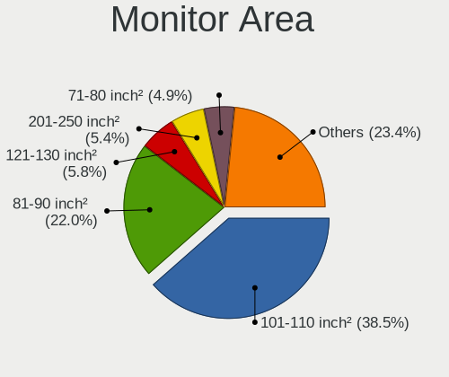
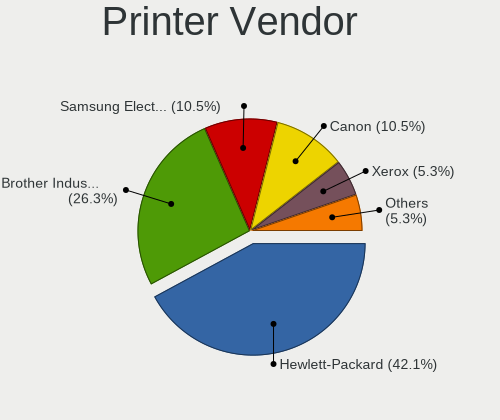
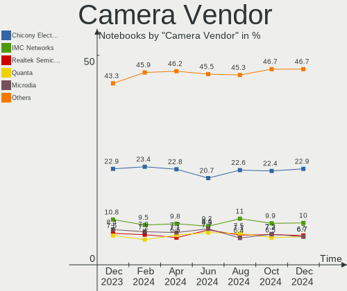

Linux Hardware Trends (Notebooks)
---------------------------------

A project to identify most popular hardware characteristics and track their change
over time based on data collected by Linux users at https://Linux-Hardware.org.

Anyone can contribute to this report by the [hw-probe](https://github.com/linuxhw/hw-probe) tool:

    sudo -E hw-probe -all -upload

Full-feature report is available here: https://linux-hardware.org/?view=trends

Period: Mar, 2022.

Contents
--------

* [ System ](#system)
  - [ OS                       ](#os)
  - [ OS Family                ](#os-family)
  - [ Kernel                   ](#kernel)
  - [ Kernel Family            ](#kernel-family)
  - [ Kernel Major Ver.        ](#kernel-major-ver)
  - [ Arch                     ](#arch)
  - [ DE                       ](#de)
  - [ Display Server           ](#display-server)
  - [ Display Manager          ](#display-manager)
  - [ OS Lang                  ](#os-lang)
  - [ Boot Mode                ](#boot-mode)
  - [ Filesystem               ](#filesystem)
  - [ Part. scheme             ](#part-scheme)
  - [ Dual Boot with Linux/BSD ](#dual-boot-with-linuxbsd)
  - [ Dual Boot (Win)          ](#dual-boot-win)

* [ Board ](#board)
  - [ Vendor                   ](#vendor)
  - [ Model                    ](#model)
  - [ Model Family             ](#model-family)
  - [ MFG Year                 ](#mfg-year)
  - [ Form Factor              ](#form-factor)
  - [ Secure Boot              ](#secure-boot)
  - [ Coreboot                 ](#coreboot)
  - [ RAM Size                 ](#ram-size)
  - [ RAM Used                 ](#ram-used)
  - [ Total Drives             ](#total-drives)
  - [ Has CD-ROM               ](#has-cd-rom)
  - [ Has Ethernet             ](#has-ethernet)
  - [ Has WiFi                 ](#has-wifi)
  - [ Has Bluetooth            ](#has-bluetooth)

* [ Location ](#location)
  - [ Country                  ](#country)
  - [ City                     ](#city)

* [ Drives ](#drives)
  - [ Drive Vendor             ](#drive-vendor)
  - [ Drive Model              ](#drive-model)
  - [ HDD Vendor               ](#hdd-vendor)
  - [ SSD Vendor               ](#ssd-vendor)
  - [ Drive Kind               ](#drive-kind)
  - [ Drive Connector          ](#drive-connector)
  - [ Drive Size               ](#drive-size)
  - [ Space Total              ](#space-total)
  - [ Space Used               ](#space-used)
  - [ Malfunc. Drives          ](#malfunc-drives)
  - [ Malfunc. Drive Vendor    ](#malfunc-drive-vendor)
  - [ Malfunc. HDD Vendor      ](#malfunc-hdd-vendor)
  - [ Malfunc. Drive Kind      ](#malfunc-drive-kind)
  - [ Failed Drives            ](#failed-drives)
  - [ Failed Drive Vendor      ](#failed-drive-vendor)
  - [ Drive Status             ](#drive-status)

* [ Storage controller ](#storage-controller)
  - [ Storage Vendor           ](#storage-vendor)
  - [ Storage Model            ](#storage-model)
  - [ Storage Kind             ](#storage-kind)

* [ Processor ](#processor)
  - [ CPU Vendor               ](#cpu-vendor)
  - [ CPU Model                ](#cpu-model)
  - [ CPU Model Family         ](#cpu-model-family)
  - [ CPU Cores                ](#cpu-cores)
  - [ CPU Sockets              ](#cpu-sockets)
  - [ CPU Threads              ](#cpu-threads)
  - [ CPU Op-Modes             ](#cpu-op-modes)
  - [ CPU Microcode            ](#cpu-microcode)
  - [ CPU Microarch            ](#cpu-microarch)

* [ Graphics ](#graphics)
  - [ GPU Vendor               ](#gpu-vendor)
  - [ GPU Model                ](#gpu-model)
  - [ GPU Combo                ](#gpu-combo)
  - [ GPU Driver               ](#gpu-driver)
  - [ GPU Memory               ](#gpu-memory)

* [ Monitor ](#monitor)
  - [ Monitor Vendor           ](#monitor-vendor)
  - [ Monitor Model            ](#monitor-model)
  - [ Monitor Resolution       ](#monitor-resolution)
  - [ Monitor Diagonal         ](#monitor-diagonal)
  - [ Monitor Width            ](#monitor-width)
  - [ Aspect Ratio             ](#aspect-ratio)
  - [ Monitor Area             ](#monitor-area)
  - [ Pixel Density            ](#pixel-density)
  - [ Multiple Monitors        ](#multiple-monitors)

* [ Network ](#network)
  - [ Net Controller Vendor    ](#net-controller-vendor)
  - [ Net Controller Model     ](#net-controller-model)
  - [ Wireless Vendor          ](#wireless-vendor)
  - [ Wireless Model           ](#wireless-model)
  - [ Ethernet Vendor          ](#ethernet-vendor)
  - [ Ethernet Model           ](#ethernet-model)
  - [ Net Controller Kind      ](#net-controller-kind)
  - [ Used Controller          ](#used-controller)
  - [ NICs                     ](#nics)
  - [ IPv6                     ](#ipv6)

* [ Bluetooth ](#bluetooth)
  - [ Bluetooth Vendor         ](#bluetooth-vendor)
  - [ Bluetooth Model          ](#bluetooth-model)

* [ Sound ](#sound)
  - [ Sound Vendor             ](#sound-vendor)
  - [ Sound Model              ](#sound-model)

* [ Memory ](#memory)
  - [ Memory Vendor            ](#memory-vendor)
  - [ Memory Model             ](#memory-model)
  - [ Memory Kind              ](#memory-kind)
  - [ Memory Form Factor       ](#memory-form-factor)
  - [ Memory Size              ](#memory-size)
  - [ Memory Speed             ](#memory-speed)

* [ Printers & scanners ](#printers--scanners)
  - [ Printer Vendor           ](#printer-vendor)
  - [ Printer Model            ](#printer-model)
  - [ Scanner Vendor           ](#scanner-vendor)
  - [ Scanner Model            ](#scanner-model)

* [ Camera ](#camera)
  - [ Camera Vendor            ](#camera-vendor)
  - [ Camera Model             ](#camera-model)

* [ Security ](#security)
  - [ Fingerprint Vendor       ](#fingerprint-vendor)
  - [ Fingerprint Model        ](#fingerprint-model)
  - [ Chipcard Vendor          ](#chipcard-vendor)
  - [ Chipcard Model           ](#chipcard-model)

* [ Unsupported ](#unsupported)
  - [ Unsupported Devices      ](#unsupported-devices)
  - [ Unsupported Device Types ](#unsupported-device-types)

System
------

OS
--

Installed operating systems

| Name                | Notebooks | Percent |
|---------------------|-----------|---------|
| Debian 11           | 490       | 16.62%  |
| Ubuntu 20.04        | 347       | 11.77%  |
| Linux Mint 20.3     | 211       | 7.15%   |
| OpenMandriva 4.3    | 189       | 6.41%   |
| Ubuntu 21.10        | 152       | 5.15%   |
| ROSA 12.2           | 147       | 4.98%   |
| Pop!_OS 21.10       | 146       | 4.95%   |
| Fedora 35           | 146       | 4.95%   |
| Zorin 16            | 94        | 3.19%   |
| KDE neon 20.04      | 74        | 2.51%   |
| Arch                | 54        | 1.83%   |
| Manjaro             | 47        | 1.59%   |
| Elementary 6.1      | 46        | 1.56%   |
| Kali 2022.1         | 33        | 1.12%   |
| BlackPanther 18.1   | 32        | 1.09%   |
| Manjaro 21.2.5      | 30        | 1.02%   |
| ROSA R11.1          | 29        | 0.98%   |
| Xubuntu 20.04       | 27        | 0.92%   |
| Ubuntu 18.04        | 27        | 0.92%   |
| Manjaro 21.2.4      | 25        | 0.85%   |
| Linux Mint 20.2     | 25        | 0.85%   |
| Arch Rolling        | 25        | 0.85%   |
| Kubuntu 20.04       | 24        | 0.81%   |
| ArcoLinux Rolling   | 22        | 0.75%   |
| Ubuntu 22.04        | 19        | 0.64%   |
| ROSA 12.1           | 19        | 0.64%   |
| Kubuntu 21.10       | 19        | 0.64%   |
| Endless 4.0.3       | 17        | 0.58%   |
| Pop!_OS 20.04       | 16        | 0.54%   |
| OpenMandriva 4.50   | 14        | 0.47%   |
| OpenMandriva 4.2    | 14        | 0.47%   |
| Linux Mint 19.3     | 11        | 0.37%   |
| Fedora 36           | 11        | 0.37%   |
| Ubuntu MATE 20.04   | 10        | 0.34%   |
| Parrot 5.0          | 9         | 0.31%   |
| Lubuntu 20.04       | 9         | 0.31%   |
| LMDE 5              | 9         | 0.31%   |
| EndeavourOS Rolling | 9         | 0.31%   |
| Zorin 15            | 8         | 0.27%   |
| Xubuntu 21.10       | 8         | 0.27%   |
| Ubuntu 21.04        | 8         | 0.27%   |
| Fedora 34           | 8         | 0.27%   |
| Ubuntu Budgie 20.04 | 7         | 0.24%   |
| Lubuntu 21.10       | 7         | 0.24%   |
| LMDE 4              | 7         | 0.24%   |
| Linux Mint 20.1     | 7         | 0.24%   |
| Xubuntu 18.04       | 6         | 0.2%    |
| Xero Rolling        | 6         | 0.2%    |
| SteamOS Snapshot    | 6         | 0.2%    |
| Gentoo 2.7          | 6         | 0.2%    |
| Gentoo 2.6          | 6         | 0.2%    |
| Endless 3.9.6       | 6         | 0.2%    |
| EndeavourOS         | 6         | 0.2%    |
| ALT Linux 10.0      | 6         | 0.2%    |
| Ubuntu Budgie 21.10 | 5         | 0.17%   |
| Oracle Linux 8.5    | 5         | 0.17%   |
| LinuxFX 11          | 5         | 0.17%   |
| Kubuntu 11          | 5         | 0.17%   |
| Gentoo 2.8          | 5         | 0.17%   |
| Debian 10           | 5         | 0.17%   |

OS Family
---------

OS without a version

| Name             | Notebooks | Percent |
|------------------|-----------|---------|
| Ubuntu           | 558       | 18.92%  |
| Debian           | 503       | 17.06%  |
| Linux Mint       | 264       | 8.95%   |
| OpenMandriva     | 218       | 7.39%   |
| ROSA             | 200       | 6.78%   |
| Fedora           | 168       | 5.7%    |
| Pop!_OS          | 165       | 5.6%    |
| Zorin            | 103       | 3.49%   |
| Manjaro          | 103       | 3.49%   |
| Arch             | 79        | 2.68%   |
| KDE neon         | 74        | 2.51%   |
| Kubuntu          | 50        | 1.7%    |
| Elementary       | 50        | 1.7%    |
| Xubuntu          | 43        | 1.46%   |
| Kali             | 35        | 1.19%   |
| BlackPanther     | 32        | 1.09%   |
| Endless          | 31        | 1.05%   |
| ArcoLinux        | 25        | 0.85%   |
| Lubuntu          | 18        | 0.61%   |
| Gentoo           | 18        | 0.61%   |
| openSUSE         | 17        | 0.58%   |
| LMDE             | 16        | 0.54%   |
| EndeavourOS      | 15        | 0.51%   |
| Ubuntu MATE      | 13        | 0.44%   |
| Parrot           | 13        | 0.44%   |
| Ubuntu Budgie    | 12        | 0.41%   |
| Clear Linux      | 11        | 0.37%   |
| Xero             | 9         | 0.31%   |
| Garuda Linux     | 8         | 0.27%   |
| ALT Linux        | 8         | 0.27%   |
| SteamOS          | 6         | 0.2%    |
| Oracle Linux     | 5         | 0.17%   |
| NixOS            | 5         | 0.17%   |
| MX               | 5         | 0.17%   |
| LinuxFX          | 5         | 0.17%   |
| Linux Lite       | 5         | 0.17%   |
| Alpine           | 5         | 0.17%   |
| Slackware        | 4         | 0.14%   |
| Red OS           | 4         | 0.14%   |
| RHEL             | 3         | 0.1%    |
| Q4OS             | 3         | 0.1%    |
| Peppermint       | 3         | 0.1%    |
| Void Linux       | 2         | 0.07%   |
| UbuntuDDE        | 2         | 0.07%   |
| Ubuntu Studio    | 2         | 0.07%   |
| Solus            | 2         | 0.07%   |
| Rocky Linux      | 2         | 0.07%   |
| Pardus           | 2         | 0.07%   |
| Org.kde.platform | 2         | 0.07%   |
| Devuan           | 2         | 0.07%   |
| CentOS           | 2         | 0.07%   |
| BunsenLabs       | 2         | 0.07%   |
| Artix            | 2         | 0.07%   |
| Arch ARM         | 2         | 0.07%   |
| antiX            | 2         | 0.07%   |
| SystemRescue     | 1         | 0.03%   |
| Storm OS         | 1         | 0.03%   |
| Sparky           | 1         | 0.03%   |
| Siduction        | 1         | 0.03%   |
| PureOS           | 1         | 0.03%   |

Kernel
------

Version of the Linux kernel

| Version                            | Notebooks | Percent |
|------------------------------------|-----------|---------|
| 5.10.0-10-amd64                    | 377       | 12.78%  |
| 5.13.0-35-generic                  | 283       | 9.6%    |
| 5.13.0-30-generic                  | 206       | 6.99%   |
| 5.16.7-desktop-1omv4003            | 184       | 6.24%   |
| 5.10.74-generic-2rosa2021.1-x86_64 | 157       | 5.32%   |
| 5.13.0-37-generic                  | 139       | 4.71%   |
| 5.16.11-76051611-generic           | 126       | 4.27%   |
| 5.4.0-104-generic                  | 106       | 3.59%   |
| 5.4.0-100-generic                  | 84        | 2.85%   |
| 5.4.0-105-generic                  | 70        | 2.37%   |
| 5.10.0-12-amd64                    | 46        | 1.56%   |
| 5.16.12-200.fc35.x86_64            | 36        | 1.22%   |
| 5.13.0-39-generic                  | 36        | 1.22%   |
| 5.16.16-200.fc35.x86_64            | 34        | 1.15%   |
| 5.15.28-1-MANJARO                  | 29        | 0.98%   |
| 5.10.0-11-amd64                    | 26        | 0.88%   |
| 5.16.16-arch1-1                    | 25        | 0.85%   |
| 5.15.25-1-MANJARO                  | 22        | 0.75%   |
| 5.11.0-35-generic                  | 20        | 0.68%   |
| 5.16.15-arch1-1                    | 19        | 0.64%   |
| 5.15.23-76051523-generic           | 18        | 0.61%   |
| 5.6.14-desktop-2bP                 | 17        | 0.58%   |
| 5.16.11-200.fc35.x86_64            | 17        | 0.58%   |
| 5.13.0-28-generic                  | 17        | 0.58%   |
| 5.13.0-27-generic                  | 17        | 0.58%   |
| 5.16.11-2-MANJARO                  | 15        | 0.51%   |
| 4.18.16-desktop-1bP                | 15        | 0.51%   |
| 5.10.0-13-amd64                    | 14        | 0.47%   |
| 5.4.0-91-generic                   | 13        | 0.44%   |
| 5.16.14-arch1-1                    | 13        | 0.44%   |
| 5.16.13-arch1-1                    | 13        | 0.44%   |
| 5.10.14-desktop-1omv4002           | 13        | 0.44%   |
| 5.4.0-107-generic                  | 12        | 0.41%   |
| 5.16.14-200.fc35.x86_64            | 12        | 0.41%   |
| 5.14.7-desktop-1omv4050            | 12        | 0.41%   |
| 5.16.15-201.fc35.x86_64            | 11        | 0.37%   |
| 5.16.12-arch1-1                    | 11        | 0.37%   |
| 5.15.0-kali3-amd64                 | 11        | 0.37%   |
| 5.16.18-200.fc35.x86_64            | 10        | 0.34%   |
| 5.16.14-1-MANJARO                  | 10        | 0.34%   |
| 5.13.0-19-generic                  | 10        | 0.34%   |
| 5.10.0-7-amd64                     | 10        | 0.34%   |
| 5.10.0-13-686-pae                  | 10        | 0.34%   |
| 4.15.0-171-generic                 | 10        | 0.34%   |
| 5.8.0-14-generic                   | 9         | 0.31%   |
| 5.4.32-generic-2rosa-x86_64        | 9         | 0.31%   |
| 5.15.15-76051515-generic           | 9         | 0.31%   |
| 5.15.0-23-generic                  | 9         | 0.31%   |
| 5.14.10-300.fc35.x86_64            | 9         | 0.31%   |
| 5.8.0-43-generic                   | 8         | 0.27%   |
| 5.4.83-generic-2rosa-x86_64        | 8         | 0.27%   |
| 5.16.16-zen1-1-zen                 | 8         | 0.27%   |
| 5.16.0-kali3-amd64                 | 8         | 0.27%   |
| 5.14.0-1029-oem                    | 8         | 0.27%   |
| 5.14.0-1027-oem                    | 8         | 0.27%   |
| 5.13.0-32-generic                  | 8         | 0.27%   |
| 5.17.1-arch1-1                     | 7         | 0.24%   |
| 5.14.0-1024-oem                    | 7         | 0.24%   |
| 5.11.0-49-generic                  | 7         | 0.24%   |
| 5.10.74-generic-2rosa2021.1-i586   | 7         | 0.24%   |

Kernel Family
-------------

Linux kernel without a distro release

| Version  | Notebooks | Percent |
|----------|-----------|---------|
| 5.13.0   | 755       | 25.6%   |
| 5.10.0   | 500       | 16.95%  |
| 5.4.0    | 316       | 10.72%  |
| 5.16.7   | 186       | 6.31%   |
| 5.16.11  | 179       | 6.07%   |
| 5.10.74  | 164       | 5.56%   |
| 5.16.16  | 73        | 2.48%   |
| 5.16.12  | 62        | 2.1%    |
| 5.16.14  | 47        | 1.59%   |
| 5.11.0   | 47        | 1.59%   |
| 5.16.0   | 44        | 1.49%   |
| 5.15.0   | 43        | 1.46%   |
| 5.16.15  | 39        | 1.32%   |
| 5.14.0   | 35        | 1.19%   |
| 4.15.0   | 32        | 1.09%   |
| 5.15.28  | 31        | 1.05%   |
| 5.16.13  | 27        | 0.92%   |
| 5.15.25  | 27        | 0.92%   |
| 5.8.0    | 24        | 0.81%   |
| 5.17.0   | 22        | 0.75%   |
| 5.15.23  | 21        | 0.71%   |
| 5.6.14   | 17        | 0.58%   |
| 4.19.0   | 15        | 0.51%   |
| 4.18.16  | 15        | 0.51%   |
| 5.17.1   | 14        | 0.47%   |
| 5.10.14  | 13        | 0.44%   |
| 5.15.26  | 12        | 0.41%   |
| 5.14.7   | 12        | 0.41%   |
| 5.4.32   | 11        | 0.37%   |
| 5.4.83   | 10        | 0.34%   |
| 5.16.18  | 10        | 0.34%   |
| 5.16.17  | 10        | 0.34%   |
| 5.15.15  | 9         | 0.31%   |
| 5.14.10  | 9         | 0.31%   |
| 4.18.0   | 8         | 0.27%   |
| 5.16.9   | 6         | 0.2%    |
| 5.16.10  | 6         | 0.2%    |
| 5.10.102 | 5         | 0.17%   |
| 5.3.18   | 4         | 0.14%   |
| 5.16.2   | 4         | 0.14%   |
| 5.10.88  | 4         | 0.14%   |
| 5.4.184  | 3         | 0.1%    |
| 5.4.17   | 3         | 0.1%    |
| 5.15.31  | 3         | 0.1%    |
| 5.15.30  | 3         | 0.1%    |
| 5.15.27  | 3         | 0.1%    |
| 5.15.19  | 3         | 0.1%    |
| 5.15.11  | 3         | 0.1%    |
| 5.15.10  | 3         | 0.1%    |
| 5.14.21  | 3         | 0.1%    |
| 5.14.18  | 3         | 0.1%    |
| 5.10.71  | 3         | 0.1%    |
| 5.10.105 | 3         | 0.1%    |
| 5.3.0    | 2         | 0.07%   |
| 5.16.8   | 2         | 0.07%   |
| 5.16.5   | 2         | 0.07%   |
| 5.15.29  | 2         | 0.07%   |
| 5.15.22  | 2         | 0.07%   |
| 5.10.29  | 2         | 0.07%   |
| 5.10.103 | 2         | 0.07%   |

Kernel Major Ver.
-----------------

Linux kernel major version

| Version | Notebooks | Percent |
|---------|-----------|---------|
| 5.13    | 755       | 25.6%   |
| 5.10    | 702       | 23.8%   |
| 5.16    | 698       | 23.67%  |
| 5.4     | 346       | 11.73%  |
| 5.15    | 172       | 5.83%   |
| 5.14    | 64        | 2.17%   |
| 5.11    | 49        | 1.66%   |
| 5.17    | 36        | 1.22%   |
| 4.15    | 32        | 1.09%   |
| 5.8     | 24        | 0.81%   |
| 4.18    | 23        | 0.78%   |
| 5.6     | 17        | 0.58%   |
| 4.19    | 15        | 0.51%   |
| 5.3     | 6         | 0.2%    |
| 4.9     | 3         | 0.1%    |
| 5.0     | 2         | 0.07%   |
| 5.9     | 1         | 0.03%   |
| 5.15.6  | 1         | 0.03%   |
| 5       | 1         | 0.03%   |
| 4.4     | 1         | 0.03%   |
| 4.16    | 1         | 0.03%   |

Arch
----

OS architecture (x86_64, i586, etc.)

| Name    | Notebooks | Percent |
|---------|-----------|---------|
| x86_64  | 2884      | 97.8%   |
| i686    | 62        | 2.1%    |
| aarch64 | 3         | 0.1%    |

DE
--

Desktop Environment

| Name             | Notebooks | Percent |
|------------------|-----------|---------|
| GNOME            | 1145      | 38.83%  |
| KDE5             | 639       | 21.67%  |
| Unknown          | 458       | 15.53%  |
| X-Cinnamon       | 212       | 7.19%   |
| XFCE             | 196       | 6.65%   |
| MATE             | 83        | 2.81%   |
| Pantheon         | 51        | 1.73%   |
| LXQt             | 43        | 1.46%   |
| Cinnamon         | 23        | 0.78%   |
| KDE4             | 17        | 0.58%   |
| Budgie           | 15        | 0.51%   |
| GNOME Flashback  | 9         | 0.31%   |
| i3               | 8         | 0.27%   |
| Unity            | 7         | 0.24%   |
| KDE              | 7         | 0.24%   |
| LXDE             | 6         | 0.2%    |
| Deepin           | 4         | 0.14%   |
| awesome          | 4         | 0.14%   |
| trinity          | 3         | 0.1%    |
| GNOME Classic    | 3         | 0.1%    |
| sway             | 2         | 0.07%   |
| openbox          | 2         | 0.07%   |
| lightdm-xsession | 2         | 0.07%   |
| icewm            | 2         | 0.07%   |
| dwm              | 2         | 0.07%   |
| river            | 1         | 0.03%   |
| qtile-default    | 1         | 0.03%   |
| qtile            | 1         | 0.03%   |
| Lubuntu          | 1         | 0.03%   |
| Enlightenment    | 1         | 0.03%   |
| bspwm            | 1         | 0.03%   |

Display Server
--------------

X11 or Wayland

| Name    | Notebooks | Percent |
|---------|-----------|---------|
| X11     | 1986      | 67.34%  |
| Wayland | 514       | 17.43%  |
| Unknown | 423       | 14.34%  |
| Tty     | 26        | 0.88%   |

Display Manager
---------------

SDDM, LightDM, etc.

| Name    | Notebooks | Percent |
|---------|-----------|---------|
| Unknown | 1246      | 42.25%  |
| SDDM    | 495       | 16.79%  |
| GDM     | 450       | 15.26%  |
| GDM3    | 375       | 12.72%  |
| LightDM | 358       | 12.14%  |
| KDM     | 17        | 0.58%   |
| LXDM    | 3         | 0.1%    |
| XDM     | 2         | 0.07%   |
| TDM     | 1         | 0.03%   |
| SLiM    | 1         | 0.03%   |
| MDM     | 1         | 0.03%   |

OS Lang
-------

Language

| Lang    | Notebooks | Percent |
|---------|-----------|---------|
| en_US   | 1088      | 36.89%  |
| Unknown | 423       | 14.34%  |
| ru_RU   | 272       | 9.22%   |
| de_DE   | 166       | 5.63%   |
| pt_BR   | 128       | 4.34%   |
| en_GB   | 125       | 4.24%   |
| fr_FR   | 106       | 3.59%   |
| it_IT   | 77        | 2.61%   |
| en_CA   | 42        | 1.42%   |
| es_ES   | 41        | 1.39%   |
| en_IN   | 38        | 1.29%   |
| pl_PL   | 37        | 1.25%   |
| cs_CZ   | 32        | 1.09%   |
| en_AU   | 30        | 1.02%   |
| C       | 25        | 0.85%   |
| es_MX   | 24        | 0.81%   |
| zh_CN   | 18        | 0.61%   |
| en_ZA   | 18        | 0.61%   |
| tr_TR   | 14        | 0.47%   |
| pt_PT   | 14        | 0.47%   |
| nl_NL   | 14        | 0.47%   |
| es_AR   | 14        | 0.47%   |
| hu_HU   | 11        | 0.37%   |
| de_AT   | 11        | 0.37%   |
| nl_BE   | 10        | 0.34%   |
| fr_CA   | 10        | 0.34%   |
| es_EC   | 8         | 0.27%   |
| es_CO   | 8         | 0.27%   |
| da_DK   | 8         | 0.27%   |
| sk_SK   | 7         | 0.24%   |
| fr_BE   | 6         | 0.2%    |
| en_NZ   | 6         | 0.2%    |
| en_IE   | 6         | 0.2%    |
| el_GR   | 6         | 0.2%    |
| sv_SE   | 5         | 0.17%   |
| nb_NO   | 5         | 0.17%   |
| es_CL   | 5         | 0.17%   |
| en_SG   | 5         | 0.17%   |
| de_CH   | 5         | 0.17%   |
| ru_UA   | 4         | 0.14%   |
| es_VE   | 4         | 0.14%   |
| es_PE   | 4         | 0.14%   |
| en_PH   | 4         | 0.14%   |
| en_DK   | 4         | 0.14%   |
| ko_KR   | 3         | 0.1%    |
| ja_JP   | 3         | 0.1%    |
| fi_FI   | 3         | 0.1%    |
| en_IL   | 3         | 0.1%    |
| en_HK   | 3         | 0.1%    |
| C.UTF8  | 3         | 0.1%    |
| zh_TW   | 2         | 0.07%   |
| ro_RO   | 2         | 0.07%   |
| lt_LT   | 2         | 0.07%   |
| id_ID   | 2         | 0.07%   |
| hr_HR   | 2         | 0.07%   |
| fr_CH   | 2         | 0.07%   |
| eu_ES   | 2         | 0.07%   |
| es_UY   | 2         | 0.07%   |
| es_PY   | 2         | 0.07%   |
| es_CR   | 2         | 0.07%   |

Boot Mode
---------

EFI or BIOS

| Mode | Notebooks | Percent |
|------|-----------|---------|
| EFI  | 1741      | 59.04%  |
| BIOS | 1208      | 40.96%  |

Filesystem
----------

Type of filesystem

| Type    | Notebooks | Percent |
|---------|-----------|---------|
| Ext4    | 2007      | 68.06%  |
| Overlay | 632       | 21.43%  |
| Btrfs   | 249       | 8.44%   |
| Xfs     | 24        | 0.81%   |
| Zfs     | 16        | 0.54%   |
| Ext2    | 7         | 0.24%   |
| F2fs    | 4         | 0.14%   |
| Ext3    | 4         | 0.14%   |
| Tmpfs   | 3         | 0.1%    |
| Aufs    | 2         | 0.07%   |
| Unknown | 1         | 0.03%   |

Part. scheme
------------

Scheme of partitioning

| Type    | Notebooks | Percent |
|---------|-----------|---------|
| GPT     | 1343      | 45.54%  |
| Unknown | 1276      | 43.27%  |
| MBR     | 330       | 11.19%  |

Dual Boot with Linux/BSD
------------------------

Hosting more than one Linux/BSD

| Dual boot | Notebooks | Percent |
|-----------|-----------|---------|
| No        | 2299      | 77.96%  |
| Yes       | 650       | 22.04%  |

Dual Boot (Win)
---------------

Hosting Linux and Windows

| Dual boot | Notebooks | Percent |
|-----------|-----------|---------|
| No        | 2247      | 76.2%   |
| Yes       | 702       | 23.8%   |

Board
-----

Vendor
------

Motherboard manufacturer

| Name                           | Notebooks | Percent |
|--------------------------------|-----------|---------|
| Lenovo                         | 486       | 16.48%  |
| Hewlett-Packard                | 465       | 15.77%  |
| Apple                          | 433       | 14.68%  |
| Dell                           | 421       | 14.28%  |
| ASUSTek Computer               | 299       | 10.14%  |
| Acer                           | 237       | 8.04%   |
| Toshiba                        | 84        | 2.85%   |
| MSI                            | 64        | 2.17%   |
| Samsung Electronics            | 56        | 1.9%    |
| HUAWEI                         | 40        | 1.36%   |
| Sony                           | 37        | 1.25%   |
| Fujitsu                        | 21        | 0.71%   |
| Packard Bell                   | 19        | 0.64%   |
| Positivo                       | 18        | 0.61%   |
| Fujitsu Siemens                | 15        | 0.51%   |
| Unknown                        | 15        | 0.51%   |
| Timi                           | 12        | 0.41%   |
| System76                       | 12        | 0.41%   |
| Notebook                       | 12        | 0.41%   |
| Medion                         | 10        | 0.34%   |
| TUXEDO                         | 9         | 0.31%   |
| Google                         | 8         | 0.27%   |
| Avell High Performance         | 8         | 0.27%   |
| eMachines                      | 7         | 0.24%   |
| Valve                          | 6         | 0.2%    |
| Panasonic                      | 6         | 0.2%    |
| Chuwi                          | 6         | 0.2%    |
| Alienware                      | 6         | 0.2%    |
| Razer                          | 5         | 0.17%   |
| LG Electronics                 | 5         | 0.17%   |
| HONOR                          | 5         | 0.17%   |
| Framework                      | 5         | 0.17%   |
| Clevo                          | 5         | 0.17%   |
| Aquarius                       | 5         | 0.17%   |
| Teclast                        | 4         | 0.14%   |
| Positivo Bahia - VAIO          | 4         | 0.14%   |
| Philco                         | 4         | 0.14%   |
| Intel                          | 4         | 0.14%   |
| GPU Company                    | 4         | 0.14%   |
| Gigabyte Technology            | 4         | 0.14%   |
| Thomson                        | 3         | 0.1%    |
| Schenker                       | 3         | 0.1%    |
| Multilaser                     | 3         | 0.1%    |
| Gateway                        | 3         | 0.1%    |
| AMI                            | 3         | 0.1%    |
| MOTILE                         | 2         | 0.07%   |
| Microtech                      | 2         | 0.07%   |
| Matsushita Electric Industrial | 2         | 0.07%   |
| Insyde                         | 2         | 0.07%   |
| Haier                          | 2         | 0.07%   |
| Getac                          | 2         | 0.07%   |
| Eluktronics                    | 2         | 0.07%   |
| AXDIA International            | 2         | 0.07%   |
| 3Logic Group                   | 2         | 0.07%   |
| Vulcan Electronics             | 1         | 0.03%   |
| VIT                            | 1         | 0.03%   |
| VALE                           | 1         | 0.03%   |
| UNOWHY                         | 1         | 0.03%   |
| THUNDEROBOT                    | 1         | 0.03%   |
| SHENZHEN YOUDISI E-COMMERCE    | 1         | 0.03%   |

Model
-----

Motherboard model

| Name                                | Notebooks | Percent |
|-------------------------------------|-----------|---------|
| Apple MacBook5,2                    | 286       | 9.7%    |
| Apple MacBook2,1                    | 52        | 1.76%   |
| Unknown                             | 26        | 0.88%   |
| Apple MacBook4,1                    | 21        | 0.71%   |
| HP Notebook                         | 16        | 0.54%   |
| HP Pavilion g6                      | 15        | 0.51%   |
| ASUS UX31E                          | 14        | 0.47%   |
| HP Pavilion dv7                     | 10        | 0.34%   |
| Dell Latitude E6420                 | 10        | 0.34%   |
| Lenovo IdeaPad S145-15IIL 82DJ      | 8         | 0.27%   |
| HUAWEI HVY-WXX9                     | 8         | 0.27%   |
| Apple MacBook7,1                    | 8         | 0.27%   |
| Acer Swift SF314-42                 | 8         | 0.27%   |
| HP Pavilion dv6                     | 7         | 0.24%   |
| HP Laptop 15-da0xxx                 | 7         | 0.24%   |
| HP Laptop 15-bw0xx                  | 7         | 0.24%   |
| HP Laptop 15-bs0xx                  | 7         | 0.24%   |
| Dell XPS 15 7590                    | 7         | 0.24%   |
| Dell Latitude E6430                 | 7         | 0.24%   |
| Apple MacBookPro9,2                 | 7         | 0.24%   |
| Acer Nitro AN515-44                 | 7         | 0.24%   |
| Valve Jupiter                       | 6         | 0.2%    |
| Lenovo ThinkBook 15 G2 ITL 20VE     | 6         | 0.2%    |
| Lenovo IdeaPad 5 Pro 14ACN6 82L7    | 6         | 0.2%    |
| HP Pavilion Notebook                | 6         | 0.2%    |
| HP Pavilion 17                      | 6         | 0.2%    |
| HP Laptop 15-db0xxx                 | 6         | 0.2%    |
| Dell Inspiron 5100                  | 6         | 0.2%    |
| Dell Inspiron 1545                  | 6         | 0.2%    |
| Apple MacBookPro12,1                | 6         | 0.2%    |
| Apple MacBookAir7,2                 | 6         | 0.2%    |
| Lenovo ThinkBook 16p Gen 2 20YM     | 5         | 0.17%   |
| HP Pavilion g7                      | 5         | 0.17%   |
| HP Pavilion g4                      | 5         | 0.17%   |
| HP EliteBook 840 G3                 | 5         | 0.17%   |
| Framework Laptop                    | 5         | 0.17%   |
| Dell XPS 15 9500                    | 5         | 0.17%   |
| Dell Latitude E7470                 | 5         | 0.17%   |
| Dell Latitude E6400                 | 5         | 0.17%   |
| Dell Latitude E5430 non-vPro        | 5         | 0.17%   |
| Dell Latitude D630                  | 5         | 0.17%   |
| Dell Latitude 5520                  | 5         | 0.17%   |
| Acer Aspire E5-573G                 | 5         | 0.17%   |
| System76 Oryx Pro                   | 4         | 0.14%   |
| Lenovo Legion 5 Pro 16ACH6H 82JQ    | 4         | 0.14%   |
| Lenovo G505s 20255                  | 4         | 0.14%   |
| Lenovo G50-70 20351                 | 4         | 0.14%   |
| Lenovo G50-45 80E3                  | 4         | 0.14%   |
| HUAWEI NBLK-WAX9X                   | 4         | 0.14%   |
| HUAWEI KLVL-WXX9                    | 4         | 0.14%   |
| HP Pavilion Gaming Laptop 15-ec1xxx | 4         | 0.14%   |
| HP Pavilion Aero Laptop 13-be0xxx   | 4         | 0.14%   |
| HP Pavilion 15                      | 4         | 0.14%   |
| HP OMEN Laptop 15-en0xxx            | 4         | 0.14%   |
| HP Laptop 15-dw3xxx                 | 4         | 0.14%   |
| HP EliteBook 8470p                  | 4         | 0.14%   |
| HP EliteBook 8460p                  | 4         | 0.14%   |
| HP EliteBook 840 G4                 | 4         | 0.14%   |
| HP 255 G7 Notebook PC               | 4         | 0.14%   |
| HP 15 Notebook PC                   | 4         | 0.14%   |

Model Family
------------

Motherboard model prefix

| Name                    | Notebooks | Percent |
|-------------------------|-----------|---------|
| Apple MacBook5          | 288       | 9.77%   |
| Lenovo ThinkPad         | 220       | 7.46%   |
| Dell Latitude           | 165       | 5.6%    |
| Acer Aspire             | 148       | 5.02%   |
| Lenovo IdeaPad          | 130       | 4.41%   |
| Dell Inspiron           | 122       | 4.14%   |
| HP Pavilion             | 112       | 3.8%    |
| HP Laptop               | 78        | 2.64%   |
| Toshiba Satellite       | 72        | 2.44%   |
| HP EliteBook            | 67        | 2.27%   |
| HP ProBook              | 57        | 1.93%   |
| Apple MacBook2          | 52        | 1.76%   |
| ASUS VivoBook           | 51        | 1.73%   |
| Dell XPS                | 49        | 1.66%   |
| Dell Vostro             | 30        | 1.02%   |
| Dell Precision          | 27        | 0.92%   |
| Acer Swift              | 27        | 0.92%   |
| Lenovo Legion           | 26        | 0.88%   |
| Unknown                 | 26        | 0.88%   |
| Acer Nitro              | 23        | 0.78%   |
| ASUS ROG                | 22        | 0.75%   |
| Apple MacBook4          | 21        | 0.71%   |
| Lenovo ThinkBook        | 18        | 0.61%   |
| HP ZBook                | 17        | 0.58%   |
| HP Notebook             | 17        | 0.58%   |
| Fujitsu LIFEBOOK        | 17        | 0.58%   |
| Packard Bell EasyNote   | 15        | 0.51%   |
| HP Compaq               | 15        | 0.51%   |
| HP ENVY                 | 14        | 0.47%   |
| ASUS UX31E              | 14        | 0.47%   |
| ASUS ZenBook            | 13        | 0.44%   |
| HP OMEN                 | 12        | 0.41%   |
| HP 250                  | 12        | 0.41%   |
| ASUS ASUS               | 12        | 0.41%   |
| Acer TravelMate         | 12        | 0.41%   |
| HP 255                  | 10        | 0.34%   |
| HP Stream               | 9         | 0.31%   |
| ASUS TUF                | 9         | 0.31%   |
| HUAWEI HVY-WXX9         | 8         | 0.27%   |
| Apple MacBookPro9       | 8         | 0.27%   |
| Apple MacBook7          | 8         | 0.27%   |
| HP 15                   | 7         | 0.24%   |
| Fujitsu Siemens AMILO   | 7         | 0.24%   |
| Dell System             | 7         | 0.24%   |
| Apple MacBookAir7       | 7         | 0.24%   |
| Valve Jupiter           | 6         | 0.2%    |
| MSI Modern              | 6         | 0.2%    |
| Fujitsu Siemens ESPRIMO | 6         | 0.2%    |
| Apple MacBookPro12      | 6         | 0.2%    |
| Acer Extensa            | 6         | 0.2%    |
| Timi RedmiBook          | 5         | 0.17%   |
| Razer Blade             | 5         | 0.17%   |
| HP Presario             | 5         | 0.17%   |
| Framework Laptop        | 5         | 0.17%   |
| Dell Studio             | 5         | 0.17%   |
| Dell G5                 | 5         | 0.17%   |
| Aquarius NS585          | 5         | 0.17%   |
| Apple MacBookPro6       | 5         | 0.17%   |
| Acer Predator           | 5         | 0.17%   |
| Toshiba TECRA           | 4         | 0.14%   |

MFG Year
--------

Motherboard manufacture year

| Year    | Notebooks | Percent |
|---------|-----------|---------|
| 2009    | 369       | 12.51%  |
| 2020    | 326       | 11.05%  |
| 2021    | 323       | 10.95%  |
| 2011    | 225       | 7.63%   |
| 2019    | 208       | 7.05%   |
| 2012    | 194       | 6.58%   |
| 2018    | 180       | 6.1%    |
| 2013    | 172       | 5.83%   |
| 2017    | 156       | 5.29%   |
| 2016    | 135       | 4.58%   |
| 2015    | 134       | 4.54%   |
| 2014    | 132       | 4.48%   |
| 2010    | 123       | 4.17%   |
| 2008    | 116       | 3.93%   |
| 2007    | 102       | 3.46%   |
| 2006    | 19        | 0.64%   |
| Unknown | 10        | 0.34%   |
| 2022    | 8         | 0.27%   |
| 2005    | 8         | 0.27%   |
| 2003    | 8         | 0.27%   |
| 2002    | 1         | 0.03%   |

Form Factor
-----------

Physical design of the computer

| Name     | Notebooks | Percent |
|----------|-----------|---------|
| Notebook | 2949      | 100%    |

Secure Boot
-----------

Enabled or disabled

| State    | Notebooks | Percent |
|----------|-----------|---------|
| Disabled | 2697      | 91.45%  |
| Enabled  | 252       | 8.55%   |

Coreboot
--------

Have coreboot on board

| Used | Notebooks | Percent |
|------|-----------|---------|
| No   | 2934      | 99.49%  |
| Yes  | 15        | 0.51%   |

RAM Size
--------

Total RAM memory

| Size in GB  | Notebooks | Percent |
|-------------|-----------|---------|
| 4.01-8.0    | 784       | 26.59%  |
| 3.01-4.0    | 567       | 19.23%  |
| 1.01-2.0    | 450       | 15.26%  |
| 8.01-16.0   | 432       | 14.65%  |
| 16.01-24.0  | 405       | 13.73%  |
| 32.01-64.0  | 169       | 5.73%   |
| 2.01-3.0    | 58        | 1.97%   |
| 0.51-1.0    | 33        | 1.12%   |
| 64.01-256.0 | 25        | 0.85%   |
| 24.01-32.0  | 20        | 0.68%   |
| 0.01-0.5    | 6         | 0.2%    |

RAM Used
--------

Used RAM memory

| Used GB    | Notebooks | Percent |
|------------|-----------|---------|
| 1.01-2.0   | 1346      | 45.64%  |
| 2.01-3.0   | 640       | 21.7%   |
| 4.01-8.0   | 333       | 11.29%  |
| 3.01-4.0   | 289       | 9.8%    |
| 0.51-1.0   | 215       | 7.29%   |
| 8.01-16.0  | 76        | 2.58%   |
| 0.01-0.5   | 38        | 1.29%   |
| 16.01-24.0 | 10        | 0.34%   |
| 24.01-32.0 | 2         | 0.07%   |

Total Drives
------------

Number of drives on board

| Drives | Notebooks | Percent |
|--------|-----------|---------|
| 1      | 2232      | 75.69%  |
| 2      | 603       | 20.45%  |
| 3      | 72        | 2.44%   |
| 0      | 25        | 0.85%   |
| 4      | 13        | 0.44%   |
| 5      | 3         | 0.1%    |
| 6      | 1         | 0.03%   |

Has CD-ROM
----------

Has CD-ROM on board

| Presented | Notebooks | Percent |
|-----------|-----------|---------|
| No        | 1674      | 56.77%  |
| Yes       | 1275      | 43.23%  |

Has Ethernet
------------

Has Ethernet on board

| Presented | Notebooks | Percent |
|-----------|-----------|---------|
| Yes       | 2443      | 82.84%  |
| No        | 506       | 17.16%  |

Has WiFi
--------

Has WiFi module

| Presented | Notebooks | Percent |
|-----------|-----------|---------|
| Yes       | 2897      | 98.24%  |
| No        | 52        | 1.76%   |

Has Bluetooth
-------------

Has Bluetooth module

| Presented | Notebooks | Percent |
|-----------|-----------|---------|
| Yes       | 2342      | 79.42%  |
| No        | 607       | 20.58%  |

Location
--------

Country
-------

Geographic location (country)

| Country      | Notebooks | Percent |
|--------------|-----------|---------|
| USA          | 797       | 27.03%  |
| Russia       | 297       | 10.07%  |
| Germany      | 201       | 6.82%   |
| Brazil       | 182       | 6.17%   |
| France       | 135       | 4.58%   |
| Italy        | 97        | 3.29%   |
| UK           | 90        | 3.05%   |
| Poland       | 67        | 2.27%   |
| Canada       | 64        | 2.17%   |
| Spain        | 63        | 2.14%   |
| India        | 47        | 1.59%   |
| Czechia      | 46        | 1.56%   |
| Netherlands  | 45        | 1.53%   |
| Turkey       | 38        | 1.29%   |
| Hungary      | 38        | 1.29%   |
| Australia    | 36        | 1.22%   |
| Mexico       | 34        | 1.15%   |
| Indonesia    | 33        | 1.12%   |
| Portugal     | 30        | 1.02%   |
| Austria      | 28        | 0.95%   |
| Argentina    | 28        | 0.95%   |
| China        | 27        | 0.92%   |
| Switzerland  | 26        | 0.88%   |
| Romania      | 24        | 0.81%   |
| Belgium      | 24        | 0.81%   |
| South Africa | 22        | 0.75%   |
| Colombia     | 20        | 0.68%   |
| Norway       | 18        | 0.61%   |
| Ukraine      | 17        | 0.58%   |
| Sweden       | 17        | 0.58%   |
| Greece       | 16        | 0.54%   |
| Denmark      | 15        | 0.51%   |
| Bulgaria     | 14        | 0.47%   |
| Belarus      | 14        | 0.47%   |
| Finland      | 13        | 0.44%   |
| Slovakia     | 12        | 0.41%   |
| Iran         | 12        | 0.41%   |
| Ecuador      | 12        | 0.41%   |
| Japan        | 11        | 0.37%   |
| New Zealand  | 10        | 0.34%   |
| Egypt        | 10        | 0.34%   |
| Serbia       | 9         | 0.31%   |
| Croatia      | 9         | 0.31%   |
| Chile        | 9         | 0.31%   |
| Hong Kong    | 8         | 0.27%   |
| Slovenia     | 7         | 0.24%   |
| Philippines  | 7         | 0.24%   |
| Uruguay      | 6         | 0.2%    |
| Lithuania    | 6         | 0.2%    |
| Israel       | 6         | 0.2%    |
| Georgia      | 6         | 0.2%    |
| Venezuela    | 5         | 0.17%   |
| Uzbekistan   | 5         | 0.17%   |
| Taiwan       | 5         | 0.17%   |
| Malaysia     | 5         | 0.17%   |
| Ireland      | 5         | 0.17%   |
| Costa Rica   | 5         | 0.17%   |
| Bangladesh   | 5         | 0.17%   |
| Tunisia      | 4         | 0.14%   |
| Thailand     | 4         | 0.14%   |

City
----

Geographic location (city)

| City              | Notebooks | Percent |
|-------------------|-----------|---------|
| Bangor            | 385       | 13.06%  |
| Moscow            | 71        | 2.41%   |
| St Petersburg     | 37        | 1.25%   |
| Prague            | 24        | 0.81%   |
| Berlin            | 23        | 0.78%   |
| Paris             | 20        | 0.68%   |
| Sao Paulo         | 17        | 0.58%   |
| Warsaw            | 15        | 0.51%   |
| Vienna            | 15        | 0.51%   |
| Milan             | 13        | 0.44%   |
| Istanbul          | 13        | 0.44%   |
| Voronezh          | 12        | 0.41%   |
| Sydney            | 12        | 0.41%   |
| Athens            | 12        | 0.41%   |
| Montreal          | 11        | 0.37%   |
| Minsk             | 10        | 0.34%   |
| Rio de Janeiro    | 9         | 0.31%   |
| Munich            | 9         | 0.31%   |
| Jakarta           | 9         | 0.31%   |
| Budapest          | 9         | 0.31%   |
| Bucharest         | 9         | 0.31%   |
| Seattle           | 8         | 0.27%   |
| Melbourne         | 8         | 0.27%   |
| Beijing           | 8         | 0.27%   |
| Barcelona         | 8         | 0.27%   |
| Zagreb            | 7         | 0.24%   |
| Yekaterinburg     | 7         | 0.24%   |
| Toronto           | 7         | 0.24%   |
| Tehran            | 7         | 0.24%   |
| Schagen           | 7         | 0.24%   |
| Porto Alegre      | 7         | 0.24%   |
| Portland          | 7         | 0.24%   |
| Perm              | 7         | 0.24%   |
| Oslo              | 7         | 0.24%   |
| New York          | 7         | 0.24%   |
| Krakow            | 7         | 0.24%   |
| Frankfurt am Main | 7         | 0.24%   |
| Cape Town         | 7         | 0.24%   |
| Buenos Aires      | 7         | 0.24%   |
| Brisbane          | 7         | 0.24%   |
| Bogotá           | 7         | 0.24%   |
| Zurich            | 6         | 0.2%    |
| Sofia             | 6         | 0.2%    |
| Rome              | 6         | 0.2%    |
| Queens            | 6         | 0.2%    |
| Novosibirsk       | 6         | 0.2%    |
| Lisbon            | 6         | 0.2%    |
| Krasnodar         | 6         | 0.2%    |
| Curitiba          | 6         | 0.2%    |
| Bratislava        | 6         | 0.2%    |
| Atlanta           | 6         | 0.2%    |
| Tashkent          | 5         | 0.17%   |
| Surabaya          | 5         | 0.17%   |
| Strasbourg        | 5         | 0.17%   |
| Santiago          | 5         | 0.17%   |
| Rho               | 5         | 0.17%   |
| Porto             | 5         | 0.17%   |
| New Delhi         | 5         | 0.17%   |
| Minneapolis       | 5         | 0.17%   |
| Madrid            | 5         | 0.17%   |

Drives
------

Drive Vendor
------------

Hard drive vendors

| Vendor                         | Notebooks | Drives | Percent |
|--------------------------------|-----------|--------|---------|
| Samsung Electronics            | 472       | 511    | 13.38%  |
| WDC                            | 401       | 414    | 11.37%  |
| Toshiba                        | 368       | 377    | 10.43%  |
| Seagate                        | 352       | 360    | 9.98%   |
| Fujitsu                        | 226       | 226    | 6.41%   |
| SanDisk                        | 199       | 204    | 5.64%   |
| Kingston                       | 168       | 178    | 4.76%   |
| SK Hynix                       | 142       | 148    | 4.03%   |
| Unknown                        | 137       | 159    | 3.88%   |
| Hitachi                        | 112       | 112    | 3.18%   |
| Intel                          | 97        | 101    | 2.75%   |
| Crucial                        | 90        | 97     | 2.55%   |
| HGST                           | 80        | 80     | 2.27%   |
| Micron Technology              | 65        | 66     | 1.84%   |
| A-DATA Technology              | 58        | 59     | 1.64%   |
| KIOXIA                         | 40        | 41     | 1.13%   |
| Apple                          | 38        | 50     | 1.08%   |
| China                          | 36        | 36     | 1.02%   |
| Unknown                        | 25        | 25     | 0.71%   |
| Transcend                      | 16        | 16     | 0.45%   |
| GOODRAM                        | 16        | 17     | 0.45%   |
| SPCC                           | 15        | 16     | 0.43%   |
| Silicon Motion                 | 15        | 15     | 0.43%   |
| Phison                         | 15        | 15     | 0.43%   |
| LITEON                         | 15        | 15     | 0.43%   |
| Patriot                        | 14        | 14     | 0.4%    |
| Intenso                        | 13        | 13     | 0.37%   |
| PNY                            | 12        | 13     | 0.34%   |
| LITEONIT                       | 12        | 13     | 0.34%   |
| Netac                          | 11        | 11     | 0.31%   |
| SSSTC                          | 10        | 10     | 0.28%   |
| Solid State Storage Technology | 10        | 10     | 0.28%   |
| JMicron                        | 10        | 13     | 0.28%   |
| Apacer                         | 10        | 10     | 0.28%   |
| ADATA Technology               | 10        | 11     | 0.28%   |
| UMIS                           | 9         | 9      | 0.26%   |
| KingSpec                       | 8         | 8      | 0.23%   |
| Hewlett-Packard                | 8         | 8      | 0.23%   |
| AMD                            | 7         | 7      | 0.2%    |
| YMTC                           | 6         | 6      | 0.17%   |
| Team                           | 6         | 6      | 0.17%   |
| Lexar                          | 6         | 6      | 0.17%   |
| Gigabyte Technology            | 6         | 6      | 0.17%   |
| Teclast                        | 5         | 5      | 0.14%   |
| PLEXTOR                        | 5         | 6      | 0.14%   |
| Lenovo                         | 5         | 5      | 0.14%   |
| Realtek Semiconductor          | 4         | 4      | 0.11%   |
| OCZ                            | 4         | 4      | 0.11%   |
| KIOXIA-EXCERIA                 | 4         | 4      | 0.11%   |
| KingDian                       | 4         | 4      | 0.11%   |
| Biwin                          | 4         | 4      | 0.11%   |
| XPG                            | 3         | 3      | 0.09%   |
| O2 Micro                       | 3         | 3      | 0.09%   |
| Micron/Crucial Technology      | 3         | 3      | 0.09%   |
| KingFast                       | 3         | 3      | 0.09%   |
| External                       | 3         | 3      | 0.09%   |
| DOGFISH                        | 3         | 3      | 0.09%   |
| Corsair                        | 3         | 3      | 0.09%   |
| BHT                            | 3         | 3      | 0.09%   |
| ASMT                           | 3         | 3      | 0.09%   |

Drive Model
-----------

Hard drive models

| Model                               | Notebooks | Percent |
|-------------------------------------|-----------|---------|
| Fujitsu MHZ2160BH FFS G1 160GB      | 186       | 5.11%   |
| Toshiba MK1655GSXF 160GB            | 43        | 1.18%   |
| Seagate ST1000LM035-1RK172 1TB      | 42        | 1.15%   |
| Toshiba MK1653GSX 160GB             | 40        | 1.1%    |
| Seagate ST1000LM024 HN-M101MBB 1TB  | 40        | 1.1%    |
| Seagate ST500LT012-1DG142 500GB     | 39        | 1.07%   |
| Toshiba MQ04ABF100 1TB              | 34        | 0.93%   |
| Sandisk NVMe SSD Drive 512GB        | 33        | 0.91%   |
| Kingston SA400S37240G 240GB SSD     | 33        | 0.91%   |
| Unknown MMC Card  64GB              | 30        | 0.82%   |
| HGST HTS721010A9E630 1TB            | 30        | 0.82%   |
| Unknown MMC Card  32GB              | 28        | 0.77%   |
| Toshiba MQ01ABD100 1TB              | 28        | 0.77%   |
| Samsung NVMe SSD Drive 512GB        | 26        | 0.71%   |
| Kingston SA400S37480G 480GB SSD     | 26        | 0.71%   |
| Intel NVMe SSD Drive 512GB          | 25        | 0.69%   |
| Unknown                             | 25        | 0.69%   |
| SK Hynix NVMe SSD Drive 512GB       | 24        | 0.66%   |
| Toshiba MQ01ABF050 500GB            | 23        | 0.63%   |
| Samsung NVMe SSD Drive 256GB        | 22        | 0.6%    |
| Crucial CT240BX500SSD1 240GB        | 20        | 0.55%   |
| Samsung SSD 860 EVO 250GB           | 18        | 0.49%   |
| WDC WD1600BUDT-63DPZY0 160GB        | 16        | 0.44%   |
| Unknown SD/MMC/MS PRO 32GB          | 16        | 0.44%   |
| Sandisk NVMe SSD Drive 256GB        | 16        | 0.44%   |
| WDC WDS240G2G0A-00JH30 240GB SSD    | 15        | 0.41%   |
| WDC WD10SPZX-21Z10T0 1TB            | 14        | 0.38%   |
| Seagate ST980811AS 80GB             | 14        | 0.38%   |
| Seagate ST9500325AS 500GB           | 14        | 0.38%   |
| Samsung NVMe SSD Drive 1TB          | 14        | 0.38%   |
| Seagate ST1000LM048-2E7172 1TB      | 13        | 0.36%   |
| SanDisk SSD U100 256GB              | 13        | 0.36%   |
| SK Hynix NVMe SSD Drive 256GB       | 12        | 0.33%   |
| Samsung NVMe SSD Drive 1024GB       | 12        | 0.33%   |
| Micron NVMe SSD Drive 512GB         | 12        | 0.33%   |
| WDC WDS500G2B0A-00SM50 500GB SSD    | 11        | 0.3%    |
| WDC WD10SPZX-24Z10 1TB              | 11        | 0.3%    |
| Toshiba MQ01ABD050 500GB            | 11        | 0.3%    |
| SK Hynix NVMe SSD Drive 1024GB      | 11        | 0.3%    |
| Sandisk NVMe SSD Drive 1024GB       | 11        | 0.3%    |
| Samsung SSD 860 EVO 500GB           | 11        | 0.3%    |
| Samsung SSD 850 EVO 500GB           | 11        | 0.3%    |
| Samsung SSD 850 EVO 250GB           | 11        | 0.3%    |
| Fujitsu MHY2120BH 120GB             | 11        | 0.3%    |
| SanDisk SD8SBAT128G1122 128GB SSD   | 10        | 0.27%   |
| Samsung NVMe SSD Drive 500GB        | 10        | 0.27%   |
| HGST HTS725050A7E630 500GB          | 10        | 0.27%   |
| HGST HTS541010A9E680 1TB            | 10        | 0.27%   |
| Crucial CT1000MX500SSD1 1TB         | 10        | 0.27%   |
| Unknown MMC Card  128GB             | 9         | 0.25%   |
| Toshiba MK5065GSXF 500GB            | 9         | 0.25%   |
| Seagate ST500LM012 HN-M500MBB 500GB | 9         | 0.25%   |
| Seagate Expansion 320GB             | 9         | 0.25%   |
| Sandisk NVMe SSD Drive 1TB          | 9         | 0.25%   |
| Kingston SA400S37120G 120GB SSD     | 9         | 0.25%   |
| Kingston NVMe SSD Drive 512GB       | 9         | 0.25%   |
| Fujitsu MHY2080BH 80GB              | 9         | 0.25%   |
| WDC WDS100T2B0A-00SM50 1TB SSD      | 8         | 0.22%   |
| Toshiba NVMe SSD Drive 512GB        | 8         | 0.22%   |
| Seagate ST500LT012-9WS142 500GB     | 8         | 0.22%   |

HDD Vendor
----------

Hard disk drive vendors

| Vendor              | Notebooks | Drives | Percent |
|---------------------|-----------|--------|---------|
| Seagate             | 344       | 351    | 24.75%  |
| Toshiba             | 290       | 293    | 20.86%  |
| WDC                 | 271       | 274    | 19.5%   |
| Fujitsu             | 225       | 225    | 16.19%  |
| Hitachi             | 112       | 112    | 8.06%   |
| HGST                | 80        | 80     | 5.76%   |
| Samsung Electronics | 32        | 32     | 2.3%    |
| Unknown             | 16        | 16     | 1.15%   |
| ASMedia             | 3         | 3      | 0.22%   |
| Apple               | 3         | 3      | 0.22%   |
| SABRENT             | 2         | 2      | 0.14%   |
| JMicron             | 2         | 4      | 0.14%   |
| Intenso             | 2         | 2      | 0.14%   |
| IBM/Hitachi         | 2         | 2      | 0.14%   |
| Hewlett-Packard     | 2         | 2      | 0.14%   |
| StoreJet            | 1         | 1      | 0.07%   |
| sage                | 1         | 1      | 0.07%   |
| RSH-339             | 1         | 1      | 0.07%   |
| HGST HUS            | 1         | 1      | 0.07%   |

SSD Vendor
----------

Solid state drive vendors

| Vendor              | Notebooks | Drives | Percent |
|---------------------|-----------|--------|---------|
| Samsung Electronics | 202       | 213    | 19.31%  |
| Kingston            | 122       | 127    | 11.66%  |
| SanDisk             | 108       | 108    | 10.33%  |
| Crucial             | 83        | 90     | 7.93%   |
| WDC                 | 61        | 62     | 5.83%   |
| A-DATA Technology   | 43        | 43     | 4.11%   |
| China               | 35        | 35     | 3.35%   |
| SK Hynix            | 26        | 28     | 2.49%   |
| Micron Technology   | 25        | 25     | 2.39%   |
| Intel               | 25        | 25     | 2.39%   |
| Apple               | 24        | 24     | 2.29%   |
| Toshiba             | 23        | 23     | 2.2%    |
| GOODRAM             | 16        | 17     | 1.53%   |
| Transcend           | 15        | 15     | 1.43%   |
| SPCC                | 14        | 15     | 1.34%   |
| LITEON              | 14        | 14     | 1.34%   |
| Patriot             | 13        | 13     | 1.24%   |
| LITEONIT            | 12        | 13     | 1.15%   |
| PNY                 | 11        | 11     | 1.05%   |
| Netac               | 11        | 11     | 1.05%   |
| Intenso             | 9         | 9      | 0.86%   |
| KingSpec            | 8         | 8      | 0.76%   |
| JMicron             | 8         | 8      | 0.76%   |
| Apacer              | 8         | 8      | 0.76%   |
| Unknown             | 7         | 7      | 0.67%   |
| Hewlett-Packard     | 6         | 6      | 0.57%   |
| Teclast             | 5         | 5      | 0.48%   |
| Team                | 5         | 5      | 0.48%   |
| PLEXTOR             | 5         | 6      | 0.48%   |
| AMD                 | 5         | 5      | 0.48%   |
| Seagate             | 4         | 4      | 0.38%   |
| OCZ                 | 4         | 4      | 0.38%   |
| Lexar               | 4         | 4      | 0.38%   |
| KingDian            | 4         | 4      | 0.38%   |
| KingFast            | 3         | 3      | 0.29%   |
| DOGFISH             | 3         | 3      | 0.29%   |
| BHT                 | 3         | 3      | 0.29%   |
| Vaseky              | 2         | 2      | 0.19%   |
| USB3.0              | 2         | 2      | 0.19%   |
| Unknown             | 2         | 2      | 0.19%   |
| SSSTC               | 2         | 2      | 0.19%   |
| Smartbuy            | 2         | 2      | 0.19%   |
| OWC                 | 2         | 2      | 0.19%   |
| NGFF                | 2         | 2      | 0.19%   |
| Mushkin             | 2         | 2      | 0.19%   |
| Microtech           | 2         | 2      | 0.19%   |
| KIOXIA-EXCERIA      | 2         | 2      | 0.19%   |
| INNOVATION IT       | 2         | 2      | 0.19%   |
| Gigabyte Technology | 2         | 2      | 0.19%   |
| Dell                | 2         | 2      | 0.19%   |
| Corsair             | 2         | 2      | 0.19%   |
| BIWIN               | 2         | 2      | 0.19%   |
| ASMT                | 2         | 2      | 0.19%   |
| ZTC                 | 1         | 1      | 0.1%    |
| Zheino              | 1         | 1      | 0.1%    |
| XrayDisk            | 1         | 1      | 0.1%    |
| TwinMOS             | 1         | 1      | 0.1%    |
| TO Exter            | 1         | 1      | 0.1%    |
| TEAM T25            | 1         | 1      | 0.1%    |
| TEAM L3             | 1         | 1      | 0.1%    |

Drive Kind
----------

HDD or SSD

| Kind    | Notebooks | Drives | Percent |
|---------|-----------|--------|---------|
| HDD     | 1356      | 1405   | 39.95%  |
| SSD     | 986       | 1077   | 29.05%  |
| NVMe    | 871       | 988    | 25.66%  |
| MMC     | 143       | 167    | 4.21%   |
| Unknown | 38        | 38     | 1.12%   |

Drive Connector
---------------

SATA, SAS, NVMe, etc.

| Type | Notebooks | Drives | Percent |
|------|-----------|--------|---------|
| SATA | 2133      | 2401   | 65.57%  |
| NVMe | 870       | 984    | 26.74%  |
| MMC  | 143       | 167    | 4.4%    |
| SAS  | 107       | 123    | 3.29%   |

Drive Size
----------

Size of hard drive

| Size in TB | Notebooks | Drives | Percent |
|------------|-----------|--------|---------|
| 0.01-0.5   | 1688      | 1841   | 73.39%  |
| 0.51-1.0   | 538       | 564    | 23.39%  |
| 1.01-2.0   | 57        | 59     | 2.48%   |
| 3.01-4.0   | 9         | 10     | 0.39%   |
| 2.01-3.0   | 4         | 4      | 0.17%   |
| 4.01-10.0  | 4         | 4      | 0.17%   |

Space Total
-----------

Amount of disk space available on the file system

| Size in GB     | Notebooks | Percent |
|----------------|-----------|---------|
| 101-250        | 752       | 25.5%   |
| 251-500        | 622       | 21.09%  |
| Unknown        | 462       | 15.67%  |
| 501-1000       | 364       | 12.34%  |
| 1-20           | 254       | 8.61%   |
| 51-100         | 179       | 6.07%   |
| 1001-2000      | 137       | 4.65%   |
| 21-50          | 91        | 3.09%   |
| More than 3000 | 49        | 1.66%   |
| 2001-3000      | 39        | 1.32%   |

Space Used
----------

Amount of used disk space

| Used GB        | Notebooks | Percent |
|----------------|-----------|---------|
| 1-20           | 1119      | 37.95%  |
| Unknown        | 462       | 15.67%  |
| 21-50          | 450       | 15.26%  |
| 101-250        | 302       | 10.24%  |
| 51-100         | 282       | 9.56%   |
| 251-500        | 192       | 6.51%   |
| 501-1000       | 92        | 3.12%   |
| 1001-2000      | 28        | 0.95%   |
| 2001-3000      | 11        | 0.37%   |
| More than 3000 | 10        | 0.34%   |
| 0              | 1         | 0.03%   |

Malfunc. Drives
---------------

Drive models with a malfunction

| Model                                 | Notebooks | Drives | Percent |
|---------------------------------------|-----------|--------|---------|
| Fujitsu MHZ2160BH FFS G1 160GB        | 19        | 19     | 6.29%   |
| SanDisk SSD U100 256GB                | 13        | 13     | 4.3%    |
| Seagate ST500LT012-1DG142 500GB       | 10        | 10     | 3.31%   |
| Toshiba MK1653GSX 160GB               | 9         | 9      | 2.98%   |
| Seagate ST1000LM024 HN-M101MBB 1TB    | 8         | 8      | 2.65%   |
| Toshiba MK1655GSXF 160GB              | 6         | 6      | 1.99%   |
| Hitachi HTS543216L9SA02 160GB         | 6         | 6      | 1.99%   |
| Hitachi HTS542512K9SA00 120GB         | 6         | 6      | 1.99%   |
| WDC WD1600BUDT-63DPZY0 160GB          | 4         | 4      | 1.32%   |
| Toshiba MQ01ABD050 500GB              | 4         | 4      | 1.32%   |
| Seagate ST500LT012-9WS142 500GB       | 4         | 4      | 1.32%   |
| Seagate ST1000LM035-1RK172 1TB        | 4         | 4      | 1.32%   |
| HGST HTS725050A7E630 500GB            | 4         | 4      | 1.32%   |
| HGST HTS545050A7E680 500GB            | 4         | 4      | 1.32%   |
| WDC WDS240G2G0A-00JH30 240GB SSD      | 3         | 3      | 0.99%   |
| Toshiba MQ04ABF100 1TB                | 3         | 3      | 0.99%   |
| Toshiba MQ01ABF050 500GB              | 3         | 3      | 0.99%   |
| Seagate ST9320423AS 320GB             | 3         | 3      | 0.99%   |
| Seagate ST9320325AS 320GB             | 3         | 3      | 0.99%   |
| Seagate ST500LM021-1KJ152 500GB       | 3         | 3      | 0.99%   |
| Seagate ST500LM012 HN-M500MBB 500GB   | 3         | 3      | 0.99%   |
| Seagate ST500LM000-SSHD-8GB           | 3         | 3      | 0.99%   |
| Samsung Electronics HM160HI 160GB     | 3         | 3      | 0.99%   |
| Hitachi HTS547575A9E384 752GB         | 3         | 3      | 0.99%   |
| Hitachi HTS543232A7A384 320GB         | 3         | 3      | 0.99%   |
| HGST HTS721010A9E630 1TB              | 3         | 3      | 0.99%   |
| HGST HTS545050A7E380 500GB            | 3         | 3      | 0.99%   |
| WDC WD5000LPVX-22V0TT0 500GB          | 2         | 2      | 0.66%   |
| WDC WD10JPVX-22JC3T0 1TB              | 2         | 2      | 0.66%   |
| Toshiba MK2555GSX 250GB               | 2         | 2      | 0.66%   |
| SK Hynix HFS256G39TND-N210A 256GB SSD | 2         | 2      | 0.66%   |
| SK Hynix BC711 HFM512GD3JX013N 512GB  | 2         | 2      | 0.66%   |
| Seagate ST980811AS 80GB               | 2         | 2      | 0.66%   |
| Seagate ST9500420AS 500GB             | 2         | 2      | 0.66%   |
| Seagate ST9500325AS 500GB             | 2         | 2      | 0.66%   |
| Seagate ST94811A 40GB                 | 2         | 2      | 0.66%   |
| Seagate ST750LM022 HN-M750MBB 752GB   | 2         | 2      | 0.66%   |
| Seagate ST320LT007-9ZV142 320GB       | 2         | 2      | 0.66%   |
| Seagate ST1000LX015-1U7172-SSHD 1TB   | 2         | 2      | 0.66%   |
| Seagate ST1000LX015-1U7172 1TB        | 2         | 2      | 0.66%   |
| LITEON CV8-8E128-HP 128GB SSD         | 2         | 2      | 0.66%   |
| Kingston SA400S37240G 240GB SSD       | 2         | 2      | 0.66%   |
| Hitachi HTS725032A9A364 320GB         | 2         | 2      | 0.66%   |
| Hitachi HTS545050B9A300 500GB         | 2         | 2      | 0.66%   |
| Hitachi HTS543232L9A300 320GB         | 2         | 2      | 0.66%   |
| Hitachi HTS542525K9SA00 250GB         | 2         | 2      | 0.66%   |
| Hitachi HTS542516K9SA00 160GB         | 2         | 2      | 0.66%   |
| Hitachi HTS541040G9AT00 40GB          | 2         | 2      | 0.66%   |
| HGST HTS541010A9E680 1TB              | 2         | 2      | 0.66%   |
| Fujitsu MHY2120BH 120GB               | 2         | 2      | 0.66%   |
| WDC WD7500BPVX-60JC3T0 752GB          | 1         | 1      | 0.33%   |
| WDC WD7500BPVT-60HXZT3 752GB          | 1         | 1      | 0.33%   |
| WDC WD7500BPVT-24HXZT3 752GB          | 1         | 1      | 0.33%   |
| WDC WD6400BPVT-60HXZT3 640GB          | 1         | 1      | 0.33%   |
| WDC WD6400BEVT-24A0RT0 640GB          | 1         | 1      | 0.33%   |
| WDC WD5000LPCX-24C6HT0 500GB          | 1         | 1      | 0.33%   |
| WDC WD5000BPVT-55HXZT3 500GB          | 1         | 1      | 0.33%   |
| WDC WD5000BEVT-22ZAT0 500GB           | 1         | 1      | 0.33%   |
| WDC WD5000BEVT-22A0RT0 500GB          | 1         | 1      | 0.33%   |
| WDC WD5000BEKT-75KA9T0 500GB          | 1         | 1      | 0.33%   |

Malfunc. Drive Vendor
---------------------

Vendors of faulty drives

| Vendor              | Notebooks | Drives | Percent |
|---------------------|-----------|--------|---------|
| Seagate             | 70        | 71     | 23.26%  |
| Hitachi             | 41        | 41     | 13.62%  |
| Toshiba             | 40        | 41     | 13.29%  |
| WDC                 | 36        | 36     | 11.96%  |
| Fujitsu             | 26        | 26     | 8.64%   |
| SanDisk             | 18        | 18     | 5.98%   |
| HGST                | 16        | 16     | 5.32%   |
| Samsung Electronics | 12        | 12     | 3.99%   |
| SK Hynix            | 11        | 13     | 3.65%   |
| Kingston            | 6         | 6      | 1.99%   |
| Crucial             | 4         | 4      | 1.33%   |
| Intel               | 3         | 3      | 1%      |
| A-DATA Technology   | 3         | 3      | 1%      |
| SSSTC               | 2         | 2      | 0.66%   |
| Micron Technology   | 2         | 2      | 0.66%   |
| LITEON              | 2         | 2      | 0.66%   |
| Vaseky              | 1         | 1      | 0.33%   |
| Phison              | 1         | 1      | 0.33%   |
| Lenovo              | 1         | 1      | 0.33%   |
| KingSpec            | 1         | 1      | 0.33%   |
| IBM/Hitachi         | 1         | 1      | 0.33%   |
| DOGFISH             | 1         | 1      | 0.33%   |
| China               | 1         | 1      | 0.33%   |
| ASMedia             | 1         | 1      | 0.33%   |
| AMD                 | 1         | 1      | 0.33%   |

Malfunc. HDD Vendor
-------------------

Vendors of faulty HDD drives

| Vendor              | Notebooks | Drives | Percent |
|---------------------|-----------|--------|---------|
| Seagate             | 70        | 71     | 30.04%  |
| Hitachi             | 41        | 41     | 17.6%   |
| Toshiba             | 38        | 39     | 16.31%  |
| WDC                 | 33        | 33     | 14.16%  |
| Fujitsu             | 26        | 26     | 11.16%  |
| HGST                | 16        | 16     | 6.87%   |
| Samsung Electronics | 7         | 7      | 3%      |
| IBM/Hitachi         | 1         | 1      | 0.43%   |
| ASMedia             | 1         | 1      | 0.43%   |

Malfunc. Drive Kind
-------------------

Kinds of faulty drives

| Kind | Notebooks | Drives | Percent |
|------|-----------|--------|---------|
| HDD  | 231       | 235    | 77.52%  |
| SSD  | 59        | 62     | 19.8%   |
| NVMe | 8         | 8      | 2.68%   |

Failed Drives
-------------

Failed drive models

| Model                                          | Notebooks | Drives | Percent |
|------------------------------------------------|-----------|--------|---------|
| WDC WD5000BEVT-22A0RT0 500GB                   | 1         | 1      | 20%     |
| WDC WD1600BEVT-22ZCT0 160GB                    | 1         | 1      | 20%     |
| Seagate ST500LT012-1DG142 500GB                | 1         | 1      | 20%     |
| Micron Technology 1100_MTFDDAV256TBN 256GB SSD | 1         | 1      | 20%     |
| Intel SSDSC2KB960G8 960GB                      | 1         | 1      | 20%     |

Failed Drive Vendor
-------------------

Failed drive vendors

| Vendor            | Notebooks | Drives | Percent |
|-------------------|-----------|--------|---------|
| WDC               | 2         | 2      | 40%     |
| Seagate           | 1         | 1      | 20%     |
| Micron Technology | 1         | 1      | 20%     |
| Intel             | 1         | 1      | 20%     |

Drive Status
------------

Number of failed and malfunc. drives

| Status   | Notebooks | Drives | Percent |
|----------|-----------|--------|---------|
| Works    | 1399      | 1641   | 45.54%  |
| Detected | 1371      | 1723   | 44.63%  |
| Malfunc  | 296       | 305    | 9.64%   |
| Failed   | 5         | 5      | 0.16%   |
| Limited  | 1         | 1      | 0.03%   |

Storage controller
------------------

Storage Vendor
--------------

Storage controller vendors

| Vendor                           | Notebooks | Percent |
|----------------------------------|-----------|---------|
| Intel                            | 1852      | 54.15%  |
| AMD                              | 365       | 10.67%  |
| Nvidia                           | 313       | 9.15%   |
| Samsung Electronics              | 269       | 7.87%   |
| Sandisk                          | 152       | 4.44%   |
| SK Hynix                         | 113       | 3.3%    |
| Toshiba America Info Systems     | 61        | 1.78%   |
| Kingston Technology Company      | 48        | 1.4%    |
| Micron Technology                | 40        | 1.17%   |
| KIOXIA                           | 37        | 1.08%   |
| Silicon Motion                   | 24        | 0.7%    |
| Phison Electronics               | 24        | 0.7%    |
| ADATA Technology                 | 24        | 0.7%    |
| Solid State Storage Technology   | 18        | 0.53%   |
| Union Memory (Shenzhen)          | 10        | 0.29%   |
| Micron/Crucial Technology        | 10        | 0.29%   |
| Silicon Integrated Systems [SiS] | 9         | 0.26%   |
| Realtek Semiconductor            | 8         | 0.23%   |
| Apple                            | 8         | 0.23%   |
| Yangtze Memory Technologies      | 7         | 0.2%    |
| O2 Micro                         | 3         | 0.09%   |
| MAXIO Technology (Hangzhou)      | 3         | 0.09%   |
| Marvell Technology Group         | 3         | 0.09%   |
| Lite-On Technology               | 3         | 0.09%   |
| Lenovo                           | 3         | 0.09%   |
| ULi Electronics                  | 2         | 0.06%   |
| JMicron Technology               | 2         | 0.06%   |
| Biwin Storage Technology         | 2         | 0.06%   |
| ASMedia Technology               | 2         | 0.06%   |
| VIA Technologies                 | 1         | 0.03%   |
| Silicon Image                    | 1         | 0.03%   |
| Shenzhen Longsys Electronics     | 1         | 0.03%   |
| Seagate Technology               | 1         | 0.03%   |
| OCZ Technology Group             | 1         | 0.03%   |

Storage Model
-------------

Storage controller models

| Model                                                                            | Notebooks | Percent |
|----------------------------------------------------------------------------------|-----------|---------|
| AMD FCH SATA Controller [AHCI mode]                                              | 304       | 8.22%   |
| Nvidia MCP79 AHCI Controller                                                     | 295       | 7.98%   |
| Intel 7 Series Chipset Family 6-port SATA Controller [AHCI mode]                 | 200       | 5.41%   |
| Intel Sunrise Point-LP SATA Controller [AHCI mode]                               | 198       | 5.35%   |
| Intel 82801 Mobile SATA Controller [RAID mode]                                   | 170       | 4.6%    |
| Intel 6 Series/C200 Series Chipset Family 6 port Mobile SATA AHCI Controller     | 163       | 4.41%   |
| Samsung NVMe SSD Controller SM981/PM981/PM983                                    | 113       | 3.05%   |
| Intel 82801IBM/IEM (ICH9M/ICH9M-E) 4 port SATA Controller [AHCI mode]            | 86        | 2.32%   |
| Intel Volume Management Device NVMe RAID Controller                              | 83        | 2.24%   |
| Intel 8 Series SATA Controller 1 [AHCI mode]                                     | 82        | 2.22%   |
| Samsung NVMe SSD Controller 980                                                  | 77        | 2.08%   |
| Intel Wildcat Point-LP SATA Controller [AHCI Mode]                               | 71        | 1.92%   |
| Intel 82801HM/HEM (ICH8M/ICH8M-E) IDE Controller                                 | 70        | 1.89%   |
| Intel 5 Series/3400 Series Chipset 4 port SATA AHCI Controller                   | 68        | 1.84%   |
| Intel Cannon Lake Mobile PCH SATA AHCI Controller                                | 63        | 1.7%    |
| Intel 82801G (ICH7 Family) IDE Controller                                        | 59        | 1.6%    |
| Intel 82801HM/HEM (ICH8M/ICH8M-E) SATA Controller [AHCI mode]                    | 58        | 1.57%   |
| Intel 82801GBM/GHM (ICH7-M Family) SATA Controller [AHCI mode]                   | 57        | 1.54%   |
| SK Hynix Gold P31 SSD                                                            | 54        | 1.46%   |
| Intel 8 Series/C220 Series Chipset Family 6-port SATA Controller 1 [AHCI mode]   | 54        | 1.46%   |
| Intel HM170/QM170 Chipset SATA Controller [AHCI Mode]                            | 53        | 1.43%   |
| Intel Celeron/Pentium Silver Processor SATA Controller                           | 51        | 1.38%   |
| Sandisk WD Blue SN550 NVMe SSD                                                   | 48        | 1.3%    |
| Intel Tiger Lake-LP SATA Controller [AHCI mode]                                  | 47        | 1.27%   |
| Sandisk WD Black SN750 / PC SN730 NVMe SSD                                       | 41        | 1.11%   |
| Micron Non-Volatile memory controller                                            | 40        | 1.08%   |
| AMD SB7x0/SB8x0/SB9x0 SATA Controller [AHCI mode]                                | 36        | 0.97%   |
| Samsung NVMe SSD Controller PM9A1/PM9A3/980PRO                                   | 35        | 0.95%   |
| KIOXIA Non-Volatile memory controller                                            | 35        | 0.95%   |
| Intel Comet Lake SATA AHCI Controller                                            | 34        | 0.92%   |
| Intel SSD 660P Series                                                            | 33        | 0.89%   |
| Intel Atom Processor E3800 Series SATA AHCI Controller                           | 32        | 0.87%   |
| Toshiba America Info Systems XG6 NVMe SSD Controller                             | 28        | 0.76%   |
| Sandisk Non-Volatile memory controller                                           | 25        | 0.68%   |
| Intel Celeron N3350/Pentium N4200/Atom E3900 Series SATA AHCI Controller         | 25        | 0.68%   |
| Intel 5 Series/3400 Series Chipset 6 port SATA AHCI Controller                   | 25        | 0.68%   |
| Intel Ice Lake-LP SATA Controller [AHCI mode]                                    | 24        | 0.65%   |
| Intel 400 Series Chipset Family SATA AHCI Controller                             | 24        | 0.65%   |
| Samsung NVMe SSD Controller SM961/PM961/SM963                                    | 23        | 0.62%   |
| Intel Cannon Point-LP SATA Controller [AHCI Mode]                                | 23        | 0.62%   |
| Silicon Motion SM2263EN/SM2263XT SSD Controller                                  | 20        | 0.54%   |
| Intel NM10/ICH7 Family SATA Controller [AHCI mode]                               | 20        | 0.54%   |
| SK Hynix Non-Volatile memory controller                                          | 19        | 0.51%   |
| ADATA Non-Volatile memory controller                                             | 19        | 0.51%   |
| Solid State Storage Non-Volatile memory controller                               | 18        | 0.49%   |
| SK Hynix BC511                                                                   | 18        | 0.49%   |
| Intel Non-Volatile memory controller                                             | 18        | 0.49%   |
| Intel Atom/Celeron/Pentium Processor x5-E8000/J3xxx/N3xxx Series SATA Controller | 18        | 0.49%   |
| SK Hynix BC501 NVMe Solid State Drive                                            | 17        | 0.46%   |
| Intel 82801GBM/GHM (ICH7-M Family) SATA Controller [IDE mode]                    | 17        | 0.46%   |
| Kingston Company Company Non-Volatile memory controller                          | 16        | 0.43%   |
| Intel 82801HM/HEM (ICH8M/ICH8M-E) SATA Controller [IDE mode]                     | 16        | 0.43%   |
| Toshiba America Info Systems BG3 NVMe SSD Controller                             | 15        | 0.41%   |
| Samsung Electronics SATA controller                                              | 14        | 0.38%   |
| Nvidia MCP89 SATA Controller (AHCI mode)                                         | 14        | 0.38%   |
| Sandisk WD Blue SN500 / PC SN520 NVMe SSD                                        | 13        | 0.35%   |
| Kingston Company OM3PDP3 NVMe SSD                                                | 13        | 0.35%   |
| Intel 500 Series Chipset Family SATA AHCI Controller                             | 12        | 0.32%   |
| AMD SB7x0/SB8x0/SB9x0 IDE Controller                                             | 12        | 0.32%   |
| Toshiba America Info Systems Toshiba America Info Non-Volatile memory controller | 11        | 0.3%    |

Storage Kind
------------

Kind of storage controller (IDE, SATA, NVMe, SAS, ...)

| Kind | Notebooks | Percent |
|------|-----------|---------|
| SATA | 2194      | 61.4%   |
| NVMe | 868       | 24.29%  |
| RAID | 259       | 7.25%   |
| IDE  | 252       | 7.05%   |

Processor
---------

CPU Vendor
----------

Processor vendors

| Vendor       | Notebooks | Percent |
|--------------|-----------|---------|
| Intel        | 2436      | 82.6%   |
| AMD          | 509       | 17.26%  |
| Unknown      | 2         | 0.07%   |
| CentaurHauls | 1         | 0.03%   |
| ARM          | 1         | 0.03%   |

CPU Model
---------

Processor models

| Model                                         | Notebooks | Percent |
|-----------------------------------------------|-----------|---------|
| Intel Core 2 Duo CPU P7450 @ 2.13GHz          | 287       | 9.73%   |
| Intel 11th Gen Core i7-1165G7 @ 2.80GHz       | 61        | 2.07%   |
| Intel Core 2 CPU T7200 @ 2.00GHz              | 54        | 1.83%   |
| Intel 11th Gen Core i5-1135G7 @ 2.40GHz       | 47        | 1.59%   |
| Intel Core i5-8250U CPU @ 1.60GHz             | 41        | 1.39%   |
| Intel Core i5-7200U CPU @ 2.50GHz             | 33        | 1.12%   |
| Intel Core i7-9750H CPU @ 2.60GHz             | 31        | 1.05%   |
| Intel Core i5-3320M CPU @ 2.60GHz             | 30        | 1.02%   |
| Intel Core i7-7700HQ CPU @ 2.80GHz            | 29        | 0.98%   |
| Intel Core i5-3210M CPU @ 2.50GHz             | 29        | 0.98%   |
| Intel Core i5-10210U CPU @ 1.60GHz            | 29        | 0.98%   |
| AMD Ryzen 7 5800H with Radeon Graphics        | 29        | 0.98%   |
| Intel Core i7-8550U CPU @ 1.80GHz             | 28        | 0.95%   |
| Intel Core i7-8750H CPU @ 2.20GHz             | 25        | 0.85%   |
| Intel Core i7-6700HQ CPU @ 2.60GHz            | 25        | 0.85%   |
| Intel Core i5-6200U CPU @ 2.30GHz             | 25        | 0.85%   |
| AMD Ryzen 7 4800H with Radeon Graphics        | 25        | 0.85%   |
| AMD Ryzen 5 5500U with Radeon Graphics        | 25        | 0.85%   |
| AMD Ryzen 5 3500U with Radeon Vega Mobile Gfx | 25        | 0.85%   |
| Intel Core i5-5200U CPU @ 2.20GHz             | 24        | 0.81%   |
| Intel Core 2 Duo CPU T8100 @ 2.10GHz          | 24        | 0.81%   |
| Intel 11th Gen Core i7-11800H @ 2.30GHz       | 22        | 0.75%   |
| Intel Core i5-8265U CPU @ 1.60GHz             | 21        | 0.71%   |
| Intel Core i7-8565U CPU @ 1.80GHz             | 20        | 0.68%   |
| Intel Core i7-10750H CPU @ 2.60GHz            | 20        | 0.68%   |
| Intel Core i5-2520M CPU @ 2.50GHz             | 20        | 0.68%   |
| Intel Core i7-10510U CPU @ 1.80GHz            | 19        | 0.64%   |
| Intel Celeron N4020 CPU @ 1.10GHz             | 19        | 0.64%   |
| Intel 11th Gen Core i7-1185G7 @ 3.00GHz       | 19        | 0.64%   |
| Intel Core i5-4200U CPU @ 1.60GHz             | 18        | 0.61%   |
| Intel Core i5-1035G1 CPU @ 1.00GHz            | 18        | 0.61%   |
| Intel Core i5-5300U CPU @ 2.30GHz             | 17        | 0.58%   |
| Intel Core 2 Duo CPU P8600 @ 2.40GHz          | 17        | 0.58%   |
| AMD Ryzen 7 4700U with Radeon Graphics        | 17        | 0.58%   |
| AMD Ryzen 5 4600H with Radeon Graphics        | 17        | 0.58%   |
| Intel Core i5-3230M CPU @ 2.60GHz             | 16        | 0.54%   |
| Intel Core i5-2430M CPU @ 2.40GHz             | 16        | 0.54%   |
| Intel Core i5-2410M CPU @ 2.30GHz             | 16        | 0.54%   |
| AMD Ryzen 7 5700U with Radeon Graphics        | 16        | 0.54%   |
| Intel Core i5-6300U CPU @ 2.40GHz             | 15        | 0.51%   |
| Intel Core i5-4210U CPU @ 1.70GHz             | 15        | 0.51%   |
| Intel Core i7-3630QM CPU @ 2.40GHz            | 14        | 0.47%   |
| Intel Core i3-3110M CPU @ 2.40GHz             | 14        | 0.47%   |
| Intel Core i3-2330M CPU @ 2.20GHz             | 14        | 0.47%   |
| Intel Core i3-2310M CPU @ 2.10GHz             | 14        | 0.47%   |
| Intel Core i7-7500U CPU @ 2.70GHz             | 13        | 0.44%   |
| Intel Core i7-2677M CPU @ 1.80GHz             | 13        | 0.44%   |
| Intel Core i5 CPU M 520 @ 2.40GHz             | 13        | 0.44%   |
| Intel Core i3-6006U CPU @ 2.00GHz             | 13        | 0.44%   |
| Intel Core i3 CPU M 380 @ 2.53GHz             | 13        | 0.44%   |
| Intel Core i7-6600U CPU @ 2.60GHz             | 12        | 0.41%   |
| Intel Core i7-6500U CPU @ 2.50GHz             | 12        | 0.41%   |
| Intel Core i7-1065G7 CPU @ 1.30GHz            | 12        | 0.41%   |
| Intel Core i3-5005U CPU @ 2.00GHz             | 12        | 0.41%   |
| Intel Core i3-1005G1 CPU @ 1.20GHz            | 12        | 0.41%   |
| Intel Core 2 Duo CPU P8400 @ 2.26GHz          | 12        | 0.41%   |
| Intel Celeron CPU N3350 @ 1.10GHz             | 12        | 0.41%   |
| AMD Ryzen 5 2500U with Radeon Vega Mobile Gfx | 12        | 0.41%   |
| Intel Pentium Dual-Core CPU T4200 @ 2.00GHz   | 11        | 0.37%   |
| Intel Pentium CPU B960 @ 2.20GHz              | 11        | 0.37%   |

CPU Model Family
----------------

Processor model prefix

| Model                                | Notebooks | Percent |
|--------------------------------------|-----------|---------|
| Intel Core i5                        | 602       | 20.41%  |
| Intel Core i7                        | 503       | 17.06%  |
| Intel Core 2 Duo                     | 438       | 14.85%  |
| Intel Core i3                        | 233       | 7.9%    |
| Other                                | 218       | 7.39%   |
| Intel Celeron                        | 144       | 4.88%   |
| AMD Ryzen 5                          | 119       | 4.04%   |
| AMD Ryzen 7                          | 117       | 3.97%   |
| Intel Pentium                        | 85        | 2.88%   |
| Intel Core 2                         | 61        | 2.07%   |
| Intel Atom                           | 59        | 2%      |
| AMD A4                               | 32        | 1.09%   |
| Intel Pentium Dual-Core              | 30        | 1.02%   |
| AMD A6                               | 29        | 0.98%   |
| AMD A10                              | 26        | 0.88%   |
| AMD Ryzen 3                          | 19        | 0.64%   |
| AMD A8                               | 19        | 0.64%   |
| Intel Pentium Dual                   | 16        | 0.54%   |
| AMD Ryzen 9                          | 16        | 0.54%   |
| Intel Pentium Silver                 | 15        | 0.51%   |
| Intel Core i9                        | 15        | 0.51%   |
| AMD Ryzen 7 PRO                      | 15        | 0.51%   |
| AMD E                                | 14        | 0.47%   |
| AMD E1                               | 13        | 0.44%   |
| Intel Genuine                        | 9         | 0.31%   |
| AMD E2                               | 9         | 0.31%   |
| Intel Pentium 4                      | 8         | 0.27%   |
| AMD Turion 64 Mobile                 | 7         | 0.24%   |
| AMD Ryzen 5 PRO                      | 7         | 0.24%   |
| AMD C-60                             | 7         | 0.24%   |
| AMD Turion 64 X2 Mobile              | 5         | 0.17%   |
| Intel Pentium M                      | 4         | 0.14%   |
| AMD Phenom II                        | 4         | 0.14%   |
| AMD Athlon X2                        | 4         | 0.14%   |
| AMD Athlon II                        | 4         | 0.14%   |
| AMD A12                              | 4         | 0.14%   |
| Intel Core m3                        | 3         | 0.1%    |
| AMD Athlon                           | 3         | 0.1%    |
| Intel Xeon                           | 2         | 0.07%   |
| Intel Mobile Pentium 4               | 2         | 0.07%   |
| Intel Core M                         | 2         | 0.07%   |
| Intel Core 2 Quad                    | 2         | 0.07%   |
| Intel Celeron M                      | 2         | 0.07%   |
| AMD Sempron                          | 2         | 0.07%   |
| AMD Mobile Sempron                   | 2         | 0.07%   |
| AMD FX                               | 2         | 0.07%   |
| Intel Core m5                        | 1         | 0.03%   |
| Intel Core Duo                       | 1         | 0.03%   |
| Intel Celeron Dual-Core              | 1         | 0.03%   |
| CentaurHauls VIA C7                  | 1         | 0.03%   |
| AMD V160                             | 1         | 0.03%   |
| AMD Turion II Ultra Dual-Core Mobile | 1         | 0.03%   |
| AMD Turion II Dual-Core              | 1         | 0.03%   |
| AMD Turion II                        | 1         | 0.03%   |
| AMD Turion Dual-Core                 | 1         | 0.03%   |
| AMD Turion                           | 1         | 0.03%   |
| AMD Ryzen 3 PRO                      | 1         | 0.03%   |
| AMD Quad-Core                        | 1         | 0.03%   |
| AMD PRO A10                          | 1         | 0.03%   |
| AMD C-70                             | 1         | 0.03%   |

CPU Cores
---------

Number of processor cores

| Number | Notebooks | Percent |
|--------|-----------|---------|
| 2      | 1698      | 57.58%  |
| 4      | 816       | 27.67%  |
| 8      | 186       | 6.31%   |
| 6      | 167       | 5.66%   |
| 1      | 71        | 2.41%   |
| 14     | 9         | 0.31%   |
| 12     | 1         | 0.03%   |
| 5      | 1         | 0.03%   |

CPU Sockets
-----------

Number of sockets

| Number | Notebooks | Percent |
|--------|-----------|---------|
| 1      | 2949      | 100%    |

CPU Threads
-----------

Threads per core (Hyper-Threading)

| Number | Notebooks | Percent |
|--------|-----------|---------|
| 2      | 1881      | 63.78%  |
| 1      | 1066      | 36.15%  |
| 8      | 2         | 0.07%   |

CPU Op-Modes
------------

CPU Operation Modes (32-bit, 64-bit)

| Op mode        | Notebooks | Percent |
|----------------|-----------|---------|
| 32-bit, 64-bit | 2913      | 98.78%  |
| 32-bit         | 33        | 1.12%   |
| 64-bit         | 2         | 0.07%   |
| Unknown        | 1         | 0.03%   |

CPU Microcode
-------------

Microcode number

| Number     | Notebooks | Percent |
|------------|-----------|---------|
| Unknown    | 523       | 17.73%  |
| 0x1067a    | 377       | 12.78%  |
| 0x206a7    | 190       | 6.44%   |
| 0x306a9    | 163       | 5.53%   |
| 0x806c1    | 126       | 4.27%   |
| 0x806ec    | 87        | 2.95%   |
| 0x806ea    | 76        | 2.58%   |
| 0x306d4    | 71        | 2.41%   |
| 0x406e3    | 70        | 2.37%   |
| 0x806e9    | 66        | 2.24%   |
| 0x40651    | 66        | 2.24%   |
| 0x0a50000c | 60        | 2.03%   |
| 0x6f6      | 58        | 1.97%   |
| 0x906ea    | 50        | 1.7%    |
| 0x20655    | 50        | 1.7%    |
| 0x306c3    | 47        | 1.59%   |
| 0x6fd      | 43        | 1.46%   |
| 0x706e5    | 38        | 1.29%   |
| 0xa0652    | 37        | 1.25%   |
| 0x10676    | 37        | 1.25%   |
| 0x08108109 | 36        | 1.22%   |
| 0x08600106 | 35        | 1.19%   |
| 0x30678    | 31        | 1.05%   |
| 0x906e9    | 30        | 1.02%   |
| 0x706a8    | 30        | 1.02%   |
| 0x506e3    | 28        | 0.95%   |
| 0x806d1    | 27        | 0.92%   |
| 0x08608103 | 26        | 0.88%   |
| 0x506c9    | 20        | 0.68%   |
| 0x20652    | 20        | 0.68%   |
| 0x906ed    | 19        | 0.64%   |
| 0x706a1    | 19        | 0.64%   |
| 0x08108102 | 19        | 0.64%   |
| 0x06006705 | 19        | 0.64%   |
| 0x406c4    | 18        | 0.61%   |
| 0x406c3    | 18        | 0.61%   |
| 0x106ca    | 16        | 0.54%   |
| 0x08600104 | 16        | 0.54%   |
| 0x0700010f | 16        | 0.54%   |
| 0x03000027 | 15        | 0.51%   |
| 0x07030105 | 14        | 0.47%   |
| 0x08600103 | 12        | 0.41%   |
| 0x06001119 | 12        | 0.41%   |
| 0x05000119 | 12        | 0.41%   |
| 0x906a3    | 9         | 0.31%   |
| 0x30661    | 9         | 0.31%   |
| 0xf29      | 8         | 0.27%   |
| 0x806eb    | 8         | 0.27%   |
| 0x6fa      | 7         | 0.24%   |
| 0x106e5    | 7         | 0.24%   |
| 0x06006704 | 7         | 0.24%   |
| 0x010000c8 | 7         | 0.24%   |
| 0x906c0    | 6         | 0.2%    |
| 0x6fb      | 6         | 0.2%    |
| 0x30673    | 6         | 0.2%    |
| 0x08608102 | 6         | 0.2%    |
| 0x0810100b | 6         | 0.2%    |
| 0x07030104 | 6         | 0.2%    |
| 0x0600611a | 6         | 0.2%    |
| 0x06006118 | 6         | 0.2%    |

CPU Microarch
-------------

Microarchitecture

| Name             | Notebooks | Percent |
|------------------|-----------|---------|
| Penryn           | 436       | 14.78%  |
| KabyLake         | 433       | 14.68%  |
| SandyBridge      | 217       | 7.36%   |
| IvyBridge        | 203       | 6.88%   |
| Haswell          | 164       | 5.56%   |
| TigerLake        | 156       | 5.29%   |
| Skylake          | 128       | 4.34%   |
| Core             | 124       | 4.2%    |
| Broadwell        | 95        | 3.22%   |
| Westmere         | 93        | 3.15%   |
| Silvermont       | 88        | 2.98%   |
| Zen 2            | 86        | 2.92%   |
| Zen 3            | 82        | 2.78%   |
| IceLake          | 72        | 2.44%   |
| Unknown          | 69        | 2.34%   |
| Zen+             | 65        | 2.2%    |
| Goldmont plus    | 57        | 1.93%   |
| CometLake        | 55        | 1.87%   |
| Excavator        | 53        | 1.8%    |
| Bonnell          | 32        | 1.09%   |
| Goldmont         | 25        | 0.85%   |
| Puma             | 24        | 0.81%   |
| Jaguar           | 23        | 0.78%   |
| Bobcat           | 23        | 0.78%   |
| Zen              | 22        | 0.75%   |
| Piledriver       | 21        | 0.71%   |
| K10 Llano        | 19        | 0.64%   |
| K8 Hammer        | 16        | 0.54%   |
| K10              | 13        | 0.44%   |
| P6               | 12        | 0.41%   |
| Nehalem          | 11        | 0.37%   |
| NetBurst         | 10        | 0.34%   |
| K8 & K10 hybrid  | 8         | 0.27%   |
| Alderlake Hybrid | 7         | 0.24%   |
| Tremont          | 5         | 0.17%   |
| Steamroller      | 2         | 0.07%   |

Graphics
--------

GPU Vendor
----------

Vendors of graphics cards

| Vendor                           | Notebooks | Percent |
|----------------------------------|-----------|---------|
| Intel                            | 1956      | 54.09%  |
| Nvidia                           | 1000      | 27.65%  |
| AMD                              | 651       | 18%     |
| Silicon Integrated Systems [SiS] | 7         | 0.19%   |
| VIA Technologies                 | 1         | 0.03%   |
| ATI Technologies                 | 1         | 0.03%   |

GPU Model
---------

Graphics card models

| Model                                                                                    | Notebooks | Percent |
|------------------------------------------------------------------------------------------|-----------|---------|
| Nvidia C79 [GeForce 9400M G]                                                             | 286       | 7.52%   |
| Intel 2nd Generation Core Processor Family Integrated Graphics Controller                | 207       | 5.44%   |
| Intel 3rd Gen Core processor Graphics Controller                                         | 187       | 4.92%   |
| Intel TigerLake-LP GT2 [Iris Xe Graphics]                                                | 143       | 3.76%   |
| Intel Haswell-ULT Integrated Graphics Controller                                         | 90        | 2.37%   |
| Intel UHD Graphics 620                                                                   | 88        | 2.31%   |
| Intel Skylake GT2 [HD Graphics 520]                                                      | 83        | 2.18%   |
| AMD Renoir                                                                               | 82        | 2.16%   |
| Intel CoffeeLake-H GT2 [UHD Graphics 630]                                                | 79        | 2.08%   |
| Intel Mobile 4 Series Chipset Integrated Graphics Controller                             | 75        | 1.97%   |
| AMD Cezanne                                                                              | 75        | 1.97%   |
| Intel HD Graphics 5500                                                                   | 72        | 1.89%   |
| AMD Picasso/Raven 2 [Radeon Vega Series / Radeon Vega Mobile Series]                     | 69        | 1.81%   |
| Intel Core Processor Integrated Graphics Controller                                      | 68        | 1.79%   |
| Intel Mobile 945GM/GMS/GME, 943/940GML Express Integrated Graphics Controller            | 66        | 1.74%   |
| Intel HD Graphics 620                                                                    | 66        | 1.74%   |
| Intel Mobile 945GM/GMS, 943/940GML Express Integrated Graphics Controller                | 61        | 1.6%    |
| Intel CometLake-U GT2 [UHD Graphics]                                                     | 60        | 1.58%   |
| Intel 4th Gen Core Processor Integrated Graphics Controller                              | 60        | 1.58%   |
| Intel WhiskeyLake-U GT2 [UHD Graphics 620]                                               | 58        | 1.53%   |
| Intel Mobile GM965/GL960 Integrated Graphics Controller (secondary)                      | 58        | 1.53%   |
| Intel Mobile GM965/GL960 Integrated Graphics Controller (primary)                        | 58        | 1.53%   |
| Intel CometLake-H GT2 [UHD Graphics]                                                     | 51        | 1.34%   |
| Intel GeminiLake [UHD Graphics 600]                                                      | 47        | 1.24%   |
| Intel Atom/Celeron/Pentium Processor x5-E8000/J3xxx/N3xxx Integrated Graphics Controller | 47        | 1.24%   |
| AMD Lucienne                                                                             | 46        | 1.21%   |
| Intel Atom Processor Z36xxx/Z37xxx Series Graphics & Display                             | 41        | 1.08%   |
| Intel HD Graphics 530                                                                    | 33        | 0.87%   |
| Intel TigerLake-H GT1 [UHD Graphics]                                                     | 32        | 0.84%   |
| Nvidia TU117M [GeForce GTX 1650 Mobile / Max-Q]                                          | 31        | 0.82%   |
| Nvidia TU117M                                                                            | 31        | 0.82%   |
| Intel Iris Plus Graphics G1 (Ice Lake)                                                   | 30        | 0.79%   |
| Intel HD Graphics 630                                                                    | 30        | 0.79%   |
| AMD Topaz XT [Radeon R7 M260/M265 / M340/M360 / M440/M445 / 530/535 / 620/625 Mobile]    | 30        | 0.79%   |
| AMD Stoney [Radeon R2/R3/R4/R5 Graphics]                                                 | 30        | 0.79%   |
| Nvidia GA106M [GeForce RTX 3060 Mobile / Max-Q]                                          | 29        | 0.76%   |
| Nvidia GF117M [GeForce 610M/710M/810M/820M / GT 620M/625M/630M/720M]                     | 27        | 0.71%   |
| Nvidia GP107M [GeForce GTX 1050 Mobile]                                                  | 24        | 0.63%   |
| AMD Wani [Radeon R5/R6/R7 Graphics]                                                      | 23        | 0.6%    |
| Nvidia GP108M [GeForce MX150]                                                            | 20        | 0.53%   |
| Nvidia TU116M [GeForce GTX 1660 Ti Mobile]                                               | 19        | 0.5%    |
| Nvidia TU106M [GeForce RTX 2060 Mobile]                                                  | 19        | 0.5%    |
| Intel HD Graphics 500                                                                    | 19        | 0.5%    |
| AMD Sun XT [Radeon HD 8670A/8670M/8690M / R5 M330 / M430 / Radeon 520 Mobile]            | 18        | 0.47%   |
| AMD Seymour [Radeon HD 6400M/7400M Series]                                               | 17        | 0.45%   |
| AMD Raven Ridge [Radeon Vega Series / Radeon Vega Mobile Series]                         | 17        | 0.45%   |
| Nvidia TU117M [GeForce GTX 1650 Ti Mobile]                                               | 16        | 0.42%   |
| Nvidia GP107M [GeForce GTX 1050 Ti Mobile]                                               | 16        | 0.42%   |
| Nvidia GP106M [GeForce GTX 1060 Mobile]                                                  | 16        | 0.42%   |
| Intel Atom Processor D4xx/D5xx/N4xx/N5xx Integrated Graphics Controller                  | 16        | 0.42%   |
| Nvidia MCP89 [GeForce 320M]                                                              | 14        | 0.37%   |
| Nvidia GM107M [GeForce GTX 960M]                                                         | 13        | 0.34%   |
| Intel Iris Plus Graphics G7                                                              | 13        | 0.34%   |
| Intel Tiger Lake UHD Graphics                                                            | 12        | 0.32%   |
| AMD Park [Mobility Radeon HD 5430/5450/5470]                                             | 12        | 0.32%   |
| Nvidia GA107M [GeForce RTX 3050 Mobile]                                                  | 11        | 0.29%   |
| Nvidia GA104M [GeForce RTX 3070 Mobile / Max-Q]                                          | 11        | 0.29%   |
| AMD RS880M [Mobility Radeon HD 4225/4250]                                                | 11        | 0.29%   |
| AMD Mullins [Radeon R4/R5 Graphics]                                                      | 11        | 0.29%   |
| Nvidia GP108M [GeForce MX250]                                                            | 10        | 0.26%   |

GPU Combo
---------

Combinations of graphics cards

| Name               | Notebooks | Percent |
|--------------------|-----------|---------|
| 1 x Intel          | 1358      | 46.05%  |
| Intel + Nvidia     | 500       | 16.95%  |
| 1 x AMD            | 430       | 14.58%  |
| 1 x Nvidia         | 424       | 14.38%  |
| Intel + AMD        | 93        | 3.15%   |
| AMD + Nvidia       | 70        | 2.37%   |
| 2 x AMD            | 59        | 2%      |
| 1 x SiS            | 7         | 0.24%   |
| Other              | 3         | 0.1%    |
| 2 x Nvidia         | 2         | 0.07%   |
| 2 x Intel          | 1         | 0.03%   |
| 1 x VIA            | 1         | 0.03%   |
| Intel + 2 x Nvidia | 1         | 0.03%   |

GPU Driver
----------

Free vs proprietary

| Driver      | Notebooks | Percent |
|-------------|-----------|---------|
| Free        | 2550      | 86.47%  |
| Proprietary | 318       | 10.78%  |
| Unknown     | 81        | 2.75%   |

GPU Memory
----------

Total video memory

| Size in GB | Notebooks | Percent |
|------------|-----------|---------|
| Unknown    | 1773      | 60.12%  |
| 0.01-0.5   | 620       | 21.02%  |
| 1.01-2.0   | 229       | 7.77%   |
| 0.51-1.0   | 136       | 4.61%   |
| 3.01-4.0   | 113       | 3.83%   |
| 5.01-6.0   | 41        | 1.39%   |
| 7.01-8.0   | 22        | 0.75%   |
| 2.01-3.0   | 9         | 0.31%   |
| 8.01-16.0  | 6         | 0.2%    |

Monitor
-------

Monitor Vendor
--------------

Monitor vendors

| Vendor                  | Notebooks | Percent |
|-------------------------|-----------|---------|
| AU Optronics            | 536       | 16.56%  |
| LG Display              | 439       | 13.57%  |
| Apple                   | 429       | 13.26%  |
| BOE                     | 383       | 11.84%  |
| Chimei Innolux          | 381       | 11.77%  |
| Samsung Electronics     | 284       | 8.78%   |
| Dell                    | 81        | 2.5%    |
| Sharp                   | 76        | 2.35%   |
| Chi Mei Optoelectronics | 65        | 2.01%   |
| Lenovo                  | 57        | 1.76%   |
| Goldstar                | 54        | 1.67%   |
| PANDA                   | 46        | 1.42%   |
| Hewlett-Packard         | 33        | 1.02%   |
| CPT                     | 30        | 0.93%   |
| LG Philips              | 26        | 0.8%    |
| InfoVision              | 23        | 0.71%   |
| BenQ                    | 21        | 0.65%   |
| Acer                    | 21        | 0.65%   |
| Philips                 | 20        | 0.62%   |
| CSO                     | 20        | 0.62%   |
| AOC                     | 20        | 0.62%   |
| Eizo                    | 15        | 0.46%   |
| ViewSonic               | 13        | 0.4%    |
| Iiyama                  | 13        | 0.4%    |
| Ancor Communications    | 12        | 0.37%   |
| ASUSTek Computer        | 9         | 0.28%   |
| Sony                    | 7         | 0.22%   |
| InnoLux Display         | 7         | 0.22%   |
| HannStar                | 7         | 0.22%   |
| Toshiba                 | 6         | 0.19%   |
| Sanyo                   | 6         | 0.19%   |
| ANX                     | 6         | 0.19%   |
| KDC                     | 5         | 0.15%   |
| MSI                     | 4         | 0.12%   |
| Unknown                 | 3         | 0.09%   |
| TMX                     | 3         | 0.09%   |
| STA                     | 3         | 0.09%   |
| Quanta Display          | 3         | 0.09%   |
| Panasonic               | 3         | 0.09%   |
| NEC Computers           | 3         | 0.09%   |
| Fujitsu Siemens         | 3         | 0.09%   |
| Vestel Elektronik       | 2         | 0.06%   |
| SLD                     | 2         | 0.06%   |
| Seiko/Epson             | 2         | 0.06%   |
| Packard Bell            | 2         | 0.06%   |
| MStar                   | 2         | 0.06%   |
| JDI                     | 2         | 0.06%   |
| ITE                     | 2         | 0.06%   |
| HUAWEI                  | 2         | 0.06%   |
| Hitachi                 | 2         | 0.06%   |
| GDH                     | 2         | 0.06%   |
| BOE Technology Group    | 2         | 0.06%   |
| ___                     | 1         | 0.03%   |
| YCT                     | 1         | 0.03%   |
| Yamaha                  | 1         | 0.03%   |
| Vizio                   | 1         | 0.03%   |
| UTV                     | 1         | 0.03%   |
| Unknown (XXX)           | 1         | 0.03%   |
| SAC                     | 1         | 0.03%   |
| RTK                     | 1         | 0.03%   |

Monitor Model
-------------

Monitor models

| Model                                                                    | Notebooks | Percent |
|--------------------------------------------------------------------------|-----------|---------|
| Apple Color LCD APP9C5B 1280x800 286x179mm 13.3-inch                     | 187       | 5.73%   |
| Apple LCD Monitor APP9C5F 1280x800 286x179mm 13.3-inch                   | 142       | 4.35%   |
| Chimei Innolux LCD Monitor CMN14D4 1920x1080 309x173mm 13.9-inch         | 25        | 0.77%   |
| LG Display LCD Monitor LGD02DC 1366x768 344x194mm 15.5-inch              | 23        | 0.71%   |
| AU Optronics LCD Monitor AUO61ED 1920x1080 344x193mm 15.5-inch           | 18        | 0.55%   |
| Apple Color LCD APP9C5C 1280x800 286x179mm 13.3-inch                     | 18        | 0.55%   |
| AU Optronics LCD Monitor AUO21ED 1920x1080 344x194mm 15.5-inch           | 17        | 0.52%   |
| Chimei Innolux LCD Monitor CMN15F5 1920x1080 344x193mm 15.5-inch         | 16        | 0.49%   |
| Chimei Innolux LCD Monitor CMN15DB 1366x768 344x193mm 15.5-inch          | 16        | 0.49%   |
| AU Optronics LCD Monitor AUO38ED 1920x1080 344x193mm 15.5-inch           | 16        | 0.49%   |
| Samsung Electronics LCD Monitor SEC5441 1366x768 256x144mm 11.6-inch     | 15        | 0.46%   |
| LG Display LCD Monitor LGD033A 1366x768 344x194mm 15.5-inch              | 15        | 0.46%   |
| CPT LCD Monitor COR17DB 1600x900 293x164mm 13.2-inch                     | 14        | 0.43%   |
| BOE LCD Monitor BOE0687 1920x1080 344x193mm 15.5-inch                    | 14        | 0.43%   |
| AU Optronics LCD Monitor AUO22EC 1366x768 344x193mm 15.5-inch            | 14        | 0.43%   |
| Eizo EV3285 ENC2979 3840x2160 698x393mm 31.5-inch                        | 13        | 0.4%    |
| Chimei Innolux LCD Monitor CMN15E6 1366x768 344x193mm 15.5-inch          | 13        | 0.4%    |
| Chi Mei Optoelectronics LCD Monitor CMO15A7 1366x768 344x193mm 15.5-inch | 13        | 0.4%    |
| PANDA LCD Monitor NCP004D 1920x1080 344x194mm 15.5-inch                  | 12        | 0.37%   |
| LG Display LCD Monitor LGD046F 1920x1080 345x194mm 15.6-inch             | 12        | 0.37%   |
| AU Optronics LCD Monitor AUO10EC 1366x768 344x193mm 15.5-inch            | 12        | 0.37%   |
| LG Display LCD Monitor LGD05E5 1920x1080 344x194mm 15.5-inch             | 11        | 0.34%   |
| Apple Color LCD APP9C5E 1280x800 286x178mm 13.3-inch                     | 11        | 0.34%   |
| Samsung Electronics LCD Monitor SEC3245 1366x768 344x194mm 15.5-inch     | 10        | 0.31%   |
| Chimei Innolux LCD Monitor CMN15C9 1366x768 344x193mm 15.5-inch          | 10        | 0.31%   |
| Chimei Innolux LCD Monitor CMN14D5 1920x1080 309x173mm 13.9-inch         | 10        | 0.31%   |
| BOE LCD Monitor BOE0812 1920x1080 344x194mm 15.5-inch                    | 10        | 0.31%   |
| LG Display LCD Monitor LGD02EB 1366x768 309x174mm 14.0-inch              | 9         | 0.28%   |
| Chimei Innolux LCD Monitor CMN1738 1920x1080 381x214mm 17.2-inch         | 9         | 0.28%   |
| AU Optronics LCD Monitor AUO70EC 1366x768 344x193mm 15.5-inch            | 9         | 0.28%   |
| LG Display LCD Monitor LGD02F2 1366x768 344x194mm 15.5-inch              | 8         | 0.25%   |
| Chimei Innolux LCD Monitor CMN15D5 1920x1080 344x193mm 15.5-inch         | 8         | 0.25%   |
| BOE LCD Monitor BOE06A4 1366x768 344x194mm 15.5-inch                     | 8         | 0.25%   |
| AU Optronics LCD Monitor AUOAF90 1920x1080 344x193mm 15.5-inch           | 8         | 0.25%   |
| AU Optronics LCD Monitor AUO71EC 1366x768 344x193mm 15.5-inch            | 8         | 0.25%   |
| AU Optronics LCD Monitor AUO45EC 1366x768 344x193mm 15.5-inch            | 8         | 0.25%   |
| AU Optronics LCD Monitor AUO21EC 1366x768 344x193mm 15.5-inch            | 8         | 0.25%   |
| AU Optronics LCD Monitor AUO133D 1920x1080 309x173mm 13.9-inch           | 8         | 0.25%   |
| AU Optronics LCD Monitor AUO106C 1366x768 277x156mm 12.5-inch            | 8         | 0.25%   |
| Samsung Electronics LCD Monitor SEC544B 1600x900 310x174mm 14.0-inch     | 7         | 0.21%   |
| Samsung Electronics LCD Monitor SDC5441 1366x768 344x194mm 15.5-inch     | 7         | 0.21%   |
| LG Display LCD Monitor LGD0563 1920x1080 344x194mm 15.5-inch             | 7         | 0.21%   |
| LG Display LCD Monitor LGD02D8 1366x768 277x156mm 12.5-inch              | 7         | 0.21%   |
| Dell P2419H DELD0DA 1920x1080 527x296mm 23.8-inch                        | 7         | 0.21%   |
| Chimei Innolux LCD Monitor CMN1735 1920x1080 382x215mm 17.3-inch         | 7         | 0.21%   |
| Chimei Innolux LCD Monitor CMN15C4 1920x1080 344x193mm 15.5-inch         | 7         | 0.21%   |
| Chi Mei Optoelectronics LCD Monitor CMO1592 1366x768 344x193mm 15.5-inch | 7         | 0.21%   |
| BOE LCD Monitor BOE0900 1920x1080 344x194mm 15.5-inch                    | 7         | 0.21%   |
| BOE LCD Monitor BOE0878 1920x1080 355x200mm 16.0-inch                    | 7         | 0.21%   |
| BOE LCD Monitor BOE069C 1920x1080 344x193mm 15.5-inch                    | 7         | 0.21%   |
| AU Optronics LCD Monitor AUO81EC 1366x768 344x193mm 15.5-inch            | 7         | 0.21%   |
| AU Optronics LCD Monitor AUO403D 1920x1080 309x174mm 14.0-inch           | 7         | 0.21%   |
| AU Optronics LCD Monitor AUO23ED 1920x1080 344x194mm 15.5-inch           | 7         | 0.21%   |
| AU Optronics LCD Monitor AUO213E 1600x900 309x174mm 14.0-inch            | 7         | 0.21%   |
| AU Optronics LCD Monitor AUO183C 1366x768 309x173mm 13.9-inch            | 7         | 0.21%   |
| Samsung Electronics LCD Monitor SEC5541 1366x768 344x193mm 15.5-inch     | 6         | 0.18%   |
| LG Display LCD Monitor LGD062E 1920x1080 344x194mm 15.5-inch             | 6         | 0.18%   |
| LG Display LCD Monitor LGD0385 1366x768 309x174mm 14.0-inch              | 6         | 0.18%   |
| LG Display LCD Monitor LGD033E 1366x768 309x174mm 14.0-inch              | 6         | 0.18%   |
| LG Display LCD Monitor LGD02E3 1366x768 344x194mm 15.5-inch              | 6         | 0.18%   |

Monitor Resolution
------------------

Monitor screen resolution

| Resolution         | Notebooks | Percent |
|--------------------|-----------|---------|
| 1920x1080 (FHD)    | 1075      | 35%     |
| 1366x768 (WXGA)    | 863       | 28.1%   |
| 1280x800 (WXGA)    | 469       | 15.27%  |
| 1600x900 (HD+)     | 168       | 5.47%   |
| 3840x2160 (4K)     | 115       | 3.74%   |
| 1920x1200 (WUXGA)  | 52        | 1.69%   |
| 2560x1440 (QHD)    | 50        | 1.63%   |
| 1440x900 (WXGA+)   | 42        | 1.37%   |
| 2560x1600          | 23        | 0.75%   |
| 1680x1050 (WSXGA+) | 21        | 0.68%   |
| 1024x600           | 21        | 0.68%   |
| 2880x1800          | 19        | 0.62%   |
| 1280x1024 (SXGA)   | 14        | 0.46%   |
| 3440x1440          | 13        | 0.42%   |
| 1360x768           | 12        | 0.39%   |
| 2160x1440          | 11        | 0.36%   |
| 3840x2400          | 10        | 0.33%   |
| 2560x1080          | 9         | 0.29%   |
| 3200x1800 (QHD+)   | 7         | 0.23%   |
| 1024x768 (XGA)     | 7         | 0.23%   |
| 800x1280           | 6         | 0.2%    |
| 2256x1504          | 6         | 0.2%    |
| 1920x540           | 5         | 0.16%   |
| 3072x1920          | 4         | 0.13%   |
| 3000x2000          | 4         | 0.13%   |
| 2240x1400          | 4         | 0.13%   |
| 1920x1280          | 4         | 0.13%   |
| 3840x1080          | 3         | 0.1%    |
| 3200x2000          | 3         | 0.1%    |
| 2520x1680          | 3         | 0.1%    |
| 2288x1287          | 3         | 0.1%    |
| Unknown            | 3         | 0.1%    |
| 3840x1600          | 2         | 0.07%   |
| 2880x1920          | 2         | 0.07%   |
| 1680x945           | 2         | 0.07%   |
| 1400x1050          | 2         | 0.07%   |
| 1280x768           | 2         | 0.07%   |
| 6400x2160          | 1         | 0.03%   |
| 3840x1200          | 1         | 0.03%   |
| 3456x2160          | 1         | 0.03%   |
| 3120x1050          | 1         | 0.03%   |
| 2880x1440          | 1         | 0.03%   |
| 2736x1824          | 1         | 0.03%   |
| 2560x1700          | 1         | 0.03%   |
| 2304x1440          | 1         | 0.03%   |
| 2160x1350          | 1         | 0.03%   |
| 1920x550           | 1         | 0.03%   |
| 1920x515           | 1         | 0.03%   |
| 1024x576           | 1         | 0.03%   |

Monitor Diagonal
----------------

Diagonal size in inches

| Inches  | Notebooks | Percent |
|---------|-----------|---------|
| 15      | 1226      | 37.91%  |
| 13      | 746       | 23.07%  |
| 14      | 332       | 10.27%  |
| 17      | 221       | 6.83%   |
| 24      | 96        | 2.97%   |
| 12      | 84        | 2.6%    |
| 27      | 75        | 2.32%   |
| 23      | 66        | 2.04%   |
| 11      | 60        | 1.86%   |
| 21      | 49        | 1.52%   |
| Unknown | 36        | 1.11%   |
| 16      | 35        | 1.08%   |
| 18      | 30        | 0.93%   |
| 31      | 29        | 0.9%    |
| 10      | 27        | 0.83%   |
| 34      | 22        | 0.68%   |
| 22      | 20        | 0.62%   |
| 19      | 16        | 0.49%   |
| 84      | 8         | 0.25%   |
| 40      | 8         | 0.25%   |
| 25      | 6         | 0.19%   |
| 20      | 6         | 0.19%   |
| 72      | 5         | 0.15%   |
| 32      | 5         | 0.15%   |
| 54      | 4         | 0.12%   |
| 52      | 4         | 0.12%   |
| 48      | 3         | 0.09%   |
| 142     | 2         | 0.06%   |
| 43      | 2         | 0.06%   |
| 37      | 2         | 0.06%   |
| 26      | 2         | 0.06%   |
| 8       | 2         | 0.06%   |
| 65      | 1         | 0.03%   |
| 49      | 1         | 0.03%   |
| 47      | 1         | 0.03%   |
| 29      | 1         | 0.03%   |
| 28      | 1         | 0.03%   |

Monitor Width
-------------

Physical width

| Width in mm    | Notebooks | Percent |
|----------------|-----------|---------|
| 301-350        | 1746      | 54.43%  |
| 201-300        | 720       | 22.44%  |
| 351-400        | 264       | 8.23%   |
| 501-600        | 224       | 6.98%   |
| 401-500        | 110       | 3.43%   |
| 601-700        | 38        | 1.18%   |
| Unknown        | 36        | 1.12%   |
| 701-800        | 27        | 0.84%   |
| 1001-1500      | 15        | 0.47%   |
| 1501-2000      | 13        | 0.41%   |
| 801-900        | 10        | 0.31%   |
| More than 2000 | 2         | 0.06%   |
| 101-200        | 2         | 0.06%   |
| 901-1000       | 1         | 0.03%   |

Aspect Ratio
------------

Proportional relationship between the width and the height

| Ratio   | Notebooks | Percent |
|---------|-----------|---------|
| 16/9    | 2139      | 73.45%  |
| 16/10   | 656       | 22.53%  |
| 3/2     | 35        | 1.2%    |
| 21/9    | 24        | 0.82%   |
| Unknown | 14        | 0.48%   |
| 4/3     | 12        | 0.41%   |
| 5/4     | 11        | 0.38%   |
| 32/9    | 6         | 0.21%   |
| 0.62    | 6         | 0.21%   |
| 6/5     | 3         | 0.1%    |
| 1.00    | 2         | 0.07%   |
| 3.73    | 1         | 0.03%   |
| 3.20    | 1         | 0.03%   |
| 2.00    | 1         | 0.03%   |
| 1.96    | 1         | 0.03%   |

Monitor Area
------------

Area in inch²

| Area in inch² | Notebooks | Percent |
|----------------|-----------|---------|
| 101-110        | 1235      | 38.32%  |
| 81-90          | 920       | 28.54%  |
| 201-250        | 186       | 5.77%   |
| 121-130        | 184       | 5.71%   |
| 71-80          | 159       | 4.93%   |
| 61-70          | 81        | 2.51%   |
| 301-350        | 77        | 2.39%   |
| 51-60          | 60        | 1.86%   |
| 351-500        | 57        | 1.77%   |
| Unknown        | 36        | 1.12%   |
| 251-300        | 33        | 1.02%   |
| 151-200        | 33        | 1.02%   |
| 131-140        | 32        | 0.99%   |
| 141-150        | 31        | 0.96%   |
| 41-50          | 27        | 0.84%   |
| More than 1000 | 25        | 0.78%   |
| 111-120        | 21        | 0.65%   |
| 501-1000       | 16        | 0.5%    |
| 91-100         | 8         | 0.25%   |
| 1-40           | 2         | 0.06%   |

Pixel Density
-------------

Pixels per inch

| Density       | Notebooks | Percent |
|---------------|-----------|---------|
| 101-120       | 1299      | 41.02%  |
| 121-160       | 1103      | 34.83%  |
| 51-100        | 427       | 13.48%  |
| 161-240       | 193       | 6.09%   |
| More than 240 | 87        | 2.75%   |
| Unknown       | 36        | 1.14%   |
| 1-50          | 22        | 0.69%   |

Multiple Monitors
-----------------

Total monitors connected

| Total | Notebooks | Percent |
|-------|-----------|---------|
| 1     | 2415      | 81.89%  |
| 2     | 394       | 13.36%  |
| 0     | 96        | 3.26%   |
| 3     | 40        | 1.36%   |
| 4     | 4         | 0.14%   |

Network
-------

Net Controller Vendor
---------------------

Controller vendors

| Vendor                            | Notebooks | Percent |
|-----------------------------------|-----------|---------|
| Realtek Semiconductor             | 1400      | 28.67%  |
| Intel                             | 1296      | 26.54%  |
| Qualcomm Atheros                  | 676       | 13.84%  |
| Broadcom                          | 589       | 12.06%  |
| Nvidia                            | 304       | 6.23%   |
| Marvell Technology Group          | 121       | 2.48%   |
| Broadcom Limited                  | 76        | 1.56%   |
| Ralink                            | 54        | 1.11%   |
| MEDIATEK                          | 53        | 1.09%   |
| Samsung Electronics               | 35        | 0.72%   |
| TP-Link                           | 26        | 0.53%   |
| ASIX Electronics                  | 24        | 0.49%   |
| Ralink Technology                 | 20        | 0.41%   |
| JMicron Technology                | 17        | 0.35%   |
| Dell                              | 17        | 0.35%   |
| Hewlett-Packard                   | 14        | 0.29%   |
| DisplayLink                       | 13        | 0.27%   |
| Xiaomi                            | 12        | 0.25%   |
| Ericsson Business Mobile Networks | 12        | 0.25%   |
| Lenovo                            | 11        | 0.23%   |
| Silicon Integrated Systems [SiS]  | 9         | 0.18%   |
| Sierra Wireless                   | 8         | 0.16%   |
| Huawei Technologies               | 8         | 0.16%   |
| ASUSTek Computer                  | 8         | 0.16%   |
| Qualcomm                          | 7         | 0.14%   |
| AMD                               | 7         | 0.14%   |
| Fibocom                           | 5         | 0.1%    |
| Qualcomm Atheros Communications   | 4         | 0.08%   |
| OPPO Electronics                  | 4         | 0.08%   |
| Attansic Technology               | 4         | 0.08%   |
| OnePlus Technology (Shenzhen)     | 3         | 0.06%   |
| D-Link                            | 3         | 0.06%   |
| ZTE WCDMA Technologies MSM        | 2         | 0.04%   |
| ULi Electronics                   | 2         | 0.04%   |
| Toshiba                           | 2         | 0.04%   |
| T & A Mobile Phones               | 2         | 0.04%   |
| Spreadtrum Communications         | 2         | 0.04%   |
| NetGear                           | 2         | 0.04%   |
| National Semiconductor            | 2         | 0.04%   |
| ICS Advent                        | 2         | 0.04%   |
| Google                            | 2         | 0.04%   |
| Edimax Technology                 | 2         | 0.04%   |
| Apple                             | 2         | 0.04%   |
| ZyDAS                             | 1         | 0.02%   |
| Z-Com                             | 1         | 0.02%   |
| U-Blox                            | 1         | 0.02%   |
| Sitecom Europe                    | 1         | 0.02%   |
| Shenzhen Goodix Technology        | 1         | 0.02%   |
| ROCCAT                            | 1         | 0.02%   |
| Quectel Wireless Solutions        | 1         | 0.02%   |
| Ortur                             | 1         | 0.02%   |
| OKB SAPR                          | 1         | 0.02%   |
| Nokia Mobile Phones               | 1         | 0.02%   |
| Motorola PCS                      | 1         | 0.02%   |
| Microsoft                         | 1         | 0.02%   |
| LSI                               | 1         | 0.02%   |
| Linksys                           | 1         | 0.02%   |
| Fitbit                            | 1         | 0.02%   |
| Davicom Semiconductor             | 1         | 0.02%   |
| Bose                              | 1         | 0.02%   |

Net Controller Model
--------------------

Controller models

| Model                                                                                 | Notebooks | Percent |
|---------------------------------------------------------------------------------------|-----------|---------|
| Realtek RTL8111/8168/8411 PCI Express Gigabit Ethernet Controller                     | 821       | 14.53%  |
| Broadcom BCM4322 802.11a/b/g/n Wireless LAN Controller                                | 295       | 5.22%   |
| Nvidia MCP79 Ethernet                                                                 | 294       | 5.2%    |
| Realtek RTL810xE PCI Express Fast Ethernet controller                                 | 251       | 4.44%   |
| Intel Wi-Fi 6 AX200                                                                   | 139       | 2.46%   |
| Qualcomm Atheros QCA9377 802.11ac Wireless Network Adapter                            | 111       | 1.96%   |
| Intel Wi-Fi 6 AX201                                                                   | 111       | 1.96%   |
| Intel 82579LM Gigabit Network Connection (Lewisville)                                 | 106       | 1.88%   |
| Qualcomm Atheros AR9485 Wireless Network Adapter                                      | 100       | 1.77%   |
| Realtek RTL8153 Gigabit Ethernet Adapter                                              | 95        | 1.68%   |
| Intel Wireless 8265 / 8275                                                            | 95        | 1.68%   |
| Realtek RTL8821CE 802.11ac PCIe Wireless Network Adapter                              | 92        | 1.63%   |
| Qualcomm Atheros QCA9565 / AR9565 Wireless Network Adapter                            | 92        | 1.63%   |
| Qualcomm Atheros AR9285 Wireless Network Adapter (PCI-Express)                        | 87        | 1.54%   |
| Intel Wireless 7265                                                                   | 87        | 1.54%   |
| Realtek RTL8822CE 802.11ac PCIe Wireless Network Adapter                              | 80        | 1.42%   |
| Intel Centrino Advanced-N 6205 [Taylor Peak]                                          | 70        | 1.24%   |
| Intel Wireless 7260                                                                   | 62        | 1.1%    |
| Intel Wireless 8260                                                                   | 54        | 0.96%   |
| Qualcomm Atheros AR5418 Wireless Network Adapter [AR5008E 802.11(a)bgn] (PCI-Express) | 53        | 0.94%   |
| Marvell Group 88E8053 PCI-E Gigabit Ethernet Controller                               | 53        | 0.94%   |
| Qualcomm Atheros QCA6174 802.11ac Wireless Network Adapter                            | 52        | 0.92%   |
| Intel Cannon Lake PCH CNVi WiFi                                                       | 49        | 0.87%   |
| Intel Wireless 3165                                                                   | 48        | 0.85%   |
| Intel Comet Lake PCH-LP CNVi WiFi                                                     | 47        | 0.83%   |
| Broadcom BCM4313 802.11bgn Wireless Network Adapter                                   | 45        | 0.8%    |
| Intel Comet Lake PCH CNVi WiFi                                                        | 42        | 0.74%   |
| Broadcom BCM43142 802.11b/g/n                                                         | 41        | 0.73%   |
| MEDIATEK MT7921 802.11ax PCI Express Wireless Network Adapter                         | 40        | 0.71%   |
| Realtek RTL8723BE PCIe Wireless Network Adapter                                       | 39        | 0.69%   |
| Intel Cannon Point-LP CNVi [Wireless-AC]                                              | 33        | 0.58%   |
| Intel Wi-Fi 6 AX210/AX211/AX411 160MHz                                                | 32        | 0.57%   |
| Ralink RT3290 Wireless 802.11n 1T/1R PCIe                                             | 29        | 0.51%   |
| Samsung Galaxy series, misc. (tethering mode)                                         | 28        | 0.5%    |
| Intel WiFi Link 5100                                                                  | 28        | 0.5%    |
| Intel PRO/Wireless 3945ABG [Golan] Network Connection                                 | 28        | 0.5%    |
| Realtek RTL8852AE 802.11ax PCIe Wireless Network Adapter                              | 27        | 0.48%   |
| Realtek RTL8188CE 802.11b/g/n WiFi Adapter                                            | 27        | 0.48%   |
| Qualcomm Atheros AR8151 v2.0 Gigabit Ethernet                                         | 27        | 0.48%   |
| Qualcomm Atheros AR242x / AR542x Wireless Network Adapter (PCI-Express)               | 27        | 0.48%   |
| Intel Ethernet Connection (3) I218-LM                                                 | 27        | 0.48%   |
| Intel Wireless 3160                                                                   | 26        | 0.46%   |
| Intel Tiger Lake PCH CNVi WiFi                                                        | 24        | 0.42%   |
| Realtek RTL8723DE Wireless Network Adapter                                            | 23        | 0.41%   |
| Intel Ethernet Connection I219-LM                                                     | 23        | 0.41%   |
| Intel Ethernet Connection (4) I219-LM                                                 | 23        | 0.41%   |
| Intel Centrino Ultimate-N 6300                                                        | 23        | 0.41%   |
| Broadcom BCM43224 802.11a/b/g/n                                                       | 23        | 0.41%   |
| Intel Ethernet Connection I217-LM                                                     | 22        | 0.39%   |
| Broadcom NetLink BCM57785 Gigabit Ethernet PCIe                                       | 22        | 0.39%   |
| Broadcom BCM4321 802.11a/b/g/n                                                        | 22        | 0.39%   |
| Realtek RTL8188EE Wireless Network Adapter                                            | 21        | 0.37%   |
| Qualcomm Atheros AR9462 Wireless Network Adapter                                      | 21        | 0.37%   |
| Marvell Group 88E8058 PCI-E Gigabit Ethernet Controller                               | 21        | 0.37%   |
| Intel 82577LM Gigabit Network Connection                                              | 21        | 0.37%   |
| ASIX AX88179 Gigabit Ethernet                                                         | 21        | 0.37%   |
| Qualcomm Atheros AR9287 Wireless Network Adapter (PCI-Express)                        | 20        | 0.35%   |
| Intel Ethernet Connection I218-LM                                                     | 20        | 0.35%   |
| Marvell Group 88E8040 PCI-E Fast Ethernet Controller                                  | 19        | 0.34%   |
| Intel Dual Band Wireless-AC 3168NGW [Stone Peak]                                      | 19        | 0.34%   |

Wireless Vendor
---------------

Wireless vendors

| Vendor                                | Notebooks | Percent |
|---------------------------------------|-----------|---------|
| Intel                                 | 1228      | 40.82%  |
| Qualcomm Atheros                      | 579       | 19.25%  |
| Broadcom                              | 513       | 17.05%  |
| Realtek Semiconductor                 | 430       | 14.3%   |
| Broadcom Limited                      | 56        | 1.86%   |
| Ralink                                | 54        | 1.8%    |
| MEDIATEK                              | 51        | 1.7%    |
| TP-Link                               | 22        | 0.73%   |
| Ralink Technology                     | 20        | 0.66%   |
| Sierra Wireless                       | 8         | 0.27%   |
| Dell                                  | 8         | 0.27%   |
| ASUSTek Computer                      | 8         | 0.27%   |
| Qualcomm                              | 5         | 0.17%   |
| Qualcomm Atheros Communications       | 4         | 0.13%   |
| FIBOCOM                               | 3         | 0.1%    |
| Ericsson Business Mobile Networks     | 3         | 0.1%    |
| NetGear                               | 2         | 0.07%   |
| Hewlett-Packard                       | 2         | 0.07%   |
| Edimax Technology                     | 2         | 0.07%   |
| D-Link                                | 2         | 0.07%   |
| ZyDAS                                 | 1         | 0.03%   |
| Z-Com                                 | 1         | 0.03%   |
| Sitecom Europe                        | 1         | 0.03%   |
| Quectel Wireless Solutions            | 1         | 0.03%   |
| Microsoft                             | 1         | 0.03%   |
| Linksys                               | 1         | 0.03%   |
| 802.11g Adapter [Linksys WUSB54GC v3] | 1         | 0.03%   |
| 3Com                                  | 1         | 0.03%   |

Wireless Model
--------------

Wireless models

| Model                                                                                 | Notebooks | Percent |
|---------------------------------------------------------------------------------------|-----------|---------|
| Broadcom BCM4322 802.11a/b/g/n Wireless LAN Controller                                | 295       | 9.78%   |
| Intel Wi-Fi 6 AX200                                                                   | 139       | 4.61%   |
| Qualcomm Atheros QCA9377 802.11ac Wireless Network Adapter                            | 111       | 3.68%   |
| Intel Wi-Fi 6 AX201                                                                   | 111       | 3.68%   |
| Qualcomm Atheros AR9485 Wireless Network Adapter                                      | 100       | 3.32%   |
| Intel Wireless 8265 / 8275                                                            | 95        | 3.15%   |
| Realtek RTL8821CE 802.11ac PCIe Wireless Network Adapter                              | 92        | 3.05%   |
| Qualcomm Atheros QCA9565 / AR9565 Wireless Network Adapter                            | 92        | 3.05%   |
| Qualcomm Atheros AR9285 Wireless Network Adapter (PCI-Express)                        | 87        | 2.89%   |
| Intel Wireless 7265                                                                   | 87        | 2.89%   |
| Realtek RTL8822CE 802.11ac PCIe Wireless Network Adapter                              | 80        | 2.65%   |
| Intel Centrino Advanced-N 6205 [Taylor Peak]                                          | 70        | 2.32%   |
| Intel Wireless 7260                                                                   | 62        | 2.06%   |
| Intel Wireless 8260                                                                   | 54        | 1.79%   |
| Qualcomm Atheros AR5418 Wireless Network Adapter [AR5008E 802.11(a)bgn] (PCI-Express) | 53        | 1.76%   |
| Qualcomm Atheros QCA6174 802.11ac Wireless Network Adapter                            | 52        | 1.72%   |
| Intel Cannon Lake PCH CNVi WiFi                                                       | 49        | 1.63%   |
| Intel Wireless 3165                                                                   | 48        | 1.59%   |
| Intel Comet Lake PCH-LP CNVi WiFi                                                     | 47        | 1.56%   |
| Broadcom BCM4313 802.11bgn Wireless Network Adapter                                   | 45        | 1.49%   |
| Intel Comet Lake PCH CNVi WiFi                                                        | 42        | 1.39%   |
| Broadcom BCM43142 802.11b/g/n                                                         | 41        | 1.36%   |
| MEDIATEK MT7921 802.11ax PCI Express Wireless Network Adapter                         | 40        | 1.33%   |
| Realtek RTL8723BE PCIe Wireless Network Adapter                                       | 39        | 1.29%   |
| Intel Cannon Point-LP CNVi [Wireless-AC]                                              | 33        | 1.09%   |
| Ralink RT3290 Wireless 802.11n 1T/1R PCIe                                             | 29        | 0.96%   |
| Intel WiFi Link 5100                                                                  | 28        | 0.93%   |
| Intel Wi-Fi 6 AX210/AX211/AX411 160MHz                                                | 28        | 0.93%   |
| Intel PRO/Wireless 3945ABG [Golan] Network Connection                                 | 28        | 0.93%   |
| Realtek RTL8852AE 802.11ax PCIe Wireless Network Adapter                              | 27        | 0.9%    |
| Realtek RTL8188CE 802.11b/g/n WiFi Adapter                                            | 27        | 0.9%    |
| Qualcomm Atheros AR242x / AR542x Wireless Network Adapter (PCI-Express)               | 27        | 0.9%    |
| Intel Wireless 3160                                                                   | 26        | 0.86%   |
| Intel Tiger Lake PCH CNVi WiFi                                                        | 24        | 0.8%    |
| Realtek RTL8723DE Wireless Network Adapter                                            | 23        | 0.76%   |
| Intel Centrino Ultimate-N 6300                                                        | 23        | 0.76%   |
| Broadcom BCM43224 802.11a/b/g/n                                                       | 23        | 0.76%   |
| Broadcom BCM4321 802.11a/b/g/n                                                        | 22        | 0.73%   |
| Realtek RTL8188EE Wireless Network Adapter                                            | 21        | 0.7%    |
| Qualcomm Atheros AR9462 Wireless Network Adapter                                      | 21        | 0.7%    |
| Qualcomm Atheros AR9287 Wireless Network Adapter (PCI-Express)                        | 20        | 0.66%   |
| Intel Dual Band Wireless-AC 3168NGW [Stone Peak]                                      | 19        | 0.63%   |
| Intel Dual Band Wireless-AC 3165 Plus Bluetooth                                       | 18        | 0.6%    |
| Intel Centrino Wireless-N 2230                                                        | 18        | 0.6%    |
| Intel Ice Lake-LP PCH CNVi WiFi                                                       | 17        | 0.56%   |
| Intel Centrino Wireless-N 1000 [Condor Peak]                                          | 17        | 0.56%   |
| Broadcom BCM43228 802.11a/b/g/n                                                       | 17        | 0.56%   |
| Intel Centrino Advanced-N 6235                                                        | 16        | 0.53%   |
| Broadcom Limited BCM4312 802.11b/g LP-PHY                                             | 16        | 0.53%   |
| Realtek RTL8822BE 802.11a/b/g/n/ac WiFi adapter                                       | 15        | 0.5%    |
| Intel Centrino Advanced-N 6200                                                        | 15        | 0.5%    |
| Intel Wireless-AC 9260                                                                | 14        | 0.46%   |
| Broadcom BCM4312 802.11b/g LP-PHY                                                     | 14        | 0.46%   |
| Intel PRO/Wireless 4965 AG or AGN [Kedron] Network Connection                         | 13        | 0.43%   |
| Qualcomm Atheros AR928X Wireless Network Adapter (PCI-Express)                        | 12        | 0.4%    |
| Broadcom BCM4331 802.11a/b/g/n                                                        | 12        | 0.4%    |
| Broadcom BCM43602 802.11ac Wireless LAN SoC                                           | 11        | 0.36%   |
| Realtek RTL88x2bu [AC1200 Techkey]                                                    | 10        | 0.33%   |
| Realtek RTL8821AE 802.11ac PCIe Wireless Network Adapter                              | 10        | 0.33%   |
| Realtek RTL8723AE PCIe Wireless Network Adapter                                       | 10        | 0.33%   |

Ethernet Vendor
---------------

Ethernet vendors

| Vendor                           | Notebooks | Percent |
|----------------------------------|-----------|---------|
| Realtek Semiconductor            | 1218      | 47.8%   |
| Intel                            | 430       | 16.88%  |
| Nvidia                           | 304       | 11.93%  |
| Qualcomm Atheros                 | 171       | 6.71%   |
| Marvell Technology Group         | 121       | 4.75%   |
| Broadcom                         | 113       | 4.43%   |
| Samsung Electronics              | 35        | 1.37%   |
| ASIX Electronics                 | 24        | 0.94%   |
| Broadcom Limited                 | 21        | 0.82%   |
| JMicron Technology               | 17        | 0.67%   |
| DisplayLink                      | 13        | 0.51%   |
| Xiaomi                           | 12        | 0.47%   |
| Lenovo                           | 11        | 0.43%   |
| Silicon Integrated Systems [SiS] | 9         | 0.35%   |
| Hewlett-Packard                  | 6         | 0.24%   |
| Huawei Technologies              | 5         | 0.2%    |
| TP-Link                          | 4         | 0.16%   |
| OPPO Electronics                 | 4         | 0.16%   |
| Attansic Technology              | 4         | 0.16%   |
| MediaTek                         | 3         | 0.12%   |
| Spreadtrum Communications        | 2         | 0.08%   |
| Qualcomm                         | 2         | 0.08%   |
| National Semiconductor           | 2         | 0.08%   |
| ICS Advent                       | 2         | 0.08%   |
| Google                           | 2         | 0.08%   |
| Fibocom                          | 2         | 0.08%   |
| Apple                            | 2         | 0.08%   |
| ZTE WCDMA Technologies MSM       | 1         | 0.04%   |
| OnePlus Technology (Shenzhen)    | 1         | 0.04%   |
| OKB SAPR                         | 1         | 0.04%   |
| Nokia Mobile Phones              | 1         | 0.04%   |
| Motorola PCS                     | 1         | 0.04%   |
| LSI                              | 1         | 0.04%   |
| Davicom Semiconductor            | 1         | 0.04%   |
| D-Link                           | 1         | 0.04%   |
| Belkin Components                | 1         | 0.04%   |

Ethernet Model
--------------

Ethernet models

| Model                                                             | Notebooks | Percent |
|-------------------------------------------------------------------|-----------|---------|
| Realtek RTL8111/8168/8411 PCI Express Gigabit Ethernet Controller | 821       | 31.95%  |
| Nvidia MCP79 Ethernet                                             | 294       | 11.44%  |
| Realtek RTL810xE PCI Express Fast Ethernet controller             | 251       | 9.77%   |
| Intel 82579LM Gigabit Network Connection (Lewisville)             | 106       | 4.12%   |
| Realtek RTL8153 Gigabit Ethernet Adapter                          | 95        | 3.7%    |
| Marvell Group 88E8053 PCI-E Gigabit Ethernet Controller           | 53        | 2.06%   |
| Samsung Galaxy series, misc. (tethering mode)                     | 28        | 1.09%   |
| Qualcomm Atheros AR8151 v2.0 Gigabit Ethernet                     | 27        | 1.05%   |
| Intel Ethernet Connection (3) I218-LM                             | 27        | 1.05%   |
| Intel Ethernet Connection I219-LM                                 | 23        | 0.89%   |
| Intel Ethernet Connection (4) I219-LM                             | 23        | 0.89%   |
| Intel Ethernet Connection I217-LM                                 | 22        | 0.86%   |
| Broadcom NetLink BCM57785 Gigabit Ethernet PCIe                   | 22        | 0.86%   |
| Marvell Group 88E8058 PCI-E Gigabit Ethernet Controller           | 21        | 0.82%   |
| Intel 82577LM Gigabit Network Connection                          | 21        | 0.82%   |
| ASIX AX88179 Gigabit Ethernet                                     | 21        | 0.82%   |
| Intel Ethernet Connection I218-LM                                 | 20        | 0.78%   |
| Marvell Group 88E8040 PCI-E Fast Ethernet Controller              | 19        | 0.74%   |
| Intel Ethernet Connection (4) I219-V                              | 18        | 0.7%    |
| Intel 82567LM Gigabit Network Connection                          | 18        | 0.7%    |
| Realtek Killer E2600 Gigabit Ethernet Controller                  | 17        | 0.66%   |
| Qualcomm Atheros QCA8172 Fast Ethernet                            | 16        | 0.62%   |
| JMicron JMC250 PCI Express Gigabit Ethernet Controller            | 16        | 0.62%   |
| Realtek RTL8125 2.5GbE Controller                                 | 15        | 0.58%   |
| Qualcomm Atheros AR8162 Fast Ethernet                             | 15        | 0.58%   |
| Intel Ethernet Connection (13) I219-V                             | 15        | 0.58%   |
| Qualcomm Atheros Killer E2400 Gigabit Ethernet Controller         | 14        | 0.54%   |
| Qualcomm Atheros AR8161 Gigabit Ethernet                          | 14        | 0.54%   |
| Qualcomm Atheros AR8132 Fast Ethernet                             | 14        | 0.54%   |
| Realtek RTL-8100/8101L/8139 PCI Fast Ethernet Adapter             | 13        | 0.51%   |
| Qualcomm Atheros QCA8171 Gigabit Ethernet                         | 12        | 0.47%   |
| Qualcomm Atheros AR8152 v2.0 Fast Ethernet                        | 12        | 0.47%   |
| Broadcom NetXtreme BCM57765 Gigabit Ethernet PCIe                 | 12        | 0.47%   |
| Broadcom NetLink BCM57780 Gigabit Ethernet PCIe                   | 12        | 0.47%   |
| Realtek RTL8152 Fast Ethernet Adapter                             | 11        | 0.43%   |
| Qualcomm Atheros AR8131 Gigabit Ethernet                          | 11        | 0.43%   |
| Intel Ethernet Connection (7) I219-LM                             | 11        | 0.43%   |
| Intel Ethernet Connection (6) I219-V                              | 11        | 0.43%   |
| Intel 82579V Gigabit Network Connection                           | 11        | 0.43%   |
| Broadcom NetXtreme BCM5764M Gigabit Ethernet PCIe                 | 11        | 0.43%   |
| Intel Ethernet Connection I219-V                                  | 10        | 0.39%   |
| Intel Ethernet Connection (10) I219-V                             | 10        | 0.39%   |
| Qualcomm Atheros AR8121/AR8113/AR8114 Gigabit or Fast Ethernet    | 9         | 0.35%   |
| Marvell Group 88E8055 PCI-E Gigabit Ethernet Controller           | 9         | 0.35%   |
| Intel WiMAX Connection 2400m                                      | 9         | 0.35%   |
| Xiaomi Mi/Redmi series (RNDIS)                                    | 8         | 0.31%   |
| Silicon Integrated Systems [SiS] 191 Gigabit Ethernet Adapter     | 8         | 0.31%   |
| Nvidia MCP89 Ethernet                                             | 8         | 0.31%   |
| Broadcom NetXtreme BCM5761 Gigabit Ethernet PCIe                  | 8         | 0.31%   |
| Samsung GT-I9070 (network tethering, USB debugging enabled)       | 7         | 0.27%   |
| Qualcomm Atheros Killer E2500 Gigabit Ethernet Controller         | 7         | 0.27%   |
| Qualcomm Atheros AR8152 v1.1 Fast Ethernet                        | 7         | 0.27%   |
| Intel Ethernet Connection (6) I219-LM                             | 7         | 0.27%   |
| Broadcom NetLink BCM5906M Fast Ethernet PCI Express               | 7         | 0.27%   |
| Qualcomm Atheros Killer E220x Gigabit Ethernet Controller         | 6         | 0.23%   |
| Intel Ethernet Connection (2) I219-LM                             | 6         | 0.23%   |
| HP lt4120 Snapdragon X5 LTE                                       | 6         | 0.23%   |
| Broadcom BCM4401-B0 100Base-TX                                    | 6         | 0.23%   |
| Broadcom BCM4401 100Base-T                                        | 6         | 0.23%   |
| Realtek Killer E3000 2.5GbE Controller                            | 5         | 0.19%   |

Net Controller Kind
-------------------

Ethernet, WiFi or modem

| Kind     | Notebooks | Percent |
|----------|-----------|---------|
| WiFi     | 2897      | 53.61%  |
| Ethernet | 2441      | 45.17%  |
| Modem    | 58        | 1.07%   |
| Unknown  | 8         | 0.15%   |

Used Controller
---------------

Currently used network controller

| Kind     | Notebooks | Percent |
|----------|-----------|---------|
| WiFi     | 2486      | 74.1%   |
| Ethernet | 863       | 25.72%  |
| Modem    | 6         | 0.18%   |

NICs
----

Total network controllers on board

| Total | Notebooks | Percent |
|-------|-----------|---------|
| 2     | 2255      | 76.47%  |
| 1     | 632       | 21.43%  |
| 0     | 48        | 1.63%   |
| 3     | 14        | 0.47%   |

IPv6
----

IPv6 vs IPv4

| Used | Notebooks | Percent |
|------|-----------|---------|
| No   | 2299      | 77.96%  |
| Yes  | 650       | 22.04%  |

Bluetooth
---------

Bluetooth Vendor
----------------

Controller vendors

| Vendor                          | Notebooks | Percent |
|---------------------------------|-----------|---------|
| Intel                           | 939       | 39.92%  |
| Apple                           | 418       | 17.77%  |
| Realtek Semiconductor           | 222       | 9.44%   |
| Qualcomm Atheros Communications | 186       | 7.91%   |
| IMC Networks                    | 108       | 4.59%   |
| Broadcom                        | 107       | 4.55%   |
| Lite-On Technology              | 92        | 3.91%   |
| Foxconn / Hon Hai               | 65        | 2.76%   |
| Dell                            | 43        | 1.83%   |
| Ralink                          | 29        | 1.23%   |
| Toshiba                         | 27        | 1.15%   |
| Cambridge Silicon Radio         | 27        | 1.15%   |
| Hewlett-Packard                 | 22        | 0.94%   |
| Realtek                         | 16        | 0.68%   |
| Foxconn International           | 12        | 0.51%   |
| ASUSTek Computer                | 9         | 0.38%   |
| Alps Electric                   | 6         | 0.26%   |
| Ralink Technology               | 5         | 0.21%   |
| MediaTek                        | 4         | 0.17%   |
| Taiyo Yuden                     | 2         | 0.09%   |
| Opticis                         | 2         | 0.09%   |
| Chicony Electronics             | 2         | 0.09%   |
| Belkin Components               | 2         | 0.09%   |
| Unknown                         | 1         | 0.04%   |
| Qcom                            | 1         | 0.04%   |
| Micro Star International        | 1         | 0.04%   |
| Integrated System Solution      | 1         | 0.04%   |
| Fujitsu                         | 1         | 0.04%   |
| Dynex                           | 1         | 0.04%   |
| Unknown                         | 1         | 0.04%   |

Bluetooth Model
---------------

Controller models

| Model                                                                               | Notebooks | Percent |
|-------------------------------------------------------------------------------------|-----------|---------|
| Intel Bluetooth wireless interface                                                  | 364       | 15.47%  |
| Apple Built-in Bluetooth 2.0+EDR HCI                                                | 281       | 11.94%  |
| Intel AX201 Bluetooth                                                               | 189       | 8.03%   |
| Realtek Bluetooth Radio                                                             | 150       | 6.37%   |
| Intel AX200 Bluetooth                                                               | 134       | 5.69%   |
| Intel Bluetooth 9460/9560 Jefferson Peak (JfP)                                      | 129       | 5.48%   |
| Qualcomm Atheros  Bluetooth Device                                                  | 90        | 3.82%   |
| Apple Bluetooth HCI MacBookPro (HID mode)                                           | 73        | 3.1%    |
| Realtek  Bluetooth 4.2 Adapter                                                      | 52        | 2.21%   |
| Apple Bluetooth Host Controller                                                     | 39        | 1.66%   |
| IMC Networks Bluetooth Radio                                                        | 36        | 1.53%   |
| Lite-On Qualcomm Atheros QCA9377 Bluetooth                                          | 35        | 1.49%   |
| Intel Centrino Bluetooth Wireless Transceiver                                       | 32        | 1.36%   |
| Intel AX210 Bluetooth                                                               | 30        | 1.27%   |
| Ralink RT3290 Bluetooth                                                             | 29        | 1.23%   |
| Qualcomm Atheros AR3012 Bluetooth 4.0                                               | 27        | 1.15%   |
| IMC Networks Bluetooth Device                                                       | 27        | 1.15%   |
| Cambridge Silicon Radio Bluetooth Dongle (HCI mode)                                 | 27        | 1.15%   |
| Qualcomm Atheros AR3011 Bluetooth                                                   | 25        | 1.06%   |
| Intel Centrino Advanced-N 6230 Bluetooth adapter                                    | 23        | 0.98%   |
| Apple Bluetooth USB Host Controller                                                 | 23        | 0.98%   |
| Intel Bluetooth Device                                                              | 20        | 0.85%   |
| Lite-On Bluetooth Device                                                            | 19        | 0.81%   |
| Lite-On Atheros AR3012 Bluetooth                                                    | 19        | 0.81%   |
| Intel Wireless-AC 3168 Bluetooth                                                    | 19        | 0.81%   |
| IMC Networks Wireless_Device                                                        | 19        | 0.81%   |
| Broadcom BCM20702 Bluetooth 4.0 [ThinkPad]                                          | 18        | 0.76%   |
| Qualcomm Atheros QCA61x4 Bluetooth 4.0                                              | 17        | 0.72%   |
| Realtek Bluetooth Radio                                                             | 16        | 0.68%   |
| Dell DW375 Bluetooth Module                                                         | 16        | 0.68%   |
| IMC Networks Atheros AR3012 Bluetooth 4.0 Adapter                                   | 15        | 0.64%   |
| HP Broadcom 2070 Bluetooth Combo                                                    | 14        | 0.59%   |
| Foxconn / Hon Hai Wireless_Device                                                   | 14        | 0.59%   |
| Dell BCM20702A0 Bluetooth Module                                                    | 14        | 0.59%   |
| Qualcomm Atheros Bluetooth USB Host Controller                                      | 13        | 0.55%   |
| Broadcom BCM2045B (BDC-2.1)                                                         | 13        | 0.55%   |
| Foxconn International BCM43142A0 Bluetooth module                                   | 12        | 0.51%   |
| Foxconn / Hon Hai Bluetooth Device                                                  | 12        | 0.51%   |
| Realtek RTL8723B Bluetooth                                                          | 11        | 0.47%   |
| Foxconn / Hon Hai BCM20702A0                                                        | 11        | 0.47%   |
| Broadcom HP Portable SoftSailing                                                    | 11        | 0.47%   |
| Qualcomm Atheros AR9462 Bluetooth                                                   | 10        | 0.42%   |
| Foxconn / Hon Hai Bluetooth USB Host Controller                                     | 9         | 0.38%   |
| Broadcom BCM2045 Bluetooth                                                          | 9         | 0.38%   |
| Toshiba Bluetooth Device                                                            | 8         | 0.34%   |
| HP Bluetooth 2.0 Interface [Broadcom BCM2045]                                       | 8         | 0.34%   |
| Broadcom BCM43142A0 Bluetooth 4.0                                                   | 8         | 0.34%   |
| Broadcom BCM43142 Bluetooth 4.0                                                     | 8         | 0.34%   |
| Toshiba Integrated Bluetooth HCI                                                    | 7         | 0.3%    |
| Lite-On Wireless_Device                                                             | 7         | 0.3%    |
| Broadcom BCM2070 Bluetooth Device                                                   | 7         | 0.3%    |
| Foxconn / Hon Hai Foxconn T77H114 BCM2070 [Single-Chip Bluetooth 2.1 + EDR Adapter] | 6         | 0.25%   |
| Realtek RTL8821A Bluetooth                                                          | 5         | 0.21%   |
| Dell Wireless 360 Bluetooth                                                         | 5         | 0.21%   |
| Broadcom BCM2070 Bluetooth 2.1 + EDR                                                | 5         | 0.21%   |
| Toshiba RT Bluetooth Radio                                                          | 4         | 0.17%   |
| Qualcomm Atheros AR3012 Bluetooth                                                   | 4         | 0.17%   |
| Lite-On Broadcom BCM43142A0 Bluetooth Device                                        | 4         | 0.17%   |
| IMC Networks Bluetooth USB Host Controller                                          | 4         | 0.17%   |
| Foxconn / Hon Hai BT                                                                | 4         | 0.17%   |

Sound
-----

Sound Vendor
------------

Sound card vendors

| Vendor                           | Notebooks | Percent |
|----------------------------------|-----------|---------|
| Intel                            | 2083      | 59.6%   |
| Nvidia                           | 689       | 19.71%  |
| AMD                              | 555       | 15.88%  |
| Logitech                         | 20        | 0.57%   |
| Realtek Semiconductor            | 15        | 0.43%   |
| GN Netcom                        | 12        | 0.34%   |
| JMTek                            | 11        | 0.31%   |
| Silicon Integrated Systems [SiS] | 9         | 0.26%   |
| Lenovo                           | 9         | 0.26%   |
| C-Media Electronics              | 8         | 0.23%   |
| Texas Instruments                | 6         | 0.17%   |
| Corsair                          | 6         | 0.17%   |
| Plantronics                      | 5         | 0.14%   |
| Hewlett-Packard                  | 5         | 0.14%   |
| Generalplus Technology           | 5         | 0.14%   |
| Creative Technology              | 5         | 0.14%   |
| Kingston Technology              | 4         | 0.11%   |
| Apple                            | 4         | 0.11%   |
| Razer USA                        | 3         | 0.09%   |
| Focusrite-Novation               | 3         | 0.09%   |
| ULi Electronics                  | 2         | 0.06%   |
| Tenx Technology                  | 2         | 0.06%   |
| SteelSeries ApS                  | 2         | 0.06%   |
| RODE Microphones                 | 2         | 0.06%   |
| Dell                             | 2         | 0.06%   |
| CMX Systems                      | 2         | 0.06%   |
| VIA Technologies                 | 1         | 0.03%   |
| Valve Software                   | 1         | 0.03%   |
| Sennheiser Communications        | 1         | 0.03%   |
| SAVITECH                         | 1         | 0.03%   |
| Samsung Electronics              | 1         | 0.03%   |
| Samson Technologies              | 1         | 0.03%   |
| PreSonus Audio Electronics       | 1         | 0.03%   |
| No brand                         | 1         | 0.03%   |
| Native Instruments               | 1         | 0.03%   |
| NAD Electronics                  | 1         | 0.03%   |
| Magic Control Technology         | 1         | 0.03%   |
| M-Audio                          | 1         | 0.03%   |
| Jieli Technology                 | 1         | 0.03%   |
| FiiO Electronics Technology      | 1         | 0.03%   |
| ESS Technology                   | 1         | 0.03%   |
| ESI Audiotechnik                 | 1         | 0.03%   |
| DCMT Technology                  | 1         | 0.03%   |
| Cooler Master                    | 1         | 0.03%   |
| Cambridge Silicon Radio          | 1         | 0.03%   |
| BY EDIFIER                       | 1         | 0.03%   |
| Blue Microphones                 | 1         | 0.03%   |
| Barco Display Systems            | 1         | 0.03%   |
| Audioengine                      | 1         | 0.03%   |
| Alesis                           | 1         | 0.03%   |
| ACTIONS                          | 1         | 0.03%   |
| A4Tech                           | 1         | 0.03%   |

Sound Model
-----------

Sound card models

| Model                                                                                             | Notebooks | Percent |
|---------------------------------------------------------------------------------------------------|-----------|---------|
| Nvidia MCP79 High Definition Audio                                                                | 296       | 7.12%   |
| AMD Family 17h/19h HD Audio Controller                                                            | 289       | 6.95%   |
| Intel Sunrise Point-LP HD Audio                                                                   | 265       | 6.37%   |
| Intel 7 Series/C216 Chipset Family High Definition Audio Controller                               | 237       | 5.7%    |
| Intel 6 Series/C200 Series Chipset Family High Definition Audio Controller                        | 183       | 4.4%    |
| AMD Renoir Radeon High Definition Audio Controller                                                | 167       | 4.02%   |
| Intel Tiger Lake-LP Smart Sound Technology Audio Controller                                       | 156       | 3.75%   |
| Intel 82801I (ICH9 Family) HD Audio Controller                                                    | 103       | 2.48%   |
| Intel 5 Series/3400 Series Chipset High Definition Audio                                          | 103       | 2.48%   |
| Intel NM10/ICH7 Family High Definition Audio Controller                                           | 99        | 2.38%   |
| Intel Broadwell-U Audio Controller                                                                | 95        | 2.28%   |
| Intel Cannon Lake PCH cAVS                                                                        | 93        | 2.24%   |
| Intel Wildcat Point-LP High Definition Audio Controller                                           | 92        | 2.21%   |
| Intel 8 Series HD Audio Controller                                                                | 92        | 2.21%   |
| AMD FCH Azalia Controller                                                                         | 92        | 2.21%   |
| Intel Haswell-ULT HD Audio Controller                                                             | 91        | 2.19%   |
| AMD Raven/Raven2/Fenghuang HDMI/DP Audio Controller                                               | 77        | 1.85%   |
| Intel 82801H (ICH8 Family) HD Audio Controller                                                    | 74        | 1.78%   |
| Intel 8 Series/C220 Series Chipset High Definition Audio Controller                               | 74        | 1.78%   |
| AMD Kabini HDMI/DP Audio                                                                          | 70        | 1.68%   |
| Intel Comet Lake PCH-LP cAVS                                                                      | 66        | 1.59%   |
| Intel Cannon Point-LP High Definition Audio Controller                                            | 62        | 1.49%   |
| Nvidia TU107 GeForce GTX 1650 High Definition Audio Controller                                    | 58        | 1.39%   |
| Intel Xeon E3-1200 v3/4th Gen Core Processor HD Audio Controller                                  | 57        | 1.37%   |
| Intel Celeron/Pentium Silver Processor High Definition Audio                                      | 57        | 1.37%   |
| AMD Family 15h (Models 60h-6fh) Audio Controller                                                  | 53        | 1.27%   |
| Intel Comet Lake PCH cAVS                                                                         | 52        | 1.25%   |
| Intel Ice Lake-LP Smart Sound Technology Audio Controller                                         | 46        | 1.11%   |
| AMD SBx00 Azalia (Intel HDA)                                                                      | 46        | 1.11%   |
| Nvidia Audio device                                                                               | 44        | 1.06%   |
| Nvidia GF108 High Definition Audio Controller                                                     | 37        | 0.89%   |
| Intel CM238 HD Audio Controller                                                                   | 37        | 0.89%   |
| Intel 100 Series/C230 Series Chipset Family HD Audio Controller                                   | 37        | 0.89%   |
| Intel Tiger Lake-H HD Audio Controller                                                            | 35        | 0.84%   |
| Intel Atom Processor Z36xxx/Z37xxx Series High Definition Audio Controller                        | 34        | 0.82%   |
| Nvidia TU106 High Definition Audio Controller                                                     | 31        | 0.75%   |
| AMD High Definition Audio Controller                                                              | 30        | 0.72%   |
| Nvidia GA104 High Definition Audio Controller                                                     | 27        | 0.65%   |
| Intel Atom/Celeron/Pentium Processor x5-E8000/J3xxx/N3xxx Series High Definition Audio Controller | 27        | 0.65%   |
| Nvidia GP107GL High Definition Audio Controller                                                   | 25        | 0.6%    |
| Intel Celeron N3350/Pentium N4200/Atom E3900 Series Audio Cluster                                 | 25        | 0.6%    |
| AMD Trinity HDMI Audio Controller                                                                 | 21        | 0.5%    |
| Nvidia GP106 High Definition Audio Controller                                                     | 20        | 0.48%   |
| Nvidia TU116 High Definition Audio Controller                                                     | 19        | 0.46%   |
| AMD BeaverCreek HDMI Audio [Radeon HD 6500D and 6400G-6600G series]                               | 19        | 0.46%   |
| Nvidia GK107 HDMI Audio Controller                                                                | 18        | 0.43%   |
| AMD Wrestler HDMI Audio                                                                           | 18        | 0.43%   |
| Realtek Semiconductor USB Audio                                                                   | 15        | 0.36%   |
| Nvidia MCP89 High Definition Audio                                                                | 14        | 0.34%   |
| AMD Cedar HDMI Audio [Radeon HD 5400/6300/7300 Series]                                            | 14        | 0.34%   |
| Nvidia High Definition Audio Controller                                                           | 13        | 0.31%   |
| Nvidia GT216 HDMI Audio Controller                                                                | 13        | 0.31%   |
| Nvidia GM204 High Definition Audio Controller                                                     | 11        | 0.26%   |
| Nvidia GM107 High Definition Audio Controller [GeForce 940MX]                                     | 11        | 0.26%   |
| Nvidia GK208 HDMI/DP Audio Controller                                                             | 10        | 0.24%   |
| Nvidia GF119 HDMI Audio Controller                                                                | 9         | 0.22%   |
| JMTek USB PnP Audio Device                                                                        | 9         | 0.22%   |
| Intel Alder Lake PCH-P High Definition Audio Controller                                           | 9         | 0.22%   |
| Silicon Integrated Systems [SiS] Azalia Audio Controller                                          | 8         | 0.19%   |
| Nvidia GP104 High Definition Audio Controller                                                     | 8         | 0.19%   |

Memory
------

Memory Vendor
-------------

Memory module vendors

| Vendor                | Notebooks | Percent |
|-----------------------|-----------|---------|
| SK Hynix              | 724       | 34.36%  |
| Samsung Electronics   | 497       | 23.59%  |
| Micron Technology     | 191       | 9.07%   |
| Unknown               | 141       | 6.69%   |
| Kingston              | 136       | 6.45%   |
| Crucial               | 84        | 3.99%   |
| Elpida                | 50        | 2.37%   |
| A-DATA Technology     | 43        | 2.04%   |
| Ramaxel Technology    | 41        | 1.95%   |
| Nanya Technology      | 28        | 1.33%   |
| Unknown (ABCD)        | 24        | 1.14%   |
| Corsair               | 16        | 0.76%   |
| Smart                 | 12        | 0.57%   |
| Patriot               | 11        | 0.52%   |
| Transcend             | 9         | 0.43%   |
| AMD                   | 9         | 0.43%   |
| Unknown               | 9         | 0.43%   |
| GOODRAM               | 6         | 0.28%   |
| Goldkey               | 6         | 0.28%   |
| Team                  | 5         | 0.24%   |
| SMART Brazil          | 5         | 0.24%   |
| G.Skill               | 5         | 0.24%   |
| Qimonda               | 4         | 0.19%   |
| ASint Technology      | 4         | 0.19%   |
| Teikon                | 3         | 0.14%   |
| Silicon Power         | 3         | 0.14%   |
| SHARETRONIC           | 3         | 0.14%   |
| Apacer                | 3         | 0.14%   |
| 48spaces              | 3         | 0.14%   |
| Toshiba               | 2         | 0.09%   |
| TIMETEC               | 2         | 0.09%   |
| Smart Modular         | 2         | 0.09%   |
| Neo Forza             | 2         | 0.09%   |
| High Bridge           | 2         | 0.09%   |
| Foxline               | 2         | 0.09%   |
| Avant                 | 2         | 0.09%   |
| V-GeN                 | 1         | 0.05%   |
| Unknown (8A02)        | 1         | 0.05%   |
| Unknown (0B38)        | 1         | 0.05%   |
| Unknown (08C8)        | 1         | 0.05%   |
| Unknown (081A)        | 1         | 0.05%   |
| Unifosa               | 1         | 0.05%   |
| PNY                   | 1         | 0.05%   |
| Magnum Tech           | 1         | 0.05%   |
| Lenovo                | 1         | 0.05%   |
| Kingmax Semiconductor | 1         | 0.05%   |
| KETECH                | 1         | 0.05%   |
| Infineon              | 1         | 0.05%   |
| Hikvision             | 1         | 0.05%   |
| Hewlett-Packard       | 1         | 0.05%   |
| Essencore Limited     | 1         | 0.05%   |
| Essencore             | 1         | 0.05%   |
| Centon                | 1         | 0.05%   |
| Atermiter             | 1         | 0.05%   |

Memory Model
------------

Memory module models

| Model                                                               | Notebooks | Percent |
|---------------------------------------------------------------------|-----------|---------|
| SK Hynix RAM Module 1GB SODIMM DDR2 800MT/s                         | 239       | 10.76%  |
| SK Hynix RAM Module 1GB SODIMM DDR2 667MT/s                         | 66        | 2.97%   |
| Samsung RAM Module 1GB SODIMM DDR2 800MT/s                          | 30        | 1.35%   |
| Samsung RAM M471A1G44AB0-CWE 8GB SODIMM DDR4 3200MT/s               | 29        | 1.31%   |
| Samsung RAM M471B5273DH0-CH9 4096MB SODIMM DDR3 1334MT/s            | 25        | 1.13%   |
| SK Hynix RAM Module 2GB SODIMM DDR2 800MT/s                         | 24        | 1.08%   |
| Unknown (ABCD) RAM 123456789012345678 2048MB SODIMM LPDDR4 2400MT/s | 23        | 1.04%   |
| Samsung RAM M471B5173QH0-YK0 4096MB SODIMM DDR3 1600MT/s            | 21        | 0.95%   |
| SK Hynix RAM HMA81GS6AFR8N-UH 8GB SODIMM DDR4 2667MT/s              | 20        | 0.9%    |
| SK Hynix RAM HMA81GS6DJR8N-XN 8GB SODIMM DDR4 3200MT/s              | 19        | 0.86%   |
| Samsung RAM M471A1K43CB1-CTD 8192MB SODIMM DDR4 2667MT/s            | 19        | 0.86%   |
| Samsung RAM M471B5173DB0-YK0 4GB SODIMM DDR3 1600MT/s               | 18        | 0.81%   |
| Samsung RAM M471A1K43DB1-CWE 8192MB SODIMM DDR4 3200MT/s            | 18        | 0.81%   |
| SK Hynix RAM HMT451S6BFR8A-PB 4GB SODIMM DDR3 1600MT/s              | 16        | 0.72%   |
| Samsung RAM M471A5244CB0-CTD 4096MB SODIMM DDR4 3266MT/s            | 16        | 0.72%   |
| SK Hynix RAM HMT351S6CFR8C-PB 4GB SODIMM DDR3 1600MT/s              | 15        | 0.68%   |
| Samsung RAM M471B1G73QH0-YK0 8GB SODIMM DDR3 1600MT/s               | 15        | 0.68%   |
| Samsung RAM M471A5244CB0-CWE 4GB SODIMM DDR4 3200MT/s               | 14        | 0.63%   |
| Samsung RAM M471A1K43CB1-CRC 8GB SODIMM DDR4 2667MT/s               | 14        | 0.63%   |
| SK Hynix RAM HMA81GS6CJR8N-VK 8192MB SODIMM DDR4 2667MT/s           | 13        | 0.59%   |
| Samsung RAM M471B5773DH0-CH9 2GB SODIMM DDR3 1600MT/s               | 13        | 0.59%   |
| Samsung RAM M471A5244CB0-CRC 4GB SODIMM DDR4 2667MT/s               | 13        | 0.59%   |
| Elpida RAM Module 2GB SODIMM DDR3 1333MT/s                          | 13        | 0.59%   |
| Unknown RAM Module 2GB SODIMM DDR2 667MT/s                          | 12        | 0.54%   |
| SK Hynix RAM HMA851S6DJR6N-XN 4GB SODIMM DDR4 3200MT/s              | 11        | 0.5%    |
| SK Hynix RAM HMA851S6AFR6N-UH 4096MB SODIMM DDR4 2667MT/s           | 11        | 0.5%    |
| Samsung RAM M471A1G44AB0-CWE 8GB Row Of Chips DDR4 3200MT/s         | 11        | 0.5%    |
| Micron RAM 4ATF1G64HZ-3G2E1 8GB Row Of Chips DDR4 3200MT/s          | 11        | 0.5%    |
| Samsung RAM M471B5273DH0-CK0 4GB SODIMM DDR3 1600MT/s               | 10        | 0.45%   |
| Samsung RAM M471B5273CH0-CH9 4096MB SODIMM DDR3 1334MT/s            | 10        | 0.45%   |
| Micron RAM 4ATF1G64HZ-3G2E1 8GB SODIMM DDR4 3200MT/s                | 10        | 0.45%   |
| SK Hynix RAM HMT425S6AFR6A-PB 2GB SODIMM DDR3 1600MT/s              | 9         | 0.41%   |
| SK Hynix RAM HMA81GS6JJR8N-VK 8GB SODIMM DDR4 2667MT/s              | 9         | 0.41%   |
| Samsung RAM M471B5173EB0-YK0 4GB SODIMM DDR3 1600MT/s               | 9         | 0.41%   |
| Samsung RAM M471B1G73DB0-YK0 8GB SODIMM DDR3 1600MT/s               | 9         | 0.41%   |
| Micron RAM 8ATF1G64HZ-3G2J1 8GB SODIMM DDR4 3200MT/s                | 9         | 0.41%   |
| Unknown                                                             | 9         | 0.41%   |
| Unknown RAM Module 2GB SODIMM DDR2                                  | 8         | 0.36%   |
| SK Hynix RAM HMT41GS6BFR8A-PB 8192MB SODIMM DDR3 1600MT/s           | 8         | 0.36%   |
| SK Hynix RAM HMT41GS6AFR8A-PB 8192MB SODIMM DDR3 1600MT/s           | 8         | 0.36%   |
| Samsung RAM M471A4G43AB1-CWE 32GB SODIMM DDR4 3200MT/s              | 8         | 0.36%   |
| Samsung RAM M471A1K43EB1-CWE 8GB SODIMM DDR4 3200MT/s               | 8         | 0.36%   |
| Samsung RAM M471A1K43DB1-CTD 8192MB SODIMM DDR4 2667MT/s            | 8         | 0.36%   |
| Elpida RAM EBJ41UF8BCS0-DJ-F 4096MB SODIMM DDR3 1334MT/s            | 8         | 0.36%   |
| Unknown RAM Module 2048MB SODIMM DDR2                               | 7         | 0.32%   |
| SK Hynix RAM HMAA1GS6CJR6N-XN 8GB SODIMM DDR4 3200MT/s              | 7         | 0.32%   |
| SK Hynix RAM HMA851S6CJR6N-VK 4GB Row Of Chips DDR4 2667MT/s        | 7         | 0.32%   |
| SK Hynix RAM HCNNNCPMMLXR-NEE 2GB Row Of Chips LPDDR4 4267MT/s      | 7         | 0.32%   |
| Samsung RAM M471B1G73EB0-YK0 8GB SODIMM DDR3 1600MT/s               | 7         | 0.32%   |
| Micron RAM 4ATF51264HZ-3G2J1 4GB Row Of Chips DDR4 3200MT/s         | 7         | 0.32%   |
| Micron RAM 4ATF51264HZ-2G6E1 4GB SODIMM DDR4 2667MT/s               | 7         | 0.32%   |
| Micron RAM 4ATF51264HZ-2G3B1 4GB SODIMM DDR4 2400MT/s               | 7         | 0.32%   |
| Crucial RAM CT102464BF160B.C16 8GB SODIMM DDR3 1600MT/s             | 7         | 0.32%   |
| Unknown RAM Module 256MB SODIMM DDR 266MT/s                         | 6         | 0.27%   |
| Unknown RAM Module 1GB SODIMM DDR2 667MT/s                          | 6         | 0.27%   |
| SK Hynix RAM Module 512MB SODIMM DDR2 667MT/s                       | 6         | 0.27%   |
| SK Hynix RAM Module 4GB SODIMM DDR3 1600MT/s                        | 6         | 0.27%   |
| SK Hynix RAM HMAA2GS6CJR8N-XN 16GB SODIMM DDR4 3200MT/s             | 6         | 0.27%   |
| SK Hynix RAM HMA82GS6AFR8N-UH 16GB SODIMM DDR4 2667MT/s             | 6         | 0.27%   |
| Samsung RAM M471B5773CHS-CH9 2GB SODIMM DDR3 4199MT/s               | 6         | 0.27%   |

Memory Kind
-----------

Memory module kinds

| Kind    | Notebooks | Percent |
|---------|-----------|---------|
| DDR4    | 645       | 35.36%  |
| DDR3    | 532       | 29.17%  |
| DDR2    | 443       | 24.29%  |
| LPDDR4  | 93        | 5.1%    |
| LPDDR3  | 44        | 2.41%   |
| SDRAM   | 28        | 1.54%   |
| Unknown | 16        | 0.88%   |
| DDR     | 14        | 0.77%   |
| DRAM    | 9         | 0.49%   |

Memory Form Factor
------------------

Physical design of the memory module

| Name         | Notebooks | Percent |
|--------------|-----------|---------|
| SODIMM       | 1672      | 91.22%  |
| Row Of Chips | 142       | 7.75%   |
| DIMM         | 9         | 0.49%   |
| Chip         | 6         | 0.33%   |
| Unknown      | 4         | 0.22%   |

Memory Size
-----------

Memory module size

| Size  | Notebooks | Percent |
|-------|-----------|---------|
| 8192  | 549       | 27.7%   |
| 4096  | 531       | 26.79%  |
| 1024  | 411       | 20.74%  |
| 2048  | 281       | 14.18%  |
| 16384 | 141       | 7.11%   |
| 32768 | 44        | 2.22%   |
| 512   | 15        | 0.76%   |
| 256   | 10        | 0.5%    |

Memory Speed
------------

Memory module speed

| Speed   | Notebooks | Percent |
|---------|-----------|---------|
| 1600    | 355       | 18.22%  |
| 2667    | 309       | 15.86%  |
| 800     | 305       | 15.66%  |
| 3200    | 270       | 13.86%  |
| 2400    | 122       | 6.26%   |
| 667     | 119       | 6.11%   |
| 1334    | 92        | 4.72%   |
| 1333    | 63        | 3.23%   |
| 2133    | 57        | 2.93%   |
| Unknown | 40        | 2.05%   |
| 4267    | 39        | 2%      |
| 1067    | 36        | 1.85%   |
| 1867    | 21        | 1.08%   |
| 3266    | 16        | 0.82%   |
| 1066    | 15        | 0.77%   |
| 4199    | 13        | 0.67%   |
| 4266    | 12        | 0.62%   |
| 533     | 12        | 0.62%   |
| 2048    | 10        | 0.51%   |
| 4800    | 7         | 0.36%   |
| 975     | 7         | 0.36%   |
| 266     | 6         | 0.31%   |
| 333     | 5         | 0.26%   |
| 1866    | 4         | 0.21%   |
| 2933    | 3         | 0.15%   |
| 400     | 3         | 0.15%   |
| 3733    | 2         | 0.1%    |
| 1639    | 2         | 0.1%    |
| 8400    | 1         | 0.05%   |
| 1200    | 1         | 0.05%   |
| 701     | 1         | 0.05%   |

Printers & scanners
-------------------

Printer Vendor
--------------

Printer device vendors

| Vendor                          | Notebooks | Percent |
|---------------------------------|-----------|---------|
| Canon                           | 8         | 32%     |
| Brother Industries              | 7         | 28%     |
| Hewlett-Packard                 | 4         | 16%     |
| Samsung Electronics             | 3         | 12%     |
| Seiko Epson                     | 2         | 8%      |
| cab Produkttechnik GmbH & Co KG | 1         | 4%      |

Printer Model
-------------

Printer device models

| Model                                    | Notebooks | Percent |
|------------------------------------------|-----------|---------|
| Samsung M2020 Series                     | 2         | 8%      |
| Brother HL-L2300D series                 | 2         | 8%      |
| Seiko Epson ET-2720 Series               | 1         | 4%      |
| Seiko Epson AL-M310DN                    | 1         | 4%      |
| Samsung SCX-6545 Series                  | 1         | 4%      |
| HP LaserJet 1015                         | 1         | 4%      |
| HP ENVY 6000 series                      | 1         | 4%      |
| HP ENVY 4520 series                      | 1         | 4%      |
| HP Deskjet 1050 J410                     | 1         | 4%      |
| Canon TR8500 series                      | 1         | 4%      |
| Canon PIXMA MX490 Series                 | 1         | 4%      |
| Canon PIXMA MX320 series                 | 1         | 4%      |
| Canon PIXMA MG2500 Series                | 1         | 4%      |
| Canon PIXMA iX6850 Printer               | 1         | 4%      |
| Canon MF3110                             | 1         | 4%      |
| Canon LBP6030/6030B/6018L                | 1         | 4%      |
| Canon G4000 series                       | 1         | 4%      |
| cab Produkttechnik GmbH & Co KG EOS2/300 | 1         | 4%      |
| Brother MFC-L2700DN                      | 1         | 4%      |
| Brother MFC-8910DW                       | 1         | 4%      |
| Brother MFC-1810                         | 1         | 4%      |
| Brother HL-5450DN series                 | 1         | 4%      |
| Brother HL-2270DW Laser Printer          | 1         | 4%      |

Scanner Vendor
--------------

Scanner device vendors

| Vendor      | Notebooks | Percent |
|-------------|-----------|---------|
| Canon       | 4         | 80%     |
| Seiko Epson | 1         | 20%     |

Scanner Model
-------------

Scanner device models

| Model                                       | Notebooks | Percent |
|---------------------------------------------|-----------|---------|
| Seiko Epson GT-X750 [Perfection 4490 Photo] | 1         | 20%     |
| Canon CanoScan N670U/N676U/LiDE 20          | 1         | 20%     |
| Canon CanoScan LIDE 25                      | 1         | 20%     |
| Canon CanoScan LiDE 220                     | 1         | 20%     |
| Canon CanoScan LiDE 120                     | 1         | 20%     |

Camera
------

Camera Vendor
-------------

Camera device vendors

| Vendor                                 | Notebooks | Percent |
|----------------------------------------|-----------|---------|
| Chicony Electronics                    | 538       | 23.28%  |
| IMC Networks                           | 238       | 10.3%   |
| Microdia                               | 217       | 9.39%   |
| Acer                                   | 200       | 8.65%   |
| Realtek Semiconductor                  | 177       | 7.66%   |
| Quanta                                 | 140       | 6.06%   |
| Sunplus Innovation Technology          | 124       | 5.37%   |
| Cheng Uei Precision Industry (Foxlink) | 105       | 4.54%   |
| Suyin                                  | 79        | 3.42%   |
| Apple                                  | 64        | 2.77%   |
| Syntek                                 | 58        | 2.51%   |
| Lite-On Technology                     | 43        | 1.86%   |
| Alcor Micro                            | 42        | 1.82%   |
| Silicon Motion                         | 36        | 1.56%   |
| Luxvisions Innotech Limited            | 34        | 1.47%   |
| Logitech                               | 34        | 1.47%   |
| Ricoh                                  | 25        | 1.08%   |
| Samsung Electronics                    | 16        | 0.69%   |
| Importek                               | 16        | 0.69%   |
| Lenovo                                 | 12        | 0.52%   |
| Primax Electronics                     | 10        | 0.43%   |
| ALi                                    | 10        | 0.43%   |
| USB Camera                             | 9         | 0.39%   |
| Z-Star Microelectronics                | 8         | 0.35%   |
| DJKANA1BIFZTDM                         | 8         | 0.35%   |
| Unknown                                | 6         | 0.26%   |
| OmniVision Technologies                | 5         | 0.22%   |
| DigiTech                               | 5         | 0.22%   |
| Y Media                                | 4         | 0.17%   |
| GEMBIRD                                | 4         | 0.17%   |
| Sunplus Technology                     | 3         | 0.13%   |
| Sonix Technology                       | 3         | 0.13%   |
| Intel                                  | 3         | 0.13%   |
| Foxconn / Hon Hai                      | 3         | 0.13%   |
| 8SSC21B70095V1SR1BS026P                | 3         | 0.13%   |
| SunplusIT                              | 2         | 0.09%   |
| Genesys Logic                          | 2         | 0.09%   |
| Generalplus Technology                 | 2         | 0.09%   |
| WaveRider Communications               | 1         | 0.04%   |
| Valve Software                         | 1         | 0.04%   |
| U0AS01A-0                              | 1         | 0.04%   |
| ShineTech                              | 1         | 0.04%   |
| Ruision                                | 1         | 0.04%   |
| Pixart Imaging                         | 1         | 0.04%   |
| Omnivision                             | 1         | 0.04%   |
| Nebraska Furniture Mart                | 1         | 0.04%   |
| Motorola PCS                           | 1         | 0.04%   |
| Microsoft                              | 1         | 0.04%   |
| MacroSilicon                           | 1         | 0.04%   |
| lihappe8                               | 1         | 0.04%   |
| LG Electronics                         | 1         | 0.04%   |
| KingCome                               | 1         | 0.04%   |
| Jieli Technology                       | 1         | 0.04%   |
| HD WEBCAM                              | 1         | 0.04%   |
| Goertek Electronics                    | 1         | 0.04%   |
| GenesysLogic Technology                | 1         | 0.04%   |
| Creative Technology                    | 1         | 0.04%   |
| ARC International                      | 1         | 0.04%   |
| Alpha Imaging Technology               | 1         | 0.04%   |
| 8SSC20F27134V1SR16F1068                | 1         | 0.04%   |

Camera Model
------------

Camera device models

| Model                                                          | Notebooks | Percent |
|----------------------------------------------------------------|-----------|---------|
| Chicony Integrated Camera                                      | 104       | 4.48%   |
| Microdia Integrated_Webcam_HD                                  | 96        | 4.14%   |
| IMC Networks Integrated Camera                                 | 60        | 2.59%   |
| IMC Networks USB2.0 HD UVC WebCam                              | 55        | 2.37%   |
| Chicony HD Webcam                                              | 55        | 2.37%   |
| Realtek Integrated_Webcam_HD                                   | 52        | 2.24%   |
| Acer Integrated Camera                                         | 49        | 2.11%   |
| Sunplus Integrated_Webcam_HD                                   | 41        | 1.77%   |
| Quanta HD User Facing                                          | 32        | 1.38%   |
| IMC Networks USB2.0 VGA UVC WebCam                             | 32        | 1.38%   |
| Syntek Integrated Camera                                       | 31        | 1.34%   |
| Acer Lenovo EasyCamera                                         | 30        | 1.29%   |
| Acer HD Webcam                                                 | 30        | 1.29%   |
| Chicony USB2.0 HD UVC WebCam                                   | 25        | 1.08%   |
| Apple Built-in iSight                                          | 24        | 1.03%   |
| Sunplus HD WebCam                                              | 22        | 0.95%   |
| Microdia Integrated Webcam                                     | 22        | 0.95%   |
| Quanta HP TrueVision HD Camera                                 | 21        | 0.91%   |
| Luxvisions Innotech Limited HP TrueVision HD Camera            | 21        | 0.91%   |
| Microdia Laptop_Integrated_Webcam_HD                           | 20        | 0.86%   |
| Chicony HD User Facing                                         | 20        | 0.86%   |
| Chicony HP HD Camera                                           | 19        | 0.82%   |
| Quanta VGA WebCam                                              | 17        | 0.73%   |
| Cheng Uei Precision Industry (Foxlink) HP TrueVision HD Camera | 17        | 0.73%   |
| Alcor Micro USB 2.0 PC cam                                     | 17        | 0.73%   |
| Samsung Galaxy series, misc. (MTP mode)                        | 16        | 0.69%   |
| Chicony TOSHIBA Web Camera - HD                                | 16        | 0.69%   |
| Chicony HP TrueVision HD                                       | 16        | 0.69%   |
| Apple iPhone 5/5C/5S/6/SE                                      | 16        | 0.69%   |
| Acer BisonCam, NB Pro                                          | 16        | 0.69%   |
| IMC Networks HD Camera                                         | 15        | 0.65%   |
| Quanta HP HD Camera                                            | 14        | 0.6%    |
| Quanta HD Webcam                                               | 14        | 0.6%    |
| Lite-On HP HD Camera                                           | 14        | 0.6%    |
| Chicony USB2.0 Camera                                          | 14        | 0.6%    |
| Chicony EasyCamera                                             | 14        | 0.6%    |
| Realtek USB Camera                                             | 13        | 0.56%   |
| Suyin HP Truevision HD                                         | 12        | 0.52%   |
| Realtek USB2.0 HD UVC WebCam                                   | 12        | 0.52%   |
| Realtek Lenovo EasyCamera                                      | 12        | 0.52%   |
| Chicony USB 2.0 Camera                                         | 12        | 0.52%   |
| Chicony Integrated Camera (1280x720@30)                        | 12        | 0.52%   |
| Chicony HP TrueVision HD Camera                                | 12        | 0.52%   |
| Cheng Uei Precision Industry (Foxlink) HD Camera               | 12        | 0.52%   |
| Apple FaceTime HD Camera                                       | 12        | 0.52%   |
| Acer BisonCam,NB Pro                                           | 12        | 0.52%   |
| Syntek Lenovo EasyCamera                                       | 11        | 0.47%   |
| Realtek Integrated Webcam                                      | 11        | 0.47%   |
| Quanta HP Webcam                                               | 11        | 0.47%   |
| Chicony USB2.0 VGA UVC WebCam                                  | 11        | 0.47%   |
| Chicony HP Wide Vision HD Camera                               | 11        | 0.47%   |
| Chicony HP Webcam                                              | 11        | 0.47%   |
| Chicony HP HD Webcam [Fixed]                                   | 11        | 0.47%   |
| Chicony FJ Camera                                              | 11        | 0.47%   |
| Cheng Uei Precision Industry (Foxlink) HP Truevision HD        | 11        | 0.47%   |
| Cheng Uei Precision Industry (Foxlink) HP Webcam               | 10        | 0.43%   |
| Acer EasyCamera                                                | 10        | 0.43%   |
| USB Camera USB Camera                                          | 9         | 0.39%   |
| Sunplus Asus Webcam                                            | 9         | 0.39%   |
| Realtek USB2.0 VGA UVC WebCam                                  | 9         | 0.39%   |

Security
--------

Fingerprint Vendor
------------------

Fingerprint sensor vendors

| Vendor                     | Notebooks | Percent |
|----------------------------|-----------|---------|
| Validity Sensors           | 139       | 35.82%  |
| Synaptics                  | 94        | 24.23%  |
| Shenzhen Goodix Technology | 71        | 18.3%   |
| Elan Microelectronics      | 22        | 5.67%   |
| AuthenTec                  | 22        | 5.67%   |
| Upek                       | 16        | 4.12%   |
| LighTuning Technology      | 16        | 4.12%   |
| STMicroelectronics         | 4         | 1.03%   |
| Samsung Electronics        | 2         | 0.52%   |
| Focal-systems.Corp         | 2         | 0.52%   |

Fingerprint Model
-----------------

Fingerprint sensor models

| Model                                                                      | Notebooks | Percent |
|----------------------------------------------------------------------------|-----------|---------|
| Shenzhen Goodix  FingerPrint Device                                        | 50        | 12.89%  |
| Synaptics Prometheus MIS Touch Fingerprint Reader                          | 33        | 8.51%   |
| Validity Sensors VFS495 Fingerprint Reader                                 | 32        | 8.25%   |
| Unknown                                                                    | 25        | 6.44%   |
| Validity Sensors VFS 5011 fingerprint sensor                               | 20        | 5.15%   |
| Validity Sensors VFS5011 Fingerprint Reader                                | 16        | 4.12%   |
| Upek Biometric Touchchip/Touchstrip Fingerprint Sensor                     | 15        | 3.87%   |
| Validity Sensors Fingerprint scanner                                       | 12        | 3.09%   |
| Synaptics Metallica MIS Touch Fingerprint Reader                           | 12        | 3.09%   |
| Shenzhen Goodix Fingerprint Reader                                         | 12        | 3.09%   |
| Elan ELAN:ARM-M4                                                           | 12        | 3.09%   |
| Validity Sensors VFS491                                                    | 11        | 2.84%   |
| Elan ELAN:Fingerprint                                                      | 10        | 2.58%   |
| Validity Sensors VFS451 Fingerprint Reader                                 | 9         | 2.32%   |
| Shenzhen Goodix FingerPrint                                                | 9         | 2.32%   |
| Validity Sensors VFS471 Fingerprint Reader                                 | 8         | 2.06%   |
| Validity Sensors Synaptics WBDI                                            | 7         | 1.8%    |
| Synaptics  FS7604 Touch Fingerprint Sensor with PurePrint                  | 7         | 1.8%    |
| LighTuning ES603 Swipe Fingerprint Sensor                                  | 7         | 1.8%    |
| AuthenTec Fingerprint Sensor                                               | 7         | 1.8%    |
| LighTuning EgisTec Touch Fingerprint Sensor                                | 6         | 1.55%   |
| AuthenTec AES2501 Fingerprint Sensor                                       | 6         | 1.55%   |
| Validity Sensors VFS7500 Touch Fingerprint Sensor                          | 5         | 1.29%   |
| Validity Sensors Synaptics VFS7552 Touch Fingerprint Sensor with PurePrint | 5         | 1.29%   |
| Synaptics  VFS7552 Touch Fingerprint Sensor with PurePrint                 | 5         | 1.29%   |
| Synaptics Metallica MOH Touch Fingerprint Reader                           | 5         | 1.29%   |
| Validity Sensors VFS101 Fingerprint Reader                                 | 4         | 1.03%   |
| Validity Sensors Swipe Fingerprint Sensor                                  | 4         | 1.03%   |
| Synaptics  WBDI                                                            | 4         | 1.03%   |
| AuthenTec AES2810                                                          | 4         | 1.03%   |
| Validity Sensors VFS301 Fingerprint Reader                                 | 3         | 0.77%   |
| Synaptics WBDI Device                                                      | 3         | 0.77%   |
| LighTuning Fingerprint Reader                                              | 3         | 0.77%   |
| AuthenTec AES1660 Fingerprint Sensor                                       | 3         | 0.77%   |
| Validity Sensors VFS7552 Touch Fingerprint Sensor                          | 2         | 0.52%   |
| STMicroelectronics TouchChip Fingerprint Reader                          | 2         | 0.52%   |
| STMicroelectronics Fingerprint Reader                                      | 2         | 0.52%   |
| Focal-systems.Corp FT9201Fingerprint.                                      | 2         | 0.52%   |
| AuthenTec AES1600                                                          | 2         | 0.52%   |
| Validity Sensors VFS Fingerprint sensor                                    | 1         | 0.26%   |
| Upek TCS5B Fingerprint sensor                                              | 1         | 0.26%   |
| Samsung Fingerprint Sensor Device - 730B                                   | 1         | 0.26%   |
| Samsung Fingerprint Device                                                 | 1         | 0.26%   |

Chipcard Vendor
---------------

Chipcard module vendors

| Vendor                            | Notebooks | Percent |
|-----------------------------------|-----------|---------|
| Broadcom                          | 98        | 48.51%  |
| Alcor Micro                       | 44        | 21.78%  |
| O2 Micro                          | 24        | 11.88%  |
| Upek                              | 11        | 5.45%   |
| Lenovo                            | 6         | 2.97%   |
| Gemalto (was Gemplus)             | 5         | 2.48%   |
| Aladdin Knowledge Systems         | 3         | 1.49%   |
| SCM Microsystems                  | 2         | 0.99%   |
| OmniKey                           | 2         | 0.99%   |
| Chicony Electronics               | 2         | 0.99%   |
| VASCO Data Security International | 1         | 0.5%    |
| Hewlett-Packard                   | 1         | 0.5%    |
| Clay Logic                        | 1         | 0.5%    |
| C3PO                              | 1         | 0.5%    |
| Advanced Card Systems             | 1         | 0.5%    |

Chipcard Model
--------------

Chipcard module models

| Model                                                                        | Notebooks | Percent |
|------------------------------------------------------------------------------|-----------|---------|
| Alcor Micro AU9540 Smartcard Reader                                          | 44        | 21.78%  |
| Broadcom BCM5880 Secure Applications Processor                               | 39        | 19.31%  |
| O2 Micro OZ776 CCID Smartcard Reader                                         | 23        | 11.39%  |
| Broadcom 58200                                                               | 23        | 11.39%  |
| Broadcom 5880                                                                | 18        | 8.91%   |
| Broadcom BCM5880 Secure Applications Processor with fingerprint swipe sensor | 17        | 8.42%   |
| Upek TouchChip Fingerprint Coprocessor (WBF advanced mode)                   | 11        | 5.45%   |
| Lenovo Integrated Smart Card Reader                                          | 6         | 2.97%   |
| Gemalto (was Gemplus) Compact Smart Card Reader Writer                       | 3         | 1.49%   |
| Aladdin Knowledge Systems Token JC                                           | 3         | 1.49%   |
| Gemalto (was Gemplus) GemPC Twin SmartCard Reader                            | 2         | 0.99%   |
| Chicony Electronics HP Skylab USB Smartcard Keyboard                         | 2         | 0.99%   |
| VASCO Data Security International DIGIPASS 870                               | 1         | 0.5%    |
| SCM Microsystems uTrust FIDO2 Security Key                                   | 1         | 0.5%    |
| SCM Microsystems SCR35xx Smart Card Reader                                   | 1         | 0.5%    |
| OmniKey CardMan Smart@Link                                                   | 1         | 0.5%    |
| OmniKey CardMan 3021 / 3121                                                  | 1         | 0.5%    |
| O2 Micro Oz776 SmartCard Reader                                              | 1         | 0.5%    |
| Hewlett-Packard SC Keyboard - Apollo (Liteon)                                | 1         | 0.5%    |
| Clay Logic Nitrokey Pro                                                      | 1         | 0.5%    |
| C3PO USB SMART CARD READER                                                   | 1         | 0.5%    |
| Broadcom BCM5880 Secure Applications Processor with fingerprint touch sensor | 1         | 0.5%    |
| Advanced Card Systems ACR38 SmartCard Reader                                 | 1         | 0.5%    |

Unsupported
-----------

Unsupported Devices
-------------------

Total unsupported devices on board

| Total | Notebooks | Percent |
|-------|-----------|---------|
| 0     | 2024      | 68.63%  |
| 1     | 716       | 24.28%  |
| 2     | 173       | 5.87%   |
| 3     | 28        | 0.95%   |
| 4     | 4         | 0.14%   |
| 7     | 2         | 0.07%   |
| 5     | 2         | 0.07%   |

Unsupported Device Types
------------------------

Types of unsupported devices

| Type                     | Notebooks | Percent |
|--------------------------|-----------|---------|
| Fingerprint reader       | 383       | 33.33%  |
| Graphics card            | 203       | 17.67%  |
| Chipcard                 | 177       | 15.4%   |
| Multimedia controller    | 101       | 8.79%   |
| Net/wireless             | 90        | 7.83%   |
| Bluetooth                | 46        | 4%      |
| Storage                  | 29        | 2.52%   |
| Camera                   | 28        | 2.44%   |
| Communication controller | 22        | 1.91%   |
| Card reader              | 15        | 1.31%   |
| Sound                    | 14        | 1.22%   |
| Net/ethernet             | 11        | 0.96%   |
| Modem                    | 10        | 0.87%   |
| Network                  | 9         | 0.78%   |
| Flash memory             | 5         | 0.44%   |
| Unclassified device      | 2         | 0.17%   |
| Unassigned class         | 1         | 0.09%   |
| Storage/raid             | 1         | 0.09%   |
| Storage/ide              | 1         | 0.09%   |
| Firewire controller      | 1         | 0.09%   |

