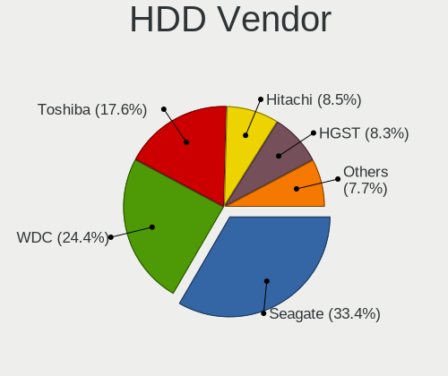
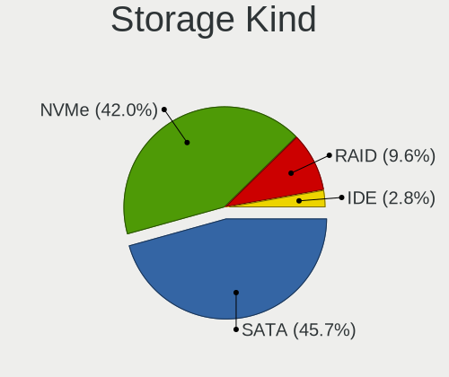
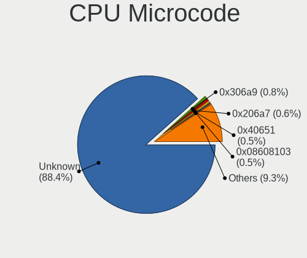
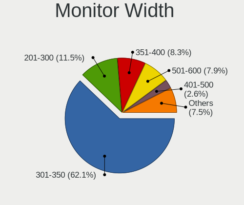
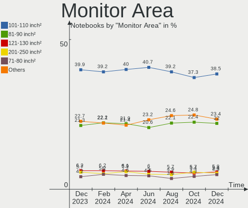
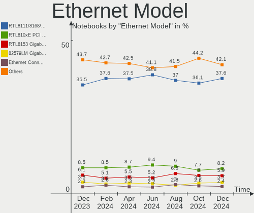
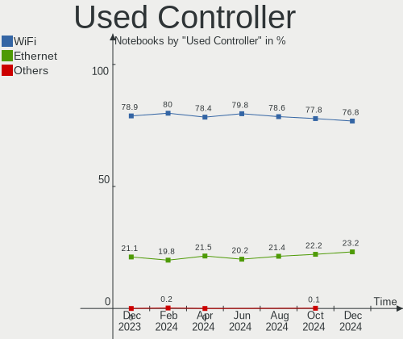
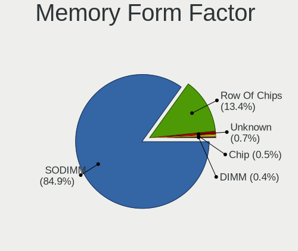

Linux - Hardware Trends (Notebooks)
-----------------------------------

A project to identify most popular hardware characteristics and track their change
over time based on data collected by Linux users at https://Linux-Hardware.org.

Anyone can contribute to this report by the [hw-probe](https://github.com/linuxhw/hw-probe) tool:

    sudo -E hw-probe -all -upload

This report is for one last month. Overall report since the beginning of time: [TestDays](https://github.com/linuxhw/TestDays)

Period: May, 2023.

Contents
--------

* [ System ](#system)
  - [ OS                       ](#os)
  - [ OS Family                ](#os-family)
  - [ Kernel                   ](#kernel)
  - [ Kernel Family            ](#kernel-family)
  - [ Kernel Major Ver.        ](#kernel-major-ver)
  - [ Arch                     ](#arch)
  - [ DE                       ](#de)
  - [ Display Server           ](#display-server)
  - [ Display Manager          ](#display-manager)
  - [ OS Lang                  ](#os-lang)
  - [ Boot Mode                ](#boot-mode)
  - [ Filesystem               ](#filesystem)
  - [ Part. scheme             ](#part-scheme)
  - [ Dual Boot with Linux/BSD ](#dual-boot-with-linuxbsd)
  - [ Dual Boot (Win)          ](#dual-boot-win)

* [ Board ](#board)
  - [ Vendor                   ](#vendor)
  - [ Model                    ](#model)
  - [ Model Family             ](#model-family)
  - [ MFG Year                 ](#mfg-year)
  - [ Form Factor              ](#form-factor)
  - [ Secure Boot              ](#secure-boot)
  - [ Coreboot                 ](#coreboot)
  - [ RAM Size                 ](#ram-size)
  - [ RAM Used                 ](#ram-used)
  - [ Total Drives             ](#total-drives)
  - [ Has CD-ROM               ](#has-cd-rom)
  - [ Has Ethernet             ](#has-ethernet)
  - [ Has WiFi                 ](#has-wifi)
  - [ Has Bluetooth            ](#has-bluetooth)

* [ Location ](#location)
  - [ Country                  ](#country)
  - [ City                     ](#city)

* [ Drives ](#drives)
  - [ Drive Vendor             ](#drive-vendor)
  - [ Drive Model              ](#drive-model)
  - [ HDD Vendor               ](#hdd-vendor)
  - [ SSD Vendor               ](#ssd-vendor)
  - [ Drive Kind               ](#drive-kind)
  - [ Drive Connector          ](#drive-connector)
  - [ Drive Size               ](#drive-size)
  - [ Space Total              ](#space-total)
  - [ Space Used               ](#space-used)
  - [ Malfunc. Drives          ](#malfunc-drives)
  - [ Malfunc. Drive Vendor    ](#malfunc-drive-vendor)
  - [ Malfunc. HDD Vendor      ](#malfunc-hdd-vendor)
  - [ Malfunc. Drive Kind      ](#malfunc-drive-kind)
  - [ Failed Drives            ](#failed-drives)
  - [ Failed Drive Vendor      ](#failed-drive-vendor)
  - [ Drive Status             ](#drive-status)

* [ Storage controller ](#storage-controller)
  - [ Storage Vendor           ](#storage-vendor)
  - [ Storage Model            ](#storage-model)
  - [ Storage Kind             ](#storage-kind)

* [ Processor ](#processor)
  - [ CPU Vendor               ](#cpu-vendor)
  - [ CPU Model                ](#cpu-model)
  - [ CPU Model Family         ](#cpu-model-family)
  - [ CPU Cores                ](#cpu-cores)
  - [ CPU Sockets              ](#cpu-sockets)
  - [ CPU Threads              ](#cpu-threads)
  - [ CPU Op-Modes             ](#cpu-op-modes)
  - [ CPU Microcode            ](#cpu-microcode)
  - [ CPU Microarch            ](#cpu-microarch)

* [ Graphics ](#graphics)
  - [ GPU Vendor               ](#gpu-vendor)
  - [ GPU Model                ](#gpu-model)
  - [ GPU Combo                ](#gpu-combo)
  - [ GPU Driver               ](#gpu-driver)
  - [ GPU Memory               ](#gpu-memory)

* [ Monitor ](#monitor)
  - [ Monitor Vendor           ](#monitor-vendor)
  - [ Monitor Model            ](#monitor-model)
  - [ Monitor Resolution       ](#monitor-resolution)
  - [ Monitor Diagonal         ](#monitor-diagonal)
  - [ Monitor Width            ](#monitor-width)
  - [ Aspect Ratio             ](#aspect-ratio)
  - [ Monitor Area             ](#monitor-area)
  - [ Pixel Density            ](#pixel-density)
  - [ Multiple Monitors        ](#multiple-monitors)

* [ Network ](#network)
  - [ Net Controller Vendor    ](#net-controller-vendor)
  - [ Net Controller Model     ](#net-controller-model)
  - [ Wireless Vendor          ](#wireless-vendor)
  - [ Wireless Model           ](#wireless-model)
  - [ Ethernet Vendor          ](#ethernet-vendor)
  - [ Ethernet Model           ](#ethernet-model)
  - [ Net Controller Kind      ](#net-controller-kind)
  - [ Used Controller          ](#used-controller)
  - [ NICs                     ](#nics)
  - [ IPv6                     ](#ipv6)

* [ Bluetooth ](#bluetooth)
  - [ Bluetooth Vendor         ](#bluetooth-vendor)
  - [ Bluetooth Model          ](#bluetooth-model)

* [ Sound ](#sound)
  - [ Sound Vendor             ](#sound-vendor)
  - [ Sound Model              ](#sound-model)

* [ Memory ](#memory)
  - [ Memory Vendor            ](#memory-vendor)
  - [ Memory Model             ](#memory-model)
  - [ Memory Kind              ](#memory-kind)
  - [ Memory Form Factor       ](#memory-form-factor)
  - [ Memory Size              ](#memory-size)
  - [ Memory Speed             ](#memory-speed)

* [ Printers & scanners ](#printers--scanners)
  - [ Printer Vendor           ](#printer-vendor)
  - [ Printer Model            ](#printer-model)
  - [ Scanner Vendor           ](#scanner-vendor)
  - [ Scanner Model            ](#scanner-model)

* [ Camera ](#camera)
  - [ Camera Vendor            ](#camera-vendor)
  - [ Camera Model             ](#camera-model)

* [ Security ](#security)
  - [ Fingerprint Vendor       ](#fingerprint-vendor)
  - [ Fingerprint Model        ](#fingerprint-model)
  - [ Chipcard Vendor          ](#chipcard-vendor)
  - [ Chipcard Model           ](#chipcard-model)

* [ Unsupported ](#unsupported)
  - [ Unsupported Devices      ](#unsupported-devices)
  - [ Unsupported Device Types ](#unsupported-device-types)

System
------

OS
--

Installed operating systems

| Name                         | Notebooks | Percent |
|------------------------------|-----------|---------|
| Ubuntu 22.04                 | 364       | 12.5%   |
| Fedora 38                    | 284       | 9.75%   |
| Linux Mint 21.1              | 223       | 7.66%   |
| Ubuntu 23.04                 | 157       | 5.39%   |
| OpenMandriva 23.03           | 133       | 4.57%   |
| Arch Rolling                 | 131       | 4.5%    |
| Pop!_OS 22.04                | 126       | 4.33%   |
| Debian 11                    | 103       | 3.54%   |
| Zorin 16                     | 88        | 3.02%   |
| ROSA 12.4                    | 79        | 2.71%   |
| Ubuntu 20.04                 | 64        | 2.2%    |
| ArcoLinux Rolling            | 63        | 2.16%   |
| Debian 12                    | 59        | 2.03%   |
| SteamOS 3.4.6                | 55        | 1.89%   |
| KDE neon 22.04               | 51        | 1.75%   |
| BlackPanther 18.1            | 49        | 1.68%   |
| openSUSE Tumbleweed-XXXXXXXX | 37        | 1.27%   |
| Manjaro                      | 36        | 1.24%   |
| Fedora 37                    | 33        | 1.13%   |
| Kali 2023.1                  | 32        | 1.1%    |
| EndeavourOS Rolling          | 32        | 1.1%    |
| Linux Mint 20.3              | 31        | 1.06%   |
| Kubuntu 23.04                | 30        | 1.03%   |
| Kubuntu 22.04                | 30        | 1.03%   |
| Kali 2023.2                  | 26        | 0.89%   |
| Ubuntu 22.10                 | 25        | 0.86%   |
| Elementary 7                 | 25        | 0.86%   |
| Xubuntu 22.04                | 21        | 0.72%   |
| MX 21                        | 21        | 0.72%   |
| LMDE 5                       | 21        | 0.72%   |
| Linux Mint 21                | 21        | 0.72%   |
| OpenMandriva 4.3             | 19        | 0.65%   |
| Manjaro 22.1.1               | 18        | 0.62%   |
| Gentoo 2.13                  | 17        | 0.58%   |
| Lubuntu 22.04                | 16        | 0.55%   |
| Parrot 5.3                   | 14        | 0.48%   |
| Nobara 37                    | 14        | 0.48%   |
| OpenMandriva 23.01           | 11        | 0.38%   |
| Ubuntu 18.04                 | 10        | 0.34%   |
| Manjaro 22.1.3               | 9         | 0.31%   |

OS Family
---------

OS without a version

| Name          | Notebooks | Percent |
|---------------|-----------|---------|
| Ubuntu        | 625       | 21.46%  |
| Fedora        | 331       | 11.36%  |
| Linux Mint    | 291       | 9.99%   |
| OpenMandriva  | 172       | 5.9%    |
| Debian        | 164       | 5.63%   |
| Arch          | 131       | 4.5%    |
| Pop!_OS       | 127       | 4.36%   |
| ROSA          | 97        | 3.33%   |
| Zorin         | 93        | 3.19%   |
| Manjaro       | 76        | 2.61%   |
| SteamOS       | 70        | 2.4%    |
| ArcoLinux     | 67        | 2.3%    |
| Kubuntu       | 64        | 2.2%    |
| Kali          | 58        | 1.99%   |
| KDE neon      | 55        | 1.89%   |
| BlackPanther  | 54        | 1.85%   |
| openSUSE      | 45        | 1.54%   |
| Xubuntu       | 35        | 1.2%    |
| EndeavourOS   | 32        | 1.1%    |
| Elementary    | 31        | 1.06%   |
| Lubuntu       | 22        | 0.76%   |
| MX            | 21        | 0.72%   |
| LMDE          | 21        | 0.72%   |
| Parrot        | 18        | 0.62%   |
| Gentoo        | 18        | 0.62%   |
| Ubuntu MATE   | 14        | 0.48%   |
| Ubuntu Budgie | 14        | 0.48%   |
| Nobara        | 14        | 0.48%   |
| Endless       | 13        | 0.45%   |
| Garuda Linux  | 9         | 0.31%   |
| Artix         | 9         | 0.31%   |
| ALT Linux     | 9         | 0.31%   |
| Ubuntu Unity  | 8         | 0.27%   |
| BunsenLabs    | 8         | 0.27%   |
| Red OS        | 7         | 0.24%   |
| NixOS         | 7         | 0.24%   |
| TUXEDO OS     | 6         | 0.21%   |
| Rocky Linux   | 5         | 0.17%   |
| Clear Linux   | 4         | 0.14%   |
| ChimeraOS     | 4         | 0.14%   |

Kernel
------

Version of the Linux kernel

| Version                           | Notebooks | Percent |
|-----------------------------------|-----------|---------|
| 5.19.0-41-generic                 | 321       | 11.02%  |
| 5.15.0-71-generic                 | 206       | 7.07%   |
| 6.2.0-20-generic                  | 186       | 6.39%   |
| 5.15.0-72-generic                 | 141       | 4.84%   |
| 6.2.6-desktop-1omv2390            | 134       | 4.6%    |
| 6.2.15-300.fc38.x86_64            | 120       | 4.12%   |
| 6.2.6-76060206-generic            | 114       | 3.91%   |
| 5.19.0-42-generic                 | 102       | 3.5%    |
| 6.2.14-300.fc38.x86_64            | 87        | 2.99%   |
| 6.1.20-generic-2rosa2021.1-x86_64 | 71        | 2.44%   |
| 5.13.0-valve36-1-neptune          | 63        | 2.16%   |
| 5.10.0-23-amd64                   | 52        | 1.79%   |
| 5.10.0-22-amd64                   | 49        | 1.68%   |
| 6.3.2-arch1-1                     | 36        | 1.24%   |
| 5.4.0-148-generic                 | 34        | 1.17%   |
| 6.2.13-300.fc38.x86_64            | 32        | 1.1%    |
| 6.3.4-arch1-1                     | 29        | 1%      |
| 6.3.1-arch1-1                     | 28        | 0.96%   |
| 6.3.1-arch2-1                     | 27        | 0.93%   |
| 6.1.0-9-amd64                     | 27        | 0.93%   |
| 5.15.0-56-generic                 | 26        | 0.89%   |
| 6.1.0-kali7-amd64                 | 25        | 0.86%   |
| 6.2.9-300.fc38.x86_64             | 24        | 0.82%   |
| 5.19.0-32-generic                 | 23        | 0.79%   |
| 6.1.26-1-MANJARO                  | 22        | 0.76%   |
| 6.1.0-kali9-amd64                 | 21        | 0.72%   |
| 6.2.13-arch1-1                    | 18        | 0.62%   |
| 5.15.85-desktop-1bP               | 18        | 0.62%   |
| 4.18.16-desktop-1bP               | 18        | 0.62%   |
| 5.10.0-21-amd64                   | 16        | 0.55%   |
| 6.2.15-200.fc37.x86_64            | 15        | 0.51%   |
| 6.1.0-7-amd64                     | 15        | 0.51%   |
| 6.3.2-1-default                   | 14        | 0.48%   |
| 5.15.0-69-generic                 | 14        | 0.48%   |
| 6.3.3-arch1-1                     | 13        | 0.45%   |
| 5.6.14-desktop-2bP                | 13        | 0.45%   |
| 5.19.0-40-generic                 | 13        | 0.45%   |
| 6.1.0-1parrot1-amd64              | 12        | 0.41%   |
| 6.3.2-zen1-1-zen                  | 11        | 0.38%   |
| 6.3.1-zen1-1-zen                  | 11        | 0.38%   |

Kernel Family
-------------

Linux kernel without a distro release

| Version  | Notebooks | Percent |
|----------|-----------|---------|
| 5.19.0   | 477       | 16.37%  |
| 5.15.0   | 449       | 15.41%  |
| 6.2.6    | 250       | 8.58%   |
| 6.2.0    | 205       | 7.04%   |
| 6.1.0    | 143       | 4.91%   |
| 6.2.15   | 140       | 4.81%   |
| 5.10.0   | 136       | 4.67%   |
| 6.2.14   | 114       | 3.91%   |
| 6.3.1    | 106       | 3.64%   |
| 6.3.2    | 82        | 2.81%   |
| 6.1.20   | 73        | 2.51%   |
| 5.4.0    | 68        | 2.33%   |
| 5.13.0   | 68        | 2.33%   |
| 6.2.13   | 56        | 1.92%   |
| 6.3.4    | 52        | 1.79%   |
| 6.3.3    | 33        | 1.13%   |
| 6.2.9    | 33        | 1.13%   |
| 6.2.12   | 25        | 0.86%   |
| 6.1.26   | 25        | 0.86%   |
| 5.15.85  | 18        | 0.62%   |
| 4.18.16  | 18        | 0.62%   |
| 6.3.0    | 16        | 0.55%   |
| 6.0.0    | 16        | 0.55%   |
| 6.2.11   | 14        | 0.48%   |
| 6.1.29   | 14        | 0.48%   |
| 5.6.14   | 14        | 0.48%   |
| 6.1.30   | 12        | 0.41%   |
| 6.1.27   | 12        | 0.41%   |
| 4.15.0   | 11        | 0.38%   |
| 6.1.25   | 10        | 0.34%   |
| 6.1.1    | 10        | 0.34%   |
| 5.15.103 | 10        | 0.34%   |
| 5.14.0   | 10        | 0.34%   |
| 6.3.5    | 9         | 0.31%   |
| 5.8.0    | 8         | 0.27%   |
| 5.16.7   | 8         | 0.27%   |
| 5.16.13  | 8         | 0.27%   |
| 5.14.21  | 8         | 0.27%   |
| 6.2.10   | 7         | 0.24%   |
| 6.1.21   | 7         | 0.24%   |

Kernel Major Ver.
-----------------

Linux kernel major version

| Version | Notebooks | Percent |
|---------|-----------|---------|
| 6.2     | 846       | 29.04%  |
| 5.15    | 513       | 17.61%  |
| 5.19    | 480       | 16.48%  |
| 6.1     | 329       | 11.29%  |
| 6.3     | 298       | 10.23%  |
| 5.10    | 152       | 5.22%   |
| 5.4     | 70        | 2.4%    |
| 5.13    | 68        | 2.33%   |
| 6.0     | 27        | 0.93%   |
| 5.16    | 22        | 0.76%   |
| 5.14    | 21        | 0.72%   |
| 4.18    | 18        | 0.62%   |
| 5.6     | 14        | 0.48%   |
| 4.15    | 11        | 0.38%   |
| 5.8     | 8         | 0.27%   |
| 5.17    | 8         | 0.27%   |
| 5.18    | 7         | 0.24%   |
| 5.11    | 6         | 0.21%   |
| 6.4     | 4         | 0.14%   |
| 4.9     | 4         | 0.14%   |
| 5.0     | 2         | 0.07%   |
| 4.19    | 2         | 0.07%   |
| 6.3.0   | 1         | 0.03%   |
| 5.7     | 1         | 0.03%   |
| 4.4     | 1         | 0.03%   |

Arch
----

OS architecture (x86_64, i586, etc.)

| Name    | Notebooks | Percent |
|---------|-----------|---------|
| x86_64  | 2890      | 99.21%  |
| i686    | 21        | 0.72%   |
| aarch64 | 2         | 0.07%   |

DE
--

Desktop Environment

| Name             | Notebooks | Percent |
|------------------|-----------|---------|
| GNOME            | 1293      | 44.39%  |
| KDE5             | 750       | 25.75%  |
| X-Cinnamon       | 245       | 8.41%   |
| XFCE             | 227       | 7.79%   |
| MATE             | 78        | 2.68%   |
| Unknown          | 76        | 2.61%   |
| LXQt             | 52        | 1.79%   |
| Pantheon         | 32        | 1.1%    |
| i3               | 26        | 0.89%   |
| Cinnamon         | 20        | 0.69%   |
| Budgie           | 15        | 0.51%   |
| Hyprland         | 12        | 0.41%   |
| sway             | 10        | 0.34%   |
| Unity            | 8         | 0.27%   |
| Deepin           | 8         | 0.27%   |
| KDE              | 7         | 0.24%   |
| GNOME Flashback  | 7         | 0.24%   |
| KDE4             | 5         | 0.17%   |
| awesome          | 5         | 0.17%   |
| LXDE             | 4         | 0.14%   |
| lightdm-xsession | 4         | 0.14%   |
| icewm            | 4         | 0.14%   |
| BunsenLabs       | 4         | 0.14%   |
| GNOME Classic    | 3         | 0.1%    |
| bspwm            | 3         | 0.1%    |
| Xsession         | 2         | 0.07%   |
| Trinity          | 2         | 0.07%   |
| LeftWM           | 2         | 0.07%   |
| DWM              | 2         | 0.07%   |
| xmonad           | 1         | 0.03%   |
| qtile            | 1         | 0.03%   |
| openbox          | 1         | 0.03%   |
| none+i3          | 1         | 0.03%   |
| GNUstep          | 1         | 0.03%   |
| fluxbox          | 1         | 0.03%   |
| Enlightenment    | 1         | 0.03%   |

Display Server
--------------

X11 or Wayland

| Name    | Notebooks | Percent |
|---------|-----------|---------|
| X11     | 1882      | 64.61%  |
| Wayland | 955       | 32.78%  |
| Unknown | 41        | 1.41%   |
| Tty     | 34        | 1.17%   |
| Xcb     | 1         | 0.03%   |

Display Manager
---------------

SDDM, LightDM, etc.

| Name    | Notebooks | Percent |
|---------|-----------|---------|
| Unknown | 996       | 34.19%  |
| GDM3    | 634       | 21.76%  |
| SDDM    | 586       | 20.12%  |
| LightDM | 446       | 15.31%  |
| GDM     | 237       | 8.14%   |
| KDM     | 5         | 0.17%   |
| XDM     | 2         | 0.07%   |
| Ly      | 2         | 0.07%   |
| LXDM    | 2         | 0.07%   |
| TDM     | 1         | 0.03%   |
| SLiM    | 1         | 0.03%   |
| LY-DM   | 1         | 0.03%   |

OS Lang
-------

Language

| Lang    | Notebooks | Percent |
|---------|-----------|---------|
| en_US   | 1228      | 42.16%  |
| de_DE   | 210       | 7.21%   |
| ru_RU   | 189       | 6.49%   |
| fr_FR   | 153       | 5.25%   |
| en_GB   | 146       | 5.01%   |
| pt_BR   | 111       | 3.81%   |
| it_IT   | 102       | 3.5%    |
| Unknown | 88        | 3.02%   |
| es_ES   | 64        | 2.2%    |
| pl_PL   | 55        | 1.89%   |
| en_IN   | 55        | 1.89%   |
| en_CA   | 50        | 1.72%   |
| C       | 46        | 1.58%   |
| es_MX   | 33        | 1.13%   |
| en_AU   | 32        | 1.1%    |
| zh_CN   | 26        | 0.89%   |
| nl_NL   | 24        | 0.82%   |
| sv_SE   | 23        | 0.79%   |
| pt_PT   | 21        | 0.72%   |
| hu_HU   | 18        | 0.62%   |
| tr_TR   | 17        | 0.58%   |
| en_ZA   | 14        | 0.48%   |
| cs_CZ   | 14        | 0.48%   |
| es_AR   | 12        | 0.41%   |
| es_CL   | 10        | 0.34%   |
| en_NZ   | 10        | 0.34%   |
| el_GR   | 10        | 0.34%   |
| de_AT   | 10        | 0.34%   |
| fr_CA   | 8         | 0.27%   |
| fi_FI   | 8         | 0.27%   |
| es_CO   | 8         | 0.27%   |
| en_IE   | 8         | 0.27%   |
| ro_RO   | 7         | 0.24%   |
| nl_BE   | 6         | 0.21%   |
| es_PE   | 6         | 0.21%   |
| sk_SK   | 5         | 0.17%   |
| ja_JP   | 5         | 0.17%   |
| hr_HR   | 4         | 0.14%   |
| fr_CH   | 4         | 0.14%   |
| es_GT   | 4         | 0.14%   |

Boot Mode
---------

EFI or BIOS

| Mode | Notebooks | Percent |
|------|-----------|---------|
| EFI  | 1658      | 56.92%  |
| BIOS | 1255      | 43.08%  |

Filesystem
----------

Type of filesystem

| Type    | Notebooks | Percent |
|---------|-----------|---------|
| Ext4    | 1817      | 62.38%  |
| Btrfs   | 569       | 19.53%  |
| Tmpfs   | 311       | 10.68%  |
| Overlay | 149       | 5.12%   |
| Xfs     | 41        | 1.41%   |
| Zfs     | 12        | 0.41%   |
| F2fs    | 7         | 0.24%   |
| Unknown | 3         | 0.1%    |
| Jfs     | 1         | 0.03%   |
| Ext3    | 1         | 0.03%   |
| Ext2    | 1         | 0.03%   |
| Aufs    | 1         | 0.03%   |

Part. scheme
------------

Scheme of partitioning

| Type    | Notebooks | Percent |
|---------|-----------|---------|
| GPT     | 1671      | 57.36%  |
| Unknown | 928       | 31.86%  |
| MBR     | 314       | 10.78%  |

Dual Boot with Linux/BSD
------------------------

Hosting more than one Linux/BSD

| Dual boot | Notebooks | Percent |
|-----------|-----------|---------|
| No        | 2589      | 88.88%  |
| Yes       | 324       | 11.12%  |

Dual Boot (Win)
---------------

Hosting Linux and Windows

| Dual boot | Notebooks | Percent |
|-----------|-----------|---------|
| No        | 2187      | 75.08%  |
| Yes       | 726       | 24.92%  |

Board
-----

Vendor
------

Motherboard manufacturer

| Name                   | Notebooks | Percent |
|------------------------|-----------|---------|
| Lenovo                 | 627       | 21.52%  |
| Hewlett-Packard        | 511       | 17.54%  |
| Dell                   | 405       | 13.9%   |
| ASUSTek Computer       | 310       | 10.64%  |
| Acer                   | 239       | 8.2%    |
| Apple                  | 87        | 2.99%   |
| Toshiba                | 67        | 2.3%    |
| Valve                  | 66        | 2.27%   |
| MSI                    | 66        | 2.27%   |
| HUAWEI                 | 58        | 1.99%   |
| Samsung Electronics    | 51        | 1.75%   |
| Unknown                | 33        | 1.13%   |
| Sony                   | 31        | 1.06%   |
| Google                 | 28        | 0.96%   |
| Fujitsu                | 21        | 0.72%   |
| Notebook               | 18        | 0.62%   |
| TUXEDO                 | 14        | 0.48%   |
| Packard Bell           | 13        | 0.45%   |
| Timi                   | 12        | 0.41%   |
| Medion                 | 12        | 0.41%   |
| Alienware              | 11        | 0.38%   |
| Chuwi                  | 10        | 0.34%   |
| System76               | 9         | 0.31%   |
| Framework              | 9         | 0.31%   |
| eMachines              | 9         | 0.31%   |
| Clevo                  | 9         | 0.31%   |
| HONOR                  | 8         | 0.27%   |
| Gigabyte Technology    | 8         | 0.27%   |
| Fujitsu Siemens        | 8         | 0.27%   |
| Avell High Performance | 7         | 0.24%   |
| Positivo               | 6         | 0.21%   |
| Mediacom               | 6         | 0.21%   |
| Aquarius               | 6         | 0.21%   |
| Razer                  | 5         | 0.17%   |
| GPU Company            | 5         | 0.17%   |
| Panasonic              | 4         | 0.14%   |
| Intel Client Systems   | 4         | 0.14%   |
| Digma                  | 4         | 0.14%   |
| Quanta                 | 3         | 0.1%    |
| PC Specialist          | 3         | 0.1%    |

Model
-----

Motherboard model

| Name                                   | Notebooks | Percent |
|----------------------------------------|-----------|---------|
| Valve Jupiter                          | 66        | 2.27%   |
| Unknown                                | 48        | 1.65%   |
| HP Notebook                            | 14        | 0.48%   |
| HP Pavilion g6                         | 12        | 0.41%   |
| HP Pavilion dv6                        | 12        | 0.41%   |
| HP 255 G8 Notebook PC                  | 10        | 0.34%   |
| Apple MacBookAir7,2                    | 9         | 0.31%   |
| HP Pavilion Aero Laptop 13-be0xxx      | 8         | 0.27%   |
| HP 15                                  | 8         | 0.27%   |
| Apple MacBookPro8,1                    | 8         | 0.27%   |
| HUAWEI BOHB-WAX9                       | 7         | 0.24%   |
| Dell Latitude E7450                    | 7         | 0.24%   |
| Dell Inspiron 15-3567                  | 7         | 0.24%   |
| HP Pavilion 15                         | 6         | 0.21%   |
| HP Laptop 15s-eq2xxx                   | 6         | 0.21%   |
| HP Laptop 15-db0xxx                    | 6         | 0.21%   |
| HP EliteBook 8470p                     | 6         | 0.21%   |
| HP EliteBook 840 G3                    | 6         | 0.21%   |
| Framework Laptop (12th Gen Intel Core) | 6         | 0.21%   |
| Dell XPS 15 9560                       | 6         | 0.21%   |
| Dell Latitude 5490                     | 6         | 0.21%   |
| Dell Latitude 5480                     | 6         | 0.21%   |
| Clevo NL41MU2                          | 6         | 0.21%   |
| Apple MacBookPro9,2                    | 6         | 0.21%   |
| Acer Nitro AN517-54                    | 6         | 0.21%   |
| Mediacom SmartBook 14 FullHD - SB14UC  | 5         | 0.17%   |
| Lenovo V15 G2 ALC 82KD                 | 5         | 0.17%   |
| Lenovo IdeaPad 3 15ALC6 82KU           | 5         | 0.17%   |
| HUAWEI NBLB-WAX9N                      | 5         | 0.17%   |
| HUAWEI HVY-WXX9                        | 5         | 0.17%   |
| HP Pavilion Notebook                   | 5         | 0.17%   |
| HP Pavilion Laptop 15-eg0xxx           | 5         | 0.17%   |
| HP Pavilion g4                         | 5         | 0.17%   |
| HP Pavilion dv7                        | 5         | 0.17%   |
| HP Pavilion dm4                        | 5         | 0.17%   |
| HP ENVY 15                             | 5         | 0.17%   |
| HP EliteBook 840 G5                    | 5         | 0.17%   |
| Dell XPS 15 9570                       | 5         | 0.17%   |
| Dell Latitude E5530 non-vPro           | 5         | 0.17%   |
| Dell Latitude D630                     | 5         | 0.17%   |

Model Family
------------

Motherboard model prefix

| Name                  | Notebooks | Percent |
|-----------------------|-----------|---------|
| Lenovo ThinkPad       | 336       | 11.53%  |
| Dell Latitude         | 162       | 5.56%   |
| Acer Aspire           | 160       | 5.49%   |
| Lenovo IdeaPad        | 147       | 5.05%   |
| HP Pavilion           | 112       | 3.84%   |
| Dell Inspiron         | 106       | 3.64%   |
| HP Laptop             | 89        | 3.06%   |
| HP EliteBook          | 87        | 2.99%   |
| ASUS VivoBook         | 79        | 2.71%   |
| Valve Jupiter         | 66        | 2.27%   |
| Toshiba Satellite     | 57        | 1.96%   |
| HP ProBook            | 49        | 1.68%   |
| Unknown               | 48        | 1.65%   |
| Dell Precision        | 44        | 1.51%   |
| ASUS ROG              | 43        | 1.48%   |
| Dell XPS              | 41        | 1.41%   |
| ASUS ASUS             | 32        | 1.1%    |
| Lenovo Legion         | 29        | 1%      |
| Dell Vostro           | 27        | 0.93%   |
| Acer Nitro            | 25        | 0.86%   |
| Lenovo ThinkBook      | 20        | 0.69%   |
| HP ENVY               | 20        | 0.69%   |
| ASUS Zenbook          | 20        | 0.69%   |
| Acer Swift            | 20        | 0.69%   |
| HP ZBook              | 19        | 0.65%   |
| HP OMEN               | 15        | 0.51%   |
| HP 255                | 15        | 0.51%   |
| Acer TravelMate       | 15        | 0.51%   |
| HP Notebook           | 14        | 0.48%   |
| Fujitsu LIFEBOOK      | 14        | 0.48%   |
| HP Compaq             | 13        | 0.45%   |
| HP 250                | 13        | 0.45%   |
| Lenovo Yoga           | 12        | 0.41%   |
| Packard Bell EasyNote | 11        | 0.38%   |
| Apple MacBookPro11    | 11        | 0.38%   |
| HP 15                 | 10        | 0.34%   |
| HP Victus             | 9         | 0.31%   |
| Framework Laptop      | 9         | 0.31%   |
| ASUS TUF              | 9         | 0.31%   |
| Apple MacBookAir7     | 9         | 0.31%   |

MFG Year
--------

Motherboard manufacture year

| Year    | Notebooks | Percent |
|---------|-----------|---------|
| 2021    | 379       | 13.01%  |
| 2022    | 377       | 12.94%  |
| 2020    | 296       | 10.16%  |
| 2019    | 225       | 7.72%   |
| 2018    | 189       | 6.49%   |
| 2012    | 183       | 6.28%   |
| 2011    | 169       | 5.8%    |
| 2013    | 163       | 5.6%    |
| 2017    | 157       | 5.39%   |
| 2016    | 151       | 5.18%   |
| 2015    | 133       | 4.57%   |
| 2010    | 120       | 4.12%   |
| 2014    | 111       | 3.81%   |
| 2023    | 73        | 2.51%   |
| 2008    | 71        | 2.44%   |
| 2009    | 64        | 2.2%    |
| 2007    | 40        | 1.37%   |
| 2006    | 6         | 0.21%   |
| Unknown | 3         | 0.1%    |
| 2005    | 2         | 0.07%   |
| 2004    | 1         | 0.03%   |

Form Factor
-----------

Physical design of the computer

| Name     | Notebooks | Percent |
|----------|-----------|---------|
| Notebook | 2913      | 100%    |

Secure Boot
-----------

Enabled or disabled

| State    | Notebooks | Percent |
|----------|-----------|---------|
| Disabled | 2638      | 90.56%  |
| Enabled  | 275       | 9.44%   |

Coreboot
--------

Have coreboot on board

| Used | Notebooks | Percent |
|------|-----------|---------|
| No   | 2869      | 98.49%  |
| Yes  | 44        | 1.51%   |

RAM Size
--------

Total RAM memory

| Size in GB  | Notebooks | Percent |
|-------------|-----------|---------|
| 4.01-8.0    | 864       | 29.66%  |
| 8.01-16.0   | 558       | 19.16%  |
| 16.01-24.0  | 532       | 18.26%  |
| 3.01-4.0    | 479       | 16.44%  |
| 32.01-64.0  | 259       | 8.89%   |
| 1.01-2.0    | 81        | 2.78%   |
| 64.01-256.0 | 56        | 1.92%   |
| 24.01-32.0  | 48        | 1.65%   |
| 2.01-3.0    | 30        | 1.03%   |
| 0.51-1.0    | 4         | 0.14%   |
| 0.01-0.5    | 1         | 0.03%   |
| Unknown     | 1         | 0.03%   |

RAM Used
--------

Used RAM memory

| Used GB    | Notebooks | Percent |
|------------|-----------|---------|
| 1.01-2.0   | 794       | 27.26%  |
| 2.01-3.0   | 740       | 25.4%   |
| 4.01-8.0   | 583       | 20.01%  |
| 3.01-4.0   | 477       | 16.37%  |
| 0.51-1.0   | 144       | 4.94%   |
| 8.01-16.0  | 134       | 4.6%    |
| 16.01-24.0 | 18        | 0.62%   |
| 0.01-0.5   | 13        | 0.45%   |
| 24.01-32.0 | 7         | 0.24%   |
| 32.01-64.0 | 2         | 0.07%   |
| Unknown    | 1         | 0.03%   |

Total Drives
------------

Number of drives on board

| Drives | Notebooks | Percent |
|--------|-----------|---------|
| 1      | 2125      | 72.95%  |
| 2      | 669       | 22.97%  |
| 3      | 90        | 3.09%   |
| 4      | 13        | 0.45%   |
| 0      | 10        | 0.34%   |
| 5      | 3         | 0.1%    |
| 8      | 1         | 0.03%   |
| 7      | 1         | 0.03%   |
| 6      | 1         | 0.03%   |

Has CD-ROM
----------

Has CD-ROM on board

| Presented | Notebooks | Percent |
|-----------|-----------|---------|
| No        | 2143      | 73.57%  |
| Yes       | 770       | 26.43%  |

Has Ethernet
------------

Has Ethernet on board

| Presented | Notebooks | Percent |
|-----------|-----------|---------|
| Yes       | 2216      | 76.07%  |
| No        | 697       | 23.93%  |

Has WiFi
--------

Has WiFi module

| Presented | Notebooks | Percent |
|-----------|-----------|---------|
| Yes       | 2865      | 98.35%  |
| No        | 48        | 1.65%   |

Has Bluetooth
-------------

Has Bluetooth module

| Presented | Notebooks | Percent |
|-----------|-----------|---------|
| Yes       | 2382      | 81.77%  |
| No        | 531       | 18.23%  |

Location
--------

Country
-------

Geographic location (country)

| Country      | Notebooks | Percent |
|--------------|-----------|---------|
| USA          | 451       | 15.48%  |
| Germany      | 301       | 10.33%  |
| Russia       | 218       | 7.48%   |
| France       | 169       | 5.8%    |
| Brazil       | 165       | 5.66%   |
| Italy        | 139       | 4.77%   |
| UK           | 100       | 3.43%   |
| Spain        | 80        | 2.75%   |
| India        | 80        | 2.75%   |
| Poland       | 75        | 2.57%   |
| Canada       | 75        | 2.57%   |
| Hungary      | 70        | 2.4%    |
| Netherlands  | 64        | 2.2%    |
| Mexico       | 46        | 1.58%   |
| Sweden       | 43        | 1.48%   |
| Australia    | 43        | 1.48%   |
| Portugal     | 41        | 1.41%   |
| Turkey       | 37        | 1.27%   |
| Romania      | 37        | 1.27%   |
| Czechia      | 30        | 1.03%   |
| Belgium      | 26        | 0.89%   |
| Austria      | 24        | 0.82%   |
| China        | 23        | 0.79%   |
| Argentina    | 23        | 0.79%   |
| Indonesia    | 20        | 0.69%   |
| Greece       | 20        | 0.69%   |
| Finland      | 20        | 0.69%   |
| Chile        | 20        | 0.69%   |
| Switzerland  | 18        | 0.62%   |
| Japan        | 17        | 0.58%   |
| South Africa | 15        | 0.51%   |
| Peru         | 15        | 0.51%   |
| New Zealand  | 15        | 0.51%   |
| Slovakia     | 14        | 0.48%   |
| Bulgaria     | 14        | 0.48%   |
| Pakistan     | 13        | 0.45%   |
| Denmark      | 13        | 0.45%   |
| Serbia       | 12        | 0.41%   |
| Norway       | 12        | 0.41%   |
| Israel       | 12        | 0.41%   |

City
----

Geographic location (city)

| City              | Notebooks | Percent |
|-------------------|-----------|---------|
| Moscow            | 66        | 2.27%   |
| Berlin            | 28        | 0.96%   |
| Paris             | 25        | 0.86%   |
| Budapest          | 24        | 0.82%   |
| Milan             | 22        | 0.76%   |
| Sao Paulo         | 21        | 0.72%   |
| St Petersburg     | 18        | 0.62%   |
| Madrid            | 17        | 0.58%   |
| Saltsjoe-Boo      | 15        | 0.51%   |
| Frankfurt am Main | 14        | 0.48%   |
| Warsaw            | 13        | 0.45%   |
| Vienna            | 13        | 0.45%   |
| Prague            | 13        | 0.45%   |
| Barcelona         | 13        | 0.45%   |
| Amsterdam         | 13        | 0.45%   |
| Toronto           | 12        | 0.41%   |
| Rio de Janeiro    | 12        | 0.41%   |
| Lisbon            | 12        | 0.41%   |
| Hamburg           | 12        | 0.41%   |
| Delhi             | 12        | 0.41%   |
| Munich            | 11        | 0.38%   |
| Mexico City       | 11        | 0.38%   |
| Melbourne         | 11        | 0.38%   |
| Istanbul          | 11        | 0.38%   |
| Rome              | 10        | 0.34%   |
| Bucharest         | 10        | 0.34%   |
| Brisbane          | 10        | 0.34%   |
| Voronezh          | 9         | 0.31%   |
| Valencia          | 9         | 0.31%   |
| Santiago          | 9         | 0.31%   |
| Poznan            | 9         | 0.31%   |
| Zagreb            | 8         | 0.27%   |
| Montevideo        | 8         | 0.27%   |
| Los Angeles       | 8         | 0.27%   |
| Lima              | 8         | 0.27%   |
| Curitiba          | 8         | 0.27%   |
| Cologne           | 8         | 0.27%   |
| Bengaluru         | 8         | 0.27%   |
| Antalya           | 8         | 0.27%   |
| Turin             | 7         | 0.24%   |

Drives
------

Drive Vendor
------------

Hard drive vendors

| Vendor                      | Notebooks | Drives | Percent |
|-----------------------------|-----------|--------|---------|
| Samsung Electronics         | 617       | 664    | 16.96%  |
| WDC                         | 319       | 324    | 8.77%   |
| Seagate                     | 266       | 283    | 7.31%   |
| Sandisk                     | 246       | 260    | 6.76%   |
| Toshiba                     | 224       | 227    | 6.16%   |
| Unknown                     | 204       | 216    | 5.61%   |
| Kingston                    | 188       | 192    | 5.17%   |
| SK hynix                    | 164       | 168    | 4.51%   |
| Micron Technology           | 140       | 140    | 3.85%   |
| Crucial                     | 126       | 128    | 3.46%   |
| Intel                       | 119       | 126    | 3.27%   |
| Hitachi                     | 81        | 82     | 2.23%   |
| HGST                        | 69        | 69     | 1.9%    |
| KIOXIA                      | 62        | 62     | 1.7%    |
| A-DATA Technology           | 57        | 58     | 1.57%   |
| Phison Electronics          | 55        | 57     | 1.51%   |
| Apple                       | 52        | 65     | 1.43%   |
| China                       | 47        | 49     | 1.29%   |
| Kingston Technology Company | 45        | 46     | 1.24%   |
| Unknown                     | 34        | 34     | 0.93%   |
| Silicon Motion              | 24        | 24     | 0.66%   |
| Micron/Crucial Technology   | 21        | 22     | 0.58%   |
| LITEON                      | 20        | 20     | 0.55%   |
| ADATA Technology            | 19        | 20     | 0.52%   |
| SPCC                        | 18        | 18     | 0.49%   |
| Phison                      | 18        | 18     | 0.49%   |
| Netac                       | 17        | 17     | 0.47%   |
| Intenso                     | 16        | 17     | 0.44%   |
| Transcend                   | 13        | 13     | 0.36%   |
| LITEONIT                    | 13        | 13     | 0.36%   |
| GOODRAM                     | 13        | 13     | 0.36%   |
| Apacer                      | 13        | 13     | 0.36%   |
| PNY                         | 12        | 12     | 0.33%   |
| Patriot                     | 12        | 12     | 0.33%   |
| JMicron Technology          | 11        | 11     | 0.3%    |
| Fujitsu                     | 11        | 11     | 0.3%    |
| SSSTC                       | 9         | 9      | 0.25%   |
| O2 Micro                    | 9         | 9      | 0.25%   |
| Lexar                       | 9         | 9      | 0.25%   |
| BIWIN                       | 9         | 9      | 0.25%   |

Drive Model
-----------

Hard drive models

| Model                                               | Notebooks | Percent |
|-----------------------------------------------------|-----------|---------|
| Samsung NVMe SSD Controller SM981/PM981/PM983 256GB | 82        | 2.19%   |
| Samsung NVMe SSD Controller PM9A1/PM9A3/980PRO 1TB  | 57        | 1.52%   |
| Seagate ST1000LM035-1RK172 1TB                      | 45        | 1.2%    |
| Unknown MMC Card  32GB                              | 37        | 0.99%   |
| Kingston SA400S37480G 480GB SSD                     | 35        | 0.94%   |
| Kingston SA400S37240G 240GB SSD                     | 34        | 0.91%   |
| Unknown                                             | 34        | 0.91%   |
| Toshiba MQ04ABF100 1TB                              | 28        | 0.75%   |
| Toshiba MQ01ABD100 1TB                              | 27        | 0.72%   |
| Phison PS5013 E13 NVMe Controller 512GB             | 27        | 0.72%   |
| Sandisk WD Blue SN550 NVMe SSD 512GB                | 26        | 0.7%    |
| Intel SSD 660P Series 512GB                         | 26        | 0.7%    |
| Unknown MMC Card  64GB                              | 25        | 0.67%   |
| Sandisk WD Black SN750 / PC SN730 NVMe SSD 256GB    | 25        | 0.67%   |
| Kingston Company OM3PDP3 NVMe SSD 256GB             | 23        | 0.62%   |
| Unknown MMC Card  128GB                             | 21        | 0.56%   |
| Toshiba XG6 NVMe SSD Controller 256GB               | 21        | 0.56%   |
| Toshiba MQ01ABF050 500GB                            | 21        | 0.56%   |
| Seagate ST1000LM024 HN-M101MBB 1TB                  | 20        | 0.54%   |
| Intel SSDPEKNU512GZ 512GB                           | 20        | 0.54%   |
| Samsung SSD 860 EVO 500GB                           | 19        | 0.51%   |
| Kingston SA400S37120G 120GB SSD                     | 18        | 0.48%   |
| Crucial CT1000MX500SSD1 1TB                         | 18        | 0.48%   |
| Unknown MMC Card  512GB                             | 17        | 0.45%   |
| Seagate ST500LT012-1DG142 500GB                     | 17        | 0.45%   |
| Samsung NVMe SSD Controller SM961/PM961/SM963 256GB | 17        | 0.45%   |
| HGST HTS721010A9E630 1TB                            | 17        | 0.45%   |
| SK hynix BC511 256GB                                | 16        | 0.43%   |
| Samsung SSD 980 1TB                                 | 16        | 0.43%   |
| Micron/Crucial P2 NVMe PCIe SSD 1TB                 | 15        | 0.4%    |
| Seagate Expansion 1TB                               | 14        | 0.37%   |
| Samsung SSD 970 EVO Plus 1TB                        | 14        | 0.37%   |
| Phison E12 NVMe Controller 256GB                    | 14        | 0.37%   |
| Unknown MMC Card  256GB                             | 13        | 0.35%   |
| SK hynix BC501 NVMe Solid State Drive 512GB         | 13        | 0.35%   |
| Micron 2450_MTFDKBA1T0TFK 1TB                       | 13        | 0.35%   |
| HGST HTS541010A9E680 1TB                            | 13        | 0.35%   |
| Crucial CT240BX500SSD1 240GB                        | 13        | 0.35%   |
| SK hynix BC711 HFM512GD3JX013N 512GB                | 12        | 0.32%   |
| Silicon Motion SM2263EN/SM2263XT SSD Controller 1TB | 12        | 0.32%   |

HDD Vendor
----------

Hard disk drive vendors

| Vendor              | Notebooks | Drives | Percent |
|---------------------|-----------|--------|---------|
| Seagate             | 254       | 267    | 31.32%  |
| WDC                 | 213       | 214    | 26.26%  |
| Toshiba             | 147       | 148    | 18.13%  |
| Hitachi             | 81        | 82     | 9.99%   |
| HGST                | 69        | 69     | 8.51%   |
| Samsung Electronics | 13        | 13     | 1.6%    |
| Fujitsu             | 11        | 11     | 1.36%   |
| Unknown             | 4         | 4      | 0.49%   |
| Apple               | 4         | 4      | 0.49%   |
| SAGE                | 3         | 3      | 0.37%   |
| LaCie               | 3         | 3      | 0.37%   |
| USB3.0              | 1         | 1      | 0.12%   |
| SSK                 | 1         | 1      | 0.12%   |
| RSH-319             | 1         | 1      | 0.12%   |
| MARSHAL             | 1         | 1      | 0.12%   |
| Intenso             | 1         | 1      | 0.12%   |
| Inateck             | 1         | 1      | 0.12%   |
| IB-1122             | 1         | 1      | 0.12%   |
| HGST HTS            | 1         | 1      | 0.12%   |
| ASMT                | 1         | 2      | 0.12%   |

SSD Vendor
----------

Solid state drive vendors

| Vendor              | Notebooks | Drives | Percent |
|---------------------|-----------|--------|---------|
| Samsung Electronics | 206       | 217    | 18.68%  |
| Kingston            | 144       | 147    | 13.06%  |
| Crucial             | 109       | 110    | 9.88%   |
| SanDisk             | 89        | 94     | 8.07%   |
| WDC                 | 49        | 50     | 4.44%   |
| China               | 45        | 47     | 4.08%   |
| A-DATA Technology   | 35        | 35     | 3.17%   |
| Micron Technology   | 29        | 29     | 2.63%   |
| Apple               | 28        | 28     | 2.54%   |
| SK hynix            | 24        | 24     | 2.18%   |
| Toshiba             | 23        | 23     | 2.09%   |
| Intel               | 23        | 23     | 2.09%   |
| LITEON              | 19        | 19     | 1.72%   |
| SPCC                | 16        | 16     | 1.45%   |
| Netac               | 16        | 16     | 1.45%   |
| LITEONIT            | 13        | 13     | 1.18%   |
| PNY                 | 12        | 12     | 1.09%   |
| Intenso             | 12        | 12     | 1.09%   |
| Transcend           | 11        | 11     | 1%      |
| Patriot             | 11        | 11     | 1%      |
| Apacer              | 11        | 11     | 1%      |
| GOODRAM             | 10        | 10     | 0.91%   |
| Lexar               | 8         | 8      | 0.73%   |
| JMicron Technology  | 8         | 8      | 0.73%   |
| Hewlett-Packard     | 8         | 8      | 0.73%   |
| Team                | 7         | 7      | 0.63%   |
| KingSpec            | 7         | 7      | 0.63%   |
| Lenovo              | 5         | 5      | 0.45%   |
| Unknown             | 5         | 5      | 0.45%   |
| Verbatim            | 4         | 4      | 0.36%   |
| ShiJi               | 4         | 4      | 0.36%   |
| Gigabyte Technology | 4         | 4      | 0.36%   |
| Fanxiang            | 4         | 4      | 0.36%   |
| Emtec               | 4         | 4      | 0.36%   |
| Seagate             | 3         | 3      | 0.27%   |
| Mushkin             | 3         | 3      | 0.27%   |
| FORESEE             | 3         | 3      | 0.27%   |
| BHT                 | 3         | 3      | 0.27%   |
| XrayDisk            | 2         | 2      | 0.18%   |
| WDC WDS2            | 2         | 2      | 0.18%   |

Drive Kind
----------

HDD or SSD

| Kind    | Notebooks | Drives | Percent |
|---------|-----------|--------|---------|
| NVMe    | 1376      | 1540   | 39.79%  |
| SSD     | 1026      | 1128   | 29.67%  |
| HDD     | 783       | 828    | 22.64%  |
| MMC     | 224       | 236    | 6.48%   |
| Unknown | 49        | 52     | 1.42%   |

Drive Connector
---------------

SATA, SAS, NVMe, etc.

| Type | Notebooks | Drives | Percent |
|------|-----------|--------|---------|
| SATA | 1613      | 1854   | 48.24%  |
| NVMe | 1376      | 1535   | 41.15%  |
| MMC  | 224       | 236    | 6.7%    |
| SAS  | 131       | 159    | 3.92%   |

Drive Size
----------

Size of hard drive

| Size in TB | Notebooks | Drives | Percent |
|------------|-----------|--------|---------|
| 0.01-0.5   | 1166      | 1287   | 64.78%  |
| 0.51-1.0   | 533       | 560    | 29.61%  |
| 1.01-2.0   | 81        | 85     | 4.5%    |
| 4.01-10.0  | 10        | 10     | 0.56%   |
| 3.01-4.0   | 9         | 13     | 0.5%    |
| 10.01-20.0 | 1         | 1      | 0.06%   |

Space Total
-----------

Amount of disk space available on the file system

| Size in GB     | Notebooks | Percent |
|----------------|-----------|---------|
| 101-250        | 781       | 26.81%  |
| 251-500        | 748       | 25.68%  |
| 501-1000       | 476       | 16.34%  |
| 1001-2000      | 201       | 6.9%    |
| 1-20           | 178       | 6.11%   |
| 51-100         | 169       | 5.8%    |
| 21-50          | 105       | 3.6%    |
| Unknown        | 105       | 3.6%    |
| More than 3000 | 101       | 3.47%   |
| 2001-3000      | 49        | 1.68%   |

Space Used
----------

Amount of used disk space

| Used GB        | Notebooks | Percent |
|----------------|-----------|---------|
| 1-20           | 1000      | 34.33%  |
| 21-50          | 548       | 18.81%  |
| 101-250        | 431       | 14.8%   |
| 51-100         | 362       | 12.43%  |
| 251-500        | 241       | 8.27%   |
| 501-1000       | 128       | 4.39%   |
| Unknown        | 105       | 3.6%    |
| 1001-2000      | 65        | 2.23%   |
| More than 3000 | 17        | 0.58%   |
| 2001-3000      | 15        | 0.51%   |
| 0              | 1         | 0.03%   |

Malfunc. Drives
---------------

Drive models with a malfunction

| Model                                 | Notebooks | Drives | Percent |
|---------------------------------------|-----------|--------|---------|
| Seagate ST1000LM035-1RK172 1TB        | 7         | 7      | 3.15%   |
| Seagate ST1000LM024 HN-M101MBB 1TB    | 6         | 6      | 2.7%    |
| Seagate ST9500325AS 500GB             | 5         | 5      | 2.25%   |
| Toshiba MQ01ABF050 500GB              | 4         | 4      | 1.8%    |
| Hitachi HTS547564A9E384 640GB         | 4         | 4      | 1.8%    |
| Toshiba MQ04ABF100 1TB                | 3         | 3      | 1.35%   |
| Seagate ST9500423AS 500GB             | 3         | 3      | 1.35%   |
| Seagate ST500LT012-9WS142 500GB       | 3         | 3      | 1.35%   |
| Hitachi HTS547550A9E384 500GB         | 3         | 3      | 1.35%   |
| HGST HTS545050A7E380 500GB            | 3         | 3      | 1.35%   |
| HGST HTS541010A9E680 1TB              | 3         | 3      | 1.35%   |
| WDC WD5000LPVX-22V0TT0 500GB          | 2         | 2      | 0.9%    |
| Toshiba MQ01ABD100 1TB                | 2         | 2      | 0.9%    |
| Toshiba MK5075GSX 500GB               | 2         | 2      | 0.9%    |
| SK hynix HFS256G39TND-N210A 256GB SSD | 2         | 2      | 0.9%    |
| SK hynix BC711 HFM512GD3JX013N 512GB  | 2         | 2      | 0.9%    |
| Seagate ST980811AS 80GB               | 2         | 2      | 0.9%    |
| Seagate ST9750420AS 752GB             | 2         | 2      | 0.9%    |
| Seagate ST9320325AS 320GB             | 2         | 2      | 0.9%    |
| Seagate ST9160314AS 160GB             | 2         | 2      | 0.9%    |
| Seagate ST9120822AS 120GB             | 2         | 2      | 0.9%    |
| Seagate ST500LT012-1DG142 500GB       | 2         | 2      | 0.9%    |
| Seagate ST320LT007-9ZV142 320GB       | 2         | 2      | 0.9%    |
| Seagate ST1000LX015-1U7172 1TB        | 2         | 2      | 0.9%    |
| SanDisk SSD U100 256GB                | 2         | 2      | 0.9%    |
| SanDisk SD8SNAT128G1002 128GB SSD     | 2         | 2      | 0.9%    |
| LITEON CV8-8E128-HP 128GB SSD         | 2         | 2      | 0.9%    |
| Kingston SNS4151S316GD 16GB SSD       | 2         | 2      | 0.9%    |
| Kingston SA400S37120G 120GB SSD       | 2         | 2      | 0.9%    |
| Hitachi HTS547575A9E384 752GB         | 2         | 2      | 0.9%    |
| Hitachi HTS545050B9A300 500GB         | 2         | 2      | 0.9%    |
| Hitachi HTS545050A7E380 500GB         | 2         | 2      | 0.9%    |
| Hitachi HTS543232A7A384 320GB         | 2         | 2      | 0.9%    |
| Hitachi HTS542525K9SA00 250GB         | 2         | 2      | 0.9%    |
| HGST HTS725032A7E630 320GB            | 2         | 2      | 0.9%    |
| HGST HTS721010A9E630 1TB              | 2         | 2      | 0.9%    |
| HGST HTS545050A7E680 500GB            | 2         | 2      | 0.9%    |
| Crucial CT240M500SSD1 240GB           | 2         | 2      | 0.9%    |
| China SSD 128GB                       | 2         | 2      | 0.9%    |
| China G521N256GB SSD                  | 2         | 2      | 0.9%    |

Malfunc. Drive Vendor
---------------------

Vendors of faulty drives

| Vendor              | Notebooks | Drives | Percent |
|---------------------|-----------|--------|---------|
| Seagate             | 54        | 55     | 24.43%  |
| Toshiba             | 29        | 30     | 13.12%  |
| Hitachi             | 28        | 28     | 12.67%  |
| WDC                 | 26        | 26     | 11.76%  |
| HGST                | 14        | 14     | 6.33%   |
| SK hynix            | 11        | 11     | 4.98%   |
| Samsung Electronics | 11        | 11     | 4.98%   |
| Kingston            | 10        | 10     | 4.52%   |
| China               | 5         | 5      | 2.26%   |
| SanDisk             | 4         | 4      | 1.81%   |
| Intel               | 4         | 4      | 1.81%   |
| Fujitsu             | 3         | 3      | 1.36%   |
| Crucial             | 3         | 3      | 1.36%   |
| A-DATA Technology   | 3         | 3      | 1.36%   |
| Netac               | 2         | 2      | 0.9%    |
| Micron Technology   | 2         | 2      | 0.9%    |
| LITEON              | 2         | 2      | 0.9%    |
| VNYEZ               | 1         | 1      | 0.45%   |
| ValueTech           | 1         | 1      | 0.45%   |
| Union Memory        | 1         | 1      | 0.45%   |
| Team                | 1         | 1      | 0.45%   |
| SPCC                | 1         | 1      | 0.45%   |
| ShiJi               | 1         | 1      | 0.45%   |
| MARSHAL             | 1         | 1      | 0.45%   |
| KingSpec            | 1         | 1      | 0.45%   |
| Apple               | 1         | 1      | 0.45%   |
| Unknown             | 1         | 1      | 0.45%   |

Malfunc. HDD Vendor
-------------------

Vendors of faulty HDD drives

| Vendor              | Notebooks | Drives | Percent |
|---------------------|-----------|--------|---------|
| Seagate             | 54        | 55     | 35.06%  |
| Hitachi             | 28        | 28     | 18.18%  |
| Toshiba             | 27        | 28     | 17.53%  |
| WDC                 | 23        | 23     | 14.94%  |
| HGST                | 14        | 14     | 9.09%   |
| Samsung Electronics | 4         | 4      | 2.6%    |
| Fujitsu             | 3         | 3      | 1.95%   |
| MARSHAL             | 1         | 1      | 0.65%   |

Malfunc. Drive Kind
-------------------

Kinds of faulty drives

| Kind | Notebooks | Drives | Percent |
|------|-----------|--------|---------|
| HDD  | 152       | 156    | 69.72%  |
| SSD  | 58        | 59     | 26.61%  |
| NVMe | 8         | 8      | 3.67%   |

Failed Drives
-------------

Failed drive models

| Model                                   | Notebooks | Drives | Percent |
|-----------------------------------------|-----------|--------|---------|
| WDC WD3200BEKT-60V5T1 320GB             | 1         | 1      | 25%     |
| Toshiba MQ04ABF100 1TB                  | 1         | 1      | 25%     |
| SK hynix BC501 HFM256GDJTNG-8310A 256GB | 1         | 1      | 25%     |
| Samsung Electronics SSD 980 1TB         | 1         | 1      | 25%     |

Failed Drive Vendor
-------------------

Failed drive vendors

| Vendor              | Notebooks | Drives | Percent |
|---------------------|-----------|--------|---------|
| WDC                 | 1         | 1      | 25%     |
| Toshiba             | 1         | 1      | 25%     |
| SK hynix            | 1         | 1      | 25%     |
| Samsung Electronics | 1         | 1      | 25%     |

Drive Status
------------

Number of failed and malfunc. drives

| Status   | Notebooks | Drives | Percent |
|----------|-----------|--------|---------|
| Detected | 1515      | 1961   | 49.41%  |
| Works    | 1335      | 1596   | 43.54%  |
| Malfunc  | 212       | 223    | 6.91%   |
| Failed   | 4         | 4      | 0.13%   |

Storage controller
------------------

Storage Vendor
--------------

Storage controller vendors

| Vendor                                  | Notebooks | Percent |
|-----------------------------------------|-----------|---------|
| Intel                                   | 1809      | 50.87%  |
| Samsung Electronics                     | 429       | 12.06%  |
| AMD                                     | 328       | 9.22%   |
| SanDisk                                 | 212       | 5.96%   |
| SK hynix                                | 141       | 3.97%   |
| Micron Technology                       | 111       | 3.12%   |
| Kingston Technology Company             | 88        | 2.47%   |
| Phison Electronics                      | 74        | 2.08%   |
| Toshiba America Info Systems            | 59        | 1.66%   |
| KIOXIA                                  | 59        | 1.66%   |
| Micron/Crucial Technology               | 39        | 1.1%    |
| ADATA Technology                        | 39        | 1.1%    |
| Silicon Motion                          | 30        | 0.84%   |
| Solid State Storage Technology          | 21        | 0.59%   |
| Nvidia                                  | 20        | 0.56%   |
| Apple                                   | 17        | 0.48%   |
| Union Memory (Shenzhen)                 | 11        | 0.31%   |
| O2 Micro                                | 9         | 0.25%   |
| Realtek Semiconductor                   | 8         | 0.22%   |
| INNOGRIT                                | 8         | 0.22%   |
| Shenzhen Longsys Electronics            | 6         | 0.17%   |
| MAXIO Technology (Hangzhou)             | 6         | 0.17%   |
| Yangtze Memory Technologies             | 5         | 0.14%   |
| Silicon Integrated Systems [SiS]        | 5         | 0.14%   |
| Seagate Technology                      | 3         | 0.08%   |
| Transcend                               | 2         | 0.06%   |
| Shenzhen Unionmemory Information System | 2         | 0.06%   |
| Marvell Technology Group                | 2         | 0.06%   |
| Lite-On Technology                      | 2         | 0.06%   |
| Lenovo                                  | 2         | 0.06%   |
| JMicron Technology                      | 2         | 0.06%   |
| Biwin Storage Technology                | 2         | 0.06%   |
| ASMedia Technology                      | 2         | 0.06%   |
| Zhaoxin                                 | 1         | 0.03%   |
| VIA Technologies                        | 1         | 0.03%   |
| Ramaxel Technology(Shenzhen) Limited    | 1         | 0.03%   |

Storage Model
-------------

Storage controller models

| Model                                                                          | Notebooks | Percent |
|--------------------------------------------------------------------------------|-----------|---------|
| AMD FCH SATA Controller [AHCI mode]                                            | 284       | 7.47%   |
| Intel Sunrise Point-LP SATA Controller [AHCI mode]                             | 206       | 5.42%   |
| Intel 7 Series Chipset Family 6-port SATA Controller [AHCI mode]               | 203       | 5.34%   |
| Intel Volume Management Device NVMe RAID Controller                            | 158       | 4.16%   |
| Samsung NVMe SSD Controller SM981/PM981/PM983                                  | 140       | 3.68%   |
| Intel 82801 Mobile SATA Controller [RAID mode]                                 | 140       | 3.68%   |
| Samsung NVMe SSD Controller 980                                                | 133       | 3.5%    |
| Intel 6 Series/C200 Series Chipset Family 6 port Mobile SATA AHCI Controller   | 120       | 3.16%   |
| Micron NVMe Storage Controller                                                 | 102       | 2.68%   |
| Samsung NVMe SSD Controller PM9A1/PM9A3/980PRO                                 | 100       | 2.63%   |
| Intel Wildcat Point-LP SATA Controller [AHCI Mode]                             | 78        | 2.05%   |
| Intel 8 Series SATA Controller 1 [AHCI mode]                                   | 78        | 2.05%   |
| Intel Tiger Lake-LP SATA Controller                                            | 75        | 1.97%   |
| Intel 82801IBM/IEM (ICH9M/ICH9M-E) 4 port SATA Controller [AHCI mode]          | 75        | 1.97%   |
| Intel Cannon Lake Mobile PCH SATA AHCI Controller                              | 69        | 1.81%   |
| Intel 8 Series/C220 Series Chipset Family 6-port SATA Controller 1 [AHCI mode] | 69        | 1.81%   |
| SK hynix Gold P31/PC711 NVMe Solid State Drive                                 | 65        | 1.71%   |
| Intel Celeron/Pentium Silver Processor SATA Controller                         | 63        | 1.66%   |
| Intel 5 Series/3400 Series Chipset 4 port SATA AHCI Controller                 | 55        | 1.45%   |
| SanDisk WD Blue SN550 NVMe SSD                                                 | 50        | 1.32%   |
| Intel Comet Lake SATA AHCI Controller                                          | 47        | 1.24%   |
| Intel 82801HM/HEM (ICH8M/ICH8M-E) IDE Controller                               | 44        | 1.16%   |
| Intel HM170/QM170 Chipset SATA Controller [AHCI Mode]                          | 42        | 1.1%    |
| SanDisk WD Black SN750 / PC SN730 NVMe SSD                                     | 41        | 1.08%   |
| Sandisk Non-Volatile memory controller                                         | 40        | 1.05%   |
| Phison PS5013 E13 NVMe Controller                                              | 39        | 1.03%   |
| KIOXIA NVMe SSD Controller BG4                                                 | 38        | 1%      |
| Intel SSD 660P Series                                                          | 37        | 0.97%   |
| Intel 82801HM/HEM (ICH8M/ICH8M-E) SATA Controller [AHCI mode]                  | 36        | 0.95%   |
| Intel Non-Volatile memory controller                                           | 34        | 0.89%   |
| Intel 5 Series/3400 Series Chipset 6 port SATA AHCI Controller                 | 33        | 0.87%   |
| Toshiba America Info Systems XG6 NVMe SSD Controller                           | 32        | 0.84%   |
| Micron/Crucial P2 NVMe PCIe SSD                                                | 31        | 0.82%   |
| Kingston Company Company Non-Volatile memory controller                        | 31        | 0.82%   |
| Intel Alder Lake-P SATA AHCI Controller                                        | 31        | 0.82%   |
| Intel Cannon Point-LP SATA Controller [AHCI Mode]                              | 30        | 0.79%   |
| AMD SB7x0/SB8x0/SB9x0 SATA Controller [AHCI mode]                              | 30        | 0.79%   |
| Samsung NVMe SSD Controller SM961/PM961/SM963                                  | 29        | 0.76%   |
| Kingston Company OM3PDP3 NVMe SSD                                              | 28        | 0.74%   |
| Intel 400 Series Chipset Family SATA AHCI Controller                           | 27        | 0.71%   |

Storage Kind
------------

Kind of storage controller (IDE, SATA, NVMe, SAS, ...)

| Kind | Notebooks | Percent |
|------|-----------|---------|
| SATA | 1851      | 50.68%  |
| NVMe | 1375      | 37.65%  |
| RAID | 315       | 8.63%   |
| IDE  | 111       | 3.04%   |

Processor
---------

CPU Vendor
----------

Processor vendors

| Vendor       | Notebooks | Percent |
|--------------|-----------|---------|
| Intel        | 2248      | 77.17%  |
| AMD          | 661       | 22.69%  |
| CentaurHauls | 2         | 0.07%   |
| Unknown      | 2         | 0.07%   |

CPU Model
---------

Processor models

| Model                                         | Notebooks | Percent |
|-----------------------------------------------|-----------|---------|
| Intel 11th Gen Core i5-1135G7 @ 2.40GHz       | 81        | 2.78%   |
| AMD Custom APU 0405                           | 66        | 2.27%   |
| Intel 11th Gen Core i7-1165G7 @ 2.80GHz       | 44        | 1.51%   |
| AMD Ryzen 5 3500U with Radeon Vega Mobile Gfx | 41        | 1.41%   |
| Intel Core i5-7200U CPU @ 2.50GHz             | 37        | 1.27%   |
| AMD Ryzen 5 5500U with Radeon Graphics        | 36        | 1.24%   |
| Intel Core i5-10210U CPU @ 1.60GHz            | 33        | 1.13%   |
| Intel Core i5-8250U CPU @ 1.60GHz             | 30        | 1.03%   |
| Intel Celeron N4020 CPU @ 1.10GHz             | 30        | 1.03%   |
| Intel 12th Gen Core i7-12700H                 | 30        | 1.03%   |
| Intel Core i5-6300U CPU @ 2.40GHz             | 28        | 0.96%   |
| Intel Core i5-5200U CPU @ 2.20GHz             | 28        | 0.96%   |
| AMD Ryzen 7 5700U with Radeon Graphics        | 27        | 0.93%   |
| Intel Core i7-8550U CPU @ 1.80GHz             | 26        | 0.89%   |
| Intel 11th Gen Core i3-1115G4 @ 3.00GHz       | 26        | 0.89%   |
| Intel Core i7-8565U CPU @ 1.80GHz             | 25        | 0.86%   |
| Intel Core i7-7700HQ CPU @ 2.80GHz            | 25        | 0.86%   |
| AMD Ryzen 7 5800H with Radeon Graphics        | 25        | 0.86%   |
| Intel Core i7-9750H CPU @ 2.60GHz             | 24        | 0.82%   |
| Intel Core i7-8750H CPU @ 2.20GHz             | 24        | 0.82%   |
| Intel Core i5-6200U CPU @ 2.30GHz             | 23        | 0.79%   |
| Intel Core i5-3320M CPU @ 2.60GHz             | 23        | 0.79%   |
| Intel 12th Gen Core i7-1260P                  | 23        | 0.79%   |
| Intel 12th Gen Core i5-1235U                  | 23        | 0.79%   |
| Intel Core i5-8265U CPU @ 1.60GHz             | 22        | 0.76%   |
| Intel Core i5-3210M CPU @ 2.50GHz             | 22        | 0.76%   |
| Intel Core i7-10750H CPU @ 2.60GHz            | 21        | 0.72%   |
| Intel Core i7-6700HQ CPU @ 2.60GHz            | 20        | 0.69%   |
| AMD Ryzen 5 5600H with Radeon Graphics        | 20        | 0.69%   |
| Intel Core i5-2520M CPU @ 2.50GHz             | 19        | 0.65%   |
| Intel 12th Gen Core i7-1255U                  | 19        | 0.65%   |
| Intel 11th Gen Core i7-11800H @ 2.30GHz       | 19        | 0.65%   |
| Intel Core i7-8650U CPU @ 1.90GHz             | 18        | 0.62%   |
| Intel Core i5-5300U CPU @ 2.30GHz             | 18        | 0.62%   |
| Intel Core i5-1035G1 CPU @ 1.00GHz            | 18        | 0.62%   |
| Intel Core i3-10110U CPU @ 2.10GHz            | 18        | 0.62%   |
| AMD Ryzen 7 6800H with Radeon Graphics        | 18        | 0.62%   |
| AMD Ryzen 5 4600H with Radeon Graphics        | 18        | 0.62%   |
| Intel Core i5-3230M CPU @ 2.60GHz             | 17        | 0.58%   |
| Intel Core i5 CPU M 520 @ 2.40GHz             | 17        | 0.58%   |

CPU Model Family
----------------

Processor model prefix

| Model                          | Notebooks | Percent |
|--------------------------------|-----------|---------|
| Intel Core i5                  | 622       | 21.35%  |
| Intel Core i7                  | 520       | 17.85%  |
| Other                          | 518       | 17.78%  |
| Intel Core i3                  | 208       | 7.14%   |
| AMD Ryzen 5                    | 166       | 5.7%    |
| Intel Celeron                  | 161       | 5.53%   |
| AMD Ryzen 7                    | 145       | 4.98%   |
| Intel Core 2 Duo               | 104       | 3.57%   |
| Intel Pentium                  | 58        | 1.99%   |
| AMD Ryzen 9                    | 42        | 1.44%   |
| Intel Atom                     | 39        | 1.34%   |
| AMD Ryzen 3                    | 32        | 1.1%    |
| AMD Ryzen 7 PRO                | 25        | 0.86%   |
| AMD A6                         | 25        | 0.86%   |
| Intel Pentium Dual-Core        | 23        | 0.79%   |
| AMD A4                         | 19        | 0.65%   |
| AMD A8                         | 18        | 0.62%   |
| Intel Pentium Silver           | 17        | 0.58%   |
| AMD E                          | 16        | 0.55%   |
| AMD A10                        | 15        | 0.51%   |
| AMD Athlon                     | 13        | 0.45%   |
| Intel Core i9                  | 11        | 0.38%   |
| AMD Ryzen 5 PRO                | 10        | 0.34%   |
| AMD E1                         | 10        | 0.34%   |
| Intel Genuine                  | 8         | 0.27%   |
| Intel Pentium Dual             | 7         | 0.24%   |
| AMD E2                         | 7         | 0.24%   |
| Intel Xeon                     | 6         | 0.21%   |
| Intel Core m5                  | 5         | 0.17%   |
| Intel Core m3                  | 5         | 0.17%   |
| AMD A12                        | 5         | 0.17%   |
| Intel Core m7                  | 4         | 0.14%   |
| AMD Turion X2 Dual-Core Mobile | 4         | 0.14%   |
| AMD Turion 64 X2 Mobile        | 4         | 0.14%   |
| Intel Core M                   | 3         | 0.1%    |
| Intel Core 2                   | 3         | 0.1%    |
| AMD Ryzen 3 PRO                | 3         | 0.1%    |
| AMD Athlon X2                  | 3         | 0.1%    |
| AMD Athlon II                  | 3         | 0.1%    |
| Intel Pentium Gold             | 2         | 0.07%   |

CPU Cores
---------

Number of processor cores

| Number | Notebooks | Percent |
|--------|-----------|---------|
| 2      | 1262      | 43.32%  |
| 4      | 968       | 33.23%  |
| 8      | 244       | 8.38%   |
| 6      | 226       | 7.76%   |
| 10     | 60        | 2.06%   |
| 14     | 52        | 1.79%   |
| 12     | 46        | 1.58%   |
| 1      | 39        | 1.34%   |
| 16     | 8         | 0.27%   |
| 24     | 7         | 0.24%   |
| 5      | 1         | 0.03%   |

CPU Sockets
-----------

Number of sockets

| Number | Notebooks | Percent |
|--------|-----------|---------|
| 1      | 2913      | 100%    |

CPU Threads
-----------

Threads per core (Hyper-Threading)

| Number | Notebooks | Percent |
|--------|-----------|---------|
| 2      | 2278      | 78.2%   |
| 1      | 630       | 21.63%  |
| 4      | 3         | 0.1%    |
| 8      | 2         | 0.07%   |

CPU Op-Modes
------------

CPU Operation Modes (32-bit, 64-bit)

| Op mode        | Notebooks | Percent |
|----------------|-----------|---------|
| 32-bit, 64-bit | 2901      | 99.59%  |
| 32-bit         | 8         | 0.27%   |
| 64-bit         | 2         | 0.07%   |
| Unknown        | 2         | 0.07%   |

CPU Microcode
-------------

Microcode number

| Number     | Notebooks | Percent |
|------------|-----------|---------|
| Unknown    | 1441      | 49.47%  |
| 0x806c1    | 97        | 3.33%   |
| 0x206a7    | 91        | 3.12%   |
| 0x306a9    | 87        | 2.99%   |
| 0x806ec    | 60        | 2.06%   |
| 0x0a50000c | 58        | 1.99%   |
| 0x406e3    | 56        | 1.92%   |
| 0x08108109 | 55        | 1.89%   |
| 0x1067a    | 50        | 1.72%   |
| 0x08608103 | 41        | 1.41%   |
| 0x306d4    | 40        | 1.37%   |
| 0x0a404102 | 40        | 1.37%   |
| 0x40651    | 39        | 1.34%   |
| 0x906a3    | 38        | 1.3%    |
| 0x806e9    | 38        | 1.3%    |
| 0x806ea    | 35        | 1.2%    |
| 0x906a4    | 34        | 1.17%   |
| 0x306c3    | 30        | 1.03%   |
| 0x0a50000d | 26        | 0.89%   |
| 0x20655    | 25        | 0.86%   |
| 0x08600106 | 25        | 0.86%   |
| 0x906ea    | 24        | 0.82%   |
| 0x706a8    | 24        | 0.82%   |
| 0xa0652    | 19        | 0.65%   |
| 0x06006705 | 17        | 0.58%   |
| 0x906e9    | 16        | 0.55%   |
| 0x706e5    | 16        | 0.55%   |
| 0x506c9    | 16        | 0.55%   |
| 0x08600104 | 16        | 0.55%   |
| 0x08108102 | 16        | 0.55%   |
| 0x6fd      | 15        | 0.51%   |
| 0x806d1    | 14        | 0.48%   |
| 0x706a1    | 14        | 0.48%   |
| 0x506e3    | 14        | 0.48%   |
| 0x806eb    | 13        | 0.45%   |
| 0x20652    | 13        | 0.45%   |
| 0x10676    | 13        | 0.45%   |
| 0x07030105 | 12        | 0.41%   |
| 0x0a404101 | 11        | 0.38%   |
| 0x0600611a | 11        | 0.38%   |

CPU Microarch
-------------

Microarchitecture

| Name             | Notebooks | Percent |
|------------------|-----------|---------|
| KabyLake         | 475       | 16.31%  |
| Unknown          | 286       | 9.82%   |
| TigerLake        | 204       | 7%      |
| IvyBridge        | 194       | 6.66%   |
| Haswell          | 173       | 5.94%   |
| SandyBridge      | 169       | 5.8%    |
| Skylake          | 155       | 5.32%   |
| Alderlake Hybrid | 133       | 4.57%   |
| Zen 3            | 107       | 3.67%   |
| Penryn           | 105       | 3.6%    |
| Broadwell        | 97        | 3.33%   |
| Zen+             | 94        | 3.23%   |
| Westmere         | 89        | 3.06%   |
| Goldmont plus    | 77        | 2.64%   |
| Icelake          | 75        | 2.57%   |
| Zen 2            | 70        | 2.4%    |
| Silvermont       | 67        | 2.3%    |
| CometLake        | 59        | 2.03%   |
| Core             | 46        | 1.58%   |
| Excavator        | 41        | 1.41%   |
| Goldmont         | 24        | 0.82%   |
| Bobcat           | 23        | 0.79%   |
| Puma             | 21        | 0.72%   |
| Piledriver       | 18        | 0.62%   |
| Zen              | 17        | 0.58%   |
| Bonnell          | 16        | 0.55%   |
| Jaguar           | 13        | 0.45%   |
| K8 Hammer        | 11        | 0.38%   |
| K10 Llano        | 11        | 0.38%   |
| K10              | 11        | 0.38%   |
| Tremont          | 9         | 0.31%   |
| K8 & K10 hybrid  | 9         | 0.31%   |
| Nehalem          | 6         | 0.21%   |
| Steamroller      | 4         | 0.14%   |
| P6               | 4         | 0.14%   |

Graphics
--------

GPU Vendor
----------

Vendors of graphics cards

| Vendor                           | Notebooks | Percent |
|----------------------------------|-----------|---------|
| Intel                            | 2071      | 56.16%  |
| Nvidia                           | 815       | 22.1%   |
| AMD                              | 795       | 21.56%  |
| Silicon Integrated Systems [SiS] | 4         | 0.11%   |
| Zhaoxin                          | 2         | 0.05%   |
| VIA Technologies                 | 1         | 0.03%   |

GPU Model
---------

Graphics card models

| Model                                                                                    | Notebooks | Percent |
|------------------------------------------------------------------------------------------|-----------|---------|
| Intel 3rd Gen Core processor Graphics Controller                                         | 178       | 4.7%    |
| Intel TigerLake-LP GT2 [Iris Xe Graphics]                                                | 168       | 4.43%   |
| Intel 2nd Generation Core Processor Family Integrated Graphics Controller                | 157       | 4.14%   |
| AMD Picasso/Raven 2 [Radeon Vega Series / Radeon Vega Mobile Series]                     | 96        | 2.53%   |
| Intel Skylake GT2 [HD Graphics 520]                                                      | 91        | 2.4%    |
| Intel UHD Graphics 620                                                                   | 90        | 2.37%   |
| Intel HD Graphics 620                                                                    | 90        | 2.37%   |
| Intel Haswell-ULT Integrated Graphics Controller                                         | 85        | 2.24%   |
| Intel Alder Lake-P Integrated Graphics Controller                                        | 85        | 2.24%   |
| AMD Cezanne [Radeon Vega Series / Radeon Vega Mobile Series]                             | 82        | 2.16%   |
| Intel CoffeeLake-H GT2 [UHD Graphics 630]                                                | 76        | 2.01%   |
| Intel HD Graphics 5500                                                                   | 75        | 1.98%   |
| Intel 4th Gen Core Processor Integrated Graphics Controller                              | 74        | 1.95%   |
| AMD Lucienne                                                                             | 74        | 1.95%   |
| Intel CometLake-U GT2 [UHD Graphics]                                                     | 72        | 1.9%    |
| Intel WhiskeyLake-U GT2 [UHD Graphics 620]                                               | 67        | 1.77%   |
| AMD VanGogh [AMD Custom GPU 0405]                                                        | 66        | 1.74%   |
| Intel GeminiLake [UHD Graphics 600]                                                      | 65        | 1.72%   |
| AMD Renoir                                                                               | 64        | 1.69%   |
| AMD Rembrandt [Radeon 680M]                                                              | 61        | 1.61%   |
| Intel Core Processor Integrated Graphics Controller                                      | 57        | 1.5%    |
| Intel Mobile 4 Series Chipset Integrated Graphics Controller                             | 54        | 1.42%   |
| Intel CometLake-H GT2 [UHD Graphics]                                                     | 53        | 1.4%    |
| Nvidia GA106M [GeForce RTX 3060 Mobile / Max-Q]                                          | 47        | 1.24%   |
| Intel TigerLake-H GT1 [UHD Graphics]                                                     | 42        | 1.11%   |
| Nvidia TU117M [GeForce GTX 1650 Mobile / Max-Q]                                          | 41        | 1.08%   |
| Intel Alder Lake-UP3 GT2 [Iris Xe Graphics]                                              | 38        | 1%      |
| Nvidia GP107M [GeForce GTX 1050 Mobile]                                                  | 35        | 0.92%   |
| Intel HD Graphics 630                                                                    | 35        | 0.92%   |
| Intel Atom/Celeron/Pentium Processor x5-E8000/J3xxx/N3xxx Integrated Graphics Controller | 35        | 0.92%   |
| Intel Tiger Lake-LP GT2 [UHD Graphics G4]                                                | 32        | 0.84%   |
| Intel Atom Processor Z36xxx/Z37xxx Series Graphics & Display                             | 32        | 0.84%   |
| Nvidia GF117M [GeForce 610M/710M/810M/820M / GT 620M/625M/630M/720M]                     | 30        | 0.79%   |
| Intel Iris Plus Graphics G1 (Ice Lake)                                                   | 30        | 0.79%   |
| Intel HD Graphics 530                                                                    | 30        | 0.79%   |
| Intel Mobile GM965/GL960 Integrated Graphics Controller (secondary)                      | 29        | 0.77%   |
| Intel Mobile GM965/GL960 Integrated Graphics Controller (primary)                        | 29        | 0.77%   |
| Nvidia GA107M [GeForce RTX 3050 Mobile]                                                  | 27        | 0.71%   |
| AMD Stoney [Radeon R2/R3/R4/R5 Graphics]                                                 | 25        | 0.66%   |
| AMD Topaz XT [Radeon R7 M260/M265 / M340/M360 / M440/M445 / 530/535 / 620/625 Mobile]    | 23        | 0.61%   |

GPU Combo
---------

Combinations of graphics cards

| Name           | Notebooks | Percent |
|----------------|-----------|---------|
| 1 x Intel      | 1378      | 47.31%  |
| Intel + Nvidia | 576       | 19.77%  |
| 1 x AMD        | 541       | 18.57%  |
| 1 x Nvidia     | 134       | 4.6%    |
| AMD + Nvidia   | 98        | 3.36%   |
| Intel + AMD    | 91        | 3.12%   |
| 2 x AMD        | 62        | 2.13%   |
| 2 x Intel      | 14        | 0.48%   |
| Other          | 10        | 0.34%   |
| 1 x SiS        | 4         | 0.14%   |
| 2 x Nvidia     | 2         | 0.07%   |
| 1 x Zhaoxin    | 2         | 0.07%   |
| 1 x VIA        | 1         | 0.03%   |

GPU Driver
----------

Free vs proprietary

| Driver      | Notebooks | Percent |
|-------------|-----------|---------|
| Free        | 2456      | 84.31%  |
| Proprietary | 393       | 13.49%  |
| Unknown     | 64        | 2.2%    |

GPU Memory
----------

Total video memory

| Size in GB | Notebooks | Percent |
|------------|-----------|---------|
| Unknown    | 2092      | 71.82%  |
| 0.01-0.5   | 329       | 11.29%  |
| 1.01-2.0   | 209       | 7.17%   |
| 0.51-1.0   | 115       | 3.95%   |
| 3.01-4.0   | 100       | 3.43%   |
| 5.01-6.0   | 37        | 1.27%   |
| 7.01-8.0   | 21        | 0.72%   |
| 8.01-16.0  | 6         | 0.21%   |
| 2.01-3.0   | 4         | 0.14%   |

Monitor
-------

Monitor Vendor
--------------

Monitor vendors

| Vendor                  | Notebooks | Percent |
|-------------------------|-----------|---------|
| AU Optronics            | 597       | 18.2%   |
| BOE                     | 521       | 15.88%  |
| Chimei Innolux          | 482       | 14.69%  |
| LG Display              | 414       | 12.62%  |
| Samsung Electronics     | 293       | 8.93%   |
| Dell                    | 99        | 3.02%   |
| Apple                   | 87        | 2.65%   |
| Sharp                   | 76        | 2.32%   |
| Valve                   | 66        | 2.01%   |
| Lenovo                  | 63        | 1.92%   |
| Goldstar                | 63        | 1.92%   |
| PANDA                   | 62        | 1.89%   |
| Chi Mei Optoelectronics | 55        | 1.68%   |
| InfoVision              | 33        | 1.01%   |
| CSO                     | 29        | 0.88%   |
| Acer                    | 27        | 0.82%   |
| LG Philips              | 24        | 0.73%   |
| Philips                 | 23        | 0.7%    |
| AOC                     | 23        | 0.7%    |
| Hewlett-Packard         | 22        | 0.67%   |
| BenQ                    | 18        | 0.55%   |
| Ancor Communications    | 17        | 0.52%   |
| Sony                    | 13        | 0.4%    |
| ASUSTek Computer        | 13        | 0.4%    |
| Iiyama                  | 12        | 0.37%   |
| Panasonic               | 11        | 0.34%   |
| ViewSonic               | 9         | 0.27%   |
| TMX                     | 7         | 0.21%   |
| CPT                     | 7         | 0.21%   |
| MSI                     | 5         | 0.15%   |
| KDC                     | 5         | 0.15%   |
| HKC                     | 5         | 0.15%   |
| Vizio                   | 4         | 0.12%   |
| HannStar                | 4         | 0.12%   |
| Fujitsu Siemens         | 4         | 0.12%   |
| Eizo                    | 4         | 0.12%   |
| Vestel Elektronik       | 3         | 0.09%   |
| Toshiba                 | 3         | 0.09%   |
| HUAWEI                  | 3         | 0.09%   |
| Hitachi                 | 3         | 0.09%   |

Monitor Model
-------------

Monitor models

| Model                                                                    | Notebooks | Percent |
|--------------------------------------------------------------------------|-----------|---------|
| Valve ANX7530 U VLV3001 800x1280 100x150mm 7.1-inch                      | 66        | 1.99%   |
| Chimei Innolux LCD Monitor CMN14D4 1920x1080 309x173mm 13.9-inch         | 34        | 1.03%   |
| Chimei Innolux LCD Monitor CMN15F5 1920x1080 344x193mm 15.5-inch         | 32        | 0.97%   |
| LG Display LCD Monitor LGD02DC 1366x768 344x194mm 15.5-inch              | 19        | 0.57%   |
| Chimei Innolux LCD Monitor CMN15E7 1920x1080 344x193mm 15.5-inch         | 19        | 0.57%   |
| BOE LCD Monitor BOE0872 1920x1080 344x194mm 15.5-inch                    | 19        | 0.57%   |
| Chimei Innolux LCD Monitor CMN15DB 1366x768 344x193mm 15.5-inch          | 18        | 0.54%   |
| AU Optronics LCD Monitor AUO38ED 1920x1080 344x193mm 15.5-inch           | 17        | 0.51%   |
| AU Optronics LCD Monitor AUO21ED 1920x1080 344x194mm 15.5-inch           | 17        | 0.51%   |
| PANDA LCD Monitor NCP004D 1920x1080 344x194mm 15.5-inch                  | 16        | 0.48%   |
| Samsung Electronics LCD Monitor SEC5441 1280x800 331x207mm 15.4-inch     | 14        | 0.42%   |
| AU Optronics LCD Monitor AUO61ED 1920x1080 344x193mm 15.5-inch           | 14        | 0.42%   |
| Chimei Innolux LCD Monitor CMN1521 1920x1080 344x193mm 15.5-inch         | 13        | 0.39%   |
| Chi Mei Optoelectronics LCD Monitor CMO15A7 1366x768 344x193mm 15.5-inch | 12        | 0.36%   |
| LG Display LCD Monitor LGD033A 1366x768 344x194mm 15.5-inch              | 11        | 0.33%   |
| BOE LCD Monitor BOE095F 2256x1504 285x190mm 13.5-inch                    | 11        | 0.33%   |
| BOE LCD Monitor BOE0877 1920x1080 309x173mm 13.9-inch                    | 11        | 0.33%   |
| AU Optronics LCD Monitor AUO26EC 1366x768 344x193mm 15.5-inch            | 11        | 0.33%   |
| AU Optronics LCD Monitor AUO106C 1366x768 276x155mm 12.5-inch            | 11        | 0.33%   |
| Chimei Innolux LCD Monitor CMN15E6 1366x768 344x193mm 15.5-inch          | 10        | 0.3%    |
| Chimei Innolux LCD Monitor CMN151E 1920x1080 344x193mm 15.5-inch         | 10        | 0.3%    |
| BOE LCD Monitor BOE0893 2160x1440 296x197mm 14.0-inch                    | 10        | 0.3%    |
| AU Optronics LCD Monitor AUO243D 1920x1080 309x173mm 13.9-inch           | 10        | 0.3%    |
| Chimei Innolux LCD Monitor CMN14C9 1920x1080 309x173mm 13.9-inch         | 9         | 0.27%   |
| Chimei Innolux LCD Monitor CMN14C3 1366x768 309x173mm 13.9-inch          | 9         | 0.27%   |
| BOE LCD Monitor BOE0675 1366x768 344x194mm 15.5-inch                     | 9         | 0.27%   |
| AU Optronics LCD Monitor AUOE48D 1920x1080 344x194mm 15.5-inch           | 9         | 0.27%   |
| AU Optronics LCD Monitor AUO403D 1920x1080 309x173mm 13.9-inch           | 9         | 0.27%   |
| AU Optronics LCD Monitor AUO22EC 1366x768 344x193mm 15.5-inch            | 9         | 0.27%   |
| AU Optronics LCD Monitor AUO139E 1600x900 382x214mm 17.2-inch            | 9         | 0.27%   |
| LG Display LCD Monitor LGD0521 1920x1080 309x174mm 14.0-inch             | 8         | 0.24%   |
| LG Display LCD Monitor LGD046F 1920x1080 345x194mm 15.6-inch             | 8         | 0.24%   |
| LG Display LCD Monitor LGD033B 1366x768 344x194mm 15.5-inch              | 8         | 0.24%   |
| Goldstar FULL HD GSM5B55 1920x1080 480x270mm 21.7-inch                   | 8         | 0.24%   |
| Chimei Innolux LCD Monitor CMN15CA 1366x768 344x193mm 15.5-inch          | 8         | 0.24%   |
| Chimei Innolux LCD Monitor CMN15AB 1366x768 344x193mm 15.5-inch          | 8         | 0.24%   |
| Chimei Innolux LCD Monitor CMN14E5 1920x1080 309x173mm 13.9-inch         | 8         | 0.24%   |
| BOE LCD Monitor BOE0747 1920x1080 344x194mm 15.5-inch                    | 8         | 0.24%   |
| AU Optronics LCD Monitor AUOAF90 1920x1080 344x193mm 15.5-inch           | 8         | 0.24%   |
| AU Optronics LCD Monitor AUO2E3C 1366x768 309x173mm 13.9-inch            | 8         | 0.24%   |

Monitor Resolution
------------------

Monitor screen resolution

| Resolution         | Notebooks | Percent |
|--------------------|-----------|---------|
| 1920x1080 (FHD)    | 1361      | 43.76%  |
| 1366x768 (WXGA)    | 794       | 25.53%  |
| 1600x900 (HD+)     | 139       | 4.47%   |
| 3840x2160 (4K)     | 120       | 3.86%   |
| 2560x1440 (QHD)    | 93        | 2.99%   |
| 1920x1200 (WUXGA)  | 93        | 2.99%   |
| 1280x800 (WXGA)    | 84        | 2.7%    |
| 800x1280           | 66        | 2.12%   |
| 2560x1600          | 61        | 1.96%   |
| 1440x900 (WXGA+)   | 49        | 1.58%   |
| 2880x1800          | 42        | 1.35%   |
| 1680x1050 (WSXGA+) | 21        | 0.68%   |
| 3440x1440          | 19        | 0.61%   |
| 1280x1024 (SXGA)   | 17        | 0.55%   |
| 3840x2400          | 16        | 0.51%   |
| 2160x1440          | 16        | 0.51%   |
| 2256x1504          | 13        | 0.42%   |
| 2560x1080          | 12        | 0.39%   |
| 1024x600           | 10        | 0.32%   |
| 1360x768           | 9         | 0.29%   |
| 3200x1800 (QHD+)   | 8         | 0.26%   |
| 3072x1920          | 5         | 0.16%   |
| 2520x1680          | 5         | 0.16%   |
| 1920x540           | 5         | 0.16%   |
| 1920x1280          | 5         | 0.16%   |
| 3200x2000          | 4         | 0.13%   |
| 2240x1400          | 4         | 0.13%   |
| 3840x1600          | 3         | 0.1%    |
| 3840x1100          | 3         | 0.1%    |
| 3840x1080          | 3         | 0.1%    |
| 3000x2000          | 3         | 0.1%    |
| 2880x1620          | 3         | 0.1%    |
| 2304x1440          | 3         | 0.1%    |
| 2288x1287          | 3         | 0.1%    |
| 1680x945           | 3         | 0.1%    |
| 1280x720 (HD)      | 3         | 0.1%    |
| Unknown            | 2         | 0.06%   |
| 5120x1440          | 1         | 0.03%   |
| 4093x4093          | 1         | 0.03%   |
| 3456x2160          | 1         | 0.03%   |

Monitor Diagonal
----------------

Diagonal size in inches

| Inches  | Notebooks | Percent |
|---------|-----------|---------|
| 15      | 1314      | 40.09%  |
| 13      | 466       | 14.22%  |
| 14      | 442       | 13.48%  |
| 17      | 232       | 7.08%   |
| 27      | 102       | 3.11%   |
| 16      | 77        | 2.35%   |
| 24      | 75        | 2.29%   |
| 12      | 70        | 2.14%   |
| 7       | 66        | 2.01%   |
| 21      | 63        | 1.92%   |
| 11      | 57        | 1.74%   |
| 23      | 56        | 1.71%   |
| 31      | 41        | 1.25%   |
| 18      | 27        | 0.82%   |
| 34      | 25        | 0.76%   |
| 10      | 22        | 0.67%   |
| 22      | 16        | 0.49%   |
| Unknown | 16        | 0.49%   |
| 19      | 14        | 0.43%   |
| 32      | 12        | 0.37%   |
| 84      | 11        | 0.34%   |
| 40      | 11        | 0.34%   |
| 20      | 6         | 0.18%   |
| 72      | 5         | 0.15%   |
| 28      | 5         | 0.15%   |
| 54      | 4         | 0.12%   |
| 52      | 4         | 0.12%   |
| 25      | 4         | 0.12%   |
| 26      | 3         | 0.09%   |
| 8       | 3         | 0.09%   |
| 142     | 2         | 0.06%   |
| 65      | 2         | 0.06%   |
| 58      | 2         | 0.06%   |
| 48      | 2         | 0.06%   |
| 47      | 2         | 0.06%   |
| 43      | 2         | 0.06%   |
| 42      | 2         | 0.06%   |
| 38      | 2         | 0.06%   |
| 37      | 2         | 0.06%   |
| 74      | 1         | 0.03%   |

Monitor Width
-------------

Physical width

| Width in mm    | Notebooks | Percent |
|----------------|-----------|---------|
| 301-350        | 2035      | 62.37%  |
| 201-300        | 369       | 11.31%  |
| 351-400        | 277       | 8.49%   |
| 501-600        | 226       | 6.93%   |
| 401-500        | 118       | 3.62%   |
| 1-100          | 66        | 2.02%   |
| 601-700        | 54        | 1.65%   |
| 701-800        | 38        | 1.16%   |
| 1001-1500      | 20        | 0.61%   |
| 801-900        | 17        | 0.52%   |
| 1501-2000      | 17        | 0.52%   |
| Unknown        | 16        | 0.49%   |
| 901-1000       | 5         | 0.15%   |
| 101-200        | 3         | 0.09%   |
| More than 2000 | 2         | 0.06%   |

Aspect Ratio
------------

Proportional relationship between the width and the height

| Ratio   | Notebooks | Percent |
|---------|-----------|---------|
| 16/9    | 2380      | 80.79%  |
| 16/10   | 375       | 12.73%  |
| 0.67    | 66        | 2.24%   |
| 3/2     | 51        | 1.73%   |
| 21/9    | 33        | 1.12%   |
| 5/4     | 14        | 0.48%   |
| 4/3     | 7         | 0.24%   |
| Unknown | 7         | 0.24%   |
| 32/9    | 4         | 0.14%   |
| 3.40    | 3         | 0.1%    |
| 0.62    | 3         | 0.1%    |
| 1.00    | 2         | 0.07%   |
| 6/5     | 1         | 0.03%   |

Monitor Area
------------

Area in inch

| Area in inch | Notebooks | Percent |
|----------------|-----------|---------|
| 101-110        | 1323      | 40.35%  |
| 81-90          | 754       | 22.99%  |
| 121-130        | 202       | 6.16%   |
| 201-250        | 183       | 5.58%   |
| 71-80          | 149       | 4.54%   |
| 301-350        | 105       | 3.2%    |
| 351-500        | 81        | 2.47%   |
| 1-40           | 69        | 2.1%    |
| 61-70          | 66        | 2.01%   |
| 111-120        | 62        | 1.89%   |
| 51-60          | 60        | 1.83%   |
| More than 1000 | 34        | 1.04%   |
| 141-150        | 34        | 1.04%   |
| 151-200        | 33        | 1.01%   |
| 131-140        | 26        | 0.79%   |
| 501-1000       | 26        | 0.79%   |
| 41-50          | 22        | 0.67%   |
| 251-300        | 22        | 0.67%   |
| Unknown        | 16        | 0.49%   |
| 91-100         | 12        | 0.37%   |

Pixel Density
-------------

Pixels per inch

| Density       | Notebooks | Percent |
|---------------|-----------|---------|
| 121-160       | 1389      | 43.02%  |
| 101-120       | 899       | 27.84%  |
| 51-100        | 424       | 13.13%  |
| 161-240       | 368       | 11.4%   |
| More than 240 | 105       | 3.25%   |
| 1-50          | 28        | 0.87%   |
| Unknown       | 16        | 0.5%    |

Multiple Monitors
-----------------

Total monitors connected

| Total | Notebooks | Percent |
|-------|-----------|---------|
| 1     | 2365      | 81.19%  |
| 2     | 430       | 14.76%  |
| 0     | 67        | 2.3%    |
| 3     | 46        | 1.58%   |
| 4     | 4         | 0.14%   |
| 5     | 1         | 0.03%   |

Network
-------

Net Controller Vendor
---------------------

Controller vendors

| Vendor                                | Notebooks | Percent |
|---------------------------------------|-----------|---------|
| Realtek Semiconductor                 | 1600      | 35.34%  |
| Intel                                 | 1490      | 32.91%  |
| Qualcomm Atheros                      | 545       | 12.04%  |
| Broadcom                              | 251       | 5.54%   |
| MediaTek                              | 136       | 3%      |
| Broadcom Limited                      | 59        | 1.3%    |
| ASIX Electronics                      | 52        | 1.15%   |
| Marvell Technology Group              | 43        | 0.95%   |
| Samsung Electronics                   | 27        | 0.6%    |
| Ralink                                | 27        | 0.6%    |
| TP-Link                               | 25        | 0.55%   |
| Xiaomi                                | 24        | 0.53%   |
| Sierra Wireless                       | 23        | 0.51%   |
| DisplayLink                           | 20        | 0.44%   |
| Ericsson Business Mobile Networks     | 19        | 0.42%   |
| Qualcomm                              | 17        | 0.38%   |
| Ralink Technology                     | 15        | 0.33%   |
| Lenovo                                | 15        | 0.33%   |
| Dell                                  | 14        | 0.31%   |
| JMicron Technology                    | 12        | 0.27%   |
| Nvidia                                | 10        | 0.22%   |
| Hewlett-Packard                       | 10        | 0.22%   |
| OPPO Electronics                      | 7         | 0.15%   |
| Huawei Technologies                   | 7         | 0.15%   |
| Silicon Integrated Systems [SiS]      | 6         | 0.13%   |
| D-Link                                | 6         | 0.13%   |
| Apple                                 | 6         | 0.13%   |
| NetGear                               | 5         | 0.11%   |
| Microsoft                             | 5         | 0.11%   |
| Edimax Technology                     | 5         | 0.11%   |
| Qualcomm Atheros Communications       | 4         | 0.09%   |
| Google                                | 4         | 0.09%   |
| Motorola PCS                          | 3         | 0.07%   |
| ICS Advent                            | 3         | 0.07%   |
| ZTE WCDMA Technologies MSM            | 2         | 0.04%   |
| Shenzhen Goodix Technology            | 2         | 0.04%   |
| Fibocom                               | 2         | 0.04%   |
| Belkin Components                     | 2         | 0.04%   |
| 802.11g Adapter [Linksys WUSB54GC v3] | 2         | 0.04%   |
| ZyXEL Communications                  | 1         | 0.02%   |

Net Controller Model
--------------------

Controller models

| Model                                                             | Notebooks | Percent |
|-------------------------------------------------------------------|-----------|---------|
| Realtek RTL8111/8168/8411 PCI Express Gigabit Ethernet Controller | 879       | 16.13%  |
| Realtek RTL810xE PCI Express Fast Ethernet controller             | 218       | 4%      |
| Realtek RTL8822CE 802.11ac PCIe Wireless Network Adapter          | 173       | 3.18%   |
| Intel Wi-Fi 6 AX201                                               | 149       | 2.73%   |
| Intel Wireless 8265 / 8275                                        | 121       | 2.22%   |
| Qualcomm Atheros QCA9377 802.11ac Wireless Network Adapter        | 118       | 2.17%   |
| Intel Alder Lake-P PCH CNVi WiFi                                  | 118       | 2.17%   |
| Realtek RTL8153 Gigabit Ethernet Adapter                          | 115       | 2.11%   |
| Realtek RTL8821CE 802.11ac PCIe Wireless Network Adapter          | 107       | 1.96%   |
| Intel Wi-Fi 6 AX200                                               | 97        | 1.78%   |
| Intel 82579LM Gigabit Network Connection (Lewisville)             | 81        | 1.49%   |
| Intel Wireless 8260                                               | 80        | 1.47%   |
| Intel Wireless 7265                                               | 79        | 1.45%   |
| MediaTek MT7921 802.11ax PCI Express Wireless Network Adapter     | 76        | 1.4%    |
| Intel Wireless 7260                                               | 75        | 1.38%   |
| Qualcomm Atheros QCA9565 / AR9565 Wireless Network Adapter        | 73        | 1.34%   |
| Qualcomm Atheros AR9485 Wireless Network Adapter                  | 73        | 1.34%   |
| Qualcomm Atheros AR9285 Wireless Network Adapter (PCI-Express)    | 70        | 1.28%   |
| Intel Centrino Advanced-N 6205 [Taylor Peak]                      | 63        | 1.16%   |
| Intel Ethernet Connection (4) I219-LM                             | 59        | 1.08%   |
| Intel Comet Lake PCH-LP CNVi WiFi                                 | 57        | 1.05%   |
| Qualcomm Atheros QCA6174 802.11ac Wireless Network Adapter        | 51        | 0.94%   |
| ASIX AX88179 Gigabit Ethernet                                     | 51        | 0.94%   |
| Intel Comet Lake PCH CNVi WiFi                                    | 50        | 0.92%   |
| Intel Wi-Fi 6 AX210/AX211/AX411 160MHz                            | 46        | 0.84%   |
| Intel Cannon Lake PCH CNVi WiFi                                   | 44        | 0.81%   |
| Intel Ethernet Connection I219-LM                                 | 42        | 0.77%   |
| MediaTek MT7922 802.11ax PCI Express Wireless Network Adapter     | 40        | 0.73%   |
| Intel Cannon Point-LP CNVi [Wireless-AC]                          | 40        | 0.73%   |
| Realtek RTL8852BE PCIe 802.11ax Wireless Network Controller       | 39        | 0.72%   |
| Broadcom BCM43142 802.11b/g/n                                     | 38        | 0.7%    |
| Broadcom BCM4313 802.11bgn Wireless Network Adapter               | 36        | 0.66%   |
| Realtek RTL8125 2.5GbE Controller                                 | 34        | 0.62%   |
| Intel Tiger Lake PCH CNVi WiFi                                    | 34        | 0.62%   |
| Intel Ethernet Connection I217-LM                                 | 32        | 0.59%   |
| Realtek RTL8852AE 802.11ax PCIe Wireless Network Adapter          | 31        | 0.57%   |
| Qualcomm Atheros AR8151 v2.0 Gigabit Ethernet                     | 31        | 0.57%   |
| Intel Wireless 3165                                               | 31        | 0.57%   |
| Realtek RTL8723BE PCIe Wireless Network Adapter                   | 29        | 0.53%   |
| Intel Ethernet Connection (13) I219-V                             | 29        | 0.53%   |

Wireless Vendor
---------------

Wireless vendors

| Vendor                                | Notebooks | Percent |
|---------------------------------------|-----------|---------|
| Intel                                 | 1431      | 47.51%  |
| Realtek Semiconductor                 | 590       | 19.59%  |
| Qualcomm Atheros                      | 462       | 15.34%  |
| Broadcom                              | 206       | 6.84%   |
| MediaTek                              | 131       | 4.35%   |
| Broadcom Limited                      | 45        | 1.49%   |
| Ralink                                | 27        | 0.9%    |
| Sierra Wireless                       | 23        | 0.76%   |
| TP-Link                               | 16        | 0.53%   |
| Qualcomm                              | 16        | 0.53%   |
| Ralink Technology                     | 15        | 0.5%    |
| Dell                                  | 9         | 0.3%    |
| NetGear                               | 5         | 0.17%   |
| Edimax Technology                     | 5         | 0.17%   |
| D-Link                                | 5         | 0.17%   |
| Qualcomm Atheros Communications       | 4         | 0.13%   |
| Hewlett-Packard                       | 4         | 0.13%   |
| Microsoft                             | 2         | 0.07%   |
| Fibocom                               | 2         | 0.07%   |
| Belkin Components                     | 2         | 0.07%   |
| 802.11g Adapter [Linksys WUSB54GC v3] | 2         | 0.07%   |
| ZyXEL Communications                  | 1         | 0.03%   |
| TRENDnet                              | 1         | 0.03%   |
| Silicon Integrated Systems [SiS]      | 1         | 0.03%   |
| Realtek                               | 1         | 0.03%   |
| Quectel Wireless Solutions            | 1         | 0.03%   |
| Qualcomm Technologies                 | 1         | 0.03%   |
| Micro Star International              | 1         | 0.03%   |
| Linksys                               | 1         | 0.03%   |
| Fujitsu Siemens Computers             | 1         | 0.03%   |
| ASUSTek Computer                      | 1         | 0.03%   |

Wireless Model
--------------

Wireless models

| Model                                                                   | Notebooks | Percent |
|-------------------------------------------------------------------------|-----------|---------|
| Realtek RTL8822CE 802.11ac PCIe Wireless Network Adapter                | 173       | 5.7%    |
| Intel Wi-Fi 6 AX201                                                     | 149       | 4.91%   |
| Intel Wireless 8265 / 8275                                              | 121       | 3.99%   |
| Qualcomm Atheros QCA9377 802.11ac Wireless Network Adapter              | 118       | 3.89%   |
| Intel Alder Lake-P PCH CNVi WiFi                                        | 118       | 3.89%   |
| Realtek RTL8821CE 802.11ac PCIe Wireless Network Adapter                | 107       | 3.53%   |
| Intel Wi-Fi 6 AX200                                                     | 97        | 3.2%    |
| Intel Wireless 8260                                                     | 80        | 2.64%   |
| Intel Wireless 7265                                                     | 79        | 2.6%    |
| MediaTek MT7921 802.11ax PCI Express Wireless Network Adapter           | 76        | 2.5%    |
| Intel Wireless 7260                                                     | 75        | 2.47%   |
| Qualcomm Atheros QCA9565 / AR9565 Wireless Network Adapter              | 73        | 2.41%   |
| Qualcomm Atheros AR9485 Wireless Network Adapter                        | 73        | 2.41%   |
| Qualcomm Atheros AR9285 Wireless Network Adapter (PCI-Express)          | 70        | 2.31%   |
| Intel Centrino Advanced-N 6205 [Taylor Peak]                            | 63        | 2.08%   |
| Intel Comet Lake PCH-LP CNVi WiFi                                       | 57        | 1.88%   |
| Qualcomm Atheros QCA6174 802.11ac Wireless Network Adapter              | 51        | 1.68%   |
| Intel Comet Lake PCH CNVi WiFi                                          | 50        | 1.65%   |
| Intel Wi-Fi 6 AX210/AX211/AX411 160MHz                                  | 46        | 1.52%   |
| Intel Cannon Lake PCH CNVi WiFi                                         | 44        | 1.45%   |
| MediaTek MT7922 802.11ax PCI Express Wireless Network Adapter           | 40        | 1.32%   |
| Intel Cannon Point-LP CNVi [Wireless-AC]                                | 40        | 1.32%   |
| Realtek RTL8852BE PCIe 802.11ax Wireless Network Controller             | 39        | 1.29%   |
| Broadcom BCM43142 802.11b/g/n                                           | 38        | 1.25%   |
| Broadcom BCM4313 802.11bgn Wireless Network Adapter                     | 36        | 1.19%   |
| Intel Tiger Lake PCH CNVi WiFi                                          | 34        | 1.12%   |
| Realtek RTL8852AE 802.11ax PCIe Wireless Network Adapter                | 31        | 1.02%   |
| Intel Wireless 3165                                                     | 31        | 1.02%   |
| Realtek RTL8723BE PCIe Wireless Network Adapter                         | 29        | 0.96%   |
| Qualcomm Atheros AR9462 Wireless Network Adapter                        | 27        | 0.89%   |
| Realtek RTL8188CE 802.11b/g/n WiFi Adapter                              | 26        | 0.86%   |
| Intel Wireless 3160                                                     | 25        | 0.82%   |
| Intel WiFi Link 5100                                                    | 22        | 0.72%   |
| Intel Ice Lake-LP PCH CNVi WiFi                                         | 22        | 0.72%   |
| Realtek RTL88x2bu [AC1200 Techkey]                                      | 21        | 0.69%   |
| Qualcomm Atheros AR242x / AR542x Wireless Network Adapter (PCI-Express) | 21        | 0.69%   |
| Intel Wireless-AC 9260                                                  | 21        | 0.69%   |
| Intel Dual Band Wireless-AC 3168NGW [Stone Peak]                        | 21        | 0.69%   |
| Intel Dual Band Wireless-AC 3165 Plus Bluetooth                         | 20        | 0.66%   |
| Intel Centrino Advanced-N 6200                                          | 20        | 0.66%   |

Ethernet Vendor
---------------

Ethernet vendors

| Vendor                           | Notebooks | Percent |
|----------------------------------|-----------|---------|
| Realtek Semiconductor            | 1286      | 55.15%  |
| Intel                            | 549       | 23.54%  |
| Qualcomm Atheros                 | 140       | 6%      |
| Broadcom                         | 83        | 3.56%   |
| ASIX Electronics                 | 52        | 2.23%   |
| Marvell Technology Group         | 43        | 1.84%   |
| Xiaomi                           | 24        | 1.03%   |
| Samsung Electronics              | 20        | 0.86%   |
| DisplayLink                      | 20        | 0.86%   |
| Lenovo                           | 15        | 0.64%   |
| Broadcom Limited                 | 15        | 0.64%   |
| JMicron Technology               | 12        | 0.51%   |
| TP-Link                          | 10        | 0.43%   |
| Nvidia                           | 10        | 0.43%   |
| OPPO Electronics                 | 7         | 0.3%    |
| Huawei Technologies              | 6         | 0.26%   |
| Apple                            | 6         | 0.26%   |
| Silicon Integrated Systems [SiS] | 5         | 0.21%   |
| MediaTek                         | 5         | 0.21%   |
| Google                           | 4         | 0.17%   |
| Microsoft                        | 3         | 0.13%   |
| ICS Advent                       | 3         | 0.13%   |
| Hewlett-Packard                  | 3         | 0.13%   |
| ZTE WCDMA Technologies MSM       | 2         | 0.09%   |
| Motorola PCS                     | 2         | 0.09%   |
| VIA Technologies                 | 1         | 0.04%   |
| T & A Mobile Phones              | 1         | 0.04%   |
| Spreadtrum Communications        | 1         | 0.04%   |
| Qualcomm                         | 1         | 0.04%   |
| LG Electronics                   | 1         | 0.04%   |
| Hisense                          | 1         | 0.04%   |
| D-Link                           | 1         | 0.04%   |

Ethernet Model
--------------

Ethernet models

| Model                                                             | Notebooks | Percent |
|-------------------------------------------------------------------|-----------|---------|
| Realtek RTL8111/8168/8411 PCI Express Gigabit Ethernet Controller | 879       | 37.25%  |
| Realtek RTL810xE PCI Express Fast Ethernet controller             | 218       | 9.24%   |
| Realtek RTL8153 Gigabit Ethernet Adapter                          | 115       | 4.87%   |
| Intel 82579LM Gigabit Network Connection (Lewisville)             | 81        | 3.43%   |
| Intel Ethernet Connection (4) I219-LM                             | 59        | 2.5%    |
| ASIX AX88179 Gigabit Ethernet                                     | 51        | 2.16%   |
| Intel Ethernet Connection I219-LM                                 | 42        | 1.78%   |
| Realtek RTL8125 2.5GbE Controller                                 | 34        | 1.44%   |
| Intel Ethernet Connection I217-LM                                 | 32        | 1.36%   |
| Qualcomm Atheros AR8151 v2.0 Gigabit Ethernet                     | 31        | 1.31%   |
| Intel Ethernet Connection (13) I219-V                             | 29        | 1.23%   |
| Intel Ethernet Connection (3) I218-LM                             | 28        | 1.19%   |
| Intel Ethernet Connection (4) I219-V                              | 26        | 1.1%    |
| Intel Ethernet Connection I218-LM                                 | 24        | 1.02%   |
| Intel 82577LM Gigabit Network Connection                          | 23        | 0.97%   |
| Realtek Killer E2600 Gigabit Ethernet Controller                  | 21        | 0.89%   |
| Xiaomi Mi/Redmi series (RNDIS)                                    | 19        | 0.81%   |
| Samsung Galaxy series, misc. (tethering mode)                     | 19        | 0.81%   |
| Realtek RTL8152 Fast Ethernet Adapter                             | 19        | 0.81%   |
| Intel 82567LM Gigabit Network Connection                          | 17        | 0.72%   |
| Intel Ethernet Connection (16) I219-LM                            | 16        | 0.68%   |
| Qualcomm Atheros AR8161 Gigabit Ethernet                          | 15        | 0.64%   |
| Broadcom NetXtreme BCM57765 Gigabit Ethernet PCIe                 | 15        | 0.64%   |
| Qualcomm Atheros AR8132 Fast Ethernet                             | 14        | 0.59%   |
| Intel Ethernet Connection (16) I219-V                             | 14        | 0.59%   |
| Broadcom NetXtreme BCM5764M Gigabit Ethernet PCIe                 | 13        | 0.55%   |
| Intel Ethernet Connection (2) I219-LM                             | 12        | 0.51%   |
| Intel 82579V Gigabit Network Connection                           | 12        | 0.51%   |
| Qualcomm Atheros AR8162 Fast Ethernet                             | 11        | 0.47%   |
| Qualcomm Atheros AR8131 Gigabit Ethernet                          | 11        | 0.47%   |
| Intel Ethernet Connection (6) I219-LM                             | 11        | 0.47%   |
| Qualcomm Atheros QCA8171 Gigabit Ethernet                         | 10        | 0.42%   |
| Marvell Group 88E8055 PCI-E Gigabit Ethernet Controller           | 10        | 0.42%   |
| Marvell Group 88E8040 PCI-E Fast Ethernet Controller              | 10        | 0.42%   |
| Intel Ethernet Connection I219-V                                  | 10        | 0.42%   |
| Intel Ethernet Connection (7) I219-LM                             | 10        | 0.42%   |
| Intel Ethernet Connection (13) I219-LM                            | 10        | 0.42%   |
| Intel 82566MM Gigabit Network Connection                          | 10        | 0.42%   |
| Realtek Killer E3000 2.5GbE Controller                            | 9         | 0.38%   |
| Qualcomm Atheros AR8152 v2.0 Fast Ethernet                        | 9         | 0.38%   |

Net Controller Kind
-------------------

Ethernet, WiFi or modem

| Kind     | Notebooks | Percent |
|----------|-----------|---------|
| WiFi     | 2865      | 55.84%  |
| Ethernet | 2213      | 43.13%  |
| Modem    | 43        | 0.84%   |
| Unknown  | 10        | 0.19%   |

Used Controller
---------------

Currently used network controller

| Kind     | Notebooks | Percent |
|----------|-----------|---------|
| WiFi     | 2389      | 79.05%  |
| Ethernet | 633       | 20.95%  |

NICs
----

Total network controllers on board

| Total | Notebooks | Percent |
|-------|-----------|---------|
| 2     | 1963      | 67.39%  |
| 1     | 877       | 30.11%  |
| 0     | 54        | 1.85%   |
| 3     | 19        | 0.65%   |

IPv6
----

IPv6 vs IPv4

| Used | Notebooks | Percent |
|------|-----------|---------|
| No   | 2026      | 69.55%  |
| Yes  | 887       | 30.45%  |

Bluetooth
---------

Bluetooth Vendor
----------------

Controller vendors

| Vendor                          | Notebooks | Percent |
|---------------------------------|-----------|---------|
| Intel                           | 1168      | 48.67%  |
| Realtek Semiconductor           | 293       | 12.21%  |
| Qualcomm Atheros Communications | 188       | 7.83%   |
| IMC Networks                    | 187       | 7.79%   |
| Broadcom                        | 117       | 4.88%   |
| Foxconn / Hon Hai               | 107       | 4.46%   |
| Lite-On Technology              | 99        | 4.13%   |
| Apple                           | 70        | 2.92%   |
| Dell                            | 28        | 1.17%   |
| Hewlett-Packard                 | 25        | 1.04%   |
| Realtek                         | 24        | 1%      |
| Toshiba                         | 20        | 0.83%   |
| Cambridge Silicon Radio         | 16        | 0.67%   |
| Ralink                          | 14        | 0.58%   |
| USI                             | 9         | 0.38%   |
| MediaTek                        | 7         | 0.29%   |
| ASUSTek Computer                | 6         | 0.25%   |
| Foxconn International           | 5         | 0.21%   |
| Smart Modular Technologies      | 3         | 0.13%   |
| Opticis                         | 3         | 0.13%   |
| Fujitsu                         | 3         | 0.13%   |
| Alps Electric                   | 3         | 0.13%   |
| Taiyo Yuden                     | 2         | 0.08%   |
| Askey Computer                  | 2         | 0.08%   |
| Unknown                         | 1         | 0.04%   |

Bluetooth Model
---------------

Controller models

| Model                                               | Notebooks | Percent |
|-----------------------------------------------------|-----------|---------|
| Intel Bluetooth wireless interface                  | 400       | 16.66%  |
| Intel AX201 Bluetooth                               | 278       | 11.58%  |
| Realtek Bluetooth Radio                             | 218       | 9.08%   |
| Intel Bluetooth 9460/9560 Jefferson Peak (JfP)      | 178       | 7.41%   |
| IMC Networks Bluetooth Radio                        | 110       | 4.58%   |
| Intel Bluetooth Device                              | 106       | 4.41%   |
| Qualcomm Atheros  Bluetooth Device                  | 101       | 4.21%   |
| Intel AX200 Bluetooth                               | 93        | 3.87%   |
| Realtek  Bluetooth 4.2 Adapter                      | 50        | 2.08%   |
| Intel AX210 Bluetooth                               | 45        | 1.87%   |
| IMC Networks Wireless_Device                        | 42        | 1.75%   |
| Apple Bluetooth Host Controller                     | 40        | 1.67%   |
| Lite-On Qualcomm Atheros QCA9377 Bluetooth          | 36        | 1.5%    |
| Foxconn / Hon Hai Wireless_Device                   | 33        | 1.37%   |
| Intel Centrino Bluetooth Wireless Transceiver       | 30        | 1.25%   |
| Realtek Bluetooth Radio                             | 24        | 1%      |
| Qualcomm Atheros AR3012 Bluetooth 4.0               | 24        | 1%      |
| Qualcomm Atheros AR3011 Bluetooth                   | 24        | 1%      |
| Lite-On Wireless_Device                             | 22        | 0.92%   |
| IMC Networks Bluetooth Device                       | 22        | 0.92%   |
| Foxconn / Hon Hai MediaTek Bluetooth Adapter        | 21        | 0.87%   |
| Qualcomm Atheros QCA61x4 Bluetooth 4.0              | 20        | 0.83%   |
| Intel Wireless-AC 9260 Bluetooth Adapter            | 20        | 0.83%   |
| Foxconn / Hon Hai Bluetooth Device                  | 20        | 0.83%   |
| Broadcom BCM2045B (BDC-2.1)                         | 20        | 0.83%   |
| Apple Bluetooth USB Host Controller                 | 20        | 0.83%   |
| Intel Wireless-AC 3168 Bluetooth                    | 19        | 0.79%   |
| HP Broadcom 2070 Bluetooth Combo                    | 18        | 0.75%   |
| Cambridge Silicon Radio Bluetooth Dongle (HCI mode) | 16        | 0.67%   |
| Broadcom BCM20702 Bluetooth 4.0 [ThinkPad]          | 15        | 0.62%   |
| Ralink RT3290 Bluetooth                             | 14        | 0.58%   |
| Lite-On Atheros AR3012 Bluetooth                    | 14        | 0.58%   |
| Lite-On Bluetooth Device                            | 12        | 0.5%    |
| Broadcom HP Portable SoftSailing                    | 12        | 0.5%    |
| Realtek RTL8821A Bluetooth                          | 10        | 0.42%   |
| Dell DW375 Bluetooth Module                         | 10        | 0.42%   |
| Dell BCM20702A0 Bluetooth Module                    | 10        | 0.42%   |
| Broadcom HP Portable Bumble Bee                     | 10        | 0.42%   |
| USI Bluetooth Device                                | 9         | 0.37%   |
| Realtek RTL8822BE Bluetooth 4.2 Adapter             | 7         | 0.29%   |

Sound
-----

Sound Vendor
------------

Sound card vendors

| Vendor                                       | Notebooks | Percent |
|----------------------------------------------|-----------|---------|
| Intel                                        | 2200      | 60.67%  |
| AMD                                          | 713       | 19.66%  |
| Nvidia                                       | 471       | 12.99%  |
| C-Media Electronics                          | 32        | 0.88%   |
| Logitech                                     | 24        | 0.66%   |
| Lenovo                                       | 17        | 0.47%   |
| Realtek Semiconductor                        | 14        | 0.39%   |
| GN Netcom                                    | 13        | 0.36%   |
| Generalplus Technology                       | 12        | 0.33%   |
| Hewlett-Packard                              | 11        | 0.3%    |
| Apple                                        | 11        | 0.3%    |
| JMTek                                        | 9         | 0.25%   |
| ASUSTek Computer                             | 8         | 0.22%   |
| Texas Instruments                            | 7         | 0.19%   |
| Razer USA                                    | 6         | 0.17%   |
| Kingston Technology                          | 6         | 0.17%   |
| DSEA A/S                                     | 6         | 0.17%   |
| Silicon Integrated Systems [SiS]             | 5         | 0.14%   |
| Focusrite-Novation                           | 5         | 0.14%   |
| Sony                                         | 3         | 0.08%   |
| Plantronics                                  | 3         | 0.08%   |
| Creative Technology                          | 3         | 0.08%   |
| Zhaoxin                                      | 2         | 0.06%   |
| Trust                                        | 2         | 0.06%   |
| Tenx Technology                              | 2         | 0.06%   |
| Samson Technologies                          | 2         | 0.06%   |
| PreSonus Audio Electronics                   | 2         | 0.06%   |
| Corsair                                      | 2         | 0.06%   |
| Conexant Systems                             | 2         | 0.06%   |
| Bose                                         | 2         | 0.06%   |
| BEHRINGER International                      | 2         | 0.06%   |
| Zoran Co. Personal Media Division (Nogatech) | 1         | 0.03%   |
| VIA Technologies                             | 1         | 0.03%   |
| Synaptics                                    | 1         | 0.03%   |
| Sony Ericsson Mobile Communications AB       | 1         | 0.03%   |
| Silicon Motion                               | 1         | 0.03%   |
| Sennheiser Communications                    | 1         | 0.03%   |
| SAVITECH                                     | 1         | 0.03%   |
| RODE Microphones                             | 1         | 0.03%   |
| Nordic Semiconductor ASA                     | 1         | 0.03%   |

Sound Model
-----------

Sound card models

| Model                                                                      | Notebooks | Percent |
|----------------------------------------------------------------------------|-----------|---------|
| AMD Family 17h/19h HD Audio Controller                                     | 417       | 9.46%   |
| Intel Sunrise Point-LP HD Audio                                            | 308       | 6.99%   |
| Intel 7 Series/C216 Chipset Family High Definition Audio Controller        | 225       | 5.1%    |
| AMD Renoir Radeon High Definition Audio Controller                         | 212       | 4.81%   |
| Intel Tiger Lake-LP Smart Sound Technology Audio Controller                | 204       | 4.63%   |
| Intel Alder Lake PCH-P High Definition Audio Controller                    | 154       | 3.49%   |
| Intel 6 Series/C200 Series Chipset Family High Definition Audio Controller | 138       | 3.13%   |
| AMD Rembrandt Radeon High Definition Audio Controller                      | 124       | 2.81%   |
| AMD Raven/Raven2/Fenghuang HDMI/DP Audio Controller                        | 100       | 2.27%   |
| Intel Broadwell-U Audio Controller                                         | 97        | 2.2%    |
| Intel 5 Series/3400 Series Chipset High Definition Audio                   | 95        | 2.16%   |
| Intel Wildcat Point-LP High Definition Audio Controller                    | 93        | 2.11%   |
| Intel Cannon Lake PCH cAVS                                                 | 90        | 2.04%   |
| Intel Haswell-ULT HD Audio Controller                                      | 87        | 1.97%   |
| Intel 8 Series HD Audio Controller                                         | 87        | 1.97%   |
| Intel 82801I (ICH9 Family) HD Audio Controller                             | 86        | 1.95%   |
| Intel 8 Series/C220 Series Chipset High Definition Audio Controller        | 85        | 1.93%   |
| Intel Celeron/Pentium Silver Processor High Definition Audio               | 77        | 1.75%   |
| Intel Comet Lake PCH-LP cAVS                                               | 74        | 1.68%   |
| AMD FCH Azalia Controller                                                  | 74        | 1.68%   |
| Intel Cannon Point-LP High Definition Audio Controller                     | 71        | 1.61%   |
| Intel Xeon E3-1200 v3/4th Gen Core Processor HD Audio Controller           | 70        | 1.59%   |
| Nvidia TU107 GeForce GTX 1650 High Definition Audio Controller             | 67        | 1.52%   |
| Nvidia Audio device                                                        | 59        | 1.34%   |
| Intel Comet Lake PCH cAVS                                                  | 58        | 1.32%   |
| AMD Kabini HDMI/DP Audio                                                   | 50        | 1.13%   |
| Nvidia GA106 High Definition Audio Controller                              | 47        | 1.07%   |
| Intel Tiger Lake-H HD Audio Controller                                     | 47        | 1.07%   |
| Intel CM238 HD Audio Controller                                            | 44        | 1%      |
| Intel 82801H (ICH8 Family) HD Audio Controller                             | 44        | 1%      |
| Intel Ice Lake-LP Smart Sound Technology Audio Controller                  | 42        | 0.95%   |
| AMD Family 15h (Models 60h-6fh) Audio Controller                           | 41        | 0.93%   |
| Intel 100 Series/C230 Series Chipset Family HD Audio Controller            | 38        | 0.86%   |
| AMD SBx00 Azalia (Intel HDA)                                               | 38        | 0.86%   |
| Nvidia TU106 High Definition Audio Controller                              | 35        | 0.79%   |
| Nvidia GA104 High Definition Audio Controller                              | 34        | 0.77%   |
| Nvidia GF108 High Definition Audio Controller                              | 29        | 0.66%   |
| Intel Atom Processor Z36xxx/Z37xxx Series High Definition Audio Controller | 29        | 0.66%   |
| Nvidia GP107GL High Definition Audio Controller                            | 27        | 0.61%   |
| Nvidia GK107 HDMI Audio Controller                                         | 26        | 0.59%   |

Memory
------

Memory Vendor
-------------

Memory module vendors

| Vendor              | Notebooks | Percent |
|---------------------|-----------|---------|
| Samsung Electronics | 574       | 28.74%  |
| SK hynix            | 431       | 21.58%  |
| Micron Technology   | 268       | 13.42%  |
| Kingston            | 165       | 8.26%   |
| Unknown             | 110       | 5.51%   |
| Crucial             | 108       | 5.41%   |
| Ramaxel Technology  | 46        | 2.3%    |
| A-DATA Technology   | 44        | 2.2%    |
| Elpida              | 39        | 1.95%   |
| Unknown (ABCD)      | 37        | 1.85%   |
| Corsair             | 28        | 1.4%    |
| Nanya Technology    | 25        | 1.25%   |
| G.Skill             | 13        | 0.65%   |
| Smart               | 12        | 0.6%    |
| Unknown             | 12        | 0.6%    |
| Team                | 7         | 0.35%   |
| Patriot             | 7         | 0.35%   |
| GOODRAM             | 5         | 0.25%   |
| ASint Technology    | 5         | 0.25%   |
| ACPI Digital        | 5         | 0.25%   |
| Transcend           | 4         | 0.2%    |
| Teikon              | 4         | 0.2%    |
| Silicon Power       | 4         | 0.2%    |
| Timetec             | 3         | 0.15%   |
| fef5                | 3         | 0.15%   |
| Neo Forza           | 2         | 0.1%    |
| Lexar               | 2         | 0.1%    |
| Kllisre             | 2         | 0.1%    |
| Foxline             | 2         | 0.1%    |
| AMD                 | 2         | 0.1%    |
| Wilk                | 1         | 0.05%   |
| Unknown (8AF1)      | 1         | 0.05%   |
| Unknown (8A5B)      | 1         | 0.05%   |
| Unknown (0x5846)    | 1         | 0.05%   |
| Unknown (0x0CDC)    | 1         | 0.05%   |
| Unknown (0x0B6B)    | 1         | 0.05%   |
| Unknown (0x0B5E)    | 1         | 0.05%   |
| Unknown (08C8)      | 1         | 0.05%   |
| Toshiba             | 1         | 0.05%   |
| Smart Brazil        | 1         | 0.05%   |

Memory Model
------------

Memory module models

| Model                                                            | Notebooks | Percent |
|------------------------------------------------------------------|-----------|---------|
| Unknown (ABCD) RAM 123456789012345678 2GB SODIMM LPDDR4 2400MT/s | 36        | 1.72%   |
| Samsung RAM M471A5244CB0-CWE 4GB SODIMM DDR4 3200MT/s            | 28        | 1.34%   |
| Samsung RAM M471A1G44AB0-CWE 8GB SODIMM DDR4 3200MT/s            | 28        | 1.34%   |
| SK hynix RAM HMT451S6BFR8A-PB 4GB SODIMM DDR3 1600MT/s           | 23        | 1.1%    |
| Samsung RAM M471B5173QH0-YK0 4GB SODIMM DDR3 1600MT/s            | 23        | 1.1%    |
| Samsung RAM M471A1K43EB1-CWE 8GB SODIMM DDR4 3200MT/s            | 23        | 1.1%    |
| SK hynix RAM HMA81GS6DJR8N-XN 8GB SODIMM DDR4 3200MT/s           | 22        | 1.05%   |
| Samsung RAM M471B5173DB0-YK0 4GB SODIMM DDR3 1600MT/s            | 21        | 1%      |
| SK hynix RAM HMA81GS6AFR8N-UH 8GB SODIMM DDR4 2667MT/s           | 19        | 0.91%   |
| Samsung RAM M471B5173EB0-YK0 4GB SODIMM DDR3 1600MT/s            | 19        | 0.91%   |
| Samsung RAM M471B1G73DB0-YK0 8GB SODIMM DDR3 1600MT/s            | 18        | 0.86%   |
| Samsung RAM M471B5273DH0-CH9 4GB SODIMM DDR3 1334MT/s            | 17        | 0.81%   |
| Unknown RAM Module 2GB SODIMM DDR2 667MT/s                       | 15        | 0.72%   |
| Samsung RAM M471A1K43DB1-CWE 8GB SODIMM DDR4 3200MT/s            | 15        | 0.72%   |
| SK hynix RAM HMT351S6CFR8C-PB 4GB SODIMM DDR3 1600MT/s           | 14        | 0.67%   |
| Samsung RAM M471A1K43CB1-CTD 8GB SODIMM DDR4 2667MT/s            | 14        | 0.67%   |
| Samsung RAM M471A1G44BB0-CWE 8GB SODIMM DDR4 3200MT/s            | 14        | 0.67%   |
| SK hynix RAM HMAA1GS6CJR6N-XN 8192MB SODIMM DDR4 3200MT/s        | 13        | 0.62%   |
| SK hynix RAM HMA851S6CJR6N-VK 4GB SODIMM DDR4 2667MT/s           | 13        | 0.62%   |
| Samsung RAM M471B5273DH0-CK0 4GB SODIMM DDR3 1600MT/s            | 13        | 0.62%   |
| Samsung RAM M471A1K43BB1-CRC 8GB SODIMM DDR4 2667MT/s            | 13        | 0.62%   |
| SK hynix RAM HMT41GS6BFR8A-PB 8GB SODIMM DDR3 1600MT/s           | 12        | 0.57%   |
| SK hynix RAM HMAA1GS6CJR6N-XN 8GB SODIMM DDR4 3200MT/s           | 12        | 0.57%   |
| Samsung RAM M471B1G73QH0-YK0 8GB SODIMM DDR3 1867MT/s            | 12        | 0.57%   |
| Samsung RAM M471A5244CB0-CTD 4GB SODIMM DDR4 3266MT/s            | 12        | 0.57%   |
| Micron RAM 8ATF1G64HZ-3G2J1 8GB SODIMM DDR4 3200MT/s             | 12        | 0.57%   |
| Micron RAM 4ATF1G64HZ-3G2E1 8GB Row Of Chips DDR4 3200MT/s       | 12        | 0.57%   |
| Unknown                                                          | 12        | 0.57%   |
| Samsung RAM M471B5273CH0-CH9 4GB SODIMM DDR3 1334MT/s            | 11        | 0.52%   |
| Micron RAM 4ATF51264HZ-3G2J1 4GB SODIMM DDR4 3200MT/s            | 11        | 0.52%   |
| SK hynix RAM HMCG78MEBSA092N 16GB SODIMM DDR5 4800MT/s           | 10        | 0.48%   |
| SK hynix RAM HMA851S6DJR6N-XN 4GB SODIMM DDR4 3200MT/s           | 10        | 0.48%   |
| SK hynix RAM HMA81GS6CJR8N-VK 8GB SODIMM DDR4 2667MT/s           | 10        | 0.48%   |
| Samsung RAM M471A1K43DB1-CTD 8GB SODIMM DDR4 2667MT/s            | 10        | 0.48%   |
| Samsung RAM M471A1K43CB1-CRC 8GB SODIMM DDR4 2667MT/s            | 10        | 0.48%   |
| Samsung RAM M471A2G43BB2-CWE 16GB SODIMM DDR4 3200MT/s           | 9         | 0.43%   |
| Micron RAM 8ATF1G64HZ-3G2R1 8GB SODIMM DDR4 3200MT/s             | 9         | 0.43%   |
| Micron RAM 4ATF1G64HZ-3G2E1 8GB SODIMM DDR4 3200MT/s             | 9         | 0.43%   |
| SK hynix RAM HMT41GS6AFR8A-PB 8GB SODIMM DDR3 1600MT/s           | 8         | 0.38%   |
| SK hynix RAM HMT351S6CFR8C-H9 4096MB SODIMM DDR3 1333MT/s        | 8         | 0.38%   |

Memory Kind
-----------

Memory module kinds

| Kind    | Notebooks | Percent |
|---------|-----------|---------|
| DDR4    | 824       | 48.36%  |
| DDR3    | 505       | 29.64%  |
| LPDDR4  | 113       | 6.63%   |
| DDR5    | 64        | 3.76%   |
| DDR2    | 64        | 3.76%   |
| LPDDR5  | 47        | 2.76%   |
| LPDDR3  | 45        | 2.64%   |
| SDRAM   | 27        | 1.58%   |
| Unknown | 12        | 0.7%    |
| DRAM    | 2         | 0.12%   |
| DDR     | 1         | 0.06%   |

Memory Form Factor
------------------

Physical design of the memory module

| Name         | Notebooks | Percent |
|--------------|-----------|---------|
| SODIMM       | 1495      | 87.38%  |
| Row Of Chips | 186       | 10.87%  |
| Unknown      | 14        | 0.82%   |
| Chip         | 11        | 0.64%   |
| DIMM         | 5         | 0.29%   |

Memory Size
-----------

Memory module size

| Size  | Notebooks | Percent |
|-------|-----------|---------|
| 8192  | 710       | 38.44%  |
| 4096  | 533       | 28.86%  |
| 16384 | 294       | 15.92%  |
| 2048  | 204       | 11.04%  |
| 32768 | 59        | 3.19%   |
| 1024  | 43        | 2.33%   |
| 1536  | 2         | 0.11%   |
| 512   | 2         | 0.11%   |

Memory Speed
------------

Memory module speed

| Speed   | Notebooks | Percent |
|---------|-----------|---------|
| 3200    | 450       | 24.86%  |
| 1600    | 361       | 19.94%  |
| 2667    | 285       | 15.75%  |
| 2400    | 140       | 7.73%   |
| 1334    | 78        | 4.31%   |
| 2133    | 66        | 3.65%   |
| 1333    | 62        | 3.43%   |
| 4800    | 60        | 3.31%   |
| 6400    | 48        | 2.65%   |
| 4267    | 40        | 2.21%   |
| 667     | 35        | 1.93%   |
| 1067    | 27        | 1.49%   |
| Unknown | 22        | 1.22%   |
| 800     | 21        | 1.16%   |
| 1867    | 19        | 1.05%   |
| 4199    | 17        | 0.94%   |
| 1066    | 15        | 0.83%   |
| 3266    | 12        | 0.66%   |
| 4266    | 10        | 0.55%   |
| 2048    | 7         | 0.39%   |
| 8400    | 6         | 0.33%   |
| 533     | 6         | 0.33%   |
| 5600    | 5         | 0.28%   |
| 975     | 5         | 0.28%   |
| 3733    | 4         | 0.22%   |
| 2933    | 3         | 0.17%   |
| 5200    | 2         | 0.11%   |
| 2800    | 1         | 0.06%   |
| 2666    | 1         | 0.06%   |
| 1866    | 1         | 0.06%   |
| 1639    | 1         | 0.06%   |

Printers & scanners
-------------------

Printer Vendor
--------------

Printer device vendors

| Vendor              | Notebooks | Percent |
|---------------------|-----------|---------|
| Hewlett-Packard     | 7         | 29.17%  |
| Canon               | 5         | 20.83%  |
| Seiko Epson         | 3         | 12.5%   |
| Brother Industries  | 2         | 8.33%   |
| Xerox               | 1         | 4.17%   |
| STMicroelectronics  | 1         | 4.17%   |
| Samsung Electronics | 1         | 4.17%   |
| QinHeng Electronics | 1         | 4.17%   |
| Prolific Technology | 1         | 4.17%   |
| Kyocera             | 1         | 4.17%   |
| iDPRT               | 1         | 4.17%   |

Printer Model
-------------

Printer device models

| Model                                                                 | Notebooks | Percent |
|-----------------------------------------------------------------------|-----------|---------|
| HP LaserJet P1005                                                     | 2         | 8.33%   |
| Xerox B210                                                            | 1         | 4.17%   |
| STMicroelectronics LED badge -- mini LED display -- 11x44             | 1         | 4.17%   |
| Seiko Epson ME OFFICE 620F Series/Stylus Office BX305F/BX305FW/TX320F | 1         | 4.17%   |
| Seiko Epson ET-2810 Series                                            | 1         | 4.17%   |
| Seiko Epson AcuLaser C1700                                            | 1         | 4.17%   |
| Samsung ML-216x Series Laser Printer                                  | 1         | 4.17%   |
| QinHeng CH340S                                                        | 1         | 4.17%   |
| Prolific PL2305 Parallel Port                                         | 1         | 4.17%   |
| Kyocera ECOSYS M3550idn                                               | 1         | 4.17%   |
| iDPRT iE4S2                                                           | 1         | 4.17%   |
| HP Officejet 7110 series                                              | 1         | 4.17%   |
| HP OfficeJet 3830 series                                              | 1         | 4.17%   |
| HP LaserJet Pro M201dw                                                | 1         | 4.17%   |
| HP Laser 107a                                                         | 1         | 4.17%   |
| HP DeskJet 6122                                                       | 1         | 4.17%   |
| Canon MF3110                                                          | 1         | 4.17%   |
| Canon LiDE 400                                                        | 1         | 4.17%   |
| Canon LBP2900                                                         | 1         | 4.17%   |
| Canon iP2800 series                                                   | 1         | 4.17%   |
| Canon G2010 series                                                    | 1         | 4.17%   |
| Brother HL-L2300D series                                              | 1         | 4.17%   |
| Brother DCP-L2530DW series                                            | 1         | 4.17%   |

Scanner Vendor
--------------

Scanner device vendors

| Vendor             | Notebooks | Percent |
|--------------------|-----------|---------|
| Canon              | 6         | 66.67%  |
| Mustek Systems     | 2         | 22.22%  |
| Ultima Electronics | 1         | 11.11%  |

Scanner Model
-------------

Scanner device models

| Model                                                                                 | Notebooks | Percent |
|---------------------------------------------------------------------------------------|-----------|---------|
| Canon CanoScan LIDE 25                                                                | 2         | 22.22%  |
| Ultima Artec Ultima 2000 (GT6801 based)/Lifetec LT9385/ScanMagic 1200 UB Plus Scanner | 1         | 11.11%  |
| Mustek Systems SNAPSCAN e22                                                           | 1         | 11.11%  |
| Mustek Systems BearPaw 2400 CU Plus                                                   | 1         | 11.11%  |
| Canon CanoScan LiDE 120                                                               | 1         | 11.11%  |
| Canon CanoScan LiDE 110                                                               | 1         | 11.11%  |
| Canon CanoScan LiDE 100                                                               | 1         | 11.11%  |
| Canon CanoScan 4400F                                                                  | 1         | 11.11%  |

Camera
------

Camera Vendor
-------------

Camera device vendors

| Vendor                                 | Notebooks | Percent |
|----------------------------------------|-----------|---------|
| Chicony Electronics                    | 564       | 21.96%  |
| IMC Networks                           | 275       | 10.71%  |
| Microdia                               | 198       | 7.71%   |
| Realtek Semiconductor                  | 193       | 7.52%   |
| Quanta                                 | 188       | 7.32%   |
| Sunplus Innovation Technology          | 141       | 5.49%   |
| Bison Electronics                      | 139       | 5.41%   |
| Acer                                   | 110       | 4.28%   |
| Cheng Uei Precision Industry (Foxlink) | 103       | 4.01%   |
| Luxvisions Innotech Limited            | 81        | 3.15%   |
| Suyin                                  | 77        | 3%      |
| Syntek                                 | 58        | 2.26%   |
| Apple                                  | 58        | 2.26%   |
| Lite-On Technology                     | 46        | 1.79%   |
| Sonix Technology                       | 45        | 1.75%   |
| Logitech                               | 44        | 1.71%   |
| Silicon Motion                         | 33        | 1.29%   |
| Alcor Micro                            | 33        | 1.29%   |
| Importek                               | 18        | 0.7%    |
| Ricoh                                  | 16        | 0.62%   |
| Lenovo                                 | 16        | 0.62%   |
| Z-Star Microelectronics                | 14        | 0.55%   |
| icSpring                               | 14        | 0.55%   |
| Samsung Electronics                    | 13        | 0.51%   |
| Y Media                                | 9         | 0.35%   |
| SunplusIT                              | 8         | 0.31%   |
| Primax Electronics                     | 7         | 0.27%   |
| ALi                                    | 6         | 0.23%   |
| Shenzhen Kingcome Optoelectronic       | 4         | 0.16%   |
| Intel                                  | 4         | 0.16%   |
| Generalplus Technology                 | 4         | 0.16%   |
| USB Camera CS                          | 3         | 0.12%   |
| ShineTech                              | 3         | 0.12%   |
| MacroSilicon                           | 3         | 0.12%   |
| BRS 2Mp Camera                         | 3         | 0.12%   |
| Tripath Technology                     | 2         | 0.08%   |
| Tobii Technology AB                    | 2         | 0.08%   |
| Sunplus Technology                     | 2         | 0.08%   |
| Remo Tech                              | 2         | 0.08%   |
| Microsoft                              | 2         | 0.08%   |

Camera Model
------------

Camera device models

| Model                                                           | Notebooks | Percent |
|-----------------------------------------------------------------|-----------|---------|
| Chicony Integrated Camera                                       | 134       | 5.19%   |
| Microdia Integrated_Webcam_HD                                   | 94        | 3.64%   |
| IMC Networks Integrated Camera                                  | 85        | 3.29%   |
| IMC Networks USB2.0 HD UVC WebCam                               | 82        | 3.18%   |
| Realtek Integrated_Webcam_HD                                    | 78        | 3.02%   |
| Chicony HD WebCam                                               | 62        | 2.4%    |
| Sunplus Integrated_Webcam_HD                                    | 42        | 1.63%   |
| Bison Integrated Camera                                         | 39        | 1.51%   |
| Quanta HD User Facing                                           | 38        | 1.47%   |
| Syntek Integrated Camera                                        | 34        | 1.32%   |
| Chicony HP HD Camera                                            | 32        | 1.24%   |
| Sonix USB2.0 HD UVC WebCam                                      | 30        | 1.16%   |
| Acer Integrated Camera                                          | 30        | 1.16%   |
| Luxvisions Innotech Limited HP TrueVision HD Camera             | 29        | 1.12%   |
| Chicony USB2.0 Camera                                           | 24        | 0.93%   |
| Acer BisonCam,NB Pro                                            | 24        | 0.93%   |
| Chicony HD User Facing                                          | 23        | 0.89%   |
| Realtek USB Camera                                              | 21        | 0.81%   |
| Chicony HP TrueVision HD Camera                                 | 21        | 0.81%   |
| Quanta HP TrueVision HD Camera                                  | 20        | 0.77%   |
| Quanta HP HD Camera                                             | 20        | 0.77%   |
| IMC Networks HD Camera                                          | 19        | 0.74%   |
| Cheng Uei Precision Industry (Foxlink) HP Wide Vision HD Camera | 19        | 0.74%   |
| Acer HD Webcam                                                  | 19        | 0.74%   |
| Quanta HP Wide Vision HD Camera                                 | 18        | 0.7%    |
| Lite-On Integrated Camera                                       | 18        | 0.7%    |
| IMC Networks USB2.0 VGA UVC WebCam                              | 18        | 0.7%    |
| Chicony HP Truevision HD                                        | 18        | 0.7%    |
| Quanta VGA WebCam                                               | 17        | 0.66%   |
| Sunplus HD WebCam                                               | 16        | 0.62%   |
| Chicony USB2.0 VGA UVC WebCam                                   | 16        | 0.62%   |
| Luxvisions Innotech Limited HP Wide Vision HD Camera            | 15        | 0.58%   |
| Bison SunplusIT Integrated Camera                               | 15        | 0.58%   |
| Apple FaceTime HD Camera                                        | 15        | 0.58%   |
| Apple Built-in iSight                                           | 15        | 0.58%   |
| Sonix USB2.0 FHD UVC WebCam                                     | 14        | 0.54%   |
| Luxvisions Innotech Limited Integrated Camera                   | 14        | 0.54%   |
| icSpring camera                                                 | 14        | 0.54%   |
| Suyin Acer/HP Integrated Webcam [CN0314]                        | 13        | 0.5%    |
| Samsung Galaxy series, misc. (MTP mode)                         | 13        | 0.5%    |

Security
--------

Fingerprint Vendor
------------------

Fingerprint sensor vendors

| Vendor                             | Notebooks | Percent |
|------------------------------------|-----------|---------|
| Validity Sensors                   | 174       | 32.34%  |
| Synaptics                          | 127       | 23.61%  |
| Shenzhen Goodix Technology         | 89        | 16.54%  |
| Elan Microelectronics              | 46        | 8.55%   |
| AuthenTec                          | 30        | 5.58%   |
| Upek                               | 29        | 5.39%   |
| LighTuning Technology              | 19        | 3.53%   |
| Realtek USB2.0 Finger Print Bridge | 8         | 1.49%   |
| STMicroelectronics                 | 6         | 1.12%   |
| Samsung Electronics                | 4         | 0.74%   |
| Focal-systems.Corp                 | 4         | 0.74%   |
| Microsoft                          | 1         | 0.19%   |
| HOLTEK                             | 1         | 0.19%   |

Fingerprint Model
-----------------

Fingerprint sensor models

| Model                                                                      | Notebooks | Percent |
|----------------------------------------------------------------------------|-----------|---------|
| Shenzhen Goodix  FingerPrint Device                                        | 66        | 12.27%  |
| Synaptics Prometheus MIS Touch Fingerprint Reader                          | 41        | 7.62%   |
| Validity Sensors VFS495 Fingerprint Reader                                 | 35        | 6.51%   |
| Elan ELAN:ARM-M4                                                           | 30        | 5.58%   |
| Validity Sensors VFS 5011 fingerprint sensor                               | 25        | 4.65%   |
| Upek Biometric Touchchip/Touchstrip Fingerprint Sensor                     | 25        | 4.65%   |
| Validity Sensors Synaptics WBDI                                            | 23        | 4.28%   |
| Synaptics FS7604 Touch Fingerprint Sensor with PurePrint                   | 20        | 3.72%   |
| Synaptics Metallica MIS Touch Fingerprint Reader                           | 19        | 3.53%   |
| Elan ELAN:Fingerprint                                                      | 15        | 2.79%   |
| Validity Sensors VFS5011 Fingerprint Reader                                | 14        | 2.6%    |
| Synaptics UWP WBDI Device                                                  | 14        | 2.6%    |
| Validity Sensors VFS491                                                    | 13        | 2.42%   |
| Validity Sensors Fingerprint scanner                                       | 12        | 2.23%   |
| Shenzhen Goodix FingerPrint                                                | 12        | 2.23%   |
| Validity Sensors Synaptics VFS7552 Touch Fingerprint Sensor with PurePrint | 11        | 2.04%   |
| Shenzhen Goodix Fingerprint Reader                                         | 11        | 2.04%   |
| Validity Sensors Swipe Fingerprint Sensor                                  | 9         | 1.67%   |
| LighTuning ES603 Swipe Fingerprint Sensor                                  | 9         | 1.67%   |
| LighTuning EgisTec Touch Fingerprint Sensor                                | 9         | 1.67%   |
| AuthenTec AES2810                                                          | 9         | 1.67%   |
| Validity Sensors VFS7500 Touch Fingerprint Sensor                          | 8         | 1.49%   |
| Synaptics  FS7604 Touch Fingerprint Sensor with PurePrint                  | 8         | 1.49%   |
| Realtek USB2.0 Finger Print Bridge FocalTech Fingerprint Device            | 8         | 1.49%   |
| AuthenTec Fingerprint Sensor                                               | 7         | 1.3%    |
| Validity Sensors VFS301 Fingerprint Reader                                 | 6         | 1.12%   |
| Synaptics  VFS7552 Touch Fingerprint Sensor with PurePrint                 | 6         | 1.12%   |
| STMicroelectronics Fingerprint Reader                                      | 6         | 1.12%   |
| Unknown                                                                    | 6         | 1.12%   |
| Validity Sensors VFS101 Fingerprint Reader                                 | 5         | 0.93%   |
| AuthenTec AES2501 Fingerprint Sensor                                       | 5         | 0.93%   |
| Validity Sensors VFS451 Fingerprint Reader                                 | 4         | 0.74%   |
| Validity Sensors VFS Fingerprint sensor                                    | 4         | 0.74%   |
| Upek TCS5B Fingerprint sensor                                              | 4         | 0.74%   |
| Focal-systems.Corp FT9201Fingerprint.                                      | 4         | 0.74%   |
| AuthenTec AES2550 Fingerprint Sensor                                       | 4         | 0.74%   |
| Validity Sensors VFS7552 Touch Fingerprint Sensor                          | 3         | 0.56%   |
| Synaptics WBDI Fingerprint Reader USB 086                                  | 3         | 0.56%   |
| Synaptics UWP WBDI                                                         | 3         | 0.56%   |
| Synaptics Metallica MOH Touch Fingerprint Reader                           | 3         | 0.56%   |

Chipcard Vendor
---------------

Chipcard module vendors

| Vendor                | Notebooks | Percent |
|-----------------------|-----------|---------|
| Broadcom              | 103       | 44.59%  |
| Alcor Micro           | 68        | 29.44%  |
| O2 Micro              | 21        | 9.09%   |
| Upek                  | 17        | 7.36%   |
| Lenovo                | 12        | 5.19%   |
| Gemalto (was Gemplus) | 7         | 3.03%   |
| Hewlett-Packard       | 1         | 0.43%   |
| Clay Logic            | 1         | 0.43%   |
| BIT4ID                | 1         | 0.43%   |

Chipcard Model
--------------

Chipcard module models

| Model                                                                        | Notebooks | Percent |
|------------------------------------------------------------------------------|-----------|---------|
| Alcor Micro AU9540 Smartcard Reader                                          | 68        | 29.44%  |
| Broadcom 5880                                                                | 36        | 15.58%  |
| Broadcom 58200                                                               | 36        | 15.58%  |
| O2 Micro OZ776 CCID Smartcard Reader                                         | 20        | 8.66%   |
| Broadcom BCM5880 Secure Applications Processor                               | 20        | 8.66%   |
| Upek TouchChip Fingerprint Coprocessor (WBF advanced mode)                   | 17        | 7.36%   |
| Lenovo Integrated Smart Card Reader                                          | 12        | 5.19%   |
| Broadcom BCM5880 Secure Applications Processor with fingerprint swipe sensor | 11        | 4.76%   |
| Gemalto (was Gemplus) GemPC Twin SmartCard Reader                            | 3         | 1.3%    |
| Gemalto (was Gemplus) Compact Smart Card Reader Writer                       | 3         | 1.3%    |
| O2 Micro Oz776 SmartCard Reader                                              | 1         | 0.43%   |
| Hewlett-Packard SC Keyboard - Apollo (Liteon)                                | 1         | 0.43%   |
| Gemalto (was Gemplus) GemPC Key SmartCard Reader                             | 1         | 0.43%   |
| Clay Logic Nitrokey Pro                                                      | 1         | 0.43%   |
| BIT4ID miniLector EVO                                                        | 1         | 0.43%   |

Unsupported
-----------

Unsupported Devices
-------------------

Total unsupported devices on board

| Total | Notebooks | Percent |
|-------|-----------|---------|
| 0     | 1752      | 60.14%  |
| 1     | 892       | 30.62%  |
| 2     | 226       | 7.76%   |
| 3     | 27        | 0.93%   |
| 4     | 6         | 0.21%   |
| 6     | 4         | 0.14%   |
| 5     | 3         | 0.1%    |
| 8     | 2         | 0.07%   |
| 10    | 1         | 0.03%   |

Unsupported Device Types
------------------------

Types of unsupported devices

| Type                     | Notebooks | Percent |
|--------------------------|-----------|---------|
| Fingerprint reader       | 534       | 36.28%  |
| Graphics card            | 263       | 17.87%  |
| Chipcard                 | 199       | 13.52%  |
| Net/wireless             | 125       | 8.49%   |
| Multimedia controller    | 114       | 7.74%   |
| Camera                   | 71        | 4.82%   |
| Bluetooth                | 39        | 2.65%   |
| Communication controller | 28        | 1.9%    |
| Storage                  | 21        | 1.43%   |
| Sound                    | 21        | 1.43%   |
| Card reader              | 17        | 1.15%   |
| Net/ethernet             | 12        | 0.82%   |
| Network                  | 11        | 0.75%   |
| Modem                    | 5         | 0.34%   |
| Flash memory             | 5         | 0.34%   |
| Dvb card                 | 3         | 0.2%    |
| Wireless                 | 1         | 0.07%   |
| Video                    | 1         | 0.07%   |
| Storage/ide              | 1         | 0.07%   |
| Storage/ata              | 1         | 0.07%   |

