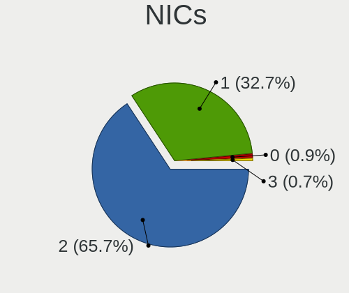
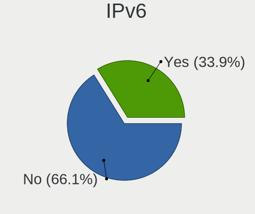
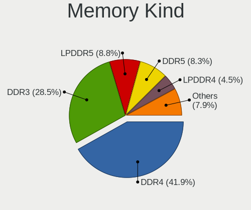

Linux - Hardware Trends (Notebooks)
-----------------------------------

A project to identify most popular hardware characteristics and track their change
over time based on data collected by Linux users at https://Linux-Hardware.org.

Anyone can contribute to this report by the [hw-probe](https://github.com/linuxhw/hw-probe) tool:

    sudo -E hw-probe -all -upload

This report is for one last month. Overall report since the beginning of time: [TestDays](https://github.com/linuxhw/TestDays)

Period: Nov, 2023.

Contents
--------

* [ System ](#system)
  - [ OS                       ](#os)
  - [ OS Family                ](#os-family)
  - [ Kernel                   ](#kernel)
  - [ Kernel Family            ](#kernel-family)
  - [ Kernel Major Ver.        ](#kernel-major-ver)
  - [ Arch                     ](#arch)
  - [ DE                       ](#de)
  - [ Display Server           ](#display-server)
  - [ Display Manager          ](#display-manager)
  - [ OS Lang                  ](#os-lang)
  - [ Boot Mode                ](#boot-mode)
  - [ Filesystem               ](#filesystem)
  - [ Part. scheme             ](#part-scheme)
  - [ Dual Boot with Linux/BSD ](#dual-boot-with-linuxbsd)
  - [ Dual Boot (Win)          ](#dual-boot-win)

* [ Board ](#board)
  - [ Vendor                   ](#vendor)
  - [ Model                    ](#model)
  - [ Model Family             ](#model-family)
  - [ MFG Year                 ](#mfg-year)
  - [ Form Factor              ](#form-factor)
  - [ Secure Boot              ](#secure-boot)
  - [ Coreboot                 ](#coreboot)
  - [ RAM Size                 ](#ram-size)
  - [ RAM Used                 ](#ram-used)
  - [ Total Drives             ](#total-drives)
  - [ Has CD-ROM               ](#has-cd-rom)
  - [ Has Ethernet             ](#has-ethernet)
  - [ Has WiFi                 ](#has-wifi)
  - [ Has Bluetooth            ](#has-bluetooth)

* [ Location ](#location)
  - [ Country                  ](#country)
  - [ City                     ](#city)

* [ Drives ](#drives)
  - [ Drive Vendor             ](#drive-vendor)
  - [ Drive Model              ](#drive-model)
  - [ HDD Vendor               ](#hdd-vendor)
  - [ SSD Vendor               ](#ssd-vendor)
  - [ Drive Kind               ](#drive-kind)
  - [ Drive Connector          ](#drive-connector)
  - [ Drive Size               ](#drive-size)
  - [ Space Total              ](#space-total)
  - [ Space Used               ](#space-used)
  - [ Malfunc. Drives          ](#malfunc-drives)
  - [ Malfunc. Drive Vendor    ](#malfunc-drive-vendor)
  - [ Malfunc. HDD Vendor      ](#malfunc-hdd-vendor)
  - [ Malfunc. Drive Kind      ](#malfunc-drive-kind)
  - [ Failed Drives            ](#failed-drives)
  - [ Failed Drive Vendor      ](#failed-drive-vendor)
  - [ Drive Status             ](#drive-status)

* [ Storage controller ](#storage-controller)
  - [ Storage Vendor           ](#storage-vendor)
  - [ Storage Model            ](#storage-model)
  - [ Storage Kind             ](#storage-kind)

* [ Processor ](#processor)
  - [ CPU Vendor               ](#cpu-vendor)
  - [ CPU Model                ](#cpu-model)
  - [ CPU Model Family         ](#cpu-model-family)
  - [ CPU Cores                ](#cpu-cores)
  - [ CPU Sockets              ](#cpu-sockets)
  - [ CPU Threads              ](#cpu-threads)
  - [ CPU Op-Modes             ](#cpu-op-modes)
  - [ CPU Microcode            ](#cpu-microcode)
  - [ CPU Microarch            ](#cpu-microarch)

* [ Graphics ](#graphics)
  - [ GPU Vendor               ](#gpu-vendor)
  - [ GPU Model                ](#gpu-model)
  - [ GPU Combo                ](#gpu-combo)
  - [ GPU Driver               ](#gpu-driver)
  - [ GPU Memory               ](#gpu-memory)

* [ Monitor ](#monitor)
  - [ Monitor Vendor           ](#monitor-vendor)
  - [ Monitor Model            ](#monitor-model)
  - [ Monitor Resolution       ](#monitor-resolution)
  - [ Monitor Diagonal         ](#monitor-diagonal)
  - [ Monitor Width            ](#monitor-width)
  - [ Aspect Ratio             ](#aspect-ratio)
  - [ Monitor Area             ](#monitor-area)
  - [ Pixel Density            ](#pixel-density)
  - [ Multiple Monitors        ](#multiple-monitors)

* [ Network ](#network)
  - [ Net Controller Vendor    ](#net-controller-vendor)
  - [ Net Controller Model     ](#net-controller-model)
  - [ Wireless Vendor          ](#wireless-vendor)
  - [ Wireless Model           ](#wireless-model)
  - [ Ethernet Vendor          ](#ethernet-vendor)
  - [ Ethernet Model           ](#ethernet-model)
  - [ Net Controller Kind      ](#net-controller-kind)
  - [ Used Controller          ](#used-controller)
  - [ NICs                     ](#nics)
  - [ IPv6                     ](#ipv6)

* [ Bluetooth ](#bluetooth)
  - [ Bluetooth Vendor         ](#bluetooth-vendor)
  - [ Bluetooth Model          ](#bluetooth-model)

* [ Sound ](#sound)
  - [ Sound Vendor             ](#sound-vendor)
  - [ Sound Model              ](#sound-model)

* [ Memory ](#memory)
  - [ Memory Vendor            ](#memory-vendor)
  - [ Memory Model             ](#memory-model)
  - [ Memory Kind              ](#memory-kind)
  - [ Memory Form Factor       ](#memory-form-factor)
  - [ Memory Size              ](#memory-size)
  - [ Memory Speed             ](#memory-speed)

* [ Printers & scanners ](#printers--scanners)
  - [ Printer Vendor           ](#printer-vendor)
  - [ Printer Model            ](#printer-model)
  - [ Scanner Vendor           ](#scanner-vendor)
  - [ Scanner Model            ](#scanner-model)

* [ Camera ](#camera)
  - [ Camera Vendor            ](#camera-vendor)
  - [ Camera Model             ](#camera-model)

* [ Security ](#security)
  - [ Fingerprint Vendor       ](#fingerprint-vendor)
  - [ Fingerprint Model        ](#fingerprint-model)
  - [ Chipcard Vendor          ](#chipcard-vendor)
  - [ Chipcard Model           ](#chipcard-model)

* [ Unsupported ](#unsupported)
  - [ Unsupported Devices      ](#unsupported-devices)
  - [ Unsupported Device Types ](#unsupported-device-types)

System
------

OS
--

Installed operating systems

| Name                         | Notebooks | Percent |
|------------------------------|-----------|---------|
| Ubuntu 22.04                 | 438       | 13.07%  |
| Fedora 39                    | 273       | 8.14%   |
| Linux Mint 21.2              | 241       | 7.19%   |
| Debian 12                    | 166       | 4.95%   |
| Arch Rolling                 | 156       | 4.65%   |
| Ubuntu 23.10                 | 146       | 4.36%   |
| Pop!_OS 22.04                | 108       | 3.22%   |
| Fedora 38                    | 103       | 3.07%   |
| Zorin 16                     | 98        | 2.92%   |
| OpenMandriva 23.08           | 96        | 2.86%   |
| OpenMandriva 5.0             | 90        | 2.68%   |
| ROSA 12.4                    | 77        | 2.3%    |
| ArcoLinux Rolling            | 67        | 2%      |
| BlackPanther 18.1            | 63        | 1.88%   |
| Ubuntu 20.04                 | 48        | 1.43%   |
| Kali 2023.3                  | 48        | 1.43%   |
| openSUSE Tumbleweed-XXXXXXXX | 43        | 1.28%   |
| EndeavourOS Rolling          | 43        | 1.28%   |
| Ubuntu 23.04                 | 39        | 1.16%   |
| KDE neon 22.04               | 36        | 1.07%   |
| OpenMandriva 23.11           | 34        | 1.01%   |
| Manjaro                      | 31        | 0.92%   |
| Kubuntu 23.10                | 31        | 0.92%   |
| Kubuntu 22.04                | 31        | 0.92%   |
| Gentoo 2.14                  | 30        | 0.89%   |
| Manjaro 23.1.0               | 29        | 0.87%   |
| LMDE 6                       | 29        | 0.87%   |
| Debian 11                    | 26        | 0.78%   |
| Linux Mint 21.1              | 25        | 0.75%   |
| Xero Rolling                 | 24        | 0.72%   |
| SteamOS 3.4.11               | 24        | 0.72%   |
| SteamOS 3.5.7                | 23        | 0.69%   |
| SteamOS 3.5.5                | 22        | 0.66%   |
| Debian                       | 22        | 0.66%   |
| Elementary 7.1               | 21        | 0.63%   |
| Nobara 38                    | 19        | 0.57%   |
| Linux Mint 20.3              | 19        | 0.57%   |
| openSUSE Leap-15.5           | 17        | 0.51%   |
| Manjaro 23.0.4               | 16        | 0.48%   |
| Xubuntu 22.04                | 15        | 0.45%   |

OS Family
---------

OS without a version

| Name             | Notebooks | Percent |
|------------------|-----------|---------|
| Ubuntu           | 691       | 20.61%  |
| Fedora           | 391       | 11.66%  |
| Linux Mint       | 311       | 9.28%   |
| OpenMandriva     | 268       | 8%      |
| Debian           | 217       | 6.47%   |
| Arch             | 156       | 4.65%   |
| Pop!_OS          | 109       | 3.25%   |
| ROSA             | 103       | 3.07%   |
| Zorin            | 101       | 3.01%   |
| SteamOS          | 87        | 2.6%    |
| Manjaro          | 78        | 2.33%   |
| Kubuntu          | 71        | 2.12%   |
| ArcoLinux        | 71        | 2.12%   |
| BlackPanther     | 68        | 2.03%   |
| openSUSE         | 65        | 1.94%   |
| Kali             | 53        | 1.58%   |
| EndeavourOS      | 43        | 1.28%   |
| Xubuntu          | 37        | 1.1%    |
| KDE neon         | 37        | 1.1%    |
| LMDE             | 33        | 0.98%   |
| Gentoo           | 31        | 0.92%   |
| Elementary       | 26        | 0.78%   |
| Xero             | 24        | 0.72%   |
| Ubuntu MATE      | 20        | 0.6%    |
| Nobara           | 19        | 0.57%   |
| Lubuntu          | 19        | 0.57%   |
| NixOS            | 18        | 0.54%   |
| MX               | 13        | 0.39%   |
| Garuda Linux     | 13        | 0.39%   |
| Parrot           | 12        | 0.36%   |
| Endless          | 12        | 0.36%   |
| TUXEDO OS        | 10        | 0.3%    |
| Ubuntu Unity     | 9         | 0.27%   |
| Ubuntu Budgie    | 8         | 0.24%   |
| Red OS           | 8         | 0.24%   |
| Devuan           | 8         | 0.24%   |
| org.kde.Platform | 7         | 0.21%   |
| BigLinux         | 7         | 0.21%   |
| Void Linux       | 6         | 0.18%   |
| blendOS          | 6         | 0.18%   |

Kernel
------

Version of the Linux kernel

| Version                           | Notebooks | Percent |
|-----------------------------------|-----------|---------|
| 6.2.0-36-generic                  | 334       | 9.96%   |
| 5.15.0-88-generic                 | 247       | 7.37%   |
| 6.1.0-13-amd64                    | 169       | 5.04%   |
| 6.2.0-37-generic                  | 140       | 4.18%   |
| 6.5.11-300.fc39.x86_64            | 133       | 3.97%   |
| 6.5.0-10-generic                  | 129       | 3.85%   |
| 6.6.2-desktop-1omv2390            | 97        | 2.89%   |
| 6.4.11-desktop-1omv2390           | 92        | 2.74%   |
| 5.15.0-89-generic                 | 83        | 2.48%   |
| 6.5.6-76060506-generic            | 81        | 2.42%   |
| 6.5.9-arch2-1                     | 73        | 2.18%   |
| 6.6.1-arch1-1                     | 70        | 2.09%   |
| 6.5.12-300.fc39.x86_64            | 54        | 1.61%   |
| 6.1.58-generic-1rosa2021.1-x86_64 | 45        | 1.34%   |
| 6.5.0-kali3-amd64                 | 40        | 1.19%   |
| 6.5.0-13-generic                  | 40        | 1.19%   |
| 6.5.6-300.fc39.x86_64             | 36        | 1.07%   |
| 6.6.2-arch1-1                     | 34        | 1.01%   |
| 6.5.8-200.fc38.x86_64             | 33        | 0.98%   |
| 6.2.0-35-generic                  | 33        | 0.98%   |
| 6.2.0-26-generic                  | 33        | 0.98%   |
| 5.15.85-desktop-1bP               | 31        | 0.92%   |
| 6.5.9-200.fc38.x86_64             | 30        | 0.89%   |
| 5.15.0-76-generic                 | 26        | 0.78%   |
| 6.1.52-valve7-1-neptune-61        | 25        | 0.75%   |
| 6.5.9-1-default                   | 24        | 0.72%   |
| 6.1.20-generic-2rosa2021.1-x86_64 | 24        | 0.72%   |
| 5.13.0-valve37-1-neptune          | 24        | 0.72%   |
| 6.1.52-valve9-1-neptune-61        | 23        | 0.69%   |
| 6.6.1-zen1-1-zen                  | 21        | 0.63%   |
| 5.10.0-26-amd64                   | 20        | 0.6%    |
| 6.5.10-200.fc38.x86_64            | 19        | 0.57%   |
| 6.5.10-300.fc39.x86_64            | 18        | 0.54%   |
| 5.4.0-166-generic                 | 18        | 0.54%   |
| 6.5.11-1-MANJARO                  | 16        | 0.48%   |
| 5.6.14-desktop-2bP                | 16        | 0.48%   |
| 5.15.0-87-generic                 | 16        | 0.48%   |
| 6.5.8-arch1-1                     | 15        | 0.45%   |
| 6.5.4-76060504-generic            | 15        | 0.45%   |
| 6.6.1-desktop-1omv2390            | 14        | 0.42%   |

Kernel Family
-------------

Linux kernel without a distro release

| Version | Notebooks | Percent |
|---------|-----------|---------|
| 6.2.0   | 580       | 17.3%   |
| 5.15.0  | 431       | 12.86%  |
| 6.5.0   | 280       | 8.35%   |
| 6.1.0   | 226       | 6.74%   |
| 6.6.2   | 178       | 5.31%   |
| 6.5.9   | 177       | 5.28%   |
| 6.5.11  | 161       | 4.8%    |
| 6.6.1   | 140       | 4.18%   |
| 6.5.6   | 125       | 3.73%   |
| 6.4.11  | 96        | 2.86%   |
| 6.1.52  | 64        | 1.91%   |
| 6.5.12  | 62        | 1.85%   |
| 6.5.8   | 51        | 1.52%   |
| 5.4.0   | 51        | 1.52%   |
| 6.5.10  | 50        | 1.49%   |
| 6.1.58  | 47        | 1.4%    |
| 6.6.0   | 46        | 1.37%   |
| 5.10.0  | 35        | 1.04%   |
| 5.13.0  | 33        | 0.98%   |
| 5.15.85 | 31        | 0.92%   |
| 6.5.5   | 28        | 0.84%   |
| 6.1.20  | 24        | 0.72%   |
| 5.19.0  | 22        | 0.66%   |
| 6.5.7   | 19        | 0.57%   |
| 6.5.4   | 18        | 0.54%   |
| 5.14.21 | 18        | 0.54%   |
| 5.6.14  | 17        | 0.51%   |
| 6.1.62  | 15        | 0.45%   |
| 6.1.60  | 14        | 0.42%   |
| 5.14.0  | 14        | 0.42%   |
| 4.18.16 | 13        | 0.39%   |
| 6.2.6   | 12        | 0.36%   |
| 4.15.0  | 12        | 0.36%   |
| 6.4.10  | 11        | 0.33%   |
| 6.2.9   | 11        | 0.33%   |
| 6.1.57  | 11        | 0.33%   |
| 6.1.55  | 11        | 0.33%   |
| 5.16.7  | 11        | 0.33%   |
| 6.4.8   | 9         | 0.27%   |
| 6.1.63  | 9         | 0.27%   |

Kernel Major Ver.
-----------------

Linux kernel major version

| Version | Notebooks | Percent |
|---------|-----------|---------|
| 6.5     | 980       | 29.24%  |
| 6.2     | 612       | 18.26%  |
| 5.15    | 482       | 14.38%  |
| 6.1     | 444       | 13.25%  |
| 6.6     | 372       | 11.1%   |
| 6.4     | 137       | 4.09%   |
| 5.4     | 57        | 1.7%    |
| 5.10    | 53        | 1.58%   |
| 5.14    | 34        | 1.01%   |
| 5.13    | 33        | 0.98%   |
| 5.19    | 24        | 0.72%   |
| 6.3     | 20        | 0.6%    |
| 5.6     | 17        | 0.51%   |
| 4.18    | 16        | 0.48%   |
| 5.16    | 15        | 0.45%   |
| 4.15    | 12        | 0.36%   |
| 6.0     | 8         | 0.24%   |
| 5.11    | 7         | 0.21%   |
| 6.7     | 6         | 0.18%   |
| 5.8     | 5         | 0.15%   |
| 5.17    | 5         | 0.15%   |
| 5.18    | 4         | 0.12%   |
| 4.4     | 3         | 0.09%   |
| 4.9     | 2         | 0.06%   |
| 6.6.0   | 1         | 0.03%   |
| 5.9     | 1         | 0.03%   |
| 4.19    | 1         | 0.03%   |
| 3.10    | 1         | 0.03%   |

Arch
----

OS architecture (x86_64, i586, etc.)

| Name    | Notebooks | Percent |
|---------|-----------|---------|
| x86_64  | 3318      | 98.99%  |
| i686    | 27        | 0.81%   |
| aarch64 | 6         | 0.18%   |
| armv7l  | 1         | 0.03%   |

DE
--

Desktop Environment

| Name             | Notebooks | Percent |
|------------------|-----------|---------|
| GNOME            | 1504      | 44.87%  |
| KDE5             | 892       | 26.61%  |
| X-Cinnamon       | 295       | 8.8%    |
| XFCE             | 235       | 7.01%   |
| MATE             | 98        | 2.92%   |
| Unknown          | 79        | 2.36%   |
| LXQt             | 65        | 1.94%   |
| Pantheon         | 26        | 0.78%   |
| i3               | 22        | 0.66%   |
| Cinnamon         | 18        | 0.54%   |
| Budgie           | 16        | 0.48%   |
| Hyprland         | 15        | 0.45%   |
| Unity            | 10        | 0.3%    |
| sway             | 9         | 0.27%   |
| KDE4             | 7         | 0.21%   |
| Endless:GNOME    | 7         | 0.21%   |
| LXDE             | 6         | 0.18%   |
| KDE              | 6         | 0.18%   |
| GNOME Flashback  | 5         | 0.15%   |
| Deepin           | 5         | 0.15%   |
| qtile            | 4         | 0.12%   |
| DDE              | 4         | 0.12%   |
| openbox          | 3         | 0.09%   |
| dwm              | 3         | 0.09%   |
| i3-with-shmlog   | 2         | 0.06%   |
| GNOME Classic    | 2         | 0.06%   |
| chadwm           | 2         | 0.06%   |
| wayland          | 1         | 0.03%   |
| UKUI             | 1         | 0.03%   |
| ubuntu           | 1         | 0.03%   |
| Trinity          | 1         | 0.03%   |
| TOS:GNOME        | 1         | 0.03%   |
| lightdm-xsession | 1         | 0.03%   |
| LeftWM           | 1         | 0.03%   |
| KDE6             | 1         | 0.03%   |
| ICEWM            | 1         | 0.03%   |
| gamescope        | 1         | 0.03%   |
| Enlightenment    | 1         | 0.03%   |
| BunsenLabs       | 1         | 0.03%   |

Display Server
--------------

X11 or Wayland

| Name    | Notebooks | Percent |
|---------|-----------|---------|
| X11     | 1851      | 55.22%  |
| Wayland | 1415      | 42.21%  |
| Unknown | 51        | 1.52%   |
| Tty     | 35        | 1.04%   |

Display Manager
---------------

SDDM, LightDM, etc.

| Name    | Notebooks | Percent |
|---------|-----------|---------|
| Unknown | 1165      | 34.76%  |
| SDDM    | 732       | 21.84%  |
| GDM3    | 717       | 21.39%  |
| LightDM | 442       | 13.19%  |
| GDM     | 273       | 8.14%   |
| KDM     | 7         | 0.21%   |
| SLiM    | 5         | 0.15%   |
| Ly      | 3         | 0.09%   |
| NODM    | 2         | 0.06%   |
| LXDM    | 2         | 0.06%   |
| XDM     | 1         | 0.03%   |
| LY-DM   | 1         | 0.03%   |
| GREETD  | 1         | 0.03%   |
| EMPTTY  | 1         | 0.03%   |

OS Lang
-------

Language

| Lang    | Notebooks | Percent |
|---------|-----------|---------|
| en_US   | 1416      | 42.24%  |
| de_DE   | 260       | 7.76%   |
| ru_RU   | 239       | 7.13%   |
| en_GB   | 180       | 5.37%   |
| it_IT   | 159       | 4.74%   |
| fr_FR   | 156       | 4.65%   |
| pt_BR   | 120       | 3.58%   |
| Unknown | 99        | 2.95%   |
| C       | 91        | 2.71%   |
| es_ES   | 70        | 2.09%   |
| pl_PL   | 63        | 1.88%   |
| en_CA   | 54        | 1.61%   |
| en_IN   | 37        | 1.1%    |
| en_AU   | 34        | 1.01%   |
| cs_CZ   | 26        | 0.78%   |
| es_MX   | 23        | 0.69%   |
| tr_TR   | 22        | 0.66%   |
| hu_HU   | 21        | 0.63%   |
| zh_CN   | 18        | 0.54%   |
| nl_NL   | 17        | 0.51%   |
| pt_PT   | 16        | 0.48%   |
| de_AT   | 13        | 0.39%   |
| sv_SE   | 10        | 0.3%    |
| da_DK   | 10        | 0.3%    |
| es_CO   | 9         | 0.27%   |
| es_AR   | 9         | 0.27%   |
| en_ZA   | 9         | 0.27%   |
| en_NZ   | 9         | 0.27%   |
| en_IE   | 9         | 0.27%   |
| de_CH   | 9         | 0.27%   |
| es_CL   | 8         | 0.24%   |
| ja_JP   | 7         | 0.21%   |
| nb_NO   | 6         | 0.18%   |
| fi_FI   | 6         | 0.18%   |
| sk_SK   | 5         | 0.15%   |
| ro_RO   | 5         | 0.15%   |
| nl_BE   | 5         | 0.15%   |
| fr_CH   | 5         | 0.15%   |
| fr_CA   | 5         | 0.15%   |
| el_GR   | 5         | 0.15%   |

Boot Mode
---------

EFI or BIOS

| Mode | Notebooks | Percent |
|------|-----------|---------|
| EFI  | 1996      | 59.55%  |
| BIOS | 1356      | 40.45%  |

Filesystem
----------

Type of filesystem

| Type     | Notebooks | Percent |
|----------|-----------|---------|
| Ext4     | 1892      | 56.44%  |
| Btrfs    | 687       | 20.5%   |
| Tmpfs    | 437       | 13.04%  |
| Overlay  | 252       | 7.52%   |
| Xfs      | 45        | 1.34%   |
| Zfs      | 11        | 0.33%   |
| F2fs     | 10        | 0.3%    |
| Ext3     | 8         | 0.24%   |
| Unknown  | 3         | 0.09%   |
| Rootfs   | 2         | 0.06%   |
| Ext2     | 2         | 0.06%   |
| XXXXXXX  | 1         | 0.03%   |
| Bcachefs | 1         | 0.03%   |
| Aufs     | 1         | 0.03%   |

Part. scheme
------------

Scheme of partitioning

| Type    | Notebooks | Percent |
|---------|-----------|---------|
| GPT     | 1943      | 57.97%  |
| Unknown | 1077      | 32.13%  |
| MBR     | 332       | 9.9%    |

Dual Boot with Linux/BSD
------------------------

Hosting more than one Linux/BSD

| Dual boot | Notebooks | Percent |
|-----------|-----------|---------|
| No        | 2937      | 87.62%  |
| Yes       | 415       | 12.38%  |

Dual Boot (Win)
---------------

Hosting Linux and Windows

| Dual boot | Notebooks | Percent |
|-----------|-----------|---------|
| No        | 2482      | 74.05%  |
| Yes       | 870       | 25.95%  |

Board
-----

Vendor
------

Motherboard manufacturer

| Name                | Notebooks | Percent |
|---------------------|-----------|---------|
| Lenovo              | 746       | 22.26%  |
| Hewlett-Packard     | 597       | 17.81%  |
| Dell                | 418       | 12.47%  |
| ASUSTek Computer    | 382       | 11.4%   |
| Acer                | 255       | 7.61%   |
| Apple               | 108       | 3.22%   |
| Valve               | 87        | 2.6%    |
| MSI                 | 84        | 2.51%   |
| Toshiba             | 70        | 2.09%   |
| HUAWEI              | 65        | 1.94%   |
| Samsung Electronics | 62        | 1.85%   |
| Google              | 38        | 1.13%   |
| Unknown             | 34        | 1.01%   |
| Sony                | 31        | 0.92%   |
| Fujitsu             | 25        | 0.75%   |
| Timi                | 21        | 0.63%   |
| Notebook            | 19        | 0.57%   |
| Medion              | 18        | 0.54%   |
| TUXEDO              | 17        | 0.51%   |
| Framework           | 17        | 0.51%   |
| Alienware           | 14        | 0.42%   |
| Packard Bell        | 12        | 0.36%   |
| HONOR               | 9         | 0.27%   |
| Gigabyte Technology | 8         | 0.24%   |
| Aquarius            | 8         | 0.24%   |
| System76            | 6         | 0.18%   |
| Fujitsu Siemens     | 6         | 0.18%   |
| Clevo               | 6         | 0.18%   |
| Chuwi               | 6         | 0.18%   |
| Teclast             | 5         | 0.15%   |
| GPU Company         | 5         | 0.15%   |
| VALE                | 4         | 0.12%   |
| Positivo            | 4         | 0.12%   |
| LG Electronics      | 4         | 0.12%   |
| Jumper              | 4         | 0.12%   |
| Irbis               | 4         | 0.12%   |
| eMachines           | 4         | 0.12%   |
| Dynabook            | 4         | 0.12%   |
| AMI                 | 4         | 0.12%   |
| Wortmann AG         | 3         | 0.09%   |

Model
-----

Motherboard model

| Name                                       | Notebooks | Percent |
|--------------------------------------------|-----------|---------|
| Valve Jupiter                              | 83        | 2.48%   |
| Unknown                                    | 49        | 1.46%   |
| HP Notebook                                | 17        | 0.51%   |
| HP Pavilion dv6                            | 14        | 0.42%   |
| HP Pavilion Notebook                       | 12        | 0.36%   |
| HP Pavilion g6                             | 10        | 0.3%    |
| Apple MacBookPro8,1                        | 10        | 0.3%    |
| Apple MacBookPro11,1                       | 10        | 0.3%    |
| Dell Latitude E6430                        | 9         | 0.27%   |
| HP Laptop 15s-eq2xxx                       | 8         | 0.24%   |
| Acer Nitro AN515-54                        | 8         | 0.24%   |
| HUAWEI BOM-WXX9                            | 7         | 0.21%   |
| Framework Laptop 13 (AMD Ryzen 7040Series) | 7         | 0.21%   |
| Aquarius NS585                             | 7         | 0.21%   |
| Apple MacBookPro9,2                        | 7         | 0.21%   |
| Lenovo IdeaPad 320-15ABR 80XS              | 6         | 0.18%   |
| HUAWEI HVY-WXX9                            | 6         | 0.18%   |
| HUAWEI BOD-WXX9                            | 6         | 0.18%   |
| HP Pavilion g7                             | 6         | 0.18%   |
| HP Pavilion dv7                            | 6         | 0.18%   |
| HP Laptop 15-dy2xxx                        | 6         | 0.18%   |
| HP Laptop 15-bw0xx                         | 6         | 0.18%   |
| HP EliteBook 840 G5                        | 6         | 0.18%   |
| HP 15                                      | 6         | 0.18%   |
| Dell Latitude E6420                        | 6         | 0.18%   |
| Dell Latitude E5430 non-vPro               | 6         | 0.18%   |
| Lenovo IdeaPad Gaming 3 15IAH7 82S9        | 5         | 0.15%   |
| Lenovo IdeaPad 5 15ITL05 82FG              | 5         | 0.15%   |
| HP ProBook 650 G1                          | 5         | 0.15%   |
| HP ProBook 440 G7                          | 5         | 0.15%   |
| HP Pavilion 15                             | 5         | 0.15%   |
| HP Laptop 15-da0xxx                        | 5         | 0.15%   |
| HP EliteBook 840 G3                        | 5         | 0.15%   |
| HP 255 G7 Notebook PC                      | 5         | 0.15%   |
| HP 250 G8 Notebook PC                      | 5         | 0.15%   |
| HP 250 G7 Notebook PC                      | 5         | 0.15%   |
| Dell XPS 15 9570                           | 5         | 0.15%   |
| Dell XPS 15 9560                           | 5         | 0.15%   |
| Dell Latitude E6540                        | 5         | 0.15%   |
| Dell Latitude E6230                        | 5         | 0.15%   |

Model Family
------------

Motherboard model prefix

| Name                  | Notebooks | Percent |
|-----------------------|-----------|---------|
| Lenovo ThinkPad       | 374       | 11.16%  |
| Dell Latitude         | 181       | 5.4%    |
| Lenovo IdeaPad        | 176       | 5.25%   |
| Acer Aspire           | 162       | 4.83%   |
| ASUS Vivobook         | 133       | 3.97%   |
| HP Pavilion           | 126       | 3.76%   |
| Dell Inspiron         | 97        | 2.89%   |
| HP Laptop             | 94        | 2.8%    |
| HP EliteBook          | 92        | 2.74%   |
| Valve Jupiter         | 83        | 2.48%   |
| HP ProBook            | 82        | 2.45%   |
| Lenovo Legion         | 57        | 1.7%    |
| Toshiba Satellite     | 56        | 1.67%   |
| Unknown               | 49        | 1.46%   |
| Dell XPS              | 45        | 1.34%   |
| Dell Precision        | 41        | 1.22%   |
| ASUS ROG              | 41        | 1.22%   |
| ASUS ASUS             | 34        | 1.01%   |
| Acer Nitro            | 33        | 0.98%   |
| Dell Vostro           | 27        | 0.81%   |
| ASUS Zenbook          | 27        | 0.81%   |
| Lenovo ThinkBook      | 25        | 0.75%   |
| Lenovo Yoga           | 24        | 0.72%   |
| HP ZBook              | 24        | 0.72%   |
| Fujitsu LIFEBOOK      | 22        | 0.66%   |
| HP 250                | 21        | 0.63%   |
| Apple MacBookPro11    | 20        | 0.6%    |
| HP Compaq             | 19        | 0.57%   |
| HP Notebook           | 17        | 0.51%   |
| Framework Laptop      | 17        | 0.51%   |
| Acer Swift            | 17        | 0.51%   |
| HP OMEN               | 15        | 0.45%   |
| HP ENVY               | 15        | 0.45%   |
| HP 255                | 14        | 0.42%   |
| Acer TravelMate       | 14        | 0.42%   |
| MSI Prestige          | 13        | 0.39%   |
| Acer Predator         | 13        | 0.39%   |
| MSI Modern            | 12        | 0.36%   |
| Apple MacBookPro8     | 11        | 0.33%   |
| Packard Bell EasyNote | 10        | 0.3%    |

MFG Year
--------

Motherboard manufacture year

| Year    | Notebooks | Percent |
|---------|-----------|---------|
| 2021    | 396       | 11.81%  |
| 2023    | 358       | 10.68%  |
| 2022    | 328       | 9.79%   |
| 2020    | 308       | 9.19%   |
| 2019    | 261       | 7.79%   |
| 2012    | 211       | 6.29%   |
| 2018    | 198       | 5.91%   |
| 2017    | 192       | 5.73%   |
| 2013    | 189       | 5.64%   |
| 2011    | 184       | 5.49%   |
| 2016    | 143       | 4.27%   |
| 2014    | 132       | 3.94%   |
| 2015    | 126       | 3.76%   |
| 2010    | 106       | 3.16%   |
| 2008    | 91        | 2.71%   |
| 2009    | 67        | 2%      |
| 2007    | 38        | 1.13%   |
| 2006    | 10        | 0.3%    |
| Unknown | 9         | 0.27%   |
| 2005    | 2         | 0.06%   |
| 2004    | 2         | 0.06%   |
| 2003    | 1         | 0.03%   |

Form Factor
-----------

Physical design of the computer

| Name     | Notebooks | Percent |
|----------|-----------|---------|
| Notebook | 3352      | 100%    |

Secure Boot
-----------

Enabled or disabled

| State    | Notebooks | Percent |
|----------|-----------|---------|
| Disabled | 3052      | 91.05%  |
| Enabled  | 300       | 8.95%   |

Coreboot
--------

Have coreboot on board

| Used | Notebooks | Percent |
|------|-----------|---------|
| No   | 3305      | 98.6%   |
| Yes  | 47        | 1.4%    |

RAM Size
--------

Total RAM memory

| Size in GB  | Notebooks | Percent |
|-------------|-----------|---------|
| 4.01-8.0    | 928       | 27.68%  |
| 8.01-16.0   | 669       | 19.96%  |
| 16.01-24.0  | 635       | 18.94%  |
| 3.01-4.0    | 532       | 15.87%  |
| 32.01-64.0  | 308       | 9.19%   |
| 24.01-32.0  | 88        | 2.63%   |
| 1.01-2.0    | 78        | 2.33%   |
| 64.01-256.0 | 58        | 1.73%   |
| 2.01-3.0    | 50        | 1.49%   |
| 0.51-1.0    | 6         | 0.18%   |

RAM Used
--------

Used RAM memory

| Used GB    | Notebooks | Percent |
|------------|-----------|---------|
| 1.01-2.0   | 914       | 27.27%  |
| 2.01-3.0   | 858       | 25.6%   |
| 4.01-8.0   | 649       | 19.36%  |
| 3.01-4.0   | 553       | 16.5%   |
| 8.01-16.0  | 181       | 5.4%    |
| 0.51-1.0   | 144       | 4.3%    |
| 16.01-24.0 | 28        | 0.84%   |
| 0.01-0.5   | 19        | 0.57%   |
| 24.01-32.0 | 5         | 0.15%   |
| 32.01-64.0 | 1         | 0.03%   |

Total Drives
------------

Number of drives on board

| Drives | Notebooks | Percent |
|--------|-----------|---------|
| 1      | 2446      | 72.97%  |
| 2      | 783       | 23.36%  |
| 3      | 95        | 2.83%   |
| 4      | 13        | 0.39%   |
| 0      | 11        | 0.33%   |
| 5      | 3         | 0.09%   |
| 6      | 1         | 0.03%   |

Has CD-ROM
----------

Has CD-ROM on board

| Presented | Notebooks | Percent |
|-----------|-----------|---------|
| No        | 2458      | 73.33%  |
| Yes       | 894       | 26.67%  |

Has Ethernet
------------

Has Ethernet on board

| Presented | Notebooks | Percent |
|-----------|-----------|---------|
| Yes       | 2516      | 75.06%  |
| No        | 836       | 24.94%  |

Has WiFi
--------

Has WiFi module

| Presented | Notebooks | Percent |
|-----------|-----------|---------|
| Yes       | 3295      | 98.3%   |
| No        | 57        | 1.7%    |

Has Bluetooth
-------------

Has Bluetooth module

| Presented | Notebooks | Percent |
|-----------|-----------|---------|
| Yes       | 2788      | 83.17%  |
| No        | 564       | 16.83%  |

Location
--------

Country
-------

Geographic location (country)

| Country     | Notebooks | Percent |
|-------------|-----------|---------|
| USA         | 483       | 14.41%  |
| Germany     | 368       | 10.98%  |
| Russia      | 288       | 8.59%   |
| Italy       | 234       | 6.98%   |
| France      | 179       | 5.34%   |
| Brazil      | 169       | 5.04%   |
| UK          | 124       | 3.7%    |
| Hungary     | 98        | 2.92%   |
| Canada      | 97        | 2.89%   |
| Poland      | 95        | 2.83%   |
| Spain       | 85        | 2.54%   |
| Netherlands | 72        | 2.15%   |
| India       | 67        | 2%      |
| Mexico      | 46        | 1.37%   |
| Australia   | 44        | 1.31%   |
| Turkey      | 43        | 1.28%   |
| Switzerland | 40        | 1.19%   |
| Czechia     | 40        | 1.19%   |
| Austria     | 37        | 1.1%    |
| Romania     | 32        | 0.95%   |
| China       | 32        | 0.95%   |
| Belgium     | 31        | 0.92%   |
| Sweden      | 30        | 0.89%   |
| Portugal    | 30        | 0.89%   |
| Greece      | 23        | 0.69%   |
| Bulgaria    | 22        | 0.66%   |
| Argentina   | 22        | 0.66%   |
| Norway      | 21        | 0.63%   |
| Indonesia   | 21        | 0.63%   |
| Colombia    | 21        | 0.63%   |
| Slovakia    | 19        | 0.57%   |
| Denmark     | 18        | 0.54%   |
| Chile       | 16        | 0.48%   |
| Ukraine     | 15        | 0.45%   |
| Ireland     | 15        | 0.45%   |
| Finland     | 15        | 0.45%   |
| Serbia      | 12        | 0.36%   |
| New Zealand | 11        | 0.33%   |
| Malaysia    | 11        | 0.33%   |
| Egypt       | 11        | 0.33%   |

City
----

Geographic location (city)

| City              | Notebooks | Percent |
|-------------------|-----------|---------|
| Moscow            | 68        | 2.03%   |
| Berlin            | 47        | 1.4%    |
| Budapest          | 36        | 1.07%   |
| St Petersburg     | 32        | 0.95%   |
| Milan             | 28        | 0.84%   |
| Sao Paulo         | 24        | 0.72%   |
| Voronezh          | 22        | 0.66%   |
| Paris             | 22        | 0.66%   |
| Vienna            | 21        | 0.63%   |
| Warsaw            | 20        | 0.6%    |
| Rome              | 20        | 0.6%    |
| Madrid            | 20        | 0.6%    |
| Milano            | 18        | 0.54%   |
| Toronto           | 16        | 0.48%   |
| Sydney            | 15        | 0.45%   |
| Munich            | 15        | 0.45%   |
| Prague            | 14        | 0.42%   |
| Istanbul          | 14        | 0.42%   |
| Hamburg           | 14        | 0.42%   |
| Leipzig           | 13        | 0.39%   |
| Frankfurt am Main | 12        | 0.36%   |
| Dublin            | 12        | 0.36%   |
| Helsinki          | 11        | 0.33%   |
| Amsterdam         | 11        | 0.33%   |
| Stuttgart         | 10        | 0.3%    |
| Los Angeles       | 10        | 0.3%    |
| Chennai           | 10        | 0.3%    |
| Brisbane          | 10        | 0.3%    |
| Athens            | 10        | 0.3%    |
| Zurich            | 9         | 0.27%   |
| Sofia             | 9         | 0.27%   |
| Perth             | 9         | 0.27%   |
| Manchester        | 9         | 0.27%   |
| Delhi             | 9         | 0.27%   |
| Bucharest         | 9         | 0.27%   |
| Brussels          | 9         | 0.27%   |
| Brasília         | 9         | 0.27%   |
| Bengaluru         | 9         | 0.27%   |
| Yekaterinburg     | 8         | 0.24%   |
| Santiago          | 8         | 0.24%   |

Drives
------

Drive Vendor
------------

Hard drive vendors

| Vendor                      | Notebooks | Drives | Percent |
|-----------------------------|-----------|--------|---------|
| Samsung Electronics         | 701       | 763    | 16.79%  |
| WDC                         | 347       | 353    | 8.31%   |
| SanDisk                     | 293       | 304    | 7.02%   |
| Seagate                     | 273       | 287    | 6.54%   |
| Unknown                     | 238       | 257    | 5.7%    |
| Toshiba                     | 210       | 215    | 5.03%   |
| Kingston                    | 203       | 211    | 4.86%   |
| SK hynix                    | 197       | 200    | 4.72%   |
| Micron Technology           | 196       | 198    | 4.7%    |
| Intel                       | 169       | 178    | 4.05%   |
| Crucial                     | 137       | 142    | 3.28%   |
| HGST                        | 80        | 82     | 1.92%   |
| Hitachi                     | 74        | 75     | 1.77%   |
| A-DATA Technology           | 67        | 67     | 1.61%   |
| Phison Electronics          | 65        | 66     | 1.56%   |
| Apple                       | 57        | 66     | 1.37%   |
| KIOXIA                      | 56        | 58     | 1.34%   |
| China                       | 54        | 56     | 1.29%   |
| Kingston Technology Company | 49        | 51     | 1.17%   |
| Unknown                     | 42        | 42     | 1.01%   |
| Silicon Motion              | 39        | 40     | 0.93%   |
| Micron/Crucial Technology   | 31        | 31     | 0.74%   |
| SPCC                        | 29        | 30     | 0.69%   |
| Intenso                     | 23        | 23     | 0.55%   |
| Phison                      | 22        | 22     | 0.53%   |
| LITEON                      | 19        | 19     | 0.46%   |
| JMicron Technology          | 18        | 18     | 0.43%   |
| Transcend                   | 17        | 17     | 0.41%   |
| PNY                         | 16        | 16     | 0.38%   |
| O2 Micro                    | 16        | 16     | 0.38%   |
| Fujitsu                     | 16        | 16     | 0.38%   |
| ADATA Technology            | 14        | 16     | 0.34%   |
| SSSTC                       | 13        | 13     | 0.31%   |
| Patriot                     | 12        | 12     | 0.29%   |
| MAXIO Technology (Hangzhou) | 12        | 12     | 0.29%   |
| Lexar                       | 11        | 11     | 0.26%   |
| Team                        | 10        | 10     | 0.24%   |
| Apacer                      | 10        | 10     | 0.24%   |
| UMIS                        | 8         | 8      | 0.19%   |
| Solid State Storage         | 8         | 8      | 0.19%   |

Drive Model
-----------

Hard drive models

| Model                                                 | Notebooks | Percent |
|-------------------------------------------------------|-----------|---------|
| Samsung NVMe SSD Controller SM981/PM981/PM983 250GB   | 97        | 2.26%   |
| Samsung NVMe SSD Controller PM9A1/PM9A3/980PRO 2TB    | 73        | 1.7%    |
| Unknown MMC Card  64GB                                | 44        | 1.03%   |
| Seagate ST1000LM035-1RK172 1TB                        | 42        | 0.98%   |
| Unknown                                               | 42        | 0.98%   |
| Phison PS5013 E13 NVMe Controller 512GB               | 41        | 0.96%   |
| Kingston SA400S37240G 240GB SSD                       | 40        | 0.93%   |
| Sandisk WD Blue SN550 NVMe SSD 512GB                  | 36        | 0.84%   |
| Intel SSDPEKNU512GZ 512GB                             | 36        | 0.84%   |
| Unknown MMC Card  32GB                                | 33        | 0.77%   |
| Kingston SA400S37480G 480GB SSD                       | 33        | 0.77%   |
| Toshiba MQ01ABD100 1TB                                | 29        | 0.68%   |
| Crucial CT500MX500SSD1 500GB                          | 28        | 0.65%   |
| Toshiba MQ04ABF100 1TB                                | 27        | 0.63%   |
| Unknown MMC Card  128GB                               | 26        | 0.61%   |
| Seagate ST1000LM024 HN-M101MBB 1TB                    | 25        | 0.58%   |
| Unknown MMC Card  512GB                               | 22        | 0.51%   |
| Toshiba MQ01ABF050 500GB                              | 22        | 0.51%   |
| Seagate ST500LT012-1DG142 500GB                       | 20        | 0.47%   |
| Sandisk WD Black SN750 / PC SN730 NVMe SSD 500GB      | 20        | 0.47%   |
| Micron/Crucial P2 NVMe PCIe SSD 1TB                   | 20        | 0.47%   |
| Silicon Motion SM2263EN/SM2263XT SSD Controller 256GB | 18        | 0.42%   |
| Unknown MMC Card  256GB                               | 17        | 0.4%    |
| Seagate ST9500325AS 500GB                             | 17        | 0.4%    |
| Samsung SSD 980 1TB                                   | 17        | 0.4%    |
| Samsung MZALQ512HALU-000L2 512GB                      | 17        | 0.4%    |
| Crucial CT240BX500SSD1 240GB                          | 17        | 0.4%    |
| Toshiba XG6 NVMe SSD Controller 512GB                 | 16        | 0.37%   |
| Samsung SSD 870 EVO 500GB                             | 16        | 0.37%   |
| Samsung NVMe SSD Controller SM961/PM961/SM963 256GB   | 16        | 0.37%   |
| O2 Micro E2M2 64GB                                    | 16        | 0.37%   |
| Intel SSD 660P Series 512GB                           | 16        | 0.37%   |
| SK hynix BC501 NVMe Solid State Drive 512GB           | 15        | 0.35%   |
| Samsung SSD 860 EVO 500GB                             | 15        | 0.35%   |
| Micron 2400_MTFDKBA512QFM 512GB                       | 15        | 0.35%   |
| Kingston Company SNV2S1000G 1TB                       | 15        | 0.35%   |
| Kingston Company OM3PDP3 NVMe SSD 256GB               | 15        | 0.35%   |
| HGST HTS721010A9E630 1TB                              | 15        | 0.35%   |
| WDC WD10SPZX-24Z10 1TB                                | 14        | 0.33%   |
| Samsung MZALQ512HBLU-00BL2 512GB                      | 14        | 0.33%   |

HDD Vendor
----------

Hard disk drive vendors

| Vendor              | Notebooks | Drives | Percent |
|---------------------|-----------|--------|---------|
| Seagate             | 263       | 273    | 30.72%  |
| WDC                 | 233       | 235    | 27.22%  |
| Toshiba             | 136       | 137    | 15.89%  |
| HGST                | 80        | 82     | 9.35%   |
| Hitachi             | 74        | 75     | 8.64%   |
| Fujitsu             | 15        | 15     | 1.75%   |
| Unknown             | 14        | 14     | 1.64%   |
| Samsung Electronics | 10        | 11     | 1.17%   |
| USB3.0              | 6         | 6      | 0.7%    |
| TO Exter            | 4         | 4      | 0.47%   |
| StoreJet            | 3         | 3      | 0.35%   |
| Apple               | 3         | 3      | 0.35%   |
| USB                 | 2         | 2      | 0.23%   |
| SABRENT             | 2         | 2      | 0.23%   |
| External            | 2         | 2      | 0.23%   |
| XrayDisk            | 1         | 1      | 0.12%   |
| Pioneer             | 1         | 1      | 0.12%   |
| NeoTech             | 1         | 1      | 0.12%   |
| MARSHAL             | 1         | 1      | 0.12%   |
| KESU                | 1         | 1      | 0.12%   |
| HGST HTS            | 1         | 1      | 0.12%   |
| Hewlett-Packard     | 1         | 1      | 0.12%   |
| ASMT                | 1         | 1      | 0.12%   |
| Unknown             | 1         | 1      | 0.12%   |

SSD Vendor
----------

Solid state drive vendors

| Vendor              | Notebooks | Drives | Percent |
|---------------------|-----------|--------|---------|
| Samsung Electronics | 247       | 256    | 19.86%  |
| Kingston            | 145       | 151    | 11.66%  |
| Crucial             | 122       | 124    | 9.81%   |
| SanDisk             | 100       | 102    | 8.04%   |
| China               | 54        | 56     | 4.34%   |
| A-DATA Technology   | 50        | 50     | 4.02%   |
| WDC                 | 49        | 50     | 3.94%   |
| Apple               | 39        | 39     | 3.14%   |
| Micron Technology   | 32        | 32     | 2.57%   |
| SPCC                | 27        | 28     | 2.17%   |
| Intel               | 23        | 23     | 1.85%   |
| SK hynix            | 22        | 22     | 1.77%   |
| Toshiba             | 21        | 21     | 1.69%   |
| Intenso             | 20        | 20     | 1.61%   |
| LITEON              | 17        | 17     | 1.37%   |
| PNY                 | 15        | 15     | 1.21%   |
| Transcend           | 14        | 14     | 1.13%   |
| Patriot             | 12        | 12     | 0.96%   |
| Lexar               | 9         | 9      | 0.72%   |
| JMicron Technology  | 9         | 9      | 0.72%   |
| GOODRAM             | 8         | 8      | 0.64%   |
| Team                | 7         | 7      | 0.56%   |
| Netac               | 7         | 8      | 0.56%   |
| LITEONIT            | 7         | 7      | 0.56%   |
| Teclast             | 6         | 6      | 0.48%   |
| Phison              | 6         | 6      | 0.48%   |
| Hewlett-Packard     | 6         | 6      | 0.48%   |
| Dogfish             | 6         | 6      | 0.48%   |
| Apacer              | 6         | 6      | 0.48%   |
| OCZ                 | 5         | 5      | 0.4%    |
| KingDian            | 5         | 5      | 0.4%    |
| Fanxiang            | 5         | 5      | 0.4%    |
| Emtec               | 5         | 5      | 0.4%    |
| DEXP                | 5         | 5      | 0.4%    |
| Unknown             | 5         | 5      | 0.4%    |
| Verbatim            | 4         | 4      | 0.32%   |
| Plextor             | 4         | 4      | 0.32%   |
| KingSpec            | 4         | 4      | 0.32%   |
| Zheino              | 3         | 3      | 0.24%   |
| Lenovo              | 3         | 3      | 0.24%   |

Drive Kind
----------

HDD or SSD

| Kind    | Notebooks | Drives | Percent |
|---------|-----------|--------|---------|
| NVMe    | 1667      | 1877   | 42.09%  |
| SSD     | 1165      | 1270   | 29.41%  |
| HDD     | 828       | 873    | 20.9%   |
| MMC     | 237       | 257    | 5.98%   |
| Unknown | 64        | 67     | 1.62%   |

Drive Connector
---------------

SATA, SAS, NVMe, etc.

| Type | Notebooks | Drives | Percent |
|------|-----------|--------|---------|
| SATA | 1767      | 2029   | 46.09%  |
| NVMe | 1661      | 1863   | 43.32%  |
| MMC  | 237       | 257    | 6.18%   |
| SAS  | 169       | 195    | 4.41%   |

Drive Size
----------

Size of hard drive

| Size in TB | Notebooks | Drives | Percent |
|------------|-----------|--------|---------|
| 0.01-0.5   | 1318      | 1450   | 66.6%   |
| 0.51-1.0   | 566       | 596    | 28.6%   |
| 1.01-2.0   | 74        | 74     | 3.74%   |
| 3.01-4.0   | 11        | 11     | 0.56%   |
| 4.01-10.0  | 10        | 12     | 0.51%   |

Space Total
-----------

Amount of disk space available on the file system

| Size in GB     | Notebooks | Percent |
|----------------|-----------|---------|
| 101-250        | 845       | 25.21%  |
| 251-500        | 833       | 24.85%  |
| 501-1000       | 571       | 17.03%  |
| 1001-2000      | 265       | 7.91%   |
| 1-20           | 254       | 7.58%   |
| 51-100         | 178       | 5.31%   |
| Unknown        | 148       | 4.42%   |
| 21-50          | 100       | 2.98%   |
| More than 3000 | 97        | 2.89%   |
| 2001-3000      | 61        | 1.82%   |

Space Used
----------

Amount of used disk space

| Used GB        | Notebooks | Percent |
|----------------|-----------|---------|
| 1-20           | 1083      | 32.31%  |
| 21-50          | 657       | 19.6%   |
| 101-250        | 493       | 14.71%  |
| 51-100         | 405       | 12.08%  |
| 251-500        | 278       | 8.29%   |
| 501-1000       | 176       | 5.25%   |
| Unknown        | 148       | 4.42%   |
| 1001-2000      | 74        | 2.21%   |
| More than 3000 | 21        | 0.63%   |
| 2001-3000      | 12        | 0.36%   |
| 0              | 5         | 0.15%   |

Malfunc. Drives
---------------

Drive models with a malfunction

| Model                                            | Notebooks | Drives | Percent |
|--------------------------------------------------|-----------|--------|---------|
| Toshiba MQ01ABD100 1TB                           | 6         | 6      | 2.67%   |
| Seagate ST9500325AS 500GB                        | 6         | 6      | 2.67%   |
| HGST HTS545050A7E380 500GB                       | 5         | 5      | 2.22%   |
| WDC WD5000LPVX-22V0TT0 500GB                     | 4         | 4      | 1.78%   |
| Toshiba MQ01ABF050 500GB                         | 4         | 4      | 1.78%   |
| Seagate ST9320325AS 320GB                        | 4         | 4      | 1.78%   |
| Seagate ST9250315AS 250GB                        | 4         | 4      | 1.78%   |
| Seagate ST1000LM035-1RK172 1TB                   | 4         | 4      | 1.78%   |
| Seagate ST1000LM024 HN-M101MBB 1TB               | 4         | 4      | 1.78%   |
| HGST HTS721010A9E630 1TB                         | 4         | 4      | 1.78%   |
| HGST HTS545050A7E680 500GB                       | 4         | 4      | 1.78%   |
| HGST HTS541010A9E680 1TB                         | 4         | 4      | 1.78%   |
| Seagate ST500LT012-1DG142 500GB                  | 3         | 3      | 1.33%   |
| HGST HTS725050A7E630 500GB                       | 3         | 3      | 1.33%   |
| HGST HTS541075A9E680 752GB                       | 3         | 3      | 1.33%   |
| WDC WD7500BPKX-60HPJT0 752GB                     | 2         | 2      | 0.89%   |
| WDC WD Green 2.5 240GB SSD                       | 2         | 2      | 0.89%   |
| Toshiba MK6475GSX 640GB                          | 2         | 2      | 0.89%   |
| SK hynix HFS256G39TND-N210A 256GB SSD            | 2         | 2      | 0.89%   |
| SK hynix HFS128G39TND-N210A 128GB SSD            | 2         | 2      | 0.89%   |
| Seagate ST9500423AS 500GB                        | 2         | 2      | 0.89%   |
| Seagate ST500LM021-1KJ152 500GB                  | 2         | 2      | 0.89%   |
| Seagate ST320LT012-9WS14C 320GB                  | 2         | 2      | 0.89%   |
| SanDisk SSD PLUS 480GB                           | 2         | 2      | 0.89%   |
| Samsung Electronics MZNLH128HBHQ-000H1 128GB SSD | 2         | 2      | 0.89%   |
| Hitachi HTS723232A7A364 320GB                    | 2         | 2      | 0.89%   |
| Hitachi HTS545050B9A300 500GB                    | 2         | 2      | 0.89%   |
| HGST HTS545032A7E380 320GB                       | 2         | 2      | 0.89%   |
| WDC WDS240G2G0B-00EPW0 240GB SSD                 | 1         | 1      | 0.44%   |
| WDC WDS240G2G0A-00JH30 240GB SSD                 | 1         | 1      | 0.44%   |
| WDC WD7500BPVT-80HXZT1 752GB                     | 1         | 1      | 0.44%   |
| WDC WD5000LPVX-55V0TT0 500GB                     | 1         | 1      | 0.44%   |
| WDC WD5000LPVT-08G33T1 500GB                     | 1         | 1      | 0.44%   |
| WDC WD5000BEVT-55A0RT0 500GB                     | 1         | 1      | 0.44%   |
| WDC WD5000BEVT-22A0RT0 500GB                     | 1         | 1      | 0.44%   |
| WDC WD5000BEKT-22KA9T0 500GB                     | 1         | 1      | 0.44%   |
| WDC WD40 EFRX-68N32N0 4TB                        | 1         | 1      | 0.44%   |
| WDC WD3200BPVT-75ZEST0 320GB                     | 1         | 1      | 0.44%   |
| WDC WD3200BPVT-24ZEST0 320GB                     | 1         | 1      | 0.44%   |
| WDC WD3200BEVT-80A0RT0 320GB                     | 1         | 1      | 0.44%   |

Malfunc. Drive Vendor
---------------------

Vendors of faulty drives

| Vendor                    | Notebooks | Drives | Percent |
|---------------------------|-----------|--------|---------|
| Seagate                   | 43        | 44     | 19.28%  |
| WDC                       | 35        | 36     | 15.7%   |
| HGST                      | 28        | 28     | 12.56%  |
| Toshiba                   | 27        | 28     | 12.11%  |
| Hitachi                   | 16        | 16     | 7.17%   |
| Samsung Electronics       | 13        | 13     | 5.83%   |
| SK hynix                  | 12        | 12     | 5.38%   |
| SanDisk                   | 8         | 8      | 3.59%   |
| Intel                     | 6         | 6      | 2.69%   |
| Fujitsu                   | 6         | 6      | 2.69%   |
| Crucial                   | 5         | 5      | 2.24%   |
| China                     | 3         | 3      | 1.35%   |
| LITEON                    | 2         | 2      | 0.9%    |
| Kingston                  | 2         | 2      | 0.9%    |
| Apple                     | 2         | 2      | 0.9%    |
| A-DATA Technology         | 2         | 2      | 0.9%    |
| Transcend                 | 1         | 1      | 0.45%   |
| Timetec                   | 1         | 1      | 0.45%   |
| SSSTC                     | 1         | 1      | 0.45%   |
| SandForce                 | 1         | 1      | 0.45%   |
| Patriot                   | 1         | 1      | 0.45%   |
| Neo                       | 1         | 1      | 0.45%   |
| Micron/Crucial Technology | 1         | 1      | 0.45%   |
| Micron Technology         | 1         | 1      | 0.45%   |
| LS                        | 1         | 1      | 0.45%   |
| Intenso                   | 1         | 1      | 0.45%   |
| Hypertec                  | 1         | 1      | 0.45%   |
| Aura                      | 1         | 1      | 0.45%   |
| ACOS                      | 1         | 1      | 0.45%   |

Malfunc. HDD Vendor
-------------------

Vendors of faulty HDD drives

| Vendor              | Notebooks | Drives | Percent |
|---------------------|-----------|--------|---------|
| Seagate             | 43        | 44     | 28.67%  |
| WDC                 | 29        | 30     | 19.33%  |
| HGST                | 28        | 28     | 18.67%  |
| Toshiba             | 26        | 27     | 17.33%  |
| Hitachi             | 16        | 16     | 10.67%  |
| Fujitsu             | 6         | 6      | 4%      |
| Samsung Electronics | 2         | 2      | 1.33%   |

Malfunc. Drive Kind
-------------------

Kinds of faulty drives

| Kind | Notebooks | Drives | Percent |
|------|-----------|--------|---------|
| HDD  | 148       | 153    | 67.27%  |
| SSD  | 58        | 59     | 26.36%  |
| NVMe | 14        | 14     | 6.36%   |

Failed Drives
-------------

Failed drive models

| Model                                            | Notebooks | Drives | Percent |
|--------------------------------------------------|-----------|--------|---------|
| Sandisk WD Black SN750 / PC SN730 NVMe SSD 500GB | 1         | 1      | 33.33%  |
| Samsung Electronics HM160HC 160GB                | 1         | 1      | 33.33%  |
| Intel SSDSCKKF256H6 SATA 256GB                   | 1         | 1      | 33.33%  |

Failed Drive Vendor
-------------------

Failed drive vendors

| Vendor              | Notebooks | Drives | Percent |
|---------------------|-----------|--------|---------|
| Sandisk             | 1         | 1      | 33.33%  |
| Samsung Electronics | 1         | 1      | 33.33%  |
| Intel               | 1         | 1      | 33.33%  |

Drive Status
------------

Number of failed and malfunc. drives

| Status   | Notebooks | Drives | Percent |
|----------|-----------|--------|---------|
| Detected | 1738      | 2218   | 49.07%  |
| Works    | 1582      | 1897   | 44.66%  |
| Malfunc  | 219       | 226    | 6.18%   |
| Failed   | 3         | 3      | 0.08%   |

Storage controller
------------------

Storage Vendor
--------------

Storage controller vendors

| Vendor                                  | Notebooks | Percent |
|-----------------------------------------|-----------|---------|
| Intel                                   | 2018      | 49.35%  |
| Samsung Electronics                     | 470       | 11.49%  |
| AMD                                     | 387       | 9.46%   |
| SanDisk                                 | 254       | 6.21%   |
| SK hynix                                | 174       | 4.26%   |
| Micron Technology                       | 165       | 4.04%   |
| Kingston Technology Company             | 108       | 2.64%   |
| Phison Electronics                      | 100       | 2.45%   |
| KIOXIA                                  | 58        | 1.42%   |
| Toshiba America Info Systems            | 57        | 1.39%   |
| Silicon Motion                          | 47        | 1.15%   |
| Micron/Crucial Technology               | 46        | 1.12%   |
| ADATA Technology                        | 30        | 0.73%   |
| Solid State Storage Technology          | 22        | 0.54%   |
| Nvidia                                  | 22        | 0.54%   |
| O2 Micro                                | 16        | 0.39%   |
| Union Memory (Shenzhen)                 | 14        | 0.34%   |
| MAXIO Technology (Hangzhou)             | 14        | 0.34%   |
| Apple                                   | 13        | 0.32%   |
| Marvell Technology Group                | 12        | 0.29%   |
| INNOGRIT                                | 11        | 0.27%   |
| Solidigm                                | 9         | 0.22%   |
| Shenzhen Longsys Electronics            | 9         | 0.22%   |
| Realtek Semiconductor                   | 8         | 0.2%    |
| Seagate Technology                      | 5         | 0.12%   |
| Lite-On Technology                      | 4         | 0.1%    |
| Yangtze Memory Technologies             | 3         | 0.07%   |
| Transcend                               | 2         | 0.05%   |
| Shenzhen Unionmemory Information System | 2         | 0.05%   |
| Shenzhen Shichuangyi Electronics        | 2         | 0.05%   |
| Lenovo                                  | 2         | 0.05%   |
| Zhaoxin                                 | 1         | 0.02%   |
| Silicon Integrated Systems [SiS]        | 1         | 0.02%   |
| Netac Technology                        | 1         | 0.02%   |
| Biwin Storage Technology                | 1         | 0.02%   |
| ASMedia Technology                      | 1         | 0.02%   |

Storage Model
-------------

Storage controller models

| Model                                                                          | Notebooks | Percent |
|--------------------------------------------------------------------------------|-----------|---------|
| AMD FCH SATA Controller [AHCI mode]                                            | 330       | 7.57%   |
| Intel Sunrise Point-LP SATA Controller [AHCI mode]                             | 228       | 5.23%   |
| Intel 7 Series Chipset Family 6-port SATA Controller [AHCI mode]               | 190       | 4.36%   |
| Intel Volume Management Device NVMe RAID Controller                            | 177       | 4.06%   |
| Intel 82801 Mobile SATA Controller [RAID mode]                                 | 166       | 3.81%   |
| Samsung NVMe SSD Controller SM981/PM981/PM983                                  | 152       | 3.49%   |
| Intel 6 Series/C200 Series Chipset Family 6 port Mobile SATA AHCI Controller   | 143       | 3.28%   |
| Samsung NVMe SSD Controller 980 (DRAM-less)                                    | 142       | 3.26%   |
| Samsung NVMe SSD Controller PM9A1/PM9A3/980PRO                                 | 109       | 2.5%    |
| Intel Tiger Lake-LP SATA Controller                                            | 84        | 1.93%   |
| Intel Wildcat Point-LP SATA Controller [AHCI Mode]                             | 81        | 1.86%   |
| Intel 8 Series SATA Controller 1 [AHCI mode]                                   | 81        | 1.86%   |
| Intel SSD 670p Series [Keystone Harbor]                                        | 78        | 1.79%   |
| Intel 8 Series/C220 Series Chipset Family 6-port SATA Controller 1 [AHCI mode] | 74        | 1.7%    |
| Intel 82801IBM/IEM (ICH9M/ICH9M-E) 4 port SATA Controller [AHCI mode]          | 73        | 1.68%   |
| Intel Celeron/Pentium Silver Processor SATA Controller                         | 71        | 1.63%   |
| SK hynix Gold P31/BC711/PC711 NVMe Solid State Drive                           | 69        | 1.58%   |
| Intel Cannon Lake Mobile PCH SATA AHCI Controller                              | 58        | 1.33%   |
| Intel Comet Lake SATA AHCI Controller                                          | 57        | 1.31%   |
| Phison PS5013-E13 PCIe3 NVMe Controller (DRAM-less)                            | 54        | 1.24%   |
| SanDisk Ultra 3D / WD Blue SN550 NVMe SSD                                      | 51        | 1.17%   |
| SanDisk WD Black SN770 / PC SN740 256GB / PC SN560 (DRAM-less) NVMe SSD        | 50        | 1.15%   |
| Intel HM170/QM170 Chipset SATA Controller [AHCI Mode]                          | 48        | 1.1%    |
| Micron 2450 NVMe SSD [HendrixV] (DRAM-less)                                    | 44        | 1.01%   |
| Intel 82801HM/HEM (ICH8M/ICH8M-E) IDE Controller                               | 44        | 1.01%   |
| Intel 5 Series/3400 Series Chipset 4 port SATA AHCI Controller                 | 40        | 0.92%   |
| Intel Alder Lake-P SATA AHCI Controller                                        | 38        | 0.87%   |
| AMD SB7x0/SB8x0/SB9x0 SATA Controller [AHCI mode]                              | 38        | 0.87%   |
| Intel 82801HM/HEM (ICH8M/ICH8M-E) SATA Controller [AHCI mode]                  | 37        | 0.85%   |
| SanDisk Extreme Pro / WD Black SN750 / PC SN730 / Red SN700 NVMe SSD           | 35        | 0.8%    |
| Micron 2400 NVMe SSD (DRAM-less)                                               | 35        | 0.8%    |
| Intel Volume Management Device NVMe RAID Controller Intel Corporation          | 35        | 0.8%    |
| SK hynix Platinum P41/PC801 NVMe Solid State Drive                             | 33        | 0.76%   |
| Micron 3400 NVMe SSD [Hendrix]                                                 | 33        | 0.76%   |
| Intel 5 Series/3400 Series Chipset 6 port SATA AHCI Controller                 | 32        | 0.73%   |
| Samsung NVMe SSD Controller PM9B1 (DRAM-less)                                  | 31        | 0.71%   |
| Intel SSD 660P Series                                                          | 31        | 0.71%   |
| Intel Celeron N3350/Pentium N4200/Atom E3900 Series SATA AHCI Controller       | 31        | 0.71%   |
| Micron/Crucial P2 [Nick P2] / P3 / P3 Plus NVMe PCIe SSD (DRAM-less)           | 30        | 0.69%   |
| Micron 2210 NVMe SSD [Cobain]                                                  | 30        | 0.69%   |

Storage Kind
------------

Kind of storage controller (IDE, SATA, NVMe, SAS, ...)

| Kind | Notebooks | Percent |
|------|-----------|---------|
| SATA | 2003      | 47.87%  |
| NVMe | 1661      | 39.7%   |
| RAID | 383       | 9.15%   |
| IDE  | 137       | 3.27%   |

Processor
---------

CPU Vendor
----------

Processor vendors

| Vendor       | Notebooks | Percent |
|--------------|-----------|---------|
| Intel        | 2526      | 75.36%  |
| AMD          | 817       | 24.37%  |
| ARM          | 5         | 0.15%   |
| CentaurHauls | 2         | 0.06%   |
| Unknown      | 2         | 0.06%   |

CPU Model
---------

Processor models

| Model                                         | Notebooks | Percent |
|-----------------------------------------------|-----------|---------|
| AMD Custom APU 0405                           | 87        | 2.6%    |
| Intel 11th Gen Core i5-1135G7 @ 2.40GHz       | 70        | 2.09%   |
| Intel 11th Gen Core i7-1165G7 @ 2.80GHz       | 49        | 1.46%   |
| AMD Ryzen 5 5500U with Radeon Graphics        | 43        | 1.28%   |
| Intel Core i5-10210U CPU @ 1.60GHz            | 41        | 1.22%   |
| Intel Core i5-7200U CPU @ 2.50GHz             | 39        | 1.16%   |
| Intel Celeron N4020 CPU @ 1.10GHz             | 39        | 1.16%   |
| AMD Ryzen 5 3500U with Radeon Vega Mobile Gfx | 38        | 1.13%   |
| Intel Core i5-8250U CPU @ 1.60GHz             | 37        | 1.1%    |
| Intel 11th Gen Core i3-1115G4 @ 3.00GHz       | 34        | 1.01%   |
| AMD Ryzen 7 5800H with Radeon Graphics        | 34        | 1.01%   |
| Intel Core i7-9750H CPU @ 2.60GHz             | 33        | 0.98%   |
| Intel Core i5-6200U CPU @ 2.30GHz             | 32        | 0.95%   |
| Intel Core i5-3210M CPU @ 2.50GHz             | 32        | 0.95%   |
| Intel Core i7-8550U CPU @ 1.80GHz             | 31        | 0.92%   |
| AMD Ryzen 7 4800H with Radeon Graphics        | 30        | 0.89%   |
| AMD Ryzen 7 5700U with Radeon Graphics        | 29        | 0.87%   |
| Intel Core i7-7500U CPU @ 2.70GHz             | 28        | 0.84%   |
| Intel 12th Gen Core i5-1235U                  | 28        | 0.84%   |
| Intel Core i7-7700HQ CPU @ 2.80GHz            | 26        | 0.78%   |
| Intel Core i7-8650U CPU @ 1.90GHz             | 25        | 0.75%   |
| Intel Core i5-3230M CPU @ 2.60GHz             | 25        | 0.75%   |
| Intel Core i7-10750H CPU @ 2.60GHz            | 24        | 0.72%   |
| Intel Core i5-6300U CPU @ 2.40GHz             | 24        | 0.72%   |
| Intel Core i5-2520M CPU @ 2.50GHz             | 24        | 0.72%   |
| Intel 12th Gen Core i7-12700H                 | 24        | 0.72%   |
| Intel 12th Gen Core i5-12500H                 | 24        | 0.72%   |
| Intel Core i7-10510U CPU @ 1.80GHz            | 23        | 0.69%   |
| Intel 11th Gen Core i7-11800H @ 2.30GHz       | 23        | 0.69%   |
| Intel Core i5-5200U CPU @ 2.20GHz             | 22        | 0.66%   |
| Intel Core i5-1035G1 CPU @ 1.00GHz            | 22        | 0.66%   |
| Intel 12th Gen Core i7-1260P                  | 22        | 0.66%   |
| AMD Ryzen 5 5625U with Radeon Graphics        | 22        | 0.66%   |
| Intel Core i7-8565U CPU @ 1.80GHz             | 20        | 0.6%    |
| Intel Core i7-6500U CPU @ 2.50GHz             | 20        | 0.6%    |
| Intel 13th Gen Core i9-13900H                 | 20        | 0.6%    |
| Intel Core i5-8350U CPU @ 1.70GHz             | 19        | 0.57%   |
| Intel Core i5-3320M CPU @ 2.60GHz             | 19        | 0.57%   |
| Intel Core i3-2310M CPU @ 2.10GHz             | 19        | 0.57%   |
| Intel 12th Gen Core i7-1255U                  | 19        | 0.57%   |

CPU Model Family
----------------

Processor model prefix

| Model                   | Notebooks | Percent |
|-------------------------|-----------|---------|
| Intel Core i5           | 677       | 20.2%   |
| Other                   | 670       | 19.99%  |
| Intel Core i7           | 554       | 16.53%  |
| Intel Core i3           | 222       | 6.62%   |
| AMD Ryzen 7             | 203       | 6.06%   |
| AMD Ryzen 5             | 201       | 6%      |
| Intel Celeron           | 190       | 5.67%   |
| Intel Core 2 Duo        | 101       | 3.01%   |
| Intel Pentium           | 61        | 1.82%   |
| Intel Atom              | 41        | 1.22%   |
| AMD Ryzen 3             | 40        | 1.19%   |
| AMD Ryzen 9             | 38        | 1.13%   |
| AMD Ryzen 7 PRO         | 38        | 1.13%   |
| AMD A6                  | 34        | 1.01%   |
| Intel Pentium Dual-Core | 24        | 0.72%   |
| AMD Ryzen 5 PRO         | 20        | 0.6%    |
| AMD A8                  | 20        | 0.6%    |
| AMD A10                 | 18        | 0.54%   |
| Intel Pentium Silver    | 16        | 0.48%   |
| AMD E2                  | 15        | 0.45%   |
| AMD E1                  | 14        | 0.42%   |
| AMD E                   | 14        | 0.42%   |
| Intel Pentium Dual      | 11        | 0.33%   |
| Intel Core i9           | 10        | 0.3%    |
| Intel Core 2            | 9         | 0.27%   |
| AMD Athlon II           | 9         | 0.27%   |
| AMD Athlon              | 9         | 0.27%   |
| AMD A4                  | 9         | 0.27%   |
| Intel Genuine           | 7         | 0.21%   |
| AMD A12                 | 6         | 0.18%   |
| Intel Core m5           | 5         | 0.15%   |
| Intel Core m3           | 5         | 0.15%   |
| Intel Core M            | 5         | 0.15%   |
| AMD Turion 64 X2 Mobile | 5         | 0.15%   |
| AMD Athlon X2           | 5         | 0.15%   |
| Intel Xeon              | 4         | 0.12%   |
| Intel Pentium M         | 4         | 0.12%   |
| Intel Pentium Gold      | 4         | 0.12%   |
| Intel Celeron M         | 4         | 0.12%   |
| AMD Ryzen 3 PRO         | 3         | 0.09%   |

CPU Cores
---------

Number of processor cores

| Number | Notebooks | Percent |
|--------|-----------|---------|
| 2      | 1369      | 40.84%  |
| 4      | 1056      | 31.5%   |
| 8      | 334       | 9.96%   |
| 6      | 254       | 7.58%   |
| 10     | 92        | 2.74%   |
| 12     | 91        | 2.71%   |
| 14     | 79        | 2.36%   |
| 1      | 48        | 1.43%   |
| 24     | 17        | 0.51%   |
| 16     | 11        | 0.33%   |
| 5      | 1         | 0.03%   |

CPU Sockets
-----------

Number of sockets

| Number | Notebooks | Percent |
|--------|-----------|---------|
| 1      | 3351      | 99.97%  |
| 2      | 1         | 0.03%   |

CPU Threads
-----------

Threads per core (Hyper-Threading)

| Number | Notebooks | Percent |
|--------|-----------|---------|
| 2      | 2631      | 78.49%  |
| 1      | 720       | 21.48%  |
| 4      | 1         | 0.03%   |

CPU Op-Modes
------------

CPU Operation Modes (32-bit, 64-bit)

| Op mode        | Notebooks | Percent |
|----------------|-----------|---------|
| 32-bit, 64-bit | 3330      | 99.34%  |
| 32-bit         | 16        | 0.48%   |
| 64-bit         | 4         | 0.12%   |
| Unknown        | 2         | 0.06%   |

CPU Microcode
-------------

Microcode number

| Number     | Notebooks | Percent |
|------------|-----------|---------|
| Unknown    | 2038      | 60.8%   |
| 0x206a7    | 79        | 2.36%   |
| 0x306a9    | 74        | 2.21%   |
| 0x0a50000c | 62        | 1.85%   |
| 0x08108109 | 59        | 1.76%   |
| 0x806c1    | 50        | 1.49%   |
| 0x0a50000d | 46        | 1.37%   |
| 0x08608103 | 45        | 1.34%   |
| 0x806ec    | 39        | 1.16%   |
| 0x08600106 | 39        | 1.16%   |
| 0x806ea    | 38        | 1.13%   |
| 0x0a404102 | 38        | 1.13%   |
| 0x40651    | 36        | 1.07%   |
| 0x1067a    | 35        | 1.04%   |
| 0x406e3    | 32        | 0.95%   |
| 0x806e9    | 29        | 0.87%   |
| 0x706a8    | 28        | 0.84%   |
| 0x0a704103 | 26        | 0.78%   |
| 0x306c3    | 25        | 0.75%   |
| 0x906a3    | 21        | 0.63%   |
| 0x20655    | 20        | 0.6%    |
| 0x08108102 | 18        | 0.54%   |
| 0x306d4    | 17        | 0.51%   |
| 0x08600104 | 15        | 0.45%   |
| 0x6fd      | 14        | 0.42%   |
| 0x30678    | 14        | 0.42%   |
| 0x08608104 | 14        | 0.42%   |
| 0xb06a2    | 13        | 0.39%   |
| 0x06006705 | 13        | 0.39%   |
| 0x906a4    | 12        | 0.36%   |
| 0x806d1    | 12        | 0.36%   |
| 0x906ea    | 11        | 0.33%   |
| 0x07030105 | 11        | 0.33%   |
| 0x706a1    | 10        | 0.3%    |
| 0x506c9    | 10        | 0.3%    |
| 0x406c3    | 10        | 0.3%    |
| 0x08600103 | 10        | 0.3%    |
| 0x706e5    | 9         | 0.27%   |
| 0x6f6      | 9         | 0.27%   |
| 0x506e3    | 9         | 0.27%   |

CPU Microarch
-------------

Microarchitecture

| Name             | Notebooks | Percent |
|------------------|-----------|---------|
| KabyLake         | 514       | 15.33%  |
| Unknown          | 403       | 12.02%  |
| Alderlake Hybrid | 225       | 6.71%   |
| TigerLake        | 209       | 6.24%   |
| IvyBridge        | 204       | 6.09%   |
| Haswell          | 197       | 5.88%   |
| SandyBridge      | 186       | 5.55%   |
| Skylake          | 155       | 4.62%   |
| Zen 3            | 141       | 4.21%   |
| Penryn           | 101       | 3.01%   |
| Zen+             | 98        | 2.92%   |
| Broadwell        | 97        | 2.89%   |
| Zen 2            | 94        | 2.8%    |
| Goldmont plus    | 85        | 2.54%   |
| Icelake          | 83        | 2.48%   |
| Silvermont       | 77        | 2.3%    |
| Westmere         | 74        | 2.21%   |
| Core             | 61        | 1.82%   |
| CometLake        | 60        | 1.79%   |
| Excavator        | 43        | 1.28%   |
| Goldmont         | 34        | 1.01%   |
| Puma             | 27        | 0.81%   |
| Bobcat           | 24        | 0.72%   |
| Bonnell          | 20        | 0.6%    |
| K10              | 18        | 0.54%   |
| Zen              | 16        | 0.48%   |
| Piledriver       | 15        | 0.45%   |
| K10 Llano        | 15        | 0.45%   |
| Tremont          | 13        | 0.39%   |
| Jaguar           | 13        | 0.39%   |
| P6               | 11        | 0.33%   |
| Nehalem          | 10        | 0.3%    |
| K8 Hammer        | 8         | 0.24%   |
| Steamroller      | 7         | 0.21%   |
| K8 & K10 hybrid  | 7         | 0.21%   |
| Gracemont        | 7         | 0.21%   |

Graphics
--------

GPU Vendor
----------

Vendors of graphics cards

| Vendor                           | Notebooks | Percent |
|----------------------------------|-----------|---------|
| Intel                            | 2339      | 56.09%  |
| AMD                              | 947       | 22.71%  |
| Nvidia                           | 881       | 21.13%  |
| Zhaoxin                          | 2         | 0.05%   |
| Silicon Integrated Systems [SiS] | 1         | 0.02%   |

GPU Model
---------

Graphics card models

| Model                                                                                    | Notebooks | Percent |
|------------------------------------------------------------------------------------------|-----------|---------|
| Intel 3rd Gen Core processor Graphics Controller                                         | 187       | 4.36%   |
| Intel TigerLake-LP GT2 [Iris Xe Graphics]                                                | 169       | 3.94%   |
| Intel 2nd Generation Core Processor Family Integrated Graphics Controller                | 164       | 3.83%   |
| Intel UHD Graphics 620                                                                   | 123       | 2.87%   |
| Intel Skylake GT2 [HD Graphics 520]                                                      | 107       | 2.5%    |
| Intel Haswell-ULT Integrated Graphics Controller                                         | 102       | 2.38%   |
| AMD Picasso/Raven 2 [Radeon Vega Series / Radeon Vega Mobile Series]                     | 100       | 2.33%   |
| Intel Alder Lake-P GT2 [Iris Xe Graphics]                                                | 98        | 2.29%   |
| Intel HD Graphics 620                                                                    | 94        | 2.19%   |
| AMD Renoir [Radeon RX Vega 6 (Ryzen 4000/5000 Mobile Series)]                            | 89        | 2.08%   |
| AMD VanGogh [AMD Custom GPU 0405]                                                        | 83        | 1.94%   |
| AMD Cezanne [Radeon Vega Series / Radeon Vega Mobile Series]                             | 82        | 1.91%   |
| Intel Raptor Lake-P [Iris Xe Graphics]                                                   | 81        | 1.89%   |
| Intel CometLake-U GT2 [UHD Graphics]                                                     | 81        | 1.89%   |
| AMD Lucienne                                                                             | 79        | 1.84%   |
| Intel HD Graphics 5500                                                                   | 77        | 1.8%    |
| Intel GeminiLake [UHD Graphics 600]                                                      | 74        | 1.73%   |
| Intel 4th Gen Core Processor Integrated Graphics Controller                              | 73        | 1.7%    |
| Nvidia TU117M [GeForce GTX 1650 Mobile / Max-Q]                                          | 67        | 1.56%   |
| Intel Mobile 4 Series Chipset Integrated Graphics Controller                             | 65        | 1.52%   |
| Intel CoffeeLake-H GT2 [UHD Graphics 630]                                                | 65        | 1.52%   |
| Intel WhiskeyLake-U GT2 [UHD Graphics 620]                                               | 61        | 1.42%   |
| AMD Rembrandt [Radeon 680M]                                                              | 61        | 1.42%   |
| Intel Core Processor Integrated Graphics Controller                                      | 51        | 1.19%   |
| AMD Barcelo                                                                              | 49        | 1.14%   |
| Nvidia GA106M [GeForce RTX 3060 Mobile / Max-Q]                                          | 47        | 1.1%    |
| Intel CometLake-H GT2 [UHD Graphics]                                                     | 47        | 1.1%    |
| Intel TigerLake-H GT1 [UHD Graphics]                                                     | 41        | 0.96%   |
| Intel Tiger Lake-LP GT2 [UHD Graphics G4]                                                | 40        | 0.93%   |
| Intel Atom Processor Z36xxx/Z37xxx Series Graphics & Display                             | 40        | 0.93%   |
| Intel Iris Plus Graphics G1 (Ice Lake)                                                   | 39        | 0.91%   |
| Intel HD Graphics 630                                                                    | 39        | 0.91%   |
| Nvidia GA107M [GeForce RTX 3050 Mobile]                                                  | 38        | 0.89%   |
| AMD Phoenix1                                                                             | 38        | 0.89%   |
| Intel Atom/Celeron/Pentium Processor x5-E8000/J3xxx/N3xxx Integrated Graphics Controller | 37        | 0.86%   |
| Intel Alder Lake-UP3 GT2 [Iris Xe Graphics]                                              | 37        | 0.86%   |
| Nvidia AD107M [GeForce RTX 4060 Max-Q / Mobile]                                          | 34        | 0.79%   |
| Intel Mobile GM965/GL960 Integrated Graphics Controller (secondary)                      | 32        | 0.75%   |
| Intel Mobile GM965/GL960 Integrated Graphics Controller (primary)                        | 32        | 0.75%   |
| Intel HD Graphics 500                                                                    | 27        | 0.63%   |

GPU Combo
---------

Combinations of graphics cards

| Name                     | Notebooks | Percent |
|--------------------------|-----------|---------|
| 1 x Intel                | 1590      | 47.43%  |
| 1 x AMD                  | 676       | 20.17%  |
| Intel + Nvidia           | 612       | 18.26%  |
| 1 x Nvidia               | 149       | 4.45%   |
| AMD + Nvidia             | 118       | 3.52%   |
| Intel + AMD              | 90        | 2.68%   |
| 2 x AMD                  | 62        | 1.85%   |
| 2 x Intel                | 39        | 1.16%   |
| Other                    | 11        | 0.33%   |
| 1 x Zhaoxin              | 2         | 0.06%   |
| 2 x Nvidia               | 1         | 0.03%   |
| 1 x SiS                  | 1         | 0.03%   |
| Intel + AMD + 1 x Nvidia | 1         | 0.03%   |

GPU Driver
----------

Free vs proprietary

| Driver      | Notebooks | Percent |
|-------------|-----------|---------|
| Free        | 2843      | 84.82%  |
| Proprietary | 427       | 12.74%  |
| Unknown     | 82        | 2.45%   |

GPU Memory
----------

Total video memory

| Size in GB | Notebooks | Percent |
|------------|-----------|---------|
| Unknown    | 2393      | 71.39%  |
| 0.01-0.5   | 358       | 10.68%  |
| 1.01-2.0   | 261       | 7.79%   |
| 0.51-1.0   | 135       | 4.03%   |
| 3.01-4.0   | 113       | 3.37%   |
| 7.01-8.0   | 36        | 1.07%   |
| 5.01-6.0   | 36        | 1.07%   |
| 8.01-16.0  | 12        | 0.36%   |
| 2.01-3.0   | 8         | 0.24%   |

Monitor
-------

Monitor Vendor
--------------

Monitor vendors

| Vendor                  | Notebooks | Percent |
|-------------------------|-----------|---------|
| AU Optronics            | 686       | 17.95%  |
| BOE                     | 655       | 17.14%  |
| Chimei Innolux          | 512       | 13.4%   |
| LG Display              | 417       | 10.91%  |
| Samsung Electronics     | 371       | 9.71%   |
| Apple                   | 107       | 2.8%    |
| Dell                    | 99        | 2.59%   |
| Sharp                   | 93        | 2.43%   |
| Valve                   | 84        | 2.2%    |
| Goldstar                | 73        | 1.91%   |
| Chi Mei Optoelectronics | 69        | 1.81%   |
| PANDA                   | 66        | 1.73%   |
| Hewlett-Packard         | 56        | 1.47%   |
| Lenovo                  | 54        | 1.41%   |
| CSO                     | 47        | 1.23%   |
| InfoVision              | 37        | 0.97%   |
| Acer                    | 32        | 0.84%   |
| AOC                     | 31        | 0.81%   |
| Philips                 | 28        | 0.73%   |
| LG Philips              | 28        | 0.73%   |
| BenQ                    | 22        | 0.58%   |
| Iiyama                  | 18        | 0.47%   |
| ASUSTek Computer        | 18        | 0.47%   |
| Ancor Communications    | 16        | 0.42%   |
| TMX                     | 13        | 0.34%   |
| Sony                    | 10        | 0.26%   |
| HKC                     | 10        | 0.26%   |
| Panasonic               | 9         | 0.24%   |
| ViewSonic               | 8         | 0.21%   |
| Gigabyte Technology     | 8         | 0.21%   |
| InnoLux Display         | 6         | 0.16%   |
| HUAWEI                  | 6         | 0.16%   |
| HannStar                | 6         | 0.16%   |
| Toshiba                 | 5         | 0.13%   |
| Vestel Elektronik       | 4         | 0.1%    |
| SLD                     | 4         | 0.1%    |
| Sceptre Tech            | 4         | 0.1%    |
| RTK                     | 3         | 0.08%   |
| RGT                     | 3         | 0.08%   |
| Quanta Display          | 3         | 0.08%   |

Monitor Model
-------------

Monitor models

| Model                                                                    | Notebooks | Percent |
|--------------------------------------------------------------------------|-----------|---------|
| Valve ANX7530 U VLV3001 800x1280 100x150mm 7.1-inch                      | 80        | 2.07%   |
| Chimei Innolux LCD Monitor CMN15F5 1920x1080 344x193mm 15.5-inch         | 35        | 0.9%    |
| Chimei Innolux LCD Monitor CMN14D4 1920x1080 309x173mm 13.9-inch         | 28        | 0.72%   |
| AU Optronics LCD Monitor AUO38ED 1920x1080 344x193mm 15.5-inch           | 24        | 0.62%   |
| Chimei Innolux LCD Monitor CMN15E7 1920x1080 344x193mm 15.5-inch         | 23        | 0.59%   |
| AU Optronics LCD Monitor AUO21ED 1920x1080 344x194mm 15.5-inch           | 22        | 0.57%   |
| Chimei Innolux LCD Monitor CMN1521 1920x1080 344x193mm 15.5-inch         | 21        | 0.54%   |
| BOE LCD Monitor BOE0872 1920x1080 344x194mm 15.5-inch                    | 20        | 0.52%   |
| Chimei Innolux LCD Monitor CMN15DB 1366x768 344x193mm 15.5-inch          | 15        | 0.39%   |
| BOE LCD Monitor BOE084E 1920x1080 382x215mm 17.3-inch                    | 15        | 0.39%   |
| Samsung Electronics LCD Monitor SDC4161 1920x1080 344x194mm 15.5-inch    | 14        | 0.36%   |
| Chimei Innolux LCD Monitor CMN15E6 1366x768 344x193mm 15.5-inch          | 14        | 0.36%   |
| AU Optronics LCD Monitor AUOAF90 1920x1080 344x193mm 15.5-inch           | 14        | 0.36%   |
| AU Optronics LCD Monitor AUO61ED 1920x1080 344x194mm 15.5-inch           | 14        | 0.36%   |
| AU Optronics LCD Monitor AUO403D 1920x1080 309x174mm 14.0-inch           | 14        | 0.36%   |
| Samsung Electronics LCD Monitor SEC5441 1366x768 309x174mm 14.0-inch     | 13        | 0.34%   |
| Samsung Electronics LCD Monitor SDC4171 2880x1800 302x189mm 14.0-inch    | 13        | 0.34%   |
| LG Display LCD Monitor LGD02DC 1366x768 344x194mm 15.5-inch              | 13        | 0.34%   |
| LG Display LCD Monitor LGD0521 1920x1080 309x174mm 14.0-inch             | 12        | 0.31%   |
| Chimei Innolux LCD Monitor CMN15E8 1920x1080 344x193mm 15.5-inch         | 12        | 0.31%   |
| Chimei Innolux LCD Monitor CMN15D5 1920x1080 344x193mm 15.5-inch         | 12        | 0.31%   |
| Chi Mei Optoelectronics LCD Monitor CMO15A7 1366x768 344x193mm 15.5-inch | 12        | 0.31%   |
| BOE LCD Monitor BOE0877 1920x1080 309x173mm 13.9-inch                    | 12        | 0.31%   |
| AU Optronics LCD Monitor AUO45EC 1366x768 344x193mm 15.5-inch            | 12        | 0.31%   |
| PANDA LCD Monitor NCP004D 1920x1080 344x194mm 15.5-inch                  | 11        | 0.28%   |
| BOE LCD Monitor BOE0BCA 2256x1504 285x190mm 13.5-inch                    | 11        | 0.28%   |
| BOE LCD Monitor BOE0747 1920x1080 345x195mm 15.6-inch                    | 11        | 0.28%   |
| BOE LCD Monitor BOE0672 1366x768 344x194mm 15.5-inch                     | 11        | 0.28%   |
| AU Optronics LCD Monitor AUO22EC 1366x768 344x193mm 15.5-inch            | 11        | 0.28%   |
| AU Optronics LCD Monitor AUO21EC 1366x768 344x193mm 15.5-inch            | 11        | 0.28%   |
| Chimei Innolux LCD Monitor CMN15C4 1920x1080 344x193mm 15.5-inch         | 10        | 0.26%   |
| BOE LCD Monitor BOE09CC 1920x1080 344x194mm 15.5-inch                    | 10        | 0.26%   |
| BOE LCD Monitor BOE08D7 1920x1080 309x174mm 14.0-inch                    | 10        | 0.26%   |
| Chimei Innolux LCD Monitor CMN1618 1920x1200 344x215mm 16.0-inch         | 9         | 0.23%   |
| Chimei Innolux LCD Monitor CMN14C9 1920x1080 309x173mm 13.9-inch         | 9         | 0.23%   |
| BOE LCD Monitor BOE0812 1920x1080 344x194mm 15.5-inch                    | 9         | 0.23%   |
| BOE LCD Monitor BOE0687 1920x1080 344x193mm 15.5-inch                    | 9         | 0.23%   |
| AU Optronics LCD Monitor AUO71EC 1366x768 344x193mm 15.5-inch            | 9         | 0.23%   |
| AU Optronics LCD Monitor AUO2E3C 1366x768 309x173mm 13.9-inch            | 9         | 0.23%   |
| Apple Color LCD APP9CF0 1440x900 290x180mm 13.4-inch                     | 9         | 0.23%   |

Monitor Resolution
------------------

Monitor screen resolution

| Resolution         | Notebooks | Percent |
|--------------------|-----------|---------|
| 1920x1080 (FHD)    | 1591      | 43.9%   |
| 1366x768 (WXGA)    | 841       | 23.21%  |
| 1920x1200 (WUXGA)  | 159       | 4.39%   |
| 1600x900 (HD+)     | 148       | 4.08%   |
| 3840x2160 (4K)     | 145       | 4%      |
| 2560x1440 (QHD)    | 127       | 3.5%    |
| 1280x800 (WXGA)    | 95        | 2.62%   |
| 2560x1600          | 92        | 2.54%   |
| 800x1280           | 84        | 2.32%   |
| 2880x1800          | 61        | 1.68%   |
| 1440x900 (WXGA+)   | 51        | 1.41%   |
| 1680x1050 (WSXGA+) | 23        | 0.63%   |
| 3440x1440          | 21        | 0.58%   |
| 2560x1080          | 21        | 0.58%   |
| 3840x2400          | 17        | 0.47%   |
| 2256x1504          | 17        | 0.47%   |
| 3200x2000          | 14        | 0.39%   |
| 1280x1024 (SXGA)   | 14        | 0.39%   |
| 1024x600           | 14        | 0.39%   |
| 3200x1800 (QHD+)   | 9         | 0.25%   |
| 2880x1620          | 9         | 0.25%   |
| 2160x1440          | 9         | 0.25%   |
| 3072x1920          | 5         | 0.14%   |
| 1920x540           | 5         | 0.14%   |
| 3456x2160          | 4         | 0.11%   |
| 3000x2000          | 4         | 0.11%   |
| 2520x1680          | 4         | 0.11%   |
| 1920x1280          | 4         | 0.11%   |
| 1360x768           | 4         | 0.11%   |
| 3840x1600          | 3         | 0.08%   |
| 3840x1100          | 3         | 0.08%   |
| 2240x1400          | 3         | 0.08%   |
| 1600x1200          | 3         | 0.08%   |
| 1280x720 (HD)      | 3         | 0.08%   |
| 1024x768 (XGA)     | 3         | 0.08%   |
| 3120x2080          | 2         | 0.06%   |
| 2304x1440          | 2         | 0.06%   |
| 1680x945           | 2         | 0.06%   |
| Unknown            | 2         | 0.06%   |
| 800x480            | 1         | 0.03%   |

Monitor Diagonal
----------------

Diagonal size in inches

| Inches  | Notebooks | Percent |
|---------|-----------|---------|
| 15      | 1523      | 39.86%  |
| 14      | 512       | 13.4%   |
| 13      | 499       | 13.06%  |
| 17      | 254       | 6.65%   |
| 16      | 142       | 3.72%   |
| 24      | 123       | 3.22%   |
| 27      | 117       | 3.06%   |
| 7       | 84        | 2.2%    |
| 23      | 76        | 1.99%   |
| 12      | 73        | 1.91%   |
| 21      | 67        | 1.75%   |
| 11      | 59        | 1.54%   |
| 31      | 44        | 1.15%   |
| 34      | 33        | 0.86%   |
| 18      | 32        | 0.84%   |
| Unknown | 23        | 0.6%    |
| 19      | 22        | 0.58%   |
| 10      | 18        | 0.47%   |
| 32      | 15        | 0.39%   |
| 84      | 13        | 0.34%   |
| 22      | 11        | 0.29%   |
| 20      | 11        | 0.29%   |
| 40      | 10        | 0.26%   |
| 72      | 9         | 0.24%   |
| 65      | 5         | 0.13%   |
| 54      | 5         | 0.13%   |
| 28      | 5         | 0.13%   |
| 26      | 5         | 0.13%   |
| 35      | 4         | 0.1%    |
| 25      | 4         | 0.1%    |
| 52      | 3         | 0.08%   |
| 8       | 3         | 0.08%   |
| 86      | 2         | 0.05%   |
| 37      | 2         | 0.05%   |
| 36      | 2         | 0.05%   |
| 29      | 2         | 0.05%   |
| 85      | 1         | 0.03%   |
| 75      | 1         | 0.03%   |
| 74      | 1         | 0.03%   |
| 57      | 1         | 0.03%   |

Monitor Width
-------------

Physical width

| Width in mm | Notebooks | Percent |
|-------------|-----------|---------|
| 301-350     | 2372      | 62.59%  |
| 201-300     | 412       | 10.87%  |
| 351-400     | 303       | 7.99%   |
| 501-600     | 292       | 7.7%    |
| 401-500     | 124       | 3.27%   |
| 1-100       | 84        | 2.22%   |
| 601-700     | 65        | 1.72%   |
| 701-800     | 51        | 1.35%   |
| 1501-2000   | 25        | 0.66%   |
| Unknown     | 23        | 0.61%   |
| 1001-1500   | 17        | 0.45%   |
| 801-900     | 16        | 0.42%   |
| 101-200     | 3         | 0.08%   |
| 901-1000    | 3         | 0.08%   |

Aspect Ratio
------------

Proportional relationship between the width and the height

| Ratio   | Notebooks | Percent |
|---------|-----------|---------|
| 16/9    | 2684      | 78.39%  |
| 16/10   | 518       | 15.13%  |
| 0.67    | 80        | 2.34%   |
| 3/2     | 47        | 1.37%   |
| 21/9    | 42        | 1.23%   |
| 5/4     | 15        | 0.44%   |
| Unknown | 14        | 0.41%   |
| 4/3     | 10        | 0.29%   |
| 0.62    | 6         | 0.18%   |
| 3.40    | 3         | 0.09%   |
| 32/9    | 2         | 0.06%   |
| 0.56    | 2         | 0.06%   |
| 1.00    | 1         | 0.03%   |

Monitor Area
------------

Area in inch²

| Area in inch² | Notebooks | Percent |
|----------------|-----------|---------|
| 101-110        | 1526      | 40%     |
| 81-90          | 812       | 21.28%  |
| 121-130        | 229       | 6%      |
| 201-250        | 224       | 5.87%   |
| 71-80          | 188       | 4.93%   |
| 111-120        | 130       | 3.41%   |
| 301-350        | 123       | 3.22%   |
| 351-500        | 101       | 2.65%   |
| 1-40           | 87        | 2.28%   |
| 61-70          | 67        | 1.76%   |
| 51-60          | 62        | 1.63%   |
| 151-200        | 54        | 1.42%   |
| More than 1000 | 40        | 1.05%   |
| 141-150        | 34        | 0.89%   |
| 251-300        | 33        | 0.87%   |
| 131-140        | 23        | 0.6%    |
| Unknown        | 23        | 0.6%    |
| 91-100         | 22        | 0.58%   |
| 501-1000       | 19        | 0.5%    |
| 41-50          | 18        | 0.47%   |

Pixel Density
-------------

Pixels per inch

| Density       | Notebooks | Percent |
|---------------|-----------|---------|
| 121-160       | 1596      | 42.44%  |
| 101-120       | 976       | 25.95%  |
| 51-100        | 511       | 13.59%  |
| 161-240       | 485       | 12.9%   |
| More than 240 | 142       | 3.78%   |
| 1-50          | 28        | 0.74%   |
| Unknown       | 23        | 0.61%   |

Multiple Monitors
-----------------

Total monitors connected

| Total | Notebooks | Percent |
|-------|-----------|---------|
| 1     | 2694      | 80.37%  |
| 2     | 504       | 15.04%  |
| 0     | 78        | 2.33%   |
| 3     | 69        | 2.06%   |
| 4     | 7         | 0.21%   |

Network
-------

Net Controller Vendor
---------------------

Controller vendors

| Vendor                            | Notebooks | Percent |
|-----------------------------------|-----------|---------|
| Realtek Semiconductor             | 1847      | 35.58%  |
| Intel                             | 1705      | 32.85%  |
| Qualcomm Atheros                  | 523       | 10.08%  |
| Broadcom                          | 313       | 6.03%   |
| MediaTek                          | 208       | 4.01%   |
| ASIX Electronics                  | 73        | 1.41%   |
| Broadcom Limited                  | 70        | 1.35%   |
| Marvell Technology Group          | 47        | 0.91%   |
| TP-Link                           | 43        | 0.83%   |
| Qualcomm                          | 40        | 0.77%   |
| Ralink                            | 39        | 0.75%   |
| Xiaomi                            | 24        | 0.46%   |
| DisplayLink                       | 24        | 0.46%   |
| Ralink Technology                 | 23        | 0.44%   |
| Dell                              | 23        | 0.44%   |
| Sierra Wireless                   | 18        | 0.35%   |
| Samsung Electronics               | 18        | 0.35%   |
| Nvidia                            | 17        | 0.33%   |
| Lenovo                            | 16        | 0.31%   |
| Hewlett-Packard                   | 11        | 0.21%   |
| Ericsson Business Mobile Networks | 10        | 0.19%   |
| Huawei Technologies               | 9         | 0.17%   |
| JMicron Technology                | 6         | 0.12%   |
| D-Link                            | 6         | 0.12%   |
| ASUSTek Computer                  | 6         | 0.12%   |
| OPPO Electronics                  | 5         | 0.1%    |
| Google                            | 5         | 0.1%    |
| Fibocom                           | 5         | 0.1%    |
| Motorola PCS                      | 4         | 0.08%   |
| ICS Advent                        | 4         | 0.08%   |
| NetGear                           | 3         | 0.06%   |
| Edimax Technology                 | 3         | 0.06%   |
| AMD                               | 3         | 0.06%   |
| ZyXEL Communications              | 2         | 0.04%   |
| Toshiba                           | 2         | 0.04%   |
| Spreadtrum Communications         | 2         | 0.04%   |
| Qualcomm Technologies             | 2         | 0.04%   |
| QinHeng Electronics               | 2         | 0.04%   |
| Mercucys                          | 2         | 0.04%   |
| Belkin Components                 | 2         | 0.04%   |

Net Controller Model
--------------------

Controller models

| Model                                                             | Notebooks | Percent |
|-------------------------------------------------------------------|-----------|---------|
| Realtek RTL8111/8168/8411 PCI Express Gigabit Ethernet Controller | 1031      | 16.64%  |
| Realtek RTL810xE PCI Express Fast Ethernet controller             | 237       | 3.82%   |
| Realtek RTL8822CE 802.11ac PCIe Wireless Network Adapter          | 175       | 2.82%   |
| Realtek RTL8153 Gigabit Ethernet Adapter                          | 158       | 2.55%   |
| Intel Alder Lake-P PCH CNVi WiFi                                  | 150       | 2.42%   |
| Intel Wi-Fi 6 AX201                                               | 145       | 2.34%   |
| Intel Wireless 8265 / 8275                                        | 141       | 2.28%   |
| Realtek RTL8821CE 802.11ac PCIe Wireless Network Adapter          | 139       | 2.24%   |
| Intel Wi-Fi 6 AX200                                               | 135       | 2.18%   |
| Qualcomm Atheros QCA9377 802.11ac Wireless Network Adapter        | 101       | 1.63%   |
| Intel Wireless 7265                                               | 97        | 1.57%   |
| MediaTek MT7921 802.11ax PCI Express Wireless Network Adapter     | 96        | 1.55%   |
| Intel 82579LM Gigabit Network Connection (Lewisville)             | 96        | 1.55%   |
| Intel Wireless 8260                                               | 82        | 1.32%   |
| Qualcomm Atheros AR9485 Wireless Network Adapter                  | 71        | 1.15%   |
| Intel Wireless 7260                                               | 69        | 1.11%   |
| Qualcomm Atheros QCA9565 / AR9565 Wireless Network Adapter        | 68        | 1.1%    |
| Intel Comet Lake PCH-LP CNVi WiFi                                 | 68        | 1.1%    |
| Intel Centrino Advanced-N 6205 [Taylor Peak]                      | 68        | 1.1%    |
| ASIX AX88179 Gigabit Ethernet                                     | 68        | 1.1%    |
| Qualcomm Atheros AR9285 Wireless Network Adapter (PCI-Express)    | 67        | 1.08%   |
| Intel Raptor Lake PCH CNVi WiFi                                   | 66        | 1.07%   |
| Intel Ethernet Connection (4) I219-LM                             | 64        | 1.03%   |
| Qualcomm Atheros QCA6174 802.11ac Wireless Network Adapter        | 60        | 0.97%   |
| MediaTek MT7922 802.11ax PCI Express Wireless Network Adapter     | 59        | 0.95%   |
| Intel Cannon Lake PCH CNVi WiFi                                   | 54        | 0.87%   |
| Broadcom BCM4313 802.11bgn Wireless Network Adapter               | 53        | 0.86%   |
| Broadcom BCM43142 802.11b/g/n                                     | 51        | 0.82%   |
| Intel Comet Lake PCH CNVi WiFi                                    | 49        | 0.79%   |
| Realtek RTL8852BE PCIe 802.11ax Wireless Network Controller       | 48        | 0.77%   |
| Intel Wireless 3165                                               | 44        | 0.71%   |
| Realtek RTL8723BE PCIe Wireless Network Adapter                   | 43        | 0.69%   |
| Intel Cannon Point-LP CNVi [Wireless-AC]                          | 40        | 0.65%   |
| Intel Wi-Fi 6 AX210/AX211/AX411 160MHz                            | 39        | 0.63%   |
| Intel Ethernet Connection I219-LM                                 | 37        | 0.6%    |
| Qualcomm QCNFA765 Wireless Network Adapter                        | 34        | 0.55%   |
| Qualcomm Atheros AR8151 v2.0 Gigabit Ethernet                     | 34        | 0.55%   |
| Intel Tiger Lake PCH CNVi WiFi                                    | 34        | 0.55%   |
| Realtek RTL8188CE 802.11b/g/n WiFi Adapter                        | 33        | 0.53%   |
| Intel Ethernet Connection (3) I218-LM                             | 33        | 0.53%   |

Wireless Vendor
---------------

Wireless vendors

| Vendor                                | Notebooks | Percent |
|---------------------------------------|-----------|---------|
| Intel                                 | 1636      | 47.28%  |
| Realtek Semiconductor                 | 652       | 18.84%  |
| Qualcomm Atheros                      | 439       | 12.69%  |
| Broadcom                              | 262       | 7.57%   |
| MediaTek                              | 203       | 5.87%   |
| Broadcom Limited                      | 51        | 1.47%   |
| Ralink                                | 39        | 1.13%   |
| TP-Link                               | 37        | 1.07%   |
| Qualcomm                              | 37        | 1.07%   |
| Ralink Technology                     | 23        | 0.66%   |
| Dell                                  | 19        | 0.55%   |
| Sierra Wireless                       | 18        | 0.52%   |
| D-Link                                | 6         | 0.17%   |
| Fibocom                               | 5         | 0.14%   |
| ASUSTek Computer                      | 5         | 0.14%   |
| NetGear                               | 3         | 0.09%   |
| Edimax Technology                     | 3         | 0.09%   |
| ZyXEL Communications                  | 2         | 0.06%   |
| Mercucys                              | 2         | 0.06%   |
| Ericsson Business Mobile Networks     | 2         | 0.06%   |
| Belkin Components                     | 2         | 0.06%   |
| AVM                                   | 2         | 0.06%   |
| Quectel Wireless Solutions            | 1         | 0.03%   |
| Qualcomm Technologies                 | 1         | 0.03%   |
| Qualcomm Atheros Communications       | 1         | 0.03%   |
| Microsoft                             | 1         | 0.03%   |
| Memorex                               | 1         | 0.03%   |
| Marvell Technology Group              | 1         | 0.03%   |
| Hewlett-Packard                       | 1         | 0.03%   |
| Fujitsu Siemens Computers             | 1         | 0.03%   |
| D-Link System                         | 1         | 0.03%   |
| Cisco Aironet Wireless Communications | 1         | 0.03%   |
| BUFFALO                               | 1         | 0.03%   |
| Unknown                               | 1         | 0.03%   |

Wireless Model
--------------

Wireless models

| Model                                                                | Notebooks | Percent |
|----------------------------------------------------------------------|-----------|---------|
| Realtek RTL8822CE 802.11ac PCIe Wireless Network Adapter             | 175       | 5.04%   |
| Intel Alder Lake-P PCH CNVi WiFi                                     | 150       | 4.32%   |
| Intel Wi-Fi 6 AX201                                                  | 145       | 4.17%   |
| Intel Wireless 8265 / 8275                                           | 141       | 4.06%   |
| Realtek RTL8821CE 802.11ac PCIe Wireless Network Adapter             | 139       | 4%      |
| Intel Wi-Fi 6 AX200                                                  | 135       | 3.88%   |
| Qualcomm Atheros QCA9377 802.11ac Wireless Network Adapter           | 101       | 2.91%   |
| Intel Wireless 7265                                                  | 97        | 2.79%   |
| MediaTek MT7921 802.11ax PCI Express Wireless Network Adapter        | 96        | 2.76%   |
| Intel Wireless 8260                                                  | 82        | 2.36%   |
| Qualcomm Atheros AR9485 Wireless Network Adapter                     | 71        | 2.04%   |
| Intel Wireless 7260                                                  | 69        | 1.99%   |
| Qualcomm Atheros QCA9565 / AR9565 Wireless Network Adapter           | 68        | 1.96%   |
| Intel Comet Lake PCH-LP CNVi WiFi                                    | 68        | 1.96%   |
| Intel Centrino Advanced-N 6205 [Taylor Peak]                         | 68        | 1.96%   |
| Qualcomm Atheros AR9285 Wireless Network Adapter (PCI-Express)       | 67        | 1.93%   |
| Intel Raptor Lake PCH CNVi WiFi                                      | 66        | 1.9%    |
| Qualcomm Atheros QCA6174 802.11ac Wireless Network Adapter           | 60        | 1.73%   |
| MediaTek MT7922 802.11ax PCI Express Wireless Network Adapter        | 57        | 1.64%   |
| Intel Cannon Lake PCH CNVi WiFi                                      | 54        | 1.55%   |
| Broadcom BCM4313 802.11bgn Wireless Network Adapter                  | 53        | 1.53%   |
| Broadcom BCM43142 802.11b/g/n                                        | 51        | 1.47%   |
| Intel Comet Lake PCH CNVi WiFi                                       | 49        | 1.41%   |
| Realtek RTL8852BE PCIe 802.11ax Wireless Network Controller          | 48        | 1.38%   |
| Intel Wireless 3165                                                  | 44        | 1.27%   |
| Realtek RTL8723BE PCIe Wireless Network Adapter                      | 43        | 1.24%   |
| Intel Cannon Point-LP CNVi [Wireless-AC]                             | 40        | 1.15%   |
| Intel Wi-Fi 6 AX210/AX211/AX411 160MHz                               | 39        | 1.12%   |
| Qualcomm QCNFA765 Wireless Network Adapter                           | 34        | 0.98%   |
| Intel Tiger Lake PCH CNVi WiFi                                       | 34        | 0.98%   |
| Realtek RTL8188CE 802.11b/g/n WiFi Adapter                           | 33        | 0.95%   |
| MediaTek Wi-Fi 6E MT7902 Wireless Network Adapter                    | 31        | 0.89%   |
| Intel Centrino Ultimate-N 6300                                       | 31        | 0.89%   |
| Intel Wireless 3160                                                  | 29        | 0.83%   |
| Intel Dual Band Wireless-AC 3168NGW [Stone Peak]                     | 28        | 0.81%   |
| Realtek RTL8852AE 802.11ax PCIe Wireless Network Adapter             | 27        | 0.78%   |
| Intel Ice Lake-LP PCH CNVi WiFi                                      | 26        | 0.75%   |
| Ralink RT3290 Wireless 802.11n 1T/1R PCIe                            | 22        | 0.63%   |
| Broadcom Limited BCM4360 802.11ac Dual Band Wireless Network Adapter | 22        | 0.63%   |
| Broadcom BCM43228 802.11a/b/g/n                                      | 22        | 0.63%   |

Ethernet Vendor
---------------

Ethernet vendors

| Vendor                                 | Notebooks | Percent |
|----------------------------------------|-----------|---------|
| Realtek Semiconductor                  | 1514      | 57.44%  |
| Intel                                  | 584       | 22.15%  |
| Qualcomm Atheros                       | 143       | 5.42%   |
| Broadcom                               | 98        | 3.72%   |
| ASIX Electronics                       | 73        | 2.77%   |
| Marvell Technology Group               | 46        | 1.75%   |
| Xiaomi                                 | 24        | 0.91%   |
| DisplayLink                            | 24        | 0.91%   |
| Broadcom Limited                       | 19        | 0.72%   |
| Nvidia                                 | 17        | 0.64%   |
| Lenovo                                 | 16        | 0.61%   |
| Samsung Electronics                    | 13        | 0.49%   |
| Huawei Technologies                    | 7         | 0.27%   |
| Hewlett-Packard                        | 7         | 0.27%   |
| TP-Link                                | 6         | 0.23%   |
| MediaTek                               | 6         | 0.23%   |
| JMicron Technology                     | 6         | 0.23%   |
| OPPO Electronics                       | 5         | 0.19%   |
| Google                                 | 5         | 0.19%   |
| Motorola PCS                           | 4         | 0.15%   |
| ICS Advent                             | 4         | 0.15%   |
| Qualcomm                               | 3         | 0.11%   |
| Spreadtrum Communications              | 2         | 0.08%   |
| Attansic Technology                    | 2         | 0.08%   |
| Apple                                  | 2         | 0.08%   |
| Sony Ericsson Mobile Communications AB | 1         | 0.04%   |
| Silicon Integrated Systems [SiS]       | 1         | 0.04%   |
| Novatel Wireless                       | 1         | 0.04%   |
| Linksys                                | 1         | 0.04%   |
| ASUSTek Computer                       | 1         | 0.04%   |
| Aquantia                               | 1         | 0.04%   |

Ethernet Model
--------------

Ethernet models

| Model                                                             | Notebooks | Percent |
|-------------------------------------------------------------------|-----------|---------|
| Realtek RTL8111/8168/8411 PCI Express Gigabit Ethernet Controller | 1031      | 38.46%  |
| Realtek RTL810xE PCI Express Fast Ethernet controller             | 237       | 8.84%   |
| Realtek RTL8153 Gigabit Ethernet Adapter                          | 158       | 5.89%   |
| Intel 82579LM Gigabit Network Connection (Lewisville)             | 96        | 3.58%   |
| ASIX AX88179 Gigabit Ethernet                                     | 68        | 2.54%   |
| Intel Ethernet Connection (4) I219-LM                             | 64        | 2.39%   |
| Intel Ethernet Connection I219-LM                                 | 37        | 1.38%   |
| Qualcomm Atheros AR8151 v2.0 Gigabit Ethernet                     | 34        | 1.27%   |
| Intel Ethernet Connection (3) I218-LM                             | 33        | 1.23%   |
| Realtek RTL8152 Fast Ethernet Adapter                             | 31        | 1.16%   |
| Realtek RTL8125 2.5GbE Controller                                 | 31        | 1.16%   |
| Intel Ethernet Connection I217-LM                                 | 31        | 1.16%   |
| Realtek Killer E2600 Gigabit Ethernet Controller                  | 26        | 0.97%   |
| Intel 82577LM Gigabit Network Connection                          | 26        | 0.97%   |
| Intel Ethernet Connection I218-LM                                 | 23        | 0.86%   |
| Intel Ethernet Connection (4) I219-V                              | 23        | 0.86%   |
| Intel Ethernet Connection (13) I219-V                             | 21        | 0.78%   |
| Intel Ethernet Connection (16) I219-V                             | 20        | 0.75%   |
| Broadcom NetXtreme BCM57765 Gigabit Ethernet PCIe                 | 20        | 0.75%   |
| Intel Ethernet Connection (6) I219-V                              | 19        | 0.71%   |
| Intel Ethernet Connection (6) I219-LM                             | 18        | 0.67%   |
| Qualcomm Atheros AR8161 Gigabit Ethernet                          | 16        | 0.6%    |
| Intel Ethernet Connection I219-V                                  | 16        | 0.6%    |
| Xiaomi Mi/Redmi series (RNDIS)                                    | 15        | 0.56%   |
| Broadcom NetLink BCM57785 Gigabit Ethernet PCIe                   | 15        | 0.56%   |
| Realtek RTL-8100/8101L/8139 PCI Fast Ethernet Adapter             | 14        | 0.52%   |
| Intel 82567LM Gigabit Network Connection                          | 14        | 0.52%   |
| Qualcomm Atheros QCA8172 Fast Ethernet                            | 13        | 0.48%   |
| Qualcomm Atheros AR8162 Fast Ethernet                             | 13        | 0.48%   |
| Nvidia MCP79 Ethernet                                             | 13        | 0.48%   |
| Samsung Galaxy series, misc. (tethering mode)                     | 12        | 0.45%   |
| Realtek Killer E3000 2.5GbE Controller                            | 12        | 0.45%   |
| Qualcomm Atheros Killer E220x Gigabit Ethernet Controller         | 12        | 0.45%   |
| Marvell Group 88E8040 PCI-E Fast Ethernet Controller              | 12        | 0.45%   |
| Intel Ethernet Connection (16) I219-LM                            | 12        | 0.45%   |
| Qualcomm Atheros AR8131 Gigabit Ethernet                          | 11        | 0.41%   |
| Broadcom NetXtreme BCM5761 Gigabit Ethernet PCIe                  | 11        | 0.41%   |
| Intel Ethernet Connection I217-V                                  | 10        | 0.37%   |
| Intel Ethernet Connection (2) I219-LM                             | 10        | 0.37%   |
| Intel 82579V Gigabit Network Connection                           | 10        | 0.37%   |

Net Controller Kind
-------------------

Ethernet, WiFi or modem

| Kind     | Notebooks | Percent |
|----------|-----------|---------|
| WiFi     | 3294      | 56.38%  |
| Ethernet | 2508      | 42.93%  |
| Modem    | 36        | 0.62%   |
| Unknown  | 4         | 0.07%   |

Used Controller
---------------

Currently used network controller

| Kind     | Notebooks | Percent |
|----------|-----------|---------|
| WiFi     | 2695      | 77.78%  |
| Ethernet | 769       | 22.19%  |
| Modem    | 1         | 0.03%   |

NICs
----

Total network controllers on board

| Total | Notebooks | Percent |
|-------|-----------|---------|
| 2     | 2196      | 65.51%  |
| 1     | 1072      | 31.98%  |
| 0     | 63        | 1.88%   |
| 3     | 21        | 0.63%   |

IPv6
----

IPv6 vs IPv4

| Used | Notebooks | Percent |
|------|-----------|---------|
| No   | 2317      | 69.12%  |
| Yes  | 1035      | 30.88%  |

Bluetooth
---------

Bluetooth Vendor
----------------

Controller vendors

| Vendor                          | Notebooks | Percent |
|---------------------------------|-----------|---------|
| Intel                           | 1356      | 48.33%  |
| Realtek Semiconductor           | 331       | 11.8%   |
| IMC Networks                    | 257       | 9.16%   |
| Qualcomm Atheros Communications | 171       | 6.09%   |
| Foxconn / Hon Hai               | 123       | 4.38%   |
| Broadcom                        | 119       | 4.24%   |
| Lite-On Technology              | 109       | 3.88%   |
| Apple                           | 92        | 3.28%   |
| Dell                            | 38        | 1.35%   |
| Hewlett-Packard                 | 34        | 1.21%   |
| Cambridge Silicon Radio         | 28        | 1%      |
| Realtek                         | 24        | 0.86%   |
| USI                             | 22        | 0.78%   |
| Ralink                          | 22        | 0.78%   |
| MediaTek                        | 22        | 0.78%   |
| ASUSTek Computer                | 14        | 0.5%    |
| Toshiba                         | 12        | 0.43%   |
| Foxconn International           | 10        | 0.36%   |
| Ralink Technology               | 4         | 0.14%   |
| Opticis                         | 4         | 0.14%   |
| Alps Electric                   | 4         | 0.14%   |
| Askey Computer                  | 3         | 0.11%   |
| Chicony Electronics             | 2         | 0.07%   |
| TP-Link                         | 1         | 0.04%   |
| Smart Modular Technologies      | 1         | 0.04%   |
| Marvell Semiconductor           | 1         | 0.04%   |
| Edimax Technology               | 1         | 0.04%   |
| Unknown                         | 1         | 0.04%   |

Bluetooth Model
---------------

Controller models

| Model                                               | Notebooks | Percent |
|-----------------------------------------------------|-----------|---------|
| Intel Bluetooth wireless interface                  | 430       | 15.32%  |
| Intel AX201 Bluetooth                               | 315       | 11.23%  |
| Realtek Bluetooth Radio                             | 213       | 7.59%   |
| Intel Bluetooth 9460/9560 Jefferson Peak (JfP)      | 180       | 6.41%   |
| Intel Bluetooth Device                              | 172       | 6.13%   |
| Intel AX200 Bluetooth                               | 131       | 4.67%   |
| IMC Networks Bluetooth Radio                        | 126       | 4.49%   |
| IMC Networks Wireless_Device                        | 87        | 3.1%    |
| Qualcomm Atheros  Bluetooth Device                  | 73        | 2.6%    |
| Realtek  Bluetooth 4.2 Adapter                      | 62        | 2.21%   |
| Apple Bluetooth Host Controller                     | 54        | 1.92%   |
| Intel Centrino Bluetooth Wireless Transceiver       | 39        | 1.39%   |
| Intel AX210 Bluetooth                               | 37        | 1.32%   |
| Realtek 802.11ac WLAN Adapter                       | 36        | 1.28%   |
| Foxconn / Hon Hai MediaTek Bluetooth Adapter        | 33        | 1.18%   |
| Lite-On Qualcomm Atheros QCA9377 Bluetooth          | 32        | 1.14%   |
| Qualcomm Atheros QCA61x4 Bluetooth 4.0              | 31        | 1.1%    |
| Qualcomm Atheros AR3011 Bluetooth                   | 28        | 1%      |
| Intel Wireless-AC 3168 Bluetooth                    | 28        | 1%      |
| Cambridge Silicon Radio Bluetooth Dongle (HCI mode) | 28        | 1%      |
| Foxconn / Hon Hai Wireless_Device                   | 25        | 0.89%   |
| Broadcom BCM2045B (BDC-2.1)                         | 25        | 0.89%   |
| IMC Networks Bluetooth Device                       | 24        | 0.86%   |
| Apple Bluetooth USB Host Controller                 | 24        | 0.86%   |
| Qualcomm Atheros AR3012 Bluetooth 4.0               | 23        | 0.82%   |
| USI Bluetooth Device                                | 22        | 0.78%   |
| Ralink RT3290 Bluetooth                             | 22        | 0.78%   |
| Lite-On Bluetooth Device                            | 22        | 0.78%   |
| HP Broadcom 2070 Bluetooth Combo                    | 22        | 0.78%   |
| Realtek 802.11ac WLAN Adapter                       | 21        | 0.75%   |
| MediaTek Wireless_Device                            | 19        | 0.68%   |
| Lite-On Atheros AR3012 Bluetooth                    | 17        | 0.61%   |
| Foxconn / Hon Hai Bluetooth Device                  | 16        | 0.57%   |
| Lite-On Wireless_Device                             | 15        | 0.53%   |
| Intel Centrino Advanced-N 6230 Bluetooth adapter    | 15        | 0.53%   |
| Foxconn / Hon Hai Bluetooth Adapter                 | 15        | 0.53%   |
| Dell DW375 Bluetooth Module                         | 14        | 0.5%    |
| Dell BCM20702A0 Bluetooth Module                    | 13        | 0.46%   |
| Broadcom BCM20702 Bluetooth 4.0 [ThinkPad]          | 13        | 0.46%   |
| HP Bluetooth 2.0 Interface [Broadcom BCM2045]       | 12        | 0.43%   |

Sound
-----

Sound Vendor
------------

Sound card vendors

| Vendor                                       | Notebooks | Percent |
|----------------------------------------------|-----------|---------|
| Intel                                        | 2480      | 59.89%  |
| AMD                                          | 873       | 21.08%  |
| Nvidia                                       | 517       | 12.48%  |
| C-Media Electronics                          | 34        | 0.82%   |
| Logitech                                     | 20        | 0.48%   |
| Realtek Semiconductor                        | 18        | 0.43%   |
| Lenovo                                       | 18        | 0.43%   |
| GN Netcom                                    | 15        | 0.36%   |
| Hewlett-Packard                              | 12        | 0.29%   |
| JMTek                                        | 10        | 0.24%   |
| Generalplus Technology                       | 10        | 0.24%   |
| Texas Instruments                            | 9         | 0.22%   |
| Kingston Technology                          | 9         | 0.22%   |
| SteelSeries ApS                              | 8         | 0.19%   |
| Apple                                        | 8         | 0.19%   |
| Sony                                         | 7         | 0.17%   |
| Razer USA                                    | 6         | 0.14%   |
| Plantronics                                  | 6         | 0.14%   |
| ASUSTek Computer                             | 6         | 0.14%   |
| DSEA A/S                                     | 5         | 0.12%   |
| Creative Technology                          | 5         | 0.12%   |
| Focusrite-Novation                           | 4         | 0.1%    |
| Dell                                         | 3         | 0.07%   |
| BR25                                         | 3         | 0.07%   |
| Zoran Co. Personal Media Division (Nogatech) | 2         | 0.05%   |
| Zhaoxin                                      | 2         | 0.05%   |
| XMOS                                         | 2         | 0.05%   |
| Trust                                        | 2         | 0.05%   |
| Silicon Motion                               | 2         | 0.05%   |
| RME                                          | 2         | 0.05%   |
| OnePlus Technology (Shenzhen)                | 2         | 0.05%   |
| Arturia                                      | 2         | 0.05%   |
| Anlya.cn                                     | 2         | 0.05%   |
| ZOOM                                         | 1         | 0.02%   |
| VIA Technologies                             | 1         | 0.02%   |
| Veho                                         | 1         | 0.02%   |
| USB Audio                                    | 1         | 0.02%   |
| Thesycon Systemsoftware & Consulting         | 1         | 0.02%   |
| Superlux digit                               | 1         | 0.02%   |
| STMicroelectronics                           | 1         | 0.02%   |

Sound Model
-----------

Sound card models

| Model                                                                      | Notebooks | Percent |
|----------------------------------------------------------------------------|-----------|---------|
| AMD Family 17h/19h HD Audio Controller                                     | 530       | 10.47%  |
| Intel Sunrise Point-LP HD Audio                                            | 353       | 6.97%   |
| AMD Renoir Radeon High Definition Audio Controller                         | 265       | 5.24%   |
| Intel 7 Series/C216 Chipset Family High Definition Audio Controller        | 235       | 4.64%   |
| Intel Tiger Lake-LP Smart Sound Technology Audio Controller                | 209       | 4.13%   |
| AMD Rembrandt Radeon High Definition Audio Controller                      | 199       | 3.93%   |
| Intel Alder Lake PCH-P High Definition Audio Controller                    | 185       | 3.65%   |
| Intel 6 Series/C200 Series Chipset Family High Definition Audio Controller | 155       | 3.06%   |
| Nvidia Audio device                                                        | 110       | 2.17%   |
| Intel 8 Series HD Audio Controller                                         | 104       | 2.05%   |
| AMD Raven/Raven2/Fenghuang HDMI/DP Audio Controller                        | 104       | 2.05%   |
| Intel Haswell-ULT HD Audio Controller                                      | 103       | 2.03%   |
| Intel Broadwell-U Audio Controller                                         | 97        | 1.92%   |
| Intel Wildcat Point-LP High Definition Audio Controller                    | 96        | 1.9%    |
| Intel 8 Series/C220 Series Chipset High Definition Audio Controller        | 93        | 1.84%   |
| Intel Raptor Lake-P/U/H cAVS                                               | 90        | 1.78%   |
| Intel Comet Lake PCH-LP cAVS                                               | 90        | 1.78%   |
| Intel Cannon Lake PCH cAVS                                                 | 87        | 1.72%   |
| AMD FCH Azalia Controller                                                  | 86        | 1.7%    |
| Intel Celeron/Pentium Silver Processor High Definition Audio               | 85        | 1.68%   |
| Intel 82801I (ICH9 Family) HD Audio Controller                             | 85        | 1.68%   |
| Intel 5 Series/3400 Series Chipset High Definition Audio                   | 84        | 1.66%   |
| Intel Xeon E3-1200 v3/4th Gen Core Processor HD Audio Controller           | 70        | 1.38%   |
| Intel Cannon Point-LP High Definition Audio Controller                     | 64        | 1.26%   |
| Nvidia TU107 GeForce GTX 1650 High Definition Audio Controller             | 61        | 1.21%   |
| AMD Kabini HDMI/DP Audio                                                   | 58        | 1.15%   |
| Intel Comet Lake PCH cAVS                                                  | 54        | 1.07%   |
| Intel Ice Lake-LP Smart Sound Technology Audio Controller                  | 48        | 0.95%   |
| Intel 82801H (ICH8 Family) HD Audio Controller                             | 47        | 0.93%   |
| Nvidia GA106 High Definition Audio Controller                              | 46        | 0.91%   |
| Intel Tiger Lake-H HD Audio Controller                                     | 45        | 0.89%   |
| Intel CM238 HD Audio Controller                                            | 45        | 0.89%   |
| AMD SBx00 Azalia (Intel HDA)                                               | 42        | 0.83%   |
| AMD Family 15h (Models 60h-6fh) Audio Controller                           | 41        | 0.81%   |
| Nvidia GF108 High Definition Audio Controller                              | 38        | 0.75%   |
| Intel NM10/ICH7 Family High Definition Audio Controller                    | 34        | 0.67%   |
| Intel Celeron N3350/Pentium N4200/Atom E3900 Series Audio Cluster          | 34        | 0.67%   |
| Nvidia GA104 High Definition Audio Controller                              | 33        | 0.65%   |
| Intel 100 Series/C230 Series Chipset Family HD Audio Controller            | 33        | 0.65%   |
| Intel Atom Processor Z36xxx/Z37xxx Series High Definition Audio Controller | 30        | 0.59%   |

Memory
------

Memory Vendor
-------------

Memory module vendors

| Vendor              | Notebooks | Percent |
|---------------------|-----------|---------|
| Samsung Electronics | 680       | 28.66%  |
| SK hynix            | 489       | 20.61%  |
| Micron Technology   | 354       | 14.92%  |
| Kingston            | 182       | 7.67%   |
| Crucial             | 127       | 5.35%   |
| Unknown             | 123       | 5.18%   |
| Ramaxel Technology  | 49        | 2.06%   |
| A-DATA Technology   | 44        | 1.85%   |
| Elpida              | 41        | 1.73%   |
| Unknown (ABCD)      | 34        | 1.43%   |
| Unknown             | 29        | 1.22%   |
| Nanya Technology    | 28        | 1.18%   |
| Corsair             | 27        | 1.14%   |
| G.Skill             | 21        | 0.88%   |
| Team                | 11        | 0.46%   |
| Smart               | 11        | 0.46%   |
| Patriot             | 8         | 0.34%   |
| AMD                 | 7         | 0.29%   |
| Transcend           | 6         | 0.25%   |
| Teikon              | 5         | 0.21%   |
| Juhor               | 4         | 0.17%   |
| 4ea5                | 4         | 0.17%   |
| Timetec             | 3         | 0.13%   |
| Smart Brazil        | 3         | 0.13%   |
| Lexar               | 3         | 0.13%   |
| KLEVV               | 3         | 0.13%   |
| Hikvision           | 3         | 0.13%   |
| ChangXin Memory     | 3         | 0.13%   |
| Apacer              | 3         | 0.13%   |
| ACPI Digital        | 3         | 0.13%   |
| Silicon Power       | 2         | 0.08%   |
| Sesame              | 2         | 0.08%   |
| Qimonda             | 2         | 0.08%   |
| Neo Forza           | 2         | 0.08%   |
| Lenovo              | 2         | 0.08%   |
| Kllisre             | 2         | 0.08%   |
| Kingmax             | 2         | 0.08%   |
| GOODRAM             | 2         | 0.08%   |
| Foxline             | 2         | 0.08%   |
| ff                  | 2         | 0.08%   |

Memory Model
------------

Memory module models

| Model                                                            | Notebooks | Percent |
|------------------------------------------------------------------|-----------|---------|
| Samsung RAM M471A1K43EB1-CWE 8GB SODIMM DDR4 3200MT/s            | 40        | 1.6%    |
| Samsung RAM M471A1G44BB0-CWE 8GB SODIMM DDR4 3200MT/s            | 39        | 1.56%   |
| Unknown (ABCD) RAM 123456789012345678 2GB SODIMM LPDDR4 2400MT/s | 32        | 1.28%   |
| Samsung RAM M471A5244CB0-CTD 4GB SODIMM DDR4 3266MT/s            | 32        | 1.28%   |
| Samsung RAM M471B5273DH0-CH9 4GB SODIMM DDR3 1334MT/s            | 31        | 1.24%   |
| Samsung RAM M471A1G44AB0-CWE 8GB SODIMM DDR4 3200MT/s            | 29        | 1.16%   |
| Unknown                                                          | 29        | 1.16%   |
| Samsung RAM M471A5244CB0-CWE 4GB SODIMM DDR4 3200MT/s            | 25        | 1%      |
| SK hynix RAM HMAA1GS6CJR6N-XN 8GB SODIMM DDR4 3200MT/s           | 21        | 0.84%   |
| SK hynix RAM HMA81GS6AFR8N-UH 8GB SODIMM DDR4 2667MT/s           | 20        | 0.8%    |
| SK hynix RAM HMA81GS6DJR8N-XN 8GB SODIMM DDR4 3200MT/s           | 18        | 0.72%   |
| Samsung RAM M471B5173QH0-YK0 4GB SODIMM DDR3 1600MT/s            | 18        | 0.72%   |
| Micron RAM 4ATF1G64HZ-3G2F1 8GB SODIMM DDR4 3200MT/s             | 18        | 0.72%   |
| Samsung RAM M471A1K43DB1-CTD 8GB SODIMM DDR4 2667MT/s            | 17        | 0.68%   |
| Samsung RAM M471A1K43BB1-CRC 8192MB SODIMM DDR4 2667MT/s         | 16        | 0.64%   |
| Samsung RAM M471A1G44AB0-CWE 8GB Row Of Chips DDR4 3200MT/s      | 16        | 0.64%   |
| Micron RAM 4ATF1G64HZ-3G2E1 8GB Row Of Chips DDR4 3200MT/s       | 16        | 0.64%   |
| SK hynix RAM HMT451S6BFR8A-PB 4GB SODIMM DDR3 1600MT/s           | 15        | 0.6%    |
| SK hynix RAM HMT41GS6BFR8A-PB 8GB SODIMM DDR3 1600MT/s           | 15        | 0.6%    |
| SK hynix RAM HMT351S6CFR8C-PB 4GB SODIMM DDR3 1600MT/s           | 14        | 0.56%   |
| Samsung RAM M471A1K43CB1-CRC 8GB SODIMM DDR4 2667MT/s            | 14        | 0.56%   |
| Micron RAM 8ATF1G64HZ-3G2R1 8GB SODIMM DDR4 3200MT/s             | 14        | 0.56%   |
| Samsung RAM M471B5173DB0-YK0 4GB SODIMM DDR3 1600MT/s            | 13        | 0.52%   |
| Samsung RAM M471A5244CB0-CRC 4096MB SODIMM DDR4 2667MT/s         | 13        | 0.52%   |
| Samsung RAM M425R1GB4BB0-CQKOL 8GB SODIMM 4800MT/s               | 13        | 0.52%   |
| Micron RAM MTC4C10163S1SC48BA1 8GB SODIMM DDR5 4800MT/s          | 13        | 0.52%   |
| Micron RAM 4ATF1G64HZ-3G2E1 8GB SODIMM DDR4 3200MT/s             | 13        | 0.52%   |
| Samsung RAM M471B5273CH0-CH9 4GB SODIMM DDR3 1334MT/s            | 12        | 0.48%   |
| Samsung RAM M471B5173EB0-YK0 4GB SODIMM DDR3 1600MT/s            | 12        | 0.48%   |
| Samsung RAM M471A1K43CB1-CTD 8GB SODIMM DDR4 2667MT/s            | 12        | 0.48%   |
| Micron RAM 4ATF1G64HZ-3G2E2 8GB SODIMM DDR4 3200MT/s             | 12        | 0.48%   |
| SK hynix RAM Module 4GB SODIMM DDR3 1600MT/s                     | 11        | 0.44%   |
| SK hynix RAM HMA851S6DJR6N-XN 4GB SODIMM DDR4 3200MT/s           | 11        | 0.44%   |
| SK hynix RAM HMA851S6AFR6N-UH 4GB SODIMM DDR4 2667MT/s           | 11        | 0.44%   |
| Samsung RAM M471B1G73EB0-YK0 8GB SODIMM DDR3 1600MT/s            | 11        | 0.44%   |
| Samsung RAM M471B1G73DB0-YK0 8GB SODIMM DDR3 1600MT/s            | 11        | 0.44%   |
| Samsung RAM M471A5244CB0-CWE 4GB Row Of Chips DDR4 3200MT/s      | 11        | 0.44%   |
| Micron RAM 16KTF1G64HZ-1G6E1 8GB SODIMM DDR3 1600MT/s            | 11        | 0.44%   |
| SK hynix RAM HMT351S6BFR8C-H9 4GB SODIMM DDR3 1333MT/s           | 10        | 0.4%    |
| SK hynix RAM HMA851S6CJR6N-VK 4GB SODIMM DDR4 2667MT/s           | 10        | 0.4%    |

Memory Kind
-----------

Memory module kinds

| Kind    | Notebooks | Percent |
|---------|-----------|---------|
| DDR4    | 927       | 46.94%  |
| DDR3    | 541       | 27.39%  |
| LPDDR4  | 116       | 5.87%   |
| LPDDR5  | 110       | 5.57%   |
| DDR5    | 101       | 5.11%   |
| DDR2    | 77        | 3.9%    |
| LPDDR3  | 49        | 2.48%   |
| SDRAM   | 31        | 1.57%   |
| Unknown | 10        | 0.51%   |
| DDR     | 8         | 0.41%   |
| DRAM    | 5         | 0.25%   |

Memory Form Factor
------------------

Physical design of the memory module

| Name            | Notebooks | Percent |
|-----------------|-----------|---------|
| SODIMM          | 1699      | 85.76%  |
| Row Of Chips    | 243       | 12.27%  |
| Unknown         | 19        | 0.96%   |
| Chip            | 12        | 0.61%   |
| DIMM            | 7         | 0.35%   |
| Proprietary Car | 1         | 0.05%   |

Memory Size
-----------

Memory module size

| Size  | Notebooks | Percent |
|-------|-----------|---------|
| 8192  | 885       | 40.63%  |
| 4096  | 564       | 25.9%   |
| 16384 | 348       | 15.98%  |
| 2048  | 240       | 11.02%  |
| 32768 | 77        | 3.54%   |
| 1024  | 53        | 2.43%   |
| 512   | 4         | 0.18%   |
| 49152 | 2         | 0.09%   |
| 65536 | 1         | 0.05%   |
| 12288 | 1         | 0.05%   |
| 6144  | 1         | 0.05%   |
| 3072  | 1         | 0.05%   |
| 256   | 1         | 0.05%   |

Memory Speed
------------

Memory module speed

| Speed   | Notebooks | Percent |
|---------|-----------|---------|
| 3200    | 505       | 23.57%  |
| 1600    | 385       | 17.97%  |
| 2667    | 326       | 15.21%  |
| 2400    | 153       | 7.14%   |
| 6400    | 96        | 4.48%   |
| 1334    | 88        | 4.11%   |
| 2133    | 82        | 3.83%   |
| 4800    | 68        | 3.17%   |
| 1333    | 65        | 3.03%   |
| 4267    | 41        | 1.91%   |
| 5600    | 37        | 1.73%   |
| 667     | 37        | 1.73%   |
| Unknown | 33        | 1.54%   |
| 3266    | 32        | 1.49%   |
| 800     | 29        | 1.35%   |
| 1067    | 25        | 1.17%   |
| 1867    | 21        | 0.98%   |
| 2048    | 15        | 0.7%    |
| 4199    | 14        | 0.65%   |
| 4266    | 13        | 0.61%   |
| 975     | 12        | 0.56%   |
| 1066    | 10        | 0.47%   |
| 533     | 9         | 0.42%   |
| 3733    | 8         | 0.37%   |
| 8400    | 7         | 0.33%   |
| 7500    | 6         | 0.28%   |
| 5500    | 6         | 0.28%   |
| 2933    | 6         | 0.28%   |
| 1866    | 4         | 0.19%   |
| 7467    | 2         | 0.09%   |
| 1639    | 2         | 0.09%   |
| 8600    | 1         | 0.05%   |
| 3600    | 1         | 0.05%   |
| 2666    | 1         | 0.05%   |
| 2134    | 1         | 0.05%   |
| 1776    | 1         | 0.05%   |
| 333     | 1         | 0.05%   |

Printers & scanners
-------------------

Printer Vendor
--------------

Printer device vendors

| Vendor                        | Notebooks | Percent |
|-------------------------------|-----------|---------|
| Hewlett-Packard               | 9         | 32.14%  |
| Canon                         | 4         | 14.29%  |
| Brother Industries            | 4         | 14.29%  |
| Seiko Epson                   | 3         | 10.71%  |
| Samsung Electronics           | 2         | 7.14%   |
| Dymo-CoStar                   | 2         | 7.14%   |
| STMicroelectronics            | 1         | 3.57%   |
| Samsung Info. Systems America | 1         | 3.57%   |
| Kyocera                       | 1         | 3.57%   |
| KODAK                         | 1         | 3.57%   |

Printer Model
-------------

Printer device models

| Model                                                     | Notebooks | Percent |
|-----------------------------------------------------------|-----------|---------|
| HP DeskJet 2700 series                                    | 2         | 7.14%   |
| STMicroelectronics LED badge -- mini LED display -- 11x44 | 1         | 3.57%   |
| Seiko Epson L3150 Series                                  | 1         | 3.57%   |
| Seiko Epson L3110 Series                                  | 1         | 3.57%   |
| Seiko Epson L1300 Series                                  | 1         | 3.57%   |
| Samsung Info. Systems America SAMSUNG SRP-270             | 1         | 3.57%   |
| Samsung SCX-472x Series                                   | 1         | 3.57%   |
| Samsung CLX-3180 Series                                   | 1         | 3.57%   |
| Kyocera ECOSYS M5526cdw                                   | 1         | 3.57%   |
| KODAK ESP 5 AiO                                           | 1         | 3.57%   |
| HP Smart Tank 510 series                                  | 1         | 3.57%   |
| HP Printing Support                                       | 1         | 3.57%   |
| HP LaserJet Professional P 1102w                          | 1         | 3.57%   |
| HP LaserJet 1018                                          | 1         | 3.57%   |
| HP ENVY Photo 6200 series                                 | 1         | 3.57%   |
| HP Deskjet 2050 J510                                      | 1         | 3.57%   |
| HP Deskjet 1510                                           | 1         | 3.57%   |
| Dymo-CoStar LabelWriter 450                               | 1         | 3.57%   |
| Dymo-CoStar LabelWriter 400                               | 1         | 3.57%   |
| Canon TS3400 series                                       | 1         | 3.57%   |
| Canon MF230 Series UFRII LT                               | 1         | 3.57%   |
| Canon LiDE 400                                            | 1         | 3.57%   |
| Canon LBP6020                                             | 1         | 3.57%   |
| Brother MFC-J5730DW                                       | 1         | 3.57%   |
| Brother HL-2240D series                                   | 1         | 3.57%   |
| Brother HL-1210W series                                   | 1         | 3.57%   |
| Brother DCP-7010                                          | 1         | 3.57%   |

Scanner Vendor
--------------

Scanner device vendors

| Vendor          | Notebooks | Percent |
|-----------------|-----------|---------|
| Canon           | 4         | 66.67%  |
| Seiko Epson     | 1         | 16.67%  |
| Hewlett-Packard | 1         | 16.67%  |

Scanner Model
-------------

Scanner device models

| Model                                       | Notebooks | Percent |
|---------------------------------------------|-----------|---------|
| Seiko Epson GT-X750 [Perfection 4490 Photo] | 1         | 16.67%  |
| HP ScanJet 7400c                            | 1         | 16.67%  |
| Canon CanoScan LiDE 210                     | 1         | 16.67%  |
| Canon CanoScan LiDE 120                     | 1         | 16.67%  |
| Canon CanoScan LiDE 110                     | 1         | 16.67%  |
| Canon CanoScan LiDE 100                     | 1         | 16.67%  |

Camera
------

Camera Vendor
-------------

Camera device vendors

| Vendor                                 | Notebooks | Percent |
|----------------------------------------|-----------|---------|
| Chicony Electronics                    | 683       | 23.04%  |
| IMC Networks                           | 326       | 10.99%  |
| Microdia                               | 219       | 7.39%   |
| Bison Electronics                      | 218       | 7.35%   |
| Realtek Semiconductor                  | 207       | 6.98%   |
| Quanta                                 | 202       | 6.81%   |
| Sunplus Innovation Technology          | 161       | 5.43%   |
| Cheng Uei Precision Industry (Foxlink) | 114       | 3.84%   |
| Luxvisions Innotech Limited            | 93        | 3.14%   |
| Syntek                                 | 88        | 2.97%   |
| Apple                                  | 72        | 2.43%   |
| Suyin                                  | 70        | 2.36%   |
| Lite-On Technology                     | 64        | 2.16%   |
| Sonix Technology                       | 59        | 1.99%   |
| Acer                                   | 51        | 1.72%   |
| Silicon Motion                         | 46        | 1.55%   |
| Alcor Micro                            | 37        | 1.25%   |
| Logitech                               | 35        | 1.18%   |
| Ricoh                                  | 24        | 0.81%   |
| SunplusIT                              | 23        | 0.78%   |
| Samsung Electronics                    | 16        | 0.54%   |
| Lenovo                                 | 15        | 0.51%   |
| icSpring                               | 15        | 0.51%   |
| Importek                               | 14        | 0.47%   |
| ShineTech                              | 13        | 0.44%   |
| Primax Electronics                     | 9         | 0.3%    |
| Microsoft                              | 7         | 0.24%   |
| Z-Star Microelectronics                | 6         | 0.2%    |
| Y Media                                | 6         | 0.2%    |
| ALi                                    | 5         | 0.17%   |
| USB Camera CS                          | 4         | 0.13%   |
| Intel                                  | 4         | 0.13%   |
| Trust                                  | 3         | 0.1%    |
| Sunplus Technology                     | 3         | 0.1%    |
| Shine-optics                           | 3         | 0.1%    |
| OmniVision Technologies                | 3         | 0.1%    |
| kingcome                               | 3         | 0.1%    |
| BKX-210918                             | 3         | 0.1%    |
| Unknown                                | 3         | 0.1%    |
| ShineOptics                            | 2         | 0.07%   |

Camera Model
------------

Camera device models

| Model                                                   | Notebooks | Percent |
|---------------------------------------------------------|-----------|---------|
| Chicony Integrated Camera                               | 189       | 6.34%   |
| IMC Networks USB2.0 HD UVC WebCam                       | 112       | 3.76%   |
| IMC Networks Integrated Camera                          | 93        | 3.12%   |
| Microdia Integrated_Webcam_HD                           | 82        | 2.75%   |
| Bison Integrated Camera                                 | 77        | 2.58%   |
| Realtek Integrated_Webcam_HD                            | 65        | 2.18%   |
| Syntek Integrated Camera                                | 61        | 2.05%   |
| Chicony HD WebCam                                       | 51        | 1.71%   |
| Sunplus Integrated_Webcam_HD                            | 45        | 1.51%   |
| Sonix USB2.0 HD UVC WebCam                              | 38        | 1.27%   |
| Quanta HD User Facing                                   | 35        | 1.17%   |
| Realtek USB Camera                                      | 33        | 1.11%   |
| IMC Networks USB2.0 VGA UVC WebCam                      | 31        | 1.04%   |
| Luxvisions Innotech Limited HP TrueVision HD Camera     | 30        | 1.01%   |
| Bison HD Webcam                                         | 30        | 1.01%   |
| Chicony HD User Facing                                  | 29        | 0.97%   |
| Lite-On Integrated Camera                               | 28        | 0.94%   |
| Chicony HP HD Camera                                    | 28        | 0.94%   |
| Quanta HP HD Camera                                     | 25        | 0.84%   |
| Chicony HP Truevision HD camera                         | 25        | 0.84%   |
| Quanta HP TrueVision HD Camera                          | 24        | 0.81%   |
| Microdia Integrated Webcam                              | 23        | 0.77%   |
| Chicony HP Truevision HD                                | 23        | 0.77%   |
| Apple iPhone 5/5C/5S/6/SE/7/8/X/XR                      | 21        | 0.7%    |
| IMC Networks HD Camera                                  | 20        | 0.67%   |
| Chicony USB2.0 Camera                                   | 20        | 0.67%   |
| Chicony HP HD Webcam                                    | 20        | 0.67%   |
| Sonix USB2.0 FHD UVC WebCam                             | 19        | 0.64%   |
| Luxvisions Innotech Limited Integrated Camera           | 19        | 0.64%   |
| Cheng Uei Precision Industry (Foxlink) HP Truevision HD | 19        | 0.64%   |
| Apple FaceTime HD Camera                                | 19        | 0.64%   |
| Quanta ACER HD User Facing                              | 18        | 0.6%    |
| Lite-On HP HD Camera                                    | 18        | 0.6%    |
| Apple Built-in iSight                                   | 18        | 0.6%    |
| Sunplus HD WebCam                                       | 17        | 0.57%   |
| Chicony VGA WebCam                                      | 17        | 0.57%   |
| Chicony USB2.0 VGA UVC WebCam                           | 17        | 0.57%   |
| Samsung Galaxy series, misc. (MTP mode)                 | 16        | 0.54%   |
| Chicony HP Wide Vision HD Camera                        | 16        | 0.54%   |
| Bison SunplusIT Integrated Camera                       | 16        | 0.54%   |

Security
--------

Fingerprint Vendor
------------------

Fingerprint sensor vendors

| Vendor                             | Notebooks | Percent |
|------------------------------------|-----------|---------|
| Validity Sensors                   | 181       | 33.52%  |
| Synaptics                          | 144       | 26.67%  |
| Shenzhen Goodix Technology         | 77        | 14.26%  |
| Elan Microelectronics              | 48        | 8.89%   |
| AuthenTec                          | 25        | 4.63%   |
| Upek                               | 23        | 4.26%   |
| Realtek USB2.0 Finger Print Bridge | 17        | 3.15%   |
| LighTuning Technology              | 12        | 2.22%   |
| HOLTEK                             | 5         | 0.93%   |
| Focal-systems.Corp                 | 4         | 0.74%   |
| Samsung Electronics                | 2         | 0.37%   |
| STMicroelectronics                 | 1         | 0.19%   |
| DigitalPersona                     | 1         | 0.19%   |

Fingerprint Model
-----------------

Fingerprint sensor models

| Model                                                                      | Notebooks | Percent |
|----------------------------------------------------------------------------|-----------|---------|
| Shenzhen Goodix  FingerPrint Device                                        | 63        | 11.67%  |
| Validity Sensors VFS495 Fingerprint Reader                                 | 45        | 8.33%   |
| Synaptics Prometheus MIS Touch Fingerprint Reader                          | 43        | 7.96%   |
| Elan ELAN:ARM-M4                                                           | 28        | 5.19%   |
| Synaptics Metallica MIS Touch Fingerprint Reader                           | 26        | 4.81%   |
| Upek Biometric Touchchip/Touchstrip Fingerprint Sensor                     | 22        | 4.07%   |
| Elan ELAN:Fingerprint                                                      | 20        | 3.7%    |
| Validity Sensors VFS 5011 fingerprint sensor                               | 18        | 3.33%   |
| Synaptics FS7604 Touch Fingerprint Sensor with PurePrint                   | 18        | 3.33%   |
| Validity Sensors Synaptics WBDI                                            | 17        | 3.15%   |
| Realtek USB2.0 Finger Print Bridge FocalTech Fingerprint Device            | 17        | 3.15%   |
| Validity Sensors VFS491                                                    | 14        | 2.59%   |
| Validity Sensors VFS5011 Fingerprint Reader                                | 12        | 2.22%   |
| Validity Sensors Fingerprint scanner                                       | 12        | 2.22%   |
| Synaptics WBDI Fingerprint Reader USB 086                                  | 12        | 2.22%   |
| Validity Sensors VFS7500 Touch Fingerprint Sensor                          | 11        | 2.04%   |
| Synaptics UWP WBDI Device                                                  | 11        | 2.04%   |
| Validity Sensors VFS471 Fingerprint Reader                                 | 10        | 1.85%   |
| Synaptics Fingerprint reader [HP G6]                                       | 10        | 1.85%   |
| Validity Sensors Swipe Fingerprint Sensor                                  | 9         | 1.67%   |
| AuthenTec AES2810                                                          | 9         | 1.67%   |
| Validity Sensors Synaptics VFS7552 Touch Fingerprint Sensor with PurePrint | 8         | 1.48%   |
| Shenzhen Goodix Fingerprint Reader                                         | 7         | 1.3%    |
| Shenzhen Goodix FingerPrint                                                | 7         | 1.3%    |
| Validity Sensors VFS301 Fingerprint Reader                                 | 6         | 1.11%   |
| Synaptics  FS7604 Touch Fingerprint Sensor with PurePrint                  | 6         | 1.11%   |
| Synaptics Metallica MOH Touch Fingerprint Reader                           | 6         | 1.11%   |
| Validity Sensors VFS451 Fingerprint Reader                                 | 5         | 0.93%   |
| Validity Sensors VFS101 Fingerprint Reader                                 | 5         | 0.93%   |
| HOLTEK FocalTech Fingerprint Device                                        | 5         | 0.93%   |
| AuthenTec AES2501 Fingerprint Sensor                                       | 5         | 0.93%   |
| Validity Sensors VFS7552 Touch Fingerprint Sensor                          | 4         | 0.74%   |
| LighTuning Fingerprint Reader                                              | 4         | 0.74%   |
| LighTuning ES603 Swipe Fingerprint Sensor                                  | 4         | 0.74%   |
| LighTuning EgisTec Touch Fingerprint Sensor                                | 4         | 0.74%   |
| Focal-systems.Corp FT9201Fingerprint.                                      | 4         | 0.74%   |
| AuthenTec AES1660 Fingerprint Sensor                                       | 4         | 0.74%   |
| Validity Sensors VFS Fingerprint sensor                                    | 3         | 0.56%   |
| Synaptics WBDI Device                                                      | 3         | 0.56%   |
| Synaptics  WBDI                                                            | 3         | 0.56%   |

Chipcard Vendor
---------------

Chipcard module vendors

| Vendor                            | Notebooks | Percent |
|-----------------------------------|-----------|---------|
| Broadcom                          | 107       | 45.34%  |
| Alcor Micro                       | 87        | 36.86%  |
| O2 Micro                          | 13        | 5.51%   |
| Lenovo                            | 10        | 4.24%   |
| Upek                              | 7         | 2.97%   |
| Yubico.com                        | 3         | 1.27%   |
| VASCO Data Security International | 2         | 0.85%   |
| Reiner SCT Kartensysteme          | 2         | 0.85%   |
| Gemalto (was Gemplus)             | 2         | 0.85%   |
| Giesecke & Devrient               | 1         | 0.42%   |
| Cherry                            | 1         | 0.42%   |
| Aktiv                             | 1         | 0.42%   |

Chipcard Model
--------------

Chipcard module models

| Model                                                                        | Notebooks | Percent |
|------------------------------------------------------------------------------|-----------|---------|
| Alcor Micro AU9540 Smartcard Reader                                          | 87        | 36.86%  |
| Broadcom BCM5880 Secure Applications Processor                               | 31        | 13.14%  |
| Broadcom 5880                                                                | 30        | 12.71%  |
| Broadcom 58200                                                               | 28        | 11.86%  |
| Broadcom BCM5880 Secure Applications Processor with fingerprint swipe sensor | 16        | 6.78%   |
| O2 Micro OZ776 CCID Smartcard Reader                                         | 12        | 5.08%   |
| Lenovo Integrated Smart Card Reader                                          | 10        | 4.24%   |
| Upek TouchChip Fingerprint Coprocessor (WBF advanced mode)                   | 7         | 2.97%   |
| Yubico.com Yubikey 4/5 U2F+CCID                                              | 2         | 0.85%   |
| Reiner SCT Kartensysteme cyberJack RFID basis contactless smartcard reader   | 2         | 0.85%   |
| Broadcom BCM5880 Secure Applications Processor with fingerprint touch sensor | 2         | 0.85%   |
| Yubico.com Yubikey 4/5 CCID                                                  | 1         | 0.42%   |
| VASCO Data Security International Digipass 905 SmartCard Reader              | 1         | 0.42%   |
| VASCO Data Security International DIGIPASS 870                               | 1         | 0.42%   |
| O2 Micro Oz776 SmartCard Reader                                              | 1         | 0.42%   |
| Giesecke & Devrient StarSign CUT S                                           | 1         | 0.42%   |
| Gemalto (was Gemplus) GemPC Twin SmartCard Reader                            | 1         | 0.42%   |
| Gemalto (was Gemplus) Compact Smart Card Reader Writer                       | 1         | 0.42%   |
| Cherry SmartCard Reader Keyboard KC 1000 SC                                  | 1         | 0.42%   |
| Aktiv Rutoken lite                                                           | 1         | 0.42%   |

Unsupported
-----------

Unsupported Devices
-------------------

Total unsupported devices on board

| Total | Notebooks | Percent |
|-------|-----------|---------|
| 0     | 2074      | 61.87%  |
| 1     | 1037      | 30.94%  |
| 2     | 202       | 6.03%   |
| 3     | 25        | 0.75%   |
| 4     | 6         | 0.18%   |
| 6     | 3         | 0.09%   |
| 5     | 3         | 0.09%   |
| 9     | 1         | 0.03%   |
| 7     | 1         | 0.03%   |

Unsupported Device Types
------------------------

Types of unsupported devices

| Type                     | Notebooks | Percent |
|--------------------------|-----------|---------|
| Fingerprint reader       | 531       | 34.13%  |
| Graphics card            | 316       | 20.31%  |
| Chipcard                 | 193       | 12.4%   |
| Net/wireless             | 139       | 8.93%   |
| Multimedia controller    | 131       | 8.42%   |
| Camera                   | 79        | 5.08%   |
| Bluetooth                | 49        | 3.15%   |
| Storage                  | 31        | 1.99%   |
| Sound                    | 22        | 1.41%   |
| Communication controller | 21        | 1.35%   |
| Card reader              | 15        | 0.96%   |
| Net/ethernet             | 9         | 0.58%   |
| Flash memory             | 6         | 0.39%   |
| Network                  | 5         | 0.32%   |
| Modem                    | 5         | 0.32%   |
| Firewire controller      | 2         | 0.13%   |
| Wireless                 | 1         | 0.06%   |
| Unassigned class         | 1         | 0.06%   |

