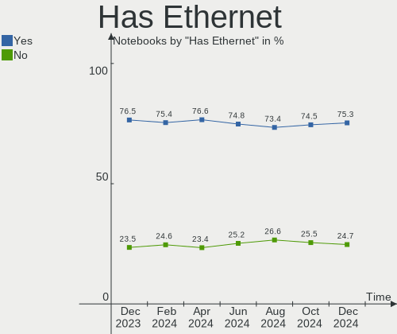
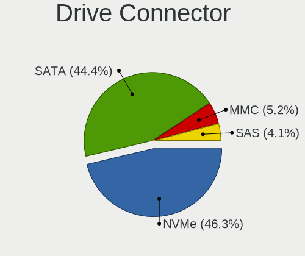
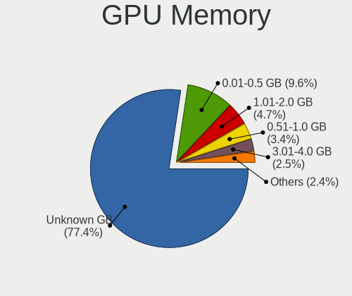

Linux Hardware Trends (Notebook)
--------------------------------

A project to identify most popular hardware characteristics and track their change
over time based on data collected by Linux users at https://Linux-Hardware.org.

Anyone can contribute to the study by uploading probes of their computers by
the [hw-probe](https://github.com/linuxhw/hw-probe) tool:

    sudo -E hw-probe -all -upload

Full-feature report is available here: https://linux-hardware.org/?view=trends&formfactor=notebook

Period: Sep, 2020.

Contents
--------

- [ OS                       ](#os)
- [ OS Family                ](#os-family)
- [ Kernel                   ](#kernel)
- [ Kernel Family            ](#kernel-family)
- [ Kernel Major Ver.        ](#kernel-major-ver)
- [ Arch                     ](#arch)
- [ DE                       ](#de)
- [ Display Server           ](#display-server)
- [ Display Manager          ](#display-manager)
- [ OS Lang                  ](#os-lang)
- [ Boot Mode                ](#boot-mode)
- [ Filesystem               ](#filesystem)
- [ Part. scheme             ](#part-scheme)
- [ Dual Boot with Linux/BSD ](#dual-boot-with-linux/bsd)
- [ Dual Boot (Win)          ](#dual-boot-win)
- [ Country                  ](#country)
- [ City                     ](#city)
- [ Vendor                   ](#vendor)
- [ Model                    ](#model)
- [ Model Family             ](#model-family)
- [ MFG Year                 ](#mfg-year)
- [ Form Factor              ](#form-factor)
- [ Secure Boot              ](#secure-boot)
- [ Coreboot                 ](#coreboot)
- [ RAM Size                 ](#ram-size)
- [ RAM Used                 ](#ram-used)
- [ Has CD-ROM               ](#has-cd-rom)
- [ Total Drives             ](#total-drives)
- [ Has Ethernet             ](#has-ethernet)
- [ Drive Vendor             ](#drive-vendor)
- [ HDD Vendor               ](#hdd-vendor)
- [ SSD Vendor               ](#ssd-vendor)
- [ Drive Model              ](#drive-model)
- [ Drive Kind               ](#drive-kind)
- [ Drive Connector          ](#drive-connector)
- [ Drive Size               ](#drive-size)
- [ Space Total              ](#space-total)
- [ Space Used               ](#space-used)
- [ Malfunc. Drives          ](#malfunc-drives)
- [ Malfunc. Drive Vendor    ](#malfunc-drive-vendor)
- [ Malfunc. HDD Vendor      ](#malfunc-hdd-vendor)
- [ Malfunc. Drive Kind      ](#malfunc-drive-kind)
- [ Failed Drives            ](#failed-drives)
- [ Failed Drive Vendor      ](#failed-drive-vendor)
- [ Drive Status             ](#drive-status)
- [ Storage Vendor           ](#storage-vendor)
- [ Storage Model            ](#storage-model)
- [ Storage Kind             ](#storage-kind)
- [ CPU Vendor               ](#cpu-vendor)
- [ CPU Model                ](#cpu-model)
- [ CPU Model Family         ](#cpu-model-family)
- [ CPU Cores                ](#cpu-cores)
- [ CPU Sockets              ](#cpu-sockets)
- [ CPU Threads              ](#cpu-threads)
- [ CPU Op-Modes             ](#cpu-op-modes)
- [ CPU Microcode            ](#cpu-microcode)
- [ CPU Microarch            ](#cpu-microarch)
- [ GPU Vendor               ](#gpu-vendor)
- [ GPU Model                ](#gpu-model)
- [ GPU Combo                ](#gpu-combo)
- [ GPU Driver               ](#gpu-driver)
- [ GPU Memory               ](#gpu-memory)
- [ Monitor Vendor           ](#monitor-vendor)
- [ Monitor Model            ](#monitor-model)
- [ Monitor Resolution       ](#monitor-resolution)
- [ Monitor Diagonal         ](#monitor-diagonal)
- [ Monitor Width            ](#monitor-width)
- [ Aspect Ratio             ](#aspect-ratio)
- [ Monitor Area             ](#monitor-area)
- [ Pixel Density            ](#pixel-density)
- [ Multiple Monitors        ](#multiple-monitors)
- [ Net Controller Vendor    ](#net-controller-vendor)
- [ Net Controller Model     ](#net-controller-model)
- [ Wireless Vendor          ](#wireless-vendor)
- [ Wireless Model           ](#wireless-model)
- [ Ethernet Vendor          ](#ethernet-vendor)
- [ Ethernet Model           ](#ethernet-model)
- [ Net Controller Kind      ](#net-controller-kind)
- [ Used Controller          ](#used-controller)
- [ NICs                     ](#nics)
- [ Memory Vendor            ](#memory-vendor)
- [ Memory Model             ](#memory-model)
- [ Memory Kind              ](#memory-kind)
- [ Memory Form Factor       ](#memory-form-factor)
- [ Memory Size              ](#memory-size)
- [ Memory Speed             ](#memory-speed)
- [ Sound Vendor             ](#sound-vendor)
- [ Sound Model              ](#sound-model)
- [ Camera Vendor            ](#camera-vendor)
- [ Camera Model             ](#camera-model)
- [ Fingerprint Vendor       ](#fingerprint-vendor)
- [ Fingerprint Model        ](#fingerprint-model)
- [ Chipcard Vendor          ](#chipcard-vendor)
- [ Chipcard Model           ](#chipcard-model)
- [ Printer Vendor           ](#printer-vendor)
- [ Printer Model            ](#printer-model)
- [ Scanner Vendor           ](#scanner-vendor)
- [ Scanner Model            ](#scanner-model)
- [ Bluetooth Vendor         ](#bluetooth-vendor)
- [ Bluetooth Model          ](#bluetooth-model)
- [ Unsupported Devices      ](#unsupported-devices)
- [ Unsupported Device Types ](#unsupported-device-types)

OS
--

Installed operating systems

| Name                | Notebooks | Percent |
|---------------------|-----------|---------|
| Ubuntu 20.04        | 948       | 35.35%  |
| Ubuntu 18.04        | 226       | 8.43%   |
| Pop!_OS 20.04       | 156       | 5.82%   |
| Fedora 32           | 154       | 5.74%   |
| Mint 20             | 121       | 4.51%   |
| Manjaro 20.1        | 111       | 4.14%   |
| BlackPanther 18.1   | 101       | 3.77%   |
| Arch                | 90        | 3.36%   |
| Endless 3.8.6       | 85        | 3.17%   |
| Arch Rolling        | 68        | 2.54%   |
| Manjaro             | 57        | 2.13%   |
| Zorin 15            | 48        | 1.79%   |
| ROSA R11.1          | 47        | 1.75%   |
| Debian 10           | 42        | 1.57%   |
| Mint 19.3           | 31        | 1.16%   |
| ROSA R11            | 29        | 1.08%   |
| Ubuntu 16.04        | 21        | 0.78%   |
| Debian Testing      | 20        | 0.75%   |
| KDE neon 20.04      | 19        | 0.71%   |
| Kali 2020.3         | 14        | 0.52%   |
| Ubuntu 20.10        | 13        | 0.48%   |
| Ubuntu 19.10        | 13        | 0.48%   |
| Endless 3.8.5       | 12        | 0.45%   |
| Elementary 5.1.7    | 12        | 0.45%   |
| Parrot 4.10         | 10        | 0.37%   |
| Debian              | 9         | 0.34%   |
| LMDE 4              | 8         | 0.3%    |
| Gentoo              | 8         | 0.3%    |
| Deepin 20           | 8         | 0.3%    |
| Peppermint 10       | 7         | 0.26%   |
| openSUSE Leap-15.2  | 7         | 0.26%   |
| Fedora 33           | 7         | 0.26%   |
| Debian Unstable     | 7         | 0.26%   |
| Void Rolling        | 5         | 0.19%   |
| Solus 4.1           | 5         | 0.19%   |
| ROSA R8.1           | 5         | 0.19%   |
| Fedora 31           | 5         | 0.19%   |
| openSUSE 20200829   | 4         | 0.15%   |
| Mint 19.1           | 4         | 0.15%   |
| Mint 18.3           | 4         | 0.15%   |
| Gentoo 2.7          | 4         | 0.15%   |
| EndeavourOS Rolling | 4         | 0.15%   |
| CentOS 8            | 4         | 0.15%   |
| BlackPanther 16.2   | 4         | 0.15%   |
| Pardus 19.3         | 3         | 0.11%   |
| openSUSE 15.2       | 3         | 0.11%   |
| Mint 19.2           | 3         | 0.11%   |
| Endless 3.7.4       | 3         | 0.11%   |
| CentOS 7            | 3         | 0.11%   |
| Zorin 12            | 2         | 0.07%   |
| WindowsFX 10        | 2         | 0.07%   |
| Ubuntu Core 16      | 2         | 0.07%   |
| Ubuntu 19.04        | 2         | 0.07%   |
| Ubuntu 18.10        | 2         | 0.07%   |
| ROSA R12            | 2         | 0.07%   |
| RHEL 8.2            | 2         | 0.07%   |
| Reborn OS           | 2         | 0.07%   |
| openSUSE 20200925   | 2         | 0.07%   |
| openSUSE 20200910   | 2         | 0.07%   |
| openSUSE 20200831   | 2         | 0.07%   |

OS Family
---------

OS without a version

| Name         | Notebooks | Percent |
|--------------|-----------|---------|
| Ubuntu       | 1231      | 45.9%   |
| Manjaro      | 170       | 6.34%   |
| Fedora       | 169       | 6.3%    |
| Mint         | 165       | 6.15%   |
| Arch         | 158       | 5.89%   |
| Pop!_OS      | 156       | 5.82%   |
| Endless      | 112       | 4.18%   |
| BlackPanther | 105       | 3.91%   |
| ROSA         | 85        | 3.17%   |
| Debian       | 78        | 2.91%   |
| Zorin        | 50        | 1.86%   |
| openSUSE     | 37        | 1.38%   |
| KDE neon     | 21        | 0.78%   |
| Kali         | 16        | 0.6%    |
| Elementary   | 13        | 0.48%   |
| Gentoo       | 12        | 0.45%   |
| Clear Linux  | 11        | 0.41%   |
| Parrot       | 10        | 0.37%   |
| Deepin       | 9         | 0.34%   |
| LMDE         | 8         | 0.3%    |
| CentOS       | 8         | 0.3%    |
| Peppermint   | 7         | 0.26%   |
| Void         | 6         | 0.22%   |
| EndeavourOS  | 6         | 0.22%   |
| Solus        | 5         | 0.19%   |
| RHEL         | 3         | 0.11%   |
| Pardus       | 3         | 0.11%   |
| MX           | 3         | 0.11%   |
| Mageia       | 3         | 0.11%   |
| WindowsFX    | 2         | 0.07%   |
| Reborn OS    | 2         | 0.07%   |
| GNOME OS     | 2         | 0.07%   |
| Devuan       | 2         | 0.07%   |
| ALT Linux    | 2         | 0.07%   |
| SLED         | 1         | 0.04%   |
| SkiffOS      | 1         | 0.04%   |
| PureOS       | 1         | 0.04%   |
| Puppy        | 1         | 0.04%   |
| NixOS        | 1         | 0.04%   |
| Manjaro-ARM  | 1         | 0.04%   |
| Generic      | 1         | 0.04%   |
| Chrome OS    | 1         | 0.04%   |
| Calculate    | 1         | 0.04%   |
| BunsenLabs   | 1         | 0.04%   |
| Artix        | 1         | 0.04%   |
| Alpine       | 1         | 0.04%   |

Kernel
------

Version of the Linux kernel

| Version                        | Notebooks | Percent |
|--------------------------------|-----------|---------|
| 5.4.0-47-generic               | 456       | 17%     |
| 5.4.0-45-generic               | 285       | 10.63%  |
| 5.4.0-48-generic               | 271       | 10.1%   |
| 5.4.0-42-generic               | 235       | 8.76%   |
| 5.4.0-7642-generic             | 139       | 5.18%   |
| 4.18.16-desktop-1bP            | 100       | 3.73%   |
| 5.8.6-1-MANJARO                | 63        | 2.35%   |
| 5.8.4-200.fc32.x86_64          | 53        | 1.98%   |
| 4.19.0-10-amd64                | 37        | 1.38%   |
| 4.15.0-117-generic             | 30        | 1.12%   |
| 5.8.3-2-MANJARO                | 29        | 1.08%   |
| 5.4.0-26-generic               | 26        | 0.97%   |
| 4.15.0-desktop-45.1rosa-x86_64 | 26        | 0.97%   |
| 4.15.0-118-generic             | 26        | 0.97%   |
| 5.8.5-arch1-1                  | 25        | 0.93%   |
| 5.8.10-arch1-1                 | 25        | 0.93%   |
| 5.7.17-2-MANJARO               | 25        | 0.93%   |
| 5.4.0-49-generic               | 25        | 0.93%   |
| 5.8.11-200.fc32.x86_64         | 23        | 0.86%   |
| 5.8.10-200.fc32.x86_64         | 21        | 0.78%   |
| 4.15.0-desktop-94.1rosa-x86_64 | 19        | 0.71%   |
| 5.8.8-arch1-1                  | 16        | 0.6%    |
| 5.4.0-39-generic               | 15        | 0.56%   |
| 4.15.0-112-generic             | 15        | 0.56%   |
| 5.7.0-3-amd64                  | 14        | 0.52%   |
| 5.8.9-200.fc32.x86_64          | 13        | 0.48%   |
| 5.7.19-2-MANJARO               | 13        | 0.48%   |
| 5.4.60-2-MANJARO               | 13        | 0.48%   |
| 4.15.0-115-generic             | 13        | 0.48%   |
| 5.8.7-arch1-1                  | 11        | 0.41%   |
| 5.8.7-200.fc32.x86_64          | 11        | 0.41%   |
| 5.8.4-1-default                | 10        | 0.37%   |
| 5.4.64-1-MANJARO               | 10        | 0.37%   |
| 5.3.0-64-generic               | 10        | 0.37%   |
| 5.8.9-arch2-1                  | 9         | 0.34%   |
| 5.8.6-201.fc32.x86_64          | 9         | 0.34%   |
| 5.8.5-zen1-1-zen               | 9         | 0.34%   |
| 5.8.12-arch1-1                 | 9         | 0.34%   |
| 5.4.61-1-lts                   | 9         | 0.34%   |
| 5.8.7-1-default                | 8         | 0.3%    |
| 5.8.0-18-generic               | 8         | 0.3%    |
| 5.8.0-1-amd64                  | 8         | 0.3%    |
| 5.7.0-2parrot2-amd64           | 8         | 0.3%    |
| 5.4.50-amd64-desktop           | 7         | 0.26%   |
| 5.4.40-generic-1rosa-x86_64    | 7         | 0.26%   |
| 4.15.0-20-generic              | 7         | 0.26%   |
| 5.8.9-050809-generic           | 6         | 0.22%   |
| 5.8.0-050800-generic           | 6         | 0.22%   |
| 5.7.17-200.fc32.x86_64         | 6         | 0.22%   |
| 5.7.0-kali1-amd64              | 6         | 0.22%   |
| 5.6.6-300.fc32.x86_64          | 6         | 0.22%   |
| 5.4.0-7634-generic             | 6         | 0.22%   |
| 4.9.155-nrj-desktop-1rosa-i586 | 6         | 0.22%   |
| 4.15.0-desktop-94.1rosa-i586   | 6         | 0.22%   |
| 5.8.12-zen1-1-zen              | 5         | 0.19%   |
| 5.8.0-2-amd64                  | 5         | 0.19%   |
| 5.7.0-kali3-amd64              | 5         | 0.19%   |
| 5.6.19-158.current             | 5         | 0.19%   |
| 5.4.0-40-generic               | 5         | 0.19%   |
| 5.3.18-lp152.41-default        | 5         | 0.19%   |

Kernel Family
-------------

Linux kernel without a distro release

| Version  | Notebooks | Percent |
|----------|-----------|---------|
| 5.4.0    | 1500      | 55.93%  |
| 4.15.0   | 176       | 6.56%   |
| 4.18.16  | 100       | 3.73%   |
| 5.8.6    | 84        | 3.13%   |
| 5.8.4    | 66        | 2.46%   |
| 5.8.10   | 60        | 2.24%   |
| 4.19.0   | 54        | 2.01%   |
| 5.8.5    | 43        | 1.6%    |
| 5.7.0    | 43        | 1.6%    |
| 5.8.9    | 38        | 1.42%   |
| 5.8.0    | 38        | 1.42%   |
| 5.8.11   | 36        | 1.34%   |
| 5.8.7    | 35        | 1.3%    |
| 5.3.0    | 35        | 1.3%    |
| 5.8.3    | 32        | 1.19%   |
| 5.7.17   | 31        | 1.16%   |
| 5.8.8    | 25        | 0.93%   |
| 5.8.12   | 19        | 0.71%   |
| 5.7.19   | 19        | 0.71%   |
| 5.4.60   | 18        | 0.67%   |
| 5.0.0    | 17        | 0.63%   |
| 5.4.64   | 14        | 0.52%   |
| 5.9.0    | 13        | 0.48%   |
| 5.3.18   | 12        | 0.45%   |
| 5.4.61   | 9         | 0.34%   |
| 4.9.155  | 9         | 0.34%   |
| 5.8.1    | 8         | 0.3%    |
| 5.7.15   | 8         | 0.3%    |
| 4.18.0   | 8         | 0.3%    |
| 5.6.19   | 7         | 0.26%   |
| 5.4.50   | 7         | 0.26%   |
| 5.4.40   | 7         | 0.26%   |
| 5.6.6    | 6         | 0.22%   |
| 5.4.32   | 6         | 0.22%   |
| 4.4.0    | 6         | 0.22%   |
| 4.9.20   | 5         | 0.19%   |
| 3.10.0   | 5         | 0.19%   |
| 5.7.8    | 4         | 0.15%   |
| 5.7.12   | 4         | 0.15%   |
| 5.7.1    | 4         | 0.15%   |
| 5.4.66   | 4         | 0.15%   |
| 4.10.0   | 4         | 0.15%   |
| 5.8.2    | 3         | 0.11%   |
| 5.7.13   | 3         | 0.11%   |
| 5.4.68   | 3         | 0.11%   |
| 5.4.62   | 3         | 0.11%   |
| 4.9.0    | 3         | 0.11%   |
| 5.7.7    | 2         | 0.07%   |
| 5.7.14   | 2         | 0.07%   |
| 5.7.11   | 2         | 0.07%   |
| 5.6.15   | 2         | 0.07%   |
| 5.6.0    | 2         | 0.07%   |
| 5.4.67   | 2         | 0.07%   |
| 5.4.57   | 2         | 0.07%   |
| 5.4.48   | 2         | 0.07%   |
| 4.4.232  | 2         | 0.07%   |
| 4.19.104 | 2         | 0.07%   |
| 4.12.14  | 2         | 0.07%   |
| 5.7.5    | 1         | 0.04%   |
| 5.7.18   | 1         | 0.04%   |

Kernel Major Ver.
-----------------

Linux kernel major version

| Version | Notebooks | Percent |
|---------|-----------|---------|
| 5.4     | 1583      | 59.02%  |
| 5.8     | 487       | 18.16%  |
| 4.15    | 177       | 6.6%    |
| 5.7     | 125       | 4.66%   |
| 4.18    | 108       | 4.03%   |
| 4.19    | 58        | 2.16%   |
| 5.3     | 47        | 1.75%   |
| 5.6     | 20        | 0.75%   |
| 4.9     | 19        | 0.71%   |
| 5.0     | 18        | 0.67%   |
| 5.9     | 13        | 0.48%   |
| 4.4     | 8         | 0.3%    |
| 3.10    | 5         | 0.19%   |
| 5.5     | 4         | 0.15%   |
| 4.10    | 4         | 0.15%   |
| 5.1     | 2         | 0.07%   |
| 4.16    | 2         | 0.07%   |
| 4.12    | 2         | 0.07%   |

Arch
----

OS architecture (x86_64, i586, etc.)

| Name    | Notebooks | Percent |
|---------|-----------|---------|
| x86_64  | 2592      | 96.64%  |
| i686    | 88        | 3.28%   |
| aarch64 | 2         | 0.07%   |

DE
--

Desktop Environment

| Name             | Notebooks | Percent |
|------------------|-----------|---------|
| GNOME            | 1460      | 54.44%  |
| KDE5             | 295       | 11%     |
| XFCE             | 218       | 8.13%   |
| Unknown          | 124       | 4.62%   |
| KDE              | 123       | 4.59%   |
| X-Cinnamon       | 96        | 3.58%   |
| MATE             | 66        | 2.46%   |
| Cinnamon         | 66        | 2.46%   |
| KDE4             | 56        | 2.09%   |
| Unity            | 36        | 1.34%   |
| LXQt             | 31        | 1.16%   |
| LXDE             | 23        | 0.86%   |
| i3               | 19        | 0.71%   |
| GNOME Flashback  | 17        | 0.63%   |
| Deepin           | 14        | 0.52%   |
| Pantheon         | 12        | 0.45%   |
| Budgie           | 12        | 0.45%   |
| sway             | 3         | 0.11%   |
| lightdm-xsession | 2         | 0.07%   |
| GNOME Classic    | 2         | 0.07%   |
| default          | 2         | 0.07%   |
| bspwm            | 2         | 0.07%   |
| enlightenment    | 1         | 0.04%   |
| dwm              | 1         | 0.04%   |
| Awesome          | 1         | 0.04%   |

Display Server
--------------

X11 or Wayland

| Name        | Notebooks | Percent |
|-------------|-----------|---------|
| X11         | 2371      | 88.4%   |
| Wayland     | 211       | 7.87%   |
| Unknown     | 59        | 2.2%    |
| Tty         | 40        | 1.49%   |
| Unspecified | 1         | 0.04%   |

Display Manager
---------------

SDDM, LightDM, etc.

| Name    | Notebooks | Percent |
|---------|-----------|---------|
| Unknown | 1672      | 62.34%  |
| GDM     | 384       | 14.32%  |
| SDDM    | 292       | 10.89%  |
| TDM     | 193       | 7.2%    |
| LightDM | 73        | 2.72%   |
| KDM     | 55        | 2.05%   |
| XDM     | 8         | 0.3%    |
| SLiM    | 2         | 0.07%   |
| LXDM    | 2         | 0.07%   |
| GDM3    | 1         | 0.04%   |

OS Lang
-------

Language

| Lang       | Notebooks | Percent |
|------------|-----------|---------|
| en_US      | 995       | 37.1%   |
| pt_BR      | 181       | 6.75%   |
| de_DE      | 171       | 6.38%   |
| Unknown    | 166       | 6.19%   |
| ru_RU      | 120       | 4.47%   |
| en_GB      | 120       | 4.47%   |
| en_IN      | 87        | 3.24%   |
| fr_FR      | 69        | 2.57%   |
| it_IT      | 60        | 2.24%   |
| en_US.utf8 | 58        | 2.16%   |
| es_ES      | 55        | 2.05%   |
| en_CA      | 54        | 2.01%   |
| pl_PL      | 46        | 1.72%   |
| pt_BR.utf8 | 30        | 1.12%   |
| en_AU      | 29        | 1.08%   |
| C          | 25        | 0.93%   |
| nl_NL      | 19        | 0.71%   |
| es_MX      | 19        | 0.71%   |
| hu_HU      | 18        | 0.67%   |
| tr_TR      | 16        | 0.6%    |
| es_AR      | 15        | 0.56%   |
| cs_CZ      | 15        | 0.56%   |
| es_CO      | 13        | 0.48%   |
| en_NZ      | 13        | 0.48%   |
| en_ZA      | 12        | 0.45%   |
| en_PH      | 12        | 0.45%   |
| pt_PT      | 11        | 0.41%   |
| fi_FI      | 11        | 0.41%   |
| ro_RO      | 10        | 0.37%   |
| es_CL      | 10        | 0.37%   |
| ru_UA      | 9         | 0.34%   |
| en_SG      | 9         | 0.34%   |
| C          | 9         | 0.34%   |
| sv_SE      | 8         | 0.3%    |
| bg_BG      | 8         | 0.3%    |
| en_GB.utf8 | 7         | 0.26%   |
| de_AT      | 7         | 0.26%   |
| da_DK      | 7         | 0.26%   |
| zh_CN      | 6         | 0.22%   |
| ja_JP      | 6         | 0.22%   |
| en_IN      | 6         | 0.22%   |
| en_IE      | 6         | 0.22%   |
| de_CH      | 6         | 0.22%   |
| ca_ES      | 6         | 0.22%   |
| uk_UA      | 5         | 0.19%   |
| sk_SK      | 5         | 0.19%   |
| es_PE      | 5         | 0.19%   |
| es_EC      | 5         | 0.19%   |
| zh_TW      | 4         | 0.15%   |
| nl_BE      | 4         | 0.15%   |
| id_ID      | 4         | 0.15%   |
| fr_CA      | 4         | 0.15%   |
| de_DE.utf8 | 4         | 0.15%   |
| ko_KR      | 3         | 0.11%   |
| fr_FR.utf8 | 3         | 0.11%   |
| fr_BE      | 3         | 0.11%   |
| es_GT      | 3         | 0.11%   |
| es_ES.utf8 | 3         | 0.11%   |
| es_BO      | 3         | 0.11%   |
| el_GR      | 3         | 0.11%   |

Boot Mode
---------

EFI or BIOS

| Mode | Notebooks | Percent |
|------|-----------|---------|
| EFI  | 1481      | 55.22%  |
| BIOS | 1201      | 44.78%  |

Filesystem
----------

Type of filesystem

| Type    | Notebooks | Percent |
|---------|-----------|---------|
| Ext4    | 2379      | 88.7%   |
| Overlay | 128       | 4.77%   |
| Btrfs   | 104       | 3.88%   |
| Zfs     | 23        | 0.86%   |
| Xfs     | 22        | 0.82%   |
| F2fs    | 10        | 0.37%   |
| Ext3    | 4         | 0.15%   |
| Ext2    | 4         | 0.15%   |
| Unknown | 4         | 0.15%   |
| Tmpfs   | 2         | 0.07%   |
| Ntfs    | 1         | 0.04%   |
| Aufs    | 1         | 0.04%   |

Part. scheme
------------

Scheme of partitioning

| Type    | Notebooks | Percent |
|---------|-----------|---------|
| Unknown | 1622      | 60.48%  |
| GPT     | 747       | 27.85%  |
| MBR     | 313       | 11.67%  |

Dual Boot with Linux/BSD
------------------------

Hosting more than one Linux/BSD

| Dual boot | Notebooks | Percent |
|-----------|-----------|---------|
| No        | 2449      | 91.31%  |
| Yes       | 233       | 8.69%   |

Dual Boot (Win)
---------------

Hosting Linux and Windows

| Dual boot | Notebooks | Percent |
|-----------|-----------|---------|
| No        | 1917      | 71.48%  |
| Yes       | 765       | 28.52%  |

Country
-------

Geographic location (country)

| Country            | Notebooks | Percent |
|--------------------|-----------|---------|
| USA                | 419       | 15.62%  |
| Brazil             | 256       | 9.55%   |
| Germany            | 226       | 8.43%   |
| Russia             | 156       | 5.82%   |
| India              | 136       | 5.07%   |
| Hungary            | 95        | 3.54%   |
| Italy              | 92        | 3.43%   |
| France             | 86        | 3.21%   |
| UK                 | 83        | 3.09%   |
| Canada             | 80        | 2.98%   |
| Netherlands        | 65        | 2.42%   |
| Poland             | 64        | 2.39%   |
| Spain              | 59        | 2.2%    |
| Ukraine            | 38        | 1.42%   |
| Romania            | 35        | 1.3%    |
| Mexico             | 35        | 1.3%    |
| Australia          | 33        | 1.23%   |
| Turkey             | 32        | 1.19%   |
| Finland            | 32        | 1.19%   |
| Argentina          | 30        | 1.12%   |
| Switzerland        | 29        | 1.08%   |
| Sweden             | 28        | 1.04%   |
| Czech Republic     | 23        | 0.86%   |
| Indonesia          | 22        | 0.82%   |
| Austria            | 22        | 0.82%   |
| New Zealand        | 21        | 0.78%   |
| Belgium            | 21        | 0.78%   |
| Portugal           | 19        | 0.71%   |
| Philippines        | 19        | 0.71%   |
| Denmark            | 18        | 0.67%   |
| South Africa       | 17        | 0.63%   |
| Colombia           | 17        | 0.63%   |
| Singapore          | 16        | 0.6%    |
| Chile              | 16        | 0.6%    |
| Norway             | 14        | 0.52%   |
| Japan              | 14        | 0.52%   |
| Pakistan           | 13        | 0.48%   |
| Greece             | 13        | 0.48%   |
| Bulgaria           | 13        | 0.48%   |
| Vietnam            | 10        | 0.37%   |
| Taiwan             | 10        | 0.37%   |
| Slovakia           | 10        | 0.37%   |
| Ecuador            | 10        | 0.37%   |
| China              | 10        | 0.37%   |
| Serbia             | 9         | 0.34%   |
| Peru               | 9         | 0.34%   |
| Lithuania          | 9         | 0.34%   |
| Kenya              | 9         | 0.34%   |
| Estonia            | 9         | 0.34%   |
| Croatia            | 9         | 0.34%   |
| Korea, Republic of | 8         | 0.3%    |
| Kazakhstan         | 8         | 0.3%    |
| Bangladesh         | 7         | 0.26%   |
| Slovenia           | 6         | 0.22%   |
| Iran               | 6         | 0.22%   |
| Panama             | 5         | 0.19%   |
| Malaysia           | 5         | 0.19%   |
| Israel             | 5         | 0.19%   |
| Guatemala          | 5         | 0.19%   |
| Egypt              | 5         | 0.19%   |

City
----

Geographic location (city)

| City           | Notebooks | Percent |
|----------------|-----------|---------|
| Moscow         | 40        | 1.49%   |
| Budapest       | 35        | 1.3%    |
| São Paulo     | 28        | 1.04%   |
| Bengaluru      | 19        | 0.71%   |
| Helsinki       | 18        | 0.67%   |
| Rio de Janeiro | 17        | 0.63%   |
| Berlin         | 17        | 0.63%   |
| St Petersburg  | 16        | 0.6%    |
| Prague         | 16        | 0.6%    |
| Hamburg        | 16        | 0.6%    |
| Paris          | 15        | 0.56%   |
| Vienna         | 14        | 0.52%   |
| Istanbul       | 14        | 0.52%   |
| Warsaw         | 13        | 0.48%   |
| Kyiv           | 13        | 0.48%   |
| Auckland       | 13        | 0.48%   |
| Amsterdam      | 13        | 0.48%   |
| Munich         | 12        | 0.45%   |
| Milan          | 12        | 0.45%   |
| Curitiba       | 12        | 0.45%   |
| Singapore      | 11        | 0.41%   |
| Rome           | 11        | 0.41%   |
| Pune           | 11        | 0.41%   |
| Novosibirsk    | 9         | 0.34%   |
| Mexico City    | 9         | 0.34%   |
| Madrid         | 9         | 0.34%   |
| Hyderabad      | 9         | 0.34%   |
| Chicago        | 9         | 0.34%   |
| Belo Horizonte | 9         | 0.34%   |
| Athens         | 9         | 0.34%   |
| Toronto        | 8         | 0.3%    |
| Tallinn        | 8         | 0.3%    |
| Santiago       | 8         | 0.3%    |
| New York       | 8         | 0.3%    |
| Montreal       | 8         | 0.3%    |
| Melbourne      | 8         | 0.3%    |
| Kazan’       | 8         | 0.3%    |
| Bucharest      | 8         | 0.3%    |
| Stockholm      | 7         | 0.26%   |
| Sofia          | 7         | 0.26%   |
| New Delhi      | 7         | 0.26%   |
| Mumbai         | 7         | 0.26%   |
| Los Angeles    | 7         | 0.26%   |
| Lima           | 7         | 0.26%   |
| Florianópolis | 7         | 0.26%   |
| Düsseldorf    | 7         | 0.26%   |
| Chennai        | 7         | 0.26%   |
| Bogotá        | 7         | 0.26%   |
| Turin          | 6         | 0.22%   |
| Stuttgart      | 6         | 0.22%   |
| Rostov-on-Don  | 6         | 0.22%   |
| Porto Alegre   | 6         | 0.22%   |
| Nairobi        | 6         | 0.22%   |
| Kolkata        | 6         | 0.22%   |
| Jakarta        | 6         | 0.22%   |
| Houston        | 6         | 0.22%   |
| Cebu City      | 6         | 0.22%   |
| Campinas       | 6         | 0.22%   |
| Buenos Aires   | 6         | 0.22%   |
| Brasília      | 6         | 0.22%   |

Vendor
------

Motherboard manufacturer

| Name                                 | Notebooks | Percent |
|--------------------------------------|-----------|---------|
| Lenovo                               | 605       | 22.56%  |
| Hewlett-Packard                      | 492       | 18.34%  |
| Dell                                 | 465       | 17.34%  |
| ASUSTek Computer                     | 295       | 11%     |
| Acer                                 | 258       | 9.62%   |
| Toshiba                              | 76        | 2.83%   |
| MSI                                  | 67        | 2.5%    |
| Samsung Electronics                  | 60        | 2.24%   |
| Apple                                | 57        | 2.13%   |
| Sony                                 | 47        | 1.75%   |
| HUAWEI                               | 22        | 0.82%   |
| Notebook                             | 19        | 0.71%   |
| Medion                               | 16        | 0.6%    |
| Fujitsu                              | 15        | 0.56%   |
| Unknown                              | 15        | 0.56%   |
| System76                             | 14        | 0.52%   |
| Positivo                             | 13        | 0.48%   |
| Packard Bell                         | 10        | 0.37%   |
| LG Electronics                       | 10        | 0.37%   |
| Google                               | 8         | 0.3%    |
| TUXEDO                               | 6         | 0.22%   |
| Timi                                 | 6         | 0.22%   |
| Fujitsu Siemens                      | 6         | 0.22%   |
| Clevo                                | 6         | 0.22%   |
| Alienware                            | 6         | 0.22%   |
| Panasonic                            | 5         | 0.19%   |
| Gateway                              | 5         | 0.19%   |
| PC Specialist                        | 4         | 0.15%   |
| Semp Toshiba                         | 3         | 0.11%   |
| Schenker                             | 3         | 0.11%   |
| Itautec                              | 3         | 0.11%   |
| Intel                                | 3         | 0.11%   |
| Wortmann AG                          | 2         | 0.07%   |
| TrekStor                             | 2         | 0.07%   |
| Razer                                | 2         | 0.07%   |
| Quanta                               | 2         | 0.07%   |
| Microtech                            | 2         | 0.07%   |
| Hungaro Flotta Kft                   | 2         | 0.07%   |
| Gigabyte Technology                  | 2         | 0.07%   |
| Getac                                | 2         | 0.07%   |
| eMachines                            | 2         | 0.07%   |
| Compal                               | 2         | 0.07%   |
| BANGHO                               | 2         | 0.07%   |
| Avell High Performance               | 2         | 0.07%   |
| AMI                                  | 2         | 0.07%   |
| Aftershock                           | 2         | 0.07%   |
| YEPO                                 | 1         | 0.04%   |
| Unknown (56548)                      | 1         | 0.04%   |
| Teclast                              | 1         | 0.04%   |
| Standard                             | 1         | 0.04%   |
| SHARP                                | 1         | 0.04%   |
| SCHNEIDER                            | 1         | 0.04%   |
| RM                                   | 1         | 0.04%   |
| Purism                               | 1         | 0.04%   |
| Pegatron                             | 1         | 0.04%   |
| Packard Bell Computers International | 1         | 0.04%   |
| Olidata                              | 1         | 0.04%   |
| OEM                                  | 1         | 0.04%   |
| NEC Computers                        | 1         | 0.04%   |
| Motion Computing                     | 1         | 0.04%   |

Model
-----

Motherboard model

| Name                          | Notebooks | Percent |
|-------------------------------|-----------|---------|
| Unknown                       | 32        | 1.19%   |
| HP Notebook                   | 22        | 0.82%   |
| HP Pavilion g6                | 13        | 0.48%   |
| Dell XPS 13 9370              | 12        | 0.45%   |
| Acer Nitro AN515-54           | 12        | 0.45%   |
| HP Pavilion dv6               | 11        | 0.41%   |
| Dell Latitude E6420           | 10        | 0.37%   |
| HUAWEI NBLK-WAX9X             | 9         | 0.34%   |
| HP Pavilion 15                | 9         | 0.34%   |
| HP EliteBook 840 G6           | 9         | 0.34%   |
| Dell Inspiron 15 7000 Gaming  | 9         | 0.34%   |
| Dell XPS 15 9560              | 8         | 0.3%    |
| Dell XPS 15 7590              | 8         | 0.3%    |
| Dell Inspiron 5570            | 8         | 0.3%    |
| HP Pavilion Notebook          | 7         | 0.26%   |
| HP Pavilion dv7               | 7         | 0.26%   |
| HP Laptop 15-bw0xx            | 7         | 0.26%   |
| HP EliteBook 8470p            | 7         | 0.26%   |
| Dell XPS 15 9570              | 7         | 0.26%   |
| Dell Latitude E6430           | 7         | 0.26%   |
| Dell Latitude E6410           | 7         | 0.26%   |
| Apple MacBookPro9,2           | 7         | 0.26%   |
| Acer Nitro AN517-51           | 7         | 0.26%   |
| Acer Aspire A315-54           | 7         | 0.26%   |
| Lenovo Legion 5 15ARH05 82B5  | 6         | 0.22%   |
| Lenovo IdeaPad 5 15ARE05 81YQ | 6         | 0.22%   |
| HP ProBook 4540s              | 6         | 0.22%   |
| HP Pavilion g7                | 6         | 0.22%   |
| HP Pavilion 17                | 6         | 0.22%   |
| HP Laptop 15-bs0xx            | 6         | 0.22%   |
| HP ENVY 15                    | 6         | 0.22%   |
| HP EliteBook 840 G3           | 6         | 0.22%   |
| HP 2000                       | 6         | 0.22%   |
| Dell XPS 13 9300              | 6         | 0.22%   |
| Dell Latitude E6400           | 6         | 0.22%   |
| Dell Inspiron N5110           | 6         | 0.22%   |
| Dell Inspiron 7559            | 6         | 0.22%   |
| Dell Inspiron 5567            | 6         | 0.22%   |
| Dell Inspiron 3542            | 6         | 0.22%   |
| Acer Nitro AN515-43           | 6         | 0.22%   |
| Acer Aspire A515-51           | 6         | 0.22%   |
| Toshiba Satellite C660        | 5         | 0.19%   |
| Lenovo IdeaPad 320-15IKB 80XL | 5         | 0.19%   |
| HP EliteBook 8440p            | 5         | 0.19%   |
| HP EliteBook 840 G5           | 5         | 0.19%   |
| HP 255 G7 Notebook PC         | 5         | 0.19%   |
| Dell XPS 15 9550              | 5         | 0.19%   |
| Dell XPS 15 9500              | 5         | 0.19%   |
| Dell XPS 13 9380              | 5         | 0.19%   |
| Dell XPS 13 9360              | 5         | 0.19%   |
| Dell Precision 7530           | 5         | 0.19%   |
| Dell Latitude E7440           | 5         | 0.19%   |
| Dell Inspiron 7560            | 5         | 0.19%   |
| Dell Inspiron 5557            | 5         | 0.19%   |
| Dell Inspiron 3583            | 5         | 0.19%   |
| Dell Inspiron 3558            | 5         | 0.19%   |
| ASUS P50IJ                    | 5         | 0.19%   |
| Apple MacBookPro8,1           | 5         | 0.19%   |
| Acer Aspire A315-53           | 5         | 0.19%   |
| Toshiba Satellite L750        | 4         | 0.15%   |

Model Family
------------

Motherboard model prefix

| Name                        | Notebooks | Percent |
|-----------------------------|-----------|---------|
| Lenovo ThinkPad             | 319       | 11.89%  |
| Dell Inspiron               | 186       | 6.94%   |
| Acer Aspire                 | 178       | 6.64%   |
| Lenovo IdeaPad              | 148       | 5.52%   |
| Dell Latitude               | 128       | 4.77%   |
| HP Pavilion                 | 105       | 3.91%   |
| HP EliteBook                | 80        | 2.98%   |
| Dell XPS                    | 78        | 2.91%   |
| HP ProBook                  | 72        | 2.68%   |
| Toshiba Satellite           | 69        | 2.57%   |
| ASUS VivoBook               | 60        | 2.24%   |
| HP Laptop                   | 55        | 2.05%   |
| Dell Precision              | 32        | 1.19%   |
| Unknown                     | 32        | 1.19%   |
| Acer Nitro                  | 31        | 1.16%   |
| HP Compaq                   | 27        | 1.01%   |
| Dell Vostro                 | 26        | 0.97%   |
| HP Notebook                 | 22        | 0.82%   |
| HP ENVY                     | 21        | 0.78%   |
| Lenovo Legion               | 20        | 0.75%   |
| HP ZBook                    | 16        | 0.6%    |
| Acer Swift                  | 15        | 0.56%   |
| Fujitsu LIFEBOOK            | 14        | 0.52%   |
| HP OMEN                     | 13        | 0.48%   |
| HP 250                      | 13        | 0.48%   |
| ASUS ZenBook                | 12        | 0.45%   |
| ASUS TUF                    | 11        | 0.41%   |
| HUAWEI NBLK-WAX9X           | 9         | 0.34%   |
| Acer TravelMate             | 8         | 0.3%    |
| Lenovo Yoga                 | 7         | 0.26%   |
| Lenovo ThinkBook            | 7         | 0.26%   |
| HP 255                      | 7         | 0.26%   |
| Apple MacBookPro9           | 7         | 0.26%   |
| Packard Bell EasyNote       | 6         | 0.22%   |
| HP 2000                     | 6         | 0.22%   |
| Dell G3                     | 6         | 0.22%   |
| Apple MacBookPro8           | 6         | 0.22%   |
| Acer Extensa                | 6         | 0.22%   |
| System76 Lemur              | 5         | 0.19%   |
| Medion AKOYA                | 5         | 0.19%   |
| Lenovo 3000                 | 5         | 0.19%   |
| HP Stream                   | 5         | 0.19%   |
| HP Presario                 | 5         | 0.19%   |
| ASUS ROG                    | 5         | 0.19%   |
| ASUS P50IJ                  | 5         | 0.19%   |
| Apple MacBookPro5           | 5         | 0.19%   |
| Apple MacBookPro11          | 5         | 0.19%   |
| Samsung Electronics 300E5EV | 4         | 0.15%   |
| MSI GL63                    | 4         | 0.15%   |
| Lenovo V330-15IKB           | 4         | 0.15%   |
| Lenovo G710                 | 4         | 0.15%   |
| Lenovo G50-70               | 4         | 0.15%   |
| Lenovo Flex                 | 4         | 0.15%   |
| HUAWEI MACH-WX9             | 4         | 0.15%   |
| HP 650                      | 4         | 0.15%   |
| HP 15                       | 4         | 0.15%   |
| Apple MacBookPro12          | 4         | 0.15%   |
| Toshiba PORTEGE             | 3         | 0.11%   |
| Timi RedmiBook              | 3         | 0.11%   |
| System76 Serval             | 3         | 0.11%   |

MFG Year
--------

Motherboard manufacture year

| Year    | Notebooks | Percent |
|---------|-----------|---------|
| 2020    | 565       | 21.07%  |
| 2019    | 495       | 18.46%  |
| 2018    | 262       | 9.77%   |
| 2013    | 175       | 6.52%   |
| 2011    | 165       | 6.15%   |
| 2012    | 163       | 6.08%   |
| 2015    | 147       | 5.48%   |
| 2014    | 143       | 5.33%   |
| 2017    | 127       | 4.74%   |
| 2016    | 123       | 4.59%   |
| 2010    | 111       | 4.14%   |
| 2009    | 72        | 2.68%   |
| 2008    | 70        | 2.61%   |
| 2007    | 38        | 1.42%   |
| 2006    | 13        | 0.48%   |
| Unknown | 6         | 0.22%   |
| 2005    | 4         | 0.15%   |
| 2004    | 1         | 0.04%   |
| 2003    | 1         | 0.04%   |
| 2001    | 1         | 0.04%   |

Form Factor
-----------

Physical design of the computer

| Name     | Notebooks | Percent |
|----------|-----------|---------|
| Notebook | 2682      | 100%    |

Secure Boot
-----------

Enabled or disabled

| State    | Notebooks | Percent |
|----------|-----------|---------|
| Disabled | 2389      | 89.08%  |
| Enabled  | 293       | 10.92%  |

Coreboot
--------

Have coreboot on board

| Used | Notebooks | Percent |
|------|-----------|---------|
| No   | 2667      | 99.44%  |
| Yes  | 15        | 0.56%   |

RAM Size
--------

Total RAM memory

| Size in GB  | Notebooks | Percent |
|-------------|-----------|---------|
| 4.01-8.0    | 753       | 28.08%  |
| 3.01-4.0    | 645       | 24.05%  |
| 8.01-16.0   | 457       | 17.04%  |
| 16.01-24.0  | 440       | 16.41%  |
| 1.01-2.0    | 140       | 5.22%   |
| 32.01-64.0  | 118       | 4.4%    |
| 2.01-3.0    | 60        | 2.24%   |
| 24.01-32.0  | 26        | 0.97%   |
| 0.01-1.0    | 22        | 0.82%   |
| 64.01-256.0 | 21        | 0.78%   |

RAM Used
--------

Used RAM memory

| Used GB    | Notebooks | Percent |
|------------|-----------|---------|
| 1.01-2.0   | 908       | 33.86%  |
| 2.01-3.0   | 701       | 26.14%  |
| 4.01-8.0   | 365       | 13.61%  |
| 3.01-4.0   | 326       | 12.16%  |
| 0.01-1.0   | 264       | 9.84%   |
| 8.01-16.0  | 106       | 3.95%   |
| 16.01-24.0 | 7         | 0.26%   |
| 32.01-64.0 | 3         | 0.11%   |
| 24.01-32.0 | 2         | 0.07%   |

Has CD-ROM
----------

Has CD-ROM on board

| Presented | Notebooks | Percent |
|-----------|-----------|---------|
| No        | 1608      | 59.96%  |
| Yes       | 1074      | 40.04%  |

Total Drives
------------

Number of drives on board

| Drives  | Notebooks | Percent |
|---------|-----------|---------|
| 1       | 1980      | 73.83%  |
| 2       | 579       | 21.59%  |
| 3       | 84        | 3.13%   |
| 0       | 22        | 0.82%   |
| 4       | 9         | 0.34%   |
| 5       | 3         | 0.11%   |
| 7       | 2         | 0.07%   |
| Unknown | 2         | 0.07%   |
| 8       | 1         | 0.04%   |

Has Ethernet
------------

Has Ethernet on board

| Presented | Notebooks | Percent |
|-----------|-----------|---------|
| Yes       | 2304      | 85.91%  |
| No        | 378       | 14.09%  |

Drive Vendor
------------

Hard drive vendors

| Vendor                    | Notebooks | Drives  | Percent |
|---------------------------|-----------|---------|---------|
| Samsung Electronics       | 506       | 546     | 15.2%   |
| WDC                       | 475       | 495     | 14.26%  |
| Seagate                   | 461       | 474     | 13.84%  |
| Toshiba                   | 312       | 321     | 9.37%   |
| Sandisk                   | 185       | 194     | 5.56%   |
| Kingston                  | 185       | 187     | 5.56%   |
| Unknown                   | 174       | 196     | 5.23%   |
| HGST                      | 114       | 116     | 3.42%   |
| Intel                     | 112       | 115     | 3.36%   |
| Hitachi                   | 111       | 114     | 3.33%   |
| SK Hynix                  | 110       | 111     | 3.3%    |
| Crucial                   | 78        | 80      | 2.34%   |
| A-DATA Technology         | 54        | 56      | 1.62%   |
| Micron Technology         | 47        | 47      | 1.41%   |
| HL-DT-ST                  | 40        | Unknown | 1.2%    |
| LITEON                    | 26        | 27      | 0.78%   |
| Fujitsu                   | 22        | 22      | 0.66%   |
| Apple                     | 20        | 20      | 0.6%    |
| Transcend                 | 19        | 19      | 0.57%   |
| PNY                       | 19        | 19      | 0.57%   |
| Phison                    | 19        | 21      | 0.57%   |
| China                     | 19        | 19      | 0.57%   |
| LITEONIT                  | 17        | 17      | 0.51%   |
| SPCC                      | 14        | 14      | 0.42%   |
| JMicron                   | 14        | 11      | 0.42%   |
| Silicon Motion            | 10        | 10      | 0.3%    |
| KIOXIA                    | 10        | 10      | 0.3%    |
| Team                      | 8         | 8       | 0.24%   |
| Patriot                   | 8         | 8       | 0.24%   |
| Intenso                   | 7         | 7       | 0.21%   |
| Union Memory              | 6         | 6       | 0.18%   |
| GOODRAM                   | 6         | 6       | 0.18%   |
| Lenovo                    | 5         | 5       | 0.15%   |
| Hewlett-Packard           | 5         | 6       | 0.15%   |
| SABRENT                   | 4         | 4       | 0.12%   |
| OCZ                       | 4         | 4       | 0.12%   |
| Lexar                     | 4         | 4       | 0.12%   |
| KingSpec                  | 4         | 5       | 0.12%   |
| External                  | 4         | 5       | 0.12%   |
| Apacer                    | 4         | 4       | 0.12%   |
| Smartbuy                  | 3         | 3       | 0.09%   |
| Realtek Semiconductor     | 3         | 3       | 0.09%   |
| PLEXTOR                   | 3         | 3       | 0.09%   |
| Leven                     | 3         | 3       | 0.09%   |
| KingDian                  | 3         | 3       | 0.09%   |
| OWC                       | 2         | 2       | 0.06%   |
| Mushkin                   | 2         | 2       | 0.06%   |
| Msft                      | 2         | 4       | 0.06%   |
| Microtech                 | 2         | 2       | 0.06%   |
| Micron/Crucial Technology | 2         | 2       | 0.06%   |
| LaCie                     | 2         | 2       | 0.06%   |
| KINGMAX                   | 2         | 2       | 0.06%   |
| KingFast                  | 2         | 2       | 0.06%   |
| INDMEM                    | 2         | 2       | 0.06%   |
| HUAWEI                    | 2         | 1       | 0.06%   |
| Gigabyte Technology       | 2         | 2       | 0.06%   |
| Dogfish                   | 2         | 2       | 0.06%   |
| Dell                      | 2         | 2       | 0.06%   |
| Corsair                   | 2         | 2       | 0.06%   |
| BHT                       | 2         | 2       | 0.06%   |

HDD Vendor
----------

Hard disk drive vendors

| Vendor              | Notebooks | Drives | Percent |
|---------------------|-----------|--------|---------|
| Seagate             | 453       | 465    | 35.5%   |
| WDC                 | 340       | 341    | 26.65%  |
| Toshiba             | 202       | 204    | 15.83%  |
| HGST                | 114       | 116    | 8.93%   |
| Hitachi             | 111       | 114    | 8.7%    |
| Samsung Electronics | 25        | 25     | 1.96%   |
| Fujitsu             | 22        | 22     | 1.72%   |
| Msft                | 2         | 4      | 0.16%   |
| Magnetic Data       | 1         | 1      | 0.08%   |
| KESU                | 1         | 1      | 0.08%   |
| JMicron             | 1         | 1      | 0.08%   |
| Intenso             | 1         | 1      | 0.08%   |
| Dell                | 1         | 1      | 0.08%   |
| asmedia             | 1         | 3      | 0.08%   |
| Apple               | 1         | 1      | 0.08%   |

SSD Vendor
----------

Solid state drive vendors

| Vendor              | Notebooks | Drives | Percent |
|---------------------|-----------|--------|---------|
| Samsung Electronics | 251       | 259    | 22.71%  |
| Kingston            | 157       | 159    | 14.21%  |
| SanDisk             | 125       | 130    | 11.31%  |
| WDC                 | 84        | 88     | 7.6%    |
| Crucial             | 76        | 78     | 6.88%   |
| A-DATA Technology   | 47        | 49     | 4.25%   |
| Toshiba             | 36        | 37     | 3.26%   |
| Intel               | 34        | 34     | 3.08%   |
| Micron Technology   | 33        | 33     | 2.99%   |
| SK Hynix            | 31        | 31     | 2.81%   |
| LITEON              | 21        | 22     | 1.9%    |
| PNY                 | 19        | 19     | 1.72%   |
| China               | 19        | 19     | 1.72%   |
| Transcend           | 17        | 17     | 1.54%   |
| LITEONIT            | 17        | 17     | 1.54%   |
| Apple               | 16        | 16     | 1.45%   |
| SPCC                | 12        | 12     | 1.09%   |
| Unknown             | 9         | 9      | 0.81%   |
| Team                | 8         | 8      | 0.72%   |
| Patriot             | 8         | 8      | 0.72%   |
| JMicron             | 7         | 7      | 0.63%   |
| Intenso             | 6         | 6      | 0.54%   |
| GOODRAM             | 6         | 6      | 0.54%   |
| SABRENT             | 4         | 4      | 0.36%   |
| OCZ                 | 4         | 4      | 0.36%   |
| KingSpec            | 4         | 5      | 0.36%   |
| Apacer              | 4         | 4      | 0.36%   |
| Smartbuy            | 3         | 3      | 0.27%   |
| PLEXTOR             | 3         | 3      | 0.27%   |
| Lexar               | 3         | 3      | 0.27%   |
| Hewlett-Packard     | 3         | 3      | 0.27%   |
| Seagate             | 2         | 2      | 0.18%   |
| OWC                 | 2         | 2      | 0.18%   |
| Microtech           | 2         | 2      | 0.18%   |
| KINGMAX             | 2         | 2      | 0.18%   |
| KingDian            | 2         | 2      | 0.18%   |
| Gigabyte Technology | 2         | 2      | 0.18%   |
| Dogfish             | 2         | 2      | 0.18%   |
| Corsair             | 2         | 2      | 0.18%   |
| Zheino              | 1         | 1      | 0.09%   |
| WDC WDS2            | 1         | 1      | 0.09%   |
| WDC WDS1            | 1         | 1      | 0.09%   |
| Teclast             | 1         | 1      | 0.09%   |
| TAMMUZ              | 1         | 1      | 0.09%   |
| Pioneer             | 1         | 1      | 0.09%   |
| MR                  | 1         | 1      | 0.09%   |
| Maxtor              | 1         | 1      | 0.09%   |
| LDLC                | 1         | 1      | 0.09%   |
| KingFast            | 1         | 1      | 0.09%   |
| INNOVATION          | 1         | 1      | 0.09%   |
| INDMEM              | 1         | 1      | 0.09%   |
| Hikvision           | 1         | 1      | 0.09%   |
| Golden              | 1         | 1      | 0.09%   |
| GLOWAY              | 1         | 1      | 0.09%   |
| GeIL                | 1         | 1      | 0.09%   |
| DREVO               | 1         | 1      | 0.09%   |
| DeTech              | 1         | 1      | 0.09%   |
| BHT                 | 1         | 1      | 0.09%   |
| ASMT                | 1         | 1      | 0.09%   |
| ACCLAMATOR          | 1         | 1      | 0.09%   |

Drive Model
-----------

Hard drive models

| Model                        | Notebooks | Percent |
|------------------------------|-----------|---------|
| NVMe SSD Drive 512GB         | 153       | 4.46%   |
| NVMe SSD Drive 256GB         | 128       | 3.73%   |
| ST1000LM035-1RK172 1TB       | 73        | 2.13%   |
| HTS721010A9E630 1TB          | 48        | 1.4%    |
| SA400S37240G 240GB SSD       | 44        | 1.28%   |
| MMC Card  32GB               | 43        | 1.25%   |
| ST1000LM024 HN-M101MBB 1TB   | 38        | 1.11%   |
| MQ01ABD100 1TB               | 37        | 1.08%   |
| NVMe SSD Drive 1024GB        | 36        | 1.05%   |
| MQ01ABF050 500GB             | 36        | 1.05%   |
| WD10SPZX-21Z10T0 1TB         | 34        | 0.99%   |
| MQ04ABF100 1TB               | 33        | 0.96%   |
| ST500LT012-1DG142 500GB      | 30        | 0.87%   |
| DVDRAM GUE1N 3GB             | 29        | 0.84%   |
| SSD 860 EVO 500GB            | 27        | 0.79%   |
| NVMe SSD Drive 128GB         | 24        | 0.7%    |
| SA400S37480G 480GB SSD       | 22        | 0.64%   |
| ST9500325AS 500GB            | 21        | 0.61%   |
| ST500LM012 HN-M500MBB 500GB  | 20        | 0.58%   |
| SSD 860 EVO 1TB              | 20        | 0.58%   |
| WD10JPVX-22JC3T0 1TB         | 19        | 0.55%   |
| ST2000LM007-1R8174 2TB       | 19        | 0.55%   |
| SSD 850 EVO 500GB            | 19        | 0.55%   |
| SA400S37120G 120GB SSD       | 19        | 0.55%   |
| NVMe SSD Drive 500GB         | 18        | 0.52%   |
| NVMe SSD Drive 1TB           | 17        | 0.5%    |
| HTS541010A9E680 1TB          | 16        | 0.47%   |
| WD10SPZX-24Z10 1TB           | 15        | 0.44%   |
| ST500LT012-9WS142 500GB      | 15        | 0.44%   |
| ST1000LM048-2E7172 1TB       | 15        | 0.44%   |
| MMC Card  64GB               | 15        | 0.44%   |
| WDS240G2G0B-00EPW0 240GB SSD | 14        | 0.41%   |
| SSD 850 EVO 250GB            | 14        | 0.41%   |
| HTS547575A9E384 752GB        | 14        | 0.41%   |
| WDS240G2G0A-00JH30 240GB SSD | 13        | 0.38%   |
| WD10JPVX-75JC3T0 1TB         | 13        | 0.38%   |
| ST9320325AS 320GB            | 13        | 0.38%   |
| SSD 970 EVO Plus 500GB       | 13        | 0.38%   |
| MMC Card  128GB              | 13        | 0.38%   |
| HTS545050A7E680 500GB        | 13        | 0.38%   |
| CT500MX500SSD1 500GB         | 13        | 0.38%   |
| WD5000LPVX-22V0TT0 500GB     | 12        | 0.35%   |
| SSD PLUS 240GB               | 12        | 0.35%   |
| HTS725050A7E630 500GB        | 12        | 0.35%   |
| ST750LM022 HN-M750MBB 752GB  | 11        | 0.32%   |
| ST1000LM049-2GH172 1TB       | 11        | 0.32%   |
| HTS545050A7E380 500GB        | 11        | 0.32%   |
| DVDRAM GUC0N 1GB             | 11        | 0.32%   |
| WD10SPZX-60Z10T0 1TB         | 10        | 0.29%   |
| MQ01ABD075 752GB             | 10        | 0.29%   |
| Expansion 1TB                | 10        | 0.29%   |
| 1100_MTFDDAV256TBN 256GB SSD | 10        | 0.29%   |
| WDS120G2G0A-00JH30 120GB SSD | 9         | 0.26%   |
| WD5000LPCX-24VHAT0 500GB     | 9         | 0.26%   |
| SV300S37A120G 120GB SSD      | 9         | 0.26%   |
| ST9500423AS 500GB            | 9         | 0.26%   |
| ST500LM000-SSHD-8GB          | 9         | 0.26%   |
| ST1000LM014-1EJ164 1TB       | 9         | 0.26%   |
| SSD 860 EVO 250GB            | 9         | 0.26%   |
| SD/MMC/MS PRO 128GB          | 9         | 0.26%   |

Drive Kind
----------

HDD or SSD

| Kind    | Notebooks | Drives | Percent |
|---------|-----------|--------|---------|
| HDD     | 1244      | 1300   | 38.9%   |
| SSD     | 1022      | 1131   | 31.96%  |
| NVMe    | 709       | 790    | 22.17%  |
| MMC     | 134       | 152    | 4.19%   |
| Unknown | 89        | 58     | 2.78%   |

Drive Connector
---------------

SATA, SAS, NVMe, etc.

| Type | Notebooks | Drives | Percent |
|------|-----------|--------|---------|
| SATA | 2033      | 2375   | 67.59%  |
| NVMe | 709       | 789    | 23.57%  |
| MMC  | 134       | 152    | 4.45%   |
| SAS  | 132       | 115    | 4.39%   |

Drive Size
----------

Size of hard drive

| Size in TB | Notebooks | Drives | Percent |
|------------|-----------|--------|---------|
| 0.01-0.5   | 1863      | 2129   | 60.8%   |
| 0.51-1.0   | 1031      | 1113   | 33.65%  |
| 1.01-2.0   | 145       | 159    | 4.73%   |
| 4.01-10.0  | 10        | 10     | 0.33%   |
| 2.01-3.0   | 8         | 8      | 0.26%   |
| 3.01-4.0   | 6         | 7      | 0.2%    |
| 10.01-20.0 | 1         | 5      | 0.03%   |

Space Total
-----------

Amount of disk space available on the file system

| Size in GB     | Notebooks | Percent |
|----------------|-----------|---------|
| 101-250        | 827       | 30.84%  |
| 251-500        | 703       | 26.21%  |
| 501-1000       | 406       | 15.14%  |
| 51-100         | 175       | 6.52%   |
| 1001-2000      | 156       | 5.82%   |
| Unknown        | 114       | 4.25%   |
| 21-50          | 111       | 4.14%   |
| 1-20           | 108       | 4.03%   |
| 2001-3000      | 45        | 1.68%   |
| More than 3000 | 37        | 1.38%   |

Space Used
----------

Amount of used disk space

| Used GB        | Notebooks | Percent |
|----------------|-----------|---------|
| 1-20           | 920       | 34.3%   |
| 21-50          | 549       | 20.47%  |
| 101-250        | 357       | 13.31%  |
| 51-100         | 357       | 13.31%  |
| 251-500        | 211       | 7.87%   |
| Unknown        | 114       | 4.25%   |
| 501-1000       | 104       | 3.88%   |
| 1001-2000      | 52        | 1.94%   |
| 2001-3000      | 13        | 0.48%   |
| More than 3000 | 5         | 0.19%   |

Malfunc. Drives
---------------

Drive models with a malfunction

| Model                            | Notebooks | Drives | Percent |
|----------------------------------|-----------|--------|---------|
| ST500LT012-9WS142 500GB          | 8         | 8      | 4.21%   |
| ST1000LM024 HN-M101MBB 1TB       | 6         | 6      | 3.16%   |
| MQ01ABD100 1TB                   | 5         | 5      | 2.63%   |
| HTS541010A9E680 1TB              | 5         | 5      | 2.63%   |
| WD10JPVX-22JC3T0 1TB             | 4         | 4      | 2.11%   |
| ST500LT012-1DG142 500GB          | 4         | 4      | 2.11%   |
| ST500LM012 HN-M500MBB 500GB      | 4         | 4      | 2.11%   |
| HTS545050A7E680 500GB            | 4         | 4      | 2.11%   |
| HTS545050A7E380 500GB            | 4         | 4      | 2.11%   |
| ST9750420AS 752GB                | 3         | 3      | 1.58%   |
| ST9500423AS 500GB                | 3         | 3      | 1.58%   |
| ST9500325AS 500GB                | 3         | 3      | 1.58%   |
| ST9320325AS 320GB                | 3         | 3      | 1.58%   |
| ST320LT007-9ZV142 320GB          | 3         | 3      | 1.58%   |
| ST1000LX015-1U7172 1TB           | 3         | 3      | 1.58%   |
| ST9500420AS 500GB                | 2         | 2      | 1.05%   |
| ST9250410AS 250GB                | 2         | 2      | 1.05%   |
| ST9250315AS 250GB                | 2         | 2      | 1.05%   |
| ST9120822AS 120GB                | 2         | 2      | 1.05%   |
| ST500LM000-SSHD-8GB              | 2         | 2      | 1.05%   |
| ST1000LM014-1EJ164 1TB           | 2         | 2      | 1.05%   |
| MQ01ABF050 500GB                 | 2         | 2      | 1.05%   |
| HTS723232A7A364 320GB            | 2         | 2      | 1.05%   |
| HTS545050B9A300 500GB            | 2         | 2      | 1.05%   |
| HTS545032B9A300 320GB            | 2         | 2      | 1.05%   |
| HTS545032A7E380 320GB            | 2         | 2      | 1.05%   |
| HTS543232L9A300 320GB            | 2         | 2      | 1.05%   |
| HTS543232A7A384 320GB            | 2         | 2      | 1.05%   |
| WDS240G2G0B-00EPW0 240GB SSD     | 1         | 1      | 0.53%   |
| WD7500BPVT-75HXZT1 752GB         | 1         | 1      | 0.53%   |
| WD6400BPVT-22HXZT3 640GB         | 1         | 1      | 0.53%   |
| WD6400BEVT-22A0RT0 640GB         | 1         | 1      | 0.53%   |
| WD5000LPVX-22V0TT0 500GB         | 1         | 1      | 0.53%   |
| WD5000LPLX-00ZNTT0 500GB         | 1         | 1      | 0.53%   |
| WD5000LPCX-22VHAT0 500GB         | 1         | 1      | 0.53%   |
| WD5000BPVT-60HXZT3 500GB         | 1         | 1      | 0.53%   |
| WD5000BPVT-24HXZT3 500GB         | 1         | 1      | 0.53%   |
| WD5000BPVT-22HXZT3 500GB         | 1         | 1      | 0.53%   |
| WD3200BPVT-22ZEST0 320GB         | 1         | 1      | 0.53%   |
| WD3200BPVT-22JJ5T0 320GB         | 1         | 1      | 0.53%   |
| WD3200BEVT-60A23T0 320GB         | 1         | 1      | 0.53%   |
| WD3200BEKT-75PVMT1 320GB         | 1         | 1      | 0.53%   |
| WD3200BEKT-60PVMT0 320GB         | 1         | 1      | 0.53%   |
| WD2500BEVT-80A23T0 250GB         | 1         | 1      | 0.53%   |
| WD2500BEVT-75A23T0 250GB         | 1         | 1      | 0.53%   |
| WD2500BEVT-22A23T0 250GB         | 1         | 1      | 0.53%   |
| WD2500BEVS-00UST0 250GB          | 1         | 1      | 0.53%   |
| WD10JPVX-60JC3T1 1TB             | 1         | 1      | 0.53%   |
| THNSNK128GVN8 M.2 2280 128GB SSD | 1         | 1      | 0.53%   |
| SV300S37A120G 120GB SSD          | 1         | 1      | 0.53%   |
| SUV400S37480G 480GB SSD          | 1         | 1      | 0.53%   |
| SU650 120GB SSD                  | 1         | 1      | 0.53%   |
| ST9750422AS 752GB                | 1         | 1      | 0.53%   |
| ST9320423AS 320GB                | 1         | 1      | 0.53%   |
| ST9320328CS 320GB                | 1         | 1      | 0.53%   |
| ST9160821AS 160GB                | 1         | 1      | 0.53%   |
| ST9160314AS 160GB                | 1         | 1      | 0.53%   |
| ST9120817AS 120GB                | 1         | 1      | 0.53%   |
| ST500LM030-2E717D 500GB          | 1         | 1      | 0.53%   |
| ST500LM021-1KJ152 500GB          | 1         | 1      | 0.53%   |

Malfunc. Drive Vendor
---------------------

Vendors of faulty drives

| Vendor              | Notebooks | Drives | Percent |
|---------------------|-----------|--------|---------|
| Seagate             | 68        | 68     | 35.79%  |
| Hitachi             | 25        | 25     | 13.16%  |
| WDC                 | 24        | 24     | 12.63%  |
| Toshiba             | 22        | 22     | 11.58%  |
| HGST                | 17        | 17     | 8.95%   |
| Samsung Electronics | 7         | 7      | 3.68%   |
| SK Hynix            | 5         | 5      | 2.63%   |
| Intel               | 5         | 5      | 2.63%   |
| Kingston            | 3         | 3      | 1.58%   |
| Fujitsu             | 3         | 3      | 1.58%   |
| A-DATA Technology   | 3         | 3      | 1.58%   |
| SanDisk             | 2         | 2      | 1.05%   |
| Team                | 1         | 1      | 0.53%   |
| Mushkin             | 1         | 1      | 0.53%   |
| Micron Technology   | 1         | 1      | 0.53%   |
| LITEONIT            | 1         | 1      | 0.53%   |
| LITEON              | 1         | 1      | 0.53%   |
| Crucial             | 1         | 1      | 0.53%   |

Malfunc. HDD Vendor
-------------------

Vendors of faulty HDD drives

| Vendor              | Notebooks | Drives | Percent |
|---------------------|-----------|--------|---------|
| Seagate             | 68        | 68     | 41.98%  |
| Hitachi             | 25        | 25     | 15.43%  |
| WDC                 | 23        | 23     | 14.2%   |
| Toshiba             | 21        | 21     | 12.96%  |
| HGST                | 17        | 17     | 10.49%  |
| Samsung Electronics | 5         | 5      | 3.09%   |
| Fujitsu             | 3         | 3      | 1.85%   |

Malfunc. Drive Kind
-------------------

Kinds of faulty drives

| Kind | Notebooks | Drives | Percent |
|------|-----------|--------|---------|
| HDD  | 159       | 162    | 85.03%  |
| SSD  | 25        | 25     | 13.37%  |
| NVMe | 3         | 3      | 1.6%    |

Failed Drives
-------------

Failed drive models

| Model                    | Notebooks | Drives | Percent |
|--------------------------|-----------|--------|---------|
| WD7500BPVT-22HXZT1 752GB | 1         | 1      | 25%     |
| WD3200BVVT-63A26Y0 320GB | 1         | 1      | 25%     |
| WD10JPVX-22JC3T0 1TB     | 1         | 1      | 25%     |
| SSDSCKGF256A5 SATA 256GB | 1         | 1      | 25%     |

Failed Drive Vendor
-------------------

Failed drive vendors

| Vendor | Notebooks | Drives | Percent |
|--------|-----------|--------|---------|
| WDC    | 3         | 3      | 75%     |
| Intel  | 1         | 1      | 25%     |

Drive Status
------------

Number of failed and malfunc. drives

| Status   | Notebooks | Drives | Percent |
|----------|-----------|--------|---------|
| Detected | 1728      | 2188   | 62.36%  |
| Works    | 852       | 1049   | 30.75%  |
| Malfunc  | 187       | 190    | 6.75%   |
| Failed   | 4         | 4      | 0.14%   |

Storage Vendor
--------------

Storage controller vendors

| Vendor                           | Notebooks | Percent |
|----------------------------------|-----------|---------|
| Intel                            | 1993      | 65.39%  |
| AMD                              | 338       | 11.09%  |
| Samsung Electronics              | 253       | 8.3%    |
| Sandisk                          | 115       | 3.77%   |
| SK Hynix                         | 76        | 2.49%   |
| Toshiba America Info Systems     | 71        | 2.33%   |
| Kingston Technology Company      | 28        | 0.92%   |
| KIOXIA                           | 25        | 0.82%   |
| Phison Electronics               | 22        | 0.72%   |
| Nvidia                           | 19        | 0.62%   |
| ADATA Technology                 | 17        | 0.56%   |
| Micron Technology                | 15        | 0.49%   |
| Silicon Motion                   | 14        | 0.46%   |
| Union Memory (Shenzhen)          | 12        | 0.39%   |
| Silicon Integrated Systems [SiS] | 10        | 0.33%   |
| Realtek Semiconductor            | 6         | 0.2%    |
| Lite-On Technology               | 6         | 0.2%    |
| Lenovo                           | 5         | 0.16%   |
| JMicron Technology               | 5         | 0.16%   |
| Apple                            | 5         | 0.16%   |
| VIA Technologies                 | 3         | 0.1%    |
| Seagate Technology               | 3         | 0.1%    |
| Micron/Crucial Technology        | 3         | 0.1%    |
| Shenzhen Longsys Electronics     | 2         | 0.07%   |
| Solid State Storage Technology   | 1         | 0.03%   |
| Marvell Technology Group         | 1         | 0.03%   |

Storage Model
-------------

Storage controller models

| Model                                                                            | Notebooks | Percent |
|----------------------------------------------------------------------------------|-----------|---------|
| FCH SATA Controller [AHCI mode]                                                  | 293       | 8.97%   |
| Sunrise Point-LP SATA Controller [AHCI mode]                                     | 266       | 8.15%   |
| 7 Series Chipset Family 6-port SATA Controller [AHCI mode]                       | 229       | 7.01%   |
| Non-Volatile memory controller                                                   | 218       | 6.68%   |
| 82801 Mobile SATA Controller [RAID mode]                                         | 195       | 5.97%   |
| NVMe SSD Controller SM981/PM981/PM983                                            | 189       | 5.79%   |
| 6 Series/C200 Series Chipset Family 6 port Mobile SATA AHCI Controller           | 143       | 4.38%   |
| 8 Series SATA Controller 1 [AHCI mode]                                           | 120       | 3.68%   |
| Cannon Lake Mobile PCH SATA AHCI Controller                                      | 100       | 3.06%   |
| 8 Series/C220 Series Chipset Family 6-port SATA Controller 1 [AHCI mode]         | 90        | 2.76%   |
| 82801IBM/IEM (ICH9M/ICH9M-E) 4 port SATA Controller [AHCI mode]                  | 87        | 2.66%   |
| Wildcat Point-LP SATA Controller [AHCI Mode]                                     | 78        | 2.39%   |
| 5 Series/3400 Series Chipset 4 port SATA AHCI Controller                         | 78        | 2.39%   |
| HM170/QM170 Chipset SATA Controller [AHCI Mode]                                  | 73        | 2.24%   |
| 82801HM/HEM (ICH8M/ICH8M-E) IDE Controller                                       | 64        | 1.96%   |
| Cannon Point-LP SATA Controller [AHCI Mode]                                      | 49        | 1.5%    |
| Comet Lake SATA AHCI Controller                                                  | 45        | 1.38%   |
| 82801HM/HEM (ICH8M/ICH8M-E) SATA Controller [AHCI mode]                          | 45        | 1.38%   |
| Toshiba America Info Non-Volatile memory controller                              | 44        | 1.35%   |
| 5 Series/3400 Series Chipset 6 port SATA AHCI Controller                         | 42        | 1.29%   |
| Atom Processor E3800 Series SATA AHCI Controller                                 | 39        | 1.19%   |
| SSD 660P Series                                                                  | 33        | 1.01%   |
| Atom/Celeron/Pentium Processor x5-E8000/J3xxx/N3xxx Series SATA Controller       | 33        | 1.01%   |
| WD Black 2018/PC SN520 NVMe SSD                                                  | 32        | 0.98%   |
| BC501 NVMe Solid State Drive 512GB                                               | 31        | 0.95%   |
| SB7x0/SB8x0/SB9x0 SATA Controller [AHCI mode]                                    | 28        | 0.86%   |
| SATA controller                                                                  | 25        | 0.77%   |
| NVMe SSD Controller SM961/PM961                                                  | 25        | 0.77%   |
| Celeron N3350/Pentium N4200/Atom E3900 Series SATA AHCI Controller               | 23        | 0.7%    |
| 82801GBM/GHM (ICH7-M Family) SATA Controller [IDE mode]                          | 23        | 0.7%    |
| PROSet/Wireless WiFi Software extension                                          | 22        | 0.67%   |
| NM10/ICH7 Family SATA Controller [AHCI mode]                                     | 22        | 0.67%   |
| Electronics Non-Volatile memory controller                                       | 22        | 0.67%   |
| 82801IBM/IEM (ICH9M/ICH9M-E) 2 port SATA Controller [IDE mode]                   | 21        | 0.64%   |
| 82801HM/HEM (ICH8M/ICH8M-E) SATA Controller [IDE mode]                           | 21        | 0.64%   |
| E12 NVMe Controller                                                              | 19        | 0.58%   |
| Q170/Q150/B150/H170/H110/Z170/CM236 Chipset SATA Controller [AHCI Mode]          | 18        | 0.55%   |
| Ice Lake-LP SATA Controller [AHCI mode]                                          | 17        | 0.52%   |
| 82801G (ICH7 Family) IDE Controller                                              | 17        | 0.52%   |
| 82801GBM/GHM (ICH7-M Family) SATA Controller [AHCI mode]                         | 15        | 0.46%   |
| 7 Series Chipset Family 4-port SATA Controller [IDE mode]                        | 15        | 0.46%   |
| 7 Series Chipset Family 2-port SATA Controller [IDE mode]                        | 15        | 0.46%   |
| WD Black 2018/PC SN720 NVMe SSD                                                  | 14        | 0.43%   |
| BG3 NVMe SSD Controller                                                          | 14        | 0.43%   |
| SSD Pro 7600p/760p/E 6100p Series                                                | 13        | 0.4%    |
| 400 Series Chipset Family SATA AHCI Controller                                   | 13        | 0.4%    |
| NVMe SSD Controller SM951/PM951                                                  | 10        | 0.31%   |
| MCP79 AHCI Controller                                                            | 10        | 0.31%   |
| 5513 IDE Controller                                                              | 10        | 0.31%   |
| 5 Series/3400 Series Chipset 4 port SATA IDE Controller                          | 10        | 0.31%   |
| 5 Series/3400 Series Chipset 2 port SATA IDE Controller                          | 10        | 0.31%   |
| SATA Controller / IDE mode                                                       | 9         | 0.28%   |
| XPG SX8200 Pro PCIe Gen3x4 M.2 2280 Solid State Drive                            | 8         | 0.25%   |
| XG4 NVMe SSD Controller                                                          | 8         | 0.25%   |
| 6 Series/C200 Series Chipset Family Mobile SATA Controller (IDE mode, ports 0-3) | 8         | 0.25%   |
| SSD 600P Series                                                                  | 7         | 0.21%   |
| SATA Controller [RAID mode]                                                      | 7         | 0.21%   |
| Electronics SATA controller                                                      | 7         | 0.21%   |
| 6 Series/C200 Series Chipset Family Mobile SATA Controller (IDE mode, ports 4-5) | 7         | 0.21%   |
| SB7x0/SB8x0/SB9x0 IDE Controller                                                 | 6         | 0.18%   |

Storage Kind
------------

Kind of storage controller (IDE, SATA, NVMe, SAS, ...)

| Kind | Notebooks | Percent |
|------|-----------|---------|
| SATA | 2017      | 64.28%  |
| NVMe | 713       | 22.72%  |
| IDE  | 216       | 6.88%   |
| RAID | 192       | 6.12%   |

CPU Vendor
----------

Processor vendors

| Vendor | Notebooks | Percent |
|--------|-----------|---------|
| Intel  | 2261      | 84.3%   |
| AMD    | 419       | 15.62%  |
| ARM    | 2         | 0.07%   |

CPU Model
---------

Processor models

| Model                                         | Notebooks | Percent |
|-----------------------------------------------|-----------|---------|
| Intel Core i7-8565U CPU @ 1.80GHz             | 62        | 2.31%   |
| Intel Core i7-8550U CPU @ 1.80GHz             | 61        | 2.27%   |
| Intel Core i5-7200U CPU @ 2.50GHz             | 59        | 2.2%    |
| Intel Core i5-8250U CPU @ 1.60GHz             | 57        | 2.13%   |
| Intel Core i7-9750H CPU @ 2.60GHz             | 54        | 2.01%   |
| AMD Ryzen 5 3500U with Radeon Vega Mobile Gfx | 48        | 1.79%   |
| Intel Core i7-7700HQ CPU @ 2.80GHz            | 45        | 1.68%   |
| Intel Core i5-8265U CPU @ 1.60GHz             | 45        | 1.68%   |
| Intel Core i5-10210U CPU @ 1.60GHz            | 43        | 1.6%    |
| Intel Core i7-8750H CPU @ 2.20GHz             | 36        | 1.34%   |
| Intel Core i7-10510U CPU @ 1.80GHz            | 34        | 1.27%   |
| Intel Core i7-7500U CPU @ 2.70GHz             | 32        | 1.19%   |
| Intel Core i7-6700HQ CPU @ 2.60GHz            | 32        | 1.19%   |
| Intel Core i5-3210M CPU @ 2.50GHz             | 31        | 1.16%   |
| Intel Core i5-6200U CPU @ 2.30GHz             | 28        | 1.04%   |
| Intel Core i5-3230M CPU @ 2.60GHz             | 26        | 0.97%   |
| Intel Core i5-4210U CPU @ 1.70GHz             | 25        | 0.93%   |
| Intel Core i5-2520M CPU @ 2.50GHz             | 25        | 0.93%   |
| Intel Core i5-5200U CPU @ 2.20GHz             | 23        | 0.86%   |
| Intel Core i5-3320M CPU @ 2.60GHz             | 22        | 0.82%   |
| Intel Core i5-2430M CPU @ 2.40GHz             | 22        | 0.82%   |
| AMD Ryzen 7 4700U with Radeon Graphics        | 22        | 0.82%   |
| Intel Core i7-6500U CPU @ 2.50GHz             | 21        | 0.78%   |
| Intel Core i5-9300H CPU @ 2.40GHz             | 21        | 0.78%   |
| Intel Core i3-5005U CPU @ 2.00GHz             | 21        | 0.78%   |
| Intel Celeron N4000 CPU @ 1.10GHz             | 21        | 0.78%   |
| Intel Core i5-6300U CPU @ 2.40GHz             | 20        | 0.75%   |
| Intel Core i5-4200U CPU @ 1.60GHz             | 20        | 0.75%   |
| AMD Ryzen 7 3700U with Radeon Vega Mobile Gfx | 20        | 0.75%   |
| Intel Core i5-1035G1 CPU @ 1.00GHz            | 19        | 0.71%   |
| Intel Celeron CPU N2840 @ 2.16GHz             | 19        | 0.71%   |
| Intel Core i5-4300U CPU @ 1.90GHz             | 17        | 0.63%   |
| Intel Celeron CPU N3350 @ 1.10GHz             | 17        | 0.63%   |
| Intel Core i7-1065G7 CPU @ 1.30GHz            | 16        | 0.6%    |
| AMD Ryzen 7 4800H with Radeon Graphics        | 16        | 0.6%    |
| Intel Core i3-6006U CPU @ 2.00GHz             | 15        | 0.56%   |
| Intel Core i3 CPU M 370 @ 2.40GHz             | 15        | 0.56%   |
| Intel Core i3 CPU M 350 @ 2.27GHz             | 15        | 0.56%   |
| Intel Celeron CPU N3060 @ 1.60GHz             | 15        | 0.56%   |
| Intel Core i7-4700MQ CPU @ 2.40GHz            | 14        | 0.52%   |
| Intel Core i3-3110M CPU @ 2.40GHz             | 14        | 0.52%   |
| Intel Core i7-6600U CPU @ 2.60GHz             | 13        | 0.48%   |
| Intel Core i7-10750H CPU @ 2.60GHz            | 13        | 0.48%   |
| Intel Core i5-8300H CPU @ 2.30GHz             | 13        | 0.48%   |
| Intel Core i5-2410M CPU @ 2.30GHz             | 13        | 0.48%   |
| Intel Core i7-8650U CPU @ 1.90GHz             | 12        | 0.45%   |
| Intel Core i7-3630QM CPU @ 2.40GHz            | 12        | 0.45%   |
| Intel Core i5-8350U CPU @ 1.70GHz             | 12        | 0.45%   |
| Intel Core i5-4200M CPU @ 2.50GHz             | 12        | 0.45%   |
| Intel Core i5-2450M CPU @ 2.50GHz             | 12        | 0.45%   |
| Intel Core i5 CPU M 520 @ 2.40GHz             | 12        | 0.45%   |
| Intel Core i3-2350M CPU @ 2.30GHz             | 12        | 0.45%   |
| Intel Core i3-2330M CPU @ 2.20GHz             | 12        | 0.45%   |
| Intel Core i3-2310M CPU @ 2.10GHz             | 12        | 0.45%   |
| Intel Core 2 Duo CPU P8600 @ 2.40GHz          | 12        | 0.45%   |
| AMD Ryzen 5 2500U with Radeon Vega Mobile Gfx | 12        | 0.45%   |
| AMD Ryzen 3 3200U with Radeon Vega Mobile Gfx | 12        | 0.45%   |
| Intel Core i7-5500U CPU @ 2.40GHz             | 11        | 0.41%   |
| Intel Core i7-4510U CPU @ 2.00GHz             | 11        | 0.41%   |
| Intel Core i5 CPU M 430 @ 2.27GHz             | 11        | 0.41%   |

CPU Model Family
----------------

Processor model prefix

| Model                                | Notebooks | Percent |
|--------------------------------------|-----------|---------|
| Intel Core i5                        | 747       | 27.85%  |
| Intel Core i7                        | 731       | 27.26%  |
| Intel Core i3                        | 254       | 9.47%   |
| Intel Core 2 Duo                     | 141       | 5.26%   |
| Intel Celeron                        | 134       | 5%      |
| Intel Pentium                        | 81        | 3.02%   |
| AMD Ryzen 5                          | 81        | 3.02%   |
| AMD Ryzen 7                          | 75        | 2.8%    |
| Intel Atom                           | 54        | 2.01%   |
| AMD A6                               | 35        | 1.3%    |
| AMD A4                               | 30        | 1.12%   |
| Intel Pentium Dual-Core              | 28        | 1.04%   |
| AMD A8                               | 27        | 1.01%   |
| AMD A10                              | 24        | 0.89%   |
| AMD Ryzen 3                          | 21        | 0.78%   |
| AMD E1                               | 18        | 0.67%   |
| Intel Core 2                         | 17        | 0.63%   |
| AMD Ryzen 7 PRO                      | 16        | 0.6%    |
| Intel Pentium Dual                   | 15        | 0.56%   |
| Intel Genuine                        | 15        | 0.56%   |
| Other                                | 14        | 0.52%   |
| AMD E                                | 12        | 0.45%   |
| AMD E2                               | 11        | 0.41%   |
| Intel Core i9                        | 10        | 0.37%   |
| Intel Core m3                        | 6         | 0.22%   |
| Intel Celeron M                      | 6         | 0.22%   |
| AMD Turion 64 X2 Mobile              | 6         | 0.22%   |
| AMD A12                              | 5         | 0.19%   |
| Intel Xeon                           | 4         | 0.15%   |
| Intel Pentium M                      | 4         | 0.15%   |
| AMD FX                               | 4         | 0.15%   |
| AMD C-50                             | 4         | 0.15%   |
| AMD Athlon II                        | 4         | 0.15%   |
| Intel Pentium Silver                 | 3         | 0.11%   |
| Intel Core Duo                       | 3         | 0.11%   |
| AMD Sempron                          | 3         | 0.11%   |
| AMD Ryzen 5 PRO                      | 3         | 0.11%   |
| AMD C-70                             | 3         | 0.11%   |
| AMD C-60                             | 3         | 0.11%   |
| Intel Pentium 4                      | 2         | 0.07%   |
| AMD Turion X2 Dual-Core Mobile       | 2         | 0.07%   |
| AMD Turion II Dual-Core              | 2         | 0.07%   |
| AMD Ryzen 9                          | 2         | 0.07%   |
| AMD PRO A10                          | 2         | 0.07%   |
| AMD Mobile Sempron                   | 2         | 0.07%   |
| AMD Athlon 64 X2                     | 2         | 0.07%   |
| Intel Mobile Pentium 4               | 1         | 0.04%   |
| Intel Core m5                        | 1         | 0.04%   |
| Intel Core M                         | 1         | 0.04%   |
| Intel Core 2 Solo                    | 1         | 0.04%   |
| Intel Celeron Dual-Core              | 1         | 0.04%   |
| AMD V120                             | 1         | 0.04%   |
| AMD Turion Neo X2                    | 1         | 0.04%   |
| AMD Turion II Ultra Dual-Core Mobile | 1         | 0.04%   |
| AMD Turion Dual-Core                 | 1         | 0.04%   |
| AMD Turion 64 Mobile                 | 1         | 0.04%   |
| AMD Turion                           | 1         | 0.04%   |
| AMD Quad-Core                        | 1         | 0.04%   |
| AMD Phenom II                        | 1         | 0.04%   |
| AMD Athlon X2                        | 1         | 0.04%   |

CPU Cores
---------

Number of processor cores

| Number | Notebooks | Percent |
|--------|-----------|---------|
| 2      | 1496      | 55.78%  |
| 4      | 900       | 33.56%  |
| 6      | 140       | 5.22%   |
| 1      | 77        | 2.87%   |
| 8      | 69        | 2.57%   |

CPU Sockets
-----------

Number of sockets

| Number | Notebooks | Percent |
|--------|-----------|---------|
| 1      | 2682      | 100%    |

CPU Threads
-----------

Threads per core (Hyper-Threading)

| Number | Notebooks | Percent |
|--------|-----------|---------|
| 2      | 1980      | 73.83%  |
| 1      | 702       | 26.17%  |

CPU Op-Modes
------------

CPU Operation Modes (32-bit, 64-bit)

| Op mode        | Notebooks | Percent |
|----------------|-----------|---------|
| 32-bit, 64-bit | 2650      | 98.81%  |
| 32-bit         | 30        | 1.12%   |
| Unknown        | 2         | 0.07%   |

CPU Microcode
-------------

Microcode number

| Number     | Notebooks | Percent |
|------------|-----------|---------|
| Unknown    | 353       | 13.16%  |
| 0x306a9    | 189       | 7.05%   |
| 0x206a7    | 185       | 6.9%    |
| 0x806ec    | 153       | 5.7%    |
| 0x806ea    | 134       | 5%      |
| 0x40651    | 116       | 4.33%   |
| 0x906ea    | 112       | 4.18%   |
| 0x806e9    | 101       | 3.77%   |
| 0x406e3    | 96        | 3.58%   |
| 0x306c3    | 84        | 3.13%   |
| 0x1067a    | 81        | 3.02%   |
| 0x306d4    | 79        | 2.95%   |
| 0x20655    | 78        | 2.91%   |
| 0x08108102 | 57        | 2.13%   |
| 0x906e9    | 50        | 1.86%   |
| 0x6fd      | 43        | 1.6%    |
| 0x30678    | 43        | 1.6%    |
| 0x10676    | 42        | 1.57%   |
| 0x806eb    | 41        | 1.53%   |
| 0x706e5    | 41        | 1.53%   |
| 0x506e3    | 41        | 1.53%   |
| 0x20652    | 36        | 1.34%   |
| 0x06006705 | 32        | 1.19%   |
| 0x08600103 | 30        | 1.12%   |
| 0x08108109 | 30        | 1.12%   |
| 0x406c4    | 29        | 1.08%   |
| 0xa0652    | 24        | 0.89%   |
| 0x706a1    | 22        | 0.82%   |
| 0x06001119 | 22        | 0.82%   |
| 0x106ca    | 21        | 0.78%   |
| 0x05000119 | 20        | 0.75%   |
| 0x0810100b | 19        | 0.71%   |
| 0x506c9    | 18        | 0.67%   |
| 0x08600104 | 18        | 0.67%   |
| 0x07030105 | 18        | 0.67%   |
| 0x0700010f | 18        | 0.67%   |
| 0x406c3    | 16        | 0.6%    |
| 0x6f6      | 14        | 0.52%   |
| 0x106e5    | 13        | 0.48%   |
| 0x6fb      | 11        | 0.41%   |
| 0x906ed    | 10        | 0.37%   |
| 0x03000027 | 10        | 0.37%   |
| 0x0600611a | 9         | 0.34%   |
| 0xa0660    | 8         | 0.3%    |
| 0x6e8      | 8         | 0.3%    |
| 0x106c2    | 8         | 0.3%    |
| 0x08600102 | 8         | 0.3%    |
| 0x06006118 | 7         | 0.26%   |
| 0x06003106 | 7         | 0.26%   |
| 0x6fa      | 6         | 0.22%   |
| 0x6ec      | 6         | 0.22%   |
| 0x010000c8 | 6         | 0.22%   |
| 0x10661    | 5         | 0.19%   |
| 0x07030106 | 5         | 0.19%   |
| 0x07030104 | 5         | 0.19%   |
| 0x06006704 | 5         | 0.19%   |
| 0x6d8      | 4         | 0.15%   |
| 0x08600106 | 4         | 0.15%   |
| 0x05000029 | 4         | 0.15%   |
| 0x08701013 | 3         | 0.11%   |

CPU Microarch
-------------

Microarchitecture

| Name            | Notebooks | Percent |
|-----------------|-----------|---------|
| Skylake         | 746       | 27.82%  |
| Haswell         | 235       | 8.76%   |
| IvyBridge       | 215       | 8.02%   |
| SandyBridge     | 205       | 7.64%   |
| Core            | 203       | 7.57%   |
| KabyLake        | 153       | 5.7%    |
| Westmere        | 124       | 4.62%   |
| Zen+            | 105       | 3.91%   |
| Silvermont      | 102       | 3.8%    |
| Broadwell       | 88        | 3.28%   |
| Zen 2           | 69        | 2.57%   |
| Excavator       | 62        | 2.31%   |
| Icelake         | 46        | 1.72%   |
| Bonnell         | 34        | 1.27%   |
| Puma            | 33        | 1.23%   |
| Piledriver      | 26        | 0.97%   |
| Goldmont plus   | 26        | 0.97%   |
| Bobcat          | 26        | 0.97%   |
| Zen             | 24        | 0.89%   |
| Jaguar          | 23        | 0.86%   |
| Goldmont        | 23        | 0.86%   |
| Penryn          | 19        | 0.71%   |
| P6              | 19        | 0.71%   |
| K8 Hammer       | 15        | 0.56%   |
| Nehalem         | 13        | 0.48%   |
| K10 Llano       | 11        | 0.41%   |
| Steamroller     | 9         | 0.34%   |
| K10             | 9         | 0.34%   |
| K8 & K10 hybrid | 7         | 0.26%   |
| CometLake       | 7         | 0.26%   |
| NetBurst        | 3         | 0.11%   |
| Unknown         | 2         | 0.07%   |

GPU Vendor
----------

Vendors of graphics cards

| Vendor                           | Notebooks | Percent |
|----------------------------------|-----------|---------|
| Intel                            | 2041      | 60.24%  |
| Nvidia                           | 744       | 21.96%  |
| AMD                              | 594       | 17.53%  |
| Silicon Integrated Systems [SiS] | 6         | 0.18%   |
| VIA Technologies                 | 3         | 0.09%   |

GPU Model
---------

Graphics card models

| Model                                                                              | Notebooks | Percent |
|------------------------------------------------------------------------------------|-----------|---------|
| 3rd Gen Core processor Graphics Controller                                         | 200       | 5.66%   |
| 2nd Generation Core Processor Family Integrated Graphics Controller                | 187       | 5.29%   |
| UHD Graphics 620                                                                   | 148       | 4.19%   |
| UHD Graphics 620 (Whiskey Lake)                                                    | 129       | 3.65%   |
| Haswell-ULT Integrated Graphics Controller                                         | 129       | 3.65%   |
| UHD Graphics 630 (Mobile)                                                          | 124       | 3.51%   |
| UHD Graphics                                                                       | 118       | 3.34%   |
| HD Graphics 620                                                                    | 109       | 3.08%   |
| Picasso                                                                            | 105       | 2.97%   |
| Skylake GT2 [HD Graphics 520]                                                      | 100       | 2.83%   |
| Core Processor Integrated Graphics Controller                                      | 93        | 2.63%   |
| 4th Gen Core Processor Integrated Graphics Controller                              | 91        | 2.57%   |
| Mobile 4 Series Chipset Integrated Graphics Controller                             | 81        | 2.29%   |
| HD Graphics 5500                                                                   | 78        | 2.21%   |
| Renoir                                                                             | 63        | 1.78%   |
| HD Graphics 630                                                                    | 54        | 1.53%   |
| Atom/Celeron/Pentium Processor x5-E8000/J3xxx/N3xxx Integrated Graphics Controller | 52        | 1.47%   |
| Atom Processor Z36xxx/Z37xxx Series Graphics & Display                             | 50        | 1.41%   |
| Mobile GM965/GL960 Integrated Graphics Controller (secondary)                      | 47        | 1.33%   |
| Mobile GM965/GL960 Integrated Graphics Controller (primary)                        | 47        | 1.33%   |
| TU117M [GeForce GTX 1650 Mobile / Max-Q]                                           | 46        | 1.3%    |
| HD Graphics 530                                                                    | 44        | 1.24%   |
| Stoney [Radeon R2/R3/R4/R5 Graphics]                                               | 41        | 1.16%   |
| Topaz XT [Radeon R7 M260/M265 / M340/M360 / M440/M445 / 530/535 / 620/625 Mobile]  | 40        | 1.13%   |
| GP107M [GeForce GTX 1050 Mobile]                                                   | 35        | 0.99%   |
| Sun XT [Radeon HD 8670A/8670M/8690M / R5 M330 / M430 / Radeon 520 Mobile]          | 34        | 0.96%   |
| Mobile 945GM/GMS/GME, 943/940GML Express Integrated Graphics Controller            | 33        | 0.93%   |
| GP107M [GeForce GTX 1050 Ti Mobile]                                                | 32        | 0.9%    |
| Iris Plus Graphics G1 (Ice Lake)                                                   | 29        | 0.82%   |
| GP108M [GeForce MX150]                                                             | 29        | 0.82%   |
| UHD Graphics 605                                                                   | 26        | 0.74%   |
| Raven Ridge [Radeon Vega Series / Radeon Vega Mobile Series]                       | 24        | 0.68%   |
| GM108M [GeForce 940MX]                                                             | 24        | 0.68%   |
| Atom Processor D4xx/D5xx/N4xx/N5xx Integrated Graphics Controller                  | 24        | 0.68%   |
| Mullins [Radeon R4/R5 Graphics]                                                    | 23        | 0.65%   |
| Mobile 945GM/GMS, 943/940GML Express Integrated Graphics Controller                | 23        | 0.65%   |
| GM107M [GeForce GTX 960M]                                                          | 23        | 0.65%   |
| Wani [Radeon R5/R6/R7 Graphics]                                                    | 21        | 0.59%   |
| TU116M [GeForce GTX 1660 Ti Mobile]                                                | 19        | 0.54%   |
| HD Graphics 500                                                                    | 19        | 0.54%   |
| GP108M [GeForce MX250]                                                             | 19        | 0.54%   |
| Thames [Radeon HD 7500M/7600M Series]                                              | 18        | 0.51%   |
| GF117M [GeForce 610M/710M/810M/820M / GT 620M/625M/630M/720M]                      | 18        | 0.51%   |
| GM108M [GeForce MX130]                                                             | 17        | 0.48%   |
| Iris Plus Graphics G7                                                              | 16        | 0.45%   |
| GM107M [GeForce GTX 950M]                                                          | 16        | 0.45%   |
| TU117M [GeForce GTX 1650 Ti Mobile]                                                | 15        | 0.42%   |
| GM108M [GeForce 840M]                                                              | 14        | 0.4%    |
| TU106M [GeForce RTX 2060 Mobile]                                                   | 13        | 0.37%   |
| Seymour [Radeon HD 6400M/7400M Series]                                             | 13        | 0.37%   |
| GK208BM [GeForce 920M]                                                             | 13        | 0.37%   |
| Baffin [Radeon RX 460/560D / Pro 450/455/460/555/555X/560/560X]                    | 13        | 0.37%   |
| Thames [Radeon HD 7550M/7570M/7650M]                                               | 12        | 0.34%   |
| Jet PRO [Radeon R5 M230 / R7 M260DX / Radeon 520 Mobile]                           | 12        | 0.34%   |
| G96CM [GeForce 9600M GT]                                                           | 12        | 0.34%   |
| GP106M [GeForce GTX 1060 Mobile]                                                   | 11        | 0.31%   |
| GK208M [GeForce GT 740M]                                                           | 11        | 0.31%   |
| Park [Mobility Radeon HD 5430/5450/5470]                                           | 10        | 0.28%   |
| Mobile 945GSE Express Integrated Graphics Controller                               | 10        | 0.28%   |
| TU117M                                                                             | 9         | 0.25%   |

GPU Combo
---------

Combinations of graphics cards

| Name           | Notebooks | Percent |
|----------------|-----------|---------|
| 1 x Intel      | 1354      | 50.48%  |
| Intel + Nvidia | 550       | 20.51%  |
| 1 x AMD        | 372       | 13.87%  |
| 1 x Nvidia     | 165       | 6.15%   |
| Intel + AMD    | 133       | 4.96%   |
| 2 x AMD        | 63        | 2.35%   |
| AMD + Nvidia   | 25        | 0.93%   |
| Other          | 7         | 0.26%   |
| 1 x SiS        | 6         | 0.22%   |
| 2 x Nvidia     | 4         | 0.15%   |
| 1 x VIA        | 3         | 0.11%   |

GPU Driver
----------

Free vs proprietary

| Driver      | Notebooks | Percent |
|-------------|-----------|---------|
| Free        | 2209      | 82.36%  |
| Proprietary | 411       | 15.32%  |
| Unknown     | 62        | 2.31%   |

GPU Memory
----------

Total video memory

| Size in GB | Notebooks | Percent |
|------------|-----------|---------|
| Unknown    | 1609      | 59.99%  |
| 1.01-2.0   | 370       | 13.8%   |
| 0.01-0.5   | 314       | 11.71%  |
| 3.01-4.0   | 170       | 6.34%   |
| 0.51-1.0   | 159       | 5.93%   |
| 5.01-6.0   | 26        | 0.97%   |
| 7.01-8.0   | 22        | 0.82%   |
| 2.01-3.0   | 11        | 0.41%   |
| 8.01-16.0  | 1         | 0.04%   |

Monitor Vendor
--------------

Monitor vendors

| Vendor                  | Notebooks | Percent |
|-------------------------|-----------|---------|
| AU Optronics            | 636       | 21.16%  |
| LG Display              | 464       | 15.44%  |
| Chimei Innolux          | 406       | 13.51%  |
| BOE                     | 360       | 11.98%  |
| Samsung Electronics     | 304       | 10.12%  |
| Sharp                   | 79        | 2.63%   |
| Chi Mei Optoelectronics | 77        | 2.56%   |
| Dell                    | 74        | 2.46%   |
| Goldstar                | 64        | 2.13%   |
| Lenovo                  | 57        | 1.9%    |
| Apple                   | 57        | 1.9%    |
| LG Philips              | 40        | 1.33%   |
| Hewlett-Packard         | 37        | 1.23%   |
| PANDA                   | 36        | 1.2%    |
| Philips                 | 25        | 0.83%   |
| InfoVision              | 25        | 0.83%   |
| AOC                     | 23        | 0.77%   |
| Ancor Communications    | 20        | 0.67%   |
| Acer                    | 20        | 0.67%   |
| BenQ                    | 18        | 0.6%    |
| HannStar                | 15        | 0.5%    |
| Iiyama                  | 13        | 0.43%   |
| Seiko/Epson             | 11        | 0.37%   |
| InnoLux Display         | 11        | 0.37%   |
| LGD                     | 10        | 0.33%   |
| ViewSonic               | 8         | 0.27%   |
| Sony                    | 8         | 0.27%   |
| Panasonic               | 8         | 0.27%   |
| CPT                     | 7         | 0.23%   |
| Unknown                 | 6         | 0.2%    |
| Vestel Elektronik       | 5         | 0.17%   |
| Toshiba                 | 5         | 0.17%   |
| JDI                     | 5         | 0.17%   |
| ASUSTek Computer        | 5         | 0.17%   |
| IBM                     | 4         | 0.13%   |
| Eizo                    | 4         | 0.13%   |
| Insignia                | 3         | 0.1%    |
| ___                     | 2         | 0.07%   |
| SKY                     | 2         | 0.07%   |
| Quanta Display          | 2         | 0.07%   |
| NEC Computers           | 2         | 0.07%   |
| MS_ Nvidia              | 2         | 0.07%   |
| MSI                     | 2         | 0.07%   |
| LPL                     | 2         | 0.07%   |
| Lenovo Group Limited    | 2         | 0.07%   |
| CVT                     | 2         | 0.07%   |
| CMN                     | 2         | 0.07%   |
| BOE Technology Group    | 2         | 0.07%   |
| YTH                     | 1         | 0.03%   |
| WAN                     | 1         | 0.03%   |
| VMO                     | 1         | 0.03%   |
| Vizio                   | 1         | 0.03%   |
| Viotek                  | 1         | 0.03%   |
| Unknown (XXX)           | 1         | 0.03%   |
| TK@                     | 1         | 0.03%   |
| tianma                  | 1         | 0.03%   |
| Seiki                   | 1         | 0.03%   |
| Sceptre Tech            | 1         | 0.03%   |
| RX_                     | 1         | 0.03%   |
| Olevia                  | 1         | 0.03%   |

Monitor Model
-------------

Monitor models

| Model                                              | Notebooks | Percent |
|----------------------------------------------------|-----------|---------|
| LCD Monitor AUO38ED 1920x1080 340x190mm 15.3-inch  | 46        | 1.52%   |
| LCD Monitor CMN15DB 1366x768 344x193mm 15.5-inch   | 31        | 1.03%   |
| LCD Monitor AUO21ED 1920x1080 344x194mm 15.5-inch  | 30        | 0.99%   |
| LCD Monitor AUO70EC 1366x768 340x190mm 15.3-inch   | 21        | 0.69%   |
| LCD Monitor CMN15F5 1920x1080 344x193mm 15.5-inch  | 20        | 0.66%   |
| LCD Monitor CMN14D4 1920x1080 309x173mm 13.9-inch  | 20        | 0.66%   |
| LCD Monitor SEC5441 1366x768 344x194mm 15.5-inch   | 19        | 0.63%   |
| LCD Monitor LGD033A 1366x768 340x190mm 15.3-inch   | 16        | 0.53%   |
| LCD Monitor AUO26EC 1366x768 344x193mm 15.5-inch   | 16        | 0.53%   |
| LCD Monitor CMN15E8 1920x1080 344x193mm 15.5-inch  | 15        | 0.5%    |
| LCD Monitor CMN15CA 1366x768 340x190mm 15.3-inch   | 15        | 0.5%    |
| LCD Monitor LGD02DC 1366x768 344x194mm 15.5-inch   | 14        | 0.46%   |
| LCD Monitor CMN14D5 1920x1080 309x173mm 13.9-inch  | 14        | 0.46%   |
| LCD Monitor LGD05E5 1920x1080 344x194mm 15.5-inch  | 13        | 0.43%   |
| LCD Monitor BOE0672 1366x768 344x194mm 15.5-inch   | 13        | 0.43%   |
| LCD Monitor AUO71EC 1366x768 340x190mm 15.3-inch   | 13        | 0.43%   |
| LCD Monitor AUO403D 1920x1080 309x173mm 13.9-inch  | 13        | 0.43%   |
| LCD Monitor CMN15E6 1366x768 344x193mm 15.5-inch   | 12        | 0.4%    |
| LCD Monitor AUO313C 1366x768 310x170mm 13.9-inch   | 12        | 0.4%    |
| LCD Monitor CMO1592 1366x768 344x193mm 15.5-inch   | 11        | 0.36%   |
| LCD Monitor CMN15D5 1920x1080 340x190mm 15.3-inch  | 11        | 0.36%   |
| LCD Monitor AUO61ED 1920x1080 340x190mm 15.3-inch  | 11        | 0.36%   |
| LCD Monitor AUO10EC 1366x768 340x190mm 15.3-inch   | 11        | 0.36%   |
| LCD Monitor 1920x1080                              | 11        | 0.36%   |
| LCD Monitor LGD0456 1366x768 344x194mm 15.5-inch   | 10        | 0.33%   |
| LCD Monitor BOE07CE 1366x768 344x193mm 15.5-inch   | 10        | 0.33%   |
| LCD Monitor BOE06A5 1366x768 344x194mm 15.5-inch   | 10        | 0.33%   |
| LCD Monitor BOE06A4 1366x768 344x194mm 15.5-inch   | 10        | 0.33%   |
| LCD Monitor AUO45EC 1366x768 340x190mm 15.3-inch   | 10        | 0.33%   |
| LCD Monitor AUO106C 1366x768 277x156mm 12.5-inch   | 10        | 0.33%   |
| LCD Monitor SHP1453 1920x1080 346x194mm 15.6-inch  | 9         | 0.3%    |
| LCD Monitor CMN14D6 1366x768 309x173mm 13.9-inch   | 9         | 0.3%    |
| LCD Monitor AUO23EC 1366x768 344x193mm 15.5-inch   | 9         | 0.3%    |
| LCD Monitor AUO22EC 1366x768 344x193mm 15.5-inch   | 9         | 0.3%    |
| LCD Monitor 1366x768                               | 9         | 0.3%    |
| LCD Monitor LEN40BA 1920x1080 344x194mm 15.5-inch  | 8         | 0.26%   |
| LCD Monitor HSD03E9 1024x600 220x129mm 10.0-inch   | 8         | 0.26%   |
| LCD Monitor CMO15A7 1366x768 350x190mm 15.7-inch   | 8         | 0.26%   |
| LCD Monitor CMO15A3 1366x768 344x193mm 15.5-inch   | 8         | 0.26%   |
| LCD Monitor BOE0700 1920x1080 344x194mm 15.5-inch  | 8         | 0.26%   |
| LCD Monitor BOE0675 1366x768 344x194mm 15.5-inch   | 8         | 0.26%   |
| LCD Monitor AUO40EC 1366x768 340x190mm 15.3-inch   | 8         | 0.26%   |
| LCD Monitor AUO219D 1920x1080 381x214mm 17.2-inch  | 8         | 0.26%   |
| LCD Monitor AUO20EC 1366x768 344x193mm 15.5-inch   | 8         | 0.26%   |
| LG ULTRAWIDE GSM59F1 1920x1080 580x240mm 24.7-inch | 7         | 0.23%   |
| LCD Monitor SHP14BA 1920x1080 344x194mm 15.5-inch  | 7         | 0.23%   |
| LCD Monitor SEC324A 1366x768 344x194mm 15.5-inch   | 7         | 0.23%   |
| LCD Monitor LGD038E 1366x768 340x190mm 15.3-inch   | 7         | 0.23%   |
| LCD Monitor LGD02E3 1366x768 344x194mm 15.5-inch   | 7         | 0.23%   |
| LCD Monitor LGD0259 1920x1080 350x190mm 15.7-inch  | 7         | 0.23%   |
| LCD Monitor LEN40B1 1600x900 344x194mm 15.5-inch   | 7         | 0.23%   |
| LCD Monitor CMO1720 1920x1080 382x215mm 17.3-inch  | 7         | 0.23%   |
| LCD Monitor CMN1735 1920x1080 382x215mm 17.3-inch  | 7         | 0.23%   |
| LCD Monitor CMN15BF 1366x768 344x193mm 15.5-inch   | 7         | 0.23%   |
| LCD Monitor CMN14C9 1920x1080 309x173mm 13.9-inch  | 7         | 0.23%   |
| LCD Monitor CMN1482 1600x900 309x174mm 14.0-inch   | 7         | 0.23%   |
| LCD Monitor BOE06A9 1920x1080 344x193mm 15.5-inch  | 7         | 0.23%   |
| LCD Monitor BOE0687 1920x1080 344x193mm 15.5-inch  | 7         | 0.23%   |
| LCD Monitor AUO5B2D 1920x1080 293x162mm 13.2-inch  | 7         | 0.23%   |
| LCD Monitor AUO2E3C 1366x768 309x173mm 13.9-inch   | 7         | 0.23%   |

Monitor Resolution
------------------

Monitor screen resolution

| Resolution         | Notebooks | Percent |
|--------------------|-----------|---------|
| 1920x1080 (FHD)    | 1131      | 39.98%  |
| 1366x768 (WXGA)    | 1000      | 35.35%  |
| 1600x900 (HD+)     | 160       | 5.66%   |
| 1280x800 (WXGA)    | 130       | 4.6%    |
| 2560x1440 (QHD)    | 69        | 2.44%   |
| 3840x2160 (4K)     | 65        | 2.3%    |
| 1440x900 (WXGA+)   | 56        | 1.98%   |
| 1920x1200 (WUXGA)  | 39        | 1.38%   |
| 1024x600           | 35        | 1.24%   |
| 1680x1050 (WSXGA+) | 16        | 0.57%   |
| 1360x768           | 14        | 0.49%   |
| 2560x1080          | 13        | 0.46%   |
| 3200x1800 (QHD+)   | 12        | 0.42%   |
| 2560x1600          | 12        | 0.42%   |
| 1024x768 (XGA)     | 10        | 0.35%   |
| Unknown            | 9         | 0.32%   |
| 2880x1800          | 8         | 0.28%   |
| 3840x1080          | 6         | 0.21%   |
| 3440x1440          | 6         | 0.21%   |
| 1280x1024 (SXGA)   | 6         | 0.21%   |
| 3000x2000          | 5         | 0.18%   |
| 3840x2400          | 3         | 0.11%   |
| 2160x1440          | 3         | 0.11%   |
| 3840x1600          | 2         | 0.07%   |
| 1680x945           | 2         | 0.07%   |
| 1400x1050          | 2         | 0.07%   |
| 1280x768           | 2         | 0.07%   |
| 1280x720 (HD)      | 2         | 0.07%   |
| 8960x2160          | 1         | 0.04%   |
| 7040x1440          | 1         | 0.04%   |
| 5520x1080          | 1         | 0.04%   |
| 4680x2175          | 1         | 0.04%   |
| 3840x1100          | 1         | 0.04%   |
| 3200x1080          | 1         | 0.04%   |
| 2304x1440          | 1         | 0.04%   |
| 1920x540           | 1         | 0.04%   |
| 1600x2560          | 1         | 0.04%   |
| 1600x1200          | 1         | 0.04%   |
| 1278x798           | 1         | 0.04%   |

Monitor Diagonal
----------------

Diagonal size in inches

| Inches  | Notebooks | Percent |
|---------|-----------|---------|
| 15      | 1299      | 43.37%  |
| 13      | 476       | 15.89%  |
| 14      | 347       | 11.59%  |
| 17      | 212       | 7.08%   |
| 23      | 92        | 3.07%   |
| 27      | 76        | 2.54%   |
| 12      | 67        | 2.24%   |
| 21      | 63        | 2.1%    |
| 24      | 61        | 2.04%   |
| Unknown | 60        | 2%      |
| 11      | 50        | 1.67%   |
| 10      | 42        | 1.4%    |
| 18      | 26        | 0.87%   |
| 31      | 21        | 0.7%    |
| 19      | 13        | 0.43%   |
| 32      | 11        | 0.37%   |
| 29      | 9         | 0.3%    |
| 34      | 7         | 0.23%   |
| 22      | 7         | 0.23%   |
| 20      | 7         | 0.23%   |
| 16      | 7         | 0.23%   |
| 72      | 6         | 0.2%    |
| 40      | 5         | 0.17%   |
| 8       | 5         | 0.17%   |
| 46      | 3         | 0.1%    |
| 37      | 3         | 0.1%    |
| 26      | 3         | 0.1%    |
| 84      | 2         | 0.07%   |
| 54      | 2         | 0.07%   |
| 52      | 2         | 0.07%   |
| 49      | 2         | 0.07%   |
| 25      | 2         | 0.07%   |
| 74      | 1         | 0.03%   |
| 48      | 1         | 0.03%   |
| 39      | 1         | 0.03%   |
| 38      | 1         | 0.03%   |
| 36      | 1         | 0.03%   |
| 33      | 1         | 0.03%   |
| 28      | 1         | 0.03%   |

Monitor Width
-------------

Physical width

| Width in mm | Notebooks | Percent |
|-------------|-----------|---------|
| 301-350     | 1947      | 65.36%  |
| 201-300     | 330       | 11.08%  |
| 351-400     | 219       | 7.35%   |
| 501-600     | 218       | 7.32%   |
| 401-500     | 111       | 3.73%   |
| Unknown     | 60        | 2.01%   |
| 601-700     | 40        | 1.34%   |
| 701-800     | 20        | 0.67%   |
| 801-900     | 10        | 0.34%   |
| 1001-1500   | 10        | 0.34%   |
| 1501-2000   | 9         | 0.3%    |
| 101-200     | 5         | 0.17%   |

Aspect Ratio
------------

Proportional relationship between the width and the height

| Ratio   | Notebooks | Percent |
|---------|-----------|---------|
| 16/9    | 2302      | 86.48%  |
| 16/10   | 254       | 9.54%   |
| Unknown | 52        | 1.95%   |
| 4/3     | 16        | 0.6%    |
| 21/9    | 16        | 0.6%    |
| 3/2     | 10        | 0.38%   |
| 5/4     | 6         | 0.23%   |
| 32/9    | 2         | 0.08%   |
| 6/5     | 1         | 0.04%   |
| 3.40    | 1         | 0.04%   |
| 2.07    | 1         | 0.04%   |
| 0.62    | 1         | 0.04%   |

Monitor Area
------------

Area in inch²

| Area in inch² | Notebooks | Percent |
|----------------|-----------|---------|
| 101-110        | 1290      | 43.11%  |
| 81-90          | 658       | 21.99%  |
| 121-130        | 191       | 6.38%   |
| 71-80          | 167       | 5.58%   |
| 201-250        | 159       | 5.31%   |
| 301-350        | 84        | 2.81%   |
| 61-70          | 61        | 2.04%   |
| 151-200        | 61        | 2.04%   |
| Unknown        | 60        | 2.01%   |
| 51-60          | 52        | 1.74%   |
| 351-500        | 41        | 1.37%   |
| 41-50          | 41        | 1.37%   |
| 251-300        | 27        | 0.9%    |
| 141-150        | 25        | 0.84%   |
| 131-140        | 18        | 0.6%    |
| 501-1000       | 17        | 0.57%   |
| 91-100         | 17        | 0.57%   |
| More than 1000 | 14        | 0.47%   |
| 1-40           | 5         | 0.17%   |
| 111-120        | 4         | 0.13%   |

Pixel Density
-------------

Pixels per inch

| Density       | Notebooks | Percent |
|---------------|-----------|---------|
| 101-120       | 1168      | 39.69%  |
| 121-160       | 1132      | 38.46%  |
| 51-100        | 353       | 11.99%  |
| 161-240       | 145       | 4.93%   |
| More than 240 | 66        | 2.24%   |
| Unknown       | 60        | 2.04%   |
| 1-50          | 19        | 0.65%   |

Multiple Monitors
-----------------

Total monitors connected

| Total | Notebooks | Percent |
|-------|-----------|---------|
| 1     | 2179      | 81.25%  |
| 2     | 404       | 15.06%  |
| 0     | 59        | 2.2%    |
| 3     | 40        | 1.49%   |

Net Controller Vendor
---------------------

Controller vendors

| Vendor                            | Notebooks | Percent |
|-----------------------------------|-----------|---------|
| Realtek Semiconductor             | 1481      | 33.87%  |
| Intel                             | 1338      | 30.6%   |
| Qualcomm Atheros                  | 772       | 17.66%  |
| Broadcom Inc. and subsidiaries    | 255       | 5.83%   |
| Broadcom Limited                  | 90        | 2.06%   |
| Marvell Technology Group          | 66        | 1.51%   |
| Ralink                            | 47        | 1.08%   |
| TP-Link                           | 22        | 0.5%    |
| Ralink Technology                 | 20        | 0.46%   |
| JMicron Technology                | 20        | 0.46%   |
| Ericsson Business Mobile Networks | 17        | 0.39%   |
| Nvidia                            | 16        | 0.37%   |
| Sierra Wireless                   | 15        | 0.34%   |
| Lenovo                            | 15        | 0.34%   |
| ASIX Electronics                  | 15        | 0.34%   |
| Samsung Electronics               | 14        | 0.32%   |
| Huawei Technologies               | 14        | 0.32%   |
| Dell                              | 14        | 0.32%   |
| Broadcom                          | 14        | 0.32%   |
| DisplayLink                       | 13        | 0.3%    |
| MediaTek                          | 11        | 0.25%   |
| Xiaomi                            | 10        | 0.23%   |
| Hewlett-Packard                   | 9         | 0.21%   |
| FIBOCOM                           | 9         | 0.21%   |
| Silicon Integrated Systems [SiS]  | 8         | 0.18%   |
| Qualcomm Atheros Communications   | 7         | 0.16%   |
| NetGear                           | 5         | 0.11%   |
| VIA Technologies                  | 4         | 0.09%   |
| Linksys                           | 4         | 0.09%   |
| ASUSTek Computer                  | 4         | 0.09%   |
| AMD                               | 4         | 0.09%   |
| OPPO                              | 3         | 0.07%   |
| D-Link System                     | 3         | 0.07%   |
| D-Link                            | 3         | 0.07%   |
| Spreadtrum Communications         | 2         | 0.05%   |
| Qualcomm                          | 2         | 0.05%   |
| Motorola PCS                      | 2         | 0.05%   |
| Microchip Technology              | 2         | 0.05%   |
| Edimax Technology                 | 2         | 0.05%   |
| AVM                               | 2         | 0.05%   |
| Arduino SA                        | 2         | 0.05%   |
| Apple                             | 2         | 0.05%   |
| ZyXEL Communications              | 1         | 0.02%   |
| ZTE WCDMA Technologies MSM        | 1         | 0.02%   |
| Van Ooijen Technische Informatica | 1         | 0.02%   |
| Toshiba                           | 1         | 0.02%   |
| STMicroelectronics                | 1         | 0.02%   |
| SparkFun                          | 1         | 0.02%   |
| SEGGER                            | 1         | 0.02%   |
| OnePlus                           | 1         | 0.02%   |
| Microsoft                         | 1         | 0.02%   |
| ICS Advent                        | 1         | 0.02%   |
| Google                            | 1         | 0.02%   |
| Davicom Semiconductor             | 1         | 0.02%   |
| BUFFALO                           | 1         | 0.02%   |
| Attansic Technology               | 1         | 0.02%   |

Net Controller Model
--------------------

Controller models

| Model                                                           | Notebooks | Percent |
|-----------------------------------------------------------------|-----------|---------|
| RTL8111/8168/8411 PCI Express Gigabit Ethernet Controller       | 929       | 17.71%  |
| RTL810xE PCI Express Fast Ethernet controller                   | 359       | 6.84%   |
| QCA9377 802.11ac Wireless Network Adapter                       | 160       | 3.05%   |
| Wi-Fi 6 AX200                                                   | 136       | 2.59%   |
| QCA9565 / AR9565 Wireless Network Adapter                       | 122       | 2.33%   |
| Wireless 8265 / 8275                                            | 119       | 2.27%   |
| AR9285 Wireless Network Adapter (PCI-Express)                   | 114       | 2.17%   |
| AR9485 Wireless Network Adapter                                 | 106       | 2.02%   |
| 82579LM Gigabit Network Connection (Lewisville)                 | 102       | 1.94%   |
| Wireless 7260                                                   | 100       | 1.91%   |
| QCA6174 802.11ac Wireless Network Adapter                       | 83        | 1.58%   |
| Centrino Advanced-N 6205 [Taylor Peak]                          | 79        | 1.51%   |
| Wireless-AC 9560 [Jefferson Peak]                               | 76        | 1.45%   |
| RTL8821CE 802.11ac PCIe Wireless Network Adapter                | 74        | 1.41%   |
| RTL8723BE PCIe Wireless Network Adapter                         | 74        | 1.41%   |
| RTL8153 Gigabit Ethernet Adapter                                | 72        | 1.37%   |
| Cannon Point-LP CNVi [Wireless-AC]                              | 72        | 1.37%   |
| Wireless 7265                                                   | 65        | 1.24%   |
| Wireless 8260                                                   | 64        | 1.22%   |
| Wireless 3165                                                   | 64        | 1.22%   |
| Comet Lake PCH-LP CNVi WiFi                                     | 64        | 1.22%   |
| BCM4313 802.11bgn Wireless Network Adapter                      | 59        | 1.12%   |
| RTL8822BE 802.11a/b/g/n/ac WiFi adapter                         | 47        | 0.9%    |
| PRO/Wireless 3945ABG [Golan] Network Connection                 | 41        | 0.78%   |
| Ethernet Connection I218-LM                                     | 41        | 0.78%   |
| Wireless 3160                                                   | 40        | 0.76%   |
| RTL8822CE 802.11ac PCIe Wireless Network Adapter                | 40        | 0.76%   |
| BCM43142 802.11b/g/n                                            | 39        | 0.74%   |
| Dual Band Wireless-AC 3165 Plus Bluetooth                       | 37        | 0.71%   |
| Wireless-AC 9260                                                | 34        | 0.65%   |
| Ethernet Connection (4) I219-LM                                 | 33        | 0.63%   |
| AR242x / AR542x Wireless Network Adapter (PCI-Express)          | 32        | 0.61%   |
| 82577LM Gigabit Network Connection                              | 32        | 0.61%   |
| Dual Band Wireless-AC 3168NGW [Stone Peak]                      | 31        | 0.59%   |
| Ethernet Connection (6) I219-V                                  | 29        | 0.55%   |
| Ethernet Connection I219-LM                                     | 28        | 0.53%   |
| Killer Wi-Fi 6 AX1650i 160MHz Wireless Network Adapter (201NGW) | 27        | 0.51%   |
| Centrino Ultimate-N 6300                                        | 27        | 0.51%   |
| Ethernet Connection (4) I219-V                                  | 26        | 0.5%    |
| Comet Lake PCH CNVi WiFi                                        | 25        | 0.48%   |
| WiFi Link 5100                                                  | 24        | 0.46%   |
| Ethernet Connection I217-LM                                     | 24        | 0.46%   |
| RTL8188CE 802.11b/g/n WiFi Adapter                              | 23        | 0.44%   |
| RT3290 Wireless 802.11n 1T/1R PCIe                              | 23        | 0.44%   |
| Centrino Advanced-N 6200                                        | 23        | 0.44%   |
| BCM4312 802.11b/g LP-PHY                                        | 23        | 0.44%   |
| AR8151 v2.0 Gigabit Ethernet                                    | 23        | 0.44%   |
| RTL8821AE 802.11ac PCIe Wireless Network Adapter                | 22        | 0.42%   |
| 88E8040 PCI-E Fast Ethernet Controller                          | 22        | 0.42%   |
| RTL8188EE Wireless Network Adapter                              | 20        | 0.38%   |
| Ethernet Connection (7) I219-LM                                 | 20        | 0.38%   |
| BCM43228 802.11a/b/g/n                                          | 20        | 0.38%   |
| 82567LM Gigabit Network Connection                              | 20        | 0.38%   |
| RTL8723DE Wireless Network Adapter                              | 19        | 0.36%   |
| NetLink BCM57785 Gigabit Ethernet PCIe                          | 19        | 0.36%   |
| NetLink BCM57780 Gigabit Ethernet PCIe                          | 19        | 0.36%   |
| AR9462 Wireless Network Adapter                                 | 19        | 0.36%   |
| Centrino Wireless-N 2230                                        | 18        | 0.34%   |
| Centrino Advanced-N 6235                                        | 18        | 0.34%   |
| QCA8171 Gigabit Ethernet                                        | 17        | 0.32%   |

Wireless Vendor
---------------

Wireless vendors

| Vendor                            | Notebooks | Percent |
|-----------------------------------|-----------|---------|
| Intel                             | 1277      | 46.18%  |
| Qualcomm Atheros                  | 671       | 24.27%  |
| Realtek Semiconductor             | 385       | 13.92%  |
| Broadcom Inc. and subsidiaries    | 206       | 7.45%   |
| Broadcom Limited                  | 50        | 1.81%   |
| Ralink                            | 47        | 1.7%    |
| Ralink Technology                 | 20        | 0.72%   |
| TP-Link                           | 18        | 0.65%   |
| Sierra Wireless                   | 15        | 0.54%   |
| Dell                              | 13        | 0.47%   |
| FIBOCOM                           | 9         | 0.33%   |
| Broadcom                          | 9         | 0.33%   |
| Qualcomm Atheros Communications   | 7         | 0.25%   |
| Ericsson Business Mobile Networks | 6         | 0.22%   |
| NetGear                           | 5         | 0.18%   |
| MEDIATEK                          | 5         | 0.18%   |
| Linksys                           | 4         | 0.14%   |
| D-Link System                     | 3         | 0.11%   |
| D-Link                            | 3         | 0.11%   |
| ASUSTek Computer                  | 3         | 0.11%   |
| Hewlett-Packard                   | 2         | 0.07%   |
| Edimax Technology                 | 2         | 0.07%   |
| AVM                               | 2         | 0.07%   |
| Microsoft                         | 1         | 0.04%   |
| Marvell Technology Group          | 1         | 0.04%   |
| BUFFALO                           | 1         | 0.04%   |

Wireless Model
--------------

Wireless models

| Model                                                           | Notebooks | Percent |
|-----------------------------------------------------------------|-----------|---------|
| QCA9377 802.11ac Wireless Network Adapter                       | 160       | 5.74%   |
| Wi-Fi 6 AX200                                                   | 136       | 4.88%   |
| QCA9565 / AR9565 Wireless Network Adapter                       | 122       | 4.38%   |
| Wireless 8265 / 8275                                            | 119       | 4.27%   |
| AR9285 Wireless Network Adapter (PCI-Express)                   | 114       | 4.09%   |
| AR9485 Wireless Network Adapter                                 | 106       | 3.8%    |
| Wireless 7260                                                   | 100       | 3.59%   |
| QCA6174 802.11ac Wireless Network Adapter                       | 83        | 2.98%   |
| Centrino Advanced-N 6205 [Taylor Peak]                          | 79        | 2.83%   |
| Wireless-AC 9560 [Jefferson Peak]                               | 76        | 2.73%   |
| RTL8821CE 802.11ac PCIe Wireless Network Adapter                | 74        | 2.66%   |
| RTL8723BE PCIe Wireless Network Adapter                         | 74        | 2.66%   |
| Cannon Point-LP CNVi [Wireless-AC]                              | 72        | 2.58%   |
| Wireless 7265                                                   | 65        | 2.33%   |
| Wireless 8260                                                   | 64        | 2.3%    |
| Wireless 3165                                                   | 64        | 2.3%    |
| Comet Lake PCH-LP CNVi WiFi                                     | 64        | 2.3%    |
| BCM4313 802.11bgn Wireless Network Adapter                      | 59        | 2.12%   |
| RTL8822BE 802.11a/b/g/n/ac WiFi adapter                         | 47        | 1.69%   |
| PRO/Wireless 3945ABG [Golan] Network Connection                 | 41        | 1.47%   |
| Wireless 3160                                                   | 40        | 1.44%   |
| RTL8822CE 802.11ac PCIe Wireless Network Adapter                | 40        | 1.44%   |
| BCM43142 802.11b/g/n                                            | 39        | 1.4%    |
| Dual Band Wireless-AC 3165 Plus Bluetooth                       | 37        | 1.33%   |
| Wireless-AC 9260                                                | 34        | 1.22%   |
| AR242x / AR542x Wireless Network Adapter (PCI-Express)          | 32        | 1.15%   |
| Dual Band Wireless-AC 3168NGW [Stone Peak]                      | 31        | 1.11%   |
| Killer Wi-Fi 6 AX1650i 160MHz Wireless Network Adapter (201NGW) | 27        | 0.97%   |
| Centrino Ultimate-N 6300                                        | 27        | 0.97%   |
| WiFi Link 5100                                                  | 24        | 0.86%   |
| RTL8188CE 802.11b/g/n WiFi Adapter                              | 23        | 0.83%   |
| RT3290 Wireless 802.11n 1T/1R PCIe                              | 23        | 0.83%   |
| Centrino Advanced-N 6200                                        | 23        | 0.83%   |
| BCM4312 802.11b/g LP-PHY                                        | 23        | 0.83%   |
| RTL8821AE 802.11ac PCIe Wireless Network Adapter                | 22        | 0.79%   |
| Comet Lake PCH CNVi WiFi                                        | 22        | 0.79%   |
| RTL8188EE Wireless Network Adapter                              | 20        | 0.72%   |
| BCM43228 802.11a/b/g/n                                          | 20        | 0.72%   |
| RTL8723DE Wireless Network Adapter                              | 19        | 0.68%   |
| AR9462 Wireless Network Adapter                                 | 19        | 0.68%   |
| Centrino Wireless-N 2230                                        | 18        | 0.65%   |
| Centrino Advanced-N 6235                                        | 18        | 0.65%   |
| PRO/Wireless 4965 AG or AGN [Kedron] Network Connection         | 17        | 0.61%   |
| BCM4331 802.11a/b/g/n                                           | 17        | 0.61%   |
| PRO/Wireless 5100 AGN [Shiloh] Network Connection               | 16        | 0.57%   |
| BCM43224 802.11a/b/g/n                                          | 16        | 0.57%   |
| AR9287 Wireless Network Adapter (PCI-Express)                   | 15        | 0.54%   |
| RTL8188EUS 802.11n Wireless Network Adapter                     | 13        | 0.47%   |
| Centrino Wireless-N 1000 [Condor Peak]                          | 13        | 0.47%   |
| BCM4352 802.11ac Wireless Network Adapter                       | 13        | 0.47%   |
| RTL8191SEvB Wireless LAN Controller                             | 12        | 0.43%   |
| Ultimate N WiFi Link 5300                                       | 11        | 0.39%   |
| BCM4322 802.11a/b/g/n Wireless LAN Controller                   | 11        | 0.39%   |
| RTL8723AE PCIe Wireless Network Adapter                         | 10        | 0.36%   |
| AR928X Wireless Network Adapter (PCI-Express)                   | 10        | 0.36%   |
| L830-EB                                                         | 9         | 0.32%   |
| Centrino Wireless-N 1030 [Rainbow Peak]                         | 9         | 0.32%   |
| BCM43225 802.11b/g/n                                            | 9         | 0.32%   |
| BCM4311 802.11b/g WLAN                                          | 9         | 0.32%   |
| RT3090 Wireless 802.11n 1T/1R PCIe                              | 8         | 0.29%   |

Ethernet Vendor
---------------

Ethernet vendors

| Vendor                           | Notebooks | Percent |
|----------------------------------|-----------|---------|
| Realtek Semiconductor            | 1364      | 56.9%   |
| Intel                            | 501       | 20.9%   |
| Qualcomm Atheros                 | 186       | 7.76%   |
| Broadcom Inc. and subsidiaries   | 83        | 3.46%   |
| Marvell Technology Group         | 65        | 2.71%   |
| Broadcom Limited                 | 40        | 1.67%   |
| JMicron Technology               | 20        | 0.83%   |
| Nvidia                           | 16        | 0.67%   |
| Lenovo                           | 15        | 0.63%   |
| ASIX Electronics                 | 15        | 0.63%   |
| Samsung Electronics              | 14        | 0.58%   |
| DisplayLink                      | 13        | 0.54%   |
| Xiaomi                           | 10        | 0.42%   |
| Silicon Integrated Systems [SiS] | 8         | 0.33%   |
| Huawei Technologies              | 8         | 0.33%   |
| MediaTek                         | 6         | 0.25%   |
| Broadcom                         | 5         | 0.21%   |
| VIA Technologies                 | 4         | 0.17%   |
| TP-Link                          | 4         | 0.17%   |
| OPPO                             | 3         | 0.13%   |
| Spreadtrum Communications        | 2         | 0.08%   |
| Qualcomm                         | 2         | 0.08%   |
| Apple                            | 2         | 0.08%   |
| ZyXEL Communications             | 1         | 0.04%   |
| ZTE WCDMA Technologies MSM       | 1         | 0.04%   |
| OnePlus                          | 1         | 0.04%   |
| Motorola PCS                     | 1         | 0.04%   |
| Microchip Technology             | 1         | 0.04%   |
| ICS Advent                       | 1         | 0.04%   |
| Hewlett-Packard                  | 1         | 0.04%   |
| Google                           | 1         | 0.04%   |
| Davicom Semiconductor            | 1         | 0.04%   |
| Attansic Technology              | 1         | 0.04%   |
| ASUSTek Computer                 | 1         | 0.04%   |

Ethernet Model
--------------

Ethernet models

| Model                                                            | Notebooks | Percent |
|------------------------------------------------------------------|-----------|---------|
| RTL8111/8168/8411 PCI Express Gigabit Ethernet Controller        | 929       | 38.47%  |
| RTL810xE PCI Express Fast Ethernet controller                    | 359       | 14.87%  |
| 82579LM Gigabit Network Connection (Lewisville)                  | 102       | 4.22%   |
| RTL8153 Gigabit Ethernet Adapter                                 | 72        | 2.98%   |
| Ethernet Connection I218-LM                                      | 41        | 1.7%    |
| Ethernet Connection (4) I219-LM                                  | 33        | 1.37%   |
| 82577LM Gigabit Network Connection                               | 32        | 1.33%   |
| Ethernet Connection (6) I219-V                                   | 29        | 1.2%    |
| Ethernet Connection I219-LM                                      | 28        | 1.16%   |
| Ethernet Connection (4) I219-V                                   | 26        | 1.08%   |
| Ethernet Connection I217-LM                                      | 24        | 0.99%   |
| AR8151 v2.0 Gigabit Ethernet                                     | 23        | 0.95%   |
| 88E8040 PCI-E Fast Ethernet Controller                           | 22        | 0.91%   |
| Ethernet Connection (7) I219-LM                                  | 20        | 0.83%   |
| 82567LM Gigabit Network Connection                               | 20        | 0.83%   |
| NetLink BCM57785 Gigabit Ethernet PCIe                           | 19        | 0.79%   |
| NetLink BCM57780 Gigabit Ethernet PCIe                           | 19        | 0.79%   |
| QCA8171 Gigabit Ethernet                                         | 17        | 0.7%    |
| Ethernet Connection (3) I218-LM                                  | 17        | 0.7%    |
| Killer E2500 Gigabit Ethernet Controller                         | 16        | 0.66%   |
| JMC250 PCI Express Gigabit Ethernet Controller                   | 16        | 0.66%   |
| AR8162 Fast Ethernet                                             | 16        | 0.66%   |
| Killer E2400 Gigabit Ethernet Controller                         | 15        | 0.62%   |
| Killer E220x Gigabit Ethernet Controller                         | 15        | 0.62%   |
| Ethernet Connection (6) I219-LM                                  | 14        | 0.58%   |
| 82579V Gigabit Network Connection                                | 14        | 0.58%   |
| NetXtreme BCM57765 Gigabit Ethernet PCIe                         | 13        | 0.54%   |
| NetLink BCM5787M Gigabit Ethernet PCI Express                    | 13        | 0.54%   |
| AR8131 Gigabit Ethernet                                          | 13        | 0.54%   |
| QCA8172 Fast Ethernet                                            | 12        | 0.5%    |
| AR8132 Fast Ethernet                                             | 12        | 0.5%    |
| Ethernet Connection (7) I219-V                                   | 11        | 0.46%   |
| BCM4401-B0 100Base-TX                                            | 11        | 0.46%   |
| AX88179 Gigabit Ethernet                                         | 11        | 0.46%   |
| AR8161 Gigabit Ethernet                                          | 11        | 0.46%   |
| RTL-8100/8101L/8139 PCI Fast Ethernet Adapter                    | 10        | 0.41%   |
| Galaxy series, misc. (tethering mode)                            | 10        | 0.41%   |
| AR8152 v2.0 Fast Ethernet                                        | 10        | 0.41%   |
| AR8121/AR8113/AR8114 Gigabit or Fast Ethernet                    | 10        | 0.41%   |
| NetXtreme BCM5764M Gigabit Ethernet PCIe                         | 9         | 0.37%   |
| Mi/Redmi series (RNDIS)                                          | 9         | 0.37%   |
| Ethernet Connection I219-V                                       | 9         | 0.37%   |
| Ethernet Connection (5) I219-LM                                  | 9         | 0.37%   |
| Ethernet Connection (2) I219-LM                                  | 9         | 0.37%   |
| AR8152 v1.1 Fast Ethernet                                        | 9         | 0.37%   |
| NetLink BCM5906M Fast Ethernet PCI Express                       | 8         | 0.33%   |
| MCP79 Ethernet                                                   | 8         | 0.33%   |
| 88E8057 PCI-E Gigabit Ethernet Controller                        | 8         | 0.33%   |
| 88E8055 PCI-E Gigabit Ethernet Controller                        | 8         | 0.33%   |
| RTL8152 Fast Ethernet Adapter                                    | 7         | 0.29%   |
| NetXtreme BCM57786 Gigabit Ethernet PCIe                         | 7         | 0.29%   |
| Ethernet Connection (10) I219-V                                  | 7         | 0.29%   |
| 82566MM Gigabit Network Connection                               | 7         | 0.29%   |
| 191 Gigabit Ethernet Adapter                                     | 7         | 0.29%   |
| USB-C Dock Ethernet                                              | 6         | 0.25%   |
| NetXtreme BCM5755M Gigabit Ethernet PCI Express                  | 6         | 0.25%   |
| Ethernet Connection I217-V                                       | 6         | 0.25%   |
| Yukon Optima 88E8059 [PCIe Gigabit Ethernet Controller with AVB] | 5         | 0.21%   |
| NetXtreme BCM5761 Gigabit Ethernet PCIe                          | 5         | 0.21%   |
| FIG-LX1                                                          | 5         | 0.21%   |

Net Controller Kind
-------------------

Ethernet, WiFi or modem

| Kind     | Notebooks | Percent |
|----------|-----------|---------|
| WiFi     | 2637      | 52.95%  |
| Ethernet | 2298      | 46.14%  |
| Modem    | 42        | 0.84%   |
| Unknown  | 3         | 0.06%   |

Used Controller
---------------

Currently used network controller

| Kind     | Notebooks | Percent |
|----------|-----------|---------|
| WiFi     | 2335      | 65.96%  |
| Ethernet | 1202      | 33.95%  |
| Modem    | 3         | 0.08%   |

NICs
----

Total network controllers on board

| Total | Notebooks | Percent |
|-------|-----------|---------|
| 2     | 2155      | 80.35%  |
| 1     | 489       | 18.23%  |
| 0     | 21        | 0.78%   |
| 3     | 16        | 0.6%    |
| 4     | 1         | 0.04%   |

Memory Vendor
-------------

Memory module vendors

| Vendor                 | Notebooks | Percent |
|------------------------|-----------|---------|
| Samsung Electronics    | 470       | 29.5%   |
| SK Hynix               | 380       | 23.85%  |
| Micron Technology      | 163       | 10.23%  |
| Kingston               | 157       | 9.86%   |
| Unknown                | 136       | 8.54%   |
| Crucial                | 59        | 3.7%    |
| Ramaxel Technology     | 47        | 2.95%   |
| A-DATA Technology      | 38        | 2.39%   |
| Elpida                 | 32        | 2.01%   |
| Nanya Technology       | 18        | 1.13%   |
| Corsair                | 15        | 0.94%   |
| Smart                  | 11        | 0.69%   |
| Transcend              | 8         | 0.5%    |
| Teikon                 | 6         | 0.38%   |
| SMART Brazil           | 6         | 0.38%   |
| G.Skill                | 6         | 0.38%   |
| Apacer                 | 6         | 0.38%   |
| Unknown (ABCD)         | 5         | 0.31%   |
| ASint Technology       | 5         | 0.31%   |
| Patriot                | 4         | 0.25%   |
| Silicon Power          | 2         | 0.13%   |
| High Bridge            | 2         | 0.13%   |
| Avant                  | 2         | 0.13%   |
| AMD                    | 2         | 0.13%   |
| V-GEN                  | 1         | 0.06%   |
| Unknown (898F)         | 1         | 0.06%   |
| Unknown (090E)         | 1         | 0.06%   |
| Unknown (009C0B160000) | 1         | 0.06%   |
| Spectek                | 1         | 0.06%   |
| Qimonda                | 1         | 0.06%   |
| PNY                    | 1         | 0.06%   |
| Kllisre                | 1         | 0.06%   |
| Kingmax                | 1         | 0.06%   |
| GOODRAM                | 1         | 0.06%   |
| F7F7F7F7F7B90000       | 1         | 0.06%   |
| Axiom                  | 1         | 0.06%   |
| 2C1600000000           | 1         | 0.06%   |

Memory Model
------------

Memory module models

| Model                                                      | Notebooks | Percent |
|------------------------------------------------------------|-----------|---------|
| RAM M471A5244CB0-CTD 4096MB SODIMM DDR4 2667MT/s           | 39        | 2.33%   |
| RAM HMA81GS6AFR8N-UH 8192MB SODIMM DDR4 2667MT/s           | 32        | 1.91%   |
| RAM M471B5173DB0-YK0 4096MB SODIMM DDR3 1600MT/s           | 20        | 1.19%   |
| RAM M471B5273DH0-CH9 4096MB SODIMM DDR3 1334MT/s           | 19        | 1.13%   |
| RAM M471A5244CB0-CRC 4096MB SODIMM DDR4 2667MT/s           | 19        | 1.13%   |
| RAM M471A1K43DB1-CTD 8192MB SODIMM DDR4 2667MT/s           | 19        | 1.13%   |
| RAM M471A1K43CB1-CTD 8192MB SODIMM DDR4 2667MT/s           | 18        | 1.07%   |
| RAM M471B5173QH0-YK0 4096MB SODIMM DDR3 1600MT/s           | 17        | 1.01%   |
| RAM HMA851S6AFR6N-UH 4096MB SODIMM DDR4 2667MT/s           | 17        | 1.01%   |
| RAM Module 16384MB SODIMM DDR4 2667MT/s                    | 16        | 0.96%   |
| RAM M471B5173EB0-YK0 4096MB SODIMM DDR3 1600MT/s           | 16        | 0.96%   |
| RAM M471A2K43CB1-CTD 16GB SODIMM DDR4 2667MT/s             | 15        | 0.9%    |
| RAM HMT451S6BFR8A-PB 4096MB SODIMM DDR3 1600MT/s           | 15        | 0.9%    |
| RAM HMA81GS6JJR8N-VK 8192MB SODIMM DDR4 2667MT/s           | 15        | 0.9%    |
| RAM M471B1G73DB0-YK0 8192MB SODIMM DDR3 1600MT/s           | 14        | 0.84%   |
| RAM HMT351S6CFR8C-PB 4GB SODIMM DDR3 1600MT/s              | 14        | 0.84%   |
| RAM HMA81GS6CJR8N-VK 8192MB SODIMM DDR4 2667MT/s           | 14        | 0.84%   |
| RAM Module 8192MB SODIMM DDR4 2400MT/s                     | 12        | 0.72%   |
| RAM M471B1G73QH0-YK0 8192MB SODIMM DDR3 1600MT/s           | 12        | 0.72%   |
| RAM M471A1K43CB1-CRC 8192MB SODIMM DDR4 2667MT/s           | 12        | 0.72%   |
| RAM M471A1K43BB1-CRC 8192MB SODIMM DDR4 2667MT/s           | 12        | 0.72%   |
| RAM M471A1G44AB0-CWE 8192MB SODIMM DDR4 3200MT/s           | 12        | 0.72%   |
| RAM HMA41GS6AFR8N-TF 8192MB SODIMM DDR4 2133MT/s           | 12        | 0.72%   |
| RAM 8ATF1G64HZ-3G2J1 8192MB SODIMM DDR4 3200MT/s           | 11        | 0.66%   |
| RAM 8ATF1G64HZ-2G6E1 8192MB SODIMM DDR4 2667MT/s           | 11        | 0.66%   |
| RAM 4ATF51264HZ-2G6E1 4096MB SODIMM DDR4 2667MT/s          | 11        | 0.66%   |
| RAM M471B5273CH0-CH9 4096MB SODIMM DDR3 1334MT/s           | 10        | 0.6%    |
| RAM M471A4G43MB1-CTD 32GB SODIMM DDR4 2667MT/s             | 10        | 0.6%    |
| RAM Module 8192MB SODIMM DDR4 2667MT/s                     | 9         | 0.54%   |
| RAM Module 8192MB DIMM DDR4 2133MT/s                       | 9         | 0.54%   |
| RAM Module 8192MB DIMM DDR3 1600MT/s                       | 9         | 0.54%   |
| RAM Module 4096MB SODIMM DDR3                              | 9         | 0.54%   |
| RAM M471B5273DH0-CK0 4096MB SODIMM DDR3 1600MT/s           | 9         | 0.54%   |
| RAM M471A2K43DB1-CTD 16384MB SODIMM DDR4 2667MT/s          | 9         | 0.54%   |
| RAM HMT451S6AFR8A-PB 4096MB SODIMM DDR3 1600MT/s           | 9         | 0.54%   |
| RAM HMT41GS6BFR8A-PB 8192MB SODIMM DDR3 1600MT/s           | 9         | 0.54%   |
| SODIMM 2048MB SODIMM DDR2 667MT/s                          | 8         | 0.48%   |
| RAM Module 4096MB SODIMM DDR3 1600MT/s                     | 8         | 0.48%   |
| RAM M471A1K43DB1-CWE 8192MB SODIMM DDR4 3200MT/s           | 8         | 0.48%   |
| RAM HMA451S6AFR8N-TF 4096MB SODIMM DDR4 2133MT/s           | 8         | 0.48%   |
| RAM SMS4TDC3C0K0446SCG 4096MB SODIMM DDR4 2667MT/s         | 7         | 0.42%   |
| RAM NT2GC64B88B0NS-CG 2048MB SODIMM DDR3 1334MT/s          | 7         | 0.42%   |
| RAM MT52L1G32D4PG-093 8192MB Row Of Chips LPDDR3 2133MT/s  | 7         | 0.42%   |
| RAM Module 2048MB DIMM DDR2                                | 7         | 0.42%   |
| RAM Module 1024MB DIMM DDR2                                | 7         | 0.42%   |
| RAM M471B5773DH0-CH9 2GB SODIMM 1600MT/s                   | 7         | 0.42%   |
| RAM M471B5773CHS-CH9 2048MB SODIMM DDR3 4199MT/s           | 7         | 0.42%   |
| RAM M471B1G73EB0-YK0 8192MB SODIMM DDR3 1600MT/s           | 7         | 0.42%   |
| RAM HMT351S6EFR8A-PB 4096MB SODIMM DDR3 1600MT/s           | 7         | 0.42%   |
| RAM HMA851S6AFR6N-UH 4096MB SODIMM DDR4 2400MT/s           | 7         | 0.42%   |
| RAM HMA82GS6AFR8N-UH 16384MB SODIMM DDR4 2400MT/s          | 7         | 0.42%   |
| RAM HMA81GS6DJR8N-XN 8192MB SODIMM DDR4 3200MT/s           | 7         | 0.42%   |
| RAM H9CCNNNCLGALAR-NVD 8192MB Row Of Chips LPDDR3 2133MT/s | 7         | 0.42%   |
| RAM CT102464BF160B.C16 8192MB SODIMM DDR3 1600MT/s         | 7         | 0.42%   |
| RAM 99U5428-063.A00LF 8192MB SODIMM DDR3 1600MT/s          | 7         | 0.42%   |
| RAM 8KTF51264HZ-1G6E1 4096MB SODIMM DDR3 1600MT/s          | 7         | 0.42%   |
| SODIMM 1024MB SODIMM DDR2 667MT/s                          | 6         | 0.36%   |
| RAM RMSA3270ME86H9F-2666 4GB SODIMM DDR4 2667MT/s          | 6         | 0.36%   |
| RAM Module 8192MB Row Of Chips LPDDR3 2133MT/s             | 6         | 0.36%   |
| RAM Module 2048MB DIMM DDR2 667MT/s                        | 6         | 0.36%   |

Memory Kind
-----------

Memory module kinds

| Kind    | Notebooks | Percent |
|---------|-----------|---------|
| DDR4    | 608       | 46.59%  |
| DDR3    | 526       | 40.31%  |
| DDR2    | 73        | 5.59%   |
| LPDDR3  | 52        | 3.98%   |
| LPDDR4  | 16        | 1.23%   |
| DDR     | 12        | 0.92%   |
| Unknown | 8         | 0.61%   |
| DRAM    | 6         | 0.46%   |
| SDRAM   | 4         | 0.31%   |

Memory Form Factor
------------------

Physical design of the memory module

| Name         | Notebooks | Percent |
|--------------|-----------|---------|
| SODIMM       | 1112      | 82.55%  |
| DIMM         | 145       | 10.76%  |
| Row Of Chips | 68        | 5.05%   |
| Chip         | 16        | 1.19%   |
| Unknown      | 6         | 0.45%   |

Memory Size
-----------

Memory module size

| Size  | Notebooks | Percent |
|-------|-----------|---------|
| 8192  | 482       | 31.98%  |
| 4096  | 472       | 31.32%  |
| 2048  | 206       | 13.67%  |
| 16384 | 127       | 8.43%   |
| 1024  | 58        | 3.85%   |
| 16000 | 43        | 2.85%   |
| 4000  | 39        | 2.59%   |
| 8000  | 31        | 2.06%   |
| 32000 | 21        | 1.39%   |
| 2000  | 18        | 1.19%   |
| 512   | 9         | 0.6%    |
| 256   | 1         | 0.07%   |

Memory Speed
------------

Memory module speed

| Speed   | Notebooks | Percent |
|---------|-----------|---------|
| 1600    | 284       | 19.56%  |
| 2667    | 251       | 17.29%  |
| 2400    | 229       | 15.77%  |
| 1333    | 181       | 12.47%  |
| 2133    | 145       | 9.99%   |
| 3200    | 76        | 5.23%   |
| 667     | 58        | 3.99%   |
| 800     | 51        | 3.51%   |
| 1067    | 43        | 2.96%   |
| Unknown | 32        | 2.2%    |
| 1066    | 27        | 1.86%   |
| 1866    | 17        | 1.17%   |
| 1867    | 14        | 0.96%   |
| 533     | 13        | 0.9%    |
| 4267    | 5         | 0.34%   |
| 3733    | 5         | 0.34%   |
| 1334    | 5         | 0.34%   |
| 333     | 5         | 0.34%   |
| 4266    | 4         | 0.28%   |
| 1777    | 3         | 0.21%   |
| 1776    | 1         | 0.07%   |
| 975     | 1         | 0.07%   |
| 933     | 1         | 0.07%   |
| 666     | 1         | 0.07%   |

Sound Vendor
------------

Sound card vendors

| Vendor                                          | Notebooks | Percent |
|-------------------------------------------------|-----------|---------|
| Intel                                           | 2213      | 69.31%  |
| AMD                                             | 468       | 14.66%  |
| Nvidia                                          | 317       | 9.93%   |
| C-Media Electronics                             | 25        | 0.78%   |
| Lenovo                                          | 17        | 0.53%   |
| Realtek Semiconductor                           | 16        | 0.5%    |
| Logitech                                        | 16        | 0.5%    |
| Silicon Integrated Systems [SiS]                | 10        | 0.31%   |
| Kingston Technology                             | 9         | 0.28%   |
| JMTek                                           | 9         | 0.28%   |
| SteelSeries ApS                                 | 8         | 0.25%   |
| Plantronics                                     | 7         | 0.22%   |
| GN Netcom                                       | 7         | 0.22%   |
| GYROCOM C&C                                     | 6         | 0.19%   |
| Texas Instruments                               | 5         | 0.16%   |
| VIA Technologies                                | 4         | 0.13%   |
| Creative Technology                             | 4         | 0.13%   |
| CalDigit                                        | 4         | 0.13%   |
| Hewlett-Packard                                 | 3         | 0.09%   |
| Focusrite-Novation                              | 3         | 0.09%   |
| Apple                                           | 3         | 0.09%   |
| Sennheiser Communications                       | 2         | 0.06%   |
| Generalplus Technology                          | 2         | 0.06%   |
| Blue Microphones                                | 2         | 0.06%   |
| ZOOM                                            | 1         | 0.03%   |
| XMOS                                            | 1         | 0.03%   |
| Tenx Technology                                 | 1         | 0.03%   |
| Syntek                                          | 1         | 0.03%   |
| Sony                                            | 1         | 0.03%   |
| SCUF Gaming                                     | 1         | 0.03%   |
| Samsung Electronics                             | 1         | 0.03%   |
| Samson Technologies                             | 1         | 0.03%   |
| Razer USA                                       | 1         | 0.03%   |
| Quanta                                          | 1         | 0.03%   |
| PreSonus Audio Electronics                      | 1         | 0.03%   |
| Pixart Imaging                                  | 1         | 0.03%   |
| Pioneer DJ                                      | 1         | 0.03%   |
| Other World Computing                           | 1         | 0.03%   |
| NAD Electronics                                 | 1         | 0.03%   |
| miniDSP                                         | 1         | 0.03%   |
| Micro Star International                        | 1         | 0.03%   |
| M-Audio                                         | 1         | 0.03%   |
| Line6                                           | 1         | 0.03%   |
| Licensed by Sony Computer Entertainment America | 1         | 0.03%   |
| LG Electronics                                  | 1         | 0.03%   |
| KORG                                            | 1         | 0.03%   |
| KEF                                             | 1         | 0.03%   |
| Guillemot                                       | 1         | 0.03%   |
| GuangZhou FiiO Electronics                      | 1         | 0.03%   |
| Corsair                                         | 1         | 0.03%   |
| Cambridge Silicon Radio                         | 1         | 0.03%   |
| Barco Display Systems                           | 1         | 0.03%   |
| AVer Information                                | 1         | 0.03%   |
| AudioQuest                                      | 1         | 0.03%   |
| Arturia                                         | 1         | 0.03%   |
| Antlion Audio                                   | 1         | 0.03%   |
| Alesis                                          | 1         | 0.03%   |

Sound Model
-----------

Sound card models

| Model                                                                                       | Notebooks | Percent |
|---------------------------------------------------------------------------------------------|-----------|---------|
| Sunrise Point-LP HD Audio                                                                   | 383       | 9.87%   |
| 7 Series/C216 Chipset Family High Definition Audio Controller                               | 261       | 6.73%   |
| Family 17h (Models 10h-1fh) HD Audio Controller                                             | 194       | 5%      |
| 6 Series/C200 Series Chipset Family High Definition Audio Controller                        | 159       | 4.1%    |
| Cannon Lake PCH cAVS                                                                        | 147       | 3.79%   |
| 5 Series/3400 Series Chipset High Definition Audio                                          | 137       | 3.53%   |
| Cannon Point-LP High Definition Audio Controller                                            | 134       | 3.45%   |
| 8 Series HD Audio Controller                                                                | 132       | 3.4%    |
| Haswell-ULT HD Audio Controller                                                             | 131       | 3.38%   |
| Raven/Raven2/Fenghuang HDMI/DP Audio Controller                                             | 128       | 3.3%    |
| 82801I (ICH9 Family) HD Audio Controller                                                    | 115       | 2.96%   |
| FCH Azalia Controller                                                                       | 112       | 2.89%   |
| 8 Series/C220 Series Chipset High Definition Audio Controller                               | 104       | 2.68%   |
| Comet Lake PCH-LP cAVS                                                                      | 94        | 2.42%   |
| Xeon E3-1200 v3/4th Gen Core Processor HD Audio Controller                                  | 88        | 2.27%   |
| Broadwell-U Audio Controller                                                                | 88        | 2.27%   |
| Wildcat Point-LP High Definition Audio Controller                                           | 86        | 2.22%   |
| Kabini HDMI/DP Audio                                                                        | 77        | 1.98%   |
| 82801H (ICH8 Family) HD Audio Controller                                                    | 67        | 1.73%   |
| NM10/ICH7 Family High Definition Audio Controller                                           | 65        | 1.68%   |
| CM238 HD Audio Controller                                                                   | 64        | 1.65%   |
| High Definition Audio Controller                                                            | 61        | 1.57%   |
| Family 15h (Models 60h-6fh) Audio Controller                                                | 61        | 1.57%   |
| Renoir Radeon High Definition Audio Controller                                              | 51        | 1.31%   |
| 100 Series/C230 Series Chipset Family HD Audio Controller                                   | 51        | 1.31%   |
| TU107 GeForce GTX 1650 High Definition Audio Controller                                     | 49        | 1.26%   |
| Smart Sound Technology Audio Controller                                                     | 46        | 1.19%   |
| Atom Processor Z36xxx/Z37xxx Series High Definition Audio Controller                        | 44        | 1.13%   |
| GP107GL High Definition Audio Controller                                                    | 42        | 1.08%   |
| Atom/Celeron/Pentium Processor x5-E8000/J3xxx/N3xxx Series High Definition Audio Controller | 38        | 0.98%   |
| SBx00 Azalia (Intel HDA)                                                                    | 34        | 0.88%   |
| GF108 High Definition Audio Controller                                                      | 28        | 0.72%   |
| Comet Lake PCH cAVS                                                                         | 27        | 0.7%    |
| Trinity HDMI Audio Controller                                                               | 26        | 0.67%   |
| Celeron/Pentium Silver Processor High Definition Audio                                      | 26        | 0.67%   |
| Wrestler HDMI Audio                                                                         | 23        | 0.59%   |
| Celeron N3350/Pentium N4200/Atom E3900 Series Audio Cluster                                 | 23        | 0.59%   |
| USB Audio                                                                                   | 21        | 0.54%   |
| TU106 High Definition Audio Controller                                                      | 21        | 0.54%   |
| TU116 High Definition Audio Controller                                                      | 20        | 0.52%   |
| GK107 HDMI Audio Controller                                                                 | 15        | 0.39%   |
| GT216 HDMI Audio Controller                                                                 | 14        | 0.36%   |
| Cedar HDMI Audio [Radeon HD 5400/6300/7300 Series]                                          | 14        | 0.36%   |
| RV710/730 HDMI Audio [Radeon HD 4000 series]                                                | 12        | 0.31%   |
| GK208 HDMI/DP Audio Controller                                                              | 12        | 0.31%   |
| GP104 High Definition Audio Controller                                                      | 11        | 0.28%   |
| GF119 HDMI Audio Controller                                                                 | 11        | 0.28%   |
| BeaverCreek HDMI Audio [Radeon HD 6500D and 6400G-6600G series]                             | 11        | 0.28%   |
| MCP79 High Definition Audio                                                                 | 10        | 0.26%   |
| Turks HDMI Audio [Radeon HD 6500/6600 / 6700M Series]                                       | 9         | 0.23%   |
| Kaveri HDMI/DP Audio Controller                                                             | 9         | 0.23%   |
| GP106 High Definition Audio Controller                                                      | 9         | 0.23%   |
| GM107 High Definition Audio Controller [GeForce 940MX]                                      | 9         | 0.23%   |
| Azalia Audio Controller                                                                     | 9         | 0.23%   |
| HyperX 7.1 Audio                                                                            | 8         | 0.21%   |
| GK106 HDMI Audio Controller                                                                 | 8         | 0.21%   |
| GK104 HDMI Audio Controller                                                                 | 8         | 0.21%   |
| ThinkPad Thunderbolt 3 Dock USB Audio                                                       | 7         | 0.18%   |
| RS880 HDMI Audio [Radeon HD 4200 Series]                                                    | 7         | 0.18%   |
| Redwood HDMI Audio [Radeon HD 5000 Series]                                                  | 7         | 0.18%   |

Camera Vendor
-------------

Camera device vendors

| Vendor                                 | Notebooks | Percent |
|----------------------------------------|-----------|---------|
| Chicony Electronics                    | 639       | 26.55%  |
| IMC Networks                           | 241       | 10.01%  |
| Realtek Semiconductor                  | 229       | 9.51%   |
| Acer                                   | 205       | 8.52%   |
| Microdia                               | 183       | 7.6%    |
| Sunplus Innovation Technology          | 162       | 6.73%   |
| Quanta                                 | 114       | 4.74%   |
| Cheng Uei Precision Industry (Foxlink) | 98        | 4.07%   |
| Suyin                                  | 90        | 3.74%   |
| Lite-On Technology                     | 72        | 2.99%   |
| Syntek                                 | 56        | 2.33%   |
| Apple                                  | 53        | 2.2%    |
| Silicon Motion                         | 49        | 2.04%   |
| Ricoh                                  | 30        | 1.25%   |
| Logitech                               | 29        | 1.2%    |
| Alcor Micro                            | 24        | 1%      |
| Lenovo                                 | 15        | 0.62%   |
| Importek                               | 15        | 0.62%   |
| Primax Electronics                     | 13        | 0.54%   |
| Samsung Electronics                    | 10        | 0.42%   |
| Microsoft                              | 10        | 0.42%   |
| ALi                                    | 9         | 0.37%   |
| Z-Star Microelectronics                | 8         | 0.33%   |
| OmniVision Technologies                | 7         | 0.29%   |
| DigiTech                               | 7         | 0.29%   |
| LG Electronics                         | 4         | 0.17%   |
| Intel                                  | 4         | 0.17%   |
| Sunplus Technology                     | 3         | 0.12%   |
| Luxvisions Innotech Limited            | 2         | 0.08%   |
| GEMBIRD                                | 2         | 0.08%   |
| DJKCVA1BIDYUKT                         | 2         | 0.08%   |
| Cubeternet                             | 2         | 0.08%   |
| Arkmicro Technologies                  | 2         | 0.08%   |
| Tobii Technology AB                    | 1         | 0.04%   |
| SHENZHEN EMEET TECHNOLOGY              | 1         | 0.04%   |
| MacroSilicon                           | 1         | 0.04%   |
| Jieli Technology                       | 1         | 0.04%   |
| Huddly                                 | 1         | 0.04%   |
| Holitech                               | 1         | 0.04%   |
| Hewlett-Packard                        | 1         | 0.04%   |
| GenesysLogic Technology                | 1         | 0.04%   |
| Genesys Logic                          | 1         | 0.04%   |
| eMPIA Technology                       | 1         | 0.04%   |
| DJJHFA19IDY5OF                         | 1         | 0.04%   |
| Denron                                 | 1         | 0.04%   |
| Creative Technology                    | 1         | 0.04%   |
| Colorado                               | 1         | 0.04%   |
| AVer Information                       | 1         | 0.04%   |
| Alpha Imaging Technology               | 1         | 0.04%   |
| 8SSC20X55506L1GZ01200G7                | 1         | 0.04%   |
| 8SSC20F27114V1GZ06J11XK                | 1         | 0.04%   |

Camera Model
------------

Camera device models

| Model                              | Notebooks | Percent |
|------------------------------------|-----------|---------|
| Integrated Camera                  | 315       | 13.03%  |
| Integrated_Webcam_HD               | 247       | 10.22%  |
| HD Webcam                          | 149       | 6.16%   |
| Lenovo EasyCamera                  | 101       | 4.18%   |
| USB2.0 HD UVC WebCam               | 82        | 3.39%   |
| HP TrueVision HD                   | 75        | 3.1%    |
| USB2.0 VGA UVC WebCam              | 74        | 3.06%   |
| HP HD Camera                       | 74        | 3.06%   |
| EasyCamera                         | 68        | 2.81%   |
| Integrated Webcam                  | 61        | 2.52%   |
| HP Webcam                          | 54        | 2.23%   |
| HP TrueVision HD Camera            | 54        | 2.23%   |
| VGA WebCam                         | 50        | 2.07%   |
| HD User Facing                     | 41        | 1.7%    |
| USB 2.0 Camera                     | 35        | 1.45%   |
| Webcam                             | 31        | 1.28%   |
| USB2.0 Camera                      | 31        | 1.28%   |
| HP HD Webcam [Fixed]               | 31        | 1.28%   |
| Laptop_Integrated_Webcam_HD        | 30        | 1.24%   |
| TOSHIBA Web Camera - HD            | 27        | 1.12%   |
| Integrated Camera (1280x720@30)    | 27        | 1.12%   |
| HP Wide Vision HD Camera           | 27        | 1.12%   |
| HP HD Webcam                       | 25        | 1.03%   |
| USB Camera                         | 21        | 0.87%   |
| BisonCam, NB Pro                   | 19        | 0.79%   |
| iPhone5/5C/5S/6                    | 17        | 0.7%    |
| Laptop_Integrated_Webcam_FHD       | 14        | 0.58%   |
| HP Webcam-101                      | 13        | 0.54%   |
| FaceTime HD Camera                 | 13        | 0.54%   |
| 1.3M HD WebCam                     | 13        | 0.54%   |
| VGA UVC WebCam                     | 12        | 0.5%    |
| HD Pro Webcam C920                 | 12        | 0.5%    |
| Sony Visual Communication Camera   | 11        | 0.45%   |
| ov9734_azurewave_camera            | 11        | 0.45%   |
| Lenovo Integrated Camera (0.3MP)   | 11        | 0.45%   |
| Built-in iSight                    | 11        | 0.45%   |
| ASUS USB2.0 Webcam                 | 11        | 0.45%   |
| HD Camera                          | 10        | 0.41%   |
| Galaxy series, misc. (MTP mode)    | 10        | 0.41%   |
| CNF9055 Toshiba Webcam             | 10        | 0.41%   |
| Web Camera                         | 9         | 0.37%   |
| UVC VGA Webcam                     | 9         | 0.37%   |
| FJ Camera                          | 9         | 0.37%   |
| Acer/HP Integrated Webcam [CN0314] | 9         | 0.37%   |
| USB2.0 UVC HD Webcam               | 8         | 0.33%   |
| ThinkPad T490 Webcam               | 8         | 0.33%   |
| Integrated HP HD Webcam            | 8         | 0.33%   |
| HP TrueVision HD Integrated Webcam | 8         | 0.33%   |
| Acer 640 x 480 laptop camera       | 8         | 0.33%   |
| OV2640 Webcam                      | 7         | 0.29%   |
| HP Webcam [2 MP Macro]             | 7         | 0.29%   |
| Dell Integrated HD Webcam          | 7         | 0.29%   |
| BisonCam,NB Pro                    | 7         | 0.29%   |
| WebCam SC-10HDD12636N              | 6         | 0.25%   |
| WebCam SC-0311139N                 | 6         | 0.25%   |
| Laptop_Integrated_Webcam_E4HD      | 6         | 0.25%   |
| Laptop_Integrated_Webcam_1.3M      | 6         | 0.25%   |
| Integrated Webcam [R5U877]         | 6         | 0.25%   |
| Integrated Webcam HD               | 6         | 0.25%   |
| Integrated IR Camera               | 6         | 0.25%   |

Fingerprint Vendor
------------------

Fingerprint sensor vendors

| Vendor                     | Notebooks | Percent |
|----------------------------|-----------|---------|
| Validity Sensors           | 215       | 41.91%  |
| Synaptics                  | 139       | 27.1%   |
| Shenzhen Goodix Technology | 49        | 9.55%   |
| AuthenTec                  | 32        | 6.24%   |
| Upek                       | 29        | 5.65%   |
| LighTuning Technology      | 22        | 4.29%   |
| Elan Microelectronics      | 14        | 2.73%   |
| STMicroelectronics         | 10        | 1.95%   |
| Focal-systems.Corp         | 2         | 0.39%   |
| Microsoft                  | 1         | 0.19%   |

Fingerprint Model
-----------------

Fingerprint sensor models

| Model                                                     | Notebooks | Percent |
|-----------------------------------------------------------|-----------|---------|
| Prometheus MIS Touch Fingerprint Reader                   | 40        | 7.8%    |
| VFS495 Fingerprint Reader                                 | 39        | 7.6%    |
| Goodix Fingerprint Device                                 | 31        | 6.04%   |
| Fingerprint Reader                                        | 30        | 5.85%   |
| Unknown                                                   | 30        | 5.85%   |
| Synaptics VFS7552 Touch Fingerprint Sensor with PurePrint | 29        | 5.65%   |
| Metallica MIS Touch Fingerprint Reader                    | 29        | 5.65%   |
| Biometric Touchchip/Touchstrip Fingerprint Sensor         | 28        | 5.46%   |
| VFS 5011 fingerprint sensor                               | 26        | 5.07%   |
| Synaptics WBDI                                            | 23        | 4.48%   |
| VFS5011 Fingerprint Reader                                | 20        | 3.9%    |
| VFS491                                                    | 20        | 3.9%    |
| VFS471 Fingerprint Reader                                 | 16        | 3.12%   |
| Swipe Fingerprint Sensor                                  | 16        | 3.12%   |
| ELAN:Fingerprint                                          | 14        | 2.73%   |
| AES2501 Fingerprint Sensor                                | 12        | 2.34%   |
| EgisTec Touch Fingerprint Sensor                          | 11        | 2.14%   |
| VFS7500 Touch Fingerprint Sensor                          | 10        | 1.95%   |
| VFS451 Fingerprint Reader                                 | 10        | 1.95%   |
| Metallica MOH Touch Fingerprint Reader                    | 10        | 1.95%   |
| EgisTec_ES603                                             | 10        | 1.95%   |
| Fingerprint scanner                                       | 9         | 1.75%   |
| AES2810                                                   | 8         | 1.56%   |
| VFS301 Fingerprint Reader                                 | 6         | 1.17%   |
| WBDI Device                                               | 4         | 0.78%   |
| VFS7552 Touch Fingerprint Sensor                          | 4         | 0.78%   |
| VFS101 Fingerprint Reader                                 | 4         | 0.78%   |
| VFS Fingerprint sensor                                    | 4         | 0.78%   |
| Synaptics VFS7552 Touch Fingerprint Sensor                | 4         | 0.78%   |
| AES1600                                                   | 4         | 0.78%   |
| Fingerprint Sensor                                        | 3         | 0.58%   |
| AES2550 Fingerprint Sensor                                | 3         | 0.58%   |
| FT9201Fingerprint.                                        | 2         | 0.39%   |
| AES1660 Fingerprint Sensor                                | 2         | 0.39%   |
| VFS300 Fingerprint Reader                                 | 1         | 0.19%   |
| TCS5B Fingerprint sensor                                  | 1         | 0.19%   |

Chipcard Vendor
---------------

Chipcard module vendors

| Vendor                | Notebooks | Percent |
|-----------------------|-----------|---------|
| Broadcom              | 84        | 45.16%  |
| Alcor Micro           | 53        | 28.49%  |
| Lenovo                | 16        | 8.6%    |
| Upek                  | 13        | 6.99%   |
| O2 Micro              | 13        | 6.99%   |
| Realtek Semiconductor | 2         | 1.08%   |
| Yubico.com            | 1         | 0.54%   |
| SCM Microsystems      | 1         | 0.54%   |
| OmniKey               | 1         | 0.54%   |
| Kobil Systems         | 1         | 0.54%   |
| Gemalto (was Gemplus) | 1         | 0.54%   |

Chipcard Model
--------------

Chipcard module models

| Model                                                               | Notebooks | Percent |
|---------------------------------------------------------------------|-----------|---------|
| AU9540 Smartcard Reader                                             | 52        | 27.96%  |
| BCM5880 Secure Applications Processor                               | 31        | 16.67%  |
| BCM5880 Secure Applications Processor with fingerprint swipe sensor | 24        | 12.9%   |
| 5880                                                                | 21        | 11.29%  |
| Integrated Smart Card Reader                                        | 16        | 8.6%    |
| TouchChip Fingerprint Coprocessor (WBF advanced mode)               | 13        | 6.99%   |
| OZ776 CCID Smartcard Reader                                         | 12        | 6.45%   |
| 58200                                                               | 8         | 4.3%    |
| Smart Card Reader Interface                                         | 2         | 1.08%   |
| Yubikey NEO(-N) OTP+CCID                                            | 1         | 0.54%   |
| Smart Token                                                         | 1         | 0.54%   |
| SCR3340 - ExpressCard54 Smart Card Reader                           | 1         | 0.54%   |
| Oz776 SmartCard Reader                                              | 1         | 0.54%   |
| EMV Smartcard Reader                                                | 1         | 0.54%   |
| Compact Smart Card Reader Writer                                    | 1         | 0.54%   |
| CardMan 1021                                                        | 1         | 0.54%   |

Printer Vendor
--------------

Printer device vendors

| Vendor              | Notebooks | Percent |
|---------------------|-----------|---------|
| Hewlett-Packard     | 9         | 37.5%   |
| Seiko Epson         | 3         | 12.5%   |
| Samsung Electronics | 3         | 12.5%   |
| Brother Industries  | 3         | 12.5%   |
| Ricoh               | 2         | 8.33%   |
| Canon               | 2         | 8.33%   |
| Prolific Technology | 1         | 4.17%   |
| MIIIW               | 1         | 4.17%   |

Printer Model
-------------

Printer device models

| Model                           | Notebooks | Percent |
|---------------------------------|-----------|---------|
| Ink Tank Wireless 410 series    | 2         | 8.33%   |
| DeskJet 2130 series             | 2         | 8.33%   |
| Xerox Phaser 3117 Laser Printer | 1         | 4.17%   |
| SP 150SU                        | 1         | 4.17%   |
| SP 112                          | 1         | 4.17%   |
| PTUSB Printing                  | 1         | 4.17%   |
| Printer                         | 1         | 4.17%   |
| PL2305 Parallel Port            | 1         | 4.17%   |
| PIXMA MP190                     | 1         | 4.17%   |
| PIXMA MG5600 Series             | 1         | 4.17%   |
| MW Keyboard Air Mini            | 1         | 4.17%   |
| ML-3050/ML-3051 Laser Printer   | 1         | 4.17%   |
| ML-1865                         | 1         | 4.17%   |
| LaserJet 1200                   | 1         | 4.17%   |
| L6160 Series                    | 1         | 4.17%   |
| L360 Series                     | 1         | 4.17%   |
| EWS UPD                         | 1         | 4.17%   |
| ET-2710 Series                  | 1         | 4.17%   |
| ENVY 4500 series                | 1         | 4.17%   |
| DeskJet F300 series             | 1         | 4.17%   |
| Deskjet 1510                    | 1         | 4.17%   |
| DCP-7040                        | 1         | 4.17%   |

Scanner Vendor
--------------

Scanner device vendors

| Vendor | Notebooks | Percent |
|--------|-----------|---------|
| Canon  | 6         | 100%    |

Scanner Model
-------------

Scanner device models

| Model                | Notebooks | Percent |
|----------------------|-----------|---------|
| CanoScan N650U/N656U | 1         | 16.67%  |
| CanoScan LiDE 500F   | 1         | 16.67%  |
| CanoScan LIDE 25     | 1         | 16.67%  |
| CanoScan LiDE 210    | 1         | 16.67%  |
| CanoScan 4400F       | 1         | 16.67%  |
| CanoScan 4200F       | 1         | 16.67%  |

Bluetooth Vendor
----------------

Controller vendors

| Vendor                          | Notebooks | Percent |
|---------------------------------|-----------|---------|
| Intel                           | 918       | 45.02%  |
| Qualcomm Atheros Communications | 239       | 11.72%  |
| Realtek Semiconductor           | 202       | 9.91%   |
| Lite-On Technology              | 119       | 5.84%   |
| Broadcom                        | 117       | 5.74%   |
| IMC Networks                    | 102       | 5%      |
| Foxconn / Hon Hai               | 68        | 3.33%   |
| Apple                           | 52        | 2.55%   |
| Dell                            | 41        | 2.01%   |
| Cambridge Silicon Radio         | 41        | 2.01%   |
| Hewlett-Packard                 | 30        | 1.47%   |
| Ralink                          | 23        | 1.13%   |
| Realtek                         | 18        | 0.88%   |
| Toshiba                         | 16        | 0.78%   |
| ASUSTek Computer                | 16        | 0.78%   |
| Alps Electric                   | 9         | 0.44%   |
| Chicony Electronics             | 5         | 0.25%   |
| Unknown                         | 4         | 0.2%    |
| Ralink Technology               | 4         | 0.2%    |
| Foxconn International           | 4         | 0.2%    |
| Taiyo Yuden                     | 3         | 0.15%   |
| Micro Star International        | 2         | 0.1%    |
| MediaTek                        | 2         | 0.1%    |
| Askey Computer                  | 2         | 0.1%    |
| USI                             | 1         | 0.05%   |
| Qcom                            | 1         | 0.05%   |

Bluetooth Model
---------------

Controller models

| Model                                                             | Notebooks | Percent |
|-------------------------------------------------------------------|-----------|---------|
| Bluetooth Device                                                  | 1045      | 51.23%  |
| Bluetooth Radio                                                   | 246       | 12.06%  |
| Qualcomm Atheros Bluetooth Device                                 | 171       | 8.38%   |
| Bluetooth Dongle (HCI mode)                                       | 41        | 2.01%   |
| Bluetooth USB Host Controller                                     | 40        | 1.96%   |
| AR3012 Bluetooth 4.0                                              | 31        | 1.52%   |
| Wireless-AC 3168 Bluetooth                                        | 29        | 1.42%   |
| BCM20702A0                                                        | 26        | 1.27%   |
| AR3011 Bluetooth                                                  | 26        | 1.27%   |
| Bluetooth Host Controller                                         | 24        | 1.18%   |
| Atheros AR3012 Bluetooth                                          | 24        | 1.18%   |
| RT3290 Bluetooth                                                  | 23        | 1.13%   |
| BCM20702 Bluetooth 4.0 [ThinkPad]                                 | 20        | 0.98%   |
| 802.11n WLAN Adapter                                              | 19        | 0.93%   |
| Broadcom 2070 Bluetooth Combo                                     | 15        | 0.74%   |
| HP Portable SoftSailing                                           | 14        | 0.69%   |
| Bluetooth 2.0 Interface [Broadcom BCM2045]                        | 14        | 0.69%   |
| BCM2045B (BDC-2.1)                                                | 14        | 0.69%   |
| DW375 Bluetooth Module                                            | 11        | 0.54%   |
| BCM43142A0                                                        | 9         | 0.44%   |
| Bluetooth HCI                                                     | 8         | 0.39%   |
| BCM2070 Bluetooth 2.1 + EDR                                       | 8         | 0.39%   |
| BCM2045 Bluetooth                                                 | 8         | 0.39%   |
| Atheros AR3012 Bluetooth 4.0 Adapter                              | 8         | 0.39%   |
| Wireless 355 Bluetooth                                            | 7         | 0.34%   |
| Qualcomm Atheros Bluetooth                                        | 7         | 0.34%   |
| BCM43142A0 Bluetooth Device                                       | 7         | 0.34%   |
| Wireless 365 Bluetooth                                            | 6         | 0.29%   |
| HP Portable Bumble Bee                                            | 6         | 0.29%   |
| BT-183 Bluetooth 2.0+EDR adapter                                  | 6         | 0.29%   |
| BCM2045B (BDC-2) [Bluetooth Controller]                           | 6         | 0.29%   |
| RT Bluetooth Radio                                                | 5         | 0.25%   |
| Foxconn T77H114 BCM2070 [Single-Chip Bluetooth 2.1 + EDR Adapter] | 5         | 0.25%   |
| BT-253 Bluetooth Adapter                                          | 5         | 0.25%   |
| Bluetooth                                                         | 5         | 0.25%   |
| BCM2045B (BDC-2.1) [Bluetooth Controller]                         | 5         | 0.25%   |
| Atheros Bluetooth                                                 | 5         | 0.25%   |
| BT-270 Bluetooth Adapter                                          | 4         | 0.2%    |
| Broadcom BCM43142A0 Bluetooth Device                              | 4         | 0.2%    |
| BCM43142A0 Bluetooth module                                       | 4         | 0.2%    |
| BCM43142A0 Bluetooth 4.0                                          | 4         | 0.2%    |
| BCM2070 Bluetooth Device                                          | 4         | 0.2%    |
| BCM2045A0                                                         | 4         | 0.2%    |
| AR3012 Bluetooth                                                  | 4         | 0.2%    |
| Wireless 370 Bluetooth Mini-card                                  | 3         | 0.15%   |
| Wireless 360 Bluetooth                                            | 3         | 0.15%   |
| Built-in Bluetooth 2.0+EDR HCI                                    | 3         | 0.15%   |
| BCM43142A0 broadcom bluetooth                                     | 3         | 0.15%   |
| BCM43142 Bluetooth 4.0                                            | 3         | 0.15%   |
| BCM20702A0 Bluetooth 4.0                                          | 3         | 0.15%   |
| BCM2046 Bluetooth Device                                          | 3         | 0.15%   |
| UGTZ4 Bluetooth                                                   | 2         | 0.1%    |
| UGNZH                                                             | 2         | 0.1%    |
| MT7630e Bluetooth Adapter                                         | 2         | 0.1%    |
| Motorola BC4 Bluetooth 3.0+HS Adapter                             | 2         | 0.1%    |
| HP Portable Valentine                                             | 2         | 0.1%    |
| CSR BS8510                                                        | 2         | 0.1%    |
| Broadcom Bluetooth 2.1 Device                                     | 2         | 0.1%    |
| Broadcom BCM20702 Bluetooth                                       | 2         | 0.1%    |
| Bluetooth 2.1 Device                                              | 2         | 0.1%    |

Unsupported Devices
-------------------

Total unsupported devices on board

| Total | Notebooks | Percent |
|-------|-----------|---------|
| 0     | 1745      | 65.06%  |
| 1     | 765       | 28.52%  |
| 2     | 156       | 5.82%   |
| 3     | 10        | 0.37%   |
| 4     | 5         | 0.19%   |
| 7     | 1         | 0.04%   |

Unsupported Device Types
------------------------

Types of unsupported devices

| Type                     | Notebooks | Percent |
|--------------------------|-----------|---------|
| Fingerprint reader       | 506       | 45.38%  |
| Graphics card            | 174       | 15.61%  |
| Chipcard                 | 172       | 15.43%  |
| Net/wireless             | 97        | 8.7%    |
| Multimedia controller    | 34        | 3.05%   |
| Bluetooth                | 32        | 2.87%   |
| Storage                  | 29        | 2.6%    |
| Communication controller | 22        | 1.97%   |
| Camera                   | 11        | 0.99%   |
| Net/ethernet             | 8         | 0.72%   |
| Card reader              | 8         | 0.72%   |
| Sound                    | 7         | 0.63%   |
| Modem                    | 6         | 0.54%   |
| Flash memory             | 5         | 0.45%   |
| Storage/ide              | 1         | 0.09%   |
| Storage/ata              | 1         | 0.09%   |
| Network                  | 1         | 0.09%   |
| Firewire controller      | 1         | 0.09%   |

