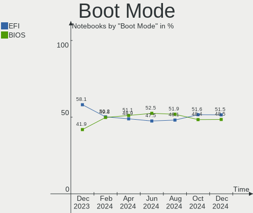
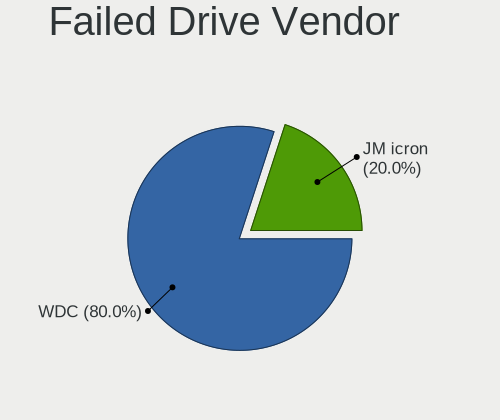
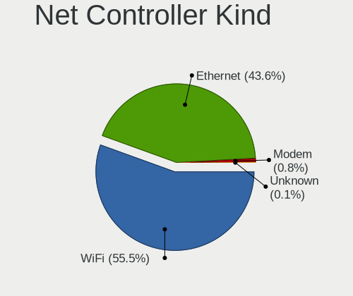

Linux Hardware Trends (Notebook)
--------------------------------

A project to identify most popular hardware characteristics and track their change
over time based on data collected by Linux users at https://Linux-Hardware.org.

Anyone can contribute to the study by uploading probes of their computers by
the [hw-probe](https://github.com/linuxhw/hw-probe) tool:

    sudo hw-probe -all -upload

Full-feature report is available here: https://linux-hardware.org/?view=trends&formfactor=notebook

Period: Mar, 2020.

Contents
--------

- [ OS                       ](#os)
- [ OS Family                ](#os-family)
- [ Kernel                   ](#kernel)
- [ Kernel Family            ](#kernel-family)
- [ Kernel Major Ver.        ](#kernel-major-ver)
- [ Arch                     ](#arch)
- [ DE                       ](#de)
- [ Display Server           ](#display-server)
- [ OS Lang                  ](#os-lang)
- [ Boot Mode                ](#boot-mode)
- [ Filesystem               ](#filesystem)
- [ Dual Boot with Linux     ](#dual-boot-with-linux)
- [ Dual Boot (Win)          ](#dual-boot-win)
- [ Country                  ](#country)
- [ City                     ](#city)
- [ Vendor                   ](#vendor)
- [ Model                    ](#model)
- [ Model Family             ](#model-family)
- [ MFG Year                 ](#mfg-year)
- [ Form Factor              ](#form-factor)
- [ Secure Boot              ](#secure-boot)
- [ Coreboot                 ](#coreboot)
- [ RAM Size                 ](#ram-size)
- [ RAM Used                 ](#ram-used)
- [ Drive Vendor             ](#drive-vendor)
- [ Drive Model              ](#drive-model)
- [ Drive Kind               ](#drive-kind)
- [ Drive Connector          ](#drive-connector)
- [ Drive Size               ](#drive-size)
- [ Space Total              ](#space-total)
- [ Space Used               ](#space-used)
- [ Malfunc. Drives          ](#malfunc-drives)
- [ Malfunc. Drive Vendor    ](#malfunc-drive-vendor)
- [ Malfunc. Drive Kind      ](#malfunc-drive-kind)
- [ Failed Drives            ](#failed-drives)
- [ Failed Drive Vendor      ](#failed-drive-vendor)
- [ Drive Status             ](#drive-status)
- [ Storage Vendor           ](#storage-vendor)
- [ Storage Model            ](#storage-model)
- [ Storage Kind             ](#storage-kind)
- [ CPU Vendor               ](#cpu-vendor)
- [ CPU Model                ](#cpu-model)
- [ CPU Model Family         ](#cpu-model-family)
- [ CPU Cores                ](#cpu-cores)
- [ CPU Sockets              ](#cpu-sockets)
- [ CPU Threads              ](#cpu-threads)
- [ CPU Op-Modes             ](#cpu-op-modes)
- [ CPU Microarch            ](#cpu-microarch)
- [ CPU Microcode            ](#cpu-microcode)
- [ GPU Vendor               ](#gpu-vendor)
- [ GPU Model                ](#gpu-model)
- [ GPU Combo                ](#gpu-combo)
- [ GPU Driver               ](#gpu-driver)
- [ GPU Memory               ](#gpu-memory)
- [ Monitor Vendor           ](#monitor-vendor)
- [ Monitor Model            ](#monitor-model)
- [ Monitor Resolution       ](#monitor-resolution)
- [ Monitor Diagonal         ](#monitor-diagonal)
- [ Monitor Width            ](#monitor-width)
- [ Aspect Ratio             ](#aspect-ratio)
- [ Monitor Area             ](#monitor-area)
- [ Pixel Density            ](#pixel-density)
- [ Multiple Monitors        ](#multiple-monitors)
- [ Net Controller Vendor    ](#net-controller-vendor)
- [ Net Controller Model     ](#net-controller-model)
- [ Net Controller Kind      ](#net-controller-kind)
- [ Used Controller          ](#used-controller)
- [ NICs                     ](#nics)
- [ Unsupported Devices      ](#unsupported-devices)
- [ Unsupported Device Types ](#unsupported-device-types)

OS
--

Installed operating systems

| Name                   | Computers | Percent |
|------------------------|-----------|---------|
| Ubuntu 18.04           | 609       | 29.59%  |
| Ubuntu 19.10           | 293       | 14.24%  |
| ROSA R11               | 135       | 6.56%   |
| BlackPanther 18.1      | 118       | 5.73%   |
| Mint 19.3              | 115       | 5.59%   |
| Endless 3.7.8          | 97        | 4.71%   |
| Fedora 31              | 84        | 4.08%   |
| Zorin 15               | 74        | 3.6%    |
| Arch                   | 48        | 2.33%   |
| Ubuntu 16.04           | 40        | 1.94%   |
| Manjaro 19.0.2         | 32        | 1.55%   |
| Manjaro                | 29        | 1.41%   |
| Ubuntu 20.04           | 26        | 1.26%   |
| Endless 3.7.7          | 24        | 1.17%   |
| KDE neon 18.04         | 23        | 1.12%   |
| Debian 10              | 22        | 1.07%   |
| Ubuntu 19.04           | 18        | 0.87%   |
| Kali 2020.1            | 18        | 0.87%   |
| BlackPanther 16.2      | 16        | 0.78%   |
| Elementary 5.1.2       | 10        | 0.49%   |
| Arch Rolling           | 10        | 0.49%   |
| Debian                 | 9         | 0.44%   |
| MX 20                  | 8         | 0.39%   |
| Debian Testing         | 8         | 0.39%   |
| Zorin 12               | 7         | 0.34%   |
| ROSA R10               | 7         | 0.34%   |
| Mint 19.1              | 7         | 0.34%   |
| Manjaro 19.0.1         | 7         | 0.34%   |
| Fedora 32              | 7         | 0.34%   |
| Peppermint 10          | 6         | 0.29%   |
| Solus 4.1              | 5         | 0.24%   |
| Pop!_OS 19.10          | 5         | 0.24%   |
| Fedora 30              | 5         | 0.24%   |
| Clear Linux 32480      | 5         | 0.24%   |
| Ubuntu 18.10           | 4         | 0.19%   |
| Ubuntu                 | 4         | 0.19%   |
| ROSA R8.1              | 4         | 0.19%   |
| Mint 19.2              | 4         | 0.19%   |
| Mint 19                | 4         | 0.19%   |
| Gentoo 2.6             | 4         | 0.19%   |
| RHEL 8.0               | 3         | 0.15%   |
| openSUSE 15.1          | 3         | 0.15%   |
| Gentoo                 | 3         | 0.15%   |
| Endless 3.3.20-nexthw1 | 3         | 0.15%   |
| Deepin 15.11           | 3         | 0.15%   |
| Debian Unstable        | 3         | 0.15%   |
| Clear Linux 32690      | 3         | 0.15%   |
| Clear Linux 32600      | 3         | 0.15%   |
| Void Rolling           | 2         | 0.1%    |
| Ubuntu 17.10           | 2         | 0.1%    |
| Sparky 5.10            | 2         | 0.1%    |
| Slackware 14.2         | 2         | 0.1%    |
| Reborn OS              | 2         | 0.1%    |
| Parrot 4.8             | 2         | 0.1%    |
| MX 19                  | 2         | 0.1%    |
| Mint 3                 | 2         | 0.1%    |
| Mint 18.3              | 2         | 0.1%    |
| Fedora 33              | 2         | 0.1%    |
| Endless 3.7.6          | 2         | 0.1%    |
| Endless 3.3.20         | 2         | 0.1%    |

OS Family
---------

OS without a version

| Name         | Computers | Percent |
|--------------|-----------|---------|
| Ubuntu       | 997       | 48.45%  |
| ROSA         | 147       | 7.14%   |
| Endless      | 140       | 6.8%    |
| Mint         | 138       | 6.71%   |
| BlackPanther | 134       | 6.51%   |
| Fedora       | 98        | 4.76%   |
| Zorin        | 81        | 3.94%   |
| Manjaro      | 68        | 3.3%    |
| Arch         | 58        | 2.82%   |
| Debian       | 44        | 2.14%   |
| Clear Linux  | 26        | 1.26%   |
| KDE neon     | 23        | 1.12%   |
| Kali         | 20        | 0.97%   |
| Elementary   | 11        | 0.53%   |
| openSUSE     | 10        | 0.49%   |
| MX           | 10        | 0.49%   |
| Gentoo       | 8         | 0.39%   |
| Peppermint   | 6         | 0.29%   |
| Solus        | 5         | 0.24%   |
| Pop!_OS      | 5         | 0.24%   |
| CentOS       | 5         | 0.24%   |
| RHEL         | 4         | 0.19%   |
| Deepin       | 3         | 0.15%   |
| Void         | 2         | 0.1%    |
| Sparky       | 2         | 0.1%    |
| Slackware    | 2         | 0.1%    |
| Reborn OS    | 2         | 0.1%    |
| Parrot       | 2         | 0.1%    |
| RED          | 1         | 0.05%   |
| Chrome OS    | 1         | 0.05%   |
| BigLinux     | 1         | 0.05%   |
| Artix        | 1         | 0.05%   |
| Antix        | 1         | 0.05%   |
| antergos     | 1         | 0.05%   |
| ALT Linux    | 1         | 0.05%   |

Kernel
------

Version of the Linux kernel

| Version                          | Computers | Percent |
|----------------------------------|-----------|---------|
| 5.3.0-42-generic                 | 373       | 18.12%  |
| 5.3.0-40-generic                 | 353       | 17.15%  |
| 5.3.0-28-generic                 | 180       | 8.75%   |
| 4.15.0-91-generic                | 87        | 4.23%   |
| 4.18.16-desktop-1bP              | 84        | 4.08%   |
| 4.15.0-88-generic                | 82        | 3.98%   |
| 4.15.0-desktop-68.5rosa-x86_64   | 52        | 2.53%   |
| 4.15.0-desktop-45.1rosa-x86_64   | 36        | 1.75%   |
| 5.1.15-desktop-1bP               | 34        | 1.65%   |
| 5.3.0-18-generic                 | 29        | 1.41%   |
| 5.5.8-200.fc31.x86_64            | 28        | 1.36%   |
| 5.3.0-45-generic                 | 26        | 1.26%   |
| 4.19.0-8-amd64                   | 19        | 0.92%   |
| 5.4.0-4-amd64                    | 17        | 0.83%   |
| 5.0.0-32-generic                 | 17        | 0.83%   |
| 4.9.20-desktop-pae-1bP           | 15        | 0.73%   |
| 4.15.0-desktop-45.1rosa-i586     | 15        | 0.73%   |
| 5.4.0-kali4-amd64                | 14        | 0.68%   |
| 5.4.23-1-MANJARO                 | 13        | 0.63%   |
| 5.0.0-23-generic                 | 13        | 0.63%   |
| 5.5.7-200.fc31.x86_64            | 12        | 0.58%   |
| 5.3.0-43-generic                 | 12        | 0.58%   |
| 5.5.10-200.fc31.x86_64           | 11        | 0.53%   |
| 5.4.0-18-generic                 | 11        | 0.53%   |
| 5.0.0-38-generic                 | 11        | 0.53%   |
| 4.9.155-nrj-desktop-1rosa-x86_64 | 11        | 0.53%   |
| 5.5.8-arch1-1                    | 10        | 0.49%   |
| 5.5.11-200.fc31.x86_64           | 10        | 0.49%   |
| 5.4.0-14-generic                 | 10        | 0.49%   |
| 5.0.0-37-generic                 | 10        | 0.49%   |
| 4.19.0-6-amd64                   | 9         | 0.44%   |
| 5.5.9-arch1-2                    | 8         | 0.39%   |
| 5.4.22-1-MANJARO                 | 8         | 0.39%   |
| 5.5.8-1-MANJARO                  | 7         | 0.34%   |
| 5.5.6-914.native                 | 7         | 0.34%   |
| 4.15.0-desktop-68.5rosa-i586     | 7         | 0.34%   |
| 5.5.11-arch1-1                   | 6         | 0.29%   |
| 5.5.10-arch1-1                   | 6         | 0.29%   |
| 5.4.24-1-MANJARO                 | 6         | 0.29%   |
| 5.3.0-40-lowlatency              | 6         | 0.29%   |
| 4.4.0-176-generic                | 6         | 0.29%   |
| 4.15.0-92-generic                | 6         | 0.29%   |
| 5.5.8-917.native                 | 5         | 0.24%   |
| 5.5.5-200.fc31.x86_64            | 5         | 0.24%   |
| 5.5.13-1-MANJARO                 | 5         | 0.24%   |
| 5.4.27-1-MANJARO                 | 5         | 0.24%   |
| 5.3.0-26-generic                 | 5         | 0.24%   |
| 4.4.0-174-generic                | 5         | 0.24%   |
| 4.18.0-15-generic                | 5         | 0.24%   |
| 5.6.0-2-MANJARO                  | 4         | 0.19%   |
| 5.5.7-arch1-1                    | 4         | 0.19%   |
| 5.5.7-150.current                | 4         | 0.19%   |
| 5.5.7-1-MANJARO                  | 4         | 0.19%   |
| 5.5.6-201.fc31.x86_64            | 4         | 0.19%   |
| 5.5.13-arch1-1                   | 4         | 0.19%   |
| 5.5.11-1-MANJARO                 | 4         | 0.19%   |
| 5.3.7-301.fc31.x86_64            | 4         | 0.19%   |
| 5.3.0-7642-generic               | 4         | 0.19%   |
| 5.3.0-42-lowlatency              | 4         | 0.19%   |
| 5.0.0-1043-oem-osp1              | 4         | 0.19%   |

Kernel Family
-------------

Linux kernel without a distro release

| Version  | Computers | Percent |
|----------|-----------|---------|
| 5.3.0    | 1013      | 49.22%  |
| 4.15.0   | 345       | 16.76%  |
| 4.18.16  | 84        | 4.08%   |
| 5.0.0    | 67        | 3.26%   |
| 5.4.0    | 62        | 3.01%   |
| 5.5.8    | 57        | 2.77%   |
| 5.1.15   | 34        | 1.65%   |
| 4.19.0   | 32        | 1.55%   |
| 5.5.7    | 30        | 1.46%   |
| 5.5.11   | 26        | 1.26%   |
| 5.5.10   | 24        | 1.17%   |
| 4.18.0   | 23        | 1.12%   |
| 5.6.0    | 20        | 0.97%   |
| 5.5.6    | 19        | 0.92%   |
| 5.5.13   | 18        | 0.87%   |
| 5.5.9    | 17        | 0.83%   |
| 4.4.0    | 17        | 0.83%   |
| 5.4.23   | 16        | 0.78%   |
| 4.9.20   | 15        | 0.73%   |
| 4.9.155  | 15        | 0.73%   |
| 5.4.24   | 11        | 0.53%   |
| 5.4.22   | 8         | 0.39%   |
| 5.5.5    | 7         | 0.34%   |
| 5.4.27   | 7         | 0.34%   |
| 4.13.0   | 6         | 0.29%   |
| 4.9.60   | 5         | 0.24%   |
| 5.5.0    | 4         | 0.19%   |
| 5.4.18   | 4         | 0.19%   |
| 5.3.7    | 4         | 0.19%   |
| 4.9.0    | 4         | 0.19%   |
| 4.19.108 | 4         | 0.19%   |
| 5.4.26   | 3         | 0.15%   |
| 5.4.25   | 3         | 0.15%   |
| 5.1.0    | 3         | 0.15%   |
| 4.12.14  | 3         | 0.15%   |
| 5.5.4    | 2         | 0.1%    |
| 5.4.8    | 2         | 0.1%    |
| 5.4.10   | 2         | 0.1%    |
| 5.2.0    | 2         | 0.1%    |
| 4.9.124  | 2         | 0.1%    |
| 4.19.97  | 2         | 0.1%    |
| 4.19.106 | 2         | 0.1%    |
| 4.19.104 | 2         | 0.1%    |
| 4.16.0   | 2         | 0.1%    |
| 3.10.0   | 2         | 0.1%    |
| 5.5.2    | 1         | 0.05%   |
| 5.4.6    | 1         | 0.05%   |
| 5.4.28   | 1         | 0.05%   |
| 5.4.2    | 1         | 0.05%   |
| 5.4.16   | 1         | 0.05%   |
| 5.4.15   | 1         | 0.05%   |
| 5.4.13   | 1         | 0.05%   |
| 5.3.16   | 1         | 0.05%   |
| 5.3.13   | 1         | 0.05%   |
| 5.3.11   | 1         | 0.05%   |
| 5.2.8    | 1         | 0.05%   |
| 5.0.21   | 1         | 0.05%   |
| 4.9.9    | 1         | 0.05%   |
| 4.9.76   | 1         | 0.05%   |
| 4.9.41   | 1         | 0.05%   |

Kernel Major Ver.
-----------------

Linux kernel major version

| Version | Computers | Percent |
|---------|-----------|---------|
| 5.3     | 1020      | 49.56%  |
| 4.15    | 345       | 16.76%  |
| 5.5     | 205       | 9.96%   |
| 5.4     | 124       | 6.03%   |
| 4.18    | 107       | 5.2%    |
| 5.0     | 68        | 3.3%    |
| 4.19    | 50        | 2.43%   |
| 4.9     | 45        | 2.19%   |
| 5.1     | 37        | 1.8%    |
| 5.6     | 20        | 0.97%   |
| 4.4     | 17        | 0.83%   |
| 4.13    | 6         | 0.29%   |
| 5.2     | 3         | 0.15%   |
| 4.12    | 3         | 0.15%   |
| 4.20    | 2         | 0.1%    |
| 4.16    | 2         | 0.1%    |
| 3.10    | 2         | 0.1%    |
| 4.10    | 1         | 0.05%   |
| 4.1     | 1         | 0.05%   |

Arch
----

OS architecture (x86_64, i586, etc.)

| Name   | Computers | Percent |
|--------|-----------|---------|
| x86_64 | 1917      | 93.15%  |
| i686   | 141       | 6.85%   |

DE
--

Desktop Environment

| Name            | Computers | Percent |
|-----------------|-----------|---------|
| GNOME           | 1093      | 53.11%  |
| KDE5            | 222       | 10.79%  |
| XFCE            | 169       | 8.21%   |
| KDE4            | 91        | 4.42%   |
| Unknown         | 90        | 4.37%   |
| KDE             | 85        | 4.13%   |
| X-Cinnamon      | 83        | 4.03%   |
| MATE            | 53        | 2.58%   |
| Cinnamon        | 40        | 1.94%   |
| Unity           | 38        | 1.85%   |
| Budgie          | 25        | 1.21%   |
| LXQt            | 19        | 0.92%   |
| LXDE            | 19        | 0.92%   |
| Pantheon        | 11        | 0.53%   |
| Deepin          | 7         | 0.34%   |
| GNOME Flashback | 5         | 0.24%   |
| i3              | 4         | 0.19%   |
| Lubuntu         | 1         | 0.05%   |
| GNOME Classic   | 1         | 0.05%   |
| Enlightenment   | 1         | 0.05%   |
| Awesome         | 1         | 0.05%   |

Display Server
--------------

X11 or Wayland

| Name    | Computers | Percent |
|---------|-----------|---------|
| X11     | 1877      | 91.21%  |
| Wayland | 124       | 6.03%   |
| Unknown | 44        | 2.14%   |
| Tty     | 13        | 0.63%   |

OS Lang
-------

Language

| Lang       | Computers | Percent |
|------------|-----------|---------|
| en_US      | 572       | 27.79%  |
| Unknown    | 235       | 11.42%  |
| ru_RU      | 164       | 7.97%   |
| de_DE      | 127       | 6.17%   |
| pt_BR      | 94        | 4.57%   |
| en_GB      | 94        | 4.57%   |
| it_IT      | 87        | 4.23%   |
| en_US.utf8 | 78        | 3.79%   |
| fr_FR      | 72        | 3.5%    |
| es_ES      | 50        | 2.43%   |
| en_IN      | 42        | 2.04%   |
| pl_PL      | 35        | 1.7%    |
| en_CA      | 32        | 1.55%   |
| C          | 32        | 1.55%   |
| en_AU      | 29        | 1.41%   |
| es_AR      | 19        | 0.92%   |
| nl_NL      | 18        | 0.87%   |
| cs_CZ      | 18        | 0.87%   |
| es_MX      | 17        | 0.83%   |
| pt_PT      | 13        | 0.63%   |
| ru_UA      | 12        | 0.58%   |
| sv_SE      | 11        | 0.53%   |
| hu_HU      | 11        | 0.53%   |
| pt_BR.utf8 | 10        | 0.49%   |
| de_AT      | 10        | 0.49%   |
| uk_UA      | 9         | 0.44%   |
| tr_TR      | 9         | 0.44%   |
| fi_FI      | 9         | 0.44%   |
| es_CO      | 9         | 0.44%   |
| zh_CN      | 7         | 0.34%   |
| de_CH      | 7         | 0.34%   |
| ro_RO      | 6         | 0.29%   |
| es_CL      | 6         | 0.29%   |
| en_ZA      | 6         | 0.29%   |
| el_GR      | 6         | 0.29%   |
| nl_BE      | 5         | 0.24%   |
| ja_JP      | 5         | 0.24%   |
| en_IE      | 5         | 0.24%   |
| en_GB.utf8 | 5         | 0.24%   |
| de_DE.utf8 | 5         | 0.24%   |
| ca_ES      | 5         | 0.24%   |
| bg_BG      | 5         | 0.24%   |
| sk_SK      | 4         | 0.19%   |
| sl_SI      | 3         | 0.15%   |
| pl_PL.utf8 | 3         | 0.15%   |
| nb_NO      | 3         | 0.15%   |
| lv_LV      | 3         | 0.15%   |
| lt_LT      | 3         | 0.15%   |
| es_PE      | 3         | 0.15%   |
| en_NZ      | 3         | 0.15%   |
| en_IL      | 3         | 0.15%   |
| da_DK      | 3         | 0.15%   |
| zh_TW      | 2         | 0.1%    |
| hr_HR      | 2         | 0.1%    |
| fr_BE      | 2         | 0.1%    |
| es_VE      | 2         | 0.1%    |
| es_EC      | 2         | 0.1%    |
| en_SG      | 2         | 0.1%    |
| en_IN      | 2         | 0.1%    |
| zh_HK      | 1         | 0.05%   |

Boot Mode
---------

EFI or BIOS

| Mode | Computers | Percent |
|------|-----------|---------|
| BIOS | 1114      | 54.13%  |
| EFI  | 944       | 45.87%  |

Filesystem
----------

Type of filesystem

| Type    | Computers | Percent |
|---------|-----------|---------|
| Ext4    | 1914      | 93%     |
| Overlay | 53        | 2.58%   |
| Btrfs   | 41        | 1.99%   |
| Xfs     | 21        | 1.02%   |
| Tmpfs   | 12        | 0.58%   |
| Zfs     | 5         | 0.24%   |
| F2fs    | 5         | 0.24%   |
| Ext2    | 3         | 0.15%   |
| Ext3    | 2         | 0.1%    |
| Aufs    | 2         | 0.1%    |

Dual Boot with Linux
--------------------

Hosting more than one Linux

| Dual boot | Computers | Percent |
|-----------|-----------|---------|
| No        | 1872      | 90.96%  |
| Yes       | 186       | 9.04%   |

Dual Boot (Win)
---------------

Hosting Linux and Windows

| Dual boot | Computers | Percent |
|-----------|-----------|---------|
| No        | 1478      | 71.82%  |
| Yes       | 580       | 28.18%  |

Country
-------

Geographic location (country)

| Country        | Computers | Percent |
|----------------|-----------|---------|
| USA            | 261       | 12.68%  |
| Russia         | 204       | 9.91%   |
| Germany        | 175       | 8.5%    |
| Brazil         | 121       | 5.88%   |
| Hungary        | 111       | 5.39%   |
| Italy          | 108       | 5.25%   |
| UK             | 96        | 4.66%   |
| France         | 80        | 3.89%   |
| India          | 59        | 2.87%   |
| Spain          | 56        | 2.72%   |
| Poland         | 50        | 2.43%   |
| Canada         | 50        | 2.43%   |
| Ukraine        | 47        | 2.28%   |
| Australia      | 38        | 1.85%   |
| Romania        | 31        | 1.51%   |
| Belgium        | 31        | 1.51%   |
| Mexico         | 30        | 1.46%   |
| Netherlands    | 29        | 1.41%   |
| Sweden         | 26        | 1.26%   |
| Argentina      | 25        | 1.21%   |
| Portugal       | 24        | 1.17%   |
| Czech Republic | 24        | 1.17%   |
| Turkey         | 19        | 0.92%   |
| Finland        | 19        | 0.92%   |
| Bulgaria       | 19        | 0.92%   |
| Austria        | 18        | 0.87%   |
| Switzerland    | 16        | 0.78%   |
| Greece         | 16        | 0.78%   |
| Indonesia      | 15        | 0.73%   |
| Colombia       | 15        | 0.73%   |
| Norway         | 11        | 0.53%   |
| Belarus        | 11        | 0.53%   |
| Slovakia       | 10        | 0.49%   |
| Serbia         | 10        | 0.49%   |
| Iran           | 10        | 0.49%   |
| Denmark        | 9         | 0.44%   |
| Kazakhstan     | 8         | 0.39%   |
| China          | 8         | 0.39%   |
| Chile          | 8         | 0.39%   |
| South Africa   | 7         | 0.34%   |
| Lithuania      | 7         | 0.34%   |
| Israel         | 7         | 0.34%   |
| Vietnam        | 6         | 0.29%   |
| Latvia         | 6         | 0.29%   |
| Japan          | 6         | 0.29%   |
| Ireland        | 6         | 0.29%   |
| Slovenia       | 5         | 0.24%   |
| New Zealand    | 5         | 0.24%   |
| Egypt          | 5         | 0.24%   |
| Croatia        | 5         | 0.24%   |
| Singapore      | 4         | 0.19%   |
| Puerto Rico    | 4         | 0.19%   |
| Philippines    | 4         | 0.19%   |
| Pakistan       | 4         | 0.19%   |
| Algeria        | 4         | 0.19%   |
| Tunisia        | 3         | 0.15%   |
| Taiwan         | 3         | 0.15%   |
| Peru           | 3         | 0.15%   |
| Luxembourg     | 3         | 0.15%   |
| Georgia        | 3         | 0.15%   |

City
----

Geographic location (city)

| City              | Computers | Percent |
|-------------------|-----------|---------|
| Moscow            | 42        | 2.04%   |
| Budapest          | 36        | 1.75%   |
| São Paulo        | 17        | 0.83%   |
| St Petersburg     | 17        | 0.83%   |
| Warsaw            | 15        | 0.73%   |
| Kyiv              | 15        | 0.73%   |
| Berlin            | 15        | 0.73%   |
| Bucharest         | 14        | 0.68%   |
| Vienna            | 13        | 0.63%   |
| Paris             | 13        | 0.63%   |
| Brisbane          | 13        | 0.63%   |
| Athens            | 13        | 0.63%   |
| Rome              | 12        | 0.58%   |
| Sofia             | 11        | 0.53%   |
| Prague            | 11        | 0.53%   |
| Novosibirsk       | 10        | 0.49%   |
| Milan             | 10        | 0.49%   |
| Lisbon            | 10        | 0.49%   |
| Zurich            | 8         | 0.39%   |
| New Delhi         | 8         | 0.39%   |
| Istanbul          | 8         | 0.39%   |
| Ekaterinburg      | 8         | 0.39%   |
| Rio de Janeiro    | 7         | 0.34%   |
| Munich            | 7         | 0.34%   |
| Montreal          | 7         | 0.34%   |
| Mexico City       | 7         | 0.34%   |
| Leipzig           | 7         | 0.34%   |
| Krasnodar         | 7         | 0.34%   |
| Frankfurt am Main | 7         | 0.34%   |
| Dublin            | 7         | 0.34%   |
| Barcelona         | 7         | 0.34%   |
| Sydney            | 6         | 0.29%   |
| Los Angeles       | 6         | 0.29%   |
| Kharkiv           | 6         | 0.29%   |
| Jakarta           | 6         | 0.29%   |
| Helsinki          | 6         | 0.29%   |
| Dresden           | 6         | 0.29%   |
| Brussels          | 6         | 0.29%   |
| Belgrade          | 6         | 0.29%   |
| Zalaegerszeg      | 5         | 0.24%   |
| Toronto           | 5         | 0.24%   |
| Tehran            | 5         | 0.24%   |
| Stockholm         | 5         | 0.24%   |
| Riga              | 5         | 0.24%   |
| Perth             | 5         | 0.24%   |
| Madrid            | 5         | 0.24%   |
| Hyderabad         | 5         | 0.24%   |
| Hanoi             | 5         | 0.24%   |
| Ernakulam         | 5         | 0.24%   |
| Delhi             | 5         | 0.24%   |
| Bengaluru         | 5         | 0.24%   |
| Voronezh          | 4         | 0.19%   |
| Vilnius           | 4         | 0.19%   |
| Vila Velha        | 4         | 0.19%   |
| Verona            | 4         | 0.19%   |
| Toulouse          | 4         | 0.19%   |
| Tampere           | 4         | 0.19%   |
| Székesfehérvár | 4         | 0.19%   |
| Santiago de Cali  | 4         | 0.19%   |
| Santiago          | 4         | 0.19%   |

Vendor
------

Motherboard manufacturer

| Name                    | Computers | Percent |
|-------------------------|-----------|---------|
| Hewlett-Packard         | 438       | 21.28%  |
| Lenovo                  | 361       | 17.54%  |
| Dell                    | 328       | 15.94%  |
| ASUSTek Computer        | 262       | 12.73%  |
| Acer                    | 217       | 10.54%  |
| Toshiba                 | 71        | 3.45%   |
| Samsung Electronics     | 55        | 2.67%   |
| Apple                   | 36        | 1.75%   |
| MSI                     | 31        | 1.51%   |
| Sony                    | 30        | 1.46%   |
| Unknown                 | 22        | 1.07%   |
| Packard Bell            | 18        | 0.87%   |
| Notebook                | 18        | 0.87%   |
| Fujitsu                 | 17        | 0.83%   |
| HUAWEI                  | 11        | 0.53%   |
| Fujitsu Siemens         | 11        | 0.53%   |
| Medion                  | 9         | 0.44%   |
| Positivo                | 8         | 0.39%   |
| Clevo                   | 8         | 0.39%   |
| Alienware               | 5         | 0.24%   |
| Timi                    | 4         | 0.19%   |
| PC Specialist           | 4         | 0.19%   |
| Google                  | 4         | 0.19%   |
| Gateway                 | 4         | 0.19%   |
| Teclast                 | 3         | 0.15%   |
| LG Electronics          | 3         | 0.15%   |
| Gigabyte Technology     | 3         | 0.15%   |
| eMachines               | 3         | 0.15%   |
| VIT                     | 2         | 0.1%    |
| System76                | 2         | 0.1%    |
| SLIMBOOK                | 2         | 0.1%    |
| OEM                     | 2         | 0.1%    |
| Hometech                | 2         | 0.1%    |
| HCL Infosystems Limited | 2         | 0.1%    |
| Chuwi                   | 2         | 0.1%    |
| Zoostorm                | 1         | 0.05%   |
| TUXEDO                  | 1         | 0.05%   |
| TrekStor                | 1         | 0.05%   |
| Thomson                 | 1         | 0.05%   |
| TECH PAD                | 1         | 0.05%   |
| StationX                | 1         | 0.05%   |
| Standard                | 1         | 0.05%   |
| Semp Toshiba            | 1         | 0.05%   |
| RM Education            | 1         | 0.05%   |
| Razer                   | 1         | 0.05%   |
| Purism                  | 1         | 0.05%   |
| Prestigio               | 1         | 0.05%   |
| Phoenix/SiS             | 1         | 0.05%   |
| Philco                  | 1         | 0.05%   |
| Panasonic               | 1         | 0.05%   |
| OEGStone                | 1         | 0.05%   |
| NEC Computers           | 1         | 0.05%   |
| Multilaser Industrial   | 1         | 0.05%   |
| Motion Computing        | 1         | 0.05%   |
| Monster                 | 1         | 0.05%   |
| MINIX                   | 1         | 0.05%   |
| Metabox                 | 1         | 0.05%   |
| Megaware                | 1         | 0.05%   |
| MEDIONAG                | 1         | 0.05%   |
| MECHREVO                | 1         | 0.05%   |

Model
-----

Motherboard model

| Name                                                    | Computers | Percent |
|---------------------------------------------------------|-----------|---------|
| Unknown                                                 | 37        | 1.8%    |
| HP Pavilion dv6                                         | 14        | 0.68%   |
| HP Notebook                                             | 14        | 0.68%   |
| HP Pavilion g6                                          | 10        | 0.49%   |
| HP Laptop 15-da0xxx                                     | 10        | 0.49%   |
| HP EliteBook 840 G6                                     | 10        | 0.49%   |
| HP Pavilion dv7                                         | 9         | 0.44%   |
| Dell G3 3590                                            | 9         | 0.44%   |
| Dell Latitude E6410                                     | 8         | 0.39%   |
| Toshiba Satellite C660                                  | 7         | 0.34%   |
| HP Pavilion Notebook                                    | 7         | 0.34%   |
| HP Laptop 15-bw0xx                                      | 7         | 0.34%   |
| HP 15                                                   | 7         | 0.34%   |
| Dell Latitude E6430                                     | 7         | 0.34%   |
| Dell Latitude E6420                                     | 7         | 0.34%   |
| HP Compaq Presario CQ60                                 | 6         | 0.29%   |
| HP 2000                                                 | 6         | 0.29%   |
| Dell Inspiron 5570                                      | 6         | 0.29%   |
| Lenovo IdeaPad 330-15IKB 81DE                           | 5         | 0.24%   |
| Lenovo B570e HuronRiver Platform                        | 5         | 0.24%   |
| HP Pavilion 15                                          | 5         | 0.24%   |
| HP Laptop 15-db0xxx                                     | 5         | 0.24%   |
| HP Laptop 15-bs1xx                                      | 5         | 0.24%   |
| HP Laptop 15-bs0xx                                      | 5         | 0.24%   |
| HP 250 G1                                               | 5         | 0.24%   |
| Dell XPS L502X                                          | 5         | 0.24%   |
| Dell XPS 13 9380                                        | 5         | 0.24%   |
| Dell Latitude E7440                                     | 5         | 0.24%   |
| Dell Latitude E6230                                     | 5         | 0.24%   |
| Dell Inspiron 3521                                      | 5         | 0.24%   |
| Dell Inspiron 15-3567                                   | 5         | 0.24%   |
| Apple MacBookPro8,1                                     | 5         | 0.24%   |
| Samsung Electronics 350V5C/351V5C/3540VC/3440VC         | 4         | 0.19%   |
| HP ProBook 650 G1                                       | 4         | 0.19%   |
| HP ProBook 450 G6                                       | 4         | 0.19%   |
| HP Pavilion x2 Detachable                               | 4         | 0.19%   |
| HP Pavilion Gaming Laptop 15-cx0xxx                     | 4         | 0.19%   |
| HP Pavilion dv4                                         | 4         | 0.19%   |
| HP OMEN by HP Laptop                                    | 4         | 0.19%   |
| HP EliteBook 840 G5                                     | 4         | 0.19%   |
| HP EliteBook 840 G2                                     | 4         | 0.19%   |
| HP EliteBook 840 G1                                     | 4         | 0.19%   |
| HP 620                                                  | 4         | 0.19%   |
| Dell XPS 15 9560                                        | 4         | 0.19%   |
| Dell XPS 13 9360                                        | 4         | 0.19%   |
| Dell Latitude E6400                                     | 4         | 0.19%   |
| Dell Inspiron MM061                                     | 4         | 0.19%   |
| Dell Inspiron 5559                                      | 4         | 0.19%   |
| Dell Inspiron 1545                                      | 4         | 0.19%   |
| ASUS VivoBook 15_ASUS Laptop X540MA_X540MA              | 4         | 0.19%   |
| Apple MacBookPro5,5                                     | 4         | 0.19%   |
| Acer Aspire V3-571G                                     | 4         | 0.19%   |
| Acer Aspire A515-51G                                    | 4         | 0.19%   |
| Acer Aspire A315-51                                     | 4         | 0.19%   |
| Samsung Electronics RV411/RV511/E3511/S3511/RV711/E3411 | 3         | 0.15%   |
| Samsung Electronics 300E4C/300E5C/300E7C                | 3         | 0.15%   |
| Packard Bell EasyNote TE11HC                            | 3         | 0.15%   |
| Lenovo Z50-70 20354                                     | 3         | 0.15%   |
| Lenovo Yoga 3 Pro-1370 80HE                             | 3         | 0.15%   |
| Lenovo V145-15AST 81MT                                  | 3         | 0.15%   |

Model Family
------------

Motherboard model prefix

| Name                        | Computers | Percent |
|-----------------------------|-----------|---------|
| Lenovo ThinkPad             | 169       | 8.21%   |
| Acer Aspire                 | 154       | 7.48%   |
| Dell Inspiron               | 120       | 5.83%   |
| Dell Latitude               | 107       | 5.2%    |
| HP Pavilion                 | 106       | 5.15%   |
| Lenovo IdeaPad              | 87        | 4.23%   |
| HP EliteBook                | 64        | 3.11%   |
| Toshiba Satellite           | 62        | 3.01%   |
| HP Laptop                   | 54        | 2.62%   |
| HP ProBook                  | 52        | 2.53%   |
| ASUS VivoBook               | 47        | 2.28%   |
| Unknown                     | 37        | 1.8%    |
| Dell XPS                    | 36        | 1.75%   |
| HP Compaq                   | 27        | 1.31%   |
| Dell Vostro                 | 22        | 1.07%   |
| Dell Precision              | 21        | 1.02%   |
| Packard Bell EasyNote       | 16        | 0.78%   |
| HP ENVY                     | 16        | 0.78%   |
| Fujitsu LIFEBOOK            | 16        | 0.78%   |
| Acer TravelMate             | 15        | 0.73%   |
| HP Notebook                 | 14        | 0.68%   |
| HP 250                      | 14        | 0.68%   |
| Acer Extensa                | 13        | 0.63%   |
| ASUS TUF                    | 12        | 0.58%   |
| Acer Swift                  | 12        | 0.58%   |
| Dell G3                     | 11        | 0.53%   |
| ASUS ZenBook                | 11        | 0.53%   |
| HP ZBook                    | 10        | 0.49%   |
| HP Stream                   | 9         | 0.44%   |
| Acer Nitro                  | 9         | 0.44%   |
| Lenovo Yoga                 | 8         | 0.39%   |
| HP Presario                 | 8         | 0.39%   |
| Lenovo ThinkBook            | 7         | 0.34%   |
| HP OMEN                     | 7         | 0.34%   |
| HP 255                      | 7         | 0.34%   |
| HP 15                       | 7         | 0.34%   |
| HP 2000                     | 6         | 0.29%   |
| Dell Studio                 | 6         | 0.29%   |
| ASUS Strix                  | 6         | 0.29%   |
| Apple MacBookPro8           | 6         | 0.29%   |
| Samsung Electronics 350V5C  | 5         | 0.24%   |
| Samsung Electronics 300E5EV | 5         | 0.24%   |
| Lenovo G550                 | 5         | 0.24%   |
| Lenovo B570e                | 5         | 0.24%   |
| Fujitsu Siemens ESPRIMO     | 5         | 0.24%   |
| Apple MacBookPro5           | 5         | 0.24%   |
| Samsung Electronics RV411   | 4         | 0.19%   |
| Lenovo G580                 | 4         | 0.19%   |
| HP Mini                     | 4         | 0.19%   |
| HP 620                      | 4         | 0.19%   |
| Fujitsu Siemens AMILO       | 4         | 0.19%   |
| Toshiba PORTEGE             | 3         | 0.15%   |
| Samsung Electronics 300E4C  | 3         | 0.15%   |
| MSI Modern                  | 3         | 0.15%   |
| MSI GE70                    | 3         | 0.15%   |
| Lenovo Z50-70               | 3         | 0.15%   |
| Lenovo V145-15AST           | 3         | 0.15%   |
| Lenovo Legion               | 3         | 0.15%   |
| Lenovo G500                 | 3         | 0.15%   |
| Lenovo G50-70               | 3         | 0.15%   |

MFG Year
--------

Motherboard manufacture year

| Year    | Computers | Percent |
|---------|-----------|---------|
| 2019    | 490       | 23.81%  |
| 2018    | 235       | 11.42%  |
| 2011    | 159       | 7.73%   |
| 2013    | 148       | 7.19%   |
| 2012    | 145       | 7.05%   |
| 2014    | 131       | 6.37%   |
| 2015    | 129       | 6.27%   |
| 2017    | 109       | 5.3%    |
| 2010    | 108       | 5.25%   |
| 2016    | 100       | 4.86%   |
| 2009    | 98        | 4.76%   |
| 2008    | 88        | 4.28%   |
| 2020    | 44        | 2.14%   |
| 2007    | 40        | 1.94%   |
| 2006    | 19        | 0.92%   |
| 2005    | 14        | 0.68%   |
| Unknown | 1         | 0.05%   |

Form Factor
-----------

Physical design of the computer

| Name     | Computers | Percent |
|----------|-----------|---------|
| Notebook | 2058      | 100%    |

Secure Boot
-----------

Enabled or disabled

| State    | Computers | Percent |
|----------|-----------|---------|
| Disabled | 1859      | 90.33%  |
| Enabled  | 199       | 9.67%   |

Coreboot
--------

Have coreboot on board

| Used | Computers | Percent |
|------|-----------|---------|
| No   | 2052      | 99.71%  |
| Yes  | 6         | 0.29%   |

RAM Size
--------

Total RAM memory

| Size in GB  | Computers | Percent |
|-------------|-----------|---------|
| 3.01-4.0    | 599       | 29.11%  |
| 4.01-8.0    | 527       | 25.61%  |
| 8.01-16.0   | 295       | 14.33%  |
| 16.01-24.0  | 277       | 13.46%  |
| 1.01-2.0    | 179       | 8.7%    |
| 32.01-64.0  | 70        | 3.4%    |
| 2.01-3.0    | 63        | 3.06%   |
| 0.01-1.0    | 31        | 1.51%   |
| 24.01-32.0  | 13        | 0.63%   |
| 64.01-256.0 | 4         | 0.19%   |

RAM Used
--------

Used RAM memory

| Used GB    | Computers | Percent |
|------------|-----------|---------|
| 1.01-2.0   | 849       | 41.25%  |
| 2.01-3.0   | 489       | 23.76%  |
| 0.01-1.0   | 300       | 14.58%  |
| 3.01-4.0   | 206       | 10.01%  |
| 4.01-8.0   | 174       | 8.45%   |
| 8.01-16.0  | 33        | 1.6%    |
| 16.01-24.0 | 6         | 0.29%   |
| 24.01-32.0 | 1         | 0.05%   |

Drive Vendor
------------

Hard drive vendors

| Vendor              | Computers | Drives | Percent |
|---------------------|-----------|--------|---------|
| Seagate             | 383       | 389    | 17.17%  |
| WDC                 | 322       | 329    | 14.43%  |
| Samsung Electronics | 260       | 271    | 11.65%  |
| Toshiba             | 242       | 244    | 10.85%  |
| Unknown             | 125       | 142    | 5.6%    |
| HGST                | 118       | 118    | 5.29%   |
| Hitachi             | 112       | 114    | 5.02%   |
| Kingston            | 99        | 99     | 4.44%   |
| SanDisk             | 90        | 92     | 4.03%   |
| Crucial             | 68        | 68     | 3.05%   |
| Intel               | 41        | 41     | 1.84%   |
| HL-DT-ST            | 35        | 8      | 1.57%   |
| SK Hynix            | 33        | 33     | 1.48%   |
| A-DATA Technology   | 31        | 32     | 1.39%   |
| Fujitsu             | 27        | 27     | 1.21%   |
| Micron Technology   | 26        | 26     | 1.17%   |
| LITEON              | 19        | 19     | 0.85%   |
| Apple               | 14        | 14     | 0.63%   |
| Transcend           | 13        | 13     | 0.58%   |
| SPCC                | 13        | 13     | 0.58%   |
| China               | 13        | 13     | 0.58%   |
| LITEONIT            | 10        | 10     | 0.45%   |
| KingSpec            | 7         | 7      | 0.31%   |
| Generic             | 7         | 7      | 0.31%   |
| PLEXTOR             | 6         | 6      | 0.27%   |
| OCZ                 | 6         | 6      | 0.27%   |
| Team                | 5         | 5      | 0.22%   |
| Patriot             | 5         | 5      | 0.22%   |
| KingDian            | 5         | 5      | 0.22%   |
| GOODRAM             | 5         | 5      | 0.22%   |
| Intenso             | 4         | 4      | 0.18%   |
| Zheino              | 3         | 3      | 0.13%   |
| Teclast             | 3         | 3      | 0.13%   |
| PNY                 | 3         | 3      | 0.13%   |
| Integral            | 3         | 3      | 0.13%   |
| Hewlett-Packard     | 3         | 3      | 0.13%   |
| Gigabyte Technology | 3         | 3      | 0.13%   |
| FORESEE             | 3         | 3      | 0.13%   |
| Corsair             | 3         | 3      | 0.13%   |
| Apacer              | 3         | 3      | 0.13%   |
| USB                 | 2         | 2      | 0.09%   |
| TCSUNBOW            | 2         | 2      | 0.09%   |
| SABRENT             | 2         | 2      | 0.09%   |
| Phison              | 2         | 2      | 0.09%   |
| Netac               | 2         | 2      | 0.09%   |
| MEDIATEK            | 2         | 2      | 0.09%   |
| KingFast            | 2         | 2      | 0.09%   |
| JMicron             | 2         | 2      | 0.09%   |
| BHT                 | 2         | 2      | 0.09%   |
| ASMT                | 2         | 2      | 0.09%   |
| AMD                 | 2         | 2      | 0.09%   |
| WD MediaMax         | 1         | 1      | 0.04%   |
| Verbatim            | 1         | 1      | 0.04%   |
| Union Memory        | 1         | 1      | 0.04%   |
| TO Exter            | 1         | 1      | 0.04%   |
| T-64                | 1         | 1      | 0.04%   |
| Super Talent        | 1         | 1      | 0.04%   |
| STEC                | 1         | 1      | 0.04%   |
| SMI                 | 1         | 1      | 0.04%   |
| Smartbuy            | 1         | 1      | 0.04%   |

Drive Model
-----------

Hard drive models

| Model                        | Computers | Percent |
|------------------------------|-----------|---------|
| ST1000LM035-1RK172 1TB       | 66        | 2.9%    |
| MQ01ABF050 500GB             | 45        | 1.98%   |
| MMC Card  32GB               | 43        | 1.89%   |
| ST1000LM024 HN-M101MBB 1TB   | 35        | 1.54%   |
| ST500LT012-1DG142 500GB      | 33        | 1.45%   |
| HTS721010A9E630 1TB          | 33        | 1.45%   |
| MQ04ABF100 1TB               | 31        | 1.36%   |
| MQ01ABD100 1TB               | 30        | 1.32%   |
| ST9500325AS 500GB            | 27        | 1.19%   |
| DVDRAM GUE1N 3GB             | 26        | 1.14%   |
| MMC Card  64GB               | 23        | 1.01%   |
| HTS541010A9E680 1TB          | 23        | 1.01%   |
| SA400S37240G 240GB SSD       | 22        | 0.97%   |
| HTS545050A7E380 500GB        | 18        | 0.79%   |
| HTS545050A7E680 500GB        | 17        | 0.75%   |
| WD10SPZX-21Z10T0 1TB         | 15        | 0.66%   |
| SSD 850 EVO 250GB            | 14        | 0.62%   |
| MMC Card  16GB               | 14        | 0.62%   |
| SSD 850 EVO 500GB            | 13        | 0.57%   |
| WD5000LPVX-22V0TT0 500GB     | 12        | 0.53%   |
| ST500LM012 HN-M500MBB 500GB  | 12        | 0.53%   |
| ST1000LX015-1U7172 1TB       | 12        | 0.53%   |
| HTS725050A7E630 500GB        | 12        | 0.53%   |
| HTS545032B9A300 320GB        | 12        | 0.53%   |
| WD10JPVX-22JC3T0 1TB         | 11        | 0.48%   |
| SV300S37A120G 120GB SSD      | 11        | 0.48%   |
| ST2000LM007-1R8174 2TB       | 11        | 0.48%   |
| ST1000LM014-1EJ164 1TB       | 11        | 0.48%   |
| SSD 860 EVO 1TB              | 11        | 0.48%   |
| SA400S37480G 480GB SSD       | 11        | 0.48%   |
| SA400S37120G 120GB SSD       | 11        | 0.48%   |
| ST9500420AS 500GB            | 10        | 0.44%   |
| ST500LT012-9WS142 500GB      | 10        | 0.44%   |
| SSD 860 EVO 250GB            | 10        | 0.44%   |
| ST9320325AS 320GB            | 9         | 0.4%    |
| SSD 860 EVO 500GB            | 9         | 0.4%    |
| DVDRAM GUC0N 1GB             | 9         | 0.4%    |
| CT240BX500SSD1 240GB         | 9         | 0.4%    |
| WD1600BEVT-22ZCT0 160GB      | 8         | 0.35%   |
| ST9250315AS 250GB            | 8         | 0.35%   |
| MQ01ABD050 500GB             | 8         | 0.35%   |
| CT500MX500SSD1 500GB         | 8         | 0.35%   |
| 1100_MTFDDAV256TBN 256GB SSD | 8         | 0.35%   |
| WDS500G2B0A-00SM50 500GB SSD | 7         | 0.31%   |
| WD3200BEVT-22ZCT0 320GB      | 7         | 0.31%   |
| TR200 240GB SSD              | 7         | 0.31%   |
| ST1000LM048-2E7172 1TB       | 7         | 0.31%   |
| SD/MMC/MS PRO 16GB           | 7         | 0.31%   |
| HTS547575A9E384 752GB        | 7         | 0.31%   |
| HTS545050B9A300 500GB        | 7         | 0.31%   |
| HTS543232A7A384 320GB        | 7         | 0.31%   |
| HFS256G39TND-N210A 256GB SSD | 7         | 0.31%   |
| CT525MX300SSD1 528GB         | 7         | 0.31%   |
| WDS120G2G0A-00JH30 120GB SSD | 6         | 0.26%   |
| WD10SPZX-60Z10T0 1TB         | 6         | 0.26%   |
| WD10JPVX-75JC3T0 1TB         | 6         | 0.26%   |
| WD10JPCX-24UE4T0 1TB         | 6         | 0.26%   |
| SU650 120GB SSD              | 6         | 0.26%   |
| ST9320423AS 320GB            | 6         | 0.26%   |
| ST500LM021-1KJ152 500GB      | 6         | 0.26%   |

Drive Kind
----------

HDD or SSD

| Kind    | Computers | Drives | Percent |
|---------|-----------|--------|---------|
| HDD     | 1137      | 1162   | 52.11%  |
| SSD     | 743       | 787    | 34.05%  |
| MMC     | 121       | 139    | 5.55%   |
| NVMe    | 99        | 106    | 4.54%   |
| Unknown | 82        | 58     | 3.76%   |

Drive Connector
---------------

SATA, SAS, NVMe, etc.

| Type | Computers | Drives | Percent |
|------|-----------|--------|---------|
| SATA | 1729      | 1948   | 85.05%  |
| MMC  | 121       | 139    | 5.95%   |
| NVMe | 99        | 106    | 4.87%   |
| SAS  | 84        | 59     | 4.13%   |

Drive Size
----------

Size of hard drive

| Size in TB | Computers | Drives | Percent |
|------------|-----------|--------|---------|
| 0.01-0.5   | 1433      | 1598   | 69.43%  |
| 0.51-1.0   | 586       | 608    | 28.39%  |
| 1.01-2.0   | 40        | 41     | 1.94%   |
| 3.01-4.0   | 4         | 4      | 0.19%   |
| 2.01-3.0   | 1         | 1      | 0.05%   |

Space Total
-----------

Amount of disk space available on the file system

| Size in GB     | Computers | Percent |
|----------------|-----------|---------|
| 101-250        | 627       | 30.47%  |
| 251-500        | 550       | 26.72%  |
| 501-1000       | 285       | 13.85%  |
| 51-100         | 192       | 9.33%   |
| 21-50          | 157       | 7.63%   |
| 1-20           | 96        | 4.66%   |
| 1001-2000      | 81        | 3.94%   |
| Unknown        | 41        | 1.99%   |
| 2001-3000      | 19        | 0.92%   |
| More than 3000 | 10        | 0.49%   |

Space Used
----------

Amount of used disk space

| Used GB        | Computers | Percent |
|----------------|-----------|---------|
| 1-20           | 982       | 47.72%  |
| 21-50          | 390       | 18.95%  |
| 101-250        | 223       | 10.84%  |
| 51-100         | 220       | 10.69%  |
| 251-500        | 109       | 5.3%    |
| 501-1000       | 72        | 3.5%    |
| Unknown        | 41        | 1.99%   |
| 1001-2000      | 15        | 0.73%   |
| 2001-3000      | 5         | 0.24%   |
| More than 3000 | 1         | 0.05%   |

Malfunc. Drives
---------------

Drive models with a malfunction

| Model                       | Computers | Drives | Percent |
|-----------------------------|-----------|--------|---------|
| ST9500325AS 500GB           | 6         | 6      | 3.82%   |
| ST9320325AS 320GB           | 5         | 5      | 3.18%   |
| ST320LT020-9YG142 320GB     | 5         | 5      | 3.18%   |
| ST500LT012-1DG142 500GB     | 4         | 4      | 2.55%   |
| HTS545050A7E380 500GB       | 4         | 4      | 2.55%   |
| ST1000LM014-1EJ164 1TB      | 3         | 3      | 1.91%   |
| MQ01ABD050 500GB            | 3         | 3      | 1.91%   |
| HTS721010A9E630 1TB         | 3         | 3      | 1.91%   |
| HTS545050B9A300 500GB       | 3         | 3      | 1.91%   |
| HTS545050A7E680 500GB       | 3         | 3      | 1.91%   |
| HTS545032A7E380 320GB       | 3         | 3      | 1.91%   |
| HTS541010A9E680 1TB         | 3         | 3      | 1.91%   |
| ST500LT012-9WS142 500GB     | 2         | 2      | 1.27%   |
| ST1000LM035-1RK172 1TB      | 2         | 2      | 1.27%   |
| MQ01ABD100 1TB              | 2         | 2      | 1.27%   |
| MK3265GSX 320GB             | 2         | 2      | 1.27%   |
| MK1237GSX 120GB             | 2         | 2      | 1.27%   |
| HTS725050A9A364 500GB       | 2         | 2      | 1.27%   |
| HTS547575A9E384 752GB       | 2         | 2      | 1.27%   |
| CT525MX300SSD1 528GB        | 2         | 2      | 1.27%   |
| WD7500BPVX-22JC3T0 752GB    | 1         | 1      | 0.64%   |
| WD6400BPVT-75HXZT1 640GB    | 1         | 1      | 0.64%   |
| WD6400BEVT-22A0RT0 640GB    | 1         | 1      | 0.64%   |
| WD5000LPLX-21ZNTT0 500GB    | 1         | 1      | 0.64%   |
| WD5000LPCX-24C6HT0 500GB    | 1         | 1      | 0.64%   |
| WD5000LPCX-21VHAT0 500GB    | 1         | 1      | 0.64%   |
| WD5000BPVT-60HXZT3 500GB    | 1         | 1      | 0.64%   |
| WD5000BEVT-22A0RT0 500GB    | 1         | 1      | 0.64%   |
| WD3200BPVT-22ZEST0 320GB    | 1         | 1      | 0.64%   |
| WD3200BPVT-22JJ5T0 320GB    | 1         | 1      | 0.64%   |
| WD3200BEVT-80A0RT0 320GB    | 1         | 1      | 0.64%   |
| WD3200BEVT-60A23T0 320GB    | 1         | 1      | 0.64%   |
| WD3200BEVT-22ZCT0 320GB     | 1         | 1      | 0.64%   |
| WD2500BPVT-22JJ5T0 250GB    | 1         | 1      | 0.64%   |
| WD10SPZX-60Z10T0 1TB        | 1         | 1      | 0.64%   |
| WD10JPVX-60JC3T1 1TB        | 1         | 1      | 0.64%   |
| VERTEX4 256GB SSD           | 1         | 1      | 0.64%   |
| T650-120GB SSD              | 1         | 1      | 0.64%   |
| T2535T120G 120GB SSD        | 1         | 1      | 0.64%   |
| SV300S37A120G 120GB SSD     | 1         | 1      | 0.64%   |
| SUV400S37240G 240GB SSD     | 1         | 1      | 0.64%   |
| ST9808210A 80GB             | 1         | 1      | 0.64%   |
| ST980811AS 80GB             | 1         | 1      | 0.64%   |
| ST9750423AS 752GB           | 1         | 1      | 0.64%   |
| ST9500423AS 500GB           | 1         | 1      | 0.64%   |
| ST9500420AS 500GB           | 1         | 1      | 0.64%   |
| ST9250410AS 250GB           | 1         | 1      | 0.64%   |
| ST9160310AS 160GB           | 1         | 1      | 0.64%   |
| ST9120821A 120GB            | 1         | 1      | 0.64%   |
| ST500LM021-1KJ152 500GB     | 1         | 1      | 0.64%   |
| ST500LM012 HN-M500MBB 500GB | 1         | 1      | 0.64%   |
| ST500LM000-SSHD-8GB         | 1         | 1      | 0.64%   |
| ST500LM000-1EJ162 500GB     | 1         | 1      | 0.64%   |
| ST1000LM024 HN-M101MBB 1TB  | 1         | 1      | 0.64%   |
| ST1000LM024 HN-M 1TB        | 1         | 1      | 0.64%   |
| SSDSC2CW060A3 64GB          | 1         | 1      | 0.64%   |
| SSD PLUS 120 GB             | 1         | 1      | 0.64%   |
| SSD 32GB                    | 1         | 1      | 0.64%   |
| SNV425S264GB SSD            | 1         | 1      | 0.64%   |
| SKC300S37A60G 64GB SSD      | 1         | 1      | 0.64%   |

Malfunc. Drive Vendor
---------------------

Vendors of faulty drives

| Vendor              | Computers | Drives | Percent |
|---------------------|-----------|--------|---------|
| Seagate             | 40        | 41     | 25.64%  |
| Hitachi             | 26        | 26     | 16.67%  |
| Toshiba             | 22        | 22     | 14.1%   |
| HGST                | 18        | 18     | 11.54%  |
| WDC                 | 16        | 16     | 10.26%  |
| Samsung Electronics | 7         | 7      | 4.49%   |
| Crucial             | 7         | 7      | 4.49%   |
| Kingston            | 6         | 6      | 3.85%   |
| SanDisk             | 5         | 5      | 3.21%   |
| Micron Technology   | 3         | 3      | 1.92%   |
| Unknown             | 1         | 1      | 0.64%   |
| Team                | 1         | 1      | 0.64%   |
| OCZ                 | 1         | 1      | 0.64%   |
| Intel               | 1         | 1      | 0.64%   |
| Fujitsu             | 1         | 1      | 0.64%   |
| China               | 1         | 1      | 0.64%   |

Malfunc. Drive Kind
-------------------

Kinds of faulty drives

| Kind | Computers | Drives | Percent |
|------|-----------|--------|---------|
| HDD  | 127       | 129    | 81.94%  |
| SSD  | 26        | 26     | 16.77%  |
| NVMe | 2         | 2      | 1.29%   |

Failed Drives
-------------

Failed drive models

| Model             | Computers | Drives | Percent |
|-------------------|-----------|--------|---------|
| ST9500420AS 500GB | 1         | 1      | 100%    |

Failed Drive Vendor
-------------------

Failed drive vendors

| Vendor  | Computers | Drives | Percent |
|---------|-----------|--------|---------|
| Seagate | 1         | 1      | 100%    |

Drive Status
------------

Number of failed and malfunc. drives

| Status   | Computers | Drives | Percent |
|----------|-----------|--------|---------|
| Detected | 1359      | 1586   | 69.59%  |
| Works    | 439       | 508    | 22.48%  |
| Malfunc  | 154       | 157    | 7.89%   |
| Failed   | 1         | 1      | 0.05%   |

Storage Vendor
--------------

Storage controller vendors

| Vendor                           | Computers | Percent |
|----------------------------------|-----------|---------|
| Intel                            | 1597      | 72.96%  |
| AMD                              | 232       | 10.6%   |
| Samsung Electronics              | 112       | 5.12%   |
| Sandisk                          | 54        | 2.47%   |
| Toshiba America Info Systems     | 42        | 1.92%   |
| Nvidia                           | 31        | 1.42%   |
| SK Hynix                         | 28        | 1.28%   |
| Silicon Integrated Systems [SiS] | 15        | 0.69%   |
| Kingston Technology Company      | 11        | 0.5%    |
| Lite-On Technology               | 10        | 0.46%   |
| VIA Technologies                 | 8         | 0.37%   |
| Phison Electronics               | 8         | 0.37%   |
| Silicon Motion                   | 7         | 0.32%   |
| Micron/Crucial Technology        | 6         | 0.27%   |
| KIOXIA                           | 6         | 0.27%   |
| Union Memory (Shenzhen)          | 4         | 0.18%   |
| Micron Technology                | 4         | 0.18%   |
| Realtek Semiconductor            | 3         | 0.14%   |
| Apple                            | 3         | 0.14%   |
| Marvell Technology Group         | 2         | 0.09%   |
| ADATA Technology                 | 2         | 0.09%   |
| Seagate Technology               | 1         | 0.05%   |
| Lenovo                           | 1         | 0.05%   |
| JMicron Technology               | 1         | 0.05%   |
| ASMedia Technology               | 1         | 0.05%   |

Storage Model
-------------

Storage controller models

| Model                                                                            | Computers | Percent |
|----------------------------------------------------------------------------------|-----------|---------|
| Sunrise Point-LP SATA Controller [AHCI mode]                                     | 195       | 8.24%   |
| FCH SATA Controller [AHCI mode]                                                  | 179       | 7.56%   |
| 7 Series Chipset Family 6-port SATA Controller [AHCI mode]                       | 169       | 7.14%   |
| 82801 Mobile SATA Controller [RAID mode]                                         | 147       | 6.21%   |
| 6 Series/C200 Series Chipset Family 6 port Mobile SATA AHCI Controller           | 141       | 5.96%   |
| 82801IBM/IEM (ICH9M/ICH9M-E) 4 port SATA Controller [AHCI mode]                  | 94        | 3.97%   |
| 5 Series/3400 Series Chipset 4 port SATA AHCI Controller                         | 87        | 3.68%   |
| 8 Series SATA Controller 1 [AHCI mode]                                           | 86        | 3.63%   |
| Non-Volatile memory controller                                                   | 77        | 3.25%   |
| NVMe SSD Controller SM981/PM981/PM983                                            | 76        | 3.21%   |
| Cannon Lake Mobile PCH SATA AHCI Controller                                      | 68        | 2.87%   |
| Wildcat Point-LP SATA Controller [AHCI Mode]                                     | 67        | 2.83%   |
| 82801HM/HEM (ICH8M/ICH8M-E) IDE Controller                                       | 62        | 2.62%   |
| 8 Series/C220 Series Chipset Family 6-port SATA Controller 1 [AHCI mode]         | 55        | 2.32%   |
| 82801HM/HEM (ICH8M/ICH8M-E) SATA Controller [AHCI mode]                          | 47        | 1.99%   |
| HM170/QM170 Chipset SATA Controller [AHCI Mode]                                  | 46        | 1.94%   |
| SB7x0/SB8x0/SB9x0 SATA Controller [AHCI mode]                                    | 40        | 1.69%   |
| 5 Series/3400 Series Chipset 6 port SATA AHCI Controller                         | 35        | 1.48%   |
| Cannon Point-LP SATA Controller [AHCI Mode]                                      | 33        | 1.39%   |
| Atom Processor E3800 Series SATA AHCI Controller                                 | 33        | 1.39%   |
| SATA controller                                                                  | 32        | 1.35%   |
| Atom/Celeron/Pentium Processor x5-E8000/J3xxx/N3xxx Series SATA Controller       | 27        | 1.14%   |
| Toshiba America Info Non-Volatile memory controller                              | 25        | 1.06%   |
| 82801GBM/GHM (ICH7-M Family) SATA Controller [IDE mode]                          | 25        | 1.06%   |
| SSD 660P Series                                                                  | 21        | 0.89%   |
| 82801HM/HEM (ICH8M/ICH8M-E) SATA Controller [IDE mode]                           | 21        | 0.89%   |
| 82801G (ICH7 Family) IDE Controller                                              | 20        | 0.84%   |
| WD Black 2018/PC SN520 NVMe SSD                                                  | 17        | 0.72%   |
| NM10/ICH7 Family SATA Controller [AHCI mode]                                     | 17        | 0.72%   |
| Celeron N3350/Pentium N4200/Atom E3900 Series SATA AHCI Controller               | 17        | 0.72%   |
| 82801IBM/IEM (ICH9M/ICH9M-E) 2 port SATA Controller [IDE mode]                   | 17        | 0.72%   |
| NVMe SSD Controller SM961/PM961                                                  | 16        | 0.68%   |
| WD Black 2018/PC SN720 NVMe SSD                                                  | 15        | 0.63%   |
| SSD Pro 7600p/760p/E 6100p Series                                                | 15        | 0.63%   |
| BC501 NVMe Solid State Drive 512GB                                               | 15        | 0.63%   |
| Comet Lake SATA AHCI Controller                                                  | 14        | 0.59%   |
| 82801GBM/GHM (ICH7-M Family) SATA Controller [AHCI mode]                         | 14        | 0.59%   |
| 5513 IDE Controller                                                              | 14        | 0.59%   |
| 5 Series/3400 Series Chipset 4 port SATA IDE Controller                          | 13        | 0.55%   |
| Q170/Q150/B150/H170/H110/Z170/CM236 Chipset SATA Controller [AHCI Mode]          | 12        | 0.51%   |
| MCP79 AHCI Controller                                                            | 11        | 0.46%   |
| 5 Series/3400 Series Chipset 2 port SATA IDE Controller                          | 11        | 0.46%   |
| 82801FB/FBM/FR/FW/FRW (ICH6 Family) IDE Controller                               | 10        | 0.42%   |
| FCH IDE Controller                                                               | 9         | 0.38%   |
| Electronics Non-Volatile memory controller                                       | 9         | 0.38%   |
| SATA Controller / IDE mode                                                       | 8         | 0.34%   |
| Ice Lake-LP SATA Controller [AHCI mode]                                          | 8         | 0.34%   |
| Mobile 4 Series Chipset PT IDER Controller                                       | 7         | 0.3%    |
| E12 NVMe Controller                                                              | 7         | 0.3%    |
| 82801FBM (ICH6M) SATA Controller                                                 | 7         | 0.3%    |
| XG4 NVMe SSD Controller                                                          | 6         | 0.25%   |
| P1 NVMe PCIe SSD                                                                 | 6         | 0.25%   |
| NVMe Controller                                                                  | 6         | 0.25%   |
| Mobile PM965/GM965 PT IDER Controller                                            | 6         | 0.25%   |
| MCP78S [GeForce 8200] SATA Controller (non-AHCI mode)                            | 6         | 0.25%   |
| MCP78S [GeForce 8200] IDE                                                        | 6         | 0.25%   |
| MCP67 IDE Controller                                                             | 6         | 0.25%   |
| MCP67 AHCI Controller                                                            | 6         | 0.25%   |
| 6 Series/C200 Series Chipset Family Mobile SATA Controller (IDE mode, ports 4-5) | 6         | 0.25%   |
| 6 Series/C200 Series Chipset Family Mobile SATA Controller (IDE mode, ports 0-3) | 6         | 0.25%   |

Storage Kind
------------

Kind of storage controller (IDE, SATA, NVMe, SAS, ...)

| Kind | Computers | Percent |
|------|-----------|---------|
| SATA | 1552      | 68.07%  |
| NVMe | 330       | 14.47%  |
| IDE  | 247       | 10.83%  |
| RAID | 151       | 6.62%   |

CPU Vendor
----------

Processor vendors

| Vendor       | Computers | Percent |
|--------------|-----------|---------|
| Intel        | 1784      | 86.69%  |
| AMD          | 270       | 13.12%  |
| CentaurHauls | 4         | 0.19%   |

CPU Model
---------

Processor models

| Model                                         | Computers | Percent |
|-----------------------------------------------|-----------|---------|
| Intel Core i5-8250U CPU @ 1.60GHz             | 51        | 2.48%   |
| Intel Core i7-8565U CPU @ 1.80GHz             | 43        | 2.09%   |
| Intel Core i5-7200U CPU @ 2.50GHz             | 40        | 1.94%   |
| Intel Core i5-8265U CPU @ 1.60GHz             | 38        | 1.85%   |
| Intel Core i7-8550U CPU @ 1.80GHz             | 36        | 1.75%   |
| Intel Core i7-9750H CPU @ 2.60GHz             | 35        | 1.7%    |
| Intel Core i7-8750H CPU @ 2.20GHz             | 33        | 1.6%    |
| Intel Core i7-7700HQ CPU @ 2.80GHz            | 26        | 1.26%   |
| Intel Core i7-7500U CPU @ 2.70GHz             | 25        | 1.21%   |
| Intel Core i5-3210M CPU @ 2.50GHz             | 25        | 1.21%   |
| Intel Core i5-5200U CPU @ 2.20GHz             | 23        | 1.12%   |
| Intel Core i5-2410M CPU @ 2.30GHz             | 21        | 1.02%   |
| Intel Celeron N4000 CPU @ 1.10GHz             | 21        | 1.02%   |
| Intel Celeron CPU N2840 @ 2.16GHz             | 21        | 1.02%   |
| Intel Core i5-4210U CPU @ 1.70GHz             | 20        | 0.97%   |
| Intel Core i7-6700HQ CPU @ 2.60GHz            | 18        | 0.87%   |
| AMD Ryzen 5 3500U with Radeon Vega Mobile Gfx | 18        | 0.87%   |
| Intel Core i7-2670QM CPU @ 2.20GHz            | 17        | 0.83%   |
| Intel Celeron CPU N3060 @ 1.60GHz             | 17        | 0.83%   |
| Intel Core i7-6500U CPU @ 2.50GHz             | 16        | 0.78%   |
| Intel Core i7-10510U CPU @ 1.80GHz            | 16        | 0.78%   |
| Intel Core i5-2520M CPU @ 2.50GHz             | 15        | 0.73%   |
| Intel Core i3-6006U CPU @ 2.00GHz             | 15        | 0.73%   |
| Intel Core i5 CPU M 520 @ 2.40GHz             | 14        | 0.68%   |
| Intel Core i3 CPU M 330 @ 2.13GHz             | 14        | 0.68%   |
| Intel Core i5-4200U CPU @ 1.60GHz             | 13        | 0.63%   |
| Intel Core i5-3320M CPU @ 2.60GHz             | 13        | 0.63%   |
| Intel Core i5-2430M CPU @ 2.40GHz             | 13        | 0.63%   |
| Intel Core i3-3110M CPU @ 2.40GHz             | 13        | 0.63%   |
| Intel Core 2 Duo CPU T6600 @ 2.20GHz          | 13        | 0.63%   |
| Intel Atom x5-Z8300 CPU @ 1.44GHz             | 13        | 0.63%   |
| Intel Core i5-4300U CPU @ 1.90GHz             | 12        | 0.58%   |
| Intel Core i5 CPU M 430 @ 2.27GHz             | 12        | 0.58%   |
| Intel Core i3-3120M CPU @ 2.50GHz             | 12        | 0.58%   |
| Intel Core i3-2310M CPU @ 2.10GHz             | 12        | 0.58%   |
| Intel Pentium CPU B960 @ 2.20GHz              | 11        | 0.53%   |
| Intel Core i7-8665U CPU @ 1.90GHz             | 11        | 0.53%   |
| Intel Core i5-3230M CPU @ 2.60GHz             | 11        | 0.53%   |
| Intel Core i3 CPU M 380 @ 2.53GHz             | 11        | 0.53%   |
| Intel Core i3 CPU M 350 @ 2.27GHz             | 11        | 0.53%   |
| Intel Atom x5-Z8350 CPU @ 1.44GHz             | 11        | 0.53%   |
| Intel Core i7-5500U CPU @ 2.40GHz             | 10        | 0.49%   |
| Intel Core i7-4600U CPU @ 2.10GHz             | 10        | 0.49%   |
| Intel Core i7 CPU Q 720 @ 1.60GHz             | 10        | 0.49%   |
| Intel Core i5-6200U CPU @ 2.30GHz             | 10        | 0.49%   |
| Intel Core i5-5300U CPU @ 2.30GHz             | 10        | 0.49%   |
| Intel Core i5-10210U CPU @ 1.60GHz            | 10        | 0.49%   |
| Intel Core i3-7020U CPU @ 2.30GHz             | 10        | 0.49%   |
| Intel Core i3-5005U CPU @ 2.00GHz             | 10        | 0.49%   |
| Intel Core i3-4030U CPU @ 1.90GHz             | 10        | 0.49%   |
| Intel Atom CPU N270 @ 1.60GHz                 | 10        | 0.49%   |
| AMD Ryzen 5 2500U with Radeon Vega Mobile Gfx | 10        | 0.49%   |
| Intel Core i7-4510U CPU @ 2.00GHz             | 9         | 0.44%   |
| Intel Core i7-3630QM CPU @ 2.40GHz            | 9         | 0.44%   |
| Intel Core i7-2630QM CPU @ 2.00GHz            | 9         | 0.44%   |
| Intel Core i5-8365U CPU @ 1.60GHz             | 9         | 0.44%   |
| Intel Core i3-3217U CPU @ 1.80GHz             | 9         | 0.44%   |
| Intel Core i3-2350M CPU @ 2.30GHz             | 9         | 0.44%   |
| Intel Core 2 Duo CPU P8700 @ 2.53GHz          | 9         | 0.44%   |
| Intel Celeron CPU N3350 @ 1.10GHz             | 9         | 0.44%   |

CPU Model Family
----------------

Processor model prefix

| Model                                | Computers | Percent |
|--------------------------------------|-----------|---------|
| Intel Core i7                        | 505       | 24.54%  |
| Intel Core i5                        | 504       | 24.49%  |
| Intel Core i3                        | 204       | 9.91%   |
| Intel Celeron                        | 148       | 7.19%   |
| Intel Core 2 Duo                     | 135       | 6.56%   |
| Intel Pentium                        | 82        | 3.98%   |
| Intel Atom                           | 71        | 3.45%   |
| AMD Ryzen 5                          | 36        | 1.75%   |
| AMD A6                               | 29        | 1.41%   |
| Intel Genuine                        | 24        | 1.17%   |
| Intel Pentium Dual-Core              | 23        | 1.12%   |
| AMD E                                | 23        | 1.12%   |
| AMD A4                               | 22        | 1.07%   |
| AMD A10                              | 21        | 1.02%   |
| AMD E1                               | 17        | 0.83%   |
| AMD Ryzen 7                          | 16        | 0.78%   |
| Intel Core 2                         | 15        | 0.73%   |
| Intel Pentium Dual                   | 14        | 0.68%   |
| AMD A8                               | 14        | 0.68%   |
| AMD Ryzen 3                          | 13        | 0.63%   |
| Intel Pentium M                      | 11        | 0.53%   |
| Intel Celeron M                      | 11        | 0.53%   |
| Intel Core i9                        | 10        | 0.49%   |
| AMD Turion 64 X2 Mobile              | 10        | 0.49%   |
| AMD E2                               | 10        | 0.49%   |
| Other                                | 8         | 0.39%   |
| Intel Pentium Silver                 | 7         | 0.34%   |
| Intel Celeron Dual-Core              | 5         | 0.24%   |
| AMD Turion 64 Mobile                 | 5         | 0.24%   |
| AMD Phenom II                        | 4         | 0.19%   |
| AMD Mobile Sempron                   | 4         | 0.19%   |
| AMD C-60                             | 4         | 0.19%   |
| AMD Athlon                           | 4         | 0.19%   |
| Intel Core 2 Solo                    | 3         | 0.15%   |
| CentaurHauls VIA C7                  | 3         | 0.15%   |
| AMD Sempron                          | 3         | 0.15%   |
| AMD Athlon X2                        | 3         | 0.15%   |
| AMD A12                              | 3         | 0.15%   |
| Intel Core m3                        | 2         | 0.1%    |
| Intel Core M                         | 2         | 0.1%    |
| Intel Core Duo                       | 2         | 0.1%    |
| AMD V140                             | 2         | 0.1%    |
| AMD Turion II                        | 2         | 0.1%    |
| AMD FX                               | 2         | 0.1%    |
| AMD C-70                             | 2         | 0.1%    |
| AMD Athlon II                        | 2         | 0.1%    |
| Intel Xeon                           | 1         | 0.05%   |
| Intel Core m5                        | 1         | 0.05%   |
| Intel Core 2 Extreme                 | 1         | 0.05%   |
| Intel Celeron D                      | 1         | 0.05%   |
| CentaurHauls VIA Eden                | 1         | 0.05%   |
| AMD V120                             | 1         | 0.05%   |
| AMD Turion X2 Ultra Dual-Core Mobile | 1         | 0.05%   |
| AMD Turion II Ultra Dual-Core Mobile | 1         | 0.05%   |
| AMD Turion II Dual-Core              | 1         | 0.05%   |
| AMD Turion Dual-Core                 | 1         | 0.05%   |
| AMD Turion                           | 1         | 0.05%   |
| AMD Ryzen 7 PRO                      | 1         | 0.05%   |
| AMD Ryzen 3 PRO                      | 1         | 0.05%   |
| AMD PRO A10                          | 1         | 0.05%   |

CPU Cores
---------

Number of processor cores

| Number | Computers | Percent |
|--------|-----------|---------|
| 2      | 1254      | 60.93%  |
| 4      | 606       | 29.45%  |
| 1      | 102       | 4.96%   |
| 6      | 89        | 4.32%   |
| 8      | 6         | 0.29%   |
| 3      | 1         | 0.05%   |

CPU Sockets
-----------

Number of sockets

| Number | Computers | Percent |
|--------|-----------|---------|
| 1      | 2058      | 100%    |

CPU Threads
-----------

Threads per core (Hyper-Threading)

| Number | Computers | Percent |
|--------|-----------|---------|
| 2      | 1365      | 66.33%  |
| 1      | 693       | 33.67%  |

CPU Op-Modes
------------

CPU Operation Modes (32-bit, 64-bit)

| Op mode        | Computers | Percent |
|----------------|-----------|---------|
| 32-bit, 64-bit | 1994      | 96.89%  |
| 32-bit         | 63        | 3.06%   |
| Unknown        | 1         | 0.05%   |

CPU Microarch
-------------

Microarchitecture

| Name            | Computers | Percent |
|-----------------|-----------|---------|
| Skylake         | 489       | 23.76%  |
| Core            | 213       | 10.35%  |
| SandyBridge     | 186       | 9.04%   |
| IvyBridge       | 164       | 7.97%   |
| Haswell         | 160       | 7.77%   |
| Westmere        | 128       | 6.22%   |
| Silvermont      | 112       | 5.44%   |
| KabyLake        | 94        | 4.57%   |
| Broadwell       | 71        | 3.45%   |
| Zen+            | 45        | 2.19%   |
| Excavator       | 42        | 2.04%   |
| P6              | 41        | 1.99%   |
| Bobcat          | 40        | 1.94%   |
| Bonnell         | 36        | 1.75%   |
| Goldmont plus   | 35        | 1.7%    |
| Zen             | 22        | 1.07%   |
| Piledriver      | 22        | 1.07%   |
| K8 Hammer       | 22        | 1.07%   |
| Jaguar          | 17        | 0.83%   |
| Goldmont        | 17        | 0.83%   |
| Nehalem         | 16        | 0.78%   |
| K10             | 15        | 0.73%   |
| Puma            | 14        | 0.68%   |
| K10 Llano       | 13        | 0.63%   |
| K8 & K10 hybrid | 11        | 0.53%   |
| Penryn          | 10        | 0.49%   |
| Icelake         | 8         | 0.39%   |
| Steamroller     | 7         | 0.34%   |
| Unknown         | 7         | 0.34%   |
| CometLake       | 1         | 0.05%   |

CPU Microcode
-------------

Microcode number

| Number     | Computers | Percent |
|------------|-----------|---------|
| Unknown    | 225       | 10.93%  |
| 0x206a7    | 174       | 8.45%   |
| 0x306a9    | 144       | 7%      |
| 0x1067a    | 98        | 4.76%   |
| 0x806ea    | 93        | 4.52%   |
| 0x806ec    | 83        | 4.03%   |
| 0x40651    | 83        | 4.03%   |
| 0x806e9    | 82        | 3.98%   |
| 0x906ea    | 78        | 3.79%   |
| 0x20655    | 76        | 3.69%   |
| 0x306d4    | 66        | 3.21%   |
| 0x306c3    | 54        | 2.62%   |
| 0x406e3    | 53        | 2.58%   |
| 0x6fd      | 45        | 2.19%   |
| 0x30678    | 43        | 2.09%   |
| 0x20652    | 42        | 2.04%   |
| 0x906e9    | 39        | 1.9%    |
| 0x806eb    | 36        | 1.75%   |
| 0x08108102 | 36        | 1.75%   |
| 0x406c4    | 32        | 1.55%   |
| 0x05000119 | 30        | 1.46%   |
| 0x706a1    | 29        | 1.41%   |
| 0x06006705 | 26        | 1.26%   |
| 0x506e3    | 25        | 1.21%   |
| 0x10676    | 25        | 1.21%   |
| 0x406c3    | 22        | 1.07%   |
| 0x06001119 | 19        | 0.92%   |
| 0x6d8      | 16        | 0.78%   |
| 0x106e5    | 16        | 0.78%   |
| 0x0700010f | 15        | 0.73%   |
| 0x506c9    | 14        | 0.68%   |
| 0x106c2    | 14        | 0.68%   |
| 0x6e8      | 13        | 0.63%   |
| 0x106ca    | 13        | 0.63%   |
| 0x0810100b | 13        | 0.63%   |
| 0x03000027 | 13        | 0.63%   |
| 0x6fb      | 12        | 0.58%   |
| 0x010000c8 | 12        | 0.58%   |
| 0x10661    | 11        | 0.53%   |
| 0x906ed    | 9         | 0.44%   |
| 0x706e5    | 9         | 0.44%   |
| 0x6f6      | 9         | 0.44%   |
| 0x6ec      | 9         | 0.44%   |
| 0x30661    | 9         | 0.44%   |
| 0x05000029 | 9         | 0.44%   |
| 0x02000057 | 9         | 0.44%   |
| 0x08108109 | 7         | 0.34%   |
| 0x6fa      | 6         | 0.29%   |
| 0x40661    | 6         | 0.29%   |
| 0x07030105 | 6         | 0.29%   |
| 0x6f2      | 5         | 0.24%   |
| 0x06003106 | 5         | 0.24%   |
| 0xa0660    | 4         | 0.19%   |
| 0x30673    | 4         | 0.19%   |
| 0x08101007 | 4         | 0.19%   |
| 0x0600611a | 4         | 0.19%   |
| 0x07030106 | 3         | 0.15%   |
| 0x06006704 | 3         | 0.15%   |
| 0x06006118 | 3         | 0.15%   |
| 0x06006110 | 3         | 0.15%   |

GPU Vendor
----------

Vendors of graphics cards

| Vendor                           | Computers | Percent |
|----------------------------------|-----------|---------|
| Intel                            | 1581      | 60.62%  |
| Nvidia                           | 571       | 21.89%  |
| AMD                              | 436       | 16.72%  |
| Silicon Integrated Systems [SiS] | 12        | 0.46%   |
| VIA Technologies                 | 8         | 0.31%   |

GPU Model
---------

Graphics card models

| Model                                                                              | Computers | Percent |
|------------------------------------------------------------------------------------|-----------|---------|
| 2nd Generation Core Processor Family Integrated Graphics Controller                | 168       | 6.14%   |
| 3rd Gen Core processor Graphics Controller                                         | 158       | 5.77%   |
| UHD Graphics 620 (Whiskey Lake)                                                    | 109       | 3.98%   |
| UHD Graphics 620                                                                   | 104       | 3.8%    |
| Haswell-ULT Integrated Graphics Controller                                         | 95        | 3.47%   |
| UHD Graphics 630 (Mobile)                                                          | 90        | 3.29%   |
| HD Graphics 620                                                                    | 87        | 3.18%   |
| Core Processor Integrated Graphics Controller                                      | 87        | 3.18%   |
| Mobile 4 Series Chipset Integrated Graphics Controller                             | 85        | 3.11%   |
| HD Graphics 5500                                                                   | 61        | 2.23%   |
| Atom/Celeron/Pentium Processor x5-E8000/J3xxx/N3xxx Integrated Graphics Controller | 61        | 2.23%   |
| Skylake GT2 [HD Graphics 520]                                                      | 54        | 1.97%   |
| 4th Gen Core Processor Integrated Graphics Controller                              | 54        | 1.97%   |
| Atom Processor Z36xxx/Z37xxx Series Graphics & Display                             | 51        | 1.86%   |
| Picasso                                                                            | 45        | 1.64%   |
| Mobile GM965/GL960 Integrated Graphics Controller (secondary)                      | 44        | 1.61%   |
| Mobile GM965/GL960 Integrated Graphics Controller (primary)                        | 44        | 1.61%   |
| HD Graphics 630                                                                    | 40        | 1.46%   |
| UHD Graphics 605                                                                   | 35        | 1.28%   |
| GF117M [GeForce 610M/710M/810M/820M / GT 620M/625M/630M/720M]                      | 35        | 1.28%   |
| Mobile 945GM/GMS/GME, 943/940GML Express Integrated Graphics Controller            | 32        | 1.17%   |
| UHD Graphics                                                                       | 31        | 1.13%   |
| Stoney [Radeon R2/R3/R4/R5 Graphics]                                               | 29        | 1.06%   |
| GP107M [GeForce GTX 1050 Mobile]                                                   | 28        | 1.02%   |
| Topaz XT [Radeon R7 M260/M265 / M340/M360 / M440/M445 / 530/535 / 620/625 Mobile]  | 25        | 0.91%   |
| HD Graphics 530                                                                    | 25        | 0.91%   |
| GP108M [GeForce MX150]                                                             | 25        | 0.91%   |
| TU117M [GeForce GTX 1650 Mobile / Max-Q]                                           | 23        | 0.84%   |
| Sun XT [Radeon HD 8670A/8670M/8690M / R5 M330 / M430 / Radeon 520 Mobile]          | 23        | 0.84%   |
| GP107M [GeForce GTX 1050 Ti Mobile]                                                | 22        | 0.8%    |
| Raven Ridge [Radeon Vega Series / Radeon Vega Mobile Series]                       | 21        | 0.77%   |
| Mobile 945GM/GMS, 943/940GML Express Integrated Graphics Controller                | 20        | 0.73%   |
| Wrestler [Radeon HD 6310]                                                          | 17        | 0.62%   |
| Thames [Radeon HD 7500M/7600M Series]                                              | 17        | 0.62%   |
| Seymour [Radeon HD 6400M/7400M Series]                                             | 16        | 0.58%   |
| Park [Mobility Radeon HD 5430/5450/5470]                                           | 16        | 0.58%   |
| GM108M [GeForce 940MX]                                                             | 14        | 0.51%   |
| GF108M [GeForce GT 540M]                                                           | 14        | 0.51%   |
| Wani [Radeon R5/R6/R7 Graphics]                                                    | 13        | 0.48%   |
| GP106M [GeForce GTX 1060 Mobile]                                                   | 13        | 0.48%   |
| Atom Processor D4xx/D5xx/N4xx/N5xx Integrated Graphics Controller                  | 13        | 0.48%   |
| RV710/M92 [Mobility Radeon HD 4530/4570/545v]                                      | 12        | 0.44%   |
| Mobile 945GSE Express Integrated Graphics Controller                               | 12        | 0.44%   |
| GM108M [GeForce MX110]                                                             | 12        | 0.44%   |
| RS880M [Mobility Radeon HD 4225/4250]                                              | 11        | 0.4%    |
| Mobile 915GM/GMS/910GML Express Graphics Controller                                | 11        | 0.4%    |
| Madison [Mobility Radeon HD 5650/5750 / 6530M/6550M]                               | 11        | 0.4%    |
| HD Graphics 500                                                                    | 11        | 0.4%    |
| GM107M [GeForce GTX 960M]                                                          | 11        | 0.4%    |
| GM107M [GeForce GTX 950M]                                                          | 11        | 0.4%    |
| TU116M [GeForce GTX 1660 Ti Mobile]                                                | 10        | 0.37%   |
| GP108M [GeForce MX230]                                                             | 10        | 0.37%   |
| GM108M [GeForce MX130]                                                             | 10        | 0.37%   |
| GT216M [GeForce GT 330M]                                                           | 9         | 0.33%   |
| GK208BM [GeForce 920M]                                                             | 9         | 0.33%   |
| Atom Processor D2xxx/N2xxx Integrated Graphics Controller                          | 9         | 0.33%   |
| Whistler [Radeon HD 6630M/6650M/6750M/7670M/7690M]                                 | 8         | 0.29%   |
| Sumo [Radeon HD 6520G]                                                             | 8         | 0.29%   |
| Lexa PRO [Radeon 540/540X/550/550X / RX 540X/550/550X]                             | 8         | 0.29%   |
| GP108M [GeForce MX250]                                                             | 8         | 0.29%   |

GPU Combo
---------

Combinations of graphics cards

| Name           | Computers | Percent |
|----------------|-----------|---------|
| 1 x Intel      | 1038      | 50.44%  |
| Intel + Nvidia | 429       | 20.85%  |
| 1 x AMD        | 265       | 12.88%  |
| 1 x Nvidia     | 131       | 6.37%   |
| Intel + AMD    | 112       | 5.44%   |
| 2 x AMD        | 50        | 2.43%   |
| 1 x SiS        | 12        | 0.58%   |
| AMD + Nvidia   | 9         | 0.44%   |
| 1 x VIA        | 8         | 0.39%   |
| Other          | 2         | 0.1%    |
| 2 x Nvidia     | 2         | 0.1%    |

GPU Driver
----------

Free vs proprietary

| Driver      | Computers | Percent |
|-------------|-----------|---------|
| Free        | 1787      | 86.83%  |
| Proprietary | 221       | 10.74%  |
| Unknown     | 50        | 2.43%   |

GPU Memory
----------

Total video memory

| Size in GB | Computers | Percent |
|------------|-----------|---------|
| Unknown    | 1069      | 51.94%  |
| 1.01-2.0   | 370       | 17.98%  |
| 0.01-0.5   | 316       | 15.35%  |
| 3.01-4.0   | 141       | 6.85%   |
| 0.51-1.0   | 126       | 6.12%   |
| 5.01-6.0   | 20        | 0.97%   |
| 7.01-8.0   | 9         | 0.44%   |
| 2.01-3.0   | 7         | 0.34%   |

Monitor Vendor
--------------

Monitor vendors

| Vendor                  | Computers | Percent |
|-------------------------|-----------|---------|
| AU Optronics            | 483       | 22.04%  |
| LG Display              | 339       | 15.47%  |
| Chimei Innolux          | 296       | 13.51%  |
| Samsung Electronics     | 261       | 11.91%  |
| BOE                     | 246       | 11.23%  |
| Chi Mei Optoelectronics | 67        | 3.06%   |
| Lenovo                  | 59        | 2.69%   |
| Dell                    | 43        | 1.96%   |
| Sharp                   | 38        | 1.73%   |
| LG Philips              | 37        | 1.69%   |
| Apple                   | 36        | 1.64%   |
| Goldstar                | 29        | 1.32%   |
| PANDA                   | 23        | 1.05%   |
| Hewlett-Packard         | 23        | 1.05%   |
| InfoVision              | 21        | 0.96%   |
| BenQ                    | 21        | 0.96%   |
| Acer                    | 18        | 0.82%   |
| HannStar                | 15        | 0.68%   |
| Philips                 | 12        | 0.55%   |
| Sony                    | 10        | 0.46%   |
| AOC                     | 10        | 0.46%   |
| Iiyama                  | 9         | 0.41%   |
| CPT                     | 9         | 0.41%   |
| Ancor Communications    | 9         | 0.41%   |
| ViewSonic               | 7         | 0.32%   |
| Quanta Display          | 7         | 0.32%   |
| Seiko/Epson             | 5         | 0.23%   |
| InnoLux Display         | 5         | 0.23%   |
| Toshiba                 | 4         | 0.18%   |
| Panasonic               | 4         | 0.18%   |
| LGD                     | 4         | 0.18%   |
| Vestel Elektronik       | 3         | 0.14%   |
| Eizo                    | 3         | 0.14%   |
| Vizio                   | 2         | 0.09%   |
| SAC                     | 2         | 0.09%   |
| Nvidia                  | 2         | 0.09%   |
| JDI                     | 2         | 0.09%   |
| IBM                     | 2         | 0.09%   |
| Fujitsu Siemens         | 2         | 0.09%   |
| ASUSTek Computer        | 2         | 0.09%   |
| VIE                     | 1         | 0.05%   |
| Unknown                 | 1         | 0.05%   |
| UGD                     | 1         | 0.05%   |
| SNT                     | 1         | 0.05%   |
| SKY                     | 1         | 0.05%   |
| Sceptre Tech            | 1         | 0.05%   |
| RTK                     | 1         | 0.05%   |
| Plain Tree Systems      | 1         | 0.05%   |
| Orion                   | 1         | 0.05%   |
| MTD                     | 1         | 0.05%   |
| Microstep               | 1         | 0.05%   |
| LPL                     | 1         | 0.05%   |
| LG Electronics          | 1         | 0.05%   |
| Lenovo Group Limited    | 1         | 0.05%   |
| KLF                     | 1         | 0.05%   |
| Insignia                | 1         | 0.05%   |
| CSOT T3                 | 1         | 0.05%   |
| CMN                     | 1         | 0.05%   |
| CHI                     | 1         | 0.05%   |
| AUS                     | 1         | 0.05%   |

Monitor Model
-------------

Monitor models

| Model                                              | Computers | Percent |
|----------------------------------------------------|-----------|---------|
| LCD Monitor AUO38ED 1920x1080 340x190mm 15.3-inch  | 31        | 1.4%    |
| LCD Monitor AUO22EC 1366x768 344x193mm 15.5-inch   | 24        | 1.08%   |
| LCD Monitor SEC5441 1366x768 344x194mm 15.5-inch   | 19        | 0.86%   |
| LCD Monitor CMN15DB 1366x768 344x193mm 15.5-inch   | 18        | 0.81%   |
| LCD Monitor AUO21ED 1920x1080 344x194mm 15.5-inch  | 18        | 0.81%   |
| LCD Monitor LGD02DC 1366x768 344x194mm 15.5-inch   | 16        | 0.72%   |
| LCD Monitor AUO71EC 1366x768 340x190mm 15.3-inch   | 16        | 0.72%   |
| LCD Monitor CMN15D5 1920x1080 340x190mm 15.3-inch  | 14        | 0.63%   |
| LCD Monitor BOE06A5 1366x768 344x194mm 15.5-inch   | 14        | 0.63%   |
| LCD Monitor BOE06A4 1366x768 344x194mm 15.5-inch   | 14        | 0.63%   |
| LCD Monitor AUO26EC 1366x768 344x193mm 15.5-inch   | 14        | 0.63%   |
| LCD Monitor CMN14D4 1920x1080 309x173mm 13.9-inch  | 13        | 0.59%   |
| LCD Monitor AUO61ED 1920x1080 340x190mm 15.3-inch  | 12        | 0.54%   |
| LCD Monitor LGD0395 1366x768 344x194mm 15.5-inch   | 10        | 0.45%   |
| LCD Monitor CMN15DC 1366x768 344x193mm 15.5-inch   | 10        | 0.45%   |
| LCD Monitor BOE0687 1920x1080 344x193mm 15.5-inch  | 10        | 0.45%   |
| LCD Monitor LGD046F 1920x1080 344x194mm 15.5-inch  | 9         | 0.41%   |
| LCD Monitor LGD0384 1366x768 344x194mm 15.5-inch   | 9         | 0.41%   |
| LCD Monitor CMO15A7 1366x768 350x190mm 15.7-inch   | 9         | 0.41%   |
| LCD Monitor CMN15F5 1920x1080 344x193mm 15.5-inch  | 9         | 0.41%   |
| LCD Monitor LGD033A 1366x768 340x190mm 15.3-inch   | 8         | 0.36%   |
| LCD Monitor LEN40B0 1366x768 344x194mm 15.5-inch   | 8         | 0.36%   |
| LCD Monitor CMN15E8 1920x1080 344x193mm 15.5-inch  | 8         | 0.36%   |
| LCD Monitor AUO21EC 1366x768 340x190mm 15.3-inch   | 8         | 0.36%   |
| LCD Monitor SEC3245 1366x768 344x194mm 15.5-inch   | 7         | 0.32%   |
| LCD Monitor SEC304C 1920x1080 353x198mm 15.9-inch  | 7         | 0.32%   |
| LCD Monitor NCP002D 1920x1080 344x194mm 15.5-inch  | 7         | 0.32%   |
| LCD Monitor CMO15A3 1366x768 344x193mm 15.5-inch   | 7         | 0.32%   |
| LCD Monitor CMN15AB 1366x768 350x190mm 15.7-inch   | 7         | 0.32%   |
| LCD Monitor CMN14C9 1920x1080 309x173mm 13.9-inch  | 7         | 0.32%   |
| LCD Monitor CMN14C3 1366x768 309x173mm 13.9-inch   | 7         | 0.32%   |
| LCD Monitor BOE0672 1366x768 344x194mm 15.5-inch   | 7         | 0.32%   |
| LCD Monitor AUO23EC 1366x768 344x193mm 15.5-inch   | 7         | 0.32%   |
| LCD Monitor AUO219D 1920x1080 381x214mm 17.2-inch  | 7         | 0.32%   |
| LCD Monitor AUO193C 1366x768 309x173mm 13.9-inch   | 7         | 0.32%   |
| LCD Monitor AUO139E 1600x900 382x214mm 17.2-inch   | 7         | 0.32%   |
| LCD Monitor AUO106C 1366x768 277x156mm 12.5-inch   | 7         | 0.32%   |
| LP156WH2-TLAA LGD0230 1366x768 344x194mm 15.5-inch | 6         | 0.27%   |
| LCD Monitor SEC324A 1366x768 344x194mm 15.5-inch   | 6         | 0.27%   |
| LCD Monitor CMN1735 1920x1080 382x215mm 17.3-inch  | 6         | 0.27%   |
| LCD Monitor CMN15BF 1366x768 344x193mm 15.5-inch   | 6         | 0.27%   |
| LCD Monitor CMN15B6 1366x768 340x190mm 15.3-inch   | 6         | 0.27%   |
| LCD Monitor BOE0868 1920x1080 309x174mm 14.0-inch  | 6         | 0.27%   |
| LCD Monitor BOE0819 1920x1080 344x194mm 15.5-inch  | 6         | 0.27%   |
| LCD Monitor BOE069C 1920x1080 344x193mm 15.5-inch  | 6         | 0.27%   |
| LCD Monitor BOE0696 1366x768 309x173mm 13.9-inch   | 6         | 0.27%   |
| LCD Monitor AUO46EC 1366x768 344x193mm 15.5-inch   | 6         | 0.27%   |
| LCD Monitor AUO133D 1920x1080 309x173mm 13.9-inch  | 6         | 0.27%   |
| LCD Monitor AUO123D 1920x1080 309x173mm 13.9-inch  | 6         | 0.27%   |
| LCD Monitor 1920x1080                              | 6         | 0.27%   |
| LCD Monitor SEC5541 1366x768 344x193mm 15.5-inch   | 5         | 0.23%   |
| LCD Monitor SEC544B 1600x900 382x214mm 17.2-inch   | 5         | 0.23%   |
| LCD Monitor SEC4251 1366x768 344x194mm 15.5-inch   | 5         | 0.23%   |
| LCD Monitor SDC4C48 1920x1080 409x230mm 18.5-inch  | 5         | 0.23%   |
| LCD Monitor LGD0456 1366x768 344x194mm 15.5-inch   | 5         | 0.23%   |
| LCD Monitor LGD02E9 1366x768 309x174mm 14.0-inch   | 5         | 0.23%   |
| LCD Monitor LGD0250 1366x768 345x194mm 15.6-inch   | 5         | 0.23%   |
| LCD Monitor LEN40B1 1600x900 344x194mm 15.5-inch   | 5         | 0.23%   |
| LCD Monitor LEN4011 1280x800 261x163mm 12.1-inch   | 5         | 0.23%   |
| LCD Monitor CMO1720 1920x1080 382x215mm 17.3-inch  | 5         | 0.23%   |

Monitor Resolution
------------------

Monitor screen resolution

| Resolution         | Computers | Percent |
|--------------------|-----------|---------|
| 1366x768 (WXGA)    | 836       | 39.77%  |
| 1920x1080 (FHD)    | 735       | 34.97%  |
| 1280x800 (WXGA)    | 144       | 6.85%   |
| 1600x900 (HD+)     | 132       | 6.28%   |
| 3840x2160 (4K)     | 42        | 2%      |
| 1440x900 (WXGA+)   | 38        | 1.81%   |
| 2560x1440 (QHD)    | 27        | 1.28%   |
| 1024x600           | 24        | 1.14%   |
| 1680x1050 (WSXGA+) | 20        | 0.95%   |
| 1920x1200 (WUXGA)  | 13        | 0.62%   |
| 1280x1024 (SXGA)   | 12        | 0.57%   |
| 3200x1800 (QHD+)   | 11        | 0.52%   |
| 1024x768 (XGA)     | 9         | 0.43%   |
| Unknown            | 7         | 0.33%   |
| 2880x1800          | 6         | 0.29%   |
| 3000x2000          | 5         | 0.24%   |
| 1360x768           | 5         | 0.24%   |
| 2560x1080          | 4         | 0.19%   |
| 1280x720 (HD)      | 4         | 0.19%   |
| 2560x1600          | 3         | 0.14%   |
| 2160x1440          | 3         | 0.14%   |
| 1080x2160          | 3         | 0.14%   |
| 3840x1080          | 2         | 0.1%    |
| 3440x1440          | 2         | 0.1%    |
| 1400x1050          | 2         | 0.1%    |
| 6400x2160          | 1         | 0.05%   |
| 5760x2160          | 1         | 0.05%   |
| 3840x1600          | 1         | 0.05%   |
| 3600x1080          | 1         | 0.05%   |
| 3200x1080          | 1         | 0.05%   |
| 2256x1504          | 1         | 0.05%   |
| 2048x1536          | 1         | 0.05%   |
| 2048x1152          | 1         | 0.05%   |
| 1680x945           | 1         | 0.05%   |
| 1600x1200          | 1         | 0.05%   |
| 1280x960           | 1         | 0.05%   |
| 1280x768           | 1         | 0.05%   |
| 1024x576           | 1         | 0.05%   |

Monitor Diagonal
----------------

Diagonal size in inches

| Inches  | Computers | Percent |
|---------|-----------|---------|
| 15      | 1017      | 46.42%  |
| 13      | 318       | 14.51%  |
| 14      | 237       | 10.82%  |
| 17      | 171       | 7.8%    |
| 23      | 81        | 3.7%    |
| 12      | 67        | 3.06%   |
| 11      | 47        | 2.15%   |
| 27      | 38        | 1.73%   |
| Unknown | 37        | 1.69%   |
| 10      | 30        | 1.37%   |
| 21      | 26        | 1.19%   |
| 24      | 20        | 0.91%   |
| 20      | 17        | 0.78%   |
| 18      | 13        | 0.59%   |
| 31      | 12        | 0.55%   |
| 19      | 10        | 0.46%   |
| 22      | 7         | 0.32%   |
| 40      | 5         | 0.23%   |
| 28      | 4         | 0.18%   |
| 25      | 4         | 0.18%   |
| 16      | 4         | 0.18%   |
| 8       | 4         | 0.18%   |
| 57      | 3         | 0.14%   |
| 84      | 2         | 0.09%   |
| 37      | 2         | 0.09%   |
| 26      | 2         | 0.09%   |
| 72      | 1         | 0.05%   |
| 65      | 1         | 0.05%   |
| 54      | 1         | 0.05%   |
| 49      | 1         | 0.05%   |
| 44      | 1         | 0.05%   |
| 43      | 1         | 0.05%   |
| 41      | 1         | 0.05%   |
| 39      | 1         | 0.05%   |
| 35      | 1         | 0.05%   |
| 34      | 1         | 0.05%   |
| 33      | 1         | 0.05%   |
| 32      | 1         | 0.05%   |
| 29      | 1         | 0.05%   |

Monitor Width
-------------

Physical width

| Width in mm | Computers | Percent |
|-------------|-----------|---------|
| 301-350     | 1432      | 65.6%   |
| 201-300     | 278       | 12.73%  |
| 351-400     | 184       | 8.43%   |
| 501-600     | 141       | 6.46%   |
| 401-500     | 64        | 2.93%   |
| Unknown     | 37        | 1.69%   |
| 601-700     | 19        | 0.87%   |
| 801-900     | 9         | 0.41%   |
| 1001-1500   | 6         | 0.27%   |
| 101-200     | 4         | 0.18%   |
| 701-800     | 3         | 0.14%   |
| 1501-2000   | 3         | 0.14%   |
| 901-1000    | 3         | 0.14%   |

Aspect Ratio
------------

Proportional relationship between the width and the height

| Ratio   | Computers | Percent |
|---------|-----------|---------|
| 16/9    | 1700      | 85.43%  |
| 16/10   | 216       | 10.85%  |
| Unknown | 25        | 1.26%   |
| 4/3     | 14        | 0.7%    |
| 5/4     | 12        | 0.6%    |
| 3/2     | 12        | 0.6%    |
| 21/9    | 7         | 0.35%   |
| 0.50    | 3         | 0.15%   |
| 6/5     | 1         | 0.05%   |

Monitor Area
------------

Area in inch²

| Area in inch² | Computers | Percent |
|----------------|-----------|---------|
| 101-110        | 997       | 45.55%  |
| 81-90          | 432       | 19.74%  |
| 121-130        | 147       | 6.72%   |
| 71-80          | 127       | 5.8%    |
| 201-250        | 105       | 4.8%    |
| 61-70          | 60        | 2.74%   |
| 151-200        | 48        | 2.19%   |
| 51-60          | 47        | 2.15%   |
| 301-350        | 38        | 1.74%   |
| Unknown        | 37        | 1.69%   |
| 41-50          | 30        | 1.37%   |
| 91-100         | 25        | 1.14%   |
| 251-300        | 19        | 0.87%   |
| 351-500        | 18        | 0.82%   |
| 131-140        | 18        | 0.82%   |
| 141-150        | 15        | 0.69%   |
| 501-1000       | 10        | 0.46%   |
| More than 1000 | 9         | 0.41%   |
| 1-40           | 4         | 0.18%   |
| 111-120        | 3         | 0.14%   |

Pixel Density
-------------

Pixels per inch

| Density       | Computers | Percent |
|---------------|-----------|---------|
| 101-120       | 938       | 43.39%  |
| 121-160       | 743       | 34.37%  |
| 51-100        | 279       | 12.9%   |
| 161-240       | 98        | 4.53%   |
| More than 240 | 52        | 2.41%   |
| Unknown       | 37        | 1.71%   |
| 1-50          | 15        | 0.69%   |

Multiple Monitors
-----------------

Total monitors connected

| Total | Computers | Percent |
|-------|-----------|---------|
| 1     | 1749      | 84.99%  |
| 2     | 245       | 11.9%   |
| 0     | 45        | 2.19%   |
| 3     | 16        | 0.78%   |
| 4     | 3         | 0.15%   |

Net Controller Vendor
---------------------

Controller vendors

| Vendor                            | Computers | Percent |
|-----------------------------------|-----------|---------|
| Intel                             | 254       | 51%     |
| Realtek Semiconductor             | 84        | 16.87%  |
| Huawei Technologies               | 17        | 3.41%   |
| Broadcom Inc. and subsidiaries    | 14        | 2.81%   |
| Dell                              | 11        | 2.21%   |
| Samsung Electronics               | 10        | 2.01%   |
| Hewlett-Packard                   | 10        | 2.01%   |
| ASIX Electronics                  | 10        | 2.01%   |
| Sierra Wireless                   | 9         | 1.81%   |
| Ericsson Business Mobile Networks | 8         | 1.61%   |
| Android                           | 8         | 1.61%   |
| MediaTek                          | 7         | 1.41%   |
| DisplayLink                       | 7         | 1.41%   |
| Lenovo                            | 6         | 1.2%    |
| Silicon Integrated Systems [SiS]  | 5         | 1%      |
| Broadcom Limited                  | 5         | 1%      |
| VIA Technologies                  | 4         | 0.8%    |
| Nvidia                            | 4         | 0.8%    |
| FIBOCOM                           | 4         | 0.8%    |
| ZTE WCDMA Technologies MSM        | 2         | 0.4%    |
| NetGear                           | 2         | 0.4%    |
| Google                            | 2         | 0.4%    |
| D-Link                            | 2         | 0.4%    |
| AMD                               | 2         | 0.4%    |
| TP-Link                           | 1         | 0.2%    |
| Spreadtrum Communications         | 1         | 0.2%    |
| OnePlus                           | 1         | 0.2%    |
| Novatel Wireless                  | 1         | 0.2%    |
| Nokia Mobile Phones               | 1         | 0.2%    |
| LG Electronics                    | 1         | 0.2%    |
| Hisense                           | 1         | 0.2%    |
| BUFFALO                           | 1         | 0.2%    |
| Broadcom                          | 1         | 0.2%    |
| Arduino SA                        | 1         | 0.2%    |
| Apple                             | 1         | 0.2%    |

Net Controller Model
--------------------

Controller models

| Model                                                              | Computers | Percent |
|--------------------------------------------------------------------|-----------|---------|
| 82579LM Gigabit Network Connection (Lewisville)                    | 68        | 11.66%  |
| Centrino Advanced-N 6205 [Taylor Peak]                             | 45        | 7.72%   |
| Wi-Fi 6 AX200                                                      | 39        | 6.69%   |
| RTL8723DE Wireless Network Adapter                                 | 39        | 6.69%   |
| 82577LM Gigabit Network Connection                                 | 33        | 5.66%   |
| Centrino Advanced-N 6200                                           | 25        | 4.29%   |
| Centrino Ultimate-N 6300                                           | 24        | 4.12%   |
| RTL8153 Gigabit Ethernet Adapter                                   | 23        | 3.95%   |
| Wireless 8265 / 8275                                               | 17        | 2.92%   |
| BCM4401-B0 100Base-TX                                              | 17        | 2.92%   |
| 82567LM Gigabit Network Connection                                 | 17        | 2.92%   |
| Centrino Advanced-N 6235                                           | 13        | 2.23%   |
| 82566MM Gigabit Network Connection                                 | 11        | 1.89%   |
| 82579V Gigabit Network Connection                                  | 10        | 1.72%   |
| SDM636-MTP _SN:5F93851E                                            | 8         | 1.37%   |
| DLI-TL20                                                           | 8         | 1.37%   |
| 82801FB/FBM/FR/FW/FRW (ICH6 Family) AC'97 Modem Controller         | 8         | 1.37%   |
| GT-I9070 (network tethering, USB debugging enabled)                | 6         | 1.03%   |
| AX88179 Gigabit Ethernet                                           | 6         | 1.03%   |
| Wireless-AC 9462                                                   | 5         | 0.86%   |
| RTL8152 Fast Ethernet Adapter                                      | 5         | 0.86%   |
| RTL8111/8168/8411 PCI Express Gigabit Ethernet Controller          | 5         | 0.86%   |
| DW5811e Snapdragon X7 LTE                                          | 5         | 0.86%   |
| AC'97 Modem Controller                                             | 5         | 0.86%   |
| 82577LC Gigabit Network Connection                                 | 5         | 0.86%   |
| VT6102/VT6103 [Rhine-II]                                           | 4         | 0.69%   |
| RTL8723BU 802.11n WLAN Adapter                                     | 4         | 0.69%   |
| PRO/100 VE Network Connection                                      | 4         | 0.69%   |
| MCP51 Ethernet Controller                                          | 4         | 0.69%   |
| L830-EB-00                                                         | 4         | 0.69%   |
| GT-I9500 [Galaxy S4] / GT-I9250 [Galaxy Nexus] (network tethering) | 4         | 0.69%   |
| F5521gw                                                            | 4         | 0.69%   |
| F3607gw v2 Mobile Broadband Module                                 | 4         | 0.69%   |
| Centrino Advanced-N 6230 [Rainbow Peak]                            | 4         | 0.69%   |
| un2430 Mobile Broadband Module                                     | 3         | 0.51%   |
| RTL8822CE 802.11ac PCIe Wireless Network Adapter                   | 3         | 0.51%   |
| RTL8187 Wireless LAN Adapter                                       | 3         | 0.51%   |
| H5321 gw Mobile Broadband Driver                                   | 3         | 0.51%   |
| EM7305                                                             | 3         | 0.51%   |
| E398 LTE/UMTS/GSM Modem/Networkcard                                | 3         | 0.51%   |
| CPH1717                                                            | 3         | 0.51%   |
| AX88772                                                            | 3         | 0.51%   |
| 82567LF Gigabit Network Connection                                 | 3         | 0.51%   |
| 82562GT 10/100 Network Connection                                  | 3         | 0.51%   |
| USB3.0 Dual Video Dock                                             | 2         | 0.34%   |
| USB 3.0 5K Graphic Docking                                         | 2         | 0.34%   |
| ThinkPad TBT 3 Dock                                                | 2         | 0.34%   |
| Power Ice Evo                                                      | 2         | 0.34%   |
| Nexus 4/5/7/10 (tether)                                            | 2         | 0.34%   |
| ME936 LTE/HSDPA+ 4G modem                                          | 2         | 0.34%   |
| MC8305                                                             | 2         | 0.34%   |
| lt4120 Snapdragon X5 LTE                                           | 2         | 0.34%   |
| lt4112 Gobi 4G Module Network Device                               | 2         | 0.34%   |
| IXP SB400 AC'97 Modem Controller                                   | 2         | 0.34%   |
| F3507g Mobile Broadband Module                                     | 2         | 0.34%   |
| EM7455 Qualcomm Snapdragon X7 LTE-A                                | 2         | 0.34%   |
| EM7345 4G LTE                                                      | 2         | 0.34%   |
| E353/E3131 34GB                                                    | 2         | 0.34%   |
| Dell Universal Dock D6000                                          | 2         | 0.34%   |
| BCM4331 802.11a/b/g/n                                              | 2         | 0.34%   |

Net Controller Kind
-------------------

Ethernet, WiFi or modem

| Kind     | Computers | Percent |
|----------|-----------|---------|
| Ethernet | 281       | 49.47%  |
| WiFi     | 245       | 43.13%  |
| Modem    | 39        | 6.87%   |
| Unknown  | 3         | 0.53%   |

Used Controller
---------------

Currently used network controller

| Kind     | Computers | Percent |
|----------|-----------|---------|
| WiFi     | 160       | 62.99%  |
| Ethernet | 94        | 37.01%  |

NICs
----

Total network controllers on board

| Total | Computers | Percent |
|-------|-----------|---------|
| 2     | 1698      | 82.51%  |
| 1     | 322       | 15.65%  |
| 0     | 32        | 1.55%   |
| 3     | 5         | 0.24%   |
| 4     | 1         | 0.05%   |

Unsupported Devices
-------------------

Total unsupported devices on board

| Total | Computers | Percent |
|-------|-----------|---------|
| 0     | 1279      | 62.15%  |
| 1     | 643       | 31.24%  |
| 2     | 114       | 5.54%   |
| 3     | 19        | 0.92%   |
| 4     | 3         | 0.15%   |

Unsupported Device Types
------------------------

Types of unsupported devices

| Type                     | Computers | Percent |
|--------------------------|-----------|---------|
| Fingerprint reader       | 350       | 37.8%   |
| Graphics card            | 173       | 18.68%  |
| Chipcard                 | 126       | 13.61%  |
| Net/wireless             | 71        | 7.67%   |
| Bluetooth                | 46        | 4.97%   |
| Network                  | 32        | 3.46%   |
| Multimedia controller    | 29        | 3.13%   |
| Storage                  | 27        | 2.92%   |
| Camera                   | 18        | 1.94%   |
| Modem                    | 13        | 1.4%    |
| Communication controller | 10        | 1.08%   |
| Flash memory             | 7         | 0.76%   |
| Net/ethernet             | 5         | 0.54%   |
| Card reader              | 5         | 0.54%   |
| Sound                    | 4         | 0.43%   |
| Unassigned class         | 3         | 0.32%   |
| Dvb card                 | 3         | 0.32%   |
| Storage/ide              | 2         | 0.22%   |
| Tv card                  | 1         | 0.11%   |
| Storage/nvme             | 1         | 0.11%   |

