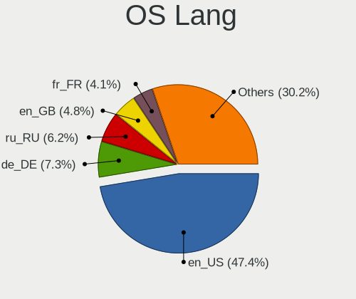
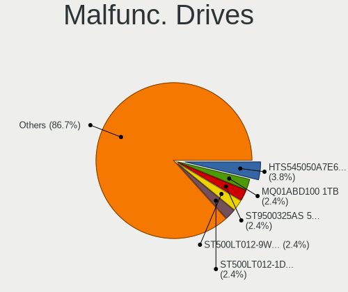
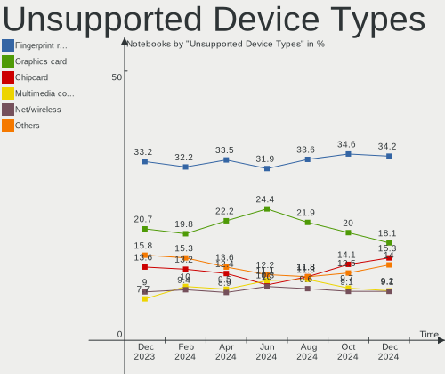

Linux Hardware Trends (Notebooks)
---------------------------------

A project to identify most popular hardware characteristics and track their change
over time based on data collected by Linux users at https://Linux-Hardware.org.

Anyone can contribute to this report by the [hw-probe](https://github.com/linuxhw/hw-probe) tool:

    sudo -E hw-probe -all -upload

Full-feature report is available here: https://linux-hardware.org/?view=trends

Period: Dec, 2021.

Contents
--------

* [ System ](#system)
  - [ OS                       ](#os)
  - [ OS Family                ](#os-family)
  - [ Kernel                   ](#kernel)
  - [ Kernel Family            ](#kernel-family)
  - [ Kernel Major Ver.        ](#kernel-major-ver)
  - [ Arch                     ](#arch)
  - [ DE                       ](#de)
  - [ Display Server           ](#display-server)
  - [ Display Manager          ](#display-manager)
  - [ OS Lang                  ](#os-lang)
  - [ Boot Mode                ](#boot-mode)
  - [ Filesystem               ](#filesystem)
  - [ Part. scheme             ](#part-scheme)
  - [ Dual Boot with Linux/BSD ](#dual-boot-with-linuxbsd)
  - [ Dual Boot (Win)          ](#dual-boot-win)

* [ Board ](#board)
  - [ Vendor                   ](#vendor)
  - [ Model                    ](#model)
  - [ Model Family             ](#model-family)
  - [ MFG Year                 ](#mfg-year)
  - [ Form Factor              ](#form-factor)
  - [ Secure Boot              ](#secure-boot)
  - [ Coreboot                 ](#coreboot)
  - [ RAM Size                 ](#ram-size)
  - [ RAM Used                 ](#ram-used)
  - [ Total Drives             ](#total-drives)
  - [ Has CD-ROM               ](#has-cd-rom)
  - [ Has Ethernet             ](#has-ethernet)
  - [ Has WiFi                 ](#has-wifi)
  - [ Has Bluetooth            ](#has-bluetooth)

* [ Location ](#location)
  - [ Country                  ](#country)
  - [ City                     ](#city)

* [ Drives ](#drives)
  - [ Drive Vendor             ](#drive-vendor)
  - [ Drive Model              ](#drive-model)
  - [ HDD Vendor               ](#hdd-vendor)
  - [ SSD Vendor               ](#ssd-vendor)
  - [ Drive Kind               ](#drive-kind)
  - [ Drive Connector          ](#drive-connector)
  - [ Drive Size               ](#drive-size)
  - [ Space Total              ](#space-total)
  - [ Space Used               ](#space-used)
  - [ Malfunc. Drives          ](#malfunc-drives)
  - [ Malfunc. Drive Vendor    ](#malfunc-drive-vendor)
  - [ Malfunc. HDD Vendor      ](#malfunc-hdd-vendor)
  - [ Malfunc. Drive Kind      ](#malfunc-drive-kind)
  - [ Failed Drives            ](#failed-drives)
  - [ Failed Drive Vendor      ](#failed-drive-vendor)
  - [ Drive Status             ](#drive-status)

* [ Storage controller ](#storage-controller)
  - [ Storage Vendor           ](#storage-vendor)
  - [ Storage Model            ](#storage-model)
  - [ Storage Kind             ](#storage-kind)

* [ Processor ](#processor)
  - [ CPU Vendor               ](#cpu-vendor)
  - [ CPU Model                ](#cpu-model)
  - [ CPU Model Family         ](#cpu-model-family)
  - [ CPU Cores                ](#cpu-cores)
  - [ CPU Sockets              ](#cpu-sockets)
  - [ CPU Threads              ](#cpu-threads)
  - [ CPU Op-Modes             ](#cpu-op-modes)
  - [ CPU Microcode            ](#cpu-microcode)
  - [ CPU Microarch            ](#cpu-microarch)

* [ Graphics ](#graphics)
  - [ GPU Vendor               ](#gpu-vendor)
  - [ GPU Model                ](#gpu-model)
  - [ GPU Combo                ](#gpu-combo)
  - [ GPU Driver               ](#gpu-driver)
  - [ GPU Memory               ](#gpu-memory)

* [ Monitor ](#monitor)
  - [ Monitor Vendor           ](#monitor-vendor)
  - [ Monitor Model            ](#monitor-model)
  - [ Monitor Resolution       ](#monitor-resolution)
  - [ Monitor Diagonal         ](#monitor-diagonal)
  - [ Monitor Width            ](#monitor-width)
  - [ Aspect Ratio             ](#aspect-ratio)
  - [ Monitor Area             ](#monitor-area)
  - [ Pixel Density            ](#pixel-density)
  - [ Multiple Monitors        ](#multiple-monitors)

* [ Network ](#network)
  - [ Net Controller Vendor    ](#net-controller-vendor)
  - [ Net Controller Model     ](#net-controller-model)
  - [ Wireless Vendor          ](#wireless-vendor)
  - [ Wireless Model           ](#wireless-model)
  - [ Ethernet Vendor          ](#ethernet-vendor)
  - [ Ethernet Model           ](#ethernet-model)
  - [ Net Controller Kind      ](#net-controller-kind)
  - [ Used Controller          ](#used-controller)
  - [ NICs                     ](#nics)
  - [ IPv6                     ](#ipv6)

* [ Bluetooth ](#bluetooth)
  - [ Bluetooth Vendor         ](#bluetooth-vendor)
  - [ Bluetooth Model          ](#bluetooth-model)

* [ Sound ](#sound)
  - [ Sound Vendor             ](#sound-vendor)
  - [ Sound Model              ](#sound-model)

* [ Memory ](#memory)
  - [ Memory Vendor            ](#memory-vendor)
  - [ Memory Model             ](#memory-model)
  - [ Memory Kind              ](#memory-kind)
  - [ Memory Form Factor       ](#memory-form-factor)
  - [ Memory Size              ](#memory-size)
  - [ Memory Speed             ](#memory-speed)

* [ Printers & scanners ](#printers--scanners)
  - [ Printer Vendor           ](#printer-vendor)
  - [ Printer Model            ](#printer-model)
  - [ Scanner Vendor           ](#scanner-vendor)
  - [ Scanner Model            ](#scanner-model)

* [ Camera ](#camera)
  - [ Camera Vendor            ](#camera-vendor)
  - [ Camera Model             ](#camera-model)

* [ Security ](#security)
  - [ Fingerprint Vendor       ](#fingerprint-vendor)
  - [ Fingerprint Model        ](#fingerprint-model)
  - [ Chipcard Vendor          ](#chipcard-vendor)
  - [ Chipcard Model           ](#chipcard-model)

* [ Unsupported ](#unsupported)
  - [ Unsupported Devices      ](#unsupported-devices)
  - [ Unsupported Device Types ](#unsupported-device-types)

System
------

OS
--

Installed operating systems

| Name                | Notebooks | Percent |
|---------------------|-----------|---------|
| Ubuntu 20.04        | 482       | 17.92%  |
| Linux Mint 20.2     | 262       | 9.74%   |
| Ubuntu 21.10        | 171       | 6.36%   |
| Fedora 35           | 151       | 5.62%   |
| Debian 11           | 122       | 4.54%   |
| Zorin 16            | 114       | 4.24%   |
| OpenMandriva 4.2    | 105       | 3.9%    |
| Pop!_OS 21.04       | 81        | 3.01%   |
| Pop!_OS 21.10       | 74        | 2.75%   |
| ArcoLinux Rolling   | 73        | 2.71%   |
| KDE neon 20.04      | 58        | 2.16%   |
| Arch                | 48        | 1.79%   |
| Xubuntu 20.04       | 37        | 1.38%   |
| Manjaro 21.2.0      | 37        | 1.38%   |
| ROSA 12.1           | 35        | 1.3%    |
| Manjaro             | 35        | 1.3%    |
| Kali 2021.4         | 34        | 1.26%   |
| Ubuntu 21.04        | 32        | 1.19%   |
| Arch Rolling        | 31        | 1.15%   |
| Ubuntu 18.04        | 29        | 1.08%   |
| Kubuntu 21.10       | 27        | 1%      |
| BlackPanther 18.1   | 27        | 1%      |
| Elementary 6.1      | 26        | 0.97%   |
| ROSA R11.1          | 24        | 0.89%   |
| Pop!_OS 20.04       | 23        | 0.86%   |
| Elementary 6        | 23        | 0.86%   |
| Kubuntu 20.04       | 22        | 0.82%   |
| OpenMandriva 4.50   | 17        | 0.63%   |
| Fedora 34           | 17        | 0.63%   |
| Endless 4.0.0       | 17        | 0.63%   |
| Debian Testing      | 17        | 0.63%   |
| Gentoo 2.7          | 16        | 0.6%    |
| Linux Mint 19.3     | 15        | 0.56%   |
| Manjaro 21.2rc      | 14        | 0.52%   |
| EndeavourOS Rolling | 14        | 0.52%   |
| Endless 4.0.2       | 13        | 0.48%   |
| Zorin 15            | 12        | 0.45%   |
| Linux Mint 20.1     | 12        | 0.45%   |
| Xubuntu 21.10       | 10        | 0.37%   |
| LinuxFX 11          | 10        | 0.37%   |
| Endless 3.9.6       | 10        | 0.37%   |
| Ubuntu MATE 20.04   | 8         | 0.3%    |
| Ubuntu Budgie 21.10 | 8         | 0.3%    |
| Ubuntu Budgie 20.04 | 8         | 0.3%    |
| Xubuntu 18.04       | 7         | 0.26%   |
| Lubuntu 20.04       | 7         | 0.26%   |
| Gentoo 2.6          | 7         | 0.26%   |
| EndeavourOS         | 7         | 0.26%   |
| Debian 10           | 7         | 0.26%   |
| Ubuntu 22.04        | 6         | 0.22%   |
| ROSA 12             | 6         | 0.22%   |
| RHEL 8              | 6         | 0.22%   |
| Lubuntu 21.10       | 6         | 0.22%   |
| LMDE 4              | 6         | 0.22%   |
| Linux Mint 20.3     | 6         | 0.22%   |
| Linux Mint 20       | 6         | 0.22%   |
| Debian Unstable     | 6         | 0.22%   |
| Xero Rolling        | 5         | 0.19%   |
| openSUSE Leap-15.3  | 5         | 0.19%   |
| MX 21               | 5         | 0.19%   |

OS Family
---------

OS without a version

| Name             | Notebooks | Percent |
|------------------|-----------|---------|
| Ubuntu           | 724       | 26.92%  |
| Linux Mint       | 309       | 11.49%  |
| Pop!_OS          | 182       | 6.77%   |
| Fedora           | 175       | 6.51%   |
| Debian           | 156       | 5.8%    |
| Zorin            | 126       | 4.69%   |
| OpenMandriva     | 122       | 4.54%   |
| Manjaro          | 92        | 3.42%   |
| Arch             | 79        | 2.94%   |
| ArcoLinux        | 77        | 2.86%   |
| ROSA             | 65        | 2.42%   |
| KDE neon         | 58        | 2.16%   |
| Xubuntu          | 57        | 2.12%   |
| Kubuntu          | 57        | 2.12%   |
| Endless          | 54        | 2.01%   |
| Elementary       | 52        | 1.93%   |
| Kali             | 37        | 1.38%   |
| openSUSE         | 28        | 1.04%   |
| BlackPanther     | 28        | 1.04%   |
| Gentoo           | 27        | 1%      |
| EndeavourOS      | 21        | 0.78%   |
| Lubuntu          | 20        | 0.74%   |
| Ubuntu Budgie    | 17        | 0.63%   |
| Ubuntu MATE      | 12        | 0.45%   |
| LinuxFX          | 10        | 0.37%   |
| MX               | 7         | 0.26%   |
| Garuda           | 7         | 0.26%   |
| RHEL             | 6         | 0.22%   |
| LMDE             | 6         | 0.22%   |
| Clear Linux      | 6         | 0.22%   |
| Xero             | 5         | 0.19%   |
| Deepin           | 5         | 0.19%   |
| CentOS           | 5         | 0.19%   |
| Q4OS             | 4         | 0.15%   |
| Peppermint       | 4         | 0.15%   |
| Org.kde.platform | 3         | 0.11%   |
| Makulu           | 3         | 0.11%   |
| Linux Lite       | 3         | 0.11%   |
| antiX            | 3         | 0.11%   |
| Solus            | 2         | 0.07%   |
| Red OS           | 2         | 0.07%   |
| Reborn OS        | 2         | 0.07%   |
| Pear OS          | 2         | 0.07%   |
| Parrot           | 2         | 0.07%   |
| Oracle Linux     | 2         | 0.07%   |
| BunsenLabs       | 2         | 0.07%   |
| BlackArch        | 2         | 0.07%   |
| Artix            | 2         | 0.07%   |
| ALT Linux        | 2         | 0.07%   |
| Slackware        | 1         | 0.04%   |
| Regataos         | 1         | 0.04%   |
| Pardus           | 1         | 0.04%   |
| Obarun           | 1         | 0.04%   |
| NST              | 1         | 0.04%   |
| NixOS            | 1         | 0.04%   |
| Mageia           | 1         | 0.04%   |
| LFS              | 1         | 0.04%   |
| Kaisen           | 1         | 0.04%   |
| HamoniKR         | 1         | 0.04%   |
| Drauger OS       | 1         | 0.04%   |

Kernel
------

Version of the Linux kernel

| Version                            | Notebooks | Percent |
|------------------------------------|-----------|---------|
| 5.11.0-41-generic                  | 303       | 11.27%  |
| 5.4.0-91-generic                   | 300       | 11.16%  |
| 5.11.0-43-generic                  | 281       | 10.45%  |
| 5.13.0-22-generic                  | 190       | 7.07%   |
| 5.10.14-desktop-1omv4002           | 102       | 3.79%   |
| 5.15.5-76051505-generic            | 92        | 3.42%   |
| 5.10.0-9-amd64                     | 49        | 1.82%   |
| 5.15.8-76051508-generic            | 43        | 1.6%    |
| 5.15.7-arch1-1                     | 42        | 1.56%   |
| 5.15.6-200.fc35.x86_64             | 41        | 1.52%   |
| 5.11.0-40-generic                  | 38        | 1.41%   |
| 5.10.74-generic-2rosa2021.1-x86_64 | 35        | 1.3%    |
| 5.11.0-35-generic                  | 31        | 1.15%   |
| 5.13.0-7620-generic                | 30        | 1.12%   |
| 5.11.0-27-generic                  | 30        | 1.12%   |
| 5.4.0-74-generic                   | 29        | 1.08%   |
| 5.10.0-8-amd64                     | 28        | 1.04%   |
| 5.15.10-arch1-1                    | 27        | 1%      |
| 5.14.0-kali4-amd64                 | 24        | 0.89%   |
| 5.13.0-19-generic                  | 24        | 0.89%   |
| 5.10.0-10-amd64                    | 24        | 0.89%   |
| 5.15.11-200.fc35.x86_64            | 22        | 0.82%   |
| 5.6.14-desktop-2bP                 | 21        | 0.78%   |
| 5.15.0-2-amd64                     | 21        | 0.78%   |
| 5.13.19-2-MANJARO                  | 21        | 0.78%   |
| 5.15.7-1-MANJARO                   | 20        | 0.74%   |
| 5.4.0-90-generic                   | 18        | 0.67%   |
| 5.15.11-arch2-1                    | 18        | 0.67%   |
| 5.15.10-200.fc35.x86_64            | 18        | 0.67%   |
| 5.13.0-23-generic                  | 16        | 0.6%    |
| 5.15.8-200.fc35.x86_64             | 15        | 0.56%   |
| 5.11.0-42-generic                  | 15        | 0.56%   |
| 5.11.0-38-generic                  | 15        | 0.56%   |
| 5.8.0-14-generic                   | 14        | 0.52%   |
| 5.15.6-2-MANJARO                   | 14        | 0.52%   |
| 5.15.5-200.fc35.x86_64             | 14        | 0.52%   |
| 5.14.7-desktop-1omv4050            | 14        | 0.52%   |
| 5.14.10-300.fc35.x86_64            | 14        | 0.52%   |
| 5.11.0-44-generic                  | 14        | 0.52%   |
| 5.15.6-arch2-1                     | 13        | 0.48%   |
| 5.14.0-0.bpo.2-amd64               | 12        | 0.45%   |
| 5.15.8-arch1-1                     | 11        | 0.41%   |
| 5.15.7-200.fc35.x86_64             | 11        | 0.41%   |
| 5.10.84-1-lts                      | 10        | 0.37%   |
| 5.10.0-1052-oem                    | 10        | 0.37%   |
| 4.19.0-18-amd64                    | 10        | 0.37%   |
| 4.15.0-163-generic                 | 10        | 0.37%   |
| 5.15.6-zen2-1-zen                  | 9         | 0.33%   |
| 5.10.84-1-MANJARO                  | 9         | 0.33%   |
| 5.13.0-21-generic                  | 8         | 0.3%    |
| 5.4.83-generic-2rosa-x86_64        | 7         | 0.26%   |
| 5.8.0-63-generic                   | 6         | 0.22%   |
| 5.15.8-1-default                   | 6         | 0.22%   |
| 5.15.5-1-default                   | 6         | 0.22%   |
| 5.15.10-zen1-1-zen                 | 6         | 0.22%   |
| 5.10.88-2-lts                      | 6         | 0.22%   |
| 5.10.76-gentoo-r1-x86_64           | 6         | 0.22%   |
| 5.10.76-gentoo-r1                  | 6         | 0.22%   |
| 4.18.16-desktop-1bP                | 6         | 0.22%   |
| 5.4.0-92-generic                   | 5         | 0.19%   |

Kernel Family
-------------

Linux kernel without a distro release

| Version | Notebooks | Percent |
|---------|-----------|---------|
| 5.11.0  | 746       | 27.74%  |
| 5.4.0   | 398       | 14.8%   |
| 5.13.0  | 284       | 10.56%  |
| 5.15.5  | 131       | 4.87%   |
| 5.10.0  | 124       | 4.61%   |
| 5.10.14 | 102       | 3.79%   |
| 5.15.6  | 97        | 3.61%   |
| 5.15.7  | 96        | 3.57%   |
| 5.15.8  | 83        | 3.09%   |
| 5.15.10 | 63        | 2.34%   |
| 5.15.11 | 53        | 1.97%   |
| 5.14.0  | 47        | 1.75%   |
| 5.15.0  | 40        | 1.49%   |
| 5.10.74 | 35        | 1.3%    |
| 5.8.0   | 32        | 1.19%   |
| 4.15.0  | 29        | 1.08%   |
| 5.13.19 | 23        | 0.86%   |
| 5.6.14  | 21        | 0.78%   |
| 5.10.84 | 19        | 0.71%   |
| 4.19.0  | 16        | 0.6%    |
| 5.14.7  | 15        | 0.56%   |
| 5.14.10 | 15        | 0.56%   |
| 5.10.76 | 12        | 0.45%   |
| 5.4.83  | 10        | 0.37%   |
| 5.15.4  | 9         | 0.33%   |
| 5.16.0  | 8         | 0.3%    |
| 5.15.2  | 8         | 0.3%    |
| 5.14.14 | 8         | 0.3%    |
| 5.10.88 | 8         | 0.3%    |
| 4.18.0  | 8         | 0.3%    |
| 5.14.18 | 7         | 0.26%   |
| 5.10.83 | 7         | 0.26%   |
| 5.4.32  | 6         | 0.22%   |
| 5.10.79 | 6         | 0.22%   |
| 4.18.16 | 6         | 0.22%   |
| 5.3.18  | 5         | 0.19%   |
| 5.15.12 | 5         | 0.19%   |
| 5.15.1  | 5         | 0.19%   |
| 5.10.71 | 5         | 0.19%   |
| 5.14.16 | 4         | 0.15%   |
| 5.13.13 | 4         | 0.15%   |
| 5.11.12 | 4         | 0.15%   |
| 5.10.87 | 4         | 0.15%   |
| 4.9.0   | 4         | 0.15%   |
| 5.3.0   | 3         | 0.11%   |
| 5.11.22 | 3         | 0.11%   |
| 5.10.85 | 3         | 0.11%   |
| 5.10.82 | 3         | 0.11%   |
| 5.0.0   | 3         | 0.11%   |
| 5.6.0   | 2         | 0.07%   |
| 5.4.164 | 2         | 0.07%   |
| 5.15.9  | 2         | 0.07%   |
| 5.14.9  | 2         | 0.07%   |
| 5.14.21 | 2         | 0.07%   |
| 5.14.17 | 2         | 0.07%   |
| 5.14.11 | 2         | 0.07%   |
| 5.10.75 | 2         | 0.07%   |
| 5.10.60 | 2         | 0.07%   |
| 5.10.32 | 2         | 0.07%   |
| 4.9.155 | 2         | 0.07%   |

Kernel Major Ver.
-----------------

Linux kernel major version

| Version | Notebooks | Percent |
|---------|-----------|---------|
| 5.11    | 754       | 28.04%  |
| 5.15    | 592       | 22.02%  |
| 5.4     | 420       | 15.62%  |
| 5.10    | 342       | 12.72%  |
| 5.13    | 314       | 11.68%  |
| 5.14    | 107       | 3.98%   |
| 5.8     | 34        | 1.26%   |
| 4.15    | 29        | 1.08%   |
| 5.6     | 25        | 0.93%   |
| 4.19    | 18        | 0.67%   |
| 4.18    | 14        | 0.52%   |
| 5.3     | 8         | 0.3%    |
| 5.16    | 8         | 0.3%    |
| 4.9     | 7         | 0.26%   |
| 5.0     | 3         | 0.11%   |
| 5.9     | 2         | 0.07%   |
| 5.12    | 2         | 0.07%   |
| 4.4     | 2         | 0.07%   |
| 4.16    | 2         | 0.07%   |
| 3.10    | 2         | 0.07%   |
| 5.7     | 1         | 0.04%   |
| 5.5     | 1         | 0.04%   |
| 4.14    | 1         | 0.04%   |
| Unknown | 1         | 0.04%   |

Arch
----

OS architecture (x86_64, i586, etc.)

| Name   | Notebooks | Percent |
|--------|-----------|---------|
| x86_64 | 2640      | 98.18%  |
| i686   | 49        | 1.82%   |

DE
--

Desktop Environment

| Name              | Notebooks | Percent |
|-------------------|-----------|---------|
| GNOME             | 1311      | 48.75%  |
| KDE5              | 490       | 18.22%  |
| X-Cinnamon        | 245       | 9.11%   |
| XFCE              | 222       | 8.26%   |
| Unknown           | 98        | 3.64%   |
| MATE              | 67        | 2.49%   |
| Pantheon          | 53        | 1.97%   |
| Cinnamon          | 30        | 1.12%   |
| LXQt              | 27        | 1%      |
| Budgie            | 24        | 0.89%   |
| LXDE              | 22        | 0.82%   |
| i3                | 22        | 0.82%   |
| KDE4              | 15        | 0.56%   |
| Unity             | 8         | 0.3%    |
| KDE               | 6         | 0.22%   |
| Deepin            | 6         | 0.22%   |
| awesome           | 6         | 0.22%   |
| qtile             | 5         | 0.19%   |
| GNOME Flashback   | 4         | 0.15%   |
| xmonad            | 3         | 0.11%   |
| icewm             | 3         | 0.11%   |
| GNOME Classic     | 3         | 0.11%   |
| DWM               | 3         | 0.11%   |
| bspwm             | 3         | 0.11%   |
| trinity           | 2         | 0.07%   |
| openbox           | 2         | 0.07%   |
| LeftWM            | 2         | 0.07%   |
| i3-with-shmlog    | 2         | 0.07%   |
| Yaru:ubuntu:GNOME | 1         | 0.04%   |
| wmaker-common     | 1         | 0.04%   |
| sway              | 1         | 0.04%   |
| lightdm-xsession  | 1         | 0.04%   |
| dusk              | 1         | 0.04%   |

Display Server
--------------

X11 or Wayland

| Name    | Notebooks | Percent |
|---------|-----------|---------|
| X11     | 2190      | 81.44%  |
| Wayland | 408       | 15.17%  |
| Unknown | 56        | 2.08%   |
| Tty     | 35        | 1.3%    |

Display Manager
---------------

SDDM, LightDM, etc.

| Name    | Notebooks | Percent |
|---------|-----------|---------|
| Unknown | 862       | 32.06%  |
| GDM     | 478       | 17.78%  |
| GDM3    | 463       | 17.22%  |
| LightDM | 434       | 16.14%  |
| SDDM    | 425       | 15.81%  |
| KDM     | 15        | 0.56%   |
| XDM     | 5         | 0.19%   |
| SLiM    | 3         | 0.11%   |
| Ly      | 2         | 0.07%   |
| TDM     | 1         | 0.04%   |
| LXDM    | 1         | 0.04%   |

OS Lang
-------

Language

| Lang        | Notebooks | Percent |
|-------------|-----------|---------|
| en_US       | 1103      | 41.02%  |
| de_DE       | 250       | 9.3%    |
| en_GB       | 148       | 5.5%    |
| ru_RU       | 143       | 5.32%   |
| fr_FR       | 141       | 5.24%   |
| pt_BR       | 130       | 4.83%   |
| Unknown     | 79        | 2.94%   |
| pl_PL       | 64        | 2.38%   |
| it_IT       | 61        | 2.27%   |
| es_ES       | 58        | 2.16%   |
| en_IN       | 56        | 2.08%   |
| en_CA       | 45        | 1.67%   |
| C           | 35        | 1.3%    |
| en_AU       | 33        | 1.23%   |
| es_MX       | 21        | 0.78%   |
| cs_CZ       | 20        | 0.74%   |
| zh_CN       | 19        | 0.71%   |
| ru_UA       | 18        | 0.67%   |
| nl_NL       | 18        | 0.67%   |
| hu_HU       | 17        | 0.63%   |
| es_AR       | 15        | 0.56%   |
| de_CH       | 15        | 0.56%   |
| en_ZA       | 13        | 0.48%   |
| sv_SE       | 12        | 0.45%   |
| fr_BE       | 12        | 0.45%   |
| de_AT       | 12        | 0.45%   |
| pt_PT       | 10        | 0.37%   |
| tr_TR       | 9         | 0.33%   |
| en_NZ       | 8         | 0.3%    |
| nb_NO       | 7         | 0.26%   |
| fr_CA       | 7         | 0.26%   |
| es_CL       | 7         | 0.26%   |
| nl_BE       | 6         | 0.22%   |
| el_GR       | 6         | 0.22%   |
| da_DK       | 6         | 0.22%   |
| uk_UA       | 5         | 0.19%   |
| ro_RO       | 5         | 0.19%   |
| hr_HR       | 5         | 0.19%   |
| fr_CH       | 5         | 0.19%   |
| zh_TW       | 4         | 0.15%   |
| ko_KR       | 4         | 0.15%   |
| es_PE       | 4         | 0.15%   |
| en_SG       | 4         | 0.15%   |
| en_IE       | 4         | 0.15%   |
| sl_SI       | 3         | 0.11%   |
| POSIX       | 3         | 0.11%   |
| ja_JP       | 3         | 0.11%   |
| fi_FI       | 3         | 0.11%   |
| bg_BG       | 3         | 0.11%   |
| sk_SK       | 2         | 0.07%   |
| ru_RU.UTF_8 | 2         | 0.07%   |
| es_VE       | 2         | 0.07%   |
| es_CO       | 2         | 0.07%   |
| en_NG       | 2         | 0.07%   |
| en_DE       | 2         | 0.07%   |
| unm_US      | 1         | 0.04%   |
| id_ID       | 1         | 0.04%   |
| gl_ES       | 1         | 0.04%   |
| es_UY       | 1         | 0.04%   |
| es_SV       | 1         | 0.04%   |

Boot Mode
---------

EFI or BIOS

| Mode | Notebooks | Percent |
|------|-----------|---------|
| EFI  | 1463      | 54.41%  |
| BIOS | 1226      | 45.59%  |

Filesystem
----------

Type of filesystem

| Type     | Notebooks | Percent |
|----------|-----------|---------|
| Ext4     | 2165      | 80.51%  |
| Btrfs    | 261       | 9.71%   |
| Overlay  | 209       | 7.77%   |
| Xfs      | 21        | 0.78%   |
| Zfs      | 13        | 0.48%   |
| Ext2     | 6         | 0.22%   |
| F2fs     | 5         | 0.19%   |
| Tmpfs    | 3         | 0.11%   |
| Unknown  | 3         | 0.11%   |
| Ext3     | 2         | 0.07%   |
| Reiserfs | 1         | 0.04%   |

Part. scheme
------------

Scheme of partitioning

| Type    | Notebooks | Percent |
|---------|-----------|---------|
| Unknown | 1376      | 51.17%  |
| GPT     | 1025      | 38.12%  |
| MBR     | 288       | 10.71%  |

Dual Boot with Linux/BSD
------------------------

Hosting more than one Linux/BSD

| Dual boot | Notebooks | Percent |
|-----------|-----------|---------|
| No        | 2398      | 89.18%  |
| Yes       | 291       | 10.82%  |

Dual Boot (Win)
---------------

Hosting Linux and Windows

| Dual boot | Notebooks | Percent |
|-----------|-----------|---------|
| No        | 1936      | 72%     |
| Yes       | 753       | 28%     |

Board
-----

Vendor
------

Motherboard manufacturer

| Name                   | Notebooks | Percent |
|------------------------|-----------|---------|
| Lenovo                 | 551       | 20.49%  |
| Hewlett-Packard        | 469       | 17.44%  |
| Dell                   | 444       | 16.51%  |
| ASUSTek Computer       | 278       | 10.34%  |
| Acer                   | 259       | 9.63%   |
| Toshiba                | 80        | 2.98%   |
| Apple                  | 70        | 2.6%    |
| MSI                    | 63        | 2.34%   |
| Samsung Electronics    | 53        | 1.97%   |
| Sony                   | 52        | 1.93%   |
| HUAWEI                 | 39        | 1.45%   |
| Google                 | 25        | 0.93%   |
| Fujitsu                | 24        | 0.89%   |
| Packard Bell           | 15        | 0.56%   |
| Medion                 | 15        | 0.56%   |
| System76               | 13        | 0.48%   |
| Chuwi                  | 13        | 0.48%   |
| Unknown                | 13        | 0.48%   |
| TUXEDO                 | 12        | 0.45%   |
| Timi                   | 10        | 0.37%   |
| Positivo               | 10        | 0.37%   |
| Notebook               | 10        | 0.37%   |
| Fujitsu Siemens        | 10        | 0.37%   |
| Schenker               | 8         | 0.3%    |
| Razer                  | 8         | 0.3%    |
| LG Electronics         | 8         | 0.3%    |
| Alienware              | 8         | 0.3%    |
| Framework              | 7         | 0.26%   |
| Avell High Performance | 7         | 0.26%   |
| Gateway                | 5         | 0.19%   |
| eMachines              | 5         | 0.19%   |
| Intel                  | 4         | 0.15%   |
| HONOR                  | 4         | 0.15%   |
| GPU Company            | 4         | 0.15%   |
| Clevo                  | 4         | 0.15%   |
| Wortmann AG            | 3         | 0.11%   |
| OEM                    | 3         | 0.11%   |
| Mediacom               | 3         | 0.11%   |
| Gigabyte Technology    | 3         | 0.11%   |
| AVITA                  | 3         | 0.11%   |
| UNOWHY                 | 2         | 0.07%   |
| Teclast                | 2         | 0.07%   |
| SLIMBOOK               | 2         | 0.07%   |
| Quanta                 | 2         | 0.07%   |
| PC Specialist          | 2         | 0.07%   |
| Panasonic              | 2         | 0.07%   |
| Monster                | 2         | 0.07%   |
| Microtech              | 2         | 0.07%   |
| HASEE Computer         | 2         | 0.07%   |
| Exo                    | 2         | 0.07%   |
| Digibras               | 2         | 0.07%   |
| BANGHO                 | 2         | 0.07%   |
| Advent                 | 2         | 0.07%   |
| ZEPTO                  | 1         | 0.04%   |
| YJKC                   | 1         | 0.04%   |
| Winnovo                | 1         | 0.04%   |
| UNIQCELL               | 1         | 0.04%   |
| UMAX                   | 1         | 0.04%   |
| TrekStor               | 1         | 0.04%   |
| TCL Communication      | 1         | 0.04%   |

Model
-----

Motherboard model

| Name                                 | Notebooks | Percent |
|--------------------------------------|-----------|---------|
| Unknown                              | 25        | 0.93%   |
| Lenovo ThinkPad E475 20H40006US      | 19        | 0.71%   |
| HP Notebook                          | 17        | 0.63%   |
| HP Pavilion Gaming Laptop 15-ec1xxx  | 10        | 0.37%   |
| HP Pavilion g6                       | 10        | 0.37%   |
| HP Pavilion dv7                      | 10        | 0.37%   |
| Dell Latitude E6430                  | 10        | 0.37%   |
| Acer Nitro AN515-44                  | 10        | 0.37%   |
| HP Pavilion dv6                      | 9         | 0.33%   |
| Dell Latitude E6400                  | 9         | 0.33%   |
| HP Laptop 15-db1xxx                  | 8         | 0.3%    |
| HP EliteBook 8460p                   | 8         | 0.3%    |
| Dell XPS 15 9500                     | 8         | 0.3%    |
| Acer Aspire A315-34                  | 8         | 0.3%    |
| HP Pavilion 15                       | 7         | 0.26%   |
| Framework Laptop                     | 7         | 0.26%   |
| Dell Latitude E6410                  | 7         | 0.26%   |
| Dell Latitude 7490                   | 7         | 0.26%   |
| ASUS VivoBook 15_ASUS Laptop X540UAR | 7         | 0.26%   |
| Apple MacBookPro8,1                  | 7         | 0.26%   |
| HP Laptop 15s-eq2xxx                 | 6         | 0.22%   |
| HP Laptop 15s-eq1xxx                 | 6         | 0.22%   |
| HP 15                                | 6         | 0.22%   |
| Dell XPS 17 9710                     | 6         | 0.22%   |
| Dell XPS 17 9700                     | 6         | 0.22%   |
| Dell XPS 13 9310                     | 6         | 0.22%   |
| Dell XPS 13 7390                     | 6         | 0.22%   |
| ASUS UX31E                           | 6         | 0.22%   |
| Apple MacBookPro9,2                  | 6         | 0.22%   |
| Acer Swift SF114-34                  | 6         | 0.22%   |
| Acer Aspire A515-56                  | 6         | 0.22%   |
| Lenovo IdeaPad 5 14ARE05 81YM        | 5         | 0.19%   |
| HUAWEI NBLK-WAX9X                    | 5         | 0.19%   |
| HUAWEI KLVL-WXX9                     | 5         | 0.19%   |
| HUAWEI HVY-WXX9                      | 5         | 0.19%   |
| HP Victus by Laptop 16-e0xxx         | 5         | 0.19%   |
| HP Pavilion g7                       | 5         | 0.19%   |
| HP Laptop 15-db0xxx                  | 5         | 0.19%   |
| HP EliteBook 840 G6                  | 5         | 0.19%   |
| HP EliteBook 840 G2                  | 5         | 0.19%   |
| HP 15 Notebook PC                    | 5         | 0.19%   |
| Google Akemi                         | 5         | 0.19%   |
| Dell XPS 15 9570                     | 5         | 0.19%   |
| Dell Latitude E7440                  | 5         | 0.19%   |
| Dell Latitude E6420                  | 5         | 0.19%   |
| Acer Swift SF314-43                  | 5         | 0.19%   |
| Acer Aspire 5750G                    | 5         | 0.19%   |
| Toshiba Satellite C660               | 4         | 0.15%   |
| Samsung 550XDA                       | 4         | 0.15%   |
| Lenovo ThinkBook 15-IIL 20SM         | 4         | 0.15%   |
| Lenovo Legion 5 Pro 16ACH6H 82JQ     | 4         | 0.15%   |
| Lenovo IdeaPad S340-14API 81NB       | 4         | 0.15%   |
| Lenovo IdeaPad 3 15ALC6 82KU         | 4         | 0.15%   |
| Lenovo G580 20150                    | 4         | 0.15%   |
| Lenovo G50-80 80E5                   | 4         | 0.15%   |
| HUAWEI BOHK-WAX9X                    | 4         | 0.15%   |
| HUAWEI BOHB-WAX9                     | 4         | 0.15%   |
| HP ProBook 450 G8 Notebook PC        | 4         | 0.15%   |
| HP ProBook 450 G4                    | 4         | 0.15%   |
| HP Pavilion Gaming Laptop 15-ec2xxx  | 4         | 0.15%   |

Model Family
------------

Motherboard model prefix

| Name                  | Notebooks | Percent |
|-----------------------|-----------|---------|
| Lenovo ThinkPad       | 280       | 10.41%  |
| Acer Aspire           | 178       | 6.62%   |
| Dell Latitude         | 157       | 5.84%   |
| Dell Inspiron         | 139       | 5.17%   |
| Lenovo IdeaPad        | 130       | 4.83%   |
| HP Pavilion           | 103       | 3.83%   |
| HP EliteBook          | 83        | 3.09%   |
| HP Laptop             | 67        | 2.49%   |
| Toshiba Satellite     | 64        | 2.38%   |
| Dell XPS              | 61        | 2.27%   |
| ASUS VivoBook         | 60        | 2.23%   |
| HP ProBook            | 55        | 2.05%   |
| Dell Precision        | 36        | 1.34%   |
| Acer Swift            | 30        | 1.12%   |
| Lenovo Legion         | 26        | 0.97%   |
| Dell Vostro           | 26        | 0.97%   |
| ASUS ZenBook          | 25        | 0.93%   |
| ASUS ROG              | 25        | 0.93%   |
| Unknown               | 25        | 0.93%   |
| HP ZBook              | 23        | 0.86%   |
| Acer Nitro            | 22        | 0.82%   |
| Fujitsu LIFEBOOK      | 20        | 0.74%   |
| ASUS ASUS             | 20        | 0.74%   |
| Lenovo ThinkBook      | 18        | 0.67%   |
| HP Notebook           | 17        | 0.63%   |
| HP Compaq             | 15        | 0.56%   |
| Packard Bell EasyNote | 14        | 0.52%   |
| HP ENVY               | 14        | 0.52%   |
| HP 250                | 13        | 0.48%   |
| HP 15                 | 11        | 0.41%   |
| HP OMEN               | 10        | 0.37%   |
| Apple MacBookPro8     | 9         | 0.33%   |
| Razer Blade           | 8         | 0.3%    |
| Apple MacBookPro11    | 8         | 0.3%    |
| Toshiba TECRA         | 7         | 0.26%   |
| MSI Modern            | 7         | 0.26%   |
| HP Presario           | 7         | 0.26%   |
| HP 255                | 7         | 0.26%   |
| Framework Laptop      | 7         | 0.26%   |
| ASUS TUF              | 7         | 0.26%   |
| Apple MacBookPro9     | 7         | 0.26%   |
| Acer TravelMate       | 7         | 0.26%   |
| Schenker XMG          | 6         | 0.22%   |
| Lenovo G580           | 6         | 0.22%   |
| Lenovo B590           | 6         | 0.22%   |
| Fujitsu Siemens AMILO | 6         | 0.22%   |
| ASUS UX31E            | 6         | 0.22%   |
| Apple MacBookAir7     | 6         | 0.22%   |
| Apple MacBookAir6     | 6         | 0.22%   |
| Acer Extensa          | 6         | 0.22%   |
| Lenovo Yoga           | 5         | 0.19%   |
| HUAWEI NBLK-WAX9X     | 5         | 0.19%   |
| HUAWEI KLVL-WXX9      | 5         | 0.19%   |
| HUAWEI HVY-WXX9       | 5         | 0.19%   |
| HP Victus             | 5         | 0.19%   |
| HP Stream             | 5         | 0.19%   |
| Google Akemi          | 5         | 0.19%   |
| Dell System           | 5         | 0.19%   |
| Dell G5               | 5         | 0.19%   |
| Timi RedmiBook        | 4         | 0.15%   |

MFG Year
--------

Motherboard manufacture year

| Year | Notebooks | Percent |
|------|-----------|---------|
| 2021 | 763       | 28.37%  |
| 2020 | 304       | 11.31%  |
| 2019 | 293       | 10.9%   |
| 2011 | 167       | 6.21%   |
| 2018 | 165       | 6.14%   |
| 2012 | 152       | 5.65%   |
| 2013 | 151       | 5.62%   |
| 2016 | 117       | 4.35%   |
| 2015 | 107       | 3.98%   |
| 2010 | 100       | 3.72%   |
| 2014 | 98        | 3.64%   |
| 2017 | 83        | 3.09%   |
| 2009 | 82        | 3.05%   |
| 2008 | 55        | 2.05%   |
| 2007 | 35        | 1.3%    |
| 2006 | 11        | 0.41%   |
| 2005 | 4         | 0.15%   |
| 2004 | 2         | 0.07%   |

Form Factor
-----------

Physical design of the computer

| Name     | Notebooks | Percent |
|----------|-----------|---------|
| Notebook | 2689      | 100%    |

Secure Boot
-----------

Enabled or disabled

| State    | Notebooks | Percent |
|----------|-----------|---------|
| Disabled | 2376      | 88.36%  |
| Enabled  | 313       | 11.64%  |

Coreboot
--------

Have coreboot on board

| Used | Notebooks | Percent |
|------|-----------|---------|
| No   | 2654      | 98.7%   |
| Yes  | 35        | 1.3%    |

RAM Size
--------

Total RAM memory

| Size in GB  | Notebooks | Percent |
|-------------|-----------|---------|
| 4.01-8.0    | 810       | 30.12%  |
| 3.01-4.0    | 616       | 22.91%  |
| 8.01-16.0   | 441       | 16.4%   |
| 16.01-24.0  | 424       | 15.77%  |
| 32.01-64.0  | 182       | 6.77%   |
| 1.01-2.0    | 104       | 3.87%   |
| 2.01-3.0    | 43        | 1.6%    |
| 64.01-256.0 | 30        | 1.12%   |
| 24.01-32.0  | 28        | 1.04%   |
| 0.51-1.0    | 11        | 0.41%   |

RAM Used
--------

Used RAM memory

| Used GB    | Notebooks | Percent |
|------------|-----------|---------|
| 1.01-2.0   | 1035      | 38.49%  |
| 2.01-3.0   | 679       | 25.25%  |
| 4.01-8.0   | 356       | 13.24%  |
| 3.01-4.0   | 327       | 12.16%  |
| 0.51-1.0   | 161       | 5.99%   |
| 8.01-16.0  | 93        | 3.46%   |
| 0.01-0.5   | 26        | 0.97%   |
| 16.01-24.0 | 9         | 0.33%   |
| 24.01-32.0 | 3         | 0.11%   |

Total Drives
------------

Number of drives on board

| Drives | Notebooks | Percent |
|--------|-----------|---------|
| 1      | 1986      | 73.86%  |
| 2      | 615       | 22.87%  |
| 3      | 66        | 2.45%   |
| 0      | 17        | 0.63%   |
| 4      | 4         | 0.15%   |
| 5      | 1         | 0.04%   |

Has CD-ROM
----------

Has CD-ROM on board

| Presented | Notebooks | Percent |
|-----------|-----------|---------|
| No        | 1756      | 65.3%   |
| Yes       | 933       | 34.7%   |

Has Ethernet
------------

Has Ethernet on board

| Presented | Notebooks | Percent |
|-----------|-----------|---------|
| Yes       | 2129      | 79.17%  |
| No        | 560       | 20.83%  |

Has WiFi
--------

Has WiFi module

| Presented | Notebooks | Percent |
|-----------|-----------|---------|
| Yes       | 2649      | 98.51%  |
| No        | 40        | 1.49%   |

Has Bluetooth
-------------

Has Bluetooth module

| Presented | Notebooks | Percent |
|-----------|-----------|---------|
| Yes       | 2097      | 77.98%  |
| No        | 592       | 22.02%  |

Location
--------

Country
-------

Geographic location (country)

| Country            | Notebooks | Percent |
|--------------------|-----------|---------|
| USA                | 445       | 16.55%  |
| Germany            | 296       | 11.01%  |
| Brazil             | 180       | 6.69%   |
| France             | 166       | 6.17%   |
| Russia             | 151       | 5.62%   |
| UK                 | 100       | 3.72%   |
| Poland             | 94        | 3.5%    |
| Italy              | 86        | 3.2%    |
| India              | 86        | 3.2%    |
| Spain              | 68        | 2.53%   |
| Canada             | 66        | 2.45%   |
| Ukraine            | 54        | 2.01%   |
| Hungary            | 44        | 1.64%   |
| Netherlands        | 43        | 1.6%    |
| Australia          | 38        | 1.41%   |
| Mexico             | 37        | 1.38%   |
| Switzerland        | 34        | 1.26%   |
| Sweden             | 34        | 1.26%   |
| Czechia            | 34        | 1.26%   |
| Belgium            | 34        | 1.26%   |
| Austria            | 30        | 1.12%   |
| Argentina          | 29        | 1.08%   |
| Romania            | 27        | 1%      |
| Turkey             | 26        | 0.97%   |
| Portugal           | 25        | 0.93%   |
| Bulgaria           | 21        | 0.78%   |
| Norway             | 20        | 0.74%   |
| Greece             | 20        | 0.74%   |
| South Africa       | 19        | 0.71%   |
| China              | 18        | 0.67%   |
| Denmark            | 17        | 0.63%   |
| Indonesia          | 15        | 0.56%   |
| Iran               | 14        | 0.52%   |
| Finland            | 14        | 0.52%   |
| Belarus            | 14        | 0.52%   |
| Croatia            | 13        | 0.48%   |
| Serbia             | 10        | 0.37%   |
| Japan              | 10        | 0.37%   |
| Saudi Arabia       | 9         | 0.33%   |
| Malaysia           | 9         | 0.33%   |
| Slovakia           | 8         | 0.3%    |
| Kenya              | 8         | 0.3%    |
| Israel             | 8         | 0.3%    |
| Ireland            | 8         | 0.3%    |
| Colombia           | 8         | 0.3%    |
| Chile              | 8         | 0.3%    |
| Bangladesh         | 8         | 0.3%    |
| Algeria            | 8         | 0.3%    |
| Taiwan             | 7         | 0.26%   |
| Vietnam            | 6         | 0.22%   |
| South Korea        | 6         | 0.22%   |
| Slovenia           | 6         | 0.22%   |
| Singapore          | 6         | 0.22%   |
| Latvia             | 6         | 0.22%   |
| Dominican Republic | 6         | 0.22%   |
| Tunisia            | 5         | 0.19%   |
| Peru               | 5         | 0.19%   |
| Pakistan           | 5         | 0.19%   |
| New Zealand        | 5         | 0.19%   |
| Nepal              | 5         | 0.19%   |

City
----

Geographic location (city)

| City               | Notebooks | Percent |
|--------------------|-----------|---------|
| Moscow             | 41        | 1.52%   |
| Berlin             | 33        | 1.23%   |
| Warsaw             | 32        | 1.19%   |
| S??o Paulo         | 28        | 1.04%   |
| Paris              | 27        | 1%      |
| Prague             | 19        | 0.71%   |
| Bangor             | 19        | 0.71%   |
| Vienna             | 15        | 0.56%   |
| Sydney             | 15        | 0.56%   |
| St Petersburg      | 15        | 0.56%   |
| Milan              | 15        | 0.56%   |
| Madrid             | 15        | 0.56%   |
| Kyiv               | 15        | 0.56%   |
| Istanbul           | 15        | 0.56%   |
| Munich             | 13        | 0.48%   |
| Hamburg            | 13        | 0.48%   |
| Budapest           | 13        | 0.48%   |
| Athens             | 12        | 0.45%   |
| Bucharest          | 11        | 0.41%   |
| Barcelona          | 11        | 0.41%   |
| Sofia              | 10        | 0.37%   |
| Rome               | 10        | 0.37%   |
| Nuremberg          | 10        | 0.37%   |
| Mumbai             | 10        | 0.37%   |
| Minsk              | 10        | 0.37%   |
| Mexico City        | 10        | 0.37%   |
| Krakow             | 10        | 0.37%   |
| Cape Town          | 10        | 0.37%   |
| Zagreb             | 9         | 0.33%   |
| Pune               | 9         | 0.33%   |
| Tehran             | 8         | 0.3%    |
| Oslo               | 8         | 0.3%    |
| Nairobi            | 8         | 0.3%    |
| Montreal           | 8         | 0.3%    |
| London             | 8         | 0.3%    |
| Eliot              | 8         | 0.3%    |
| Cologne            | 8         | 0.3%    |
| Zurich             | 7         | 0.26%   |
| Toronto            | 7         | 0.26%   |
| New Delhi          | 7         | 0.26%   |
| Melbourne          | 7         | 0.26%   |
| Frankfurt am Main  | 7         | 0.26%   |
| Edmonton           | 7         | 0.26%   |
| Dnipro             | 7         | 0.26%   |
| Dallas             | 7         | 0.26%   |
| Chennai            | 7         | 0.26%   |
| Buenos Aires       | 7         | 0.26%   |
| Amsterdam          | 7         | 0.26%   |
| Yekaterinburg      | 6         | 0.22%   |
| Singapore          | 6         | 0.22%   |
| Montgomery Village | 6         | 0.22%   |
| Kuala Lumpur       | 6         | 0.22%   |
| Kharkiv            | 6         | 0.22%   |
| Kazan?ˆ™           | 6         | 0.22%   |
| Dresden            | 6         | 0.22%   |
| Brisbane           | 6         | 0.22%   |
| Belgrade           | 6         | 0.22%   |
| Ankara             | 6         | 0.22%   |
| Stuttgart          | 5         | 0.19%   |
| Santo Domingo Este | 5         | 0.19%   |

Drives
------

Drive Vendor
------------

Hard drive vendors

| Vendor                         | Notebooks | Drives | Percent |
|--------------------------------|-----------|--------|---------|
| Samsung Electronics            | 520       | 571    | 16.01%  |
| WDC                            | 439       | 451    | 13.52%  |
| Seagate                        | 334       | 344    | 10.28%  |
| Toshiba                        | 255       | 260    | 7.85%   |
| Kingston                       | 200       | 203    | 6.16%   |
| SanDisk                        | 186       | 189    | 5.73%   |
| Unknown                        | 168       | 193    | 5.17%   |
| SK Hynix                       | 142       | 145    | 4.37%   |
| Hitachi                        | 102       | 102    | 3.14%   |
| Intel                          | 97        | 101    | 2.99%   |
| Crucial                        | 83        | 85     | 2.56%   |
| HGST                           | 81        | 81     | 2.49%   |
| Micron Technology              | 79        | 80     | 2.43%   |
| A-DATA Technology              | 48        | 50     | 1.48%   |
| KIOXIA                         | 47        | 47     | 1.45%   |
| Apple                          | 34        | 40     | 1.05%   |
| LITEON                         | 30        | 30     | 0.92%   |
| Phison                         | 24        | 25     | 0.74%   |
| China                          | 23        | 23     | 0.71%   |
| Transcend                      | 22        | 22     | 0.68%   |
| Fujitsu                        | 20        | 20     | 0.62%   |
| Netac                          | 18        | 18     | 0.55%   |
| Unknown                        | 14        | 14     | 0.43%   |
| PNY                            | 13        | 13     | 0.4%    |
| ADATA Technology               | 13        | 13     | 0.4%    |
| Silicon Motion                 | 10        | 10     | 0.31%   |
| KingSpec                       | 9         | 9      | 0.28%   |
| Gigabyte Technology            | 9         | 9      | 0.28%   |
| SSSTC                          | 8         | 8      | 0.25%   |
| Patriot                        | 8         | 8      | 0.25%   |
| UMIS                           | 7         | 7      | 0.22%   |
| Solid State Storage Technology | 7         | 7      | 0.22%   |
| OCZ                            | 7         | 7      | 0.22%   |
| JMicron                        | 7         | 7      | 0.22%   |
| Intenso                        | 7         | 7      | 0.22%   |
| XPG                            | 6         | 7      | 0.18%   |
| Team                           | 6         | 6      | 0.18%   |
| SPCC                           | 6         | 6      | 0.18%   |
| Micron/Crucial Technology      | 6         | 6      | 0.18%   |
| LITEONIT                       | 6         | 6      | 0.18%   |
| GOODRAM                        | 6         | 6      | 0.18%   |
| Corsair                        | 6         | 6      | 0.18%   |
| SABRENT                        | 5         | 5      | 0.15%   |
| KIOXIA-EXCERIA                 | 5         | 5      | 0.15%   |
| Apacer                         | 5         | 5      | 0.15%   |
| Teclast                        | 4         | 4      | 0.12%   |
| PLEXTOR                        | 4         | 4      | 0.12%   |
| Lexar                          | 4         | 4      | 0.12%   |
| Hewlett-Packard                | 4         | 5      | 0.12%   |
| ASMT                           | 4         | 4      | 0.12%   |
| YMTC                           | 3         | 3      | 0.09%   |
| Vaseky                         | 3         | 3      | 0.09%   |
| Union Memory                   | 3         | 3      | 0.09%   |
| TCSUNBOW                       | 3         | 3      | 0.09%   |
| Mushkin                        | 3         | 3      | 0.09%   |
| Lenovo                         | 3         | 3      | 0.09%   |
| FORESEE                        | 3         | 3      | 0.09%   |
| Verbatim                       | 2         | 2      | 0.06%   |
| Union Memory (Shenzhen)        | 2         | 2      | 0.06%   |
| TO Exter                       | 2         | 2      | 0.06%   |

Drive Model
-----------

Hard drive models

| Model                                | Notebooks | Percent |
|--------------------------------------|-----------|---------|
| Seagate ST1000LM035-1RK172 1TB       | 48        | 1.43%   |
| Kingston SA400S37240G 240GB SSD      | 40        | 1.19%   |
| Unknown MMC Card  32GB               | 34        | 1.01%   |
| Toshiba MQ01ABD100 1TB               | 34        | 1.01%   |
| Toshiba MQ04ABF100 1TB               | 33        | 0.98%   |
| Unknown MMC Card  64GB               | 31        | 0.93%   |
| Sandisk NVMe SSD Drive 512GB         | 31        | 0.93%   |
| Seagate ST9500325AS 500GB            | 30        | 0.9%    |
| Samsung NVMe SSD Drive 512GB         | 30        | 0.9%    |
| Seagate ST500LT012-1DG142 500GB      | 28        | 0.84%   |
| Kingston SA400S37120G 120GB SSD      | 28        | 0.84%   |
| Toshiba MQ01ABF050 500GB             | 27        | 0.81%   |
| Seagate ST1000LM024 HN-M101MBB 1TB   | 25        | 0.75%   |
| SK Hynix NVMe SSD Drive 512GB        | 24        | 0.72%   |
| Sandisk NVMe SSD Drive 256GB         | 24        | 0.72%   |
| WDC WD10SPZX-21Z10T0 1TB             | 23        | 0.69%   |
| HGST HTS721010A9E630 1TB             | 22        | 0.66%   |
| Samsung NVMe SSD Drive 256GB         | 21        | 0.63%   |
| Samsung NVMe SSD Drive 1TB           | 19        | 0.57%   |
| Intel NVMe SSD Drive 512GB           | 19        | 0.57%   |
| Samsung SSD 860 EVO 500GB            | 18        | 0.54%   |
| Samsung SSD 850 EVO 250GB            | 18        | 0.54%   |
| Kingston SA400S37480G 480GB SSD      | 18        | 0.54%   |
| SK Hynix NVMe SSD Drive 256GB        | 16        | 0.48%   |
| Samsung SSD 970 EVO Plus 1TB         | 16        | 0.48%   |
| Unknown MMC Card  128GB              | 15        | 0.45%   |
| Samsung NVMe SSD Drive 1024GB        | 15        | 0.45%   |
| Sandisk NVMe SSD Drive 1TB           | 14        | 0.42%   |
| Unknown                              | 14        | 0.42%   |
| Samsung SSD 860 EVO 1TB              | 13        | 0.39%   |
| Crucial CT240BX500SSD1 240GB         | 13        | 0.39%   |
| Seagate ST500LT012-9WS142 500GB      | 12        | 0.36%   |
| Samsung SSD 850 EVO 500GB            | 12        | 0.36%   |
| HGST HTS725050A7E630 500GB           | 12        | 0.36%   |
| HGST HTS541010A9E680 1TB             | 12        | 0.36%   |
| Unknown SD/MMC/MS PRO 7GB            | 11        | 0.33%   |
| Toshiba NVMe SSD Drive 512GB         | 11        | 0.33%   |
| Seagate ST500LM012 HN-M500MBB 500GB  | 11        | 0.33%   |
| Seagate ST2000LM007-1R8174 2TB       | 11        | 0.33%   |
| Seagate ST1000LM048-2E7172 1TB       | 11        | 0.33%   |
| HGST HTS545050A7E380 500GB           | 11        | 0.33%   |
| WDC WD10SPZX-24Z10 1TB               | 10        | 0.3%    |
| Seagate ST1000LM049-2GH172 1TB       | 10        | 0.3%    |
| Samsung SSD 870 EVO 1TB              | 10        | 0.3%    |
| Samsung NVMe SSD Drive 500GB         | 10        | 0.3%    |
| Intel SSDPEKNW512G8 512GB            | 10        | 0.3%    |
| Intel SSDPEKNW010T8 1TB              | 10        | 0.3%    |
| HGST HTS545050A7E680 500GB           | 10        | 0.3%    |
| Crucial CT1000MX500SSD1 1TB          | 10        | 0.3%    |
| Toshiba NVMe SSD Drive 256GB         | 9         | 0.27%   |
| Samsung SSD 970 EVO Plus 500GB       | 9         | 0.27%   |
| Samsung MZVLQ512HALU-000H1 512GB     | 9         | 0.27%   |
| Kingston NVMe SSD Drive 512GB        | 9         | 0.27%   |
| Intel SSDPEKNW512G8H 512GB           | 9         | 0.27%   |
| Hitachi HTS543232A7A384 320GB        | 9         | 0.27%   |
| A-DATA SU630 240GB SSD               | 9         | 0.27%   |
| WDC WD10JPVX-22JC3T0 1TB             | 8         | 0.24%   |
| WDC PC SN530 SDBPNPZ-512G-1006 512GB | 8         | 0.24%   |
| Unknown MMC Card  16GB               | 8         | 0.24%   |
| SK Hynix PC711 NVMe 1TB              | 8         | 0.24%   |

HDD Vendor
----------

Hard disk drive vendors

| Vendor              | Notebooks | Drives | Percent |
|---------------------|-----------|--------|---------|
| Seagate             | 322       | 330    | 31.54%  |
| WDC                 | 265       | 265    | 25.95%  |
| Toshiba             | 183       | 184    | 17.92%  |
| Hitachi             | 102       | 102    | 9.99%   |
| HGST                | 81        | 81     | 7.93%   |
| Samsung Electronics | 22        | 22     | 2.15%   |
| Fujitsu             | 20        | 20     | 1.96%   |
| Unknown             | 11        | 11     | 1.08%   |
| SABRENT             | 5         | 5      | 0.49%   |
| Apple               | 3         | 3      | 0.29%   |
| TO Exter            | 2         | 2      | 0.2%    |
| Maxone              | 1         | 1      | 0.1%    |
| LaCie               | 1         | 2      | 0.1%    |
| KESU                | 1         | 1      | 0.1%    |
| Intenso             | 1         | 1      | 0.1%    |
| HGST HTS            | 1         | 1      | 0.1%    |

SSD Vendor
----------

Solid state drive vendors

| Vendor              | Notebooks | Drives | Percent |
|---------------------|-----------|--------|---------|
| Samsung Electronics | 246       | 256    | 23.52%  |
| Kingston            | 149       | 151    | 14.24%  |
| SanDisk             | 100       | 100    | 9.56%   |
| Crucial             | 77        | 78     | 7.36%   |
| WDC                 | 59        | 59     | 5.64%   |
| Micron Technology   | 32        | 32     | 3.06%   |
| A-DATA Technology   | 31        | 32     | 2.96%   |
| LITEON              | 28        | 28     | 2.68%   |
| Toshiba             | 24        | 24     | 2.29%   |
| China               | 23        | 23     | 2.2%    |
| SK Hynix            | 22        | 22     | 2.1%    |
| Apple               | 22        | 22     | 2.1%    |
| Intel               | 20        | 20     | 1.91%   |
| Transcend           | 19        | 19     | 1.82%   |
| Netac               | 18        | 18     | 1.72%   |
| PNY                 | 13        | 13     | 1.24%   |
| Patriot             | 8         | 8      | 0.76%   |
| KingSpec            | 8         | 8      | 0.76%   |
| Gigabyte Technology | 8         | 8      | 0.76%   |
| OCZ                 | 7         | 7      | 0.67%   |
| Team                | 6         | 6      | 0.57%   |
| SPCC                | 6         | 6      | 0.57%   |
| LITEONIT            | 6         | 6      | 0.57%   |
| GOODRAM             | 6         | 6      | 0.57%   |
| Seagate             | 5         | 5      | 0.48%   |
| KIOXIA-EXCERIA      | 5         | 5      | 0.48%   |
| Intenso             | 5         | 5      | 0.48%   |
| Corsair             | 5         | 5      | 0.48%   |
| Apacer              | 5         | 5      | 0.48%   |
| Teclast             | 4         | 4      | 0.38%   |
| Hewlett-Packard     | 4         | 5      | 0.38%   |
| Unknown             | 3         | 3      | 0.29%   |
| PLEXTOR             | 3         | 3      | 0.29%   |
| Lexar               | 3         | 3      | 0.29%   |
| JMicron             | 3         | 3      | 0.29%   |
| FORESEE             | 3         | 3      | 0.29%   |
| ASMT                | 3         | 3      | 0.29%   |
| Unknown             | 3         | 3      | 0.29%   |
| Verbatim            | 2         | 2      | 0.19%   |
| Vaseky              | 2         | 2      | 0.19%   |
| Union Memory        | 2         | 2      | 0.19%   |
| TCSUNBOW            | 2         | 2      | 0.19%   |
| Smartbuy            | 2         | 2      | 0.19%   |
| Mushkin             | 2         | 2      | 0.19%   |
| Microtech           | 2         | 2      | 0.19%   |
| Leven               | 2         | 2      | 0.19%   |
| Integral            | 2         | 2      | 0.19%   |
| Indilinx            | 2         | 2      | 0.19%   |
| HS-SSD-C100         | 2         | 2      | 0.19%   |
| DREVO               | 2         | 2      | 0.19%   |
| BIWIN               | 2         | 2      | 0.19%   |
| BHT                 | 2         | 2      | 0.19%   |
| Zheino              | 1         | 1      | 0.1%    |
| ValueTech           | 1         | 1      | 0.1%    |
| USB30               | 1         | 1      | 0.1%    |
| SSSTC               | 1         | 1      | 0.1%    |
| Ramsta              | 1         | 1      | 0.1%    |
| PNY CS90            | 1         | 1      | 0.1%    |
| PHISON              | 1         | 1      | 0.1%    |
| ORTIAL              | 1         | 1      | 0.1%    |

Drive Kind
----------

HDD or SSD

| Kind    | Notebooks | Drives | Percent |
|---------|-----------|--------|---------|
| HDD     | 995       | 1031   | 31.71%  |
| SSD     | 985       | 1061   | 31.39%  |
| NVMe    | 956       | 1057   | 30.47%  |
| MMC     | 164       | 187    | 5.23%   |
| Unknown | 38        | 43     | 1.21%   |

Drive Connector
---------------

SATA, SAS, NVMe, etc.

| Type | Notebooks | Drives | Percent |
|------|-----------|--------|---------|
| SATA | 1799      | 2028   | 59.69%  |
| NVMe | 954       | 1055   | 31.65%  |
| MMC  | 164       | 187    | 5.44%   |
| SAS  | 97        | 109    | 3.22%   |

Drive Size
----------

Size of hard drive

| Size in TB | Notebooks | Drives | Percent |
|------------|-----------|--------|---------|
| 0.01-0.5   | 1385      | 1494   | 70.63%  |
| 0.51-1.0   | 516       | 531    | 26.31%  |
| 1.01-2.0   | 49        | 56     | 2.5%    |
| 3.01-4.0   | 6         | 6      | 0.31%   |
| 4.01-10.0  | 4         | 4      | 0.2%    |
| 2.01-3.0   | 1         | 1      | 0.05%   |

Space Total
-----------

Amount of disk space available on the file system

| Size in GB     | Notebooks | Percent |
|----------------|-----------|---------|
| 101-250        | 805       | 29.94%  |
| 251-500        | 675       | 25.1%   |
| 501-1000       | 401       | 14.91%  |
| 51-100         | 186       | 6.92%   |
| 1-20           | 175       | 6.51%   |
| 1001-2000      | 148       | 5.5%    |
| Unknown        | 119       | 4.43%   |
| 21-50          | 104       | 3.87%   |
| More than 3000 | 40        | 1.49%   |
| 2001-3000      | 36        | 1.34%   |

Space Used
----------

Amount of used disk space

| Used GB        | Notebooks | Percent |
|----------------|-----------|---------|
| 1-20           | 1003      | 37.3%   |
| 21-50          | 577       | 21.46%  |
| 101-250        | 343       | 12.76%  |
| 51-100         | 321       | 11.94%  |
| 251-500        | 169       | 6.28%   |
| Unknown        | 119       | 4.43%   |
| 501-1000       | 106       | 3.94%   |
| 1001-2000      | 33        | 1.23%   |
| More than 3000 | 10        | 0.37%   |
| 2001-3000      | 6         | 0.22%   |
| 0              | 2         | 0.07%   |

Malfunc. Drives
---------------

Drive models with a malfunction

| Model                               | Notebooks | Drives | Percent |
|-------------------------------------|-----------|--------|---------|
| Seagate ST1000LM035-1RK172 1TB      | 8         | 8      | 3.92%   |
| Seagate ST9500325AS 500GB           | 6         | 7      | 2.94%   |
| SanDisk SSD U100 256GB              | 6         | 6      | 2.94%   |
| Seagate ST9320325AS 320GB           | 5         | 5      | 2.45%   |
| Seagate ST500LT012-1DG142 500GB     | 4         | 4      | 1.96%   |
| Seagate ST1000LM024 HN-M101MBB 1TB  | 4         | 4      | 1.96%   |
| Seagate ST320LT020-9YG142 320GB     | 3         | 3      | 1.47%   |
| HGST HTS725050A7E630 500GB          | 3         | 3      | 1.47%   |
| HGST HTS545050A7E680 500GB          | 3         | 3      | 1.47%   |
| HGST HTS545050A7E380 500GB          | 3         | 3      | 1.47%   |
| WDC WD10SPZX-60Z10T0 1TB            | 2         | 2      | 0.98%   |
| Toshiba MQ01ABD100 1TB              | 2         | 2      | 0.98%   |
| Toshiba MQ01ABD050 500GB            | 2         | 2      | 0.98%   |
| Seagate ST9250315AS 250GB           | 2         | 2      | 0.98%   |
| Seagate ST500LT012-9WS142 500GB     | 2         | 2      | 0.98%   |
| Seagate ST500LM021-1KJ152 500GB     | 2         | 2      | 0.98%   |
| Seagate ST500LM012 HN-M500MBB 500GB | 2         | 2      | 0.98%   |
| Seagate ST500LM000-SSHD-8GB         | 2         | 2      | 0.98%   |
| Seagate ST1000LX015-1U7172 1TB      | 2         | 2      | 0.98%   |
| Seagate ST1000LM048-2E7172 1TB      | 2         | 2      | 0.98%   |
| SanDisk SD9SN8W-128G-1006 128GB SSD | 2         | 2      | 0.98%   |
| Samsung Electronics HM250HI 250GB   | 2         | 2      | 0.98%   |
| Kingston SV300S37A240G 240GB SSD    | 2         | 2      | 0.98%   |
| Hitachi HTS723232A7A364 320GB       | 2         | 2      | 0.98%   |
| Hitachi HTS547575A9E384 752GB       | 2         | 2      | 0.98%   |
| Hitachi HTS547550A9E384 500GB       | 2         | 2      | 0.98%   |
| Hitachi HTS545050B9A300 500GB       | 2         | 2      | 0.98%   |
| Hitachi HTS543232A7A384 320GB       | 2         | 2      | 0.98%   |
| Hitachi HTS543216L9A300 160GB       | 2         | 2      | 0.98%   |
| Hitachi HTS542525K9SA00 250GB       | 2         | 2      | 0.98%   |
| Hitachi HTS542512K9SA00 120GB       | 2         | 2      | 0.98%   |
| Crucial CT240M500SSD1 240GB         | 2         | 2      | 0.98%   |
| WDC WDS480G2G0A-00JH30 480GB SSD    | 1         | 1      | 0.49%   |
| WDC WD7500BPVX-22JC3T0 752GB        | 1         | 1      | 0.49%   |
| WDC WD7500BPVT-60HXZT3 752GB        | 1         | 1      | 0.49%   |
| WDC WD6400BEVT-60A0RT0 640GB        | 1         | 1      | 0.49%   |
| WDC WD5000LPVX-00V0TT0 500GB        | 1         | 1      | 0.49%   |
| WDC WD5000LPVT-24G33T1 500GB        | 1         | 1      | 0.49%   |
| WDC WD5000LPLX-60ZNTT1 500GB        | 1         | 1      | 0.49%   |
| WDC WD5000LPCX-60VHAT0 500GB        | 1         | 1      | 0.49%   |
| WDC WD5000L 500GB                   | 1         | 1      | 0.49%   |
| WDC WD5000BPVT-22HXZT3 500GB        | 1         | 1      | 0.49%   |
| WDC WD5000BPVT-00HXZT1 500GB        | 1         | 1      | 0.49%   |
| WDC WD5000BEVT-60ZAT1 500GB         | 1         | 1      | 0.49%   |
| WDC WD5000BEVT-22A0RT0 500GB        | 1         | 1      | 0.49%   |
| WDC WD3200BPVT-75ZEST0 320GB        | 1         | 1      | 0.49%   |
| WDC WD3200BPVT-22JJ5T0 320GB        | 1         | 1      | 0.49%   |
| WDC WD3200BPVT-00JJ5T0 320GB        | 1         | 1      | 0.49%   |
| WDC WD3200BEVT-60ZCT1 320GB         | 1         | 1      | 0.49%   |
| WDC WD3200BEVT-60A23T0 320GB        | 1         | 1      | 0.49%   |
| WDC WD3200BEVT-22ZCT0 320GB         | 1         | 1      | 0.49%   |
| WDC WD3200BEKT-75PVMT0 320GB        | 1         | 1      | 0.49%   |
| WDC WD3200BEKT-60V5T1 320GB         | 1         | 1      | 0.49%   |
| WDC WD2500BEVT-75A23T0 250GB        | 1         | 1      | 0.49%   |
| WDC WD2500BEVT-22A23T0 250GB        | 1         | 1      | 0.49%   |
| WDC WD1600BJKT-75F4T0 160GB         | 1         | 1      | 0.49%   |
| WDC WD1600BEVT-00ZCT0 160GB         | 1         | 1      | 0.49%   |
| WDC WD10JPVX-60JC3T0 1TB            | 1         | 1      | 0.49%   |
| WDC WD10JPVX-22JC3T0 1TB            | 1         | 1      | 0.49%   |
| WDC WD10JPCX-24UE4T0 1TB            | 1         | 1      | 0.49%   |

Malfunc. Drive Vendor
---------------------

Vendors of faulty drives

| Vendor              | Notebooks | Drives | Percent |
|---------------------|-----------|--------|---------|
| Seagate             | 54        | 55     | 26.47%  |
| WDC                 | 30        | 30     | 14.71%  |
| Hitachi             | 26        | 26     | 12.75%  |
| Toshiba             | 19        | 19     | 9.31%   |
| Samsung Electronics | 18        | 18     | 8.82%   |
| SanDisk             | 15        | 15     | 7.35%   |
| HGST                | 12        | 12     | 5.88%   |
| Kingston            | 7         | 7      | 3.43%   |
| Micron Technology   | 5         | 5      | 2.45%   |
| Crucial             | 4         | 4      | 1.96%   |
| SK Hynix            | 3         | 3      | 1.47%   |
| LITEON              | 2         | 2      | 0.98%   |
| Intel               | 2         | 2      | 0.98%   |
| A-DATA Technology   | 2         | 2      | 0.98%   |
| LITEONIT            | 1         | 1      | 0.49%   |
| JMicron             | 1         | 1      | 0.49%   |
| Fujitsu             | 1         | 1      | 0.49%   |
| China               | 1         | 1      | 0.49%   |
| ATP                 | 1         | 1      | 0.49%   |

Malfunc. HDD Vendor
-------------------

Vendors of faulty HDD drives

| Vendor              | Notebooks | Drives | Percent |
|---------------------|-----------|--------|---------|
| Seagate             | 54        | 55     | 36.73%  |
| WDC                 | 29        | 29     | 19.73%  |
| Hitachi             | 26        | 26     | 17.69%  |
| Toshiba             | 17        | 17     | 11.56%  |
| HGST                | 12        | 12     | 8.16%   |
| Samsung Electronics | 8         | 8      | 5.44%   |
| Fujitsu             | 1         | 1      | 0.68%   |

Malfunc. Drive Kind
-------------------

Kinds of faulty drives

| Kind    | Notebooks | Drives | Percent |
|---------|-----------|--------|---------|
| HDD     | 146       | 148    | 71.92%  |
| SSD     | 49        | 49     | 24.14%  |
| NVMe    | 7         | 7      | 3.45%   |
| Unknown | 1         | 1      | 0.49%   |

Failed Drives
-------------

Failed drive models

| Model                         | Notebooks | Drives | Percent |
|-------------------------------|-----------|--------|---------|
| WDC WD5000BPVT-24HXZT3 500GB  | 1         | 1      | 25%     |
| WDC WD2500BEVS-22UST0 250GB   | 1         | 1      | 25%     |
| Seagate ST9320423AS 320GB     | 1         | 1      | 25%     |
| Hitachi HTS547575A9E384 752GB | 1         | 1      | 25%     |

Failed Drive Vendor
-------------------

Failed drive vendors

| Vendor  | Notebooks | Drives | Percent |
|---------|-----------|--------|---------|
| WDC     | 2         | 2      | 50%     |
| Seagate | 1         | 1      | 25%     |
| Hitachi | 1         | 1      | 25%     |

Drive Status
------------

Number of failed and malfunc. drives

| Status   | Notebooks | Drives | Percent |
|----------|-----------|--------|---------|
| Detected | 1499      | 1865   | 53.36%  |
| Works    | 1104      | 1305   | 39.3%   |
| Malfunc  | 202       | 205    | 7.19%   |
| Failed   | 4         | 4      | 0.14%   |

Storage controller
------------------

Storage Vendor
--------------

Storage controller vendors

| Vendor                           | Notebooks | Percent |
|----------------------------------|-----------|---------|
| Intel                            | 1828      | 57.7%   |
| AMD                              | 361       | 11.4%   |
| Samsung Electronics              | 282       | 8.9%    |
| Sandisk                          | 202       | 6.38%   |
| SK Hynix                         | 121       | 3.82%   |
| Toshiba America Info Systems     | 58        | 1.83%   |
| Kingston Technology Company      | 51        | 1.61%   |
| Micron Technology                | 47        | 1.48%   |
| KIOXIA                           | 41        | 1.29%   |
| ADATA Technology                 | 29        | 0.92%   |
| Phison Electronics               | 27        | 0.85%   |
| Nvidia                           | 21        | 0.66%   |
| Silicon Motion                   | 16        | 0.51%   |
| Solid State Storage Technology   | 14        | 0.44%   |
| Micron/Crucial Technology        | 13        | 0.41%   |
| Union Memory (Shenzhen)          | 9         | 0.28%   |
| Apple                            | 8         | 0.25%   |
| Realtek Semiconductor            | 7         | 0.22%   |
| Marvell Technology Group         | 7         | 0.22%   |
| Silicon Integrated Systems [SiS] | 5         | 0.16%   |
| Yangtze Memory Technologies      | 3         | 0.09%   |
| Seagate Technology               | 3         | 0.09%   |
| Lite-On Technology               | 3         | 0.09%   |
| Lenovo                           | 3         | 0.09%   |
| VIA Technologies                 | 2         | 0.06%   |
| JMicron Technology               | 2         | 0.06%   |
| ASMedia Technology               | 2         | 0.06%   |
| Unknown                          | 1         | 0.03%   |
| Shenzhen Longsys Electronics     | 1         | 0.03%   |
| Unknown                          | 1         | 0.03%   |

Storage Model
-------------

Storage controller models

| Model                                                                                  | Notebooks | Percent |
|----------------------------------------------------------------------------------------|-----------|---------|
| AMD FCH SATA Controller [AHCI mode]                                                    | 309       | 9.06%   |
| Intel Sunrise Point-LP SATA Controller [AHCI mode]                                     | 193       | 5.66%   |
| Intel 7 Series Chipset Family 6-port SATA Controller [AHCI mode]                       | 193       | 5.66%   |
| Intel 82801 Mobile SATA Controller [RAID mode]                                         | 158       | 4.63%   |
| Intel 6 Series/C200 Series Chipset Family 6 port Mobile SATA AHCI Controller           | 153       | 4.49%   |
| Samsung NVMe SSD Controller SM981/PM981/PM983                                          | 138       | 4.05%   |
| Intel Volume Management Device NVMe RAID Controller                                    | 110       | 3.22%   |
| Intel 82801IBM/IEM (ICH9M/ICH9M-E) 4 port SATA Controller [AHCI mode]                  | 94        | 2.76%   |
| Intel 8 Series SATA Controller 1 [AHCI mode]                                           | 91        | 2.67%   |
| Samsung NVMe SSD Controller 980                                                        | 85        | 2.49%   |
| Intel Wildcat Point-LP SATA Controller [AHCI Mode]                                     | 74        | 2.17%   |
| Sandisk WD Blue SN550 NVMe SSD                                                         | 71        | 2.08%   |
| Intel 5 Series/3400 Series Chipset 4 port SATA AHCI Controller                         | 70        | 2.05%   |
| Intel 82801HM/HEM (ICH8M/ICH8M-E) IDE Controller                                       | 61        | 1.79%   |
| Intel Celeron/Pentium Silver Processor SATA Controller                                 | 58        | 1.7%    |
| Intel Tiger Lake-LP SATA Controller [AHCI mode]                                        | 55        | 1.61%   |
| Intel Cannon Lake Mobile PCH SATA AHCI Controller                                      | 54        | 1.58%   |
| Intel 82801HM/HEM (ICH8M/ICH8M-E) SATA Controller [AHCI mode]                          | 54        | 1.58%   |
| Intel 5 Series/3400 Series Chipset 6 port SATA AHCI Controller                         | 52        | 1.52%   |
| SK Hynix Gold P31 SSD                                                                  | 51        | 1.5%    |
| Intel SSD 660P Series                                                                  | 50        | 1.47%   |
| Intel 8 Series/C220 Series Chipset Family 6-port SATA Controller 1 [AHCI mode]         | 50        | 1.47%   |
| Sandisk WD Black SN750 / PC SN730 NVMe SSD                                             | 48        | 1.41%   |
| Micron Non-Volatile memory controller                                                  | 47        | 1.38%   |
| Intel Comet Lake SATA AHCI Controller                                                  | 40        | 1.17%   |
| KIOXIA Non-Volatile memory controller                                                  | 39        | 1.14%   |
| Intel HM170/QM170 Chipset SATA Controller [AHCI Mode]                                  | 38        | 1.11%   |
| Intel Cannon Point-LP SATA Controller [AHCI Mode]                                      | 37        | 1.08%   |
| AMD SB7x0/SB8x0/SB9x0 SATA Controller [AHCI mode]                                      | 34        | 1%      |
| Sandisk Non-Volatile memory controller                                                 | 33        | 0.97%   |
| Intel Atom Processor E3800 Series SATA AHCI Controller                                 | 33        | 0.97%   |
| Toshiba America Info Systems XG6 NVMe SSD Controller                                   | 30        | 0.88%   |
| Sandisk WD Blue SN500 / PC SN520 NVMe SSD                                              | 29        | 0.85%   |
| SK Hynix BC511                                                                         | 28        | 0.82%   |
| Intel Celeron N3350/Pentium N4200/Atom E3900 Series SATA AHCI Controller               | 28        | 0.82%   |
| Intel 400 Series Chipset Family SATA AHCI Controller                                   | 24        | 0.7%    |
| Samsung NVMe SSD Controller PM9A1/PM9A3/980PRO                                         | 23        | 0.67%   |
| Intel Atom/Celeron/Pentium Processor x5-E8000/J3xxx/N3xxx Series SATA Controller       | 23        | 0.67%   |
| Samsung NVMe SSD Controller SM961/PM961/SM963                                          | 21        | 0.62%   |
| SK Hynix Non-Volatile memory controller                                                | 20        | 0.59%   |
| Kingston Company Company Non-Volatile memory controller                                | 20        | 0.59%   |
| Intel Ice Lake-LP SATA Controller [AHCI mode]                                          | 20        | 0.59%   |
| ADATA Non-Volatile memory controller                                                   | 20        | 0.59%   |
| Intel Q170/Q150/B150/H170/H110/Z170/CM236 Chipset SATA Controller [AHCI Mode]          | 18        | 0.53%   |
| SK Hynix BC501 NVMe Solid State Drive                                                  | 16        | 0.47%   |
| Solid State Storage Non-Volatile memory controller                                     | 14        | 0.41%   |
| Intel Non-Volatile memory controller                                                   | 14        | 0.41%   |
| Phison E12 NVMe Controller                                                             | 13        | 0.38%   |
| Intel NM10/ICH7 Family SATA Controller [AHCI mode]                                     | 13        | 0.38%   |
| Intel 82801GBM/GHM (ICH7-M Family) SATA Controller [IDE mode]                          | 13        | 0.38%   |
| Toshiba America Info Systems Toshiba America Info Non-Volatile memory controller       | 12        | 0.35%   |
| Toshiba America Info Systems BG3 NVMe SSD Controller                                   | 12        | 0.35%   |
| Phison PS5013 E13 NVMe Controller                                                      | 12        | 0.35%   |
| Intel 82801G (ICH7 Family) IDE Controller                                              | 12        | 0.35%   |
| Intel 500 Series Chipset Family SATA AHCI Controller                                   | 12        | 0.35%   |
| Kingston Company OM3PDP3 NVMe SSD                                                      | 11        | 0.32%   |
| Intel 6 Series/C200 Series Chipset Family Mobile SATA Controller (IDE mode, ports 4-5) | 11        | 0.32%   |
| Intel 6 Series/C200 Series Chipset Family Mobile SATA Controller (IDE mode, ports 0-3) | 11        | 0.32%   |
| Sandisk WD Black 2018/SN750 / PC SN720 NVMe SSD                                        | 10        | 0.29%   |
| Samsung Electronics SATA controller                                                    | 10        | 0.29%   |

Storage Kind
------------

Kind of storage controller (IDE, SATA, NVMe, SAS, ...)

| Kind | Notebooks | Percent |
|------|-----------|---------|
| SATA | 1886      | 57.29%  |
| NVMe | 958       | 29.1%   |
| RAID | 271       | 8.23%   |
| IDE  | 177       | 5.38%   |

Processor
---------

CPU Vendor
----------

Processor vendors

| Vendor | Notebooks | Percent |
|--------|-----------|---------|
| Intel  | 2147      | 79.84%  |
| AMD    | 542       | 20.16%  |

CPU Model
---------

Processor models

| Model                                         | Notebooks | Percent |
|-----------------------------------------------|-----------|---------|
| Intel 11th Gen Core i7-1165G7 @ 2.80GHz       | 71        | 2.64%   |
| Intel 11th Gen Core i5-1135G7 @ 2.40GHz       | 57        | 2.12%   |
| AMD Ryzen 5 3500U with Radeon Vega Mobile Gfx | 51        | 1.9%    |
| Intel Core i5-8250U CPU @ 1.60GHz             | 41        | 1.52%   |
| Intel Core i7-8550U CPU @ 1.80GHz             | 40        | 1.49%   |
| Intel Core i5-7200U CPU @ 2.50GHz             | 33        | 1.23%   |
| Intel Core i5-3210M CPU @ 2.50GHz             | 33        | 1.23%   |
| AMD Ryzen 5 5500U with Radeon Graphics        | 32        | 1.19%   |
| Intel Core i7-8565U CPU @ 1.80GHz             | 31        | 1.15%   |
| Intel Core i5-6200U CPU @ 2.30GHz             | 31        | 1.15%   |
| AMD Ryzen 7 4800H with Radeon Graphics        | 31        | 1.15%   |
| AMD Ryzen 5 4600H with Radeon Graphics        | 31        | 1.15%   |
| Intel Core i7-10510U CPU @ 1.80GHz            | 29        | 1.08%   |
| Intel Core i7-10750H CPU @ 2.60GHz            | 28        | 1.04%   |
| Intel Core i5-2520M CPU @ 2.50GHz             | 26        | 0.97%   |
| Intel Core i5-10210U CPU @ 1.60GHz            | 26        | 0.97%   |
| Intel Core i5 CPU M 520 @ 2.40GHz             | 26        | 0.97%   |
| Intel 11th Gen Core i7-11800H @ 2.30GHz       | 26        | 0.97%   |
| Intel Core i5-8265U CPU @ 1.60GHz             | 24        | 0.89%   |
| AMD Ryzen 7 5800H with Radeon Graphics        | 24        | 0.89%   |
| Intel Core i5-5200U CPU @ 2.20GHz             | 23        | 0.86%   |
| Intel Celeron CPU N2840 @ 2.16GHz             | 23        | 0.86%   |
| Intel Core i7-9750H CPU @ 2.60GHz             | 22        | 0.82%   |
| AMD Ryzen 7 5700U with Radeon Graphics        | 22        | 0.82%   |
| Intel Core i5-3320M CPU @ 2.60GHz             | 21        | 0.78%   |
| Intel Core i5-2450M CPU @ 2.50GHz             | 20        | 0.74%   |
| Intel Core i7-7700HQ CPU @ 2.80GHz            | 19        | 0.71%   |
| Intel Core i5-6300U CPU @ 2.40GHz             | 19        | 0.71%   |
| AMD PRO A6-9500B R5, 6 COMPUTE CORES 2C+4G    | 19        | 0.71%   |
| Intel Core i7-8750H CPU @ 2.20GHz             | 18        | 0.67%   |
| Intel Core i7-6700HQ CPU @ 2.60GHz            | 18        | 0.67%   |
| Intel Core i5-4210U CPU @ 1.70GHz             | 18        | 0.67%   |
| Intel Core i3-6006U CPU @ 2.00GHz             | 18        | 0.67%   |
| Intel Core i5-5300U CPU @ 2.30GHz             | 17        | 0.63%   |
| Intel Core i3 CPU M 380 @ 2.53GHz             | 17        | 0.63%   |
| Intel Core i7-7500U CPU @ 2.70GHz             | 16        | 0.6%    |
| Intel Core i5-3230M CPU @ 2.60GHz             | 16        | 0.6%    |
| Intel Celeron N4020 CPU @ 1.10GHz             | 16        | 0.6%    |
| Intel 11th Gen Core i7-1185G7 @ 3.00GHz       | 16        | 0.6%    |
| Intel 11th Gen Core i3-1115G4 @ 3.00GHz       | 16        | 0.6%    |
| Intel Core i7-6500U CPU @ 2.50GHz             | 15        | 0.56%   |
| Intel Core i7-2670QM CPU @ 2.20GHz            | 15        | 0.56%   |
| Intel Celeron N4000 CPU @ 1.10GHz             | 15        | 0.56%   |
| AMD Ryzen 5 4500U with Radeon Graphics        | 15        | 0.56%   |
| Intel Core i7-4510U CPU @ 2.00GHz             | 14        | 0.52%   |
| Intel Core i5-1035G1 CPU @ 1.00GHz            | 14        | 0.52%   |
| Intel Core i3-3110M CPU @ 2.40GHz             | 14        | 0.52%   |
| Intel Core 2 Duo CPU P8600 @ 2.40GHz          | 14        | 0.52%   |
| AMD Ryzen 9 5900HX with Radeon Graphics       | 14        | 0.52%   |
| Intel Core i5-9300H CPU @ 2.40GHz             | 13        | 0.48%   |
| Intel Core i5-2430M CPU @ 2.40GHz             | 13        | 0.48%   |
| Intel Core i5-10300H CPU @ 2.50GHz            | 13        | 0.48%   |
| Intel Core i5 CPU M 560 @ 2.67GHz             | 13        | 0.48%   |
| Intel Core i3 CPU M 350 @ 2.27GHz             | 13        | 0.48%   |
| Intel Atom x5-Z8350 CPU @ 1.44GHz             | 13        | 0.48%   |
| Intel Core i7-3520M CPU @ 2.90GHz             | 12        | 0.45%   |
| Intel Core i7-1065G7 CPU @ 1.30GHz            | 12        | 0.45%   |
| Intel Core i5-4200U CPU @ 1.60GHz             | 12        | 0.45%   |
| Intel Core i3-2310M CPU @ 2.10GHz             | 12        | 0.45%   |
| Intel Core i3-1005G1 CPU @ 1.20GHz            | 12        | 0.45%   |

CPU Model Family
----------------

Processor model prefix

| Model                                | Notebooks | Percent |
|--------------------------------------|-----------|---------|
| Intel Core i5                        | 634       | 23.58%  |
| Intel Core i7                        | 526       | 19.56%  |
| Other                                | 264       | 9.82%   |
| Intel Core i3                        | 222       | 8.26%   |
| Intel Celeron                        | 164       | 6.1%    |
| AMD Ryzen 5                          | 164       | 6.1%    |
| Intel Core 2 Duo                     | 137       | 5.09%   |
| AMD Ryzen 7                          | 113       | 4.2%    |
| Intel Pentium                        | 65        | 2.42%   |
| Intel Atom                           | 45        | 1.67%   |
| AMD A6                               | 33        | 1.23%   |
| AMD Ryzen 9                          | 26        | 0.97%   |
| Intel Pentium Dual-Core              | 23        | 0.86%   |
| AMD Ryzen 3                          | 21        | 0.78%   |
| Intel Pentium Silver                 | 19        | 0.71%   |
| AMD E2                               | 16        | 0.6%    |
| Intel Pentium Dual                   | 15        | 0.56%   |
| AMD A8                               | 15        | 0.56%   |
| Intel Core 2                         | 14        | 0.52%   |
| AMD E                                | 14        | 0.52%   |
| AMD A4                               | 14        | 0.52%   |
| Intel Genuine                        | 13        | 0.48%   |
| AMD Ryzen 7 PRO                      | 13        | 0.48%   |
| Intel Core i9                        | 12        | 0.45%   |
| AMD E1                               | 12        | 0.45%   |
| AMD Turion 64 X2 Mobile              | 8         | 0.3%    |
| Intel Core m3                        | 6         | 0.22%   |
| AMD A10                              | 6         | 0.22%   |
| Intel Pentium M                      | 5         | 0.19%   |
| Intel Core M                         | 5         | 0.19%   |
| AMD Ryzen 5 PRO                      | 5         | 0.19%   |
| AMD C-60                             | 5         | 0.19%   |
| AMD Athlon II                        | 5         | 0.19%   |
| Intel Xeon                           | 4         | 0.15%   |
| AMD C-50                             | 4         | 0.15%   |
| AMD Athlon                           | 4         | 0.15%   |
| Intel Celeron M                      | 3         | 0.11%   |
| Intel Celeron Dual-Core              | 3         | 0.11%   |
| AMD Athlon II Dual-Core              | 3         | 0.11%   |
| Intel Core m7                        | 2         | 0.07%   |
| AMD V120                             | 2         | 0.07%   |
| AMD Turion X2 Dual-Core Mobile       | 2         | 0.07%   |
| AMD PRO A10                          | 2         | 0.07%   |
| AMD Phenom II                        | 2         | 0.07%   |
| AMD Mobile Sempron                   | 2         | 0.07%   |
| AMD FX                               | 2         | 0.07%   |
| AMD Athlon X2                        | 2         | 0.07%   |
| AMD A12                              | 2         | 0.07%   |
| Intel Pentium Gold                   | 1         | 0.04%   |
| Intel Mobile Pentium 4               | 1         | 0.04%   |
| AMD Turion X2 Ultra Dual-Core Mobile | 1         | 0.04%   |
| AMD Turion II Dual-Core              | 1         | 0.04%   |
| AMD Turion II                        | 1         | 0.04%   |
| AMD Sempron                          | 1         | 0.04%   |
| AMD Ryzen 3 PRO                      | 1         | 0.04%   |
| AMD Quad-Core                        | 1         | 0.04%   |
| AMD Mobile Athlon 64                 | 1         | 0.04%   |
| AMD Athlon Neo                       | 1         | 0.04%   |
| AMD Athlon 64                        | 1         | 0.04%   |

CPU Cores
---------

Number of processor cores

| Number | Notebooks | Percent |
|--------|-----------|---------|
| 2      | 1351      | 50.24%  |
| 4      | 880       | 32.73%  |
| 8      | 197       | 7.33%   |
| 6      | 188       | 6.99%   |
| 1      | 69        | 2.57%   |
| 12     | 2         | 0.07%   |
| 5      | 1         | 0.04%   |
| 3      | 1         | 0.04%   |

CPU Sockets
-----------

Number of sockets

| Number | Notebooks | Percent |
|--------|-----------|---------|
| 1      | 2689      | 100%    |

CPU Threads
-----------

Threads per core (Hyper-Threading)

| Number | Notebooks | Percent |
|--------|-----------|---------|
| 2      | 1982      | 73.71%  |
| 1      | 707       | 26.29%  |

CPU Op-Modes
------------

CPU Operation Modes (32-bit, 64-bit)

| Op mode        | Notebooks | Percent |
|----------------|-----------|---------|
| 32-bit, 64-bit | 2669      | 99.26%  |
| 32-bit         | 20        | 0.74%   |

CPU Microcode
-------------

Microcode number

| Number     | Notebooks | Percent |
|------------|-----------|---------|
| Unknown    | 571       | 21.23%  |
| 0x206a7    | 164       | 6.1%    |
| 0x806c1    | 148       | 5.5%    |
| 0x306a9    | 138       | 5.13%   |
| 0x1067a    | 94        | 3.5%    |
| 0x806ec    | 90        | 3.35%   |
| 0x406e3    | 85        | 3.16%   |
| 0x806ea    | 79        | 2.94%   |
| 0x20655    | 76        | 2.83%   |
| 0x40651    | 71        | 2.64%   |
| 0x306d4    | 68        | 2.53%   |
| 0x806e9    | 66        | 2.45%   |
| 0xa0652    | 57        | 2.12%   |
| 0x306c3    | 48        | 1.79%   |
| 0x08108109 | 47        | 1.75%   |
| 0x906ea    | 46        | 1.71%   |
| 0x0a50000c | 46        | 1.71%   |
| 0x08600106 | 42        | 1.56%   |
| 0x08608103 | 41        | 1.52%   |
| 0x30678    | 40        | 1.49%   |
| 0x706e5    | 34        | 1.26%   |
| 0x6fd      | 33        | 1.23%   |
| 0x806d1    | 31        | 1.15%   |
| 0x20652    | 31        | 1.15%   |
| 0x406c4    | 30        | 1.12%   |
| 0x706a8    | 27        | 1%      |
| 0x08108102 | 27        | 1%      |
| 0x706a1    | 25        | 0.93%   |
| 0x10676    | 24        | 0.89%   |
| 0x806eb    | 23        | 0.86%   |
| 0x906e9    | 22        | 0.82%   |
| 0x506c9    | 22        | 0.82%   |
| 0x08600104 | 22        | 0.82%   |
| 0x0600611a | 21        | 0.78%   |
| 0x08600103 | 20        | 0.74%   |
| 0x506e3    | 19        | 0.71%   |
| 0x06006705 | 17        | 0.63%   |
| 0x07030105 | 16        | 0.6%    |
| 0x05000119 | 16        | 0.6%    |
| 0x406c3    | 15        | 0.56%   |
| 0x106ca    | 14        | 0.52%   |
| 0x08608102 | 12        | 0.45%   |
| 0x03000027 | 12        | 0.45%   |
| 0x6f6      | 11        | 0.41%   |
| 0x906ed    | 8         | 0.3%    |
| 0x906c0    | 8         | 0.3%    |
| 0x06001119 | 8         | 0.3%    |
| 0x6fa      | 7         | 0.26%   |
| 0x0700010f | 7         | 0.26%   |
| 0x06006704 | 7         | 0.26%   |
| 0x010000c8 | 7         | 0.26%   |
| 0x806c2    | 6         | 0.22%   |
| 0x40661    | 6         | 0.22%   |
| 0x106c2    | 6         | 0.22%   |
| 0x05000029 | 6         | 0.22%   |
| 0x6fb      | 5         | 0.19%   |
| 0x0810100b | 5         | 0.19%   |
| 0x0500010d | 5         | 0.19%   |
| 0x6d8      | 4         | 0.15%   |
| 0x106e5    | 4         | 0.15%   |

CPU Microarch
-------------

Microarchitecture

| Name            | Notebooks | Percent |
|-----------------|-----------|---------|
| KabyLake        | 435       | 16.18%  |
| SandyBridge     | 209       | 7.77%   |
| TigerLake       | 191       | 7.1%    |
| IvyBridge       | 188       | 6.99%   |
| Haswell         | 168       | 6.25%   |
| Westmere        | 136       | 5.06%   |
| Skylake         | 135       | 5.02%   |
| Penryn          | 133       | 4.95%   |
| Zen 2           | 115       | 4.28%   |
| Zen+            | 96        | 3.57%   |
| Silvermont      | 95        | 3.53%   |
| Broadwell       | 86        | 3.2%    |
| Core            | 77        | 2.86%   |
| CometLake       | 74        | 2.75%   |
| Icelake         | 71        | 2.64%   |
| Unknown         | 70        | 2.6%    |
| Zen 3           | 65        | 2.42%   |
| Goldmont plus   | 61        | 2.27%   |
| Excavator       | 58        | 2.16%   |
| Bobcat          | 37        | 1.38%   |
| Goldmont        | 29        | 1.08%   |
| Puma            | 27        | 1%      |
| Bonnell         | 22        | 0.82%   |
| Zen             | 17        | 0.63%   |
| K10 Llano       | 15        | 0.56%   |
| K10             | 14        | 0.52%   |
| K8 Hammer       | 13        | 0.48%   |
| Jaguar          | 13        | 0.48%   |
| P6              | 11        | 0.41%   |
| Piledriver      | 8         | 0.3%    |
| Tremont         | 7         | 0.26%   |
| K8 & K10 hybrid | 6         | 0.22%   |
| Nehalem         | 5         | 0.19%   |
| Steamroller     | 1         | 0.04%   |
| NetBurst        | 1         | 0.04%   |

Graphics
--------

GPU Vendor
----------

Vendors of graphics cards

| Vendor                           | Notebooks | Percent |
|----------------------------------|-----------|---------|
| Intel                            | 1961      | 57.88%  |
| Nvidia                           | 715       | 21.1%   |
| AMD                              | 709       | 20.93%  |
| Silicon Integrated Systems [SiS] | 2         | 0.06%   |
| VIA Technologies                 | 1         | 0.03%   |

GPU Model
---------

Graphics card models

| Model                                                                                    | Notebooks | Percent |
|------------------------------------------------------------------------------------------|-----------|---------|
| Intel 2nd Generation Core Processor Family Integrated Graphics Controller                | 190       | 5.44%   |
| Intel 3rd Gen Core processor Graphics Controller                                         | 174       | 4.98%   |
| Intel TigerLake-LP GT2 [Iris Xe Graphics]                                                | 165       | 4.73%   |
| AMD Renoir                                                                               | 113       | 3.24%   |
| Intel Core Processor Integrated Graphics Controller                                      | 103       | 2.95%   |
| Intel UHD Graphics 620                                                                   | 100       | 2.86%   |
| Intel Haswell-ULT Integrated Graphics Controller                                         | 100       | 2.86%   |
| AMD Picasso/Raven 2 [Radeon Vega Series / Radeon Vega Mobile Series]                     | 98        | 2.81%   |
| Intel Skylake GT2 [HD Graphics 520]                                                      | 90        | 2.58%   |
| Intel Mobile 4 Series Chipset Integrated Graphics Controller                             | 81        | 2.32%   |
| Intel CometLake-U GT2 [UHD Graphics]                                                     | 73        | 2.09%   |
| Intel HD Graphics 5500                                                                   | 69        | 1.98%   |
| Intel WhiskeyLake-U GT2 [UHD Graphics 620]                                               | 67        | 1.92%   |
| Intel HD Graphics 620                                                                    | 67        | 1.92%   |
| Intel CometLake-H GT2 [UHD Graphics]                                                     | 66        | 1.89%   |
| Intel CoffeeLake-H GT2 [UHD Graphics 630]                                                | 63        | 1.8%    |
| AMD Cezanne                                                                              | 62        | 1.78%   |
| AMD Lucienne                                                                             | 57        | 1.63%   |
| Intel 4th Gen Core Processor Integrated Graphics Controller                              | 52        | 1.49%   |
| Intel Atom/Celeron/Pentium Processor x5-E8000/J3xxx/N3xxx Integrated Graphics Controller | 50        | 1.43%   |
| Intel GeminiLake [UHD Graphics 600]                                                      | 48        | 1.37%   |
| Intel Atom Processor Z36xxx/Z37xxx Series Graphics & Display                             | 45        | 1.29%   |
| Intel TigerLake-H GT1 [UHD Graphics]                                                     | 40        | 1.15%   |
| Intel Mobile GM965/GL960 Integrated Graphics Controller (secondary)                      | 38        | 1.09%   |
| Intel Mobile GM965/GL960 Integrated Graphics Controller (primary)                        | 38        | 1.09%   |
| Nvidia GA106M [GeForce RTX 3060 Mobile / Max-Q]                                          | 37        | 1.06%   |
| AMD Stoney [Radeon R2/R3/R4/R5 Graphics]                                                 | 32        | 0.92%   |
| Intel HD Graphics 630                                                                    | 30        | 0.86%   |
| Intel HD Graphics 530                                                                    | 28        | 0.8%    |
| AMD Topaz XT [Radeon R7 M260/M265 / M340/M360 / M440/M445 / 530/535 / 620/625 Mobile]    | 28        | 0.8%    |
| Nvidia GP108M [GeForce MX150]                                                            | 27        | 0.77%   |
| Nvidia GF117M [GeForce 610M/710M/810M/820M / GT 620M/625M/630M/720M]                     | 26        | 0.74%   |
| Intel Iris Plus Graphics G1 (Ice Lake)                                                   | 26        | 0.74%   |
| AMD Wani [Radeon R5/R6/R7 Graphics]                                                      | 26        | 0.74%   |
| Nvidia TU117M [GeForce GTX 1650 Ti Mobile]                                               | 23        | 0.66%   |
| Nvidia TU117M                                                                            | 23        | 0.66%   |
| Nvidia GP107M [GeForce GTX 1050 Mobile]                                                  | 23        | 0.66%   |
| Intel Tiger Lake UHD Graphics                                                            | 23        | 0.66%   |
| Nvidia TU117M [GeForce GTX 1650 Mobile / Max-Q]                                          | 22        | 0.63%   |
| Intel HD Graphics 500                                                                    | 22        | 0.63%   |
| Nvidia TU106M [GeForce RTX 2060 Mobile]                                                  | 21        | 0.6%    |
| AMD Mullins [Radeon R4/R5 Graphics]                                                      | 21        | 0.6%    |
| Nvidia TU116M [GeForce GTX 1660 Ti Mobile]                                               | 20        | 0.57%   |
| AMD Sun XT [Radeon HD 8670A/8670M/8690M / R5 M330 / M430 / Radeon 520 Mobile]            | 19        | 0.54%   |
| Intel Mobile 945GM/GMS/GME, 943/940GML Express Integrated Graphics Controller            | 18        | 0.52%   |
| AMD Seymour [Radeon HD 6400M/7400M Series]                                               | 17        | 0.49%   |
| AMD Thames [Radeon HD 7500M/7600M Series]                                                | 16        | 0.46%   |
| Nvidia GF108M [GeForce GT 540M]                                                          | 15        | 0.43%   |
| Nvidia GP107M [GeForce GTX 1050 Ti Mobile]                                               | 14        | 0.4%    |
| Nvidia GM108M [GeForce 940MX]                                                            | 14        | 0.4%    |
| Nvidia GA107M [GeForce RTX 3050 Ti Mobile]                                               | 14        | 0.4%    |
| Intel Atom Processor D4xx/D5xx/N4xx/N5xx Integrated Graphics Controller                  | 14        | 0.4%    |
| Nvidia GM107M [GeForce GTX 960M]                                                         | 13        | 0.37%   |
| Intel Mobile 945GM/GMS, 943/940GML Express Integrated Graphics Controller                | 13        | 0.37%   |
| Intel GeminiLake [UHD Graphics 605]                                                      | 13        | 0.37%   |
| AMD Raven Ridge [Radeon Vega Series / Radeon Vega Mobile Series]                         | 13        | 0.37%   |
| Nvidia GM107M [GeForce GTX 950M]                                                         | 12        | 0.34%   |
| Nvidia GA104M [GeForce RTX 3070 Mobile / Max-Q]                                          | 12        | 0.34%   |
| Intel Iris Plus Graphics G7                                                              | 12        | 0.34%   |
| AMD Thames [Radeon HD 7550M/7570M/7650M]                                                 | 12        | 0.34%   |

GPU Combo
---------

Combinations of graphics cards

| Name           | Notebooks | Percent |
|----------------|-----------|---------|
| 1 x Intel      | 1352      | 50.28%  |
| Intel + Nvidia | 488       | 18.15%  |
| 1 x AMD        | 455       | 16.92%  |
| 1 x Nvidia     | 138       | 5.13%   |
| Intel + AMD    | 116       | 4.31%   |
| AMD + Nvidia   | 89        | 3.31%   |
| 2 x AMD        | 47        | 1.75%   |
| 1 x SiS        | 2         | 0.07%   |
| Other          | 1         | 0.04%   |
| 1 x VIA        | 1         | 0.04%   |

GPU Driver
----------

Free vs proprietary

| Driver      | Notebooks | Percent |
|-------------|-----------|---------|
| Free        | 2261      | 84.08%  |
| Proprietary | 364       | 13.54%  |
| Unknown     | 64        | 2.38%   |

GPU Memory
----------

Total video memory

| Size in GB | Notebooks | Percent |
|------------|-----------|---------|
| Unknown    | 1801      | 66.98%  |
| 0.01-0.5   | 341       | 12.68%  |
| 1.01-2.0   | 233       | 8.66%   |
| 0.51-1.0   | 135       | 5.02%   |
| 3.01-4.0   | 98        | 3.64%   |
| 5.01-6.0   | 47        | 1.75%   |
| 7.01-8.0   | 22        | 0.82%   |
| 2.01-3.0   | 7         | 0.26%   |
| 8.01-16.0  | 5         | 0.19%   |

Monitor
-------

Monitor Vendor
--------------

Monitor vendors

| Vendor                  | Notebooks | Percent |
|-------------------------|-----------|---------|
| AU Optronics            | 588       | 19.63%  |
| BOE                     | 434       | 14.49%  |
| LG Display              | 416       | 13.89%  |
| Chimei Innolux          | 409       | 13.65%  |
| Samsung Electronics     | 293       | 9.78%   |
| Sharp                   | 92        | 3.07%   |
| Dell                    | 69        | 2.3%    |
| Chi Mei Optoelectronics | 68        | 2.27%   |
| Apple                   | 67        | 2.24%   |
| Lenovo                  | 62        | 2.07%   |
| PANDA                   | 61        | 2.04%   |
| Goldstar                | 56        | 1.87%   |
| Hewlett-Packard         | 32        | 1.07%   |
| InfoVision              | 30        | 1%      |
| LG Philips              | 27        | 0.9%    |
| Philips                 | 24        | 0.8%    |
| BenQ                    | 22        | 0.73%   |
| Acer                    | 20        | 0.67%   |
| AOC                     | 18        | 0.6%    |
| CSO                     | 16        | 0.53%   |
| ViewSonic               | 14        | 0.47%   |
| Sony                    | 14        | 0.47%   |
| Iiyama                  | 14        | 0.47%   |
| CPT                     | 13        | 0.43%   |
| Ancor Communications    | 13        | 0.43%   |
| Toshiba                 | 7         | 0.23%   |
| TMX                     | 7         | 0.23%   |
| LGD                     | 7         | 0.23%   |
| InnoLux Display         | 7         | 0.23%   |
| HannStar                | 7         | 0.23%   |
| Panasonic               | 6         | 0.2%    |
| ASUSTek Computer        | 6         | 0.2%    |
| Sceptre Tech            | 4         | 0.13%   |
| Eizo                    | 4         | 0.13%   |
| Unknown                 | 3         | 0.1%    |
| Seiko/Epson             | 3         | 0.1%    |
| Hitachi                 | 3         | 0.1%    |
| Unknown (XXX)           | 2         | 0.07%   |
| S2-Tek                  | 2         | 0.07%   |
| Nvidia                  | 2         | 0.07%   |
| MTD                     | 2         | 0.07%   |
| MStar                   | 2         | 0.07%   |
| MSI                     | 2         | 0.07%   |
| Mi                      | 2         | 0.07%   |
| LPL                     | 2         | 0.07%   |
| ITE                     | 2         | 0.07%   |
| IBM                     | 2         | 0.07%   |
| eMachines               | 2         | 0.07%   |
| CVT                     | 2         | 0.07%   |
| CMN                     | 2         | 0.07%   |
| CHD                     | 2         | 0.07%   |
| ___                     | 1         | 0.03%   |
| Vizio                   | 1         | 0.03%   |
| Viotek                  | 1         | 0.03%   |
| UPD                     | 1         | 0.03%   |
| Quanta Display          | 1         | 0.03%   |
| Orion                   | 1         | 0.03%   |
| ONN                     | 1         | 0.03%   |
| NEC Computers           | 1         | 0.03%   |
| Microstep               | 1         | 0.03%   |

Monitor Model
-------------

Monitor models

| Model                                                                    | Notebooks | Percent |
|--------------------------------------------------------------------------|-----------|---------|
| Chimei Innolux LCD Monitor CMN14D4 1920x1080 309x173mm 13.9-inch         | 31        | 1.02%   |
| AU Optronics LCD Monitor AUO21ED 1920x1080 344x194mm 15.5-inch           | 29        | 0.96%   |
| LG Display LCD Monitor LGD02DC 1366x768 344x194mm 15.5-inch              | 24        | 0.79%   |
| Samsung Electronics LCD Monitor SEC5441 1366x768 344x194mm 15.5-inch     | 21        | 0.69%   |
| AU Optronics LCD Monitor AUO38ED 1920x1080 340x190mm 15.3-inch           | 21        | 0.69%   |
| Chimei Innolux LCD Monitor CMN15DB 1366x768 344x193mm 15.5-inch          | 20        | 0.66%   |
| BOE LCD Monitor BOE06B3 1366x768 309x173mm 13.9-inch                     | 20        | 0.66%   |
| AU Optronics LCD Monitor AUO22EC 1366x768 344x193mm 15.5-inch            | 20        | 0.66%   |
| Chimei Innolux LCD Monitor CMN15E7 1920x1080 344x193mm 15.5-inch         | 19        | 0.63%   |
| Chi Mei Optoelectronics LCD Monitor CMO15A7 1366x768 350x190mm 15.7-inch | 16        | 0.53%   |
| PANDA LCD Monitor NCP004D 1920x1080 344x194mm 15.5-inch                  | 15        | 0.5%    |
| Chimei Innolux LCD Monitor CMN15F5 1920x1080 344x193mm 15.5-inch         | 15        | 0.5%    |
| Chimei Innolux LCD Monitor CMN1521 1920x1080 344x193mm 15.5-inch         | 15        | 0.5%    |
| AU Optronics LCD Monitor AUO403D 1920x1080 309x173mm 13.9-inch           | 15        | 0.5%    |
| BOE LCD Monitor BOE0687 1920x1080 344x193mm 15.5-inch                    | 14        | 0.46%   |
| Chimei Innolux LCD Monitor CMN14D5 1920x1080 309x173mm 13.9-inch         | 13        | 0.43%   |
| AU Optronics LCD Monitor AUO45EC 1366x768 340x190mm 15.3-inch            | 13        | 0.43%   |
| AU Optronics LCD Monitor AUO81EC 1366x768 344x193mm 15.5-inch            | 12        | 0.4%    |
| AU Optronics LCD Monitor AUO61ED 1920x1080 340x190mm 15.3-inch           | 12        | 0.4%    |
| AU Optronics LCD Monitor AUO26EC 1366x768 344x193mm 15.5-inch            | 12        | 0.4%    |
| LG Display LCD Monitor LGD033A 1366x768 340x190mm 15.3-inch              | 11        | 0.36%   |
| AU Optronics LCD Monitor AUO71EC 1366x768 340x190mm 15.3-inch            | 11        | 0.36%   |
| LG Display LCD Monitor LGD046F 1920x1080 344x194mm 15.5-inch             | 10        | 0.33%   |
| Apple LCD Monitor APP9CC5 1280x800 286x179mm 13.3-inch                   | 10        | 0.33%   |
| Chimei Innolux LCD Monitor CMN15C4 1920x1080 344x193mm 15.5-inch         | 9         | 0.3%    |
| BOE LCD Monitor BOE0812 1920x1080 344x194mm 15.5-inch                    | 9         | 0.3%    |
| AU Optronics LCD Monitor AUOAF90 1920x1080 344x193mm 15.5-inch           | 9         | 0.3%    |
| AU Optronics LCD Monitor AUO21EC 1366x768 340x190mm 15.3-inch            | 9         | 0.3%    |
| AU Optronics LCD Monitor AUO20EC 1366x768 344x193mm 15.5-inch            | 9         | 0.3%    |
| Samsung Electronics LCD Monitor SEC544B 1600x900 382x214mm 17.2-inch     | 8         | 0.26%   |
| Samsung Electronics LCD Monitor SEC5442 1440x900 367x230mm 17.1-inch     | 8         | 0.26%   |
| Lenovo LCD Monitor LEN40BA 1920x1080 344x194mm 15.5-inch                 | 8         | 0.26%   |
| Dell P2419H DELD0DA 1920x1080 527x296mm 23.8-inch                        | 8         | 0.26%   |
| Chimei Innolux LCD Monitor CMN1735 1920x1080 382x215mm 17.3-inch         | 8         | 0.26%   |
| Chimei Innolux LCD Monitor CMN15E6 1366x768 344x193mm 15.5-inch          | 8         | 0.26%   |
| BOE LCD Monitor BOE08D7 1920x1080 309x174mm 14.0-inch                    | 8         | 0.26%   |
| BOE LCD Monitor BOE0877 1920x1080 309x173mm 13.9-inch                    | 8         | 0.26%   |
| BOE LCD Monitor BOE0757 1366x768 344x194mm 15.5-inch                     | 8         | 0.26%   |
| BOE LCD Monitor BOE06A5 1366x768 344x194mm 15.5-inch                     | 8         | 0.26%   |
| BOE LCD Monitor BOE06A4 1366x768 344x194mm 15.5-inch                     | 8         | 0.26%   |
| BOE LCD Monitor BOE0675 1366x768 344x194mm 15.5-inch                     | 8         | 0.26%   |
| Sharp LCD Monitor SHP14D1 1920x1200 336x210mm 15.6-inch                  | 7         | 0.23%   |
| PANDA LCD Monitor NCP0046 1920x1080 344x194mm 15.5-inch                  | 7         | 0.23%   |
| LG Display LCD Monitor LGD02E9 1366x768 309x174mm 14.0-inch              | 7         | 0.23%   |
| Lenovo LCD Monitor LEN4036 1440x900 304x190mm 14.1-inch                  | 7         | 0.23%   |
| Goldstar LG ULTRAWIDE GSM59F1 1920x1080 580x240mm 24.7-inch              | 7         | 0.23%   |
| Goldstar FULL HD GSM5B55 1920x1080 480x270mm 21.7-inch                   | 7         | 0.23%   |
| Chimei Innolux LCD Monitor CMN15E8 1920x1080 344x193mm 15.5-inch         | 7         | 0.23%   |
| Chimei Innolux LCD Monitor CMN15D5 1920x1080 340x190mm 15.3-inch         | 7         | 0.23%   |
| Chi Mei Optoelectronics LCD Monitor CMO15A2 1366x768 344x193mm 15.5-inch | 7         | 0.23%   |
| BOE LCD Monitor BOE095F 2256x1504 285x190mm 13.5-inch                    | 7         | 0.23%   |
| BOE LCD Monitor BOE0893 2160x1440 296x197mm 14.0-inch                    | 7         | 0.23%   |
| BOE LCD Monitor BOE0872 1920x1080 344x194mm 15.5-inch                    | 7         | 0.23%   |
| BOE LCD Monitor BOE07CE 1366x768 344x193mm 15.5-inch                     | 7         | 0.23%   |
| BOE LCD Monitor BOE06DF 1920x1080 309x173mm 13.9-inch                    | 7         | 0.23%   |
| BOE LCD Monitor BOE0672 1366x768 344x194mm 15.5-inch                     | 7         | 0.23%   |
| AU Optronics LCD Monitor AUO243D 1920x1080 309x173mm 13.9-inch           | 7         | 0.23%   |
| AU Optronics LCD Monitor AUO23EC 1366x768 344x193mm 15.5-inch            | 7         | 0.23%   |
| AU Optronics LCD Monitor AUO149E 1600x900 382x214mm 17.2-inch            | 7         | 0.23%   |
| AU Optronics LCD Monitor AUO10EC 1366x768 340x190mm 15.3-inch            | 7         | 0.23%   |

Monitor Resolution
------------------

Monitor screen resolution

| Resolution         | Notebooks | Percent |
|--------------------|-----------|---------|
| 1920x1080 (FHD)    | 1201      | 41.92%  |
| 1366x768 (WXGA)    | 872       | 30.44%  |
| 1600x900 (HD+)     | 161       | 5.62%   |
| 1280x800 (WXGA)    | 116       | 4.05%   |
| 3840x2160 (4K)     | 96        | 3.35%   |
| 2560x1440 (QHD)    | 72        | 2.51%   |
| 1440x900 (WXGA+)   | 64        | 2.23%   |
| 1920x1200 (WUXGA)  | 41        | 1.43%   |
| 2560x1600          | 32        | 1.12%   |
| 1680x1050 (WSXGA+) | 25        | 0.87%   |
| 1280x1024 (SXGA)   | 23        | 0.8%    |
| 3840x2400          | 20        | 0.7%    |
| 3440x1440          | 15        | 0.52%   |
| 2560x1080          | 15        | 0.52%   |
| 2160x1440          | 15        | 0.52%   |
| 1024x600           | 15        | 0.52%   |
| 2880x1800          | 14        | 0.49%   |
| 1360x768           | 11        | 0.38%   |
| 2256x1504          | 7         | 0.24%   |
| 1920x540           | 5         | 0.17%   |
| 1680x945           | 5         | 0.17%   |
| 3200x1800 (QHD+)   | 4         | 0.14%   |
| 2304x1440          | 3         | 0.1%    |
| 2240x1400          | 3         | 0.1%    |
| Unknown            | 3         | 0.1%    |
| 6400x2160          | 2         | 0.07%   |
| 3840x1100          | 2         | 0.07%   |
| 3200x2000          | 2         | 0.07%   |
| 3000x2000          | 2         | 0.07%   |
| 2520x1680          | 2         | 0.07%   |
| 2288x1287          | 2         | 0.07%   |
| 2160x1350          | 2         | 0.07%   |
| 1920x515           | 2         | 0.07%   |
| 1600x1200          | 2         | 0.07%   |
| 3840x1080          | 1         | 0.03%   |
| 3456x2160          | 1         | 0.03%   |
| 3286x1080          | 1         | 0.03%   |
| 3072x1920          | 1         | 0.03%   |
| 2880x1920          | 1         | 0.03%   |
| 1400x1050          | 1         | 0.03%   |
| 1280x768           | 1         | 0.03%   |
| 1152x864           | 1         | 0.03%   |
| 1024x768 (XGA)     | 1         | 0.03%   |

Monitor Diagonal
----------------

Diagonal size in inches

| Inches  | Notebooks | Percent |
|---------|-----------|---------|
| 15      | 1265      | 42.15%  |
| 13      | 433       | 14.43%  |
| 14      | 383       | 12.76%  |
| 17      | 243       | 8.1%    |
| 24      | 87        | 2.9%    |
| 27      | 86        | 2.87%   |
| 12      | 72        | 2.4%    |
| 11      | 64        | 2.13%   |
| 21      | 51        | 1.7%    |
| 23      | 41        | 1.37%   |
| 16      | 36        | 1.2%    |
| Unknown | 35        | 1.17%   |
| 18      | 30        | 1%      |
| 34      | 28        | 0.93%   |
| 31      | 25        | 0.83%   |
| 10      | 22        | 0.73%   |
| 22      | 14        | 0.47%   |
| 19      | 12        | 0.4%    |
| 20      | 9         | 0.3%    |
| 84      | 8         | 0.27%   |
| 72      | 8         | 0.27%   |
| 54      | 6         | 0.2%    |
| 40      | 5         | 0.17%   |
| 32      | 5         | 0.17%   |
| 28      | 5         | 0.17%   |
| 26      | 5         | 0.17%   |
| 25      | 5         | 0.17%   |
| 47      | 3         | 0.1%    |
| 52      | 2         | 0.07%   |
| 42      | 2         | 0.07%   |
| 8       | 2         | 0.07%   |
| 142     | 1         | 0.03%   |
| 65      | 1         | 0.03%   |
| 60      | 1         | 0.03%   |
| 49      | 1         | 0.03%   |
| 48      | 1         | 0.03%   |
| 39      | 1         | 0.03%   |
| 37      | 1         | 0.03%   |
| 33      | 1         | 0.03%   |
| 29      | 1         | 0.03%   |

Monitor Width
-------------

Physical width

| Width in mm    | Notebooks | Percent |
|----------------|-----------|---------|
| 301-350        | 1866      | 62.66%  |
| 201-300        | 361       | 12.12%  |
| 351-400        | 283       | 9.5%    |
| 501-600        | 206       | 6.92%   |
| 401-500        | 107       | 3.59%   |
| 601-700        | 43        | 1.44%   |
| Unknown        | 35        | 1.18%   |
| 701-800        | 34        | 1.14%   |
| 1501-2000      | 16        | 0.54%   |
| 1001-1500      | 15        | 0.5%    |
| 801-900        | 7         | 0.24%   |
| 101-200        | 2         | 0.07%   |
| 901-1000       | 2         | 0.07%   |
| More than 2000 | 1         | 0.03%   |

Aspect Ratio
------------

Proportional relationship between the width and the height

| Ratio   | Notebooks | Percent |
|---------|-----------|---------|
| 16/9    | 2251      | 83.31%  |
| 16/10   | 324       | 11.99%  |
| 3/2     | 34        | 1.26%   |
| 21/9    | 30        | 1.11%   |
| Unknown | 25        | 0.93%   |
| 5/4     | 20        | 0.74%   |
| 4/3     | 9         | 0.33%   |
| 6/5     | 2         | 0.07%   |
| 3.73    | 2         | 0.07%   |
| 3.40    | 2         | 0.07%   |
| 32/9    | 1         | 0.04%   |
| 1.00    | 1         | 0.04%   |
| 0.62    | 1         | 0.04%   |

Monitor Area
------------

Area in inch²

| Area in inch² | Notebooks | Percent |
|----------------|-----------|---------|
| 101-110        | 1274      | 42.51%  |
| 81-90          | 661       | 22.06%  |
| 121-130        | 188       | 6.27%   |
| 201-250        | 158       | 5.27%   |
| 71-80          | 150       | 5.01%   |
| 301-350        | 90        | 3%      |
| 61-70          | 70        | 2.34%   |
| 51-60          | 66        | 2.2%    |
| 351-500        | 61        | 2.04%   |
| 131-140        | 41        | 1.37%   |
| 141-150        | 39        | 1.3%    |
| 151-200        | 38        | 1.27%   |
| Unknown        | 35        | 1.17%   |
| More than 1000 | 29        | 0.97%   |
| 251-300        | 29        | 0.97%   |
| 41-50          | 22        | 0.73%   |
| 111-120        | 20        | 0.67%   |
| 501-1000       | 12        | 0.4%    |
| 91-100         | 12        | 0.4%    |
| 1-40           | 2         | 0.07%   |

Pixel Density
-------------

Pixels per inch

| Density       | Notebooks | Percent |
|---------------|-----------|---------|
| 121-160       | 1204      | 40.86%  |
| 101-120       | 987       | 33.49%  |
| 51-100        | 421       | 14.29%  |
| 161-240       | 197       | 6.68%   |
| More than 240 | 79        | 2.68%   |
| Unknown       | 35        | 1.19%   |
| 1-50          | 24        | 0.81%   |

Multiple Monitors
-----------------

Total monitors connected

| Total | Notebooks | Percent |
|-------|-----------|---------|
| 1     | 2186      | 81.29%  |
| 2     | 396       | 14.73%  |
| 0     | 63        | 2.34%   |
| 3     | 41        | 1.52%   |
| 4     | 3         | 0.11%   |

Network
-------

Net Controller Vendor
---------------------

Controller vendors

| Vendor                                 | Notebooks | Percent |
|----------------------------------------|-----------|---------|
| Realtek Semiconductor                  | 1413      | 33.47%  |
| Intel                                  | 1383      | 32.76%  |
| Qualcomm Atheros                       | 614       | 14.54%  |
| Broadcom                               | 276       | 6.54%   |
| Broadcom Limited                       | 74        | 1.75%   |
| MEDIATEK                               | 55        | 1.3%    |
| Marvell Technology Group               | 55        | 1.3%    |
| Ralink                                 | 42        | 0.99%   |
| Ralink Technology                      | 27        | 0.64%   |
| Dell                                   | 24        | 0.57%   |
| Samsung Electronics                    | 23        | 0.54%   |
| TP-Link                                | 22        | 0.52%   |
| ASIX Electronics                       | 21        | 0.5%    |
| Hewlett-Packard                        | 16        | 0.38%   |
| Lenovo                                 | 15        | 0.36%   |
| Sierra Wireless                        | 14        | 0.33%   |
| Ericsson Business Mobile Networks      | 13        | 0.31%   |
| Xiaomi                                 | 12        | 0.28%   |
| Qualcomm                               | 12        | 0.28%   |
| Nvidia                                 | 11        | 0.26%   |
| JMicron Technology                     | 11        | 0.26%   |
| Huawei Technologies                    | 11        | 0.26%   |
| DisplayLink                            | 10        | 0.24%   |
| Silicon Integrated Systems [SiS]       | 4         | 0.09%   |
| Linksys                                | 4         | 0.09%   |
| FIBOCOM                                | 4         | 0.09%   |
| Belkin Components                      | 4         | 0.09%   |
| NetGear                                | 3         | 0.07%   |
| D-Link                                 | 3         | 0.07%   |
| VIA Technologies                       | 2         | 0.05%   |
| U-Blox                                 | 2         | 0.05%   |
| Toshiba                                | 2         | 0.05%   |
| Spreadtrum Communications              | 2         | 0.05%   |
| Qualcomm Atheros Communications        | 2         | 0.05%   |
| OPPO Electronics                       | 2         | 0.05%   |
| LG Electronics                         | 2         | 0.05%   |
| Edimax Technology                      | 2         | 0.05%   |
| D-Link System                          | 2         | 0.05%   |
| Attansic Technology                    | 2         | 0.05%   |
| ASUSTek Computer                       | 2         | 0.05%   |
| Arduino SA                             | 2         | 0.05%   |
| AMD                                    | 2         | 0.05%   |
| ZTE WCDMA Technologies MSM             | 1         | 0.02%   |
| Texas Instruments                      | 1         | 0.02%   |
| Sony Ericsson Mobile Communications AB | 1         | 0.02%   |
| Shenzhen Goodix Technology             | 1         | 0.02%   |
| Qcom                                   | 1         | 0.02%   |
| OnePlus                                | 1         | 0.02%   |
| Novatel Wireless                       | 1         | 0.02%   |
| Motorola PCS                           | 1         | 0.02%   |
| Microsoft                              | 1         | 0.02%   |
| Manta                                  | 1         | 0.02%   |
| HMD Global                             | 1         | 0.02%   |
| Google                                 | 1         | 0.02%   |
| Fujitsu Siemens Computers              | 1         | 0.02%   |
| Franklin Wireless                      | 1         | 0.02%   |
| Foxconn / Hon Hai                      | 1         | 0.02%   |
| Curitel Communications                 | 1         | 0.02%   |
| BUFFALO                                | 1         | 0.02%   |
| Askey Computer                         | 1         | 0.02%   |

Net Controller Model
--------------------

Controller models

| Model                                                                   | Notebooks | Percent |
|-------------------------------------------------------------------------|-----------|---------|
| Realtek RTL8111/8168/8411 PCI Express Gigabit Ethernet Controller       | 830       | 16.33%  |
| Realtek RTL810xE PCI Express Fast Ethernet controller                   | 273       | 5.37%   |
| Intel Wi-Fi 6 AX201                                                     | 143       | 2.81%   |
| Intel Wi-Fi 6 AX200                                                     | 141       | 2.77%   |
| Qualcomm Atheros QCA9377 802.11ac Wireless Network Adapter              | 130       | 2.56%   |
| Intel 82579LM Gigabit Network Connection (Lewisville)                   | 111       | 2.18%   |
| Realtek RTL8821CE 802.11ac PCIe Wireless Network Adapter                | 108       | 2.13%   |
| Intel Wireless 8265 / 8275                                              | 97        | 1.91%   |
| Qualcomm Atheros AR9285 Wireless Network Adapter (PCI-Express)          | 93        | 1.83%   |
| Realtek RTL8153 Gigabit Ethernet Adapter                                | 87        | 1.71%   |
| Realtek RTL8822CE 802.11ac PCIe Wireless Network Adapter                | 85        | 1.67%   |
| Qualcomm Atheros QCA9565 / AR9565 Wireless Network Adapter              | 83        | 1.63%   |
| Intel Wireless 7260                                                     | 80        | 1.57%   |
| Qualcomm Atheros AR9485 Wireless Network Adapter                        | 75        | 1.48%   |
| Intel Wireless 7265                                                     | 74        | 1.46%   |
| Intel Centrino Advanced-N 6205 [Taylor Peak]                            | 69        | 1.36%   |
| Intel Comet Lake PCH-LP CNVi WiFi                                       | 65        | 1.28%   |
| Qualcomm Atheros QCA6174 802.11ac Wireless Network Adapter              | 62        | 1.22%   |
| Intel Comet Lake PCH CNVi WiFi                                          | 57        | 1.12%   |
| Intel Wireless 8260                                                     | 50        | 0.98%   |
| Broadcom BCM43142 802.11b/g/n                                           | 50        | 0.98%   |
| Broadcom BCM4313 802.11bgn Wireless Network Adapter                     | 50        | 0.98%   |
| Intel Wireless 3165                                                     | 49        | 0.96%   |
| Intel 82577LM Gigabit Network Connection                                | 49        | 0.96%   |
| Realtek RTL8723BE PCIe Wireless Network Adapter                         | 47        | 0.92%   |
| MEDIATEK Network controller                                             | 47        | 0.92%   |
| Intel Centrino Advanced-N 6200                                          | 39        | 0.77%   |
| Intel Cannon Point-LP CNVi [Wireless-AC]                                | 37        | 0.73%   |
| Intel Cannon Lake PCH CNVi WiFi                                         | 36        | 0.71%   |
| Realtek RTL8852AE 802.11ax PCIe Wireless Network Adapter                | 34        | 0.67%   |
| Intel Wi-Fi 6 AX210/AX211/AX411 160MHz                                  | 33        | 0.65%   |
| Intel PRO/Wireless 3945ABG [Golan] Network Connection                   | 31        | 0.61%   |
| Intel Ethernet Connection (4) I219-LM                                   | 31        | 0.61%   |
| Intel Centrino Ultimate-N 6300                                          | 31        | 0.61%   |
| Qualcomm Atheros AR8151 v2.0 Gigabit Ethernet                           | 30        | 0.59%   |
| Intel Tiger Lake PCH CNVi WiFi                                          | 29        | 0.57%   |
| Realtek RTL8188CE 802.11b/g/n WiFi Adapter                              | 28        | 0.55%   |
| Intel Wireless 3160                                                     | 28        | 0.55%   |
| Intel Dual Band Wireless-AC 3165 Plus Bluetooth                         | 28        | 0.55%   |
| Qualcomm Atheros AR242x / AR542x Wireless Network Adapter (PCI-Express) | 27        | 0.53%   |
| Realtek RTL8822BE 802.11a/b/g/n/ac WiFi adapter                         | 26        | 0.51%   |
| Intel Ethernet Connection I218-LM                                       | 25        | 0.49%   |
| Intel Ethernet Connection (3) I218-LM                                   | 25        | 0.49%   |
| Intel Ethernet Connection I217-LM                                       | 24        | 0.47%   |
| Qualcomm Atheros AR9287 Wireless Network Adapter (PCI-Express)          | 23        | 0.45%   |
| Intel 82567LM Gigabit Network Connection                                | 23        | 0.45%   |
| Intel WiFi Link 5100                                                    | 22        | 0.43%   |
| Intel Ethernet Connection I219-LM                                       | 20        | 0.39%   |
| Marvell Group 88E8040 PCI-E Fast Ethernet Controller                    | 19        | 0.37%   |
| Intel Ice Lake-LP PCH CNVi WiFi                                         | 19        | 0.37%   |
| Intel Ethernet Connection (4) I219-V                                    | 19        | 0.37%   |
| Ralink RT3290 Wireless 802.11n 1T/1R PCIe                               | 18        | 0.35%   |
| Qualcomm Atheros AR928X Wireless Network Adapter (PCI-Express)          | 18        | 0.35%   |
| Intel Wireless-AC 9260                                                  | 18        | 0.35%   |
| Broadcom NetLink BCM57785 Gigabit Ethernet PCIe                         | 18        | 0.35%   |
| Samsung Galaxy series, misc. (tethering mode)                           | 17        | 0.33%   |
| Intel Ethernet Connection (6) I219-V                                    | 17        | 0.33%   |
| Intel Ethernet Connection (13) I219-V                                   | 17        | 0.33%   |
| Intel Dual Band Wireless-AC 3168NGW [Stone Peak]                        | 17        | 0.33%   |
| Broadcom BCM4331 802.11a/b/g/n                                          | 17        | 0.33%   |

Wireless Vendor
---------------

Wireless vendors

| Vendor                          | Notebooks | Percent |
|---------------------------------|-----------|---------|
| Intel                           | 1321      | 47.59%  |
| Qualcomm Atheros                | 531       | 19.13%  |
| Realtek Semiconductor           | 459       | 16.53%  |
| Broadcom                        | 207       | 7.46%   |
| Broadcom Limited                | 53        | 1.91%   |
| MEDIATEK                        | 50        | 1.8%    |
| Ralink                          | 42        | 1.51%   |
| Ralink Technology               | 27        | 0.97%   |
| TP-Link                         | 17        | 0.61%   |
| Dell                            | 13        | 0.47%   |
| Sierra Wireless                 | 11        | 0.4%    |
| Qualcomm                        | 7         | 0.25%   |
| Hewlett-Packard                 | 7         | 0.25%   |
| FIBOCOM                         | 4         | 0.14%   |
| Belkin Components               | 4         | 0.14%   |
| NetGear                         | 3         | 0.11%   |
| Linksys                         | 3         | 0.11%   |
| Qualcomm Atheros Communications | 2         | 0.07%   |
| Edimax Technology               | 2         | 0.07%   |
| D-Link System                   | 2         | 0.07%   |
| D-Link                          | 2         | 0.07%   |
| ASUSTek Computer                | 2         | 0.07%   |
| Texas Instruments               | 1         | 0.04%   |
| Qcom                            | 1         | 0.04%   |
| Microsoft                       | 1         | 0.04%   |
| Fujitsu Siemens Computers       | 1         | 0.04%   |
| BUFFALO                         | 1         | 0.04%   |
| Askey Computer                  | 1         | 0.04%   |
| Accton Technology               | 1         | 0.04%   |

Wireless Model
--------------

Wireless models

| Model                                                                   | Notebooks | Percent |
|-------------------------------------------------------------------------|-----------|---------|
| Intel Wi-Fi 6 AX201                                                     | 143       | 5.11%   |
| Intel Wi-Fi 6 AX200                                                     | 141       | 5.04%   |
| Qualcomm Atheros QCA9377 802.11ac Wireless Network Adapter              | 130       | 4.65%   |
| Realtek RTL8821CE 802.11ac PCIe Wireless Network Adapter                | 108       | 3.86%   |
| Intel Wireless 8265 / 8275                                              | 97        | 3.47%   |
| Qualcomm Atheros AR9285 Wireless Network Adapter (PCI-Express)          | 93        | 3.32%   |
| Realtek RTL8822CE 802.11ac PCIe Wireless Network Adapter                | 85        | 3.04%   |
| Qualcomm Atheros QCA9565 / AR9565 Wireless Network Adapter              | 83        | 2.97%   |
| Intel Wireless 7260                                                     | 80        | 2.86%   |
| Qualcomm Atheros AR9485 Wireless Network Adapter                        | 75        | 2.68%   |
| Intel Wireless 7265                                                     | 74        | 2.65%   |
| Intel Centrino Advanced-N 6205 [Taylor Peak]                            | 69        | 2.47%   |
| Intel Comet Lake PCH-LP CNVi WiFi                                       | 65        | 2.32%   |
| Qualcomm Atheros QCA6174 802.11ac Wireless Network Adapter              | 62        | 2.22%   |
| Intel Comet Lake PCH CNVi WiFi                                          | 57        | 2.04%   |
| Intel Wireless 8260                                                     | 50        | 1.79%   |
| Broadcom BCM43142 802.11b/g/n                                           | 50        | 1.79%   |
| Broadcom BCM4313 802.11bgn Wireless Network Adapter                     | 50        | 1.79%   |
| Intel Wireless 3165                                                     | 49        | 1.75%   |
| Realtek RTL8723BE PCIe Wireless Network Adapter                         | 47        | 1.68%   |
| MEDIATEK Network controller                                             | 47        | 1.68%   |
| Intel Centrino Advanced-N 6200                                          | 39        | 1.39%   |
| Intel Cannon Point-LP CNVi [Wireless-AC]                                | 37        | 1.32%   |
| Intel Cannon Lake PCH CNVi WiFi                                         | 36        | 1.29%   |
| Realtek RTL8852AE 802.11ax PCIe Wireless Network Adapter                | 34        | 1.22%   |
| Intel Wi-Fi 6 AX210/AX211/AX411 160MHz                                  | 32        | 1.14%   |
| Intel PRO/Wireless 3945ABG [Golan] Network Connection                   | 31        | 1.11%   |
| Intel Centrino Ultimate-N 6300                                          | 31        | 1.11%   |
| Intel Tiger Lake PCH CNVi WiFi                                          | 29        | 1.04%   |
| Realtek RTL8188CE 802.11b/g/n WiFi Adapter                              | 28        | 1%      |
| Intel Wireless 3160                                                     | 28        | 1%      |
| Intel Dual Band Wireless-AC 3165 Plus Bluetooth                         | 28        | 1%      |
| Qualcomm Atheros AR242x / AR542x Wireless Network Adapter (PCI-Express) | 27        | 0.97%   |
| Realtek RTL8822BE 802.11a/b/g/n/ac WiFi adapter                         | 26        | 0.93%   |
| Qualcomm Atheros AR9287 Wireless Network Adapter (PCI-Express)          | 23        | 0.82%   |
| Intel WiFi Link 5100                                                    | 22        | 0.79%   |
| Intel Ice Lake-LP PCH CNVi WiFi                                         | 19        | 0.68%   |
| Ralink RT3290 Wireless 802.11n 1T/1R PCIe                               | 18        | 0.64%   |
| Qualcomm Atheros AR928X Wireless Network Adapter (PCI-Express)          | 18        | 0.64%   |
| Intel Wireless-AC 9260                                                  | 18        | 0.64%   |
| Intel Dual Band Wireless-AC 3168NGW [Stone Peak]                        | 17        | 0.61%   |
| Broadcom BCM4331 802.11a/b/g/n                                          | 17        | 0.61%   |
| Intel Centrino Wireless-N 2230                                          | 16        | 0.57%   |
| Intel Centrino Wireless-N 1000 [Condor Peak]                            | 16        | 0.57%   |
| Intel Centrino Advanced-N 6235                                          | 16        | 0.57%   |
| Broadcom Limited BCM4360 802.11ac Wireless Network Adapter              | 16        | 0.57%   |
| Realtek RTL8188EE Wireless Network Adapter                              | 14        | 0.5%    |
| Intel PRO/Wireless 4965 AG or AGN [Kedron] Network Connection           | 14        | 0.5%    |
| Broadcom BCM43224 802.11a/b/g/n                                         | 14        | 0.5%    |
| Broadcom BCM4322 802.11a/b/g/n Wireless LAN Controller                  | 14        | 0.5%    |
| Realtek RTL8821AE 802.11ac PCIe Wireless Network Adapter                | 12        | 0.43%   |
| Realtek RTL8723DE Wireless Network Adapter                              | 12        | 0.43%   |
| Intel PRO/Wireless 5100 AGN [Shiloh] Network Connection                 | 12        | 0.43%   |
| Intel Centrino Wireless-N 1030 [Rainbow Peak]                           | 12        | 0.43%   |
| Broadcom BCM43228 802.11a/b/g/n                                         | 11        | 0.39%   |
| Broadcom BCM4312 802.11b/g LP-PHY                                       | 11        | 0.39%   |
| Realtek RTL8723BU 802.11b/g/n WLAN Adapter                              | 10        | 0.36%   |
| Realtek 802.11ac NIC                                                    | 10        | 0.36%   |
| Ralink RT5390 Wireless 802.11n 1T/1R PCIe                               | 10        | 0.36%   |
| Qualcomm Atheros AR9462 Wireless Network Adapter                        | 10        | 0.36%   |

Ethernet Vendor
---------------

Ethernet vendors

| Vendor                                 | Notebooks | Percent |
|----------------------------------------|-----------|---------|
| Realtek Semiconductor                  | 1226      | 55.5%   |
| Intel                                  | 492       | 22.27%  |
| Qualcomm Atheros                       | 150       | 6.79%   |
| Broadcom                               | 110       | 4.98%   |
| Marvell Technology Group               | 55        | 2.49%   |
| Broadcom Limited                       | 23        | 1.04%   |
| Samsung Electronics                    | 22        | 1%      |
| ASIX Electronics                       | 21        | 0.95%   |
| Lenovo                                 | 15        | 0.68%   |
| Xiaomi                                 | 12        | 0.54%   |
| Nvidia                                 | 11        | 0.5%    |
| JMicron Technology                     | 11        | 0.5%    |
| DisplayLink                            | 10        | 0.45%   |
| Huawei Technologies                    | 8         | 0.36%   |
| TP-Link                                | 5         | 0.23%   |
| Qualcomm                               | 5         | 0.23%   |
| MediaTek                               | 5         | 0.23%   |
| Silicon Integrated Systems [SiS]       | 4         | 0.18%   |
| Sierra Wireless                        | 3         | 0.14%   |
| VIA Technologies                       | 2         | 0.09%   |
| Spreadtrum Communications              | 2         | 0.09%   |
| OPPO Electronics                       | 2         | 0.09%   |
| LG Electronics                         | 2         | 0.09%   |
| Attansic Technology                    | 2         | 0.09%   |
| ZTE WCDMA Technologies MSM             | 1         | 0.05%   |
| Sony Ericsson Mobile Communications AB | 1         | 0.05%   |
| OnePlus                                | 1         | 0.05%   |
| Novatel Wireless                       | 1         | 0.05%   |
| Motorola PCS                           | 1         | 0.05%   |
| Linksys                                | 1         | 0.05%   |
| HMD Global                             | 1         | 0.05%   |
| Hewlett-Packard                        | 1         | 0.05%   |
| Foxconn / Hon Hai                      | 1         | 0.05%   |
| D-Link                                 | 1         | 0.05%   |
| Aquantia                               | 1         | 0.05%   |

Ethernet Model
--------------

Ethernet models

| Model                                                                          | Notebooks | Percent |
|--------------------------------------------------------------------------------|-----------|---------|
| Realtek RTL8111/8168/8411 PCI Express Gigabit Ethernet Controller              | 830       | 37.17%  |
| Realtek RTL810xE PCI Express Fast Ethernet controller                          | 273       | 12.23%  |
| Intel 82579LM Gigabit Network Connection (Lewisville)                          | 111       | 4.97%   |
| Realtek RTL8153 Gigabit Ethernet Adapter                                       | 87        | 3.9%    |
| Intel 82577LM Gigabit Network Connection                                       | 49        | 2.19%   |
| Intel Ethernet Connection (4) I219-LM                                          | 31        | 1.39%   |
| Qualcomm Atheros AR8151 v2.0 Gigabit Ethernet                                  | 30        | 1.34%   |
| Intel Ethernet Connection I218-LM                                              | 25        | 1.12%   |
| Intel Ethernet Connection (3) I218-LM                                          | 25        | 1.12%   |
| Intel Ethernet Connection I217-LM                                              | 24        | 1.07%   |
| Intel 82567LM Gigabit Network Connection                                       | 23        | 1.03%   |
| Intel Ethernet Connection I219-LM                                              | 20        | 0.9%    |
| Marvell Group 88E8040 PCI-E Fast Ethernet Controller                           | 19        | 0.85%   |
| Intel Ethernet Connection (4) I219-V                                           | 19        | 0.85%   |
| Broadcom NetLink BCM57785 Gigabit Ethernet PCIe                                | 18        | 0.81%   |
| Samsung Galaxy series, misc. (tethering mode)                                  | 17        | 0.76%   |
| Intel Ethernet Connection (6) I219-V                                           | 17        | 0.76%   |
| Intel Ethernet Connection (13) I219-V                                          | 17        | 0.76%   |
| ASIX AX88179 Gigabit Ethernet                                                  | 16        | 0.72%   |
| Realtek Killer E2600 Gigabit Ethernet Controller                               | 15        | 0.67%   |
| Broadcom NetXtreme BCM57765 Gigabit Ethernet PCIe                              | 15        | 0.67%   |
| Broadcom NetLink BCM57780 Gigabit Ethernet PCIe                                | 15        | 0.67%   |
| Intel Ethernet Connection I219-V                                               | 14        | 0.63%   |
| Qualcomm Atheros AR8152 v2.0 Fast Ethernet                                     | 13        | 0.58%   |
| Qualcomm Atheros AR8131 Gigabit Ethernet                                       | 13        | 0.58%   |
| Realtek RTL-8100/8101L/8139 PCI Fast Ethernet Adapter                          | 12        | 0.54%   |
| Qualcomm Atheros AR8162 Fast Ethernet                                          | 12        | 0.54%   |
| Qualcomm Atheros AR8152 v1.1 Fast Ethernet                                     | 12        | 0.54%   |
| Qualcomm Atheros AR8161 Gigabit Ethernet                                       | 11        | 0.49%   |
| JMicron JMC250 PCI Express Gigabit Ethernet Controller                         | 11        | 0.49%   |
| Intel Ethernet Connection (2) I219-LM                                          | 11        | 0.49%   |
| Realtek RTL8125 2.5GbE Controller                                              | 10        | 0.45%   |
| Qualcomm Atheros QCA8172 Fast Ethernet                                         | 10        | 0.45%   |
| Qualcomm Atheros QCA8171 Gigabit Ethernet                                      | 10        | 0.45%   |
| Intel Ethernet Connection (10) I219-LM                                         | 10        | 0.45%   |
| Broadcom NetXtreme BCM57786 Gigabit Ethernet PCIe                              | 10        | 0.45%   |
| Intel Ethernet Connection (7) I219-LM                                          | 9         | 0.4%    |
| Intel Ethernet Connection (10) I219-V                                          | 9         | 0.4%    |
| Broadcom NetLink BCM5787M Gigabit Ethernet PCI Express                         | 9         | 0.4%    |
| Qualcomm Atheros Killer E2500 Gigabit Ethernet Controller                      | 8         | 0.36%   |
| Qualcomm Atheros Killer E2400 Gigabit Ethernet Controller                      | 8         | 0.36%   |
| Qualcomm Atheros AR8132 Fast Ethernet                                          | 8         | 0.36%   |
| Marvell Group Yukon Optima 88E8059 [PCIe Gigabit Ethernet Controller with AVB] | 8         | 0.36%   |
| Intel 82577LC Gigabit Network Connection                                       | 8         | 0.36%   |
| Broadcom NetXtreme BCM5764M Gigabit Ethernet PCIe                              | 8         | 0.36%   |
| Xiaomi Mi/Redmi series (RNDIS)                                                 | 7         | 0.31%   |
| Marvell Group 88E8058 PCI-E Gigabit Ethernet Controller                        | 7         | 0.31%   |
| Marvell Group 88E8055 PCI-E Gigabit Ethernet Controller                        | 7         | 0.31%   |
| Lenovo ThinkPad TBT 3 Dock                                                     | 7         | 0.31%   |
| Intel Ethernet Connection (13) I219-LM                                         | 7         | 0.31%   |
| Intel 82579V Gigabit Network Connection                                        | 7         | 0.31%   |
| Broadcom NetLink BCM5784M Gigabit Ethernet PCIe                                | 7         | 0.31%   |
| Realtek Killer E2500 Gigabit Ethernet Controller                               | 6         | 0.27%   |
| Intel Ethernet controller                                                      | 6         | 0.27%   |
| Intel Ethernet Connection (6) I219-LM                                          | 6         | 0.27%   |
| Huawei E353/E3131                                                              | 6         | 0.27%   |
| Broadcom Limited NetLink BCM57780 Gigabit Ethernet PCIe                        | 6         | 0.27%   |
| Xiaomi Mi/Redmi series (RNDIS + ADB)                                           | 5         | 0.22%   |
| Samsung GT-I9070 (network tethering, USB debugging enabled)                    | 5         | 0.22%   |
| Realtek RTL8152 Fast Ethernet Adapter                                          | 5         | 0.22%   |

Net Controller Kind
-------------------

Ethernet, WiFi or modem

| Kind     | Notebooks | Percent |
|----------|-----------|---------|
| WiFi     | 2649      | 54.9%   |
| Ethernet | 2125      | 44.04%  |
| Modem    | 47        | 0.97%   |
| Unknown  | 4         | 0.08%   |

Used Controller
---------------

Currently used network controller

| Kind     | Notebooks | Percent |
|----------|-----------|---------|
| WiFi     | 2414      | 60.91%  |
| Ethernet | 1543      | 38.94%  |
| Modem    | 4         | 0.1%    |
| Unknown  | 2         | 0.05%   |

NICs
----

Total network controllers on board

| Total | Notebooks | Percent |
|-------|-----------|---------|
| 2     | 1948      | 72.44%  |
| 1     | 682       | 25.36%  |
| 0     | 40        | 1.49%   |
| 3     | 18        | 0.67%   |
| 4     | 1         | 0.04%   |

IPv6
----

IPv6 vs IPv4

| Used | Notebooks | Percent |
|------|-----------|---------|
| No   | 1953      | 72.63%  |
| Yes  | 736       | 27.37%  |

Bluetooth
---------

Bluetooth Vendor
----------------

Controller vendors

| Vendor                          | Notebooks | Percent |
|---------------------------------|-----------|---------|
| Intel                           | 995       | 47.16%  |
| Realtek Semiconductor           | 252       | 11.94%  |
| Qualcomm Atheros Communications | 207       | 9.81%   |
| Broadcom                        | 116       | 5.5%    |
| Lite-On Technology              | 105       | 4.98%   |
| IMC Networks                    | 96        | 4.55%   |
| Foxconn / Hon Hai               | 70        | 3.32%   |
| Apple                           | 61        | 2.89%   |
| Dell                            | 51        | 2.42%   |
| Hewlett-Packard                 | 26        | 1.23%   |
| Cambridge Silicon Radio         | 25        | 1.18%   |
| Realtek                         | 21        | 1%      |
| Toshiba                         | 19        | 0.9%    |
| Ralink                          | 18        | 0.85%   |
| ASUSTek Computer                | 9         | 0.43%   |
| Foxconn International           | 7         | 0.33%   |
| Alps Electric                   | 7         | 0.33%   |
| Ralink Technology               | 5         | 0.24%   |
| Askey Computer                  | 5         | 0.24%   |
| MediaTek                        | 4         | 0.19%   |
| Integrated System Solution      | 2         | 0.09%   |
| Dynex                           | 2         | 0.09%   |
| Chicony Electronics             | 2         | 0.09%   |
| Unknown                         | 1         | 0.05%   |
| Taiyo Yuden                     | 1         | 0.05%   |
| SINO WEALTH                     | 1         | 0.05%   |
| Qcom                            | 1         | 0.05%   |
| Fujitsu Siemens Computers       | 1         | 0.05%   |

Bluetooth Model
---------------

Controller models

| Model                                                                               | Notebooks | Percent |
|-------------------------------------------------------------------------------------|-----------|---------|
| Intel Bluetooth Device                                                              | 545       | 25.82%  |
| Intel Bluetooth wireless interface                                                  | 239       | 11.32%  |
| Realtek Bluetooth Radio                                                             | 175       | 8.29%   |
| Intel AX200 Bluetooth                                                               | 134       | 6.35%   |
| Qualcomm Atheros  Bluetooth Device                                                  | 127       | 6.02%   |
| Realtek  Bluetooth 4.2 Adapter                                                      | 56        | 2.65%   |
| IMC Networks Bluetooth Radio                                                        | 41        | 1.94%   |
| Lite-On Qualcomm Atheros QCA9377 Bluetooth                                          | 40        | 1.89%   |
| Qualcomm Atheros AR3012 Bluetooth 4.0                                               | 31        | 1.47%   |
| Intel Centrino Bluetooth Wireless Transceiver                                       | 28        | 1.33%   |
| Apple Bluetooth Host Controller                                                     | 28        | 1.33%   |
| Qualcomm Atheros AR3011 Bluetooth                                                   | 26        | 1.23%   |
| Cambridge Silicon Radio Bluetooth Dongle (HCI mode)                                 | 25        | 1.18%   |
| Broadcom BCM2045B (BDC-2.1)                                                         | 24        | 1.14%   |
| IMC Networks Bluetooth Device                                                       | 23        | 1.09%   |
| Dell DW375 Bluetooth Module                                                         | 23        | 1.09%   |
| Apple Bluetooth USB Host Controller                                                 | 23        | 1.09%   |
| Realtek Bluetooth Radio                                                             | 21        | 0.99%   |
| Lite-On Bluetooth Device                                                            | 19        | 0.9%    |
| Intel Centrino Advanced-N 6230 Bluetooth adapter                                    | 19        | 0.9%    |
| IMC Networks Wireless_Device                                                        | 19        | 0.9%    |
| Ralink RT3290 Bluetooth                                                             | 18        | 0.85%   |
| Intel Wireless-AC 3168 Bluetooth                                                    | 17        | 0.81%   |
| HP Broadcom 2070 Bluetooth Combo                                                    | 17        | 0.81%   |
| Lite-On Atheros AR3012 Bluetooth                                                    | 16        | 0.76%   |
| Foxconn / Hon Hai Bluetooth Device                                                  | 16        | 0.76%   |
| Broadcom BCM20702 Bluetooth 4.0 [ThinkPad]                                          | 16        | 0.76%   |
| Lite-On Wireless_Device                                                             | 15        | 0.71%   |
| Intel Wireless-AC 9260 Bluetooth Adapter                                            | 14        | 0.66%   |
| Broadcom HP Portable SoftSailing                                                    | 13        | 0.62%   |
| Broadcom BCM43142 Bluetooth 4.0                                                     | 13        | 0.62%   |
| Realtek RTL8723B Bluetooth                                                          | 11        | 0.52%   |
| Qualcomm Atheros AR9462 Bluetooth                                                   | 11        | 0.52%   |
| Dell BCM20702A0 Bluetooth Module                                                    | 11        | 0.52%   |
| Realtek RTL8822BE Bluetooth 4.2 Adapter                                             | 10        | 0.47%   |
| Foxconn / Hon Hai Wireless_Device                                                   | 10        | 0.47%   |
| Foxconn / Hon Hai Bluetooth USB Host Controller                                     | 10        | 0.47%   |
| Lite-On Bluetooth Radio                                                             | 8         | 0.38%   |
| HP Bluetooth 2.0 Interface [Broadcom BCM2045]                                       | 8         | 0.38%   |
| Broadcom BCM2045 Bluetooth                                                          | 8         | 0.38%   |
| Qualcomm Atheros Bluetooth                                                          | 7         | 0.33%   |
| Foxconn International BCM43142A0 Bluetooth module                                   | 7         | 0.33%   |
| Foxconn / Hon Hai Foxconn T77H114 BCM2070 [Single-Chip Bluetooth 2.1 + EDR Adapter] | 7         | 0.33%   |
| Foxconn / Hon Hai BCM20702A0                                                        | 7         | 0.33%   |
| Dell Wireless 370 Bluetooth Mini-card                                               | 7         | 0.33%   |
| Apple Bluetooth HCI                                                                 | 7         | 0.33%   |
| Foxconn / Hon Hai BCM43142A0                                                        | 6         | 0.28%   |
| IMC Networks Bluetooth                                                              | 5         | 0.24%   |
| IMC Networks Atheros AR3012 Bluetooth 4.0 Adapter                                   | 5         | 0.24%   |
| Foxconn / Hon Hai Broadcom BCM20702 Bluetooth                                       | 5         | 0.24%   |
| Broadcom BCM43142A0 Bluetooth Device                                                | 5         | 0.24%   |
| Broadcom BCM20702A0                                                                 | 5         | 0.24%   |
| Broadcom BCM2070 Bluetooth Device                                                   | 5         | 0.24%   |
| Askey Bluetooth Device                                                              | 5         | 0.24%   |
| Toshiba Bluetooth Device                                                            | 4         | 0.19%   |
| Toshiba BCM43142A0                                                                  | 4         | 0.19%   |
| Ralink Motorola BC4 Bluetooth 3.0+HS Adapter                                        | 4         | 0.19%   |
| Broadcom BCM2070 Bluetooth 2.1 + EDR                                                | 4         | 0.19%   |
| ASUS BT-253 Bluetooth Adapter                                                       | 4         | 0.19%   |
| Alps Electric BCM2046 Bluetooth Device                                              | 4         | 0.19%   |

Sound
-----

Sound Vendor
------------

Sound card vendors

| Vendor                           | Notebooks | Percent |
|----------------------------------|-----------|---------|
| Intel                            | 2102      | 64.44%  |
| AMD                              | 596       | 18.27%  |
| Nvidia                           | 392       | 12.02%  |
| C-Media Electronics              | 19        | 0.58%   |
| Realtek Semiconductor            | 18        | 0.55%   |
| Lenovo                           | 16        | 0.49%   |
| Logitech                         | 15        | 0.46%   |
| GN Netcom                        | 14        | 0.43%   |
| Kingston Technology              | 12        | 0.37%   |
| Plantronics                      | 8         | 0.25%   |
| Silicon Integrated Systems [SiS] | 5         | 0.15%   |
| Hewlett-Packard                  | 5         | 0.15%   |
| JMTek                            | 4         | 0.12%   |
| Texas Instruments                | 3         | 0.09%   |
| SteelSeries ApS                  | 3         | 0.09%   |
| Sennheiser Communications        | 3         | 0.09%   |
| Razer USA                        | 3         | 0.09%   |
| Generalplus Technology           | 3         | 0.09%   |
| Focusrite-Novation               | 3         | 0.09%   |
| Conexant Systems                 | 3         | 0.09%   |
| VIA Technologies                 | 2         | 0.06%   |
| Sony                             | 2         | 0.06%   |
| RODE Microphones                 | 2         | 0.06%   |
| Google                           | 2         | 0.06%   |
| Creative Technology              | 2         | 0.06%   |
| Corsair                          | 2         | 0.06%   |
| Cambridge Silicon Radio          | 2         | 0.06%   |
| Apple                            | 2         | 0.06%   |
| Yamaha                           | 1         | 0.03%   |
| Tt eSPORTS                       | 1         | 0.03%   |
| TEAC                             | 1         | 0.03%   |
| Tdlasunnic                       | 1         | 0.03%   |
| SlrTek                           | 1         | 0.03%   |
| SAVITECH                         | 1         | 0.03%   |
| Roland                           | 1         | 0.03%   |
| Pixart Imaging                   | 1         | 0.03%   |
| Microsoft                        | 1         | 0.03%   |
| Meizu                            | 1         | 0.03%   |
| Lynx                             | 1         | 0.03%   |
| LG Electronics                   | 1         | 0.03%   |
| HECATE G2 GAMING HEADSET         | 1         | 0.03%   |
| GYROCOM C&C                      | 1         | 0.03%   |
| ESS Technology                   | 1         | 0.03%   |
| Dell                             | 1         | 0.03%   |
| DCMT Technology                  | 1         | 0.03%   |
| Blue Microphones                 | 1         | 0.03%   |
| Arturia                          | 1         | 0.03%   |

Sound Model
-----------

Sound card models

| Model                                                                                             | Notebooks | Percent |
|---------------------------------------------------------------------------------------------------|-----------|---------|
| AMD Family 17h (Models 10h-1fh) HD Audio Controller                                               | 337       | 8.5%    |
| Intel Sunrise Point-LP HD Audio                                                                   | 280       | 7.06%   |
| Intel 7 Series/C216 Chipset Family High Definition Audio Controller                               | 223       | 5.63%   |
| Intel Tiger Lake-LP Smart Sound Technology Audio Controller                                       | 191       | 4.82%   |
| AMD Renoir Radeon High Definition Audio Controller                                                | 179       | 4.52%   |
| Intel 6 Series/C200 Series Chipset Family High Definition Audio Controller                        | 173       | 4.36%   |
| Intel 5 Series/3400 Series Chipset High Definition Audio                                          | 141       | 3.56%   |
| Intel 82801I (ICH9 Family) HD Audio Controller                                                    | 113       | 2.85%   |
| AMD Raven/Raven2/Fenghuang HDMI/DP Audio Controller                                               | 108       | 2.72%   |
| Intel 8 Series HD Audio Controller                                                                | 105       | 2.65%   |
| Intel Haswell-ULT HD Audio Controller                                                             | 103       | 2.6%    |
| Intel Broadwell-U Audio Controller                                                                | 85        | 2.14%   |
| Intel Wildcat Point-LP High Definition Audio Controller                                           | 84        | 2.12%   |
| AMD FCH Azalia Controller                                                                         | 83        | 2.09%   |
| Intel Comet Lake PCH-LP cAVS                                                                      | 80        | 2.02%   |
| Intel Cannon Lake PCH cAVS                                                                        | 73        | 1.84%   |
| Intel Comet Lake PCH cAVS                                                                         | 70        | 1.77%   |
| Intel Cannon Point-LP High Definition Audio Controller                                            | 70        | 1.77%   |
| AMD Kabini HDMI/DP Audio                                                                          | 66        | 1.66%   |
| Intel 8 Series/C220 Series Chipset High Definition Audio Controller                               | 64        | 1.61%   |
| Intel 82801H (ICH8 Family) HD Audio Controller                                                    | 63        | 1.59%   |
| Intel Celeron/Pentium Silver Processor High Definition Audio                                      | 61        | 1.54%   |
| Nvidia TU107 GeForce GTX 1650 High Definition Audio Controller                                    | 58        | 1.46%   |
| AMD Family 15h (Models 60h-6fh) Audio Controller                                                  | 56        | 1.41%   |
| Nvidia Audio device                                                                               | 53        | 1.34%   |
| Intel Xeon E3-1200 v3/4th Gen Core Processor HD Audio Controller                                  | 51        | 1.29%   |
| Intel Atom Processor Z36xxx/Z37xxx Series High Definition Audio Controller                        | 44        | 1.11%   |
| Nvidia GF108 High Definition Audio Controller                                                     | 42        | 1.06%   |
| Intel Tiger Lake-H HD Audio Controller                                                            | 42        | 1.06%   |
| AMD SBx00 Azalia (Intel HDA)                                                                      | 41        | 1.03%   |
| Nvidia TU106 High Definition Audio Controller                                                     | 40        | 1.01%   |
| Intel NM10/ICH7 Family High Definition Audio Controller                                           | 39        | 0.98%   |
| Intel Ice Lake-LP Smart Sound Technology Audio Controller                                         | 39        | 0.98%   |
| Intel 100 Series/C230 Series Chipset Family HD Audio Controller                                   | 36        | 0.91%   |
| Intel CM238 HD Audio Controller                                                                   | 33        | 0.83%   |
| AMD High Definition Audio Controller                                                              | 32        | 0.81%   |
| Intel Atom/Celeron/Pentium Processor x5-E8000/J3xxx/N3xxx Series High Definition Audio Controller | 30        | 0.76%   |
| Intel Celeron N3350/Pentium N4200/Atom E3900 Series Audio Cluster                                 | 29        | 0.73%   |
| AMD Wrestler HDMI Audio                                                                           | 25        | 0.63%   |
| Nvidia GP107GL High Definition Audio Controller                                                   | 22        | 0.55%   |
| Nvidia GA104 High Definition Audio Controller                                                     | 20        | 0.5%    |
| Nvidia TU116 High Definition Audio Controller                                                     | 19        | 0.48%   |
| Nvidia GK107 HDMI Audio Controller                                                                | 19        | 0.48%   |
| Nvidia GM107 High Definition Audio Controller [GeForce 940MX]                                     | 15        | 0.38%   |
| AMD BeaverCreek HDMI Audio [Radeon HD 6500D and 6400G-6600G series]                               | 15        | 0.38%   |
| Realtek Semiconductor USB Audio                                                                   | 14        | 0.35%   |
| Nvidia High Definition Audio Controller                                                           | 14        | 0.35%   |
| AMD Turks HDMI Audio [Radeon HD 6500/6600 / 6700M Series]                                         | 13        | 0.33%   |
| Nvidia GP106 High Definition Audio Controller                                                     | 12        | 0.3%    |
| Nvidia GT216 HDMI Audio Controller                                                                | 11        | 0.28%   |
| AMD RV710/730 HDMI Audio [Radeon HD 4000 series]                                                  | 11        | 0.28%   |
| Nvidia GK208 HDMI/DP Audio Controller                                                             | 10        | 0.25%   |
| AMD Cedar HDMI Audio [Radeon HD 5400/6300/7300 Series]                                            | 10        | 0.25%   |
| Intel Jasper Lake HD Graphics SGPC                                                                | 9         | 0.23%   |
| Nvidia MCP89 High Definition Audio                                                                | 8         | 0.2%    |
| Nvidia GP104 High Definition Audio Controller                                                     | 8         | 0.2%    |
| AMD Trinity HDMI Audio Controller                                                                 | 8         | 0.2%    |
| AMD Redwood HDMI Audio [Radeon HD 5000 Series]                                                    | 8         | 0.2%    |
| AMD Navi 21 HDMI Audio [Radeon RX 6800/6800 XT / 6900 XT]                                         | 8         | 0.2%    |
| Nvidia MCP79 High Definition Audio                                                                | 7         | 0.18%   |

Memory
------

Memory Vendor
-------------

Memory module vendors

| Vendor                       | Notebooks | Percent |
|------------------------------|-----------|---------|
| Samsung Electronics          | 503       | 29.85%  |
| SK Hynix                     | 356       | 21.13%  |
| Micron Technology            | 199       | 11.81%  |
| Kingston                     | 142       | 8.43%   |
| Unknown                      | 119       | 7.06%   |
| Crucial                      | 68        | 4.04%   |
| A-DATA Technology            | 40        | 2.37%   |
| Ramaxel Technology           | 36        | 2.14%   |
| Unknown (ABCD)               | 27        | 1.6%    |
| Nanya Technology             | 27        | 1.6%    |
| Elpida                       | 24        | 1.42%   |
| Corsair                      | 17        | 1.01%   |
| Smart                        | 14        | 0.83%   |
| G.Skill                      | 11        | 0.65%   |
| GOODRAM                      | 10        | 0.59%   |
| Transcend                    | 7         | 0.42%   |
| Patriot                      | 7         | 0.42%   |
| Unknown                      | 6         | 0.36%   |
| Team                         | 4         | 0.24%   |
| Smart Brazil                 | 4         | 0.24%   |
| SHARETRONIC                  | 4         | 0.24%   |
| Goldkey                      | 4         | 0.24%   |
| ASint Technology             | 4         | 0.24%   |
| Apacer                       | 4         | 0.24%   |
| AMD                          | 4         | 0.24%   |
| 48spaces                     | 4         | 0.24%   |
| Teikon                       | 3         | 0.18%   |
| Sesame                       | 3         | 0.18%   |
| Smart Modular                | 2         | 0.12%   |
| Silicon Power                | 2         | 0.12%   |
| Qimonda                      | 2         | 0.12%   |
| Neo Forza                    | 2         | 0.12%   |
| High Bridge                  | 2         | 0.12%   |
| ChangXin Memory              | 2         | 0.12%   |
| AXIOM                        | 2         | 0.12%   |
| Avant                        | 2         | 0.12%   |
| Unknown (768A)               | 1         | 0.06%   |
| Unknown (0x873E)             | 1         | 0.06%   |
| Unknown (0x08A4FFFFFFFFFFFF) | 1         | 0.06%   |
| TIMETEC                      | 1         | 0.06%   |
| Shenzhen Mic                 | 1         | 0.06%   |
| pqi                          | 1         | 0.06%   |
| PNY                          | 1         | 0.06%   |
| Miron                        | 1         | 0.06%   |
| Lexar                        | 1         | 0.06%   |
| Kllisre                      | 1         | 0.06%   |
| Kingmax Semiconductor        | 1         | 0.06%   |
| Kingmax                      | 1         | 0.06%   |
| KingFast                     | 1         | 0.06%   |
| GSkill                       | 1         | 0.06%   |
| Golden Empire                | 1         | 0.06%   |
| EUDAR                        | 1         | 0.06%   |
| A-TECH                       | 1         | 0.06%   |
| 89F700000000                 | 1         | 0.06%   |

Memory Model
------------

Memory module models

| Model                                                            | Notebooks | Percent |
|------------------------------------------------------------------|-----------|---------|
| Samsung RAM M471A1G44AB0-CWE 8GB SODIMM DDR4 3200MT/s            | 38        | 2.11%   |
| Samsung RAM M471A5244CB0-CTD 4GB SODIMM DDR4 3266MT/s            | 28        | 1.56%   |
| Samsung RAM M471A1K43DB1-CWE 8192MB SODIMM DDR4 3200MT/s         | 23        | 1.28%   |
| Unknown (ABCD) RAM 123456789012345678 2GB SODIMM LPDDR4 2400MT/s | 20        | 1.11%   |
| Micron RAM 4ATF1G64HZ-3G2E1 8GB SODIMM DDR4 3200MT/s             | 17        | 0.94%   |
| SK Hynix RAM HMA81GS6DJR8N-XN 8192MB SODIMM DDR4 3200MT/s        | 15        | 0.83%   |
| SK Hynix RAM HMA81GS6AFR8N-UH 8GB SODIMM DDR4 2667MT/s           | 15        | 0.83%   |
| Samsung RAM M471B5173EB0-YK0 4GB SODIMM DDR3 1600MT/s            | 15        | 0.83%   |
| Samsung RAM M471B5173DB0-YK0 4096MB SODIMM DDR3 1600MT/s         | 15        | 0.83%   |
| Samsung RAM M471A1K43EB1-CWE 8GB SODIMM DDR4 3200MT/s            | 15        | 0.83%   |
| Samsung RAM M471B5273DH0-CH9 4096MB SODIMM DDR3 1334MT/s         | 14        | 0.78%   |
| Samsung RAM M471A1G44AB0-CWE 8GB Row Of Chips DDR4 3200MT/s      | 14        | 0.78%   |
| SK Hynix RAM HMT451S6BFR8A-PB 4GB SODIMM DDR3 1600MT/s           | 13        | 0.72%   |
| SK Hynix RAM HMT41GS6BFR8A-PB 8192MB SODIMM DDR3 1600MT/s        | 13        | 0.72%   |
| SK Hynix RAM HMT351S6CFR8C-PB 4GB SODIMM DDR3 1600MT/s           | 13        | 0.72%   |
| SK Hynix RAM HMAA2GS6CJR8N-XN 16384MB SODIMM DDR4 3200MT/s       | 13        | 0.72%   |
| Samsung RAM M471B5173QH0-YK0 4GB SODIMM DDR3 1600MT/s            | 13        | 0.72%   |
| Samsung RAM M471A1K43CB1-CTD 8192MB SODIMM DDR4 2667MT/s         | 13        | 0.72%   |
| Samsung RAM M471A5244CB0-CWE 4GB SODIMM DDR4 3200MT/s            | 12        | 0.67%   |
| Samsung RAM M471A5244CB0-CRC 4096MB SODIMM DDR4 2667MT/s         | 12        | 0.67%   |
| Micron RAM 4ATF1G64HZ-3G2E2 8192MB SODIMM DDR4 3200MT/s          | 12        | 0.67%   |
| Samsung RAM M471B1G73DB0-YK0 8192MB SODIMM DDR3 1600MT/s         | 11        | 0.61%   |
| Samsung RAM M471A2K43DB1-CWE 16384MB SODIMM DDR4 3200MT/s        | 11        | 0.61%   |
| Samsung RAM M471A1K43DB1-CTD 8GB SODIMM DDR4 2667MT/s            | 11        | 0.61%   |
| Micron RAM 4ATF1G64HZ-3G2E1 8GB Row Of Chips DDR4 3200MT/s       | 11        | 0.61%   |
| SK Hynix RAM HMAA1GS6CJR6N-XN 8192MB SODIMM DDR4 3200MT/s        | 10        | 0.56%   |
| SK Hynix RAM HMA851S6CJR6N-VK 4096MB SODIMM DDR4 2667MT/s        | 10        | 0.56%   |
| Samsung RAM M471B1G73QH0-YK0 8192MB SODIMM DDR3 2667MT/s         | 10        | 0.56%   |
| Samsung RAM M471A5143SB1-CRC 4GB SODIMM DDR4 2400MT/s            | 10        | 0.56%   |
| Micron RAM 8ATF1G64HZ-3G2J1 8GB SODIMM DDR4 3200MT/s             | 10        | 0.56%   |
| Samsung RAM M471A5244BB0-CRC 4GB SODIMM DDR4 2667MT/s            | 9         | 0.5%    |
| Micron RAM 4ATF51264HZ-2G6E1 4GB SODIMM DDR4 2667MT/s            | 9         | 0.5%    |
| Kingston RAM KHX2666C15S4/16G 16384MB SODIMM DDR4 2667MT/s       | 9         | 0.5%    |
| Unknown RAM Module 4GB SODIMM DDR3                               | 8         | 0.44%   |
| SK Hynix RAM HMT451S6AFR8A-PB 4GB SODIMM DDR3 1600MT/s           | 8         | 0.44%   |
| SK Hynix RAM HMT351S6EFR8A-PB 4GB SODIMM DDR3 1600MT/s           | 8         | 0.44%   |
| SK Hynix RAM HMA41GS6AFR8N-TF 8GB SODIMM DDR4 2667MT/s           | 8         | 0.44%   |
| Samsung RAM M471B5273DH0-CK0 4096MB SODIMM DDR3 1600MT/s         | 8         | 0.44%   |
| Samsung RAM M471B5273CH0-CH9 4GB SODIMM DDR3 1334MT/s            | 8         | 0.44%   |
| Samsung RAM M471A2G43AB2-CWE 16GB SODIMM DDR4 3200MT/s           | 8         | 0.44%   |
| Micron RAM 16KTF51264HZ-1G6M1 4096MB SODIMM DDR3 1600MT/s        | 8         | 0.44%   |
| Unknown RAM Module 2048MB SODIMM DDR2 667MT/s                    | 7         | 0.39%   |
| Unknown (ABCD) RAM 123456789012345678 4GB DIMM DDR4 2400MT/s     | 7         | 0.39%   |
| SK Hynix RAM HYMP125S64CP8-S6 2048MB SODIMM DDR2 975MT/s         | 7         | 0.39%   |
| SK Hynix RAM HMA851S6DJR6N-XN 4096MB SODIMM DDR4 3200MT/s        | 7         | 0.39%   |
| Samsung RAM M471B5773DH0-CH9 2048MB SODIMM DDR3 1600MT/s         | 7         | 0.39%   |
| Samsung RAM M471B5673EH1-CF8 2048MB SODIMM DDR3 4199MT/s         | 7         | 0.39%   |
| Samsung RAM M471A5244CB0-CWE 4GB Row Of Chips DDR4 3200MT/s      | 7         | 0.39%   |
| Micron RAM 8ATF1G64HZ-2G6E1 8GB SODIMM DDR4 2667MT/s             | 7         | 0.39%   |
| Micron RAM 4ATF51264HZ-3G2J1 4096MB SODIMM DDR4 3200MT/s         | 7         | 0.39%   |
| Elpida RAM Module 2GB SODIMM DDR3 1333MT/s                       | 7         | 0.39%   |
| Unknown RAM Module 2GB SODIMM DDR2 667MT/s                       | 6         | 0.33%   |
| Unknown RAM Module 2GB SODIMM DDR2                               | 6         | 0.33%   |
| SK Hynix RAM HMT351S6CFR8C-PB 4096MB SODIMM DDR3 1600MT/s        | 6         | 0.33%   |
| SK Hynix RAM HMAA1GS6CJR6N-XN 8GB SODIMM DDR4 3200MT/s           | 6         | 0.33%   |
| SK Hynix RAM HMA81GS6DJR8N-VK 8GB SODIMM DDR4 2667MT/s           | 6         | 0.33%   |
| SK Hynix RAM HMA81GS6CJR8N-VK 8GB SODIMM DDR4 2667MT/s           | 6         | 0.33%   |
| Samsung RAM U6E3S4AA-MGCR 4GB Row Of Chips LPDDR4 4267MT/s       | 6         | 0.33%   |
| Samsung RAM M471B5773CHS-CH9 2GB SODIMM DDR3 4199MT/s            | 6         | 0.33%   |
| Samsung RAM M471B1G73EB0-YK0 8GB SODIMM DDR3 1600MT/s            | 6         | 0.33%   |

Memory Kind
-----------

Memory module kinds

| Kind    | Notebooks | Percent |
|---------|-----------|---------|
| DDR4    | 728       | 50.59%  |
| DDR3    | 467       | 32.45%  |
| LPDDR4  | 93        | 6.46%   |
| DDR2    | 66        | 4.59%   |
| SDRAM   | 36        | 2.5%    |
| LPDDR3  | 35        | 2.43%   |
| DRAM    | 5         | 0.35%   |
| Unknown | 5         | 0.35%   |
| DDR     | 4         | 0.28%   |

Memory Form Factor
------------------

Physical design of the memory module

| Name         | Notebooks | Percent |
|--------------|-----------|---------|
| SODIMM       | 1276      | 88.3%   |
| Row Of Chips | 146       | 10.1%   |
| DIMM         | 13        | 0.9%    |
| Chip         | 5         | 0.35%   |
| Unknown      | 5         | 0.35%   |

Memory Size
-----------

Memory module size

| Size  | Notebooks | Percent |
|-------|-----------|---------|
| 8192  | 539       | 34.4%   |
| 4096  | 523       | 33.38%  |
| 2048  | 224       | 14.29%  |
| 16384 | 202       | 12.89%  |
| 1024  | 41        | 2.62%   |
| 32768 | 34        | 2.17%   |
| 512   | 3         | 0.19%   |
| 256   | 1         | 0.06%   |

Memory Speed
------------

Memory module speed

| Speed   | Notebooks | Percent |
|---------|-----------|---------|
| 1600    | 336       | 21.4%   |
| 3200    | 326       | 20.76%  |
| 2667    | 311       | 19.81%  |
| 2400    | 120       | 7.64%   |
| 1334    | 69        | 4.39%   |
| 1333    | 66        | 4.2%    |
| 2133    | 56        | 3.57%   |
| 4267    | 53        | 3.38%   |
| 667     | 36        | 2.29%   |
| Unknown | 36        | 2.29%   |
| 3266    | 28        | 1.78%   |
| 1867    | 20        | 1.27%   |
| 4199    | 19        | 1.21%   |
| 1067    | 18        | 1.15%   |
| 800     | 17        | 1.08%   |
| 2048    | 10        | 0.64%   |
| 975     | 10        | 0.64%   |
| 4266    | 7         | 0.45%   |
| 533     | 7         | 0.45%   |
| 2933    | 6         | 0.38%   |
| 1066    | 6         | 0.38%   |
| 1866    | 5         | 0.32%   |
| 3733    | 3         | 0.19%   |
| 1639    | 1         | 0.06%   |
| 933     | 1         | 0.06%   |
| 400     | 1         | 0.06%   |
| 333     | 1         | 0.06%   |
| 266     | 1         | 0.06%   |

Printers & scanners
-------------------

Printer Vendor
--------------

Printer device vendors

| Vendor                | Notebooks | Percent |
|-----------------------|-----------|---------|
| Canon                 | 5         | 21.74%  |
| Hewlett-Packard       | 4         | 17.39%  |
| Brother Industries    | 3         | 13.04%  |
| Seiko Epson           | 2         | 8.7%    |
| Xerox                 | 1         | 4.35%   |
| Samsung Electronics   | 1         | 4.35%   |
| Ricoh                 | 1         | 4.35%   |
| Prolific Technology   | 1         | 4.35%   |
| Pantum                | 1         | 4.35%   |
| Lexmark International | 1         | 4.35%   |
| Kyocera               | 1         | 4.35%   |
| Konica Minolta        | 1         | 4.35%   |
| Dell                  | 1         | 4.35%   |

Printer Model
-------------

Printer device models

| Model                                                 | Notebooks | Percent |
|-------------------------------------------------------|-----------|---------|
| Xerox Phaser 6500DN                                   | 1         | 4.35%   |
| Seiko Epson XP-255 257 Series                         | 1         | 4.35%   |
| Seiko Epson AL-M310DN                                 | 1         | 4.35%   |
| Samsung C48x Series Color Laser Multifunction Printer | 1         | 4.35%   |
| Ricoh SP 111SU                                        | 1         | 4.35%   |
| Prolific PL2305 Parallel Port                         | 1         | 4.35%   |
| Pantum P2200 series                                   | 1         | 4.35%   |
| Lexmark International MS610de                         | 1         | 4.35%   |
| Kyocera Mita FS-820                                   | 1         | 4.35%   |
| Konica Minolta Printer                                | 1         | 4.35%   |
| HP LaserJet 1200                                      | 1         | 4.35%   |
| HP LaserJet 1010                                      | 1         | 4.35%   |
| HP DeskJet 2700 series                                | 1         | 4.35%   |
| HP Deskjet 1050 J410                                  | 1         | 4.35%   |
| Dell AIO 810                                          | 1         | 4.35%   |
| Canon PIXMA MX360                                     | 1         | 4.35%   |
| Canon PIXMA MG2500 Series                             | 1         | 4.35%   |
| Canon MB5100 series                                   | 1         | 4.35%   |
| Canon iX6500 series                                   | 1         | 4.35%   |
| Canon G4010 series                                    | 1         | 4.35%   |
| Brother MFC-L3770CDW                                  | 1         | 4.35%   |
| Brother MFC-L2710DW series                            | 1         | 4.35%   |
| Brother HL-L2340D series                              | 1         | 4.35%   |

Scanner Vendor
--------------

Scanner device vendors

| Vendor      | Notebooks | Percent |
|-------------|-----------|---------|
| Canon       | 5         | 83.33%  |
| Seiko Epson | 1         | 16.67%  |

Scanner Model
-------------

Scanner device models

| Model                                                   | Notebooks | Percent |
|---------------------------------------------------------|-----------|---------|
| Canon CanoScan LiDE 110                                 | 2         | 33.33%  |
| Seiko Epson GT-F730 [GT-S630/Perfection V33/V330 Photo] | 1         | 16.67%  |
| Canon CanoScan N670U/N676U/LiDE 20                      | 1         | 16.67%  |
| Canon CanoScan LiDE 90                                  | 1         | 16.67%  |
| Canon CanoScan LiDE 500F                                | 1         | 16.67%  |

Camera
------

Camera Vendor
-------------

Camera device vendors

| Vendor                                            | Notebooks | Percent |
|---------------------------------------------------|-----------|---------|
| Chicony Electronics                               | 605       | 25.11%  |
| IMC Networks                                      | 266       | 11.04%  |
| Microdia                                          | 226       | 9.38%   |
| Acer                                              | 193       | 8.01%   |
| Realtek Semiconductor                             | 172       | 7.14%   |
| Quanta                                            | 144       | 5.98%   |
| Sunplus Innovation Technology                     | 118       | 4.9%    |
| Cheng Uei Precision Industry (Foxlink)            | 100       | 4.15%   |
| Suyin                                             | 94        | 3.9%    |
| Lite-On Technology                                | 63        | 2.62%   |
| Syntek                                            | 54        | 2.24%   |
| Apple                                             | 44        | 1.83%   |
| Silicon Motion                                    | 37        | 1.54%   |
| Alcor Micro                                       | 35        | 1.45%   |
| Logitech                                          | 34        | 1.41%   |
| Ricoh                                             | 32        | 1.33%   |
| Luxvisions Innotech Limited                       | 30        | 1.25%   |
| Samsung Electronics                               | 18        | 0.75%   |
| Lenovo                                            | 18        | 0.75%   |
| DLEQNA1G4FA2WJ                                    | 14        | 0.58%   |
| Primax Electronics                                | 11        | 0.46%   |
| USB Camera                                        | 8         | 0.33%   |
| ALi                                               | 8         | 0.33%   |
| Microsoft                                         | 7         | 0.29%   |
| Importek                                          | 7         | 0.29%   |
| DigiTech                                          | 7         | 0.29%   |
| Z-Star Microelectronics                           | 6         | 0.25%   |
| Sonix Technology                                  | 5         | 0.21%   |
| Genesys Logic                                     | 4         | 0.17%   |
| OmniVision Technologies                           | 3         | 0.12%   |
| GEMBIRD                                           | 3         | 0.12%   |
| DJJHNA29IE9J88                                    | 3         | 0.12%   |
| ARC International                                 | 3         | 0.12%   |
| Unknown                                           | 2         | 0.08%   |
| Sunplus Technology                                | 2         | 0.08%   |
| Pixart Imaging                                    | 2         | 0.08%   |
| MacroSilicon                                      | 2         | 0.08%   |
| LG Electronics                                    | 2         | 0.08%   |
| Intel                                             | 2         | 0.08%   |
| Generalplus Technology                            | 2         | 0.08%   |
| Foxconn / Hon Hai                                 | 2         | 0.08%   |
| YGTek                                             | 1         | 0.04%   |
| Xiongmai                                          | 1         | 0.04%   |
| Xiaomi                                            | 1         | 0.04%   |
| WaveRider Communications                          | 1         | 0.04%   |
| SunplusIT                                         | 1         | 0.04%   |
| STMicroelectronics Imaging Division (VLSI Vision) | 1         | 0.04%   |
| Sony                                              | 1         | 0.04%   |
| Panasonic (Matsushita)                            | 1         | 0.04%   |
| Omnivision                                        | 1         | 0.04%   |
| Nebraska Furniture Mart                           | 1         | 0.04%   |
| Mimaki Engineering                                | 1         | 0.04%   |
| Jieli Technology                                  | 1         | 0.04%   |
| Holitech                                          | 1         | 0.04%   |
| Goodong Industry                                  | 1         | 0.04%   |
| Creative Technology                               | 1         | 0.04%   |
| Aveo Technology                                   | 1         | 0.04%   |
| Anker                                             | 1         | 0.04%   |
| Anchor C&C                                        | 1         | 0.04%   |
| Alpha Imaging Technology                          | 1         | 0.04%   |

Camera Model
------------

Camera device models

| Model                                                          | Notebooks | Percent |
|----------------------------------------------------------------|-----------|---------|
| Chicony Integrated Camera                                      | 137       | 5.67%   |
| Microdia Integrated_Webcam_HD                                  | 107       | 4.43%   |
| IMC Networks USB2.0 HD UVC WebCam                              | 70        | 2.89%   |
| IMC Networks Integrated Camera                                 | 70        | 2.89%   |
| Acer Integrated Camera                                         | 65        | 2.69%   |
| Realtek Integrated_Webcam_HD                                   | 58        | 2.4%    |
| Chicony HD WebCam                                              | 58        | 2.4%    |
| Quanta HD User Facing                                          | 41        | 1.7%    |
| Sunplus Integrated_Webcam_HD                                   | 40        | 1.65%   |
| IMC Networks USB2.0 VGA UVC WebCam                             | 39        | 1.61%   |
| Syntek Integrated Camera                                       | 28        | 1.16%   |
| Acer HD Webcam                                                 | 26        | 1.08%   |
| Chicony HD User Facing                                         | 25        | 1.03%   |
| Quanta HP TrueVision HD Camera                                 | 24        | 0.99%   |
| Microdia Integrated Webcam                                     | 23        | 0.95%   |
| Chicony VGA WebCam                                             | 23        | 0.95%   |
| Quanta VGA WebCam                                              | 20        | 0.83%   |
| Chicony USB2.0 Camera                                          | 20        | 0.83%   |
| Lite-On Integrated Camera                                      | 19        | 0.79%   |
| Chicony USB2.0 VGA UVC WebCam                                  | 19        | 0.79%   |
| Samsung Galaxy A5 (MTP)                                        | 18        | 0.74%   |
| IMC Networks HD Camera                                         | 18        | 0.74%   |
| Chicony EasyCamera                                             | 18        | 0.74%   |
| Lite-On HP HD Camera                                           | 17        | 0.7%    |
| Chicony HP HD Camera                                           | 17        | 0.7%    |
| Chicony TOSHIBA Web Camera - HD                                | 16        | 0.66%   |
| Chicony HP Webcam                                              | 16        | 0.66%   |
| Apple FaceTime HD Camera                                       | 16        | 0.66%   |
| Acer Lenovo EasyCamera                                         | 16        | 0.66%   |
| Suyin Acer/HP Integrated Webcam [CN0314]                       | 15        | 0.62%   |
| Acer SunplusIT Integrated Camera                               | 15        | 0.62%   |
| DLEQNA1G4FA2WJ HP TrueVision HD Camera                         | 14        | 0.58%   |
| Chicony Lenovo EasyCamera                                      | 14        | 0.58%   |
| Chicony HP TrueVision HD                                       | 14        | 0.58%   |
| Chicony HP HD Webcam [Fixed]                                   | 14        | 0.58%   |
| Syntek Lenovo EasyCamera                                       | 13        | 0.54%   |
| Sunplus HD WebCam                                              | 13        | 0.54%   |
| Realtek USB Camera                                             | 13        | 0.54%   |
| Realtek Integrated Webcam HD                                   | 13        | 0.54%   |
| Realtek Integrated Webcam                                      | 13        | 0.54%   |
| Chicony USB2.0 HD UVC WebCam                                   | 13        | 0.54%   |
| Chicony HP TrueVision HD Camera                                | 13        | 0.54%   |
| Cheng Uei Precision Industry (Foxlink) HP Webcam               | 13        | 0.54%   |
| Quanta HP Webcam                                               | 12        | 0.5%    |
| Microdia Webcam Vitade AF                                      | 12        | 0.5%    |
| Luxvisions Innotech Limited HP TrueVision HD Camera            | 12        | 0.5%    |
| Chicony FJ Camera                                              | 12        | 0.5%    |
| Chicony CNF9055 Toshiba Webcam                                 | 12        | 0.5%    |
| Cheng Uei Precision Industry (Foxlink) HP TrueVision HD        | 12        | 0.5%    |
| Acer Lenovo Integrated Webcam                                  | 12        | 0.5%    |
| Acer BisonCam, NB Pro                                          | 12        | 0.5%    |
| Suyin 1.3M WebCam (notebook emachines E730, Acer sub-brand)    | 11        | 0.45%   |
| Chicony Integrated Camera (1280x720@30)                        | 11        | 0.45%   |
| Cheng Uei Precision Industry (Foxlink) HP TrueVision HD Camera | 11        | 0.45%   |
| Apple Built-in iSight                                          | 11        | 0.45%   |
| Alcor Micro USB Camera                                         | 11        | 0.45%   |
| Acer BisonCam,NB Pro                                           | 11        | 0.45%   |
| Suyin Integrated_Webcam_HD                                     | 10        | 0.41%   |
| Microdia Sonix USB 2.0 Camera                                  | 10        | 0.41%   |
| IMC Networks Lenovo EasyCamera                                 | 10        | 0.41%   |

Security
--------

Fingerprint Vendor
------------------

Fingerprint sensor vendors

| Vendor                     | Notebooks | Percent |
|----------------------------|-----------|---------|
| Validity Sensors           | 161       | 34.77%  |
| Shenzhen Goodix Technology | 97        | 20.95%  |
| Synaptics                  | 96        | 20.73%  |
| AuthenTec                  | 37        | 7.99%   |
| Upek                       | 27        | 5.83%   |
| LighTuning Technology      | 20        | 4.32%   |
| Elan Microelectronics      | 14        | 3.02%   |
| STMicroelectronics         | 9         | 1.94%   |
| Focal-systems.Corp         | 2         | 0.43%   |

Fingerprint Model
-----------------

Fingerprint sensor models

| Model                                                                      | Notebooks | Percent |
|----------------------------------------------------------------------------|-----------|---------|
| Shenzhen Goodix  FingerPrint Device                                        | 59        | 12.74%  |
| Synaptics Prometheus MIS Touch Fingerprint Reader                          | 38        | 8.21%   |
| Validity Sensors VFS495 Fingerprint Reader                                 | 35        | 7.56%   |
| Upek Biometric Touchchip/Touchstrip Fingerprint Sensor                     | 24        | 5.18%   |
| Validity Sensors VFS5011 Fingerprint Reader                                | 23        | 4.97%   |
| Shenzhen Goodix FingerPrint                                                | 22        | 4.75%   |
| Unknown                                                                    | 21        | 4.54%   |
| Validity Sensors VFS491                                                    | 17        | 3.67%   |
| Validity Sensors VFS 5011 fingerprint sensor                               | 16        | 3.46%   |
| Shenzhen Goodix Fingerprint Reader                                         | 16        | 3.46%   |
| LighTuning EgisTec Touch Fingerprint Sensor                                | 14        | 3.02%   |
| Elan ELAN:Fingerprint                                                      | 14        | 3.02%   |
| Validity Sensors VFS471 Fingerprint Reader                                 | 12        | 2.59%   |
| AuthenTec AES2810                                                          | 12        | 2.59%   |
| Validity Sensors VFS451 Fingerprint Reader                                 | 11        | 2.38%   |
| Validity Sensors Synaptics WBDI                                            | 11        | 2.38%   |
| Validity Sensors Synaptics VFS7552 Touch Fingerprint Sensor with PurePrint | 10        | 2.16%   |
| Validity Sensors Fingerprint scanner                                       | 10        | 2.16%   |
| Synaptics  VFS7552 Touch Fingerprint Sensor with PurePrint                 | 10        | 2.16%   |
| STMicroelectronics Fingerprint Reader                                      | 9         | 1.94%   |
| AuthenTec Fingerprint Sensor                                               | 9         | 1.94%   |
| Synaptics Metallica MIS Touch Fingerprint Reader                           | 8         | 1.73%   |
| Synaptics Metallica MOH Touch Fingerprint Reader                           | 7         | 1.51%   |
| AuthenTec AES1600                                                          | 7         | 1.51%   |
| Synaptics  FS7604 Touch Fingerprint Sensor with PurePrint                  | 6         | 1.3%    |
| LighTuning ES603 Swipe Fingerprint Sensor                                  | 5         | 1.08%   |
| AuthenTec AES2501 Fingerprint Sensor                                       | 5         | 1.08%   |
| Validity Sensors Swipe Fingerprint Sensor                                  | 4         | 0.86%   |
| Validity Sensors VFS7500 Touch Fingerprint Sensor                          | 3         | 0.65%   |
| Validity Sensors VFS301 Fingerprint Reader                                 | 3         | 0.65%   |
| Validity Sensors VFS101 Fingerprint Reader                                 | 3         | 0.65%   |
| Upek TCS5B Fingerprint sensor                                              | 3         | 0.65%   |
| Synaptics WBDI Device                                                      | 3         | 0.65%   |
| Synaptics  WBDI                                                            | 3         | 0.65%   |
| Validity Sensors VFS Fingerprint sensor                                    | 2         | 0.43%   |
| Focal-systems.Corp FT9201Fingerprint.                                      | 2         | 0.43%   |
| AuthenTec AES2550 Fingerprint Sensor                                       | 2         | 0.43%   |
| AuthenTec AES1660 Fingerprint Sensor                                       | 2         | 0.43%   |
| Validity Sensors VFS7552 Touch Fingerprint Sensor                          | 1         | 0.22%   |
| LighTuning Fingerprint Reader                                              | 1         | 0.22%   |

Chipcard Vendor
---------------

Chipcard module vendors

| Vendor                    | Notebooks | Percent |
|---------------------------|-----------|---------|
| Broadcom                  | 99        | 47.37%  |
| Alcor Micro               | 47        | 22.49%  |
| O2 Micro                  | 22        | 10.53%  |
| Lenovo                    | 16        | 7.66%   |
| Upek                      | 15        | 7.18%   |
| Aladdin Knowledge Systems | 2         | 0.96%   |
| Advanced Card Systems     | 2         | 0.96%   |
| SCM Microsystems          | 1         | 0.48%   |
| Reiner SCT Kartensysteme  | 1         | 0.48%   |
| Realtek Semiconductor     | 1         | 0.48%   |
| OmniKey                   | 1         | 0.48%   |
| NXP Semiconductors        | 1         | 0.48%   |
| Hewlett-Packard           | 1         | 0.48%   |

Chipcard Model
--------------

Chipcard module models

| Model                                                                        | Notebooks | Percent |
|------------------------------------------------------------------------------|-----------|---------|
| Alcor Micro AU9540 Smartcard Reader                                          | 47        | 22.49%  |
| Broadcom BCM5880 Secure Applications Processor                               | 40        | 19.14%  |
| Broadcom BCM5880 Secure Applications Processor with fingerprint swipe sensor | 23        | 11%     |
| Broadcom 5880                                                                | 20        | 9.57%   |
| O2 Micro OZ776 CCID Smartcard Reader                                         | 19        | 9.09%   |
| Lenovo Integrated Smart Card Reader                                          | 16        | 7.66%   |
| Broadcom 58200                                                               | 16        | 7.66%   |
| Upek TouchChip Fingerprint Coprocessor (WBF advanced mode)                   | 15        | 7.18%   |
| O2 Micro Oz776 SmartCard Reader                                              | 3         | 1.44%   |
| Aladdin Knowledge Systems Token JC                                           | 2         | 0.96%   |
| SCM Microsystems SCR3340 - ExpressCard54 Smart Card Reader                   | 1         | 0.48%   |
| Reiner SCT Kartensysteme cyberJack RFID basis contactless smartcard reader   | 1         | 0.48%   |
| Realtek Semiconductor Smart Card Reader Interface                            | 1         | 0.48%   |
| OmniKey CardMan 3021 / 3121                                                  | 1         | 0.48%   |
| NXP Semiconductors PR533                                                     | 1         | 0.48%   |
| Hewlett-Packard SC Keyboard - Apollo (Liteon)                                | 1         | 0.48%   |
| Advanced Card Systems ACR38 SmartCard Reader                                 | 1         | 0.48%   |
| Advanced Card Systems ACR122U                                                | 1         | 0.48%   |

Unsupported
-----------

Unsupported Devices
-------------------

Total unsupported devices on board

| Total | Notebooks | Percent |
|-------|-----------|---------|
| 0     | 1678      | 62.4%   |
| 1     | 802       | 29.83%  |
| 2     | 172       | 6.4%    |
| 3     | 24        | 0.89%   |
| 4     | 8         | 0.3%    |
| 6     | 2         | 0.07%   |
| 5     | 2         | 0.07%   |
| 7     | 1         | 0.04%   |

Unsupported Device Types
------------------------

Types of unsupported devices

| Type                     | Notebooks | Percent |
|--------------------------|-----------|---------|
| Fingerprint reader       | 454       | 36.18%  |
| Graphics card            | 211       | 16.81%  |
| Chipcard                 | 184       | 14.66%  |
| Net/wireless             | 126       | 10.04%  |
| Multimedia controller    | 101       | 8.05%   |
| Camera                   | 38        | 3.03%   |
| Bluetooth                | 34        | 2.71%   |
| Storage                  | 31        | 2.47%   |
| Communication controller | 26        | 2.07%   |
| Net/ethernet             | 13        | 1.04%   |
| Sound                    | 10        | 0.8%    |
| Card reader              | 7         | 0.56%   |
| Modem                    | 5         | 0.4%    |
| Network                  | 4         | 0.32%   |
| Flash memory             | 3         | 0.24%   |
| Firewire controller      | 3         | 0.24%   |
| Wireless                 | 1         | 0.08%   |
| Unassigned class         | 1         | 0.08%   |
| Tv card                  | 1         | 0.08%   |
| Storage/ide              | 1         | 0.08%   |
| Dvb card                 | 1         | 0.08%   |

