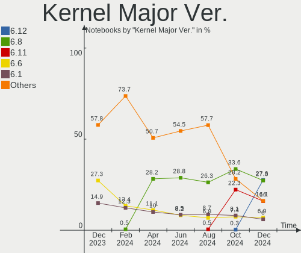
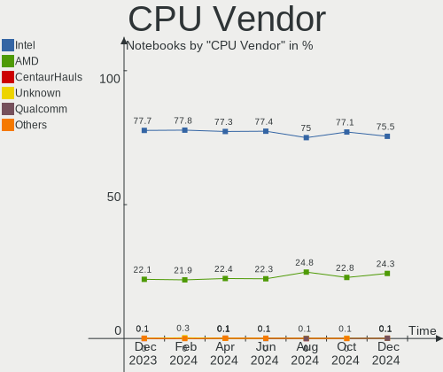

Linux - Hardware Trends (Notebooks)
-----------------------------------

A project to identify most popular hardware characteristics and track their change
over time based on data collected by Linux users at https://Linux-Hardware.org.

Anyone can contribute to this report by the [hw-probe](https://github.com/linuxhw/hw-probe) tool:

    sudo -E hw-probe -all -upload

This report is for one last month. Overall report since the beginning of time: [TestDays](https://github.com/linuxhw/TestDays)

Period: Jun, 2023.

Contents
--------

* [ System ](#system)
  - [ OS                       ](#os)
  - [ OS Family                ](#os-family)
  - [ Kernel                   ](#kernel)
  - [ Kernel Family            ](#kernel-family)
  - [ Kernel Major Ver.        ](#kernel-major-ver)
  - [ Arch                     ](#arch)
  - [ DE                       ](#de)
  - [ Display Server           ](#display-server)
  - [ Display Manager          ](#display-manager)
  - [ OS Lang                  ](#os-lang)
  - [ Boot Mode                ](#boot-mode)
  - [ Filesystem               ](#filesystem)
  - [ Part. scheme             ](#part-scheme)
  - [ Dual Boot with Linux/BSD ](#dual-boot-with-linuxbsd)
  - [ Dual Boot (Win)          ](#dual-boot-win)

* [ Board ](#board)
  - [ Vendor                   ](#vendor)
  - [ Model                    ](#model)
  - [ Model Family             ](#model-family)
  - [ MFG Year                 ](#mfg-year)
  - [ Form Factor              ](#form-factor)
  - [ Secure Boot              ](#secure-boot)
  - [ Coreboot                 ](#coreboot)
  - [ RAM Size                 ](#ram-size)
  - [ RAM Used                 ](#ram-used)
  - [ Total Drives             ](#total-drives)
  - [ Has CD-ROM               ](#has-cd-rom)
  - [ Has Ethernet             ](#has-ethernet)
  - [ Has WiFi                 ](#has-wifi)
  - [ Has Bluetooth            ](#has-bluetooth)

* [ Location ](#location)
  - [ Country                  ](#country)
  - [ City                     ](#city)

* [ Drives ](#drives)
  - [ Drive Vendor             ](#drive-vendor)
  - [ Drive Model              ](#drive-model)
  - [ HDD Vendor               ](#hdd-vendor)
  - [ SSD Vendor               ](#ssd-vendor)
  - [ Drive Kind               ](#drive-kind)
  - [ Drive Connector          ](#drive-connector)
  - [ Drive Size               ](#drive-size)
  - [ Space Total              ](#space-total)
  - [ Space Used               ](#space-used)
  - [ Malfunc. Drives          ](#malfunc-drives)
  - [ Malfunc. Drive Vendor    ](#malfunc-drive-vendor)
  - [ Malfunc. HDD Vendor      ](#malfunc-hdd-vendor)
  - [ Malfunc. Drive Kind      ](#malfunc-drive-kind)
  - [ Failed Drives            ](#failed-drives)
  - [ Failed Drive Vendor      ](#failed-drive-vendor)
  - [ Drive Status             ](#drive-status)

* [ Storage controller ](#storage-controller)
  - [ Storage Vendor           ](#storage-vendor)
  - [ Storage Model            ](#storage-model)
  - [ Storage Kind             ](#storage-kind)

* [ Processor ](#processor)
  - [ CPU Vendor               ](#cpu-vendor)
  - [ CPU Model                ](#cpu-model)
  - [ CPU Model Family         ](#cpu-model-family)
  - [ CPU Cores                ](#cpu-cores)
  - [ CPU Sockets              ](#cpu-sockets)
  - [ CPU Threads              ](#cpu-threads)
  - [ CPU Op-Modes             ](#cpu-op-modes)
  - [ CPU Microcode            ](#cpu-microcode)
  - [ CPU Microarch            ](#cpu-microarch)

* [ Graphics ](#graphics)
  - [ GPU Vendor               ](#gpu-vendor)
  - [ GPU Model                ](#gpu-model)
  - [ GPU Combo                ](#gpu-combo)
  - [ GPU Driver               ](#gpu-driver)
  - [ GPU Memory               ](#gpu-memory)

* [ Monitor ](#monitor)
  - [ Monitor Vendor           ](#monitor-vendor)
  - [ Monitor Model            ](#monitor-model)
  - [ Monitor Resolution       ](#monitor-resolution)
  - [ Monitor Diagonal         ](#monitor-diagonal)
  - [ Monitor Width            ](#monitor-width)
  - [ Aspect Ratio             ](#aspect-ratio)
  - [ Monitor Area             ](#monitor-area)
  - [ Pixel Density            ](#pixel-density)
  - [ Multiple Monitors        ](#multiple-monitors)

* [ Network ](#network)
  - [ Net Controller Vendor    ](#net-controller-vendor)
  - [ Net Controller Model     ](#net-controller-model)
  - [ Wireless Vendor          ](#wireless-vendor)
  - [ Wireless Model           ](#wireless-model)
  - [ Ethernet Vendor          ](#ethernet-vendor)
  - [ Ethernet Model           ](#ethernet-model)
  - [ Net Controller Kind      ](#net-controller-kind)
  - [ Used Controller          ](#used-controller)
  - [ NICs                     ](#nics)
  - [ IPv6                     ](#ipv6)

* [ Bluetooth ](#bluetooth)
  - [ Bluetooth Vendor         ](#bluetooth-vendor)
  - [ Bluetooth Model          ](#bluetooth-model)

* [ Sound ](#sound)
  - [ Sound Vendor             ](#sound-vendor)
  - [ Sound Model              ](#sound-model)

* [ Memory ](#memory)
  - [ Memory Vendor            ](#memory-vendor)
  - [ Memory Model             ](#memory-model)
  - [ Memory Kind              ](#memory-kind)
  - [ Memory Form Factor       ](#memory-form-factor)
  - [ Memory Size              ](#memory-size)
  - [ Memory Speed             ](#memory-speed)

* [ Printers & scanners ](#printers--scanners)
  - [ Printer Vendor           ](#printer-vendor)
  - [ Printer Model            ](#printer-model)
  - [ Scanner Vendor           ](#scanner-vendor)
  - [ Scanner Model            ](#scanner-model)

* [ Camera ](#camera)
  - [ Camera Vendor            ](#camera-vendor)
  - [ Camera Model             ](#camera-model)

* [ Security ](#security)
  - [ Fingerprint Vendor       ](#fingerprint-vendor)
  - [ Fingerprint Model        ](#fingerprint-model)
  - [ Chipcard Vendor          ](#chipcard-vendor)
  - [ Chipcard Model           ](#chipcard-model)

* [ Unsupported ](#unsupported)
  - [ Unsupported Devices      ](#unsupported-devices)
  - [ Unsupported Device Types ](#unsupported-device-types)

System
------

OS
--

Installed operating systems

| Name                         | Notebooks | Percent |
|------------------------------|-----------|---------|
| Ubuntu 22.04                 | 336       | 12.59%  |
| Fedora 38                    | 259       | 9.7%    |
| Linux Mint 21.1              | 211       | 7.91%   |
| Ubuntu 23.04                 | 136       | 5.1%    |
| Arch Rolling                 | 127       | 4.76%   |
| Debian 12                    | 123       | 4.61%   |
| Pop!_OS 22.04                | 91        | 3.41%   |
| Debian 11                    | 82        | 3.07%   |
| OpenMandriva 23.03           | 75        | 2.81%   |
| ArcoLinux Rolling            | 73        | 2.74%   |
| ROSA 12.4                    | 70        | 2.62%   |
| Zorin 16                     | 61        | 2.29%   |
| SteamOS 3.4.8                | 51        | 1.91%   |
| KDE neon 22.04               | 48        | 1.8%    |
| Ubuntu 20.04                 | 44        | 1.65%   |
| OpenMandriva 23.06           | 41        | 1.54%   |
| Manjaro                      | 40        | 1.5%    |
| BlackPanther 18.1            | 38        | 1.42%   |
| Kali 2023.2                  | 37        | 1.39%   |
| openSUSE Tumbleweed-XXXXXXXX | 36        | 1.35%   |
| Manjaro 23.0.0               | 34        | 1.27%   |
| Kubuntu 22.04                | 31        | 1.16%   |
| Ubuntu 22.10                 | 30        | 1.12%   |
| Kubuntu 23.04                | 28        | 1.05%   |
| EndeavourOS Rolling          | 28        | 1.05%   |
| Linux Mint 20.3              | 24        | 0.9%    |
| Xubuntu 22.04                | 19        | 0.71%   |
| Fedora 37                    | 18        | 0.67%   |
| Linux Mint 21                | 17        | 0.64%   |
| Gentoo 2.13                  | 17        | 0.64%   |
| Elementary 7                 | 16        | 0.6%    |
| Parrot 5.3                   | 15        | 0.56%   |
| OpenMandriva 4.3             | 15        | 0.56%   |
| openSUSE Leap-15.5           | 13        | 0.49%   |
| Nobara 37                    | 13        | 0.49%   |
| MX 21                        | 13        | 0.49%   |
| LMDE 5                       | 13        | 0.49%   |
| Lubuntu 22.04                | 11        | 0.41%   |
| TUXEDO OS 22.04              | 9         | 0.34%   |
| Ubuntu MATE 22.04            | 8         | 0.3%    |

OS Family
---------

OS without a version

| Name          | Notebooks | Percent |
|---------------|-----------|---------|
| Ubuntu        | 557       | 20.87%  |
| Fedora        | 288       | 10.79%  |
| Linux Mint    | 266       | 9.97%   |
| Debian        | 214       | 8.02%   |
| OpenMandriva  | 146       | 5.47%   |
| Arch          | 127       | 4.76%   |
| Pop!_OS       | 93        | 3.48%   |
| ROSA          | 86        | 3.22%   |
| Manjaro       | 79        | 2.96%   |
| ArcoLinux     | 74        | 2.77%   |
| SteamOS       | 71        | 2.66%   |
| Kubuntu       | 67        | 2.51%   |
| Zorin         | 65        | 2.44%   |
| openSUSE      | 54        | 2.02%   |
| KDE neon      | 50        | 1.87%   |
| BlackPanther  | 44        | 1.65%   |
| Kali          | 41        | 1.54%   |
| Xubuntu       | 31        | 1.16%   |
| EndeavourOS   | 28        | 1.05%   |
| Elementary    | 20        | 0.75%   |
| Lubuntu       | 19        | 0.71%   |
| Gentoo        | 18        | 0.67%   |
| Parrot        | 17        | 0.64%   |
| Ubuntu MATE   | 16        | 0.6%    |
| Nobara        | 15        | 0.56%   |
| MX            | 15        | 0.56%   |
| Endless       | 15        | 0.56%   |
| LMDE          | 13        | 0.49%   |
| NixOS         | 10        | 0.37%   |
| TUXEDO OS     | 9         | 0.34%   |
| Garuda Linux  | 8         | 0.3%    |
| ALT Linux     | 8         | 0.3%    |
| Ubuntu Budgie | 7         | 0.26%   |
| CachyOS       | 7         | 0.26%   |
| Xero          | 5         | 0.19%   |
| ChimeraOS     | 5         | 0.19%   |
| blendOS       | 5         | 0.19%   |
| Ubuntu Unity  | 4         | 0.15%   |
| Rocky Linux   | 3         | 0.11%   |
| Linux Lite    | 3         | 0.11%   |

Kernel
------

Version of the Linux kernel

| Version                           | Notebooks | Percent |
|-----------------------------------|-----------|---------|
| 5.19.0-43-generic                 | 235       | 8.8%    |
| 5.15.0-73-generic                 | 163       | 6.11%   |
| 5.19.0-45-generic                 | 141       | 5.28%   |
| 5.15.0-75-generic                 | 111       | 4.16%   |
| 6.1.0-9-amd64                     | 107       | 4.01%   |
| 6.2.0-20-generic                  | 97        | 3.63%   |
| 6.2.6-76060206-generic            | 86        | 3.22%   |
| 6.2.6-desktop-1omv2390            | 75        | 2.81%   |
| 5.10.0-23-amd64                   | 71        | 2.66%   |
| 6.3.8-200.fc38.x86_64             | 69        | 2.59%   |
| 6.1.20-generic-2rosa2021.1-x86_64 | 64        | 2.4%    |
| 5.13.0-valve36-1-neptune          | 61        | 2.29%   |
| 6.2.0-23-generic                  | 54        | 2.02%   |
| 6.3.5-200.fc38.x86_64             | 45        | 1.69%   |
| 6.3.6-200.fc38.x86_64             | 42        | 1.57%   |
| 6.3.5-desktop-3omv2390            | 42        | 1.57%   |
| 6.1.31-2-MANJARO                  | 35        | 1.31%   |
| 6.3.6-arch1-1                     | 33        | 1.24%   |
| 6.3.9-arch1-1                     | 32        | 1.2%    |
| 6.1.0-kali9-amd64                 | 31        | 1.16%   |
| 6.3.5-arch1-1                     | 29        | 1.09%   |
| 6.2.9-300.fc38.x86_64             | 29        | 1.09%   |
| 6.3.7-arch1-1                     | 23        | 0.86%   |
| 6.3.4-201.fc38.x86_64             | 23        | 0.86%   |
| 5.4.0-150-generic                 | 23        | 0.86%   |
| 5.15.0-56-generic                 | 23        | 0.86%   |
| 6.3.8-arch1-1                     | 22        | 0.82%   |
| 5.19.0-42-generic                 | 22        | 0.82%   |
| 6.3.7-200.fc38.x86_64             | 21        | 0.79%   |
| 5.19.0-46-generic                 | 21        | 0.79%   |
| 6.3.5-2-MANJARO                   | 19        | 0.71%   |
| 6.2.15-300.fc38.x86_64            | 18        | 0.67%   |
| 5.15.0-76-generic                 | 17        | 0.64%   |
| 6.1.0-1parrot1-amd64              | 15        | 0.56%   |
| 5.19.0-32-generic                 | 14        | 0.52%   |
| 5.15.85-desktop-1bP               | 14        | 0.52%   |
| 6.1.0-4-amd64                     | 13        | 0.49%   |
| 5.6.14-desktop-2bP                | 13        | 0.49%   |
| 4.18.16-desktop-1bP               | 13        | 0.49%   |
| 6.3.6-zen1-1-zen                  | 12        | 0.45%   |

Kernel Family
-------------

Linux kernel without a distro release

| Version | Notebooks | Percent |
|---------|-----------|---------|
| 5.19.0  | 456       | 17.09%  |
| 5.15.0  | 372       | 13.94%  |
| 6.1.0   | 187       | 7.01%   |
| 6.2.0   | 183       | 6.86%   |
| 6.3.5   | 167       | 6.26%   |
| 6.2.6   | 161       | 6.03%   |
| 6.3.8   | 123       | 4.61%   |
| 6.3.6   | 102       | 3.82%   |
| 5.10.0  | 102       | 3.82%   |
| 6.3.7   | 86        | 3.22%   |
| 5.13.0  | 66        | 2.47%   |
| 6.1.20  | 64        | 2.4%    |
| 6.1.31  | 59        | 2.21%   |
| 5.4.0   | 55        | 2.06%   |
| 6.3.9   | 53        | 1.99%   |
| 6.3.4   | 50        | 1.87%   |
| 6.2.9   | 29        | 1.09%   |
| 6.2.15  | 28        | 1.05%   |
| 5.14.21 | 15        | 0.56%   |
| 5.6.14  | 14        | 0.52%   |
| 5.15.85 | 14        | 0.52%   |
| 4.18.16 | 13        | 0.49%   |
| 6.4.0   | 11        | 0.41%   |
| 6.1.35  | 11        | 0.41%   |
| 6.0.0   | 11        | 0.41%   |
| 5.14.0  | 10        | 0.37%   |
| 6.3.3   | 9         | 0.34%   |
| 6.3.1   | 9         | 0.34%   |
| 6.3.0   | 9         | 0.34%   |
| 6.1.34  | 9         | 0.34%   |
| 5.16.7  | 8         | 0.3%    |
| 5.11.0  | 8         | 0.3%    |
| 6.1.33  | 7         | 0.26%   |
| 6.1.1   | 7         | 0.26%   |
| 5.16.13 | 7         | 0.26%   |
| 4.15.0  | 7         | 0.26%   |
| 6.2.14  | 6         | 0.22%   |
| 6.1.30  | 6         | 0.22%   |
| 6.3.2   | 5         | 0.19%   |
| 6.1.27  | 5         | 0.19%   |

Kernel Major Ver.
-----------------

Linux kernel major version

| Version | Notebooks | Percent |
|---------|-----------|---------|
| 6.3     | 616       | 23.08%  |
| 5.19    | 457       | 17.12%  |
| 6.2     | 426       | 15.96%  |
| 5.15    | 411       | 15.4%   |
| 6.1     | 375       | 14.05%  |
| 5.10    | 114       | 4.27%   |
| 5.13    | 68        | 2.55%   |
| 5.4     | 60        | 2.25%   |
| 5.14    | 26        | 0.97%   |
| 6.0     | 21        | 0.79%   |
| 5.16    | 18        | 0.67%   |
| 4.18    | 17        | 0.64%   |
| 5.6     | 14        | 0.52%   |
| 6.4     | 11        | 0.41%   |
| 5.11    | 9         | 0.34%   |
| 4.15    | 7         | 0.26%   |
| 5.18    | 4         | 0.15%   |
| 5.17    | 4         | 0.15%   |
| 5.8     | 3         | 0.11%   |
| 4.9     | 3         | 0.11%   |
| 5.9     | 1         | 0.04%   |
| 5.3     | 1         | 0.04%   |
| 5.12    | 1         | 0.04%   |
| 4.4     | 1         | 0.04%   |
| 4.19    | 1         | 0.04%   |

Arch
----

OS architecture (x86_64, i586, etc.)

| Name    | Notebooks | Percent |
|---------|-----------|---------|
| x86_64  | 2639      | 98.88%  |
| i686    | 29        | 1.09%   |
| aarch64 | 1         | 0.04%   |

DE
--

Desktop Environment

| Name              | Notebooks | Percent |
|-------------------|-----------|---------|
| GNOME             | 1150      | 43.09%  |
| KDE5              | 724       | 27.13%  |
| XFCE              | 219       | 8.21%   |
| X-Cinnamon        | 215       | 8.06%   |
| MATE              | 91        | 3.41%   |
| Unknown           | 81        | 3.03%   |
| LXQt              | 38        | 1.42%   |
| i3                | 26        | 0.97%   |
| Pantheon          | 19        | 0.71%   |
| Budgie            | 16        | 0.6%    |
| Cinnamon          | 13        | 0.49%   |
| Hyprland          | 11        | 0.41%   |
| sway              | 10        | 0.37%   |
| LXDE              | 10        | 0.37%   |
| lightdm-xsession  | 5         | 0.19%   |
| KDE4              | 5         | 0.19%   |
| KDE               | 5         | 0.19%   |
| GNOME Classic     | 5         | 0.19%   |
| Unity             | 3         | 0.11%   |
| Openbox           | 3         | 0.11%   |
| GNOME Flashback   | 3         | 0.11%   |
| Dwm               | 3         | 0.11%   |
| LeftWM            | 2         | 0.07%   |
| Deepin            | 2         | 0.07%   |
| awesome           | 2         | 0.07%   |
| ubuntu:pika:GNOME | 1         | 0.04%   |
| pika:GNOME        | 1         | 0.04%   |
| onyx:GNOME        | 1         | 0.04%   |
| icewm             | 1         | 0.04%   |
| Hypr              | 1         | 0.04%   |
| DDE               | 1         | 0.04%   |
| Cutefish          | 1         | 0.04%   |
| chadwm            | 1         | 0.04%   |

Display Server
--------------

X11 or Wayland

| Name    | Notebooks | Percent |
|---------|-----------|---------|
| X11     | 1637      | 61.33%  |
| Wayland | 944       | 35.37%  |
| Unknown | 56        | 2.1%    |
| Tty     | 32        | 1.2%    |

Display Manager
---------------

SDDM, LightDM, etc.

| Name    | Notebooks | Percent |
|---------|-----------|---------|
| Unknown | 936       | 35.07%  |
| GDM3    | 574       | 21.51%  |
| SDDM    | 530       | 19.86%  |
| LightDM | 398       | 14.91%  |
| GDM     | 207       | 7.76%   |
| LXDM    | 7         | 0.26%   |
| KDM     | 5         | 0.19%   |
| GREETD  | 4         | 0.15%   |
| SLiM    | 3         | 0.11%   |
| Ly      | 2         | 0.07%   |
| XDM     | 1         | 0.04%   |
| LY-DM   | 1         | 0.04%   |
| EMPTTY  | 1         | 0.04%   |

OS Lang
-------

Language

| Lang    | Notebooks | Percent |
|---------|-----------|---------|
| en_US   | 1162      | 43.54%  |
| de_DE   | 199       | 7.46%   |
| ru_RU   | 186       | 6.97%   |
| en_GB   | 152       | 5.7%    |
| fr_FR   | 117       | 4.38%   |
| pt_BR   | 101       | 3.78%   |
| Unknown | 82        | 3.07%   |
| es_ES   | 65        | 2.44%   |
| en_IN   | 58        | 2.17%   |
| it_IT   | 57        | 2.14%   |
| es_MX   | 41        | 1.54%   |
| en_CA   | 41        | 1.54%   |
| C       | 38        | 1.42%   |
| pl_PL   | 37        | 1.39%   |
| en_AU   | 28        | 1.05%   |
| zh_CN   | 23        | 0.86%   |
| es_AR   | 23        | 0.86%   |
| tr_TR   | 22        | 0.82%   |
| hu_HU   | 19        | 0.71%   |
| pt_PT   | 14        | 0.52%   |
| es_CL   | 12        | 0.45%   |
| nl_NL   | 11        | 0.41%   |
| de_AT   | 11        | 0.41%   |
| cs_CZ   | 11        | 0.41%   |
| fi_FI   | 10        | 0.37%   |
| es_PE   | 7         | 0.26%   |
| es_CO   | 7         | 0.26%   |
| en_ZA   | 7         | 0.26%   |
| en_PH   | 7         | 0.26%   |
| en_IE   | 7         | 0.26%   |
| sv_SE   | 6         | 0.22%   |
| de_CH   | 6         | 0.22%   |
| da_DK   | 6         | 0.22%   |
| zh_TW   | 5         | 0.19%   |
| ko_KR   | 5         | 0.19%   |
| en_NZ   | 5         | 0.19%   |
| en_IL   | 5         | 0.19%   |
| en_DK   | 5         | 0.19%   |
| ru_UA   | 4         | 0.15%   |
| ro_RO   | 4         | 0.15%   |

Boot Mode
---------

EFI or BIOS

| Mode | Notebooks | Percent |
|------|-----------|---------|
| EFI  | 1496      | 56.05%  |
| BIOS | 1173      | 43.95%  |

Filesystem
----------

Type of filesystem

| Type    | Notebooks | Percent |
|---------|-----------|---------|
| Ext4    | 1551      | 58.11%  |
| Btrfs   | 545       | 20.42%  |
| Tmpfs   | 384       | 14.39%  |
| Overlay | 139       | 5.21%   |
| Xfs     | 25        | 0.94%   |
| Zfs     | 13        | 0.49%   |
| F2fs    | 6         | 0.22%   |
| Unknown | 3         | 0.11%   |
| Ext3    | 1         | 0.04%   |
| Ext2    | 1         | 0.04%   |
| Aufs    | 1         | 0.04%   |

Part. scheme
------------

Scheme of partitioning

| Type    | Notebooks | Percent |
|---------|-----------|---------|
| GPT     | 1544      | 57.85%  |
| Unknown | 859       | 32.18%  |
| MBR     | 266       | 9.97%   |

Dual Boot with Linux/BSD
------------------------

Hosting more than one Linux/BSD

| Dual boot | Notebooks | Percent |
|-----------|-----------|---------|
| No        | 2366      | 88.65%  |
| Yes       | 303       | 11.35%  |

Dual Boot (Win)
---------------

Hosting Linux and Windows

| Dual boot | Notebooks | Percent |
|-----------|-----------|---------|
| No        | 2020      | 75.68%  |
| Yes       | 649       | 24.32%  |

Board
-----

Vendor
------

Motherboard manufacturer

| Name                | Notebooks | Percent |
|---------------------|-----------|---------|
| Lenovo              | 563       | 21.09%  |
| Hewlett-Packard     | 426       | 15.96%  |
| Dell                | 392       | 14.69%  |
| ASUSTek Computer    | 297       | 11.13%  |
| Acer                | 220       | 8.24%   |
| Apple               | 102       | 3.82%   |
| MSI                 | 80        | 3%      |
| Valve               | 65        | 2.44%   |
| Toshiba             | 57        | 2.14%   |
| Samsung Electronics | 47        | 1.76%   |
| HUAWEI              | 44        | 1.65%   |
| Sony                | 29        | 1.09%   |
| Google              | 27        | 1.01%   |
| Timi                | 17        | 0.64%   |
| Fujitsu             | 16        | 0.6%    |
| Notebook            | 14        | 0.52%   |
| Unknown             | 14        | 0.52%   |
| TUXEDO              | 13        | 0.49%   |
| HONOR               | 13        | 0.49%   |
| Gigabyte Technology | 12        | 0.45%   |
| Aquarius            | 12        | 0.45%   |
| Packard Bell        | 11        | 0.41%   |
| Razer               | 9         | 0.34%   |
| Medion              | 9         | 0.34%   |
| eMachines           | 9         | 0.34%   |
| Positivo            | 8         | 0.3%    |
| Alienware           | 8         | 0.3%    |
| System76            | 7         | 0.26%   |
| Chuwi               | 6         | 0.22%   |
| GPU Company         | 5         | 0.19%   |
| Framework           | 5         | 0.19%   |
| Clevo               | 5         | 0.19%   |
| Schenker            | 4         | 0.15%   |
| Panasonic           | 4         | 0.15%   |
| UNOWHY              | 3         | 0.11%   |
| Semp Toshiba        | 3         | 0.11%   |
| MECHREVO            | 3         | 0.11%   |
| Maibenben           | 3         | 0.11%   |
| Intel               | 3         | 0.11%   |
| Infinix             | 3         | 0.11%   |

Model
-----

Motherboard model

| Name                                | Notebooks | Percent |
|-------------------------------------|-----------|---------|
| Valve Jupiter                       | 65        | 2.44%   |
| Unknown                             | 23        | 0.86%   |
| HP Notebook                         | 18        | 0.67%   |
| Apple MacBookPro9,2                 | 13        | 0.49%   |
| Apple MacBookAir7,2                 | 13        | 0.49%   |
| Aquarius NS585                      | 11        | 0.41%   |
| HP Pavilion Notebook                | 10        | 0.37%   |
| HP Pavilion dv6                     | 10        | 0.37%   |
| HP Pavilion g6                      | 8         | 0.3%    |
| HP Laptop 15s-eq2xxx                | 8         | 0.3%    |
| HP Laptop 15-db0xxx                 | 8         | 0.3%    |
| HP EliteBook 840 G3                 | 8         | 0.3%    |
| Dell Latitude E6420                 | 7         | 0.26%   |
| Dell Latitude E6410                 | 7         | 0.26%   |
| Dell Latitude E6400                 | 7         | 0.26%   |
| Dell Inspiron 3501                  | 7         | 0.26%   |
| Apple MacBookPro5,5                 | 7         | 0.26%   |
| Apple MacBookPro12,1                | 7         | 0.26%   |
| Lenovo IdeaPad 3 15ITL6 82H8        | 6         | 0.22%   |
| Apple MacBookPro8,1                 | 6         | 0.22%   |
| Lenovo Legion 5 15ACH6H 82JU        | 5         | 0.19%   |
| Lenovo IdeaPad Gaming 3 15ACH6 82K2 | 5         | 0.19%   |
| Lenovo IdeaPad 5 Pro 14ACN6 82L7    | 5         | 0.19%   |
| HP Pavilion dv7                     | 5         | 0.19%   |
| HP Pavilion 17                      | 5         | 0.19%   |
| HP EliteBook 840 G6                 | 5         | 0.19%   |
| Dell XPS 9320                       | 5         | 0.19%   |
| Dell XPS 13 9370                    | 5         | 0.19%   |
| Dell Latitude E7470                 | 5         | 0.19%   |
| Dell Latitude E7450                 | 5         | 0.19%   |
| Dell Latitude E6540                 | 5         | 0.19%   |
| Dell Latitude E5470                 | 5         | 0.19%   |
| Dell Inspiron 5567                  | 5         | 0.19%   |
| Dell Inspiron 3583                  | 5         | 0.19%   |
| ASUS TUF Gaming FX505DT_FX505DT     | 5         | 0.19%   |
| Apple MacBookPro7,1                 | 5         | 0.19%   |
| Apple MacBookPro11,1                | 5         | 0.19%   |
| Acer Nitro AN515-55                 | 5         | 0.19%   |
| Acer Nitro AN515-44                 | 5         | 0.19%   |
| Acer Aspire E5-575G                 | 5         | 0.19%   |

Model Family
------------

Motherboard model prefix

| Name                  | Notebooks | Percent |
|-----------------------|-----------|---------|
| Lenovo ThinkPad       | 279       | 10.45%  |
| Acer Aspire           | 151       | 5.66%   |
| Dell Latitude         | 149       | 5.58%   |
| Lenovo IdeaPad        | 139       | 5.21%   |
| Dell Inspiron         | 106       | 3.97%   |
| HP Pavilion           | 95        | 3.56%   |
| HP EliteBook          | 85        | 3.18%   |
| ASUS VivoBook         | 83        | 3.11%   |
| HP Laptop             | 79        | 2.96%   |
| Valve Jupiter         | 65        | 2.44%   |
| Dell XPS              | 47        | 1.76%   |
| Toshiba Satellite     | 42        | 1.57%   |
| Lenovo Legion         | 40        | 1.5%    |
| Dell Precision        | 36        | 1.35%   |
| ASUS ROG              | 35        | 1.31%   |
| HP ProBook            | 32        | 1.2%    |
| Dell Vostro           | 29        | 1.09%   |
| ASUS ASUS             | 24        | 0.9%    |
| Acer Nitro            | 24        | 0.9%    |
| Unknown               | 23        | 0.86%   |
| ASUS ZenBook          | 19        | 0.71%   |
| Lenovo Yoga           | 18        | 0.67%   |
| HP Notebook           | 18        | 0.67%   |
| HP ENVY               | 18        | 0.67%   |
| Acer Swift            | 17        | 0.64%   |
| Apple MacBookAir7     | 16        | 0.6%    |
| Lenovo ThinkBook      | 15        | 0.56%   |
| HP OMEN               | 15        | 0.56%   |
| HP ZBook              | 14        | 0.52%   |
| Apple MacBookPro9     | 13        | 0.49%   |
| Fujitsu LIFEBOOK      | 12        | 0.45%   |
| Aquarius NS585        | 11        | 0.41%   |
| Packard Bell EasyNote | 10        | 0.37%   |
| Lenovo V15            | 10        | 0.37%   |
| Apple MacBookPro8     | 10        | 0.37%   |
| Apple MacBookPro11    | 10        | 0.37%   |
| Razer Blade           | 9         | 0.34%   |
| HP Stream             | 9         | 0.34%   |
| HP 250                | 9         | 0.34%   |
| ASUS TUF              | 9         | 0.34%   |

MFG Year
--------

Motherboard manufacture year

| Year    | Notebooks | Percent |
|---------|-----------|---------|
| 2021    | 368       | 13.79%  |
| 2022    | 319       | 11.95%  |
| 2020    | 243       | 9.1%    |
| 2019    | 218       | 8.17%   |
| 2018    | 165       | 6.18%   |
| 2017    | 146       | 5.47%   |
| 2015    | 144       | 5.4%    |
| 2012    | 143       | 5.36%   |
| 2016    | 142       | 5.32%   |
| 2011    | 142       | 5.32%   |
| 2013    | 135       | 5.06%   |
| 2014    | 134       | 5.02%   |
| 2010    | 117       | 4.38%   |
| 2023    | 84        | 3.15%   |
| 2008    | 70        | 2.62%   |
| 2009    | 68        | 2.55%   |
| 2007    | 19        | 0.71%   |
| 2006    | 8         | 0.3%    |
| Unknown | 3         | 0.11%   |
| 2005    | 1         | 0.04%   |

Form Factor
-----------

Physical design of the computer

| Name     | Notebooks | Percent |
|----------|-----------|---------|
| Notebook | 2669      | 100%    |

Secure Boot
-----------

Enabled or disabled

| State    | Notebooks | Percent |
|----------|-----------|---------|
| Disabled | 2432      | 91.12%  |
| Enabled  | 237       | 8.88%   |

Coreboot
--------

Have coreboot on board

| Used | Notebooks | Percent |
|------|-----------|---------|
| No   | 2636      | 98.76%  |
| Yes  | 33        | 1.24%   |

RAM Size
--------

Total RAM memory

| Size in GB  | Notebooks | Percent |
|-------------|-----------|---------|
| 4.01-8.0    | 813       | 30.46%  |
| 8.01-16.0   | 516       | 19.33%  |
| 16.01-24.0  | 470       | 17.61%  |
| 3.01-4.0    | 436       | 16.34%  |
| 32.01-64.0  | 249       | 9.33%   |
| 1.01-2.0    | 58        | 2.17%   |
| 64.01-256.0 | 42        | 1.57%   |
| 24.01-32.0  | 41        | 1.54%   |
| 2.01-3.0    | 39        | 1.46%   |
| 0.51-1.0    | 5         | 0.19%   |

RAM Used
--------

Used RAM memory

| Used GB    | Notebooks | Percent |
|------------|-----------|---------|
| 1.01-2.0   | 743       | 27.84%  |
| 2.01-3.0   | 676       | 25.33%  |
| 4.01-8.0   | 545       | 20.42%  |
| 3.01-4.0   | 414       | 15.51%  |
| 8.01-16.0  | 130       | 4.87%   |
| 0.51-1.0   | 121       | 4.53%   |
| 0.01-0.5   | 16        | 0.6%    |
| 16.01-24.0 | 15        | 0.56%   |
| 24.01-32.0 | 6         | 0.22%   |
| 32.01-64.0 | 3         | 0.11%   |

Total Drives
------------

Number of drives on board

| Drives | Notebooks | Percent |
|--------|-----------|---------|
| 1      | 1954      | 73.21%  |
| 2      | 621       | 23.27%  |
| 3      | 69        | 2.59%   |
| 4      | 16        | 0.6%    |
| 0      | 7         | 0.26%   |
| 9      | 1         | 0.04%   |
| 8      | 1         | 0.04%   |

Has CD-ROM
----------

Has CD-ROM on board

| Presented | Notebooks | Percent |
|-----------|-----------|---------|
| No        | 1974      | 73.96%  |
| Yes       | 695       | 26.04%  |

Has Ethernet
------------

Has Ethernet on board

| Presented | Notebooks | Percent |
|-----------|-----------|---------|
| Yes       | 2002      | 75.01%  |
| No        | 667       | 24.99%  |

Has WiFi
--------

Has WiFi module

| Presented | Notebooks | Percent |
|-----------|-----------|---------|
| Yes       | 2622      | 98.24%  |
| No        | 47        | 1.76%   |

Has Bluetooth
-------------

Has Bluetooth module

| Presented | Notebooks | Percent |
|-----------|-----------|---------|
| Yes       | 2205      | 82.62%  |
| No        | 464       | 17.38%  |

Location
--------

Country
-------

Geographic location (country)

| Country      | Notebooks | Percent |
|--------------|-----------|---------|
| USA          | 426       | 15.96%  |
| Germany      | 270       | 10.12%  |
| Russia       | 204       | 7.64%   |
| Brazil       | 149       | 5.58%   |
| France       | 138       | 5.17%   |
| UK           | 102       | 3.82%   |
| Italy        | 90        | 3.37%   |
| India        | 88        | 3.3%    |
| Spain        | 75        | 2.81%   |
| Canada       | 68        | 2.55%   |
| Poland       | 66        | 2.47%   |
| Netherlands  | 62        | 2.32%   |
| Mexico       | 58        | 2.17%   |
| Hungary      | 58        | 2.17%   |
| Australia    | 42        | 1.57%   |
| Turkey       | 39        | 1.46%   |
| Argentina    | 33        | 1.24%   |
| Switzerland  | 31        | 1.16%   |
| Portugal     | 28        | 1.05%   |
| China        | 28        | 1.05%   |
| Austria      | 26        | 0.97%   |
| Sweden       | 24        | 0.9%    |
| Finland      | 24        | 0.9%    |
| Czechia      | 24        | 0.9%    |
| Indonesia    | 23        | 0.86%   |
| Chile        | 23        | 0.86%   |
| Romania      | 22        | 0.82%   |
| Colombia     | 19        | 0.71%   |
| Belgium      | 18        | 0.67%   |
| Norway       | 17        | 0.64%   |
| Bulgaria     | 17        | 0.64%   |
| Israel       | 16        | 0.6%    |
| Japan        | 15        | 0.56%   |
| Denmark      | 15        | 0.56%   |
| Philippines  | 14        | 0.52%   |
| South Africa | 13        | 0.49%   |
| Peru         | 12        | 0.45%   |
| Ukraine      | 11        | 0.41%   |
| Taiwan       | 11        | 0.41%   |
| Slovakia     | 11        | 0.41%   |

City
----

Geographic location (city)

| City           | Notebooks | Percent |
|----------------|-----------|---------|
| Moscow         | 54        | 2.02%   |
| Budapest       | 30        | 1.12%   |
| Berlin         | 21        | 0.79%   |
| Sao Paulo      | 20        | 0.75%   |
| Paris          | 19        | 0.71%   |
| Istanbul       | 19        | 0.71%   |
| Amsterdam      | 18        | 0.67%   |
| Helsinki       | 16        | 0.6%    |
| Voronezh       | 15        | 0.56%   |
| Vienna         | 15        | 0.56%   |
| Melbourne      | 15        | 0.56%   |
| Warsaw         | 14        | 0.52%   |
| Milan          | 14        | 0.52%   |
| Bangor         | 14        | 0.52%   |
| St Petersburg  | 13        | 0.49%   |
| Delhi          | 13        | 0.49%   |
| Santiago       | 12        | 0.45%   |
| Rome           | 12        | 0.45%   |
| Jakarta        | 12        | 0.45%   |
| Montreal       | 11        | 0.41%   |
| Toronto        | 10        | 0.37%   |
| Mexico City    | 10        | 0.37%   |
| Bengaluru      | 10        | 0.37%   |
| Zurich         | 9         | 0.34%   |
| New York       | 9         | 0.34%   |
| Madrid         | 9         | 0.34%   |
| Hyderabad      | 9         | 0.34%   |
| Hamburg        | 9         | 0.34%   |
| Barcelona      | 9         | 0.34%   |
| Sydney         | 8         | 0.3%    |
| Singapore      | 8         | 0.3%    |
| Seattle        | 8         | 0.3%    |
| Rio de Janeiro | 8         | 0.3%    |
| Prague         | 8         | 0.3%    |
| Nuremberg      | 8         | 0.3%    |
| Munich         | 8         | 0.3%    |
| Mumbai         | 8         | 0.3%    |
| Lima           | 8         | 0.3%    |
| Brasília      | 8         | 0.3%    |
| Tel Aviv       | 7         | 0.26%   |

Drives
------

Drive Vendor
------------

Hard drive vendors

| Vendor                         | Notebooks | Drives | Percent |
|--------------------------------|-----------|--------|---------|
| Samsung Electronics            | 557       | 598    | 16.79%  |
| WDC                            | 272       | 285    | 8.2%    |
| SanDisk                        | 231       | 237    | 6.96%   |
| Seagate                        | 224       | 236    | 6.75%   |
| Toshiba                        | 196       | 204    | 5.91%   |
| Unknown                        | 195       | 206    | 5.88%   |
| Kingston                       | 172       | 180    | 5.19%   |
| SK hynix                       | 149       | 150    | 4.49%   |
| Intel                          | 126       | 132    | 3.8%    |
| Micron Technology              | 125       | 125    | 3.77%   |
| Crucial                        | 108       | 115    | 3.26%   |
| HGST                           | 70        | 71     | 2.11%   |
| Apple                          | 61        | 69     | 1.84%   |
| Hitachi                        | 57        | 57     | 1.72%   |
| KIOXIA                         | 56        | 57     | 1.69%   |
| Kingston Technology Company    | 49        | 49     | 1.48%   |
| China                          | 45        | 47     | 1.36%   |
| Phison Electronics             | 42        | 42     | 1.27%   |
| A-DATA Technology              | 42        | 42     | 1.27%   |
| Unknown                        | 28        | 28     | 0.84%   |
| SPCC                           | 25        | 25     | 0.75%   |
| Micron/Crucial Technology      | 25        | 27     | 0.75%   |
| Silicon Motion                 | 22        | 22     | 0.66%   |
| PNY                            | 19        | 20     | 0.57%   |
| JMicron Technology             | 17        | 17     | 0.51%   |
| Netac                          | 16        | 17     | 0.48%   |
| ADATA Technology               | 16        | 18     | 0.48%   |
| Transcend                      | 15        | 15     | 0.45%   |
| LITEON                         | 14        | 14     | 0.42%   |
| Fujitsu                        | 14        | 14     | 0.42%   |
| O2 Micro                       | 13        | 13     | 0.39%   |
| Phison                         | 11        | 11     | 0.33%   |
| SSSTC                          | 10        | 10     | 0.3%    |
| Solid State Storage Technology | 10        | 10     | 0.3%    |
| Solid State Storage            | 10        | 10     | 0.3%    |
| Intenso                        | 10        | 10     | 0.3%    |
| Gigabyte Technology            | 10        | 10     | 0.3%    |
| Apacer                         | 10        | 10     | 0.3%    |
| LITEONIT                       | 9         | 9      | 0.27%   |
| MAXIO Technology (Hangzhou)    | 8         | 8      | 0.24%   |

Drive Model
-----------

Hard drive models

| Model                                                 | Notebooks | Percent |
|-------------------------------------------------------|-----------|---------|
| Samsung NVMe SSD Controller SM981/PM981/PM983 250GB   | 102       | 3%      |
| Samsung NVMe SSD Controller PM9A1/PM9A3/980PRO 2TB    | 48        | 1.41%   |
| Unknown MMC Card  64GB                                | 43        | 1.26%   |
| Kingston SA400S37240G 240GB SSD                       | 39        | 1.15%   |
| Intel SSD 660P Series 512GB                           | 34        | 1%      |
| Seagate ST1000LM035-1RK172 1TB                        | 32        | 0.94%   |
| Sandisk WD Blue SN550 NVMe SSD 1TB                    | 31        | 0.91%   |
| Unknown MMC Card  32GB                                | 30        | 0.88%   |
| Sandisk WD Black SN750 / PC SN730 NVMe SSD 500GB      | 29        | 0.85%   |
| Kingston Company OM3PDP3 NVMe SSD 256GB               | 28        | 0.82%   |
| Kingston SA400S37480G 480GB SSD                       | 28        | 0.82%   |
| Unknown                                               | 28        | 0.82%   |
| Toshiba MQ01ABD100 1TB                                | 27        | 0.79%   |
| Unknown MMC Card  128GB                               | 25        | 0.73%   |
| Toshiba MQ04ABF100 1TB                                | 24        | 0.71%   |
| Unknown MMC Card  512GB                               | 22        | 0.65%   |
| Seagate ST500LT012-1DG142 500GB                       | 21        | 0.62%   |
| Phison PS5013 E13 NVMe Controller 512GB               | 21        | 0.62%   |
| Intel SSDPEKNU512GZ 512GB                             | 21        | 0.62%   |
| Samsung SSD 980 1TB                                   | 20        | 0.59%   |
| HGST HTS721010A9E630 1TB                              | 19        | 0.56%   |
| Crucial CT500MX500SSD1 500GB                          | 19        | 0.56%   |
| Crucial CT1000MX500SSD1 1TB                           | 19        | 0.56%   |
| Toshiba MQ01ABF050 500GB                              | 18        | 0.53%   |
| Seagate ST1000LM024 HN-M101MBB 1TB                    | 18        | 0.53%   |
| Samsung NVMe SSD Controller SM961/PM961/SM963 256GB   | 15        | 0.44%   |
| Micron/Crucial P2 NVMe PCIe SSD 4TB                   | 15        | 0.44%   |
| JMicron Generic 240GB                                 | 15        | 0.44%   |
| Silicon Motion SM2263EN/SM2263XT SSD Controller 256GB | 14        | 0.41%   |
| Seagate ST9500325AS 500GB                             | 14        | 0.41%   |
| Samsung SSD 850 EVO 250GB                             | 14        | 0.41%   |
| Micron 2450_MTFDKBA512TFK 512GB                       | 14        | 0.41%   |
| Apple SSD SM0128G 121GB                               | 14        | 0.41%   |
| WDC WD10JPVX-22JC3T0 1TB                              | 13        | 0.38%   |
| Toshiba XG6 NVMe SSD Controller 2TB                   | 13        | 0.38%   |
| Samsung SSD 860 EVO 500GB                             | 13        | 0.38%   |
| O2 Micro E2M2 64GB                                    | 13        | 0.38%   |
| WDC WDS240G2G0A-00JH30 240GB SSD                      | 12        | 0.35%   |
| A-DATA SU800 512GB SSD                                | 12        | 0.35%   |
| SanDisk NVMe SSD Drive 512GB                          | 11        | 0.32%   |

HDD Vendor
----------

Hard disk drive vendors

| Vendor              | Notebooks | Drives | Percent |
|---------------------|-----------|--------|---------|
| Seagate             | 220       | 232    | 30.68%  |
| WDC                 | 190       | 196    | 26.5%   |
| Toshiba             | 132       | 133    | 18.41%  |
| HGST                | 70        | 71     | 9.76%   |
| Hitachi             | 57        | 57     | 7.95%   |
| Fujitsu             | 14        | 14     | 1.95%   |
| Samsung Electronics | 12        | 12     | 1.67%   |
| Apple               | 7         | 7      | 0.98%   |
| Unknown             | 6         | 6      | 0.84%   |
| ASMT                | 3         | 3      | 0.42%   |
| USB3.0              | 1         | 2      | 0.14%   |
| Teleplan            | 1         | 1      | 0.14%   |
| StoreJet            | 1         | 1      | 0.14%   |
| SAGE                | 1         | 1      | 0.14%   |
| Intenso             | 1         | 1      | 0.14%   |
| ASMedia             | 1         | 1      | 0.14%   |

SSD Vendor
----------

Solid state drive vendors

| Vendor              | Notebooks | Drives | Percent |
|---------------------|-----------|--------|---------|
| Samsung Electronics | 187       | 194    | 18.5%   |
| Kingston            | 127       | 132    | 12.56%  |
| Crucial             | 99        | 102    | 9.79%   |
| SanDisk             | 80        | 80     | 7.91%   |
| WDC                 | 48        | 48     | 4.75%   |
| China               | 44        | 46     | 4.35%   |
| Apple               | 41        | 41     | 4.06%   |
| A-DATA Technology   | 29        | 29     | 2.87%   |
| Micron Technology   | 26        | 26     | 2.57%   |
| Intel               | 26        | 26     | 2.57%   |
| Toshiba             | 25        | 25     | 2.47%   |
| SK hynix            | 25        | 25     | 2.47%   |
| SPCC                | 24        | 24     | 2.37%   |
| PNY                 | 18        | 18     | 1.78%   |
| Transcend           | 12        | 12     | 1.19%   |
| LITEON              | 12        | 12     | 1.19%   |
| Netac               | 10        | 10     | 0.99%   |
| LITEONIT            | 9         | 9      | 0.89%   |
| Apacer              | 9         | 9      | 0.89%   |
| KingSpec            | 8         | 9      | 0.79%   |
| GOODRAM             | 8         | 8      | 0.79%   |
| Patriot             | 7         | 7      | 0.69%   |
| Hewlett-Packard     | 7         | 8      | 0.69%   |
| Gigabyte Technology | 7         | 7      | 0.69%   |
| Team                | 6         | 6      | 0.59%   |
| OCZ                 | 6         | 6      | 0.59%   |
| Unknown             | 6         | 6      | 0.59%   |
| Verbatim            | 5         | 5      | 0.49%   |
| Intenso             | 5         | 5      | 0.49%   |
| Acer                | 5         | 5      | 0.49%   |
| Phison              | 4         | 4      | 0.4%    |
| Lexar               | 4         | 4      | 0.4%    |
| FORESEE             | 4         | 4      | 0.4%    |
| Plextor             | 3         | 3      | 0.3%    |
| BHT                 | 3         | 3      | 0.3%    |
| ASMT                | 3         | 3      | 0.3%    |
| Teclast             | 2         | 2      | 0.2%    |
| Super Talent        | 2         | 2      | 0.2%    |
| SSSTC               | 2         | 2      | 0.2%    |
| Seagate             | 2         | 2      | 0.2%    |

Drive Kind
----------

HDD or SSD

| Kind    | Notebooks | Drives | Percent |
|---------|-----------|--------|---------|
| NVMe    | 1247      | 1423   | 39.71%  |
| SSD     | 943       | 1033   | 30.03%  |
| HDD     | 702       | 738    | 22.36%  |
| MMC     | 203       | 216    | 6.46%   |
| Unknown | 45        | 47     | 1.43%   |

Drive Connector
---------------

SATA, SAS, NVMe, etc.

| Type | Notebooks | Drives | Percent |
|------|-----------|--------|---------|
| SATA | 1488      | 1724   | 49.22%  |
| NVMe | 1238      | 1401   | 40.95%  |
| MMC  | 203       | 216    | 6.72%   |
| SAS  | 94        | 116    | 3.11%   |

Drive Size
----------

Size of hard drive

| Size in TB | Notebooks | Drives | Percent |
|------------|-----------|--------|---------|
| 0.01-0.5   | 1068      | 1164   | 65.24%  |
| 0.51-1.0   | 479       | 504    | 29.26%  |
| 1.01-2.0   | 75        | 88     | 4.58%   |
| 3.01-4.0   | 7         | 7      | 0.43%   |
| 4.01-10.0  | 7         | 7      | 0.43%   |
| 10.01-20.0 | 1         | 1      | 0.06%   |

Space Total
-----------

Amount of disk space available on the file system

| Size in GB     | Notebooks | Percent |
|----------------|-----------|---------|
| 251-500        | 722       | 27.05%  |
| 101-250        | 681       | 25.52%  |
| 501-1000       | 459       | 17.2%   |
| 1001-2000      | 176       | 6.59%   |
| 1-20           | 151       | 5.66%   |
| 51-100         | 143       | 5.36%   |
| Unknown        | 103       | 3.86%   |
| More than 3000 | 88        | 3.3%    |
| 21-50          | 84        | 3.15%   |
| 2001-3000      | 62        | 2.32%   |

Space Used
----------

Amount of used disk space

| Used GB        | Notebooks | Percent |
|----------------|-----------|---------|
| 1-20           | 854       | 32%     |
| 21-50          | 543       | 20.34%  |
| 101-250        | 370       | 13.86%  |
| 51-100         | 339       | 12.7%   |
| 251-500        | 254       | 9.52%   |
| 501-1000       | 131       | 4.91%   |
| Unknown        | 103       | 3.86%   |
| 1001-2000      | 42        | 1.57%   |
| More than 3000 | 21        | 0.79%   |
| 2001-3000      | 10        | 0.37%   |
| 0              | 2         | 0.07%   |

Malfunc. Drives
---------------

Drive models with a malfunction

| Model                                | Notebooks | Drives | Percent |
|--------------------------------------|-----------|--------|---------|
| Toshiba MQ01ABD100 1TB               | 6         | 6      | 2.94%   |
| Seagate ST9500325AS 500GB            | 5         | 5      | 2.45%   |
| HGST HTS541010A9E680 1TB             | 5         | 5      | 2.45%   |
| Seagate ST9320325AS 320GB            | 4         | 4      | 1.96%   |
| Toshiba MQ01ABF050 500GB             | 3         | 3      | 1.47%   |
| Seagate ST500LT012-9WS142 500GB      | 3         | 3      | 1.47%   |
| Seagate ST1000LM024 HN-M101MBB 1TB   | 3         | 3      | 1.47%   |
| Hitachi HTS545032B9A300 320GB        | 3         | 3      | 1.47%   |
| HGST HTS545032A7E380 320GB           | 3         | 3      | 1.47%   |
| WDC WD5000LPVX-80V0TT0 500GB         | 2         | 2      | 0.98%   |
| Toshiba MQ01ABD050 500GB             | 2         | 2      | 0.98%   |
| Toshiba MK6034GSX 64GB               | 2         | 2      | 0.98%   |
| SK hynix PC711 HFS512GDE9X073N 512GB | 2         | 2      | 0.98%   |
| SK hynix BC711 HFM512GD3JX013N 512GB | 2         | 2      | 0.98%   |
| SK hynix BC711 HFM256GD3JX013N 256GB | 2         | 2      | 0.98%   |
| Seagate ST9320320AS 320GB            | 2         | 2      | 0.98%   |
| Seagate ST500LT012-1DG142 500GB      | 2         | 2      | 0.98%   |
| Seagate ST500LM021-1KJ152 500GB      | 2         | 2      | 0.98%   |
| Seagate ST1000LM035-1RK172 1TB       | 2         | 2      | 0.98%   |
| SanDisk SSD U100 256GB               | 2         | 2      | 0.98%   |
| Hitachi HTS725032A9A364 320GB        | 2         | 2      | 0.98%   |
| Hitachi HTS723232A7A364 320GB        | 2         | 2      | 0.98%   |
| Hitachi HTS547575A9E384 752GB        | 2         | 2      | 0.98%   |
| Hitachi HTS543232A7A384 320GB        | 2         | 2      | 0.98%   |
| Hitachi HTS542516K9SA00 160GB        | 2         | 2      | 0.98%   |
| China SSD 240GB                      | 2         | 2      | 0.98%   |
| WDC WDS240G2G0B-00EPW0 240GB SSD     | 1         | 1      | 0.49%   |
| WDC WDS240G2G0A-00JH30 240GB SSD     | 1         | 1      | 0.49%   |
| WDC WDS200T2B0B 2TB SSD              | 1         | 1      | 0.49%   |
| WDC WDS120G2G0A-00JH30 128GB SSD     | 1         | 1      | 0.49%   |
| WDC WD7500BPVT-60HXZT3 752GB         | 1         | 1      | 0.49%   |
| WDC WD7500BPVT-22HXZT3 752GB         | 1         | 1      | 0.49%   |
| WDC WD5000LPVT-08G33T1 500GB         | 1         | 1      | 0.49%   |
| WDC WD5000LPCX-21VHAT0 500GB         | 1         | 1      | 0.49%   |
| WDC WD5000BPVT-75HXZT1 500GB         | 1         | 1      | 0.49%   |
| WDC WD5000BEVT-22A0RT0 500GB         | 1         | 1      | 0.49%   |
| WDC WD3200BPVT-35ZEST0 320GB         | 1         | 1      | 0.49%   |
| WDC WD3200BPVT-24JJ5T0 320GB         | 1         | 1      | 0.49%   |
| WDC WD3200BPVT-22ZEST0 320GB         | 1         | 1      | 0.49%   |
| WDC WD3200BPVT-22JJ5T0 320GB         | 1         | 1      | 0.49%   |

Malfunc. Drive Vendor
---------------------

Vendors of faulty drives

| Vendor              | Notebooks | Drives | Percent |
|---------------------|-----------|--------|---------|
| Seagate             | 36        | 37     | 17.73%  |
| WDC                 | 29        | 29     | 14.29%  |
| Toshiba             | 28        | 28     | 13.79%  |
| Hitachi             | 24        | 24     | 11.82%  |
| HGST                | 15        | 15     | 7.39%   |
| SK hynix            | 9         | 9      | 4.43%   |
| Samsung Electronics | 7         | 7      | 3.45%   |
| China               | 7         | 7      | 3.45%   |
| SanDisk             | 6         | 6      | 2.96%   |
| Kingston            | 5         | 5      | 2.46%   |
| Intel               | 5         | 5      | 2.46%   |
| Fujitsu             | 5         | 5      | 2.46%   |
| Micron Technology   | 3         | 3      | 1.48%   |
| LITEON              | 3         | 3      | 1.48%   |
| Crucial             | 3         | 3      | 1.48%   |
| SSSTC               | 2         | 2      | 0.99%   |
| SPCC                | 2         | 2      | 0.99%   |
| Timetec             | 1         | 1      | 0.49%   |
| Silicon Motion      | 1         | 1      | 0.49%   |
| ShiJi               | 1         | 1      | 0.49%   |
| PNY                 | 1         | 2      | 0.49%   |
| OCZ                 | 1         | 1      | 0.49%   |
| LITEONIT            | 1         | 1      | 0.49%   |
| JMicron Technology  | 1         | 1      | 0.49%   |
| BAITITON            | 1         | 1      | 0.49%   |
| ASMT                | 1         | 1      | 0.49%   |
| Apple               | 1         | 1      | 0.49%   |
| AMD                 | 1         | 1      | 0.49%   |
| A-DATA Technology   | 1         | 1      | 0.49%   |
| 2.5"                | 1         | 2      | 0.49%   |
| Unknown             | 1         | 1      | 0.49%   |

Malfunc. HDD Vendor
-------------------

Vendors of faulty HDD drives

| Vendor              | Notebooks | Drives | Percent |
|---------------------|-----------|--------|---------|
| Seagate             | 36        | 37     | 27.07%  |
| Toshiba             | 26        | 26     | 19.55%  |
| WDC                 | 24        | 24     | 18.05%  |
| Hitachi             | 24        | 24     | 18.05%  |
| HGST                | 15        | 15     | 11.28%  |
| Fujitsu             | 5         | 5      | 3.76%   |
| Samsung Electronics | 2         | 2      | 1.5%    |
| ASMT                | 1         | 1      | 0.75%   |

Malfunc. Drive Kind
-------------------

Kinds of faulty drives

| Kind    | Notebooks | Drives | Percent |
|---------|-----------|--------|---------|
| HDD     | 132       | 134    | 65.35%  |
| SSD     | 54        | 55     | 26.73%  |
| NVMe    | 15        | 16     | 7.43%   |
| Unknown | 1         | 1      | 0.5%    |

Failed Drives
-------------

Failed drive models

| Model                         | Notebooks | Drives | Percent |
|-------------------------------|-----------|--------|---------|
| WDC WD3200BUCT-63TWBY0 320GB  | 1         | 1      | 50%     |
| Hitachi HTS547550A9E384 500GB | 1         | 1      | 50%     |

Failed Drive Vendor
-------------------

Failed drive vendors

| Vendor  | Notebooks | Drives | Percent |
|---------|-----------|--------|---------|
| WDC     | 1         | 1      | 50%     |
| Hitachi | 1         | 1      | 50%     |

Drive Status
------------

Number of failed and malfunc. drives

| Status   | Notebooks | Drives | Percent |
|----------|-----------|--------|---------|
| Detected | 1399      | 1823   | 50.27%  |
| Works    | 1185      | 1426   | 42.58%  |
| Malfunc  | 197       | 206    | 7.08%   |
| Failed   | 2         | 2      | 0.07%   |

Storage controller
------------------

Storage Vendor
--------------

Storage controller vendors

| Vendor                                  | Notebooks | Percent |
|-----------------------------------------|-----------|---------|
| Intel                                   | 1682      | 51.52%  |
| Samsung Electronics                     | 389       | 11.91%  |
| AMD                                     | 293       | 8.97%   |
| SanDisk                                 | 187       | 5.73%   |
| SK hynix                                | 122       | 3.74%   |
| Micron Technology                       | 99        | 3.03%   |
| Kingston Technology Company             | 95        | 2.91%   |
| KIOXIA                                  | 55        | 1.68%   |
| Phison Electronics                      | 53        | 1.62%   |
| Toshiba America Info Systems            | 43        | 1.32%   |
| Micron/Crucial Technology               | 37        | 1.13%   |
| ADATA Technology                        | 29        | 0.89%   |
| Solid State Storage Technology          | 28        | 0.86%   |
| Silicon Motion                          | 25        | 0.77%   |
| Nvidia                                  | 22        | 0.67%   |
| Union Memory (Shenzhen)                 | 13        | 0.4%    |
| O2 Micro                                | 13        | 0.4%    |
| Apple                                   | 12        | 0.37%   |
| MAXIO Technology (Hangzhou)             | 10        | 0.31%   |
| Yangtze Memory Technologies             | 9         | 0.28%   |
| INNOGRIT                                | 6         | 0.18%   |
| Realtek Semiconductor                   | 5         | 0.15%   |
| Netac Technology                        | 5         | 0.15%   |
| Marvell Technology Group                | 5         | 0.15%   |
| Shenzhen Longsys Electronics            | 4         | 0.12%   |
| Lite-On Technology                      | 4         | 0.12%   |
| Transcend                               | 3         | 0.09%   |
| Shenzhen Unionmemory Information System | 3         | 0.09%   |
| Lenovo                                  | 3         | 0.09%   |
| Silicon Integrated Systems [SiS]        | 2         | 0.06%   |
| ASMedia Technology                      | 2         | 0.06%   |
| VIA Technologies                        | 1         | 0.03%   |
| TenaFe                                  | 1         | 0.03%   |
| Solidigm                                | 1         | 0.03%   |
| Shenzhen Shichuangyi Electronics        | 1         | 0.03%   |
| Seagate Technology                      | 1         | 0.03%   |
| Biwin Storage Technology                | 1         | 0.03%   |
| Unknown                                 | 1         | 0.03%   |

Storage Model
-------------

Storage controller models

| Model                                                                          | Notebooks | Percent |
|--------------------------------------------------------------------------------|-----------|---------|
| AMD FCH SATA Controller [AHCI mode]                                            | 264       | 7.61%   |
| Intel Sunrise Point-LP SATA Controller [AHCI mode]                             | 205       | 5.91%   |
| Intel 7 Series Chipset Family 6-port SATA Controller [AHCI mode]               | 150       | 4.33%   |
| Samsung NVMe SSD Controller SM981/PM981/PM983                                  | 144       | 4.15%   |
| Intel Volume Management Device NVMe RAID Controller                            | 140       | 4.04%   |
| Intel 82801 Mobile SATA Controller [RAID mode]                                 | 121       | 3.49%   |
| Intel 6 Series/C200 Series Chipset Family 6 port Mobile SATA AHCI Controller   | 115       | 3.32%   |
| Samsung NVMe SSD Controller 980                                                | 112       | 3.23%   |
| Intel 8 Series SATA Controller 1 [AHCI mode]                                   | 95        | 2.74%   |
| Intel Tiger Lake-LP SATA Controller                                            | 73        | 2.11%   |
| Intel 82801IBM/IEM (ICH9M/ICH9M-E) 4 port SATA Controller [AHCI mode]          | 73        | 2.11%   |
| Samsung NVMe SSD Controller PM9A1/PM9A3/980PRO                                 | 71        | 2.05%   |
| SK hynix Gold P31/BC711/PC711 NVMe Solid State Drive                           | 64        | 1.85%   |
| Intel Wildcat Point-LP SATA Controller [AHCI Mode]                             | 63        | 1.82%   |
| Intel 8 Series/C220 Series Chipset Family 6-port SATA Controller 1 [AHCI mode] | 62        | 1.79%   |
| Intel Cannon Lake Mobile PCH SATA AHCI Controller                              | 57        | 1.64%   |
| Intel 5 Series/3400 Series Chipset 4 port SATA AHCI Controller                 | 53        | 1.53%   |
| Intel Celeron/Pentium Silver Processor SATA Controller                         | 51        | 1.47%   |
| Micron NVMe Storage Controller                                                 | 48        | 1.38%   |
| Intel SSD 660P Series                                                          | 47        | 1.36%   |
| Intel HM170/QM170 Chipset SATA Controller [AHCI Mode]                          | 46        | 1.33%   |
| SanDisk WD Black SN750 / PC SN730 NVMe SSD                                     | 42        | 1.21%   |
| SanDisk WD Blue SN550 NVMe SSD                                                 | 41        | 1.18%   |
| Intel Non-Volatile memory controller                                           | 38        | 1.1%    |
| Intel 5 Series/3400 Series Chipset 6 port SATA AHCI Controller                 | 38        | 1.1%    |
| KIOXIA NVMe SSD Controller BG4                                                 | 33        | 0.95%   |
| Kingston Company OM3PDP3 NVMe SSD                                              | 33        | 0.95%   |
| Intel Comet Lake SATA AHCI Controller                                          | 33        | 0.95%   |
| Micron 2450 NVMe SSD (DRAM-less)                                               | 31        | 0.89%   |
| Kingston Company Company Non-Volatile memory controller                        | 27        | 0.78%   |
| Intel Alder Lake-P SATA AHCI Controller                                        | 27        | 0.78%   |
| Intel 82801HM/HEM (ICH8M/ICH8M-E) IDE Controller                               | 27        | 0.78%   |
| Phison PS5013 E13 NVMe Controller                                              | 26        | 0.75%   |
| Intel Cannon Point-LP SATA Controller [AHCI Mode]                              | 25        | 0.72%   |
| Intel Atom Processor E3800 Series SATA AHCI Controller                         | 24        | 0.69%   |
| Intel 82801HM/HEM (ICH8M/ICH8M-E) SATA Controller [AHCI mode]                  | 24        | 0.69%   |
| Intel 400 Series Chipset Family SATA AHCI Controller                           | 24        | 0.69%   |
| Samsung NVMe SSD Controller SM961/PM961/SM963                                  | 23        | 0.66%   |
| Intel Ice Lake-LP SATA Controller [AHCI mode]                                  | 23        | 0.66%   |
| Toshiba America Info Systems XG6 NVMe SSD Controller                           | 22        | 0.63%   |

Storage Kind
------------

Kind of storage controller (IDE, SATA, NVMe, SAS, ...)

| Kind | Notebooks | Percent |
|------|-----------|---------|
| SATA | 1710      | 51.49%  |
| NVMe | 1237      | 37.25%  |
| RAID | 279       | 8.4%    |
| IDE  | 95        | 2.86%   |

Processor
---------

CPU Vendor
----------

Processor vendors

| Vendor  | Notebooks | Percent |
|---------|-----------|---------|
| Intel   | 2090      | 78.31%  |
| AMD     | 578       | 21.66%  |
| Unknown | 1         | 0.04%   |

CPU Model
---------

Processor models

| Model                                         | Notebooks | Percent |
|-----------------------------------------------|-----------|---------|
| AMD Custom APU 0405                           | 65        | 2.44%   |
| Intel 11th Gen Core i5-1135G7 @ 2.40GHz       | 63        | 2.36%   |
| Intel Core i5-7200U CPU @ 2.50GHz             | 43        | 1.61%   |
| Intel Core i5-6200U CPU @ 2.30GHz             | 33        | 1.24%   |
| AMD Ryzen 5 5500U with Radeon Graphics        | 33        | 1.24%   |
| Intel Core i7-9750H CPU @ 2.60GHz             | 31        | 1.16%   |
| Intel 11th Gen Core i3-1115G4 @ 3.00GHz       | 31        | 1.16%   |
| AMD Ryzen 7 5800H with Radeon Graphics        | 31        | 1.16%   |
| Intel Celeron N4020 CPU @ 1.10GHz             | 29        | 1.09%   |
| AMD Ryzen 5 5600H with Radeon Graphics        | 29        | 1.09%   |
| Intel 11th Gen Core i7-1165G7 @ 2.80GHz       | 28        | 1.05%   |
| Intel Core i7-6700HQ CPU @ 2.60GHz            | 26        | 0.97%   |
| Intel Core i5-8265U CPU @ 1.60GHz             | 26        | 0.97%   |
| Intel Core i5-6300U CPU @ 2.40GHz             | 26        | 0.97%   |
| Intel Core i5-10210U CPU @ 1.60GHz            | 25        | 0.94%   |
| AMD Ryzen 7 5700U with Radeon Graphics        | 25        | 0.94%   |
| Intel Core i7-8750H CPU @ 2.20GHz             | 24        | 0.9%    |
| Intel Core i7-7700HQ CPU @ 2.80GHz            | 24        | 0.9%    |
| Intel Core i7-10750H CPU @ 2.60GHz            | 23        | 0.86%   |
| Intel 11th Gen Core i7-11800H @ 2.30GHz       | 23        | 0.86%   |
| AMD Ryzen 5 3500U with Radeon Vega Mobile Gfx | 23        | 0.86%   |
| Intel Core i7-8550U CPU @ 1.80GHz             | 22        | 0.82%   |
| Intel Core i5-8250U CPU @ 1.60GHz             | 22        | 0.82%   |
| Intel Core i5-3210M CPU @ 2.50GHz             | 22        | 0.82%   |
| Intel Core i5-1035G1 CPU @ 1.00GHz            | 21        | 0.79%   |
| Intel 12th Gen Core i7-12700H                 | 21        | 0.79%   |
| Intel Core i7-7500U CPU @ 2.70GHz             | 20        | 0.75%   |
| Intel Core i5-3320M CPU @ 2.60GHz             | 20        | 0.75%   |
| Intel Core i5-2520M CPU @ 2.50GHz             | 20        | 0.75%   |
| Intel Core i5-5200U CPU @ 2.20GHz             | 19        | 0.71%   |
| AMD Ryzen 7 4800H with Radeon Graphics        | 19        | 0.71%   |
| Intel Core i5-4210U CPU @ 1.70GHz             | 18        | 0.67%   |
| Intel Core i5-3230M CPU @ 2.60GHz             | 17        | 0.64%   |
| Intel Core i7-10510U CPU @ 1.80GHz            | 16        | 0.6%    |
| Intel 12th Gen Core i7-1260P                  | 16        | 0.6%    |
| Intel 12th Gen Core i7-1255U                  | 16        | 0.6%    |
| Intel 12th Gen Core i5-1235U                  | 16        | 0.6%    |
| AMD Ryzen 7 6800H with Radeon Graphics        | 16        | 0.6%    |
| Intel Core i7-2670QM CPU @ 2.20GHz            | 15        | 0.56%   |
| Intel Core i5-5300U CPU @ 2.30GHz             | 15        | 0.56%   |

CPU Model Family
----------------

Processor model prefix

| Model                   | Notebooks | Percent |
|-------------------------|-----------|---------|
| Intel Core i5           | 585       | 21.92%  |
| Intel Core i7           | 490       | 18.36%  |
| Other                   | 465       | 17.42%  |
| Intel Core i3           | 206       | 7.72%   |
| Intel Celeron           | 149       | 5.58%   |
| AMD Ryzen 5             | 149       | 5.58%   |
| AMD Ryzen 7             | 144       | 5.4%    |
| Intel Core 2 Duo        | 99        | 3.71%   |
| Intel Pentium           | 55        | 2.06%   |
| AMD Ryzen 3             | 30        | 1.12%   |
| Intel Atom              | 29        | 1.09%   |
| AMD Ryzen 9             | 27        | 1.01%   |
| AMD Ryzen 7 PRO         | 23        | 0.86%   |
| AMD A6                  | 20        | 0.75%   |
| Intel Pentium Dual-Core | 19        | 0.71%   |
| AMD Ryzen 5 PRO         | 17        | 0.64%   |
| AMD E2                  | 14        | 0.52%   |
| AMD A10                 | 13        | 0.49%   |
| Intel Core i9           | 12        | 0.45%   |
| Intel Pentium Dual      | 10        | 0.37%   |
| Intel Pentium Silver    | 9         | 0.34%   |
| AMD E1                  | 9         | 0.34%   |
| AMD A4                  | 9         | 0.34%   |
| Intel Genuine           | 8         | 0.3%    |
| AMD A8                  | 8         | 0.3%    |
| Intel Core 2            | 6         | 0.22%   |
| AMD E                   | 6         | 0.22%   |
| AMD Athlon              | 6         | 0.22%   |
| Intel Celeron Dual-Core | 5         | 0.19%   |
| AMD Athlon II           | 5         | 0.19%   |
| Intel Xeon              | 4         | 0.15%   |
| Intel Core m5           | 4         | 0.15%   |
| Intel Core m7           | 3         | 0.11%   |
| Intel Core m3           | 3         | 0.11%   |
| Intel Core M            | 3         | 0.11%   |
| AMD C-60                | 3         | 0.11%   |
| Intel Pentium Gold      | 2         | 0.07%   |
| Intel Celeron M         | 2         | 0.07%   |
| AMD Turion 64 X2 Mobile | 2         | 0.07%   |
| AMD Phenom II           | 2         | 0.07%   |

CPU Cores
---------

Number of processor cores

| Number | Notebooks | Percent |
|--------|-----------|---------|
| 2      | 1205      | 45.15%  |
| 4      | 803       | 30.09%  |
| 8      | 233       | 8.73%   |
| 6      | 230       | 8.62%   |
| 14     | 54        | 2.02%   |
| 10     | 54        | 2.02%   |
| 12     | 51        | 1.91%   |
| 1      | 26        | 0.97%   |
| 24     | 7         | 0.26%   |
| 16     | 6         | 0.22%   |

CPU Sockets
-----------

Number of sockets

| Number | Notebooks | Percent |
|--------|-----------|---------|
| 1      | 2669      | 100%    |

CPU Threads
-----------

Threads per core (Hyper-Threading)

| Number | Notebooks | Percent |
|--------|-----------|---------|
| 2      | 2112      | 79.13%  |
| 1      | 557       | 20.87%  |

CPU Op-Modes
------------

CPU Operation Modes (32-bit, 64-bit)

| Op mode        | Notebooks | Percent |
|----------------|-----------|---------|
| 32-bit, 64-bit | 2655      | 99.48%  |
| 32-bit         | 9         | 0.34%   |
| Unknown        | 4         | 0.15%   |
| 64-bit         | 1         | 0.04%   |

CPU Microcode
-------------

Microcode number

| Number     | Notebooks | Percent |
|------------|-----------|---------|
| Unknown    | 1382      | 51.78%  |
| 0x806c1    | 69        | 2.59%   |
| 0x206a7    | 65        | 2.44%   |
| 0x0a50000c | 61        | 2.29%   |
| 0x306a9    | 53        | 1.99%   |
| 0x406e3    | 52        | 1.95%   |
| 0x40651    | 52        | 1.95%   |
| 0x1067a    | 46        | 1.72%   |
| 0x806e9    | 45        | 1.69%   |
| 0x806ec    | 43        | 1.61%   |
| 0x08608103 | 39        | 1.46%   |
| 0x306d4    | 38        | 1.42%   |
| 0x906a3    | 36        | 1.35%   |
| 0x20655    | 36        | 1.35%   |
| 0x08600106 | 36        | 1.35%   |
| 0x08108109 | 34        | 1.27%   |
| 0x0a404102 | 31        | 1.16%   |
| 0x306c3    | 30        | 1.12%   |
| 0x0a50000d | 29        | 1.09%   |
| 0x906ea    | 27        | 1.01%   |
| 0x806ea    | 26        | 0.97%   |
| 0x906a4    | 22        | 0.82%   |
| 0x506e3    | 22        | 0.82%   |
| 0x706a8    | 20        | 0.75%   |
| 0x806d1    | 17        | 0.64%   |
| 0xa0652    | 16        | 0.6%    |
| 0x08108102 | 16        | 0.6%    |
| 0x06006705 | 16        | 0.6%    |
| 0x706e5    | 15        | 0.56%   |
| 0x6fd      | 15        | 0.56%   |
| 0x30678    | 14        | 0.52%   |
| 0x20652    | 13        | 0.49%   |
| 0x906eb    | 11        | 0.41%   |
| 0x08600103 | 11        | 0.41%   |
| 0x906e9    | 10        | 0.37%   |
| 0x10676    | 10        | 0.37%   |
| 0x406c4    | 9         | 0.34%   |
| 0x08600104 | 9         | 0.34%   |
| 0x706a1    | 8         | 0.3%    |
| 0x05000119 | 8         | 0.3%    |

CPU Microarch
-------------

Microarchitecture

| Name             | Notebooks | Percent |
|------------------|-----------|---------|
| KabyLake         | 436       | 16.34%  |
| Unknown          | 256       | 9.59%   |
| Haswell          | 183       | 6.86%   |
| TigerLake        | 166       | 6.22%   |
| Skylake          | 160       | 5.99%   |
| SandyBridge      | 151       | 5.66%   |
| IvyBridge        | 150       | 5.62%   |
| Alderlake Hybrid | 128       | 4.8%    |
| Zen 3            | 125       | 4.68%   |
| Penryn           | 104       | 3.9%    |
| Broadwell        | 91        | 3.41%   |
| Westmere         | 90        | 3.37%   |
| IceLake          | 75        | 2.81%   |
| Zen 2            | 70        | 2.62%   |
| Zen+             | 66        | 2.47%   |
| Silvermont       | 66        | 2.47%   |
| Goldmont plus    | 66        | 2.47%   |
| CometLake        | 57        | 2.14%   |
| Core             | 45        | 1.69%   |
| Excavator        | 40        | 1.5%    |
| Goldmont         | 25        | 0.94%   |
| Bobcat           | 18        | 0.67%   |
| Puma             | 16        | 0.6%    |
| Piledriver       | 14        | 0.52%   |
| Bonnell          | 14        | 0.52%   |
| K10              | 11        | 0.41%   |
| Zen              | 10        | 0.37%   |
| Nehalem          | 10        | 0.37%   |
| Jaguar           | 7         | 0.26%   |
| P6               | 4         | 0.15%   |
| K8 Hammer        | 4         | 0.15%   |
| Tremont          | 3         | 0.11%   |
| K10 Llano        | 3         | 0.11%   |
| Steamroller      | 2         | 0.07%   |
| K8 & K10 hybrid  | 2         | 0.07%   |
| Gracemont        | 1         | 0.04%   |

Graphics
--------

GPU Vendor
----------

Vendors of graphics cards

| Vendor                           | Notebooks | Percent |
|----------------------------------|-----------|---------|
| Intel                            | 1931      | 56.91%  |
| Nvidia                           | 769       | 22.66%  |
| AMD                              | 692       | 20.39%  |
| Silicon Integrated Systems [SiS] | 1         | 0.03%   |

GPU Model
---------

Graphics card models

| Model                                                                                    | Notebooks | Percent |
|------------------------------------------------------------------------------------------|-----------|---------|
| Intel 3rd Gen Core processor Graphics Controller                                         | 143       | 4.13%   |
| Intel 2nd Generation Core Processor Family Integrated Graphics Controller                | 137       | 3.95%   |
| Intel TigerLake-LP GT2 [Iris Xe Graphics]                                                | 130       | 3.75%   |
| Intel Haswell-ULT Integrated Graphics Controller                                         | 103       | 2.97%   |
| Intel Skylake GT2 [HD Graphics 520]                                                      | 98        | 2.83%   |
| Intel HD Graphics 620                                                                    | 98        | 2.83%   |
| AMD Cezanne [Radeon Vega Series / Radeon Vega Mobile Series]                             | 91        | 2.63%   |
| Intel Alder Lake-P Integrated Graphics Controller                                        | 83        | 2.4%    |
| Intel CoffeeLake-H GT2 [UHD Graphics 630]                                                | 73        | 2.11%   |
| Intel UHD Graphics 620                                                                   | 69        | 1.99%   |
| AMD Picasso/Raven 2 [Radeon Vega Series / Radeon Vega Mobile Series]                     | 67        | 1.93%   |
| Intel 4th Gen Core Processor Integrated Graphics Controller                              | 66        | 1.9%    |
| AMD Renoir                                                                               | 66        | 1.9%    |
| AMD Lucienne                                                                             | 66        | 1.9%    |
| Intel Mobile 4 Series Chipset Integrated Graphics Controller                             | 65        | 1.88%   |
| Intel Core Processor Integrated Graphics Controller                                      | 65        | 1.88%   |
| AMD VanGogh [AMD Custom GPU 0405]                                                        | 65        | 1.88%   |
| Intel HD Graphics 5500                                                                   | 61        | 1.76%   |
| Intel GeminiLake [UHD Graphics 600]                                                      | 60        | 1.73%   |
| Intel WhiskeyLake-U GT2 [UHD Graphics 620]                                               | 57        | 1.65%   |
| Intel CometLake-U GT2 [UHD Graphics]                                                     | 56        | 1.62%   |
| AMD Rembrandt [Radeon 680M]                                                              | 46        | 1.33%   |
| Nvidia TU117M [GeForce GTX 1650 Mobile / Max-Q]                                          | 45        | 1.3%    |
| Intel CometLake-H GT2 [UHD Graphics]                                                     | 44        | 1.27%   |
| Nvidia GA106M [GeForce RTX 3060 Mobile / Max-Q]                                          | 40        | 1.15%   |
| Intel TigerLake-H GT1 [UHD Graphics]                                                     | 39        | 1.13%   |
| Intel Atom Processor Z36xxx/Z37xxx Series Graphics & Display                             | 38        | 1.1%    |
| Intel Tiger Lake-LP GT2 [UHD Graphics G4]                                                | 36        | 1.04%   |
| Intel HD Graphics 530                                                                    | 35        | 1.01%   |
| Intel Alder Lake-UP3 GT2 [Iris Xe Graphics]                                              | 34        | 0.98%   |
| Intel HD Graphics 630                                                                    | 30        | 0.87%   |
| AMD Stoney [Radeon R2/R3/R4/R5 Graphics]                                                 | 30        | 0.87%   |
| Nvidia GA107M [GeForce RTX 3050 Mobile]                                                  | 29        | 0.84%   |
| Intel Iris Plus Graphics G1 (Ice Lake)                                                   | 28        | 0.81%   |
| Intel Atom/Celeron/Pentium Processor x5-E8000/J3xxx/N3xxx Integrated Graphics Controller | 28        | 0.81%   |
| Nvidia GA107M [GeForce RTX 3050 Ti Mobile]                                               | 27        | 0.78%   |
| Nvidia GP107M [GeForce GTX 1050 Mobile]                                                  | 26        | 0.75%   |
| AMD Barcelo                                                                              | 26        | 0.75%   |
| Nvidia GF117M [GeForce 610M/710M/810M/820M / GT 620M/625M/630M/720M]                     | 23        | 0.66%   |
| Intel Raptor Lake-P [Iris Xe Graphics]                                                   | 23        | 0.66%   |

GPU Combo
---------

Combinations of graphics cards

| Name           | Notebooks | Percent |
|----------------|-----------|---------|
| 1 x Intel      | 1278      | 47.88%  |
| Intel + Nvidia | 537       | 20.12%  |
| 1 x AMD        | 475       | 17.8%   |
| 1 x Nvidia     | 132       | 4.95%   |
| AMD + Nvidia   | 97        | 3.63%   |
| Intel + AMD    | 86        | 3.22%   |
| 2 x AMD        | 34        | 1.27%   |
| 2 x Intel      | 20        | 0.75%   |
| Other          | 8         | 0.3%    |
| 2 x Nvidia     | 1         | 0.04%   |
| 1 x SiS        | 1         | 0.04%   |

GPU Driver
----------

Free vs proprietary

| Driver      | Notebooks | Percent |
|-------------|-----------|---------|
| Free        | 2233      | 83.66%  |
| Proprietary | 383       | 14.35%  |
| Unknown     | 53        | 1.99%   |

GPU Memory
----------

Total video memory

| Size in GB | Notebooks | Percent |
|------------|-----------|---------|
| Unknown    | 1944      | 72.84%  |
| 0.01-0.5   | 267       | 10%     |
| 1.01-2.0   | 176       | 6.59%   |
| 3.01-4.0   | 116       | 4.35%   |
| 0.51-1.0   | 102       | 3.82%   |
| 5.01-6.0   | 29        | 1.09%   |
| 7.01-8.0   | 26        | 0.97%   |
| 8.01-16.0  | 5         | 0.19%   |
| 2.01-3.0   | 4         | 0.15%   |

Monitor
-------

Monitor Vendor
--------------

Monitor vendors

| Vendor                  | Notebooks | Percent |
|-------------------------|-----------|---------|
| AU Optronics            | 557       | 18.29%  |
| BOE                     | 499       | 16.38%  |
| Chimei Innolux          | 397       | 13.03%  |
| LG Display              | 374       | 12.28%  |
| Samsung Electronics     | 300       | 9.85%   |
| Apple                   | 104       | 3.41%   |
| Dell                    | 78        | 2.56%   |
| Sharp                   | 69        | 2.27%   |
| Valve                   | 63        | 2.07%   |
| Goldstar                | 62        | 2.04%   |
| Chi Mei Optoelectronics | 56        | 1.84%   |
| PANDA                   | 55        | 1.81%   |
| CSO                     | 36        | 1.18%   |
| Lenovo                  | 33        | 1.08%   |
| Hewlett-Packard         | 30        | 0.98%   |
| InfoVision              | 25        | 0.82%   |
| AOC                     | 25        | 0.82%   |
| LG Philips              | 21        | 0.69%   |
| BenQ                    | 18        | 0.59%   |
| Acer                    | 18        | 0.59%   |
| Philips                 | 16        | 0.53%   |
| TMX                     | 15        | 0.49%   |
| Ancor Communications    | 14        | 0.46%   |
| Iiyama                  | 12        | 0.39%   |
| ASUSTek Computer        | 11        | 0.36%   |
| Sony                    | 10        | 0.33%   |
| MSI                     | 8         | 0.26%   |
| Toshiba                 | 7         | 0.23%   |
| Mi                      | 6         | 0.2%    |
| ViewSonic               | 5         | 0.16%   |
| InnoLux Display         | 5         | 0.16%   |
| Gigabyte Technology     | 5         | 0.16%   |
| CPT                     | 5         | 0.16%   |
| Vizio                   | 4         | 0.13%   |
| Vestel Elektronik       | 4         | 0.13%   |
| JDI                     | 4         | 0.13%   |
| HannStar                | 4         | 0.13%   |
| Fujitsu Siemens         | 4         | 0.13%   |
| Eizo                    | 4         | 0.13%   |
| SLD                     | 3         | 0.1%    |

Monitor Model
-------------

Monitor models

| Model                                                                 | Notebooks | Percent |
|-----------------------------------------------------------------------|-----------|---------|
| Valve ANX7530 U VLV3001 800x1280 100x150mm 7.1-inch                   | 63        | 2.05%   |
| Chimei Innolux LCD Monitor CMN15E7 1920x1080 344x193mm 15.5-inch      | 24        | 0.78%   |
| Samsung Electronics LCD Monitor SEC5441 1366x768 293x165mm 13.2-inch  | 18        | 0.59%   |
| Chimei Innolux LCD Monitor CMN14D4 1920x1080 309x173mm 13.9-inch      | 18        | 0.59%   |
| AU Optronics LCD Monitor AUO38ED 1920x1080 344x193mm 15.5-inch        | 17        | 0.55%   |
| AU Optronics LCD Monitor AUO61ED 1920x1080 344x194mm 15.5-inch        | 16        | 0.52%   |
| PANDA LCD Monitor NCP004D 1920x1080 344x194mm 15.5-inch               | 15        | 0.49%   |
| BOE LCD Monitor BOE0872 1920x1080 344x194mm 15.5-inch                 | 15        | 0.49%   |
| Chimei Innolux LCD Monitor CMN15F5 1920x1080 344x193mm 15.5-inch      | 14        | 0.46%   |
| Chimei Innolux LCD Monitor CMN1521 1920x1080 344x193mm 15.5-inch      | 14        | 0.46%   |
| LG Display LCD Monitor LGD02DC 1366x768 344x194mm 15.5-inch           | 13        | 0.42%   |
| Chimei Innolux LCD Monitor CMN15DB 1366x768 344x193mm 15.5-inch       | 13        | 0.42%   |
| AU Optronics LCD Monitor AUO21ED 1920x1080 344x194mm 15.5-inch        | 13        | 0.42%   |
| Chimei Innolux LCD Monitor CMN1735 1920x1080 382x215mm 17.3-inch      | 12        | 0.39%   |
| AU Optronics LCD Monitor AUO22EC 1366x768 344x193mm 15.5-inch         | 12        | 0.39%   |
| AU Optronics LCD Monitor AUO106C 1366x768 277x156mm 12.5-inch         | 12        | 0.39%   |
| Chimei Innolux LCD Monitor CMN15E6 1366x768 344x193mm 15.5-inch       | 11        | 0.36%   |
| BOE LCD Monitor BOE08D5 1920x1080 344x194mm 15.5-inch                 | 11        | 0.36%   |
| AU Optronics LCD Monitor AUO26EC 1366x768 344x193mm 15.5-inch         | 11        | 0.36%   |
| BOE LCD Monitor BOE0757 1366x768 344x194mm 15.5-inch                  | 10        | 0.33%   |
| AU Optronics LCD Monitor AUO403D 1920x1080 309x174mm 14.0-inch        | 10        | 0.33%   |
| Samsung Electronics LCD Monitor SDC4C48 1920x1080 409x230mm 18.5-inch | 9         | 0.29%   |
| LG Display LCD Monitor LGD033A 1366x768 344x194mm 15.5-inch           | 9         | 0.29%   |
| Chimei Innolux LCD Monitor CMN15CA 1366x768 344x193mm 15.5-inch       | 9         | 0.29%   |
| AU Optronics LCD Monitor AUO46EC 1366x768 344x193mm 15.5-inch         | 9         | 0.29%   |
| Apple Color LCD APP9CF0 1440x900 290x180mm 13.4-inch                  | 9         | 0.29%   |
| Samsung Electronics LCD Monitor SDC4161 1920x1080 344x194mm 15.5-inch | 8         | 0.26%   |
| Chimei Innolux LCD Monitor CMN15E8 1920x1080 344x193mm 15.5-inch      | 8         | 0.26%   |
| Chimei Innolux LCD Monitor CMN14D6 1366x768 309x173mm 13.9-inch       | 8         | 0.26%   |
| Chimei Innolux LCD Monitor CMN14C9 1920x1080 309x173mm 13.9-inch      | 8         | 0.26%   |
| AU Optronics LCD Monitor AUOAF90 1920x1080 344x193mm 15.5-inch        | 8         | 0.26%   |
| AU Optronics LCD Monitor AUO45EC 1366x768 344x193mm 15.5-inch         | 8         | 0.26%   |
| AU Optronics LCD Monitor AUO2E3C 1366x768 309x173mm 13.9-inch         | 8         | 0.26%   |
| Apple Color LCD APP9CDF 1440x900 286x179mm 13.3-inch                  | 8         | 0.26%   |
| Samsung Electronics LCD Monitor SEC544B 1600x900 382x215mm 17.3-inch  | 7         | 0.23%   |
| LG Display LCD Monitor LGD06B3 1920x1200 336x210mm 15.6-inch          | 7         | 0.23%   |
| LG Display LCD Monitor LGD046D 1920x1080 309x174mm 14.0-inch          | 7         | 0.23%   |
| BOE LCD Monitor BOE08D7 1920x1080 309x174mm 14.0-inch                 | 7         | 0.23%   |
| BOE LCD Monitor BOE0877 1920x1080 309x173mm 13.9-inch                 | 7         | 0.23%   |
| BOE LCD Monitor BOE0812 1920x1080 344x194mm 15.5-inch                 | 7         | 0.23%   |

Monitor Resolution
------------------

Monitor screen resolution

| Resolution         | Notebooks | Percent |
|--------------------|-----------|---------|
| 1920x1080 (FHD)    | 1271      | 44.22%  |
| 1366x768 (WXGA)    | 734       | 25.54%  |
| 1600x900 (HD+)     | 120       | 4.18%   |
| 3840x2160 (4K)     | 117       | 4.07%   |
| 1280x800 (WXGA)    | 92        | 3.2%    |
| 2560x1440 (QHD)    | 81        | 2.82%   |
| 1920x1200 (WUXGA)  | 68        | 2.37%   |
| 2560x1600          | 67        | 2.33%   |
| 800x1280           | 63        | 2.19%   |
| 1440x900 (WXGA+)   | 52        | 1.81%   |
| 2880x1800          | 36        | 1.25%   |
| 3840x2400          | 19        | 0.66%   |
| 3440x1440          | 17        | 0.59%   |
| 2560x1080          | 14        | 0.49%   |
| 1680x1050 (WSXGA+) | 12        | 0.42%   |
| 1280x1024 (SXGA)   | 12        | 0.42%   |
| 1024x600           | 10        | 0.35%   |
| 2160x1440          | 9         | 0.31%   |
| 2520x1680          | 8         | 0.28%   |
| 2256x1504          | 8         | 0.28%   |
| 3456x2160          | 6         | 0.21%   |
| 3000x2000          | 6         | 0.21%   |
| 2240x1400          | 6         | 0.21%   |
| 3840x1600          | 5         | 0.17%   |
| 1360x768           | 5         | 0.17%   |
| 3840x1100          | 4         | 0.14%   |
| 3200x2000          | 4         | 0.14%   |
| 2880x1620          | 4         | 0.14%   |
| 1920x540           | 4         | 0.14%   |
| 3200x1800 (QHD+)   | 3         | 0.1%    |
| 3840x1080          | 2         | 0.07%   |
| 3072x1920          | 2         | 0.07%   |
| 2160x1350          | 2         | 0.07%   |
| 1920x1280          | 2         | 0.07%   |
| 6000x1440          | 1         | 0.03%   |
| 2560x1700          | 1         | 0.03%   |
| 2288x1287          | 1         | 0.03%   |
| 2048x1152          | 1         | 0.03%   |
| 1680x945           | 1         | 0.03%   |
| 1600x2560          | 1         | 0.03%   |

Monitor Diagonal
----------------

Diagonal size in inches

| Inches  | Notebooks | Percent |
|---------|-----------|---------|
| 15      | 1205      | 39.56%  |
| 14      | 400       | 13.13%  |
| 13      | 394       | 12.93%  |
| 17      | 236       | 7.75%   |
| 27      | 88        | 2.89%   |
| 24      | 83        | 2.72%   |
| 23      | 81        | 2.66%   |
| 16      | 78        | 2.56%   |
| 12      | 68        | 2.23%   |
| 7       | 63        | 2.07%   |
| 11      | 59        | 1.94%   |
| 21      | 54        | 1.77%   |
| 31      | 37        | 1.21%   |
| 34      | 30        | 0.98%   |
| 18      | 26        | 0.85%   |
| 19      | 22        | 0.72%   |
| Unknown | 14        | 0.46%   |
| 84      | 11        | 0.36%   |
| 72      | 10        | 0.33%   |
| 40      | 8         | 0.26%   |
| 28      | 8         | 0.26%   |
| 10      | 8         | 0.26%   |
| 32      | 7         | 0.23%   |
| 20      | 7         | 0.23%   |
| 43      | 6         | 0.2%    |
| 37      | 6         | 0.2%    |
| 54      | 5         | 0.16%   |
| 22      | 5         | 0.16%   |
| 47      | 4         | 0.13%   |
| 26      | 4         | 0.13%   |
| 52      | 2         | 0.07%   |
| 42      | 2         | 0.07%   |
| 38      | 2         | 0.07%   |
| 35      | 2         | 0.07%   |
| 25      | 2         | 0.07%   |
| 8       | 2         | 0.07%   |
| 142     | 1         | 0.03%   |
| 60      | 1         | 0.03%   |
| 55      | 1         | 0.03%   |
| 49      | 1         | 0.03%   |

Monitor Width
-------------

Physical width

| Width in mm    | Notebooks | Percent |
|----------------|-----------|---------|
| 301-350        | 1805      | 59.75%  |
| 201-300        | 356       | 11.78%  |
| 351-400        | 288       | 9.53%   |
| 501-600        | 237       | 7.85%   |
| 401-500        | 104       | 3.44%   |
| 1-100          | 63        | 2.09%   |
| 601-700        | 50        | 1.66%   |
| 701-800        | 38        | 1.26%   |
| 1501-2000      | 21        | 0.7%    |
| 801-900        | 18        | 0.6%    |
| 1001-1500      | 16        | 0.53%   |
| Unknown        | 14        | 0.46%   |
| 901-1000       | 8         | 0.26%   |
| 101-200        | 2         | 0.07%   |
| More than 2000 | 1         | 0.03%   |

Aspect Ratio
------------

Proportional relationship between the width and the height

| Ratio   | Notebooks | Percent |
|---------|-----------|---------|
| 16/9    | 2170      | 80.25%  |
| 16/10   | 362       | 13.39%  |
| 0.67    | 63        | 2.33%   |
| 3/2     | 39        | 1.44%   |
| 21/9    | 37        | 1.37%   |
| 5/4     | 10        | 0.37%   |
| Unknown | 7         | 0.26%   |
| 32/9    | 5         | 0.18%   |
| 4/3     | 4         | 0.15%   |
| 3.40    | 4         | 0.15%   |
| 6/5     | 1         | 0.04%   |
| 1.00    | 1         | 0.04%   |
| 0.63    | 1         | 0.04%   |

Monitor Area
------------

Area in inch²

| Area in inch² | Notebooks | Percent |
|----------------|-----------|---------|
| 101-110        | 1213      | 39.88%  |
| 81-90          | 645       | 21.2%   |
| 121-130        | 207       | 6.8%    |
| 201-250        | 186       | 6.11%   |
| 71-80          | 138       | 4.54%   |
| 301-350        | 94        | 3.09%   |
| 351-500        | 82        | 2.7%    |
| 111-120        | 67        | 2.2%    |
| 61-70          | 65        | 2.14%   |
| 1-40           | 65        | 2.14%   |
| 51-60          | 63        | 2.07%   |
| 151-200        | 43        | 1.41%   |
| More than 1000 | 31        | 1.02%   |
| 501-1000       | 31        | 1.02%   |
| 131-140        | 29        | 0.95%   |
| 141-150        | 26        | 0.85%   |
| 251-300        | 23        | 0.76%   |
| Unknown        | 14        | 0.46%   |
| 91-100         | 12        | 0.39%   |
| 41-50          | 8         | 0.26%   |

Pixel Density
-------------

Pixels per inch

| Density       | Notebooks | Percent |
|---------------|-----------|---------|
| 121-160       | 1273      | 42.75%  |
| 101-120       | 844       | 28.34%  |
| 51-100        | 391       | 13.13%  |
| 161-240       | 317       | 10.64%  |
| More than 240 | 108       | 3.63%   |
| 1-50          | 31        | 1.04%   |
| Unknown       | 14        | 0.47%   |

Multiple Monitors
-----------------

Total monitors connected

| Total | Notebooks | Percent |
|-------|-----------|---------|
| 1     | 2133      | 79.92%  |
| 2     | 423       | 15.85%  |
| 0     | 63        | 2.36%   |
| 3     | 44        | 1.65%   |
| 4     | 6         | 0.22%   |

Network
-------

Net Controller Vendor
---------------------

Controller vendors

| Vendor                            | Notebooks | Percent |
|-----------------------------------|-----------|---------|
| Realtek Semiconductor             | 1422      | 34.43%  |
| Intel                             | 1348      | 32.64%  |
| Qualcomm Atheros                  | 483       | 11.69%  |
| Broadcom                          | 261       | 6.32%   |
| MediaTek                          | 131       | 3.17%   |
| Broadcom Limited                  | 75        | 1.82%   |
| ASIX Electronics                  | 45        | 1.09%   |
| Marvell Technology Group          | 30        | 0.73%   |
| Ralink                            | 29        | 0.7%    |
| Qualcomm                          | 25        | 0.61%   |
| Ralink Technology                 | 24        | 0.58%   |
| TP-Link                           | 23        | 0.56%   |
| Samsung Electronics               | 22        | 0.53%   |
| Sierra Wireless                   | 19        | 0.46%   |
| Lenovo                            | 18        | 0.44%   |
| DisplayLink                       | 17        | 0.41%   |
| Nvidia                            | 16        | 0.39%   |
| Dell                              | 14        | 0.34%   |
| Xiaomi                            | 13        | 0.31%   |
| JMicron Technology                | 10        | 0.24%   |
| Huawei Technologies               | 9         | 0.22%   |
| Ericsson Business Mobile Networks | 9         | 0.22%   |
| Hewlett-Packard                   | 7         | 0.17%   |
| OPPO Electronics                  | 6         | 0.15%   |
| Google                            | 6         | 0.15%   |
| ASUSTek Computer                  | 6         | 0.15%   |
| NetGear                           | 5         | 0.12%   |
| Edimax Technology                 | 5         | 0.12%   |
| Qualcomm Atheros Communications   | 4         | 0.1%    |
| Apple                             | 4         | 0.1%    |
| QinHeng Electronics               | 3         | 0.07%   |
| ICS Advent                        | 3         | 0.07%   |
| D-Link                            | 3         | 0.07%   |
| ZyXEL Communications              | 2         | 0.05%   |
| ZTE WCDMA Technologies MSM        | 2         | 0.05%   |
| U-Blox                            | 2         | 0.05%   |
| TRENDnet                          | 2         | 0.05%   |
| STMicroelectronics                | 2         | 0.05%   |
| Silicon Integrated Systems [SiS]  | 2         | 0.05%   |
| Fibocom                           | 2         | 0.05%   |

Net Controller Model
--------------------

Controller models

| Model                                                             | Notebooks | Percent |
|-------------------------------------------------------------------|-----------|---------|
| Realtek RTL8111/8168/8411 PCI Express Gigabit Ethernet Controller | 810       | 16.41%  |
| Realtek RTL810xE PCI Express Fast Ethernet controller             | 204       | 4.13%   |
| Realtek RTL8822CE 802.11ac PCIe Wireless Network Adapter          | 140       | 2.84%   |
| Intel Wi-Fi 6 AX201                                               | 113       | 2.29%   |
| Intel Wi-Fi 6 AX200                                               | 112       | 2.27%   |
| Intel Alder Lake-P PCH CNVi WiFi                                  | 108       | 2.19%   |
| Realtek RTL8821CE 802.11ac PCIe Wireless Network Adapter          | 105       | 2.13%   |
| Qualcomm Atheros QCA9377 802.11ac Wireless Network Adapter        | 98        | 1.99%   |
| Intel Wireless 8265 / 8275                                        | 95        | 1.92%   |
| Realtek RTL8153 Gigabit Ethernet Adapter                          | 93        | 1.88%   |
| MediaTek MT7921 802.11ax PCI Express Wireless Network Adapter     | 81        | 1.64%   |
| Intel Wireless 8260                                               | 75        | 1.52%   |
| Intel Wireless 7265                                               | 74        | 1.5%    |
| Intel 82579LM Gigabit Network Connection (Lewisville)             | 72        | 1.46%   |
| Qualcomm Atheros AR9485 Wireless Network Adapter                  | 71        | 1.44%   |
| Qualcomm Atheros QCA9565 / AR9565 Wireless Network Adapter        | 62        | 1.26%   |
| Intel Wireless 7260                                               | 61        | 1.24%   |
| Intel Centrino Advanced-N 6205 [Taylor Peak]                      | 60        | 1.22%   |
| Intel Cannon Lake PCH CNVi WiFi                                   | 59        | 1.2%    |
| Qualcomm Atheros AR9285 Wireless Network Adapter (PCI-Express)    | 53        | 1.07%   |
| Intel Comet Lake PCH-LP CNVi WiFi                                 | 52        | 1.05%   |
| Broadcom BCM4313 802.11bgn Wireless Network Adapter               | 49        | 0.99%   |
| Qualcomm Atheros QCA6174 802.11ac Wireless Network Adapter        | 47        | 0.95%   |
| ASIX AX88179 Gigabit Ethernet                                     | 43        | 0.87%   |
| Realtek RTL8852BE PCIe 802.11ax Wireless Network Controller       | 42        | 0.85%   |
| Intel Comet Lake PCH CNVi WiFi                                    | 42        | 0.85%   |
| Intel Ethernet Connection (4) I219-LM                             | 40        | 0.81%   |
| Intel Ethernet Connection I219-LM                                 | 38        | 0.77%   |
| Intel Wireless 3165                                               | 37        | 0.75%   |
| Broadcom BCM43142 802.11b/g/n                                     | 37        | 0.75%   |
| Realtek RTL8852AE 802.11ax PCIe Wireless Network Adapter          | 33        | 0.67%   |
| Qualcomm Atheros AR9462 Wireless Network Adapter                  | 32        | 0.65%   |
| Intel Wi-Fi 6 AX210/AX211/AX411 160MHz                            | 32        | 0.65%   |
| Realtek RTL8723BE PCIe Wireless Network Adapter                   | 31        | 0.63%   |
| Intel Tiger Lake PCH CNVi WiFi                                    | 31        | 0.63%   |
| Intel Ethernet Connection I217-LM                                 | 30        | 0.61%   |
| Realtek RTL8125 2.5GbE Controller                                 | 29        | 0.59%   |
| Intel Wireless 3160                                               | 29        | 0.59%   |
| Intel 82577LM Gigabit Network Connection                          | 29        | 0.59%   |
| MediaTek MT7922 802.11ax PCI Express Wireless Network Adapter     | 28        | 0.57%   |

Wireless Vendor
---------------

Wireless vendors

| Vendor                          | Notebooks | Percent |
|---------------------------------|-----------|---------|
| Intel                           | 1304      | 47.25%  |
| Realtek Semiconductor           | 513       | 18.59%  |
| Qualcomm Atheros                | 394       | 14.28%  |
| Broadcom                        | 215       | 7.79%   |
| MediaTek                        | 126       | 4.57%   |
| Broadcom Limited                | 53        | 1.92%   |
| Ralink                          | 29        | 1.05%   |
| Ralink Technology               | 24        | 0.87%   |
| TP-Link                         | 21        | 0.76%   |
| Sierra Wireless                 | 19        | 0.69%   |
| Qualcomm                        | 18        | 0.65%   |
| Dell                            | 10        | 0.36%   |
| ASUSTek Computer                | 6         | 0.22%   |
| Edimax Technology               | 5         | 0.18%   |
| Qualcomm Atheros Communications | 4         | 0.14%   |
| NetGear                         | 4         | 0.14%   |
| D-Link                          | 3         | 0.11%   |
| ZyXEL Communications            | 2         | 0.07%   |
| TRENDnet                        | 2         | 0.07%   |
| Hewlett-Packard                 | 2         | 0.07%   |
| Fibocom                         | 2         | 0.07%   |
| Wacom                           | 1         | 0.04%   |
| Sitecom Europe                  | 1         | 0.04%   |
| Microsoft                       | 1         | 0.04%   |
| Guillemot                       | 1         | 0.04%   |

Wireless Model
--------------

Wireless models

| Model                                                          | Notebooks | Percent |
|----------------------------------------------------------------|-----------|---------|
| Realtek RTL8822CE 802.11ac PCIe Wireless Network Adapter       | 140       | 5.05%   |
| Intel Wi-Fi 6 AX201                                            | 113       | 4.07%   |
| Intel Wi-Fi 6 AX200                                            | 112       | 4.04%   |
| Intel Alder Lake-P PCH CNVi WiFi                               | 108       | 3.89%   |
| Realtek RTL8821CE 802.11ac PCIe Wireless Network Adapter       | 105       | 3.78%   |
| Qualcomm Atheros QCA9377 802.11ac Wireless Network Adapter     | 98        | 3.53%   |
| Intel Wireless 8265 / 8275                                     | 95        | 3.42%   |
| MediaTek MT7921 802.11ax PCI Express Wireless Network Adapter  | 81        | 2.92%   |
| Intel Wireless 8260                                            | 75        | 2.7%    |
| Intel Wireless 7265                                            | 74        | 2.67%   |
| Qualcomm Atheros AR9485 Wireless Network Adapter               | 71        | 2.56%   |
| Qualcomm Atheros QCA9565 / AR9565 Wireless Network Adapter     | 62        | 2.23%   |
| Intel Wireless 7260                                            | 61        | 2.2%    |
| Intel Centrino Advanced-N 6205 [Taylor Peak]                   | 60        | 2.16%   |
| Intel Cannon Lake PCH CNVi WiFi                                | 59        | 2.13%   |
| Qualcomm Atheros AR9285 Wireless Network Adapter (PCI-Express) | 53        | 1.91%   |
| Intel Comet Lake PCH-LP CNVi WiFi                              | 52        | 1.87%   |
| Broadcom BCM4313 802.11bgn Wireless Network Adapter            | 49        | 1.77%   |
| Qualcomm Atheros QCA6174 802.11ac Wireless Network Adapter     | 47        | 1.69%   |
| Realtek RTL8852BE PCIe 802.11ax Wireless Network Controller    | 42        | 1.51%   |
| Intel Comet Lake PCH CNVi WiFi                                 | 42        | 1.51%   |
| Intel Wireless 3165                                            | 37        | 1.33%   |
| Broadcom BCM43142 802.11b/g/n                                  | 37        | 1.33%   |
| Realtek RTL8852AE 802.11ax PCIe Wireless Network Adapter       | 33        | 1.19%   |
| Qualcomm Atheros AR9462 Wireless Network Adapter               | 32        | 1.15%   |
| Intel Wi-Fi 6 AX210/AX211/AX411 160MHz                         | 32        | 1.15%   |
| Realtek RTL8723BE PCIe Wireless Network Adapter                | 31        | 1.12%   |
| Intel Tiger Lake PCH CNVi WiFi                                 | 31        | 1.12%   |
| Intel Wireless 3160                                            | 29        | 1.05%   |
| MediaTek MT7922 802.11ax PCI Express Wireless Network Adapter  | 28        | 1.01%   |
| Intel Cannon Point-LP CNVi [Wireless-AC]                       | 27        | 0.97%   |
| Broadcom Limited BCM4360 802.11ac Wireless Network Adapter     | 24        | 0.86%   |
| Realtek RTL8723DE Wireless Network Adapter                     | 23        | 0.83%   |
| Intel Ice Lake-LP PCH CNVi WiFi                                | 23        | 0.83%   |
| Intel Dual Band Wireless-AC 3165 Plus Bluetooth                | 23        | 0.83%   |
| Intel WiFi Link 5100                                           | 22        | 0.79%   |
| Intel Dual Band Wireless-AC 3168NGW [Stone Peak]               | 22        | 0.79%   |
| Broadcom BCM4331 802.11a/b/g/n                                 | 22        | 0.79%   |
| Intel Centrino Ultimate-N 6300                                 | 21        | 0.76%   |
| Intel Alder Lake-U CNVi: Wireless-AC                           | 21        | 0.76%   |

Ethernet Vendor
---------------

Ethernet vendors

| Vendor                           | Notebooks | Percent |
|----------------------------------|-----------|---------|
| Realtek Semiconductor            | 1162      | 55.7%   |
| Intel                            | 462       | 22.15%  |
| Qualcomm Atheros                 | 137       | 6.57%   |
| Broadcom                         | 87        | 4.17%   |
| ASIX Electronics                 | 45        | 2.16%   |
| Marvell Technology Group         | 30        | 1.44%   |
| Broadcom Limited                 | 22        | 1.05%   |
| Lenovo                           | 18        | 0.86%   |
| DisplayLink                      | 17        | 0.81%   |
| Nvidia                           | 16        | 0.77%   |
| Samsung Electronics              | 14        | 0.67%   |
| Xiaomi                           | 13        | 0.62%   |
| JMicron Technology               | 10        | 0.48%   |
| Qualcomm                         | 7         | 0.34%   |
| OPPO Electronics                 | 6         | 0.29%   |
| Huawei Technologies              | 6         | 0.29%   |
| Google                           | 6         | 0.29%   |
| MediaTek                         | 4         | 0.19%   |
| Apple                            | 4         | 0.19%   |
| ICS Advent                       | 3         | 0.14%   |
| TP-Link                          | 2         | 0.1%    |
| Silicon Integrated Systems [SiS] | 2         | 0.1%    |
| ZTE WCDMA Technologies MSM       | 1         | 0.05%   |
| vivo                             | 1         | 0.05%   |
| VIA Technologies                 | 1         | 0.05%   |
| Spreadtrum Communications        | 1         | 0.05%   |
| QNAP System                      | 1         | 0.05%   |
| Novatel Wireless                 | 1         | 0.05%   |
| NetGear                          | 1         | 0.05%   |
| Motorola PCS                     | 1         | 0.05%   |
| Linksys                          | 1         | 0.05%   |
| Hewlett-Packard                  | 1         | 0.05%   |
| Foxconn / Hon Hai                | 1         | 0.05%   |
| Attansic Technology              | 1         | 0.05%   |
| Aquantia                         | 1         | 0.05%   |

Ethernet Model
--------------

Ethernet models

| Model                                                             | Notebooks | Percent |
|-------------------------------------------------------------------|-----------|---------|
| Realtek RTL8111/8168/8411 PCI Express Gigabit Ethernet Controller | 810       | 38.33%  |
| Realtek RTL810xE PCI Express Fast Ethernet controller             | 204       | 9.65%   |
| Realtek RTL8153 Gigabit Ethernet Adapter                          | 93        | 4.4%    |
| Intel 82579LM Gigabit Network Connection (Lewisville)             | 72        | 3.41%   |
| ASIX AX88179 Gigabit Ethernet                                     | 43        | 2.04%   |
| Intel Ethernet Connection (4) I219-LM                             | 40        | 1.89%   |
| Intel Ethernet Connection I219-LM                                 | 38        | 1.8%    |
| Intel Ethernet Connection I217-LM                                 | 30        | 1.42%   |
| Realtek RTL8125 2.5GbE Controller                                 | 29        | 1.37%   |
| Intel 82577LM Gigabit Network Connection                          | 29        | 1.37%   |
| Intel Ethernet Connection (3) I218-LM                             | 24        | 1.14%   |
| Broadcom NetXtreme BCM57765 Gigabit Ethernet PCIe                 | 23        | 1.09%   |
| Realtek Killer E2600 Gigabit Ethernet Controller                  | 21        | 0.99%   |
| Qualcomm Atheros AR8151 v2.0 Gigabit Ethernet                     | 21        | 0.99%   |
| Intel Ethernet Connection I218-LM                                 | 21        | 0.99%   |
| Intel 82567LM Gigabit Network Connection                          | 16        | 0.76%   |
| Realtek RTL8152 Fast Ethernet Adapter                             | 15        | 0.71%   |
| Intel Ethernet Connection (6) I219-V                              | 15        | 0.71%   |
| Intel Ethernet Connection (4) I219-V                              | 15        | 0.71%   |
| Samsung Galaxy series, misc. (tethering mode)                     | 14        | 0.66%   |
| Qualcomm Atheros QCA8171 Gigabit Ethernet                         | 14        | 0.66%   |
| Nvidia MCP79 Ethernet                                             | 14        | 0.66%   |
| Intel Ethernet Connection I219-V                                  | 14        | 0.66%   |
| Intel Ethernet Connection (16) I219-V                             | 14        | 0.66%   |
| Qualcomm Atheros Killer E220x Gigabit Ethernet Controller         | 13        | 0.62%   |
| Qualcomm Atheros AR8161 Gigabit Ethernet                          | 13        | 0.62%   |
| Intel Ethernet Connection (2) I219-LM                             | 13        | 0.62%   |
| Broadcom NetLink BCM57785 Gigabit Ethernet PCIe                   | 13        | 0.62%   |
| Qualcomm Atheros AR8152 v2.0 Fast Ethernet                        | 12        | 0.57%   |
| Marvell Group 88E8040 PCI-E Fast Ethernet Controller              | 11        | 0.52%   |
| Intel Ethernet Connection (13) I219-V                             | 11        | 0.52%   |
| Broadcom Limited NetLink BCM57780 Gigabit Ethernet PCIe           | 11        | 0.52%   |
| Qualcomm Atheros Killer E2500 Gigabit Ethernet Controller         | 10        | 0.47%   |
| Qualcomm Atheros Killer E2400 Gigabit Ethernet Controller         | 10        | 0.47%   |
| JMicron JMC250 PCI Express Gigabit Ethernet Controller            | 9         | 0.43%   |
| Intel Ethernet Connection (16) I219-LM                            | 9         | 0.43%   |
| Intel Ethernet Connection (13) I219-LM                            | 9         | 0.43%   |
| Broadcom NetXtreme BCM5764M Gigabit Ethernet PCIe                 | 9         | 0.43%   |
| Xiaomi Mi/Redmi series (RNDIS)                                    | 8         | 0.38%   |
| Qualcomm Atheros AR8162 Fast Ethernet                             | 8         | 0.38%   |

Net Controller Kind
-------------------

Ethernet, WiFi or modem

| Kind     | Notebooks | Percent |
|----------|-----------|---------|
| WiFi     | 2622      | 56.24%  |
| Ethernet | 1992      | 42.73%  |
| Modem    | 43        | 0.92%   |
| Unknown  | 5         | 0.11%   |

Used Controller
---------------

Currently used network controller

| Kind     | Notebooks | Percent |
|----------|-----------|---------|
| WiFi     | 2167      | 78.94%  |
| Ethernet | 578       | 21.06%  |

NICs
----

Total network controllers on board

| Total | Notebooks | Percent |
|-------|-----------|---------|
| 2     | 1777      | 66.58%  |
| 1     | 831       | 31.14%  |
| 0     | 40        | 1.5%    |
| 3     | 21        | 0.79%   |

IPv6
----

IPv6 vs IPv4

| Used | Notebooks | Percent |
|------|-----------|---------|
| No   | 1817      | 68.08%  |
| Yes  | 852       | 31.92%  |

Bluetooth
---------

Bluetooth Vendor
----------------

Controller vendors

| Vendor                          | Notebooks | Percent |
|---------------------------------|-----------|---------|
| Intel                           | 1067      | 48.13%  |
| Realtek Semiconductor           | 276       | 12.45%  |
| IMC Networks                    | 183       | 8.25%   |
| Qualcomm Atheros Communications | 151       | 6.81%   |
| Foxconn / Hon Hai               | 104       | 4.69%   |
| Lite-On Technology              | 93        | 4.19%   |
| Apple                           | 91        | 4.1%    |
| Broadcom                        | 71        | 3.2%    |
| Dell                            | 27        | 1.22%   |
| Toshiba                         | 25        | 1.13%   |
| Hewlett-Packard                 | 24        | 1.08%   |
| Cambridge Silicon Radio         | 20        | 0.9%    |
| Realtek                         | 13        | 0.59%   |
| Ralink                          | 13        | 0.59%   |
| MediaTek                        | 10        | 0.45%   |
| USI                             | 7         | 0.32%   |
| Alps Electric                   | 7         | 0.32%   |
| Opticis                         | 6         | 0.27%   |
| Ralink Technology               | 5         | 0.23%   |
| ASUSTek Computer                | 5         | 0.23%   |
| Fujitsu                         | 4         | 0.18%   |
| Foxconn International           | 4         | 0.18%   |
| TP-Link                         | 2         | 0.09%   |
| Taiyo Yuden                     | 2         | 0.09%   |
| Integrated System Solution      | 2         | 0.09%   |
| Micro Star International        | 1         | 0.05%   |
| Corsair                         | 1         | 0.05%   |
| Chicony Electronics             | 1         | 0.05%   |
| Askey Computer                  | 1         | 0.05%   |
| Unknown                         | 1         | 0.05%   |

Bluetooth Model
---------------

Controller models

| Model                                               | Notebooks | Percent |
|-----------------------------------------------------|-----------|---------|
| Intel Bluetooth wireless interface                  | 359       | 16.19%  |
| Intel AX201 Bluetooth                               | 236       | 10.64%  |
| Realtek Bluetooth Radio                             | 200       | 9.02%   |
| Intel Bluetooth 9460/9560 Jefferson Peak (JfP)      | 163       | 7.35%   |
| Intel AX200 Bluetooth                               | 113       | 5.09%   |
| Intel Bluetooth Device                              | 97        | 4.37%   |
| IMC Networks Bluetooth Radio                        | 97        | 4.37%   |
| Qualcomm Atheros  Bluetooth Device                  | 75        | 3.38%   |
| Realtek  Bluetooth 4.2 Adapter                      | 59        | 2.66%   |
| IMC Networks Wireless_Device                        | 46        | 2.07%   |
| Apple Bluetooth Host Controller                     | 46        | 2.07%   |
| Lite-On Qualcomm Atheros QCA9377 Bluetooth          | 34        | 1.53%   |
| Apple Bluetooth USB Host Controller                 | 32        | 1.44%   |
| Qualcomm Atheros AR3012 Bluetooth 4.0               | 29        | 1.31%   |
| Intel AX210 Bluetooth                               | 29        | 1.31%   |
| Foxconn / Hon Hai Bluetooth Device                  | 27        | 1.22%   |
| Foxconn / Hon Hai MediaTek Bluetooth Adapter        | 25        | 1.13%   |
| Intel Centrino Bluetooth Wireless Transceiver       | 23        | 1.04%   |
| Lite-On Wireless_Device                             | 22        | 0.99%   |
| IMC Networks Bluetooth Device                       | 22        | 0.99%   |
| Intel Wireless-AC 3168 Bluetooth                    | 21        | 0.95%   |
| Qualcomm Atheros QCA61x4 Bluetooth 4.0              | 20        | 0.9%    |
| Foxconn / Hon Hai Wireless_Device                   | 20        | 0.9%    |
| Cambridge Silicon Radio Bluetooth Dongle (HCI mode) | 20        | 0.9%    |
| HP Broadcom 2070 Bluetooth Combo                    | 19        | 0.86%   |
| Intel Wireless-AC 9260 Bluetooth Adapter            | 17        | 0.77%   |
| Qualcomm Atheros AR3011 Bluetooth                   | 16        | 0.72%   |
| Lite-On Atheros AR3012 Bluetooth                    | 14        | 0.63%   |
| Realtek Bluetooth Radio                             | 13        | 0.59%   |
| Ralink RT3290 Bluetooth                             | 13        | 0.59%   |
| Lite-On Bluetooth Device                            | 13        | 0.59%   |
| Broadcom BCM20702 Bluetooth 4.0 [ThinkPad]          | 13        | 0.59%   |
| Dell DW375 Bluetooth Module                         | 11        | 0.5%    |
| MediaTek Wireless_Device                            | 10        | 0.45%   |
| Broadcom BCM43142A0 Bluetooth 4.0                   | 10        | 0.45%   |
| Intel Centrino Advanced-N 6230 Bluetooth adapter    | 9         | 0.41%   |
| Apple Built-in Bluetooth 2.0+EDR HCI                | 9         | 0.41%   |
| Realtek RTL8723B Bluetooth                          | 8         | 0.36%   |
| Broadcom BCM2045B (BDC-2.1)                         | 8         | 0.36%   |
| USI Bluetooth Device                                | 7         | 0.32%   |

Sound
-----

Sound Vendor
------------

Sound card vendors

| Vendor                                       | Notebooks | Percent |
|----------------------------------------------|-----------|---------|
| Intel                                        | 2049      | 61.66%  |
| AMD                                          | 624       | 18.78%  |
| Nvidia                                       | 443       | 13.33%  |
| C-Media Electronics                          | 29        | 0.87%   |
| Logitech                                     | 19        | 0.57%   |
| Lenovo                                       | 19        | 0.57%   |
| GN Netcom                                    | 16        | 0.48%   |
| Texas Instruments                            | 10        | 0.3%    |
| Realtek Semiconductor                        | 9         | 0.27%   |
| Plantronics                                  | 9         | 0.27%   |
| JMTek                                        | 9         | 0.27%   |
| Generalplus Technology                       | 7         | 0.21%   |
| Hewlett-Packard                              | 6         | 0.18%   |
| Focusrite-Novation                           | 6         | 0.18%   |
| Razer USA                                    | 4         | 0.12%   |
| Creative Technology                          | 4         | 0.12%   |
| ASUSTek Computer                             | 4         | 0.12%   |
| Apple                                        | 4         | 0.12%   |
| Samson Technologies                          | 3         | 0.09%   |
| Kingston Technology                          | 3         | 0.09%   |
| DSEA A/S                                     | 3         | 0.09%   |
| Corsair                                      | 3         | 0.09%   |
| SteelSeries ApS                              | 2         | 0.06%   |
| Sony                                         | 2         | 0.06%   |
| Silicon Integrated Systems [SiS]             | 2         | 0.06%   |
| Microsoft                                    | 2         | 0.06%   |
| Fujitsu                                      | 2         | 0.06%   |
| Dell                                         | 2         | 0.06%   |
| Conexant Systems                             | 2         | 0.06%   |
| Unknown                                      | 2         | 0.06%   |
| Zoran Co. Personal Media Division (Nogatech) | 1         | 0.03%   |
| Yamaha                                       | 1         | 0.03%   |
| XMOS                                         | 1         | 0.03%   |
| VIA Technologies                             | 1         | 0.03%   |
| Sennheiser Communications                    | 1         | 0.03%   |
| Scarlett                                     | 1         | 0.03%   |
| SAVITECH                                     | 1         | 0.03%   |
| RODE Microphones                             | 1         | 0.03%   |
| PreSonus Audio Electronics                   | 1         | 0.03%   |
| Nordic Semiconductor ASA                     | 1         | 0.03%   |

Sound Model
-----------

Sound card models

| Model                                                                      | Notebooks | Percent |
|----------------------------------------------------------------------------|-----------|---------|
| AMD Family 17h/19h HD Audio Controller                                     | 384       | 9.52%   |
| Intel Sunrise Point-LP HD Audio                                            | 297       | 7.37%   |
| AMD Renoir Radeon High Definition Audio Controller                         | 213       | 5.28%   |
| Intel 7 Series/C216 Chipset Family High Definition Audio Controller        | 171       | 4.24%   |
| Intel Tiger Lake-LP Smart Sound Technology Audio Controller                | 166       | 4.12%   |
| Intel Alder Lake PCH-P High Definition Audio Controller                    | 137       | 3.4%    |
| Intel 6 Series/C200 Series Chipset Family High Definition Audio Controller | 130       | 3.22%   |
| AMD Rembrandt Radeon High Definition Audio Controller                      | 115       | 2.85%   |
| Intel Haswell-ULT HD Audio Controller                                      | 106       | 2.63%   |
| Intel 8 Series HD Audio Controller                                         | 106       | 2.63%   |
| Intel 5 Series/3400 Series Chipset High Definition Audio                   | 100       | 2.48%   |
| Intel Cannon Lake PCH cAVS                                                 | 97        | 2.41%   |
| Intel Broadwell-U Audio Controller                                         | 91        | 2.26%   |
| Intel Wildcat Point-LP High Definition Audio Controller                    | 89        | 2.21%   |
| Intel 82801I (ICH9 Family) HD Audio Controller                             | 89        | 2.21%   |
| Intel 8 Series/C220 Series Chipset High Definition Audio Controller        | 77        | 1.91%   |
| AMD Raven/Raven2/Fenghuang HDMI/DP Audio Controller                        | 67        | 1.66%   |
| Intel Celeron/Pentium Silver Processor High Definition Audio               | 66        | 1.64%   |
| Nvidia Audio device                                                        | 65        | 1.61%   |
| Intel Comet Lake PCH-LP cAVS                                               | 63        | 1.56%   |
| Intel Cannon Point-LP High Definition Audio Controller                     | 63        | 1.56%   |
| Intel Xeon E3-1200 v3/4th Gen Core Processor HD Audio Controller           | 62        | 1.54%   |
| Nvidia TU107 GeForce GTX 1650 High Definition Audio Controller             | 60        | 1.49%   |
| Intel Comet Lake PCH cAVS                                                  | 51        | 1.26%   |
| AMD FCH Azalia Controller                                                  | 51        | 1.26%   |
| Intel 100 Series/C230 Series Chipset Family HD Audio Controller            | 43        | 1.07%   |
| Intel Tiger Lake-H HD Audio Controller                                     | 41        | 1.02%   |
| Intel Ice Lake-LP Smart Sound Technology Audio Controller                  | 40        | 0.99%   |
| Intel CM238 HD Audio Controller                                            | 39        | 0.97%   |
| AMD Family 15h (Models 60h-6fh) Audio Controller                           | 39        | 0.97%   |
| Nvidia GA106 High Definition Audio Controller                              | 37        | 0.92%   |
| AMD Kabini HDMI/DP Audio                                                   | 33        | 0.82%   |
| Nvidia TU106 High Definition Audio Controller                              | 31        | 0.77%   |
| AMD High Definition Audio Controller                                       | 30        | 0.74%   |
| Nvidia GA104 High Definition Audio Controller                              | 29        | 0.72%   |
| Intel Atom Processor Z36xxx/Z37xxx Series High Definition Audio Controller | 29        | 0.72%   |
| Intel 82801H (ICH8 Family) HD Audio Controller                             | 28        | 0.69%   |
| Intel Celeron N3350/Pentium N4200/Atom E3900 Series Audio Cluster          | 25        | 0.62%   |
| Nvidia GP107GL High Definition Audio Controller                            | 24        | 0.6%    |
| Nvidia GF108 High Definition Audio Controller                              | 24        | 0.6%    |

Memory
------

Memory Vendor
-------------

Memory module vendors

| Vendor              | Notebooks | Percent |
|---------------------|-----------|---------|
| Samsung Electronics | 513       | 28.31%  |
| SK hynix            | 385       | 21.25%  |
| Micron Technology   | 270       | 14.9%   |
| Kingston            | 134       | 7.4%    |
| Crucial             | 105       | 5.79%   |
| Unknown             | 87        | 4.8%    |
| Ramaxel Technology  | 45        | 2.48%   |
| A-DATA Technology   | 40        | 2.21%   |
| Elpida              | 30        | 1.66%   |
| Unknown (ABCD)      | 22        | 1.21%   |
| Unknown             | 18        | 0.99%   |
| Nanya Technology    | 17        | 0.94%   |
| Corsair             | 17        | 0.94%   |
| Team                | 10        | 0.55%   |
| Transcend           | 9         | 0.5%    |
| Smart               | 9         | 0.5%    |
| G.Skill             | 9         | 0.5%    |
| Patriot             | 6         | 0.33%   |
| AMD                 | 5         | 0.28%   |
| ChangXin Memory     | 4         | 0.22%   |
| Teikon              | 3         | 0.17%   |
| Smart Brazil        | 3         | 0.17%   |
| PUSKILL             | 3         | 0.17%   |
| PNY                 | 3         | 0.17%   |
| Kingmax             | 3         | 0.17%   |
| GOODRAM             | 3         | 0.17%   |
| 4ea5                | 3         | 0.17%   |
| Unknown (08AE)      | 2         | 0.11%   |
| Silicon Power       | 2         | 0.11%   |
| Neo Forza           | 2         | 0.11%   |
| Hikvision           | 2         | 0.11%   |
| ff                  | 2         | 0.11%   |
| Avant               | 2         | 0.11%   |
| ASint Technology    | 2         | 0.11%   |
| Apacer              | 2         | 0.11%   |
| A Force             | 2         | 0.11%   |
| V-GeN               | 1         | 0.06%   |
| V-Color             | 1         | 0.06%   |
| Unknown (88F1)      | 1         | 0.06%   |
| Unknown (458A)      | 1         | 0.06%   |

Memory Model
------------

Memory module models

| Model                                                            | Notebooks | Percent |
|------------------------------------------------------------------|-----------|---------|
| Samsung RAM M471A1G44AB0-CWE 8GB SODIMM DDR4 3200MT/s            | 36        | 1.89%   |
| Samsung RAM M471A1K43EB1-CWE 8GB SODIMM DDR4 3200MT/s            | 26        | 1.36%   |
| SK hynix RAM HMAA1GS6CJR6N-XN 8GB SODIMM DDR4 3200MT/s           | 24        | 1.26%   |
| Unknown (ABCD) RAM 123456789012345678 3GB SODIMM LPDDR4 2400MT/s | 22        | 1.15%   |
| SK hynix RAM HMT451S6BFR8A-PB 4GB SODIMM DDR3 1600MT/s           | 21        | 1.1%    |
| Samsung RAM M471A5244CB0-CRC 4GB SODIMM DDR4 2667MT/s            | 20        | 1.05%   |
| Unknown                                                          | 18        | 0.94%   |
| Samsung RAM M471A5244CB0-CTD 4GB SODIMM DDR4 3266MT/s            | 17        | 0.89%   |
| SK hynix RAM HMA81GS6DJR8N-XN 8GB SODIMM DDR4 3200MT/s           | 16        | 0.84%   |
| SK hynix RAM HMA81GS6AFR8N-UH 8GB SODIMM DDR4 2667MT/s           | 15        | 0.79%   |
| Samsung RAM M471B5273DH0-CH9 4GB SODIMM DDR3 1334MT/s            | 15        | 0.79%   |
| Samsung RAM M471B5173EB0-YK0 4096MB SODIMM DDR3 1600MT/s         | 15        | 0.79%   |
| Samsung RAM M471B5173DB0-YK0 4GB SODIMM DDR3 1600MT/s            | 14        | 0.73%   |
| Samsung RAM M471A5244CB0-CWE 4GB SODIMM DDR4 3200MT/s            | 14        | 0.73%   |
| Micron RAM 8ATF1G64HZ-3G2R1 8GB SODIMM DDR4 3200MT/s             | 13        | 0.68%   |
| SK hynix RAM HMT41GS6BFR8A-PB 8GB SODIMM DDR3 1600MT/s           | 12        | 0.63%   |
| SK hynix RAM HMA81GS6JJR8N-VK 8GB SODIMM DDR4 2667MT/s           | 12        | 0.63%   |
| Micron RAM 4ATF1G64HZ-3G2E1 8GB Row Of Chips DDR4 3200MT/s       | 12        | 0.63%   |
| SK hynix RAM Module 4GB SODIMM DDR3 1600MT/s                     | 11        | 0.58%   |
| SK hynix RAM HMT451S6AFR8A-PB 4GB SODIMM DDR3 1600MT/s           | 11        | 0.58%   |
| SK hynix RAM HMT351S6CFR8C-PB 4GB SODIMM DDR3 1600MT/s           | 11        | 0.58%   |
| Samsung RAM M471A1K43DB1-CWE 8GB SODIMM DDR4 3200MT/s            | 11        | 0.58%   |
| Samsung RAM M471A1G44AB0-CWE 8GB Row Of Chips DDR4 3200MT/s      | 11        | 0.58%   |
| Micron RAM 4ATF51264HZ-2G6E1 4GB SODIMM DDR4 2667MT/s            | 11        | 0.58%   |
| Crucial RAM CT8G4SFRA266.C8FD1 8GB SODIMM DDR4 2667MT/s          | 11        | 0.58%   |
| Samsung RAM M471A1K43DB1-CTD 8GB SODIMM DDR4 2667MT/s            | 10        | 0.52%   |
| Samsung RAM M471A1K43CB1-CTD 8GB SODIMM DDR4 2667MT/s            | 10        | 0.52%   |
| Micron RAM 4ATF1G64HZ-3G2F1 8GB SODIMM DDR4 3200MT/s             | 10        | 0.52%   |
| Samsung RAM M471A5244CB0-CWE 4GB Row Of Chips DDR4 3200MT/s      | 9         | 0.47%   |
| Samsung RAM M471A2K43CB1-CTD 16GB SODIMM DDR4 8400MT/s           | 9         | 0.47%   |
| Samsung RAM M471A1G44BB0-CWE 8GB SODIMM DDR4 3200MT/s            | 9         | 0.47%   |
| Samsung RAM M425R1GB4BB0-CQKOL 8GB SODIMM DDR5 4800MT/s          | 9         | 0.47%   |
| Micron RAM 4ATF1G64HZ-3G2E1 8GB SODIMM DDR4 3200MT/s             | 9         | 0.47%   |
| Unknown RAM Module 2GB SODIMM DDR2 667MT/s                       | 8         | 0.42%   |
| SK hynix RAM HMA82GS6AFR8N-UH 16GB SODIMM DDR4 2667MT/s          | 8         | 0.42%   |
| SK hynix RAM H9JCNNNFA5MLYR-N6E 4GB Row Of Chips LPDDR5 6400MT/s | 8         | 0.42%   |
| Samsung RAM M471B5273CH0-CH9 4GB SODIMM DDR3 1334MT/s            | 8         | 0.42%   |
| Samsung RAM M471B5173QH0-YK0 4GB SODIMM DDR3 1600MT/s            | 8         | 0.42%   |
| Samsung RAM M471B1G73EB0-YK0 8GB SODIMM DDR3 1600MT/s            | 8         | 0.42%   |
| Samsung RAM M471A2K43EB1-CWE 16GB SODIMM DDR4 3200MT/s           | 8         | 0.42%   |

Memory Kind
-----------

Memory module kinds

| Kind    | Notebooks | Percent |
|---------|-----------|---------|
| DDR4    | 737       | 48.2%   |
| DDR3    | 437       | 28.58%  |
| LPDDR4  | 94        | 6.15%   |
| DDR2    | 62        | 4.05%   |
| LPDDR5  | 59        | 3.86%   |
| DDR5    | 58        | 3.79%   |
| LPDDR3  | 41        | 2.68%   |
| SDRAM   | 27        | 1.77%   |
| Unknown | 9         | 0.59%   |
| DRAM    | 4         | 0.26%   |
| DDR     | 1         | 0.07%   |

Memory Form Factor
------------------

Physical design of the memory module

| Name         | Notebooks | Percent |
|--------------|-----------|---------|
| SODIMM       | 1304      | 84.84%  |
| Row Of Chips | 196       | 12.75%  |
| Unknown      | 19        | 1.24%   |
| Chip         | 12        | 0.78%   |
| DIMM         | 6         | 0.39%   |

Memory Size
-----------

Memory module size

| Size  | Notebooks | Percent |
|-------|-----------|---------|
| 8192  | 626       | 37.87%  |
| 4096  | 481       | 29.1%   |
| 16384 | 257       | 15.55%  |
| 2048  | 187       | 11.31%  |
| 32768 | 52        | 3.15%   |
| 1024  | 44        | 2.66%   |
| 512   | 3         | 0.18%   |
| 8072  | 1         | 0.06%   |
| 1536  | 1         | 0.06%   |
| 256   | 1         | 0.06%   |

Memory Speed
------------

Memory module speed

| Speed   | Notebooks | Percent |
|---------|-----------|---------|
| 3200    | 386       | 23.75%  |
| 1600    | 302       | 18.58%  |
| 2667    | 255       | 15.69%  |
| 2400    | 116       | 7.14%   |
| 2133    | 66        | 4.06%   |
| 1334    | 62        | 3.82%   |
| 6400    | 57        | 3.51%   |
| 4800    | 54        | 3.32%   |
| 1333    | 49        | 3.02%   |
| 4267    | 40        | 2.46%   |
| 667     | 28        | 1.72%   |
| 1067    | 27        | 1.66%   |
| 800     | 26        | 1.6%    |
| 1867    | 20        | 1.23%   |
| Unknown | 19        | 1.17%   |
| 3266    | 17        | 1.05%   |
| 2048    | 13        | 0.8%    |
| 4199    | 11        | 0.68%   |
| 8400    | 10        | 0.62%   |
| 4266    | 10        | 0.62%   |
| 1066    | 10        | 0.62%   |
| 3733    | 9         | 0.55%   |
| 975     | 9         | 0.55%   |
| 533     | 7         | 0.43%   |
| 5600    | 4         | 0.25%   |
| 1866    | 4         | 0.25%   |
| 3333    | 2         | 0.12%   |
| 7500    | 1         | 0.06%   |
| 5500    | 1         | 0.06%   |
| 5200    | 1         | 0.06%   |
| 3600    | 1         | 0.06%   |
| 2933    | 1         | 0.06%   |
| 2666    | 1         | 0.06%   |
| 2134    | 1         | 0.06%   |
| 1777    | 1         | 0.06%   |
| 1639    | 1         | 0.06%   |
| 1596    | 1         | 0.06%   |
| 333     | 1         | 0.06%   |
| 200     | 1         | 0.06%   |

Printers & scanners
-------------------

Printer Vendor
--------------

Printer device vendors

| Vendor                | Notebooks | Percent |
|-----------------------|-----------|---------|
| Hewlett-Packard       | 7         | 31.82%  |
| Canon                 | 7         | 31.82%  |
| Brother Industries    | 4         | 18.18%  |
| Samsung Electronics   | 3         | 13.64%  |
| Lexmark International | 1         | 4.55%   |

Printer Model
-------------

Printer device models

| Model                                | Notebooks | Percent |
|--------------------------------------|-----------|---------|
| HP LaserJet 1020                     | 2         | 9.09%   |
| Canon LBP6020                        | 2         | 9.09%   |
| Samsung ML-1640 Series Laser Printer | 1         | 4.55%   |
| Samsung M267x 287x Series            | 1         | 4.55%   |
| Samsung M2020 Series                 | 1         | 4.55%   |
| Lexmark International E350d          | 1         | 4.55%   |
| HP Smart Tank 500 series             | 1         | 4.55%   |
| HP OfficeJet 5600 (USBHUB)           | 1         | 4.55%   |
| HP LaserJet M14-M17                  | 1         | 4.55%   |
| HP LaserJet 1018                     | 1         | 4.55%   |
| HP DeskJet 2130 series               | 1         | 4.55%   |
| Canon TS3100 series                  | 1         | 4.55%   |
| Canon S200 Printer                   | 1         | 4.55%   |
| Canon PIXMA MX490 Series             | 1         | 4.55%   |
| Canon PIXMA MP280                    | 1         | 4.55%   |
| Canon G3060 series                   | 1         | 4.55%   |
| Brother MFC-J497DW                   | 1         | 4.55%   |
| Brother HL-L3270CDW series           | 1         | 4.55%   |
| Brother HL-L2390DW                   | 1         | 4.55%   |
| Brother DCP-7025 Printer             | 1         | 4.55%   |

Scanner Vendor
--------------

Scanner device vendors

| Vendor          | Notebooks | Percent |
|-----------------|-----------|---------|
| Canon           | 2         | 40%     |
| Seiko Epson     | 1         | 20%     |
| Mustek Systems  | 1         | 20%     |
| AGFA-Gevaert NV | 1         | 20%     |

Scanner Model
-------------

Scanner device models

| Model                                       | Notebooks | Percent |
|---------------------------------------------|-----------|---------|
| Seiko Epson GT-X800 [Perfection 4990 PHOTO] | 1         | 20%     |
| Mustek Systems BearPaw 2448 CU Pro          | 1         | 20%     |
| Canon CanoScan LiDE 220                     | 1         | 20%     |
| Canon CanoScan LiDE 120                     | 1         | 20%     |
| AGFA-Gevaert NV SnapScan 1212U (?)          | 1         | 20%     |

Camera
------

Camera Vendor
-------------

Camera device vendors

| Vendor                                 | Notebooks | Percent |
|----------------------------------------|-----------|---------|
| Chicony Electronics                    | 493       | 21.07%  |
| IMC Networks                           | 270       | 11.54%  |
| Microdia                               | 205       | 8.76%   |
| Realtek Semiconductor                  | 161       | 6.88%   |
| Quanta                                 | 149       | 6.37%   |
| Sunplus Innovation Technology          | 127       | 5.43%   |
| Bison Electronics                      | 127       | 5.43%   |
| Acer                                   | 120       | 5.13%   |
| Cheng Uei Precision Industry (Foxlink) | 80        | 3.42%   |
| Apple                                  | 74        | 3.16%   |
| Suyin                                  | 66        | 2.82%   |
| Syntek                                 | 60        | 2.56%   |
| Luxvisions Innotech Limited            | 60        | 2.56%   |
| Lite-On Technology                     | 56        | 2.39%   |
| Silicon Motion                         | 33        | 1.41%   |
| Sonix Technology                       | 31        | 1.32%   |
| Logitech                               | 30        | 1.28%   |
| Alcor Micro                            | 23        | 0.98%   |
| SunplusIT                              | 18        | 0.77%   |
| Ricoh                                  | 18        | 0.77%   |
| Samsung Electronics                    | 14        | 0.6%    |
| Importek                               | 12        | 0.51%   |
| ALi                                    | 11        | 0.47%   |
| USB Camera                             | 9         | 0.38%   |
| Lenovo                                 | 7         | 0.3%    |
| Z-Star Microelectronics                | 6         | 0.26%   |
| OmniVision Technologies                | 6         | 0.26%   |
| Y Media                                | 5         | 0.21%   |
| Primax Electronics                     | 4         | 0.17%   |
| USB Camera CS                          | 3         | 0.13%   |
| Unknown (3730304231385631394831)       | 3         | 0.13%   |
| Shenzhen Kingcome Optoelectronic       | 3         | 0.13%   |
| Microsoft                              | 3         | 0.13%   |
| kingcome                               | 3         | 0.13%   |
| GEMBIRD                                | 3         | 0.13%   |
| DigiTech                               | 3         | 0.13%   |
| Alpha Imaging Technology               | 3         | 0.13%   |
| Sunplus Technology                     | 2         | 0.09%   |
| ShineTech                              | 2         | 0.09%   |
| ShineOptics                            | 2         | 0.09%   |

Camera Model
------------

Camera device models

| Model                                               | Notebooks | Percent |
|-----------------------------------------------------|-----------|---------|
| Chicony Integrated Camera                           | 105       | 4.47%   |
| Microdia Integrated_Webcam_HD                       | 99        | 4.22%   |
| IMC Networks USB2.0 HD UVC WebCam                   | 86        | 3.66%   |
| IMC Networks Integrated Camera                      | 75        | 3.19%   |
| Realtek Integrated_Webcam_HD                        | 45        | 1.92%   |
| Syntek Integrated Camera                            | 43        | 1.83%   |
| Sunplus Integrated_Webcam_HD                        | 42        | 1.79%   |
| Acer Integrated Camera                              | 42        | 1.79%   |
| Chicony HD Webcam                                   | 41        | 1.75%   |
| Bison Integrated Camera                             | 36        | 1.53%   |
| Quanta HD User Facing                               | 31        | 1.32%   |
| IMC Networks USB2.0 VGA UVC WebCam                  | 29        | 1.24%   |
| Acer HD Webcam                                      | 28        | 1.19%   |
| Quanta HP TrueVision HD Camera                      | 25        | 1.06%   |
| Chicony HP Truevision HD camera                     | 24        | 1.02%   |
| Chicony HD User Facing                              | 24        | 1.02%   |
| Lite-On Integrated Camera                           | 23        | 0.98%   |
| Chicony HP HD Camera                                | 23        | 0.98%   |
| Apple iPhone 5/5C/5S/6/SE/7/8/X                     | 22        | 0.94%   |
| Sonix USB2.0 HD UVC WebCam                          | 21        | 0.89%   |
| Luxvisions Innotech Limited Integrated Camera       | 21        | 0.89%   |
| Apple FaceTime HD Camera                            | 21        | 0.89%   |
| Luxvisions Innotech Limited HP TrueVision HD Camera | 19        | 0.81%   |
| Chicony USB2.0 HD UVC WebCam                        | 19        | 0.81%   |
| IMC Networks HD Camera                              | 18        | 0.77%   |
| Chicony HP Truevision HD                            | 18        | 0.77%   |
| Apple Built-in iSight                               | 18        | 0.77%   |
| Sunplus HD WebCam                                   | 17        | 0.72%   |
| Microdia Integrated Webcam                          | 17        | 0.72%   |
| Chicony VGA Webcam                                  | 16        | 0.68%   |
| Realtek USB Camera                                  | 15        | 0.64%   |
| Bison SunplusIT Integrated Camera                   | 15        | 0.64%   |
| Acer BisonCam, NB Pro                               | 15        | 0.64%   |
| Samsung Galaxy A5 (MTP)                             | 14        | 0.6%    |
| Realtek Integrated Webcam                           | 14        | 0.6%    |
| Quanta ACER HD User Facing                          | 14        | 0.6%    |
| Quanta HP Wide Vision HD Camera                     | 13        | 0.55%   |
| Chicony USB2.0 VGA UVC WebCam                       | 13        | 0.55%   |
| Chicony Integrated Camera (1280x720@30)             | 13        | 0.55%   |
| Bison BisonCam,NB Pro                               | 13        | 0.55%   |

Security
--------

Fingerprint Vendor
------------------

Fingerprint sensor vendors

| Vendor                             | Notebooks | Percent |
|------------------------------------|-----------|---------|
| Validity Sensors                   | 154       | 34.3%   |
| Synaptics                          | 115       | 25.61%  |
| Shenzhen Goodix Technology         | 79        | 17.59%  |
| Elan Microelectronics              | 28        | 6.24%   |
| Upek                               | 21        | 4.68%   |
| AuthenTec                          | 14        | 3.12%   |
| LighTuning Technology              | 13        | 2.9%    |
| Realtek USB2.0 Finger Print Bridge | 12        | 2.67%   |
| STMicroelectronics                 | 5         | 1.11%   |
| Samsung Electronics                | 4         | 0.89%   |
| Focal-systems.Corp                 | 3         | 0.67%   |
| HOLTEK                             | 1         | 0.22%   |

Fingerprint Model
-----------------

Fingerprint sensor models

| Model                                                                      | Notebooks | Percent |
|----------------------------------------------------------------------------|-----------|---------|
| Shenzhen Goodix  FingerPrint Device                                        | 65        | 14.48%  |
| Synaptics Prometheus MIS Touch Fingerprint Reader                          | 42        | 9.35%   |
| Validity Sensors VFS495 Fingerprint Reader                                 | 35        | 7.8%    |
| Synaptics Metallica MIS Touch Fingerprint Reader                           | 20        | 4.45%   |
| Validity Sensors VFS 5011 fingerprint sensor                               | 19        | 4.23%   |
| Validity Sensors Synaptics WBDI                                            | 19        | 4.23%   |
| Upek Biometric Touchchip/Touchstrip Fingerprint Sensor                     | 19        | 4.23%   |
| Elan ELAN:ARM-M4                                                           | 19        | 4.23%   |
| Validity Sensors VFS5011 Fingerprint Reader                                | 14        | 3.12%   |
| Validity Sensors VFS471 Fingerprint Reader                                 | 12        | 2.67%   |
| Realtek USB2.0 Finger Print Bridge FocalTech Fingerprint Device            | 12        | 2.67%   |
| Validity Sensors VFS7500 Touch Fingerprint Sensor                          | 11        | 2.45%   |
| Validity Sensors Fingerprint scanner                                       | 11        | 2.45%   |
| Synaptics FS7604 Touch Fingerprint Sensor with PurePrint                   | 11        | 2.45%   |
| LighTuning ES603 Swipe Fingerprint Sensor                                  | 9         | 2%      |
| Elan ELAN:Fingerprint                                                      | 9         | 2%      |
| Validity Sensors VFS451 Fingerprint Reader                                 | 8         | 1.78%   |
| Synaptics  VFS7552 Touch Fingerprint Sensor with PurePrint                 | 8         | 1.78%   |
| Validity Sensors Swipe Fingerprint Sensor                                  | 7         | 1.56%   |
| Shenzhen Goodix Fingerprint Reader                                         | 7         | 1.56%   |
| Shenzhen Goodix FingerPrint                                                | 7         | 1.56%   |
| Synaptics WBDI Fingerprint Reader USB 086                                  | 6         | 1.34%   |
| Synaptics Metallica MOH Touch Fingerprint Reader                           | 6         | 1.34%   |
| Validity Sensors Synaptics VFS7552 Touch Fingerprint Sensor with PurePrint | 5         | 1.11%   |
| Synaptics UWP WBDI Device                                                  | 5         | 1.11%   |
| STMicroelectronics Fingerprint Reader                                      | 5         | 1.11%   |
| Synaptics WBDI                                                             | 4         | 0.89%   |
| Synaptics UWP WBDI                                                         | 4         | 0.89%   |
| Synaptics  FS7604 Touch Fingerprint Sensor with PurePrint                  | 4         | 0.89%   |
| AuthenTec Fingerprint Sensor                                               | 4         | 0.89%   |
| Validity Sensors VFS491                                                    | 3         | 0.67%   |
| Validity Sensors VFS301 Fingerprint Reader                                 | 3         | 0.67%   |
| Samsung Fingerprint Sensor Device - 730B                                   | 3         | 0.67%   |
| Focal-systems.Corp FT9201Fingerprint.                                      | 3         | 0.67%   |
| AuthenTec AES2810                                                          | 3         | 0.67%   |
| AuthenTec AES1600                                                          | 3         | 0.67%   |
| Validity Sensors VFS101 Fingerprint Reader                                 | 2         | 0.45%   |
| Validity Sensors VFS Fingerprint sensor                                    | 2         | 0.45%   |
| Validity Sensors Synaptics VFS7552 Touch Fingerprint Sensor                | 2         | 0.45%   |
| Upek TCS5B Fingerprint sensor                                              | 2         | 0.45%   |

Chipcard Vendor
---------------

Chipcard module vendors

| Vendor                | Notebooks | Percent |
|-----------------------|-----------|---------|
| Broadcom              | 103       | 56.59%  |
| Alcor Micro           | 47        | 25.82%  |
| Upek                  | 12        | 6.59%   |
| O2 Micro              | 9         | 4.95%   |
| Yubico.com            | 3         | 1.65%   |
| Lenovo                | 3         | 1.65%   |
| Gemalto (was Gemplus) | 2         | 1.1%    |
| SCM Microsystems      | 1         | 0.55%   |
| Clay Logic            | 1         | 0.55%   |
| Advanced Card Systems | 1         | 0.55%   |

Chipcard Model
--------------

Chipcard module models

| Model                                                                        | Notebooks | Percent |
|------------------------------------------------------------------------------|-----------|---------|
| Alcor Micro AU9540 Smartcard Reader                                          | 47        | 25.82%  |
| Broadcom BCM5880 Secure Applications Processor                               | 35        | 19.23%  |
| Broadcom 58200                                                               | 25        | 13.74%  |
| Broadcom 5880                                                                | 24        | 13.19%  |
| Broadcom BCM5880 Secure Applications Processor with fingerprint swipe sensor | 18        | 9.89%   |
| Upek TouchChip Fingerprint Coprocessor (WBF advanced mode)                   | 12        | 6.59%   |
| O2 Micro OZ776 CCID Smartcard Reader                                         | 6         | 3.3%    |
| O2 Micro Oz776 SmartCard Reader                                              | 3         | 1.65%   |
| Lenovo Integrated Smart Card Reader                                          | 3         | 1.65%   |
| Yubico.com Yubikey 4/5 U2F+CCID                                              | 2         | 1.1%    |
| Gemalto (was Gemplus) Compact Smart Card Reader Writer                       | 2         | 1.1%    |
| Yubico.com Yubikey NEO(-N) OTP+CCID                                          | 1         | 0.55%   |
| SCM Microsystems SCR3340 - ExpressCard54 Smart Card Reader                   | 1         | 0.55%   |
| Clay Logic Nitrokey Pro                                                      | 1         | 0.55%   |
| Broadcom BCM5880 Secure Applications Processor with fingerprint touch sensor | 1         | 0.55%   |
| Advanced Card Systems ACR122U                                                | 1         | 0.55%   |

Unsupported
-----------

Unsupported Devices
-------------------

Total unsupported devices on board

| Total | Notebooks | Percent |
|-------|-----------|---------|
| 0     | 1689      | 63.28%  |
| 1     | 795       | 29.79%  |
| 2     | 163       | 6.11%   |
| 3     | 15        | 0.56%   |
| 4     | 3         | 0.11%   |
| 5     | 2         | 0.07%   |
| 8     | 1         | 0.04%   |
| 6     | 1         | 0.04%   |

Unsupported Device Types
------------------------

Types of unsupported devices

| Type                     | Notebooks | Percent |
|--------------------------|-----------|---------|
| Fingerprint reader       | 439       | 37.05%  |
| Graphics card            | 226       | 19.07%  |
| Chipcard                 | 148       | 12.49%  |
| Multimedia controller    | 104       | 8.78%   |
| Net/wireless             | 100       | 8.44%   |
| Camera                   | 62        | 5.23%   |
| Bluetooth                | 32        | 2.7%    |
| Storage                  | 21        | 1.77%   |
| Communication controller | 16        | 1.35%   |
| Sound                    | 12        | 1.01%   |
| Card reader              | 11        | 0.93%   |
| Net/ethernet             | 5         | 0.42%   |
| Network                  | 4         | 0.34%   |
| Modem                    | 2         | 0.17%   |
| Video                    | 1         | 0.08%   |
| Flash memory             | 1         | 0.08%   |
| Dvb card                 | 1         | 0.08%   |

