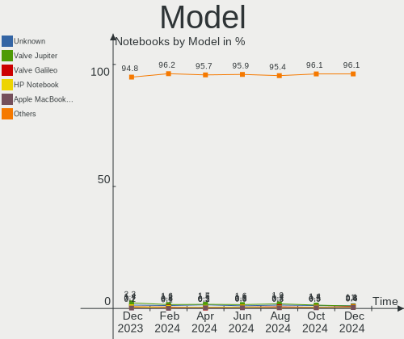

Linux Hardware Trends (Notebook)
--------------------------------

A project to identify most popular hardware characteristics and track their change
over time based on data collected by Linux users at https://Linux-Hardware.org.

Anyone can contribute to the study by uploading probes of their computers by
the [hw-probe](https://github.com/linuxhw/hw-probe) tool:

    sudo hw-probe -all -upload

Full-feature report is available here: https://linux-hardware.org/?view=trends&formfactor=notebook

Period: Dec, 2019.

Contents
--------

- [ OS                       ](#os)
- [ OS Family                ](#os-family)
- [ Kernel                   ](#kernel)
- [ Kernel Family            ](#kernel-family)
- [ Kernel Major Ver.        ](#kernel-major-ver)
- [ Arch                     ](#arch)
- [ DE                       ](#de)
- [ Display Server           ](#display-server)
- [ OS Lang                  ](#os-lang)
- [ Boot Mode                ](#boot-mode)
- [ Filesystem               ](#filesystem)
- [ Dual Boot with Linux     ](#dual-boot-with-linux)
- [ Dual Boot (Win)          ](#dual-boot-win)
- [ Country                  ](#country)
- [ City                     ](#city)
- [ Vendor                   ](#vendor)
- [ Model                    ](#model)
- [ Model Family             ](#model-family)
- [ MFG Year                 ](#mfg-year)
- [ Form Factor              ](#form-factor)
- [ Secure Boot              ](#secure-boot)
- [ Coreboot                 ](#coreboot)
- [ RAM Size                 ](#ram-size)
- [ RAM Used                 ](#ram-used)
- [ Drive Vendor             ](#drive-vendor)
- [ Drive Model              ](#drive-model)
- [ Drive Kind               ](#drive-kind)
- [ Drive Connector          ](#drive-connector)
- [ Drive Size               ](#drive-size)
- [ Space Total              ](#space-total)
- [ Space Used               ](#space-used)
- [ Malfunc. Drives          ](#malfunc-drives)
- [ Malfunc. Drive Vendor    ](#malfunc-drive-vendor)
- [ Malfunc. Drive Kind      ](#malfunc-drive-kind)
- [ Failed Drives            ](#failed-drives)
- [ Failed Drive Vendor      ](#failed-drive-vendor)
- [ Drive Status             ](#drive-status)
- [ CPU Vendor               ](#cpu-vendor)
- [ CPU Model                ](#cpu-model)
- [ CPU Model Family         ](#cpu-model-family)
- [ CPU Cores                ](#cpu-cores)
- [ CPU Sockets              ](#cpu-sockets)
- [ CPU Threads              ](#cpu-threads)
- [ CPU Op-Modes             ](#cpu-op-modes)
- [ CPU Microarch            ](#cpu-microarch)
- [ CPU Microcode            ](#cpu-microcode)
- [ GPU Vendor               ](#gpu-vendor)
- [ GPU Model                ](#gpu-model)
- [ GPU Combo                ](#gpu-combo)
- [ GPU Driver               ](#gpu-driver)
- [ GPU Memory               ](#gpu-memory)
- [ Monitor Vendor           ](#monitor-vendor)
- [ Monitor Model            ](#monitor-model)
- [ Monitor Resolution       ](#monitor-resolution)
- [ Monitor Diagonal         ](#monitor-diagonal)
- [ Monitor Width            ](#monitor-width)
- [ Aspect Ratio             ](#aspect-ratio)
- [ Monitor Area             ](#monitor-area)
- [ Pixel Density            ](#pixel-density)
- [ Multiple Monitors        ](#multiple-monitors)
- [ Net Controller Vendor    ](#net-controller-vendor)
- [ Net Controller Model     ](#net-controller-model)
- [ Net Controller Kind      ](#net-controller-kind)
- [ Used Controller          ](#used-controller)
- [ NICs                     ](#nics)
- [ Unsupported Devices      ](#unsupported-devices)
- [ Unsupported Device Types ](#unsupported-device-types)

OS
--

Installed operating systems

| Name                         | Computers | Percent |
|------------------------------|-----------|---------|
| Ubuntu 18.04                 | 344       | 25.09%  |
| Ubuntu 19.10                 | 159       | 11.6%   |
| ROSA R11                     | 154       | 11.23%  |
| BlackPanther 18.1            | 87        | 6.35%   |
| Fedora 31                    | 72        | 5.25%   |
| Mint 19.2                    | 64        | 4.67%   |
| Endless 3.7.5                | 54        | 3.94%   |
| Mint 19.3                    | 41        | 2.99%   |
| Zorin 15                     | 35        | 2.55%   |
| Ubuntu 19.04                 | 34        | 2.48%   |
| Ubuntu 16.04                 | 29        | 2.12%   |
| Debian 10                    | 24        | 1.75%   |
| Arch                         | 23        | 1.68%   |
| Manjaro 18.1.4               | 20        | 1.46%   |
| Manjaro                      | 19        | 1.39%   |
| Mint 19.1                    | 14        | 1.02%   |
| KDE neon 18.04               | 10        | 0.73%   |
| Elementary 5.1               | 10        | 0.73%   |
| Arch Rolling                 | 10        | 0.73%   |
| ROSA R8.1                    | 9         | 0.66%   |
| Debian                       | 8         | 0.58%   |
| Zorin 12                     | 7         | 0.51%   |
| Ubuntu 20.04                 | 7         | 0.51%   |
| Ubuntu 18.10                 | 7         | 0.51%   |
| Manjaro 18.1.3               | 7         | 0.51%   |
| Solus 4.0                    | 6         | 0.44%   |
| ROSA R10                     | 6         | 0.44%   |
| Mint 18.3                    | 5         | 0.36%   |
| Kali 2019.4                  | 5         | 0.36%   |
| Endless 3.7.4                | 5         | 0.36%   |
| Endless 3.3.19-nexthw1       | 5         | 0.36%   |
| Debian Unstable              | 4         | 0.29%   |
| Debian Testing               | 4         | 0.29%   |
| Mint 19                      | 3         | 0.22%   |
| Gentoo                       | 3         | 0.22%   |
| Fedora 30                    | 3         | 0.22%   |
| Endless 3.7.3                | 3         | 0.22%   |
| Endless 3.5.7-nexthw1        | 3         | 0.22%   |
| Deepin 15.11                 | 3         | 0.22%   |
| CentOS 8                     | 3         | 0.22%   |
| CentOS 7                     | 3         | 0.22%   |
| Parrot 4.7                   | 2         | 0.15%   |
| Manjaro 18.1.5               | 2         | 0.15%   |
| Freedesktop 18.08.38         | 2         | 0.15%   |
| Endless 3.4.3-nexthw1        | 2         | 0.15%   |
| Debian 9.11                  | 2         | 0.15%   |
| CentOS 7.7.1908              | 2         | 0.15%   |
| Void                         | 1         | 0.07%   |
| Ubuntu 6.0                   | 1         | 0.07%   |
| Ubuntu 17.10                 | 1         | 0.07%   |
| Slackware 14.2               | 1         | 0.07%   |
| Scientific 7.7               | 1         | 0.07%   |
| ROSA R12                     | 1         | 0.07%   |
| RHEL 8.0                     | 1         | 0.07%   |
| RED X4                       | 1         | 0.07%   |
| Reborn OS                    | 1         | 0.07%   |
| PureOS 9.0                   | 1         | 0.07%   |
| Peppermint 10                | 1         | 0.07%   |
| Pearl 7                      | 1         | 0.07%   |
| openSUSE Tumbleweed-20191128 | 1         | 0.07%   |

OS Family
---------

OS without a version

| Name         | Computers | Percent |
|--------------|-----------|---------|
| Ubuntu       | 582       | 42.45%  |
| ROSA         | 170       | 12.4%   |
| Mint         | 129       | 9.41%   |
| BlackPanther | 87        | 6.35%   |
| Endless      | 82        | 5.98%   |
| Fedora       | 76        | 5.54%   |
| Manjaro      | 48        | 3.5%    |
| Debian       | 43        | 3.14%   |
| Zorin        | 42        | 3.06%   |
| Arch         | 33        | 2.41%   |
| Elementary   | 11        | 0.8%    |
| KDE neon     | 10        | 0.73%   |
| Clear Linux  | 8         | 0.58%   |
| CentOS       | 8         | 0.58%   |
| Solus        | 6         | 0.44%   |
| Kali         | 5         | 0.36%   |
| openSUSE     | 4         | 0.29%   |
| Gentoo       | 4         | 0.29%   |
| Deepin       | 3         | 0.22%   |
| Parrot       | 2         | 0.15%   |
| Freedesktop  | 2         | 0.15%   |
| EndeavourOS  | 2         | 0.15%   |
| Void         | 1         | 0.07%   |
| Slackware    | 1         | 0.07%   |
| Scientific   | 1         | 0.07%   |
| RHEL         | 1         | 0.07%   |
| RED          | 1         | 0.07%   |
| Reborn OS    | 1         | 0.07%   |
| PureOS       | 1         | 0.07%   |
| Peppermint   | 1         | 0.07%   |
| Pearl        | 1         | 0.07%   |
| MX           | 1         | 0.07%   |
| KaOS         | 1         | 0.07%   |
| Blackarch    | 1         | 0.07%   |
| Arcolinux    | 1         | 0.07%   |
| ALT Linux    | 1         | 0.07%   |

Kernel
------

Version of the Linux kernel

| Version                          | Computers | Percent |
|----------------------------------|-----------|---------|
| 5.0.0-37-generic                 | 255       | 18.6%   |
| 4.15.0-72-generic                | 122       | 8.9%    |
| 5.3.0-24-generic                 | 121       | 8.83%   |
| 5.3.0-23-generic                 | 71        | 5.18%   |
| 4.18.16-desktop-1bP              | 56        | 4.08%   |
| 4.15.0-desktop-68.5rosa-x86_64   | 45        | 3.28%   |
| 4.15.0-desktop-45.1rosa-x86_64   | 40        | 2.92%   |
| 5.0.0-36-generic                 | 34        | 2.48%   |
| 5.1.15-desktop-1bP               | 31        | 2.26%   |
| 4.15.0-70-generic                | 23        | 1.68%   |
| 5.3.16-300.fc31.x86_64           | 22        | 1.6%    |
| 5.0.0-23-generic                 | 22        | 1.6%    |
| 5.4.2-1-MANJARO                  | 17        | 1.24%   |
| 5.3.15-300.fc31.x86_64           | 17        | 1.24%   |
| 4.19.0-6-amd64                   | 16        | 1.17%   |
| 4.9.155-nrj-desktop-1rosa-x86_64 | 15        | 1.09%   |
| 4.15.0-desktop-60.7rosa-x86_64   | 15        | 1.09%   |
| 5.3.0-18-generic                 | 14        | 1.02%   |
| 5.3.12-1-MANJARO                 | 12        | 0.88%   |
| 4.15.0-desktop-68.5rosa-i586     | 12        | 0.88%   |
| 5.0.0-32-generic                 | 11        | 0.8%    |
| 5.3.0-26-generic                 | 10        | 0.73%   |
| 5.3.0-25-generic                 | 10        | 0.73%   |
| 4.15.0-54-generic                | 10        | 0.73%   |
| 5.4.2-arch1-1                    | 9         | 0.66%   |
| 5.3.12-300.fc31.x86_64           | 9         | 0.66%   |
| 4.15.0-desktop-45.1rosa-i586     | 9         | 0.66%   |
| 5.3.13-300.fc31.x86_64           | 8         | 0.58%   |
| 5.3.0-2-amd64                    | 8         | 0.58%   |
| 5.3.15-1-MANJARO                 | 7         | 0.51%   |
| 5.3.0-19-generic                 | 7         | 0.51%   |
| 4.4.0-170-generic                | 6         | 0.44%   |
| 4.18.0-25-generic                | 6         | 0.44%   |
| 4.15.0-1065-oem                  | 6         | 0.44%   |
| 5.4.1-arch1-1                    | 5         | 0.36%   |
| 5.3.14-300.fc31.x86_64           | 5         | 0.36%   |
| 5.3.13-arch1-1                   | 5         | 0.36%   |
| 4.9.155-nrj-desktop-1rosa-i586   | 5         | 0.36%   |
| 4.9.0-11-amd64                   | 5         | 0.36%   |
| 4.15.0-30deepin-generic          | 5         | 0.36%   |
| 4.15.0-20-generic                | 5         | 0.36%   |
| 4.15.0-15-generic                | 5         | 0.36%   |
| 5.3.7-301.fc31.x86_64            | 4         | 0.29%   |
| 4.15.0-74-generic                | 4         | 0.29%   |
| 4.15.0-73-generic                | 4         | 0.29%   |
| 4.15.0-66-generic                | 4         | 0.29%   |
| 4.15.0-65-generic                | 4         | 0.29%   |
| 4.15.0-29-generic                | 4         | 0.29%   |
| 5.4.6-arch1-1                    | 3         | 0.22%   |
| 5.4.5-arch1-1                    | 3         | 0.22%   |
| 5.4.5-300.fc31.x86_64            | 3         | 0.22%   |
| 5.4.0-050400-generic             | 3         | 0.22%   |
| 5.3.0-kali2-amd64                | 3         | 0.22%   |
| 5.3.0-7625-generic               | 3         | 0.22%   |
| 5.3.0-12-generic                 | 3         | 0.22%   |
| 5.0.0-desktop-37.1rosa-x86_64    | 3         | 0.22%   |
| 5.0.0-7-generic                  | 3         | 0.22%   |
| 5.0.0-13-generic                 | 3         | 0.22%   |
| 4.9.60-nrj-desktop-1rosa-x86_64  | 3         | 0.22%   |
| 4.19.85-1-MANJARO                | 3         | 0.22%   |

Kernel Family
-------------

Linux kernel without a distro release

| Version  | Computers | Percent |
|----------|-----------|---------|
| 5.0.0    | 351       | 25.6%   |
| 4.15.0   | 343       | 25.02%  |
| 5.3.0    | 266       | 19.4%   |
| 4.18.16  | 56        | 4.08%   |
| 5.4.2    | 31        | 2.26%   |
| 5.1.15   | 31        | 2.26%   |
| 5.3.12   | 30        | 2.19%   |
| 5.3.15   | 28        | 2.04%   |
| 5.3.16   | 23        | 1.68%   |
| 4.9.155  | 22        | 1.6%    |
| 4.19.0   | 22        | 1.6%    |
| 4.18.0   | 18        | 1.31%   |
| 5.3.13   | 14        | 1.02%   |
| 4.4.0    | 14        | 1.02%   |
| 5.4.6    | 11        | 0.8%    |
| 5.4.1    | 9         | 0.66%   |
| 5.4.5    | 8         | 0.58%   |
| 5.3.14   | 8         | 0.58%   |
| 5.4.0    | 7         | 0.51%   |
| 5.3.7    | 7         | 0.51%   |
| 5.4.3    | 6         | 0.44%   |
| 4.9.0    | 6         | 0.44%   |
| 3.10.0   | 5         | 0.36%   |
| 5.3.8    | 4         | 0.29%   |
| 5.3.11   | 4         | 0.29%   |
| 4.9.60   | 4         | 0.29%   |
| 4.13.0   | 4         | 0.29%   |
| 5.4.4    | 3         | 0.22%   |
| 4.19.85  | 3         | 0.22%   |
| 4.1.38   | 3         | 0.22%   |
| 5.1.0    | 2         | 0.15%   |
| 4.9.9    | 2         | 0.15%   |
| 4.9.124  | 2         | 0.15%   |
| 4.19.91  | 2         | 0.15%   |
| 4.19.65  | 2         | 0.15%   |
| 4.16.0   | 2         | 0.15%   |
| 5.5.0    | 1         | 0.07%   |
| 5.3.9    | 1         | 0.07%   |
| 5.3.10   | 1         | 0.07%   |
| 5.3.1    | 1         | 0.07%   |
| 5.2.2    | 1         | 0.07%   |
| 5.2.0    | 1         | 0.07%   |
| 4.9.20   | 1         | 0.07%   |
| 4.8.17   | 1         | 0.07%   |
| 4.19.88  | 1         | 0.07%   |
| 4.19.87  | 1         | 0.07%   |
| 4.19.80  | 1         | 0.07%   |
| 4.19.53  | 1         | 0.07%   |
| 4.19.3   | 1         | 0.07%   |
| 4.17.0   | 1         | 0.07%   |
| 4.16.18  | 1         | 0.07%   |
| 4.14.141 | 1         | 0.07%   |
| 4.12.14  | 1         | 0.07%   |
| 4.10.0   | 1         | 0.07%   |

Kernel Major Ver.
-----------------

Linux kernel major version

| Version | Computers | Percent |
|---------|-----------|---------|
| 5.3     | 387       | 28.23%  |
| 5.0     | 351       | 25.6%   |
| 4.15    | 343       | 25.02%  |
| 5.4     | 75        | 5.47%   |
| 4.18    | 74        | 5.4%    |
| 4.9     | 37        | 2.7%    |
| 4.19    | 34        | 2.48%   |
| 5.1     | 33        | 2.41%   |
| 4.4     | 14        | 1.02%   |
| 3.10    | 5         | 0.36%   |
| 4.13    | 4         | 0.29%   |
| 4.16    | 3         | 0.22%   |
| 4.1     | 3         | 0.22%   |
| 5.2     | 2         | 0.15%   |
| 5.5     | 1         | 0.07%   |
| 4.8     | 1         | 0.07%   |
| 4.17    | 1         | 0.07%   |
| 4.14    | 1         | 0.07%   |
| 4.12    | 1         | 0.07%   |
| 4.10    | 1         | 0.07%   |

Arch
----

OS architecture (x86_64, i586, etc.)

| Name   | Computers | Percent |
|--------|-----------|---------|
| x86_64 | 1274      | 92.92%  |
| i686   | 97        | 7.08%   |

DE
--

Desktop Environment

| Name                      | Computers | Percent |
|---------------------------|-----------|---------|
| GNOME                     | 568       | 41.43%  |
| KDE5                      | 255       | 18.6%   |
| Unknown                   | 193       | 14.08%  |
| XFCE                      | 109       | 7.95%   |
| X-Cinnamon                | 71        | 5.18%   |
| MATE                      | 43        | 3.14%   |
| KDE                       | 30        | 2.19%   |
| Cinnamon                  | 26        | 1.9%    |
| Unity                     | 23        | 1.68%   |
| LXQt                      | 13        | 0.95%   |
| Pantheon                  | 10        | 0.73%   |
| Deepin                    | 7         | 0.51%   |
| Budgie                    | 6         | 0.44%   |
| LXDE                      | 4         | 0.29%   |
| GNOME-Classic:GNOME       | 4         | 0.29%   |
| KDE4                      | 3         | 0.22%   |
| GNOME Flashback           | 3         | 0.22%   |
| openbox                   | 1         | 0.07%   |
| Lubuntu                   | 1         | 0.07%   |
| communitheme:ubuntu:GNOME | 1         | 0.07%   |

Display Server
--------------

X11 or Wayland

| Name    | Computers | Percent |
|---------|-----------|---------|
| X11     | 720       | 52.52%  |
| Unknown | 613       | 44.71%  |
| Wayland | 38        | 2.77%   |

OS Lang
-------

Language

| Lang        | Computers | Percent |
|-------------|-----------|---------|
| Unknown     | 460       | 33.55%  |
| en_US       | 303       | 22.1%   |
| de_DE       | 81        | 5.91%   |
| pt_BR       | 62        | 4.52%   |
| ru_RU       | 56        | 4.08%   |
| it_IT       | 42        | 3.06%   |
| en_GB       | 42        | 3.06%   |
| es_ES       | 30        | 2.19%   |
| fr_FR       | 27        | 1.97%   |
| pl_PL       | 22        | 1.6%    |
| en_CA       | 20        | 1.46%   |
| en_US.utf8  | 19        | 1.39%   |
| en_IN       | 18        | 1.31%   |
| pt_BR.utf8  | 17        | 1.24%   |
| hu_HU       | 12        | 0.88%   |
| en_AU       | 11        | 0.8%    |
| C           | 11        | 0.8%    |
| pt_PT       | 9         | 0.66%   |
| es_MX       | 7         | 0.51%   |
| de_AT       | 7         | 0.51%   |
| zh_CN       | 6         | 0.44%   |
| tr_TR       | 6         | 0.44%   |
| ro_RO       | 6         | 0.44%   |
| en_ZA       | 6         | 0.44%   |
| de_CH       | 6         | 0.44%   |
| cs_CZ       | 6         | 0.44%   |
| ru_UA       | 5         | 0.36%   |
| nl_NL       | 5         | 0.36%   |
| es_AR       | 5         | 0.36%   |
| el_GR       | 5         | 0.36%   |
| ja_JP       | 4         | 0.29%   |
| es_CL       | 4         | 0.29%   |
| en_NZ       | 4         | 0.29%   |
| sk_SK       | 3         | 0.22%   |
| nl_BE       | 3         | 0.22%   |
| fr_CA       | 3         | 0.22%   |
| en_IN       | 3         | 0.22%   |
| en_IE       | 3         | 0.22%   |
| zh_TW       | 2         | 0.15%   |
| sv_SE       | 2         | 0.15%   |
| sr_RS@latin | 2         | 0.15%   |
| fr_BE       | 2         | 0.15%   |
| fi_FI       | 2         | 0.15%   |
| en_SG       | 2         | 0.15%   |
| ca_ES       | 2         | 0.15%   |
| zh_HK       | 1         | 0.07%   |
| uk_UA       | 1         | 0.07%   |
| sl_SI       | 1         | 0.07%   |
| ru_RU.utf8  | 1         | 0.07%   |
| pl_PL.utf8  | 1         | 0.07%   |
| nl_BE.utf8  | 1         | 0.07%   |
| nb_NO       | 1         | 0.07%   |
| lv_LV       | 1         | 0.07%   |
| ko_KR       | 1         | 0.07%   |
| id_ID       | 1         | 0.07%   |
| es_VE       | 1         | 0.07%   |
| es_US       | 1         | 0.07%   |
| es_NI       | 1         | 0.07%   |
| es_CO       | 1         | 0.07%   |
| en_NZ.utf8  | 1         | 0.07%   |

Boot Mode
---------

EFI or BIOS

| Mode | Computers | Percent |
|------|-----------|---------|
| BIOS | 722       | 52.66%  |
| EFI  | 649       | 47.34%  |

Filesystem
----------

Type of filesystem

| Type    | Computers | Percent |
|---------|-----------|---------|
| Ext4    | 1284      | 93.65%  |
| Overlay | 26        | 1.9%    |
| Btrfs   | 24        | 1.75%   |
| Xfs     | 19        | 1.39%   |
| Ext2    | 6         | 0.44%   |
| Ext3    | 5         | 0.36%   |
| Zfs     | 2         | 0.15%   |
| Tmpfs   | 2         | 0.15%   |
| Unknown | 2         | 0.15%   |
| F2fs    | 1         | 0.07%   |

Dual Boot with Linux
--------------------

Hosting more than one Linux

| Dual boot | Computers | Percent |
|-----------|-----------|---------|
| No        | 1227      | 89.5%   |
| Yes       | 144       | 10.5%   |

Dual Boot (Win)
---------------

Hosting Linux and Windows

| Dual boot | Computers | Percent |
|-----------|-----------|---------|
| No        | 999       | 72.87%  |
| Yes       | 372       | 27.13%  |

Country
-------

Geographic location (country)

| Country            | Computers | Percent |
|--------------------|-----------|---------|
| Russia             | 212       | 15.46%  |
| USA                | 162       | 11.82%  |
| Germany            | 120       | 8.75%   |
| Brazil             | 97        | 7.08%   |
| Hungary            | 81        | 5.91%   |
| Italy              | 57        | 4.16%   |
| France             | 53        | 3.87%   |
| UK                 | 42        | 3.06%   |
| Spain              | 39        | 2.84%   |
| Poland             | 36        | 2.63%   |
| India              | 35        | 2.55%   |
| Canada             | 34        | 2.48%   |
| Ukraine            | 31        | 2.26%   |
| Netherlands        | 20        | 1.46%   |
| Romania            | 19        | 1.39%   |
| Czech Republic     | 16        | 1.17%   |
| Belarus            | 16        | 1.17%   |
| Australia          | 16        | 1.17%   |
| Mexico             | 14        | 1.02%   |
| China              | 14        | 1.02%   |
| Austria            | 13        | 0.95%   |
| Switzerland        | 12        | 0.88%   |
| Portugal           | 12        | 0.88%   |
| Bulgaria           | 12        | 0.88%   |
| Turkey             | 10        | 0.73%   |
| Serbia             | 9         | 0.66%   |
| Greece             | 9         | 0.66%   |
| South Africa       | 8         | 0.58%   |
| Slovakia           | 8         | 0.58%   |
| New Zealand        | 8         | 0.58%   |
| Sweden             | 7         | 0.51%   |
| Japan              | 7         | 0.51%   |
| Belgium            | 7         | 0.51%   |
| Ireland            | 6         | 0.44%   |
| Colombia           | 6         | 0.44%   |
| Philippines        | 5         | 0.36%   |
| Iran               | 5         | 0.36%   |
| Indonesia          | 5         | 0.36%   |
| Egypt              | 5         | 0.36%   |
| Cyprus             | 5         | 0.36%   |
| Thailand           | 4         | 0.29%   |
| Singapore          | 4         | 0.29%   |
| Norway             | 4         | 0.29%   |
| Malaysia           | 4         | 0.29%   |
| Latvia             | 4         | 0.29%   |
| Croatia            | 4         | 0.29%   |
| Chile              | 4         | 0.29%   |
| Argentina          | 4         | 0.29%   |
| Tunisia            | 3         | 0.22%   |
| Kazakhstan         | 3         | 0.22%   |
| Israel             | 3         | 0.22%   |
| Finland            | 3         | 0.22%   |
| Denmark            | 3         | 0.22%   |
| Bangladesh         | 3         | 0.22%   |
| Taiwan             | 2         | 0.15%   |
| Saudi Arabia       | 2         | 0.15%   |
| Morocco            | 2         | 0.15%   |
| Lithuania          | 2         | 0.15%   |
| Korea, Republic of | 2         | 0.15%   |
| Jordan             | 2         | 0.15%   |

City
----

Geographic location (city)

| City           | Computers | Percent |
|----------------|-----------|---------|
| Moscow         | 56        | 4.08%   |
| Budapest       | 27        | 1.97%   |
| St Petersburg  | 18        | 1.31%   |
| São Paulo     | 11        | 0.8%    |
| Berlin         | 11        | 0.8%    |
| Warsaw         | 10        | 0.73%   |
| Vienna         | 10        | 0.73%   |
| Minsk          | 10        | 0.73%   |
| Paris          | 9         | 0.66%   |
| Rome           | 8         | 0.58%   |
| Sofia          | 7         | 0.51%   |
| Munich         | 7         | 0.51%   |
| Bengaluru      | 7         | 0.51%   |
| Vogue          | 6         | 0.44%   |
| Rostov-on-Don  | 6         | 0.44%   |
| Rio de Janeiro | 6         | 0.44%   |
| Novosibirsk    | 6         | 0.44%   |
| Bucharest      | 6         | 0.44%   |
| Belgrade       | 6         | 0.44%   |
| Auckland       | 6         | 0.44%   |
| Athens         | 6         | 0.44%   |
| Nuremberg      | 5         | 0.36%   |
| Kyiv           | 5         | 0.36%   |
| Krasnodar      | 5         | 0.36%   |
| Brasília      | 5         | 0.36%   |
| Yekaterinburg  | 4         | 0.29%   |
| Wrocław       | 4         | 0.29%   |
| Prague         | 4         | 0.29%   |
| Montreal       | 4         | 0.29%   |
| Miskolc        | 4         | 0.29%   |
| Madrid         | 4         | 0.29%   |
| Lviv           | 4         | 0.29%   |
| Leipzig        | 4         | 0.29%   |
| Kharkiv        | 4         | 0.29%   |
| Hamburg        | 4         | 0.29%   |
| Győr          | 4         | 0.29%   |
| Fortaleza      | 4         | 0.29%   |
| Debrecen       | 4         | 0.29%   |
| Campinas       | 4         | 0.29%   |
| Amsterdam      | 4         | 0.29%   |
| Zagreb         | 3         | 0.22%   |
| Yakutsk        | 3         | 0.22%   |
| Volgograd      | 3         | 0.22%   |
| Volgodonsk     | 3         | 0.22%   |
| Ufa            | 3         | 0.22%   |
| Toronto        | 3         | 0.22%   |
| Tehran         | 3         | 0.22%   |
| Stockholm      | 3         | 0.22%   |
| Singapore      | 3         | 0.22%   |
| Saratov        | 3         | 0.22%   |
| Santo André   | 3         | 0.22%   |
| Santiago       | 3         | 0.22%   |
| Regensburg     | 3         | 0.22%   |
| Pittsburgh     | 3         | 0.22%   |
| Penza          | 3         | 0.22%   |
| Mumbai         | 3         | 0.22%   |
| Mexico City    | 3         | 0.22%   |
| Kemerovo       | 3         | 0.22%   |
| Kaposvár      | 3         | 0.22%   |
| Jacksonville   | 3         | 0.22%   |

Vendor
------

Motherboard manufacturer

| Name                     | Computers | Percent |
|--------------------------|-----------|---------|
| Lenovo                   | 275       | 20.06%  |
| Hewlett-Packard          | 257       | 18.75%  |
| Dell                     | 202       | 14.73%  |
| ASUSTek Computer         | 166       | 12.11%  |
| Acer                     | 153       | 11.16%  |
| Toshiba                  | 46        | 3.36%   |
| Samsung Electronics      | 37        | 2.7%    |
| Sony                     | 26        | 1.9%    |
| Apple                    | 23        | 1.68%   |
| MSI                      | 18        | 1.31%   |
| Notebook                 | 14        | 1.02%   |
| Packard Bell             | 12        | 0.88%   |
| Medion                   | 11        | 0.8%    |
| Fujitsu                  | 10        | 0.73%   |
| Positivo                 | 8         | 0.58%   |
| HUAWEI                   | 7         | 0.51%   |
| Gateway                  | 7         | 0.51%   |
| Unknown                  | 7         | 0.51%   |
| TUXEDO                   | 5         | 0.36%   |
| LG Electronics           | 5         | 0.36%   |
| Fujitsu Siemens          | 5         | 0.36%   |
| eMachines                | 5         | 0.36%   |
| Timi                     | 4         | 0.29%   |
| Quanta                   | 3         | 0.22%   |
| Pegatron                 | 3         | 0.22%   |
| Panasonic                | 3         | 0.22%   |
| Google                   | 3         | 0.22%   |
| Digibras                 | 3         | 0.22%   |
| Compal                   | 3         | 0.22%   |
| Clevo                    | 3         | 0.22%   |
| Akstron                  | 3         | 0.22%   |
| NEC Computers            | 2         | 0.15%   |
| Multilaser Industrial SA | 2         | 0.15%   |
| Insyde                   | 2         | 0.15%   |
| Digma                    | 2         | 0.15%   |
| DEXP                     | 2         | 0.15%   |
| Chuwi                    | 2         | 0.15%   |
| whyopencomputing         | 1         | 0.07%   |
| VIT                      | 1         | 0.07%   |
| System76                 | 1         | 0.07%   |
| SLIMBOOK                 | 1         | 0.07%   |
| Semp Toshiba             | 1         | 0.07%   |
| Purism                   | 1         | 0.07%   |
| Prestigio                | 1         | 0.07%   |
| Philco                   | 1         | 0.07%   |
| OEM                      | 1         | 0.07%   |
| Novastar                 | 1         | 0.07%   |
| MTC                      | 1         | 0.07%   |
| MINIX                    | 1         | 0.07%   |
| Mediacom                 | 1         | 0.07%   |
| MECHREVO                 | 1         | 0.07%   |
| Maibenben                | 1         | 0.07%   |
| LDLC                     | 1         | 0.07%   |
| Itronix                  | 1         | 0.07%   |
| Itautec                  | 1         | 0.07%   |
| Intel                    | 1         | 0.07%   |
| IDEALMAX                 | 1         | 0.07%   |
| Howard Computers         | 1         | 0.07%   |
| GPD                      | 1         | 0.07%   |
| Fusion5                  | 1         | 0.07%   |

Model
-----

Motherboard model

| Name                               | Computers | Percent |
|------------------------------------|-----------|---------|
| Unknown                            | 22        | 1.6%    |
| Pavilion g6                        | 9         | 0.66%   |
| Pavilion 15                        | 9         | 0.66%   |
| Nitro AN515-52                     | 9         | 0.66%   |
| Pavilion dv7                       | 8         | 0.58%   |
| Notebook                           | 8         | 0.58%   |
| Latitude E7450                     | 6         | 0.44%   |
| Laptop 15-db0xxx                   | 6         | 0.44%   |
| IdeaPad 330-15AST 81D6             | 6         | 0.44%   |
| XPS 15 9570                        | 5         | 0.36%   |
| Pavilion dv6                       | 5         | 0.36%   |
| Laptop 15-da0xxx                   | 5         | 0.36%   |
| Inspiron 7520                      | 5         | 0.36%   |
| IdeaPad 330-15IKB 81DE             | 5         | 0.36%   |
| G50-70 20351                       | 5         | 0.36%   |
| Aspire A315-53                     | 5         | 0.36%   |
| 255 G7 Notebook PC                 | 5         | 0.36%   |
| XPS 13 9380                        | 4         | 0.29%   |
| VivoBook 15_ASUS Laptop X540UAR    | 4         | 0.29%   |
| Pavilion Notebook                  | 4         | 0.29%   |
| Latitude E5470                     | 4         | 0.29%   |
| Laptop 15-bw0xx                    | 4         | 0.29%   |
| Laptop 15-bs0xx                    | 4         | 0.29%   |
| Inspiron 3542                      | 4         | 0.29%   |
| Inspiron 15-3567                   | 4         | 0.29%   |
| G62                                | 4         | 0.29%   |
| G50-30 80G0                        | 4         | 0.29%   |
| Extensa 5620                       | 4         | 0.29%   |
| EliteBook 840 G6                   | 4         | 0.29%   |
| Aspire E5-553G                     | 4         | 0.29%   |
| Aspire A315-21                     | 4         | 0.29%   |
| 300V3A/300V4A/300V5A/200A4B/200A5B | 4         | 0.29%   |
| 15                                 | 4         | 0.29%   |
| ZenBook UX431DA_UM431DA            | 3         | 0.22%   |
| Z50-70 20354                       | 3         | 0.22%   |
| XPS 13 9370                        | 3         | 0.22%   |
| X556UQK                            | 3         | 0.22%   |
| X553MA                             | 3         | 0.22%   |
| X550MJ                             | 3         | 0.22%   |
| Vostro 3550                        | 3         | 0.22%   |
| V145-15AST 81MT                    | 3         | 0.22%   |
| S14CT01                            | 3         | 0.22%   |
| ProBook 6550b                      | 3         | 0.22%   |
| ProBook 650 G1                     | 3         | 0.22%   |
| Pavilion g7                        | 3         | 0.22%   |
| Pavilion g4                        | 3         | 0.22%   |
| Pavilion 17                        | 3         | 0.22%   |
| MacBookPro8,1                      | 3         | 0.22%   |
| Latitude E6540                     | 3         | 0.22%   |
| Latitude E6510                     | 3         | 0.22%   |
| Latitude E6420                     | 3         | 0.22%   |
| Latitude E6410                     | 3         | 0.22%   |
| Latitude E4310                     | 3         | 0.22%   |
| Inspiron 3583                      | 3         | 0.22%   |
| Inspiron 1525                      | 3         | 0.22%   |
| IdeaPad L340-15API 81LW            | 3         | 0.22%   |
| IdeaPad FLEX-14API 81SS            | 3         | 0.22%   |
| IdeaPad 700-15ISK 80RU             | 3         | 0.22%   |
| IdeaPad 100-15IBD 80QQ             | 3         | 0.22%   |
| G580 20150                         | 3         | 0.22%   |

Model Family
------------

Motherboard model prefix

| Name                        | Computers | Percent |
|-----------------------------|-----------|---------|
| Lenovo ThinkPad             | 127       | 9.26%   |
| Acer Aspire                 | 112       | 8.17%   |
| Dell Inspiron               | 84        | 6.13%   |
| HP Pavilion                 | 67        | 4.89%   |
| Lenovo IdeaPad              | 65        | 4.74%   |
| Dell Latitude               | 64        | 4.67%   |
| Toshiba Satellite           | 41        | 2.99%   |
| HP EliteBook                | 38        | 2.77%   |
| HP ProBook                  | 37        | 2.7%    |
| HP Laptop                   | 35        | 2.55%   |
| ASUS VivoBook               | 26        | 1.9%    |
| Dell XPS                    | 24        | 1.75%   |
| Unknown                     | 22        | 1.6%    |
| HP Compaq                   | 14        | 1.02%   |
| Acer Nitro                  | 12        | 0.88%   |
| HP ENVY                     | 11        | 0.8%    |
| Packard Bell EasyNote       | 10        | 0.73%   |
| Dell Precision              | 10        | 0.73%   |
| Fujitsu LIFEBOOK            | 9         | 0.66%   |
| Dell Studio                 | 9         | 0.66%   |
| ASUS ZenBook                | 9         | 0.66%   |
| HP Notebook                 | 8         | 0.58%   |
| HP 255                      | 7         | 0.51%   |
| Dell Vostro                 | 7         | 0.51%   |
| Acer TravelMate             | 6         | 0.44%   |
| Acer Swift                  | 6         | 0.44%   |
| Samsung Electronics 300V3A  | 5         | 0.36%   |
| Lenovo G50-70               | 5         | 0.36%   |
| HP ZBook                    | 5         | 0.36%   |
| HP 250                      | 5         | 0.36%   |
| HP 15                       | 5         | 0.36%   |
| ASUS TUF                    | 5         | 0.36%   |
| Acer Extensa                | 5         | 0.36%   |
| Lenovo G580                 | 4         | 0.29%   |
| Lenovo G50-30               | 4         | 0.29%   |
| HP OMEN                     | 4         | 0.29%   |
| HP G62                      | 4         | 0.29%   |
| Samsung Electronics 350V5C  | 3         | 0.22%   |
| Positivo S14CT01            | 3         | 0.22%   |
| Lenovo Z50-70               | 3         | 0.22%   |
| Lenovo V145-15AST           | 3         | 0.22%   |
| Lenovo Legion               | 3         | 0.22%   |
| Lenovo G570                 | 3         | 0.22%   |
| Lenovo G50-45               | 3         | 0.22%   |
| Lenovo B570e                | 3         | 0.22%   |
| Lenovo B560                 | 3         | 0.22%   |
| Lenovo 3000                 | 3         | 0.22%   |
| Fujitsu Siemens AMILO       | 3         | 0.22%   |
| Dell G3                     | 3         | 0.22%   |
| ASUS X556UQK                | 3         | 0.22%   |
| ASUS X553MA                 | 3         | 0.22%   |
| ASUS X550MJ                 | 3         | 0.22%   |
| Apple MacBookPro8           | 3         | 0.22%   |
| Apple MacBookPro5           | 3         | 0.22%   |
| Akstron G1417               | 3         | 0.22%   |
| Timi TM1701                 | 2         | 0.15%   |
| Samsung Electronics R540    | 2         | 0.15%   |
| Samsung Electronics N250P   | 2         | 0.15%   |
| Samsung Electronics N150P   | 2         | 0.15%   |
| Samsung Electronics 300E5EV | 2         | 0.15%   |

MFG Year
--------

Motherboard manufacture year

| Year | Computers | Percent |
|------|-----------|---------|
| 2019 | 307       | 22.39%  |
| 2018 | 179       | 13.06%  |
| 2013 | 112       | 8.17%   |
| 2011 | 111       | 8.1%    |
| 2012 | 97        | 7.08%   |
| 2014 | 90        | 6.56%   |
| 2016 | 86        | 6.27%   |
| 2017 | 80        | 5.84%   |
| 2010 | 79        | 5.76%   |
| 2015 | 76        | 5.54%   |
| 2009 | 59        | 4.3%    |
| 2008 | 50        | 3.65%   |
| 2007 | 29        | 2.12%   |
| 2006 | 7         | 0.51%   |
| 2005 | 7         | 0.51%   |
| 2004 | 1         | 0.07%   |
| 2003 | 1         | 0.07%   |

Form Factor
-----------

Physical design of the computer

| Name     | Computers | Percent |
|----------|-----------|---------|
| Notebook | 1371      | 100%    |

Secure Boot
-----------

Enabled or disabled

| State    | Computers | Percent |
|----------|-----------|---------|
| Disabled | 996       | 72.65%  |
| Unknown  | 255       | 18.6%   |
| Enabled  | 120       | 8.75%   |

Coreboot
--------

Have coreboot on board

| Used | Computers | Percent |
|------|-----------|---------|
| No   | 1364      | 99.49%  |
| Yes  | 7         | 0.51%   |

RAM Size
--------

Total RAM memory

| Size in GB  | Computers | Percent |
|-------------|-----------|---------|
| 3.01-4.0    | 424       | 30.93%  |
| 4.01-8.0    | 364       | 26.55%  |
| 8.01-16.0   | 212       | 15.46%  |
| 16.01-24.0  | 149       | 10.87%  |
| 1.01-2.0    | 110       | 8.02%   |
| 32.01-64.0  | 50        | 3.65%   |
| 2.01-3.0    | 37        | 2.7%    |
| 0.01-1.0    | 18        | 1.31%   |
| 24.01-32.0  | 3         | 0.22%   |
| 64.01-256.0 | 3         | 0.22%   |
| Unknown     | 1         | 0.07%   |

RAM Used
--------

Used RAM memory

| Used GB    | Computers | Percent |
|------------|-----------|---------|
| 1.01-2.0   | 536       | 39.1%   |
| 2.01-3.0   | 312       | 22.76%  |
| 0.01-1.0   | 252       | 18.38%  |
| 3.01-4.0   | 134       | 9.77%   |
| 4.01-8.0   | 119       | 8.68%   |
| 8.01-16.0  | 16        | 1.17%   |
| 24.01-32.0 | 1         | 0.07%   |
| Unknown    | 1         | 0.07%   |

Drive Vendor
------------

Hard drive vendors

| Vendor              | Computers | Drives  | Percent |
|---------------------|-----------|---------|---------|
| WDC                 | 269       | 276     | 17.49%  |
| Seagate             | 235       | 240     | 15.28%  |
| Toshiba             | 173       | 174     | 11.25%  |
| Samsung Electronics | 167       | 175     | 10.86%  |
| Hitachi             | 88        | 89      | 5.72%   |
| Unknown             | 78        | 88      | 5.07%   |
| Kingston            | 74        | 75      | 4.81%   |
| SanDisk             | 71        | 76      | 4.62%   |
| HGST                | 59        | 61      | 3.84%   |
| Crucial             | 46        | 46      | 2.99%   |
| Intel               | 37        | 38      | 2.41%   |
| A-DATA Technology   | 26        | 26      | 1.69%   |
| SK Hynix            | 21        | 21      | 1.37%   |
| Fujitsu             | 17        | 17      | 1.11%   |
| Micron Technology   | 14        | 14      | 0.91%   |
| China               | 12        | 13      | 0.78%   |
| SPCC                | 11        | 11      | 0.72%   |
| LITEON              | 11        | 11      | 0.72%   |
| Transcend           | 10        | 10      | 0.65%   |
| HL-DT-ST            | 9         | Unknown | 0.59%   |
| Apple               | 9         | 9       | 0.59%   |
| LITEONIT            | 7         | 8       | 0.46%   |
| Patriot             | 6         | 6       | 0.39%   |
| GOODRAM             | 6         | 6       | 0.39%   |
| PNY                 | 5         | 5       | 0.33%   |
| PLEXTOR             | 5         | 5       | 0.33%   |
| OCZ                 | 5         | 5       | 0.33%   |
| Team                | 4         | 4       | 0.26%   |
| KingDian            | 4         | 4       | 0.26%   |
| Intenso             | 4         | 5       | 0.26%   |
| Gigabyte Technology | 4         | 4       | 0.26%   |
| KingSpec            | 3         | 3       | 0.2%    |
| Hewlett-Packard     | 3         | 3       | 0.2%    |
| Corsair             | 3         | 3       | 0.2%    |
| ASMT                | 3         | 4       | 0.2%    |
| Zheino              | 2         | 2       | 0.13%   |
| SABRENT             | 2         | 2       | 0.13%   |
| JMicron             | 2         | 2       | 0.13%   |
| Generic             | 2         | 2       | 0.13%   |
| DREVO               | 2         | 2       | 0.13%   |
| Apacer              | 2         | 2       | 0.13%   |
| WDC WD75            | 1         | 1       | 0.07%   |
| WD MediaMax         | 1         | 1       | 0.07%   |
| Vi550               | 1         | 1       | 0.07%   |
| Verbatim            | 1         | 1       | 0.07%   |
| TCSUNBOW            | 1         | 1       | 0.07%   |
| StoreJet            | 1         | 1       | 0.07%   |
| SMART               | 1         | 1       | 0.07%   |
| SILICONMOTION       | 1         | 1       | 0.07%   |
| Phison              | 1         | 1       | 0.07%   |
| oyunkey             | 1         | 1       | 0.07%   |
| OCZ-VERTEX3         | 1         | 1       | 0.07%   |
| Netac               | 1         | 1       | 0.07%   |
| Maxtor 6            | 1         | 1       | 0.07%   |
| Longline            | 1         | 1       | 0.07%   |
| Lexar               | 1         | 1       | 0.07%   |
| Lenovo              | 1         | 1       | 0.07%   |
| LDLC                | 1         | 1       | 0.07%   |
| KINGMAX             | 1         | 1       | 0.07%   |
| HUAWEI              | 1         | 1       | 0.07%   |

Drive Model
-----------

Hard drive models

| Model                        | Computers | Percent |
|------------------------------|-----------|---------|
| ST1000LM035-1RK172 1TB       | 31        | 1.96%   |
| MQ01ABF050 500GB             | 29        | 1.84%   |
| MQ01ABD100 1TB               | 29        | 1.84%   |
| ST1000LM024 HN-M101MBB 1TB   | 25        | 1.58%   |
| WD10SPZX-21Z10T0 1TB         | 23        | 1.46%   |
| ST500LT012-1DG142 500GB      | 21        | 1.33%   |
| MQ04ABF100 1TB               | 17        | 1.08%   |
| HTS721010A9E630 1TB          | 14        | 0.89%   |
| HTS545050A7E680 500GB        | 14        | 0.89%   |
| ST9500325AS 500GB            | 13        | 0.82%   |
| SSD 850 EVO 250GB            | 13        | 0.82%   |
| SA400S37240G 240GB SSD       | 12        | 0.76%   |
| WD10JPVX-22JC3T0 1TB         | 11        | 0.7%    |
| SSD 860 EVO 500GB            | 11        | 0.7%    |
| SA400S37120G 120GB SSD       | 11        | 0.7%    |
| MQ01ABD050 500GB             | 11        | 0.7%    |
| MMC Card  4GB                | 11        | 0.7%    |
| HTS545050A7E380 500GB        | 11        | 0.7%    |
| SSD 850 EVO 500GB            | 10        | 0.63%   |
| WD5000LPCX-24VHAT0 500GB     | 9         | 0.57%   |
| HTS547575A9E384 752GB        | 9         | 0.57%   |
| HTS547550A9E384 500GB        | 9         | 0.57%   |
| HTS545050B9A300 500GB        | 9         | 0.57%   |
| DVDRAM GUC0N 1GB             | 9         | 0.57%   |
| WDS240G2G0A-00JH30 240GB SSD | 8         | 0.51%   |
| WD10SPZX-75Z10T2 1TB         | 8         | 0.51%   |
| ST9320423AS 320GB            | 8         | 0.51%   |
| ST500LM021-1KJ152 500GB      | 8         | 0.51%   |
| IM2S3338-128GD2 128GB SSD    | 8         | 0.51%   |
| Expansion 2TB                | 8         | 0.51%   |
| ST500LT012-9WS142 500GB      | 7         | 0.44%   |
| CT240BX500SSD1 240GB         | 7         | 0.44%   |
| SV300S37A120G 120GB SSD      | 6         | 0.38%   |
| ST9320325AS 320GB            | 6         | 0.38%   |
| ST9250315AS 250GB            | 6         | 0.38%   |
| SATA 120GB SSD               | 6         | 0.38%   |
| MQ01ABD075 750GB             | 6         | 0.38%   |
| MQ01ABD032 320GB             | 6         | 0.38%   |
| WDS120G2G0A-00JH30 120GB SSD | 5         | 0.32%   |
| WD5000LPVX-75V0TT0 500GB     | 5         | 0.32%   |
| WD10JPVX-60JC3T0 1TB         | 5         | 0.32%   |
| ST750LM022 HN-M750MBB 750GB  | 5         | 0.32%   |
| ST500LM012 HN-M500MBB 500GB  | 5         | 0.32%   |
| ST2000LX001-1RG174 2TB       | 5         | 0.32%   |
| SSDPEKKF512G8L 512GB         | 5         | 0.32%   |
| SSD 860 EVO 250GB            | 5         | 0.32%   |
| SDSSDH3512G 512GB            | 5         | 0.32%   |
| SA400S37480G 480GB SSD       | 5         | 0.32%   |
| HTS725050A7E630 500GB        | 5         | 0.32%   |
| HTS543232A7A384 320GB        | 5         | 0.32%   |
| HTS541010B7E610 1TB          | 5         | 0.32%   |
| CT500MX500SSD1 500GB         | 5         | 0.32%   |
| CT120BX500SSD1 120GB         | 5         | 0.32%   |
| WD5000LPCX-24C6HT0 500GB     | 4         | 0.25%   |
| WD5000LPCX-21VHAT0 500GB     | 4         | 0.25%   |
| WD3200BPVT-22ZEST0 320GB     | 4         | 0.25%   |
| WD2500BEVT-22A23T0 250GB     | 4         | 0.25%   |
| WD10SPZX-60Z10T0 1TB         | 4         | 0.25%   |
| WD10SPZX-24Z10 1TB           | 4         | 0.25%   |
| SV300S37A240G 240GB SSD      | 4         | 0.25%   |

Drive Kind
----------

HDD or SSD

| Kind    | Computers | Drives | Percent |
|---------|-----------|--------|---------|
| HDD     | 794       | 822    | 52.97%  |
| SSD     | 521       | 558    | 34.76%  |
| NVMe    | 78        | 80     | 5.2%    |
| MMC     | 76        | 90     | 5.07%   |
| Unknown | 30        | 24     | 2%      |

Drive Connector
---------------

SATA, SAS, NVMe, etc.

| Type | Computers | Drives | Percent |
|------|-----------|--------|---------|
| SATA | 1184      | 1367   | 85.73%  |
| NVMe | 78        | 80     | 5.65%   |
| MMC  | 76        | 90     | 5.5%    |
| SAS  | 43        | 37     | 3.11%   |

Drive Size
----------

Size of hard drive

| Size in TB | Computers | Drives | Percent |
|------------|-----------|--------|---------|
| 0.01-0.5   | 997       | 1131   | 69.82%  |
| 0.51-1.0   | 379       | 391    | 26.54%  |
| 1.01-2.0   | 45        | 45     | 3.15%   |
| 3.01-4.0   | 4         | 4      | 0.28%   |
| 2.01-3.0   | 1         | 1      | 0.07%   |
| 4.01-10.0  | 1         | 1      | 0.07%   |
| Unknown    | 1         | 1      | 0.07%   |

Space Total
-----------

Amount of disk space available on the file system

| Size in GB     | Computers | Percent |
|----------------|-----------|---------|
| 101-250        | 467       | 34.06%  |
| 251-500        | 346       | 25.24%  |
| 501-1000       | 208       | 15.17%  |
| 51-100         | 113       | 8.24%   |
| 21-50          | 85        | 6.2%    |
| 1-20           | 56        | 4.08%   |
| 1001-2000      | 44        | 3.21%   |
| Unknown        | 26        | 1.9%    |
| More than 3000 | 14        | 1.02%   |
| 2001-3000      | 12        | 0.88%   |

Space Used
----------

Amount of used disk space

| Used GB        | Computers | Percent |
|----------------|-----------|---------|
| 1-20           | 617       | 45%     |
| 21-50          | 231       | 16.85%  |
| 51-100         | 177       | 12.91%  |
| 101-250        | 174       | 12.69%  |
| 251-500        | 80        | 5.84%   |
| 501-1000       | 50        | 3.65%   |
| Unknown        | 26        | 1.9%    |
| 1001-2000      | 13        | 0.95%   |
| More than 3000 | 3         | 0.22%   |

Malfunc. Drives
---------------

Drive models with a malfunction

| Model                       | Computers | Drives | Percent |
|-----------------------------|-----------|--------|---------|
| HTS545050A7E680 500GB       | 6         | 6      | 4.76%   |
| ST9500325AS 500GB           | 5         | 5      | 3.97%   |
| ST9250315AS 250GB           | 3         | 3      | 2.38%   |
| MQ01ABF050 500GB            | 3         | 3      | 2.38%   |
| MQ01ABD032 320GB            | 3         | 3      | 2.38%   |
| HTS545050A7E380 500GB       | 3         | 3      | 2.38%   |
| ST9320423AS 320GB           | 2         | 2      | 1.59%   |
| ST9320325AS 320GB           | 2         | 2      | 1.59%   |
| ST500LT012-9WS142 500GB     | 2         | 2      | 1.59%   |
| ST320LT020-9YG142 320GB     | 2         | 2      | 1.59%   |
| ST1000LM035-1RK172 1TB      | 2         | 2      | 1.59%   |
| ST1000LM024 HN-M101MBB 1TB  | 2         | 2      | 1.59%   |
| SA400S37120G 120GB SSD      | 2         | 2      | 1.59%   |
| MQ01ABD100 1TB              | 2         | 2      | 1.59%   |
| MQ01ABD050 500GB            | 2         | 2      | 1.59%   |
| MK3259GSXP 320GB            | 2         | 2      | 1.59%   |
| HTS547575A9E384 752GB       | 2         | 2      | 1.59%   |
| HTS547564A9E384 640GB       | 2         | 2      | 1.59%   |
| HTS541010A9E680 1TB         | 2         | 2      | 1.59%   |
| HN-M500MBB 500GB            | 2         | 2      | 1.59%   |
| XM11 128GB-V2 SSD           | 1         | 1      | 0.79%   |
| WD800BEVS-07RST0 80GB       | 1         | 1      | 0.79%   |
| WD5000LPVX-80V0TT0 500GB    | 1         | 1      | 0.79%   |
| WD5000LPCX-60VHAT0 500GB    | 1         | 1      | 0.79%   |
| WD5000LPCX-24C6HT0 500GB    | 1         | 1      | 0.79%   |
| WD5000BPVT-55HXZT3 500GB    | 1         | 1      | 0.79%   |
| WD5000BEVT-75A0RT0 500GB    | 1         | 1      | 0.79%   |
| WD5000BEVT-22ZAT0 500GB     | 1         | 1      | 0.79%   |
| WD3200BEVT-80A0RT0 320GB    | 1         | 1      | 0.79%   |
| WD2500LPCX-24C6HT0 250GB    | 1         | 1      | 0.79%   |
| WD2500BEVT-35A23T0 250GB    | 1         | 1      | 0.79%   |
| WD2500BEVT-3 250GB          | 1         | 1      | 0.79%   |
| WD2500BEKT-60PVMT0 250GB    | 1         | 1      | 0.79%   |
| WD1600BEVS-07RST0 160GB     | 1         | 1      | 0.79%   |
| THNSNJ25 256GB SSD          | 1         | 1      | 0.79%   |
| SV300S37A120G 120GB SSD     | 1         | 1      | 0.79%   |
| ST98823AS 80GB              | 1         | 1      | 0.79%   |
| ST980811AS 80GB             | 1         | 1      | 0.79%   |
| ST9320320AS 320GB           | 1         | 1      | 0.79%   |
| ST9160827AS 160GB           | 1         | 1      | 0.79%   |
| ST9160821AS 160GB           | 1         | 1      | 0.79%   |
| ST9160314AS 160GB           | 1         | 1      | 0.79%   |
| ST9100822A 100GB            | 1         | 1      | 0.79%   |
| ST750LM022 HN-M750MBB 750GB | 1         | 1      | 0.79%   |
| ST500LT012-9WS14 500GB      | 1         | 1      | 0.79%   |
| ST500LT012-1DG142 500GB     | 1         | 1      | 0.79%   |
| ST320LT012-9WS14 320GB      | 1         | 1      | 0.79%   |
| ST320LT007-9ZV142 320GB     | 1         | 1      | 0.79%   |
| ST1000LM024 HN-M 1TB        | 1         | 1      | 0.79%   |
| ST1000LM014-SSHD-8GB        | 1         | 1      | 0.79%   |
| SSDSA1M160G2HP 160GB        | 1         | 1      | 0.79%   |
| SSDMAEXC024G3H 24GB         | 1         | 1      | 0.79%   |
| SSD 960 PRO 2TB             | 1         | 1      | 0.79%   |
| SP900 128GB SSD             | 1         | 1      | 0.79%   |
| SD9SN8W128G1102 128GB SSD   | 1         | 1      | 0.79%   |
| SC311 SATA 512GB SSD        | 1         | 1      | 0.79%   |
| PA25-128 128GB SSD          | 1         | 1      | 0.79%   |
| P3-128 128GB SSD            | 1         | 1      | 0.79%   |
| MQ01ABD075 750GB            | 1         | 1      | 0.79%   |
| MK8037GSX 80GB              | 1         | 1      | 0.79%   |

Malfunc. Drive Vendor
---------------------

Vendors of faulty drives

| Vendor              | Computers | Drives | Percent |
|---------------------|-----------|--------|---------|
| Seagate             | 34        | 34     | 27.87%  |
| Toshiba             | 25        | 25     | 20.49%  |
| Hitachi             | 17        | 18     | 13.93%  |
| WDC                 | 12        | 13     | 9.84%   |
| HGST                | 10        | 11     | 8.2%    |
| Samsung Electronics | 8         | 8      | 6.56%   |
| Kingston            | 3         | 3      | 2.46%   |
| SK Hynix            | 2         | 2      | 1.64%   |
| KingSpec            | 2         | 2      | 1.64%   |
| Intel               | 2         | 2      | 1.64%   |
| A-DATA Technology   | 2         | 2      | 1.64%   |
| Zheino              | 1         | 1      | 0.82%   |
| SanDisk             | 1         | 1      | 0.82%   |
| LITEONIT            | 1         | 2      | 0.82%   |
| Fujitsu             | 1         | 1      | 0.82%   |
| Crucial             | 1         | 1      | 0.82%   |

Malfunc. Drive Kind
-------------------

Kinds of faulty drives

| Kind | Computers | Drives | Percent |
|------|-----------|--------|---------|
| HDD  | 103       | 108    | 85.83%  |
| SSD  | 15        | 16     | 12.5%   |
| NVMe | 2         | 2      | 1.67%   |

Failed Drives
-------------

Failed drive models

| Model                    | Computers | Drives | Percent |
|--------------------------|-----------|--------|---------|
| WD2500BEVT-22A23T0 250GB | 1         | 1      | 33.33%  |
| WD1600BEVT-22ZCT0 160GB  | 1         | 1      | 33.33%  |
| HTS54322 250GB           | 1         | 1      | 33.33%  |

Failed Drive Vendor
-------------------

Failed drive vendors

| Vendor  | Computers | Drives | Percent |
|---------|-----------|--------|---------|
| WDC     | 2         | 2      | 66.67%  |
| Hitachi | 1         | 1      | 33.33%  |

Drive Status
------------

Number of failed and malfunc. drives

| Status   | Computers | Drives | Percent |
|----------|-----------|--------|---------|
| Detected | 851       | 1013   | 63.37%  |
| Works    | 369       | 432    | 27.48%  |
| Malfunc  | 120       | 126    | 8.94%   |
| Failed   | 3         | 3      | 0.22%   |

CPU Vendor
----------

Processor vendors

| Vendor       | Computers | Percent |
|--------------|-----------|---------|
| Intel        | 1180      | 86.07%  |
| AMD          | 189       | 13.79%  |
| CentaurHauls | 2         | 0.15%   |

CPU Model
---------

Processor models

| Model                                         | Computers | Percent |
|-----------------------------------------------|-----------|---------|
| Intel Core i7-8565U CPU @ 1.80GHz             | 34        | 2.48%   |
| Intel Core i7-8750H CPU @ 2.20GHz             | 31        | 2.26%   |
| Intel Core i5-8250U CPU @ 1.60GHz             | 29        | 2.12%   |
| Intel Core i5-2520M CPU @ 2.50GHz             | 25        | 1.82%   |
| Intel Core i7-8550U CPU @ 1.80GHz             | 24        | 1.75%   |
| Intel Core i5-7200U CPU @ 2.50GHz             | 24        | 1.75%   |
| Intel Core i7-9750H CPU @ 2.60GHz             | 19        | 1.39%   |
| Intel Core i5-8265U CPU @ 1.60GHz             | 17        | 1.24%   |
| Intel Celeron CPU N2840 @ 2.16GHz             | 16        | 1.17%   |
| Intel Celeron N4000 CPU @ 1.10GHz             | 15        | 1.09%   |
| Intel Core i7-6700HQ CPU @ 2.60GHz            | 14        | 1.02%   |
| Intel Core i5-4210U CPU @ 1.70GHz             | 14        | 1.02%   |
| Intel Core i3-6006U CPU @ 2.00GHz             | 13        | 0.95%   |
| Intel Core i3 CPU M 370 @ 2.40GHz             | 13        | 0.95%   |
| Intel Celeron CPU N3060 @ 1.60GHz             | 13        | 0.95%   |
| Intel Core i7-7700HQ CPU @ 2.80GHz            | 12        | 0.88%   |
| Intel Core i5-3210M CPU @ 2.50GHz             | 12        | 0.88%   |
| Intel Core i5-2450M CPU @ 2.50GHz             | 12        | 0.88%   |
| AMD Ryzen 5 3500U with Radeon Vega Mobile Gfx | 12        | 0.88%   |
| AMD Ryzen 5 2500U with Radeon Vega Mobile Gfx | 12        | 0.88%   |
| Intel Core i5 CPU M 520 @ 2.40GHz             | 11        | 0.8%    |
| Intel Core i7-2670QM CPU @ 2.20GHz            | 10        | 0.73%   |
| Intel Core i5-6200U CPU @ 2.30GHz             | 10        | 0.73%   |
| Intel Core i5-3320M CPU @ 2.60GHz             | 10        | 0.73%   |
| Intel Core i3-2350M CPU @ 2.30GHz             | 10        | 0.73%   |
| Intel Atom x5-Z8350 CPU @ 1.44GHz             | 10        | 0.73%   |
| Intel Pentium CPU N3540 @ 2.16GHz             | 9         | 0.66%   |
| Intel Core i5-5200U CPU @ 2.20GHz             | 9         | 0.66%   |
| Intel Core i5-4200U CPU @ 1.60GHz             | 9         | 0.66%   |
| Intel Core i5-3230M CPU @ 2.60GHz             | 9         | 0.66%   |
| Intel Core i3-2310M CPU @ 2.10GHz             | 9         | 0.66%   |
| Intel Celeron CPU N3350 @ 1.10GHz             | 9         | 0.66%   |
| AMD A4-9125 RADEON R3, 4 COMPUTE CORES 2C+2G  | 9         | 0.66%   |
| Intel Core i5-4200M CPU @ 2.50GHz             | 8         | 0.58%   |
| Intel Core i5-3337U CPU @ 1.80GHz             | 8         | 0.58%   |
| Intel Core i5-2430M CPU @ 2.40GHz             | 8         | 0.58%   |
| Intel Core i5-2410M CPU @ 2.30GHz             | 8         | 0.58%   |
| Intel Core i3-7020U CPU @ 2.30GHz             | 8         | 0.58%   |
| Intel Core i3-5005U CPU @ 2.00GHz             | 8         | 0.58%   |
| Intel Core i3-3217U CPU @ 1.80GHz             | 8         | 0.58%   |
| Intel Core i3-3110M CPU @ 2.40GHz             | 8         | 0.58%   |
| Intel Core 2 Duo CPU P8600 @ 2.40GHz          | 8         | 0.58%   |
| Intel Atom CPU N270 @ 1.60GHz                 | 8         | 0.58%   |
| Intel Pentium CPU N3710 @ 1.60GHz             | 7         | 0.51%   |
| Intel Pentium CPU B940 @ 2.00GHz              | 7         | 0.51%   |
| Intel Core i7-7500U CPU @ 2.70GHz             | 7         | 0.51%   |
| Intel Core i7-4510U CPU @ 2.00GHz             | 7         | 0.51%   |
| Intel Core i7-3630QM CPU @ 2.40GHz            | 7         | 0.51%   |
| Intel Core i7-3612QM CPU @ 2.10GHz            | 7         | 0.51%   |
| Intel Core i5 CPU M 480 @ 2.67GHz             | 7         | 0.51%   |
| Intel Core i3 CPU M 380 @ 2.53GHz             | 7         | 0.51%   |
| AMD A6-4400M APU with Radeon HD Graphics      | 7         | 0.51%   |
| Intel Pentium Dual-Core CPU T4500 @ 2.30GHz   | 6         | 0.44%   |
| Intel Pentium CPU B960 @ 2.20GHz              | 6         | 0.44%   |
| Intel Pentium CPU B950 @ 2.10GHz              | 6         | 0.44%   |
| Intel Core i7-8665U CPU @ 1.90GHz             | 6         | 0.44%   |
| Intel Core i7-8650U CPU @ 1.90GHz             | 6         | 0.44%   |
| Intel Core i7-5600U CPU @ 2.60GHz             | 6         | 0.44%   |
| Intel Core i7-5500U CPU @ 2.40GHz             | 6         | 0.44%   |
| Intel Core i7-4710HQ CPU @ 2.50GHz            | 6         | 0.44%   |

CPU Model Family
----------------

Processor model prefix

| Model                                | Computers | Percent |
|--------------------------------------|-----------|---------|
| Intel Core i5                        | 334       | 24.36%  |
| Intel Core i7                        | 311       | 22.68%  |
| Intel Core i3                        | 145       | 10.58%  |
| Intel Celeron                        | 100       | 7.29%   |
| Intel Core 2 Duo                     | 83        | 6.05%   |
| Intel Pentium                        | 71        | 5.18%   |
| Intel Atom                           | 50        | 3.65%   |
| AMD A6                               | 29        | 2.12%   |
| AMD Ryzen 5                          | 26        | 1.9%    |
| AMD A4                               | 21        | 1.53%   |
| Intel Pentium Dual-Core              | 18        | 1.31%   |
| Intel Core 2                         | 14        | 1.02%   |
| AMD E1                               | 14        | 1.02%   |
| AMD A10                              | 14        | 1.02%   |
| Intel Pentium Dual                   | 12        | 0.88%   |
| Intel Celeron M                      | 11        | 0.8%    |
| Intel Genuine                        | 10        | 0.73%   |
| AMD A8                               | 10        | 0.73%   |
| AMD Ryzen 3                          | 9         | 0.66%   |
| AMD E2                               | 8         | 0.58%   |
| Other                                | 7         | 0.51%   |
| AMD E                                | 6         | 0.44%   |
| Intel Core i9                        | 5         | 0.36%   |
| AMD Turion 64 X2 Mobile              | 5         | 0.36%   |
| AMD Phenom II                        | 5         | 0.36%   |
| Intel Pentium M                      | 4         | 0.29%   |
| AMD Ryzen 7                          | 4         | 0.29%   |
| Intel Pentium Silver                 | 3         | 0.22%   |
| Intel Celeron Dual-Core              | 3         | 0.22%   |
| AMD Turion 64 Mobile                 | 3         | 0.22%   |
| AMD Ryzen 5 PRO                      | 3         | 0.22%   |
| AMD Athlon II                        | 3         | 0.22%   |
| AMD Athlon                           | 3         | 0.22%   |
| AMD A12                              | 3         | 0.22%   |
| Intel Core Duo                       | 2         | 0.15%   |
| AMD FX                               | 2         | 0.15%   |
| AMD Athlon X2                        | 2         | 0.15%   |
| AMD Athlon II Dual-Core              | 2         | 0.15%   |
| AMD Athlon 64 X2                     | 2         | 0.15%   |
| Intel Pentium 4                      | 1         | 0.07%   |
| Intel Core M                         | 1         | 0.07%   |
| Intel Core 2 Solo                    | 1         | 0.07%   |
| Intel Core 2 Quad                    | 1         | 0.07%   |
| CentaurHauls VIA Nano                | 1         | 0.07%   |
| CentaurHauls VIA C7                  | 1         | 0.07%   |
| AMD Turion X2 Ultra Dual-Core Mobile | 1         | 0.07%   |
| AMD Turion X2 Dual-Core Mobile       | 1         | 0.07%   |
| AMD Turion II Dual-Core              | 1         | 0.07%   |
| AMD Turion II                        | 1         | 0.07%   |
| AMD Mobile Sempron                   | 1         | 0.07%   |
| AMD C-50                             | 1         | 0.07%   |
| AMD Athlon Neo X2                    | 1         | 0.07%   |
| AMD Athlon 64                        | 1         | 0.07%   |

CPU Cores
---------

Number of processor cores

| Number | Computers | Percent |
|--------|-----------|---------|
| 2      | 863       | 62.95%  |
| 4      | 383       | 27.94%  |
| 1      | 63        | 4.6%    |
| 6      | 57        | 4.16%   |
| 8      | 4         | 0.29%   |
| 3      | 1         | 0.07%   |

CPU Sockets
-----------

Number of sockets

| Number | Computers | Percent |
|--------|-----------|---------|
| 1      | 1371      | 100%    |

CPU Threads
-----------

Threads per core (Hyper-Threading)

| Number | Computers | Percent |
|--------|-----------|---------|
| 2      | 890       | 64.92%  |
| 1      | 481       | 35.08%  |

CPU Op-Modes
------------

CPU Operation Modes (32-bit, 64-bit)

| Op mode        | Computers | Percent |
|----------------|-----------|---------|
| 32-bit, 64-bit | 1326      | 96.72%  |
| 32-bit         | 33        | 2.41%   |
| Unknown        | 12        | 0.88%   |

CPU Microarch
-------------

Microarchitecture

| Name            | Computers | Percent |
|-----------------|-----------|---------|
| Skylake         | 282       | 20.57%  |
| SandyBridge     | 145       | 10.58%  |
| Core            | 135       | 9.85%   |
| IvyBridge       | 129       | 9.41%   |
| Haswell         | 117       | 8.53%   |
| Silvermont      | 89        | 6.49%   |
| Westmere        | 82        | 5.98%   |
| KabyLake        | 62        | 4.52%   |
| Excavator       | 45        | 3.28%   |
| Broadwell       | 38        | 2.77%   |
| Bonnell         | 26        | 1.9%    |
| Zen+            | 25        | 1.82%   |
| P6              | 21        | 1.53%   |
| Goldmont plus   | 19        | 1.39%   |
| Zen             | 18        | 1.31%   |
| Puma            | 18        | 1.31%   |
| Piledriver      | 18        | 1.31%   |
| K8 Hammer       | 14        | 1.02%   |
| Goldmont        | 13        | 0.95%   |
| Bobcat          | 13        | 0.95%   |
| K10             | 12        | 0.88%   |
| Jaguar          | 12        | 0.88%   |
| Penryn          | 10        | 0.73%   |
| K10 Llano       | 8         | 0.58%   |
| Nehalem         | 6         | 0.44%   |
| K8 & K10 hybrid | 5         | 0.36%   |
| Unknown         | 4         | 0.29%   |
| Icelake         | 2         | 0.15%   |
| Steamroller     | 1         | 0.07%   |
| NetBurst        | 1         | 0.07%   |
| CometLake       | 1         | 0.07%   |

CPU Microcode
-------------

Microcode number

| Number     | Computers | Percent |
|------------|-----------|---------|
| Unknown    | 166       | 12.11%  |
| 0x206a7    | 135       | 9.85%   |
| 0x306a9    | 112       | 8.17%   |
| 0x20655    | 59        | 4.3%    |
| 0x806ea    | 58        | 4.23%   |
| 0x40651    | 56        | 4.08%   |
| 0x1067a    | 55        | 4.01%   |
| 0x906ea    | 45        | 3.28%   |
| 0x806ec    | 41        | 2.99%   |
| 0x306c3    | 41        | 2.99%   |
| 0x806e9    | 38        | 2.77%   |
| 0x406e3    | 38        | 2.77%   |
| 0x306d4    | 33        | 2.41%   |
| 0x30678    | 33        | 2.41%   |
| 0x406c4    | 31        | 2.26%   |
| 0x6fd      | 29        | 2.12%   |
| 0x06006705 | 26        | 1.9%    |
| 0x806eb    | 25        | 1.82%   |
| 0x10676    | 25        | 1.82%   |
| 0x506e3    | 22        | 1.6%    |
| 0x08108102 | 22        | 1.6%    |
| 0x906e9    | 18        | 1.31%   |
| 0x706a1    | 18        | 1.31%   |
| 0x06001119 | 18        | 1.31%   |
| 0x20652    | 17        | 1.24%   |
| 0x406c3    | 13        | 0.95%   |
| 0x106ca    | 13        | 0.95%   |
| 0x07030105 | 13        | 0.95%   |
| 0x506c9    | 12        | 0.88%   |
| 0x0810100b | 11        | 0.8%    |
| 0x05000119 | 11        | 0.8%    |
| 0x6f6      | 10        | 0.73%   |
| 0x106c2    | 10        | 0.73%   |
| 0x6d8      | 9         | 0.66%   |
| 0x0700010f | 9         | 0.66%   |
| 0x010000c8 | 8         | 0.58%   |
| 0x03000027 | 7         | 0.51%   |
| 0x6fb      | 6         | 0.44%   |
| 0x106e5    | 6         | 0.44%   |
| 0x06006704 | 6         | 0.44%   |
| 0x6e8      | 5         | 0.36%   |
| 0x10661    | 5         | 0.36%   |
| 0x08101007 | 5         | 0.36%   |
| 0x0600611a | 5         | 0.36%   |
| 0x706e5    | 4         | 0.29%   |
| 0x6f2      | 4         | 0.29%   |
| 0x6ec      | 4         | 0.29%   |
| 0x06006118 | 4         | 0.29%   |
| 0x906ed    | 3         | 0.22%   |
| 0x30673    | 3         | 0.22%   |
| 0x30661    | 3         | 0.22%   |
| 0x02000032 | 3         | 0.22%   |
| 0x40661    | 2         | 0.15%   |
| 0x08108109 | 2         | 0.15%   |
| 0x07030106 | 2         | 0.15%   |
| 0x02000057 | 2         | 0.15%   |
| 0xf29      | 1         | 0.07%   |
| 0xa0660    | 1         | 0.07%   |
| 0x906ec    | 1         | 0.07%   |
| 0x6fa      | 1         | 0.07%   |

GPU Vendor
----------

Vendors of graphics cards

| Vendor                           | Computers | Percent |
|----------------------------------|-----------|---------|
| Intel                            | 1044      | 60.35%  |
| Nvidia                           | 358       | 20.69%  |
| AMD                              | 321       | 18.55%  |
| Silicon Integrated Systems [SiS] | 4         | 0.23%   |
| VIA Technologies                 | 2         | 0.12%   |
| ATI Technologies                 | 1         | 0.06%   |

GPU Model
---------

Graphics card models

| Model                                                                              | Computers | Percent |
|------------------------------------------------------------------------------------|-----------|---------|
| 2nd Generation Core Processor Family Integrated Graphics Controller                | 128       | 7.06%   |
| 3rd Gen Core processor Graphics Controller                                         | 121       | 6.67%   |
| Haswell-ULT Integrated Graphics Controller                                         | 67        | 3.69%   |
| UHD Graphics 620 (Whiskey Lake)                                                    | 66        | 3.64%   |
| UHD Graphics 620                                                                   | 64        | 3.53%   |
| Core Processor Integrated Graphics Controller                                      | 63        | 3.47%   |
| UHD Graphics 630 (Mobile)                                                          | 57        | 3.14%   |
| Mobile 4 Series Chipset Integrated Graphics Controller                             | 57        | 3.14%   |
| Atom/Celeron/Pentium Processor x5-E8000/J3xxx/N3xxx Integrated Graphics Controller | 49        | 2.7%    |
| 4th Gen Core Processor Integrated Graphics Controller                              | 43        | 2.37%   |
| HD Graphics 620                                                                    | 41        | 2.26%   |
| Atom Processor Z36xxx/Z37xxx Series Graphics & Display                             | 40        | 2.21%   |
| Skylake GT2 [HD Graphics 520]                                                      | 36        | 1.98%   |
| HD Graphics 5500                                                                   | 35        | 1.93%   |
| Stoney [Radeon R2/R3/R4/R5 Graphics]                                               | 32        | 1.76%   |
| Mobile 945GM/GMS/GME, 943/940GML Express Integrated Graphics Controller            | 26        | 1.43%   |
| Picasso                                                                            | 25        | 1.38%   |
| Mobile GM965/GL960 Integrated Graphics Controller (secondary)                      | 24        | 1.32%   |
| Mobile GM965/GL960 Integrated Graphics Controller (primary)                        | 24        | 1.32%   |
| Topaz XT [Radeon R7 M260/M265 / M340/M360 / M440/M445 / 530/535 / 620/625 Mobile]  | 23        | 1.27%   |
| HD Graphics 530                                                                    | 20        | 1.1%    |
| GP107M [GeForce GTX 1050 Mobile]                                                   | 20        | 1.1%    |
| GF117M [GeForce 610M/710M/810M/820M / GT 620M/625M/630M/720M]                      | 20        | 1.1%    |
| UHD Graphics 605                                                                   | 19        | 1.05%   |
| Raven Ridge [Radeon Vega Series / Radeon Vega Mobile Series]                       | 18        | 0.99%   |
| Seymour [Radeon HD 6400M/7400M Series]                                             | 17        | 0.94%   |
| GP108M [GeForce MX150]                                                             | 17        | 0.94%   |
| HD Graphics 630                                                                    | 16        | 0.88%   |
| GP107M [GeForce GTX 1050 Ti Mobile]                                                | 16        | 0.88%   |
| Mobile 945GM/GMS, 943/940GML Express Integrated Graphics Controller                | 14        | 0.77%   |
| GP106M [GeForce GTX 1060 Mobile]                                                   | 14        | 0.77%   |
| Wani [Radeon R5/R6/R7 Graphics]                                                    | 13        | 0.72%   |
| Sun XT [Radeon HD 8670A/8670M/8690M / R5 M330 / M430 / Radeon 520 Mobile]          | 13        | 0.72%   |
| Atom Processor D4xx/D5xx/N4xx/N5xx Integrated Graphics Controller                  | 13        | 0.72%   |
| Park [Mobility Radeon HD 5430/5450/5470]                                           | 12        | 0.66%   |
| Mobile 945GSE Express Integrated Graphics Controller                               | 12        | 0.66%   |
| GM108M [GeForce 840M]                                                              | 11        | 0.61%   |
| UHD Graphics                                                                       | 10        | 0.55%   |
| TU117M [GeForce GTX 1650 Mobile / Max-Q]                                           | 10        | 0.55%   |
| HD Graphics 500                                                                    | 10        | 0.55%   |
| GM108M [GeForce 940MX]                                                             | 10        | 0.55%   |
| GF108M [GeForce GT 540M]                                                           | 10        | 0.55%   |
| GT218M [GeForce 310M]                                                              | 9         | 0.5%    |
| Thames [Radeon HD 7500M/7600M Series]                                              | 8         | 0.44%   |
| Mullins [Radeon R4/R5 Graphics]                                                    | 8         | 0.44%   |
| GM107M [GeForce GTX 960M]                                                          | 8         | 0.44%   |
| Trinity 2 [Radeon HD 7520G]                                                        | 7         | 0.39%   |
| RV620/M82 [Mobility Radeon HD 3450/3470]                                           | 7         | 0.39%   |
| Madison [Mobility Radeon HD 5650/5750 / 6530M/6550M]                               | 7         | 0.39%   |
| GM108M [GeForce MX130]                                                             | 7         | 0.39%   |
| GM107M [GeForce GTX 950M]                                                          | 7         | 0.39%   |
| GK208M [GeForce GT 740M]                                                           | 7         | 0.39%   |
| Thames [Radeon HD 7550M/7570M/7650M]                                               | 6         | 0.33%   |
| Sumo [Radeon HD 6520G]                                                             | 6         | 0.33%   |
| RS880M [Mobility Radeon HD 4225/4250]                                              | 6         | 0.33%   |
| Mullins [Radeon R2 Graphics]                                                       | 6         | 0.33%   |
| Mobile 915GM/GMS/910GML Express Graphics Controller                                | 6         | 0.33%   |
| Jet PRO [Radeon R5 M230 / R7 M260DX / Radeon 520 Mobile]                           | 6         | 0.33%   |
| GP108M [GeForce MX250]                                                             | 6         | 0.33%   |
| GP108M [GeForce MX230]                                                             | 6         | 0.33%   |

GPU Combo
---------

Combinations of graphics cards

| Name           | Computers | Percent |
|----------------|-----------|---------|
| 1 x Intel      | 689       | 50.26%  |
| Intel + Nvidia | 265       | 19.33%  |
| 1 x AMD        | 195       | 14.22%  |
| Intel + AMD    | 88        | 6.42%   |
| 1 x Nvidia     | 87        | 6.35%   |
| 2 x AMD        | 33        | 2.41%   |
| AMD + Nvidia   | 6         | 0.44%   |
| 1 x SiS        | 4         | 0.29%   |
| Other          | 2         | 0.15%   |
| 1 x VIA        | 2         | 0.15%   |

GPU Driver
----------

Free vs proprietary

| Driver      | Computers | Percent |
|-------------|-----------|---------|
| Free        | 1190      | 86.8%   |
| Proprietary | 145       | 10.58%  |
| Unknown     | 36        | 2.63%   |

GPU Memory
----------

Total video memory

| Size in GB | Computers | Percent |
|------------|-----------|---------|
| Unknown    | 671       | 48.94%  |
| 1.01-2.0   | 289       | 21.08%  |
| 0.01-0.5   | 208       | 15.17%  |
| 3.01-4.0   | 92        | 6.71%   |
| 0.51-1.0   | 85        | 6.2%    |
| 5.01-6.0   | 18        | 1.31%   |
| 7.01-8.0   | 5         | 0.36%   |
| 2.01-3.0   | 3         | 0.22%   |

Monitor Vendor
--------------

Monitor vendors

| Vendor                                | Computers | Percent |
|---------------------------------------|-----------|---------|
| AU Optronics                          | 328       | 22.37%  |
| LG Display                            | 234       | 15.96%  |
| Chimei Innolux                        | 177       | 12.07%  |
| Samsung Electronics                   | 172       | 11.73%  |
| BOE                                   | 160       | 10.91%  |
| Chi Mei Optoelectronics               | 58        | 3.96%   |
| Lenovo                                | 38        | 2.59%   |
| Dell                                  | 26        | 1.77%   |
| Apple                                 | 25        | 1.71%   |
| Hewlett-Packard                       | 24        | 1.64%   |
| Sharp                                 | 22        | 1.5%    |
| Goldstar                              | 20        | 1.36%   |
| LG Philips                            | 19        | 1.3%    |
| InfoVision                            | 15        | 1.02%   |
| Philips                               | 13        | 0.89%   |
| PANDA                                 | 12        | 0.82%   |
| CPT                                   | 9         | 0.61%   |
| Ancor Communications                  | 9         | 0.61%   |
| HannStar                              | 7         | 0.48%   |
| BenQ                                  | 7         | 0.48%   |
| AOC                                   | 7         | 0.48%   |
| LGD                                   | 6         | 0.41%   |
| NEC Computers                         | 5         | 0.34%   |
| Acer                                  | 5         | 0.34%   |
| Unknown                               | 4         | 0.27%   |
| CMN                                   | 4         | 0.27%   |
| Toshiba                               | 3         | 0.2%    |
| Sony                                  | 3         | 0.2%    |
| Seiko/Epson                           | 3         | 0.2%    |
| Lenovo Group Limited                  | 3         | 0.2%    |
| ___                                   | 2         | 0.14%   |
| Vizio                                 | 2         | 0.14%   |
| ViewSonic                             | 2         | 0.14%   |
| TCL                                   | 2         | 0.14%   |
| Panasonic                             | 2         | 0.14%   |
| Medion                                | 2         | 0.14%   |
| JDI                                   | 2         | 0.14%   |
| InnoLux Display                       | 2         | 0.14%   |
| CHI                                   | 2         | 0.14%   |
| Vestel Elektronik                     | 1         | 0.07%   |
| UTV                                   | 1         | 0.07%   |
| Unknown (AAA)                         | 1         | 0.07%   |
| Toshiba Matsushita Display Technology | 1         | 0.07%   |
| TM@                                   | 1         | 0.07%   |
| TIANMA XM                             | 1         | 0.07%   |
| STD                                   | 1         | 0.07%   |
| Sceptre Tech                          | 1         | 0.07%   |
| Quanta Display                        | 1         | 0.07%   |
| Onkyo                                 | 1         | 0.07%   |
| Nvidia                                | 1         | 0.07%   |
| NOV                                   | 1         | 0.07%   |
| MTX                                   | 1         | 0.07%   |
| MTD                                   | 1         | 0.07%   |
| MStar                                 | 1         | 0.07%   |
| Medion Akoya                          | 1         | 0.07%   |
| LPL                                   | 1         | 0.07%   |
| LOE                                   | 1         | 0.07%   |
| ITE                                   | 1         | 0.07%   |
| Iiyama                                | 1         | 0.07%   |
| IBM                                   | 1         | 0.07%   |

Monitor Model
-------------

Monitor models

| Model                                              | Computers | Percent |
|----------------------------------------------------|-----------|---------|
| LCD Monitor AUO38ED 1920x1080 340x190mm 15.3-inch  | 24        | 1.62%   |
| LCD Monitor SEC5441 1366x768 344x194mm 15.5-inch   | 18        | 1.21%   |
| LCD Monitor CMN15DB 1366x768 344x193mm 15.5-inch   | 18        | 1.21%   |
| LCD Monitor AUO61ED 1920x1080 340x190mm 15.3-inch  | 16        | 1.08%   |
| LCD Monitor LGD033A 1366x768 340x190mm 15.3-inch   | 15        | 1.01%   |
| LCD Monitor AUO71EC 1366x768 340x190mm 15.3-inch   | 15        | 1.01%   |
| LCD Monitor LGD02DC 1366x768 344x194mm 15.5-inch   | 14        | 0.94%   |
| LCD Monitor CMN15D5 1920x1080 340x190mm 15.3-inch  | 12        | 0.81%   |
| LCD Monitor AUO22EC 1366x768 344x193mm 15.5-inch   | 11        | 0.74%   |
| LCD Monitor 1920x1080                              | 11        | 0.74%   |
| LCD Monitor CMO15A7 1366x768 350x190mm 15.7-inch   | 10        | 0.67%   |
| LCD Monitor CMN14D4 1920x1080 309x173mm 13.9-inch  | 10        | 0.67%   |
| LCD Monitor BOE0687 1920x1080 344x193mm 15.5-inch  | 10        | 0.67%   |
| LCD Monitor BOE0672 1366x768 344x194mm 15.5-inch   | 10        | 0.67%   |
| LCD Monitor AUO45EC 1366x768 340x190mm 15.3-inch   | 10        | 0.67%   |
| LCD Monitor AUO70EC 1366x768 340x190mm 15.3-inch   | 8         | 0.54%   |
| LCD Monitor AUO21ED 1920x1080 344x194mm 15.5-inch  | 8         | 0.54%   |
| LCD Monitor LEN40B0 1366x768 344x194mm 15.5-inch   | 7         | 0.47%   |
| LCD Monitor CMO1592 1366x768 344x193mm 15.5-inch   | 7         | 0.47%   |
| LCD Monitor CMN15DC 1366x768 344x193mm 15.5-inch   | 7         | 0.47%   |
| LCD Monitor CMN1132 1366x768 260x140mm 11.6-inch   | 7         | 0.47%   |
| LCD Monitor BOE06A5 1366x768 344x194mm 15.5-inch   | 7         | 0.47%   |
| LCD Monitor AUO26EC 1366x768 344x193mm 15.5-inch   | 7         | 0.47%   |
| LCD Monitor AUO10EC 1366x768 340x190mm 15.3-inch   | 7         | 0.47%   |
| LCD Monitor CMO15A3 1366x768 344x193mm 15.5-inch   | 6         | 0.4%    |
| LCD Monitor CMN1735 1920x1080 382x215mm 17.3-inch  | 6         | 0.4%    |
| LCD Monitor CMN15B7 1366x768 340x190mm 15.3-inch   | 6         | 0.4%    |
| LCD Monitor BOE061D 1366x768 309x173mm 13.9-inch   | 6         | 0.4%    |
| LCD Monitor AUO21EC 1366x768 340x190mm 15.3-inch   | 6         | 0.4%    |
| LCD Monitor AUO133D 1920x1080 309x173mm 13.9-inch  | 6         | 0.4%    |
| LCD Monitor SEC3245 1366x768 344x194mm 15.5-inch   | 5         | 0.34%   |
| LCD Monitor SDC4C48 1920x1080 409x230mm 18.5-inch  | 5         | 0.34%   |
| LCD Monitor LGD0456 1366x768 344x194mm 15.5-inch   | 5         | 0.34%   |
| LCD Monitor LGD039F 1366x768 345x194mm 15.6-inch   | 5         | 0.34%   |
| LCD Monitor LGD0395 1366x768 344x194mm 15.5-inch   | 5         | 0.34%   |
| LCD Monitor HSD03E9 1024x600 220x129mm 10.0-inch   | 5         | 0.34%   |
| LCD Monitor CMO1720 1920x1080 382x215mm 17.3-inch  | 5         | 0.34%   |
| LCD Monitor CMN15AB 1366x768 350x190mm 15.7-inch   | 5         | 0.34%   |
| LCD Monitor BOE0808 1366x768 344x194mm 15.5-inch   | 5         | 0.34%   |
| LCD Monitor BOE069C 1920x1080 344x193mm 15.5-inch  | 5         | 0.34%   |
| LCD Monitor AUO23ED 1920x1080 344x193mm 15.5-inch  | 5         | 0.34%   |
| LCD Monitor AUO23EC 1366x768 344x193mm 15.5-inch   | 5         | 0.34%   |
| LCD Monitor AUO20EC 1366x768 344x193mm 15.5-inch   | 5         | 0.34%   |
| LP156WH2-TLAA LGD0230 1366x768 344x194mm 15.5-inch | 4         | 0.27%   |
| LCD Monitor SHP148D 3840x2160 344x194mm 15.5-inch  | 4         | 0.27%   |
| LCD Monitor SEC3847 1440x900 367x230mm 17.1-inch   | 4         | 0.27%   |
| LCD Monitor SEC315A 1366x768 344x194mm 15.5-inch   | 4         | 0.27%   |
| LCD Monitor SEC3150 1366x768 344x193mm 15.5-inch   | 4         | 0.27%   |
| LCD Monitor SEC3030 1024x600 223x125mm 10.1-inch   | 4         | 0.27%   |
| LCD Monitor LGD045C 1366x768 350x190mm 15.7-inch   | 4         | 0.27%   |
| LCD Monitor LGD02F2 1366x768 344x194mm 15.5-inch   | 4         | 0.27%   |
| LCD Monitor LGD02D8 1366x768 277x156mm 12.5-inch   | 4         | 0.27%   |
| LCD Monitor LEN4031 1280x800 303x190mm 14.1-inch   | 4         | 0.27%   |
| LCD Monitor CMO15A2 1366x768 344x193mm 15.5-inch   | 4         | 0.27%   |
| LCD Monitor CMN15F5 1920x1080 344x193mm 15.5-inch  | 4         | 0.27%   |
| LCD Monitor CMN15E8 1920x1080 344x193mm 15.5-inch  | 4         | 0.27%   |
| LCD Monitor CMN15D3 1920x1080 344x193mm 15.5-inch  | 4         | 0.27%   |
| LCD Monitor CMN15C5 1366x768 344x193mm 15.5-inch   | 4         | 0.27%   |
| LCD Monitor CMN15BF 1366x768 344x193mm 15.5-inch   | 4         | 0.27%   |
| LCD Monitor BOE0802 1920x1080 344x193mm 15.5-inch  | 4         | 0.27%   |

Monitor Resolution
------------------

Monitor screen resolution

| Resolution         | Computers | Percent |
|--------------------|-----------|---------|
| 1366x768 (WXGA)    | 586       | 41.59%  |
| 1920x1080 (FHD)    | 471       | 33.43%  |
| 1280x800 (WXGA)    | 88        | 6.25%   |
| 1600x900 (HD+)     | 78        | 5.54%   |
| 3840x2160 (4K)     | 39        | 2.77%   |
| 1440x900 (WXGA+)   | 32        | 2.27%   |
| 1024x600           | 22        | 1.56%   |
| 2560x1440 (QHD)    | 12        | 0.85%   |
| 1920x1200 (WUXGA)  | 12        | 0.85%   |
| 1680x1050 (WSXGA+) | 12        | 0.85%   |
| 1280x1024 (SXGA)   | 12        | 0.85%   |
| Unknown            | 7         | 0.5%    |
| 1360x768           | 6         | 0.43%   |
| 1024x768 (XGA)     | 6         | 0.43%   |
| 3200x1800 (QHD+)   | 3         | 0.21%   |
| 2880x1800          | 3         | 0.21%   |
| 2560x1080          | 3         | 0.21%   |
| 1600x1200          | 3         | 0.21%   |
| 1280x720 (HD)      | 3         | 0.21%   |
| 3000x2000          | 2         | 0.14%   |
| 2160x1440          | 2         | 0.14%   |
| 7040x1440          | 1         | 0.07%   |
| 3520x1080          | 1         | 0.07%   |
| 3286x1080          | 1         | 0.07%   |
| 2560x1024          | 1         | 0.07%   |
| 2390x768           | 1         | 0.07%   |
| 1920x540           | 1         | 0.07%   |
| 1400x1050          | 1         | 0.07%   |

Monitor Diagonal
----------------

Diagonal size in inches

| Inches  | Computers | Percent |
|---------|-----------|---------|
| 15      | 696       | 47.48%  |
| 13      | 196       | 13.37%  |
| 14      | 157       | 10.71%  |
| 17      | 108       | 7.37%   |
| 23      | 42        | 2.86%   |
| 11      | 36        | 2.46%   |
| Unknown | 33        | 2.25%   |
| 12      | 31        | 2.11%   |
| 21      | 29        | 1.98%   |
| 24      | 27        | 1.84%   |
| 10      | 23        | 1.57%   |
| 27      | 15        | 1.02%   |
| 18      | 10        | 0.68%   |
| 31      | 8         | 0.55%   |
| 20      | 8         | 0.55%   |
| 19      | 7         | 0.48%   |
| 72      | 5         | 0.34%   |
| 84      | 4         | 0.27%   |
| 40      | 4         | 0.27%   |
| 32      | 4         | 0.27%   |
| 22      | 4         | 0.27%   |
| 54      | 3         | 0.2%    |
| 39      | 3         | 0.2%    |
| 28      | 2         | 0.14%   |
| 25      | 2         | 0.14%   |
| 16      | 2         | 0.14%   |
| 65      | 1         | 0.07%   |
| 52      | 1         | 0.07%   |
| 48      | 1         | 0.07%   |
| 41      | 1         | 0.07%   |
| 37      | 1         | 0.07%   |
| 9       | 1         | 0.07%   |
| 8       | 1         | 0.07%   |

Monitor Width
-------------

Physical width

| Width in mm | Computers | Percent |
|-------------|-----------|---------|
| 301-350     | 966       | 66.39%  |
| 201-300     | 173       | 11.89%  |
| 351-400     | 108       | 7.42%   |
| 501-600     | 82        | 5.64%   |
| 401-500     | 53        | 3.64%   |
| Unknown     | 33        | 2.27%   |
| 601-700     | 11        | 0.76%   |
| 1501-2000   | 9         | 0.62%   |
| 801-900     | 8         | 0.55%   |
| 1001-1500   | 6         | 0.41%   |
| 701-800     | 4         | 0.27%   |
| 101-200     | 1         | 0.07%   |
| 901-1000    | 1         | 0.07%   |

Aspect Ratio
------------

Proportional relationship between the width and the height

| Ratio   | Computers | Percent |
|---------|-----------|---------|
| 16/9    | 1135      | 85.21%  |
| 16/10   | 141       | 10.59%  |
| Unknown | 27        | 2.03%   |
| 5/4     | 11        | 0.83%   |
| 4/3     | 10        | 0.75%   |
| 3/2     | 5         | 0.38%   |
| 21/9    | 2         | 0.15%   |
| 2.50    | 1         | 0.08%   |

Monitor Area
------------

Area in inch²

| Area in inch² | Computers | Percent |
|----------------|-----------|---------|
| 101-110        | 691       | 47.1%   |
| 81-90          | 274       | 18.68%  |
| 121-130        | 85        | 5.79%   |
| 71-80          | 78        | 5.32%   |
| 201-250        | 64        | 4.36%   |
| 151-200        | 42        | 2.86%   |
| 51-60          | 36        | 2.45%   |
| Unknown        | 33        | 2.25%   |
| 61-70          | 30        | 2.04%   |
| 41-50          | 24        | 1.64%   |
| 251-300        | 17        | 1.16%   |
| 131-140        | 16        | 1.09%   |
| More than 1000 | 15        | 1.02%   |
| 301-350        | 15        | 1.02%   |
| 141-150        | 14        | 0.95%   |
| 351-500        | 12        | 0.82%   |
| 91-100         | 10        | 0.68%   |
| 501-1000       | 9         | 0.61%   |
| 1-40           | 1         | 0.07%   |
| 111-120        | 1         | 0.07%   |

Pixel Density
-------------

Pixels per inch

| Density       | Computers | Percent |
|---------------|-----------|---------|
| 101-120       | 665       | 46.02%  |
| 121-160       | 481       | 33.29%  |
| 51-100        | 180       | 12.46%  |
| 161-240       | 38        | 2.63%   |
| Unknown       | 36        | 2.49%   |
| More than 240 | 33        | 2.28%   |
| 1-50          | 12        | 0.83%   |

Multiple Monitors
-----------------

Total monitors connected

| Total | Computers | Percent |
|-------|-----------|---------|
| 1     | 1168      | 85.19%  |
| 2     | 162       | 11.82%  |
| 0     | 25        | 1.82%   |
| 3     | 13        | 0.95%   |
| 4     | 3         | 0.22%   |

Net Controller Vendor
---------------------

Controller vendors

| Vendor                            | Computers | Percent |
|-----------------------------------|-----------|---------|
| Intel                             | 184       | 52.72%  |
| Realtek Semiconductor             | 65        | 18.62%  |
| Huawei Technologies               | 9         | 2.58%   |
| Hewlett-Packard                   | 8         | 2.29%   |
| Ericsson Business Mobile Networks | 8         | 2.29%   |
| ASIX Electronics                  | 8         | 2.29%   |
| Sierra Wireless                   | 7         | 2.01%   |
| Broadcom Inc. and subsidiaries    | 7         | 2.01%   |
| Samsung Electronics               | 6         | 1.72%   |
| MediaTek                          | 6         | 1.72%   |
| Dell                              | 6         | 1.72%   |
| Android                           | 6         | 1.72%   |
| Nvidia                            | 5         | 1.43%   |
| Lenovo                            | 3         | 0.86%   |
| VIA Technologies                  | 2         | 0.57%   |
| D-Link                            | 2         | 0.57%   |
| ZTE WCDMA Technologies MSM        | 1         | 0.29%   |
| Vimtron Electronics               | 1         | 0.29%   |
| ULi Electronics                   | 1         | 0.29%   |
| T & A Mobile Phones               | 1         | 0.29%   |
| OnePlus                           | 1         | 0.29%   |
| NetGear                           | 1         | 0.29%   |
| Motorola PCS                      | 1         | 0.29%   |
| Jolla Oy                          | 1         | 0.29%   |
| HTC (High Tech Computer)          | 1         | 0.29%   |
| FIBOCOM                           | 1         | 0.29%   |
| Edimax Technology                 | 1         | 0.29%   |
| DisplayLink                       | 1         | 0.29%   |
| Cypress Semiconductor             | 1         | 0.29%   |
| Broadcom                          | 1         | 0.29%   |
| Arduino SA                        | 1         | 0.29%   |
| AMD                               | 1         | 0.29%   |
| ADMtek                            | 1         | 0.29%   |

Net Controller Model
--------------------

Controller models

| Model                                                              | Computers | Percent |
|--------------------------------------------------------------------|-----------|---------|
| 82579LM Gigabit Network Connection (Lewisville)                    | 56        | 13.59%  |
| Centrino Advanced-N 6205 [Taylor Peak]                             | 38        | 9.22%   |
| RTL8723DE Wireless Network Adapter                                 | 28        | 6.8%    |
| 82577LM Gigabit Network Connection                                 | 22        | 5.34%   |
| Wi-Fi 6 AX200                                                      | 19        | 4.61%   |
| RTL8153 Gigabit Ethernet Adapter                                   | 18        | 4.37%   |
| Centrino Advanced-N 6200                                           | 17        | 4.13%   |
| 82567LM Gigabit Network Connection                                 | 17        | 4.13%   |
| Centrino Advanced-N 6235                                           | 13        | 3.16%   |
| Centrino Ultimate-N 6300                                           | 12        | 2.91%   |
| Wireless 8265 / 8275                                               | 11        | 2.67%   |
| 82566MM Gigabit Network Connection                                 | 10        | 2.43%   |
| 82579V Gigabit Network Connection                                  | 7         | 1.7%    |
| BCM4401-B0 100Base-TX                                              | 6         | 1.46%   |
| SDM636-MTP _SN:5F93851E                                            | 5         | 1.21%   |
| RTL8723BU 802.11n WLAN Adapter                                     | 5         | 1.21%   |
| RTL810xE PCI Express Fast Ethernet controller                      | 5         | 1.21%   |
| MCP51 Ethernet Controller                                          | 5         | 1.21%   |
| DLI-TL20                                                           | 5         | 1.21%   |
| AX88179 Gigabit Ethernet                                           | 5         | 1.21%   |
| 82801FB/FBM/FR/FW/FRW (ICH6 Family) AC'97 Modem Controller         | 5         | 1.21%   |
| GT-I9070 (network tethering, USB debugging enabled)                | 4         | 0.97%   |
| E398 LTE/UMTS/GSM Modem/Networkcard                                | 4         | 0.97%   |
| Centrino Advanced-N 6230 [Rainbow Peak]                            | 4         | 0.97%   |
| Android                                                            | 4         | 0.97%   |
| 82577LC Gigabit Network Connection                                 | 4         | 0.97%   |
| Wireless-AC 9462                                                   | 3         | 0.73%   |
| H5321 gw Mobile Broadband Driver                                   | 3         | 0.73%   |
| F3507g Mobile Broadband Module                                     | 3         | 0.73%   |
| EM7345 4G LTE                                                      | 3         | 0.73%   |
| RTL8152 Fast Ethernet Adapter                                      | 2         | 0.49%   |
| RTL8111/8168/8411 PCI Express Gigabit Ethernet Controller          | 2         | 0.49%   |
| PRO/100 VE Network Connection                                      | 2         | 0.49%   |
| Power Ice Evo                                                      | 2         | 0.49%   |
| lt4120 Snapdragon X5 LTE                                           | 2         | 0.49%   |
| lt4112 Gobi 4G Module Network Device                               | 2         | 0.49%   |
| hs2340 HSPA+ mobile broadband                                      | 2         | 0.49%   |
| GT-I9500 [Galaxy S4] / GT-I9250 [Galaxy Nexus] (network tethering) | 2         | 0.49%   |
| F5521gw                                                            | 2         | 0.49%   |
| EM7305                                                             | 2         | 0.49%   |
| DW5550                                                             | 2         | 0.49%   |
| BCM4331 802.11a/b/g/n                                              | 2         | 0.49%   |
| AX88772                                                            | 2         | 0.49%   |
| 8822CE Wireless LAN 802.11ac PCIe NIC                              | 2         | 0.49%   |
| 82801DB/DBL/DBM (ICH4/ICH4-L/ICH4-M) AC'97 Modem Controller        | 2         | 0.49%   |
| 82567LF Gigabit Network Connection                                 | 2         | 0.49%   |
| ZTE Mobile Broadband Station                                       | 1         | 0.24%   |
| VT6105/VT6106S [Rhine-III]                                         | 1         | 0.24%   |
| USB-C PD Docking                                                   | 1         | 0.24%   |
| USB-C Hub                                                          | 1         | 0.24%   |
| Uno R3 (CDC ACM)                                                   | 1         | 0.24%   |
| un2430 Mobile Broadband Module                                     | 1         | 0.24%   |
| ThinkPad TBT 3 Dock                                                | 1         | 0.24%   |
| ThinkPad Lan                                                       | 1         | 0.24%   |
| RTL8723AU 802.11n WLAN Adapter                                     | 1         | 0.24%   |
| RTL8192EE PCIe Wireless Network Adapter                            | 1         | 0.24%   |
| RTL8187 Wireless LAN Adapter                                       | 1         | 0.24%   |
| PRO/100 VM Network Connection                                      | 1         | 0.24%   |
| OnePlus                                                            | 1         | 0.24%   |
| N5321 gw                                                           | 1         | 0.24%   |

Net Controller Kind
-------------------

Ethernet, WiFi or modem

| Kind     | Computers | Percent |
|----------|-----------|---------|
| Ethernet | 203       | 50%     |
| WiFi     | 169       | 41.63%  |
| Modem    | 33        | 8.13%   |
| Unknown  | 1         | 0.25%   |

Used Controller
---------------

Currently used network controller

| Kind     | Computers | Percent |
|----------|-----------|---------|
| WiFi     | 109       | 57.67%  |
| Ethernet | 80        | 42.33%  |

NICs
----

Total network controllers on board

| Total | Computers | Percent |
|-------|-----------|---------|
| 2     | 1155      | 84.25%  |
| 1     | 187       | 13.64%  |
| 0     | 25        | 1.82%   |
| 3     | 4         | 0.29%   |

Unsupported Devices
-------------------

Total unsupported devices on board

| Total | Computers | Percent |
|-------|-----------|---------|
| 0     | 880       | 64.19%  |
| 1     | 401       | 29.25%  |
| 2     | 78        | 5.69%   |
| 3     | 8         | 0.58%   |
| 4     | 3         | 0.22%   |
| 8     | 1         | 0.07%   |

Unsupported Device Types
------------------------

Types of unsupported devices

| Type                     | Computers | Percent |
|--------------------------|-----------|---------|
| Fingerprint reader       | 210       | 35.65%  |
| Graphics card            | 130       | 22.07%  |
| Chipcard                 | 93        | 15.79%  |
| Net/wireless             | 49        | 8.32%   |
| Network                  | 27        | 4.58%   |
| Multimedia controller    | 15        | 2.55%   |
| Bluetooth                | 15        | 2.55%   |
| Storage                  | 13        | 2.21%   |
| Camera                   | 9         | 1.53%   |
| Modem                    | 8         | 1.36%   |
| Communication controller | 7         | 1.19%   |
| Card reader              | 4         | 0.68%   |
| Unassigned class         | 3         | 0.51%   |
| Sound                    | 3         | 0.51%   |
| Tv card                  | 1         | 0.17%   |
| Flash memory             | 1         | 0.17%   |
| Dvb card                 | 1         | 0.17%   |

