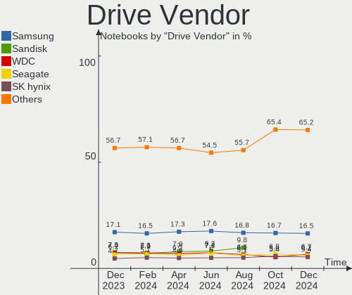
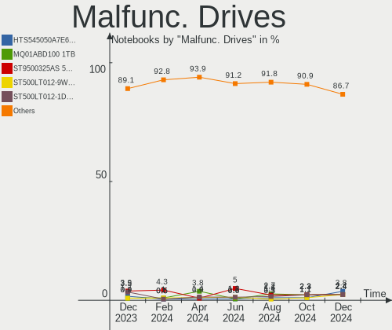
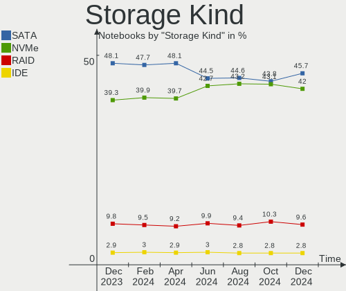
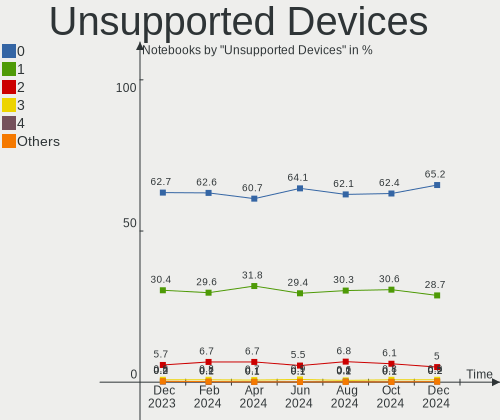

Linux Hardware Trends (Notebook)
--------------------------------

A project to identify most popular hardware characteristics and track their change
over time based on data collected by Linux users at https://Linux-Hardware.org.

Anyone can contribute to the study by uploading probes of their computers by
the [hw-probe](https://github.com/linuxhw/hw-probe) tool:

    sudo -E hw-probe -all -upload

Full-feature report is available here: https://linux-hardware.org/?view=trends&formfactor=notebook

Period: May, 2020.

Contents
--------

- [ OS                       ](#os)
- [ OS Family                ](#os-family)
- [ Kernel                   ](#kernel)
- [ Kernel Family            ](#kernel-family)
- [ Kernel Major Ver.        ](#kernel-major-ver)
- [ Arch                     ](#arch)
- [ DE                       ](#de)
- [ Display Server           ](#display-server)
- [ Display Manager          ](#display-manager)
- [ OS Lang                  ](#os-lang)
- [ Boot Mode                ](#boot-mode)
- [ Filesystem               ](#filesystem)
- [ Part. scheme             ](#part-scheme)
- [ Dual Boot with Linux/BSD ](#dual-boot-with-linux/bsd)
- [ Dual Boot (Win)          ](#dual-boot-win)
- [ Country                  ](#country)
- [ City                     ](#city)
- [ Vendor                   ](#vendor)
- [ Model                    ](#model)
- [ Model Family             ](#model-family)
- [ MFG Year                 ](#mfg-year)
- [ Form Factor              ](#form-factor)
- [ Secure Boot              ](#secure-boot)
- [ Coreboot                 ](#coreboot)
- [ RAM Size                 ](#ram-size)
- [ RAM Used                 ](#ram-used)
- [ Drive Vendor             ](#drive-vendor)
- [ Drive Model              ](#drive-model)
- [ Drive Kind               ](#drive-kind)
- [ Drive Connector          ](#drive-connector)
- [ Drive Size               ](#drive-size)
- [ Space Total              ](#space-total)
- [ Space Used               ](#space-used)
- [ Malfunc. Drives          ](#malfunc-drives)
- [ Malfunc. Drive Vendor    ](#malfunc-drive-vendor)
- [ Malfunc. HDD Vendor      ](#malfunc-hdd-vendor)
- [ Malfunc. Drive Kind      ](#malfunc-drive-kind)
- [ Failed Drives            ](#failed-drives)
- [ Failed Drive Vendor      ](#failed-drive-vendor)
- [ Drive Status             ](#drive-status)
- [ Storage Vendor           ](#storage-vendor)
- [ Storage Model            ](#storage-model)
- [ Storage Kind             ](#storage-kind)
- [ CPU Vendor               ](#cpu-vendor)
- [ CPU Model                ](#cpu-model)
- [ CPU Model Family         ](#cpu-model-family)
- [ CPU Cores                ](#cpu-cores)
- [ CPU Sockets              ](#cpu-sockets)
- [ CPU Threads              ](#cpu-threads)
- [ CPU Op-Modes             ](#cpu-op-modes)
- [ CPU Microcode            ](#cpu-microcode)
- [ CPU Microarch            ](#cpu-microarch)
- [ GPU Vendor               ](#gpu-vendor)
- [ GPU Model                ](#gpu-model)
- [ GPU Combo                ](#gpu-combo)
- [ GPU Driver               ](#gpu-driver)
- [ GPU Memory               ](#gpu-memory)
- [ Monitor Vendor           ](#monitor-vendor)
- [ Monitor Model            ](#monitor-model)
- [ Monitor Resolution       ](#monitor-resolution)
- [ Monitor Diagonal         ](#monitor-diagonal)
- [ Monitor Width            ](#monitor-width)
- [ Aspect Ratio             ](#aspect-ratio)
- [ Monitor Area             ](#monitor-area)
- [ Pixel Density            ](#pixel-density)
- [ Multiple Monitors        ](#multiple-monitors)
- [ Net Controller Vendor    ](#net-controller-vendor)
- [ Net Controller Model     ](#net-controller-model)
- [ Wireless Vendor          ](#wireless-vendor)
- [ Wireless Model           ](#wireless-model)
- [ Ethernet Vendor          ](#ethernet-vendor)
- [ Ethernet Model           ](#ethernet-model)
- [ Net Controller Kind      ](#net-controller-kind)
- [ Used Controller          ](#used-controller)
- [ NICs                     ](#nics)
- [ Bluetooth Vendor         ](#bluetooth-vendor)
- [ Bluetooth Model          ](#bluetooth-model)
- [ Unsupported Devices      ](#unsupported-devices)
- [ Unsupported Device Types ](#unsupported-device-types)

OS
--

Installed operating systems

| Name                         | Computers | Percent |
|------------------------------|-----------|---------|
| Ubuntu 20.04                 | 1434      | 43.57%  |
| Ubuntu 18.04                 | 355       | 10.79%  |
| Pop!_OS 20.04                | 154       | 4.68%   |
| Mint 19.3                    | 144       | 4.38%   |
| Fedora 32                    | 108       | 3.28%   |
| BlackPanther 18.1            | 105       | 3.19%   |
| Endless 3.8.0                | 87        | 2.64%   |
| Ubuntu 19.10                 | 83        | 2.52%   |
| ROSA R11.1                   | 82        | 2.49%   |
| Zorin 15                     | 73        | 2.22%   |
| Arch                         | 65        | 1.98%   |
| ROSA R11                     | 43        | 1.31%   |
| Manjaro                      | 39        | 1.19%   |
| Debian 10                    | 39        | 1.19%   |
| Ubuntu 16.04                 | 38        | 1.15%   |
| Manjaro 20.0.1               | 33        | 1%      |
| Endless 3.8.1                | 26        | 0.79%   |
| Fedora 31                    | 20        | 0.61%   |
| Elementary 5.1.4             | 19        | 0.58%   |
| Mint 4                       | 18        | 0.55%   |
| Gentoo                       | 18        | 0.55%   |
| BlackPanther 16.2            | 18        | 0.55%   |
| Manjaro 20.0                 | 16        | 0.49%   |
| KDE neon 18.04               | 15        | 0.46%   |
| Endless 3.7.8                | 15        | 0.46%   |
| Debian Testing               | 12        | 0.36%   |
| Ubuntu 19.04                 | 11        | 0.33%   |
| Peppermint 10                | 11        | 0.33%   |
| Arch Rolling                 | 11        | 0.33%   |
| Kali 2020.2                  | 10        | 0.3%    |
| Parrot 4.9                   | 9         | 0.27%   |
| Gentoo 2.6                   | 9         | 0.27%   |
| Mint 18.3                    | 7         | 0.21%   |
| Debian                       | 7         | 0.21%   |
| ROSA R8.1                    | 6         | 0.18%   |
| Mint 19.1                    | 6         | 0.18%   |
| Clear Linux 33010            | 6         | 0.18%   |
| Solus 4.1                    | 5         | 0.15%   |
| Mint 19.2                    | 5         | 0.15%   |
| Debian Unstable              | 5         | 0.15%   |
| CentOS 8                     | 5         | 0.15%   |
| Ubuntu 20.10                 | 4         | 0.12%   |
| Ubuntu                       | 4         | 0.12%   |
| ROSA R10                     | 4         | 0.12%   |
| openSUSE 20200523            | 4         | 0.12%   |
| openSUSE 15.1                | 4         | 0.12%   |
| Endless 3.3.20-nexthw1       | 4         | 0.12%   |
| Chrome OS                    | 4         | 0.12%   |
| WindowsFX 10                 | 3         | 0.09%   |
| RHEL 8.2                     | 3         | 0.09%   |
| MX 20                        | 3         | 0.09%   |
| Mint 19                      | 3         | 0.09%   |
| Gentoo 2.7                   | 3         | 0.09%   |
| Zorin 12                     | 2         | 0.06%   |
| Reborn OS                    | 2         | 0.06%   |
| Pop!_OS 19.10                | 2         | 0.06%   |
| Peppermint 9                 | 2         | 0.06%   |
| openSUSE Tumbleweed-20200523 | 2         | 0.06%   |
| openSUSE Tumbleweed-20200520 | 2         | 0.06%   |
| openSUSE Tumbleweed-20200519 | 2         | 0.06%   |

OS Family
---------

OS without a version

| Name         | Computers | Percent |
|--------------|-----------|---------|
| Ubuntu       | 1931      | 58.66%  |
| Mint         | 185       | 5.62%   |
| Pop!_OS      | 156       | 4.74%   |
| ROSA         | 138       | 4.19%   |
| Endless      | 136       | 4.13%   |
| Fedora       | 131       | 3.98%   |
| BlackPanther | 123       | 3.74%   |
| Manjaro      | 88        | 2.67%   |
| Arch         | 76        | 2.31%   |
| Zorin        | 75        | 2.28%   |
| Debian       | 66        | 2%      |
| Gentoo       | 30        | 0.91%   |
| Elementary   | 22        | 0.67%   |
| openSUSE     | 20        | 0.61%   |
| KDE neon     | 15        | 0.46%   |
| Peppermint   | 13        | 0.39%   |
| Kali         | 13        | 0.39%   |
| Clear Linux  | 13        | 0.39%   |
| Parrot       | 10        | 0.3%    |
| CentOS       | 8         | 0.24%   |
| RHEL         | 6         | 0.18%   |
| Solus        | 5         | 0.15%   |
| MX           | 4         | 0.12%   |
| Chrome OS    | 4         | 0.12%   |
| WindowsFX    | 3         | 0.09%   |
| Deepin       | 3         | 0.09%   |
| Reborn OS    | 2         | 0.06%   |
| ArcoLinux    | 2         | 0.06%   |
| ALT Linux    | 2         | 0.06%   |
| Sparky       | 1         | 0.03%   |
| Pardus       | 1         | 0.03%   |
| Oracle Linux | 1         | 0.03%   |
| Mageia       | 1         | 0.03%   |
| Kaisen       | 1         | 0.03%   |
| Generic      | 1         | 0.03%   |
| GalliumOS    | 1         | 0.03%   |
| EndeavourOS  | 1         | 0.03%   |
| BlackArch    | 1         | 0.03%   |
| Astra Linux  | 1         | 0.03%   |
| ArchLabs     | 1         | 0.03%   |
| Arch ARM     | 1         | 0.03%   |

Kernel
------

Version of the Linux kernel

| Version                        | Computers | Percent |
|--------------------------------|-----------|---------|
| 5.4.0-29-generic               | 629       | 19.11%  |
| 5.3.0-51-generic               | 330       | 10.02%  |
| 5.4.0-31-generic               | 328       | 9.96%   |
| 5.4.0-28-generic               | 196       | 5.95%   |
| 5.4.0-19-generic               | 114       | 3.46%   |
| 5.4.0-26-generic               | 112       | 3.4%    |
| 5.3.0-53-generic               | 107       | 3.25%   |
| 4.15.0-99-generic              | 107       | 3.25%   |
| 5.4.0-33-generic               | 94        | 2.86%   |
| 4.18.16-desktop-1bP            | 83        | 2.52%   |
| 5.4.0-7626-generic             | 78        | 2.37%   |
| 4.15.0-desktop-45.1rosa-x86_64 | 38        | 1.15%   |
| 4.15.0-101-generic             | 35        | 1.06%   |
| 5.4.0-7625-generic             | 34        | 1.03%   |
| 5.4.0-7629-generic             | 32        | 0.97%   |
| 4.19.0-9-amd64                 | 30        | 0.91%   |
| 5.3.0-46-generic               | 29        | 0.88%   |
| 5.6.8-300.fc32.x86_64          | 27        | 0.82%   |
| 5.4.32-generic-2rosa-x86_64    | 27        | 0.82%   |
| 5.3.0-28-generic               | 27        | 0.82%   |
| 4.15.0-desktop-94.1rosa-x86_64 | 23        | 0.7%    |
| 5.1.15-desktop-1bP             | 21        | 0.64%   |
| 5.6.12-1-MANJARO               | 19        | 0.58%   |
| 5.6.13-arch1-1                 | 18        | 0.55%   |
| 5.0.0-32-generic               | 18        | 0.55%   |
| 4.9.20-desktop-pae-1bP         | 18        | 0.55%   |
| 5.6.11-arch1-1                 | 17        | 0.52%   |
| 4.19.0-8-amd64                 | 17        | 0.52%   |
| 5.6.14-300.fc32.x86_64         | 16        | 0.49%   |
| 5.6.13-300.fc32.x86_64         | 14        | 0.43%   |
| 5.6.0-1-amd64                  | 14        | 0.43%   |
| 5.4.0-29-lowlatency            | 14        | 0.43%   |
| 4.15.0-96-generic              | 14        | 0.43%   |
| 5.6.10-300.fc32.x86_64         | 13        | 0.39%   |
| 4.15.0-desktop-45.1rosa-i586   | 13        | 0.39%   |
| 5.6.14-arch1-1                 | 12        | 0.36%   |
| 5.6.11-300.fc32.x86_64         | 12        | 0.36%   |
| 5.6.7-300.fc32.x86_64          | 11        | 0.33%   |
| 5.6.12-1-default               | 11        | 0.33%   |
| 5.6.12-300.fc32.x86_64         | 10        | 0.3%    |
| 5.6.11-1-MANJARO               | 10        | 0.3%    |
| 5.4.40-1-MANJARO               | 10        | 0.3%    |
| 5.6.8-1-MANJARO                | 9         | 0.27%   |
| 5.6.8-arch1-1                  | 8         | 0.24%   |
| 5.6.7-1-MANJARO                | 8         | 0.24%   |
| 5.4.0-32-generic               | 8         | 0.24%   |
| 5.4.0-31-lowlatency            | 8         | 0.24%   |
| 5.3.0-55-generic               | 8         | 0.24%   |
| 5.3.0-40-generic               | 8         | 0.24%   |
| 4.15.0-desktop-94.1rosa-i586   | 8         | 0.24%   |
| 5.5.0-kali2-amd64              | 7         | 0.21%   |
| 5.5.0-1parrot1-amd64           | 7         | 0.21%   |
| 5.4.0-7634-generic             | 7         | 0.21%   |
| 5.4.0-30-generic               | 7         | 0.21%   |
| 5.6.8-200.fc31.x86_64          | 6         | 0.18%   |
| 5.6.14-050614-generic          | 6         | 0.18%   |
| 5.4.0-34-generic               | 6         | 0.18%   |
| 5.3.0-42-generic               | 6         | 0.18%   |
| 4.18.0-147.8.1.el8_1.x86_64    | 6         | 0.18%   |
| 5.6.8-945.native               | 5         | 0.15%   |

Kernel Family
-------------

Linux kernel without a distro release

| Version | Computers | Percent |
|---------|-----------|---------|
| 5.4.0   | 1689      | 51.31%  |
| 5.3.0   | 538       | 16.34%  |
| 4.15.0  | 297       | 9.02%   |
| 4.18.16 | 83        | 2.52%   |
| 5.6.8   | 60        | 1.82%   |
| 4.19.0  | 58        | 1.76%   |
| 5.6.11  | 50        | 1.52%   |
| 5.6.12  | 46        | 1.4%    |
| 5.6.14  | 44        | 1.34%   |
| 5.6.13  | 42        | 1.28%   |
| 5.0.0   | 36        | 1.09%   |
| 5.4.32  | 32        | 0.97%   |
| 5.6.7   | 29        | 0.88%   |
| 5.6.10  | 29        | 0.88%   |
| 5.5.0   | 25        | 0.76%   |
| 5.6.0   | 24        | 0.73%   |
| 5.1.15  | 22        | 0.67%   |
| 4.18.0  | 21        | 0.64%   |
| 4.9.20  | 19        | 0.58%   |
| 5.4.40  | 14        | 0.43%   |
| 5.6.6   | 11        | 0.33%   |
| 4.4.0   | 11        | 0.33%   |
| 5.4.38  | 10        | 0.3%    |
| 4.9.155 | 7         | 0.21%   |
| 5.4.39  | 6         | 0.18%   |
| 5.4.35  | 6         | 0.18%   |
| 5.4.28  | 6         | 0.18%   |
| 5.7.0   | 5         | 0.15%   |
| 4.9.60  | 5         | 0.15%   |
| 5.6.4   | 4         | 0.12%   |
| 5.4.34  | 4         | 0.12%   |
| 4.12.14 | 4         | 0.12%   |
| 5.4.36  | 3         | 0.09%   |
| 4.9.0   | 3         | 0.09%   |
| 4.19.88 | 3         | 0.09%   |
| 4.10.0  | 3         | 0.09%   |
| 4.1.38  | 3         | 0.09%   |
| 5.5.19  | 2         | 0.06%   |
| 5.5.17  | 2         | 0.06%   |
| 5.5.10  | 2         | 0.06%   |
| 4.16.0  | 2         | 0.06%   |
| 3.10.0  | 2         | 0.06%   |
| 5.6.3   | 1         | 0.03%   |
| 5.6.2   | 1         | 0.03%   |
| 5.6.15  | 1         | 0.03%   |
| 5.5.18  | 1         | 0.03%   |
| 5.5.13  | 1         | 0.03%   |
| 5.4.7   | 1         | 0.03%   |
| 5.4.41  | 1         | 0.03%   |
| 5.4.37  | 1         | 0.03%   |
| 5.4.31  | 1         | 0.03%   |
| 5.4.25  | 1         | 0.03%   |
| 5.4.23  | 1         | 0.03%   |
| 5.4.15  | 1         | 0.03%   |
| 5.3.6   | 1         | 0.03%   |
| 5.3.11  | 1         | 0.03%   |
| 5.2.17  | 1         | 0.03%   |
| 5.1.20  | 1         | 0.03%   |
| 5.1.14  | 1         | 0.03%   |
| 5.1.1   | 1         | 0.03%   |

Kernel Major Ver.
-----------------

Linux kernel major version

| Version | Computers | Percent |
|---------|-----------|---------|
| 5.4     | 1777      | 53.98%  |
| 5.3     | 540       | 16.4%   |
| 5.6     | 342       | 10.39%  |
| 4.15    | 299       | 9.08%   |
| 4.18    | 104       | 3.16%   |
| 4.19    | 65        | 1.97%   |
| 5.0     | 37        | 1.12%   |
| 4.9     | 35        | 1.06%   |
| 5.5     | 33        | 1%      |
| 5.1     | 25        | 0.76%   |
| 4.4     | 11        | 0.33%   |
| 5.7     | 5         | 0.15%   |
| 4.16    | 4         | 0.12%   |
| 4.12    | 4         | 0.12%   |
| 4.10    | 3         | 0.09%   |
| 4.1     | 3         | 0.09%   |
| 3.10    | 2         | 0.06%   |
| 5.2     | 1         | 0.03%   |
| 4.14    | 1         | 0.03%   |
| 4.13    | 1         | 0.03%   |

Arch
----

OS architecture (x86_64, i586, etc.)

| Name    | Computers | Percent |
|---------|-----------|---------|
| x86_64  | 3128      | 95.02%  |
| i686    | 160       | 4.86%   |
| ppc     | 3         | 0.09%   |
| aarch64 | 1         | 0.03%   |

DE
--

Desktop Environment

| Name             | Computers | Percent |
|------------------|-----------|---------|
| GNOME            | 2030      | 61.66%  |
| KDE5             | 250       | 7.59%   |
| XFCE             | 242       | 7.35%   |
| Unknown          | 147       | 4.47%   |
| X-Cinnamon       | 133       | 4.04%   |
| KDE              | 105       | 3.19%   |
| KDE4             | 77        | 2.34%   |
| MATE             | 76        | 2.31%   |
| Unity            | 41        | 1.25%   |
| Cinnamon         | 37        | 1.12%   |
| LXQt             | 33        | 1%      |
| LXDE             | 28        | 0.85%   |
| Budgie           | 28        | 0.85%   |
| Pantheon         | 19        | 0.58%   |
| Deepin           | 15        | 0.46%   |
| i3               | 11        | 0.33%   |
| GNOME Flashback  | 10        | 0.3%    |
| GNOME Classic    | 5         | 0.15%   |
| Openbox          | 2         | 0.06%   |
| xubuntu          | 1         | 0.03%   |
| lightdm-xsession | 1         | 0.03%   |
| Core             | 1         | 0.03%   |

Display Server
--------------

X11 or Wayland

| Name        | Computers | Percent |
|-------------|-----------|---------|
| X11         | 3040      | 92.35%  |
| Wayland     | 170       | 5.16%   |
| Unknown     | 62        | 1.88%   |
| Tty         | 19        | 0.58%   |
| Unspecified | 1         | 0.03%   |

Display Manager
---------------

SDDM, LightDM, etc.

| Name    | Computers | Percent |
|---------|-----------|---------|
| Unknown | 2579      | 78.34%  |
| SDDM    | 250       | 7.59%   |
| GDM     | 207       | 6.29%   |
| LightDM | 169       | 5.13%   |
| KDM     | 78        | 2.37%   |
| XDM     | 5         | 0.15%   |
| WDM     | 1         | 0.03%   |
| SLiM    | 1         | 0.03%   |
| NODM    | 1         | 0.03%   |
| Ly      | 1         | 0.03%   |

OS Lang
-------

Language

| Lang       | Computers | Percent |
|------------|-----------|---------|
| en_US      | 1144      | 34.75%  |
| Unknown    | 215       | 6.53%   |
| de_DE      | 212       | 6.44%   |
| ru_RU      | 196       | 5.95%   |
| pt_BR      | 162       | 4.92%   |
| en_GB      | 162       | 4.92%   |
| it_IT      | 133       | 4.04%   |
| fr_FR      | 128       | 3.89%   |
| en_IN      | 79        | 2.4%    |
| es_ES      | 77        | 2.34%   |
| en_CA      | 70        | 2.13%   |
| pl_PL      | 64        | 1.94%   |
| en_US.utf8 | 62        | 1.88%   |
| en_AU      | 37        | 1.12%   |
| es_AR      | 33        | 1%      |
| nl_NL      | 30        | 0.91%   |
| pt_PT      | 28        | 0.85%   |
| C          | 25        | 0.76%   |
| hu_HU      | 24        | 0.73%   |
| es_MX      | 21        | 0.64%   |
| tr_TR      | 19        | 0.58%   |
| pt_BR.utf8 | 19        | 0.58%   |
| ru_UA      | 16        | 0.49%   |
| es_CL      | 16        | 0.49%   |
| en_ZA      | 16        | 0.49%   |
| cs_CZ      | 15        | 0.46%   |
| zh_CN      | 13        | 0.39%   |
| de_AT      | 12        | 0.36%   |
| ja_JP      | 11        | 0.33%   |
| el_GR      | 11        | 0.33%   |
| bg_BG      | 10        | 0.3%    |
| uk_UA      | 9         | 0.27%   |
| sv_SE      | 9         | 0.27%   |
| ro_RO      | 9         | 0.27%   |
| fr_BE      | 9         | 0.27%   |
| en_IE      | 9         | 0.27%   |
| de_CH      | 9         | 0.27%   |
| en_NZ      | 8         | 0.24%   |
| C          | 8         | 0.24%   |
| ru_RU.utf8 | 7         | 0.21%   |
| ko_KR      | 7         | 0.21%   |
| es_CO      | 7         | 0.21%   |
| en_PH      | 7         | 0.21%   |
| nl_BE      | 6         | 0.18%   |
| nb_NO      | 6         | 0.18%   |
| fr_CA      | 6         | 0.18%   |
| en_IN      | 6         | 0.18%   |
| ca_ES      | 6         | 0.18%   |
| fi_FI      | 5         | 0.15%   |
| de_DE.utf8 | 5         | 0.15%   |
| da_DK      | 5         | 0.15%   |
| POSIX      | 4         | 0.12%   |
| hr_HR      | 4         | 0.12%   |
| es_VE      | 4         | 0.12%   |
| en_SG      | 4         | 0.12%   |
| id_ID      | 3         | 0.09%   |
| fr_FR.utf8 | 3         | 0.09%   |
| es_UY      | 3         | 0.09%   |
| es_DO      | 3         | 0.09%   |
| en_IL      | 3         | 0.09%   |

Boot Mode
---------

EFI or BIOS

| Mode | Computers | Percent |
|------|-----------|---------|
| BIOS | 1821      | 55.32%  |
| EFI  | 1471      | 44.68%  |

Filesystem
----------

Type of filesystem

| Type     | Computers | Percent |
|----------|-----------|---------|
| Ext4     | 3038      | 92.28%  |
| Overlay  | 104       | 3.16%   |
| Btrfs    | 57        | 1.73%   |
| Zfs      | 35        | 1.06%   |
| Xfs      | 34        | 1.03%   |
| Tmpfs    | 7         | 0.21%   |
| Ext3     | 6         | 0.18%   |
| Aufs     | 4         | 0.12%   |
| F2fs     | 3         | 0.09%   |
| Ext2     | 2         | 0.06%   |
| SquasXfs | 1         | 0.03%   |
| Reiserfs | 1         | 0.03%   |

Part. scheme
------------

Scheme of partitioning

| Type    | Computers | Percent |
|---------|-----------|---------|
| Unknown | 2979      | 90.49%  |
| GPT     | 179       | 5.44%   |
| MBR     | 134       | 4.07%   |

Dual Boot with Linux/BSD
------------------------

Hosting more than one Linux/BSD

| Dual boot | Computers | Percent |
|-----------|-----------|---------|
| No        | 2988      | 90.77%  |
| Yes       | 304       | 9.23%   |

Dual Boot (Win)
---------------

Hosting Linux and Windows

| Dual boot | Computers | Percent |
|-----------|-----------|---------|
| No        | 2294      | 69.68%  |
| Yes       | 998       | 30.32%  |

Country
-------

Geographic location (country)

| Country            | Computers | Percent |
|--------------------|-----------|---------|
| USA                | 489       | 14.85%  |
| Germany            | 288       | 8.75%   |
| Russia             | 266       | 8.08%   |
| Brazil             | 221       | 6.71%   |
| Italy              | 161       | 4.89%   |
| France             | 150       | 4.56%   |
| Hungary            | 135       | 4.1%    |
| UK                 | 134       | 4.07%   |
| India              | 99        | 3.01%   |
| Canada             | 91        | 2.76%   |
| Spain              | 90        | 2.73%   |
| Poland             | 85        | 2.58%   |
| Ukraine            | 69        | 2.1%    |
| Netherlands        | 60        | 1.82%   |
| Romania            | 47        | 1.43%   |
| Argentina          | 44        | 1.34%   |
| Portugal           | 41        | 1.25%   |
| Australia          | 40        | 1.22%   |
| Sweden             | 34        | 1.03%   |
| Turkey             | 33        | 1%      |
| Switzerland        | 32        | 0.97%   |
| Greece             | 31        | 0.94%   |
| Mexico             | 30        | 0.91%   |
| Bulgaria           | 29        | 0.88%   |
| Belgium            | 29        | 0.88%   |
| Czech Republic     | 28        | 0.85%   |
| Austria            | 28        | 0.85%   |
| Chile              | 26        | 0.79%   |
| South Africa       | 25        | 0.76%   |
| Ireland            | 18        | 0.55%   |
| China              | 18        | 0.55%   |
| Serbia             | 16        | 0.49%   |
| Japan              | 16        | 0.49%   |
| Indonesia          | 16        | 0.49%   |
| Colombia           | 16        | 0.49%   |
| Norway             | 15        | 0.46%   |
| Philippines        | 13        | 0.39%   |
| Denmark            | 13        | 0.39%   |
| Egypt              | 12        | 0.36%   |
| Iran               | 11        | 0.33%   |
| Slovenia           | 10        | 0.3%    |
| New Zealand        | 10        | 0.3%    |
| Finland            | 10        | 0.3%    |
| Belarus            | 9         | 0.27%   |
| Peru               | 8         | 0.24%   |
| Korea, Republic of | 8         | 0.24%   |
| Kenya              | 8         | 0.24%   |
| Israel             | 8         | 0.24%   |
| Croatia            | 8         | 0.24%   |
| Bangladesh         | 8         | 0.24%   |
| Algeria            | 8         | 0.24%   |
| Vietnam            | 7         | 0.21%   |
| Thailand           | 7         | 0.21%   |
| Singapore          | 7         | 0.21%   |
| Nepal              | 7         | 0.21%   |
| Dominican Republic | 7         | 0.21%   |
| Uruguay            | 6         | 0.18%   |
| UAE                | 6         | 0.18%   |
| Morocco            | 6         | 0.18%   |
| Lithuania          | 6         | 0.18%   |

City
----

Geographic location (city)

| City           | Computers | Percent |
|----------------|-----------|---------|
| Moscow         | 67        | 2.04%   |
| Budapest       | 46        | 1.4%    |
| São Paulo     | 30        | 0.91%   |
| Berlin         | 29        | 0.88%   |
| Kyiv           | 27        | 0.82%   |
| St Petersburg  | 25        | 0.76%   |
| Rome           | 22        | 0.67%   |
| Hamburg        | 22        | 0.67%   |
| Sofia          | 20        | 0.61%   |
| Warsaw         | 19        | 0.58%   |
| Rio de Janeiro | 18        | 0.55%   |
| Madrid         | 18        | 0.55%   |
| Athens         | 18        | 0.55%   |
| Vienna         | 16        | 0.49%   |
| Paris          | 16        | 0.49%   |
| Santiago       | 15        | 0.46%   |
| Munich         | 15        | 0.46%   |
| Barcelona      | 13        | 0.39%   |
| Toronto        | 12        | 0.36%   |
| Prague         | 12        | 0.36%   |
| Milan          | 12        | 0.36%   |
| Chennai        | 12        | 0.36%   |
| Buenos Aires   | 12        | 0.36%   |
| Bengaluru      | 12        | 0.36%   |
| Montreal       | 11        | 0.33%   |
| Lisbon         | 11        | 0.33%   |
| Bucharest      | 11        | 0.33%   |
| Turin          | 10        | 0.3%    |
| Sydney         | 10        | 0.3%    |
| Leipzig        | 10        | 0.3%    |
| Krasnodar      | 10        | 0.3%    |
| Ekaterinburg   | 10        | 0.3%    |
| Zurich         | 9         | 0.27%   |
| Pune           | 9         | 0.27%   |
| Novosibirsk    | 9         | 0.27%   |
| London         | 9         | 0.27%   |
| Curitiba       | 9         | 0.27%   |
| Cairo          | 9         | 0.27%   |
| Stuttgart      | 8         | 0.24%   |
| Los Angeles    | 8         | 0.24%   |
| Dublin         | 8         | 0.24%   |
| Chicago        | 8         | 0.24%   |
| Bogotá        | 8         | 0.24%   |
| Belo Horizonte | 8         | 0.24%   |
| Belgrade       | 8         | 0.24%   |
| Ankara         | 8         | 0.24%   |
| Amsterdam      | 8         | 0.24%   |
| New Delhi      | 7         | 0.21%   |
| Nairobi        | 7         | 0.21%   |
| Mexico City    | 7         | 0.21%   |
| Melbourne      | 7         | 0.21%   |
| Lima           | 7         | 0.21%   |
| Kharkiv        | 7         | 0.21%   |
| Johannesburg   | 7         | 0.21%   |
| Houston        | 7         | 0.21%   |
| Dhaka          | 7         | 0.21%   |
| Brasília      | 7         | 0.21%   |
| Zagreb         | 6         | 0.18%   |
| Tel Aviv       | 6         | 0.18%   |
| Samara         | 6         | 0.18%   |

Vendor
------

Motherboard manufacturer

| Name                           | Computers | Percent |
|--------------------------------|-----------|---------|
| Hewlett-Packard                | 680       | 20.66%  |
| Lenovo                         | 605       | 18.38%  |
| Dell                           | 538       | 16.34%  |
| ASUSTek Computer               | 417       | 12.67%  |
| Acer                           | 303       | 9.2%    |
| Toshiba                        | 129       | 3.92%   |
| Samsung Electronics            | 87        | 2.64%   |
| Apple                          | 76        | 2.31%   |
| Sony                           | 68        | 2.07%   |
| MSI                            | 52        | 1.58%   |
| Fujitsu                        | 24        | 0.73%   |
| Notebook                       | 22        | 0.67%   |
| Unknown                        | 22        | 0.67%   |
| Positivo                       | 19        | 0.58%   |
| Packard Bell                   | 19        | 0.58%   |
| HUAWEI                         | 19        | 0.58%   |
| Fujitsu Siemens                | 18        | 0.55%   |
| Medion                         | 16        | 0.49%   |
| Google                         | 11        | 0.33%   |
| Timi                           | 9         | 0.27%   |
| Clevo                          | 9         | 0.27%   |
| Alienware                      | 9         | 0.27%   |
| LG Electronics                 | 8         | 0.24%   |
| Gigabyte Technology            | 8         | 0.24%   |
| Gateway                        | 8         | 0.24%   |
| System76                       | 7         | 0.21%   |
| Intel                          | 6         | 0.18%   |
| eMachines                      | 6         | 0.18%   |
| Semp Toshiba                   | 5         | 0.15%   |
| Panasonic                      | 5         | 0.15%   |
| Chuwi                          | 5         | 0.15%   |
| TUXEDO                         | 4         | 0.12%   |
| Razer                          | 4         | 0.12%   |
| Itautec                        | 4         | 0.12%   |
| Prestigio                      | 3         | 0.09%   |
| Pegatron                       | 3         | 0.09%   |
| Mediacom                       | 3         | 0.09%   |
| GPD                            | 3         | 0.09%   |
| Exo                            | 3         | 0.09%   |
| VIT                            | 2         | 0.06%   |
| Standard                       | 2         | 0.06%   |
| Quanta                         | 2         | 0.06%   |
| PC Specialist                  | 2         | 0.06%   |
| NEC Computers                  | 2         | 0.06%   |
| Matsushita Electric Industrial | 2         | 0.06%   |
| Insyde                         | 2         | 0.06%   |
| Durabook                       | 2         | 0.06%   |
| Dixonsxp                       | 2         | 0.06%   |
| Digibras                       | 2         | 0.06%   |
| YJKC                           | 1         | 0.03%   |
| Wortmann AG                    | 1         | 0.03%   |
| Thomson computing              | 1         | 0.03%   |
| Teclast                        | 1         | 0.03%   |
| sz                             | 1         | 0.03%   |
| SNS Network (M)                | 1         | 0.03%   |
| SECO                           | 1         | 0.03%   |
| RM                             | 1         | 0.03%   |
| ONE-NETBOOK TECHNOLOGY         | 1         | 0.03%   |
| OEM                            | 1         | 0.03%   |
| NOBLEX                         | 1         | 0.03%   |

Model
-----

Motherboard model

| Name                          | Computers | Percent |
|-------------------------------|-----------|---------|
| Unknown                       | 42        | 1.28%   |
| HP Notebook                   | 34        | 1.03%   |
| HP Pavilion g6                | 23        | 0.7%    |
| HP Pavilion dv6               | 22        | 0.67%   |
| Dell XPS 15 7590              | 17        | 0.52%   |
| HP Pavilion Notebook          | 12        | 0.36%   |
| HP Pavilion dv7               | 12        | 0.36%   |
| HP Pavilion 15                | 12        | 0.36%   |
| Dell Latitude E6410           | 12        | 0.36%   |
| HP 15                         | 11        | 0.33%   |
| Dell XPS 15 9570              | 11        | 0.33%   |
| Dell Inspiron 5570            | 11        | 0.33%   |
| Dell Inspiron 3521            | 11        | 0.33%   |
| Lenovo IdeaPad 330-15IKB 81DE | 10        | 0.3%    |
| HP 2000                       | 10        | 0.3%    |
| Dell Latitude E7450           | 10        | 0.3%    |
| HP EliteBook 840 G2           | 9         | 0.27%   |
| Dell XPS 13 9360              | 9         | 0.27%   |
| Dell Latitude E6420           | 9         | 0.27%   |
| Lenovo V330-15IKB 81AX        | 8         | 0.24%   |
| HP Laptop 15-da0xxx           | 8         | 0.24%   |
| HP EliteBook 8460p            | 8         | 0.24%   |
| HP 15 Notebook PC             | 8         | 0.24%   |
| Dell Inspiron N5110           | 8         | 0.24%   |
| Apple MacBookPro8,1           | 8         | 0.24%   |
| Acer Aspire A315-53           | 8         | 0.24%   |
| Positivo MOBILE               | 7         | 0.21%   |
| HP Presario CQ57              | 7         | 0.21%   |
| HP Pavilion dv4               | 7         | 0.21%   |
| HP Laptop 15-bw0xx            | 7         | 0.21%   |
| HP EliteBook 8470p            | 7         | 0.21%   |
| HP EliteBook 840 G1           | 7         | 0.21%   |
| Dell Latitude E6520           | 7         | 0.21%   |
| Dell Latitude E6430           | 7         | 0.21%   |
| Dell Latitude D630            | 7         | 0.21%   |
| ASUS X541NA                   | 7         | 0.21%   |
| Apple MacBookPro8,2           | 7         | 0.21%   |
| Acer Aspire 5742G             | 7         | 0.21%   |
| Toshiba Satellite L500        | 6         | 0.18%   |
| Lenovo G580 20150             | 6         | 0.18%   |
| Lenovo G50-70 20351           | 6         | 0.18%   |
| Lenovo G50-45 80E3            | 6         | 0.18%   |
| HP ProBook 450 G1             | 6         | 0.18%   |
| Dell XPS L502X                | 6         | 0.18%   |
| Dell Latitude E6400           | 6         | 0.18%   |
| Dell Inspiron MM061           | 6         | 0.18%   |
| ASUS X541SA                   | 6         | 0.18%   |
| Acer Nitro AN515-52           | 6         | 0.18%   |
| Acer Aspire A315-51           | 6         | 0.18%   |
| Lenovo IdeaPad 110-15IBR 80T7 | 5         | 0.15%   |
| Lenovo G500 20236             | 5         | 0.15%   |
| HP EliteBook Folio 9470m      | 5         | 0.15%   |
| HP EliteBook 8570w            | 5         | 0.15%   |
| HP EliteBook 840 G5           | 5         | 0.15%   |
| HP EliteBook 2560p            | 5         | 0.15%   |
| HP 255 G7 Notebook PC         | 5         | 0.15%   |
| HP 255 G6 Notebook PC         | 5         | 0.15%   |
| HP 250 G6 Notebook PC         | 5         | 0.15%   |
| Dell Precision M4800          | 5         | 0.15%   |
| Dell Latitude E7240           | 5         | 0.15%   |

Model Family
------------

Motherboard model prefix

| Name                        | Computers | Percent |
|-----------------------------|-----------|---------|
| Lenovo ThinkPad             | 312       | 9.48%   |
| Acer Aspire                 | 213       | 6.47%   |
| Dell Inspiron               | 192       | 5.83%   |
| Dell Latitude               | 190       | 5.77%   |
| HP Pavilion                 | 145       | 4.4%    |
| Lenovo IdeaPad              | 132       | 4.01%   |
| HP EliteBook                | 113       | 3.43%   |
| Toshiba Satellite           | 107       | 3.25%   |
| HP ProBook                  | 104       | 3.16%   |
| ASUS VivoBook               | 68        | 2.07%   |
| Dell XPS                    | 67        | 2.04%   |
| HP Laptop                   | 61        | 1.85%   |
| Unknown                     | 42        | 1.28%   |
| Dell Vostro                 | 36        | 1.09%   |
| HP Notebook                 | 34        | 1.03%   |
| Dell Precision              | 29        | 0.88%   |
| HP ENVY                     | 27        | 0.82%   |
| HP Compaq                   | 27        | 0.82%   |
| Fujitsu LIFEBOOK            | 22        | 0.67%   |
| HP 15                       | 20        | 0.61%   |
| Acer Swift                  | 20        | 0.61%   |
| HP 250                      | 19        | 0.58%   |
| Acer TravelMate             | 19        | 0.58%   |
| Acer Nitro                  | 19        | 0.58%   |
| Packard Bell EasyNote       | 18        | 0.55%   |
| HP Presario                 | 18        | 0.55%   |
| HP 255                      | 17        | 0.52%   |
| ASUS TUF                    | 17        | 0.52%   |
| Apple MacBookPro8           | 16        | 0.49%   |
| ASUS ZenBook                | 14        | 0.43%   |
| Dell G3                     | 13        | 0.39%   |
| Lenovo G580                 | 11        | 0.33%   |
| HP ZBook                    | 11        | 0.33%   |
| HP OMEN                     | 10        | 0.3%    |
| HP 2000                     | 10        | 0.3%    |
| Fujitsu Siemens AMILO       | 9         | 0.27%   |
| Lenovo V330-15IKB           | 8         | 0.24%   |
| Lenovo ThinkBook            | 8         | 0.24%   |
| Lenovo Legion               | 8         | 0.24%   |
| Toshiba TECRA               | 7         | 0.21%   |
| Toshiba PORTEGE             | 7         | 0.21%   |
| Positivo MOBILE             | 7         | 0.21%   |
| HP Stream                   | 7         | 0.21%   |
| ASUS X541NA                 | 7         | 0.21%   |
| Apple MacBookPro9           | 7         | 0.21%   |
| Apple MacBookPro11          | 7         | 0.21%   |
| Lenovo Yoga                 | 6         | 0.18%   |
| Lenovo G50-70               | 6         | 0.18%   |
| Lenovo G50-45               | 6         | 0.18%   |
| Dell Studio                 | 6         | 0.18%   |
| ASUS X541SA                 | 6         | 0.18%   |
| Acer Extensa                | 6         | 0.18%   |
| Samsung Electronics 355V4C  | 5         | 0.15%   |
| Samsung Electronics 300E5EV | 5         | 0.15%   |
| MSI GE60                    | 5         | 0.15%   |
| Lenovo G500                 | 5         | 0.15%   |
| Lenovo B590                 | 5         | 0.15%   |
| Lenovo 3000                 | 5         | 0.15%   |
| Fujitsu Siemens ESPRIMO     | 5         | 0.15%   |
| Dell G5                     | 5         | 0.15%   |

MFG Year
--------

Motherboard manufacture year

| Year    | Computers | Percent |
|---------|-----------|---------|
| 2019    | 728       | 22.11%  |
| 2018    | 351       | 10.66%  |
| 2013    | 263       | 7.99%   |
| 2011    | 254       | 7.72%   |
| 2012    | 247       | 7.5%    |
| 2020    | 207       | 6.29%   |
| 2017    | 195       | 5.92%   |
| 2015    | 182       | 5.53%   |
| 2016    | 180       | 5.47%   |
| 2014    | 170       | 5.16%   |
| 2010    | 162       | 4.92%   |
| 2009    | 154       | 4.68%   |
| 2008    | 90        | 2.73%   |
| 2007    | 64        | 1.94%   |
| 2006    | 18        | 0.55%   |
| 2005    | 12        | 0.36%   |
| Unknown | 10        | 0.3%    |
| 2003    | 3         | 0.09%   |
| 2002    | 2         | 0.06%   |

Form Factor
-----------

Physical design of the computer

| Name     | Computers | Percent |
|----------|-----------|---------|
| Notebook | 3292      | 100%    |

Secure Boot
-----------

Enabled or disabled

| State    | Computers | Percent |
|----------|-----------|---------|
| Disabled | 2956      | 89.79%  |
| Enabled  | 336       | 10.21%  |

Coreboot
--------

Have coreboot on board

| Used | Computers | Percent |
|------|-----------|---------|
| No   | 3278      | 99.57%  |
| Yes  | 14        | 0.43%   |

RAM Size
--------

Total RAM memory

| Size in GB  | Computers | Percent |
|-------------|-----------|---------|
| 3.01-4.0    | 907       | 27.55%  |
| 4.01-8.0    | 906       | 27.52%  |
| 8.01-16.0   | 508       | 15.43%  |
| 16.01-24.0  | 453       | 13.76%  |
| 1.01-2.0    | 248       | 7.53%   |
| 32.01-64.0  | 117       | 3.55%   |
| 2.01-3.0    | 66        | 2%      |
| 0.01-1.0    | 49        | 1.49%   |
| 24.01-32.0  | 23        | 0.7%    |
| 64.01-256.0 | 15        | 0.46%   |

RAM Used
--------

Used RAM memory

| Used GB    | Computers | Percent |
|------------|-----------|---------|
| 1.01-2.0   | 1357      | 41.22%  |
| 2.01-3.0   | 823       | 25%     |
| 0.01-1.0   | 383       | 11.63%  |
| 4.01-8.0   | 341       | 10.36%  |
| 3.01-4.0   | 318       | 9.66%   |
| 8.01-16.0  | 63        | 1.91%   |
| 16.01-24.0 | 5         | 0.15%   |
| 24.01-32.0 | 2         | 0.06%   |

Drive Vendor
------------

Hard drive vendors

| Vendor              | Computers | Drives | Percent |
|---------------------|-----------|--------|---------|
| Seagate             | 604       | 621    | 16.49%  |
| WDC                 | 541       | 554    | 14.77%  |
| Samsung Electronics | 451       | 465    | 12.31%  |
| Toshiba             | 381       | 381    | 10.4%   |
| Unknown             | 216       | 246    | 5.9%    |
| Hitachi             | 191       | 193    | 5.21%   |
| Kingston            | 172       | 177    | 4.7%    |
| SanDisk             | 171       | 176    | 4.67%   |
| HGST                | 160       | 160    | 4.37%   |
| Crucial             | 124       | 124    | 3.39%   |
| Intel               | 67        | 69     | 1.83%   |
| HL-DT-ST            | 54        | 27     | 1.47%   |
| A-DATA Technology   | 53        | 53     | 1.45%   |
| SK Hynix            | 46        | 46     | 1.26%   |
| Micron Technology   | 43        | 43     | 1.17%   |
| Fujitsu             | 34        | 35     | 0.93%   |
| China               | 23        | 23     | 0.63%   |
| Apple               | 23        | 23     | 0.63%   |
| Transcend           | 22        | 22     | 0.6%    |
| LITEON              | 20        | 20     | 0.55%   |
| LITEONIT            | 17        | 18     | 0.46%   |
| SPCC                | 14        | 14     | 0.38%   |
| OCZ                 | 14        | 14     | 0.38%   |
| PNY                 | 13        | 13     | 0.35%   |
| PLEXTOR             | 11        | 11     | 0.3%    |
| Intenso             | 11        | 11     | 0.3%    |
| Apacer              | 10        | 10     | 0.27%   |
| KingSpec            | 8         | 8      | 0.22%   |
| GOODRAM             | 8         | 8      | 0.22%   |
| JMicron             | 7         | 7      | 0.19%   |
| Generic             | 7         | 7      | 0.19%   |
| Corsair             | 6         | 6      | 0.16%   |
| Phison              | 5         | 5      | 0.14%   |
| Patriot             | 5         | 5      | 0.14%   |
| Hewlett-Packard     | 5         | 5      | 0.14%   |
| FORESEE             | 5         | 5      | 0.14%   |
| ASMT                | 5         | 6      | 0.14%   |
| WDC WD16            | 4         | 4      | 0.11%   |
| StoreJet            | 4         | 4      | 0.11%   |
| KIOXIA              | 4         | 4      | 0.11%   |
| HUAWEI              | 4         | 4      | 0.11%   |
| Gigabyte Technology | 4         | 4      | 0.11%   |
| BHT                 | 4         | 4      | 0.11%   |
| Vaseky              | 3         | 3      | 0.08%   |
| TO Exter            | 3         | 3      | 0.08%   |
| Team                | 3         | 3      | 0.08%   |
| Smartbuy            | 3         | 3      | 0.08%   |
| SABRENT             | 3         | 4      | 0.08%   |
| Netac               | 3         | 3      | 0.08%   |
| Lenovo              | 3         | 3      | 0.08%   |
| KingDian            | 3         | 3      | 0.08%   |
| External            | 3         | 3      | 0.08%   |
| Union Memory        | 2         | 2      | 0.05%   |
| TSA                 | 2         | 2      | 0.05%   |
| TCSUNBOW            | 2         | 2      | 0.05%   |
| Silicon Motion      | 2         | 2      | 0.05%   |
| LDLC                | 2         | 2      | 0.05%   |
| INNOVATION          | 2         | 2      | 0.05%   |
| IBM/Hitachi         | 2         | 2      | 0.05%   |
| AMD                 | 2         | 2      | 0.05%   |

Drive Model
-----------

Hard drive models

| Model                        | Computers | Percent |
|------------------------------|-----------|---------|
| ST1000LM035-1RK172 1TB       | 92        | 2.45%   |
| MMC Card  32GB               | 76        | 2.03%   |
| ST1000LM024 HN-M101MBB 1TB   | 67        | 1.79%   |
| MQ01ABF050 500GB             | 64        | 1.71%   |
| MQ01ABD100 1TB               | 59        | 1.57%   |
| ST500LT012-1DG142 500GB      | 47        | 1.25%   |
| ST9500325AS 500GB            | 44        | 1.17%   |
| MQ04ABF100 1TB               | 43        | 1.15%   |
| DVDRAM GUE1N 3GB             | 42        | 1.12%   |
| SSD 850 EVO 500GB            | 39        | 1.04%   |
| HTS721010A9E630 1TB          | 37        | 0.99%   |
| SA400S37240G 240GB SSD       | 34        | 0.91%   |
| MMC Card  64GB               | 33        | 0.88%   |
| HTS545050A7E380 500GB        | 32        | 0.85%   |
| WD10SPZX-21Z10T0 1TB         | 31        | 0.83%   |
| HTS541010A9E680 1TB          | 31        | 0.83%   |
| SA400S37120G 120GB SSD       | 25        | 0.67%   |
| HTS545050A7E680 500GB        | 25        | 0.67%   |
| SSD 860 EVO 500GB            | 23        | 0.61%   |
| SSD 850 EVO 250GB            | 23        | 0.61%   |
| HTS725050A7E630 500GB        | 22        | 0.59%   |
| HTS547575A9E384 752GB        | 22        | 0.59%   |
| ST500LT012-9WS142 500GB      | 21        | 0.56%   |
| ST500LM012 HN-M500MBB 500GB  | 21        | 0.56%   |
| SA400S37480G 480GB SSD       | 21        | 0.56%   |
| MMC Card  16GB               | 20        | 0.53%   |
| MMC Card  128GB              | 20        | 0.53%   |
| ST9500420AS 500GB            | 19        | 0.51%   |
| ST500LM021-1KJ152 500GB      | 19        | 0.51%   |
| SSD 860 EVO 1TB              | 19        | 0.51%   |
| WD10JPVX-22JC3T0 1TB         | 18        | 0.48%   |
| SV300S37A120G 120GB SSD      | 18        | 0.48%   |
| WDS240G2G0A-00JH30 240GB SSD | 17        | 0.45%   |
| SSD 860 EVO 250GB            | 16        | 0.43%   |
| ST1000LM049-2GH172 1TB       | 15        | 0.4%    |
| CT500MX500SSD1 500GB         | 15        | 0.4%    |
| CT240BX500SSD1 240GB         | 15        | 0.4%    |
| ST9320325AS 320GB            | 14        | 0.37%   |
| ST500LM000-1EJ162 500GB      | 14        | 0.37%   |
| WD10SPZX-60Z10T0 1TB         | 13        | 0.35%   |
| MQ01ABD050 500GB             | 13        | 0.35%   |
| HTS545050B9A300 500GB        | 13        | 0.35%   |
| HM321HI 320GB                | 13        | 0.35%   |
| WD10SPZX-24Z10 1TB           | 12        | 0.32%   |
| ST1000LM048-2E7172 1TB       | 12        | 0.32%   |
| SDSSDA120G 120GB             | 12        | 0.32%   |
| DVDRAM GUC0N 1GB             | 12        | 0.32%   |
| WD3200BPVT-22JJ5T0 320GB     | 11        | 0.29%   |
| ST320LT020-9YG142 320GB      | 11        | 0.29%   |
| ST2000LX001-1RG174 2TB       | 11        | 0.29%   |
| ST2000LM007-1R8174 2TB       | 11        | 0.29%   |
| SSD PLUS 240GB               | 11        | 0.29%   |
| MQ01ABD075 752GB             | 11        | 0.29%   |
| MMC Card  2GB                | 11        | 0.29%   |
| HTS547550A9E384 500GB        | 11        | 0.29%   |
| WD5000LPVX-22V0TT0 500GB     | 10        | 0.27%   |
| WD10JPVX-75JC3T0 1TB         | 10        | 0.27%   |
| ST9250315AS 250GB            | 10        | 0.27%   |
| ST750LM022 HN-M750MBB 752GB  | 10        | 0.27%   |
| SSD 860 QVO 1TB              | 10        | 0.27%   |

Drive Kind
----------

HDD or SSD

| Kind    | Computers | Drives | Percent |
|---------|-----------|--------|---------|
| HDD     | 1799      | 1851   | 50.56%  |
| SSD     | 1262      | 1366   | 35.47%  |
| MMC     | 204       | 233    | 5.73%   |
| NVMe    | 159       | 165    | 4.47%   |
| Unknown | 134       | 115    | 3.77%   |

Drive Connector
---------------

SATA, SAS, NVMe, etc.

| Type | Computers | Drives | Percent |
|------|-----------|--------|---------|
| SATA | 2792      | 3176   | 84.05%  |
| MMC  | 204       | 233    | 6.14%   |
| SAS  | 167       | 156    | 5.03%   |
| NVMe | 159       | 165    | 4.79%   |

Drive Size
----------

Size of hard drive

| Size in TB | Computers | Drives | Percent |
|------------|-----------|--------|---------|
| 0.01-0.5   | 2323      | 2678   | 69.53%  |
| 0.51-1.0   | 913       | 942    | 27.33%  |
| 1.01-2.0   | 93        | 96     | 2.78%   |
| 4.01-10.0  | 7         | 9      | 0.21%   |
| 3.01-4.0   | 3         | 3      | 0.09%   |
| 2.01-3.0   | 1         | 1      | 0.03%   |
| 0          | 1         | 1      | 0.03%   |

Space Total
-----------

Amount of disk space available on the file system

| Size in GB     | Computers | Percent |
|----------------|-----------|---------|
| 101-250        | 1057      | 32.11%  |
| 251-500        | 947       | 28.77%  |
| 501-1000       | 457       | 13.88%  |
| 51-100         | 265       | 8.05%   |
| 21-50          | 178       | 5.41%   |
| 1-20           | 138       | 4.19%   |
| 1001-2000      | 125       | 3.8%    |
| Unknown        | 69        | 2.1%    |
| More than 3000 | 30        | 0.91%   |
| 2001-3000      | 26        | 0.79%   |

Space Used
----------

Amount of used disk space

| Used GB        | Computers | Percent |
|----------------|-----------|---------|
| 1-20           | 1505      | 45.72%  |
| 21-50          | 612       | 18.59%  |
| 51-100         | 398       | 12.09%  |
| 101-250        | 369       | 11.21%  |
| 251-500        | 198       | 6.01%   |
| 501-1000       | 101       | 3.07%   |
| Unknown        | 69        | 2.1%    |
| 1001-2000      | 20        | 0.61%   |
| More than 3000 | 14        | 0.43%   |
| 2001-3000      | 6         | 0.18%   |

Malfunc. Drives
---------------

Drive models with a malfunction

| Model                        | Computers | Drives | Percent |
|------------------------------|-----------|--------|---------|
| HTS545050A7E680 500GB        | 8         | 8      | 4.19%   |
| MQ01ABD100 1TB               | 7         | 7      | 3.66%   |
| ST9500325AS 500GB            | 6         | 6      | 3.14%   |
| ST320LT020-9YG142 320GB      | 6         | 6      | 3.14%   |
| ST9500420AS 500GB            | 4         | 4      | 2.09%   |
| ST9320325AS 320GB            | 4         | 4      | 2.09%   |
| ST500LT012-9WS142 500GB      | 4         | 4      | 2.09%   |
| ST1000LM024 HN-M101MBB 1TB   | 4         | 4      | 2.09%   |
| MQ01ABF050 500GB             | 4         | 4      | 2.09%   |
| HTS547575A9E384 752GB        | 4         | 4      | 2.09%   |
| HTS542516K9SA00 160GB        | 4         | 4      | 2.09%   |
| ST500LT012-1DG142 500GB      | 3         | 3      | 1.57%   |
| ST1000LM035-1RK172 1TB       | 3         | 3      | 1.57%   |
| HTS721010A9E630 1TB          | 3         | 3      | 1.57%   |
| HTS545050A7E380 500GB        | 3         | 3      | 1.57%   |
| HTS541010A9E680 1TB          | 3         | 3      | 1.57%   |
| HM500JI 500GB                | 3         | 3      | 1.57%   |
| WD10JPVX-22JC3T0 1TB         | 2         | 2      | 1.05%   |
| ST9320423AS 320GB            | 2         | 2      | 1.05%   |
| ST9250315AS 250GB            | 2         | 2      | 1.05%   |
| ST9160314AS 160GB            | 2         | 2      | 1.05%   |
| ST500LM021-1KJ152 500GB      | 2         | 2      | 1.05%   |
| ST500LM000-1EJ162 500GB      | 2         | 2      | 1.05%   |
| SSD 970 EVO 2TB              | 2         | 2      | 1.05%   |
| SA400S37120G 120GB SSD       | 2         | 2      | 1.05%   |
| HTS725025A9A364 250GB        | 2         | 2      | 1.05%   |
| HTS723232A7A364 320GB        | 2         | 2      | 1.05%   |
| HTS547564A9E384 640GB        | 2         | 2      | 1.05%   |
| HTS543232A7A384 320GB        | 2         | 2      | 1.05%   |
| HTS541680J9SA00 80GB         | 2         | 2      | 1.05%   |
| WDS240G2G0B-00EPW0 240GB SSD | 1         | 1      | 0.52%   |
| WDS240G2G0A-00JH30 240GB SSD | 1         | 1      | 0.52%   |
| WD800UE-22HCT0 80GB          | 1         | 1      | 0.52%   |
| WD7500BPVX-60JC3T0 752GB     | 1         | 1      | 0.52%   |
| WD7500BPVT-60HXZT3 752GB     | 1         | 1      | 0.52%   |
| WD7500BPKT-80PK4T0 752GB     | 1         | 1      | 0.52%   |
| WD7500BPKT-75PK4T0 752GB     | 1         | 1      | 0.52%   |
| WD6400BEVT-22A0RT0 640GB     | 1         | 1      | 0.52%   |
| WD5000LPVX-60V0TT0 500GB     | 1         | 1      | 0.52%   |
| WD5000LPLX-00ZNTT0 500GB     | 1         | 1      | 0.52%   |
| WD5000BPVT-22HXZT3 500GB     | 1         | 1      | 0.52%   |
| WD5000BEVT-35ZAT0 500GB      | 1         | 1      | 0.52%   |
| WD5000BEVT-22ZAT0 500GB      | 1         | 1      | 0.52%   |
| WD3200BPVT-80JJ5T0 320GB     | 1         | 1      | 0.52%   |
| WD3200BEVT-22A23T0 320GB     | 1         | 1      | 0.52%   |
| WD2500BPVT-22JJ5T0 250GB     | 1         | 1      | 0.52%   |
| WD2500BEKT-75PVMT0 250GB     | 1         | 1      | 0.52%   |
| WD2500BEKT-60PVMT0 250GB     | 1         | 1      | 0.52%   |
| WD1600BMVS-11F9S0 160GB      | 1         | 1      | 0.52%   |
| WD1200BEVS-60RST0 120GB      | 1         | 1      | 0.52%   |
| WD10JPVX-75JC3T0 1TB         | 1         | 1      | 0.52%   |
| SX6000NP 128GB               | 1         | 1      | 0.52%   |
| SV300S37A480G 480GB SSD      | 1         | 1      | 0.52%   |
| SV300S37A120G 120GB SSD      | 1         | 1      | 0.52%   |
| SUV400S37120G 120GB SSD      | 1         | 1      | 0.52%   |
| SU900 1TB SSD                | 1         | 1      | 0.52%   |
| ST9750423AS 752GB            | 1         | 1      | 0.52%   |
| ST9750420AS 752GB            | 1         | 1      | 0.52%   |
| ST9320310AS 320GB            | 1         | 1      | 0.52%   |
| ST9250410AS 250GB            | 1         | 1      | 0.52%   |

Malfunc. Drive Vendor
---------------------

Vendors of faulty drives

| Vendor              | Computers | Drives | Percent |
|---------------------|-----------|--------|---------|
| Seagate             | 52        | 52     | 27.23%  |
| Hitachi             | 28        | 28     | 14.66%  |
| Toshiba             | 26        | 26     | 13.61%  |
| WDC                 | 23        | 23     | 12.04%  |
| HGST                | 20        | 20     | 10.47%  |
| Samsung Electronics | 10        | 10     | 5.24%   |
| Kingston            | 6         | 6      | 3.14%   |
| SanDisk             | 5         | 5      | 2.62%   |
| Fujitsu             | 4         | 4      | 2.09%   |
| Micron Technology   | 3         | 3      | 1.57%   |
| A-DATA Technology   | 3         | 3      | 1.57%   |
| SK Hynix            | 2         | 2      | 1.05%   |
| Intel               | 2         | 2      | 1.05%   |
| LITEON              | 1         | 1      | 0.52%   |
| LDLC                | 1         | 1      | 0.52%   |
| KINGMAX             | 1         | 1      | 0.52%   |
| Crucial             | 1         | 1      | 0.52%   |
| ASMT                | 1         | 1      | 0.52%   |
| Apacer              | 1         | 1      | 0.52%   |
| AMD                 | 1         | 1      | 0.52%   |

Malfunc. HDD Vendor
-------------------

Vendors of faulty HDD drives

| Vendor              | Computers | Drives | Percent |
|---------------------|-----------|--------|---------|
| Seagate             | 52        | 52     | 33.33%  |
| Hitachi             | 28        | 28     | 17.95%  |
| Toshiba             | 25        | 25     | 16.03%  |
| WDC                 | 21        | 21     | 13.46%  |
| HGST                | 20        | 20     | 12.82%  |
| Samsung Electronics | 5         | 5      | 3.21%   |
| Fujitsu             | 4         | 4      | 2.56%   |
| ASMT                | 1         | 1      | 0.64%   |

Malfunc. Drive Kind
-------------------

Kinds of faulty drives

| Kind | Computers | Drives | Percent |
|------|-----------|--------|---------|
| HDD  | 156       | 156    | 81.68%  |
| SSD  | 31        | 31     | 16.23%  |
| NVMe | 4         | 4      | 2.09%   |

Failed Drives
-------------

Failed drive models

| Model                 | Computers | Drives | Percent |
|-----------------------|-----------|--------|---------|
| ST9500325AS 500GB     | 1         | 1      | 33.33%  |
| MK3265GSX 320GB       | 1         | 1      | 33.33%  |
| HTS543225A7A384 250GB | 1         | 1      | 33.33%  |

Failed Drive Vendor
-------------------

Failed drive vendors

| Vendor  | Computers | Drives | Percent |
|---------|-----------|--------|---------|
| Toshiba | 1         | 1      | 33.33%  |
| Seagate | 1         | 1      | 33.33%  |
| Hitachi | 1         | 1      | 33.33%  |

Drive Status
------------

Number of failed and malfunc. drives

| Status   | Computers | Drives | Percent |
|----------|-----------|--------|---------|
| Detected | 2293      | 2786   | 73.73%  |
| Works    | 624       | 750    | 20.06%  |
| Malfunc  | 190       | 191    | 6.11%   |
| Failed   | 3         | 3      | 0.1%    |

Storage Vendor
--------------

Storage controller vendors

| Vendor                           | Computers | Percent |
|----------------------------------|-----------|---------|
| Intel                            | 2564      | 72.37%  |
| AMD                              | 411       | 11.6%   |
| Samsung Electronics              | 199       | 5.62%   |
| Sandisk                          | 89        | 2.51%   |
| SK Hynix                         | 57        | 1.61%   |
| Toshiba America Info Systems     | 56        | 1.58%   |
| Kingston Technology Company      | 24        | 0.68%   |
| Nvidia                           | 22        | 0.62%   |
| Silicon Integrated Systems [SiS] | 15        | 0.42%   |
| Phison Electronics               | 12        | 0.34%   |
| Silicon Motion                   | 10        | 0.28%   |
| Union Memory (Shenzhen)          | 9         | 0.25%   |
| ADATA Technology                 | 9         | 0.25%   |
| KIOXIA                           | 8         | 0.23%   |
| VIA Technologies                 | 7         | 0.2%    |
| JMicron Technology               | 7         | 0.2%    |
| Micron Technology                | 6         | 0.17%   |
| Lenovo                           | 6         | 0.17%   |
| Apple                            | 6         | 0.17%   |
| Marvell Technology Group         | 5         | 0.14%   |
| Lite-On Technology               | 5         | 0.14%   |
| Realtek Semiconductor            | 4         | 0.11%   |
| Micron/Crucial Technology        | 4         | 0.11%   |
| ULi Electronics                  | 2         | 0.06%   |
| Silicon Image                    | 2         | 0.06%   |
| Shenzhen Longsys Electronics     | 2         | 0.06%   |
| Seagate Technology               | 1         | 0.03%   |
| ASMedia Technology               | 1         | 0.03%   |

Storage Model
-------------

Storage controller models

| Model                                                                            | Computers | Percent |
|----------------------------------------------------------------------------------|-----------|---------|
| FCH SATA Controller [AHCI mode]                                                  | 328       | 8.6%    |
| 7 Series Chipset Family 6-port SATA Controller [AHCI mode]                       | 322       | 8.44%   |
| Sunrise Point-LP SATA Controller [AHCI mode]                                     | 315       | 8.26%   |
| 6 Series/C200 Series Chipset Family 6 port Mobile SATA AHCI Controller           | 266       | 6.98%   |
| 82801 Mobile SATA Controller [RAID mode]                                         | 234       | 6.14%   |
| 82801IBM/IEM (ICH9M/ICH9M-E) 4 port SATA Controller [AHCI mode]                  | 146       | 3.83%   |
| Non-Volatile memory controller                                                   | 136       | 3.57%   |
| 8 Series SATA Controller 1 [AHCI mode]                                           | 135       | 3.54%   |
| NVMe SSD Controller SM981/PM981/PM983                                            | 130       | 3.41%   |
| Wildcat Point-LP SATA Controller [AHCI Mode]                                     | 122       | 3.2%    |
| Cannon Lake Mobile PCH SATA AHCI Controller                                      | 117       | 3.07%   |
| 5 Series/3400 Series Chipset 4 port SATA AHCI Controller                         | 101       | 2.65%   |
| 8 Series/C220 Series Chipset Family 6-port SATA Controller 1 [AHCI mode]         | 98        | 2.57%   |
| 82801HM/HEM (ICH8M/ICH8M-E) IDE Controller                                       | 90        | 2.36%   |
| 5 Series/3400 Series Chipset 6 port SATA AHCI Controller                         | 80        | 2.1%    |
| 82801HM/HEM (ICH8M/ICH8M-E) SATA Controller [AHCI mode]                          | 73        | 1.91%   |
| Cannon Point-LP SATA Controller [AHCI Mode]                                      | 63        | 1.65%   |
| HM170/QM170 Chipset SATA Controller [AHCI Mode]                                  | 60        | 1.57%   |
| SB7x0/SB8x0/SB9x0 SATA Controller [AHCI mode]                                    | 55        | 1.44%   |
| Atom/Celeron/Pentium Processor x5-E8000/J3xxx/N3xxx Series SATA Controller       | 55        | 1.44%   |
| NVMe SSD Controller SM961/PM961                                                  | 43        | 1.13%   |
| Atom Processor E3800 Series SATA AHCI Controller                                 | 37        | 0.97%   |
| SATA controller                                                                  | 34        | 0.89%   |
| 82801GBM/GHM (ICH7-M Family) SATA Controller [IDE mode]                          | 32        | 0.84%   |
| SSD 660P Series                                                                  | 31        | 0.81%   |
| Toshiba America Info Non-Volatile memory controller                              | 29        | 0.76%   |
| NM10/ICH7 Family SATA Controller [AHCI mode]                                     | 29        | 0.76%   |
| Celeron N3350/Pentium N4200/Atom E3900 Series SATA AHCI Controller               | 29        | 0.76%   |
| 82801GBM/GHM (ICH7-M Family) SATA Controller [AHCI mode]                         | 28        | 0.73%   |
| BC501 NVMe Solid State Drive 512GB                                               | 27        | 0.71%   |
| 82801G (ICH7 Family) IDE Controller                                              | 27        | 0.71%   |
| 82801HM/HEM (ICH8M/ICH8M-E) SATA Controller [IDE mode]                           | 25        | 0.66%   |
| WD Black 2018/PC SN520 NVMe SSD                                                  | 23        | 0.6%    |
| 82801IBM/IEM (ICH9M/ICH9M-E) 2 port SATA Controller [IDE mode]                   | 22        | 0.58%   |
| Comet Lake SATA AHCI Controller                                                  | 21        | 0.55%   |
| WD Black 2018/PC SN720 NVMe SSD                                                  | 20        | 0.52%   |
| BG3 NVMe SSD Controller                                                          | 16        | 0.42%   |
| 5513 IDE Controller                                                              | 15        | 0.39%   |
| 6 Series/C200 Series Chipset Family Mobile SATA Controller (IDE mode, ports 0-3) | 14        | 0.37%   |
| Q170/Q150/B150/H170/H110/Z170/CM236 Chipset SATA Controller [AHCI Mode]          | 13        | 0.34%   |
| 6 Series/C200 Series Chipset Family Mobile SATA Controller (IDE mode, ports 4-5) | 13        | 0.34%   |
| SSD Pro 7600p/760p/E 6100p Series                                                | 12        | 0.31%   |
| SATA Controller / IDE mode                                                       | 12        | 0.31%   |
| Electronics Non-Volatile memory controller                                       | 12        | 0.31%   |
| SB600 Non-Raid-5 SATA                                                            | 11        | 0.29%   |
| SB600 IDE                                                                        | 11        | 0.29%   |
| 7 Series Chipset Family 4-port SATA Controller [IDE mode]                        | 11        | 0.29%   |
| 7 Series Chipset Family 2-port SATA Controller [IDE mode]                        | 11        | 0.29%   |
| 5 Series/3400 Series Chipset 4 port SATA IDE Controller                          | 11        | 0.29%   |
| 5 Series/3400 Series Chipset 2 port SATA IDE Controller                          | 11        | 0.29%   |
| SB7x0/SB8x0/SB9x0 IDE Controller                                                 | 10        | 0.26%   |
| Technology Company Non-Volatile memory controller                                | 9         | 0.24%   |
| SSD 600P Series                                                                  | 9         | 0.24%   |
| MCP79 AHCI Controller                                                            | 9         | 0.24%   |
| Ice Lake-LP SATA Controller [AHCI mode]                                          | 9         | 0.24%   |
| FCH IDE Controller                                                               | 9         | 0.24%   |
| E12 NVMe Controller                                                              | 9         | 0.24%   |
| XPG SX8200 Pro PCIe Gen3x4 M.2 2280 Solid State Drive                            | 8         | 0.21%   |
| Mobile 4 Series Chipset PT IDER Controller                                       | 8         | 0.21%   |
| IXP SB4x0 IDE Controller                                                         | 8         | 0.21%   |

Storage Kind
------------

Kind of storage controller (IDE, SATA, NVMe, SAS, ...)

| Kind | Computers | Percent |
|------|-----------|---------|
| SATA | 2593      | 70.12%  |
| NVMe | 547       | 14.79%  |
| IDE  | 320       | 8.65%   |
| RAID | 238       | 6.44%   |

CPU Vendor
----------

Processor vendors

| Vendor       | Computers | Percent |
|--------------|-----------|---------|
| Intel        | 2835      | 86.12%  |
| AMD          | 452       | 13.73%  |
| PowerBook5,6 | 1         | 0.03%   |
| PowerBook5,4 | 1         | 0.03%   |
| PowerBook3,4 | 1         | 0.03%   |
| CentaurHauls | 1         | 0.03%   |
| ARM          | 1         | 0.03%   |

CPU Model
---------

Processor models

| Model                                         | Computers | Percent |
|-----------------------------------------------|-----------|---------|
| Intel Core i7-8550U CPU @ 1.80GHz             | 74        | 2.25%   |
| Intel Core i5-8250U CPU @ 1.60GHz             | 72        | 2.19%   |
| Intel Core i5-8265U CPU @ 1.60GHz             | 63        | 1.91%   |
| Intel Core i7-8750H CPU @ 2.20GHz             | 57        | 1.73%   |
| Intel Core i7-9750H CPU @ 2.60GHz             | 55        | 1.67%   |
| Intel Core i7-8565U CPU @ 1.80GHz             | 52        | 1.58%   |
| Intel Core i5-7200U CPU @ 2.50GHz             | 50        | 1.52%   |
| Intel Core i7-7500U CPU @ 2.70GHz             | 40        | 1.22%   |
| Intel Core i5-2520M CPU @ 2.50GHz             | 40        | 1.22%   |
| Intel Core i5-3320M CPU @ 2.60GHz             | 39        | 1.18%   |
| Intel Core i5-3210M CPU @ 2.50GHz             | 35        | 1.06%   |
| Intel Core i5-2410M CPU @ 2.30GHz             | 34        | 1.03%   |
| Intel Core i5-5200U CPU @ 2.20GHz             | 32        | 0.97%   |
| Intel Core i3-6006U CPU @ 2.00GHz             | 32        | 0.97%   |
| Intel Core i7-5500U CPU @ 2.40GHz             | 31        | 0.94%   |
| Intel Core i5-3230M CPU @ 2.60GHz             | 29        | 0.88%   |
| AMD Ryzen 5 3500U with Radeon Vega Mobile Gfx | 28        | 0.85%   |
| Intel Core i7-7700HQ CPU @ 2.80GHz            | 27        | 0.82%   |
| Intel Celeron CPU N3060 @ 1.60GHz             | 27        | 0.82%   |
| Intel Core i7-6700HQ CPU @ 2.60GHz            | 26        | 0.79%   |
| Intel Core i5-4210U CPU @ 1.70GHz             | 26        | 0.79%   |
| Intel Core i7-6500U CPU @ 2.50GHz             | 25        | 0.76%   |
| Intel Core i7-2630QM CPU @ 2.00GHz            | 25        | 0.76%   |
| Intel Core i5-6300U CPU @ 2.40GHz             | 25        | 0.76%   |
| Intel Core i5-6200U CPU @ 2.30GHz             | 25        | 0.76%   |
| Intel Core i5-2450M CPU @ 2.50GHz             | 25        | 0.76%   |
| Intel Core i3-5005U CPU @ 2.00GHz             | 25        | 0.76%   |
| Intel Core i3-3110M CPU @ 2.40GHz             | 23        | 0.7%    |
| Intel Core i5-8300H CPU @ 2.30GHz             | 22        | 0.67%   |
| Intel Core i5-4200U CPU @ 1.60GHz             | 22        | 0.67%   |
| Intel Core i3-4005U CPU @ 1.70GHz             | 22        | 0.67%   |
| Intel Core i3 CPU M 370 @ 2.40GHz             | 22        | 0.67%   |
| Intel Core i5-2430M CPU @ 2.40GHz             | 21        | 0.64%   |
| Intel Core i5 CPU M 520 @ 2.40GHz             | 21        | 0.64%   |
| AMD Ryzen 5 2500U with Radeon Vega Mobile Gfx | 21        | 0.64%   |
| Intel Core i3-2350M CPU @ 2.30GHz             | 19        | 0.58%   |
| Intel Celeron CPU N3050 @ 1.60GHz             | 19        | 0.58%   |
| Intel Core i7-10510U CPU @ 1.80GHz            | 18        | 0.55%   |
| Intel Core i5-5300U CPU @ 2.30GHz             | 18        | 0.55%   |
| Intel Core i5-4200M CPU @ 2.50GHz             | 18        | 0.55%   |
| Intel Celeron CPU N3350 @ 1.10GHz             | 18        | 0.55%   |
| Intel Atom CPU N270 @ 1.60GHz                 | 18        | 0.55%   |
| AMD A8-7410 APU with AMD Radeon R5 Graphics   | 18        | 0.55%   |
| Intel Pentium Dual-Core CPU T4200 @ 2.00GHz   | 17        | 0.52%   |
| Intel Pentium CPU B960 @ 2.20GHz              | 17        | 0.52%   |
| Intel Core i7-2670QM CPU @ 2.20GHz            | 17        | 0.52%   |
| Intel Core i3-3217U CPU @ 1.80GHz             | 17        | 0.52%   |
| Intel Core i7-5600U CPU @ 2.60GHz             | 16        | 0.49%   |
| Intel Core i7-3610QM CPU @ 2.30GHz            | 16        | 0.49%   |
| Intel Core i5 CPU M 460 @ 2.53GHz             | 16        | 0.49%   |
| Intel Core 2 Duo CPU P8600 @ 2.40GHz          | 16        | 0.49%   |
| Intel Celeron CPU N2840 @ 2.16GHz             | 16        | 0.49%   |
| Intel Pentium Dual-Core CPU T4500 @ 2.30GHz   | 15        | 0.46%   |
| Intel Core i7 CPU Q 720 @ 1.60GHz             | 15        | 0.46%   |
| Intel Core i5-4300U CPU @ 1.90GHz             | 15        | 0.46%   |
| Intel Core i5 CPU M 480 @ 2.67GHz             | 15        | 0.46%   |
| Intel Core i5 CPU M 430 @ 2.27GHz             | 15        | 0.46%   |
| Intel Core i3-2330M CPU @ 2.20GHz             | 15        | 0.46%   |
| Intel Core 2 Duo CPU P8400 @ 2.26GHz          | 15        | 0.46%   |
| Intel Pentium Silver N5000 CPU @ 1.10GHz      | 14        | 0.43%   |

CPU Model Family
----------------

Processor model prefix

| Model                                | Computers | Percent |
|--------------------------------------|-----------|---------|
| Intel Core i5                        | 891       | 27.07%  |
| Intel Core i7                        | 842       | 25.58%  |
| Intel Core i3                        | 324       | 9.84%   |
| Intel Core 2 Duo                     | 181       | 5.5%    |
| Intel Celeron                        | 175       | 5.32%   |
| Intel Pentium                        | 118       | 3.58%   |
| Intel Atom                           | 96        | 2.92%   |
| AMD Ryzen 5                          | 62        | 1.88%   |
| AMD A6                               | 55        | 1.67%   |
| Intel Pentium Dual-Core              | 52        | 1.58%   |
| AMD A8                               | 44        | 1.34%   |
| AMD A4                               | 35        | 1.06%   |
| AMD E1                               | 34        | 1.03%   |
| Intel Pentium Dual                   | 29        | 0.88%   |
| AMD A10                              | 27        | 0.82%   |
| Intel Core 2                         | 24        | 0.73%   |
| AMD E2                               | 24        | 0.73%   |
| Intel Genuine                        | 22        | 0.67%   |
| AMD Ryzen 7                          | 22        | 0.67%   |
| Other                                | 21        | 0.64%   |
| AMD Ryzen 3                          | 18        | 0.55%   |
| AMD E                                | 18        | 0.55%   |
| Intel Pentium Silver                 | 14        | 0.43%   |
| Intel Celeron M                      | 12        | 0.36%   |
| Intel Core m3                        | 9         | 0.27%   |
| Intel Core i9                        | 9         | 0.27%   |
| AMD Turion 64 X2 Mobile              | 9         | 0.27%   |
| Intel Pentium M                      | 8         | 0.24%   |
| AMD Turion 64 Mobile                 | 8         | 0.24%   |
| Intel Xeon                           | 7         | 0.21%   |
| Intel Celeron Dual-Core              | 7         | 0.21%   |
| AMD Athlon X2                        | 6         | 0.18%   |
| AMD Athlon II                        | 6         | 0.18%   |
| AMD Turion X2 Dual-Core Mobile       | 5         | 0.15%   |
| AMD Ryzen 7 PRO                      | 5         | 0.15%   |
| AMD Phenom II                        | 5         | 0.15%   |
| AMD C-50                             | 5         | 0.15%   |
| AMD Sempron                          | 4         | 0.12%   |
| AMD C-60                             | 4         | 0.12%   |
| AMD Athlon II Dual-Core              | 4         | 0.12%   |
| Intel Pentium 4                      | 3         | 0.09%   |
| AMD V120                             | 3         | 0.09%   |
| AMD Turion II Dual-Core              | 3         | 0.09%   |
| AMD Ryzen 5 PRO                      | 3         | 0.09%   |
| AMD Mobile Sempron                   | 3         | 0.09%   |
| AMD FX                               | 3         | 0.09%   |
| AMD Athlon                           | 3         | 0.09%   |
| AMD A12                              | 3         | 0.09%   |
| Intel Mobile Pentium 4               | 2         | 0.06%   |
| Intel Core m5                        | 2         | 0.06%   |
| Intel Core Duo                       | 2         | 0.06%   |
| Intel Core 2 Solo                    | 2         | 0.06%   |
| Intel Core 2 Quad                    | 2         | 0.06%   |
| AMD PRO A10                          | 2         | 0.06%   |
| AMD C-70                             | 2         | 0.06%   |
| Intel Core M                         | 1         | 0.03%   |
| CentaurHauls VIA Nano                | 1         | 0.03%   |
| AMD V160                             | 1         | 0.03%   |
| AMD Turion X2 Ultra Dual-Core Mobile | 1         | 0.03%   |
| AMD Turion II                        | 1         | 0.03%   |

CPU Cores
---------

Number of processor cores

| Number  | Computers | Percent |
|---------|-----------|---------|
| 2       | 2016      | 61.24%  |
| 4       | 970       | 29.47%  |
| 1       | 148       | 4.5%    |
| 6       | 140       | 4.25%   |
| 8       | 15        | 0.46%   |
| 3       | 2         | 0.06%   |
| Unknown | 1         | 0.03%   |

CPU Sockets
-----------

Number of sockets

| Number  | Computers | Percent |
|---------|-----------|---------|
| 1       | 3290      | 99.94%  |
| 2       | 1         | 0.03%   |
| Unknown | 1         | 0.03%   |

CPU Threads
-----------

Threads per core (Hyper-Threading)

| Number  | Computers | Percent |
|---------|-----------|---------|
| 2       | 2306      | 70.05%  |
| 1       | 985       | 29.92%  |
| Unknown | 1         | 0.03%   |

CPU Op-Modes
------------

CPU Operation Modes (32-bit, 64-bit)

| Op mode        | Computers | Percent |
|----------------|-----------|---------|
| 32-bit, 64-bit | 3222      | 97.87%  |
| 32-bit         | 65        | 1.97%   |
| Unknown        | 5         | 0.15%   |

CPU Microcode
-------------

Microcode number

| Number     | Computers | Percent |
|------------|-----------|---------|
| Unknown    | 395       | 12%     |
| 0x206a7    | 314       | 9.54%   |
| 0x306a9    | 283       | 8.6%    |
| 0x806ea    | 157       | 4.77%   |
| 0x906ea    | 142       | 4.31%   |
| 0x40651    | 135       | 4.1%    |
| 0x1067a    | 134       | 4.07%   |
| 0x306d4    | 122       | 3.71%   |
| 0x20655    | 119       | 3.61%   |
| 0x406e3    | 116       | 3.52%   |
| 0x806e9    | 112       | 3.4%    |
| 0x806ec    | 101       | 3.07%   |
| 0x306c3    | 99        | 3.01%   |
| 0x6fd      | 66        | 2%      |
| 0x08108102 | 58        | 1.76%   |
| 0x406c4    | 51        | 1.55%   |
| 0x10676    | 48        | 1.46%   |
| 0x806eb    | 46        | 1.4%    |
| 0x07030105 | 44        | 1.34%   |
| 0x30678    | 42        | 1.28%   |
| 0x506e3    | 40        | 1.22%   |
| 0x20652    | 40        | 1.22%   |
| 0x906e9    | 39        | 1.18%   |
| 0x06006705 | 38        | 1.15%   |
| 0x406c3    | 35        | 1.06%   |
| 0x06001119 | 35        | 1.06%   |
| 0x706a1    | 30        | 0.91%   |
| 0x05000119 | 29        | 0.88%   |
| 0x506c9    | 26        | 0.79%   |
| 0x0810100b | 23        | 0.7%    |
| 0x0700010f | 23        | 0.7%    |
| 0x106ca    | 22        | 0.67%   |
| 0x106c2    | 21        | 0.64%   |
| 0x106e5    | 20        | 0.61%   |
| 0x706e5    | 19        | 0.58%   |
| 0x03000027 | 19        | 0.58%   |
| 0x906ed    | 18        | 0.55%   |
| 0x6f6      | 17        | 0.52%   |
| 0x010000c8 | 16        | 0.49%   |
| 0x6fb      | 13        | 0.39%   |
| 0x10661    | 13        | 0.39%   |
| 0x6e8      | 12        | 0.36%   |
| 0x30661    | 11        | 0.33%   |
| 0x08108109 | 11        | 0.33%   |
| 0x06006704 | 11        | 0.33%   |
| 0x6d8      | 10        | 0.3%    |
| 0x6fa      | 9         | 0.27%   |
| 0x08600102 | 8         | 0.24%   |
| 0x0600611a | 8         | 0.24%   |
| 0x06003106 | 8         | 0.24%   |
| 0x05000029 | 8         | 0.24%   |
| 0x02000057 | 8         | 0.24%   |
| 0x08101007 | 7         | 0.21%   |
| 0x6ec      | 6         | 0.18%   |
| 0x07030106 | 6         | 0.18%   |
| 0xa0660    | 5         | 0.15%   |
| 0x6f2      | 5         | 0.15%   |
| 0x02000032 | 5         | 0.15%   |
| 0x30673    | 4         | 0.12%   |
| 0x07030104 | 4         | 0.12%   |

CPU Microarch
-------------

Microarchitecture

| Name            | Computers | Percent |
|-----------------|-----------|---------|
| Skylake         | 767       | 23.3%   |
| SandyBridge     | 344       | 10.45%  |
| IvyBridge       | 319       | 9.69%   |
| Core            | 309       | 9.39%   |
| Haswell         | 273       | 8.29%   |
| Westmere        | 180       | 5.47%   |
| Silvermont      | 147       | 4.47%   |
| Broadwell       | 138       | 4.19%   |
| KabyLake        | 131       | 3.98%   |
| Zen+            | 72        | 2.19%   |
| Excavator       | 67        | 2.04%   |
| Puma            | 58        | 1.76%   |
| Bonnell         | 58        | 1.76%   |
| Piledriver      | 48        | 1.46%   |
| Bobcat          | 43        | 1.31%   |
| Goldmont plus   | 34        | 1.03%   |
| Zen             | 32        | 0.97%   |
| Goldmont        | 30        | 0.91%   |
| P6              | 29        | 0.88%   |
| Jaguar          | 29        | 0.88%   |
| Penryn          | 26        | 0.79%   |
| K8 Hammer       | 25        | 0.76%   |
| K10             | 24        | 0.73%   |
| Nehalem         | 22        | 0.67%   |
| K10 Llano       | 20        | 0.61%   |
| Icelake         | 19        | 0.58%   |
| K8 & K10 hybrid | 16        | 0.49%   |
| Unknown         | 16        | 0.49%   |
| Steamroller     | 9         | 0.27%   |
| NetBurst        | 5         | 0.15%   |
| K6              | 1         | 0.03%   |
| CometLake       | 1         | 0.03%   |

GPU Vendor
----------

Vendors of graphics cards

| Vendor                           | Computers | Percent |
|----------------------------------|-----------|---------|
| Intel                            | 2507      | 61.15%  |
| Nvidia                           | 839       | 20.46%  |
| AMD                              | 736       | 17.95%  |
| Silicon Integrated Systems [SiS] | 11        | 0.27%   |
| VIA Technologies                 | 7         | 0.17%   |

GPU Model
---------

Graphics card models

| Model                                                                              | Computers | Percent |
|------------------------------------------------------------------------------------|-----------|---------|
| 2nd Generation Core Processor Family Integrated Graphics Controller                | 308       | 7.18%   |
| 3rd Gen Core processor Graphics Controller                                         | 296       | 6.9%    |
| UHD Graphics 620                                                                   | 169       | 3.94%   |
| UHD Graphics 630 (Mobile)                                                          | 154       | 3.59%   |
| Haswell-ULT Integrated Graphics Controller                                         | 152       | 3.54%   |
| UHD Graphics 620 (Whiskey Lake)                                                    | 141       | 3.29%   |
| Mobile 4 Series Chipset Integrated Graphics Controller                             | 129       | 3.01%   |
| HD Graphics 5500                                                                   | 127       | 2.96%   |
| Core Processor Integrated Graphics Controller                                      | 119       | 2.77%   |
| Skylake GT2 [HD Graphics 520]                                                      | 118       | 2.75%   |
| HD Graphics 620                                                                    | 118       | 2.75%   |
| 4th Gen Core Processor Integrated Graphics Controller                              | 111       | 2.59%   |
| Atom/Celeron/Pentium Processor x5-E8000/J3xxx/N3xxx Integrated Graphics Controller | 94        | 2.19%   |
| Picasso                                                                            | 71        | 1.66%   |
| Mobile GM965/GL960 Integrated Graphics Controller (secondary)                      | 64        | 1.49%   |
| Mobile GM965/GL960 Integrated Graphics Controller (primary)                        | 64        | 1.49%   |
| Atom Processor Z36xxx/Z37xxx Series Graphics & Display                             | 52        | 1.21%   |
| Stoney [Radeon R2/R3/R4/R5 Graphics]                                               | 50        | 1.17%   |
| Mobile 945GM/GMS/GME, 943/940GML Express Integrated Graphics Controller            | 48        | 1.12%   |
| TU117M [GeForce GTX 1650 Mobile / Max-Q]                                           | 46        | 1.07%   |
| GP107M [GeForce GTX 1050 Mobile]                                                   | 45        | 1.05%   |
| Seymour [Radeon HD 6400M/7400M Series]                                             | 43        | 1%      |
| Topaz XT [Radeon R7 M260/M265 / M340/M360 / M440/M445 / 530/535 / 620/625 Mobile]  | 41        | 0.96%   |
| GP107M [GeForce GTX 1050 Ti Mobile]                                                | 41        | 0.96%   |
| HD Graphics 530                                                                    | 40        | 0.93%   |
| HD Graphics 630                                                                    | 38        | 0.89%   |
| GP108M [GeForce MX150]                                                             | 37        | 0.86%   |
| UHD Graphics                                                                       | 36        | 0.84%   |
| UHD Graphics 605                                                                   | 34        | 0.79%   |
| Mullins [Radeon R4/R5 Graphics]                                                    | 33        | 0.77%   |
| GF117M [GeForce 610M/710M/810M/820M / GT 620M/625M/630M/720M]                      | 32        | 0.75%   |
| Sun XT [Radeon HD 8670A/8670M/8690M / R5 M330 / M430 / Radeon 520 Mobile]          | 31        | 0.72%   |
| Raven Ridge [Radeon Vega Series / Radeon Vega Mobile Series]                       | 31        | 0.72%   |
| Thames [Radeon HD 7500M/7600M Series]                                              | 29        | 0.68%   |
| Mobile 945GM/GMS, 943/940GML Express Integrated Graphics Controller                | 28        | 0.65%   |
| Atom Processor D4xx/D5xx/N4xx/N5xx Integrated Graphics Controller                  | 23        | 0.54%   |
| Mobile 945GSE Express Integrated Graphics Controller                               | 20        | 0.47%   |
| HD Graphics 500                                                                    | 20        | 0.47%   |
| GP108M [GeForce MX250]                                                             | 19        | 0.44%   |
| GP106M [GeForce GTX 1060 Mobile]                                                   | 19        | 0.44%   |
| GF108M [GeForce GT 540M]                                                           | 19        | 0.44%   |
| Park [Mobility Radeon HD 5430/5450/5470]                                           | 18        | 0.42%   |
| GM108M [GeForce 940MX]                                                             | 18        | 0.42%   |
| GK208M [GeForce GT 740M]                                                           | 18        | 0.42%   |
| GK208BM [GeForce 920M]                                                             | 17        | 0.4%    |
| Wani [Radeon R5/R6/R7 Graphics]                                                    | 16        | 0.37%   |
| GM108M [GeForce 840M]                                                              | 16        | 0.37%   |
| GM107M [GeForce GTX 960M]                                                          | 16        | 0.37%   |
| GF108M [GeForce GT 620M/630M/635M/640M LE]                                         | 16        | 0.37%   |
| RV710/M92 [Mobility Radeon HD 4530/4570/545v]                                      | 15        | 0.35%   |
| RS880M [Mobility Radeon HD 4225/4250]                                              | 15        | 0.35%   |
| Madison [Mobility Radeon HD 5650/5750 / 6530M/6550M]                               | 15        | 0.35%   |
| GM108M [GeForce MX130]                                                             | 15        | 0.35%   |
| Baffin [Radeon RX 460/560D / Pro 450/455/460/555/555X/560/560X]                    | 15        | 0.35%   |
| TU106M [GeForce RTX 2060 Mobile]                                                   | 14        | 0.33%   |
| Whistler [Radeon HD 6630M/6650M/6750M/7670M/7690M]                                 | 13        | 0.3%    |
| GM107M [GeForce GTX 950M]                                                          | 13        | 0.3%    |
| Sun LE [Radeon HD 8550M / R5 M230]                                                 | 12        | 0.28%   |
| Jet PRO [Radeon R5 M230 / R7 M260DX / Radeon 520 Mobile]                           | 12        | 0.28%   |
| Wrestler [Radeon HD 6310]                                                          | 11        | 0.26%   |

GPU Combo
---------

Combinations of graphics cards

| Name           | Computers | Percent |
|----------------|-----------|---------|
| 1 x Intel      | 1694      | 51.46%  |
| Intel + Nvidia | 644       | 19.56%  |
| 1 x AMD        | 474       | 14.4%   |
| 1 x Nvidia     | 183       | 5.56%   |
| Intel + AMD    | 183       | 5.56%   |
| 2 x AMD        | 73        | 2.22%   |
| AMD + Nvidia   | 17        | 0.52%   |
| 1 x SiS        | 11        | 0.33%   |
| 1 x VIA        | 7         | 0.21%   |
| 2 x Nvidia     | 4         | 0.12%   |
| Other          | 2         | 0.06%   |

GPU Driver
----------

Free vs proprietary

| Driver      | Computers | Percent |
|-------------|-----------|---------|
| Free        | 2746      | 83.41%  |
| Proprietary | 469       | 14.25%  |
| Unknown     | 77        | 2.34%   |

GPU Memory
----------

Total video memory

| Size in GB | Computers | Percent |
|------------|-----------|---------|
| Unknown    | 1915      | 58.17%  |
| 0.01-0.5   | 463       | 14.06%  |
| 1.01-2.0   | 460       | 13.97%  |
| 0.51-1.0   | 228       | 6.93%   |
| 3.01-4.0   | 163       | 4.95%   |
| 5.01-6.0   | 27        | 0.82%   |
| 2.01-3.0   | 20        | 0.61%   |
| 7.01-8.0   | 15        | 0.46%   |
| 8.01-16.0  | 1         | 0.03%   |

Monitor Vendor
--------------

Monitor vendors

| Vendor                  | Computers | Percent |
|-------------------------|-----------|---------|
| AU Optronics            | 710       | 20.31%  |
| LG Display              | 619       | 17.71%  |
| Samsung Electronics     | 421       | 12.04%  |
| Chimei Innolux          | 402       | 11.5%   |
| BOE                     | 389       | 11.13%  |
| Chi Mei Optoelectronics | 127       | 3.63%   |
| Sharp                   | 83        | 2.37%   |
| Apple                   | 80        | 2.29%   |
| Dell                    | 65        | 1.86%   |
| Lenovo                  | 60        | 1.72%   |
| Goldstar                | 48        | 1.37%   |
| InfoVision              | 36        | 1.03%   |
| LG Philips              | 35        | 1%      |
| PANDA                   | 33        | 0.94%   |
| Hewlett-Packard         | 31        | 0.89%   |
| HannStar                | 29        | 0.83%   |
| Acer                    | 27        | 0.77%   |
| Ancor Communications    | 24        | 0.69%   |
| AOC                     | 22        | 0.63%   |
| Philips                 | 19        | 0.54%   |
| CPT                     | 19        | 0.54%   |
| BenQ                    | 19        | 0.54%   |
| LGD                     | 17        | 0.49%   |
| Seiko/Epson             | 15        | 0.43%   |
| Toshiba                 | 13        | 0.37%   |
| Sony                    | 13        | 0.37%   |
| InnoLux Display         | 13        | 0.37%   |
| ViewSonic               | 8         | 0.23%   |
| Panasonic               | 8         | 0.23%   |
| NEC Computers           | 8         | 0.23%   |
| Iiyama                  | 8         | 0.23%   |
| Quanta Display          | 5         | 0.14%   |
| ASUSTek Computer        | 5         | 0.14%   |
| Nvidia                  | 4         | 0.11%   |
| Unknown                 | 3         | 0.09%   |
| Medion                  | 3         | 0.09%   |
| JDI                     | 3         | 0.09%   |
| Insignia                | 3         | 0.09%   |
| Eizo                    | 3         | 0.09%   |
| ___                     | 2         | 0.06%   |
| Vizio                   | 2         | 0.06%   |
| Vestel Elektronik       | 2         | 0.06%   |
| TIANMA XM               | 2         | 0.06%   |
| STD                     | 2         | 0.06%   |
| RTK                     | 2         | 0.06%   |
| ONN                     | 2         | 0.06%   |
| MS_ Nvidia              | 2         | 0.06%   |
| LPL                     | 2         | 0.06%   |
| Lenovo Group Limited    | 2         | 0.06%   |
| IBM                     | 2         | 0.06%   |
| Gateway                 | 2         | 0.06%   |
| FOX                     | 2         | 0.06%   |
| ZLX                     | 1         | 0.03%   |
| XMI                     | 1         | 0.03%   |
| Westinghouse            | 1         | 0.03%   |
| Tatung                  | 1         | 0.03%   |
| Sun                     | 1         | 0.03%   |
| STN                     | 1         | 0.03%   |
| SKY                     | 1         | 0.03%   |
| SGT                     | 1         | 0.03%   |

Monitor Model
-------------

Monitor models

| Model                                             | Computers | Percent |
|---------------------------------------------------|-----------|---------|
| LCD Monitor AUO38ED 1920x1080 340x190mm 15.3-inch | 46        | 1.31%   |
| LCD Monitor SEC5441 1366x768 344x194mm 15.5-inch  | 37        | 1.05%   |
| LCD Monitor LGD02DC 1366x768 344x194mm 15.5-inch  | 36        | 1.02%   |
| LCD Monitor BOE06A5 1366x768 344x194mm 15.5-inch  | 30        | 0.85%   |
| LCD Monitor AUO22EC 1366x768 344x193mm 15.5-inch  | 28        | 0.79%   |
| LCD Monitor CMN15DB 1366x768 344x193mm 15.5-inch  | 27        | 0.77%   |
| LCD Monitor LGD033A 1366x768 340x190mm 15.3-inch  | 25        | 0.71%   |
| LCD Monitor AUO21ED 1920x1080 344x194mm 15.5-inch | 23        | 0.65%   |
| LCD Monitor AUO26EC 1366x768 344x193mm 15.5-inch  | 21        | 0.6%    |
| LCD Monitor 1920x1080                             | 21        | 0.6%    |
| LCD Monitor CMN14D4 1920x1080 309x173mm 13.9-inch | 20        | 0.57%   |
| LCD Monitor AUO10EC 1366x768 340x190mm 15.3-inch  | 18        | 0.51%   |
| LCD Monitor CMN15DC 1366x768 344x193mm 15.5-inch  | 16        | 0.45%   |
| LCD Monitor BOE0687 1920x1080 344x193mm 15.5-inch | 16        | 0.45%   |
| LCD Monitor CMN15CA 1366x768 340x190mm 15.3-inch  | 15        | 0.43%   |
| LCD Monitor CMN14C3 1366x768 309x173mm 13.9-inch  | 15        | 0.43%   |
| LCD Monitor HSD03E9 1024x600 220x129mm 10.0-inch  | 14        | 0.4%    |
| LCD Monitor BOE069C 1920x1080 344x193mm 15.5-inch | 14        | 0.4%    |
| LCD Monitor AUO71EC 1366x768 340x190mm 15.3-inch  | 14        | 0.4%    |
| LCD Monitor AUO61ED 1920x1080 340x190mm 15.3-inch | 14        | 0.4%    |
| LCD Monitor AUO46EC 1366x768 344x193mm 15.5-inch  | 14        | 0.4%    |
| LCD Monitor SEC4251 1366x768 344x194mm 15.5-inch  | 13        | 0.37%   |
| LCD Monitor CMN15F5 1920x1080 344x193mm 15.5-inch | 13        | 0.37%   |
| LCD Monitor CMN15D5 1920x1080 340x190mm 15.3-inch | 13        | 0.37%   |
| LCD Monitor BOE0672 1366x768 344x194mm 15.5-inch  | 13        | 0.37%   |
| LCD Monitor AUO70EC 1366x768 340x190mm 15.3-inch  | 13        | 0.37%   |
| LCD Monitor AUO21EC 1366x768 340x190mm 15.3-inch  | 13        | 0.37%   |
| LCD Monitor AUO106C 1366x768 277x156mm 12.5-inch  | 13        | 0.37%   |
| LCD Monitor 1366x768                              | 13        | 0.37%   |
| LCD Monitor SHP14BA 1920x1080 344x194mm 15.5-inch | 12        | 0.34%   |
| LCD Monitor AUO45EC 1366x768 340x190mm 15.3-inch  | 12        | 0.34%   |
| LCD Monitor AUO139E 1600x900 382x214mm 17.2-inch  | 12        | 0.34%   |
| LCD Monitor LGD046F 1920x1080 344x194mm 15.5-inch | 11        | 0.31%   |
| LCD Monitor LGD0465 1366x768 344x194mm 15.5-inch  | 11        | 0.31%   |
| LCD Monitor CMN15AB 1366x768 350x190mm 15.7-inch  | 11        | 0.31%   |
| LCD Monitor BOE06A4 1366x768 344x194mm 15.5-inch  | 11        | 0.31%   |
| LCD Monitor LGD0590 1920x1080 344x194mm 15.5-inch | 10        | 0.28%   |
| LCD Monitor CMO15A7 1366x768 350x190mm 15.7-inch  | 10        | 0.28%   |
| LCD Monitor CMO15A3 1366x768 344x193mm 15.5-inch  | 10        | 0.28%   |
| LCD Monitor CMN14C9 1920x1080 309x173mm 13.9-inch | 10        | 0.28%   |
| LCD Monitor BOE06A9 1920x1080 344x193mm 15.5-inch | 10        | 0.28%   |
| LCD Monitor BOE0696 1366x768 309x173mm 13.9-inch  | 10        | 0.28%   |
| LCD Monitor BOE0675 1366x768 344x194mm 15.5-inch  | 10        | 0.28%   |
| LCD Monitor AUO23EC 1366x768 344x193mm 15.5-inch  | 10        | 0.28%   |
| LCD Monitor AUO20EC 1366x768 344x193mm 15.5-inch  | 10        | 0.28%   |
| LCD Monitor NCP0036 1920x1080 344x194mm 15.5-inch | 9         | 0.26%   |
| LCD Monitor LGD046D 1920x1080 309x174mm 14.0-inch | 9         | 0.26%   |
| LCD Monitor LGD02F2 1366x768 344x194mm 15.5-inch  | 9         | 0.26%   |
| LCD Monitor LGD02E9 1366x768 309x174mm 14.0-inch  | 9         | 0.26%   |
| LCD Monitor CMO1592 1366x768 344x193mm 15.5-inch  | 9         | 0.26%   |
| LCD Monitor CMN15C9 1366x768 344x193mm 15.5-inch  | 9         | 0.26%   |
| LCD Monitor BOE0700 1920x1080 344x194mm 15.5-inch | 9         | 0.26%   |
| LCD Monitor AUO303C 1366x768 309x173mm 13.9-inch  | 9         | 0.26%   |
| LCD Monitor AUO2E3C 1366x768 309x173mm 13.9-inch  | 9         | 0.26%   |
| LCD Monitor AUO133D 1920x1080 309x173mm 13.9-inch | 9         | 0.26%   |
| LCD Monitor SEC5541 1366x768 344x193mm 15.5-inch  | 8         | 0.23%   |
| LCD Monitor SEC544B 1600x900 382x214mm 17.2-inch  | 8         | 0.23%   |
| LCD Monitor SEC324A 1366x768 344x194mm 15.5-inch  | 8         | 0.23%   |
| LCD Monitor SDC4C48 1920x1080 409x230mm 18.5-inch | 8         | 0.23%   |
| LCD Monitor LGD0563 1920x1080 344x194mm 15.5-inch | 8         | 0.23%   |

Monitor Resolution
------------------

Monitor screen resolution

| Resolution         | Computers | Percent |
|--------------------|-----------|---------|
| 1366x768 (WXGA)    | 1381      | 40.74%  |
| 1920x1080 (FHD)    | 1154      | 34.04%  |
| 1600x900 (HD+)     | 220       | 6.49%   |
| 1280x800 (WXGA)    | 193       | 5.69%   |
| 3840x2160 (4K)     | 72        | 2.12%   |
| 1440x900 (WXGA+)   | 56        | 1.65%   |
| 1024x600           | 49        | 1.45%   |
| 1680x1050 (WSXGA+) | 31        | 0.91%   |
| 1280x1024 (SXGA)   | 30        | 0.88%   |
| 1920x1200 (WUXGA)  | 27        | 0.8%    |
| 2560x1440 (QHD)    | 25        | 0.74%   |
| 1360x768           | 24        | 0.71%   |
| 2880x1800          | 13        | 0.38%   |
| 3200x1800 (QHD+)   | 12        | 0.35%   |
| 3000x2000          | 11        | 0.32%   |
| 2560x1600          | 10        | 0.29%   |
| 1024x768 (XGA)     | 10        | 0.29%   |
| Unknown            | 10        | 0.29%   |
| 3440x1440          | 7         | 0.21%   |
| 1920x540           | 7         | 0.21%   |
| 1680x945           | 7         | 0.21%   |
| 2560x1080          | 6         | 0.18%   |
| 2160x1440          | 3         | 0.09%   |
| 1600x1200          | 3         | 0.09%   |
| 1400x1050          | 3         | 0.09%   |
| 1280x854           | 3         | 0.09%   |
| 3840x1200          | 2         | 0.06%   |
| 3600x1080          | 2         | 0.06%   |
| 2304x1440          | 2         | 0.06%   |
| 1920x1280          | 2         | 0.06%   |
| 1280x768           | 2         | 0.06%   |
| 1280x720 (HD)      | 2         | 0.06%   |
| 1024x576           | 2         | 0.06%   |
| 3840x1600          | 1         | 0.03%   |
| 3360x1080          | 1         | 0.03%   |
| 3046x1050          | 1         | 0.03%   |
| 2806x900           | 1         | 0.03%   |
| 2624x900           | 1         | 0.03%   |
| 2560x1024          | 1         | 0.03%   |
| 2048x1152          | 1         | 0.03%   |
| 1600x2560          | 1         | 0.03%   |
| 1080x2160          | 1         | 0.03%   |

Monitor Diagonal
----------------

Diagonal size in inches

| Inches  | Computers | Percent |
|---------|-----------|---------|
| 15      | 1625      | 46.52%  |
| 13      | 502       | 14.37%  |
| 14      | 387       | 11.08%  |
| 17      | 253       | 7.24%   |
| 12      | 106       | 3.03%   |
| 23      | 82        | 2.35%   |
| Unknown | 82        | 2.35%   |
| 27      | 59        | 1.69%   |
| 11      | 57        | 1.63%   |
| 21      | 52        | 1.49%   |
| 10      | 52        | 1.49%   |
| 24      | 51        | 1.46%   |
| 18      | 34        | 0.97%   |
| 19      | 25        | 0.72%   |
| 31      | 22        | 0.63%   |
| 22      | 15        | 0.43%   |
| 16      | 11        | 0.31%   |
| 32      | 10        | 0.29%   |
| 20      | 10        | 0.29%   |
| 72      | 8         | 0.23%   |
| 34      | 7         | 0.2%    |
| 25      | 5         | 0.14%   |
| 8       | 5         | 0.14%   |
| 40      | 4         | 0.11%   |
| 37      | 4         | 0.11%   |
| 29      | 4         | 0.11%   |
| 28      | 4         | 0.11%   |
| 84      | 3         | 0.09%   |
| 26      | 3         | 0.09%   |
| 46      | 2         | 0.06%   |
| 33      | 2         | 0.06%   |
| 74      | 1         | 0.03%   |
| 61      | 1         | 0.03%   |
| 59      | 1         | 0.03%   |
| 48      | 1         | 0.03%   |
| 43      | 1         | 0.03%   |
| 35      | 1         | 0.03%   |
| 5       | 1         | 0.03%   |

Monitor Width
-------------

Physical width

| Width in mm | Computers | Percent |
|-------------|-----------|---------|
| 301-350     | 2301      | 66.12%  |
| 201-300     | 429       | 12.33%  |
| 351-400     | 270       | 7.76%   |
| 501-600     | 183       | 5.26%   |
| 401-500     | 122       | 3.51%   |
| Unknown     | 82        | 2.36%   |
| 601-700     | 41        | 1.18%   |
| 701-800     | 19        | 0.55%   |
| 1501-2000   | 12        | 0.34%   |
| 801-900     | 9         | 0.26%   |
| 101-200     | 5         | 0.14%   |
| 1001-1500   | 5         | 0.14%   |
| 901-1000    | 1         | 0.03%   |
| 1-100       | 1         | 0.03%   |

Aspect Ratio
------------

Proportional relationship between the width and the height

| Ratio   | Computers | Percent |
|---------|-----------|---------|
| 16/9    | 2724      | 85.1%   |
| 16/10   | 316       | 9.87%   |
| Unknown | 71        | 2.22%   |
| 5/4     | 28        | 0.87%   |
| 3/2     | 23        | 0.72%   |
| 4/3     | 20        | 0.62%   |
| 21/9    | 12        | 0.37%   |
| 32/9    | 4         | 0.12%   |
| 6/5     | 1         | 0.03%   |
| 0.62    | 1         | 0.03%   |
| 0.50    | 1         | 0.03%   |

Monitor Area
------------

Area in inch²

| Area in inch² | Computers | Percent |
|----------------|-----------|---------|
| 101-110        | 1610      | 46.11%  |
| 81-90          | 690       | 19.76%  |
| 121-130        | 225       | 6.44%   |
| 71-80          | 203       | 5.81%   |
| 201-250        | 145       | 4.15%   |
| 61-70          | 98        | 2.81%   |
| Unknown        | 82        | 2.35%   |
| 151-200        | 78        | 2.23%   |
| 301-350        | 60        | 1.72%   |
| 51-60          | 57        | 1.63%   |
| 41-50          | 52        | 1.49%   |
| 351-500        | 45        | 1.29%   |
| 141-150        | 40        | 1.15%   |
| 251-300        | 28        | 0.8%    |
| 91-100         | 25        | 0.72%   |
| 131-140        | 17        | 0.49%   |
| More than 1000 | 15        | 0.43%   |
| 501-1000       | 12        | 0.34%   |
| 1-40           | 6         | 0.17%   |
| 111-120        | 4         | 0.11%   |

Pixel Density
-------------

Pixels per inch

| Density       | Computers | Percent |
|---------------|-----------|---------|
| 101-120       | 1586      | 46.02%  |
| 121-160       | 1143      | 33.17%  |
| 51-100        | 388       | 11.26%  |
| 161-240       | 146       | 4.24%   |
| Unknown       | 82        | 2.38%   |
| More than 240 | 74        | 2.15%   |
| 1-50          | 27        | 0.78%   |

Multiple Monitors
-----------------

Total monitors connected

| Total | Computers | Percent |
|-------|-----------|---------|
| 1     | 2793      | 84.84%  |
| 2     | 400       | 12.15%  |
| 0     | 68        | 2.07%   |
| 3     | 31        | 0.94%   |

Net Controller Vendor
---------------------

Controller vendors

| Vendor                            | Computers | Percent |
|-----------------------------------|-----------|---------|
| Realtek Semiconductor             | 1728      | 32.41%  |
| Intel                             | 1568      | 29.41%  |
| Qualcomm Atheros                  | 964       | 18.08%  |
| Broadcom Inc. and subsidiaries    | 420       | 7.88%   |
| Broadcom Limited                  | 98        | 1.84%   |
| Marvell Technology Group          | 87        | 1.63%   |
| Ralink                            | 64        | 1.2%    |
| Ralink Technology                 | 34        | 0.64%   |
| TP-Link                           | 28        | 0.53%   |
| Hewlett-Packard                   | 24        | 0.45%   |
| Dell                              | 22        | 0.41%   |
| Ericsson Business Mobile Networks | 19        | 0.36%   |
| ASIX Electronics                  | 19        | 0.36%   |
| JMicron Technology                | 18        | 0.34%   |
| Sierra Wireless                   | 17        | 0.32%   |
| Nvidia                            | 17        | 0.32%   |
| Huawei Technologies               | 17        | 0.32%   |
| Broadcom                          | 17        | 0.32%   |
| MediaTek                          | 16        | 0.3%    |
| Silicon Integrated Systems [SiS]  | 14        | 0.26%   |
| Xiaomi                            | 13        | 0.24%   |
| DisplayLink                       | 13        | 0.24%   |
| Samsung Electronics               | 10        | 0.19%   |
| Attansic Technology               | 10        | 0.19%   |
| ASUSTek Computer                  | 10        | 0.19%   |
| VIA Technologies                  | 6         | 0.11%   |
| NetGear                           | 6         | 0.11%   |
| Lenovo                            | 6         | 0.11%   |
| Qualcomm Atheros Communications   | 5         | 0.09%   |
| D-Link                            | 5         | 0.09%   |
| Apple                             | 5         | 0.09%   |
| ZTE WCDMA Technologies MSM        | 4         | 0.08%   |
| FIBOCOM                           | 4         | 0.08%   |
| Belkin Components                 | 4         | 0.08%   |
| AMD                               | 4         | 0.08%   |
| Qualcomm                          | 3         | 0.06%   |
| LG Electronics                    | 3         | 0.06%   |
| Edimax Technology                 | 3         | 0.06%   |
| D-Link System                     | 3         | 0.06%   |
| AVM                               | 3         | 0.06%   |
| ULi Electronics                   | 2         | 0.04%   |
| T & A Mobile Phones               | 2         | 0.04%   |
| Sagem                             | 2         | 0.04%   |
| Linksys                           | 2         | 0.04%   |
| Toshiba                           | 1         | 0.02%   |
| Spreadtrum Communications         | 1         | 0.02%   |
| Sitecom Europe                    | 1         | 0.02%   |
| Realtek                           | 1         | 0.02%   |
| Qcom                              | 1         | 0.02%   |
| OnePlus                           | 1         | 0.02%   |
| Motorola PCS                      | 1         | 0.02%   |
| Microsoft                         | 1         | 0.02%   |
| Gemtek                            | 1         | 0.02%   |
| Fujitsu Siemens Computers         | 1         | 0.02%   |
| Belkin                            | 1         | 0.02%   |
| 3Com                              | 1         | 0.02%   |

Net Controller Model
--------------------

Controller models

| Model                                                     | Computers | Percent |
|-----------------------------------------------------------|-----------|---------|
| RTL8111/8168/8411 PCI Express Gigabit Ethernet Controller | 1040      | 16.14%  |
| RTL810xE PCI Express Fast Ethernet controller             | 469       | 7.28%   |
| 82579LM Gigabit Network Connection (Lewisville)           | 164       | 2.55%   |
| QCA9377 802.11ac Wireless Network Adapter                 | 161       | 2.5%    |
| AR9285 Wireless Network Adapter (PCI-Express)             | 157       | 2.44%   |
| AR9485 Wireless Network Adapter                           | 155       | 2.41%   |
| Wireless 8265 / 8275                                      | 138       | 2.14%   |
| QCA9565 / AR9565 Wireless Network Adapter                 | 134       | 2.08%   |
| Wireless 7260                                             | 127       | 1.97%   |
| Wireless 7265                                             | 122       | 1.89%   |
| Centrino Advanced-N 6205 [Taylor Peak]                    | 113       | 1.75%   |
| BCM4313 802.11bgn Wireless Network Adapter                | 95        | 1.47%   |
| Cannon Point-LP CNVi [Wireless-AC]                        | 88        | 1.37%   |
| RTL8723BE PCIe Wireless Network Adapter                   | 85        | 1.32%   |
| Wireless-AC 9560 [Jefferson Peak]                         | 83        | 1.29%   |
| BCM43142 802.11b/g/n                                      | 77        | 1.2%    |
| RTL8821CE 802.11ac PCIe Wireless Network Adapter          | 73        | 1.13%   |
| Wireless 3165                                             | 71        | 1.1%    |
| Wireless 8260                                             | 69        | 1.07%   |
| Wi-Fi 6 AX200                                             | 62        | 0.96%   |
| QCA6174 802.11ac Wireless Network Adapter                 | 62        | 0.96%   |
| AR8151 v2.0 Gigabit Ethernet                              | 60        | 0.93%   |
| 82577LM Gigabit Network Connection                        | 57        | 0.88%   |
| PRO/Wireless 3945ABG [Golan] Network Connection           | 54        | 0.84%   |
| Wireless 3160                                             | 52        | 0.81%   |
| Centrino Ultimate-N 6300                                  | 48        | 0.74%   |
| AR242x / AR542x Wireless Network Adapter (PCI-Express)    | 48        | 0.74%   |
| RTL8188CE 802.11b/g/n WiFi Adapter                        | 46        | 0.71%   |
| RTL8153 Gigabit Ethernet Adapter                          | 46        | 0.71%   |
| Ethernet Connection I218-LM                               | 46        | 0.71%   |
| BCM4312 802.11b/g LP-PHY                                  | 45        | 0.7%    |
| RTL8822BE 802.11a/b/g/n/ac WiFi adapter                   | 44        | 0.68%   |
| NetLink BCM57780 Gigabit Ethernet PCIe                    | 43        | 0.67%   |
| Ethernet Connection (3) I218-LM                           | 43        | 0.67%   |
| Centrino Advanced-N 6200                                  | 42        | 0.65%   |
| WiFi Link 5100                                            | 40        | 0.62%   |
| RTL8723DE Wireless Network Adapter                        | 40        | 0.62%   |
| Dual Band Wireless-AC 3165 Plus Bluetooth                 | 38        | 0.59%   |
| Wireless-AC 9260                                          | 35        | 0.54%   |
| Ethernet Connection I217-LM                               | 35        | 0.54%   |
| RTL8188EE Wireless Network Adapter                        | 34        | 0.53%   |
| Ethernet Connection I219-LM                               | 34        | 0.53%   |
| NetLink BCM57785 Gigabit Ethernet PCIe                    | 33        | 0.51%   |
| Ethernet Connection (4) I219-V                            | 33        | 0.51%   |
| AR9462 Wireless Network Adapter                           | 33        | 0.51%   |
| Centrino Wireless-N 2230                                  | 32        | 0.5%    |
| Centrino Wireless-N 1000 [Condor Peak]                    | 31        | 0.48%   |
| Centrino Advanced-N 6235                                  | 30        | 0.47%   |
| RT3290 Wireless 802.11n 1T/1R PCIe                        | 29        | 0.45%   |
| AR8152 v2.0 Fast Ethernet                                 | 29        | 0.45%   |
| 82567LM Gigabit Network Connection                        | 29        | 0.45%   |
| RTL-8100/8101L/8139 PCI Fast Ethernet Adapter             | 28        | 0.43%   |
| Ethernet Connection (4) I219-LM                           | 28        | 0.43%   |
| BCM4331 802.11a/b/g/n                                     | 28        | 0.43%   |
| AR8131 Gigabit Ethernet                                   | 28        | 0.43%   |
| PRO/Wireless 5100 AGN [Shiloh] Network Connection         | 27        | 0.42%   |
| PRO/Wireless 4965 AG or AGN [Kedron] Network Connection   | 27        | 0.42%   |
| AR9287 Wireless Network Adapter (PCI-Express)             | 27        | 0.42%   |
| Wireless-AC 9462                                          | 25        | 0.39%   |
| RTL8822CE 802.11ac PCIe Wireless Network Adapter          | 25        | 0.39%   |

Wireless Vendor
---------------

Wireless vendors

| Vendor                          | Computers | Percent |
|---------------------------------|-----------|---------|
| Intel                           | 1490      | 43.84%  |
| Qualcomm Atheros                | 810       | 23.83%  |
| Realtek Semiconductor           | 485       | 14.27%  |
| Broadcom Inc. and subsidiaries  | 311       | 9.15%   |
| Ralink                          | 64        | 1.88%   |
| Broadcom Limited                | 64        | 1.88%   |
| Ralink Technology               | 34        | 1%      |
| TP-Link                         | 26        | 0.76%   |
| Sierra Wireless                 | 17        | 0.5%    |
| Hewlett-Packard                 | 13        | 0.38%   |
| Broadcom                        | 13        | 0.38%   |
| MEDIATEK                        | 12        | 0.35%   |
| Dell                            | 9         | 0.26%   |
| ASUSTek Computer                | 9         | 0.26%   |
| Qualcomm Atheros Communications | 5         | 0.15%   |
| NetGear                         | 5         | 0.15%   |
| FIBOCOM                         | 4         | 0.12%   |
| D-Link                          | 4         | 0.12%   |
| Belkin Components               | 4         | 0.12%   |
| Edimax Technology               | 3         | 0.09%   |
| D-Link System                   | 3         | 0.09%   |
| AVM                             | 3         | 0.09%   |
| Sagem                           | 2         | 0.06%   |
| Linksys                         | 2         | 0.06%   |
| Sitecom Europe                  | 1         | 0.03%   |
| Realtek                         | 1         | 0.03%   |
| Qcom                            | 1         | 0.03%   |
| Marvell Technology Group        | 1         | 0.03%   |
| Huawei Technologies             | 1         | 0.03%   |
| Fujitsu Siemens Computers       | 1         | 0.03%   |
| Belkin                          | 1         | 0.03%   |

Wireless Model
--------------

Wireless models

| Model                                                           | Computers | Percent |
|-----------------------------------------------------------------|-----------|---------|
| QCA9377 802.11ac Wireless Network Adapter                       | 161       | 4.72%   |
| AR9285 Wireless Network Adapter (PCI-Express)                   | 157       | 4.6%    |
| AR9485 Wireless Network Adapter                                 | 155       | 4.54%   |
| Wireless 8265 / 8275                                            | 138       | 4.04%   |
| QCA9565 / AR9565 Wireless Network Adapter                       | 134       | 3.93%   |
| Wireless 7260                                                   | 127       | 3.72%   |
| Wireless 7265                                                   | 122       | 3.57%   |
| Centrino Advanced-N 6205 [Taylor Peak]                          | 113       | 3.31%   |
| BCM4313 802.11bgn Wireless Network Adapter                      | 95        | 2.78%   |
| Cannon Point-LP CNVi [Wireless-AC]                              | 88        | 2.58%   |
| RTL8723BE PCIe Wireless Network Adapter                         | 85        | 2.49%   |
| Wireless-AC 9560 [Jefferson Peak]                               | 83        | 2.43%   |
| BCM43142 802.11b/g/n                                            | 77        | 2.26%   |
| RTL8821CE 802.11ac PCIe Wireless Network Adapter                | 73        | 2.14%   |
| Wireless 3165                                                   | 71        | 2.08%   |
| Wireless 8260                                                   | 69        | 2.02%   |
| Wi-Fi 6 AX200                                                   | 62        | 1.82%   |
| QCA6174 802.11ac Wireless Network Adapter                       | 62        | 1.82%   |
| PRO/Wireless 3945ABG [Golan] Network Connection                 | 54        | 1.58%   |
| Wireless 3160                                                   | 52        | 1.52%   |
| Centrino Ultimate-N 6300                                        | 48        | 1.41%   |
| AR242x / AR542x Wireless Network Adapter (PCI-Express)          | 48        | 1.41%   |
| RTL8188CE 802.11b/g/n WiFi Adapter                              | 46        | 1.35%   |
| BCM4312 802.11b/g LP-PHY                                        | 45        | 1.32%   |
| RTL8822BE 802.11a/b/g/n/ac WiFi adapter                         | 44        | 1.29%   |
| Centrino Advanced-N 6200                                        | 42        | 1.23%   |
| WiFi Link 5100                                                  | 40        | 1.17%   |
| RTL8723DE Wireless Network Adapter                              | 40        | 1.17%   |
| Dual Band Wireless-AC 3165 Plus Bluetooth                       | 38        | 1.11%   |
| Wireless-AC 9260                                                | 35        | 1.03%   |
| RTL8188EE Wireless Network Adapter                              | 34        | 1%      |
| AR9462 Wireless Network Adapter                                 | 33        | 0.97%   |
| Centrino Wireless-N 2230                                        | 32        | 0.94%   |
| Centrino Wireless-N 1000 [Condor Peak]                          | 31        | 0.91%   |
| Centrino Advanced-N 6235                                        | 30        | 0.88%   |
| RT3290 Wireless 802.11n 1T/1R PCIe                              | 29        | 0.85%   |
| BCM4331 802.11a/b/g/n                                           | 28        | 0.82%   |
| PRO/Wireless 5100 AGN [Shiloh] Network Connection               | 27        | 0.79%   |
| PRO/Wireless 4965 AG or AGN [Kedron] Network Connection         | 27        | 0.79%   |
| AR9287 Wireless Network Adapter (PCI-Express)                   | 27        | 0.79%   |
| Wireless-AC 9462                                                | 25        | 0.73%   |
| RTL8822CE 802.11ac PCIe Wireless Network Adapter                | 25        | 0.73%   |
| RTL8191SEvB Wireless LAN Controller                             | 24        | 0.7%    |
| Dual Band Wireless-AC 3168NGW [Stone Peak]                      | 24        | 0.7%    |
| RTL8723AE PCIe Wireless Network Adapter                         | 22        | 0.64%   |
| Centrino Wireless-N 1030 [Rainbow Peak]                         | 22        | 0.64%   |
| BCM43228 802.11a/b/g/n                                          | 22        | 0.64%   |
| AR928X Wireless Network Adapter (PCI-Express)                   | 20        | 0.59%   |
| BCM43225 802.11b/g/n                                            | 18        | 0.53%   |
| RTL8821AE 802.11ac PCIe Wireless Network Adapter                | 17        | 0.5%    |
| Killer Wi-Fi 6 AX1650i 160MHz Wireless Network Adapter (201NGW) | 15        | 0.44%   |
| BCM4311 802.11b/g WLAN                                          | 15        | 0.44%   |
| BCM4322 802.11a/b/g/n Wireless LAN Controller                   | 14        | 0.41%   |
| 802.11ac WLAN Adapter                                           | 14        | 0.41%   |
| Ultimate N WiFi Link 5300                                       | 13        | 0.38%   |
| RTL8188EUS 802.11n Wireless Network Adapter                     | 13        | 0.38%   |
| RT5390 Wireless 802.11n 1T/1R PCIe                              | 13        | 0.38%   |
| RTL8187B Wireless 802.11g 54Mbps Network Adapter                | 11        | 0.32%   |
| RT3090 Wireless 802.11n 1T/1R PCIe                              | 11        | 0.32%   |
| RT2870/RT3070 Wireless Adapter                                  | 11        | 0.32%   |

Ethernet Vendor
---------------

Ethernet vendors

| Vendor                           | Computers | Percent |
|----------------------------------|-----------|---------|
| Realtek Semiconductor            | 1587      | 54.03%  |
| Intel                            | 631       | 21.48%  |
| Qualcomm Atheros                 | 275       | 9.36%   |
| Broadcom Inc. and subsidiaries   | 159       | 5.41%   |
| Marvell Technology Group         | 86        | 2.93%   |
| Broadcom Limited                 | 34        | 1.16%   |
| ASIX Electronics                 | 19        | 0.65%   |
| JMicron Technology               | 18        | 0.61%   |
| Nvidia                           | 17        | 0.58%   |
| Xiaomi                           | 13        | 0.44%   |
| DisplayLink                      | 13        | 0.44%   |
| Silicon Integrated Systems [SiS] | 12        | 0.41%   |
| Samsung Electronics              | 10        | 0.34%   |
| Attansic Technology              | 10        | 0.34%   |
| VIA Technologies                 | 6         | 0.2%    |
| Lenovo                           | 6         | 0.2%    |
| Huawei Technologies              | 6         | 0.2%    |
| Apple                            | 5         | 0.17%   |
| ZTE WCDMA Technologies MSM       | 4         | 0.14%   |
| Broadcom                         | 4         | 0.14%   |
| MediaTek                         | 3         | 0.1%    |
| LG Electronics                   | 3         | 0.1%    |
| Hewlett-Packard                  | 3         | 0.1%    |
| TP-Link                          | 2         | 0.07%   |
| T & A Mobile Phones              | 2         | 0.07%   |
| Qualcomm                         | 2         | 0.07%   |
| Spreadtrum Communications        | 1         | 0.03%   |
| OnePlus                          | 1         | 0.03%   |
| NetGear                          | 1         | 0.03%   |
| Motorola PCS                     | 1         | 0.03%   |
| D-Link                           | 1         | 0.03%   |
| ASUSTek Computer                 | 1         | 0.03%   |
| 3Com                             | 1         | 0.03%   |

Ethernet Model
--------------

Ethernet models

| Model                                                            | Computers | Percent |
|------------------------------------------------------------------|-----------|---------|
| RTL8111/8168/8411 PCI Express Gigabit Ethernet Controller        | 1040      | 35.28%  |
| RTL810xE PCI Express Fast Ethernet controller                    | 469       | 15.91%  |
| 82579LM Gigabit Network Connection (Lewisville)                  | 164       | 5.56%   |
| AR8151 v2.0 Gigabit Ethernet                                     | 60        | 2.04%   |
| 82577LM Gigabit Network Connection                               | 57        | 1.93%   |
| RTL8153 Gigabit Ethernet Adapter                                 | 46        | 1.56%   |
| Ethernet Connection I218-LM                                      | 46        | 1.56%   |
| NetLink BCM57780 Gigabit Ethernet PCIe                           | 43        | 1.46%   |
| Ethernet Connection (3) I218-LM                                  | 43        | 1.46%   |
| Ethernet Connection I217-LM                                      | 35        | 1.19%   |
| Ethernet Connection I219-LM                                      | 34        | 1.15%   |
| NetLink BCM57785 Gigabit Ethernet PCIe                           | 33        | 1.12%   |
| Ethernet Connection (4) I219-V                                   | 33        | 1.12%   |
| AR8152 v2.0 Fast Ethernet                                        | 29        | 0.98%   |
| 82567LM Gigabit Network Connection                               | 29        | 0.98%   |
| RTL-8100/8101L/8139 PCI Fast Ethernet Adapter                    | 28        | 0.95%   |
| Ethernet Connection (4) I219-LM                                  | 28        | 0.95%   |
| AR8131 Gigabit Ethernet                                          | 28        | 0.95%   |
| AR8132 Fast Ethernet                                             | 24        | 0.81%   |
| NetXtreme BCM57765 Gigabit Ethernet PCIe                         | 23        | 0.78%   |
| Ethernet Connection (6) I219-V                                   | 23        | 0.78%   |
| AR8161 Gigabit Ethernet                                          | 22        | 0.75%   |
| 88E8040 PCI-E Fast Ethernet Controller                           | 22        | 0.75%   |
| AR8162 Fast Ethernet                                             | 21        | 0.71%   |
| 82579V Gigabit Network Connection                                | 19        | 0.64%   |
| QCA8172 Fast Ethernet                                            | 18        | 0.61%   |
| QCA8171 Gigabit Ethernet                                         | 18        | 0.61%   |
| JMC250 PCI Express Gigabit Ethernet Controller                   | 17        | 0.58%   |
| Ethernet Connection (7) I219-LM                                  | 17        | 0.58%   |
| AX88179 Gigabit Ethernet                                         | 16        | 0.54%   |
| 88E8055 PCI-E Gigabit Ethernet Controller                        | 16        | 0.54%   |
| Killer E2500 Gigabit Ethernet Controller                         | 15        | 0.51%   |
| NetLink BCM5906M Fast Ethernet PCI Express                       | 14        | 0.47%   |
| NetLink BCM5787M Gigabit Ethernet PCI Express                    | 14        | 0.47%   |
| Ethernet Connection (6) I219-LM                                  | 13        | 0.44%   |
| NetXtreme BCM5761 Gigabit Ethernet PCIe                          | 12        | 0.41%   |
| Mi/Redmi series (RNDIS)                                          | 12        | 0.41%   |
| Ethernet Connection (7) I219-V                                   | 12        | 0.41%   |
| AR8121/AR8113/AR8114 Gigabit or Fast Ethernet                    | 12        | 0.41%   |
| Ethernet Connection (2) I219-LM                                  | 11        | 0.37%   |
| BCM4401-B0 100Base-TX                                            | 11        | 0.37%   |
| 191 Gigabit Ethernet Adapter                                     | 11        | 0.37%   |
| Killer E220x Gigabit Ethernet Controller                         | 10        | 0.34%   |
| AR8152 v1.1 Fast Ethernet                                        | 10        | 0.34%   |
| 82566MM Gigabit Network Connection                               | 10        | 0.34%   |
| Killer E2400 Gigabit Ethernet Controller                         | 9         | 0.31%   |
| Yukon Optima 88E8059 [PCIe Gigabit Ethernet Controller with AVB] | 8         | 0.27%   |
| NetXtreme BCM57786 Gigabit Ethernet PCIe                         | 8         | 0.27%   |
| NetXtreme BCM5755M Gigabit Ethernet PCI Express                  | 8         | 0.27%   |
| NetLink BCM5784M Gigabit Ethernet PCIe                           | 8         | 0.27%   |
| MCP79 Ethernet                                                   | 8         | 0.27%   |
| Galaxy series, misc. (tethering mode)                            | 8         | 0.27%   |
| 88E8058 PCI-E Gigabit Ethernet Controller                        | 8         | 0.27%   |
| 88E8057 PCI-E Gigabit Ethernet Controller                        | 8         | 0.27%   |
| 82573L Gigabit Ethernet Controller                               | 8         | 0.27%   |
| NetXtreme BCM5764M Gigabit Ethernet PCIe                         | 7         | 0.24%   |
| VT6102/VT6103 [Rhine-II]                                         | 6         | 0.2%    |
| Dell Universal Dock D6000                                        | 6         | 0.2%    |
| AR8151 v1.0 Gigabit Ethernet                                     | 6         | 0.2%    |
| RTL8152 Fast Ethernet Adapter                                    | 5         | 0.17%   |

Net Controller Kind
-------------------

Ethernet, WiFi or modem

| Kind     | Computers | Percent |
|----------|-----------|---------|
| WiFi     | 3244      | 52.53%  |
| Ethernet | 2850      | 46.15%  |
| Modem    | 71        | 1.15%   |
| Unknown  | 11        | 0.18%   |

Used Controller
---------------

Currently used network controller

| Kind     | Computers | Percent |
|----------|-----------|---------|
| WiFi     | 2752      | 80.68%  |
| Ethernet | 658       | 19.29%  |
| Unknown  | 1         | 0.03%   |

NICs
----

Total network controllers on board

| Total | Computers | Percent |
|-------|-----------|---------|
| 2     | 2722      | 82.69%  |
| 1     | 520       | 15.8%   |
| 0     | 41        | 1.25%   |
| 3     | 8         | 0.24%   |
| 4     | 1         | 0.03%   |

Bluetooth Vendor
----------------

Controller vendors

| Vendor                          | Computers | Percent |
|---------------------------------|-----------|---------|
| Intel                           | 968       | 41.16%  |
| Qualcomm Atheros Communications | 277       | 11.78%  |
| Realtek Semiconductor           | 212       | 9.01%   |
| Broadcom                        | 180       | 7.65%   |
| IMC Networks                    | 120       | 5.1%    |
| Lite-On Technology              | 115       | 4.89%   |
| Dell                            | 71        | 3.02%   |
| Foxconn / Hon Hai               | 70        | 2.98%   |
| Apple                           | 70        | 2.98%   |
| Hewlett-Packard                 | 59        | 2.51%   |
| Toshiba                         | 32        | 1.36%   |
| Cambridge Silicon Radio         | 32        | 1.36%   |
| Ralink                          | 29        | 1.23%   |
| ASUSTek Computer                | 21        | 0.89%   |
| Foxconn International           | 17        | 0.72%   |
| Realtek                         | 15        | 0.64%   |
| Qualcomm Atheros                | 15        | 0.64%   |
| Alps Electric                   | 13        | 0.55%   |
| Askey Computer                  | 8         | 0.34%   |
| MediaTek                        | 7         | 0.3%    |
| Ralink Technology               | 4         | 0.17%   |
| Chicony Electronics             | 4         | 0.17%   |
| Taiyo Yuden                     | 3         | 0.13%   |
| Micro Star International        | 2         | 0.09%   |
| Dynex                           | 2         | 0.09%   |
| USI                             | 1         | 0.04%   |
| Unknown                         | 1         | 0.04%   |
| Syntek                          | 1         | 0.04%   |
| Qcom                            | 1         | 0.04%   |
| Marvell Semiconductor           | 1         | 0.04%   |
| Integrated System Solution      | 1         | 0.04%   |

Bluetooth Model
---------------

Controller models

| Model                                                             | Computers | Percent |
|-------------------------------------------------------------------|-----------|---------|
| Bluetooth Device                                                  | 1136      | 48.3%   |
| Bluetooth Radio                                                   | 232       | 9.86%   |
| Qualcomm Atheros Bluetooth Device                                 | 168       | 7.14%   |
| AR3012 Bluetooth 4.0                                              | 55        | 2.34%   |
| Bluetooth USB Host Controller                                     | 51        | 2.17%   |
| AR3011 Bluetooth                                                  | 48        | 2.04%   |
| 802.11n WLAN Adapter                                              | 39        | 1.66%   |
| Broadcom 2070 Bluetooth Combo                                     | 34        | 1.45%   |
| Bluetooth Host Controller                                         | 34        | 1.45%   |
| DW375 Bluetooth Module                                            | 32        | 1.36%   |
| Bluetooth Dongle (HCI mode)                                       | 32        | 1.36%   |
| RT3290 Bluetooth                                                  | 29        | 1.23%   |
| BCM20702A0                                                        | 29        | 1.23%   |
| BCM2045B (BDC-2.1)                                                | 26        | 1.11%   |
| BCM20702 Bluetooth 4.0 [ThinkPad]                                 | 24        | 1.02%   |
| Bluetooth 2.0 Interface [Broadcom BCM2045]                        | 23        | 0.98%   |
| BCM43142A0 Bluetooth 4.0                                          | 19        | 0.81%   |
| HP Portable SoftSailing                                           | 18        | 0.77%   |
| Atheros AR3012 Bluetooth                                          | 18        | 0.77%   |
| BCM43142A0 Bluetooth module                                       | 17        | 0.72%   |
| Atheros AR3012 Bluetooth 4.0 Adapter                              | 17        | 0.72%   |
| Bluetooth HCI                                                     | 14        | 0.6%    |
| BCM2070 Bluetooth 2.1 + EDR                                       | 13        | 0.55%   |
| Foxconn T77H114 BCM2070 [Single-Chip Bluetooth 2.1 + EDR Adapter] | 12        | 0.51%   |
| BCM43142A0                                                        | 12        | 0.51%   |
| BCM2070 Bluetooth Device                                          | 11        | 0.47%   |
| RT Bluetooth Radio                                                | 10        | 0.43%   |
| HP Portable Bumble Bee                                            | 9         | 0.38%   |
| BCM2046 Bluetooth Device                                          | 9         | 0.38%   |
| Wireless 365 Bluetooth                                            | 8         | 0.34%   |
| HP Portable Valentine                                             | 8         | 0.34%   |
| BCM43142 Bluetooth 4.0                                            | 8         | 0.34%   |
| BCM2045B (BDC-2.1) [Bluetooth Controller]                         | 8         | 0.34%   |
| BT-253 Bluetooth Adapter                                          | 7         | 0.3%    |
| Bluetooth                                                         | 7         | 0.3%    |
| Wireless 360 Bluetooth                                            | 6         | 0.26%   |
| Integrated Bluetooth HCI                                          | 6         | 0.26%   |
| BCM2045 Bluetooth                                                 | 6         | 0.26%   |
| BT-183 Bluetooth 2.0+EDR adapter                                  | 5         | 0.21%   |
| BT                                                                | 5         | 0.21%   |
| BCM43142A0 Bluetooth Device                                       | 5         | 0.21%   |
| Wireless 370 Bluetooth Mini-card                                  | 4         | 0.17%   |
| Wireless 355 Bluetooth                                            | 4         | 0.17%   |
| MT7630e Bluetooth Adapter                                         | 4         | 0.17%   |
| Motorola BC4 Bluetooth 3.0+HS Adapter                             | 4         | 0.17%   |
| Broadcom BCM43142A0 Bluetooth Device                              | 4         | 0.17%   |
| Broadcom BCM20702 Bluetooth                                       | 4         | 0.17%   |
| Bluetooth module                                                  | 4         | 0.17%   |
| Bluetooth Adapter                                                 | 4         | 0.17%   |
| BCM20702A0 Bluetooth 4.0                                          | 4         | 0.17%   |
| BCM20702A0 Bluetooth                                              | 4         | 0.17%   |
| AR3012 Bluetooth                                                  | 4         | 0.17%   |
| Wireless 350 Bluetooth                                            | 3         | 0.13%   |
| Qualcomm Atheros Bluetooth                                        | 3         | 0.13%   |
| Built-in Bluetooth 2.0+EDR HCI                                    | 3         | 0.13%   |
| Broadcom Bluetooth 2.1 Device                                     | 3         | 0.13%   |
| Broadcom Bluetooth 2.1                                            | 3         | 0.13%   |
| Bluetooth Controller (ALPS/UGPZ6)                                 | 3         | 0.13%   |
| Askey for                                                         | 3         | 0.13%   |
| Acer Bluetooth module                                             | 3         | 0.13%   |

Unsupported Devices
-------------------

Total unsupported devices on board

| Total | Computers | Percent |
|-------|-----------|---------|
| 0     | 2128      | 64.64%  |
| 1     | 960       | 29.16%  |
| 2     | 190       | 5.77%   |
| 3     | 9         | 0.27%   |
| 6     | 3         | 0.09%   |
| 7     | 1         | 0.03%   |
| 4     | 1         | 0.03%   |

Unsupported Device Types
------------------------

Types of unsupported devices

| Type                     | Computers | Percent |
|--------------------------|-----------|---------|
| Fingerprint reader       | 571       | 41.62%  |
| Chipcard                 | 244       | 17.78%  |
| Graphics card            | 206       | 15.01%  |
| Net/wireless             | 106       | 7.73%   |
| Storage                  | 49        | 3.57%   |
| Bluetooth                | 43        | 3.13%   |
| Multimedia controller    | 41        | 2.99%   |
| Camera                   | 31        | 2.26%   |
| Net/ethernet             | 18        | 1.31%   |
| Communication controller | 17        | 1.24%   |
| Modem                    | 12        | 0.87%   |
| Card reader              | 10        | 0.73%   |
| Flash memory             | 8         | 0.58%   |
| Sound                    | 6         | 0.44%   |
| Network                  | 6         | 0.44%   |
| Firewire controller      | 2         | 0.15%   |
| Unclassified device      | 1         | 0.07%   |
| Unassigned class         | 1         | 0.07%   |

