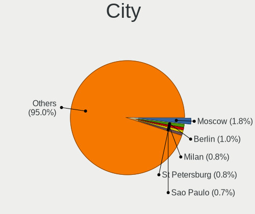
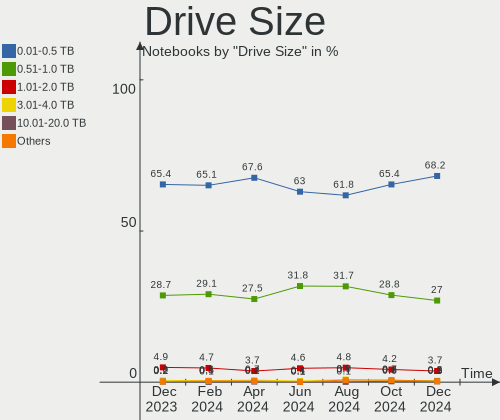
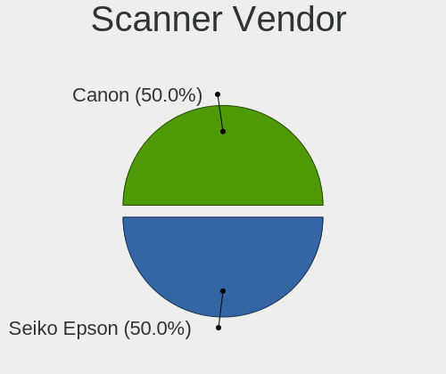

Linux - Hardware Trends (Notebooks)
-----------------------------------

A project to identify most popular hardware characteristics and track their change
over time based on data collected by Linux users at https://Linux-Hardware.org.

Anyone can contribute to this report by the [hw-probe](https://github.com/linuxhw/hw-probe) tool:

    sudo -E hw-probe -all -upload

This report is for one last month. Overall report since the beginning of time: [TestCoverage](https://github.com/linuxhw/TestCoverage)

Period: May, 2022.

Contents
--------

* [ System ](#system)
  - [ OS                       ](#os)
  - [ OS Family                ](#os-family)
  - [ Kernel                   ](#kernel)
  - [ Kernel Family            ](#kernel-family)
  - [ Kernel Major Ver.        ](#kernel-major-ver)
  - [ Arch                     ](#arch)
  - [ DE                       ](#de)
  - [ Display Server           ](#display-server)
  - [ Display Manager          ](#display-manager)
  - [ OS Lang                  ](#os-lang)
  - [ Boot Mode                ](#boot-mode)
  - [ Filesystem               ](#filesystem)
  - [ Part. scheme             ](#part-scheme)
  - [ Dual Boot with Linux/BSD ](#dual-boot-with-linuxbsd)
  - [ Dual Boot (Win)          ](#dual-boot-win)

* [ Board ](#board)
  - [ Vendor                   ](#vendor)
  - [ Model                    ](#model)
  - [ Model Family             ](#model-family)
  - [ MFG Year                 ](#mfg-year)
  - [ Form Factor              ](#form-factor)
  - [ Secure Boot              ](#secure-boot)
  - [ Coreboot                 ](#coreboot)
  - [ RAM Size                 ](#ram-size)
  - [ RAM Used                 ](#ram-used)
  - [ Total Drives             ](#total-drives)
  - [ Has CD-ROM               ](#has-cd-rom)
  - [ Has Ethernet             ](#has-ethernet)
  - [ Has WiFi                 ](#has-wifi)
  - [ Has Bluetooth            ](#has-bluetooth)

* [ Location ](#location)
  - [ Country                  ](#country)
  - [ City                     ](#city)

* [ Drives ](#drives)
  - [ Drive Vendor             ](#drive-vendor)
  - [ Drive Model              ](#drive-model)
  - [ HDD Vendor               ](#hdd-vendor)
  - [ SSD Vendor               ](#ssd-vendor)
  - [ Drive Kind               ](#drive-kind)
  - [ Drive Connector          ](#drive-connector)
  - [ Drive Size               ](#drive-size)
  - [ Space Total              ](#space-total)
  - [ Space Used               ](#space-used)
  - [ Malfunc. Drives          ](#malfunc-drives)
  - [ Malfunc. Drive Vendor    ](#malfunc-drive-vendor)
  - [ Malfunc. HDD Vendor      ](#malfunc-hdd-vendor)
  - [ Malfunc. Drive Kind      ](#malfunc-drive-kind)
  - [ Failed Drives            ](#failed-drives)
  - [ Failed Drive Vendor      ](#failed-drive-vendor)
  - [ Drive Status             ](#drive-status)

* [ Storage controller ](#storage-controller)
  - [ Storage Vendor           ](#storage-vendor)
  - [ Storage Model            ](#storage-model)
  - [ Storage Kind             ](#storage-kind)

* [ Processor ](#processor)
  - [ CPU Vendor               ](#cpu-vendor)
  - [ CPU Model                ](#cpu-model)
  - [ CPU Model Family         ](#cpu-model-family)
  - [ CPU Cores                ](#cpu-cores)
  - [ CPU Sockets              ](#cpu-sockets)
  - [ CPU Threads              ](#cpu-threads)
  - [ CPU Op-Modes             ](#cpu-op-modes)
  - [ CPU Microcode            ](#cpu-microcode)
  - [ CPU Microarch            ](#cpu-microarch)

* [ Graphics ](#graphics)
  - [ GPU Vendor               ](#gpu-vendor)
  - [ GPU Model                ](#gpu-model)
  - [ GPU Combo                ](#gpu-combo)
  - [ GPU Driver               ](#gpu-driver)
  - [ GPU Memory               ](#gpu-memory)

* [ Monitor ](#monitor)
  - [ Monitor Vendor           ](#monitor-vendor)
  - [ Monitor Model            ](#monitor-model)
  - [ Monitor Resolution       ](#monitor-resolution)
  - [ Monitor Diagonal         ](#monitor-diagonal)
  - [ Monitor Width            ](#monitor-width)
  - [ Aspect Ratio             ](#aspect-ratio)
  - [ Monitor Area             ](#monitor-area)
  - [ Pixel Density            ](#pixel-density)
  - [ Multiple Monitors        ](#multiple-monitors)

* [ Network ](#network)
  - [ Net Controller Vendor    ](#net-controller-vendor)
  - [ Net Controller Model     ](#net-controller-model)
  - [ Wireless Vendor          ](#wireless-vendor)
  - [ Wireless Model           ](#wireless-model)
  - [ Ethernet Vendor          ](#ethernet-vendor)
  - [ Ethernet Model           ](#ethernet-model)
  - [ Net Controller Kind      ](#net-controller-kind)
  - [ Used Controller          ](#used-controller)
  - [ NICs                     ](#nics)
  - [ IPv6                     ](#ipv6)

* [ Bluetooth ](#bluetooth)
  - [ Bluetooth Vendor         ](#bluetooth-vendor)
  - [ Bluetooth Model          ](#bluetooth-model)

* [ Sound ](#sound)
  - [ Sound Vendor             ](#sound-vendor)
  - [ Sound Model              ](#sound-model)

* [ Memory ](#memory)
  - [ Memory Vendor            ](#memory-vendor)
  - [ Memory Model             ](#memory-model)
  - [ Memory Kind              ](#memory-kind)
  - [ Memory Form Factor       ](#memory-form-factor)
  - [ Memory Size              ](#memory-size)
  - [ Memory Speed             ](#memory-speed)

* [ Printers & scanners ](#printers--scanners)
  - [ Printer Vendor           ](#printer-vendor)
  - [ Printer Model            ](#printer-model)
  - [ Scanner Vendor           ](#scanner-vendor)
  - [ Scanner Model            ](#scanner-model)

* [ Camera ](#camera)
  - [ Camera Vendor            ](#camera-vendor)
  - [ Camera Model             ](#camera-model)

* [ Security ](#security)
  - [ Fingerprint Vendor       ](#fingerprint-vendor)
  - [ Fingerprint Model        ](#fingerprint-model)
  - [ Chipcard Vendor          ](#chipcard-vendor)
  - [ Chipcard Model           ](#chipcard-model)

* [ Unsupported ](#unsupported)
  - [ Unsupported Devices      ](#unsupported-devices)
  - [ Unsupported Device Types ](#unsupported-device-types)

System
------

OS
--

Installed operating systems

| Name                         | Notebooks | Percent |
|------------------------------|-----------|---------|
| Ubuntu 22.04                 | 349       | 13.51%  |
| Ubuntu 20.04                 | 225       | 8.71%   |
| Linux Mint 20.3              | 185       | 7.16%   |
| Fedora 36                    | 173       | 6.7%    |
| Pop!_OS 22.04                | 144       | 5.57%   |
| OpenMandriva 4.3             | 124       | 4.8%    |
| ROSA 12.2                    | 118       | 4.57%   |
| Debian 11                    | 109       | 4.22%   |
| Zorin 16                     | 87        | 3.37%   |
| Fedora 35                    | 72        | 2.79%   |
| KDE neon 20.04               | 68        | 2.63%   |
| Manjaro 21.2.6               | 64        | 2.48%   |
| Arch                         | 63        | 2.44%   |
| Manjaro                      | 53        | 2.05%   |
| openSUSE Tumbleweed-XXXXXXXX | 32        | 1.24%   |
| Arch Rolling                 | 32        | 1.24%   |
| Kubuntu 22.04                | 28        | 1.08%   |
| Kali 2022.2                  | 28        | 1.08%   |
| ArcoLinux Rolling            | 28        | 1.08%   |
| Ubuntu 21.10                 | 25        | 0.97%   |
| Elementary 6.1               | 24        | 0.93%   |
| Xubuntu 20.04                | 23        | 0.89%   |
| LMDE 5                       | 21        | 0.81%   |
| BlackPanther 18.1            | 17        | 0.66%   |
| Ubuntu 18.04                 | 15        | 0.58%   |
| Gentoo 2.6                   | 15        | 0.58%   |
| Endless 4.0.6                | 15        | 0.58%   |
| Debian Testing               | 15        | 0.58%   |
| OpenMandriva 4.2             | 14        | 0.54%   |
| Kubuntu 20.04                | 14        | 0.54%   |
| Ubuntu Budgie 22.04          | 13        | 0.5%    |
| ROSA R11.1                   | 12        | 0.46%   |
| Pop!_OS 21.10                | 12        | 0.46%   |
| Lubuntu 22.04                | 12        | 0.46%   |
| Lubuntu 20.04                | 11        | 0.43%   |
| Linux Mint 20.2              | 11        | 0.43%   |
| Xubuntu 22.04                | 10        | 0.39%   |
| Debian 10                    | 9         | 0.35%   |
| Ubuntu MATE 22.04            | 8         | 0.31%   |
| Ubuntu MATE 20.04            | 8         | 0.31%   |
| Ubuntu 16.04                 | 8         | 0.31%   |
| SteamOS 3.2                  | 8         | 0.31%   |
| Gentoo 2.8                   | 8         | 0.31%   |
| EndeavourOS Rolling          | 8         | 0.31%   |
| SteamOS 3.1                  | 7         | 0.27%   |
| Parrot 5.0                   | 7         | 0.27%   |
| Linux Mint 20.1              | 7         | 0.27%   |
| Linux Mint 19.3              | 7         | 0.27%   |
| Kubuntu 21.10                | 7         | 0.27%   |
| EndeavourOS                  | 7         | 0.27%   |
| Debian Unstable              | 7         | 0.27%   |
| MX 21                        | 6         | 0.23%   |
| Lubuntu 21.10                | 6         | 0.23%   |
| Gentoo 2.7                   | 6         | 0.23%   |
| Fedora 34                    | 6         | 0.23%   |
| Endless 3.9.7                | 6         | 0.23%   |
| Xubuntu 18.04                | 5         | 0.19%   |
| Pop!_OS 20.04                | 5         | 0.19%   |
| OpenMandriva 4.50            | 5         | 0.19%   |
| LinuxFX 11                   | 5         | 0.19%   |

OS Family
---------

OS without a version

| Name          | Notebooks | Percent |
|---------------|-----------|---------|
| Ubuntu        | 629       | 24.35%  |
| Fedora        | 254       | 9.83%   |
| Linux Mint    | 214       | 8.28%   |
| Pop!_OS       | 165       | 6.39%   |
| Debian        | 145       | 5.61%   |
| OpenMandriva  | 144       | 5.57%   |
| ROSA          | 134       | 5.19%   |
| Manjaro       | 119       | 4.61%   |
| Arch          | 95        | 3.68%   |
| Zorin         | 89        | 3.45%   |
| KDE neon      | 68        | 2.63%   |
| Kubuntu       | 54        | 2.09%   |
| Xubuntu       | 39        | 1.51%   |
| openSUSE      | 38        | 1.47%   |
| Kali          | 32        | 1.24%   |
| Lubuntu       | 31        | 1.2%    |
| Endless       | 30        | 1.16%   |
| ArcoLinux     | 30        | 1.16%   |
| Gentoo        | 29        | 1.12%   |
| Elementary    | 26        | 1.01%   |
| LMDE          | 21        | 0.81%   |
| SteamOS       | 18        | 0.7%    |
| Ubuntu MATE   | 17        | 0.66%   |
| BlackPanther  | 17        | 0.66%   |
| ALT Linux     | 16        | 0.62%   |
| EndeavourOS   | 15        | 0.58%   |
| Ubuntu Budgie | 14        | 0.54%   |
| Clear Linux   | 14        | 0.54%   |
| Garuda Linux  | 10        | 0.39%   |
| Parrot        | 8         | 0.31%   |
| RHEL          | 6         | 0.23%   |
| MX            | 6         | 0.23%   |
| LinuxFX       | 6         | 0.23%   |
| Linux Lite    | 5         | 0.19%   |
| Xero          | 3         | 0.12%   |
| Q4OS          | 3         | 0.12%   |
| CentOS        | 3         | 0.12%   |
| Artix         | 3         | 0.12%   |
| Solus         | 2         | 0.08%   |
| Slackware     | 2         | 0.08%   |
| Peppermint    | 2         | 0.08%   |
| Mageia        | 2         | 0.08%   |
| Drauger OS    | 2         | 0.08%   |
| Archcraft     | 2         | 0.08%   |
| antiX         | 2         | 0.08%   |
| Alpine        | 2         | 0.08%   |
| Void Linux    | 1         | 0.04%   |
| Ubuntu Studio | 1         | 0.04%   |
| Sparky        | 1         | 0.04%   |
| Red OS        | 1         | 0.04%   |
| PureOS        | 1         | 0.04%   |
| PCLinuxOS     | 1         | 0.04%   |
| Pardus        | 1         | 0.04%   |
| Oracle Linux  | 1         | 0.04%   |
| Makulu        | 1         | 0.04%   |
| Lilidog       | 1         | 0.04%   |
| KaOS          | 1         | 0.04%   |
| Kaisen        | 1         | 0.04%   |
| Huayra        | 1         | 0.04%   |
| Generic       | 1         | 0.04%   |

Kernel
------

Version of the Linux kernel

| Version                                        | Notebooks | Percent |
|------------------------------------------------|-----------|---------|
| 5.13.0-40-generic                              | 165       | 6.39%   |
| 5.15.0-27-generic                              | 155       | 6%      |
| 5.13.0-41-generic                              | 141       | 5.46%   |
| 5.16.7-desktop-1omv4003                        | 118       | 4.57%   |
| 5.17.5-76051705-generic                        | 111       | 4.3%    |
| 5.10.74-generic-2rosa2021.1-x86_64             | 109       | 4.22%   |
| 5.15.0-30-generic                              | 104       | 4.03%   |
| 5.4.0-110-generic                              | 86        | 3.33%   |
| 5.13.0-44-generic                              | 84        | 3.25%   |
| 5.15.0-33-generic                              | 81        | 3.14%   |
| 5.4.0-109-generic                              | 71        | 2.75%   |
| 5.10.0-14-amd64                                | 71        | 2.75%   |
| 5.17.6-300.fc36.x86_64                         | 43        | 1.66%   |
| 5.4.0-113-generic                              | 42        | 1.63%   |
| 5.16.19-76051619-generic                       | 40        | 1.55%   |
| 5.17.5-arch1-1                                 | 33        | 1.28%   |
| 5.17.9-arch1-1                                 | 32        | 1.24%   |
| 5.15.32-1-MANJARO                              | 32        | 1.24%   |
| 5.17.5-200.fc35.x86_64                         | 29        | 1.12%   |
| 5.17.5-300.fc36.x86_64                         | 28        | 1.08%   |
| 5.17.8-300.fc36.x86_64                         | 27        | 1.05%   |
| 5.15.0-25-generic                              | 26        | 1.01%   |
| 5.17.7-300.fc36.x86_64                         | 24        | 0.93%   |
| 5.10.0-7-amd64                                 | 24        | 0.93%   |
| 5.16.0-kali7-amd64                             | 23        | 0.89%   |
| 5.15.38-1-MANJARO                              | 22        | 0.85%   |
| 5.17.11-300.fc36.x86_64                        | 21        | 0.81%   |
| 5.17.9-300.fc36.x86_64                         | 20        | 0.77%   |
| 5.17.0-1-amd64                                 | 20        | 0.77%   |
| 5.11.0-35-generic                              | 20        | 0.77%   |
| 5.4.0-91-generic                               | 19        | 0.74%   |
| 5.17.4-1-default                               | 19        | 0.74%   |
| 5.17.4-200.fc35.x86_64                         | 18        | 0.7%    |
| 5.10.0-13-amd64                                | 17        | 0.66%   |
| 5.10.14-desktop-1omv4002                       | 12        | 0.46%   |
| 5.17.9-zen1-1-zen                              | 10        | 0.39%   |
| 5.17.6-1-MANJARO                               | 10        | 0.39%   |
| 5.13.0-30-generic                              | 10        | 0.39%   |
| 5.6.14-desktop-2bP                             | 9         | 0.35%   |
| 5.17.1-3-MANJARO                               | 9         | 0.35%   |
| 5.13.0-39-generic                              | 9         | 0.35%   |
| 5.8.0-14-generic                               | 8         | 0.31%   |
| 5.17.8-arch1-1                                 | 8         | 0.31%   |
| 5.17.7-arch1-1                                 | 8         | 0.31%   |
| 5.16.0-12parrot1-amd64                         | 8         | 0.31%   |
| 5.15.41-1-MANJARO                              | 8         | 0.31%   |
| 4.18.16-desktop-1bP                            | 8         | 0.31%   |
| 5.4.0-107-generic                              | 7         | 0.27%   |
| 5.16.20-2-MANJARO                              | 7         | 0.27%   |
| 5.15.32-gentoo-r1                              | 7         | 0.27%   |
| 5.15.0-28-generic                              | 7         | 0.27%   |
| 5.14.0-1038-oem                                | 7         | 0.27%   |
| 5.14.0-1034-oem                                | 7         | 0.27%   |
| 5.13.0-valve10.3-1-neptune-02176-g5fe416c4acd8 | 7         | 0.27%   |
| 5.13.0-27-generic                              | 7         | 0.27%   |
| 5.17.5-051705-generic                          | 6         | 0.23%   |
| 5.17.3-302.fc36.x86_64                         | 6         | 0.23%   |
| 5.15.0-32-generic                              | 6         | 0.23%   |
| 5.10.109-1-MANJARO                             | 6         | 0.23%   |
| 4.19.0-20-amd64                                | 6         | 0.23%   |

Kernel Family
-------------

Linux kernel without a distro release

| Version  | Notebooks | Percent |
|----------|-----------|---------|
| 5.13.0   | 452       | 17.5%   |
| 5.15.0   | 402       | 15.56%  |
| 5.4.0    | 262       | 10.14%  |
| 5.17.5   | 235       | 9.1%    |
| 5.10.0   | 127       | 4.92%   |
| 5.16.7   | 118       | 4.57%   |
| 5.10.74  | 114       | 4.41%   |
| 5.17.9   | 84        | 3.25%   |
| 5.17.6   | 71        | 2.75%   |
| 5.17.7   | 51        | 1.97%   |
| 5.15.32  | 50        | 1.94%   |
| 5.17.4   | 48        | 1.86%   |
| 5.17.8   | 46        | 1.78%   |
| 5.17.0   | 43        | 1.66%   |
| 5.11.0   | 43        | 1.66%   |
| 5.16.19  | 42        | 1.63%   |
| 5.16.0   | 40        | 1.55%   |
| 5.14.0   | 29        | 1.12%   |
| 5.17.11  | 25        | 0.97%   |
| 5.15.38  | 24        | 0.93%   |
| 5.17.1   | 20        | 0.77%   |
| 5.18.0   | 16        | 0.62%   |
| 4.15.0   | 16        | 0.62%   |
| 5.15.41  | 13        | 0.5%    |
| 5.8.0    | 12        | 0.46%   |
| 5.10.14  | 12        | 0.46%   |
| 4.19.0   | 10        | 0.39%   |
| 5.6.14   | 9         | 0.35%   |
| 5.15.37  | 9         | 0.35%   |
| 5.17.3   | 8         | 0.31%   |
| 5.16.20  | 8         | 0.31%   |
| 5.10.109 | 8         | 0.31%   |
| 4.18.16  | 8         | 0.31%   |
| 5.4.83   | 6         | 0.23%   |
| 5.16.18  | 6         | 0.23%   |
| 5.16.13  | 5         | 0.19%   |
| 5.14.7   | 5         | 0.19%   |
| 5.14.10  | 5         | 0.19%   |
| 5.15.36  | 4         | 0.15%   |
| 5.15.35  | 4         | 0.15%   |
| 5.15.10  | 4         | 0.15%   |
| 5.14.21  | 4         | 0.15%   |
| 5.13.19  | 4         | 0.15%   |
| 4.18.0   | 4         | 0.15%   |
| 5.18.1   | 3         | 0.12%   |
| 5.11.12  | 3         | 0.12%   |
| 5.10.113 | 3         | 0.12%   |
| 5.10.102 | 3         | 0.12%   |
| 4.9.0    | 3         | 0.12%   |
| 4.4.0    | 3         | 0.12%   |
| 5.6.0    | 2         | 0.08%   |
| 5.3.18   | 2         | 0.08%   |
| 5.17.2   | 2         | 0.08%   |
| 5.16.4   | 2         | 0.08%   |
| 5.16.2   | 2         | 0.08%   |
| 5.16.15  | 2         | 0.08%   |
| 5.16.12  | 2         | 0.08%   |
| 5.15.34  | 2         | 0.08%   |
| 5.15.19  | 2         | 0.08%   |
| 5.14.18  | 2         | 0.08%   |

Kernel Major Ver.
-----------------

Linux kernel major version

| Version | Notebooks | Percent |
|---------|-----------|---------|
| 5.17    | 633       | 24.51%  |
| 5.15    | 520       | 20.13%  |
| 5.13    | 458       | 17.73%  |
| 5.10    | 277       | 10.72%  |
| 5.4     | 269       | 10.41%  |
| 5.16    | 234       | 9.06%   |
| 5.11    | 47        | 1.82%   |
| 5.14    | 46        | 1.78%   |
| 5.18    | 19        | 0.74%   |
| 4.15    | 16        | 0.62%   |
| 5.8     | 12        | 0.46%   |
| 5.6     | 12        | 0.46%   |
| 4.18    | 12        | 0.46%   |
| 4.19    | 11        | 0.43%   |
| 4.9     | 4         | 0.15%   |
| 4.4     | 4         | 0.15%   |
| 5.3     | 2         | 0.08%   |
| 5.0     | 2         | 0.08%   |
| 5.12    | 1         | 0.04%   |
| 4.14    | 1         | 0.04%   |
| 4.10    | 1         | 0.04%   |
| 3.13    | 1         | 0.04%   |
| 3.10    | 1         | 0.04%   |

Arch
----

OS architecture (x86_64, i586, etc.)

| Name   | Notebooks | Percent |
|--------|-----------|---------|
| x86_64 | 2551      | 98.76%  |
| i686   | 32        | 1.24%   |

DE
--

Desktop Environment

| Name             | Notebooks | Percent |
|------------------|-----------|---------|
| GNOME            | 1274      | 49.32%  |
| KDE5             | 570       | 22.07%  |
| XFCE             | 198       | 7.67%   |
| X-Cinnamon       | 187       | 7.24%   |
| Unknown          | 93        | 3.6%    |
| MATE             | 58        | 2.25%   |
| LXQt             | 53        | 2.05%   |
| Cinnamon         | 27        | 1.05%   |
| Pantheon         | 26        | 1.01%   |
| i3               | 16        | 0.62%   |
| Budgie           | 14        | 0.54%   |
| Unity            | 11        | 0.43%   |
| LXDE             | 10        | 0.39%   |
| KDE4             | 9         | 0.35%   |
| awesome          | 5         | 0.19%   |
| sway             | 4         | 0.15%   |
| GNOME Flashback  | 4         | 0.15%   |
| lightdm-xsession | 3         | 0.12%   |
| LeftWM           | 3         | 0.12%   |
| Deepin           | 3         | 0.12%   |
| bspwm            | 3         | 0.12%   |
| xmonad           | 2         | 0.08%   |
| KDE              | 2         | 0.08%   |
| Trinity          | 1         | 0.04%   |
| openbox          | 1         | 0.04%   |
| matchbox         | 1         | 0.04%   |
| icewm            | 1         | 0.04%   |
| GNOME Classic    | 1         | 0.04%   |
| fly              | 1         | 0.04%   |
| cwm              | 1         | 0.04%   |
| Cutefish         | 1         | 0.04%   |

Display Server
--------------

X11 or Wayland

| Name    | Notebooks | Percent |
|---------|-----------|---------|
| X11     | 1798      | 69.61%  |
| Wayland | 703       | 27.22%  |
| Unknown | 52        | 2.01%   |
| Tty     | 30        | 1.16%   |

Display Manager
---------------

SDDM, LightDM, etc.

| Name    | Notebooks | Percent |
|---------|-----------|---------|
| Unknown | 882       | 34.15%  |
| GDM3    | 549       | 21.25%  |
| SDDM    | 457       | 17.69%  |
| LightDM | 342       | 13.24%  |
| GDM     | 328       | 12.7%   |
| KDM     | 8         | 0.31%   |
| XDM     | 6         | 0.23%   |
| Ly      | 3         | 0.12%   |
| LXDM    | 3         | 0.12%   |
| SLiM    | 2         | 0.08%   |
| TDM     | 1         | 0.04%   |
| GREETD  | 1         | 0.04%   |
| FLY-DM  | 1         | 0.04%   |

OS Lang
-------

Language

| Lang        | Notebooks | Percent |
|-------------|-----------|---------|
| en_US       | 1099      | 42.55%  |
| ru_RU       | 255       | 9.87%   |
| de_DE       | 146       | 5.65%   |
| pt_BR       | 128       | 4.96%   |
| en_GB       | 124       | 4.8%    |
| fr_FR       | 111       | 4.3%    |
| es_ES       | 71        | 2.75%   |
| it_IT       | 60        | 2.32%   |
| pl_PL       | 49        | 1.9%    |
| en_IN       | 47        | 1.82%   |
| Unknown     | 47        | 1.82%   |
| en_AU       | 42        | 1.63%   |
| en_CA       | 38        | 1.47%   |
| C           | 27        | 1.05%   |
| es_MX       | 24        | 0.93%   |
| zh_CN       | 19        | 0.74%   |
| cs_CZ       | 18        | 0.7%    |
| tr_TR       | 15        | 0.58%   |
| en_ZA       | 14        | 0.54%   |
| de_CH       | 14        | 0.54%   |
| es_CO       | 13        | 0.5%    |
| ja_JP       | 12        | 0.46%   |
| pt_PT       | 11        | 0.43%   |
| hu_HU       | 11        | 0.43%   |
| sv_SE       | 10        | 0.39%   |
| es_AR       | 10        | 0.39%   |
| en_IE       | 10        | 0.39%   |
| nl_NL       | 8         | 0.31%   |
| nb_NO       | 8         | 0.31%   |
| fr_BE       | 8         | 0.31%   |
| es_EC       | 8         | 0.31%   |
| en_PH       | 8         | 0.31%   |
| en_NZ       | 8         | 0.31%   |
| de_AT       | 8         | 0.31%   |
| es_CL       | 7         | 0.27%   |
| en_IL       | 7         | 0.27%   |
| fi_FI       | 6         | 0.23%   |
| nl_BE       | 5         | 0.19%   |
| es_PE       | 5         | 0.19%   |
| da_DK       | 5         | 0.19%   |
| bg_BG       | 5         | 0.19%   |
| zh_TW       | 4         | 0.15%   |
| ru_UA       | 4         | 0.15%   |
| ro_RO       | 4         | 0.15%   |
| POSIX       | 4         | 0.15%   |
| ko_KR       | 4         | 0.15%   |
| C.UTF8      | 4         | 0.15%   |
| sl_SI       | 3         | 0.12%   |
| hr_HR       | 3         | 0.12%   |
| es_NI       | 3         | 0.12%   |
| el_GR       | 3         | 0.12%   |
| fr_CH       | 2         | 0.08%   |
| fr_CA       | 2         | 0.08%   |
| en_SG       | 2         | 0.08%   |
| en_DK       | 2         | 0.08%   |
| zh_HK       | 1         | 0.04%   |
| uk_UA       | 1         | 0.04%   |
| sr_RS@latin | 1         | 0.04%   |
| lt_LT       | 1         | 0.04%   |
| id_ID       | 1         | 0.04%   |

Boot Mode
---------

EFI or BIOS

| Mode | Notebooks | Percent |
|------|-----------|---------|
| EFI  | 1414      | 54.74%  |
| BIOS | 1169      | 45.26%  |

Filesystem
----------

Type of filesystem

| Type    | Notebooks | Percent |
|---------|-----------|---------|
| Ext4    | 1981      | 76.69%  |
| Btrfs   | 355       | 13.74%  |
| Overlay | 186       | 7.2%    |
| Xfs     | 24        | 0.93%   |
| Zfs     | 19        | 0.74%   |
| F2fs    | 7         | 0.27%   |
| Unknown | 3         | 0.12%   |
| Ext3    | 2         | 0.08%   |
| Aufs    | 2         | 0.08%   |
| XXXXXXX | 1         | 0.04%   |
| XXX4    | 1         | 0.04%   |
| Jfs     | 1         | 0.04%   |
| Ext2    | 1         | 0.04%   |

Part. scheme
------------

Scheme of partitioning

| Type    | Notebooks | Percent |
|---------|-----------|---------|
| Unknown | 1242      | 48.08%  |
| GPT     | 1046      | 40.5%   |
| MBR     | 295       | 11.42%  |

Dual Boot with Linux/BSD
------------------------

Hosting more than one Linux/BSD

| Dual boot | Notebooks | Percent |
|-----------|-----------|---------|
| No        | 2316      | 89.66%  |
| Yes       | 267       | 10.34%  |

Dual Boot (Win)
---------------

Hosting Linux and Windows

| Dual boot | Notebooks | Percent |
|-----------|-----------|---------|
| No        | 1913      | 74.06%  |
| Yes       | 670       | 25.94%  |

Board
-----

Vendor
------

Motherboard manufacturer

| Name                   | Notebooks | Percent |
|------------------------|-----------|---------|
| Lenovo                 | 552       | 21.37%  |
| Hewlett-Packard        | 444       | 17.19%  |
| Dell                   | 403       | 15.6%   |
| ASUSTek Computer       | 312       | 12.08%  |
| Acer                   | 206       | 7.98%   |
| Toshiba                | 69        | 2.67%   |
| MSI                    | 61        | 2.36%   |
| Apple                  | 60        | 2.32%   |
| Samsung Electronics    | 47        | 1.82%   |
| HUAWEI                 | 33        | 1.28%   |
| Sony                   | 28        | 1.08%   |
| Google                 | 25        | 0.97%   |
| Aquarius               | 22        | 0.85%   |
| Notebook               | 21        | 0.81%   |
| Medion                 | 17        | 0.66%   |
| Alienware              | 17        | 0.66%   |
| TUXEDO                 | 16        | 0.62%   |
| Valve                  | 15        | 0.58%   |
| Fujitsu                | 14        | 0.54%   |
| Packard Bell           | 13        | 0.5%    |
| Unknown                | 12        | 0.46%   |
| System76               | 10        | 0.39%   |
| Positivo               | 10        | 0.39%   |
| LG Electronics         | 10        | 0.39%   |
| Chuwi                  | 10        | 0.39%   |
| Timi                   | 9         | 0.35%   |
| Razer                  | 8         | 0.31%   |
| Framework              | 6         | 0.23%   |
| Avell High Performance | 6         | 0.23%   |
| Schenker               | 5         | 0.19%   |
| Panasonic              | 5         | 0.19%   |
| Gigabyte Technology    | 5         | 0.19%   |
| Clevo                  | 5         | 0.19%   |
| SLIMBOOK               | 4         | 0.15%   |
| PC Specialist          | 4         | 0.15%   |
| ICL                    | 4         | 0.15%   |
| Gateway                | 4         | 0.15%   |
| Fujitsu Siemens        | 4         | 0.15%   |
| eMachines              | 4         | 0.15%   |
| Standard               | 3         | 0.12%   |
| Intel                  | 3         | 0.12%   |
| HONOR                  | 3         | 0.12%   |
| GPU Company            | 3         | 0.12%   |
| Compaq                 | 3         | 0.12%   |
| AMI                    | 3         | 0.12%   |
| Teclast                | 2         | 0.08%   |
| SANTECH                | 2         | 0.08%   |
| Positivo Bahia - VAIO  | 2         | 0.08%   |
| Philco                 | 2         | 0.08%   |
| Pegatron               | 2         | 0.08%   |
| Monster                | 2         | 0.08%   |
| Mediacom               | 2         | 0.08%   |
| Lex                    | 2         | 0.08%   |
| Irbis                  | 2         | 0.08%   |
| Entroware              | 2         | 0.08%   |
| YASHI                  | 1         | 0.04%   |
| Wortmann AG            | 1         | 0.04%   |
| Vestel                 | 1         | 0.04%   |
| TODOS INDUSTRIAL       | 1         | 0.04%   |
| Thomson                | 1         | 0.04%   |

Model
-----

Motherboard model

| Name                                 | Notebooks | Percent |
|--------------------------------------|-----------|---------|
| Unknown                              | 30        | 1.16%   |
| Aquarius NS585                       | 22        | 0.85%   |
| HP Notebook                          | 17        | 0.66%   |
| Valve Jupiter                        | 15        | 0.58%   |
| HP Pavilion g6                       | 13        | 0.5%    |
| HP Pavilion Notebook                 | 9         | 0.35%   |
| Dell XPS 13 9310                     | 9         | 0.35%   |
| Samsung 550XDA                       | 8         | 0.31%   |
| Dell XPS 15 9570                     | 8         | 0.31%   |
| Lenovo IdeaPad 3 15ITL6 82H8         | 7         | 0.27%   |
| HP EliteBook 8470p                   | 7         | 0.27%   |
| ASUS ROG Strix G513QY_G513QY         | 7         | 0.27%   |
| HP Pavilion dv6                      | 6         | 0.23%   |
| HP OMEN Laptop 15-en0xxx             | 6         | 0.23%   |
| HP EliteBook 840 G3                  | 6         | 0.23%   |
| HP EliteBook 2560p                   | 6         | 0.23%   |
| Framework Laptop                     | 6         | 0.23%   |
| Dell Latitude E6540                  | 6         | 0.23%   |
| Dell Latitude E6420                  | 6         | 0.23%   |
| Dell Latitude 5420                   | 6         | 0.23%   |
| ASUS UX31E                           | 6         | 0.23%   |
| Apple MacBookAir7,2                  | 6         | 0.23%   |
| Acer Nitro AN515-45                  | 6         | 0.23%   |
| Acer Nitro AN515-44                  | 6         | 0.23%   |
| System76 Oryx Pro                    | 5         | 0.19%   |
| Lenovo ThinkBook 16p Gen 2 20YM      | 5         | 0.19%   |
| Lenovo IdeaPad 5 15ARE05 81YQ        | 5         | 0.19%   |
| Lenovo G50-70 20351                  | 5         | 0.19%   |
| HUAWEI HVY-WXX9                      | 5         | 0.19%   |
| HP Pavilion g4                       | 5         | 0.19%   |
| HP Pavilion 17                       | 5         | 0.19%   |
| HP Laptop 15-bs0xx                   | 5         | 0.19%   |
| Dell Vostro 3500                     | 5         | 0.19%   |
| Dell Latitude E6430                  | 5         | 0.19%   |
| Dell Latitude E6410                  | 5         | 0.19%   |
| Dell Latitude E6400                  | 5         | 0.19%   |
| Apple MacBookPro8,1                  | 5         | 0.19%   |
| Acer Nitro AN515-54                  | 5         | 0.19%   |
| Lenovo Z50-75 80EC                   | 4         | 0.15%   |
| Lenovo V145-15AST 81MT               | 4         | 0.15%   |
| Lenovo ThinkBook 15 G2 ITL 20VE      | 4         | 0.15%   |
| Lenovo Legion 5 15ACH6H 82JU         | 4         | 0.15%   |
| Lenovo IdeaPad Slim 1-14AST-05 81VS  | 4         | 0.15%   |
| Lenovo IdeaPad Gaming 3 15ARH05 82EY | 4         | 0.15%   |
| Lenovo IdeaPad 330-15IKB 81DE        | 4         | 0.15%   |
| Lenovo IdeaPad 100-15IBY 80MJ        | 4         | 0.15%   |
| Lenovo G580 20150                    | 4         | 0.15%   |
| Lenovo G500 20236                    | 4         | 0.15%   |
| HUAWEI NBLK-WAX9X                    | 4         | 0.15%   |
| HP ZBook 17 G5                       | 4         | 0.15%   |
| HP Laptop 14-dk1xxx                  | 4         | 0.15%   |
| HP 15                                | 4         | 0.15%   |
| Dell XPS 15 9510                     | 4         | 0.15%   |
| Dell XPS 15 7590                     | 4         | 0.15%   |
| Dell XPS 13 9305                     | 4         | 0.15%   |
| Dell XPS 13 7390                     | 4         | 0.15%   |
| Dell Studio 1555                     | 4         | 0.15%   |
| Dell Latitude 7400                   | 4         | 0.15%   |
| Dell Latitude 5520                   | 4         | 0.15%   |
| Dell Inspiron 3543                   | 4         | 0.15%   |

Model Family
------------

Motherboard model prefix

| Name                  | Notebooks | Percent |
|-----------------------|-----------|---------|
| Lenovo ThinkPad       | 259       | 10.03%  |
| Lenovo IdeaPad        | 137       | 5.3%    |
| Acer Aspire           | 128       | 4.96%   |
| Dell Inspiron         | 124       | 4.8%    |
| Dell Latitude         | 123       | 4.76%   |
| HP Pavilion           | 104       | 4.03%   |
| ASUS VivoBook         | 76        | 2.94%   |
| HP ProBook            | 69        | 2.67%   |
| HP EliteBook          | 64        | 2.48%   |
| HP Laptop             | 61        | 2.36%   |
| Dell XPS              | 57        | 2.21%   |
| Toshiba Satellite     | 56        | 2.17%   |
| Dell Vostro           | 37        | 1.43%   |
| Lenovo Legion         | 35        | 1.36%   |
| Dell Precision        | 34        | 1.32%   |
| ASUS ROG              | 33        | 1.28%   |
| Unknown               | 30        | 1.16%   |
| ASUS ASUS             | 26        | 1.01%   |
| Acer Nitro            | 25        | 0.97%   |
| Acer Swift            | 24        | 0.93%   |
| Aquarius NS585        | 22        | 0.85%   |
| HP ZBook              | 21        | 0.81%   |
| Lenovo ThinkBook      | 20        | 0.77%   |
| HP Notebook           | 17        | 0.66%   |
| Valve Jupiter         | 15        | 0.58%   |
| HP Compaq             | 15        | 0.58%   |
| ASUS ZenBook          | 14        | 0.54%   |
| HP OMEN               | 13        | 0.5%    |
| Packard Bell EasyNote | 12        | 0.46%   |
| HP 255                | 12        | 0.46%   |
| HP 250                | 12        | 0.46%   |
| Acer TravelMate       | 11        | 0.43%   |
| Lenovo Yoga           | 10        | 0.39%   |
| HP ENVY               | 10        | 0.39%   |
| Fujitsu LIFEBOOK      | 10        | 0.39%   |
| ASUS TUF              | 10        | 0.39%   |
| Apple MacBookPro8     | 9         | 0.35%   |
| Samsung 550XDA        | 8         | 0.31%   |
| Razer Blade           | 8         | 0.31%   |
| MSI Modern            | 8         | 0.31%   |
| Dell Studio           | 8         | 0.31%   |
| Apple MacBookAir7     | 7         | 0.27%   |
| MSI GF63              | 6         | 0.23%   |
| Framework Laptop      | 6         | 0.23%   |
| Dell G3               | 6         | 0.23%   |
| ASUS UX31E            | 6         | 0.23%   |
| Apple MacBookPro5     | 6         | 0.23%   |
| Acer Extensa          | 6         | 0.23%   |
| Toshiba TECRA         | 5         | 0.19%   |
| Toshiba PORTEGE       | 5         | 0.19%   |
| System76 Oryx         | 5         | 0.19%   |
| MSI Katana            | 5         | 0.19%   |
| Lenovo G580           | 5         | 0.19%   |
| Lenovo G50-70         | 5         | 0.19%   |
| Lenovo B590           | 5         | 0.19%   |
| HUAWEI HVY-WXX9       | 5         | 0.19%   |
| HP Mini               | 5         | 0.19%   |
| HP 15                 | 5         | 0.19%   |
| Apple MacBookPro11    | 5         | 0.19%   |
| TUXEDO InfinityBook   | 4         | 0.15%   |

MFG Year
--------

Motherboard manufacture year

| Year    | Notebooks | Percent |
|---------|-----------|---------|
| 2021    | 393       | 15.21%  |
| 2020    | 351       | 13.59%  |
| 2019    | 232       | 8.98%   |
| 2018    | 191       | 7.39%   |
| 2011    | 185       | 7.16%   |
| 2012    | 166       | 6.43%   |
| 2013    | 161       | 6.23%   |
| 2017    | 145       | 5.61%   |
| 2016    | 143       | 5.54%   |
| 2014    | 129       | 4.99%   |
| 2015    | 119       | 4.61%   |
| 2010    | 112       | 4.34%   |
| 2022    | 74        | 2.86%   |
| 2009    | 67        | 2.59%   |
| 2008    | 64        | 2.48%   |
| 2007    | 31        | 1.2%    |
| 2006    | 14        | 0.54%   |
| 2005    | 3         | 0.12%   |
| 2004    | 2         | 0.08%   |
| Unknown | 1         | 0.04%   |

Form Factor
-----------

Physical design of the computer

| Name     | Notebooks | Percent |
|----------|-----------|---------|
| Notebook | 2583      | 100%    |

Secure Boot
-----------

Enabled or disabled

| State    | Notebooks | Percent |
|----------|-----------|---------|
| Disabled | 2325      | 90.01%  |
| Enabled  | 258       | 9.99%   |

Coreboot
--------

Have coreboot on board

| Used | Notebooks | Percent |
|------|-----------|---------|
| No   | 2546      | 98.57%  |
| Yes  | 37        | 1.43%   |

RAM Size
--------

Total RAM memory

| Size in GB  | Notebooks | Percent |
|-------------|-----------|---------|
| 4.01-8.0    | 791       | 30.62%  |
| 3.01-4.0    | 489       | 18.93%  |
| 16.01-24.0  | 471       | 18.23%  |
| 8.01-16.0   | 443       | 17.15%  |
| 32.01-64.0  | 195       | 7.55%   |
| 1.01-2.0    | 82        | 3.17%   |
| 64.01-256.0 | 40        | 1.55%   |
| 2.01-3.0    | 32        | 1.24%   |
| 24.01-32.0  | 31        | 1.2%    |
| 0.51-1.0    | 9         | 0.35%   |

RAM Used
--------

Used RAM memory

| Used GB    | Notebooks | Percent |
|------------|-----------|---------|
| 1.01-2.0   | 841       | 32.56%  |
| 2.01-3.0   | 673       | 26.05%  |
| 4.01-8.0   | 412       | 15.95%  |
| 3.01-4.0   | 360       | 13.94%  |
| 0.51-1.0   | 173       | 6.7%    |
| 8.01-16.0  | 92        | 3.56%   |
| 0.01-0.5   | 14        | 0.54%   |
| 16.01-24.0 | 13        | 0.5%    |
| 32.01-64.0 | 3         | 0.12%   |
| 24.01-32.0 | 1         | 0.04%   |
| Unknown    | 1         | 0.04%   |

Total Drives
------------

Number of drives on board

| Drives | Notebooks | Percent |
|--------|-----------|---------|
| 1      | 1875      | 72.59%  |
| 2      | 627       | 24.27%  |
| 3      | 51        | 1.97%   |
| 0      | 14        | 0.54%   |
| 4      | 12        | 0.46%   |
| 5      | 3         | 0.12%   |
| 7      | 1         | 0.04%   |

Has CD-ROM
----------

Has CD-ROM on board

| Presented | Notebooks | Percent |
|-----------|-----------|---------|
| No        | 1784      | 69.07%  |
| Yes       | 799       | 30.93%  |

Has Ethernet
------------

Has Ethernet on board

| Presented | Notebooks | Percent |
|-----------|-----------|---------|
| Yes       | 2036      | 78.82%  |
| No        | 547       | 21.18%  |

Has WiFi
--------

Has WiFi module

| Presented | Notebooks | Percent |
|-----------|-----------|---------|
| Yes       | 2550      | 98.72%  |
| No        | 33        | 1.28%   |

Has Bluetooth
-------------

Has Bluetooth module

| Presented | Notebooks | Percent |
|-----------|-----------|---------|
| Yes       | 2107      | 81.57%  |
| No        | 476       | 18.43%  |

Location
--------

Country
-------

Geographic location (country)

| Country      | Notebooks | Percent |
|--------------|-----------|---------|
| USA          | 392       | 15.18%  |
| Russia       | 266       | 10.3%   |
| Germany      | 219       | 8.48%   |
| Brazil       | 170       | 6.58%   |
| France       | 133       | 5.15%   |
| UK           | 96        | 3.72%   |
| Italy        | 92        | 3.56%   |
| Poland       | 84        | 3.25%   |
| Spain        | 77        | 2.98%   |
| India        | 77        | 2.98%   |
| Canada       | 67        | 2.59%   |
| Netherlands  | 52        | 2.01%   |
| Australia    | 48        | 1.86%   |
| Mexico       | 42        | 1.63%   |
| Hungary      | 30        | 1.16%   |
| Turkey       | 29        | 1.12%   |
| Sweden       | 28        | 1.08%   |
| Czechia      | 28        | 1.08%   |
| Belgium      | 28        | 1.08%   |
| Indonesia    | 27        | 1.05%   |
| Portugal     | 25        | 0.97%   |
| Switzerland  | 24        | 0.93%   |
| China        | 24        | 0.93%   |
| Colombia     | 22        | 0.85%   |
| Austria      | 21        | 0.81%   |
| Ukraine      | 19        | 0.74%   |
| Argentina    | 19        | 0.74%   |
| Romania      | 18        | 0.7%    |
| Japan        | 18        | 0.7%    |
| Bulgaria     | 18        | 0.7%    |
| Finland      | 16        | 0.62%   |
| South Africa | 15        | 0.58%   |
| Norway       | 15        | 0.58%   |
| Peru         | 14        | 0.54%   |
| Denmark      | 13        | 0.5%    |
| Chile        | 13        | 0.5%    |
| New Zealand  | 12        | 0.46%   |
| Greece       | 11        | 0.43%   |
| Belarus      | 11        | 0.43%   |
| Philippines  | 10        | 0.39%   |
| Ecuador      | 10        | 0.39%   |
| Serbia       | 9         | 0.35%   |
| Morocco      | 9         | 0.35%   |
| Thailand     | 8         | 0.31%   |
| Kenya        | 8         | 0.31%   |
| Israel       | 8         | 0.31%   |
| Iran         | 8         | 0.31%   |
| Hong Kong    | 8         | 0.31%   |
| Croatia      | 8         | 0.31%   |
| Bangladesh   | 8         | 0.31%   |
| Slovenia     | 7         | 0.27%   |
| Ireland      | 7         | 0.27%   |
| Taiwan       | 6         | 0.23%   |
| Slovakia     | 6         | 0.23%   |
| Lithuania    | 6         | 0.23%   |
| Estonia      | 6         | 0.23%   |
| South Korea  | 5         | 0.19%   |
| Singapore    | 5         | 0.19%   |
| Saudi Arabia | 5         | 0.19%   |
| Pakistan     | 5         | 0.19%   |

City
----

Geographic location (city)

| City              | Notebooks | Percent |
|-------------------|-----------|---------|
| Moscow            | 77        | 2.98%   |
| Sao Paulo         | 34        | 1.32%   |
| St Petersburg     | 31        | 1.2%    |
| Voronezh          | 27        | 1.05%   |
| Berlin            | 21        | 0.81%   |
| Warsaw            | 20        | 0.77%   |
| Milan             | 20        | 0.77%   |
| Madrid            | 15        | 0.58%   |
| Paris             | 14        | 0.54%   |
| Melbourne         | 14        | 0.54%   |
| Budapest          | 13        | 0.5%    |
| Prague            | 12        | 0.46%   |
| Frankfurt am Main | 12        | 0.46%   |
| Amsterdam         | 12        | 0.46%   |
| Sydney            | 11        | 0.43%   |
| Rio de Janeiro    | 11        | 0.43%   |
| Munich            | 11        | 0.43%   |
| Sofia             | 9         | 0.35%   |
| Rome              | 9         | 0.35%   |
| Helsinki          | 9         | 0.35%   |
| Chelyabinsk       | 9         | 0.35%   |
| Brisbane          | 9         | 0.35%   |
| Bogotá           | 9         | 0.35%   |
| Bengaluru         | 9         | 0.35%   |
| Zurich            | 8         | 0.31%   |
| London            | 8         | 0.31%   |
| Lima              | 8         | 0.31%   |
| Istanbul          | 8         | 0.31%   |
| Vienna            | 7         | 0.27%   |
| Turin             | 7         | 0.27%   |
| Toronto           | 7         | 0.27%   |
| The Hague         | 7         | 0.27%   |
| Stuttgart         | 7         | 0.27%   |
| Poznan            | 7         | 0.27%   |
| Nairobi           | 7         | 0.27%   |
| Mexico City       | 7         | 0.27%   |
| Lisbon            | 7         | 0.27%   |
| Krakow            | 7         | 0.27%   |
| Jakarta           | 7         | 0.27%   |
| Central           | 7         | 0.27%   |
| Buenos Aires      | 7         | 0.27%   |
| Bucharest         | 7         | 0.27%   |
| Belgrade          | 7         | 0.27%   |
| Barcelona         | 7         | 0.27%   |
| Zagreb            | 6         | 0.23%   |
| Wroclaw           | 6         | 0.23%   |
| Stockholm         | 6         | 0.23%   |
| Santiago          | 6         | 0.23%   |
| Oslo              | 6         | 0.23%   |
| Novosibirsk       | 6         | 0.23%   |
| New York          | 6         | 0.23%   |
| Dallas            | 6         | 0.23%   |
| Cape Town         | 6         | 0.23%   |
| Auckland          | 6         | 0.23%   |
| Athens            | 6         | 0.23%   |
| Yerevan           | 5         | 0.19%   |
| Yekaterinburg     | 5         | 0.19%   |
| Tehran            | 5         | 0.19%   |
| Singapore         | 5         | 0.19%   |
| Seattle           | 5         | 0.19%   |

Drives
------

Drive Vendor
------------

Hard drive vendors

| Vendor                         | Notebooks | Drives | Percent |
|--------------------------------|-----------|--------|---------|
| Samsung Electronics            | 531       | 594    | 16.73%  |
| WDC                            | 338       | 350    | 10.65%  |
| Seagate                        | 313       | 321    | 9.86%   |
| Toshiba                        | 213       | 217    | 6.71%   |
| SanDisk                        | 197       | 201    | 6.21%   |
| SK Hynix                       | 163       | 166    | 5.14%   |
| Kingston                       | 163       | 167    | 5.14%   |
| Unknown                        | 158       | 176    | 4.98%   |
| Intel                          | 105       | 110    | 3.31%   |
| Crucial                        | 102       | 106    | 3.21%   |
| Micron Technology              | 85        | 87     | 2.68%   |
| HGST                           | 84        | 85     | 2.65%   |
| Hitachi                        | 75        | 76     | 2.36%   |
| A-DATA Technology              | 66        | 68     | 2.08%   |
| KIOXIA                         | 49        | 50     | 1.54%   |
| Phison                         | 44        | 46     | 1.39%   |
| China                          | 30        | 32     | 0.95%   |
| Apple                          | 30        | 34     | 0.95%   |
| Silicon Motion                 | 21        | 21     | 0.66%   |
| Unknown                        | 20        | 20     | 0.63%   |
| Patriot                        | 16        | 16     | 0.5%    |
| LITEON                         | 15        | 15     | 0.47%   |
| PNY                            | 13        | 13     | 0.41%   |
| Solid State Storage Technology | 12        | 12     | 0.38%   |
| Netac                          | 12        | 12     | 0.38%   |
| JMicron                        | 12        | 12     | 0.38%   |
| GOODRAM                        | 12        | 12     | 0.38%   |
| Fujitsu                        | 12        | 12     | 0.38%   |
| UMIS                           | 11        | 11     | 0.35%   |
| OCZ                            | 11        | 11     | 0.35%   |
| KingSpec                       | 11        | 11     | 0.35%   |
| Intenso                        | 11        | 12     | 0.35%   |
| Hewlett-Packard                | 11        | 11     | 0.35%   |
| Apacer                         | 9         | 9      | 0.28%   |
| ADATA Technology               | 9         | 9      | 0.28%   |
| Transcend                      | 8         | 8      | 0.25%   |
| LITEONIT                       | 8         | 8      | 0.25%   |
| Micron/Crucial Technology      | 7         | 8      | 0.22%   |
| Lexar                          | 7         | 7      | 0.22%   |
| XPG                            | 6         | 6      | 0.19%   |
| Team                           | 6         | 6      | 0.19%   |
| SSSTC                          | 6         | 6      | 0.19%   |
| SPCC                           | 6         | 6      | 0.19%   |
| PLEXTOR                        | 6         | 8      | 0.19%   |
| Gigabyte Technology            | 6         | 6      | 0.19%   |
| Union Memory (Shenzhen)        | 5         | 5      | 0.16%   |
| TO Exter                       | 5         | 5      | 0.16%   |
| Lenovo                         | 5         | 5      | 0.16%   |
| KIOXIA-EXCERIA                 | 5         | 5      | 0.16%   |
| Realtek Semiconductor          | 4         | 4      | 0.13%   |
| Union Memory                   | 3         | 3      | 0.09%   |
| Teclast                        | 3         | 3      | 0.09%   |
| S3+                            | 3         | 3      | 0.09%   |
| MyDigitalSSD                   | 3         | 3      | 0.09%   |
| HS-SSD-C100                    | 3         | 3      | 0.09%   |
| Corsair                        | 3         | 3      | 0.09%   |
| BIWIN                          | 3         | 3      | 0.09%   |
| BHT                            | 3         | 3      | 0.09%   |
| ASMT                           | 3         | 3      | 0.09%   |
| AMD                            | 3         | 3      | 0.09%   |

Drive Model
-----------

Hard drive models

| Model                               | Notebooks | Percent |
|-------------------------------------|-----------|---------|
| Seagate ST1000LM035-1RK172 1TB      | 46        | 1.4%    |
| Toshiba MQ01ABD100 1TB              | 38        | 1.16%   |
| Samsung NVMe SSD Drive 512GB        | 32        | 0.97%   |
| Seagate ST500LT012-1DG142 500GB     | 31        | 0.94%   |
| Sandisk NVMe SSD Drive 512GB        | 29        | 0.88%   |
| HGST HTS721010A9E630 1TB            | 29        | 0.88%   |
| Seagate ST1000LM024 HN-M101MBB 1TB  | 28        | 0.85%   |
| SK Hynix NVMe SSD Drive 512GB       | 27        | 0.82%   |
| Toshiba MQ01ABF050 500GB            | 26        | 0.79%   |
| Intel NVMe SSD Drive 512GB          | 24        | 0.73%   |
| A-DATA SU800 512GB SSD              | 24        | 0.73%   |
| Samsung NVMe SSD Drive 256GB        | 23        | 0.7%    |
| Unknown MMC Card  32GB              | 22        | 0.67%   |
| Samsung NVMe SSD Drive 1024GB       | 22        | 0.67%   |
| Toshiba MQ04ABF100 1TB              | 21        | 0.64%   |
| Samsung NVMe SSD Drive 1TB          | 21        | 0.64%   |
| Unknown                             | 20        | 0.61%   |
| Unknown MMC Card  64GB              | 19        | 0.58%   |
| Kingston SA400S37240G 240GB SSD     | 19        | 0.58%   |
| Crucial CT500MX500SSD1 500GB        | 19        | 0.58%   |
| Samsung SSD 860 EVO 500GB           | 18        | 0.55%   |
| Micron NVMe SSD Drive 512GB         | 18        | 0.55%   |
| HGST HTS545050A7E680 500GB          | 17        | 0.52%   |
| SK Hynix NVMe SSD Drive 256GB       | 16        | 0.49%   |
| Samsung SSD 860 EVO 250GB           | 16        | 0.49%   |
| Kingston SA400S37480G 480GB SSD     | 16        | 0.49%   |
| Toshiba NVMe SSD Drive 512GB        | 15        | 0.46%   |
| Seagate ST1000LM049-2GH172 1TB      | 15        | 0.46%   |
| Sandisk NVMe SSD Drive 256GB        | 15        | 0.46%   |
| Toshiba KBG30ZMS128G 128GB NVMe SSD | 14        | 0.43%   |
| Seagate ST9500325AS 500GB           | 14        | 0.43%   |
| Seagate ST2000LM007-1R8174 2TB      | 14        | 0.43%   |
| Sandisk NVMe SSD Drive 1TB          | 14        | 0.43%   |
| Samsung SSD 970 EVO Plus 1TB        | 14        | 0.43%   |
| Kingston SA400S37120G 120GB SSD     | 14        | 0.43%   |
| Kingston NVMe SSD Drive 512GB       | 14        | 0.43%   |
| Unknown SD/MMC/MS PRO 999GB         | 13        | 0.4%    |
| Seagate ST1000LM048-2E7172 1TB      | 13        | 0.4%    |
| Samsung NVMe SSD Drive 500GB        | 13        | 0.4%    |
| SK Hynix NVMe SSD Drive 1024GB      | 12        | 0.37%   |
| Seagate ST500LM012 HN-M500MBB 500GB | 12        | 0.37%   |
| Hitachi HTS547550A9E384 500GB       | 12        | 0.37%   |
| WDC WD10SPZX-21Z10T0 1TB            | 11        | 0.33%   |
| Seagate ST500LT012-9WS142 500GB     | 11        | 0.33%   |
| Samsung SSD 980 PRO 1TB             | 10        | 0.3%    |
| Samsung SSD 980 1TB                 | 10        | 0.3%    |
| Samsung SSD 970 EVO 1TB             | 10        | 0.3%    |
| Samsung SSD 850 EVO 500GB           | 10        | 0.3%    |
| Intel SSDPEKNW512G8 512GB           | 10        | 0.3%    |
| WDC WD10JPVX-22JC3T0 1TB            | 9         | 0.27%   |
| Unknown MMC Card  16GB              | 9         | 0.27%   |
| Seagate ST9320325AS 320GB           | 9         | 0.27%   |
| Samsung SSD 850 EVO 250GB           | 9         | 0.27%   |
| Samsung NVMe SSD Drive 2TB          | 9         | 0.27%   |
| Samsung MZVLB512HBJQ-000L2 512GB    | 9         | 0.27%   |
| KIOXIA NVMe SSD Drive 256GB         | 9         | 0.27%   |
| Intel SSDPEKNU512GZ 512GB           | 9         | 0.27%   |
| HGST HTS725050A7E630 500GB          | 9         | 0.27%   |
| HGST HTS541010A9E680 1TB            | 9         | 0.27%   |
| Crucial CT480BX500SSD1 480GB        | 9         | 0.27%   |

HDD Vendor
----------

Hard disk drive vendors

| Vendor              | Notebooks | Drives | Percent |
|---------------------|-----------|--------|---------|
| Seagate             | 303       | 311    | 33.89%  |
| WDC                 | 208       | 211    | 23.27%  |
| Toshiba             | 152       | 153    | 17%     |
| HGST                | 84        | 85     | 9.4%    |
| Hitachi             | 74        | 75     | 8.28%   |
| Samsung Electronics | 27        | 27     | 3.02%   |
| Unknown             | 13        | 13     | 1.45%   |
| Fujitsu             | 12        | 12     | 1.34%   |
| Apple               | 6         | 6      | 0.67%   |
| sage                | 2         | 2      | 0.22%   |
| Intenso             | 2         | 2      | 0.22%   |
| ASMT                | 2         | 2      | 0.22%   |
| USB                 | 1         | 1      | 0.11%   |
| StoreJet            | 1         | 1      | 0.11%   |
| SABRENT             | 1         | 1      | 0.11%   |
| QC-FT-D             | 1         | 1      | 0.11%   |
| PHD 3.0             | 1         | 1      | 0.11%   |
| IBM/Hitachi         | 1         | 1      | 0.11%   |
| IB-AC703            | 1         | 1      | 0.11%   |
| HGST HTS            | 1         | 1      | 0.11%   |
| ASUSTOR             | 1         | 2      | 0.11%   |

SSD Vendor
----------

Solid state drive vendors

| Vendor              | Notebooks | Drives | Percent |
|---------------------|-----------|--------|---------|
| Samsung Electronics | 199       | 216    | 20.35%  |
| SanDisk             | 108       | 108    | 11.04%  |
| Kingston            | 103       | 105    | 10.53%  |
| Crucial             | 87        | 90     | 8.9%    |
| A-DATA Technology   | 53        | 55     | 5.42%   |
| WDC                 | 51        | 51     | 5.21%   |
| SK Hynix            | 27        | 27     | 2.76%   |
| Intel               | 27        | 27     | 2.76%   |
| China               | 27        | 29     | 2.76%   |
| Micron Technology   | 23        | 23     | 2.35%   |
| Apple               | 18        | 18     | 1.84%   |
| Patriot             | 15        | 15     | 1.53%   |
| PNY                 | 13        | 13     | 1.33%   |
| Netac               | 12        | 12     | 1.23%   |
| LITEON              | 12        | 12     | 1.23%   |
| Toshiba             | 11        | 11     | 1.12%   |
| OCZ                 | 11        | 11     | 1.12%   |
| KingSpec            | 11        | 11     | 1.12%   |
| GOODRAM             | 11        | 11     | 1.12%   |
| JMicron             | 9         | 9      | 0.92%   |
| Transcend           | 8         | 8      | 0.82%   |
| LITEONIT            | 8         | 8      | 0.82%   |
| Apacer              | 8         | 8      | 0.82%   |
| Lexar               | 7         | 7      | 0.72%   |
| Hewlett-Packard     | 7         | 7      | 0.72%   |
| Unknown             | 7         | 7      | 0.72%   |
| TO Exter            | 5         | 5      | 0.51%   |
| PLEXTOR             | 5         | 7      | 0.51%   |
| Intenso             | 5         | 6      | 0.51%   |
| Gigabyte Technology | 5         | 5      | 0.51%   |
| Team                | 4         | 4      | 0.41%   |
| SPCC                | 4         | 4      | 0.41%   |
| KIOXIA-EXCERIA      | 4         | 4      | 0.41%   |
| Union Memory        | 3         | 3      | 0.31%   |
| Teclast             | 3         | 3      | 0.31%   |
| Seagate             | 3         | 3      | 0.31%   |
| S3+                 | 3         | 3      | 0.31%   |
| MyDigitalSSD        | 3         | 3      | 0.31%   |
| BIWIN               | 3         | 3      | 0.31%   |
| BHT                 | 3         | 3      | 0.31%   |
| Verbatim            | 2         | 2      | 0.2%    |
| USB3.0              | 2         | 2      | 0.2%    |
| MAXTOR              | 2         | 2      | 0.2%    |
| Dogfish             | 2         | 2      | 0.2%    |
| Dell                | 2         | 2      | 0.2%    |
| AMD                 | 2         | 2      | 0.2%    |
| Zheino              | 1         | 1      | 0.1%    |
| walram              | 1         | 1      | 0.1%    |
| Vaseky              | 1         | 1      | 0.1%    |
| TAMMUZ              | 1         | 1      | 0.1%    |
| Star                | 1         | 1      | 0.1%    |
| Smartbuy            | 1         | 1      | 0.1%    |
| RX7                 | 1         | 1      | 0.1%    |
| PNY USB             | 1         | 1      | 0.1%    |
| Pioneer             | 1         | 1      | 0.1%    |
| Phison              | 1         | 1      | 0.1%    |
| OSCOO               | 1         | 1      | 0.1%    |
| Origin              | 1         | 1      | 0.1%    |
| OCZ-VERTEX3         | 1         | 1      | 0.1%    |
| Mushkin             | 1         | 1      | 0.1%    |

Drive Kind
----------

HDD or SSD

| Kind    | Notebooks | Drives | Percent |
|---------|-----------|--------|---------|
| NVMe    | 1036      | 1175   | 34.11%  |
| SSD     | 917       | 1007   | 30.19%  |
| HDD     | 874       | 909    | 28.78%  |
| MMC     | 169       | 187    | 5.56%   |
| Unknown | 41        | 43     | 1.35%   |

Drive Connector
---------------

SATA, SAS, NVMe, etc.

| Type | Notebooks | Drives | Percent |
|------|-----------|--------|---------|
| SATA | 1615      | 1848   | 55.37%  |
| NVMe | 1035      | 1173   | 35.48%  |
| MMC  | 169       | 187    | 5.79%   |
| SAS  | 98        | 113    | 3.36%   |

Drive Size
----------

Size of hard drive

| Size in TB | Notebooks | Drives | Percent |
|------------|-----------|--------|---------|
| 0.01-0.5   | 1176      | 1281   | 65.88%  |
| 0.51-1.0   | 536       | 559    | 30.03%  |
| 1.01-2.0   | 54        | 54     | 3.03%   |
| 3.01-4.0   | 12        | 12     | 0.67%   |
| 4.01-10.0  | 6         | 8      | 0.34%   |
| 10.01-20.0 | 1         | 2      | 0.06%   |

Space Total
-----------

Amount of disk space available on the file system

| Size in GB     | Notebooks | Percent |
|----------------|-----------|---------|
| 101-250        | 716       | 27.72%  |
| 251-500        | 693       | 26.83%  |
| 501-1000       | 394       | 15.25%  |
| 1-20           | 186       | 7.2%    |
| 1001-2000      | 166       | 6.43%   |
| 51-100         | 151       | 5.85%   |
| Unknown        | 102       | 3.95%   |
| 21-50          | 87        | 3.37%   |
| More than 3000 | 48        | 1.86%   |
| 2001-3000      | 40        | 1.55%   |

Space Used
----------

Amount of used disk space

| Used GB        | Notebooks | Percent |
|----------------|-----------|---------|
| 1-20           | 944       | 36.55%  |
| 21-50          | 486       | 18.82%  |
| 101-250        | 365       | 14.13%  |
| 51-100         | 291       | 11.27%  |
| 251-500        | 217       | 8.4%    |
| 501-1000       | 110       | 4.26%   |
| Unknown        | 102       | 3.95%   |
| 1001-2000      | 44        | 1.7%    |
| 2001-3000      | 13        | 0.5%    |
| More than 3000 | 11        | 0.43%   |

Malfunc. Drives
---------------

Drive models with a malfunction

| Model                                 | Notebooks | Drives | Percent |
|---------------------------------------|-----------|--------|---------|
| Seagate ST500LT012-1DG142 500GB       | 9         | 9      | 4.35%   |
| Seagate ST1000LM024 HN-M101MBB 1TB    | 7         | 7      | 3.38%   |
| Seagate ST9500325AS 500GB             | 6         | 6      | 2.9%    |
| Seagate ST500LT012-9WS142 500GB       | 6         | 6      | 2.9%    |
| SanDisk SSD U100 256GB                | 6         | 6      | 2.9%    |
| HGST HTS545050A7E680 500GB            | 6         | 6      | 2.9%    |
| Seagate ST1000LM035-1RK172 1TB        | 5         | 5      | 2.42%   |
| Toshiba MQ01ABD100 1TB                | 4         | 4      | 1.93%   |
| Seagate ST9320325AS 320GB             | 4         | 4      | 1.93%   |
| HGST HTS725050A7E630 500GB            | 4         | 4      | 1.93%   |
| HGST HTS545050A7E380 500GB            | 4         | 4      | 1.93%   |
| HGST HTS541010A9E680 1TB              | 4         | 4      | 1.93%   |
| Toshiba MQ01ABF050 500GB              | 3         | 3      | 1.45%   |
| Toshiba MQ01ABD075 752GB              | 3         | 3      | 1.45%   |
| Seagate ST500LM000-SSHD-8GB           | 3         | 3      | 1.45%   |
| WDC WDS240G2G0B-00EPW0 240GB SSD      | 2         | 2      | 0.97%   |
| WDC WD5000LPVX-75V0TT0 500GB          | 2         | 2      | 0.97%   |
| WDC WD5000LPLX-60ZNTT1 500GB          | 2         | 2      | 0.97%   |
| WDC WD5000BPVT-22HXZT1 500GB          | 2         | 2      | 0.97%   |
| WDC WD10JPVX-22JC3T0 1TB              | 2         | 2      | 0.97%   |
| Toshiba MK1637GSX 160GB               | 2         | 2      | 0.97%   |
| Seagate ST500LM000-1EJ162 500GB       | 2         | 2      | 0.97%   |
| Seagate ST320LT020-9YG142 320GB       | 2         | 2      | 0.97%   |
| Seagate ST2000LM015-2E8174 2TB        | 2         | 2      | 0.97%   |
| Seagate ST1000LM014-SSHD-8GB          | 2         | 2      | 0.97%   |
| Hitachi HTS547550A9E384 500GB         | 2         | 2      | 0.97%   |
| Hitachi HTS542525K9SA00 250GB         | 2         | 2      | 0.97%   |
| Hitachi HTS542516K9SA00 160GB         | 2         | 2      | 0.97%   |
| HGST HTS721010A9E630 1TB              | 2         | 2      | 0.97%   |
| China SATA SSD 120GB                  | 2         | 2      | 0.97%   |
| WDC WDS480G2G0A-00JH30 480GB SSD      | 1         | 1      | 0.48%   |
| WDC WD5000LUCT-62C26Y0 500GB          | 1         | 1      | 0.48%   |
| WDC WD5000LPVT-22G33T0 500GB          | 1         | 1      | 0.48%   |
| WDC WD5000LPCX-60VHAT0 500GB          | 1         | 1      | 0.48%   |
| WDC WD5000BPKX-22HPJT0 500GB          | 1         | 1      | 0.48%   |
| WDC WD5000BEVT-00A0RT0 500GB          | 1         | 1      | 0.48%   |
| WDC WD5000BEKT-60KA9T0 500GB          | 1         | 1      | 0.48%   |
| WDC WD3200BPVT-24JJ5T0 320GB          | 1         | 1      | 0.48%   |
| WDC WD2500BEVT-75A23T0 250GB          | 1         | 1      | 0.48%   |
| WDC WD2500BEVT-60ZCT1 250GB           | 1         | 1      | 0.48%   |
| WDC WD2500BEKT-60A25T1 250GB          | 1         | 1      | 0.48%   |
| WDC WD1600BEVT-80A23T0 160GB          | 1         | 1      | 0.48%   |
| WDC WD10JPVX-75JC3T0 1TB              | 1         | 1      | 0.48%   |
| WDC WD10JPVX-08JC3T2 1TB              | 1         | 1      | 0.48%   |
| WDC WD10JPVX-00JC3T0 1TB              | 1         | 1      | 0.48%   |
| WDC WD10JPLX-00MBPT0 1TB              | 1         | 1      | 0.48%   |
| WDC WD10EZEX-08M2NA0 1TB              | 1         | 1      | 0.48%   |
| Transcend TS240GMTS420S 240GB SSD     | 1         | 1      | 0.48%   |
| Toshiba MQ04ABF100 1TB                | 1         | 1      | 0.48%   |
| Toshiba MQ01ABD050 500GB              | 1         | 1      | 0.48%   |
| Toshiba MK6475GSX 640GB               | 1         | 1      | 0.48%   |
| Toshiba MK5065GSX 500GB               | 1         | 1      | 0.48%   |
| Toshiba MK5061GSYN 500GB              | 1         | 1      | 0.48%   |
| Toshiba MK5059GSXP 500GB              | 1         | 1      | 0.48%   |
| Toshiba MK5055GSX 500GB               | 1         | 1      | 0.48%   |
| Toshiba MK3263GSX 320GB               | 1         | 1      | 0.48%   |
| Toshiba MK3256GSY 320GB               | 1         | 1      | 0.48%   |
| Toshiba MK2546GSX 200 200GB           | 1         | 1      | 0.48%   |
| SK Hynix SC210 2.5 7MM 128GB SSD      | 1         | 1      | 0.48%   |
| SK Hynix HFS256G32TNH-73A0A 256GB SSD | 1         | 1      | 0.48%   |

Malfunc. Drive Vendor
---------------------

Vendors of faulty drives

| Vendor              | Notebooks | Drives | Percent |
|---------------------|-----------|--------|---------|
| Seagate             | 59        | 59     | 28.5%   |
| WDC                 | 27        | 27     | 13.04%  |
| Toshiba             | 22        | 22     | 10.63%  |
| HGST                | 21        | 21     | 10.14%  |
| Samsung Electronics | 18        | 18     | 8.7%    |
| Hitachi             | 15        | 15     | 7.25%   |
| SanDisk             | 7         | 7      | 3.38%   |
| Kingston            | 7         | 7      | 3.38%   |
| Crucial             | 6         | 6      | 2.9%    |
| SK Hynix            | 5         | 5      | 2.42%   |
| Intel               | 4         | 4      | 1.93%   |
| Fujitsu             | 3         | 3      | 1.45%   |
| China               | 2         | 2      | 0.97%   |
| A-DATA Technology   | 2         | 2      | 0.97%   |
| Transcend           | 1         | 1      | 0.48%   |
| Patriot             | 1         | 1      | 0.48%   |
| Origin              | 1         | 1      | 0.48%   |
| OCZ-VERTEX3         | 1         | 1      | 0.48%   |
| Micron Technology   | 1         | 1      | 0.48%   |
| LITEON              | 1         | 1      | 0.48%   |
| Lenovo              | 1         | 1      | 0.48%   |
| KingSpec            | 1         | 1      | 0.48%   |
| AMD                 | 1         | 1      | 0.48%   |

Malfunc. HDD Vendor
-------------------

Vendors of faulty HDD drives

| Vendor              | Notebooks | Drives | Percent |
|---------------------|-----------|--------|---------|
| Seagate             | 59        | 59     | 39.33%  |
| WDC                 | 24        | 24     | 16%     |
| Toshiba             | 22        | 22     | 14.67%  |
| HGST                | 21        | 21     | 14%     |
| Hitachi             | 15        | 15     | 10%     |
| Samsung Electronics | 6         | 6      | 4%      |
| Fujitsu             | 3         | 3      | 2%      |

Malfunc. Drive Kind
-------------------

Kinds of faulty drives

| Kind | Notebooks | Drives | Percent |
|------|-----------|--------|---------|
| HDD  | 150       | 150    | 72.46%  |
| SSD  | 51        | 51     | 24.64%  |
| NVMe | 6         | 6      | 2.9%    |

Failed Drives
-------------

Failed drive models

Zero info for selected period =(

Failed Drive Vendor
-------------------

Failed drive vendors

Zero info for selected period =(

Drive Status
------------

Number of failed and malfunc. drives

| Status   | Notebooks | Drives | Percent |
|----------|-----------|--------|---------|
| Detected | 1378      | 1781   | 50.81%  |
| Works    | 1130      | 1333   | 41.67%  |
| Malfunc  | 204       | 207    | 7.52%   |

Storage controller
------------------

Storage Vendor
--------------

Storage controller vendors

| Vendor                           | Notebooks | Percent |
|----------------------------------|-----------|---------|
| Intel                            | 1767      | 56.1%   |
| Samsung Electronics              | 333       | 10.57%  |
| AMD                              | 314       | 9.97%   |
| Sandisk                          | 156       | 4.95%   |
| SK Hynix                         | 133       | 4.22%   |
| Micron Technology                | 63        | 2%      |
| Kingston Technology Company      | 60        | 1.9%    |
| Toshiba America Info Systems     | 58        | 1.84%   |
| Phison Electronics               | 54        | 1.71%   |
| KIOXIA                           | 44        | 1.4%    |
| Silicon Motion                   | 29        | 0.92%   |
| ADATA Technology                 | 27        | 0.86%   |
| Micron/Crucial Technology        | 19        | 0.6%    |
| Nvidia                           | 18        | 0.57%   |
| Solid State Storage Technology   | 17        | 0.54%   |
| Union Memory (Shenzhen)          | 16        | 0.51%   |
| Apple                            | 6         | 0.19%   |
| Silicon Integrated Systems [SiS] | 5         | 0.16%   |
| Realtek Semiconductor            | 5         | 0.16%   |
| Lite-On Technology               | 5         | 0.16%   |
| Lenovo                           | 5         | 0.16%   |
| Marvell Technology Group         | 3         | 0.1%    |
| Yangtze Memory Technologies      | 2         | 0.06%   |
| Seagate Technology               | 2         | 0.06%   |
| O2 Micro                         | 2         | 0.06%   |
| MAXIO Technology (Hangzhou)      | 2         | 0.06%   |
| JMicron Technology               | 2         | 0.06%   |
| Unknown                          | 1         | 0.03%   |
| Biwin Storage Technology         | 1         | 0.03%   |
| ASMedia Technology               | 1         | 0.03%   |

Storage Model
-------------

Storage controller models

| Model                                                                            | Notebooks | Percent |
|----------------------------------------------------------------------------------|-----------|---------|
| AMD FCH SATA Controller [AHCI mode]                                              | 274       | 8.18%   |
| Intel Sunrise Point-LP SATA Controller [AHCI mode]                               | 202       | 6.03%   |
| Intel 7 Series Chipset Family 6-port SATA Controller [AHCI mode]                 | 179       | 5.34%   |
| Samsung NVMe SSD Controller SM981/PM981/PM983                                    | 158       | 4.72%   |
| Intel 82801 Mobile SATA Controller [RAID mode]                                   | 140       | 4.18%   |
| Intel 6 Series/C200 Series Chipset Family 6 port Mobile SATA AHCI Controller     | 134       | 4%      |
| Intel Volume Management Device NVMe RAID Controller                              | 119       | 3.55%   |
| Samsung NVMe SSD Controller 980                                                  | 98        | 2.93%   |
| Intel 8 Series SATA Controller 1 [AHCI mode]                                     | 95        | 2.84%   |
| Intel Cannon Lake Mobile PCH SATA AHCI Controller                                | 84        | 2.51%   |
| SK Hynix Gold P31 SSD                                                            | 72        | 2.15%   |
| Intel Tiger Lake-LP SATA Controller [AHCI mode]                                  | 67        | 2%      |
| Micron Non-Volatile memory controller                                            | 63        | 1.88%   |
| Intel 82801IBM/IEM (ICH9M/ICH9M-E) 4 port SATA Controller [AHCI mode]            | 63        | 1.88%   |
| Intel 8 Series/C220 Series Chipset Family 6-port SATA Controller 1 [AHCI mode]   | 63        | 1.88%   |
| Intel Wildcat Point-LP SATA Controller [AHCI Mode]                               | 61        | 1.82%   |
| Intel Celeron/Pentium Silver Processor SATA Controller                           | 49        | 1.46%   |
| Intel 5 Series/3400 Series Chipset 4 port SATA AHCI Controller                   | 49        | 1.46%   |
| Intel HM170/QM170 Chipset SATA Controller [AHCI Mode]                            | 47        | 1.4%    |
| Sandisk WD Black SN750 / PC SN730 NVMe SSD                                       | 46        | 1.37%   |
| KIOXIA Non-Volatile memory controller                                            | 44        | 1.31%   |
| Sandisk WD Blue SN550 NVMe SSD                                                   | 39        | 1.16%   |
| Intel SSD 660P Series                                                            | 39        | 1.16%   |
| Intel Cannon Point-LP SATA Controller [AHCI Mode]                                | 39        | 1.16%   |
| Intel 82801HM/HEM (ICH8M/ICH8M-E) IDE Controller                                 | 37        | 1.1%    |
| Intel Comet Lake SATA AHCI Controller                                            | 35        | 1.05%   |
| Samsung NVMe SSD Controller PM9A1/PM9A3/980PRO                                   | 33        | 0.99%   |
| Intel 5 Series/3400 Series Chipset 6 port SATA AHCI Controller                   | 33        | 0.99%   |
| Intel 82801HM/HEM (ICH8M/ICH8M-E) SATA Controller [AHCI mode]                    | 32        | 0.96%   |
| Toshiba America Info Systems XG6 NVMe SSD Controller                             | 30        | 0.9%    |
| Intel Atom Processor E3800 Series SATA AHCI Controller                           | 29        | 0.87%   |
| Intel 400 Series Chipset Family SATA AHCI Controller                             | 29        | 0.87%   |
| Sandisk Non-Volatile memory controller                                           | 28        | 0.84%   |
| AMD SB7x0/SB8x0/SB9x0 SATA Controller [AHCI mode]                                | 28        | 0.84%   |
| Silicon Motion SM2263EN/SM2263XT SSD Controller                                  | 26        | 0.78%   |
| Samsung NVMe SSD Controller SM961/PM961/SM963                                    | 26        | 0.78%   |
| Phison PS5013 E13 NVMe Controller                                                | 26        | 0.78%   |
| SK Hynix BC511                                                                   | 25        | 0.75%   |
| Intel Cannon Lake PCH SATA AHCI Controller                                       | 24        | 0.72%   |
| Intel Ice Lake-LP SATA Controller [AHCI mode]                                    | 22        | 0.66%   |
| Intel Atom/Celeron/Pentium Processor x5-E8000/J3xxx/N3xxx Series SATA Controller | 21        | 0.63%   |
| Kingston Company Company Non-Volatile memory controller                          | 20        | 0.6%    |
| Intel Q170/Q150/B150/H170/H110/Z170/CM236 Chipset SATA Controller [AHCI Mode]    | 20        | 0.6%    |
| Intel Non-Volatile memory controller                                             | 18        | 0.54%   |
| ADATA Non-Volatile memory controller                                             | 18        | 0.54%   |
| Solid State Storage Non-Volatile memory controller                               | 17        | 0.51%   |
| SK Hynix BC501 NVMe Solid State Drive                                            | 16        | 0.48%   |
| Kingston Company OM3PDP3 NVMe SSD                                                | 16        | 0.48%   |
| Intel 500 Series Chipset Family SATA AHCI Controller                             | 16        | 0.48%   |
| Sandisk WD Blue SN500 / PC SN520 NVMe SSD                                        | 15        | 0.45%   |
| Phison E12 NVMe Controller                                                       | 15        | 0.45%   |
| Intel SSD Pro 7600p/760p/E 6100p Series                                          | 15        | 0.45%   |
| Intel NM10/ICH7 Family SATA Controller [AHCI mode]                               | 15        | 0.45%   |
| Union Memory (Shenzhen) Non-Volatile memory controller                           | 14        | 0.42%   |
| Kingston Company U-SNS8154P3 NVMe SSD                                            | 14        | 0.42%   |
| SK Hynix Non-Volatile memory controller                                          | 13        | 0.39%   |
| Intel 82801IBM/IEM (ICH9M/ICH9M-E) 2 port SATA Controller [IDE mode]             | 13        | 0.39%   |
| Toshiba America Info Systems Toshiba America Info Non-Volatile memory controller | 12        | 0.36%   |
| Micron/Crucial P2 NVMe PCIe SSD                                                  | 12        | 0.36%   |
| Intel Celeron N3350/Pentium N4200/Atom E3900 Series SATA AHCI Controller         | 12        | 0.36%   |

Storage Kind
------------

Kind of storage controller (IDE, SATA, NVMe, SAS, ...)

| Kind | Notebooks | Percent |
|------|-----------|---------|
| SATA | 1782      | 55.27%  |
| NVMe | 1037      | 32.17%  |
| RAID | 264       | 8.19%   |
| IDE  | 141       | 4.37%   |

Processor
---------

CPU Vendor
----------

Processor vendors

| Vendor | Notebooks | Percent |
|--------|-----------|---------|
| Intel  | 2079      | 80.49%  |
| AMD    | 504       | 19.51%  |

CPU Model
---------

Processor models

| Model                                         | Notebooks | Percent |
|-----------------------------------------------|-----------|---------|
| Intel 11th Gen Core i7-1165G7 @ 2.80GHz       | 61        | 2.36%   |
| Intel 11th Gen Core i5-1135G7 @ 2.40GHz       | 53        | 2.05%   |
| AMD Ryzen 7 5800H with Radeon Graphics        | 41        | 1.59%   |
| Intel Core i5-7200U CPU @ 2.50GHz             | 39        | 1.51%   |
| Intel Core i5-8265U CPU @ 1.60GHz             | 38        | 1.47%   |
| Intel Core i7-8750H CPU @ 2.20GHz             | 37        | 1.43%   |
| AMD Ryzen 5 3500U with Radeon Vega Mobile Gfx | 34        | 1.32%   |
| Intel Core i7-8550U CPU @ 1.80GHz             | 33        | 1.28%   |
| Intel Core i5-8250U CPU @ 1.60GHz             | 32        | 1.24%   |
| AMD Ryzen 7 4800H with Radeon Graphics        | 31        | 1.2%    |
| Intel Celeron N4020 CPU @ 1.10GHz             | 29        | 1.12%   |
| Intel Core i7-9750H CPU @ 2.60GHz             | 28        | 1.08%   |
| Intel Core i5-10210U CPU @ 1.60GHz            | 27        | 1.05%   |
| Intel Core i5-6200U CPU @ 2.30GHz             | 26        | 1.01%   |
| Intel Core i7-7700HQ CPU @ 2.80GHz            | 25        | 0.97%   |
| Intel Core i7-10750H CPU @ 2.60GHz            | 25        | 0.97%   |
| Intel 11th Gen Core i7-1185G7 @ 3.00GHz       | 25        | 0.97%   |
| Intel 11th Gen Core i7-11800H @ 2.30GHz       | 25        | 0.97%   |
| Intel Core i5-3320M CPU @ 2.60GHz             | 24        | 0.93%   |
| Intel Core i7-6700HQ CPU @ 2.60GHz            | 23        | 0.89%   |
| Intel Core i5-3210M CPU @ 2.50GHz             | 22        | 0.85%   |
| Intel Core i3-9100 CPU @ 3.60GHz              | 22        | 0.85%   |
| Intel Core i7-10510U CPU @ 1.80GHz            | 21        | 0.81%   |
| Intel Core i5-4200U CPU @ 1.60GHz             | 21        | 0.81%   |
| Intel Core i7-7500U CPU @ 2.70GHz             | 20        | 0.77%   |
| Intel Core i5-5200U CPU @ 2.20GHz             | 20        | 0.77%   |
| Intel Celeron CPU N2840 @ 2.16GHz             | 20        | 0.77%   |
| AMD Ryzen 7 5700U with Radeon Graphics        | 20        | 0.77%   |
| Intel Core i7-8565U CPU @ 1.80GHz             | 19        | 0.74%   |
| Intel Core i5-1035G1 CPU @ 1.00GHz            | 19        | 0.74%   |
| AMD Ryzen 5 5500U with Radeon Graphics        | 19        | 0.74%   |
| Intel Core i5-6300U CPU @ 2.40GHz             | 18        | 0.7%    |
| Intel Core i3-6006U CPU @ 2.00GHz             | 18        | 0.7%    |
| AMD Ryzen 9 5900HX with Radeon Graphics       | 18        | 0.7%    |
| Intel Core i5-3230M CPU @ 2.60GHz             | 17        | 0.66%   |
| Intel Core i5-2520M CPU @ 2.50GHz             | 17        | 0.66%   |
| Intel 11th Gen Core i3-1115G4 @ 3.00GHz       | 17        | 0.66%   |
| Intel Core i5-4210U CPU @ 1.70GHz             | 16        | 0.62%   |
| Intel Celeron CPU N3060 @ 1.60GHz             | 16        | 0.62%   |
| Intel Core i5-2410M CPU @ 2.30GHz             | 15        | 0.58%   |
| Intel Core i3-5005U CPU @ 2.00GHz             | 15        | 0.58%   |
| Intel Core i3-1005G1 CPU @ 1.20GHz            | 15        | 0.58%   |
| Intel Core 2 Duo CPU P8600 @ 2.40GHz          | 15        | 0.58%   |
| AMD Custom APU 0405                           | 15        | 0.58%   |
| Intel Core i7-2670QM CPU @ 2.20GHz            | 14        | 0.54%   |
| Intel Core i5-9300H CPU @ 2.40GHz             | 14        | 0.54%   |
| Intel Core i5-2450M CPU @ 2.50GHz             | 14        | 0.54%   |
| Intel Core i5 CPU M 520 @ 2.40GHz             | 13        | 0.5%    |
| AMD Ryzen 5 4600H with Radeon Graphics        | 13        | 0.5%    |
| AMD Ryzen 5 4500U with Radeon Graphics        | 13        | 0.5%    |
| Intel Core i7-6500U CPU @ 2.50GHz             | 12        | 0.46%   |
| Intel Core i7-1065G7 CPU @ 1.30GHz            | 12        | 0.46%   |
| Intel 12th Gen Core i7-12700H                 | 12        | 0.46%   |
| Intel Core i7-4510U CPU @ 2.00GHz             | 11        | 0.43%   |
| Intel Core i5-8350U CPU @ 1.70GHz             | 11        | 0.43%   |
| Intel Core i3-3110M CPU @ 2.40GHz             | 11        | 0.43%   |
| Intel Core i3-2350M CPU @ 2.30GHz             | 11        | 0.43%   |
| Intel Pentium CPU 2020M @ 2.40GHz             | 10        | 0.39%   |
| Intel Core i5-8300H CPU @ 2.30GHz             | 10        | 0.39%   |
| Intel Core i5-2430M CPU @ 2.40GHz             | 10        | 0.39%   |

CPU Model Family
----------------

Processor model prefix

| Model                          | Notebooks | Percent |
|--------------------------------|-----------|---------|
| Intel Core i5                  | 594       | 23%     |
| Intel Core i7                  | 528       | 20.44%  |
| Other                          | 284       | 10.99%  |
| Intel Core i3                  | 234       | 9.06%   |
| Intel Celeron                  | 161       | 6.23%   |
| AMD Ryzen 7                    | 130       | 5.03%   |
| AMD Ryzen 5                    | 108       | 4.18%   |
| Intel Core 2 Duo               | 102       | 3.95%   |
| Intel Pentium                  | 64        | 2.48%   |
| Intel Atom                     | 43        | 1.66%   |
| AMD Ryzen 9                    | 34        | 1.32%   |
| AMD A6                         | 30        | 1.16%   |
| AMD Ryzen 3                    | 27        | 1.05%   |
| AMD A4                         | 23        | 0.89%   |
| AMD Ryzen 7 PRO                | 22        | 0.85%   |
| AMD E                          | 17        | 0.66%   |
| AMD A10                        | 16        | 0.62%   |
| Intel Pentium Dual-Core        | 14        | 0.54%   |
| AMD A8                         | 14        | 0.54%   |
| Intel Pentium Silver           | 13        | 0.5%    |
| Intel Core i9                  | 13        | 0.5%    |
| Intel Core 2                   | 11        | 0.43%   |
| AMD E1                         | 10        | 0.39%   |
| Intel Pentium Dual             | 9         | 0.35%   |
| AMD Athlon                     | 9         | 0.35%   |
| AMD E2                         | 8         | 0.31%   |
| Intel Genuine                  | 6         | 0.23%   |
| AMD Ryzen 5 PRO                | 5         | 0.19%   |
| Intel Pentium M                | 4         | 0.15%   |
| Intel Core m3                  | 4         | 0.15%   |
| Intel Celeron Dual-Core        | 4         | 0.15%   |
| AMD Phenom II                  | 4         | 0.15%   |
| Intel Xeon                     | 3         | 0.12%   |
| Intel Pentium Gold             | 3         | 0.12%   |
| Intel Core M                   | 3         | 0.12%   |
| AMD Turion 64 X2 Mobile        | 3         | 0.12%   |
| AMD Mobile Sempron             | 3         | 0.12%   |
| AMD A12                        | 3         | 0.12%   |
| Intel Celeron M                | 2         | 0.08%   |
| AMD Turion X2 Dual-Core Mobile | 2         | 0.08%   |
| AMD Sempron                    | 2         | 0.08%   |
| AMD FX                         | 2         | 0.08%   |
| AMD C-50                       | 2         | 0.08%   |
| Intel Pentium 4                | 1         | 0.04%   |
| Intel Core m5                  | 1         | 0.04%   |
| Intel Core 2 Quad              | 1         | 0.04%   |
| Intel Core                     | 1         | 0.04%   |
| AMD PRO A10                    | 1         | 0.04%   |
| AMD C-60                       | 1         | 0.04%   |
| AMD Athlon X2                  | 1         | 0.04%   |
| AMD Athlon Neo X2              | 1         | 0.04%   |
| AMD Athlon II                  | 1         | 0.04%   |
| AMD Athlon 64                  | 1         | 0.04%   |

CPU Cores
---------

Number of processor cores

| Number | Notebooks | Percent |
|--------|-----------|---------|
| 2      | 1221      | 47.27%  |
| 4      | 864       | 33.45%  |
| 8      | 229       | 8.87%   |
| 6      | 184       | 7.12%   |
| 1      | 48        | 1.86%   |
| 14     | 22        | 0.85%   |
| 12     | 6         | 0.23%   |
| 10     | 5         | 0.19%   |
| 3      | 4         | 0.15%   |

CPU Sockets
-----------

Number of sockets

| Number | Notebooks | Percent |
|--------|-----------|---------|
| 1      | 2583      | 100%    |

CPU Threads
-----------

Threads per core (Hyper-Threading)

| Number | Notebooks | Percent |
|--------|-----------|---------|
| 2      | 1967      | 76.15%  |
| 1      | 613       | 23.73%  |
| 8      | 2         | 0.08%   |
| 4      | 1         | 0.04%   |

CPU Op-Modes
------------

CPU Operation Modes (32-bit, 64-bit)

| Op mode        | Notebooks | Percent |
|----------------|-----------|---------|
| 32-bit, 64-bit | 2567      | 99.38%  |
| 32-bit         | 14        | 0.54%   |
| Unknown        | 2         | 0.08%   |

CPU Microcode
-------------

Microcode number

| Number     | Notebooks | Percent |
|------------|-----------|---------|
| Unknown    | 644       | 24.93%  |
| 0x206a7    | 148       | 5.73%   |
| 0x306a9    | 141       | 5.46%   |
| 0x806c1    | 139       | 5.38%   |
| 0x806ec    | 82        | 3.17%   |
| 0x40651    | 79        | 3.06%   |
| 0x0a50000c | 74        | 2.86%   |
| 0x806ea    | 73        | 2.83%   |
| 0x906ea    | 69        | 2.67%   |
| 0x406e3    | 67        | 2.59%   |
| 0x806e9    | 60        | 2.32%   |
| 0x306d4    | 58        | 2.25%   |
| 0x306c3    | 56        | 2.17%   |
| 0x1067a    | 54        | 2.09%   |
| 0x08600106 | 43        | 1.66%   |
| 0x20655    | 40        | 1.55%   |
| 0x08108109 | 40        | 1.55%   |
| 0xa0652    | 39        | 1.51%   |
| 0x706e5    | 38        | 1.47%   |
| 0x706a8    | 32        | 1.24%   |
| 0x6fd      | 31        | 1.2%    |
| 0x30678    | 31        | 1.2%    |
| 0x806eb    | 29        | 1.12%   |
| 0x906e9    | 28        | 1.08%   |
| 0x506e3    | 26        | 1.01%   |
| 0x08608103 | 25        | 0.97%   |
| 0x806d1    | 24        | 0.93%   |
| 0x906eb    | 22        | 0.85%   |
| 0x906a3    | 22        | 0.85%   |
| 0x406c4    | 21        | 0.81%   |
| 0x20652    | 20        | 0.77%   |
| 0x10676    | 16        | 0.62%   |
| 0x08600103 | 16        | 0.62%   |
| 0x406c3    | 15        | 0.58%   |
| 0x08108102 | 15        | 0.58%   |
| 0x906ed    | 14        | 0.54%   |
| 0x06006705 | 14        | 0.54%   |
| 0x05000119 | 14        | 0.54%   |
| 0x08600104 | 13        | 0.5%    |
| 0x706a1    | 12        | 0.46%   |
| 0x506c9    | 11        | 0.43%   |
| 0x06001119 | 11        | 0.43%   |
| 0x906c0    | 10        | 0.39%   |
| 0x106ca    | 10        | 0.39%   |
| 0x07030105 | 9         | 0.35%   |
| 0x806c2    | 8         | 0.31%   |
| 0x106e5    | 8         | 0.31%   |
| 0x0700010f | 8         | 0.31%   |
| 0x6f6      | 7         | 0.27%   |
| 0x6fb      | 6         | 0.23%   |
| 0x08608102 | 6         | 0.23%   |
| 0x0600611a | 6         | 0.23%   |
| 0x6d8      | 5         | 0.19%   |
| 0x0a404101 | 5         | 0.19%   |
| 0x0810100b | 5         | 0.19%   |
| 0x03000027 | 5         | 0.19%   |
| 0x30661    | 4         | 0.15%   |
| 0x10661    | 4         | 0.15%   |
| 0x06006704 | 4         | 0.15%   |
| 0x06003106 | 4         | 0.15%   |

CPU Microarch
-------------

Microarchitecture

| Name             | Notebooks | Percent |
|------------------|-----------|---------|
| KabyLake         | 497       | 19.24%  |
| TigerLake        | 194       | 7.51%   |
| Haswell          | 185       | 7.16%   |
| SandyBridge      | 178       | 6.89%   |
| IvyBridge        | 174       | 6.74%   |
| Skylake          | 136       | 5.27%   |
| Zen 3            | 107       | 4.14%   |
| Penryn           | 98        | 3.79%   |
| Zen 2            | 91        | 3.52%   |
| Unknown          | 91        | 3.52%   |
| Silvermont       | 90        | 3.48%   |
| Westmere         | 85        | 3.29%   |
| Zen+             | 76        | 2.94%   |
| Icelake          | 76        | 2.94%   |
| Broadwell        | 76        | 2.94%   |
| CometLake        | 65        | 2.52%   |
| Goldmont plus    | 58        | 2.25%   |
| Core             | 56        | 2.17%   |
| Excavator        | 39        | 1.51%   |
| Bobcat           | 28        | 1.08%   |
| Puma             | 23        | 0.89%   |
| Bonnell          | 21        | 0.81%   |
| Alderlake Hybrid | 19        | 0.74%   |
| Piledriver       | 17        | 0.66%   |
| Zen              | 15        | 0.58%   |
| Goldmont         | 15        | 0.58%   |
| Jaguar           | 12        | 0.46%   |
| Nehalem          | 11        | 0.43%   |
| Tremont          | 9         | 0.35%   |
| K10 Llano        | 9         | 0.35%   |
| K8 Hammer        | 8         | 0.31%   |
| P6               | 7         | 0.27%   |
| Steamroller      | 6         | 0.23%   |
| K8 & K10 hybrid  | 5         | 0.19%   |
| K10              | 5         | 0.19%   |
| NetBurst         | 1         | 0.04%   |

Graphics
--------

GPU Vendor
----------

Vendors of graphics cards

| Vendor                           | Notebooks | Percent |
|----------------------------------|-----------|---------|
| Intel                            | 1910      | 57.25%  |
| Nvidia                           | 771       | 23.11%  |
| AMD                              | 651       | 19.51%  |
| Silicon Integrated Systems [SiS] | 4         | 0.12%   |

GPU Model
---------

Graphics card models

| Model                                                                                    | Notebooks | Percent |
|------------------------------------------------------------------------------------------|-----------|---------|
| Intel TigerLake-LP GT2 [Iris Xe Graphics]                                                | 171       | 5%      |
| Intel 3rd Gen Core processor Graphics Controller                                         | 168       | 4.91%   |
| Intel 2nd Generation Core Processor Family Integrated Graphics Controller                | 162       | 4.73%   |
| Intel Haswell-ULT Integrated Graphics Controller                                         | 106       | 3.1%    |
| Intel CoffeeLake-H GT2 [UHD Graphics 630]                                                | 98        | 2.86%   |
| AMD Cezanne                                                                              | 94        | 2.75%   |
| Intel UHD Graphics 620                                                                   | 87        | 2.54%   |
| AMD Renoir                                                                               | 87        | 2.54%   |
| Intel Skylake GT2 [HD Graphics 520]                                                      | 79        | 2.31%   |
| AMD Picasso/Raven 2 [Radeon Vega Series / Radeon Vega Mobile Series]                     | 79        | 2.31%   |
| Intel HD Graphics 620                                                                    | 77        | 2.25%   |
| Intel WhiskeyLake-U GT2 [UHD Graphics 620]                                               | 76        | 2.22%   |
| Intel Core Processor Integrated Graphics Controller                                      | 68        | 1.99%   |
| Intel 4th Gen Core Processor Integrated Graphics Controller                              | 67        | 1.96%   |
| Intel HD Graphics 5500                                                                   | 60        | 1.75%   |
| Intel CometLake-U GT2 [UHD Graphics]                                                     | 60        | 1.75%   |
| Intel CometLake-H GT2 [UHD Graphics]                                                     | 54        | 1.58%   |
| Nvidia GA106M [GeForce RTX 3060 Mobile / Max-Q]                                          | 52        | 1.52%   |
| Intel Mobile 4 Series Chipset Integrated Graphics Controller                             | 50        | 1.46%   |
| Intel Atom/Celeron/Pentium Processor x5-E8000/J3xxx/N3xxx Integrated Graphics Controller | 49        | 1.43%   |
| Intel GeminiLake [UHD Graphics 600]                                                      | 48        | 1.4%    |
| AMD Lucienne                                                                             | 42        | 1.23%   |
| Intel Atom Processor Z36xxx/Z37xxx Series Graphics & Display                             | 41        | 1.2%    |
| Intel HD Graphics 630                                                                    | 35        | 1.02%   |
| Intel TigerLake-H GT1 [UHD Graphics]                                                     | 34        | 0.99%   |
| Intel Iris Plus Graphics G1 (Ice Lake)                                                   | 34        | 0.99%   |
| Intel HD Graphics 530                                                                    | 34        | 0.99%   |
| Nvidia GF117M [GeForce 610M/710M/810M/820M / GT 620M/625M/630M/720M]                     | 30        | 0.88%   |
| Nvidia TU117M [GeForce GTX 1650 Mobile / Max-Q]                                          | 29        | 0.85%   |
| Intel Mobile GM965/GL960 Integrated Graphics Controller (secondary)                      | 29        | 0.85%   |
| Intel Mobile GM965/GL960 Integrated Graphics Controller (primary)                        | 29        | 0.85%   |
| AMD Stoney [Radeon R2/R3/R4/R5 Graphics]                                                 | 29        | 0.85%   |
| Nvidia GP107M [GeForce GTX 1050 Mobile]                                                  | 28        | 0.82%   |
| AMD Topaz XT [Radeon R7 M260/M265 / M340/M360 / M440/M445 / 530/535 / 620/625 Mobile]    | 27        | 0.79%   |
| Nvidia TU117M [GeForce GTX 1650 Ti Mobile]                                               | 24        | 0.7%    |
| Nvidia GP107M [GeForce GTX 1050 Ti Mobile]                                               | 24        | 0.7%    |
| Intel Alder Lake-P Integrated Graphics Controller                                        | 24        | 0.7%    |
| Intel CoffeeLake-S GT2 [UHD Graphics 630]                                                | 23        | 0.67%   |
| Nvidia TU117M                                                                            | 22        | 0.64%   |
| Nvidia GA107M [GeForce RTX 3050 Mobile]                                                  | 22        | 0.64%   |
| Intel Tiger Lake UHD Graphics                                                            | 22        | 0.64%   |
| Nvidia TU116M [GeForce GTX 1660 Ti Mobile]                                               | 20        | 0.58%   |
| Nvidia GA104M [GeForce RTX 3070 Mobile / Max-Q]                                          | 20        | 0.58%   |
| Nvidia GA107M [GeForce RTX 3050 Ti Mobile]                                               | 19        | 0.56%   |
| Nvidia GM108M [GeForce 940MX]                                                            | 18        | 0.53%   |
| AMD Sun XT [Radeon HD 8670A/8670M/8690M / R5 M330 / M430 / Radeon 520 Mobile]            | 18        | 0.53%   |
| Nvidia GP106M [GeForce GTX 1060 Mobile]                                                  | 16        | 0.47%   |
| Nvidia GM107M [GeForce GTX 960M]                                                         | 16        | 0.47%   |
| AMD VanGogh [AMD Custom GPU 0405]                                                        | 15        | 0.44%   |
| AMD Seymour [Radeon HD 6400M/7400M Series]                                               | 15        | 0.44%   |
| AMD Mullins [Radeon R4/R5 Graphics]                                                      | 15        | 0.44%   |
| Intel Iris Plus Graphics G7                                                              | 14        | 0.41%   |
| AMD Thames [Radeon HD 7500M/7600M Series]                                                | 14        | 0.41%   |
| Nvidia GP108M [GeForce MX150]                                                            | 13        | 0.38%   |
| Nvidia GM108M [GeForce 840M]                                                             | 13        | 0.38%   |
| Intel Atom Processor D4xx/D5xx/N4xx/N5xx Integrated Graphics Controller                  | 13        | 0.38%   |
| Nvidia GM108M [GeForce MX130]                                                            | 12        | 0.35%   |
| Nvidia GF108M [GeForce GT 620M/630M/635M/640M LE]                                        | 12        | 0.35%   |
| Intel JasperLake [UHD Graphics]                                                          | 12        | 0.35%   |
| Intel HD Graphics 500                                                                    | 12        | 0.35%   |

GPU Combo
---------

Combinations of graphics cards

| Name               | Notebooks | Percent |
|--------------------|-----------|---------|
| 1 x Intel          | 1243      | 48.12%  |
| Intel + Nvidia     | 546       | 21.14%  |
| 1 x AMD            | 406       | 15.72%  |
| 1 x Nvidia         | 127       | 4.92%   |
| Intel + AMD        | 108       | 4.18%   |
| AMD + Nvidia       | 94        | 3.64%   |
| 2 x AMD            | 43        | 1.66%   |
| Other              | 6         | 0.23%   |
| 1 x SiS            | 4         | 0.15%   |
| 2 x Intel          | 3         | 0.12%   |
| 2 x Nvidia         | 2         | 0.08%   |
| Intel + 2 x Nvidia | 1         | 0.04%   |

GPU Driver
----------

Free vs proprietary

| Driver      | Notebooks | Percent |
|-------------|-----------|---------|
| Free        | 2100      | 81.3%   |
| Proprietary | 387       | 14.98%  |
| Unknown     | 96        | 3.72%   |

GPU Memory
----------

Total video memory

| Size in GB | Notebooks | Percent |
|------------|-----------|---------|
| Unknown    | 1786      | 69.14%  |
| 0.01-0.5   | 263       | 10.18%  |
| 1.01-2.0   | 230       | 8.9%    |
| 0.51-1.0   | 128       | 4.96%   |
| 3.01-4.0   | 95        | 3.68%   |
| 7.01-8.0   | 32        | 1.24%   |
| 5.01-6.0   | 28        | 1.08%   |
| 2.01-3.0   | 10        | 0.39%   |
| 8.01-16.0  | 10        | 0.39%   |
| 16.01-24.0 | 1         | 0.04%   |

Monitor
-------

Monitor Vendor
--------------

Monitor vendors

| Vendor                  | Notebooks | Percent |
|-------------------------|-----------|---------|
| AU Optronics            | 527       | 18.3%   |
| BOE                     | 432       | 15%     |
| LG Display              | 418       | 14.51%  |
| Chimei Innolux          | 390       | 13.54%  |
| Samsung Electronics     | 296       | 10.28%  |
| Dell                    | 87        | 3.02%   |
| Sharp                   | 73        | 2.53%   |
| Apple                   | 58        | 2.01%   |
| Lenovo                  | 57        | 1.98%   |
| Goldstar                | 54        | 1.88%   |
| Chi Mei Optoelectronics | 50        | 1.74%   |
| PANDA                   | 44        | 1.53%   |
| Hewlett-Packard         | 34        | 1.18%   |
| InfoVision              | 29        | 1.01%   |
| Philips                 | 21        | 0.73%   |
| AOC                     | 21        | 0.73%   |
| Acer                    | 21        | 0.73%   |
| CSO                     | 20        | 0.69%   |
| BenQ                    | 17        | 0.59%   |
| ASUSTek Computer        | 15        | 0.52%   |
| CPT                     | 14        | 0.49%   |
| LG Philips              | 13        | 0.45%   |
| ANX                     | 13        | 0.45%   |
| Ancor Communications    | 12        | 0.42%   |
| HannStar                | 11        | 0.38%   |
| Iiyama                  | 10        | 0.35%   |
| Eizo                    | 10        | 0.35%   |
| Sony                    | 9         | 0.31%   |
| ViewSonic               | 7         | 0.24%   |
| TMX                     | 6         | 0.21%   |
| Unknown                 | 5         | 0.17%   |
| Toshiba                 | 5         | 0.17%   |
| Panasonic               | 5         | 0.17%   |
| MSI                     | 5         | 0.17%   |
| InnoLux Display         | 5         | 0.17%   |
| Vizio                   | 3         | 0.1%    |
| SLD                     | 3         | 0.1%    |
| Sceptre Tech            | 3         | 0.1%    |
| Pixio                   | 3         | 0.1%    |
| Medion                  | 3         | 0.1%    |
| Unknown                 | 3         | 0.1%    |
| Vestel Elektronik       | 2         | 0.07%   |
| Unknown (XXX)           | 2         | 0.07%   |
| STA                     | 2         | 0.07%   |
| SKY                     | 2         | 0.07%   |
| Seiko/Epson             | 2         | 0.07%   |
| LPL                     | 2         | 0.07%   |
| LGD                     | 2         | 0.07%   |
| LG Electronics          | 2         | 0.07%   |
| Lenovo Group Limited    | 2         | 0.07%   |
| HUAWEI                  | 2         | 0.07%   |
| HJC                     | 2         | 0.07%   |
| Denver                  | 2         | 0.07%   |
| DENON                   | 2         | 0.07%   |
| CVT                     | 2         | 0.07%   |
| CMN                     | 2         | 0.07%   |
| ZTR                     | 1         | 0.03%   |
| YTH                     | 1         | 0.03%   |
| Westinghouse            | 1         | 0.03%   |
| Unknown (AAA)           | 1         | 0.03%   |

Monitor Model
-------------

Monitor models

| Model                                                                | Notebooks | Percent |
|----------------------------------------------------------------------|-----------|---------|
| AU Optronics LCD Monitor AUO21ED 1920x1080 344x194mm 15.5-inch       | 24        | 0.83%   |
| Chimei Innolux LCD Monitor CMN14D4 1920x1080 309x173mm 13.9-inch     | 22        | 0.76%   |
| Chimei Innolux LCD Monitor CMN15F5 1920x1080 344x193mm 15.5-inch     | 21        | 0.72%   |
| AU Optronics LCD Monitor AUO38ED 1920x1080 344x193mm 15.5-inch       | 21        | 0.72%   |
| Samsung Electronics LCD Monitor SEC5441 1366x768 309x174mm 14.0-inch | 18        | 0.62%   |
| BOE LCD Monitor BOE0812 1920x1080 344x194mm 15.5-inch                | 18        | 0.62%   |
| PANDA LCD Monitor NCP004D 1920x1080 344x194mm 15.5-inch              | 16        | 0.55%   |
| Chimei Innolux LCD Monitor CMN15DB 1366x768 344x193mm 15.5-inch      | 16        | 0.55%   |
| LG Display LCD Monitor LGD02DC 1366x768 344x194mm 15.5-inch          | 15        | 0.52%   |
| AU Optronics LCD Monitor AUO26EC 1366x768 344x193mm 15.5-inch        | 14        | 0.48%   |
| ANX ANX7530 U ANX7539 800x1280                                       | 13        | 0.45%   |
| LG Display LCD Monitor LGD046F 1920x1080 344x194mm 15.5-inch         | 12        | 0.41%   |
| Chimei Innolux LCD Monitor CMN14D5 1920x1080 309x173mm 13.9-inch     | 12        | 0.41%   |
| AU Optronics LCD Monitor AUO61ED 1920x1080 344x194mm 15.5-inch       | 12        | 0.41%   |
| LG Display LCD Monitor LGD033A 1366x768 344x194mm 15.5-inch          | 11        | 0.38%   |
| Chimei Innolux LCD Monitor CMN14D6 1366x768 309x173mm 13.9-inch      | 11        | 0.38%   |
| LG Display LCD Monitor LGD0563 1920x1080 344x194mm 15.5-inch         | 10        | 0.34%   |
| Chimei Innolux LCD Monitor CMN15E6 1366x768 344x193mm 15.5-inch      | 10        | 0.34%   |
| Samsung Electronics LCD Monitor SEC544B 1600x900 310x174mm 14.0-inch | 9         | 0.31%   |
| AU Optronics LCD Monitor AUO573D 1920x1080 309x174mm 14.0-inch       | 9         | 0.31%   |
| AU Optronics LCD Monitor AUO403D 1920x1080 309x174mm 14.0-inch       | 9         | 0.31%   |
| AU Optronics LCD Monitor AUO235C 1366x768 256x144mm 11.6-inch        | 9         | 0.31%   |
| LG Display LCD Monitor LGD05E5 1920x1080 344x194mm 15.5-inch         | 8         | 0.28%   |
| LG Display LCD Monitor LGD02D8 1366x768 277x156mm 12.5-inch          | 8         | 0.28%   |
| Lenovo LCD Monitor LEN40BA 1920x1080 344x194mm 15.5-inch             | 8         | 0.28%   |
| Chimei Innolux LCD Monitor CMN1521 1920x1080 344x193mm 15.5-inch     | 8         | 0.28%   |
| BOE LCD Monitor BOE0872 1920x1080 344x194mm 15.5-inch                | 8         | 0.28%   |
| BOE LCD Monitor BOE06A4 1366x768 344x194mm 15.5-inch                 | 8         | 0.28%   |
| AU Optronics LCD Monitor AUOAF90 1920x1080 344x193mm 15.5-inch       | 8         | 0.28%   |
| AU Optronics LCD Monitor AUO23EC 1366x768 344x193mm 15.5-inch        | 8         | 0.28%   |
| AU Optronics LCD Monitor AUO22EC 1366x768 344x193mm 15.5-inch        | 8         | 0.28%   |
| Sharp LCD Monitor SHP149A 1920x1080 344x194mm 15.5-inch              | 7         | 0.24%   |
| Samsung Electronics LCD Monitor SDC4852 1366x768 344x194mm 15.5-inch | 7         | 0.24%   |
| LG Display LCD Monitor LGD0456 1366x768 344x194mm 15.5-inch          | 7         | 0.24%   |
| Chimei Innolux LCD Monitor CMN15E7 1920x1080 344x193mm 15.5-inch     | 7         | 0.24%   |
| Chimei Innolux LCD Monitor CMN15C4 1920x1080 344x193mm 15.5-inch     | 7         | 0.24%   |
| Chimei Innolux LCD Monitor CMN1540 2560x1440 344x193mm 15.5-inch     | 7         | 0.24%   |
| Chimei Innolux LCD Monitor CMN1526 1920x1080 344x193mm 15.5-inch     | 7         | 0.24%   |
| Chimei Innolux LCD Monitor CMN14C9 1920x1080 309x173mm 13.9-inch     | 7         | 0.24%   |
| Chimei Innolux LCD Monitor CMN1132 1366x768 256x144mm 11.6-inch      | 7         | 0.24%   |
| BOE LCD Monitor BOE0877 1920x1080 309x173mm 13.9-inch                | 7         | 0.24%   |
| BOE LCD Monitor BOE06A5 1366x768 344x194mm 15.5-inch                 | 7         | 0.24%   |
| BOE LCD Monitor BOE0687 1920x1080 344x193mm 15.5-inch                | 7         | 0.24%   |
| AU Optronics LCD Monitor AUO46EC 1366x768 344x193mm 15.5-inch        | 7         | 0.24%   |
| AU Optronics LCD Monitor AUO45EC 1366x768 344x193mm 15.5-inch        | 7         | 0.24%   |
| AU Optronics LCD Monitor AUO2E3C 1366x768 309x173mm 13.9-inch        | 7         | 0.24%   |
| AU Optronics LCD Monitor AUO21EC 1366x768 344x193mm 15.5-inch        | 7         | 0.24%   |
| AU Optronics LCD Monitor AUO203D 1920x1080 309x174mm 14.0-inch       | 7         | 0.24%   |
| AU Optronics LCD Monitor AUO123D 1920x1080 309x173mm 13.9-inch       | 7         | 0.24%   |
| Apple Color LCD APP9CDF 1440x900 286x179mm 13.3-inch                 | 7         | 0.24%   |
| Samsung Electronics LCD Monitor SEC4542 1366x768 309x174mm 14.0-inch | 6         | 0.21%   |
| Samsung Electronics LCD Monitor SEC3152 1366x768 344x194mm 15.5-inch | 6         | 0.21%   |
| Samsung Electronics LCD Monitor SEC304C 1366x768 350x200mm 15.9-inch | 6         | 0.21%   |
| LG Display LCD Monitor LGD0521 1920x1080 309x174mm 14.0-inch         | 6         | 0.21%   |
| InfoVision LCD Monitor IVO03F4 1024x600 223x125mm 10.1-inch          | 6         | 0.21%   |
| Goldstar ULTRAWIDE GSM59F1 2560x1080 673x284mm 28.8-inch             | 6         | 0.21%   |
| Goldstar FULL HD GSM5B55 1920x1080 480x270mm 21.7-inch               | 6         | 0.21%   |
| CPT LCD Monitor COR17DB 1600x900 293x164mm 13.2-inch                 | 6         | 0.21%   |
| Chimei Innolux LCD Monitor CMN15D5 1920x1080 344x193mm 15.5-inch     | 6         | 0.21%   |
| Chimei Innolux LCD Monitor CMN140A 1920x1080 309x173mm 13.9-inch     | 6         | 0.21%   |

Monitor Resolution
------------------

Monitor screen resolution

| Resolution         | Notebooks | Percent |
|--------------------|-----------|---------|
| 1920x1080 (FHD)    | 1204      | 43.99%  |
| 1366x768 (WXGA)    | 802       | 29.3%   |
| 1600x900 (HD+)     | 138       | 5.04%   |
| 3840x2160 (4K)     | 118       | 4.31%   |
| 2560x1440 (QHD)    | 81        | 2.96%   |
| 1280x800 (WXGA)    | 75        | 2.74%   |
| 1920x1200 (WUXGA)  | 53        | 1.94%   |
| 1440x900 (WXGA+)   | 47        | 1.72%   |
| 2560x1600          | 27        | 0.99%   |
| 1680x1050 (WSXGA+) | 21        | 0.77%   |
| 3440x1440          | 16        | 0.58%   |
| 2880x1800          | 16        | 0.58%   |
| 2560x1080          | 14        | 0.51%   |
| 1024x600           | 14        | 0.51%   |
| 800x1280           | 13        | 0.47%   |
| 3840x2400          | 13        | 0.47%   |
| 1280x1024 (SXGA)   | 13        | 0.47%   |
| 2160x1440          | 10        | 0.37%   |
| Unknown            | 7         | 0.26%   |
| 3456x2160          | 6         | 0.22%   |
| 3200x1800 (QHD+)   | 6         | 0.22%   |
| 2256x1504          | 6         | 0.22%   |
| 3840x1080          | 5         | 0.18%   |
| 1360x768           | 5         | 0.18%   |
| 1600x1200          | 3         | 0.11%   |
| 3200x2000          | 2         | 0.07%   |
| 3000x2000          | 2         | 0.07%   |
| 2520x1680          | 2         | 0.07%   |
| 2288x1287          | 2         | 0.07%   |
| 1680x945           | 2         | 0.07%   |
| 1280x720 (HD)      | 2         | 0.07%   |
| 1024x768 (XGA)     | 2         | 0.07%   |
| 5760x1080          | 1         | 0.04%   |
| 3840x1600          | 1         | 0.04%   |
| 3840x1200          | 1         | 0.04%   |
| 3072x1920          | 1         | 0.04%   |
| 2646x1024          | 1         | 0.04%   |
| 2400x1600          | 1         | 0.04%   |
| 1920x540           | 1         | 0.04%   |
| 1280x768           | 1         | 0.04%   |
| 1280x1080          | 1         | 0.04%   |
| 1024x576           | 1         | 0.04%   |

Monitor Diagonal
----------------

Diagonal size in inches

| Inches  | Notebooks | Percent |
|---------|-----------|---------|
| 15      | 1229      | 42.7%   |
| 13      | 409       | 14.21%  |
| 14      | 340       | 11.81%  |
| 17      | 207       | 7.19%   |
| 27      | 97        | 3.37%   |
| 24      | 81        | 2.81%   |
| 23      | 65        | 2.26%   |
| 11      | 63        | 2.19%   |
| 12      | 59        | 2.05%   |
| 21      | 45        | 1.56%   |
| 16      | 39        | 1.36%   |
| Unknown | 39        | 1.36%   |
| 31      | 34        | 1.18%   |
| 34      | 24        | 0.83%   |
| 18      | 23        | 0.8%    |
| 22      | 18        | 0.63%   |
| 10      | 18        | 0.63%   |
| 84      | 10        | 0.35%   |
| 20      | 10        | 0.35%   |
| 19      | 10        | 0.35%   |
| 40      | 7         | 0.24%   |
| 32      | 6         | 0.21%   |
| 26      | 6         | 0.21%   |
| 72      | 5         | 0.17%   |
| 54      | 4         | 0.14%   |
| 29      | 4         | 0.14%   |
| 48      | 3         | 0.1%    |
| 43      | 3         | 0.1%    |
| 142     | 2         | 0.07%   |
| 52      | 2         | 0.07%   |
| 47      | 2         | 0.07%   |
| 39      | 2         | 0.07%   |
| 37      | 2         | 0.07%   |
| 35      | 2         | 0.07%   |
| 25      | 2         | 0.07%   |
| 86      | 1         | 0.03%   |
| 75      | 1         | 0.03%   |
| 57      | 1         | 0.03%   |
| 36      | 1         | 0.03%   |
| 28      | 1         | 0.03%   |
| 8       | 1         | 0.03%   |

Monitor Width
-------------

Physical width

| Width in mm    | Notebooks | Percent |
|----------------|-----------|---------|
| 301-350        | 1781      | 62.16%  |
| 201-300        | 330       | 11.52%  |
| 351-400        | 255       | 8.9%    |
| 501-600        | 226       | 7.89%   |
| 401-500        | 103       | 3.6%    |
| 601-700        | 52        | 1.82%   |
| Unknown        | 39        | 1.36%   |
| 701-800        | 31        | 1.08%   |
| 1501-2000      | 17        | 0.59%   |
| 801-900        | 13        | 0.45%   |
| 1001-1500      | 13        | 0.45%   |
| More than 2000 | 2         | 0.07%   |
| 901-1000       | 2         | 0.07%   |
| 101-200        | 1         | 0.03%   |

Aspect Ratio
------------

Proportional relationship between the width and the height

| Ratio   | Notebooks | Percent |
|---------|-----------|---------|
| 16/9    | 2179      | 85.28%  |
| 16/10   | 258       | 10.1%   |
| 21/9    | 29        | 1.14%   |
| 3/2     | 27        | 1.06%   |
| Unknown | 22        | 0.86%   |
| 0.62    | 14        | 0.55%   |
| 5/4     | 9         | 0.35%   |
| 4/3     | 8         | 0.31%   |
| 32/9    | 3         | 0.12%   |
| 6/5     | 2         | 0.08%   |
| 1.00    | 2         | 0.08%   |
| 3.20    | 1         | 0.04%   |
| 2.65    | 1         | 0.04%   |

Monitor Area
------------

Area in inch²

| Area in inch² | Notebooks | Percent |
|----------------|-----------|---------|
| 101-110        | 1233      | 42.87%  |
| 81-90          | 595       | 20.69%  |
| 121-130        | 181       | 6.29%   |
| 201-250        | 166       | 5.77%   |
| 71-80          | 153       | 5.32%   |
| 301-350        | 102       | 3.55%   |
| 351-500        | 66        | 2.29%   |
| 51-60          | 63        | 2.19%   |
| 61-70          | 57        | 1.98%   |
| 251-300        | 39        | 1.36%   |
| Unknown        | 39        | 1.36%   |
| 151-200        | 33        | 1.15%   |
| 111-120        | 28        | 0.97%   |
| More than 1000 | 26        | 0.9%    |
| 141-150        | 24        | 0.83%   |
| 131-140        | 23        | 0.8%    |
| 501-1000       | 20        | 0.7%    |
| 41-50          | 18        | 0.63%   |
| 91-100         | 9         | 0.31%   |
| 1-40           | 1         | 0.03%   |

Pixel Density
-------------

Pixels per inch

| Density       | Notebooks | Percent |
|---------------|-----------|---------|
| 121-160       | 1202      | 42.58%  |
| 101-120       | 887       | 31.42%  |
| 51-100        | 400       | 14.17%  |
| 161-240       | 188       | 6.66%   |
| More than 240 | 86        | 3.05%   |
| Unknown       | 39        | 1.38%   |
| 1-50          | 21        | 0.74%   |

Multiple Monitors
-----------------

Total monitors connected

| Total | Notebooks | Percent |
|-------|-----------|---------|
| 1     | 2056      | 79.6%   |
| 2     | 389       | 15.06%  |
| 0     | 97        | 3.76%   |
| 3     | 35        | 1.36%   |
| 4     | 6         | 0.23%   |

Network
-------

Net Controller Vendor
---------------------

Controller vendors

| Vendor                                 | Notebooks | Percent |
|----------------------------------------|-----------|---------|
| Realtek Semiconductor                  | 1429      | 34.76%  |
| Intel                                  | 1376      | 33.47%  |
| Qualcomm Atheros                       | 567       | 13.79%  |
| Broadcom                               | 227       | 5.52%   |
| MEDIATEK                               | 77        | 1.87%   |
| Broadcom Limited                       | 65        | 1.58%   |
| Marvell Technology Group               | 42        | 1.02%   |
| Ralink                                 | 40        | 0.97%   |
| TP-Link                                | 27        | 0.66%   |
| ASIX Electronics                       | 23        | 0.56%   |
| Ralink Technology                      | 19        | 0.46%   |
| Lenovo                                 | 18        | 0.44%   |
| Sierra Wireless                        | 17        | 0.41%   |
| Dell                                   | 17        | 0.41%   |
| Samsung Electronics                    | 16        | 0.39%   |
| Nvidia                                 | 13        | 0.32%   |
| Huawei Technologies                    | 11        | 0.27%   |
| DisplayLink                            | 11        | 0.27%   |
| Ericsson Business Mobile Networks      | 9         | 0.22%   |
| Hewlett-Packard                        | 8         | 0.19%   |
| Qualcomm                               | 7         | 0.17%   |
| JMicron Technology                     | 7         | 0.17%   |
| Fibocom                                | 7         | 0.17%   |
| D-Link                                 | 7         | 0.17%   |
| Xiaomi                                 | 6         | 0.15%   |
| NetGear                                | 6         | 0.15%   |
| Silicon Integrated Systems [SiS]       | 5         | 0.12%   |
| Qualcomm Atheros Communications        | 5         | 0.12%   |
| OPPO Electronics                       | 5         | 0.12%   |
| OnePlus Technology (Shenzhen)          | 4         | 0.1%    |
| ASUSTek Computer                       | 4         | 0.1%    |
| Google                                 | 3         | 0.07%   |
| U-Blox                                 | 2         | 0.05%   |
| Shenzhen Goodix Technology             | 2         | 0.05%   |
| ICS Advent                             | 2         | 0.05%   |
| Edimax Technology                      | 2         | 0.05%   |
| Attansic Technology                    | 2         | 0.05%   |
| ZyXEL Communications                   | 1         | 0.02%   |
| VeriFone                               | 1         | 0.02%   |
| U.S. Robotics                          | 1         | 0.02%   |
| Toshiba                                | 1         | 0.02%   |
| Sony Ericsson Mobile Communications AB | 1         | 0.02%   |
| SEGGER                                 | 1         | 0.02%   |
| Quectel Wireless Solutions             | 1         | 0.02%   |
| Qcom                                   | 1         | 0.02%   |
| Microsoft                              | 1         | 0.02%   |
| Linksys                                | 1         | 0.02%   |
| Lego Group                             | 1         | 0.02%   |
| Lab126                                 | 1         | 0.02%   |
| IMC Networks                           | 1         | 0.02%   |
| HTC (High Tech Computer)               | 1         | 0.02%   |
| HMD Global                             | 1         | 0.02%   |
| Fitbit                                 | 1         | 0.02%   |
| D-Link System                          | 1         | 0.02%   |
| Cypress Semiconductor                  | 1         | 0.02%   |
| BUFFALO                                | 1         | 0.02%   |
| Beceem Communications                  | 1         | 0.02%   |
| Apple                                  | 1         | 0.02%   |
| AMD                                    | 1         | 0.02%   |
| Adafruit                               | 1         | 0.02%   |

Net Controller Model
--------------------

Controller models

| Model                                                                   | Notebooks | Percent |
|-------------------------------------------------------------------------|-----------|---------|
| Realtek RTL8111/8168/8411 PCI Express Gigabit Ethernet Controller       | 838       | 17.17%  |
| Realtek RTL810xE PCI Express Fast Ethernet controller                   | 229       | 4.69%   |
| Intel Wi-Fi 6 AX201                                                     | 143       | 2.93%   |
| Intel Wi-Fi 6 AX200                                                     | 141       | 2.89%   |
| Realtek RTL8822CE 802.11ac PCIe Wireless Network Adapter                | 100       | 2.05%   |
| Qualcomm Atheros QCA9565 / AR9565 Wireless Network Adapter              | 99        | 2.03%   |
| Realtek RTL8821CE 802.11ac PCIe Wireless Network Adapter                | 94        | 1.93%   |
| Qualcomm Atheros QCA9377 802.11ac Wireless Network Adapter              | 93        | 1.91%   |
| Qualcomm Atheros AR9485 Wireless Network Adapter                        | 92        | 1.88%   |
| Intel 82579LM Gigabit Network Connection (Lewisville)                   | 90        | 1.84%   |
| Intel Wireless 8265 / 8275                                              | 89        | 1.82%   |
| Realtek RTL8153 Gigabit Ethernet Adapter                                | 88        | 1.8%    |
| Intel Cannon Lake PCH CNVi WiFi                                         | 79        | 1.62%   |
| Intel Wireless 7265                                                     | 69        | 1.41%   |
| MEDIATEK MT7921 802.11ax PCI Express Wireless Network Adapter           | 66        | 1.35%   |
| Intel Wireless 7260                                                     | 62        | 1.27%   |
| Qualcomm Atheros AR9285 Wireless Network Adapter (PCI-Express)          | 60        | 1.23%   |
| Qualcomm Atheros QCA6174 802.11ac Wireless Network Adapter              | 59        | 1.21%   |
| Intel Centrino Advanced-N 6205 [Taylor Peak]                            | 57        | 1.17%   |
| Intel Wireless 8260                                                     | 55        | 1.13%   |
| Intel Comet Lake PCH CNVi WiFi                                          | 51        | 1.04%   |
| Intel Comet Lake PCH-LP CNVi WiFi                                       | 50        | 1.02%   |
| Broadcom BCM4313 802.11bgn Wireless Network Adapter                     | 49        | 1%      |
| Intel Cannon Point-LP CNVi [Wireless-AC]                                | 46        | 0.94%   |
| Realtek RTL8723BE PCIe Wireless Network Adapter                         | 45        | 0.92%   |
| Intel Wireless 3165                                                     | 41        | 0.84%   |
| Broadcom BCM43142 802.11b/g/n                                           | 34        | 0.7%    |
| Realtek RTL8188CE 802.11b/g/n WiFi Adapter                              | 32        | 0.66%   |
| Intel Tiger Lake PCH CNVi WiFi                                          | 32        | 0.66%   |
| Intel Wi-Fi 6 AX210/AX211/AX411 160MHz                                  | 31        | 0.64%   |
| Intel Wireless 3160                                                     | 29        | 0.59%   |
| Intel Ice Lake-LP PCH CNVi WiFi                                         | 29        | 0.59%   |
| Ralink RT3290 Wireless 802.11n 1T/1R PCIe                               | 28        | 0.57%   |
| Intel Alder Lake-P PCH CNVi WiFi                                        | 27        | 0.55%   |
| Intel Ethernet Connection I218-LM                                       | 26        | 0.53%   |
| Realtek RTL8822BE 802.11a/b/g/n/ac WiFi adapter                         | 25        | 0.51%   |
| Intel PRO/Wireless 3945ABG [Golan] Network Connection                   | 25        | 0.51%   |
| Intel Dual Band Wireless-AC 3165 Plus Bluetooth                         | 25        | 0.51%   |
| Intel 82577LM Gigabit Network Connection                                | 25        | 0.51%   |
| Realtek RTL8852AE 802.11ax PCIe Wireless Network Adapter                | 24        | 0.49%   |
| Intel Wireless-AC 9260                                                  | 23        | 0.47%   |
| Intel Ethernet Connection I217-LM                                       | 23        | 0.47%   |
| Intel Ethernet Connection (4) I219-LM                                   | 23        | 0.47%   |
| Qualcomm Atheros AR9462 Wireless Network Adapter                        | 22        | 0.45%   |
| Intel Centrino Wireless-N 2230                                          | 22        | 0.45%   |
| Intel Ethernet Connection I219-LM                                       | 21        | 0.43%   |
| Intel 82567LM Gigabit Network Connection                                | 21        | 0.43%   |
| Realtek RTL8125 2.5GbE Controller                                       | 20        | 0.41%   |
| Realtek Killer E2600 Gigabit Ethernet Controller                        | 20        | 0.41%   |
| Qualcomm Atheros AR8151 v2.0 Gigabit Ethernet                           | 20        | 0.41%   |
| Intel Centrino Ultimate-N 6300                                          | 20        | 0.41%   |
| ASIX AX88179 Gigabit Ethernet                                           | 20        | 0.41%   |
| Intel Centrino Advanced-N 6200                                          | 19        | 0.39%   |
| Qualcomm Atheros AR8152 v2.0 Fast Ethernet                              | 18        | 0.37%   |
| Intel WiFi Link 5100                                                    | 18        | 0.37%   |
| Intel Ethernet Connection (4) I219-V                                    | 18        | 0.37%   |
| Intel Centrino Advanced-N 6235                                          | 18        | 0.37%   |
| Qualcomm Atheros AR242x / AR542x Wireless Network Adapter (PCI-Express) | 17        | 0.35%   |
| Intel Ethernet Connection (7) I219-LM                                   | 17        | 0.35%   |
| Intel Ethernet Connection (6) I219-V                                    | 17        | 0.35%   |

Wireless Vendor
---------------

Wireless vendors

| Vendor                          | Notebooks | Percent |
|---------------------------------|-----------|---------|
| Intel                           | 1316      | 48.94%  |
| Qualcomm Atheros                | 476       | 17.7%   |
| Realtek Semiconductor           | 451       | 16.77%  |
| Broadcom                        | 180       | 6.69%   |
| MEDIATEK                        | 75        | 2.79%   |
| Broadcom Limited                | 45        | 1.67%   |
| Ralink                          | 40        | 1.49%   |
| TP-Link                         | 21        | 0.78%   |
| Ralink Technology               | 19        | 0.71%   |
| Sierra Wireless                 | 17        | 0.63%   |
| Dell                            | 10        | 0.37%   |
| Qualcomm Atheros Communications | 5         | 0.19%   |
| NetGear                         | 5         | 0.19%   |
| D-Link                          | 5         | 0.19%   |
| Qualcomm                        | 4         | 0.15%   |
| Fibocom                         | 4         | 0.15%   |
| ASUSTek Computer                | 4         | 0.15%   |
| Edimax Technology               | 2         | 0.07%   |
| ZyXEL Communications            | 1         | 0.04%   |
| U.S. Robotics                   | 1         | 0.04%   |
| Quectel Wireless Solutions      | 1         | 0.04%   |
| Qcom                            | 1         | 0.04%   |
| Microsoft                       | 1         | 0.04%   |
| Linksys                         | 1         | 0.04%   |
| IMC Networks                    | 1         | 0.04%   |
| Hewlett-Packard                 | 1         | 0.04%   |
| D-Link System                   | 1         | 0.04%   |
| BUFFALO                         | 1         | 0.04%   |

Wireless Model
--------------

Wireless models

| Model                                                                   | Notebooks | Percent |
|-------------------------------------------------------------------------|-----------|---------|
| Intel Wi-Fi 6 AX201                                                     | 143       | 5.29%   |
| Intel Wi-Fi 6 AX200                                                     | 141       | 5.21%   |
| Realtek RTL8822CE 802.11ac PCIe Wireless Network Adapter                | 100       | 3.7%    |
| Qualcomm Atheros QCA9565 / AR9565 Wireless Network Adapter              | 99        | 3.66%   |
| Realtek RTL8821CE 802.11ac PCIe Wireless Network Adapter                | 94        | 3.48%   |
| Qualcomm Atheros QCA9377 802.11ac Wireless Network Adapter              | 93        | 3.44%   |
| Qualcomm Atheros AR9485 Wireless Network Adapter                        | 92        | 3.4%    |
| Intel Wireless 8265 / 8275                                              | 89        | 3.29%   |
| Intel Cannon Lake PCH CNVi WiFi                                         | 79        | 2.92%   |
| Intel Wireless 7265                                                     | 69        | 2.55%   |
| MEDIATEK MT7921 802.11ax PCI Express Wireless Network Adapter           | 66        | 2.44%   |
| Intel Wireless 7260                                                     | 62        | 2.29%   |
| Qualcomm Atheros AR9285 Wireless Network Adapter (PCI-Express)          | 60        | 2.22%   |
| Qualcomm Atheros QCA6174 802.11ac Wireless Network Adapter              | 59        | 2.18%   |
| Intel Centrino Advanced-N 6205 [Taylor Peak]                            | 57        | 2.11%   |
| Intel Wireless 8260                                                     | 55        | 2.03%   |
| Intel Comet Lake PCH CNVi WiFi                                          | 51        | 1.89%   |
| Intel Comet Lake PCH-LP CNVi WiFi                                       | 50        | 1.85%   |
| Broadcom BCM4313 802.11bgn Wireless Network Adapter                     | 49        | 1.81%   |
| Intel Cannon Point-LP CNVi [Wireless-AC]                                | 46        | 1.7%    |
| Realtek RTL8723BE PCIe Wireless Network Adapter                         | 45        | 1.66%   |
| Intel Wireless 3165                                                     | 41        | 1.52%   |
| Broadcom BCM43142 802.11b/g/n                                           | 34        | 1.26%   |
| Realtek RTL8188CE 802.11b/g/n WiFi Adapter                              | 32        | 1.18%   |
| Intel Tiger Lake PCH CNVi WiFi                                          | 32        | 1.18%   |
| Intel Wi-Fi 6 AX210/AX211/AX411 160MHz                                  | 31        | 1.15%   |
| Intel Wireless 3160                                                     | 29        | 1.07%   |
| Intel Ice Lake-LP PCH CNVi WiFi                                         | 29        | 1.07%   |
| Ralink RT3290 Wireless 802.11n 1T/1R PCIe                               | 28        | 1.04%   |
| Intel Alder Lake-P PCH CNVi WiFi                                        | 27        | 1%      |
| Realtek RTL8822BE 802.11a/b/g/n/ac WiFi adapter                         | 25        | 0.92%   |
| Intel PRO/Wireless 3945ABG [Golan] Network Connection                   | 25        | 0.92%   |
| Intel Dual Band Wireless-AC 3165 Plus Bluetooth                         | 25        | 0.92%   |
| Realtek RTL8852AE 802.11ax PCIe Wireless Network Adapter                | 24        | 0.89%   |
| Intel Wireless-AC 9260                                                  | 23        | 0.85%   |
| Qualcomm Atheros AR9462 Wireless Network Adapter                        | 22        | 0.81%   |
| Intel Centrino Wireless-N 2230                                          | 22        | 0.81%   |
| Intel Centrino Ultimate-N 6300                                          | 20        | 0.74%   |
| Intel Centrino Advanced-N 6200                                          | 19        | 0.7%    |
| Intel WiFi Link 5100                                                    | 18        | 0.67%   |
| Intel Centrino Advanced-N 6235                                          | 18        | 0.67%   |
| Qualcomm Atheros AR242x / AR542x Wireless Network Adapter (PCI-Express) | 17        | 0.63%   |
| Intel Dual Band Wireless-AC 3168NGW [Stone Peak]                        | 17        | 0.63%   |
| Realtek RTL8723DE Wireless Network Adapter                              | 16        | 0.59%   |
| Intel Gemini Lake PCH CNVi WiFi                                         | 16        | 0.59%   |
| Realtek RTL8723BU 802.11b/g/n WLAN Adapter                              | 15        | 0.55%   |
| Qualcomm Atheros AR9287 Wireless Network Adapter (PCI-Express)          | 15        | 0.55%   |
| Broadcom BCM43224 802.11a/b/g/n                                         | 15        | 0.55%   |
| Broadcom BCM4312 802.11b/g LP-PHY                                       | 15        | 0.55%   |
| Realtek RTL88x2bu [AC1200 Techkey]                                      | 14        | 0.52%   |
| Realtek RTL8188EUS 802.11n Wireless Network Adapter                     | 14        | 0.52%   |
| Intel PRO/Wireless 5100 AGN [Shiloh] Network Connection                 | 14        | 0.52%   |
| Broadcom Limited BCM4360 802.11ac Wireless Network Adapter              | 14        | 0.52%   |
| Realtek RTL8188EE Wireless Network Adapter                              | 13        | 0.48%   |
| Broadcom BCM43228 802.11a/b/g/n                                         | 13        | 0.48%   |
| Broadcom Limited BCM4312 802.11b/g LP-PHY                               | 12        | 0.44%   |
| Broadcom BCM4331 802.11a/b/g/n                                          | 12        | 0.44%   |
| Intel PRO/Wireless 4965 AG or AGN [Kedron] Network Connection           | 11        | 0.41%   |
| Qualcomm Atheros AR928X Wireless Network Adapter (PCI-Express)          | 10        | 0.37%   |
| Realtek 802.11ac NIC                                                    | 9         | 0.33%   |

Ethernet Vendor
---------------

Ethernet vendors

| Vendor                                 | Notebooks | Percent |
|----------------------------------------|-----------|---------|
| Realtek Semiconductor                  | 1213      | 57.49%  |
| Intel                                  | 449       | 21.28%  |
| Qualcomm Atheros                       | 157       | 7.44%   |
| Broadcom                               | 79        | 3.74%   |
| Marvell Technology Group               | 42        | 1.99%   |
| Broadcom Limited                       | 24        | 1.14%   |
| ASIX Electronics                       | 23        | 1.09%   |
| Lenovo                                 | 18        | 0.85%   |
| Samsung Electronics                    | 16        | 0.76%   |
| Nvidia                                 | 13        | 0.62%   |
| DisplayLink                            | 11        | 0.52%   |
| Huawei Technologies                    | 8         | 0.38%   |
| JMicron Technology                     | 7         | 0.33%   |
| Xiaomi                                 | 6         | 0.28%   |
| TP-Link                                | 6         | 0.28%   |
| OPPO Electronics                       | 5         | 0.24%   |
| Silicon Integrated Systems [SiS]       | 4         | 0.19%   |
| Qualcomm                               | 3         | 0.14%   |
| OnePlus Technology (Shenzhen)          | 3         | 0.14%   |
| Hewlett-Packard                        | 3         | 0.14%   |
| Google                                 | 3         | 0.14%   |
| Fibocom                                | 3         | 0.14%   |
| ICS Advent                             | 2         | 0.09%   |
| D-Link                                 | 2         | 0.09%   |
| Attansic Technology                    | 2         | 0.09%   |
| Sony Ericsson Mobile Communications AB | 1         | 0.05%   |
| NetGear                                | 1         | 0.05%   |
| MediaTek                               | 1         | 0.05%   |
| Lab126                                 | 1         | 0.05%   |
| HTC (High Tech Computer)               | 1         | 0.05%   |
| HMD Global                             | 1         | 0.05%   |
| Cypress Semiconductor                  | 1         | 0.05%   |
| Apple                                  | 1         | 0.05%   |

Ethernet Model
--------------

Ethernet models

| Model                                                                          | Notebooks | Percent |
|--------------------------------------------------------------------------------|-----------|---------|
| Realtek RTL8111/8168/8411 PCI Express Gigabit Ethernet Controller              | 838       | 39.32%  |
| Realtek RTL810xE PCI Express Fast Ethernet controller                          | 229       | 10.75%  |
| Intel 82579LM Gigabit Network Connection (Lewisville)                          | 90        | 4.22%   |
| Realtek RTL8153 Gigabit Ethernet Adapter                                       | 88        | 4.13%   |
| Intel Ethernet Connection I218-LM                                              | 26        | 1.22%   |
| Intel 82577LM Gigabit Network Connection                                       | 25        | 1.17%   |
| Intel Ethernet Connection I217-LM                                              | 23        | 1.08%   |
| Intel Ethernet Connection (4) I219-LM                                          | 23        | 1.08%   |
| Intel Ethernet Connection I219-LM                                              | 21        | 0.99%   |
| Intel 82567LM Gigabit Network Connection                                       | 21        | 0.99%   |
| Realtek RTL8125 2.5GbE Controller                                              | 20        | 0.94%   |
| Realtek Killer E2600 Gigabit Ethernet Controller                               | 20        | 0.94%   |
| Qualcomm Atheros AR8151 v2.0 Gigabit Ethernet                                  | 20        | 0.94%   |
| ASIX AX88179 Gigabit Ethernet                                                  | 20        | 0.94%   |
| Qualcomm Atheros AR8152 v2.0 Fast Ethernet                                     | 18        | 0.84%   |
| Intel Ethernet Connection (4) I219-V                                           | 18        | 0.84%   |
| Intel Ethernet Connection (7) I219-LM                                          | 17        | 0.8%    |
| Intel Ethernet Connection (6) I219-V                                           | 17        | 0.8%    |
| Intel Ethernet Connection (3) I218-LM                                          | 17        | 0.8%    |
| Broadcom NetLink BCM57785 Gigabit Ethernet PCIe                                | 17        | 0.8%    |
| Qualcomm Atheros AR8132 Fast Ethernet                                          | 15        | 0.7%    |
| Qualcomm Atheros Killer E220x Gigabit Ethernet Controller                      | 14        | 0.66%   |
| Qualcomm Atheros AR8131 Gigabit Ethernet                                       | 14        | 0.66%   |
| Intel Ethernet Connection I219-V                                               | 14        | 0.66%   |
| Intel Ethernet Connection (13) I219-LM                                         | 14        | 0.66%   |
| Qualcomm Atheros QCA8172 Fast Ethernet                                         | 13        | 0.61%   |
| Qualcomm Atheros AR8162 Fast Ethernet                                          | 13        | 0.61%   |
| Intel Ethernet Connection (13) I219-V                                          | 13        | 0.61%   |
| Samsung Galaxy series, misc. (tethering mode)                                  | 12        | 0.56%   |
| Realtek RTL8152 Fast Ethernet Adapter                                          | 12        | 0.56%   |
| Intel Ethernet Connection (2) I219-LM                                          | 12        | 0.56%   |
| Broadcom NetXtreme BCM57765 Gigabit Ethernet PCIe                              | 12        | 0.56%   |
| Realtek Killer E3000 2.5GbE Controller                                         | 10        | 0.47%   |
| Qualcomm Atheros AR8161 Gigabit Ethernet                                       | 10        | 0.47%   |
| Intel Ethernet Connection (10) I219-V                                          | 10        | 0.47%   |
| Qualcomm Atheros QCA8171 Gigabit Ethernet                                      | 9         | 0.42%   |
| Qualcomm Atheros Killer E2500 Gigabit Ethernet Controller                      | 9         | 0.42%   |
| Nvidia MCP79 Ethernet                                                          | 9         | 0.42%   |
| Marvell Group 88E8040 PCI-E Fast Ethernet Controller                           | 9         | 0.42%   |
| Intel 82579V Gigabit Network Connection                                        | 9         | 0.42%   |
| Broadcom NetXtreme BCM57786 Gigabit Ethernet PCIe                              | 9         | 0.42%   |
| Broadcom NetXtreme BCM5764M Gigabit Ethernet PCIe                              | 9         | 0.42%   |
| Qualcomm Atheros Killer E2400 Gigabit Ethernet Controller                      | 8         | 0.38%   |
| Marvell Group 88E8055 PCI-E Gigabit Ethernet Controller                        | 8         | 0.38%   |
| Broadcom NetLink BCM57780 Gigabit Ethernet PCIe                                | 8         | 0.38%   |
| Realtek RTL-8100/8101L/8139 PCI Fast Ethernet Adapter                          | 7         | 0.33%   |
| JMicron JMC250 PCI Express Gigabit Ethernet Controller                         | 7         | 0.33%   |
| Intel Ethernet Connection I217-V                                               | 7         | 0.33%   |
| Intel Ethernet Connection (6) I219-LM                                          | 7         | 0.33%   |
| Intel Ethernet Connection (11) I219-LM                                         | 7         | 0.33%   |
| Intel Ethernet Connection (10) I219-LM                                         | 7         | 0.33%   |
| Qualcomm Atheros AR8152 v1.1 Fast Ethernet                                     | 6         | 0.28%   |
| Lenovo ThinkPad Lan                                                            | 6         | 0.28%   |
| Intel Ethernet Connection (5) I219-LM                                          | 6         | 0.28%   |
| Qualcomm Atheros AR8121/AR8113/AR8114 Gigabit or Fast Ethernet                 | 5         | 0.23%   |
| OPPO realme X50 5G                                                             | 5         | 0.23%   |
| Marvell Group Yukon Optima 88E8059 [PCIe Gigabit Ethernet Controller with AVB] | 5         | 0.23%   |
| Lenovo USB-C Dock Ethernet                                                     | 5         | 0.23%   |
| Intel Ethernet Controller I225-V                                               | 5         | 0.23%   |
| Intel 82577LC Gigabit Network Connection                                       | 5         | 0.23%   |

Net Controller Kind
-------------------

Ethernet, WiFi or modem

| Kind     | Notebooks | Percent |
|----------|-----------|---------|
| WiFi     | 2550      | 55.17%  |
| Ethernet | 2026      | 43.83%  |
| Modem    | 39        | 0.84%   |
| Unknown  | 7         | 0.15%   |

Used Controller
---------------

Currently used network controller

| Kind     | Notebooks | Percent |
|----------|-----------|---------|
| WiFi     | 2090      | 78.37%  |
| Ethernet | 577       | 21.63%  |

NICs
----

Total network controllers on board

| Total | Notebooks | Percent |
|-------|-----------|---------|
| 2     | 1851      | 71.66%  |
| 1     | 674       | 26.09%  |
| 0     | 38        | 1.47%   |
| 3     | 20        | 0.77%   |

IPv6
----

IPv6 vs IPv4

| Used | Notebooks | Percent |
|------|-----------|---------|
| No   | 1946      | 75.34%  |
| Yes  | 637       | 24.66%  |

Bluetooth
---------

Bluetooth Vendor
----------------

Controller vendors

| Vendor                          | Notebooks | Percent |
|---------------------------------|-----------|---------|
| Intel                           | 1058      | 49.88%  |
| Realtek Semiconductor           | 229       | 10.8%   |
| Qualcomm Atheros Communications | 189       | 8.91%   |
| IMC Networks                    | 148       | 6.98%   |
| Broadcom                        | 104       | 4.9%    |
| Lite-On Technology              | 85        | 4.01%   |
| Foxconn / Hon Hai               | 69        | 3.25%   |
| Apple                           | 51        | 2.4%    |
| Dell                            | 33        | 1.56%   |
| Cambridge Silicon Radio         | 32        | 1.51%   |
| Ralink                          | 28        | 1.32%   |
| Hewlett-Packard                 | 25        | 1.18%   |
| Realtek                         | 21        | 0.99%   |
| Toshiba                         | 19        | 0.9%    |
| ASUSTek Computer                | 9         | 0.42%   |
| Foxconn International           | 8         | 0.38%   |
| Ralink Technology               | 3         | 0.14%   |
| Chicony Electronics             | 3         | 0.14%   |
| Alps Electric                   | 3         | 0.14%   |
| USI                             | 1         | 0.05%   |
| Unknown                         | 1         | 0.05%   |
| Qcom                            | 1         | 0.05%   |
| MediaTek                        | 1         | 0.05%   |

Bluetooth Model
---------------

Controller models

| Model                                                                               | Notebooks | Percent |
|-------------------------------------------------------------------------------------|-----------|---------|
| Intel Bluetooth wireless interface                                                  | 337       | 15.88%  |
| Intel AX201 Bluetooth                                                               | 240       | 11.31%  |
| Intel Bluetooth 9460/9560 Jefferson Peak (JfP)                                      | 202       | 9.52%   |
| Intel AX200 Bluetooth                                                               | 139       | 6.55%   |
| Realtek Bluetooth Radio                                                             | 131       | 6.17%   |
| Qualcomm Atheros  Bluetooth Device                                                  | 99        | 4.67%   |
| IMC Networks Bluetooth Radio                                                        | 53        | 2.5%    |
| Realtek  Bluetooth 4.2 Adapter                                                      | 52        | 2.45%   |
| IMC Networks Wireless_Device                                                        | 40        | 1.89%   |
| Intel Centrino Bluetooth Wireless Transceiver                                       | 37        | 1.74%   |
| Intel AX210 Bluetooth                                                               | 32        | 1.51%   |
| Cambridge Silicon Radio Bluetooth Dongle (HCI mode)                                 | 32        | 1.51%   |
| IMC Networks Bluetooth Device                                                       | 31        | 1.46%   |
| Realtek 802.11ac WLAN Adapter                                                       | 29        | 1.37%   |
| Qualcomm Atheros AR3012 Bluetooth 4.0                                               | 29        | 1.37%   |
| Apple Bluetooth Host Controller                                                     | 29        | 1.37%   |
| Ralink RT3290 Bluetooth                                                             | 28        | 1.32%   |
| Qualcomm Atheros QCA61x4 Bluetooth 4.0                                              | 28        | 1.32%   |
| Lite-On Qualcomm Atheros QCA9377 Bluetooth                                          | 28        | 1.32%   |
| Foxconn / Hon Hai Bluetooth Device                                                  | 24        | 1.13%   |
| Realtek Bluetooth Radio                                                             | 21        | 0.99%   |
| Intel Wireless-AC 9260 Bluetooth Adapter                                            | 21        | 0.99%   |
| Qualcomm Atheros AR3011 Bluetooth                                                   | 20        | 0.94%   |
| Intel Bluetooth Device                                                              | 20        | 0.94%   |
| Foxconn / Hon Hai Wireless_Device                                                   | 19        | 0.9%    |
| Intel Wireless-AC 3168 Bluetooth                                                    | 17        | 0.8%    |
| Apple Bluetooth USB Host Controller                                                 | 17        | 0.8%    |
| Lite-On Bluetooth Device                                                            | 15        | 0.71%   |
| Lite-On Atheros AR3012 Bluetooth                                                    | 15        | 0.71%   |
| HP Broadcom 2070 Bluetooth Combo                                                    | 15        | 0.71%   |
| Broadcom BCM2045B (BDC-2.1)                                                         | 15        | 0.71%   |
| Lite-On Wireless_Device                                                             | 13        | 0.61%   |
| Intel Centrino Advanced-N 6230 Bluetooth adapter                                    | 13        | 0.61%   |
| Broadcom HP Portable SoftSailing                                                    | 13        | 0.61%   |
| Broadcom BCM20702 Bluetooth 4.0 [ThinkPad]                                          | 13        | 0.61%   |
| IMC Networks Atheros AR3012 Bluetooth 4.0 Adapter                                   | 12        | 0.57%   |
| Broadcom BCM2070 Bluetooth 2.1 + EDR                                                | 12        | 0.57%   |
| HP Bluetooth 2.0 Interface [Broadcom BCM2045]                                       | 10        | 0.47%   |
| Dell DW375 Bluetooth Module                                                         | 9         | 0.42%   |
| Realtek RTL8822BE Bluetooth 4.2 Adapter                                             | 8         | 0.38%   |
| Realtek RTL8723B Bluetooth                                                          | 8         | 0.38%   |
| Foxconn International BCM43142A0 Bluetooth module                                   | 8         | 0.38%   |
| Foxconn / Hon Hai Bluetooth USB Host Controller                                     | 8         | 0.38%   |
| Broadcom BCM43142A0 Bluetooth 4.0                                                   | 7         | 0.33%   |
| Broadcom BCM2045B (BDC-2.1) [Bluetooth Controller]                                  | 7         | 0.33%   |
| Dell Wireless 365 Bluetooth                                                         | 6         | 0.28%   |
| Dell BCM20702A0 Bluetooth Module                                                    | 6         | 0.28%   |
| Broadcom HP Portable Bumble Bee                                                     | 6         | 0.28%   |
| Toshiba Bluetooth Device                                                            | 5         | 0.24%   |
| Qualcomm Atheros AR3012 Bluetooth                                                   | 5         | 0.24%   |
| IMC Networks BCM20702A0                                                             | 5         | 0.24%   |
| Foxconn / Hon Hai Broadcom BCM20702 Bluetooth                                       | 5         | 0.24%   |
| Dell Wireless 370 Bluetooth Mini-card                                               | 5         | 0.24%   |
| Toshiba BCM43142A0                                                                  | 4         | 0.19%   |
| Qualcomm Atheros Bluetooth                                                          | 4         | 0.19%   |
| Lite-On Qualcomm Atheros Bluetooth                                                  | 4         | 0.19%   |
| IMC Networks Bluetooth USB Host Controller                                          | 4         | 0.19%   |
| Foxconn / Hon Hai Foxconn T77H114 BCM2070 [Single-Chip Bluetooth 2.1 + EDR Adapter] | 4         | 0.19%   |
| Foxconn / Hon Hai BCM20702A0                                                        | 4         | 0.19%   |
| Dell Wireless 355 Bluetooth                                                         | 4         | 0.19%   |

Sound
-----

Sound Vendor
------------

Sound card vendors

| Vendor                               | Notebooks | Percent |
|--------------------------------------|-----------|---------|
| Intel                                | 2034      | 63.33%  |
| AMD                                  | 546       | 17%     |
| Nvidia                               | 437       | 13.61%  |
| C-Media Electronics                  | 19        | 0.59%   |
| Realtek Semiconductor                | 14        | 0.44%   |
| Lenovo                               | 14        | 0.44%   |
| GN Netcom                            | 14        | 0.44%   |
| Logitech                             | 10        | 0.31%   |
| Plantronics                          | 9         | 0.28%   |
| JMTek                                | 7         | 0.22%   |
| Hewlett-Packard                      | 7         | 0.22%   |
| Generalplus Technology               | 7         | 0.22%   |
| Texas Instruments                    | 6         | 0.19%   |
| Kingston Technology                  | 6         | 0.19%   |
| Focusrite-Novation                   | 6         | 0.19%   |
| SteelSeries ApS                      | 5         | 0.16%   |
| Silicon Integrated Systems [SiS]     | 5         | 0.16%   |
| Creative Technology                  | 5         | 0.16%   |
| Sony                                 | 4         | 0.12%   |
| Sennheiser Communications            | 4         | 0.12%   |
| Razer USA                            | 4         | 0.12%   |
| Corsair                              | 4         | 0.12%   |
| Apple                                | 4         | 0.12%   |
| Jieli Technology                     | 3         | 0.09%   |
| Schiit Audio                         | 2         | 0.06%   |
| Samson Technologies                  | 2         | 0.06%   |
| Huawei Technologies                  | 2         | 0.06%   |
| GYROCOM C&C                          | 2         | 0.06%   |
| Conexant Systems                     | 2         | 0.06%   |
| Cambridge Silicon Radio              | 2         | 0.06%   |
| ASUSTek Computer                     | 2         | 0.06%   |
| XMOS                                 | 1         | 0.03%   |
| Thesycon Systemsoftware & Consulting | 1         | 0.03%   |
| Roland                               | 1         | 0.03%   |
| RODE Microphones                     | 1         | 0.03%   |
| PreSonus Audio Electronics           | 1         | 0.03%   |
| Polycom                              | 1         | 0.03%   |
| Plugable                             | 1         | 0.03%   |
| Microsoft                            | 1         | 0.03%   |
| Micro Star International             | 1         | 0.03%   |
| Mark of the Unicorn                  | 1         | 0.03%   |
| M-Audio                              | 1         | 0.03%   |
| KC Technology                        | 1         | 0.03%   |
| JBL                                  | 1         | 0.03%   |
| FiiO Electronics Technology          | 1         | 0.03%   |
| FIFINE Microphones                   | 1         | 0.03%   |
| Earth Computer Technologies          | 1         | 0.03%   |
| DigiTech                             | 1         | 0.03%   |
| Digidesign                           | 1         | 0.03%   |
| Cambridge Audio                      | 1         | 0.03%   |
| BY EDIFIER                           | 1         | 0.03%   |
| Blue Microphones                     | 1         | 0.03%   |
| BEHRINGER International              | 1         | 0.03%   |
| Antlion Audio                        | 1         | 0.03%   |
| AKAI Professional M.I.               | 1         | 0.03%   |

Sound Model
-----------

Sound card models

| Model                                                                                             | Notebooks | Percent |
|---------------------------------------------------------------------------------------------------|-----------|---------|
| AMD Family 17h/19h HD Audio Controller                                                            | 322       | 8.31%   |
| Intel Sunrise Point-LP HD Audio                                                                   | 270       | 6.97%   |
| Intel 7 Series/C216 Chipset Family High Definition Audio Controller                               | 202       | 5.21%   |
| Intel Tiger Lake-LP Smart Sound Technology Audio Controller                                       | 193       | 4.98%   |
| AMD Renoir Radeon High Definition Audio Controller                                                | 181       | 4.67%   |
| Intel 6 Series/C200 Series Chipset Family High Definition Audio Controller                        | 150       | 3.87%   |
| Intel Cannon Lake PCH cAVS                                                                        | 133       | 3.43%   |
| Intel 8 Series HD Audio Controller                                                                | 107       | 2.76%   |
| Intel Haswell-ULT HD Audio Controller                                                             | 106       | 2.74%   |
| Intel 5 Series/3400 Series Chipset High Definition Audio                                          | 95        | 2.45%   |
| AMD Raven/Raven2/Fenghuang HDMI/DP Audio Controller                                               | 89        | 2.3%    |
| Intel Cannon Point-LP High Definition Audio Controller                                            | 85        | 2.19%   |
| Intel 82801I (ICH9 Family) HD Audio Controller                                                    | 81        | 2.09%   |
| Intel 8 Series/C220 Series Chipset High Definition Audio Controller                               | 79        | 2.04%   |
| Intel Broadwell-U Audio Controller                                                                | 76        | 1.96%   |
| Intel Wildcat Point-LP High Definition Audio Controller                                           | 75        | 1.94%   |
| AMD FCH Azalia Controller                                                                         | 75        | 1.94%   |
| Nvidia Audio device                                                                               | 73        | 1.88%   |
| Intel Xeon E3-1200 v3/4th Gen Core Processor HD Audio Controller                                  | 64        | 1.65%   |
| Intel Comet Lake PCH-LP cAVS                                                                      | 64        | 1.65%   |
| Nvidia TU107 GeForce GTX 1650 High Definition Audio Controller                                    | 62        | 1.6%    |
| Intel Comet Lake PCH cAVS                                                                         | 61        | 1.57%   |
| Intel Celeron/Pentium Silver Processor High Definition Audio                                      | 58        | 1.5%    |
| Intel Ice Lake-LP Smart Sound Technology Audio Controller                                         | 48        | 1.24%   |
| AMD Kabini HDMI/DP Audio                                                                          | 45        | 1.16%   |
| Intel CM238 HD Audio Controller                                                                   | 42        | 1.08%   |
| Intel 82801H (ICH8 Family) HD Audio Controller                                                    | 42        | 1.08%   |
| Intel Tiger Lake-H HD Audio Controller                                                            | 41        | 1.06%   |
| Intel 100 Series/C230 Series Chipset Family HD Audio Controller                                   | 40        | 1.03%   |
| Nvidia GF108 High Definition Audio Controller                                                     | 37        | 0.95%   |
| AMD Family 15h (Models 60h-6fh) Audio Controller                                                  | 37        | 0.95%   |
| Intel Atom Processor Z36xxx/Z37xxx Series High Definition Audio Controller                        | 36        | 0.93%   |
| Nvidia GP107GL High Definition Audio Controller                                                   | 35        | 0.9%    |
| Intel Atom/Celeron/Pentium Processor x5-E8000/J3xxx/N3xxx Series High Definition Audio Controller | 34        | 0.88%   |
| AMD SBx00 Azalia (Intel HDA)                                                                      | 34        | 0.88%   |
| Intel NM10/ICH7 Family High Definition Audio Controller                                           | 33        | 0.85%   |
| Nvidia GA104 High Definition Audio Controller                                                     | 32        | 0.83%   |
| Nvidia TU106 High Definition Audio Controller                                                     | 29        | 0.75%   |
| AMD High Definition Audio Controller                                                              | 29        | 0.75%   |
| Intel Alder Lake PCH-P High Definition Audio Controller                                           | 28        | 0.72%   |
| AMD Wrestler HDMI Audio                                                                           | 20        | 0.52%   |
| Nvidia TU116 High Definition Audio Controller                                                     | 19        | 0.49%   |
| Nvidia GP106 High Definition Audio Controller                                                     | 19        | 0.49%   |
| AMD Rembrandt Radeon High Definition Audio Controller                                             | 19        | 0.49%   |
| AMD Trinity HDMI Audio Controller                                                                 | 17        | 0.44%   |
| Nvidia GK107 HDMI Audio Controller                                                                | 15        | 0.39%   |
| Intel Celeron N3350/Pentium N4200/Atom E3900 Series Audio Cluster                                 | 15        | 0.39%   |
| Realtek Semiconductor USB Audio                                                                   | 14        | 0.36%   |
| Nvidia GM107 High Definition Audio Controller [GeForce 940MX]                                     | 14        | 0.36%   |
| AMD Navi 21/23 HDMI/DP Audio Controller                                                           | 13        | 0.34%   |
| Intel Jasper Lake HD Audio                                                                        | 12        | 0.31%   |
| AMD RV710/730 HDMI Audio [Radeon HD 4000 series]                                                  | 12        | 0.31%   |
| Nvidia High Definition Audio Controller                                                           | 11        | 0.28%   |
| Nvidia GK208 HDMI/DP Audio Controller                                                             | 11        | 0.28%   |
| AMD Turks HDMI Audio [Radeon HD 6500/6600 / 6700M Series]                                         | 11        | 0.28%   |
| Nvidia MCP79 High Definition Audio                                                                | 10        | 0.26%   |
| Nvidia GT216 HDMI Audio Controller                                                                | 9         | 0.23%   |
| Nvidia GP104 High Definition Audio Controller                                                     | 9         | 0.23%   |
| AMD BeaverCreek HDMI Audio [Radeon HD 6500D and 6400G-6600G series]                               | 9         | 0.23%   |
| Nvidia TU104 HD Audio Controller                                                                  | 8         | 0.21%   |

Memory
------

Memory Vendor
-------------

Memory module vendors

| Vendor                                           | Notebooks | Percent |
|--------------------------------------------------|-----------|---------|
| Samsung Electronics                              | 510       | 29.5%   |
| SK Hynix                                         | 374       | 21.63%  |
| Micron Technology                                | 201       | 11.63%  |
| Kingston                                         | 141       | 8.16%   |
| Crucial                                          | 106       | 6.13%   |
| Unknown                                          | 104       | 6.02%   |
| A-DATA Technology                                | 37        | 2.14%   |
| Ramaxel Technology                               | 36        | 2.08%   |
| Elpida                                           | 34        | 1.97%   |
| Nanya Technology                                 | 21        | 1.21%   |
| Unknown (ABCD)                                   | 19        | 1.1%    |
| Corsair                                          | 18        | 1.04%   |
| Smart                                            | 17        | 0.98%   |
| Team                                             | 12        | 0.69%   |
| Unknown                                          | 9         | 0.52%   |
| ASint Technology                                 | 8         | 0.46%   |
| Patriot                                          | 7         | 0.4%    |
| G.Skill                                          | 7         | 0.4%    |
| GOODRAM                                          | 6         | 0.35%   |
| Kllisre                                          | 5         | 0.29%   |
| Apacer                                           | 5         | 0.29%   |
| Transcend                                        | 4         | 0.23%   |
| SHARETRONIC                                      | 4         | 0.23%   |
| Goldkey                                          | 3         | 0.17%   |
| Foxline                                          | 3         | 0.17%   |
| AMD                                              | 3         | 0.17%   |
| Wilk                                             | 2         | 0.12%   |
| Unknown (8A02)                                   | 2         | 0.12%   |
| Teikon                                           | 2         | 0.12%   |
| SMART Brazil                                     | 2         | 0.12%   |
| Silicon Power                                    | 2         | 0.12%   |
| G-Alantic                                        | 2         | 0.12%   |
| fef5                                             | 2         | 0.12%   |
| CSX                                              | 2         | 0.12%   |
| Unknown (AB)                                     | 1         | 0.06%   |
| Unknown (7F7F7F94FFFFFFFF)                       | 1         | 0.06%   |
| Unknown (0xC209)                                 | 1         | 0.06%   |
| Unknown (0x48594D503132355336344350382D53362020) | 1         | 0.06%   |
| Unknown (0x48594D503131325336344350362D53362020) | 1         | 0.06%   |
| Toshiba                                          | 1         | 0.06%   |
| Timetec                                          | 1         | 0.06%   |
| SanMax                                           | 1         | 0.06%   |
| Qumo                                             | 1         | 0.06%   |
| Qimonda                                          | 1         | 0.06%   |
| PNY                                              | 1         | 0.06%   |
| Patriot Memory (PDP Systems)                     | 1         | 0.06%   |
| Neo Forza                                        | 1         | 0.06%   |
| Lexar                                            | 1         | 0.06%   |
| Lenovo                                           | 1         | 0.06%   |
| Kreton                                           | 1         | 0.06%   |
| HT Micron                                        | 1         | 0.06%   |
| High Bridge                                      | 1         | 0.06%   |
| A-TECH                                           | 1         | 0.06%   |

Memory Model
------------

Memory module models

| Model                                                           | Notebooks | Percent |
|-----------------------------------------------------------------|-----------|---------|
| Samsung RAM M471A1G44AB0-CWE 8GB SODIMM DDR4 3200MT/s           | 35        | 1.91%   |
| Crucial RAM CT8G4SFRA266.C8FD1 8GB SODIMM DDR4 2667MT/s         | 24        | 1.31%   |
| SK Hynix RAM HMA81GS6AFR8N-UH 8GB SODIMM DDR4 2667MT/s          | 23        | 1.25%   |
| SK Hynix RAM HMT351S6CFR8C-PB 4GB SODIMM DDR3 1600MT/s          | 22        | 1.2%    |
| Samsung RAM M471A5244CB0-CTD 4GB SODIMM DDR4 3266MT/s           | 20        | 1.09%   |
| Unknown (ABCD) RAM 123456789012345678 2GB SODIMM DDR4 2400MT/s  | 19        | 1.03%   |
| Samsung RAM M471B5273DH0-CH9 4GB SODIMM DDR3 1334MT/s           | 19        | 1.03%   |
| Samsung RAM M471B5173QH0-YK0 4GB SODIMM DDR3 1600MT/s           | 19        | 1.03%   |
| Samsung RAM M471A1K43DB1-CWE 8GB SODIMM DDR4 3200MT/s           | 19        | 1.03%   |
| SK Hynix RAM HMT451S6BFR8A-PB 4GB SODIMM DDR3 1600MT/s          | 17        | 0.93%   |
| SK Hynix RAM HMA81GS6DJR8N-XN 8GB SODIMM DDR4 3200MT/s          | 17        | 0.93%   |
| Samsung RAM M471B5173DB0-YK0 4GB SODIMM DDR3 1600MT/s           | 17        | 0.93%   |
| Samsung RAM M471B5173EB0-YK0 4GB SODIMM DDR3 1600MT/s           | 16        | 0.87%   |
| Samsung RAM M471B5273CH0-CH9 4GB SODIMM DDR3 1334MT/s           | 15        | 0.82%   |
| SK Hynix RAM HMA851S6AFR6N-UH 4GB SODIMM DDR4 2667MT/s          | 13        | 0.71%   |
| Samsung RAM M471A5244CB0-CRC 4GB SODIMM DDR4 2667MT/s           | 13        | 0.71%   |
| Samsung RAM M471A1K43EB1-CWE 8GB SODIMM DDR4 3200MT/s           | 13        | 0.71%   |
| Samsung RAM M471A1K43CB1-CTD 8GB SODIMM DDR4 2667MT/s           | 13        | 0.71%   |
| Unknown RAM Module 4GB SODIMM DDR3                              | 12        | 0.65%   |
| Unknown RAM Module 2GB SODIMM DDR2 667MT/s                      | 12        | 0.65%   |
| SK Hynix RAM HMA851S6CJR6N-VK 4GB SODIMM DDR4 2667MT/s          | 12        | 0.65%   |
| Samsung RAM M471A5244CB0-CWE 4GB SODIMM DDR4 3200MT/s           | 12        | 0.65%   |
| Micron RAM 4ATF51264HZ-3G2J1 4GB SODIMM DDR4 3200MT/s           | 12        | 0.65%   |
| Micron RAM 4ATF1G64HZ-3G2E2 8GB SODIMM DDR4 3200MT/s            | 12        | 0.65%   |
| Micron RAM 4ATF1G64HZ-3G2E1 8GB SODIMM DDR4 3200MT/s            | 12        | 0.65%   |
| SK Hynix RAM HMT41GS6BFR8A-PB 8GB SODIMM DDR3 1600MT/s          | 11        | 0.6%    |
| SK Hynix RAM HMA81GS6CJR8N-VK 8192MB SODIMM DDR4 2667MT/s       | 11        | 0.6%    |
| Samsung RAM M471B1G73DB0-YK0 8192MB SODIMM DDR3 1600MT/s        | 11        | 0.6%    |
| Samsung RAM M471A2G43AB2-CWE 16GB SODIMM DDR4 3200MT/s          | 11        | 0.6%    |
| Samsung RAM M471A1K43DB1-CTD 8GB SODIMM DDR4 2667MT/s           | 11        | 0.6%    |
| SK Hynix RAM HMAA1GS6CJR6N-XN 8GB SODIMM DDR4 3200MT/s          | 10        | 0.54%   |
| Samsung RAM M471A1K43CB1-CRC 8GB SODIMM DDR4 2667MT/s           | 10        | 0.54%   |
| Samsung RAM M471A1G44AB0-CWE 8GB Row Of Chips DDR4 3200MT/s     | 10        | 0.54%   |
| Micron RAM 4ATF51264HZ-2G6E1 4GB SODIMM DDR4 2667MT/s           | 10        | 0.54%   |
| Micron RAM 4ATF1G64HZ-3G2E1 8192MB Row Of Chips DDR4 3200MT/s   | 10        | 0.54%   |
| SK Hynix RAM HMAA1GS6CJR6N-XN 8192MB SODIMM DDR4 3200MT/s       | 9         | 0.49%   |
| Unknown                                                         | 9         | 0.49%   |
| Unknown RAM Module 2GB Row Of Chips LPDDR4 4267MT/s             | 8         | 0.44%   |
| SK Hynix RAM HMT451S6AFR8A-PB 4GB SODIMM DDR3 1600MT/s          | 8         | 0.44%   |
| SK Hynix RAM HMAA1GS6CJR6N-XN 8192MB Row Of Chips DDR4 3200MT/s | 8         | 0.44%   |
| Samsung RAM M471B5773DH0-CH9 2GB SODIMM DDR3 1600MT/s           | 8         | 0.44%   |
| Samsung RAM M471B5773CHS-CH9 2GB SODIMM DDR3 4199MT/s           | 8         | 0.44%   |
| Samsung RAM M471A4G43MB1-CTD 32GB SODIMM DDR4 2667MT/s          | 8         | 0.44%   |
| Samsung RAM M471A1K43BB1-CRC 8GB SODIMM DDR4 2667MT/s           | 8         | 0.44%   |
| SK Hynix RAM HMT41GS6AFR8A-PB 8GB SODIMM DDR3 1600MT/s          | 7         | 0.38%   |
| SK Hynix RAM HMT325S6CFR8C-PB 2GB SODIMM DDR3 1600MT/s          | 7         | 0.38%   |
| SK Hynix RAM HMA41GS6AFR8N-TF 8GB SODIMM DDR4 2667MT/s          | 7         | 0.38%   |
| Samsung RAM Module 16GB SODIMM DDR4 2667MT/s                    | 7         | 0.38%   |
| Samsung RAM M471B5673FH0-CH9 2GB SODIMM DDR3 1334MT/s           | 7         | 0.38%   |
| Samsung RAM M471B1G73EB0-YK0 8192MB SODIMM DDR3 1600MT/s        | 7         | 0.38%   |
| Micron RAM 8ATF1G64HZ-3G2J1 8GB SODIMM DDR4 3200MT/s            | 7         | 0.38%   |
| Micron RAM 16KTF1G64HZ-1G6E1 8192MB SODIMM DDR3 1600MT/s        | 7         | 0.38%   |
| Unknown RAM Module 2GB SODIMM DDR3                              | 6         | 0.33%   |
| SK Hynix RAM HMAA2GS6CJR8N-XN 16384MB SODIMM DDR4 3200MT/s      | 6         | 0.33%   |
| SK Hynix RAM HMA851S6DJR6N-XN 4GB SODIMM DDR4 3200MT/s          | 6         | 0.33%   |
| SK Hynix RAM HMA82GS6CJR8N-VK 16GB SODIMM DDR4 2667MT/s         | 6         | 0.33%   |
| SK Hynix RAM HMA81GS6JJR8N-VK 8GB SODIMM DDR4 2667MT/s          | 6         | 0.33%   |
| Samsung RAM M471B5173BH0-YK0 4GB SODIMM DDR3 1600MT/s           | 6         | 0.33%   |
| Samsung RAM M471A5244CB0-CWE 4GB Row Of Chips DDR4 3200MT/s     | 6         | 0.33%   |
| Samsung RAM M471A2K43CB1-CTD 16GB SODIMM DDR4 2667MT/s          | 6         | 0.33%   |

Memory Kind
-----------

Memory module kinds

| Kind    | Notebooks | Percent |
|---------|-----------|---------|
| DDR4    | 751       | 51.3%   |
| DDR3    | 472       | 32.24%  |
| LPDDR4  | 84        | 5.74%   |
| DDR2    | 47        | 3.21%   |
| LPDDR3  | 43        | 2.94%   |
| SDRAM   | 29        | 1.98%   |
| Unknown | 26        | 1.78%   |
| DDR     | 8         | 0.55%   |
| DRAM    | 4         | 0.27%   |

Memory Form Factor
------------------

Physical design of the memory module

| Name         | Notebooks | Percent |
|--------------|-----------|---------|
| SODIMM       | 1296      | 88.89%  |
| Row Of Chips | 143       | 9.81%   |
| Unknown      | 10        | 0.69%   |
| Chip         | 5         | 0.34%   |
| DIMM         | 4         | 0.27%   |

Memory Size
-----------

Memory module size

| Size  | Notebooks | Percent |
|-------|-----------|---------|
| 8192  | 602       | 37.7%   |
| 4096  | 524       | 32.81%  |
| 2048  | 200       | 12.52%  |
| 16384 | 175       | 10.96%  |
| 32768 | 52        | 3.26%   |
| 1024  | 39        | 2.44%   |
| 512   | 3         | 0.19%   |
| 6144  | 1         | 0.06%   |
| 256   | 1         | 0.06%   |

Memory Speed
------------

Memory module speed

| Speed   | Notebooks | Percent |
|---------|-----------|---------|
| 1600    | 340       | 21.6%   |
| 3200    | 333       | 21.16%  |
| 2667    | 322       | 20.46%  |
| 2400    | 124       | 7.88%   |
| 1334    | 87        | 5.53%   |
| 2133    | 67        | 4.26%   |
| 1333    | 50        | 3.18%   |
| 4267    | 36        | 2.29%   |
| Unknown | 29        | 1.84%   |
| 667     | 27        | 1.72%   |
| 3266    | 20        | 1.27%   |
| 1867    | 19        | 1.21%   |
| 4800    | 17        | 1.08%   |
| 1067    | 17        | 1.08%   |
| 4199    | 16        | 1.02%   |
| 800     | 14        | 0.89%   |
| 1066    | 9         | 0.57%   |
| 2048    | 7         | 0.44%   |
| 533     | 7         | 0.44%   |
| 4266    | 6         | 0.38%   |
| 1866    | 5         | 0.32%   |
| 3733    | 3         | 0.19%   |
| 2933    | 3         | 0.19%   |
| 975     | 3         | 0.19%   |
| 8400    | 2         | 0.13%   |
| 1200    | 2         | 0.13%   |
| 6400    | 1         | 0.06%   |
| 3600    | 1         | 0.06%   |
| 3333    | 1         | 0.06%   |
| 2267    | 1         | 0.06%   |
| 1639    | 1         | 0.06%   |
| 400     | 1         | 0.06%   |
| 333     | 1         | 0.06%   |
| 266     | 1         | 0.06%   |
| 200     | 1         | 0.06%   |

Printers & scanners
-------------------

Printer Vendor
--------------

Printer device vendors

| Vendor              | Notebooks | Percent |
|---------------------|-----------|---------|
| Hewlett-Packard     | 8         | 36.36%  |
| Canon               | 8         | 36.36%  |
| Seiko Epson         | 2         | 9.09%   |
| Brother Industries  | 2         | 9.09%   |
| Samsung Electronics | 1         | 4.55%   |
| Pantum              | 1         | 4.55%   |

Printer Model
-------------

Printer device models

| Model                                | Notebooks | Percent |
|--------------------------------------|-----------|---------|
| Seiko Epson L3110 Series             | 1         | 4.55%   |
| Seiko Epson AL-M310DN                | 1         | 4.55%   |
| Samsung C43x Series                  | 1         | 4.55%   |
| Pantum P2500W series                 | 1         | 4.55%   |
| HP Officejet 4500 G510g-m            | 1         | 4.55%   |
| HP LaserJet M14-M17                  | 1         | 4.55%   |
| HP Laserjet CP1525nw                 | 1         | 4.55%   |
| HP LaserJet 1160 series              | 1         | 4.55%   |
| HP Ink Tank Wireless 410 series      | 1         | 4.55%   |
| HP ENVY 6000 series                  | 1         | 4.55%   |
| HP DeskJet 2700 series               | 1         | 4.55%   |
| HP Deskjet 2540 series               | 1         | 4.55%   |
| Canon PIXMA MP270 All-In-One Printer | 1         | 4.55%   |
| Canon PIXMA MG3600 Series            | 1         | 4.55%   |
| Canon PIXMA MG2500 Series            | 1         | 4.55%   |
| Canon MF3110                         | 1         | 4.55%   |
| Canon LiDE 400                       | 1         | 4.55%   |
| Canon LaserShot LBP-1120 Printer     | 1         | 4.55%   |
| Canon G3000 series                   | 1         | 4.55%   |
| Canon G2010 series                   | 1         | 4.55%   |
| Brother DCP-L3550CDW series          | 1         | 4.55%   |
| Brother DCP-1510                     | 1         | 4.55%   |

Scanner Vendor
--------------

Scanner device vendors

| Vendor | Notebooks | Percent |
|--------|-----------|---------|
| Canon  | 4         | 100%    |

Scanner Model
-------------

Scanner device models

| Model                   | Notebooks | Percent |
|-------------------------|-----------|---------|
| Canon CanoScan LiDE 210 | 2         | 50%     |
| Canon CanoScan LiDE 220 | 1         | 25%     |
| Canon CanoScan LiDE 120 | 1         | 25%     |

Camera
------

Camera Vendor
-------------

Camera device vendors

| Vendor                                 | Notebooks | Percent |
|----------------------------------------|-----------|---------|
| Chicony Electronics                    | 555       | 23.93%  |
| IMC Networks                           | 268       | 11.56%  |
| Microdia                               | 212       | 9.14%   |
| Acer                                   | 206       | 8.88%   |
| Realtek Semiconductor                  | 193       | 8.32%   |
| Sunplus Innovation Technology          | 135       | 5.82%   |
| Quanta                                 | 108       | 4.66%   |
| Cheng Uei Precision Industry (Foxlink) | 103       | 4.44%   |
| Syntek                                 | 74        | 3.19%   |
| Suyin                                  | 73        | 3.15%   |
| Apple                                  | 52        | 2.24%   |
| Luxvisions Innotech Limited            | 42        | 1.81%   |
| Lite-On Technology                     | 39        | 1.68%   |
| Silicon Motion                         | 37        | 1.6%    |
| Logitech                               | 32        | 1.38%   |
| Ricoh                                  | 27        | 1.16%   |
| Samsung Electronics                    | 20        | 0.86%   |
| Alcor Micro                            | 20        | 0.86%   |
| Sonix Technology                       | 15        | 0.65%   |
| Primax Electronics                     | 11        | 0.47%   |
| Lenovo                                 | 11        | 0.47%   |
| ALi                                    | 9         | 0.39%   |
| SunplusIT                              | 7         | 0.3%    |
| Importek                               | 6         | 0.26%   |
| USB Camera                             | 5         | 0.22%   |
| Z-Star Microelectronics                | 4         | 0.17%   |
| Sunplus Technology                     | 3         | 0.13%   |
| Microsoft                              | 3         | 0.13%   |
| KYE Systems (Mouse Systems)            | 3         | 0.13%   |
| Jieli Technology                       | 3         | 0.13%   |
| Generalplus Technology                 | 3         | 0.13%   |
| GEMBIRD                                | 3         | 0.13%   |
| Y Media                                | 2         | 0.09%   |
| Unknown                                | 2         | 0.09%   |
| Tobii Technology AB                    | 2         | 0.09%   |
| OmniVision Technologies                | 2         | 0.09%   |
| Nebraska Furniture Mart                | 2         | 0.09%   |
| Genesys Logic                          | 2         | 0.09%   |
| DLUPCA1RSFZKI5                         | 2         | 0.09%   |
| DigiTech                               | 2         | 0.09%   |
| ARC International                      | 2         | 0.09%   |
| Unknown                                | 2         | 0.09%   |
| WCM_USB                                | 1         | 0.04%   |
| WaveRider Communications               | 1         | 0.04%   |
| ViewQuest Technologies                 | 1         | 0.04%   |
| ShineTech                              | 1         | 0.04%   |
| Razer USA                              | 1         | 0.04%   |
| Pixart Imaging                         | 1         | 0.04%   |
| Novatek Microelectronics               | 1         | 0.04%   |
| Intel                                  | 1         | 0.04%   |
| Image Processor                        | 1         | 0.04%   |
| HD WEBCAM                              | 1         | 0.04%   |
| Guillemot                              | 1         | 0.04%   |
| Goodong                                | 1         | 0.04%   |
| Goertek Electronics                    | 1         | 0.04%   |
| Foxconn / Hon Hai                      | 1         | 0.04%   |
| Cypress Semiconductor                  | 1         | 0.04%   |
| Creative Technology                    | 1         | 0.04%   |
| Alcorlink                              | 1         | 0.04%   |

Camera Model
------------

Camera device models

| Model                                                          | Notebooks | Percent |
|----------------------------------------------------------------|-----------|---------|
| Chicony Integrated Camera                                      | 123       | 5.28%   |
| Microdia Integrated_Webcam_HD                                  | 109       | 4.68%   |
| IMC Networks USB2.0 HD UVC WebCam                              | 73        | 3.13%   |
| IMC Networks Integrated Camera                                 | 71        | 3.05%   |
| Chicony HD WebCam                                              | 60        | 2.57%   |
| Realtek Integrated_Webcam_HD                                   | 59        | 2.53%   |
| Acer Integrated Camera                                         | 43        | 1.84%   |
| Sunplus Integrated_Webcam_HD                                   | 41        | 1.76%   |
| Syntek Integrated Camera                                       | 37        | 1.59%   |
| IMC Networks USB2.0 VGA UVC WebCam                             | 34        | 1.46%   |
| Acer BisonCam, NB Pro                                          | 31        | 1.33%   |
| Quanta HD User Facing                                          | 26        | 1.12%   |
| Acer BisonCam,NB Pro                                           | 25        | 1.07%   |
| Chicony Lenovo EasyCamera                                      | 24        | 1.03%   |
| Chicony USB2.0 HD UVC WebCam                                   | 23        | 0.99%   |
| Chicony HP HD Camera                                           | 22        | 0.94%   |
| Sunplus HD WebCam                                              | 21        | 0.9%    |
| Microdia Integrated Webcam                                     | 21        | 0.9%    |
| Chicony HD User Facing                                         | 21        | 0.9%    |
| Samsung Galaxy A5 (MTP)                                        | 20        | 0.86%   |
| Chicony TOSHIBA Web Camera - HD                                | 19        | 0.82%   |
| Realtek Integrated Webcam                                      | 18        | 0.77%   |
| Apple iPhone 5/5C/5S/6/SE                                      | 18        | 0.77%   |
| Syntek Lenovo EasyCamera                                       | 17        | 0.73%   |
| Cheng Uei Precision Industry (Foxlink) Webcam                  | 17        | 0.73%   |
| Acer Lenovo EasyCamera                                         | 17        | 0.73%   |
| Acer HD Webcam                                                 | 17        | 0.73%   |
| IMC Networks HD Camera                                         | 16        | 0.69%   |
| Chicony HP Truevision HD camera                                | 16        | 0.69%   |
| Apple Built-in iSight                                          | 15        | 0.64%   |
| Sonix USB2.0 HD UVC WebCam                                     | 14        | 0.6%    |
| Realtek HD WebCam                                              | 14        | 0.6%    |
| Quanta VGA WebCam                                              | 14        | 0.6%    |
| Luxvisions Innotech Limited HP TrueVision HD Camera            | 14        | 0.6%    |
| Lite-On Integrated Camera                                      | 14        | 0.6%    |
| Chicony USB2.0 Camera                                          | 14        | 0.6%    |
| Chicony HP TrueVision HD                                       | 14        | 0.6%    |
| Suyin HP Truevision HD                                         | 13        | 0.56%   |
| Realtek USB Camera                                             | 13        | 0.56%   |
| Quanta HP HD Camera                                            | 13        | 0.56%   |
| Chicony USB 2.0 Camera                                         | 13        | 0.56%   |
| Chicony HP Wide Vision HD Camera                               | 13        | 0.56%   |
| Cheng Uei Precision Industry (Foxlink) HP Webcam               | 13        | 0.56%   |
| Apple FaceTime HD Camera                                       | 13        | 0.56%   |
| Acer SunplusIT Integrated Camera                               | 13        | 0.56%   |
| Syntek EasyCamera                                              | 12        | 0.51%   |
| Suyin Integrated_Webcam_HD                                     | 12        | 0.51%   |
| Chicony USB2.0 VGA UVC WebCam                                  | 12        | 0.51%   |
| Chicony EasyCamera                                             | 12        | 0.51%   |
| Acer Lenovo Integrated Webcam                                  | 12        | 0.51%   |
| Suyin Acer/HP Integrated Webcam [CN0314]                       | 11        | 0.47%   |
| Lite-On HP HD Camera                                           | 11        | 0.47%   |
| IMC Networks HP TrueVision HD Camera                           | 11        | 0.47%   |
| Chicony Lenovo Integrated Camera (0.3MP)                       | 11        | 0.47%   |
| Chicony HP HD Webcam                                           | 11        | 0.47%   |
| Quanta HP Wide Vision HD Camera                                | 10        | 0.43%   |
| Luxvisions Innotech Limited HP Wide Vision HD Camera           | 10        | 0.43%   |
| Cheng Uei Precision Industry (Foxlink) HP TrueVision HD Camera | 10        | 0.43%   |
| Quanta HP Webcam                                               | 9         | 0.39%   |
| Quanta HP TrueVision HD Camera                                 | 9         | 0.39%   |

Security
--------

Fingerprint Vendor
------------------

Fingerprint sensor vendors

| Vendor                     | Notebooks | Percent |
|----------------------------|-----------|---------|
| Validity Sensors           | 129       | 28.67%  |
| Synaptics                  | 123       | 27.33%  |
| Shenzhen Goodix Technology | 85        | 18.89%  |
| Elan Microelectronics      | 31        | 6.89%   |
| AuthenTec                  | 26        | 5.78%   |
| LighTuning Technology      | 24        | 5.33%   |
| Upek                       | 22        | 4.89%   |
| STMicroelectronics         | 6         | 1.33%   |
| Samsung Electronics        | 2         | 0.44%   |
| Focal-systems.Corp         | 2         | 0.44%   |

Fingerprint Model
-----------------

Fingerprint sensor models

| Model                                                                      | Notebooks | Percent |
|----------------------------------------------------------------------------|-----------|---------|
| Shenzhen Goodix  Fingerprint Device                                        | 57        | 12.67%  |
| Synaptics Prometheus MIS Touch Fingerprint Reader                          | 54        | 12%     |
| Unknown                                                                    | 32        | 7.11%   |
| Validity Sensors VFS495 Fingerprint Reader                                 | 31        | 6.89%   |
| Upek Biometric Touchchip/Touchstrip Fingerprint Sensor                     | 21        | 4.67%   |
| Elan ELAN:ARM-M4                                                           | 21        | 4.67%   |
| LighTuning EgisTec Touch Fingerprint Sensor                                | 17        | 3.78%   |
| Validity Sensors VFS 5011 fingerprint sensor                               | 16        | 3.56%   |
| Synaptics Metallica MIS Touch Fingerprint Reader                           | 15        | 3.33%   |
| Shenzhen Goodix FingerPrint                                                | 15        | 3.33%   |
| Shenzhen Goodix Fingerprint Reader                                         | 13        | 2.89%   |
| Validity Sensors VFS5011 Fingerprint Reader                                | 11        | 2.44%   |
| Validity Sensors VFS491                                                    | 11        | 2.44%   |
| AuthenTec AES2810                                                          | 11        | 2.44%   |
| Validity Sensors VFS471 Fingerprint Reader                                 | 10        | 2.22%   |
| Elan ELAN:Fingerprint                                                      | 10        | 2.22%   |
| Validity Sensors VFS451 Fingerprint Reader                                 | 9         | 2%      |
| Validity Sensors Synaptics WBDI                                            | 9         | 2%      |
| Synaptics  FS7604 Touch Fingerprint Sensor with PurePrint                  | 9         | 2%      |
| Validity Sensors VFS7500 Touch Fingerprint Sensor                          | 8         | 1.78%   |
| Validity Sensors Fingerprint scanner                                       | 8         | 1.78%   |
| Validity Sensors Synaptics VFS7552 Touch Fingerprint Sensor with PurePrint | 6         | 1.33%   |
| Validity Sensors Swipe Fingerprint Sensor                                  | 6         | 1.33%   |
| STMicroelectronics Fingerprint Reader                                      | 6         | 1.33%   |
| AuthenTec Fingerprint Sensor                                               | 6         | 1.33%   |
| Synaptics  VFS7552 Touch Fingerprint Sensor with PurePrint                 | 5         | 1.11%   |
| LighTuning ES603 Swipe Fingerprint Sensor                                  | 5         | 1.11%   |
| Synaptics WBDI Device                                                      | 4         | 0.89%   |
| AuthenTec AES2501 Fingerprint Sensor                                       | 3         | 0.67%   |
| AuthenTec AES1660 Fingerprint Sensor                                       | 3         | 0.67%   |
| Synaptics  WBDI                                                            | 2         | 0.44%   |
| Synaptics Metallica MOH Touch Fingerprint Reader                           | 2         | 0.44%   |
| LighTuning Fingerprint Reader                                              | 2         | 0.44%   |
| Focal-systems.Corp FT9201Fingerprint.                                      | 2         | 0.44%   |
| AuthenTec AES1600                                                          | 2         | 0.44%   |
| Validity Sensors VFS301 Fingerprint Reader                                 | 1         | 0.22%   |
| Validity Sensors VFS300 Fingerprint Reader                                 | 1         | 0.22%   |
| Validity Sensors VFS Fingerprint sensor                                    | 1         | 0.22%   |
| Validity Sensors Synaptics VFS7552 Touch Fingerprint Sensor                | 1         | 0.22%   |
| Upek TCS5B Fingerprint sensor                                              | 1         | 0.22%   |
| Samsung Fingerprint Sensor Device - 730B                                   | 1         | 0.22%   |
| Samsung Fingerprint Device                                                 | 1         | 0.22%   |
| AuthenTec AES2550 Fingerprint Sensor                                       | 1         | 0.22%   |

Chipcard Vendor
---------------

Chipcard module vendors

| Vendor                            | Notebooks | Percent |
|-----------------------------------|-----------|---------|
| Broadcom                          | 87        | 47.28%  |
| Alcor Micro                       | 60        | 32.61%  |
| O2 Micro                          | 14        | 7.61%   |
| Upek                              | 8         | 4.35%   |
| Lenovo                            | 5         | 2.72%   |
| Gemalto (was Gemplus)             | 3         | 1.63%   |
| OmniKey                           | 2         | 1.09%   |
| VASCO Data Security International | 1         | 0.54%   |
| SCM Microsystems                  | 1         | 0.54%   |
| NXP Semiconductors                | 1         | 0.54%   |
| MagTek                            | 1         | 0.54%   |
| Clay Logic                        | 1         | 0.54%   |

Chipcard Model
--------------

Chipcard module models

| Model                                                                        | Notebooks | Percent |
|------------------------------------------------------------------------------|-----------|---------|
| Alcor Micro AU9540 Smartcard Reader                                          | 59        | 32.07%  |
| Broadcom BCM5880 Secure Applications Processor                               | 33        | 17.93%  |
| Broadcom 58200                                                               | 20        | 10.87%  |
| Broadcom 5880                                                                | 18        | 9.78%   |
| Broadcom BCM5880 Secure Applications Processor with fingerprint swipe sensor | 16        | 8.7%    |
| O2 Micro OZ776 CCID Smartcard Reader                                         | 12        | 6.52%   |
| Upek TouchChip Fingerprint Coprocessor (WBF advanced mode)                   | 8         | 4.35%   |
| Lenovo Integrated Smart Card Reader                                          | 5         | 2.72%   |
| Gemalto (was Gemplus) Compact Smart Card Reader Writer                       | 3         | 1.63%   |
| O2 Micro Oz776 SmartCard Reader                                              | 2         | 1.09%   |
| VASCO Data Security International DIGIPASS 870                               | 1         | 0.54%   |
| SCM Microsystems SCR3500 A Contact Reader                                    | 1         | 0.54%   |
| OmniKey CardMan 3021 / 3121                                                  | 1         | 0.54%   |
| OmniKey CardMan 1021                                                         | 1         | 0.54%   |
| NXP Semiconductors PR533                                                     | 1         | 0.54%   |
| MagTek ZCS160-PCSC                                                           | 1         | 0.54%   |
| Clay Logic Nitrokey Pro                                                      | 1         | 0.54%   |
| Alcor Micro Watchdata W 1981                                                 | 1         | 0.54%   |

Unsupported
-----------

Unsupported Devices
-------------------

Total unsupported devices on board

| Total | Notebooks | Percent |
|-------|-----------|---------|
| 0     | 1612      | 62.41%  |
| 1     | 753       | 29.15%  |
| 2     | 170       | 6.58%   |
| 3     | 29        | 1.12%   |
| 4     | 8         | 0.31%   |
| 5     | 7         | 0.27%   |
| 6     | 2         | 0.08%   |
| 8     | 1         | 0.04%   |
| 7     | 1         | 0.04%   |

Unsupported Device Types
------------------------

Types of unsupported devices

| Type                     | Notebooks | Percent |
|--------------------------|-----------|---------|
| Fingerprint reader       | 442       | 35.56%  |
| Graphics card            | 259       | 20.84%  |
| Chipcard                 | 149       | 11.99%  |
| Net/wireless             | 92        | 7.4%    |
| Multimedia controller    | 75        | 6.03%   |
| Bluetooth                | 62        | 4.99%   |
| Camera                   | 45        | 3.62%   |
| Communication controller | 32        | 2.57%   |
| Storage                  | 19        | 1.53%   |
| Sound                    | 16        | 1.29%   |
| Card reader              | 16        | 1.29%   |
| Network                  | 10        | 0.8%    |
| Modem                    | 9         | 0.72%   |
| Net/ethernet             | 7         | 0.56%   |
| Storage/ide              | 2         | 0.16%   |
| Firewire controller      | 2         | 0.16%   |
| Wireless                 | 1         | 0.08%   |
| Unassigned class         | 1         | 0.08%   |
| Storage/raid             | 1         | 0.08%   |
| Storage/nvme             | 1         | 0.08%   |
| Flash memory             | 1         | 0.08%   |
| Dvb card                 | 1         | 0.08%   |

