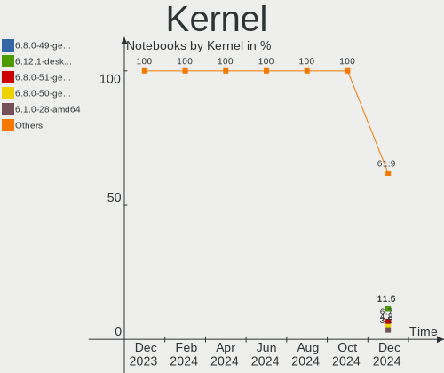

Linux Hardware Trends (Notebooks)
---------------------------------

A project to identify most popular hardware characteristics and track their change
over time based on data collected by Linux users at https://Linux-Hardware.org.

Anyone can contribute to this report by the [hw-probe](https://github.com/linuxhw/hw-probe) tool:

    sudo -E hw-probe -all -upload

Full-feature report is available here: https://linux-hardware.org/?view=trends

Period: Feb, 2022.

Contents
--------

* [ System ](#system)
  - [ OS                       ](#os)
  - [ OS Family                ](#os-family)
  - [ Kernel                   ](#kernel)
  - [ Kernel Family            ](#kernel-family)
  - [ Kernel Major Ver.        ](#kernel-major-ver)
  - [ Arch                     ](#arch)
  - [ DE                       ](#de)
  - [ Display Server           ](#display-server)
  - [ Display Manager          ](#display-manager)
  - [ OS Lang                  ](#os-lang)
  - [ Boot Mode                ](#boot-mode)
  - [ Filesystem               ](#filesystem)
  - [ Part. scheme             ](#part-scheme)
  - [ Dual Boot with Linux/BSD ](#dual-boot-with-linuxbsd)
  - [ Dual Boot (Win)          ](#dual-boot-win)

* [ Board ](#board)
  - [ Vendor                   ](#vendor)
  - [ Model                    ](#model)
  - [ Model Family             ](#model-family)
  - [ MFG Year                 ](#mfg-year)
  - [ Form Factor              ](#form-factor)
  - [ Secure Boot              ](#secure-boot)
  - [ Coreboot                 ](#coreboot)
  - [ RAM Size                 ](#ram-size)
  - [ RAM Used                 ](#ram-used)
  - [ Total Drives             ](#total-drives)
  - [ Has CD-ROM               ](#has-cd-rom)
  - [ Has Ethernet             ](#has-ethernet)
  - [ Has WiFi                 ](#has-wifi)
  - [ Has Bluetooth            ](#has-bluetooth)

* [ Location ](#location)
  - [ Country                  ](#country)
  - [ City                     ](#city)

* [ Drives ](#drives)
  - [ Drive Vendor             ](#drive-vendor)
  - [ Drive Model              ](#drive-model)
  - [ HDD Vendor               ](#hdd-vendor)
  - [ SSD Vendor               ](#ssd-vendor)
  - [ Drive Kind               ](#drive-kind)
  - [ Drive Connector          ](#drive-connector)
  - [ Drive Size               ](#drive-size)
  - [ Space Total              ](#space-total)
  - [ Space Used               ](#space-used)
  - [ Malfunc. Drives          ](#malfunc-drives)
  - [ Malfunc. Drive Vendor    ](#malfunc-drive-vendor)
  - [ Malfunc. HDD Vendor      ](#malfunc-hdd-vendor)
  - [ Malfunc. Drive Kind      ](#malfunc-drive-kind)
  - [ Failed Drives            ](#failed-drives)
  - [ Failed Drive Vendor      ](#failed-drive-vendor)
  - [ Drive Status             ](#drive-status)

* [ Storage controller ](#storage-controller)
  - [ Storage Vendor           ](#storage-vendor)
  - [ Storage Model            ](#storage-model)
  - [ Storage Kind             ](#storage-kind)

* [ Processor ](#processor)
  - [ CPU Vendor               ](#cpu-vendor)
  - [ CPU Model                ](#cpu-model)
  - [ CPU Model Family         ](#cpu-model-family)
  - [ CPU Cores                ](#cpu-cores)
  - [ CPU Sockets              ](#cpu-sockets)
  - [ CPU Threads              ](#cpu-threads)
  - [ CPU Op-Modes             ](#cpu-op-modes)
  - [ CPU Microcode            ](#cpu-microcode)
  - [ CPU Microarch            ](#cpu-microarch)

* [ Graphics ](#graphics)
  - [ GPU Vendor               ](#gpu-vendor)
  - [ GPU Model                ](#gpu-model)
  - [ GPU Combo                ](#gpu-combo)
  - [ GPU Driver               ](#gpu-driver)
  - [ GPU Memory               ](#gpu-memory)

* [ Monitor ](#monitor)
  - [ Monitor Vendor           ](#monitor-vendor)
  - [ Monitor Model            ](#monitor-model)
  - [ Monitor Resolution       ](#monitor-resolution)
  - [ Monitor Diagonal         ](#monitor-diagonal)
  - [ Monitor Width            ](#monitor-width)
  - [ Aspect Ratio             ](#aspect-ratio)
  - [ Monitor Area             ](#monitor-area)
  - [ Pixel Density            ](#pixel-density)
  - [ Multiple Monitors        ](#multiple-monitors)

* [ Network ](#network)
  - [ Net Controller Vendor    ](#net-controller-vendor)
  - [ Net Controller Model     ](#net-controller-model)
  - [ Wireless Vendor          ](#wireless-vendor)
  - [ Wireless Model           ](#wireless-model)
  - [ Ethernet Vendor          ](#ethernet-vendor)
  - [ Ethernet Model           ](#ethernet-model)
  - [ Net Controller Kind      ](#net-controller-kind)
  - [ Used Controller          ](#used-controller)
  - [ NICs                     ](#nics)
  - [ IPv6                     ](#ipv6)

* [ Bluetooth ](#bluetooth)
  - [ Bluetooth Vendor         ](#bluetooth-vendor)
  - [ Bluetooth Model          ](#bluetooth-model)

* [ Sound ](#sound)
  - [ Sound Vendor             ](#sound-vendor)
  - [ Sound Model              ](#sound-model)

* [ Memory ](#memory)
  - [ Memory Vendor            ](#memory-vendor)
  - [ Memory Model             ](#memory-model)
  - [ Memory Kind              ](#memory-kind)
  - [ Memory Form Factor       ](#memory-form-factor)
  - [ Memory Size              ](#memory-size)
  - [ Memory Speed             ](#memory-speed)

* [ Printers & scanners ](#printers--scanners)
  - [ Printer Vendor           ](#printer-vendor)
  - [ Printer Model            ](#printer-model)
  - [ Scanner Vendor           ](#scanner-vendor)
  - [ Scanner Model            ](#scanner-model)

* [ Camera ](#camera)
  - [ Camera Vendor            ](#camera-vendor)
  - [ Camera Model             ](#camera-model)

* [ Security ](#security)
  - [ Fingerprint Vendor       ](#fingerprint-vendor)
  - [ Fingerprint Model        ](#fingerprint-model)
  - [ Chipcard Vendor          ](#chipcard-vendor)
  - [ Chipcard Model           ](#chipcard-model)

* [ Unsupported ](#unsupported)
  - [ Unsupported Devices      ](#unsupported-devices)
  - [ Unsupported Device Types ](#unsupported-device-types)

System
------

OS
--

Installed operating systems

| Name                 | Notebooks | Percent |
|----------------------|-----------|---------|
| OpenMandriva 4.3     | 583       | 20.32%  |
| Ubuntu 20.04         | 349       | 12.16%  |
| Linux Mint 20.3      | 226       | 7.88%   |
| Ubuntu 21.10         | 146       | 5.09%   |
| Pop!_OS 21.10        | 138       | 4.81%   |
| Fedora 35            | 124       | 4.32%   |
| Debian 11            | 97        | 3.38%   |
| KDE neon 20.04       | 80        | 2.79%   |
| Zorin 16             | 77        | 2.68%   |
| Elementary 6.1       | 56        | 1.95%   |
| OpenMandriva 4.2     | 51        | 1.78%   |
| Arch                 | 49        | 1.71%   |
| BlackPanther 18.1    | 40        | 1.39%   |
| Manjaro 21.2.3       | 37        | 1.29%   |
| Arch Rolling         | 37        | 1.29%   |
| ArcoLinux Rolling    | 35        | 1.22%   |
| ROSA 12.2            | 34        | 1.19%   |
| Linux Mint 20.2      | 33        | 1.15%   |
| Manjaro              | 31        | 1.08%   |
| ROSA 12.1            | 27        | 0.94%   |
| Ubuntu 18.04         | 26        | 0.91%   |
| Kubuntu 20.04        | 26        | 0.91%   |
| ROSA R11.1           | 25        | 0.87%   |
| Kubuntu 21.10        | 23        | 0.8%    |
| Kali 2022.1          | 23        | 0.8%    |
| EndeavourOS Rolling  | 22        | 0.77%   |
| Xubuntu 20.04        | 20        | 0.7%    |
| OpenMandriva 4.50    | 19        | 0.66%   |
| Pop!_OS 20.04        | 18        | 0.63%   |
| Zorin 15             | 17        | 0.59%   |
| Endless 4.0.2        | 16        | 0.56%   |
| Ubuntu 21.04         | 14        | 0.49%   |
| Linux Mint 20.1      | 12        | 0.42%   |
| Garuda Linux Soaring | 12        | 0.42%   |
| Linux Mint 19.3      | 11        | 0.38%   |
| Ubuntu 22.04         | 10        | 0.35%   |
| Parrot 5.0           | 10        | 0.35%   |
| Manjaro 21.2.2       | 10        | 0.35%   |
| Gentoo 2.6           | 10        | 0.35%   |
| Ubuntu Budgie 20.04  | 9         | 0.31%   |
| Lubuntu 20.04        | 9         | 0.31%   |
| LMDE 4               | 9         | 0.31%   |
| LinuxFX 11           | 9         | 0.31%   |
| Fedora 34            | 9         | 0.31%   |
| Debian Testing       | 9         | 0.31%   |
| Xubuntu 18.04        | 7         | 0.24%   |
| Ubuntu MATE 20.04    | 7         | 0.24%   |
| MX 21                | 7         | 0.24%   |
| Linux Mint 20        | 7         | 0.24%   |
| Xubuntu 21.10        | 6         | 0.21%   |
| Pop!_OS 21.04        | 6         | 0.21%   |
| Lubuntu 21.10        | 6         | 0.21%   |
| Kubuntu 11           | 6         | 0.21%   |
| Ubuntu Budgie 21.10  | 5         | 0.17%   |
| Kubuntu 22.04        | 5         | 0.17%   |
| Kali 2021.4          | 5         | 0.17%   |
| Gentoo 2.8           | 5         | 0.17%   |
| Gentoo 2.7           | 4         | 0.14%   |
| Endless 3.9.6        | 4         | 0.14%   |
| Debian Unstable      | 4         | 0.14%   |

OS Family
---------

OS without a version

| Name              | Notebooks | Percent |
|-------------------|-----------|---------|
| OpenMandriva      | 653       | 22.76%  |
| Ubuntu            | 551       | 19.21%  |
| Linux Mint        | 292       | 10.18%  |
| Pop!_OS           | 162       | 5.65%   |
| Fedora            | 135       | 4.71%   |
| Debian            | 114       | 3.97%   |
| Zorin             | 94        | 3.28%   |
| ROSA              | 90        | 3.14%   |
| Arch              | 86        | 3%      |
| Manjaro           | 83        | 2.89%   |
| KDE neon          | 80        | 2.79%   |
| Kubuntu           | 62        | 2.16%   |
| Elementary        | 58        | 2.02%   |
| BlackPanther      | 41        | 1.43%   |
| ArcoLinux         | 39        | 1.36%   |
| Xubuntu           | 37        | 1.29%   |
| Kali              | 29        | 1.01%   |
| Endless           | 28        | 0.98%   |
| EndeavourOS       | 25        | 0.87%   |
| openSUSE          | 21        | 0.73%   |
| Gentoo            | 19        | 0.66%   |
| Lubuntu           | 17        | 0.59%   |
| Ubuntu Budgie     | 15        | 0.52%   |
| Garuda Linux      | 12        | 0.42%   |
| Ubuntu MATE       | 11        | 0.38%   |
| Parrot            | 11        | 0.38%   |
| LMDE              | 9         | 0.31%   |
| LinuxFX           | 9         | 0.31%   |
| MX                | 8         | 0.28%   |
| Clear Linux       | 8         | 0.28%   |
| Artix             | 6         | 0.21%   |
| ALT Linux         | 6         | 0.21%   |
| Ubuntu Studio     | 5         | 0.17%   |
| Linux Lite        | 4         | 0.14%   |
| Xero              | 3         | 0.1%    |
| Void Linux        | 3         | 0.1%    |
| RHEL              | 3         | 0.1%    |
| NixOS             | 3         | 0.1%    |
| CentOS            | 3         | 0.1%    |
| Sparky            | 2         | 0.07%   |
| PureOS            | 2         | 0.07%   |
| Peppermint        | 2         | 0.07%   |
| Pardus            | 2         | 0.07%   |
| Org.kde.platform  | 2         | 0.07%   |
| GNOME OS          | 2         | 0.07%   |
| Archcraft         | 2         | 0.07%   |
| Ultramarine Linux | 1         | 0.03%   |
| Trisquel          | 1         | 0.03%   |
| SystemRescue      | 1         | 0.03%   |
| Solus             | 1         | 0.03%   |
| Slackware         | 1         | 0.03%   |
| Red OS            | 1         | 0.03%   |
| Reborn OS         | 1         | 0.03%   |
| Q4OS              | 1         | 0.03%   |
| Predator OS       | 1         | 0.03%   |
| PCLinuxOS         | 1         | 0.03%   |
| MassOS            | 1         | 0.03%   |
| Makulu            | 1         | 0.03%   |
| Kylin             | 1         | 0.03%   |
| Guix              | 1         | 0.03%   |

Kernel
------

Version of the Linux kernel

| Version                            | Notebooks | Percent |
|------------------------------------|-----------|---------|
| 5.16.7-desktop-1omv4003            | 583       | 20.32%  |
| 5.13.0-28-generic                  | 424       | 14.78%  |
| 5.13.0-30-generic                  | 208       | 7.25%   |
| 5.15.15-76051515-generic           | 110       | 3.83%   |
| 5.4.0-100-generic                  | 96        | 3.35%   |
| 5.4.0-99-generic                   | 95        | 3.31%   |
| 5.4.0-97-generic                   | 65        | 2.27%   |
| 5.10.0-11-amd64                    | 62        | 2.16%   |
| 5.10.74-generic-2rosa2021.1-x86_64 | 58        | 2.02%   |
| 5.13.0-27-generic                  | 54        | 1.88%   |
| 5.10.14-desktop-1omv4002           | 46        | 1.6%    |
| 5.15.23-76051523-generic           | 40        | 1.39%   |
| 5.4.0-96-generic                   | 30        | 1.05%   |
| 5.16.9-200.fc35.x86_64             | 30        | 1.05%   |
| 5.6.14-desktop-2bP                 | 28        | 0.98%   |
| 5.4.0-91-generic                   | 21        | 0.73%   |
| 5.16.8-arch1-1                     | 21        | 0.73%   |
| 5.16.10-arch1-1                    | 21        | 0.73%   |
| 5.15.21-1-MANJARO                  | 21        | 0.73%   |
| 5.11.0-35-generic                  | 21        | 0.73%   |
| 5.15.0-kali3-amd64                 | 20        | 0.7%    |
| 5.16.5-200.fc35.x86_64             | 19        | 0.66%   |
| 5.16.8-200.fc35.x86_64             | 17        | 0.59%   |
| 5.16.5-arch1-1                     | 16        | 0.56%   |
| 5.16.4-arch1-1                     | 15        | 0.52%   |
| 5.15.18-200.fc35.x86_64            | 13        | 0.45%   |
| 5.16.7-1-MANJARO                   | 12        | 0.42%   |
| 5.15.0-18-generic                  | 12        | 0.42%   |
| 5.11.0-49-generic                  | 12        | 0.42%   |
| 5.11.0-27-generic                  | 12        | 0.42%   |
| 4.18.16-desktop-1bP                | 12        | 0.42%   |
| 5.15.0-3-amd64                     | 11        | 0.38%   |
| 5.11.0-38-generic                  | 11        | 0.38%   |
| 5.4.83-generic-2rosa-x86_64        | 10        | 0.35%   |
| 5.16.7-200.fc35.x86_64             | 10        | 0.35%   |
| 5.14.0-9parrot1-amd64              | 10        | 0.35%   |
| 4.15.0-167-generic                 | 10        | 0.35%   |
| 5.16.11-200.fc35.x86_64            | 9         | 0.31%   |
| 5.15.16-1-MANJARO                  | 9         | 0.31%   |
| 5.14.7-desktop-1omv4050            | 9         | 0.31%   |
| 5.10.0-10-amd64                    | 9         | 0.31%   |
| 5.16.7-arch1-1                     | 8         | 0.28%   |
| 5.16.11-arch1-1                    | 8         | 0.28%   |
| 5.15.19-1-MANJARO                  | 8         | 0.28%   |
| 5.14.10-300.fc35.x86_64            | 8         | 0.28%   |
| 5.11.0-46-generic                  | 8         | 0.28%   |
| 5.11.0-43-generic                  | 8         | 0.28%   |
| 5.10.0-1057-oem                    | 8         | 0.28%   |
| 5.16.9-arch1-1                     | 7         | 0.24%   |
| 5.13.0-29-generic                  | 7         | 0.24%   |
| 5.13.0-19-generic                  | 7         | 0.24%   |
| 5.11.0-41-generic                  | 7         | 0.24%   |
| 5.8.0-14-generic                   | 6         | 0.21%   |
| 5.16.4-zen1-1-zen                  | 6         | 0.21%   |
| 5.16.10-zen1-1-zen                 | 6         | 0.21%   |
| 5.15.17-200.fc35.x86_64            | 6         | 0.21%   |
| 5.10.0-7-amd64                     | 6         | 0.21%   |
| 5.10.0-11-686-pae                  | 6         | 0.21%   |
| 4.19.0-18-amd64                    | 6         | 0.21%   |
| 5.4.0-94-generic                   | 5         | 0.17%   |

Kernel Family
-------------

Linux kernel without a distro release

| Version | Notebooks | Percent |
|---------|-----------|---------|
| 5.13.0  | 726       | 25.3%   |
| 5.16.7  | 620       | 21.61%  |
| 5.4.0   | 347       | 12.09%  |
| 5.15.15 | 111       | 3.87%   |
| 5.10.0  | 104       | 3.62%   |
| 5.11.0  | 92        | 3.21%   |
| 5.10.74 | 59        | 2.06%   |
| 5.15.0  | 58        | 2.02%   |
| 5.16.8  | 54        | 1.88%   |
| 5.16.5  | 54        | 1.88%   |
| 5.16.9  | 47        | 1.64%   |
| 5.15.23 | 47        | 1.64%   |
| 5.10.14 | 46        | 1.6%    |
| 5.16.10 | 42        | 1.46%   |
| 5.16.4  | 29        | 1.01%   |
| 5.6.14  | 28        | 0.98%   |
| 5.15.21 | 28        | 0.98%   |
| 4.15.0  | 27        | 0.94%   |
| 5.14.0  | 25        | 0.87%   |
| 5.16.11 | 20        | 0.7%    |
| 5.15.18 | 20        | 0.7%    |
| 5.15.16 | 18        | 0.63%   |
| 5.15.19 | 17        | 0.59%   |
| 5.16.0  | 16        | 0.56%   |
| 5.8.0   | 13        | 0.45%   |
| 4.18.16 | 12        | 0.42%   |
| 5.4.83  | 11        | 0.38%   |
| 4.19.0  | 10        | 0.35%   |
| 5.16.2  | 9         | 0.31%   |
| 5.14.7  | 9         | 0.31%   |
| 5.15.17 | 8         | 0.28%   |
| 5.15.11 | 8         | 0.28%   |
| 5.14.10 | 8         | 0.28%   |
| 5.17.0  | 6         | 0.21%   |
| 5.15.25 | 6         | 0.21%   |
| 5.15.22 | 6         | 0.21%   |
| 5.15.13 | 6         | 0.21%   |
| 5.15.10 | 6         | 0.21%   |
| 5.10.96 | 6         | 0.21%   |
| 5.4.32  | 5         | 0.17%   |
| 5.15.7  | 5         | 0.17%   |
| 5.12.4  | 5         | 0.17%   |
| 5.11.12 | 5         | 0.17%   |
| 4.18.0  | 5         | 0.17%   |
| 5.15.5  | 4         | 0.14%   |
| 5.15.24 | 4         | 0.14%   |
| 5.13.13 | 4         | 0.14%   |
| 5.10.93 | 4         | 0.14%   |
| 4.9.155 | 4         | 0.14%   |
| 4.4.0   | 4         | 0.14%   |
| 5.6.0   | 3         | 0.1%    |
| 5.16.3  | 3         | 0.1%    |
| 5.15.12 | 3         | 0.1%    |
| 5.14.21 | 3         | 0.1%    |
| 5.14.18 | 3         | 0.1%    |
| 5.13.19 | 3         | 0.1%    |
| 5.10.71 | 3         | 0.1%    |
| 5.0.0   | 3         | 0.1%    |
| 5.9.16  | 2         | 0.07%   |
| 5.3.18  | 2         | 0.07%   |

Kernel Major Ver.
-----------------

Linux kernel major version

| Version | Notebooks | Percent |
|---------|-----------|---------|
| 5.16    | 897       | 31.27%  |
| 5.13    | 733       | 25.55%  |
| 5.4     | 365       | 12.72%  |
| 5.15    | 358       | 12.48%  |
| 5.10    | 234       | 8.16%   |
| 5.11    | 99        | 3.45%   |
| 5.14    | 51        | 1.78%   |
| 5.6     | 31        | 1.08%   |
| 4.15    | 27        | 0.94%   |
| 4.18    | 17        | 0.59%   |
| 5.8     | 13        | 0.45%   |
| 4.19    | 10        | 0.35%   |
| 5.17    | 6         | 0.21%   |
| 4.9     | 6         | 0.21%   |
| 5.12    | 5         | 0.17%   |
| 4.4     | 4         | 0.14%   |
| 5.9     | 3         | 0.1%    |
| 5.3     | 3         | 0.1%    |
| 5.0     | 3         | 0.1%    |
| 5.5     | 1         | 0.03%   |
| 4.16    | 1         | 0.03%   |
| 4.12    | 1         | 0.03%   |
| 3.10    | 1         | 0.03%   |

Arch
----

OS architecture (x86_64, i586, etc.)

| Name   | Notebooks | Percent |
|--------|-----------|---------|
| x86_64 | 2814      | 98.08%  |
| i686   | 55        | 1.92%   |

DE
--

Desktop Environment

| Name              | Notebooks | Percent |
|-------------------|-----------|---------|
| KDE5              | 1057      | 36.84%  |
| GNOME             | 1025      | 35.73%  |
| X-Cinnamon        | 237       | 8.26%   |
| XFCE              | 194       | 6.76%   |
| Unknown           | 71        | 2.47%   |
| MATE              | 69        | 2.41%   |
| Pantheon          | 57        | 1.99%   |
| LXQt              | 30        | 1.05%   |
| Cinnamon          | 23        | 0.8%    |
| i3                | 18        | 0.63%   |
| KDE4              | 17        | 0.59%   |
| Budgie            | 17        | 0.59%   |
| LXDE              | 9         | 0.31%   |
| Unity             | 5         | 0.17%   |
| GNOME Flashback   | 5         | 0.17%   |
| KDE               | 4         | 0.14%   |
| bspwm             | 4         | 0.14%   |
| awesome           | 4         | 0.14%   |
| sway              | 3         | 0.1%    |
| lightdm-xsession  | 2         | 0.07%   |
| GNOME Classic     | 2         | 0.07%   |
| Enlightenment     | 2         | 0.07%   |
| Cutefish          | 2         | 0.07%   |
| Yaru:ubuntu:GNOME | 1         | 0.03%   |
| xubuntu           | 1         | 0.03%   |
| Trinity           | 1         | 0.03%   |
| qtile             | 1         | 0.03%   |
| openbox           | 1         | 0.03%   |
| LeftWM            | 1         | 0.03%   |
| herbstluftwm      | 1         | 0.03%   |
| GNUstep           | 1         | 0.03%   |
| fly               | 1         | 0.03%   |
| fluxbox           | 1         | 0.03%   |
| dwm               | 1         | 0.03%   |
| Deepin            | 1         | 0.03%   |

Display Server
--------------

X11 or Wayland

| Name    | Notebooks | Percent |
|---------|-----------|---------|
| X11     | 2427      | 84.59%  |
| Wayland | 383       | 13.35%  |
| Unknown | 30        | 1.05%   |
| Tty     | 29        | 1.01%   |

Display Manager
---------------

SDDM, LightDM, etc.

| Name    | Notebooks | Percent |
|---------|-----------|---------|
| SDDM    | 959       | 33.43%  |
| Unknown | 778       | 27.12%  |
| GDM     | 374       | 13.04%  |
| LightDM | 372       | 12.97%  |
| GDM3    | 350       | 12.2%   |
| KDM     | 18        | 0.63%   |
| XDM     | 5         | 0.17%   |
| Ly      | 5         | 0.17%   |
| LXDM    | 4         | 0.14%   |
| TDM     | 1         | 0.03%   |
| SLiM    | 1         | 0.03%   |
| MDM     | 1         | 0.03%   |
| GREETD  | 1         | 0.03%   |

OS Lang
-------

Language

| Lang    | Notebooks | Percent |
|---------|-----------|---------|
| en_US   | 1207      | 42.07%  |
| de_DE   | 308       | 10.74%  |
| ru_RU   | 166       | 5.79%   |
| pt_BR   | 136       | 4.74%   |
| en_GB   | 132       | 4.6%    |
| fr_FR   | 119       | 4.15%   |
| it_IT   | 97        | 3.38%   |
| pl_PL   | 64        | 2.23%   |
| es_ES   | 62        | 2.16%   |
| Unknown | 62        | 2.16%   |
| en_CA   | 48        | 1.67%   |
| en_IN   | 36        | 1.25%   |
| es_MX   | 33        | 1.15%   |
| C       | 31        | 1.08%   |
| en_AU   | 29        | 1.01%   |
| nl_NL   | 25        | 0.87%   |
| tr_TR   | 20        | 0.7%    |
| de_AT   | 20        | 0.7%    |
| cs_CZ   | 18        | 0.63%   |
| hu_HU   | 16        | 0.56%   |
| en_ZA   | 15        | 0.52%   |
| pt_PT   | 12        | 0.42%   |
| nl_BE   | 12        | 0.42%   |
| es_AR   | 11        | 0.38%   |
| zh_CN   | 10        | 0.35%   |
| fr_BE   | 10        | 0.35%   |
| da_DK   | 10        | 0.35%   |
| ja_JP   | 8         | 0.28%   |
| fi_FI   | 8         | 0.28%   |
| de_CH   | 8         | 0.28%   |
| es_CL   | 7         | 0.24%   |
| sv_SE   | 6         | 0.21%   |
| ru_UA   | 6         | 0.21%   |
| nb_NO   | 5         | 0.17%   |
| fr_CH   | 5         | 0.17%   |
| en_SG   | 5         | 0.17%   |
| en_IE   | 5         | 0.17%   |
| bg_BG   | 5         | 0.17%   |
| sl_SI   | 4         | 0.14%   |
| ro_RO   | 4         | 0.14%   |
| POSIX   | 4         | 0.14%   |
| fr_CA   | 4         | 0.14%   |
| es_CO   | 4         | 0.14%   |
| en_PH   | 4         | 0.14%   |
| en_NZ   | 4         | 0.14%   |
| en_DK   | 4         | 0.14%   |
| el_GR   | 4         | 0.14%   |
| uk_UA   | 3         | 0.1%    |
| ko_KR   | 3         | 0.1%    |
| hr_HR   | 3         | 0.1%    |
| es_CR   | 3         | 0.1%    |
| es_BO   | 3         | 0.1%    |
| en_IL   | 3         | 0.1%    |
| zh_TW   | 2         | 0.07%   |
| sk_SK   | 2         | 0.07%   |
| et_EE   | 2         | 0.07%   |
| es_VE   | 2         | 0.07%   |
| es_PE   | 2         | 0.07%   |
| en_NG   | 2         | 0.07%   |
| en_HK   | 2         | 0.07%   |

Boot Mode
---------

EFI or BIOS

| Mode | Notebooks | Percent |
|------|-----------|---------|
| EFI  | 1546      | 53.89%  |
| BIOS | 1323      | 46.11%  |

Filesystem
----------

Type of filesystem

| Type    | Notebooks | Percent |
|---------|-----------|---------|
| Ext4    | 1987      | 69.26%  |
| Overlay | 618       | 21.54%  |
| Btrfs   | 209       | 7.28%   |
| Xfs     | 21        | 0.73%   |
| Zfs     | 16        | 0.56%   |
| Ext3    | 4         | 0.14%   |
| Tmpfs   | 3         | 0.1%    |
| F2fs    | 3         | 0.1%    |
| Ext2    | 3         | 0.1%    |
| Unknown | 2         | 0.07%   |
| Rootfs  | 1         | 0.03%   |
| Jfs     | 1         | 0.03%   |
| Aufs    | 1         | 0.03%   |

Part. scheme
------------

Scheme of partitioning

| Type    | Notebooks | Percent |
|---------|-----------|---------|
| GPT     | 1222      | 42.59%  |
| Unknown | 1189      | 41.44%  |
| MBR     | 458       | 15.96%  |

Dual Boot with Linux/BSD
------------------------

Hosting more than one Linux/BSD

| Dual boot | Notebooks | Percent |
|-----------|-----------|---------|
| No        | 2324      | 81%     |
| Yes       | 545       | 19%     |

Dual Boot (Win)
---------------

Hosting Linux and Windows

| Dual boot | Notebooks | Percent |
|-----------|-----------|---------|
| No        | 2027      | 70.65%  |
| Yes       | 842       | 29.35%  |

Board
-----

Vendor
------

Motherboard manufacturer

| Name                                         | Notebooks | Percent |
|----------------------------------------------|-----------|---------|
| Lenovo                                       | 585       | 20.39%  |
| Hewlett-Packard                              | 511       | 17.81%  |
| Dell                                         | 422       | 14.71%  |
| ASUSTek Computer                             | 360       | 12.55%  |
| Acer                                         | 270       | 9.41%   |
| Toshiba                                      | 96        | 3.35%   |
| Samsung Electronics                          | 76        | 2.65%   |
| Apple                                        | 64        | 2.23%   |
| MSI                                          | 49        | 1.71%   |
| Sony                                         | 44        | 1.53%   |
| Fujitsu                                      | 34        | 1.19%   |
| HUAWEI                                       | 29        | 1.01%   |
| Google                                       | 21        | 0.73%   |
| Packard Bell                                 | 20        | 0.7%    |
| Notebook                                     | 16        | 0.56%   |
| Medion                                       | 16        | 0.56%   |
| Timi                                         | 15        | 0.52%   |
| TUXEDO                                       | 14        | 0.49%   |
| System76                                     | 14        | 0.49%   |
| Positivo                                     | 12        | 0.42%   |
| LG Electronics                               | 11        | 0.38%   |
| Chuwi                                        | 10        | 0.35%   |
| eMachines                                    | 9         | 0.31%   |
| Unknown                                      | 9         | 0.31%   |
| Razer                                        | 7         | 0.24%   |
| HONOR                                        | 7         | 0.24%   |
| Fujitsu Siemens                              | 7         | 0.24%   |
| Gigabyte Technology                          | 6         | 0.21%   |
| Positivo Bahia - VAIO                        | 5         | 0.17%   |
| Jumper                                       | 5         | 0.17%   |
| Gateway                                      | 5         | 0.17%   |
| Schenker                                     | 4         | 0.14%   |
| PC Specialist                                | 4         | 0.14%   |
| Panasonic                                    | 4         | 0.14%   |
| Framework                                    | 4         | 0.14%   |
| Clevo                                        | 4         | 0.14%   |
| Avell High Performance                       | 4         | 0.14%   |
| Wortmann AG                                  | 3         | 0.1%    |
| Teclast                                      | 3         | 0.1%    |
| SLIMBOOK                                     | 3         | 0.1%    |
| Intel                                        | 3         | 0.1%    |
| Insyde                                       | 3         | 0.1%    |
| Casper                                       | 3         | 0.1%    |
| Alienware                                    | 3         | 0.1%    |
| Microtech                                    | 2         | 0.07%   |
| Lanix                                        | 2         | 0.07%   |
| GPU Company                                  | 2         | 0.07%   |
| GPD                                          | 2         | 0.07%   |
| EVOO                                         | 2         | 0.07%   |
| Compal                                       | 2         | 0.07%   |
| CHUWI Innovation And Technology(ShenZhen)c0. | 2         | 0.07%   |
| AZW                                          | 2         | 0.07%   |
| ZEPTO                                        | 1         | 0.03%   |
| whyopencomputing                             | 1         | 0.03%   |
| Vulcan Electronics                           | 1         | 0.03%   |
| VIT                                          | 1         | 0.03%   |
| Visual Land                                  | 1         | 0.03%   |
| Viglen                                       | 1         | 0.03%   |
| UMAX                                         | 1         | 0.03%   |
| TongFang                                     | 1         | 0.03%   |

Model
-----

Motherboard model

| Name                                       | Notebooks | Percent |
|--------------------------------------------|-----------|---------|
| HP Notebook                                | 24        | 0.84%   |
| Unknown                                    | 15        | 0.52%   |
| HP Pavilion g6                             | 13        | 0.45%   |
| HP Pavilion 15                             | 11        | 0.38%   |
| HP Pavilion dv6                            | 10        | 0.35%   |
| ASUS UX31E                                 | 9         | 0.31%   |
| HP Pavilion Notebook                       | 8         | 0.28%   |
| Dell Latitude 5480                         | 8         | 0.28%   |
| Lenovo G50-70 20351                        | 7         | 0.24%   |
| HP Pavilion dv7                            | 7         | 0.24%   |
| HP Pavilion 17                             | 7         | 0.24%   |
| HP Laptop 15-db0xxx                        | 7         | 0.24%   |
| Dell XPS 15 9570                           | 7         | 0.24%   |
| Dell XPS 15 7590                           | 7         | 0.24%   |
| Dell Latitude E6420                        | 7         | 0.24%   |
| Dell Latitude E6410                        | 7         | 0.24%   |
| Dell Latitude D630                         | 7         | 0.24%   |
| Acer Nitro AN515-44                        | 7         | 0.24%   |
| Samsung 300E4A/300E5A/300E7A/3430EA/3530EA | 6         | 0.21%   |
| HUAWEI NBLK-WAX9X                          | 6         | 0.21%   |
| HP Pavilion g7                             | 6         | 0.21%   |
| HP Pavilion Aero Laptop 13-be0xxx          | 6         | 0.21%   |
| Dell Latitude E7240                        | 6         | 0.21%   |
| Dell Latitude E5430 non-vPro               | 6         | 0.21%   |
| Acer Nitro AN515-54                        | 6         | 0.21%   |
| System76 Oryx Pro                          | 5         | 0.17%   |
| Lenovo IdeaPad S340-14API 81NB             | 5         | 0.17%   |
| Jumper EZbook                              | 5         | 0.17%   |
| HUAWEI KLVL-WXX9                           | 5         | 0.17%   |
| HP 15                                      | 5         | 0.17%   |
| Dell XPS 15 9500                           | 5         | 0.17%   |
| Dell XPS 13 9310                           | 5         | 0.17%   |
| Dell XPS 13 9305                           | 5         | 0.17%   |
| Dell Latitude E6540                        | 5         | 0.17%   |
| Dell Latitude E6520                        | 5         | 0.17%   |
| Dell Latitude E6430                        | 5         | 0.17%   |
| Dell Inspiron 5567                         | 5         | 0.17%   |
| Dell Inspiron 15-3567                      | 5         | 0.17%   |
| ASUS K50IJ                                 | 5         | 0.17%   |
| Acer Swift SF314-43                        | 5         | 0.17%   |
| Acer Swift SF114-34                        | 5         | 0.17%   |
| System76 Galago Pro                        | 4         | 0.14%   |
| Positivo Bahia - VAIO VJFE42F11X-XXXXXX    | 4         | 0.14%   |
| Lenovo ThinkBook 15 G2 ITL 20VE            | 4         | 0.14%   |
| Lenovo Legion 5 15ARH05H 82B1              | 4         | 0.14%   |
| Lenovo Legion 5 15ARH05 82B5               | 4         | 0.14%   |
| Lenovo IdeaPad Z580                        | 4         | 0.14%   |
| Lenovo IdeaPad S145-15API 81V7             | 4         | 0.14%   |
| Lenovo IdeaPad 5 Pro 16ACH6 82L5           | 4         | 0.14%   |
| Lenovo IdeaPad 5 15ARE05 81YQ              | 4         | 0.14%   |
| Lenovo IdeaPad 5 15ALC05 82LN              | 4         | 0.14%   |
| Lenovo IdeaPad 330-15IGM 81D1              | 4         | 0.14%   |
| Lenovo IdeaPad 100-15IBD 80QQ              | 4         | 0.14%   |
| Lenovo G710 20252                          | 4         | 0.14%   |
| HONOR HLYL-WXX9                            | 4         | 0.14%   |
| HP ProBook 4730s                           | 4         | 0.14%   |
| HP ProBook 450 G8 Notebook PC              | 4         | 0.14%   |
| HP Pavilion Laptop 15-eh0xxx               | 4         | 0.14%   |
| HP Pavilion Laptop 15-cs3xxx               | 4         | 0.14%   |
| HP Pavilion dv6500                         | 4         | 0.14%   |

Model Family
------------

Motherboard model prefix

| Name                  | Notebooks | Percent |
|-----------------------|-----------|---------|
| Lenovo ThinkPad       | 273       | 9.52%   |
| Dell Latitude         | 175       | 6.1%    |
| Acer Aspire           | 174       | 6.06%   |
| Lenovo IdeaPad        | 162       | 5.65%   |
| HP Pavilion           | 127       | 4.43%   |
| Dell Inspiron         | 123       | 4.29%   |
| Toshiba Satellite     | 83        | 2.89%   |
| HP ProBook            | 69        | 2.41%   |
| ASUS VivoBook         | 69        | 2.41%   |
| HP EliteBook          | 67        | 2.34%   |
| HP Laptop             | 61        | 2.13%   |
| Dell XPS              | 55        | 1.92%   |
| Acer Swift            | 30        | 1.05%   |
| Dell Precision        | 29        | 1.01%   |
| Fujitsu LIFEBOOK      | 27        | 0.94%   |
| HP Compaq             | 26        | 0.91%   |
| ASUS ROG              | 25        | 0.87%   |
| Lenovo Legion         | 24        | 0.84%   |
| HP Notebook           | 24        | 0.84%   |
| ASUS ASUS             | 22        | 0.77%   |
| Acer Nitro            | 21        | 0.73%   |
| ASUS ZenBook          | 19        | 0.66%   |
| Packard Bell EasyNote | 16        | 0.56%   |
| Lenovo Yoga           | 15        | 0.52%   |
| HP ENVY               | 15        | 0.52%   |
| HP 255                | 15        | 0.52%   |
| Dell Vostro           | 15        | 0.52%   |
| Unknown               | 15        | 0.52%   |
| HP ZBook              | 13        | 0.45%   |
| HP OMEN               | 13        | 0.45%   |
| HP 250                | 13        | 0.45%   |
| Acer TravelMate       | 13        | 0.45%   |
| Lenovo ThinkBook      | 12        | 0.42%   |
| Acer Extensa          | 10        | 0.35%   |
| HP Stream             | 9         | 0.31%   |
| ASUS UX31E            | 9         | 0.31%   |
| Apple MacBookPro11    | 9         | 0.31%   |
| HP 15                 | 8         | 0.28%   |
| Dell G3               | 8         | 0.28%   |
| Acer Predator         | 8         | 0.28%   |
| Timi RedmiBook        | 7         | 0.24%   |
| Razer Blade           | 7         | 0.24%   |
| Lenovo G50-70         | 7         | 0.24%   |
| HP Presario           | 7         | 0.24%   |
| Apple MacBookPro8     | 7         | 0.24%   |
| Samsung 355V4C        | 6         | 0.21%   |
| Samsung 300E4A        | 6         | 0.21%   |
| HUAWEI NBLK-WAX9X     | 6         | 0.21%   |
| Dell System           | 6         | 0.21%   |
| TUXEDO InfinityBook   | 5         | 0.17%   |
| System76 Oryx         | 5         | 0.17%   |
| Lenovo Flex           | 5         | 0.17%   |
| Jumper EZbook         | 5         | 0.17%   |
| HUAWEI KLVL-WXX9      | 5         | 0.17%   |
| Chuwi GemiBook        | 5         | 0.17%   |
| ASUS K50IJ            | 5         | 0.17%   |
| Apple MacBookAir7     | 5         | 0.17%   |
| Apple MacBookAir6     | 5         | 0.17%   |
| Toshiba PORTEGE       | 4         | 0.14%   |
| System76 Galago       | 4         | 0.14%   |

MFG Year
--------

Motherboard manufacture year

| Year    | Notebooks | Percent |
|---------|-----------|---------|
| 2021    | 335       | 11.68%  |
| 2020    | 320       | 11.15%  |
| 2012    | 243       | 8.47%   |
| 2019    | 238       | 8.3%    |
| 2011    | 232       | 8.09%   |
| 2013    | 222       | 7.74%   |
| 2018    | 198       | 6.9%    |
| 2017    | 174       | 6.06%   |
| 2014    | 161       | 5.61%   |
| 2015    | 152       | 5.3%    |
| 2016    | 149       | 5.19%   |
| 2010    | 139       | 4.84%   |
| 2008    | 113       | 3.94%   |
| 2009    | 101       | 3.52%   |
| 2007    | 69        | 2.41%   |
| 2006    | 14        | 0.49%   |
| 2022    | 5         | 0.17%   |
| 2005    | 2         | 0.07%   |
| 2004    | 1         | 0.03%   |
| Unknown | 1         | 0.03%   |

Form Factor
-----------

Physical design of the computer

| Name     | Notebooks | Percent |
|----------|-----------|---------|
| Notebook | 2869      | 100%    |

Secure Boot
-----------

Enabled or disabled

| State    | Notebooks | Percent |
|----------|-----------|---------|
| Disabled | 2651      | 92.4%   |
| Enabled  | 218       | 7.6%    |

Coreboot
--------

Have coreboot on board

| Used | Notebooks | Percent |
|------|-----------|---------|
| No   | 2833      | 98.75%  |
| Yes  | 36        | 1.25%   |

RAM Size
--------

Total RAM memory

| Size in GB  | Notebooks | Percent |
|-------------|-----------|---------|
| 4.01-8.0    | 864       | 30.12%  |
| 3.01-4.0    | 670       | 23.35%  |
| 8.01-16.0   | 491       | 17.11%  |
| 16.01-24.0  | 442       | 15.41%  |
| 32.01-64.0  | 160       | 5.58%   |
| 1.01-2.0    | 132       | 4.6%    |
| 2.01-3.0    | 47        | 1.64%   |
| 64.01-256.0 | 30        | 1.05%   |
| 24.01-32.0  | 23        | 0.8%    |
| 0.51-1.0    | 9         | 0.31%   |
| 0.01-0.5    | 1         | 0.03%   |

RAM Used
--------

Used RAM memory

| Used GB    | Notebooks | Percent |
|------------|-----------|---------|
| 1.01-2.0   | 1307      | 45.56%  |
| 2.01-3.0   | 605       | 21.09%  |
| 4.01-8.0   | 322       | 11.22%  |
| 3.01-4.0   | 278       | 9.69%   |
| 0.51-1.0   | 239       | 8.33%   |
| 8.01-16.0  | 80        | 2.79%   |
| 0.01-0.5   | 24        | 0.84%   |
| 16.01-24.0 | 8         | 0.28%   |
| 24.01-32.0 | 4         | 0.14%   |
| 32.01-64.0 | 1         | 0.03%   |
| Unknown    | 1         | 0.03%   |

Total Drives
------------

Number of drives on board

| Drives | Notebooks | Percent |
|--------|-----------|---------|
| 1      | 2072      | 72.22%  |
| 2      | 691       | 24.09%  |
| 3      | 80        | 2.79%   |
| 0      | 15        | 0.52%   |
| 4      | 9         | 0.31%   |
| 5      | 2         | 0.07%   |

Has CD-ROM
----------

Has CD-ROM on board

| Presented | Notebooks | Percent |
|-----------|-----------|---------|
| No        | 1777      | 61.94%  |
| Yes       | 1092      | 38.06%  |

Has Ethernet
------------

Has Ethernet on board

| Presented | Notebooks | Percent |
|-----------|-----------|---------|
| Yes       | 2323      | 80.97%  |
| No        | 546       | 19.03%  |

Has WiFi
--------

Has WiFi module

| Presented | Notebooks | Percent |
|-----------|-----------|---------|
| Yes       | 2817      | 98.19%  |
| No        | 52        | 1.81%   |

Has Bluetooth
-------------

Has Bluetooth module

| Presented | Notebooks | Percent |
|-----------|-----------|---------|
| Yes       | 2226      | 77.59%  |
| No        | 643       | 22.41%  |

Location
--------

Country
-------

Geographic location (country)

| Country                | Notebooks | Percent |
|------------------------|-----------|---------|
| USA                    | 417       | 14.53%  |
| Germany                | 387       | 13.49%  |
| Russia                 | 191       | 6.66%   |
| Brazil                 | 168       | 5.86%   |
| France                 | 146       | 5.09%   |
| Italy                  | 118       | 4.11%   |
| Poland                 | 104       | 3.62%   |
| UK                     | 103       | 3.59%   |
| Canada                 | 79        | 2.75%   |
| Spain                  | 77        | 2.68%   |
| India                  | 64        | 2.23%   |
| Hungary                | 63        | 2.2%    |
| Netherlands            | 59        | 2.06%   |
| Turkey                 | 52        | 1.81%   |
| Mexico                 | 47        | 1.64%   |
| Ukraine                | 40        | 1.39%   |
| Belgium                | 40        | 1.39%   |
| Austria                | 39        | 1.36%   |
| Australia              | 39        | 1.36%   |
| Czechia                | 35        | 1.22%   |
| Sweden                 | 32        | 1.12%   |
| Portugal               | 29        | 1.01%   |
| Switzerland            | 25        | 0.87%   |
| Indonesia              | 25        | 0.87%   |
| South Africa           | 24        | 0.84%   |
| China                  | 24        | 0.84%   |
| Finland                | 21        | 0.73%   |
| Argentina              | 21        | 0.73%   |
| Romania                | 20        | 0.7%    |
| Japan                  | 19        | 0.66%   |
| Greece                 | 18        | 0.63%   |
| Bulgaria               | 17        | 0.59%   |
| Denmark                | 15        | 0.52%   |
| Serbia                 | 13        | 0.45%   |
| Norway                 | 13        | 0.45%   |
| Chile                  | 13        | 0.45%   |
| Croatia                | 12        | 0.42%   |
| Taiwan                 | 11        | 0.38%   |
| Slovakia               | 11        | 0.38%   |
| Colombia               | 11        | 0.38%   |
| Singapore              | 10        | 0.35%   |
| New Zealand            | 10        | 0.35%   |
| Slovenia               | 9         | 0.31%   |
| South Korea            | 8         | 0.28%   |
| Philippines            | 8         | 0.28%   |
| Tunisia                | 7         | 0.24%   |
| Israel                 | 7         | 0.24%   |
| Egypt                  | 7         | 0.24%   |
| Costa Rica             | 7         | 0.24%   |
| Belarus                | 7         | 0.24%   |
| Vietnam                | 6         | 0.21%   |
| Pakistan               | 6         | 0.21%   |
| Morocco                | 6         | 0.21%   |
| Venezuela              | 5         | 0.17%   |
| Thailand               | 5         | 0.17%   |
| Peru                   | 5         | 0.17%   |
| Latvia                 | 5         | 0.17%   |
| Bosnia and Herzegovina | 5         | 0.17%   |
| Moldova                | 4         | 0.14%   |
| Ireland                | 4         | 0.14%   |

City
----

Geographic location (city)

| City              | Notebooks | Percent |
|-------------------|-----------|---------|
| Moscow            | 43        | 1.5%    |
| Berlin            | 35        | 1.22%   |
| Paris             | 28        | 0.98%   |
| São Paulo      | 25        | 0.87%   |
| St Petersburg     | 24        | 0.84%   |
| Vienna            | 22        | 0.77%   |
| Istanbul          | 21        | 0.73%   |
| Warsaw            | 18        | 0.63%   |
| Budapest          | 17        | 0.59%   |
| Munich            | 16        | 0.56%   |
| Milan             | 16        | 0.56%   |
| Mexico City       | 15        | 0.52%   |
| Sydney            | 14        | 0.49%   |
| Prague            | 14        | 0.49%   |
| Rio de Janeiro    | 13        | 0.45%   |
| Krakow            | 12        | 0.42%   |
| Belgrade          | 12        | 0.42%   |
| Rome              | 11        | 0.38%   |
| Montreal          | 11        | 0.38%   |
| Kyiv              | 11        | 0.38%   |
| Cologne           | 11        | 0.38%   |
| Belo Horizonte    | 11        | 0.38%   |
| Athens            | 11        | 0.38%   |
| The Hague         | 10        | 0.35%   |
| Singapore         | 10        | 0.35%   |
| Madrid            | 10        | 0.35%   |
| Barcelona         | 10        | 0.35%   |
| Voronezh          | 9         | 0.31%   |
| Sofia             | 9         | 0.31%   |
| Hamburg           | 9         | 0.31%   |
| Jakarta           | 8         | 0.28%   |
| Zagreb            | 7         | 0.24%   |
| Yekaterinburg     | 7         | 0.24%   |
| Toronto           | 7         | 0.24%   |
| Stuttgart         | 7         | 0.24%   |
| Portland          | 7         | 0.24%   |
| Leipzig           | 7         | 0.24%   |
| Helsinki          | 7         | 0.24%   |
| Frankfurt am Main | 7         | 0.24%   |
| Ankara            | 7         | 0.24%   |
| Wroclaw           | 6         | 0.21%   |
| Stockholm         | 6         | 0.21%   |
| Salach            | 6         | 0.21%   |
| Phoenix           | 6         | 0.21%   |
| Oslo              | 6         | 0.21%   |
| Melbourne         | 6         | 0.21%   |
| Mannheim          | 6         | 0.21%   |
| Krasnodar         | 6         | 0.21%   |
| Johannesburg      | 6         | 0.21%   |
| Gothenburg        | 6         | 0.21%   |
| Amsterdam         | 6         | 0.21%   |
| Zurich            | 5         | 0.17%   |
| Uberlândia     | 5         | 0.17%   |
| San Francisco     | 5         | 0.17%   |
| Riga              | 5         | 0.17%   |
| Pretoria          | 5         | 0.17%   |
| Poznan            | 5         | 0.17%   |
| Padova            | 5         | 0.17%   |
| Novosibirsk       | 5         | 0.17%   |
| Nizhniy Novgorod  | 5         | 0.17%   |

Drives
------

Drive Vendor
------------

Hard drive vendors

| Vendor                         | Notebooks | Drives | Percent |
|--------------------------------|-----------|--------|---------|
| Samsung Electronics            | 560       | 595    | 15.81%  |
| WDC                            | 446       | 457    | 12.59%  |
| Seagate                        | 383       | 395    | 10.81%  |
| Toshiba                        | 290       | 297    | 8.19%   |
| Sandisk                        | 191       | 194    | 5.39%   |
| Unknown                        | 187       | 206    | 5.28%   |
| Kingston                       | 176       | 180    | 4.97%   |
| SK Hynix                       | 161       | 168    | 4.55%   |
| Crucial                        | 129       | 132    | 3.64%   |
| Intel                          | 108       | 112    | 3.05%   |
| Hitachi                        | 107       | 111    | 3.02%   |
| HGST                           | 88        | 88     | 2.48%   |
| Micron Technology              | 61        | 62     | 1.72%   |
| A-DATA Technology              | 57        | 57     | 1.61%   |
| KIOXIA                         | 38        | 41     | 1.07%   |
| Apple                          | 37        | 38     | 1.04%   |
| LITEON                         | 33        | 33     | 0.93%   |
| Phison                         | 28        | 28     | 0.79%   |
| Intenso                        | 26        | 26     | 0.73%   |
| Fujitsu                        | 25        | 26     | 0.71%   |
| China                          | 20        | 21     | 0.56%   |
| Unknown                        | 20        | 20     | 0.56%   |
| PNY                            | 18        | 18     | 0.51%   |
| Transcend                      | 15        | 15     | 0.42%   |
| SPCC                           | 15        | 15     | 0.42%   |
| LITEONIT                       | 15        | 15     | 0.42%   |
| Patriot                        | 14        | 14     | 0.4%    |
| Gigabyte Technology            | 14        | 14     | 0.4%    |
| GOODRAM                        | 11        | 11     | 0.31%   |
| Corsair                        | 11        | 11     | 0.31%   |
| Silicon Motion                 | 10        | 11     | 0.28%   |
| Solid State Storage Technology | 9         | 9      | 0.25%   |
| ASMT                           | 9         | 10     | 0.25%   |
| UMIS                           | 8         | 8      | 0.23%   |
| SSSTC                          | 8         | 8      | 0.23%   |
| Netac                          | 8         | 8      | 0.23%   |
| JMicron                        | 8         | 8      | 0.23%   |
| Hewlett-Packard                | 8         | 7      | 0.23%   |
| SABRENT                        | 7         | 7      | 0.2%    |
| Micron/Crucial Technology      | 7         | 7      | 0.2%    |
| Lexar                          | 6         | 6      | 0.17%   |
| KingSpec                       | 6         | 6      | 0.17%   |
| ADATA Technology               | 6         | 6      | 0.17%   |
| Union Memory (Shenzhen)        | 5         | 5      | 0.14%   |
| PLEXTOR                        | 5         | 5      | 0.14%   |
| KingDian                       | 5         | 5      | 0.14%   |
| Apacer                         | 5         | 5      | 0.14%   |
| XPG                            | 4         | 4      | 0.11%   |
| TO Exter                       | 4         | 4      | 0.11%   |
| OCZ                            | 4         | 4      | 0.11%   |
| Mushkin                        | 4         | 4      | 0.11%   |
| Lite-On                        | 4         | 4      | 0.11%   |
| Lenovo                         | 4         | 5      | 0.11%   |
| External                       | 4         | 4      | 0.11%   |
| DOGFISH                        | 4         | 4      | 0.11%   |
| Biwin                          | 4         | 4      | 0.11%   |
| ASMedia                        | 4         | 4      | 0.11%   |
| Verbatim                       | 3         | 3      | 0.08%   |
| Team                           | 3         | 3      | 0.08%   |
| Smartbuy                       | 3         | 3      | 0.08%   |

Drive Model
-----------

Hard drive models

| Model                                     | Notebooks | Percent |
|-------------------------------------------|-----------|---------|
| Seagate ST1000LM024 HN-M101MBB 1TB        | 55        | 1.52%   |
| Kingston SA400S37240G 240GB SSD           | 42        | 1.16%   |
| Seagate ST1000LM035-1RK172 1TB            | 40        | 1.1%    |
| Toshiba MQ01ABF050 500GB                  | 35        | 0.96%   |
| Toshiba MQ01ABD100 1TB                    | 35        | 0.96%   |
| Toshiba MQ04ABF100 1TB                    | 33        | 0.91%   |
| Seagate ST500LT012-1DG142 500GB           | 33        | 0.91%   |
| Samsung SSD 860 EVO 500GB                 | 30        | 0.83%   |
| Sandisk NVMe SSD Drive 512GB              | 29        | 0.8%    |
| Unknown MMC Card  64GB                    | 26        | 0.72%   |
| Unknown MMC Card  32GB                    | 26        | 0.72%   |
| Samsung NVMe SSD Drive 512GB              | 26        | 0.72%   |
| SK Hynix NVMe SSD Drive 512GB             | 24        | 0.66%   |
| Samsung SM963 2.5" NVMe PCIe SSD 256GB    | 24        | 0.66%   |
| Intel NVMe SSD Drive 512GB                | 24        | 0.66%   |
| Seagate ST9500325AS 500GB                 | 23        | 0.63%   |
| Kingston SA400S37120G 120GB SSD           | 21        | 0.58%   |
| Hitachi HTS543232A7A384 320GB             | 21        | 0.58%   |
| Crucial CT500MX500SSD1 500GB              | 21        | 0.58%   |
| Unknown                                   | 20        | 0.55%   |
| HGST HTS721010A9E630 1TB                  | 19        | 0.52%   |
| Seagate ST1000LM048-2E7172 1TB            | 17        | 0.47%   |
| Samsung SSD 850 EVO 250GB                 | 17        | 0.47%   |
| HGST HTS541010A9E680 1TB                  | 17        | 0.47%   |
| Seagate ST9320325AS 320GB                 | 16        | 0.44%   |
| Crucial CT240BX500SSD1 240GB              | 16        | 0.44%   |
| Unknown MMC Card  128GB                   | 15        | 0.41%   |
| Samsung SSD 970 EVO Plus 1TB              | 15        | 0.41%   |
| WDC WD10SPZX-24Z10 1TB                    | 14        | 0.39%   |
| WDC WD10SPZX-21Z10T0 1TB                  | 14        | 0.39%   |
| Unknown SD/MMC/MS PRO 64GB                | 14        | 0.39%   |
| Unknown MMC Card  16GB                    | 14        | 0.39%   |
| Sandisk NVMe SSD Drive 256GB              | 14        | 0.39%   |
| Kingston SA400S37480G 480GB SSD           | 14        | 0.39%   |
| Crucial CT1000MX500SSD1 1TB               | 14        | 0.39%   |
| WDC WD5000LPVX-22V0TT0 500GB              | 13        | 0.36%   |
| Seagate ST500LM012 HN-M500MBB 500GB       | 13        | 0.36%   |
| Samsung SSD 850 EVO 500GB                 | 13        | 0.36%   |
| Samsung NVMe SSD Drive 1TB                | 13        | 0.36%   |
| HGST HTS545050A7E680 500GB                | 13        | 0.36%   |
| Seagate ST500LM021-1KJ152 500GB           | 12        | 0.33%   |
| Samsung SSD 870 EVO 500GB                 | 12        | 0.33%   |
| Samsung NVMe SSD Drive 2TB                | 12        | 0.33%   |
| Samsung NVMe SSD Drive 1024GB             | 12        | 0.33%   |
| SK Hynix NVMe SSD Drive 256GB             | 11        | 0.3%    |
| HGST HTS725050A7E630 500GB                | 11        | 0.3%    |
| HGST HTS545050A7E380 500GB                | 11        | 0.3%    |
| WDC WDS500G2B0A-00SM50 500GB SSD          | 10        | 0.28%   |
| WDC WD10JPVX-60JC3T0 1TB                  | 10        | 0.28%   |
| Seagate ST1000LM049-2GH172 1TB            | 10        | 0.28%   |
| SanDisk SSD PLUS 480GB                    | 10        | 0.28%   |
| SanDisk SSD PLUS 240GB                    | 10        | 0.28%   |
| Samsung SSD 970 EVO Plus 2TB              | 10        | 0.28%   |
| Samsung SSD 860 QVO 1TB                   | 10        | 0.28%   |
| Samsung NVMe SSD Drive 500GB              | 10        | 0.28%   |
| Crucial CT480BX500SSD1 480GB              | 10        | 0.28%   |
| WDC WD10SPZX-60Z10T0 1TB                  | 9         | 0.25%   |
| Toshiba KBG30ZMS128G 128GB NVMe SSD       | 9         | 0.25%   |
| SK Hynix SKHynix_HFM512GDHTNI-87A0B 512GB | 9         | 0.25%   |
| Seagate ST2000LM003 HN-M201RAD 2TB        | 9         | 0.25%   |

HDD Vendor
----------

Hard disk drive vendors

| Vendor              | Notebooks | Drives | Percent |
|---------------------|-----------|--------|---------|
| Seagate             | 376       | 387    | 32.27%  |
| WDC                 | 302       | 305    | 25.92%  |
| Toshiba             | 210       | 213    | 18.03%  |
| Hitachi             | 107       | 111    | 9.18%   |
| HGST                | 88        | 88     | 7.55%   |
| Samsung Electronics | 26        | 26     | 2.23%   |
| Fujitsu             | 25        | 26     | 2.15%   |
| Unknown             | 14        | 14     | 1.2%    |
| SABRENT             | 5         | 5      | 0.43%   |
| ASMT                | 2         | 2      | 0.17%   |
| ASMedia             | 2         | 2      | 0.17%   |
| Apple               | 2         | 2      | 0.17%   |
| WD MediaMax         | 1         | 1      | 0.09%   |
| ipTIME              | 1         | 1      | 0.09%   |
| IBM/Hitachi         | 1         | 1      | 0.09%   |
| HGST HUS            | 1         | 1      | 0.09%   |
| HGST HTS            | 1         | 1      | 0.09%   |
| Hewlett-Packard     | 1         | 1      | 0.09%   |

SSD Vendor
----------

Solid state drive vendors

| Vendor              | Notebooks | Drives | Percent |
|---------------------|-----------|--------|---------|
| Samsung Electronics | 265       | 273    | 22.06%  |
| Kingston            | 136       | 140    | 11.32%  |
| Crucial             | 120       | 123    | 9.99%   |
| SanDisk             | 114       | 116    | 9.49%   |
| WDC                 | 66        | 66     | 5.5%    |
| A-DATA Technology   | 40        | 40     | 3.33%   |
| Toshiba             | 36        | 37     | 3%      |
| Micron Technology   | 32        | 32     | 2.66%   |
| Intel               | 31        | 32     | 2.58%   |
| SK Hynix            | 30        | 30     | 2.5%    |
| LITEON              | 30        | 30     | 2.5%    |
| Apple               | 25        | 25     | 2.08%   |
| Intenso             | 24        | 24     | 2%      |
| China               | 20        | 21     | 1.67%   |
| PNY                 | 18        | 18     | 1.5%    |
| LITEONIT            | 15        | 15     | 1.25%   |
| Transcend           | 14        | 14     | 1.17%   |
| Patriot             | 14        | 14     | 1.17%   |
| GOODRAM             | 11        | 11     | 0.92%   |
| SPCC                | 10        | 10     | 0.83%   |
| Gigabyte Technology | 10        | 10     | 0.83%   |
| Netac               | 8         | 8      | 0.67%   |
| Unknown             | 7         | 7      | 0.58%   |
| Lexar               | 6         | 6      | 0.5%    |
| Corsair             | 6         | 6      | 0.5%    |
| KingSpec            | 5         | 5      | 0.42%   |
| Hewlett-Packard     | 5         | 5      | 0.42%   |
| Apacer              | 5         | 5      | 0.42%   |
| TO Exter            | 4         | 4      | 0.33%   |
| PLEXTOR             | 4         | 4      | 0.33%   |
| OCZ                 | 4         | 4      | 0.33%   |
| KingDian            | 4         | 4      | 0.33%   |
| Dogfish             | 4         | 4      | 0.33%   |
| Verbatim            | 3         | 3      | 0.25%   |
| Smartbuy            | 3         | 3      | 0.25%   |
| Seagate             | 3         | 3      | 0.25%   |
| Mushkin             | 3         | 3      | 0.25%   |
| ASUS-PHISON         | 3         | 4      | 0.25%   |
| Unknown             | 2         | 2      | 0.17%   |
| Team                | 2         | 2      | 0.17%   |
| MyDigitalSSD        | 2         | 2      | 0.17%   |
| Leven               | 2         | 2      | 0.17%   |
| DREVO               | 2         | 2      | 0.17%   |
| BHT                 | 2         | 2      | 0.17%   |
| Zheino              | 1         | 1      | 0.08%   |
| Vaseky              | 1         | 1      | 0.08%   |
| Union Memory        | 1         | 1      | 0.08%   |
| Teclast             | 1         | 1      | 0.08%   |
| TCSUNBOW            | 1         | 1      | 0.08%   |
| Super Talent        | 1         | 1      | 0.08%   |
| Solid               | 1         | 1      | 0.08%   |
| SMART               | 1         | 1      | 0.08%   |
| RX7                 | 1         | 1      | 0.08%   |
| Ramsta              | 1         | 1      | 0.08%   |
| PNY USB             | 1         | 1      | 0.08%   |
| Phison              | 1         | 1      | 0.08%   |
| OSCOO               | 1         | 1      | 0.08%   |
| ORTIAL              | 1         | 1      | 0.08%   |
| OCZ-VERTEX3         | 1         | 1      | 0.08%   |
| OCZ-OCTANE          | 1         | 1      | 0.08%   |

Drive Kind
----------

HDD or SSD

| Kind    | Notebooks | Drives | Percent |
|---------|-----------|--------|---------|
| HDD     | 1135      | 1187   | 33.6%   |
| SSD     | 1116      | 1222   | 33.04%  |
| NVMe    | 895       | 996    | 26.49%  |
| MMC     | 189       | 211    | 5.6%    |
| Unknown | 43        | 45     | 1.27%   |

Drive Connector
---------------

SATA, SAS, NVMe, etc.

| Type | Notebooks | Drives | Percent |
|------|-----------|--------|---------|
| SATA | 2018      | 2322   | 62.61%  |
| NVMe | 887       | 985    | 27.52%  |
| MMC  | 189       | 211    | 5.86%   |
| SAS  | 129       | 143    | 4%      |

Drive Size
----------

Size of hard drive

| Size in TB | Notebooks | Drives | Percent |
|------------|-----------|--------|---------|
| 0.01-0.5   | 1554      | 1721   | 70.06%  |
| 0.51-1.0   | 587       | 607    | 26.47%  |
| 1.01-2.0   | 61        | 63     | 2.75%   |
| 4.01-10.0  | 8         | 9      | 0.36%   |
| 3.01-4.0   | 7         | 7      | 0.32%   |
| 10.01-20.0 | 1         | 2      | 0.05%   |

Space Total
-----------

Amount of disk space available on the file system

| Size in GB     | Notebooks | Percent |
|----------------|-----------|---------|
| 101-250        | 749       | 26.11%  |
| 251-500        | 678       | 23.63%  |
| 1-20           | 487       | 16.97%  |
| 501-1000       | 382       | 13.31%  |
| 51-100         | 185       | 6.45%   |
| 1001-2000      | 124       | 4.32%   |
| 21-50          | 102       | 3.56%   |
| Unknown        | 97        | 3.38%   |
| More than 3000 | 41        | 1.43%   |
| 2001-3000      | 24        | 0.84%   |

Space Used
----------

Amount of used disk space

| Used GB        | Notebooks | Percent |
|----------------|-----------|---------|
| 1-20           | 1402      | 48.87%  |
| 21-50          | 454       | 15.82%  |
| 101-250        | 323       | 11.26%  |
| 51-100         | 295       | 10.28%  |
| 251-500        | 171       | 5.96%   |
| Unknown        | 97        | 3.38%   |
| 501-1000       | 86        | 3%      |
| 1001-2000      | 26        | 0.91%   |
| More than 3000 | 8         | 0.28%   |
| 2001-3000      | 7         | 0.24%   |

Malfunc. Drives
---------------

Drive models with a malfunction

| Model                                   | Notebooks | Drives | Percent |
|-----------------------------------------|-----------|--------|---------|
| Seagate ST1000LM024 HN-M101MBB 1TB      | 12        | 12     | 4.26%   |
| Hitachi HTS543232A7A384 320GB           | 11        | 11     | 3.9%    |
| Seagate ST9320325AS 320GB               | 9         | 9      | 3.19%   |
| Toshiba MQ01ABF050 500GB                | 8         | 8      | 2.84%   |
| Seagate ST9500325AS 500GB               | 8         | 8      | 2.84%   |
| SanDisk SSD U100 256GB                  | 8         | 8      | 2.84%   |
| Toshiba MQ01ABD100 1TB                  | 6         | 6      | 2.13%   |
| HGST HTS721010A9E630 1TB                | 6         | 6      | 2.13%   |
| Seagate ST500LT012-1DG142 500GB         | 4         | 4      | 1.42%   |
| Seagate ST500LM021-1KJ152 500GB         | 4         | 4      | 1.42%   |
| Hitachi HTS725032A9A364 320GB           | 4         | 4      | 1.42%   |
| HGST HTS725050A7E630 500GB              | 4         | 4      | 1.42%   |
| HGST HTS545050A7E680 500GB              | 4         | 4      | 1.42%   |
| HGST HTS545050A7E380 500GB              | 4         | 4      | 1.42%   |
| HGST HTS541010A9E680 1TB                | 4         | 4      | 1.42%   |
| Toshiba MQ01ABD050 500GB                | 3         | 3      | 1.06%   |
| Toshiba MK5055GSX 500GB                 | 3         | 3      | 1.06%   |
| Seagate ST9320423AS 320GB               | 3         | 3      | 1.06%   |
| Kingston SV300S37A120G 120GB SSD        | 3         | 3      | 1.06%   |
| Hitachi HTS547550A9E384 500GB           | 3         | 3      | 1.06%   |
| Hitachi HTS545050A7E380 500GB           | 3         | 3      | 1.06%   |
| WDC WD3200BPVT-24JJ5T0 320GB            | 2         | 2      | 0.71%   |
| WDC WD10JPVX-60JC3T0 1TB                | 2         | 2      | 0.71%   |
| WDC WD10JPVX-22JC3T0 1TB                | 2         | 2      | 0.71%   |
| Toshiba MK8052GSX 80GB                  | 2         | 2      | 0.71%   |
| Toshiba MK2035GSS 200GB                 | 2         | 2      | 0.71%   |
| Toshiba MK1246GSX 120GB                 | 2         | 2      | 0.71%   |
| Toshiba KSG60ZMV256G M.2 2280 256GB SSD | 2         | 2      | 0.71%   |
| Seagate ST980811AS 80GB                 | 2         | 2      | 0.71%   |
| Seagate ST9250827AS 250GB               | 2         | 2      | 0.71%   |
| Seagate ST9250315AS 250GB               | 2         | 2      | 0.71%   |
| Seagate ST500LT012-9WS142 500GB         | 2         | 2      | 0.71%   |
| Seagate ST500LM012 HN-M500MBB 500GB     | 2         | 2      | 0.71%   |
| Seagate ST320LT020-9YG142 320GB         | 2         | 2      | 0.71%   |
| Seagate ST320LT007-9ZV142 320GB         | 2         | 2      | 0.71%   |
| Seagate ST1000LM035-1RK172 1TB          | 2         | 2      | 0.71%   |
| Samsung Electronics SSD 870 EVO 500GB   | 2         | 2      | 0.71%   |
| Samsung Electronics HM160HI 160GB       | 2         | 2      | 0.71%   |
| Hitachi HTS547575A9E384 752GB           | 2         | 2      | 0.71%   |
| Hitachi HTS543232L9A300 320GB           | 2         | 2      | 0.71%   |
| Hitachi HTS543225L9A300 250GB           | 2         | 2      | 0.71%   |
| Hitachi HTS542516K9SA00 160GB           | 2         | 2      | 0.71%   |
| HGST HTS541075A9E680 752GB              | 2         | 2      | 0.71%   |
| Crucial CT240M500SSD1 240GB             | 2         | 2      | 0.71%   |
| WDC WDS240G2G0B-00EPW0 240GB SSD        | 1         | 1      | 0.35%   |
| WDC WDS240G2G0A-00JH30 240GB SSD        | 1         | 1      | 0.35%   |
| WDC WD7500BPVX-22JC3T0 752GB            | 1         | 1      | 0.35%   |
| WDC WD7500BPVT-60HXZT3 752GB            | 1         | 1      | 0.35%   |
| WDC WD7500BPVT-60HXZT1 752GB            | 1         | 1      | 0.35%   |
| WDC WD6400BEVT-60A0RT0 640GB            | 1         | 1      | 0.35%   |
| WDC WD5000LPVX-22V0TT0 500GB            | 1         | 1      | 0.35%   |
| WDC WD5000LPVT-22G33T0 500GB            | 1         | 1      | 0.35%   |
| WDC WD5000LPCX-60VHAT0 500GB            | 1         | 1      | 0.35%   |
| WDC WD5000BPVT-55HXZT3 500GB            | 1         | 1      | 0.35%   |
| WDC WD5000BPVT-22HXZT3 500GB            | 1         | 1      | 0.35%   |
| WDC WD5000BPVT-00HXZT1 500GB            | 1         | 1      | 0.35%   |
| WDC WD3200BEVT-80A0RT0 320GB            | 1         | 1      | 0.35%   |
| WDC WD3200BEVT-60ZCT1 320GB             | 1         | 1      | 0.35%   |
| WDC WD3200BEKT-60F3T1 320GB             | 1         | 1      | 0.35%   |
| WDC WD32 00BEVT-24A23 320GB             | 1         | 1      | 0.35%   |

Malfunc. Drive Vendor
---------------------

Vendors of faulty drives

| Vendor              | Notebooks | Drives | Percent |
|---------------------|-----------|--------|---------|
| Seagate             | 74        | 74     | 26.43%  |
| Toshiba             | 48        | 48     | 17.14%  |
| Hitachi             | 37        | 39     | 13.21%  |
| WDC                 | 30        | 30     | 10.71%  |
| HGST                | 26        | 26     | 9.29%   |
| SanDisk             | 12        | 12     | 4.29%   |
| Samsung Electronics | 10        | 10     | 3.57%   |
| Kingston            | 7         | 7      | 2.5%    |
| Fujitsu             | 7         | 7      | 2.5%    |
| SK Hynix            | 5         | 5      | 1.79%   |
| Crucial             | 5         | 5      | 1.79%   |
| Intel               | 4         | 4      | 1.43%   |
| A-DATA Technology   | 4         | 4      | 1.43%   |
| Micron Technology   | 2         | 2      | 0.71%   |
| LITEON              | 2         | 2      | 0.71%   |
| Transcend           | 1         | 1      | 0.36%   |
| OCZ-AGIL            | 1         | 1      | 0.36%   |
| KingSpec            | 1         | 1      | 0.36%   |
| External            | 1         | 1      | 0.36%   |
| DREVO               | 1         | 1      | 0.36%   |
| Corsair             | 1         | 1      | 0.36%   |
| Unknown             | 1         | 1      | 0.36%   |

Malfunc. HDD Vendor
-------------------

Vendors of faulty HDD drives

| Vendor              | Notebooks | Drives | Percent |
|---------------------|-----------|--------|---------|
| Seagate             | 74        | 74     | 33.33%  |
| Toshiba             | 43        | 43     | 19.37%  |
| Hitachi             | 37        | 39     | 16.67%  |
| WDC                 | 28        | 28     | 12.61%  |
| HGST                | 26        | 26     | 11.71%  |
| Samsung Electronics | 7         | 7      | 3.15%   |
| Fujitsu             | 7         | 7      | 3.15%   |

Malfunc. Drive Kind
-------------------

Kinds of faulty drives

| Kind | Notebooks | Drives | Percent |
|------|-----------|--------|---------|
| HDD  | 221       | 224    | 79.5%   |
| SSD  | 54        | 55     | 19.42%  |
| NVMe | 3         | 3      | 1.08%   |

Failed Drives
-------------

Failed drive models

| Model                               | Notebooks | Drives | Percent |
|-------------------------------------|-----------|--------|---------|
| WDC WD5000BEVT-22ZAT0 500GB         | 1         | 1      | 9.09%   |
| WDC WD5000BEVT-22A0RT0 500GB        | 1         | 1      | 9.09%   |
| WDC WD2500BEVT-60ZCT1 250GB         | 1         | 1      | 9.09%   |
| WDC WD10SPZX-22Z10T0 1TB            | 1         | 1      | 9.09%   |
| Toshiba MK3265GSXN 320GB            | 1         | 1      | 9.09%   |
| Seagate ST500LT012-1DG142 500GB     | 1         | 1      | 9.09%   |
| Seagate ST500LM012 HN-M500MBB 500GB | 1         | 1      | 9.09%   |
| Seagate ST1000LM 024 HN-M101MBB 1TB | 1         | 1      | 9.09%   |
| LITEON CA3-8D512 512GB              | 1         | 1      | 9.09%   |
| HGST HTS545050A7E680 500GB          | 1         | 1      | 9.09%   |
| Apple HDD HTS545050A7E362 500GB     | 1         | 1      | 9.09%   |

Failed Drive Vendor
-------------------

Failed drive vendors

| Vendor  | Notebooks | Drives | Percent |
|---------|-----------|--------|---------|
| WDC     | 4         | 4      | 36.36%  |
| Seagate | 3         | 3      | 27.27%  |
| Toshiba | 1         | 1      | 9.09%   |
| LITEON  | 1         | 1      | 9.09%   |
| HGST    | 1         | 1      | 9.09%   |
| Apple   | 1         | 1      | 9.09%   |

Drive Status
------------

Number of failed and malfunc. drives

| Status   | Notebooks | Drives | Percent |
|----------|-----------|--------|---------|
| Works    | 1395      | 1656   | 45.99%  |
| Detected | 1354      | 1712   | 44.64%  |
| Malfunc  | 273       | 282    | 9%      |
| Failed   | 11        | 11     | 0.36%   |

Storage controller
------------------

Storage Vendor
--------------

Storage controller vendors

| Vendor                           | Notebooks | Percent |
|----------------------------------|-----------|---------|
| Intel                            | 2014      | 60.32%  |
| AMD                              | 408       | 12.22%  |
| Samsung Electronics              | 294       | 8.81%   |
| Sandisk                          | 147       | 4.4%    |
| SK Hynix                         | 128       | 3.83%   |
| Toshiba America Info Systems     | 51        | 1.53%   |
| Phison Electronics               | 41        | 1.23%   |
| Kingston Technology Company      | 40        | 1.2%    |
| KIOXIA                           | 33        | 0.99%   |
| Micron Technology                | 32        | 0.96%   |
| ADATA Technology                 | 23        | 0.69%   |
| Solid State Storage Technology   | 17        | 0.51%   |
| Nvidia                           | 17        | 0.51%   |
| Silicon Motion                   | 15        | 0.45%   |
| Union Memory (Shenzhen)          | 13        | 0.39%   |
| Micron/Crucial Technology        | 13        | 0.39%   |
| Apple                            | 9         | 0.27%   |
| Silicon Integrated Systems [SiS] | 7         | 0.21%   |
| Marvell Technology Group         | 7         | 0.21%   |
| Lite-On Technology               | 7         | 0.21%   |
| Realtek Semiconductor            | 5         | 0.15%   |
| Lenovo                           | 3         | 0.09%   |
| Biwin Storage Technology         | 3         | 0.09%   |
| Silicon Image                    | 2         | 0.06%   |
| Seagate Technology               | 2         | 0.06%   |
| MAXIO Technology (Hangzhou)      | 2         | 0.06%   |
| JMicron Technology               | 2         | 0.06%   |
| ASMedia Technology               | 2         | 0.06%   |
| Zhaoxin                          | 1         | 0.03%   |
| Yangtze Memory Technologies      | 1         | 0.03%   |

Storage Model
-------------

Storage controller models

| Model                                                                            | Notebooks | Percent |
|----------------------------------------------------------------------------------|-----------|---------|
| AMD FCH SATA Controller [AHCI mode]                                              | 347       | 9.69%   |
| Intel 7 Series Chipset Family 6-port SATA Controller [AHCI mode]                 | 235       | 6.56%   |
| Intel Sunrise Point-LP SATA Controller [AHCI mode]                               | 204       | 5.7%    |
| Intel 6 Series/C200 Series Chipset Family 6 port Mobile SATA AHCI Controller     | 161       | 4.5%    |
| Samsung NVMe SSD Controller SM981/PM981/PM983                                    | 154       | 4.3%    |
| Intel 82801 Mobile SATA Controller [RAID mode]                                   | 149       | 4.16%   |
| Intel 82801IBM/IEM (ICH9M/ICH9M-E) 4 port SATA Controller [AHCI mode]            | 118       | 3.3%    |
| Intel 8 Series SATA Controller 1 [AHCI mode]                                     | 115       | 3.21%   |
| Intel Volume Management Device NVMe RAID Controller                              | 88        | 2.46%   |
| Intel 5 Series/3400 Series Chipset 4 port SATA AHCI Controller                   | 86        | 2.4%    |
| Samsung NVMe SSD Controller 980                                                  | 83        | 2.32%   |
| Intel Wildcat Point-LP SATA Controller [AHCI Mode]                               | 82        | 2.29%   |
| Intel 8 Series/C220 Series Chipset Family 6-port SATA Controller 1 [AHCI mode]   | 74        | 2.07%   |
| Intel 82801HM/HEM (ICH8M/ICH8M-E) IDE Controller                                 | 66        | 1.84%   |
| SK Hynix Gold P31 SSD                                                            | 62        | 1.73%   |
| Intel HM170/QM170 Chipset SATA Controller [AHCI Mode]                            | 60        | 1.68%   |
| Intel Celeron/Pentium Silver Processor SATA Controller                           | 57        | 1.59%   |
| Intel Cannon Lake Mobile PCH SATA AHCI Controller                                | 57        | 1.59%   |
| Intel 82801HM/HEM (ICH8M/ICH8M-E) SATA Controller [AHCI mode]                    | 50        | 1.4%    |
| Intel Tiger Lake-LP SATA Controller [AHCI mode]                                  | 49        | 1.37%   |
| AMD SB7x0/SB8x0/SB9x0 SATA Controller [AHCI mode]                                | 45        | 1.26%   |
| Intel Comet Lake SATA AHCI Controller                                            | 44        | 1.23%   |
| Intel Atom Processor E3800 Series SATA AHCI Controller                           | 44        | 1.23%   |
| Sandisk WD Black SN750 / PC SN730 NVMe SSD                                       | 43        | 1.2%    |
| Sandisk WD Blue SN550 NVMe SSD                                                   | 42        | 1.17%   |
| Intel SSD 660P Series                                                            | 40        | 1.12%   |
| Intel 5 Series/3400 Series Chipset 6 port SATA AHCI Controller                   | 37        | 1.03%   |
| Intel 400 Series Chipset Family SATA AHCI Controller                             | 35        | 0.98%   |
| Micron Non-Volatile memory controller                                            | 32        | 0.89%   |
| KIOXIA Non-Volatile memory controller                                            | 32        | 0.89%   |
| Intel Atom/Celeron/Pentium Processor x5-E8000/J3xxx/N3xxx Series SATA Controller | 29        | 0.81%   |
| Intel Cannon Point-LP SATA Controller [AHCI Mode]                                | 26        | 0.73%   |
| Sandisk Non-Volatile memory controller                                           | 24        | 0.67%   |
| Intel Non-Volatile memory controller                                             | 24        | 0.67%   |
| Toshiba America Info Systems XG6 NVMe SSD Controller                             | 23        | 0.64%   |
| SK Hynix Non-Volatile memory controller                                          | 23        | 0.64%   |
| SK Hynix BC511                                                                   | 23        | 0.64%   |
| Samsung NVMe SSD Controller SM961/PM961/SM963                                    | 22        | 0.61%   |
| Intel Celeron N3350/Pentium N4200/Atom E3900 Series SATA AHCI Controller         | 22        | 0.61%   |
| Samsung NVMe SSD Controller PM9A1/PM9A3/980PRO                                   | 21        | 0.59%   |
| Sandisk WD Blue SN500 / PC SN520 NVMe SSD                                        | 20        | 0.56%   |
| Phison E12 NVMe Controller                                                       | 20        | 0.56%   |
| Intel NM10/ICH7 Family SATA Controller [AHCI mode]                               | 20        | 0.56%   |
| Intel Ice Lake-LP SATA Controller [AHCI mode]                                    | 20        | 0.56%   |
| Intel 82801HM/HEM (ICH8M/ICH8M-E) SATA Controller [IDE mode]                     | 19        | 0.53%   |
| Intel 82801GBM/GHM (ICH7-M Family) SATA Controller [IDE mode]                    | 19        | 0.53%   |
| Intel 7 Series Chipset Family 4-port SATA Controller [IDE mode]                  | 19        | 0.53%   |
| Intel 7 Series Chipset Family 2-port SATA Controller [IDE mode]                  | 19        | 0.53%   |
| SK Hynix BC501 NVMe Solid State Drive                                            | 18        | 0.5%    |
| Solid State Storage Non-Volatile memory controller                               | 17        | 0.47%   |
| Phison PS5013 E13 NVMe Controller                                                | 15        | 0.42%   |
| Intel Q170/Q150/B150/H170/H110/Z170/CM236 Chipset SATA Controller [AHCI Mode]    | 15        | 0.42%   |
| Toshiba America Info Systems Toshiba America Info Non-Volatile memory controller | 13        | 0.36%   |
| Kingston Company U-SNS8154P3 NVMe SSD                                            | 13        | 0.36%   |
| Intel 82801IBM/IEM (ICH9M/ICH9M-E) 2 port SATA Controller [IDE mode]             | 13        | 0.36%   |
| Union Memory (Shenzhen) Non-Volatile memory controller                           | 12        | 0.34%   |
| Silicon Motion SM2263EN/SM2263XT SSD Controller                                  | 12        | 0.34%   |
| ADATA Non-Volatile memory controller                                             | 12        | 0.34%   |
| ADATA XPG SX8200 Pro PCIe Gen3x4 M.2 2280 Solid State Drive                      | 11        | 0.31%   |
| Kingston Company OM3PDP3 NVMe SSD                                                | 10        | 0.28%   |

Storage Kind
------------

Kind of storage controller (IDE, SATA, NVMe, SAS, ...)

| Kind | Notebooks | Percent |
|------|-----------|---------|
| SATA | 2096      | 60.97%  |
| NVMe | 889       | 25.86%  |
| RAID | 247       | 7.18%   |
| IDE  | 206       | 5.99%   |

Processor
---------

CPU Vendor
----------

Processor vendors

| Vendor       | Notebooks | Percent |
|--------------|-----------|---------|
| Intel        | 2295      | 79.99%  |
| AMD          | 572       | 19.94%  |
| CentaurHauls | 1         | 0.03%   |
| Unknown      | 1         | 0.03%   |

CPU Model
---------

Processor models

| Model                                         | Notebooks | Percent |
|-----------------------------------------------|-----------|---------|
| Intel 11th Gen Core i5-1135G7 @ 2.40GHz       | 53        | 1.85%   |
| Intel 11th Gen Core i7-1165G7 @ 2.80GHz       | 52        | 1.81%   |
| AMD Ryzen 5 3500U with Radeon Vega Mobile Gfx | 41        | 1.43%   |
| Intel Core i5-8250U CPU @ 1.60GHz             | 39        | 1.36%   |
| Intel Core i7-8550U CPU @ 1.80GHz             | 35        | 1.22%   |
| AMD Ryzen 7 4800H with Radeon Graphics        | 34        | 1.19%   |
| Intel Core i5-3210M CPU @ 2.50GHz             | 32        | 1.12%   |
| Intel Core i7-7700HQ CPU @ 2.80GHz            | 31        | 1.08%   |
| Intel Core i7-10750H CPU @ 2.60GHz            | 31        | 1.08%   |
| Intel Core i5-10210U CPU @ 1.60GHz            | 31        | 1.08%   |
| Intel Core i5-5200U CPU @ 2.20GHz             | 30        | 1.05%   |
| Intel Core i5-3320M CPU @ 2.60GHz             | 29        | 1.01%   |
| Intel Core i5-2520M CPU @ 2.50GHz             | 28        | 0.98%   |
| Intel Core i7-9750H CPU @ 2.60GHz             | 27        | 0.94%   |
| Intel Core i7-6700HQ CPU @ 2.60GHz            | 27        | 0.94%   |
| Intel Core i5-7200U CPU @ 2.50GHz             | 27        | 0.94%   |
| Intel Celeron N4020 CPU @ 1.10GHz             | 27        | 0.94%   |
| Intel Core i5-6200U CPU @ 2.30GHz             | 26        | 0.91%   |
| Intel Core i5-3230M CPU @ 2.60GHz             | 26        | 0.91%   |
| AMD Ryzen 5 5500U with Radeon Graphics        | 26        | 0.91%   |
| AMD Ryzen 7 5800H with Radeon Graphics        | 25        | 0.87%   |
| Intel Core i7-8750H CPU @ 2.20GHz             | 24        | 0.84%   |
| Intel Core i5-8265U CPU @ 1.60GHz             | 24        | 0.84%   |
| Intel Core i5-6300U CPU @ 2.40GHz             | 24        | 0.84%   |
| Intel Core i7-10510U CPU @ 1.80GHz            | 23        | 0.8%    |
| Intel Core i5-4200U CPU @ 1.60GHz             | 23        | 0.8%    |
| AMD Ryzen 7 4700U with Radeon Graphics        | 22        | 0.77%   |
| Intel Celeron CPU N3060 @ 1.60GHz             | 21        | 0.73%   |
| Intel 11th Gen Core i7-11800H @ 2.30GHz       | 21        | 0.73%   |
| Intel Core i3-5005U CPU @ 2.00GHz             | 20        | 0.7%    |
| Intel Core i5-4210U CPU @ 1.70GHz             | 19        | 0.66%   |
| Intel Core i3-2350M CPU @ 2.30GHz             | 19        | 0.66%   |
| Intel Core i7-8565U CPU @ 1.80GHz             | 18        | 0.63%   |
| Intel Core i5-2450M CPU @ 2.50GHz             | 18        | 0.63%   |
| Intel Core i5-2430M CPU @ 2.40GHz             | 18        | 0.63%   |
| Intel Core i3 CPU M 370 @ 2.40GHz             | 18        | 0.63%   |
| Intel Celeron N4000 CPU @ 1.10GHz             | 18        | 0.63%   |
| AMD Ryzen 7 5700U with Radeon Graphics        | 18        | 0.63%   |
| Intel Core i7-7500U CPU @ 2.70GHz             | 17        | 0.59%   |
| Intel Core i7-6500U CPU @ 2.50GHz             | 17        | 0.59%   |
| Intel Core i3-6006U CPU @ 2.00GHz             | 17        | 0.59%   |
| Intel 11th Gen Core i7-1185G7 @ 3.00GHz       | 17        | 0.59%   |
| AMD Ryzen 5 4500U with Radeon Graphics        | 17        | 0.59%   |
| Intel Core i5 CPU M 520 @ 2.40GHz             | 16        | 0.56%   |
| AMD Ryzen 5 4600H with Radeon Graphics        | 16        | 0.56%   |
| Intel Core i3-4030U CPU @ 1.90GHz             | 15        | 0.52%   |
| Intel Core i7-1065G7 CPU @ 1.30GHz            | 14        | 0.49%   |
| Intel Core i5-4300U CPU @ 1.90GHz             | 14        | 0.49%   |
| Intel Pentium CPU N3540 @ 2.16GHz             | 13        | 0.45%   |
| Intel Core i7-2630QM CPU @ 2.00GHz            | 13        | 0.45%   |
| Intel Core i5-9300H CPU @ 2.40GHz             | 13        | 0.45%   |
| Intel Celeron CPU N3350 @ 1.10GHz             | 13        | 0.45%   |
| Intel 11th Gen Core i3-1115G4 @ 3.00GHz       | 13        | 0.45%   |
| Intel Core i7-5500U CPU @ 2.40GHz             | 12        | 0.42%   |
| Intel Core i7-4700MQ CPU @ 2.40GHz            | 12        | 0.42%   |
| Intel Core i5-5300U CPU @ 2.30GHz             | 12        | 0.42%   |
| Intel Core i5-1035G1 CPU @ 1.00GHz            | 12        | 0.42%   |
| Intel Core i5-10300H CPU @ 2.50GHz            | 12        | 0.42%   |
| Intel Core i3-7020U CPU @ 2.30GHz             | 12        | 0.42%   |
| Intel Core i3-1005G1 CPU @ 1.20GHz            | 12        | 0.42%   |

CPU Model Family
----------------

Processor model prefix

| Model                          | Notebooks | Percent |
|--------------------------------|-----------|---------|
| Intel Core i5                  | 662       | 23.07%  |
| Intel Core i7                  | 551       | 19.21%  |
| Intel Core i3                  | 269       | 9.38%   |
| Other                          | 196       | 6.83%   |
| Intel Celeron                  | 196       | 6.83%   |
| Intel Core 2 Duo               | 157       | 5.47%   |
| AMD Ryzen 5                    | 130       | 4.53%   |
| AMD Ryzen 7                    | 128       | 4.46%   |
| Intel Pentium                  | 82        | 2.86%   |
| Intel Atom                     | 65        | 2.27%   |
| AMD A6                         | 40        | 1.39%   |
| AMD A4                         | 32        | 1.12%   |
| Intel Pentium Dual-Core        | 28        | 0.98%   |
| AMD Ryzen 3                    | 25        | 0.87%   |
| AMD A8                         | 25        | 0.87%   |
| AMD E                          | 23        | 0.8%    |
| AMD E1                         | 22        | 0.77%   |
| AMD Ryzen 7 PRO                | 21        | 0.73%   |
| AMD A10                        | 19        | 0.66%   |
| Intel Pentium Silver           | 17        | 0.59%   |
| Intel Genuine                  | 16        | 0.56%   |
| AMD Ryzen 9                    | 16        | 0.56%   |
| Intel Pentium Dual             | 15        | 0.52%   |
| AMD E2                         | 15        | 0.52%   |
| Intel Core 2                   | 10        | 0.35%   |
| AMD Ryzen 5 PRO                | 9         | 0.31%   |
| AMD Athlon                     | 8         | 0.28%   |
| Intel Core i9                  | 7         | 0.24%   |
| AMD A12                        | 7         | 0.24%   |
| Intel Xeon                     | 6         | 0.21%   |
| Intel Core m3                  | 5         | 0.17%   |
| AMD Turion 64 X2 Mobile        | 5         | 0.17%   |
| Intel Core M                   | 4         | 0.14%   |
| Intel Celeron M                | 4         | 0.14%   |
| Intel Celeron Dual-Core        | 4         | 0.14%   |
| AMD FX                         | 4         | 0.14%   |
| AMD C-60                       | 4         | 0.14%   |
| AMD Turion 64 Mobile           | 3         | 0.1%    |
| AMD PRO A10                    | 3         | 0.1%    |
| AMD Phenom II                  | 3         | 0.1%    |
| AMD Athlon X2                  | 3         | 0.1%    |
| AMD Athlon II                  | 3         | 0.1%    |
| AMD Athlon 64 X2               | 3         | 0.1%    |
| Intel Pentium M                | 2         | 0.07%   |
| Intel Core m7                  | 2         | 0.07%   |
| Intel Core m5                  | 2         | 0.07%   |
| Intel Core 2 Quad              | 2         | 0.07%   |
| Intel Core 2 Extreme           | 2         | 0.07%   |
| AMD V140                       | 2         | 0.07%   |
| AMD Turion II                  | 2         | 0.07%   |
| AMD C-70                       | 2         | 0.07%   |
| AMD Athlon II Dual-Core        | 2         | 0.07%   |
| Intel Pentium Gold             | 1         | 0.03%   |
| AMD Turion X2 Dual-Core Mobile | 1         | 0.03%   |
| AMD Sempron                    | 1         | 0.03%   |
| AMD GX                         | 1         | 0.03%   |
| AMD Athlon Neo X2              | 1         | 0.03%   |
| AMD Athlon 64                  | 1         | 0.03%   |

CPU Cores
---------

Number of processor cores

| Number | Notebooks | Percent |
|--------|-----------|---------|
| 2      | 1567      | 54.62%  |
| 4      | 854       | 29.77%  |
| 8      | 192       | 6.69%   |
| 6      | 184       | 6.41%   |
| 1      | 65        | 2.27%   |
| 14     | 2         | 0.07%   |
| 10     | 2         | 0.07%   |
| 3      | 2         | 0.07%   |
| 12     | 1         | 0.03%   |

CPU Sockets
-----------

Number of sockets

| Number | Notebooks | Percent |
|--------|-----------|---------|
| 1      | 2869      | 100%    |

CPU Threads
-----------

Threads per core (Hyper-Threading)

| Number | Notebooks | Percent |
|--------|-----------|---------|
| 2      | 2046      | 71.31%  |
| 1      | 821       | 28.62%  |
| 8      | 2         | 0.07%   |

CPU Op-Modes
------------

CPU Operation Modes (32-bit, 64-bit)

| Op mode        | Notebooks | Percent |
|----------------|-----------|---------|
| 32-bit, 64-bit | 2839      | 98.95%  |
| 32-bit         | 28        | 0.98%   |
| Unknown        | 2         | 0.07%   |

CPU Microcode
-------------

Microcode number

| Number     | Notebooks | Percent |
|------------|-----------|---------|
| Unknown    | 524       | 18.26%  |
| 0x206a7    | 192       | 6.69%   |
| 0x306a9    | 181       | 6.31%   |
| 0x806c1    | 119       | 4.15%   |
| 0x40651    | 103       | 3.59%   |
| 0x1067a    | 98        | 3.42%   |
| 0x406e3    | 85        | 2.96%   |
| 0x20655    | 80        | 2.79%   |
| 0x306d4    | 78        | 2.72%   |
| 0x806ec    | 75        | 2.61%   |
| 0x806ea    | 72        | 2.51%   |
| 0x306c3    | 68        | 2.37%   |
| 0x906ea    | 64        | 2.23%   |
| 0x806e9    | 60        | 2.09%   |
| 0x08600106 | 58        | 2.02%   |
| 0x0a50000c | 52        | 1.81%   |
| 0xa0652    | 49        | 1.71%   |
| 0x30678    | 47        | 1.64%   |
| 0x6fd      | 45        | 1.57%   |
| 0x10676    | 38        | 1.32%   |
| 0x506e3    | 37        | 1.29%   |
| 0x08108109 | 37        | 1.29%   |
| 0x906e9    | 34        | 1.19%   |
| 0x406c4    | 34        | 1.19%   |
| 0x08108102 | 34        | 1.19%   |
| 0x706a8    | 33        | 1.15%   |
| 0x20652    | 33        | 1.15%   |
| 0x706e5    | 28        | 0.98%   |
| 0x08608103 | 28        | 0.98%   |
| 0x06006705 | 27        | 0.94%   |
| 0x706a1    | 26        | 0.91%   |
| 0x806d1    | 25        | 0.87%   |
| 0x506c9    | 22        | 0.77%   |
| 0x05000119 | 22        | 0.77%   |
| 0x08600104 | 20        | 0.7%    |
| 0x07030105 | 20        | 0.7%    |
| 0x406c3    | 16        | 0.56%   |
| 0x0700010f | 16        | 0.56%   |
| 0x106e5    | 14        | 0.49%   |
| 0x806eb    | 13        | 0.45%   |
| 0x08600103 | 13        | 0.45%   |
| 0x06001119 | 13        | 0.45%   |
| 0x6fb      | 12        | 0.42%   |
| 0x106ca    | 12        | 0.42%   |
| 0x106c2    | 12        | 0.42%   |
| 0x906c0    | 11        | 0.38%   |
| 0x08608102 | 10        | 0.35%   |
| 0x0600611a | 10        | 0.35%   |
| 0x03000027 | 10        | 0.35%   |
| 0x0700010b | 9         | 0.31%   |
| 0x0500010d | 9         | 0.31%   |
| 0x6f6      | 8         | 0.28%   |
| 0x6e8      | 7         | 0.24%   |
| 0x30661    | 7         | 0.24%   |
| 0x06006704 | 7         | 0.24%   |
| 0x010000c8 | 7         | 0.24%   |
| 0x40661    | 6         | 0.21%   |
| 0x30673    | 6         | 0.21%   |
| 0x10661    | 6         | 0.21%   |
| 0x0810100b | 6         | 0.21%   |

CPU Microarch
-------------

Microarchitecture

| Name             | Notebooks | Percent |
|------------------|-----------|---------|
| KabyLake         | 424       | 14.78%  |
| SandyBridge      | 231       | 8.05%   |
| Haswell          | 226       | 7.88%   |
| IvyBridge        | 223       | 7.77%   |
| TigerLake        | 159       | 5.54%   |
| Penryn           | 157       | 5.47%   |
| Skylake          | 150       | 5.23%   |
| Westmere         | 128       | 4.46%   |
| Silvermont       | 115       | 4.01%   |
| Zen 2            | 110       | 3.83%   |
| Broadwell        | 97        | 3.38%   |
| Zen+             | 88        | 3.07%   |
| Core             | 85        | 2.96%   |
| Zen 3            | 76        | 2.65%   |
| CometLake        | 69        | 2.41%   |
| Goldmont plus    | 65        | 2.27%   |
| Icelake          | 61        | 2.13%   |
| Excavator        | 59        | 2.06%   |
| Unknown          | 54        | 1.88%   |
| Bobcat           | 45        | 1.57%   |
| Bonnell          | 34        | 1.19%   |
| Puma             | 32        | 1.12%   |
| Jaguar           | 30        | 1.05%   |
| Goldmont         | 24        | 0.84%   |
| Piledriver       | 20        | 0.7%    |
| Zen              | 18        | 0.63%   |
| Nehalem          | 15        | 0.52%   |
| K8 Hammer        | 14        | 0.49%   |
| K10 Llano        | 14        | 0.49%   |
| K10              | 13        | 0.45%   |
| P6               | 12        | 0.42%   |
| Tremont          | 11        | 0.38%   |
| K8 & K10 hybrid  | 4         | 0.14%   |
| Steamroller      | 3         | 0.1%    |
| Alderlake Hybrid | 2         | 0.07%   |
| K6               | 1         | 0.03%   |

Graphics
--------

GPU Vendor
----------

Vendors of graphics cards

| Vendor                           | Notebooks | Percent |
|----------------------------------|-----------|---------|
| Intel                            | 2074      | 57.92%  |
| AMD                              | 756       | 21.11%  |
| Nvidia                           | 747       | 20.86%  |
| Silicon Integrated Systems [SiS] | 3         | 0.08%   |
| Zhaoxin                          | 1         | 0.03%   |

GPU Model
---------

Graphics card models

| Model                                                                                    | Notebooks | Percent |
|------------------------------------------------------------------------------------------|-----------|---------|
| Intel 3rd Gen Core processor Graphics Controller                                         | 209       | 5.64%   |
| Intel 2nd Generation Core Processor Family Integrated Graphics Controller                | 202       | 5.46%   |
| Intel TigerLake-LP GT2 [Iris Xe Graphics]                                                | 143       | 3.86%   |
| Intel Haswell-ULT Integrated Graphics Controller                                         | 136       | 3.67%   |
| AMD Renoir                                                                               | 106       | 2.86%   |
| Intel Skylake GT2 [HD Graphics 520]                                                      | 95        | 2.57%   |
| Intel Mobile 4 Series Chipset Integrated Graphics Controller                             | 95        | 2.57%   |
| Intel UHD Graphics 620                                                                   | 92        | 2.48%   |
| Intel Core Processor Integrated Graphics Controller                                      | 91        | 2.46%   |
| AMD Picasso/Raven 2 [Radeon Vega Series / Radeon Vega Mobile Series]                     | 88        | 2.38%   |
| Intel HD Graphics 5500                                                                   | 82        | 2.21%   |
| Intel 4th Gen Core Processor Integrated Graphics Controller                              | 80        | 2.16%   |
| Intel CoffeeLake-H GT2 [UHD Graphics 630]                                                | 77        | 2.08%   |
| Intel HD Graphics 620                                                                    | 70        | 1.89%   |
| AMD Cezanne                                                                              | 70        | 1.89%   |
| Intel CometLake-U GT2 [UHD Graphics]                                                     | 66        | 1.78%   |
| Intel Atom Processor Z36xxx/Z37xxx Series Graphics & Display                             | 59        | 1.59%   |
| Intel CometLake-H GT2 [UHD Graphics]                                                     | 57        | 1.54%   |
| Intel GeminiLake [UHD Graphics 600]                                                      | 56        | 1.51%   |
| Intel Atom/Celeron/Pentium Processor x5-E8000/J3xxx/N3xxx Integrated Graphics Controller | 56        | 1.51%   |
| Intel WhiskeyLake-U GT2 [UHD Graphics 620]                                               | 51        | 1.38%   |
| Intel Mobile GM965/GL960 Integrated Graphics Controller (secondary)                      | 45        | 1.22%   |
| Intel Mobile GM965/GL960 Integrated Graphics Controller (primary)                        | 45        | 1.22%   |
| AMD Lucienne                                                                             | 45        | 1.22%   |
| Intel HD Graphics 630                                                                    | 42        | 1.13%   |
| AMD Stoney [Radeon R2/R3/R4/R5 Graphics]                                                 | 37        | 1%      |
| Intel HD Graphics 530                                                                    | 34        | 0.92%   |
| Nvidia TU117M [GeForce GTX 1650 Mobile / Max-Q]                                          | 32        | 0.86%   |
| Nvidia GF117M [GeForce 610M/710M/810M/820M / GT 620M/625M/630M/720M]                     | 31        | 0.84%   |
| AMD Topaz XT [Radeon R7 M260/M265 / M340/M360 / M440/M445 / 530/535 / 620/625 Mobile]    | 29        | 0.78%   |
| Intel TigerLake-H GT1 [UHD Graphics]                                                     | 26        | 0.7%    |
| AMD Mullins [Radeon R4/R5 Graphics]                                                      | 26        | 0.7%    |
| Nvidia TU117M                                                                            | 25        | 0.68%   |
| Intel Iris Plus Graphics G1 (Ice Lake)                                                   | 24        | 0.65%   |
| AMD Sun XT [Radeon HD 8670A/8670M/8690M / R5 M330 / M430 / Radeon 520 Mobile]            | 24        | 0.65%   |
| Nvidia GP107M [GeForce GTX 1050 Mobile]                                                  | 23        | 0.62%   |
| Intel HD Graphics 500                                                                    | 23        | 0.62%   |
| AMD Wani [Radeon R5/R6/R7 Graphics]                                                      | 22        | 0.59%   |
| AMD Seymour [Radeon HD 6400M/7400M Series]                                               | 22        | 0.59%   |
| Nvidia GA106M [GeForce RTX 3060 Mobile / Max-Q]                                          | 20        | 0.54%   |
| Intel Mobile 945GM/GMS/GME, 943/940GML Express Integrated Graphics Controller            | 20        | 0.54%   |
| Nvidia GP107M [GeForce GTX 1050 Ti Mobile]                                               | 19        | 0.51%   |
| Nvidia TU117M [GeForce GTX 1650 Ti Mobile]                                               | 18        | 0.49%   |
| Nvidia TU116M [GeForce GTX 1660 Ti Mobile]                                               | 18        | 0.49%   |
| Nvidia GM107M [GeForce GTX 960M]                                                         | 18        | 0.49%   |
| Nvidia TU106M [GeForce RTX 2060 Mobile]                                                  | 17        | 0.46%   |
| Nvidia GP106M [GeForce GTX 1060 Mobile]                                                  | 16        | 0.43%   |
| Nvidia GA107M [GeForce RTX 3050 Mobile]                                                  | 16        | 0.43%   |
| Intel Tiger Lake UHD Graphics                                                            | 16        | 0.43%   |
| AMD Thames [Radeon HD 7500M/7600M Series]                                                | 16        | 0.43%   |
| AMD Raven Ridge [Radeon Vega Series / Radeon Vega Mobile Series]                         | 16        | 0.43%   |
| Intel Iris Plus Graphics G7                                                              | 14        | 0.38%   |
| Nvidia GP108M [GeForce MX150]                                                            | 13        | 0.35%   |
| Nvidia GA107M [GeForce RTX 3050 Ti Mobile]                                               | 13        | 0.35%   |
| Intel Atom Processor D4xx/D5xx/N4xx/N5xx Integrated Graphics Controller                  | 13        | 0.35%   |
| AMD Wrestler [Radeon HD 6310]                                                            | 13        | 0.35%   |
| AMD Madison [Mobility Radeon HD 5650/5750 / 6530M/6550M]                                 | 13        | 0.35%   |
| Nvidia GP108M [GeForce MX250]                                                            | 12        | 0.32%   |
| Nvidia GM107M [GeForce GTX 950M]                                                         | 12        | 0.32%   |
| Nvidia GA104M [GeForce RTX 3070 Mobile / Max-Q]                                          | 12        | 0.32%   |

GPU Combo
---------

Combinations of graphics cards

| Name               | Notebooks | Percent |
|--------------------|-----------|---------|
| 1 x Intel          | 1432      | 49.91%  |
| Intel + Nvidia     | 516       | 17.99%  |
| 1 x AMD            | 511       | 17.81%  |
| 1 x Nvidia         | 159       | 5.54%   |
| Intel + AMD        | 121       | 4.22%   |
| AMD + Nvidia       | 68        | 2.37%   |
| 2 x AMD            | 54        | 1.88%   |
| 1 x SiS            | 3         | 0.1%    |
| Other              | 1         | 0.03%   |
| 2 x Nvidia         | 1         | 0.03%   |
| 2 x Intel          | 1         | 0.03%   |
| 1 x Zhaoxin        | 1         | 0.03%   |
| Intel + 2 x Nvidia | 1         | 0.03%   |

GPU Driver
----------

Free vs proprietary

| Driver      | Notebooks | Percent |
|-------------|-----------|---------|
| Free        | 2513      | 87.59%  |
| Proprietary | 302       | 10.53%  |
| Unknown     | 54        | 1.88%   |

GPU Memory
----------

Total video memory

| Size in GB | Notebooks | Percent |
|------------|-----------|---------|
| Unknown    | 1801      | 62.77%  |
| 0.01-0.5   | 401       | 13.98%  |
| 1.01-2.0   | 273       | 9.52%   |
| 0.51-1.0   | 177       | 6.17%   |
| 3.01-4.0   | 133       | 4.64%   |
| 5.01-6.0   | 47        | 1.64%   |
| 7.01-8.0   | 20        | 0.7%    |
| 2.01-3.0   | 12        | 0.42%   |
| 8.01-16.0  | 5         | 0.17%   |

Monitor
-------

Monitor Vendor
--------------

Monitor vendors

| Vendor                  | Notebooks | Percent |
|-------------------------|-----------|---------|
| AU Optronics            | 599       | 18.96%  |
| LG Display              | 484       | 15.32%  |
| Chimei Innolux          | 463       | 14.65%  |
| BOE                     | 397       | 12.56%  |
| Samsung Electronics     | 339       | 10.73%  |
| Chi Mei Optoelectronics | 100       | 3.16%   |
| Goldstar                | 75        | 2.37%   |
| Sharp                   | 73        | 2.31%   |
| Dell                    | 69        | 2.18%   |
| Apple                   | 61        | 1.93%   |
| Lenovo                  | 58        | 1.84%   |
| PANDA                   | 48        | 1.52%   |
| InfoVision              | 34        | 1.08%   |
| Hewlett-Packard         | 33        | 1.04%   |
| LG Philips              | 28        | 0.89%   |
| CSO                     | 24        | 0.76%   |
| BenQ                    | 23        | 0.73%   |
| CPT                     | 22        | 0.7%    |
| Acer                    | 22        | 0.7%    |
| Philips                 | 20        | 0.63%   |
| AOC                     | 17        | 0.54%   |
| Sony                    | 14        | 0.44%   |
| Toshiba                 | 12        | 0.38%   |
| Ancor Communications    | 10        | 0.32%   |
| ASUSTek Computer        | 9         | 0.28%   |
| HannStar                | 8         | 0.25%   |
| Panasonic               | 7         | 0.22%   |
| Iiyama                  | 7         | 0.22%   |
| Vizio                   | 6         | 0.19%   |
| Unknown                 | 6         | 0.19%   |
| Quanta Display          | 6         | 0.19%   |
| ViewSonic               | 5         | 0.16%   |
| TMX                     | 5         | 0.16%   |
| KDC                     | 5         | 0.16%   |
| Vestel Elektronik       | 4         | 0.13%   |
| Fujitsu Siemens         | 4         | 0.13%   |
| ___                     | 3         | 0.09%   |
| STA                     | 3         | 0.09%   |
| RTK                     | 3         | 0.09%   |
| InnoLux Display         | 3         | 0.09%   |
| HUAWEI                  | 3         | 0.09%   |
| Eizo                    | 3         | 0.09%   |
| SKY                     | 2         | 0.06%   |
| Seiko/Epson             | 2         | 0.06%   |
| OEM                     | 2         | 0.06%   |
| NEC Computers           | 2         | 0.06%   |
| Mi                      | 2         | 0.06%   |
| Lenovo Group Limited    | 2         | 0.06%   |
| Hitachi                 | 2         | 0.06%   |
| Xiaomi                  | 1         | 0.03%   |
| VIE                     | 1         | 0.03%   |
| SKK                     | 1         | 0.03%   |
| Plain Tree Systems      | 1         | 0.03%   |
| Pixio                   | 1         | 0.03%   |
| Onkyo                   | 1         | 0.03%   |
| Olevia                  | 1         | 0.03%   |
| MTD                     | 1         | 0.03%   |
| MSI                     | 1         | 0.03%   |
| MiTAC                   | 1         | 0.03%   |
| MIT                     | 1         | 0.03%   |

Monitor Model
-------------

Monitor models

| Model                                                                     | Notebooks | Percent |
|---------------------------------------------------------------------------|-----------|---------|
| Chimei Innolux LCD Monitor CMN14D4 1920x1080 309x173mm 13.9-inch          | 29        | 0.91%   |
| Samsung Electronics LCD Monitor SEC5441 1366x768 344x194mm 15.5-inch      | 25        | 0.78%   |
| AU Optronics LCD Monitor AUO21ED 1920x1080 344x194mm 15.5-inch            | 25        | 0.78%   |
| Chimei Innolux LCD Monitor CMN15F5 1920x1080 344x193mm 15.5-inch          | 24        | 0.75%   |
| Chimei Innolux LCD Monitor CMN15DB 1366x768 344x193mm 15.5-inch           | 24        | 0.75%   |
| LG Display LCD Monitor LGD033A 1366x768 344x194mm 15.5-inch               | 19        | 0.6%    |
| LG Display LCD Monitor LGD02DC 1366x768 344x194mm 15.5-inch               | 19        | 0.6%    |
| AU Optronics LCD Monitor AUO403D 1920x1080 309x174mm 14.0-inch            | 18        | 0.56%   |
| AU Optronics LCD Monitor AUO38ED 1920x1080 344x193mm 15.5-inch            | 17        | 0.53%   |
| Chi Mei Optoelectronics LCD Monitor CMO15A7 1366x768 344x193mm 15.5-inch  | 15        | 0.47%   |
| AU Optronics LCD Monitor AUO22EC 1366x768 344x193mm 15.5-inch             | 15        | 0.47%   |
| Chimei Innolux LCD Monitor CMN14D6 1366x768 309x173mm 13.9-inch           | 14        | 0.44%   |
| AU Optronics LCD Monitor AUO109D 1920x1080 381x214mm 17.2-inch            | 14        | 0.44%   |
| PANDA LCD Monitor NCP004D 1920x1080 344x194mm 15.5-inch                   | 13        | 0.41%   |
| BOE LCD Monitor BOE0812 1920x1080 344x194mm 15.5-inch                     | 13        | 0.41%   |
| BOE LCD Monitor BOE06A4 1366x768 344x194mm 15.5-inch                      | 13        | 0.41%   |
| Chimei Innolux LCD Monitor CMN15E7 1920x1080 344x193mm 15.5-inch          | 11        | 0.34%   |
| Chimei Innolux LCD Monitor CMN15AB 1366x768 344x193mm 15.5-inch           | 11        | 0.34%   |
| Chimei Innolux LCD Monitor CMN14D5 1920x1080 309x173mm 13.9-inch          | 11        | 0.34%   |
| AU Optronics LCD Monitor AUO61ED 1920x1080 344x194mm 15.5-inch            | 11        | 0.34%   |
| AU Optronics LCD Monitor AUO45EC 1366x768 344x193mm 15.5-inch             | 11        | 0.34%   |
| LG Display LCD Monitor LGD039F 1366x768 345x194mm 15.6-inch               | 10        | 0.31%   |
| LG Display LCD Monitor LGD0259 1920x1080 345x194mm 15.6-inch              | 10        | 0.31%   |
| Chi Mei Optoelectronics LCD Monitor CMO1720 1920x1080 382x215mm 17.3-inch | 10        | 0.31%   |
| BOE LCD Monitor BOE06A5 1366x768 344x194mm 15.5-inch                      | 10        | 0.31%   |
| AU Optronics LCD Monitor AUO71EC 1366x768 344x193mm 15.5-inch             | 10        | 0.31%   |
| AU Optronics LCD Monitor AUO26EC 1366x768 344x193mm 15.5-inch             | 10        | 0.31%   |
| AU Optronics LCD Monitor AUO10EC 1366x768 344x193mm 15.5-inch             | 10        | 0.31%   |
| LG Display LCD Monitor LGD0469 1920x1080 382x215mm 17.3-inch              | 9         | 0.28%   |
| CPT LCD Monitor COR17DB 1600x900 293x164mm 13.2-inch                      | 9         | 0.28%   |
| Chimei Innolux LCD Monitor CMN15E6 1366x768 344x193mm 15.5-inch           | 9         | 0.28%   |
| Chimei Innolux LCD Monitor CMN15CA 1366x768 344x193mm 15.5-inch           | 9         | 0.28%   |
| AU Optronics LCD Monitor AUO106C 1366x768 277x156mm 12.5-inch             | 9         | 0.28%   |
| Samsung Electronics LCD Monitor SEC544B 1600x900 382x214mm 17.2-inch      | 8         | 0.25%   |
| Samsung Electronics LCD Monitor SEC304C 1366x768 353x198mm 15.9-inch      | 8         | 0.25%   |
| LG Display LCD Monitor LGD046F 1920x1080 344x194mm 15.5-inch              | 8         | 0.25%   |
| Chimei Innolux LCD Monitor CMN1735 1920x1080 382x215mm 17.3-inch          | 8         | 0.25%   |
| Chimei Innolux LCD Monitor CMN15D5 1920x1080 344x193mm 15.5-inch          | 8         | 0.25%   |
| Chi Mei Optoelectronics LCD Monitor CMO1592 1366x768 344x193mm 15.5-inch  | 8         | 0.25%   |
| BOE LCD Monitor BOE0687 1920x1080 344x193mm 15.5-inch                     | 8         | 0.25%   |
| AU Optronics LCD Monitor AUOD1ED 1920x1080 344x193mm 15.5-inch            | 8         | 0.25%   |
| AU Optronics LCD Monitor AUO20EC 1366x768 344x193mm 15.5-inch             | 8         | 0.25%   |
| AU Optronics LCD Monitor AUO183C 1366x768 309x173mm 13.9-inch             | 8         | 0.25%   |
| Samsung Electronics LCD Monitor SDC5441 1366x768 344x194mm 15.5-inch      | 7         | 0.22%   |
| Samsung Electronics LCD Monitor SDC4161 1920x1080 344x194mm 15.5-inch     | 7         | 0.22%   |
| LG Display LCD Monitor LGD05E5 1920x1080 344x194mm 15.5-inch              | 7         | 0.22%   |
| LG Display LCD Monitor LGD0521 1920x1080 309x174mm 14.0-inch              | 7         | 0.22%   |
| LG Display LCD Monitor LGD0493 1366x768 344x194mm 15.5-inch               | 7         | 0.22%   |
| LG Display LCD Monitor LGD0456 1366x768 344x194mm 15.5-inch               | 7         | 0.22%   |
| LG Display LCD Monitor LGD02F2 1366x768 344x194mm 15.5-inch               | 7         | 0.22%   |
| Lenovo LCD Monitor LEN40B1 1600x900 345x194mm 15.6-inch                   | 7         | 0.22%   |
| InfoVision LCD Monitor IVO03F4 1024x600 223x125mm 10.1-inch               | 7         | 0.22%   |
| Goldstar ULTRAWIDE GSM59F1 2560x1080 673x284mm 28.8-inch                  | 7         | 0.22%   |
| Chimei Innolux LCD Monitor CMN1734 1600x900 382x214mm 17.2-inch           | 7         | 0.22%   |
| Chimei Innolux LCD Monitor CMN15DC 1366x768 344x193mm 15.5-inch           | 7         | 0.22%   |
| Chimei Innolux LCD Monitor CMN15C9 1366x768 344x193mm 15.5-inch           | 7         | 0.22%   |
| Chimei Innolux LCD Monitor CMN15C5 1366x768 344x193mm 15.5-inch           | 7         | 0.22%   |
| Chimei Innolux LCD Monitor CMN15C3 1920x1080 344x193mm 15.5-inch          | 7         | 0.22%   |
| Chimei Innolux LCD Monitor CMN14C3 1366x768 309x173mm 13.9-inch           | 7         | 0.22%   |
| Chi Mei Optoelectronics LCD Monitor CMO15A3 1366x768 344x193mm 15.5-inch  | 7         | 0.22%   |

Monitor Resolution
------------------

Monitor screen resolution

| Resolution         | Notebooks | Percent |
|--------------------|-----------|---------|
| 1920x1080 (FHD)    | 1188      | 39.34%  |
| 1366x768 (WXGA)    | 1003      | 33.21%  |
| 1600x900 (HD+)     | 204       | 6.75%   |
| 1280x800 (WXGA)    | 118       | 3.91%   |
| 3840x2160 (4K)     | 106       | 3.51%   |
| 2560x1440 (QHD)    | 75        | 2.48%   |
| 1440x900 (WXGA+)   | 55        | 1.82%   |
| 1920x1200 (WUXGA)  | 40        | 1.32%   |
| 2560x1600          | 31        | 1.03%   |
| 1680x1050 (WSXGA+) | 25        | 0.83%   |
| 1280x1024 (SXGA)   | 20        | 0.66%   |
| 1024x600           | 20        | 0.66%   |
| 2880x1800          | 17        | 0.56%   |
| 1360x768           | 17        | 0.56%   |
| 2560x1080          | 14        | 0.46%   |
| 2160x1440          | 14        | 0.46%   |
| 3840x2400          | 11        | 0.36%   |
| 3440x1440          | 11        | 0.36%   |
| 3200x1800 (QHD+)   | 9         | 0.3%    |
| 1920x540           | 5         | 0.17%   |
| 2256x1504          | 4         | 0.13%   |
| 3840x1080          | 3         | 0.1%    |
| 3072x1920          | 3         | 0.1%    |
| 1680x945           | 3         | 0.1%    |
| 1400x1050          | 3         | 0.1%    |
| Unknown            | 3         | 0.1%    |
| 3000x2000          | 2         | 0.07%   |
| 2304x1440          | 2         | 0.07%   |
| 2240x1400          | 2         | 0.07%   |
| 1600x1200          | 2         | 0.07%   |
| 1024x768 (XGA)     | 2         | 0.07%   |
| 5440x1800          | 1         | 0.03%   |
| 3456x2160          | 1         | 0.03%   |
| 3200x2000          | 1         | 0.03%   |
| 2288x1287          | 1         | 0.03%   |
| 1920x515           | 1         | 0.03%   |
| 1280x960           | 1         | 0.03%   |
| 1280x720 (HD)      | 1         | 0.03%   |
| 1024x576           | 1         | 0.03%   |

Monitor Diagonal
----------------

Diagonal size in inches

| Inches  | Notebooks | Percent |
|---------|-----------|---------|
| 15      | 1365      | 43.1%   |
| 13      | 440       | 13.89%  |
| 14      | 366       | 11.56%  |
| 17      | 289       | 9.13%   |
| 27      | 89        | 2.81%   |
| 11      | 85        | 2.68%   |
| 12      | 73        | 2.31%   |
| 24      | 72        | 2.27%   |
| 23      | 63        | 1.99%   |
| 21      | 55        | 1.74%   |
| 16      | 35        | 1.11%   |
| 18      | 28        | 0.88%   |
| 31      | 27        | 0.85%   |
| 10      | 24        | 0.76%   |
| 34      | 23        | 0.73%   |
| Unknown | 23        | 0.73%   |
| 19      | 16        | 0.51%   |
| 84      | 11        | 0.35%   |
| 72      | 10        | 0.32%   |
| 22      | 9         | 0.28%   |
| 20      | 9         | 0.28%   |
| 32      | 8         | 0.25%   |
| 54      | 6         | 0.19%   |
| 26      | 6         | 0.19%   |
| 40      | 4         | 0.13%   |
| 28      | 4         | 0.13%   |
| 48      | 3         | 0.09%   |
| 8       | 3         | 0.09%   |
| 65      | 2         | 0.06%   |
| 49      | 2         | 0.06%   |
| 39      | 2         | 0.06%   |
| 37      | 2         | 0.06%   |
| 142     | 1         | 0.03%   |
| 74      | 1         | 0.03%   |
| 64      | 1         | 0.03%   |
| 52      | 1         | 0.03%   |
| 47      | 1         | 0.03%   |
| 46      | 1         | 0.03%   |
| 44      | 1         | 0.03%   |
| 42      | 1         | 0.03%   |
| 36      | 1         | 0.03%   |
| 35      | 1         | 0.03%   |
| 33      | 1         | 0.03%   |
| 29      | 1         | 0.03%   |
| 25      | 1         | 0.03%   |

Monitor Width
-------------

Physical width

| Width in mm    | Notebooks | Percent |
|----------------|-----------|---------|
| 301-350        | 1938      | 61.62%  |
| 201-300        | 393       | 12.5%   |
| 351-400        | 343       | 10.91%  |
| 501-600        | 207       | 6.58%   |
| 401-500        | 109       | 3.47%   |
| 601-700        | 46        | 1.46%   |
| 701-800        | 32        | 1.02%   |
| Unknown        | 23        | 0.73%   |
| 1501-2000      | 22        | 0.7%    |
| 1001-1500      | 17        | 0.54%   |
| 801-900        | 8         | 0.25%   |
| 101-200        | 3         | 0.1%    |
| 901-1000       | 3         | 0.1%    |
| More than 2000 | 1         | 0.03%   |

Aspect Ratio
------------

Proportional relationship between the width and the height

| Ratio   | Notebooks | Percent |
|---------|-----------|---------|
| 16/9    | 2437      | 85.84%  |
| 16/10   | 302       | 10.64%  |
| 3/2     | 25        | 0.88%   |
| 21/9    | 25        | 0.88%   |
| 5/4     | 18        | 0.63%   |
| Unknown | 14        | 0.49%   |
| 4/3     | 12        | 0.42%   |
| 32/9    | 2         | 0.07%   |
| 6/5     | 1         | 0.04%   |
| 3.73    | 1         | 0.04%   |
| 2.65    | 1         | 0.04%   |
| 1.00    | 1         | 0.04%   |

Monitor Area
------------

Area in inch²

| Area in inch² | Notebooks | Percent |
|----------------|-----------|---------|
| 101-110        | 1371      | 43.39%  |
| 81-90          | 626       | 19.81%  |
| 121-130        | 252       | 7.97%   |
| 71-80          | 182       | 5.76%   |
| 201-250        | 171       | 5.41%   |
| 301-350        | 93        | 2.94%   |
| 51-60          | 85        | 2.69%   |
| 61-70          | 68        | 2.15%   |
| 351-500        | 62        | 1.96%   |
| 151-200        | 37        | 1.17%   |
| More than 1000 | 35        | 1.11%   |
| 141-150        | 33        | 1.04%   |
| 131-140        | 30        | 0.95%   |
| 41-50          | 24        | 0.76%   |
| Unknown        | 23        | 0.73%   |
| 111-120        | 21        | 0.66%   |
| 251-300        | 20        | 0.63%   |
| 501-1000       | 15        | 0.47%   |
| 91-100         | 9         | 0.28%   |
| 1-40           | 3         | 0.09%   |

Pixel Density
-------------

Pixels per inch

| Density       | Notebooks | Percent |
|---------------|-----------|---------|
| 121-160       | 1209      | 38.86%  |
| 101-120       | 1100      | 35.36%  |
| 51-100        | 463       | 14.88%  |
| 161-240       | 205       | 6.59%   |
| More than 240 | 80        | 2.57%   |
| 1-50          | 31        | 1%      |
| Unknown       | 23        | 0.74%   |

Multiple Monitors
-----------------

Total monitors connected

| Total | Notebooks | Percent |
|-------|-----------|---------|
| 1     | 2395      | 83.48%  |
| 2     | 382       | 13.31%  |
| 0     | 52        | 1.81%   |
| 3     | 35        | 1.22%   |
| 4     | 5         | 0.17%   |

Network
-------

Net Controller Vendor
---------------------

Controller vendors

| Vendor                            | Notebooks | Percent |
|-----------------------------------|-----------|---------|
| Realtek Semiconductor             | 1567      | 34.2%   |
| Intel                             | 1402      | 30.6%   |
| Qualcomm Atheros                  | 733       | 16%     |
| Broadcom                          | 298       | 6.5%    |
| Broadcom Limited                  | 73        | 1.59%   |
| Marvell Technology Group          | 61        | 1.33%   |
| MEDIATEK                          | 60        | 1.31%   |
| Ralink                            | 48        | 1.05%   |
| Ralink Technology                 | 32        | 0.7%    |
| TP-Link                           | 28        | 0.61%   |
| ASIX Electronics                  | 27        | 0.59%   |
| Samsung Electronics               | 25        | 0.55%   |
| Dell                              | 20        | 0.44%   |
| Ericsson Business Mobile Networks | 17        | 0.37%   |
| Sierra Wireless                   | 16        | 0.35%   |
| JMicron Technology                | 15        | 0.33%   |
| Xiaomi                            | 14        | 0.31%   |
| DisplayLink                       | 14        | 0.31%   |
| Nvidia                            | 12        | 0.26%   |
| Huawei Technologies               | 12        | 0.26%   |
| Lenovo                            | 10        | 0.22%   |
| Qualcomm                          | 8         | 0.17%   |
| Hewlett-Packard                   | 8         | 0.17%   |
| Qualcomm Atheros Communications   | 7         | 0.15%   |
| ASUSTek Computer                  | 7         | 0.15%   |
| Attansic Technology               | 6         | 0.13%   |
| Silicon Integrated Systems [SiS]  | 5         | 0.11%   |
| NetGear                           | 5         | 0.11%   |
| Motorola PCS                      | 5         | 0.11%   |
| Edimax Technology                 | 5         | 0.11%   |
| Toshiba                           | 3         | 0.07%   |
| Linksys                           | 3         | 0.07%   |
| ICS Advent                        | 3         | 0.07%   |
| Google                            | 3         | 0.07%   |
| AVM                               | 3         | 0.07%   |
| U-Blox                            | 2         | 0.04%   |
| Fibocom                           | 2         | 0.04%   |
| Cypress Semiconductor             | 2         | 0.04%   |
| Belkin Components                 | 2         | 0.04%   |
| Apple                             | 2         | 0.04%   |
| AMD                               | 2         | 0.04%   |
| ZyXEL Communications              | 1         | 0.02%   |
| Spreadtrum Communications         | 1         | 0.02%   |
| Shenzhen Goodix Technology        | 1         | 0.02%   |
| SEGGER                            | 1         | 0.02%   |
| Prusa                             | 1         | 0.02%   |
| OPPO Electronics                  | 1         | 0.02%   |
| OnePlus                           | 1         | 0.02%   |
| LG Electronics                    | 1         | 0.02%   |
| IMC Networks                      | 1         | 0.02%   |
| GCT Semiconductor                 | 1         | 0.02%   |
| DJI Technology                    | 1         | 0.02%   |
| D-Link                            | 1         | 0.02%   |
| Conexant Systems                  | 1         | 0.02%   |
| Arduino SA                        | 1         | 0.02%   |
| Allwinner Technology              | 1         | 0.02%   |

Net Controller Model
--------------------

Controller models

| Model                                                                   | Notebooks | Percent |
|-------------------------------------------------------------------------|-----------|---------|
| Realtek RTL8111/8168/8411 PCI Express Gigabit Ethernet Controller       | 916       | 16.79%  |
| Realtek RTL810xE PCI Express Fast Ethernet controller                   | 319       | 5.85%   |
| Intel Wi-Fi 6 AX200                                                     | 136       | 2.49%   |
| Qualcomm Atheros AR9285 Wireless Network Adapter (PCI-Express)          | 125       | 2.29%   |
| Qualcomm Atheros QCA9565 / AR9565 Wireless Network Adapter              | 119       | 2.18%   |
| Qualcomm Atheros QCA9377 802.11ac Wireless Network Adapter              | 115       | 2.11%   |
| Intel Wi-Fi 6 AX201                                                     | 110       | 2.02%   |
| Intel 82579LM Gigabit Network Connection (Lewisville)                   | 106       | 1.94%   |
| Realtek RTL8821CE 802.11ac PCIe Wireless Network Adapter                | 102       | 1.87%   |
| Intel Wireless 7260                                                     | 102       | 1.87%   |
| Qualcomm Atheros AR9485 Wireless Network Adapter                        | 100       | 1.83%   |
| Intel Wireless 8265 / 8275                                              | 95        | 1.74%   |
| Realtek RTL8153 Gigabit Ethernet Adapter                                | 91        | 1.67%   |
| Intel Centrino Advanced-N 6205 [Taylor Peak]                            | 79        | 1.45%   |
| Intel Wireless 7265                                                     | 77        | 1.41%   |
| Realtek RTL8822CE 802.11ac PCIe Wireless Network Adapter                | 74        | 1.36%   |
| Qualcomm Atheros QCA6174 802.11ac Wireless Network Adapter              | 74        | 1.36%   |
| Intel Wireless 8260                                                     | 71        | 1.3%    |
| Broadcom BCM4313 802.11bgn Wireless Network Adapter                     | 68        | 1.25%   |
| Intel Comet Lake PCH-LP CNVi WiFi                                       | 54        | 0.99%   |
| Intel Comet Lake PCH CNVi WiFi                                          | 54        | 0.99%   |
| Realtek RTL8723BE PCIe Wireless Network Adapter                         | 53        | 0.97%   |
| MEDIATEK MT7921 802.11ax PCI Express Wireless Network Adapter           | 50        | 0.92%   |
| Intel Wireless 3165                                                     | 44        | 0.81%   |
| Broadcom BCM43142 802.11b/g/n                                           | 42        | 0.77%   |
| Intel Wireless 3160                                                     | 38        | 0.7%    |
| Intel WiFi Link 5100                                                    | 35        | 0.64%   |
| Intel 82577LM Gigabit Network Connection                                | 35        | 0.64%   |
| Qualcomm Atheros AR242x / AR542x Wireless Network Adapter (PCI-Express) | 34        | 0.62%   |
| Qualcomm Atheros AR8151 v2.0 Gigabit Ethernet                           | 33        | 0.6%    |
| Intel Ethernet Connection I218-LM                                       | 33        | 0.6%    |
| Realtek RTL8188CE 802.11b/g/n WiFi Adapter                              | 32        | 0.59%   |
| Intel PRO/Wireless 3945ABG [Golan] Network Connection                   | 32        | 0.59%   |
| Intel Cannon Lake PCH CNVi WiFi                                         | 32        | 0.59%   |
| Realtek RTL8852AE 802.11ax PCIe Wireless Network Adapter                | 30        | 0.55%   |
| Qualcomm Atheros AR9462 Wireless Network Adapter                        | 29        | 0.53%   |
| Intel Centrino Ultimate-N 6300                                          | 28        | 0.51%   |
| Realtek RTL8188EE Wireless Network Adapter                              | 27        | 0.49%   |
| Intel Wi-Fi 6 AX210/AX211/AX411 160MHz                                  | 27        | 0.49%   |
| Intel Ethernet Connection I217-LM                                       | 26        | 0.48%   |
| Intel Centrino Advanced-N 6200                                          | 26        | 0.48%   |
| Intel Ethernet Connection I219-LM                                       | 25        | 0.46%   |
| Realtek RTL8723DE Wireless Network Adapter                              | 24        | 0.44%   |
| Qualcomm Atheros AR8161 Gigabit Ethernet                                | 24        | 0.44%   |
| Intel Ethernet Connection (4) I219-LM                                   | 24        | 0.44%   |
| Intel Dual Band Wireless-AC 3168NGW [Stone Peak]                        | 24        | 0.44%   |
| Intel Dual Band Wireless-AC 3165 Plus Bluetooth                         | 24        | 0.44%   |
| Intel Centrino Wireless-N 2230                                          | 24        | 0.44%   |
| Intel Wireless-AC 9260                                                  | 23        | 0.42%   |
| Intel Ice Lake-LP PCH CNVi WiFi                                         | 23        | 0.42%   |
| Intel 82567LM Gigabit Network Connection                                | 23        | 0.42%   |
| Realtek RTL8822BE 802.11a/b/g/n/ac WiFi adapter                         | 22        | 0.4%    |
| Intel Tiger Lake PCH CNVi WiFi                                          | 22        | 0.4%    |
| Intel Ethernet Connection I219-V                                        | 22        | 0.4%    |
| Intel Centrino Advanced-N 6235                                          | 22        | 0.4%    |
| Ralink RT3290 Wireless 802.11n 1T/1R PCIe                               | 21        | 0.38%   |
| Qualcomm Atheros QCA8172 Fast Ethernet                                  | 21        | 0.38%   |
| Broadcom NetLink BCM57785 Gigabit Ethernet PCIe                         | 21        | 0.38%   |
| Intel PRO/Wireless 4965 AG or AGN [Kedron] Network Connection           | 20        | 0.37%   |
| Intel Centrino Wireless-N 1000 [Condor Peak]                            | 20        | 0.37%   |

Wireless Vendor
---------------

Wireless vendors

| Vendor                          | Notebooks | Percent |
|---------------------------------|-----------|---------|
| Intel                           | 1349      | 45.61%  |
| Qualcomm Atheros                | 634       | 21.43%  |
| Realtek Semiconductor           | 485       | 16.4%   |
| Broadcom                        | 215       | 7.27%   |
| MEDIATEK                        | 56        | 1.89%   |
| Broadcom Limited                | 50        | 1.69%   |
| Ralink                          | 48        | 1.62%   |
| Ralink Technology               | 32        | 1.08%   |
| TP-Link                         | 21        | 0.71%   |
| Sierra Wireless                 | 16        | 0.54%   |
| Dell                            | 12        | 0.41%   |
| Qualcomm Atheros Communications | 7         | 0.24%   |
| ASUSTek Computer                | 7         | 0.24%   |
| Edimax Technology               | 5         | 0.17%   |
| NetGear                         | 4         | 0.14%   |
| Qualcomm                        | 3         | 0.1%    |
| Linksys                         | 3         | 0.1%    |
| AVM                             | 3         | 0.1%    |
| Hewlett-Packard                 | 2         | 0.07%   |
| Fibocom                         | 2         | 0.07%   |
| ZyXEL Communications            | 1         | 0.03%   |
| IMC Networks                    | 1         | 0.03%   |
| D-Link                          | 1         | 0.03%   |
| Belkin Components               | 1         | 0.03%   |

Wireless Model
--------------

Wireless models

| Model                                                                   | Notebooks | Percent |
|-------------------------------------------------------------------------|-----------|---------|
| Intel Wi-Fi 6 AX200                                                     | 136       | 4.58%   |
| Qualcomm Atheros AR9285 Wireless Network Adapter (PCI-Express)          | 125       | 4.21%   |
| Qualcomm Atheros QCA9565 / AR9565 Wireless Network Adapter              | 119       | 4%      |
| Qualcomm Atheros QCA9377 802.11ac Wireless Network Adapter              | 115       | 3.87%   |
| Intel Wi-Fi 6 AX201                                                     | 110       | 3.7%    |
| Realtek RTL8821CE 802.11ac PCIe Wireless Network Adapter                | 102       | 3.43%   |
| Intel Wireless 7260                                                     | 102       | 3.43%   |
| Qualcomm Atheros AR9485 Wireless Network Adapter                        | 100       | 3.36%   |
| Intel Wireless 8265 / 8275                                              | 95        | 3.2%    |
| Intel Centrino Advanced-N 6205 [Taylor Peak]                            | 79        | 2.66%   |
| Intel Wireless 7265                                                     | 77        | 2.59%   |
| Realtek RTL8822CE 802.11ac PCIe Wireless Network Adapter                | 74        | 2.49%   |
| Qualcomm Atheros QCA6174 802.11ac Wireless Network Adapter              | 74        | 2.49%   |
| Intel Wireless 8260                                                     | 71        | 2.39%   |
| Broadcom BCM4313 802.11bgn Wireless Network Adapter                     | 68        | 2.29%   |
| Intel Comet Lake PCH-LP CNVi WiFi                                       | 54        | 1.82%   |
| Intel Comet Lake PCH CNVi WiFi                                          | 54        | 1.82%   |
| Realtek RTL8723BE PCIe Wireless Network Adapter                         | 53        | 1.78%   |
| MEDIATEK MT7921 802.11ax PCI Express Wireless Network Adapter           | 50        | 1.68%   |
| Intel Wireless 3165                                                     | 44        | 1.48%   |
| Broadcom BCM43142 802.11b/g/n                                           | 42        | 1.41%   |
| Intel Wireless 3160                                                     | 38        | 1.28%   |
| Intel WiFi Link 5100                                                    | 35        | 1.18%   |
| Qualcomm Atheros AR242x / AR542x Wireless Network Adapter (PCI-Express) | 34        | 1.14%   |
| Realtek RTL8188CE 802.11b/g/n WiFi Adapter                              | 32        | 1.08%   |
| Intel PRO/Wireless 3945ABG [Golan] Network Connection                   | 32        | 1.08%   |
| Intel Cannon Lake PCH CNVi WiFi                                         | 32        | 1.08%   |
| Realtek RTL8852AE 802.11ax PCIe Wireless Network Adapter                | 30        | 1.01%   |
| Qualcomm Atheros AR9462 Wireless Network Adapter                        | 29        | 0.98%   |
| Intel Centrino Ultimate-N 6300                                          | 28        | 0.94%   |
| Realtek RTL8188EE Wireless Network Adapter                              | 27        | 0.91%   |
| Intel Wi-Fi 6 AX210/AX211/AX411 160MHz                                  | 27        | 0.91%   |
| Intel Centrino Advanced-N 6200                                          | 26        | 0.87%   |
| Realtek RTL8723DE Wireless Network Adapter                              | 24        | 0.81%   |
| Intel Dual Band Wireless-AC 3168NGW [Stone Peak]                        | 24        | 0.81%   |
| Intel Dual Band Wireless-AC 3165 Plus Bluetooth                         | 24        | 0.81%   |
| Intel Centrino Wireless-N 2230                                          | 24        | 0.81%   |
| Intel Wireless-AC 9260                                                  | 23        | 0.77%   |
| Intel Ice Lake-LP PCH CNVi WiFi                                         | 23        | 0.77%   |
| Realtek RTL8822BE 802.11a/b/g/n/ac WiFi adapter                         | 22        | 0.74%   |
| Intel Tiger Lake PCH CNVi WiFi                                          | 22        | 0.74%   |
| Intel Centrino Advanced-N 6235                                          | 22        | 0.74%   |
| Ralink RT3290 Wireless 802.11n 1T/1R PCIe                               | 21        | 0.71%   |
| Intel PRO/Wireless 4965 AG or AGN [Kedron] Network Connection           | 20        | 0.67%   |
| Intel Centrino Wireless-N 1000 [Condor Peak]                            | 20        | 0.67%   |
| Intel Cannon Point-LP CNVi [Wireless-AC]                                | 19        | 0.64%   |
| Realtek RTL8723AE PCIe Wireless Network Adapter                         | 17        | 0.57%   |
| Qualcomm Atheros AR9287 Wireless Network Adapter (PCI-Express)          | 17        | 0.57%   |
| Broadcom BCM43228 802.11a/b/g/n                                         | 17        | 0.57%   |
| Realtek 802.11ac NIC                                                    | 16        | 0.54%   |
| Qualcomm Atheros AR928X Wireless Network Adapter (PCI-Express)          | 16        | 0.54%   |
| Intel PRO/Wireless 5100 AGN [Shiloh] Network Connection                 | 16        | 0.54%   |
| Broadcom BCM4312 802.11b/g LP-PHY                                       | 16        | 0.54%   |
| Realtek RTL8821AE 802.11ac PCIe Wireless Network Adapter                | 15        | 0.5%    |
| Ralink MT7601U Wireless Adapter                                         | 15        | 0.5%    |
| Broadcom Limited BCM4360 802.11ac Wireless Network Adapter              | 14        | 0.47%   |
| Realtek RTL88x2bu [AC1200 Techkey]                                      | 13        | 0.44%   |
| Broadcom BCM43224 802.11a/b/g/n                                         | 13        | 0.44%   |
| Intel Ultimate N WiFi Link 5300                                         | 12        | 0.4%    |
| Realtek RTL8191SEvB Wireless LAN Controller                             | 11        | 0.37%   |

Ethernet Vendor
---------------

Ethernet vendors

| Vendor                           | Notebooks | Percent |
|----------------------------------|-----------|---------|
| Realtek Semiconductor            | 1365      | 56.78%  |
| Intel                            | 472       | 19.63%  |
| Qualcomm Atheros                 | 194       | 8.07%   |
| Broadcom                         | 117       | 4.87%   |
| Marvell Technology Group         | 61        | 2.54%   |
| ASIX Electronics                 | 27        | 1.12%   |
| Broadcom Limited                 | 25        | 1.04%   |
| Samsung Electronics              | 23        | 0.96%   |
| JMicron Technology               | 15        | 0.62%   |
| Xiaomi                           | 14        | 0.58%   |
| DisplayLink                      | 14        | 0.58%   |
| Nvidia                           | 12        | 0.5%    |
| Lenovo                           | 10        | 0.42%   |
| Huawei Technologies              | 7         | 0.29%   |
| TP-Link                          | 6         | 0.25%   |
| Attansic Technology              | 6         | 0.25%   |
| Silicon Integrated Systems [SiS] | 5         | 0.21%   |
| Qualcomm                         | 5         | 0.21%   |
| MediaTek                         | 4         | 0.17%   |
| Motorola PCS                     | 3         | 0.12%   |
| ICS Advent                       | 3         | 0.12%   |
| Hewlett-Packard                  | 3         | 0.12%   |
| Google                           | 2         | 0.08%   |
| Cypress Semiconductor            | 2         | 0.08%   |
| Apple                            | 2         | 0.08%   |
| Spreadtrum Communications        | 1         | 0.04%   |
| OPPO Electronics                 | 1         | 0.04%   |
| OnePlus                          | 1         | 0.04%   |
| NetGear                          | 1         | 0.04%   |
| LG Electronics                   | 1         | 0.04%   |
| GCT Semiconductor                | 1         | 0.04%   |
| Belkin Components                | 1         | 0.04%   |

Ethernet Model
--------------

Ethernet models

| Model                                                                          | Notebooks | Percent |
|--------------------------------------------------------------------------------|-----------|---------|
| Realtek RTL8111/8168/8411 PCI Express Gigabit Ethernet Controller              | 916       | 37.74%  |
| Realtek RTL810xE PCI Express Fast Ethernet controller                          | 319       | 13.14%  |
| Intel 82579LM Gigabit Network Connection (Lewisville)                          | 106       | 4.37%   |
| Realtek RTL8153 Gigabit Ethernet Adapter                                       | 91        | 3.75%   |
| Intel 82577LM Gigabit Network Connection                                       | 35        | 1.44%   |
| Qualcomm Atheros AR8151 v2.0 Gigabit Ethernet                                  | 33        | 1.36%   |
| Intel Ethernet Connection I218-LM                                              | 33        | 1.36%   |
| Intel Ethernet Connection I217-LM                                              | 26        | 1.07%   |
| Intel Ethernet Connection I219-LM                                              | 25        | 1.03%   |
| Qualcomm Atheros AR8161 Gigabit Ethernet                                       | 24        | 0.99%   |
| Intel Ethernet Connection (4) I219-LM                                          | 24        | 0.99%   |
| Intel 82567LM Gigabit Network Connection                                       | 23        | 0.95%   |
| Intel Ethernet Connection I219-V                                               | 22        | 0.91%   |
| Qualcomm Atheros QCA8172 Fast Ethernet                                         | 21        | 0.87%   |
| Broadcom NetLink BCM57785 Gigabit Ethernet PCIe                                | 21        | 0.87%   |
| ASIX AX88179 Gigabit Ethernet                                                  | 20        | 0.82%   |
| Intel Ethernet Connection (3) I218-LM                                          | 18        | 0.74%   |
| Samsung Galaxy series, misc. (tethering mode)                                  | 17        | 0.7%    |
| Realtek RTL-8100/8101L/8139 PCI Fast Ethernet Adapter                          | 15        | 0.62%   |
| Marvell Group 88E8040 PCI-E Fast Ethernet Controller                           | 15        | 0.62%   |
| Intel Ethernet Connection (4) I219-V                                           | 15        | 0.62%   |
| Qualcomm Atheros AR8162 Fast Ethernet                                          | 14        | 0.58%   |
| Qualcomm Atheros AR8152 v2.0 Fast Ethernet                                     | 14        | 0.58%   |
| Qualcomm Atheros AR8131 Gigabit Ethernet                                       | 13        | 0.54%   |
| Marvell Group 88E8055 PCI-E Gigabit Ethernet Controller                        | 13        | 0.54%   |
| Intel 82566MM Gigabit Network Connection                                       | 13        | 0.54%   |
| Realtek RTL8125 2.5GbE Controller                                              | 12        | 0.49%   |
| Qualcomm Atheros Killer E2400 Gigabit Ethernet Controller                      | 12        | 0.49%   |
| JMicron JMC250 PCI Express Gigabit Ethernet Controller                         | 12        | 0.49%   |
| Realtek Killer E2600 Gigabit Ethernet Controller                               | 11        | 0.45%   |
| Qualcomm Atheros AR8132 Fast Ethernet                                          | 11        | 0.45%   |
| Qualcomm Atheros AR8121/AR8113/AR8114 Gigabit or Fast Ethernet                 | 11        | 0.45%   |
| Intel Ethernet Connection (13) I219-V                                          | 11        | 0.45%   |
| Marvell Group Yukon Optima 88E8059 [PCIe Gigabit Ethernet Controller with AVB] | 10        | 0.41%   |
| Intel Ethernet Connection (5) I219-LM                                          | 10        | 0.41%   |
| Intel 82579V Gigabit Network Connection                                        | 10        | 0.41%   |
| Broadcom NetXtreme BCM5761 Gigabit Ethernet PCIe                               | 10        | 0.41%   |
| Broadcom NetLink BCM5906M Fast Ethernet PCI Express                            | 10        | 0.41%   |
| Broadcom NetLink BCM5787M Gigabit Ethernet PCI Express                         | 10        | 0.41%   |
| Broadcom NetLink BCM57780 Gigabit Ethernet PCIe                                | 10        | 0.41%   |
| Qualcomm Atheros QCA8171 Gigabit Ethernet                                      | 9         | 0.37%   |
| Intel Ethernet Connection (7) I219-LM                                          | 9         | 0.37%   |
| Intel Ethernet Connection (6) I219-LM                                          | 9         | 0.37%   |
| Xiaomi Mi/Redmi series (RNDIS)                                                 | 8         | 0.33%   |
| Realtek RTL8152 Fast Ethernet Adapter                                          | 8         | 0.33%   |
| Qualcomm Atheros Killer E2500 Gigabit Ethernet Controller                      | 8         | 0.33%   |
| Qualcomm Atheros AR8151 v1.0 Gigabit Ethernet                                  | 8         | 0.33%   |
| Nvidia MCP79 Ethernet                                                          | 8         | 0.33%   |
| Intel Ethernet Connection I217-V                                               | 8         | 0.33%   |
| Intel Ethernet Connection (13) I219-LM                                         | 8         | 0.33%   |
| Broadcom NetXtreme BCM57765 Gigabit Ethernet PCIe                              | 8         | 0.33%   |
| Broadcom NetXtreme BCM5764M Gigabit Ethernet PCIe                              | 8         | 0.33%   |
| Marvell Group 88E8057 PCI-E Gigabit Ethernet Controller                        | 7         | 0.29%   |
| Intel Ethernet Connection (2) I219-LM                                          | 7         | 0.29%   |
| Broadcom NetXtreme BCM57786 Gigabit Ethernet PCIe                              | 7         | 0.29%   |
| Xiaomi Mi/Redmi series (RNDIS + ADB)                                           | 6         | 0.25%   |
| Samsung GT-I9070 (network tethering, USB debugging enabled)                    | 6         | 0.25%   |
| Qualcomm Atheros Killer E220x Gigabit Ethernet Controller                      | 6         | 0.25%   |
| Qualcomm Atheros AR8152 v1.1 Fast Ethernet                                     | 6         | 0.25%   |
| Intel Ethernet Connection (10) I219-V                                          | 6         | 0.25%   |

Net Controller Kind
-------------------

Ethernet, WiFi or modem

| Kind     | Notebooks | Percent |
|----------|-----------|---------|
| WiFi     | 2818      | 54.32%  |
| Ethernet | 2314      | 44.6%   |
| Modem    | 51        | 0.98%   |
| Unknown  | 5         | 0.1%    |

Used Controller
---------------

Currently used network controller

| Kind     | Notebooks | Percent |
|----------|-----------|---------|
| WiFi     | 2433      | 61.52%  |
| Ethernet | 1512      | 38.23%  |
| Modem    | 9         | 0.23%   |
| Unknown  | 1         | 0.03%   |

NICs
----

Total network controllers on board

| Total | Notebooks | Percent |
|-------|-----------|---------|
| 2     | 2110      | 73.54%  |
| 1     | 691       | 24.09%  |
| 0     | 46        | 1.6%    |
| 3     | 22        | 0.77%   |

IPv6
----

IPv6 vs IPv4

| Used | Notebooks | Percent |
|------|-----------|---------|
| No   | 2044      | 71.24%  |
| Yes  | 825       | 28.76%  |

Bluetooth
---------

Bluetooth Vendor
----------------

Controller vendors

| Vendor                          | Notebooks | Percent |
|---------------------------------|-----------|---------|
| Intel                           | 1003      | 44.82%  |
| Realtek Semiconductor           | 251       | 11.22%  |
| Qualcomm Atheros Communications | 187       | 8.36%   |
| Broadcom                        | 140       | 6.26%   |
| IMC Networks                    | 130       | 5.81%   |
| Lite-On Technology              | 119       | 5.32%   |
| Foxconn / Hon Hai               | 75        | 3.35%   |
| Apple                           | 54        | 2.41%   |
| Dell                            | 49        | 2.19%   |
| Qualcomm Atheros                | 43        | 1.92%   |
| Toshiba                         | 35        | 1.56%   |
| Hewlett-Packard                 | 34        | 1.52%   |
| Realtek                         | 28        | 1.25%   |
| Cambridge Silicon Radio         | 23        | 1.03%   |
| Ralink                          | 21        | 0.94%   |
| ASUSTek Computer                | 13        | 0.58%   |
| Foxconn International           | 7         | 0.31%   |
| Ralink Technology               | 5         | 0.22%   |
| Alps Electric                   | 5         | 0.22%   |
| Chicony Electronics             | 3         | 0.13%   |
| Fujitsu                         | 2         | 0.09%   |
| Edimax Technology               | 2         | 0.09%   |
| Taiyo Yuden                     | 1         | 0.04%   |
| Sitecom Europe                  | 1         | 0.04%   |
| Qcom                            | 1         | 0.04%   |
| Opticis                         | 1         | 0.04%   |
| Micro Star International        | 1         | 0.04%   |
| D-Link System                   | 1         | 0.04%   |
| Creative Technology             | 1         | 0.04%   |
| Belkin Components               | 1         | 0.04%   |
| Askey Computer                  | 1         | 0.04%   |

Bluetooth Model
---------------

Controller models

| Model                                                                               | Notebooks | Percent |
|-------------------------------------------------------------------------------------|-----------|---------|
| Intel Bluetooth Device                                                              | 306       | 13.67%  |
| Intel Bluetooth wireless interface                                                  | 267       | 11.93%  |
| Intel AX201 Bluetooth                                                               | 210       | 9.38%   |
| Realtek Bluetooth Radio                                                             | 176       | 7.86%   |
| Intel AX200 Bluetooth                                                               | 134       | 5.99%   |
| Qualcomm Atheros  Bluetooth Device                                                  | 123       | 5.5%    |
| Lite-On Bluetooth Device                                                            | 72        | 3.22%   |
| Realtek  Bluetooth 4.2 Adapter                                                      | 62        | 2.77%   |
| Intel Centrino Bluetooth Wireless Transceiver                                       | 45        | 2.01%   |
| Qualcomm Atheros AR3012 Bluetooth 4.0                                               | 43        | 1.92%   |
| Qualcomm Atheros AR3011 Bluetooth                                                   | 42        | 1.88%   |
| IMC Networks Bluetooth Radio                                                        | 38        | 1.7%    |
| IMC Networks Bluetooth Device                                                       | 33        | 1.47%   |
| Apple Bluetooth Host Controller                                                     | 32        | 1.43%   |
| IMC Networks Wireless_Device                                                        | 31        | 1.39%   |
| Realtek Bluetooth Radio                                                             | 28        | 1.25%   |
| Foxconn / Hon Hai Bluetooth Device                                                  | 23        | 1.03%   |
| Cambridge Silicon Radio Bluetooth Dongle (HCI mode)                                 | 23        | 1.03%   |
| Broadcom BCM20702 Bluetooth 4.0 [ThinkPad]                                          | 23        | 1.03%   |
| Intel Wireless-AC 3168 Bluetooth                                                    | 22        | 0.98%   |
| HP Broadcom 2070 Bluetooth Combo                                                    | 22        | 0.98%   |
| Dell DW375 Bluetooth Module                                                         | 22        | 0.98%   |
| Ralink RT3290 Bluetooth                                                             | 21        | 0.94%   |
| Lite-On Atheros AR3012 Bluetooth                                                    | 21        | 0.94%   |
| Broadcom BCM2045B (BDC-2.1)                                                         | 20        | 0.89%   |
| Intel Wireless-AC 9260 Bluetooth Adapter                                            | 19        | 0.85%   |
| IMC Networks Atheros AR3012 Bluetooth 4.0 Adapter                                   | 18        | 0.8%    |
| Apple Bluetooth USB Host Controller                                                 | 14        | 0.63%   |
| Dell BCM20702A0                                                                     | 13        | 0.58%   |
| HP Bluetooth 2.0 Interface [Broadcom BCM2045]                                       | 12        | 0.54%   |
| Broadcom BCM2070 Bluetooth 2.1 + EDR                                                | 12        | 0.54%   |
| Qualcomm Atheros AR9462 Bluetooth                                                   | 11        | 0.49%   |
| Lite-On Wireless_Device                                                             | 10        | 0.45%   |
| Broadcom BCM2045 Bluetooth                                                          | 10        | 0.45%   |
| Toshiba RT Bluetooth Radio                                                          | 9         | 0.4%    |
| Toshiba Bluetooth Device                                                            | 9         | 0.4%    |
| Foxconn / Hon Hai Wireless_Device                                                   | 9         | 0.4%    |
| Foxconn / Hon Hai Foxconn T77H114 BCM2070 [Single-Chip Bluetooth 2.1 + EDR Adapter] | 9         | 0.4%    |
| Foxconn / Hon Hai BCM20702A0                                                        | 9         | 0.4%    |
| Broadcom HP Portable SoftSailing                                                    | 9         | 0.4%    |
| Toshiba Integrated Bluetooth HCI                                                    | 8         | 0.36%   |
| Realtek RTL8821A Bluetooth                                                          | 8         | 0.36%   |
| Broadcom BCM2070 Bluetooth Device                                                   | 8         | 0.36%   |
| Qualcomm Atheros Bluetooth USB Host Controller                                      | 7         | 0.31%   |
| Lite-On Broadcom BCM43142A0 Bluetooth Device                                        | 7         | 0.31%   |
| Foxconn International BCM43142A0 Bluetooth module                                   | 7         | 0.31%   |
| Broadcom BCM43142A0 Bluetooth 4.0                                                   | 7         | 0.31%   |
| Broadcom HP Portable Valentine                                                      | 6         | 0.27%   |
| Broadcom BCM43142A0 Bluetooth Device                                                | 6         | 0.27%   |
| Broadcom BCM43142 Bluetooth 4.0                                                     | 6         | 0.27%   |
| Foxconn / Hon Hai Bluetooth USB Host Controller                                     | 5         | 0.22%   |
| Dell Wireless 360 Bluetooth                                                         | 5         | 0.22%   |
| Broadcom HP Portable Bumble Bee                                                     | 5         | 0.22%   |
| Broadcom BCM2045B (BDC-2.1) [Bluetooth Controller]                                  | 5         | 0.22%   |
| Ralink Motorola BC4 Bluetooth 3.0+HS Adapter                                        | 4         | 0.18%   |
| Lite-On Bluetooth Radio                                                             | 4         | 0.18%   |
| Foxconn / Hon Hai BT                                                                | 4         | 0.18%   |
| Foxconn / Hon Hai Broadcom Bluetooth 2.1 Device                                     | 4         | 0.18%   |
| Foxconn / Hon Hai Broadcom BCM20702 Bluetooth                                       | 4         | 0.18%   |
| Broadcom Bluetooth                                                                  | 4         | 0.18%   |

Sound
-----

Sound Vendor
------------

Sound card vendors

| Vendor                           | Notebooks | Percent |
|----------------------------------|-----------|---------|
| Intel                            | 2242      | 64.48%  |
| AMD                              | 645       | 18.55%  |
| Nvidia                           | 409       | 11.76%  |
| Realtek Semiconductor            | 20        | 0.58%   |
| Logitech                         | 17        | 0.49%   |
| C-Media Electronics              | 15        | 0.43%   |
| Lenovo                           | 12        | 0.35%   |
| JMTek                            | 9         | 0.26%   |
| Apple                            | 9         | 0.26%   |
| GN Netcom                        | 8         | 0.23%   |
| Silicon Integrated Systems [SiS] | 7         | 0.2%    |
| Plantronics                      | 7         | 0.2%    |
| Creative Technology              | 7         | 0.2%    |
| Texas Instruments                | 6         | 0.17%   |
| Conexant Systems                 | 6         | 0.17%   |
| SteelSeries ApS                  | 4         | 0.12%   |
| Sennheiser Communications        | 4         | 0.12%   |
| Samsung Electronics              | 3         | 0.09%   |
| Razer USA                        | 3         | 0.09%   |
| Kingston Technology              | 3         | 0.09%   |
| Hewlett-Packard                  | 3         | 0.09%   |
| Generalplus Technology           | 3         | 0.09%   |
| Focusrite-Novation               | 3         | 0.09%   |
| XMOS                             | 2         | 0.06%   |
| Samson Technologies              | 2         | 0.06%   |
| M-Audio                          | 2         | 0.06%   |
| BR25                             | 2         | 0.06%   |
| Zhaoxin                          | 1         | 0.03%   |
| Thermaltake                      | 1         | 0.03%   |
| TerraTec Electronic              | 1         | 0.03%   |
| Tenx Technology                  | 1         | 0.03%   |
| ShareWave                        | 1         | 0.03%   |
| PreSonus Audio Electronics       | 1         | 0.03%   |
| OPPO Electronics                 | 1         | 0.03%   |
| No brand                         | 1         | 0.03%   |
| Native Instruments               | 1         | 0.03%   |
| Magic Control Technology         | 1         | 0.03%   |
| LG Electronics                   | 1         | 0.03%   |
| Google                           | 1         | 0.03%   |
| ESS Technology                   | 1         | 0.03%   |
| EDFIER                           | 1         | 0.03%   |
| Dell                             | 1         | 0.03%   |
| CMX Systems                      | 1         | 0.03%   |
| Blue Microphones                 | 1         | 0.03%   |
| Behringer.......                 | 1         | 0.03%   |
| AudioQuest                       | 1         | 0.03%   |
| Audio-Technica                   | 1         | 0.03%   |
| ASUSTek Computer                 | 1         | 0.03%   |
| Alesis                           | 1         | 0.03%   |
| AKAI Professional M.I.           | 1         | 0.03%   |
| A4Tech                           | 1         | 0.03%   |

Sound Model
-----------

Sound card models

| Model                                                                                             | Notebooks | Percent |
|---------------------------------------------------------------------------------------------------|-----------|---------|
| AMD Family 17h/19h HD Audio Controller                                                            | 325       | 7.56%   |
| Intel Sunrise Point-LP HD Audio                                                                   | 281       | 6.54%   |
| Intel 7 Series/C216 Chipset Family High Definition Audio Controller                               | 276       | 6.42%   |
| AMD Renoir Radeon High Definition Audio Controller                                                | 189       | 4.4%    |
| Intel 6 Series/C200 Series Chipset Family High Definition Audio Controller                        | 178       | 4.14%   |
| Intel Tiger Lake-LP Smart Sound Technology Audio Controller                                       | 159       | 3.7%    |
| Intel 5 Series/3400 Series Chipset High Definition Audio                                          | 143       | 3.33%   |
| Intel 82801I (ICH9 Family) HD Audio Controller                                                    | 140       | 3.26%   |
| Intel 8 Series HD Audio Controller                                                                | 137       | 3.19%   |
| Intel Haswell-ULT HD Audio Controller                                                             | 136       | 3.16%   |
| AMD FCH Azalia Controller                                                                         | 117       | 2.72%   |
| AMD Raven/Raven2/Fenghuang HDMI/DP Audio Controller                                               | 101       | 2.35%   |
| Intel Broadwell-U Audio Controller                                                                | 97        | 2.26%   |
| Intel Wildcat Point-LP High Definition Audio Controller                                           | 96        | 2.23%   |
| Intel 8 Series/C220 Series Chipset High Definition Audio Controller                               | 90        | 2.09%   |
| AMD Kabini HDMI/DP Audio                                                                          | 84        | 1.95%   |
| Intel Cannon Lake PCH cAVS                                                                        | 81        | 1.88%   |
| Intel Xeon E3-1200 v3/4th Gen Core Processor HD Audio Controller                                  | 80        | 1.86%   |
| Intel Comet Lake PCH-LP cAVS                                                                      | 71        | 1.65%   |
| Intel 82801H (ICH8 Family) HD Audio Controller                                                    | 69        | 1.61%   |
| Intel Celeron/Pentium Silver Processor High Definition Audio                                      | 65        | 1.51%   |
| Intel Comet Lake PCH cAVS                                                                         | 64        | 1.49%   |
| Nvidia TU107 GeForce GTX 1650 High Definition Audio Controller                                    | 60        | 1.4%    |
| Intel Cannon Point-LP High Definition Audio Controller                                            | 56        | 1.3%    |
| AMD Family 15h (Models 60h-6fh) Audio Controller                                                  | 56        | 1.3%    |
| AMD SBx00 Azalia (Intel HDA)                                                                      | 52        | 1.21%   |
| Intel NM10/ICH7 Family High Definition Audio Controller                                           | 49        | 1.14%   |
| Intel Atom Processor Z36xxx/Z37xxx Series High Definition Audio Controller                        | 46        | 1.07%   |
| Nvidia GF108 High Definition Audio Controller                                                     | 45        | 1.05%   |
| Intel CM238 HD Audio Controller                                                                   | 45        | 1.05%   |
| Intel 100 Series/C230 Series Chipset Family HD Audio Controller                                   | 40        | 0.93%   |
| Intel Ice Lake-LP Smart Sound Technology Audio Controller                                         | 38        | 0.88%   |
| Intel Atom/Celeron/Pentium Processor x5-E8000/J3xxx/N3xxx Series High Definition Audio Controller | 38        | 0.88%   |
| AMD Wrestler HDMI Audio                                                                           | 38        | 0.88%   |
| AMD High Definition Audio Controller                                                              | 37        | 0.86%   |
| Nvidia Audio device                                                                               | 34        | 0.79%   |
| Nvidia GP107GL High Definition Audio Controller                                                   | 30        | 0.7%    |
| Intel Tiger Lake-H HD Audio Controller                                                            | 29        | 0.67%   |
| Nvidia TU106 High Definition Audio Controller                                                     | 24        | 0.56%   |
| Intel Celeron N3350/Pentium N4200/Atom E3900 Series Audio Cluster                                 | 24        | 0.56%   |
| Nvidia High Definition Audio Controller                                                           | 22        | 0.51%   |
| Nvidia GP106 High Definition Audio Controller                                                     | 21        | 0.49%   |
| Nvidia GT216 HDMI Audio Controller                                                                | 20        | 0.47%   |
| Nvidia GA104 High Definition Audio Controller                                                     | 20        | 0.47%   |
| AMD Trinity HDMI Audio Controller                                                                 | 20        | 0.47%   |
| Nvidia GM107 High Definition Audio Controller [GeForce 940MX]                                     | 19        | 0.44%   |
| Realtek Semiconductor USB Audio                                                                   | 18        | 0.42%   |
| Nvidia TU116 High Definition Audio Controller                                                     | 18        | 0.42%   |
| Nvidia GK107 HDMI Audio Controller                                                                | 18        | 0.42%   |
| AMD RV710/730 HDMI Audio [Radeon HD 4000 series]                                                  | 18        | 0.42%   |
| Nvidia GF119 HDMI Audio Controller                                                                | 14        | 0.33%   |
| AMD Redwood HDMI Audio [Radeon HD 5000 Series]                                                    | 14        | 0.33%   |
| AMD Cedar HDMI Audio [Radeon HD 5400/6300/7300 Series]                                            | 14        | 0.33%   |
| AMD BeaverCreek HDMI Audio [Radeon HD 6500D and 6400G-6600G series]                               | 14        | 0.33%   |
| Intel Jasper Lake HD Audio                                                                        | 12        | 0.28%   |
| Nvidia TU104 HD Audio Controller                                                                  | 9         | 0.21%   |
| Nvidia MCP79 High Definition Audio                                                                | 9         | 0.21%   |
| JMTek USB PnP Audio Device                                                                        | 8         | 0.19%   |
| Nvidia GP104 High Definition Audio Controller                                                     | 7         | 0.16%   |
| Nvidia GM204 High Definition Audio Controller                                                     | 7         | 0.16%   |

Memory
------

Memory Vendor
-------------

Memory module vendors

| Vendor                                           | Notebooks | Percent |
|--------------------------------------------------|-----------|---------|
| Samsung Electronics                              | 598       | 27.87%  |
| SK Hynix                                         | 462       | 21.53%  |
| Micron Technology                                | 240       | 11.18%  |
| Kingston                                         | 178       | 8.29%   |
| Unknown                                          | 170       | 7.92%   |
| Crucial                                          | 74        | 3.45%   |
| Ramaxel Technology                               | 62        | 2.89%   |
| Elpida                                           | 57        | 2.66%   |
| A-DATA Technology                                | 54        | 2.52%   |
| Corsair                                          | 29        | 1.35%   |
| Nanya Technology                                 | 21        | 0.98%   |
| Unknown (ABCD)                                   | 20        | 0.93%   |
| Smart                                            | 20        | 0.93%   |
| G.Skill                                          | 17        | 0.79%   |
| Unknown                                          | 14        | 0.65%   |
| Patriot                                          | 13        | 0.61%   |
| ASint Technology                                 | 13        | 0.61%   |
| Team                                             | 9         | 0.42%   |
| GOODRAM                                          | 7         | 0.33%   |
| SMART Brazil                                     | 6         | 0.28%   |
| Goldkey                                          | 5         | 0.23%   |
| Avant                                            | 5         | 0.23%   |
| Transcend                                        | 4         | 0.19%   |
| Teikon                                           | 4         | 0.19%   |
| Apacer                                           | 4         | 0.19%   |
| 48spaces                                         | 4         | 0.19%   |
| High Bridge                                      | 3         | 0.14%   |
| AMD                                              | 3         | 0.14%   |
| TIMETEC                                          | 2         | 0.09%   |
| Silicon Power                                    | 2         | 0.09%   |
| Qimonda                                          | 2         | 0.09%   |
| Netlist                                          | 2         | 0.09%   |
| Neo Forza                                        | 2         | 0.09%   |
| Multilaser                                       | 2         | 0.09%   |
| Kllisre                                          | 2         | 0.09%   |
| HT Micron                                        | 2         | 0.09%   |
| Essencore Limited                                | 2         | 0.09%   |
| ZIFEI                                            | 1         | 0.05%   |
| Veineda                                          | 1         | 0.05%   |
| Unknown (C289)                                   | 1         | 0.05%   |
| Unknown (0x505344323247363637325300000000000000) | 1         | 0.05%   |
| Unknown (0x4D342037305432383634515A332D43453620) | 1         | 0.05%   |
| Unknown (0B45)                                   | 1         | 0.05%   |
| Unknown (09C7)                                   | 1         | 0.05%   |
| Unknown (08C8)                                   | 1         | 0.05%   |
| Unknown (08AE)                                   | 1         | 0.05%   |
| Unknown (02BA)                                   | 1         | 0.05%   |
| Unigen                                           | 1         | 0.05%   |
| Shenzhen WODPOSIT                                | 1         | 0.05%   |
| Shenzhen Mic                                     | 1         | 0.05%   |
| SHARETRONIC                                      | 1         | 0.05%   |
| Sesame                                           | 1         | 0.05%   |
| RZX                                              | 1         | 0.05%   |
| Puskill                                          | 1         | 0.05%   |
| PNY                                              | 1         | 0.05%   |
| PKI/Kingston                                     | 1         | 0.05%   |
| OCZ                                              | 1         | 0.05%   |
| Novatech                                         | 1         | 0.05%   |
| Lexar Co Limited                                 | 1         | 0.05%   |
| Lexar                                            | 1         | 0.05%   |

Memory Model
------------

Memory module models

| Model                                                            | Notebooks | Percent |
|------------------------------------------------------------------|-----------|---------|
| Samsung RAM M471A1G44AB0-CWE 8GB SODIMM DDR4 3200MT/s            | 42        | 1.85%   |
| Samsung RAM M471B5173DB0-YK0 4GB SODIMM DDR3 1600MT/s            | 30        | 1.32%   |
| Samsung RAM M471A5244CB0-CTD 4096MB SODIMM DDR4 3266MT/s         | 29        | 1.27%   |
| Samsung RAM M471B5173EB0-YK0 4GB SODIMM DDR3 1600MT/s            | 28        | 1.23%   |
| Samsung RAM M471B5273DH0-CH9 4GB SODIMM DDR3 1334MT/s            | 26        | 1.14%   |
| SK Hynix RAM HMT451S6BFR8A-PB 4096MB SODIMM DDR3 1600MT/s        | 23        | 1.01%   |
| SK Hynix RAM HMT351S6CFR8C-PB 4GB SODIMM DDR3 1600MT/s           | 23        | 1.01%   |
| SK Hynix RAM HMA81GS6AFR8N-UH 8192MB SODIMM DDR4 2667MT/s        | 21        | 0.92%   |
| Samsung RAM M471B5173QH0-YK0 4096MB SODIMM DDR3 1600MT/s         | 21        | 0.92%   |
| Unknown (ABCD) RAM 123456789012345678 2GB SODIMM LPDDR4 2400MT/s | 19        | 0.84%   |
| Samsung RAM M471A1K43DB1-CWE 8GB SODIMM DDR4 3200MT/s            | 19        | 0.84%   |
| Unknown RAM Module 2GB SODIMM DDR2 667MT/s                       | 18        | 0.79%   |
| Unknown RAM Module 2GB SODIMM DDR2                               | 17        | 0.75%   |
| Samsung RAM M471B5273CH0-CH9 4GB SODIMM DDR3 1334MT/s            | 17        | 0.75%   |
| Samsung RAM M471B5273DH0-CK0 4GB SODIMM DDR3 1600MT/s            | 16        | 0.7%    |
| Samsung RAM M471A5244CB0-CRC 4096MB SODIMM DDR4 2667MT/s         | 16        | 0.7%    |
| SK Hynix RAM HMT41GS6BFR8A-PB 8192MB SODIMM DDR3 1600MT/s        | 15        | 0.66%   |
| Samsung RAM M471A1K43DB1-CTD 8GB SODIMM DDR4 2667MT/s            | 15        | 0.66%   |
| Micron RAM 4ATF51264HZ-2G6E1 4GB SODIMM DDR4 2667MT/s            | 15        | 0.66%   |
| SK Hynix RAM HMAA1GS6CJR6N-XN 8GB SODIMM DDR4 3200MT/s           | 14        | 0.62%   |
| SK Hynix RAM HMA851S6CJR6N-VK 4GB SODIMM DDR4 2667MT/s           | 14        | 0.62%   |
| Unknown                                                          | 14        | 0.62%   |
| Samsung RAM M471A1K43EB1-CWE 8GB SODIMM DDR4 3200MT/s            | 13        | 0.57%   |
| Samsung RAM M471B5673FH0-CF8 2GB SODIMM DDR3 1067MT/s            | 12        | 0.53%   |
| Samsung RAM M471B1G73DB0-YK0 8GB SODIMM DDR3 1600MT/s            | 12        | 0.53%   |
| Samsung RAM M471A1G44AB0-CWE 8GB Row Of Chips DDR4 3200MT/s      | 12        | 0.53%   |
| Samsung RAM M471B5773CHS-CH9 2GB SODIMM DDR3 4199MT/s            | 11        | 0.48%   |
| Samsung RAM M471A5244CB0-CWE 4GB SODIMM DDR4 3200MT/s            | 11        | 0.48%   |
| Samsung RAM M471A1K43CB1-CRC 8192MB SODIMM DDR4 2667MT/s         | 11        | 0.48%   |
| Unknown RAM Module 4GB SODIMM DDR3                               | 10        | 0.44%   |
| Samsung RAM M471B5773DH0-CH9 2GB SODIMM DDR3 1600MT/s            | 10        | 0.44%   |
| Samsung RAM M471B1G73QH0-YK0 8GB SODIMM DDR3 2667MT/s            | 10        | 0.44%   |
| Micron RAM 4ATF51264HZ-2G3B1 4GB SODIMM DDR4 2400MT/s            | 10        | 0.44%   |
| Micron RAM 4ATF1G64HZ-3G2E1 8192MB SODIMM DDR4 3200MT/s          | 10        | 0.44%   |
| Kingston RAM 99U5428-018.A00LF 8GB SODIMM DDR3 1600MT/s          | 10        | 0.44%   |
| SK Hynix RAM HMT351S6EFR8A-PB 4GB SODIMM DDR3 1600MT/s           | 9         | 0.4%    |
| SK Hynix RAM HMT351S6BFR8C-H9 4GB SODIMM DDR3 1333MT/s           | 9         | 0.4%    |
| SK Hynix RAM HMA851S6AFR6N-UH 4GB SODIMM DDR4 2667MT/s           | 9         | 0.4%    |
| Samsung RAM M471A2K43DB1-CWE 16GB SODIMM DDR4 3200MT/s           | 9         | 0.4%    |
| Samsung RAM M471A2K43CB1-CTD 16GB SODIMM DDR4 2667MT/s           | 9         | 0.4%    |
| Micron RAM 8ATF1G64HZ-2G3B1 8192MB SODIMM DDR4 2400MT/s          | 9         | 0.4%    |
| Micron RAM 4ATF51264HZ-3G2J1 4GB SODIMM DDR4 3200MT/s            | 9         | 0.4%    |
| Micron RAM 4ATF51264HZ-3G2J1 4GB Row Of Chips DDR4 3200MT/s      | 9         | 0.4%    |
| Micron RAM 4ATF1G64HZ-3G2E1 8192MB Row Of Chips DDR4 3200MT/s    | 9         | 0.4%    |
| SK Hynix RAM HMT41GS6BFR8A-PB 8GB SODIMM DDR3 1600MT/s           | 8         | 0.35%   |
| SK Hynix RAM HMAB2GS6AMR6N-XN 16GB SODIMM DDR4 3200MT/s          | 8         | 0.35%   |
| SK Hynix RAM HMA81GS6DJR8N-XN 8192MB SODIMM DDR4 3200MT/s        | 8         | 0.35%   |
| Samsung RAM UBE3D4AA-MGCR 2GB Row Of Chips LPDDR4 4267MT/s       | 8         | 0.35%   |
| Samsung RAM M471B1G73EB0-YK0 8192MB SODIMM DDR3 1600MT/s         | 8         | 0.35%   |
| Samsung RAM M471A4G43AB1-CWE 32GB SODIMM DDR4 3200MT/s           | 8         | 0.35%   |
| Samsung RAM M471A1K43BB0-CPB 8192MB SODIMM DDR4 2133MT/s         | 8         | 0.35%   |
| Micron RAM 4ATF1G64HZ-3G2E2 8GB SODIMM DDR4 3200MT/s             | 8         | 0.35%   |
| Micron RAM 16KTF51264HZ-1G6M1 4096MB SODIMM DDR3 1600MT/s        | 8         | 0.35%   |
| Elpida RAM Module 2GB SODIMM DDR3 1333MT/s                       | 8         | 0.35%   |
| A-DATA RAM AD73I1C1674EV 4096MB SODIMM DDR3 1334MT/s             | 8         | 0.35%   |
| SK Hynix RAM HMT351S6CFR8C-PB 4096MB SODIMM DDR3 1600MT/s        | 7         | 0.31%   |
| SK Hynix RAM HMT325S6BFR8C-H9 2GB SODIMM DDR3 1600MT/s           | 7         | 0.31%   |
| SK Hynix RAM HMA81GS6JJR8N-VK 8GB SODIMM DDR4 2667MT/s           | 7         | 0.31%   |
| SK Hynix RAM HMA41GS6AFR8N-TF 8GB SODIMM DDR4 2667MT/s           | 7         | 0.31%   |
| Samsung RAM M471A5244CB0-CTD 4GB Row Of Chips DDR4 2667MT/s      | 7         | 0.31%   |

Memory Kind
-----------

Memory module kinds

| Kind    | Notebooks | Percent |
|---------|-----------|---------|
| DDR4    | 752       | 41.71%  |
| DDR3    | 733       | 40.65%  |
| DDR2    | 112       | 6.21%   |
| LPDDR4  | 93        | 5.16%   |
| SDRAM   | 46        | 2.55%   |
| LPDDR3  | 42        | 2.33%   |
| Unknown | 15        | 0.83%   |
| DRAM    | 5         | 0.28%   |
| DDR     | 5         | 0.28%   |

Memory Form Factor
------------------

Physical design of the memory module

| Name         | Notebooks | Percent |
|--------------|-----------|---------|
| SODIMM       | 1627      | 90.49%  |
| Row Of Chips | 143       | 7.95%   |
| Chip         | 10        | 0.56%   |
| DIMM         | 9         | 0.5%    |
| Unknown      | 9         | 0.5%    |

Memory Size
-----------

Memory module size

| Size  | Notebooks | Percent |
|-------|-----------|---------|
| 4096  | 736       | 36.89%  |
| 8192  | 629       | 31.53%  |
| 2048  | 345       | 17.29%  |
| 16384 | 173       | 8.67%   |
| 1024  | 65        | 3.26%   |
| 32768 | 42        | 2.11%   |
| 512   | 4         | 0.2%    |
| 256   | 1         | 0.05%   |

Memory Speed
------------

Memory module speed

| Speed   | Notebooks | Percent |
|---------|-----------|---------|
| 1600    | 489       | 24.9%   |
| 2667    | 331       | 16.85%  |
| 3200    | 308       | 15.68%  |
| 2400    | 147       | 7.48%   |
| 1334    | 125       | 6.36%   |
| 1333    | 107       | 5.45%   |
| 2133    | 68        | 3.46%   |
| 667     | 56        | 2.85%   |
| Unknown | 53        | 2.7%    |
| 1067    | 43        | 2.19%   |
| 4267    | 42        | 2.14%   |
| 3266    | 29        | 1.48%   |
| 800     | 29        | 1.48%   |
| 4199    | 24        | 1.22%   |
| 1867    | 18        | 0.92%   |
| 1066    | 16        | 0.81%   |
| 2048    | 15        | 0.76%   |
| 975     | 13        | 0.66%   |
| 4266    | 11        | 0.56%   |
| 533     | 10        | 0.51%   |
| 1866    | 6         | 0.31%   |
| 8400    | 3         | 0.15%   |
| 2933    | 3         | 0.15%   |
| 1639    | 3         | 0.15%   |
| 2666    | 2         | 0.1%    |
| 2267    | 2         | 0.1%    |
| 933     | 2         | 0.1%    |
| 400     | 2         | 0.1%    |
| 333     | 2         | 0.1%    |
| 4800    | 1         | 0.05%   |
| 3733    | 1         | 0.05%   |
| 1200    | 1         | 0.05%   |
| 666     | 1         | 0.05%   |
| 200     | 1         | 0.05%   |

Printers & scanners
-------------------

Printer Vendor
--------------

Printer device vendors

| Vendor              | Notebooks | Percent |
|---------------------|-----------|---------|
| Hewlett-Packard     | 12        | 40%     |
| Canon               | 6         | 20%     |
| Samsung Electronics | 4         | 13.33%  |
| Brother Industries  | 4         | 13.33%  |
| Xiaomi              | 1         | 3.33%   |
| Seiko Epson         | 1         | 3.33%   |
| QinHeng Electronics | 1         | 3.33%   |
| Dell                | 1         | 3.33%   |

Printer Model
-------------

Printer device models

| Model                                | Notebooks | Percent |
|--------------------------------------|-----------|---------|
| HP Officejet J4500 series            | 2         | 6.45%   |
| Xiaomi MiMouse 2                     | 1         | 3.23%   |
| Seiko Epson AL-M310DN                | 1         | 3.23%   |
| Samsung SCX-3400 Series              | 1         | 3.23%   |
| Samsung ML-1640 Series Laser Printer | 1         | 3.23%   |
| Samsung M2070 Series                 | 1         | 3.23%   |
| Samsung M2020 Series                 | 1         | 3.23%   |
| QinHeng CH340S                       | 1         | 3.23%   |
| HP OfficeJet 4300                    | 1         | 3.23%   |
| HP OfficeJet 3830 series             | 1         | 3.23%   |
| HP Officejet 2620 series             | 1         | 3.23%   |
| HP LaserJet 1000                     | 1         | 3.23%   |
| HP ENVY 6000 series                  | 1         | 3.23%   |
| HP ENVY 5000 series                  | 1         | 3.23%   |
| HP DeskJet D1360                     | 1         | 3.23%   |
| HP DeskJet 3630 series               | 1         | 3.23%   |
| HP DeskJet 2620 All-in-One Printer   | 1         | 3.23%   |
| HP DeskJet 1110 series               | 1         | 3.23%   |
| Dell Laser Printer 1720dn            | 1         | 3.23%   |
| Canon TS8000 series                  | 1         | 3.23%   |
| Canon PIXMA MP280                    | 1         | 3.23%   |
| Canon PIXMA MP250                    | 1         | 3.23%   |
| Canon MF3110                         | 1         | 3.23%   |
| Canon LBP3010/LBP3018/LBP3050        | 1         | 3.23%   |
| Canon G3000 series                   | 1         | 3.23%   |
| Brother QL-570 Label Printer         | 1         | 3.23%   |
| Brother PT-9500PC                    | 1         | 3.23%   |
| Brother MFC-L2710DW series           | 1         | 3.23%   |
| Brother MFC-8690DW                   | 1         | 3.23%   |
| Brother HL-2240 series               | 1         | 3.23%   |

Scanner Vendor
--------------

Scanner device vendors

| Vendor          | Notebooks | Percent |
|-----------------|-----------|---------|
| Canon           | 2         | 50%     |
| Seiko Epson     | 1         | 25%     |
| AGFA-Gevaert NV | 1         | 25%     |

Scanner Model
-------------

Scanner device models

| Model                                                    | Notebooks | Percent |
|----------------------------------------------------------|-----------|---------|
| Seiko Epson GT-F500/GT-F550 [Perfection 2480/2580 PHOTO] | 1         | 25%     |
| Canon CanoScan LiDE 220                                  | 1         | 25%     |
| Canon CanoScan LiDE 100                                  | 1         | 25%     |
| AGFA-Gevaert NV SnapScan 1212U (?)                       | 1         | 25%     |

Camera
------

Camera Vendor
-------------

Camera device vendors

| Vendor                                 | Notebooks | Percent |
|----------------------------------------|-----------|---------|
| Chicony Electronics                    | 636       | 24.8%   |
| IMC Networks                           | 285       | 11.11%  |
| Microdia                               | 222       | 8.65%   |
| Realtek Semiconductor                  | 217       | 8.46%   |
| Acer                                   | 207       | 8.07%   |
| Quanta                                 | 140       | 5.46%   |
| Sunplus Innovation Technology          | 136       | 5.3%    |
| Suyin                                  | 104       | 4.05%   |
| Cheng Uei Precision Industry (Foxlink) | 99        | 3.86%   |
| Syntek                                 | 77        | 3%      |
| Lite-On Technology                     | 73        | 2.85%   |
| Silicon Motion                         | 61        | 2.38%   |
| Apple                                  | 52        | 2.03%   |
| Ricoh                                  | 27        | 1.05%   |
| Alcor Micro                            | 25        | 0.97%   |
| Luxvisions Innotech Limited            | 21        | 0.82%   |
| Logitech                               | 21        | 0.82%   |
| Lenovo                                 | 20        | 0.78%   |
| Primax Electronics                     | 14        | 0.55%   |
| Importek                               | 14        | 0.55%   |
| Z-Star Microelectronics                | 10        | 0.39%   |
| Sonix Technology                       | 9         | 0.35%   |
| Samsung Electronics                    | 9         | 0.35%   |
| ALi                                    | 9         | 0.35%   |
| DJKANA1BIF866I                         | 8         | 0.31%   |
| Microsoft                              | 7         | 0.27%   |
| DigiTech                               | 5         | 0.19%   |
| Intel                                  | 4         | 0.16%   |
| icSpring                               | 4         | 0.16%   |
| SunplusIT                              | 3         | 0.12%   |
| LG Electronics                         | 3         | 0.12%   |
| Goodong Industry                       | 3         | 0.12%   |
| GEMBIRD                                | 3         | 0.12%   |
| ARC International                      | 3         | 0.12%   |
| 8SSC20F27145V1SR18P0H10                | 3         | 0.12%   |
| WaveRider Communications               | 2         | 0.08%   |
| Razer USA                              | 2         | 0.08%   |
| Jieli Technology                       | 2         | 0.08%   |
| Google                                 | 2         | 0.08%   |
| Genesys Logic                          | 2         | 0.08%   |
| Generalplus Technology                 | 2         | 0.08%   |
| 8SSC20F27114V1SR0C91796                | 2         | 0.08%   |
| Xiongmai                               | 1         | 0.04%   |
| Unknown                                | 1         | 0.04%   |
| Tobii Technology AB                    | 1         | 0.04%   |
| Sunplus Technology                     | 1         | 0.04%   |
| Sony Ericsson Mobile Communications AB | 1         | 0.04%   |
| SJ-180517-N                            | 1         | 0.04%   |
| OmniVision Technologies                | 1         | 0.04%   |
| Omnivision                             | 1         | 0.04%   |
| Novatek Microelectronics               | 1         | 0.04%   |
| Nebraska Furniture Mart                | 1         | 0.04%   |
| Magic Control Technology               | 1         | 0.04%   |
| MacroSilicon                           | 1         | 0.04%   |
| HD 2MP WEBCAM                          | 1         | 0.04%   |
| GenesysLogic Technology                | 1         | 0.04%   |
| Foxconn / Hon Hai                      | 1         | 0.04%   |
| Cubeternet                             | 1         | 0.04%   |
| Unknown                                | 1         | 0.04%   |

Camera Model
------------

Camera device models

| Model                                               | Notebooks | Percent |
|-----------------------------------------------------|-----------|---------|
| Chicony Integrated Camera                           | 108       | 4.19%   |
| Microdia Integrated_Webcam_HD                       | 92        | 3.57%   |
| IMC Networks Integrated Camera                      | 80        | 3.11%   |
| Chicony HD WebCam                                   | 77        | 2.99%   |
| Realtek Integrated_Webcam_HD                        | 59        | 2.29%   |
| IMC Networks USB2.0 HD UVC WebCam                   | 55        | 2.14%   |
| IMC Networks USB2.0 VGA UVC WebCam                  | 54        | 2.1%    |
| Acer Integrated Camera                              | 52        | 2.02%   |
| Sunplus Integrated_Webcam_HD                        | 38        | 1.48%   |
| Syntek Integrated Camera                            | 36        | 1.4%    |
| Quanta HD User Facing                               | 32        | 1.24%   |
| Realtek USB Camera                                  | 28        | 1.09%   |
| Microdia Integrated Webcam                          | 28        | 1.09%   |
| Chicony TOSHIBA Web Camera - HD                     | 26        | 1.01%   |
| Sunplus HD WebCam                                   | 24        | 0.93%   |
| Chicony HD User Facing                              | 24        | 0.93%   |
| Acer Lenovo EasyCamera                              | 23        | 0.89%   |
| Lite-On Integrated Camera                           | 21        | 0.82%   |
| Chicony USB 2.0 Camera                              | 21        | 0.82%   |
| Chicony HP Webcam                                   | 21        | 0.82%   |
| Chicony HP TrueVision HD                            | 20        | 0.78%   |
| Apple iPhone 5/5C/5S/6/SE                           | 20        | 0.78%   |
| Chicony VGA Webcam                                  | 19        | 0.74%   |
| Chicony FJ Camera                                   | 19        | 0.74%   |
| Lite-On HP HD Camera                                | 18        | 0.7%    |
| Chicony HP HD Camera                                | 18        | 0.7%    |
| Acer HD Webcam                                      | 18        | 0.7%    |
| Acer BisonCam, NB Pro                               | 18        | 0.7%    |
| Realtek Lenovo EasyCamera                           | 17        | 0.66%   |
| Quanta HP TrueVision HD Camera                      | 17        | 0.66%   |
| Chicony USB2.0 HD UVC WebCam                        | 17        | 0.66%   |
| Chicony USB2.0 Camera                               | 17        | 0.66%   |
| Chicony Lenovo EasyCamera                           | 17        | 0.66%   |
| Acer Lenovo Integrated Webcam                       | 17        | 0.66%   |
| Acer BisonCam,NB Pro                                | 17        | 0.66%   |
| Suyin HP Truevision HD                              | 15        | 0.58%   |
| Quanta VGA WebCam                                   | 15        | 0.58%   |
| Quanta HP Webcam                                    | 15        | 0.58%   |
| Chicony USB2.0 VGA UVC WebCam                       | 15        | 0.58%   |
| Chicony HP TrueVision HD Camera                     | 15        | 0.58%   |
| Apple Built-in iSight                               | 15        | 0.58%   |
| Sunplus ASUS Webcam                                 | 14        | 0.54%   |
| Realtek USB2.0 HD UVC WebCam                        | 14        | 0.54%   |
| Chicony HP Wide Vision HD Camera                    | 14        | 0.54%   |
| Chicony EasyCamera                                  | 14        | 0.54%   |
| Syntek Lenovo EasyCamera                            | 13        | 0.5%    |
| Syntek EasyCamera                                   | 13        | 0.5%    |
| Silicon Motion WebCam SC-0311139N                   | 13        | 0.5%    |
| Quanta HP HD Camera                                 | 13        | 0.5%    |
| Cheng Uei Precision Industry (Foxlink) Webcam       | 13        | 0.5%    |
| Quanta HD Webcam                                    | 12        | 0.47%   |
| Microdia Webcam Vitade AF                           | 12        | 0.47%   |
| Luxvisions Innotech Limited HP TrueVision HD Camera | 12        | 0.47%   |
| IMC Networks HD Camera                              | 12        | 0.47%   |
| Alcor Micro USB 2.0 Camera                          | 12        | 0.47%   |
| Suyin Acer/HP Integrated Webcam [CN0314]            | 11        | 0.43%   |
| Realtek Integrated Webcam                           | 11        | 0.43%   |
| Microdia Dell Integrated HD Webcam                  | 11        | 0.43%   |
| Lite-On HP Wide Vision HD Camera                    | 11        | 0.43%   |
| Cheng Uei Precision Industry (Foxlink) HP Webcam    | 11        | 0.43%   |

Security
--------

Fingerprint Vendor
------------------

Fingerprint sensor vendors

| Vendor                     | Notebooks | Percent |
|----------------------------|-----------|---------|
| Validity Sensors           | 142       | 32.13%  |
| Synaptics                  | 100       | 22.62%  |
| Shenzhen Goodix Technology | 74        | 16.74%  |
| AuthenTec                  | 44        | 9.95%   |
| Upek                       | 30        | 6.79%   |
| LighTuning Technology      | 28        | 6.33%   |
| Elan Microelectronics      | 17        | 3.85%   |
| STMicroelectronics         | 4         | 0.9%    |
| Samsung Electronics        | 2         | 0.45%   |
| Focal-systems.Corp         | 1         | 0.23%   |

Fingerprint Model
-----------------

Fingerprint sensor models

| Model                                                                      | Notebooks | Percent |
|----------------------------------------------------------------------------|-----------|---------|
| Shenzhen Goodix  Fingerprint Device                                        | 45        | 10.18%  |
| Synaptics Prometheus MIS Touch Fingerprint Reader                          | 37        | 8.37%   |
| Validity Sensors VFS495 Fingerprint Reader                                 | 34        | 7.69%   |
| Upek Biometric Touchchip/Touchstrip Fingerprint Sensor                     | 28        | 6.33%   |
| Unknown                                                                    | 22        | 4.98%   |
| LighTuning EgisTec Touch Fingerprint Sensor                                | 17        | 3.85%   |
| Elan ELAN:Fingerprint                                                      | 17        | 3.85%   |
| Validity Sensors VFS 5011 fingerprint sensor                               | 16        | 3.62%   |
| Shenzhen Goodix Fingerprint Reader                                         | 16        | 3.62%   |
| Validity Sensors VFS471 Fingerprint Reader                                 | 13        | 2.94%   |
| Shenzhen Goodix FingerPrint                                                | 13        | 2.94%   |
| AuthenTec AES2810                                                          | 13        | 2.94%   |
| Validity Sensors VFS7500 Touch Fingerprint Sensor                          | 12        | 2.71%   |
| Validity Sensors Swipe Fingerprint Sensor                                  | 11        | 2.49%   |
| Validity Sensors VFS5011 Fingerprint Reader                                | 10        | 2.26%   |
| Synaptics Metallica MIS Touch Fingerprint Reader                           | 10        | 2.26%   |
| AuthenTec AES1600                                                          | 10        | 2.26%   |
| Validity Sensors Synaptics WBDI                                            | 9         | 2.04%   |
| Synaptics  VFS7552 Touch Fingerprint Sensor with PurePrint                 | 9         | 2.04%   |
| AuthenTec AES2501 Fingerprint Sensor                                       | 9         | 2.04%   |
| Synaptics  FS7604 Touch Fingerprint Sensor with PurePrint                  | 8         | 1.81%   |
| Synaptics Metallica MOH Touch Fingerprint Reader                           | 8         | 1.81%   |
| Validity Sensors VFS491                                                    | 7         | 1.58%   |
| Validity Sensors Fingerprint scanner                                       | 7         | 1.58%   |
| AuthenTec Fingerprint Sensor                                               | 7         | 1.58%   |
| Validity Sensors VFS301 Fingerprint Reader                                 | 6         | 1.36%   |
| LighTuning Fingerprint Reader                                              | 6         | 1.36%   |
| Validity Sensors VFS451 Fingerprint Reader                                 | 5         | 1.13%   |
| Synaptics WBDI Device                                                      | 5         | 1.13%   |
| LighTuning ES603 Swipe Fingerprint Sensor                                  | 5         | 1.13%   |
| Validity Sensors VFS7552 Touch Fingerprint Sensor                          | 4         | 0.9%    |
| STMicroelectronics Fingerprint Reader                                      | 4         | 0.9%    |
| Validity Sensors VFS101 Fingerprint Reader                                 | 3         | 0.68%   |
| Validity Sensors VFS Fingerprint sensor                                    | 3         | 0.68%   |
| AuthenTec AES2550 Fingerprint Sensor                                       | 3         | 0.68%   |
| Validity Sensors Synaptics VFS7552 Touch Fingerprint Sensor with PurePrint | 2         | 0.45%   |
| Upek TCS5B Fingerprint sensor                                              | 2         | 0.45%   |
| AuthenTec AES1660 Fingerprint Sensor                                       | 2         | 0.45%   |
| Synaptics  WBDI                                                            | 1         | 0.23%   |
| Samsung Fingerprint Sensor Device - 730B                                   | 1         | 0.23%   |
| Samsung Fingerprint Device                                                 | 1         | 0.23%   |
| Focal-systems.Corp FT9201Fingerprint.                                      | 1         | 0.23%   |

Chipcard Vendor
---------------

Chipcard module vendors

| Vendor                | Notebooks | Percent |
|-----------------------|-----------|---------|
| Broadcom              | 110       | 52.13%  |
| Alcor Micro           | 49        | 23.22%  |
| O2 Micro              | 21        | 9.95%   |
| Lenovo                | 15        | 7.11%   |
| Upek                  | 11        | 5.21%   |
| SCM Microsystems      | 2         | 0.95%   |
| Realtek Semiconductor | 1         | 0.47%   |
| OmniKey               | 1         | 0.47%   |
| Advanced Card Systems | 1         | 0.47%   |

Chipcard Model
--------------

Chipcard module models

| Model                                                                        | Notebooks | Percent |
|------------------------------------------------------------------------------|-----------|---------|
| Alcor Micro AU9540 Smartcard Reader                                          | 48        | 22.75%  |
| Broadcom BCM5880 Secure Applications Processor                               | 43        | 20.38%  |
| Broadcom 5880                                                                | 28        | 13.27%  |
| Broadcom BCM5880 Secure Applications Processor with fingerprint swipe sensor | 21        | 9.95%   |
| O2 Micro OZ776 CCID Smartcard Reader                                         | 20        | 9.48%   |
| Broadcom 58200                                                               | 18        | 8.53%   |
| Lenovo Integrated Smart Card Reader                                          | 15        | 7.11%   |
| Upek TouchChip Fingerprint Coprocessor (WBF advanced mode)                   | 11        | 5.21%   |
| SCM Microsystems SCR3340 - ExpressCard54 Smart Card Reader                   | 2         | 0.95%   |
| Realtek Semiconductor Smart Card Reader Interface                            | 1         | 0.47%   |
| OmniKey 3x21 Smart Card Reader                                               | 1         | 0.47%   |
| O2 Micro Oz776 SmartCard Reader                                              | 1         | 0.47%   |
| Alcor Micro Watchdata W 1981                                                 | 1         | 0.47%   |
| Advanced Card Systems ACR38 SmartCard Reader                                 | 1         | 0.47%   |

Unsupported
-----------

Unsupported Devices
-------------------

Total unsupported devices on board

| Total | Notebooks | Percent |
|-------|-----------|---------|
| 0     | 1893      | 65.98%  |
| 1     | 781       | 27.22%  |
| 2     | 159       | 5.54%   |
| 3     | 29        | 1.01%   |
| 4     | 7         | 0.24%   |

Unsupported Device Types
------------------------

Types of unsupported devices

| Type                     | Notebooks | Percent |
|--------------------------|-----------|---------|
| Fingerprint reader       | 436       | 36.61%  |
| Chipcard                 | 200       | 16.79%  |
| Graphics card            | 183       | 15.37%  |
| Net/wireless             | 118       | 9.91%   |
| Multimedia controller    | 92        | 7.72%   |
| Bluetooth                | 39        | 3.27%   |
| Camera                   | 30        | 2.52%   |
| Storage                  | 28        | 2.35%   |
| Communication controller | 20        | 1.68%   |
| Card reader              | 14        | 1.18%   |
| Sound                    | 8         | 0.67%   |
| Net/ethernet             | 8         | 0.67%   |
| Network                  | 5         | 0.42%   |
| Modem                    | 5         | 0.42%   |
| Flash memory             | 4         | 0.34%   |
| Storage/ata              | 1         | 0.08%   |

