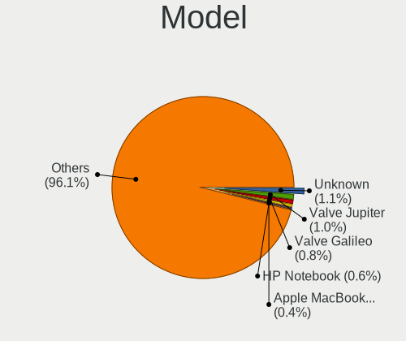
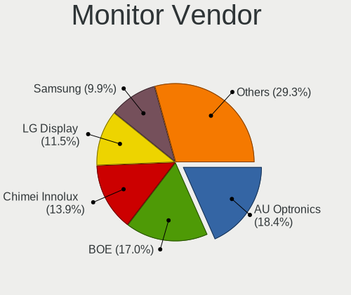

Linux Hardware Trends (Notebook)
--------------------------------

A project to identify most popular hardware characteristics and track their change
over time based on data collected by Linux users at https://Linux-Hardware.org.

Anyone can contribute to the study by uploading probes of their computers by
the [hw-probe](https://github.com/linuxhw/hw-probe) tool:

    sudo hw-probe -all -upload

Full-feature report is available here: https://linux-hardware.org/?view=trends&formfactor=notebook

Period: Jan, 2020.

Contents
--------

- [ OS                       ](#os)
- [ OS Family                ](#os-family)
- [ Kernel                   ](#kernel)
- [ Kernel Family            ](#kernel-family)
- [ Kernel Major Ver.        ](#kernel-major-ver)
- [ Arch                     ](#arch)
- [ DE                       ](#de)
- [ Display Server           ](#display-server)
- [ OS Lang                  ](#os-lang)
- [ Boot Mode                ](#boot-mode)
- [ Filesystem               ](#filesystem)
- [ Dual Boot with Linux     ](#dual-boot-with-linux)
- [ Dual Boot (Win)          ](#dual-boot-win)
- [ Country                  ](#country)
- [ City                     ](#city)
- [ Vendor                   ](#vendor)
- [ Model                    ](#model)
- [ Model Family             ](#model-family)
- [ MFG Year                 ](#mfg-year)
- [ Form Factor              ](#form-factor)
- [ Secure Boot              ](#secure-boot)
- [ Coreboot                 ](#coreboot)
- [ RAM Size                 ](#ram-size)
- [ RAM Used                 ](#ram-used)
- [ Drive Vendor             ](#drive-vendor)
- [ Drive Model              ](#drive-model)
- [ Drive Kind               ](#drive-kind)
- [ Drive Connector          ](#drive-connector)
- [ Drive Size               ](#drive-size)
- [ Space Total              ](#space-total)
- [ Space Used               ](#space-used)
- [ Malfunc. Drives          ](#malfunc-drives)
- [ Malfunc. Drive Vendor    ](#malfunc-drive-vendor)
- [ Malfunc. Drive Kind      ](#malfunc-drive-kind)
- [ Failed Drives            ](#failed-drives)
- [ Failed Drive Vendor      ](#failed-drive-vendor)
- [ Drive Status             ](#drive-status)
- [ Storage Vendor           ](#storage-vendor)
- [ Storage Model            ](#storage-model)
- [ Storage Kind             ](#storage-kind)
- [ CPU Vendor               ](#cpu-vendor)
- [ CPU Model                ](#cpu-model)
- [ CPU Model Family         ](#cpu-model-family)
- [ CPU Cores                ](#cpu-cores)
- [ CPU Sockets              ](#cpu-sockets)
- [ CPU Threads              ](#cpu-threads)
- [ CPU Op-Modes             ](#cpu-op-modes)
- [ CPU Microarch            ](#cpu-microarch)
- [ CPU Microcode            ](#cpu-microcode)
- [ GPU Vendor               ](#gpu-vendor)
- [ GPU Model                ](#gpu-model)
- [ GPU Combo                ](#gpu-combo)
- [ GPU Driver               ](#gpu-driver)
- [ GPU Memory               ](#gpu-memory)
- [ Monitor Vendor           ](#monitor-vendor)
- [ Monitor Model            ](#monitor-model)
- [ Monitor Resolution       ](#monitor-resolution)
- [ Monitor Diagonal         ](#monitor-diagonal)
- [ Monitor Width            ](#monitor-width)
- [ Aspect Ratio             ](#aspect-ratio)
- [ Monitor Area             ](#monitor-area)
- [ Pixel Density            ](#pixel-density)
- [ Multiple Monitors        ](#multiple-monitors)
- [ Net Controller Vendor    ](#net-controller-vendor)
- [ Net Controller Model     ](#net-controller-model)
- [ Net Controller Kind      ](#net-controller-kind)
- [ Used Controller          ](#used-controller)
- [ NICs                     ](#nics)
- [ Unsupported Devices      ](#unsupported-devices)
- [ Unsupported Device Types ](#unsupported-device-types)

OS
--

Installed operating systems

| Name                   | Computers | Percent |
|------------------------|-----------|---------|
| Ubuntu 18.04           | 379       | 23.14%  |
| Ubuntu 19.10           | 223       | 13.61%  |
| ROSA R11               | 152       | 9.28%   |
| BlackPanther 18.1      | 117       | 7.14%   |
| Mint 19.3              | 116       | 7.08%   |
| Fedora 31              | 92        | 5.62%   |
| BlackPanther 16.2      | 67        | 4.09%   |
| Manjaro 18.1.5         | 40        | 2.44%   |
| Arch                   | 38        | 2.32%   |
| Endless 3.7.6          | 26        | 1.59%   |
| KDE neon 18.04         | 24        | 1.47%   |
| Zorin 15               | 23        | 1.4%    |
| Ubuntu 19.04           | 23        | 1.4%    |
| Debian 10              | 23        | 1.4%    |
| Arch Rolling           | 21        | 1.28%   |
| Manjaro                | 16        | 0.98%   |
| Ubuntu 16.04           | 13        | 0.79%   |
| Elementary 5.1         | 12        | 0.73%   |
| ROSA R8.1              | 11        | 0.67%   |
| ROSA R10               | 10        | 0.61%   |
| Debian                 | 10        | 0.61%   |
| Endless 3.7.5          | 9         | 0.55%   |
| Gentoo                 | 8         | 0.49%   |
| Ubuntu 20.04           | 7         | 0.43%   |
| Mint 19.2              | 7         | 0.43%   |
| Debian Unstable        | 7         | 0.43%   |
| Pop!_OS 19.10          | 6         | 0.37%   |
| MX 19                  | 6         | 0.37%   |
| Fedora 30              | 6         | 0.37%   |
| Endless 3.3.19-nexthw1 | 6         | 0.37%   |
| Zorin 12               | 5         | 0.31%   |
| Mint 19                | 5         | 0.31%   |
| Kali 2019.4            | 5         | 0.31%   |
| Deepin 15.11           | 5         | 0.31%   |
| Chrome OS              | 5         | 0.31%   |
| Ubuntu 18.10           | 4         | 0.24%   |
| Peppermint 10          | 4         | 0.24%   |
| Mint 19.1              | 4         | 0.24%   |
| Kali 2020.1            | 4         | 0.24%   |
| Fedora 32              | 4         | 0.24%   |
| Endless 3.3.20-nexthw1 | 4         | 0.24%   |
| Debian Testing         | 4         | 0.24%   |
| CentOS 8               | 4         | 0.24%   |
| Ubuntu 17.10           | 3         | 0.18%   |
| Reborn OS              | 3         | 0.18%   |
| Mint 18.3              | 3         | 0.18%   |
| Gentoo 2.6             | 3         | 0.18%   |
| EndeavourOS Rolling    | 3         | 0.18%   |
| Deepin                 | 3         | 0.18%   |
| Void Rolling           | 2         | 0.12%   |
| RHEL 8.1               | 2         | 0.12%   |
| Pop!_OS 18.04          | 2         | 0.12%   |
| Parrot 4.7             | 2         | 0.12%   |
| Fedora 29              | 2         | 0.12%   |
| Endless 3.7.3          | 2         | 0.12%   |
| Endless 3.6.1-nexthw1  | 2         | 0.12%   |
| Endless 3.5.8          | 2         | 0.12%   |
| Endless 3.3.16-nexthw1 | 2         | 0.12%   |
| Debian 9               | 2         | 0.12%   |
| Clear Linux 32120      | 2         | 0.12%   |

OS Family
---------

OS without a version

| Name         | Computers | Percent |
|--------------|-----------|---------|
| Ubuntu       | 653       | 39.87%  |
| BlackPanther | 184       | 11.23%  |
| ROSA         | 174       | 10.62%  |
| Mint         | 136       | 8.3%    |
| Fedora       | 106       | 6.47%   |
| Endless      | 59        | 3.6%    |
| Arch         | 59        | 3.6%    |
| Manjaro      | 57        | 3.48%   |
| Debian       | 47        | 2.87%   |
| Zorin        | 28        | 1.71%   |
| KDE neon     | 24        | 1.47%   |
| Elementary   | 14        | 0.85%   |
| Gentoo       | 11        | 0.67%   |
| Clear Linux  | 10        | 0.61%   |
| Kali         | 9         | 0.55%   |
| Pop!_OS      | 8         | 0.49%   |
| Deepin       | 8         | 0.49%   |
| MX           | 7         | 0.43%   |
| openSUSE     | 6         | 0.37%   |
| Chrome OS    | 5         | 0.31%   |
| CentOS       | 5         | 0.31%   |
| Peppermint   | 4         | 0.24%   |
| RHEL         | 3         | 0.18%   |
| Reborn OS    | 3         | 0.18%   |
| Parrot       | 3         | 0.18%   |
| EndeavourOS  | 3         | 0.18%   |
| Void         | 2         | 0.12%   |
| Sparky       | 1         | 0.06%   |
| Solus        | 1         | 0.06%   |
| Oracle Linux | 1         | 0.06%   |
| HamoniKR     | 1         | 0.06%   |
| Funtoo       | 1         | 0.06%   |
| Arcolinux    | 1         | 0.06%   |
| ArchLabs     | 1         | 0.06%   |
| Arch ARM     | 1         | 0.06%   |
| Antix        | 1         | 0.06%   |
| Alpine       | 1         | 0.06%   |

Kernel
------

Version of the Linux kernel

| Version                          | Computers | Percent |
|----------------------------------|-----------|---------|
| 5.3.0-26-generic                 | 238       | 14.53%  |
| 5.0.0-37-generic                 | 212       | 12.94%  |
| 4.18.16-desktop-1bP              | 99        | 6.04%   |
| 4.15.0-74-generic                | 72        | 4.4%    |
| 4.9.20-desktop-pae-1bP           | 63        | 3.85%   |
| 5.3.0-24-generic                 | 61        | 3.72%   |
| 4.15.0-desktop-68.5rosa-x86_64   | 60        | 3.66%   |
| 4.15.0-desktop-45.1rosa-x86_64   | 48        | 2.93%   |
| 5.3.0-23-generic                 | 37        | 2.26%   |
| 4.15.0-72-generic                | 35        | 2.14%   |
| 5.3.0-28-generic                 | 33        | 2.01%   |
| 5.4.8-200.fc31.x86_64            | 30        | 1.83%   |
| 5.0.0-23-generic                 | 20        | 1.22%   |
| 4.19.0-6-amd64                   | 20        | 1.22%   |
| 5.3.0-29-generic                 | 19        | 1.16%   |
| 5.3.0-18-generic                 | 19        | 1.16%   |
| 5.4.6-2-MANJARO                  | 18        | 1.1%    |
| 5.1.15-desktop-1bP               | 18        | 1.1%    |
| 5.0.0-32-generic                 | 16        | 0.98%   |
| 4.9.155-nrj-desktop-1rosa-x86_64 | 16        | 0.98%   |
| 5.3.16-300.fc31.x86_64           | 15        | 0.92%   |
| 4.15.0-desktop-45.1rosa-i586     | 15        | 0.92%   |
| 5.0.0-38-generic                 | 13        | 0.79%   |
| 5.4.7-200.fc31.x86_64            | 12        | 0.73%   |
| 5.4.13-arch1-1                   | 12        | 0.73%   |
| 5.4.13-3-MANJARO                 | 12        | 0.73%   |
| 4.15.0-76-generic                | 12        | 0.73%   |
| 5.4.14-arch1-1                   | 10        | 0.61%   |
| 4.15.0-desktop-68.5rosa-i586     | 10        | 0.61%   |
| 4.15.0-15-generic                | 10        | 0.61%   |
| 5.4.8-arch1-1                    | 9         | 0.55%   |
| 5.4.10-200.fc31.x86_64           | 9         | 0.55%   |
| 4.15.0-29-generic                | 9         | 0.55%   |
| 5.4.13-201.fc31.x86_64           | 8         | 0.49%   |
| 5.4.12-200.fc31.x86_64           | 8         | 0.49%   |
| 4.15.0-30deepin-generic          | 8         | 0.49%   |
| 5.4.15-arch1-1                   | 7         | 0.43%   |
| 5.3.0-7625-generic               | 7         | 0.43%   |
| 4.9.60-nrj-desktop-1rosa-x86_64  | 7         | 0.43%   |
| 5.4.0-2-amd64                    | 6         | 0.37%   |
| 5.3.7-301.fc31.x86_64            | 6         | 0.37%   |
| 5.4.12-100.fc30.x86_64           | 5         | 0.31%   |
| 5.4.10-arch1-1                   | 5         | 0.31%   |
| 4.15.0-54-generic                | 5         | 0.31%   |
| 5.4.6-883.native                 | 4         | 0.24%   |
| 5.4.14-2-MANJARO                 | 4         | 0.24%   |
| 5.4.12-arch1-1                   | 4         | 0.24%   |
| 5.4.0-3-amd64                    | 4         | 0.24%   |
| 5.3.18-1-MANJARO                 | 4         | 0.24%   |
| 5.3.0-27-generic                 | 4         | 0.24%   |
| 5.3.0-26-lowlatency              | 4         | 0.24%   |
| 4.18.0-25-generic                | 4         | 0.24%   |
| 4.18.0-15-generic                | 4         | 0.24%   |
| 4.18.0-147.3.1.el8_1.x86_64      | 4         | 0.24%   |
| 4.15.0-45-generic                | 4         | 0.24%   |
| 4.15.0-20-generic                | 4         | 0.24%   |
| 5.4.7-arch1-1                    | 3         | 0.18%   |
| 5.4.11-arch1-1                   | 3         | 0.18%   |
| 5.0.0-31-generic                 | 3         | 0.18%   |
| 4.9.155-nrj-desktop-1rosa-i586   | 3         | 0.18%   |

Kernel Family
-------------

Linux kernel without a distro release

| Version | Computers | Percent |
|---------|-----------|---------|
| 5.3.0   | 443       | 27.05%  |
| 4.15.0  | 324       | 19.78%  |
| 5.0.0   | 277       | 16.91%  |
| 4.18.16 | 99        | 6.04%   |
| 4.9.20  | 66        | 4.03%   |
| 5.4.13  | 46        | 2.81%   |
| 5.4.8   | 41        | 2.5%    |
| 5.4.0   | 28        | 1.71%   |
| 5.4.6   | 24        | 1.47%   |
| 5.4.12  | 24        | 1.47%   |
| 4.19.0  | 24        | 1.47%   |
| 4.9.155 | 19        | 1.16%   |
| 4.18.0  | 19        | 1.16%   |
| 5.4.14  | 18        | 1.1%    |
| 5.4.10  | 18        | 1.1%    |
| 5.1.15  | 18        | 1.1%    |
| 5.4.7   | 16        | 0.98%   |
| 5.3.16  | 15        | 0.92%   |
| 5.5.0   | 11        | 0.67%   |
| 5.4.15  | 9         | 0.55%   |
| 4.9.60  | 9         | 0.55%   |
| 5.3.7   | 6         | 0.37%   |
| 4.19.97 | 5         | 0.31%   |
| 4.13.0  | 5         | 0.31%   |
| 5.3.18  | 4         | 0.24%   |
| 4.9.0   | 4         | 0.24%   |
| 5.4.11  | 3         | 0.18%   |
| 4.19.88 | 3         | 0.18%   |
| 4.19.65 | 3         | 0.18%   |
| 5.4.2   | 2         | 0.12%   |
| 5.4.1   | 2         | 0.12%   |
| 5.3.6   | 2         | 0.12%   |
| 5.2.21  | 2         | 0.12%   |
| 5.2.0   | 2         | 0.12%   |
| 5.1.0   | 2         | 0.12%   |
| 4.19.99 | 2         | 0.12%   |
| 4.19.98 | 2         | 0.12%   |
| 4.19.96 | 2         | 0.12%   |
| 4.19.86 | 2         | 0.12%   |
| 4.14.14 | 2         | 0.12%   |
| 4.12.14 | 2         | 0.12%   |
| 4.1.38  | 2         | 0.12%   |
| 3.16.0  | 2         | 0.12%   |
| 5.4.5   | 1         | 0.06%   |
| 5.4.3   | 1         | 0.06%   |
| 5.3.9   | 1         | 0.06%   |
| 5.3.8   | 1         | 0.06%   |
| 5.3.14  | 1         | 0.06%   |
| 5.3.13  | 1         | 0.06%   |
| 5.3.11  | 1         | 0.06%   |
| 5.2.7   | 1         | 0.06%   |
| 5.1.16  | 1         | 0.06%   |
| 5.0.7   | 1         | 0.06%   |
| 5.0.16  | 1         | 0.06%   |
| 4.9.160 | 1         | 0.06%   |
| 4.9.140 | 1         | 0.06%   |
| 4.9.124 | 1         | 0.06%   |
| 4.5.2   | 1         | 0.06%   |
| 4.4.59  | 1         | 0.06%   |
| 4.4.0   | 1         | 0.06%   |

Kernel Major Ver.
-----------------

Linux kernel major version

| Version | Computers | Percent |
|---------|-----------|---------|
| 5.3     | 475       | 29%     |
| 4.15    | 324       | 19.78%  |
| 5.0     | 279       | 17.03%  |
| 5.4     | 233       | 14.22%  |
| 4.18    | 118       | 7.2%    |
| 4.9     | 101       | 6.17%   |
| 4.19    | 48        | 2.93%   |
| 5.1     | 21        | 1.28%   |
| 5.5     | 11        | 0.67%   |
| 5.2     | 5         | 0.31%   |
| 4.13    | 5         | 0.31%   |
| 4.14    | 3         | 0.18%   |
| 4.4     | 2         | 0.12%   |
| 4.16    | 2         | 0.12%   |
| 4.12    | 2         | 0.12%   |
| 4.1     | 2         | 0.12%   |
| 3.16    | 2         | 0.12%   |
| 4.5     | 1         | 0.06%   |
| 4.3     | 1         | 0.06%   |
| 4.17    | 1         | 0.06%   |
| 4.11    | 1         | 0.06%   |
| 4.10    | 1         | 0.06%   |

Arch
----

OS architecture (x86_64, i586, etc.)

| Name    | Computers | Percent |
|---------|-----------|---------|
| x86_64  | 1471      | 89.8%   |
| i686    | 165       | 10.07%  |
| i586    | 1         | 0.06%   |
| aarch64 | 1         | 0.06%   |

DE
--

Desktop Environment

| Name            | Computers | Percent |
|-----------------|-----------|---------|
| GNOME           | 640       | 39.07%  |
| KDE5            | 284       | 17.34%  |
| Unknown         | 200       | 12.21%  |
| KDE4            | 113       | 6.9%    |
| XFCE            | 105       | 6.41%   |
| X-Cinnamon      | 78        | 4.76%   |
| KDE             | 56        | 3.42%   |
| MATE            | 41        | 2.5%    |
| Cinnamon        | 38        | 2.32%   |
| Pantheon        | 12        | 0.73%   |
| Unity           | 11        | 0.67%   |
| LXQt            | 10        | 0.61%   |
| Deepin          | 10        | 0.61%   |
| GNOME Flashback | 8         | 0.49%   |
| Budgie          | 8         | 0.49%   |
| LXDE            | 7         | 0.43%   |
| i3              | 6         | 0.37%   |
| Openbox         | 4         | 0.24%   |
| xubuntu         | 2         | 0.12%   |
| Trinity         | 1         | 0.06%   |
| Lumina          | 1         | 0.06%   |
| GNUstep         | 1         | 0.06%   |
| GNOME Classic   | 1         | 0.06%   |
| Awesome         | 1         | 0.06%   |

Display Server
--------------

X11 or Wayland

| Name    | Computers | Percent |
|---------|-----------|---------|
| X11     | 1430      | 87.3%   |
| Wayland | 117       | 7.14%   |
| Unknown | 91        | 5.56%   |

OS Lang
-------

Language

| Lang        | Computers | Percent |
|-------------|-----------|---------|
| Unknown     | 518       | 31.62%  |
| en_US       | 413       | 25.21%  |
| de_DE       | 91        | 5.56%   |
| pt_BR       | 70        | 4.27%   |
| ru_RU       | 58        | 3.54%   |
| en_GB       | 55        | 3.36%   |
| it_IT       | 44        | 2.69%   |
| es_ES       | 33        | 2.01%   |
| fr_FR       | 26        | 1.59%   |
| en_CA       | 25        | 1.53%   |
| pl_PL       | 23        | 1.4%    |
| C           | 18        | 1.1%    |
| nl_NL       | 17        | 1.04%   |
| en_US.utf8  | 17        | 1.04%   |
| en_IN       | 16        | 0.98%   |
| cs_CZ       | 13        | 0.79%   |
| hu_HU       | 12        | 0.73%   |
| en_AU       | 12        | 0.73%   |
| de_AT       | 12        | 0.73%   |
| pt_BR.utf8  | 11        | 0.67%   |
| ro_RO       | 10        | 0.61%   |
| es_MX       | 10        | 0.61%   |
| sk_SK       | 9         | 0.55%   |
| pt_PT       | 8         | 0.49%   |
| ru_UA       | 7         | 0.43%   |
| en_ZA       | 7         | 0.43%   |
| da_DK       | 6         | 0.37%   |
| uk_UA       | 5         | 0.31%   |
| es_CO       | 5         | 0.31%   |
| es_CL       | 5         | 0.31%   |
| es_AR       | 5         | 0.31%   |
| en_IN       | 5         | 0.31%   |
| de_CH       | 5         | 0.31%   |
| en_NZ       | 4         | 0.24%   |
| en_GB.utf8  | 4         | 0.24%   |
| ca_ES       | 4         | 0.24%   |
| tr_TR       | 3         | 0.18%   |
| lt_LT       | 3         | 0.18%   |
| de_DE.utf8  | 3         | 0.18%   |
| C           | 3         | 0.18%   |
| bg_BG       | 3         | 0.18%   |
| zh_TW       | 2         | 0.12%   |
| sv_SE       | 2         | 0.12%   |
| ja_JP       | 2         | 0.12%   |
| fr_BE       | 2         | 0.12%   |
| fi_FI       | 2         | 0.12%   |
| en_IL       | 2         | 0.12%   |
| el_GR       | 2         | 0.12%   |
| zh_CN       | 1         | 0.06%   |
| sv_FI       | 1         | 0.06%   |
| sr_RS@latin | 1         | 0.06%   |
| sr_RS       | 1         | 0.06%   |
| ru_UA.utf8  | 1         | 0.06%   |
| ru_RU.utf8  | 1         | 0.06%   |
| pl_PL.utf8  | 1         | 0.06%   |
| nl_NL.utf8  | 1         | 0.06%   |
| mk_MK       | 1         | 0.06%   |
| id_ID       | 1         | 0.06%   |
| hr_HR       | 1         | 0.06%   |
| he_IL       | 1         | 0.06%   |

Boot Mode
---------

EFI or BIOS

| Mode | Computers | Percent |
|------|-----------|---------|
| BIOS | 856       | 52.26%  |
| EFI  | 782       | 47.74%  |

Filesystem
----------

Type of filesystem

| Type    | Computers | Percent |
|---------|-----------|---------|
| Ext4    | 1515      | 92.49%  |
| Overlay | 46        | 2.81%   |
| Btrfs   | 36        | 2.2%    |
| Xfs     | 18        | 1.1%    |
| Zfs     | 5         | 0.31%   |
| Ext3    | 5         | 0.31%   |
| Ext2    | 4         | 0.24%   |
| Unknown | 4         | 0.24%   |
| Tmpfs   | 2         | 0.12%   |
| F2fs    | 2         | 0.12%   |
| Aufs    | 1         | 0.06%   |

Dual Boot with Linux
--------------------

Hosting more than one Linux

| Dual boot | Computers | Percent |
|-----------|-----------|---------|
| No        | 1487      | 90.78%  |
| Yes       | 151       | 9.22%   |

Dual Boot (Win)
---------------

Hosting Linux and Windows

| Dual boot | Computers | Percent |
|-----------|-----------|---------|
| No        | 1159      | 70.76%  |
| Yes       | 479       | 29.24%  |

Country
-------

Geographic location (country)

| Country        | Computers | Percent |
|----------------|-----------|---------|
| Russia         | 192       | 11.72%  |
| USA            | 181       | 11.05%  |
| Hungary        | 154       | 9.4%    |
| Germany        | 152       | 9.28%   |
| Brazil         | 108       | 6.59%   |
| Italy          | 65        | 3.97%   |
| UK             | 49        | 2.99%   |
| Spain          | 48        | 2.93%   |
| Netherlands    | 46        | 2.81%   |
| France         | 45        | 2.75%   |
| Poland         | 42        | 2.56%   |
| Canada         | 42        | 2.56%   |
| Romania        | 36        | 2.2%    |
| Ukraine        | 35        | 2.14%   |
| India          | 27        | 1.65%   |
| Austria        | 27        | 1.65%   |
| Czech Republic | 21        | 1.28%   |
| Mexico         | 19        | 1.16%   |
| Australia      | 18        | 1.1%    |
| Indonesia      | 16        | 0.98%   |
| Switzerland    | 15        | 0.92%   |
| Portugal       | 15        | 0.92%   |
| Serbia         | 14        | 0.85%   |
| Finland        | 14        | 0.85%   |
| Belarus        | 13        | 0.79%   |
| Turkey         | 12        | 0.73%   |
| Slovakia       | 12        | 0.73%   |
| Denmark        | 12        | 0.73%   |
| South Africa   | 10        | 0.61%   |
| Belgium        | 10        | 0.61%   |
| Argentina      | 10        | 0.61%   |
| Bulgaria       | 9         | 0.55%   |
| Sweden         | 8         | 0.49%   |
| Lithuania      | 8         | 0.49%   |
| Colombia       | 8         | 0.49%   |
| Norway         | 7         | 0.43%   |
| New Zealand    | 7         | 0.43%   |
| Iran           | 7         | 0.43%   |
| China          | 7         | 0.43%   |
| Israel         | 6         | 0.37%   |
| Greece         | 6         | 0.37%   |
| Chile          | 6         | 0.37%   |
| Philippines    | 5         | 0.31%   |
| Japan          | 5         | 0.31%   |
| Croatia        | 5         | 0.31%   |
| Vietnam        | 4         | 0.24%   |
| Kazakhstan     | 4         | 0.24%   |
| Egypt          | 4         | 0.24%   |
| Bangladesh     | 4         | 0.24%   |
| Taiwan         | 3         | 0.18%   |
| Slovenia       | 3         | 0.18%   |
| Saudi Arabia   | 3         | 0.18%   |
| Paraguay       | 3         | 0.18%   |
| Pakistan       | 3         | 0.18%   |
| Latvia         | 3         | 0.18%   |
| Uzbekistan     | 2         | 0.12%   |
| Panama         | 2         | 0.12%   |
| Myanmar        | 2         | 0.12%   |
| Malaysia       | 2         | 0.12%   |
| Kyrgyzstan     | 2         | 0.12%   |

City
----

Geographic location (city)

| City              | Computers | Percent |
|-------------------|-----------|---------|
| Budapest          | 42        | 2.56%   |
| Moscow            | 37        | 2.26%   |
| St Petersburg     | 20        | 1.22%   |
| Berlin            | 20        | 1.22%   |
| Vienna            | 17        | 1.04%   |
| Novosibirsk       | 13        | 0.79%   |
| Warsaw            | 12        | 0.73%   |
| Amsterdam         | 12        | 0.73%   |
| São Paulo        | 10        | 0.61%   |
| Kyiv              | 10        | 0.61%   |
| Yekaterinburg     | 9         | 0.55%   |
| Rome              | 9         | 0.55%   |
| Munich            | 8         | 0.49%   |
| Bucharest         | 8         | 0.49%   |
| Toronto           | 7         | 0.43%   |
| Minsk             | 7         | 0.43%   |
| Milan             | 7         | 0.43%   |
| Madrid            | 7         | 0.43%   |
| London            | 7         | 0.43%   |
| Prague            | 6         | 0.37%   |
| Portland          | 6         | 0.37%   |
| Jakarta           | 6         | 0.37%   |
| Chicago           | 6         | 0.37%   |
| Belgrade          | 6         | 0.37%   |
| Zurich            | 5         | 0.31%   |
| Székesfehérvár | 5         | 0.31%   |
| Rio de Janeiro    | 5         | 0.31%   |
| Paris             | 5         | 0.31%   |
| Nyirtelek         | 5         | 0.31%   |
| New York          | 5         | 0.31%   |
| Montreal          | 5         | 0.31%   |
| Lisbon            | 5         | 0.31%   |
| Krasnodar         | 5         | 0.31%   |
| Hamburg           | 5         | 0.31%   |
| Dallas            | 5         | 0.31%   |
| Bengaluru         | 5         | 0.31%   |
| Belo Horizonte    | 5         | 0.31%   |
| Barcelona         | 5         | 0.31%   |
| Zalaegerszeg      | 4         | 0.24%   |
| Wrocław          | 4         | 0.24%   |
| Veresegyhaz       | 4         | 0.24%   |
| The Hague         | 4         | 0.24%   |
| Medellín         | 4         | 0.24%   |
| Krasnoyarsk       | 4         | 0.24%   |
| Khabarovsk        | 4         | 0.24%   |
| Kazan’          | 4         | 0.24%   |
| Johannesburg      | 4         | 0.24%   |
| Fortaleza         | 4         | 0.24%   |
| Dresden           | 4         | 0.24%   |
| Dhaka             | 4         | 0.24%   |
| Debrecen          | 4         | 0.24%   |
| Curitiba          | 4         | 0.24%   |
| Columbus          | 4         | 0.24%   |
| Cologne           | 4         | 0.24%   |
| Cluj-Napoca       | 4         | 0.24%   |
| Cairo             | 4         | 0.24%   |
| Brasília         | 4         | 0.24%   |
| Łódź           | 3         | 0.18%   |
| Zagreb            | 3         | 0.18%   |
| Volgograd         | 3         | 0.18%   |

Vendor
------

Motherboard manufacturer

| Name                             | Computers | Percent |
|----------------------------------|-----------|---------|
| Lenovo                           | 349       | 21.31%  |
| Hewlett-Packard                  | 312       | 19.05%  |
| Dell                             | 258       | 15.75%  |
| ASUSTek Computer                 | 193       | 11.78%  |
| Acer                             | 166       | 10.13%  |
| Toshiba                          | 64        | 3.91%   |
| Samsung Electronics              | 38        | 2.32%   |
| Sony                             | 24        | 1.47%   |
| MSI                              | 24        | 1.47%   |
| Apple                            | 21        | 1.28%   |
| Packard Bell                     | 18        | 1.1%    |
| Positivo                         | 16        | 0.98%   |
| Notebook                         | 15        | 0.92%   |
| Medion                           | 12        | 0.73%   |
| eMachines                        | 9         | 0.55%   |
| HUAWEI                           | 8         | 0.49%   |
| Fujitsu Siemens                  | 8         | 0.49%   |
| Fujitsu                          | 8         | 0.49%   |
| Unknown                          | 7         | 0.43%   |
| Gateway                          | 5         | 0.31%   |
| Panasonic                        | 4         | 0.24%   |
| LG Electronics                   | 4         | 0.24%   |
| Intel                            | 4         | 0.24%   |
| TUXEDO                           | 3         | 0.18%   |
| Timi                             | 3         | 0.18%   |
| Razer                            | 3         | 0.18%   |
| PC Specialist                    | 3         | 0.18%   |
| Google                           | 3         | 0.18%   |
| Gigabyte Technology              | 3         | 0.18%   |
| Dixonsxp                         | 3         | 0.18%   |
| Alienware                        | 3         | 0.18%   |
| Semp Toshiba                     | 2         | 0.12%   |
| Pegatron                         | 2         | 0.12%   |
| Itautec                          | 2         | 0.12%   |
| DEXP                             | 2         | 0.12%   |
| Compaq                           | 2         | 0.12%   |
| Clevo                            | 2         | 0.12%   |
| CCE                              | 2         | 0.12%   |
| XMG                              | 1         | 0.06%   |
| www.51nb.com                     | 1         | 0.06%   |
| VIT                              | 1         | 0.06%   |
| VERO                             | 1         | 0.06%   |
| TrekStor                         | 1         | 0.06%   |
| System76                         | 1         | 0.06%   |
| Synology                         | 1         | 0.06%   |
| StationX                         | 1         | 0.06%   |
| Schenker                         | 1         | 0.06%   |
| RKM                              | 1         | 0.06%   |
| Qilive                           | 1         | 0.06%   |
| Positivo Bahia - VAIO            | 1         | 0.06%   |
| nJoy Romania                     | 1         | 0.06%   |
| Multilaser Industrial            | 1         | 0.06%   |
| Monster                          | 1         | 0.06%   |
| Maibenben                        | 1         | 0.06%   |
| LIVEFAN                          | 1         | 0.06%   |
| Insyde                           | 1         | 0.06%   |
| Infomash                         | 1         | 0.06%   |
| IBM                              | 1         | 0.06%   |
| Hampoo                           | 1         | 0.06%   |
| FUJITSU CLIENT COMPUTING LIMITED | 1         | 0.06%   |

Model
-----

Motherboard model

| Name                                     | Computers | Percent |
|------------------------------------------|-----------|---------|
| Unknown                                  | 18        | 1.1%    |
| HP Pavilion dv6                          | 17        | 1.04%   |
| HP Notebook                              | 11        | 0.67%   |
| Dell Latitude E6410                      | 11        | 0.67%   |
| HP Pavilion g6                           | 10        | 0.61%   |
| HP Laptop 15-db0xxx                      | 10        | 0.61%   |
| Lenovo IdeaPad 100-15IBD 80QQ            | 8         | 0.49%   |
| HP Pavilion dv7                          | 8         | 0.49%   |
| Dell XPS 15 9570                         | 8         | 0.49%   |
| HP Laptop 15-da0xxx                      | 7         | 0.43%   |
| HP 250 G1                                | 7         | 0.43%   |
| Dell XPS 15 9560                         | 7         | 0.43%   |
| Dell XPS 13 9380                         | 7         | 0.43%   |
| ASUS X541NA                              | 6         | 0.37%   |
| HUAWEI WRT-WX9                           | 5         | 0.31%   |
| HP Pavilion Notebook                     | 5         | 0.31%   |
| HP Laptop 15-bw0xx                       | 5         | 0.31%   |
| HP EliteBook 840 G6                      | 5         | 0.31%   |
| Dell XPS 13 9360                         | 5         | 0.31%   |
| Dell Latitude E7450                      | 5         | 0.31%   |
| Dell Latitude E6430                      | 5         | 0.31%   |
| Dell Latitude E5470                      | 5         | 0.31%   |
| Dell Inspiron 5567                       | 5         | 0.31%   |
| ASUS K50IJ                               | 5         | 0.31%   |
| Positivo Q232A                           | 4         | 0.24%   |
| Positivo Mobile                          | 4         | 0.24%   |
| Lenovo ThinkPad X1 Carbon 7th 20QDCTO1WW | 4         | 0.24%   |
| Lenovo IdeaPad 320-15IKB 80XL            | 4         | 0.24%   |
| HP Laptop 17-ca0xxx                      | 4         | 0.24%   |
| HP 635                                   | 4         | 0.24%   |
| HP 250 G5 Notebook PC                    | 4         | 0.24%   |
| Dell Latitude E6420                      | 4         | 0.24%   |
| Dell Inspiron 5558                       | 4         | 0.24%   |
| Dell Inspiron 15-3567                    | 4         | 0.24%   |
| ASUS VivoBook 15_ASUS Laptop X540UAR     | 4         | 0.24%   |
| Acer Nitro AN515-52                      | 4         | 0.24%   |
| Toshiba Satellite C660                   | 3         | 0.18%   |
| Samsung Electronics RV409/RV509/RV709    | 3         | 0.18%   |
| Samsung Electronics R519/R719            | 3         | 0.18%   |
| Positivo C14CR01                         | 3         | 0.18%   |
| Lenovo Yoga 2 Pro 20266                  | 3         | 0.18%   |
| Lenovo Y50-70 20378                      | 3         | 0.18%   |
| Lenovo IdeaPad FLEX-14API 81SS           | 3         | 0.18%   |
| Lenovo IdeaPad 330-15IKB 81DE            | 3         | 0.18%   |
| Lenovo IdeaPad 330-15AST 81D6            | 3         | 0.18%   |
| Lenovo IdeaPad 330-15ARR 81D2            | 3         | 0.18%   |
| Lenovo IdeaPad 320-15ISK 80XH            | 3         | 0.18%   |
| Lenovo IdeaPad 320-15ABR 80XS            | 3         | 0.18%   |
| Lenovo G580 20150                        | 3         | 0.18%   |
| Lenovo G550 20023                        | 3         | 0.18%   |
| Lenovo G50-30 80G0                       | 3         | 0.18%   |
| Lenovo B590 20208                        | 3         | 0.18%   |
| Lenovo B570e HuronRiver Platform         | 3         | 0.18%   |
| HP ProBook 6450b                         | 3         | 0.18%   |
| HP ProBook 4530s                         | 3         | 0.18%   |
| HP Laptop 15-bs0xx                       | 3         | 0.18%   |
| HP EliteBook Folio 1040 G3               | 3         | 0.18%   |
| HP EliteBook 8570p                       | 3         | 0.18%   |
| HP EliteBook 850 G6                      | 3         | 0.18%   |
| HP EliteBook 8460p                       | 3         | 0.18%   |

Model Family
------------

Motherboard model prefix

| Name                      | Computers | Percent |
|---------------------------|-----------|---------|
| Lenovo ThinkPad           | 171       | 10.44%  |
| Acer Aspire               | 120       | 7.33%   |
| Lenovo IdeaPad            | 93        | 5.68%   |
| Dell Inspiron             | 93        | 5.68%   |
| Dell Latitude             | 78        | 4.76%   |
| HP Pavilion               | 67        | 4.09%   |
| Toshiba Satellite         | 53        | 3.24%   |
| HP EliteBook              | 53        | 3.24%   |
| HP Laptop                 | 46        | 2.81%   |
| Dell XPS                  | 43        | 2.63%   |
| ASUS VivoBook             | 35        | 2.14%   |
| HP ProBook                | 31        | 1.89%   |
| Dell Vostro               | 21        | 1.28%   |
| HP 250                    | 20        | 1.22%   |
| Unknown                   | 18        | 1.1%    |
| HP Compaq                 | 17        | 1.04%   |
| Packard Bell EasyNote     | 14        | 0.85%   |
| HP ENVY                   | 14        | 0.85%   |
| HP Notebook               | 11        | 0.67%   |
| HP ZBook                  | 10        | 0.61%   |
| Acer TravelMate           | 10        | 0.61%   |
| Acer Nitro                | 10        | 0.61%   |
| Dell Precision            | 9         | 0.55%   |
| Fujitsu LIFEBOOK          | 8         | 0.49%   |
| Lenovo Yoga               | 7         | 0.43%   |
| ASUS X541NA               | 6         | 0.37%   |
| ASUS TUF                  | 6         | 0.37%   |
| Acer Swift                | 6         | 0.37%   |
| Acer Extensa              | 6         | 0.37%   |
| Toshiba PORTEGE           | 5         | 0.31%   |
| Lenovo G570               | 5         | 0.31%   |
| HUAWEI WRT-WX9            | 5         | 0.31%   |
| HP 255                    | 5         | 0.31%   |
| Fujitsu Siemens AMILO     | 5         | 0.31%   |
| Dell G3                   | 5         | 0.31%   |
| ASUS K50IJ                | 5         | 0.31%   |
| Acer Predator             | 5         | 0.31%   |
| Positivo Q232A            | 4         | 0.24%   |
| Positivo MOBILE           | 4         | 0.24%   |
| Lenovo Legion             | 4         | 0.24%   |
| Lenovo B590               | 4         | 0.24%   |
| HP Presario               | 4         | 0.24%   |
| HP 635                    | 4         | 0.24%   |
| Dell Studio               | 4         | 0.24%   |
| ASUS ZenBook              | 4         | 0.24%   |
| Apple MacBookPro8         | 4         | 0.24%   |
| Samsung Electronics RV409 | 3         | 0.18%   |
| Samsung Electronics R519  | 3         | 0.18%   |
| Razer Blade               | 3         | 0.18%   |
| Positivo C14CR01          | 3         | 0.18%   |
| MSI GS65                  | 3         | 0.18%   |
| MSI GF63                  | 3         | 0.18%   |
| Lenovo Y50-70             | 3         | 0.18%   |
| Lenovo ThinkBook          | 3         | 0.18%   |
| Lenovo G580               | 3         | 0.18%   |
| Lenovo G550               | 3         | 0.18%   |
| Lenovo G50-30             | 3         | 0.18%   |
| Lenovo B570e              | 3         | 0.18%   |
| HP Mini                   | 3         | 0.18%   |
| HP 650                    | 3         | 0.18%   |

MFG Year
--------

Motherboard manufacture year

| Year    | Computers | Percent |
|---------|-----------|---------|
| 2019    | 412       | 25.15%  |
| 2018    | 201       | 12.27%  |
| 2011    | 134       | 8.18%   |
| 2013    | 129       | 7.88%   |
| 2017    | 108       | 6.59%   |
| 2012    | 97        | 5.92%   |
| 2015    | 93        | 5.68%   |
| 2014    | 93        | 5.68%   |
| 2016    | 88        | 5.37%   |
| 2010    | 81        | 4.95%   |
| 2009    | 81        | 4.95%   |
| 2008    | 61        | 3.72%   |
| 2007    | 36        | 2.2%    |
| 2006    | 9         | 0.55%   |
| 2005    | 9         | 0.55%   |
| 2020    | 3         | 0.18%   |
| Unknown | 3         | 0.18%   |

Form Factor
-----------

Physical design of the computer

| Name     | Computers | Percent |
|----------|-----------|---------|
| Notebook | 1638      | 100%    |

Secure Boot
-----------

Enabled or disabled

| State    | Computers | Percent |
|----------|-----------|---------|
| Disabled | 1494      | 91.21%  |
| Enabled  | 144       | 8.79%   |

Coreboot
--------

Have coreboot on board

| Used | Computers | Percent |
|------|-----------|---------|
| No   | 1634      | 99.76%  |
| Yes  | 4         | 0.24%   |

RAM Size
--------

Total RAM memory

| Size in GB  | Computers | Percent |
|-------------|-----------|---------|
| 3.01-4.0    | 467       | 28.51%  |
| 4.01-8.0    | 425       | 25.95%  |
| 8.01-16.0   | 243       | 14.84%  |
| 16.01-24.0  | 233       | 14.22%  |
| 1.01-2.0    | 121       | 7.39%   |
| 2.01-3.0    | 57        | 3.48%   |
| 32.01-64.0  | 55        | 3.36%   |
| 0.01-1.0    | 22        | 1.34%   |
| 24.01-32.0  | 10        | 0.61%   |
| 64.01-256.0 | 4         | 0.24%   |
| Unknown     | 1         | 0.06%   |

RAM Used
--------

Used RAM memory

| Used GB    | Computers | Percent |
|------------|-----------|---------|
| 1.01-2.0   | 629       | 38.4%   |
| 2.01-3.0   | 383       | 23.38%  |
| 0.01-1.0   | 293       | 17.89%  |
| 3.01-4.0   | 151       | 9.22%   |
| 4.01-8.0   | 132       | 8.06%   |
| 8.01-16.0  | 45        | 2.75%   |
| 32.01-64.0 | 2         | 0.12%   |
| 16.01-24.0 | 1         | 0.06%   |
| 0          | 1         | 0.06%   |
| Unknown    | 1         | 0.06%   |

Drive Vendor
------------

Hard drive vendors

| Vendor              | Computers | Drives | Percent |
|---------------------|-----------|--------|---------|
| Seagate             | 307       | 322    | 16.58%  |
| WDC                 | 288       | 291    | 15.55%  |
| Samsung Electronics | 201       | 216    | 10.85%  |
| Toshiba             | 180       | 180    | 9.72%   |
| Kingston            | 110       | 111    | 5.94%   |
| HGST                | 105       | 105    | 5.67%   |
| SanDisk             | 98        | 99     | 5.29%   |
| Hitachi             | 90        | 91     | 4.86%   |
| Unknown             | 85        | 94     | 4.59%   |
| Crucial             | 44        | 44     | 2.38%   |
| SK Hynix            | 37        | 37     | 2%      |
| Intel               | 37        | 39     | 2%      |
| A-DATA Technology   | 37        | 38     | 2%      |
| Micron Technology   | 29        | 29     | 1.57%   |
| Fujitsu             | 18        | 18     | 0.97%   |
| LITEON              | 16        | 17     | 0.86%   |
| China               | 15        | 15     | 0.81%   |
| Transcend           | 14        | 14     | 0.76%   |
| HL-DT-ST            | 10        | 1      | 0.54%   |
| Intenso             | 9         | 9      | 0.49%   |
| LITEONIT            | 8         | 8      | 0.43%   |
| Apple               | 8         | 8      | 0.43%   |
| SPCC                | 7         | 7      | 0.38%   |
| KingSpec            | 6         | 6      | 0.32%   |
| Patriot             | 5         | 5      | 0.27%   |
| Hewlett-Packard     | 5         | 4      | 0.27%   |
| Apacer              | 5         | 5      | 0.27%   |
| Team                | 4         | 4      | 0.22%   |
| OCZ                 | 4         | 4      | 0.22%   |
| GOODRAM             | 4         | 4      | 0.22%   |
| Generic             | 4         | 4      | 0.22%   |
| Corsair             | 4         | 4      | 0.22%   |
| PNY                 | 3         | 3      | 0.16%   |
| PLEXTOR             | 3         | 3      | 0.16%   |
| Lenovo              | 3         | 3      | 0.16%   |
| Kingmax             | 3         | 3      | 0.16%   |
| JMicron             | 3         | 3      | 0.16%   |
| TCSUNBOW            | 2         | 2      | 0.11%   |
| Netac               | 2         | 2      | 0.11%   |
| Lexar               | 2         | 2      | 0.11%   |
| LDLC                | 2         | 2      | 0.11%   |
| FORESEE             | 2         | 2      | 0.11%   |
| ASMT                | 2         | 2      | 0.11%   |
| AS25                | 2         | 2      | 0.11%   |
| WDC WD64            | 1         | 1      | 0.05%   |
| Union Memory        | 1         | 1      | 0.05%   |
| TSA                 | 1         | 1      | 0.05%   |
| STEC                | 1         | 1      | 0.05%   |
| SSD                 | 1         | 1      | 0.05%   |
| Sony                | 1         | 1      | 0.05%   |
| sobetter            | 1         | 1      | 0.05%   |
| SMI                 | 1         | 1      | 0.05%   |
| Smartbuy            | 1         | 1      | 0.05%   |
| SABRENT             | 1         | 1      | 0.05%   |
| S3+                 | 1         | 1      | 0.05%   |
| RDM-II              | 1         | 1      | 0.05%   |
| PM981a N            | 1         | 1      | 0.05%   |
| PHISON              | 1         | 1      | 0.05%   |
| OWC                 | 1         | 1      | 0.05%   |
| OEM                 | 1         | 1      | 0.05%   |

Drive Model
-----------

Hard drive models

| Model                        | Computers | Percent |
|------------------------------|-----------|---------|
| ST1000LM035-1RK172 1TB       | 45        | 2.39%   |
| SA400S37240G 240GB SSD       | 27        | 1.44%   |
| MQ01ABF050 500GB             | 26        | 1.38%   |
| ST500LT012-1DG142 500GB      | 24        | 1.28%   |
| MQ01ABD100 1TB               | 24        | 1.28%   |
| ST9500325AS 500GB            | 23        | 1.22%   |
| HTS721010A9E630 1TB          | 23        | 1.22%   |
| ST1000LM024 HN-M101MBB 1TB   | 22        | 1.17%   |
| MMC Card  32GB               | 22        | 1.17%   |
| HTS541010A9E680 1TB          | 21        | 1.12%   |
| SA400S37120G 120GB SSD       | 20        | 1.06%   |
| HTS545050A7E680 500GB        | 20        | 1.06%   |
| MQ04ABF100 1TB               | 18        | 0.96%   |
| SSD 860 EVO 500GB            | 15        | 0.8%    |
| WD10SPZX-21Z10T0 1TB         | 13        | 0.69%   |
| ST500LM012 HN-M500MBB 500GB  | 12        | 0.64%   |
| HTS725050A7E630 500GB        | 12        | 0.64%   |
| HTS545050A7E380 500GB        | 12        | 0.64%   |
| ST9320325AS 320GB            | 11        | 0.59%   |
| MMC Card  64GB               | 11        | 0.59%   |
| WD5000LPVX-22V0TT0 500GB     | 10        | 0.53%   |
| ST500LT012-9WS142 500GB      | 10        | 0.53%   |
| ST1000LX015-1U7172 1TB       | 10        | 0.53%   |
| SSD 860 EVO 1TB              | 10        | 0.53%   |
| DVDRAM GUC0N 1GB             | 10        | 0.53%   |
| WD10SPZX-24Z10 1TB           | 9         | 0.48%   |
| SSD 860 EVO 250GB            | 9         | 0.48%   |
| SSD 850 EVO 500GB            | 9         | 0.48%   |
| HM250HI 250GB                | 9         | 0.48%   |
| WD5000LPCX-24VHAT0 500GB     | 8         | 0.43%   |
| WDS240G2G0A-00JH30 240GB SSD | 7         | 0.37%   |
| SV300S37A120G 120GB SSD      | 7         | 0.37%   |
| ST9250315AS 250GB            | 7         | 0.37%   |
| ST2000LX001-1RG174 2TB       | 7         | 0.37%   |
| SSD 850 EVO 250GB            | 7         | 0.37%   |
| SSD 120GB                    | 7         | 0.37%   |
| SA400S37480G 480GB SSD       | 7         | 0.37%   |
| HTS547550A9E384 500GB        | 7         | 0.37%   |
| HTS545032A7E380 320GB        | 7         | 0.37%   |
| Expansion 1TB                | 7         | 0.37%   |
| WD1600BEVT-22ZCT0 160GB      | 6         | 0.32%   |
| WD10JPVX-75JC3T0 1TB         | 6         | 0.32%   |
| WD10JPVX-22JC3T0 1TB         | 6         | 0.32%   |
| WD10JPCX-24UE4T0 1TB         | 6         | 0.32%   |
| ST9750420AS 752GB            | 6         | 0.32%   |
| ST9500420AS 500GB            | 6         | 0.32%   |
| ST320LT020-9YG142 320GB      | 6         | 0.32%   |
| ST2000LM007-1R8174 2TB       | 6         | 0.32%   |
| ST1000LM049-2GH172 1TB       | 6         | 0.32%   |
| ST1000LM048-2E7172 1TB       | 6         | 0.32%   |
| SSD PLUS 1000GB              | 6         | 0.32%   |
| SDSSDA120G 120GB             | 6         | 0.32%   |
| MQ01ABD075 752GB             | 6         | 0.32%   |
| MQ01ABD050 500GB             | 6         | 0.32%   |
| HTS545050B9A300 500GB        | 6         | 0.32%   |
| HTS543232A7A384 320GB        | 6         | 0.32%   |
| HM321HI 320GB                | 6         | 0.32%   |
| HFS256G39TND-N210A 256GB SSD | 6         | 0.32%   |
| CT250MX500SSD1 250GB         | 6         | 0.32%   |
| X400 M.2 2280 256GB SSD      | 5         | 0.27%   |

Drive Kind
----------

HDD or SSD

| Kind    | Computers | Drives | Percent |
|---------|-----------|--------|---------|
| HDD     | 916       | 951    | 51.06%  |
| SSD     | 625       | 678    | 34.84%  |
| NVMe    | 119       | 127    | 6.63%   |
| MMC     | 88        | 99     | 4.91%   |
| Unknown | 46        | 36     | 2.56%   |

Drive Connector
---------------

SATA, SAS, NVMe, etc.

| Type | Computers | Drives | Percent |
|------|-----------|--------|---------|
| SATA | 1388      | 1611   | 83.87%  |
| NVMe | 119       | 127    | 7.19%   |
| MMC  | 88        | 99     | 5.32%   |
| SAS  | 60        | 54     | 3.63%   |

Drive Size
----------

Size of hard drive

| Size in TB | Computers | Drives | Percent |
|------------|-----------|--------|---------|
| 0.01-0.5   | 1168      | 1331   | 69.03%  |
| 0.51-1.0   | 467       | 497    | 27.6%   |
| 1.01-2.0   | 45        | 47     | 2.66%   |
| 3.01-4.0   | 9         | 9      | 0.53%   |
| 4.01-10.0  | 1         | 5      | 0.06%   |
| 0          | 1         | 1      | 0.06%   |
| Unknown    | 1         | 1      | 0.06%   |

Space Total
-----------

Amount of disk space available on the file system

| Size in GB     | Computers | Percent |
|----------------|-----------|---------|
| 101-250        | 527       | 32.17%  |
| 251-500        | 429       | 26.19%  |
| 501-1000       | 224       | 13.68%  |
| 51-100         | 141       | 8.61%   |
| 21-50          | 97        | 5.92%   |
| 1001-2000      | 81        | 4.95%   |
| 1-20           | 71        | 4.33%   |
| Unknown        | 40        | 2.44%   |
| 2001-3000      | 15        | 0.92%   |
| More than 3000 | 13        | 0.79%   |

Space Used
----------

Amount of used disk space

| Used GB        | Computers | Percent |
|----------------|-----------|---------|
| 1-20           | 732       | 44.69%  |
| 21-50          | 291       | 17.77%  |
| 101-250        | 206       | 12.58%  |
| 51-100         | 169       | 10.32%  |
| 251-500        | 108       | 6.59%   |
| 501-1000       | 59        | 3.6%    |
| Unknown        | 40        | 2.44%   |
| 1001-2000      | 22        | 1.34%   |
| More than 3000 | 7         | 0.43%   |
| 2001-3000      | 4         | 0.24%   |

Malfunc. Drives
---------------

Drive models with a malfunction

| Model                          | Computers | Drives | Percent |
|--------------------------------|-----------|--------|---------|
| ST9500325AS 500GB              | 8         | 8      | 5.06%   |
| HTS545050A7E680 500GB          | 8         | 8      | 5.06%   |
| HTS545032A7E380 320GB          | 5         | 5      | 3.16%   |
| HTS541010A9E680 1TB            | 4         | 4      | 2.53%   |
| ST9320325AS 320GB              | 3         | 3      | 1.9%    |
| ST320LT020-9YG142 320GB        | 3         | 3      | 1.9%    |
| ST1000LM035-1RK172 1TB         | 3         | 3      | 1.9%    |
| SD9SN8W-128G-1006 128GB SSD    | 3         | 3      | 1.9%    |
| MK1237GSX 120GB                | 3         | 3      | 1.9%    |
| HTS545050A7E380 500GB          | 3         | 3      | 1.9%    |
| WD2500BEKT-60PVMT0 250GB       | 2         | 2      | 1.27%   |
| ST9500423AS 500GB              | 2         | 2      | 1.27%   |
| ST9500420AS 500GB              | 2         | 2      | 1.27%   |
| ST9250315AS 250GB              | 2         | 2      | 1.27%   |
| ST500LT012-1DG142 500GB        | 2         | 2      | 1.27%   |
| ST320LT007-9ZV142 320GB        | 2         | 2      | 1.27%   |
| MQ01ABF050 500GB               | 2         | 2      | 1.27%   |
| MK2565GSX 250GB                | 2         | 2      | 1.27%   |
| MHY2120BH 120GB                | 2         | 2      | 1.27%   |
| HTS725050A9A364 500GB          | 2         | 2      | 1.27%   |
| HTS723232A7A364 320GB          | 2         | 2      | 1.27%   |
| HTS547550A9E384 500GB          | 2         | 2      | 1.27%   |
| HTS543225L9A300 250GB          | 2         | 2      | 1.27%   |
| HM160HI 160GB                  | 2         | 2      | 1.27%   |
| BC501 HFM256GDJTNG-8310A 256GB | 2         | 2      | 1.27%   |
| WD7500BPVT-26HXZT3 752GB       | 1         | 1      | 0.63%   |
| WD7500BPVT-24HXZT1 752GB       | 1         | 1      | 0.63%   |
| WD6400BEVT-22A0RT0 640GB       | 1         | 1      | 0.63%   |
| WD5000LPLX-08ZNTT0 500GB       | 1         | 1      | 0.63%   |
| WD5000LPCX-60VHAT0 500GB       | 1         | 1      | 0.63%   |
| WD5000LPCX-24VHAT0 500GB       | 1         | 1      | 0.63%   |
| WD5000LPCX-21VHAT0 500GB       | 1         | 1      | 0.63%   |
| WD5000BPKT-75PK4T0 500GB       | 1         | 1      | 0.63%   |
| WD5000BPKT-60PK4T0 500GB       | 1         | 1      | 0.63%   |
| WD3200BPVT-22JJ5T0 320GB       | 1         | 1      | 0.63%   |
| WD3200BEVT-80A0RT0 320GB       | 1         | 1      | 0.63%   |
| WD3200BEVT-75ZCT2 320GB        | 1         | 1      | 0.63%   |
| WD3200BEVT-75ZCT0 320GB        | 1         | 1      | 0.63%   |
| WD3200BEVT-22A23T0 320GB       | 1         | 1      | 0.63%   |
| WD2500BEVT-22ZCT0 250GB        | 1         | 1      | 0.63%   |
| WD2500BEKT-75A25T0 250GB       | 1         | 1      | 0.63%   |
| WD1600BEVT-80A23T0 160GB       | 1         | 1      | 0.63%   |
| WD1600BEVS-22RST0 160GB        | 1         | 1      | 0.63%   |
| SV300S37A120G 120GB SSD        | 1         | 1      | 0.63%   |
| SUV400S37480G 480GB SSD        | 1         | 1      | 0.63%   |
| SUV400S37240G 240GB SSD        | 1         | 1      | 0.63%   |
| ST980811AS 80GB                | 1         | 1      | 0.63%   |
| ST9750423AS 752GB              | 1         | 1      | 0.63%   |
| ST9750420AS 752GB              | 1         | 1      | 0.63%   |
| ST9320328CS 320GB              | 1         | 1      | 0.63%   |
| ST9250410AS 250GB              | 1         | 1      | 0.63%   |
| ST9160310AS 160GB              | 1         | 1      | 0.63%   |
| ST320LT012-9WS14C 320GB        | 1         | 1      | 0.63%   |
| ST320LT009-9WC142 320GB        | 1         | 1      | 0.63%   |
| ST320LM001 HN-M320MBB 320GB    | 1         | 1      | 0.63%   |
| ST1000LM024 HN-M101MBB 1TB     | 1         | 1      | 0.63%   |
| ST1000LM014-SSHD-8GB           | 1         | 1      | 0.63%   |
| ST1000LM014-1EJ164 1TB         | 1         | 1      | 0.63%   |
| SSDSC2KW512G8 512GB            | 1         | 1      | 0.63%   |
| SSDSC2BW240H6 240GB            | 1         | 1      | 0.63%   |

Malfunc. Drive Vendor
---------------------

Vendors of faulty drives

| Vendor              | Computers | Drives | Percent |
|---------------------|-----------|--------|---------|
| Seagate             | 39        | 39     | 24.68%  |
| Toshiba             | 23        | 23     | 14.56%  |
| Hitachi             | 22        | 22     | 13.92%  |
| HGST                | 21        | 21     | 13.29%  |
| WDC                 | 20        | 20     | 12.66%  |
| SanDisk             | 5         | 5      | 3.16%   |
| Samsung Electronics | 5         | 5      | 3.16%   |
| Intel               | 5         | 5      | 3.16%   |
| Kingston            | 4         | 4      | 2.53%   |
| SK Hynix            | 3         | 3      | 1.9%    |
| Fujitsu             | 3         | 3      | 1.9%    |
| Crucial             | 2         | 2      | 1.27%   |
| SPCC                | 1         | 1      | 0.63%   |
| LITEONIT            | 1         | 1      | 0.63%   |
| KingSpec            | 1         | 1      | 0.63%   |
| Intenso             | 1         | 1      | 0.63%   |
| Corsair             | 1         | 1      | 0.63%   |
| Apple               | 1         | 1      | 0.63%   |

Malfunc. Drive Kind
-------------------

Kinds of faulty drives

| Kind | Computers | Drives | Percent |
|------|-----------|--------|---------|
| HDD  | 129       | 131    | 82.69%  |
| SSD  | 24        | 24     | 15.38%  |
| NVMe | 3         | 3      | 1.92%   |

Failed Drives
-------------

Failed drive models

| Model                   | Computers | Drives | Percent |
|-------------------------|-----------|--------|---------|
| WD1600BEVT-22ZCT0 160GB | 2         | 2      | 66.67%  |
| HTS721010A9E630 1TB     | 1         | 1      | 33.33%  |

Failed Drive Vendor
-------------------

Failed drive vendors

| Vendor | Computers | Drives | Percent |
|--------|-----------|--------|---------|
| WDC    | 2         | 2      | 66.67%  |
| HGST   | 1         | 1      | 33.33%  |

Drive Status
------------

Number of failed and malfunc. drives

| Status   | Computers | Drives | Percent |
|----------|-----------|--------|---------|
| Detected | 916       | 1094   | 57.36%  |
| Works    | 523       | 636    | 32.75%  |
| Malfunc  | 155       | 158    | 9.71%   |
| Failed   | 3         | 3      | 0.19%   |

Storage Vendor
--------------

Storage controller vendors

| Vendor                           | Computers | Percent |
|----------------------------------|-----------|---------|
| Intel                            | 1278      | 72.95%  |
| AMD                              | 187       | 10.67%  |
| Samsung Electronics              | 106       | 6.05%   |
| Sandisk                          | 43        | 2.45%   |
| Toshiba America Info Systems     | 33        | 1.88%   |
| SK Hynix                         | 30        | 1.71%   |
| Nvidia                           | 13        | 0.74%   |
| Silicon Integrated Systems [SiS] | 8         | 0.46%   |
| Kingston Technology Company      | 8         | 0.46%   |
| Unknown                          | 5         | 0.29%   |
| Union Memory (Shenzhen)          | 5         | 0.29%   |
| Lenovo                           | 5         | 0.29%   |
| VIA Technologies                 | 4         | 0.23%   |
| Phison Electronics               | 4         | 0.23%   |
| Micron Technology                | 4         | 0.23%   |
| Silicon Motion                   | 3         | 0.17%   |
| Marvell Technology Group         | 3         | 0.17%   |
| JMicron Technology               | 3         | 0.17%   |
| ADATA Technology                 | 3         | 0.17%   |
| Micron/Crucial Technology        | 2         | 0.11%   |
| Apple                            | 2         | 0.11%   |
| Silicon Image                    | 1         | 0.06%   |
| Realtek Semiconductor            | 1         | 0.06%   |
| ASMedia Technology               | 1         | 0.06%   |

Storage Model
-------------

Storage controller models

| Model                                                                            | Computers | Percent |
|----------------------------------------------------------------------------------|-----------|---------|
| Sunrise Point-LP SATA Controller [AHCI mode]                                     | 157       | 8.27%   |
| FCH SATA Controller [AHCI mode]                                                  | 147       | 7.74%   |
| 7 Series Chipset Family 6-port SATA Controller [AHCI mode]                       | 144       | 7.58%   |
| 6 Series/C200 Series Chipset Family 6 port Mobile SATA AHCI Controller           | 117       | 6.16%   |
| 82801 Mobile SATA Controller [RAID mode]                                         | 109       | 5.74%   |
| 82801IBM/IEM (ICH9M/ICH9M-E) 4 port SATA Controller [AHCI mode]                  | 83        | 4.37%   |
| NVMe SSD Controller SM981/PM981/PM983                                            | 76        | 4%      |
| Non-Volatile memory controller                                                   | 74        | 3.9%    |
| 8 Series SATA Controller 1 [AHCI mode]                                           | 65        | 3.42%   |
| Wildcat Point-LP SATA Controller [AHCI Mode]                                     | 62        | 3.26%   |
| Cannon Lake Mobile PCH SATA AHCI Controller                                      | 59        | 3.11%   |
| 5 Series/3400 Series Chipset 4 port SATA AHCI Controller                         | 56        | 2.95%   |
| 82801HM/HEM (ICH8M/ICH8M-E) IDE Controller                                       | 49        | 2.58%   |
| 8 Series/C220 Series Chipset Family 6-port SATA Controller 1 [AHCI mode]         | 49        | 2.58%   |
| 82801HM/HEM (ICH8M/ICH8M-E) SATA Controller [AHCI mode]                          | 38        | 2%      |
| HM170/QM170 Chipset SATA Controller [AHCI Mode]                                  | 35        | 1.84%   |
| SB7x0/SB8x0/SB9x0 SATA Controller [AHCI mode]                                    | 30        | 1.58%   |
| 5 Series/3400 Series Chipset 6 port SATA AHCI Controller                         | 29        | 1.53%   |
| Cannon Point-LP SATA Controller [AHCI Mode]                                      | 28        | 1.47%   |
| Atom Processor E3800 Series SATA AHCI Controller                                 | 26        | 1.37%   |
| NM10/ICH7 Family SATA Controller [AHCI mode]                                     | 25        | 1.32%   |
| SATA controller                                                                  | 23        | 1.21%   |
| Atom/Celeron/Pentium Processor x5-E8000/J3xxx/N3xxx Series SATA Controller       | 23        | 1.21%   |
| Celeron N3350/Pentium N4200/Atom E3900 Series SATA AHCI Controller               | 20        | 1.05%   |
| NVMe SSD Controller SM961/PM961                                                  | 19        | 1%      |
| 82801G (ICH7 Family) IDE Controller                                              | 18        | 0.95%   |
| 82801GBM/GHM (ICH7-M Family) SATA Controller [IDE mode]                          | 17        | 0.9%    |
| Toshiba America Info Non-Volatile memory controller                              | 15        | 0.79%   |
| WD Black 2018/PC SN520 NVMe SSD                                                  | 14        | 0.74%   |
| 82801IBM/IEM (ICH9M/ICH9M-E) 2 port SATA Controller [IDE mode]                   | 14        | 0.74%   |
| 82801HM/HEM (ICH8M/ICH8M-E) SATA Controller [IDE mode]                           | 14        | 0.74%   |
| WD Black 2018/PC SN720 NVMe SSD                                                  | 13        | 0.68%   |
| SSD Pro 7600p/760p/E 6100p Series                                                | 12        | 0.63%   |
| SSD 660P Series                                                                  | 12        | 0.63%   |
| 82801GBM/GHM (ICH7-M Family) SATA Controller [AHCI mode]                         | 12        | 0.63%   |
| 5 Series/3400 Series Chipset 4 port SATA IDE Controller                          | 11        | 0.58%   |
| 5 Series/3400 Series Chipset 2 port SATA IDE Controller                          | 11        | 0.58%   |
| Q170/Q150/B150/H170/H110/Z170/CM236 Chipset SATA Controller [AHCI Mode]          | 10        | 0.53%   |
| 5513 IDE Controller                                                              | 8         | 0.42%   |
| XG4 NVMe SSD Controller                                                          | 7         | 0.37%   |
| SATA Controller / IDE mode                                                       | 7         | 0.37%   |
| FCH IDE Controller                                                               | 7         | 0.37%   |
| 6 Series/C200 Series Chipset Family Mobile SATA Controller (IDE mode, ports 4-5) | 7         | 0.37%   |
| 6 Series/C200 Series Chipset Family Mobile SATA Controller (IDE mode, ports 0-3) | 7         | 0.37%   |
| SB600 Non-Raid-5 SATA                                                            | 6         | 0.32%   |
| SB600 IDE                                                                        | 6         | 0.32%   |
| BG3 NVMe SSD Controller                                                          | 6         | 0.32%   |
| NVMe Controller                                                                  | 5         | 0.26%   |
| Mobile 4 Series Chipset PT IDER Controller                                       | 5         | 0.26%   |
| 82801FB/FBM/FR/FW/FRW (ICH6 Family) IDE Controller                               | 5         | 0.26%   |
| 7 Series Chipset Family 4-port SATA Controller [IDE mode]                        | 5         | 0.26%   |
| 7 Series Chipset Family 2-port SATA Controller [IDE mode]                        | 5         | 0.26%   |
| NVMe SSD Controller SM951/PM951                                                  | 4         | 0.21%   |
| MCP79 AHCI Controller                                                            | 4         | 0.21%   |
| Comet Lake SATA AHCI Controller                                                  | 4         | 0.21%   |
| XPG SX8200 Pro PCIe Gen3x4 M.2 2280 Solid State Drive                            | 3         | 0.16%   |
| VT82C586A/B/VT82C686/A/B/VT823x/A/C PIPC Bus Master IDE                          | 3         | 0.16%   |
| Mobile PM965/GM965 PT IDER Controller                                            | 3         | 0.16%   |
| MCP51 Serial ATA Controller                                                      | 3         | 0.16%   |
| MCP51 IDE                                                                        | 3         | 0.16%   |

Storage Kind
------------

Kind of storage controller (IDE, SATA, NVMe, SAS, ...)

| Kind | Computers | Percent |
|------|-----------|---------|
| SATA | 1263      | 69.09%  |
| NVMe | 276       | 15.1%   |
| IDE  | 178       | 9.74%   |
| RAID | 111       | 6.07%   |

CPU Vendor
----------

Processor vendors

| Vendor       | Computers | Percent |
|--------------|-----------|---------|
| Intel        | 1427      | 87.12%  |
| AMD          | 209       | 12.76%  |
| CentaurHauls | 1         | 0.06%   |
| ARM          | 1         | 0.06%   |

CPU Model
---------

Processor models

| Model                                         | Computers | Percent |
|-----------------------------------------------|-----------|---------|
| Intel Core i7-8565U CPU @ 1.80GHz             | 46        | 2.81%   |
| Intel Core i5-8250U CPU @ 1.60GHz             | 34        | 2.08%   |
| Intel Core i5-7200U CPU @ 2.50GHz             | 29        | 1.77%   |
| Intel Core i7-8550U CPU @ 1.80GHz             | 28        | 1.71%   |
| Intel Core i7-8750H CPU @ 2.20GHz             | 27        | 1.65%   |
| Intel Core i7-7700HQ CPU @ 2.80GHz            | 27        | 1.65%   |
| Intel Core i5-8265U CPU @ 1.60GHz             | 25        | 1.53%   |
| Intel Core i7-9750H CPU @ 2.60GHz             | 24        | 1.47%   |
| Intel Core i3-5005U CPU @ 2.00GHz             | 24        | 1.47%   |
| Intel Core i7-7500U CPU @ 2.70GHz             | 23        | 1.4%    |
| Intel Core i5-6200U CPU @ 2.30GHz             | 20        | 1.22%   |
| Intel Core i5-2520M CPU @ 2.50GHz             | 19        | 1.16%   |
| Intel Core i5-6300U CPU @ 2.40GHz             | 18        | 1.1%    |
| Intel Celeron N4000 CPU @ 1.10GHz             | 18        | 1.1%    |
| Intel Core i5-8300H CPU @ 2.30GHz             | 16        | 0.98%   |
| Intel Core i5-2450M CPU @ 2.50GHz             | 15        | 0.92%   |
| Intel Core i5-3230M CPU @ 2.60GHz             | 14        | 0.85%   |
| Intel Atom x5-Z8350 CPU @ 1.44GHz             | 14        | 0.85%   |
| Intel Core i7-2670QM CPU @ 2.20GHz            | 13        | 0.79%   |
| Intel Core i5-5300U CPU @ 2.30GHz             | 13        | 0.79%   |
| Intel Core i5 CPU M 520 @ 2.40GHz             | 13        | 0.79%   |
| Intel Core i3 CPU M 370 @ 2.40GHz             | 13        | 0.79%   |
| Intel Celeron CPU N3350 @ 1.10GHz             | 13        | 0.79%   |
| AMD Ryzen 5 3500U with Radeon Vega Mobile Gfx | 13        | 0.79%   |
| Intel Core i7-2630QM CPU @ 2.00GHz            | 12        | 0.73%   |
| Intel Core i5-4210U CPU @ 1.70GHz             | 12        | 0.73%   |
| Intel Core i5-3320M CPU @ 2.60GHz             | 12        | 0.73%   |
| Intel Core i3-6006U CPU @ 2.00GHz             | 12        | 0.73%   |
| Intel Core i5-4200U CPU @ 1.60GHz             | 11        | 0.67%   |
| Intel Core i5-3210M CPU @ 2.50GHz             | 11        | 0.67%   |
| Intel Core i5-2410M CPU @ 2.30GHz             | 11        | 0.67%   |
| Intel Core i7-6700HQ CPU @ 2.60GHz            | 10        | 0.61%   |
| Intel Core i7-6500U CPU @ 2.50GHz             | 10        | 0.61%   |
| Intel Core i3-7020U CPU @ 2.30GHz             | 10        | 0.61%   |
| Intel Core i3-2350M CPU @ 2.30GHz             | 10        | 0.61%   |
| Intel Core i3 CPU M 350 @ 2.27GHz             | 10        | 0.61%   |
| Intel Core i7-4710HQ CPU @ 2.50GHz            | 9         | 0.55%   |
| Intel Core i7-4510U CPU @ 2.00GHz             | 9         | 0.55%   |
| Intel Core i7-4500U CPU @ 1.80GHz             | 9         | 0.55%   |
| Intel Core i5-5200U CPU @ 2.20GHz             | 9         | 0.55%   |
| Intel Core i3-7100U CPU @ 2.40GHz             | 9         | 0.55%   |
| Intel Core i3-4005U CPU @ 1.70GHz             | 9         | 0.55%   |
| Intel Celeron CPU 1000M @ 1.80GHz             | 9         | 0.55%   |
| Intel Atom CPU N450 @ 1.66GHz                 | 9         | 0.55%   |
| AMD Ryzen 5 2500U with Radeon Vega Mobile Gfx | 9         | 0.55%   |
| Intel Pentium Dual-Core CPU T4200 @ 2.00GHz   | 8         | 0.49%   |
| Intel Pentium CPU P6200 @ 2.13GHz             | 8         | 0.49%   |
| Intel Pentium CPU B960 @ 2.20GHz              | 8         | 0.49%   |
| Intel Pentium CPU 4417U @ 2.30GHz             | 8         | 0.49%   |
| Intel Core i7-5500U CPU @ 2.40GHz             | 8         | 0.49%   |
| Intel Core i7-2620M CPU @ 2.70GHz             | 8         | 0.49%   |
| Intel Core 2 Duo CPU P8600 @ 2.40GHz          | 8         | 0.49%   |
| Intel Core 2 Duo CPU P8400 @ 2.26GHz          | 8         | 0.49%   |
| AMD Ryzen 3 2200U with Radeon Vega Mobile Gfx | 8         | 0.49%   |
| Intel Pentium Dual CPU T3400 @ 2.16GHz        | 7         | 0.43%   |
| Intel Pentium CPU N3700 @ 1.60GHz             | 7         | 0.43%   |
| Intel Core i7-8665U CPU @ 1.90GHz             | 7         | 0.43%   |
| Intel Core i7-3610QM CPU @ 2.30GHz            | 7         | 0.43%   |
| Intel Core i5-4300U CPU @ 1.90GHz             | 7         | 0.43%   |
| Intel Core i5-2430M CPU @ 2.40GHz             | 7         | 0.43%   |

CPU Model Family
----------------

Processor model prefix

| Model                                | Computers | Percent |
|--------------------------------------|-----------|---------|
| Intel Core i7                        | 413       | 25.21%  |
| Intel Core i5                        | 384       | 23.44%  |
| Intel Core i3                        | 175       | 10.68%  |
| Intel Celeron                        | 108       | 6.59%   |
| Intel Core 2 Duo                     | 100       | 6.11%   |
| Intel Pentium                        | 77        | 4.7%    |
| Intel Atom                           | 58        | 3.54%   |
| AMD Ryzen 5                          | 26        | 1.59%   |
| Intel Pentium Dual-Core              | 24        | 1.47%   |
| AMD A8                               | 22        | 1.34%   |
| AMD A10                              | 20        | 1.22%   |
| AMD A6                               | 19        | 1.16%   |
| Intel Pentium Dual                   | 16        | 0.98%   |
| Intel Genuine                        | 16        | 0.98%   |
| AMD E                                | 15        | 0.92%   |
| AMD Ryzen 3                          | 14        | 0.85%   |
| AMD A4                               | 14        | 0.85%   |
| Intel Core 2                         | 13        | 0.79%   |
| AMD E2                               | 11        | 0.67%   |
| Intel Core i9                        | 9         | 0.55%   |
| Other                                | 7         | 0.43%   |
| Intel Celeron M                      | 7         | 0.43%   |
| AMD Ryzen 7                          | 7         | 0.43%   |
| Intel Pentium M                      | 6         | 0.37%   |
| Intel Celeron Dual-Core              | 6         | 0.37%   |
| AMD Turion 64 X2 Mobile              | 6         | 0.37%   |
| AMD E1                               | 6         | 0.37%   |
| AMD A12                              | 6         | 0.37%   |
| AMD Ryzen 5 PRO                      | 5         | 0.31%   |
| Intel Pentium Silver                 | 4         | 0.24%   |
| Intel Core m3                        | 3         | 0.18%   |
| AMD C-50                             | 3         | 0.18%   |
| AMD Athlon II Dual-Core              | 3         | 0.18%   |
| AMD Athlon II                        | 3         | 0.18%   |
| AMD Athlon 64 X2                     | 3         | 0.18%   |
| Intel Core m7                        | 2         | 0.12%   |
| AMD Turion II Dual-Core              | 2         | 0.12%   |
| AMD Ryzen 7 PRO                      | 2         | 0.12%   |
| AMD C-70                             | 2         | 0.12%   |
| AMD Athlon                           | 2         | 0.12%   |
| Intel Pentium 4                      | 1         | 0.06%   |
| Intel Core m5                        | 1         | 0.06%   |
| Intel Core Duo                       | 1         | 0.06%   |
| Intel Core 2 Solo                    | 1         | 0.06%   |
| CentaurHauls VIA C7                  | 1         | 0.06%   |
| AMD Turion X2 Ultra Dual-Core Mobile | 1         | 0.06%   |
| AMD Turion II Ultra Dual-Core Mobile | 1         | 0.06%   |
| AMD Turion II                        | 1         | 0.06%   |
| AMD Turion Dual-Core                 | 1         | 0.06%   |
| AMD Turion 64 X2                     | 1         | 0.06%   |
| AMD Turion 64 Mobile                 | 1         | 0.06%   |
| AMD Sempron                          | 1         | 0.06%   |
| AMD Quad-Core                        | 1         | 0.06%   |
| AMD PRO A10                          | 1         | 0.06%   |
| AMD Phenom II                        | 1         | 0.06%   |
| AMD FX                               | 1         | 0.06%   |
| AMD C-60                             | 1         | 0.06%   |
| AMD Athlon X2                        | 1         | 0.06%   |
| AMD Athlon Neo                       | 1         | 0.06%   |

CPU Cores
---------

Number of processor cores

| Number | Computers | Percent |
|--------|-----------|---------|
| 2      | 1030      | 62.88%  |
| 4      | 465       | 28.39%  |
| 1      | 69        | 4.21%   |
| 6      | 64        | 3.91%   |
| 8      | 9         | 0.55%   |
| 3      | 1         | 0.06%   |

CPU Sockets
-----------

Number of sockets

| Number | Computers | Percent |
|--------|-----------|---------|
| 1      | 1638      | 100%    |

CPU Threads
-----------

Threads per core (Hyper-Threading)

| Number | Computers | Percent |
|--------|-----------|---------|
| 2      | 1108      | 67.64%  |
| 1      | 530       | 32.36%  |

CPU Op-Modes
------------

CPU Operation Modes (32-bit, 64-bit)

| Op mode        | Computers | Percent |
|----------------|-----------|---------|
| 32-bit, 64-bit | 1592      | 97.19%  |
| 32-bit         | 41        | 2.5%    |
| Unknown        | 5         | 0.31%   |

CPU Microarch
-------------

Microarchitecture

| Name            | Computers | Percent |
|-----------------|-----------|---------|
| Skylake         | 395       | 24.11%  |
| Core            | 174       | 10.62%  |
| SandyBridge     | 161       | 9.83%   |
| Haswell         | 132       | 8.06%   |
| IvyBridge       | 129       | 7.88%   |
| Westmere        | 95        | 5.8%    |
| Silvermont      | 75        | 4.58%   |
| KabyLake        | 70        | 4.27%   |
| Broadwell       | 66        | 4.03%   |
| Bonnell         | 38        | 2.32%   |
| Excavator       | 36        | 2.2%    |
| Zen+            | 33        | 2.01%   |
| Bobcat          | 25        | 1.53%   |
| Goldmont plus   | 24        | 1.47%   |
| P6              | 23        | 1.4%    |
| Zen             | 22        | 1.34%   |
| Puma            | 22        | 1.34%   |
| Goldmont        | 20        | 1.22%   |
| Piledriver      | 15        | 0.92%   |
| K8 Hammer       | 13        | 0.79%   |
| K10 Llano       | 11        | 0.67%   |
| K10             | 11        | 0.67%   |
| Jaguar          | 9         | 0.55%   |
| Unknown         | 8         | 0.49%   |
| Steamroller     | 7         | 0.43%   |
| Nehalem         | 6         | 0.37%   |
| Penryn          | 5         | 0.31%   |
| Icelake         | 5         | 0.31%   |
| K8 & K10 hybrid | 4         | 0.24%   |
| CometLake       | 3         | 0.18%   |
| NetBurst        | 1         | 0.06%   |

CPU Microcode
-------------

Microcode number

| Number     | Computers | Percent |
|------------|-----------|---------|
| Unknown    | 179       | 10.93%  |
| 0x206a7    | 150       | 9.16%   |
| 0x306a9    | 115       | 7.02%   |
| 0x806ea    | 81        | 4.95%   |
| 0x1067a    | 76        | 4.64%   |
| 0x806e9    | 70        | 4.27%   |
| 0x40651    | 64        | 3.91%   |
| 0x906ea    | 62        | 3.79%   |
| 0x406e3    | 61        | 3.72%   |
| 0x20655    | 61        | 3.72%   |
| 0x306d4    | 55        | 3.36%   |
| 0x806ec    | 53        | 3.24%   |
| 0x306c3    | 50        | 3.05%   |
| 0x6fd      | 42        | 2.56%   |
| 0x906e9    | 33        | 2.01%   |
| 0x08108102 | 28        | 1.71%   |
| 0x20652    | 25        | 1.53%   |
| 0x806eb    | 24        | 1.47%   |
| 0x406c4    | 24        | 1.47%   |
| 0x10676    | 24        | 1.47%   |
| 0x706a1    | 20        | 1.22%   |
| 0x30678    | 20        | 1.22%   |
| 0x406c3    | 19        | 1.16%   |
| 0x106ca    | 18        | 1.1%    |
| 0x07030105 | 18        | 1.1%    |
| 0x506c9    | 15        | 0.92%   |
| 0x05000119 | 15        | 0.92%   |
| 0x506e3    | 13        | 0.79%   |
| 0x906ed    | 12        | 0.73%   |
| 0x0810100b | 12        | 0.73%   |
| 0x06006705 | 12        | 0.73%   |
| 0x06001119 | 12        | 0.73%   |
| 0x6f6      | 11        | 0.67%   |
| 0x106c2    | 11        | 0.67%   |
| 0x03000027 | 10        | 0.61%   |
| 0x6d8      | 9         | 0.55%   |
| 0x6e8      | 8         | 0.49%   |
| 0x0700010f | 8         | 0.49%   |
| 0x706e5    | 7         | 0.43%   |
| 0x6fb      | 7         | 0.43%   |
| 0x30661    | 7         | 0.43%   |
| 0x10661    | 7         | 0.43%   |
| 0x06006704 | 7         | 0.43%   |
| 0x0600611a | 7         | 0.43%   |
| 0x06003106 | 7         | 0.43%   |
| 0x106e5    | 6         | 0.37%   |
| 0x05000029 | 6         | 0.37%   |
| 0x6ec      | 5         | 0.31%   |
| 0x08101007 | 5         | 0.31%   |
| 0x06006118 | 5         | 0.31%   |
| 0xa0660    | 4         | 0.24%   |
| 0x30673    | 4         | 0.24%   |
| 0x05000101 | 4         | 0.24%   |
| 0x010000c8 | 4         | 0.24%   |
| 0x6fa      | 3         | 0.18%   |
| 0x40661    | 2         | 0.12%   |
| 0x08108109 | 2         | 0.12%   |
| 0x07030104 | 2         | 0.12%   |
| 0x02000057 | 2         | 0.12%   |
| 0x02000032 | 2         | 0.12%   |

GPU Vendor
----------

Vendors of graphics cards

| Vendor                           | Computers | Percent |
|----------------------------------|-----------|---------|
| Intel                            | 1271      | 61.67%  |
| Nvidia                           | 423       | 20.52%  |
| AMD                              | 357       | 17.32%  |
| Silicon Integrated Systems [SiS] | 5         | 0.24%   |
| VIA Technologies                 | 4         | 0.19%   |
| Neomagic                         | 1         | 0.05%   |

GPU Model
---------

Graphics card models

| Model                                                                              | Computers | Percent |
|------------------------------------------------------------------------------------|-----------|---------|
| 2nd Generation Core Processor Family Integrated Graphics Controller                | 147       | 6.79%   |
| 3rd Gen Core processor Graphics Controller                                         | 122       | 5.64%   |
| UHD Graphics 620 (Whiskey Lake)                                                    | 85        | 3.93%   |
| UHD Graphics 630 (Mobile)                                                          | 79        | 3.65%   |
| UHD Graphics 620                                                                   | 75        | 3.46%   |
| Haswell-ULT Integrated Graphics Controller                                         | 73        | 3.37%   |
| HD Graphics 620                                                                    | 72        | 3.33%   |
| Core Processor Integrated Graphics Controller                                      | 69        | 3.19%   |
| Mobile 4 Series Chipset Integrated Graphics Controller                             | 67        | 3.09%   |
| Skylake GT2 [HD Graphics 520]                                                      | 61        | 2.82%   |
| HD Graphics 5500                                                                   | 61        | 2.82%   |
| 4th Gen Core Processor Integrated Graphics Controller                              | 49        | 2.26%   |
| Atom/Celeron/Pentium Processor x5-E8000/J3xxx/N3xxx Integrated Graphics Controller | 47        | 2.17%   |
| Mobile GM965/GL960 Integrated Graphics Controller (secondary)                      | 34        | 1.57%   |
| Mobile GM965/GL960 Integrated Graphics Controller (primary)                        | 34        | 1.57%   |
| Picasso                                                                            | 31        | 1.43%   |
| GP107M [GeForce GTX 1050 Mobile]                                                   | 31        | 1.43%   |
| HD Graphics 630                                                                    | 29        | 1.34%   |
| Atom Processor Z36xxx/Z37xxx Series Graphics & Display                             | 28        | 1.29%   |
| UHD Graphics 605                                                                   | 24        | 1.11%   |
| Mobile 945GM/GMS/GME, 943/940GML Express Integrated Graphics Controller            | 24        | 1.11%   |
| Seymour [Radeon HD 6400M/7400M Series]                                             | 22        | 1.02%   |
| Raven Ridge [Radeon Vega Series / Radeon Vega Mobile Series]                       | 22        | 1.02%   |
| Topaz XT [Radeon R7 M260/M265 / M340/M360 / M440/M445 / 530/535 / 620/625 Mobile]  | 21        | 0.97%   |
| Stoney [Radeon R2/R3/R4/R5 Graphics]                                               | 21        | 0.97%   |
| GP107M [GeForce GTX 1050 Ti Mobile]                                                | 20        | 0.92%   |
| GF117M [GeForce 610M/710M/810M/820M / GT 620M/625M/630M/720M]                      | 20        | 0.92%   |
| TU117M [GeForce GTX 1650 Mobile / Max-Q]                                           | 18        | 0.83%   |
| Sun XT [Radeon HD 8670A/8670M/8690M / R5 M330 / M430 / Radeon 520 Mobile]          | 17        | 0.79%   |
| HD Graphics 530                                                                    | 17        | 0.79%   |
| GP108M [GeForce MX150]                                                             | 17        | 0.79%   |
| Atom Processor D4xx/D5xx/N4xx/N5xx Integrated Graphics Controller                  | 17        | 0.79%   |
| Mullins [Radeon R4/R5 Graphics]                                                    | 16        | 0.74%   |
| HD Graphics 500                                                                    | 16        | 0.74%   |
| Wani [Radeon R5/R6/R7 Graphics]                                                    | 15        | 0.69%   |
| Mobile 945GM/GMS, 943/940GML Express Integrated Graphics Controller                | 15        | 0.69%   |
| GM108M [GeForce 940MX]                                                             | 14        | 0.65%   |
| Thames [Radeon HD 7500M/7600M Series]                                              | 11        | 0.51%   |
| Park [Mobility Radeon HD 5430/5450/5470]                                           | 11        | 0.51%   |
| Jet PRO [Radeon R5 M230 / R7 M260DX / Radeon 520 Mobile]                           | 11        | 0.51%   |
| GP106M [GeForce GTX 1060 Mobile]                                                   | 11        | 0.51%   |
| GM108M [GeForce MX110]                                                             | 11        | 0.51%   |
| GM108M [GeForce 840M]                                                              | 11        | 0.51%   |
| GM107M [GeForce GTX 960M]                                                          | 11        | 0.51%   |
| GK208BM [GeForce 920M]                                                             | 11        | 0.51%   |
| UHD Graphics                                                                       | 10        | 0.46%   |
| RV710/M92 [Mobility Radeon HD 4530/4570/545v]                                      | 10        | 0.46%   |
| Mobile 945GSE Express Integrated Graphics Controller                               | 9         | 0.42%   |
| Kaby Lake-U GT1 Integrated Graphics Controller                                     | 9         | 0.42%   |
| GM108M [GeForce 940M]                                                              | 9         | 0.42%   |
| Atom Processor D2xxx/N2xxx Integrated Graphics Controller                          | 9         | 0.42%   |
| Wrestler [Radeon HD 6310]                                                          | 8         | 0.37%   |
| RV620/M82 [Mobility Radeon HD 3450/3470]                                           | 8         | 0.37%   |
| Madison [Mobility Radeon HD 5650/5750 / 6530M/6550M]                               | 8         | 0.37%   |
| GF108M [GeForce GT 540M]                                                           | 8         | 0.37%   |
| RS880M [Mobility Radeon HD 4225/4250]                                              | 7         | 0.32%   |
| Kaveri [Radeon R6 Graphics]                                                        | 7         | 0.32%   |
| GP108M [GeForce MX250]                                                             | 7         | 0.32%   |
| GM107M [GeForce GTX 860M]                                                          | 7         | 0.32%   |
| Wrestler [Radeon HD 6320]                                                          | 6         | 0.28%   |

GPU Combo
---------

Combinations of graphics cards

| Name                     | Computers | Percent |
|--------------------------|-----------|---------|
| 1 x Intel                | 852       | 52.01%  |
| Intel + Nvidia           | 328       | 20.02%  |
| 1 x AMD                  | 217       | 13.25%  |
| 1 x Nvidia               | 89        | 5.43%   |
| Intel + AMD              | 88        | 5.37%   |
| 2 x AMD                  | 46        | 2.81%   |
| 1 x SiS                  | 5         | 0.31%   |
| AMD + Nvidia             | 5         | 0.31%   |
| 1 x VIA                  | 4         | 0.24%   |
| Other                    | 2         | 0.12%   |
| 1 x Neomagic             | 1         | 0.06%   |
| Intel + AMD + 1 x Nvidia | 1         | 0.06%   |

GPU Driver
----------

Free vs proprietary

| Driver      | Computers | Percent |
|-------------|-----------|---------|
| Free        | 1439      | 87.85%  |
| Proprietary | 163       | 9.95%   |
| Unknown     | 36        | 2.2%    |

GPU Memory
----------

Total video memory

| Size in GB | Computers | Percent |
|------------|-----------|---------|
| Unknown    | 843       | 51.47%  |
| 1.01-2.0   | 287       | 17.52%  |
| 0.01-0.5   | 248       | 15.14%  |
| 3.01-4.0   | 121       | 7.39%   |
| 0.51-1.0   | 114       | 6.96%   |
| 7.01-8.0   | 11        | 0.67%   |
| 5.01-6.0   | 9         | 0.55%   |
| 2.01-3.0   | 5         | 0.31%   |

Monitor Vendor
--------------

Monitor vendors

| Vendor                                | Computers | Percent |
|---------------------------------------|-----------|---------|
| AU Optronics                          | 374       | 21.23%  |
| LG Display                            | 286       | 16.23%  |
| Samsung Electronics                   | 227       | 12.88%  |
| Chimei Innolux                        | 210       | 11.92%  |
| BOE                                   | 192       | 10.9%   |
| Chi Mei Optoelectronics               | 75        | 4.26%   |
| Sharp                                 | 45        | 2.55%   |
| Lenovo                                | 40        | 2.27%   |
| Dell                                  | 40        | 2.27%   |
| Goldstar                              | 28        | 1.59%   |
| Apple                                 | 22        | 1.25%   |
| LG Philips                            | 21        | 1.19%   |
| Hewlett-Packard                       | 19        | 1.08%   |
| PANDA                                 | 14        | 0.79%   |
| Philips                               | 13        | 0.74%   |
| InfoVision                            | 13        | 0.74%   |
| Acer                                  | 13        | 0.74%   |
| HannStar                              | 12        | 0.68%   |
| Sony                                  | 11        | 0.62%   |
| BenQ                                  | 9         | 0.51%   |
| AOC                                   | 8         | 0.45%   |
| Iiyama                                | 7         | 0.4%    |
| CPT                                   | 7         | 0.4%    |
| Ancor Communications                  | 7         | 0.4%    |
| Quanta Display                        | 6         | 0.34%   |
| LGD                                   | 6         | 0.34%   |
| InnoLux Display                       | 6         | 0.34%   |
| Toshiba                               | 4         | 0.23%   |
| ITE                                   | 3         | 0.17%   |
| Fujitsu Siemens                       | 3         | 0.17%   |
| Eizo                                  | 3         | 0.17%   |
| Vizio                                 | 2         | 0.11%   |
| ViewSonic                             | 2         | 0.11%   |
| Seiko/Epson                           | 2         | 0.11%   |
| Panasonic                             | 2         | 0.11%   |
| Nvidia                                | 2         | 0.11%   |
| MStar                                 | 2         | 0.11%   |
| Medion                                | 2         | 0.11%   |
| LPL                                   | 2         | 0.11%   |
| YTH                                   | 1         | 0.06%   |
| Vestel Elektronik                     | 1         | 0.06%   |
| Toshiba Matsushita Display Technology | 1         | 0.06%   |
| STD                                   | 1         | 0.06%   |
| STA                                   | 1         | 0.06%   |
| Sceptre Tech                          | 1         | 0.06%   |
| Sanyo                                 | 1         | 0.06%   |
| Q@L                                   | 1         | 0.06%   |
| Olevia                                | 1         | 0.06%   |
| NEC Computers                         | 1         | 0.06%   |
| LOE                                   | 1         | 0.06%   |
| LG Electronics                        | 1         | 0.06%   |
| Lenovo Group Limited                  | 1         | 0.06%   |
| KGN                                   | 1         | 0.06%   |
| JDI                                   | 1         | 0.06%   |
| Insignia                              | 1         | 0.06%   |
| IBM                                   | 1         | 0.06%   |
| Hitachi                               | 1         | 0.06%   |
| FF058                                 | 1         | 0.06%   |
| CMN                                   | 1         | 0.06%   |
| CHI                                   | 1         | 0.06%   |

Monitor Model
-------------

Monitor models

| Model                                              | Computers | Percent |
|----------------------------------------------------|-----------|---------|
| LCD Monitor AUO38ED 1920x1080 340x190mm 15.3-inch  | 32        | 1.8%    |
| LCD Monitor SEC5441 1366x768 344x194mm 15.5-inch   | 19        | 1.07%   |
| LCD Monitor CMN15DB 1366x768 344x193mm 15.5-inch   | 19        | 1.07%   |
| LCD Monitor AUO22EC 1366x768 344x193mm 15.5-inch   | 19        | 1.07%   |
| LCD Monitor BOE06A5 1366x768 344x194mm 15.5-inch   | 17        | 0.96%   |
| LCD Monitor LGD02DC 1366x768 344x194mm 15.5-inch   | 14        | 0.79%   |
| LCD Monitor AUO61ED 1920x1080 340x190mm 15.3-inch  | 14        | 0.79%   |
| LCD Monitor CMO15A7 1366x768 350x190mm 15.7-inch   | 13        | 0.73%   |
| LCD Monitor AUO21ED 1920x1080 344x194mm 15.5-inch  | 13        | 0.73%   |
| LCD Monitor AUO26EC 1366x768 344x193mm 15.5-inch   | 11        | 0.62%   |
| LCD Monitor LGD0456 1366x768 344x194mm 15.5-inch   | 9         | 0.51%   |
| LCD Monitor LGD033A 1366x768 340x190mm 15.3-inch   | 9         | 0.51%   |
| LCD Monitor CMO15A2 1366x768 344x193mm 15.5-inch   | 9         | 0.51%   |
| LCD Monitor CMN15E8 1920x1080 344x193mm 15.5-inch  | 9         | 0.51%   |
| LCD Monitor AUO71EC 1366x768 340x190mm 15.3-inch   | 9         | 0.51%   |
| LCD Monitor SEC3245 1366x768 344x194mm 15.5-inch   | 8         | 0.45%   |
| LCD Monitor CMN15D5 1920x1080 340x190mm 15.3-inch  | 8         | 0.45%   |
| LCD Monitor CMN14D4 1920x1080 309x173mm 13.9-inch  | 8         | 0.45%   |
| LCD Monitor LGD0395 1366x768 344x194mm 15.5-inch   | 7         | 0.39%   |
| LCD Monitor CMN15C6 1366x768 340x190mm 15.3-inch   | 7         | 0.39%   |
| LCD Monitor BOE06A4 1366x768 344x194mm 15.5-inch   | 7         | 0.39%   |
| LCD Monitor AUO46EC 1366x768 344x193mm 15.5-inch   | 7         | 0.39%   |
| LCD Monitor AUO20EC 1366x768 344x193mm 15.5-inch   | 7         | 0.39%   |
| LCD Monitor AUO133D 1920x1080 309x173mm 13.9-inch  | 7         | 0.39%   |
| LCD Monitor AUO106C 1366x768 277x156mm 12.5-inch   | 7         | 0.39%   |
| LP156WH2-TLAA LGD0230 1366x768 344x194mm 15.5-inch | 6         | 0.34%   |
| LCD Monitor SEC4251 1366x768 344x194mm 15.5-inch   | 6         | 0.34%   |
| LCD Monitor SEC3152 1366x768 344x194mm 15.5-inch   | 6         | 0.34%   |
| LCD Monitor HSD03E9 1024x600 220x129mm 10.0-inch   | 6         | 0.34%   |
| LCD Monitor CMN15F5 1920x1080 344x193mm 15.5-inch  | 6         | 0.34%   |
| LCD Monitor CMN15CA 1366x768 340x190mm 15.3-inch   | 6         | 0.34%   |
| LCD Monitor CMN15C4 1920x1080 344x193mm 15.5-inch  | 6         | 0.34%   |
| LCD Monitor AUO2E3C 1366x768 309x173mm 13.9-inch   | 6         | 0.34%   |
| LCD Monitor AUO23EC 1366x768 344x193mm 15.5-inch   | 6         | 0.34%   |
| LCD Monitor AUO10EC 1366x768 340x190mm 15.3-inch   | 6         | 0.34%   |
| LCD Monitor 1920x1080                              | 6         | 0.34%   |
| U2412M DELA07A 1920x1200 518x324mm 24.1-inch       | 5         | 0.28%   |
| P130ZDZ-EF1 CMN8201 2160x1440 275x183mm 13.0-inch  | 5         | 0.28%   |
| LCD Monitor SHP148D 3840x2160 344x194mm 15.5-inch  | 5         | 0.28%   |
| LCD Monitor SHP1476 3840x2160 346x194mm 15.6-inch  | 5         | 0.28%   |
| LCD Monitor NCP0036 1920x1080 344x194mm 15.5-inch  | 5         | 0.28%   |
| LCD Monitor LGD0521 1920x1080 309x174mm 14.0-inch  | 5         | 0.28%   |
| LCD Monitor LGD046F 1920x1080 344x194mm 15.5-inch  | 5         | 0.28%   |
| LCD Monitor LGD039F 1366x768 345x194mm 15.6-inch   | 5         | 0.28%   |
| LCD Monitor LGD02E3 1366x768 344x194mm 15.5-inch   | 5         | 0.28%   |
| LCD Monitor CMO15A3 1366x768 344x193mm 15.5-inch   | 5         | 0.28%   |
| LCD Monitor CMN15AB 1366x768 350x190mm 15.7-inch   | 5         | 0.28%   |
| LCD Monitor CMN14D6 1366x768 309x173mm 13.9-inch   | 5         | 0.28%   |
| LCD Monitor CMN14C9 1920x1080 309x173mm 13.9-inch  | 5         | 0.28%   |
| LCD Monitor BOE0675 1366x768 344x194mm 15.5-inch   | 5         | 0.28%   |
| LCD Monitor AUO45EC 1366x768 340x190mm 15.3-inch   | 5         | 0.28%   |
| LCD Monitor AUO313C 1366x768 310x170mm 13.9-inch   | 5         | 0.28%   |
| LCD Monitor AUO21EC 1366x768 340x190mm 15.3-inch   | 5         | 0.28%   |
| LCD Monitor AUO213E 1600x900 309x174mm 14.0-inch   | 5         | 0.28%   |
| LCD Monitor 1366x768                               | 5         | 0.28%   |
| Nvidia Defaul SNY05FA 1366x768 290x170mm 13.2-inch | 4         | 0.23%   |
| LCD Monitor SHP149A 1920x1080 344x194mm 15.5-inch  | 4         | 0.23%   |
| LCD Monitor SHP1453 1920x1080 346x194mm 15.6-inch  | 4         | 0.23%   |
| LCD Monitor SEC3358 1280x800 331x207mm 15.4-inch   | 4         | 0.23%   |
| LCD Monitor SEC304C 1920x1080 353x198mm 15.9-inch  | 4         | 0.23%   |

Monitor Resolution
------------------

Monitor screen resolution

| Resolution         | Computers | Percent |
|--------------------|-----------|---------|
| 1366x768 (WXGA)    | 697       | 41.07%  |
| 1920x1080 (FHD)    | 576       | 33.94%  |
| 1600x900 (HD+)     | 94        | 5.54%   |
| 1280x800 (WXGA)    | 90        | 5.3%    |
| 3840x2160 (4K)     | 40        | 2.36%   |
| 1024x600           | 35        | 2.06%   |
| 1440x900 (WXGA+)   | 32        | 1.89%   |
| 1920x1200 (WUXGA)  | 22        | 1.3%    |
| 2560x1440 (QHD)    | 19        | 1.12%   |
| 1680x1050 (WSXGA+) | 15        | 0.88%   |
| 1280x1024 (SXGA)   | 14        | 0.82%   |
| 1360x768           | 12        | 0.71%   |
| 1024x768 (XGA)     | 8         | 0.47%   |
| 3200x1800 (QHD+)   | 6         | 0.35%   |
| 2560x1600          | 6         | 0.35%   |
| 2160x1440          | 6         | 0.35%   |
| 3440x1440          | 3         | 0.18%   |
| 2560x1080          | 3         | 0.18%   |
| 1920x540           | 3         | 0.18%   |
| 1280x720 (HD)      | 3         | 0.18%   |
| 2880x1800          | 2         | 0.12%   |
| 2256x1504          | 2         | 0.12%   |
| Unknown            | 2         | 0.12%   |
| 3000x2000          | 1         | 0.06%   |
| 2944x1080          | 1         | 0.06%   |
| 2304x1440          | 1         | 0.06%   |
| 1680x945           | 1         | 0.06%   |
| 1280x960           | 1         | 0.06%   |
| 1280x768           | 1         | 0.06%   |
| 1080x2160          | 1         | 0.06%   |

Monitor Diagonal
----------------

Diagonal size in inches

| Inches  | Computers | Percent |
|---------|-----------|---------|
| 15      | 851       | 48.22%  |
| 13      | 236       | 13.37%  |
| 14      | 191       | 10.82%  |
| 17      | 126       | 7.14%   |
| 12      | 47        | 2.66%   |
| 23      | 44        | 2.49%   |
| 10      | 38        | 2.15%   |
| 27      | 34        | 1.93%   |
| 11      | 31        | 1.76%   |
| 24      | 30        | 1.7%    |
| Unknown | 27        | 1.53%   |
| 21      | 25        | 1.42%   |
| 18      | 19        | 1.08%   |
| 19      | 12        | 0.68%   |
| 22      | 9         | 0.51%   |
| 31      | 8         | 0.45%   |
| 72      | 4         | 0.23%   |
| 34      | 4         | 0.23%   |
| 32      | 4         | 0.23%   |
| 29      | 4         | 0.23%   |
| 20      | 4         | 0.23%   |
| 8       | 4         | 0.23%   |
| 54      | 3         | 0.17%   |
| 40      | 2         | 0.11%   |
| 16      | 2         | 0.11%   |
| 65      | 1         | 0.06%   |
| 48      | 1         | 0.06%   |
| 46      | 1         | 0.06%   |
| 41      | 1         | 0.06%   |
| 28      | 1         | 0.06%   |
| 25      | 1         | 0.06%   |

Monitor Width
-------------

Physical width

| Width in mm | Computers | Percent |
|-------------|-----------|---------|
| 301-350     | 1172      | 66.78%  |
| 201-300     | 215       | 12.25%  |
| 351-400     | 138       | 7.86%   |
| 501-600     | 101       | 5.75%   |
| 401-500     | 60        | 3.42%   |
| Unknown     | 27        | 1.54%   |
| 601-700     | 17        | 0.97%   |
| 701-800     | 8         | 0.46%   |
| 1001-1500   | 6         | 0.34%   |
| 1501-2000   | 4         | 0.23%   |
| 101-200     | 4         | 0.23%   |
| 801-900     | 2         | 0.11%   |
| 901-1000    | 1         | 0.06%   |

Aspect Ratio
------------

Proportional relationship between the width and the height

| Ratio   | Computers | Percent |
|---------|-----------|---------|
| 16/9    | 1387      | 86.26%  |
| 16/10   | 160       | 9.95%   |
| Unknown | 21        | 1.31%   |
| 5/4     | 13        | 0.81%   |
| 4/3     | 9         | 0.56%   |
| 3/2     | 9         | 0.56%   |
| 21/9    | 6         | 0.37%   |
| 32/9    | 2         | 0.12%   |
| 0.50    | 1         | 0.06%   |

Monitor Area
------------

Area in inch²

| Area in inch² | Computers | Percent |
|----------------|-----------|---------|
| 101-110        | 835       | 47.28%  |
| 81-90          | 338       | 19.14%  |
| 121-130        | 108       | 6.12%   |
| 71-80          | 89        | 5.04%   |
| 201-250        | 68        | 3.85%   |
| 61-70          | 46        | 2.6%    |
| 41-50          | 38        | 2.15%   |
| 301-350        | 37        | 2.1%    |
| 151-200        | 37        | 2.1%    |
| 51-60          | 31        | 1.76%   |
| Unknown        | 27        | 1.53%   |
| 141-150        | 23        | 1.3%    |
| 251-300        | 21        | 1.19%   |
| 91-100         | 18        | 1.02%   |
| 351-500        | 17        | 0.96%   |
| 131-140        | 12        | 0.68%   |
| More than 1000 | 8         | 0.45%   |
| 501-1000       | 6         | 0.34%   |
| 1-40           | 4         | 0.23%   |
| 111-120        | 3         | 0.17%   |

Pixel Density
-------------

Pixels per inch

| Density       | Computers | Percent |
|---------------|-----------|---------|
| 101-120       | 779       | 44.72%  |
| 121-160       | 581       | 33.35%  |
| 51-100        | 221       | 12.69%  |
| 161-240       | 78        | 4.48%   |
| More than 240 | 42        | 2.41%   |
| Unknown       | 27        | 1.55%   |
| 1-50          | 14        | 0.8%    |

Multiple Monitors
-----------------

Total monitors connected

| Total | Computers | Percent |
|-------|-----------|---------|
| 1     | 1386      | 84.62%  |
| 2     | 209       | 12.76%  |
| 0     | 29        | 1.77%   |
| 3     | 13        | 0.79%   |
| 4     | 1         | 0.06%   |

Net Controller Vendor
---------------------

Controller vendors

| Vendor                            | Computers | Percent |
|-----------------------------------|-----------|---------|
| Intel                             | 211       | 53.55%  |
| Realtek Semiconductor             | 58        | 14.72%  |
| Ericsson Business Mobile Networks | 13        | 3.3%    |
| ASIX Electronics                  | 13        | 3.3%    |
| Huawei Technologies               | 11        | 2.79%   |
| Hewlett-Packard                   | 10        | 2.54%   |
| Lenovo                            | 9         | 2.28%   |
| Samsung Electronics               | 7         | 1.78%   |
| Broadcom Limited                  | 7         | 1.78%   |
| Broadcom Inc. and subsidiaries    | 7         | 1.78%   |
| DisplayLink                       | 6         | 1.52%   |
| Sierra Wireless                   | 4         | 1.02%   |
| MediaTek                          | 4         | 1.02%   |
| FIBOCOM                           | 4         | 1.02%   |
| VIA Technologies                  | 3         | 0.76%   |
| Qualcomm                          | 3         | 0.76%   |
| Nvidia                            | 3         | 0.76%   |
| Dell                              | 3         | 0.76%   |
| Android                           | 3         | 0.76%   |
| Toshiba                           | 2         | 0.51%   |
| Apple                             | 2         | 0.51%   |
| ZTE WCDMA Technologies MSM        | 1         | 0.25%   |
| Vimtron Electronics               | 1         | 0.25%   |
| TP-Link                           | 1         | 0.25%   |
| T & A Mobile Phones               | 1         | 0.25%   |
| Silicon Integrated Systems [SiS]  | 1         | 0.25%   |
| OnePlus                           | 1         | 0.25%   |
| Novatek Microelectronics          | 1         | 0.25%   |
| Linksys                           | 1         | 0.25%   |
| D-Link                            | 1         | 0.25%   |
| Cypress Semiconductor             | 1         | 0.25%   |
| AMD                               | 1         | 0.25%   |

Net Controller Model
--------------------

Controller models

| Model                                                              | Computers | Percent |
|--------------------------------------------------------------------|-----------|---------|
| 82579LM Gigabit Network Connection (Lewisville)                    | 73        | 15.37%  |
| Centrino Advanced-N 6205 [Taylor Peak]                             | 46        | 9.68%   |
| Wi-Fi 6 AX200                                                      | 33        | 6.95%   |
| RTL8723DE Wireless Network Adapter                                 | 28        | 5.89%   |
| Centrino Advanced-N 6200                                           | 23        | 4.84%   |
| 82577LM Gigabit Network Connection                                 | 22        | 4.63%   |
| RTL8153 Gigabit Ethernet Adapter                                   | 19        | 4%      |
| Centrino Ultimate-N 6300                                           | 19        | 4%      |
| Wireless 8265 / 8275                                               | 17        | 3.58%   |
| 82567LM Gigabit Network Connection                                 | 15        | 3.16%   |
| BCM4401-B0 100Base-TX                                              | 14        | 2.95%   |
| Centrino Advanced-N 6235                                           | 8         | 1.68%   |
| AX88179 Gigabit Ethernet                                           | 8         | 1.68%   |
| 82566MM Gigabit Network Connection                                 | 8         | 1.68%   |
| GT-I9500 [Galaxy S4] / GT-I9250 [Galaxy Nexus] (network tethering) | 6         | 1.26%   |
| DLI-TL20                                                           | 6         | 1.26%   |
| 82577LC Gigabit Network Connection                                 | 6         | 1.26%   |
| 82801FB/FBM/FR/FW/FRW (ICH6 Family) AC'97 Modem Controller         | 5         | 1.05%   |
| ThinkPad TBT 3 Dock                                                | 4         | 0.84%   |
| RTL8723BU 802.11n WLAN Adapter                                     | 4         | 0.84%   |
| N5321 gw                                                           | 4         | 0.84%   |
| L830-EB-00                                                         | 4         | 0.84%   |
| F5521gw                                                            | 4         | 0.84%   |
| 82579V Gigabit Network Connection                                  | 4         | 0.84%   |
| VT6102/VT6103 [Rhine-II]                                           | 3         | 0.63%   |
| RTL8152 Fast Ethernet Adapter                                      | 3         | 0.63%   |
| RTL8111/8168/8411 PCI Express Gigabit Ethernet Controller          | 3         | 0.63%   |
| MCP51 Ethernet Controller                                          | 3         | 0.63%   |
| H5321 gw Mobile Broadband Driver                                   | 3         | 0.63%   |
| F3507g Mobile Broadband Module                                     | 3         | 0.63%   |
| DW5811e Snapdragon X7 LTE                                          | 3         | 0.63%   |
| DEXP Ixion X LTE 4.5"                                              | 3         | 0.63%   |
| AX88772B                                                           | 3         | 0.63%   |
| USB3.0 Dual Video Dock                                             | 2         | 0.42%   |
| USB 3.0 5K Graphic Docking                                         | 2         | 0.42%   |
| ThinkPad TBT3 LAN                                                  | 2         | 0.42%   |
| SDM636-MTP _SN:5F93851E                                            | 2         | 0.42%   |
| PRO/100 VE Network Connection                                      | 2         | 0.42%   |
| Power Ice Evo                                                      | 2         | 0.42%   |
| lt4120 Snapdragon X5 LTE                                           | 2         | 0.42%   |
| lt4112 Gobi 4G Module Network Device                               | 2         | 0.42%   |
| hs3114 HSPA+ Mobile Broadband Device                               | 2         | 0.42%   |
| hs2350 HSPA+ MobileBroadband                                       | 2         | 0.42%   |
| E398 LTE/UMTS/GSM Modem/Networkcard                                | 2         | 0.42%   |
| Centrino Advanced-N 6230 [Rainbow Peak]                            | 2         | 0.42%   |
| Centrino Advanced-N + WiMAX 6250 [Kilmer Peak]                     | 2         | 0.42%   |
| Android                                                            | 2         | 0.42%   |
| AC'97 Modem Controller                                             | 2         | 0.42%   |
| 82567LF Gigabit Network Connection                                 | 2         | 0.42%   |
| Wireless-AC 9462                                                   | 1         | 0.21%   |
| USB-C PD Docking                                                   | 1         | 0.21%   |
| USB-C Dock Ethernet                                                | 1         | 0.21%   |
| un2430 Mobile Broadband Module                                     | 1         | 0.21%   |
| TIT-L01                                                            | 1         | 0.21%   |
| ThinkPad Lan                                                       | 1         | 0.21%   |
| ThinkPad Dock Giga                                                 | 1         | 0.21%   |
| Targus USB3.0 DV Dock with Power                                   | 1         | 0.21%   |
| RTL8188ETV DWA-125 11n Adapter                                     | 1         | 0.21%   |
| RTL8187 Wireless LAN Adapter                                       | 1         | 0.21%   |
| RTL8153 TP-Link UE300 USB 10/100/1000 LAN                          | 1         | 0.21%   |

Net Controller Kind
-------------------

Ethernet, WiFi or modem

| Kind     | Computers | Percent |
|----------|-----------|---------|
| Ethernet | 237       | 50.64%  |
| WiFi     | 200       | 42.74%  |
| Modem    | 29        | 6.2%    |
| Unknown  | 2         | 0.43%   |

Used Controller
---------------

Currently used network controller

| Kind     | Computers | Percent |
|----------|-----------|---------|
| WiFi     | 145       | 67.13%  |
| Ethernet | 71        | 32.87%  |

NICs
----

Total network controllers on board

| Total | Computers | Percent |
|-------|-----------|---------|
| 2     | 1372      | 83.76%  |
| 1     | 240       | 14.65%  |
| 0     | 21        | 1.28%   |
| 3     | 5         | 0.31%   |

Unsupported Devices
-------------------

Total unsupported devices on board

| Total | Computers | Percent |
|-------|-----------|---------|
| 0     | 1050      | 64.1%   |
| 1     | 480       | 29.3%   |
| 2     | 85        | 5.19%   |
| 3     | 13        | 0.79%   |
| 4     | 5         | 0.31%   |
| 6     | 2         | 0.12%   |
| 5     | 2         | 0.12%   |
| 7     | 1         | 0.06%   |

Unsupported Device Types
------------------------

Types of unsupported devices

| Type                     | Computers | Percent |
|--------------------------|-----------|---------|
| Fingerprint reader       | 288       | 40.28%  |
| Graphics card            | 135       | 18.88%  |
| Chipcard                 | 98        | 13.71%  |
| Net/wireless             | 51        | 7.13%   |
| Network                  | 23        | 3.22%   |
| Bluetooth                | 23        | 3.22%   |
| Multimedia controller    | 21        | 2.94%   |
| Storage                  | 17        | 2.38%   |
| Camera                   | 17        | 2.38%   |
| Communication controller | 13        | 1.82%   |
| Flash memory             | 8         | 1.12%   |
| Modem                    | 7         | 0.98%   |
| Card reader              | 7         | 0.98%   |
| Sound                    | 5         | 0.7%    |
| Unclassified device      | 1         | 0.14%   |
| Unassigned class         | 1         | 0.14%   |

