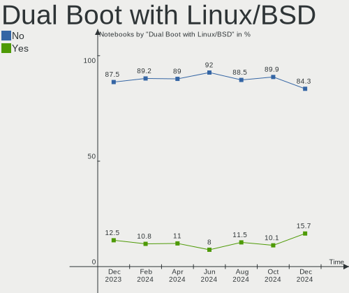
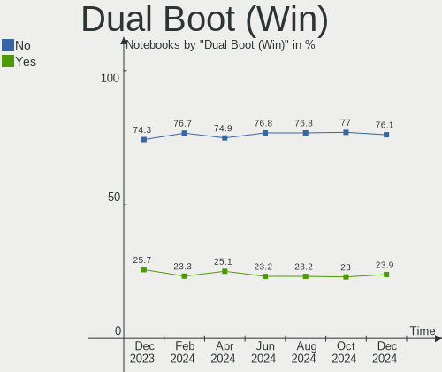
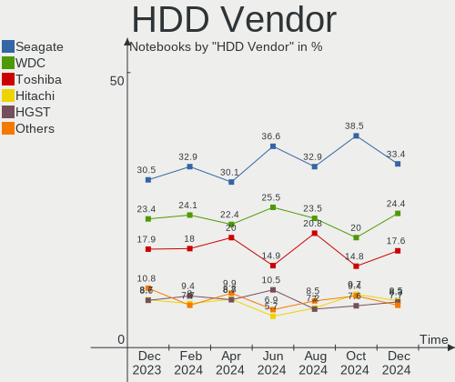
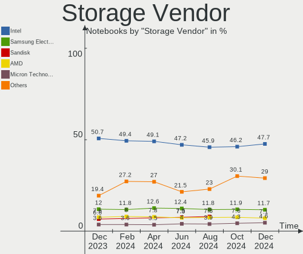
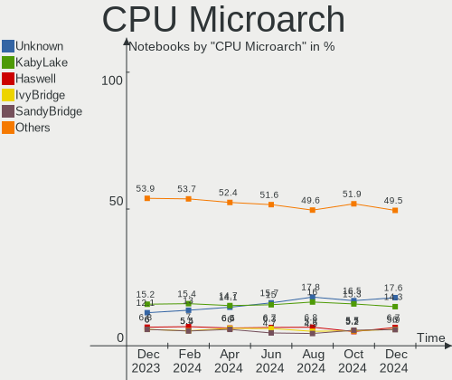
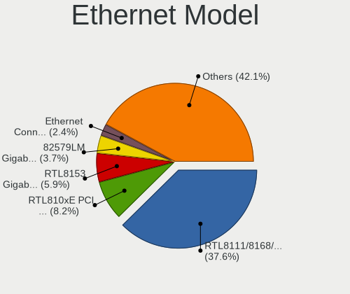
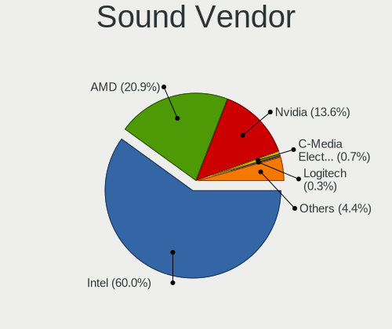
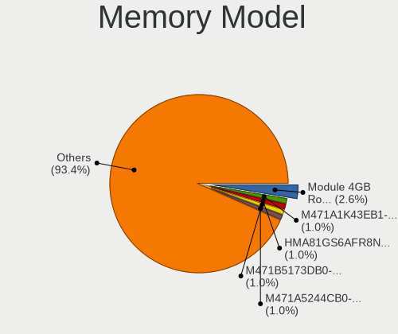

Linux Hardware Trends (Notebooks)
---------------------------------

A project to identify most popular hardware characteristics and track their change
over time based on data collected by Linux users at https://Linux-Hardware.org.

Anyone can contribute to this report by the [hw-probe](https://github.com/linuxhw/hw-probe) tool:

    sudo -E hw-probe -all -upload

Full-feature report is available here: https://linux-hardware.org/?view=trends&formfactor=notebook

Period: Oct, 2021.

Contents
--------

* [ System ](#system)
  - [ OS                       ](#os)
  - [ OS Family                ](#os-family)
  - [ Kernel                   ](#kernel)
  - [ Kernel Family            ](#kernel-family)
  - [ Kernel Major Ver.        ](#kernel-major-ver)
  - [ Arch                     ](#arch)
  - [ DE                       ](#de)
  - [ Display Server           ](#display-server)
  - [ Display Manager          ](#display-manager)
  - [ OS Lang                  ](#os-lang)
  - [ Boot Mode                ](#boot-mode)
  - [ Filesystem               ](#filesystem)
  - [ Part. scheme             ](#part-scheme)
  - [ Dual Boot with Linux/BSD ](#dual-boot-with-linuxbsd)
  - [ Dual Boot (Win)          ](#dual-boot-win)

* [ Board ](#board)
  - [ Vendor                   ](#vendor)
  - [ Model                    ](#model)
  - [ Model Family             ](#model-family)
  - [ MFG Year                 ](#mfg-year)
  - [ Form Factor              ](#form-factor)
  - [ Secure Boot              ](#secure-boot)
  - [ Coreboot                 ](#coreboot)
  - [ RAM Size                 ](#ram-size)
  - [ RAM Used                 ](#ram-used)
  - [ Total Drives             ](#total-drives)
  - [ Has CD-ROM               ](#has-cd-rom)
  - [ Has Ethernet             ](#has-ethernet)
  - [ Has WiFi                 ](#has-wifi)
  - [ Has Bluetooth            ](#has-bluetooth)

* [ Location ](#location)
  - [ Country                  ](#country)
  - [ City                     ](#city)

* [ Drives ](#drives)
  - [ Drive Vendor             ](#drive-vendor)
  - [ Drive Model              ](#drive-model)
  - [ HDD Vendor               ](#hdd-vendor)
  - [ SSD Vendor               ](#ssd-vendor)
  - [ Drive Kind               ](#drive-kind)
  - [ Drive Connector          ](#drive-connector)
  - [ Drive Size               ](#drive-size)
  - [ Space Total              ](#space-total)
  - [ Space Used               ](#space-used)
  - [ Malfunc. Drives          ](#malfunc-drives)
  - [ Malfunc. Drive Vendor    ](#malfunc-drive-vendor)
  - [ Malfunc. HDD Vendor      ](#malfunc-hdd-vendor)
  - [ Malfunc. Drive Kind      ](#malfunc-drive-kind)
  - [ Failed Drives            ](#failed-drives)
  - [ Failed Drive Vendor      ](#failed-drive-vendor)
  - [ Drive Status             ](#drive-status)

* [ Storage controller ](#storage-controller)
  - [ Storage Vendor           ](#storage-vendor)
  - [ Storage Model            ](#storage-model)
  - [ Storage Kind             ](#storage-kind)

* [ Processor ](#processor)
  - [ CPU Vendor               ](#cpu-vendor)
  - [ CPU Model                ](#cpu-model)
  - [ CPU Model Family         ](#cpu-model-family)
  - [ CPU Cores                ](#cpu-cores)
  - [ CPU Sockets              ](#cpu-sockets)
  - [ CPU Threads              ](#cpu-threads)
  - [ CPU Op-Modes             ](#cpu-op-modes)
  - [ CPU Microcode            ](#cpu-microcode)
  - [ CPU Microarch            ](#cpu-microarch)

* [ Graphics ](#graphics)
  - [ GPU Vendor               ](#gpu-vendor)
  - [ GPU Model                ](#gpu-model)
  - [ GPU Combo                ](#gpu-combo)
  - [ GPU Driver               ](#gpu-driver)
  - [ GPU Memory               ](#gpu-memory)

* [ Monitor ](#monitor)
  - [ Monitor Vendor           ](#monitor-vendor)
  - [ Monitor Model            ](#monitor-model)
  - [ Monitor Resolution       ](#monitor-resolution)
  - [ Monitor Diagonal         ](#monitor-diagonal)
  - [ Monitor Width            ](#monitor-width)
  - [ Aspect Ratio             ](#aspect-ratio)
  - [ Monitor Area             ](#monitor-area)
  - [ Pixel Density            ](#pixel-density)
  - [ Multiple Monitors        ](#multiple-monitors)

* [ Network ](#network)
  - [ Net Controller Vendor    ](#net-controller-vendor)
  - [ Net Controller Model     ](#net-controller-model)
  - [ Wireless Vendor          ](#wireless-vendor)
  - [ Wireless Model           ](#wireless-model)
  - [ Ethernet Vendor          ](#ethernet-vendor)
  - [ Ethernet Model           ](#ethernet-model)
  - [ Net Controller Kind      ](#net-controller-kind)
  - [ Used Controller          ](#used-controller)
  - [ NICs                     ](#nics)
  - [ IPv6                     ](#ipv6)

* [ Bluetooth ](#bluetooth)
  - [ Bluetooth Vendor         ](#bluetooth-vendor)
  - [ Bluetooth Model          ](#bluetooth-model)

* [ Sound ](#sound)
  - [ Sound Vendor             ](#sound-vendor)
  - [ Sound Model              ](#sound-model)

* [ Memory ](#memory)
  - [ Memory Vendor            ](#memory-vendor)
  - [ Memory Model             ](#memory-model)
  - [ Memory Kind              ](#memory-kind)
  - [ Memory Form Factor       ](#memory-form-factor)
  - [ Memory Size              ](#memory-size)
  - [ Memory Speed             ](#memory-speed)

* [ Printers & scanners ](#printers--scanners)
  - [ Printer Vendor           ](#printer-vendor)
  - [ Printer Model            ](#printer-model)
  - [ Scanner Vendor           ](#scanner-vendor)
  - [ Scanner Model            ](#scanner-model)

* [ Camera ](#camera)
  - [ Camera Vendor            ](#camera-vendor)
  - [ Camera Model             ](#camera-model)

* [ Security ](#security)
  - [ Fingerprint Vendor       ](#fingerprint-vendor)
  - [ Fingerprint Model        ](#fingerprint-model)
  - [ Chipcard Vendor          ](#chipcard-vendor)
  - [ Chipcard Model           ](#chipcard-model)

* [ Unsupported ](#unsupported)
  - [ Unsupported Devices      ](#unsupported-devices)
  - [ Unsupported Device Types ](#unsupported-device-types)

System
------

OS
--

Installed operating systems

| Name                | Notebooks | Percent |
|---------------------|-----------|---------|
| Ubuntu 20.04        | 532       | 19.59%  |
| Linux Mint 20.2     | 213       | 7.85%   |
| Pop!_OS 21.04       | 174       | 6.41%   |
| Ubuntu 21.10        | 134       | 4.94%   |
| Fedora 34           | 126       | 4.64%   |
| Debian 11           | 118       | 4.35%   |
| Ubuntu 21.04        | 116       | 4.27%   |
| Zorin 16            | 115       | 4.24%   |
| OpenMandriva 4.2    | 104       | 3.83%   |
| KDE neon 20.04      | 53        | 1.95%   |
| Xubuntu 20.04       | 50        | 1.84%   |
| ROSA R11.1          | 49        | 1.8%    |
| Arch                | 42        | 1.55%   |
| BlackPanther 18.1   | 41        | 1.51%   |
| ArcoLinux Rolling   | 37        | 1.36%   |
| ROSA 12             | 36        | 1.33%   |
| Fedora 35           | 35        | 1.29%   |
| Kali 2021.3         | 33        | 1.22%   |
| Kubuntu 20.04       | 32        | 1.18%   |
| Endless 3.9.5       | 31        | 1.14%   |
| Ubuntu 18.04        | 30        | 1.1%    |
| Manjaro             | 27        | 0.99%   |
| Arch Rolling        | 26        | 0.96%   |
| Linux Mint 19.3     | 24        | 0.88%   |
| Manjaro 21.1.6      | 23        | 0.85%   |
| Pop!_OS 20.04       | 20        | 0.74%   |
| Zorin 15            | 19        | 0.7%    |
| Linux Mint 20.1     | 19        | 0.7%    |
| Gentoo 2.7          | 18        | 0.66%   |
| Debian 10           | 18        | 0.66%   |
| Kubuntu 21.04       | 17        | 0.63%   |
| Elementary 6        | 17        | 0.63%   |
| Manjaro 21.1.4      | 16        | 0.59%   |
| EndeavourOS Rolling | 16        | 0.59%   |
| OpenMandriva 4.50   | 14        | 0.52%   |
| Ubuntu MATE 20.04   | 13        | 0.48%   |
| Manjaro 21.1.5      | 12        | 0.44%   |
| Lubuntu 20.04       | 12        | 0.44%   |
| openSUSE Leap-15.3  | 11        | 0.41%   |
| Kubuntu 21.10       | 11        | 0.41%   |
| Debian Testing      | 11        | 0.41%   |
| Xubuntu 18.04       | 10        | 0.37%   |
| Ubuntu 20.10        | 10        | 0.37%   |
| LinuxFX 11          | 9         | 0.33%   |
| Linux Mint 20       | 9         | 0.33%   |
| LMDE 4              | 8         | 0.29%   |
| Ubuntu 16.04        | 7         | 0.26%   |
| Xero Rolling        | 6         | 0.22%   |
| Ubuntu MATE 21.10   | 6         | 0.22%   |
| Peppermint 10       | 6         | 0.22%   |
| Gentoo 2.8          | 6         | 0.22%   |
| Parrot 5.0          | 5         | 0.18%   |
| MX 20               | 5         | 0.18%   |
| Garuda Soaring      | 5         | 0.18%   |
| Fedora 33           | 5         | 0.18%   |
| Xubuntu 21.10       | 4         | 0.15%   |
| Xubuntu 21.04       | 4         | 0.15%   |
| MX 19               | 4         | 0.15%   |
| Lubuntu 21.10       | 4         | 0.15%   |
| RHEL 8              | 3         | 0.11%   |

OS Family
---------

OS without a version

| Name          | Notebooks | Percent |
|---------------|-----------|---------|
| Ubuntu        | 831       | 30.61%  |
| Linux Mint    | 269       | 9.91%   |
| Pop!_OS       | 199       | 7.33%   |
| Fedora        | 168       | 6.19%   |
| Debian        | 153       | 5.64%   |
| Zorin         | 134       | 4.94%   |
| OpenMandriva  | 118       | 4.35%   |
| ROSA          | 87        | 3.2%    |
| Manjaro       | 82        | 3.02%   |
| Xubuntu       | 69        | 2.54%   |
| Arch          | 68        | 2.5%    |
| Kubuntu       | 64        | 2.36%   |
| KDE neon      | 53        | 1.95%   |
| Endless       | 46        | 1.69%   |
| BlackPanther  | 42        | 1.55%   |
| ArcoLinux     | 39        | 1.44%   |
| Kali          | 34        | 1.25%   |
| openSUSE      | 33        | 1.22%   |
| Gentoo        | 26        | 0.96%   |
| Lubuntu       | 24        | 0.88%   |
| Ubuntu MATE   | 22        | 0.81%   |
| EndeavourOS   | 17        | 0.63%   |
| Elementary    | 17        | 0.63%   |
| MX            | 12        | 0.44%   |
| Clear Linux   | 12        | 0.44%   |
| LinuxFX       | 11        | 0.41%   |
| Parrot        | 8         | 0.29%   |
| LMDE          | 8         | 0.29%   |
| Xero          | 7         | 0.26%   |
| Garuda        | 7         | 0.26%   |
| Peppermint    | 6         | 0.22%   |
| Ubuntu Budgie | 5         | 0.18%   |
| Devuan        | 4         | 0.15%   |
| CentOS        | 4         | 0.15%   |
| Void          | 3         | 0.11%   |
| RHEL          | 3         | 0.11%   |
| Deepin        | 3         | 0.11%   |
| Solus         | 2         | 0.07%   |
| Slackware     | 2         | 0.07%   |
| antiX         | 2         | 0.07%   |
| ALT Linux     | 2         | 0.07%   |
| Alpine        | 2         | 0.07%   |
| SuperX Pro    | 1         | 0.04%   |
| Sparky        | 1         | 0.04%   |
| SLES          | 1         | 0.04%   |
| Redcore       | 1         | 0.04%   |
| Q4OS          | 1         | 0.04%   |
| Pardus        | 1         | 0.04%   |
| Parabola      | 1         | 0.04%   |
| Oracle Linux  | 1         | 0.04%   |
| NixOS         | 1         | 0.04%   |
| Makulu        | 1         | 0.04%   |
| LFS           | 1         | 0.04%   |
| Kylin         | 1         | 0.04%   |
| GNOME OS      | 1         | 0.04%   |
| Calculate     | 1         | 0.04%   |
| BuildRoot     | 1         | 0.04%   |
| Amarok Linux  | 1         | 0.04%   |
| AlmaLinux     | 1         | 0.04%   |

Kernel
------

Version of the Linux kernel

| Version                             | Notebooks | Percent |
|-------------------------------------|-----------|---------|
| 5.11.0-37-generic                   | 473       | 17.42%  |
| 5.11.0-38-generic                   | 295       | 10.87%  |
| 5.13.0-7614-generic                 | 172       | 6.34%   |
| 5.4.0-88-generic                    | 146       | 5.38%   |
| 5.10.14-desktop-1omv4002            | 99        | 3.65%   |
| 5.4.0-89-generic                    | 96        | 3.54%   |
| 5.13.0-20-generic                   | 78        | 2.87%   |
| 5.13.0-19-generic                   | 56        | 2.06%   |
| 5.10.0-9-amd64                      | 50        | 1.84%   |
| 5.10.0-8-amd64                      | 49        | 1.8%    |
| 5.4.0-87-generic                    | 43        | 1.58%   |
| 5.11.0-27-generic                   | 38        | 1.4%    |
| 5.10.71-generic-1rosa2021.1-x86_64  | 36        | 1.33%   |
| 5.8.0-14-generic                    | 32        | 1.18%   |
| 5.13.19-2-MANJARO                   | 31        | 1.14%   |
| 5.6.14-desktop-2bP                  | 30        | 1.1%    |
| 5.14.9-200.fc34.x86_64              | 30        | 1.1%    |
| 5.14.14-arch1-1                     | 26        | 0.96%   |
| 5.11.0-36-generic                   | 25        | 0.92%   |
| 5.14.13-200.fc34.x86_64             | 24        | 0.88%   |
| 5.14.12-arch1-1                     | 24        | 0.88%   |
| 5.14.11-200.fc34.x86_64             | 24        | 0.88%   |
| 5.10.0-kali9-amd64                  | 23        | 0.85%   |
| 5.10.0-7-amd64                      | 17        | 0.63%   |
| 5.4.0-74-generic                    | 16        | 0.59%   |
| 5.13.19-200.fc34.x86_64             | 15        | 0.55%   |
| 5.14.9-arch2-1                      | 14        | 0.52%   |
| 5.14.8-arch1-1                      | 14        | 0.52%   |
| 5.4.83-generic-2rosa-x86_64         | 13        | 0.48%   |
| 5.14.7-desktop-1omv4050             | 12        | 0.44%   |
| 5.10.70-1-MANJARO                   | 12        | 0.44%   |
| 5.8.0-63-generic                    | 11        | 0.41%   |
| 5.14.10-1-MANJARO                   | 11        | 0.41%   |
| 5.11.0-34-generic                   | 11        | 0.41%   |
| 4.18.16-desktop-1bP                 | 11        | 0.41%   |
| 5.8.0-43-generic                    | 9         | 0.33%   |
| 5.14.9-300.fc35.x86_64              | 9         | 0.33%   |
| 5.14.10-300.fc35.x86_64             | 9         | 0.33%   |
| 5.14.10-200.fc34.x86_64             | 9         | 0.33%   |
| 5.11.0-40-generic                   | 9         | 0.33%   |
| 4.19.0-18-amd64                     | 9         | 0.33%   |
| 4.15.0-desktop-122.124.1rosa-x86_64 | 9         | 0.33%   |
| 5.4.32-generic-2rosa-i586           | 8         | 0.29%   |
| 5.14.9-zen2-1-zen                   | 8         | 0.29%   |
| 5.14.8-zen1-1-zen                   | 8         | 0.29%   |
| 5.14.11-arch1-1                     | 8         | 0.29%   |
| 5.14.0-kali2-amd64                  | 8         | 0.29%   |
| 5.14.0-2-amd64                      | 8         | 0.29%   |
| 5.11.0-7620-generic                 | 8         | 0.29%   |
| 5.11.0-16-generic                   | 8         | 0.29%   |
| 4.15.0-159-generic                  | 8         | 0.29%   |
| 5.4.0-86-generic                    | 7         | 0.26%   |
| 5.14.14-zen1-1-zen                  | 7         | 0.26%   |
| 5.11.12-300.fc34.x86_64             | 7         | 0.26%   |
| 5.11.0-37-lowlatency                | 7         | 0.26%   |
| 5.10.0-1050-oem                     | 7         | 0.26%   |
| 4.19.0-17-amd64                     | 7         | 0.26%   |
| 5.4.83-generic-2rosa-i586           | 6         | 0.22%   |
| 5.4.32-generic-2rosa-x86_64         | 6         | 0.22%   |
| 5.4.0-42-generic                    | 6         | 0.22%   |

Kernel Family
-------------

Linux kernel without a distro release

| Version | Notebooks | Percent |
|---------|-----------|---------|
| 5.11.0  | 896       | 33%     |
| 5.4.0   | 360       | 13.26%  |
| 5.13.0  | 331       | 12.19%  |
| 5.10.0  | 172       | 6.34%   |
| 5.10.14 | 99        | 3.65%   |
| 5.14.9  | 83        | 3.06%   |
| 5.8.0   | 67        | 2.47%   |
| 5.13.19 | 50        | 1.84%   |
| 5.14.11 | 47        | 1.73%   |
| 5.14.14 | 42        | 1.55%   |
| 5.14.12 | 42        | 1.55%   |
| 5.14.0  | 41        | 1.51%   |
| 5.10.71 | 37        | 1.36%   |
| 5.14.10 | 36        | 1.33%   |
| 4.15.0  | 34        | 1.25%   |
| 5.14.8  | 32        | 1.18%   |
| 5.6.14  | 30        | 1.1%    |
| 5.14.13 | 28        | 1.03%   |
| 4.19.0  | 24        | 0.88%   |
| 5.14.7  | 21        | 0.77%   |
| 5.4.83  | 19        | 0.7%    |
| 5.15.0  | 15        | 0.55%   |
| 5.4.32  | 14        | 0.52%   |
| 5.3.18  | 14        | 0.52%   |
| 5.10.70 | 14        | 0.52%   |
| 5.11.12 | 12        | 0.44%   |
| 4.18.16 | 11        | 0.41%   |
| 4.18.0  | 11        | 0.41%   |
| 5.14.6  | 10        | 0.37%   |
| 5.10.61 | 7         | 0.26%   |
| 5.0.0   | 7         | 0.26%   |
| 5.3.0   | 6         | 0.22%   |
| 5.14.2  | 6         | 0.22%   |
| 5.13.13 | 6         | 0.22%   |
| 5.10.68 | 6         | 0.22%   |
| 5.10.69 | 5         | 0.18%   |
| 5.14.15 | 4         | 0.15%   |
| 5.13.12 | 4         | 0.15%   |
| 4.4.0   | 4         | 0.15%   |
| 5.13.16 | 3         | 0.11%   |
| 5.11.22 | 3         | 0.11%   |
| 5.10.60 | 3         | 0.11%   |
| 5.9.0   | 2         | 0.07%   |
| 5.4.150 | 2         | 0.07%   |
| 5.13.9  | 2         | 0.07%   |
| 5.13.14 | 2         | 0.07%   |
| 5.12.4  | 2         | 0.07%   |
| 5.12.19 | 2         | 0.07%   |
| 5.10.23 | 2         | 0.07%   |
| 4.9.155 | 2         | 0.07%   |
| 4.9.0   | 2         | 0.07%   |
| 4.16.0  | 2         | 0.07%   |
| 5.9.16  | 1         | 0.04%   |
| 5.9.11  | 1         | 0.04%   |
| 5.6.19  | 1         | 0.04%   |
| 5.6.0   | 1         | 0.04%   |
| 5.4.80  | 1         | 0.04%   |
| 5.4.21  | 1         | 0.04%   |
| 5.4.18  | 1         | 0.04%   |
| 5.4.17  | 1         | 0.04%   |

Kernel Major Ver.
-----------------

Linux kernel major version

| Version | Notebooks | Percent |
|---------|-----------|---------|
| 5.11    | 911       | 33.55%  |
| 5.4     | 402       | 14.81%  |
| 5.13    | 401       | 14.77%  |
| 5.14    | 395       | 14.55%  |
| 5.10    | 357       | 13.15%  |
| 5.8     | 67        | 2.47%   |
| 4.15    | 34        | 1.25%   |
| 5.6     | 32        | 1.18%   |
| 4.19    | 24        | 0.88%   |
| 4.18    | 22        | 0.81%   |
| 5.3     | 20        | 0.74%   |
| 5.15    | 15        | 0.55%   |
| 5.0     | 7         | 0.26%   |
| 5.12    | 6         | 0.22%   |
| 4.9     | 6         | 0.22%   |
| 4.4     | 6         | 0.22%   |
| 5.9     | 4         | 0.15%   |
| 4.16    | 3         | 0.11%   |
| 5.2     | 1         | 0.04%   |
| 4.10    | 1         | 0.04%   |
| 3.10    | 1         | 0.04%   |

Arch
----

OS architecture (x86_64, i586, etc.)

| Name    | Notebooks | Percent |
|---------|-----------|---------|
| x86_64  | 2643      | 97.35%  |
| i686    | 68        | 2.5%    |
| armv7l  | 2         | 0.07%   |
| aarch64 | 2         | 0.07%   |

DE
--

Desktop Environment

| Name             | Notebooks | Percent |
|------------------|-----------|---------|
| GNOME            | 1391      | 51.23%  |
| KDE5             | 493       | 18.16%  |
| X-Cinnamon       | 219       | 8.07%   |
| XFCE             | 208       | 7.66%   |
| Unknown          | 136       | 5.01%   |
| MATE             | 67        | 2.47%   |
| LXQt             | 30        | 1.1%    |
| Cinnamon         | 27        | 0.99%   |
| KDE4             | 26        | 0.96%   |
| i3               | 23        | 0.85%   |
| LXDE             | 16        | 0.59%   |
| Pantheon         | 15        | 0.55%   |
| KDE              | 10        | 0.37%   |
| Unity            | 9         | 0.33%   |
| Budgie           | 8         | 0.29%   |
| Deepin           | 6         | 0.22%   |
| GNOME Flashback  | 5         | 0.18%   |
| GNOME Classic    | 5         | 0.18%   |
| xmonad           | 3         | 0.11%   |
| sway             | 3         | 0.11%   |
| qtile            | 3         | 0.11%   |
| bspwm            | 3         | 0.11%   |
| Trinity          | 2         | 0.07%   |
| awesome          | 2         | 0.07%   |
| UKUI             | 1         | 0.04%   |
| Openbox          | 1         | 0.04%   |
| lightdm-xsession | 1         | 0.04%   |
| i3-with-shmlog   | 1         | 0.04%   |
| herbstluftwm     | 1         | 0.04%   |

Display Server
--------------

X11 or Wayland

| Name    | Notebooks | Percent |
|---------|-----------|---------|
| X11     | 2175      | 80.11%  |
| Wayland | 430       | 15.84%  |
| Unknown | 70        | 2.58%   |
| Tty     | 40        | 1.47%   |

Display Manager
---------------

SDDM, LightDM, etc.

| Name    | Notebooks | Percent |
|---------|-----------|---------|
| Unknown | 852       | 31.38%  |
| GDM3    | 554       | 20.41%  |
| GDM     | 450       | 16.57%  |
| SDDM    | 427       | 15.73%  |
| LightDM | 392       | 14.44%  |
| KDM     | 26        | 0.96%   |
| XDM     | 6         | 0.22%   |
| SLiM    | 3         | 0.11%   |
| LXDM    | 2         | 0.07%   |
| TDM     | 1         | 0.04%   |
| Ly      | 1         | 0.04%   |
| GREETD  | 1         | 0.04%   |

OS Lang
-------

Language

| Lang        | Notebooks | Percent |
|-------------|-----------|---------|
| en_US       | 1087      | 40.04%  |
| de_DE       | 228       | 8.4%    |
| ru_RU       | 191       | 7.03%   |
| fr_FR       | 150       | 5.52%   |
| en_GB       | 148       | 5.45%   |
| pt_BR       | 129       | 4.75%   |
| es_ES       | 73        | 2.69%   |
| Unknown     | 68        | 2.5%    |
| it_IT       | 61        | 2.25%   |
| en_IN       | 53        | 1.95%   |
| en_CA       | 51        | 1.88%   |
| C           | 51        | 1.88%   |
| pl_PL       | 49        | 1.8%    |
| en_AU       | 34        | 1.25%   |
| cs_CZ       | 30        | 1.1%    |
| nl_NL       | 21        | 0.77%   |
| pt_PT       | 17        | 0.63%   |
| es_AR       | 17        | 0.63%   |
| en_ZA       | 17        | 0.63%   |
| es_MX       | 14        | 0.52%   |
| de_CH       | 13        | 0.48%   |
| de_AT       | 13        | 0.48%   |
| ru_UA       | 12        | 0.44%   |
| zh_CN       | 11        | 0.41%   |
| tr_TR       | 10        | 0.37%   |
| en_NZ       | 10        | 0.37%   |
| es_CO       | 9         | 0.33%   |
| es_CL       | 9         | 0.33%   |
| ja_JP       | 8         | 0.29%   |
| hu_HU       | 8         | 0.29%   |
| nl_BE       | 7         | 0.26%   |
| fr_BE       | 7         | 0.26%   |
| sv_SE       | 6         | 0.22%   |
| fr_CA       | 6         | 0.22%   |
| es_CR       | 6         | 0.22%   |
| ru_RU.UTF_8 | 5         | 0.18%   |
| ro_RO       | 5         | 0.18%   |
| fi_FI       | 5         | 0.18%   |
| en_SG       | 5         | 0.18%   |
| en_IE       | 5         | 0.18%   |
| da_DK       | 5         | 0.18%   |
| sk_SK       | 4         | 0.15%   |
| POSIX       | 4         | 0.15%   |
| hr_HR       | 4         | 0.15%   |
| zh_TW       | 3         | 0.11%   |
| uk_UA       | 3         | 0.11%   |
| nb_NO       | 3         | 0.11%   |
| es_VE       | 3         | 0.11%   |
| es_PE       | 3         | 0.11%   |
| es_EC       | 3         | 0.11%   |
| en_DK       | 3         | 0.11%   |
| el_GR       | 3         | 0.11%   |
| bg_BG       | 3         | 0.11%   |
| unm_US      | 2         | 0.07%   |
| ko_KR       | 2         | 0.07%   |
| C.UTF8      | 2         | 0.07%   |
| vi_VN       | 1         | 0.04%   |
| th_TH       | 1         | 0.04%   |
| szl_PL      | 1         | 0.04%   |
| sl_SI       | 1         | 0.04%   |

Boot Mode
---------

EFI or BIOS

| Mode | Notebooks | Percent |
|------|-----------|---------|
| EFI  | 1428      | 52.6%   |
| BIOS | 1287      | 47.4%   |

Filesystem
----------

Type of filesystem

| Type     | Notebooks | Percent |
|----------|-----------|---------|
| Ext4     | 2185      | 80.48%  |
| Btrfs    | 250       | 9.21%   |
| Overlay  | 218       | 8.03%   |
| Xfs      | 25        | 0.92%   |
| Zfs      | 19        | 0.7%    |
| F2fs     | 5         | 0.18%   |
| Tmpfs    | 4         | 0.15%   |
| Ext3     | 4         | 0.15%   |
| Ext2     | 2         | 0.07%   |
| Reiserfs | 1         | 0.04%   |
| Aufs     | 1         | 0.04%   |
| Unknown  | 1         | 0.04%   |

Part. scheme
------------

Scheme of partitioning

| Type    | Notebooks | Percent |
|---------|-----------|---------|
| Unknown | 1470      | 54.14%  |
| GPT     | 922       | 33.96%  |
| MBR     | 323       | 11.9%   |

Dual Boot with Linux/BSD
------------------------

Hosting more than one Linux/BSD

| Dual boot | Notebooks | Percent |
|-----------|-----------|---------|
| No        | 2425      | 89.32%  |
| Yes       | 290       | 10.68%  |

Dual Boot (Win)
---------------

Hosting Linux and Windows

| Dual boot | Notebooks | Percent |
|-----------|-----------|---------|
| No        | 1940      | 71.45%  |
| Yes       | 775       | 28.55%  |

Board
-----

Vendor
------

Motherboard manufacturer

| Name                           | Notebooks | Percent |
|--------------------------------|-----------|---------|
| Lenovo                         | 597       | 21.99%  |
| Hewlett-Packard                | 507       | 18.67%  |
| Dell                           | 421       | 15.51%  |
| ASUSTek Computer               | 291       | 10.72%  |
| Acer                           | 248       | 9.13%   |
| Apple                          | 74        | 2.73%   |
| Toshiba                        | 73        | 2.69%   |
| Samsung Electronics            | 65        | 2.39%   |
| MSI                            | 52        | 1.92%   |
| Sony                           | 39        | 1.44%   |
| HUAWEI                         | 33        | 1.22%   |
| Notebook                       | 22        | 0.81%   |
| Medion                         | 22        | 0.81%   |
| Fujitsu                        | 20        | 0.74%   |
| Alienware                      | 16        | 0.59%   |
| Unknown                        | 15        | 0.55%   |
| TUXEDO                         | 14        | 0.52%   |
| Timi                           | 14        | 0.52%   |
| Fujitsu Siemens                | 13        | 0.48%   |
| Packard Bell                   | 12        | 0.44%   |
| Google                         | 11        | 0.41%   |
| Aquarius                       | 11        | 0.41%   |
| System76                       | 10        | 0.37%   |
| eMachines                      | 8         | 0.29%   |
| Razer                          | 7         | 0.26%   |
| LG Electronics                 | 7         | 0.26%   |
| Positivo                       | 5         | 0.18%   |
| Schenker                       | 4         | 0.15%   |
| HONOR                          | 4         | 0.15%   |
| Gateway                        | 4         | 0.15%   |
| Framework                      | 4         | 0.15%   |
| Wortmann AG                    | 3         | 0.11%   |
| realme                         | 3         | 0.11%   |
| Matsushita Electric Industrial | 3         | 0.11%   |
| Intel                          | 3         | 0.11%   |
| GPU Company                    | 3         | 0.11%   |
| TrekStor                       | 2         | 0.07%   |
| Standard                       | 2         | 0.07%   |
| Semp Toshiba                   | 2         | 0.07%   |
| Quanta                         | 2         | 0.07%   |
| Pine Microsystems              | 2         | 0.07%   |
| Panasonic                      | 2         | 0.07%   |
| OEM                            | 2         | 0.07%   |
| Jumper                         | 2         | 0.07%   |
| Clevo                          | 2         | 0.07%   |
| Chuwi                          | 2         | 0.07%   |
| BESSTAR Tech                   | 2         | 0.07%   |
| ZOOSTORM                       | 1         | 0.04%   |
| win element                    | 1         | 0.04%   |
| whyopencomputing               | 1         | 0.04%   |
| VIT                            | 1         | 0.04%   |
| UNITCOM                        | 1         | 0.04%   |
| TQ-Group                       | 1         | 0.04%   |
| Thomson                        | 1         | 0.04%   |
| Teclast                        | 1         | 0.04%   |
| Synology                       | 1         | 0.04%   |
| Star Labs                      | 1         | 0.04%   |
| speedmaster                    | 1         | 0.04%   |
| SLIMBOOK                       | 1         | 0.04%   |
| Shuttle                        | 1         | 0.04%   |

Model
-----

Motherboard model

| Name                                 | Notebooks | Percent |
|--------------------------------------|-----------|---------|
| Unknown                              | 29        | 1.07%   |
| HP Notebook                          | 20        | 0.74%   |
| HP Pavilion dv6                      | 15        | 0.55%   |
| Acer Nitro AN515-54                  | 12        | 0.44%   |
| Aquarius NS585                       | 11        | 0.41%   |
| HP Pavilion Notebook                 | 10        | 0.37%   |
| HP Pavilion g6                       | 10        | 0.37%   |
| Dell XPS 15 7590                     | 10        | 0.37%   |
| Dell Latitude E6420                  | 9         | 0.33%   |
| Dell Inspiron N5110                  | 9         | 0.33%   |
| HP 15                                | 8         | 0.29%   |
| Apple MacBookPro8,1                  | 8         | 0.29%   |
| Lenovo IdeaPad S145-15API 81V7       | 7         | 0.26%   |
| Lenovo IdeaPad 3 15IIL05 81WE        | 7         | 0.26%   |
| HP Pavilion dv7                      | 7         | 0.26%   |
| HP EliteBook 840 G3                  | 7         | 0.26%   |
| Dell Latitude E6520                  | 7         | 0.26%   |
| Dell Latitude E6410                  | 7         | 0.26%   |
| Dell Inspiron 15-3567                | 7         | 0.26%   |
| ASUS UX31E                           | 7         | 0.26%   |
| Apple MacBookPro12,1                 | 7         | 0.26%   |
| Apple MacBookAir7,2                  | 7         | 0.26%   |
| Acer Nitro AN515-45                  | 7         | 0.26%   |
| HUAWEI NBLK-WAX9X                    | 6         | 0.22%   |
| HUAWEI KLVL-WXX9                     | 6         | 0.22%   |
| HP ProBook 450 G7                    | 6         | 0.22%   |
| HP Pavilion Gaming Laptop 15-ec1xxx  | 6         | 0.22%   |
| HP Pavilion 15                       | 6         | 0.22%   |
| HP Laptop 15-db0xxx                  | 6         | 0.22%   |
| HP Laptop 15-da0xxx                  | 6         | 0.22%   |
| HP EliteBook 8460p                   | 6         | 0.22%   |
| HP EliteBook 8440p                   | 6         | 0.22%   |
| Dell XPS 15 9570                     | 6         | 0.22%   |
| Dell XPS 13 9310                     | 6         | 0.22%   |
| Dell Latitude E7470                  | 6         | 0.22%   |
| Dell Latitude E5430 non-vPro         | 6         | 0.22%   |
| Samsung 550P5C/550P7C                | 5         | 0.18%   |
| Lenovo ThinkBook 14 G2 ITL 20VD      | 5         | 0.18%   |
| Lenovo Legion 5 Pro 16ACH6H 82JQ     | 5         | 0.18%   |
| Lenovo IdeaPad Gaming 3 15ARH05 82EY | 5         | 0.18%   |
| HP ProBook 450 G5                    | 5         | 0.18%   |
| HP Pavilion g7                       | 5         | 0.18%   |
| HP Laptop 15s-eq2xxx                 | 5         | 0.18%   |
| HP 255 G7 Notebook PC                | 5         | 0.18%   |
| Dell XPS 15 9500                     | 5         | 0.18%   |
| Dell XPS 13 7390                     | 5         | 0.18%   |
| Dell Latitude E6440                  | 5         | 0.18%   |
| Dell Latitude E6430                  | 5         | 0.18%   |
| Dell Inspiron 3542                   | 5         | 0.18%   |
| Dell Inspiron 3537                   | 5         | 0.18%   |
| Dell Inspiron 3521                   | 5         | 0.18%   |
| Apple MacBookPro9,2                  | 5         | 0.18%   |
| Apple MacBookPro8,2                  | 5         | 0.18%   |
| Acer Swift SF314-43                  | 5         | 0.18%   |
| Acer Aspire E5-571                   | 5         | 0.18%   |
| Acer Aspire 5741G                    | 5         | 0.18%   |
| TUXEDO Pulse 15 Gen1                 | 4         | 0.15%   |
| TUXEDO Aura 15 Gen1                  | 4         | 0.15%   |
| Samsung 350V5C/351V5C/3540VC/3440VC  | 4         | 0.15%   |
| Samsung 340XAA/350XAA/550XAA         | 4         | 0.15%   |

Model Family
------------

Motherboard model prefix

| Name                  | Notebooks | Percent |
|-----------------------|-----------|---------|
| Lenovo ThinkPad       | 298       | 10.98%  |
| Lenovo IdeaPad        | 151       | 5.56%   |
| Acer Aspire           | 148       | 5.45%   |
| Dell Latitude         | 141       | 5.19%   |
| Dell Inspiron         | 139       | 5.12%   |
| HP Pavilion           | 117       | 4.31%   |
| HP EliteBook          | 74        | 2.73%   |
| HP Laptop             | 67        | 2.47%   |
| HP ProBook            | 64        | 2.36%   |
| ASUS VivoBook         | 63        | 2.32%   |
| Toshiba Satellite     | 62        | 2.28%   |
| Dell XPS              | 59        | 2.17%   |
| Acer Nitro            | 34        | 1.25%   |
| Unknown               | 29        | 1.07%   |
| ASUS ROG              | 27        | 0.99%   |
| Dell Precision        | 26        | 0.96%   |
| Dell Vostro           | 25        | 0.92%   |
| Acer Swift            | 24        | 0.88%   |
| Lenovo ThinkBook      | 23        | 0.85%   |
| Lenovo Legion         | 22        | 0.81%   |
| HP Notebook           | 20        | 0.74%   |
| Fujitsu LIFEBOOK      | 20        | 0.74%   |
| HP ZBook              | 18        | 0.66%   |
| ASUS ASUS             | 18        | 0.66%   |
| HP Compaq             | 17        | 0.63%   |
| HP ENVY               | 15        | 0.55%   |
| HP 255                | 15        | 0.55%   |
| Acer TravelMate       | 15        | 0.55%   |
| HP 250                | 14        | 0.52%   |
| Apple MacBookPro8     | 13        | 0.48%   |
| Apple MacBookPro11    | 13        | 0.48%   |
| Packard Bell EasyNote | 12        | 0.44%   |
| HP OMEN               | 12        | 0.44%   |
| Aquarius NS585        | 11        | 0.41%   |
| HP Stream             | 9         | 0.33%   |
| HP Presario           | 9         | 0.33%   |
| Fujitsu Siemens AMILO | 9         | 0.33%   |
| HP 15                 | 8         | 0.29%   |
| Dell G3               | 8         | 0.29%   |
| ASUS ZenBook          | 8         | 0.29%   |
| Apple MacBookAir7     | 8         | 0.29%   |
| Razer Blade           | 7         | 0.26%   |
| ASUS UX31E            | 7         | 0.26%   |
| Apple MacBookPro9     | 7         | 0.26%   |
| Apple MacBookPro12    | 7         | 0.26%   |
| MSI Modern            | 6         | 0.22%   |
| Lenovo Yoga           | 6         | 0.22%   |
| HUAWEI NBLK-WAX9X     | 6         | 0.22%   |
| HUAWEI KLVL-WXX9      | 6         | 0.22%   |
| Dell System           | 6         | 0.22%   |
| Dell Studio           | 6         | 0.22%   |
| Acer Predator         | 6         | 0.22%   |
| Acer Extensa          | 6         | 0.22%   |
| Timi RedmiBook        | 5         | 0.18%   |
| Samsung 550P5C        | 5         | 0.18%   |
| Samsung 350V5C        | 5         | 0.18%   |
| Lenovo G570           | 5         | 0.18%   |
| Lenovo G550           | 5         | 0.18%   |
| Lenovo G50-45         | 5         | 0.18%   |
| ASUS TUF              | 5         | 0.18%   |

MFG Year
--------

Motherboard manufacture year

| Year    | Notebooks | Percent |
|---------|-----------|---------|
| 2021    | 640       | 23.57%  |
| 2020    | 380       | 14%     |
| 2019    | 268       | 9.87%   |
| 2018    | 206       | 7.59%   |
| 2012    | 176       | 6.48%   |
| 2011    | 158       | 5.82%   |
| 2013    | 150       | 5.52%   |
| 2015    | 135       | 4.97%   |
| 2016    | 105       | 3.87%   |
| 2010    | 103       | 3.79%   |
| 2014    | 102       | 3.76%   |
| 2017    | 88        | 3.24%   |
| 2009    | 78        | 2.87%   |
| 2008    | 71        | 2.62%   |
| 2007    | 32        | 1.18%   |
| 2006    | 8         | 0.29%   |
| Unknown | 8         | 0.29%   |
| 2005    | 5         | 0.18%   |
| 2004    | 1         | 0.04%   |
| 1970    | 1         | 0.04%   |

Form Factor
-----------

Physical design of the computer

| Name     | Notebooks | Percent |
|----------|-----------|---------|
| Notebook | 2715      | 100%    |

Secure Boot
-----------

Enabled or disabled

| State    | Notebooks | Percent |
|----------|-----------|---------|
| Disabled | 2404      | 88.55%  |
| Enabled  | 311       | 11.45%  |

Coreboot
--------

Have coreboot on board

| Used | Notebooks | Percent |
|------|-----------|---------|
| No   | 2695      | 99.26%  |
| Yes  | 20        | 0.74%   |

RAM Size
--------

Total RAM memory

| Size in GB  | Notebooks | Percent |
|-------------|-----------|---------|
| 4.01-8.0    | 853       | 31.42%  |
| 3.01-4.0    | 578       | 21.29%  |
| 8.01-16.0   | 470       | 17.31%  |
| 16.01-24.0  | 437       | 16.1%   |
| 32.01-64.0  | 172       | 6.34%   |
| 1.01-2.0    | 102       | 3.76%   |
| 2.01-3.0    | 38        | 1.4%    |
| 24.01-32.0  | 24        | 0.88%   |
| 64.01-256.0 | 21        | 0.77%   |
| 0.51-1.0    | 20        | 0.74%   |

RAM Used
--------

Used RAM memory

| Used GB    | Notebooks | Percent |
|------------|-----------|---------|
| 1.01-2.0   | 1018      | 37.5%   |
| 2.01-3.0   | 691       | 25.45%  |
| 4.01-8.0   | 359       | 13.22%  |
| 3.01-4.0   | 329       | 12.12%  |
| 0.51-1.0   | 191       | 7.03%   |
| 8.01-16.0  | 89        | 3.28%   |
| 0.01-0.5   | 31        | 1.14%   |
| 16.01-24.0 | 6         | 0.22%   |
| 24.01-32.0 | 1         | 0.04%   |

Total Drives
------------

Number of drives on board

| Drives | Notebooks | Percent |
|--------|-----------|---------|
| 1      | 1972      | 72.63%  |
| 2      | 627       | 23.09%  |
| 3      | 85        | 3.13%   |
| 0      | 16        | 0.59%   |
| 4      | 9         | 0.33%   |
| 7      | 2         | 0.07%   |
| 6      | 2         | 0.07%   |
| 5      | 2         | 0.07%   |

Has CD-ROM
----------

Has CD-ROM on board

| Presented | Notebooks | Percent |
|-----------|-----------|---------|
| No        | 1757      | 64.71%  |
| Yes       | 958       | 35.29%  |

Has Ethernet
------------

Has Ethernet on board

| Presented | Notebooks | Percent |
|-----------|-----------|---------|
| Yes       | 2213      | 81.51%  |
| No        | 502       | 18.49%  |

Has WiFi
--------

Has WiFi module

| Presented | Notebooks | Percent |
|-----------|-----------|---------|
| Yes       | 2667      | 98.23%  |
| No        | 48        | 1.77%   |

Has Bluetooth
-------------

Has Bluetooth module

| Presented | Notebooks | Percent |
|-----------|-----------|---------|
| Yes       | 2133      | 78.56%  |
| No        | 582       | 21.44%  |

Location
--------

Country
-------

Geographic location (country)

| Country      | Notebooks | Percent |
|--------------|-----------|---------|
| USA          | 428       | 15.76%  |
| Germany      | 278       | 10.24%  |
| Russia       | 200       | 7.37%   |
| France       | 173       | 6.37%   |
| Brazil       | 173       | 6.37%   |
| UK           | 112       | 4.13%   |
| Spain        | 84        | 3.09%   |
| India        | 84        | 3.09%   |
| Canada       | 83        | 3.06%   |
| Italy        | 79        | 2.91%   |
| Poland       | 77        | 2.84%   |
| Netherlands  | 60        | 2.21%   |
| Ukraine      | 56        | 2.06%   |
| Hungary      | 54        | 1.99%   |
| Czechia      | 40        | 1.47%   |
| Australia    | 38        | 1.4%    |
| Mexico       | 34        | 1.25%   |
| Belgium      | 28        | 1.03%   |
| Austria      | 27        | 0.99%   |
| Argentina    | 26        | 0.96%   |
| Switzerland  | 25        | 0.92%   |
| Romania      | 25        | 0.92%   |
| Sweden       | 24        | 0.88%   |
| South Africa | 24        | 0.88%   |
| Portugal     | 23        | 0.85%   |
| Turkey       | 20        | 0.74%   |
| China        | 20        | 0.74%   |
| Greece       | 18        | 0.66%   |
| Indonesia    | 17        | 0.63%   |
| Japan        | 15        | 0.55%   |
| Finland      | 15        | 0.55%   |
| Denmark      | 15        | 0.55%   |
| Egypt        | 13        | 0.48%   |
| Chile        | 13        | 0.48%   |
| Belarus      | 12        | 0.44%   |
| Norway       | 11        | 0.41%   |
| New Zealand  | 11        | 0.41%   |
| Pakistan     | 10        | 0.37%   |
| Ireland      | 10        | 0.37%   |
| Iran         | 10        | 0.37%   |
| Bulgaria     | 10        | 0.37%   |
| Vietnam      | 9         | 0.33%   |
| Slovakia     | 9         | 0.33%   |
| Morocco      | 9         | 0.33%   |
| Colombia     | 9         | 0.33%   |
| Serbia       | 8         | 0.29%   |
| Philippines  | 8         | 0.29%   |
| Costa Rica   | 8         | 0.29%   |
| Kazakhstan   | 7         | 0.26%   |
| Ecuador      | 7         | 0.26%   |
| Venezuela    | 6         | 0.22%   |
| Taiwan       | 6         | 0.22%   |
| Lithuania    | 6         | 0.22%   |
| Thailand     | 5         | 0.18%   |
| Slovenia     | 5         | 0.18%   |
| Malaysia     | 5         | 0.18%   |
| Latvia       | 5         | 0.18%   |
| Israel       | 5         | 0.18%   |
| Hong Kong    | 5         | 0.18%   |
| Cyprus       | 5         | 0.18%   |

City
----

Geographic location (city)

| City           | Notebooks | Percent |
|----------------|-----------|---------|
| Moscow         | 36        | 1.33%   |
| Paris          | 24        | 0.88%   |
| Budapest       | 24        | 0.88%   |
| Kyiv           | 23        | 0.85%   |
| Berlin         | 23        | 0.85%   |
| Voronezh       | 22        | 0.81%   |
| Warsaw         | 21        | 0.77%   |
| St Petersburg  | 21        | 0.77%   |
| Vienna         | 19        | 0.7%    |
| S??o Paulo     | 17        | 0.63%   |
| Prague         | 16        | 0.59%   |
| Munich         | 16        | 0.59%   |
| Madrid         | 16        | 0.59%   |
| Amsterdam      | 14        | 0.52%   |
| Mexico City    | 11        | 0.41%   |
| Bengaluru      | 11        | 0.41%   |
| Barcelona      | 11        | 0.41%   |
| Sydney         | 10        | 0.37%   |
| Rio de Janeiro | 10        | 0.37%   |
| Portland       | 10        | 0.37%   |
| Milan          | 10        | 0.37%   |
| Johannesburg   | 10        | 0.37%   |
| Helsinki       | 10        | 0.37%   |
| Athens         | 10        | 0.37%   |
| Yekaterinburg  | 9         | 0.33%   |
| Montreal       | 9         | 0.33%   |
| Istanbul       | 9         | 0.33%   |
| Hamburg        | 9         | 0.33%   |
| Buenos Aires   | 9         | 0.33%   |
| Minsk          | 8         | 0.29%   |
| Melbourne      | 8         | 0.29%   |
| London         | 8         | 0.29%   |
| Austin         | 8         | 0.29%   |
| Zurich         | 7         | 0.26%   |
| Valencia       | 7         | 0.26%   |
| Sofia          | 7         | 0.26%   |
| Seattle        | 7         | 0.26%   |
| Santiago       | 7         | 0.26%   |
| Rome           | 7         | 0.26%   |
| Porto Alegre   | 7         | 0.26%   |
| Phoenix        | 7         | 0.26%   |
| Novosibirsk    | 7         | 0.26%   |
| Lisbon         | 7         | 0.26%   |
| Dublin         | 7         | 0.26%   |
| Bucharest      | 7         | 0.26%   |
| Auckland       | 7         | 0.26%   |
| Tehran         | 6         | 0.22%   |
| Surabaya       | 6         | 0.22%   |
| San Antonio    | 6         | 0.22%   |
| Qu?©bec        | 6         | 0.22%   |
| Krakow         | 6         | 0.22%   |
| Houston        | 6         | 0.22%   |
| Essen          | 6         | 0.22%   |
| Cairo          | 6         | 0.22%   |
| Brooklyn       | 6         | 0.22%   |
| Vancouver      | 5         | 0.18%   |
| Uberl??ndia    | 5         | 0.18%   |
| Turin          | 5         | 0.18%   |
| Tokyo          | 5         | 0.18%   |
| Salt Lake City | 5         | 0.18%   |

Drives
------

Drive Vendor
------------

Hard drive vendors

| Vendor                         | Notebooks | Drives | Percent |
|--------------------------------|-----------|--------|---------|
| Samsung Electronics            | 516       | 567    | 15.52%  |
| WDC                            | 429       | 441    | 12.91%  |
| Seagate                        | 363       | 377    | 10.92%  |
| Toshiba                        | 269       | 277    | 8.09%   |
| SanDisk                        | 200       | 205    | 6.02%   |
| Unknown                        | 170       | 188    | 5.11%   |
| Kingston                       | 164       | 168    | 4.93%   |
| SK Hynix                       | 141       | 146    | 4.24%   |
| Hitachi                        | 117       | 118    | 3.52%   |
| Intel                          | 109       | 120    | 3.28%   |
| HGST                           | 100       | 102    | 3.01%   |
| Crucial                        | 96        | 99     | 2.89%   |
| Micron Technology              | 77        | 78     | 2.32%   |
| A-DATA Technology              | 50        | 52     | 1.5%    |
| KIOXIA                         | 46        | 48     | 1.38%   |
| Apple                          | 41        | 45     | 1.23%   |
| China                          | 24        | 24     | 0.72%   |
| Phison                         | 23        | 23     | 0.69%   |
| JMicron                        | 19        | 22     | 0.57%   |
| GOODRAM                        | 19        | 19     | 0.57%   |
| Fujitsu                        | 19        | 20     | 0.57%   |
| PNY                            | 17        | 17     | 0.51%   |
| LITEON                         | 17        | 17     | 0.51%   |
| Transcend                      | 15        | 15     | 0.45%   |
| SPCC                           | 15        | 16     | 0.45%   |
| LITEONIT                       | 15        | 15     | 0.45%   |
| Intenso                        | 15        | 15     | 0.45%   |
| Silicon Motion                 | 11        | 12     | 0.33%   |
| Unknown                        | 10        | 11     | 0.3%    |
| OCZ                            | 8         | 8      | 0.24%   |
| Micron/Crucial Technology      | 8         | 8      | 0.24%   |
| Hewlett-Packard                | 8         | 8      | 0.24%   |
| ASMT                           | 7         | 7      | 0.21%   |
| Apacer                         | 7         | 7      | 0.21%   |
| UMIS                           | 6         | 6      | 0.18%   |
| Team                           | 6         | 6      | 0.18%   |
| KingSpec                       | 6         | 6      | 0.18%   |
| Gigabyte Technology            | 6         | 6      | 0.18%   |
| Union Memory                   | 5         | 5      | 0.15%   |
| SABRENT                        | 5         | 5      | 0.15%   |
| PLEXTOR                        | 5         | 5      | 0.15%   |
| Lexar                          | 5         | 5      | 0.15%   |
| Lenovo                         | 5         | 5      | 0.15%   |
| Corsair                        | 5         | 5      | 0.15%   |
| XPG                            | 4         | 5      | 0.12%   |
| Verbatim                       | 4         | 4      | 0.12%   |
| SSSTC                          | 4         | 4      | 0.12%   |
| Realtek Semiconductor          | 4         | 4      | 0.12%   |
| Patriot                        | 4         | 5      | 0.12%   |
| Mushkin                        | 4         | 4      | 0.12%   |
| KingDian                       | 4         | 4      | 0.12%   |
| Union Memory (Shenzhen)        | 3         | 4      | 0.09%   |
| Solid State Storage Technology | 3         | 3      | 0.09%   |
| Netac                          | 3         | 3      | 0.09%   |
| Lite-On                        | 3         | 3      | 0.09%   |
| KIOXIA-EXCERIA                 | 3         | 3      | 0.09%   |
| Dogfish                        | 3         | 3      | 0.09%   |
| ADATA Technology               | 3         | 3      | 0.09%   |
| Yangtze Memory Technologies    | 2         | 2      | 0.06%   |
| XrayDisk                       | 2         | 2      | 0.06%   |

Drive Model
-----------

Hard drive models

| Model                                  | Notebooks | Percent |
|----------------------------------------|-----------|---------|
| Seagate ST1000LM035-1RK172 1TB         | 53        | 1.54%   |
| Seagate ST1000LM024 HN-M101MBB 1TB     | 40        | 1.16%   |
| Samsung PM963 2.5" NVMe PCIe SSD 512GB | 36        | 1.05%   |
| Toshiba MQ04ABF100 1TB                 | 35        | 1.02%   |
| Toshiba MQ01ABF050 500GB               | 34        | 0.99%   |
| Unknown MMC Card  32GB                 | 32        | 0.93%   |
| Toshiba MQ01ABD100 1TB                 | 31        | 0.9%    |
| Kingston SA400S37240G 240GB SSD        | 31        | 0.9%    |
| Sandisk NVMe SSD Drive 512GB           | 30        | 0.87%   |
| HGST HTS721010A9E630 1TB               | 28        | 0.82%   |
| Unknown MMC Card  64GB                 | 26        | 0.76%   |
| Samsung NVMe SSD Drive 256GB           | 25        | 0.73%   |
| Seagate ST500LT012-1DG142 500GB        | 24        | 0.7%    |
| Intel NVMe SSD Drive 512GB             | 23        | 0.67%   |
| Samsung NVMe SSD Drive 1TB             | 21        | 0.61%   |
| WDC WD10SPZX-21Z10T0 1TB               | 20        | 0.58%   |
| Toshiba NVMe SSD Drive 512GB           | 20        | 0.58%   |
| Seagate ST9500325AS 500GB              | 20        | 0.58%   |
| Sandisk NVMe SSD Drive 256GB           | 20        | 0.58%   |
| Samsung SSD 860 EVO 500GB              | 20        | 0.58%   |
| Kingston SA400S37480G 480GB SSD        | 20        | 0.58%   |
| Unknown MMC Card  128GB                | 19        | 0.55%   |
| Samsung SSD 850 EVO 250GB              | 19        | 0.55%   |
| SK Hynix NVMe SSD Drive 256GB          | 18        | 0.52%   |
| HGST HTS545050A7E680 500GB             | 17        | 0.5%    |
| WDC WDS240G2G0A-00JH30 240GB SSD       | 16        | 0.47%   |
| Unknown MMC Card  16GB                 | 16        | 0.47%   |
| Samsung SSD 850 EVO 500GB              | 16        | 0.47%   |
| Seagate ST500LM012 HN-M500MBB 500GB    | 15        | 0.44%   |
| Samsung SSD 860 EVO 250GB              | 15        | 0.44%   |
| Samsung SSD 860 EVO 1TB                | 15        | 0.44%   |
| Samsung NVMe SSD Drive 1024GB          | 15        | 0.44%   |
| Crucial CT1000MX500SSD1 1TB            | 15        | 0.44%   |
| HGST HTS541010A9E680 1TB               | 14        | 0.41%   |
| A-DATA SU800 512GB SSD                 | 14        | 0.41%   |
| WDC WD10SPZX-24Z10 1TB                 | 13        | 0.38%   |
| SK Hynix NVMe SSD Drive 512GB          | 13        | 0.38%   |
| Seagate ST500LT012-9WS142 500GB        | 13        | 0.38%   |
| SanDisk SSD PLUS 240GB                 | 13        | 0.38%   |
| Hitachi HTS547575A9E384 752GB          | 13        | 0.38%   |
| WDC WD5000LPVX-22V0TT0 500GB           | 12        | 0.35%   |
| WDC WD10JPVX-22JC3T0 1TB               | 12        | 0.35%   |
| Toshiba NVMe SSD Drive 256GB           | 12        | 0.35%   |
| Seagate ST9320325AS 320GB              | 12        | 0.35%   |
| Seagate Expansion 1TB                  | 12        | 0.35%   |
| Kingston SA400S37120G 120GB SSD        | 12        | 0.35%   |
| Hitachi HTS547550A9E384 500GB          | 12        | 0.35%   |
| Crucial CT240BX500SSD1 240GB           | 12        | 0.35%   |
| WDC WDS500G2B0A-00SM50 500GB SSD       | 11        | 0.32%   |
| Unknown SD/MMC/MS PRO 128GB            | 11        | 0.32%   |
| Seagate ST1000LM049-2GH172 1TB         | 11        | 0.32%   |
| Seagate ST1000LM048-2E7172 1TB         | 11        | 0.32%   |
| Crucial CT500MX500SSD1 500GB           | 11        | 0.32%   |
| SanDisk SSD PLUS 480GB                 | 10        | 0.29%   |
| Samsung SSD 970 EVO Plus 500GB         | 10        | 0.29%   |
| Samsung NVMe SSD Drive 500GB           | 10        | 0.29%   |
| Samsung MZVLQ512HALU-000H1 512GB       | 10        | 0.29%   |
| Micron NVMe SSD Drive 512GB            | 10        | 0.29%   |
| HGST HTS725050A7E630 500GB             | 10        | 0.29%   |
| Crucial CT250MX500SSD1 250GB           | 10        | 0.29%   |

HDD Vendor
----------

Hard disk drive vendors

| Vendor              | Notebooks | Drives | Percent |
|---------------------|-----------|--------|---------|
| Seagate             | 356       | 366    | 32.36%  |
| WDC                 | 261       | 263    | 23.73%  |
| Toshiba             | 177       | 179    | 16.09%  |
| Hitachi             | 117       | 118    | 10.64%  |
| HGST                | 100       | 102    | 9.09%   |
| Samsung Electronics | 28        | 28     | 2.55%   |
| Fujitsu             | 19        | 20     | 1.73%   |
| Unknown             | 11        | 11     | 1%      |
| JMicron             | 10        | 12     | 0.91%   |
| SABRENT             | 5         | 5      | 0.45%   |
| Intenso             | 4         | 4      | 0.36%   |
| Apple               | 3         | 3      | 0.27%   |
| USB3.0              | 2         | 2      | 0.18%   |
| TO Exter            | 2         | 2      | 0.18%   |
| USB                 | 1         | 1      | 0.09%   |
| PHD 3.0             | 1         | 1      | 0.09%   |
| Inateck             | 1         | 1      | 0.09%   |
| IBM/Hitachi         | 1         | 1      | 0.09%   |
| ASMT                | 1         | 1      | 0.09%   |

SSD Vendor
----------

Solid state drive vendors

| Vendor              | Notebooks | Drives | Percent |
|---------------------|-----------|--------|---------|
| Samsung Electronics | 229       | 238    | 21.26%  |
| SanDisk             | 121       | 121    | 11.23%  |
| Kingston            | 118       | 120    | 10.96%  |
| Crucial             | 89        | 91     | 8.26%   |
| WDC                 | 64        | 64     | 5.94%   |
| A-DATA Technology   | 40        | 41     | 3.71%   |
| SK Hynix            | 34        | 34     | 3.16%   |
| Intel               | 32        | 32     | 2.97%   |
| Micron Technology   | 30        | 30     | 2.79%   |
| Apple               | 29        | 29     | 2.69%   |
| Toshiba             | 24        | 26     | 2.23%   |
| China               | 24        | 24     | 2.23%   |
| GOODRAM             | 18        | 18     | 1.67%   |
| PNY                 | 17        | 17     | 1.58%   |
| LITEONIT            | 15        | 15     | 1.39%   |
| LITEON              | 15        | 15     | 1.39%   |
| Transcend           | 13        | 13     | 1.21%   |
| SPCC                | 12        | 13     | 1.11%   |
| Intenso             | 11        | 11     | 1.02%   |
| OCZ                 | 8         | 8      | 0.74%   |
| Apacer              | 7         | 7      | 0.65%   |
| Team                | 6         | 6      | 0.56%   |
| KingSpec            | 6         | 6      | 0.56%   |
| Hewlett-Packard     | 6         | 6      | 0.56%   |
| PLEXTOR             | 5         | 5      | 0.46%   |
| Lexar               | 5         | 5      | 0.46%   |
| Gigabyte Technology | 5         | 5      | 0.46%   |
| Verbatim            | 4         | 4      | 0.37%   |
| Unknown             | 4         | 4      | 0.37%   |
| Union Memory        | 4         | 4      | 0.37%   |
| Patriot             | 4         | 5      | 0.37%   |
| Mushkin             | 4         | 4      | 0.37%   |
| KingDian            | 4         | 4      | 0.37%   |
| Corsair             | 4         | 4      | 0.37%   |
| ASMT                | 4         | 4      | 0.37%   |
| Unknown             | 4         | 4      | 0.37%   |
| Seagate             | 3         | 3      | 0.28%   |
| PHISON              | 3         | 3      | 0.28%   |
| Netac               | 3         | 3      | 0.28%   |
| DOGFISH             | 3         | 3      | 0.28%   |
| XrayDisk            | 2         | 2      | 0.19%   |
| Vaseky              | 2         | 2      | 0.19%   |
| TCSUNBOW            | 2         | 3      | 0.19%   |
| StoreJet            | 2         | 2      | 0.19%   |
| KIOXIA-EXCERIA      | 2         | 2      | 0.19%   |
| GALAX               | 2         | 2      | 0.19%   |
| AMD                 | 2         | 2      | 0.19%   |
| Zheino              | 1         | 1      | 0.09%   |
| XSTAR               | 1         | 1      | 0.09%   |
| USB30               | 1         | 2      | 0.09%   |
| TrekStor            | 1         | 1      | 0.09%   |
| SUNEAST             | 1         | 1      | 0.09%   |
| Star                | 1         | 1      | 0.09%   |
| Smartbuy            | 1         | 1      | 0.09%   |
| S3+                 | 1         | 1      | 0.09%   |
| RevuAhn             | 1         | 1      | 0.09%   |
| OSCOO               | 1         | 1      | 0.09%   |
| NGFF                | 1         | 1      | 0.09%   |
| MyDigitalSSD        | 1         | 1      | 0.09%   |
| MAXTOR              | 1         | 1      | 0.09%   |

Drive Kind
----------

HDD or SSD

| Kind    | Notebooks | Drives | Percent |
|---------|-----------|--------|---------|
| HDD     | 1069      | 1120   | 33.23%  |
| SSD     | 1017      | 1097   | 31.61%  |
| NVMe    | 930       | 1038   | 28.91%  |
| MMC     | 156       | 177    | 4.85%   |
| Unknown | 45        | 47     | 1.4%    |

Drive Connector
---------------

SATA, SAS, NVMe, etc.

| Type | Notebooks | Drives | Percent |
|------|-----------|--------|---------|
| SATA | 1868      | 2129   | 60.81%  |
| NVMe | 930       | 1038   | 30.27%  |
| MMC  | 156       | 177    | 5.08%   |
| SAS  | 118       | 135    | 3.84%   |

Drive Size
----------

Size of hard drive

| Size in TB | Notebooks | Drives | Percent |
|------------|-----------|--------|---------|
| 0.01-0.5   | 1382      | 1509   | 67.25%  |
| 0.51-1.0   | 610       | 639    | 29.68%  |
| 1.01-2.0   | 50        | 53     | 2.43%   |
| 3.01-4.0   | 9         | 9      | 0.44%   |
| 4.01-10.0  | 3         | 5      | 0.15%   |
| 10.01-20.0 | 1         | 2      | 0.05%   |

Space Total
-----------

Amount of disk space available on the file system

| Size in GB     | Notebooks | Percent |
|----------------|-----------|---------|
| 101-250        | 824       | 30.35%  |
| 251-500        | 725       | 26.7%   |
| 501-1000       | 390       | 14.36%  |
| 51-100         | 186       | 6.85%   |
| 1-20           | 176       | 6.48%   |
| 1001-2000      | 145       | 5.34%   |
| Unknown        | 103       | 3.79%   |
| 21-50          | 88        | 3.24%   |
| 2001-3000      | 40        | 1.47%   |
| More than 3000 | 38        | 1.4%    |

Space Used
----------

Amount of used disk space

| Used GB        | Notebooks | Percent |
|----------------|-----------|---------|
| 1-20           | 1058      | 38.97%  |
| 21-50          | 521       | 19.19%  |
| 101-250        | 378       | 13.92%  |
| 51-100         | 331       | 12.19%  |
| 251-500        | 174       | 6.41%   |
| 501-1000       | 106       | 3.9%    |
| Unknown        | 103       | 3.79%   |
| 1001-2000      | 25        | 0.92%   |
| More than 3000 | 13        | 0.48%   |
| 2001-3000      | 6         | 0.22%   |

Malfunc. Drives
---------------

Drive models with a malfunction

| Model                                               | Notebooks | Drives | Percent |
|-----------------------------------------------------|-----------|--------|---------|
| Seagate ST500LT012-9WS142 500GB                     | 7         | 7      | 3.18%   |
| SanDisk SSD U100 256GB                              | 7         | 7      | 3.18%   |
| Seagate ST1000LM024 HN-M101MBB 1TB                  | 6         | 6      | 2.73%   |
| HGST HTS545050A7E680 500GB                          | 6         | 6      | 2.73%   |
| Seagate ST9500325AS 500GB                           | 5         | 5      | 2.27%   |
| HGST HTS725050A7E630 500GB                          | 5         | 6      | 2.27%   |
| HGST HTS721010A9E630 1TB                            | 5         | 5      | 2.27%   |
| Toshiba MQ01ABF050 500GB                            | 4         | 4      | 1.82%   |
| Seagate ST1000LM035-1RK172 1TB                      | 4         | 4      | 1.82%   |
| Seagate ST500LM021-1KJ152 500GB                     | 3         | 3      | 1.36%   |
| Samsung Electronics HM160HI 160GB                   | 3         | 3      | 1.36%   |
| Hitachi HTS547550A9E384 500GB                       | 3         | 3      | 1.36%   |
| Hitachi HTS543216L9A300 160GB                       | 3         | 3      | 1.36%   |
| HGST HTS545050A7E380 500GB                          | 3         | 3      | 1.36%   |
| Crucial CT275MX300SSD1 275GB                        | 3         | 3      | 1.36%   |
| WDC WD7500BPVT-80HXZT3 752GB                        | 2         | 2      | 0.91%   |
| WDC WD5000LPCX-24C6HT0 500GB                        | 2         | 2      | 0.91%   |
| WDC WD10JPVX-22JC3T0 1TB                            | 2         | 2      | 0.91%   |
| WDC WD10JPVT-08A1YT2 1TB                            | 2         | 2      | 0.91%   |
| Toshiba MK3276GSX 320GB                             | 2         | 2      | 0.91%   |
| Seagate ST9320325AS 320GB                           | 2         | 2      | 0.91%   |
| Seagate ST9120822AS 120GB                           | 2         | 2      | 0.91%   |
| Seagate ST500LT012-1DG142 500GB                     | 2         | 2      | 0.91%   |
| Micron Technology MTFDDAK256MAY-1AH12ABHA 256GB SSD | 2         | 2      | 0.91%   |
| Hitachi HTS725016A9A364 160GB                       | 2         | 2      | 0.91%   |
| Hitachi HTS723225L9A360 250GB                       | 2         | 2      | 0.91%   |
| Hitachi HTS547575A9E384 752GB                       | 2         | 2      | 0.91%   |
| Hitachi HTS545050B9A300 500GB                       | 2         | 2      | 0.91%   |
| Hitachi HTS545050A7E380 500GB                       | 2         | 2      | 0.91%   |
| Hitachi HTS543232L9A300 320GB                       | 2         | 2      | 0.91%   |
| Hitachi HTS543232A7A384 320GB                       | 2         | 2      | 0.91%   |
| Hitachi HTS542516K9SA00 160GB                       | 2         | 2      | 0.91%   |
| HGST HTS545050A7E660 500GB                          | 2         | 2      | 0.91%   |
| HGST HTS545032A7E380 320GB                          | 2         | 2      | 0.91%   |
| HGST HTS541010A9E680 1TB                            | 2         | 2      | 0.91%   |
| WDC WD7500BPVT-60HXZT3 752GB                        | 1         | 1      | 0.45%   |
| WDC WD7500BPVT-26HXZT3 752GB                        | 1         | 1      | 0.45%   |
| WDC WD6400BPVT-22HXZT1 640GB                        | 1         | 1      | 0.45%   |
| WDC WD6400BEVT-60A0RT0 640GB                        | 1         | 1      | 0.45%   |
| WDC WD5000LPVX-75V0TT0 500GB                        | 1         | 1      | 0.45%   |
| WDC WD5000LPVX-60V0TT0 500GB                        | 1         | 1      | 0.45%   |
| WDC WD5000LPVX-22V0TT0 500GB                        | 1         | 1      | 0.45%   |
| WDC WD5000LPVT-22G33T0 500GB                        | 1         | 1      | 0.45%   |
| WDC WD5000BEVT-60A0RT0 500GB                        | 1         | 1      | 0.45%   |
| WDC WD5000BEVT-26A0RT0 500GB                        | 1         | 1      | 0.45%   |
| WDC WD3200BPVT-24ZEST0 320GB                        | 1         | 1      | 0.45%   |
| WDC WD3200BEVT-60ZCT1 320GB                         | 1         | 1      | 0.45%   |
| WDC WD3200BEKT-75PVMT1 320GB                        | 1         | 1      | 0.45%   |
| WDC WD2500BEVT-22A23T0 250GB                        | 1         | 1      | 0.45%   |
| WDC WD2500BEVS-60UST0 250GB                         | 1         | 1      | 0.45%   |
| WDC WD1600BEVT-22ZCT0 160GB                         | 1         | 1      | 0.45%   |
| WDC WD1600BEKT-60A25T1 160GB                        | 1         | 1      | 0.45%   |
| WDC WD10SPCX-24HWST1 1TB                            | 1         | 1      | 0.45%   |
| WDC WD10JPVX-60JC3T0 1TB                            | 1         | 1      | 0.45%   |
| WDC WD10JPCX-24UE4T0 1TB                            | 1         | 1      | 0.45%   |
| Toshiba THNSNK256GVN8 M.2 2280 256GB SSD            | 1         | 1      | 0.45%   |
| Toshiba THNSFJ256GCSU 256GB SSD                     | 1         | 1      | 0.45%   |
| Toshiba MQ01ABD100 1TB                              | 1         | 1      | 0.45%   |
| Toshiba MK7559GSXF 752GB                            | 1         | 1      | 0.45%   |
| Toshiba MK6476GSX 640GB                             | 1         | 1      | 0.45%   |

Malfunc. Drive Vendor
---------------------

Vendors of faulty drives

| Vendor              | Notebooks | Drives | Percent |
|---------------------|-----------|--------|---------|
| Seagate             | 47        | 47     | 21.36%  |
| Hitachi             | 31        | 31     | 14.09%  |
| WDC                 | 28        | 28     | 12.73%  |
| HGST                | 26        | 27     | 11.82%  |
| Toshiba             | 21        | 21     | 9.55%   |
| SanDisk             | 16        | 16     | 7.27%   |
| Samsung Electronics | 10        | 10     | 4.55%   |
| SK Hynix            | 8         | 8      | 3.64%   |
| Crucial             | 7         | 7      | 3.18%   |
| Micron Technology   | 5         | 5      | 2.27%   |
| Kingston            | 5         | 5      | 2.27%   |
| Intel               | 4         | 4      | 1.82%   |
| A-DATA Technology   | 3         | 3      | 1.36%   |
| PLEXTOR             | 1         | 1      | 0.45%   |
| OCZ                 | 1         | 1      | 0.45%   |
| LITEONIT            | 1         | 1      | 0.45%   |
| Lenovo              | 1         | 1      | 0.45%   |
| IM3D                | 1         | 1      | 0.45%   |
| Fujitsu             | 1         | 1      | 0.45%   |
| China               | 1         | 1      | 0.45%   |
| Apple               | 1         | 1      | 0.45%   |
| AMD                 | 1         | 1      | 0.45%   |

Malfunc. HDD Vendor
-------------------

Vendors of faulty HDD drives

| Vendor              | Notebooks | Drives | Percent |
|---------------------|-----------|--------|---------|
| Seagate             | 47        | 47     | 29.94%  |
| Hitachi             | 31        | 31     | 19.75%  |
| WDC                 | 28        | 28     | 17.83%  |
| HGST                | 26        | 27     | 16.56%  |
| Toshiba             | 18        | 18     | 11.46%  |
| Samsung Electronics | 6         | 6      | 3.82%   |
| Fujitsu             | 1         | 1      | 0.64%   |

Malfunc. Drive Kind
-------------------

Kinds of faulty drives

| Kind | Notebooks | Drives | Percent |
|------|-----------|--------|---------|
| HDD  | 156       | 158    | 71.23%  |
| SSD  | 56        | 56     | 25.57%  |
| NVMe | 7         | 7      | 3.2%    |

Failed Drives
-------------

Failed drive models

| Model                        | Notebooks | Drives | Percent |
|------------------------------|-----------|--------|---------|
| WDC WD2500BEVT-75A23T0 250GB | 1         | 1      | 33.33%  |
| Seagate ST9500325AS 500GB    | 1         | 1      | 33.33%  |
| Seagate ST9320423AS 320GB    | 1         | 1      | 33.33%  |

Failed Drive Vendor
-------------------

Failed drive vendors

| Vendor  | Notebooks | Drives | Percent |
|---------|-----------|--------|---------|
| Seagate | 2         | 2      | 66.67%  |
| WDC     | 1         | 1      | 33.33%  |

Drive Status
------------

Number of failed and malfunc. drives

| Status   | Notebooks | Drives | Percent |
|----------|-----------|--------|---------|
| Detected | 1556      | 1957   | 54.54%  |
| Works    | 1083      | 1298   | 37.96%  |
| Malfunc  | 211       | 221    | 7.4%    |
| Failed   | 3         | 3      | 0.11%   |

Storage controller
------------------

Storage Vendor
--------------

Storage controller vendors

| Vendor                           | Notebooks | Percent |
|----------------------------------|-----------|---------|
| Intel                            | 1890      | 58.92%  |
| AMD                              | 366       | 11.41%  |
| Samsung Electronics              | 297       | 9.26%   |
| Sandisk                          | 180       | 5.61%   |
| SK Hynix                         | 105       | 3.27%   |
| Toshiba America Info Systems     | 69        | 2.15%   |
| Micron Technology                | 47        | 1.47%   |
| KIOXIA                           | 46        | 1.43%   |
| Kingston Technology Company      | 46        | 1.43%   |
| Phison Electronics               | 24        | 0.75%   |
| Nvidia                           | 22        | 0.69%   |
| Silicon Motion                   | 15        | 0.47%   |
| Micron/Crucial Technology        | 15        | 0.47%   |
| ADATA Technology                 | 14        | 0.44%   |
| Union Memory (Shenzhen)          | 10        | 0.31%   |
| Solid State Storage Technology   | 8         | 0.25%   |
| Silicon Integrated Systems [SiS] | 8         | 0.25%   |
| Realtek Semiconductor            | 8         | 0.25%   |
| Apple                            | 8         | 0.25%   |
| Lenovo                           | 5         | 0.16%   |
| Lite-On Technology               | 4         | 0.12%   |
| Yangtze Memory Technologies      | 3         | 0.09%   |
| Unknown                          | 3         | 0.09%   |
| Silicon Image                    | 3         | 0.09%   |
| Marvell Technology Group         | 3         | 0.09%   |
| JMicron Technology               | 3         | 0.09%   |
| VIA Technologies                 | 1         | 0.03%   |
| Shenzhen Longsys Electronics     | 1         | 0.03%   |
| Seagate Technology               | 1         | 0.03%   |
| Enmotus                          | 1         | 0.03%   |
| Biwin Storage Technology         | 1         | 0.03%   |
| ASMedia Technology               | 1         | 0.03%   |

Storage Model
-------------

Storage controller models

| Model                                                                            | Notebooks | Percent |
|----------------------------------------------------------------------------------|-----------|---------|
| AMD FCH SATA Controller [AHCI mode]                                              | 316       | 9.2%    |
| Intel 7 Series Chipset Family 6-port SATA Controller [AHCI mode]                 | 208       | 6.06%   |
| Intel 6 Series/C200 Series Chipset Family 6 port Mobile SATA AHCI Controller     | 185       | 5.39%   |
| Intel 82801 Mobile SATA Controller [RAID mode]                                   | 184       | 5.36%   |
| Intel Sunrise Point-LP SATA Controller [AHCI mode]                               | 181       | 5.27%   |
| Samsung NVMe SSD Controller SM981/PM981/PM983                                    | 136       | 3.96%   |
| Intel 8 Series SATA Controller 1 [AHCI mode]                                     | 102       | 2.97%   |
| Intel 82801IBM/IEM (ICH9M/ICH9M-E) 4 port SATA Controller [AHCI mode]            | 99        | 2.88%   |
| Samsung NVMe SSD Controller 980                                                  | 92        | 2.68%   |
| Intel Wildcat Point-LP SATA Controller [AHCI Mode]                               | 80        | 2.33%   |
| Intel Volume Management Device NVMe RAID Controller                              | 78        | 2.27%   |
| Intel Cannon Lake Mobile PCH SATA AHCI Controller                                | 72        | 2.1%    |
| Sandisk WD Black SN750 / PC SN730 NVMe SSD                                       | 56        | 1.63%   |
| Intel 82801HM/HEM (ICH8M/ICH8M-E) IDE Controller                                 | 53        | 1.54%   |
| Intel 8 Series/C220 Series Chipset Family 6-port SATA Controller 1 [AHCI mode]   | 53        | 1.54%   |
| Intel 5 Series/3400 Series Chipset 4 port SATA AHCI Controller                   | 53        | 1.54%   |
| Sandisk WD Blue SN550 NVMe SSD                                                   | 52        | 1.51%   |
| Intel HM170/QM170 Chipset SATA Controller [AHCI Mode]                            | 48        | 1.4%    |
| Micron Non-Volatile memory controller                                            | 47        | 1.37%   |
| Intel 82801HM/HEM (ICH8M/ICH8M-E) SATA Controller [AHCI mode]                    | 47        | 1.37%   |
| Intel Comet Lake SATA AHCI Controller                                            | 46        | 1.34%   |
| KIOXIA Non-Volatile memory controller                                            | 44        | 1.28%   |
| SK Hynix Gold P31 SSD                                                            | 40        | 1.16%   |
| Toshiba America Info Systems XG6 NVMe SSD Controller                             | 38        | 1.11%   |
| AMD SB7x0/SB8x0/SB9x0 SATA Controller [AHCI mode]                                | 38        | 1.11%   |
| Intel Tiger Lake-LP SATA Controller [AHCI mode]                                  | 35        | 1.02%   |
| Intel SSD 660P Series                                                            | 34        | 0.99%   |
| Intel Cannon Point-LP SATA Controller [AHCI Mode]                                | 33        | 0.96%   |
| Intel Ice Lake-LP SATA Controller [AHCI mode]                                    | 31        | 0.9%    |
| Intel Celeron/Pentium Silver Processor SATA Controller                           | 31        | 0.9%    |
| Intel Atom/Celeron/Pentium Processor x5-E8000/J3xxx/N3xxx Series SATA Controller | 31        | 0.9%    |
| Intel Atom Processor E3800 Series SATA AHCI Controller                           | 31        | 0.9%    |
| Intel 5 Series/3400 Series Chipset 6 port SATA AHCI Controller                   | 31        | 0.9%    |
| Intel Q170/Q150/B150/H170/H110/Z170/CM236 Chipset SATA Controller [AHCI Mode]    | 28        | 0.82%   |
| Intel 400 Series Chipset Family SATA AHCI Controller                             | 28        | 0.82%   |
| Samsung NVMe SSD Controller SM961/PM961/SM963                                    | 27        | 0.79%   |
| SK Hynix BC511                                                                   | 24        | 0.7%    |
| Sandisk WD Blue SN500 / PC SN520 NVMe SSD                                        | 23        | 0.67%   |
| Sandisk Non-Volatile memory controller                                           | 23        | 0.67%   |
| Samsung NVMe SSD Controller PM9A1/PM9A3/980PRO                                   | 21        | 0.61%   |
| Intel 82801GBM/GHM (ICH7-M Family) SATA Controller [IDE mode]                    | 19        | 0.55%   |
| SK Hynix BC501 NVMe Solid State Drive                                            | 18        | 0.52%   |
| Intel NM10/ICH7 Family SATA Controller [AHCI mode]                               | 17        | 0.49%   |
| Intel Celeron N3350/Pentium N4200/Atom E3900 Series SATA AHCI Controller         | 17        | 0.49%   |
| Samsung Electronics SATA controller                                              | 16        | 0.47%   |
| Intel 82801GBM/GHM (ICH7-M Family) SATA Controller [AHCI mode]                   | 16        | 0.47%   |
| Intel 82801G (ICH7 Family) IDE Controller                                        | 16        | 0.47%   |
| SK Hynix Non-Volatile memory controller                                          | 15        | 0.44%   |
| Sandisk WD Black 2018/SN750 / PC SN720 NVMe SSD                                  | 14        | 0.41%   |
| Intel PROSet/Wireless WiFi Software extension                                    | 14        | 0.41%   |
| Toshiba America Info Systems BG3 NVMe SSD Controller                             | 13        | 0.38%   |
| Kingston Company U-SNS8154P3 NVMe SSD                                            | 13        | 0.38%   |
| Kingston Company Company Non-Volatile memory controller                          | 13        | 0.38%   |
| Intel Non-Volatile memory controller                                             | 13        | 0.38%   |
| Intel 82801IBM/IEM (ICH9M/ICH9M-E) 2 port SATA Controller [IDE mode]             | 13        | 0.38%   |
| Intel 82801HM/HEM (ICH8M/ICH8M-E) SATA Controller [IDE mode]                     | 13        | 0.38%   |
| Silicon Motion SM2263EN/SM2263XT SSD Controller                                  | 12        | 0.35%   |
| Intel Cannon Lake PCH SATA AHCI Controller                                       | 12        | 0.35%   |
| Intel 500 Series Chipset Family SATA AHCI Controller                             | 12        | 0.35%   |
| Nvidia MCP79 AHCI Controller                                                     | 11        | 0.32%   |

Storage Kind
------------

Kind of storage controller (IDE, SATA, NVMe, SAS, ...)

| Kind | Notebooks | Percent |
|------|-----------|---------|
| SATA | 1958      | 58.71%  |
| NVMe | 930       | 27.89%  |
| RAID | 263       | 7.89%   |
| IDE  | 184       | 5.52%   |

Processor
---------

CPU Vendor
----------

Processor vendors

| Vendor | Notebooks | Percent |
|--------|-----------|---------|
| Intel  | 2207      | 81.29%  |
| AMD    | 504       | 18.56%  |
| ARM    | 4         | 0.15%   |

CPU Model
---------

Processor models

| Model                                         | Notebooks | Percent |
|-----------------------------------------------|-----------|---------|
| Intel 11th Gen Core i5-1135G7 @ 2.40GHz       | 52        | 1.92%   |
| Intel 11th Gen Core i7-1165G7 @ 2.80GHz       | 47        | 1.73%   |
| Intel Core i5-8250U CPU @ 1.60GHz             | 45        | 1.66%   |
| Intel Core i7-10510U CPU @ 1.80GHz            | 42        | 1.55%   |
| AMD Ryzen 5 3500U with Radeon Vega Mobile Gfx | 39        | 1.44%   |
| Intel Core i7-10750H CPU @ 2.60GHz            | 36        | 1.33%   |
| Intel Core i7-9750H CPU @ 2.60GHz             | 33        | 1.22%   |
| Intel Core i5-8265U CPU @ 1.60GHz             | 33        | 1.22%   |
| Intel Core i5-10210U CPU @ 1.60GHz            | 32        | 1.18%   |
| Intel Core i5-2520M CPU @ 2.50GHz             | 31        | 1.14%   |
| Intel Core i7-8750H CPU @ 2.20GHz             | 29        | 1.07%   |
| Intel Core i7-8565U CPU @ 1.80GHz             | 28        | 1.03%   |
| Intel Core i7-8550U CPU @ 1.80GHz             | 28        | 1.03%   |
| Intel Core i5-7200U CPU @ 2.50GHz             | 28        | 1.03%   |
| AMD Ryzen 7 4800H with Radeon Graphics        | 28        | 1.03%   |
| Intel Core i5-3320M CPU @ 2.60GHz             | 26        | 0.96%   |
| Intel Core i7-7700HQ CPU @ 2.80GHz            | 25        | 0.92%   |
| Intel Core i5-3210M CPU @ 2.50GHz             | 24        | 0.88%   |
| AMD Ryzen 7 5800H with Radeon Graphics        | 24        | 0.88%   |
| Intel Core i5-6200U CPU @ 2.30GHz             | 23        | 0.85%   |
| Intel Core i5-1035G1 CPU @ 1.00GHz            | 23        | 0.85%   |
| AMD Ryzen 7 4700U with Radeon Graphics        | 23        | 0.85%   |
| Intel Core i7-6700HQ CPU @ 2.60GHz            | 22        | 0.81%   |
| Intel Core i5-6300U CPU @ 2.40GHz             | 22        | 0.81%   |
| Intel Core i5-2410M CPU @ 2.30GHz             | 22        | 0.81%   |
| Intel Core i5-5200U CPU @ 2.20GHz             | 21        | 0.77%   |
| AMD Ryzen 5 4600H with Radeon Graphics        | 21        | 0.77%   |
| AMD Ryzen 5 5500U with Radeon Graphics        | 20        | 0.74%   |
| Intel Core i7-3630QM CPU @ 2.40GHz            | 19        | 0.7%    |
| Intel Core i5-3230M CPU @ 2.60GHz             | 19        | 0.7%    |
| Intel Celeron CPU N2840 @ 2.16GHz             | 19        | 0.7%    |
| AMD Ryzen 7 5700U with Radeon Graphics        | 19        | 0.7%    |
| Intel Core i7-2670QM CPU @ 2.20GHz            | 18        | 0.66%   |
| Intel Core i5-5300U CPU @ 2.30GHz             | 18        | 0.66%   |
| Intel 11th Gen Core i7-11800H @ 2.30GHz       | 18        | 0.66%   |
| AMD Ryzen 5 4500U with Radeon Graphics        | 18        | 0.66%   |
| Intel Core i5-4210U CPU @ 1.70GHz             | 17        | 0.63%   |
| Intel Core i7-1065G7 CPU @ 1.30GHz            | 16        | 0.59%   |
| Intel Core i3-2350M CPU @ 2.30GHz             | 16        | 0.59%   |
| Intel Core i3-1005G1 CPU @ 1.20GHz            | 16        | 0.59%   |
| Intel Celeron CPU N3060 @ 1.60GHz             | 16        | 0.59%   |
| Intel Core i7-7500U CPU @ 2.70GHz             | 15        | 0.55%   |
| Intel Core i5-9300H CPU @ 2.40GHz             | 15        | 0.55%   |
| Intel Core i5-4200U CPU @ 1.60GHz             | 15        | 0.55%   |
| Intel Core i5-10300H CPU @ 2.50GHz            | 15        | 0.55%   |
| Intel Core i3-6006U CPU @ 2.00GHz             | 15        | 0.55%   |
| Intel 11th Gen Core i7-1185G7 @ 3.00GHz       | 15        | 0.55%   |
| Intel Core i7-4510U CPU @ 2.00GHz             | 14        | 0.52%   |
| Intel Core i3-5005U CPU @ 2.00GHz             | 14        | 0.52%   |
| Intel Core i3-3110M CPU @ 2.40GHz             | 14        | 0.52%   |
| Intel Core 2 Duo CPU P8700 @ 2.53GHz          | 14        | 0.52%   |
| Intel Core i5-2450M CPU @ 2.50GHz             | 13        | 0.48%   |
| Intel Core i5 CPU M 430 @ 2.27GHz             | 13        | 0.48%   |
| Intel Core i3-2310M CPU @ 2.10GHz             | 13        | 0.48%   |
| AMD Ryzen 5 2500U with Radeon Vega Mobile Gfx | 13        | 0.48%   |
| Intel Core i7-5500U CPU @ 2.40GHz             | 12        | 0.44%   |
| Intel Core i5-8300H CPU @ 2.30GHz             | 12        | 0.44%   |
| Intel Core i5-4300U CPU @ 1.90GHz             | 12        | 0.44%   |
| Intel Core i3-7020U CPU @ 2.30GHz             | 12        | 0.44%   |
| Intel Core i3-2330M CPU @ 2.20GHz             | 12        | 0.44%   |

CPU Model Family
----------------

Processor model prefix

| Model                                | Notebooks | Percent |
|--------------------------------------|-----------|---------|
| Intel Core i5                        | 669       | 24.64%  |
| Intel Core i7                        | 603       | 22.21%  |
| Intel Core i3                        | 239       | 8.8%    |
| Other                                | 179       | 6.59%   |
| Intel Core 2 Duo                     | 141       | 5.19%   |
| Intel Celeron                        | 139       | 5.12%   |
| AMD Ryzen 5                          | 133       | 4.9%    |
| AMD Ryzen 7                          | 114       | 4.2%    |
| Intel Pentium                        | 62        | 2.28%   |
| Intel Atom                           | 56        | 2.06%   |
| AMD A6                               | 45        | 1.66%   |
| Intel Pentium Dual-Core              | 25        | 0.92%   |
| AMD A8                               | 20        | 0.74%   |
| AMD A10                              | 19        | 0.7%    |
| Intel Genuine                        | 18        | 0.66%   |
| AMD Ryzen 9                          | 17        | 0.63%   |
| AMD A4                               | 17        | 0.63%   |
| AMD E2                               | 14        | 0.52%   |
| AMD Athlon                           | 14        | 0.52%   |
| Intel Pentium Dual                   | 13        | 0.48%   |
| Intel Core i9                        | 13        | 0.48%   |
| AMD Ryzen 3                          | 13        | 0.48%   |
| AMD E                                | 13        | 0.48%   |
| Intel Core 2                         | 12        | 0.44%   |
| AMD E1                               | 12        | 0.44%   |
| Intel Pentium Silver                 | 11        | 0.41%   |
| AMD Ryzen 7 PRO                      | 10        | 0.37%   |
| Intel Xeon                           | 8         | 0.29%   |
| AMD Athlon II                        | 7         | 0.26%   |
| Intel Pentium M                      | 6         | 0.22%   |
| Intel Core m5                        | 5         | 0.18%   |
| Intel Core Duo                       | 5         | 0.18%   |
| AMD Ryzen 5 PRO                      | 5         | 0.18%   |
| AMD C-60                             | 5         | 0.18%   |
| Intel Pentium Gold                   | 3         | 0.11%   |
| Intel Core 2 Extreme                 | 3         | 0.11%   |
| Intel Celeron M                      | 3         | 0.11%   |
| AMD Turion 64 X2 Mobile              | 3         | 0.11%   |
| AMD Sempron                          | 3         | 0.11%   |
| AMD Athlon II Dual-Core              | 3         | 0.11%   |
| Intel Core m7                        | 2         | 0.07%   |
| Intel Core M                         | 2         | 0.07%   |
| Intel Celeron Dual-Core              | 2         | 0.07%   |
| AMD V120                             | 2         | 0.07%   |
| AMD Turion X2 Dual-Core Mobile       | 2         | 0.07%   |
| AMD Turion II Dual-Core              | 2         | 0.07%   |
| AMD FX                               | 2         | 0.07%   |
| AMD C-50                             | 2         | 0.07%   |
| AMD Athlon X2                        | 2         | 0.07%   |
| AMD A12                              | 2         | 0.07%   |
| Intel Pentium 4                      | 1         | 0.04%   |
| Intel Core m3                        | 1         | 0.04%   |
| ARM ARMv7                            | 1         | 0.04%   |
| AMD V140                             | 1         | 0.04%   |
| AMD Turion X2 Ultra Dual-Core Mobile | 1         | 0.04%   |
| AMD Turion Neo X2                    | 1         | 0.04%   |
| AMD Turion 64 X2                     | 1         | 0.04%   |
| AMD Turion                           | 1         | 0.04%   |
| AMD QC                               | 1         | 0.04%   |
| AMD Phenom II                        | 1         | 0.04%   |

CPU Cores
---------

Number of processor cores

| Number | Notebooks | Percent |
|--------|-----------|---------|
| 2      | 1366      | 50.31%  |
| 4      | 907       | 33.41%  |
| 6      | 196       | 7.22%   |
| 8      | 169       | 6.22%   |
| 1      | 73        | 2.69%   |
| 10     | 2         | 0.07%   |
| 16     | 1         | 0.04%   |
| 7      | 1         | 0.04%   |

CPU Sockets
-----------

Number of sockets

| Number | Notebooks | Percent |
|--------|-----------|---------|
| 1      | 2714      | 99.96%  |
| 2      | 1         | 0.04%   |

CPU Threads
-----------

Threads per core (Hyper-Threading)

| Number | Notebooks | Percent |
|--------|-----------|---------|
| 2      | 2002      | 73.74%  |
| 1      | 713       | 26.26%  |

CPU Op-Modes
------------

CPU Operation Modes (32-bit, 64-bit)

| Op mode        | Notebooks | Percent |
|----------------|-----------|---------|
| 32-bit, 64-bit | 2678      | 98.64%  |
| 32-bit         | 32        | 1.18%   |
| Unknown        | 4         | 0.15%   |
| 64-bit         | 1         | 0.04%   |

CPU Microcode
-------------

Microcode number

| Number     | Notebooks | Percent |
|------------|-----------|---------|
| Unknown    | 573       | 21.1%   |
| 0x206a7    | 193       | 7.11%   |
| 0x306a9    | 160       | 5.89%   |
| 0x806c1    | 119       | 4.38%   |
| 0x806ec    | 108       | 3.98%   |
| 0x40651    | 93        | 3.43%   |
| 0x806ea    | 79        | 2.91%   |
| 0x306d4    | 78        | 2.87%   |
| 0x1067a    | 76        | 2.8%    |
| 0x406e3    | 72        | 2.65%   |
| 0xa0652    | 64        | 2.36%   |
| 0x906ea    | 61        | 2.25%   |
| 0x806e9    | 59        | 2.17%   |
| 0x306c3    | 50        | 1.84%   |
| 0x706e5    | 49        | 1.8%    |
| 0x6fd      | 46        | 1.69%   |
| 0x20655    | 45        | 1.66%   |
| 0x08108109 | 43        | 1.58%   |
| 0x08600106 | 38        | 1.4%    |
| 0x906e9    | 35        | 1.29%   |
| 0x30678    | 35        | 1.29%   |
| 0x0a50000c | 35        | 1.29%   |
| 0x20652    | 29        | 1.07%   |
| 0x10676    | 29        | 1.07%   |
| 0x506e3    | 28        | 1.03%   |
| 0x406c4    | 26        | 0.96%   |
| 0x08108102 | 26        | 0.96%   |
| 0x806eb    | 23        | 0.85%   |
| 0x08608103 | 23        | 0.85%   |
| 0x806d1    | 20        | 0.74%   |
| 0x08600103 | 20        | 0.74%   |
| 0x07030105 | 20        | 0.74%   |
| 0x06006705 | 20        | 0.74%   |
| 0x08600104 | 19        | 0.7%    |
| 0x05000119 | 19        | 0.7%    |
| 0x406c3    | 17        | 0.63%   |
| 0x706a1    | 16        | 0.59%   |
| 0x706a8    | 15        | 0.55%   |
| 0x106ca    | 15        | 0.55%   |
| 0x906ed    | 13        | 0.48%   |
| 0x03000027 | 13        | 0.48%   |
| 0x906eb    | 12        | 0.44%   |
| 0x106c2    | 11        | 0.41%   |
| 0x08608102 | 11        | 0.41%   |
| 0x506c9    | 10        | 0.37%   |
| 0x06001119 | 10        | 0.37%   |
| 0x010000c8 | 10        | 0.37%   |
| 0x0700010f | 9         | 0.33%   |
| 0x6fb      | 8         | 0.29%   |
| 0x6f6      | 8         | 0.29%   |
| 0x40661    | 8         | 0.29%   |
| 0x6e8      | 7         | 0.26%   |
| 0x06006704 | 7         | 0.26%   |
| 0x0600611a | 6         | 0.22%   |
| 0x6fa      | 5         | 0.18%   |
| 0x6ec      | 5         | 0.18%   |
| 0x6d8      | 5         | 0.18%   |
| 0x0a50000b | 5         | 0.18%   |
| 0x0810100b | 5         | 0.18%   |
| 0x6f2      | 4         | 0.15%   |

CPU Microarch
-------------

Microarchitecture

| Name            | Notebooks | Percent |
|-----------------|-----------|---------|
| KabyLake        | 501       | 18.45%  |
| SandyBridge     | 245       | 9.02%   |
| IvyBridge       | 204       | 7.51%   |
| Haswell         | 182       | 6.7%    |
| TigerLake       | 143       | 5.27%   |
| Skylake         | 136       | 5.01%   |
| Penryn          | 128       | 4.71%   |
| Zen 2           | 106       | 3.9%    |
| Broadwell       | 102       | 3.76%   |
| Silvermont      | 99        | 3.65%   |
| Westmere        | 93        | 3.43%   |
| Core            | 91        | 3.35%   |
| CometLake       | 88        | 3.24%   |
| Zen+            | 87        | 3.2%    |
| IceLake         | 79        | 2.91%   |
| Zen 3           | 56        | 2.06%   |
| Unknown         | 52        | 1.92%   |
| Excavator       | 50        | 1.84%   |
| Goldmont plus   | 36        | 1.33%   |
| Bonnell         | 32        | 1.18%   |
| Puma            | 31        | 1.14%   |
| Bobcat          | 29        | 1.07%   |
| P6              | 19        | 0.7%    |
| Jaguar          | 18        | 0.66%   |
| K10 Llano       | 17        | 0.63%   |
| K10             | 17        | 0.63%   |
| Goldmont        | 17        | 0.63%   |
| Zen             | 16        | 0.59%   |
| Piledriver      | 16        | 0.59%   |
| K8 & K10 hybrid | 10        | 0.37%   |
| K8 Hammer       | 7         | 0.26%   |
| Steamroller     | 4         | 0.15%   |
| Nehalem         | 3         | 0.11%   |
| NetBurst        | 1         | 0.04%   |

Graphics
--------

GPU Vendor
----------

Vendors of graphics cards

| Vendor                           | Notebooks | Percent |
|----------------------------------|-----------|---------|
| Intel                            | 2015      | 58.32%  |
| Nvidia                           | 762       | 22.05%  |
| AMD                              | 671       | 19.42%  |
| Silicon Integrated Systems [SiS] | 6         | 0.17%   |
| VIA Technologies                 | 1         | 0.03%   |

GPU Model
---------

Graphics card models

| Model                                                                                    | Notebooks | Percent |
|------------------------------------------------------------------------------------------|-----------|---------|
| Intel 2nd Generation Core Processor Family Integrated Graphics Controller                | 227       | 6.37%   |
| Intel 3rd Gen Core processor Graphics Controller                                         | 190       | 5.33%   |
| Intel TigerLake-LP GT2 [Iris Xe Graphics]                                                | 129       | 3.62%   |
| Intel Haswell-ULT Integrated Graphics Controller                                         | 110       | 3.08%   |
| AMD Renoir                                                                               | 103       | 2.89%   |
| Intel UHD Graphics 620                                                                   | 94        | 2.64%   |
| Intel CoffeeLake-H GT2 [UHD Graphics 630]                                                | 93        | 2.61%   |
| AMD Picasso                                                                              | 88        | 2.47%   |
| Intel Mobile 4 Series Chipset Integrated Graphics Controller                             | 86        | 2.41%   |
| Intel CometLake-U GT2 [UHD Graphics]                                                     | 86        | 2.41%   |
| Intel Skylake GT2 [HD Graphics 520]                                                      | 81        | 2.27%   |
| Intel WhiskeyLake-U GT2 [UHD Graphics 620]                                               | 80        | 2.24%   |
| Intel HD Graphics 5500                                                                   | 78        | 2.19%   |
| Intel CometLake-H GT2 [UHD Graphics]                                                     | 78        | 2.19%   |
| Intel HD Graphics 620                                                                    | 69        | 1.93%   |
| Intel Core Processor Integrated Graphics Controller                                      | 62        | 1.74%   |
| Intel Atom/Celeron/Pentium Processor x5-E8000/J3xxx/N3xxx Integrated Graphics Controller | 58        | 1.63%   |
| Intel 4th Gen Core Processor Integrated Graphics Controller                              | 54        | 1.51%   |
| AMD Cezanne                                                                              | 52        | 1.46%   |
| Intel Atom Processor Z36xxx/Z37xxx Series Graphics & Display                             | 42        | 1.18%   |
| Nvidia TU117M [GeForce GTX 1650 Mobile / Max-Q]                                          | 41        | 1.15%   |
| AMD Lucienne                                                                             | 40        | 1.12%   |
| Intel Mobile GM965/GL960 Integrated Graphics Controller (secondary)                      | 39        | 1.09%   |
| Intel Mobile GM965/GL960 Integrated Graphics Controller (primary)                        | 39        | 1.09%   |
| Intel Iris Plus Graphics G1 (Ice Lake)                                                   | 39        | 1.09%   |
| Intel HD Graphics 630                                                                    | 38        | 1.07%   |
| AMD Stoney [Radeon R2/R3/R4/R5 Graphics]                                                 | 36        | 1.01%   |
| Intel HD Graphics 530                                                                    | 33        | 0.93%   |
| Nvidia GP107M [GeForce GTX 1050 Mobile]                                                  | 31        | 0.87%   |
| Nvidia GP107M [GeForce GTX 1050 Ti Mobile]                                               | 28        | 0.79%   |
| Nvidia GF117M [GeForce 610M/710M/810M/820M / GT 620M/625M/630M/720M]                     | 28        | 0.79%   |
| Intel Mobile 945GM/GMS/GME, 943/940GML Express Integrated Graphics Controller            | 28        | 0.79%   |
| Intel GeminiLake [UHD Graphics 600]                                                      | 27        | 0.76%   |
| Nvidia GA106M [GeForce RTX 3060 Mobile / Max-Q]                                          | 26        | 0.73%   |
| Nvidia TU117M                                                                            | 25        | 0.7%    |
| AMD Topaz XT [Radeon R7 M260/M265 / M340/M360 / M440/M445 / 530/535 / 620/625 Mobile]    | 25        | 0.7%    |
| Nvidia TU117M [GeForce GTX 1650 Ti Mobile]                                               | 24        | 0.67%   |
| Intel TigerLake-H GT1 [UHD Graphics]                                                     | 24        | 0.67%   |
| AMD Mullins [Radeon R4/R5 Graphics]                                                      | 24        | 0.67%   |
| AMD Sun XT [Radeon HD 8670A/8670M/8690M / R5 M330 / M430 / Radeon 520 Mobile]            | 23        | 0.64%   |
| Nvidia GP108M [GeForce MX250]                                                            | 22        | 0.62%   |
| Nvidia TU106M [GeForce RTX 2060 Mobile]                                                  | 20        | 0.56%   |
| AMD Seymour [Radeon HD 6400M/7400M Series]                                               | 20        | 0.56%   |
| Nvidia TU116M [GeForce GTX 1660 Ti Mobile]                                               | 19        | 0.53%   |
| Nvidia GP108M [GeForce MX150]                                                            | 19        | 0.53%   |
| Intel Mobile 945GM/GMS, 943/940GML Express Integrated Graphics Controller                | 17        | 0.48%   |
| Intel Atom Processor D4xx/D5xx/N4xx/N5xx Integrated Graphics Controller                  | 17        | 0.48%   |
| Nvidia GF108M [GeForce GT 620M/630M/635M/640M LE]                                        | 16        | 0.45%   |
| Intel Iris Plus Graphics G7                                                              | 16        | 0.45%   |
| AMD Raven Ridge [Radeon Vega Series / Radeon Vega Mobile Series]                         | 15        | 0.42%   |
| Intel Tiger Lake UHD Graphics                                                            | 14        | 0.39%   |
| Intel HD Graphics 500                                                                    | 14        | 0.39%   |
| AMD Wani [Radeon R5/R6/R7 Graphics]                                                      | 14        | 0.39%   |
| AMD Thames [Radeon HD 7500M/7600M Series]                                                | 14        | 0.39%   |
| AMD RS880M [Mobility Radeon HD 4225/4250]                                                | 14        | 0.39%   |
| AMD Park [Mobility Radeon HD 5430/5450/5470]                                             | 14        | 0.39%   |
| Nvidia GM108M [GeForce 940MX]                                                            | 13        | 0.36%   |
| Nvidia GA104M [GeForce RTX 3070 Mobile / Max-Q]                                          | 13        | 0.36%   |
| Nvidia GM107M [GeForce GTX 960M]                                                         | 12        | 0.34%   |
| Nvidia GF108M [GeForce GT 540M]                                                          | 12        | 0.34%   |

GPU Combo
---------

Combinations of graphics cards

| Name                     | Notebooks | Percent |
|--------------------------|-----------|---------|
| 1 x Intel                | 1350      | 49.72%  |
| Intel + Nvidia           | 548       | 20.18%  |
| 1 x AMD                  | 445       | 16.39%  |
| 1 x Nvidia               | 132       | 4.86%   |
| Intel + AMD              | 108       | 3.98%   |
| AMD + Nvidia             | 75        | 2.76%   |
| 2 x AMD                  | 40        | 1.47%   |
| 1 x SiS                  | 6         | 0.22%   |
| Other                    | 4         | 0.15%   |
| 2 x Nvidia               | 4         | 0.15%   |
| 2 x Intel                | 1         | 0.04%   |
| 1 x VIA                  | 1         | 0.04%   |
| Intel + AMD + 1 x Nvidia | 1         | 0.04%   |

GPU Driver
----------

Free vs proprietary

| Driver      | Notebooks | Percent |
|-------------|-----------|---------|
| Free        | 2255      | 83.06%  |
| Proprietary | 368       | 13.55%  |
| Unknown     | 92        | 3.39%   |

GPU Memory
----------

Total video memory

| Size in GB | Notebooks | Percent |
|------------|-----------|---------|
| Unknown    | 1832      | 67.48%  |
| 0.01-0.5   | 311       | 11.45%  |
| 1.01-2.0   | 258       | 9.5%    |
| 0.51-1.0   | 131       | 4.83%   |
| 3.01-4.0   | 106       | 3.9%    |
| 5.01-6.0   | 34        | 1.25%   |
| 7.01-8.0   | 30        | 1.1%    |
| 2.01-3.0   | 10        | 0.37%   |
| 8.01-16.0  | 3         | 0.11%   |

Monitor
-------

Monitor Vendor
--------------

Monitor vendors

| Vendor                  | Notebooks | Percent |
|-------------------------|-----------|---------|
| AU Optronics            | 587       | 19.68%  |
| LG Display              | 451       | 15.12%  |
| Chimei Innolux          | 401       | 13.44%  |
| BOE                     | 383       | 12.84%  |
| Samsung Electronics     | 317       | 10.63%  |
| Sharp                   | 75        | 2.51%   |
| Apple                   | 74        | 2.48%   |
| Chi Mei Optoelectronics | 72        | 2.41%   |
| Dell                    | 65        | 2.18%   |
| PANDA                   | 63        | 2.11%   |
| Lenovo                  | 60        | 2.01%   |
| Goldstar                | 59        | 1.98%   |
| Hewlett-Packard         | 41        | 1.37%   |
| Acer                    | 29        | 0.97%   |
| AOC                     | 27        | 0.91%   |
| LG Philips              | 23        | 0.77%   |
| InfoVision              | 22        | 0.74%   |
| BenQ                    | 21        | 0.7%    |
| Philips                 | 19        | 0.64%   |
| CPT                     | 19        | 0.64%   |
| Ancor Communications    | 14        | 0.47%   |
| Sony                    | 13        | 0.44%   |
| CSO                     | 13        | 0.44%   |
| HannStar                | 12        | 0.4%    |
| Eizo                    | 7         | 0.23%   |
| InnoLux Display         | 6         | 0.2%    |
| Iiyama                  | 6         | 0.2%    |
| ASUSTek Computer        | 6         | 0.2%    |
| ViewSonic               | 5         | 0.17%   |
| Panasonic               | 5         | 0.17%   |
| Unknown                 | 4         | 0.13%   |
| Vizio                   | 3         | 0.1%    |
| Sceptre Tech            | 3         | 0.1%    |
| RTK                     | 3         | 0.1%    |
| Quanta Display          | 3         | 0.1%    |
| MStar                   | 3         | 0.1%    |
| MSI                     | 3         | 0.1%    |
| Medion                  | 3         | 0.1%    |
| LGD                     | 3         | 0.1%    |
| JDI                     | 3         | 0.1%    |
| GDH                     | 3         | 0.1%    |
| eMachines               | 3         | 0.1%    |
| Vestel Elektronik       | 2         | 0.07%   |
| TMX                     | 2         | 0.07%   |
| SLD                     | 2         | 0.07%   |
| Seiko/Epson             | 2         | 0.07%   |
| PRI                     | 2         | 0.07%   |
| Nvidia                  | 2         | 0.07%   |
| NEC Computers           | 2         | 0.07%   |
| KDC                     | 2         | 0.07%   |
| Hitachi                 | 2         | 0.07%   |
| Gateway                 | 2         | 0.07%   |
| BOE Technology Group    | 2         | 0.07%   |
| Unknown                 | 2         | 0.07%   |
| ___                     | 1         | 0.03%   |
| ZLX                     | 1         | 0.03%   |
| Wacom                   | 1         | 0.03%   |
| VOR                     | 1         | 0.03%   |
| Sun                     | 1         | 0.03%   |
| Sanyo                   | 1         | 0.03%   |

Monitor Model
-------------

Monitor models

| Model                                                                    | Notebooks | Percent |
|--------------------------------------------------------------------------|-----------|---------|
| Chimei Innolux LCD Monitor CMN14D4 1920x1080 309x173mm 13.9-inch         | 32        | 1.06%   |
| Samsung Electronics LCD Monitor SEC5441 1366x768 344x194mm 15.5-inch     | 28        | 0.93%   |
| AU Optronics LCD Monitor AUO38ED 1920x1080 340x190mm 15.3-inch           | 28        | 0.93%   |
| AU Optronics LCD Monitor AUO21ED 1920x1080 344x194mm 15.5-inch           | 26        | 0.86%   |
| Chimei Innolux LCD Monitor CMN15F5 1920x1080 344x193mm 15.5-inch         | 24        | 0.8%    |
| AU Optronics LCD Monitor AUO61ED 1920x1080 340x190mm 15.3-inch           | 23        | 0.76%   |
| AU Optronics LCD Monitor AUO22EC 1366x768 344x193mm 15.5-inch            | 20        | 0.67%   |
| LG Display LCD Monitor LGD02DC 1366x768 344x194mm 15.5-inch              | 18        | 0.6%    |
| Chimei Innolux LCD Monitor CMN15DB 1366x768 344x193mm 15.5-inch          | 18        | 0.6%    |
| PANDA LCD Monitor NCP004D 1920x1080 344x194mm 15.5-inch                  | 15        | 0.5%    |
| AU Optronics LCD Monitor AUO403D 1920x1080 309x173mm 13.9-inch           | 14        | 0.47%   |
| LG Display LCD Monitor LGD02D8 1366x768 277x156mm 12.5-inch              | 13        | 0.43%   |
| Chimei Innolux LCD Monitor CMN1521 1920x1080 344x193mm 15.5-inch         | 13        | 0.43%   |
| Chi Mei Optoelectronics LCD Monitor CMO15A7 1366x768 350x190mm 15.7-inch | 13        | 0.43%   |
| Chimei Innolux LCD Monitor CMN15E7 1920x1080 344x193mm 15.5-inch         | 12        | 0.4%    |
| Chimei Innolux LCD Monitor CMN15E6 1366x768 344x193mm 15.5-inch          | 12        | 0.4%    |
| AU Optronics LCD Monitor AUO71EC 1366x768 340x190mm 15.3-inch            | 12        | 0.4%    |
| AU Optronics LCD Monitor AUO10EC 1366x768 340x190mm 15.3-inch            | 12        | 0.4%    |
| Samsung Electronics LCD Monitor SEC4251 1366x768 344x194mm 15.5-inch     | 11        | 0.37%   |
| Chimei Innolux LCD Monitor CMN1735 1920x1080 382x215mm 17.3-inch         | 11        | 0.37%   |
| AU Optronics LCD Monitor AUO81EC 1366x768 344x193mm 15.5-inch            | 11        | 0.37%   |
| BOE LCD Monitor BOE0812 1920x1080 344x194mm 15.5-inch                    | 10        | 0.33%   |
| BOE LCD Monitor BOE0687 1920x1080 344x193mm 15.5-inch                    | 10        | 0.33%   |
| AU Optronics LCD Monitor AUO26EC 1366x768 344x193mm 15.5-inch            | 10        | 0.33%   |
| AU Optronics LCD Monitor AUO21EC 1366x768 340x190mm 15.3-inch            | 10        | 0.33%   |
| Sharp LQ156M1JW01 SHP14C3 1920x1080 344x194mm 15.5-inch                  | 9         | 0.3%    |
| Samsung Electronics LCD Monitor SEC3245 1366x768 344x194mm 15.5-inch     | 9         | 0.3%    |
| LG Display LCD Monitor LGD039F 1366x768 345x194mm 15.6-inch              | 9         | 0.3%    |
| Chimei Innolux LCD Monitor CMN15CA 1366x768 340x190mm 15.3-inch          | 9         | 0.3%    |
| BOE LCD Monitor BOE0877 1920x1080 309x173mm 13.9-inch                    | 9         | 0.3%    |
| BOE LCD Monitor BOE06A5 1366x768 344x194mm 15.5-inch                     | 9         | 0.3%    |
| BOE LCD Monitor BOE06A4 1366x768 344x194mm 15.5-inch                     | 9         | 0.3%    |
| Samsung Electronics C24F390 SAM0D2C 1920x1080 520x290mm 23.4-inch        | 8         | 0.27%   |
| LG Display LCD Monitor LGD05E5 1920x1080 344x194mm 15.5-inch             | 8         | 0.27%   |
| LG Display LCD Monitor LGD0563 1920x1080 344x194mm 15.5-inch             | 8         | 0.27%   |
| Lenovo LCD Monitor LEN40B1 1600x900 344x194mm 15.5-inch                  | 8         | 0.27%   |
| Goldstar FULL HD GSM5B55 1920x1080 480x270mm 21.7-inch                   | 8         | 0.27%   |
| Chimei Innolux LCD Monitor CMN1738 1920x1080 381x214mm 17.2-inch         | 8         | 0.27%   |
| BOE LCD Monitor BOE08D7 1920x1080 309x174mm 14.0-inch                    | 8         | 0.27%   |
| BOE LCD Monitor BOE0757 1366x768 344x194mm 15.5-inch                     | 8         | 0.27%   |
| AU Optronics LCD Monitor AUO70EC 1366x768 340x190mm 15.3-inch            | 8         | 0.27%   |
| Sharp LCD Monitor SHP14BA 1920x1080 344x194mm 15.5-inch                  | 7         | 0.23%   |
| Samsung Electronics LCD Monitor SDC4C48 1920x1080 409x230mm 18.5-inch    | 7         | 0.23%   |
| LG Display LCD Monitor LGD065A 1920x1080 344x194mm 15.5-inch             | 7         | 0.23%   |
| LG Display LCD Monitor LGD0456 1366x768 344x194mm 15.5-inch              | 7         | 0.23%   |
| LG Display LCD Monitor LGD033A 1366x768 340x190mm 15.3-inch              | 7         | 0.23%   |
| CPT LCD Monitor COR17DB 1600x900 293x164mm 13.2-inch                     | 7         | 0.23%   |
| Chimei Innolux LCD Monitor CMN15C9 1366x768 344x193mm 15.5-inch          | 7         | 0.23%   |
| Chimei Innolux LCD Monitor CMN15B7 1366x768 340x190mm 15.3-inch          | 7         | 0.23%   |
| Chimei Innolux LCD Monitor CMN15AB 1366x768 350x190mm 15.7-inch          | 7         | 0.23%   |
| Chimei Innolux LCD Monitor CMN14E7 1920x1080 309x173mm 13.9-inch         | 7         | 0.23%   |
| BOE LCD Monitor BOE07F6 1920x1080 309x174mm 14.0-inch                    | 7         | 0.23%   |
| BOE LCD Monitor BOE0696 1366x768 309x173mm 13.9-inch                     | 7         | 0.23%   |
| BOE LCD Monitor BOE0675 1366x768 344x194mm 15.5-inch                     | 7         | 0.23%   |
| AU Optronics LCD Monitor AUOE48D 1920x1080 344x194mm 15.5-inch           | 7         | 0.23%   |
| AU Optronics LCD Monitor AUO5B2D 1920x1080 293x162mm 13.2-inch           | 7         | 0.23%   |
| AU Optronics LCD Monitor AUO45EC 1366x768 340x190mm 15.3-inch            | 7         | 0.23%   |
| AU Optronics LCD Monitor AUO23EC 1366x768 344x193mm 15.5-inch            | 7         | 0.23%   |
| AU Optronics LCD Monitor AUO183C 1366x768 309x173mm 13.9-inch            | 7         | 0.23%   |
| Apple LCD Monitor APP9CC5 1280x800 286x179mm 13.3-inch                   | 7         | 0.23%   |

Monitor Resolution
------------------

Monitor screen resolution

| Resolution         | Notebooks | Percent |
|--------------------|-----------|---------|
| 1920x1080 (FHD)    | 1173      | 41.51%  |
| 1366x768 (WXGA)    | 902       | 31.92%  |
| 1600x900 (HD+)     | 163       | 5.77%   |
| 1280x800 (WXGA)    | 128       | 4.53%   |
| 3840x2160 (4K)     | 93        | 3.29%   |
| 2560x1440 (QHD)    | 60        | 2.12%   |
| 1440x900 (WXGA+)   | 47        | 1.66%   |
| 1920x1200 (WUXGA)  | 46        | 1.63%   |
| 2560x1600          | 27        | 0.96%   |
| 1024x600           | 24        | 0.85%   |
| 1680x1050 (WSXGA+) | 19        | 0.67%   |
| 1280x1024 (SXGA)   | 17        | 0.6%    |
| 2160x1440          | 16        | 0.57%   |
| 2880x1800          | 14        | 0.5%    |
| 3840x2400          | 10        | 0.35%   |
| 2560x1080          | 10        | 0.35%   |
| 1360x768           | 9         | 0.32%   |
| 3200x1800 (QHD+)   | 7         | 0.25%   |
| 3440x1440          | 6         | 0.21%   |
| 2256x1504          | 6         | 0.21%   |
| Unknown            | 5         | 0.18%   |
| 3840x1080          | 4         | 0.14%   |
| 3000x2000          | 4         | 0.14%   |
| 3456x2160          | 3         | 0.11%   |
| 3072x1920          | 3         | 0.11%   |
| 1920x540           | 3         | 0.11%   |
| 1680x945           | 3         | 0.11%   |
| 1600x1200          | 3         | 0.11%   |
| 3840x1600          | 2         | 0.07%   |
| 2288x1287          | 2         | 0.07%   |
| 1920x1280          | 2         | 0.07%   |
| 1400x1050          | 2         | 0.07%   |
| 1280x720 (HD)      | 2         | 0.07%   |
| 1024x768 (XGA)     | 2         | 0.07%   |
| 7680x2160          | 1         | 0.04%   |
| 4480x1600          | 1         | 0.04%   |
| 3840x1100          | 1         | 0.04%   |
| 2880x1920          | 1         | 0.04%   |
| 2240x1400          | 1         | 0.04%   |
| 1920x2160          | 1         | 0.04%   |
| 1360x765           | 1         | 0.04%   |
| 1280x768           | 1         | 0.04%   |
| 1080x1920          | 1         | 0.04%   |

Monitor Diagonal
----------------

Diagonal size in inches

| Inches  | Notebooks | Percent |
|---------|-----------|---------|
| 15      | 1335      | 44.87%  |
| 13      | 410       | 13.78%  |
| 14      | 357       | 12%     |
| 17      | 222       | 7.46%   |
| 27      | 91        | 3.06%   |
| 24      | 82        | 2.76%   |
| 12      | 73        | 2.45%   |
| 23      | 66        | 2.22%   |
| 21      | 48        | 1.61%   |
| 11      | 48        | 1.61%   |
| Unknown | 31        | 1.04%   |
| 18      | 27        | 0.91%   |
| 10      | 27        | 0.91%   |
| 16      | 21        | 0.71%   |
| 19      | 20        | 0.67%   |
| 31      | 15        | 0.5%    |
| 34      | 14        | 0.47%   |
| 22      | 14        | 0.47%   |
| 20      | 8         | 0.27%   |
| 84      | 7         | 0.24%   |
| 40      | 7         | 0.24%   |
| 25      | 7         | 0.24%   |
| 72      | 6         | 0.2%    |
| 32      | 6         | 0.2%    |
| 48      | 4         | 0.13%   |
| 26      | 4         | 0.13%   |
| 52      | 3         | 0.1%    |
| 8       | 3         | 0.1%    |
| 142     | 2         | 0.07%   |
| 37      | 2         | 0.07%   |
| 35      | 2         | 0.07%   |
| 29      | 2         | 0.07%   |
| 28      | 2         | 0.07%   |
| 65      | 1         | 0.03%   |
| 64      | 1         | 0.03%   |
| 60      | 1         | 0.03%   |
| 59      | 1         | 0.03%   |
| 54      | 1         | 0.03%   |
| 49      | 1         | 0.03%   |
| 42      | 1         | 0.03%   |
| 33      | 1         | 0.03%   |
| 5       | 1         | 0.03%   |

Monitor Width
-------------

Physical width

| Width in mm    | Notebooks | Percent |
|----------------|-----------|---------|
| 301-350        | 1871      | 63.32%  |
| 201-300        | 344       | 11.64%  |
| 351-400        | 277       | 9.37%   |
| 501-600        | 231       | 7.82%   |
| 401-500        | 104       | 3.52%   |
| 601-700        | 32        | 1.08%   |
| Unknown        | 31        | 1.05%   |
| 701-800        | 22        | 0.74%   |
| 1501-2000      | 13        | 0.44%   |
| 1001-1500      | 13        | 0.44%   |
| 801-900        | 10        | 0.34%   |
| 101-200        | 3         | 0.1%    |
| More than 2000 | 2         | 0.07%   |
| 901-1000       | 1         | 0.03%   |
| 1-100          | 1         | 0.03%   |

Aspect Ratio
------------

Proportional relationship between the width and the height

| Ratio   | Notebooks | Percent |
|---------|-----------|---------|
| 16/9    | 2264      | 84.79%  |
| 16/10   | 297       | 11.12%  |
| 3/2     | 31        | 1.16%   |
| Unknown | 21        | 0.79%   |
| 5/4     | 19        | 0.71%   |
| 21/9    | 19        | 0.71%   |
| 4/3     | 9         | 0.34%   |
| 32/9    | 4         | 0.15%   |
| 1.00    | 2         | 0.07%   |
| 3.40    | 1         | 0.04%   |
| 2.01    | 1         | 0.04%   |
| 0.89    | 1         | 0.04%   |
| 0.56    | 1         | 0.04%   |

Monitor Area
------------

Area in inch²

| Area in inch² | Notebooks | Percent |
|----------------|-----------|---------|
| 101-110        | 1338      | 44.99%  |
| 81-90          | 619       | 20.81%  |
| 121-130        | 187       | 6.29%   |
| 201-250        | 179       | 6.02%   |
| 71-80          | 145       | 4.88%   |
| 301-350        | 95        | 3.19%   |
| 61-70          | 73        | 2.45%   |
| 51-60          | 50        | 1.68%   |
| 351-500        | 41        | 1.38%   |
| 151-200        | 38        | 1.28%   |
| 141-150        | 32        | 1.08%   |
| Unknown        | 31        | 1.04%   |
| 251-300        | 29        | 0.98%   |
| 131-140        | 27        | 0.91%   |
| 41-50          | 26        | 0.87%   |
| More than 1000 | 25        | 0.84%   |
| 501-1000       | 13        | 0.44%   |
| 111-120        | 11        | 0.37%   |
| 91-100         | 11        | 0.37%   |
| 1-40           | 4         | 0.13%   |

Pixel Density
-------------

Pixels per inch

| Density       | Notebooks | Percent |
|---------------|-----------|---------|
| 121-160       | 1188      | 40.8%   |
| 101-120       | 988       | 33.93%  |
| 51-100        | 449       | 15.42%  |
| 161-240       | 171       | 5.87%   |
| More than 240 | 67        | 2.3%    |
| Unknown       | 31        | 1.06%   |
| 1-50          | 18        | 0.62%   |

Multiple Monitors
-----------------

Total monitors connected

| Total | Notebooks | Percent |
|-------|-----------|---------|
| 1     | 2199      | 80.99%  |
| 2     | 382       | 14.07%  |
| 0     | 91        | 3.35%   |
| 3     | 42        | 1.55%   |
| 4     | 1         | 0.04%   |

Network
-------

Net Controller Vendor
---------------------

Controller vendors

| Vendor                                 | Notebooks | Percent |
|----------------------------------------|-----------|---------|
| Realtek Semiconductor                  | 1490      | 33.98%  |
| Intel                                  | 1394      | 31.79%  |
| Qualcomm Atheros                       | 691       | 15.76%  |
| Broadcom                               | 280       | 6.39%   |
| Broadcom Limited                       | 64        | 1.46%   |
| Marvell Technology Group               | 58        | 1.32%   |
| Ralink                                 | 51        | 1.16%   |
| MEDIATEK                               | 48        | 1.09%   |
| Samsung Electronics                    | 26        | 0.59%   |
| Ralink Technology                      | 22        | 0.5%    |
| DisplayLink                            | 19        | 0.43%   |
| Dell                                   | 19        | 0.43%   |
| TP-Link                                | 18        | 0.41%   |
| Hewlett-Packard                        | 18        | 0.41%   |
| Xiaomi                                 | 17        | 0.39%   |
| ASIX Electronics                       | 17        | 0.39%   |
| Sierra Wireless                        | 15        | 0.34%   |
| Nvidia                                 | 15        | 0.34%   |
| Ericsson Business Mobile Networks      | 11        | 0.25%   |
| Qualcomm Atheros Communications        | 9         | 0.21%   |
| JMicron Technology                     | 9         | 0.21%   |
| Lenovo                                 | 8         | 0.18%   |
| Silicon Integrated Systems [SiS]       | 6         | 0.14%   |
| Huawei Technologies                    | 6         | 0.14%   |
| Qualcomm                               | 5         | 0.11%   |
| Fibocom                                | 5         | 0.11%   |
| NetGear                                | 4         | 0.09%   |
| Motorola PCS                           | 4         | 0.09%   |
| ICS Advent                             | 4         | 0.09%   |
| Edimax Technology                      | 4         | 0.09%   |
| Attansic Technology                    | 4         | 0.09%   |
| ASUSTek Computer                       | 4         | 0.09%   |
| Apple                                  | 4         | 0.09%   |
| Linksys                                | 3         | 0.07%   |
| Belkin Components                      | 3         | 0.07%   |
| Realtek                                | 2         | 0.05%   |
| OPPO Electronics                       | 2         | 0.05%   |
| D-Link System                          | 2         | 0.05%   |
| D-Link                                 | 2         | 0.05%   |
| ZTE WCDMA Technologies MSM             | 1         | 0.02%   |
| Wilocity                               | 1         | 0.02%   |
| VIA Technologies                       | 1         | 0.02%   |
| Toshiba                                | 1         | 0.02%   |
| Texas Instruments                      | 1         | 0.02%   |
| T & A Mobile Phones                    | 1         | 0.02%   |
| Sony Ericsson Mobile Communications AB | 1         | 0.02%   |
| Shenzhen Goodix Technology             | 1         | 0.02%   |
| SEGGER                                 | 1         | 0.02%   |
| Quectel Wireless Solutions             | 1         | 0.02%   |
| OnePlus Technology (Shenzhen)          | 1         | 0.02%   |
| Novatel Wireless                       | 1         | 0.02%   |
| Motorola BCS                           | 1         | 0.02%   |
| Microsoft                              | 1         | 0.02%   |
| Lite-On Technology                     | 1         | 0.02%   |
| HMD Global                             | 1         | 0.02%   |
| Google                                 | 1         | 0.02%   |
| Exar                                   | 1         | 0.02%   |
| Cinterion                              | 1         | 0.02%   |
| Arduino SA                             | 1         | 0.02%   |
| Aquantia                               | 1         | 0.02%   |

Net Controller Model
--------------------

Controller models

| Model                                                                   | Notebooks | Percent |
|-------------------------------------------------------------------------|-----------|---------|
| Realtek RTL8111/8168/8411 PCI Express Gigabit Ethernet Controller       | 917       | 17.59%  |
| Realtek RTL810xE PCI Express Fast Ethernet controller                   | 294       | 5.64%   |
| Intel Wi-Fi 6 AX200                                                     | 151       | 2.9%    |
| Qualcomm Atheros QCA9377 802.11ac Wireless Network Adapter              | 132       | 2.53%   |
| Intel 82579LM Gigabit Network Connection (Lewisville)                   | 112       | 2.15%   |
| Qualcomm Atheros QCA9565 / AR9565 Wireless Network Adapter              | 111       | 2.13%   |
| Intel Wi-Fi 6 AX201                                                     | 105       | 2.01%   |
| Qualcomm Atheros AR9285 Wireless Network Adapter (PCI-Express)          | 104       | 2%      |
| Intel Wireless 8265 / 8275                                              | 96        | 1.84%   |
| Qualcomm Atheros AR9485 Wireless Network Adapter                        | 89        | 1.71%   |
| Realtek RTL8821CE 802.11ac PCIe Wireless Network Adapter                | 87        | 1.67%   |
| Realtek RTL8153 Gigabit Ethernet Adapter                                | 82        | 1.57%   |
| Intel Wireless 7265                                                     | 78        | 1.5%    |
| Intel Comet Lake PCH CNVi WiFi                                          | 73        | 1.4%    |
| Intel Comet Lake PCH-LP CNVi WiFi                                       | 71        | 1.36%   |
| Intel Wireless 7260                                                     | 70        | 1.34%   |
| Intel Centrino Advanced-N 6205 [Taylor Peak]                            | 68        | 1.3%    |
| Intel Wireless 8260                                                     | 65        | 1.25%   |
| Realtek RTL8822CE 802.11ac PCIe Wireless Network Adapter                | 64        | 1.23%   |
| Qualcomm Atheros QCA6174 802.11ac Wireless Network Adapter              | 64        | 1.23%   |
| Broadcom BCM4313 802.11bgn Wireless Network Adapter                     | 61        | 1.17%   |
| Intel Cannon Point-LP CNVi [Wireless-AC]                                | 49        | 0.94%   |
| Intel Cannon Lake PCH CNVi WiFi                                         | 49        | 0.94%   |
| Realtek RTL8723BE PCIe Wireless Network Adapter                         | 45        | 0.86%   |
| MEDIATEK Network controller                                             | 39        | 0.75%   |
| Intel Wireless 3165                                                     | 39        | 0.75%   |
| Broadcom BCM43142 802.11b/g/n                                           | 38        | 0.73%   |
| Intel Ice Lake-LP PCH CNVi WiFi                                         | 36        | 0.69%   |
| Intel PRO/Wireless 3945ABG [Golan] Network Connection                   | 34        | 0.65%   |
| Realtek RTL8188CE 802.11b/g/n WiFi Adapter                              | 33        | 0.63%   |
| Qualcomm Atheros AR8151 v2.0 Gigabit Ethernet                           | 33        | 0.63%   |
| Intel WiFi Link 5100                                                    | 31        | 0.59%   |
| Intel Ethernet Connection I219-LM                                       | 31        | 0.59%   |
| Intel Ethernet Connection (3) I218-LM                                   | 31        | 0.59%   |
| Intel Centrino Ultimate-N 6300                                          | 31        | 0.59%   |
| Qualcomm Atheros AR242x / AR542x Wireless Network Adapter (PCI-Express) | 30        | 0.58%   |
| Realtek RTL8852AE 802.11ax PCIe Wireless Network Adapter                | 29        | 0.56%   |
| Intel Wireless 3160                                                     | 28        | 0.54%   |
| Ralink RT3290 Wireless 802.11n 1T/1R PCIe                               | 27        | 0.52%   |
| Intel Ethernet Connection (4) I219-LM                                   | 27        | 0.52%   |
| Intel Centrino Advanced-N 6235                                          | 24        | 0.46%   |
| Intel 82577LM Gigabit Network Connection                                | 24        | 0.46%   |
| Realtek RTL8822BE 802.11a/b/g/n/ac WiFi adapter                         | 23        | 0.44%   |
| Qualcomm Atheros AR928X Wireless Network Adapter (PCI-Express)          | 23        | 0.44%   |
| Intel Wireless-AC 9260                                                  | 23        | 0.44%   |
| Intel Dual Band Wireless-AC 3165 Plus Bluetooth                         | 23        | 0.44%   |
| Intel Centrino Wireless-N 2230                                          | 23        | 0.44%   |
| Realtek RTL8723DE Wireless Network Adapter                              | 21        | 0.4%    |
| Intel Ethernet Connection I218-LM                                       | 21        | 0.4%    |
| Intel Ethernet Connection (10) I219-V                                   | 21        | 0.4%    |
| Samsung Galaxy series, misc. (tethering mode)                           | 20        | 0.38%   |
| Intel Ethernet Connection (2) I219-LM                                   | 20        | 0.38%   |
| Broadcom NetXtreme BCM57765 Gigabit Ethernet PCIe                       | 20        | 0.38%   |
| Broadcom BCM4331 802.11a/b/g/n                                          | 20        | 0.38%   |
| Qualcomm Atheros AR9462 Wireless Network Adapter                        | 18        | 0.35%   |
| Marvell Group 88E8040 PCI-E Fast Ethernet Controller                    | 18        | 0.35%   |
| Intel Ethernet Connection I217-LM                                       | 18        | 0.35%   |
| Intel Ethernet Connection (6) I219-V                                    | 18        | 0.35%   |
| Intel Centrino Advanced-N 6200                                          | 18        | 0.35%   |
| Broadcom BCM4312 802.11b/g LP-PHY                                       | 18        | 0.35%   |

Wireless Vendor
---------------

Wireless vendors

| Vendor                          | Notebooks | Percent |
|---------------------------------|-----------|---------|
| Intel                           | 1334      | 47.46%  |
| Qualcomm Atheros                | 594       | 21.13%  |
| Realtek Semiconductor           | 413       | 14.69%  |
| Broadcom                        | 222       | 7.9%    |
| Ralink                          | 51        | 1.81%   |
| MEDIATEK                        | 44        | 1.57%   |
| Broadcom Limited                | 43        | 1.53%   |
| Ralink Technology               | 22        | 0.78%   |
| Sierra Wireless                 | 15        | 0.53%   |
| TP-Link                         | 13        | 0.46%   |
| Dell                            | 11        | 0.39%   |
| Qualcomm Atheros Communications | 9         | 0.32%   |
| NetGear                         | 4         | 0.14%   |
| Hewlett-Packard                 | 4         | 0.14%   |
| Fibocom                         | 4         | 0.14%   |
| Edimax Technology               | 4         | 0.14%   |
| ASUSTek Computer                | 4         | 0.14%   |
| Qualcomm                        | 3         | 0.11%   |
| Belkin Components               | 3         | 0.11%   |
| Realtek                         | 2         | 0.07%   |
| Linksys                         | 2         | 0.07%   |
| D-Link System                   | 2         | 0.07%   |
| D-Link                          | 2         | 0.07%   |
| Xiaomi                          | 1         | 0.04%   |
| Wilocity                        | 1         | 0.04%   |
| Quectel Wireless Solutions      | 1         | 0.04%   |
| Microsoft                       | 1         | 0.04%   |
| Lite-On Technology              | 1         | 0.04%   |
| Cinterion                       | 1         | 0.04%   |

Wireless Model
--------------

Wireless models

| Model                                                                   | Notebooks | Percent |
|-------------------------------------------------------------------------|-----------|---------|
| Intel Wi-Fi 6 AX200                                                     | 151       | 5.34%   |
| Qualcomm Atheros QCA9377 802.11ac Wireless Network Adapter              | 132       | 4.67%   |
| Qualcomm Atheros QCA9565 / AR9565 Wireless Network Adapter              | 111       | 3.93%   |
| Intel Wi-Fi 6 AX201                                                     | 105       | 3.71%   |
| Qualcomm Atheros AR9285 Wireless Network Adapter (PCI-Express)          | 104       | 3.68%   |
| Intel Wireless 8265 / 8275                                              | 96        | 3.4%    |
| Qualcomm Atheros AR9485 Wireless Network Adapter                        | 89        | 3.15%   |
| Realtek RTL8821CE 802.11ac PCIe Wireless Network Adapter                | 87        | 3.08%   |
| Intel Wireless 7265                                                     | 78        | 2.76%   |
| Intel Comet Lake PCH CNVi WiFi                                          | 73        | 2.58%   |
| Intel Comet Lake PCH-LP CNVi WiFi                                       | 71        | 2.51%   |
| Intel Wireless 7260                                                     | 70        | 2.48%   |
| Intel Centrino Advanced-N 6205 [Taylor Peak]                            | 68        | 2.41%   |
| Intel Wireless 8260                                                     | 65        | 2.3%    |
| Realtek RTL8822CE 802.11ac PCIe Wireless Network Adapter                | 64        | 2.26%   |
| Qualcomm Atheros QCA6174 802.11ac Wireless Network Adapter              | 64        | 2.26%   |
| Broadcom BCM4313 802.11bgn Wireless Network Adapter                     | 61        | 2.16%   |
| Intel Cannon Point-LP CNVi [Wireless-AC]                                | 49        | 1.73%   |
| Intel Cannon Lake PCH CNVi WiFi                                         | 49        | 1.73%   |
| Realtek RTL8723BE PCIe Wireless Network Adapter                         | 45        | 1.59%   |
| MEDIATEK Network controller                                             | 39        | 1.38%   |
| Intel Wireless 3165                                                     | 39        | 1.38%   |
| Broadcom BCM43142 802.11b/g/n                                           | 38        | 1.34%   |
| Intel Ice Lake-LP PCH CNVi WiFi                                         | 36        | 1.27%   |
| Intel PRO/Wireless 3945ABG [Golan] Network Connection                   | 34        | 1.2%    |
| Realtek RTL8188CE 802.11b/g/n WiFi Adapter                              | 33        | 1.17%   |
| Intel WiFi Link 5100                                                    | 31        | 1.1%    |
| Intel Centrino Ultimate-N 6300                                          | 31        | 1.1%    |
| Qualcomm Atheros AR242x / AR542x Wireless Network Adapter (PCI-Express) | 30        | 1.06%   |
| Realtek RTL8852AE 802.11ax PCIe Wireless Network Adapter                | 29        | 1.03%   |
| Intel Wireless 3160                                                     | 28        | 0.99%   |
| Ralink RT3290 Wireless 802.11n 1T/1R PCIe                               | 27        | 0.96%   |
| Intel Centrino Advanced-N 6235                                          | 24        | 0.85%   |
| Realtek RTL8822BE 802.11a/b/g/n/ac WiFi adapter                         | 23        | 0.81%   |
| Qualcomm Atheros AR928X Wireless Network Adapter (PCI-Express)          | 23        | 0.81%   |
| Intel Wireless-AC 9260                                                  | 23        | 0.81%   |
| Intel Dual Band Wireless-AC 3165 Plus Bluetooth                         | 23        | 0.81%   |
| Intel Centrino Wireless-N 2230                                          | 23        | 0.81%   |
| Realtek RTL8723DE Wireless Network Adapter                              | 21        | 0.74%   |
| Broadcom BCM4331 802.11a/b/g/n                                          | 20        | 0.71%   |
| Qualcomm Atheros AR9462 Wireless Network Adapter                        | 18        | 0.64%   |
| Intel Centrino Advanced-N 6200                                          | 18        | 0.64%   |
| Broadcom BCM4312 802.11b/g LP-PHY                                       | 18        | 0.64%   |
| Realtek 802.11ac NIC                                                    | 16        | 0.57%   |
| Qualcomm Atheros AR9287 Wireless Network Adapter (PCI-Express)          | 16        | 0.57%   |
| Intel Wi-Fi 6 AX210/AX211/AX411 160MHz                                  | 16        | 0.57%   |
| Intel Centrino Wireless-N 1030 [Rainbow Peak]                           | 16        | 0.57%   |
| Realtek RTL8188EE Wireless Network Adapter                              | 15        | 0.53%   |
| Intel Tiger Lake PCH CNVi WiFi                                          | 15        | 0.53%   |
| Intel PRO/Wireless 4965 AG or AGN [Kedron] Network Connection           | 14        | 0.5%    |
| Ralink MT7601U Wireless Adapter                                         | 13        | 0.46%   |
| Broadcom Limited BCM4360 802.11ac Wireless Network Adapter              | 13        | 0.46%   |
| Broadcom BCM43228 802.11a/b/g/n                                         | 13        | 0.46%   |
| Realtek RTL8191SEvB Wireless LAN Controller                             | 12        | 0.42%   |
| Intel PRO/Wireless 5100 AGN [Shiloh] Network Connection                 | 12        | 0.42%   |
| Intel Dual Band Wireless-AC 3168NGW [Stone Peak]                        | 11        | 0.39%   |
| Broadcom Limited BCM4312 802.11b/g LP-PHY                               | 11        | 0.39%   |
| Broadcom BCM4322 802.11a/b/g/n Wireless LAN Controller                  | 11        | 0.39%   |
| Realtek RTL8723AE PCIe Wireless Network Adapter                         | 10        | 0.35%   |
| Intel Centrino Wireless-N 1000 [Condor Peak]                            | 10        | 0.35%   |

Ethernet Vendor
---------------

Ethernet vendors

| Vendor                                 | Notebooks | Percent |
|----------------------------------------|-----------|---------|
| Realtek Semiconductor                  | 1314      | 56.83%  |
| Intel                                  | 483       | 20.89%  |
| Qualcomm Atheros                       | 169       | 7.31%   |
| Broadcom                               | 102       | 4.41%   |
| Marvell Technology Group               | 58        | 2.51%   |
| Samsung Electronics                    | 26        | 1.12%   |
| Broadcom Limited                       | 21        | 0.91%   |
| DisplayLink                            | 19        | 0.82%   |
| ASIX Electronics                       | 17        | 0.74%   |
| Xiaomi                                 | 16        | 0.69%   |
| Nvidia                                 | 15        | 0.65%   |
| JMicron Technology                     | 9         | 0.39%   |
| Lenovo                                 | 8         | 0.35%   |
| Silicon Integrated Systems [SiS]       | 6         | 0.26%   |
| Hewlett-Packard                        | 6         | 0.26%   |
| TP-Link                                | 5         | 0.22%   |
| MediaTek                               | 5         | 0.22%   |
| Motorola PCS                           | 4         | 0.17%   |
| ICS Advent                             | 4         | 0.17%   |
| Huawei Technologies                    | 4         | 0.17%   |
| Attansic Technology                    | 4         | 0.17%   |
| Apple                                  | 4         | 0.17%   |
| OPPO Electronics                       | 2         | 0.09%   |
| ZTE WCDMA Technologies MSM             | 1         | 0.04%   |
| VIA Technologies                       | 1         | 0.04%   |
| Sony Ericsson Mobile Communications AB | 1         | 0.04%   |
| Qualcomm                               | 1         | 0.04%   |
| OnePlus Technology (Shenzhen)          | 1         | 0.04%   |
| Novatel Wireless                       | 1         | 0.04%   |
| Motorola BCS                           | 1         | 0.04%   |
| Linksys                                | 1         | 0.04%   |
| HMD Global                             | 1         | 0.04%   |
| Google                                 | 1         | 0.04%   |
| Aquantia                               | 1         | 0.04%   |

Ethernet Model
--------------

Ethernet models

| Model                                                                          | Notebooks | Percent |
|--------------------------------------------------------------------------------|-----------|---------|
| Realtek RTL8111/8168/8411 PCI Express Gigabit Ethernet Controller              | 917       | 39.2%   |
| Realtek RTL810xE PCI Express Fast Ethernet controller                          | 294       | 12.57%  |
| Intel 82579LM Gigabit Network Connection (Lewisville)                          | 112       | 4.79%   |
| Realtek RTL8153 Gigabit Ethernet Adapter                                       | 82        | 3.51%   |
| Qualcomm Atheros AR8151 v2.0 Gigabit Ethernet                                  | 33        | 1.41%   |
| Intel Ethernet Connection I219-LM                                              | 31        | 1.33%   |
| Intel Ethernet Connection (3) I218-LM                                          | 31        | 1.33%   |
| Intel Ethernet Connection (4) I219-LM                                          | 27        | 1.15%   |
| Intel 82577LM Gigabit Network Connection                                       | 24        | 1.03%   |
| Intel Ethernet Connection I218-LM                                              | 21        | 0.9%    |
| Intel Ethernet Connection (10) I219-V                                          | 21        | 0.9%    |
| Samsung Galaxy series, misc. (tethering mode)                                  | 20        | 0.86%   |
| Intel Ethernet Connection (2) I219-LM                                          | 20        | 0.86%   |
| Broadcom NetXtreme BCM57765 Gigabit Ethernet PCIe                              | 20        | 0.86%   |
| Marvell Group 88E8040 PCI-E Fast Ethernet Controller                           | 18        | 0.77%   |
| Intel Ethernet Connection I217-LM                                              | 18        | 0.77%   |
| Intel Ethernet Connection (6) I219-V                                           | 18        | 0.77%   |
| Qualcomm Atheros AR8162 Fast Ethernet                                          | 17        | 0.73%   |
| Intel 82567LM Gigabit Network Connection                                       | 17        | 0.73%   |
| Qualcomm Atheros QCA8171 Gigabit Ethernet                                      | 16        | 0.68%   |
| Qualcomm Atheros AR8132 Fast Ethernet                                          | 16        | 0.68%   |
| Intel Ethernet Connection (4) I219-V                                           | 16        | 0.68%   |
| Xiaomi Mi/Redmi series (RNDIS)                                                 | 15        | 0.64%   |
| Realtek Killer E2600 Gigabit Ethernet Controller                               | 15        | 0.64%   |
| Qualcomm Atheros AR8152 v2.0 Fast Ethernet                                     | 15        | 0.64%   |
| Broadcom NetLink BCM57785 Gigabit Ethernet PCIe                                | 14        | 0.6%    |
| Intel Ethernet Connection (13) I219-V                                          | 13        | 0.56%   |
| Broadcom NetLink BCM57780 Gigabit Ethernet PCIe                                | 13        | 0.56%   |
| Qualcomm Atheros Killer E2400 Gigabit Ethernet Controller                      | 12        | 0.51%   |
| Qualcomm Atheros AR8131 Gigabit Ethernet                                       | 12        | 0.51%   |
| ASIX AX88179 Gigabit Ethernet                                                  | 12        | 0.51%   |
| Intel Ethernet Connection (6) I219-LM                                          | 11        | 0.47%   |
| Qualcomm Atheros AR8161 Gigabit Ethernet                                       | 10        | 0.43%   |
| Marvell Group 88E8055 PCI-E Gigabit Ethernet Controller                        | 10        | 0.43%   |
| Broadcom NetXtreme BCM5761 Gigabit Ethernet PCIe                               | 10        | 0.43%   |
| Realtek RTL-8100/8101L/8139 PCI Fast Ethernet Adapter                          | 9         | 0.38%   |
| Qualcomm Atheros QCA8172 Fast Ethernet                                         | 9         | 0.38%   |
| JMicron JMC250 PCI Express Gigabit Ethernet Controller                         | 9         | 0.38%   |
| Intel 82579V Gigabit Network Connection                                        | 9         | 0.38%   |
| Intel 82566MM Gigabit Network Connection                                       | 9         | 0.38%   |
| Nvidia MCP79 Ethernet                                                          | 8         | 0.34%   |
| Marvell Group Yukon Optima 88E8059 [PCIe Gigabit Ethernet Controller with AVB] | 8         | 0.34%   |
| Intel Ethernet Connection I219-V                                               | 8         | 0.34%   |
| Intel Ethernet Connection (10) I219-LM                                         | 7         | 0.3%    |
| Broadcom NetLink BCM5784M Gigabit Ethernet PCIe                                | 7         | 0.3%    |
| Silicon Integrated Systems [SiS] 191 Gigabit Ethernet Adapter                  | 6         | 0.26%   |
| Samsung GT-I9070 (network tethering, USB debugging enabled)                    | 6         | 0.26%   |
| Realtek RTL8152 Fast Ethernet Adapter                                          | 6         | 0.26%   |
| Qualcomm Atheros Killer E2500 Gigabit Ethernet Controller                      | 6         | 0.26%   |
| Qualcomm Atheros Killer E220x Gigabit Ethernet Controller                      | 6         | 0.26%   |
| Qualcomm Atheros AR8121/AR8113/AR8114 Gigabit or Fast Ethernet                 | 6         | 0.26%   |
| Intel Ethernet Connection I217-V                                               | 6         | 0.26%   |
| Intel 82567LF Gigabit Network Connection                                       | 6         | 0.26%   |
| Broadcom NetLink BCM5906M Fast Ethernet PCI Express                            | 6         | 0.26%   |
| Qualcomm Atheros AR8152 v1.1 Fast Ethernet                                     | 5         | 0.21%   |
| Marvell Group 88E8039 PCI-E Fast Ethernet Controller                           | 5         | 0.21%   |
| Intel WiMAX Connection 2400m                                                   | 5         | 0.21%   |
| DisplayLink USB-C Hybrid UHD Video Dock                                        | 5         | 0.21%   |
| Broadcom NetXtreme BCM57762 Gigabit Ethernet PCIe                              | 5         | 0.21%   |
| Broadcom NetLink BCM5787M Gigabit Ethernet PCI Express                         | 5         | 0.21%   |

Net Controller Kind
-------------------

Ethernet, WiFi or modem

| Kind     | Notebooks | Percent |
|----------|-----------|---------|
| WiFi     | 2673      | 54.21%  |
| Ethernet | 2211      | 44.84%  |
| Modem    | 41        | 0.83%   |
| Unknown  | 6         | 0.12%   |

Used Controller
---------------

Currently used network controller

| Kind     | Notebooks | Percent |
|----------|-----------|---------|
| WiFi     | 2368      | 65.41%  |
| Ethernet | 1245      | 34.39%  |
| Modem    | 4         | 0.11%   |
| Unknown  | 3         | 0.08%   |

NICs
----

Total network controllers on board

| Total | Notebooks | Percent |
|-------|-----------|---------|
| 2     | 2036      | 74.99%  |
| 1     | 622       | 22.91%  |
| 0     | 35        | 1.29%   |
| 3     | 22        | 0.81%   |

IPv6
----

IPv6 vs IPv4

| Used | Notebooks | Percent |
|------|-----------|---------|
| No   | 2018      | 74.33%  |
| Yes  | 697       | 25.67%  |

Bluetooth
---------

Bluetooth Vendor
----------------

Controller vendors

| Vendor                          | Notebooks | Percent |
|---------------------------------|-----------|---------|
| Intel                           | 1021      | 47.47%  |
| Qualcomm Atheros Communications | 226       | 10.51%  |
| Realtek Semiconductor           | 210       | 9.76%   |
| Broadcom                        | 132       | 6.14%   |
| Lite-On Technology              | 121       | 5.63%   |
| IMC Networks                    | 91        | 4.23%   |
| Foxconn / Hon Hai               | 70        | 3.25%   |
| Apple                           | 66        | 3.07%   |
| Dell                            | 40        | 1.86%   |
| Cambridge Silicon Radio         | 34        | 1.58%   |
| Ralink                          | 27        | 1.26%   |
| Toshiba                         | 21        | 0.98%   |
| Realtek                         | 21        | 0.98%   |
| Hewlett-Packard                 | 21        | 0.98%   |
| ASUSTek Computer                | 13        | 0.6%    |
| Foxconn International           | 11        | 0.51%   |
| Alps Electric                   | 6         | 0.28%   |
| Ralink Technology               | 4         | 0.19%   |
| Askey Computer                  | 4         | 0.19%   |
| Taiyo Yuden                     | 3         | 0.14%   |
| USI                             | 1         | 0.05%   |
| Unknown                         | 1         | 0.05%   |
| SINO WEALTH                     | 1         | 0.05%   |
| Qcom                            | 1         | 0.05%   |
| Primax Electronics              | 1         | 0.05%   |
| MediaTek                        | 1         | 0.05%   |
| Integrated System Solution      | 1         | 0.05%   |
| Edimax Technology               | 1         | 0.05%   |
| Chicony Electronics             | 1         | 0.05%   |

Bluetooth Model
---------------

Controller models

| Model                                                                               | Notebooks | Percent |
|-------------------------------------------------------------------------------------|-----------|---------|
| Intel AX201 Bluetooth                                                               | 237       | 11.02%  |
| Intel Bluetooth wireless interface                                                  | 224       | 10.41%  |
| Intel Bluetooth Device                                                              | 207       | 9.62%   |
| Intel Bluetooth 9460/9560 Jefferson Peak (JfP)                                      | 159       | 7.39%   |
| Intel AX200 Bluetooth                                                               | 149       | 6.93%   |
| Realtek Bluetooth Radio                                                             | 125       | 5.81%   |
| Qualcomm Atheros  Bluetooth Device                                                  | 109       | 5.07%   |
| Lite-On Bluetooth Device                                                            | 69        | 3.21%   |
| Realtek  Bluetooth 4.2 Adapter                                                      | 56        | 2.6%    |
| Apple Bluetooth Host Controller                                                     | 42        | 1.95%   |
| IMC Networks Bluetooth Radio                                                        | 36        | 1.67%   |
| Qualcomm Atheros AR3011 Bluetooth                                                   | 34        | 1.58%   |
| Cambridge Silicon Radio Bluetooth Dongle (HCI mode)                                 | 34        | 1.58%   |
| Qualcomm Atheros AR3012 Bluetooth 4.0                                               | 33        | 1.53%   |
| Broadcom BCM2045B (BDC-2.1)                                                         | 28        | 1.3%    |
| Ralink RT3290 Bluetooth                                                             | 27        | 1.26%   |
| Lite-On Atheros AR3012 Bluetooth                                                    | 26        | 1.21%   |
| Foxconn / Hon Hai Bluetooth Device                                                  | 24        | 1.12%   |
| Realtek Bluetooth Radio                                                             | 21        | 0.98%   |
| Qualcomm Atheros QCA61x4 Bluetooth 4.0                                              | 21        | 0.98%   |
| Intel Wireless-AC 9260 Bluetooth Adapter                                            | 21        | 0.98%   |
| Broadcom BCM20702 Bluetooth 4.0 [ThinkPad]                                          | 21        | 0.98%   |
| Qualcomm Atheros AR9462 Bluetooth                                                   | 17        | 0.79%   |
| IMC Networks Wireless_Device                                                        | 17        | 0.79%   |
| IMC Networks Bluetooth Device                                                       | 17        | 0.79%   |
| Apple Bluetooth USB Host Controller                                                 | 17        | 0.79%   |
| Realtek RTL8723B Bluetooth                                                          | 15        | 0.7%    |
| Intel AX210 Bluetooth                                                               | 15        | 0.7%    |
| HP Broadcom 2070 Bluetooth Combo                                                    | 14        | 0.65%   |
| IMC Networks Atheros AR3012 Bluetooth 4.0 Adapter                                   | 12        | 0.56%   |
| Foxconn / Hon Hai Wireless_Device                                                   | 12        | 0.56%   |
| Broadcom BCM2070 Bluetooth 2.1 + EDR                                                | 12        | 0.56%   |
| Foxconn International BCM43142A0 Bluetooth module                                   | 11        | 0.51%   |
| Dell DW375 Bluetooth Module                                                         | 11        | 0.51%   |
| Broadcom HP Portable SoftSailing                                                    | 11        | 0.51%   |
| Lite-On Wireless_Device                                                             | 10        | 0.46%   |
| Broadcom BCM2045 Bluetooth                                                          | 10        | 0.46%   |
| Intel Wireless-AC 3168 Bluetooth                                                    | 9         | 0.42%   |
| Foxconn / Hon Hai BCM20702A0                                                        | 9         | 0.42%   |
| Dell BCM20702A0 Bluetooth Module                                                    | 9         | 0.42%   |
| Realtek RTL8822BE Bluetooth 4.2 Adapter                                             | 8         | 0.37%   |
| Qualcomm Atheros Bluetooth USB Host Controller                                      | 8         | 0.37%   |
| Foxconn / Hon Hai Broadcom Bluetooth 2.1 Device                                     | 8         | 0.37%   |
| Broadcom BCM43142A0 Bluetooth 4.0                                                   | 8         | 0.37%   |
| HP Bluetooth 2.0 Interface [Broadcom BCM2045]                                       | 7         | 0.33%   |
| Broadcom BCM43142 Bluetooth 4.0                                                     | 7         | 0.33%   |
| Lite-On Bluetooth Radio                                                             | 6         | 0.28%   |
| Foxconn / Hon Hai Foxconn T77H114 BCM2070 [Single-Chip Bluetooth 2.1 + EDR Adapter] | 6         | 0.28%   |
| Realtek RTL8821A Bluetooth                                                          | 5         | 0.23%   |
| Foxconn / Hon Hai Bluetooth USB Host Controller                                     | 5         | 0.23%   |
| Dell Wireless 365 Bluetooth                                                         | 5         | 0.23%   |
| Dell Wireless 360 Bluetooth                                                         | 5         | 0.23%   |
| Dell Wireless 355 Bluetooth                                                         | 5         | 0.23%   |
| Broadcom BCM2045B (BDC-2.1) [Bluetooth Controller]                                  | 5         | 0.23%   |
| Broadcom BCM2045B (BDC-2) [Bluetooth Controller]                                    | 5         | 0.23%   |
| Toshiba RT Bluetooth Radio                                                          | 4         | 0.19%   |
| Toshiba Bluetooth Device                                                            | 4         | 0.19%   |
| Qualcomm Atheros AR3012 Bluetooth                                                   | 4         | 0.19%   |
| Lite-On Qualcomm Atheros Bluetooth                                                  | 4         | 0.19%   |
| Lite-On Broadcom BCM43142A0 Bluetooth Device                                        | 4         | 0.19%   |

Sound
-----

Sound Vendor
------------

Sound card vendors

| Vendor                           | Notebooks | Percent |
|----------------------------------|-----------|---------|
| Intel                            | 2159      | 65.11%  |
| AMD                              | 563       | 16.98%  |
| Nvidia                           | 415       | 12.52%  |
| C-Media Electronics              | 19        | 0.57%   |
| GN Netcom                        | 18        | 0.54%   |
| Realtek Semiconductor            | 13        | 0.39%   |
| Logitech                         | 12        | 0.36%   |
| Creative Technology              | 9         | 0.27%   |
| Silicon Integrated Systems [SiS] | 8         | 0.24%   |
| Plantronics                      | 8         | 0.24%   |
| Lenovo                           | 8         | 0.24%   |
| Hewlett-Packard                  | 7         | 0.21%   |
| JMTek                            | 5         | 0.15%   |
| Generalplus Technology           | 5         | 0.15%   |
| Corsair                          | 5         | 0.15%   |
| SteelSeries ApS                  | 4         | 0.12%   |
| Sony                             | 4         | 0.12%   |
| Sennheiser Communications        | 4         | 0.12%   |
| Kingston Technology              | 4         | 0.12%   |
| Tenx Technology                  | 3         | 0.09%   |
| Focusrite-Novation               | 3         | 0.09%   |
| Apple                            | 3         | 0.09%   |
| VIA Technologies                 | 2         | 0.06%   |
| Texas Instruments                | 2         | 0.06%   |
| TerraTec Electronic              | 2         | 0.06%   |
| RODE Microphones                 | 2         | 0.06%   |
| Razer USA                        | 2         | 0.06%   |
| Conexant                         | 2         | 0.06%   |
| CMX Systems                      | 2         | 0.06%   |
| Blue Microphones                 | 2         | 0.06%   |
| TEAC                             | 1         | 0.03%   |
| SAVITECH                         | 1         | 0.03%   |
| Samson Technologies              | 1         | 0.03%   |
| PreSonus Audio Electronics       | 1         | 0.03%   |
| Other World Computing            | 1         | 0.03%   |
| Numark                           | 1         | 0.03%   |
| Nordic Semiconductor ASA         | 1         | 0.03%   |
| Mark of the Unicorn              | 1         | 0.03%   |
| KORG                             | 1         | 0.03%   |
| Griffin Technology               | 1         | 0.03%   |
| FiiO Electronics Technology      | 1         | 0.03%   |
| Dell                             | 1         | 0.03%   |
| Cyber Acoustics                  | 1         | 0.03%   |
| Conexant Systems                 | 1         | 0.03%   |
| Bose                             | 1         | 0.03%   |
| BEHRINGER International          | 1         | 0.03%   |
| Barco Display Systems            | 1         | 0.03%   |
| Arturia                          | 1         | 0.03%   |
| AKAI Professional M.I.           | 1         | 0.03%   |
| AKAI                             | 1         | 0.03%   |
| ACTIONS                          | 1         | 0.03%   |

Sound Model
-----------

Sound card models

| Model                                                                                             | Notebooks | Percent |
|---------------------------------------------------------------------------------------------------|-----------|---------|
| AMD Family 17h (Models 10h-1fh) HD Audio Controller                                               | 296       | 7.38%   |
| Intel Sunrise Point-LP HD Audio                                                                   | 265       | 6.61%   |
| Intel 7 Series/C216 Chipset Family High Definition Audio Controller                               | 244       | 6.08%   |
| Intel 6 Series/C200 Series Chipset Family High Definition Audio Controller                        | 207       | 5.16%   |
| AMD Renoir Radeon High Definition Audio Controller                                                | 149       | 3.71%   |
| Intel Tiger Lake-LP Smart Sound Technology Audio Controller                                       | 143       | 3.56%   |
| Intel 82801I (ICH9 Family) HD Audio Controller                                                    | 120       | 2.99%   |
| Intel Haswell-ULT HD Audio Controller                                                             | 112       | 2.79%   |
| Intel 8 Series HD Audio Controller                                                                | 112       | 2.79%   |
| Intel Cannon Lake PCH cAVS                                                                        | 108       | 2.69%   |
| Intel Broadwell-U Audio Controller                                                                | 102       | 2.54%   |
| Intel Wildcat Point-LP High Definition Audio Controller                                           | 101       | 2.52%   |
| AMD FCH Azalia Controller                                                                         | 100       | 2.49%   |
| AMD Raven/Raven2/Fenghuang HDMI/DP Audio Controller                                               | 99        | 2.47%   |
| Intel 5 Series/3400 Series Chipset High Definition Audio                                          | 96        | 2.39%   |
| Intel Comet Lake PCH-LP cAVS                                                                      | 93        | 2.32%   |
| Intel Comet Lake PCH cAVS                                                                         | 84        | 2.09%   |
| Intel Cannon Point-LP High Definition Audio Controller                                            | 84        | 2.09%   |
| Intel 8 Series/C220 Series Chipset High Definition Audio Controller                               | 71        | 1.77%   |
| Nvidia TU107 GeForce GTX 1650 High Definition Audio Controller                                    | 65        | 1.62%   |
| AMD Kabini HDMI/DP Audio                                                                          | 64        | 1.6%    |
| Intel 82801H (ICH8 Family) HD Audio Controller                                                    | 59        | 1.47%   |
| Intel Ice Lake-LP Smart Sound Technology Audio Controller                                         | 57        | 1.42%   |
| Intel NM10/ICH7 Family High Definition Audio Controller                                           | 56        | 1.4%    |
| Intel Xeon E3-1200 v3/4th Gen Core Processor HD Audio Controller                                  | 54        | 1.35%   |
| Nvidia GF108 High Definition Audio Controller                                                     | 49        | 1.22%   |
| AMD Family 15h (Models 60h-6fh) Audio Controller                                                  | 49        | 1.22%   |
| AMD SBx00 Azalia (Intel HDA)                                                                      | 45        | 1.12%   |
| Intel CM238 HD Audio Controller                                                                   | 44        | 1.1%    |
| Intel 100 Series/C230 Series Chipset Family HD Audio Controller                                   | 43        | 1.07%   |
| Intel Atom/Celeron/Pentium Processor x5-E8000/J3xxx/N3xxx Series High Definition Audio Controller | 40        | 1%      |
| Intel Atom Processor Z36xxx/Z37xxx Series High Definition Audio Controller                        | 37        | 0.92%   |
| Intel Celeron/Pentium Silver Processor High Definition Audio                                      | 36        | 0.9%    |
| AMD High Definition Audio Controller                                                              | 36        | 0.9%    |
| Nvidia TU106 High Definition Audio Controller                                                     | 35        | 0.87%   |
| Nvidia Audio device                                                                               | 35        | 0.87%   |
| Nvidia GP107GL High Definition Audio Controller                                                   | 34        | 0.85%   |
| Intel Tiger Lake-H HD Audio Controller                                                            | 26        | 0.65%   |
| AMD Wrestler HDMI Audio                                                                           | 25        | 0.62%   |
| Nvidia GA104 High Definition Audio Controller                                                     | 21        | 0.52%   |
| Nvidia TU116 High Definition Audio Controller                                                     | 20        | 0.5%    |
| Nvidia GK107 HDMI Audio Controller                                                                | 20        | 0.5%    |
| Nvidia GM107 High Definition Audio Controller [GeForce 940MX]                                     | 18        | 0.45%   |
| Intel Celeron N3350/Pentium N4200/Atom E3900 Series Audio Cluster                                 | 17        | 0.42%   |
| AMD BeaverCreek HDMI Audio [Radeon HD 6500D and 6400G-6600G series]                               | 17        | 0.42%   |
| AMD Trinity HDMI Audio Controller                                                                 | 16        | 0.4%    |
| AMD Cedar HDMI Audio [Radeon HD 5400/6300/7300 Series]                                            | 16        | 0.4%    |
| AMD Turks HDMI Audio [Radeon HD 6500/6600 / 6700M Series]                                         | 14        | 0.35%   |
| Nvidia High Definition Audio Controller                                                           | 12        | 0.3%    |
| Nvidia GF119 HDMI Audio Controller                                                                | 12        | 0.3%    |
| Nvidia MCP79 High Definition Audio                                                                | 11        | 0.27%   |
| Nvidia GP106 High Definition Audio Controller                                                     | 11        | 0.27%   |
| Nvidia GP104 High Definition Audio Controller                                                     | 11        | 0.27%   |
| Nvidia GK208 HDMI/DP Audio Controller                                                             | 11        | 0.27%   |
| AMD Redwood HDMI Audio [Radeon HD 5000 Series]                                                    | 11        | 0.27%   |
| AMD RS880 HDMI Audio [Radeon HD 4200 Series]                                                      | 10        | 0.25%   |
| Realtek Semiconductor USB Audio                                                                   | 9         | 0.22%   |
| Nvidia TU104 HD Audio Controller                                                                  | 9         | 0.22%   |
| AMD RV710/730 HDMI Audio [Radeon HD 4000 series]                                                  | 9         | 0.22%   |
| Silicon Integrated Systems [SiS] Azalia Audio Controller                                          | 8         | 0.2%    |

Memory
------

Memory Vendor
-------------

Memory module vendors

| Vendor              | Notebooks | Percent |
|---------------------|-----------|---------|
| Samsung Electronics | 491       | 28.04%  |
| SK Hynix            | 420       | 23.99%  |
| Micron Technology   | 216       | 12.34%  |
| Kingston            | 144       | 8.22%   |
| Unknown             | 125       | 7.14%   |
| Crucial             | 61        | 3.48%   |
| Ramaxel Technology  | 47        | 2.68%   |
| A-DATA Technology   | 40        | 2.28%   |
| Corsair             | 29        | 1.66%   |
| Nanya Technology    | 28        | 1.6%    |
| Elpida              | 28        | 1.6%    |
| Smart               | 18        | 1.03%   |
| G.Skill             | 13        | 0.74%   |
| GOODRAM             | 9         | 0.51%   |
| Teikon              | 7         | 0.4%    |
| Team                | 7         | 0.4%    |
| Unknown (ABCD)      | 6         | 0.34%   |
| Smart Brazil        | 6         | 0.34%   |
| ASint Technology    | 6         | 0.34%   |
| AMD                 | 5         | 0.29%   |
| Transcend           | 4         | 0.23%   |
| Qimonda             | 4         | 0.23%   |
| SHARETRONIC         | 3         | 0.17%   |
| Patriot             | 3         | 0.17%   |
| Goldkey             | 3         | 0.17%   |
| Apacer              | 3         | 0.17%   |
| AXIOM               | 2         | 0.11%   |
| Wilk                | 1         | 0.06%   |
| Unknown (8A02)      | 1         | 0.06%   |
| Unknown (768A)      | 1         | 0.06%   |
| Unknown (01F3)      | 1         | 0.06%   |
| Toshiba             | 1         | 0.06%   |
| Qumo                | 1         | 0.06%   |
| Puskill             | 1         | 0.06%   |
| PNY                 | 1         | 0.06%   |
| Neo Forza           | 1         | 0.06%   |
| MLLSE               | 1         | 0.06%   |
| MCI Computer        | 1         | 0.06%   |
| Lexar               | 1         | 0.06%   |
| Kllisre             | 1         | 0.06%   |
| Kingmax             | 1         | 0.06%   |
| High Bridge         | 1         | 0.06%   |
| Exceleram           | 1         | 0.06%   |
| EUDAR               | 1         | 0.06%   |
| Essencore Limited   | 1         | 0.06%   |
| DSL                 | 1         | 0.06%   |
| Avant               | 1         | 0.06%   |
| Ankowall            | 1         | 0.06%   |
| 48spaces            | 1         | 0.06%   |
| Unknown             | 1         | 0.06%   |

Memory Model
------------

Memory module models

| Model                                                          | Notebooks | Percent |
|----------------------------------------------------------------|-----------|---------|
| Samsung RAM M471A5244CB0-CTD 4GB SODIMM DDR4 3266MT/s          | 37        | 2%      |
| Samsung RAM M471A1G44AB0-CWE 8GB SODIMM DDR4 3200MT/s          | 33        | 1.79%   |
| SK Hynix RAM HMA81GS6AFR8N-UH 8GB SODIMM DDR4 2667MT/s         | 20        | 1.08%   |
| Samsung RAM M471A1K43DB1-CWE 8GB SODIMM DDR4 3200MT/s          | 19        | 1.03%   |
| Micron RAM 4ATF1G64HZ-3G2E2 8GB SODIMM DDR4 3200MT/s           | 19        | 1.03%   |
| SK Hynix RAM HMAA1GS6CJR6N-XN 8GB SODIMM DDR4 3200MT/s         | 16        | 0.87%   |
| Samsung RAM M471A1K43CB1-CRC 8GB SODIMM DDR4 2667MT/s          | 16        | 0.87%   |
| SK Hynix RAM HMT451S6BFR8A-PB 4GB SODIMM DDR3 1600MT/s         | 15        | 0.81%   |
| Samsung RAM M471A1G44AB0-CWE 8192MB Row Of Chips DDR4 3200MT/s | 15        | 0.81%   |
| Micron RAM 8ATF1G64HZ-3G2J1 8GB SODIMM DDR4 3200MT/s           | 15        | 0.81%   |
| SK Hynix RAM HMT351S6CFR8C-PB 4096MB SODIMM DDR3 1600MT/s      | 14        | 0.76%   |
| SK Hynix RAM HMA81GS6JJR8N-VK 8192MB SODIMM DDR4 2667MT/s      | 14        | 0.76%   |
| Samsung RAM M471B5273DH0-CH9 4GB SODIMM DDR3 1334MT/s          | 14        | 0.76%   |
| Samsung RAM M471B5273CH0-CH9 4096MB SODIMM DDR3 1334MT/s       | 14        | 0.76%   |
| Samsung RAM M471B5173DB0-YK0 4GB SODIMM DDR3 1600MT/s          | 14        | 0.76%   |
| Samsung RAM M471A2K43DB1-CWE 16GB SODIMM DDR4 3200MT/s         | 14        | 0.76%   |
| Micron RAM 4ATF51264HZ-2G6E1 4096MB SODIMM DDR4 2667MT/s       | 14        | 0.76%   |
| SK Hynix RAM HMT451S6AFR8A-PB 4GB SODIMM DDR3 1600MT/s         | 13        | 0.7%    |
| Samsung RAM M471B5173QH0-YK0 4GB SODIMM DDR3 1600MT/s          | 13        | 0.7%    |
| Samsung RAM M471A5244CB0-CWE 4GB SODIMM DDR4 3200MT/s          | 13        | 0.7%    |
| Samsung RAM M471A1K43CB1-CTD 8GB SODIMM DDR4 2667MT/s          | 13        | 0.7%    |
| Samsung RAM M471A5244CB0-CRC 4GB SODIMM DDR4 2667MT/s          | 12        | 0.65%   |
| SK Hynix RAM HMA81GS6DJR8N-XN 8GB SODIMM DDR4 3200MT/s         | 11        | 0.6%    |
| Micron RAM 4ATF1G64HZ-3G2E1 8192MB Row Of Chips DDR4 3200MT/s  | 11        | 0.6%    |
| Crucial RAM CT8G4SFRA266.C8FD1 8GB SODIMM DDR4 2667MT/s        | 11        | 0.6%    |
| SK Hynix RAM HMT41GS6BFR8A-PB 8192MB SODIMM DDR3 1600MT/s      | 10        | 0.54%   |
| SK Hynix RAM HMA81GS6CJR8N-VK 8GB SODIMM DDR4 2667MT/s         | 10        | 0.54%   |
| Samsung RAM M471B1G73EB0-YK0 8192MB SODIMM DDR3 1600MT/s       | 10        | 0.54%   |
| Samsung RAM M471A1K43EB1-CWE 8GB SODIMM DDR4 3200MT/s          | 10        | 0.54%   |
| Micron RAM 4ATF1G64HZ-3G2E1 8GB SODIMM DDR4 3200MT/s           | 10        | 0.54%   |
| SK Hynix RAM HMA851S6CJR6N-VK 4GB SODIMM DDR4 2667MT/s         | 9         | 0.49%   |
| SK Hynix RAM HMA851S6AFR6N-UH 4GB SODIMM DDR4 2667MT/s         | 9         | 0.49%   |
| Samsung RAM M471B1G73DB0-YK0 8GB SODIMM DDR3 1600MT/s          | 9         | 0.49%   |
| SK Hynix RAM HYMP125S64CP8-S6 2GB SODIMM DDR2 975MT/s          | 8         | 0.43%   |
| SK Hynix RAM HMT351S6EFR8A-PB 4096MB SODIMM DDR3 1600MT/s      | 8         | 0.43%   |
| SK Hynix RAM HMA41GS6AFR8N-TF 8192MB SODIMM DDR4 2667MT/s      | 8         | 0.43%   |
| Samsung RAM M471B5273DH0-CK0 4GB SODIMM DDR3 1600MT/s          | 8         | 0.43%   |
| Samsung RAM M471B5173EB0-YK0 4GB SODIMM DDR3 1600MT/s          | 8         | 0.43%   |
| Samsung RAM M4 70T5663EH3-CF7 2048MB SODIMM DDR2 667MT/s       | 8         | 0.43%   |
| Kingston RAM 99U5428-063.A00LF 8GB SODIMM DDR3 1600MT/s        | 8         | 0.43%   |
| SK Hynix RAM HMA851S6JJR6N-VK 4096MB SODIMM DDR4 2667MT/s      | 7         | 0.38%   |
| SK Hynix RAM HMA851S6CJR6N-VK 4GB Row Of Chips DDR4 2667MT/s   | 7         | 0.38%   |
| SK Hynix RAM HMA82GS6JJR8N-VK 16GB SODIMM DDR4 2667MT/s        | 7         | 0.38%   |
| Samsung RAM M471B5773CHS-CH9 2048MB SODIMM DDR3 4199MT/s       | 7         | 0.38%   |
| Samsung RAM M471B1G73QH0-YK0 8GB SODIMM DDR3 2667MT/s          | 7         | 0.38%   |
| Samsung RAM M471A1K43DB1-CTD 8192MB SODIMM DDR4 2667MT/s       | 7         | 0.38%   |
| Samsung RAM M471A1K43BB1-CTD 8192MB SODIMM DDR4 2667MT/s       | 7         | 0.38%   |
| Nanya RAM NT4GC64B8HG0NS-DI 4GB SODIMM DDR3 1600MT/s           | 7         | 0.38%   |
| Elpida RAM Module 2GB SODIMM DDR3 1333MT/s                     | 7         | 0.38%   |
| SK Hynix RAM HMT41GS6AFR8A-PB 8GB SODIMM DDR3 1600MT/s         | 6         | 0.32%   |
| SK Hynix RAM HMA851S6DJR6N-XN 4GB SODIMM DDR4 3200MT/s         | 6         | 0.32%   |
| Samsung RAM M471B5773DH0-CH9 2GB SODIMM DDR3 1600MT/s          | 6         | 0.32%   |
| Samsung RAM M471B5273CH0-CK0 4GB SODIMM DDR3 1600MT/s          | 6         | 0.32%   |
| Samsung RAM M471A2K43CB1-CTD 16GB SODIMM DDR4 2667MT/s         | 6         | 0.32%   |
| Samsung RAM M471A2K43CB1-CRC 16384MB SODIMM DDR4 2667MT/s      | 6         | 0.32%   |
| Samsung RAM M471A2G43AB2-CWE 16GB SODIMM DDR4 3200MT/s         | 6         | 0.32%   |
| Micron RAM 8ATF1G64HZ-2G3B1 8GB SODIMM DDR4 2400MT/s           | 6         | 0.32%   |
| Micron RAM 4ATF51264HZ-3G2J1 4GB SODIMM DDR4 3200MT/s          | 6         | 0.32%   |
| Crucial RAM CT102464BF160B.M16 8GB SODIMM DDR3 1600MT/s        | 6         | 0.32%   |
| Unknown RAM Module 8GB SODIMM DDR3 1600MT/s                    | 5         | 0.27%   |

Memory Kind
-----------

Memory module kinds

| Kind    | Notebooks | Percent |
|---------|-----------|---------|
| DDR4    | 733       | 49.66%  |
| DDR3    | 505       | 34.21%  |
| DDR2    | 77        | 5.22%   |
| LPDDR4  | 68        | 4.61%   |
| SDRAM   | 36        | 2.44%   |
| LPDDR3  | 33        | 2.24%   |
| DDR     | 11        | 0.75%   |
| Unknown | 9         | 0.61%   |
| DRAM    | 4         | 0.27%   |

Memory Form Factor
------------------

Physical design of the memory module

| Name         | Notebooks | Percent |
|--------------|-----------|---------|
| SODIMM       | 1332      | 89.94%  |
| Row Of Chips | 129       | 8.71%   |
| Chip         | 10        | 0.68%   |
| DIMM         | 6         | 0.41%   |
| Unknown      | 4         | 0.27%   |

Memory Size
-----------

Memory module size

| Size  | Notebooks | Percent |
|-------|-----------|---------|
| 8192  | 590       | 36.83%  |
| 4096  | 536       | 33.46%  |
| 2048  | 218       | 13.61%  |
| 16384 | 178       | 11.11%  |
| 1024  | 49        | 3.06%   |
| 32768 | 23        | 1.44%   |
| 512   | 7         | 0.44%   |
| 256   | 1         | 0.06%   |

Memory Speed
------------

Memory module speed

| Speed   | Notebooks | Percent |
|---------|-----------|---------|
| 1600    | 355       | 22.05%  |
| 2667    | 323       | 20.06%  |
| 3200    | 313       | 19.44%  |
| 2400    | 105       | 6.52%   |
| 1333    | 80        | 4.97%   |
| 1334    | 76        | 4.72%   |
| 2133    | 62        | 3.85%   |
| 667     | 44        | 2.73%   |
| 3266    | 37        | 2.3%    |
| Unknown | 37        | 2.3%    |
| 4267    | 33        | 2.05%   |
| 800     | 25        | 1.55%   |
| 1067    | 22        | 1.37%   |
| 4199    | 15        | 0.93%   |
| 2048    | 15        | 0.93%   |
| 4266    | 13        | 0.81%   |
| 1867    | 13        | 0.81%   |
| 975     | 10        | 0.62%   |
| 533     | 7         | 0.43%   |
| 1866    | 6         | 0.37%   |
| 1066    | 6         | 0.37%   |
| 3733    | 4         | 0.25%   |
| 3000    | 4         | 0.25%   |
| 2933    | 2         | 0.12%   |
| 1777    | 1         | 0.06%   |
| 1639    | 1         | 0.06%   |
| 266     | 1         | 0.06%   |

Printers & scanners
-------------------

Printer Vendor
--------------

Printer device vendors

| Vendor              | Notebooks | Percent |
|---------------------|-----------|---------|
| Hewlett-Packard     | 11        | 30.56%  |
| Brother Industries  | 9         | 25%     |
| Samsung Electronics | 5         | 13.89%  |
| Canon               | 5         | 13.89%  |
| Seiko Epson         | 4         | 11.11%  |
| Kyocera             | 2         | 5.56%   |

Printer Model
-------------

Printer device models

| Model                                                  | Notebooks | Percent |
|--------------------------------------------------------|-----------|---------|
| Seiko Epson ME Office 600F/Stylus Office BX300F/TX300F | 1         | 2.78%   |
| Seiko Epson L805 Series                                | 1         | 2.78%   |
| Seiko Epson L3110 Series                               | 1         | 2.78%   |
| Seiko Epson AL-M310DN                                  | 1         | 2.78%   |
| Samsung SCX-4200 series                                | 1         | 2.78%   |
| Samsung ML-1640 Series Laser Printer                   | 1         | 2.78%   |
| Samsung ML-1210 Printer                                | 1         | 2.78%   |
| Samsung Composite Device                               | 1         | 2.78%   |
| Samsung CLX-6260 Series                                | 1         | 2.78%   |
| Kyocera Mita FS-920                                    | 1         | 2.78%   |
| Kyocera ECOSYS M5526cdw                                | 1         | 2.78%   |
| HP LaserJet 400 M401n                                  | 1         | 2.78%   |
| HP LaserJet 1200                                       | 1         | 2.78%   |
| HP LaserJet 1020                                       | 1         | 2.78%   |
| HP Ink Tank Wireless 410 series                        | 1         | 2.78%   |
| HP ENVY 4520 series                                    | 1         | 2.78%   |
| HP Deskjet F4500 series                                | 1         | 2.78%   |
| HP Deskjet F2280 series                                | 1         | 2.78%   |
| HP DeskJet 2700 series                                 | 1         | 2.78%   |
| HP Deskjet 2540 series                                 | 1         | 2.78%   |
| HP DeskJet 2130 series                                 | 1         | 2.78%   |
| HP Deskjet 2050 J510                                   | 1         | 2.78%   |
| Canon PIXMA MX920 Series                               | 1         | 2.78%   |
| Canon PIXMA MG3600 Series                              | 1         | 2.78%   |
| Canon PIXMA MG2500 Series                              | 1         | 2.78%   |
| Canon iP2700 series                                    | 1         | 2.78%   |
| Canon G4010 series                                     | 1         | 2.78%   |
| Brother MFC-L3750CDW                                   | 1         | 2.78%   |
| Brother MFC-L2710DW series                             | 1         | 2.78%   |
| Brother MFC-J6945DW                                    | 1         | 2.78%   |
| Brother MFC-J5330DW                                    | 1         | 2.78%   |
| Brother HL-5440D series                                | 1         | 2.78%   |
| Brother HL-3040CN series                               | 1         | 2.78%   |
| Brother HL-1210W series                                | 1         | 2.78%   |
| Brother DCP-L2550DW series                             | 1         | 2.78%   |
| Brother DCP-1510                                       | 1         | 2.78%   |

Scanner Vendor
--------------

Scanner device vendors

| Vendor          | Notebooks | Percent |
|-----------------|-----------|---------|
| Canon           | 2         | 66.67%  |
| Hewlett-Packard | 1         | 33.33%  |

Scanner Model
-------------

Scanner device models

| Model                   | Notebooks | Percent |
|-------------------------|-----------|---------|
| HP ScanJet 3570c        | 1         | 33.33%  |
| Canon CanoScan LIDE 25  | 1         | 33.33%  |
| Canon CanoScan LiDE 220 | 1         | 33.33%  |

Camera
------

Camera Vendor
-------------

Camera device vendors

| Vendor                                 | Notebooks | Percent |
|----------------------------------------|-----------|---------|
| Chicony Electronics                    | 595       | 24.45%  |
| IMC Networks                           | 263       | 10.81%  |
| Acer                                   | 201       | 8.26%   |
| Microdia                               | 199       | 8.18%   |
| Realtek Semiconductor                  | 193       | 7.93%   |
| Sunplus Innovation Technology          | 140       | 5.75%   |
| Quanta                                 | 134       | 5.51%   |
| Cheng Uei Precision Industry (Foxlink) | 108       | 4.44%   |
| Suyin                                  | 90        | 3.7%    |
| Lite-On Technology                     | 66        | 2.71%   |
| Syntek                                 | 65        | 2.67%   |
| Apple                                  | 57        | 2.34%   |
| Silicon Motion                         | 49        | 2.01%   |
| Ricoh                                  | 30        | 1.23%   |
| Alcor Micro                            | 29        | 1.19%   |
| Logitech                               | 27        | 1.11%   |
| Luxvisions Innotech Limited            | 25        | 1.03%   |
| Lenovo                                 | 15        | 0.62%   |
| Samsung Electronics                    | 14        | 0.58%   |
| DigiTech                               | 10        | 0.41%   |
| ALi                                    | 10        | 0.41%   |
| Z-Star Microelectronics                | 8         | 0.33%   |
| Generalplus Technology                 | 8         | 0.33%   |
| Primax Electronics                     | 7         | 0.29%   |
| OmniVision Technologies                | 7         | 0.29%   |
| DJKANA1RSF34LM                         | 7         | 0.29%   |
| SunplusIT                              | 5         | 0.21%   |
| Sonix Technology                       | 5         | 0.21%   |
| Importek                               | 5         | 0.21%   |
| 8SSC20F27114V1SR0C71XEG                | 5         | 0.21%   |
| Intel                                  | 4         | 0.16%   |
| Creative Technology                    | 4         | 0.16%   |
| Unknown                                | 3         | 0.12%   |
| Sunplus Technology                     | 3         | 0.12%   |
| Microsoft                              | 3         | 0.12%   |
| ARC International                      | 3         | 0.12%   |
| JMicron Technology                     | 2         | 0.08%   |
| Genesys Logic                          | 2         | 0.08%   |
| Alpha Imaging Technology               | 2         | 0.08%   |
| Y Media                                | 1         | 0.04%   |
| Xiaomi                                 | 1         | 0.04%   |
| webcam vendor                          | 1         | 0.04%   |
| WaveRider Communications               | 1         | 0.04%   |
| Trust                                  | 1         | 0.04%   |
| Tobii Technology AB                    | 1         | 0.04%   |
| Tobii AB                               | 1         | 0.04%   |
| Razer USA                              | 1         | 0.04%   |
| Pixart Imaging                         | 1         | 0.04%   |
| Oculus VR                              | 1         | 0.04%   |
| Nokia Mobile Phones                    | 1         | 0.04%   |
| NHJ                                    | 1         | 0.04%   |
| Nebraska Furniture Mart                | 1         | 0.04%   |
| Magic Control Technology               | 1         | 0.04%   |
| MacroSilicon                           | 1         | 0.04%   |
| LG Innotek                             | 1         | 0.04%   |
| LG Electronics                         | 1         | 0.04%   |
| Jieli Technology                       | 1         | 0.04%   |
| icSpring                               | 1         | 0.04%   |
| Huawei Technologies                    | 1         | 0.04%   |
| Holitech                               | 1         | 0.04%   |

Camera Model
------------

Camera device models

| Model                                                                      | Notebooks | Percent |
|----------------------------------------------------------------------------|-----------|---------|
| Chicony Integrated Camera                                                  | 125       | 5.12%   |
| IMC Networks Integrated Camera                                             | 85        | 3.48%   |
| Microdia Integrated_Webcam_HD                                              | 83        | 3.4%    |
| Chicony HD Webcam                                                          | 59        | 2.42%   |
| Realtek Integrated_Webcam_HD                                               | 58        | 2.38%   |
| Sunplus Integrated_Webcam_HD                                               | 56        | 2.3%    |
| IMC Networks USB2.0 HD UVC WebCam                                          | 51        | 2.09%   |
| Acer Integrated Camera                                                     | 46        | 1.89%   |
| Syntek Integrated Camera                                                   | 41        | 1.68%   |
| Quanta HD User Facing                                                      | 40        | 1.64%   |
| IMC Networks USB2.0 VGA UVC WebCam                                         | 40        | 1.64%   |
| Chicony USB 2.0 Camera                                                     | 25        | 1.02%   |
| Realtek USB Camera                                                         | 24        | 0.98%   |
| Acer Lenovo EasyCamera                                                     | 24        | 0.98%   |
| Chicony HD User Facing                                                     | 23        | 0.94%   |
| Chicony HP Webcam                                                          | 22        | 0.9%    |
| Sunplus HD WebCam                                                          | 21        | 0.86%   |
| Quanta HP TrueVision HD Camera                                             | 21        | 0.86%   |
| Lite-On HP HD Camera                                                       | 21        | 0.86%   |
| Apple iPhone 5/5C/5S/6/SE                                                  | 21        | 0.86%   |
| Quanta VGA WebCam                                                          | 20        | 0.82%   |
| Chicony VGA Webcam                                                         | 20        | 0.82%   |
| Chicony HP Truevision HD                                                   | 20        | 0.82%   |
| Apple FaceTime HD Camera                                                   | 20        | 0.82%   |
| Acer HD Webcam                                                             | 20        | 0.82%   |
| Lite-On Integrated Camera                                                  | 19        | 0.78%   |
| Chicony HP HD Camera                                                       | 19        | 0.78%   |
| Chicony EasyCamera                                                         | 19        | 0.78%   |
| Acer BisonCam, NB Pro                                                      | 19        | 0.78%   |
| Microdia Laptop_Integrated_Webcam_HD                                       | 18        | 0.74%   |
| Acer BisonCam,NB Pro                                                       | 18        | 0.74%   |
| Luxvisions Innotech Limited HP TrueVision HD Camera                        | 17        | 0.7%    |
| Chicony USB2.0 Camera                                                      | 17        | 0.7%    |
| Chicony USB2.0 VGA UVC WebCam                                              | 16        | 0.66%   |
| Chicony USB2.0 HD UVC WebCam                                               | 16        | 0.66%   |
| Suyin HP TrueVision HD Integrated Webcam                                   | 15        | 0.61%   |
| Chicony Lenovo EasyCamera                                                  | 15        | 0.61%   |
| Chicony Integrated Camera (1280x720@30)                                    | 15        | 0.61%   |
| Chicony HP TrueVision HD Camera                                            | 15        | 0.61%   |
| Chicony TOSHIBA Web Camera - HD                                            | 14        | 0.57%   |
| Samsung Galaxy A5 (MTP)                                                    | 13        | 0.53%   |
| Realtek Integrated Webcam                                                  | 13        | 0.53%   |
| Quanta HP HD Camera                                                        | 13        | 0.53%   |
| Microdia Integrated Webcam                                                 | 13        | 0.53%   |
| Chicony HP Wide Vision HD Camera                                           | 13        | 0.53%   |
| Syntek Lenovo EasyCamera                                                   | 12        | 0.49%   |
| Suyin Acer/HP Integrated Webcam [CN0314]                                   | 12        | 0.49%   |
| Chicony Lenovo Integrated Camera (0.3MP)                                   | 12        | 0.49%   |
| Cheng Uei Precision Industry (Foxlink) HP Webcam                           | 12        | 0.49%   |
| Acer Lenovo Integrated Webcam                                              | 12        | 0.49%   |
| Realtek USB2.0 HD UVC WebCam                                               | 11        | 0.45%   |
| Realtek Lenovo EasyCamera                                                  | 11        | 0.45%   |
| Quanta HD Webcam                                                           | 11        | 0.45%   |
| Chicony FJ Camera                                                          | 11        | 0.45%   |
| Cheng Uei Precision Industry (Foxlink) HP Wide Vision HD integrated webcam | 11        | 0.45%   |
| Cheng Uei Precision Industry (Foxlink) HP Truevision HD                    | 11        | 0.45%   |
| Acer SunplusIT Integrated Camera                                           | 11        | 0.45%   |
| Silicon Motion WebCam SC-13HDL11939N                                       | 10        | 0.41%   |
| Realtek Integrated Webcam HD                                               | 10        | 0.41%   |
| IMC Networks ov9734_azurewave_camera                                       | 10        | 0.41%   |

Security
--------

Fingerprint Vendor
------------------

Fingerprint sensor vendors

| Vendor                     | Notebooks | Percent |
|----------------------------|-----------|---------|
| Validity Sensors           | 149       | 32.82%  |
| Synaptics                  | 116       | 25.55%  |
| Shenzhen Goodix Technology | 84        | 18.5%   |
| Upek                       | 26        | 5.73%   |
| AuthenTec                  | 26        | 5.73%   |
| LighTuning Technology      | 25        | 5.51%   |
| Elan Microelectronics      | 14        | 3.08%   |
| STMicroelectronics         | 11        | 2.42%   |
| Samsung Electronics        | 3         | 0.66%   |

Fingerprint Model
-----------------

Fingerprint sensor models

| Model                                                                      | Notebooks | Percent |
|----------------------------------------------------------------------------|-----------|---------|
| Synaptics Prometheus MIS Touch Fingerprint Reader                          | 51        | 11.23%  |
| Shenzhen Goodix  FingerPrint Device                                        | 49        | 10.79%  |
| Validity Sensors VFS495 Fingerprint Reader                                 | 35        | 7.71%   |
| Upek Biometric Touchchip/Touchstrip Fingerprint Sensor                     | 26        | 5.73%   |
| Shenzhen Goodix Fingerprint Reader                                         | 19        | 4.19%   |
| Unknown                                                                    | 19        | 4.19%   |
| Validity Sensors VFS 5011 fingerprint sensor                               | 17        | 3.74%   |
| Synaptics Metallica MIS Touch Fingerprint Reader                           | 17        | 3.74%   |
| Shenzhen Goodix FingerPrint                                                | 16        | 3.52%   |
| Validity Sensors VFS5011 Fingerprint Reader                                | 15        | 3.3%    |
| Validity Sensors VFS491                                                    | 15        | 3.3%    |
| Validity Sensors Fingerprint scanner                                       | 15        | 3.3%    |
| LighTuning EgisTec Touch Fingerprint Sensor                                | 15        | 3.3%    |
| Elan ELAN:Fingerprint                                                      | 14        | 3.08%   |
| Validity Sensors Synaptics WBDI                                            | 12        | 2.64%   |
| Validity Sensors VFS7500 Touch Fingerprint Sensor                          | 11        | 2.42%   |
| STMicroelectronics Fingerprint Reader                                      | 11        | 2.42%   |
| Synaptics  FS7604 Touch Fingerprint Sensor with PurePrint                  | 10        | 2.2%    |
| AuthenTec AES2810                                                          | 10        | 2.2%    |
| Validity Sensors VFS451 Fingerprint Reader                                 | 9         | 1.98%   |
| LighTuning ES603 Swipe Fingerprint Sensor                                  | 8         | 1.76%   |
| Validity Sensors VFS471 Fingerprint Reader                                 | 7         | 1.54%   |
| Synaptics Metallica MOH Touch Fingerprint Reader                           | 7         | 1.54%   |
| Validity Sensors Synaptics VFS7552 Touch Fingerprint Sensor with PurePrint | 5         | 1.1%    |
| AuthenTec Fingerprint Sensor                                               | 5         | 1.1%    |
| Synaptics WBDI Device                                                      | 4         | 0.88%   |
| Synaptics  VFS7552 Touch Fingerprint Sensor with PurePrint                 | 4         | 0.88%   |
| AuthenTec AES1600                                                          | 4         | 0.88%   |
| Synaptics  WBDI                                                            | 3         | 0.66%   |
| AuthenTec AES2501 Fingerprint Sensor                                       | 3         | 0.66%   |
| Validity Sensors VFS301 Fingerprint Reader                                 | 2         | 0.44%   |
| Validity Sensors VFS Fingerprint sensor                                    | 2         | 0.44%   |
| Samsung Fingerprint Sensor Device - 730B                                   | 2         | 0.44%   |
| LighTuning Fingerprint Reader                                              | 2         | 0.44%   |
| AuthenTec AES2550 Fingerprint Sensor                                       | 2         | 0.44%   |
| AuthenTec AES1660 Fingerprint Sensor                                       | 2         | 0.44%   |
| Validity Sensors VFS7552 Touch Fingerprint Sensor                          | 1         | 0.22%   |
| Validity Sensors VFS300 Fingerprint Reader                                 | 1         | 0.22%   |
| Validity Sensors VFS101 Fingerprint Reader                                 | 1         | 0.22%   |
| Validity Sensors Synaptics VFS7552 Touch Fingerprint Sensor                | 1         | 0.22%   |
| Synaptics  WBDI Fingerprint Reader - USB 052                               | 1         | 0.22%   |
| Samsung Fingerprint Device                                                 | 1         | 0.22%   |

Chipcard Vendor
---------------

Chipcard module vendors

| Vendor              | Notebooks | Percent |
|---------------------|-----------|---------|
| Broadcom            | 97        | 47.32%  |
| Alcor Micro         | 58        | 28.29%  |
| O2 Micro            | 18        | 8.78%   |
| Upek                | 14        | 6.83%   |
| Lenovo              | 11        | 5.37%   |
| Giesecke & Devrient | 2         | 0.98%   |
| Yubico.com          | 1         | 0.49%   |
| SCM Microsystems    | 1         | 0.49%   |
| Purism, SPC         | 1         | 0.49%   |
| OmniKey             | 1         | 0.49%   |
| BIT4ID              | 1         | 0.49%   |

Chipcard Model
--------------

Chipcard module models

| Model                                                                        | Notebooks | Percent |
|------------------------------------------------------------------------------|-----------|---------|
| Alcor Micro AU9540 Smartcard Reader                                          | 57        | 27.67%  |
| Broadcom BCM5880 Secure Applications Processor                               | 36        | 17.48%  |
| Broadcom 5880                                                                | 29        | 14.08%  |
| Broadcom BCM5880 Secure Applications Processor with fingerprint swipe sensor | 18        | 8.74%   |
| O2 Micro OZ776 CCID Smartcard Reader                                         | 15        | 7.28%   |
| Upek TouchChip Fingerprint Coprocessor (WBF advanced mode)                   | 14        | 6.8%    |
| Broadcom 58200                                                               | 13        | 6.31%   |
| Lenovo Integrated Smart Card Reader                                          | 11        | 5.34%   |
| O2 Micro Oz776 SmartCard Reader                                              | 3         | 1.46%   |
| Giesecke & Devrient StarSign CUT                                             | 2         | 0.97%   |
| Broadcom BCM5880 Secure Applications Processor with fingerprint touch sensor | 2         | 0.97%   |
| Yubico.com Yubikey 4/5 U2F+CCID                                              | 1         | 0.49%   |
| SCM Microsystems SCR3340 - ExpressCard54 Smart Card Reader                   | 1         | 0.49%   |
| Purism, SPC Librem Key                                                       | 1         | 0.49%   |
| OmniKey CardMan 4321                                                         | 1         | 0.49%   |
| BIT4ID miniLector EVO                                                        | 1         | 0.49%   |
| Alcor Micro Watchdata W 1981                                                 | 1         | 0.49%   |

Unsupported
-----------

Unsupported Devices
-------------------

Total unsupported devices on board

| Total | Notebooks | Percent |
|-------|-----------|---------|
| 0     | 1702      | 62.69%  |
| 1     | 808       | 29.76%  |
| 2     | 163       | 6%      |
| 3     | 34        | 1.25%   |
| 4     | 6         | 0.22%   |
| 10    | 1         | 0.04%   |
| 8     | 1         | 0.04%   |

Unsupported Device Types
------------------------

Types of unsupported devices

| Type                     | Notebooks | Percent |
|--------------------------|-----------|---------|
| Fingerprint reader       | 446       | 35.77%  |
| Graphics card            | 233       | 18.68%  |
| Chipcard                 | 173       | 13.87%  |
| Net/wireless             | 125       | 10.02%  |
| Multimedia controller    | 90        | 7.22%   |
| Bluetooth                | 50        | 4.01%   |
| Storage                  | 30        | 2.41%   |
| Communication controller | 24        | 1.92%   |
| Camera                   | 22        | 1.76%   |
| Card reader              | 14        | 1.12%   |
| Sound                    | 9         | 0.72%   |
| Net/ethernet             | 9         | 0.72%   |
| Modem                    | 7         | 0.56%   |
| Network                  | 5         | 0.4%    |
| Unassigned class         | 2         | 0.16%   |
| Storage/ide              | 2         | 0.16%   |
| Flash memory             | 2         | 0.16%   |
| Unclassified device      | 1         | 0.08%   |
| Storage/ata              | 1         | 0.08%   |
| Firewire controller      | 1         | 0.08%   |
| Dvb card                 | 1         | 0.08%   |

