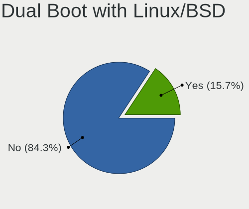
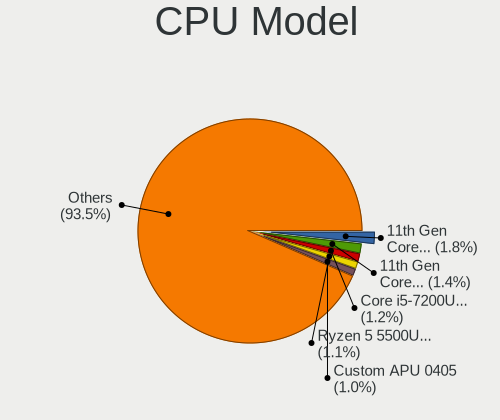
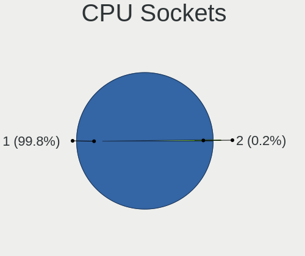

Linux - Hardware Trends (Notebooks)
-----------------------------------

A project to identify most popular hardware characteristics and track their change
over time based on data collected by Linux users at https://Linux-Hardware.org.

Anyone can contribute to this report by the [hw-probe](https://github.com/linuxhw/hw-probe) tool:

    sudo -E hw-probe -all -upload

This report is for one last month. Overall report since the beginning of time: [TestDays](https://github.com/linuxhw/TestDays)

Period: Apr, 2024.

Contents
--------

* [ System ](#system)
  - [ OS                       ](#os)
  - [ OS Family                ](#os-family)
  - [ Kernel                   ](#kernel)
  - [ Kernel Family            ](#kernel-family)
  - [ Kernel Major Ver.        ](#kernel-major-ver)
  - [ Arch                     ](#arch)
  - [ DE                       ](#de)
  - [ Display Server           ](#display-server)
  - [ Display Manager          ](#display-manager)
  - [ OS Lang                  ](#os-lang)
  - [ Boot Mode                ](#boot-mode)
  - [ Filesystem               ](#filesystem)
  - [ Part. scheme             ](#part-scheme)
  - [ Dual Boot with Linux/BSD ](#dual-boot-with-linuxbsd)
  - [ Dual Boot (Win)          ](#dual-boot-win)

* [ Board ](#board)
  - [ Vendor                   ](#vendor)
  - [ Model                    ](#model)
  - [ Model Family             ](#model-family)
  - [ MFG Year                 ](#mfg-year)
  - [ Form Factor              ](#form-factor)
  - [ Secure Boot              ](#secure-boot)
  - [ Coreboot                 ](#coreboot)
  - [ RAM Size                 ](#ram-size)
  - [ RAM Used                 ](#ram-used)
  - [ Total Drives             ](#total-drives)
  - [ Has CD-ROM               ](#has-cd-rom)
  - [ Has Ethernet             ](#has-ethernet)
  - [ Has WiFi                 ](#has-wifi)
  - [ Has Bluetooth            ](#has-bluetooth)

* [ Location ](#location)
  - [ Country                  ](#country)
  - [ City                     ](#city)

* [ Drives ](#drives)
  - [ Drive Vendor             ](#drive-vendor)
  - [ Drive Model              ](#drive-model)
  - [ HDD Vendor               ](#hdd-vendor)
  - [ SSD Vendor               ](#ssd-vendor)
  - [ Drive Kind               ](#drive-kind)
  - [ Drive Connector          ](#drive-connector)
  - [ Drive Size               ](#drive-size)
  - [ Space Total              ](#space-total)
  - [ Space Used               ](#space-used)
  - [ Malfunc. Drives          ](#malfunc-drives)
  - [ Malfunc. Drive Vendor    ](#malfunc-drive-vendor)
  - [ Malfunc. HDD Vendor      ](#malfunc-hdd-vendor)
  - [ Malfunc. Drive Kind      ](#malfunc-drive-kind)
  - [ Failed Drives            ](#failed-drives)
  - [ Failed Drive Vendor      ](#failed-drive-vendor)
  - [ Drive Status             ](#drive-status)

* [ Storage controller ](#storage-controller)
  - [ Storage Vendor           ](#storage-vendor)
  - [ Storage Model            ](#storage-model)
  - [ Storage Kind             ](#storage-kind)

* [ Processor ](#processor)
  - [ CPU Vendor               ](#cpu-vendor)
  - [ CPU Model                ](#cpu-model)
  - [ CPU Model Family         ](#cpu-model-family)
  - [ CPU Cores                ](#cpu-cores)
  - [ CPU Sockets              ](#cpu-sockets)
  - [ CPU Threads              ](#cpu-threads)
  - [ CPU Op-Modes             ](#cpu-op-modes)
  - [ CPU Microcode            ](#cpu-microcode)
  - [ CPU Microarch            ](#cpu-microarch)

* [ Graphics ](#graphics)
  - [ GPU Vendor               ](#gpu-vendor)
  - [ GPU Model                ](#gpu-model)
  - [ GPU Combo                ](#gpu-combo)
  - [ GPU Driver               ](#gpu-driver)
  - [ GPU Memory               ](#gpu-memory)

* [ Monitor ](#monitor)
  - [ Monitor Vendor           ](#monitor-vendor)
  - [ Monitor Model            ](#monitor-model)
  - [ Monitor Resolution       ](#monitor-resolution)
  - [ Monitor Diagonal         ](#monitor-diagonal)
  - [ Monitor Width            ](#monitor-width)
  - [ Aspect Ratio             ](#aspect-ratio)
  - [ Monitor Area             ](#monitor-area)
  - [ Pixel Density            ](#pixel-density)
  - [ Multiple Monitors        ](#multiple-monitors)

* [ Network ](#network)
  - [ Net Controller Vendor    ](#net-controller-vendor)
  - [ Net Controller Model     ](#net-controller-model)
  - [ Wireless Vendor          ](#wireless-vendor)
  - [ Wireless Model           ](#wireless-model)
  - [ Ethernet Vendor          ](#ethernet-vendor)
  - [ Ethernet Model           ](#ethernet-model)
  - [ Net Controller Kind      ](#net-controller-kind)
  - [ Used Controller          ](#used-controller)
  - [ NICs                     ](#nics)
  - [ IPv6                     ](#ipv6)

* [ Bluetooth ](#bluetooth)
  - [ Bluetooth Vendor         ](#bluetooth-vendor)
  - [ Bluetooth Model          ](#bluetooth-model)

* [ Sound ](#sound)
  - [ Sound Vendor             ](#sound-vendor)
  - [ Sound Model              ](#sound-model)

* [ Memory ](#memory)
  - [ Memory Vendor            ](#memory-vendor)
  - [ Memory Model             ](#memory-model)
  - [ Memory Kind              ](#memory-kind)
  - [ Memory Form Factor       ](#memory-form-factor)
  - [ Memory Size              ](#memory-size)
  - [ Memory Speed             ](#memory-speed)

* [ Printers & scanners ](#printers--scanners)
  - [ Printer Vendor           ](#printer-vendor)
  - [ Printer Model            ](#printer-model)
  - [ Scanner Vendor           ](#scanner-vendor)
  - [ Scanner Model            ](#scanner-model)

* [ Camera ](#camera)
  - [ Camera Vendor            ](#camera-vendor)
  - [ Camera Model             ](#camera-model)

* [ Security ](#security)
  - [ Fingerprint Vendor       ](#fingerprint-vendor)
  - [ Fingerprint Model        ](#fingerprint-model)
  - [ Chipcard Vendor          ](#chipcard-vendor)
  - [ Chipcard Model           ](#chipcard-model)

* [ Unsupported ](#unsupported)
  - [ Unsupported Devices      ](#unsupported-devices)
  - [ Unsupported Device Types ](#unsupported-device-types)

System
------

OS
--

Installed operating systems

| Name                         | Notebooks | Percent |
|------------------------------|-----------|---------|
| Ubuntu 22.04                 | 341       | 11.75%  |
| Fedora 39                    | 253       | 8.72%   |
| Fedora 40                    | 154       | 5.31%   |
| Linux Mint 21.3              | 153       | 5.27%   |
| Debian 12                    | 146       | 5.03%   |
| Arch Rolling                 | 129       | 4.45%   |
| Zorin 17                     | 125       | 4.31%   |
| ROSA 12.5                    | 110       | 3.79%   |
| Ubuntu 23.10                 | 96        | 3.31%   |
| Pop!_OS 22.04                | 85        | 2.93%   |
| OpenMandriva 23.08           | 69        | 2.38%   |
| Ubuntu 24.04                 | 68        | 2.34%   |
| ArcoLinux Rolling            | 65        | 2.24%   |
| openSUSE Tumbleweed-XXXXXXXX | 45        | 1.55%   |
| KDE neon 22.04               | 45        | 1.55%   |
| BlackPanther 18.1            | 43        | 1.48%   |
| Manjaro                      | 42        | 1.45%   |
| Kali 2024.1                  | 42        | 1.45%   |
| SteamOS 3.5.17               | 41        | 1.41%   |
| Ubuntu 20.04                 | 39        | 1.34%   |
| OpenMandriva 5.0             | 37        | 1.27%   |
| EndeavourOS Rolling          | 34        | 1.17%   |
| Elementary 7.1               | 33        | 1.14%   |
| Kubuntu 22.04                | 32        | 1.1%    |
| Linux Mint 21.2              | 29        | 1%      |
| Kubuntu 23.10                | 29        | 1%      |
| Manjaro 23.1.4               | 27        | 0.93%   |
| Debian                       | 25        | 0.86%   |
| Xubuntu 22.04                | 22        | 0.76%   |
| Zorin 16                     | 21        | 0.72%   |
| Nobara 39                    | 20        | 0.69%   |
| openSUSE Leap-15.5           | 18        | 0.62%   |
| Debian 11                    | 18        | 0.62%   |
| MX 23                        | 17        | 0.59%   |
| LMDE 6                       | 17        | 0.59%   |
| Gentoo 2.14                  | 15        | 0.52%   |
| Lubuntu 22.04                | 13        | 0.45%   |
| NixOS 24.05                  | 12        | 0.41%   |
| Ubuntu MATE 22.04            | 11        | 0.38%   |
| Linux Mint 20.3              | 11        | 0.38%   |

OS Family
---------

OS without a version

| Name             | Notebooks | Percent |
|------------------|-----------|---------|
| Ubuntu           | 556       | 19.16%  |
| Fedora           | 425       | 14.65%  |
| Linux Mint       | 208       | 7.17%   |
| Debian           | 190       | 6.55%   |
| OpenMandriva     | 148       | 5.1%    |
| Zorin            | 147       | 5.07%   |
| ROSA             | 135       | 4.65%   |
| Arch             | 129       | 4.45%   |
| Pop!_OS          | 85        | 2.93%   |
| Manjaro          | 72        | 2.48%   |
| Kubuntu          | 71        | 2.45%   |
| openSUSE         | 70        | 2.41%   |
| ArcoLinux        | 68        | 2.34%   |
| SteamOS          | 55        | 1.9%    |
| Kali             | 47        | 1.62%   |
| KDE neon         | 45        | 1.55%   |
| BlackPanther     | 43        | 1.48%   |
| Elementary       | 37        | 1.27%   |
| EndeavourOS      | 34        | 1.17%   |
| Xubuntu          | 33        | 1.14%   |
| Nobara           | 23        | 0.79%   |
| Gentoo           | 23        | 0.79%   |
| MX               | 22        | 0.76%   |
| NixOS            | 21        | 0.72%   |
| Lubuntu          | 20        | 0.69%   |
| Ubuntu MATE      | 19        | 0.65%   |
| LMDE             | 17        | 0.59%   |
| Garuda Linux     | 12        | 0.41%   |
| ALT Linux        | 11        | 0.38%   |
| TUXEDO OS        | 10        | 0.34%   |
| Parrot           | 9         | 0.31%   |
| Void Linux       | 8         | 0.28%   |
| org.kde.Platform | 6         | 0.21%   |
| Ubuntu Unity     | 5         | 0.17%   |
| antiX            | 5         | 0.17%   |
| Red OS           | 4         | 0.14%   |
| Endless          | 4         | 0.14%   |
| Devuan           | 4         | 0.14%   |
| Clear Linux      | 4         | 0.14%   |
| CachyOS          | 4         | 0.14%   |

Kernel
------

Version of the Linux kernel

| Version                             | Notebooks | Percent |
|-------------------------------------|-----------|---------|
| 6.5.0-27-generic                    | 238       | 8.2%    |
| 6.5.0-26-generic                    | 216       | 7.44%   |
| 6.5.0-28-generic                    | 197       | 6.79%   |
| 6.8.7-300.fc40.x86_64               | 106       | 3.65%   |
| 6.8.0-76060800daily20240311-generic | 79        | 2.72%   |
| 6.1.0-18-amd64                      | 79        | 2.72%   |
| 6.6.21-generic-8rosa2021.1-x86_64   | 71        | 2.45%   |
| 5.15.0-102-generic                  | 62        | 2.14%   |
| 5.15.0-101-generic                  | 61        | 2.1%    |
| 6.4.11-desktop-1omv2390             | 59        | 2.03%   |
| 5.15.0-105-generic                  | 59        | 2.03%   |
| 6.8.0-31-generic                    | 58        | 2%      |
| 6.1.0-20-amd64                      | 58        | 2%      |
| 6.8.4-200.fc39.x86_64               | 54        | 1.86%   |
| 6.1.52-valve16-1-neptune-61         | 48        | 1.65%   |
| 6.8.7-arch1-1                       | 47        | 1.62%   |
| 6.6.2-desktop-1omv2390              | 47        | 1.62%   |
| 6.8.6-200.fc39.x86_64               | 45        | 1.55%   |
| 6.8.2-arch2-1                       | 38        | 1.31%   |
| 6.7.11-200.fc39.x86_64              | 38        | 1.31%   |
| 6.8.5-201.fc39.x86_64               | 29        | 1%      |
| 6.6.15-amd64                        | 29        | 1%      |
| 5.15.85-desktop-1bP                 | 28        | 0.96%   |
| 6.5.6-300.fc39.x86_64               | 27        | 0.93%   |
| 6.6.9-amd64                         | 25        | 0.86%   |
| 6.7.10-200.fc39.x86_64              | 24        | 0.83%   |
| 6.8.5-arch1-1                       | 23        | 0.79%   |
| 6.1.81-generic-2rosa2021.1-x86_64   | 21        | 0.72%   |
| 5.15.0-91-generic                   | 21        | 0.72%   |
| 6.8.4-arch1-1                       | 20        | 0.69%   |
| 6.8.7-200.fc39.x86_64               | 19        | 0.65%   |
| 6.8.5-301.fc40.x86_64               | 18        | 0.62%   |
| 6.6.26-1-MANJARO                    | 18        | 0.62%   |
| 5.14.21-150500.55.52-default        | 16        | 0.55%   |
| 6.6.25-1-MANJARO                    | 15        | 0.52%   |
| 6.5.0-18-generic                    | 14        | 0.48%   |
| 6.8.4-300.fc40.x86_64               | 13        | 0.45%   |
| 6.2.0-39-generic                    | 13        | 0.45%   |
| 6.8.7-arch1-2                       | 12        | 0.41%   |
| 5.10.0-28-amd64                     | 12        | 0.41%   |

Kernel Family
-------------

Linux kernel without a distro release

| Version  | Notebooks | Percent |
|----------|-----------|---------|
| 6.5.0    | 745       | 25.67%  |
| 5.15.0   | 251       | 8.65%   |
| 6.8.7    | 241       | 8.3%    |
| 6.1.0    | 173       | 5.96%   |
| 6.8.0    | 163       | 5.62%   |
| 6.8.4    | 134       | 4.62%   |
| 6.8.5    | 104       | 3.58%   |
| 6.6.21   | 79        | 2.72%   |
| 6.8.6    | 74        | 2.55%   |
| 6.8.2    | 68        | 2.34%   |
| 6.4.11   | 59        | 2.03%   |
| 6.1.52   | 54        | 1.86%   |
| 6.6.2    | 47        | 1.62%   |
| 6.7.11   | 41        | 1.41%   |
| 6.8.1    | 30        | 1.03%   |
| 6.6.15   | 29        | 1%      |
| 6.5.6    | 28        | 0.96%   |
| 6.2.0    | 28        | 0.96%   |
| 5.15.85  | 28        | 0.96%   |
| 6.7.10   | 27        | 0.93%   |
| 6.6.9    | 25        | 0.86%   |
| 6.6.26   | 24        | 0.83%   |
| 5.4.0    | 23        | 0.79%   |
| 6.6.25   | 22        | 0.76%   |
| 6.1.81   | 22        | 0.76%   |
| 6.7.9    | 19        | 0.65%   |
| 5.14.21  | 19        | 0.65%   |
| 5.10.0   | 19        | 0.65%   |
| 6.6.28   | 17        | 0.59%   |
| 6.6.27   | 14        | 0.48%   |
| 6.9.0    | 12        | 0.41%   |
| 6.6.23   | 10        | 0.34%   |
| 6.4.8    | 9         | 0.31%   |
| 4.18.16  | 9         | 0.31%   |
| 6.7.12   | 8         | 0.28%   |
| 6.6.22   | 8         | 0.28%   |
| 6.6.13   | 8         | 0.28%   |
| 5.19.0   | 8         | 0.28%   |
| 5.15.127 | 8         | 0.28%   |
| 5.14.0   | 8         | 0.28%   |

Kernel Major Ver.
-----------------

Linux kernel major version

| Version | Notebooks | Percent |
|---------|-----------|---------|
| 6.8     | 821       | 28.29%  |
| 6.5     | 783       | 26.98%  |
| 6.6     | 322       | 11.1%   |
| 5.15    | 292       | 10.06%  |
| 6.1     | 289       | 9.96%   |
| 6.7     | 126       | 4.34%   |
| 6.4     | 74        | 2.55%   |
| 5.10    | 35        | 1.21%   |
| 6.2     | 30        | 1.03%   |
| 5.4     | 27        | 0.93%   |
| 5.14    | 27        | 0.93%   |
| 6.9     | 12        | 0.41%   |
| 4.18    | 10        | 0.34%   |
| 5.19    | 9         | 0.31%   |
| 5.6     | 7         | 0.24%   |
| 4.15    | 7         | 0.24%   |
| 6.0     | 5         | 0.17%   |
| 6.3     | 4         | 0.14%   |
| 5.16    | 4         | 0.14%   |
| 5.11    | 4         | 0.14%   |
| 5.8     | 3         | 0.1%    |
| 5.17    | 2         | 0.07%   |
| 5.13    | 2         | 0.07%   |
| 4.9     | 2         | 0.07%   |
| 5.9     | 1         | 0.03%   |
| 5.18    | 1         | 0.03%   |
| 5.0     | 1         | 0.03%   |
| 4.4     | 1         | 0.03%   |
| 4.19    | 1         | 0.03%   |

Arch
----

OS architecture (x86_64, i586, etc.)

| Name    | Notebooks | Percent |
|---------|-----------|---------|
| x86_64  | 2866      | 98.76%  |
| i686    | 31        | 1.07%   |
| aarch64 | 5         | 0.17%   |

DE
--

Desktop Environment

| Name            | Notebooks | Percent |
|-----------------|-----------|---------|
| GNOME           | 1338      | 46.11%  |
| KDE5            | 563       | 19.4%   |
| X-Cinnamon      | 206       | 7.1%    |
| XFCE            | 201       | 6.93%   |
| KDE6            | 173       | 5.96%   |
| MATE            | 75        | 2.58%   |
| Unknown         | 73        | 2.52%   |
| LXQt            | 61        | 2.1%    |
| Pantheon        | 38        | 1.31%   |
| Hyprland        | 27        | 0.93%   |
| i3              | 20        | 0.69%   |
| KDE             | 18        | 0.62%   |
| KDE4            | 13        | 0.45%   |
| sway            | 12        | 0.41%   |
| Cinnamon        | 12        | 0.41%   |
| LXDE            | 9         | 0.31%   |
| GNOME Classic   | 7         | 0.24%   |
| GNOME Flashback | 6         | 0.21%   |
| Unity           | 5         | 0.17%   |
| openbox         | 5         | 0.17%   |
| icewm           | 4         | 0.14%   |
| Deepin          | 4         | 0.14%   |
| Budgie          | 4         | 0.14%   |
| bspwm           | 4         | 0.14%   |
| awesome         | 4         | 0.14%   |
| Trinity         | 3         | 0.1%    |
| qtile           | 2         | 0.07%   |
| fluxbox         | 2         | 0.07%   |
| Enlightenment   | 2         | 0.07%   |
| dwm             | 2         | 0.07%   |
| none+i3         | 1         | 0.03%   |
| herbstluftwm    | 1         | 0.03%   |
| GNOME-Classic   | 1         | 0.03%   |
| gamescope       | 1         | 0.03%   |
| Endless:GNOME   | 1         | 0.03%   |
| dusk            | 1         | 0.03%   |
| chadwm          | 1         | 0.03%   |
| BunsenLabs      | 1         | 0.03%   |
| AsterDE         | 1         | 0.03%   |

Display Server
--------------

X11 or Wayland

| Name        | Notebooks | Percent |
|-------------|-----------|---------|
| Wayland     | 1453      | 50.07%  |
| X11         | 1375      | 47.38%  |
| Unknown     | 39        | 1.34%   |
| Tty         | 34        | 1.17%   |
| Unspecified | 1         | 0.03%   |

Display Manager
---------------

SDDM, LightDM, etc.

| Name    | Notebooks | Percent |
|---------|-----------|---------|
| Unknown | 1016      | 35.01%  |
| SDDM    | 614       | 21.16%  |
| GDM3    | 611       | 21.05%  |
| LightDM | 427       | 14.71%  |
| GDM     | 207       | 7.13%   |
| LXDM    | 6         | 0.21%   |
| SLIMSKI | 4         | 0.14%   |
| SLiM    | 4         | 0.14%   |
| KDM     | 4         | 0.14%   |
| LY-DM   | 3         | 0.1%    |
| GREETD  | 3         | 0.1%    |
| Ly      | 2         | 0.07%   |
| TDM     | 1         | 0.03%   |

OS Lang
-------

Language

| Lang    | Notebooks | Percent |
|---------|-----------|---------|
| en_US   | 1262      | 43.49%  |
| ru_RU   | 228       | 7.86%   |
| de_DE   | 185       | 6.37%   |
| en_GB   | 128       | 4.41%   |
| it_IT   | 126       | 4.34%   |
| fr_FR   | 123       | 4.24%   |
| C       | 99        | 3.41%   |
| pt_BR   | 86        | 2.96%   |
| Unknown | 70        | 2.41%   |
| es_ES   | 64        | 2.21%   |
| pl_PL   | 61        | 2.1%    |
| en_CA   | 49        | 1.69%   |
| en_IN   | 38        | 1.31%   |
| en_AU   | 33        | 1.14%   |
| es_MX   | 28        | 0.96%   |
| tr_TR   | 26        | 0.9%    |
| hu_HU   | 19        | 0.65%   |
| zh_CN   | 17        | 0.59%   |
| cs_CZ   | 16        | 0.55%   |
| sv_SE   | 14        | 0.48%   |
| nl_NL   | 13        | 0.45%   |
| es_AR   | 13        | 0.45%   |
| es_CL   | 12        | 0.41%   |
| en_ZA   | 11        | 0.38%   |
| de_CH   | 11        | 0.38%   |
| de_AT   | 11        | 0.38%   |
| pt_PT   | 9         | 0.31%   |
| es_CO   | 9         | 0.31%   |
| en_NZ   | 9         | 0.31%   |
| en_DK   | 9         | 0.31%   |
| en_IL   | 8         | 0.28%   |
| POSIX   | 7         | 0.24%   |
| ja_JP   | 7         | 0.24%   |
| en_IE   | 7         | 0.24%   |
| fi_FI   | 6         | 0.21%   |
| ro_RO   | 5         | 0.17%   |
| fr_CA   | 5         | 0.17%   |
| el_GR   | 5         | 0.17%   |
| da_DK   | 5         | 0.17%   |
| sk_SK   | 4         | 0.14%   |

Boot Mode
---------

EFI or BIOS

| Mode | Notebooks | Percent |
|------|-----------|---------|
| BIOS | 1483      | 51.1%   |
| EFI  | 1419      | 48.9%   |

Filesystem
----------

Type of filesystem

| Type     | Notebooks | Percent |
|----------|-----------|---------|
| Ext4     | 1641      | 56.55%  |
| Btrfs    | 672       | 23.16%  |
| Tmpfs    | 391       | 13.47%  |
| Overlay  | 135       | 4.65%   |
| Xfs      | 31        | 1.07%   |
| Zfs      | 19        | 0.65%   |
| F2fs     | 6         | 0.21%   |
| Ext2     | 2         | 0.07%   |
| Unknown  | 2         | 0.07%   |
| Jfs      | 1         | 0.03%   |
| Bcachefs | 1         | 0.03%   |
| Aufs     | 1         | 0.03%   |

Part. scheme
------------

Scheme of partitioning

| Type    | Notebooks | Percent |
|---------|-----------|---------|
| GPT     | 1676      | 57.75%  |
| Unknown | 958       | 33.01%  |
| MBR     | 268       | 9.24%   |

Dual Boot with Linux/BSD
------------------------

Hosting more than one Linux/BSD

| Dual boot | Notebooks | Percent |
|-----------|-----------|---------|
| No        | 2582      | 88.97%  |
| Yes       | 320       | 11.03%  |

Dual Boot (Win)
---------------

Hosting Linux and Windows

| Dual boot | Notebooks | Percent |
|-----------|-----------|---------|
| No        | 2176      | 74.98%  |
| Yes       | 726       | 25.02%  |

Board
-----

Vendor
------

Motherboard manufacturer

| Name                   | Notebooks | Percent |
|------------------------|-----------|---------|
| Lenovo                 | 619       | 21.33%  |
| Hewlett-Packard        | 508       | 17.51%  |
| Dell                   | 386       | 13.3%   |
| ASUSTek Computer       | 325       | 11.2%   |
| Acer                   | 236       | 8.13%   |
| Apple                  | 133       | 4.58%   |
| MSI                    | 76        | 2.62%   |
| Toshiba                | 58        | 2%      |
| Valve                  | 56        | 1.93%   |
| HUAWEI                 | 54        | 1.86%   |
| Samsung Electronics    | 41        | 1.41%   |
| Unknown                | 34        | 1.17%   |
| Google                 | 24        | 0.83%   |
| Notebook               | 23        | 0.79%   |
| Sony                   | 21        | 0.72%   |
| Packard Bell           | 17        | 0.59%   |
| Framework              | 15        | 0.52%   |
| Alienware              | 15        | 0.52%   |
| Fujitsu                | 14        | 0.48%   |
| TUXEDO                 | 12        | 0.41%   |
| Timi                   | 11        | 0.38%   |
| Chuwi                  | 11        | 0.38%   |
| Medion                 | 10        | 0.34%   |
| Positivo               | 9         | 0.31%   |
| Gigabyte Technology    | 9         | 0.31%   |
| System76               | 8         | 0.28%   |
| Maibenben              | 6         | 0.21%   |
| HONOR                  | 6         | 0.21%   |
| Clevo                  | 6         | 0.21%   |
| XIAOMI                 | 5         | 0.17%   |
| Razer                  | 5         | 0.17%   |
| Intel Client Systems   | 4         | 0.14%   |
| GPU Company            | 4         | 0.14%   |
| GPD                    | 4         | 0.14%   |
| eMachines              | 4         | 0.14%   |
| Avell High Performance | 4         | 0.14%   |
| Panasonic              | 3         | 0.1%    |
| Monster                | 3         | 0.1%    |
| Mediacom               | 3         | 0.1%    |
| Intel                  | 3         | 0.1%    |

Model
-----

Motherboard model

| Name                                       | Notebooks | Percent |
|--------------------------------------------|-----------|---------|
| Valve Jupiter                              | 50        | 1.72%   |
| Unknown                                    | 44        | 1.52%   |
| Apple MacBookPro9,2                        | 17        | 0.59%   |
| HP Notebook                                | 15        | 0.52%   |
| Apple MacBookPro8,1                        | 10        | 0.34%   |
| Apple MacBookAir7,2                        | 10        | 0.34%   |
| HUAWEI BOM-WXX9                            | 9         | 0.31%   |
| HP Pavilion Notebook                       | 9         | 0.31%   |
| Dell Latitude 7490                         | 9         | 0.31%   |
| HUAWEI HVY-WXX9                            | 8         | 0.28%   |
| HP 15                                      | 8         | 0.28%   |
| Apple MacBookPro12,1                       | 8         | 0.28%   |
| Apple MacBookAir6,2                        | 8         | 0.28%   |
| Apple MacBookPro14,1                       | 7         | 0.24%   |
| Apple MacBookPro11,3                       | 7         | 0.24%   |
| Apple MacBookPro11,1                       | 7         | 0.24%   |
| Valve Galileo                              | 6         | 0.21%   |
| HP Pavilion dv6                            | 6         | 0.21%   |
| HP EliteBook 840 G8 Notebook PC            | 6         | 0.21%   |
| HP EliteBook 840 G4                        | 6         | 0.21%   |
| HP EliteBook 840 G3                        | 6         | 0.21%   |
| HP EliteBook 840 G1                        | 6         | 0.21%   |
| Framework Laptop 13 (AMD Ryzen 7040Series) | 6         | 0.21%   |
| Dell Latitude E6440                        | 6         | 0.21%   |
| Dell Latitude E6420                        | 6         | 0.21%   |
| Dell Latitude E6400                        | 6         | 0.21%   |
| Dell Latitude 5420                         | 6         | 0.21%   |
| Dell Inspiron 15-3567                      | 6         | 0.21%   |
| Apple MacBookPro8,2                        | 6         | 0.21%   |
| Apple MacBookPro11,5                       | 6         | 0.21%   |
| Acer Aspire A315-24P                       | 6         | 0.21%   |
| Lenovo IdeaPad 330-15IKB 81DE              | 5         | 0.17%   |
| Lenovo IdeaPad 3 15ITL6 82H8               | 5         | 0.17%   |
| HP ZBook 15 G5                             | 5         | 0.17%   |
| HP Pavilion Laptop 15-eh0xxx               | 5         | 0.17%   |
| HP Pavilion Gaming Laptop 15-ec1xxx        | 5         | 0.17%   |
| HP Pavilion g6                             | 5         | 0.17%   |
| HP Pavilion dv7                            | 5         | 0.17%   |
| HP Pavilion 15                             | 5         | 0.17%   |
| HP Laptop 15-dy2xxx                        | 5         | 0.17%   |

Model Family
------------

Motherboard model prefix

| Name                  | Notebooks | Percent |
|-----------------------|-----------|---------|
| Lenovo ThinkPad       | 321       | 11.06%  |
| Dell Latitude         | 158       | 5.44%   |
| Acer Aspire           | 157       | 5.41%   |
| Lenovo IdeaPad        | 121       | 4.17%   |
| HP EliteBook          | 97        | 3.34%   |
| Dell Inspiron         | 96        | 3.31%   |
| HP Pavilion           | 92        | 3.17%   |
| ASUS VivoBook         | 80        | 2.76%   |
| HP Laptop             | 78        | 2.69%   |
| HP ProBook            | 67        | 2.31%   |
| Valve Jupiter         | 50        | 1.72%   |
| Toshiba Satellite     | 50        | 1.72%   |
| ASUS ROG              | 47        | 1.62%   |
| Dell XPS              | 45        | 1.55%   |
| Lenovo Legion         | 44        | 1.52%   |
| Unknown               | 44        | 1.52%   |
| Dell Precision        | 39        | 1.34%   |
| ASUS ASUS             | 32        | 1.1%    |
| HP ZBook              | 31        | 1.07%   |
| Acer Nitro            | 26        | 0.9%    |
| Lenovo ThinkBook      | 25        | 0.86%   |
| Apple MacBookPro11    | 22        | 0.76%   |
| Apple MacBookPro9     | 20        | 0.69%   |
| Acer Swift            | 20        | 0.69%   |
| Lenovo Yoga           | 18        | 0.62%   |
| HP Victus             | 17        | 0.59%   |
| Apple MacBookPro8     | 16        | 0.55%   |
| Packard Bell EasyNote | 15        | 0.52%   |
| HP Notebook           | 15        | 0.52%   |
| HP ENVY               | 15        | 0.52%   |
| Framework Laptop      | 15        | 0.52%   |
| Dell Vostro           | 15        | 0.52%   |
| HP 250                | 14        | 0.48%   |
| ASUS ZenBook          | 13        | 0.45%   |
| HP OMEN               | 12        | 0.41%   |
| Dell G15              | 12        | 0.41%   |
| Apple MacBookAir7     | 12        | 0.41%   |
| HP 255                | 10        | 0.34%   |
| Fujitsu LIFEBOOK      | 10        | 0.34%   |
| Apple MacBookAir6     | 10        | 0.34%   |

MFG Year
--------

Motherboard manufacture year

| Year    | Notebooks | Percent |
|---------|-----------|---------|
| 2023    | 338       | 11.65%  |
| 2021    | 302       | 10.41%  |
| 2022    | 247       | 8.51%   |
| 2020    | 242       | 8.34%   |
| 2013    | 196       | 6.75%   |
| 2018    | 194       | 6.69%   |
| 2012    | 188       | 6.48%   |
| 2019    | 158       | 5.44%   |
| 2017    | 158       | 5.44%   |
| 2011    | 155       | 5.34%   |
| 2016    | 135       | 4.65%   |
| 2014    | 130       | 4.48%   |
| 2015    | 124       | 4.27%   |
| 2010    | 99        | 3.41%   |
| 2009    | 66        | 2.27%   |
| 2008    | 59        | 2.03%   |
| 2024    | 51        | 1.76%   |
| 2007    | 42        | 1.45%   |
| 2006    | 10        | 0.34%   |
| Unknown | 6         | 0.21%   |
| 2005    | 1         | 0.03%   |
| 2004    | 1         | 0.03%   |

Form Factor
-----------

Physical design of the computer

| Name     | Notebooks | Percent |
|----------|-----------|---------|
| Notebook | 2902      | 100%    |

Secure Boot
-----------

Enabled or disabled

| State    | Notebooks | Percent |
|----------|-----------|---------|
| Disabled | 2689      | 92.66%  |
| Enabled  | 213       | 7.34%   |

Coreboot
--------

Have coreboot on board

| Used | Notebooks | Percent |
|------|-----------|---------|
| No   | 2870      | 98.9%   |
| Yes  | 32        | 1.1%    |

RAM Size
--------

Total RAM memory

| Size in GB  | Notebooks | Percent |
|-------------|-----------|---------|
| 4.01-8.0    | 788       | 27.15%  |
| 8.01-16.0   | 573       | 19.75%  |
| 16.01-24.0  | 544       | 18.75%  |
| 3.01-4.0    | 447       | 15.4%   |
| 32.01-64.0  | 307       | 10.58%  |
| 24.01-32.0  | 79        | 2.72%   |
| 64.01-256.0 | 67        | 2.31%   |
| 1.01-2.0    | 62        | 2.14%   |
| 2.01-3.0    | 28        | 0.96%   |
| 0.51-1.0    | 7         | 0.24%   |

RAM Used
--------

Used RAM memory

| Used GB    | Notebooks | Percent |
|------------|-----------|---------|
| 1.01-2.0   | 778       | 26.81%  |
| 2.01-3.0   | 772       | 26.6%   |
| 4.01-8.0   | 631       | 21.74%  |
| 3.01-4.0   | 434       | 14.96%  |
| 8.01-16.0  | 147       | 5.07%   |
| 0.51-1.0   | 97        | 3.34%   |
| 16.01-24.0 | 22        | 0.76%   |
| 0.01-0.5   | 15        | 0.52%   |
| 32.01-64.0 | 3         | 0.1%    |
| 24.01-32.0 | 3         | 0.1%    |

Total Drives
------------

Number of drives on board

| Drives | Notebooks | Percent |
|--------|-----------|---------|
| 1      | 2135      | 73.57%  |
| 2      | 672       | 23.16%  |
| 3      | 70        | 2.41%   |
| 4      | 13        | 0.45%   |
| 0      | 10        | 0.34%   |
| 7      | 1         | 0.03%   |
| 5      | 1         | 0.03%   |

Has CD-ROM
----------

Has CD-ROM on board

| Presented | Notebooks | Percent |
|-----------|-----------|---------|
| No        | 2140      | 73.74%  |
| Yes       | 762       | 26.26%  |

Has Ethernet
------------

Has Ethernet on board

| Presented | Notebooks | Percent |
|-----------|-----------|---------|
| Yes       | 2199      | 75.78%  |
| No        | 703       | 24.22%  |

Has WiFi
--------

Has WiFi module

| Presented | Notebooks | Percent |
|-----------|-----------|---------|
| Yes       | 2855      | 98.38%  |
| No        | 47        | 1.62%   |

Has Bluetooth
-------------

Has Bluetooth module

| Presented | Notebooks | Percent |
|-----------|-----------|---------|
| Yes       | 2440      | 84.08%  |
| No        | 462       | 15.92%  |

Location
--------

Country
-------

Geographic location (country)

| Country      | Notebooks | Percent |
|--------------|-----------|---------|
| USA          | 517       | 17.82%  |
| Russia       | 273       | 9.41%   |
| Germany      | 258       | 8.89%   |
| Italy        | 156       | 5.38%   |
| France       | 138       | 4.76%   |
| Brazil       | 134       | 4.62%   |
| UK           | 97        | 3.34%   |
| Poland       | 94        | 3.24%   |
| Canada       | 90        | 3.1%    |
| India        | 73        | 2.52%   |
| Spain        | 72        | 2.48%   |
| Hungary      | 69        | 2.38%   |
| Netherlands  | 55        | 1.9%    |
| Mexico       | 55        | 1.9%    |
| Turkey       | 46        | 1.59%   |
| Australia    | 40        | 1.38%   |
| Sweden       | 38        | 1.31%   |
| Switzerland  | 36        | 1.24%   |
| Austria      | 33        | 1.14%   |
| Czechia      | 28        | 0.96%   |
| Portugal     | 26        | 0.9%    |
| Argentina    | 26        | 0.9%    |
| Chile        | 25        | 0.86%   |
| Serbia       | 21        | 0.72%   |
| China        | 21        | 0.72%   |
| Romania      | 19        | 0.65%   |
| Colombia     | 19        | 0.65%   |
| South Africa | 18        | 0.62%   |
| Norway       | 17        | 0.59%   |
| Greece       | 17        | 0.59%   |
| Denmark      | 16        | 0.55%   |
| Bulgaria     | 16        | 0.55%   |
| New Zealand  | 15        | 0.52%   |
| Indonesia    | 15        | 0.52%   |
| Finland      | 15        | 0.52%   |
| Egypt        | 15        | 0.52%   |
| Vietnam      | 14        | 0.48%   |
| Japan        | 14        | 0.48%   |
| Israel       | 14        | 0.48%   |
| Belgium      | 13        | 0.45%   |

City
----

Geographic location (city)

| City              | Notebooks | Percent |
|-------------------|-----------|---------|
| Moscow            | 79        | 2.72%   |
| Budapest          | 30        | 1.03%   |
| St Petersburg     | 29        | 1%      |
| Berlin            | 27        | 0.93%   |
| Warsaw            | 23        | 0.79%   |
| Istanbul          | 23        | 0.79%   |
| Milan             | 22        | 0.76%   |
| Los Angeles       | 19        | 0.65%   |
| Vienna            | 17        | 0.59%   |
| Paris             | 16        | 0.55%   |
| Amsterdam         | 16        | 0.55%   |
| Montreal          | 15        | 0.52%   |
| Rio de Janeiro    | 14        | 0.48%   |
| Athens            | 14        | 0.48%   |
| Belgrade          | 13        | 0.45%   |
| Turin             | 12        | 0.41%   |
| Sao Paulo         | 12        | 0.41%   |
| Rome              | 12        | 0.41%   |
| Frankfurt am Main | 12        | 0.41%   |
| Bengaluru         | 12        | 0.41%   |
| Santiago          | 11        | 0.38%   |
| Madrid            | 11        | 0.38%   |
| Delhi             | 11        | 0.38%   |
| Sydney            | 10        | 0.34%   |
| Prague            | 10        | 0.34%   |
| Melbourne         | 10        | 0.34%   |
| Stockholm         | 9         | 0.31%   |
| Sofia             | 9         | 0.31%   |
| Portland          | 9         | 0.31%   |
| Minsk             | 9         | 0.31%   |
| Hamburg           | 9         | 0.31%   |
| Zurich            | 8         | 0.28%   |
| Stuttgart         | 8         | 0.28%   |
| Poznan            | 8         | 0.28%   |
| Novosibirsk       | 8         | 0.28%   |
| Munich            | 8         | 0.28%   |
| Copenhagen        | 8         | 0.28%   |
| Chicago           | 8         | 0.28%   |
| Yekaterinburg     | 7         | 0.24%   |
| Toronto           | 7         | 0.24%   |

Drives
------

Drive Vendor
------------

Hard drive vendors

| Vendor                         | Notebooks | Drives | Percent |
|--------------------------------|-----------|--------|---------|
| Samsung Electronics            | 621       | 679    | 17.27%  |
| Sandisk                        | 287       | 296    | 7.98%   |
| WDC                            | 251       | 257    | 6.98%   |
| Seagate                        | 222       | 231    | 6.17%   |
| Toshiba                        | 199       | 203    | 5.53%   |
| Unknown                        | 183       | 193    | 5.09%   |
| Kingston                       | 181       | 186    | 5.03%   |
| SK hynix                       | 176       | 176    | 4.89%   |
| Micron Technology              | 152       | 154    | 4.23%   |
| Intel                          | 112       | 116    | 3.11%   |
| Crucial                        | 96        | 103    | 2.67%   |
| Apple                          | 76        | 88     | 2.11%   |
| KIOXIA                         | 69        | 69     | 1.92%   |
| Hitachi                        | 63        | 64     | 1.75%   |
| HGST                           | 61        | 61     | 1.7%    |
| Phison Electronics             | 54        | 54     | 1.5%    |
| A-DATA Technology              | 50        | 51     | 1.39%   |
| Kingston Technology Company    | 44        | 44     | 1.22%   |
| China                          | 41        | 41     | 1.14%   |
| Unknown                        | 35        | 35     | 0.97%   |
| Silicon Motion                 | 30        | 30     | 0.83%   |
| SPCC                           | 26        | 26     | 0.72%   |
| Micron/Crucial Technology      | 26        | 27     | 0.72%   |
| MAXIO Technology (Hangzhou)    | 19        | 19     | 0.53%   |
| LITEON                         | 18        | 18     | 0.5%    |
| Patriot                        | 17        | 17     | 0.47%   |
| PNY                            | 15        | 15     | 0.42%   |
| Phison                         | 15        | 15     | 0.42%   |
| Netac                          | 15        | 15     | 0.42%   |
| KingSpec                       | 15        | 17     | 0.42%   |
| ADATA Technology               | 13        | 13     | 0.36%   |
| Solid State Storage Technology | 12        | 12     | 0.33%   |
| JMicron Technology             | 12        | 12     | 0.33%   |
| GOODRAM                        | 12        | 12     | 0.33%   |
| Team                           | 11        | 11     | 0.31%   |
| Shenzhen Longsys Electronics   | 11        | 12     | 0.31%   |
| Realtek Semiconductor          | 11        | 11     | 0.31%   |
| Lexar                          | 11        | 11     | 0.31%   |
| Fujitsu                        | 11        | 11     | 0.31%   |
| Fanxiang                       | 11        | 11     | 0.31%   |

Drive Model
-----------

Hard drive models

| Model                                                 | Notebooks | Percent |
|-------------------------------------------------------|-----------|---------|
| Samsung NVMe SSD Controller SM981/PM981/PM983 1TB     | 103       | 2.79%   |
| Samsung NVMe SSD Controller PM9A1/PM9A3/980PRO 1TB    | 60        | 1.63%   |
| Kingston SA400S37240G 240GB SSD                       | 39        | 1.06%   |
| Unknown                                               | 35        | 0.95%   |
| Kingston SA400S37480G 480GB SSD                       | 32        | 0.87%   |
| Toshiba MQ01ABD100 1TB                                | 28        | 0.76%   |
| Seagate ST1000LM035-1RK172 1TB                        | 28        | 0.76%   |
| Unknown MMC Card  64GB                                | 26        | 0.71%   |
| Toshiba MQ01ABF050 500GB                              | 26        | 0.71%   |
| Intel SSDPEKNU512GZ 512GB                             | 25        | 0.68%   |
| Unknown MMC Card  128GB                               | 23        | 0.62%   |
| Sandisk WD Blue SN550 NVMe SSD 2TB                    | 23        | 0.62%   |
| Sandisk WD Black SN750 / PC SN730 NVMe SSD 512GB      | 22        | 0.6%    |
| HGST HTS721010A9E630 1TB                              | 21        | 0.57%   |
| Unknown MMC Card  32GB                                | 20        | 0.54%   |
| Toshiba XG6 NVMe SSD Controller 1024GB                | 19        | 0.52%   |
| Kingston Company OM3PDP3 NVMe SSD 512GB               | 19        | 0.52%   |
| Unknown MMC Card  512GB                               | 18        | 0.49%   |
| Phison PS5013 E13 NVMe Controller 512GB               | 18        | 0.49%   |
| Micron 2400_MTFDKBA512QFM 512GB                       | 18        | 0.49%   |
| Seagate ST500LT012-1DG142 500GB                       | 17        | 0.46%   |
| Seagate ST1000LM024 HN-M101MBB 1TB                    | 17        | 0.46%   |
| Micron/Crucial P2 NVMe PCIe SSD 4TB                   | 17        | 0.46%   |
| Micron 2450_MTFDKBA512TFK 512GB                       | 17        | 0.46%   |
| Crucial CT500MX500SSD1 500GB                          | 17        | 0.46%   |
| Samsung SSD 850 EVO 250GB                             | 16        | 0.43%   |
| Samsung NVMe SSD Controller SM961/PM961/SM963 1TB     | 16        | 0.43%   |
| Intel SSD 660P Series 1024GB                          | 16        | 0.43%   |
| Silicon Motion SM2263EN/SM2263XT SSD Controller 256GB | 15        | 0.41%   |
| Kingston SA400S37120G 120GB SSD                       | 15        | 0.41%   |
| Samsung SSD 860 EVO 500GB                             | 14        | 0.38%   |
| Toshiba MQ04ABF100 1TB                                | 13        | 0.35%   |
| Sandisk WD Black SN850 512GB                          | 13        | 0.35%   |
| MAXIO (Hangzhou) NVMe SSD Controller MAP1202 256GB    | 13        | 0.35%   |
| Unknown SD/MMC/MS PRO 128GB                           | 12        | 0.33%   |
| SanDisk NVMe SSD Drive 512GB                          | 12        | 0.33%   |
| Kingston Company SNV2S1000G 1TB                       | 12        | 0.33%   |
| HGST HTS725050A7E630 500GB                            | 12        | 0.33%   |
| Crucial CT1000MX500SSD1 1TB                           | 12        | 0.33%   |
| Seagate ST9500325AS 500GB                             | 11        | 0.3%    |

HDD Vendor
----------

Hard disk drive vendors

| Vendor              | Notebooks | Drives | Percent |
|---------------------|-----------|--------|---------|
| Seagate             | 213       | 222    | 30.21%  |
| WDC                 | 161       | 163    | 22.84%  |
| Toshiba             | 141       | 143    | 20%     |
| Hitachi             | 62        | 63     | 8.79%   |
| HGST                | 61        | 61     | 8.65%   |
| Samsung Electronics | 19        | 19     | 2.7%    |
| Unknown             | 12        | 12     | 1.7%    |
| Fujitsu             | 11        | 11     | 1.56%   |
| JMicron Technology  | 9         | 9      | 1.28%   |
| Apple               | 5         | 5      | 0.71%   |
| StoreJet            | 3         | 3      | 0.43%   |
| USB3.0              | 1         | 1      | 0.14%   |
| TO Exter            | 1         | 1      | 0.14%   |
| STEC                | 1         | 1      | 0.14%   |
| LaCie               | 1         | 1      | 0.14%   |
| ICY BOX             | 1         | 1      | 0.14%   |
| External            | 1         | 1      | 0.14%   |
| ASMT                | 1         | 1      | 0.14%   |
| Unknown             | 1         | 1      | 0.14%   |

SSD Vendor
----------

Solid state drive vendors

| Vendor              | Notebooks | Drives | Percent |
|---------------------|-----------|--------|---------|
| Samsung Electronics | 206       | 216    | 18.23%  |
| Kingston            | 139       | 143    | 12.3%   |
| SanDisk             | 96        | 98     | 8.5%    |
| Crucial             | 84        | 89     | 7.43%   |
| WDC                 | 56        | 56     | 4.96%   |
| Apple               | 52        | 52     | 4.6%    |
| China               | 41        | 41     | 3.63%   |
| A-DATA Technology   | 35        | 35     | 3.1%    |
| Micron Technology   | 30        | 31     | 2.65%   |
| Intel               | 28        | 28     | 2.48%   |
| SPCC                | 23        | 23     | 2.04%   |
| Toshiba             | 19        | 20     | 1.68%   |
| SK hynix            | 18        | 18     | 1.59%   |
| LITEON              | 17        | 17     | 1.5%    |
| Patriot             | 16        | 16     | 1.42%   |
| PNY                 | 15        | 15     | 1.33%   |
| KingSpec            | 15        | 17     | 1.33%   |
| Netac               | 13        | 13     | 1.15%   |
| GOODRAM             | 12        | 12     | 1.06%   |
| Unknown             | 12        | 12     | 1.06%   |
| Transcend           | 9         | 9      | 0.8%    |
| Team                | 9         | 9      | 0.8%    |
| Intenso             | 8         | 8      | 0.71%   |
| Hewlett-Packard     | 7         | 7      | 0.62%   |
| Fanxiang            | 7         | 7      | 0.62%   |
| AMD                 | 7         | 7      | 0.62%   |
| Lexar               | 6         | 6      | 0.53%   |
| Apacer              | 6         | 6      | 0.53%   |
| Plextor             | 5         | 5      | 0.44%   |
| OCZ                 | 5         | 5      | 0.44%   |
| LITEONIT            | 5         | 5      | 0.44%   |
| Emtec               | 5         | 5      | 0.44%   |
| Verbatim            | 4         | 4      | 0.35%   |
| Qumo                | 4         | 4      | 0.35%   |
| FORESEE             | 4         | 4      | 0.35%   |
| XrayDisk            | 3         | 3      | 0.27%   |
| Wibtek              | 3         | 3      | 0.27%   |
| Teclast             | 3         | 3      | 0.27%   |
| SSSTC               | 3         | 3      | 0.27%   |
| Kimtigo             | 3         | 3      | 0.27%   |

Drive Kind
----------

HDD or SSD

| Kind    | Notebooks | Drives | Percent |
|---------|-----------|--------|---------|
| NVMe    | 1422      | 1618   | 42.1%   |
| SSD     | 1056      | 1155   | 31.26%  |
| HDD     | 676       | 719    | 20.01%  |
| MMC     | 177       | 188    | 5.24%   |
| Unknown | 47        | 49     | 1.39%   |

Drive Connector
---------------

SATA, SAS, NVMe, etc.

| Type | Notebooks | Drives | Percent |
|------|-----------|--------|---------|
| SATA | 1550      | 1782   | 47.18%  |
| NVMe | 1420      | 1607   | 43.23%  |
| MMC  | 177       | 188    | 5.39%   |
| SAS  | 138       | 152    | 4.2%    |

Drive Size
----------

Size of hard drive

| Size in TB | Notebooks | Drives | Percent |
|------------|-----------|--------|---------|
| 0.01-0.5   | 1173      | 1298   | 68.24%  |
| 0.51-1.0   | 461       | 487    | 26.82%  |
| 1.01-2.0   | 64        | 65     | 3.72%   |
| 3.01-4.0   | 13        | 13     | 0.76%   |
| 4.01-10.0  | 4         | 7      | 0.23%   |
| 10.01-20.0 | 3         | 3      | 0.17%   |
| 0          | 1         | 1      | 0.06%   |

Space Total
-----------

Amount of disk space available on the file system

| Size in GB     | Notebooks | Percent |
|----------------|-----------|---------|
| 101-250        | 748       | 25.78%  |
| 251-500        | 735       | 25.33%  |
| 501-1000       | 502       | 17.3%   |
| 1001-2000      | 234       | 8.06%   |
| 1-20           | 184       | 6.34%   |
| 51-100         | 159       | 5.48%   |
| Unknown        | 101       | 3.48%   |
| More than 3000 | 96        | 3.31%   |
| 21-50          | 77        | 2.65%   |
| 2001-3000      | 66        | 2.27%   |

Space Used
----------

Amount of used disk space

| Used GB        | Notebooks | Percent |
|----------------|-----------|---------|
| 1-20           | 975       | 33.6%   |
| 21-50          | 581       | 20.02%  |
| 101-250        | 429       | 14.78%  |
| 51-100         | 341       | 11.75%  |
| 251-500        | 230       | 7.93%   |
| 501-1000       | 139       | 4.79%   |
| Unknown        | 101       | 3.48%   |
| 1001-2000      | 59        | 2.03%   |
| More than 3000 | 26        | 0.9%    |
| 2001-3000      | 20        | 0.69%   |
| 0              | 1         | 0.03%   |

Malfunc. Drives
---------------

Drive models with a malfunction

| Model                                | Notebooks | Drives | Percent |
|--------------------------------------|-----------|--------|---------|
| Toshiba MQ01ABD100 1TB               | 8         | 8      | 3.76%   |
| Toshiba MQ01ABF050 500GB             | 7         | 7      | 3.29%   |
| HGST HTS725050A7E630 500GB           | 4         | 4      | 1.88%   |
| WDC WDS240G2G0A-00JH30 240GB SSD     | 3         | 3      | 1.41%   |
| Toshiba MK2565GSX 250GB              | 3         | 3      | 1.41%   |
| Seagate ST500LT012-1DG142 500GB      | 3         | 3      | 1.41%   |
| Seagate ST1000LM035-1RK172 1TB       | 3         | 3      | 1.41%   |
| Hitachi HTS545050A7E380 500GB        | 3         | 3      | 1.41%   |
| WDC WD5000LPVX-22V0TT0 500GB         | 2         | 2      | 0.94%   |
| WDC WD1600BEVS-00VAT0 160GB          | 2         | 2      | 0.94%   |
| WDC WD10SPZX-60Z10T0 1TB             | 2         | 2      | 0.94%   |
| WDC WD10SPZX-24Z10 1TB               | 2         | 2      | 0.94%   |
| WDC WD10JPVX-60JC3T0 1TB             | 2         | 2      | 0.94%   |
| Toshiba MQ01ABD075 752GB             | 2         | 2      | 0.94%   |
| Toshiba MQ01ABD050 500GB             | 2         | 2      | 0.94%   |
| SSSTC CV8-8E128-HP 128GB             | 2         | 2      | 0.94%   |
| SK hynix BC711 HFM512GD3JX013N 512GB | 2         | 2      | 0.94%   |
| Seagate ST9500420AS 500GB            | 2         | 2      | 0.94%   |
| Seagate ST9500325AS 500GB            | 2         | 2      | 0.94%   |
| Seagate ST9250315AS 250GB            | 2         | 2      | 0.94%   |
| Seagate ST9160310AS 160GB            | 2         | 2      | 0.94%   |
| SanDisk SSD PLUS 240GB               | 2         | 2      | 0.94%   |
| Samsung Electronics SSD 870 EVO 1TB  | 2         | 2      | 0.94%   |
| Samsung Electronics HM160HI 160GB    | 2         | 2      | 0.94%   |
| Hitachi HTS545025B9A300 250GB        | 2         | 2      | 0.94%   |
| Hitachi HTS542516K9SA00 160GB        | 2         | 2      | 0.94%   |
| Hitachi HTS541616J9SA00 160GB        | 2         | 2      | 0.94%   |
| Hitachi HTS541612J9SA00 120GB        | 2         | 2      | 0.94%   |
| HGST HTS545050A7E380 500GB           | 2         | 2      | 0.94%   |
| HGST HTS541010A9E680 1TB             | 2         | 2      | 0.94%   |
| WDC WDS120G2G0A-00JH30 120GB SSD     | 1         | 1      | 0.47%   |
| WDC WD7500BPVX-60JC3T0 752GB         | 1         | 1      | 0.47%   |
| WDC WD6400BPVT-80HXZT3 640GB         | 1         | 1      | 0.47%   |
| WDC WD600BEVS-07LAT0 64GB            | 1         | 1      | 0.47%   |
| WDC WD5000LPVX-80V0TT0 500GB         | 1         | 1      | 0.47%   |
| WDC WD5000LPLX-08ZNTT0 500GB         | 1         | 1      | 0.47%   |
| WDC WD5000LPCX-24VHAT0 500GB         | 1         | 1      | 0.47%   |
| WDC WD5000LPCX-24C6HT0 500GB         | 1         | 1      | 0.47%   |
| WDC WD50 00LPLX-08ZNTT0 500GB        | 1         | 1      | 0.47%   |
| WDC WD3200BEVT-80A0RT1 320GB         | 1         | 1      | 0.47%   |

Malfunc. Drive Vendor
---------------------

Vendors of faulty drives

| Vendor                         | Notebooks | Drives | Percent |
|--------------------------------|-----------|--------|---------|
| Toshiba                        | 37        | 37     | 17.45%  |
| WDC                            | 35        | 36     | 16.51%  |
| Seagate                        | 32        | 33     | 15.09%  |
| Hitachi                        | 25        | 25     | 11.79%  |
| Samsung Electronics            | 18        | 18     | 8.49%   |
| HGST                           | 10        | 10     | 4.72%   |
| Kingston                       | 6         | 6      | 2.83%   |
| SK hynix                       | 5         | 5      | 2.36%   |
| SanDisk                        | 5         | 5      | 2.36%   |
| Intel                          | 5         | 5      | 2.36%   |
| China                          | 4         | 4      | 1.89%   |
| Crucial                        | 3         | 3      | 1.42%   |
| Apple                          | 3         | 3      | 1.42%   |
| SSSTC                          | 2         | 2      | 0.94%   |
| OCZ                            | 2         | 2      | 0.94%   |
| Mushkin                        | 2         | 2      | 0.94%   |
| Micron Technology              | 2         | 2      | 0.94%   |
| KingSpec                       | 2         | 2      | 0.94%   |
| Timetec                        | 1         | 1      | 0.47%   |
| Solid State Storage Technology | 1         | 1      | 0.47%   |
| PNY                            | 1         | 1      | 0.47%   |
| Plextor                        | 1         | 1      | 0.47%   |
| Neo                            | 1         | 1      | 0.47%   |
| LITEON                         | 1         | 1      | 0.47%   |
| KUU                            | 1         | 1      | 0.47%   |
| ICY BOX                        | 1         | 1      | 0.47%   |
| Gigabyte Technology            | 1         | 1      | 0.47%   |
| DEXP                           | 1         | 1      | 0.47%   |
| Corsair                        | 1         | 1      | 0.47%   |
| Apacer                         | 1         | 1      | 0.47%   |
| A-DATA Technology              | 1         | 1      | 0.47%   |
| Unknown                        | 1         | 1      | 0.47%   |

Malfunc. HDD Vendor
-------------------

Vendors of faulty HDD drives

| Vendor              | Notebooks | Drives | Percent |
|---------------------|-----------|--------|---------|
| Toshiba             | 35        | 35     | 25.18%  |
| Seagate             | 32        | 33     | 23.02%  |
| WDC                 | 29        | 30     | 20.86%  |
| Hitachi             | 25        | 25     | 17.99%  |
| HGST                | 10        | 10     | 7.19%   |
| Samsung Electronics | 7         | 7      | 5.04%   |
| ICY BOX             | 1         | 1      | 0.72%   |

Malfunc. Drive Kind
-------------------

Kinds of faulty drives

| Kind | Notebooks | Drives | Percent |
|------|-----------|--------|---------|
| HDD  | 138       | 141    | 65.4%   |
| SSD  | 63        | 63     | 29.86%  |
| NVMe | 10        | 10     | 4.74%   |

Failed Drives
-------------

Failed drive models

| Model                                   | Notebooks | Drives | Percent |
|-----------------------------------------|-----------|--------|---------|
| SK hynix BC501 HFM256GDJTNG-8310A 256GB | 1         | 1      | 50%     |
| Samsung Electronics SSD 980 500GB       | 1         | 1      | 50%     |

Failed Drive Vendor
-------------------

Failed drive vendors

| Vendor              | Notebooks | Drives | Percent |
|---------------------|-----------|--------|---------|
| SK hynix            | 1         | 1      | 50%     |
| Samsung Electronics | 1         | 1      | 50%     |

Drive Status
------------

Number of failed and malfunc. drives

| Status   | Notebooks | Drives | Percent |
|----------|-----------|--------|---------|
| Detected | 1538      | 1970   | 50.71%  |
| Works    | 1288      | 1543   | 42.47%  |
| Malfunc  | 205       | 214    | 6.76%   |
| Failed   | 2         | 2      | 0.07%   |

Storage controller
------------------

Storage Vendor
--------------

Storage controller vendors

| Vendor                                  | Notebooks | Percent |
|-----------------------------------------|-----------|---------|
| Intel                                   | 1737      | 49.01%  |
| Samsung Electronics                     | 445       | 12.56%  |
| AMD                                     | 279       | 7.87%   |
| Sandisk                                 | 221       | 6.24%   |
| SK hynix                                | 156       | 4.4%    |
| Micron Technology                       | 123       | 3.47%   |
| Kingston Technology Company             | 84        | 2.37%   |
| Phison Electronics                      | 72        | 2.03%   |
| KIOXIA                                  | 65        | 1.83%   |
| Toshiba America Info Systems            | 43        | 1.21%   |
| Micron/Crucial Technology               | 39        | 1.1%    |
| Silicon Motion                          | 37        | 1.04%   |
| MAXIO Technology (Hangzhou)             | 28        | 0.79%   |
| ADATA Technology                        | 26        | 0.73%   |
| Solid State Storage Technology          | 22        | 0.62%   |
| Nvidia                                  | 21        | 0.59%   |
| Shenzhen Longsys Electronics            | 17        | 0.48%   |
| Realtek Semiconductor                   | 17        | 0.48%   |
| Apple                                   | 15        | 0.42%   |
| Yangtze Memory Technologies             | 13        | 0.37%   |
| Union Memory (Shenzhen)                 | 12        | 0.34%   |
| Solidigm                                | 12        | 0.34%   |
| O2 Micro                                | 9         | 0.25%   |
| INNOGRIT                                | 8         | 0.23%   |
| Marvell Technology Group                | 7         | 0.2%    |
| Silicon Integrated Systems [SiS]        | 5         | 0.14%   |
| Shenzhen Unionmemory Information System | 5         | 0.14%   |
| Seagate Technology                      | 4         | 0.11%   |
| Lite-On Technology                      | 4         | 0.11%   |
| Lenovo                                  | 3         | 0.08%   |
| Transcend                               | 2         | 0.06%   |
| Shenzhen Shichuangyi Electronics        | 2         | 0.06%   |
| Hosin Global Electronics                | 2         | 0.06%   |
| Biwin Storage Technology                | 2         | 0.06%   |
| Unknown                                 | 2         | 0.06%   |
| Zhaoxin                                 | 1         | 0.03%   |
| Ramaxel Technology(Shenzhen) Limited    | 1         | 0.03%   |
| Netac Technology                        | 1         | 0.03%   |
| Beijing Starblaze Technology            | 1         | 0.03%   |
| ASMedia Technology                      | 1         | 0.03%   |

Storage Model
-------------

Storage controller models

| Model                                                                          | Notebooks | Percent |
|--------------------------------------------------------------------------------|-----------|---------|
| AMD FCH SATA Controller [AHCI mode]                                            | 250       | 6.67%   |
| Intel Sunrise Point-LP SATA Controller [AHCI mode]                             | 196       | 5.23%   |
| Intel 7 Series Chipset Family 6-port SATA Controller [AHCI mode]               | 189       | 5.05%   |
| Intel Volume Management Device NVMe RAID Controller                            | 147       | 3.92%   |
| Samsung NVMe SSD Controller SM981/PM981/PM983                                  | 142       | 3.79%   |
| Intel 6 Series/C200 Series Chipset Family 6 port Mobile SATA AHCI Controller   | 131       | 3.5%    |
| Intel 82801 Mobile SATA Controller [RAID mode]                                 | 121       | 3.23%   |
| Samsung NVMe SSD Controller 980 (DRAM-less)                                    | 102       | 2.72%   |
| Samsung NVMe SSD Controller PM9A1/PM9A3/980PRO                                 | 92        | 2.46%   |
| Intel 8 Series SATA Controller 1 [AHCI mode]                                   | 88        | 2.35%   |
| Intel Cannon Lake Mobile PCH SATA AHCI Controller                              | 72        | 1.92%   |
| Intel 82801IBM/IEM (ICH9M/ICH9M-E) 4 port SATA Controller [AHCI mode]          | 62        | 1.66%   |
| Intel Wildcat Point-LP SATA Controller [AHCI Mode]                             | 61        | 1.63%   |
| Intel Tiger Lake-LP SATA Controller                                            | 60        | 1.6%    |
| SK hynix Gold P31/BC711/PC711 NVMe Solid State Drive                           | 59        | 1.58%   |
| Intel 8 Series/C220 Series Chipset Family 6-port SATA Controller 1 [AHCI mode] | 54        | 1.44%   |
| Intel Volume Management Device NVMe RAID Controller Intel Corporation          | 52        | 1.39%   |
| Intel 5 Series/3400 Series Chipset 4 port SATA AHCI Controller                 | 51        | 1.36%   |
| SanDisk WD Black SN770 / PC SN740 256GB / PC SN560 (DRAM-less) NVMe SSD        | 46        | 1.23%   |
| Intel Celeron/Pentium Silver Processor SATA Controller                         | 45        | 1.2%    |
| Intel SSD 670p Series [Keystone Harbor]                                        | 40        | 1.07%   |
| Micron 2450 NVMe SSD [HendrixV] (DRAM-less)                                    | 38        | 1.01%   |
| SK hynix Platinum P41/PC801 NVMe Solid State Drive                             | 36        | 0.96%   |
| Intel Atom Processor E3800 Series SATA AHCI Controller                         | 36        | 0.96%   |
| SanDisk Ultra 3D / WD Blue SN550 NVMe SSD                                      | 35        | 0.93%   |
| Intel Alder Lake-P SATA AHCI Controller                                        | 35        | 0.93%   |
| Intel HM170/QM170 Chipset SATA Controller [AHCI Mode]                          | 32        | 0.85%   |
| Intel 82801HM/HEM (ICH8M/ICH8M-E) IDE Controller                               | 32        | 0.85%   |
| SanDisk Extreme Pro / WD Black SN750 / PC SN730 / Red SN700 NVMe SSD           | 30        | 0.8%    |
| Intel 5 Series/3400 Series Chipset 6 port SATA AHCI Controller                 | 30        | 0.8%    |
| Micron 2400 NVMe SSD (DRAM-less)                                               | 29        | 0.77%   |
| Intel 82801HM/HEM (ICH8M/ICH8M-E) SATA Controller [AHCI mode]                  | 29        | 0.77%   |
| Samsung NVMe SSD Controller PM9B1 (DRAM-less)                                  | 28        | 0.75%   |
| KIOXIA NVMe SSD Controller BG4 (DRAM-less)                                     | 27        | 0.72%   |
| Samsung NVMe SSD Controller SM961/PM961/SM963                                  | 26        | 0.69%   |
| Intel Comet Lake SATA AHCI Controller                                          | 26        | 0.69%   |
| Toshiba America Info Systems XG6 NVMe SSD Controller                           | 25        | 0.67%   |
| Intel Q170/Q150/B150/H170/H110/Z170/CM236 Chipset SATA Controller [AHCI Mode]  | 25        | 0.67%   |
| Samsung S4LN058A01[SSUBX] AHCI SSD Controller (Apple slot)                     | 24        | 0.64%   |
| Micron/Crucial P2 [Nick P2] / P3 / P3 Plus NVMe PCIe SSD (DRAM-less)           | 24        | 0.64%   |

Storage Kind
------------

Kind of storage controller (IDE, SATA, NVMe, SAS, ...)

| Kind | Notebooks | Percent |
|------|-----------|---------|
| SATA | 1721      | 48.14%  |
| NVMe | 1419      | 39.69%  |
| RAID | 330       | 9.23%   |
| IDE  | 105       | 2.94%   |

Processor
---------

CPU Vendor
----------

Processor vendors

| Vendor       | Notebooks | Percent |
|--------------|-----------|---------|
| Intel        | 2241      | 77.22%  |
| AMD          | 654       | 22.54%  |
| ARM          | 3         | 0.1%    |
| CentaurHauls | 2         | 0.07%   |
| Unknown      | 2         | 0.07%   |

CPU Model
---------

Processor models

| Model                                         | Notebooks | Percent |
|-----------------------------------------------|-----------|---------|
| Intel 11th Gen Core i5-1135G7 @ 2.40GHz       | 61        | 2.1%    |
| AMD Custom APU 0405                           | 50        | 1.72%   |
| Intel 11th Gen Core i7-1165G7 @ 2.80GHz       | 40        | 1.38%   |
| Intel Core i5-7200U CPU @ 2.50GHz             | 37        | 1.27%   |
| AMD Ryzen 5 5500U with Radeon Graphics        | 32        | 1.1%    |
| Intel Core i7-8750H CPU @ 2.20GHz             | 31        | 1.07%   |
| Intel Core i5-8250U CPU @ 1.60GHz             | 31        | 1.07%   |
| Intel Core i5-3210M CPU @ 2.50GHz             | 31        | 1.07%   |
| Intel Core i5-6200U CPU @ 2.30GHz             | 29        | 1%      |
| Intel Core i5-6300U CPU @ 2.40GHz             | 28        | 0.96%   |
| AMD Ryzen 7 5700U with Radeon Graphics        | 28        | 0.96%   |
| Intel 12th Gen Core i7-12700H                 | 27        | 0.93%   |
| Intel Core i7-9750H CPU @ 2.60GHz             | 25        | 0.86%   |
| Intel Core i7-8550U CPU @ 1.80GHz             | 24        | 0.83%   |
| AMD Ryzen 7 5800H with Radeon Graphics        | 24        | 0.83%   |
| Intel Core i5-2520M CPU @ 2.50GHz             | 22        | 0.76%   |
| Intel Celeron N4020 CPU @ 1.10GHz             | 21        | 0.72%   |
| Intel 13th Gen Core i7-13700H                 | 21        | 0.72%   |
| Intel 12th Gen Core i5-1235U                  | 21        | 0.72%   |
| Intel Core i5-5200U CPU @ 2.20GHz             | 20        | 0.69%   |
| Intel Core i5-8350U CPU @ 1.70GHz             | 19        | 0.65%   |
| Intel 12th Gen Core i7-1255U                  | 19        | 0.65%   |
| Intel Core i7-8650U CPU @ 1.90GHz             | 18        | 0.62%   |
| Intel Core i7-6700HQ CPU @ 2.60GHz            | 18        | 0.62%   |
| Intel Core i7-10750H CPU @ 2.60GHz            | 18        | 0.62%   |
| AMD Ryzen 5 4600H with Radeon Graphics        | 18        | 0.62%   |
| Intel Core i7-7700HQ CPU @ 2.80GHz            | 17        | 0.59%   |
| Intel Core i7-7500U CPU @ 2.70GHz             | 17        | 0.59%   |
| Intel Core i5-10210U CPU @ 1.60GHz            | 17        | 0.59%   |
| Intel 11th Gen Core i5-11400H @ 2.70GHz       | 17        | 0.59%   |
| Intel 11th Gen Core i3-1115G4 @ 3.00GHz       | 17        | 0.59%   |
| AMD Ryzen 7 7730U with Radeon Graphics        | 17        | 0.59%   |
| Intel Core Ultra 7 155H                       | 16        | 0.55%   |
| Intel Core i7-8565U CPU @ 1.80GHz             | 16        | 0.55%   |
| Intel Core i5-4200U CPU @ 1.60GHz             | 15        | 0.52%   |
| AMD Ryzen 5 4500U with Radeon Graphics        | 15        | 0.52%   |
| AMD Ryzen 5 3500U with Radeon Vega Mobile Gfx | 15        | 0.52%   |
| Intel Core i7-6820HQ CPU @ 2.70GHz            | 14        | 0.48%   |
| Intel Core i7-2670QM CPU @ 2.20GHz            | 14        | 0.48%   |
| Intel Core i5-8300H CPU @ 2.30GHz             | 14        | 0.48%   |

CPU Model Family
----------------

Processor model prefix

| Model                   | Notebooks | Percent |
|-------------------------|-----------|---------|
| Intel Core i5           | 597       | 20.57%  |
| Other                   | 566       | 19.5%   |
| Intel Core i7           | 510       | 17.57%  |
| Intel Core i3           | 188       | 6.48%   |
| AMD Ryzen 7             | 186       | 6.41%   |
| AMD Ryzen 5             | 156       | 5.38%   |
| Intel Celeron           | 148       | 5.1%    |
| Intel Core 2 Duo        | 84        | 2.89%   |
| Intel Pentium           | 68        | 2.34%   |
| Intel Atom              | 42        | 1.45%   |
| AMD Ryzen 9             | 38        | 1.31%   |
| AMD Ryzen 7 PRO         | 31        | 1.07%   |
| AMD Ryzen 3             | 28        | 0.96%   |
| AMD A6                  | 25        | 0.86%   |
| AMD A8                  | 24        | 0.83%   |
| Intel Pentium Dual-Core | 23        | 0.79%   |
| Intel Core              | 21        | 0.72%   |
| AMD A10                 | 16        | 0.55%   |
| AMD Ryzen 5 PRO         | 15        | 0.52%   |
| Intel Pentium Silver    | 10        | 0.34%   |
| Intel Core i9           | 10        | 0.34%   |
| AMD E1                  | 10        | 0.34%   |
| AMD A4                  | 10        | 0.34%   |
| Intel Pentium Dual      | 9         | 0.31%   |
| Intel Genuine           | 9         | 0.31%   |
| Intel Core 2            | 9         | 0.31%   |
| AMD E2                  | 9         | 0.31%   |
| AMD E                   | 9         | 0.31%   |
| AMD Athlon              | 8         | 0.28%   |
| Intel Xeon              | 6         | 0.21%   |
| Intel Core m3           | 5         | 0.17%   |
| AMD Turion 64 X2 Mobile | 3         | 0.1%    |
| Intel Pentium M         | 2         | 0.07%   |
| Intel Core m7           | 2         | 0.07%   |
| Intel Celeron M         | 2         | 0.07%   |
| Intel Celeron Dual-Core | 2         | 0.07%   |
| AMD Phenom II           | 2         | 0.07%   |
| AMD C-70                | 2         | 0.07%   |
| AMD C-60                | 2         | 0.07%   |
| AMD Athlon X2           | 2         | 0.07%   |

CPU Cores
---------

Number of processor cores

| Number | Notebooks | Percent |
|--------|-----------|---------|
| 2      | 1167      | 40.21%  |
| 4      | 859       | 29.6%   |
| 8      | 297       | 10.23%  |
| 6      | 255       | 8.79%   |
| 10     | 88        | 3.03%   |
| 14     | 78        | 2.69%   |
| 12     | 69        | 2.38%   |
| 1      | 42        | 1.45%   |
| 16     | 29        | 1%      |
| 24     | 15        | 0.52%   |
| 20     | 2         | 0.07%   |
| 3      | 1         | 0.03%   |

CPU Sockets
-----------

Number of sockets

| Number | Notebooks | Percent |
|--------|-----------|---------|
| 1      | 2902      | 100%    |

CPU Threads
-----------

Threads per core (Hyper-Threading)

| Number | Notebooks | Percent |
|--------|-----------|---------|
| 2      | 2291      | 78.95%  |
| 1      | 610       | 21.02%  |
| 8      | 1         | 0.03%   |

CPU Op-Modes
------------

CPU Operation Modes (32-bit, 64-bit)

| Op mode        | Notebooks | Percent |
|----------------|-----------|---------|
| 32-bit, 64-bit | 2879      | 99.21%  |
| 32-bit         | 17        | 0.59%   |
| 64-bit         | 4         | 0.14%   |
| Unknown        | 2         | 0.07%   |

CPU Microcode
-------------

Microcode number

| Number     | Notebooks | Percent |
|------------|-----------|---------|
| Unknown    | 2218      | 76.43%  |
| 0x206a7    | 46        | 1.59%   |
| 0x306a9    | 41        | 1.41%   |
| 0x1067a    | 31        | 1.07%   |
| 0x806c1    | 29        | 1%      |
| 0x406e3    | 23        | 0.79%   |
| 0x40651    | 23        | 0.79%   |
| 0x806ea    | 19        | 0.65%   |
| 0x306d4    | 19        | 0.65%   |
| 0x0a50000c | 18        | 0.62%   |
| 0x0a50000d | 17        | 0.59%   |
| 0x08608103 | 17        | 0.59%   |
| 0x806ec    | 15        | 0.52%   |
| 0x806e9    | 15        | 0.52%   |
| 0x306c3    | 15        | 0.52%   |
| 0x0a404102 | 13        | 0.45%   |
| 0x08600106 | 12        | 0.41%   |
| 0x08108109 | 12        | 0.41%   |
| 0x06006705 | 12        | 0.41%   |
| 0x30678    | 11        | 0.38%   |
| 0x20655    | 11        | 0.38%   |
| 0x07030105 | 11        | 0.38%   |
| 0x906a4    | 9         | 0.31%   |
| 0x906a3    | 9         | 0.31%   |
| 0x6fd      | 9         | 0.31%   |
| 0x106c2    | 9         | 0.31%   |
| 0x08a00008 | 9         | 0.31%   |
| 0x06001119 | 9         | 0.31%   |
| 0x906ea    | 8         | 0.28%   |
| 0x406c4    | 8         | 0.28%   |
| 0x506e3    | 7         | 0.24%   |
| 0x0a704104 | 7         | 0.24%   |
| 0x08600104 | 7         | 0.24%   |
| 0x0500010d | 7         | 0.24%   |
| 0xa0652    | 6         | 0.21%   |
| 0x906e9    | 6         | 0.21%   |
| 0x506c9    | 6         | 0.21%   |
| 0x20652    | 6         | 0.21%   |
| 0x106ca    | 6         | 0.21%   |
| 0x0a704103 | 6         | 0.21%   |

CPU Microarch
-------------

Microarchitecture

| Name              | Notebooks | Percent |
|-------------------|-----------|---------|
| KabyLake          | 426       | 14.68%  |
| Unknown           | 410       | 14.13%  |
| Haswell           | 189       | 6.51%   |
| IvyBridge         | 184       | 6.34%   |
| Alderlake Hybrid  | 179       | 6.17%   |
| SandyBridge       | 173       | 5.96%   |
| TigerLake         | 163       | 5.62%   |
| Skylake           | 144       | 4.96%   |
| Zen 3             | 122       | 4.2%    |
| Penryn            | 97        | 3.34%   |
| Broadwell         | 89        | 3.07%   |
| Silvermont        | 86        | 2.96%   |
| Westmere          | 80        | 2.76%   |
| Zen 2             | 72        | 2.48%   |
| Goldmont plus     | 53        | 1.83%   |
| IceLake           | 51        | 1.76%   |
| Zen+              | 48        | 1.65%   |
| CometLake         | 47        | 1.62%   |
| Core              | 43        | 1.48%   |
| Excavator         | 28        | 0.96%   |
| Puma              | 27        | 0.93%   |
| Goldmont          | 26        | 0.9%    |
| Bonnell           | 23        | 0.79%   |
| Bobcat            | 20        | 0.69%   |
| Zen               | 18        | 0.62%   |
| Piledriver        | 17        | 0.59%   |
| Meteorlake Hybrid | 14        | 0.48%   |
| Jaguar            | 13        | 0.45%   |
| Tremont           | 9         | 0.31%   |
| Gracemont         | 9         | 0.31%   |
| Steamroller       | 8         | 0.28%   |
| Nehalem           | 8         | 0.28%   |
| K8 Hammer         | 7         | 0.24%   |
| K10 Llano         | 7         | 0.24%   |
| P6                | 6         | 0.21%   |
| K10               | 4         | 0.14%   |
| K8 & K10 hybrid   | 2         | 0.07%   |

Graphics
--------

GPU Vendor
----------

Vendors of graphics cards

| Vendor                           | Notebooks | Percent |
|----------------------------------|-----------|---------|
| Intel                            | 2074      | 56.4%   |
| Nvidia                           | 809       | 22%     |
| AMD                              | 790       | 21.48%  |
| Zhaoxin                          | 2         | 0.05%   |
| Silicon Integrated Systems [SiS] | 2         | 0.05%   |

GPU Model
---------

Graphics card models

| Model                                                                                    | Notebooks | Percent |
|------------------------------------------------------------------------------------------|-----------|---------|
| Intel 3rd Gen Core processor Graphics Controller                                         | 172       | 4.55%   |
| Intel 2nd Generation Core Processor Family Integrated Graphics Controller                | 162       | 4.28%   |
| Intel TigerLake-LP GT2 [Iris Xe Graphics]                                                | 139       | 3.68%   |
| Intel Haswell-ULT Integrated Graphics Controller                                         | 105       | 2.78%   |
| Intel UHD Graphics 620                                                                   | 98        | 2.59%   |
| Intel Skylake GT2 [HD Graphics 520]                                                      | 87        | 2.3%    |
| Intel Raptor Lake-P [Iris Xe Graphics]                                                   | 83        | 2.19%   |
| Intel CoffeeLake-H GT2 [UHD Graphics 630]                                                | 83        | 2.19%   |
| Intel HD Graphics 620                                                                    | 79        | 2.09%   |
| AMD Cezanne [Radeon Vega Series / Radeon Vega Mobile Series]                             | 69        | 1.82%   |
| AMD Renoir [Radeon RX Vega 6 (Ryzen 4000/5000 Mobile Series)]                            | 68        | 1.8%    |
| Intel Alder Lake-P GT2 [Iris Xe Graphics]                                                | 66        | 1.75%   |
| AMD Lucienne                                                                             | 66        | 1.75%   |
| Intel 4th Gen Core Processor Integrated Graphics Controller                              | 63        | 1.67%   |
| Intel HD Graphics 5500                                                                   | 58        | 1.53%   |
| AMD Phoenix1                                                                             | 58        | 1.53%   |
| Intel Mobile 4 Series Chipset Integrated Graphics Controller                             | 54        | 1.43%   |
| Intel Core Processor Integrated Graphics Controller                                      | 53        | 1.4%    |
| AMD Picasso/Raven 2 [Radeon Vega Series / Radeon Vega Mobile Series]                     | 52        | 1.37%   |
| AMD VanGogh [AMD Custom GPU 0405]                                                        | 50        | 1.32%   |
| Intel WhiskeyLake-U GT2 [UHD Graphics 620]                                               | 48        | 1.27%   |
| Intel GeminiLake [UHD Graphics 600]                                                      | 47        | 1.24%   |
| Intel CometLake-U GT2 [UHD Graphics]                                                     | 46        | 1.22%   |
| Intel Atom Processor Z36xxx/Z37xxx Series Graphics & Display                             | 46        | 1.22%   |
| AMD Barcelo                                                                              | 46        | 1.22%   |
| Nvidia TU117M [GeForce GTX 1650 Mobile / Max-Q]                                          | 45        | 1.19%   |
| AMD Rembrandt [Radeon 680M]                                                              | 45        | 1.19%   |
| Intel TigerLake-H GT1 [UHD Graphics]                                                     | 41        | 1.08%   |
| Intel Atom/Celeron/Pentium Processor x5-E8000/J3xxx/N3xxx Integrated Graphics Controller | 40        | 1.06%   |
| Intel CometLake-H GT2 [UHD Graphics]                                                     | 39        | 1.03%   |
| Nvidia GA107M [GeForce RTX 3050 Mobile]                                                  | 38        | 1%      |
| Intel Alder Lake-UP3 GT2 [Iris Xe Graphics]                                              | 38        | 1%      |
| Nvidia GA106M [GeForce RTX 3060 Mobile / Max-Q]                                          | 35        | 0.93%   |
| Nvidia AD107M [GeForce RTX 4060 Max-Q / Mobile]                                          | 35        | 0.93%   |
| Nvidia GP107M [GeForce GTX 1050 Mobile]                                                  | 29        | 0.77%   |
| Nvidia GF117M [GeForce 610M/710M/810M/820M / GT 620M/625M/630M/720M]                     | 29        | 0.77%   |
| Intel HD Graphics 530                                                                    | 28        | 0.74%   |
| AMD Topaz XT [Radeon R7 M260/M265 / M340/M360 / M440/M445 / 530/535 / 620/625 Mobile]    | 28        | 0.74%   |
| Nvidia AD107M [GeForce RTX 4050 Max-Q / Mobile]                                          | 27        | 0.71%   |
| Intel HD Graphics 630                                                                    | 26        | 0.69%   |

GPU Combo
---------

Combinations of graphics cards

| Name                     | Notebooks | Percent |
|--------------------------|-----------|---------|
| 1 x Intel                | 1371      | 47.24%  |
| Intel + Nvidia           | 560       | 19.3%   |
| 1 x AMD                  | 527       | 18.16%  |
| 1 x Nvidia               | 134       | 4.62%   |
| AMD + Nvidia             | 109       | 3.76%   |
| Intel + AMD              | 100       | 3.45%   |
| 2 x AMD                  | 52        | 1.79%   |
| 2 x Intel                | 30        | 1.03%   |
| Other                    | 9         | 0.31%   |
| 2 x Nvidia               | 5         | 0.17%   |
| 1 x Zhaoxin              | 2         | 0.07%   |
| 1 x SiS                  | 2         | 0.07%   |
| Intel + AMD + 1 x Nvidia | 1         | 0.03%   |

GPU Driver
----------

Free vs proprietary

| Driver      | Notebooks | Percent |
|-------------|-----------|---------|
| Free        | 2398      | 82.63%  |
| Proprietary | 380       | 13.09%  |
| Unknown     | 124       | 4.27%   |

GPU Memory
----------

Total video memory

| Size in GB | Notebooks | Percent |
|------------|-----------|---------|
| Unknown    | 2239      | 77.15%  |
| 0.01-0.5   | 247       | 8.51%   |
| 1.01-2.0   | 164       | 5.65%   |
| 0.51-1.0   | 101       | 3.48%   |
| 3.01-4.0   | 71        | 2.45%   |
| 7.01-8.0   | 38        | 1.31%   |
| 5.01-6.0   | 27        | 0.93%   |
| 8.01-16.0  | 11        | 0.38%   |
| 2.01-3.0   | 4         | 0.14%   |

Monitor
-------

Monitor Vendor
--------------

Monitor vendors

| Vendor                  | Notebooks | Percent |
|-------------------------|-----------|---------|
| AU Optronics            | 620       | 18.74%  |
| BOE                     | 566       | 17.1%   |
| Chimei Innolux          | 425       | 12.84%  |
| LG Display              | 374       | 11.3%   |
| Samsung Electronics     | 323       | 9.76%   |
| Apple                   | 130       | 3.93%   |
| Dell                    | 85        | 2.57%   |
| Sharp                   | 64        | 1.93%   |
| Lenovo                  | 59        | 1.78%   |
| Chi Mei Optoelectronics | 59        | 1.78%   |
| Goldstar                | 57        | 1.72%   |
| Valve                   | 52        | 1.57%   |
| InfoVision              | 42        | 1.27%   |
| PANDA                   | 41        | 1.24%   |
| CSO                     | 36        | 1.09%   |
| Hewlett-Packard         | 34        | 1.03%   |
| Acer                    | 28        | 0.85%   |
| ASUSTek Computer        | 22        | 0.66%   |
| TMX                     | 19        | 0.57%   |
| LG Philips              | 18        | 0.54%   |
| BenQ                    | 18        | 0.54%   |
| AOC                     | 17        | 0.51%   |
| Philips                 | 15        | 0.45%   |
| Ancor Communications    | 14        | 0.42%   |
| HKC                     | 11        | 0.33%   |
| Toshiba                 | 10        | 0.3%    |
| ViewSonic               | 8         | 0.24%   |
| Panasonic               | 7         | 0.21%   |
| HannStar                | 7         | 0.21%   |
| InnoLux Display         | 6         | 0.18%   |
| Iiyama                  | 6         | 0.18%   |
| Mi                      | 5         | 0.15%   |
| Gigabyte Technology     | 5         | 0.15%   |
| CPT                     | 5         | 0.15%   |
| Vestel Elektronik       | 4         | 0.12%   |
| STA                     | 4         | 0.12%   |
| Sony                    | 4         | 0.12%   |
| NEC Computers           | 4         | 0.12%   |
| MSI                     | 4         | 0.12%   |
| KDB                     | 4         | 0.12%   |

Monitor Model
-------------

Monitor models

| Model                                                                    | Notebooks | Percent |
|--------------------------------------------------------------------------|-----------|---------|
| Valve ANX7530 U VLV3001 800x1280 100x150mm 7.1-inch                      | 46        | 1.38%   |
| Chimei Innolux LCD Monitor CMN15F5 1920x1080 344x193mm 15.5-inch         | 24        | 0.72%   |
| Samsung Electronics LCD Monitor SEC5441 1366x768 344x194mm 15.5-inch     | 23        | 0.69%   |
| Chimei Innolux LCD Monitor CMN15E7 1920x1080 344x193mm 15.5-inch         | 21        | 0.63%   |
| BOE LCD Monitor BOE0872 1920x1080 344x194mm 15.5-inch                    | 19        | 0.57%   |
| Chimei Innolux LCD Monitor CMN1521 1920x1080 344x193mm 15.5-inch         | 18        | 0.54%   |
| AU Optronics LCD Monitor AUO38ED 1920x1080 344x193mm 15.5-inch           | 16        | 0.48%   |
| Chimei Innolux LCD Monitor CMN14D4 1920x1080 309x173mm 13.9-inch         | 15        | 0.45%   |
| BOE LCD Monitor BOE0812 1920x1080 344x194mm 15.5-inch                    | 15        | 0.45%   |
| Chi Mei Optoelectronics LCD Monitor CMO15A7 1366x768 344x193mm 15.5-inch | 14        | 0.42%   |
| AU Optronics LCD Monitor AUO22EC 1366x768 344x193mm 15.5-inch            | 14        | 0.42%   |
| AU Optronics LCD Monitor AUO21ED 1920x1080 344x193mm 15.5-inch           | 14        | 0.42%   |
| Chimei Innolux LCD Monitor CMN15DB 1366x768 344x193mm 15.5-inch          | 13        | 0.39%   |
| Samsung Electronics LCD Monitor SDC4161 1920x1080 344x194mm 15.5-inch    | 11        | 0.33%   |
| PANDA LCD Monitor NCP004D 1920x1080 344x194mm 15.5-inch                  | 11        | 0.33%   |
| LG Display LCD Monitor LGD046F 1920x1080 340x190mm 15.3-inch             | 11        | 0.33%   |
| LG Display LCD Monitor LGD02DC 1366x768 344x194mm 15.5-inch              | 11        | 0.33%   |
| AU Optronics LCD Monitor AUO61ED 1920x1080 344x194mm 15.5-inch           | 11        | 0.33%   |
| AU Optronics LCD Monitor AUO21EC 1366x768 344x193mm 15.5-inch            | 11        | 0.33%   |
| Samsung Electronics LCD Monitor SEC544B 1600x900 310x174mm 14.0-inch     | 10        | 0.3%    |
| Chimei Innolux LCD Monitor CMN14D6 1366x768 309x173mm 13.9-inch          | 10        | 0.3%    |
| BOE LCD Monitor BOE084E 1920x1080 382x215mm 17.3-inch                    | 9         | 0.27%   |
| AU Optronics LCD Monitor AUO123D 1920x1080 309x173mm 13.9-inch           | 9         | 0.27%   |
| AU Optronics LCD Monitor AUO109D 1920x1080 381x214mm 17.2-inch           | 9         | 0.27%   |
| Apple Color LCD APP9CDF 1440x900 286x179mm 13.3-inch                     | 9         | 0.27%   |
| LG Display LCD Monitor LGD033A 1366x768 344x194mm 15.5-inch              | 8         | 0.24%   |
| Lenovo LCD Monitor LEN40BA 1920x1080 344x194mm 15.5-inch                 | 8         | 0.24%   |
| Chimei Innolux LCD Monitor CMN15BF 1366x768 344x194mm 15.5-inch          | 8         | 0.24%   |
| BOE LCD Monitor BOE0BCA 2256x1504 285x190mm 13.5-inch                    | 8         | 0.24%   |
| BOE LCD Monitor BOE08D5 1920x1080 344x194mm 15.5-inch                    | 8         | 0.24%   |
| BOE LCD Monitor BOE0893 2160x1440 296x197mm 14.0-inch                    | 8         | 0.24%   |
| BOE LCD Monitor BOE0878 1920x1080 355x200mm 16.0-inch                    | 8         | 0.24%   |
| BOE LCD Monitor BOE0877 1920x1080 309x173mm 13.9-inch                    | 8         | 0.24%   |
| BOE LCD Monitor BOE07CB 1920x1080 344x193mm 15.5-inch                    | 8         | 0.24%   |
| BOE LCD Monitor BOE0747 1920x1080 344x194mm 15.5-inch                    | 8         | 0.24%   |
| BOE LCD Monitor BOE06A5 1366x768 344x194mm 15.5-inch                     | 8         | 0.24%   |
| AU Optronics LCD Monitor AUO978F 1920x1080 382x215mm 17.3-inch           | 8         | 0.24%   |
| AU Optronics LCD Monitor AUO71EC 1366x768 344x193mm 15.5-inch            | 8         | 0.24%   |
| AU Optronics LCD Monitor AUO45EC 1366x768 344x193mm 15.5-inch            | 8         | 0.24%   |
| AU Optronics LCD Monitor AUO2E3C 1366x768 309x173mm 13.9-inch            | 8         | 0.24%   |

Monitor Resolution
------------------

Monitor screen resolution

| Resolution         | Notebooks | Percent |
|--------------------|-----------|---------|
| 1920x1080 (FHD)    | 1353      | 42.99%  |
| 1366x768 (WXGA)    | 750       | 23.83%  |
| 1600x900 (HD+)     | 136       | 4.32%   |
| 1920x1200 (WUXGA)  | 129       | 4.1%    |
| 2560x1440 (QHD)    | 105       | 3.34%   |
| 2560x1600          | 102       | 3.24%   |
| 1280x800 (WXGA)    | 102       | 3.24%   |
| 3840x2160 (4K)     | 91        | 2.89%   |
| 2880x1800          | 68        | 2.16%   |
| 800x1280           | 52        | 1.65%   |
| 1440x900 (WXGA+)   | 43        | 1.37%   |
| 1680x1050 (WSXGA+) | 27        | 0.86%   |
| 3440x1440          | 18        | 0.57%   |
| 2560x1080          | 16        | 0.51%   |
| 2256x1504          | 15        | 0.48%   |
| 1024x600           | 15        | 0.48%   |
| 3840x2400          | 14        | 0.44%   |
| 2160x1440          | 12        | 0.38%   |
| 3200x2000          | 8         | 0.25%   |
| 1280x1024 (SXGA)   | 8         | 0.25%   |
| 1920x1280          | 6         | 0.19%   |
| 1360x768           | 6         | 0.19%   |
| 3840x1080          | 5         | 0.16%   |
| 3456x2160          | 5         | 0.16%   |
| 3072x1920          | 5         | 0.16%   |
| 2520x1680          | 5         | 0.16%   |
| 1024x768 (XGA)     | 5         | 0.16%   |
| 3200x1800 (QHD+)   | 4         | 0.13%   |
| 1920x540           | 4         | 0.13%   |
| 3840x1100          | 3         | 0.1%    |
| 2240x1400          | 3         | 0.1%    |
| Unknown            | 3         | 0.1%    |
| 2880x1620          | 2         | 0.06%   |
| 2288x1287          | 2         | 0.06%   |
| 2160x1350          | 2         | 0.06%   |
| 1280x960           | 2         | 0.06%   |
| 1280x720 (HD)      | 2         | 0.06%   |
| 1200x1920          | 2         | 0.06%   |
| 5760x2160          | 1         | 0.03%   |
| 3840x2560          | 1         | 0.03%   |

Monitor Diagonal
----------------

Diagonal size in inches

| Inches  | Notebooks | Percent |
|---------|-----------|---------|
| 15      | 1312      | 39.58%  |
| 13      | 480       | 14.48%  |
| 14      | 420       | 12.67%  |
| 17      | 231       | 6.97%   |
| 16      | 137       | 4.13%   |
| 24      | 103       | 3.11%   |
| 27      | 95        | 2.87%   |
| 23      | 75        | 2.26%   |
| 12      | 60        | 1.81%   |
| 11      | 55        | 1.66%   |
| 7       | 54        | 1.63%   |
| 21      | 51        | 1.54%   |
| 31      | 36        | 1.09%   |
| Unknown | 29        | 0.87%   |
| 18      | 26        | 0.78%   |
| 34      | 25        | 0.75%   |
| 10      | 18        | 0.54%   |
| 22      | 16        | 0.48%   |
| 20      | 11        | 0.33%   |
| 84      | 10        | 0.3%    |
| 19      | 10        | 0.3%    |
| 40      | 9         | 0.27%   |
| 54      | 7         | 0.21%   |
| 48      | 6         | 0.18%   |
| 28      | 5         | 0.15%   |
| 72      | 4         | 0.12%   |
| 32      | 4         | 0.12%   |
| 26      | 4         | 0.12%   |
| 35      | 3         | 0.09%   |
| 74      | 2         | 0.06%   |
| 52      | 2         | 0.06%   |
| 42      | 2         | 0.06%   |
| 39      | 2         | 0.06%   |
| 38      | 2         | 0.06%   |
| 142     | 1         | 0.03%   |
| 49      | 1         | 0.03%   |
| 46      | 1         | 0.03%   |
| 44      | 1         | 0.03%   |
| 37      | 1         | 0.03%   |
| 36      | 1         | 0.03%   |

Monitor Width
-------------

Physical width

| Width in mm    | Notebooks | Percent |
|----------------|-----------|---------|
| 301-350        | 2042      | 62.16%  |
| 201-300        | 384       | 11.69%  |
| 351-400        | 282       | 8.58%   |
| 501-600        | 255       | 7.76%   |
| 401-500        | 105       | 3.2%    |
| 1-100          | 54        | 1.64%   |
| 601-700        | 49        | 1.49%   |
| 701-800        | 29        | 0.88%   |
| Unknown        | 29        | 0.88%   |
| 801-900        | 17        | 0.52%   |
| 1001-1500      | 17        | 0.52%   |
| 1501-2000      | 16        | 0.49%   |
| 901-1000       | 4         | 0.12%   |
| More than 2000 | 1         | 0.03%   |
| 101-200        | 1         | 0.03%   |

Aspect Ratio
------------

Proportional relationship between the width and the height

| Ratio   | Notebooks | Percent |
|---------|-----------|---------|
| 16/9    | 2310      | 76.95%  |
| 16/10   | 513       | 17.09%  |
| 0.67    | 48        | 1.6%    |
| 3/2     | 47        | 1.57%   |
| 21/9    | 34        | 1.13%   |
| Unknown | 11        | 0.37%   |
| 5/4     | 9         | 0.3%    |
| 4/3     | 9         | 0.3%    |
| 32/9    | 6         | 0.2%    |
| 0.62    | 6         | 0.2%    |
| 3.40    | 3         | 0.1%    |
| 3.73    | 1         | 0.03%   |
| 3.33    | 1         | 0.03%   |
| 2.50    | 1         | 0.03%   |
| 1.00    | 1         | 0.03%   |
| 0.89    | 1         | 0.03%   |
| 0.56    | 1         | 0.03%   |

Monitor Area
------------

Area in inch

| Area in inch | Notebooks | Percent |
|----------------|-----------|---------|
| 101-110        | 1322      | 40.04%  |
| 81-90          | 720       | 21.8%   |
| 121-130        | 206       | 6.24%   |
| 201-250        | 193       | 5.84%   |
| 71-80          | 158       | 4.78%   |
| 111-120        | 124       | 3.76%   |
| 301-350        | 98        | 2.97%   |
| 351-500        | 71        | 2.15%   |
| 51-60          | 58        | 1.76%   |
| 61-70          | 56        | 1.7%    |
| 1-40           | 55        | 1.67%   |
| 251-300        | 35        | 1.06%   |
| 151-200        | 32        | 0.97%   |
| 141-150        | 29        | 0.88%   |
| Unknown        | 29        | 0.88%   |
| More than 1000 | 28        | 0.85%   |
| 501-1000       | 24        | 0.73%   |
| 91-100         | 24        | 0.73%   |
| 131-140        | 22        | 0.67%   |
| 41-50          | 18        | 0.55%   |

Pixel Density
-------------

Pixels per inch

| Density       | Notebooks | Percent |
|---------------|-----------|---------|
| 121-160       | 1366      | 41.98%  |
| 101-120       | 873       | 26.83%  |
| 51-100        | 438       | 13.46%  |
| 161-240       | 411       | 12.63%  |
| More than 240 | 113       | 3.47%   |
| Unknown       | 29        | 0.89%   |
| 1-50          | 24        | 0.74%   |

Multiple Monitors
-----------------

Total monitors connected

| Total | Notebooks | Percent |
|-------|-----------|---------|
| 1     | 2382      | 82.08%  |
| 2     | 411       | 14.16%  |
| 0     | 52        | 1.79%   |
| 3     | 48        | 1.65%   |
| 4     | 9         | 0.31%   |

Network
-------

Net Controller Vendor
---------------------

Controller vendors

| Vendor                            | Notebooks | Percent |
|-----------------------------------|-----------|---------|
| Realtek Semiconductor             | 1544      | 34.32%  |
| Intel                             | 1464      | 32.54%  |
| Qualcomm Atheros                  | 492       | 10.94%  |
| Broadcom                          | 283       | 6.29%   |
| MediaTek                          | 203       | 4.51%   |
| Broadcom Limited                  | 86        | 1.91%   |
| ASIX Electronics                  | 47        | 1.04%   |
| Ralink                            | 41        | 0.91%   |
| TP-Link                           | 38        | 0.84%   |
| Qualcomm                          | 37        | 0.82%   |
| Samsung Electronics               | 26        | 0.58%   |
| Marvell Technology Group          | 22        | 0.49%   |
| Ralink Technology                 | 21        | 0.47%   |
| Nvidia                            | 16        | 0.36%   |
| Hewlett-Packard                   | 16        | 0.36%   |
| Sierra Wireless                   | 14        | 0.31%   |
| Lenovo                            | 13        | 0.29%   |
| DisplayLink                       | 12        | 0.27%   |
| JMicron Technology                | 10        | 0.22%   |
| FIBOCOM                           | 8         | 0.18%   |
| D-Link                            | 8         | 0.18%   |
| Xiaomi                            | 7         | 0.16%   |
| OPPO Electronics                  | 7         | 0.16%   |
| Huawei Technologies               | 7         | 0.16%   |
| Qualcomm Atheros Communications   | 6         | 0.13%   |
| Google                            | 6         | 0.13%   |
| Ericsson Business Mobile Networks | 6         | 0.13%   |
| Silicon Integrated Systems [SiS]  | 5         | 0.11%   |
| Dell                              | 5         | 0.11%   |
| Motorola PCS                      | 4         | 0.09%   |
| Edimax Technology                 | 4         | 0.09%   |
| Apple                             | 3         | 0.07%   |
| Qualcomm Technologies             | 2         | 0.04%   |
| QinHeng Electronics               | 2         | 0.04%   |
| NetGear                           | 2         | 0.04%   |
| Microsoft                         | 2         | 0.04%   |
| ASUSTek Computer                  | 2         | 0.04%   |
| AboCom Systems                    | 2         | 0.04%   |
| Unknown                           | 2         | 0.04%   |
| ZyDAS                             | 1         | 0.02%   |

Net Controller Model
--------------------

Controller models

| Model                                                                  | Notebooks | Percent |
|------------------------------------------------------------------------|-----------|---------|
| Realtek RTL8111/8168/8211/8411 PCI Express Gigabit Ethernet Controller | 891       | 16.6%   |
| Realtek RTL810xE PCI Express Fast Ethernet controller                  | 207       | 3.86%   |
| Realtek RTL8822CE 802.11ac PCIe Wireless Network Adapter               | 136       | 2.53%   |
| Realtek RTL8153 Gigabit Ethernet Adapter                               | 130       | 2.42%   |
| Intel Wireless 8265 / 8275                                             | 124       | 2.31%   |
| Intel Alder Lake-P PCH CNVi WiFi                                       | 123       | 2.29%   |
| Intel Wi-Fi 6 AX201                                                    | 112       | 2.09%   |
| Intel Wi-Fi 6 AX200                                                    | 111       | 2.07%   |
| Realtek RTL8821CE 802.11ac PCIe Wireless Network Adapter               | 94        | 1.75%   |
| Qualcomm Atheros QCA9565 / AR9565 Wireless Network Adapter             | 88        | 1.64%   |
| MediaTek MT7921 802.11ax PCI Express Wireless Network Adapter          | 86        | 1.6%    |
| Intel 82579LM Gigabit Network Connection (Lewisville)                  | 82        | 1.53%   |
| Qualcomm Atheros QCA9377 802.11ac Wireless Network Adapter             | 80        | 1.49%   |
| Qualcomm Atheros AR9485 Wireless Network Adapter                       | 76        | 1.42%   |
| Intel Wireless 8260                                                    | 73        | 1.36%   |
| Intel Wireless 7265                                                    | 72        | 1.34%   |
| Intel Raptor Lake PCH CNVi WiFi                                        | 71        | 1.32%   |
| MediaTek MT7922 802.11ax PCI Express Wireless Network Adapter          | 61        | 1.14%   |
| Qualcomm Atheros AR9285 Wireless Network Adapter (PCI-Express)         | 59        | 1.1%    |
| Intel Wireless 7260                                                    | 57        | 1.06%   |
| Intel Cannon Lake PCH CNVi WiFi                                        | 56        | 1.04%   |
| Intel Ethernet Connection (4) I219-LM                                  | 55        | 1.02%   |
| Intel Centrino Advanced-N 6205 [Taylor Peak]                           | 52        | 0.97%   |
| Intel Wi-Fi 6E(802.11ax) AX210/AX1675* 2x2 [Typhoon Peak]              | 48        | 0.89%   |
| Realtek RTL8723BE PCIe Wireless Network Adapter                        | 45        | 0.84%   |
| Intel Wireless 3165                                                    | 43        | 0.8%    |
| ASIX AX88179 Gigabit Ethernet                                          | 42        | 0.78%   |
| Qualcomm Atheros QCA6174 802.11ac Wireless Network Adapter             | 41        | 0.76%   |
| Intel Comet Lake PCH CNVi WiFi                                         | 41        | 0.76%   |
| Broadcom BCM43142 802.11b/g/n                                          | 41        | 0.76%   |
| Intel Comet Lake PCH-LP CNVi WiFi                                      | 40        | 0.75%   |
| Realtek RTL8852BE PCIe 802.11ax Wireless Network Controller            | 36        | 0.67%   |
| MediaTek Wi-Fi 6E MT7902 Wireless Network Adapter                      | 36        | 0.67%   |
| Broadcom NetXtreme BCM57765 Gigabit Ethernet PCIe                      | 36        | 0.67%   |
| Broadcom BCM4331 802.11a/b/g/n                                         | 36        | 0.67%   |
| Broadcom BCM4313 802.11bgn Wireless Network Adapter                    | 34        | 0.63%   |
| Qualcomm QCNFA765 Wireless Network Adapter                             | 33        | 0.61%   |
| Broadcom Limited BCM4360 802.11ac Dual Band Wireless Network Adapter   | 32        | 0.6%    |
| Intel Ethernet Connection I219-LM                                      | 31        | 0.58%   |
| Intel Ethernet Connection (4) I219-V                                   | 31        | 0.58%   |

Wireless Vendor
---------------

Wireless vendors

| Vendor                                | Notebooks | Percent |
|---------------------------------------|-----------|---------|
| Intel                                 | 1405      | 46.91%  |
| Realtek Semiconductor                 | 500       | 16.69%  |
| Qualcomm Atheros                      | 411       | 13.72%  |
| Broadcom                              | 218       | 7.28%   |
| MediaTek                              | 201       | 6.71%   |
| Broadcom Limited                      | 71        | 2.37%   |
| Ralink                                | 41        | 1.37%   |
| Qualcomm                              | 35        | 1.17%   |
| TP-Link                               | 28        | 0.93%   |
| Ralink Technology                     | 21        | 0.7%    |
| Sierra Wireless                       | 14        | 0.47%   |
| FIBOCOM                               | 8         | 0.27%   |
| D-Link                                | 7         | 0.23%   |
| Qualcomm Atheros Communications       | 6         | 0.2%    |
| Edimax Technology                     | 4         | 0.13%   |
| Dell                                  | 4         | 0.13%   |
| Hewlett-Packard                       | 3         | 0.1%    |
| Qualcomm Technologies                 | 2         | 0.07%   |
| NetGear                               | 2         | 0.07%   |
| Microsoft                             | 2         | 0.07%   |
| ASUSTek Computer                      | 2         | 0.07%   |
| Unknown                               | 2         | 0.07%   |
| ZyDAS                                 | 1         | 0.03%   |
| ZTopInc                               | 1         | 0.03%   |
| TRENDnet                              | 1         | 0.03%   |
| Mercucys                              | 1         | 0.03%   |
| D-Link System                         | 1         | 0.03%   |
| Cisco Aironet Wireless Communications | 1         | 0.03%   |
| AVM                                   | 1         | 0.03%   |
| AboCom Systems                        | 1         | 0.03%   |

Wireless Model
--------------

Wireless models

| Model                                                                | Notebooks | Percent |
|----------------------------------------------------------------------|-----------|---------|
| Realtek RTL8822CE 802.11ac PCIe Wireless Network Adapter             | 136       | 4.52%   |
| Intel Wireless 8265 / 8275                                           | 124       | 4.13%   |
| Intel Alder Lake-P PCH CNVi WiFi                                     | 123       | 4.09%   |
| Intel Wi-Fi 6 AX201                                                  | 112       | 3.73%   |
| Intel Wi-Fi 6 AX200                                                  | 111       | 3.69%   |
| Realtek RTL8821CE 802.11ac PCIe Wireless Network Adapter             | 94        | 3.13%   |
| Qualcomm Atheros QCA9565 / AR9565 Wireless Network Adapter           | 88        | 2.93%   |
| MediaTek MT7921 802.11ax PCI Express Wireless Network Adapter        | 86        | 2.86%   |
| Qualcomm Atheros QCA9377 802.11ac Wireless Network Adapter           | 80        | 2.66%   |
| Qualcomm Atheros AR9485 Wireless Network Adapter                     | 76        | 2.53%   |
| Intel Wireless 8260                                                  | 73        | 2.43%   |
| Intel Wireless 7265                                                  | 72        | 2.4%    |
| Intel Raptor Lake PCH CNVi WiFi                                      | 71        | 2.36%   |
| MediaTek MT7922 802.11ax PCI Express Wireless Network Adapter        | 61        | 2.03%   |
| Qualcomm Atheros AR9285 Wireless Network Adapter (PCI-Express)       | 59        | 1.96%   |
| Intel Wireless 7260                                                  | 57        | 1.9%    |
| Intel Cannon Lake PCH CNVi WiFi                                      | 56        | 1.86%   |
| Intel Centrino Advanced-N 6205 [Taylor Peak]                         | 52        | 1.73%   |
| Intel Wi-Fi 6E(802.11ax) AX210/AX1675* 2x2 [Typhoon Peak]            | 48        | 1.6%    |
| Realtek RTL8723BE PCIe Wireless Network Adapter                      | 45        | 1.5%    |
| Intel Wireless 3165                                                  | 43        | 1.43%   |
| Qualcomm Atheros QCA6174 802.11ac Wireless Network Adapter           | 41        | 1.36%   |
| Intel Comet Lake PCH CNVi WiFi                                       | 41        | 1.36%   |
| Broadcom BCM43142 802.11b/g/n                                        | 41        | 1.36%   |
| Intel Comet Lake PCH-LP CNVi WiFi                                    | 40        | 1.33%   |
| Realtek RTL8852BE PCIe 802.11ax Wireless Network Controller          | 36        | 1.2%    |
| MediaTek Wi-Fi 6E MT7902 Wireless Network Adapter                    | 36        | 1.2%    |
| Broadcom BCM4331 802.11a/b/g/n                                       | 36        | 1.2%    |
| Broadcom BCM4313 802.11bgn Wireless Network Adapter                  | 34        | 1.13%   |
| Qualcomm QCNFA765 Wireless Network Adapter                           | 33        | 1.1%    |
| Broadcom Limited BCM4360 802.11ac Dual Band Wireless Network Adapter | 32        | 1.06%   |
| Intel Centrino Advanced-N 6235                                       | 29        | 0.96%   |
| Intel Tiger Lake PCH CNVi WiFi                                       | 26        | 0.86%   |
| Realtek RTL8188CE 802.11b/g/n WiFi Adapter                           | 25        | 0.83%   |
| Intel Centrino Ultimate-N 6300                                       | 24        | 0.8%    |
| Intel Raptor Lake-S PCH CNVi WiFi                                    | 23        | 0.77%   |
| Intel Cannon Point-LP CNVi [Wireless-AC]                             | 23        | 0.77%   |
| Intel Wireless 3160                                                  | 22        | 0.73%   |
| Realtek RTL8852AE 802.11ax PCIe Wireless Network Adapter             | 21        | 0.7%    |
| Ralink RT3290 Wireless 802.11n 1T/1R PCIe                            | 21        | 0.7%    |

Ethernet Vendor
---------------

Ethernet vendors

| Vendor                                 | Notebooks | Percent |
|----------------------------------------|-----------|---------|
| Realtek Semiconductor                  | 1301      | 56.57%  |
| Intel                                  | 535       | 23.26%  |
| Qualcomm Atheros                       | 126       | 5.48%   |
| Broadcom                               | 111       | 4.83%   |
| ASIX Electronics                       | 47        | 2.04%   |
| Samsung Electronics                    | 26        | 1.13%   |
| Marvell Technology Group               | 22        | 0.96%   |
| Nvidia                                 | 16        | 0.7%    |
| Broadcom Limited                       | 16        | 0.7%    |
| Lenovo                                 | 12        | 0.52%   |
| DisplayLink                            | 12        | 0.52%   |
| TP-Link                                | 10        | 0.43%   |
| JMicron Technology                     | 10        | 0.43%   |
| Hewlett-Packard                        | 8         | 0.35%   |
| Xiaomi                                 | 7         | 0.3%    |
| OPPO Electronics                       | 7         | 0.3%    |
| Google                                 | 6         | 0.26%   |
| Silicon Integrated Systems [SiS]       | 5         | 0.22%   |
| Huawei Technologies                    | 4         | 0.17%   |
| MediaTek                               | 3         | 0.13%   |
| Apple                                  | 3         | 0.13%   |
| Qualcomm                               | 2         | 0.09%   |
| Motorola PCS                           | 2         | 0.09%   |
| Vimtron Electronics                    | 1         | 0.04%   |
| Suzhou Motorcomm Electronic Technology | 1         | 0.04%   |
| Spreadtrum Communications              | 1         | 0.04%   |
| Netchip Technology                     | 1         | 0.04%   |
| ICS Advent                             | 1         | 0.04%   |
| HMD Global                             | 1         | 0.04%   |
| D-Link                                 | 1         | 0.04%   |
| Attansic Technology                    | 1         | 0.04%   |
| AboCom Systems                         | 1         | 0.04%   |

Ethernet Model
--------------

Ethernet models

| Model                                                                  | Notebooks | Percent |
|------------------------------------------------------------------------|-----------|---------|
| Realtek RTL8111/8168/8211/8411 PCI Express Gigabit Ethernet Controller | 891       | 38.31%  |
| Realtek RTL810xE PCI Express Fast Ethernet controller                  | 207       | 8.9%    |
| Realtek RTL8153 Gigabit Ethernet Adapter                               | 130       | 5.59%   |
| Intel 82579LM Gigabit Network Connection (Lewisville)                  | 82        | 3.53%   |
| Intel Ethernet Connection (4) I219-LM                                  | 55        | 2.36%   |
| ASIX AX88179 Gigabit Ethernet                                          | 42        | 1.81%   |
| Broadcom NetXtreme BCM57765 Gigabit Ethernet PCIe                      | 36        | 1.55%   |
| Intel Ethernet Connection I219-LM                                      | 31        | 1.33%   |
| Intel Ethernet Connection (4) I219-V                                   | 31        | 1.33%   |
| Intel Ethernet Connection I217-LM                                      | 28        | 1.2%    |
| Realtek RTL8125 2.5GbE Controller                                      | 25        | 1.07%   |
| Intel Ethernet Connection I218-LM                                      | 24        | 1.03%   |
| Qualcomm Atheros AR8151 v2.0 Gigabit Ethernet                          | 22        | 0.95%   |
| Samsung Galaxy series, misc. (tethering mode)                          | 21        | 0.9%    |
| Intel Ethernet Connection (2) I219-LM                                  | 21        | 0.9%    |
| Intel 82577LM Gigabit Network Connection                               | 21        | 0.9%    |
| Realtek Killer E2600 GbE Controller                                    | 19        | 0.82%   |
| Intel Ethernet Connection (13) I219-V                                  | 19        | 0.82%   |
| Intel 82567LM Gigabit Network Connection                               | 19        | 0.82%   |
| Broadcom NetLink BCM57785 Gigabit Ethernet PCIe                        | 19        | 0.82%   |
| Realtek RTL8152 Fast Ethernet Adapter                                  | 18        | 0.77%   |
| Intel Ethernet Connection (7) I219-LM                                  | 18        | 0.77%   |
| Intel Ethernet Connection (3) I218-LM                                  | 18        | 0.77%   |
| Nvidia MCP79 Ethernet                                                  | 13        | 0.56%   |
| Intel Ethernet Connection I219-V                                       | 13        | 0.56%   |
| Intel Ethernet Connection (6) I219-V                                   | 13        | 0.56%   |
| Intel Ethernet Connection (6) I219-LM                                  | 13        | 0.56%   |
| Broadcom NetXtreme BCM57786 Gigabit Ethernet PCIe                      | 12        | 0.52%   |
| Qualcomm Atheros QCA8172 Fast Ethernet                                 | 11        | 0.47%   |
| Qualcomm Atheros Killer E2500 Gigabit Ethernet Controller              | 11        | 0.47%   |
| Qualcomm Atheros AR8161 Gigabit Ethernet                               | 11        | 0.47%   |
| Intel Ethernet Connection (16) I219-V                                  | 11        | 0.47%   |
| Broadcom NetLink BCM57780 Gigabit Ethernet PCIe                        | 11        | 0.47%   |
| Realtek USB 10/100/1G/2.5G LAN                                         | 10        | 0.43%   |
| Qualcomm Atheros QCA8171 Gigabit Ethernet                              | 10        | 0.43%   |
| JMicron JMC250 PCI Express Gigabit Ethernet Controller                 | 10        | 0.43%   |
| Qualcomm Atheros AR8162 Fast Ethernet                                  | 9         | 0.39%   |
| Intel Ethernet Connection (23) I219-LM                                 | 9         | 0.39%   |
| Intel Ethernet Connection (10) I219-LM                                 | 9         | 0.39%   |
| TP-Link UE300 10/100/1000 LAN (ethernet mode) [Realtek RTL8153]        | 8         | 0.34%   |

Net Controller Kind
-------------------

Ethernet, WiFi or modem

| Kind     | Notebooks | Percent |
|----------|-----------|---------|
| WiFi     | 2855      | 56.22%  |
| Ethernet | 2188      | 43.09%  |
| Modem    | 30        | 0.59%   |
| Unknown  | 5         | 0.1%    |

Used Controller
---------------

Currently used network controller

| Kind     | Notebooks | Percent |
|----------|-----------|---------|
| WiFi     | 2402      | 80.04%  |
| Ethernet | 598       | 19.93%  |
| Modem    | 1         | 0.03%   |

NICs
----

Total network controllers on board

| Total | Notebooks | Percent |
|-------|-----------|---------|
| 2     | 1933      | 66.61%  |
| 1     | 915       | 31.53%  |
| 0     | 32        | 1.1%    |
| 3     | 20        | 0.69%   |
| 5     | 1         | 0.03%   |
| 4     | 1         | 0.03%   |

IPv6
----

IPv6 vs IPv4

| Used | Notebooks | Percent |
|------|-----------|---------|
| No   | 1989      | 68.54%  |
| Yes  | 913       | 31.46%  |

Bluetooth
---------

Bluetooth Vendor
----------------

Controller vendors

| Vendor                          | Notebooks | Percent |
|---------------------------------|-----------|---------|
| Intel                           | 1176      | 47.73%  |
| Realtek Semiconductor           | 284       | 11.53%  |
| IMC Networks                    | 189       | 7.67%   |
| Qualcomm Atheros Communications | 152       | 6.17%   |
| Foxconn / Hon Hai               | 126       | 5.11%   |
| Apple                           | 115       | 4.67%   |
| Lite-On Technology              | 96        | 3.9%    |
| Broadcom                        | 91        | 3.69%   |
| Dell                            | 32        | 1.3%    |
| Cambridge Silicon Radio         | 28        | 1.14%   |
| Hewlett-Packard                 | 26        | 1.06%   |
| MediaTek                        | 25        | 1.01%   |
| Realtek                         | 22        | 0.89%   |
| Ralink                          | 21        | 0.85%   |
| USI                             | 18        | 0.73%   |
| Toshiba                         | 16        | 0.65%   |
| Foxconn International           | 9         | 0.37%   |
| Ralink Technology               | 7         | 0.28%   |
| ASUSTek Computer                | 7         | 0.28%   |
| TP-Link                         | 5         | 0.2%    |
| Actions                         | 4         | 0.16%   |
| Taiyo Yuden                     | 2         | 0.08%   |
| Opticis                         | 2         | 0.08%   |
| Edimax Technology               | 2         | 0.08%   |
| Chicony Electronics             | 2         | 0.08%   |
| Alps Electric                   | 2         | 0.08%   |
| Qcom                            | 1         | 0.04%   |
| Micro Star International        | 1         | 0.04%   |
| Integrated System Solution      | 1         | 0.04%   |
| Belkin Components               | 1         | 0.04%   |
| Unknown                         | 1         | 0.04%   |

Bluetooth Model
---------------

Controller models

| Model                                               | Notebooks | Percent |
|-----------------------------------------------------|-----------|---------|
| Intel AX201 Bluetooth                               | 266       | 10.8%   |
| Intel Bluetooth wireless interface                  | 198       | 8.04%   |
| Intel Bluetooth Device                              | 189       | 7.67%   |
| Realtek Bluetooth Radio                             | 176       | 7.14%   |
| Intel AX211 Bluetooth                               | 159       | 6.45%   |
| Intel Bluetooth 9460/9560 Jefferson Peak (JfP)      | 134       | 5.44%   |
| Intel AX200 Bluetooth                               | 110       | 4.46%   |
| IMC Networks Wireless_Device                        | 82        | 3.33%   |
| IMC Networks Bluetooth Radio                        | 70        | 2.84%   |
| Qualcomm Atheros  Bluetooth Device                  | 68        | 2.76%   |
| Apple Bluetooth Host Controller                     | 64        | 2.6%    |
| Foxconn / Hon Hai Wireless_Device                   | 45        | 1.83%   |
| Apple Bluetooth USB Host Controller                 | 45        | 1.83%   |
| Realtek  Bluetooth 4.2 Adapter                      | 44        | 1.79%   |
| Intel AX210 Bluetooth                               | 43        | 1.75%   |
| Intel Centrino Bluetooth Wireless Transceiver       | 38        | 1.54%   |
| Realtek 802.11ac WLAN Adapter                       | 37        | 1.5%    |
| Lite-On Qualcomm Atheros QCA9377 Bluetooth          | 29        | 1.18%   |
| Cambridge Silicon Radio Bluetooth Dongle (HCI mode) | 28        | 1.14%   |
| Broadcom BCM2045B (BDC-2.1)                         | 27        | 1.1%    |
| Qualcomm Atheros AR3011 Bluetooth                   | 25        | 1.01%   |
| Qualcomm Atheros AR3012 Bluetooth 4.0               | 24        | 0.97%   |
| MediaTek Wireless_Device                            | 24        | 0.97%   |
| Foxconn / Hon Hai MediaTek Bluetooth Adapter        | 24        | 0.97%   |
| Foxconn / Hon Hai Bluetooth Device                  | 23        | 0.93%   |
| Realtek Bluetooth Radio                             | 22        | 0.89%   |
| Ralink RT3290 Bluetooth                             | 21        | 0.85%   |
| IMC Networks Bluetooth Device                       | 21        | 0.85%   |
| USI Bluetooth Device                                | 18        | 0.73%   |
| Lite-On Bluetooth Device                            | 17        | 0.69%   |
| Lite-On Atheros AR3012 Bluetooth                    | 17        | 0.69%   |
| Lite-On Wireless_Device                             | 16        | 0.65%   |
| HP Broadcom 2070 Bluetooth Combo                    | 16        | 0.65%   |
| Qualcomm Atheros QCA61x4 Bluetooth 4.0              | 15        | 0.61%   |
| Intel Wireless-AC 9260 Bluetooth Adapter            | 15        | 0.61%   |
| Intel Wireless-AC 3168 Bluetooth                    | 15        | 0.61%   |
| Broadcom BCM20702 Bluetooth 4.0 [ThinkPad]          | 12        | 0.49%   |
| Qualcomm Atheros AR9462 Bluetooth                   | 10        | 0.41%   |
| Intel Centrino Advanced-N 6230 Bluetooth adapter    | 9         | 0.37%   |
| IMC Networks Atheros AR3012 Bluetooth 4.0 Adapter   | 9         | 0.37%   |

Sound
-----

Sound Vendor
------------

Sound card vendors

| Vendor                                       | Notebooks | Percent |
|----------------------------------------------|-----------|---------|
| Intel                                        | 2193      | 59.95%  |
| AMD                                          | 718       | 19.63%  |
| Nvidia                                       | 524       | 14.32%  |
| C-Media Electronics                          | 20        | 0.55%   |
| Logitech                                     | 16        | 0.44%   |
| Lenovo                                       | 15        | 0.41%   |
| Hewlett-Packard                              | 12        | 0.33%   |
| GN Netcom                                    | 12        | 0.33%   |
| Realtek Semiconductor                        | 11        | 0.3%    |
| Plantronics                                  | 11        | 0.3%    |
| Sony                                         | 9         | 0.25%   |
| Generalplus Technology                       | 9         | 0.25%   |
| Apple                                        | 7         | 0.19%   |
| Kingston Technology                          | 6         | 0.16%   |
| Creative Technology                          | 6         | 0.16%   |
| Silicon Integrated Systems [SiS]             | 5         | 0.14%   |
| Razer USA                                    | 5         | 0.14%   |
| Corsair                                      | 5         | 0.14%   |
| SteelSeries ApS                              | 4         | 0.11%   |
| Unknown                                      | 4         | 0.11%   |
| Texas Instruments                            | 3         | 0.08%   |
| JMTek                                        | 3         | 0.08%   |
| FiiO Electronics Technology                  | 3         | 0.08%   |
| Zhaoxin                                      | 2         | 0.05%   |
| TX                                           | 2         | 0.05%   |
| Samsung Electronics                          | 2         | 0.05%   |
| Native Instruments                           | 2         | 0.05%   |
| M-Audio                                      | 2         | 0.05%   |
| Huawei Technologies                          | 2         | 0.05%   |
| Focusrite-Novation                           | 2         | 0.05%   |
| Dell                                         | 2         | 0.05%   |
| Cambridge Silicon Radio                      | 2         | 0.05%   |
| ASUSTek Computer                             | 2         | 0.05%   |
| Arturia                                      | 2         | 0.05%   |
| Zoran Co. Personal Media Division (Nogatech) | 1         | 0.03%   |
| XMOS                                         | 1         | 0.03%   |
| Trust                                        | 1         | 0.03%   |
| Thesycon Systemsoftware & Consulting         | 1         | 0.03%   |
| Tenx Technology                              | 1         | 0.03%   |
| Sonix Technology                             | 1         | 0.03%   |

Sound Model
-----------

Sound card models

| Model                                                                      | Notebooks | Percent |
|----------------------------------------------------------------------------|-----------|---------|
| AMD Family 17h/19h HD Audio Controller                                     | 438       | 9.85%   |
| Intel Sunrise Point-LP HD Audio                                            | 297       | 6.68%   |
| AMD Renoir Radeon High Definition Audio Controller                         | 227       | 5.1%    |
| Intel 7 Series/C216 Chipset Family High Definition Audio Controller        | 214       | 4.81%   |
| AMD Rembrandt Radeon High Definition Audio Controller                      | 181       | 4.07%   |
| Intel Tiger Lake-LP Smart Sound Technology Audio Controller                | 163       | 3.66%   |
| Intel Alder Lake PCH-P High Definition Audio Controller                    | 155       | 3.48%   |
| Intel 6 Series/C200 Series Chipset Family High Definition Audio Controller | 143       | 3.21%   |
| Nvidia Audio device                                                        | 137       | 3.08%   |
| Intel Haswell-ULT HD Audio Controller                                      | 107       | 2.41%   |
| Intel 8 Series HD Audio Controller                                         | 106       | 2.38%   |
| Intel Cannon Lake PCH cAVS                                                 | 94        | 2.11%   |
| Intel Raptor Lake-P/U/H cAVS                                               | 92        | 2.07%   |
| Intel Broadwell-U Audio Controller                                         | 88        | 1.98%   |
| Intel 5 Series/3400 Series Chipset High Definition Audio                   | 88        | 1.98%   |
| Intel Wildcat Point-LP High Definition Audio Controller                    | 85        | 1.91%   |
| AMD FCH Azalia Controller                                                  | 85        | 1.91%   |
| Intel 8 Series/C220 Series Chipset High Definition Audio Controller        | 84        | 1.89%   |
| Intel 82801I (ICH9 Family) HD Audio Controller                             | 75        | 1.69%   |
| Intel Xeon E3-1200 v3/4th Gen Core Processor HD Audio Controller           | 60        | 1.35%   |
| AMD Raven/Raven2/Fenghuang HDMI/DP Audio Controller                        | 59        | 1.33%   |
| Intel Cannon Point-LP High Definition Audio Controller                     | 54        | 1.21%   |
| Intel Celeron/Pentium Silver Processor High Definition Audio               | 53        | 1.19%   |
| Intel Comet Lake PCH-LP cAVS                                               | 48        | 1.08%   |
| AMD Kabini HDMI/DP Audio                                                   | 46        | 1.03%   |
| Intel Comet Lake PCH cAVS                                                  | 45        | 1.01%   |
| Intel Tiger Lake-H HD Audio Controller                                     | 42        | 0.94%   |
| Intel 100 Series/C230 Series Chipset Family HD Audio Controller            | 42        | 0.94%   |
| Intel Atom Processor Z36xxx/Z37xxx Series High Definition Audio Controller | 41        | 0.92%   |
| Nvidia TU107 GeForce GTX 1650 High Definition Audio Controller             | 40        | 0.9%    |
| Nvidia GA106 High Definition Audio Controller                              | 36        | 0.81%   |
| Intel NM10/ICH7 Family High Definition Audio Controller                    | 35        | 0.79%   |
| Intel 82801H (ICH8 Family) HD Audio Controller                             | 34        | 0.76%   |
| Nvidia GF108 High Definition Audio Controller                              | 33        | 0.74%   |
| Nvidia GP107GL High Definition Audio Controller                            | 32        | 0.72%   |
| Nvidia TU106 High Definition Audio Controller                              | 31        | 0.7%    |
| Nvidia GA104 High Definition Audio Controller                              | 31        | 0.7%    |
| Intel CM238 HD Audio Controller                                            | 31        | 0.7%    |
| Intel Ice Lake-LP Smart Sound Technology Audio Controller                  | 28        | 0.63%   |
| AMD Family 15h (Models 60h-6fh) Audio Controller                           | 27        | 0.61%   |

Memory
------

Memory Vendor
-------------

Memory module vendors

| Vendor                       | Notebooks | Percent |
|------------------------------|-----------|---------|
| Samsung Electronics          | 558       | 27.96%  |
| SK hynix                     | 413       | 20.69%  |
| Micron Technology            | 293       | 14.68%  |
| Kingston                     | 169       | 8.47%   |
| Unknown                      | 101       | 5.06%   |
| Crucial                      | 94        | 4.71%   |
| Unknown                      | 43        | 2.15%   |
| A-DATA Technology            | 40        | 2%      |
| Elpida                       | 32        | 1.6%    |
| Ramaxel Technology           | 31        | 1.55%   |
| Unknown (ABCD)               | 30        | 1.5%    |
| Nanya Technology             | 24        | 1.2%    |
| Corsair                      | 18        | 0.9%    |
| Transcend                    | 11        | 0.55%   |
| Smart                        | 10        | 0.5%    |
| AMD                          | 10        | 0.5%    |
| G.Skill                      | 9         | 0.45%   |
| Team                         | 7         | 0.35%   |
| Patriot                      | 7         | 0.35%   |
| Timetec                      | 6         | 0.3%    |
| GOODRAM                      | 6         | 0.3%    |
| Patriot Memory (PDP Systems) | 4         | 0.2%    |
| Kllisre                      | 4         | 0.2%    |
| Goldkey                      | 4         | 0.2%    |
| ChangXin Memory              | 4         | 0.2%    |
| ASint Technology             | 4         | 0.2%    |
| Apacer                       | 4         | 0.2%    |
| Unknown (0x0BEC)             | 3         | 0.15%   |
| Kingmax                      | 3         | 0.15%   |
| 48spaces                     | 3         | 0.15%   |
| Unknown (0000000080CE)       | 2         | 0.1%    |
| Teikon                       | 2         | 0.1%    |
| Smart Brazil                 | 2         | 0.1%    |
| Silicon Power                | 2         | 0.1%    |
| RZX                          | 2         | 0.1%    |
| PUSKILL                      | 2         | 0.1%    |
| Multilaser                   | 2         | 0.1%    |
| Lexar                        | 2         | 0.1%    |
| Foxline                      | 2         | 0.1%    |
| ACPI Digital                 | 2         | 0.1%    |

Memory Model
------------

Memory module models

| Model                                                            | Notebooks | Percent |
|------------------------------------------------------------------|-----------|---------|
| Unknown                                                          | 43        | 2.05%   |
| Samsung RAM M471A1G44AB0-CWE 8192MB SODIMM DDR4 3200MT/s         | 30        | 1.43%   |
| Unknown (ABCD) RAM 123456789012345678 2GB SODIMM LPDDR4 2400MT/s | 28        | 1.34%   |
| Samsung RAM M471A1K43EB1-CWE 8GB SODIMM DDR4 3200MT/s            | 26        | 1.24%   |
| Samsung RAM M471A1G44BB0-CWE 8GB SODIMM DDR4 3200MT/s            | 24        | 1.15%   |
| Samsung RAM M471B5173DB0-YK0 4GB SODIMM DDR3 1600MT/s            | 23        | 1.1%    |
| SK hynix RAM HMA81GS6AFR8N-UH 8GB SODIMM DDR4 2667MT/s           | 22        | 1.05%   |
| Samsung RAM M471B5173QH0-YK0 4GB SODIMM DDR3 1600MT/s            | 21        | 1%      |
| SK hynix RAM HMT451S6BFR8A-PB 4GB SODIMM DDR3 1600MT/s           | 20        | 0.95%   |
| Micron RAM 4ATF1G64HZ-3G2F1 8GB SODIMM DDR4 3200MT/s             | 20        | 0.95%   |
| SK hynix RAM HMAA1GS6CJR6N-XN 8GB SODIMM DDR4 3200MT/s           | 17        | 0.81%   |
| Samsung RAM M471B5273DH0-CH9 4GB SODIMM DDR3 1334MT/s            | 16        | 0.76%   |
| Samsung RAM M471A5244CB0-CTD 4GB SODIMM DDR4 3266MT/s            | 16        | 0.76%   |
| Unknown RAM Module 2GB SODIMM DDR2 667MT/s                       | 15        | 0.72%   |
| Samsung RAM M471B5173EB0-YK0 4GB SODIMM DDR3 1600MT/s            | 15        | 0.72%   |
| SK hynix RAM HMT41GS6BFR8A-PB 8GB SODIMM DDR3 1600MT/s           | 13        | 0.62%   |
| Samsung RAM M471A5244CB0-CWE 4GB SODIMM DDR4 3200MT/s            | 13        | 0.62%   |
| Samsung RAM M471A1K43CB1-CTD 8GB SODIMM DDR4 2667MT/s            | 13        | 0.62%   |
| Samsung RAM M471A1K43CB1-CRC 8GB SODIMM DDR4 2667MT/s            | 13        | 0.62%   |
| Micron RAM 4ATF1G64HZ-3G2E1 8GB Row Of Chips DDR4 3200MT/s       | 13        | 0.62%   |
| Micron RAM 8ATF1G64HZ-3G2R1 8GB SODIMM DDR4 3200MT/s             | 12        | 0.57%   |
| Samsung RAM M471B5273CH0-CH9 4GB SODIMM DDR3 1334MT/s            | 11        | 0.52%   |
| Samsung RAM M471B1G73DB0-YK0 8GB SODIMM DDR3 1600MT/s            | 11        | 0.52%   |
| Samsung RAM M471A1K43DB1-CWE 8GB SODIMM DDR4 3200MT/s            | 11        | 0.52%   |
| SK hynix RAM HMT41GS6AFR8A-PB 8GB SODIMM DDR3 1600MT/s           | 10        | 0.48%   |
| SK hynix RAM HMA81GS6DJR8N-XN 8GB SODIMM DDR4 3200MT/s           | 10        | 0.48%   |
| Samsung RAM M471B1G73EB0-YK0 8GB SODIMM DDR3 1600MT/s            | 10        | 0.48%   |
| Samsung RAM M471A5244CB0-CRC 4GB SODIMM DDR4 2667MT/s            | 10        | 0.48%   |
| SK hynix RAM Module 8GB SODIMM DDR3 1600MT/s                     | 9         | 0.43%   |
| SK hynix RAM Module 4GB SODIMM DDR3 1600MT/s                     | 9         | 0.43%   |
| SK hynix RAM HMA81GS6DJR8N-XN 8192MB SODIMM DDR4 3200MT/s        | 9         | 0.43%   |
| Samsung RAM Module 8GB SODIMM DDR4 2133MT/s                      | 9         | 0.43%   |
| Samsung RAM M471A5244CB0-CWE 4GB Row Of Chips DDR4 3200MT/s      | 9         | 0.43%   |
| Samsung RAM M471A1G44AB0-CWE 8GB Row Of Chips DDR4 3200MT/s      | 9         | 0.43%   |
| Samsung RAM M425R1GB4BB0-CQKOL 8GB SODIMM 4800MT/s               | 9         | 0.43%   |
| Micron RAM 4ATF51264HZ-2G6E1 4GB SODIMM DDR4 2667MT/s            | 9         | 0.43%   |
| Micron RAM 4ATF1G64HZ-3G2E1 8GB SODIMM DDR4 3200MT/s             | 9         | 0.43%   |
| Elpida RAM EBJ41UF8BCS0-DJ-F 4GB SODIMM DDR3 1334MT/s            | 9         | 0.43%   |
| Unknown RAM Module 4GB SODIMM DDR3                               | 8         | 0.38%   |
| SK hynix RAM HMA851S6DJR6N-XN 4GB SODIMM DDR4 3200MT/s           | 8         | 0.38%   |

Memory Kind
-----------

Memory module kinds

| Kind    | Notebooks | Percent |
|---------|-----------|---------|
| DDR4    | 724       | 43.15%  |
| DDR3    | 506       | 30.15%  |
| DDR5    | 109       | 6.5%    |
| LPDDR5  | 102       | 6.08%   |
| LPDDR4  | 93        | 5.54%   |
| DDR2    | 65        | 3.87%   |
| LPDDR3  | 38        | 2.26%   |
| SDRAM   | 25        | 1.49%   |
| Unknown | 10        | 0.6%    |
| DDR     | 5         | 0.3%    |
| DRAM    | 1         | 0.06%   |

Memory Form Factor
------------------

Physical design of the memory module

| Name            | Notebooks | Percent |
|-----------------|-----------|---------|
| SODIMM          | 1445      | 85.5%   |
| Row Of Chips    | 215       | 12.72%  |
| Unknown         | 11        | 0.65%   |
| Chip            | 10        | 0.59%   |
| DIMM            | 8         | 0.47%   |
| Proprietary Car | 1         | 0.06%   |

Memory Size
-----------

Memory module size

| Size    | Notebooks | Percent |
|---------|-----------|---------|
| 8192    | 726       | 39.33%  |
| 4096    | 517       | 28.01%  |
| 16384   | 272       | 14.73%  |
| 2048    | 190       | 10.29%  |
| 32768   | 86        | 4.66%   |
| 1024    | 43        | 2.33%   |
| 512     | 5         | 0.27%   |
| 12288   | 2         | 0.11%   |
| 3072    | 2         | 0.11%   |
| 1536    | 1         | 0.05%   |
| 256     | 1         | 0.05%   |
| Unknown | 1         | 0.05%   |

Memory Speed
------------

Memory module speed

| Speed   | Notebooks | Percent |
|---------|-----------|---------|
| 3200    | 425       | 23.52%  |
| 1600    | 358       | 19.81%  |
| 2667    | 237       | 13.12%  |
| 2400    | 99        | 5.48%   |
| 1334    | 75        | 4.15%   |
| 2133    | 73        | 4.04%   |
| 6400    | 72        | 3.98%   |
| 4800    | 71        | 3.93%   |
| 1333    | 57        | 3.15%   |
| 5600    | 39        | 2.16%   |
| 667     | 38        | 2.1%    |
| Unknown | 33        | 1.83%   |
| 4267    | 29        | 1.6%    |
| 1867    | 28        | 1.55%   |
| 1067    | 21        | 1.16%   |
| 800     | 19        | 1.05%   |
| 3266    | 16        | 0.89%   |
| 4266    | 12        | 0.66%   |
| 4199    | 12        | 0.66%   |
| 7467    | 11        | 0.61%   |
| 7500    | 10        | 0.55%   |
| 533     | 10        | 0.55%   |
| 1066    | 9         | 0.5%    |
| 975     | 9         | 0.5%    |
| 2048    | 8         | 0.44%   |
| 8400    | 6         | 0.33%   |
| 1866    | 6         | 0.33%   |
| 3733    | 5         | 0.28%   |
| 2933    | 5         | 0.28%   |
| 5500    | 4         | 0.22%   |
| 8533    | 3         | 0.17%   |
| 2666    | 2         | 0.11%   |
| 8600    | 1         | 0.06%   |
| 7400    | 1         | 0.06%   |
| 5200    | 1         | 0.06%   |
| 2800    | 1         | 0.06%   |
| 333     | 1         | 0.06%   |

Printers & scanners
-------------------

Printer Vendor
--------------

Printer device vendors

| Vendor              | Notebooks | Percent |
|---------------------|-----------|---------|
| Hewlett-Packard     | 6         | 30%     |
| Samsung Electronics | 5         | 25%     |
| Canon               | 4         | 20%     |
| Seiko Epson         | 1         | 5%      |
| QinHeng Electronics | 1         | 5%      |
| Pantum              | 1         | 5%      |
| Kyocera             | 1         | 5%      |
| Brother Industries  | 1         | 5%      |

Printer Model
-------------

Printer device models

| Model                                | Notebooks | Percent |
|--------------------------------------|-----------|---------|
| Seiko Epson L395 Series              | 1         | 5%      |
| Samsung ML-216x Series Laser Printer | 1         | 5%      |
| Samsung ML-1670 Series               | 1         | 5%      |
| Samsung M332x 382x 402x Series       | 1         | 5%      |
| Samsung M2070 Series                 | 1         | 5%      |
| Samsung C460 Series                  | 1         | 5%      |
| QinHeng CH340S                       | 1         | 5%      |
| Pantum P2500W series                 | 1         | 5%      |
| Kyocera FS-1040                      | 1         | 5%      |
| HP Smart Tank 580-590 series         | 1         | 5%      |
| HP Printing Support                  | 1         | 5%      |
| HP OfficeJet 6950                    | 1         | 5%      |
| HP LaserJet P2055 series             | 1         | 5%      |
| HP LaserJet 1018                     | 1         | 5%      |
| HP DeskJet 2700 series               | 1         | 5%      |
| Canon MF110/910 Series               | 1         | 5%      |
| Canon LiDE 400                       | 1         | 5%      |
| Canon LiDE 300                       | 1         | 5%      |
| Canon imageRUNNER1133 series         | 1         | 5%      |
| Brother DCP-L2500D                   | 1         | 5%      |

Scanner Vendor
--------------

Scanner device vendors

| Vendor          | Notebooks | Percent |
|-----------------|-----------|---------|
| Canon           | 3         | 75%     |
| Hewlett-Packard | 1         | 25%     |

Scanner Model
-------------

Scanner device models

| Model                                       | Notebooks | Percent |
|---------------------------------------------|-----------|---------|
| Canon CanoScan LiDE 120                     | 2         | 50%     |
| HP Scanjet Professional 1000 Mobile Scanner | 1         | 25%     |
| Canon CanoScan LIDE 25                      | 1         | 25%     |

Camera
------

Camera Vendor
-------------

Camera device vendors

| Vendor                                 | Notebooks | Percent |
|----------------------------------------|-----------|---------|
| Chicony Electronics                    | 574       | 22.79%  |
| IMC Networks                           | 247       | 9.81%   |
| Microdia                               | 193       | 7.66%   |
| Quanta                                 | 178       | 7.07%   |
| Realtek Semiconductor                  | 163       | 6.47%   |
| Bison Electronics                      | 138       | 5.48%   |
| Sunplus Innovation Technology          | 129       | 5.12%   |
| Cheng Uei Precision Industry (Foxlink) | 94        | 3.73%   |
| Luxvisions Innotech Limited            | 91        | 3.61%   |
| Suyin                                  | 83        | 3.29%   |
| Apple                                  | 79        | 3.14%   |
| Lite-On Technology                     | 73        | 2.9%    |
| Syntek                                 | 72        | 2.86%   |
| Acer                                   | 72        | 2.86%   |
| Sonix Technology                       | 39        | 1.55%   |
| Alcor Micro                            | 33        | 1.31%   |
| Logitech                               | 30        | 1.19%   |
| Silicon Motion                         | 28        | 1.11%   |
| SunplusIT                              | 26        | 1.03%   |
| ShineTech                              | 19        | 0.75%   |
| Ricoh                                  | 16        | 0.64%   |
| icSpring                               | 13        | 0.52%   |
| Samsung Electronics                    | 11        | 0.44%   |
| Importek                               | 11        | 0.44%   |
| Lenovo                                 | 8         | 0.32%   |
| ALi                                    | 7         | 0.28%   |
| Primax Electronics                     | 6         | 0.24%   |
| Z-Star Microelectronics                | 5         | 0.2%    |
| Shine-optics                           | 4         | 0.16%   |
| Microsoft                              | 4         | 0.16%   |
| kingcome                               | 4         | 0.16%   |
| HYGD-220831-A                          | 4         | 0.16%   |
| Tripath Technology                     | 3         | 0.12%   |
| Sunplus Technology                     | 3         | 0.12%   |
| Shenzhen Kingcome Optoelectronic       | 3         | 0.12%   |
| OmniVision Technologies                | 3         | 0.12%   |
| GEMBIRD                                | 3         | 0.12%   |
| BillionPixels                          | 3         | 0.12%   |
| USB Camera CS                          | 2         | 0.08%   |
| Trust                                  | 2         | 0.08%   |

Camera Model
------------

Camera device models

| Model                                                | Notebooks | Percent |
|------------------------------------------------------|-----------|---------|
| Chicony Integrated Camera                            | 136       | 5.37%   |
| Microdia Integrated_Webcam_HD                        | 82        | 3.24%   |
| IMC Networks USB2.0 HD UVC WebCam                    | 81        | 3.2%    |
| IMC Networks Integrated Camera                       | 60        | 2.37%   |
| Realtek Integrated_Webcam_HD                         | 51        | 2.01%   |
| Syntek Integrated Camera                             | 50        | 1.97%   |
| Chicony HP HD Camera                                 | 39        | 1.54%   |
| Sunplus Integrated_Webcam_HD                         | 37        | 1.46%   |
| Chicony HD WebCam                                    | 37        | 1.46%   |
| Bison Integrated Camera                              | 35        | 1.38%   |
| Apple FaceTime HD Camera                             | 34        | 1.34%   |
| Acer Integrated Camera                               | 32        | 1.26%   |
| Quanta HD User Facing                                | 30        | 1.18%   |
| Quanta HP TrueVision HD Camera                       | 28        | 1.11%   |
| Luxvisions Innotech Limited Integrated Camera        | 28        | 1.11%   |
| Sonix USB2.0 HD UVC WebCam                           | 24        | 0.95%   |
| Quanta ACER HD User Facing                           | 24        | 0.95%   |
| Lite-On Integrated Camera                            | 24        | 0.95%   |
| Lite-On HP HD Camera                                 | 21        | 0.83%   |
| Chicony HP TrueVision HD Camera                      | 21        | 0.83%   |
| Bison HD Webcam                                      | 21        | 0.83%   |
| IMC Networks HD Camera                               | 20        | 0.79%   |
| Chicony Integrated Camera (1280x720@30)              | 20        | 0.79%   |
| Bison BisonCam,NB Pro                                | 18        | 0.71%   |
| Quanta HP Wide Vision HD Camera                      | 17        | 0.67%   |
| Microdia Integrated Webcam                           | 17        | 0.67%   |
| Chicony TOSHIBA Web Camera - HD                      | 17        | 0.67%   |
| Chicony HD User Facing                               | 17        | 0.67%   |
| Apple iPhone 5/5C/5S/6/SE/7/8/X                      | 17        | 0.67%   |
| Luxvisions Innotech Limited HP TrueVision HD Camera  | 16        | 0.63%   |
| Chicony USB2.0 VGA UVC WebCam                        | 16        | 0.63%   |
| Apple Built-in iSight                                | 16        | 0.63%   |
| Realtek USB Camera                                   | 15        | 0.59%   |
| Microdia Integrated_Webcam_FHD                       | 15        | 0.59%   |
| Luxvisions Innotech Limited HP Wide Vision HD Camera | 15        | 0.59%   |
| Chicony VGA Webcam                                   | 15        | 0.59%   |
| Chicony USB2.0 Camera                                | 15        | 0.59%   |
| Suyin HP Truevision HD                               | 14        | 0.55%   |
| Bison SunplusIT Integrated Camera                    | 14        | 0.55%   |
| Sunplus HD WebCam                                    | 13        | 0.51%   |

Security
--------

Fingerprint Vendor
------------------

Fingerprint sensor vendors

| Vendor                             | Notebooks | Percent |
|------------------------------------|-----------|---------|
| Validity Sensors                   | 159       | 34.57%  |
| Synaptics                          | 123       | 26.74%  |
| Shenzhen Goodix Technology         | 71        | 15.43%  |
| Upek                               | 30        | 6.52%   |
| Elan Microelectronics              | 24        | 5.22%   |
| AuthenTec                          | 16        | 3.48%   |
| LighTuning Technology              | 14        | 3.04%   |
| Focal-systems.Corp                 | 6         | 1.3%    |
| STMicroelectronics                 | 5         | 1.09%   |
| Realtek USB2.0 Finger Print Bridge | 4         | 0.87%   |
| FocalTech                          | 4         | 0.87%   |
| Samsung Electronics                | 2         | 0.43%   |
| Next Biometrics                    | 1         | 0.22%   |
| GDMicroelectronics                 | 1         | 0.22%   |

Fingerprint Model
-----------------

Fingerprint sensor models

| Model                                                                      | Notebooks | Percent |
|----------------------------------------------------------------------------|-----------|---------|
| Shenzhen Goodix  Fingerprint Device                                        | 60        | 13.04%  |
| Validity Sensors VFS495 Fingerprint Reader                                 | 41        | 8.91%   |
| Synaptics Prometheus MIS Touch Fingerprint Reader                          | 36        | 7.83%   |
| Upek Biometric Touchchip/Touchstrip Fingerprint Sensor                     | 30        | 6.52%   |
| Synaptics Metallica MIS Touch Fingerprint Reader                           | 23        | 5%      |
| Synaptics FS7604 Touch Fingerprint Sensor with PurePrint                   | 18        | 3.91%   |
| Elan ELAN:ARM-M4                                                           | 18        | 3.91%   |
| Synaptics UWP WBDI Device                                                  | 16        | 3.48%   |
| Validity Sensors VFS 5011 fingerprint sensor                               | 15        | 3.26%   |
| Validity Sensors VFS5011 Fingerprint Reader                                | 13        | 2.83%   |
| Validity Sensors VFS491                                                    | 13        | 2.83%   |
| Validity Sensors Synaptics WBDI                                            | 12        | 2.61%   |
| Validity Sensors Synaptics VFS7552 Touch Fingerprint Sensor with PurePrint | 12        | 2.61%   |
| Validity Sensors VFS451 Fingerprint Reader                                 | 11        | 2.39%   |
| Validity Sensors VFS7500 Touch Fingerprint Sensor                          | 10        | 2.17%   |
| Validity Sensors Fingerprint scanner                                       | 10        | 2.17%   |
| Synaptics Metallica MOH Touch Fingerprint Reader                           | 8         | 1.74%   |
| Synaptics Fingerprint reader [HP G6]                                       | 8         | 1.74%   |
| Shenzhen Goodix FingerPrint                                                | 8         | 1.74%   |
| AuthenTec AES2810                                                          | 8         | 1.74%   |
| Validity Sensors Swipe Fingerprint Sensor                                  | 7         | 1.52%   |
| Focal-systems.Corp FT9201Fingerprint.                                      | 6         | 1.3%    |
| Elan ELAN:Fingerprint                                                      | 6         | 1.3%    |
| Validity Sensors VFS471 Fingerprint Reader                                 | 5         | 1.09%   |
| STMicroelectronics Fingerprint Reader                                      | 5         | 1.09%   |
| LighTuning ES603 Swipe Fingerprint Sensor                                  | 5         | 1.09%   |
| LighTuning EgisTec Touch Fingerprint Sensor                                | 5         | 1.09%   |
| Synaptics WBDI Device                                                      | 4         | 0.87%   |
| Realtek USB2.0 Finger Print Bridge FocalTech Fingerprint Device            | 4         | 0.87%   |
| LighTuning Fingerprint Reader                                              | 4         | 0.87%   |
| FocalTech Fingerprint Device                                               | 4         | 0.87%   |
| Validity Sensors VFS7552 Touch Fingerprint Sensor                          | 3         | 0.65%   |
| Validity Sensors VFS301 Fingerprint Reader                                 | 3         | 0.65%   |
| Synaptics WBDI Fingerprint Reader USB 086                                  | 3         | 0.65%   |
| Shenzhen Goodix Fingerprint Reader                                         | 3         | 0.65%   |
| AuthenTec AES1600                                                          | 3         | 0.65%   |
| Validity Sensors VFS101 Fingerprint Reader                                 | 2         | 0.43%   |
| Validity Sensors VFS Fingerprint sensor                                    | 2         | 0.43%   |
| Synaptics WBDI                                                             | 2         | 0.43%   |
| Synaptics  FS7604 Touch Fingerprint Sensor with PurePrint                  | 2         | 0.43%   |

Chipcard Vendor
---------------

Chipcard module vendors

| Vendor                    | Notebooks | Percent |
|---------------------------|-----------|---------|
| Broadcom                  | 110       | 50.23%  |
| Alcor Micro               | 69        | 31.51%  |
| O2 Micro                  | 12        | 5.48%   |
| Lenovo                    | 9         | 4.11%   |
| Upek                      | 8         | 3.65%   |
| Yubico.com                | 3         | 1.37%   |
| Aladdin Knowledge Systems | 3         | 1.37%   |
| Gemalto (was Gemplus)     | 2         | 0.91%   |
| SCM Microsystems          | 1         | 0.46%   |
| Chicony Electronics       | 1         | 0.46%   |
| Advanced Card Systems     | 1         | 0.46%   |

Chipcard Model
--------------

Chipcard module models

| Model                                                                        | Notebooks | Percent |
|------------------------------------------------------------------------------|-----------|---------|
| Alcor Micro AU9540 Smartcard Reader                                          | 69        | 31.51%  |
| Broadcom 58200                                                               | 39        | 17.81%  |
| Broadcom BCM5880 Secure Applications Processor                               | 29        | 13.24%  |
| Broadcom 5880                                                                | 24        | 10.96%  |
| Broadcom BCM5880 Secure Applications Processor with fingerprint swipe sensor | 17        | 7.76%   |
| O2 Micro OZ776 CCID Smartcard Reader                                         | 11        | 5.02%   |
| Upek TouchChip Fingerprint Coprocessor (WBF advanced mode)                   | 8         | 3.65%   |
| Lenovo Integrated Smart Card Reader                                          | 8         | 3.65%   |
| Yubico.com Yubikey 4/5 U2F+CCID                                              | 3         | 1.37%   |
| Aladdin Knowledge Systems Token JC                                           | 3         | 1.37%   |
| SCM Microsystems uTrust FIDO2 Security Key                                   | 1         | 0.46%   |
| O2 Micro Oz776 SmartCard Reader                                              | 1         | 0.46%   |
| Lenovo Smartcard Keyboard                                                    | 1         | 0.46%   |
| Gemalto (was Gemplus) GemPC Twin SmartCard Reader                            | 1         | 0.46%   |
| Gemalto (was Gemplus) Compact Smart Card Reader Writer                       | 1         | 0.46%   |
| Chicony Electronics HP Skylab USB Smartcard Keyboard                         | 1         | 0.46%   |
| Broadcom BCM5880 Secure Applications Processor with fingerprint touch sensor | 1         | 0.46%   |
| Advanced Card Systems ACR39U                                                 | 1         | 0.46%   |

Unsupported
-----------

Unsupported Devices
-------------------

Total unsupported devices on board

| Total | Notebooks | Percent |
|-------|-----------|---------|
| 0     | 1777      | 61.23%  |
| 1     | 919       | 31.67%  |
| 2     | 183       | 6.31%   |
| 3     | 18        | 0.62%   |
| 4     | 3         | 0.1%    |
| 9     | 1         | 0.03%   |
| 8     | 1         | 0.03%   |

Unsupported Device Types
------------------------

Types of unsupported devices

| Type                     | Notebooks | Percent |
|--------------------------|-----------|---------|
| Fingerprint reader       | 454       | 33.63%  |
| Graphics card            | 282       | 20.89%  |
| Chipcard                 | 170       | 12.59%  |
| Multimedia controller    | 131       | 9.7%    |
| Net/wireless             | 124       | 9.19%   |
| Camera                   | 50        | 3.7%    |
| Bluetooth                | 39        | 2.89%   |
| Storage                  | 24        | 1.78%   |
| Communication controller | 17        | 1.26%   |
| Sound                    | 16        | 1.19%   |
| Card reader              | 16        | 1.19%   |
| Net/ethernet             | 14        | 1.04%   |
| Modem                    | 6         | 0.44%   |
| Network                  | 3         | 0.22%   |
| Wireless                 | 1         | 0.07%   |
| Unassigned class         | 1         | 0.07%   |
| Storage/ata              | 1         | 0.07%   |
| Flash memory             | 1         | 0.07%   |

