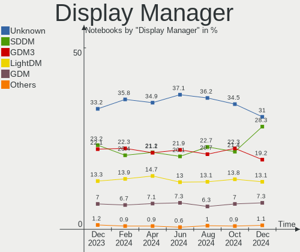
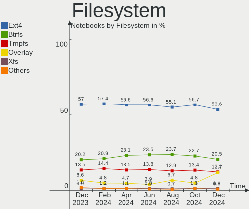
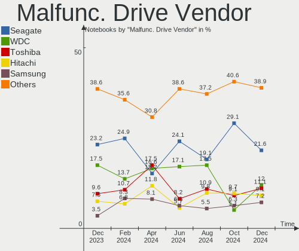
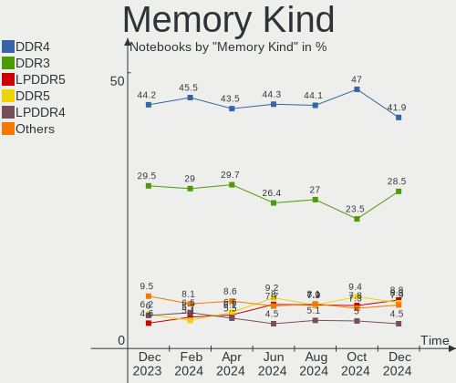

Linux Hardware Trends (Notebook)
--------------------------------

A project to identify most popular hardware characteristics and track their change
over time based on data collected by Linux users at https://Linux-Hardware.org.

Anyone can contribute to the study by uploading probes of their computers by
the [hw-probe](https://github.com/linuxhw/hw-probe) tool:

    sudo -E hw-probe -all -upload

Full-feature report is available here: https://linux-hardware.org/?view=trends&formfactor=notebook

Period: Mar, 2021.

Contents
--------

- [ OS                       ](#os)
- [ OS Family                ](#os-family)
- [ Kernel                   ](#kernel)
- [ Kernel Family            ](#kernel-family)
- [ Kernel Major Ver.        ](#kernel-major-ver)
- [ Arch                     ](#arch)
- [ DE                       ](#de)
- [ Display Server           ](#display-server)
- [ Display Manager          ](#display-manager)
- [ OS Lang                  ](#os-lang)
- [ Boot Mode                ](#boot-mode)
- [ Filesystem               ](#filesystem)
- [ Part. scheme             ](#part-scheme)
- [ Dual Boot with Linux/BSD ](#dual-boot-with-linux/bsd)
- [ Dual Boot (Win)          ](#dual-boot-win)
- [ Country                  ](#country)
- [ City                     ](#city)
- [ Vendor                   ](#vendor)
- [ Model                    ](#model)
- [ Model Family             ](#model-family)
- [ MFG Year                 ](#mfg-year)
- [ Form Factor              ](#form-factor)
- [ Secure Boot              ](#secure-boot)
- [ Coreboot                 ](#coreboot)
- [ RAM Size                 ](#ram-size)
- [ RAM Used                 ](#ram-used)
- [ Has CD-ROM               ](#has-cd-rom)
- [ Total Drives             ](#total-drives)
- [ Has Ethernet             ](#has-ethernet)
- [ Has WiFi                 ](#has-wifi)
- [ Has Bluetooth            ](#has-bluetooth)
- [ Drive Vendor             ](#drive-vendor)
- [ Drive Model              ](#drive-model)
- [ HDD Vendor               ](#hdd-vendor)
- [ SSD Vendor               ](#ssd-vendor)
- [ Drive Kind               ](#drive-kind)
- [ Drive Connector          ](#drive-connector)
- [ Drive Size               ](#drive-size)
- [ Space Total              ](#space-total)
- [ Space Used               ](#space-used)
- [ Malfunc. Drives          ](#malfunc-drives)
- [ Malfunc. Drive Vendor    ](#malfunc-drive-vendor)
- [ Malfunc. HDD Vendor      ](#malfunc-hdd-vendor)
- [ Malfunc. Drive Kind      ](#malfunc-drive-kind)
- [ Failed Drives            ](#failed-drives)
- [ Failed Drive Vendor      ](#failed-drive-vendor)
- [ Drive Status             ](#drive-status)
- [ Storage Vendor           ](#storage-vendor)
- [ Storage Model            ](#storage-model)
- [ Storage Kind             ](#storage-kind)
- [ CPU Vendor               ](#cpu-vendor)
- [ CPU Model                ](#cpu-model)
- [ CPU Model Family         ](#cpu-model-family)
- [ CPU Cores                ](#cpu-cores)
- [ CPU Sockets              ](#cpu-sockets)
- [ CPU Threads              ](#cpu-threads)
- [ CPU Op-Modes             ](#cpu-op-modes)
- [ CPU Microcode            ](#cpu-microcode)
- [ CPU Microarch            ](#cpu-microarch)
- [ GPU Vendor               ](#gpu-vendor)
- [ GPU Model                ](#gpu-model)
- [ GPU Combo                ](#gpu-combo)
- [ GPU Driver               ](#gpu-driver)
- [ GPU Memory               ](#gpu-memory)
- [ Monitor Vendor           ](#monitor-vendor)
- [ Monitor Model            ](#monitor-model)
- [ Monitor Resolution       ](#monitor-resolution)
- [ Monitor Diagonal         ](#monitor-diagonal)
- [ Monitor Width            ](#monitor-width)
- [ Aspect Ratio             ](#aspect-ratio)
- [ Monitor Area             ](#monitor-area)
- [ Pixel Density            ](#pixel-density)
- [ Multiple Monitors        ](#multiple-monitors)
- [ Net Controller Vendor    ](#net-controller-vendor)
- [ Net Controller Model     ](#net-controller-model)
- [ Wireless Vendor          ](#wireless-vendor)
- [ Wireless Model           ](#wireless-model)
- [ Ethernet Vendor          ](#ethernet-vendor)
- [ Ethernet Model           ](#ethernet-model)
- [ Net Controller Kind      ](#net-controller-kind)
- [ Used Controller          ](#used-controller)
- [ NICs                     ](#nics)
- [ IPv6                     ](#ipv6)
- [ Memory Vendor            ](#memory-vendor)
- [ Memory Model             ](#memory-model)
- [ Memory Kind              ](#memory-kind)
- [ Memory Form Factor       ](#memory-form-factor)
- [ Memory Size              ](#memory-size)
- [ Memory Speed             ](#memory-speed)
- [ Sound Vendor             ](#sound-vendor)
- [ Sound Model              ](#sound-model)
- [ Camera Vendor            ](#camera-vendor)
- [ Camera Model             ](#camera-model)
- [ Fingerprint Vendor       ](#fingerprint-vendor)
- [ Fingerprint Model        ](#fingerprint-model)
- [ Chipcard Vendor          ](#chipcard-vendor)
- [ Chipcard Model           ](#chipcard-model)
- [ Printer Vendor           ](#printer-vendor)
- [ Printer Model            ](#printer-model)
- [ Scanner Vendor           ](#scanner-vendor)
- [ Scanner Model            ](#scanner-model)
- [ Bluetooth Vendor         ](#bluetooth-vendor)
- [ Bluetooth Model          ](#bluetooth-model)
- [ Unsupported Devices      ](#unsupported-devices)
- [ Unsupported Device Types ](#unsupported-device-types)

OS
--

Installed operating systems

| Name                | Notebooks | Percent |
|---------------------|-----------|---------|
| Ubuntu 20.04        | 568       | 19.87%  |
| OpenMandriva 4.2    | 280       | 9.79%   |
| Mint 20.1           | 225       | 7.87%   |
| Fedora 33           | 138       | 4.83%   |
| Ubuntu 20.10        | 134       | 4.69%   |
| Pop!_OS 20.10       | 121       | 4.23%   |
| BlackPanther 18.1   | 119       | 4.16%   |
| KDE neon 20.04      | 92        | 3.22%   |
| Ubuntu 18.04        | 79        | 2.76%   |
| ROSA R11.1          | 59        | 2.06%   |
| Endless 3.9.3       | 55        | 1.92%   |
| Xubuntu 20.04       | 53        | 1.85%   |
| Arch                | 52        | 1.82%   |
| Manjaro             | 51        | 1.78%   |
| Manjaro 20.2.1      | 47        | 1.64%   |
| Mint 19.3           | 42        | 1.47%   |
| Arch Rolling        | 42        | 1.47%   |
| Debian 10           | 38        | 1.33%   |
| Mint 20             | 36        | 1.26%   |
| ROSA R11            | 34        | 1.19%   |
| Zorin 15            | 32        | 1.12%   |
| Pop!_OS 20.04       | 32        | 1.12%   |
| Manjaro 21.0        | 30        | 1.05%   |
| Kubuntu 20.04       | 29        | 1.01%   |
| Debian Testing      | 20        | 0.7%    |
| Xubuntu 18.04       | 19        | 0.66%   |
| ArcoLinux Rolling   | 19        | 0.66%   |
| Kali 2021.1         | 17        | 0.59%   |
| Fedora 34           | 17        | 0.59%   |
| Kubuntu 20.10       | 16        | 0.56%   |
| Gentoo              | 13        | 0.45%   |
| Debian              | 13        | 0.45%   |
| Lubuntu 20.04       | 12        | 0.42%   |
| LMDE 4              | 12        | 0.42%   |
| Fedora 32           | 12        | 0.42%   |
| Ubuntu MATE 20.04   | 11        | 0.38%   |
| Xubuntu 20.10       | 9         | 0.31%   |
| openSUSE Leap-15.2  | 8         | 0.28%   |
| Ubuntu 16.04        | 7         | 0.24%   |
| Parrot 4.11         | 7         | 0.24%   |
| Lubuntu 18.04       | 7         | 0.24%   |
| Endless 3.7.8       | 7         | 0.24%   |
| Elementary 5.1.7    | 7         | 0.24%   |
| Ubuntu Budgie 20.04 | 6         | 0.21%   |
| Ubuntu 21.04        | 6         | 0.21%   |
| Peppermint 10       | 6         | 0.21%   |
| Gentoo 2.7          | 6         | 0.21%   |
| Debian Unstable     | 6         | 0.21%   |
| Reborn OS           | 5         | 0.17%   |
| MX 19.3             | 5         | 0.17%   |
| Mint 19             | 5         | 0.17%   |
| EndeavourOS Rolling | 5         | 0.17%   |
| Ubuntu MATE 20.10   | 4         | 0.14%   |
| Red OS 7.3          | 4         | 0.14%   |
| Mint 19.1           | 4         | 0.14%   |
| Garuda Soaring      | 4         | 0.14%   |
| Artix Rolling       | 4         | 0.14%   |
| ArcoLinux           | 4         | 0.14%   |
| Xubuntu 16.04       | 3         | 0.1%    |
| Ubuntu              | 3         | 0.1%    |

OS Family
---------

OS without a version

| Name          | Notebooks | Percent |
|---------------|-----------|---------|
| Ubuntu        | 802       | 28.05%  |
| Mint          | 316       | 11.05%  |
| OpenMandriva  | 280       | 9.79%   |
| Fedora        | 171       | 5.98%   |
| Pop!_OS       | 153       | 5.35%   |
| Manjaro       | 129       | 4.51%   |
| BlackPanther  | 122       | 4.27%   |
| ROSA          | 104       | 3.64%   |
| Arch          | 94        | 3.29%   |
| KDE neon      | 92        | 3.22%   |
| Xubuntu       | 86        | 3.01%   |
| Debian        | 82        | 2.87%   |
| Endless       | 68        | 2.38%   |
| Kubuntu       | 48        | 1.68%   |
| Zorin         | 32        | 1.12%   |
| openSUSE      | 28        | 0.98%   |
| Lubuntu       | 23        | 0.8%    |
| ArcoLinux     | 23        | 0.8%    |
| Kali          | 20        | 0.7%    |
| Gentoo        | 20        | 0.7%    |
| Ubuntu MATE   | 18        | 0.63%   |
| LMDE          | 12        | 0.42%   |
| Clear Linux   | 12        | 0.42%   |
| Ubuntu Budgie | 9         | 0.31%   |
| Elementary    | 9         | 0.31%   |
| Parrot        | 8         | 0.28%   |
| EndeavourOS   | 7         | 0.24%   |
| Peppermint    | 6         | 0.21%   |
| MX            | 6         | 0.21%   |
| Garuda        | 6         | 0.21%   |
| Artix         | 6         | 0.21%   |
| Reborn OS     | 5         | 0.17%   |
| RELS          | 4         | 0.14%   |
| Red OS        | 4         | 0.14%   |
| CentOS        | 4         | 0.14%   |
| Slackware     | 3         | 0.1%    |
| RHEL          | 3         | 0.1%    |
| GNOME OS      | 3         | 0.1%    |
| antiX         | 3         | 0.1%    |
| ALT Linux     | 3         | 0.1%    |
| Sparky        | 2         | 0.07%   |
| Q4OS          | 2         | 0.07%   |
| PCLinuxOS     | 2         | 0.07%   |
| Oracle Linux  | 2         | 0.07%   |
| LFS           | 2         | 0.07%   |
| Freedesktop   | 2         | 0.07%   |
| Calculate     | 2         | 0.07%   |
| antergos      | 2         | 0.07%   |
| AlmaLinux     | 2         | 0.07%   |
| Void          | 1         | 0.03%   |
| Trisquel      | 1         | 0.03%   |
| Sonar         | 1         | 0.03%   |
| Solus         | 1         | 0.03%   |
| Siduction     | 1         | 0.03%   |
| Scientific    | 1         | 0.03%   |
| RED           | 1         | 0.03%   |
| NixOS         | 1         | 0.03%   |
| Mageia        | 1         | 0.03%   |
| Libreelec     | 1         | 0.03%   |
| LibertyOS     | 1         | 0.03%   |

Kernel
------

Version of the Linux kernel

| Version                             | Notebooks | Percent |
|-------------------------------------|-----------|---------|
| 5.4.0-66-generic                    | 293       | 10.25%  |
| 5.8.0-44-generic                    | 281       | 9.83%   |
| 5.10.14-desktop-1omv4002            | 277       | 9.69%   |
| 5.8.0-45-generic                    | 171       | 5.98%   |
| 5.4.0-67-generic                    | 158       | 5.53%   |
| 5.8.0-7642-generic                  | 130       | 4.55%   |
| 5.8.0-48-generic                    | 127       | 4.44%   |
| 5.4.0-70-generic                    | 88        | 3.08%   |
| 5.6.14-desktop-2bP                  | 79        | 2.76%   |
| 5.8.0-14-generic                    | 58        | 2.03%   |
| 5.10.19-200.fc33.x86_64             | 42        | 1.47%   |
| 5.9.16-1-MANJARO                    | 41        | 1.43%   |
| 4.18.16-desktop-1bP                 | 39        | 1.36%   |
| 5.8.0-43-generic                    | 35        | 1.22%   |
| 4.15.0-desktop-45.1rosa-x86_64      | 28        | 0.98%   |
| 4.15.0-136-generic                  | 28        | 0.98%   |
| 5.4.0-58-generic                    | 27        | 0.94%   |
| 4.19.0-14-amd64                     | 27        | 0.94%   |
| 5.10.22-200.fc33.x86_64             | 21        | 0.73%   |
| 5.4.0-65-generic                    | 20        | 0.7%    |
| 5.11.2-arch1-1                      | 20        | 0.7%    |
| 5.11.7-200.fc33.x86_64              | 19        | 0.66%   |
| 4.15.0-desktop-122.124.1rosa-x86_64 | 18        | 0.63%   |
| 5.11.6-arch1-1                      | 16        | 0.56%   |
| 5.11.6-1-MANJARO                    | 15        | 0.52%   |
| 5.4.0-42-generic                    | 13        | 0.45%   |
| 5.10.21-200.fc33.x86_64             | 13        | 0.45%   |
| 5.10.0-4-amd64                      | 13        | 0.45%   |
| 5.10.0-3-amd64                      | 13        | 0.45%   |
| 5.4.83-generic-2rosa-x86_64         | 12        | 0.42%   |
| 5.11.8-arch1-1                      | 12        | 0.42%   |
| 5.11.7-arch1-1                      | 12        | 0.42%   |
| 5.11.4-arch1-1                      | 11        | 0.38%   |
| 5.10.23-1-MANJARO                   | 11        | 0.38%   |
| 5.10.18-1-MANJARO                   | 11        | 0.38%   |
| 5.10.23-200.fc33.x86_64             | 10        | 0.35%   |
| 5.10.19-1-MANJARO                   | 10        | 0.35%   |
| 5.8.0-41-generic                    | 9         | 0.31%   |
| 5.8.0-25-generic                    | 9         | 0.31%   |
| 5.11.2-1-MANJARO                    | 9         | 0.31%   |
| 5.11.10-200.fc33.x86_64             | 9         | 0.31%   |
| 5.11.0-051100-generic               | 9         | 0.31%   |
| 5.10.0-kali3-amd64                  | 9         | 0.31%   |
| 5.6.0-1048-oem                      | 8         | 0.28%   |
| 5.4.32-generic-2rosa-x86_64         | 8         | 0.28%   |
| 5.4.0-26-generic                    | 8         | 0.28%   |
| 5.3.0-28-generic                    | 8         | 0.28%   |
| 5.11.10-arch1-1                     | 8         | 0.28%   |
| 5.10.19-1032.native                 | 8         | 0.28%   |
| 4.15.0-desktop-45.1rosa-i586        | 8         | 0.28%   |
| 5.11.6-1-default                    | 7         | 0.24%   |
| 5.11.2-zen1-1-zen                   | 7         | 0.24%   |
| 5.10.23-1-lts                       | 7         | 0.24%   |
| 5.10.18-200.fc33.x86_64             | 7         | 0.24%   |
| 5.10.0-kali4-amd64                  | 7         | 0.24%   |
| 5.10.0-5-amd64                      | 7         | 0.24%   |
| 4.15.0-desktop-122.124.1rosa-i586   | 7         | 0.24%   |
| 5.8.0-7630-generic                  | 6         | 0.21%   |
| 5.11.4-1-default                    | 6         | 0.21%   |
| 5.10.0-0.bpo.3-amd64                | 6         | 0.21%   |

Kernel Family
-------------

Linux kernel without a distro release

| Version | Notebooks | Percent |
|---------|-----------|---------|
| 5.8.0   | 850       | 29.73%  |
| 5.4.0   | 644       | 22.53%  |
| 5.10.14 | 278       | 9.72%   |
| 4.15.0  | 127       | 4.44%   |
| 5.6.14  | 79        | 2.76%   |
| 5.10.0  | 69        | 2.41%   |
| 5.10.19 | 68        | 2.38%   |
| 5.11.6  | 55        | 1.92%   |
| 5.11.2  | 45        | 1.57%   |
| 4.19.0  | 44        | 1.54%   |
| 5.9.16  | 43        | 1.5%    |
| 5.11.7  | 39        | 1.36%   |
| 4.18.16 | 39        | 1.36%   |
| 5.10.23 | 33        | 1.15%   |
| 5.11.0  | 28        | 0.98%   |
| 5.11.10 | 26        | 0.91%   |
| 5.11.4  | 25        | 0.87%   |
| 5.10.22 | 25        | 0.87%   |
| 5.11.8  | 22        | 0.77%   |
| 5.10.18 | 21        | 0.73%   |
| 5.4.83  | 19        | 0.66%   |
| 5.10.21 | 17        | 0.59%   |
| 5.6.0   | 16        | 0.56%   |
| 5.10.20 | 14        | 0.49%   |
| 5.3.0   | 13        | 0.45%   |
| 5.4.32  | 11        | 0.38%   |
| 5.12.0  | 9         | 0.31%   |
| 5.11.3  | 9         | 0.31%   |
| 5.3.18  | 8         | 0.28%   |
| 5.11.9  | 8         | 0.28%   |
| 5.10.24 | 8         | 0.28%   |
| 5.10.16 | 8         | 0.28%   |
| 4.18.0  | 8         | 0.28%   |
| 5.11.1  | 7         | 0.24%   |
| 5.11.5  | 6         | 0.21%   |
| 4.4.0   | 6         | 0.21%   |
| 5.4.105 | 5         | 0.17%   |
| 5.10.15 | 5         | 0.17%   |
| 3.10.0  | 5         | 0.17%   |
| 5.9.0   | 4         | 0.14%   |
| 5.7.0   | 4         | 0.14%   |
| 5.4.97  | 4         | 0.14%   |
| 5.0.0   | 4         | 0.14%   |
| 4.9.20  | 4         | 0.14%   |
| 4.9.155 | 4         | 0.14%   |
| 5.9.1   | 3         | 0.1%    |
| 5.8.18  | 3         | 0.1%    |
| 5.8.15  | 3         | 0.1%    |
| 5.4.100 | 3         | 0.1%    |
| 5.10.4  | 3         | 0.1%    |
| 5.10.25 | 3         | 0.1%    |
| 5.10.17 | 3         | 0.1%    |
| 5.10.12 | 3         | 0.1%    |
| 5.10.11 | 3         | 0.1%    |
| 5.10.1  | 3         | 0.1%    |
| 5.6.6   | 2         | 0.07%   |
| 5.4.17  | 2         | 0.07%   |
| 5.11.11 | 2         | 0.07%   |
| 5.10.8  | 2         | 0.07%   |
| 4.9.235 | 2         | 0.07%   |

Kernel Major Ver.
-----------------

Linux kernel major version

| Version | Notebooks | Percent |
|---------|-----------|---------|
| 5.8     | 860       | 30.08%  |
| 5.4     | 702       | 24.55%  |
| 5.10    | 571       | 19.97%  |
| 5.11    | 272       | 9.51%   |
| 4.15    | 127       | 4.44%   |
| 5.6     | 100       | 3.5%    |
| 5.9     | 56        | 1.96%   |
| 4.19    | 50        | 1.75%   |
| 4.18    | 47        | 1.64%   |
| 5.3     | 21        | 0.73%   |
| 4.9     | 16        | 0.56%   |
| 5.12    | 9         | 0.31%   |
| 5.7     | 6         | 0.21%   |
| 4.4     | 6         | 0.21%   |
| 5.0     | 5         | 0.17%   |
| 3.10    | 5         | 0.17%   |
| 5.2     | 1         | 0.03%   |
| 5.1     | 1         | 0.03%   |
| 4.16    | 1         | 0.03%   |
| 4.14    | 1         | 0.03%   |
| 4.13    | 1         | 0.03%   |
| 4.1     | 1         | 0.03%   |

Arch
----

OS architecture (x86_64, i586, etc.)

| Name    | Notebooks | Percent |
|---------|-----------|---------|
| x86_64  | 2753      | 96.29%  |
| i686    | 105       | 3.67%   |
| aarch64 | 1         | 0.03%   |

DE
--

Desktop Environment

| Name              | Notebooks | Percent |
|-------------------|-----------|---------|
| GNOME             | 1177      | 41.17%  |
| KDE5              | 568       | 19.87%  |
| X-Cinnamon        | 257       | 8.99%   |
| XFCE              | 219       | 7.66%   |
| KDE               | 174       | 6.09%   |
| Unknown           | 158       | 5.53%   |
| MATE              | 81        | 2.83%   |
| KDE4              | 71        | 2.48%   |
| i3                | 33        | 1.15%   |
| Cinnamon          | 24        | 0.84%   |
| LXQt              | 23        | 0.8%    |
| LXDE              | 17        | 0.59%   |
| Unity             | 13        | 0.45%   |
| Budgie            | 9         | 0.31%   |
| Deepin            | 6         | 0.21%   |
| Pantheon          | 5         | 0.17%   |
| GNOME Flashback   | 5         | 0.17%   |
| Enlightenment     | 3         | 0.1%    |
| DWM               | 3         | 0.1%    |
| qtile             | 2         | 0.07%   |
| openbox           | 2         | 0.07%   |
| icewm             | 2         | 0.07%   |
| Yaru:ubuntu:GNOME | 1         | 0.03%   |
| Sway              | 1         | 0.03%   |
| none+i3           | 1         | 0.03%   |
| lightdm-xsession  | 1         | 0.03%   |
| GNOME Classic     | 1         | 0.03%   |
| bspwm             | 1         | 0.03%   |
| awesome           | 1         | 0.03%   |

Display Server
--------------

X11 or Wayland

| Name    | Notebooks | Percent |
|---------|-----------|---------|
| X11     | 2543      | 88.95%  |
| Wayland | 219       | 7.66%   |
| Unknown | 68        | 2.38%   |
| Tty     | 29        | 1.01%   |

Display Manager
---------------

SDDM, LightDM, etc.

| Name    | Notebooks | Percent |
|---------|-----------|---------|
| Unknown | 1528      | 53.45%  |
| SDDM    | 590       | 20.64%  |
| GDM     | 378       | 13.22%  |
| TDM     | 226       | 7.9%    |
| KDM     | 71        | 2.48%   |
| LightDM | 49        | 1.71%   |
| XDM     | 11        | 0.38%   |
| SLiM    | 3         | 0.1%    |
| Ly      | 1         | 0.03%   |
| LXDM    | 1         | 0.03%   |
| GDM3    | 1         | 0.03%   |

OS Lang
-------

Language

| Lang        | Notebooks | Percent |
|-------------|-----------|---------|
| en_US       | 1074      | 37.57%  |
| ru_RU       | 208       | 7.28%   |
| de_DE       | 203       | 7.1%    |
| Unknown     | 188       | 6.58%   |
| pt_BR       | 181       | 6.33%   |
| fr_FR       | 135       | 4.72%   |
| en_GB       | 131       | 4.58%   |
| pl_PL       | 84        | 2.94%   |
| es_ES       | 75        | 2.62%   |
| it_IT       | 73        | 2.55%   |
| en_IN       | 55        | 1.92%   |
| en_CA       | 48        | 1.68%   |
| en_AU       | 33        | 1.15%   |
| C           | 29        | 1.01%   |
| cs_CZ       | 22        | 0.77%   |
| hu_HU       | 21        | 0.73%   |
| es_MX       | 21        | 0.73%   |
| nl_NL       | 19        | 0.66%   |
| tr_TR       | 17        | 0.59%   |
| es_AR       | 17        | 0.59%   |
| pt_PT       | 16        | 0.56%   |
| de_CH       | 11        | 0.38%   |
| zh_CN       | 9         | 0.31%   |
| fr_BE       | 9         | 0.31%   |
| es_CL       | 9         | 0.31%   |
| en_ZA       | 9         | 0.31%   |
| ru_UA       | 8         | 0.28%   |
| ro_RO       | 8         | 0.28%   |
| es_CO       | 8         | 0.28%   |
| en_IE       | 8         | 0.28%   |
| sv_SE       | 7         | 0.24%   |
| ja_JP       | 7         | 0.24%   |
| fi_FI       | 7         | 0.24%   |
| da_DK       | 7         | 0.24%   |
| fr_CA       | 6         | 0.21%   |
| en_NZ       | 6         | 0.21%   |
| de_AT       | 6         | 0.21%   |
| ca_ES       | 6         | 0.21%   |
| en_IL       | 5         | 0.17%   |
| uk_UA       | 4         | 0.14%   |
| es_PE       | 4         | 0.14%   |
| es_GT       | 4         | 0.14%   |
| en_PH       | 4         | 0.14%   |
| el_GR       | 4         | 0.14%   |
| bg_BG       | 4         | 0.14%   |
| nl_BE       | 3         | 0.1%    |
| fr_CH       | 3         | 0.1%    |
| es_VE       | 3         | 0.1%    |
| es_US       | 3         | 0.1%    |
| es_EC       | 3         | 0.1%    |
| sk_SK       | 2         | 0.07%   |
| ru_RU.UTF_8 | 2         | 0.07%   |
| lt_LT       | 2         | 0.07%   |
| es_UY       | 2         | 0.07%   |
| es_CR       | 2         | 0.07%   |
| de_IT       | 2         | 0.07%   |
| zh_TW       | 1         | 0.03%   |
| szl_PL      | 1         | 0.03%   |
| ru_RU.UTF8  | 1         | 0.03%   |
| POSIX       | 1         | 0.03%   |

Boot Mode
---------

EFI or BIOS

| Mode | Notebooks | Percent |
|------|-----------|---------|
| BIOS | 1482      | 51.84%  |
| EFI  | 1377      | 48.16%  |

Filesystem
----------

Type of filesystem

| Type     | Notebooks | Percent |
|----------|-----------|---------|
| Ext4     | 2234      | 78.14%  |
| Overlay  | 354       | 12.38%  |
| Btrfs    | 198       | 6.93%   |
| Xfs      | 37        | 1.29%   |
| Zfs      | 14        | 0.49%   |
| Tmpfs    | 5         | 0.17%   |
| Ext2     | 5         | 0.17%   |
| F2fs     | 3         | 0.1%    |
| Ext3     | 3         | 0.1%    |
| Unknown  | 3         | 0.1%    |
| Reiserfs | 2         | 0.07%   |
| Jfs      | 1         | 0.03%   |

Part. scheme
------------

Scheme of partitioning

| Type    | Notebooks | Percent |
|---------|-----------|---------|
| Unknown | 1490      | 52.12%  |
| GPT     | 923       | 32.28%  |
| MBR     | 446       | 15.6%   |

Dual Boot with Linux/BSD
------------------------

Hosting more than one Linux/BSD

| Dual boot | Notebooks | Percent |
|-----------|-----------|---------|
| No        | 2477      | 86.64%  |
| Yes       | 382       | 13.36%  |

Dual Boot (Win)
---------------

Hosting Linux and Windows

| Dual boot | Notebooks | Percent |
|-----------|-----------|---------|
| No        | 2082      | 72.82%  |
| Yes       | 777       | 27.18%  |

Country
-------

Geographic location (country)

| Country      | Notebooks | Percent |
|--------------|-----------|---------|
| USA          | 394       | 13.78%  |
| Germany      | 278       | 9.72%   |
| Russia       | 256       | 8.95%   |
| Brazil       | 219       | 7.66%   |
| France       | 151       | 5.28%   |
| Hungary      | 116       | 4.06%   |
| Poland       | 107       | 3.74%   |
| Italy        | 101       | 3.53%   |
| UK           | 96        | 3.36%   |
| Spain        | 96        | 3.36%   |
| Ukraine      | 73        | 2.55%   |
| Canada       | 70        | 2.45%   |
| India        | 69        | 2.41%   |
| Netherlands  | 49        | 1.71%   |
| Turkey       | 40        | 1.4%    |
| Australia    | 35        | 1.22%   |
| Mexico       | 33        | 1.15%   |
| Czechia      | 33        | 1.15%   |
| Sweden       | 32        | 1.12%   |
| Belgium      | 30        | 1.05%   |
| Switzerland  | 28        | 0.98%   |
| Romania      | 27        | 0.94%   |
| Portugal     | 24        | 0.84%   |
| Austria      | 23        | 0.8%    |
| Japan        | 20        | 0.7%    |
| Finland      | 20        | 0.7%    |
| Argentina    | 20        | 0.7%    |
| Bulgaria     | 19        | 0.66%   |
| Belarus      | 19        | 0.66%   |
| Chile        | 17        | 0.59%   |
| South Africa | 15        | 0.52%   |
| Indonesia    | 15        | 0.52%   |
| Greece       | 15        | 0.52%   |
| Serbia       | 14        | 0.49%   |
| Norway       | 13        | 0.45%   |
| Denmark      | 13        | 0.45%   |
| Colombia     | 13        | 0.45%   |
| Slovakia     | 12        | 0.42%   |
| Israel       | 12        | 0.42%   |
| China        | 12        | 0.42%   |
| Philippines  | 10        | 0.35%   |
| Bangladesh   | 8         | 0.28%   |
| Vietnam      | 7         | 0.24%   |
| Singapore    | 7         | 0.24%   |
| New Zealand  | 7         | 0.24%   |
| Malaysia     | 7         | 0.24%   |
| Kenya        | 7         | 0.24%   |
| Ireland      | 7         | 0.24%   |
| Egypt        | 7         | 0.24%   |
| Lithuania    | 6         | 0.21%   |
| Kazakhstan   | 6         | 0.21%   |
| Guatemala    | 6         | 0.21%   |
| Venezuela    | 5         | 0.17%   |
| Taiwan       | 5         | 0.17%   |
| South Korea  | 5         | 0.17%   |
| Slovenia     | 5         | 0.17%   |
| Pakistan     | 5         | 0.17%   |
| Iran         | 5         | 0.17%   |
| Hong Kong    | 5         | 0.17%   |
| Croatia      | 5         | 0.17%   |

City
----

Geographic location (city)

| City              | Notebooks | Percent |
|-------------------|-----------|---------|
| Moscow            | 60        | 2.1%    |
| Budapest          | 35        | 1.22%   |
| St Petersburg     | 32        | 1.12%   |
| São Paulo        | 28        | 0.98%   |
| Warsaw            | 23        | 0.8%    |
| Berlin            | 23        | 0.8%    |
| Paris             | 20        | 0.7%    |
| Madrid            | 19        | 0.66%   |
| Kyiv              | 19        | 0.66%   |
| Istanbul          | 19        | 0.66%   |
| Vienna            | 16        | 0.56%   |
| Rome              | 16        | 0.56%   |
| Frankfurt am Main | 15        | 0.52%   |
| Minsk             | 14        | 0.49%   |
| Yekaterinburg     | 13        | 0.45%   |
| Milan             | 13        | 0.45%   |
| Sofia             | 12        | 0.42%   |
| Prague            | 12        | 0.42%   |
| Montreal          | 12        | 0.42%   |
| Krasnodar         | 11        | 0.38%   |
| Novosibirsk       | 10        | 0.35%   |
| London            | 10        | 0.35%   |
| Athens            | 10        | 0.35%   |
| Amsterdam         | 10        | 0.35%   |
| Lisbon            | 9         | 0.31%   |
| Hamburg           | 9         | 0.31%   |
| Bengaluru         | 9         | 0.31%   |
| Wroclaw           | 8         | 0.28%   |
| Santiago          | 8         | 0.28%   |
| Munich            | 8         | 0.28%   |
| Krakow            | 8         | 0.28%   |
| Campinas          | 8         | 0.28%   |
| Toronto           | 7         | 0.24%   |
| Stockholm         | 7         | 0.24%   |
| Singapore         | 7         | 0.24%   |
| Salvador          | 7         | 0.24%   |
| Rostov-on-Don     | 7         | 0.24%   |
| Rio de Janeiro    | 7         | 0.24%   |
| Nizhniy Novgorod  | 7         | 0.24%   |
| Nairobi           | 7         | 0.24%   |
| Chennai           | 7         | 0.24%   |
| Belgrade          | 7         | 0.24%   |
| Barcelona         | 7         | 0.24%   |
| Zurich            | 6         | 0.21%   |
| Toulouse          | 6         | 0.21%   |
| Sydney            | 6         | 0.21%   |
| Rockville         | 6         | 0.21%   |
| Pune              | 6         | 0.21%   |
| Poznan            | 6         | 0.21%   |
| Porto Alegre      | 6         | 0.21%   |
| Odessa            | 6         | 0.21%   |
| Los Angeles       | 6         | 0.21%   |
| Izmir             | 6         | 0.21%   |
| Helsinki          | 6         | 0.21%   |
| Dhaka             | 6         | 0.21%   |
| Brno              | 6         | 0.21%   |
| Brasília         | 6         | 0.21%   |
| Voronezh          | 5         | 0.17%   |
| Ufa               | 5         | 0.17%   |
| Tel Aviv          | 5         | 0.17%   |

Vendor
------

Motherboard manufacturer

| Name                  | Notebooks | Percent |
|-----------------------|-----------|---------|
| Lenovo                | 595       | 20.81%  |
| Hewlett-Packard       | 541       | 18.92%  |
| Dell                  | 486       | 17%     |
| ASUSTek Computer      | 332       | 11.61%  |
| Acer                  | 263       | 9.2%    |
| Toshiba               | 108       | 3.78%   |
| MSI                   | 60        | 2.1%    |
| Samsung Electronics   | 59        | 2.06%   |
| Apple                 | 51        | 1.78%   |
| Sony                  | 47        | 1.64%   |
| Notebook              | 23        | 0.8%    |
| Medion                | 23        | 0.8%    |
| Packard Bell          | 21        | 0.73%   |
| HUAWEI                | 20        | 0.7%    |
| Fujitsu               | 18        | 0.63%   |
| Unknown               | 14        | 0.49%   |
| TUXEDO                | 13        | 0.45%   |
| System76              | 13        | 0.45%   |
| Fujitsu Siemens       | 11        | 0.38%   |
| Positivo              | 10        | 0.35%   |
| Google                | 9         | 0.31%   |
| Alienware             | 8         | 0.28%   |
| Timi                  | 7         | 0.24%   |
| Clevo                 | 7         | 0.24%   |
| Razer                 | 6         | 0.21%   |
| eMachines             | 6         | 0.21%   |
| Pegatron              | 4         | 0.14%   |
| Panasonic             | 4         | 0.14%   |
| LG Electronics        | 4         | 0.14%   |
| Gateway               | 4         | 0.14%   |
| TrekStor              | 3         | 0.1%    |
| Philco                | 3         | 0.1%    |
| Gigabyte Technology   | 3         | 0.1%    |
| Compal                | 3         | 0.1%    |
| Wortmann AG           | 2         | 0.07%   |
| Tangent Computer      | 2         | 0.07%   |
| Schenker              | 2         | 0.07%   |
| PC Specialist         | 2         | 0.07%   |
| Micro Electronics     | 2         | 0.07%   |
| Mediacom              | 2         | 0.07%   |
| LINCPLUS              | 2         | 0.07%   |
| Itautec               | 2         | 0.07%   |
| IP3 Tech              | 2         | 0.07%   |
| Intel                 | 2         | 0.07%   |
| IDEALMAX              | 2         | 0.07%   |
| Exo                   | 2         | 0.07%   |
| EVOO Products Company | 2         | 0.07%   |
| Digibras              | 2         | 0.07%   |
| Chuwi                 | 2         | 0.07%   |
| AZW                   | 2         | 0.07%   |
| Alcor                 | 2         | 0.07%   |
| YiFang                | 1         | 0.03%   |
| ViewSonic             | 1         | 0.03%   |
| Thomson               | 1         | 0.03%   |
| TECNO                 | 1         | 0.03%   |
| Teclast               | 1         | 0.03%   |
| SLIMBOOK              | 1         | 0.03%   |
| Semp Toshiba          | 1         | 0.03%   |
| Quest                 | 1         | 0.03%   |
| Quanta                | 1         | 0.03%   |

Model
-----

Motherboard model

| Name                                       | Notebooks | Percent |
|--------------------------------------------|-----------|---------|
| HP Notebook                                | 26        | 0.91%   |
| Unknown                                    | 23        | 0.8%    |
| HP Pavilion dv6                            | 15        | 0.52%   |
| HP Pavilion g6                             | 14        | 0.49%   |
| Dell Latitude E6420                        | 13        | 0.45%   |
| HP Pavilion dv7                            | 12        | 0.42%   |
| Acer Nitro AN515-43                        | 12        | 0.42%   |
| Dell Latitude E6430                        | 11        | 0.38%   |
| HP Pavilion 15                             | 10        | 0.35%   |
| HP Pavilion Notebook                       | 9         | 0.31%   |
| Lenovo Legion 5 15ARH05 82B5               | 8         | 0.28%   |
| Dell XPS 15 9500                           | 8         | 0.28%   |
| Dell XPS 15 7590                           | 8         | 0.28%   |
| Dell XPS 13 9370                           | 8         | 0.28%   |
| Dell Latitude E6530                        | 8         | 0.28%   |
| Lenovo IdeaPad 330-15IKB 81DE              | 7         | 0.24%   |
| Lenovo G500 20236                          | 7         | 0.24%   |
| HP G62                                     | 7         | 0.24%   |
| HP EliteBook 840 G3                        | 7         | 0.24%   |
| HP 250 G1                                  | 7         | 0.24%   |
| HP 15                                      | 7         | 0.24%   |
| Dell Latitude D630                         | 7         | 0.24%   |
| Apple MacBookPro8,1                        | 7         | 0.24%   |
| Acer Nitro AN515-54                        | 7         | 0.24%   |
| Toshiba Satellite C660                     | 6         | 0.21%   |
| Lenovo Y520-15IKBN 80WK                    | 6         | 0.21%   |
| Lenovo Legion Y530-15ICH 81FV              | 6         | 0.21%   |
| HP Pavilion g7                             | 6         | 0.21%   |
| HP Laptop 15-db0xxx                        | 6         | 0.21%   |
| Dell XPS 13 9310                           | 6         | 0.21%   |
| Dell Latitude E6320                        | 6         | 0.21%   |
| Dell Latitude 5480                         | 6         | 0.21%   |
| ASUS ZenBook UX431DA_UM431DA               | 6         | 0.21%   |
| Lenovo IdeaPad L340-15IRH Gaming 81LK      | 5         | 0.17%   |
| Lenovo G50-45 80E3                         | 5         | 0.17%   |
| HP ProBook 650 G1                          | 5         | 0.17%   |
| HP EliteBook 8440p                         | 5         | 0.17%   |
| HP 255 G7 Notebook PC                      | 5         | 0.17%   |
| HP 250 G6 Notebook PC                      | 5         | 0.17%   |
| Dell XPS 13 7390                           | 5         | 0.17%   |
| Dell Precision 5550                        | 5         | 0.17%   |
| Dell Latitude E6410                        | 5         | 0.17%   |
| Dell Latitude E5470                        | 5         | 0.17%   |
| Dell Latitude E5440                        | 5         | 0.17%   |
| Dell Inspiron 7577                         | 5         | 0.17%   |
| Dell Inspiron 3521                         | 5         | 0.17%   |
| Dell G3 3579                               | 5         | 0.17%   |
| ASUS VivoBook_ASUSLaptop X509JA_X509JA     | 5         | 0.17%   |
| ASUS K53E                                  | 5         | 0.17%   |
| ASUS K52F                                  | 5         | 0.17%   |
| Apple MacBookPro9,2                        | 5         | 0.17%   |
| Acer Aspire A515-51G                       | 5         | 0.17%   |
| Acer Aspire 5735                           | 5         | 0.17%   |
| Lenovo ThinkPad X1 Carbon Gen 8 20U9CTO1WW | 4         | 0.14%   |
| Lenovo IdeaPad S145-15IWL 81S9             | 4         | 0.14%   |
| Lenovo IdeaPad 3 15IIL05 81WE              | 4         | 0.14%   |
| HUAWEI NBLK-WAX9X                          | 4         | 0.14%   |
| HUAWEI BOHK-WAX9X                          | 4         | 0.14%   |
| HP ProBook 640 G1                          | 4         | 0.14%   |
| HP ProBook 455 G7                          | 4         | 0.14%   |

Model Family
------------

Motherboard model prefix

| Name                  | Notebooks | Percent |
|-----------------------|-----------|---------|
| Lenovo ThinkPad       | 313       | 10.95%  |
| Dell Latitude         | 184       | 6.44%   |
| Acer Aspire           | 182       | 6.37%   |
| Dell Inspiron         | 155       | 5.42%   |
| Lenovo IdeaPad        | 135       | 4.72%   |
| HP Pavilion           | 118       | 4.13%   |
| HP EliteBook          | 86        | 3.01%   |
| Toshiba Satellite     | 85        | 2.97%   |
| HP ProBook            | 80        | 2.8%    |
| Dell XPS              | 65        | 2.27%   |
| HP Laptop             | 61        | 2.13%   |
| ASUS VivoBook         | 56        | 1.96%   |
| HP Compaq             | 32        | 1.12%   |
| Dell Precision        | 29        | 1.01%   |
| Acer Nitro            | 27        | 0.94%   |
| Lenovo Legion         | 26        | 0.91%   |
| HP Notebook           | 26        | 0.91%   |
| Dell Vostro           | 26        | 0.91%   |
| HP 250                | 24        | 0.84%   |
| ASUS ZenBook          | 23        | 0.8%    |
| Unknown               | 23        | 0.8%    |
| Packard Bell EasyNote | 19        | 0.66%   |
| HP ZBook              | 19        | 0.66%   |
| HP ENVY               | 15        | 0.52%   |
| Fujitsu LIFEBOOK      | 15        | 0.52%   |
| ASUS ROG              | 15        | 0.52%   |
| Toshiba PORTEGE       | 12        | 0.42%   |
| Dell G3               | 12        | 0.42%   |
| ASUS TUF              | 12        | 0.42%   |
| Acer Swift            | 11        | 0.38%   |
| Lenovo Yoga           | 10        | 0.35%   |
| HP 15                 | 10        | 0.35%   |
| Acer TravelMate       | 10        | 0.35%   |
| ASUS ASUS             | 9         | 0.31%   |
| Apple MacBookPro8     | 9         | 0.31%   |
| Medion AKOYA          | 8         | 0.28%   |
| HP 255                | 8         | 0.28%   |
| Acer Predator         | 8         | 0.28%   |
| Acer Extensa          | 8         | 0.28%   |
| Lenovo G500           | 7         | 0.24%   |
| HP G62                | 7         | 0.24%   |
| Fujitsu Siemens AMILO | 7         | 0.24%   |
| Dell Studio           | 7         | 0.24%   |
| TUXEDO InfinityBook   | 6         | 0.21%   |
| Razer Blade           | 6         | 0.21%   |
| MSI GL65              | 6         | 0.21%   |
| Lenovo Y520-15IKBN    | 6         | 0.21%   |
| Lenovo ThinkBook      | 6         | 0.21%   |
| HP Stream             | 6         | 0.21%   |
| HP OMEN               | 6         | 0.21%   |
| Apple MacBookPro9     | 6         | 0.21%   |
| Lenovo G50-45         | 5         | 0.17%   |
| HP Mini               | 5         | 0.17%   |
| ASUS K53E             | 5         | 0.17%   |
| ASUS K52F             | 5         | 0.17%   |
| Apple MacBookPro5     | 5         | 0.17%   |
| Apple MacBookPro11    | 5         | 0.17%   |
| Toshiba dynabook      | 4         | 0.14%   |
| Samsung R540          | 4         | 0.14%   |
| Samsung R530          | 4         | 0.14%   |

MFG Year
--------

Motherboard manufacture year

| Year    | Notebooks | Percent |
|---------|-----------|---------|
| 2020    | 667       | 23.33%  |
| 2019    | 364       | 12.73%  |
| 2018    | 251       | 8.78%   |
| 2013    | 206       | 7.21%   |
| 2011    | 197       | 6.89%   |
| 2012    | 155       | 5.42%   |
| 2014    | 143       | 5%      |
| 2016    | 141       | 4.93%   |
| 2010    | 139       | 4.86%   |
| 2017    | 134       | 4.69%   |
| 2015    | 133       | 4.65%   |
| 2009    | 99        | 3.46%   |
| 2008    | 84        | 2.94%   |
| 2021    | 77        | 2.69%   |
| 2007    | 41        | 1.43%   |
| 2006    | 19        | 0.66%   |
| 2005    | 5         | 0.17%   |
| Unknown | 2         | 0.07%   |
| 2003    | 1         | 0.03%   |
| 2002    | 1         | 0.03%   |

Form Factor
-----------

Physical design of the computer

| Name     | Notebooks | Percent |
|----------|-----------|---------|
| Notebook | 2859      | 100%    |

Secure Boot
-----------

Enabled or disabled

| State    | Notebooks | Percent |
|----------|-----------|---------|
| Disabled | 2623      | 91.75%  |
| Enabled  | 236       | 8.25%   |

Coreboot
--------

Have coreboot on board

| Used | Notebooks | Percent |
|------|-----------|---------|
| No   | 2838      | 99.27%  |
| Yes  | 21        | 0.73%   |

RAM Size
--------

Total RAM memory

| Size in GB  | Notebooks | Percent |
|-------------|-----------|---------|
| 4.01-8.0    | 839       | 29.35%  |
| 3.01-4.0    | 659       | 23.05%  |
| 8.01-16.0   | 470       | 16.44%  |
| 16.01-24.0  | 461       | 16.12%  |
| 1.01-2.0    | 149       | 5.21%   |
| 32.01-64.0  | 145       | 5.07%   |
| 2.01-3.0    | 74        | 2.59%   |
| 0.51-1.0    | 22        | 0.77%   |
| 24.01-32.0  | 21        | 0.73%   |
| 64.01-256.0 | 17        | 0.59%   |
| 0.01-0.5    | 2         | 0.07%   |

RAM Used
--------

Used RAM memory

| Used GB    | Notebooks | Percent |
|------------|-----------|---------|
| 1.01-2.0   | 1181      | 41.31%  |
| 2.01-3.0   | 617       | 21.58%  |
| 4.01-8.0   | 338       | 11.82%  |
| 3.01-4.0   | 304       | 10.63%  |
| 0.51-1.0   | 266       | 9.3%    |
| 8.01-16.0  | 96        | 3.36%   |
| 0.01-0.5   | 45        | 1.57%   |
| 16.01-24.0 | 8         | 0.28%   |
| 24.01-32.0 | 4         | 0.14%   |

Has CD-ROM
----------

Has CD-ROM on board

| Presented | Notebooks | Percent |
|-----------|-----------|---------|
| No        | 1645      | 57.54%  |
| Yes       | 1214      | 42.46%  |

Total Drives
------------

Number of drives on board

| Drives | Notebooks | Percent |
|--------|-----------|---------|
| 1      | 2067      | 72.3%   |
| 2      | 683       | 23.89%  |
| 3      | 62        | 2.17%   |
| 0      | 29        | 1.01%   |
| 4      | 11        | 0.38%   |
| 5      | 6         | 0.21%   |
| 7      | 1         | 0.03%   |

Has Ethernet
------------

Has Ethernet on board

| Presented | Notebooks | Percent |
|-----------|-----------|---------|
| Yes       | 2458      | 85.97%  |
| No        | 401       | 14.03%  |

Has WiFi
--------

Has WiFi module

| Presented | Notebooks | Percent |
|-----------|-----------|---------|
| Yes       | 2807      | 98.18%  |
| No        | 52        | 1.82%   |

Has Bluetooth
-------------

Has Bluetooth module

| Presented | Notebooks | Percent |
|-----------|-----------|---------|
| Yes       | 2126      | 74.36%  |
| No        | 733       | 25.64%  |

Drive Vendor
------------

Hard drive vendors

| Vendor                    | Notebooks | Drives | Percent |
|---------------------------|-----------|--------|---------|
| Samsung Electronics       | 507       | 544    | 14.47%  |
| WDC                       | 490       | 503    | 13.98%  |
| Seagate                   | 435       | 448    | 12.41%  |
| Toshiba                   | 343       | 353    | 9.79%   |
| SanDisk                   | 200       | 203    | 5.71%   |
| Kingston                  | 186       | 193    | 5.31%   |
| Unknown                   | 172       | 183    | 4.91%   |
| Hitachi                   | 145       | 148    | 4.14%   |
| Intel                     | 133       | 138    | 3.8%    |
| Crucial                   | 120       | 122    | 3.42%   |
| SK Hynix                  | 103       | 103    | 2.94%   |
| HGST                      | 95        | 97     | 2.71%   |
| Micron Technology         | 55        | 56     | 1.57%   |
| A-DATA Technology         | 54        | 54     | 1.54%   |
| LITEON                    | 35        | 35     | 1%      |
| Fujitsu                   | 27        | 27     | 0.77%   |
| China                     | 26        | 27     | 0.74%   |
| Apple                     | 23        | 25     | 0.66%   |
| KIOXIA                    | 20        | 20     | 0.57%   |
| SPCC                      | 17        | 17     | 0.49%   |
| Transcend                 | 16        | 16     | 0.46%   |
| PNY                       | 13        | 13     | 0.37%   |
| Phison                    | 13        | 14     | 0.37%   |
| LITEONIT                  | 13        | 14     | 0.37%   |
| Intenso                   | 12        | 12     | 0.34%   |
| ADATA Technology          | 12        | 12     | 0.34%   |
| OCZ                       | 11        | 12     | 0.31%   |
| Silicon Motion            | 10        | 10     | 0.29%   |
| GOODRAM                   | 10        | 10     | 0.29%   |
| Union Memory              | 9         | 9      | 0.26%   |
| Patriot                   | 9         | 9      | 0.26%   |
| JMicron                   | 8         | 8      | 0.23%   |
| Gigabyte Technology       | 8         | 8      | 0.23%   |
| Apacer                    | 8         | 8      | 0.23%   |
| Lexar                     | 7         | 7      | 0.2%    |
| Corsair                   | 7         | 7      | 0.2%    |
| XPG                       | 6         | 6      | 0.17%   |
| PLEXTOR                   | 6         | 6      | 0.17%   |
| Hewlett-Packard           | 5         | 5      | 0.14%   |
| BHT                       | 5         | 5      | 0.14%   |
| Union Memory (Shenzhen)   | 4         | 4      | 0.11%   |
| Team                      | 4         | 4      | 0.11%   |
| Solid State Storage       | 4         | 4      | 0.11%   |
| Mushkin                   | 4         | 4      | 0.11%   |
| Lenovo                    | 4         | 4      | 0.11%   |
| KingSpec                  | 4         | 4      | 0.11%   |
| TO Exter                  | 3         | 3      | 0.09%   |
| SABRENT                   | 3         | 4      | 0.09%   |
| Realtek Semiconductor     | 3         | 3      | 0.09%   |
| Micron/Crucial Technology | 3         | 3      | 0.09%   |
| LDLC                      | 3         | 3      | 0.09%   |
| KingFast                  | 3         | 3      | 0.09%   |
| KingDian                  | 3         | 3      | 0.09%   |
| ASMT                      | 3         | 3      | 0.09%   |
| Zheino                    | 2         | 2      | 0.06%   |
| XrayDisk                  | 2         | 2      | 0.06%   |
| W800S                     | 2         | 2      | 0.06%   |
| Vaseky                    | 2         | 2      | 0.06%   |
| TCSUNBOW                  | 2         | 2      | 0.06%   |
| Smartbuy                  | 2         | 2      | 0.06%   |

Drive Model
-----------

Hard drive models

| Model                               | Notebooks | Percent |
|-------------------------------------|-----------|---------|
| Seagate ST1000LM035-1RK172 1TB      | 72        | 2.01%   |
| Toshiba MQ01ABD100 1TB              | 43        | 1.2%    |
| Seagate ST1000LM024 HN-M101MBB 1TB  | 42        | 1.17%   |
| Unknown MMC Card  32GB              | 38        | 1.06%   |
| Seagate ST500LT012-1DG142 500GB     | 37        | 1.03%   |
| Samsung SSD 860 EVO 500GB           | 37        | 1.03%   |
| Toshiba MQ04ABF100 1TB              | 36        | 1%      |
| Kingston SA400S37240G 240GB SSD     | 35        | 0.98%   |
| Toshiba MQ01ABF050 500GB            | 33        | 0.92%   |
| Samsung NVMe SSD Drive 512GB        | 32        | 0.89%   |
| WDC WD10SPZX-21Z10T0 1TB            | 31        | 0.86%   |
| Kingston SA400S37120G 120GB SSD     | 30        | 0.84%   |
| Intel NVMe SSD Drive 512GB          | 28        | 0.78%   |
| Unknown MMC Card  64GB              | 25        | 0.7%    |
| Seagate ST9500325AS 500GB           | 24        | 0.67%   |
| Kingston SA400S37480G 480GB SSD     | 23        | 0.64%   |
| HGST HTS545050A7E680 500GB          | 23        | 0.64%   |
| Samsung SSD 850 EVO 500GB           | 22        | 0.61%   |
| Seagate ST500LM012 HN-M500MBB 500GB | 21        | 0.59%   |
| WDC WD10JPVX-22JC3T0 1TB            | 20        | 0.56%   |
| Sandisk NVMe SSD Drive 512GB        | 20        | 0.56%   |
| Samsung NVMe SSD Drive 256GB        | 20        | 0.56%   |
| HGST HTS721010A9E630 1TB            | 20        | 0.56%   |
| Samsung SSD 860 EVO 1TB             | 19        | 0.53%   |
| Crucial CT240BX500SSD1 240GB        | 19        | 0.53%   |
| SK Hynix NVMe SSD Drive 512GB       | 18        | 0.5%    |
| Toshiba MQ01ABD075 752GB            | 17        | 0.47%   |
| HGST HTS541010A9E680 1TB            | 17        | 0.47%   |
| SanDisk SSD PLUS 240GB              | 16        | 0.45%   |
| Sandisk NVMe SSD Drive 256GB        | 16        | 0.45%   |
| Samsung SSD 850 EVO 250GB           | 16        | 0.45%   |
| Seagate ST1000LM048-2E7172 1TB      | 15        | 0.42%   |
| Samsung NVMe SSD Drive 1TB          | 15        | 0.42%   |
| Crucial CT1000MX500SSD1 1TB         | 15        | 0.42%   |
| Seagate ST1000LM049-2GH172 1TB      | 14        | 0.39%   |
| Toshiba NVMe SSD Drive 512GB        | 13        | 0.36%   |
| Seagate ST500LT012-9WS142 500GB     | 13        | 0.36%   |
| Seagate ST2000LM007-1R8174 2TB      | 13        | 0.36%   |
| Kingston SV300S37A120G 120GB SSD    | 13        | 0.36%   |
| Hitachi HTS545050B9A300 500GB       | 13        | 0.36%   |
| Unknown MMC Card  128GB             | 12        | 0.33%   |
| Samsung SSD 860 EVO 250GB           | 12        | 0.33%   |
| Samsung NVMe SSD Drive 1024GB       | 12        | 0.33%   |
| Intel NVMe SSD Drive 256GB          | 12        | 0.33%   |
| Hitachi HTS545050A7E380 500GB       | 12        | 0.33%   |
| WDC WDS240G2G0A-00JH30 240GB SSD    | 11        | 0.31%   |
| WDC WD5000LPVX-22V0TT0 500GB        | 11        | 0.31%   |
| Toshiba MQ01ABD050 500GB            | 11        | 0.31%   |
| Seagate ST1000LX015-1U7172 1TB      | 11        | 0.31%   |
| Intel SSDPEKNW512G8 512GB           | 11        | 0.31%   |
| Hitachi HTS543232A7A384 320GB       | 11        | 0.31%   |
| WDC WD10JPCX-24UE4T0 1TB            | 10        | 0.28%   |
| Unknown MMC Card  16GB              | 10        | 0.28%   |
| Toshiba MQ01ACF050 500GB            | 10        | 0.28%   |
| Seagate ST9320325AS 320GB           | 10        | 0.28%   |
| Seagate ST1000LM014-1EJ164 1TB      | 10        | 0.28%   |
| Samsung SSD 970 EVO Plus 1TB        | 10        | 0.28%   |
| Samsung NVMe SSD Drive 500GB        | 10        | 0.28%   |
| Samsung HM321HI 320GB               | 10        | 0.28%   |
| Hitachi HTS723232A7A364 320GB       | 10        | 0.28%   |

HDD Vendor
----------

Hard disk drive vendors

| Vendor              | Notebooks | Drives | Percent |
|---------------------|-----------|--------|---------|
| Seagate             | 420       | 424    | 30.86%  |
| WDC                 | 361       | 363    | 26.52%  |
| Toshiba             | 256       | 256    | 18.81%  |
| Hitachi             | 145       | 148    | 10.65%  |
| HGST                | 95        | 97     | 6.98%   |
| Samsung Electronics | 35        | 35     | 2.57%   |
| Fujitsu             | 27        | 27     | 1.98%   |
| Apple               | 4         | 4      | 0.29%   |
| TO Exter            | 3         | 3      | 0.22%   |
| Intenso             | 3         | 3      | 0.22%   |
| IBM/Hitachi         | 2         | 2      | 0.15%   |
| USB3.0              | 1         | 1      | 0.07%   |
| Unknown             | 1         | 1      | 0.07%   |
| SILICONMOTION       | 1         | 1      | 0.07%   |
| Sabrent             | 1         | 2      | 0.07%   |
| QNAP                | 1         | 2      | 0.07%   |
| PHD 3.0             | 1         | 1      | 0.07%   |
| MARSHAL             | 1         | 1      | 0.07%   |
| LaCie               | 1         | 1      | 0.07%   |
| Generic-            | 1         | 1      | 0.07%   |
| ASMT                | 1         | 1      | 0.07%   |

SSD Vendor
----------

Solid state drive vendors

| Vendor              | Notebooks | Drives | Percent |
|---------------------|-----------|--------|---------|
| Samsung Electronics | 261       | 273    | 22.21%  |
| Kingston            | 156       | 162    | 13.28%  |
| SanDisk             | 133       | 135    | 11.32%  |
| Crucial             | 111       | 113    | 9.45%   |
| WDC                 | 69        | 69     | 5.87%   |
| A-DATA Technology   | 43        | 43     | 3.66%   |
| Intel               | 40        | 40     | 3.4%    |
| Micron Technology   | 34        | 35     | 2.89%   |
| LITEON              | 30        | 30     | 2.55%   |
| Toshiba             | 27        | 28     | 2.3%    |
| SK Hynix            | 27        | 27     | 2.3%    |
| China               | 26        | 27     | 2.21%   |
| Transcend           | 15        | 15     | 1.28%   |
| Apple               | 15        | 15     | 1.28%   |
| SPCC                | 14        | 14     | 1.19%   |
| LITEONIT            | 13        | 14     | 1.11%   |
| PNY                 | 12        | 12     | 1.02%   |
| OCZ                 | 11        | 12     | 0.94%   |
| GOODRAM             | 10        | 10     | 0.85%   |
| Patriot             | 9         | 9      | 0.77%   |
| Apacer              | 8         | 8      | 0.68%   |
| JMicron             | 6         | 6      | 0.51%   |
| Intenso             | 6         | 6      | 0.51%   |
| Unknown             | 5         | 5      | 0.43%   |
| PLEXTOR             | 5         | 5      | 0.43%   |
| Lexar               | 5         | 5      | 0.43%   |
| Gigabyte Technology | 5         | 5      | 0.43%   |
| Corsair             | 5         | 5      | 0.43%   |
| Team                | 4         | 4      | 0.34%   |
| Mushkin             | 4         | 4      | 0.34%   |
| Hewlett-Packard     | 4         | 4      | 0.34%   |
| Seagate             | 3         | 3      | 0.26%   |
| KingDian            | 3         | 3      | 0.26%   |
| BHT                 | 3         | 3      | 0.26%   |
| W800S               | 2         | 2      | 0.17%   |
| Vaseky              | 2         | 2      | 0.17%   |
| TCSUNBOW            | 2         | 2      | 0.17%   |
| Smartbuy            | 2         | 2      | 0.17%   |
| SMART               | 2         | 2      | 0.17%   |
| Pioneer             | 2         | 2      | 0.17%   |
| LONDISK             | 2         | 2      | 0.17%   |
| LDLC                | 2         | 2      | 0.17%   |
| KIOXIA-EXCERIA      | 2         | 2      | 0.17%   |
| KingSpec            | 2         | 2      | 0.17%   |
| Kingmax             | 2         | 2      | 0.17%   |
| External            | 2         | 2      | 0.17%   |
| Dogfish             | 2         | 2      | 0.17%   |
| ZTC                 | 1         | 1      | 0.09%   |
| ZOTAC               | 1         | 1      | 0.09%   |
| Zheino              | 1         | 1      | 0.09%   |
| XrayDisk            | 1         | 1      | 0.09%   |
| Verbatim            | 1         | 1      | 0.09%   |
| TSA                 | 1         | 1      | 0.09%   |
| Teclast             | 1         | 1      | 0.09%   |
| SABRENT             | 1         | 1      | 0.09%   |
| Phison              | 1         | 1      | 0.09%   |
| Netac               | 1         | 1      | 0.09%   |
| Neo Forza           | 1         | 1      | 0.09%   |
| Maxtor              | 1         | 1      | 0.09%   |
| lntenso             | 1         | 1      | 0.09%   |

Drive Kind
----------

HDD or SSD

| Kind    | Notebooks | Drives | Percent |
|---------|-----------|--------|---------|
| HDD     | 1330      | 1374   | 39.23%  |
| SSD     | 1099      | 1202   | 32.42%  |
| NVMe    | 746       | 810    | 22.01%  |
| MMC     | 154       | 166    | 4.54%   |
| Unknown | 61        | 67     | 1.8%    |

Drive Connector
---------------

SATA, SAS, NVMe, etc.

| Type | Notebooks | Drives | Percent |
|------|-----------|--------|---------|
| SATA | 2211      | 2520   | 68.66%  |
| NVMe | 746       | 810    | 23.17%  |
| MMC  | 154       | 166    | 4.78%   |
| SAS  | 109       | 123    | 3.39%   |

Drive Size
----------

Size of hard drive

| Size in TB | Notebooks | Drives | Percent |
|------------|-----------|--------|---------|
| 0.01-0.5   | 1599      | 1742   | 66.49%  |
| 0.51-1.0   | 735       | 759    | 30.56%  |
| 1.01-2.0   | 62        | 64     | 2.58%   |
| 4.01-10.0  | 7         | 8      | 0.29%   |
| 3.01-4.0   | 2         | 3      | 0.08%   |

Space Total
-----------

Amount of disk space available on the file system

| Size in GB     | Notebooks | Percent |
|----------------|-----------|---------|
| 101-250        | 764       | 26.72%  |
| 251-500        | 715       | 25.01%  |
| 501-1000       | 438       | 15.32%  |
| 1-20           | 255       | 8.92%   |
| 51-100         | 199       | 6.96%   |
| Unknown        | 154       | 5.39%   |
| 1001-2000      | 130       | 4.55%   |
| 21-50          | 128       | 4.48%   |
| More than 3000 | 44        | 1.54%   |
| 2001-3000      | 32        | 1.12%   |

Space Used
----------

Amount of used disk space

| Used GB        | Notebooks | Percent |
|----------------|-----------|---------|
| 1-20           | 1140      | 39.87%  |
| 21-50          | 492       | 17.21%  |
| 101-250        | 386       | 13.5%   |
| 51-100         | 353       | 12.35%  |
| 251-500        | 191       | 6.68%   |
| Unknown        | 154       | 5.39%   |
| 501-1000       | 88        | 3.08%   |
| 1001-2000      | 34        | 1.19%   |
| More than 3000 | 13        | 0.45%   |
| 2001-3000      | 8         | 0.28%   |

Malfunc. Drives
---------------

Drive models with a malfunction

| Model                                        | Notebooks | Drives | Percent |
|----------------------------------------------|-----------|--------|---------|
| HGST HTS545050A7E680 500GB                   | 13        | 13     | 4.35%   |
| Seagate ST500LT012-1DG142 500GB              | 12        | 12     | 4.01%   |
| Toshiba MQ01ABF050 500GB                     | 9         | 9      | 3.01%   |
| Toshiba MQ01ABD075 752GB                     | 6         | 6      | 2.01%   |
| Seagate ST500LT012-9WS142 500GB              | 6         | 6      | 2.01%   |
| WDC WD10JPVX-22JC3T0 1TB                     | 5         | 5      | 1.67%   |
| Seagate ST9320325AS 320GB                    | 5         | 5      | 1.67%   |
| Seagate ST1000LM024 HN-M101MBB 1TB           | 5         | 5      | 1.67%   |
| Hitachi HTS723232A7A364 320GB                | 5         | 5      | 1.67%   |
| Hitachi HTS545050B9A300 500GB                | 5         | 5      | 1.67%   |
| WDC WD10JPCX-24UE4T0 1TB                     | 4         | 4      | 1.34%   |
| Toshiba MQ01ABD050 500GB                     | 4         | 4      | 1.34%   |
| Seagate ST1000LM035-1RK172 1TB               | 4         | 4      | 1.34%   |
| HGST HTS545032A7E380 320GB                   | 4         | 4      | 1.34%   |
| WDC WD3200BEVT-80A0RT0 320GB                 | 3         | 3      | 1%      |
| Seagate ST9500420AS 500GB                    | 3         | 3      | 1%      |
| Seagate ST9500325AS 500GB                    | 3         | 3      | 1%      |
| LITEON CV8-8E128-HP 128GB SSD                | 3         | 3      | 1%      |
| Hitachi HTS547550A9E384 500GB                | 3         | 3      | 1%      |
| Hitachi HTS545050A7E380 500GB                | 3         | 3      | 1%      |
| Hitachi HTS543232A7A384 320GB                | 3         | 3      | 1%      |
| Hitachi HTS543216L9A300 160GB                | 3         | 3      | 1%      |
| Hitachi HTS542512K9SA00 120GB                | 3         | 3      | 1%      |
| HGST HTS541010A9E680 1TB                     | 3         | 3      | 1%      |
| WDC WDS120G2G0A-00JH30 120GB SSD             | 2         | 2      | 0.67%   |
| WDC WD3200BPVT-80ZEST0 320GB                 | 2         | 2      | 0.67%   |
| WDC WD3200BEVT-22A23T0 320GB                 | 2         | 2      | 0.67%   |
| Toshiba MQ01ACF050 500GB                     | 2         | 2      | 0.67%   |
| Toshiba MQ01ABD100 1TB                       | 2         | 2      | 0.67%   |
| Toshiba MK5076GSX 500GB                      | 2         | 2      | 0.67%   |
| Toshiba MK2555GSX 250GB                      | 2         | 2      | 0.67%   |
| SK Hynix SC401 SATA 512GB SSD                | 2         | 2      | 0.67%   |
| Seagate ST9320423AS 320GB                    | 2         | 2      | 0.67%   |
| Seagate ST320LT012-9WS14C 320GB              | 2         | 2      | 0.67%   |
| Seagate ST320LT007-9ZV142 320GB              | 2         | 2      | 0.67%   |
| Seagate ST250LM004 HN-M250MBB 250GB          | 2         | 2      | 0.67%   |
| Seagate ST2000LM007-1R8174 2TB               | 2         | 2      | 0.67%   |
| Seagate ST1000LX015-1U7172 1TB               | 2         | 2      | 0.67%   |
| Seagate ST1000LM049-2GH172 1TB               | 2         | 2      | 0.67%   |
| SanDisk SD9SN8W-128G-1006 128GB SSD          | 2         | 2      | 0.67%   |
| Samsung Electronics SSD 840 PRO Series 256GB | 2         | 2      | 0.67%   |
| Samsung Electronics HM641JI 640GB            | 2         | 2      | 0.67%   |
| Intel SSDSCKKF256G8H 256GB                   | 2         | 2      | 0.67%   |
| Intel SSDSC2BF180A5L 180GB                   | 2         | 2      | 0.67%   |
| Hitachi HTS547575A9E384 752GB                | 2         | 2      | 0.67%   |
| Hitachi HTS545025B9A300 250GB                | 2         | 2      | 0.67%   |
| HGST HTS725050A7E630 500GB                   | 2         | 2      | 0.67%   |
| HGST HTS721010A9E630 1TB                     | 2         | 2      | 0.67%   |
| HGST HTS541075A9E680 752GB                   | 2         | 2      | 0.67%   |
| Crucial CT525MX300SSD1 528GB                 | 2         | 2      | 0.67%   |
| Crucial CT1050MX300SSD1 1TB                  | 2         | 2      | 0.67%   |
| WDC WDS100T2B0B-00YS70 1TB SSD               | 1         | 1      | 0.33%   |
| WDC WD7500BPVT-80HXZT3 752GB                 | 1         | 1      | 0.33%   |
| WDC WD7500BPKT-75PK4T0 752GB                 | 1         | 1      | 0.33%   |
| WDC WD7500BPKT-00PK4T0 752GB                 | 1         | 1      | 0.33%   |
| WDC WD5000LPVX-22V0TT0 500GB                 | 1         | 1      | 0.33%   |
| WDC WD5000LPCX-24C6HT0 500GB                 | 1         | 1      | 0.33%   |
| WDC WD5000BPVT-22HXZT3 500GB                 | 1         | 1      | 0.33%   |
| WDC WD5000BPVT-00HXZT3 500GB                 | 1         | 1      | 0.33%   |
| WDC WD3200LPVT-00FMCT0 320GB                 | 1         | 1      | 0.33%   |

Malfunc. Drive Vendor
---------------------

Vendors of faulty drives

| Vendor              | Notebooks | Drives | Percent |
|---------------------|-----------|--------|---------|
| Seagate             | 67        | 67     | 22.48%  |
| Toshiba             | 47        | 47     | 15.77%  |
| WDC                 | 43        | 43     | 14.43%  |
| Hitachi             | 41        | 41     | 13.76%  |
| HGST                | 27        | 27     | 9.06%   |
| Samsung Electronics | 16        | 16     | 5.37%   |
| Intel               | 10        | 10     | 3.36%   |
| Crucial             | 7         | 7      | 2.35%   |
| SK Hynix            | 5         | 5      | 1.68%   |
| A-DATA Technology   | 5         | 5      | 1.68%   |
| SanDisk             | 4         | 5      | 1.34%   |
| Micron Technology   | 4         | 4      | 1.34%   |
| LITEON              | 4         | 4      | 1.34%   |
| Kingston            | 3         | 3      | 1.01%   |
| Fujitsu             | 3         | 3      | 1.01%   |
| Corsair             | 2         | 2      | 0.67%   |
| Unknown             | 1         | 1      | 0.34%   |
| TCSUNBOW            | 1         | 1      | 0.34%   |
| OCZ                 | 1         | 1      | 0.34%   |
| Neo Forza           | 1         | 1      | 0.34%   |
| lntenso             | 1         | 1      | 0.34%   |
| LITEONIT            | 1         | 1      | 0.34%   |
| KingSpec            | 1         | 1      | 0.34%   |
| China               | 1         | 1      | 0.34%   |
| Apple               | 1         | 1      | 0.34%   |
| 240G                | 1         | 1      | 0.34%   |

Malfunc. HDD Vendor
-------------------

Vendors of faulty HDD drives

| Vendor              | Notebooks | Drives | Percent |
|---------------------|-----------|--------|---------|
| Seagate             | 67        | 67     | 28.88%  |
| Toshiba             | 46        | 46     | 19.83%  |
| Hitachi             | 41        | 41     | 17.67%  |
| WDC                 | 40        | 40     | 17.24%  |
| HGST                | 27        | 27     | 11.64%  |
| Samsung Electronics | 8         | 8      | 3.45%   |
| Fujitsu             | 3         | 3      | 1.29%   |

Malfunc. Drive Kind
-------------------

Kinds of faulty drives

| Kind | Notebooks | Drives | Percent |
|------|-----------|--------|---------|
| HDD  | 232       | 232    | 78.11%  |
| SSD  | 63        | 65     | 21.21%  |
| NVMe | 2         | 2      | 0.67%   |

Failed Drives
-------------

Failed drive models

| Model                                 | Notebooks | Drives | Percent |
|---------------------------------------|-----------|--------|---------|
| Crucial CT500P2SSD8 500GB             | 2         | 2      | 50%     |
| Toshiba MQ01ABD075 752GB              | 1         | 1      | 25%     |
| Samsung Electronics SSD PM800 TM 64GB | 1         | 1      | 25%     |

Failed Drive Vendor
-------------------

Failed drive vendors

| Vendor              | Notebooks | Drives | Percent |
|---------------------|-----------|--------|---------|
| Crucial             | 2         | 2      | 50%     |
| Toshiba             | 1         | 1      | 25%     |
| Samsung Electronics | 1         | 1      | 25%     |

Drive Status
------------

Number of failed and malfunc. drives

| Status   | Notebooks | Drives | Percent |
|----------|-----------|--------|---------|
| Detected | 1590      | 2012   | 53.43%  |
| Works    | 1089      | 1304   | 36.59%  |
| Malfunc  | 293       | 299    | 9.85%   |
| Failed   | 4         | 4      | 0.13%   |

Storage Vendor
--------------

Storage controller vendors

| Vendor                           | Notebooks | Percent |
|----------------------------------|-----------|---------|
| Intel                            | 2135      | 65.61%  |
| AMD                              | 377       | 11.59%  |
| Samsung Electronics              | 228       | 7.01%   |
| Sandisk                          | 128       | 3.93%   |
| SK Hynix                         | 76        | 2.34%   |
| Toshiba America Info Systems     | 57        | 1.75%   |
| Kingston Technology Company      | 30        | 0.92%   |
| Nvidia                           | 28        | 0.86%   |
| KIOXIA                           | 26        | 0.8%    |
| ADATA Technology                 | 22        | 0.68%   |
| Micron Technology                | 21        | 0.65%   |
| Phison Electronics               | 20        | 0.61%   |
| Silicon Motion                   | 16        | 0.49%   |
| Union Memory (Shenzhen)          | 13        | 0.4%    |
| Micron/Crucial Technology        | 12        | 0.37%   |
| Realtek Semiconductor            | 9         | 0.28%   |
| Solid State Storage Technology   | 8         | 0.25%   |
| JMicron Technology               | 8         | 0.25%   |
| Silicon Integrated Systems [SiS] | 7         | 0.22%   |
| Lite-On Technology               | 7         | 0.22%   |
| VIA Technologies                 | 5         | 0.15%   |
| Marvell Technology Group         | 4         | 0.12%   |
| Lenovo                           | 4         | 0.12%   |
| Apple                            | 4         | 0.12%   |
| ASMedia Technology               | 3         | 0.09%   |
| Shenzhen Longsys Electronics     | 2         | 0.06%   |
| Seagate Technology               | 2         | 0.06%   |
| ULi Electronics                  | 1         | 0.03%   |
| Silicon Image                    | 1         | 0.03%   |

Storage Model
-------------

Storage controller models

| Model                                                                                  | Notebooks | Percent |
|----------------------------------------------------------------------------------------|-----------|---------|
| AMD FCH SATA Controller [AHCI mode]                                                    | 324       | 9.27%   |
| Intel 7 Series Chipset Family 6-port SATA Controller [AHCI mode]                       | 269       | 7.7%    |
| Intel Sunrise Point-LP SATA Controller [AHCI mode]                                     | 257       | 7.36%   |
| Intel 82801 Mobile SATA Controller [RAID mode]                                         | 205       | 5.87%   |
| Intel 6 Series/C200 Series Chipset Family 6 port Mobile SATA AHCI Controller           | 181       | 5.18%   |
| Samsung NVMe SSD Controller SM981/PM981/PM983                                          | 149       | 4.26%   |
| Intel 82801IBM/IEM (ICH9M/ICH9M-E) 4 port SATA Controller [AHCI mode]                  | 119       | 3.41%   |
| Intel 8 Series SATA Controller 1 [AHCI mode]                                           | 105       | 3.01%   |
| Intel Wildcat Point-LP SATA Controller [AHCI Mode]                                     | 95        | 2.72%   |
| Intel 5 Series/3400 Series Chipset 4 port SATA AHCI Controller                         | 91        | 2.6%    |
| Intel Cannon Lake Mobile PCH SATA AHCI Controller                                      | 88        | 2.52%   |
| Intel 8 Series/C220 Series Chipset Family 6-port SATA Controller 1 [AHCI mode]         | 83        | 2.38%   |
| Intel 82801HM/HEM (ICH8M/ICH8M-E) IDE Controller                                       | 73        | 2.09%   |
| Intel 82801HM/HEM (ICH8M/ICH8M-E) SATA Controller [AHCI mode]                          | 64        | 1.83%   |
| Intel HM170/QM170 Chipset SATA Controller [AHCI Mode]                                  | 60        | 1.72%   |
| Intel 5 Series/3400 Series Chipset 6 port SATA AHCI Controller                         | 52        | 1.49%   |
| Intel SSD 660P Series                                                                  | 50        | 1.43%   |
| Intel Cannon Point-LP SATA Controller [AHCI Mode]                                      | 44        | 1.26%   |
| Samsung NVMe Controller                                                                | 42        | 1.2%    |
| Sandisk WD Blue SN550 NVMe SSD                                                         | 39        | 1.12%   |
| Intel Comet Lake SATA AHCI Controller                                                  | 35        | 1%      |
| Intel Atom Processor E3800 Series SATA AHCI Controller                                 | 35        | 1%      |
| Sandisk WD Black SN750 / PC SN730 NVMe SSD                                             | 34        | 0.97%   |
| AMD SB7x0/SB8x0/SB9x0 SATA Controller [AHCI mode]                                      | 34        | 0.97%   |
| SK Hynix BC511                                                                         | 31        | 0.89%   |
| Intel NM10/ICH7 Family SATA Controller [AHCI mode]                                     | 30        | 0.86%   |
| Intel Atom/Celeron/Pentium Processor x5-E8000/J3xxx/N3xxx Series SATA Controller       | 30        | 0.86%   |
| Intel Volume Management Device NVMe RAID Controller                                    | 28        | 0.8%    |
| Toshiba America Info Systems XG6 NVMe SSD Controller                                   | 27        | 0.77%   |
| Intel Celeron/Pentium Silver Processor SATA Controller                                 | 27        | 0.77%   |
| KIOXIA Non-Volatile memory controller                                                  | 26        | 0.74%   |
| Intel Ice Lake-LP SATA Controller [AHCI mode]                                          | 26        | 0.74%   |
| Sandisk WD Blue SN500 / PC SN520 NVMe SSD                                              | 23        | 0.66%   |
| Intel 82801G (ICH7 Family) IDE Controller                                              | 22        | 0.63%   |
| Intel 400 Series Chipset Family SATA AHCI Controller                                   | 22        | 0.63%   |
| Micron Non-Volatile memory controller                                                  | 21        | 0.6%    |
| SK Hynix Non-Volatile memory controller                                                | 19        | 0.54%   |
| Samsung NVMe SSD Controller SM961/PM961/SM963                                          | 18        | 0.52%   |
| Toshiba America Info Systems BG3 NVMe SSD Controller                                   | 17        | 0.49%   |
| Intel Celeron N3350/Pentium N4200/Atom E3900 Series SATA AHCI Controller               | 17        | 0.49%   |
| Intel 82801GBM/GHM (ICH7-M Family) SATA Controller [IDE mode]                          | 17        | 0.49%   |
| Intel 82801GBM/GHM (ICH7-M Family) SATA Controller [AHCI mode]                         | 17        | 0.49%   |
| Sandisk WD Black 2018/SN750 / PC SN720 NVMe SSD                                        | 16        | 0.46%   |
| Phison E12 NVMe Controller                                                             | 15        | 0.43%   |
| Intel 7 Series Chipset Family 4-port SATA Controller [IDE mode]                        | 15        | 0.43%   |
| Intel 7 Series Chipset Family 2-port SATA Controller [IDE mode]                        | 15        | 0.43%   |
| SK Hynix BC501 NVMe Solid State Drive 512GB                                            | 14        | 0.4%    |
| Intel SSD Pro 7600p/760p/E 6100p Series                                                | 14        | 0.4%    |
| ADATA Non-Volatile memory controller                                                   | 14        | 0.4%    |
| Nvidia MCP79 AHCI Controller                                                           | 13        | 0.37%   |
| Kingston Company Company Non-Volatile memory controller                                | 13        | 0.37%   |
| Intel 6 Series/C200 Series Chipset Family Mobile SATA Controller (IDE mode, ports 0-3) | 13        | 0.37%   |
| AMD SB7x0/SB8x0/SB9x0 IDE Controller                                                   | 13        | 0.37%   |
| Union Memory (Shenzhen) Non-Volatile memory controller                                 | 12        | 0.34%   |
| Intel PROSet/Wireless WiFi Software extension                                          | 12        | 0.34%   |
| Intel 82801HM/HEM (ICH8M/ICH8M-E) SATA Controller [IDE mode]                           | 12        | 0.34%   |
| Intel 6 Series/C200 Series Chipset Family Mobile SATA Controller (IDE mode, ports 4-5) | 11        | 0.31%   |
| Intel 5 Series/3400 Series Chipset 4 port SATA IDE Controller                          | 11        | 0.31%   |
| Silicon Motion SM2263EN/SM2263XT SSD Controller                                        | 10        | 0.29%   |
| Sandisk Non-Volatile memory controller                                                 | 10        | 0.29%   |

Storage Kind
------------

Kind of storage controller (IDE, SATA, NVMe, SAS, ...)

| Kind | Notebooks | Percent |
|------|-----------|---------|
| SATA | 2180      | 64.5%   |
| NVMe | 747       | 22.1%   |
| IDE  | 229       | 6.78%   |
| RAID | 224       | 6.63%   |

CPU Vendor
----------

Processor vendors

| Vendor       | Notebooks | Percent |
|--------------|-----------|---------|
| Intel        | 2392      | 83.67%  |
| AMD          | 465       | 16.26%  |
| CentaurHauls | 1         | 0.03%   |
| ARM          | 1         | 0.03%   |

CPU Model
---------

Processor models

| Model                                         | Notebooks | Percent |
|-----------------------------------------------|-----------|---------|
| Intel Core i5-8250U CPU @ 1.60GHz             | 61        | 2.13%   |
| Intel Core i7-8550U CPU @ 1.80GHz             | 47        | 1.64%   |
| Intel Core i7-10510U CPU @ 1.80GHz            | 47        | 1.64%   |
| AMD Ryzen 5 3500U with Radeon Vega Mobile Gfx | 47        | 1.64%   |
| Intel Core i5-2520M CPU @ 2.50GHz             | 45        | 1.57%   |
| Intel Core i5-8265U CPU @ 1.60GHz             | 41        | 1.43%   |
| Intel Core i5-7200U CPU @ 2.50GHz             | 41        | 1.43%   |
| Intel Core i7-9750H CPU @ 2.60GHz             | 37        | 1.29%   |
| Intel Core i7-8565U CPU @ 1.80GHz             | 33        | 1.15%   |
| Intel Core i7-10750H CPU @ 2.60GHz            | 32        | 1.12%   |
| Intel Core i5-6200U CPU @ 2.30GHz             | 31        | 1.08%   |
| Intel Core i5-3320M CPU @ 2.60GHz             | 31        | 1.08%   |
| Intel Core i7-8750H CPU @ 2.20GHz             | 30        | 1.05%   |
| Intel Core i7-7700HQ CPU @ 2.80GHz            | 29        | 1.01%   |
| Intel Core i5-5300U CPU @ 2.30GHz             | 28        | 0.98%   |
| Intel Core i5-5200U CPU @ 2.20GHz             | 28        | 0.98%   |
| Intel 11th Gen Core i7-1165G7 @ 2.80GHz       | 28        | 0.98%   |
| Intel Core i7-7500U CPU @ 2.70GHz             | 26        | 0.91%   |
| Intel Core i5-3210M CPU @ 2.50GHz             | 25        | 0.87%   |
| AMD Ryzen 5 4500U with Radeon Graphics        | 25        | 0.87%   |
| AMD Ryzen 7 4800H with Radeon Graphics        | 23        | 0.8%    |
| Intel Core i5-4210U CPU @ 1.70GHz             | 22        | 0.77%   |
| Intel Core i5-1035G1 CPU @ 1.00GHz            | 22        | 0.77%   |
| Intel Core i7-6700HQ CPU @ 2.60GHz            | 20        | 0.7%    |
| Intel Core i7-6500U CPU @ 2.50GHz             | 20        | 0.7%    |
| Intel Core i7-2670QM CPU @ 2.20GHz            | 20        | 0.7%    |
| Intel Core i5-6300U CPU @ 2.40GHz             | 20        | 0.7%    |
| Intel Core i5-2450M CPU @ 2.50GHz             | 20        | 0.7%    |
| Intel Core i3-6006U CPU @ 2.00GHz             | 20        | 0.7%    |
| Intel Core i3-2310M CPU @ 2.10GHz             | 19        | 0.66%   |
| Intel Core i5-9300H CPU @ 2.40GHz             | 18        | 0.63%   |
| AMD Ryzen 5 2500U with Radeon Vega Mobile Gfx | 18        | 0.63%   |
| Intel Core i7-3520M CPU @ 2.90GHz             | 17        | 0.59%   |
| Intel Core i5-4300U CPU @ 1.90GHz             | 17        | 0.59%   |
| Intel Core i5-4200U CPU @ 1.60GHz             | 17        | 0.59%   |
| Intel Core i5-3230M CPU @ 2.60GHz             | 17        | 0.59%   |
| Intel Core i3-5005U CPU @ 2.00GHz             | 17        | 0.59%   |
| Intel Core i3-3110M CPU @ 2.40GHz             | 17        | 0.59%   |
| Intel 11th Gen Core i5-1135G7 @ 2.40GHz       | 17        | 0.59%   |
| Intel Core i3-3120M CPU @ 2.50GHz             | 16        | 0.56%   |
| Intel Core i3 CPU M 380 @ 2.53GHz             | 16        | 0.56%   |
| Intel Celeron CPU N3060 @ 1.60GHz             | 16        | 0.56%   |
| AMD Ryzen 7 3700U with Radeon Vega Mobile Gfx | 16        | 0.56%   |
| Intel Core i5-10210U CPU @ 1.60GHz            | 15        | 0.52%   |
| Intel Core i3 CPU M 370 @ 2.40GHz             | 15        | 0.52%   |
| Intel Atom CPU N450 @ 1.66GHz                 | 15        | 0.52%   |
| AMD Ryzen 7 3750H with Radeon Vega Mobile Gfx | 15        | 0.52%   |
| Intel Core i5-8300H CPU @ 2.30GHz             | 14        | 0.49%   |
| Intel Core i5-2410M CPU @ 2.30GHz             | 14        | 0.49%   |
| Intel Core i3-7020U CPU @ 2.30GHz             | 14        | 0.49%   |
| Intel Core 2 Duo CPU P8600 @ 2.40GHz          | 14        | 0.49%   |
| AMD Ryzen 7 4700U with Radeon Graphics        | 14        | 0.49%   |
| Intel Core i7-5500U CPU @ 2.40GHz             | 13        | 0.45%   |
| Intel Core i3-2350M CPU @ 2.30GHz             | 13        | 0.45%   |
| Intel Core i3-1005G1 CPU @ 1.20GHz            | 13        | 0.45%   |
| Intel Core 2 Duo CPU P8700 @ 2.53GHz          | 13        | 0.45%   |
| AMD Ryzen 7 PRO 4750U with Radeon Graphics    | 13        | 0.45%   |
| Intel Pentium CPU N3710 @ 1.60GHz             | 12        | 0.42%   |
| Intel Core i7-6600U CPU @ 2.60GHz             | 12        | 0.42%   |
| Intel Core i7-3632QM CPU @ 2.20GHz            | 12        | 0.42%   |

CPU Model Family
----------------

Processor model prefix

| Model                                | Notebooks | Percent |
|--------------------------------------|-----------|---------|
| Intel Core i5                        | 743       | 25.99%  |
| Intel Core i7                        | 689       | 24.1%   |
| Intel Core i3                        | 287       | 10.04%  |
| Intel Core 2 Duo                     | 159       | 5.56%   |
| Intel Celeron                        | 124       | 4.34%   |
| AMD Ryzen 5                          | 114       | 3.99%   |
| Intel Pentium                        | 108       | 3.78%   |
| AMD Ryzen 7                          | 78        | 2.73%   |
| Other                                | 77        | 2.69%   |
| Intel Atom                           | 71        | 2.48%   |
| Intel Pentium Dual-Core              | 31        | 1.08%   |
| AMD A4                               | 29        | 1.01%   |
| AMD A6                               | 25        | 0.87%   |
| AMD Ryzen 3                          | 24        | 0.84%   |
| AMD A10                              | 23        | 0.8%    |
| AMD E1                               | 22        | 0.77%   |
| Intel Pentium Dual                   | 21        | 0.73%   |
| AMD E                                | 18        | 0.63%   |
| AMD A8                               | 18        | 0.63%   |
| Intel Core i9                        | 17        | 0.59%   |
| Intel Core 2                         | 17        | 0.59%   |
| AMD Ryzen 7 PRO                      | 17        | 0.59%   |
| Intel Genuine                        | 16        | 0.56%   |
| AMD E2                               | 15        | 0.52%   |
| Intel Pentium Silver                 | 7         | 0.24%   |
| Intel Celeron M                      | 7         | 0.24%   |
| Intel Celeron Dual-Core              | 7         | 0.24%   |
| AMD Ryzen 9                          | 6         | 0.21%   |
| AMD Ryzen 5 PRO                      | 6         | 0.21%   |
| AMD Phenom II                        | 6         | 0.21%   |
| Intel Core m3                        | 5         | 0.17%   |
| Intel Core Duo                       | 5         | 0.17%   |
| AMD Turion X2 Dual-Core Mobile       | 5         | 0.17%   |
| AMD Athlon X2                        | 5         | 0.17%   |
| AMD Athlon                           | 5         | 0.17%   |
| AMD A12                              | 5         | 0.17%   |
| Intel Pentium M                      | 4         | 0.14%   |
| Intel Core M                         | 4         | 0.14%   |
| AMD Turion 64 X2 Mobile              | 4         | 0.14%   |
| Intel Xeon                           | 3         | 0.1%    |
| Intel Core 2 Solo                    | 3         | 0.1%    |
| AMD Turion II                        | 3         | 0.1%    |
| AMD Athlon II                        | 3         | 0.1%    |
| AMD Athlon 64 X2                     | 3         | 0.1%    |
| Intel Pentium Gold                   | 2         | 0.07%   |
| Intel Core m5                        | 2         | 0.07%   |
| Intel Core 2 Quad                    | 2         | 0.07%   |
| AMD Turion 64 Mobile                 | 2         | 0.07%   |
| AMD Mobile Sempron                   | 2         | 0.07%   |
| AMD FX                               | 2         | 0.07%   |
| AMD Athlon II Dual-Core              | 2         | 0.07%   |
| Intel Core 2 Extreme                 | 1         | 0.03%   |
| CentaurHauls VIA Esther              | 1         | 0.03%   |
| AMD Turion X2 Ultra Dual-Core Mobile | 1         | 0.03%   |
| AMD C-70                             | 1         | 0.03%   |
| AMD C-60                             | 1         | 0.03%   |
| AMD Athlon Neo                       | 1         | 0.03%   |

CPU Cores
---------

Number of processor cores

| Number | Notebooks | Percent |
|--------|-----------|---------|
| 2      | 1611      | 56.35%  |
| 4      | 910       | 31.83%  |
| 6      | 166       | 5.81%   |
| 8      | 86        | 3.01%   |
| 1      | 79        | 2.76%   |
| 3      | 3         | 0.1%    |
| 10     | 2         | 0.07%   |
| 12     | 1         | 0.03%   |
| 5      | 1         | 0.03%   |

CPU Sockets
-----------

Number of sockets

| Number | Notebooks | Percent |
|--------|-----------|---------|
| 1      | 2858      | 99.97%  |
| 2      | 1         | 0.03%   |

CPU Threads
-----------

Threads per core (Hyper-Threading)

| Number | Notebooks | Percent |
|--------|-----------|---------|
| 2      | 2077      | 72.65%  |
| 1      | 782       | 27.35%  |

CPU Op-Modes
------------

CPU Operation Modes (32-bit, 64-bit)

| Op mode        | Notebooks | Percent |
|----------------|-----------|---------|
| 32-bit, 64-bit | 2818      | 98.57%  |
| 32-bit         | 40        | 1.4%    |
| 64-bit         | 1         | 0.03%   |

CPU Microcode
-------------

Microcode number

| Number     | Notebooks | Percent |
|------------|-----------|---------|
| Unknown    | 506       | 17.7%   |
| 0x306a9    | 217       | 7.59%   |
| 0x206a7    | 210       | 7.35%   |
| 0x806ec    | 114       | 3.99%   |
| 0x806ea    | 111       | 3.88%   |
| 0x1067a    | 105       | 3.67%   |
| 0x40651    | 99        | 3.46%   |
| 0x406e3    | 94        | 3.29%   |
| 0x306d4    | 89        | 3.11%   |
| 0x806e9    | 86        | 3.01%   |
| 0x20655    | 86        | 3.01%   |
| 0x906ea    | 77        | 2.69%   |
| 0x306c3    | 68        | 2.38%   |
| 0x6fd      | 63        | 2.2%    |
| 0x806c1    | 47        | 1.64%   |
| 0x08108109 | 47        | 1.64%   |
| 0xa0652    | 43        | 1.5%    |
| 0x08108102 | 41        | 1.43%   |
| 0x906e9    | 38        | 1.33%   |
| 0x30678    | 38        | 1.33%   |
| 0x706e5    | 36        | 1.26%   |
| 0x406c4    | 36        | 1.26%   |
| 0x10676    | 34        | 1.19%   |
| 0x20652    | 32        | 1.12%   |
| 0x506e3    | 29        | 1.01%   |
| 0x08600106 | 27        | 0.94%   |
| 0x08600103 | 27        | 0.94%   |
| 0x106ca    | 26        | 0.91%   |
| 0x07030105 | 24        | 0.84%   |
| 0x806eb    | 23        | 0.8%    |
| 0x706a1    | 18        | 0.63%   |
| 0x106e5    | 18        | 0.63%   |
| 0x06006705 | 17        | 0.59%   |
| 0x06001119 | 17        | 0.59%   |
| 0x05000119 | 17        | 0.59%   |
| 0x906ed    | 16        | 0.56%   |
| 0x406c3    | 15        | 0.52%   |
| 0x08600104 | 15        | 0.52%   |
| 0x506c9    | 14        | 0.49%   |
| 0x0810100b | 14        | 0.49%   |
| 0x6fb      | 11        | 0.38%   |
| 0x6f6      | 11        | 0.38%   |
| 0x106c2    | 11        | 0.38%   |
| 0x0700010f | 11        | 0.38%   |
| 0x010000c8 | 10        | 0.35%   |
| 0x10661    | 9         | 0.31%   |
| 0x08600102 | 9         | 0.31%   |
| 0x03000027 | 9         | 0.31%   |
| 0x6e8      | 8         | 0.28%   |
| 0x07030104 | 8         | 0.28%   |
| 0xa0660    | 7         | 0.24%   |
| 0x6ec      | 7         | 0.24%   |
| 0x6d8      | 7         | 0.24%   |
| 0x06006704 | 7         | 0.24%   |
| 0x0600611a | 7         | 0.24%   |
| 0x02000032 | 7         | 0.24%   |
| 0x706a8    | 6         | 0.21%   |
| 0x0500010d | 6         | 0.21%   |
| 0x05000029 | 6         | 0.21%   |
| 0x02000057 | 6         | 0.21%   |

CPU Microarch
-------------

Microarchitecture

| Name            | Notebooks | Percent |
|-----------------|-----------|---------|
| KabyLake        | 580       | 20.29%  |
| IvyBridge       | 269       | 9.41%   |
| SandyBridge     | 252       | 8.81%   |
| Haswell         | 207       | 7.24%   |
| Skylake         | 158       | 5.53%   |
| Penryn          | 154       | 5.39%   |
| Westmere        | 144       | 5.04%   |
| Zen+            | 115       | 4.02%   |
| Broadwell       | 111       | 3.88%   |
| Core            | 105       | 3.67%   |
| Silvermont      | 104       | 3.64%   |
| Zen 2           | 99        | 3.46%   |
| CometLake       | 70        | 2.45%   |
| TigerLake       | 57        | 1.99%   |
| Excavator       | 47        | 1.64%   |
| Bonnell         | 45        | 1.57%   |
| IceLake         | 43        | 1.5%    |
| Puma            | 42        | 1.47%   |
| Zen             | 32        | 1.12%   |
| Bobcat          | 32        | 1.12%   |
| Goldmont plus   | 28        | 0.98%   |
| P6              | 25        | 0.87%   |
| Piledriver      | 22        | 0.77%   |
| Nehalem         | 21        | 0.73%   |
| Goldmont        | 18        | 0.63%   |
| Jaguar          | 17        | 0.59%   |
| K8 & K10 hybrid | 14        | 0.49%   |
| K10             | 14        | 0.49%   |
| K8 Hammer       | 12        | 0.42%   |
| K10 Llano       | 9         | 0.31%   |
| Steamroller     | 5         | 0.17%   |
| Unknown         | 4         | 0.14%   |
| Zen 3           | 3         | 0.1%    |
| K6              | 1         | 0.03%   |

GPU Vendor
----------

Vendors of graphics cards

| Vendor                           | Notebooks | Percent |
|----------------------------------|-----------|---------|
| Intel                            | 2169      | 59.64%  |
| Nvidia                           | 791       | 21.75%  |
| AMD                              | 666       | 18.31%  |
| VIA Technologies                 | 4         | 0.11%   |
| Silicon Integrated Systems [SiS] | 4         | 0.11%   |
| S3 Graphics                      | 2         | 0.05%   |
| ATI Technologies                 | 1         | 0.03%   |

GPU Model
---------

Graphics card models

| Model                                                                                    | Notebooks | Percent |
|------------------------------------------------------------------------------------------|-----------|---------|
| Intel 3rd Gen Core processor Graphics Controller                                         | 253       | 6.72%   |
| Intel 2nd Generation Core Processor Family Integrated Graphics Controller                | 239       | 6.34%   |
| Intel UHD Graphics 620                                                                   | 129       | 3.42%   |
| Intel Haswell-ULT Integrated Graphics Controller                                         | 122       | 3.24%   |
| AMD Picasso                                                                              | 116       | 3.08%   |
| Intel CoffeeLake-H GT2 [UHD Graphics 630]                                                | 109       | 2.89%   |
| Intel Skylake GT2 [HD Graphics 520]                                                      | 106       | 2.81%   |
| Intel Core Processor Integrated Graphics Controller                                      | 105       | 2.79%   |
| Intel Mobile 4 Series Chipset Integrated Graphics Controller                             | 101       | 2.68%   |
| Intel HD Graphics 5500                                                                   | 98        | 2.6%    |
| Intel HD Graphics 620                                                                    | 96        | 2.55%   |
| AMD Renoir                                                                               | 95        | 2.52%   |
| Intel WhiskeyLake-U GT2 [UHD Graphics 620]                                               | 90        | 2.39%   |
| Intel 4th Gen Core Processor Integrated Graphics Controller                              | 81        | 2.15%   |
| Intel CometLake-U GT2 [UHD Graphics]                                                     | 73        | 1.94%   |
| Intel Atom/Celeron/Pentium Processor x5-E8000/J3xxx/N3xxx Integrated Graphics Controller | 59        | 1.57%   |
| Intel CometLake-H GT2 [UHD Graphics]                                                     | 55        | 1.46%   |
| Intel TigerLake GT2 [Iris Xe Graphics]                                                   | 50        | 1.33%   |
| Intel Mobile GM965/GL960 Integrated Graphics Controller (secondary)                      | 49        | 1.3%    |
| Intel Mobile GM965/GL960 Integrated Graphics Controller (primary)                        | 49        | 1.3%    |
| Nvidia TU117M [GeForce GTX 1650 Mobile / Max-Q]                                          | 48        | 1.27%   |
| Intel Atom Processor Z36xxx/Z37xxx Series Graphics & Display                             | 45        | 1.19%   |
| Intel HD Graphics 630                                                                    | 41        | 1.09%   |
| Nvidia GP107M [GeForce GTX 1050 Mobile]                                                  | 36        | 0.96%   |
| Intel HD Graphics 530                                                                    | 36        | 0.96%   |
| Intel Iris Plus Graphics G1 (Ice Lake)                                                   | 35        | 0.93%   |
| Intel Mobile 945GM/GMS/GME, 943/940GML Express Integrated Graphics Controller            | 30        | 0.8%    |
| AMD Sun XT [Radeon HD 8670A/8670M/8690M / R5 M330 / M430 / Radeon 520 Mobile]            | 30        | 0.8%    |
| AMD Stoney [Radeon R2/R3/R4/R5 Graphics]                                                 | 29        | 0.77%   |
| AMD Topaz XT [Radeon R7 M260/M265 / M340/M360 / M440/M445 / 530/535 / 620/625 Mobile]    | 28        | 0.74%   |
| Intel Atom Processor D4xx/D5xx/N4xx/N5xx Integrated Graphics Controller                  | 27        | 0.72%   |
| AMD Seymour [Radeon HD 6400M/7400M Series]                                               | 27        | 0.72%   |
| AMD Raven Ridge [Radeon Vega Series / Radeon Vega Mobile Series]                         | 26        | 0.69%   |
| Nvidia TU116M [GeForce GTX 1660 Ti Mobile]                                               | 25        | 0.66%   |
| Nvidia GP108M [GeForce MX150]                                                            | 25        | 0.66%   |
| Nvidia TU117M [GeForce GTX 1650 Ti Mobile]                                               | 23        | 0.61%   |
| Intel GeminiLake [UHD Graphics 600]                                                      | 21        | 0.56%   |
| AMD Mullins [Radeon R4/R5 Graphics]                                                      | 21        | 0.56%   |
| Nvidia GP107M [GeForce GTX 1050 Ti Mobile]                                               | 20        | 0.53%   |
| Nvidia GM108M [GeForce 840M]                                                             | 20        | 0.53%   |
| Nvidia GM107M [GeForce GTX 950M]                                                         | 20        | 0.53%   |
| Nvidia GF117M [GeForce 610M/710M/810M/820M / GT 620M/625M/630M/720M]                     | 20        | 0.53%   |
| Intel Mobile 945GM/GMS, 943/940GML Express Integrated Graphics Controller                | 20        | 0.53%   |
| AMD Thames [Radeon HD 7500M/7600M Series]                                                | 20        | 0.53%   |
| Nvidia GP106M [GeForce GTX 1060 Mobile]                                                  | 19        | 0.5%    |
| Nvidia GM108M [GeForce 940MX]                                                            | 19        | 0.5%    |
| AMD Wani [Radeon R5/R6/R7 Graphics]                                                      | 18        | 0.48%   |
| Nvidia GM108M [GeForce MX130]                                                            | 17        | 0.45%   |
| AMD Park [Mobility Radeon HD 5430/5450/5470]                                             | 17        | 0.45%   |
| Nvidia GP108M [GeForce MX250]                                                            | 16        | 0.42%   |
| Nvidia GF108M [GeForce GT 620M/630M/635M/640M LE]                                        | 16        | 0.42%   |
| AMD Wrestler [Radeon HD 6310]                                                            | 16        | 0.42%   |
| Nvidia TU106M [GeForce RTX 2060 Mobile]                                                  | 15        | 0.4%    |
| Nvidia GM107M [GeForce GTX 960M]                                                         | 15        | 0.4%    |
| Nvidia GK208M [GeForce GT 740M]                                                          | 14        | 0.37%   |
| Intel HD Graphics 500                                                                    | 14        | 0.37%   |
| AMD RV710/M92 [Mobility Radeon HD 4530/4570/545v]                                        | 14        | 0.37%   |
| Nvidia GF108GLM [NVS 5200M]                                                              | 13        | 0.35%   |
| Nvidia TU106M [GeForce RTX 2060 Max-Q]                                                   | 12        | 0.32%   |
| Nvidia TU117M                                                                            | 11        | 0.29%   |

GPU Combo
---------

Combinations of graphics cards

| Name               | Notebooks | Percent |
|--------------------|-----------|---------|
| 1 x Intel          | 1447      | 50.61%  |
| Intel + Nvidia     | 589       | 20.6%   |
| 1 x AMD            | 434       | 15.18%  |
| 1 x Nvidia         | 142       | 4.97%   |
| Intel + AMD        | 131       | 4.58%   |
| AMD + Nvidia       | 55        | 1.92%   |
| 2 x AMD            | 47        | 1.64%   |
| 1 x VIA            | 4         | 0.14%   |
| 1 x SiS            | 4         | 0.14%   |
| 2 x Nvidia         | 2         | 0.07%   |
| 1 x S3 Graphics    | 2         | 0.07%   |
| Other              | 1         | 0.03%   |
| Intel + 2 x Nvidia | 1         | 0.03%   |

GPU Driver
----------

Free vs proprietary

| Driver      | Notebooks | Percent |
|-------------|-----------|---------|
| Free        | 2425      | 84.82%  |
| Proprietary | 376       | 13.15%  |
| Unknown     | 58        | 2.03%   |

GPU Memory
----------

Total video memory

| Size in GB | Notebooks | Percent |
|------------|-----------|---------|
| Unknown    | 1810      | 63.31%  |
| 1.01-2.0   | 332       | 11.61%  |
| 0.01-0.5   | 325       | 11.37%  |
| 0.51-1.0   | 195       | 6.82%   |
| 3.01-4.0   | 126       | 4.41%   |
| 5.01-6.0   | 47        | 1.64%   |
| 7.01-8.0   | 16        | 0.56%   |
| 2.01-3.0   | 6         | 0.21%   |
| 8.01-16.0  | 2         | 0.07%   |

Monitor Vendor
--------------

Monitor vendors

| Vendor                  | Notebooks | Percent |
|-------------------------|-----------|---------|
| AU Optronics            | 651       | 20.59%  |
| LG Display              | 531       | 16.8%   |
| Chimei Innolux          | 375       | 11.86%  |
| BOE                     | 369       | 11.67%  |
| Samsung Electronics     | 346       | 10.95%  |
| Chi Mei Optoelectronics | 103       | 3.26%   |
| Dell                    | 90        | 2.85%   |
| Lenovo                  | 83        | 2.63%   |
| Sharp                   | 78        | 2.47%   |
| Goldstar                | 56        | 1.77%   |
| Apple                   | 52        | 1.65%   |
| PANDA                   | 46        | 1.46%   |
| LG Philips              | 37        | 1.17%   |
| InfoVision              | 33        | 1.04%   |
| Hewlett-Packard         | 33        | 1.04%   |
| BenQ                    | 24        | 0.76%   |
| Acer                    | 24        | 0.76%   |
| Philips                 | 20        | 0.63%   |
| AOC                     | 17        | 0.54%   |
| Ancor Communications    | 16        | 0.51%   |
| Sony                    | 15        | 0.47%   |
| CPT                     | 15        | 0.47%   |
| Iiyama                  | 13        | 0.41%   |
| HannStar                | 13        | 0.41%   |
| Toshiba                 | 8         | 0.25%   |
| Vizio                   | 6         | 0.19%   |
| ViewSonic               | 6         | 0.19%   |
| Unknown                 | 5         | 0.16%   |
| Panasonic               | 5         | 0.16%   |
| InnoLux Display         | 5         | 0.16%   |
| Eizo                    | 5         | 0.16%   |
| Seiko/Epson             | 4         | 0.13%   |
| LGD                     | 4         | 0.13%   |
| JDI                     | 4         | 0.13%   |
| Fujitsu Siemens         | 4         | 0.13%   |
| IBM                     | 3         | 0.09%   |
| ___                     | 2         | 0.06%   |
| SGT                     | 2         | 0.06%   |
| Quanta Display          | 2         | 0.06%   |
| Packard Bell            | 2         | 0.06%   |
| Nvidia                  | 2         | 0.06%   |
| NEC Computers           | 2         | 0.06%   |
| MSI                     | 2         | 0.06%   |
| Medion                  | 2         | 0.06%   |
| LPL                     | 2         | 0.06%   |
| Lenovo Group Limited    | 2         | 0.06%   |
| Hitachi                 | 2         | 0.06%   |
| DENON                   | 2         | 0.06%   |
| CSO                     | 2         | 0.06%   |
| ZLX                     | 1         | 0.03%   |
| XKX                     | 1         | 0.03%   |
| Vestel Elektronik       | 1         | 0.03%   |
| TM@                     | 1         | 0.03%   |
| TIANMA XM               | 1         | 0.03%   |
| TCL                     | 1         | 0.03%   |
| SNN                     | 1         | 0.03%   |
| Seiki                   | 1         | 0.03%   |
| Sceptre Tech            | 1         | 0.03%   |
| RTK                     | 1         | 0.03%   |
| OPT                     | 1         | 0.03%   |

Monitor Model
-------------

Monitor models

| Model                                                                    | Notebooks | Percent |
|--------------------------------------------------------------------------|-----------|---------|
| Samsung Electronics LCD Monitor SEC5441 1366x768 344x194mm 15.5-inch     | 34        | 1.07%   |
| AU Optronics LCD Monitor AUO38ED 1920x1080 340x190mm 15.3-inch           | 26        | 0.82%   |
| LG Display LCD Monitor LGD02DC 1366x768 344x194mm 15.5-inch              | 25        | 0.79%   |
| Chi Mei Optoelectronics LCD Monitor CMO15A7 1366x768 350x190mm 15.7-inch | 23        | 0.72%   |
| Chimei Innolux LCD Monitor CMN15DB 1366x768 344x193mm 15.5-inch          | 22        | 0.69%   |
| AU Optronics LCD Monitor AUO22EC 1366x768 344x193mm 15.5-inch            | 22        | 0.69%   |
| AU Optronics LCD Monitor AUO403D 1920x1080 309x173mm 13.9-inch           | 20        | 0.63%   |
| AU Optronics LCD Monitor AUO21ED 1920x1080 344x194mm 15.5-inch           | 20        | 0.63%   |
| AU Optronics LCD Monitor AUO21EC 1366x768 340x190mm 15.3-inch            | 20        | 0.63%   |
| AU Optronics LCD Monitor AUO61ED 1920x1080 340x190mm 15.3-inch           | 19        | 0.6%    |
| LG Display LCD Monitor LGD033A 1366x768 340x190mm 15.3-inch              | 18        | 0.57%   |
| AU Optronics LCD Monitor AUO26EC 1366x768 344x193mm 15.5-inch            | 18        | 0.57%   |
| BOE LCD Monitor BOE06A4 1366x768 344x194mm 15.5-inch                     | 15        | 0.47%   |
| AU Optronics LCD Monitor AUO106C 1366x768 277x156mm 12.5-inch            | 15        | 0.47%   |
| Lenovo LCD Monitor LEN40BA 1920x1080 344x194mm 15.5-inch                 | 14        | 0.44%   |
| Chimei Innolux LCD Monitor CMN15E8 1920x1080 344x193mm 15.5-inch         | 14        | 0.44%   |
| Samsung Electronics LCD Monitor SEC544B 1600x900 382x214mm 17.2-inch     | 13        | 0.41%   |
| LG Display LCD Monitor LGD065A 1920x1080 344x194mm 15.5-inch             | 13        | 0.41%   |
| Chimei Innolux LCD Monitor CMN15E6 1366x768 344x193mm 15.5-inch          | 13        | 0.41%   |
| AU Optronics LCD Monitor AUO45EC 1366x768 340x190mm 15.3-inch            | 13        | 0.41%   |
| AU Optronics LCD Monitor AUO20EC 1366x768 344x193mm 15.5-inch            | 13        | 0.41%   |
| LG Display LCD Monitor LGD05E5 1920x1080 344x194mm 15.5-inch             | 12        | 0.38%   |
| LG Display LCD Monitor LGD046F 1920x1080 344x194mm 15.5-inch             | 12        | 0.38%   |
| Chimei Innolux LCD Monitor CMN15F5 1920x1080 344x193mm 15.5-inch         | 12        | 0.38%   |
| Chimei Innolux LCD Monitor CMN15C4 1920x1080 344x193mm 15.5-inch         | 12        | 0.38%   |
| BOE LCD Monitor BOE06A5 1366x768 344x194mm 15.5-inch                     | 12        | 0.38%   |
| AU Optronics LCD Monitor AUO243D 1920x1080 309x173mm 13.9-inch           | 12        | 0.38%   |
| Sharp LCD Monitor SHP14D1 1920x1200 336x210mm 15.6-inch                  | 11        | 0.35%   |
| PANDA LCD Monitor NCP004D 1920x1080 344x194mm 15.5-inch                  | 11        | 0.35%   |
| BOE LCD Monitor BOE0672 1366x768 344x194mm 15.5-inch                     | 11        | 0.35%   |
| Samsung Electronics LCD Monitor SEC324A 1366x768 344x194mm 15.5-inch     | 10        | 0.31%   |
| Samsung Electronics Color LCD SDCA029 2160x1440 252x168mm 11.9-inch      | 10        | 0.31%   |
| Chimei Innolux LCD Monitor CMN1735 1920x1080 382x215mm 17.3-inch         | 10        | 0.31%   |
| Chimei Innolux LCD Monitor CMN15AB 1366x768 350x190mm 15.7-inch          | 10        | 0.31%   |
| Chimei Innolux LCD Monitor CMN14C3 1366x768 309x173mm 13.9-inch          | 10        | 0.31%   |
| Chi Mei Optoelectronics LCD Monitor CMO1592 1366x768 344x193mm 15.5-inch | 10        | 0.31%   |
| BOE LCD Monitor BOE0687 1920x1080 344x193mm 15.5-inch                    | 10        | 0.31%   |
| AU Optronics LCD Monitor AUO23EC 1366x768 344x193mm 15.5-inch            | 10        | 0.31%   |
| AU Optronics LCD Monitor AUO139E 1600x900 382x214mm 17.2-inch            | 10        | 0.31%   |
| InfoVision LCD Monitor IVO03F4 1920x1200 263x164mm 12.2-inch             | 9         | 0.28%   |
| Chi Mei Optoelectronics LCD Monitor CMO15A2 1366x768 344x193mm 15.5-inch | 9         | 0.28%   |
| BOE LCD Monitor BOE0812 1920x1080 344x194mm 15.5-inch                    | 9         | 0.28%   |
| BOE LCD Monitor BOE069C 1920x1080 344x193mm 15.5-inch                    | 9         | 0.28%   |
| BOE LCD Monitor BOE0685 1600x900 382x215mm 17.3-inch                     | 9         | 0.28%   |
| AU Optronics LCD Monitor AUO71EC 1366x768 340x190mm 15.3-inch            | 9         | 0.28%   |
| AU Optronics LCD Monitor AUO10EC 1366x768 340x190mm 15.3-inch            | 9         | 0.28%   |
| PANDA LCD Monitor NCP0035 1920x1080 309x174mm 14.0-inch                  | 8         | 0.25%   |
| LG Display LCD Monitor LGD05FA 1920x1080 309x174mm 14.0-inch             | 8         | 0.25%   |
| LG Display LCD Monitor LGD053F 1920x1080 344x194mm 15.5-inch             | 8         | 0.25%   |
| LG Display LCD Monitor LGD0395 1366x768 344x194mm 15.5-inch              | 8         | 0.25%   |
| Goldstar LG ULTRAWIDE GSM59F1 1920x1080 580x240mm 24.7-inch              | 8         | 0.25%   |
| Chimei Innolux LCD Monitor CMN15CA 1366x768 340x190mm 15.3-inch          | 8         | 0.25%   |
| Chimei Innolux LCD Monitor CMN14C9 1920x1080 309x173mm 13.9-inch         | 8         | 0.25%   |
| AU Optronics LCD Monitor AUO8174 1280x800 331x207mm 15.4-inch            | 8         | 0.25%   |
| AU Optronics LCD Monitor AUO46EC 1366x768 344x193mm 15.5-inch            | 8         | 0.25%   |
| LG Display LCD Monitor LGD05F2 1920x1080 344x194mm 15.5-inch             | 7         | 0.22%   |
| LG Display LCD Monitor LGD045C 1366x768 350x190mm 15.7-inch              | 7         | 0.22%   |
| LG Display LCD Monitor LGD038E 1366x768 340x190mm 15.3-inch              | 7         | 0.22%   |
| LG Display LCD Monitor LGD02DF 1600x900 310x174mm 14.0-inch              | 7         | 0.22%   |
| LG Display LCD Monitor LGD02D8 1366x768 277x156mm 12.5-inch              | 7         | 0.22%   |

Monitor Resolution
------------------

Monitor screen resolution

| Resolution         | Notebooks | Percent |
|--------------------|-----------|---------|
| 1920x1080 (FHD)    | 1178      | 39.1%   |
| 1366x768 (WXGA)    | 1065      | 35.35%  |
| 1600x900 (HD+)     | 202       | 6.7%    |
| 1280x800 (WXGA)    | 135       | 4.48%   |
| 3840x2160 (4K)     | 76        | 2.52%   |
| 1440x900 (WXGA+)   | 66        | 2.19%   |
| 2560x1440 (QHD)    | 54        | 1.79%   |
| 1920x1200 (WUXGA)  | 48        | 1.59%   |
| 1680x1050 (WSXGA+) | 34        | 1.13%   |
| 1024x600           | 31        | 1.03%   |
| 2560x1080          | 14        | 0.46%   |
| 1280x1024 (SXGA)   | 11        | 0.37%   |
| 3840x2400          | 10        | 0.33%   |
| 1360x768           | 10        | 0.33%   |
| 3200x1800 (QHD+)   | 9         | 0.3%    |
| 1024x768 (XGA)     | 9         | 0.3%    |
| 2560x1600          | 8         | 0.27%   |
| 2160x1440          | 6         | 0.2%    |
| 1680x945           | 5         | 0.17%   |
| Unknown            | 5         | 0.17%   |
| 3840x1080          | 4         | 0.13%   |
| 3440x1440          | 4         | 0.13%   |
| 1920x540           | 4         | 0.13%   |
| 3000x2000          | 3         | 0.1%    |
| 1600x1200          | 3         | 0.1%    |
| 3840x1600          | 2         | 0.07%   |
| 3072x1920          | 2         | 0.07%   |
| 2880x1800          | 2         | 0.07%   |
| 2304x1440          | 2         | 0.07%   |
| 2288x1287          | 2         | 0.07%   |
| 1280x720 (HD)      | 2         | 0.07%   |
| 5760x2160          | 1         | 0.03%   |
| 3360x1080          | 1         | 0.03%   |
| 3280x1080          | 1         | 0.03%   |
| 2560x1700          | 1         | 0.03%   |
| 2160x1350          | 1         | 0.03%   |
| 1400x1050          | 1         | 0.03%   |
| 1080x2160          | 1         | 0.03%   |

Monitor Diagonal
----------------

Diagonal size in inches

| Inches  | Notebooks | Percent |
|---------|-----------|---------|
| 15      | 1465      | 46.46%  |
| 13      | 402       | 12.75%  |
| 14      | 370       | 11.73%  |
| 17      | 242       | 7.68%   |
| 23      | 85        | 2.7%    |
| 27      | 81        | 2.57%   |
| 12      | 79        | 2.51%   |
| 24      | 68        | 2.16%   |
| 21      | 59        | 1.87%   |
| 11      | 44        | 1.4%    |
| Unknown | 37        | 1.17%   |
| 10      | 33        | 1.05%   |
| 18      | 24        | 0.76%   |
| 31      | 22        | 0.7%    |
| 22      | 18        | 0.57%   |
| 19      | 18        | 0.57%   |
| 34      | 17        | 0.54%   |
| 16      | 13        | 0.41%   |
| 84      | 10        | 0.32%   |
| 32      | 10        | 0.32%   |
| 72      | 9         | 0.29%   |
| 20      | 9         | 0.29%   |
| 25      | 7         | 0.22%   |
| 65      | 3         | 0.1%    |
| 54      | 3         | 0.1%    |
| 48      | 3         | 0.1%    |
| 46      | 3         | 0.1%    |
| 37      | 3         | 0.1%    |
| 42      | 2         | 0.06%   |
| 8       | 2         | 0.06%   |
| 64      | 1         | 0.03%   |
| 55      | 1         | 0.03%   |
| 50      | 1         | 0.03%   |
| 49      | 1         | 0.03%   |
| 47      | 1         | 0.03%   |
| 44      | 1         | 0.03%   |
| 43      | 1         | 0.03%   |
| 40      | 1         | 0.03%   |
| 39      | 1         | 0.03%   |
| 28      | 1         | 0.03%   |
| 26      | 1         | 0.03%   |
| 5       | 1         | 0.03%   |

Monitor Width
-------------

Physical width

| Width in mm | Notebooks | Percent |
|-------------|-----------|---------|
| 301-350     | 1994      | 63.52%  |
| 201-300     | 356       | 11.34%  |
| 351-400     | 301       | 9.59%   |
| 501-600     | 225       | 7.17%   |
| 401-500     | 123       | 3.92%   |
| Unknown     | 37        | 1.18%   |
| 601-700     | 28        | 0.89%   |
| 701-800     | 27        | 0.86%   |
| 1501-2000   | 19        | 0.61%   |
| 1001-1500   | 17        | 0.54%   |
| 801-900     | 5         | 0.16%   |
| 901-1000    | 4         | 0.13%   |
| 101-200     | 2         | 0.06%   |
| 1-100       | 1         | 0.03%   |

Aspect Ratio
------------

Proportional relationship between the width and the height

| Ratio   | Notebooks | Percent |
|---------|-----------|---------|
| 16/9    | 2437      | 86.2%   |
| 16/10   | 295       | 10.44%  |
| Unknown | 27        | 0.96%   |
| 21/9    | 20        | 0.71%   |
| 3/2     | 19        | 0.67%   |
| 4/3     | 12        | 0.42%   |
| 5/4     | 11        | 0.39%   |
| 32/9    | 4         | 0.14%   |
| 6/5     | 1         | 0.04%   |
| 0.46    | 1         | 0.04%   |

Monitor Area
------------

Area in inch²

| Area in inch² | Notebooks | Percent |
|----------------|-----------|---------|
| 101-110        | 1461      | 46.41%  |
| 81-90          | 601       | 19.09%  |
| 121-130        | 210       | 6.67%   |
| 201-250        | 184       | 5.84%   |
| 71-80          | 168       | 5.34%   |
| 301-350        | 82        | 2.6%    |
| 61-70          | 77        | 2.45%   |
| 351-500        | 49        | 1.56%   |
| 51-60          | 44        | 1.4%    |
| 151-200        | 44        | 1.4%    |
| Unknown        | 37        | 1.18%   |
| 41-50          | 33        | 1.05%   |
| 251-300        | 31        | 0.98%   |
| More than 1000 | 30        | 0.95%   |
| 131-140        | 30        | 0.95%   |
| 141-150        | 28        | 0.89%   |
| 91-100         | 16        | 0.51%   |
| 501-1000       | 15        | 0.48%   |
| 111-120        | 5         | 0.16%   |
| 1-40           | 3         | 0.1%    |

Pixel Density
-------------

Pixels per inch

| Density       | Notebooks | Percent |
|---------------|-----------|---------|
| 121-160       | 1172      | 37.87%  |
| 101-120       | 1151      | 37.19%  |
| 51-100        | 510       | 16.48%  |
| 161-240       | 138       | 4.46%   |
| More than 240 | 54        | 1.74%   |
| Unknown       | 37        | 1.2%    |
| 1-50          | 33        | 1.07%   |

Multiple Monitors
-----------------

Total monitors connected

| Total | Notebooks | Percent |
|-------|-----------|---------|
| 1     | 2380      | 83.25%  |
| 2     | 393       | 13.75%  |
| 3     | 43        | 1.5%    |
| 0     | 43        | 1.5%    |

Net Controller Vendor
---------------------

Controller vendors

| Vendor                            | Notebooks | Percent |
|-----------------------------------|-----------|---------|
| Realtek Semiconductor             | 1519      | 32.72%  |
| Intel                             | 1458      | 31.4%   |
| Qualcomm Atheros                  | 814       | 17.53%  |
| Broadcom Inc. and subsidiaries    | 300       | 6.46%   |
| Broadcom Limited                  | 80        | 1.72%   |
| Marvell Technology Group          | 68        | 1.46%   |
| Ralink                            | 51        | 1.1%    |
| TP-Link                           | 26        | 0.56%   |
| JMicron Technology                | 25        | 0.54%   |
| Ericsson Business Mobile Networks | 22        | 0.47%   |
| Nvidia                            | 21        | 0.45%   |
| Ralink Technology                 | 20        | 0.43%   |
| Dell                              | 20        | 0.43%   |
| Broadcom                          | 17        | 0.37%   |
| Huawei Technologies               | 16        | 0.34%   |
| Samsung Electronics               | 14        | 0.3%    |
| DisplayLink                       | 14        | 0.3%    |
| Sierra Wireless                   | 13        | 0.28%   |
| ASIX Electronics                  | 12        | 0.26%   |
| Lenovo                            | 11        | 0.24%   |
| Hewlett-Packard                   | 9         | 0.19%   |
| Xiaomi                            | 8         | 0.17%   |
| Qualcomm Atheros Communications   | 8         | 0.17%   |
| Fibocom                           | 8         | 0.17%   |
| MediaTek                          | 7         | 0.15%   |
| Silicon Integrated Systems [SiS]  | 6         | 0.13%   |
| Qualcomm                          | 6         | 0.13%   |
| Motorola PCS                      | 6         | 0.13%   |
| Linksys                           | 6         | 0.13%   |
| ASUSTek Computer                  | 6         | 0.13%   |
| VIA Technologies                  | 5         | 0.11%   |
| Attansic Technology               | 5         | 0.11%   |
| ICS Advent                        | 4         | 0.09%   |
| Toshiba                           | 3         | 0.06%   |
| NetGear                           | 3         | 0.06%   |
| Apple                             | 3         | 0.06%   |
| Winbond Electronics               | 2         | 0.04%   |
| MosChip Semiconductor             | 2         | 0.04%   |
| LG Electronics                    | 2         | 0.04%   |
| D-Link System                     | 2         | 0.04%   |
| D-Link                            | 2         | 0.04%   |
| Belkin Components                 | 2         | 0.04%   |
| AMD                               | 2         | 0.04%   |
| ULi Electronics                   | 1         | 0.02%   |
| Texas Instruments                 | 1         | 0.02%   |
| Seeed                             | 1         | 0.02%   |
| Prusa                             | 1         | 0.02%   |
| MicroPython                       | 1         | 0.02%   |
| Microchip Technology              | 1         | 0.02%   |
| Intersil                          | 1         | 0.02%   |
| HTC (High Tech Computer)          | 1         | 0.02%   |
| HMD Global                        | 1         | 0.02%   |
| Foxconn / Hon Hai                 | 1         | 0.02%   |
| Edimax Technology                 | 1         | 0.02%   |
| Conexant Systems                  | 1         | 0.02%   |
| Bose                              | 1         | 0.02%   |
| AVM                               | 1         | 0.02%   |
| Arduino SA                        | 1         | 0.02%   |

Net Controller Model
--------------------

Controller models

| Model                                                                     | Notebooks | Percent |
|---------------------------------------------------------------------------|-----------|---------|
| Realtek RTL8111/8168/8411 PCI Express Gigabit Ethernet Controller         | 950       | 16.98%  |
| Realtek RTL810xE PCI Express Fast Ethernet controller                     | 369       | 6.6%    |
| Intel 82579LM Gigabit Network Connection (Lewisville)                     | 152       | 2.72%   |
| Qualcomm Atheros QCA9377 802.11ac Wireless Network Adapter                | 141       | 2.52%   |
| Intel Wi-Fi 6 AX200                                                       | 140       | 2.5%    |
| Intel Wireless 8265 / 8275                                                | 132       | 2.36%   |
| Qualcomm Atheros AR9285 Wireless Network Adapter (PCI-Express)            | 129       | 2.31%   |
| Qualcomm Atheros QCA9565 / AR9565 Wireless Network Adapter                | 116       | 2.07%   |
| Qualcomm Atheros AR9485 Wireless Network Adapter                          | 111       | 1.98%   |
| Intel Centrino Advanced-N 6205 [Taylor Peak]                              | 98        | 1.75%   |
| Intel Wireless 7265                                                       | 94        | 1.68%   |
| Intel Wireless 7260                                                       | 83        | 1.48%   |
| Realtek RTL8821CE 802.11ac PCIe Wireless Network Adapter                  | 79        | 1.41%   |
| Qualcomm Atheros QCA6174 802.11ac Wireless Network Adapter                | 78        | 1.39%   |
| Realtek RTL8153 Gigabit Ethernet Adapter                                  | 66        | 1.18%   |
| Broadcom Inc. and subsidiaries BCM4313 802.11bgn Wireless Network Adapter | 66        | 1.18%   |
| Intel Comet Lake PCH-LP CNVi WiFi                                         | 61        | 1.09%   |
| Realtek RTL8723BE PCIe Wireless Network Adapter                           | 60        | 1.07%   |
| Intel Wireless 8260                                                       | 56        | 1%      |
| Intel Wireless-AC 9560 [Jefferson Peak]                                   | 55        | 0.98%   |
| Intel Comet Lake PCH CNVi WiFi                                            | 55        | 0.98%   |
| Intel Cannon Point-LP CNVi [Wireless-AC]                                  | 55        | 0.98%   |
| Broadcom Inc. and subsidiaries BCM43142 802.11b/g/n                       | 51        | 0.91%   |
| Realtek RTL8822CE 802.11ac PCIe Wireless Network Adapter                  | 45        | 0.8%    |
| Intel Wi-Fi 6 AX201                                                       | 44        | 0.79%   |
| Intel PRO/Wireless 3945ABG [Golan] Network Connection                     | 44        | 0.79%   |
| Qualcomm Atheros AR242x / AR542x Wireless Network Adapter (PCI-Express)   | 43        | 0.77%   |
| Intel Dual Band Wireless-AC 3165 Plus Bluetooth                           | 41        | 0.73%   |
| Intel Wireless 3165                                                       | 40        | 0.72%   |
| Qualcomm Atheros AR8151 v2.0 Gigabit Ethernet                             | 39        | 0.7%    |
| Intel Centrino Ultimate-N 6300                                            | 38        | 0.68%   |
| Realtek RTL8188EE Wireless Network Adapter                                | 37        | 0.66%   |
| Intel 82577LM Gigabit Network Connection                                  | 37        | 0.66%   |
| Realtek RTL8822BE 802.11a/b/g/n/ac WiFi adapter                           | 35        | 0.63%   |
| Intel Wireless 3160                                                       | 35        | 0.63%   |
| Intel Ethernet Connection (3) I218-LM                                     | 35        | 0.63%   |
| Intel Ethernet Connection I219-LM                                         | 34        | 0.61%   |
| Intel Ethernet Connection (4) I219-LM                                     | 33        | 0.59%   |
| Realtek RTL8188CE 802.11b/g/n WiFi Adapter                                | 32        | 0.57%   |
| Intel Ethernet Connection I218-LM                                         | 32        | 0.57%   |
| Intel Centrino Advanced-N 6235                                            | 30        | 0.54%   |
| Intel 82567LM Gigabit Network Connection                                  | 30        | 0.54%   |
| Intel WiFi Link 5100                                                      | 29        | 0.52%   |
| Qualcomm Atheros AR9462 Wireless Network Adapter                          | 28        | 0.5%    |
| Intel Centrino Wireless-N 2230                                            | 28        | 0.5%    |
| Intel Ethernet Connection (4) I219-V                                      | 27        | 0.48%   |
| Intel Wireless-AC 9260                                                    | 26        | 0.46%   |
| Intel Killer Wi-Fi 6 AX1650i 160MHz Wireless Network Adapter (201NGW)     | 26        | 0.46%   |
| Intel Centrino Advanced-N 6200                                            | 26        | 0.46%   |
| Intel Dual Band Wireless-AC 3168NGW [Stone Peak]                          | 25        | 0.45%   |
| Ralink RT3290 Wireless 802.11n 1T/1R PCIe                                 | 24        | 0.43%   |
| Broadcom Inc. and subsidiaries BCM4312 802.11b/g LP-PHY                   | 24        | 0.43%   |
| Qualcomm Atheros AR8162 Fast Ethernet                                     | 23        | 0.41%   |
| JMicron JMC250 PCI Express Gigabit Ethernet Controller                    | 23        | 0.41%   |
| Realtek RTL8723DE Wireless Network Adapter                                | 22        | 0.39%   |
| Qualcomm Atheros QCA8171 Gigabit Ethernet                                 | 21        | 0.38%   |
| Qualcomm Atheros AR8161 Gigabit Ethernet                                  | 21        | 0.38%   |
| Qualcomm Atheros AR9287 Wireless Network Adapter (PCI-Express)            | 20        | 0.36%   |
| Marvell Group 88E8040 PCI-E Fast Ethernet Controller                      | 20        | 0.36%   |
| Broadcom Inc. and subsidiaries NetLink BCM57785 Gigabit Ethernet PCIe     | 20        | 0.36%   |

Wireless Vendor
---------------

Wireless vendors

| Vendor                          | Notebooks | Percent |
|---------------------------------|-----------|---------|
| Intel                           | 1373      | 46.72%  |
| Qualcomm Atheros                | 695       | 23.65%  |
| Realtek Semiconductor           | 413       | 14.05%  |
| Broadcom Inc. and subsidiaries  | 235       | 8%      |
| Ralink                          | 51        | 1.74%   |
| Broadcom Limited                | 46        | 1.57%   |
| TP-Link                         | 21        | 0.71%   |
| Ralink Technology               | 20        | 0.68%   |
| Sierra Wireless                 | 13        | 0.44%   |
| Dell                            | 12        | 0.41%   |
| Qualcomm Atheros Communications | 8         | 0.27%   |
| Fibocom                         | 8         | 0.27%   |
| Broadcom                        | 6         | 0.2%    |
| ASUSTek Computer                | 6         | 0.2%    |
| Qualcomm                        | 5         | 0.17%   |
| MediaTek                        | 5         | 0.17%   |
| Linksys                         | 5         | 0.17%   |
| NetGear                         | 3         | 0.1%    |
| Winbond Electronics             | 2         | 0.07%   |
| Hewlett-Packard                 | 2         | 0.07%   |
| D-Link System                   | 2         | 0.07%   |
| D-Link                          | 2         | 0.07%   |
| Belkin Components               | 2         | 0.07%   |
| Texas Instruments               | 1         | 0.03%   |
| Huawei Technologies             | 1         | 0.03%   |
| Edimax Technology               | 1         | 0.03%   |
| AVM                             | 1         | 0.03%   |

Wireless Model
--------------

Wireless models

| Model                                                                        | Notebooks | Percent |
|------------------------------------------------------------------------------|-----------|---------|
| Qualcomm Atheros QCA9377 802.11ac Wireless Network Adapter                   | 141       | 4.77%   |
| Intel Wi-Fi 6 AX200                                                          | 140       | 4.74%   |
| Intel Wireless 8265 / 8275                                                   | 132       | 4.47%   |
| Qualcomm Atheros AR9285 Wireless Network Adapter (PCI-Express)               | 129       | 4.36%   |
| Qualcomm Atheros QCA9565 / AR9565 Wireless Network Adapter                   | 116       | 3.92%   |
| Qualcomm Atheros AR9485 Wireless Network Adapter                             | 111       | 3.76%   |
| Intel Centrino Advanced-N 6205 [Taylor Peak]                                 | 98        | 3.32%   |
| Intel Wireless 7265                                                          | 94        | 3.18%   |
| Intel Wireless 7260                                                          | 83        | 2.81%   |
| Realtek RTL8821CE 802.11ac PCIe Wireless Network Adapter                     | 79        | 2.67%   |
| Qualcomm Atheros QCA6174 802.11ac Wireless Network Adapter                   | 78        | 2.64%   |
| Broadcom Inc. and subsidiaries BCM4313 802.11bgn Wireless Network Adapter    | 66        | 2.23%   |
| Intel Comet Lake PCH-LP CNVi WiFi                                            | 61        | 2.06%   |
| Realtek RTL8723BE PCIe Wireless Network Adapter                              | 60        | 2.03%   |
| Intel Wireless 8260                                                          | 56        | 1.89%   |
| Intel Wireless-AC 9560 [Jefferson Peak]                                      | 55        | 1.86%   |
| Intel Comet Lake PCH CNVi WiFi                                               | 55        | 1.86%   |
| Intel Cannon Point-LP CNVi [Wireless-AC]                                     | 55        | 1.86%   |
| Broadcom Inc. and subsidiaries BCM43142 802.11b/g/n                          | 51        | 1.73%   |
| Realtek RTL8822CE 802.11ac PCIe Wireless Network Adapter                     | 45        | 1.52%   |
| Intel Wi-Fi 6 AX201                                                          | 44        | 1.49%   |
| Intel PRO/Wireless 3945ABG [Golan] Network Connection                        | 44        | 1.49%   |
| Qualcomm Atheros AR242x / AR542x Wireless Network Adapter (PCI-Express)      | 43        | 1.45%   |
| Intel Dual Band Wireless-AC 3165 Plus Bluetooth                              | 41        | 1.39%   |
| Intel Wireless 3165                                                          | 40        | 1.35%   |
| Intel Centrino Ultimate-N 6300                                               | 38        | 1.29%   |
| Realtek RTL8188EE Wireless Network Adapter                                   | 37        | 1.25%   |
| Realtek RTL8822BE 802.11a/b/g/n/ac WiFi adapter                              | 35        | 1.18%   |
| Intel Wireless 3160                                                          | 35        | 1.18%   |
| Realtek RTL8188CE 802.11b/g/n WiFi Adapter                                   | 32        | 1.08%   |
| Intel Centrino Advanced-N 6235                                               | 30        | 1.01%   |
| Intel WiFi Link 5100                                                         | 29        | 0.98%   |
| Qualcomm Atheros AR9462 Wireless Network Adapter                             | 28        | 0.95%   |
| Intel Centrino Wireless-N 2230                                               | 28        | 0.95%   |
| Intel Wireless-AC 9260                                                       | 26        | 0.88%   |
| Intel Killer Wi-Fi 6 AX1650i 160MHz Wireless Network Adapter (201NGW)        | 26        | 0.88%   |
| Intel Centrino Advanced-N 6200                                               | 26        | 0.88%   |
| Intel Dual Band Wireless-AC 3168NGW [Stone Peak]                             | 25        | 0.85%   |
| Ralink RT3290 Wireless 802.11n 1T/1R PCIe                                    | 24        | 0.81%   |
| Broadcom Inc. and subsidiaries BCM4312 802.11b/g LP-PHY                      | 24        | 0.81%   |
| Realtek RTL8723DE Wireless Network Adapter                                   | 22        | 0.74%   |
| Qualcomm Atheros AR9287 Wireless Network Adapter (PCI-Express)               | 20        | 0.68%   |
| Qualcomm Atheros AR928X Wireless Network Adapter (PCI-Express)               | 18        | 0.61%   |
| Intel PRO/Wireless 4965 AG or AGN [Kedron] Network Connection                | 18        | 0.61%   |
| Realtek RTL8821AE 802.11ac PCIe Wireless Network Adapter                     | 16        | 0.54%   |
| Realtek RTL8191SEvB Wireless LAN Controller                                  | 15        | 0.51%   |
| Realtek RTL8188EUS 802.11n Wireless Network Adapter                          | 15        | 0.51%   |
| Intel Ultimate N WiFi Link 5300                                              | 15        | 0.51%   |
| Broadcom Limited BCM4312 802.11b/g LP-PHY                                    | 15        | 0.51%   |
| Broadcom Inc. and subsidiaries BCM4331 802.11a/b/g/n                         | 15        | 0.51%   |
| Broadcom Inc. and subsidiaries BCM43224 802.11a/b/g/n                        | 15        | 0.51%   |
| Broadcom Inc. and subsidiaries BCM43228 802.11a/b/g/n                        | 14        | 0.47%   |
| Broadcom Inc. and subsidiaries BCM4322 802.11a/b/g/n Wireless LAN Controller | 14        | 0.47%   |
| Intel PRO/Wireless 5100 AGN [Shiloh] Network Connection                      | 13        | 0.44%   |
| Intel Centrino Wireless-N 1030 [Rainbow Peak]                                | 13        | 0.44%   |
| Intel Centrino Wireless-N 1000 [Condor Peak]                                 | 13        | 0.44%   |
| Realtek RTL88x2bu [AC1200 Techkey]                                           | 10        | 0.34%   |
| Realtek RTL8723AE PCIe Wireless Network Adapter                              | 10        | 0.34%   |
| Ralink MT7601U Wireless Adapter                                              | 9         | 0.3%    |
| Ralink RT3090 Wireless 802.11n 1T/1R PCIe                                    | 9         | 0.3%    |

Ethernet Vendor
---------------

Ethernet vendors

| Vendor                           | Notebooks | Percent |
|----------------------------------|-----------|---------|
| Realtek Semiconductor            | 1392      | 54.7%   |
| Intel                            | 564       | 22.16%  |
| Qualcomm Atheros                 | 212       | 8.33%   |
| Broadcom Inc. and subsidiaries   | 103       | 4.05%   |
| Marvell Technology Group         | 68        | 2.67%   |
| Broadcom Limited                 | 35        | 1.38%   |
| JMicron Technology               | 25        | 0.98%   |
| Nvidia                           | 21        | 0.83%   |
| DisplayLink                      | 14        | 0.55%   |
| Samsung Electronics              | 13        | 0.51%   |
| ASIX Electronics                 | 12        | 0.47%   |
| Lenovo                           | 11        | 0.43%   |
| Broadcom                         | 11        | 0.43%   |
| Huawei Technologies              | 10        | 0.39%   |
| Xiaomi                           | 8         | 0.31%   |
| TP-Link                          | 6         | 0.24%   |
| Silicon Integrated Systems [SiS] | 6         | 0.24%   |
| VIA Technologies                 | 5         | 0.2%    |
| Motorola PCS                     | 5         | 0.2%    |
| Attansic Technology              | 5         | 0.2%    |
| ICS Advent                       | 4         | 0.16%   |
| Apple                            | 3         | 0.12%   |
| MosChip Semiconductor            | 2         | 0.08%   |
| ULi Electronics                  | 1         | 0.04%   |
| Qualcomm                         | 1         | 0.04%   |
| Microchip Technology             | 1         | 0.04%   |
| MediaTek                         | 1         | 0.04%   |
| Linksys                          | 1         | 0.04%   |
| LG Electronics                   | 1         | 0.04%   |
| Intersil                         | 1         | 0.04%   |
| HTC (High Tech Computer)         | 1         | 0.04%   |
| HMD Global                       | 1         | 0.04%   |
| Foxconn / Hon Hai                | 1         | 0.04%   |

Ethernet Model
--------------

Ethernet models

| Model                                                                          | Notebooks | Percent |
|--------------------------------------------------------------------------------|-----------|---------|
| Realtek RTL8111/8168/8411 PCI Express Gigabit Ethernet Controller              | 950       | 36.94%  |
| Realtek RTL810xE PCI Express Fast Ethernet controller                          | 369       | 14.35%  |
| Intel 82579LM Gigabit Network Connection (Lewisville)                          | 152       | 5.91%   |
| Realtek RTL8153 Gigabit Ethernet Adapter                                       | 66        | 2.57%   |
| Qualcomm Atheros AR8151 v2.0 Gigabit Ethernet                                  | 39        | 1.52%   |
| Intel 82577LM Gigabit Network Connection                                       | 37        | 1.44%   |
| Intel Ethernet Connection (3) I218-LM                                          | 35        | 1.36%   |
| Intel Ethernet Connection I219-LM                                              | 34        | 1.32%   |
| Intel Ethernet Connection (4) I219-LM                                          | 33        | 1.28%   |
| Intel Ethernet Connection I218-LM                                              | 32        | 1.24%   |
| Intel 82567LM Gigabit Network Connection                                       | 30        | 1.17%   |
| Intel Ethernet Connection (4) I219-V                                           | 27        | 1.05%   |
| Qualcomm Atheros AR8162 Fast Ethernet                                          | 23        | 0.89%   |
| JMicron JMC250 PCI Express Gigabit Ethernet Controller                         | 23        | 0.89%   |
| Qualcomm Atheros QCA8171 Gigabit Ethernet                                      | 21        | 0.82%   |
| Qualcomm Atheros AR8161 Gigabit Ethernet                                       | 21        | 0.82%   |
| Marvell Group 88E8040 PCI-E Fast Ethernet Controller                           | 20        | 0.78%   |
| Broadcom Inc. and subsidiaries NetLink BCM57785 Gigabit Ethernet PCIe          | 20        | 0.78%   |
| Qualcomm Atheros QCA8172 Fast Ethernet                                         | 19        | 0.74%   |
| Intel Ethernet Connection I217-LM                                              | 18        | 0.7%    |
| Intel Ethernet Connection (10) I219-V                                          | 18        | 0.7%    |
| Intel 82579V Gigabit Network Connection                                        | 17        | 0.66%   |
| Intel Ethernet Connection (6) I219-V                                           | 15        | 0.58%   |
| Broadcom Limited NetLink BCM57780 Gigabit Ethernet PCIe                        | 15        | 0.58%   |
| Broadcom Inc. and subsidiaries NetXtreme BCM57765 Gigabit Ethernet PCIe        | 15        | 0.58%   |
| Intel Ethernet Connection (7) I219-LM                                          | 14        | 0.54%   |
| Broadcom Inc. and subsidiaries NetLink BCM57780 Gigabit Ethernet PCIe          | 14        | 0.54%   |
| Qualcomm Atheros Killer E2500 Gigabit Ethernet Controller                      | 13        | 0.51%   |
| Qualcomm Atheros AR8152 v2.0 Fast Ethernet                                     | 12        | 0.47%   |
| Qualcomm Atheros AR8132 Fast Ethernet                                          | 12        | 0.47%   |
| Intel Ethernet Connection I217-V                                               | 12        | 0.47%   |
| Realtek RTL-8100/8101L/8139 PCI Fast Ethernet Adapter                          | 11        | 0.43%   |
| Qualcomm Atheros AR8131 Gigabit Ethernet                                       | 11        | 0.43%   |
| Nvidia MCP79 Ethernet                                                          | 10        | 0.39%   |
| Intel Ethernet Connection I219-V                                               | 10        | 0.39%   |
| Intel Ethernet Connection (6) I219-LM                                          | 10        | 0.39%   |
| Huawei FLA-LX3                                                                 | 10        | 0.39%   |
| Samsung Galaxy series, misc. (tethering mode)                                  | 9         | 0.35%   |
| Qualcomm Atheros Killer E2400 Gigabit Ethernet Controller                      | 9         | 0.35%   |
| Qualcomm Atheros AR8152 v1.1 Fast Ethernet                                     | 9         | 0.35%   |
| Marvell Group 88E8055 PCI-E Gigabit Ethernet Controller                        | 9         | 0.35%   |
| Intel 82566MM Gigabit Network Connection                                       | 9         | 0.35%   |
| Broadcom Inc. and subsidiaries NetLink BCM5787M Gigabit Ethernet PCI Express   | 9         | 0.35%   |
| Xiaomi Mi/Redmi series (RNDIS)                                                 | 8         | 0.31%   |
| Qualcomm Atheros Killer E220x Gigabit Ethernet Controller                      | 8         | 0.31%   |
| Qualcomm Atheros AR8121/AR8113/AR8114 Gigabit or Fast Ethernet                 | 8         | 0.31%   |
| ASIX AX88179 Gigabit Ethernet                                                  | 8         | 0.31%   |
| Realtek RTL8152 Fast Ethernet Adapter                                          | 7         | 0.27%   |
| Marvell Group Yukon Optima 88E8059 [PCIe Gigabit Ethernet Controller with AVB] | 7         | 0.27%   |
| Intel WiMAX Connection 2400m                                                   | 7         | 0.27%   |
| Intel Ethernet Connection (2) I219-LM                                          | 7         | 0.27%   |
| Intel Ethernet Connection (10) I219-LM                                         | 7         | 0.27%   |
| Broadcom Limited NetLink BCM5787M Gigabit Ethernet PCI Express                 | 7         | 0.27%   |
| Broadcom Inc. and subsidiaries NetXtreme BCM5764M Gigabit Ethernet PCIe        | 7         | 0.27%   |
| Broadcom Inc. and subsidiaries NetXtreme BCM5755M Gigabit Ethernet PCI Express | 7         | 0.27%   |
| Broadcom Inc. and subsidiaries BCM4401-B0 100Base-TX                           | 7         | 0.27%   |
| Silicon Integrated Systems [SiS] 191 Gigabit Ethernet Adapter                  | 6         | 0.23%   |
| Marvell Group 88E8057 PCI-E Gigabit Ethernet Controller                        | 6         | 0.23%   |
| Intel 82573L Gigabit Ethernet Controller                                       | 6         | 0.23%   |
| Broadcom Inc. and subsidiaries NetLink BCM5906M Fast Ethernet PCI Express      | 6         | 0.23%   |

Net Controller Kind
-------------------

Ethernet, WiFi or modem

| Kind     | Notebooks | Percent |
|----------|-----------|---------|
| WiFi     | 2807      | 52.67%  |
| Ethernet | 2456      | 46.09%  |
| Modem    | 64        | 1.2%    |
| Unknown  | 2         | 0.04%   |

Used Controller
---------------

Currently used network controller

| Kind     | Notebooks | Percent |
|----------|-----------|---------|
| WiFi     | 2453      | 65.48%  |
| Ethernet | 1289      | 34.41%  |
| Modem    | 4         | 0.11%   |

NICs
----

Total network controllers on board

| Total | Notebooks | Percent |
|-------|-----------|---------|
| 2     | 2309      | 80.76%  |
| 1     | 496       | 17.35%  |
| 0     | 29        | 1.01%   |
| 3     | 25        | 0.87%   |

IPv6
----

IPv6 vs IPv4

| Used | Notebooks | Percent |
|------|-----------|---------|
| No   | 2225      | 77.82%  |
| Yes  | 634       | 22.18%  |

Memory Vendor
-------------

Memory module vendors

| Vendor                                           | Notebooks | Percent |
|--------------------------------------------------|-----------|---------|
| Samsung Electronics                              | 543       | 29.12%  |
| SK Hynix                                         | 428       | 22.95%  |
| Micron Technology                                | 187       | 10.03%  |
| Kingston                                         | 176       | 9.44%   |
| Unknown                                          | 138       | 7.4%    |
| Crucial                                          | 68        | 3.65%   |
| Ramaxel Technology                               | 51        | 2.73%   |
| ELPIDA                                           | 48        | 2.57%   |
| A-DATA Technology                                | 41        | 2.2%    |
| Nanya Technology                                 | 29        | 1.55%   |
| Corsair                                          | 26        | 1.39%   |
| Smart                                            | 15        | 0.8%    |
| G.Skill                                          | 12        | 0.64%   |
| Patriot                                          | 11        | 0.59%   |
| Teikon                                           | 10        | 0.54%   |
| Apacer                                           | 7         | 0.38%   |
| Unknown (ABCD)                                   | 6         | 0.32%   |
| Transcend                                        | 6         | 0.32%   |
| ASint Technology                                 | 5         | 0.27%   |
| Team                                             | 4         | 0.21%   |
| SHARETRONIC                                      | 4         | 0.21%   |
| Avant                                            | 4         | 0.21%   |
| Toshiba                                          | 3         | 0.16%   |
| SMART Brazil                                     | 3         | 0.16%   |
| Kllisre                                          | 3         | 0.16%   |
| GOODRAM                                          | 3         | 0.16%   |
| Unifosa                                          | 2         | 0.11%   |
| High Bridge                                      | 2         | 0.11%   |
| Goldkey                                          | 2         | 0.11%   |
| 48spaces                                         | 2         | 0.11%   |
| Unknown (C509)                                   | 1         | 0.05%   |
| Unknown (8C97)                                   | 1         | 0.05%   |
| Unknown (8A76)                                   | 1         | 0.05%   |
| Unknown (0xCD04)                                 | 1         | 0.05%   |
| Unknown (0x4D342037305435363633515A332D43463720) | 1         | 0.05%   |
| Unknown (0x36345431323830323045444C322E35433220) | 1         | 0.05%   |
| Unknown (094A)                                   | 1         | 0.05%   |
| Unknown (07FB)                                   | 1         | 0.05%   |
| Unknown (05D6)                                   | 1         | 0.05%   |
| Silicon Power                                    | 1         | 0.05%   |
| Qimonda                                          | 1         | 0.05%   |
| Positivo                                         | 1         | 0.05%   |
| PNY                                              | 1         | 0.05%   |
| PKI/Kingston                                     | 1         | 0.05%   |
| Novatech                                         | 1         | 0.05%   |
| Kembona                                          | 1         | 0.05%   |
| Innodisk                                         | 1         | 0.05%   |
| HT Micron                                        | 1         | 0.05%   |
| Foxline                                          | 1         | 0.05%   |
| Chun Well Technology Holding Limited             | 1         | 0.05%   |
| AXIOM                                            | 1         | 0.05%   |
| Atermiter                                        | 1         | 0.05%   |
| AMD                                              | 1         | 0.05%   |
| 8A7600000000                                     | 1         | 0.05%   |
| 430112204340C940                                 | 1         | 0.05%   |
| 430112174392063E                                 | 1         | 0.05%   |

Memory Model
------------

Memory module models

| Model                                                             | Notebooks | Percent |
|-------------------------------------------------------------------|-----------|---------|
| Samsung RAM M471A5244CB0-CTD 4096MB SODIMM DDR4 2667MT/s          | 36        | 1.8%    |
| Samsung RAM M471B5173DB0-YK0 4GB SODIMM DDR3 1600MT/s             | 27        | 1.35%   |
| Samsung RAM M471A5244CB0-CRC 4GB SODIMM DDR4 2667MT/s             | 26        | 1.3%    |
| Samsung RAM M471B5273DH0-CH9 4096MB SODIMM DDR3 1334MT/s          | 23        | 1.15%   |
| SK Hynix RAM HMA81GS6AFR8N-UH 8GB SODIMM DDR4 2667MT/s            | 22        | 1.1%    |
| Samsung RAM M471B5273CH0-CH9 4GB SODIMM DDR3 1334MT/s             | 21        | 1.05%   |
| Samsung RAM M471B5173QH0-YK0 4096MB SODIMM DDR3 1600MT/s          | 21        | 1.05%   |
| Samsung RAM M471B5173EB0-YK0 4GB SODIMM DDR3 1600MT/s             | 20        | 1%      |
| SK Hynix RAM HMT351S6CFR8C-PB 4GB SODIMM DDR3 1600MT/s            | 18        | 0.9%    |
| Samsung RAM M471A1K43DB1-CTD 8192MB SODIMM DDR4 2667MT/s          | 18        | 0.9%    |
| Samsung RAM M471A1K43BB1-CRC 8GB SODIMM DDR4 2667MT/s             | 17        | 0.85%   |
| SK Hynix RAM HMT41GS6BFR8A-PB 8192MB SODIMM DDR3 1600MT/s         | 16        | 0.8%    |
| SK Hynix RAM HMA81GS6CJR8N-VK 8192MB SODIMM DDR4 2667MT/s         | 16        | 0.8%    |
| Samsung RAM M471B5273DH0-CK0 4GB SODIMM DDR3 1600MT/s             | 15        | 0.75%   |
| SK Hynix RAM HMT451S6BFR8A-PB 4GB SODIMM DDR3 1600MT/s            | 14        | 0.7%    |
| SK Hynix RAM HMT451S6BFR8A-PB 4096MB SODIMM DDR3 1600MT/s         | 14        | 0.7%    |
| SK Hynix RAM HMA851S6AFR6N-UH 4GB SODIMM DDR4 2667MT/s            | 14        | 0.7%    |
| SK Hynix RAM HMA81GS6JJR8N-VK 8GB SODIMM DDR4 2667MT/s            | 14        | 0.7%    |
| Samsung RAM M471B1G73DB0-YK0 8GB SODIMM DDR3 1600MT/s             | 14        | 0.7%    |
| Samsung RAM M471A2K43DB1-CWE 16384MB SODIMM DDR4 3200MT/s         | 14        | 0.7%    |
| Samsung RAM M471A1K43DB1-CWE 8GB SODIMM DDR4 3200MT/s             | 14        | 0.7%    |
| Samsung RAM M471A1G44AB0-CWE 8192MB SODIMM DDR4 3200MT/s          | 14        | 0.7%    |
| Micron RAM 8KTF51264HZ-1G6E1 4096MB SODIMM DDR3 1600MT/s          | 14        | 0.7%    |
| Samsung RAM M471B5773CHS-CH9 2GB SODIMM DDR3 4199MT/s             | 13        | 0.65%   |
| Samsung RAM M471A1K43CB1-CRC 8GB SODIMM DDR4 2667MT/s             | 13        | 0.65%   |
| SK Hynix RAM HMA851S6CJR6N-VK 4096MB SODIMM DDR4 2667MT/s         | 12        | 0.6%    |
| Elpida RAM EBJ41UF8BCS0-DJ-F 4096MB SODIMM DDR3 1334MT/s          | 12        | 0.6%    |
| Samsung RAM M471B1G73EB0-YK0 8192MB SODIMM DDR3 1600MT/s          | 11        | 0.55%   |
| Micron RAM 8ATF1G64HZ-3G2J1 8GB SODIMM DDR4 3200MT/s              | 11        | 0.55%   |
| Kingston RAM KHX1600C9S3L/8G 8GB SODIMM DDR3 1600MT/s             | 11        | 0.55%   |
| Unknown RAM Module 2GB SODIMM DDR2 667MT/s                        | 10        | 0.5%    |
| SK Hynix RAM HMT425S6AFR6A-PB 2GB SODIMM DDR3 1600MT/s            | 10        | 0.5%    |
| SK Hynix RAM HMA82GS6AFR8N-UH 16384MB SODIMM DDR4 2400MT/s        | 10        | 0.5%    |
| SK Hynix RAM HMA81GS6DJR8N-XN 8GB SODIMM DDR4 3200MT/s            | 10        | 0.5%    |
| SK Hynix RAM HMA41GS6AFR8N-TF 8192MB SODIMM DDR4 2133MT/s         | 10        | 0.5%    |
| Samsung RAM M471B5773DH0-CH9 2048MB SODIMM DDR3 1600MT/s          | 10        | 0.5%    |
| Micron RAM 4ATF1G64HZ-3G2E1 8192MB SODIMM DDR4 3200MT/s           | 10        | 0.5%    |
| Samsung RAM M471B5673FH0-CH9 2GB SODIMM DDR3 1334MT/s             | 9         | 0.45%   |
| Samsung RAM M471A2K43CB1-CRC 16GB SODIMM DDR4 2667MT/s            | 9         | 0.45%   |
| Ramaxel RAM RMSA3320MJ78HAF-3200 8192MB SODIMM DDR4 3200MT/s      | 9         | 0.45%   |
| Micron RAM 4ATF51264HZ-2G6E1 4GB SODIMM DDR4 2667MT/s             | 9         | 0.45%   |
| Micron RAM 16JSF51264HZ-1G4D1 4096MB SODIMM DDR3 1334MT/s         | 9         | 0.45%   |
| Unknown RAM Module 2048MB SODIMM DDR2                             | 8         | 0.4%    |
| Unknown RAM Module 1024MB SODIMM DDR2                             | 8         | 0.4%    |
| SK Hynix RAM HMA851S6AFR6N-UH 4096MB SODIMM DDR4 2400MT/s         | 8         | 0.4%    |
| Samsung RAM M471B5673FH0-CF8 2048MB SODIMM DDR3 1067MT/s          | 8         | 0.4%    |
| Samsung RAM M471A1K43CB1-CTD 8192MB SODIMM DDR4 2667MT/s          | 8         | 0.4%    |
| Micron RAM MT52L1G32D4PG-093 8GB Row Of Chips LPDDR3 2133MT/s     | 8         | 0.4%    |
| Crucial RAM CT102464BF160B.M16 8192MB SODIMM DDR3 1600MT/s        | 8         | 0.4%    |
| Samsung RAM M471A1K43BB0-CPB 8192MB SODIMM DDR4 2133MT/s          | 7         | 0.35%   |
| Ramaxel RAM RMT3170EB68F9W1600 4GB SODIMM DDR3 1600MT/s           | 7         | 0.35%   |
| Micron RAM 8ATF1G64HZ-2G6E1 8192MB SODIMM DDR4 2667MT/s           | 7         | 0.35%   |
| Unknown (ABCD) RAM 123456789012345678 4096MB SODIMM DDR4 2400MT/s | 6         | 0.3%    |
| SK Hynix RAM HYMP125S64CP8-Y5 2048MB SODIMM DDR 667MT/s           | 6         | 0.3%    |
| SK Hynix RAM HYMP125S64CP8-S6 2048MB SODIMM DDR2 975MT/s          | 6         | 0.3%    |
| SK Hynix RAM HMT41GS6AFR8A-PB 8GB SODIMM DDR3 1600MT/s            | 6         | 0.3%    |
| SK Hynix RAM HMT351S6CFR8C-H9 4GB SODIMM DDR3 1334MT/s            | 6         | 0.3%    |
| SK Hynix RAM HMT351S6BFR8C-H9 4096MB SODIMM DDR3 1333MT/s         | 6         | 0.3%    |
| Samsung RAM M471B5273CH0-YK0 4GB SODIMM DDR3 1600MT/s             | 6         | 0.3%    |
| Samsung RAM M471B1G73QH0-YK0 8GB SODIMM DDR3 1600MT/s             | 6         | 0.3%    |

Memory Kind
-----------

Memory module kinds

| Kind    | Notebooks | Percent |
|---------|-----------|---------|
| DDR3    | 664       | 42.32%  |
| DDR4    | 651       | 41.49%  |
| DDR2    | 108       | 6.88%   |
| SDRAM   | 46        | 2.93%   |
| LPDDR4  | 40        | 2.55%   |
| LPDDR3  | 39        | 2.49%   |
| Unknown | 10        | 0.64%   |
| DRAM    | 6         | 0.38%   |
| DDR     | 5         | 0.32%   |

Memory Form Factor
------------------

Physical design of the memory module

| Name         | Notebooks | Percent |
|--------------|-----------|---------|
| SODIMM       | 1468      | 94.16%  |
| Row Of Chips | 74        | 4.75%   |
| Chip         | 8         | 0.51%   |
| Unknown      | 6         | 0.38%   |
| DIMM         | 3         | 0.19%   |

Memory Size
-----------

Memory module size

| Size  | Notebooks | Percent |
|-------|-----------|---------|
| 4096  | 628       | 35.99%  |
| 8192  | 537       | 30.77%  |
| 2048  | 302       | 17.31%  |
| 16384 | 170       | 9.74%   |
| 1024  | 75        | 4.3%    |
| 32768 | 25        | 1.43%   |
| 512   | 6         | 0.34%   |
| 256   | 1         | 0.06%   |
| 128   | 1         | 0.06%   |

Memory Speed
------------

Memory module speed

| Speed   | Notebooks | Percent |
|---------|-----------|---------|
| 1600    | 457       | 26.95%  |
| 2667    | 373       | 21.99%  |
| 3200    | 164       | 9.67%   |
| 2400    | 135       | 7.96%   |
| 1334    | 111       | 6.54%   |
| 2133    | 93        | 5.48%   |
| 1333    | 82        | 4.83%   |
| 667     | 59        | 3.48%   |
| 1067    | 38        | 2.24%   |
| Unknown | 38        | 2.24%   |
| 4199    | 27        | 1.59%   |
| 800     | 25        | 1.47%   |
| 1066    | 18        | 1.06%   |
| 2048    | 15        | 0.88%   |
| 1867    | 14        | 0.83%   |
| 4267    | 9         | 0.53%   |
| 533     | 8         | 0.47%   |
| 975     | 7         | 0.41%   |
| 333     | 5         | 0.29%   |
| 3733    | 4         | 0.24%   |
| 4266    | 3         | 0.18%   |
| 1866    | 3         | 0.18%   |
| 400     | 3         | 0.18%   |
| 2933    | 2         | 0.12%   |
| 2267    | 1         | 0.06%   |
| 1776    | 1         | 0.06%   |
| 1639    | 1         | 0.06%   |

Sound Vendor
------------

Sound card vendors

| Vendor                                          | Notebooks | Percent |
|-------------------------------------------------|-----------|---------|
| Intel                                           | 2326      | 68.11%  |
| AMD                                             | 537       | 15.72%  |
| Nvidia                                          | 382       | 11.19%  |
| C-Media Electronics                             | 23        | 0.67%   |
| Logitech                                        | 18        | 0.53%   |
| Realtek Semiconductor                           | 14        | 0.41%   |
| Lenovo                                          | 10        | 0.29%   |
| Silicon Integrated Systems [SiS]                | 7         | 0.2%    |
| Kingston Technology                             | 7         | 0.2%    |
| GN Netcom                                       | 7         | 0.2%    |
| Plantronics                                     | 6         | 0.18%   |
| JMTek                                           | 6         | 0.18%   |
| Corsair                                         | 6         | 0.18%   |
| VIA Technologies                                | 5         | 0.15%   |
| Generalplus Technology                          | 5         | 0.15%   |
| Creative Technology                             | 5         | 0.15%   |
| Hewlett-Packard                                 | 4         | 0.12%   |
| Texas Instruments                               | 3         | 0.09%   |
| Razer USA                                       | 3         | 0.09%   |
| Apple                                           | 3         | 0.09%   |
| Tenx Technology                                 | 2         | 0.06%   |
| Sennheiser Communications                       | 2         | 0.06%   |
| Samson Technologies                             | 2         | 0.06%   |
| Microsoft                                       | 2         | 0.06%   |
| Dell                                            | 2         | 0.06%   |
| ASUSTek Computer                                | 2         | 0.06%   |
| ZOOM                                            | 1         | 0.03%   |
| YUAN High-Tech Development                      | 1         | 0.03%   |
| ULi Electronics                                 | 1         | 0.03%   |
| Thesycon Systemsoftware & Consulting            | 1         | 0.03%   |
| SteelSeries ApS                                 | 1         | 0.03%   |
| Sony                                            | 1         | 0.03%   |
| Sonicstar                                       | 1         | 0.03%   |
| SmartlinkTechnology                             | 1         | 0.03%   |
| Shure                                           | 1         | 0.03%   |
| SAVITECH                                        | 1         | 0.03%   |
| Samsung Electronics                             | 1         | 0.03%   |
| RODE Microphones                                | 1         | 0.03%   |
| Phison Electronics                              | 1         | 0.03%   |
| No brand                                        | 1         | 0.03%   |
| Native Instruments                              | 1         | 0.03%   |
| Microchip Technology                            | 1         | 0.03%   |
| Licensed by Sony Computer Entertainment America | 1         | 0.03%   |
| JOUNIVO JV601                                   | 1         | 0.03%   |
| Goldvish                                        | 1         | 0.03%   |
| Evolution Electronics                           | 1         | 0.03%   |
| Chicony Electronics                             | 1         | 0.03%   |
| Cambridge Silicon Radio                         | 1         | 0.03%   |
| Blue Microphones                                | 1         | 0.03%   |
| Barco Display Systems                           | 1         | 0.03%   |
| AudioQuest                                      | 1         | 0.03%   |
| AKAI Professional M.I.                          | 1         | 0.03%   |

Sound Model
-----------

Sound card models

| Model                                                                                             | Notebooks | Percent |
|---------------------------------------------------------------------------------------------------|-----------|---------|
| Intel Sunrise Point-LP HD Audio                                                                   | 364       | 8.78%   |
| Intel 7 Series/C216 Chipset Family High Definition Audio Controller                               | 313       | 7.55%   |
| AMD Family 17h (Models 10h-1fh) HD Audio Controller                                               | 243       | 5.86%   |
| Intel 6 Series/C200 Series Chipset Family High Definition Audio Controller                        | 208       | 5.02%   |
| Intel 5 Series/3400 Series Chipset High Definition Audio                                          | 165       | 3.98%   |
| Intel 82801I (ICH9 Family) HD Audio Controller                                                    | 136       | 3.28%   |
| AMD Raven/Raven2/Fenghuang HDMI/DP Audio Controller                                               | 134       | 3.23%   |
| Intel Haswell-ULT HD Audio Controller                                                             | 122       | 2.94%   |
| Intel 8 Series HD Audio Controller                                                                | 122       | 2.94%   |
| Intel Cannon Lake PCH cAVS                                                                        | 118       | 2.85%   |
| AMD FCH Azalia Controller                                                                         | 116       | 2.8%    |
| Intel Broadwell-U Audio Controller                                                                | 110       | 2.65%   |
| Intel Wildcat Point-LP High Definition Audio Controller                                           | 107       | 2.58%   |
| Intel Cannon Point-LP High Definition Audio Controller                                            | 96        | 2.32%   |
| Intel 8 Series/C220 Series Chipset High Definition Audio Controller                               | 88        | 2.12%   |
| AMD Renoir Radeon High Definition Audio Controller                                                | 83        | 2%      |
| Intel Comet Lake PCH-LP cAVS                                                                      | 81        | 1.95%   |
| Intel Xeon E3-1200 v3/4th Gen Core Processor HD Audio Controller                                  | 79        | 1.91%   |
| Intel 82801H (ICH8 Family) HD Audio Controller                                                    | 78        | 1.88%   |
| AMD Kabini HDMI/DP Audio                                                                          | 76        | 1.83%   |
| Intel NM10/ICH7 Family High Definition Audio Controller                                           | 70        | 1.69%   |
| Intel Comet Lake PCH cAVS                                                                         | 63        | 1.52%   |
| Nvidia GF108 High Definition Audio Controller                                                     | 58        | 1.4%    |
| Intel Tiger Lake-LP Smart Sound Technology Audio Controller                                       | 57        | 1.37%   |
| Nvidia TU107 GeForce GTX 1650 High Definition Audio Controller                                    | 52        | 1.25%   |
| AMD Family 15h (Models 60h-6fh) Audio Controller                                                  | 47        | 1.13%   |
| Intel Ice Lake-LP Smart Sound Technology Audio Controller                                         | 43        | 1.04%   |
| Intel CM238 HD Audio Controller                                                                   | 43        | 1.04%   |
| AMD SBx00 Azalia (Intel HDA)                                                                      | 43        | 1.04%   |
| Intel Atom/Celeron/Pentium Processor x5-E8000/J3xxx/N3xxx Series High Definition Audio Controller | 42        | 1.01%   |
| Intel 100 Series/C230 Series Chipset Family HD Audio Controller                                   | 38        | 0.92%   |
| Nvidia TU106 High Definition Audio Controller                                                     | 37        | 0.89%   |
| Intel Atom Processor Z36xxx/Z37xxx Series High Definition Audio Controller                        | 36        | 0.87%   |
| Nvidia GP107GL High Definition Audio Controller                                                   | 35        | 0.84%   |
| AMD High Definition Audio Controller                                                              | 29        | 0.7%    |
| Nvidia TU116 High Definition Audio Controller                                                     | 28        | 0.68%   |
| Intel Celeron/Pentium Silver Processor High Definition Audio                                      | 28        | 0.68%   |
| AMD Wrestler HDMI Audio                                                                           | 28        | 0.68%   |
| AMD RV710/730 HDMI Audio [Radeon HD 4000 series]                                                  | 23        | 0.55%   |
| Nvidia GP106 High Definition Audio Controller                                                     | 22        | 0.53%   |
| AMD Trinity HDMI Audio Controller                                                                 | 22        | 0.53%   |
| Nvidia GT216 HDMI Audio Controller                                                                | 18        | 0.43%   |
| Nvidia GK107 HDMI Audio Controller                                                                | 18        | 0.43%   |
| Intel Celeron N3350/Pentium N4200/Atom E3900 Series Audio Cluster                                 | 18        | 0.43%   |
| Nvidia High Definition Audio Controller                                                           | 17        | 0.41%   |
| AMD Cedar HDMI Audio [Radeon HD 5400/6300/7300 Series]                                            | 17        | 0.41%   |
| Nvidia MCP79 High Definition Audio                                                                | 15        | 0.36%   |
| Realtek Semiconductor USB Audio                                                                   | 14        | 0.34%   |
| Nvidia GF119 HDMI Audio Controller                                                                | 13        | 0.31%   |
| AMD Redwood HDMI Audio [Radeon HD 5000 Series]                                                    | 12        | 0.29%   |
| Nvidia GK208 HDMI/DP Audio Controller                                                             | 11        | 0.27%   |
| Nvidia GM107 High Definition Audio Controller [GeForce 940MX]                                     | 9         | 0.22%   |
| AMD Oland/Hainan/Cape Verde/Pitcairn HDMI Audio [Radeon HD 7000 Series]                           | 9         | 0.22%   |
| AMD Caicos HDMI Audio [Radeon HD 6450 / 7450/8450/8490 OEM / R5 230/235/235X OEM]                 | 9         | 0.22%   |
| AMD BeaverCreek HDMI Audio [Radeon HD 6500D and 6400G-6600G series]                               | 9         | 0.22%   |
| Nvidia GF106 High Definition Audio Controller                                                     | 8         | 0.19%   |
| AMD RS880 HDMI Audio [Radeon HD 4200 Series]                                                      | 8         | 0.19%   |
| Silicon Integrated Systems [SiS] Azalia Audio Controller                                          | 7         | 0.17%   |
| Nvidia TU104 HD Audio Controller                                                                  | 6         | 0.14%   |
| Nvidia GP104 High Definition Audio Controller                                                     | 6         | 0.14%   |

Camera Vendor
-------------

Camera device vendors

| Vendor                                 | Notebooks | Percent |
|----------------------------------------|-----------|---------|
| Chicony Electronics                    | 641       | 25.17%  |
| Realtek Semiconductor                  | 262       | 10.29%  |
| IMC Networks                           | 259       | 10.17%  |
| Microdia                               | 219       | 8.6%    |
| Acer                                   | 196       | 7.7%    |
| Sunplus Innovation Technology          | 129       | 5.06%   |
| Suyin                                  | 121       | 4.75%   |
| Quanta                                 | 121       | 4.75%   |
| Cheng Uei Precision Industry (Foxlink) | 105       | 4.12%   |
| Syntek                                 | 65        | 2.55%   |
| Lite-On Technology                     | 61        | 2.39%   |
| Apple                                  | 50        | 1.96%   |
| Silicon Motion                         | 41        | 1.61%   |
| Ricoh                                  | 39        | 1.53%   |
| Logitech                               | 32        | 1.26%   |
| Alcor Micro                            | 31        | 1.22%   |
| Luxvisions Innotech Limited            | 21        | 0.82%   |
| Lenovo                                 | 21        | 0.82%   |
| Primax Electronics                     | 18        | 0.71%   |
| Importek                               | 17        | 0.67%   |
| Z-Star Microelectronics                | 11        | 0.43%   |
| Samsung Electronics                    | 11        | 0.43%   |
| DigiTech                               | 10        | 0.39%   |
| ALi                                    | 7         | 0.27%   |
| Intel                                  | 6         | 0.24%   |
| Generalplus Technology                 | 6         | 0.24%   |
| OmniVision Technologies                | 5         | 0.2%    |
| Sunplus Technology                     | 4         | 0.16%   |
| Microsoft                              | 4         | 0.16%   |
| GEMBIRD                                | 4         | 0.16%   |
| Unknown                                | 3         | 0.12%   |
| Genesys Logic                          | 3         | 0.12%   |
| Foxconn / Hon Hai                      | 3         | 0.12%   |
| ARC International                      | 3         | 0.12%   |
| SHENZHEN Fullhan                       | 2         | 0.08%   |
| MacroSilicon                           | 2         | 0.08%   |
| Y Media                                | 1         | 0.04%   |
| USB3.0 HD Audio Capture                | 1         | 0.04%   |
| Pixart Imaging                         | 1         | 0.04%   |
| LG Electronics                         | 1         | 0.04%   |
| kingcome                               | 1         | 0.04%   |
| icSpring                               | 1         | 0.04%   |
| Huawei Technologies                    | 1         | 0.04%   |
| Guillemot                              | 1         | 0.04%   |
| eMPIA Technology                       | 1         | 0.04%   |
| Denron                                 | 1         | 0.04%   |
| Cubeternet                             | 1         | 0.04%   |
| Creative Technology                    | 1         | 0.04%   |
| Arkmicro Technologies                  | 1         | 0.04%   |
| Allwinner Technology                   | 1         | 0.04%   |

Camera Model
------------

Camera device models

| Model                                                   | Notebooks | Percent |
|---------------------------------------------------------|-----------|---------|
| Chicony Integrated Camera                               | 108       | 4.22%   |
| Realtek Integrated_Webcam_HD                            | 101       | 3.95%   |
| Microdia Integrated_Webcam_HD                           | 74        | 2.89%   |
| Acer Integrated Camera                                  | 62        | 2.42%   |
| IMC Networks USB2.0 HD UVC WebCam                       | 60        | 2.34%   |
| Chicony HD WebCam                                       | 58        | 2.27%   |
| IMC Networks Integrated Camera                          | 57        | 2.23%   |
| IMC Networks USB2.0 VGA UVC WebCam                      | 50        | 1.95%   |
| Sunplus Integrated_Webcam_HD                            | 43        | 1.68%   |
| Quanta HD User Facing                                   | 34        | 1.33%   |
| Microdia Integrated Webcam                              | 28        | 1.09%   |
| Acer Lenovo EasyCamera                                  | 27        | 1.06%   |
| Microdia Laptop_Integrated_Webcam_HD                    | 26        | 1.02%   |
| Lite-On Integrated Camera                               | 25        | 0.98%   |
| Chicony HP Truevision HD                                | 25        | 0.98%   |
| Quanta HP TrueVision HD Camera                          | 24        | 0.94%   |
| Chicony VGA WebCam                                      | 24        | 0.94%   |
| Chicony HP HD Camera                                    | 24        | 0.94%   |
| Realtek USB Camera                                      | 23        | 0.9%    |
| Chicony USB2.0 Camera                                   | 23        | 0.9%    |
| Syntek Integrated Camera                                | 22        | 0.86%   |
| Realtek Integrated Webcam                               | 22        | 0.86%   |
| Chicony USB 2.0 Camera                                  | 22        | 0.86%   |
| Acer EasyCamera                                         | 22        | 0.86%   |
| Sunplus HD WebCam                                       | 21        | 0.82%   |
| Chicony USB2.0 HD UVC WebCam                            | 21        | 0.82%   |
| Chicony Integrated Camera (1280x720@30)                 | 21        | 0.82%   |
| Cheng Uei Precision Industry (Foxlink) HP TrueVision HD | 21        | 0.82%   |
| Chicony EasyCamera                                      | 20        | 0.78%   |
| Suyin HP Truevision HD                                  | 19        | 0.74%   |
| Chicony TOSHIBA Web Camera - HD                         | 19        | 0.74%   |
| Chicony Lenovo EasyCamera                               | 19        | 0.74%   |
| Chicony HP HD Webcam                                    | 19        | 0.74%   |
| Apple iPhone 5/5C/5S/6/SE                               | 19        | 0.74%   |
| Chicony USB2.0 VGA UVC WebCam                           | 18        | 0.7%    |
| Acer HD Webcam                                          | 18        | 0.7%    |
| Suyin Acer/HP Integrated Webcam [CN0314]                | 17        | 0.66%   |
| Lite-On HP HD Camera                                    | 17        | 0.66%   |
| Cheng Uei Precision Industry (Foxlink) HP Webcam        | 17        | 0.66%   |
| Syntek Lenovo EasyCamera                                | 16        | 0.63%   |
| Syntek EasyCamera                                       | 16        | 0.63%   |
| Chicony HP TrueVision HD Camera                         | 16        | 0.63%   |
| Chicony HD User Facing                                  | 15        | 0.59%   |
| Realtek USB2.0 HD UVC WebCam                            | 14        | 0.55%   |
| IMC Networks USB2.0 UVC HD Webcam                       | 14        | 0.55%   |
| Cheng Uei Precision Industry (Foxlink) HP HD Camera     | 14        | 0.55%   |
| Apple FaceTime HD Camera                                | 14        | 0.55%   |
| Realtek Lenovo EasyCamera                               | 13        | 0.51%   |
| Realtek EasyCamera                                      | 13        | 0.51%   |
| Quanta HD Webcam                                        | 13        | 0.51%   |
| Chicony Lenovo Integrated Camera (0.3MP)                | 13        | 0.51%   |
| Alcor Micro USB 2.0 Camera                              | 13        | 0.51%   |
| Quanta HP HD Camera                                     | 12        | 0.47%   |
| IMC Networks Integrated Webcam                          | 12        | 0.47%   |
| Apple Built-in iSight                                   | 12        | 0.47%   |
| Acer Lenovo Integrated Webcam                           | 12        | 0.47%   |
| Samsung Galaxy A5 (MTP)                                 | 11        | 0.43%   |
| Realtek HD WebCam                                       | 11        | 0.43%   |
| Quanta HP Webcam                                        | 11        | 0.43%   |
| Chicony WebCam                                          | 11        | 0.43%   |

Fingerprint Vendor
------------------

Fingerprint sensor vendors

| Vendor                     | Notebooks | Percent |
|----------------------------|-----------|---------|
| Validity Sensors           | 188       | 37.6%   |
| Synaptics                  | 113       | 22.6%   |
| Shenzhen Goodix Technology | 75        | 15%     |
| AuthenTec                  | 40        | 8%      |
| Upek                       | 33        | 6.6%    |
| Elan Microelectronics      | 21        | 4.2%    |
| LighTuning Technology      | 16        | 3.2%    |
| STMicroelectronics         | 10        | 2%      |
| Samsung Electronics        | 3         | 0.6%    |
| Focal-systems.Corp         | 1         | 0.2%    |

Fingerprint Model
-----------------

Fingerprint sensor models

| Model                                                                      | Notebooks | Percent |
|----------------------------------------------------------------------------|-----------|---------|
| Validity Sensors VFS495 Fingerprint Reader                                 | 48        | 9.6%    |
| Synaptics Prometheus MIS Touch Fingerprint Reader                          | 40        | 8%      |
| Upek Biometric Touchchip/Touchstrip Fingerprint Sensor                     | 31        | 6.2%    |
| Shenzhen Goodix  FingerPrint Device                                        | 28        | 5.6%    |
| Shenzhen Goodix FingerPrint                                                | 26        | 5.2%    |
| Validity Sensors VFS 5011 fingerprint sensor                               | 23        | 4.6%    |
| Validity Sensors VFS5011 Fingerprint Reader                                | 22        | 4.4%    |
| Shenzhen Goodix Fingerprint Reader                                         | 21        | 4.2%    |
| Elan ELAN:Fingerprint                                                      | 21        | 4.2%    |
| Unknown                                                                    | 17        | 3.4%    |
| Validity Sensors Fingerprint scanner                                       | 16        | 3.2%    |
| Synaptics Metallica MIS Touch Fingerprint Reader                           | 15        | 3%      |
| AuthenTec AES2810                                                          | 15        | 3%      |
| Validity Sensors Synaptics WBDI                                            | 14        | 2.8%    |
| Validity Sensors VFS491                                                    | 13        | 2.6%    |
| Synaptics  VFS7552 Touch Fingerprint Sensor with PurePrint                 | 12        | 2.4%    |
| Synaptics  FS7604 Touch Fingerprint Sensor with PurePrint                  | 12        | 2.4%    |
| Validity Sensors Swipe Fingerprint Sensor                                  | 10        | 2%      |
| STMicroelectronics Fingerprint Reader                                      | 10        | 2%      |
| AuthenTec AES2501 Fingerprint Sensor                                       | 10        | 2%      |
| Validity Sensors VFS471 Fingerprint Reader                                 | 9         | 1.8%    |
| Validity Sensors VFS451 Fingerprint Reader                                 | 9         | 1.8%    |
| Synaptics  WBDI                                                            | 9         | 1.8%    |
| LighTuning EgisTec Touch Fingerprint Sensor                                | 8         | 1.6%    |
| Validity Sensors VFS301 Fingerprint Reader                                 | 6         | 1.2%    |
| AuthenTec Fingerprint Sensor                                               | 6         | 1.2%    |
| AuthenTec AES1600                                                          | 6         | 1.2%    |
| Validity Sensors VFS7500 Touch Fingerprint Sensor                          | 5         | 1%      |
| Validity Sensors Synaptics VFS7552 Touch Fingerprint Sensor with PurePrint | 5         | 1%      |
| Synaptics Metallica MOH Touch Fingerprint Reader                           | 5         | 1%      |
| LighTuning Fingerprint Reader                                              | 4         | 0.8%    |
| LighTuning ES603 Swipe Fingerprint Sensor                                  | 4         | 0.8%    |
| Validity Sensors VFS101 Fingerprint Reader                                 | 3         | 0.6%    |
| Validity Sensors VFS Fingerprint sensor                                    | 3         | 0.6%    |
| Synaptics WBDI Device                                                      | 3         | 0.6%    |
| Upek TCS5B Fingerprint sensor                                              | 2         | 0.4%    |
| Samsung Fingerprint Sensor Device - 730B                                   | 2         | 0.4%    |
| AuthenTec AES2550 Fingerprint Sensor                                       | 2         | 0.4%    |
| Validity Sensors VFS300 Fingerprint Reader                                 | 1         | 0.2%    |
| Validity Sensors Synaptics VFS7552 Touch Fingerprint Sensor                | 1         | 0.2%    |
| Samsung Fingerprint Device                                                 | 1         | 0.2%    |
| Focal-systems.Corp FT9201Fingerprint.                                      | 1         | 0.2%    |
| AuthenTec AES1660 Fingerprint Sensor                                       | 1         | 0.2%    |

Chipcard Vendor
---------------

Chipcard module vendors

| Vendor                    | Notebooks | Percent |
|---------------------------|-----------|---------|
| Broadcom                  | 119       | 51.52%  |
| Alcor Micro               | 54        | 23.38%  |
| Upek                      | 17        | 7.36%   |
| Lenovo                    | 16        | 6.93%   |
| O2 Micro                  | 15        | 6.49%   |
| Gemalto (was Gemplus)     | 4         | 1.73%   |
| SCM Microsystems          | 2         | 0.87%   |
| Yubico.com                | 1         | 0.43%   |
| Clay Logic                | 1         | 0.43%   |
| Cherry                    | 1         | 0.43%   |
| Aladdin Knowledge Systems | 1         | 0.43%   |

Chipcard Model
--------------

Chipcard module models

| Model                                                                        | Notebooks | Percent |
|------------------------------------------------------------------------------|-----------|---------|
| Alcor Micro AU9540 Smartcard Reader                                          | 54        | 23.38%  |
| Broadcom BCM5880 Secure Applications Processor                               | 47        | 20.35%  |
| Broadcom BCM5880 Secure Applications Processor with fingerprint swipe sensor | 30        | 12.99%  |
| Broadcom 5880                                                                | 21        | 9.09%   |
| Broadcom 58200                                                               | 20        | 8.66%   |
| Upek TouchChip Fingerprint Coprocessor (WBF advanced mode)                   | 17        | 7.36%   |
| Lenovo Integrated Smart Card Reader                                          | 16        | 6.93%   |
| O2 Micro OZ776 CCID Smartcard Reader                                         | 15        | 6.49%   |
| Gemalto (was Gemplus) Compact Smart Card Reader Writer                       | 3         | 1.3%    |
| Yubico.com Yubikey NEO(-N) OTP+CCID                                          | 1         | 0.43%   |
| SCM Microsystems SCR35xx Smart Card Reader                                   | 1         | 0.43%   |
| SCM Microsystems SCR3340 - ExpressCard54 Smart Card Reader                   | 1         | 0.43%   |
| Gemalto (was Gemplus) GemPC Key SmartCard Reader                             | 1         | 0.43%   |
| Clay Logic Nitrokey Start                                                    | 1         | 0.43%   |
| Cherry SmartCard Reader Keyboard KC 1000 SC                                  | 1         | 0.43%   |
| Broadcom BCM5880 Secure Applications Processor with fingerprint touch sensor | 1         | 0.43%   |
| Aladdin Knowledge Systems Token JC                                           | 1         | 0.43%   |

Printer Vendor
--------------

Printer device vendors

| Vendor              | Notebooks | Percent |
|---------------------|-----------|---------|
| Hewlett-Packard     | 13        | 37.14%  |
| Brother Industries  | 8         | 22.86%  |
| Seiko Epson         | 5         | 14.29%  |
| Canon               | 5         | 14.29%  |
| Samsung Electronics | 2         | 5.71%   |
| STMicroelectronics  | 1         | 2.86%   |
| Kyocera             | 1         | 2.86%   |

Printer Model
-------------

Printer device models

| Model                                         | Notebooks | Percent |
|-----------------------------------------------|-----------|---------|
| HP ENVY 4520 series                           | 2         | 5.71%   |
| Canon PIXMA MG2500 Series                     | 2         | 5.71%   |
| Brother HL-L2340D series                      | 2         | 5.71%   |
| STMicroelectronics USB Printing Support       | 1         | 2.86%   |
| Seiko Epson XP-205 207 Series                 | 1         | 2.86%   |
| Seiko Epson ME 340 Series/Stylus NX130 Series | 1         | 2.86%   |
| Seiko Epson L360 Series                       | 1         | 2.86%   |
| Seiko Epson L3150 Series                      | 1         | 2.86%   |
| Seiko Epson ET-3750 Series                    | 1         | 2.86%   |
| Samsung SCX-4623 Series                       | 1         | 2.86%   |
| Samsung ML-1660 Series                        | 1         | 2.86%   |
| Kyocera ECOSYS P2335d                         | 1         | 2.86%   |
| HP OfficeJet Pro 7740 series                  | 1         | 2.86%   |
| HP Officejet 4500 G510g-m                     | 1         | 2.86%   |
| HP OfficeJet 3830 series                      | 1         | 2.86%   |
| HP LaserJet P1102                             | 1         | 2.86%   |
| HP LaserJet P1005                             | 1         | 2.86%   |
| HP LaserJet 200 colorMFP M275nw               | 1         | 2.86%   |
| HP LaserJet 1020                              | 1         | 2.86%   |
| HP LaserJet 1018                              | 1         | 2.86%   |
| HP DeskJet 5440                               | 1         | 2.86%   |
| HP DeskJet 3700 series                        | 1         | 2.86%   |
| HP DeskJet 3630 series                        | 1         | 2.86%   |
| Canon PIXMA MP495                             | 1         | 2.86%   |
| Canon PIXMA MP250                             | 1         | 2.86%   |
| Canon LiDE 300                                | 1         | 2.86%   |
| Brother MFC-L2710DW series                    | 1         | 2.86%   |
| Brother HL-3040CN series                      | 1         | 2.86%   |
| Brother HL-2030 Laser Printer                 | 1         | 2.86%   |
| Brother HL-1200 series                        | 1         | 2.86%   |
| Brother HL-1110 series                        | 1         | 2.86%   |
| Brother DCP-J132W                             | 1         | 2.86%   |

Scanner Vendor
--------------

Scanner device vendors

| Vendor          | Notebooks | Percent |
|-----------------|-----------|---------|
| Canon           | 4         | 66.67%  |
| Seiko Epson     | 1         | 16.67%  |
| Hewlett-Packard | 1         | 16.67%  |

Scanner Model
-------------

Scanner device models

| Model                                                       | Notebooks | Percent |
|-------------------------------------------------------------|-----------|---------|
| Seiko Epson GT-8200U/GT-8200UF [Perfection 1650/1650 PHOTO] | 1         | 16.67%  |
| HP ScanJet 5590                                             | 1         | 16.67%  |
| Canon CanoScan LiDE 210                                     | 1         | 16.67%  |
| Canon CanoScan LiDE 120                                     | 1         | 16.67%  |
| Canon CanoScan LiDE 110                                     | 1         | 16.67%  |
| Canon CanoScan LiDE 100                                     | 1         | 16.67%  |

Bluetooth Vendor
----------------

Controller vendors

| Vendor                          | Notebooks | Percent |
|---------------------------------|-----------|---------|
| Intel                           | 979       | 45.83%  |
| Qualcomm Atheros Communications | 236       | 11.05%  |
| Realtek Semiconductor           | 196       | 9.18%   |
| Broadcom                        | 152       | 7.12%   |
| Lite-On Technology              | 119       | 5.57%   |
| IMC Networks                    | 89        | 4.17%   |
| Dell                            | 62        | 2.9%    |
| Foxconn / Hon Hai               | 58        | 2.72%   |
| Apple                           | 49        | 2.29%   |
| Hewlett-Packard                 | 36        | 1.69%   |
| Cambridge Silicon Radio         | 29        | 1.36%   |
| Toshiba                         | 27        | 1.26%   |
| Ralink                          | 24        | 1.12%   |
| Realtek                         | 16        | 0.75%   |
| Foxconn International           | 13        | 0.61%   |
| Alps Electric                   | 12        | 0.56%   |
| ASUSTek Computer                | 11        | 0.51%   |
| Ralink Technology               | 9         | 0.42%   |
| MediaTek                        | 3         | 0.14%   |
| Edimax Technology               | 3         | 0.14%   |
| Unknown                         | 2         | 0.09%   |
| Taiyo Yuden                     | 2         | 0.09%   |
| Fujitsu                         | 2         | 0.09%   |
| Chicony Electronics             | 2         | 0.09%   |
| Askey Computer                  | 2         | 0.09%   |
| USI                             | 1         | 0.05%   |
| Qcom                            | 1         | 0.05%   |
| Dynex                           | 1         | 0.05%   |

Bluetooth Model
---------------

Controller models

| Model                                                                               | Notebooks | Percent |
|-------------------------------------------------------------------------------------|-----------|---------|
| Intel Bluetooth wireless interface                                                  | 433       | 20.25%  |
| Intel Bluetooth Device                                                              | 179       | 8.37%   |
| Intel AX200 Bluetooth                                                               | 137       | 6.41%   |
| Intel Bluetooth 9460/9560 Jefferson Peak (JfP)                                      | 134       | 6.27%   |
| Qualcomm Atheros  Bluetooth Device                                                  | 125       | 5.85%   |
| Realtek Bluetooth Radio                                                             | 113       | 5.29%   |
| Intel Centrino Bluetooth Wireless Transceiver                                       | 55        | 2.57%   |
| Realtek  Bluetooth 4.2 Adapter                                                      | 52        | 2.43%   |
| Lite-On Qualcomm Atheros QCA9377 Bluetooth                                          | 41        | 1.92%   |
| Lite-On Bluetooth Device                                                            | 38        | 1.78%   |
| IMC Networks Bluetooth Device                                                       | 31        | 1.45%   |
| Foxconn / Hon Hai Bluetooth Device                                                  | 31        | 1.45%   |
| Qualcomm Atheros AR3012 Bluetooth 4.0                                               | 29        | 1.36%   |
| Cambridge Silicon Radio Bluetooth Dongle (HCI mode)                                 | 29        | 1.36%   |
| Apple Bluetooth Host Controller                                                     | 29        | 1.36%   |
| IMC Networks Bluetooth Radio                                                        | 27        | 1.26%   |
| Qualcomm Atheros AR3011 Bluetooth                                                   | 26        | 1.22%   |
| Broadcom BCM2045B (BDC-2.1)                                                         | 26        | 1.22%   |
| Ralink RT3290 Bluetooth                                                             | 24        | 1.12%   |
| Dell DW375 Bluetooth Module                                                         | 23        | 1.08%   |
| Intel Wireless-AC 9260 Bluetooth Adapter                                            | 22        | 1.03%   |
| Realtek 802.11n WLAN Adapter                                                        | 21        | 0.98%   |
| Dell BCM20702A0 Bluetooth Module                                                    | 21        | 0.98%   |
| Qualcomm Atheros QCA61x4 Bluetooth 4.0                                              | 20        | 0.94%   |
| Intel Centrino Advanced-N 6230 Bluetooth adapter                                    | 19        | 0.89%   |
| Broadcom BCM20702 Bluetooth 4.0 [ThinkPad]                                          | 19        | 0.89%   |
| IMC Networks Atheros AR3012 Bluetooth 4.0 Adapter                                   | 17        | 0.8%    |
| HP Broadcom 2070 Bluetooth Combo                                                    | 17        | 0.8%    |
| HP Bluetooth 2.0 Interface [Broadcom BCM2045]                                       | 17        | 0.8%    |
| Realtek Bluetooth Radio                                                             | 16        | 0.75%   |
| Lite-On Atheros AR3012 Bluetooth                                                    | 16        | 0.75%   |
| Broadcom BCM2045B (BDC-2.1) [Bluetooth Controller]                                  | 15        | 0.7%    |
| Qualcomm Atheros AR9462 Bluetooth                                                   | 14        | 0.65%   |
| Broadcom BCM2070 Bluetooth 2.1 + EDR                                                | 14        | 0.65%   |
| Foxconn International BCM43142A0 Bluetooth module                                   | 13        | 0.61%   |
| Qualcomm Atheros Bluetooth USB Host Controller                                      | 11        | 0.51%   |
| Realtek RTL8723B Bluetooth                                                          | 10        | 0.47%   |
| Broadcom HP Portable SoftSailing                                                    | 10        | 0.47%   |
| Apple Bluetooth USB Host Controller                                                 | 10        | 0.47%   |
| Broadcom BCM43142A0 Bluetooth 4.0                                                   | 8         | 0.37%   |
| Broadcom BCM2070 Bluetooth Device                                                   | 8         | 0.37%   |
| Lite-On Atheros Bluetooth                                                           | 7         | 0.33%   |
| Dell Wireless 365 Bluetooth                                                         | 7         | 0.33%   |
| Broadcom BCM43142 Bluetooth 4.0                                                     | 7         | 0.33%   |
| Broadcom BCM2045B (BDC-2) [Bluetooth Controller]                                    | 7         | 0.33%   |
| Broadcom BCM2045 Bluetooth                                                          | 7         | 0.33%   |
| Ralink CSR BS8510                                                                   | 6         | 0.28%   |
| Qualcomm Atheros Bluetooth                                                          | 6         | 0.28%   |
| Lite-On Qualcomm Atheros Bluetooth                                                  | 6         | 0.28%   |
| Foxconn / Hon Hai Foxconn T77H114 BCM2070 [Single-Chip Bluetooth 2.1 + EDR Adapter] | 6         | 0.28%   |
| Broadcom HP Portable Bumble Bee                                                     | 6         | 0.28%   |
| Broadcom BCM43142A0 Bluetooth Device                                                | 6         | 0.28%   |
| Apple Bluetooth HCI                                                                 | 6         | 0.28%   |
| Toshiba Integrated Bluetooth HCI                                                    | 5         | 0.23%   |
| Toshiba Bluetooth Device                                                            | 5         | 0.23%   |
| Foxconn / Hon Hai BCM43142A0                                                        | 5         | 0.23%   |
| Broadcom BCM20702A0                                                                 | 5         | 0.23%   |
| ASUS BT-270 Bluetooth Adapter                                                       | 5         | 0.23%   |
| Alps Electric Bluetooth Controller (ALPS/UGPZ6)                                     | 5         | 0.23%   |
| Toshiba Askey Bluetooth Module                                                      | 4         | 0.19%   |

Unsupported Devices
-------------------

Total unsupported devices on board

| Total | Notebooks | Percent |
|-------|-----------|---------|
| 0     | 1872      | 65.48%  |
| 1     | 795       | 27.81%  |
| 2     | 161       | 5.63%   |
| 3     | 23        | 0.8%    |
| 5     | 4         | 0.14%   |
| 4     | 3         | 0.1%    |
| 7     | 1         | 0.03%   |

Unsupported Device Types
------------------------

Types of unsupported devices

| Type                     | Notebooks | Percent |
|--------------------------|-----------|---------|
| Fingerprint reader       | 493       | 41.05%  |
| Chipcard                 | 201       | 16.74%  |
| Graphics card            | 168       | 13.99%  |
| Net/wireless             | 100       | 8.33%   |
| Multimedia controller    | 60        | 5%      |
| Storage                  | 36        | 3%      |
| Bluetooth                | 35        | 2.91%   |
| Communication controller | 28        | 2.33%   |
| Camera                   | 28        | 2.33%   |
| Card reader              | 15        | 1.25%   |
| Net/ethernet             | 12        | 1%      |
| Sound                    | 10        | 0.83%   |
| Flash memory             | 6         | 0.5%    |
| Modem                    | 5         | 0.42%   |
| Unassigned class         | 1         | 0.08%   |
| Storage/raid             | 1         | 0.08%   |
| Storage/nvme             | 1         | 0.08%   |
| Network                  | 1         | 0.08%   |

