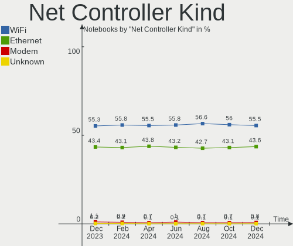
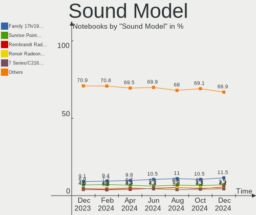
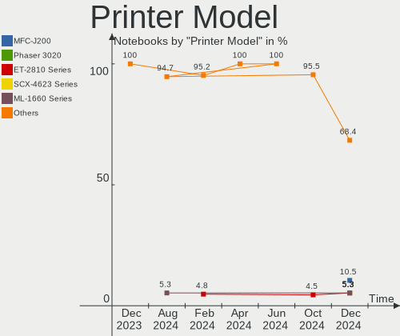
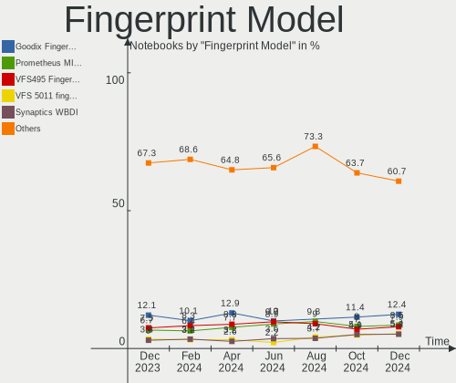

Linux Hardware Trends (Notebooks)
---------------------------------

A project to identify most popular hardware characteristics and track their change
over time based on data collected by Linux users at https://Linux-Hardware.org.

Anyone can contribute to this report by the [hw-probe](https://github.com/linuxhw/hw-probe) tool:

    sudo -E hw-probe -all -upload

Full-feature report is available here: https://linux-hardware.org/?view=trends

Period: Nov, 2021.

Contents
--------

* [ System ](#system)
  - [ OS                       ](#os)
  - [ OS Family                ](#os-family)
  - [ Kernel                   ](#kernel)
  - [ Kernel Family            ](#kernel-family)
  - [ Kernel Major Ver.        ](#kernel-major-ver)
  - [ Arch                     ](#arch)
  - [ DE                       ](#de)
  - [ Display Server           ](#display-server)
  - [ Display Manager          ](#display-manager)
  - [ OS Lang                  ](#os-lang)
  - [ Boot Mode                ](#boot-mode)
  - [ Filesystem               ](#filesystem)
  - [ Part. scheme             ](#part-scheme)
  - [ Dual Boot with Linux/BSD ](#dual-boot-with-linuxbsd)
  - [ Dual Boot (Win)          ](#dual-boot-win)

* [ Board ](#board)
  - [ Vendor                   ](#vendor)
  - [ Model                    ](#model)
  - [ Model Family             ](#model-family)
  - [ MFG Year                 ](#mfg-year)
  - [ Form Factor              ](#form-factor)
  - [ Secure Boot              ](#secure-boot)
  - [ Coreboot                 ](#coreboot)
  - [ RAM Size                 ](#ram-size)
  - [ RAM Used                 ](#ram-used)
  - [ Total Drives             ](#total-drives)
  - [ Has CD-ROM               ](#has-cd-rom)
  - [ Has Ethernet             ](#has-ethernet)
  - [ Has WiFi                 ](#has-wifi)
  - [ Has Bluetooth            ](#has-bluetooth)

* [ Location ](#location)
  - [ Country                  ](#country)
  - [ City                     ](#city)

* [ Drives ](#drives)
  - [ Drive Vendor             ](#drive-vendor)
  - [ Drive Model              ](#drive-model)
  - [ HDD Vendor               ](#hdd-vendor)
  - [ SSD Vendor               ](#ssd-vendor)
  - [ Drive Kind               ](#drive-kind)
  - [ Drive Connector          ](#drive-connector)
  - [ Drive Size               ](#drive-size)
  - [ Space Total              ](#space-total)
  - [ Space Used               ](#space-used)
  - [ Malfunc. Drives          ](#malfunc-drives)
  - [ Malfunc. Drive Vendor    ](#malfunc-drive-vendor)
  - [ Malfunc. HDD Vendor      ](#malfunc-hdd-vendor)
  - [ Malfunc. Drive Kind      ](#malfunc-drive-kind)
  - [ Failed Drives            ](#failed-drives)
  - [ Failed Drive Vendor      ](#failed-drive-vendor)
  - [ Drive Status             ](#drive-status)

* [ Storage controller ](#storage-controller)
  - [ Storage Vendor           ](#storage-vendor)
  - [ Storage Model            ](#storage-model)
  - [ Storage Kind             ](#storage-kind)

* [ Processor ](#processor)
  - [ CPU Vendor               ](#cpu-vendor)
  - [ CPU Model                ](#cpu-model)
  - [ CPU Model Family         ](#cpu-model-family)
  - [ CPU Cores                ](#cpu-cores)
  - [ CPU Sockets              ](#cpu-sockets)
  - [ CPU Threads              ](#cpu-threads)
  - [ CPU Op-Modes             ](#cpu-op-modes)
  - [ CPU Microcode            ](#cpu-microcode)
  - [ CPU Microarch            ](#cpu-microarch)

* [ Graphics ](#graphics)
  - [ GPU Vendor               ](#gpu-vendor)
  - [ GPU Model                ](#gpu-model)
  - [ GPU Combo                ](#gpu-combo)
  - [ GPU Driver               ](#gpu-driver)
  - [ GPU Memory               ](#gpu-memory)

* [ Monitor ](#monitor)
  - [ Monitor Vendor           ](#monitor-vendor)
  - [ Monitor Model            ](#monitor-model)
  - [ Monitor Resolution       ](#monitor-resolution)
  - [ Monitor Diagonal         ](#monitor-diagonal)
  - [ Monitor Width            ](#monitor-width)
  - [ Aspect Ratio             ](#aspect-ratio)
  - [ Monitor Area             ](#monitor-area)
  - [ Pixel Density            ](#pixel-density)
  - [ Multiple Monitors        ](#multiple-monitors)

* [ Network ](#network)
  - [ Net Controller Vendor    ](#net-controller-vendor)
  - [ Net Controller Model     ](#net-controller-model)
  - [ Wireless Vendor          ](#wireless-vendor)
  - [ Wireless Model           ](#wireless-model)
  - [ Ethernet Vendor          ](#ethernet-vendor)
  - [ Ethernet Model           ](#ethernet-model)
  - [ Net Controller Kind      ](#net-controller-kind)
  - [ Used Controller          ](#used-controller)
  - [ NICs                     ](#nics)
  - [ IPv6                     ](#ipv6)

* [ Bluetooth ](#bluetooth)
  - [ Bluetooth Vendor         ](#bluetooth-vendor)
  - [ Bluetooth Model          ](#bluetooth-model)

* [ Sound ](#sound)
  - [ Sound Vendor             ](#sound-vendor)
  - [ Sound Model              ](#sound-model)

* [ Memory ](#memory)
  - [ Memory Vendor            ](#memory-vendor)
  - [ Memory Model             ](#memory-model)
  - [ Memory Kind              ](#memory-kind)
  - [ Memory Form Factor       ](#memory-form-factor)
  - [ Memory Size              ](#memory-size)
  - [ Memory Speed             ](#memory-speed)

* [ Printers & scanners ](#printers--scanners)
  - [ Printer Vendor           ](#printer-vendor)
  - [ Printer Model            ](#printer-model)
  - [ Scanner Vendor           ](#scanner-vendor)
  - [ Scanner Model            ](#scanner-model)

* [ Camera ](#camera)
  - [ Camera Vendor            ](#camera-vendor)
  - [ Camera Model             ](#camera-model)

* [ Security ](#security)
  - [ Fingerprint Vendor       ](#fingerprint-vendor)
  - [ Fingerprint Model        ](#fingerprint-model)
  - [ Chipcard Vendor          ](#chipcard-vendor)
  - [ Chipcard Model           ](#chipcard-model)

* [ Unsupported ](#unsupported)
  - [ Unsupported Devices      ](#unsupported-devices)
  - [ Unsupported Device Types ](#unsupported-device-types)

System
------

OS
--

Installed operating systems

| Name                | Notebooks | Percent |
|---------------------|-----------|---------|
| Ubuntu 20.04        | 493       | 17.58%  |
| Linux Mint 20.2     | 234       | 8.34%   |
| Ubuntu 21.10        | 229       | 8.16%   |
| Pop!_OS 21.04       | 183       | 6.52%   |
| Fedora 35           | 163       | 5.81%   |
| Debian 11           | 125       | 4.46%   |
| Zorin 16            | 102       | 3.64%   |
| OpenMandriva 4.2    | 100       | 3.57%   |
| Xubuntu 20.04       | 50        | 1.78%   |
| BlackPanther 18.1   | 48        | 1.71%   |
| Ubuntu 18.04        | 44        | 1.57%   |
| Arch                | 43        | 1.53%   |
| KDE neon 20.04      | 41        | 1.46%   |
| Elementary 6        | 41        | 1.46%   |
| Manjaro 21.1.6      | 40        | 1.43%   |
| Arch Rolling        | 40        | 1.43%   |
| Manjaro             | 37        | 1.32%   |
| ArcoLinux Rolling   | 37        | 1.32%   |
| Fedora 34           | 35        | 1.25%   |
| ROSA R11.1          | 33        | 1.18%   |
| Ubuntu 21.04        | 30        | 1.07%   |
| Pop!_OS 20.04       | 28        | 1%      |
| ROSA 12.1           | 26        | 0.93%   |
| Manjaro 21.2.0      | 25        | 0.89%   |
| Endless 3.9.5       | 25        | 0.89%   |
| Kubuntu 21.10       | 20        | 0.71%   |
| Linux Mint 19.3     | 18        | 0.64%   |
| Kubuntu 20.04       | 18        | 0.64%   |
| Gentoo 2.7          | 18        | 0.64%   |
| Zorin 15            | 17        | 0.61%   |
| Kali 2021.3         | 17        | 0.61%   |
| EndeavourOS Rolling | 16        | 0.57%   |
| Xubuntu 18.04       | 15        | 0.53%   |
| Ubuntu MATE 20.04   | 15        | 0.53%   |
| OpenMandriva 4.50   | 15        | 0.53%   |
| Linux Mint 20.1     | 15        | 0.53%   |
| Linux Mint 20       | 15        | 0.53%   |
| Debian Testing      | 14        | 0.5%    |
| ROSA 12             | 13        | 0.46%   |
| Debian 10           | 13        | 0.46%   |
| Garuda Soaring      | 12        | 0.43%   |
| LinuxFX 11          | 11        | 0.39%   |
| LMDE 4              | 10        | 0.36%   |
| MX 21               | 9         | 0.32%   |
| Ubuntu 16.04        | 7         | 0.25%   |
| Parrot 4.11         | 7         | 0.25%   |
| Lubuntu 20.04       | 7         | 0.25%   |
| Gentoo 2.8          | 7         | 0.25%   |
| Xubuntu 21.10       | 6         | 0.21%   |
| openSUSE Leap-15.3  | 6         | 0.21%   |
| Artix Rolling       | 6         | 0.21%   |
| Ubuntu 22.04        | 5         | 0.18%   |
| Ubuntu 20.10        | 5         | 0.18%   |
| RHEL 8              | 5         | 0.18%   |
| Lubuntu 21.10       | 5         | 0.18%   |
| Kubuntu 21.04       | 5         | 0.18%   |
| Endless 4.0.0       | 5         | 0.18%   |
| Xero Rolling        | 4         | 0.14%   |
| Ubuntu MATE 21.10   | 4         | 0.14%   |
| Peppermint 10       | 4         | 0.14%   |

OS Family
---------

OS without a version

| Name          | Notebooks | Percent |
|---------------|-----------|---------|
| Ubuntu        | 816       | 29.09%  |
| Linux Mint    | 287       | 10.23%  |
| Pop!_OS       | 215       | 7.66%   |
| Fedora        | 206       | 7.34%   |
| Debian        | 163       | 5.81%   |
| Zorin         | 119       | 4.24%   |
| OpenMandriva  | 115       | 4.1%    |
| Manjaro       | 108       | 3.85%   |
| Arch          | 83        | 2.96%   |
| Xubuntu       | 74        | 2.64%   |
| ROSA          | 72        | 2.57%   |
| BlackPanther  | 49        | 1.75%   |
| Kubuntu       | 47        | 1.68%   |
| Elementary    | 45        | 1.6%    |
| Endless       | 44        | 1.57%   |
| ArcoLinux     | 42        | 1.5%    |
| KDE neon      | 41        | 1.46%   |
| openSUSE      | 31        | 1.11%   |
| Gentoo        | 29        | 1.03%   |
| Kali          | 23        | 0.82%   |
| Ubuntu MATE   | 20        | 0.71%   |
| EndeavourOS   | 19        | 0.68%   |
| Lubuntu       | 16        | 0.57%   |
| MX            | 13        | 0.46%   |
| Garuda        | 13        | 0.46%   |
| LinuxFX       | 12        | 0.43%   |
| Parrot        | 10        | 0.36%   |
| LMDE          | 10        | 0.36%   |
| Clear Linux   | 10        | 0.36%   |
| Artix         | 7         | 0.25%   |
| Ubuntu Budgie | 6         | 0.21%   |
| RHEL          | 6         | 0.21%   |
| CentOS        | 6         | 0.21%   |
| Xero          | 4         | 0.14%   |
| Rocky Linux   | 4         | 0.14%   |
| Peppermint    | 4         | 0.14%   |
| Sparky        | 3         | 0.11%   |
| Solus         | 3         | 0.11%   |
| Void          | 2         | 0.07%   |
| Reborn OS     | 2         | 0.07%   |
| PureOS        | 2         | 0.07%   |
| NixOS         | 2         | 0.07%   |
| Devuan        | 2         | 0.07%   |
| Deepin        | 2         | 0.07%   |
| Alpine        | 2         | 0.07%   |
| Trisquel      | 1         | 0.04%   |
| Slackware     | 1         | 0.04%   |
| Redcore       | 1         | 0.04%   |
| Pardus        | 1         | 0.04%   |
| Oracle Linux  | 1         | 0.04%   |
| Manjaro-ARM   | 1         | 0.04%   |
| Mageia        | 1         | 0.04%   |
| Kaisen        | 1         | 0.04%   |
| Drauger OS    | 1         | 0.04%   |
| Chrome OS     | 1         | 0.04%   |
| Calculate     | 1         | 0.04%   |
| BuildRoot     | 1         | 0.04%   |
| BlackArch     | 1         | 0.04%   |
| Archcraft     | 1         | 0.04%   |
| antiX         | 1         | 0.04%   |

Kernel
------

Version of the Linux kernel

| Version                             | Notebooks | Percent |
|-------------------------------------|-----------|---------|
| 5.11.0-40-generic                   | 386       | 13.76%  |
| 5.11.0-38-generic                   | 228       | 8.13%   |
| 5.4.0-90-generic                    | 195       | 6.95%   |
| 5.13.0-7620-generic                 | 180       | 6.42%   |
| 5.13.0-21-generic                   | 170       | 6.06%   |
| 5.4.0-89-generic                    | 101       | 3.6%    |
| 5.10.14-desktop-1omv4002            | 98        | 3.49%   |
| 5.10.0-9-amd64                      | 93        | 3.32%   |
| 5.13.0-20-generic                   | 53        | 1.89%   |
| 5.11.0-27-generic                   | 47        | 1.68%   |
| 5.14.16-301.fc35.x86_64             | 44        | 1.57%   |
| 5.6.14-desktop-2bP                  | 36        | 1.28%   |
| 5.8.0-14-generic                    | 34        | 1.21%   |
| 5.14.18-300.fc35.x86_64             | 33        | 1.18%   |
| 5.13.19-2-MANJARO                   | 31        | 1.11%   |
| 5.14.17-301.fc35.x86_64             | 27        | 0.96%   |
| 5.15.2-arch1-1                      | 26        | 0.93%   |
| 5.10.74-generic-2rosa2021.1-x86_64  | 26        | 0.93%   |
| 5.4.0-74-generic                    | 24        | 0.86%   |
| 5.15.4-arch1-1                      | 22        | 0.78%   |
| 5.14.14-300.fc35.x86_64             | 21        | 0.75%   |
| 5.13.0-19-generic                   | 20        | 0.71%   |
| 5.11.0-41-generic                   | 20        | 0.71%   |
| 5.11.0-37-generic                   | 19        | 0.68%   |
| 5.10.0-8-amd64                      | 19        | 0.68%   |
| 5.14.16-arch1-1                     | 18        | 0.64%   |
| 5.13.0-7614-generic                 | 18        | 0.64%   |
| 5.14.10-1-MANJARO                   | 17        | 0.61%   |
| 5.13.0-22-generic                   | 15        | 0.53%   |
| 5.4.0-91-generic                    | 14        | 0.5%    |
| 5.15.2-2-MANJARO                    | 14        | 0.5%    |
| 5.10.71-generic-1rosa2021.1-x86_64  | 13        | 0.46%   |
| 5.10.70-1-MANJARO                   | 13        | 0.46%   |
| 5.14.15-300.fc35.x86_64             | 12        | 0.43%   |
| 4.19.0-18-amd64                     | 12        | 0.43%   |
| 4.18.16-desktop-1bP                 | 12        | 0.43%   |
| 4.15.0-161-generic                  | 12        | 0.43%   |
| 5.15.4-201.fc35.x86_64              | 11        | 0.39%   |
| 5.14.10-300.fc35.x86_64             | 11        | 0.39%   |
| 5.14.0-kali4-amd64                  | 11        | 0.39%   |
| 5.14.0-9parrot1-amd64               | 11        | 0.39%   |
| 5.14.15-arch1-1                     | 10        | 0.36%   |
| 5.15.5-arch1-1                      | 9         | 0.32%   |
| 5.11.0-7620-generic                 | 9         | 0.32%   |
| 5.10.79-1-MANJARO                   | 9         | 0.32%   |
| 4.15.0-desktop-122.124.1rosa-x86_64 | 9         | 0.32%   |
| 5.15.2-zen1-1-zen                   | 8         | 0.29%   |
| 5.14.14-200.fc34.x86_64             | 8         | 0.29%   |
| 5.12.4-desktop-1omv4050             | 8         | 0.29%   |
| 5.10.0-1051-oem                     | 8         | 0.29%   |
| 5.4.83-generic-2rosa-x86_64         | 7         | 0.25%   |
| 5.15.4-zen1-1-zen                   | 7         | 0.25%   |
| 5.15.3-1-default                    | 7         | 0.25%   |
| 5.14.14-arch1-1                     | 7         | 0.25%   |
| 5.14.0-4-amd64                      | 7         | 0.25%   |
| 4.15.0-162-generic                  | 7         | 0.25%   |
| 5.4.0-88-generic                    | 6         | 0.21%   |
| 5.14.15-zen1-1-zen                  | 6         | 0.21%   |
| 5.14.14-1-default                   | 6         | 0.21%   |
| 5.14.0-2-amd64                      | 6         | 0.21%   |

Kernel Family
-------------

Linux kernel without a distro release

| Version | Notebooks | Percent |
|---------|-----------|---------|
| 5.11.0  | 731       | 26.06%  |
| 5.13.0  | 462       | 16.47%  |
| 5.4.0   | 378       | 13.48%  |
| 5.10.0  | 153       | 5.45%   |
| 5.10.14 | 98        | 3.49%   |
| 5.14.16 | 75        | 2.67%   |
| 5.15.2  | 62        | 2.21%   |
| 5.15.4  | 56        | 2%      |
| 5.14.14 | 54        | 1.93%   |
| 5.8.0   | 52        | 1.85%   |
| 5.14.0  | 52        | 1.85%   |
| 4.15.0  | 45        | 1.6%    |
| 5.14.18 | 42        | 1.5%    |
| 5.14.15 | 42        | 1.5%    |
| 5.6.14  | 36        | 1.28%   |
| 5.13.19 | 35        | 1.25%   |
| 5.14.17 | 30        | 1.07%   |
| 5.14.10 | 29        | 1.03%   |
| 5.15.0  | 28        | 1%      |
| 5.10.74 | 28        | 1%      |
| 4.19.0  | 23        | 0.82%   |
| 5.15.5  | 20        | 0.71%   |
| 5.15.3  | 18        | 0.64%   |
| 5.10.70 | 15        | 0.53%   |
| 5.10.71 | 13        | 0.46%   |
| 5.10.79 | 12        | 0.43%   |
| 4.18.16 | 12        | 0.43%   |
| 5.15.1  | 11        | 0.39%   |
| 4.18.0  | 11        | 0.39%   |
| 5.4.83  | 10        | 0.36%   |
| 5.4.32  | 9         | 0.32%   |
| 5.10.76 | 9         | 0.32%   |
| 5.3.18  | 8         | 0.29%   |
| 5.12.4  | 8         | 0.29%   |
| 5.0.0   | 8         | 0.29%   |
| 5.16.0  | 7         | 0.25%   |
| 5.13.13 | 7         | 0.25%   |
| 5.3.0   | 6         | 0.21%   |
| 5.14.7  | 5         | 0.18%   |
| 5.14.13 | 5         | 0.18%   |
| 5.11.12 | 5         | 0.18%   |
| 4.4.0   | 5         | 0.18%   |
| 5.14.12 | 4         | 0.14%   |
| 5.10.80 | 4         | 0.14%   |
| 5.10.78 | 4         | 0.14%   |
| 5.10.61 | 4         | 0.14%   |
| 5.9.16  | 3         | 0.11%   |
| 5.14.9  | 3         | 0.11%   |
| 5.11.22 | 3         | 0.11%   |
| 5.10.77 | 3         | 0.11%   |
| 4.9.155 | 3         | 0.11%   |
| 4.9.0   | 3         | 0.11%   |
| 5.6.10  | 2         | 0.07%   |
| 5.4.150 | 2         | 0.07%   |
| 5.14.11 | 2         | 0.07%   |
| 5.13.7  | 2         | 0.07%   |
| 5.12.7  | 2         | 0.07%   |
| 5.10.82 | 2         | 0.07%   |
| 5.10.73 | 2         | 0.07%   |
| 5.10.60 | 2         | 0.07%   |

Kernel Major Ver.
-----------------

Linux kernel major version

| Version | Notebooks | Percent |
|---------|-----------|---------|
| 5.11    | 741       | 26.42%  |
| 5.13    | 511       | 18.22%  |
| 5.4     | 403       | 14.37%  |
| 5.10    | 356       | 12.69%  |
| 5.14    | 346       | 12.34%  |
| 5.15    | 195       | 6.95%   |
| 5.8     | 53        | 1.89%   |
| 4.15    | 45        | 1.6%    |
| 5.6     | 39        | 1.39%   |
| 4.19    | 26        | 0.93%   |
| 4.18    | 23        | 0.82%   |
| 5.3     | 14        | 0.5%    |
| 5.12    | 11        | 0.39%   |
| 5.0     | 8         | 0.29%   |
| 5.16    | 7         | 0.25%   |
| 4.9     | 6         | 0.21%   |
| 4.4     | 5         | 0.18%   |
| 5.9     | 4         | 0.14%   |
| 5.7     | 2         | 0.07%   |
| 4.16    | 2         | 0.07%   |
| 3.10    | 2         | 0.07%   |
| 5.14.12 | 1         | 0.04%   |
| 5       | 1         | 0.04%   |
| 4.7     | 1         | 0.04%   |
| 4.14    | 1         | 0.04%   |
| 4.10    | 1         | 0.04%   |
| 4.1     | 1         | 0.04%   |

Arch
----

OS architecture (x86_64, i586, etc.)

| Name    | Notebooks | Percent |
|---------|-----------|---------|
| x86_64  | 2737      | 97.58%  |
| i686    | 65        | 2.32%   |
| aarch64 | 2         | 0.07%   |
| armv7l  | 1         | 0.04%   |

DE
--

Desktop Environment

| Name             | Notebooks | Percent |
|------------------|-----------|---------|
| GNOME            | 1408      | 50.2%   |
| KDE5             | 482       | 17.18%  |
| X-Cinnamon       | 217       | 7.74%   |
| XFCE             | 210       | 7.49%   |
| Unknown          | 152       | 5.42%   |
| MATE             | 88        | 3.14%   |
| Pantheon         | 41        | 1.46%   |
| Cinnamon         | 36        | 1.28%   |
| LXQt             | 26        | 0.93%   |
| i3               | 24        | 0.86%   |
| KDE4             | 21        | 0.75%   |
| Unity            | 14        | 0.5%    |
| LXDE             | 13        | 0.46%   |
| Budgie           | 10        | 0.36%   |
| GNOME Flashback  | 7         | 0.25%   |
| KDE              | 6         | 0.21%   |
| qtile            | 5         | 0.18%   |
| lightdm-xsession | 5         | 0.18%   |
| GNOME Classic    | 5         | 0.18%   |
| Deepin           | 5         | 0.18%   |
| awesome          | 5         | 0.18%   |
| xmonad           | 4         | 0.14%   |
| Openbox          | 4         | 0.14%   |
| dwm              | 4         | 0.14%   |
| sway             | 3         | 0.11%   |
| bspwm            | 3         | 0.11%   |
| trinity          | 2         | 0.07%   |
| ICEWM            | 1         | 0.04%   |
| i3-with-shmlog   | 1         | 0.04%   |
| herbstluftwm     | 1         | 0.04%   |
| fluxbox          | 1         | 0.04%   |
| Enlightenment    | 1         | 0.04%   |

Display Server
--------------

X11 or Wayland

| Name    | Notebooks | Percent |
|---------|-----------|---------|
| X11     | 2190      | 78.07%  |
| Wayland | 503       | 17.93%  |
| Unknown | 77        | 2.75%   |
| Tty     | 35        | 1.25%   |

Display Manager
---------------

SDDM, LightDM, etc.

| Name    | Notebooks | Percent |
|---------|-----------|---------|
| Unknown | 869       | 30.98%  |
| GDM     | 531       | 18.93%  |
| GDM3    | 517       | 18.43%  |
| LightDM | 439       | 15.65%  |
| SDDM    | 413       | 14.72%  |
| KDM     | 20        | 0.71%   |
| XDM     | 7         | 0.25%   |
| SLiM    | 5         | 0.18%   |
| LXDM    | 3         | 0.11%   |
| MDM     | 1         | 0.04%   |

OS Lang
-------

Language

| Lang        | Notebooks | Percent |
|-------------|-----------|---------|
| en_US       | 1128      | 40.21%  |
| de_DE       | 266       | 9.48%   |
| ru_RU       | 151       | 5.38%   |
| fr_FR       | 150       | 5.35%   |
| en_GB       | 141       | 5.03%   |
| pt_BR       | 122       | 4.35%   |
| Unknown     | 96        | 3.42%   |
| it_IT       | 77        | 2.75%   |
| en_IN       | 61        | 2.17%   |
| C           | 58        | 2.07%   |
| pl_PL       | 52        | 1.85%   |
| es_ES       | 51        | 1.82%   |
| en_CA       | 45        | 1.6%    |
| en_AU       | 45        | 1.6%    |
| nl_NL       | 27        | 0.96%   |
| cs_CZ       | 24        | 0.86%   |
| sv_SE       | 16        | 0.57%   |
| pt_PT       | 16        | 0.57%   |
| zh_CN       | 15        | 0.53%   |
| en_ZA       | 15        | 0.53%   |
| hu_HU       | 14        | 0.5%    |
| tr_TR       | 13        | 0.46%   |
| es_MX       | 13        | 0.46%   |
| es_CL       | 13        | 0.46%   |
| fi_FI       | 12        | 0.43%   |
| de_AT       | 10        | 0.36%   |
| ru_UA       | 9         | 0.32%   |
| nb_NO       | 9         | 0.32%   |
| en_NZ       | 9         | 0.32%   |
| en_IL       | 9         | 0.32%   |
| es_AR       | 8         | 0.29%   |
| es_CO       | 7         | 0.25%   |
| fr_CA       | 6         | 0.21%   |
| fr_BE       | 6         | 0.21%   |
| en_IE       | 6         | 0.21%   |
| ro_RO       | 5         | 0.18%   |
| nl_BE       | 5         | 0.18%   |
| hr_HR       | 5         | 0.18%   |
| el_GR       | 5         | 0.18%   |
| lt_LT       | 4         | 0.14%   |
| en_PH       | 4         | 0.14%   |
| da_DK       | 4         | 0.14%   |
| ca_ES       | 4         | 0.14%   |
| C.UTF8      | 4         | 0.14%   |
| bg_BG       | 4         | 0.14%   |
| uk_UA       | 3         | 0.11%   |
| ru_RU.UTF_8 | 3         | 0.11%   |
| POSIX       | 3         | 0.11%   |
| ja_JP       | 3         | 0.11%   |
| es_VE       | 3         | 0.11%   |
| es_EC       | 3         | 0.11%   |
| en_HK       | 3         | 0.11%   |
| en_DK       | 3         | 0.11%   |
| sl_SI       | 2         | 0.07%   |
| sk_SK       | 2         | 0.07%   |
| ko_KR       | 2         | 0.07%   |
| fr_CH       | 2         | 0.07%   |
| es_PE       | 2         | 0.07%   |
| en_NG       | 2         | 0.07%   |
| de_CH       | 2         | 0.07%   |

Boot Mode
---------

EFI or BIOS

| Mode | Notebooks | Percent |
|------|-----------|---------|
| EFI  | 1526      | 54.4%   |
| BIOS | 1279      | 45.6%   |

Filesystem
----------

Type of filesystem

| Type    | Notebooks | Percent |
|---------|-----------|---------|
| Ext4    | 2212      | 78.86%  |
| Btrfs   | 302       | 10.77%  |
| Overlay | 231       | 8.24%   |
| Xfs     | 27        | 0.96%   |
| Zfs     | 18        | 0.64%   |
| Ext3    | 5         | 0.18%   |
| F2fs    | 4         | 0.14%   |
| Tmpfs   | 2         | 0.07%   |
| XXXXX   | 1         | 0.04%   |
| OveXlay | 1         | 0.04%   |
| Ext2    | 1         | 0.04%   |
| Unknown | 1         | 0.04%   |

Part. scheme
------------

Scheme of partitioning

| Type    | Notebooks | Percent |
|---------|-----------|---------|
| Unknown | 1454      | 51.84%  |
| GPT     | 1038      | 37.01%  |
| MBR     | 313       | 11.16%  |

Dual Boot with Linux/BSD
------------------------

Hosting more than one Linux/BSD

| Dual boot | Notebooks | Percent |
|-----------|-----------|---------|
| No        | 2516      | 89.7%   |
| Yes       | 289       | 10.3%   |

Dual Boot (Win)
---------------

Hosting Linux and Windows

| Dual boot | Notebooks | Percent |
|-----------|-----------|---------|
| No        | 2052      | 73.16%  |
| Yes       | 753       | 26.84%  |

Board
-----

Vendor
------

Motherboard manufacturer

| Name                   | Notebooks | Percent |
|------------------------|-----------|---------|
| Lenovo                 | 586       | 20.89%  |
| Hewlett-Packard        | 499       | 17.79%  |
| Dell                   | 493       | 17.58%  |
| ASUSTek Computer       | 316       | 11.27%  |
| Acer                   | 232       | 8.27%   |
| Apple                  | 84        | 2.99%   |
| Toshiba                | 77        | 2.75%   |
| Samsung Electronics    | 61        | 2.17%   |
| MSI                    | 54        | 1.93%   |
| Sony                   | 42        | 1.5%    |
| HUAWEI                 | 38        | 1.35%   |
| Notebook               | 28        | 1%      |
| Fujitsu                | 25        | 0.89%   |
| Google                 | 24        | 0.86%   |
| Medion                 | 18        | 0.64%   |
| Timi                   | 17        | 0.61%   |
| Unknown                | 17        | 0.61%   |
| Packard Bell           | 15        | 0.53%   |
| System76               | 12        | 0.43%   |
| TUXEDO                 | 10        | 0.36%   |
| LG Electronics         | 10        | 0.36%   |
| Fujitsu Siemens        | 10        | 0.36%   |
| Positivo               | 9         | 0.32%   |
| GPU Company            | 8         | 0.29%   |
| Alienware              | 7         | 0.25%   |
| Framework              | 5         | 0.18%   |
| Razer                  | 4         | 0.14%   |
| PC Specialist          | 4         | 0.14%   |
| Panasonic              | 4         | 0.14%   |
| Jumper                 | 4         | 0.14%   |
| Gigabyte Technology    | 4         | 0.14%   |
| Semp Toshiba           | 3         | 0.11%   |
| Schenker               | 3         | 0.11%   |
| IBM                    | 3         | 0.11%   |
| Teclast                | 2         | 0.07%   |
| SLIMBOOK               | 2         | 0.07%   |
| SIEMENS                | 2         | 0.07%   |
| Pine Microsystems      | 2         | 0.07%   |
| ONE-NETBOOK TECHNOLOGY | 2         | 0.07%   |
| MOTILE                 | 2         | 0.07%   |
| Mediacom               | 2         | 0.07%   |
| Maibenben              | 2         | 0.07%   |
| Intel                  | 2         | 0.07%   |
| eMachines              | 2         | 0.07%   |
| Clevo                  | 2         | 0.07%   |
| Chuwi                  | 2         | 0.07%   |
| BenQ                   | 2         | 0.07%   |
| AXDIA International    | 2         | 0.07%   |
| Avell High Performance | 2         | 0.07%   |
| AMI                    | 2         | 0.07%   |
| YJKC                   | 1         | 0.04%   |
| win element            | 1         | 0.04%   |
| TrekStor               | 1         | 0.04%   |
| Toxic                  | 1         | 0.04%   |
| Tablet                 | 1         | 0.04%   |
| Standard               | 1         | 0.04%   |
| SiComputer             | 1         | 0.04%   |
| Quanta                 | 1         | 0.04%   |
| Prestigio              | 1         | 0.04%   |
| Positivo Bahia - VAIO  | 1         | 0.04%   |

Model
-----

Motherboard model

| Name                              | Notebooks | Percent |
|-----------------------------------|-----------|---------|
| Unknown                           | 27        | 0.96%   |
| HP Pavilion dv6                   | 18        | 0.64%   |
| HP Notebook                       | 18        | 0.64%   |
| Dell XPS 13 9310                  | 12        | 0.43%   |
| HP Pavilion Notebook              | 11        | 0.39%   |
| HP Pavilion g6                    | 11        | 0.39%   |
| HP Pavilion 15                    | 11        | 0.39%   |
| Apple MacBookAir7,1               | 11        | 0.39%   |
| HP Pavilion g7                    | 9         | 0.32%   |
| Dell XPS 15 9500                  | 9         | 0.32%   |
| Dell Latitude E6420               | 9         | 0.32%   |
| HP 15                             | 8         | 0.29%   |
| Dell XPS 15 9510                  | 8         | 0.29%   |
| Dell Latitude E6410               | 8         | 0.29%   |
| Dell Inspiron 15-3567             | 8         | 0.29%   |
| Apple MacBookPro9,2               | 8         | 0.29%   |
| HUAWEI KLVL-WXX9                  | 7         | 0.25%   |
| HP Pavilion dv7                   | 7         | 0.25%   |
| Dell XPS 15 9570                  | 7         | 0.25%   |
| Dell Latitude E7440               | 7         | 0.25%   |
| Dell Latitude D630                | 7         | 0.25%   |
| Acer Nitro AN515-54               | 7         | 0.25%   |
| Acer Nitro AN515-44               | 7         | 0.25%   |
| HUAWEI BOHK-WAX9X                 | 6         | 0.21%   |
| HP EliteBook 840 G3               | 6         | 0.21%   |
| Dell Vostro 3500                  | 6         | 0.21%   |
| Dell Latitude E6430               | 6         | 0.21%   |
| Dell Latitude 5520                | 6         | 0.21%   |
| Dell Inspiron 5570                | 6         | 0.21%   |
| Dell Inspiron 1545                | 6         | 0.21%   |
| Dell G5 5590                      | 6         | 0.21%   |
| Apple MacBookPro8,1               | 6         | 0.21%   |
| Lenovo Legion Y530-15ICH 81FV     | 5         | 0.18%   |
| HP ProBook 640 G1                 | 5         | 0.18%   |
| HP Pavilion Aero Laptop 13-be0xxx | 5         | 0.18%   |
| HP Pavilion 17                    | 5         | 0.18%   |
| HP Laptop 15s-eq2xxx              | 5         | 0.18%   |
| HP Laptop 15-bs0xx                | 5         | 0.18%   |
| HP EliteBook 8460p                | 5         | 0.18%   |
| HP EliteBook 840 G1               | 5         | 0.18%   |
| HP EliteBook 2560p                | 5         | 0.18%   |
| Framework Laptop                  | 5         | 0.18%   |
| Dell XPS 15 7590                  | 5         | 0.18%   |
| Dell XPS 13 9360                  | 5         | 0.18%   |
| Dell Latitude E6400               | 5         | 0.18%   |
| Dell Latitude 5480                | 5         | 0.18%   |
| Dell G3 3579                      | 5         | 0.18%   |
| ASUS TUF Gaming FX505DT_FX505DT   | 5         | 0.18%   |
| Acer Swift SF314-42               | 5         | 0.18%   |
| Toshiba Satellite C660            | 4         | 0.14%   |
| Samsung 300E4C/300E5C/300E7C      | 4         | 0.14%   |
| Positivo Mobile                   | 4         | 0.14%   |
| Lenovo Z50-70 20354               | 4         | 0.14%   |
| Lenovo ThinkBook 15 G2 ITL 20VE   | 4         | 0.14%   |
| Lenovo IdeaPad 5 Pro 16ACH6 82L5  | 4         | 0.14%   |
| Lenovo IdeaPad 320-15ISK 80XH     | 4         | 0.14%   |
| Lenovo IdeaPad 320-15IKB 80XL     | 4         | 0.14%   |
| Lenovo G500 20236                 | 4         | 0.14%   |
| Jumper EZbook                     | 4         | 0.14%   |
| HUAWEI KPL-W0X                    | 4         | 0.14%   |

Model Family
------------

Motherboard model prefix

| Name                  | Notebooks | Percent |
|-----------------------|-----------|---------|
| Lenovo ThinkPad       | 299       | 10.66%  |
| Dell Latitude         | 167       | 5.95%   |
| Acer Aspire           | 141       | 5.03%   |
| Dell Inspiron         | 139       | 4.96%   |
| Lenovo IdeaPad        | 127       | 4.53%   |
| HP Pavilion           | 125       | 4.46%   |
| HP ProBook            | 82        | 2.92%   |
| HP EliteBook          | 78        | 2.78%   |
| Dell XPS              | 73        | 2.6%    |
| Toshiba Satellite     | 68        | 2.42%   |
| HP Laptop             | 66        | 2.35%   |
| ASUS VivoBook         | 53        | 1.89%   |
| Dell Vostro           | 39        | 1.39%   |
| Dell Precision        | 39        | 1.39%   |
| Acer Swift            | 30        | 1.07%   |
| Lenovo Legion         | 29        | 1.03%   |
| Acer Nitro            | 27        | 0.96%   |
| Unknown               | 27        | 0.96%   |
| Lenovo ThinkBook      | 24        | 0.86%   |
| HP Compaq             | 24        | 0.86%   |
| Fujitsu LIFEBOOK      | 24        | 0.86%   |
| ASUS ROG              | 23        | 0.82%   |
| ASUS ASUS             | 22        | 0.78%   |
| HP ZBook              | 21        | 0.75%   |
| HP Notebook           | 18        | 0.64%   |
| HP ENVY               | 16        | 0.57%   |
| ASUS TUF              | 15        | 0.53%   |
| Packard Bell EasyNote | 14        | 0.5%    |
| Apple MacBookAir7     | 14        | 0.5%    |
| Lenovo Yoga           | 11        | 0.39%   |
| ASUS ZenBook          | 11        | 0.39%   |
| Apple MacBookPro9     | 11        | 0.39%   |
| Apple MacBookPro11    | 11        | 0.39%   |
| Dell G5               | 10        | 0.36%   |
| Dell G3               | 10        | 0.36%   |
| Acer TravelMate       | 10        | 0.36%   |
| HP OMEN               | 9         | 0.32%   |
| HP 15                 | 9         | 0.32%   |
| HP 250                | 8         | 0.29%   |
| Apple MacBookPro8     | 8         | 0.29%   |
| Apple MacBookPro5     | 8         | 0.29%   |
| Timi RedmiBook        | 7         | 0.25%   |
| HUAWEI KLVL-WXX9      | 7         | 0.25%   |
| HP Stream             | 7         | 0.25%   |
| HUAWEI BOHK-WAX9X     | 6         | 0.21%   |
| Fujitsu Siemens AMILO | 6         | 0.21%   |
| TUXEDO InfinityBook   | 5         | 0.18%   |
| MSI GF63              | 5         | 0.18%   |
| HP 255                | 5         | 0.18%   |
| Framework Laptop      | 5         | 0.18%   |
| Dell System           | 5         | 0.18%   |
| Dell Studio           | 5         | 0.18%   |
| Acer Extensa          | 5         | 0.18%   |
| Samsung 350V5C        | 4         | 0.14%   |
| Samsung 300E4C        | 4         | 0.14%   |
| Razer Blade           | 4         | 0.14%   |
| Positivo Mobile       | 4         | 0.14%   |
| Medion Akoya          | 4         | 0.14%   |
| Lenovo Z50-70         | 4         | 0.14%   |
| Lenovo G500           | 4         | 0.14%   |

MFG Year
--------

Motherboard manufacture year

| Year    | Notebooks | Percent |
|---------|-----------|---------|
| 2021    | 758       | 27.02%  |
| 2020    | 351       | 12.51%  |
| 2019    | 265       | 9.45%   |
| 2018    | 188       | 6.7%    |
| 2013    | 160       | 5.7%    |
| 2012    | 160       | 5.7%    |
| 2011    | 149       | 5.31%   |
| 2014    | 131       | 4.67%   |
| 2015    | 120       | 4.28%   |
| 2017    | 110       | 3.92%   |
| 2016    | 109       | 3.89%   |
| 2010    | 94        | 3.35%   |
| 2009    | 92        | 3.28%   |
| 2008    | 62        | 2.21%   |
| 2007    | 29        | 1.03%   |
| 2006    | 19        | 0.68%   |
| Unknown | 5         | 0.18%   |
| 2005    | 3         | 0.11%   |

Form Factor
-----------

Physical design of the computer

| Name     | Notebooks | Percent |
|----------|-----------|---------|
| Notebook | 2805      | 100%    |

Secure Boot
-----------

Enabled or disabled

| State    | Notebooks | Percent |
|----------|-----------|---------|
| Disabled | 2507      | 89.38%  |
| Enabled  | 298       | 10.62%  |

Coreboot
--------

Have coreboot on board

| Used | Notebooks | Percent |
|------|-----------|---------|
| No   | 2774      | 98.89%  |
| Yes  | 31        | 1.11%   |

RAM Size
--------

Total RAM memory

| Size in GB  | Notebooks | Percent |
|-------------|-----------|---------|
| 4.01-8.0    | 795       | 28.34%  |
| 3.01-4.0    | 591       | 21.07%  |
| 16.01-24.0  | 514       | 18.32%  |
| 8.01-16.0   | 462       | 16.47%  |
| 32.01-64.0  | 194       | 6.92%   |
| 1.01-2.0    | 120       | 4.28%   |
| 2.01-3.0    | 55        | 1.96%   |
| 64.01-256.0 | 35        | 1.25%   |
| 24.01-32.0  | 26        | 0.93%   |
| 0.51-1.0    | 12        | 0.43%   |
| 0.01-0.5    | 1         | 0.04%   |

RAM Used
--------

Used RAM memory

| Used GB    | Notebooks | Percent |
|------------|-----------|---------|
| 1.01-2.0   | 1041      | 37.11%  |
| 2.01-3.0   | 718       | 25.6%   |
| 4.01-8.0   | 374       | 13.33%  |
| 3.01-4.0   | 345       | 12.3%   |
| 0.51-1.0   | 186       | 6.63%   |
| 8.01-16.0  | 100       | 3.57%   |
| 0.01-0.5   | 29        | 1.03%   |
| 16.01-24.0 | 6         | 0.21%   |
| 24.01-32.0 | 4         | 0.14%   |
| 32.01-64.0 | 1         | 0.04%   |
| Unknown    | 1         | 0.04%   |

Total Drives
------------

Number of drives on board

| Drives | Notebooks | Percent |
|--------|-----------|---------|
| 1      | 2089      | 74.47%  |
| 2      | 609       | 21.71%  |
| 3      | 68        | 2.42%   |
| 0      | 22        | 0.78%   |
| 4      | 11        | 0.39%   |
| 5      | 5         | 0.18%   |
| 6      | 1         | 0.04%   |

Has CD-ROM
----------

Has CD-ROM on board

| Presented | Notebooks | Percent |
|-----------|-----------|---------|
| No        | 1800      | 64.17%  |
| Yes       | 1005      | 35.83%  |

Has Ethernet
------------

Has Ethernet on board

| Presented | Notebooks | Percent |
|-----------|-----------|---------|
| Yes       | 2267      | 80.82%  |
| No        | 538       | 19.18%  |

Has WiFi
--------

Has WiFi module

| Presented | Notebooks | Percent |
|-----------|-----------|---------|
| Yes       | 2757      | 98.29%  |
| No        | 48        | 1.71%   |

Has Bluetooth
-------------

Has Bluetooth module

| Presented | Notebooks | Percent |
|-----------|-----------|---------|
| Yes       | 2165      | 77.18%  |
| No        | 640       | 22.82%  |

Location
--------

Country
-------

Geographic location (country)

| Country                | Notebooks | Percent |
|------------------------|-----------|---------|
| USA                    | 433       | 15.44%  |
| Germany                | 329       | 11.73%  |
| France                 | 183       | 6.52%   |
| Russia                 | 170       | 6.06%   |
| Brazil                 | 155       | 5.53%   |
| Italy                  | 117       | 4.17%   |
| UK                     | 97        | 3.46%   |
| India                  | 93        | 3.32%   |
| Canada                 | 84        | 2.99%   |
| Netherlands            | 81        | 2.89%   |
| Poland                 | 70        | 2.5%    |
| Hungary                | 70        | 2.5%    |
| Spain                  | 60        | 2.14%   |
| Australia              | 49        | 1.75%   |
| Ukraine                | 37        | 1.32%   |
| Sweden                 | 35        | 1.25%   |
| Portugal               | 34        | 1.21%   |
| Czechia                | 34        | 1.21%   |
| Romania                | 29        | 1.03%   |
| Mexico                 | 29        | 1.03%   |
| Belgium                | 29        | 1.03%   |
| Switzerland            | 27        | 0.96%   |
| Austria                | 26        | 0.93%   |
| Turkey                 | 24        | 0.86%   |
| Finland                | 24        | 0.86%   |
| Greece                 | 23        | 0.82%   |
| Indonesia              | 22        | 0.78%   |
| Norway                 | 20        | 0.71%   |
| China                  | 20        | 0.71%   |
| South Africa           | 18        | 0.64%   |
| Chile                  | 17        | 0.61%   |
| Argentina              | 16        | 0.57%   |
| Croatia                | 15        | 0.53%   |
| Colombia               | 14        | 0.5%    |
| Bulgaria               | 14        | 0.5%    |
| Denmark                | 13        | 0.46%   |
| Belarus                | 13        | 0.46%   |
| Vietnam                | 12        | 0.43%   |
| Slovakia               | 11        | 0.39%   |
| Pakistan               | 10        | 0.36%   |
| New Zealand            | 10        | 0.36%   |
| Slovenia               | 9         | 0.32%   |
| Philippines            | 9         | 0.32%   |
| Morocco                | 9         | 0.32%   |
| Japan                  | 9         | 0.32%   |
| Israel                 | 9         | 0.32%   |
| Iran                   | 9         | 0.32%   |
| Thailand               | 8         | 0.29%   |
| Tunisia                | 7         | 0.25%   |
| Saudi Arabia           | 6         | 0.21%   |
| Lithuania              | 6         | 0.21%   |
| Bosnia and Herzegovina | 6         | 0.21%   |
| Taiwan                 | 5         | 0.18%   |
| Peru                   | 5         | 0.18%   |
| Latvia                 | 5         | 0.18%   |
| Kenya                  | 5         | 0.18%   |
| Ireland                | 5         | 0.18%   |
| Ecuador                | 5         | 0.18%   |
| Bangladesh             | 5         | 0.18%   |
| Venezuela              | 4         | 0.14%   |

City
----

Geographic location (city)

| City              | Notebooks | Percent |
|-------------------|-----------|---------|
| Moscow            | 46        | 1.64%   |
| Berlin            | 38        | 1.35%   |
| Paris             | 29        | 1.03%   |
| Budapest          | 27        | 0.96%   |
| St Petersburg     | 22        | 0.78%   |
| Milan             | 20        | 0.71%   |
| Warsaw            | 19        | 0.68%   |
| Vienna            | 17        | 0.61%   |
| Qu?©bec           | 17        | 0.61%   |
| Prague            | 17        | 0.61%   |
| Madrid            | 17        | 0.61%   |
| Sydney            | 15        | 0.53%   |
| S??o Paulo        | 15        | 0.53%   |
| Eliot             | 15        | 0.53%   |
| Hamburg           | 14        | 0.5%    |
| Bucharest         | 13        | 0.46%   |
| Bengaluru         | 13        | 0.46%   |
| Athens            | 13        | 0.46%   |
| Zagreb            | 12        | 0.43%   |
| Helsinki          | 12        | 0.43%   |
| Amsterdam         | 12        | 0.43%   |
| Brisbane          | 11        | 0.39%   |
| Rome              | 10        | 0.36%   |
| Frankfurt am Main | 10        | 0.36%   |
| Zurich            | 9         | 0.32%   |
| Munich            | 9         | 0.32%   |
| Lyon              | 9         | 0.32%   |
| London            | 9         | 0.32%   |
| Istanbul          | 9         | 0.32%   |
| Chennai           | 9         | 0.32%   |
| Voronezh          | 8         | 0.29%   |
| Sofia             | 8         | 0.29%   |
| Santiago          | 8         | 0.29%   |
| Rio de Janeiro    | 8         | 0.29%   |
| Portland          | 8         | 0.29%   |
| New York          | 8         | 0.29%   |
| New Delhi         | 8         | 0.29%   |
| Lisbon            | 8         | 0.29%   |
| Kyiv              | 8         | 0.29%   |
| Houston           | 8         | 0.29%   |
| Buenos Aires      | 8         | 0.29%   |
| Toronto           | 7         | 0.25%   |
| Montreal          | 7         | 0.25%   |
| Melbourne         | 7         | 0.25%   |
| Johannesburg      | 7         | 0.25%   |
| Hanoi             | 7         | 0.25%   |
| Denver            | 7         | 0.25%   |
| The Hague         | 6         | 0.21%   |
| Tel Aviv          | 6         | 0.21%   |
| Stuttgart         | 6         | 0.21%   |
| Shenzhen          | 6         | 0.21%   |
| Pune              | 6         | 0.21%   |
| Porto Alegre      | 6         | 0.21%   |
| Oslo              | 6         | 0.21%   |
| Nizhniy Novgorod  | 6         | 0.21%   |
| Minsk             | 6         | 0.21%   |
| Krasnodar         | 6         | 0.21%   |
| Jakarta           | 6         | 0.21%   |
| Dresden           | 6         | 0.21%   |
| Dallas            | 6         | 0.21%   |

Drives
------

Drive Vendor
------------

Hard drive vendors

| Vendor                         | Notebooks | Drives | Percent |
|--------------------------------|-----------|--------|---------|
| Samsung Electronics            | 564       | 618    | 16.74%  |
| WDC                            | 453       | 470    | 13.45%  |
| Seagate                        | 371       | 385    | 11.01%  |
| Toshiba                        | 268       | 270    | 7.95%   |
| SanDisk                        | 220       | 229    | 6.53%   |
| Kingston                       | 166       | 168    | 4.93%   |
| SK Hynix                       | 153       | 159    | 4.54%   |
| Unknown                        | 137       | 149    | 4.07%   |
| Crucial                        | 116       | 120    | 3.44%   |
| Intel                          | 115       | 130    | 3.41%   |
| Hitachi                        | 82        | 83     | 2.43%   |
| Micron Technology              | 79        | 81     | 2.34%   |
| HGST                           | 78        | 78     | 2.32%   |
| KIOXIA                         | 49        | 49     | 1.45%   |
| Apple                          | 46        | 51     | 1.37%   |
| A-DATA Technology              | 45        | 47     | 1.34%   |
| LITEON                         | 34        | 34     | 1.01%   |
| Phison                         | 26        | 29     | 0.77%   |
| Intenso                        | 19        | 19     | 0.56%   |
| Fujitsu                        | 19        | 19     | 0.56%   |
| PNY                            | 18        | 18     | 0.53%   |
| China                          | 18        | 18     | 0.53%   |
| Patriot                        | 14        | 14     | 0.42%   |
| Transcend                      | 13        | 13     | 0.39%   |
| Silicon Motion                 | 13        | 13     | 0.39%   |
| LITEONIT                       | 11        | 12     | 0.33%   |
| JMicron                        | 10        | 10     | 0.3%    |
| ADATA Technology               | 9         | 9      | 0.27%   |
| Unknown                        | 9         | 9      | 0.27%   |
| SPCC                           | 8         | 9      | 0.24%   |
| Micron/Crucial Technology      | 8         | 9      | 0.24%   |
| UMIS                           | 7         | 7      | 0.21%   |
| BHT                            | 7         | 7      | 0.21%   |
| SABRENT                        | 6         | 7      | 0.18%   |
| KingSpec                       | 6         | 6      | 0.18%   |
| Hewlett-Packard                | 6         | 6      | 0.18%   |
| GOODRAM                        | 6         | 7      | 0.18%   |
| Corsair                        | 6         | 6      | 0.18%   |
| Yangtze Memory Technologies    | 5         | 5      | 0.15%   |
| OCZ                            | 5         | 5      | 0.15%   |
| Netac                          | 5         | 5      | 0.15%   |
| Lexar                          | 5         | 5      | 0.15%   |
| YMTC                           | 4         | 4      | 0.12%   |
| Solid State Storage Technology | 4         | 4      | 0.12%   |
| Mushkin                        | 4         | 4      | 0.12%   |
| LDLC                           | 4         | 4      | 0.12%   |
| Gigabyte Technology            | 4         | 4      | 0.12%   |
| FORESEE                        | 4         | 4      | 0.12%   |
| Teclast                        | 3         | 3      | 0.09%   |
| SSSTC                          | 3         | 3      | 0.09%   |
| Realtek Semiconductor          | 3         | 3      | 0.09%   |
| OSCOO                          | 3         | 3      | 0.09%   |
| EMTEC                          | 3         | 3      | 0.09%   |
| ASMT                           | 3         | 4      | 0.09%   |
| Apacer                         | 3         | 3      | 0.09%   |
| XPG                            | 2         | 2      | 0.06%   |
| USB3.0                         | 2         | 2      | 0.06%   |
| Union Memory (Shenzhen)        | 2         | 2      | 0.06%   |
| TO Exter                       | 2         | 2      | 0.06%   |
| Team                           | 2         | 2      | 0.06%   |

Drive Model
-----------

Hard drive models

| Model                               | Notebooks | Percent |
|-------------------------------------|-----------|---------|
| Seagate ST1000LM035-1RK172 1TB      | 45        | 1.29%   |
| Samsung NVMe SSD Drive 512GB        | 43        | 1.23%   |
| Seagate ST1000LM024 HN-M101MBB 1TB  | 38        | 1.09%   |
| Sandisk NVMe SSD Drive 512GB        | 36        | 1.03%   |
| Toshiba MQ04ABF100 1TB              | 33        | 0.95%   |
| Unknown MMC Card  32GB              | 31        | 0.89%   |
| Toshiba MQ01ABF050 500GB            | 30        | 0.86%   |
| Kingston SA400S37240G 240GB SSD     | 30        | 0.86%   |
| Unknown MMC Card  64GB              | 27        | 0.77%   |
| Sandisk NVMe SSD Drive 256GB        | 27        | 0.77%   |
| Intel NVMe SSD Drive 512GB          | 27        | 0.77%   |
| Toshiba MQ01ABD100 1TB              | 26        | 0.74%   |
| Seagate ST9500325AS 500GB           | 24        | 0.69%   |
| Seagate ST500LT012-1DG142 500GB     | 23        | 0.66%   |
| Samsung SSD 860 EVO 500GB           | 22        | 0.63%   |
| HGST HTS721010A9E630 1TB            | 22        | 0.63%   |
| SK Hynix NVMe SSD Drive 512GB       | 19        | 0.54%   |
| Samsung NVMe SSD Drive 256GB        | 19        | 0.54%   |
| Crucial CT500MX500SSD1 500GB        | 19        | 0.54%   |
| HGST HTS541010A9E680 1TB            | 18        | 0.52%   |
| Unknown MMC Card  128GB             | 17        | 0.49%   |
| Kingston SA400S37120G 120GB SSD     | 17        | 0.49%   |
| WDC WDS500G2B0A-00SM50 500GB SSD    | 16        | 0.46%   |
| Seagate ST500LM012 HN-M500MBB 500GB | 16        | 0.46%   |
| Seagate ST1000LM048-2E7172 1TB      | 16        | 0.46%   |
| Sandisk NVMe SSD Drive 1TB          | 16        | 0.46%   |
| Samsung NVMe SSD Drive 1TB          | 16        | 0.46%   |
| Samsung SSD 860 EVO 1TB             | 15        | 0.43%   |
| Samsung SSD 850 EVO 500GB           | 15        | 0.43%   |
| Crucial CT1000MX500SSD1 1TB         | 15        | 0.43%   |
| Seagate ST2000LM007-1R8174 2TB      | 14        | 0.4%    |
| Samsung SSD 860 EVO 250GB           | 14        | 0.4%    |
| Samsung SSD 850 EVO 250GB           | 14        | 0.4%    |
| HGST HTS545050A7E680 500GB          | 14        | 0.4%    |
| WDC WD5000LPVX-22V0TT0 500GB        | 13        | 0.37%   |
| Seagate ST9320325AS 320GB           | 13        | 0.37%   |
| Seagate ST2000LM015-2E8174 2TB      | 13        | 0.37%   |
| Samsung SSD 970 EVO Plus 1TB        | 13        | 0.37%   |
| Samsung NVMe SSD Drive 500GB        | 13        | 0.37%   |
| Kingston SV300S37A120G 120GB SSD    | 13        | 0.37%   |
| Crucial CT240BX500SSD1 240GB        | 13        | 0.37%   |
| Toshiba NVMe SSD Drive 512GB        | 12        | 0.34%   |
| Toshiba NVMe SSD Drive 256GB        | 12        | 0.34%   |
| SK Hynix NVMe SSD Drive 256GB       | 12        | 0.34%   |
| Samsung NVMe SSD Drive 1024GB       | 12        | 0.34%   |
| Samsung MZVLB512HBJQ-000L7 512GB    | 12        | 0.34%   |
| Kingston NVMe SSD Drive 512GB       | 12        | 0.34%   |
| WDC WD10JPVX-22JC3T0 1TB            | 11        | 0.32%   |
| Seagate Expansion 1TB               | 11        | 0.32%   |
| Micron NVMe SSD Drive 512GB         | 11        | 0.32%   |
| Apple SSD AP0128H 121GB             | 11        | 0.32%   |
| WDC WDS240G2G0A-00JH30 240GB SSD    | 10        | 0.29%   |
| WDC WD10SPZX-21Z10T0 1TB            | 10        | 0.29%   |
| Seagate ST500LT012-9WS142 500GB     | 10        | 0.29%   |
| Seagate ST500LM021-1KJ152 500GB     | 10        | 0.29%   |
| SanDisk SSD PLUS 240GB              | 10        | 0.29%   |
| Sandisk NVMe SSD Drive 1024GB       | 10        | 0.29%   |
| Samsung HM321HI 320GB               | 10        | 0.29%   |
| SK Hynix NVMe SSD Drive 1024GB      | 9         | 0.26%   |
| KIOXIA KBG40ZNV256G 256GB           | 9         | 0.26%   |

HDD Vendor
----------

Hard disk drive vendors

| Vendor              | Notebooks | Drives | Percent |
|---------------------|-----------|--------|---------|
| Seagate             | 363       | 373    | 33.8%   |
| WDC                 | 282       | 288    | 26.26%  |
| Toshiba             | 194       | 195    | 18.06%  |
| Hitachi             | 82        | 83     | 7.64%   |
| HGST                | 78        | 78     | 7.26%   |
| Samsung Electronics | 29        | 29     | 2.7%    |
| Fujitsu             | 19        | 19     | 1.77%   |
| Unknown             | 6         | 6      | 0.56%   |
| Apple               | 4         | 4      | 0.37%   |
| USB3.0              | 2         | 2      | 0.19%   |
| TO Exter            | 2         | 2      | 0.19%   |
| Intenso             | 2         | 2      | 0.19%   |
| IBM/Hitachi         | 2         | 2      | 0.19%   |
| External            | 2         | 2      | 0.19%   |
| ASMT                | 2         | 3      | 0.19%   |
| asmedia             | 2         | 2      | 0.19%   |
| StoreJet            | 1         | 1      | 0.09%   |
| PHD 3.0             | 1         | 1      | 0.09%   |
| HGST HTS            | 1         | 1      | 0.09%   |

SSD Vendor
----------

Solid state drive vendors

| Vendor              | Notebooks | Drives | Percent |
|---------------------|-----------|--------|---------|
| Samsung Electronics | 251       | 263    | 23.88%  |
| Kingston            | 118       | 119    | 11.23%  |
| SanDisk             | 112       | 116    | 10.66%  |
| Crucial             | 108       | 111    | 10.28%  |
| WDC                 | 67        | 68     | 6.37%   |
| LITEON              | 30        | 30     | 2.85%   |
| Intel               | 30        | 31     | 2.85%   |
| A-DATA Technology   | 30        | 31     | 2.85%   |
| SK Hynix            | 26        | 26     | 2.47%   |
| Apple               | 23        | 23     | 2.19%   |
| Micron Technology   | 22        | 22     | 2.09%   |
| PNY                 | 18        | 18     | 1.71%   |
| Intenso             | 17        | 17     | 1.62%   |
| China               | 17        | 17     | 1.62%   |
| Toshiba             | 15        | 15     | 1.43%   |
| Patriot             | 14        | 14     | 1.33%   |
| Transcend           | 11        | 11     | 1.05%   |
| LITEONIT            | 11        | 12     | 1.05%   |
| SPCC                | 8         | 8      | 0.76%   |
| JMicron             | 7         | 7      | 0.67%   |
| Hewlett-Packard     | 6         | 6      | 0.57%   |
| GOODRAM             | 6         | 7      | 0.57%   |
| BHT                 | 6         | 6      | 0.57%   |
| Seagate             | 5         | 6      | 0.48%   |
| OCZ                 | 5         | 5      | 0.48%   |
| KingSpec            | 5         | 5      | 0.48%   |
| Mushkin             | 4         | 4      | 0.38%   |
| Lexar               | 4         | 4      | 0.38%   |
| Teclast             | 3         | 3      | 0.29%   |
| Netac               | 3         | 3      | 0.29%   |
| FORESEE             | 3         | 3      | 0.29%   |
| Emtec               | 3         | 3      | 0.29%   |
| CORSAIR             | 3         | 3      | 0.29%   |
| Unknown             | 3         | 3      | 0.29%   |
| Team                | 2         | 2      | 0.19%   |
| PLEXTOR             | 2         | 2      | 0.19%   |
| OSCOO               | 2         | 2      | 0.19%   |
| LS                  | 2         | 2      | 0.19%   |
| LDLC                | 2         | 2      | 0.19%   |
| KingDian            | 2         | 2      | 0.19%   |
| Gigabyte Technology | 2         | 2      | 0.19%   |
| DREVO               | 2         | 2      | 0.19%   |
| Dogfish             | 2         | 2      | 0.19%   |
| ASUS-PHISON         | 2         | 3      | 0.19%   |
| Apacer              | 2         | 2      | 0.19%   |
| Zheino              | 1         | 1      | 0.1%    |
| WDC WDS             | 1         | 1      | 0.1%    |
| W800S               | 1         | 1      | 0.1%    |
| UMIS                | 1         | 1      | 0.1%    |
| TCSUNBOW            | 1         | 1      | 0.1%    |
| TAMMUZ              | 1         | 1      | 0.1%    |
| Solid               | 1         | 1      | 0.1%    |
| Smartbuy            | 1         | 1      | 0.1%    |
| Secureye            | 1         | 1      | 0.1%    |
| RCESSD              | 1         | 1      | 0.1%    |
| PNY CS90            | 1         | 1      | 0.1%    |
| Pioneer             | 1         | 1      | 0.1%    |
| Phison              | 1         | 1      | 0.1%    |
| Philips             | 1         | 1      | 0.1%    |
| Morebeck-V602       | 1         | 1      | 0.1%    |

Drive Kind
----------

HDD or SSD

| Kind    | Notebooks | Drives | Percent |
|---------|-----------|--------|---------|
| HDD     | 1042      | 1093   | 32.34%  |
| NVMe    | 1017      | 1164   | 31.56%  |
| SSD     | 987       | 1078   | 30.63%  |
| MMC     | 140       | 152    | 4.35%   |
| Unknown | 36        | 37     | 1.12%   |

Drive Connector
---------------

SATA, SAS, NVMe, etc.

| Type | Notebooks | Drives | Percent |
|------|-----------|--------|---------|
| SATA | 1841      | 2094   | 59.33%  |
| NVMe | 1014      | 1156   | 32.68%  |
| MMC  | 140       | 152    | 4.51%   |
| SAS  | 108       | 122    | 3.48%   |

Drive Size
----------

Size of hard drive

| Size in TB | Notebooks | Drives | Percent |
|------------|-----------|--------|---------|
| 0.01-0.5   | 1352      | 1467   | 67.3%   |
| 0.51-1.0   | 588       | 628    | 29.27%  |
| 1.01-2.0   | 62        | 66     | 3.09%   |
| 3.01-4.0   | 5         | 7      | 0.25%   |
| 4.01-10.0  | 2         | 3      | 0.1%    |

Space Total
-----------

Amount of disk space available on the file system

| Size in GB     | Notebooks | Percent |
|----------------|-----------|---------|
| 101-250        | 787       | 28.06%  |
| 251-500        | 743       | 26.49%  |
| 501-1000       | 422       | 15.04%  |
| 1-20           | 206       | 7.34%   |
| 1001-2000      | 180       | 6.42%   |
| 51-100         | 170       | 6.06%   |
| Unknown        | 117       | 4.17%   |
| 21-50          | 104       | 3.71%   |
| 2001-3000      | 39        | 1.39%   |
| More than 3000 | 37        | 1.32%   |

Space Used
----------

Amount of used disk space

| Used GB        | Notebooks | Percent |
|----------------|-----------|---------|
| 1-20           | 1122      | 40%     |
| 21-50          | 487       | 17.36%  |
| 101-250        | 364       | 12.98%  |
| 51-100         | 330       | 11.76%  |
| 251-500        | 202       | 7.2%    |
| 501-1000       | 118       | 4.21%   |
| Unknown        | 117       | 4.17%   |
| 1001-2000      | 50        | 1.78%   |
| More than 3000 | 8         | 0.29%   |
| 2001-3000      | 7         | 0.25%   |

Malfunc. Drives
---------------

Drive models with a malfunction

| Model                                    | Notebooks | Drives | Percent |
|------------------------------------------|-----------|--------|---------|
| Seagate ST9500325AS 500GB                | 8         | 8      | 3.83%   |
| HGST HTS545050A7E680 500GB               | 7         | 7      | 3.35%   |
| HGST HTS541010A9E680 1TB                 | 6         | 6      | 2.87%   |
| Seagate ST1000LM024 HN-M101MBB 1TB       | 5         | 5      | 2.39%   |
| Seagate ST9320325AS 320GB                | 4         | 4      | 1.91%   |
| Seagate ST500LT012-9WS142 500GB          | 4         | 4      | 1.91%   |
| Seagate ST1000LM048-2E7172 1TB           | 4         | 4      | 1.91%   |
| Seagate ST1000LM035-1RK172 1TB           | 4         | 4      | 1.91%   |
| Toshiba MQ01ABD100 1TB                   | 3         | 3      | 1.44%   |
| Seagate ST9500420AS 500GB                | 3         | 3      | 1.44%   |
| Seagate ST500LM021-1KJ152 500GB          | 3         | 3      | 1.44%   |
| SanDisk SSD U100 256GB                   | 3         | 3      | 1.44%   |
| LITEON CV8-8E128-HP 128GB SSD            | 3         | 3      | 1.44%   |
| Hitachi HTS542516K9SA00 160GB            | 3         | 3      | 1.44%   |
| HGST HTS725050A7E630 500GB               | 3         | 3      | 1.44%   |
| WDC WD6400BEVT-60A0RT0 640GB             | 2         | 2      | 0.96%   |
| Toshiba MQ01ABF050 500GB                 | 2         | 2      | 0.96%   |
| Toshiba MQ01ABD075 752GB                 | 2         | 2      | 0.96%   |
| Toshiba MQ01ABD050 500GB                 | 2         | 2      | 0.96%   |
| Toshiba MQ01ABD032 320GB                 | 2         | 2      | 0.96%   |
| Toshiba MK2555GSX 250GB                  | 2         | 2      | 0.96%   |
| Toshiba MK1237GSX 120GB                  | 2         | 2      | 0.96%   |
| SK Hynix HFS256G39TND-N210A 256GB SSD    | 2         | 2      | 0.96%   |
| Seagate ST500LT012-1DG142 500GB          | 2         | 2      | 0.96%   |
| Seagate ST500LM000-SSHD-8GB              | 2         | 2      | 0.96%   |
| Seagate ST1000LM014-1EJ164 1TB           | 2         | 2      | 0.96%   |
| Samsung Electronics HM321HI 320GB        | 2         | 2      | 0.96%   |
| Hitachi HTS725050A9A364 500GB            | 2         | 2      | 0.96%   |
| Hitachi HTS547550A9E384 500GB            | 2         | 2      | 0.96%   |
| Hitachi HTS543232A7A384 320GB            | 2         | 2      | 0.96%   |
| Hitachi HTS541612J9SA00 120GB            | 2         | 2      | 0.96%   |
| HGST HTS721010A9E630 1TB                 | 2         | 2      | 0.96%   |
| Crucial CT240M500SSD1 240GB              | 2         | 2      | 0.96%   |
| WDC WD7500BPVX-60JC3T0 752GB             | 1         | 1      | 0.48%   |
| WDC WD5000LPVT-75G33T0 500GB             | 1         | 1      | 0.48%   |
| WDC WD5000BPVT-80HXZT3 500GB             | 1         | 1      | 0.48%   |
| WDC WD5000BPVT-22HXZT3 500GB             | 1         | 1      | 0.48%   |
| WDC WD5000BEVT-22ZAT0 500GB              | 1         | 1      | 0.48%   |
| WDC WD5000BEVT-22A0RT0 500GB             | 1         | 1      | 0.48%   |
| WDC WD3200BUDT-63DPZY0 320GB             | 1         | 1      | 0.48%   |
| WDC WD3200BPVT-80ZEST0 320GB             | 1         | 1      | 0.48%   |
| WDC WD3200BPVT-75ZEST0 320GB             | 1         | 1      | 0.48%   |
| WDC WD3200BPVT-22JJ5T0 320GB             | 1         | 1      | 0.48%   |
| WDC WD3200BEVT-22ZCT0 320GB              | 1         | 1      | 0.48%   |
| WDC WD3200BEKT-60PVMT0 320GB             | 1         | 1      | 0.48%   |
| WDC WD2500BEVT-22A23T0 250GB             | 1         | 1      | 0.48%   |
| WDC WD2500BEKT-75A25T0 250GB             | 1         | 1      | 0.48%   |
| WDC WD1600BEVT-75ZCT0 160GB              | 1         | 1      | 0.48%   |
| WDC WD1600BEVT-24A23T0 160GB             | 1         | 1      | 0.48%   |
| WDC WD10SPZX-75Z10T2 1TB                 | 1         | 1      | 0.48%   |
| WDC WD10JPVX-60JC3T0 1TB                 | 1         | 1      | 0.48%   |
| WDC WD10JPVX-22JC3T0 1TB                 | 1         | 1      | 0.48%   |
| WDC WD10JPVT-75A1YT0 1TB                 | 1         | 1      | 0.48%   |
| WDC WD10JPCX-24UE4T0 1TB                 | 1         | 1      | 0.48%   |
| Toshiba THNSNK256GVN8 M.2 2280 256GB SSD | 1         | 1      | 0.48%   |
| Toshiba THNSFJ256GCSU 256GB SSD          | 1         | 1      | 0.48%   |
| Toshiba MQ01ACF050 500GB                 | 1         | 1      | 0.48%   |
| Toshiba MQ01ABF050M 500GB                | 1         | 1      | 0.48%   |
| Toshiba MK7559GSXP 752GB                 | 1         | 1      | 0.48%   |
| Toshiba MK5065GSXF 500GB                 | 1         | 1      | 0.48%   |

Malfunc. Drive Vendor
---------------------

Vendors of faulty drives

| Vendor              | Notebooks | Drives | Percent |
|---------------------|-----------|--------|---------|
| Seagate             | 57        | 57     | 27.27%  |
| Toshiba             | 29        | 29     | 13.88%  |
| WDC                 | 23        | 23     | 11%     |
| Hitachi             | 23        | 23     | 11%     |
| HGST                | 19        | 19     | 9.09%   |
| SanDisk             | 9         | 9      | 4.31%   |
| Crucial             | 9         | 9      | 4.31%   |
| Samsung Electronics | 7         | 7      | 3.35%   |
| Kingston            | 5         | 6      | 2.39%   |
| A-DATA Technology   | 4         | 4      | 1.91%   |
| Micron Technology   | 3         | 3      | 1.44%   |
| LITEONIT            | 3         | 3      | 1.44%   |
| LITEON              | 3         | 3      | 1.44%   |
| Intel               | 3         | 3      | 1.44%   |
| Fujitsu             | 3         | 3      | 1.44%   |
| SK Hynix            | 2         | 2      | 0.96%   |
| PLEXTOR             | 1         | 1      | 0.48%   |
| Phison              | 1         | 1      | 0.48%   |
| OCZ                 | 1         | 1      | 0.48%   |
| IBM/Hitachi         | 1         | 1      | 0.48%   |
| Hewlett-Packard     | 1         | 1      | 0.48%   |
| Colorful            | 1         | 1      | 0.48%   |
| ASMT                | 1         | 1      | 0.48%   |

Malfunc. HDD Vendor
-------------------

Vendors of faulty HDD drives

| Vendor              | Notebooks | Drives | Percent |
|---------------------|-----------|--------|---------|
| Seagate             | 57        | 57     | 36.08%  |
| Toshiba             | 27        | 27     | 17.09%  |
| WDC                 | 23        | 23     | 14.56%  |
| Hitachi             | 23        | 23     | 14.56%  |
| HGST                | 19        | 19     | 12.03%  |
| Samsung Electronics | 4         | 4      | 2.53%   |
| Fujitsu             | 3         | 3      | 1.9%    |
| IBM/Hitachi         | 1         | 1      | 0.63%   |
| ASMT                | 1         | 1      | 0.63%   |

Malfunc. Drive Kind
-------------------

Kinds of faulty drives

| Kind | Notebooks | Drives | Percent |
|------|-----------|--------|---------|
| HDD  | 156       | 158    | 75.36%  |
| SSD  | 46        | 47     | 22.22%  |
| NVMe | 5         | 5      | 2.42%   |

Failed Drives
-------------

Failed drive models

| Model                                 | Notebooks | Drives | Percent |
|---------------------------------------|-----------|--------|---------|
| Seagate ST500LT012-1DG142 500GB       | 2         | 2      | 22.22%  |
| WDC WD5000BEVT-35A0RT0 500GB          | 1         | 1      | 11.11%  |
| WDC WD2500BEVT-75A23T0 250GB          | 1         | 1      | 11.11%  |
| SK Hynix HFS128G39TND-N210A 128GB SSD | 1         | 1      | 11.11%  |
| Seagate ST9320325AS 320GB             | 1         | 1      | 11.11%  |
| Samsung Electronics SSD 980 500GB     | 1         | 1      | 11.11%  |
| Samsung Electronics HM501II 500GB     | 1         | 1      | 11.11%  |
| Samsung Electronics HM321HI 320GB     | 1         | 1      | 11.11%  |

Failed Drive Vendor
-------------------

Failed drive vendors

| Vendor              | Notebooks | Drives | Percent |
|---------------------|-----------|--------|---------|
| Seagate             | 3         | 3      | 33.33%  |
| Samsung Electronics | 3         | 3      | 33.33%  |
| WDC                 | 2         | 2      | 22.22%  |
| SK Hynix            | 1         | 1      | 11.11%  |

Drive Status
------------

Number of failed and malfunc. drives

| Status   | Notebooks | Drives | Percent |
|----------|-----------|--------|---------|
| Detected | 1549      | 1912   | 52.96%  |
| Works    | 1163      | 1393   | 39.76%  |
| Malfunc  | 204       | 210    | 6.97%   |
| Failed   | 9         | 9      | 0.31%   |

Storage controller
------------------

Storage Vendor
--------------

Storage controller vendors

| Vendor                           | Notebooks | Percent |
|----------------------------------|-----------|---------|
| Intel                            | 1957      | 58.45%  |
| AMD                              | 335       | 10.01%  |
| Samsung Electronics              | 317       | 9.47%   |
| Sandisk                          | 208       | 6.21%   |
| SK Hynix                         | 126       | 3.76%   |
| Toshiba America Info Systems     | 68        | 2.03%   |
| Micron Technology                | 56        | 1.67%   |
| Kingston Technology Company      | 48        | 1.43%   |
| KIOXIA                           | 40        | 1.19%   |
| Phison Electronics               | 29        | 0.87%   |
| Nvidia                           | 25        | 0.75%   |
| Silicon Motion                   | 19        | 0.57%   |
| Apple                            | 19        | 0.57%   |
| ADATA Technology                 | 19        | 0.57%   |
| Micron/Crucial Technology        | 17        | 0.51%   |
| Yangtze Memory Technologies      | 9         | 0.27%   |
| Solid State Storage Technology   | 8         | 0.24%   |
| Silicon Integrated Systems [SiS] | 8         | 0.24%   |
| Realtek Semiconductor            | 8         | 0.24%   |
| Union Memory (Shenzhen)          | 7         | 0.21%   |
| VIA Technologies                 | 5         | 0.15%   |
| Lite-On Technology               | 5         | 0.15%   |
| ASMedia Technology               | 4         | 0.12%   |
| Shenzhen Longsys Electronics     | 2         | 0.06%   |
| Lenovo                           | 2         | 0.06%   |
| JMicron Technology               | 2         | 0.06%   |
| Enmotus                          | 2         | 0.06%   |
| Silicon Image                    | 1         | 0.03%   |
| Seagate Technology               | 1         | 0.03%   |
| Marvell Technology Group         | 1         | 0.03%   |

Storage Model
-------------

Storage controller models

| Model                                                                            | Notebooks | Percent |
|----------------------------------------------------------------------------------|-----------|---------|
| AMD FCH SATA Controller [AHCI mode]                                              | 281       | 7.83%   |
| Intel Sunrise Point-LP SATA Controller [AHCI mode]                               | 228       | 6.35%   |
| Intel 7 Series Chipset Family 6-port SATA Controller [AHCI mode]                 | 218       | 6.07%   |
| Intel 82801 Mobile SATA Controller [RAID mode]                                   | 169       | 4.71%   |
| Samsung NVMe SSD Controller SM981/PM981/PM983                                    | 153       | 4.26%   |
| Intel 6 Series/C200 Series Chipset Family 6 port Mobile SATA AHCI Controller     | 150       | 4.18%   |
| Intel Volume Management Device NVMe RAID Controller                              | 106       | 2.95%   |
| Intel 82801IBM/IEM (ICH9M/ICH9M-E) 4 port SATA Controller [AHCI mode]            | 102       | 2.84%   |
| Intel 8 Series SATA Controller 1 [AHCI mode]                                     | 99        | 2.76%   |
| Intel Cannon Lake Mobile PCH SATA AHCI Controller                                | 86        | 2.4%    |
| Samsung NVMe SSD Controller 980                                                  | 80        | 2.23%   |
| Intel 5 Series/3400 Series Chipset 4 port SATA AHCI Controller                   | 77        | 2.15%   |
| Intel 8 Series/C220 Series Chipset Family 6-port SATA Controller 1 [AHCI mode]   | 74        | 2.06%   |
| Intel Wildcat Point-LP SATA Controller [AHCI Mode]                               | 73        | 2.03%   |
| Sandisk WD Blue SN550 NVMe SSD                                                   | 72        | 2.01%   |
| SK Hynix Gold P31 SSD                                                            | 63        | 1.76%   |
| Intel Comet Lake SATA AHCI Controller                                            | 57        | 1.59%   |
| Sandisk WD Black SN750 / PC SN730 NVMe SSD                                       | 56        | 1.56%   |
| Micron Non-Volatile memory controller                                            | 56        | 1.56%   |
| Intel 82801HM/HEM (ICH8M/ICH8M-E) IDE Controller                                 | 56        | 1.56%   |
| Intel Tiger Lake-LP SATA Controller [AHCI mode]                                  | 52        | 1.45%   |
| Intel 82801HM/HEM (ICH8M/ICH8M-E) SATA Controller [AHCI mode]                    | 48        | 1.34%   |
| Intel HM170/QM170 Chipset SATA Controller [AHCI Mode]                            | 42        | 1.17%   |
| Intel SSD 660P Series                                                            | 41        | 1.14%   |
| Samsung NVMe SSD Controller PM9A1/PM9A3/980PRO                                   | 40        | 1.11%   |
| KIOXIA Non-Volatile memory controller                                            | 40        | 1.11%   |
| Intel Celeron/Pentium Silver Processor SATA Controller                           | 37        | 1.03%   |
| Toshiba America Info Systems XG6 NVMe SSD Controller                             | 36        | 1%      |
| Intel 5 Series/3400 Series Chipset 6 port SATA AHCI Controller                   | 36        | 1%      |
| Sandisk Non-Volatile memory controller                                           | 35        | 0.98%   |
| AMD SB7x0/SB8x0/SB9x0 SATA Controller [AHCI mode]                                | 35        | 0.98%   |
| Intel 400 Series Chipset Family SATA AHCI Controller                             | 34        | 0.95%   |
| Intel Cannon Point-LP SATA Controller [AHCI Mode]                                | 33        | 0.92%   |
| Intel Ice Lake-LP SATA Controller [AHCI mode]                                    | 29        | 0.81%   |
| Intel Atom/Celeron/Pentium Processor x5-E8000/J3xxx/N3xxx Series SATA Controller | 28        | 0.78%   |
| Intel Atom Processor E3800 Series SATA AHCI Controller                           | 28        | 0.78%   |
| SK Hynix BC511                                                                   | 25        | 0.7%    |
| Samsung NVMe SSD Controller SM961/PM961/SM963                                    | 25        | 0.7%    |
| Intel Celeron N3350/Pentium N4200/Atom E3900 Series SATA AHCI Controller         | 23        | 0.64%   |
| Sandisk WD Blue SN500 / PC SN520 NVMe SSD                                        | 17        | 0.47%   |
| Intel Q170/Q150/B150/H170/H110/Z170/CM236 Chipset SATA Controller [AHCI Mode]    | 17        | 0.47%   |
| Intel Non-Volatile memory controller                                             | 17        | 0.47%   |
| Intel 82801GBM/GHM (ICH7-M Family) SATA Controller [IDE mode]                    | 17        | 0.47%   |
| SK Hynix Non-Volatile memory controller                                          | 16        | 0.45%   |
| Silicon Motion SM2263EN/SM2263XT SSD Controller                                  | 15        | 0.42%   |
| Nvidia MCP79 AHCI Controller                                                     | 15        | 0.42%   |
| Kingston Company U-SNS8154P3 NVMe SSD                                            | 15        | 0.42%   |
| SK Hynix BC501 NVMe Solid State Drive                                            | 14        | 0.39%   |
| ADATA Non-Volatile memory controller                                             | 14        | 0.39%   |
| Sandisk WD Black 2018/SN750 / PC SN720 NVMe SSD                                  | 13        | 0.36%   |
| Intel SSD Pro 7600p/760p/E 6100p Series                                          | 13        | 0.36%   |
| Intel NM10/ICH7 Family SATA Controller [AHCI mode]                               | 13        | 0.36%   |
| Toshiba America Info Systems Toshiba America Info Non-Volatile memory controller | 12        | 0.33%   |
| Toshiba America Info Systems BG3 NVMe SSD Controller                             | 12        | 0.33%   |
| Phison E12 NVMe Controller                                                       | 12        | 0.33%   |
| Kingston Company Company Non-Volatile memory controller                          | 12        | 0.33%   |
| Intel 82801HM/HEM (ICH8M/ICH8M-E) SATA Controller [IDE mode]                     | 12        | 0.33%   |
| Sandisk PC SN520 NVMe SSD                                                        | 11        | 0.31%   |
| Apple S1X NVMe Controller                                                        | 11        | 0.31%   |
| Samsung Electronics SATA controller                                              | 10        | 0.28%   |

Storage Kind
------------

Kind of storage controller (IDE, SATA, NVMe, SAS, ...)

| Kind | Notebooks | Percent |
|------|-----------|---------|
| SATA | 1981      | 57.37%  |
| NVMe | 1016      | 29.42%  |
| RAID | 276       | 7.99%   |
| IDE  | 180       | 5.21%   |

Processor
---------

CPU Vendor
----------

Processor vendors

| Vendor       | Notebooks | Percent |
|--------------|-----------|---------|
| Intel        | 2319      | 82.67%  |
| AMD          | 482       | 17.18%  |
| ARM          | 3         | 0.11%   |
| CentaurHauls | 1         | 0.04%   |

CPU Model
---------

Processor models

| Model                                         | Notebooks | Percent |
|-----------------------------------------------|-----------|---------|
| Intel 11th Gen Core i7-1165G7 @ 2.80GHz       | 67        | 2.39%   |
| Intel 11th Gen Core i5-1135G7 @ 2.40GHz       | 61        | 2.17%   |
| Intel Core i5-7200U CPU @ 2.50GHz             | 47        | 1.68%   |
| Intel Core i7-9750H CPU @ 2.60GHz             | 45        | 1.6%    |
| Intel Core i7-8550U CPU @ 1.80GHz             | 41        | 1.46%   |
| Intel Core i7-10750H CPU @ 2.60GHz            | 41        | 1.46%   |
| Intel Core i5-8250U CPU @ 1.60GHz             | 40        | 1.43%   |
| Intel Core i7-10510U CPU @ 1.80GHz            | 38        | 1.35%   |
| Intel Core i5-10210U CPU @ 1.60GHz            | 33        | 1.18%   |
| Intel Core i5-6200U CPU @ 2.30GHz             | 32        | 1.14%   |
| Intel Core i5-2520M CPU @ 2.50GHz             | 31        | 1.11%   |
| Intel Core i7-8565U CPU @ 1.80GHz             | 30        | 1.07%   |
| Intel Core i7-8750H CPU @ 2.20GHz             | 29        | 1.03%   |
| Intel Core i5-5200U CPU @ 2.20GHz             | 29        | 1.03%   |
| AMD Ryzen 7 4800H with Radeon Graphics        | 29        | 1.03%   |
| AMD Ryzen 5 3500U with Radeon Vega Mobile Gfx | 29        | 1.03%   |
| Intel 11th Gen Core i7-11800H @ 2.30GHz       | 28        | 1%      |
| Intel Core i7-7500U CPU @ 2.70GHz             | 27        | 0.96%   |
| Intel Core i5-8265U CPU @ 1.60GHz             | 27        | 0.96%   |
| Intel Core i5-6300U CPU @ 2.40GHz             | 26        | 0.93%   |
| Intel Core i7-7700HQ CPU @ 2.80GHz            | 25        | 0.89%   |
| Intel 11th Gen Core i7-1185G7 @ 3.00GHz       | 25        | 0.89%   |
| AMD Ryzen 5 5500U with Radeon Graphics        | 24        | 0.86%   |
| Intel Core i5-3210M CPU @ 2.50GHz             | 23        | 0.82%   |
| Intel Core i5-3230M CPU @ 2.60GHz             | 21        | 0.75%   |
| Intel Core i3-3110M CPU @ 2.40GHz             | 21        | 0.75%   |
| AMD Ryzen 7 5800H with Radeon Graphics        | 21        | 0.75%   |
| Intel Core i7-6700HQ CPU @ 2.60GHz            | 20        | 0.71%   |
| Intel Core i5-1035G1 CPU @ 1.00GHz            | 20        | 0.71%   |
| Intel Core i5-3320M CPU @ 2.60GHz             | 19        | 0.68%   |
| AMD Ryzen 5 4600H with Radeon Graphics        | 19        | 0.68%   |
| AMD Ryzen 7 5700U with Radeon Graphics        | 18        | 0.64%   |
| AMD Ryzen 5 4500U with Radeon Graphics        | 17        | 0.61%   |
| Intel Core i5-4210U CPU @ 1.70GHz             | 16        | 0.57%   |
| Intel Core i5 CPU M 520 @ 2.40GHz             | 16        | 0.57%   |
| Intel Core i7-5500U CPU @ 2.40GHz             | 15        | 0.53%   |
| Intel Core i5-2430M CPU @ 2.40GHz             | 15        | 0.53%   |
| Intel Celeron CPU N3060 @ 1.60GHz             | 15        | 0.53%   |
| Intel Core i7-3520M CPU @ 2.90GHz             | 14        | 0.5%    |
| Intel Core i7-2670QM CPU @ 2.20GHz            | 14        | 0.5%    |
| Intel Core i5-9300H CPU @ 2.40GHz             | 14        | 0.5%    |
| Intel Core i5-8300H CPU @ 2.30GHz             | 14        | 0.5%    |
| Intel Core i3-6006U CPU @ 2.00GHz             | 14        | 0.5%    |
| AMD Ryzen 7 4700U with Radeon Graphics        | 14        | 0.5%    |
| Intel Core i7-4510U CPU @ 2.00GHz             | 13        | 0.46%   |
| Intel Core i5-4200U CPU @ 1.60GHz             | 13        | 0.46%   |
| Intel Core i5-2450M CPU @ 2.50GHz             | 13        | 0.46%   |
| Intel Core i5-2410M CPU @ 2.30GHz             | 13        | 0.46%   |
| Intel Core i5 CPU M 430 @ 2.27GHz             | 13        | 0.46%   |
| Intel Core i3-4005U CPU @ 1.70GHz             | 13        | 0.46%   |
| Intel Core i3-2310M CPU @ 2.10GHz             | 13        | 0.46%   |
| Intel Core i3-1005G1 CPU @ 1.20GHz            | 13        | 0.46%   |
| Intel Core i3 CPU M 380 @ 2.53GHz             | 13        | 0.46%   |
| Intel Celeron N4020 CPU @ 1.10GHz             | 13        | 0.46%   |
| Intel Celeron CPU N2840 @ 2.16GHz             | 13        | 0.46%   |
| Intel Core i7-8650U CPU @ 1.90GHz             | 12        | 0.43%   |
| Intel Core i5-5250U CPU @ 1.60GHz             | 12        | 0.43%   |
| Intel Core i3-7020U CPU @ 2.30GHz             | 12        | 0.43%   |
| Intel Core i3-2330M CPU @ 2.20GHz             | 12        | 0.43%   |
| Intel 11th Gen Core i7-11370H @ 3.30GHz       | 12        | 0.43%   |

CPU Model Family
----------------

Processor model prefix

| Model                                | Notebooks | Percent |
|--------------------------------------|-----------|---------|
| Intel Core i5                        | 660       | 23.53%  |
| Intel Core i7                        | 626       | 22.32%  |
| Other                                | 244       | 8.7%    |
| Intel Core i3                        | 244       | 8.7%    |
| Intel Celeron                        | 142       | 5.06%   |
| Intel Core 2 Duo                     | 136       | 4.85%   |
| AMD Ryzen 5                          | 125       | 4.46%   |
| AMD Ryzen 7                          | 104       | 3.71%   |
| Intel Pentium                        | 94        | 3.35%   |
| Intel Atom                           | 45        | 1.6%    |
| Intel Pentium Dual-Core              | 26        | 0.93%   |
| AMD Ryzen 7 PRO                      | 23        | 0.82%   |
| AMD A6                               | 23        | 0.82%   |
| AMD A4                               | 23        | 0.82%   |
| AMD A10                              | 21        | 0.75%   |
| AMD Ryzen 3                          | 20        | 0.71%   |
| AMD Ryzen 9                          | 19        | 0.68%   |
| Intel Pentium Dual                   | 18        | 0.64%   |
| AMD A8                               | 16        | 0.57%   |
| Intel Pentium Silver                 | 15        | 0.53%   |
| Intel Core 2                         | 15        | 0.53%   |
| AMD E2                               | 15        | 0.53%   |
| AMD E1                               | 14        | 0.5%    |
| Intel Core i9                        | 13        | 0.46%   |
| Intel Genuine                        | 12        | 0.43%   |
| AMD E                                | 12        | 0.43%   |
| AMD Turion 64 X2 Mobile              | 8         | 0.29%   |
| Intel Xeon                           | 6         | 0.21%   |
| Intel Pentium M                      | 6         | 0.21%   |
| AMD Ryzen 5 PRO                      | 6         | 0.21%   |
| Intel Celeron M                      | 5         | 0.18%   |
| AMD Athlon II                        | 5         | 0.18%   |
| AMD Athlon                           | 5         | 0.18%   |
| Intel Core Duo                       | 4         | 0.14%   |
| AMD Phenom II                        | 4         | 0.14%   |
| Intel Core m7                        | 3         | 0.11%   |
| Intel Core m5                        | 3         | 0.11%   |
| Intel Core m3                        | 3         | 0.11%   |
| Intel Celeron Dual-Core              | 3         | 0.11%   |
| AMD Athlon 64 X2                     | 3         | 0.11%   |
| AMD A12                              | 3         | 0.11%   |
| AMD Turion II Dual-Core              | 2         | 0.07%   |
| AMD Turion 64 Mobile                 | 2         | 0.07%   |
| AMD Sempron                          | 2         | 0.07%   |
| AMD PRO A8                           | 2         | 0.07%   |
| AMD C-70                             | 2         | 0.07%   |
| AMD C-30                             | 2         | 0.07%   |
| AMD Athlon X2                        | 2         | 0.07%   |
| Intel Pentium Gold                   | 1         | 0.04%   |
| Intel Core 2 Solo                    | 1         | 0.04%   |
| Intel Core 2 Quad                    | 1         | 0.04%   |
| Intel Core 2 Extreme                 | 1         | 0.04%   |
| Intel Celeron D                      | 1         | 0.04%   |
| CentaurHauls VIA Nano                | 1         | 0.04%   |
| ARM ARMv7                            | 1         | 0.04%   |
| AMD Turion X2 Ultra Dual-Core Mobile | 1         | 0.04%   |
| AMD Turion X2 Dual-Core Mobile       | 1         | 0.04%   |
| AMD Turion II                        | 1         | 0.04%   |
| AMD Ryzen 3 PRO                      | 1         | 0.04%   |
| AMD Quad-Core                        | 1         | 0.04%   |

CPU Cores
---------

Number of processor cores

| Number | Notebooks | Percent |
|--------|-----------|---------|
| 2      | 1414      | 50.41%  |
| 4      | 926       | 33.01%  |
| 6      | 223       | 7.95%   |
| 8      | 183       | 6.52%   |
| 1      | 56        | 2%      |
| 16     | 1         | 0.04%   |
| 10     | 1         | 0.04%   |
| 3      | 1         | 0.04%   |

CPU Sockets
-----------

Number of sockets

| Number | Notebooks | Percent |
|--------|-----------|---------|
| 1      | 2805      | 100%    |

CPU Threads
-----------

Threads per core (Hyper-Threading)

| Number | Notebooks | Percent |
|--------|-----------|---------|
| 2      | 2101      | 74.9%   |
| 1      | 703       | 25.06%  |
| 4      | 1         | 0.04%   |

CPU Op-Modes
------------

CPU Operation Modes (32-bit, 64-bit)

| Op mode        | Notebooks | Percent |
|----------------|-----------|---------|
| 32-bit, 64-bit | 2771      | 98.79%  |
| 32-bit         | 30        | 1.07%   |
| 64-bit         | 2         | 0.07%   |
| Unknown        | 2         | 0.07%   |

CPU Microcode
-------------

Microcode number

| Number     | Notebooks | Percent |
|------------|-----------|---------|
| Unknown    | 595       | 21.21%  |
| 0x206a7    | 162       | 5.78%   |
| 0x806c1    | 157       | 5.6%    |
| 0x306a9    | 148       | 5.28%   |
| 0x806ec    | 107       | 3.81%   |
| 0x406e3    | 95        | 3.39%   |
| 0x806ea    | 93        | 3.32%   |
| 0x40651    | 85        | 3.03%   |
| 0x806e9    | 80        | 2.85%   |
| 0x1067a    | 80        | 2.85%   |
| 0x306d4    | 75        | 2.67%   |
| 0x906ea    | 74        | 2.64%   |
| 0xa0652    | 65        | 2.32%   |
| 0x306c3    | 65        | 2.32%   |
| 0x20655    | 64        | 2.28%   |
| 0x0a50000c | 48        | 1.71%   |
| 0x706e5    | 43        | 1.53%   |
| 0x08600106 | 42        | 1.5%    |
| 0x6fd      | 41        | 1.46%   |
| 0x806d1    | 38        | 1.35%   |
| 0x406c4    | 32        | 1.14%   |
| 0x08108102 | 29        | 1.03%   |
| 0x20652    | 28        | 1%      |
| 0x08608103 | 27        | 0.96%   |
| 0x08108109 | 27        | 0.96%   |
| 0x906e9    | 26        | 0.93%   |
| 0x30678    | 26        | 0.93%   |
| 0x806eb    | 24        | 0.86%   |
| 0x506e3    | 24        | 0.86%   |
| 0x07030105 | 23        | 0.82%   |
| 0x706a8    | 22        | 0.78%   |
| 0x10676    | 22        | 0.78%   |
| 0x506c9    | 17        | 0.61%   |
| 0x08600104 | 17        | 0.61%   |
| 0x906ed    | 16        | 0.57%   |
| 0x406c3    | 15        | 0.53%   |
| 0x06006705 | 15        | 0.53%   |
| 0x05000119 | 14        | 0.5%    |
| 0x706a1    | 13        | 0.46%   |
| 0x08600103 | 13        | 0.46%   |
| 0x06001119 | 13        | 0.46%   |
| 0x106ca    | 11        | 0.39%   |
| 0x6f6      | 10        | 0.36%   |
| 0x08608102 | 10        | 0.36%   |
| 0x03000027 | 10        | 0.36%   |
| 0x010000c8 | 10        | 0.36%   |
| 0x6d8      | 9         | 0.32%   |
| 0x08101007 | 9         | 0.32%   |
| 0x106c2    | 8         | 0.29%   |
| 0x6fb      | 7         | 0.25%   |
| 0x6ec      | 7         | 0.25%   |
| 0x0a50000b | 7         | 0.25%   |
| 0x40661    | 6         | 0.21%   |
| 0x30673    | 6         | 0.21%   |
| 0x106e5    | 6         | 0.21%   |
| 0x0700010f | 6         | 0.21%   |
| 0x0600611a | 6         | 0.21%   |
| 0xa0660    | 5         | 0.18%   |
| 0x07030106 | 5         | 0.18%   |
| 0x06006704 | 5         | 0.18%   |

CPU Microarch
-------------

Microarchitecture

| Name            | Notebooks | Percent |
|-----------------|-----------|---------|
| KabyLake        | 549       | 19.57%  |
| SandyBridge     | 218       | 7.77%   |
| Haswell         | 199       | 7.09%   |
| IvyBridge       | 194       | 6.92%   |
| TigerLake       | 190       | 6.77%   |
| Skylake         | 146       | 5.2%    |
| Penryn          | 139       | 4.96%   |
| Westmere        | 121       | 4.31%   |
| Zen 2           | 102       | 3.64%   |
| Silvermont      | 95        | 3.39%   |
| Broadwell       | 95        | 3.39%   |
| Icelake         | 89        | 3.17%   |
| CometLake       | 81        | 2.89%   |
| Core            | 79        | 2.82%   |
| Zen+            | 76        | 2.71%   |
| Zen 3           | 61        | 2.17%   |
| Unknown         | 58        | 2.07%   |
| Goldmont plus   | 40        | 1.43%   |
| Excavator       | 38        | 1.35%   |
| Puma            | 32        | 1.14%   |
| Bobcat          | 27        | 0.96%   |
| Goldmont        | 24        | 0.86%   |
| Bonnell         | 22        | 0.78%   |
| P6              | 21        | 0.75%   |
| Zen             | 20        | 0.71%   |
| Piledriver      | 18        | 0.64%   |
| K8 Hammer       | 17        | 0.61%   |
| K10 Llano       | 14        | 0.5%    |
| K10             | 13        | 0.46%   |
| Jaguar          | 10        | 0.36%   |
| Nehalem         | 6         | 0.21%   |
| Steamroller     | 5         | 0.18%   |
| K8 & K10 hybrid | 4         | 0.14%   |
| Tremont         | 2         | 0.07%   |

Graphics
--------

GPU Vendor
----------

Vendors of graphics cards

| Vendor                           | Notebooks | Percent |
|----------------------------------|-----------|---------|
| Intel                            | 2104      | 58.8%   |
| Nvidia                           | 790       | 22.08%  |
| AMD                              | 676       | 18.89%  |
| VIA Technologies                 | 4         | 0.11%   |
| Silicon Integrated Systems [SiS] | 4         | 0.11%   |

GPU Model
---------

Graphics card models

| Model                                                                                    | Notebooks | Percent |
|------------------------------------------------------------------------------------------|-----------|---------|
| Intel 2nd Generation Core Processor Family Integrated Graphics Controller                | 194       | 5.25%   |
| Intel 3rd Gen Core processor Graphics Controller                                         | 184       | 4.98%   |
| Intel TigerLake-LP GT2 [Iris Xe Graphics]                                                | 177       | 4.79%   |
| Intel Haswell-ULT Integrated Graphics Controller                                         | 111       | 3%      |
| Intel UHD Graphics 620                                                                   | 110       | 2.98%   |
| Intel CoffeeLake-H GT2 [UHD Graphics 630]                                                | 106       | 2.87%   |
| AMD Renoir                                                                               | 97        | 2.63%   |
| Intel Skylake GT2 [HD Graphics 520]                                                      | 95        | 2.57%   |
| Intel HD Graphics 620                                                                    | 94        | 2.54%   |
| Intel Core Processor Integrated Graphics Controller                                      | 87        | 2.36%   |
| Intel CometLake-U GT2 [UHD Graphics]                                                     | 83        | 2.25%   |
| AMD Picasso/Raven 2 [Radeon Vega Series / Radeon Vega Mobile Series]                     | 78        | 2.11%   |
| Intel Mobile 4 Series Chipset Integrated Graphics Controller                             | 77        | 2.08%   |
| Intel HD Graphics 5500                                                                   | 72        | 1.95%   |
| Intel CometLake-H GT2 [UHD Graphics]                                                     | 72        | 1.95%   |
| Intel WhiskeyLake-U GT2 [UHD Graphics 620]                                               | 67        | 1.81%   |
| Intel 4th Gen Core Processor Integrated Graphics Controller                              | 67        | 1.81%   |
| AMD Cezanne                                                                              | 54        | 1.46%   |
| Intel Atom/Celeron/Pentium Processor x5-E8000/J3xxx/N3xxx Integrated Graphics Controller | 53        | 1.43%   |
| AMD Lucienne                                                                             | 45        | 1.22%   |
| Intel Mobile GM965/GL960 Integrated Graphics Controller (secondary)                      | 44        | 1.19%   |
| Intel Mobile GM965/GL960 Integrated Graphics Controller (primary)                        | 44        | 1.19%   |
| Intel TigerLake-H GT1 [UHD Graphics]                                                     | 43        | 1.16%   |
| AMD Topaz XT [Radeon R7 M260/M265 / M340/M360 / M440/M445 / 530/535 / 620/625 Mobile]    | 42        | 1.14%   |
| Intel Atom Processor Z36xxx/Z37xxx Series Graphics & Display                             | 41        | 1.11%   |
| Nvidia TU117M [GeForce GTX 1650 Mobile / Max-Q]                                          | 38        | 1.03%   |
| Nvidia GP107M [GeForce GTX 1050 Mobile]                                                  | 34        | 0.92%   |
| Intel Iris Plus Graphics G1 (Ice Lake)                                                   | 34        | 0.92%   |
| Nvidia GA106M [GeForce RTX 3060 Mobile / Max-Q]                                          | 33        | 0.89%   |
| Nvidia TU117M                                                                            | 31        | 0.84%   |
| Intel HD Graphics 630                                                                    | 31        | 0.84%   |
| Intel HD Graphics 530                                                                    | 29        | 0.79%   |
| Nvidia TU117M [GeForce GTX 1650 Ti Mobile]                                               | 28        | 0.76%   |
| Intel GeminiLake [UHD Graphics 600]                                                      | 27        | 0.73%   |
| Nvidia TU116M [GeForce GTX 1660 Ti Mobile]                                               | 25        | 0.68%   |
| AMD Seymour [Radeon HD 6400M/7400M Series]                                               | 25        | 0.68%   |
| Nvidia GP107M [GeForce GTX 1050 Ti Mobile]                                               | 22        | 0.6%    |
| AMD Stoney [Radeon R2/R3/R4/R5 Graphics]                                                 | 22        | 0.6%    |
| AMD Park [Mobility Radeon HD 5430/5450/5470]                                             | 22        | 0.6%    |
| Nvidia TU106M [GeForce RTX 2060 Mobile]                                                  | 20        | 0.54%   |
| Intel Mobile 945GM/GMS/GME, 943/940GML Express Integrated Graphics Controller            | 20        | 0.54%   |
| Nvidia GF117M [GeForce 610M/710M/810M/820M / GT 620M/625M/630M/720M]                     | 19        | 0.51%   |
| Nvidia TU117M [GeForce MX450]                                                            | 18        | 0.49%   |
| Nvidia GM108M [GeForce 940MX]                                                            | 18        | 0.49%   |
| AMD Thames [Radeon HD 7500M/7600M Series]                                                | 18        | 0.49%   |
| AMD Raven Ridge [Radeon Vega Series / Radeon Vega Mobile Series]                         | 18        | 0.49%   |
| Nvidia GM108M [GeForce 840M]                                                             | 17        | 0.46%   |
| Intel HD Graphics 500                                                                    | 17        | 0.46%   |
| AMD Sun XT [Radeon HD 8670A/8670M/8690M / R5 M330 / M430 / Radeon 520 Mobile]            | 17        | 0.46%   |
| Nvidia GP108M [GeForce MX150]                                                            | 16        | 0.43%   |
| Nvidia GK208BM [GeForce 920M]                                                            | 16        | 0.43%   |
| Nvidia GA104M [GeForce RTX 3070 Mobile / Max-Q]                                          | 16        | 0.43%   |
| AMD Wani [Radeon R5/R6/R7 Graphics]                                                      | 16        | 0.43%   |
| Nvidia GK208M [GeForce GT 740M]                                                          | 15        | 0.41%   |
| Nvidia GA107M [GeForce RTX 3050 Ti Mobile]                                               | 15        | 0.41%   |
| Intel Mobile 945GM/GMS, 943/940GML Express Integrated Graphics Controller                | 15        | 0.41%   |
| AMD Mullins [Radeon R4/R5 Graphics]                                                      | 15        | 0.41%   |
| Intel HD Graphics 6000                                                                   | 14        | 0.38%   |
| Nvidia GP108M [GeForce MX250]                                                            | 13        | 0.35%   |
| Intel GeminiLake [UHD Graphics 605]                                                      | 13        | 0.35%   |

GPU Combo
---------

Combinations of graphics cards

| Name           | Notebooks | Percent |
|----------------|-----------|---------|
| 1 x Intel      | 1398      | 49.84%  |
| Intel + Nvidia | 578       | 20.61%  |
| 1 x AMD        | 432       | 15.4%   |
| 1 x Nvidia     | 138       | 4.92%   |
| Intel + AMD    | 127       | 4.53%   |
| AMD + Nvidia   | 68        | 2.42%   |
| 2 x AMD        | 47        | 1.68%   |
| 2 x Nvidia     | 5         | 0.18%   |
| Other          | 4         | 0.14%   |
| 1 x VIA        | 4         | 0.14%   |
| 1 x SiS        | 4         | 0.14%   |

GPU Driver
----------

Free vs proprietary

| Driver      | Notebooks | Percent |
|-------------|-----------|---------|
| Free        | 2337      | 83.32%  |
| Proprietary | 399       | 14.22%  |
| Unknown     | 69        | 2.46%   |

GPU Memory
----------

Total video memory

| Size in GB | Notebooks | Percent |
|------------|-----------|---------|
| Unknown    | 1860      | 66.31%  |
| 0.01-0.5   | 333       | 11.87%  |
| 1.01-2.0   | 249       | 8.88%   |
| 0.51-1.0   | 142       | 5.06%   |
| 3.01-4.0   | 133       | 4.74%   |
| 5.01-6.0   | 50        | 1.78%   |
| 7.01-8.0   | 26        | 0.93%   |
| 2.01-3.0   | 7         | 0.25%   |
| 8.01-16.0  | 5         | 0.18%   |

Monitor
-------

Monitor Vendor
--------------

Monitor vendors

| Vendor                  | Notebooks | Percent |
|-------------------------|-----------|---------|
| AU Optronics            | 538       | 17.34%  |
| LG Display              | 477       | 15.37%  |
| BOE                     | 427       | 13.76%  |
| Chimei Innolux          | 423       | 13.63%  |
| Samsung Electronics     | 319       | 10.28%  |
| Sharp                   | 92        | 2.96%   |
| Apple                   | 85        | 2.74%   |
| Dell                    | 75        | 2.42%   |
| Chi Mei Optoelectronics | 68        | 2.19%   |
| PANDA                   | 61        | 1.97%   |
| Lenovo                  | 61        | 1.97%   |
| Goldstar                | 50        | 1.61%   |
| Hewlett-Packard         | 47        | 1.51%   |
| InfoVision              | 35        | 1.13%   |
| CSO                     | 26        | 0.84%   |
| LG Philips              | 25        | 0.81%   |
| Acer                    | 24        | 0.77%   |
| Ancor Communications    | 22        | 0.71%   |
| Philips                 | 21        | 0.68%   |
| AOC                     | 20        | 0.64%   |
| Sony                    | 19        | 0.61%   |
| BenQ                    | 19        | 0.61%   |
| CPT                     | 17        | 0.55%   |
| Iiyama                  | 13        | 0.42%   |
| ASUSTek Computer        | 10        | 0.32%   |
| Panasonic               | 8         | 0.26%   |
| LGD                     | 8         | 0.26%   |
| Toshiba                 | 7         | 0.23%   |
| HannStar                | 7         | 0.23%   |
| ViewSonic               | 5         | 0.16%   |
| Unknown                 | 5         | 0.16%   |
| Seiko/Epson             | 4         | 0.13%   |
| InnoLux Display         | 4         | 0.13%   |
| Mi                      | 3         | 0.1%    |
| Fujitsu Siemens         | 3         | 0.1%    |
| Westinghouse            | 2         | 0.06%   |
| TMX                     | 2         | 0.06%   |
| TIANMA XM               | 2         | 0.06%   |
| STA                     | 2         | 0.06%   |
| Sceptre Tech            | 2         | 0.06%   |
| Quanta Display          | 2         | 0.06%   |
| MSI                     | 2         | 0.06%   |
| KTC                     | 2         | 0.06%   |
| KDC                     | 2         | 0.06%   |
| JDI                     | 2         | 0.06%   |
| HKC                     | 2         | 0.06%   |
| Hitachi                 | 2         | 0.06%   |
| Eizo                    | 2         | 0.06%   |
| Denver                  | 2         | 0.06%   |
| BOE Technology Group    | 2         | 0.06%   |
| ___                     | 1         | 0.03%   |
| VST                     | 1         | 0.03%   |
| VOR                     | 1         | 0.03%   |
| Vizio                   | 1         | 0.03%   |
| Viotek                  | 1         | 0.03%   |
| Unknown (XXX)           | 1         | 0.03%   |
| UGD                     | 1         | 0.03%   |
| TCL                     | 1         | 0.03%   |
| Sanyo                   | 1         | 0.03%   |
| SAC                     | 1         | 0.03%   |

Monitor Model
-------------

Monitor models

| Model                                                                    | Notebooks | Percent |
|--------------------------------------------------------------------------|-----------|---------|
| Samsung Electronics LCD Monitor SEC5441 1366x768 344x194mm 15.5-inch     | 25        | 0.8%    |
| Chimei Innolux LCD Monitor CMN15F5 1920x1080 344x193mm 15.5-inch         | 23        | 0.73%   |
| Chimei Innolux LCD Monitor CMN14D4 1920x1080 309x173mm 13.9-inch         | 22        | 0.7%    |
| AU Optronics LCD Monitor AUO38ED 1920x1080 340x190mm 15.3-inch           | 21        | 0.67%   |
| LG Display LCD Monitor LGD02DC 1366x768 344x194mm 15.5-inch              | 20        | 0.64%   |
| PANDA LCD Monitor NCP004D 1920x1080 344x194mm 15.5-inch                  | 19        | 0.61%   |
| AU Optronics LCD Monitor AUO21ED 1920x1080 344x194mm 15.5-inch           | 18        | 0.57%   |
| Chimei Innolux LCD Monitor CMN15E6 1366x768 344x193mm 15.5-inch          | 14        | 0.45%   |
| AU Optronics LCD Monitor AUO61ED 1920x1080 340x190mm 15.3-inch           | 14        | 0.45%   |
| AU Optronics LCD Monitor AUO21EC 1366x768 340x190mm 15.3-inch            | 13        | 0.41%   |
| LG Display LCD Monitor LGD05E5 1920x1080 344x194mm 15.5-inch             | 12        | 0.38%   |
| LG Display LCD Monitor LGD046F 1920x1080 344x194mm 15.5-inch             | 12        | 0.38%   |
| Chimei Innolux LCD Monitor CMN1735 1920x1080 382x215mm 17.3-inch         | 12        | 0.38%   |
| Chimei Innolux LCD Monitor CMN15DB 1366x768 344x193mm 15.5-inch          | 12        | 0.38%   |
| Chimei Innolux LCD Monitor CMN1521 1920x1080 344x193mm 15.5-inch         | 12        | 0.38%   |
| Samsung Electronics LCD Monitor SEC5541 1366x768 344x193mm 15.5-inch     | 11        | 0.35%   |
| LG Display LCD Monitor LGD0563 1920x1080 344x194mm 15.5-inch             | 11        | 0.35%   |
| BOE LCD Monitor BOE0812 1920x1080 344x194mm 15.5-inch                    | 11        | 0.35%   |
| AU Optronics LCD Monitor AUO403D 1920x1080 309x173mm 13.9-inch           | 11        | 0.35%   |
| Sharp LCD Monitor SHP14D1 1920x1200 336x210mm 15.6-inch                  | 10        | 0.32%   |
| Chimei Innolux LCD Monitor CMN15E7 1920x1080 344x193mm 15.5-inch         | 10        | 0.32%   |
| Chi Mei Optoelectronics LCD Monitor CMO15A7 1366x768 350x190mm 15.7-inch | 10        | 0.32%   |
| BOE LCD Monitor BOE08D7 1920x1080 309x174mm 14.0-inch                    | 10        | 0.32%   |
| BOE LCD Monitor BOE0893 2160x1440 296x197mm 14.0-inch                    | 10        | 0.32%   |
| AU Optronics LCD Monitor AUO22EC 1366x768 344x193mm 15.5-inch            | 10        | 0.32%   |
| Sharp LCD Monitor SHP14F9 1920x1200 288x180mm 13.4-inch                  | 9         | 0.29%   |
| Chimei Innolux LCD Monitor CMN1728 1600x900 382x215mm 17.3-inch          | 9         | 0.29%   |
| BOE LCD Monitor BOE0687 1920x1080 344x193mm 15.5-inch                    | 9         | 0.29%   |
| AU Optronics LCD Monitor AUO106C 1366x768 277x156mm 12.5-inch            | 9         | 0.29%   |
| Apple Color LCD APP9CF3 1366x768 260x140mm 11.6-inch                     | 9         | 0.29%   |
| Samsung Electronics LCD Monitor SDC4852 3840x2160 340x190mm 15.3-inch    | 8         | 0.26%   |
| LG Display LCD Monitor LGD0521 1920x1080 309x174mm 14.0-inch             | 8         | 0.26%   |
| LG Display LCD Monitor LGD039F 1366x768 345x194mm 15.6-inch              | 8         | 0.26%   |
| LG Display LCD Monitor LGD033A 1366x768 340x190mm 15.3-inch              | 8         | 0.26%   |
| Lenovo LCD Monitor LEN40BA 1920x1080 344x194mm 15.5-inch                 | 8         | 0.26%   |
| Chimei Innolux LCD Monitor CMN15D5 1920x1080 340x190mm 15.3-inch         | 8         | 0.26%   |
| Chimei Innolux LCD Monitor CMN15C9 1366x768 344x193mm 15.5-inch          | 8         | 0.26%   |
| Chimei Innolux LCD Monitor CMN14D6 1366x768 309x173mm 13.9-inch          | 8         | 0.26%   |
| Chimei Innolux LCD Monitor CMN14C3 1366x768 309x173mm 13.9-inch          | 8         | 0.26%   |
| Chimei Innolux LCD Monitor CMN14A7 1920x1080 308x173mm 13.9-inch         | 8         | 0.26%   |
| Chimei Innolux LCD Monitor CMN1132 1366x768 260x140mm 11.6-inch          | 8         | 0.26%   |
| BOE LCD Monitor BOE0872 1920x1080 344x194mm 15.5-inch                    | 8         | 0.26%   |
| BOE LCD Monitor BOE07DB 1920x1080 309x174mm 14.0-inch                    | 8         | 0.26%   |
| AU Optronics LCD Monitor AUO45EC 1366x768 340x190mm 15.3-inch            | 8         | 0.26%   |
| AU Optronics LCD Monitor AUO313C 1366x768 310x170mm 13.9-inch            | 8         | 0.26%   |
| AU Optronics LCD Monitor AUO243D 1920x1080 309x173mm 13.9-inch           | 8         | 0.26%   |
| AU Optronics LCD Monitor AUO235C 1366x768 260x140mm 11.6-inch            | 8         | 0.26%   |
| Apple LCD Monitor APP9CA3 1440x900 330x210mm 15.4-inch                   | 8         | 0.26%   |
| Sharp LCD Monitor SHP148D 3840x2160 344x194mm 15.5-inch                  | 7         | 0.22%   |
| Samsung Electronics LCD Monitor SEC544B 1600x900 382x214mm 17.2-inch     | 7         | 0.22%   |
| LG Display LCD Monitor LGD060F 1920x1080 309x174mm 14.0-inch             | 7         | 0.22%   |
| LG Display LCD Monitor LGD044F 1920x1080 350x190mm 15.7-inch             | 7         | 0.22%   |
| LG Display LCD Monitor LGD02DF 1600x900 310x174mm 14.0-inch              | 7         | 0.22%   |
| Chimei Innolux LCD Monitor CMN15E8 1920x1080 344x193mm 15.5-inch         | 7         | 0.22%   |
| Chimei Innolux LCD Monitor CMN15AB 1366x768 350x190mm 15.7-inch          | 7         | 0.22%   |
| Chimei Innolux LCD Monitor CMN1490 1366x768 309x173mm 13.9-inch          | 7         | 0.22%   |
| Chi Mei Optoelectronics LCD Monitor CMO15A3 1366x768 344x193mm 15.5-inch | 7         | 0.22%   |
| Chi Mei Optoelectronics LCD Monitor CMO15A2 1366x768 344x193mm 15.5-inch | 7         | 0.22%   |
| BOE LCD Monitor BOE095F 2256x1504 285x190mm 13.5-inch                    | 7         | 0.22%   |
| BOE LCD Monitor BOE0700 1920x1080 344x194mm 15.5-inch                    | 7         | 0.22%   |

Monitor Resolution
------------------

Monitor screen resolution

| Resolution         | Notebooks | Percent |
|--------------------|-----------|---------|
| 1920x1080 (FHD)    | 1241      | 41.98%  |
| 1366x768 (WXGA)    | 867       | 29.33%  |
| 1600x900 (HD+)     | 187       | 6.33%   |
| 1280x800 (WXGA)    | 122       | 4.13%   |
| 3840x2160 (4K)     | 106       | 3.59%   |
| 2560x1440 (QHD)    | 75        | 2.54%   |
| 1920x1200 (WUXGA)  | 63        | 2.13%   |
| 1440x900 (WXGA+)   | 53        | 1.79%   |
| 2560x1600          | 32        | 1.08%   |
| 2880x1800          | 18        | 0.61%   |
| 1280x1024 (SXGA)   | 18        | 0.61%   |
| 1680x1050 (WSXGA+) | 17        | 0.58%   |
| 2160x1440          | 16        | 0.54%   |
| 1360x768           | 14        | 0.47%   |
| 1024x600           | 14        | 0.47%   |
| 3840x2400          | 11        | 0.37%   |
| 3440x1440          | 11        | 0.37%   |
| 2256x1504          | 9         | 0.3%    |
| 3456x2160          | 8         | 0.27%   |
| 3200x1800 (QHD+)   | 8         | 0.27%   |
| 2560x1080          | 8         | 0.27%   |
| Unknown            | 8         | 0.27%   |
| 3072x1920          | 5         | 0.17%   |
| 3000x2000          | 4         | 0.14%   |
| 1920x540           | 4         | 0.14%   |
| 1024x768 (XGA)     | 4         | 0.14%   |
| 3840x1080          | 3         | 0.1%    |
| 1920x1280          | 3         | 0.1%    |
| 1680x945           | 3         | 0.1%    |
| 3840x1100          | 2         | 0.07%   |
| 3200x2000          | 2         | 0.07%   |
| 2288x1287          | 2         | 0.07%   |
| 1920x515           | 2         | 0.07%   |
| 6400x2160          | 1         | 0.03%   |
| 5760x1080          | 1         | 0.03%   |
| 3840x1600          | 1         | 0.03%   |
| 3840x1200          | 1         | 0.03%   |
| 3200x1200          | 1         | 0.03%   |
| 2304x1440          | 1         | 0.03%   |
| 2240x1400          | 1         | 0.03%   |
| 2160x1350          | 1         | 0.03%   |
| 2048x1152          | 1         | 0.03%   |
| 1x1                | 1         | 0.03%   |
| 1720x1440          | 1         | 0.03%   |
| 1600x2560          | 1         | 0.03%   |
| 1600x1200          | 1         | 0.03%   |
| 1280x768           | 1         | 0.03%   |
| 1152x864           | 1         | 0.03%   |
| 11520x2400         | 1         | 0.03%   |

Monitor Diagonal
----------------

Diagonal size in inches

| Inches  | Notebooks | Percent |
|---------|-----------|---------|
| 15      | 1330      | 42.83%  |
| 14      | 428       | 13.78%  |
| 13      | 419       | 13.49%  |
| 17      | 249       | 8.02%   |
| 27      | 85        | 2.74%   |
| 24      | 84        | 2.71%   |
| 11      | 70        | 2.25%   |
| 23      | 67        | 2.16%   |
| 12      | 56        | 1.8%    |
| 21      | 52        | 1.67%   |
| 16      | 38        | 1.22%   |
| Unknown | 37        | 1.19%   |
| 18      | 25        | 0.81%   |
| 19      | 21        | 0.68%   |
| 31      | 20        | 0.64%   |
| 10      | 18        | 0.58%   |
| 34      | 17        | 0.55%   |
| 72      | 11        | 0.35%   |
| 22      | 11        | 0.35%   |
| 32      | 10        | 0.32%   |
| 20      | 8         | 0.26%   |
| 40      | 7         | 0.23%   |
| 25      | 6         | 0.19%   |
| 8       | 5         | 0.16%   |
| 54      | 4         | 0.13%   |
| 26      | 4         | 0.13%   |
| 46      | 3         | 0.1%    |
| 28      | 3         | 0.1%    |
| 142     | 2         | 0.06%   |
| 84      | 2         | 0.06%   |
| 52      | 2         | 0.06%   |
| 43      | 2         | 0.06%   |
| 33      | 2         | 0.06%   |
| 74      | 1         | 0.03%   |
| 49      | 1         | 0.03%   |
| 47      | 1         | 0.03%   |
| 42      | 1         | 0.03%   |
| 37      | 1         | 0.03%   |
| 35      | 1         | 0.03%   |
| 29      | 1         | 0.03%   |

Monitor Width
-------------

Physical width

| Width in mm    | Notebooks | Percent |
|----------------|-----------|---------|
| 301-350        | 1960      | 63.64%  |
| 201-300        | 344       | 11.17%  |
| 351-400        | 301       | 9.77%   |
| 501-600        | 223       | 7.24%   |
| 401-500        | 108       | 3.51%   |
| Unknown        | 37        | 1.2%    |
| 601-700        | 33        | 1.07%   |
| 701-800        | 29        | 0.94%   |
| 1501-2000      | 14        | 0.45%   |
| 1001-1500      | 12        | 0.39%   |
| 801-900        | 9         | 0.29%   |
| 101-200        | 5         | 0.16%   |
| More than 2000 | 2         | 0.06%   |
| 901-1000       | 2         | 0.06%   |
| 1-100          | 1         | 0.03%   |

Aspect Ratio
------------

Proportional relationship between the width and the height

| Ratio   | Notebooks | Percent |
|---------|-----------|---------|
| 16/9    | 2310      | 83.42%  |
| 16/10   | 338       | 12.21%  |
| 3/2     | 38        | 1.37%   |
| Unknown | 23        | 0.83%   |
| 21/9    | 20        | 0.72%   |
| 5/4     | 18        | 0.65%   |
| 4/3     | 9         | 0.33%   |
| 0.62    | 3         | 0.11%   |
| 3.73    | 2         | 0.07%   |
| 3.40    | 2         | 0.07%   |
| 1.00    | 2         | 0.07%   |
| 32/9    | 1         | 0.04%   |
| 3.20    | 1         | 0.04%   |
| 1.96    | 1         | 0.04%   |
| 0.00    | 1         | 0.04%   |

Monitor Area
------------

Area in inch²

| Area in inch² | Notebooks | Percent |
|----------------|-----------|---------|
| 101-110        | 1336      | 43.06%  |
| 81-90          | 697       | 22.46%  |
| 121-130        | 203       | 6.54%   |
| 201-250        | 175       | 5.64%   |
| 71-80          | 152       | 4.9%    |
| 301-350        | 87        | 2.8%    |
| 51-60          | 72        | 2.32%   |
| 351-500        | 53        | 1.71%   |
| 61-70          | 52        | 1.68%   |
| 151-200        | 42        | 1.35%   |
| Unknown        | 38        | 1.22%   |
| 131-140        | 37        | 1.19%   |
| 141-150        | 33        | 1.06%   |
| 251-300        | 32        | 1.03%   |
| 111-120        | 27        | 0.87%   |
| More than 1000 | 23        | 0.74%   |
| 41-50          | 17        | 0.55%   |
| 501-1000       | 15        | 0.48%   |
| 91-100         | 7         | 0.23%   |
| 1-40           | 5         | 0.16%   |

Pixel Density
-------------

Pixels per inch

| Density       | Notebooks | Percent |
|---------------|-----------|---------|
| 121-160       | 1254      | 41.2%   |
| 101-120       | 962       | 31.6%   |
| 51-100        | 451       | 14.82%  |
| 161-240       | 205       | 6.73%   |
| More than 240 | 102       | 3.35%   |
| Unknown       | 37        | 1.22%   |
| 1-50          | 33        | 1.08%   |

Multiple Monitors
-----------------

Total monitors connected

| Total | Notebooks | Percent |
|-------|-----------|---------|
| 1     | 2289      | 81.6%   |
| 2     | 393       | 14.01%  |
| 0     | 75        | 2.67%   |
| 3     | 45        | 1.6%    |
| 6     | 1         | 0.04%   |
| 5     | 1         | 0.04%   |
| 4     | 1         | 0.04%   |

Network
-------

Net Controller Vendor
---------------------

Controller vendors

| Vendor                            | Notebooks | Percent |
|-----------------------------------|-----------|---------|
| Realtek Semiconductor             | 1501      | 33.84%  |
| Intel                             | 1492      | 33.63%  |
| Qualcomm Atheros                  | 651       | 14.68%  |
| Broadcom                          | 287       | 6.47%   |
| Broadcom Limited                  | 79        | 1.78%   |
| Marvell Technology Group          | 50        | 1.13%   |
| Ralink                            | 47        | 1.06%   |
| MEDIATEK                          | 40        | 0.9%    |
| TP-Link                           | 31        | 0.7%    |
| Ralink Technology                 | 26        | 0.59%   |
| Dell                              | 22        | 0.5%    |
| Lenovo                            | 18        | 0.41%   |
| Nvidia                            | 17        | 0.38%   |
| ASIX Electronics                  | 16        | 0.36%   |
| JMicron Technology                | 14        | 0.32%   |
| Sierra Wireless                   | 13        | 0.29%   |
| Hewlett-Packard                   | 11        | 0.25%   |
| Xiaomi                            | 10        | 0.23%   |
| Ericsson Business Mobile Networks | 10        | 0.23%   |
| DisplayLink                       | 10        | 0.23%   |
| Huawei Technologies               | 9         | 0.2%    |
| Samsung Electronics               | 8         | 0.18%   |
| Qualcomm                          | 8         | 0.18%   |
| Edimax Technology                 | 7         | 0.16%   |
| Silicon Integrated Systems [SiS]  | 5         | 0.11%   |
| Linksys                           | 4         | 0.09%   |
| ICS Advent                        | 4         | 0.09%   |
| Attansic Technology               | 4         | 0.09%   |
| VIA Technologies                  | 3         | 0.07%   |
| Qualcomm Atheros Communications   | 3         | 0.07%   |
| OnePlus Technology (Shenzhen)     | 3         | 0.07%   |
| NetGear                           | 3         | 0.07%   |
| Fibocom                           | 3         | 0.07%   |
| ASUSTek Computer                  | 3         | 0.07%   |
| Motorola PCS                      | 2         | 0.05%   |
| LG Electronics                    | 2         | 0.05%   |
| Google                            | 2         | 0.05%   |
| D-Link                            | 2         | 0.05%   |
| Arduino SA                        | 2         | 0.05%   |
| ZTE WCDMA Technologies MSM        | 1         | 0.02%   |
| Winbond Electronics               | 1         | 0.02%   |
| TRENDnet                          | 1         | 0.02%   |
| Toshiba                           | 1         | 0.02%   |
| Novatel Wireless                  | 1         | 0.02%   |
| Microsoft                         | 1         | 0.02%   |
| Microchip Technology              | 1         | 0.02%   |
| Foxconn / Hon Hai                 | 1         | 0.02%   |
| Exar                              | 1         | 0.02%   |
| Dresden Elektronik                | 1         | 0.02%   |
| Comneon                           | 1         | 0.02%   |
| Aquantia                          | 1         | 0.02%   |
| AMD                               | 1         | 0.02%   |
| ADMtek                            | 1         | 0.02%   |

Net Controller Model
--------------------

Controller models

| Model                                                                   | Notebooks | Percent |
|-------------------------------------------------------------------------|-----------|---------|
| Realtek RTL8111/8168/8411 PCI Express Gigabit Ethernet Controller       | 920       | 17.37%  |
| Realtek RTL810xE PCI Express Fast Ethernet controller                   | 273       | 5.15%   |
| Intel Wi-Fi 6 AX200                                                     | 175       | 3.3%    |
| Intel Wi-Fi 6 AX201                                                     | 139       | 2.62%   |
| Qualcomm Atheros QCA9377 802.11ac Wireless Network Adapter              | 111       | 2.1%    |
| Intel 82579LM Gigabit Network Connection (Lewisville)                   | 111       | 2.1%    |
| Intel Wireless 8265 / 8275                                              | 103       | 1.94%   |
| Realtek RTL8153 Gigabit Ethernet Adapter                                | 101       | 1.91%   |
| Qualcomm Atheros AR9285 Wireless Network Adapter (PCI-Express)          | 100       | 1.89%   |
| Qualcomm Atheros QCA9565 / AR9565 Wireless Network Adapter              | 94        | 1.77%   |
| Qualcomm Atheros AR9485 Wireless Network Adapter                        | 93        | 1.76%   |
| Intel Wireless 7265                                                     | 82        | 1.55%   |
| Realtek RTL8822CE 802.11ac PCIe Wireless Network Adapter                | 76        | 1.43%   |
| Intel Wireless 8260                                                     | 76        | 1.43%   |
| Intel Wireless 7260                                                     | 76        | 1.43%   |
| Qualcomm Atheros QCA6174 802.11ac Wireless Network Adapter              | 72        | 1.36%   |
| Intel Comet Lake PCH-LP CNVi WiFi                                       | 72        | 1.36%   |
| Intel Centrino Advanced-N 6205 [Taylor Peak]                            | 72        | 1.36%   |
| Realtek RTL8821CE 802.11ac PCIe Wireless Network Adapter                | 64        | 1.21%   |
| Intel Comet Lake PCH CNVi WiFi                                          | 63        | 1.19%   |
| Intel Cannon Lake PCH CNVi WiFi                                         | 62        | 1.17%   |
| Broadcom BCM4313 802.11bgn Wireless Network Adapter                     | 59        | 1.11%   |
| Realtek RTL8723BE PCIe Wireless Network Adapter                         | 56        | 1.06%   |
| Intel Cannon Point-LP CNVi [Wireless-AC]                                | 45        | 0.85%   |
| Broadcom BCM43142 802.11b/g/n                                           | 41        | 0.77%   |
| Qualcomm Atheros AR8151 v2.0 Gigabit Ethernet                           | 37        | 0.7%    |
| Intel Wireless 3165                                                     | 37        | 0.7%    |
| Intel Ethernet Connection (4) I219-LM                                   | 37        | 0.7%    |
| Intel Wireless 3160                                                     | 36        | 0.68%   |
| Intel PRO/Wireless 3945ABG [Golan] Network Connection                   | 35        | 0.66%   |
| Intel Ethernet Connection I219-LM                                       | 35        | 0.66%   |
| MEDIATEK Network controller                                             | 33        | 0.62%   |
| Intel Centrino Ultimate-N 6300                                          | 32        | 0.6%    |
| Realtek RTL8852AE 802.11ax PCIe Wireless Network Adapter                | 31        | 0.59%   |
| Qualcomm Atheros AR242x / AR542x Wireless Network Adapter (PCI-Express) | 29        | 0.55%   |
| Intel Ice Lake-LP PCH CNVi WiFi                                         | 29        | 0.55%   |
| Realtek RTL8188CE 802.11b/g/n WiFi Adapter                              | 28        | 0.53%   |
| Intel Tiger Lake PCH CNVi WiFi                                          | 28        | 0.53%   |
| Qualcomm Atheros AR928X Wireless Network Adapter (PCI-Express)          | 26        | 0.49%   |
| Ralink RT3290 Wireless 802.11n 1T/1R PCIe                               | 25        | 0.47%   |
| Intel WiFi Link 5100                                                    | 25        | 0.47%   |
| Intel Dual Band Wireless-AC 3165 Plus Bluetooth                         | 25        | 0.47%   |
| Intel 82577LM Gigabit Network Connection                                | 25        | 0.47%   |
| Intel Ethernet Connection I218-LM                                       | 24        | 0.45%   |
| Intel Ethernet Connection I217-LM                                       | 24        | 0.45%   |
| Intel Centrino Advanced-N 6200                                          | 24        | 0.45%   |
| Intel Dual Band Wireless-AC 3168NGW [Stone Peak]                        | 23        | 0.43%   |
| Intel 82567LM Gigabit Network Connection                                | 23        | 0.43%   |
| Qualcomm Atheros AR8131 Gigabit Ethernet                                | 22        | 0.42%   |
| Intel Wireless-AC 9260                                                  | 22        | 0.42%   |
| Intel Wi-Fi 6 AX210/AX211/AX411 160MHz                                  | 22        | 0.42%   |
| Intel Ethernet Connection (4) I219-V                                    | 21        | 0.4%    |
| Intel Ethernet Connection (3) I218-LM                                   | 21        | 0.4%    |
| Realtek RTL8822BE 802.11a/b/g/n/ac WiFi adapter                         | 20        | 0.38%   |
| Broadcom BCM4331 802.11a/b/g/n                                          | 20        | 0.38%   |
| Realtek RTL8723DE Wireless Network Adapter                              | 19        | 0.36%   |
| Realtek RTL-8100/8101L/8139 PCI Fast Ethernet Adapter                   | 18        | 0.34%   |
| Marvell Group 88E8040 PCI-E Fast Ethernet Controller                    | 18        | 0.34%   |
| Intel Ethernet Connection I219-V                                        | 18        | 0.34%   |
| Intel Ethernet Connection (13) I219-V                                   | 18        | 0.34%   |

Wireless Vendor
---------------

Wireless vendors

| Vendor                          | Notebooks | Percent |
|---------------------------------|-----------|---------|
| Intel                           | 1438      | 49.88%  |
| Qualcomm Atheros                | 559       | 19.39%  |
| Realtek Semiconductor           | 409       | 14.19%  |
| Broadcom                        | 227       | 7.87%   |
| Broadcom Limited                | 51        | 1.77%   |
| Ralink                          | 47        | 1.63%   |
| MEDIATEK                        | 38        | 1.32%   |
| TP-Link                         | 26        | 0.9%    |
| Ralink Technology               | 26        | 0.9%    |
| Dell                            | 15        | 0.52%   |
| Sierra Wireless                 | 13        | 0.45%   |
| Qualcomm                        | 7         | 0.24%   |
| Edimax Technology               | 7         | 0.24%   |
| Qualcomm Atheros Communications | 3         | 0.1%    |
| Linksys                         | 3         | 0.1%    |
| Hewlett-Packard                 | 3         | 0.1%    |
| Fibocom                         | 3         | 0.1%    |
| ASUSTek Computer                | 3         | 0.1%    |
| NetGear                         | 2         | 0.07%   |
| TRENDnet                        | 1         | 0.03%   |
| Microsoft                       | 1         | 0.03%   |
| D-Link                          | 1         | 0.03%   |

Wireless Model
--------------

Wireless models

| Model                                                                   | Notebooks | Percent |
|-------------------------------------------------------------------------|-----------|---------|
| Intel Wi-Fi 6 AX200                                                     | 175       | 6.03%   |
| Intel Wi-Fi 6 AX201                                                     | 139       | 4.79%   |
| Qualcomm Atheros QCA9377 802.11ac Wireless Network Adapter              | 111       | 3.83%   |
| Intel Wireless 8265 / 8275                                              | 103       | 3.55%   |
| Qualcomm Atheros AR9285 Wireless Network Adapter (PCI-Express)          | 100       | 3.45%   |
| Qualcomm Atheros QCA9565 / AR9565 Wireless Network Adapter              | 94        | 3.24%   |
| Qualcomm Atheros AR9485 Wireless Network Adapter                        | 93        | 3.21%   |
| Intel Wireless 7265                                                     | 82        | 2.83%   |
| Realtek RTL8822CE 802.11ac PCIe Wireless Network Adapter                | 76        | 2.62%   |
| Intel Wireless 8260                                                     | 76        | 2.62%   |
| Intel Wireless 7260                                                     | 76        | 2.62%   |
| Qualcomm Atheros QCA6174 802.11ac Wireless Network Adapter              | 72        | 2.48%   |
| Intel Comet Lake PCH-LP CNVi WiFi                                       | 72        | 2.48%   |
| Intel Centrino Advanced-N 6205 [Taylor Peak]                            | 72        | 2.48%   |
| Realtek RTL8821CE 802.11ac PCIe Wireless Network Adapter                | 64        | 2.21%   |
| Intel Comet Lake PCH CNVi WiFi                                          | 63        | 2.17%   |
| Intel Cannon Lake PCH CNVi WiFi                                         | 62        | 2.14%   |
| Broadcom BCM4313 802.11bgn Wireless Network Adapter                     | 59        | 2.03%   |
| Realtek RTL8723BE PCIe Wireless Network Adapter                         | 56        | 1.93%   |
| Intel Cannon Point-LP CNVi [Wireless-AC]                                | 45        | 1.55%   |
| Broadcom BCM43142 802.11b/g/n                                           | 41        | 1.41%   |
| Intel Wireless 3165                                                     | 37        | 1.28%   |
| Intel Wireless 3160                                                     | 36        | 1.24%   |
| Intel PRO/Wireless 3945ABG [Golan] Network Connection                   | 35        | 1.21%   |
| MEDIATEK Network controller                                             | 33        | 1.14%   |
| Intel Centrino Ultimate-N 6300                                          | 32        | 1.1%    |
| Realtek RTL8852AE 802.11ax PCIe Wireless Network Adapter                | 31        | 1.07%   |
| Qualcomm Atheros AR242x / AR542x Wireless Network Adapter (PCI-Express) | 29        | 1%      |
| Intel Ice Lake-LP PCH CNVi WiFi                                         | 29        | 1%      |
| Realtek RTL8188CE 802.11b/g/n WiFi Adapter                              | 28        | 0.97%   |
| Intel Tiger Lake PCH CNVi WiFi                                          | 28        | 0.97%   |
| Qualcomm Atheros AR928X Wireless Network Adapter (PCI-Express)          | 26        | 0.9%    |
| Ralink RT3290 Wireless 802.11n 1T/1R PCIe                               | 25        | 0.86%   |
| Intel WiFi Link 5100                                                    | 25        | 0.86%   |
| Intel Dual Band Wireless-AC 3165 Plus Bluetooth                         | 25        | 0.86%   |
| Intel Centrino Advanced-N 6200                                          | 24        | 0.83%   |
| Intel Dual Band Wireless-AC 3168NGW [Stone Peak]                        | 23        | 0.79%   |
| Intel Wireless-AC 9260                                                  | 22        | 0.76%   |
| Intel Wi-Fi 6 AX210/AX211/AX411 160MHz                                  | 22        | 0.76%   |
| Realtek RTL8822BE 802.11a/b/g/n/ac WiFi adapter                         | 20        | 0.69%   |
| Broadcom BCM4331 802.11a/b/g/n                                          | 20        | 0.69%   |
| Realtek RTL8723DE Wireless Network Adapter                              | 19        | 0.66%   |
| Intel Centrino Wireless-N 2230                                          | 18        | 0.62%   |
| Broadcom Limited BCM4360 802.11ac Wireless Network Adapter              | 18        | 0.62%   |
| Broadcom BCM4322 802.11a/b/g/n Wireless LAN Controller                  | 17        | 0.59%   |
| Realtek RTL8188EE Wireless Network Adapter                              | 16        | 0.55%   |
| Intel Centrino Advanced-N 6235                                          | 16        | 0.55%   |
| Intel PRO/Wireless 4965 AG or AGN [Kedron] Network Connection           | 15        | 0.52%   |
| Realtek RTL8191SEvB Wireless LAN Controller                             | 14        | 0.48%   |
| Intel Centrino Wireless-N 1030 [Rainbow Peak]                           | 14        | 0.48%   |
| Broadcom BCM4312 802.11b/g LP-PHY                                       | 14        | 0.48%   |
| Realtek RTL8723AE PCIe Wireless Network Adapter                         | 13        | 0.45%   |
| Qualcomm Atheros AR9462 Wireless Network Adapter                        | 13        | 0.45%   |
| Realtek RTL8821AE 802.11ac PCIe Wireless Network Adapter                | 12        | 0.41%   |
| Qualcomm Atheros AR9287 Wireless Network Adapter (PCI-Express)          | 12        | 0.41%   |
| Intel Centrino Wireless-N 1000 [Condor Peak]                            | 12        | 0.41%   |
| Broadcom Limited BCM4312 802.11b/g LP-PHY                               | 12        | 0.41%   |
| Broadcom BCM43228 802.11a/b/g/n                                         | 12        | 0.41%   |
| Realtek RTL88x2bu [AC1200 Techkey]                                      | 11        | 0.38%   |
| Ralink RT5390 Wireless 802.11n 1T/1R PCIe                               | 11        | 0.38%   |

Ethernet Vendor
---------------

Ethernet vendors

| Vendor                           | Notebooks | Percent |
|----------------------------------|-----------|---------|
| Realtek Semiconductor            | 1341      | 57.78%  |
| Intel                            | 493       | 21.24%  |
| Qualcomm Atheros                 | 166       | 7.15%   |
| Broadcom                         | 102       | 4.39%   |
| Marvell Technology Group         | 50        | 2.15%   |
| Broadcom Limited                 | 31        | 1.34%   |
| Lenovo                           | 18        | 0.78%   |
| Nvidia                           | 17        | 0.73%   |
| ASIX Electronics                 | 16        | 0.69%   |
| JMicron Technology               | 14        | 0.6%    |
| DisplayLink                      | 10        | 0.43%   |
| Xiaomi                           | 9         | 0.39%   |
| Samsung Electronics              | 7         | 0.3%    |
| Huawei Technologies              | 7         | 0.3%    |
| TP-Link                          | 5         | 0.22%   |
| Silicon Integrated Systems [SiS] | 5         | 0.22%   |
| ICS Advent                       | 4         | 0.17%   |
| Attansic Technology              | 4         | 0.17%   |
| VIA Technologies                 | 3         | 0.13%   |
| OnePlus Technology (Shenzhen)    | 3         | 0.13%   |
| Motorola PCS                     | 2         | 0.09%   |
| MediaTek                         | 2         | 0.09%   |
| Google                           | 2         | 0.09%   |
| Qualcomm                         | 1         | 0.04%   |
| Novatel Wireless                 | 1         | 0.04%   |
| NetGear                          | 1         | 0.04%   |
| Linksys                          | 1         | 0.04%   |
| LG Electronics                   | 1         | 0.04%   |
| Hewlett-Packard                  | 1         | 0.04%   |
| Foxconn / Hon Hai                | 1         | 0.04%   |
| D-Link                           | 1         | 0.04%   |
| Aquantia                         | 1         | 0.04%   |
| ADMtek                           | 1         | 0.04%   |

Ethernet Model
--------------

Ethernet models

| Model                                                             | Notebooks | Percent |
|-------------------------------------------------------------------|-----------|---------|
| Realtek RTL8111/8168/8411 PCI Express Gigabit Ethernet Controller | 920       | 39.15%  |
| Realtek RTL810xE PCI Express Fast Ethernet controller             | 273       | 11.62%  |
| Intel 82579LM Gigabit Network Connection (Lewisville)             | 111       | 4.72%   |
| Realtek RTL8153 Gigabit Ethernet Adapter                          | 101       | 4.3%    |
| Qualcomm Atheros AR8151 v2.0 Gigabit Ethernet                     | 37        | 1.57%   |
| Intel Ethernet Connection (4) I219-LM                             | 37        | 1.57%   |
| Intel Ethernet Connection I219-LM                                 | 35        | 1.49%   |
| Intel 82577LM Gigabit Network Connection                          | 25        | 1.06%   |
| Intel Ethernet Connection I218-LM                                 | 24        | 1.02%   |
| Intel Ethernet Connection I217-LM                                 | 24        | 1.02%   |
| Intel 82567LM Gigabit Network Connection                          | 23        | 0.98%   |
| Qualcomm Atheros AR8131 Gigabit Ethernet                          | 22        | 0.94%   |
| Intel Ethernet Connection (4) I219-V                              | 21        | 0.89%   |
| Intel Ethernet Connection (3) I218-LM                             | 21        | 0.89%   |
| Realtek RTL-8100/8101L/8139 PCI Fast Ethernet Adapter             | 18        | 0.77%   |
| Marvell Group 88E8040 PCI-E Fast Ethernet Controller              | 18        | 0.77%   |
| Intel Ethernet Connection I219-V                                  | 18        | 0.77%   |
| Intel Ethernet Connection (13) I219-V                             | 18        | 0.77%   |
| Broadcom NetXtreme BCM57765 Gigabit Ethernet PCIe                 | 18        | 0.77%   |
| Realtek Killer E2600 Gigabit Ethernet Controller                  | 17        | 0.72%   |
| Intel Ethernet Connection (10) I219-V                             | 17        | 0.72%   |
| Broadcom NetLink BCM57780 Gigabit Ethernet PCIe                   | 15        | 0.64%   |
| Qualcomm Atheros QCA8172 Fast Ethernet                            | 14        | 0.6%    |
| ASIX AX88179 Gigabit Ethernet                                     | 14        | 0.6%    |
| Qualcomm Atheros QCA8171 Gigabit Ethernet                         | 13        | 0.55%   |
| Qualcomm Atheros AR8161 Gigabit Ethernet                          | 13        | 0.55%   |
| Intel Ethernet Connection (7) I219-LM                             | 13        | 0.55%   |
| Qualcomm Atheros AR8162 Fast Ethernet                             | 12        | 0.51%   |
| JMicron JMC250 PCI Express Gigabit Ethernet Controller            | 12        | 0.51%   |
| Qualcomm Atheros AR8152 v2.0 Fast Ethernet                        | 11        | 0.47%   |
| Nvidia MCP79 Ethernet                                             | 11        | 0.47%   |
| Intel Ethernet Connection (2) I219-LM                             | 11        | 0.47%   |
| Realtek RTL8152 Fast Ethernet Adapter                             | 10        | 0.43%   |
| Qualcomm Atheros Killer E2400 Gigabit Ethernet Controller         | 10        | 0.43%   |
| Intel Ethernet Connection I217-V                                  | 10        | 0.43%   |
| Broadcom NetLink BCM57785 Gigabit Ethernet PCIe                   | 10        | 0.43%   |
| Qualcomm Atheros Killer E2500 Gigabit Ethernet Controller         | 8         | 0.34%   |
| Lenovo ThinkPad TBT 3 Dock                                        | 8         | 0.34%   |
| Intel 82566MM Gigabit Network Connection                          | 8         | 0.34%   |
| Broadcom NetLink BCM5787M Gigabit Ethernet PCI Express            | 8         | 0.34%   |
| Xiaomi Mi/Redmi series (RNDIS)                                    | 7         | 0.3%    |
| Realtek Realtek Ethernet controller                               | 7         | 0.3%    |
| Realtek Killer E2500 Gigabit Ethernet Controller                  | 7         | 0.3%    |
| Qualcomm Atheros AR8121/AR8113/AR8114 Gigabit or Fast Ethernet    | 7         | 0.3%    |
| Marvell Group 88E8055 PCI-E Gigabit Ethernet Controller           | 7         | 0.3%    |
| Intel Ethernet Connection (6) I219-V                              | 7         | 0.3%    |
| Intel Ethernet Connection (13) I219-LM                            | 7         | 0.3%    |
| Broadcom NetXtreme BCM5764M Gigabit Ethernet PCIe                 | 7         | 0.3%    |
| Broadcom NetXtreme BCM5755M Gigabit Ethernet PCI Express          | 7         | 0.3%    |
| Samsung Galaxy series, misc. (tethering mode)                     | 6         | 0.26%   |
| Realtek RTL8125 2.5GbE Controller                                 | 6         | 0.26%   |
| Realtek Killer E3000 2.5GbE Controller                            | 6         | 0.26%   |
| Marvell Group 88E8058 PCI-E Gigabit Ethernet Controller           | 6         | 0.26%   |
| Intel I210 Gigabit Network Connection                             | 6         | 0.26%   |
| Intel Ethernet Connection (10) I219-LM                            | 6         | 0.26%   |
| Intel 82577LC Gigabit Network Connection                          | 6         | 0.26%   |
| Broadcom NetXtreme BCM57786 Gigabit Ethernet PCIe                 | 6         | 0.26%   |
| Broadcom NetLink BCM5784M Gigabit Ethernet PCIe                   | 6         | 0.26%   |
| Broadcom BCM4401-B0 100Base-TX                                    | 6         | 0.26%   |
| Qualcomm Atheros Killer E220x Gigabit Ethernet Controller         | 5         | 0.21%   |

Net Controller Kind
-------------------

Ethernet, WiFi or modem

| Kind     | Notebooks | Percent |
|----------|-----------|---------|
| WiFi     | 2757      | 54.43%  |
| Ethernet | 2260      | 44.62%  |
| Modem    | 46        | 0.91%   |
| Unknown  | 2         | 0.04%   |

Used Controller
---------------

Currently used network controller

| Kind     | Notebooks | Percent |
|----------|-----------|---------|
| WiFi     | 2459      | 65.7%   |
| Ethernet | 1281      | 34.22%  |
| Modem    | 3         | 0.08%   |

NICs
----

Total network controllers on board

| Total | Notebooks | Percent |
|-------|-----------|---------|
| 2     | 2068      | 73.73%  |
| 1     | 673       | 23.99%  |
| 0     | 41        | 1.46%   |
| 3     | 22        | 0.78%   |
| 4     | 1         | 0.04%   |

IPv6
----

IPv6 vs IPv4

| Used | Notebooks | Percent |
|------|-----------|---------|
| No   | 2049      | 73.05%  |
| Yes  | 756       | 26.95%  |

Bluetooth
---------

Bluetooth Vendor
----------------

Controller vendors

| Vendor                          | Notebooks | Percent |
|---------------------------------|-----------|---------|
| Intel                           | 1113      | 51.03%  |
| Realtek Semiconductor           | 212       | 9.72%   |
| Qualcomm Atheros Communications | 210       | 9.63%   |
| Broadcom                        | 102       | 4.68%   |
| IMC Networks                    | 98        | 4.49%   |
| Lite-On Technology              | 90        | 4.13%   |
| Apple                           | 74        | 3.39%   |
| Foxconn / Hon Hai               | 66        | 3.03%   |
| Dell                            | 44        | 2.02%   |
| Hewlett-Packard                 | 33        | 1.51%   |
| Cambridge Silicon Radio         | 28        | 1.28%   |
| Toshiba                         | 26        | 1.19%   |
| Ralink                          | 25        | 1.15%   |
| Realtek                         | 23        | 1.05%   |
| Foxconn International           | 8         | 0.37%   |
| ASUSTek Computer                | 8         | 0.37%   |
| Ralink Technology               | 5         | 0.23%   |
| Chicony Electronics             | 4         | 0.18%   |
| Alps Electric                   | 4         | 0.18%   |
| Qcom                            | 2         | 0.09%   |
| Opticis                         | 2         | 0.09%   |
| Dynex                           | 2         | 0.09%   |
| TP-Link                         | 1         | 0.05%   |
| Askey Computer                  | 1         | 0.05%   |

Bluetooth Model
---------------

Controller models

| Model                                               | Notebooks | Percent |
|-----------------------------------------------------|-----------|---------|
| Intel Bluetooth wireless interface                  | 395       | 18.11%  |
| Intel Bluetooth Device                              | 298       | 13.66%  |
| Intel AX200 Bluetooth                               | 167       | 7.66%   |
| Intel Bluetooth 9460/9560 Jefferson Peak (JfP)      | 165       | 7.57%   |
| Realtek Bluetooth Radio                             | 139       | 6.37%   |
| Qualcomm Atheros  Bluetooth Device                  | 105       | 4.81%   |
| IMC Networks Bluetooth Radio                        | 38        | 1.74%   |
| Apple Bluetooth Host Controller                     | 35        | 1.6%    |
| Lite-On Qualcomm Atheros QCA9377 Bluetooth          | 33        | 1.51%   |
| Apple Bluetooth USB Host Controller                 | 30        | 1.38%   |
| Qualcomm Atheros AR3012 Bluetooth 4.0               | 29        | 1.33%   |
| Cambridge Silicon Radio Bluetooth Dongle (HCI mode) | 28        | 1.28%   |
| Qualcomm Atheros QCA61x4 Bluetooth 4.0              | 27        | 1.24%   |
| Qualcomm Atheros AR3011 Bluetooth                   | 26        | 1.19%   |
| Ralink RT3290 Bluetooth                             | 25        | 1.15%   |
| Lite-On Bluetooth Device                            | 24        | 1.1%    |
| IMC Networks Bluetooth Device                       | 24        | 1.1%    |
| Realtek Bluetooth Radio                             | 23        | 1.05%   |
| Intel Wireless-AC 3168 Bluetooth                    | 23        | 1.05%   |
| Realtek  Bluetooth 4.2 Adapter                      | 22        | 1.01%   |
| Intel Centrino Advanced-N 6230 Bluetooth adapter    | 22        | 1.01%   |
| Intel AX210 Bluetooth                               | 22        | 1.01%   |
| Intel Wireless-AC 9260 Bluetooth Adapter            | 21        | 0.96%   |
| HP Broadcom 2070 Bluetooth Combo                    | 19        | 0.87%   |
| Realtek 802.11n WLAN Adapter                        | 18        | 0.83%   |
| Foxconn / Hon Hai Bluetooth Device                  | 18        | 0.83%   |
| IMC Networks Wireless_Device                        | 17        | 0.78%   |
| Realtek RTL8723B Bluetooth                          | 16        | 0.73%   |
| Dell DW375 Bluetooth Module                         | 16        | 0.73%   |
| Lite-On Atheros AR3012 Bluetooth                    | 14        | 0.64%   |
| Broadcom BCM2045B (BDC-2.1)                         | 14        | 0.64%   |
| Foxconn / Hon Hai Bluetooth USB Host Controller     | 13        | 0.6%    |
| Broadcom BCM20702 Bluetooth 4.0 [ThinkPad]          | 13        | 0.6%    |
| HP Bluetooth 2.0 Interface [Broadcom BCM2045]       | 12        | 0.55%   |
| Broadcom BCM43142A0 Bluetooth 4.0                   | 11        | 0.5%    |
| Toshiba Bluetooth Device                            | 10        | 0.46%   |
| Foxconn / Hon Hai Wireless_Device                   | 10        | 0.46%   |
| Dell BCM20702A0                                     | 10        | 0.46%   |
| Realtek RTL8822BE Bluetooth 4.2 Adapter             | 9         | 0.41%   |
| Qualcomm Atheros AR9462 Bluetooth                   | 9         | 0.41%   |
| Broadcom BCM2070 Bluetooth 2.1 + EDR                | 9         | 0.41%   |
| Foxconn International BCM43142A0 Bluetooth module   | 8         | 0.37%   |
| Broadcom BCM2070 Bluetooth Device                   | 8         | 0.37%   |
| IMC Networks Atheros AR3012 Bluetooth 4.0 Adapter   | 7         | 0.32%   |
| Dell Wireless 365 Bluetooth                         | 7         | 0.32%   |
| Toshiba Integrated Bluetooth HCI                    | 6         | 0.28%   |
| Realtek RTL8821A Bluetooth                          | 6         | 0.28%   |
| Qualcomm Atheros Bluetooth                          | 6         | 0.28%   |
| Lite-On Wireless_Device                             | 6         | 0.28%   |
| Broadcom HP Portable SoftSailing                    | 6         | 0.28%   |
| Broadcom HP Portable Bumble Bee                     | 6         | 0.28%   |
| Apple Bluetooth HCI                                 | 6         | 0.28%   |
| Qualcomm Atheros Bluetooth USB Host Controller      | 5         | 0.23%   |
| Foxconn / Hon Hai BCM20702A0                        | 5         | 0.23%   |
| Broadcom BCM43142 Bluetooth 4.0                     | 5         | 0.23%   |
| Broadcom BCM20702A0 Bluetooth 4.0                   | 5         | 0.23%   |
| Broadcom BCM2045B (BDC-2) [Bluetooth Controller]    | 5         | 0.23%   |
| Toshiba RT Bluetooth Radio                          | 4         | 0.18%   |
| Lite-On Broadcom BCM43142A0 Bluetooth Device        | 4         | 0.18%   |
| Lite-On Bluetooth Radio                             | 4         | 0.18%   |

Sound
-----

Sound Vendor
------------

Sound card vendors

| Vendor                               | Notebooks | Percent |
|--------------------------------------|-----------|---------|
| Intel                                | 2255      | 65.99%  |
| AMD                                  | 561       | 16.42%  |
| Nvidia                               | 413       | 12.09%  |
| C-Media Electronics                  | 23        | 0.67%   |
| Realtek Semiconductor                | 16        | 0.47%   |
| GN Netcom                            | 16        | 0.47%   |
| Lenovo                               | 15        | 0.44%   |
| Logitech                             | 10        | 0.29%   |
| Silicon Integrated Systems [SiS]     | 8         | 0.23%   |
| JMTek                                | 7         | 0.2%    |
| Texas Instruments                    | 6         | 0.18%   |
| Plantronics                          | 6         | 0.18%   |
| Generalplus Technology               | 6         | 0.18%   |
| Creative Technology                  | 6         | 0.18%   |
| VIA Technologies                     | 4         | 0.12%   |
| Sennheiser Communications            | 4         | 0.12%   |
| Apple                                | 4         | 0.12%   |
| Trust                                | 3         | 0.09%   |
| SteelSeries ApS                      | 3         | 0.09%   |
| Focusrite-Novation                   | 3         | 0.09%   |
| Corsair                              | 3         | 0.09%   |
| Blue Microphones                     | 3         | 0.09%   |
| Yamaha                               | 2         | 0.06%   |
| Sony                                 | 2         | 0.06%   |
| Samson Technologies                  | 2         | 0.06%   |
| Hewlett-Packard                      | 2         | 0.06%   |
| FiiO Electronics Technology          | 2         | 0.06%   |
| CMX Systems                          | 2         | 0.06%   |
| BEHRINGER International              | 2         | 0.06%   |
| Thesycon Systemsoftware & Consulting | 1         | 0.03%   |
| TerraTec Electronic                  | 1         | 0.03%   |
| SAVITECH                             | 1         | 0.03%   |
| Samsung Electronics                  | 1         | 0.03%   |
| RME                                  | 1         | 0.03%   |
| Razer USA                            | 1         | 0.03%   |
| Other World Computing                | 1         | 0.03%   |
| OPPO Electronics                     | 1         | 0.03%   |
| OnePlus Technology                   | 1         | 0.03%   |
| No brand                             | 1         | 0.03%   |
| Microsoft                            | 1         | 0.03%   |
| Microdia                             | 1         | 0.03%   |
| Magic Control Technology             | 1         | 0.03%   |
| LG Electronics                       | 1         | 0.03%   |
| Kingston Technology                  | 1         | 0.03%   |
| iCreate Technologies                 | 1         | 0.03%   |
| Huawei Technologies                  | 1         | 0.03%   |
| GS3                                  | 1         | 0.03%   |
| Fujitsu                              | 1         | 0.03%   |
| FMIC                                 | 1         | 0.03%   |
| FIFINE Microphones                   | 1         | 0.03%   |
| ELMCU                                | 1         | 0.03%   |
| DigiTech                             | 1         | 0.03%   |
| Dell                                 | 1         | 0.03%   |
| Cambridge Silicon Radio              | 1         | 0.03%   |
| CalDigit                             | 1         | 0.03%   |
| Barco Display Systems                | 1         | 0.03%   |
| ASUSTek Computer                     | 1         | 0.03%   |

Sound Model
-----------

Sound card models

| Model                                                                                             | Notebooks | Percent |
|---------------------------------------------------------------------------------------------------|-----------|---------|
| Intel Sunrise Point-LP HD Audio                                                                   | 332       | 8.09%   |
| AMD Family 17h (Models 10h-1fh) HD Audio Controller                                               | 291       | 7.09%   |
| Intel 7 Series/C216 Chipset Family High Definition Audio Controller                               | 240       | 5.85%   |
| Intel Tiger Lake-LP Smart Sound Technology Audio Controller                                       | 189       | 4.6%    |
| Intel 6 Series/C200 Series Chipset Family High Definition Audio Controller                        | 172       | 4.19%   |
| AMD Renoir Radeon High Definition Audio Controller                                                | 162       | 3.95%   |
| Intel 5 Series/3400 Series Chipset High Definition Audio                                          | 127       | 3.09%   |
| Intel Cannon Lake PCH cAVS                                                                        | 121       | 2.95%   |
| Intel 82801I (ICH9 Family) HD Audio Controller                                                    | 112       | 2.73%   |
| Intel 8 Series HD Audio Controller                                                                | 112       | 2.73%   |
| Intel Haswell-ULT HD Audio Controller                                                             | 111       | 2.7%    |
| Intel Comet Lake PCH-LP cAVS                                                                      | 96        | 2.34%   |
| Intel Wildcat Point-LP High Definition Audio Controller                                           | 95        | 2.31%   |
| Intel Broadwell-U Audio Controller                                                                | 95        | 2.31%   |
| AMD FCH Azalia Controller                                                                         | 89        | 2.17%   |
| AMD Raven/Raven2/Fenghuang HDMI/DP Audio Controller                                               | 88        | 2.14%   |
| Intel 8 Series/C220 Series Chipset High Definition Audio Controller                               | 87        | 2.12%   |
| Intel Comet Lake PCH cAVS                                                                         | 76        | 1.85%   |
| Intel Cannon Point-LP High Definition Audio Controller                                            | 74        | 1.8%    |
| Nvidia TU107 GeForce GTX 1650 High Definition Audio Controller                                    | 68        | 1.66%   |
| Intel Xeon E3-1200 v3/4th Gen Core Processor HD Audio Controller                                  | 67        | 1.63%   |
| Intel 82801H (ICH8 Family) HD Audio Controller                                                    | 60        | 1.46%   |
| AMD Kabini HDMI/DP Audio                                                                          | 57        | 1.39%   |
| Intel Ice Lake-LP Smart Sound Technology Audio Controller                                         | 50        | 1.22%   |
| Intel Tiger Lake-H HD Audio Controller                                                            | 46        | 1.12%   |
| Nvidia Audio device                                                                               | 44        | 1.07%   |
| AMD SBx00 Azalia (Intel HDA)                                                                      | 44        | 1.07%   |
| Intel NM10/ICH7 Family High Definition Audio Controller                                           | 40        | 0.97%   |
| Intel Celeron/Pentium Silver Processor High Definition Audio                                      | 40        | 0.97%   |
| Intel Atom/Celeron/Pentium Processor x5-E8000/J3xxx/N3xxx Series High Definition Audio Controller | 40        | 0.97%   |
| Intel CM238 HD Audio Controller                                                                   | 38        | 0.93%   |
| Nvidia GF108 High Definition Audio Controller                                                     | 37        | 0.9%    |
| AMD Family 15h (Models 60h-6fh) Audio Controller                                                  | 36        | 0.88%   |
| Intel 100 Series/C230 Series Chipset Family HD Audio Controller                                   | 35        | 0.85%   |
| Nvidia TU106 High Definition Audio Controller                                                     | 33        | 0.8%    |
| Intel Atom Processor Z36xxx/Z37xxx Series High Definition Audio Controller                        | 32        | 0.78%   |
| Nvidia GP107GL High Definition Audio Controller                                                   | 29        | 0.71%   |
| AMD Cedar HDMI Audio [Radeon HD 5400/6300/7300 Series]                                            | 26        | 0.63%   |
| Intel Celeron N3350/Pentium N4200/Atom E3900 Series Audio Cluster                                 | 24        | 0.58%   |
| Nvidia TU116 High Definition Audio Controller                                                     | 23        | 0.56%   |
| AMD High Definition Audio Controller                                                              | 22        | 0.54%   |
| Nvidia GA104 High Definition Audio Controller                                                     | 21        | 0.51%   |
| AMD Wrestler HDMI Audio                                                                           | 21        | 0.51%   |
| Nvidia GK208 HDMI/DP Audio Controller                                                             | 18        | 0.44%   |
| AMD Trinity HDMI Audio Controller                                                                 | 17        | 0.41%   |
| Realtek Semiconductor USB Audio                                                                   | 16        | 0.39%   |
| Nvidia MCP79 High Definition Audio                                                                | 16        | 0.39%   |
| Nvidia GK107 HDMI Audio Controller                                                                | 16        | 0.39%   |
| Nvidia GP106 High Definition Audio Controller                                                     | 15        | 0.37%   |
| Nvidia GM107 High Definition Audio Controller [GeForce 940MX]                                     | 15        | 0.37%   |
| Nvidia High Definition Audio Controller                                                           | 14        | 0.34%   |
| AMD BeaverCreek HDMI Audio [Radeon HD 6500D and 6400G-6600G series]                               | 14        | 0.34%   |
| AMD Turks HDMI Audio [Radeon HD 6500/6600 / 6700M Series]                                         | 13        | 0.32%   |
| AMD RV710/730 HDMI Audio [Radeon HD 4000 series]                                                  | 13        | 0.32%   |
| Nvidia GT216 HDMI Audio Controller                                                                | 10        | 0.24%   |
| Nvidia GF119 HDMI Audio Controller                                                                | 10        | 0.24%   |
| Nvidia TU104 HD Audio Controller                                                                  | 9         | 0.22%   |
| Nvidia GK106 HDMI Audio Controller                                                                | 9         | 0.22%   |
| AMD Navi 10 HDMI Audio                                                                            | 9         | 0.22%   |
| Lenovo ThinkPad Thunderbolt 3 Dock USB Audio                                                      | 8         | 0.19%   |

Memory
------

Memory Vendor
-------------

Memory module vendors

| Vendor                | Notebooks | Percent |
|-----------------------|-----------|---------|
| Samsung Electronics   | 552       | 29.66%  |
| SK Hynix              | 418       | 22.46%  |
| Micron Technology     | 228       | 12.25%  |
| Kingston              | 160       | 8.6%    |
| Unknown               | 136       | 7.31%   |
| Crucial               | 91        | 4.89%   |
| Ramaxel Technology    | 45        | 2.42%   |
| Elpida                | 32        | 1.72%   |
| Nanya Technology      | 28        | 1.5%    |
| A-DATA Technology     | 28        | 1.5%    |
| Smart                 | 18        | 0.97%   |
| G.Skill               | 13        | 0.7%    |
| Corsair               | 11        | 0.59%   |
| Unknown (ABCD)        | 10        | 0.54%   |
| Transcend             | 9         | 0.48%   |
| Team                  | 8         | 0.43%   |
| GOODRAM               | 7         | 0.38%   |
| Unknown               | 7         | 0.38%   |
| Patriot               | 6         | 0.32%   |
| AMD                   | 6         | 0.32%   |
| ASint Technology      | 5         | 0.27%   |
| PNY                   | 4         | 0.21%   |
| SHARETRONIC           | 3         | 0.16%   |
| Goldkey               | 3         | 0.16%   |
| Avant                 | 3         | 0.16%   |
| Smart Modular         | 2         | 0.11%   |
| Silicon Power         | 2         | 0.11%   |
| Neo Forza             | 2         | 0.11%   |
| High Bridge           | 2         | 0.11%   |
| CSX                   | 2         | 0.11%   |
| Apacer                | 2         | 0.11%   |
| 48spaces              | 2         | 0.11%   |
| Unigen                | 1         | 0.05%   |
| Unifosa               | 1         | 0.05%   |
| Toshiba               | 1         | 0.05%   |
| Super Talent          | 1         | 0.05%   |
| SMART Brazil          | 1         | 0.05%   |
| Shenzhen Mic          | 1         | 0.05%   |
| Saikano               | 1         | 0.05%   |
| Qimonda               | 1         | 0.05%   |
| Puskill               | 1         | 0.05%   |
| Magnum Tech           | 1         | 0.05%   |
| Kllisre               | 1         | 0.05%   |
| Kingmax Semiconductor | 1         | 0.05%   |
| Kingmax               | 1         | 0.05%   |
| KingFast              | 1         | 0.05%   |
| Essencore             | 1         | 0.05%   |
| 8001000080AD          | 1         | 0.05%   |

Memory Model
------------

Memory module models

| Model                                                          | Notebooks | Percent |
|----------------------------------------------------------------|-----------|---------|
| Samsung RAM M471A1G44AB0-CWE 8192MB SODIMM DDR4 3200MT/s       | 39        | 1.98%   |
| SK Hynix RAM HMA81GS6AFR8N-UH 8192MB SODIMM DDR4 2667MT/s      | 28        | 1.42%   |
| SK Hynix RAM HMT451S6BFR8A-PB 4GB SODIMM DDR3 1600MT/s         | 24        | 1.22%   |
| Samsung RAM M471A5244CB0-CTD 4GB SODIMM DDR4 3266MT/s          | 24        | 1.22%   |
| SK Hynix RAM HMAA1GS6CJR6N-XN 8GB SODIMM DDR4 3200MT/s         | 23        | 1.17%   |
| Samsung RAM M471A1K43DB1-CWE 8GB SODIMM DDR4 3200MT/s          | 20        | 1.02%   |
| Samsung RAM M471B5173EB0-YK0 4096MB SODIMM DDR3 1600MT/s       | 17        | 0.86%   |
| Micron RAM 4ATF1G64HZ-3G2E2 8192MB SODIMM DDR4 3200MT/s        | 17        | 0.86%   |
| Samsung RAM M471A1G44AB0-CWE 8192MB Row Of Chips DDR4 3200MT/s | 16        | 0.81%   |
| Micron RAM 8ATF1G64HZ-3G2J1 8GB SODIMM DDR4 3200MT/s           | 16        | 0.81%   |
| Samsung RAM M471B5273DH0-CH9 4096MB SODIMM DDR3 1334MT/s       | 15        | 0.76%   |
| Samsung RAM M471B5173DB0-YK0 4GB SODIMM DDR3 1600MT/s          | 15        | 0.76%   |
| Samsung RAM M471A5244CB0-CRC 4GB SODIMM DDR4 2667MT/s          | 15        | 0.76%   |
| Samsung RAM M471A2K43DB1-CWE 16GB SODIMM DDR4 3200MT/s         | 15        | 0.76%   |
| Samsung RAM M471A5244CB0-CWE 4GB SODIMM DDR4 3200MT/s          | 14        | 0.71%   |
| Samsung RAM M471A1K43BB1-CRC 8GB SODIMM DDR4 2667MT/s          | 14        | 0.71%   |
| SK Hynix RAM HMT41GS6BFR8A-PB 8GB SODIMM DDR3 1600MT/s         | 13        | 0.66%   |
| SK Hynix RAM HMA81GS6JJR8N-VK 8GB SODIMM DDR4 2667MT/s         | 13        | 0.66%   |
| Samsung RAM M471B1G73DB0-YK0 8GB SODIMM DDR3 1600MT/s          | 13        | 0.66%   |
| Samsung RAM M471A1K43DB1-CTD 8GB SODIMM DDR4 2667MT/s          | 13        | 0.66%   |
| SK Hynix RAM HMT41GS6AFR8A-PB 8GB SODIMM DDR3 1600MT/s         | 12        | 0.61%   |
| SK Hynix RAM HMT351S6CFR8C-PB 4GB SODIMM DDR3 1600MT/s         | 12        | 0.61%   |
| SK Hynix RAM HMAA2GS6CJR8N-XN 16384MB SODIMM DDR4 3200MT/s     | 12        | 0.61%   |
| SK Hynix RAM HMA81GS6DJR8N-XN 8GB SODIMM DDR4 3200MT/s         | 12        | 0.61%   |
| Samsung RAM M471B5173QH0-YK0 4096MB SODIMM DDR3 1600MT/s       | 12        | 0.61%   |
| Micron RAM 4ATF1G64HZ-3G2E1 8GB SODIMM DDR4 3200MT/s           | 12        | 0.61%   |
| Unknown RAM Module 2GB SODIMM DDR2 667MT/s                     | 11        | 0.56%   |
| SK Hynix RAM HMA851S6CJR6N-VK 4096MB SODIMM DDR4 2667MT/s      | 11        | 0.56%   |
| Samsung RAM M471B5773CHS-CH9 2048MB SODIMM DDR3 4199MT/s       | 11        | 0.56%   |
| Micron RAM 4ATF1G64HZ-3G2E1 8192MB Row Of Chips DDR4 3200MT/s  | 11        | 0.56%   |
| SK Hynix RAM HMA851S6AFR6N-UH 4096MB SODIMM DDR4 2667MT/s      | 10        | 0.51%   |
| Samsung RAM Module 2GB SODIMM DDR3 1600MT/s                    | 10        | 0.51%   |
| Samsung RAM M471A1K43EB1-CWE 8192MB SODIMM DDR4 3200MT/s       | 10        | 0.51%   |
| Samsung RAM M471A1K43CB1-CRC 8GB SODIMM DDR4 2667MT/s          | 10        | 0.51%   |
| SK Hynix RAM HMA82GS6JJR8N-VK 16GB SODIMM DDR4 2667MT/s        | 9         | 0.46%   |
| Samsung RAM M471B5273CH0-CH9 4096MB SODIMM DDR3 1334MT/s       | 9         | 0.46%   |
| Samsung RAM M471A2K43CB1-CTD 16384MB SODIMM DDR4 2667MT/s      | 9         | 0.46%   |
| Samsung RAM M471A2G44AM0-CWE 16GB SODIMM DDR4 3200MT/s         | 9         | 0.46%   |
| Ramaxel RAM RMSA3260ME78HAF-2666 8GB SODIMM DDR4 2667MT/s      | 9         | 0.46%   |
| Unknown (ABCD) RAM 123456789012345678 2GB SODIMM DDR4 2400MT/s | 8         | 0.41%   |
| SK Hynix RAM HMA851S6DJR6N-XN 4GB SODIMM DDR4 3200MT/s         | 8         | 0.41%   |
| SK Hynix RAM HMA41GS6AFR8N-TF 8192MB SODIMM DDR4 2667MT/s      | 8         | 0.41%   |
| Samsung RAM M471B1G73QH0-YK0 8192MB SODIMM DDR3 2667MT/s       | 8         | 0.41%   |
| Samsung RAM M471A5244CB0-CWE 4GB Row Of Chips DDR4 3200MT/s    | 8         | 0.41%   |
| Samsung RAM M471A2K43DB1-CTD 16384MB SODIMM DDR4 2667MT/s      | 8         | 0.41%   |
| Samsung RAM M471A1K43CB1-CTD 8192MB SODIMM DDR4 2667MT/s       | 8         | 0.41%   |
| Micron RAM 8ATF1G64HZ-2G6E1 8GB SODIMM DDR4 2667MT/s           | 8         | 0.41%   |
| Micron RAM 4ATF51264HZ-2G6E1 4GB SODIMM DDR4 2667MT/s          | 8         | 0.41%   |
| Micron RAM 4ATF51264HZ-2G3B1 4GB SODIMM DDR4 2400MT/s          | 8         | 0.41%   |
| Unknown RAM Module 2GB Row Of Chips LPDDR4 4267MT/s            | 7         | 0.36%   |
| SK Hynix RAM HMT351S6CFR8C-H9 4096MB SODIMM DDR3 1333MT/s      | 7         | 0.36%   |
| SK Hynix RAM HMAB2GS6AMR6N-XN 16GB SODIMM DDR4 3200MT/s        | 7         | 0.36%   |
| SK Hynix RAM HMA851S6JJR6N-VK 4GB SODIMM DDR4 2667MT/s         | 7         | 0.36%   |
| Samsung RAM M471B1G73EB0-YK0 8GB SODIMM DDR3 1600MT/s          | 7         | 0.36%   |
| Samsung RAM M471A5244BB0-CRC 4GB SODIMM DDR4 2667MT/s          | 7         | 0.36%   |
| Samsung RAM M471A2G43AB2-CWE 16384MB SODIMM DDR4 3200MT/s      | 7         | 0.36%   |
| Micron RAM 16KTF1G64HZ-1G6E1 8192MB SODIMM DDR3 1600MT/s       | 7         | 0.36%   |
| Unknown                                                        | 7         | 0.36%   |
| SK Hynix RAM HMT425S6AFR6A-PB 2GB SODIMM DDR3 1600MT/s         | 6         | 0.3%    |
| SK Hynix RAM HMT351S6EFR8A-PB 4096MB SODIMM DDR3 1600MT/s      | 6         | 0.3%    |

Memory Kind
-----------

Memory module kinds

| Kind    | Notebooks | Percent |
|---------|-----------|---------|
| DDR4    | 821       | 51.8%   |
| DDR3    | 510       | 32.18%  |
| LPDDR4  | 78        | 4.92%   |
| DDR2    | 68        | 4.29%   |
| LPDDR3  | 42        | 2.65%   |
| SDRAM   | 39        | 2.46%   |
| DDR     | 13        | 0.82%   |
| Unknown | 10        | 0.63%   |
| DRAM    | 4         | 0.25%   |

Memory Form Factor
------------------

Physical design of the memory module

| Name         | Notebooks | Percent |
|--------------|-----------|---------|
| SODIMM       | 1411      | 88.97%  |
| Row Of Chips | 147       | 9.27%   |
| Chip         | 12        | 0.76%   |
| Unknown      | 10        | 0.63%   |
| DIMM         | 6         | 0.38%   |

Memory Size
-----------

Memory module size

| Size  | Notebooks | Percent |
|-------|-----------|---------|
| 8192  | 600       | 34.94%  |
| 4096  | 541       | 31.51%  |
| 16384 | 238       | 13.86%  |
| 2048  | 233       | 13.57%  |
| 1024  | 55        | 3.2%    |
| 32768 | 41        | 2.39%   |
| 512   | 6         | 0.35%   |
| 256   | 2         | 0.12%   |
| 64    | 1         | 0.06%   |

Memory Speed
------------

Memory module speed

| Speed   | Notebooks | Percent |
|---------|-----------|---------|
| 3200    | 366       | 21.34%  |
| 1600    | 366       | 21.34%  |
| 2667    | 347       | 20.23%  |
| 2400    | 137       | 7.99%   |
| 2133    | 75        | 4.37%   |
| 1333    | 73        | 4.26%   |
| 1334    | 70        | 4.08%   |
| 4267    | 41        | 2.39%   |
| 667     | 41        | 2.39%   |
| 1067    | 33        | 1.92%   |
| Unknown | 30        | 1.75%   |
| 4199    | 24        | 1.4%    |
| 3266    | 24        | 1.4%    |
| 800     | 13        | 0.76%   |
| 1867    | 11        | 0.64%   |
| 1066    | 10        | 0.58%   |
| 975     | 10        | 0.58%   |
| 2048    | 9         | 0.52%   |
| 533     | 9         | 0.52%   |
| 4266    | 7         | 0.41%   |
| 3733    | 5         | 0.29%   |
| 400     | 5         | 0.29%   |
| 1866    | 3         | 0.17%   |
| 333     | 2         | 0.12%   |
| 266     | 2         | 0.12%   |
| 2800    | 1         | 0.06%   |
| 1639    | 1         | 0.06%   |

Printers & scanners
-------------------

Printer Vendor
--------------

Printer device vendors

| Vendor              | Notebooks | Percent |
|---------------------|-----------|---------|
| Hewlett-Packard     | 9         | 30%     |
| Canon               | 6         | 20%     |
| Seiko Epson         | 5         | 16.67%  |
| Brother Industries  | 5         | 16.67%  |
| Samsung Electronics | 2         | 6.67%   |
| Xiaomi              | 1         | 3.33%   |
| QinHeng Electronics | 1         | 3.33%   |
| Kyocera             | 1         | 3.33%   |

Printer Model
-------------

Printer device models

| Model                                                 | Notebooks | Percent |
|-------------------------------------------------------|-----------|---------|
| Brother DCP-7030                                      | 2         | 6.67%   |
| Xiaomi MiMouse 2                                      | 1         | 3.33%   |
| Seiko Epson XP-4100 Series                            | 1         | 3.33%   |
| Seiko Epson WF-3520 Series                            | 1         | 3.33%   |
| Seiko Epson L805 Series                               | 1         | 3.33%   |
| Seiko Epson L3150 Series                              | 1         | 3.33%   |
| Seiko Epson AL-M310DN                                 | 1         | 3.33%   |
| Samsung M2070 Series                                  | 1         | 3.33%   |
| Samsung C48x Series Color Laser Multifunction Printer | 1         | 3.33%   |
| QinHeng CH340S                                        | 1         | 3.33%   |
| Kyocera ECOSYS M5526cdw                               | 1         | 3.33%   |
| HP LaserJet P2055 series                              | 1         | 3.33%   |
| HP LaserJet P2035                                     | 1         | 3.33%   |
| HP LaserJet P1102                                     | 1         | 3.33%   |
| HP LaserJet 1022                                      | 1         | 3.33%   |
| HP ENVY Photo 7800 series                             | 1         | 3.33%   |
| HP ENVY Photo 6200 series                             | 1         | 3.33%   |
| HP Deskjet F2280 series                               | 1         | 3.33%   |
| HP DeskJet 2620 All-in-One Printer                    | 1         | 3.33%   |
| HP Deskjet 1000 J110 series                           | 1         | 3.33%   |
| Canon TS3100 series                                   | 1         | 3.33%   |
| Canon PIXMA MX390 Series                              | 1         | 3.33%   |
| Canon PIXMA MG3600 Series                             | 1         | 3.33%   |
| Canon PIXMA MG3000 series                             | 1         | 3.33%   |
| Canon Pixma iP4500 Printer                            | 1         | 3.33%   |
| Canon G4010 series                                    | 1         | 3.33%   |
| Brother HL-L2320D series                              | 1         | 3.33%   |
| Brother HL-1210W series                               | 1         | 3.33%   |
| Brother DCP-1600                                      | 1         | 3.33%   |

Scanner Vendor
--------------

Scanner device vendors

| Vendor          | Notebooks | Percent |
|-----------------|-----------|---------|
| Canon           | 4         | 66.67%  |
| Seiko Epson     | 1         | 16.67%  |
| Hewlett-Packard | 1         | 16.67%  |

Scanner Model
-------------

Scanner device models

| Model                                       | Notebooks | Percent |
|---------------------------------------------|-----------|---------|
| Canon CanoScan LiDE 220                     | 2         | 33.33%  |
| Seiko Epson GT-X750 [Perfection 4490 Photo] | 1         | 16.67%  |
| HP ScanJet 2200c                            | 1         | 16.67%  |
| Canon CanoScan N1240U/LiDE 30               | 1         | 16.67%  |
| Canon CanoScan LiDE 120                     | 1         | 16.67%  |

Camera
------

Camera Vendor
-------------

Camera device vendors

| Vendor                                 | Notebooks | Percent |
|----------------------------------------|-----------|---------|
| Chicony Electronics                    | 609       | 24.86%  |
| IMC Networks                           | 299       | 12.2%   |
| Realtek Semiconductor                  | 229       | 9.35%   |
| Microdia                               | 220       | 8.98%   |
| Acer                                   | 206       | 8.41%   |
| Sunplus Innovation Technology          | 137       | 5.59%   |
| Quanta                                 | 124       | 5.06%   |
| Cheng Uei Precision Industry (Foxlink) | 94        | 3.84%   |
| Suyin                                  | 68        | 2.78%   |
| Syntek                                 | 60        | 2.45%   |
| Apple                                  | 55        | 2.24%   |
| Lite-On Technology                     | 54        | 2.2%    |
| Silicon Motion                         | 42        | 1.71%   |
| Ricoh                                  | 32        | 1.31%   |
| Luxvisions Innotech Limited            | 31        | 1.27%   |
| Logitech                               | 27        | 1.1%    |
| Alcor Micro                            | 24        | 0.98%   |
| Lenovo                                 | 14        | 0.57%   |
| Primax Electronics                     | 11        | 0.45%   |
| DigiTech                               | 9         | 0.37%   |
| ALi                                    | 9         | 0.37%   |
| Z-Star Microelectronics                | 8         | 0.33%   |
| Sonix Technology                       | 7         | 0.29%   |
| Importek                               | 6         | 0.24%   |
| icSpring                               | 6         | 0.24%   |
| Generalplus Technology                 | 6         | 0.24%   |
| DLEQNA14PF8SVW                         | 5         | 0.2%    |
| WaveRider Communications               | 3         | 0.12%   |
| SunplusIT                              | 3         | 0.12%   |
| Samsung Electronics                    | 3         | 0.12%   |
| Genesys Logic                          | 3         | 0.12%   |
| ARC International                      | 3         | 0.12%   |
| Unknown                                | 2         | 0.08%   |
| Sunplus Technology                     | 2         | 0.08%   |
| SHENZHEN Fullhan                       | 2         | 0.08%   |
| Ruision                                | 2         | 0.08%   |
| OmniVision Technologies                | 2         | 0.08%   |
| Nebraska Furniture Mart                | 2         | 0.08%   |
| LG Electronics                         | 2         | 0.08%   |
| kingcome                               | 2         | 0.08%   |
| Jieli Technology                       | 2         | 0.08%   |
| Intel                                  | 2         | 0.08%   |
| DLUPCA1UIFLF5U                         | 2         | 0.08%   |
| Alpha Imaging Technology               | 2         | 0.08%   |
| 8SSC21B70095V1SR17900E1                | 2         | 0.08%   |
| Xiongmai                               | 1         | 0.04%   |
| Tobii AB                               | 1         | 0.04%   |
| Pixart Imaging                         | 1         | 0.04%   |
| Panasonic (Matsushita)                 | 1         | 0.04%   |
| Novatek Microelectronics               | 1         | 0.04%   |
| Mustek Systems                         | 1         | 0.04%   |
| Microsoft                              | 1         | 0.04%   |
| Magic Control Technology               | 1         | 0.04%   |
| Leap Motion                            | 1         | 0.04%   |
| Google                                 | 1         | 0.04%   |
| Goodong Industry                       | 1         | 0.04%   |
| eMPIA Technology                       | 1         | 0.04%   |
| Creative Technology                    | 1         | 0.04%   |
| CKCamera                               | 1         | 0.04%   |
| Camera                                 | 1         | 0.04%   |

Camera Model
------------

Camera device models

| Model                                                          | Notebooks | Percent |
|----------------------------------------------------------------|-----------|---------|
| Chicony Integrated Camera                                      | 119       | 4.83%   |
| Microdia Integrated_Webcam_HD                                  | 108       | 4.38%   |
| IMC Networks Integrated Camera                                 | 102       | 4.14%   |
| Acer Integrated Camera                                         | 88        | 3.57%   |
| Realtek Integrated_Webcam_HD                                   | 72        | 2.92%   |
| IMC Networks USB2.0 HD UVC WebCam                              | 64        | 2.6%    |
| Chicony HD WebCam                                              | 62        | 2.52%   |
| Sunplus Integrated_Webcam_HD                                   | 53        | 2.15%   |
| Quanta HD User Facing                                          | 47        | 1.91%   |
| IMC Networks USB2.0 VGA UVC WebCam                             | 41        | 1.66%   |
| Chicony HP HD Camera                                           | 41        | 1.66%   |
| Syntek Integrated Camera                                       | 30        | 1.22%   |
| Chicony USB 2.0 Camera                                         | 28        | 1.14%   |
| Microdia Integrated Webcam                                     | 26        | 1.06%   |
| Chicony USB2.0 HD UVC WebCam                                   | 22        | 0.89%   |
| Chicony USB2.0 Camera                                          | 22        | 0.89%   |
| Chicony HP Truevision HD                                       | 22        | 0.89%   |
| Acer Lenovo EasyCamera                                         | 22        | 0.89%   |
| Realtek USB Camera                                             | 21        | 0.85%   |
| Lite-On HP HD Camera                                           | 20        | 0.81%   |
| Apple FaceTime HD Camera                                       | 19        | 0.77%   |
| Realtek Integrated Webcam                                      | 18        | 0.73%   |
| Acer EasyCamera                                                | 18        | 0.73%   |
| Syntek Lenovo EasyCamera                                       | 17        | 0.69%   |
| Sunplus HD WebCam                                              | 17        | 0.69%   |
| IMC Networks HD Camera                                         | 16        | 0.65%   |
| Chicony HP Truevision HD camera                                | 16        | 0.65%   |
| Chicony FJ Camera                                              | 16        | 0.65%   |
| Apple Built-in iSight                                          | 16        | 0.65%   |
| Quanta HP TrueVision HD Camera                                 | 15        | 0.61%   |
| Chicony Integrated Camera (1280x720@30)                        | 15        | 0.61%   |
| Chicony HD User Facing                                         | 15        | 0.61%   |
| Chicony EasyCamera                                             | 15        | 0.61%   |
| Cheng Uei Precision Industry (Foxlink) HP Webcam               | 15        | 0.61%   |
| Acer HD Webcam                                                 | 15        | 0.61%   |
| Acer BisonCam,NB Pro                                           | 15        | 0.61%   |
| Realtek Lenovo EasyCamera                                      | 14        | 0.57%   |
| Quanta HP HD Camera                                            | 14        | 0.57%   |
| Apple iPhone 5/5C/5S/6/SE                                      | 14        | 0.57%   |
| Chicony USB2.0 VGA UVC WebCam                                  | 13        | 0.53%   |
| Realtek Integrated Webcam HD                                   | 12        | 0.49%   |
| Quanta VGA WebCam                                              | 12        | 0.49%   |
| Chicony VGA WebCam                                             | 12        | 0.49%   |
| Chicony TOSHIBA Web Camera - HD                                | 12        | 0.49%   |
| Chicony HP HD Webcam                                           | 12        | 0.49%   |
| Syntek EasyCamera                                              | 11        | 0.45%   |
| Suyin HP Truevision HD                                         | 11        | 0.45%   |
| Realtek HD WebCam                                              | 11        | 0.45%   |
| Luxvisions Innotech Limited HP HD Camera                       | 11        | 0.45%   |
| Logitech HD Pro Webcam C920                                    | 11        | 0.45%   |
| Chicony 2.0M UVC Webcam / CNF7129                              | 11        | 0.45%   |
| Alcor Micro USB 2.0 Camera                                     | 11        | 0.45%   |
| Chicony Lenovo EasyCamera                                      | 10        | 0.41%   |
| Chicony Acer CrystalEye Webcam                                 | 10        | 0.41%   |
| Cheng Uei Precision Industry (Foxlink) HP TrueVision HD Camera | 10        | 0.41%   |
| Cheng Uei Precision Industry (Foxlink) HP HD Camera            | 10        | 0.41%   |
| Acer BisonCam, NB Pro                                          | 10        | 0.41%   |
| Realtek 2SF022                                                 | 9         | 0.37%   |
| Luxvisions Innotech Limited HP Wide Vision HD Camera           | 9         | 0.37%   |
| Lite-On TOSHIBA Web Camera - HD                                | 9         | 0.37%   |

Security
--------

Fingerprint Vendor
------------------

Fingerprint sensor vendors

| Vendor                     | Notebooks | Percent |
|----------------------------|-----------|---------|
| Validity Sensors           | 181       | 35.63%  |
| Synaptics                  | 131       | 25.79%  |
| Shenzhen Goodix Technology | 102       | 20.08%  |
| AuthenTec                  | 32        | 6.3%    |
| LighTuning Technology      | 24        | 4.72%   |
| Upek                       | 18        | 3.54%   |
| Elan Microelectronics      | 12        | 2.36%   |
| STMicroelectronics         | 6         | 1.18%   |
| Samsung Electronics        | 1         | 0.2%    |
| Focal-systems.Corp         | 1         | 0.2%    |

Fingerprint Model
-----------------

Fingerprint sensor models

| Model                                                                      | Notebooks | Percent |
|----------------------------------------------------------------------------|-----------|---------|
| Shenzhen Goodix  Fingerprint Device                                        | 64        | 12.6%   |
| Synaptics Prometheus MIS Touch Fingerprint Reader                          | 58        | 11.42%  |
| Validity Sensors VFS495 Fingerprint Reader                                 | 49        | 9.65%   |
| Shenzhen Goodix FingerPrint                                                | 28        | 5.51%   |
| Validity Sensors VFS 5011 fingerprint sensor                               | 19        | 3.74%   |
| Unknown                                                                    | 17        | 3.35%   |
| Validity Sensors VFS471 Fingerprint Reader                                 | 16        | 3.15%   |
| Upek Biometric Touchchip/Touchstrip Fingerprint Sensor                     | 16        | 3.15%   |
| Synaptics Metallica MIS Touch Fingerprint Reader                           | 16        | 3.15%   |
| LighTuning EgisTec Touch Fingerprint Sensor                                | 16        | 3.15%   |
| Validity Sensors VFS5011 Fingerprint Reader                                | 15        | 2.95%   |
| Synaptics  FS7604 Touch Fingerprint Sensor with PurePrint                  | 13        | 2.56%   |
| Validity Sensors Fingerprint scanner                                       | 12        | 2.36%   |
| Elan ELAN:Fingerprint                                                      | 12        | 2.36%   |
| Validity Sensors Synaptics WBDI                                            | 11        | 2.17%   |
| Validity Sensors Synaptics VFS7552 Touch Fingerprint Sensor with PurePrint | 11        | 2.17%   |
| AuthenTec AES2810                                                          | 11        | 2.17%   |
| Shenzhen Goodix Fingerprint Reader                                         | 10        | 1.97%   |
| Validity Sensors VFS7500 Touch Fingerprint Sensor                          | 9         | 1.77%   |
| Synaptics Metallica MOH Touch Fingerprint Reader                           | 9         | 1.77%   |
| AuthenTec AES2501 Fingerprint Sensor                                       | 9         | 1.77%   |
| Validity Sensors VFS451 Fingerprint Reader                                 | 8         | 1.57%   |
| Validity Sensors Swipe Fingerprint Sensor                                  | 8         | 1.57%   |
| Validity Sensors VFS491                                                    | 7         | 1.38%   |
| Validity Sensors VFS Fingerprint sensor                                    | 6         | 1.18%   |
| Synaptics  WBDI                                                            | 6         | 1.18%   |
| Synaptics  VFS7552 Touch Fingerprint Sensor with PurePrint                 | 6         | 1.18%   |
| STMicroelectronics Fingerprint Reader                                      | 6         | 1.18%   |
| Validity Sensors VFS301 Fingerprint Reader                                 | 4         | 0.79%   |
| Synaptics WBDI Device                                                      | 4         | 0.79%   |
| LighTuning Fingerprint Reader                                              | 4         | 0.79%   |
| LighTuning ES603 Swipe Fingerprint Sensor                                  | 4         | 0.79%   |
| AuthenTec AES1660 Fingerprint Sensor                                       | 4         | 0.79%   |
| AuthenTec Fingerprint Sensor                                               | 3         | 0.59%   |
| AuthenTec AES1600                                                          | 3         | 0.59%   |
| Validity Sensors VFS300 Fingerprint Reader                                 | 2         | 0.39%   |
| Validity Sensors Synaptics VFS7552 Touch Fingerprint Sensor                | 2         | 0.39%   |
| Upek TCS5B Fingerprint sensor                                              | 2         | 0.39%   |
| Synaptics  WBDI Fingerprint Reader - USB 052                               | 2         | 0.39%   |
| AuthenTec AES2550 Fingerprint Sensor                                       | 2         | 0.39%   |
| Validity Sensors VFS7552 Touch Fingerprint Sensor                          | 1         | 0.2%    |
| Validity Sensors VFS101 Fingerprint Reader                                 | 1         | 0.2%    |
| Samsung Fingerprint Sensor Device - 730B                                   | 1         | 0.2%    |
| Focal-systems.Corp FT9201Fingerprint.                                      | 1         | 0.2%    |

Chipcard Vendor
---------------

Chipcard module vendors

| Vendor                    | Notebooks | Percent |
|---------------------------|-----------|---------|
| Broadcom                  | 108       | 45.96%  |
| Alcor Micro               | 68        | 28.94%  |
| O2 Micro                  | 23        | 9.79%   |
| Lenovo                    | 13        | 5.53%   |
| Upek                      | 12        | 5.11%   |
| SCM Microsystems          | 2         | 0.85%   |
| Microchip Technology      | 2         | 0.85%   |
| Gemalto (was Gemplus)     | 2         | 0.85%   |
| Yubico.com                | 1         | 0.43%   |
| Realtek Semiconductor     | 1         | 0.43%   |
| OmniKey                   | 1         | 0.43%   |
| Giesecke & Devrient       | 1         | 0.43%   |
| Aladdin Knowledge Systems | 1         | 0.43%   |

Chipcard Model
--------------

Chipcard module models

| Model                                                                        | Notebooks | Percent |
|------------------------------------------------------------------------------|-----------|---------|
| Alcor Micro AU9540 Smartcard Reader                                          | 68        | 28.94%  |
| Broadcom BCM5880 Secure Applications Processor                               | 32        | 13.62%  |
| Broadcom 5880                                                                | 29        | 12.34%  |
| Broadcom BCM5880 Secure Applications Processor with fingerprint swipe sensor | 24        | 10.21%  |
| Broadcom 58200                                                               | 22        | 9.36%   |
| O2 Micro OZ776 CCID Smartcard Reader                                         | 20        | 8.51%   |
| Lenovo Integrated Smart Card Reader                                          | 13        | 5.53%   |
| Upek TouchChip Fingerprint Coprocessor (WBF advanced mode)                   | 12        | 5.11%   |
| O2 Micro Oz776 SmartCard Reader                                              | 3         | 1.28%   |
| Microchip Technology SMSC USX101x Reader                                     | 2         | 0.85%   |
| Gemalto (was Gemplus) Compact Smart Card Reader Writer                       | 2         | 0.85%   |
| Yubico.com Yubikey 4 U2F+CCID                                                | 1         | 0.43%   |
| SCM Microsystems SCR35xx Smart Card Reader                                   | 1         | 0.43%   |
| SCM Microsystems SCR331 SmartCard Reader                                     | 1         | 0.43%   |
| Realtek Semiconductor Smart Card Reader Interface                            | 1         | 0.43%   |
| OmniKey CardMan 3021 / 3121                                                  | 1         | 0.43%   |
| Giesecke & Devrient StarSign CUT                                             | 1         | 0.43%   |
| Broadcom BCM5880 Secure Applications Processor with fingerprint touch sensor | 1         | 0.43%   |
| Aladdin Knowledge Systems Token JC                                           | 1         | 0.43%   |

Unsupported
-----------

Unsupported Devices
-------------------

Total unsupported devices on board

| Total | Notebooks | Percent |
|-------|-----------|---------|
| 0     | 1731      | 61.71%  |
| 1     | 864       | 30.8%   |
| 2     | 167       | 5.95%   |
| 3     | 35        | 1.25%   |
| 4     | 5         | 0.18%   |
| 5     | 2         | 0.07%   |
| 6     | 1         | 0.04%   |

Unsupported Device Types
------------------------

Types of unsupported devices

| Type                     | Notebooks | Percent |
|--------------------------|-----------|---------|
| Fingerprint reader       | 500       | 38.05%  |
| Chipcard                 | 208       | 15.83%  |
| Graphics card            | 206       | 15.68%  |
| Net/wireless             | 129       | 9.82%   |
| Multimedia controller    | 80        | 6.09%   |
| Bluetooth                | 38        | 2.89%   |
| Camera                   | 35        | 2.66%   |
| Communication controller | 27        | 2.05%   |
| Storage                  | 26        | 1.98%   |
| Net/ethernet             | 21        | 1.6%    |
| Sound                    | 14        | 1.07%   |
| Card reader              | 14        | 1.07%   |
| Flash memory             | 7         | 0.53%   |
| Modem                    | 3         | 0.23%   |
| Network                  | 2         | 0.15%   |
| Firewire controller      | 2         | 0.15%   |
| Unassigned class         | 1         | 0.08%   |
| Storage/ide              | 1         | 0.08%   |

