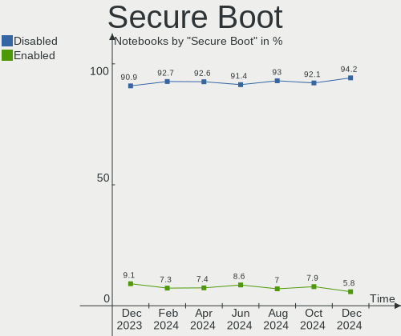
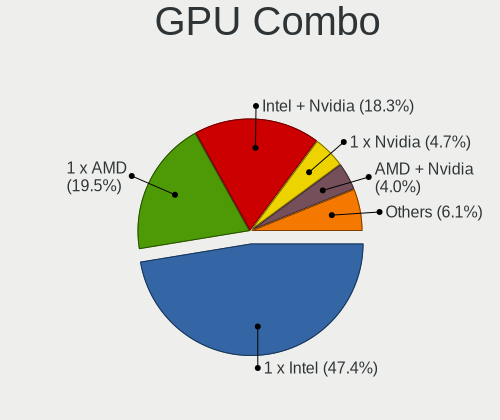
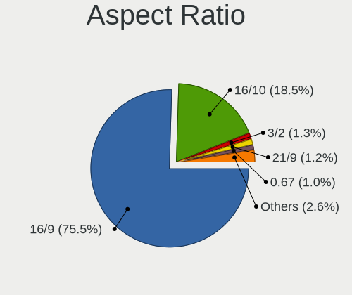

Linux - Hardware Trends (Notebooks)
-----------------------------------

A project to identify most popular hardware characteristics and track their change
over time based on data collected by Linux users at https://Linux-Hardware.org.

Anyone can contribute to this report by the [hw-probe](https://github.com/linuxhw/hw-probe) tool:

    sudo -E hw-probe -all -upload

This report is for one last month. Overall report since the beginning of time: [TestDays](https://github.com/linuxhw/TestDays)

Period: Mar, 2023.

Contents
--------

* [ System ](#system)
  - [ OS                       ](#os)
  - [ OS Family                ](#os-family)
  - [ Kernel                   ](#kernel)
  - [ Kernel Family            ](#kernel-family)
  - [ Kernel Major Ver.        ](#kernel-major-ver)
  - [ Arch                     ](#arch)
  - [ DE                       ](#de)
  - [ Display Server           ](#display-server)
  - [ Display Manager          ](#display-manager)
  - [ OS Lang                  ](#os-lang)
  - [ Boot Mode                ](#boot-mode)
  - [ Filesystem               ](#filesystem)
  - [ Part. scheme             ](#part-scheme)
  - [ Dual Boot with Linux/BSD ](#dual-boot-with-linuxbsd)
  - [ Dual Boot (Win)          ](#dual-boot-win)

* [ Board ](#board)
  - [ Vendor                   ](#vendor)
  - [ Model                    ](#model)
  - [ Model Family             ](#model-family)
  - [ MFG Year                 ](#mfg-year)
  - [ Form Factor              ](#form-factor)
  - [ Secure Boot              ](#secure-boot)
  - [ Coreboot                 ](#coreboot)
  - [ RAM Size                 ](#ram-size)
  - [ RAM Used                 ](#ram-used)
  - [ Total Drives             ](#total-drives)
  - [ Has CD-ROM               ](#has-cd-rom)
  - [ Has Ethernet             ](#has-ethernet)
  - [ Has WiFi                 ](#has-wifi)
  - [ Has Bluetooth            ](#has-bluetooth)

* [ Location ](#location)
  - [ Country                  ](#country)
  - [ City                     ](#city)

* [ Drives ](#drives)
  - [ Drive Vendor             ](#drive-vendor)
  - [ Drive Model              ](#drive-model)
  - [ HDD Vendor               ](#hdd-vendor)
  - [ SSD Vendor               ](#ssd-vendor)
  - [ Drive Kind               ](#drive-kind)
  - [ Drive Connector          ](#drive-connector)
  - [ Drive Size               ](#drive-size)
  - [ Space Total              ](#space-total)
  - [ Space Used               ](#space-used)
  - [ Malfunc. Drives          ](#malfunc-drives)
  - [ Malfunc. Drive Vendor    ](#malfunc-drive-vendor)
  - [ Malfunc. HDD Vendor      ](#malfunc-hdd-vendor)
  - [ Malfunc. Drive Kind      ](#malfunc-drive-kind)
  - [ Failed Drives            ](#failed-drives)
  - [ Failed Drive Vendor      ](#failed-drive-vendor)
  - [ Drive Status             ](#drive-status)

* [ Storage controller ](#storage-controller)
  - [ Storage Vendor           ](#storage-vendor)
  - [ Storage Model            ](#storage-model)
  - [ Storage Kind             ](#storage-kind)

* [ Processor ](#processor)
  - [ CPU Vendor               ](#cpu-vendor)
  - [ CPU Model                ](#cpu-model)
  - [ CPU Model Family         ](#cpu-model-family)
  - [ CPU Cores                ](#cpu-cores)
  - [ CPU Sockets              ](#cpu-sockets)
  - [ CPU Threads              ](#cpu-threads)
  - [ CPU Op-Modes             ](#cpu-op-modes)
  - [ CPU Microcode            ](#cpu-microcode)
  - [ CPU Microarch            ](#cpu-microarch)

* [ Graphics ](#graphics)
  - [ GPU Vendor               ](#gpu-vendor)
  - [ GPU Model                ](#gpu-model)
  - [ GPU Combo                ](#gpu-combo)
  - [ GPU Driver               ](#gpu-driver)
  - [ GPU Memory               ](#gpu-memory)

* [ Monitor ](#monitor)
  - [ Monitor Vendor           ](#monitor-vendor)
  - [ Monitor Model            ](#monitor-model)
  - [ Monitor Resolution       ](#monitor-resolution)
  - [ Monitor Diagonal         ](#monitor-diagonal)
  - [ Monitor Width            ](#monitor-width)
  - [ Aspect Ratio             ](#aspect-ratio)
  - [ Monitor Area             ](#monitor-area)
  - [ Pixel Density            ](#pixel-density)
  - [ Multiple Monitors        ](#multiple-monitors)

* [ Network ](#network)
  - [ Net Controller Vendor    ](#net-controller-vendor)
  - [ Net Controller Model     ](#net-controller-model)
  - [ Wireless Vendor          ](#wireless-vendor)
  - [ Wireless Model           ](#wireless-model)
  - [ Ethernet Vendor          ](#ethernet-vendor)
  - [ Ethernet Model           ](#ethernet-model)
  - [ Net Controller Kind      ](#net-controller-kind)
  - [ Used Controller          ](#used-controller)
  - [ NICs                     ](#nics)
  - [ IPv6                     ](#ipv6)

* [ Bluetooth ](#bluetooth)
  - [ Bluetooth Vendor         ](#bluetooth-vendor)
  - [ Bluetooth Model          ](#bluetooth-model)

* [ Sound ](#sound)
  - [ Sound Vendor             ](#sound-vendor)
  - [ Sound Model              ](#sound-model)

* [ Memory ](#memory)
  - [ Memory Vendor            ](#memory-vendor)
  - [ Memory Model             ](#memory-model)
  - [ Memory Kind              ](#memory-kind)
  - [ Memory Form Factor       ](#memory-form-factor)
  - [ Memory Size              ](#memory-size)
  - [ Memory Speed             ](#memory-speed)

* [ Printers & scanners ](#printers--scanners)
  - [ Printer Vendor           ](#printer-vendor)
  - [ Printer Model            ](#printer-model)
  - [ Scanner Vendor           ](#scanner-vendor)
  - [ Scanner Model            ](#scanner-model)

* [ Camera ](#camera)
  - [ Camera Vendor            ](#camera-vendor)
  - [ Camera Model             ](#camera-model)

* [ Security ](#security)
  - [ Fingerprint Vendor       ](#fingerprint-vendor)
  - [ Fingerprint Model        ](#fingerprint-model)
  - [ Chipcard Vendor          ](#chipcard-vendor)
  - [ Chipcard Model           ](#chipcard-model)

* [ Unsupported ](#unsupported)
  - [ Unsupported Devices      ](#unsupported-devices)
  - [ Unsupported Device Types ](#unsupported-device-types)

System
------

OS
--

Installed operating systems

| Name                         | Notebooks | Percent |
|------------------------------|-----------|---------|
| Ubuntu 22.04                 | 470       | 14.05%  |
| Linux Mint 21.1              | 230       | 6.88%   |
| Fedora 37                    | 225       | 6.73%   |
| Debian 11                    | 180       | 5.38%   |
| OpenMandriva 23.03           | 168       | 5.02%   |
| Pop!_OS 22.04                | 155       | 4.63%   |
| OpenMandriva 23.01           | 142       | 4.25%   |
| Ubuntu 22.10                 | 141       | 4.22%   |
| Arch Rolling                 | 117       | 3.5%    |
| ROSA 12.3                    | 104       | 3.11%   |
| Zorin 16                     | 94        | 2.81%   |
| Ubuntu 20.04                 | 69        | 2.06%   |
| KDE neon 22.04               | 59        | 1.76%   |
| Kali 2023.1                  | 58        | 1.73%   |
| Manjaro                      | 48        | 1.43%   |
| Linux Mint 20.3              | 44        | 1.32%   |
| OpenMandriva 4.3             | 43        | 1.29%   |
| SteamOS 3.4.6                | 41        | 1.23%   |
| EndeavourOS Rolling          | 40        | 1.2%    |
| Kubuntu 22.04                | 39        | 1.17%   |
| ArcoLinux Rolling            | 39        | 1.17%   |
| Kubuntu 22.10                | 36        | 1.08%   |
| Debian                       | 36        | 1.08%   |
| Linux Mint 21                | 34        | 1.02%   |
| openSUSE Tumbleweed-XXXXXXXX | 32        | 0.96%   |
| SteamOS 3.4.4                | 30        | 0.9%    |
| Elementary 7                 | 25        | 0.75%   |
| Manjaro 22.0.4               | 24        | 0.72%   |
| Nobara 37                    | 23        | 0.69%   |
| Manjaro 22.0.5               | 22        | 0.66%   |
| BlackPanther 18.1            | 22        | 0.66%   |
| LMDE 5                       | 21        | 0.63%   |
| Gentoo 2.13                  | 20        | 0.6%    |
| Debian 12                    | 20        | 0.6%    |
| Fedora 38                    | 19        | 0.57%   |
| Xubuntu 22.04                | 17        | 0.51%   |
| ROSA 12.4                    | 14        | 0.42%   |
| Lubuntu 22.04                | 14        | 0.42%   |
| Ubuntu 18.04                 | 13        | 0.39%   |
| OpenMandriva 4.2             | 13        | 0.39%   |

OS Family
---------

OS without a version

| Name          | Notebooks | Percent |
|---------------|-----------|---------|
| Ubuntu        | 708       | 21.17%  |
| OpenMandriva  | 376       | 11.24%  |
| Linux Mint    | 323       | 9.66%   |
| Fedora        | 261       | 7.8%    |
| Debian        | 241       | 7.2%    |
| Pop!_OS       | 159       | 4.75%   |
| ROSA          | 128       | 3.83%   |
| Arch          | 117       | 3.5%    |
| Zorin         | 100       | 2.99%   |
| Manjaro       | 96        | 2.87%   |
| Kubuntu       | 81        | 2.42%   |
| SteamOS       | 75        | 2.24%   |
| Kali          | 63        | 1.88%   |
| KDE neon      | 61        | 1.82%   |
| openSUSE      | 43        | 1.29%   |
| ArcoLinux     | 41        | 1.23%   |
| EndeavourOS   | 40        | 1.2%    |
| Elementary    | 34        | 1.02%   |
| Xubuntu       | 33        | 0.99%   |
| Endless       | 30        | 0.9%    |
| Gentoo        | 28        | 0.84%   |
| Nobara        | 27        | 0.81%   |
| Lubuntu       | 23        | 0.69%   |
| BlackPanther  | 23        | 0.69%   |
| LMDE          | 21        | 0.63%   |
| Ubuntu MATE   | 16        | 0.48%   |
| Ubuntu Budgie | 15        | 0.45%   |
| MX            | 13        | 0.39%   |
| TUXEDO OS     | 11        | 0.33%   |
| Parrot        | 10        | 0.3%    |
| Garuda Linux  | 10        | 0.3%    |
| ALT Linux     | 10        | 0.3%    |
| Xero          | 9         | 0.27%   |
| Red OS        | 7         | 0.21%   |
| RHEL          | 5         | 0.15%   |
| NixOS         | 5         | 0.15%   |
| Devuan        | 5         | 0.15%   |
| ChimeraOS     | 5         | 0.15%   |
| Ubuntu Unity  | 4         | 0.12%   |
| Siduction     | 4         | 0.12%   |

Kernel
------

Version of the Linux kernel

| Version                            | Notebooks | Percent |
|------------------------------------|-----------|---------|
| 5.19.0-35-generic                  | 483       | 14.44%  |
| 5.15.0-67-generic                  | 295       | 8.82%   |
| 6.2.6-desktop-1omv2390             | 141       | 4.22%   |
| 6.1.1-desktop-1omv2290             | 134       | 4.01%   |
| 5.10.0-21-amd64                    | 108       | 3.23%   |
| 5.19.0-32-generic                  | 85        | 2.54%   |
| 5.19.0-38-generic                  | 84        | 2.51%   |
| 5.13.0-valve36-1-neptune           | 71        | 2.12%   |
| 6.2.0-76060200-generic             | 69        | 2.06%   |
| 5.15.0-60-generic                  | 64        | 1.91%   |
| 5.10.0-20-amd64                    | 64        | 1.91%   |
| 6.1.14-200.fc37.x86_64             | 59        | 1.76%   |
| 5.4.0-144-generic                  | 56        | 1.67%   |
| 6.1.0-kali5-amd64                  | 51        | 1.52%   |
| 6.1.18-200.fc37.x86_64             | 50        | 1.49%   |
| 5.15.0-69-generic                  | 45        | 1.35%   |
| 5.15.75-generic-1rosa2021.1-x86_64 | 41        | 1.23%   |
| 5.15.0-56-generic                  | 39        | 1.17%   |
| 6.2.8-arch1-1                      | 36        | 1.08%   |
| 6.2.7-200.fc37.x86_64              | 36        | 1.08%   |
| 6.1.12-1-MANJARO                   | 34        | 1.02%   |
| 6.1.11-76060111-generic            | 32        | 0.96%   |
| 6.2.2-arch1-1                      | 31        | 0.93%   |
| 6.2.6-76060206-generic             | 28        | 0.84%   |
| 6.1.15-200.fc37.x86_64             | 28        | 0.84%   |
| 5.15.79-generic-1rosa2021.1-x86_64 | 26        | 0.78%   |
| 5.16.7-desktop-1omv4003            | 25        | 0.75%   |
| 6.2.7-arch1-1                      | 23        | 0.69%   |
| 6.2.6-arch1-1                      | 22        | 0.66%   |
| 6.1.0-6-amd64                      | 22        | 0.66%   |
| 6.0.12-76060006-generic            | 21        | 0.63%   |
| 6.2.2-desktop-1omv2390             | 20        | 0.6%    |
| 6.1.19-1-MANJARO                   | 20        | 0.6%    |
| 6.1.0-5-amd64                      | 20        | 0.6%    |
| 5.16.13-desktop-1omv4003           | 20        | 0.6%    |
| 6.2.8-200.fc37.x86_64              | 19        | 0.57%   |
| 5.6.14-desktop-2bP                 | 16        | 0.48%   |
| 5.19.0-31-generic                  | 15        | 0.45%   |
| 6.0.0-0.deb11.6-amd64              | 14        | 0.42%   |
| 5.19.0-21-generic                  | 14        | 0.42%   |

Kernel Family
-------------

Linux kernel without a distro release

| Version  | Notebooks | Percent |
|----------|-----------|---------|
| 5.19.0   | 708       | 21.17%  |
| 5.15.0   | 510       | 15.25%  |
| 6.2.6    | 229       | 6.85%   |
| 5.10.0   | 194       | 5.8%    |
| 6.1.1    | 135       | 4.04%   |
| 6.1.0    | 134       | 4.01%   |
| 6.2.2    | 93        | 2.78%   |
| 6.2.7    | 89        | 2.66%   |
| 6.2.0    | 87        | 2.6%    |
| 6.2.8    | 85        | 2.54%   |
| 5.4.0    | 85        | 2.54%   |
| 5.13.0   | 76        | 2.27%   |
| 6.1.14   | 75        | 2.24%   |
| 6.1.12   | 60        | 1.79%   |
| 6.1.11   | 56        | 1.67%   |
| 6.1.18   | 53        | 1.58%   |
| 5.15.75  | 52        | 1.55%   |
| 6.1.15   | 40        | 1.2%    |
| 6.0.0    | 40        | 1.2%    |
| 6.2.1    | 36        | 1.08%   |
| 6.1.19   | 32        | 0.96%   |
| 6.0.12   | 30        | 0.9%    |
| 6.2.5    | 28        | 0.84%   |
| 5.15.79  | 26        | 0.78%   |
| 5.16.7   | 25        | 0.75%   |
| 5.16.13  | 21        | 0.63%   |
| 5.14.0   | 18        | 0.54%   |
| 6.1.20   | 16        | 0.48%   |
| 5.6.14   | 16        | 0.48%   |
| 5.11.0   | 16        | 0.48%   |
| 4.15.0   | 15        | 0.45%   |
| 5.15.94  | 14        | 0.42%   |
| 5.10.14  | 12        | 0.36%   |
| 6.1.13   | 11        | 0.33%   |
| 6.0.7    | 11        | 0.33%   |
| 6.1.4    | 10        | 0.3%    |
| 5.8.0    | 9         | 0.27%   |
| 5.14.21  | 8         | 0.24%   |
| 6.1.9    | 7         | 0.21%   |
| 5.15.102 | 7         | 0.21%   |

Kernel Major Ver.
-----------------

Linux kernel major version

| Version | Notebooks | Percent |
|---------|-----------|---------|
| 5.19    | 716       | 21.41%  |
| 6.2     | 655       | 19.58%  |
| 6.1     | 648       | 19.37%  |
| 5.15    | 646       | 19.31%  |
| 5.10    | 231       | 6.91%   |
| 6.0     | 99        | 2.96%   |
| 5.4     | 91        | 2.72%   |
| 5.13    | 76        | 2.27%   |
| 5.16    | 49        | 1.46%   |
| 5.14    | 28        | 0.84%   |
| 5.11    | 18        | 0.54%   |
| 5.6     | 16        | 0.48%   |
| 4.15    | 15        | 0.45%   |
| 5.17    | 13        | 0.39%   |
| 5.8     | 9         | 0.27%   |
| 4.18    | 9         | 0.27%   |
| 4.9     | 7         | 0.21%   |
| 5.18    | 6         | 0.18%   |
| 6.3     | 3         | 0.09%   |
| 5.3     | 2         | 0.06%   |
| 4.4     | 2         | 0.06%   |
| 3.10    | 2         | 0.06%   |
| 5.7     | 1         | 0.03%   |
| 5.2     | 1         | 0.03%   |
| 5.0     | 1         | 0.03%   |
| 4.19    | 1         | 0.03%   |

Arch
----

OS architecture (x86_64, i586, etc.)

| Name    | Notebooks | Percent |
|---------|-----------|---------|
| x86_64  | 3306      | 98.83%  |
| i686    | 36        | 1.08%   |
| aarch64 | 3         | 0.09%   |

DE
--

Desktop Environment

| Name              | Notebooks | Percent |
|-------------------|-----------|---------|
| GNOME             | 1415      | 42.3%   |
| KDE5              | 948       | 28.34%  |
| X-Cinnamon        | 299       | 8.94%   |
| XFCE              | 233       | 6.97%   |
| Unknown           | 109       | 3.26%   |
| MATE              | 80        | 2.39%   |
| LXQt              | 63        | 1.88%   |
| Pantheon          | 34        | 1.02%   |
| Cinnamon          | 29        | 0.87%   |
| Budgie            | 22        | 0.66%   |
| i3                | 13        | 0.39%   |
| Hyprland          | 12        | 0.36%   |
| LXDE              | 11        | 0.33%   |
| sway              | 9         | 0.27%   |
| KDE               | 8         | 0.24%   |
| GNOME Flashback   | 7         | 0.21%   |
| KDE4              | 6         | 0.18%   |
| awesome           | 6         | 0.18%   |
| Unity             | 4         | 0.12%   |
| ICEWM             | 4         | 0.12%   |
| DWM               | 4         | 0.12%   |
| Trinity           | 3         | 0.09%   |
| openbox           | 3         | 0.09%   |
| GNOME Classic     | 3         | 0.09%   |
| Deepin            | 3         | 0.09%   |
| xmonad            | 2         | 0.06%   |
| qtile             | 2         | 0.06%   |
| BunsenLabs        | 2         | 0.06%   |
| xsession          | 1         | 0.03%   |
| xinit-compat      | 1         | 0.03%   |
| x-session-manager | 1         | 0.03%   |
| ubuntu:pika:GNOME | 1         | 0.03%   |
| ratpoison         | 1         | 0.03%   |
| onyx:GNOME        | 1         | 0.03%   |
| lightdm-xsession  | 1         | 0.03%   |
| GNUstep           | 1         | 0.03%   |
| fluxbox           | 1         | 0.03%   |
| Enlightenment     | 1         | 0.03%   |
| bspwm             | 1         | 0.03%   |

Display Server
--------------

X11 or Wayland

| Name    | Notebooks | Percent |
|---------|-----------|---------|
| X11     | 2235      | 66.82%  |
| Wayland | 978       | 29.24%  |
| Unknown | 89        | 2.66%   |
| Tty     | 43        | 1.29%   |

Display Manager
---------------

SDDM, LightDM, etc.

| Name    | Notebooks | Percent |
|---------|-----------|---------|
| Unknown | 1086      | 32.47%  |
| SDDM    | 743       | 22.21%  |
| GDM3    | 706       | 21.11%  |
| LightDM | 476       | 14.23%  |
| GDM     | 303       | 9.06%   |
| KDM     | 6         | 0.18%   |
| SLiM    | 5         | 0.15%   |
| LXDM    | 5         | 0.15%   |
| GREETD  | 5         | 0.15%   |
| XDM     | 3         | 0.09%   |
| TDM     | 2         | 0.06%   |
| NODM    | 2         | 0.06%   |
| SLIMSKI | 1         | 0.03%   |
| Ly      | 1         | 0.03%   |
| EMPTTY  | 1         | 0.03%   |

OS Lang
-------

Language

| Lang    | Notebooks | Percent |
|---------|-----------|---------|
| en_US   | 1409      | 42.12%  |
| de_DE   | 306       | 9.15%   |
| ru_RU   | 273       | 8.16%   |
| en_GB   | 174       | 5.2%    |
| fr_FR   | 145       | 4.33%   |
| pt_BR   | 127       | 3.8%    |
| it_IT   | 99        | 2.96%   |
| Unknown | 96        | 2.87%   |
| es_ES   | 77        | 2.3%    |
| pl_PL   | 75        | 2.24%   |
| en_IN   | 66        | 1.97%   |
| C       | 54        | 1.61%   |
| en_CA   | 45        | 1.35%   |
| en_AU   | 32        | 0.96%   |
| es_MX   | 31        | 0.93%   |
| nl_NL   | 22        | 0.66%   |
| cs_CZ   | 20        | 0.6%    |
| tr_TR   | 19        | 0.57%   |
| zh_CN   | 16        | 0.48%   |
| hu_HU   | 15        | 0.45%   |
| de_AT   | 15        | 0.45%   |
| de_CH   | 14        | 0.42%   |
| pt_PT   | 12        | 0.36%   |
| es_AR   | 12        | 0.36%   |
| en_ZA   | 11        | 0.33%   |
| sv_SE   | 9         | 0.27%   |
| nl_BE   | 9         | 0.27%   |
| nb_NO   | 9         | 0.27%   |
| fr_BE   | 9         | 0.27%   |
| fi_FI   | 9         | 0.27%   |
| es_CL   | 9         | 0.27%   |
| en_PH   | 7         | 0.21%   |
| en_IE   | 7         | 0.21%   |
| sk_SK   | 6         | 0.18%   |
| es_CO   | 6         | 0.18%   |
| en_NZ   | 6         | 0.18%   |
| fr_CH   | 5         | 0.15%   |
| en_DK   | 5         | 0.15%   |
| el_GR   | 5         | 0.15%   |
| lt_LT   | 4         | 0.12%   |

Boot Mode
---------

EFI or BIOS

| Mode | Notebooks | Percent |
|------|-----------|---------|
| EFI  | 1870      | 55.9%   |
| BIOS | 1475      | 44.1%   |

Filesystem
----------

Type of filesystem

| Type    | Notebooks | Percent |
|---------|-----------|---------|
| Ext4    | 2382      | 71.21%  |
| Btrfs   | 551       | 16.47%  |
| Overlay | 307       | 9.18%   |
| Xfs     | 50        | 1.49%   |
| Zfs     | 28        | 0.84%   |
| F2fs    | 6         | 0.18%   |
| Rootfs  | 4         | 0.12%   |
| Ext3    | 4         | 0.12%   |
| Unknown | 4         | 0.12%   |
| Tmpfs   | 3         | 0.09%   |
| Ext2    | 3         | 0.09%   |
| Aufs    | 2         | 0.06%   |
| XXXXXXX | 1         | 0.03%   |

Part. scheme
------------

Scheme of partitioning

| Type    | Notebooks | Percent |
|---------|-----------|---------|
| GPT     | 1982      | 59.25%  |
| Unknown | 972       | 29.06%  |
| MBR     | 391       | 11.69%  |

Dual Boot with Linux/BSD
------------------------

Hosting more than one Linux/BSD

| Dual boot | Notebooks | Percent |
|-----------|-----------|---------|
| No        | 2897      | 86.61%  |
| Yes       | 448       | 13.39%  |

Dual Boot (Win)
---------------

Hosting Linux and Windows

| Dual boot | Notebooks | Percent |
|-----------|-----------|---------|
| No        | 2498      | 74.68%  |
| Yes       | 847       | 25.32%  |

Board
-----

Vendor
------

Motherboard manufacturer

| Name                   | Notebooks | Percent |
|------------------------|-----------|---------|
| Lenovo                 | 708       | 21.17%  |
| Hewlett-Packard        | 535       | 15.99%  |
| Dell                   | 473       | 14.14%  |
| ASUSTek Computer       | 354       | 10.58%  |
| Acer                   | 279       | 8.34%   |
| Apple                  | 132       | 3.95%   |
| MSI                    | 90        | 2.69%   |
| Toshiba                | 82        | 2.45%   |
| Valve                  | 74        | 2.21%   |
| HUAWEI                 | 56        | 1.67%   |
| Samsung Electronics    | 53        | 1.58%   |
| Sony                   | 36        | 1.08%   |
| Google                 | 34        | 1.02%   |
| TUXEDO                 | 29        | 0.87%   |
| Fujitsu                | 28        | 0.84%   |
| Notebook               | 25        | 0.75%   |
| Unknown                | 22        | 0.66%   |
| HONOR                  | 18        | 0.54%   |
| Medion                 | 16        | 0.48%   |
| Gigabyte Technology    | 15        | 0.45%   |
| Timi                   | 14        | 0.42%   |
| Positivo               | 13        | 0.39%   |
| Chuwi                  | 12        | 0.36%   |
| Fujitsu Siemens        | 11        | 0.33%   |
| Clevo                  | 11        | 0.33%   |
| Intel                  | 10        | 0.3%    |
| Alienware              | 9         | 0.27%   |
| Razer                  | 8         | 0.24%   |
| Packard Bell           | 8         | 0.24%   |
| GPD                    | 8         | 0.24%   |
| System76               | 7         | 0.21%   |
| Framework              | 7         | 0.21%   |
| LG Electronics         | 6         | 0.18%   |
| Avell High Performance | 6         | 0.18%   |
| Star Labs              | 5         | 0.15%   |
| Schenker               | 5         | 0.15%   |
| GPU Company            | 5         | 0.15%   |
| Pegatron               | 4         | 0.12%   |
| Getac                  | 4         | 0.12%   |
| eMachines              | 4         | 0.12%   |

Model
-----

Motherboard model

| Name                          | Notebooks | Percent |
|-------------------------------|-----------|---------|
| Valve Jupiter                 | 74        | 2.21%   |
| Apple MacBook5,2              | 47        | 1.41%   |
| Unknown                       | 28        | 0.84%   |
| HP Notebook                   | 13        | 0.39%   |
| Apple MacBookPro9,2           | 13        | 0.39%   |
| HP Pavilion dv6               | 11        | 0.33%   |
| HP Pavilion Notebook          | 10        | 0.3%    |
| HP Pavilion 15                | 9         | 0.27%   |
| Dell XPS 15 9570              | 9         | 0.27%   |
| Dell Latitude 5420            | 9         | 0.27%   |
| Dell XPS 15 9520              | 8         | 0.24%   |
| Dell Latitude E6430           | 8         | 0.24%   |
| Dell Latitude E6420           | 8         | 0.24%   |
| Lenovo IdeaPad 3 15ITL6 82H8  | 7         | 0.21%   |
| Lenovo IdeaPad 3 15ALC6 82KU  | 7         | 0.21%   |
| HP Pavilion dv7               | 7         | 0.21%   |
| Dell XPS 13 9310              | 7         | 0.21%   |
| Dell Latitude E5570           | 7         | 0.21%   |
| Dell Inspiron 15-3567         | 7         | 0.21%   |
| Samsung 550XDA                | 6         | 0.18%   |
| Lenovo IdeaPad 320-15AST 80XV | 6         | 0.18%   |
| HUAWEI NBLB-WAX9N             | 6         | 0.18%   |
| HP Pavilion g7                | 6         | 0.18%   |
| HP Pavilion g6                | 6         | 0.18%   |
| HP EliteBook 840 G5           | 6         | 0.18%   |
| HP EliteBook 840 G3           | 6         | 0.18%   |
| Chuwi GemiBook Pro            | 6         | 0.18%   |
| Apple MacBookPro8,1           | 6         | 0.18%   |
| Apple MacBookPro11,3          | 6         | 0.18%   |
| Apple MacBook5,1              | 6         | 0.18%   |
| Lenovo Legion 5 15ACH6H 82JU  | 5         | 0.15%   |
| Lenovo IdeaPad 5 15ARE05 81YQ | 5         | 0.15%   |
| Lenovo G50-45 80E3            | 5         | 0.15%   |
| HUAWEI HVY-WXX9               | 5         | 0.15%   |
| HUAWEI BOD-WXX9               | 5         | 0.15%   |
| HONOR HYM-WXX                 | 5         | 0.15%   |
| HP Laptop 15s-eq2xxx          | 5         | 0.15%   |
| HP Laptop 15-db0xxx           | 5         | 0.15%   |
| HP EliteBook 8460p            | 5         | 0.15%   |
| HP EliteBook 830 G5           | 5         | 0.15%   |

Model Family
------------

Motherboard model prefix

| Name                | Notebooks | Percent |
|---------------------|-----------|---------|
| Lenovo ThinkPad     | 377       | 11.27%  |
| Acer Aspire         | 192       | 5.74%   |
| Dell Latitude       | 178       | 5.32%   |
| Lenovo IdeaPad      | 162       | 4.84%   |
| HP Pavilion         | 116       | 3.47%   |
| Dell Inspiron       | 109       | 3.26%   |
| HP EliteBook        | 92        | 2.75%   |
| HP Laptop           | 89        | 2.66%   |
| ASUS VivoBook       | 89        | 2.66%   |
| Valve Jupiter       | 74        | 2.21%   |
| Toshiba Satellite   | 65        | 1.94%   |
| Dell XPS            | 65        | 1.94%   |
| HP ProBook          | 64        | 1.91%   |
| Apple MacBook5      | 53        | 1.58%   |
| Dell Precision      | 45        | 1.35%   |
| Dell Vostro         | 37        | 1.11%   |
| Lenovo Legion       | 33        | 0.99%   |
| HP ZBook            | 30        | 0.9%    |
| ASUS ROG            | 29        | 0.87%   |
| ASUS ASUS           | 28        | 0.84%   |
| Unknown             | 28        | 0.84%   |
| Acer Swift          | 26        | 0.78%   |
| Fujitsu LIFEBOOK    | 25        | 0.75%   |
| HP Compaq           | 22        | 0.66%   |
| ASUS ZenBook        | 22        | 0.66%   |
| Acer Nitro          | 22        | 0.66%   |
| Lenovo Yoga         | 21        | 0.63%   |
| Lenovo ThinkBook    | 21        | 0.63%   |
| HP 250              | 21        | 0.63%   |
| Apple MacBookPro9   | 16        | 0.48%   |
| Apple MacBookPro11  | 16        | 0.48%   |
| TUXEDO InfinityBook | 15        | 0.45%   |
| Acer TravelMate     | 15        | 0.45%   |
| HP OMEN             | 14        | 0.42%   |
| HP ENVY             | 14        | 0.42%   |
| HP Notebook         | 13        | 0.39%   |
| MSI Modern          | 11        | 0.33%   |
| HP 255              | 11        | 0.33%   |
| Dell G15            | 11        | 0.33%   |
| ASUS TUF            | 11        | 0.33%   |

MFG Year
--------

Motherboard manufacture year

| Year    | Notebooks | Percent |
|---------|-----------|---------|
| 2021    | 437       | 13.06%  |
| 2022    | 423       | 12.65%  |
| 2020    | 318       | 9.51%   |
| 2019    | 260       | 7.77%   |
| 2018    | 242       | 7.23%   |
| 2012    | 215       | 6.43%   |
| 2011    | 192       | 5.74%   |
| 2013    | 181       | 5.41%   |
| 2017    | 171       | 5.11%   |
| 2014    | 161       | 4.81%   |
| 2016    | 158       | 4.72%   |
| 2015    | 144       | 4.3%    |
| 2010    | 134       | 4.01%   |
| 2009    | 128       | 3.83%   |
| 2008    | 85        | 2.54%   |
| 2007    | 37        | 1.11%   |
| 2023    | 29        | 0.87%   |
| 2006    | 21        | 0.63%   |
| Unknown | 5         | 0.15%   |
| 2005    | 2         | 0.06%   |
| 2004    | 2         | 0.06%   |

Form Factor
-----------

Physical design of the computer

| Name     | Notebooks | Percent |
|----------|-----------|---------|
| Notebook | 3345      | 100%    |

Secure Boot
-----------

Enabled or disabled

| State    | Notebooks | Percent |
|----------|-----------|---------|
| Disabled | 3057      | 91.39%  |
| Enabled  | 288       | 8.61%   |

Coreboot
--------

Have coreboot on board

| Used | Notebooks | Percent |
|------|-----------|---------|
| No   | 3300      | 98.65%  |
| Yes  | 45        | 1.35%   |

RAM Size
--------

Total RAM memory

| Size in GB  | Notebooks | Percent |
|-------------|-----------|---------|
| 4.01-8.0    | 916       | 27.38%  |
| 8.01-16.0   | 633       | 18.92%  |
| 16.01-24.0  | 616       | 18.42%  |
| 3.01-4.0    | 615       | 18.39%  |
| 32.01-64.0  | 288       | 8.61%   |
| 1.01-2.0    | 112       | 3.35%   |
| 24.01-32.0  | 58        | 1.73%   |
| 64.01-256.0 | 50        | 1.49%   |
| 2.01-3.0    | 45        | 1.35%   |
| 0.51-1.0    | 11        | 0.33%   |
| 0.01-0.5    | 1         | 0.03%   |

RAM Used
--------

Used RAM memory

| Used GB    | Notebooks | Percent |
|------------|-----------|---------|
| 1.01-2.0   | 1042      | 31.15%  |
| 2.01-3.0   | 855       | 25.56%  |
| 4.01-8.0   | 626       | 18.71%  |
| 3.01-4.0   | 466       | 13.93%  |
| 8.01-16.0  | 160       | 4.78%   |
| 0.51-1.0   | 147       | 4.39%   |
| 16.01-24.0 | 21        | 0.63%   |
| 0.01-0.5   | 21        | 0.63%   |
| 24.01-32.0 | 6         | 0.18%   |
| 32.01-64.0 | 1         | 0.03%   |

Total Drives
------------

Number of drives on board

| Drives | Notebooks | Percent |
|--------|-----------|---------|
| 1      | 2416      | 72.23%  |
| 2      | 792       | 23.68%  |
| 3      | 102       | 3.05%   |
| 4      | 18        | 0.54%   |
| 0      | 13        | 0.39%   |
| 5      | 2         | 0.06%   |
| 7      | 1         | 0.03%   |
| 6      | 1         | 0.03%   |

Has CD-ROM
----------

Has CD-ROM on board

| Presented | Notebooks | Percent |
|-----------|-----------|---------|
| No        | 2373      | 70.94%  |
| Yes       | 972       | 29.06%  |

Has Ethernet
------------

Has Ethernet on board

| Presented | Notebooks | Percent |
|-----------|-----------|---------|
| Yes       | 2567      | 76.74%  |
| No        | 778       | 23.26%  |

Has WiFi
--------

Has WiFi module

| Presented | Notebooks | Percent |
|-----------|-----------|---------|
| Yes       | 3285      | 98.21%  |
| No        | 60        | 1.79%   |

Has Bluetooth
-------------

Has Bluetooth module

| Presented | Notebooks | Percent |
|-----------|-----------|---------|
| Yes       | 2759      | 82.48%  |
| No        | 586       | 17.52%  |

Location
--------

Country
-------

Geographic location (country)

| Country      | Notebooks | Percent |
|--------------|-----------|---------|
| USA          | 567       | 16.95%  |
| Germany      | 400       | 11.96%  |
| Russia       | 285       | 8.52%   |
| France       | 183       | 5.47%   |
| Brazil       | 173       | 5.17%   |
| Italy        | 148       | 4.42%   |
| UK           | 125       | 3.74%   |
| Poland       | 124       | 3.71%   |
| Spain        | 107       | 3.2%    |
| India        | 91        | 2.72%   |
| Canada       | 69        | 2.06%   |
| Netherlands  | 58        | 1.73%   |
| Turkey       | 51        | 1.52%   |
| Hungary      | 47        | 1.41%   |
| Mexico       | 45        | 1.35%   |
| Switzerland  | 44        | 1.32%   |
| Australia    | 41        | 1.23%   |
| Sweden       | 35        | 1.05%   |
| Austria      | 33        | 0.99%   |
| Czechia      | 32        | 0.96%   |
| Finland      | 30        | 0.9%    |
| Belgium      | 30        | 0.9%    |
| Indonesia    | 28        | 0.84%   |
| Portugal     | 27        | 0.81%   |
| Romania      | 23        | 0.69%   |
| Belarus      | 23        | 0.69%   |
| Argentina    | 22        | 0.66%   |
| Norway       | 21        | 0.63%   |
| Bulgaria     | 20        | 0.6%    |
| Slovakia     | 18        | 0.54%   |
| China        | 18        | 0.54%   |
| South Africa | 17        | 0.51%   |
| Japan        | 17        | 0.51%   |
| Chile        | 17        | 0.51%   |
| New Zealand  | 15        | 0.45%   |
| Ireland      | 15        | 0.45%   |
| Philippines  | 14        | 0.42%   |
| Greece       | 14        | 0.42%   |
| Denmark      | 14        | 0.42%   |
| Vietnam      | 13        | 0.39%   |

City
----

Geographic location (city)

| City              | Notebooks | Percent |
|-------------------|-----------|---------|
| Moscow            | 72        | 2.15%   |
| Bangor            | 53        | 1.58%   |
| Berlin            | 37        | 1.11%   |
| St Petersburg     | 35        | 1.05%   |
| Paris             | 32        | 0.96%   |
| Warsaw            | 30        | 0.9%    |
| Vienna            | 22        | 0.66%   |
| Sao Paulo         | 22        | 0.66%   |
| Budapest          | 22        | 0.66%   |
| Madrid            | 21        | 0.63%   |
| Milan             | 20        | 0.6%    |
| Frankfurt am Main | 20        | 0.6%    |
| Munich            | 19        | 0.57%   |
| Helsinki          | 17        | 0.51%   |
| London            | 16        | 0.48%   |
| Milano            | 14        | 0.42%   |
| Hamburg           | 14        | 0.42%   |
| Istanbul          | 13        | 0.39%   |
| Barcelona         | 13        | 0.39%   |
| Sydney            | 12        | 0.36%   |
| Cologne           | 12        | 0.36%   |
| Bengaluru         | 12        | 0.36%   |
| Rome              | 11        | 0.33%   |
| Prague            | 11        | 0.33%   |
| New York          | 11        | 0.33%   |
| Minsk             | 11        | 0.33%   |
| Melbourne         | 11        | 0.33%   |
| Lisbon            | 11        | 0.33%   |
| Krasnodar         | 11        | 0.33%   |
| Brasília         | 11        | 0.33%   |
| Zurich            | 10        | 0.3%    |
| Stuttgart         | 10        | 0.3%    |
| Stockholm         | 10        | 0.3%    |
| Chicago           | 10        | 0.3%    |
| Amsterdam         | 10        | 0.3%    |
| Santiago          | 9         | 0.27%   |
| Porto Alegre      | 9         | 0.27%   |
| Krakow            | 9         | 0.27%   |
| Dublin            | 9         | 0.27%   |
| Wroclaw           | 8         | 0.24%   |

Drives
------

Drive Vendor
------------

Hard drive vendors

| Vendor                      | Notebooks | Drives | Percent |
|-----------------------------|-----------|--------|---------|
| Samsung Electronics         | 735       | 804    | 17.55%  |
| WDC                         | 414       | 433    | 9.88%   |
| Seagate                     | 354       | 367    | 8.45%   |
| Toshiba                     | 270       | 277    | 6.45%   |
| Sandisk                     | 270       | 275    | 6.45%   |
| Unknown                     | 234       | 247    | 5.59%   |
| Kingston                    | 175       | 179    | 4.18%   |
| SK hynix                    | 167       | 168    | 3.99%   |
| Micron Technology           | 147       | 148    | 3.51%   |
| Crucial                     | 127       | 131    | 3.03%   |
| Intel                       | 113       | 117    | 2.7%    |
| Hitachi                     | 89        | 89     | 2.12%   |
| HGST                        | 80        | 80     | 1.91%   |
| KIOXIA                      | 65        | 65     | 1.55%   |
| A-DATA Technology           | 61        | 62     | 1.46%   |
| China                       | 53        | 54     | 1.27%   |
| Phison Electronics          | 52        | 53     | 1.24%   |
| Fujitsu                     | 46        | 46     | 1.1%    |
| Kingston Technology Company | 42        | 43     | 1%      |
| Apple                       | 40        | 49     | 0.95%   |
| Unknown                     | 38        | 39     | 0.91%   |
| Intenso                     | 33        | 33     | 0.79%   |
| Silicon Motion              | 29        | 30     | 0.69%   |
| Micron/Crucial Technology   | 28        | 28     | 0.67%   |
| SPCC                        | 27        | 27     | 0.64%   |
| PNY                         | 23        | 23     | 0.55%   |
| Netac                       | 22        | 23     | 0.53%   |
| Phison                      | 21        | 21     | 0.5%    |
| GOODRAM                     | 19        | 19     | 0.45%   |
| Transcend                   | 15        | 15     | 0.36%   |
| JMicron Technology          | 15        | 15     | 0.36%   |
| SSSTC                       | 13        | 13     | 0.31%   |
| Patriot                     | 13        | 14     | 0.31%   |
| ADATA Technology            | 13        | 13     | 0.31%   |
| LITEON                      | 12        | 12     | 0.29%   |
| Gigabyte Technology         | 12        | 12     | 0.29%   |
| LITEONIT                    | 10        | 10     | 0.24%   |
| Hewlett-Packard             | 9         | 9      | 0.21%   |
| Apacer                      | 9         | 9      | 0.21%   |
| Solid State Storage         | 8         | 8      | 0.19%   |

Drive Model
-----------

Hard drive models

| Model                                                  | Notebooks | Percent |
|--------------------------------------------------------|-----------|---------|
| Samsung NVMe SSD Controller SM981/PM981/PM983 250GB    | 86        | 2%      |
| Seagate ST1000LM035-1RK172 1TB                         | 53        | 1.23%   |
| Samsung NVMe SSD Controller PM9A1/PM9A3/980PRO 1TB     | 43        | 1%      |
| Seagate ST1000LM024 HN-M101MBB 1TB                     | 38        | 0.88%   |
| Unknown                                                | 38        | 0.88%   |
| Toshiba MQ01ABF050 500GB                               | 36        | 0.84%   |
| Fujitsu MHZ2160BH FFS G1 160GB                         | 36        | 0.84%   |
| Unknown MMC Card  64GB                                 | 35        | 0.81%   |
| Unknown MMC Card  32GB                                 | 34        | 0.79%   |
| Toshiba MQ01ABD100 1TB                                 | 34        | 0.79%   |
| Phison PS5013 E13 NVMe Controller 256GB                | 33        | 0.77%   |
| Toshiba MQ04ABF100 1TB                                 | 32        | 0.74%   |
| Seagate ST500LT012-1DG142 500GB                        | 31        | 0.72%   |
| Kingston SA400S37240G 240GB SSD                        | 31        | 0.72%   |
| Kingston Company OM3PDP3 NVMe SSD 256GB                | 27        | 0.63%   |
| HGST HTS721010A9E630 1TB                               | 27        | 0.63%   |
| Samsung SSD 860 EVO 500GB                              | 25        | 0.58%   |
| Unknown MMC Card  512GB                                | 24        | 0.56%   |
| Seagate ST9500325AS 500GB                              | 24        | 0.56%   |
| Sandisk WD Blue SN550 NVMe SSD 256GB                   | 23        | 0.54%   |
| Kingston SA400S37480G 480GB SSD                        | 22        | 0.51%   |
| Intel SSDPEKNU512GZ 512GB                              | 22        | 0.51%   |
| Samsung SSD 850 EVO 250GB                              | 21        | 0.49%   |
| Unknown MMC Card  128GB                                | 20        | 0.47%   |
| Micron/Crucial P2 NVMe PCIe SSD 1TB                    | 20        | 0.47%   |
| Sandisk WD Black SN750 / PC SN730 NVMe SSD 1TB         | 18        | 0.42%   |
| Silicon Motion SM2263EN/SM2263XT SSD Controller 1024GB | 17        | 0.4%    |
| Unknown MMC Card  256GB                                | 16        | 0.37%   |
| Samsung SSD 980 1TB                                    | 16        | 0.37%   |
| Samsung NVMe SSD Controller SM961/PM961/SM963 256GB    | 16        | 0.37%   |
| HGST HTS545050A7E680 500GB                             | 16        | 0.37%   |
| Crucial CT480BX500SSD1 480GB                           | 16        | 0.37%   |
| Crucial CT1000MX500SSD1 1TB                            | 16        | 0.37%   |
| WDC WDS240G2G0A-00JH30 240GB SSD                       | 14        | 0.33%   |
| Seagate ST500LM012 HN-M500MBB 500GB                    | 14        | 0.33%   |
| Samsung SSD 850 EVO 500GB                              | 14        | 0.33%   |
| KIOXIA KBG40ZNS512G NVMe 512GB                         | 14        | 0.33%   |
| Intel SSD 660P Series 512GB                            | 14        | 0.33%   |
| WDC WD10SPZX-60Z10T0 1TB                               | 13        | 0.3%    |
| WDC WD10JPVX-22JC3T0 1TB                               | 13        | 0.3%    |

HDD Vendor
----------

Hard disk drive vendors

| Vendor              | Notebooks | Drives | Percent |
|---------------------|-----------|--------|---------|
| Seagate             | 341       | 351    | 32.85%  |
| WDC                 | 248       | 254    | 23.89%  |
| Toshiba             | 184       | 185    | 17.73%  |
| Hitachi             | 89        | 89     | 8.57%   |
| HGST                | 80        | 80     | 7.71%   |
| Fujitsu             | 46        | 46     | 4.43%   |
| Samsung Electronics | 14        | 14     | 1.35%   |
| Unknown             | 13        | 13     | 1.25%   |
| ASMT                | 6         | 7      | 0.58%   |
| SABRENT             | 5         | 7      | 0.48%   |
| Apple               | 3         | 3      | 0.29%   |
| USB3.0              | 2         | 2      | 0.19%   |
| PHD 3.0             | 2         | 2      | 0.19%   |
| USB                 | 1         | 1      | 0.1%    |
| Intenso             | 1         | 1      | 0.1%    |
| HGST HTS            | 1         | 1      | 0.1%    |
| Generic-            | 1         | 1      | 0.1%    |
| CSD                 | 1         | 1      | 0.1%    |

SSD Vendor
----------

Solid state drive vendors

| Vendor              | Notebooks | Drives | Percent |
|---------------------|-----------|--------|---------|
| Samsung Electronics | 267       | 283    | 21.19%  |
| SanDisk             | 121       | 123    | 9.6%    |
| Kingston            | 118       | 121    | 9.37%   |
| Crucial             | 114       | 118    | 9.05%   |
| WDC                 | 67        | 67     | 5.32%   |
| China               | 51        | 52     | 4.05%   |
| A-DATA Technology   | 41        | 41     | 3.25%   |
| SK hynix            | 36        | 36     | 2.86%   |
| Toshiba             | 31        | 36     | 2.46%   |
| Intenso             | 29        | 29     | 2.3%    |
| Intel               | 23        | 23     | 1.83%   |
| Apple               | 22        | 22     | 1.75%   |
| PNY                 | 21        | 21     | 1.67%   |
| Micron Technology   | 21        | 21     | 1.67%   |
| SPCC                | 20        | 20     | 1.59%   |
| GOODRAM             | 18        | 18     | 1.43%   |
| Netac               | 17        | 17     | 1.35%   |
| Transcend           | 15        | 15     | 1.19%   |
| Patriot             | 12        | 13     | 0.95%   |
| Gigabyte Technology | 11        | 11     | 0.87%   |
| LITEONIT            | 10        | 10     | 0.79%   |
| LITEON              | 10        | 10     | 0.79%   |
| JMicron Technology  | 8         | 8      | 0.63%   |
| Hewlett-Packard     | 8         | 8      | 0.63%   |
| Apacer              | 7         | 7      | 0.56%   |
| Team                | 6         | 6      | 0.48%   |
| Seagate             | 6         | 6      | 0.48%   |
| OCZ                 | 6         | 6      | 0.48%   |
| KingSpec            | 6         | 7      | 0.48%   |
| Plextor             | 5         | 5      | 0.4%    |
| FORESEE             | 5         | 5      | 0.4%    |
| Corsair             | 5         | 5      | 0.4%    |
| Unknown             | 5         | 6      | 0.4%    |
| Verbatim            | 4         | 4      | 0.32%   |
| Teclast             | 4         | 4      | 0.32%   |
| Phison              | 4         | 4      | 0.32%   |
| Lexar               | 4         | 4      | 0.32%   |
| KingFast            | 4         | 4      | 0.32%   |
| Kimtigo             | 4         | 4      | 0.32%   |
| Fanxiang            | 4         | 4      | 0.32%   |

Drive Kind
----------

HDD or SSD

| Kind    | Notebooks | Drives | Percent |
|---------|-----------|--------|---------|
| NVMe    | 1485      | 1670   | 37.47%  |
| SSD     | 1163      | 1295   | 29.35%  |
| HDD     | 1004      | 1058   | 25.33%  |
| MMC     | 248       | 266    | 6.26%   |
| Unknown | 63        | 65     | 1.59%   |

Drive Connector
---------------

SATA, SAS, NVMe, etc.

| Type | Notebooks | Drives | Percent |
|------|-----------|--------|---------|
| SATA | 1940      | 2256   | 50.72%  |
| NVMe | 1479      | 1654   | 38.67%  |
| MMC  | 248       | 266    | 6.48%   |
| SAS  | 158       | 178    | 4.13%   |

Drive Size
----------

Size of hard drive

| Size in TB | Notebooks | Drives | Percent |
|------------|-----------|--------|---------|
| 0.01-0.5   | 1442      | 1603   | 67.16%  |
| 0.51-1.0   | 603       | 638    | 28.09%  |
| 1.01-2.0   | 84        | 93     | 3.91%   |
| 4.01-10.0  | 11        | 11     | 0.51%   |
| 3.01-4.0   | 5         | 5      | 0.23%   |
| 2.01-3.0   | 2         | 3      | 0.09%   |

Space Total
-----------

Amount of disk space available on the file system

| Size in GB     | Notebooks | Percent |
|----------------|-----------|---------|
| 101-250        | 886       | 26.49%  |
| 251-500        | 828       | 24.75%  |
| 501-1000       | 522       | 15.61%  |
| 1-20           | 265       | 7.92%   |
| 1001-2000      | 238       | 7.12%   |
| 51-100         | 203       | 6.07%   |
| Unknown        | 159       | 4.75%   |
| 21-50          | 109       | 3.26%   |
| More than 3000 | 76        | 2.27%   |
| 2001-3000      | 59        | 1.76%   |

Space Used
----------

Amount of used disk space

| Used GB        | Notebooks | Percent |
|----------------|-----------|---------|
| 1-20           | 1130      | 33.78%  |
| 21-50          | 647       | 19.34%  |
| 101-250        | 442       | 13.21%  |
| 51-100         | 428       | 12.8%   |
| 251-500        | 281       | 8.4%    |
| 501-1000       | 163       | 4.87%   |
| Unknown        | 159       | 4.75%   |
| 1001-2000      | 63        | 1.88%   |
| 2001-3000      | 16        | 0.48%   |
| More than 3000 | 15        | 0.45%   |
| 0              | 1         | 0.03%   |

Malfunc. Drives
---------------

Drive models with a malfunction

| Model                                 | Notebooks | Drives | Percent |
|---------------------------------------|-----------|--------|---------|
| Seagate ST1000LM024 HN-M101MBB 1TB    | 14        | 14     | 4.65%   |
| Seagate ST9500325AS 500GB             | 10        | 11     | 3.32%   |
| Toshiba MQ01ABF050 500GB              | 8         | 8      | 2.66%   |
| Toshiba MQ01ABD100 1TB                | 8         | 8      | 2.66%   |
| HGST HTS721010A9E630 1TB              | 6         | 6      | 1.99%   |
| HGST HTS545050A7E680 500GB            | 6         | 6      | 1.99%   |
| Seagate ST500LT012-1DG142 500GB       | 5         | 5      | 1.66%   |
| Seagate ST500LM012 HN-M500MBB 500GB   | 5         | 5      | 1.66%   |
| Hitachi HTS543216L9SA02 160GB         | 5         | 5      | 1.66%   |
| Fujitsu MHZ2160BH FFS G1 160GB        | 5         | 5      | 1.66%   |
| Seagate ST9320325AS 320GB             | 4         | 4      | 1.33%   |
| Seagate ST1000LM035-1RK172 1TB        | 4         | 4      | 1.33%   |
| WDC WD5000LPVX-22V0TT0 500GB          | 3         | 3      | 1%      |
| Toshiba MQ04ABF100 1TB                | 3         | 3      | 1%      |
| Toshiba MQ01ABD075 752GB              | 3         | 3      | 1%      |
| Seagate ST500LT012-9WS142 500GB       | 3         | 3      | 1%      |
| SanDisk SSD U100 256GB                | 3         | 3      | 1%      |
| Hitachi HTS545050B9A300 500GB         | 3         | 3      | 1%      |
| Hitachi HTS545050A7E380 500GB         | 3         | 3      | 1%      |
| HGST HTS725050A7E630 500GB            | 3         | 3      | 1%      |
| China G521N256GB SSD                  | 3         | 3      | 1%      |
| WDC WDS240G2G0B-00EPW0 240GB SSD      | 2         | 2      | 0.66%   |
| WDC WD3200BPVT-22JJ5T0 320GB          | 2         | 2      | 0.66%   |
| WDC WD2500BEVS-60UST0 250GB           | 2         | 2      | 0.66%   |
| Toshiba MQ01ABD050 500GB              | 2         | 2      | 0.66%   |
| Toshiba MK5065GSX 500GB               | 2         | 2      | 0.66%   |
| Toshiba MK2555GSX 250GB               | 2         | 2      | 0.66%   |
| SK hynix HFS128G39TND-N210A 128GB SSD | 2         | 2      | 0.66%   |
| Seagate ST9250827AS 250GB             | 2         | 2      | 0.66%   |
| Seagate ST9250315AS 250GB             | 2         | 2      | 0.66%   |
| Seagate ST500LM021-1KJ152 500GB       | 2         | 2      | 0.66%   |
| Seagate ST500LM000-1EJ162 500GB       | 2         | 2      | 0.66%   |
| Seagate ST320LT007-9ZV142 320GB       | 2         | 2      | 0.66%   |
| Seagate ST320LM001 HN-M320MBB 320GB   | 2         | 2      | 0.66%   |
| Seagate ST1000LM049-2GH172 1TB        | 2         | 2      | 0.66%   |
| Samsung Electronics SSD 870 EVO 500GB | 2         | 2      | 0.66%   |
| Hitachi HTS723232A7A364 320GB         | 2         | 2      | 0.66%   |
| Hitachi HTS541612J9SA00 120GB         | 2         | 2      | 0.66%   |
| HGST HTS545050A7E380 500GB            | 2         | 2      | 0.66%   |
| HGST HTS541075A9E680 752GB            | 2         | 2      | 0.66%   |

Malfunc. Drive Vendor
---------------------

Vendors of faulty drives

| Vendor                   | Notebooks | Drives | Percent |
|--------------------------|-----------|--------|---------|
| Seagate                  | 78        | 79     | 26%     |
| Toshiba                  | 43        | 44     | 14.33%  |
| WDC                      | 30        | 30     | 10%     |
| Hitachi                  | 25        | 25     | 8.33%   |
| HGST                     | 21        | 21     | 7%      |
| Samsung Electronics      | 15        | 15     | 5%      |
| SK hynix                 | 10        | 10     | 3.33%   |
| Fujitsu                  | 10        | 10     | 3.33%   |
| SanDisk                  | 9         | 9      | 3%      |
| Intel                    | 7         | 7      | 2.33%   |
| Crucial                  | 7         | 7      | 2.33%   |
| China                    | 7         | 7      | 2.33%   |
| Kingston                 | 6         | 6      | 2%      |
| A-DATA Technology        | 5         | 5      | 1.67%   |
| Netac                    | 3         | 3      | 1%      |
| Micron Technology        | 3         | 3      | 1%      |
| SSSTC                    | 2         | 2      | 0.67%   |
| OCZ                      | 2         | 2      | 0.67%   |
| KingSpec                 | 2         | 2      | 0.67%   |
| WINTEC                   | 1         | 1      | 0.33%   |
| Wellcomm                 | 1         | 1      | 0.33%   |
| Silicon Motion           | 1         | 1      | 0.33%   |
| Realtek                  | 1         | 1      | 0.33%   |
| PNY                      | 1         | 1      | 0.33%   |
| Plextor                  | 1         | 1      | 0.33%   |
| LITEON                   | 1         | 1      | 0.33%   |
| Lite-On                  | 1         | 1      | 0.33%   |
| Kross Elegance           | 1         | 1      | 0.33%   |
| Intenso                  | 1         | 1      | 0.33%   |
| Hewlett-Packard          | 1         | 1      | 0.33%   |
| CSD                      | 1         | 1      | 0.33%   |
| Biwin Storage Technology | 1         | 1      | 0.33%   |
| Apple                    | 1         | 1      | 0.33%   |
| ACOS                     | 1         | 1      | 0.33%   |

Malfunc. HDD Vendor
-------------------

Vendors of faulty HDD drives

| Vendor              | Notebooks | Drives | Percent |
|---------------------|-----------|--------|---------|
| Seagate             | 77        | 78     | 38.12%  |
| Toshiba             | 40        | 41     | 19.8%   |
| Hitachi             | 25        | 25     | 12.38%  |
| WDC                 | 24        | 24     | 11.88%  |
| HGST                | 21        | 21     | 10.4%   |
| Fujitsu             | 10        | 10     | 4.95%   |
| Samsung Electronics | 4         | 4      | 1.98%   |
| CSD                 | 1         | 1      | 0.5%    |

Malfunc. Drive Kind
-------------------

Kinds of faulty drives

| Kind | Notebooks | Drives | Percent |
|------|-----------|--------|---------|
| HDD  | 201       | 204    | 67.22%  |
| SSD  | 83        | 83     | 27.76%  |
| NVMe | 15        | 15     | 5.02%   |

Failed Drives
-------------

Failed drive models

| Model                         | Notebooks | Drives | Percent |
|-------------------------------|-----------|--------|---------|
| Hitachi HTS545016B9A300 160GB | 1         | 1      | 50%     |
| Acer SSD FA100 256GB          | 1         | 1      | 50%     |

Failed Drive Vendor
-------------------

Failed drive vendors

| Vendor  | Notebooks | Drives | Percent |
|---------|-----------|--------|---------|
| Hitachi | 1         | 1      | 50%     |
| Acer    | 1         | 1      | 50%     |

Drive Status
------------

Number of failed and malfunc. drives

| Status   | Notebooks | Drives | Percent |
|----------|-----------|--------|---------|
| Works    | 1635      | 1936   | 46.1%   |
| Detected | 1616      | 2114   | 45.56%  |
| Malfunc  | 294       | 302    | 8.29%   |
| Failed   | 2         | 2      | 0.06%   |

Storage controller
------------------

Storage Vendor
--------------

Storage controller vendors

| Vendor                           | Notebooks | Percent |
|----------------------------------|-----------|---------|
| Intel                            | 2086      | 51.56%  |
| Samsung Electronics              | 484       | 11.96%  |
| AMD                              | 371       | 9.17%   |
| SanDisk                          | 246       | 6.08%   |
| SK hynix                         | 130       | 3.21%   |
| Micron Technology                | 126       | 3.11%   |
| Kingston Technology Company      | 100       | 2.47%   |
| Phison Electronics               | 75        | 1.85%   |
| Nvidia                           | 66        | 1.63%   |
| Toshiba America Info Systems     | 61        | 1.51%   |
| KIOXIA                           | 61        | 1.51%   |
| Micron/Crucial Technology        | 41        | 1.01%   |
| Silicon Motion                   | 36        | 0.89%   |
| ADATA Technology                 | 33        | 0.82%   |
| Solid State Storage Technology   | 26        | 0.64%   |
| Union Memory (Shenzhen)          | 14        | 0.35%   |
| Apple                            | 14        | 0.35%   |
| Realtek Semiconductor            | 13        | 0.32%   |
| Shenzhen Longsys Electronics     | 8         | 0.2%    |
| O2 Micro                         | 8         | 0.2%    |
| MAXIO Technology (Hangzhou)      | 7         | 0.17%   |
| INNOGRIT                         | 7         | 0.17%   |
| Yangtze Memory Technologies      | 5         | 0.12%   |
| Silicon Integrated Systems [SiS] | 4         | 0.1%    |
| Netac Technology                 | 4         | 0.1%    |
| Biwin Storage Technology         | 4         | 0.1%    |
| Seagate Technology               | 3         | 0.07%   |
| ASMedia Technology               | 3         | 0.07%   |
| Zhaoxin                          | 2         | 0.05%   |
| Lite-On Technology               | 2         | 0.05%   |
| JMicron Technology               | 2         | 0.05%   |
| Transcend                        | 1         | 0.02%   |
| Shenzhen Shichuangyi Electronics | 1         | 0.02%   |
| Marvell Technology Group         | 1         | 0.02%   |
| Unknown                          | 1         | 0.02%   |

Storage Model
-------------

Storage controller models

| Model                                                                          | Notebooks | Percent |
|--------------------------------------------------------------------------------|-----------|---------|
| AMD FCH SATA Controller [AHCI mode]                                            | 330       | 7.72%   |
| Intel Sunrise Point-LP SATA Controller [AHCI mode]                             | 217       | 5.07%   |
| Intel 7 Series Chipset Family 6-port SATA Controller [AHCI mode]               | 217       | 5.07%   |
| Intel 82801 Mobile SATA Controller [RAID mode]                                 | 185       | 4.33%   |
| Samsung NVMe SSD Controller SM981/PM981/PM983                                  | 176       | 4.12%   |
| Intel 6 Series/C200 Series Chipset Family 6 port Mobile SATA AHCI Controller   | 157       | 3.67%   |
| Samsung NVMe SSD Controller 980                                                | 150       | 3.51%   |
| Intel Volume Management Device NVMe RAID Controller                            | 149       | 3.48%   |
| Micron NVMe Storage Controller                                                 | 118       | 2.76%   |
| Samsung NVMe SSD Controller PM9A1/PM9A3/980PRO                                 | 104       | 2.43%   |
| Intel 82801IBM/IEM (ICH9M/ICH9M-E) 4 port SATA Controller [AHCI mode]          | 96        | 2.24%   |
| Intel 8 Series SATA Controller 1 [AHCI mode]                                   | 87        | 2.03%   |
| Intel Wildcat Point-LP SATA Controller [AHCI Mode]                             | 82        | 1.92%   |
| Intel 8 Series/C220 Series Chipset Family 6-port SATA Controller 1 [AHCI mode] | 81        | 1.89%   |
| Intel Tiger Lake-LP SATA Controller                                            | 79        | 1.85%   |
| Intel Cannon Lake Mobile PCH SATA AHCI Controller                              | 77        | 1.8%    |
| SK hynix Gold P31/PC711 NVMe Solid State Drive                                 | 76        | 1.78%   |
| Intel 5 Series/3400 Series Chipset 4 port SATA AHCI Controller                 | 72        | 1.68%   |
| Nvidia MCP79 AHCI Controller                                                   | 62        | 1.45%   |
| Intel Celeron/Pentium Silver Processor SATA Controller                         | 62        | 1.45%   |
| SanDisk WD Blue SN550 NVMe SSD                                                 | 56        | 1.31%   |
| Intel Comet Lake SATA AHCI Controller                                          | 54        | 1.26%   |
| SanDisk WD Black SN750 / PC SN730 NVMe SSD                                     | 50        | 1.17%   |
| KIOXIA NVMe SSD Controller BG4                                                 | 48        | 1.12%   |
| Intel Non-Volatile memory controller                                           | 43        | 1.01%   |
| Phison PS5013 E13 NVMe Controller                                              | 42        | 0.98%   |
| Intel HM170/QM170 Chipset SATA Controller [AHCI Mode]                          | 42        | 0.98%   |
| Intel 82801HM/HEM (ICH8M/ICH8M-E) IDE Controller                               | 42        | 0.98%   |
| SanDisk Non-Volatile memory controller                                         | 39        | 0.91%   |
| Intel 5 Series/3400 Series Chipset 6 port SATA AHCI Controller                 | 39        | 0.91%   |
| Kingston Company Company Non-Volatile memory controller                        | 38        | 0.89%   |
| Intel Atom Processor E3800 Series SATA AHCI Controller                         | 38        | 0.89%   |
| Intel 400 Series Chipset Family SATA AHCI Controller                           | 36        | 0.84%   |
| Intel 82801HM/HEM (ICH8M/ICH8M-E) SATA Controller [AHCI mode]                  | 35        | 0.82%   |
| Toshiba America Info Systems XG6 NVMe SSD Controller                           | 31        | 0.72%   |
| Kingston Company OM3PDP3 NVMe SSD                                              | 31        | 0.72%   |
| Intel Q170/Q150/B150/H170/H110/Z170/CM236 Chipset SATA Controller [AHCI Mode]  | 31        | 0.72%   |
| Samsung NVMe SSD Controller SM961/PM961/SM963                                  | 30        | 0.7%    |
| Intel Celeron N3350/Pentium N4200/Atom E3900 Series SATA AHCI Controller       | 30        | 0.7%    |
| Intel Cannon Point-LP SATA Controller [AHCI Mode]                              | 30        | 0.7%    |

Storage Kind
------------

Kind of storage controller (IDE, SATA, NVMe, SAS, ...)

| Kind | Notebooks | Percent |
|------|-----------|---------|
| SATA | 2137      | 52.2%   |
| NVMe | 1479      | 36.13%  |
| RAID | 348       | 8.5%    |
| IDE  | 130       | 3.18%   |

Processor
---------

CPU Vendor
----------

Processor vendors

| Vendor       | Notebooks | Percent |
|--------------|-----------|---------|
| Intel        | 2633      | 78.71%  |
| AMD          | 707       | 21.14%  |
| CentaurHauls | 2         | 0.06%   |
| Unknown      | 2         | 0.06%   |
| ARM          | 1         | 0.03%   |

CPU Model
---------

Processor models

| Model                                         | Notebooks | Percent |
|-----------------------------------------------|-----------|---------|
| AMD Custom APU 0405                           | 74        | 2.21%   |
| Intel 11th Gen Core i5-1135G7 @ 2.40GHz       | 72        | 2.15%   |
| Intel 11th Gen Core i7-1165G7 @ 2.80GHz       | 62        | 1.85%   |
| Intel Core 2 Duo CPU P7450 @ 2.13GHz          | 51        | 1.52%   |
| Intel Core i5-8250U CPU @ 1.60GHz             | 46        | 1.38%   |
| Intel Core i7-9750H CPU @ 2.60GHz             | 43        | 1.29%   |
| AMD Ryzen 7 5800H with Radeon Graphics        | 41        | 1.23%   |
| Intel Core i5-7200U CPU @ 2.50GHz             | 40        | 1.2%    |
| Intel Core i5-10210U CPU @ 1.60GHz            | 40        | 1.2%    |
| Intel 12th Gen Core i7-12700H                 | 40        | 1.2%    |
| AMD Ryzen 5 5500U with Radeon Graphics        | 38        | 1.14%   |
| Intel Core i7-8750H CPU @ 2.20GHz             | 33        | 0.99%   |
| Intel Core i7-8550U CPU @ 1.80GHz             | 33        | 0.99%   |
| Intel 11th Gen Core i3-1115G4 @ 3.00GHz       | 32        | 0.96%   |
| Intel Core i7-10510U CPU @ 1.80GHz            | 31        | 0.93%   |
| AMD Ryzen 7 5700U with Radeon Graphics        | 31        | 0.93%   |
| Intel Core i7-10750H CPU @ 2.60GHz            | 29        | 0.87%   |
| Intel Core i5-8265U CPU @ 1.60GHz             | 29        | 0.87%   |
| Intel Celeron N4020 CPU @ 1.10GHz             | 29        | 0.87%   |
| Intel Core i5-3210M CPU @ 2.50GHz             | 28        | 0.84%   |
| Intel Core i5-6300U CPU @ 2.40GHz             | 27        | 0.81%   |
| AMD Ryzen 5 3500U with Radeon Vega Mobile Gfx | 27        | 0.81%   |
| Intel Core i5-6200U CPU @ 2.30GHz             | 26        | 0.78%   |
| Intel Core i5-3320M CPU @ 2.60GHz             | 26        | 0.78%   |
| Intel Core i7-8565U CPU @ 1.80GHz             | 25        | 0.75%   |
| AMD Ryzen 5 5600H with Radeon Graphics        | 25        | 0.75%   |
| Intel Core i7-6700HQ CPU @ 2.60GHz            | 24        | 0.72%   |
| Intel Core i5-2520M CPU @ 2.50GHz             | 24        | 0.72%   |
| Intel 11th Gen Core i7-1185G7 @ 3.00GHz       | 24        | 0.72%   |
| Intel 12th Gen Core i7-1260P                  | 23        | 0.69%   |
| Intel 11th Gen Core i7-11800H @ 2.30GHz       | 23        | 0.69%   |
| Intel Core i5-5200U CPU @ 2.20GHz             | 22        | 0.66%   |
| Intel 12th Gen Core i5-1235U                  | 22        | 0.66%   |
| AMD Ryzen 7 4800H with Radeon Graphics        | 22        | 0.66%   |
| Intel Celeron CPU N3060 @ 1.60GHz             | 20        | 0.6%    |
| Intel Core i7-8650U CPU @ 1.90GHz             | 19        | 0.57%   |
| Intel Core i7-6820HQ CPU @ 2.70GHz            | 19        | 0.57%   |
| Intel Core i3-6006U CPU @ 2.00GHz             | 19        | 0.57%   |
| Intel Core i5-3230M CPU @ 2.60GHz             | 18        | 0.54%   |
| Intel Core i3-5005U CPU @ 2.00GHz             | 18        | 0.54%   |

CPU Model Family
----------------

Processor model prefix

| Model                          | Notebooks | Percent |
|--------------------------------|-----------|---------|
| Intel Core i5                  | 689       | 20.6%   |
| Intel Core i7                  | 640       | 19.13%  |
| Other                          | 540       | 16.14%  |
| Intel Core i3                  | 246       | 7.35%   |
| Intel Celeron                  | 194       | 5.8%    |
| AMD Ryzen 7                    | 181       | 5.41%   |
| AMD Ryzen 5                    | 160       | 4.78%   |
| Intel Core 2 Duo               | 153       | 4.57%   |
| Intel Pentium                  | 83        | 2.48%   |
| Intel Atom                     | 47        | 1.41%   |
| AMD Ryzen 3                    | 43        | 1.29%   |
| AMD Ryzen 7 PRO                | 37        | 1.11%   |
| AMD Ryzen 9                    | 31        | 0.93%   |
| Intel Pentium Dual-Core        | 23        | 0.69%   |
| Intel Pentium Silver           | 20        | 0.6%    |
| AMD A10                        | 20        | 0.6%    |
| AMD A8                         | 18        | 0.54%   |
| AMD A6                         | 17        | 0.51%   |
| AMD A4                         | 16        | 0.48%   |
| AMD E2                         | 15        | 0.45%   |
| Intel Pentium Dual             | 14        | 0.42%   |
| Intel Genuine                  | 13        | 0.39%   |
| AMD Ryzen 5 PRO                | 12        | 0.36%   |
| Intel Core i9                  | 11        | 0.33%   |
| AMD E1                         | 11        | 0.33%   |
| Intel Xeon                     | 9         | 0.27%   |
| Intel Celeron Dual-Core        | 9         | 0.27%   |
| AMD E                          | 9         | 0.27%   |
| Intel Core 2                   | 7         | 0.21%   |
| Intel Core m3                  | 6         | 0.18%   |
| Intel Core M                   | 6         | 0.18%   |
| Intel Pentium M                | 4         | 0.12%   |
| Intel Celeron M                | 4         | 0.12%   |
| AMD Athlon                     | 4         | 0.12%   |
| AMD A12                        | 4         | 0.12%   |
| Intel Pentium Gold             | 3         | 0.09%   |
| AMD Turion X2 Dual-Core Mobile | 3         | 0.09%   |
| AMD Sempron                    | 3         | 0.09%   |
| AMD Ryzen 3 PRO                | 3         | 0.09%   |
| AMD FX                         | 3         | 0.09%   |

CPU Cores
---------

Number of processor cores

| Number | Notebooks | Percent |
|--------|-----------|---------|
| 2      | 1460      | 43.65%  |
| 4      | 1118      | 33.42%  |
| 8      | 291       | 8.7%    |
| 6      | 263       | 7.86%   |
| 14     | 59        | 1.76%   |
| 10     | 53        | 1.58%   |
| 12     | 49        | 1.46%   |
| 1      | 45        | 1.35%   |
| 16     | 5         | 0.15%   |
| 5      | 2         | 0.06%   |

CPU Sockets
-----------

Number of sockets

| Number | Notebooks | Percent |
|--------|-----------|---------|
| 1      | 3345      | 100%    |

CPU Threads
-----------

Threads per core (Hyper-Threading)

| Number | Notebooks | Percent |
|--------|-----------|---------|
| 2      | 2565      | 76.68%  |
| 1      | 779       | 23.29%  |
| 12     | 1         | 0.03%   |

CPU Op-Modes
------------

CPU Operation Modes (32-bit, 64-bit)

| Op mode        | Notebooks | Percent |
|----------------|-----------|---------|
| 32-bit, 64-bit | 3321      | 99.28%  |
| 32-bit         | 21        | 0.63%   |
| Unknown        | 2         | 0.06%   |
| 64-bit         | 1         | 0.03%   |

CPU Microcode
-------------

Microcode number

| Number     | Notebooks | Percent |
|------------|-----------|---------|
| Unknown    | 1337      | 39.97%  |
| 0x806c1    | 135       | 4.04%   |
| 0x306a9    | 122       | 3.65%   |
| 0x206a7    | 118       | 3.53%   |
| 0x1067a    | 108       | 3.23%   |
| 0x0a50000c | 86        | 2.57%   |
| 0x806ea    | 85        | 2.54%   |
| 0x806ec    | 81        | 2.42%   |
| 0x406e3    | 68        | 2.03%   |
| 0x906a3    | 63        | 1.88%   |
| 0x40651    | 63        | 1.88%   |
| 0x306c3    | 50        | 1.49%   |
| 0x08608103 | 49        | 1.46%   |
| 0x306d4    | 46        | 1.38%   |
| 0x806e9    | 45        | 1.35%   |
| 0x20655    | 44        | 1.32%   |
| 0x08108109 | 42        | 1.26%   |
| 0x906ea    | 41        | 1.23%   |
| 0xa0652    | 39        | 1.17%   |
| 0x906a4    | 39        | 1.17%   |
| 0x706a8    | 33        | 0.99%   |
| 0x08600106 | 32        | 0.96%   |
| 0x30678    | 29        | 0.87%   |
| 0x406c4    | 26        | 0.78%   |
| 0x0a50000d | 26        | 0.78%   |
| 0x20652    | 24        | 0.72%   |
| 0x706e5    | 23        | 0.69%   |
| 0x6fd      | 23        | 0.69%   |
| 0x506e3    | 23        | 0.69%   |
| 0x08108102 | 21        | 0.63%   |
| 0x506c9    | 20        | 0.6%    |
| 0x0a404102 | 20        | 0.6%    |
| 0x906e9    | 19        | 0.57%   |
| 0x806eb    | 19        | 0.57%   |
| 0x806d1    | 19        | 0.57%   |
| 0x706a1    | 16        | 0.48%   |
| 0x406c3    | 15        | 0.45%   |
| 0x08608102 | 14        | 0.42%   |
| 0x07030105 | 13        | 0.39%   |
| 0x06006705 | 13        | 0.39%   |

CPU Microarch
-------------

Microarchitecture

| Name             | Notebooks | Percent |
|------------------|-----------|---------|
| KabyLake         | 550       | 16.44%  |
| Unknown          | 276       | 8.25%   |
| TigerLake        | 225       | 6.73%   |
| IvyBridge        | 222       | 6.64%   |
| SandyBridge      | 216       | 6.46%   |
| Haswell          | 203       | 6.07%   |
| Penryn           | 166       | 4.96%   |
| Skylake          | 165       | 4.93%   |
| Zen 3            | 154       | 4.6%    |
| Alderlake Hybrid | 135       | 4.04%   |
| Silvermont       | 114       | 3.41%   |
| Westmere         | 107       | 3.2%    |
| Broadwell        | 96        | 2.87%   |
| Zen 2            | 86        | 2.57%   |
| Zen+             | 82        | 2.45%   |
| CometLake        | 79        | 2.36%   |
| Goldmont plus    | 72        | 2.15%   |
| IceLake          | 67        | 2%      |
| Core             | 54        | 1.61%   |
| Excavator        | 45        | 1.35%   |
| Goldmont         | 35        | 1.05%   |
| Puma             | 29        | 0.87%   |
| Zen              | 21        | 0.63%   |
| P6               | 18        | 0.54%   |
| Bonnell          | 17        | 0.51%   |
| Bobcat           | 16        | 0.48%   |
| Nehalem          | 15        | 0.45%   |
| Jaguar           | 14        | 0.42%   |
| Piledriver       | 13        | 0.39%   |
| K10              | 13        | 0.39%   |
| Tremont          | 10        | 0.3%    |
| K8 Hammer        | 8         | 0.24%   |
| K8 & K10 hybrid  | 8         | 0.24%   |
| K10 Llano        | 8         | 0.24%   |
| Steamroller      | 6         | 0.18%   |

Graphics
--------

GPU Vendor
----------

Vendors of graphics cards

| Vendor                           | Notebooks | Percent |
|----------------------------------|-----------|---------|
| Intel                            | 2377      | 56.54%  |
| Nvidia                           | 961       | 22.86%  |
| AMD                              | 863       | 20.53%  |
| Zhaoxin                          | 2         | 0.05%   |
| Silicon Integrated Systems [SiS] | 1         | 0.02%   |

GPU Model
---------

Graphics card models

| Model                                                                                    | Notebooks | Percent |
|------------------------------------------------------------------------------------------|-----------|---------|
| Intel 3rd Gen Core processor Graphics Controller                                         | 209       | 4.85%   |
| Intel 2nd Generation Core Processor Family Integrated Graphics Controller                | 189       | 4.39%   |
| Intel TigerLake-LP GT2 [Iris Xe Graphics]                                                | 187       | 4.34%   |
| Intel UHD Graphics 620                                                                   | 119       | 2.76%   |
| AMD Cezanne [Radeon Vega Series / Radeon Vega Mobile Series]                             | 117       | 2.72%   |
| Intel CoffeeLake-H GT2 [UHD Graphics 630]                                                | 104       | 2.42%   |
| Intel Skylake GT2 [HD Graphics 520]                                                      | 102       | 2.37%   |
| Intel Alder Lake-P Integrated Graphics Controller                                        | 102       | 2.37%   |
| Intel Haswell-ULT Integrated Graphics Controller                                         | 95        | 2.21%   |
| Intel CometLake-U GT2 [UHD Graphics]                                                     | 92        | 2.14%   |
| Intel HD Graphics 620                                                                    | 87        | 2.02%   |
| Intel 4th Gen Core Processor Integrated Graphics Controller                              | 84        | 1.95%   |
| AMD Renoir                                                                               | 83        | 1.93%   |
| AMD Picasso/Raven 2 [Radeon Vega Series / Radeon Vega Mobile Series]                     | 82        | 1.9%    |
| AMD Lucienne                                                                             | 82        | 1.9%    |
| Intel HD Graphics 5500                                                                   | 81        | 1.88%   |
| Intel Core Processor Integrated Graphics Controller                                      | 76        | 1.77%   |
| AMD VanGogh [AMD Custom GPU 0405]                                                        | 74        | 1.72%   |
| Intel WhiskeyLake-U GT2 [UHD Graphics 620]                                               | 73        | 1.7%    |
| Intel Mobile 4 Series Chipset Integrated Graphics Controller                             | 72        | 1.67%   |
| Intel CometLake-H GT2 [UHD Graphics]                                                     | 70        | 1.63%   |
| Intel Atom/Celeron/Pentium Processor x5-E8000/J3xxx/N3xxx Integrated Graphics Controller | 65        | 1.51%   |
| Intel GeminiLake [UHD Graphics 600]                                                      | 56        | 1.3%    |
| Nvidia GA106M [GeForce RTX 3060 Mobile / Max-Q]                                          | 53        | 1.23%   |
| Intel Atom Processor Z36xxx/Z37xxx Series Graphics & Display                             | 49        | 1.14%   |
| Nvidia TU117M [GeForce GTX 1650 Mobile / Max-Q]                                          | 47        | 1.09%   |
| Nvidia C79 [GeForce 9400M G]                                                             | 47        | 1.09%   |
| Intel TigerLake-H GT1 [UHD Graphics]                                                     | 43        | 1%      |
| AMD Rembrandt [Radeon 680M]                                                              | 43        | 1%      |
| Intel HD Graphics 530                                                                    | 41        | 0.95%   |
| Nvidia GF117M [GeForce 610M/710M/810M/820M / GT 620M/625M/630M/720M]                     | 38        | 0.88%   |
| Intel Tiger Lake-LP GT2 [UHD Graphics G4]                                                | 38        | 0.88%   |
| Intel Alder Lake-UP3 GT2 [Iris Xe Graphics]                                              | 35        | 0.81%   |
| Nvidia GA107M [GeForce RTX 3050 Ti Mobile]                                               | 34        | 0.79%   |
| AMD Barcelo                                                                              | 31        | 0.72%   |
| Intel Iris Plus Graphics G1 (Ice Lake)                                                   | 30        | 0.7%    |
| Intel Mobile GM965/GL960 Integrated Graphics Controller (secondary)                      | 29        | 0.67%   |
| Intel Mobile GM965/GL960 Integrated Graphics Controller (primary)                        | 29        | 0.67%   |
| AMD Stoney [Radeon R2/R3/R4/R5 Graphics]                                                 | 29        | 0.67%   |
| Nvidia TU117M [GeForce GTX 1650 Ti Mobile]                                               | 28        | 0.65%   |

GPU Combo
---------

Combinations of graphics cards

| Name           | Notebooks | Percent |
|----------------|-----------|---------|
| 1 x Intel      | 1581      | 47.26%  |
| Intel + Nvidia | 658       | 19.67%  |
| 1 x AMD        | 609       | 18.21%  |
| 1 x Nvidia     | 194       | 5.8%    |
| AMD + Nvidia   | 106       | 3.17%   |
| Intel + AMD    | 95        | 2.84%   |
| 2 x AMD        | 53        | 1.58%   |
| 2 x Intel      | 33        | 0.99%   |
| Other          | 11        | 0.33%   |
| 2 x Nvidia     | 2         | 0.06%   |
| 1 x Zhaoxin    | 2         | 0.06%   |
| 1 x SiS        | 1         | 0.03%   |

GPU Driver
----------

Free vs proprietary

| Driver      | Notebooks | Percent |
|-------------|-----------|---------|
| Free        | 2866      | 85.68%  |
| Proprietary | 414       | 12.38%  |
| Unknown     | 65        | 1.94%   |

GPU Memory
----------

Total video memory

| Size in GB | Notebooks | Percent |
|------------|-----------|---------|
| Unknown    | 2344      | 70.07%  |
| 0.01-0.5   | 369       | 11.03%  |
| 1.01-2.0   | 256       | 7.65%   |
| 0.51-1.0   | 165       | 4.93%   |
| 3.01-4.0   | 126       | 3.77%   |
| 5.01-6.0   | 41        | 1.23%   |
| 7.01-8.0   | 30        | 0.9%    |
| 8.01-16.0  | 9         | 0.27%   |
| 2.01-3.0   | 5         | 0.15%   |

Monitor
-------

Monitor Vendor
--------------

Monitor vendors

| Vendor                  | Notebooks | Percent |
|-------------------------|-----------|---------|
| AU Optronics            | 697       | 18.5%   |
| BOE                     | 538       | 14.28%  |
| Chimei Innolux          | 519       | 13.77%  |
| LG Display              | 483       | 12.82%  |
| Samsung Electronics     | 326       | 8.65%   |
| Apple                   | 128       | 3.4%    |
| Sharp                   | 99        | 2.63%   |
| Dell                    | 95        | 2.52%   |
| Chi Mei Optoelectronics | 85        | 2.26%   |
| Valve                   | 74        | 1.96%   |
| Lenovo                  | 63        | 1.67%   |
| PANDA                   | 60        | 1.59%   |
| Goldstar                | 60        | 1.59%   |
| InfoVision              | 43        | 1.14%   |
| Hewlett-Packard         | 43        | 1.14%   |
| Philips                 | 39        | 1.04%   |
| CSO                     | 31        | 0.82%   |
| AOC                     | 31        | 0.82%   |
| Acer                    | 30        | 0.8%    |
| LG Philips              | 26        | 0.69%   |
| BenQ                    | 22        | 0.58%   |
| ViewSonic               | 17        | 0.45%   |
| Sony                    | 16        | 0.42%   |
| CPT                     | 15        | 0.4%    |
| ASUSTek Computer        | 15        | 0.4%    |
| Ancor Communications    | 15        | 0.4%    |
| Iiyama                  | 14        | 0.37%   |
| MSI                     | 9         | 0.24%   |
| HannStar                | 9         | 0.24%   |
| Toshiba                 | 8         | 0.21%   |
| TMX                     | 8         | 0.21%   |
| Panasonic               | 8         | 0.21%   |
| Mi                      | 8         | 0.21%   |
| HKC                     | 8         | 0.21%   |
| Eizo                    | 7         | 0.19%   |
| NEC Computers           | 6         | 0.16%   |
| LGD                     | 6         | 0.16%   |
| InnoLux Display         | 6         | 0.16%   |
| Unknown                 | 5         | 0.13%   |
| Unknown                 | 4         | 0.11%   |

Monitor Model
-------------

Monitor models

| Model                                                                    | Notebooks | Percent |
|--------------------------------------------------------------------------|-----------|---------|
| Valve ANX7530 U VLV3001 800x1280 100x150mm 7.1-inch                      | 74        | 1.95%   |
| Apple LCD Monitor APP9C5F 1280x800 286x179mm 13.3-inch                   | 38        | 1%      |
| Chimei Innolux LCD Monitor CMN15F5 1920x1080 344x193mm 15.5-inch         | 37        | 0.98%   |
| Chimei Innolux LCD Monitor CMN1521 1920x1080 344x193mm 15.5-inch         | 22        | 0.58%   |
| AU Optronics LCD Monitor AUO61ED 1920x1080 344x194mm 15.5-inch           | 22        | 0.58%   |
| Chimei Innolux LCD Monitor CMN14D4 1920x1080 309x173mm 13.9-inch         | 21        | 0.55%   |
| AU Optronics LCD Monitor AUO21ED 1920x1080 344x194mm 15.5-inch           | 21        | 0.55%   |
| AU Optronics LCD Monitor AUO38ED 1920x1080 344x193mm 15.5-inch           | 20        | 0.53%   |
| Chimei Innolux LCD Monitor CMN15E7 1920x1080 344x193mm 15.5-inch         | 18        | 0.47%   |
| Chimei Innolux LCD Monitor CMN15DB 1366x768 344x193mm 15.5-inch          | 18        | 0.47%   |
| LG Display LCD Monitor LGD033A 1366x768 344x194mm 15.5-inch              | 16        | 0.42%   |
| Chi Mei Optoelectronics LCD Monitor CMO15A7 1366x768 344x193mm 15.5-inch | 15        | 0.4%    |
| LG Display LCD Monitor LGD02DC 1366x768 344x194mm 15.5-inch              | 14        | 0.37%   |
| AU Optronics LCD Monitor AUO235C 1366x768 256x144mm 11.6-inch            | 14        | 0.37%   |
| AU Optronics LCD Monitor AUO22EC 1366x768 344x193mm 15.5-inch            | 14        | 0.37%   |
| PANDA LCD Monitor NCP004D 1920x1080 344x194mm 15.5-inch                  | 13        | 0.34%   |
| Chimei Innolux LCD Monitor CMN14D5 1920x1080 309x173mm 13.9-inch         | 13        | 0.34%   |
| BOE LCD Monitor BOE0893 2160x1440 296x197mm 14.0-inch                    | 13        | 0.34%   |
| AU Optronics LCD Monitor AUO403D 1920x1080 309x173mm 13.9-inch           | 13        | 0.34%   |
| AU Optronics LCD Monitor AUO26EC 1366x768 344x193mm 15.5-inch            | 13        | 0.34%   |
| Samsung Electronics LCD Monitor SEC5441 1366x768 344x194mm 15.5-inch     | 12        | 0.32%   |
| Chimei Innolux LCD Monitor CMN1735 1920x1080 382x215mm 17.3-inch         | 12        | 0.32%   |
| BOE LCD Monitor BOE06A5 1366x768 344x194mm 15.5-inch                     | 12        | 0.32%   |
| AU Optronics LCD Monitor AUO46EC 1366x768 344x193mm 15.5-inch            | 12        | 0.32%   |
| LG Display LCD Monitor LGD05E5 1920x1080 344x194mm 15.5-inch             | 11        | 0.29%   |
| Chimei Innolux LCD Monitor CMN151E 1920x1080 344x193mm 15.5-inch         | 11        | 0.29%   |
| Chimei Innolux LCD Monitor CMN1404 1920x1080 309x173mm 13.9-inch         | 11        | 0.29%   |
| AU Optronics LCD Monitor AUO21EC 1366x768 344x193mm 15.5-inch            | 11        | 0.29%   |
| LG Display LCD Monitor LGD02D8 1366x768 277x156mm 12.5-inch              | 10        | 0.26%   |
| BOE LCD Monitor BOE0872 1920x1080 344x194mm 15.5-inch                    | 10        | 0.26%   |
| AU Optronics LCD Monitor AUOE48D 1920x1080 344x194mm 15.5-inch           | 10        | 0.26%   |
| AU Optronics LCD Monitor AUO109D 1920x1080 381x214mm 17.2-inch           | 10        | 0.26%   |
| Apple Color LCD APP9C5B 1280x800 286x179mm 13.3-inch                     | 10        | 0.26%   |
| Samsung Electronics LCD Monitor SEC324A 1366x768 344x194mm 15.5-inch     | 9         | 0.24%   |
| Chimei Innolux LCD Monitor CMN15E6 1366x768 344x193mm 15.5-inch          | 9         | 0.24%   |
| Chimei Innolux LCD Monitor CMN15DC 1366x768 344x193mm 15.5-inch          | 9         | 0.24%   |
| Chimei Innolux LCD Monitor CMN15D5 1920x1080 344x193mm 15.5-inch         | 9         | 0.24%   |
| BOE LCD Monitor BOE08E2 1920x1080 344x194mm 15.5-inch                    | 9         | 0.24%   |
| BOE LCD Monitor BOE0877 1920x1080 309x173mm 13.9-inch                    | 9         | 0.24%   |
| BOE LCD Monitor BOE0812 1920x1080 344x194mm 15.5-inch                    | 9         | 0.24%   |

Monitor Resolution
------------------

Monitor screen resolution

| Resolution         | Notebooks | Percent |
|--------------------|-----------|---------|
| 1920x1080 (FHD)    | 1573      | 44.25%  |
| 1366x768 (WXGA)    | 921       | 25.91%  |
| 1600x900 (HD+)     | 149       | 4.19%   |
| 1280x800 (WXGA)    | 146       | 4.11%   |
| 3840x2160 (4K)     | 124       | 3.49%   |
| 2560x1440 (QHD)    | 100       | 2.81%   |
| 1920x1200 (WUXGA)  | 82        | 2.31%   |
| 800x1280           | 74        | 2.08%   |
| 2560x1600          | 64        | 1.8%    |
| 2880x1800          | 47        | 1.32%   |
| 1440x900 (WXGA+)   | 47        | 1.32%   |
| 3840x2400          | 34        | 0.96%   |
| 2160x1440          | 24        | 0.68%   |
| 3440x1440          | 21        | 0.59%   |
| 1680x1050 (WSXGA+) | 17        | 0.48%   |
| 1024x600           | 14        | 0.39%   |
| 1280x1024 (SXGA)   | 12        | 0.34%   |
| 2560x1080          | 10        | 0.28%   |
| Unknown            | 8         | 0.23%   |
| 2256x1504          | 7         | 0.2%    |
| 3840x1080          | 6         | 0.17%   |
| 3200x1800 (QHD+)   | 6         | 0.17%   |
| 1920x540           | 6         | 0.17%   |
| 3072x1920          | 5         | 0.14%   |
| 2240x1400          | 5         | 0.14%   |
| 1360x768           | 5         | 0.14%   |
| 3456x2160          | 4         | 0.11%   |
| 2880x1620          | 4         | 0.11%   |
| 2520x1680          | 4         | 0.11%   |
| 2288x1287          | 4         | 0.11%   |
| 3840x1100          | 3         | 0.08%   |
| 2880x1920          | 3         | 0.08%   |
| 1680x945           | 3         | 0.08%   |
| 1024x768 (XGA)     | 3         | 0.08%   |
| 3840x1200          | 2         | 0.06%   |
| 3520x1080          | 2         | 0.06%   |
| 3200x2000          | 2         | 0.06%   |
| 1280x720 (HD)      | 2         | 0.06%   |
| 5120x1440          | 1         | 0.03%   |
| 3840x1600          | 1         | 0.03%   |

Monitor Diagonal
----------------

Diagonal size in inches

| Inches  | Notebooks | Percent |
|---------|-----------|---------|
| 15      | 1511      | 40.11%  |
| 13      | 540       | 14.34%  |
| 14      | 443       | 11.76%  |
| 17      | 285       | 7.57%   |
| 27      | 125       | 3.32%   |
| 24      | 116       | 3.08%   |
| 16      | 90        | 2.39%   |
| 23      | 86        | 2.28%   |
| 12      | 82        | 2.18%   |
| 7       | 74        | 1.96%   |
| 11      | 66        | 1.75%   |
| 21      | 63        | 1.67%   |
| 31      | 35        | 0.93%   |
| Unknown | 33        | 0.88%   |
| 18      | 30        | 0.8%    |
| 34      | 25        | 0.66%   |
| 10      | 21        | 0.56%   |
| 40      | 15        | 0.4%    |
| 22      | 15        | 0.4%    |
| 19      | 13        | 0.35%   |
| 84      | 11        | 0.29%   |
| 72      | 9         | 0.24%   |
| 54      | 9         | 0.24%   |
| 32      | 9         | 0.24%   |
| 65      | 6         | 0.16%   |
| 25      | 6         | 0.16%   |
| 26      | 5         | 0.13%   |
| 52      | 4         | 0.11%   |
| 20      | 4         | 0.11%   |
| 74      | 3         | 0.08%   |
| 49      | 3         | 0.08%   |
| 48      | 3         | 0.08%   |
| 43      | 3         | 0.08%   |
| 42      | 3         | 0.08%   |
| 35      | 3         | 0.08%   |
| 142     | 2         | 0.05%   |
| 58      | 2         | 0.05%   |
| 50      | 2         | 0.05%   |
| 33      | 2         | 0.05%   |
| 29      | 2         | 0.05%   |

Monitor Width
-------------

Physical width

| Width in mm    | Notebooks | Percent |
|----------------|-----------|---------|
| 301-350        | 2241      | 59.9%   |
| 201-300        | 462       | 12.35%  |
| 351-400        | 336       | 8.98%   |
| 501-600        | 309       | 8.26%   |
| 401-500        | 118       | 3.15%   |
| 1-100          | 74        | 1.98%   |
| 601-700        | 49        | 1.31%   |
| 701-800        | 37        | 0.99%   |
| Unknown        | 33        | 0.88%   |
| 1001-1500      | 32        | 0.86%   |
| 1501-2000      | 22        | 0.59%   |
| 801-900        | 20        | 0.53%   |
| 901-1000       | 5         | 0.13%   |
| More than 2000 | 2         | 0.05%   |
| 101-200        | 1         | 0.03%   |

Aspect Ratio
------------

Proportional relationship between the width and the height

| Ratio   | Notebooks | Percent |
|---------|-----------|---------|
| 16/9    | 2720      | 80.45%  |
| 16/10   | 451       | 13.34%  |
| 0.67    | 74        | 2.19%   |
| 3/2     | 45        | 1.33%   |
| 21/9    | 33        | 0.98%   |
| Unknown | 24        | 0.71%   |
| 5/4     | 12        | 0.35%   |
| 32/9    | 8         | 0.24%   |
| 4/3     | 7         | 0.21%   |
| 3.40    | 3         | 0.09%   |
| 1.00    | 2         | 0.06%   |
| 3.20    | 1         | 0.03%   |
| 0.62    | 1         | 0.03%   |

Monitor Area
------------

Area in inch²

| Area in inch² | Notebooks | Percent |
|----------------|-----------|---------|
| 101-110        | 1527      | 40.63%  |
| 81-90          | 786       | 20.92%  |
| 121-130        | 240       | 6.39%   |
| 201-250        | 235       | 6.25%   |
| 71-80          | 188       | 5%      |
| 301-350        | 129       | 3.43%   |
| 61-70          | 82        | 2.18%   |
| 351-500        | 75        | 2%      |
| 1-40           | 75        | 2%      |
| 111-120        | 73        | 1.94%   |
| 51-60          | 69        | 1.84%   |
| More than 1000 | 48        | 1.28%   |
| 131-140        | 40        | 1.06%   |
| 251-300        | 36        | 0.96%   |
| Unknown        | 33        | 0.88%   |
| 141-150        | 32        | 0.85%   |
| 151-200        | 31        | 0.82%   |
| 501-1000       | 30        | 0.8%    |
| 41-50          | 21        | 0.56%   |
| 91-100         | 8         | 0.21%   |

Pixel Density
-------------

Pixels per inch

| Density       | Notebooks | Percent |
|---------------|-----------|---------|
| 121-160       | 1539      | 41.75%  |
| 101-120       | 1067      | 28.95%  |
| 51-100        | 507       | 13.75%  |
| 161-240       | 381       | 10.34%  |
| More than 240 | 119       | 3.23%   |
| 1-50          | 40        | 1.09%   |
| Unknown       | 33        | 0.9%    |

Multiple Monitors
-----------------

Total monitors connected

| Total | Notebooks | Percent |
|-------|-----------|---------|
| 1     | 2706      | 80.9%   |
| 2     | 513       | 15.34%  |
| 0     | 75        | 2.24%   |
| 3     | 49        | 1.46%   |
| 4     | 2         | 0.06%   |

Network
-------

Net Controller Vendor
---------------------

Controller vendors

| Vendor                            | Notebooks | Percent |
|-----------------------------------|-----------|---------|
| Intel                             | 1759      | 33.98%  |
| Realtek Semiconductor             | 1730      | 33.42%  |
| Qualcomm Atheros                  | 630       | 12.17%  |
| Broadcom                          | 333       | 6.43%   |
| MediaTek                          | 129       | 2.49%   |
| Broadcom Limited                  | 69        | 1.33%   |
| Nvidia                            | 61        | 1.18%   |
| ASIX Electronics                  | 58        | 1.12%   |
| Marvell Technology Group          | 42        | 0.81%   |
| Ralink                            | 34        | 0.66%   |
| Qualcomm                          | 29        | 0.56%   |
| TP-Link                           | 28        | 0.54%   |
| Samsung Electronics               | 24        | 0.46%   |
| Dell                              | 24        | 0.46%   |
| Lenovo                            | 23        | 0.44%   |
| Sierra Wireless                   | 20        | 0.39%   |
| Xiaomi                            | 17        | 0.33%   |
| Ralink Technology                 | 13        | 0.25%   |
| JMicron Technology                | 13        | 0.25%   |
| DisplayLink                       | 13        | 0.25%   |
| Ericsson Business Mobile Networks | 11        | 0.21%   |
| Motorola PCS                      | 9         | 0.17%   |
| Qualcomm Atheros Communications   | 8         | 0.15%   |
| OPPO Electronics                  | 8         | 0.15%   |
| Huawei Technologies               | 8         | 0.15%   |
| Hewlett-Packard                   | 7         | 0.14%   |
| D-Link                            | 6         | 0.12%   |
| NetGear                           | 5         | 0.1%    |
| Silicon Integrated Systems [SiS]  | 4         | 0.08%   |
| Fibocom                           | 4         | 0.08%   |
| Edimax Technology                 | 4         | 0.08%   |
| Apple                             | 4         | 0.08%   |
| ZTE WCDMA Technologies MSM        | 3         | 0.06%   |
| ICS Advent                        | 3         | 0.06%   |
| Google                            | 3         | 0.06%   |
| D-Link System                     | 3         | 0.06%   |
| ASUSTek Computer                  | 3         | 0.06%   |
| ZyDAS                             | 2         | 0.04%   |
| Spreadtrum Communications         | 2         | 0.04%   |
| OnePlus Technology (Shenzhen)     | 2         | 0.04%   |

Net Controller Model
--------------------

Controller models

| Model                                                             | Notebooks | Percent |
|-------------------------------------------------------------------|-----------|---------|
| Realtek RTL8111/8168/8411 PCI Express Gigabit Ethernet Controller | 1002      | 16.12%  |
| Realtek RTL810xE PCI Express Fast Ethernet controller             | 228       | 3.67%   |
| Realtek RTL8822CE 802.11ac PCIe Wireless Network Adapter          | 179       | 2.88%   |
| Intel Wi-Fi 6 AX201                                               | 179       | 2.88%   |
| Realtek RTL8153 Gigabit Ethernet Adapter                          | 148       | 2.38%   |
| Intel Wireless 8265 / 8275                                        | 146       | 2.35%   |
| Intel Wi-Fi 6 AX200                                               | 145       | 2.33%   |
| Intel Alder Lake-P PCH CNVi WiFi                                  | 135       | 2.17%   |
| Intel 82579LM Gigabit Network Connection (Lewisville)             | 115       | 1.85%   |
| Realtek RTL8821CE 802.11ac PCIe Wireless Network Adapter          | 109       | 1.75%   |
| Intel Wireless 7265                                               | 105       | 1.69%   |
| Qualcomm Atheros QCA9377 802.11ac Wireless Network Adapter        | 101       | 1.62%   |
| Qualcomm Atheros QCA9565 / AR9565 Wireless Network Adapter        | 96        | 1.54%   |
| Qualcomm Atheros AR9485 Wireless Network Adapter                  | 89        | 1.43%   |
| Qualcomm Atheros AR9285 Wireless Network Adapter (PCI-Express)    | 89        | 1.43%   |
| Intel Wireless 7260                                               | 89        | 1.43%   |
| MediaTek MT7921 802.11ax PCI Express Wireless Network Adapter     | 84        | 1.35%   |
| Intel Centrino Advanced-N 6205 [Taylor Peak]                      | 73        | 1.17%   |
| Intel Wireless 8260                                               | 72        | 1.16%   |
| Qualcomm Atheros QCA6174 802.11ac Wireless Network Adapter        | 68        | 1.09%   |
| Intel Comet Lake PCH-LP CNVi WiFi                                 | 68        | 1.09%   |
| Intel Ethernet Connection (4) I219-LM                             | 63        | 1.01%   |
| Broadcom BCM4322 802.11a/b/g/n Wireless LAN Controller            | 61        | 0.98%   |
| Intel Comet Lake PCH CNVi WiFi                                    | 60        | 0.97%   |
| Nvidia MCP79 Ethernet                                             | 59        | 0.95%   |
| Intel Cannon Lake PCH CNVi WiFi                                   | 55        | 0.88%   |
| ASIX AX88179 Gigabit Ethernet                                     | 55        | 0.88%   |
| Intel Wireless 3165                                               | 53        | 0.85%   |
| Intel Wi-Fi 6 AX210/AX211/AX411 160MHz                            | 50        | 0.8%    |
| Broadcom BCM4313 802.11bgn Wireless Network Adapter               | 48        | 0.77%   |
| Realtek RTL8852AE 802.11ax PCIe Wireless Network Adapter          | 40        | 0.64%   |
| Intel Ethernet Connection I219-LM                                 | 39        | 0.63%   |
| Broadcom BCM43142 802.11b/g/n                                     | 38        | 0.61%   |
| Intel Cannon Point-LP CNVi [Wireless-AC]                          | 37        | 0.6%    |
| Intel Wireless 3160                                               | 35        | 0.56%   |
| Realtek RTL8852BE PCIe 802.11ax Wireless Network Controller       | 33        | 0.53%   |
| Realtek RTL8723BE PCIe Wireless Network Adapter                   | 33        | 0.53%   |
| Intel Tiger Lake PCH CNVi WiFi                                    | 32        | 0.51%   |
| Intel Dual Band Wireless-AC 3168NGW [Stone Peak]                  | 32        | 0.51%   |
| Realtek RTL8125 2.5GbE Controller                                 | 31        | 0.5%    |

Wireless Vendor
---------------

Wireless vendors

| Vendor                                | Notebooks | Percent |
|---------------------------------------|-----------|---------|
| Intel                                 | 1697      | 49.52%  |
| Realtek Semiconductor                 | 593       | 17.3%   |
| Qualcomm Atheros                      | 533       | 15.55%  |
| Broadcom                              | 264       | 7.7%    |
| MediaTek                              | 125       | 3.65%   |
| Broadcom Limited                      | 38        | 1.11%   |
| Ralink                                | 34        | 0.99%   |
| Qualcomm                              | 25        | 0.73%   |
| TP-Link                               | 23        | 0.67%   |
| Sierra Wireless                       | 20        | 0.58%   |
| Dell                                  | 18        | 0.53%   |
| Ralink Technology                     | 13        | 0.38%   |
| Qualcomm Atheros Communications       | 8         | 0.23%   |
| D-Link                                | 5         | 0.15%   |
| Fibocom                               | 4         | 0.12%   |
| Edimax Technology                     | 4         | 0.12%   |
| NetGear                               | 3         | 0.09%   |
| D-Link System                         | 3         | 0.09%   |
| ZyDAS                                 | 2         | 0.06%   |
| Linksys                               | 2         | 0.06%   |
| Hewlett-Packard                       | 2         | 0.06%   |
| ASUSTek Computer                      | 2         | 0.06%   |
| 802.11g Adapter [Linksys WUSB54GC v3] | 2         | 0.06%   |
| Wacom                                 | 1         | 0.03%   |
| Toshiba                               | 1         | 0.03%   |
| Quectel Wireless Solutions            | 1         | 0.03%   |
| Mercucys                              | 1         | 0.03%   |
| Cisco Aironet Wireless Communications | 1         | 0.03%   |
| Belkin Components                     | 1         | 0.03%   |
| Accton Technology                     | 1         | 0.03%   |

Wireless Model
--------------

Wireless models

| Model                                                          | Notebooks | Percent |
|----------------------------------------------------------------|-----------|---------|
| Realtek RTL8822CE 802.11ac PCIe Wireless Network Adapter       | 179       | 5.19%   |
| Intel Wi-Fi 6 AX201                                            | 179       | 5.19%   |
| Intel Wireless 8265 / 8275                                     | 146       | 4.24%   |
| Intel Wi-Fi 6 AX200                                            | 145       | 4.21%   |
| Intel Alder Lake-P PCH CNVi WiFi                               | 135       | 3.92%   |
| Realtek RTL8821CE 802.11ac PCIe Wireless Network Adapter       | 109       | 3.16%   |
| Intel Wireless 7265                                            | 105       | 3.05%   |
| Qualcomm Atheros QCA9377 802.11ac Wireless Network Adapter     | 101       | 2.93%   |
| Qualcomm Atheros QCA9565 / AR9565 Wireless Network Adapter     | 96        | 2.79%   |
| Qualcomm Atheros AR9485 Wireless Network Adapter               | 89        | 2.58%   |
| Qualcomm Atheros AR9285 Wireless Network Adapter (PCI-Express) | 89        | 2.58%   |
| Intel Wireless 7260                                            | 89        | 2.58%   |
| MediaTek MT7921 802.11ax PCI Express Wireless Network Adapter  | 84        | 2.44%   |
| Intel Centrino Advanced-N 6205 [Taylor Peak]                   | 73        | 2.12%   |
| Intel Wireless 8260                                            | 72        | 2.09%   |
| Qualcomm Atheros QCA6174 802.11ac Wireless Network Adapter     | 68        | 1.97%   |
| Intel Comet Lake PCH-LP CNVi WiFi                              | 68        | 1.97%   |
| Broadcom BCM4322 802.11a/b/g/n Wireless LAN Controller         | 61        | 1.77%   |
| Intel Comet Lake PCH CNVi WiFi                                 | 60        | 1.74%   |
| Intel Cannon Lake PCH CNVi WiFi                                | 55        | 1.6%    |
| Intel Wireless 3165                                            | 53        | 1.54%   |
| Intel Wi-Fi 6 AX210/AX211/AX411 160MHz                         | 50        | 1.45%   |
| Broadcom BCM4313 802.11bgn Wireless Network Adapter            | 48        | 1.39%   |
| Realtek RTL8852AE 802.11ax PCIe Wireless Network Adapter       | 40        | 1.16%   |
| Broadcom BCM43142 802.11b/g/n                                  | 38        | 1.1%    |
| Intel Cannon Point-LP CNVi [Wireless-AC]                       | 37        | 1.07%   |
| Intel Wireless 3160                                            | 35        | 1.02%   |
| Realtek RTL8852BE PCIe 802.11ax Wireless Network Controller    | 33        | 0.96%   |
| Realtek RTL8723BE PCIe Wireless Network Adapter                | 33        | 0.96%   |
| Intel Tiger Lake PCH CNVi WiFi                                 | 32        | 0.93%   |
| Intel Dual Band Wireless-AC 3168NGW [Stone Peak]               | 32        | 0.93%   |
| Intel Centrino Ultimate-N 6300                                 | 30        | 0.87%   |
| Intel Dual Band Wireless-AC 3165 Plus Bluetooth                | 28        | 0.81%   |
| Qualcomm Atheros AR9462 Wireless Network Adapter               | 26        | 0.75%   |
| Broadcom BCM4331 802.11a/b/g/n                                 | 25        | 0.73%   |
| Intel Gemini Lake PCH CNVi WiFi                                | 23        | 0.67%   |
| Intel Wireless-AC 9260                                         | 22        | 0.64%   |
| Intel WiFi Link 5100                                           | 22        | 0.64%   |
| Intel Centrino Advanced-N 6235                                 | 22        | 0.64%   |
| Qualcomm QCNFA765 Wireless Network Adapter                     | 21        | 0.61%   |

Ethernet Vendor
---------------

Ethernet vendors

| Vendor                           | Notebooks | Percent |
|----------------------------------|-----------|---------|
| Realtek Semiconductor            | 1438      | 53.54%  |
| Intel                            | 604       | 22.49%  |
| Qualcomm Atheros                 | 187       | 6.96%   |
| Broadcom                         | 114       | 4.24%   |
| Nvidia                           | 61        | 2.27%   |
| ASIX Electronics                 | 58        | 2.16%   |
| Marvell Technology Group         | 42        | 1.56%   |
| Broadcom Limited                 | 31        | 1.15%   |
| Samsung Electronics              | 24        | 0.89%   |
| Lenovo                           | 22        | 0.82%   |
| Xiaomi                           | 17        | 0.63%   |
| JMicron Technology               | 13        | 0.48%   |
| DisplayLink                      | 13        | 0.48%   |
| OPPO Electronics                 | 8         | 0.3%    |
| Motorola PCS                     | 7         | 0.26%   |
| TP-Link                          | 5         | 0.19%   |
| Silicon Integrated Systems [SiS] | 4         | 0.15%   |
| Qualcomm                         | 4         | 0.15%   |
| MediaTek                         | 4         | 0.15%   |
| Huawei Technologies              | 4         | 0.15%   |
| Apple                            | 4         | 0.15%   |
| ZTE WCDMA Technologies MSM       | 3         | 0.11%   |
| ICS Advent                       | 3         | 0.11%   |
| Google                           | 3         | 0.11%   |
| Spreadtrum Communications        | 2         | 0.07%   |
| OnePlus Technology (Shenzhen)    | 2         | 0.07%   |
| NetGear                          | 2         | 0.07%   |
| Microchip Technology             | 2         | 0.07%   |
| Attansic Technology              | 2         | 0.07%   |
| Research In Motion               | 1         | 0.04%   |
| D-Link                           | 1         | 0.04%   |
| ASUSTek Computer                 | 1         | 0.04%   |

Ethernet Model
--------------

Ethernet models

| Model                                                             | Notebooks | Percent |
|-------------------------------------------------------------------|-----------|---------|
| Realtek RTL8111/8168/8411 PCI Express Gigabit Ethernet Controller | 1002      | 36.81%  |
| Realtek RTL810xE PCI Express Fast Ethernet controller             | 228       | 8.38%   |
| Realtek RTL8153 Gigabit Ethernet Adapter                          | 148       | 5.44%   |
| Intel 82579LM Gigabit Network Connection (Lewisville)             | 115       | 4.22%   |
| Intel Ethernet Connection (4) I219-LM                             | 63        | 2.31%   |
| Nvidia MCP79 Ethernet                                             | 59        | 2.17%   |
| ASIX AX88179 Gigabit Ethernet                                     | 55        | 2.02%   |
| Intel Ethernet Connection I219-LM                                 | 39        | 1.43%   |
| Realtek RTL8125 2.5GbE Controller                                 | 31        | 1.14%   |
| Intel 82577LM Gigabit Network Connection                          | 31        | 1.14%   |
| Qualcomm Atheros AR8151 v2.0 Gigabit Ethernet                     | 29        | 1.07%   |
| Intel Ethernet Connection I218-LM                                 | 26        | 0.96%   |
| Intel Ethernet Connection (4) I219-V                              | 26        | 0.96%   |
| Intel Ethernet Connection (3) I218-LM                             | 26        | 0.96%   |
| Intel Ethernet Connection I217-LM                                 | 25        | 0.92%   |
| Broadcom NetXtreme BCM57765 Gigabit Ethernet PCIe                 | 24        | 0.88%   |
| Realtek Killer E2600 Gigabit Ethernet Controller                  | 22        | 0.81%   |
| Intel Ethernet Connection (2) I219-LM                             | 22        | 0.81%   |
| Intel Ethernet Connection (13) I219-V                             | 22        | 0.81%   |
| Intel Ethernet Connection (16) I219-V                             | 21        | 0.77%   |
| Qualcomm Atheros AR8161 Gigabit Ethernet                          | 20        | 0.73%   |
| Qualcomm Atheros AR8131 Gigabit Ethernet                          | 18        | 0.66%   |
| Broadcom NetLink BCM57785 Gigabit Ethernet PCIe                   | 18        | 0.66%   |
| Samsung Galaxy series, misc. (tethering mode)                     | 17        | 0.62%   |
| Qualcomm Atheros AR8162 Fast Ethernet                             | 16        | 0.59%   |
| Realtek RTL8152 Fast Ethernet Adapter                             | 15        | 0.55%   |
| Qualcomm Atheros QCA8172 Fast Ethernet                            | 15        | 0.55%   |
| Qualcomm Atheros AR8152 v2.0 Fast Ethernet                        | 15        | 0.55%   |
| Broadcom NetLink BCM57780 Gigabit Ethernet PCIe                   | 15        | 0.55%   |
| Broadcom Limited NetLink BCM57780 Gigabit Ethernet PCIe           | 15        | 0.55%   |
| Intel Ethernet Connection (16) I219-LM                            | 14        | 0.51%   |
| Intel Ethernet Connection (13) I219-LM                            | 14        | 0.51%   |
| Xiaomi Mi/Redmi series (RNDIS)                                    | 13        | 0.48%   |
| Qualcomm Atheros Killer E2400 Gigabit Ethernet Controller         | 13        | 0.48%   |
| Intel Ethernet Connection (6) I219-LM                             | 13        | 0.48%   |
| Intel 82567LM Gigabit Network Connection                          | 13        | 0.48%   |
| Qualcomm Atheros Killer E2500 Gigabit Ethernet Controller         | 12        | 0.44%   |
| Qualcomm Atheros Killer E220x Gigabit Ethernet Controller         | 12        | 0.44%   |
| Intel Ethernet Connection (7) I219-LM                             | 12        | 0.44%   |
| Qualcomm Atheros QCA8171 Gigabit Ethernet                         | 11        | 0.4%    |

Net Controller Kind
-------------------

Ethernet, WiFi or modem

| Kind     | Notebooks | Percent |
|----------|-----------|---------|
| WiFi     | 3285      | 55.75%  |
| Ethernet | 2560      | 43.45%  |
| Modem    | 38        | 0.64%   |
| Unknown  | 9         | 0.15%   |

Used Controller
---------------

Currently used network controller

| Kind     | Notebooks | Percent |
|----------|-----------|---------|
| WiFi     | 2689      | 78.47%  |
| Ethernet | 738       | 21.53%  |

NICs
----

Total network controllers on board

| Total | Notebooks | Percent |
|-------|-----------|---------|
| 2     | 2291      | 68.49%  |
| 1     | 964       | 28.82%  |
| 0     | 63        | 1.88%   |
| 3     | 27        | 0.81%   |

IPv6
----

IPv6 vs IPv4

| Used | Notebooks | Percent |
|------|-----------|---------|
| No   | 2373      | 70.94%  |
| Yes  | 972       | 29.06%  |

Bluetooth
---------

Bluetooth Vendor
----------------

Controller vendors

| Vendor                          | Notebooks | Percent |
|---------------------------------|-----------|---------|
| Intel                           | 1380      | 49.73%  |
| Realtek Semiconductor           | 297       | 10.7%   |
| IMC Networks                    | 213       | 7.68%   |
| Qualcomm Atheros Communications | 200       | 7.21%   |
| Apple                           | 114       | 4.11%   |
| Broadcom                        | 113       | 4.07%   |
| Lite-On Technology              | 105       | 3.78%   |
| Foxconn / Hon Hai               | 105       | 3.78%   |
| Hewlett-Packard                 | 44        | 1.59%   |
| Dell                            | 34        | 1.23%   |
| Toshiba                         | 29        | 1.05%   |
| Realtek                         | 25        | 0.9%    |
| Cambridge Silicon Radio         | 23        | 0.83%   |
| Ralink                          | 17        | 0.61%   |
| ASUSTek Computer                | 13        | 0.47%   |
| USI                             | 10        | 0.36%   |
| MediaTek                        | 10        | 0.36%   |
| Foxconn International           | 6         | 0.22%   |
| Ralink Technology               | 5         | 0.18%   |
| Opticis                         | 5         | 0.18%   |
| Chicony Electronics             | 5         | 0.18%   |
| Askey Computer                  | 5         | 0.18%   |
| Alps Electric                   | 4         | 0.14%   |
| Taiyo Yuden                     | 3         | 0.11%   |
| Qcom                            | 2         | 0.07%   |
| Fujitsu                         | 2         | 0.07%   |
| TP-Link                         | 1         | 0.04%   |
| SINO WEALTH                     | 1         | 0.04%   |
| Roper                           | 1         | 0.04%   |
| Micro Star International        | 1         | 0.04%   |
| Integrated System Solution      | 1         | 0.04%   |
| Unknown                         | 1         | 0.04%   |

Bluetooth Model
---------------

Controller models

| Model                                               | Notebooks | Percent |
|-----------------------------------------------------|-----------|---------|
| Intel Bluetooth wireless interface                  | 475       | 17.12%  |
| Intel AX201 Bluetooth                               | 323       | 11.64%  |
| Realtek Bluetooth Radio                             | 202       | 7.28%   |
| Intel Bluetooth 9460/9560 Jefferson Peak (JfP)      | 194       | 6.99%   |
| Intel AX200 Bluetooth                               | 142       | 5.12%   |
| IMC Networks Bluetooth Radio                        | 114       | 4.11%   |
| Qualcomm Atheros  Bluetooth Device                  | 96        | 3.46%   |
| Intel Bluetooth Device                              | 86        | 3.1%    |
| Realtek  Bluetooth 4.2 Adapter                      | 58        | 2.09%   |
| Apple Built-in Bluetooth 2.0+EDR HCI                | 50        | 1.8%    |
| Intel AX210 Bluetooth                               | 48        | 1.73%   |
| IMC Networks Wireless_Device                        | 48        | 1.73%   |
| Foxconn / Hon Hai Wireless_Device                   | 40        | 1.44%   |
| Apple Bluetooth Host Controller                     | 40        | 1.44%   |
| Intel Centrino Bluetooth Wireless Transceiver       | 39        | 1.41%   |
| Qualcomm Atheros AR3012 Bluetooth 4.0               | 35        | 1.26%   |
| Foxconn / Hon Hai Bluetooth Device                  | 32        | 1.15%   |
| Intel Wireless-AC 3168 Bluetooth                    | 31        | 1.12%   |
| Lite-On Qualcomm Atheros QCA9377 Bluetooth          | 28        | 1.01%   |
| Qualcomm Atheros AR3011 Bluetooth                   | 27        | 0.97%   |
| HP Broadcom 2070 Bluetooth Combo                    | 26        | 0.94%   |
| Realtek Bluetooth Radio                             | 25        | 0.9%    |
| Qualcomm Atheros QCA61x4 Bluetooth 4.0              | 24        | 0.86%   |
| Broadcom BCM2045B (BDC-2.1)                         | 24        | 0.86%   |
| Lite-On Bluetooth Device                            | 23        | 0.83%   |
| Intel Centrino Advanced-N 6230 Bluetooth adapter    | 23        | 0.83%   |
| Cambridge Silicon Radio Bluetooth Dongle (HCI mode) | 23        | 0.83%   |
| IMC Networks Bluetooth Device                       | 22        | 0.79%   |
| Apple Bluetooth USB Host Controller                 | 21        | 0.76%   |
| Lite-On Atheros AR3012 Bluetooth                    | 20        | 0.72%   |
| Intel Wireless-AC 9260 Bluetooth Adapter            | 19        | 0.68%   |
| Lite-On Wireless_Device                             | 18        | 0.65%   |
| Realtek RTL8821A Bluetooth                          | 17        | 0.61%   |
| Ralink RT3290 Bluetooth                             | 17        | 0.61%   |
| HP Bluetooth 2.0 Interface [Broadcom BCM2045]       | 17        | 0.61%   |
| Broadcom BCM20702 Bluetooth 4.0 [ThinkPad]          | 16        | 0.58%   |
| IMC Networks Atheros AR3012 Bluetooth 4.0 Adapter   | 14        | 0.5%    |
| Dell BCM20702A0 Bluetooth Module                    | 12        | 0.43%   |
| Broadcom HP Portable SoftSailing                    | 12        | 0.43%   |
| Dell DW375 Bluetooth Module                         | 11        | 0.4%    |

Sound
-----

Sound Vendor
------------

Sound card vendors

| Vendor                                       | Notebooks | Percent |
|----------------------------------------------|-----------|---------|
| Intel                                        | 2533      | 61.29%  |
| AMD                                          | 773       | 18.7%   |
| Nvidia                                       | 552       | 13.36%  |
| Lenovo                                       | 29        | 0.7%    |
| C-Media Electronics                          | 28        | 0.68%   |
| Realtek Semiconductor                        | 18        | 0.44%   |
| Logitech                                     | 18        | 0.44%   |
| GN Netcom                                    | 16        | 0.39%   |
| Generalplus Technology                       | 16        | 0.39%   |
| Hewlett-Packard                              | 12        | 0.29%   |
| Plantronics                                  | 11        | 0.27%   |
| JMTek                                        | 10        | 0.24%   |
| Sony                                         | 9         | 0.22%   |
| Apple                                        | 9         | 0.22%   |
| Texas Instruments                            | 7         | 0.17%   |
| Razer USA                                    | 7         | 0.17%   |
| Kingston Technology                          | 7         | 0.17%   |
| Creative Technology                          | 7         | 0.17%   |
| Silicon Integrated Systems [SiS]             | 4         | 0.1%    |
| ASUSTek Computer                             | 4         | 0.1%    |
| Sennheiser Communications                    | 3         | 0.07%   |
| No brand                                     | 3         | 0.07%   |
| Corsair                                      | 3         | 0.07%   |
| Zoran Co. Personal Media Division (Nogatech) | 2         | 0.05%   |
| Zhaoxin                                      | 2         | 0.05%   |
| Yamaha                                       | 2         | 0.05%   |
| Turtle Beach                                 | 2         | 0.05%   |
| Trust                                        | 2         | 0.05%   |
| Thesycon Systemsoftware & Consulting         | 2         | 0.05%   |
| SteelSeries ApS                              | 2         | 0.05%   |
| Samsung Electronics                          | 2         | 0.05%   |
| Samson Technologies                          | 2         | 0.05%   |
| Focusrite-Novation                           | 2         | 0.05%   |
| BR36                                         | 2         | 0.05%   |
| Blue Microphones                             | 2         | 0.05%   |
| BEHRINGER International                      | 2         | 0.05%   |
| Anlya.cn                                     | 2         | 0.05%   |
| Yealink Network Technology                   | 1         | 0.02%   |
| VIA Technologies                             | 1         | 0.02%   |
| THX                                          | 1         | 0.02%   |

Sound Model
-----------

Sound card models

| Model                                                                                             | Notebooks | Percent |
|---------------------------------------------------------------------------------------------------|-----------|---------|
| AMD Family 17h/19h HD Audio Controller                                                            | 452       | 9.07%   |
| Intel Sunrise Point-LP HD Audio                                                                   | 334       | 6.71%   |
| AMD Renoir Radeon High Definition Audio Controller                                                | 279       | 5.6%    |
| Intel 7 Series/C216 Chipset Family High Definition Audio Controller                               | 264       | 5.3%    |
| Intel Tiger Lake-LP Smart Sound Technology Audio Controller                                       | 225       | 4.52%   |
| Intel 6 Series/C200 Series Chipset Family High Definition Audio Controller                        | 174       | 3.49%   |
| Intel Alder Lake PCH-P High Definition Audio Controller                                           | 167       | 3.35%   |
| Intel 5 Series/3400 Series Chipset High Definition Audio                                          | 122       | 2.45%   |
| AMD Rembrandt Radeon High Definition Audio Controller                                             | 114       | 2.29%   |
| Intel Cannon Lake PCH cAVS                                                                        | 112       | 2.25%   |
| Intel 8 Series/C220 Series Chipset High Definition Audio Controller                               | 107       | 2.15%   |
| Intel 82801I (ICH9 Family) HD Audio Controller                                                    | 104       | 2.09%   |
| Intel Haswell-ULT HD Audio Controller                                                             | 97        | 1.95%   |
| Intel 8 Series HD Audio Controller                                                                | 96        | 1.93%   |
| Intel Broadwell-U Audio Controller                                                                | 95        | 1.91%   |
| Intel Wildcat Point-LP High Definition Audio Controller                                           | 93        | 1.87%   |
| Intel Comet Lake PCH-LP cAVS                                                                      | 93        | 1.87%   |
| AMD Raven/Raven2/Fenghuang HDMI/DP Audio Controller                                               | 90        | 1.81%   |
| Intel Cannon Point-LP High Definition Audio Controller                                            | 82        | 1.65%   |
| Intel Comet Lake PCH cAVS                                                                         | 78        | 1.57%   |
| Nvidia TU107 GeForce GTX 1650 High Definition Audio Controller                                    | 77        | 1.55%   |
| Intel Xeon E3-1200 v3/4th Gen Core Processor HD Audio Controller                                  | 76        | 1.53%   |
| AMD FCH Azalia Controller                                                                         | 76        | 1.53%   |
| Intel Celeron/Pentium Silver Processor High Definition Audio                                      | 72        | 1.45%   |
| Nvidia MCP79 High Definition Audio                                                                | 62        | 1.24%   |
| AMD Kabini HDMI/DP Audio                                                                          | 59        | 1.18%   |
| Nvidia GA106 High Definition Audio Controller                                                     | 52        | 1.04%   |
| Intel 100 Series/C230 Series Chipset Family HD Audio Controller                                   | 50        | 1%      |
| Intel Tiger Lake-H HD Audio Controller                                                            | 47        | 0.94%   |
| AMD Family 15h (Models 60h-6fh) Audio Controller                                                  | 45        | 0.9%    |
| Nvidia Audio device                                                                               | 43        | 0.86%   |
| Intel Atom/Celeron/Pentium Processor x5-E8000/J3xxx/N3xxx Series High Definition Audio Controller | 43        | 0.86%   |
| Intel 82801H (ICH8 Family) HD Audio Controller                                                    | 43        | 0.86%   |
| Intel Atom Processor Z36xxx/Z37xxx Series High Definition Audio Controller                        | 42        | 0.84%   |
| Nvidia GF108 High Definition Audio Controller                                                     | 41        | 0.82%   |
| Intel CM238 HD Audio Controller                                                                   | 39        | 0.78%   |
| Intel NM10/ICH7 Family High Definition Audio Controller                                           | 38        | 0.76%   |
| Intel Ice Lake-LP Smart Sound Technology Audio Controller                                         | 37        | 0.74%   |
| Intel Celeron N3350/Pentium N4200/Atom E3900 Series Audio Cluster                                 | 35        | 0.7%    |
| Nvidia GA104 High Definition Audio Controller                                                     | 33        | 0.66%   |

Memory
------

Memory Vendor
-------------

Memory module vendors

| Vendor              | Notebooks | Percent |
|---------------------|-----------|---------|
| Samsung Electronics | 662       | 27.23%  |
| SK hynix            | 536       | 22.05%  |
| Micron Technology   | 335       | 13.78%  |
| Kingston            | 178       | 7.32%   |
| Unknown             | 166       | 6.83%   |
| Crucial             | 130       | 5.35%   |
| Ramaxel Technology  | 64        | 2.63%   |
| Elpida              | 45        | 1.85%   |
| A-DATA Technology   | 43        | 1.77%   |
| Corsair             | 32        | 1.32%   |
| Unknown (ABCD)      | 30        | 1.23%   |
| Nanya Technology    | 25        | 1.03%   |
| Unknown             | 21        | 0.86%   |
| Smart               | 15        | 0.62%   |
| GOODRAM             | 14        | 0.58%   |
| Patriot             | 10        | 0.41%   |
| Transcend           | 9         | 0.37%   |
| AMD                 | 9         | 0.37%   |
| Team                | 8         | 0.33%   |
| G.Skill             | 7         | 0.29%   |
| Qimonda             | 6         | 0.25%   |
| Teikon              | 5         | 0.21%   |
| ASint Technology    | 5         | 0.21%   |
| GSkill              | 4         | 0.16%   |
| fef5                | 4         | 0.16%   |
| Apacer              | 4         | 0.16%   |
| ACPI Digital        | 4         | 0.16%   |
| 4ea5                | 4         | 0.16%   |
| PNY                 | 3         | 0.12%   |
| Goldkey             | 3         | 0.12%   |
| Foxline             | 3         | 0.12%   |
| ff                  | 3         | 0.12%   |
| Timetec             | 2         | 0.08%   |
| Smart Brazil        | 2         | 0.08%   |
| Shenzhen WODPOSIT   | 2         | 0.08%   |
| SHARETRONIC         | 2         | 0.08%   |
| Neo Forza           | 2         | 0.08%   |
| Kingmax             | 2         | 0.08%   |
| CSX                 | 2         | 0.08%   |
| Avant               | 2         | 0.08%   |

Memory Model
------------

Memory module models

| Model                                                            | Notebooks | Percent |
|------------------------------------------------------------------|-----------|---------|
| SK hynix RAM HMAA1GS6CJR6N-XN 8GB SODIMM DDR4 3200MT/s           | 33        | 1.28%   |
| Samsung RAM M471A1K43EB1-CWE 8GB SODIMM DDR4 3200MT/s            | 31        | 1.21%   |
| Unknown (ABCD) RAM 123456789012345678 2GB SODIMM LPDDR4 2400MT/s | 28        | 1.09%   |
| Samsung RAM M471A5244CB0-CTD 4GB SODIMM DDR4 3266MT/s            | 27        | 1.05%   |
| Unknown RAM Module 2GB SODIMM DDR2 800MT/s                       | 25        | 0.97%   |
| SK hynix RAM HMA81GS6AFR8N-UH 8GB SODIMM DDR4 2667MT/s           | 25        | 0.97%   |
| Samsung RAM M471A1G44BB0-CWE 8GB SODIMM DDR4 3200MT/s            | 25        | 0.97%   |
| Samsung RAM M471B5273DH0-CH9 4GB SODIMM DDR3 1334MT/s            | 23        | 0.89%   |
| SK hynix RAM HMT451S6BFR8A-PB 4GB SODIMM DDR3 1600MT/s           | 22        | 0.86%   |
| SK hynix RAM HMA81GS6DJR8N-XN 8GB SODIMM DDR4 3200MT/s           | 21        | 0.82%   |
| Unknown                                                          | 21        | 0.82%   |
| SK hynix RAM HMT351S6CFR8C-PB 4GB SODIMM DDR3 1600MT/s           | 20        | 0.78%   |
| Samsung RAM M471B1G73QH0-YK0 8GB SODIMM DDR3 1867MT/s            | 19        | 0.74%   |
| Samsung RAM M471A5244CB0-CRC 4GB SODIMM DDR4 2667MT/s            | 19        | 0.74%   |
| Micron RAM 8ATF1G64HZ-3G2R1 8GB SODIMM DDR4 3200MT/s             | 19        | 0.74%   |
| Samsung RAM M471A1G44AB0-CWE 8GB SODIMM DDR4 3200MT/s            | 18        | 0.7%    |
| Samsung RAM M471A1G44AB0-CWE 8GB Row Of Chips DDR4 3200MT/s      | 18        | 0.7%    |
| SK hynix RAM HMT41GS6BFR8A-PB 8GB SODIMM DDR3 1600MT/s           | 17        | 0.66%   |
| Samsung RAM M471B5173QH0-YK0 4GB SODIMM DDR3 1600MT/s            | 17        | 0.66%   |
| Samsung RAM M471A5244CB0-CWE 4GB SODIMM DDR4 3200MT/s            | 17        | 0.66%   |
| Samsung RAM M471A1K43DB1-CWE 8GB SODIMM DDR4 3200MT/s            | 17        | 0.66%   |
| Micron RAM Module 2GB SODIMM DDR2 800MT/s                        | 17        | 0.66%   |
| Unknown RAM Module 2GB SODIMM DDR2 667MT/s                       | 16        | 0.62%   |
| Samsung RAM M471B5273CH0-CH9 4GB SODIMM DDR3 1334MT/s            | 16        | 0.62%   |
| Samsung RAM M471A1K43CB1-CRC 8GB SODIMM DDR4 2667MT/s            | 16        | 0.62%   |
| Micron RAM 4ATF1G64HZ-3G2E1 8GB SODIMM DDR4 3200MT/s             | 16        | 0.62%   |
| Samsung RAM M471B5173EB0-YK0 4GB SODIMM DDR3 1600MT/s            | 15        | 0.58%   |
| Samsung RAM M471A2K43DB1-CWE 16GB SODIMM DDR4 3200MT/s           | 15        | 0.58%   |
| Micron RAM 4ATF51264HZ-3G2J1 4GB SODIMM DDR4 3200MT/s            | 15        | 0.58%   |
| SK hynix RAM HMT351S6EFR8A-PB 4GB SODIMM DDR3 1600MT/s           | 14        | 0.54%   |
| Samsung RAM M471B1G73DB0-YK0 8GB SODIMM DDR3 1600MT/s            | 13        | 0.51%   |
| Samsung RAM M471A1K43CB1-CTD 8GB SODIMM DDR4 2667MT/s            | 13        | 0.51%   |
| Micron RAM 4ATF1G64HZ-3G2E2 8GB SODIMM DDR4 3200MT/s             | 13        | 0.51%   |
| SK hynix RAM HMT451S6AFR8A-PB 4GB SODIMM DDR3 1600MT/s           | 12        | 0.47%   |
| SK hynix RAM HMA81GS6JJR8N-VK 8GB SODIMM DDR4 2667MT/s           | 12        | 0.47%   |
| Samsung RAM M471B5773CHS-CH9 2GB SODIMM DDR3 4199MT/s            | 12        | 0.47%   |
| Samsung RAM M471A1K43BB1-CRC 8GB SODIMM DDR4 2667MT/s            | 12        | 0.47%   |
| SK hynix RAM HMAA1GS6CJR6N-XN 8GB Row Of Chips DDR4 3200MT/s     | 11        | 0.43%   |
| Samsung RAM M471B5273DH0-CK0 4GB SODIMM DDR3 1600MT/s            | 11        | 0.43%   |
| Samsung RAM M471A1K43DB1-CTD 8GB SODIMM DDR4 2667MT/s            | 11        | 0.43%   |

Memory Kind
-----------

Memory module kinds

| Kind    | Notebooks | Percent |
|---------|-----------|---------|
| DDR4    | 975       | 47.22%  |
| DDR3    | 613       | 29.69%  |
| DDR2    | 140       | 6.78%   |
| LPDDR4  | 126       | 6.1%    |
| LPDDR3  | 53        | 2.57%   |
| DDR5    | 47        | 2.28%   |
| LPDDR5  | 46        | 2.23%   |
| SDRAM   | 39        | 1.89%   |
| Unknown | 18        | 0.87%   |
| DRAM    | 5         | 0.24%   |
| DDR     | 3         | 0.15%   |

Memory Form Factor
------------------

Physical design of the memory module

| Name            | Notebooks | Percent |
|-----------------|-----------|---------|
| SODIMM          | 1799      | 86.62%  |
| Row Of Chips    | 228       | 10.98%  |
| Unknown         | 22        | 1.06%   |
| Chip            | 14        | 0.67%   |
| DIMM            | 13        | 0.63%   |
| Proprietary Car | 1         | 0.05%   |

Memory Size
-----------

Memory module size

| Size   | Notebooks | Percent |
|--------|-----------|---------|
| 8192   | 844       | 37.66%  |
| 4096   | 627       | 27.98%  |
| 2048   | 314       | 14.01%  |
| 16384  | 307       | 13.7%   |
| 1024   | 75        | 3.35%   |
| 32768  | 69        | 3.08%   |
| 512    | 4         | 0.18%   |
| 131072 | 1         | 0.04%   |

Memory Speed
------------

Memory module speed

| Speed   | Notebooks | Percent |
|---------|-----------|---------|
| 3200    | 529       | 23.92%  |
| 1600    | 422       | 19.08%  |
| 2667    | 342       | 15.46%  |
| 2400    | 175       | 7.91%   |
| 1334    | 100       | 4.52%   |
| 2133    | 80        | 3.62%   |
| 800     | 77        | 3.48%   |
| 1333    | 67        | 3.03%   |
| 4800    | 49        | 2.22%   |
| 667     | 49        | 2.22%   |
| 6400    | 44        | 1.99%   |
| 4267    | 41        | 1.85%   |
| Unknown | 33        | 1.49%   |
| 1067    | 29        | 1.31%   |
| 1867    | 28        | 1.27%   |
| 3266    | 27        | 1.22%   |
| 4199    | 22        | 0.99%   |
| 4266    | 19        | 0.86%   |
| 2048    | 13        | 0.59%   |
| 975     | 12        | 0.54%   |
| 3733    | 10        | 0.45%   |
| 1066    | 8         | 0.36%   |
| 533     | 8         | 0.36%   |
| 8400    | 7         | 0.32%   |
| 333     | 5         | 0.23%   |
| 2933    | 4         | 0.18%   |
| 1866    | 3         | 0.14%   |
| 1777    | 3         | 0.14%   |
| 5500    | 2         | 0.09%   |
| 2666    | 2         | 0.09%   |
| 3000    | 1         | 0.05%   |
| 2800    | 1         | 0.05%   |

Printers & scanners
-------------------

Printer Vendor
--------------

Printer device vendors

| Vendor              | Notebooks | Percent |
|---------------------|-----------|---------|
| Hewlett-Packard     | 11        | 30.56%  |
| Samsung Electronics | 8         | 22.22%  |
| Canon               | 6         | 16.67%  |
| Seiko Epson         | 4         | 11.11%  |
| Brother Industries  | 4         | 11.11%  |
| Xerox               | 3         | 8.33%   |

Printer Model
-------------

Printer device models

| Model                                         | Notebooks | Percent |
|-----------------------------------------------|-----------|---------|
| Samsung SCX-3400 Series                       | 2         | 5.56%   |
| Samsung M2020 Series                          | 2         | 5.56%   |
| HP DeskJet 2700 series                        | 2         | 5.56%   |
| Xerox WorkCentre 6025                         | 1         | 2.78%   |
| Xerox Printing Support                        | 1         | 2.78%   |
| Xerox B210                                    | 1         | 2.78%   |
| Seiko Epson Stylus NX230/SX235W Series        | 1         | 2.78%   |
| Seiko Epson ME 340 Series/Stylus NX130 Series | 1         | 2.78%   |
| Seiko Epson L3210 Series                      | 1         | 2.78%   |
| Seiko Epson FX-2190IIN                        | 1         | 2.78%   |
| Samsung ML-2010P Mono Laser Printer           | 1         | 2.78%   |
| Samsung M267x 287x Series                     | 1         | 2.78%   |
| Samsung M2070 Series                          | 1         | 2.78%   |
| Samsung Composite Device                      | 1         | 2.78%   |
| HP Officejet Pro 6230                         | 1         | 2.78%   |
| HP OfficeJet 6950                             | 1         | 2.78%   |
| HP OfficeJet 4650 series                      | 1         | 2.78%   |
| HP LaserJet 400 M401a                         | 1         | 2.78%   |
| HP LaserJet 1150                              | 1         | 2.78%   |
| HP Ink Tank Wireless 410 series               | 1         | 2.78%   |
| HP DeskJet 2600 series                        | 1         | 2.78%   |
| HP DeskJet 2300 series                        | 1         | 2.78%   |
| HP Deskjet 2050 J510                          | 1         | 2.78%   |
| Canon PRO-100 series                          | 1         | 2.78%   |
| Canon PIXMA MX920 Series                      | 1         | 2.78%   |
| Canon MF4410                                  | 1         | 2.78%   |
| Canon MF3200 series                           | 1         | 2.78%   |
| Canon MF3110                                  | 1         | 2.78%   |
| Canon I-SENSYS MF4550d                        | 1         | 2.78%   |
| Brother MFC-L2717DW                           | 1         | 2.78%   |
| Brother MFC-1810                              | 1         | 2.78%   |
| Brother HL-2170W series                       | 1         | 2.78%   |
| Brother DCP-7010                              | 1         | 2.78%   |

Scanner Vendor
--------------

Scanner device vendors

| Vendor      | Notebooks | Percent |
|-------------|-----------|---------|
| Seiko Epson | 1         | 50%     |
| Canon       | 1         | 50%     |

Scanner Model
-------------

Scanner device models

| Model                                            | Notebooks | Percent |
|--------------------------------------------------|-----------|---------|
| Seiko Epson GT-X900 [Perfection V700/V750 Photo] | 1         | 50%     |
| Canon CanoScan LiDE 110                          | 1         | 50%     |

Camera
------

Camera Vendor
-------------

Camera device vendors

| Vendor                                 | Notebooks | Percent |
|----------------------------------------|-----------|---------|
| Chicony Electronics                    | 708       | 24.5%   |
| IMC Networks                           | 327       | 11.31%  |
| Microdia                               | 259       | 8.96%   |
| Realtek Semiconductor                  | 210       | 7.27%   |
| Acer                                   | 194       | 6.71%   |
| Quanta                                 | 189       | 6.54%   |
| Sunplus Innovation Technology          | 157       | 5.43%   |
| Cheng Uei Precision Industry (Foxlink) | 94        | 3.25%   |
| Syntek                                 | 92        | 3.18%   |
| Suyin                                  | 90        | 3.11%   |
| Apple                                  | 65        | 2.25%   |
| Luxvisions Innotech Limited            | 60        | 2.08%   |
| Lite-On Technology                     | 55        | 1.9%    |
| Logitech                               | 43        | 1.49%   |
| Alcor Micro                            | 42        | 1.45%   |
| Silicon Motion                         | 41        | 1.42%   |
| Bison Electronics                      | 38        | 1.31%   |
| Sonix Technology                       | 33        | 1.14%   |
| Ricoh                                  | 26        | 0.9%    |
| Lenovo                                 | 20        | 0.69%   |
| SunplusIT                              | 18        | 0.62%   |
| USB Camera                             | 15        | 0.52%   |
| Samsung Electronics                    | 11        | 0.38%   |
| ALi                                    | 11        | 0.38%   |
| Primax Electronics                     | 10        | 0.35%   |
| Importek                               | 10        | 0.35%   |
| Z-Star Microelectronics                | 6         | 0.21%   |
| Y Media                                | 4         | 0.14%   |
| DigiTech                               | 4         | 0.14%   |
| YGTek                                  | 3         | 0.1%    |
| Tobii Technology AB                    | 3         | 0.1%    |
| Sunplus Technology                     | 3         | 0.1%    |
| BRS 2Mp Camera                         | 3         | 0.1%    |
| Alpha Imaging Technology               | 3         | 0.1%    |
| Tripath Technology                     | 2         | 0.07%   |
| Shenzhen Kingcome Optoelectronic       | 2         | 0.07%   |
| Microsoft                              | 2         | 0.07%   |
| MacroSilicon                           | 2         | 0.07%   |
| kingcome                               | 2         | 0.07%   |
| Intel                                  | 2         | 0.07%   |

Camera Model
------------

Camera device models

| Model                                               | Notebooks | Percent |
|-----------------------------------------------------|-----------|---------|
| Chicony Integrated Camera                           | 161       | 5.55%   |
| Microdia Integrated_Webcam_HD                       | 124       | 4.27%   |
| IMC Networks USB2.0 HD UVC WebCam                   | 91        | 3.14%   |
| IMC Networks Integrated Camera                      | 88        | 3.03%   |
| Chicony HD WebCam                                   | 73        | 2.52%   |
| Realtek Integrated_Webcam_HD                        | 68        | 2.34%   |
| Syntek Integrated Camera                            | 60        | 2.07%   |
| Sunplus Integrated_Webcam_HD                        | 47        | 1.62%   |
| Acer Integrated Camera                              | 45        | 1.55%   |
| Chicony HP HD Camera                                | 40        | 1.38%   |
| Quanta HD User Facing                               | 33        | 1.14%   |
| IMC Networks USB2.0 VGA UVC WebCam                  | 32        | 1.1%    |
| Quanta HP TrueVision HD Camera                      | 29        | 1%      |
| Chicony USB2.0 Camera                               | 29        | 1%      |
| Acer HD Webcam                                      | 29        | 1%      |
| Chicony USB2.0 HD UVC WebCam                        | 27        | 0.93%   |
| Sunplus HD WebCam                                   | 24        | 0.83%   |
| IMC Networks HD Camera                              | 24        | 0.83%   |
| Chicony HD User Facing                              | 24        | 0.83%   |
| Apple FaceTime HD Camera                            | 23        | 0.79%   |
| Quanta HP HD Camera                                 | 22        | 0.76%   |
| Realtek Integrated Webcam                           | 21        | 0.72%   |
| Chicony TOSHIBA Web Camera - HD                     | 20        | 0.69%   |
| Chicony Lenovo EasyCamera                           | 20        | 0.69%   |
| Chicony HP TrueVision HD Camera                     | 20        | 0.69%   |
| Sonix USB2.0 HD UVC WebCam                          | 19        | 0.65%   |
| Realtek USB Camera                                  | 19        | 0.65%   |
| Microdia Integrated_Webcam_FHD                      | 18        | 0.62%   |
| Luxvisions Innotech Limited HP TrueVision HD Camera | 18        | 0.62%   |
| Chicony USB 2.0 Camera                              | 18        | 0.62%   |
| Microdia Integrated Webcam                          | 17        | 0.59%   |
| Lite-On Integrated Camera                           | 17        | 0.59%   |
| Acer BisonCam,NB Pro                                | 17        | 0.59%   |
| Chicony HP Wide Vision HD Camera                    | 16        | 0.55%   |
| Chicony HP Truevision HD                            | 16        | 0.55%   |
| Alcor Micro USB 2.0 Camera                          | 16        | 0.55%   |
| Acer Lenovo EasyCamera                              | 16        | 0.55%   |
| USB Camera USB Camera                               | 15        | 0.52%   |
| Chicony VGA WebCam                                  | 15        | 0.52%   |
| Acer SunplusIT Integrated Camera                    | 15        | 0.52%   |

Security
--------

Fingerprint Vendor
------------------

Fingerprint sensor vendors

| Vendor                             | Notebooks | Percent |
|------------------------------------|-----------|---------|
| Validity Sensors                   | 188       | 32.64%  |
| Synaptics                          | 159       | 27.6%   |
| Shenzhen Goodix Technology         | 94        | 16.32%  |
| Elan Microelectronics              | 37        | 6.42%   |
| Upek                               | 27        | 4.69%   |
| AuthenTec                          | 27        | 4.69%   |
| LighTuning Technology              | 18        | 3.13%   |
| Realtek USB2.0 Finger Print Bridge | 13        | 2.26%   |
| STMicroelectronics                 | 5         | 0.87%   |
| Focal-systems.Corp                 | 4         | 0.69%   |
| Samsung Electronics                | 3         | 0.52%   |
| HOLTEK                             | 1         | 0.17%   |

Fingerprint Model
-----------------

Fingerprint sensor models

| Model                                                                      | Notebooks | Percent |
|----------------------------------------------------------------------------|-----------|---------|
| Shenzhen Goodix  FingerPrint Device                                        | 68        | 11.81%  |
| Synaptics Prometheus MIS Touch Fingerprint Reader                          | 60        | 10.42%  |
| Validity Sensors VFS495 Fingerprint Reader                                 | 36        | 6.25%   |
| Upek Biometric Touchchip/Touchstrip Fingerprint Sensor                     | 26        | 4.51%   |
| Elan ELAN:ARM-M4                                                           | 23        | 3.99%   |
| Synaptics UWP WBDI Device                                                  | 22        | 3.82%   |
| Synaptics Metallica MIS Touch Fingerprint Reader                           | 22        | 3.82%   |
| Validity Sensors Synaptics WBDI                                            | 19        | 3.3%    |
| Validity Sensors VFS471 Fingerprint Reader                                 | 18        | 3.13%   |
| Validity Sensors VFS 5011 fingerprint sensor                               | 18        | 3.13%   |
| Validity Sensors VFS5011 Fingerprint Reader                                | 16        | 2.78%   |
| Synaptics FS7604 Touch Fingerprint Sensor with PurePrint                   | 16        | 2.78%   |
| Shenzhen Goodix FingerPrint                                                | 16        | 2.78%   |
| Validity Sensors VFS7500 Touch Fingerprint Sensor                          | 14        | 2.43%   |
| Elan ELAN:Fingerprint                                                      | 14        | 2.43%   |
| Validity Sensors Synaptics VFS7552 Touch Fingerprint Sensor with PurePrint | 13        | 2.26%   |
| Realtek USB2.0 Finger Print Bridge FocalTech Fingerprint Device            | 13        | 2.26%   |
| Validity Sensors VFS491                                                    | 12        | 2.08%   |
| LighTuning EgisTec Touch Fingerprint Sensor                                | 12        | 2.08%   |
| Validity Sensors Swipe Fingerprint Sensor                                  | 10        | 1.74%   |
| Shenzhen Goodix Fingerprint Reader                                         | 10        | 1.74%   |
| Validity Sensors VFS451 Fingerprint Reader                                 | 9         | 1.56%   |
| AuthenTec AES2810                                                          | 9         | 1.56%   |
| Synaptics  VFS7552 Touch Fingerprint Sensor with PurePrint                 | 8         | 1.39%   |
| Validity Sensors Fingerprint scanner                                       | 7         | 1.22%   |
| Synaptics  FS7604 Touch Fingerprint Sensor with PurePrint                  | 7         | 1.22%   |
| Validity Sensors VFS301 Fingerprint Reader                                 | 6         | 1.04%   |
| Synaptics Metallica MOH Touch Fingerprint Reader                           | 6         | 1.04%   |
| Validity Sensors VFS Fingerprint sensor                                    | 5         | 0.87%   |
| STMicroelectronics Fingerprint Reader                                      | 5         | 0.87%   |
| AuthenTec AES2550 Fingerprint Sensor                                       | 5         | 0.87%   |
| AuthenTec AES2501 Fingerprint Sensor                                       | 5         | 0.87%   |
| Unknown                                                                    | 5         | 0.87%   |
| Validity Sensors VFS101 Fingerprint Reader                                 | 4         | 0.69%   |
| Synaptics WBDI Fingerprint Reader USB 086                                  | 4         | 0.69%   |
| Synaptics  WBDI                                                            | 4         | 0.69%   |
| Focal-systems.Corp FT9201Fingerprint.                                      | 4         | 0.69%   |
| AuthenTec Fingerprint Sensor                                               | 4         | 0.69%   |
| Synaptics UWP WBDI                                                         | 3         | 0.52%   |
| LighTuning Fingerprint Reader                                              | 3         | 0.52%   |

Chipcard Vendor
---------------

Chipcard module vendors

| Vendor                   | Notebooks | Percent |
|--------------------------|-----------|---------|
| Broadcom                 | 121       | 49.59%  |
| Alcor Micro              | 74        | 30.33%  |
| O2 Micro                 | 16        | 6.56%   |
| Upek                     | 15        | 6.15%   |
| Lenovo                   | 4         | 1.64%   |
| Gemalto (was Gemplus)    | 3         | 1.23%   |
| Yubico.com               | 2         | 0.82%   |
| Cherry                   | 2         | 0.82%   |
| Reiner SCT Kartensysteme | 1         | 0.41%   |
| Realtek Semiconductor    | 1         | 0.41%   |
| Purism, SPC              | 1         | 0.41%   |
| OmniKey                  | 1         | 0.41%   |
| Clay Logic               | 1         | 0.41%   |
| Aladdin R.D.             | 1         | 0.41%   |
| Advanced Card Systems    | 1         | 0.41%   |

Chipcard Model
--------------

Chipcard module models

| Model                                                                        | Notebooks | Percent |
|------------------------------------------------------------------------------|-----------|---------|
| Alcor Micro AU9540 Smartcard Reader                                          | 72        | 29.51%  |
| Broadcom 5880                                                                | 35        | 14.34%  |
| Broadcom 58200                                                               | 34        | 13.93%  |
| Broadcom BCM5880 Secure Applications Processor                               | 28        | 11.48%  |
| Broadcom BCM5880 Secure Applications Processor with fingerprint swipe sensor | 23        | 9.43%   |
| Upek TouchChip Fingerprint Coprocessor (WBF advanced mode)                   | 15        | 6.15%   |
| O2 Micro OZ776 CCID Smartcard Reader                                         | 15        | 6.15%   |
| Lenovo Integrated Smart Card Reader                                          | 4         | 1.64%   |
| Gemalto (was Gemplus) GemPC Twin SmartCard Reader                            | 2         | 0.82%   |
| Cherry SmartCard Reader Keyboard KC 1000 SC                                  | 2         | 0.82%   |
| Yubico.com Yubikey NEO(-N) U2F+CCID                                          | 1         | 0.41%   |
| Yubico.com Yubikey 4/5 U2F+CCID                                              | 1         | 0.41%   |
| Reiner SCT Kartensysteme cyberJack RFID basis contactless smartcard reader   | 1         | 0.41%   |
| Realtek Semiconductor Smart Card Reader Interface                            | 1         | 0.41%   |
| Purism, SPC Librem Key                                                       | 1         | 0.41%   |
| OmniKey CardMan 3121 (HID Technologies)                                      | 1         | 0.41%   |
| O2 Micro Oz776 SmartCard Reader                                              | 1         | 0.41%   |
| Gemalto (was Gemplus) Compact Smart Card Reader Writer                       | 1         | 0.41%   |
| Clay Logic Nitrokey Pro                                                      | 1         | 0.41%   |
| Broadcom BCM5880 Secure Applications Processor with fingerprint touch sensor | 1         | 0.41%   |
| Alcor Micro Watchdata W 1981                                                 | 1         | 0.41%   |
| Alcor Micro EMV Smartcard Reader                                             | 1         | 0.41%   |
| Aladdin R.D. JaCarta                                                         | 1         | 0.41%   |
| Advanced Card Systems ACR39U                                                 | 1         | 0.41%   |

Unsupported
-----------

Unsupported Devices
-------------------

Total unsupported devices on board

| Total | Notebooks | Percent |
|-------|-----------|---------|
| 0     | 2130      | 63.68%  |
| 1     | 967       | 28.91%  |
| 2     | 212       | 6.34%   |
| 3     | 29        | 0.87%   |
| 5     | 3         | 0.09%   |
| 4     | 2         | 0.06%   |
| 8     | 1         | 0.03%   |
| 7     | 1         | 0.03%   |

Unsupported Device Types
------------------------

Types of unsupported devices

| Type                     | Notebooks | Percent |
|--------------------------|-----------|---------|
| Fingerprint reader       | 564       | 38.08%  |
| Graphics card            | 279       | 18.84%  |
| Chipcard                 | 202       | 13.64%  |
| Net/wireless             | 125       | 8.44%   |
| Multimedia controller    | 106       | 7.16%   |
| Camera                   | 59        | 3.98%   |
| Bluetooth                | 36        | 2.43%   |
| Storage                  | 26        | 1.76%   |
| Communication controller | 25        | 1.69%   |
| Sound                    | 19        | 1.28%   |
| Net/ethernet             | 10        | 0.68%   |
| Card reader              | 9         | 0.61%   |
| Flash memory             | 7         | 0.47%   |
| Modem                    | 6         | 0.41%   |
| Network                  | 4         | 0.27%   |
| Wireless                 | 1         | 0.07%   |
| Unclassified device      | 1         | 0.07%   |
| Storage/nvme             | 1         | 0.07%   |
| Firewire controller      | 1         | 0.07%   |

