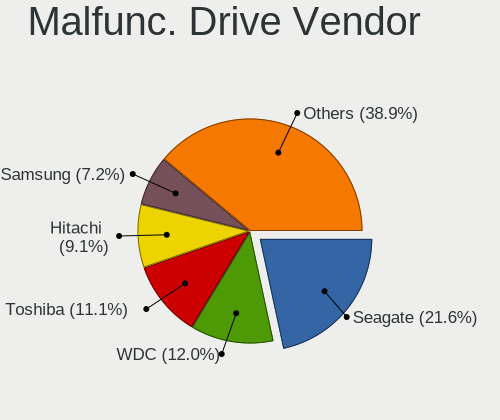

Linux Hardware Trends (Notebook)
--------------------------------

A project to identify most popular hardware characteristics and track their change
over time based on data collected by Linux users at https://Linux-Hardware.org.

Anyone can contribute to the study by uploading probes of their computers by
the [hw-probe](https://github.com/linuxhw/hw-probe) tool:

    sudo -E hw-probe -all -upload

Full-feature report is available here: https://linux-hardware.org/?view=trends&formfactor=notebook

Period: Jun, 2021.

Contents
--------

- [ OS                       ](#os)
- [ OS Family                ](#os-family)
- [ Kernel                   ](#kernel)
- [ Kernel Family            ](#kernel-family)
- [ Kernel Major Ver.        ](#kernel-major-ver)
- [ Arch                     ](#arch)
- [ DE                       ](#de)
- [ Display Server           ](#display-server)
- [ Display Manager          ](#display-manager)
- [ OS Lang                  ](#os-lang)
- [ Boot Mode                ](#boot-mode)
- [ Filesystem               ](#filesystem)
- [ Part. scheme             ](#part-scheme)
- [ Dual Boot with Linux/BSD ](#dual-boot-with-linux/bsd)
- [ Dual Boot (Win)          ](#dual-boot-win)
- [ Country                  ](#country)
- [ City                     ](#city)
- [ Vendor                   ](#vendor)
- [ Model                    ](#model)
- [ Model Family             ](#model-family)
- [ MFG Year                 ](#mfg-year)
- [ Form Factor              ](#form-factor)
- [ Secure Boot              ](#secure-boot)
- [ Coreboot                 ](#coreboot)
- [ RAM Size                 ](#ram-size)
- [ RAM Used                 ](#ram-used)
- [ Has CD-ROM               ](#has-cd-rom)
- [ Total Drives             ](#total-drives)
- [ Has Ethernet             ](#has-ethernet)
- [ Has WiFi                 ](#has-wifi)
- [ Has Bluetooth            ](#has-bluetooth)
- [ Drive Vendor             ](#drive-vendor)
- [ Drive Model              ](#drive-model)
- [ HDD Vendor               ](#hdd-vendor)
- [ SSD Vendor               ](#ssd-vendor)
- [ Drive Kind               ](#drive-kind)
- [ Drive Connector          ](#drive-connector)
- [ Drive Size               ](#drive-size)
- [ Space Total              ](#space-total)
- [ Space Used               ](#space-used)
- [ Malfunc. Drives          ](#malfunc-drives)
- [ Malfunc. Drive Vendor    ](#malfunc-drive-vendor)
- [ Malfunc. HDD Vendor      ](#malfunc-hdd-vendor)
- [ Malfunc. Drive Kind      ](#malfunc-drive-kind)
- [ Failed Drives            ](#failed-drives)
- [ Failed Drive Vendor      ](#failed-drive-vendor)
- [ Drive Status             ](#drive-status)
- [ Storage Vendor           ](#storage-vendor)
- [ Storage Model            ](#storage-model)
- [ Storage Kind             ](#storage-kind)
- [ CPU Vendor               ](#cpu-vendor)
- [ CPU Model                ](#cpu-model)
- [ CPU Model Family         ](#cpu-model-family)
- [ CPU Cores                ](#cpu-cores)
- [ CPU Sockets              ](#cpu-sockets)
- [ CPU Threads              ](#cpu-threads)
- [ CPU Op-Modes             ](#cpu-op-modes)
- [ CPU Microcode            ](#cpu-microcode)
- [ CPU Microarch            ](#cpu-microarch)
- [ GPU Vendor               ](#gpu-vendor)
- [ GPU Model                ](#gpu-model)
- [ GPU Combo                ](#gpu-combo)
- [ GPU Driver               ](#gpu-driver)
- [ GPU Memory               ](#gpu-memory)
- [ Monitor Vendor           ](#monitor-vendor)
- [ Monitor Model            ](#monitor-model)
- [ Monitor Resolution       ](#monitor-resolution)
- [ Monitor Diagonal         ](#monitor-diagonal)
- [ Monitor Width            ](#monitor-width)
- [ Aspect Ratio             ](#aspect-ratio)
- [ Monitor Area             ](#monitor-area)
- [ Pixel Density            ](#pixel-density)
- [ Multiple Monitors        ](#multiple-monitors)
- [ Net Controller Vendor    ](#net-controller-vendor)
- [ Net Controller Model     ](#net-controller-model)
- [ Wireless Vendor          ](#wireless-vendor)
- [ Wireless Model           ](#wireless-model)
- [ Ethernet Vendor          ](#ethernet-vendor)
- [ Ethernet Model           ](#ethernet-model)
- [ Net Controller Kind      ](#net-controller-kind)
- [ Used Controller          ](#used-controller)
- [ NICs                     ](#nics)
- [ IPv6                     ](#ipv6)
- [ Memory Vendor            ](#memory-vendor)
- [ Memory Model             ](#memory-model)
- [ Memory Kind              ](#memory-kind)
- [ Memory Form Factor       ](#memory-form-factor)
- [ Memory Size              ](#memory-size)
- [ Memory Speed             ](#memory-speed)
- [ Sound Vendor             ](#sound-vendor)
- [ Sound Model              ](#sound-model)
- [ Camera Vendor            ](#camera-vendor)
- [ Camera Model             ](#camera-model)
- [ Fingerprint Vendor       ](#fingerprint-vendor)
- [ Fingerprint Model        ](#fingerprint-model)
- [ Chipcard Vendor          ](#chipcard-vendor)
- [ Chipcard Model           ](#chipcard-model)
- [ Printer Vendor           ](#printer-vendor)
- [ Printer Model            ](#printer-model)
- [ Scanner Vendor           ](#scanner-vendor)
- [ Scanner Model            ](#scanner-model)
- [ Bluetooth Vendor         ](#bluetooth-vendor)
- [ Bluetooth Model          ](#bluetooth-model)
- [ Unsupported Devices      ](#unsupported-devices)
- [ Unsupported Device Types ](#unsupported-device-types)

OS
--

Installed operating systems

| Name                | Notebooks | Percent |
|---------------------|-----------|---------|
| Ubuntu 20.04        | 391       | 18.15%  |
| Mint 20.1           | 186       | 8.64%   |
| Fedora 34           | 128       | 5.94%   |
| Ubuntu 21.04        | 126       | 5.85%   |
| OpenMandriva 4.2    | 118       | 5.48%   |
| Pop!_OS 20.10       | 92        | 4.27%   |
| BlackPanther 18.1   | 64        | 2.97%   |
| Ubuntu 18.04        | 63        | 2.92%   |
| KDE neon 20.04      | 50        | 2.32%   |
| ROSA R11.1          | 49        | 2.27%   |
| Endless 3.9.4       | 48        | 2.23%   |
| Xubuntu 20.04       | 44        | 2.04%   |
| Arch                | 40        | 1.86%   |
| Manjaro             | 37        | 1.72%   |
| Debian 11           | 37        | 1.72%   |
| Ubuntu 20.10        | 34        | 1.58%   |
| Manjaro 21.0.7      | 33        | 1.53%   |
| ArcoLinux Rolling   | 32        | 1.49%   |
| Debian 10           | 30        | 1.39%   |
| OpenMandriva 4.50   | 26        | 1.21%   |
| Mint 19.3           | 25        | 1.16%   |
| Arch Rolling        | 25        | 1.16%   |
| Kubuntu 20.04       | 23        | 1.07%   |
| Pop!_OS 20.04       | 22        | 1.02%   |
| Zorin 15            | 21        | 0.97%   |
| Kali 2021.2         | 18        | 0.84%   |
| Mint 20             | 16        | 0.74%   |
| Gentoo              | 16        | 0.74%   |
| Pop!_OS 21.04       | 15        | 0.7%    |
| LMDE 4              | 15        | 0.7%    |
| Manjaro 21.0.5      | 14        | 0.65%   |
| Kubuntu 21.04       | 13        | 0.6%    |
| Fedora 33           | 13        | 0.6%    |
| Xubuntu 18.04       | 10        | 0.46%   |
| Manjaro 21.0.6      | 10        | 0.46%   |
| Ubuntu 16.04        | 9         | 0.42%   |
| Zorin 16            | 8         | 0.37%   |
| Lubuntu 20.04       | 8         | 0.37%   |
| Elementary 5.1.7    | 8         | 0.37%   |
| Ubuntu MATE 20.04   | 7         | 0.32%   |
| RHEL 8.4            | 7         | 0.32%   |
| Fedora 32           | 7         | 0.32%   |
| ROSA R11            | 6         | 0.28%   |
| Peppermint 10       | 6         | 0.28%   |
| Parrot 4.11         | 6         | 0.28%   |
| Ubuntu Budgie 20.04 | 5         | 0.23%   |
| Mint 20.2           | 5         | 0.23%   |
| Gentoo 2.7          | 5         | 0.23%   |
| Debian              | 5         | 0.23%   |
| ArcoLinux           | 5         | 0.23%   |
| Xubuntu 21.04       | 4         | 0.19%   |
| Ubuntu MATE 21.04   | 4         | 0.19%   |
| Ubuntu MATE 18.04   | 4         | 0.19%   |
| openSUSE Leap-15.3  | 4         | 0.19%   |
| Endless 3.7.4       | 4         | 0.19%   |
| Clear Linux 34700   | 4         | 0.19%   |
| Artix Rolling       | 4         | 0.19%   |
| Ubuntu Budgie 21.04 | 3         | 0.14%   |
| Ubuntu 21.10        | 3         | 0.14%   |
| Ubuntu 19.04        | 3         | 0.14%   |

OS Family
---------

OS without a version

| Name          | Notebooks | Percent |
|---------------|-----------|---------|
| Ubuntu        | 638       | 29.62%  |
| Mint          | 238       | 11.05%  |
| Fedora        | 148       | 6.87%   |
| OpenMandriva  | 144       | 6.69%   |
| Pop!_OS       | 129       | 5.99%   |
| Manjaro       | 97        | 4.5%    |
| Debian        | 73        | 3.39%   |
| Arch          | 65        | 3.02%   |
| BlackPanther  | 64        | 2.97%   |
| ROSA          | 63        | 2.92%   |
| Endless       | 61        | 2.83%   |
| Xubuntu       | 58        | 2.69%   |
| KDE neon      | 50        | 2.32%   |
| Kubuntu       | 41        | 1.9%    |
| ArcoLinux     | 37        | 1.72%   |
| Zorin         | 29        | 1.35%   |
| Gentoo        | 22        | 1.02%   |
| Kali          | 21        | 0.97%   |
| openSUSE      | 20        | 0.93%   |
| Ubuntu MATE   | 17        | 0.79%   |
| LMDE          | 15        | 0.7%    |
| Lubuntu       | 14        | 0.65%   |
| Clear Linux   | 11        | 0.51%   |
| Elementary    | 10        | 0.46%   |
| Ubuntu Budgie | 8         | 0.37%   |
| RHEL          | 7         | 0.32%   |
| Parrot        | 7         | 0.32%   |
| Peppermint    | 6         | 0.28%   |
| Garuda        | 6         | 0.28%   |
| Artix         | 5         | 0.23%   |
| Alpine        | 5         | 0.23%   |
| EndeavourOS   | 4         | 0.19%   |
| CentOS        | 4         | 0.19%   |
| Solus         | 3         | 0.14%   |
| Rocky         | 3         | 0.14%   |
| MX            | 3         | 0.14%   |
| Deepin        | 3         | 0.14%   |
| Void          | 2         | 0.09%   |
| PureOS        | 2         | 0.09%   |
| GalliumOS     | 2         | 0.09%   |
| Devuan        | 2         | 0.09%   |
| BigLinux      | 2         | 0.09%   |
| Archcraft     | 2         | 0.09%   |
| ALT Linux     | 2         | 0.09%   |
| Sonar         | 1         | 0.05%   |
| Siduction     | 1         | 0.05%   |
| Scientific    | 1         | 0.05%   |
| Redcore       | 1         | 0.05%   |
| Red OS        | 1         | 0.05%   |
| Reborn OS     | 1         | 0.05%   |
| PCLinuxOS     | 1         | 0.05%   |
| Oracle Linux  | 1         | 0.05%   |
| NixOS         | 1         | 0.05%   |
| HamoniKR      | 1         | 0.05%   |
| AlmaLinux     | 1         | 0.05%   |

Kernel
------

Version of the Linux kernel

| Version                             | Notebooks | Percent |
|-------------------------------------|-----------|---------|
| 5.4.0-74-generic                    | 241       | 11.19%  |
| 5.8.0-55-generic                    | 236       | 10.96%  |
| 5.11.0-7614-generic                 | 114       | 5.29%   |
| 5.10.14-desktop-1omv4002            | 110       | 5.11%   |
| 5.11.0-18-generic                   | 88        | 4.09%   |
| 5.8.0-53-generic                    | 75        | 3.48%   |
| 5.8.0-59-generic                    | 63        | 2.92%   |
| 5.4.0-73-generic                    | 63        | 2.92%   |
| 5.6.14-desktop-2bP                  | 53        | 2.46%   |
| 5.8.0-14-generic                    | 50        | 2.32%   |
| 5.4.0-77-generic                    | 43        | 2%      |
| 5.8.0-43-generic                    | 33        | 1.53%   |
| 5.10.42-1-MANJARO                   | 30        | 1.39%   |
| 5.12.8-300.fc34.x86_64              | 28        | 1.3%    |
| 5.12.9-300.fc34.x86_64              | 26        | 1.21%   |
| 5.12.4-desktop-1omv4050             | 26        | 1.21%   |
| 5.12.11-300.fc34.x86_64             | 24        | 1.11%   |
| 5.4.0-58-generic                    | 21        | 0.97%   |
| 5.11.0-22-generic                   | 21        | 0.97%   |
| 5.10.0-7-amd64                      | 21        | 0.97%   |
| 5.4.83-generic-2rosa-x86_64         | 20        | 0.93%   |
| 5.12.9-arch1-1                      | 18        | 0.84%   |
| 5.12.10-300.fc34.x86_64             | 18        | 0.84%   |
| 5.12.9-1-MANJARO                    | 17        | 0.79%   |
| 4.19.0-16-amd64                     | 17        | 0.79%   |
| 5.4.32-generic-2rosa-x86_64         | 14        | 0.65%   |
| 5.12.13-arch1-2                     | 14        | 0.65%   |
| 5.12.10-arch1-1                     | 14        | 0.65%   |
| 5.11.0-17-generic                   | 14        | 0.65%   |
| 5.12.12-300.fc34.x86_64             | 12        | 0.56%   |
| 5.10.0-kali8-amd64                  | 11        | 0.51%   |
| 5.10.0-6-amd64                      | 11        | 0.51%   |
| 4.18.16-desktop-1bP                 | 11        | 0.51%   |
| 5.4.0-72-generic                    | 10        | 0.46%   |
| 5.4.0-42-generic                    | 10        | 0.46%   |
| 5.12.8-arch1-1                      | 10        | 0.46%   |
| 5.11.0-16-generic                   | 10        | 0.46%   |
| 5.10.36-2-MANJARO                   | 10        | 0.46%   |
| 5.13.0-1-MANJARO                    | 9         | 0.42%   |
| 5.11.12-300.fc34.x86_64             | 9         | 0.42%   |
| 5.11.0-20-generic                   | 9         | 0.42%   |
| 5.8.0-56-generic                    | 8         | 0.37%   |
| 5.12.12-arch1-1                     | 8         | 0.37%   |
| 5.11.12-desktop-1omv4002            | 8         | 0.37%   |
| 5.11.0-7620-generic                 | 8         | 0.37%   |
| 4.18.0-305.3.1.el8_4.x86_64         | 8         | 0.37%   |
| 4.15.0-144-generic                  | 8         | 0.37%   |
| 5.8.0-50-generic                    | 7         | 0.32%   |
| 5.10.41-1-MANJARO                   | 7         | 0.32%   |
| 4.15.0-desktop-122.124.1rosa-x86_64 | 7         | 0.32%   |
| 5.9.16-1-MANJARO                    | 6         | 0.28%   |
| 5.8.0-54-generic                    | 6         | 0.28%   |
| 5.12.8-200.fc33.x86_64              | 6         | 0.28%   |
| 5.10.0-kali7-amd64                  | 6         | 0.28%   |
| 5.10.0-6parrot1-amd64               | 6         | 0.28%   |
| 4.19.0-17-amd64                     | 6         | 0.28%   |
| 4.19.0-16-686                       | 6         | 0.28%   |
| 5.12.9-zen1-1-zen                   | 5         | 0.23%   |
| 5.12.8-1045.native                  | 5         | 0.23%   |
| 5.10.27-gentoo                      | 5         | 0.23%   |

Kernel Family
-------------

Linux kernel without a distro release

| Version | Notebooks | Percent |
|---------|-----------|---------|
| 5.8.0   | 503       | 23.35%  |
| 5.4.0   | 420       | 19.5%   |
| 5.11.0  | 277       | 12.86%  |
| 5.10.14 | 110       | 5.11%   |
| 5.12.9  | 82        | 3.81%   |
| 5.10.0  | 82        | 3.81%   |
| 5.12.8  | 66        | 3.06%   |
| 5.6.14  | 53        | 2.46%   |
| 5.12.10 | 52        | 2.41%   |
| 4.15.0  | 43        | 2%      |
| 4.19.0  | 39        | 1.81%   |
| 5.10.42 | 37        | 1.72%   |
| 5.12.12 | 35        | 1.62%   |
| 5.12.11 | 32        | 1.49%   |
| 5.12.4  | 31        | 1.44%   |
| 5.4.83  | 22        | 1.02%   |
| 5.12.13 | 22        | 1.02%   |
| 5.4.32  | 17        | 0.79%   |
| 5.11.12 | 17        | 0.79%   |
| 4.18.0  | 17        | 0.79%   |
| 5.13.0  | 13        | 0.6%    |
| 5.3.0   | 11        | 0.51%   |
| 5.10.41 | 11        | 0.51%   |
| 5.10.36 | 11        | 0.51%   |
| 4.18.16 | 11        | 0.51%   |
| 5.0.0   | 9         | 0.42%   |
| 5.3.18  | 7         | 0.32%   |
| 5.11.22 | 7         | 0.32%   |
| 5.9.16  | 6         | 0.28%   |
| 5.12.7  | 6         | 0.28%   |
| 5.10.27 | 6         | 0.28%   |
| 5.12.2  | 5         | 0.23%   |
| 5.10.43 | 5         | 0.23%   |
| 5.10.29 | 5         | 0.23%   |
| 5.4.118 | 4         | 0.19%   |
| 5.10.46 | 4         | 0.19%   |
| 5.10.33 | 4         | 0.19%   |
| 5.12.0  | 3         | 0.14%   |
| 5.10.44 | 3         | 0.14%   |
| 4.9.155 | 3         | 0.14%   |
| 4.4.0   | 3         | 0.14%   |
| 4.16.18 | 3         | 0.14%   |
| 4.13.0  | 3         | 0.14%   |
| 5.12.1  | 2         | 0.09%   |
| 5.11.20 | 2         | 0.09%   |
| 5.11.18 | 2         | 0.09%   |
| 5.11.17 | 2         | 0.09%   |
| 5.11.16 | 2         | 0.09%   |
| 5.10.45 | 2         | 0.09%   |
| 5.10.39 | 2         | 0.09%   |
| 5.9.3   | 1         | 0.05%   |
| 5.9.14  | 1         | 0.05%   |
| 5.9.1   | 1         | 0.05%   |
| 5.9.0   | 1         | 0.05%   |
| 5.7.7   | 1         | 0.05%   |
| 5.7.1   | 1         | 0.05%   |
| 5.7.0   | 1         | 0.05%   |
| 5.6.0   | 1         | 0.05%   |
| 5.5.5   | 1         | 0.05%   |
| 5.5.15  | 1         | 0.05%   |

Kernel Major Ver.
-----------------

Linux kernel major version

| Version | Notebooks | Percent |
|---------|-----------|---------|
| 5.8     | 503       | 23.35%  |
| 5.4     | 472       | 21.91%  |
| 5.12    | 337       | 15.65%  |
| 5.11    | 314       | 14.58%  |
| 5.10    | 287       | 13.32%  |
| 5.6     | 54        | 2.51%   |
| 4.15    | 43        | 2%      |
| 4.19    | 41        | 1.9%    |
| 4.18    | 28        | 1.3%    |
| 5.3     | 18        | 0.84%   |
| 5.13    | 13        | 0.6%    |
| 5.9     | 10        | 0.46%   |
| 5.0     | 9         | 0.42%   |
| 4.9     | 5         | 0.23%   |
| 4.4     | 4         | 0.19%   |
| 4.16    | 4         | 0.19%   |
| 5.7     | 3         | 0.14%   |
| 4.13    | 3         | 0.14%   |
| 5.5     | 2         | 0.09%   |
| 5.1     | 1         | 0.05%   |
| 4.8     | 1         | 0.05%   |
| 4.14    | 1         | 0.05%   |
| 3.10    | 1         | 0.05%   |

Arch
----

OS architecture (x86_64, i586, etc.)

| Name    | Notebooks | Percent |
|---------|-----------|---------|
| x86_64  | 2087      | 96.89%  |
| i686    | 63        | 2.92%   |
| aarch64 | 3         | 0.14%   |
| i586    | 1         | 0.05%   |

DE
--

Desktop Environment

| Name             | Notebooks | Percent |
|------------------|-----------|---------|
| GNOME            | 1003      | 46.56%  |
| KDE5             | 322       | 14.95%  |
| X-Cinnamon       | 188       | 8.73%   |
| XFCE             | 162       | 7.52%   |
| KDE              | 107       | 4.97%   |
| Unknown          | 106       | 4.92%   |
| MATE             | 69        | 3.2%    |
| KDE4             | 39        | 1.81%   |
| LXQt             | 26        | 1.21%   |
| Cinnamon         | 22        | 1.02%   |
| i3               | 19        | 0.88%   |
| Budgie           | 13        | 0.6%    |
| Unity            | 12        | 0.56%   |
| Pantheon         | 9         | 0.42%   |
| LXDE             | 9         | 0.42%   |
| Deepin           | 8         | 0.37%   |
| GNOME Flashback  | 7         | 0.32%   |
| dwm              | 5         | 0.23%   |
| bspwm            | 5         | 0.23%   |
| awesome          | 5         | 0.23%   |
| xmonad           | 3         | 0.14%   |
| i3-with-shmlog   | 3         | 0.14%   |
| GNOME Classic    | 3         | 0.14%   |
| sway             | 2         | 0.09%   |
| qtile            | 2         | 0.09%   |
| openbox          | 2         | 0.09%   |
| XSession         | 1         | 0.05%   |
| lightdm-xsession | 1         | 0.05%   |
| Enlightenment    | 1         | 0.05%   |

Display Server
--------------

X11 or Wayland

| Name    | Notebooks | Percent |
|---------|-----------|---------|
| X11     | 1825      | 84.73%  |
| Wayland | 243       | 11.28%  |
| Unknown | 66        | 3.06%   |
| Tty     | 20        | 0.93%   |

Display Manager
---------------

SDDM, LightDM, etc.

| Name    | Notebooks | Percent |
|---------|-----------|---------|
| Unknown | 1235      | 57.34%  |
| SDDM    | 367       | 17.04%  |
| GDM     | 268       | 12.44%  |
| TDM     | 196       | 9.1%    |
| KDM     | 39        | 1.81%   |
| LightDM | 34        | 1.58%   |
| XDM     | 8         | 0.37%   |
| LXDM    | 3         | 0.14%   |
| SLiM    | 2         | 0.09%   |
| GDM3    | 2         | 0.09%   |

OS Lang
-------

Language

| Lang        | Notebooks | Percent |
|-------------|-----------|---------|
| en_US       | 867       | 40.25%  |
| de_DE       | 169       | 7.85%   |
| pt_BR       | 148       | 6.87%   |
| ru_RU       | 122       | 5.66%   |
| en_GB       | 106       | 4.92%   |
| fr_FR       | 104       | 4.83%   |
| Unknown     | 92        | 4.27%   |
| en_IN       | 62        | 2.88%   |
| it_IT       | 45        | 2.09%   |
| C           | 38        | 1.76%   |
| en_CA       | 36        | 1.67%   |
| pl_PL       | 33        | 1.53%   |
| es_ES       | 32        | 1.49%   |
| en_AU       | 29        | 1.35%   |
| hu_HU       | 17        | 0.79%   |
| pt_PT       | 15        | 0.7%    |
| zh_CN       | 14        | 0.65%   |
| tr_TR       | 13        | 0.6%    |
| es_MX       | 13        | 0.6%    |
| nl_NL       | 12        | 0.56%   |
| ru_UA       | 10        | 0.46%   |
| en_IE       | 10        | 0.46%   |
| sv_SE       | 9         | 0.42%   |
| es_CL       | 9         | 0.42%   |
| es_AR       | 9         | 0.42%   |
| en_ZA       | 9         | 0.42%   |
| fr_BE       | 8         | 0.37%   |
| es_CO       | 8         | 0.37%   |
| de_AT       | 7         | 0.32%   |
| de_CH       | 6         | 0.28%   |
| cs_CZ       | 5         | 0.23%   |
| POSIX       | 4         | 0.19%   |
| nl_BE       | 4         | 0.19%   |
| ja_JP       | 4         | 0.19%   |
| es_VE       | 4         | 0.19%   |
| en_IL       | 4         | 0.19%   |
| en_DK       | 4         | 0.19%   |
| el_GR       | 4         | 0.19%   |
| zh_TW       | 3         | 0.14%   |
| ro_RO       | 3         | 0.14%   |
| nb_NO       | 3         | 0.14%   |
| fr_CH       | 3         | 0.14%   |
| en_SG       | 3         | 0.14%   |
| en_PH       | 3         | 0.14%   |
| en_NZ       | 3         | 0.14%   |
| da_DK       | 3         | 0.14%   |
| bg_BG       | 3         | 0.14%   |
| sk_SK       | 2         | 0.09%   |
| ko_KR       | 2         | 0.09%   |
| hr_HR       | 2         | 0.09%   |
| fi_FI       | 2         | 0.09%   |
| es_UY       | 2         | 0.09%   |
| es_SV       | 2         | 0.09%   |
| es_DO       | 2         | 0.09%   |
| ca_ES       | 2         | 0.09%   |
| C.UTF8      | 2         | 0.09%   |
| ur_PK       | 1         | 0.05%   |
| sr_ME       | 1         | 0.05%   |
| sl_SI       | 1         | 0.05%   |
| ru_RU.UTF_8 | 1         | 0.05%   |

Boot Mode
---------

EFI or BIOS

| Mode | Notebooks | Percent |
|------|-----------|---------|
| EFI  | 1084      | 50.32%  |
| BIOS | 1070      | 49.68%  |

Filesystem
----------

Type of filesystem

| Type    | Notebooks | Percent |
|---------|-----------|---------|
| Ext4    | 1707      | 79.25%  |
| Overlay | 208       | 9.66%   |
| Btrfs   | 178       | 8.26%   |
| Xfs     | 34        | 1.58%   |
| Zfs     | 13        | 0.6%    |
| Tmpfs   | 3         | 0.14%   |
| F2fs    | 3         | 0.14%   |
| Unknown | 3         | 0.14%   |
| Ext2    | 2         | 0.09%   |
| Aufs    | 2         | 0.09%   |
| Ext3    | 1         | 0.05%   |

Part. scheme
------------

Scheme of partitioning

| Type    | Notebooks | Percent |
|---------|-----------|---------|
| Unknown | 1197      | 55.57%  |
| GPT     | 678       | 31.48%  |
| MBR     | 279       | 12.95%  |

Dual Boot with Linux/BSD
------------------------

Hosting more than one Linux/BSD

| Dual boot | Notebooks | Percent |
|-----------|-----------|---------|
| No        | 1897      | 88.07%  |
| Yes       | 257       | 11.93%  |

Dual Boot (Win)
---------------

Hosting Linux and Windows

| Dual boot | Notebooks | Percent |
|-----------|-----------|---------|
| No        | 1583      | 73.49%  |
| Yes       | 571       | 26.51%  |

Country
-------

Geographic location (country)

| Country      | Notebooks | Percent |
|--------------|-----------|---------|
| USA          | 328       | 15.23%  |
| Germany      | 205       | 9.52%   |
| Brazil       | 176       | 8.17%   |
| Russia       | 150       | 6.96%   |
| France       | 118       | 5.48%   |
| India        | 91        | 4.22%   |
| UK           | 85        | 3.95%   |
| Hungary      | 69        | 3.2%    |
| Italy        | 66        | 3.06%   |
| Canada       | 54        | 2.51%   |
| Poland       | 50        | 2.32%   |
| Spain        | 44        | 2.04%   |
| Ukraine      | 36        | 1.67%   |
| Netherlands  | 35        | 1.62%   |
| Australia    | 34        | 1.58%   |
| Belgium      | 29        | 1.35%   |
| China        | 28        | 1.3%    |
| Turkey       | 25        | 1.16%   |
| Switzerland  | 25        | 1.16%   |
| Romania      | 25        | 1.16%   |
| Portugal     | 24        | 1.11%   |
| Austria      | 23        | 1.07%   |
| Sweden       | 22        | 1.02%   |
| Mexico       | 22        | 1.02%   |
| Argentina    | 18        | 0.84%   |
| Greece       | 15        | 0.7%    |
| Finland      | 15        | 0.7%    |
| Chile        | 15        | 0.7%    |
| Czechia      | 14        | 0.65%   |
| South Africa | 13        | 0.6%    |
| Colombia     | 13        | 0.6%    |
| Bulgaria     | 12        | 0.56%   |
| Taiwan       | 11        | 0.51%   |
| Norway       | 11        | 0.51%   |
| Croatia      | 11        | 0.51%   |
| Iran         | 10        | 0.46%   |
| Indonesia    | 10        | 0.46%   |
| Japan        | 9         | 0.42%   |
| Ireland      | 9         | 0.42%   |
| Serbia       | 8         | 0.37%   |
| Malaysia     | 8         | 0.37%   |
| Denmark      | 8         | 0.37%   |
| Belarus      | 8         | 0.37%   |
| Vietnam      | 7         | 0.32%   |
| Sri Lanka    | 7         | 0.32%   |
| Moldova      | 7         | 0.32%   |
| Slovakia     | 6         | 0.28%   |
| New Zealand  | 6         | 0.28%   |
| Israel       | 6         | 0.28%   |
| Venezuela    | 5         | 0.23%   |
| Philippines  | 5         | 0.23%   |
| Estonia      | 5         | 0.23%   |
| Bangladesh   | 5         | 0.23%   |
| Slovenia     | 4         | 0.19%   |
| Saudi Arabia | 4         | 0.19%   |
| Peru         | 4         | 0.19%   |
| Pakistan     | 4         | 0.19%   |
| Lithuania    | 4         | 0.19%   |
| Hong Kong    | 4         | 0.19%   |
| El Salvador  | 4         | 0.19%   |

City
----

Geographic location (city)

| City              | Notebooks | Percent |
|-------------------|-----------|---------|
| Moscow            | 40        | 1.86%   |
| São Paulo        | 26        | 1.21%   |
| Berlin            | 21        | 0.97%   |
| Budapest          | 19        | 0.88%   |
| St Petersburg     | 18        | 0.84%   |
| Vienna            | 17        | 0.79%   |
| Warsaw            | 13        | 0.6%    |
| London            | 13        | 0.6%    |
| Paris             | 12        | 0.56%   |
| Kyiv              | 12        | 0.56%   |
| Rio de Janeiro    | 11        | 0.51%   |
| Sofia             | 10        | 0.46%   |
| Istanbul          | 10        | 0.46%   |
| Athens            | 10        | 0.46%   |
| Santiago          | 9         | 0.42%   |
| Prague            | 9         | 0.42%   |
| Brooklyn          | 9         | 0.42%   |
| Zurich            | 8         | 0.37%   |
| Tehran            | 8         | 0.37%   |
| Pune              | 8         | 0.37%   |
| Madrid            | 8         | 0.37%   |
| Delhi             | 8         | 0.37%   |
| Chennai           | 8         | 0.37%   |
| Bucharest         | 8         | 0.37%   |
| Bengaluru         | 8         | 0.37%   |
| Yekaterinburg     | 7         | 0.32%   |
| Rockville         | 7         | 0.32%   |
| Munich            | 7         | 0.32%   |
| Mumbai            | 7         | 0.32%   |
| Johannesburg      | 7         | 0.32%   |
| Izmir             | 7         | 0.32%   |
| Helsinki          | 7         | 0.32%   |
| Frankfurt am Main | 7         | 0.32%   |
| Chisinau          | 7         | 0.32%   |
| Amsterdam         | 7         | 0.32%   |
| Zagreb            | 6         | 0.28%   |
| Toronto           | 6         | 0.28%   |
| Sydney            | 6         | 0.28%   |
| Stockholm         | 6         | 0.28%   |
| Perm              | 6         | 0.28%   |
| Novosibirsk       | 6         | 0.28%   |
| Montreal          | 6         | 0.28%   |
| Minneapolis       | 6         | 0.28%   |
| Mexico City       | 6         | 0.28%   |
| Lisbon            | 6         | 0.28%   |
| Hyderabad         | 6         | 0.28%   |
| Belgrade          | 6         | 0.28%   |
| Wroclaw           | 5         | 0.23%   |
| Voronezh          | 5         | 0.23%   |
| Stuttgart         | 5         | 0.23%   |
| Sorocaba          | 5         | 0.23%   |
| Rome              | 5         | 0.23%   |
| Oslo              | 5         | 0.23%   |
| Los Angeles       | 5         | 0.23%   |
| Hamburg           | 5         | 0.23%   |
| Essen             | 5         | 0.23%   |
| Dublin            | 5         | 0.23%   |
| Dresden           | 5         | 0.23%   |
| Dhaka             | 5         | 0.23%   |
| Cologne           | 5         | 0.23%   |

Vendor
------

Motherboard manufacturer

| Name                  | Notebooks | Percent |
|-----------------------|-----------|---------|
| Lenovo                | 433       | 20.1%   |
| Hewlett-Packard       | 404       | 18.76%  |
| Dell                  | 372       | 17.27%  |
| Acer                  | 220       | 10.21%  |
| ASUSTek Computer      | 218       | 10.12%  |
| Toshiba               | 59        | 2.74%   |
| Samsung Electronics   | 55        | 2.55%   |
| Apple                 | 47        | 2.18%   |
| Sony                  | 40        | 1.86%   |
| MSI                   | 25        | 1.16%   |
| HUAWEI                | 23        | 1.07%   |
| Fujitsu               | 19        | 0.88%   |
| Medion                | 15        | 0.7%    |
| Unknown               | 14        | 0.65%   |
| Positivo              | 13        | 0.6%    |
| Timi                  | 12        | 0.56%   |
| System76              | 12        | 0.56%   |
| Packard Bell          | 11        | 0.51%   |
| Fujitsu Siemens       | 9         | 0.42%   |
| Razer                 | 8         | 0.37%   |
| Notebook              | 8         | 0.37%   |
| Google                | 8         | 0.37%   |
| Alienware             | 8         | 0.37%   |
| LG Electronics        | 7         | 0.32%   |
| Schenker              | 5         | 0.23%   |
| Gateway               | 5         | 0.23%   |
| Panasonic             | 4         | 0.19%   |
| eMachines             | 4         | 0.19%   |
| Pegatron              | 3         | 0.14%   |
| PC Specialist         | 3         | 0.14%   |
| Intel                 | 3         | 0.14%   |
| IBM                   | 3         | 0.14%   |
| Clevo                 | 3         | 0.14%   |
| VIT                   | 2         | 0.09%   |
| Teclast               | 2         | 0.09%   |
| SLIMBOOK              | 2         | 0.09%   |
| Purism                | 2         | 0.09%   |
| Positivo Bahia - VAIO | 2         | 0.09%   |
| Pine Microsystems     | 2         | 0.09%   |
| Multilaser            | 2         | 0.09%   |
| MOTILE                | 2         | 0.09%   |
| Monster               | 2         | 0.09%   |
| Itautec               | 2         | 0.09%   |
| Intel Client Systems  | 2         | 0.09%   |
| EVOO Products Company | 2         | 0.09%   |
| Dixonsxp              | 2         | 0.09%   |
| AZW                   | 2         | 0.09%   |
| Wiltronic             | 1         | 0.05%   |
| whyopencomputing      | 1         | 0.05%   |
| W550SU2               | 1         | 0.05%   |
| VINGA                 | 1         | 0.05%   |
| UNOWHY                | 1         | 0.05%   |
| TUXEDO                | 1         | 0.05%   |
| TrekStor              | 1         | 0.05%   |
| Terrans Force         | 1         | 0.05%   |
| Star Labs             | 1         | 0.05%   |
| SIEMENS               | 1         | 0.05%   |
| SANTECH               | 1         | 0.05%   |
| SAELITE               | 1         | 0.05%   |
| Quanta                | 1         | 0.05%   |

Model
-----

Motherboard model

| Name                                   | Notebooks | Percent |
|----------------------------------------|-----------|---------|
| Unknown                                | 24        | 1.11%   |
| HP Notebook                            | 15        | 0.7%    |
| Acer Nitro AN515-54                    | 12        | 0.56%   |
| HP Pavilion dv6                        | 10        | 0.46%   |
| HP Pavilion Notebook                   | 9         | 0.42%   |
| HP Pavilion dv7                        | 8         | 0.37%   |
| HUAWEI NBLK-WAX9X                      | 7         | 0.32%   |
| HP Pavilion g6                         | 7         | 0.32%   |
| HP EliteBook 840 G3                    | 7         | 0.32%   |
| Dell Latitude E6510                    | 7         | 0.32%   |
| Dell Latitude E6430                    | 7         | 0.32%   |
| Dell Latitude E6420                    | 7         | 0.32%   |
| Dell Latitude E6400                    | 7         | 0.32%   |
| Dell Inspiron 15-3567                  | 7         | 0.32%   |
| Acer Nitro AN517-51                    | 7         | 0.32%   |
| HP Pavilion 15                         | 6         | 0.28%   |
| Dell XPS 15 9500                       | 6         | 0.28%   |
| Dell XPS 13 9370                       | 6         | 0.28%   |
| Dell Latitude E7440                    | 6         | 0.28%   |
| HUAWEI HLYL-WXX9                       | 5         | 0.23%   |
| HP Pavilion g7                         | 5         | 0.23%   |
| HP EliteBook 820 G1                    | 5         | 0.23%   |
| HP 2000                                | 5         | 0.23%   |
| Dell XPS 13 7390                       | 5         | 0.23%   |
| Dell Latitude E7470                    | 5         | 0.23%   |
| Dell Inspiron 3505                     | 5         | 0.23%   |
| Acer Aspire ES1-512                    | 5         | 0.23%   |
| System76 Oryx Pro                      | 4         | 0.19%   |
| Lenovo Yoga 300-11IBR 80M1             | 4         | 0.19%   |
| Lenovo IdeaPad Gaming 3 15ARH05 82EY   | 4         | 0.19%   |
| Lenovo IdeaPad 5 15ARE05 81YQ          | 4         | 0.19%   |
| Lenovo IdeaPad 110-15IBR 80T7          | 4         | 0.19%   |
| HUAWEI KLVL-WXX9                       | 4         | 0.19%   |
| HP ProBook 4520s                       | 4         | 0.19%   |
| HP ProBook 450 G6                      | 4         | 0.19%   |
| HP OMEN by HP Laptop                   | 4         | 0.19%   |
| HP Laptop 15s-eq1xxx                   | 4         | 0.19%   |
| HP Laptop 15-dw0xxx                    | 4         | 0.19%   |
| HP Laptop 15-da0xxx                    | 4         | 0.19%   |
| HP Laptop 15-bs0xx                     | 4         | 0.19%   |
| HP EliteBook 8470p                     | 4         | 0.19%   |
| HP EliteBook 8460p                     | 4         | 0.19%   |
| HP 15                                  | 4         | 0.19%   |
| Dell XPS 15 9560                       | 4         | 0.19%   |
| Dell XPS 15 7590                       | 4         | 0.19%   |
| Dell XPS 13 9310                       | 4         | 0.19%   |
| Dell Precision 5540                    | 4         | 0.19%   |
| Dell Latitude E6530                    | 4         | 0.19%   |
| Dell Latitude E6520                    | 4         | 0.19%   |
| Dell Latitude 5410                     | 4         | 0.19%   |
| Dell Inspiron N5110                    | 4         | 0.19%   |
| Dell Inspiron 3542                     | 4         | 0.19%   |
| Dell Inspiron 15 7000 Gaming           | 4         | 0.19%   |
| ASUS X555LJ                            | 4         | 0.19%   |
| ASUS VivoBook_ASUSLaptop X512DA_F512DA | 4         | 0.19%   |
| ASUS N550JV                            | 4         | 0.19%   |
| Apple MacBookPro8,1                    | 4         | 0.19%   |
| Acer Extensa 2540                      | 4         | 0.19%   |
| Acer Aspire A515-51G                   | 4         | 0.19%   |
| Acer Aspire A515-44                    | 4         | 0.19%   |

Model Family
------------

Motherboard model prefix

| Name                    | Notebooks | Percent |
|-------------------------|-----------|---------|
| Lenovo ThinkPad         | 238       | 11.05%  |
| Dell Latitude           | 140       | 6.5%    |
| Acer Aspire             | 134       | 6.22%   |
| Dell Inspiron           | 116       | 5.39%   |
| Lenovo IdeaPad          | 102       | 4.74%   |
| HP Pavilion             | 90        | 4.18%   |
| HP EliteBook            | 68        | 3.16%   |
| HP Laptop               | 57        | 2.65%   |
| HP ProBook              | 56        | 2.6%    |
| ASUS VivoBook           | 48        | 2.23%   |
| Toshiba Satellite       | 47        | 2.18%   |
| Dell XPS                | 45        | 2.09%   |
| Acer Nitro              | 29        | 1.35%   |
| Dell Vostro             | 26        | 1.21%   |
| Dell Precision          | 25        | 1.16%   |
| Lenovo Legion           | 24        | 1.11%   |
| Unknown                 | 24        | 1.11%   |
| ASUS ROG                | 22        | 1.02%   |
| HP Compaq               | 19        | 0.88%   |
| Acer Swift              | 17        | 0.79%   |
| Fujitsu LIFEBOOK        | 16        | 0.74%   |
| HP ZBook                | 15        | 0.7%    |
| HP Notebook             | 15        | 0.7%    |
| Lenovo Yoga             | 12        | 0.56%   |
| HP ENVY                 | 11        | 0.51%   |
| Acer Extensa            | 11        | 0.51%   |
| Packard Bell EasyNote   | 10        | 0.46%   |
| ASUS ZenBook            | 9         | 0.42%   |
| ASUS TUF                | 9         | 0.42%   |
| ASUS ASUS               | 9         | 0.42%   |
| Acer TravelMate         | 9         | 0.42%   |
| Razer Blade             | 8         | 0.37%   |
| HP 250                  | 8         | 0.37%   |
| Lenovo ThinkBook        | 7         | 0.32%   |
| HUAWEI NBLK-WAX9X       | 7         | 0.32%   |
| HP OMEN                 | 7         | 0.32%   |
| HP 255                  | 7         | 0.32%   |
| Dell G3                 | 7         | 0.32%   |
| Apple MacBookPro8       | 7         | 0.32%   |
| Apple MacBookPro5       | 6         | 0.28%   |
| Acer Predator           | 6         | 0.28%   |
| HUAWEI HLYL-WXX9        | 5         | 0.23%   |
| HP Stream               | 5         | 0.23%   |
| HP 2000                 | 5         | 0.23%   |
| HP 15                   | 5         | 0.23%   |
| Fujitsu Siemens ESPRIMO | 5         | 0.23%   |
| Dell G7                 | 5         | 0.23%   |
| Timi RedmiBook          | 4         | 0.19%   |
| System76 Oryx           | 4         | 0.19%   |
| Samsung 350V5C          | 4         | 0.19%   |
| Lenovo G580             | 4         | 0.19%   |
| HUAWEI KLVL-WXX9        | 4         | 0.19%   |
| HP PRESARIO             | 4         | 0.19%   |
| Dell G5                 | 4         | 0.19%   |
| ASUS X555LJ             | 4         | 0.19%   |
| ASUS N550JV             | 4         | 0.19%   |
| Apple MacBookPro9       | 4         | 0.19%   |
| Apple MacBookPro11      | 4         | 0.19%   |
| Toshiba TECRA           | 3         | 0.14%   |
| Toshiba PORTEGE         | 3         | 0.14%   |

MFG Year
--------

Motherboard manufacture year

| Year    | Notebooks | Percent |
|---------|-----------|---------|
| 2020    | 426       | 19.78%  |
| 2021    | 278       | 12.91%  |
| 2019    | 261       | 12.12%  |
| 2018    | 171       | 7.94%   |
| 2011    | 126       | 5.85%   |
| 2012    | 123       | 5.71%   |
| 2013    | 122       | 5.66%   |
| 2014    | 96        | 4.46%   |
| 2017    | 94        | 4.36%   |
| 2016    | 94        | 4.36%   |
| 2015    | 88        | 4.09%   |
| 2010    | 81        | 3.76%   |
| 2009    | 79        | 3.67%   |
| 2008    | 58        | 2.69%   |
| 2007    | 29        | 1.35%   |
| 2006    | 17        | 0.79%   |
| 2005    | 4         | 0.19%   |
| Unknown | 4         | 0.19%   |
| 2003    | 2         | 0.09%   |
| 2004    | 1         | 0.05%   |

Form Factor
-----------

Physical design of the computer

| Name     | Notebooks | Percent |
|----------|-----------|---------|
| Notebook | 2154      | 100%    |

Secure Boot
-----------

Enabled or disabled

| State    | Notebooks | Percent |
|----------|-----------|---------|
| Disabled | 1925      | 89.37%  |
| Enabled  | 229       | 10.63%  |

Coreboot
--------

Have coreboot on board

| Used | Notebooks | Percent |
|------|-----------|---------|
| No   | 2138      | 99.26%  |
| Yes  | 16        | 0.74%   |

RAM Size
--------

Total RAM memory

| Size in GB  | Notebooks | Percent |
|-------------|-----------|---------|
| 4.01-8.0    | 647       | 30.04%  |
| 3.01-4.0    | 480       | 22.28%  |
| 8.01-16.0   | 370       | 17.18%  |
| 16.01-24.0  | 308       | 14.3%   |
| 32.01-64.0  | 134       | 6.22%   |
| 1.01-2.0    | 102       | 4.74%   |
| 2.01-3.0    | 38        | 1.76%   |
| 0.51-1.0    | 25        | 1.16%   |
| 24.01-32.0  | 24        | 1.11%   |
| 64.01-256.0 | 23        | 1.07%   |
| 0.01-0.5    | 3         | 0.14%   |

RAM Used
--------

Used RAM memory

| Used GB    | Notebooks | Percent |
|------------|-----------|---------|
| 1.01-2.0   | 825       | 38.3%   |
| 2.01-3.0   | 524       | 24.33%  |
| 4.01-8.0   | 269       | 12.49%  |
| 3.01-4.0   | 259       | 12.02%  |
| 0.51-1.0   | 169       | 7.85%   |
| 8.01-16.0  | 61        | 2.83%   |
| 0.01-0.5   | 37        | 1.72%   |
| 16.01-24.0 | 8         | 0.37%   |
| 32.01-64.0 | 1         | 0.05%   |
| 0          | 1         | 0.05%   |

Has CD-ROM
----------

Has CD-ROM on board

| Presented | Notebooks | Percent |
|-----------|-----------|---------|
| No        | 1355      | 62.91%  |
| Yes       | 799       | 37.09%  |

Total Drives
------------

Number of drives on board

| Drives | Notebooks | Percent |
|--------|-----------|---------|
| 1      | 1577      | 73.21%  |
| 2      | 490       | 22.75%  |
| 3      | 55        | 2.55%   |
| 0      | 24        | 1.11%   |
| 4      | 4         | 0.19%   |
| 5      | 3         | 0.14%   |
| 6      | 1         | 0.05%   |

Has Ethernet
------------

Has Ethernet on board

| Presented | Notebooks | Percent |
|-----------|-----------|---------|
| Yes       | 1804      | 83.75%  |
| No        | 350       | 16.25%  |

Has WiFi
--------

Has WiFi module

| Presented | Notebooks | Percent |
|-----------|-----------|---------|
| Yes       | 2101      | 97.54%  |
| No        | 53        | 2.46%   |

Has Bluetooth
-------------

Has Bluetooth module

| Presented | Notebooks | Percent |
|-----------|-----------|---------|
| Yes       | 1667      | 77.39%  |
| No        | 487       | 22.61%  |

Drive Vendor
------------

Hard drive vendors

| Vendor                    | Notebooks | Drives | Percent |
|---------------------------|-----------|--------|---------|
| Samsung Electronics       | 395       | 431    | 15.2%   |
| WDC                       | 316       | 320    | 12.16%  |
| Seagate                   | 315       | 328    | 12.12%  |
| Toshiba                   | 234       | 238    | 9.01%   |
| Unknown                   | 144       | 159    | 5.54%   |
| SanDisk                   | 139       | 139    | 5.35%   |
| Kingston                  | 122       | 122    | 4.7%    |
| Intel                     | 109       | 121    | 4.2%    |
| SK Hynix                  | 107       | 110    | 4.12%   |
| Crucial                   | 85        | 88     | 3.27%   |
| Hitachi                   | 83        | 84     | 3.19%   |
| HGST                      | 78        | 80     | 3%      |
| Micron Technology         | 59        | 61     | 2.27%   |
| A-DATA Technology         | 38        | 38     | 1.46%   |
| KIOXIA                    | 25        | 25     | 0.96%   |
| LITEON                    | 22        | 23     | 0.85%   |
| Fujitsu                   | 22        | 22     | 0.85%   |
| Apple                     | 22        | 23     | 0.85%   |
| China                     | 21        | 21     | 0.81%   |
| SPCC                      | 17        | 17     | 0.65%   |
| Phison                    | 11        | 13     | 0.42%   |
| KingSpec                  | 11        | 11     | 0.42%   |
| Union Memory              | 10        | 10     | 0.38%   |
| Transcend                 | 10        | 10     | 0.38%   |
| PNY                       | 10        | 10     | 0.38%   |
| Silicon Motion            | 9         | 10     | 0.35%   |
| Patriot                   | 9         | 10     | 0.35%   |
| LITEONIT                  | 9         | 10     | 0.35%   |
| Intenso                   | 9         | 9      | 0.35%   |
| Hewlett-Packard           | 8         | 8      | 0.31%   |
| Union Memory (Shenzhen)   | 7         | 7      | 0.27%   |
| JMicron                   | 6         | 7      | 0.23%   |
| Solid State Storage       | 5         | 5      | 0.19%   |
| Micron/Crucial Technology | 5         | 5      | 0.19%   |
| XPG                       | 4         | 4      | 0.15%   |
| OCZ                       | 4         | 4      | 0.15%   |
| Netac                     | 4         | 4      | 0.15%   |
| Lite-On                   | 4         | 4      | 0.15%   |
| HS-SSD-C100               | 4         | 4      | 0.15%   |
| EMTEC                     | 4         | 4      | 0.15%   |
| BHT                       | 4         | 4      | 0.15%   |
| Apacer                    | 4         | 4      | 0.15%   |
| ShanDianZhe               | 3         | 3      | 0.12%   |
| Lenovo                    | 3         | 3      | 0.12%   |
| HGST HTS                  | 3         | 3      | 0.12%   |
| GOODRAM                   | 3         | 3      | 0.12%   |
| External                  | 3         | 3      | 0.12%   |
| Corsair                   | 3         | 3      | 0.12%   |
| ASMT                      | 3         | 3      | 0.12%   |
| ADATA Technology          | 3         | 3      | 0.12%   |
| Teclast                   | 2         | 2      | 0.08%   |
| Team                      | 2         | 2      | 0.08%   |
| TCSUNBOW                  | 2         | 2      | 0.08%   |
| SABRENT                   | 2         | 2      | 0.08%   |
| ROG                       | 2         | 2      | 0.08%   |
| Realtek Semiconductor     | 2         | 2      | 0.08%   |
| Lexar                     | 2         | 2      | 0.08%   |
| Leven                     | 2         | 2      | 0.08%   |
| KingDian                  | 2         | 2      | 0.08%   |
| Indilinx                  | 2         | 2      | 0.08%   |

Drive Model
-----------

Hard drive models

| Model                                | Notebooks | Percent |
|--------------------------------------|-----------|---------|
| Seagate ST1000LM035-1RK172 1TB       | 48        | 1.8%    |
| Samsung NVMe SSD Drive 512GB         | 38        | 1.42%   |
| Unknown MMC Card  32GB               | 32        | 1.2%    |
| Seagate ST1000LM024 HN-M101MBB 1TB   | 32        | 1.2%    |
| Intel NVMe SSD Drive 512GB           | 28        | 1.05%   |
| Toshiba MQ01ABD100 1TB               | 27        | 1.01%   |
| Sandisk NVMe SSD Drive 512GB         | 23        | 0.86%   |
| Kingston SA400S37240G 240GB SSD      | 23        | 0.86%   |
| Toshiba MQ01ABF050 500GB             | 22        | 0.82%   |
| Seagate ST500LT012-1DG142 500GB      | 21        | 0.79%   |
| Toshiba MQ04ABF100 1TB               | 20        | 0.75%   |
| HGST HTS721010A9E630 1TB             | 20        | 0.75%   |
| SK Hynix NVMe SSD Drive 512GB        | 19        | 0.71%   |
| Samsung NVMe SSD Drive 256GB         | 19        | 0.71%   |
| Samsung SSD 860 EVO 500GB            | 18        | 0.67%   |
| Unknown MMC Card  16GB               | 17        | 0.64%   |
| Samsung SSD 850 EVO 250GB            | 17        | 0.64%   |
| Unknown MMC Card  64GB               | 16        | 0.6%    |
| Unknown SD/MMC/MS PRO 128GB          | 15        | 0.56%   |
| Seagate ST1000LM049-2GH172 1TB       | 15        | 0.56%   |
| Sandisk NVMe SSD Drive 256GB         | 15        | 0.56%   |
| Kingston SA400S37480G 480GB SSD      | 15        | 0.56%   |
| Crucial CT500MX500SSD1 500GB         | 15        | 0.56%   |
| Seagate ST1000LM048-2E7172 1TB       | 14        | 0.52%   |
| WDC WD10SPZX-21Z10T0 1TB             | 13        | 0.49%   |
| Seagate ST500LM012 HN-M500MBB 500GB  | 13        | 0.49%   |
| Samsung SSD 860 EVO 1TB              | 13        | 0.49%   |
| Micron NVMe SSD Drive 512GB          | 13        | 0.49%   |
| HGST HTS545050A7E680 500GB           | 13        | 0.49%   |
| HGST HTS541010A9E680 1TB             | 13        | 0.49%   |
| Crucial CT240BX500SSD1 240GB         | 13        | 0.49%   |
| Seagate ST9500325AS 500GB            | 12        | 0.45%   |
| Samsung SSD 850 EVO 500GB            | 12        | 0.45%   |
| WDC WD10SPZX-60Z10T0 1TB             | 11        | 0.41%   |
| WDC WD10JPVX-22JC3T0 1TB             | 11        | 0.41%   |
| Toshiba NVMe SSD Drive 512GB         | 11        | 0.41%   |
| SK Hynix NVMe SSD Drive 256GB        | 11        | 0.41%   |
| SanDisk SSD PLUS 240GB               | 11        | 0.41%   |
| WDC WD10SPZX-24Z10 1TB               | 9         | 0.34%   |
| Seagate ST9500420AS 500GB            | 9         | 0.34%   |
| Samsung SSD 970 EVO Plus 500GB       | 9         | 0.34%   |
| Samsung NVMe SSD Drive 1024GB        | 9         | 0.34%   |
| Kingston SV300S37A120G 120GB SSD     | 9         | 0.34%   |
| Kingston SA400S37120G 120GB SSD      | 9         | 0.34%   |
| Intel SSDPEKNW512G8 512GB            | 9         | 0.34%   |
| HGST HTS725050A7E630 500GB           | 9         | 0.34%   |
| HGST HTS545050A7E380 500GB           | 9         | 0.34%   |
| SK Hynix NVMe SSD Drive 1024GB       | 8         | 0.3%    |
| Seagate ST2000LM007-1R8174 2TB       | 8         | 0.3%    |
| Sandisk NVMe SSD Drive 1024GB        | 8         | 0.3%    |
| Samsung SSD 970 EVO Plus 1TB         | 8         | 0.3%    |
| Samsung NVMe SSD Drive 1TB           | 8         | 0.3%    |
| Crucial CT1000MX500SSD1 1TB          | 8         | 0.3%    |
| WDC WDS240G2G0A-00JH30 240GB SSD     | 7         | 0.26%   |
| WDC WD5000LPVX-22V0TT0 500GB         | 7         | 0.26%   |
| WDC PC SN730 SDBPNTY-512G-1027 512GB | 7         | 0.26%   |
| Seagate ST320LM001 HN-M320MBB 320GB  | 7         | 0.26%   |
| Seagate ST2000LM003 HN-M201RAD 2TB   | 7         | 0.26%   |
| KIOXIA KBG40ZNS512G NVMe 512GB       | 7         | 0.26%   |
| Kingston NVMe SSD Drive 512GB        | 7         | 0.26%   |

HDD Vendor
----------

Hard disk drive vendors

| Vendor              | Notebooks | Drives | Percent |
|---------------------|-----------|--------|---------|
| Seagate             | 307       | 315    | 34.46%  |
| WDC                 | 209       | 209    | 23.46%  |
| Toshiba             | 162       | 163    | 18.18%  |
| Hitachi             | 83        | 84     | 9.32%   |
| HGST                | 78        | 80     | 8.75%   |
| Fujitsu             | 22        | 22     | 2.47%   |
| Samsung Electronics | 17        | 17     | 1.91%   |
| Intenso             | 3         | 3      | 0.34%   |
| HGST HTS            | 3         | 3      | 0.34%   |
| ASMT                | 3         | 3      | 0.34%   |
| Apple               | 2         | 2      | 0.22%   |
| LaCie               | 1         | 2      | 0.11%   |
| IBM/Hitachi         | 1         | 1      | 0.11%   |

SSD Vendor
----------

Solid state drive vendors

| Vendor              | Notebooks | Drives | Percent |
|---------------------|-----------|--------|---------|
| Samsung Electronics | 206       | 215    | 24.58%  |
| Kingston            | 95        | 95     | 11.34%  |
| SanDisk             | 78        | 78     | 9.31%   |
| Crucial             | 78        | 80     | 9.31%   |
| WDC                 | 45        | 46     | 5.37%   |
| Intel               | 34        | 34     | 4.06%   |
| A-DATA Technology   | 28        | 28     | 3.34%   |
| Micron Technology   | 22        | 22     | 2.63%   |
| LITEON              | 22        | 23     | 2.63%   |
| SK Hynix            | 21        | 21     | 2.51%   |
| China               | 20        | 20     | 2.39%   |
| Toshiba             | 18        | 19     | 2.15%   |
| SPCC                | 16        | 16     | 1.91%   |
| Apple               | 15        | 15     | 1.79%   |
| Transcend           | 9         | 9      | 1.07%   |
| PNY                 | 9         | 9      | 1.07%   |
| LITEONIT            | 9         | 10     | 1.07%   |
| Patriot             | 8         | 8      | 0.95%   |
| KingSpec            | 8         | 8      | 0.95%   |
| Hewlett-Packard     | 8         | 8      | 0.95%   |
| Unknown             | 5         | 5      | 0.6%    |
| Seagate             | 5         | 5      | 0.6%    |
| Intenso             | 5         | 5      | 0.6%    |
| OCZ                 | 4         | 4      | 0.48%   |
| EMTEC               | 4         | 4      | 0.48%   |
| BHT                 | 4         | 4      | 0.48%   |
| Apacer              | 4         | 4      | 0.48%   |
| Netac               | 3         | 3      | 0.36%   |
| GOODRAM             | 3         | 3      | 0.36%   |
| Teclast             | 2         | 2      | 0.24%   |
| Team                | 2         | 2      | 0.24%   |
| ShanDianZhe         | 2         | 2      | 0.24%   |
| SABRENT             | 2         | 2      | 0.24%   |
| Lexar               | 2         | 2      | 0.24%   |
| Leven               | 2         | 2      | 0.24%   |
| KingDian            | 2         | 2      | 0.24%   |
| Indilinx            | 2         | 2      | 0.24%   |
| HS-SSD-C100         | 2         | 2      | 0.24%   |
| FORESEE             | 2         | 2      | 0.24%   |
| DOGFISH             | 2         | 2      | 0.24%   |
| AMD                 | 2         | 2      | 0.24%   |
| W800S               | 1         | 1      | 0.12%   |
| Verbatim            | 1         | 1      | 0.12%   |
| Vaseky              | 1         | 1      | 0.12%   |
| Union Memory        | 1         | 1      | 0.12%   |
| TYPEC 1T            | 1         | 1      | 0.12%   |
| TwinMOS             | 1         | 1      | 0.12%   |
| TO Exter            | 1         | 1      | 0.12%   |
| TCSUNBOW            | 1         | 1      | 0.12%   |
| SUNEAST             | 1         | 1      | 0.12%   |
| SMART               | 1         | 1      | 0.12%   |
| S3+                 | 1         | 2      | 0.12%   |
| PHISON              | 1         | 1      | 0.12%   |
| oyunkey             | 1         | 1      | 0.12%   |
| OWC                 | 1         | 1      | 0.12%   |
| OSCOO               | 1         | 1      | 0.12%   |
| Mushkin             | 1         | 1      | 0.12%   |
| Maxtor              | 1         | 1      | 0.12%   |
| LONDISK             | 1         | 1      | 0.12%   |
| LDLC                | 1         | 1      | 0.12%   |

Drive Kind
----------

HDD or SSD

| Kind    | Notebooks | Drives | Percent |
|---------|-----------|--------|---------|
| HDD     | 867       | 904    | 34.68%  |
| SSD     | 793       | 854    | 31.72%  |
| NVMe    | 662       | 752    | 26.48%  |
| MMC     | 126       | 139    | 5.04%   |
| Unknown | 52        | 55     | 2.08%   |

Drive Connector
---------------

SATA, SAS, NVMe, etc.

| Type | Notebooks | Drives | Percent |
|------|-----------|--------|---------|
| SATA | 1533      | 1728   | 63.88%  |
| NVMe | 658       | 746    | 27.42%  |
| MMC  | 126       | 139    | 5.25%   |
| SAS  | 83        | 91     | 3.46%   |

Drive Size
----------

Size of hard drive

| Size in TB | Notebooks | Drives | Percent |
|------------|-----------|--------|---------|
| 0.01-0.5   | 1104      | 1194   | 67.19%  |
| 0.51-1.0   | 485       | 503    | 29.52%  |
| 1.01-2.0   | 50        | 56     | 3.04%   |
| 3.01-4.0   | 2         | 2      | 0.12%   |
| 4.01-10.0  | 2         | 3      | 0.12%   |

Space Total
-----------

Amount of disk space available on the file system

| Size in GB     | Notebooks | Percent |
|----------------|-----------|---------|
| 101-250        | 625       | 29.02%  |
| 251-500        | 562       | 26.09%  |
| 501-1000       | 313       | 14.53%  |
| 1-20           | 183       | 8.5%    |
| 1001-2000      | 125       | 5.8%    |
| 51-100         | 125       | 5.8%    |
| Unknown        | 101       | 4.69%   |
| 21-50          | 81        | 3.76%   |
| More than 3000 | 21        | 0.97%   |
| 2001-3000      | 18        | 0.84%   |

Space Used
----------

Amount of used disk space

| Used GB        | Notebooks | Percent |
|----------------|-----------|---------|
| 1-20           | 835       | 38.77%  |
| 21-50          | 352       | 16.34%  |
| 101-250        | 315       | 14.62%  |
| 51-100         | 268       | 12.44%  |
| 251-500        | 176       | 8.17%   |
| Unknown        | 101       | 4.69%   |
| 501-1000       | 79        | 3.67%   |
| 1001-2000      | 19        | 0.88%   |
| More than 3000 | 9         | 0.42%   |

Malfunc. Drives
---------------

Drive models with a malfunction

| Model                                 | Notebooks | Drives | Percent |
|---------------------------------------|-----------|--------|---------|
| Seagate ST1000LM035-1RK172 1TB        | 7         | 7      | 3.83%   |
| Seagate ST9500325AS 500GB             | 5         | 5      | 2.73%   |
| Toshiba MQ01ABF050 500GB              | 4         | 4      | 2.19%   |
| Seagate ST1000LM024 HN-M101MBB 1TB    | 4         | 4      | 2.19%   |
| Hitachi HTS547564A9E384 640GB         | 4         | 4      | 2.19%   |
| Hitachi HTS545050A7E380 500GB         | 4         | 4      | 2.19%   |
| HGST HTS541010A9E680 1TB              | 4         | 4      | 2.19%   |
| Seagate ST500LT012-1DG142 500GB       | 3         | 3      | 1.64%   |
| Seagate ST500LM012 HN-M500MBB 500GB   | 3         | 3      | 1.64%   |
| Hitachi HTS545050B9A300 500GB         | 3         | 3      | 1.64%   |
| HGST HTS545050A7E380 500GB            | 3         | 3      | 1.64%   |
| WDC WD10JPVX-22JC3T0 1TB              | 2         | 2      | 1.09%   |
| Toshiba MQ01ABD100 1TB                | 2         | 2      | 1.09%   |
| Toshiba MQ01ABD050 500GB              | 2         | 2      | 1.09%   |
| Toshiba MK7559GSXP 752GB              | 2         | 2      | 1.09%   |
| Toshiba MK5075GSX 500GB               | 2         | 2      | 1.09%   |
| SK Hynix HFS256G39TND-N210A 256GB SSD | 2         | 2      | 1.09%   |
| Seagate ST9500420AS 500GB             | 2         | 3      | 1.09%   |
| Seagate ST9250315AS 250GB             | 2         | 2      | 1.09%   |
| Seagate ST320LT012-9WS14C 320GB       | 2         | 2      | 1.09%   |
| Seagate ST320LT007-9ZV142 320GB       | 2         | 2      | 1.09%   |
| Seagate ST2000LX001-1RG174 2TB        | 2         | 2      | 1.09%   |
| Seagate ST1000LM048-2E7172 1TB        | 2         | 2      | 1.09%   |
| SanDisk SD9SN8W-256G-1006 256GB SSD   | 2         | 2      | 1.09%   |
| Hitachi HTS725025A9A364 250GB         | 2         | 2      | 1.09%   |
| Hitachi HTS547550A9E384 500GB         | 2         | 2      | 1.09%   |
| HGST HTS725032A7E630 320GB            | 2         | 2      | 1.09%   |
| WDC WDS240G2G0A-00JH30 240GB SSD      | 1         | 1      | 0.55%   |
| WDC WD7500BPVT-22A1YT0 752GB          | 1         | 1      | 0.55%   |
| WDC WD6400BPVT-60HXZT1 640GB          | 1         | 1      | 0.55%   |
| WDC WD6400BEVT-60A0RT0 640GB          | 1         | 1      | 0.55%   |
| WDC WD5000LPVX-80V0TT0 500GB          | 1         | 1      | 0.55%   |
| WDC WD5000LPVX-75V0TT0 500GB          | 1         | 1      | 0.55%   |
| WDC WD5000LPVX-22V0TT0 500GB          | 1         | 1      | 0.55%   |
| WDC WD5000LPCX-60VHAT0 500GB          | 1         | 1      | 0.55%   |
| WDC WD5000BPVT-60HXZT3 500GB          | 1         | 1      | 0.55%   |
| WDC WD5000BEVT-75A0RT0 500GB          | 1         | 1      | 0.55%   |
| WDC WD5000BEVT-60A0RT0 500GB          | 1         | 1      | 0.55%   |
| WDC WD3200BUDT-63DPZY0 320GB          | 1         | 1      | 0.55%   |
| WDC WD3200BPVT-55ZEST0 320GB          | 1         | 1      | 0.55%   |
| WDC WD3200BEVS-26VAT0 320GB           | 1         | 1      | 0.55%   |
| WDC WD2500BEVT-22A23T0 250GB          | 1         | 1      | 0.55%   |
| WDC WD2500BEKT-60V5T1 250GB           | 1         | 1      | 0.55%   |
| WDC WD1600BEVT-75A23T0 160GB          | 1         | 1      | 0.55%   |
| WDC WD1200BEVS-07LAT0 120GB           | 1         | 1      | 0.55%   |
| WDC WD10SPZX-60Z10T0 1TB              | 1         | 1      | 0.55%   |
| WDC WD10SPZX-24Z10T0 1TB              | 1         | 1      | 0.55%   |
| WDC WD10SPZX-21Z10T0 1TB              | 1         | 1      | 0.55%   |
| WDC WD10SPZX-17Z10T0 1TB              | 1         | 1      | 0.55%   |
| Toshiba THNSFJ256GCSU 256GB SSD       | 1         | 1      | 0.55%   |
| Toshiba MQ02ABF050H 500GB             | 1         | 1      | 0.55%   |
| Toshiba MQ02ABD100H 1TB               | 1         | 1      | 0.55%   |
| Toshiba MQ01ABF050H 500GB             | 1         | 1      | 0.55%   |
| Toshiba MK5065GSXN 500GB              | 1         | 1      | 0.55%   |
| Toshiba MK3276GSX 320GB               | 1         | 1      | 0.55%   |
| Toshiba MK3263GSX 320GB               | 1         | 1      | 0.55%   |
| Toshiba MK2555GSX 250GB               | 1         | 1      | 0.55%   |
| Toshiba MK1655GSX 160GB               | 1         | 1      | 0.55%   |
| Toshiba MK1646GSX 160GB               | 1         | 1      | 0.55%   |
| Toshiba MK1237GSX 120GB               | 1         | 1      | 0.55%   |

Malfunc. Drive Vendor
---------------------

Vendors of faulty drives

| Vendor              | Notebooks | Drives | Percent |
|---------------------|-----------|--------|---------|
| Seagate             | 50        | 52     | 27.47%  |
| Hitachi             | 28        | 28     | 15.38%  |
| WDC                 | 24        | 24     | 13.19%  |
| Toshiba             | 24        | 24     | 13.19%  |
| HGST                | 12        | 12     | 6.59%   |
| SK Hynix            | 7         | 7      | 3.85%   |
| Intel               | 7         | 7      | 3.85%   |
| Samsung Electronics | 6         | 6      | 3.3%    |
| Fujitsu             | 5         | 5      | 2.75%   |
| A-DATA Technology   | 4         | 4      | 2.2%    |
| SanDisk             | 3         | 3      | 1.65%   |
| LITEONIT            | 3         | 4      | 1.65%   |
| Micron Technology   | 2         | 2      | 1.1%    |
| oyunkey             | 1         | 1      | 0.55%   |
| OCZ                 | 1         | 1      | 0.55%   |
| LDLC                | 1         | 1      | 0.55%   |
| Kingston            | 1         | 1      | 0.55%   |
| Intenso             | 1         | 1      | 0.55%   |
| FASPEED             | 1         | 1      | 0.55%   |
| Crucial             | 1         | 1      | 0.55%   |

Malfunc. HDD Vendor
-------------------

Vendors of faulty HDD drives

| Vendor              | Notebooks | Drives | Percent |
|---------------------|-----------|--------|---------|
| Seagate             | 50        | 52     | 34.48%  |
| Hitachi             | 28        | 28     | 19.31%  |
| WDC                 | 23        | 23     | 15.86%  |
| Toshiba             | 23        | 23     | 15.86%  |
| HGST                | 12        | 12     | 8.28%   |
| Fujitsu             | 5         | 5      | 3.45%   |
| Samsung Electronics | 4         | 4      | 2.76%   |

Malfunc. Drive Kind
-------------------

Kinds of faulty drives

| Kind | Notebooks | Drives | Percent |
|------|-----------|--------|---------|
| HDD  | 141       | 147    | 79.21%  |
| SSD  | 34        | 35     | 19.1%   |
| NVMe | 3         | 3      | 1.69%   |

Failed Drives
-------------

Failed drive models

| Model                                        | Notebooks | Drives | Percent |
|----------------------------------------------|-----------|--------|---------|
| WDC WD10SPZX-21Z10T0 1TB                     | 1         | 1      | 16.67%  |
| WDC PC SN520 SDAPMUW-512G-1001 512GB         | 1         | 1      | 16.67%  |
| Toshiba MQ01ABF050 500GB                     | 1         | 1      | 16.67%  |
| Toshiba MK3275GSX 320GB                      | 1         | 1      | 16.67%  |
| Samsung Electronics MZVLW128HEGR-000L2 128GB | 1         | 1      | 16.67%  |
| Apple SSD TS064C 64GB                        | 1         | 1      | 16.67%  |

Failed Drive Vendor
-------------------

Failed drive vendors

| Vendor              | Notebooks | Drives | Percent |
|---------------------|-----------|--------|---------|
| WDC                 | 2         | 2      | 33.33%  |
| Toshiba             | 2         | 2      | 33.33%  |
| Samsung Electronics | 1         | 1      | 16.67%  |
| Apple               | 1         | 1      | 16.67%  |

Drive Status
------------

Number of failed and malfunc. drives

| Status   | Notebooks | Drives | Percent |
|----------|-----------|--------|---------|
| Detected | 1277      | 1576   | 56.98%  |
| Works    | 782       | 937    | 34.9%   |
| Malfunc  | 176       | 185    | 7.85%   |
| Failed   | 6         | 6      | 0.27%   |

Storage Vendor
--------------

Storage controller vendors

| Vendor                           | Notebooks | Percent |
|----------------------------------|-----------|---------|
| Intel                            | 1577      | 63.46%  |
| AMD                              | 248       | 9.98%   |
| Samsung Electronics              | 188       | 7.57%   |
| Sandisk                          | 119       | 4.79%   |
| SK Hynix                         | 83        | 3.34%   |
| Toshiba America Info Systems     | 47        | 1.89%   |
| Micron Technology                | 38        | 1.53%   |
| KIOXIA                           | 31        | 1.25%   |
| Kingston Technology Company      | 27        | 1.09%   |
| Union Memory (Shenzhen)          | 15        | 0.6%    |
| Phison Electronics               | 15        | 0.6%    |
| Nvidia                           | 15        | 0.6%    |
| ADATA Technology                 | 15        | 0.6%    |
| Silicon Motion                   | 11        | 0.44%   |
| Micron/Crucial Technology        | 11        | 0.44%   |
| Solid State Storage Technology   | 8         | 0.32%   |
| Silicon Integrated Systems [SiS] | 7         | 0.28%   |
| Lite-On Technology               | 5         | 0.2%    |
| Apple                            | 5         | 0.2%    |
| Realtek Semiconductor            | 3         | 0.12%   |
| Lenovo                           | 3         | 0.12%   |
| JMicron Technology               | 3         | 0.12%   |
| Silicon Image                    | 2         | 0.08%   |
| Marvell Technology Group         | 2         | 0.08%   |
| ASMedia Technology               | 2         | 0.08%   |
| Zhaoxin                          | 1         | 0.04%   |
| VIA Technologies                 | 1         | 0.04%   |
| Seagate Technology               | 1         | 0.04%   |
| Biwin Storage Technology         | 1         | 0.04%   |
| Adaptec                          | 1         | 0.04%   |

Storage Model
-------------

Storage controller models

| Model                                                                            | Notebooks | Percent |
|----------------------------------------------------------------------------------|-----------|---------|
| AMD FCH SATA Controller [AHCI mode]                                              | 203       | 7.58%   |
| Intel Sunrise Point-LP SATA Controller [AHCI mode]                               | 194       | 7.24%   |
| Intel 82801 Mobile SATA Controller [RAID mode]                                   | 164       | 6.12%   |
| Intel 7 Series Chipset Family 6-port SATA Controller [AHCI mode]                 | 162       | 6.05%   |
| Intel 6 Series/C200 Series Chipset Family 6 port Mobile SATA AHCI Controller     | 127       | 4.74%   |
| Samsung NVMe SSD Controller SM981/PM981/PM983                                    | 110       | 4.11%   |
| Intel 8 Series SATA Controller 1 [AHCI mode]                                     | 108       | 4.03%   |
| Intel 82801IBM/IEM (ICH9M/ICH9M-E) 4 port SATA Controller [AHCI mode]            | 82        | 3.06%   |
| Intel Cannon Lake Mobile PCH SATA AHCI Controller                                | 71        | 2.65%   |
| Intel Wildcat Point-LP SATA Controller [AHCI Mode]                               | 61        | 2.28%   |
| Intel 5 Series/3400 Series Chipset 4 port SATA AHCI Controller                   | 56        | 2.09%   |
| Intel 8 Series/C220 Series Chipset Family 6-port SATA Controller 1 [AHCI mode]   | 52        | 1.94%   |
| Intel 82801HM/HEM (ICH8M/ICH8M-E) IDE Controller                                 | 44        | 1.64%   |
| Samsung NVMe Controller                                                          | 43        | 1.61%   |
| Sandisk WD Black SN750 / PC SN730 NVMe SSD                                       | 41        | 1.53%   |
| Intel 82801HM/HEM (ICH8M/ICH8M-E) SATA Controller [AHCI mode]                    | 41        | 1.53%   |
| Micron Non-Volatile memory controller                                            | 38        | 1.42%   |
| Intel 5 Series/3400 Series Chipset 6 port SATA AHCI Controller                   | 37        | 1.38%   |
| Intel Cannon Point-LP SATA Controller [AHCI Mode]                                | 35        | 1.31%   |
| Intel HM170/QM170 Chipset SATA Controller [AHCI Mode]                            | 33        | 1.23%   |
| Intel Comet Lake SATA AHCI Controller                                            | 33        | 1.23%   |
| Intel Volume Management Device NVMe RAID Controller                              | 32        | 1.19%   |
| Intel SSD 660P Series                                                            | 32        | 1.19%   |
| Intel Celeron/Pentium Silver Processor SATA Controller                           | 32        | 1.19%   |
| KIOXIA Non-Volatile memory controller                                            | 31        | 1.16%   |
| SK Hynix BC511                                                                   | 27        | 1.01%   |
| Intel Atom Processor E3800 Series SATA AHCI Controller                           | 27        | 1.01%   |
| AMD SB7x0/SB8x0/SB9x0 SATA Controller [AHCI mode]                                | 27        | 1.01%   |
| SK Hynix BC501 NVMe Solid State Drive                                            | 22        | 0.82%   |
| Sandisk WD Blue SN500 / PC SN520 NVMe SSD                                        | 22        | 0.82%   |
| Intel 400 Series Chipset Family SATA AHCI Controller                             | 22        | 0.82%   |
| Toshiba America Info Systems XG6 NVMe SSD Controller                             | 21        | 0.78%   |
| SK Hynix Non-Volatile memory controller                                          | 21        | 0.78%   |
| Intel Tiger Lake-LP SATA Controller [AHCI mode]                                  | 19        | 0.71%   |
| Intel PROSet/Wireless WiFi Software extension                                    | 19        | 0.71%   |
| Intel Atom/Celeron/Pentium Processor x5-E8000/J3xxx/N3xxx Series SATA Controller | 19        | 0.71%   |
| Sandisk WD Blue SN550 NVMe SSD                                                   | 18        | 0.67%   |
| Intel Celeron N3350/Pentium N4200/Atom E3900 Series SATA AHCI Controller         | 18        | 0.67%   |
| Samsung NVMe SSD Controller SM961/PM961/SM963                                    | 15        | 0.56%   |
| Intel Ice Lake-LP SATA Controller [AHCI mode]                                    | 15        | 0.56%   |
| Union Memory (Shenzhen) Non-Volatile memory controller                           | 14        | 0.52%   |
| Intel NM10/ICH7 Family SATA Controller [AHCI mode]                               | 14        | 0.52%   |
| Intel 82801GBM/GHM (ICH7-M Family) SATA Controller [AHCI mode]                   | 14        | 0.52%   |
| Sandisk Non-Volatile memory controller                                           | 13        | 0.49%   |
| Intel 82801G (ICH7 Family) IDE Controller                                        | 13        | 0.49%   |
| Sandisk WD Black 2018/SN750 / PC SN720 NVMe SSD                                  | 12        | 0.45%   |
| Sandisk PC SN520 NVMe SSD                                                        | 12        | 0.45%   |
| SK Hynix NVMe SSD Controller                                                     | 11        | 0.41%   |
| Intel 82801GBM/GHM (ICH7-M Family) SATA Controller [IDE mode]                    | 11        | 0.41%   |
| Toshiba America Info Systems Toshiba America Info Non-Volatile memory controller | 10        | 0.37%   |
| Kingston Company Company Non-Volatile memory controller                          | 10        | 0.37%   |
| Intel Q170/Q150/B150/H170/H110/Z170/CM236 Chipset SATA Controller [AHCI Mode]    | 10        | 0.37%   |
| Intel Non-Volatile memory controller                                             | 10        | 0.37%   |
| Intel 82801HM/HEM (ICH8M/ICH8M-E) SATA Controller [IDE mode]                     | 10        | 0.37%   |
| Intel 7 Series Chipset Family 4-port SATA Controller [IDE mode]                  | 10        | 0.37%   |
| Intel 7 Series Chipset Family 2-port SATA Controller [IDE mode]                  | 10        | 0.37%   |
| Toshiba America Info Systems BG3 NVMe SSD Controller                             | 9         | 0.34%   |
| Samsung NVMe SSD Controller PM9A1/PM9A3/980PRO                                   | 9         | 0.34%   |
| Phison E12 NVMe Controller                                                       | 9         | 0.34%   |
| Solid State Storage Non-Volatile memory controller                               | 8         | 0.3%    |

Storage Kind
------------

Kind of storage controller (IDE, SATA, NVMe, SAS, ...)

| Kind | Notebooks | Percent |
|------|-----------|---------|
| SATA | 1573      | 60.73%  |
| NVMe | 659       | 25.44%  |
| RAID | 187       | 7.22%   |
| IDE  | 170       | 6.56%   |
| SCSI | 1         | 0.04%   |

CPU Vendor
----------

Processor vendors

| Vendor       | Notebooks | Percent |
|--------------|-----------|---------|
| Intel        | 1798      | 83.47%  |
| AMD          | 352       | 16.34%  |
| ARM          | 2         | 0.09%   |
| QUALCOMM     | 1         | 0.05%   |
| CentaurHauls | 1         | 0.05%   |

CPU Model
---------

Processor models

| Model                                         | Notebooks | Percent |
|-----------------------------------------------|-----------|---------|
| Intel Core i5-8250U CPU @ 1.60GHz             | 49        | 2.27%   |
| Intel Core i7-9750H CPU @ 2.60GHz             | 39        | 1.81%   |
| AMD Ryzen 5 3500U with Radeon Vega Mobile Gfx | 37        | 1.72%   |
| Intel Core i5-7200U CPU @ 2.50GHz             | 36        | 1.67%   |
| Intel 11th Gen Core i7-1165G7 @ 2.80GHz       | 34        | 1.58%   |
| Intel Core i7-10510U CPU @ 1.80GHz            | 33        | 1.53%   |
| Intel Core i5-8265U CPU @ 1.60GHz             | 31        | 1.44%   |
| Intel Core i7-8750H CPU @ 2.20GHz             | 29        | 1.35%   |
| Intel Core i7-8550U CPU @ 1.80GHz             | 25        | 1.16%   |
| AMD Ryzen 7 4800H with Radeon Graphics        | 25        | 1.16%   |
| Intel Core i5-6200U CPU @ 2.30GHz             | 23        | 1.07%   |
| Intel Core i5-5200U CPU @ 2.20GHz             | 23        | 1.07%   |
| Intel Core i5-10210U CPU @ 1.60GHz            | 23        | 1.07%   |
| Intel Core i7-10750H CPU @ 2.60GHz            | 22        | 1.02%   |
| Intel Core i7-8565U CPU @ 1.80GHz             | 21        | 0.97%   |
| Intel Core i5-2520M CPU @ 2.50GHz             | 21        | 0.97%   |
| Intel 11th Gen Core i5-1135G7 @ 2.40GHz       | 21        | 0.97%   |
| Intel Core i7-7700HQ CPU @ 2.80GHz            | 20        | 0.93%   |
| Intel Core i5-9300H CPU @ 2.40GHz             | 20        | 0.93%   |
| Intel Core i5-4210U CPU @ 1.70GHz             | 20        | 0.93%   |
| Intel Core i5-3320M CPU @ 2.60GHz             | 20        | 0.93%   |
| Intel Core i5-2410M CPU @ 2.30GHz             | 20        | 0.93%   |
| Intel Core i7-6500U CPU @ 2.50GHz             | 18        | 0.84%   |
| Intel Core i5-6300U CPU @ 2.40GHz             | 18        | 0.84%   |
| Intel Core i5-4200U CPU @ 1.60GHz             | 18        | 0.84%   |
| Intel Celeron CPU N2840 @ 2.16GHz             | 18        | 0.84%   |
| Intel Core i3-6006U CPU @ 2.00GHz             | 17        | 0.79%   |
| AMD Ryzen 5 4500U with Radeon Graphics        | 17        | 0.79%   |
| Intel Core i5 CPU M 520 @ 2.40GHz             | 16        | 0.74%   |
| Intel Core i7-4600U CPU @ 2.10GHz             | 15        | 0.7%    |
| Intel Core i5-4300U CPU @ 1.90GHz             | 15        | 0.7%    |
| Intel Core i5-3210M CPU @ 2.50GHz             | 15        | 0.7%    |
| Intel Core i5-2450M CPU @ 2.50GHz             | 15        | 0.7%    |
| AMD Ryzen 7 4700U with Radeon Graphics        | 15        | 0.7%    |
| Intel Core i7-7500U CPU @ 2.70GHz             | 14        | 0.65%   |
| Intel Core i5-3230M CPU @ 2.60GHz             | 14        | 0.65%   |
| AMD Ryzen 7 PRO 4750U with Radeon Graphics    | 14        | 0.65%   |
| AMD Ryzen 5 4600H with Radeon Graphics        | 14        | 0.65%   |
| Intel Core i7-1065G7 CPU @ 1.30GHz            | 13        | 0.6%    |
| Intel Core i3-1005G1 CPU @ 1.20GHz            | 13        | 0.6%    |
| Intel Celeron N4000 CPU @ 1.10GHz             | 13        | 0.6%    |
| AMD Ryzen 5 2500U with Radeon Vega Mobile Gfx | 13        | 0.6%    |
| Intel Core i5-3340M CPU @ 2.70GHz             | 12        | 0.56%   |
| Intel Core i5-2540M CPU @ 2.60GHz             | 12        | 0.56%   |
| Intel Core i3-4005U CPU @ 1.70GHz             | 12        | 0.56%   |
| Intel Core i3-2330M CPU @ 2.20GHz             | 12        | 0.56%   |
| Intel Celeron CPU N3350 @ 1.10GHz             | 12        | 0.56%   |
| Intel Celeron CPU N3060 @ 1.60GHz             | 12        | 0.56%   |
| Intel Core i7-6600U CPU @ 2.60GHz             | 11        | 0.51%   |
| Intel Core i7-2670QM CPU @ 2.20GHz            | 11        | 0.51%   |
| Intel Core i5-5300U CPU @ 2.30GHz             | 11        | 0.51%   |
| Intel Core i5-1035G1 CPU @ 1.00GHz            | 11        | 0.51%   |
| AMD Ryzen 3 3200U with Radeon Vega Mobile Gfx | 11        | 0.51%   |
| Intel Pentium Dual-Core CPU T4200 @ 2.00GHz   | 10        | 0.46%   |
| Intel Core i5-7300HQ CPU @ 2.50GHz            | 10        | 0.46%   |
| Intel Core i5-2430M CPU @ 2.40GHz             | 10        | 0.46%   |
| Intel Core i3-2350M CPU @ 2.30GHz             | 10        | 0.46%   |
| Intel Core i3 CPU M 370 @ 2.40GHz             | 10        | 0.46%   |
| AMD Ryzen 7 3700U with Radeon Vega Mobile Gfx | 10        | 0.46%   |
| Intel Pentium CPU B960 @ 2.20GHz              | 9         | 0.42%   |

CPU Model Family
----------------

Processor model prefix

| Model                          | Notebooks | Percent |
|--------------------------------|-----------|---------|
| Intel Core i5                  | 579       | 26.88%  |
| Intel Core i7                  | 488       | 22.66%  |
| Intel Core i3                  | 191       | 8.87%   |
| Intel Core 2 Duo               | 116       | 5.39%   |
| Intel Celeron                  | 115       | 5.34%   |
| AMD Ryzen 5                    | 94        | 4.36%   |
| Other                          | 90        | 4.18%   |
| AMD Ryzen 7                    | 72        | 3.34%   |
| Intel Pentium                  | 70        | 3.25%   |
| Intel Atom                     | 48        | 2.23%   |
| Intel Pentium Dual-Core        | 26        | 1.21%   |
| AMD A6                         | 18        | 0.84%   |
| AMD Ryzen 3                    | 17        | 0.79%   |
| Intel Core i9                  | 16        | 0.74%   |
| AMD Ryzen 7 PRO                | 16        | 0.74%   |
| Intel Genuine                  | 14        | 0.65%   |
| AMD E                          | 14        | 0.65%   |
| AMD A4                         | 14        | 0.65%   |
| AMD Ryzen 9                    | 13        | 0.6%    |
| Intel Pentium Silver           | 12        | 0.56%   |
| Intel Core 2                   | 12        | 0.56%   |
| AMD E2                         | 12        | 0.56%   |
| Intel Pentium Dual             | 9         | 0.42%   |
| AMD E1                         | 8         | 0.37%   |
| AMD A10                        | 8         | 0.37%   |
| AMD Athlon                     | 7         | 0.32%   |
| AMD A8                         | 7         | 0.32%   |
| Intel Pentium M                | 6         | 0.28%   |
| Intel Celeron M                | 6         | 0.28%   |
| AMD Turion 64 X2 Mobile        | 6         | 0.28%   |
| AMD Athlon X2                  | 5         | 0.23%   |
| AMD A12                        | 5         | 0.23%   |
| Intel Xeon                     | 4         | 0.19%   |
| AMD C-60                       | 4         | 0.19%   |
| AMD Ryzen 5 PRO                | 3         | 0.14%   |
| AMD Mobile Sempron             | 3         | 0.14%   |
| Intel Core m3                  | 2         | 0.09%   |
| Intel Core M                   | 2         | 0.09%   |
| Intel Core 2 Extreme           | 2         | 0.09%   |
| Intel Celeron Dual-Core        | 2         | 0.09%   |
| AMD Sempron                    | 2         | 0.09%   |
| AMD Athlon Neo                 | 2         | 0.09%   |
| QUALCOMM AArch64               | 1         | 0.05%   |
| Intel Pentium III              | 1         | 0.05%   |
| Intel Pentium Gold             | 1         | 0.05%   |
| Intel Pentium 4                | 1         | 0.05%   |
| Intel Core m7                  | 1         | 0.05%   |
| Intel Core Duo                 | 1         | 0.05%   |
| AMD Turion X2 Dual-Core Mobile | 1         | 0.05%   |
| AMD Turion 64 Mobile           | 1         | 0.05%   |
| AMD Turion                     | 1         | 0.05%   |
| AMD Ryzen 3 PRO                | 1         | 0.05%   |
| AMD PRO A10                    | 1         | 0.05%   |
| AMD Phenom II                  | 1         | 0.05%   |
| AMD Athlon II Neo              | 1         | 0.05%   |
| AMD Athlon II                  | 1         | 0.05%   |

CPU Cores
---------

Number of processor cores

| Number | Notebooks | Percent |
|--------|-----------|---------|
| 2      | 1162      | 53.95%  |
| 4      | 659       | 30.59%  |
| 6      | 156       | 7.24%   |
| 8      | 110       | 5.11%   |
| 1      | 65        | 3.02%   |
| 5      | 1         | 0.05%   |
| 3      | 1         | 0.05%   |

CPU Sockets
-----------

Number of sockets

| Number | Notebooks | Percent |
|--------|-----------|---------|
| 1      | 2151      | 99.86%  |
| 2      | 2         | 0.09%   |
| 3      | 1         | 0.05%   |

CPU Threads
-----------

Threads per core (Hyper-Threading)

| Number | Notebooks | Percent |
|--------|-----------|---------|
| 2      | 1581      | 73.4%   |
| 1      | 573       | 26.6%   |

CPU Op-Modes
------------

CPU Operation Modes (32-bit, 64-bit)

| Op mode        | Notebooks | Percent |
|----------------|-----------|---------|
| 32-bit, 64-bit | 2115      | 98.19%  |
| 32-bit         | 33        | 1.53%   |
| Unknown        | 5         | 0.23%   |
| 64-bit         | 1         | 0.05%   |

CPU Microcode
-------------

Microcode number

| Number     | Notebooks | Percent |
|------------|-----------|---------|
| Unknown    | 442       | 20.52%  |
| 0x206a7    | 137       | 6.36%   |
| 0x306a9    | 130       | 6.04%   |
| 0x40651    | 89        | 4.13%   |
| 0x806ec    | 82        | 3.81%   |
| 0x406e3    | 75        | 3.48%   |
| 0x806ea    | 73        | 3.39%   |
| 0x1067a    | 69        | 3.2%    |
| 0x906ea    | 66        | 3.06%   |
| 0x20655    | 64        | 2.97%   |
| 0x806c1    | 58        | 2.69%   |
| 0x806e9    | 56        | 2.6%    |
| 0x306d4    | 53        | 2.46%   |
| 0xa0652    | 44        | 2.04%   |
| 0x306c3    | 43        | 2%      |
| 0x08600106 | 37        | 1.72%   |
| 0x706e5    | 33        | 1.53%   |
| 0x08108109 | 32        | 1.49%   |
| 0x6fd      | 30        | 1.39%   |
| 0x30678    | 30        | 1.39%   |
| 0x10676    | 30        | 1.39%   |
| 0x08600104 | 29        | 1.35%   |
| 0x20652    | 25        | 1.16%   |
| 0x906e9    | 24        | 1.11%   |
| 0x906ed    | 23        | 1.07%   |
| 0x08108102 | 23        | 1.07%   |
| 0x406c4    | 21        | 0.97%   |
| 0x806eb    | 19        | 0.88%   |
| 0x706a1    | 19        | 0.88%   |
| 0x506c9    | 16        | 0.74%   |
| 0x506e3    | 14        | 0.65%   |
| 0x06006705 | 14        | 0.65%   |
| 0x406c3    | 13        | 0.6%    |
| 0x106ca    | 13        | 0.6%    |
| 0x08600103 | 13        | 0.6%    |
| 0x05000119 | 11        | 0.51%   |
| 0x706a8    | 10        | 0.46%   |
| 0x6fb      | 9         | 0.42%   |
| 0x0810100b | 9         | 0.42%   |
| 0x07030105 | 9         | 0.42%   |
| 0x0700010f | 9         | 0.42%   |
| 0x6f6      | 8         | 0.37%   |
| 0x106c2    | 8         | 0.37%   |
| 0x0a50000c | 8         | 0.37%   |
| 0x06001119 | 8         | 0.37%   |
| 0x06006704 | 7         | 0.32%   |
| 0x6d8      | 6         | 0.28%   |
| 0x08101007 | 6         | 0.28%   |
| 0xa0660    | 5         | 0.23%   |
| 0x6e8      | 5         | 0.23%   |
| 0x07030106 | 5         | 0.23%   |
| 0x03000027 | 5         | 0.23%   |
| 0x02000057 | 5         | 0.23%   |
| 0x6fa      | 4         | 0.19%   |
| 0x40661    | 4         | 0.19%   |
| 0x30673    | 4         | 0.19%   |
| 0x106e5    | 4         | 0.19%   |
| 0x0a50000b | 4         | 0.19%   |
| 0x0600611a | 4         | 0.19%   |
| 0x05000029 | 4         | 0.19%   |

CPU Microarch
-------------

Microarchitecture

| Name            | Notebooks | Percent |
|-----------------|-----------|---------|
| KabyLake        | 441       | 20.47%  |
| SandyBridge     | 180       | 8.36%   |
| Haswell         | 175       | 8.12%   |
| IvyBridge       | 157       | 7.29%   |
| Skylake         | 123       | 5.71%   |
| Penryn          | 115       | 5.34%   |
| Westmere        | 102       | 4.74%   |
| Zen 2           | 97        | 4.5%    |
| Silvermont      | 85        | 3.95%   |
| Zen+            | 79        | 3.67%   |
| Broadwell       | 73        | 3.39%   |
| TigerLake       | 68        | 3.16%   |
| Core            | 68        | 3.16%   |
| CometLake       | 61        | 2.83%   |
| Icelake         | 44        | 2.04%   |
| Excavator       | 36        | 1.67%   |
| Goldmont plus   | 33        | 1.53%   |
| Bonnell         | 26        | 1.21%   |
| Zen             | 24        | 1.11%   |
| Goldmont        | 20        | 0.93%   |
| Bobcat          | 20        | 0.93%   |
| P6              | 19        | 0.88%   |
| Zen 3           | 18        | 0.84%   |
| Puma            | 16        | 0.74%   |
| K8 Hammer       | 14        | 0.65%   |
| Jaguar          | 13        | 0.6%    |
| Unknown         | 12        | 0.56%   |
| Piledriver      | 10        | 0.46%   |
| K8 & K10 hybrid | 8         | 0.37%   |
| K10 Llano       | 7         | 0.32%   |
| Nehalem         | 4         | 0.19%   |
| K10             | 4         | 0.19%   |
| NetBurst        | 2         | 0.09%   |

GPU Vendor
----------

Vendors of graphics cards

| Vendor                           | Notebooks | Percent |
|----------------------------------|-----------|---------|
| Intel                            | 1622      | 59.05%  |
| Nvidia                           | 610       | 22.21%  |
| AMD                              | 507       | 18.46%  |
| Silicon Integrated Systems [SiS] | 5         | 0.18%   |
| Zhaoxin                          | 1         | 0.04%   |
| VIA Technologies                 | 1         | 0.04%   |
| Neomagic                         | 1         | 0.04%   |

GPU Model
---------

Graphics card models

| Model                                                                                    | Notebooks | Percent |
|------------------------------------------------------------------------------------------|-----------|---------|
| Intel 2nd Generation Core Processor Family Integrated Graphics Controller                | 163       | 5.75%   |
| Intel 3rd Gen Core processor Graphics Controller                                         | 144       | 5.08%   |
| Intel Haswell-ULT Integrated Graphics Controller                                         | 112       | 3.95%   |
| Intel CoffeeLake-H GT2 [UHD Graphics 630]                                                | 100       | 3.52%   |
| AMD Renoir                                                                               | 93        | 3.28%   |
| Intel Skylake GT2 [HD Graphics 520]                                                      | 91        | 3.21%   |
| Intel UHD Graphics 620                                                                   | 84        | 2.96%   |
| AMD Picasso                                                                              | 82        | 2.89%   |
| Intel Core Processor Integrated Graphics Controller                                      | 78        | 2.75%   |
| Intel Mobile 4 Series Chipset Integrated Graphics Controller                             | 66        | 2.33%   |
| Intel HD Graphics 620                                                                    | 65        | 2.29%   |
| Intel WhiskeyLake-U GT2 [UHD Graphics 620]                                               | 64        | 2.26%   |
| Intel TigerLake-LP GT2 [Iris Xe Graphics]                                                | 64        | 2.26%   |
| Intel HD Graphics 5500                                                                   | 62        | 2.19%   |
| Intel CometLake-U GT2 [UHD Graphics]                                                     | 62        | 2.19%   |
| Intel 4th Gen Core Processor Integrated Graphics Controller                              | 52        | 1.83%   |
| Intel CometLake-H GT2 [UHD Graphics]                                                     | 50        | 1.76%   |
| Nvidia TU117M [GeForce GTX 1650 Mobile / Max-Q]                                          | 45        | 1.59%   |
| Intel Atom/Celeron/Pentium Processor x5-E8000/J3xxx/N3xxx Integrated Graphics Controller | 43        | 1.52%   |
| Intel Atom Processor Z36xxx/Z37xxx Series Graphics & Display                             | 42        | 1.48%   |
| Intel HD Graphics 630                                                                    | 33        | 1.16%   |
| Nvidia GP107M [GeForce GTX 1050 Mobile]                                                  | 29        | 1.02%   |
| Intel Mobile GM965/GL960 Integrated Graphics Controller (secondary)                      | 29        | 1.02%   |
| Intel Mobile GM965/GL960 Integrated Graphics Controller (primary)                        | 29        | 1.02%   |
| Intel Iris Plus Graphics G1 (Ice Lake)                                                   | 24        | 0.85%   |
| AMD Stoney [Radeon R2/R3/R4/R5 Graphics]                                                 | 24        | 0.85%   |
| Intel Mobile 945GM/GMS/GME, 943/940GML Express Integrated Graphics Controller            | 23        | 0.81%   |
| Intel GeminiLake [UHD Graphics 600]                                                      | 22        | 0.78%   |
| Nvidia GF117M [GeForce 610M/710M/810M/820M / GT 620M/625M/630M/720M]                     | 21        | 0.74%   |
| AMD Topaz XT [Radeon R7 M260/M265 / M340/M360 / M440/M445 / 530/535 / 620/625 Mobile]    | 21        | 0.74%   |
| Nvidia GP108M [GeForce MX150]                                                            | 20        | 0.7%    |
| AMD Raven Ridge [Radeon Vega Series / Radeon Vega Mobile Series]                         | 20        | 0.7%    |
| AMD Sun XT [Radeon HD 8670A/8670M/8690M / R5 M330 / M430 / Radeon 520 Mobile]            | 19        | 0.67%   |
| AMD Seymour [Radeon HD 6400M/7400M Series]                                               | 19        | 0.67%   |
| Nvidia TU116M [GeForce GTX 1660 Ti Mobile]                                               | 18        | 0.63%   |
| Intel HD Graphics 530                                                                    | 18        | 0.63%   |
| Intel HD Graphics 500                                                                    | 18        | 0.63%   |
| AMD Cezanne                                                                              | 18        | 0.63%   |
| Nvidia GM108M [GeForce 940MX]                                                            | 17        | 0.6%    |
| Nvidia TU117M [GeForce GTX 1650 Ti Mobile]                                               | 16        | 0.56%   |
| Nvidia TU106M [GeForce RTX 2060 Mobile]                                                  | 16        | 0.56%   |
| Nvidia GP107M [GeForce GTX 1050 Ti Mobile]                                               | 15        | 0.53%   |
| Intel Iris Plus Graphics G7                                                              | 15        | 0.53%   |
| Intel Mobile 945GM/GMS, 943/940GML Express Integrated Graphics Controller                | 14        | 0.49%   |
| Intel Atom Processor D4xx/D5xx/N4xx/N5xx Integrated Graphics Controller                  | 13        | 0.46%   |
| AMD Thames [Radeon HD 7500M/7600M Series]                                                | 13        | 0.46%   |
| Nvidia TU117M                                                                            | 12        | 0.42%   |
| Nvidia GP106M [GeForce GTX 1060 Mobile]                                                  | 12        | 0.42%   |
| Nvidia GK208BM [GeForce 920M]                                                            | 12        | 0.42%   |
| Nvidia GK107M [GeForce GT 750M]                                                          | 12        | 0.42%   |
| AMD Wani [Radeon R5/R6/R7 Graphics]                                                      | 12        | 0.42%   |
| Nvidia GM107M [GeForce GTX 950M]                                                         | 11        | 0.39%   |
| Intel GeminiLake [UHD Graphics 605]                                                      | 11        | 0.39%   |
| Nvidia GM108M [GeForce 840M]                                                             | 10        | 0.35%   |
| AMD Park [Mobility Radeon HD 5430/5450/5470]                                             | 10        | 0.35%   |
| Nvidia GP108M [GeForce MX250]                                                            | 9         | 0.32%   |
| Intel Mobile 945GSE Express Integrated Graphics Controller                               | 9         | 0.32%   |
| AMD Wrestler [Radeon HD 6310]                                                            | 9         | 0.32%   |
| Nvidia GM108M [GeForce 920MX]                                                            | 8         | 0.28%   |
| Nvidia GM107 [GeForce 940MX]                                                             | 8         | 0.28%   |

GPU Combo
---------

Combinations of graphics cards

| Name           | Notebooks | Percent |
|----------------|-----------|---------|
| 1 x Intel      | 1072      | 49.77%  |
| Intel + Nvidia | 452       | 20.98%  |
| 1 x AMD        | 333       | 15.46%  |
| 1 x Nvidia     | 105       | 4.87%   |
| Intel + AMD    | 95        | 4.41%   |
| AMD + Nvidia   | 46        | 2.14%   |
| 2 x AMD        | 33        | 1.53%   |
| Other          | 6         | 0.28%   |
| 1 x SiS        | 5         | 0.23%   |
| 2 x Nvidia     | 4         | 0.19%   |
| 1 x Zhaoxin    | 1         | 0.05%   |
| 1 x VIA        | 1         | 0.05%   |
| 1 x Neomagic   | 1         | 0.05%   |

GPU Driver
----------

Free vs proprietary

| Driver      | Notebooks | Percent |
|-------------|-----------|---------|
| Free        | 1792      | 83.19%  |
| Proprietary | 307       | 14.25%  |
| Unknown     | 55        | 2.55%   |

GPU Memory
----------

Total video memory

| Size in GB | Notebooks | Percent |
|------------|-----------|---------|
| Unknown    | 1420      | 65.92%  |
| 0.01-0.5   | 260       | 12.07%  |
| 1.01-2.0   | 222       | 10.31%  |
| 0.51-1.0   | 100       | 4.64%   |
| 3.01-4.0   | 96        | 4.46%   |
| 5.01-6.0   | 35        | 1.62%   |
| 7.01-8.0   | 14        | 0.65%   |
| 2.01-3.0   | 7         | 0.32%   |

Monitor Vendor
--------------

Monitor vendors

| Vendor                  | Notebooks | Percent |
|-------------------------|-----------|---------|
| AU Optronics            | 436       | 18.42%  |
| LG Display              | 408       | 17.24%  |
| Chimei Innolux          | 326       | 13.77%  |
| BOE                     | 306       | 12.93%  |
| Samsung Electronics     | 246       | 10.39%  |
| Sharp                   | 61        | 2.58%   |
| Chi Mei Optoelectronics | 61        | 2.58%   |
| Dell                    | 58        | 2.45%   |
| Lenovo                  | 52        | 2.2%    |
| Apple                   | 43        | 1.82%   |
| Goldstar                | 40        | 1.69%   |
| PANDA                   | 29        | 1.23%   |
| Hewlett-Packard         | 29        | 1.23%   |
| LG Philips              | 28        | 1.18%   |
| Acer                    | 23        | 0.97%   |
| AOC                     | 22        | 0.93%   |
| Philips                 | 17        | 0.72%   |
| BenQ                    | 14        | 0.59%   |
| CPT                     | 12        | 0.51%   |
| Sony                    | 10        | 0.42%   |
| Ancor Communications    | 10        | 0.42%   |
| InfoVision              | 9         | 0.38%   |
| HannStar                | 7         | 0.3%    |
| Toshiba                 | 6         | 0.25%   |
| Quanta Display          | 6         | 0.25%   |
| Iiyama                  | 6         | 0.25%   |
| CSO                     | 6         | 0.25%   |
| ASUSTek Computer        | 6         | 0.25%   |
| Vizio                   | 5         | 0.21%   |
| Seiko/Epson             | 5         | 0.21%   |
| ViewSonic               | 4         | 0.17%   |
| Vestel Elektronik       | 4         | 0.17%   |
| TMX                     | 4         | 0.17%   |
| Sceptre Tech            | 4         | 0.17%   |
| InnoLux Display         | 4         | 0.17%   |
| SKY                     | 3         | 0.13%   |
| LGD                     | 3         | 0.13%   |
| Westinghouse            | 2         | 0.08%   |
| Unknown (XXX)           | 2         | 0.08%   |
| RTK                     | 2         | 0.08%   |
| Panasonic               | 2         | 0.08%   |
| KTC                     | 2         | 0.08%   |
| Insignia                | 2         | 0.08%   |
| Fujitsu Siemens         | 2         | 0.08%   |
| Eizo                    | 2         | 0.08%   |
| Denver                  | 2         | 0.08%   |
| BOE Technology Group    | 2         | 0.08%   |
| Xiaomi                  | 1         | 0.04%   |
| Unknown                 | 1         | 0.04%   |
| UGD                     | 1         | 0.04%   |
| TIANMA XM               | 1         | 0.04%   |
| TCL                     | 1         | 0.04%   |
| STD                     | 1         | 0.04%   |
| SLD                     | 1         | 0.04%   |
| SGT                     | 1         | 0.04%   |
| Seiki                   | 1         | 0.04%   |
| QSM                     | 1         | 0.04%   |
| QCM                     | 1         | 0.04%   |
| Packard Bell            | 1         | 0.04%   |
| NEC Computers           | 1         | 0.04%   |

Monitor Model
-------------

Monitor models

| Model                                                                    | Notebooks | Percent |
|--------------------------------------------------------------------------|-----------|---------|
| Chimei Innolux LCD Monitor CMN14D4 1920x1080 309x173mm 13.9-inch         | 27        | 1.13%   |
| Samsung Electronics LCD Monitor SEC5441 1366x768 344x194mm 15.5-inch     | 19        | 0.8%    |
| AU Optronics LCD Monitor AUO21ED 1920x1080 344x194mm 15.5-inch           | 17        | 0.71%   |
| Chimei Innolux LCD Monitor CMN15F5 1920x1080 344x193mm 15.5-inch         | 15        | 0.63%   |
| AU Optronics LCD Monitor AUO38ED 1920x1080 340x190mm 15.3-inch           | 15        | 0.63%   |
| Chimei Innolux LCD Monitor CMN15DB 1366x768 344x193mm 15.5-inch          | 13        | 0.54%   |
| LG Display LCD Monitor LGD065A 1920x1080 344x194mm 15.5-inch             | 12        | 0.5%    |
| LG Display LCD Monitor LGD02DC 1366x768 344x194mm 15.5-inch              | 12        | 0.5%    |
| Chimei Innolux LCD Monitor CMN15E6 1366x768 344x193mm 15.5-inch          | 12        | 0.5%    |
| LG Display LCD Monitor LGD05E5 1920x1080 344x194mm 15.5-inch             | 11        | 0.46%   |
| AU Optronics LCD Monitor AUO22EC 1366x768 344x193mm 15.5-inch            | 11        | 0.46%   |
| Chi Mei Optoelectronics LCD Monitor CMO15A7 1366x768 350x190mm 15.7-inch | 10        | 0.42%   |
| AU Optronics LCD Monitor AUO106C 1366x768 277x156mm 12.5-inch            | 10        | 0.42%   |
| LG Display LCD Monitor LGD0456 1366x768 344x194mm 15.5-inch              | 9         | 0.38%   |
| Lenovo LCD Monitor LEN40BA 1920x1080 344x194mm 15.5-inch                 | 9         | 0.38%   |
| AU Optronics LCD Monitor AUO61ED 1920x1080 340x190mm 15.3-inch           | 9         | 0.38%   |
| AU Optronics LCD Monitor AUO403D 1920x1080 309x173mm 13.9-inch           | 9         | 0.38%   |
| Samsung Electronics LCD Monitor SEC544B 1600x900 382x214mm 17.2-inch     | 8         | 0.34%   |
| Chimei Innolux LCD Monitor CMN14C9 1920x1080 309x173mm 13.9-inch         | 8         | 0.34%   |
| Chimei Innolux LCD Monitor CMN1490 1366x768 309x173mm 13.9-inch          | 8         | 0.34%   |
| Chimei Innolux LCD Monitor CMN1482 1600x900 309x174mm 14.0-inch          | 8         | 0.34%   |
| BOE LCD Monitor BOE06BA 1920x1080 344x193mm 15.5-inch                    | 8         | 0.34%   |
| BOE LCD Monitor BOE06A4 1366x768 344x194mm 15.5-inch                     | 8         | 0.34%   |
| AU Optronics LCD Monitor AUO46EC 1366x768 344x193mm 15.5-inch            | 8         | 0.34%   |
| AU Optronics LCD Monitor AUO45EC 1366x768 340x190mm 15.3-inch            | 8         | 0.34%   |
| AU Optronics LCD Monitor AUO26EC 1366x768 344x193mm 15.5-inch            | 8         | 0.34%   |
| LG Display LCD Monitor LGD046F 1920x1080 344x194mm 15.5-inch             | 7         | 0.29%   |
| LG Display LCD Monitor LGD0384 1366x768 344x194mm 15.5-inch              | 7         | 0.29%   |
| Chimei Innolux LCD Monitor CMN1521 1920x1080 344x193mm 15.5-inch         | 7         | 0.29%   |
| Chimei Innolux LCD Monitor CMN14D6 1366x768 309x173mm 13.9-inch          | 7         | 0.29%   |
| BOE LCD Monitor BOE0697 1366x768 309x173mm 13.9-inch                     | 7         | 0.29%   |
| AU Optronics LCD Monitor AUO71EC 1366x768 340x190mm 15.3-inch            | 7         | 0.29%   |
| AU Optronics LCD Monitor AUO139E 1600x900 382x214mm 17.2-inch            | 7         | 0.29%   |
| Sharp LCD Monitor SHP14D0 3840x2400 336x210mm 15.6-inch                  | 6         | 0.25%   |
| Samsung Electronics LCD Monitor SEC3358 1280x800 331x207mm 15.4-inch     | 6         | 0.25%   |
| Samsung Electronics Color LCD SDCA029 2160x1440 252x168mm 11.9-inch      | 6         | 0.25%   |
| LG Display LCD Monitor LGD02D8 1366x768 277x156mm 12.5-inch              | 6         | 0.25%   |
| Chimei Innolux LCD Monitor CMN1735 1920x1080 382x215mm 17.3-inch         | 6         | 0.25%   |
| Chimei Innolux LCD Monitor CMN15E7 1920x1080 344x193mm 15.5-inch         | 6         | 0.25%   |
| Chimei Innolux LCD Monitor CMN15BF 1366x768 344x193mm 15.5-inch          | 6         | 0.25%   |
| Chimei Innolux LCD Monitor CMN1132 1366x768 260x140mm 11.6-inch          | 6         | 0.25%   |
| Chi Mei Optoelectronics LCD Monitor CMO15A3 1366x768 344x193mm 15.5-inch | 6         | 0.25%   |
| BOE LCD Monitor BOE076F 1366x768 344x194mm 15.5-inch                     | 6         | 0.25%   |
| BOE LCD Monitor BOE06A5 1366x768 344x194mm 15.5-inch                     | 6         | 0.25%   |
| BOE LCD Monitor BOE0687 1920x1080 344x193mm 15.5-inch                    | 6         | 0.25%   |
| BOE LCD Monitor BOE0672 1366x768 344x194mm 15.5-inch                     | 6         | 0.25%   |
| AU Optronics LCD Monitor AUO70EC 1366x768 340x190mm 15.3-inch            | 6         | 0.25%   |
| AU Optronics LCD Monitor AUO573D 1920x1080 309x174mm 14.0-inch           | 6         | 0.25%   |
| AU Optronics LCD Monitor AUO21EC 1366x768 340x190mm 15.3-inch            | 6         | 0.25%   |
| AU Optronics LCD Monitor AUO20EC 1366x768 344x193mm 15.5-inch            | 6         | 0.25%   |
| AU Optronics LCD Monitor AUO183C 1366x768 309x173mm 13.9-inch            | 6         | 0.25%   |
| AU Optronics LCD Monitor AUO133D 1920x1080 309x173mm 13.9-inch           | 6         | 0.25%   |
| AU Optronics LCD Monitor AUO10EC 1366x768 340x190mm 15.3-inch            | 6         | 0.25%   |
| Sharp LCD Monitor SHP14BA 1920x1080 344x194mm 15.5-inch                  | 5         | 0.21%   |
| Samsung Electronics LCD Monitor SEC324A 1366x768 344x194mm 15.5-inch     | 5         | 0.21%   |
| PANDA LCD Monitor NCP004D 1920x1080 344x194mm 15.5-inch                  | 5         | 0.21%   |
| PANDA LCD Monitor NCP0035 1920x1080 309x174mm 14.0-inch                  | 5         | 0.21%   |
| LG Display LCD Monitor LGD0563 1920x1080 344x194mm 15.5-inch             | 5         | 0.21%   |
| LG Display LCD Monitor LGD053F 1920x1080 344x194mm 15.5-inch             | 5         | 0.21%   |
| LG Display LCD Monitor LGD046D 1920x1080 309x174mm 14.0-inch             | 5         | 0.21%   |

Monitor Resolution
------------------

Monitor screen resolution

| Resolution         | Notebooks | Percent |
|--------------------|-----------|---------|
| 1920x1080 (FHD)    | 911       | 40.56%  |
| 1366x768 (WXGA)    | 741       | 32.99%  |
| 1600x900 (HD+)     | 142       | 6.32%   |
| 1280x800 (WXGA)    | 103       | 4.59%   |
| 3840x2160 (4K)     | 70        | 3.12%   |
| 1440x900 (WXGA+)   | 52        | 2.32%   |
| 2560x1440 (QHD)    | 46        | 2.05%   |
| 1680x1050 (WSXGA+) | 26        | 1.16%   |
| 1920x1200 (WUXGA)  | 25        | 1.11%   |
| 1024x600           | 22        | 0.98%   |
| 3840x2400          | 11        | 0.49%   |
| 2560x1600          | 11        | 0.49%   |
| 2560x1080          | 9         | 0.4%    |
| 2880x1800          | 8         | 0.36%   |
| 1280x1024 (SXGA)   | 8         | 0.36%   |
| 3440x1440          | 6         | 0.27%   |
| 2160x1440          | 6         | 0.27%   |
| 1024x768 (XGA)     | 6         | 0.27%   |
| 3200x1800 (QHD+)   | 5         | 0.22%   |
| 1360x768           | 5         | 0.22%   |
| 3840x1100          | 3         | 0.13%   |
| 3000x2000          | 3         | 0.13%   |
| 1680x945           | 3         | 0.13%   |
| 1400x1050          | 3         | 0.13%   |
| Unknown            | 3         | 0.13%   |
| 1280x720 (HD)      | 2         | 0.09%   |
| 5760x2160          | 1         | 0.04%   |
| 5120x1080          | 1         | 0.04%   |
| 3840x1200          | 1         | 0.04%   |
| 3520x1080          | 1         | 0.04%   |
| 3456x2160          | 1         | 0.04%   |
| 3072x1920          | 1         | 0.04%   |
| 2304x1440          | 1         | 0.04%   |
| 2288x1287          | 1         | 0.04%   |
| 2256x1504          | 1         | 0.04%   |
| 2160x1350          | 1         | 0.04%   |
| 1920x540           | 1         | 0.04%   |
| 1920x515           | 1         | 0.04%   |
| 1920x1280          | 1         | 0.04%   |
| 1600x1200          | 1         | 0.04%   |
| 1440x2560          | 1         | 0.04%   |
| 1080x2160          | 1         | 0.04%   |

Monitor Diagonal
----------------

Diagonal size in inches

| Inches  | Notebooks | Percent |
|---------|-----------|---------|
| 15      | 1029      | 43.4%   |
| 13      | 337       | 14.21%  |
| 14      | 277       | 11.68%  |
| 17      | 195       | 8.22%   |
| 12      | 66        | 2.78%   |
| 27      | 55        | 2.32%   |
| 24      | 54        | 2.28%   |
| 23      | 52        | 2.19%   |
| 11      | 47        | 1.98%   |
| 21      | 45        | 1.9%    |
| Unknown | 28        | 1.18%   |
| 10      | 25        | 1.05%   |
| 31      | 23        | 0.97%   |
| 18      | 19        | 0.8%    |
| 22      | 16        | 0.67%   |
| 34      | 13        | 0.55%   |
| 19      | 13        | 0.55%   |
| 16      | 13        | 0.55%   |
| 20      | 11        | 0.46%   |
| 84      | 7         | 0.3%    |
| 32      | 7         | 0.3%    |
| 40      | 6         | 0.25%   |
| 26      | 4         | 0.17%   |
| 33      | 3         | 0.13%   |
| 8       | 3         | 0.13%   |
| 72      | 2         | 0.08%   |
| 54      | 2         | 0.08%   |
| 42      | 2         | 0.08%   |
| 39      | 2         | 0.08%   |
| 29      | 2         | 0.08%   |
| 142     | 1         | 0.04%   |
| 74      | 1         | 0.04%   |
| 50      | 1         | 0.04%   |
| 49      | 1         | 0.04%   |
| 48      | 1         | 0.04%   |
| 47      | 1         | 0.04%   |
| 46      | 1         | 0.04%   |
| 43      | 1         | 0.04%   |
| 36      | 1         | 0.04%   |
| 35      | 1         | 0.04%   |
| 28      | 1         | 0.04%   |
| 25      | 1         | 0.04%   |
| 5       | 1         | 0.04%   |

Monitor Width
-------------

Physical width

| Width in mm    | Notebooks | Percent |
|----------------|-----------|---------|
| 301-350        | 1473      | 62.55%  |
| 201-300        | 281       | 11.93%  |
| 351-400        | 230       | 9.77%   |
| 501-600        | 157       | 6.67%   |
| 401-500        | 99        | 4.2%    |
| 601-700        | 29        | 1.23%   |
| Unknown        | 28        | 1.19%   |
| 701-800        | 24        | 1.02%   |
| 1501-2000      | 10        | 0.42%   |
| 801-900        | 9         | 0.38%   |
| 1001-1500      | 7         | 0.3%    |
| 101-200        | 3         | 0.13%   |
| 901-1000       | 3         | 0.13%   |
| More than 2000 | 1         | 0.04%   |
| 1-100          | 1         | 0.04%   |

Aspect Ratio
------------

Proportional relationship between the width and the height

| Ratio   | Notebooks | Percent |
|---------|-----------|---------|
| 16/9    | 1813      | 85.4%   |
| 16/10   | 226       | 10.65%  |
| 3/2     | 22        | 1.04%   |
| Unknown | 22        | 1.04%   |
| 21/9    | 14        | 0.66%   |
| 4/3     | 11        | 0.52%   |
| 5/4     | 8         | 0.38%   |
| 3.40    | 3         | 0.14%   |
| 3.73    | 1         | 0.05%   |
| 3.20    | 1         | 0.05%   |
| 1.00    | 1         | 0.05%   |
| 0.46    | 1         | 0.05%   |

Monitor Area
------------

Area in inch²

| Area in inch² | Notebooks | Percent |
|----------------|-----------|---------|
| 101-110        | 1030      | 43.51%  |
| 81-90          | 486       | 20.53%  |
| 121-130        | 163       | 6.89%   |
| 201-250        | 136       | 5.75%   |
| 71-80          | 120       | 5.07%   |
| 61-70          | 64        | 2.7%    |
| 301-350        | 56        | 2.37%   |
| 51-60          | 51        | 2.15%   |
| 351-500        | 48        | 2.03%   |
| 151-200        | 39        | 1.65%   |
| 131-140        | 29        | 1.23%   |
| Unknown        | 28        | 1.18%   |
| 41-50          | 24        | 1.01%   |
| 251-300        | 23        | 0.97%   |
| 141-150        | 17        | 0.72%   |
| More than 1000 | 16        | 0.68%   |
| 501-1000       | 15        | 0.63%   |
| 91-100         | 12        | 0.51%   |
| 111-120        | 6         | 0.25%   |
| 1-40           | 4         | 0.17%   |

Pixel Density
-------------

Pixels per inch

| Density       | Notebooks | Percent |
|---------------|-----------|---------|
| 121-160       | 939       | 40.11%  |
| 101-120       | 806       | 34.43%  |
| 51-100        | 368       | 15.72%  |
| 161-240       | 114       | 4.87%   |
| More than 240 | 64        | 2.73%   |
| Unknown       | 28        | 1.2%    |
| 1-50          | 22        | 0.94%   |

Multiple Monitors
-----------------

Total monitors connected

| Total | Notebooks | Percent |
|-------|-----------|---------|
| 1     | 1758      | 81.62%  |
| 2     | 309       | 14.35%  |
| 0     | 56        | 2.6%    |
| 3     | 31        | 1.44%   |

Net Controller Vendor
---------------------

Controller vendors

| Vendor                            | Notebooks | Percent |
|-----------------------------------|-----------|---------|
| Realtek Semiconductor             | 1178      | 33.98%  |
| Intel                             | 1116      | 32.19%  |
| Qualcomm Atheros                  | 540       | 15.58%  |
| Broadcom                          | 212       | 6.11%   |
| Broadcom Limited                  | 53        | 1.53%   |
| Marvell Technology Group          | 52        | 1.5%    |
| Ralink                            | 42        | 1.21%   |
| TP-Link                           | 24        | 0.69%   |
| Ralink Technology                 | 22        | 0.63%   |
| Sierra Wireless                   | 16        | 0.46%   |
| Dell                              | 15        | 0.43%   |
| MEDIATEK                          | 14        | 0.4%    |
| Lenovo                            | 14        | 0.4%    |
| Samsung Electronics               | 13        | 0.37%   |
| ASIX Electronics                  | 12        | 0.35%   |
| Nvidia                            | 11        | 0.32%   |
| Xiaomi                            | 10        | 0.29%   |
| Ericsson Business Mobile Networks | 10        | 0.29%   |
| DisplayLink                       | 9         | 0.26%   |
| Huawei Technologies               | 8         | 0.23%   |
| Hewlett-Packard                   | 8         | 0.23%   |
| JMicron Technology                | 7         | 0.2%    |
| D-Link                            | 6         | 0.17%   |
| Silicon Integrated Systems [SiS]  | 5         | 0.14%   |
| NetGear                           | 5         | 0.14%   |
| Linksys                           | 4         | 0.12%   |
| Google                            | 4         | 0.12%   |
| Apple                             | 4         | 0.12%   |
| ZTE WCDMA Technologies MSM        | 3         | 0.09%   |
| SEGGER                            | 3         | 0.09%   |
| Qualcomm                          | 3         | 0.09%   |
| Edimax Technology                 | 3         | 0.09%   |
| D-Link System                     | 3         | 0.09%   |
| Attansic Technology               | 3         | 0.09%   |
| ASUSTek Computer                  | 3         | 0.09%   |
| Vimtron Electronics               | 2         | 0.06%   |
| U-Blox                            | 2         | 0.06%   |
| T & A Mobile Phones               | 2         | 0.06%   |
| Qualcomm Atheros Communications   | 2         | 0.06%   |
| AMD                               | 2         | 0.06%   |
| vivo                              | 1         | 0.03%   |
| VIA Technologies                  | 1         | 0.03%   |
| Spreadtrum Communications         | 1         | 0.03%   |
| SparkFun                          | 1         | 0.03%   |
| Raspberry Pi                      | 1         | 0.03%   |
| OPPO Electronics                  | 1         | 0.03%   |
| Novatek Microelectronics          | 1         | 0.03%   |
| Motorola PCS                      | 1         | 0.03%   |
| Microsoft                         | 1         | 0.03%   |
| Microchip Technology              | 1         | 0.03%   |
| Micro Star International          | 1         | 0.03%   |
| Manta                             | 1         | 0.03%   |
| LSI                               | 1         | 0.03%   |
| LG Electronics                    | 1         | 0.03%   |
| ICS Advent                        | 1         | 0.03%   |
| Gemtek                            | 1         | 0.03%   |
| Fibocom                           | 1         | 0.03%   |
| Cypress Semiconductor             | 1         | 0.03%   |
| Belkin Components                 | 1         | 0.03%   |
| Aquantia                          | 1         | 0.03%   |

Net Controller Model
--------------------

Controller models

| Model                                                                   | Notebooks | Percent |
|-------------------------------------------------------------------------|-----------|---------|
| Realtek RTL8111/8168/8411 PCI Express Gigabit Ethernet Controller       | 735       | 17.63%  |
| Realtek RTL810xE PCI Express Fast Ethernet controller                   | 231       | 5.54%   |
| Intel Wi-Fi 6 AX200                                                     | 118       | 2.83%   |
| Qualcomm Atheros QCA9377 802.11ac Wireless Network Adapter              | 111       | 2.66%   |
| Intel 82579LM Gigabit Network Connection (Lewisville)                   | 104       | 2.5%    |
| Qualcomm Atheros QCA9565 / AR9565 Wireless Network Adapter              | 79        | 1.9%    |
| Qualcomm Atheros AR9485 Wireless Network Adapter                        | 78        | 1.87%   |
| Qualcomm Atheros AR9285 Wireless Network Adapter (PCI-Express)          | 78        | 1.87%   |
| Intel Wireless 7260                                                     | 74        | 1.78%   |
| Realtek RTL8821CE 802.11ac PCIe Wireless Network Adapter                | 71        | 1.7%    |
| Realtek RTL8153 Gigabit Ethernet Adapter                                | 67        | 1.61%   |
| Intel Centrino Advanced-N 6205 [Taylor Peak]                            | 67        | 1.61%   |
| Intel Wireless 7265                                                     | 66        | 1.58%   |
| Realtek RTL8822CE 802.11ac PCIe Wireless Network Adapter                | 60        | 1.44%   |
| Intel Wireless 8265 / 8275                                              | 58        | 1.39%   |
| Intel Wireless 8260                                                     | 58        | 1.39%   |
| Intel Wi-Fi 6 AX201                                                     | 54        | 1.3%    |
| Intel Comet Lake PCH-LP CNVi WiFi                                       | 53        | 1.27%   |
| Intel Cannon Lake PCH CNVi WiFi                                         | 53        | 1.27%   |
| Qualcomm Atheros QCA6174 802.11ac Wireless Network Adapter              | 52        | 1.25%   |
| Intel Comet Lake PCH CNVi WiFi                                          | 49        | 1.18%   |
| Broadcom BCM4313 802.11bgn Wireless Network Adapter                     | 45        | 1.08%   |
| Intel Ethernet Connection I218-LM                                       | 40        | 0.96%   |
| Realtek RTL8723BE PCIe Wireless Network Adapter                         | 35        | 0.84%   |
| Intel Cannon Point-LP CNVi [Wireless-AC]                                | 35        | 0.84%   |
| Intel Wireless 3165                                                     | 34        | 0.82%   |
| Intel 82577LM Gigabit Network Connection                                | 33        | 0.79%   |
| Intel Wireless 3160                                                     | 29        | 0.7%    |
| Realtek RTL8822BE 802.11a/b/g/n/ac WiFi adapter                         | 28        | 0.67%   |
| Intel Ethernet Connection I219-LM                                       | 28        | 0.67%   |
| Intel PRO/Wireless 3945ABG [Golan] Network Connection                   | 27        | 0.65%   |
| Intel Centrino Advanced-N 6200                                          | 26        | 0.62%   |
| Broadcom BCM43142 802.11b/g/n                                           | 26        | 0.62%   |
| Qualcomm Atheros AR9462 Wireless Network Adapter                        | 25        | 0.6%    |
| Intel Centrino Ultimate-N 6300                                          | 25        | 0.6%    |
| Intel Ice Lake-LP PCH CNVi WiFi                                         | 23        | 0.55%   |
| Intel Centrino Advanced-N 6235                                          | 23        | 0.55%   |
| Qualcomm Atheros AR8151 v2.0 Gigabit Ethernet                           | 22        | 0.53%   |
| Qualcomm Atheros AR242x / AR542x Wireless Network Adapter (PCI-Express) | 22        | 0.53%   |
| Intel Wireless-AC 9260                                                  | 22        | 0.53%   |
| Intel Dual Band Wireless-AC 3168NGW [Stone Peak]                        | 21        | 0.5%    |
| Intel 82567LM Gigabit Network Connection                                | 20        | 0.48%   |
| Realtek RTL8723DE Wireless Network Adapter                              | 19        | 0.46%   |
| Qualcomm Atheros AR928X Wireless Network Adapter (PCI-Express)          | 19        | 0.46%   |
| Intel WiFi Link 5100                                                    | 19        | 0.46%   |
| Ralink RT3290 Wireless 802.11n 1T/1R PCIe                               | 18        | 0.43%   |
| Intel Ethernet Connection (3) I218-LM                                   | 18        | 0.43%   |
| Intel Dual Band Wireless-AC 3165 Plus Bluetooth                         | 18        | 0.43%   |
| Marvell Group 88E8040 PCI-E Fast Ethernet Controller                    | 17        | 0.41%   |
| Broadcom BCM4312 802.11b/g LP-PHY                                       | 17        | 0.41%   |
| Realtek RTL8188CE 802.11b/g/n WiFi Adapter                              | 16        | 0.38%   |
| Qualcomm Atheros AR9287 Wireless Network Adapter (PCI-Express)          | 16        | 0.38%   |
| Broadcom NetLink BCM57785 Gigabit Ethernet PCIe                         | 16        | 0.38%   |
| Intel Ethernet Connection (4) I219-V                                    | 15        | 0.36%   |
| Intel Centrino Wireless-N 2230                                          | 15        | 0.36%   |
| Intel Ethernet Connection I217-LM                                       | 14        | 0.34%   |
| Intel Ethernet Connection (6) I219-V                                    | 14        | 0.34%   |
| Intel Ethernet Connection (4) I219-LM                                   | 14        | 0.34%   |
| Intel Centrino Wireless-N 1030 [Rainbow Peak]                           | 14        | 0.34%   |
| Marvell Group 88E8055 PCI-E Gigabit Ethernet Controller                 | 13        | 0.31%   |

Wireless Vendor
---------------

Wireless vendors

| Vendor                                | Notebooks | Percent |
|---------------------------------------|-----------|---------|
| Intel                                 | 1060      | 47.86%  |
| Qualcomm Atheros                      | 487       | 21.99%  |
| Realtek Semiconductor                 | 316       | 14.27%  |
| Broadcom                              | 167       | 7.54%   |
| Ralink                                | 42        | 1.9%    |
| Broadcom Limited                      | 36        | 1.63%   |
| Ralink Technology                     | 22        | 0.99%   |
| TP-Link                               | 19        | 0.86%   |
| Sierra Wireless                       | 16        | 0.72%   |
| Dell                                  | 10        | 0.45%   |
| MEDIATEK                              | 9         | 0.41%   |
| NetGear                               | 5         | 0.23%   |
| D-Link                                | 5         | 0.23%   |
| Edimax Technology                     | 3         | 0.14%   |
| D-Link System                         | 3         | 0.14%   |
| ASUSTek Computer                      | 3         | 0.14%   |
| Qualcomm Atheros Communications       | 2         | 0.09%   |
| Linksys                               | 2         | 0.09%   |
| Hewlett-Packard                       | 2         | 0.09%   |
| Microsoft                             | 1         | 0.05%   |
| Micro Star International              | 1         | 0.05%   |
| Fibocom                               | 1         | 0.05%   |
| Ericsson Business Mobile Networks     | 1         | 0.05%   |
| Belkin Components                     | 1         | 0.05%   |
| 802.11g Adapter [Linksys WUSB54GC v3] | 1         | 0.05%   |

Wireless Model
--------------

Wireless models

| Model                                                                   | Notebooks | Percent |
|-------------------------------------------------------------------------|-----------|---------|
| Intel Wi-Fi 6 AX200                                                     | 118       | 5.31%   |
| Qualcomm Atheros QCA9377 802.11ac Wireless Network Adapter              | 111       | 5%      |
| Qualcomm Atheros QCA9565 / AR9565 Wireless Network Adapter              | 79        | 3.56%   |
| Qualcomm Atheros AR9485 Wireless Network Adapter                        | 78        | 3.51%   |
| Qualcomm Atheros AR9285 Wireless Network Adapter (PCI-Express)          | 78        | 3.51%   |
| Intel Wireless 7260                                                     | 74        | 3.33%   |
| Realtek RTL8821CE 802.11ac PCIe Wireless Network Adapter                | 71        | 3.2%    |
| Intel Centrino Advanced-N 6205 [Taylor Peak]                            | 67        | 3.02%   |
| Intel Wireless 7265                                                     | 66        | 2.97%   |
| Realtek RTL8822CE 802.11ac PCIe Wireless Network Adapter                | 60        | 2.7%    |
| Intel Wireless 8265 / 8275                                              | 58        | 2.61%   |
| Intel Wireless 8260                                                     | 58        | 2.61%   |
| Intel Wi-Fi 6 AX201                                                     | 54        | 2.43%   |
| Intel Comet Lake PCH-LP CNVi WiFi                                       | 53        | 2.39%   |
| Intel Cannon Lake PCH CNVi WiFi                                         | 53        | 2.39%   |
| Qualcomm Atheros QCA6174 802.11ac Wireless Network Adapter              | 52        | 2.34%   |
| Intel Comet Lake PCH CNVi WiFi                                          | 49        | 2.21%   |
| Broadcom BCM4313 802.11bgn Wireless Network Adapter                     | 45        | 2.03%   |
| Realtek RTL8723BE PCIe Wireless Network Adapter                         | 35        | 1.58%   |
| Intel Cannon Point-LP CNVi [Wireless-AC]                                | 35        | 1.58%   |
| Intel Wireless 3165                                                     | 34        | 1.53%   |
| Intel Wireless 3160                                                     | 29        | 1.31%   |
| Realtek RTL8822BE 802.11a/b/g/n/ac WiFi adapter                         | 28        | 1.26%   |
| Intel PRO/Wireless 3945ABG [Golan] Network Connection                   | 27        | 1.22%   |
| Intel Centrino Advanced-N 6200                                          | 26        | 1.17%   |
| Broadcom BCM43142 802.11b/g/n                                           | 26        | 1.17%   |
| Qualcomm Atheros AR9462 Wireless Network Adapter                        | 25        | 1.13%   |
| Intel Centrino Ultimate-N 6300                                          | 25        | 1.13%   |
| Intel Ice Lake-LP PCH CNVi WiFi                                         | 23        | 1.04%   |
| Intel Centrino Advanced-N 6235                                          | 23        | 1.04%   |
| Qualcomm Atheros AR242x / AR542x Wireless Network Adapter (PCI-Express) | 22        | 0.99%   |
| Intel Wireless-AC 9260                                                  | 22        | 0.99%   |
| Intel Dual Band Wireless-AC 3168NGW [Stone Peak]                        | 21        | 0.95%   |
| Realtek RTL8723DE Wireless Network Adapter                              | 19        | 0.86%   |
| Qualcomm Atheros AR928X Wireless Network Adapter (PCI-Express)          | 19        | 0.86%   |
| Intel WiFi Link 5100                                                    | 19        | 0.86%   |
| Ralink RT3290 Wireless 802.11n 1T/1R PCIe                               | 18        | 0.81%   |
| Intel Dual Band Wireless-AC 3165 Plus Bluetooth                         | 18        | 0.81%   |
| Broadcom BCM4312 802.11b/g LP-PHY                                       | 17        | 0.77%   |
| Realtek RTL8188CE 802.11b/g/n WiFi Adapter                              | 16        | 0.72%   |
| Qualcomm Atheros AR9287 Wireless Network Adapter (PCI-Express)          | 16        | 0.72%   |
| Intel Centrino Wireless-N 2230                                          | 15        | 0.68%   |
| Intel Centrino Wireless-N 1030 [Rainbow Peak]                           | 14        | 0.63%   |
| Broadcom BCM4331 802.11a/b/g/n                                          | 12        | 0.54%   |
| Realtek RTL8821AE 802.11ac PCIe Wireless Network Adapter                | 11        | 0.5%    |
| Ralink MT7601U Wireless Adapter                                         | 11        | 0.5%    |
| Intel Centrino Wireless-N 1000 [Condor Peak]                            | 11        | 0.5%    |
| Broadcom BCM43224 802.11a/b/g/n                                         | 11        | 0.5%    |
| Realtek RTL8188EUS 802.11n Wireless Network Adapter                     | 10        | 0.45%   |
| Realtek RTL8188EE Wireless Network Adapter                              | 10        | 0.45%   |
| Intel PRO/Wireless 5100 AGN [Shiloh] Network Connection                 | 10        | 0.45%   |
| Intel PRO/Wireless 4965 AG or AGN [Kedron] Network Connection           | 10        | 0.45%   |
| Broadcom Limited BCM4312 802.11b/g LP-PHY                               | 10        | 0.45%   |
| Broadcom BCM4322 802.11a/b/g/n Wireless LAN Controller                  | 10        | 0.45%   |
| Ralink RT3090 Wireless 802.11n 1T/1R PCIe                               | 9         | 0.41%   |
| Broadcom BCM43228 802.11a/b/g/n                                         | 9         | 0.41%   |
| Broadcom BCM4311 802.11b/g WLAN                                         | 9         | 0.41%   |
| Realtek RTL8723AE PCIe Wireless Network Adapter                         | 8         | 0.36%   |
| MEDIATEK Network controller                                             | 8         | 0.36%   |
| Intel Centrino Wireless-N 130                                           | 8         | 0.36%   |

Ethernet Vendor
---------------

Ethernet vendors

| Vendor                           | Notebooks | Percent |
|----------------------------------|-----------|---------|
| Realtek Semiconductor            | 1055      | 56.18%  |
| Intel                            | 434       | 23.11%  |
| Qualcomm Atheros                 | 111       | 5.91%   |
| Broadcom                         | 80        | 4.26%   |
| Marvell Technology Group         | 52        | 2.77%   |
| Broadcom Limited                 | 20        | 1.06%   |
| Lenovo                           | 14        | 0.75%   |
| ASIX Electronics                 | 12        | 0.64%   |
| Samsung Electronics              | 11        | 0.59%   |
| Nvidia                           | 11        | 0.59%   |
| Xiaomi                           | 10        | 0.53%   |
| DisplayLink                      | 9         | 0.48%   |
| JMicron Technology               | 7         | 0.37%   |
| TP-Link                          | 5         | 0.27%   |
| Silicon Integrated Systems [SiS] | 5         | 0.27%   |
| Huawei Technologies              | 5         | 0.27%   |
| Google                           | 4         | 0.21%   |
| Qualcomm                         | 3         | 0.16%   |
| MediaTek                         | 3         | 0.16%   |
| Hewlett-Packard                  | 3         | 0.16%   |
| Attansic Technology              | 3         | 0.16%   |
| Apple                            | 3         | 0.16%   |
| Vimtron Electronics              | 2         | 0.11%   |
| Linksys                          | 2         | 0.11%   |
| ZTE WCDMA Technologies MSM       | 1         | 0.05%   |
| vivo                             | 1         | 0.05%   |
| VIA Technologies                 | 1         | 0.05%   |
| T & A Mobile Phones              | 1         | 0.05%   |
| Spreadtrum Communications        | 1         | 0.05%   |
| OPPO Electronics                 | 1         | 0.05%   |
| Motorola PCS                     | 1         | 0.05%   |
| Microchip Technology             | 1         | 0.05%   |
| ICS Advent                       | 1         | 0.05%   |
| Gemtek                           | 1         | 0.05%   |
| D-Link                           | 1         | 0.05%   |
| Cypress Semiconductor            | 1         | 0.05%   |
| Aquantia                         | 1         | 0.05%   |
| 3Com                             | 1         | 0.05%   |

Ethernet Model
--------------

Ethernet models

| Model                                                                          | Notebooks | Percent |
|--------------------------------------------------------------------------------|-----------|---------|
| Realtek RTL8111/8168/8411 PCI Express Gigabit Ethernet Controller              | 735       | 38.81%  |
| Realtek RTL810xE PCI Express Fast Ethernet controller                          | 231       | 12.2%   |
| Intel 82579LM Gigabit Network Connection (Lewisville)                          | 104       | 5.49%   |
| Realtek RTL8153 Gigabit Ethernet Adapter                                       | 67        | 3.54%   |
| Intel Ethernet Connection I218-LM                                              | 40        | 2.11%   |
| Intel 82577LM Gigabit Network Connection                                       | 33        | 1.74%   |
| Intel Ethernet Connection I219-LM                                              | 28        | 1.48%   |
| Qualcomm Atheros AR8151 v2.0 Gigabit Ethernet                                  | 22        | 1.16%   |
| Intel 82567LM Gigabit Network Connection                                       | 20        | 1.06%   |
| Intel Ethernet Connection (3) I218-LM                                          | 18        | 0.95%   |
| Marvell Group 88E8040 PCI-E Fast Ethernet Controller                           | 17        | 0.9%    |
| Broadcom NetLink BCM57785 Gigabit Ethernet PCIe                                | 16        | 0.84%   |
| Intel Ethernet Connection (4) I219-V                                           | 15        | 0.79%   |
| Intel Ethernet Connection I217-LM                                              | 14        | 0.74%   |
| Intel Ethernet Connection (6) I219-V                                           | 14        | 0.74%   |
| Intel Ethernet Connection (4) I219-LM                                          | 14        | 0.74%   |
| Marvell Group 88E8055 PCI-E Gigabit Ethernet Controller                        | 13        | 0.69%   |
| Realtek RTL-8100/8101L/8139 PCI Fast Ethernet Adapter                          | 12        | 0.63%   |
| Intel Ethernet Connection I219-V                                               | 12        | 0.63%   |
| Intel Ethernet Connection (7) I219-LM                                          | 12        | 0.63%   |
| Intel Ethernet Connection (10) I219-V                                          | 12        | 0.63%   |
| Qualcomm Atheros AR8161 Gigabit Ethernet                                       | 11        | 0.58%   |
| Broadcom NetXtreme BCM57765 Gigabit Ethernet PCIe                              | 11        | 0.58%   |
| Broadcom NetLink BCM57780 Gigabit Ethernet PCIe                                | 11        | 0.58%   |
| Realtek RTL8152 Fast Ethernet Adapter                                          | 10        | 0.53%   |
| Qualcomm Atheros AR8131 Gigabit Ethernet                                       | 10        | 0.53%   |
| ASIX AX88179 Gigabit Ethernet                                                  | 10        | 0.53%   |
| Xiaomi Mi/Redmi series (RNDIS)                                                 | 9         | 0.48%   |
| Qualcomm Atheros Killer E2400 Gigabit Ethernet Controller                      | 9         | 0.48%   |
| Qualcomm Atheros Killer E220x Gigabit Ethernet Controller                      | 9         | 0.48%   |
| Qualcomm Atheros AR8132 Fast Ethernet                                          | 9         | 0.48%   |
| Nvidia MCP79 Ethernet                                                          | 9         | 0.48%   |
| Intel Ethernet Connection (2) I219-LM                                          | 9         | 0.48%   |
| Intel 82566MM Gigabit Network Connection                                       | 9         | 0.48%   |
| Intel 82579V Gigabit Network Connection                                        | 8         | 0.42%   |
| Broadcom NetXtreme BCM5764M Gigabit Ethernet PCIe                              | 8         | 0.42%   |
| Samsung Galaxy series, misc. (tethering mode)                                  | 7         | 0.37%   |
| Qualcomm Atheros AR8162 Fast Ethernet                                          | 7         | 0.37%   |
| Qualcomm Atheros AR8152 v2.0 Fast Ethernet                                     | 7         | 0.37%   |
| JMicron JMC250 PCI Express Gigabit Ethernet Controller                         | 7         | 0.37%   |
| Intel Ethernet Connection (7) I219-V                                           | 7         | 0.37%   |
| Intel Ethernet Connection (13) I219-V                                          | 7         | 0.37%   |
| Intel Ethernet Connection (11) I219-LM                                         | 7         | 0.37%   |
| Qualcomm Atheros QCA8172 Fast Ethernet                                         | 6         | 0.32%   |
| Qualcomm Atheros AR8152 v1.1 Fast Ethernet                                     | 6         | 0.32%   |
| Marvell Group 88E8057 PCI-E Gigabit Ethernet Controller                        | 6         | 0.32%   |
| Intel Ethernet Connection (6) I219-LM                                          | 6         | 0.32%   |
| Intel Ethernet Connection (10) I219-LM                                         | 6         | 0.32%   |
| TP-Link UE300 10/100/1000 LAN (ethernet mode) [Realtek RTL8153]                | 5         | 0.26%   |
| Qualcomm Atheros QCA8171 Gigabit Ethernet                                      | 5         | 0.26%   |
| Qualcomm Atheros AR8121/AR8113/AR8114 Gigabit or Fast Ethernet                 | 5         | 0.26%   |
| Marvell Group Yukon Optima 88E8059 [PCIe Gigabit Ethernet Controller with AVB] | 5         | 0.26%   |
| Intel Ethernet Connection I217-V                                               | 5         | 0.26%   |
| Broadcom NetXtreme BCM5761 Gigabit Ethernet PCIe                               | 5         | 0.26%   |
| Silicon Integrated Systems [SiS] 191 Gigabit Ethernet Adapter                  | 4         | 0.21%   |
| Samsung GT-I9070 (network tethering, USB debugging enabled)                    | 4         | 0.21%   |
| Realtek Killer E2600 Gigabit Ethernet Controller                               | 4         | 0.21%   |
| Marvell Group 88E8039 PCI-E Fast Ethernet Controller                           | 4         | 0.21%   |
| Lenovo ThinkPad TBT 3 Dock                                                     | 4         | 0.21%   |
| Intel Ethernet controller                                                      | 4         | 0.21%   |

Net Controller Kind
-------------------

Ethernet, WiFi or modem

| Kind     | Notebooks | Percent |
|----------|-----------|---------|
| WiFi     | 2101      | 53.14%  |
| Ethernet | 1801      | 45.55%  |
| Modem    | 44        | 1.11%   |
| Unknown  | 8         | 0.2%    |

Used Controller
---------------

Currently used network controller

| Kind     | Notebooks | Percent |
|----------|-----------|---------|
| WiFi     | 1851      | 65.48%  |
| Ethernet | 975       | 34.49%  |
| Modem    | 1         | 0.04%   |

NICs
----

Total network controllers on board

| Total | Notebooks | Percent |
|-------|-----------|---------|
| 2     | 1651      | 76.65%  |
| 1     | 441       | 20.47%  |
| 0     | 42        | 1.95%   |
| 3     | 19        | 0.88%   |
| 4     | 1         | 0.05%   |

IPv6
----

IPv6 vs IPv4

| Used | Notebooks | Percent |
|------|-----------|---------|
| No   | 1601      | 74.33%  |
| Yes  | 553       | 25.67%  |

Memory Vendor
-------------

Memory module vendors

| Vendor              | Notebooks | Percent |
|---------------------|-----------|---------|
| Samsung Electronics | 369       | 26.84%  |
| SK Hynix            | 326       | 23.71%  |
| Micron Technology   | 152       | 11.05%  |
| Kingston            | 120       | 8.73%   |
| Unknown             | 103       | 7.49%   |
| Crucial             | 46        | 3.35%   |
| Ramaxel Technology  | 41        | 2.98%   |
| A-DATA Technology   | 40        | 2.91%   |
| Elpida              | 32        | 2.33%   |
| Nanya Technology    | 21        | 1.53%   |
| Corsair             | 21        | 1.53%   |
| Smart               | 17        | 1.24%   |
| Unknown (ABCD)      | 11        | 0.8%    |
| G.Skill             | 9         | 0.65%   |
| GOODRAM             | 7         | 0.51%   |
| Transcend           | 5         | 0.36%   |
| Apacer              | 5         | 0.36%   |
| Goldkey             | 4         | 0.29%   |
| ASint Technology    | 4         | 0.29%   |
| Team                | 3         | 0.22%   |
| Qimonda             | 3         | 0.22%   |
| AMD                 | 3         | 0.22%   |
| 48spaces            | 3         | 0.22%   |
| Unifosa             | 2         | 0.15%   |
| Toshiba             | 2         | 0.15%   |
| Smart Brazil        | 2         | 0.15%   |
| Silicon Power       | 2         | 0.15%   |
| Avant               | 2         | 0.15%   |
| V-GeN               | 1         | 0.07%   |
| Unknown (F785)      | 1         | 0.07%   |
| Unknown (F301)      | 1         | 0.07%   |
| Unigen              | 1         | 0.07%   |
| TIMETEC             | 1         | 0.07%   |
| Teikon              | 1         | 0.07%   |
| SHARETRONIC         | 1         | 0.07%   |
| Sesame              | 1         | 0.07%   |
| PNY                 | 1         | 0.07%   |
| Patriot             | 1         | 0.07%   |
| Kllisre             | 1         | 0.07%   |
| Kembona             | 1         | 0.07%   |
| Infineon            | 1         | 0.07%   |
| High Bridge         | 1         | 0.07%   |
| Foxline             | 1         | 0.07%   |
| Cors                | 1         | 0.07%   |
| AXIOM               | 1         | 0.07%   |
| Apogee              | 1         | 0.07%   |
| A Force             | 1         | 0.07%   |
| 2E0400000000        | 1         | 0.07%   |

Memory Model
------------

Memory module models

| Model                                                               | Notebooks | Percent |
|---------------------------------------------------------------------|-----------|---------|
| Samsung RAM M471A5244CB0-CTD 4096MB SODIMM DDR4 2667MT/s            | 24        | 1.64%   |
| SK Hynix RAM HMT451S6BFR8A-PB 4GB SODIMM DDR3 1600MT/s              | 23        | 1.57%   |
| Samsung RAM M471B5273DH0-CH9 4096MB SODIMM DDR3 1334MT/s            | 20        | 1.37%   |
| Samsung RAM M471B5173QH0-YK0 4096MB SODIMM DDR3 1600MT/s            | 16        | 1.09%   |
| Samsung RAM M471A5244CB0-CRC 4096MB SODIMM DDR4 2667MT/s            | 15        | 1.02%   |
| Samsung RAM M471B5173DB0-YK0 4096MB SODIMM DDR3 1600MT/s            | 14        | 0.96%   |
| Samsung RAM M471A1K43DB1-CTD 8GB SODIMM DDR4 2667MT/s               | 14        | 0.96%   |
| Samsung RAM M471A1G44AB0-CWE 8GB SODIMM DDR4 3200MT/s               | 13        | 0.89%   |
| SK Hynix RAM HMA81GS6DJR8N-XN 8GB SODIMM DDR4 3200MT/s              | 11        | 0.75%   |
| SK Hynix RAM HMA81GS6AFR8N-UH 8GB SODIMM DDR4 2667MT/s              | 11        | 0.75%   |
| Samsung RAM M471B1G73QH0-YK0 8GB SODIMM DDR3 1600MT/s               | 11        | 0.75%   |
| Samsung RAM M471A1K43DB1-CWE 8GB SODIMM DDR4 3200MT/s               | 11        | 0.75%   |
| SK Hynix RAM HMT451S6AFR8A-PB 4096MB SODIMM DDR3 1600MT/s           | 10        | 0.68%   |
| SK Hynix RAM HMA82GS6AFR8N-UH 16384MB SODIMM DDR4 2667MT/s          | 10        | 0.68%   |
| SK Hynix RAM HMA81GS6JJR8N-VK 8192MB SODIMM DDR4 2667MT/s           | 10        | 0.68%   |
| Unknown (ABCD) RAM 123456789012345678 1536MB SODIMM LPDDR4 2400MT/s | 9         | 0.61%   |
| SK Hynix RAM HMT41GS6BFR8A-PB 8192MB SODIMM DDR3 1600MT/s           | 9         | 0.61%   |
| SK Hynix RAM HMT351S6CFR8C-PB 4GB SODIMM DDR3 1600MT/s              | 9         | 0.61%   |
| SK Hynix RAM HMA41GS6AFR8N-TF 8192MB SODIMM DDR4 2133MT/s           | 9         | 0.61%   |
| Samsung RAM M471B5273CH0-CH9 4GB SODIMM DDR3 1334MT/s               | 9         | 0.61%   |
| Samsung RAM M471B1G73EB0-YK0 8192MB SODIMM DDR3 1600MT/s            | 9         | 0.61%   |
| Samsung RAM M471A2K43DB1-CWE 16GB SODIMM DDR4 3200MT/s              | 9         | 0.61%   |
| Samsung RAM M471A1K43CB1-CTD 8GB SODIMM DDR4 2667MT/s               | 9         | 0.61%   |
| Micron RAM 4ATF51264HZ-2G6E1 4GB SODIMM DDR4 2667MT/s               | 9         | 0.61%   |
| SK Hynix RAM HMA851S6CJR6N-VK 4GB SODIMM DDR4 2667MT/s              | 8         | 0.55%   |
| SK Hynix RAM H9CCNNNCLGALAR-NVD 8GB Row Of Chips LPDDR3 2133MT/s    | 8         | 0.55%   |
| Samsung RAM M471B5173EB0-YK0 4096MB SODIMM DDR3 1600MT/s            | 8         | 0.55%   |
| Samsung RAM M471A2K43DB1-CTD 16GB SODIMM DDR4 2667MT/s              | 8         | 0.55%   |
| ELPIDA RAM EBJ21UE8BDS0-DJ-F 2048MB SODIMM DDR3 1334MT/s            | 8         | 0.55%   |
| Unknown RAM Module 2048MB SODIMM DDR2 667MT/s                       | 7         | 0.48%   |
| SK Hynix RAM HMT351S6CFR8C-PB 4096MB SODIMM DDR3 1600MT/s           | 7         | 0.48%   |
| SK Hynix RAM HMA851S6AFR6N-UH 4096MB SODIMM DDR4 2667MT/s           | 7         | 0.48%   |
| SK Hynix RAM HMA82GS6DJR8N-XN 16GB SODIMM DDR4 3200MT/s             | 7         | 0.48%   |
| SK Hynix RAM HMA81GS6CJR8N-VK 8192MB SODIMM DDR4 2667MT/s           | 7         | 0.48%   |
| Samsung RAM M471A5244CB0-CWE 4GB SODIMM DDR4 3200MT/s               | 7         | 0.48%   |
| Samsung RAM M471A2K43CB1-CRC 16GB SODIMM DDR4 2667MT/s              | 7         | 0.48%   |
| Samsung RAM M471A2G44AM0-CWE 16GB SODIMM DDR4 3200MT/s              | 7         | 0.48%   |
| Samsung RAM M471A1K43CB1-CRC 8192MB SODIMM DDR4 2667MT/s            | 7         | 0.48%   |
| Samsung RAM M471A1G44AB0-CWE 8192MB Row Of Chips DDR4 3200MT/s      | 7         | 0.48%   |
| Micron RAM 8ATF1G64HZ-2G6E1 8GB SODIMM DDR4 2667MT/s                | 7         | 0.48%   |
| Micron RAM 4ATF51264HZ-3G2J1 4GB SODIMM DDR4 3200MT/s               | 7         | 0.48%   |
| Unknown RAM Module 4096MB SODIMM DDR3                               | 6         | 0.41%   |
| SK Hynix RAM HMT41GS6BFR8A-PB 8GB SODIMM DDR3 1600MT/s              | 6         | 0.41%   |
| SK Hynix RAM HMT351S6BFR8C-H9 4096MB SODIMM DDR3 1334MT/s           | 6         | 0.41%   |
| SK Hynix RAM HMA82GS6JJR8N-VK 16384MB SODIMM DDR4 2667MT/s          | 6         | 0.41%   |
| Samsung RAM M471B5273EB0-CK0 4096MB SODIMM DDR3 4199MT/s            | 6         | 0.41%   |
| Samsung RAM M471A1K43BB1-CRC 8192MB SODIMM DDR4 2667MT/s            | 6         | 0.41%   |
| Nanya RAM NT2GC64B88B0NS-CG 2GB SODIMM DDR3 1334MT/s                | 6         | 0.41%   |
| Micron RAM 8KTF51264HZ-1G6E1 4096MB SODIMM DDR3 1600MT/s            | 6         | 0.41%   |
| Micron RAM 4ATF51264HZ-2G3B1 4GB SODIMM DDR4 2400MT/s               | 6         | 0.41%   |
| Micron RAM 4ATF1G64HZ-3G2E1 8192MB SODIMM DDR4 3200MT/s             | 6         | 0.41%   |
| Unknown RAM Module 2048MB SODIMM DDR2                               | 5         | 0.34%   |
| SK Hynix RAM HMA851S6CJR6N-VK 4096MB SODIMM DDR4 2667MT/s           | 5         | 0.34%   |
| Samsung RAM M471B5773CHS-CH9 2048MB SODIMM DDR3 4199MT/s            | 5         | 0.34%   |
| Samsung RAM M471B1G73DB0-YK0 8192MB SODIMM DDR3 1600MT/s            | 5         | 0.34%   |
| Samsung RAM M471A5244CB0-CTD 4096MB Row Of Chips DDR4 2667MT/s      | 5         | 0.34%   |
| Samsung RAM M471A2K43CB1-CTD 16384MB SODIMM DDR4 2667MT/s           | 5         | 0.34%   |
| Samsung RAM M471A1G44AB0-CTD 8GB Row Of Chips DDR4 2667MT/s         | 5         | 0.34%   |
| Ramaxel RAM RMSA3270ME86H9F-2666 4GB SODIMM DDR4 2667MT/s           | 5         | 0.34%   |
| Nanya RAM NT4GC64B8HG0NS-DI 4GB SODIMM DDR3 1600MT/s                | 5         | 0.34%   |

Memory Kind
-----------

Memory module kinds

| Kind    | Notebooks | Percent |
|---------|-----------|---------|
| DDR4    | 524       | 45.37%  |
| DDR3    | 445       | 38.53%  |
| DDR2    | 68        | 5.89%   |
| LPDDR4  | 42        | 3.64%   |
| LPDDR3  | 29        | 2.51%   |
| SDRAM   | 27        | 2.34%   |
| DDR     | 9         | 0.78%   |
| Unknown | 6         | 0.52%   |
| DRAM    | 5         | 0.43%   |

Memory Form Factor
------------------

Physical design of the memory module

| Name         | Notebooks | Percent |
|--------------|-----------|---------|
| SODIMM       | 1044      | 91.1%   |
| Row Of Chips | 87        | 7.59%   |
| Chip         | 7         | 0.61%   |
| DIMM         | 6         | 0.52%   |
| Unknown      | 2         | 0.17%   |

Memory Size
-----------

Memory module size

| Size  | Notebooks | Percent |
|-------|-----------|---------|
| 4096  | 442       | 35.11%  |
| 8192  | 388       | 30.82%  |
| 2048  | 195       | 15.49%  |
| 16384 | 155       | 12.31%  |
| 1024  | 53        | 4.21%   |
| 32768 | 20        | 1.59%   |
| 256   | 3         | 0.24%   |
| 512   | 2         | 0.16%   |
| 128   | 1         | 0.08%   |

Memory Speed
------------

Memory module speed

| Speed   | Notebooks | Percent |
|---------|-----------|---------|
| 1600    | 300       | 24.08%  |
| 2667    | 281       | 22.55%  |
| 3200    | 170       | 13.64%  |
| 1334    | 89        | 7.14%   |
| 2400    | 82        | 6.58%   |
| 2133    | 71        | 5.7%    |
| 1333    | 51        | 4.09%   |
| 667     | 43        | 3.45%   |
| Unknown | 33        | 2.65%   |
| 800     | 22        | 1.77%   |
| 4267    | 17        | 1.36%   |
| 1067    | 17        | 1.36%   |
| 4199    | 16        | 1.28%   |
| 1066    | 9         | 0.72%   |
| 1867    | 8         | 0.64%   |
| 533     | 7         | 0.56%   |
| 975     | 6         | 0.48%   |
| 2048    | 5         | 0.4%    |
| 4266    | 3         | 0.24%   |
| 1866    | 3         | 0.24%   |
| 1639    | 3         | 0.24%   |
| 3733    | 2         | 0.16%   |
| 2933    | 2         | 0.16%   |
| 3000    | 1         | 0.08%   |
| 2666    | 1         | 0.08%   |
| 1776    | 1         | 0.08%   |
| 1200    | 1         | 0.08%   |
| 400     | 1         | 0.08%   |
| 266     | 1         | 0.08%   |

Sound Vendor
------------

Sound card vendors

| Vendor                                          | Notebooks | Percent |
|-------------------------------------------------|-----------|---------|
| Intel                                           | 1751      | 66.73%  |
| AMD                                             | 414       | 15.78%  |
| Nvidia                                          | 323       | 12.31%  |
| C-Media Electronics                             | 21        | 0.8%    |
| Realtek Semiconductor                           | 12        | 0.46%   |
| Logitech                                        | 12        | 0.46%   |
| Lenovo                                          | 12        | 0.46%   |
| Razer USA                                       | 8         | 0.3%    |
| Silicon Integrated Systems [SiS]                | 7         | 0.27%   |
| JMTek                                           | 7         | 0.27%   |
| Texas Instruments                               | 5         | 0.19%   |
| GN Netcom                                       | 5         | 0.19%   |
| Sennheiser Communications                       | 4         | 0.15%   |
| Plantronics                                     | 4         | 0.15%   |
| Creative Technology                             | 4         | 0.15%   |
| Hewlett-Packard                                 | 3         | 0.11%   |
| Generalplus Technology                          | 3         | 0.11%   |
| SteelSeries ApS                                 | 2         | 0.08%   |
| Sony                                            | 2         | 0.08%   |
| No brand                                        | 2         | 0.08%   |
| ESS Technology                                  | 2         | 0.08%   |
| Dell                                            | 2         | 0.08%   |
| Apple                                           | 2         | 0.08%   |
| ZOOM                                            | 1         | 0.04%   |
| Zhaoxin                                         | 1         | 0.04%   |
| Yealink Network Technology                      | 1         | 0.04%   |
| VIA Technologies                                | 1         | 0.04%   |
| SAVITECH                                        | 1         | 0.04%   |
| RODE Microphones                                | 1         | 0.04%   |
| Microsoft                                       | 1         | 0.04%   |
| Micronas                                        | 1         | 0.04%   |
| Licensed by Sony Computer Entertainment America | 1         | 0.04%   |
| Huawei Technologies                             | 1         | 0.04%   |
| Griffin Technology                              | 1         | 0.04%   |
| Focusrite-Novation                              | 1         | 0.04%   |
| FiiO Electronics Technology                     | 1         | 0.04%   |
| Elitegroup Computer Systems (ECS)               | 1         | 0.04%   |
| Corsair                                         | 1         | 0.04%   |
| BY EDIFIER                                      | 1         | 0.04%   |
| Blue Microphones                                | 1         | 0.04%   |

Sound Model
-----------

Sound card models

| Model                                                                                             | Notebooks | Percent |
|---------------------------------------------------------------------------------------------------|-----------|---------|
| Intel Sunrise Point-LP HD Audio                                                                   | 260       | 8.22%   |
| AMD Family 17h (Models 10h-1fh) HD Audio Controller                                               | 223       | 7.05%   |
| Intel 7 Series/C216 Chipset Family High Definition Audio Controller                               | 191       | 6.04%   |
| Intel 6 Series/C200 Series Chipset Family High Definition Audio Controller                        | 145       | 4.58%   |
| Intel Cannon Lake PCH cAVS                                                                        | 116       | 3.67%   |
| Intel 8 Series HD Audio Controller                                                                | 115       | 3.63%   |
| Intel Haswell-ULT HD Audio Controller                                                             | 113       | 3.57%   |
| Intel 5 Series/3400 Series Chipset High Definition Audio                                          | 106       | 3.35%   |
| Intel 82801I (ICH9 Family) HD Audio Controller                                                    | 100       | 3.16%   |
| AMD Renoir Radeon High Definition Audio Controller                                                | 99        | 3.13%   |
| AMD Raven/Raven2/Fenghuang HDMI/DP Audio Controller                                               | 96        | 3.03%   |
| Intel Broadwell-U Audio Controller                                                                | 73        | 2.31%   |
| Intel Wildcat Point-LP High Definition Audio Controller                                           | 71        | 2.24%   |
| Intel Comet Lake PCH-LP cAVS                                                                      | 70        | 2.21%   |
| Intel Tiger Lake-LP Smart Sound Technology Audio Controller                                       | 68        | 2.15%   |
| Intel Cannon Point-LP High Definition Audio Controller                                            | 66        | 2.09%   |
| Nvidia TU107 GeForce GTX 1650 High Definition Audio Controller                                    | 62        | 1.96%   |
| Intel 8 Series/C220 Series Chipset High Definition Audio Controller                               | 60        | 1.9%    |
| Intel Comet Lake PCH cAVS                                                                         | 56        | 1.77%   |
| Intel 82801H (ICH8 Family) HD Audio Controller                                                    | 51        | 1.61%   |
| AMD FCH Azalia Controller                                                                         | 51        | 1.61%   |
| Intel Xeon E3-1200 v3/4th Gen Core Processor HD Audio Controller                                  | 49        | 1.55%   |
| Intel NM10/ICH7 Family High Definition Audio Controller                                           | 43        | 1.36%   |
| Intel Ice Lake-LP Smart Sound Technology Audio Controller                                         | 39        | 1.23%   |
| AMD Kabini HDMI/DP Audio                                                                          | 39        | 1.23%   |
| Nvidia GP107GL High Definition Audio Controller                                                   | 38        | 1.2%    |
| AMD Family 15h (Models 60h-6fh) Audio Controller                                                  | 36        | 1.14%   |
| AMD SBx00 Azalia (Intel HDA)                                                                      | 35        | 1.11%   |
| Intel CM238 HD Audio Controller                                                                   | 34        | 1.07%   |
| Intel Atom Processor Z36xxx/Z37xxx Series High Definition Audio Controller                        | 34        | 1.07%   |
| Intel Celeron/Pentium Silver Processor High Definition Audio                                      | 33        | 1.04%   |
| Nvidia TU106 High Definition Audio Controller                                                     | 29        | 0.92%   |
| Intel Atom/Celeron/Pentium Processor x5-E8000/J3xxx/N3xxx Series High Definition Audio Controller | 28        | 0.88%   |
| Nvidia GF108 High Definition Audio Controller                                                     | 26        | 0.82%   |
| AMD High Definition Audio Controller                                                              | 24        | 0.76%   |
| Intel 100 Series/C230 Series Chipset Family HD Audio Controller                                   | 21        | 0.66%   |
| Intel Celeron N3350/Pentium N4200/Atom E3900 Series Audio Cluster                                 | 20        | 0.63%   |
| Nvidia TU116 High Definition Audio Controller                                                     | 18        | 0.57%   |
| Nvidia GM107 High Definition Audio Controller [GeForce 940MX]                                     | 17        | 0.54%   |
| AMD Wrestler HDMI Audio                                                                           | 16        | 0.51%   |
| Nvidia GK208 HDMI/DP Audio Controller                                                             | 14        | 0.44%   |
| Nvidia GK107 HDMI Audio Controller                                                                | 13        | 0.41%   |
| AMD Cedar HDMI Audio [Radeon HD 5400/6300/7300 Series]                                            | 13        | 0.41%   |
| Realtek Semiconductor USB Audio                                                                   | 12        | 0.38%   |
| Nvidia High Definition Audio Controller                                                           | 12        | 0.38%   |
| Nvidia GP106 High Definition Audio Controller                                                     | 12        | 0.38%   |
| Nvidia GF119 HDMI Audio Controller                                                                | 11        | 0.35%   |
| Nvidia GA104 High Definition Audio Controller                                                     | 11        | 0.35%   |
| AMD Turks HDMI Audio [Radeon HD 6500/6600 / 6700M Series]                                         | 11        | 0.35%   |
| AMD RV710/730 HDMI Audio [Radeon HD 4000 series]                                                  | 11        | 0.35%   |
| Nvidia MCP79 High Definition Audio                                                                | 10        | 0.32%   |
| AMD Trinity HDMI Audio Controller                                                                 | 10        | 0.32%   |
| Nvidia GT216 HDMI Audio Controller                                                                | 8         | 0.25%   |
| Nvidia Audio device                                                                               | 8         | 0.25%   |
| Nvidia TU104 HD Audio Controller                                                                  | 7         | 0.22%   |
| C-Media Electronics Audio Adapter (Unitek Y-247A)                                                 | 7         | 0.22%   |
| AMD Caicos HDMI Audio [Radeon HD 6450 / 7450/8450/8490 OEM / R5 230/235/235X OEM]                 | 7         | 0.22%   |
| AMD BeaverCreek HDMI Audio [Radeon HD 6500D and 6400G-6600G series]                               | 7         | 0.22%   |
| Silicon Integrated Systems [SiS] Azalia Audio Controller                                          | 6         | 0.19%   |
| AMD RV635 HDMI Audio [Radeon HD 3650/3730/3750]                                                   | 6         | 0.19%   |

Camera Vendor
-------------

Camera device vendors

| Vendor                                 | Notebooks | Percent |
|----------------------------------------|-----------|---------|
| Chicony Electronics                    | 466       | 24.75%  |
| IMC Networks                           | 214       | 11.36%  |
| Realtek Semiconductor                  | 177       | 9.4%    |
| Microdia                               | 159       | 8.44%   |
| Acer                                   | 137       | 7.28%   |
| Sunplus Innovation Technology          | 103       | 5.47%   |
| Quanta                                 | 99        | 5.26%   |
| Cheng Uei Precision Industry (Foxlink) | 95        | 5.05%   |
| Suyin                                  | 63        | 3.35%   |
| Syntek                                 | 55        | 2.92%   |
| Lite-On Technology                     | 51        | 2.71%   |
| Silicon Motion                         | 46        | 2.44%   |
| Apple                                  | 43        | 2.28%   |
| Ricoh                                  | 32        | 1.7%    |
| Alcor Micro                            | 27        | 1.43%   |
| Logitech                               | 20        | 1.06%   |
| Lenovo                                 | 13        | 0.69%   |
| Luxvisions Innotech Limited            | 9         | 0.48%   |
| Importek                               | 9         | 0.48%   |
| ALi                                    | 8         | 0.42%   |
| Z-Star Microelectronics                | 7         | 0.37%   |
| DJKCVA1BIDP2RA                         | 6         | 0.32%   |
| Primax Electronics                     | 5         | 0.27%   |
| Sonix Technology                       | 3         | 0.16%   |
| Samsung Electronics                    | 3         | 0.16%   |
| OmniVision Technologies                | 3         | 0.16%   |
| Intel                                  | 3         | 0.16%   |
| DigiTech                               | 3         | 0.16%   |
| Pixart Imaging                         | 2         | 0.11%   |
| Genesys Logic                          | 2         | 0.11%   |
| Generalplus Technology                 | 2         | 0.11%   |
| GEMBIRD                                | 2         | 0.11%   |
| Denron                                 | 2         | 0.11%   |
| YGTek                                  | 1         | 0.05%   |
| Y Media                                | 1         | 0.05%   |
| Xiongmai                               | 1         | 0.05%   |
| WaveRider Communications               | 1         | 0.05%   |
| Unknown                                | 1         | 0.05%   |
| Tobii Technology AB                    | 1         | 0.05%   |
| Technologies                           | 1         | 0.05%   |
| STEREOLABS                             | 1         | 0.05%   |
| Razer USA                              | 1         | 0.05%   |
| MACROSILICON                           | 1         | 0.05%   |
| KYE Systems (Mouse Systems)            | 1         | 0.05%   |
| Image Processor                        | 1         | 0.05%   |
| Creative Technology                    | 1         | 0.05%   |
| AVerMedia Technologies                 | 1         | 0.05%   |

Camera Model
------------

Camera device models

| Model                                                                      | Notebooks | Percent |
|----------------------------------------------------------------------------|-----------|---------|
| Chicony Integrated Camera                                                  | 86        | 4.55%   |
| Realtek Integrated_Webcam_HD                                               | 84        | 4.44%   |
| Microdia Integrated_Webcam_HD                                              | 69        | 3.65%   |
| IMC Networks Integrated Camera                                             | 60        | 3.17%   |
| Chicony HD WebCam                                                          | 55        | 2.91%   |
| IMC Networks USB2.0 HD UVC WebCam                                          | 42        | 2.22%   |
| Acer Integrated Camera                                                     | 41        | 2.17%   |
| Sunplus Integrated_Webcam_HD                                               | 34        | 1.8%    |
| Syntek Integrated Camera                                                   | 31        | 1.64%   |
| IMC Networks USB2.0 VGA UVC WebCam                                         | 29        | 1.53%   |
| Quanta HD User Facing                                                      | 26        | 1.38%   |
| Chicony HP HD Camera                                                       | 25        | 1.32%   |
| Microdia Integrated Webcam                                                 | 22        | 1.16%   |
| Lite-On Integrated Camera                                                  | 20        | 1.06%   |
| Chicony HD User Facing                                                     | 18        | 0.95%   |
| Acer Lenovo EasyCamera                                                     | 17        | 0.9%    |
| Chicony Integrated Camera (1280x720@30)                                    | 16        | 0.85%   |
| Quanta HP TrueVision HD Camera                                             | 15        | 0.79%   |
| Alcor Micro USB 2.0 Camera                                                 | 15        | 0.79%   |
| Acer BisonCam, NB Pro                                                      | 15        | 0.79%   |
| IMC Networks ov9734_azurewave_camera                                       | 14        | 0.74%   |
| Cheng Uei Precision Industry (Foxlink) HP TrueVision HD                    | 14        | 0.74%   |
| Apple Built-in iSight                                                      | 14        | 0.74%   |
| Sunplus HD WebCam                                                          | 13        | 0.69%   |
| Quanta VGA WebCam                                                          | 13        | 0.69%   |
| Lite-On HP HD Camera                                                       | 13        | 0.69%   |
| Chicony USB2.0 VGA UVC WebCam                                              | 13        | 0.69%   |
| Chicony USB2.0 HD UVC WebCam                                               | 13        | 0.69%   |
| Chicony USB2.0 Camera                                                      | 13        | 0.69%   |
| Quanta HD Webcam                                                           | 12        | 0.63%   |
| Chicony HP TrueVision HD Camera                                            | 12        | 0.63%   |
| Chicony HP Truevision HD                                                   | 12        | 0.63%   |
| Cheng Uei Precision Industry (Foxlink) Webcam                              | 12        | 0.63%   |
| Cheng Uei Precision Industry (Foxlink) HP Webcam                           | 12        | 0.63%   |
| Acer BisonCam,NB Pro                                                       | 12        | 0.63%   |
| Syntek EasyCamera                                                          | 11        | 0.58%   |
| Suyin Acer/HP Integrated Webcam [CN0314]                                   | 11        | 0.58%   |
| Realtek USB2.0 HD UVC WebCam                                               | 11        | 0.58%   |
| Quanta HP HD Camera                                                        | 11        | 0.58%   |
| Microdia Laptop_Integrated_Webcam_HD                                       | 11        | 0.58%   |
| Chicony VGA Webcam                                                         | 11        | 0.58%   |
| Chicony USB 2.0 Camera                                                     | 11        | 0.58%   |
| Chicony Lenovo EasyCamera                                                  | 11        | 0.58%   |
| Chicony Integrated HP HD Webcam                                            | 11        | 0.58%   |
| Chicony FJ Camera                                                          | 11        | 0.58%   |
| Cheng Uei Precision Industry (Foxlink) HP Wide Vision HD Integrated Webcam | 11        | 0.58%   |
| Suyin HP TrueVision HD                                                     | 10        | 0.53%   |
| Realtek USB Camera                                                         | 10        | 0.53%   |
| Realtek Integrated Webcam                                                  | 10        | 0.53%   |
| Realtek HD WebCam                                                          | 10        | 0.53%   |
| Chicony TOSHIBA Web Camera - HD                                            | 10        | 0.53%   |
| Chicony HP Wide Vision HD Camera                                           | 10        | 0.53%   |
| Apple iPhone 5/5C/5S/6/SE                                                  | 10        | 0.53%   |
| Apple FaceTime HD Camera                                                   | 10        | 0.53%   |
| IMC Networks USB2.0 UVC HD Webcam                                          | 9         | 0.48%   |
| IMC Networks EasyCamera                                                    | 9         | 0.48%   |
| Acer EasyCamera                                                            | 9         | 0.48%   |
| Silicon Motion WebCam SCB-1100N                                            | 8         | 0.42%   |
| Silicon Motion WebCam SC-0311139N                                          | 8         | 0.42%   |
| Chicony Lenovo Integrated Camera (0.3MP)                                   | 8         | 0.42%   |

Fingerprint Vendor
------------------

Fingerprint sensor vendors

| Vendor                     | Notebooks | Percent |
|----------------------------|-----------|---------|
| Validity Sensors           | 140       | 35.81%  |
| Synaptics                  | 80        | 20.46%  |
| Shenzhen Goodix Technology | 59        | 15.09%  |
| AuthenTec                  | 34        | 8.7%    |
| Upek                       | 24        | 6.14%   |
| LighTuning Technology      | 24        | 6.14%   |
| Elan Microelectronics      | 18        | 4.6%    |
| STMicroelectronics         | 9         | 2.3%    |
| Suprema                    | 1         | 0.26%   |
| Focal-systems.Corp         | 1         | 0.26%   |
| DigitalPersona             | 1         | 0.26%   |

Fingerprint Model
-----------------

Fingerprint sensor models

| Model                                                                      | Notebooks | Percent |
|----------------------------------------------------------------------------|-----------|---------|
| Validity Sensors VFS495 Fingerprint Reader                                 | 35        | 8.95%   |
| Synaptics Prometheus MIS Touch Fingerprint Reader                          | 35        | 8.95%   |
| Shenzhen Goodix  Fingerprint Device                                        | 26        | 6.65%   |
| Upek Biometric Touchchip/Touchstrip Fingerprint Sensor                     | 23        | 5.88%   |
| Shenzhen Goodix Fingerprint Reader                                         | 18        | 4.6%    |
| Elan ELAN:Fingerprint                                                      | 18        | 4.6%    |
| Validity Sensors VFS 5011 fingerprint sensor                               | 16        | 4.09%   |
| Shenzhen Goodix FingerPrint                                                | 15        | 3.84%   |
| LighTuning EgisTec Touch Fingerprint Sensor                                | 15        | 3.84%   |
| Validity Sensors VFS471 Fingerprint Reader                                 | 14        | 3.58%   |
| Synaptics Metallica MIS Touch Fingerprint Reader                           | 14        | 3.58%   |
| Validity Sensors VFS491                                                    | 11        | 2.81%   |
| AuthenTec AES2501 Fingerprint Sensor                                       | 11        | 2.81%   |
| Validity Sensors Fingerprint scanner                                       | 10        | 2.56%   |
| Validity Sensors VFS5011 Fingerprint Reader                                | 9         | 2.3%    |
| STMicroelectronics Fingerprint Reader                                      | 9         | 2.3%    |
| Unknown                                                                    | 9         | 2.3%    |
| Validity Sensors VFS451 Fingerprint Reader                                 | 8         | 2.05%   |
| Validity Sensors Synaptics VFS7552 Touch Fingerprint Sensor with PurePrint | 8         | 2.05%   |
| AuthenTec AES2810                                                          | 8         | 2.05%   |
| Validity Sensors Synaptics WBDI                                            | 7         | 1.79%   |
| Synaptics  VFS7552 Touch Fingerprint Sensor with PurePrint                 | 7         | 1.79%   |
| LighTuning ES603 Swipe Fingerprint Sensor                                  | 7         | 1.79%   |
| Validity Sensors VFS7500 Touch Fingerprint Sensor                          | 5         | 1.28%   |
| Validity Sensors Swipe Fingerprint Sensor                                  | 5         | 1.28%   |
| Synaptics  FS7604 Touch Fingerprint Sensor with PurePrint                  | 5         | 1.28%   |
| Synaptics Metallica MOH Touch Fingerprint Reader                           | 5         | 1.28%   |
| AuthenTec Fingerprint Sensor                                               | 4         | 1.02%   |
| AuthenTec AES2550 Fingerprint Sensor                                       | 4         | 1.02%   |
| AuthenTec AES1660 Fingerprint Sensor                                       | 4         | 1.02%   |
| Validity Sensors VFS301 Fingerprint Reader                                 | 3         | 0.77%   |
| Validity Sensors VFS101 Fingerprint Reader                                 | 3         | 0.77%   |
| Synaptics WBDI Device                                                      | 3         | 0.77%   |
| AuthenTec AES1600                                                          | 3         | 0.77%   |
| Validity Sensors VFS7552 Touch Fingerprint Sensor                          | 2         | 0.51%   |
| Validity Sensors VFS Fingerprint sensor                                    | 2         | 0.51%   |
| Synaptics  WBDI                                                            | 2         | 0.51%   |
| LighTuning Fingerprint Reader                                              | 2         | 0.51%   |
| Validity Sensors VFS300 Fingerprint Reader                                 | 1         | 0.26%   |
| Validity Sensors Synaptics VFS7552 Touch Fingerprint Sensor                | 1         | 0.26%   |
| Upek TCS5B Fingerprint sensor                                              | 1         | 0.26%   |
| Suprema SUP-SFR400(A) BioMini Fingerprint Reader                           | 1         | 0.26%   |
| Focal-systems.Corp FT9201Fingerprint.                                      | 1         | 0.26%   |
| DigitalPersona Fingerprint Reader                                          | 1         | 0.26%   |

Chipcard Vendor
---------------

Chipcard module vendors

| Vendor                | Notebooks | Percent |
|-----------------------|-----------|---------|
| Broadcom              | 86        | 50.89%  |
| Alcor Micro           | 42        | 24.85%  |
| Lenovo                | 12        | 7.1%    |
| O2 Micro              | 10        | 5.92%   |
| Upek                  | 7         | 4.14%   |
| Gemalto (was Gemplus) | 4         | 2.37%   |
| Yubico.com            | 2         | 1.18%   |
| SCM Microsystems      | 2         | 1.18%   |
| Purism, SPC           | 1         | 0.59%   |
| Giesecke & Devrient   | 1         | 0.59%   |
| Clay Logic            | 1         | 0.59%   |
| Advanced Card Systems | 1         | 0.59%   |

Chipcard Model
--------------

Chipcard module models

| Model                                                                        | Notebooks | Percent |
|------------------------------------------------------------------------------|-----------|---------|
| Alcor Micro AU9540 Smartcard Reader                                          | 42        | 24.85%  |
| Broadcom BCM5880 Secure Applications Processor                               | 34        | 20.12%  |
| Broadcom BCM5880 Secure Applications Processor with fingerprint swipe sensor | 21        | 12.43%  |
| Broadcom 5880                                                                | 17        | 10.06%  |
| Lenovo Integrated Smart Card Reader                                          | 12        | 7.1%    |
| Broadcom 58200                                                               | 12        | 7.1%    |
| O2 Micro OZ776 CCID Smartcard Reader                                         | 9         | 5.33%   |
| Upek TouchChip Fingerprint Coprocessor (WBF advanced mode)                   | 7         | 4.14%   |
| Gemalto (was Gemplus) GemPC Twin SmartCard Reader                            | 2         | 1.18%   |
| Broadcom BCM5880 Secure Applications Processor with fingerprint touch sensor | 2         | 1.18%   |
| Yubico.com Yubikey NEO(-N) OTP+CCID                                          | 1         | 0.59%   |
| Yubico.com Yubikey 4/5 U2F+CCID                                              | 1         | 0.59%   |
| SCM Microsystems SCR35xx Smart Card Reader                                   | 1         | 0.59%   |
| SCM Microsystems SCR3340 - ExpressCard54 Smart Card Reader                   | 1         | 0.59%   |
| Purism, SPC Librem Key                                                       | 1         | 0.59%   |
| O2 Micro Oz776 SmartCard Reader                                              | 1         | 0.59%   |
| Giesecke & Devrient StarSign CUT                                             | 1         | 0.59%   |
| Gemalto (was Gemplus) GemPC Key SmartCard Reader                             | 1         | 0.59%   |
| Gemalto (was Gemplus) Compact Smart Card Reader Writer                       | 1         | 0.59%   |
| Clay Logic Nitrokey Pro                                                      | 1         | 0.59%   |
| Advanced Card Systems ACR38 SmartCard Reader                                 | 1         | 0.59%   |

Printer Vendor
--------------

Printer device vendors

| Vendor              | Notebooks | Percent |
|---------------------|-----------|---------|
| Hewlett-Packard     | 9         | 47.37%  |
| Samsung Electronics | 3         | 15.79%  |
| Seiko Epson         | 2         | 10.53%  |
| Brother Industries  | 2         | 10.53%  |
| STMicroelectronics  | 1         | 5.26%   |
| Prolific Technology | 1         | 5.26%   |
| Kyocera             | 1         | 5.26%   |

Printer Model
-------------

Printer device models

| Model                                                     | Notebooks | Percent |
|-----------------------------------------------------------|-----------|---------|
| STMicroelectronics LED badge -- mini LED display -- 11x44 | 1         | 5.26%   |
| Seiko Epson L3150 Series                                  | 1         | 5.26%   |
| Seiko Epson L210 Series                                   | 1         | 5.26%   |
| Samsung SCX-472x Series                                   | 1         | 5.26%   |
| Samsung SCX-3400 Series                                   | 1         | 5.26%   |
| Samsung C48x Series Color Laser Multifunction Printer     | 1         | 5.26%   |
| Prolific PL2305 Parallel Port                             | 1         | 5.26%   |
| Kyocera FS-1030D printer                                  | 1         | 5.26%   |
| HP OfficeJet Pro 8030 series                              | 1         | 5.26%   |
| HP LaserJet M101-M106                                     | 1         | 5.26%   |
| HP LaserJet 1010                                          | 1         | 5.26%   |
| HP Laser 107a                                             | 1         | 5.26%   |
| HP EWS UPD                                                | 1         | 5.26%   |
| HP Deskjet F2280 series                                   | 1         | 5.26%   |
| HP Deskjet 3050A                                          | 1         | 5.26%   |
| HP DeskJet 2700 series                                    | 1         | 5.26%   |
| HP Deskjet 2050 J510                                      | 1         | 5.26%   |
| Brother MFC-L2710DW series                                | 1         | 5.26%   |
| Brother MFC-J485DW                                        | 1         | 5.26%   |

Scanner Vendor
--------------

Scanner device vendors

| Vendor      | Notebooks | Percent |
|-------------|-----------|---------|
| Canon       | 2         | 66.67%  |
| Seiko Epson | 1         | 33.33%  |

Scanner Model
-------------

Scanner device models

| Model                                         | Notebooks | Percent |
|-----------------------------------------------|-----------|---------|
| Seiko Epson GT-9300UF [Perfection 2400 PHOTO] | 1         | 33.33%  |
| Canon CanoScan N670U/N676U/LiDE 20            | 1         | 33.33%  |
| Canon CanoScan LiDE 600F                      | 1         | 33.33%  |

Bluetooth Vendor
----------------

Controller vendors

| Vendor                          | Notebooks | Percent |
|---------------------------------|-----------|---------|
| Intel                           | 786       | 46.98%  |
| Qualcomm Atheros Communications | 175       | 10.46%  |
| Realtek Semiconductor           | 168       | 10.04%  |
| Broadcom                        | 97        | 5.8%    |
| Lite-On Technology              | 94        | 5.62%   |
| IMC Networks                    | 76        | 4.54%   |
| Dell                            | 47        | 2.81%   |
| Foxconn / Hon Hai               | 46        | 2.75%   |
| Apple                           | 43        | 2.57%   |
| Hewlett-Packard                 | 25        | 1.49%   |
| Cambridge Silicon Radio         | 25        | 1.49%   |
| Realtek                         | 22        | 1.32%   |
| Ralink                          | 18        | 1.08%   |
| Toshiba                         | 17        | 1.02%   |
| Alps Electric                   | 10        | 0.6%    |
| Ralink Technology               | 7         | 0.42%   |
| ASUSTek Computer                | 6         | 0.36%   |
| Foxconn International           | 4         | 0.24%   |
| Askey Computer                  | 4         | 0.24%   |
| Qcom                            | 2         | 0.12%   |
| Taiyo Yuden                     | 1         | 0.06%   |

Bluetooth Model
---------------

Controller models

| Model                                                                               | Notebooks | Percent |
|-------------------------------------------------------------------------------------|-----------|---------|
| Intel Bluetooth wireless interface                                                  | 309       | 18.47%  |
| Intel Bluetooth Device                                                              | 144       | 8.61%   |
| Intel Bluetooth 9460/9560 Jefferson Peak (JfP)                                      | 127       | 7.59%   |
| Realtek Bluetooth Radio                                                             | 121       | 7.23%   |
| Intel AX200 Bluetooth                                                               | 116       | 6.93%   |
| Qualcomm Atheros  Bluetooth Device                                                  | 91        | 5.44%   |
| Intel Centrino Bluetooth Wireless Transceiver                                       | 33        | 1.97%   |
| Lite-On Qualcomm Atheros QCA9377 Bluetooth                                          | 32        | 1.91%   |
| IMC Networks Bluetooth Radio                                                        | 32        | 1.91%   |
| Realtek  Bluetooth 4.2 Adapter                                                      | 30        | 1.79%   |
| Lite-On Bluetooth Device                                                            | 30        | 1.79%   |
| Qualcomm Atheros AR3012 Bluetooth 4.0                                               | 28        | 1.67%   |
| Apple Bluetooth Host Controller                                                     | 26        | 1.55%   |
| Qualcomm Atheros AR3011 Bluetooth                                                   | 25        | 1.49%   |
| Cambridge Silicon Radio Bluetooth Dongle (HCI mode)                                 | 25        | 1.49%   |
| Realtek Bluetooth Radio                                                             | 22        | 1.32%   |
| Dell DW375 Bluetooth Module                                                         | 22        | 1.32%   |
| Foxconn / Hon Hai Bluetooth Device                                                  | 21        | 1.26%   |
| Intel Centrino Advanced-N 6230 Bluetooth adapter                                    | 20        | 1.2%    |
| IMC Networks Bluetooth Device                                                       | 20        | 1.2%    |
| Intel Wireless-AC 3168 Bluetooth                                                    | 19        | 1.14%   |
| Ralink RT3290 Bluetooth                                                             | 18        | 1.08%   |
| Lite-On Atheros AR3012 Bluetooth                                                    | 18        | 1.08%   |
| Intel Wireless-AC 9260 Bluetooth Adapter                                            | 18        | 1.08%   |
| HP Bluetooth 2.0 Interface [Broadcom BCM2045]                                       | 17        | 1.02%   |
| Broadcom BCM2045B (BDC-2.1)                                                         | 16        | 0.96%   |
| Qualcomm Atheros AR9462 Bluetooth                                                   | 12        | 0.72%   |
| Apple Bluetooth USB Host Controller                                                 | 12        | 0.72%   |
| Qualcomm Atheros QCA61x4 Bluetooth 4.0                                              | 11        | 0.66%   |
| Dell BCM20702A0 Bluetooth Module                                                    | 11        | 0.66%   |
| Realtek RTL8822BE Bluetooth 4.2 Adapter                                             | 10        | 0.6%    |
| Broadcom HP Portable SoftSailing                                                    | 10        | 0.6%    |
| Broadcom BCM20702 Bluetooth 4.0 [ThinkPad]                                          | 10        | 0.6%    |
| Foxconn / Hon Hai Foxconn T77H114 BCM2070 [Single-Chip Bluetooth 2.1 + EDR Adapter] | 9         | 0.54%   |
| Broadcom BCM43142A0 Bluetooth 4.0                                                   | 9         | 0.54%   |
| IMC Networks Wireless_Device                                                        | 8         | 0.48%   |
| HP Broadcom 2070 Bluetooth Combo                                                    | 8         | 0.48%   |
| Ralink Motorola BC4 Bluetooth 3.0+HS Adapter                                        | 7         | 0.42%   |
| Broadcom BCM20702A0                                                                 | 7         | 0.42%   |
| Realtek RTL8723B Bluetooth                                                          | 6         | 0.36%   |
| Qualcomm Atheros Bluetooth USB Host Controller                                      | 6         | 0.36%   |
| Broadcom BCM2045B (BDC-2) [Bluetooth Controller]                                    | 6         | 0.36%   |
| IMC Networks Atheros AR3012 Bluetooth 4.0 Adapter                                   | 5         | 0.3%    |
| Foxconn / Hon Hai Bluetooth USB Host Controller                                     | 5         | 0.3%    |
| Dell Wireless 365 Bluetooth                                                         | 5         | 0.3%    |
| Broadcom BCM2070 Bluetooth Device                                                   | 5         | 0.3%    |
| Broadcom BCM2070 Bluetooth 2.1 + EDR                                                | 5         | 0.3%    |
| Alps Electric BCM2046 Bluetooth Device                                              | 5         | 0.3%    |
| Toshiba RT Bluetooth Radio                                                          | 4         | 0.24%   |
| IMC Networks Bluetooth USB Host Controller                                          | 4         | 0.24%   |
| Foxconn International BCM43142A0 Bluetooth module                                   | 4         | 0.24%   |
| Broadcom Bluetooth                                                                  | 4         | 0.24%   |
| Broadcom BCM43142A0 Bluetooth Device                                                | 4         | 0.24%   |
| Askey Bluetooth Device                                                              | 4         | 0.24%   |
| Apple Built-in Bluetooth 2.0+EDR HCI                                                | 4         | 0.24%   |
| Toshiba Integrated Bluetooth HCI                                                    | 3         | 0.18%   |
| Toshiba Bluetooth Device                                                            | 3         | 0.18%   |
| Lite-On Qualcomm Atheros Bluetooth                                                  | 3         | 0.18%   |
| Lite-On Broadcom BCM43142A0 Bluetooth Device                                        | 3         | 0.18%   |
| Lite-On Bluetooth Radio                                                             | 3         | 0.18%   |

Unsupported Devices
-------------------

Total unsupported devices on board

| Total | Notebooks | Percent |
|-------|-----------|---------|
| 0     | 1368      | 63.51%  |
| 1     | 606       | 28.13%  |
| 2     | 153       | 7.1%    |
| 3     | 20        | 0.93%   |
| 4     | 3         | 0.14%   |
| 5     | 2         | 0.09%   |
| 8     | 1         | 0.05%   |
| 7     | 1         | 0.05%   |

Unsupported Device Types
------------------------

Types of unsupported devices

| Type                     | Notebooks | Percent |
|--------------------------|-----------|---------|
| Fingerprint reader       | 385       | 39.25%  |
| Graphics card            | 161       | 16.41%  |
| Chipcard                 | 146       | 14.88%  |
| Net/wireless             | 87        | 8.87%   |
| Multimedia controller    | 62        | 6.32%   |
| Bluetooth                | 30        | 3.06%   |
| Storage                  | 26        | 2.65%   |
| Communication controller | 24        | 2.45%   |
| Camera                   | 13        | 1.33%   |
| Net/ethernet             | 12        | 1.22%   |
| Card reader              | 8         | 0.82%   |
| Sound                    | 7         | 0.71%   |
| Modem                    | 7         | 0.71%   |
| Network                  | 5         | 0.51%   |
| Dvb card                 | 3         | 0.31%   |
| Storage/ide              | 2         | 0.2%    |
| Flash memory             | 2         | 0.2%    |
| Storage/nvme             | 1         | 0.1%    |

