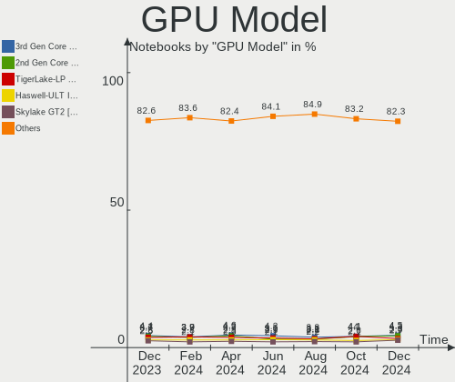
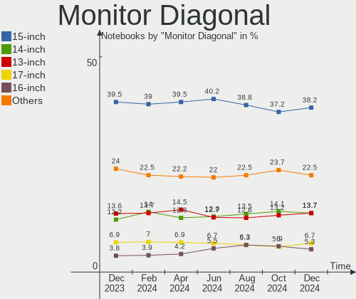
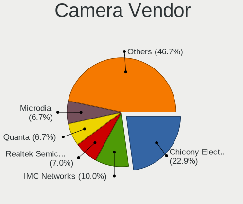
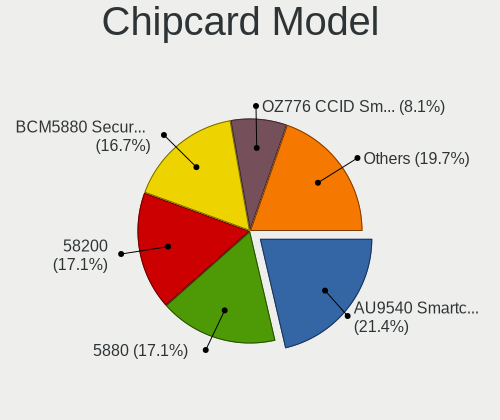

Linux - Hardware Trends (Notebooks)
-----------------------------------

A project to identify most popular hardware characteristics and track their change
over time based on data collected by Linux users at https://Linux-Hardware.org.

Anyone can contribute to this report by the [hw-probe](https://github.com/linuxhw/hw-probe) tool:

    sudo -E hw-probe -all -upload

This report is for one last month. Overall report since the beginning of time: [TestDays](https://github.com/linuxhw/TestDays)

Period: Jan, 2024.

Contents
--------

* [ System ](#system)
  - [ OS                       ](#os)
  - [ OS Family                ](#os-family)
  - [ Kernel                   ](#kernel)
  - [ Kernel Family            ](#kernel-family)
  - [ Kernel Major Ver.        ](#kernel-major-ver)
  - [ Arch                     ](#arch)
  - [ DE                       ](#de)
  - [ Display Server           ](#display-server)
  - [ Display Manager          ](#display-manager)
  - [ OS Lang                  ](#os-lang)
  - [ Boot Mode                ](#boot-mode)
  - [ Filesystem               ](#filesystem)
  - [ Part. scheme             ](#part-scheme)
  - [ Dual Boot with Linux/BSD ](#dual-boot-with-linuxbsd)
  - [ Dual Boot (Win)          ](#dual-boot-win)

* [ Board ](#board)
  - [ Vendor                   ](#vendor)
  - [ Model                    ](#model)
  - [ Model Family             ](#model-family)
  - [ MFG Year                 ](#mfg-year)
  - [ Form Factor              ](#form-factor)
  - [ Secure Boot              ](#secure-boot)
  - [ Coreboot                 ](#coreboot)
  - [ RAM Size                 ](#ram-size)
  - [ RAM Used                 ](#ram-used)
  - [ Total Drives             ](#total-drives)
  - [ Has CD-ROM               ](#has-cd-rom)
  - [ Has Ethernet             ](#has-ethernet)
  - [ Has WiFi                 ](#has-wifi)
  - [ Has Bluetooth            ](#has-bluetooth)

* [ Location ](#location)
  - [ Country                  ](#country)
  - [ City                     ](#city)

* [ Drives ](#drives)
  - [ Drive Vendor             ](#drive-vendor)
  - [ Drive Model              ](#drive-model)
  - [ HDD Vendor               ](#hdd-vendor)
  - [ SSD Vendor               ](#ssd-vendor)
  - [ Drive Kind               ](#drive-kind)
  - [ Drive Connector          ](#drive-connector)
  - [ Drive Size               ](#drive-size)
  - [ Space Total              ](#space-total)
  - [ Space Used               ](#space-used)
  - [ Malfunc. Drives          ](#malfunc-drives)
  - [ Malfunc. Drive Vendor    ](#malfunc-drive-vendor)
  - [ Malfunc. HDD Vendor      ](#malfunc-hdd-vendor)
  - [ Malfunc. Drive Kind      ](#malfunc-drive-kind)
  - [ Failed Drives            ](#failed-drives)
  - [ Failed Drive Vendor      ](#failed-drive-vendor)
  - [ Drive Status             ](#drive-status)

* [ Storage controller ](#storage-controller)
  - [ Storage Vendor           ](#storage-vendor)
  - [ Storage Model            ](#storage-model)
  - [ Storage Kind             ](#storage-kind)

* [ Processor ](#processor)
  - [ CPU Vendor               ](#cpu-vendor)
  - [ CPU Model                ](#cpu-model)
  - [ CPU Model Family         ](#cpu-model-family)
  - [ CPU Cores                ](#cpu-cores)
  - [ CPU Sockets              ](#cpu-sockets)
  - [ CPU Threads              ](#cpu-threads)
  - [ CPU Op-Modes             ](#cpu-op-modes)
  - [ CPU Microcode            ](#cpu-microcode)
  - [ CPU Microarch            ](#cpu-microarch)

* [ Graphics ](#graphics)
  - [ GPU Vendor               ](#gpu-vendor)
  - [ GPU Model                ](#gpu-model)
  - [ GPU Combo                ](#gpu-combo)
  - [ GPU Driver               ](#gpu-driver)
  - [ GPU Memory               ](#gpu-memory)

* [ Monitor ](#monitor)
  - [ Monitor Vendor           ](#monitor-vendor)
  - [ Monitor Model            ](#monitor-model)
  - [ Monitor Resolution       ](#monitor-resolution)
  - [ Monitor Diagonal         ](#monitor-diagonal)
  - [ Monitor Width            ](#monitor-width)
  - [ Aspect Ratio             ](#aspect-ratio)
  - [ Monitor Area             ](#monitor-area)
  - [ Pixel Density            ](#pixel-density)
  - [ Multiple Monitors        ](#multiple-monitors)

* [ Network ](#network)
  - [ Net Controller Vendor    ](#net-controller-vendor)
  - [ Net Controller Model     ](#net-controller-model)
  - [ Wireless Vendor          ](#wireless-vendor)
  - [ Wireless Model           ](#wireless-model)
  - [ Ethernet Vendor          ](#ethernet-vendor)
  - [ Ethernet Model           ](#ethernet-model)
  - [ Net Controller Kind      ](#net-controller-kind)
  - [ Used Controller          ](#used-controller)
  - [ NICs                     ](#nics)
  - [ IPv6                     ](#ipv6)

* [ Bluetooth ](#bluetooth)
  - [ Bluetooth Vendor         ](#bluetooth-vendor)
  - [ Bluetooth Model          ](#bluetooth-model)

* [ Sound ](#sound)
  - [ Sound Vendor             ](#sound-vendor)
  - [ Sound Model              ](#sound-model)

* [ Memory ](#memory)
  - [ Memory Vendor            ](#memory-vendor)
  - [ Memory Model             ](#memory-model)
  - [ Memory Kind              ](#memory-kind)
  - [ Memory Form Factor       ](#memory-form-factor)
  - [ Memory Size              ](#memory-size)
  - [ Memory Speed             ](#memory-speed)

* [ Printers & scanners ](#printers--scanners)
  - [ Printer Vendor           ](#printer-vendor)
  - [ Printer Model            ](#printer-model)
  - [ Scanner Vendor           ](#scanner-vendor)
  - [ Scanner Model            ](#scanner-model)

* [ Camera ](#camera)
  - [ Camera Vendor            ](#camera-vendor)
  - [ Camera Model             ](#camera-model)

* [ Security ](#security)
  - [ Fingerprint Vendor       ](#fingerprint-vendor)
  - [ Fingerprint Model        ](#fingerprint-model)
  - [ Chipcard Vendor          ](#chipcard-vendor)
  - [ Chipcard Model           ](#chipcard-model)

* [ Unsupported ](#unsupported)
  - [ Unsupported Devices      ](#unsupported-devices)
  - [ Unsupported Device Types ](#unsupported-device-types)

System
------

OS
--

Installed operating systems

| Name                         | Notebooks | Percent |
|------------------------------|-----------|---------|
| Ubuntu 22.04                 | 416       | 13.04%  |
| Fedora 39                    | 338       | 10.59%  |
| Debian 12                    | 176       | 5.52%   |
| Linux Mint 21.2              | 155       | 4.86%   |
| Ubuntu 23.10                 | 141       | 4.42%   |
| Arch Rolling                 | 138       | 4.32%   |
| Zorin 17                     | 106       | 3.32%   |
| Pop!_OS 22.04                | 104       | 3.26%   |
| Linux Mint 21.3              | 93        | 2.91%   |
| ROSA 12.4                    | 79        | 2.48%   |
| BlackPanther 18.1            | 77        | 2.41%   |
| ArcoLinux Rolling            | 74        | 2.32%   |
| Zorin 16                     | 57        | 1.79%   |
| SteamOS 3.5.7                | 57        | 1.79%   |
| Kali 2023.4                  | 56        | 1.75%   |
| OpenMandriva 23.08           | 54        | 1.69%   |
| OpenMandriva 5.0             | 52        | 1.63%   |
| Manjaro                      | 42        | 1.32%   |
| KDE neon 22.04               | 41        | 1.28%   |
| openSUSE Tumbleweed-XXXXXXXX | 39        | 1.22%   |
| Ubuntu 20.04                 | 38        | 1.19%   |
| EndeavourOS Rolling          | 38        | 1.19%   |
| Kubuntu 23.10                | 37        | 1.16%   |
| Kubuntu 22.04                | 36        | 1.13%   |
| Debian                       | 33        | 1.03%   |
| OpenMandriva 24.01           | 26        | 0.81%   |
| Nobara 39                    | 25        | 0.78%   |
| Linux Mint 20.3              | 25        | 0.78%   |
| LMDE 6                       | 24        | 0.75%   |
| Elementary 7.1               | 24        | 0.75%   |
| Gentoo 2.14                  | 23        | 0.72%   |
| Manjaro 23.1.3               | 22        | 0.69%   |
| Debian 11                    | 22        | 0.69%   |
| Xero Rolling                 | 21        | 0.66%   |
| Fedora 38                    | 20        | 0.63%   |
| Xubuntu 22.04                | 19        | 0.6%    |
| Ubuntu 23.04                 | 16        | 0.5%    |
| Linux Mint 21.1              | 16        | 0.5%    |
| NixOS 23.11                  | 15        | 0.47%   |
| openSUSE Leap-15.5           | 14        | 0.44%   |

OS Family
---------

OS without a version

| Name          | Notebooks | Percent |
|---------------|-----------|---------|
| Ubuntu        | 628       | 19.68%  |
| Fedora        | 363       | 11.38%  |
| Linux Mint    | 306       | 9.59%   |
| Debian        | 233       | 7.3%    |
| Zorin         | 166       | 5.2%    |
| OpenMandriva  | 166       | 5.2%    |
| Arch          | 138       | 4.32%   |
| Pop!_OS       | 105       | 3.29%   |
| ROSA          | 95        | 2.98%   |
| Manjaro       | 85        | 2.66%   |
| BlackPanther  | 83        | 2.6%    |
| Kubuntu       | 76        | 2.38%   |
| SteamOS       | 75        | 2.35%   |
| ArcoLinux     | 75        | 2.35%   |
| Kali          | 58        | 1.82%   |
| openSUSE      | 57        | 1.79%   |
| KDE neon      | 42        | 1.32%   |
| Xubuntu       | 39        | 1.22%   |
| EndeavourOS   | 38        | 1.19%   |
| Nobara        | 33        | 1.03%   |
| NixOS         | 26        | 0.81%   |
| Elementary    | 26        | 0.81%   |
| LMDE          | 25        | 0.78%   |
| Gentoo        | 24        | 0.75%   |
| Xero          | 21        | 0.66%   |
| Lubuntu       | 21        | 0.66%   |
| MX            | 13        | 0.41%   |
| Endless       | 13        | 0.41%   |
| Parrot        | 11        | 0.34%   |
| Ubuntu MATE   | 10        | 0.31%   |
| Red OS        | 9         | 0.28%   |
| Garuda Linux  | 9         | 0.28%   |
| RHEL          | 8         | 0.25%   |
| Lilidog       | 7         | 0.22%   |
| Ubuntu Budgie | 6         | 0.19%   |
| BunsenLabs    | 6         | 0.19%   |
| TUXEDO OS     | 5         | 0.16%   |
| Clear Linux   | 5         | 0.16%   |
| Alpine        | 5         | 0.16%   |
| Q4OS          | 4         | 0.13%   |

Kernel
------

Version of the Linux kernel

| Version                           | Notebooks | Percent |
|-----------------------------------|-----------|---------|
| 6.5.0-14-generic                  | 415       | 13.01%  |
| 5.15.0-91-generic                 | 262       | 8.21%   |
| 6.2.0-39-generic                  | 201       | 6.3%    |
| 6.1.0-17-amd64                    | 133       | 4.17%   |
| 6.5.0-15-generic                  | 123       | 3.85%   |
| 6.6.9-200.fc39.x86_64             | 110       | 3.45%   |
| 6.6.6-76060606-generic            | 83        | 2.6%    |
| 6.6.2-desktop-1omv2390            | 82        | 2.57%   |
| 6.1.52-valve9-1-neptune-61        | 57        | 1.79%   |
| 6.4.11-desktop-1omv2390           | 51        | 1.6%    |
| 6.6.8-200.fc39.x86_64             | 50        | 1.57%   |
| 6.6.11-200.fc39.x86_64            | 49        | 1.54%   |
| 6.5.0-kali3-amd64                 | 49        | 1.54%   |
| 6.6.13-200.fc39.x86_64            | 48        | 1.5%    |
| 5.15.85-desktop-1bP               | 42        | 1.32%   |
| 6.1.58-generic-1rosa2021.1-x86_64 | 40        | 1.25%   |
| 5.15.0-92-generic                 | 39        | 1.22%   |
| 6.7.0-arch3-1                     | 36        | 1.13%   |
| 6.2.0-26-generic                  | 34        | 1.07%   |
| 6.5.6-300.fc39.x86_64             | 33        | 1.03%   |
| 6.6.8-arch1-1                     | 32        | 1%      |
| 6.6.10-arch1-1                    | 28        | 0.88%   |
| 6.1.20-generic-2rosa2021.1-x86_64 | 26        | 0.81%   |
| 5.4.0-169-generic                 | 26        | 0.81%   |
| 6.6.9-arch1-1                     | 22        | 0.69%   |
| 6.6.10-1-MANJARO                  | 21        | 0.66%   |
| 6.6.12-200.fc39.x86_64            | 20        | 0.63%   |
| 6.7.1-arch1-1                     | 19        | 0.6%    |
| 6.7.0-zen3-1-zen                  | 19        | 0.6%    |
| 6.6.8-2-MANJARO                   | 19        | 0.6%    |
| 6.1.0-16-amd64                    | 19        | 0.6%    |
| 5.15.0-76-generic                 | 19        | 0.6%    |
| 5.6.14-desktop-2bP                | 18        | 0.56%   |
| 6.6.1-arch1-1                     | 16        | 0.5%    |
| 6.7.2-arch1-1                     | 15        | 0.47%   |
| 4.18.16-desktop-1bP               | 15        | 0.47%   |
| 6.6.11-1-default                  | 14        | 0.44%   |
| 6.6.10-zen1-1-zen                 | 14        | 0.44%   |
| 6.1.0-15-amd64                    | 14        | 0.44%   |
| 6.6.7-1-default                   | 13        | 0.41%   |

Kernel Family
-------------

Linux kernel without a distro release

| Version | Notebooks | Percent |
|---------|-----------|---------|
| 6.5.0   | 672       | 21.06%  |
| 5.15.0  | 370       | 11.6%   |
| 6.2.0   | 265       | 8.3%    |
| 6.1.0   | 220       | 6.89%   |
| 6.6.9   | 178       | 5.58%   |
| 6.6.8   | 134       | 4.2%    |
| 6.7.0   | 99        | 3.1%    |
| 6.6.10  | 89        | 2.79%   |
| 6.6.6   | 87        | 2.73%   |
| 6.6.2   | 83        | 2.6%    |
| 6.6.11  | 82        | 2.57%   |
| 6.1.52  | 76        | 2.38%   |
| 6.6.13  | 60        | 1.88%   |
| 6.4.11  | 52        | 1.63%   |
| 5.4.0   | 45        | 1.41%   |
| 6.5.6   | 42        | 1.32%   |
| 5.15.85 | 42        | 1.32%   |
| 6.1.58  | 41        | 1.28%   |
| 6.7.1   | 37        | 1.16%   |
| 6.6.7   | 32        | 1%      |
| 6.6.12  | 30        | 0.94%   |
| 5.10.0  | 28        | 0.88%   |
| 6.1.20  | 26        | 0.81%   |
| 6.1.69  | 24        | 0.75%   |
| 6.7.2   | 21        | 0.66%   |
| 6.6.1   | 19        | 0.6%    |
| 5.6.14  | 19        | 0.6%    |
| 5.14.0  | 16        | 0.5%    |
| 6.6.4   | 15        | 0.47%   |
| 5.14.21 | 15        | 0.47%   |
| 4.18.16 | 15        | 0.47%   |
| 5.19.0  | 14        | 0.44%   |
| 6.5.13  | 11        | 0.34%   |
| 6.2.6   | 11        | 0.34%   |
| 4.15.0  | 11        | 0.34%   |
| 6.1.71  | 9         | 0.28%   |
| 6.6.3   | 8         | 0.25%   |
| 6.6.0   | 8         | 0.25%   |
| 6.1.67  | 8         | 0.25%   |
| 6.6.14  | 7         | 0.22%   |

Kernel Major Ver.
-----------------

Linux kernel major version

| Version | Notebooks | Percent |
|---------|-----------|---------|
| 6.6     | 833       | 26.1%   |
| 6.5     | 750       | 23.5%   |
| 5.15    | 429       | 13.44%  |
| 6.1     | 428       | 13.41%  |
| 6.2     | 283       | 8.87%   |
| 6.7     | 157       | 4.92%   |
| 6.4     | 68        | 2.13%   |
| 5.4     | 53        | 1.66%   |
| 5.10    | 43        | 1.35%   |
| 5.14    | 32        | 1%      |
| 5.6     | 19        | 0.6%    |
| 4.18    | 17        | 0.53%   |
| 6.3     | 16        | 0.5%    |
| 5.19    | 15        | 0.47%   |
| 4.15    | 12        | 0.38%   |
| 6.0     | 6         | 0.19%   |
| 5.16    | 5         | 0.16%   |
| 5.13    | 5         | 0.16%   |
| 5.18    | 4         | 0.13%   |
| 6       | 3         | 0.09%   |
| 5.11    | 3         | 0.09%   |
| 5.8     | 2         | 0.06%   |
| 4.9     | 2         | 0.06%   |
| 6.8     | 1         | 0.03%   |
| 6.1.66  | 1         | 0.03%   |
| 5.0     | 1         | 0.03%   |
| 4.7     | 1         | 0.03%   |
| 4.4     | 1         | 0.03%   |
| 4.19    | 1         | 0.03%   |

Arch
----

OS architecture (x86_64, i586, etc.)

| Name    | Notebooks | Percent |
|---------|-----------|---------|
| x86_64  | 3156      | 98.9%   |
| i686    | 29        | 0.91%   |
| aarch64 | 5         | 0.16%   |
| armv7l  | 1         | 0.03%   |

DE
--

Desktop Environment

| Name             | Notebooks | Percent |
|------------------|-----------|---------|
| GNOME            | 1421      | 44.53%  |
| KDE5             | 829       | 25.98%  |
| X-Cinnamon       | 279       | 8.74%   |
| XFCE             | 233       | 7.3%    |
| Unknown          | 83        | 2.6%    |
| MATE             | 69        | 2.16%   |
| LXQt             | 57        | 1.79%   |
| Hyprland         | 28        | 0.88%   |
| Pantheon         | 27        | 0.85%   |
| i3               | 22        | 0.69%   |
| Cinnamon         | 17        | 0.53%   |
| sway             | 14        | 0.44%   |
| Budgie           | 14        | 0.44%   |
| LXDE             | 11        | 0.34%   |
| Endless:GNOME    | 11        | 0.34%   |
| KDE              | 10        | 0.31%   |
| lightdm-xsession | 7         | 0.22%   |
| Deepin           | 7         | 0.22%   |
| GNOME Flashback  | 6         | 0.19%   |
| Trinity          | 5         | 0.16%   |
| GNOME Classic    | 5         | 0.16%   |
| KDE4             | 4         | 0.13%   |
| Enlightenment    | 4         | 0.13%   |
| Unity            | 3         | 0.09%   |
| openbox          | 3         | 0.09%   |
| KDE6             | 3         | 0.09%   |
| DWM              | 3         | 0.09%   |
| awesome          | 3         | 0.09%   |
| wayfire          | 2         | 0.06%   |
| xinitrc          | 1         | 0.03%   |
| qtile            | 1         | 0.03%   |
| none+i3          | 1         | 0.03%   |
| Lingmo           | 1         | 0.03%   |
| icewm            | 1         | 0.03%   |
| i3-with-shmlog   | 1         | 0.03%   |
| herbstluftwm     | 1         | 0.03%   |
| GNUstep          | 1         | 0.03%   |
| fly              | 1         | 0.03%   |
| DDE              | 1         | 0.03%   |
| bspwm            | 1         | 0.03%   |

Display Server
--------------

X11 or Wayland

| Name    | Notebooks | Percent |
|---------|-----------|---------|
| X11     | 1727      | 54.12%  |
| Wayland | 1358      | 42.56%  |
| Unknown | 63        | 1.97%   |
| Tty     | 42        | 1.32%   |
| Web     | 1         | 0.03%   |

Display Manager
---------------

SDDM, LightDM, etc.

| Name          | Notebooks | Percent |
|---------------|-----------|---------|
| Unknown       | 1123      | 35.19%  |
| GDM3          | 680       | 21.31%  |
| SDDM          | 667       | 20.9%   |
| LightDM       | 468       | 14.67%  |
| GDM           | 231       | 7.24%   |
| TDM           | 5         | 0.16%   |
| KDM           | 4         | 0.13%   |
| XDM           | 3         | 0.09%   |
| LY-DM         | 3         | 0.09%   |
| LXDM          | 2         | 0.06%   |
| WDM           | 1         | 0.03%   |
| NODM          | 1         | 0.03%   |
| Ly            | 1         | 0.03%   |
| GREETD        | 1         | 0.03%   |
| DARKDM_ON_TTY | 1         | 0.03%   |

OS Lang
-------

Language

| Lang    | Notebooks | Percent |
|---------|-----------|---------|
| en_US   | 1372      | 43%     |
| de_DE   | 272       | 8.52%   |
| ru_RU   | 229       | 7.18%   |
| en_GB   | 168       | 5.26%   |
| fr_FR   | 148       | 4.64%   |
| Unknown | 120       | 3.76%   |
| it_IT   | 113       | 3.54%   |
| C       | 108       | 3.38%   |
| pt_BR   | 84        | 2.63%   |
| es_ES   | 67        | 2.1%    |
| pl_PL   | 53        | 1.66%   |
| en_CA   | 51        | 1.6%    |
| en_IN   | 47        | 1.47%   |
| en_AU   | 31        | 0.97%   |
| es_MX   | 27        | 0.85%   |
| cs_CZ   | 20        | 0.63%   |
| pt_PT   | 19        | 0.6%    |
| nl_NL   | 17        | 0.53%   |
| zh_CN   | 16        | 0.5%    |
| hu_HU   | 16        | 0.5%    |
| es_AR   | 16        | 0.5%    |
| tr_TR   | 14        | 0.44%   |
| de_CH   | 13        | 0.41%   |
| es_CL   | 12        | 0.38%   |
| en_ZA   | 11        | 0.34%   |
| es_CO   | 9         | 0.28%   |
| de_AT   | 8         | 0.25%   |
| da_DK   | 8         | 0.25%   |
| el_GR   | 7         | 0.22%   |
| nb_NO   | 6         | 0.19%   |
| fi_FI   | 6         | 0.19%   |
| en_PH   | 6         | 0.19%   |
| sk_SK   | 5         | 0.16%   |
| ro_RO   | 5         | 0.16%   |
| fr_CA   | 5         | 0.16%   |
| fr_BE   | 5         | 0.16%   |
| bg_BG   | 5         | 0.16%   |
| POSIX   | 4         | 0.13%   |
| en_IE   | 4         | 0.13%   |
| sv_SE   | 3         | 0.09%   |

Boot Mode
---------

EFI or BIOS

| Mode | Notebooks | Percent |
|------|-----------|---------|
| EFI  | 1792      | 56.16%  |
| BIOS | 1399      | 43.84%  |

Filesystem
----------

Type of filesystem

| Type     | Notebooks | Percent |
|----------|-----------|---------|
| Ext4     | 1852      | 58.04%  |
| Btrfs    | 663       | 20.78%  |
| Tmpfs    | 418       | 13.1%   |
| Overlay  | 186       | 5.83%   |
| Xfs      | 39        | 1.22%   |
| Zfs      | 15        | 0.47%   |
| Ext3     | 8         | 0.25%   |
| F2fs     | 5         | 0.16%   |
| Unknown  | 3         | 0.09%   |
| Reiserfs | 1         | 0.03%   |
| Aufs     | 1         | 0.03%   |

Part. scheme
------------

Scheme of partitioning

| Type    | Notebooks | Percent |
|---------|-----------|---------|
| GPT     | 1826      | 57.22%  |
| Unknown | 1033      | 32.37%  |
| MBR     | 332       | 10.4%   |

Dual Boot with Linux/BSD
------------------------

Hosting more than one Linux/BSD

| Dual boot | Notebooks | Percent |
|-----------|-----------|---------|
| No        | 2867      | 89.85%  |
| Yes       | 324       | 10.15%  |

Dual Boot (Win)
---------------

Hosting Linux and Windows

| Dual boot | Notebooks | Percent |
|-----------|-----------|---------|
| No        | 2449      | 76.75%  |
| Yes       | 742       | 23.25%  |

Board
-----

Vendor
------

Motherboard manufacturer

| Name                | Notebooks | Percent |
|---------------------|-----------|---------|
| Lenovo              | 696       | 21.81%  |
| Hewlett-Packard     | 521       | 16.33%  |
| Dell                | 464       | 14.54%  |
| ASUSTek Computer    | 361       | 11.31%  |
| Acer                | 264       | 8.27%   |
| Apple               | 135       | 4.23%   |
| Valve               | 70        | 2.19%   |
| MSI                 | 65        | 2.04%   |
| Toshiba             | 62        | 1.94%   |
| Samsung Electronics | 44        | 1.38%   |
| HUAWEI              | 40        | 1.25%   |
| Fujitsu             | 34        | 1.07%   |
| Sony                | 33        | 1.03%   |
| Google              | 31        | 0.97%   |
| Unknown             | 30        | 0.94%   |
| Medion              | 24        | 0.75%   |
| TUXEDO              | 20        | 0.63%   |
| Notebook            | 15        | 0.47%   |
| Packard Bell        | 14        | 0.44%   |
| Alienware           | 11        | 0.34%   |
| System76            | 10        | 0.31%   |
| Framework           | 10        | 0.31%   |
| Timi                | 9         | 0.28%   |
| LG Electronics      | 9         | 0.28%   |
| Aquarius            | 9         | 0.28%   |
| Positivo            | 8         | 0.25%   |
| HONOR               | 8         | 0.25%   |
| Gigabyte Technology | 8         | 0.25%   |
| Clevo               | 8         | 0.25%   |
| Infinix             | 7         | 0.22%   |
| eMachines           | 7         | 0.22%   |
| Razer               | 6         | 0.19%   |
| MECHREVO            | 6         | 0.19%   |
| AZW                 | 6         | 0.19%   |
| Fujitsu Siemens     | 5         | 0.16%   |
| VALE                | 4         | 0.13%   |
| Panasonic           | 4         | 0.13%   |
| Gateway             | 4         | 0.13%   |
| Dynabook            | 4         | 0.13%   |
| Chuwi               | 4         | 0.13%   |

Model
-----

Motherboard model

| Name                                | Notebooks | Percent |
|-------------------------------------|-----------|---------|
| Valve Jupiter                       | 57        | 1.79%   |
| Unknown                             | 39        | 1.22%   |
| HP Notebook                         | 17        | 0.53%   |
| Valve Galileo                       | 13        | 0.41%   |
| Apple MacBookPro9,2                 | 13        | 0.41%   |
| Apple MacBookAir7,2                 | 13        | 0.41%   |
| HP Pavilion 15                      | 12        | 0.38%   |
| Apple MacBookPro14,1                | 11        | 0.34%   |
| HP Pavilion dv6                     | 10        | 0.31%   |
| Dell Latitude 7490                  | 10        | 0.31%   |
| Aquarius NS585                      | 9         | 0.28%   |
| Apple MacBookAir6,2                 | 9         | 0.28%   |
| HP EliteBook 840 G3                 | 8         | 0.25%   |
| Dell XPS 15 9530                    | 8         | 0.25%   |
| ASUS Vivobook Go E1504FA_E1504FA    | 8         | 0.25%   |
| Apple MacBookPro8,1                 | 8         | 0.25%   |
| HP Pavilion dv7                     | 7         | 0.22%   |
| HP Laptop 15s-eq2xxx                | 7         | 0.22%   |
| HP EliteBook 840 G8 Notebook PC     | 7         | 0.22%   |
| Dell Inspiron 15-3567               | 7         | 0.22%   |
| Apple MacBook5,1                    | 7         | 0.22%   |
| Acer Aspire A315-24P                | 7         | 0.22%   |
| Lenovo V15-ADA 82C7                 | 6         | 0.19%   |
| HUAWEI BOM-WXX9                     | 6         | 0.19%   |
| HP Pavilion Notebook                | 6         | 0.19%   |
| HP Pavilion g6                      | 6         | 0.19%   |
| HP Laptop 15-db0xxx                 | 6         | 0.19%   |
| HP 15                               | 6         | 0.19%   |
| Dell XPS 9315                       | 6         | 0.19%   |
| Dell XPS 15 9570                    | 6         | 0.19%   |
| Dell XPS 13 9360                    | 6         | 0.19%   |
| Dell Latitude E6420                 | 6         | 0.19%   |
| Dell Latitude 5490                  | 6         | 0.19%   |
| Acer Swift SF314-43                 | 6         | 0.19%   |
| Acer Nitro AN515-58                 | 6         | 0.19%   |
| Lenovo IdeaPad Gaming 3 15ACH6 82K2 | 5         | 0.16%   |
| Lenovo IdeaPad 3 15ITL6 82H8        | 5         | 0.16%   |
| Lenovo G500 20236                   | 5         | 0.16%   |
| HP Laptop 15-dy2xxx                 | 5         | 0.16%   |
| Dell Precision 5680                 | 5         | 0.16%   |

Model Family
------------

Motherboard model prefix

| Name                  | Notebooks | Percent |
|-----------------------|-----------|---------|
| Lenovo ThinkPad       | 366       | 11.47%  |
| Dell Latitude         | 191       | 5.99%   |
| Acer Aspire           | 173       | 5.42%   |
| Lenovo IdeaPad        | 162       | 5.08%   |
| Dell Inspiron         | 144       | 4.51%   |
| ASUS Vivobook         | 113       | 3.54%   |
| HP Pavilion           | 96        | 3.01%   |
| HP EliteBook          | 96        | 3.01%   |
| HP Laptop             | 88        | 2.76%   |
| HP ProBook            | 66        | 2.07%   |
| Valve Jupiter         | 57        | 1.79%   |
| Toshiba Satellite     | 55        | 1.72%   |
| Dell XPS              | 55        | 1.72%   |
| Dell Precision        | 41        | 1.28%   |
| ASUS ROG              | 39        | 1.22%   |
| Unknown               | 39        | 1.22%   |
| Lenovo Legion         | 36        | 1.13%   |
| ASUS ZenBook          | 33        | 1.03%   |
| ASUS ASUS             | 33        | 1.03%   |
| Fujitsu LIFEBOOK      | 29        | 0.91%   |
| Acer Nitro            | 27        | 0.85%   |
| HP ZBook              | 26        | 0.81%   |
| Acer Swift            | 25        | 0.78%   |
| Lenovo ThinkBook      | 20        | 0.63%   |
| HP Victus             | 17        | 0.53%   |
| HP Notebook           | 17        | 0.53%   |
| Acer TravelMate       | 17        | 0.53%   |
| Lenovo Yoga           | 16        | 0.5%    |
| HP OMEN               | 16        | 0.5%    |
| Apple MacBookPro11    | 16        | 0.5%    |
| Apple MacBookPro9     | 15        | 0.47%   |
| Packard Bell EasyNote | 14        | 0.44%   |
| HP Compaq             | 14        | 0.44%   |
| Dell Vostro           | 14        | 0.44%   |
| Apple MacBookAir7     | 14        | 0.44%   |
| Valve Galileo         | 13        | 0.41%   |
| HP ENVY               | 13        | 0.41%   |
| Apple MacBookPro14    | 13        | 0.41%   |
| Apple MacBookPro8     | 12        | 0.38%   |
| HP 250                | 11        | 0.34%   |

MFG Year
--------

Motherboard manufacture year

| Year    | Notebooks | Percent |
|---------|-----------|---------|
| 2023    | 363       | 11.38%  |
| 2021    | 352       | 11.03%  |
| 2022    | 297       | 9.31%   |
| 2020    | 238       | 7.46%   |
| 2019    | 230       | 7.21%   |
| 2013    | 216       | 6.77%   |
| 2018    | 204       | 6.39%   |
| 2012    | 181       | 5.67%   |
| 2017    | 170       | 5.33%   |
| 2016    | 167       | 5.23%   |
| 2011    | 151       | 4.73%   |
| 2014    | 147       | 4.61%   |
| 2015    | 126       | 3.95%   |
| 2010    | 115       | 3.6%    |
| 2008    | 81        | 2.54%   |
| 2009    | 71        | 2.23%   |
| 2007    | 54        | 1.69%   |
| 2006    | 17        | 0.53%   |
| Unknown | 7         | 0.22%   |
| 2005    | 3         | 0.09%   |
| 2024    | 1         | 0.03%   |

Form Factor
-----------

Physical design of the computer

| Name     | Notebooks | Percent |
|----------|-----------|---------|
| Notebook | 3191      | 100%    |

Secure Boot
-----------

Enabled or disabled

| State    | Notebooks | Percent |
|----------|-----------|---------|
| Disabled | 2907      | 91.1%   |
| Enabled  | 284       | 8.9%    |

Coreboot
--------

Have coreboot on board

| Used | Notebooks | Percent |
|------|-----------|---------|
| No   | 3154      | 98.84%  |
| Yes  | 37        | 1.16%   |

RAM Size
--------

Total RAM memory

| Size in GB      | Notebooks | Percent |
|-----------------|-----------|---------|
| 4.01-8.0        | 925       | 28.99%  |
| 8.01-16.0       | 636       | 19.93%  |
| 16.01-24.0      | 583       | 18.27%  |
| 3.01-4.0        | 494       | 15.48%  |
| 32.01-64.0      | 291       | 9.12%   |
| 24.01-32.0      | 75        | 2.35%   |
| 1.01-2.0        | 74        | 2.32%   |
| 64.01-256.0     | 71        | 2.23%   |
| 2.01-3.0        | 36        | 1.13%   |
| 0.51-1.0        | 3         | 0.09%   |
| 0.01-0.5        | 2         | 0.06%   |
| More than 256.0 | 1         | 0.03%   |

RAM Used
--------

Used RAM memory

| Used GB    | Notebooks | Percent |
|------------|-----------|---------|
| 1.01-2.0   | 836       | 26.2%   |
| 2.01-3.0   | 809       | 25.35%  |
| 4.01-8.0   | 667       | 20.9%   |
| 3.01-4.0   | 540       | 16.92%  |
| 8.01-16.0  | 158       | 4.95%   |
| 0.51-1.0   | 134       | 4.2%    |
| 16.01-24.0 | 20        | 0.63%   |
| 0.01-0.5   | 18        | 0.56%   |
| 24.01-32.0 | 7         | 0.22%   |
| 32.01-64.0 | 2         | 0.06%   |

Total Drives
------------

Number of drives on board

| Drives | Notebooks | Percent |
|--------|-----------|---------|
| 1      | 2380      | 74.58%  |
| 2      | 692       | 21.69%  |
| 3      | 80        | 2.51%   |
| 4      | 24        | 0.75%   |
| 0      | 14        | 0.44%   |
| 13     | 1         | 0.03%   |

Has CD-ROM
----------

Has CD-ROM on board

| Presented | Notebooks | Percent |
|-----------|-----------|---------|
| No        | 2340      | 73.33%  |
| Yes       | 851       | 26.67%  |

Has Ethernet
------------

Has Ethernet on board

| Presented | Notebooks | Percent |
|-----------|-----------|---------|
| Yes       | 2397      | 75.12%  |
| No        | 794       | 24.88%  |

Has WiFi
--------

Has WiFi module

| Presented | Notebooks | Percent |
|-----------|-----------|---------|
| Yes       | 3146      | 98.59%  |
| No        | 45        | 1.41%   |

Has Bluetooth
-------------

Has Bluetooth module

| Presented | Notebooks | Percent |
|-----------|-----------|---------|
| Yes       | 2664      | 83.48%  |
| No        | 527       | 16.52%  |

Location
--------

Country
-------

Geographic location (country)

| Country      | Notebooks | Percent |
|--------------|-----------|---------|
| USA          | 556       | 17.42%  |
| Germany      | 368       | 11.53%  |
| Russia       | 258       | 8.09%   |
| France       | 172       | 5.39%   |
| Italy        | 153       | 4.79%   |
| Brazil       | 137       | 4.29%   |
| UK           | 129       | 4.04%   |
| Hungary      | 96        | 3.01%   |
| India        | 93        | 2.91%   |
| Canada       | 92        | 2.88%   |
| Spain        | 88        | 2.76%   |
| Poland       | 87        | 2.73%   |
| Netherlands  | 66        | 2.07%   |
| Switzerland  | 42        | 1.32%   |
| Australia    | 41        | 1.28%   |
| Mexico       | 40        | 1.25%   |
| Turkey       | 39        | 1.22%   |
| Czechia      | 39        | 1.22%   |
| Portugal     | 33        | 1.03%   |
| Sweden       | 31        | 0.97%   |
| Austria      | 31        | 0.97%   |
| Romania      | 26        | 0.81%   |
| Indonesia    | 26        | 0.81%   |
| Argentina    | 26        | 0.81%   |
| Finland      | 23        | 0.72%   |
| Chile        | 23        | 0.72%   |
| Bulgaria     | 22        | 0.69%   |
| Belgium      | 22        | 0.69%   |
| Greece       | 20        | 0.63%   |
| Colombia     | 20        | 0.63%   |
| China        | 18        | 0.56%   |
| Norway       | 17        | 0.53%   |
| South Africa | 16        | 0.5%    |
| Vietnam      | 14        | 0.44%   |
| Belarus      | 14        | 0.44%   |
| Thailand     | 12        | 0.38%   |
| Philippines  | 12        | 0.38%   |
| Denmark      | 12        | 0.38%   |
| Slovakia     | 11        | 0.34%   |
| Japan        | 11        | 0.34%   |

City
----

Geographic location (city)

| City              | Notebooks | Percent |
|-------------------|-----------|---------|
| Moscow            | 51        | 1.6%    |
| Berlin            | 36        | 1.13%   |
| Budapest          | 35        | 1.1%    |
| St Petersburg     | 24        | 0.75%   |
| Paris             | 23        | 0.72%   |
| Munich            | 18        | 0.56%   |
| Milan             | 18        | 0.56%   |
| Hamburg           | 18        | 0.56%   |
| Amsterdam         | 18        | 0.56%   |
| Toronto           | 17        | 0.53%   |
| Istanbul          | 16        | 0.5%    |
| Vienna            | 15        | 0.47%   |
| Rome              | 15        | 0.47%   |
| Prague            | 15        | 0.47%   |
| Voronezh          | 14        | 0.44%   |
| Santiago          | 13        | 0.41%   |
| New York          | 13        | 0.41%   |
| Zurich            | 12        | 0.38%   |
| Warsaw            | 12        | 0.38%   |
| Sydney            | 12        | 0.38%   |
| Sofia             | 12        | 0.38%   |
| Frankfurt am Main | 12        | 0.38%   |
| Bengaluru         | 12        | 0.38%   |
| Los Angeles       | 11        | 0.34%   |
| Stuttgart         | 10        | 0.31%   |
| Minsk             | 10        | 0.31%   |
| Melbourne         | 10        | 0.31%   |
| Lisbon            | 10        | 0.31%   |
| Leipzig           | 10        | 0.31%   |
| Helsinki          | 10        | 0.31%   |
| Portland          | 9         | 0.28%   |
| Phoenix           | 9         | 0.28%   |
| Krakow            | 9         | 0.28%   |
| Jacksonville      | 9         | 0.28%   |
| Hyderabad         | 9         | 0.28%   |
| Bangkok           | 9         | 0.28%   |
| Athens            | 9         | 0.28%   |
| Stockholm         | 8         | 0.25%   |
| Porto             | 8         | 0.25%   |
| Montreal          | 8         | 0.25%   |

Drives
------

Drive Vendor
------------

Hard drive vendors

| Vendor                       | Notebooks | Drives | Percent |
|------------------------------|-----------|--------|---------|
| Samsung Electronics          | 658       | 711    | 16.76%  |
| SanDisk                      | 320       | 329    | 8.15%   |
| WDC                          | 304       | 311    | 7.75%   |
| Seagate                      | 260       | 272    | 6.62%   |
| Unknown                      | 225       | 238    | 5.73%   |
| SK hynix                     | 206       | 212    | 5.25%   |
| Kingston                     | 190       | 197    | 4.84%   |
| Toshiba                      | 189       | 190    | 4.82%   |
| Micron Technology            | 165       | 167    | 4.2%    |
| Intel                        | 144       | 158    | 3.67%   |
| Crucial                      | 102       | 103    | 2.6%    |
| Apple                        | 82        | 104    | 2.09%   |
| KIOXIA                       | 77        | 79     | 1.96%   |
| Phison Electronics           | 76        | 76     | 1.94%   |
| HGST                         | 69        | 69     | 1.76%   |
| Hitachi                      | 68        | 68     | 1.73%   |
| A-DATA Technology            | 58        | 58     | 1.48%   |
| Kingston Technology Company  | 50        | 50     | 1.27%   |
| China                        | 46        | 47     | 1.17%   |
| Unknown                      | 36        | 36     | 0.92%   |
| Micron/Crucial Technology    | 33        | 34     | 0.84%   |
| Intenso                      | 30        | 31     | 0.76%   |
| MAXIO Technology (Hangzhou)  | 24        | 25     | 0.61%   |
| Silicon Motion               | 23        | 23     | 0.59%   |
| SPCC                         | 22        | 22     | 0.56%   |
| LITEONIT                     | 15        | 15     | 0.38%   |
| JMicron Technology           | 15        | 15     | 0.38%   |
| Transcend                    | 13        | 13     | 0.33%   |
| PNY                          | 13        | 13     | 0.33%   |
| Phison                       | 13        | 13     | 0.33%   |
| LITEON                       | 12        | 12     | 0.31%   |
| Lexar                        | 11        | 11     | 0.28%   |
| SSSTC                        | 10        | 10     | 0.25%   |
| Shenzhen Longsys Electronics | 10        | 10     | 0.25%   |
| O2 Micro                     | 10        | 10     | 0.25%   |
| Netac                        | 10        | 11     | 0.25%   |
| GOODRAM                      | 10        | 10     | 0.25%   |
| Realtek Semiconductor        | 9         | 11     | 0.23%   |
| Patriot                      | 9         | 9      | 0.23%   |
| KingSpec                     | 9         | 9      | 0.23%   |

Drive Model
-----------

Hard drive models

| Model                                               | Notebooks | Percent |
|-----------------------------------------------------|-----------|---------|
| Samsung NVMe SSD Controller SM981/PM981/PM983 1TB   | 81        | 2.01%   |
| Samsung NVMe SSD Controller PM9A1/PM9A3/980PRO 2TB  | 57        | 1.42%   |
| Seagate ST1000LM035-1RK172 1TB                      | 48        | 1.19%   |
| Kingston SA400S37240G 240GB SSD                     | 45        | 1.12%   |
| Unknown MMC Card  64GB                              | 40        | 0.99%   |
| Sandisk WD Blue SN550 NVMe SSD 512GB                | 37        | 0.92%   |
| Unknown                                             | 36        | 0.89%   |
| Unknown MMC Card  32GB                              | 34        | 0.84%   |
| Phison PS5013 E13 NVMe Controller 256GB             | 31        | 0.77%   |
| Intel SSDPEKNU512GZ 512GB                           | 31        | 0.77%   |
| Toshiba MQ01ABD100 1TB                              | 30        | 0.75%   |
| Kingston SA400S37480G 480GB SSD                     | 30        | 0.75%   |
| Kingston Company OM3PDP3 NVMe SSD 256GB             | 26        | 0.65%   |
| Samsung NVMe SSD Controller SM961/PM961/SM963 256GB | 23        | 0.57%   |
| Unknown MMC Card  128GB                             | 22        | 0.55%   |
| Intel SSD 660P Series 1024GB                        | 22        | 0.55%   |
| Toshiba MQ04ABF100 1TB                              | 21        | 0.52%   |
| Sandisk WD Black SN750 / PC SN730 NVMe SSD 512GB    | 21        | 0.52%   |
| Micron/Crucial P2 NVMe PCIe SSD 1TB                 | 21        | 0.52%   |
| Toshiba MQ01ABF050 500GB                            | 20        | 0.5%    |
| Samsung SSD 850 EVO 250GB                           | 20        | 0.5%    |
| Seagate ST500LT012-1DG142 500GB                     | 19        | 0.47%   |
| Seagate ST9500325AS 500GB                           | 18        | 0.45%   |
| Seagate ST1000LM024 HN-M101MBB 1TB                  | 18        | 0.45%   |
| Micron 2400_MTFDKBA512QFM 512GB                     | 18        | 0.45%   |
| MAXIO (Hangzhou) NVMe SSD Controller MAP1202 512GB  | 18        | 0.45%   |
| HGST HTS545050A7E680 500GB                          | 16        | 0.4%    |
| HGST HTS541010A9E680 1TB                            | 16        | 0.4%    |
| SanDisk NVMe SSD Drive 512GB                        | 15        | 0.37%   |
| SanDisk NVMe SSD Drive 1TB                          | 15        | 0.37%   |
| Samsung SSD 860 EVO 500GB                           | 15        | 0.37%   |
| Samsung SSD 860 EVO 1TB                             | 15        | 0.37%   |
| HGST HTS721010A9E630 1TB                            | 15        | 0.37%   |
| Unknown MMC Card  512GB                             | 14        | 0.35%   |
| Samsung SSD 870 EVO 1TB                             | 14        | 0.35%   |
| Samsung SSD 850 EVO 500GB                           | 13        | 0.32%   |
| Micron 2450_MTFDKBA512TFK 512GB                     | 13        | 0.32%   |
| Intel SSD Pro 7600p/760p/E 6100p Series 1024GB      | 13        | 0.32%   |
| Crucial CT1000BX500SSD1 1TB                         | 13        | 0.32%   |
| Apple SSD SM0128G 121GB                             | 13        | 0.32%   |

HDD Vendor
----------

Hard disk drive vendors

| Vendor              | Notebooks | Drives | Percent |
|---------------------|-----------|--------|---------|
| Seagate             | 249       | 256    | 32.42%  |
| WDC                 | 183       | 184    | 23.83%  |
| Toshiba             | 137       | 138    | 17.84%  |
| HGST                | 69        | 69     | 8.98%   |
| Hitachi             | 68        | 68     | 8.85%   |
| Samsung Electronics | 16        | 16     | 2.08%   |
| Unknown             | 8         | 8      | 1.04%   |
| JMicron Technology  | 8         | 8      | 1.04%   |
| Fujitsu             | 8         | 8      | 1.04%   |
| External            | 5         | 6      | 0.65%   |
| Apple               | 4         | 4      | 0.52%   |
| TO Exter            | 3         | 3      | 0.39%   |
| ASMT                | 3         | 5      | 0.39%   |
| StoreJet            | 1         | 1      | 0.13%   |
| SSK                 | 1         | 2      | 0.13%   |
| MaxDigital          | 1         | 1      | 0.13%   |
| LaCie               | 1         | 1      | 0.13%   |
| Intenso             | 1         | 1      | 0.13%   |
| Asm                 | 1         | 1      | 0.13%   |
| Unknown             | 1         | 1      | 0.13%   |

SSD Vendor
----------

Solid state drive vendors

| Vendor              | Notebooks | Drives | Percent |
|---------------------|-----------|--------|---------|
| Samsung Electronics | 248       | 259    | 20.1%   |
| Kingston            | 138       | 140    | 11.18%  |
| SanDisk             | 108       | 109    | 8.75%   |
| Crucial             | 89        | 89     | 7.21%   |
| WDC                 | 68        | 70     | 5.51%   |
| Apple               | 47        | 47     | 3.81%   |
| China               | 46        | 47     | 3.73%   |
| A-DATA Technology   | 45        | 45     | 3.65%   |
| SK hynix            | 38        | 38     | 3.08%   |
| Intel               | 34        | 34     | 2.76%   |
| Micron Technology   | 30        | 32     | 2.43%   |
| Intenso             | 22        | 23     | 1.78%   |
| SPCC                | 19        | 19     | 1.54%   |
| LITEONIT            | 15        | 15     | 1.22%   |
| Transcend           | 13        | 13     | 1.05%   |
| PNY                 | 13        | 13     | 1.05%   |
| Toshiba             | 12        | 12     | 0.97%   |
| LITEON              | 11        | 11     | 0.89%   |
| GOODRAM             | 10        | 10     | 0.81%   |
| Unknown             | 10        | 10     | 0.81%   |
| KingSpec            | 9         | 9      | 0.73%   |
| Patriot             | 8         | 8      | 0.65%   |
| OCZ                 | 8         | 8      | 0.65%   |
| Netac               | 8         | 8      | 0.65%   |
| Gigabyte Technology | 8         | 8      | 0.65%   |
| Lexar               | 7         | 7      | 0.57%   |
| Team                | 6         | 6      | 0.49%   |
| Hewlett-Packard     | 6         | 6      | 0.49%   |
| SABRENT             | 5         | 5      | 0.41%   |
| Phison              | 5         | 5      | 0.41%   |
| Apacer              | 5         | 5      | 0.41%   |
| XrayDisk            | 4         | 4      | 0.32%   |
| USB3.0              | 4         | 4      | 0.32%   |
| Fanxiang            | 4         | 4      | 0.32%   |
| Wibtek              | 3         | 3      | 0.24%   |
| SSSTC               | 3         | 3      | 0.24%   |
| BHT                 | 3         | 3      | 0.24%   |
| BAITITON            | 3         | 3      | 0.24%   |
| AMD                 | 3         | 3      | 0.24%   |
| Verbatim            | 2         | 2      | 0.16%   |

Drive Kind
----------

HDD or SSD

| Kind    | Notebooks | Drives | Percent |
|---------|-----------|--------|---------|
| NVMe    | 1532      | 1751   | 41.13%  |
| SSD     | 1159      | 1255   | 31.11%  |
| HDD     | 755       | 781    | 20.27%  |
| MMC     | 219       | 238    | 5.88%   |
| Unknown | 60        | 63     | 1.61%   |

Drive Connector
---------------

SATA, SAS, NVMe, etc.

| Type | Notebooks | Drives | Percent |
|------|-----------|--------|---------|
| SATA | 1712      | 1936   | 47.4%   |
| NVMe | 1529      | 1737   | 42.33%  |
| MMC  | 219       | 238    | 6.06%   |
| SAS  | 152       | 177    | 4.21%   |

Drive Size
----------

Size of hard drive

| Size in TB | Notebooks | Drives | Percent |
|------------|-----------|--------|---------|
| 0.01-0.5   | 1246      | 1348   | 65.65%  |
| 0.51-1.0   | 568       | 601    | 29.93%  |
| 1.01-2.0   | 62        | 63     | 3.27%   |
| 3.01-4.0   | 15        | 16     | 0.79%   |
| 4.01-10.0  | 6         | 7      | 0.32%   |
| 2.01-3.0   | 1         | 1      | 0.05%   |

Space Total
-----------

Amount of disk space available on the file system

| Size in GB     | Notebooks | Percent |
|----------------|-----------|---------|
| 101-250        | 839       | 26.29%  |
| 251-500        | 816       | 25.57%  |
| 501-1000       | 523       | 16.39%  |
| 1001-2000      | 265       | 8.3%    |
| 1-20           | 192       | 6.02%   |
| 51-100         | 172       | 5.39%   |
| Unknown        | 117       | 3.67%   |
| More than 3000 | 113       | 3.54%   |
| 21-50          | 92        | 2.88%   |
| 2001-3000      | 62        | 1.94%   |

Space Used
----------

Amount of used disk space

| Used GB        | Notebooks | Percent |
|----------------|-----------|---------|
| 1-20           | 1015      | 31.81%  |
| 21-50          | 618       | 19.37%  |
| 101-250        | 522       | 16.36%  |
| 51-100         | 368       | 11.53%  |
| 251-500        | 268       | 8.4%    |
| 501-1000       | 170       | 5.33%   |
| Unknown        | 117       | 3.67%   |
| 1001-2000      | 70        | 2.19%   |
| 2001-3000      | 22        | 0.69%   |
| More than 3000 | 17        | 0.53%   |
| 0              | 4         | 0.13%   |

Malfunc. Drives
---------------

Drive models with a malfunction

| Model                                | Notebooks | Drives | Percent |
|--------------------------------------|-----------|--------|---------|
| Seagate ST9500325AS 500GB            | 8         | 8      | 3.33%   |
| HGST HTS541010A9E680 1TB             | 7         | 7      | 2.92%   |
| Seagate ST500LT012-1DG142 500GB      | 6         | 6      | 2.5%    |
| Toshiba MQ01ABF050 500GB             | 5         | 5      | 2.08%   |
| Seagate ST320LT020-9YG142 320GB      | 4         | 4      | 1.67%   |
| Seagate ST1000LM024 HN-M101MBB 1TB   | 4         | 4      | 1.67%   |
| HGST HTS545050A7E380 500GB           | 4         | 4      | 1.67%   |
| WDC WD5000LPVX-22V0TT0 500GB         | 3         | 3      | 1.25%   |
| Toshiba MQ01ABD050 500GB             | 3         | 3      | 1.25%   |
| Seagate ST500LT012-9WS142 500GB      | 3         | 3      | 1.25%   |
| Seagate ST1000LM035-1RK172 1TB       | 3         | 3      | 1.25%   |
| SanDisk SD9SN8W-128G-1006 128GB SSD  | 3         | 3      | 1.25%   |
| Intel SSDSA2M080G2GC 80GB            | 3         | 3      | 1.25%   |
| Hitachi HTS541680J9SA00 80GB         | 3         | 3      | 1.25%   |
| HGST HTS545050A7E680 500GB           | 3         | 3      | 1.25%   |
| WDC WD3200BPVT-22JJ5T0 320GB         | 2         | 2      | 0.83%   |
| Toshiba MQ01ABD100 1TB               | 2         | 2      | 0.83%   |
| Toshiba MK6475GSX 640GB              | 2         | 2      | 0.83%   |
| SK hynix HFS060G32MNB-2000A 64GB SSD | 2         | 2      | 0.83%   |
| SK hynix BC711 HFM512GD3JX013N 512GB | 2         | 2      | 0.83%   |
| SK hynix BC711 HFM256GD3JX013N 256GB | 2         | 2      | 0.83%   |
| Seagate ST9500420AS 500GB            | 2         | 2      | 0.83%   |
| Seagate ST9320325AS 320GB            | 2         | 2      | 0.83%   |
| Seagate ST9250827AS 250GB            | 2         | 2      | 0.83%   |
| Seagate ST9250315AS 250GB            | 2         | 2      | 0.83%   |
| Seagate ST320LT007-9ZV142 320GB      | 2         | 2      | 0.83%   |
| Seagate ST1000LM049-2GH172 1TB       | 2         | 2      | 0.83%   |
| SanDisk SSD PLUS 120GB               | 2         | 2      | 0.83%   |
| SanDisk SSD PLUS 1000GB              | 2         | 2      | 0.83%   |
| Samsung Electronics SSD 870 EVO 1TB  | 2         | 2      | 0.83%   |
| Samsung Electronics HM250HI 250GB    | 2         | 2      | 0.83%   |
| Intel SSDSC2BF180A4L 180GB           | 2         | 2      | 0.83%   |
| Hitachi HTS547564A9E384 640GB        | 2         | 2      | 0.83%   |
| Hitachi HTS547550A9E384 500GB        | 2         | 2      | 0.83%   |
| Hitachi HTS545050B9A300 500GB        | 2         | 2      | 0.83%   |
| Hitachi HTS543232L9A300 320GB        | 2         | 2      | 0.83%   |
| HGST HTS721010A9E630 1TB             | 2         | 2      | 0.83%   |
| HGST HTS545032A7E380 320GB           | 2         | 2      | 0.83%   |
| Unknown                              | 2         | 2      | 0.83%   |
| Wibtek W800S 512GB SSD               | 1         | 1      | 0.42%   |

Malfunc. Drive Vendor
---------------------

Vendors of faulty drives

| Vendor                      | Notebooks | Drives | Percent |
|-----------------------------|-----------|--------|---------|
| Seagate                     | 50        | 50     | 21.01%  |
| WDC                         | 41        | 42     | 17.23%  |
| Hitachi                     | 24        | 24     | 10.08%  |
| Toshiba                     | 22        | 23     | 9.24%   |
| HGST                        | 21        | 21     | 8.82%   |
| SK hynix                    | 14        | 14     | 5.88%   |
| Samsung Electronics         | 10        | 10     | 4.2%    |
| Intel                       | 10        | 10     | 4.2%    |
| SanDisk                     | 9         | 9      | 3.78%   |
| Kingston                    | 6         | 6      | 2.52%   |
| China                       | 5         | 5      | 2.1%    |
| LITEONIT                    | 4         | 4      | 1.68%   |
| Crucial                     | 3         | 3      | 1.26%   |
| Micron Technology           | 2         | 2      | 0.84%   |
| Apple                       | 2         | 2      | 0.84%   |
| Unknown                     | 2         | 2      | 0.84%   |
| Wibtek                      | 1         | 1      | 0.42%   |
| Timetec                     | 1         | 1      | 0.42%   |
| OCZ                         | 1         | 1      | 0.42%   |
| Lenovo                      | 1         | 1      | 0.42%   |
| KLEVV                       | 1         | 1      | 0.42%   |
| Kingston Technology Company | 1         | 1      | 0.42%   |
| KingSpec                    | 1         | 1      | 0.42%   |
| JMicron Technology          | 1         | 1      | 0.42%   |
| Fujitsu                     | 1         | 1      | 0.42%   |
| Colorful                    | 1         | 1      | 0.42%   |
| BAITITON                    | 1         | 1      | 0.42%   |
| ASMT                        | 1         | 2      | 0.42%   |
| ADATA Technology            | 1         | 1      | 0.42%   |

Malfunc. HDD Vendor
-------------------

Vendors of faulty HDD drives

| Vendor              | Notebooks | Drives | Percent |
|---------------------|-----------|--------|---------|
| Seagate             | 50        | 50     | 31.85%  |
| WDC                 | 35        | 36     | 22.29%  |
| Hitachi             | 24        | 24     | 15.29%  |
| Toshiba             | 21        | 22     | 13.38%  |
| HGST                | 21        | 21     | 13.38%  |
| Samsung Electronics | 4         | 4      | 2.55%   |
| Fujitsu             | 1         | 1      | 0.64%   |
| ASMT                | 1         | 2      | 0.64%   |

Malfunc. Drive Kind
-------------------

Kinds of faulty drives

| Kind    | Notebooks | Drives | Percent |
|---------|-----------|--------|---------|
| HDD     | 157       | 160    | 65.97%  |
| SSD     | 70        | 70     | 29.41%  |
| NVMe    | 10        | 10     | 4.2%    |
| Unknown | 1         | 1      | 0.42%   |

Failed Drives
-------------

Failed drive models

| Model                                 | Notebooks | Drives | Percent |
|---------------------------------------|-----------|--------|---------|
| Toshiba XG6 NVMe SSD Controller 256GB | 1         | 1      | 16.67%  |
| Toshiba THNSN5256GPUK NVMe 256GB      | 1         | 1      | 16.67%  |
| Toshiba MQ04ABF100 1TB                | 1         | 1      | 16.67%  |
| Toshiba MQ01ABD050 500GB              | 1         | 1      | 16.67%  |
| Seagate ST9320320AS 320GB             | 1         | 1      | 16.67%  |
| HGST HTS721010A9E630 1TB              | 1         | 1      | 16.67%  |

Failed Drive Vendor
-------------------

Failed drive vendors

| Vendor  | Notebooks | Drives | Percent |
|---------|-----------|--------|---------|
| Toshiba | 4         | 4      | 66.67%  |
| Seagate | 1         | 1      | 16.67%  |
| HGST    | 1         | 1      | 16.67%  |

Drive Status
------------

Number of failed and malfunc. drives

| Status   | Notebooks | Drives | Percent |
|----------|-----------|--------|---------|
| Detected | 1646      | 2103   | 49.21%  |
| Works    | 1461      | 1738   | 43.68%  |
| Malfunc  | 232       | 241    | 6.94%   |
| Failed   | 6         | 6      | 0.18%   |

Storage controller
------------------

Storage Vendor
--------------

Storage controller vendors

| Vendor                                  | Notebooks | Percent |
|-----------------------------------------|-----------|---------|
| Intel                                   | 1960      | 50.32%  |
| Samsung Electronics                     | 430       | 11.04%  |
| AMD                                     | 325       | 8.34%   |
| SanDisk                                 | 262       | 6.73%   |
| SK hynix                                | 165       | 4.24%   |
| Micron Technology                       | 135       | 3.47%   |
| Kingston Technology Company             | 102       | 2.62%   |
| Phison Electronics                      | 89        | 2.28%   |
| KIOXIA                                  | 75        | 1.93%   |
| Micron/Crucial Technology               | 47        | 1.21%   |
| Toshiba America Info Systems            | 45        | 1.16%   |
| MAXIO Technology (Hangzhou)             | 30        | 0.77%   |
| Silicon Motion                          | 28        | 0.72%   |
| Nvidia                                  | 28        | 0.72%   |
| Apple                                   | 24        | 0.62%   |
| ADATA Technology                        | 20        | 0.51%   |
| Union Memory (Shenzhen)                 | 15        | 0.39%   |
| Solid State Storage Technology          | 14        | 0.36%   |
| Shenzhen Longsys Electronics            | 12        | 0.31%   |
| Realtek Semiconductor                   | 11        | 0.28%   |
| O2 Micro                                | 11        | 0.28%   |
| Solidigm                                | 10        | 0.26%   |
| Marvell Technology Group                | 10        | 0.26%   |
| ASMedia Technology                      | 7         | 0.18%   |
| Yangtze Memory Technologies             | 6         | 0.15%   |
| Seagate Technology                      | 5         | 0.13%   |
| Lenovo                                  | 5         | 0.13%   |
| Lite-On Technology                      | 4         | 0.1%    |
| INNOGRIT                                | 4         | 0.1%    |
| Netac Technology                        | 3         | 0.08%   |
| Hosin Global Electronics                | 3         | 0.08%   |
| Silicon Integrated Systems [SiS]        | 2         | 0.05%   |
| Ramaxel Technology(Shenzhen) Limited    | 2         | 0.05%   |
| JMicron Technology                      | 2         | 0.05%   |
| VIA Technologies                        | 1         | 0.03%   |
| Shenzhen Unionmemory Information System | 1         | 0.03%   |
| Biwin Storage Technology                | 1         | 0.03%   |
| Unknown                                 | 1         | 0.03%   |

Storage Model
-------------

Storage controller models

| Model                                                                          | Notebooks | Percent |
|--------------------------------------------------------------------------------|-----------|---------|
| AMD FCH SATA Controller [AHCI mode]                                            | 285       | 6.92%   |
| Intel Sunrise Point-LP SATA Controller [AHCI mode]                             | 233       | 5.66%   |
| Intel 7 Series Chipset Family 6-port SATA Controller [AHCI mode]               | 201       | 4.88%   |
| Intel Volume Management Device NVMe RAID Controller                            | 165       | 4.01%   |
| Intel 82801 Mobile SATA Controller [RAID mode]                                 | 163       | 3.96%   |
| Samsung NVMe SSD Controller SM981/PM981/PM983                                  | 126       | 3.06%   |
| Intel 6 Series/C200 Series Chipset Family 6 port Mobile SATA AHCI Controller   | 120       | 2.91%   |
| Samsung NVMe SSD Controller 980 (DRAM-less)                                    | 112       | 2.72%   |
| Intel 8 Series SATA Controller 1 [AHCI mode]                                   | 96        | 2.33%   |
| Samsung NVMe SSD Controller PM9A1/PM9A3/980PRO                                 | 91        | 2.21%   |
| Intel Wildcat Point-LP SATA Controller [AHCI Mode]                             | 75        | 1.82%   |
| SK hynix Gold P31/BC711/PC711 NVMe Solid State Drive                           | 69        | 1.68%   |
| Intel 8 Series/C220 Series Chipset Family 6-port SATA Controller 1 [AHCI mode] | 68        | 1.65%   |
| Intel Tiger Lake-LP SATA Controller                                            | 67        | 1.63%   |
| Intel 82801IBM/IEM (ICH9M/ICH9M-E) 4 port SATA Controller [AHCI mode]          | 67        | 1.63%   |
| Intel 5 Series/3400 Series Chipset 4 port SATA AHCI Controller                 | 65        | 1.58%   |
| SanDisk Ultra 3D / WD Blue SN550 NVMe SSD                                      | 54        | 1.31%   |
| Intel Celeron/Pentium Silver Processor SATA Controller                         | 54        | 1.31%   |
| Intel SSD 670p Series [Keystone Harbor]                                        | 49        | 1.19%   |
| Intel Cannon Lake Mobile PCH SATA AHCI Controller                              | 47        | 1.14%   |
| Intel Volume Management Device NVMe RAID Controller Intel Corporation          | 44        | 1.07%   |
| Intel HM170/QM170 Chipset SATA Controller [AHCI Mode]                          | 44        | 1.07%   |
| KIOXIA NVMe SSD Controller BG4 (DRAM-less)                                     | 43        | 1.04%   |
| SanDisk WD Black SN770 / PC SN740 256GB / PC SN560 (DRAM-less) NVMe SSD        | 42        | 1.02%   |
| Intel Alder Lake-P SATA AHCI Controller                                        | 41        | 1%      |
| Intel 5 Series/3400 Series Chipset 6 port SATA AHCI Controller                 | 39        | 0.95%   |
| Intel Cannon Point-LP SATA Controller [AHCI Mode]                              | 37        | 0.9%    |
| Micron 2450 NVMe SSD [HendrixV] (DRAM-less)                                    | 36        | 0.87%   |
| SanDisk Extreme Pro / WD Black SN750 / PC SN730 / Red SN700 NVMe SSD           | 35        | 0.85%   |
| Intel 82801HM/HEM (ICH8M/ICH8M-E) SATA Controller [AHCI mode]                  | 34        | 0.83%   |
| Intel 82801HM/HEM (ICH8M/ICH8M-E) IDE Controller                               | 34        | 0.83%   |
| Phison PS5013-E13 PCIe3 NVMe Controller (DRAM-less)                            | 33        | 0.8%    |
| Kingston Company OM3PDP3 NVMe SSD                                              | 33        | 0.8%    |
| SK hynix Platinum P41/PC801 NVMe Solid State Drive                             | 32        | 0.78%   |
| Micron/Crucial P2 [Nick P2] / P3 / P3 Plus NVMe PCIe SSD (DRAM-less)           | 30        | 0.73%   |
| Intel SSD 660P Series                                                          | 30        | 0.73%   |
| Intel Comet Lake SATA AHCI Controller                                          | 28        | 0.68%   |
| Samsung NVMe SSD Controller SM961/PM961/SM963                                  | 27        | 0.66%   |
| Samsung NVMe SSD Controller PM9B1 (DRAM-less)                                  | 27        | 0.66%   |
| Micron 2400 NVMe SSD (DRAM-less)                                               | 27        | 0.66%   |

Storage Kind
------------

Kind of storage controller (IDE, SATA, NVMe, SAS, ...)

| Kind | Notebooks | Percent |
|------|-----------|---------|
| SATA | 1917      | 48.52%  |
| NVMe | 1524      | 38.57%  |
| RAID | 379       | 9.59%   |
| IDE  | 131       | 3.32%   |

Processor
---------

CPU Vendor
----------

Processor vendors

| Vendor  | Notebooks | Percent |
|---------|-----------|---------|
| Intel   | 2474      | 77.53%  |
| AMD     | 711       | 22.28%  |
| Unknown | 5         | 0.16%   |
| ARM     | 1         | 0.03%   |

CPU Model
---------

Processor models

| Model                                         | Notebooks | Percent |
|-----------------------------------------------|-----------|---------|
| AMD Custom APU 0405                           | 69        | 2.16%   |
| Intel 11th Gen Core i5-1135G7 @ 2.40GHz       | 58        | 1.82%   |
| Intel Core i5-7200U CPU @ 2.50GHz             | 42        | 1.32%   |
| AMD Ryzen 5 5500U with Radeon Graphics        | 40        | 1.25%   |
| Intel Core i5-6300U CPU @ 2.40GHz             | 39        | 1.22%   |
| Intel Core i7-8550U CPU @ 1.80GHz             | 38        | 1.19%   |
| Intel 11th Gen Core i7-1165G7 @ 2.80GHz       | 35        | 1.1%    |
| Intel Core i5-3210M CPU @ 2.50GHz             | 34        | 1.07%   |
| Intel Core i5-8250U CPU @ 1.60GHz             | 29        | 0.91%   |
| Intel Core i5-1035G1 CPU @ 1.00GHz            | 29        | 0.91%   |
| Intel Core i7-8565U CPU @ 1.80GHz             | 28        | 0.88%   |
| Intel Core i5-8265U CPU @ 1.60GHz             | 28        | 0.88%   |
| Intel Core i5-6200U CPU @ 2.30GHz             | 28        | 0.88%   |
| Intel Core i5-3320M CPU @ 2.60GHz             | 28        | 0.88%   |
| AMD Ryzen 7 5700U with Radeon Graphics        | 26        | 0.81%   |
| Intel Core i7-9750H CPU @ 2.60GHz             | 25        | 0.78%   |
| Intel Core i7-8650U CPU @ 1.90GHz             | 25        | 0.78%   |
| Intel Core i5-5300U CPU @ 2.30GHz             | 25        | 0.78%   |
| Intel 12th Gen Core i5-1235U                  | 25        | 0.78%   |
| Intel Core i5-8350U CPU @ 1.70GHz             | 24        | 0.75%   |
| Intel 12th Gen Core i7-12700H                 | 24        | 0.75%   |
| AMD Ryzen 5 5600H with Radeon Graphics        | 24        | 0.75%   |
| Intel Core i7-7700HQ CPU @ 2.80GHz            | 23        | 0.72%   |
| Intel 13th Gen Core i9-13900H                 | 23        | 0.72%   |
| Intel 11th Gen Core i3-1115G4 @ 3.00GHz       | 23        | 0.72%   |
| Intel Core i3-6006U CPU @ 2.00GHz             | 22        | 0.69%   |
| Intel Celeron N4020 CPU @ 1.10GHz             | 22        | 0.69%   |
| AMD Ryzen 7 5800H with Radeon Graphics        | 22        | 0.69%   |
| Intel Core i7-7500U CPU @ 2.70GHz             | 21        | 0.66%   |
| Intel Core i5-4200U CPU @ 1.60GHz             | 21        | 0.66%   |
| Intel Core i5-2520M CPU @ 2.50GHz             | 21        | 0.66%   |
| AMD Ryzen 5 3500U with Radeon Vega Mobile Gfx | 20        | 0.63%   |
| Intel Core i7-10750H CPU @ 2.60GHz            | 19        | 0.6%    |
| Intel Core i5-5200U CPU @ 2.20GHz             | 19        | 0.6%    |
| Intel 12th Gen Core i7-1255U                  | 19        | 0.6%    |
| AMD Ryzen 7 4800H with Radeon Graphics        | 19        | 0.6%    |
| Intel Core i7-6700HQ CPU @ 2.60GHz            | 18        | 0.56%   |
| Intel 12th Gen Core i5-12450H                 | 18        | 0.56%   |
| Intel 11th Gen Core i7-11800H @ 2.30GHz       | 18        | 0.56%   |
| Intel Core i5-10210U CPU @ 1.60GHz            | 17        | 0.53%   |

CPU Model Family
----------------

Processor model prefix

| Model                   | Notebooks | Percent |
|-------------------------|-----------|---------|
| Intel Core i5           | 711       | 22.28%  |
| Other                   | 613       | 19.21%  |
| Intel Core i7           | 538       | 16.86%  |
| Intel Core i3           | 224       | 7.02%   |
| AMD Ryzen 7             | 185       | 5.8%    |
| Intel Celeron           | 166       | 5.2%    |
| AMD Ryzen 5             | 158       | 4.95%   |
| Intel Core 2 Duo        | 102       | 3.2%    |
| Intel Pentium           | 67        | 2.1%    |
| AMD Ryzen 3             | 44        | 1.38%   |
| AMD Ryzen 7 PRO         | 39        | 1.22%   |
| Intel Atom              | 31        | 0.97%   |
| AMD Ryzen 9             | 29        | 0.91%   |
| AMD A8                  | 27        | 0.85%   |
| AMD A6                  | 21        | 0.66%   |
| Intel Pentium Dual-Core | 19        | 0.6%    |
| AMD Ryzen 5 PRO         | 17        | 0.53%   |
| Intel Pentium Silver    | 15        | 0.47%   |
| AMD A4                  | 15        | 0.47%   |
| Intel Genuine           | 14        | 0.44%   |
| AMD A10                 | 14        | 0.44%   |
| Intel Core 2            | 12        | 0.38%   |
| AMD E1                  | 12        | 0.38%   |
| AMD E                   | 11        | 0.34%   |
| Intel Core i9           | 10        | 0.31%   |
| AMD E2                  | 9         | 0.28%   |
| AMD Athlon II           | 7         | 0.22%   |
| AMD Athlon              | 7         | 0.22%   |
| Intel Pentium Dual      | 6         | 0.19%   |
| Intel Core m3           | 6         | 0.19%   |
| Intel Xeon              | 5         | 0.16%   |
| Intel Core              | 5         | 0.16%   |
| AMD Turion 64 X2 Mobile | 5         | 0.16%   |
| Intel Pentium Gold      | 4         | 0.13%   |
| Intel Celeron Dual-Core | 4         | 0.13%   |
| Intel Pentium M         | 3         | 0.09%   |
| Intel Core m5           | 3         | 0.09%   |
| Intel Celeron M         | 3         | 0.09%   |
| AMD Phenom II           | 3         | 0.09%   |
| AMD A12                 | 3         | 0.09%   |

CPU Cores
---------

Number of processor cores

| Number | Notebooks | Percent |
|--------|-----------|---------|
| 2      | 1374      | 43.06%  |
| 4      | 962       | 30.15%  |
| 8      | 302       | 9.46%   |
| 6      | 225       | 7.05%   |
| 10     | 110       | 3.45%   |
| 14     | 87        | 2.73%   |
| 12     | 69        | 2.16%   |
| 1      | 32        | 1%      |
| 24     | 13        | 0.41%   |
| 16     | 13        | 0.41%   |
| 3      | 2         | 0.06%   |
| 48     | 1         | 0.03%   |
| 20     | 1         | 0.03%   |

CPU Sockets
-----------

Number of sockets

| Number | Notebooks | Percent |
|--------|-----------|---------|
| 1      | 3190      | 99.97%  |
| 2      | 1         | 0.03%   |

CPU Threads
-----------

Threads per core (Hyper-Threading)

| Number | Notebooks | Percent |
|--------|-----------|---------|
| 2      | 2519      | 78.94%  |
| 1      | 672       | 21.06%  |

CPU Op-Modes
------------

CPU Operation Modes (32-bit, 64-bit)

| Op mode        | Notebooks | Percent |
|----------------|-----------|---------|
| 32-bit, 64-bit | 3166      | 99.22%  |
| 32-bit         | 16        | 0.5%    |
| 64-bit         | 5         | 0.16%   |
| Unknown        | 4         | 0.13%   |

CPU Microcode
-------------

Microcode number

| Number     | Notebooks | Percent |
|------------|-----------|---------|
| Unknown    | 2058      | 64.49%  |
| 0x306a9    | 75        | 2.35%   |
| 0x206a7    | 63        | 1.97%   |
| 0x0a50000d | 44        | 1.38%   |
| 0x08608103 | 38        | 1.19%   |
| 0x20655    | 36        | 1.13%   |
| 0x806ec    | 34        | 1.07%   |
| 0x0a50000c | 34        | 1.07%   |
| 0x0a404102 | 34        | 1.07%   |
| 0x806ea    | 33        | 1.03%   |
| 0x40651    | 33        | 1.03%   |
| 0x406e3    | 32        | 1%      |
| 0x1067a    | 28        | 0.88%   |
| 0x08108109 | 28        | 0.88%   |
| 0x806c1    | 26        | 0.81%   |
| 0x306c3    | 26        | 0.81%   |
| 0x306d4    | 25        | 0.78%   |
| 0x806e9    | 22        | 0.69%   |
| 0x08600106 | 22        | 0.69%   |
| 0x906a3    | 17        | 0.53%   |
| 0x0a704103 | 15        | 0.47%   |
| 0x08608104 | 15        | 0.47%   |
| 0x08a00008 | 14        | 0.44%   |
| 0x08108102 | 14        | 0.44%   |
| 0x20652    | 13        | 0.41%   |
| 0x08600104 | 13        | 0.41%   |
| 0x6fd      | 12        | 0.38%   |
| 0x506c9    | 12        | 0.38%   |
| 0x08600103 | 12        | 0.38%   |
| 0xb06a3    | 11        | 0.34%   |
| 0xb06a2    | 11        | 0.34%   |
| 0x906ea    | 11        | 0.34%   |
| 0x706a8    | 11        | 0.34%   |
| 0x10676    | 11        | 0.34%   |
| 0x06006705 | 11        | 0.34%   |
| 0x906e9    | 10        | 0.31%   |
| 0x906a4    | 10        | 0.31%   |
| 0x806d1    | 10        | 0.31%   |
| 0x30678    | 10        | 0.31%   |
| 0x07030105 | 10        | 0.31%   |

CPU Microarch
-------------

Microarchitecture

| Name              | Notebooks | Percent |
|-------------------|-----------|---------|
| KabyLake          | 501       | 15.7%   |
| Unknown           | 379       | 11.88%  |
| Alderlake Hybrid  | 236       | 7.4%    |
| Haswell           | 210       | 6.58%   |
| IvyBridge         | 202       | 6.33%   |
| Skylake           | 171       | 5.36%   |
| TigerLake         | 167       | 5.23%   |
| SandyBridge       | 160       | 5.01%   |
| Zen 3             | 121       | 3.79%   |
| Westmere          | 108       | 3.38%   |
| Broadwell         | 102       | 3.2%    |
| Penryn            | 100       | 3.13%   |
| IceLake           | 87        | 2.73%   |
| Silvermont        | 80        | 2.51%   |
| Zen 2             | 71        | 2.23%   |
| Goldmont plus     | 71        | 2.23%   |
| Zen+              | 68        | 2.13%   |
| Core              | 55        | 1.72%   |
| CometLake         | 49        | 1.54%   |
| Excavator         | 41        | 1.28%   |
| Goldmont          | 28        | 0.88%   |
| Puma              | 25        | 0.78%   |
| Zen               | 23        | 0.72%   |
| Bobcat            | 20        | 0.63%   |
| Jaguar            | 18        | 0.56%   |
| Bonnell           | 14        | 0.44%   |
| Piledriver        | 12        | 0.38%   |
| P6                | 12        | 0.38%   |
| K10               | 12        | 0.38%   |
| K8 Hammer         | 9         | 0.28%   |
| Tremont           | 8         | 0.25%   |
| K10 Llano         | 7         | 0.22%   |
| Steamroller       | 6         | 0.19%   |
| Nehalem           | 6         | 0.19%   |
| K8 & K10 hybrid   | 5         | 0.16%   |
| Gracemont         | 4         | 0.13%   |
| Meteorlake Hybrid | 3         | 0.09%   |

Graphics
--------

GPU Vendor
----------

Vendors of graphics cards

| Vendor                           | Notebooks | Percent |
|----------------------------------|-----------|---------|
| Intel                            | 2287      | 57.58%  |
| AMD                              | 846       | 21.3%   |
| Nvidia                           | 835       | 21.02%  |
| Silicon Integrated Systems [SiS] | 2         | 0.05%   |
| VIA Technologies                 | 1         | 0.03%   |
| ASPEED Technology                | 1         | 0.03%   |

GPU Model
---------

Graphics card models

| Model                                                                                    | Notebooks | Percent |
|------------------------------------------------------------------------------------------|-----------|---------|
| Intel 3rd Gen Core processor Graphics Controller                                         | 187       | 4.59%   |
| Intel 2nd Generation Core Processor Family Integrated Graphics Controller                | 145       | 3.56%   |
| Intel TigerLake-LP GT2 [Iris Xe Graphics]                                                | 139       | 3.41%   |
| Intel UHD Graphics 620                                                                   | 124       | 3.04%   |
| Intel Skylake GT2 [HD Graphics 520]                                                      | 120       | 2.95%   |
| Intel Haswell-ULT Integrated Graphics Controller                                         | 117       | 2.87%   |
| Intel Raptor Lake-P [Iris Xe Graphics]                                                   | 101       | 2.48%   |
| Intel HD Graphics 620                                                                    | 95        | 2.33%   |
| Intel Core Processor Integrated Graphics Controller                                      | 80        | 1.96%   |
| AMD Lucienne                                                                             | 80        | 1.96%   |
| Intel HD Graphics 5500                                                                   | 78        | 1.92%   |
| Intel 4th Gen Core Processor Integrated Graphics Controller                              | 78        | 1.92%   |
| Intel WhiskeyLake-U GT2 [UHD Graphics 620]                                               | 76        | 1.87%   |
| AMD Picasso/Raven 2 [Radeon Vega Series / Radeon Vega Mobile Series]                     | 76        | 1.87%   |
| AMD Cezanne [Radeon Vega Series / Radeon Vega Mobile Series]                             | 71        | 1.74%   |
| AMD Renoir [Radeon RX Vega 6 (Ryzen 4000/5000 Mobile Series)]                            | 70        | 1.72%   |
| Intel Alder Lake-P GT2 [Iris Xe Graphics]                                                | 65        | 1.6%    |
| Intel CoffeeLake-H GT2 [UHD Graphics 630]                                                | 62        | 1.52%   |
| Intel GeminiLake [UHD Graphics 600]                                                      | 59        | 1.45%   |
| AMD VanGogh [AMD Custom GPU 0405]                                                        | 57        | 1.4%    |
| AMD Rembrandt [Radeon 680M]                                                              | 56        | 1.37%   |
| Intel CometLake-U GT2 [UHD Graphics]                                                     | 53        | 1.3%    |
| Intel Mobile 4 Series Chipset Integrated Graphics Controller                             | 52        | 1.28%   |
| Nvidia GA107M [GeForce RTX 3050 Mobile]                                                  | 49        | 1.2%    |
| Intel Atom/Celeron/Pentium Processor x5-E8000/J3xxx/N3xxx Integrated Graphics Controller | 46        | 1.13%   |
| Nvidia TU117M [GeForce GTX 1650 Mobile / Max-Q]                                          | 44        | 1.08%   |
| Intel CometLake-H GT2 [UHD Graphics]                                                     | 42        | 1.03%   |
| Nvidia GA106M [GeForce RTX 3060 Mobile / Max-Q]                                          | 40        | 0.98%   |
| Intel TigerLake-H GT1 [UHD Graphics]                                                     | 40        | 0.98%   |
| Intel Alder Lake-UP3 GT2 [Iris Xe Graphics]                                              | 40        | 0.98%   |
| AMD Barcelo                                                                              | 40        | 0.98%   |
| Intel Iris Plus Graphics G1 (Ice Lake)                                                   | 39        | 0.96%   |
| AMD Phoenix1                                                                             | 36        | 0.88%   |
| Intel HD Graphics 630                                                                    | 34        | 0.83%   |
| Intel Atom Processor Z36xxx/Z37xxx Series Graphics & Display                             | 34        | 0.83%   |
| Intel HD Graphics 530                                                                    | 32        | 0.79%   |
| Intel Tiger Lake-LP GT2 [UHD Graphics G4]                                                | 28        | 0.69%   |
| AMD Stoney [Radeon R2/R3/R4/R5 Graphics]                                                 | 28        | 0.69%   |
| AMD Topaz XT [Radeon R7 M260/M265 / M340/M360 / M440/M445 / 530/535 / 620/625 Mobile]    | 27        | 0.66%   |
| Nvidia GP107M [GeForce GTX 1050 Mobile]                                                  | 25        | 0.61%   |

GPU Combo
---------

Combinations of graphics cards

| Name           | Notebooks | Percent |
|----------------|-----------|---------|
| 1 x Intel      | 1570      | 49.2%   |
| 1 x AMD        | 587       | 18.4%   |
| Intel + Nvidia | 575       | 18.02%  |
| 1 x Nvidia     | 152       | 4.76%   |
| AMD + Nvidia   | 104       | 3.26%   |
| Intel + AMD    | 98        | 3.07%   |
| 2 x AMD        | 56        | 1.75%   |
| 2 x Intel      | 30        | 0.94%   |
| Other          | 12        | 0.38%   |
| 2 x Nvidia     | 3         | 0.09%   |
| 1 x SiS        | 2         | 0.06%   |
| 1 x VIA        | 1         | 0.03%   |
| 1 x ASPEED     | 1         | 0.03%   |

GPU Driver
----------

Free vs proprietary

| Driver      | Notebooks | Percent |
|-------------|-----------|---------|
| Free        | 2710      | 84.93%  |
| Proprietary | 407       | 12.75%  |
| Unknown     | 74        | 2.32%   |

GPU Memory
----------

Total video memory

| Size in GB | Notebooks | Percent |
|------------|-----------|---------|
| Unknown    | 2335      | 73.17%  |
| 0.01-0.5   | 327       | 10.25%  |
| 1.01-2.0   | 205       | 6.42%   |
| 0.51-1.0   | 133       | 4.17%   |
| 3.01-4.0   | 109       | 3.42%   |
| 7.01-8.0   | 40        | 1.25%   |
| 5.01-6.0   | 26        | 0.81%   |
| 8.01-16.0  | 10        | 0.31%   |
| 2.01-3.0   | 4         | 0.13%   |
| 16.01-24.0 | 2         | 0.06%   |

Monitor
-------

Monitor Vendor
--------------

Monitor vendors

| Vendor                  | Notebooks | Percent |
|-------------------------|-----------|---------|
| AU Optronics            | 653       | 18.21%  |
| BOE                     | 545       | 15.2%   |
| Chimei Innolux          | 512       | 14.28%  |
| LG Display              | 435       | 12.13%  |
| Samsung Electronics     | 333       | 9.29%   |
| Apple                   | 134       | 3.74%   |
| Sharp                   | 78        | 2.18%   |
| Dell                    | 74        | 2.06%   |
| Goldstar                | 66        | 1.84%   |
| Valve                   | 65        | 1.81%   |
| PANDA                   | 60        | 1.67%   |
| Lenovo                  | 59        | 1.65%   |
| Chi Mei Optoelectronics | 59        | 1.65%   |
| Hewlett-Packard         | 47        | 1.31%   |
| InfoVision              | 39        | 1.09%   |
| Acer                    | 33        | 0.92%   |
| Philips                 | 31        | 0.86%   |
| CSO                     | 30        | 0.84%   |
| AOC                     | 29        | 0.81%   |
| BenQ                    | 23        | 0.64%   |
| Ancor Communications    | 19        | 0.53%   |
| Sony                    | 18        | 0.5%    |
| TMX                     | 17        | 0.47%   |
| LG Philips              | 16        | 0.45%   |
| Iiyama                  | 15        | 0.42%   |
| ASUSTek Computer        | 15        | 0.42%   |
| HKC                     | 13        | 0.36%   |
| ViewSonic               | 8         | 0.22%   |
| Panasonic               | 8         | 0.22%   |
| MSI                     | 8         | 0.22%   |
| HannStar                | 6         | 0.17%   |
| CPT                     | 6         | 0.17%   |
| Toshiba                 | 5         | 0.14%   |
| Pixio                   | 5         | 0.14%   |
| HUAWEI                  | 5         | 0.14%   |
| Gigabyte Technology     | 5         | 0.14%   |
| Eizo                    | 5         | 0.14%   |
| Quanta Display          | 4         | 0.11%   |
| Mi                      | 4         | 0.11%   |
| KDC                     | 4         | 0.11%   |

Monitor Model
-------------

Monitor models

| Model                                                                 | Notebooks | Percent |
|-----------------------------------------------------------------------|-----------|---------|
| Valve ANX7530 U VLV3001 800x1280 100x150mm 7.1-inch                   | 52        | 1.44%   |
| Chimei Innolux LCD Monitor CMN15F5 1920x1080 344x193mm 15.5-inch      | 31        | 0.86%   |
| Chimei Innolux LCD Monitor CMN15E7 1920x1080 344x193mm 15.5-inch      | 27        | 0.75%   |
| Chimei Innolux LCD Monitor CMN1521 1920x1080 344x193mm 15.5-inch      | 26        | 0.72%   |
| AU Optronics LCD Monitor AUO38ED 1920x1080 344x193mm 15.5-inch        | 21        | 0.58%   |
| Chimei Innolux LCD Monitor CMN14D6 1366x768 309x173mm 13.9-inch       | 19        | 0.53%   |
| Chimei Innolux LCD Monitor CMN14D4 1920x1080 309x173mm 13.9-inch      | 19        | 0.53%   |
| Samsung Electronics LCD Monitor SEC5441 1366x768 344x194mm 15.5-inch  | 17        | 0.47%   |
| PANDA LCD Monitor NCP004D 1920x1080 344x194mm 15.5-inch               | 17        | 0.47%   |
| AU Optronics LCD Monitor AUO61ED 1920x1080 344x194mm 15.5-inch        | 17        | 0.47%   |
| AU Optronics LCD Monitor AUO22EC 1366x768 344x193mm 15.5-inch         | 17        | 0.47%   |
| AU Optronics LCD Monitor AUO106C 1366x768 276x155mm 12.5-inch         | 17        | 0.47%   |
| Chimei Innolux LCD Monitor CMN15DB 1366x768 344x193mm 15.5-inch       | 16        | 0.44%   |
| BOE LCD Monitor BOE0872 1920x1080 344x194mm 15.5-inch                 | 16        | 0.44%   |
| Samsung Electronics LCD Monitor SDC4171 2880x1800 302x189mm 14.0-inch | 15        | 0.42%   |
| BOE LCD Monitor BOE084E 1920x1080 382x215mm 17.3-inch                 | 15        | 0.42%   |
| AU Optronics LCD Monitor AUO21ED 1920x1080 344x193mm 15.5-inch        | 15        | 0.42%   |
| Samsung Electronics LCD Monitor SDC4161 1920x1080 344x194mm 15.5-inch | 14        | 0.39%   |
| AU Optronics LCD Monitor AUO26EC 1366x768 344x193mm 15.5-inch         | 14        | 0.39%   |
| Valve ANX7530 U VLV3003 800x1280 100x160mm 7.4-inch                   | 12        | 0.33%   |
| AU Optronics LCD Monitor AUO133D 1920x1080 309x173mm 13.9-inch        | 12        | 0.33%   |
| LG Display LCD Monitor LGD0521 1920x1080 309x174mm 14.0-inch          | 11        | 0.31%   |
| Chimei Innolux LCD Monitor CMN151E 1920x1080 344x193mm 15.5-inch      | 11        | 0.31%   |
| AU Optronics LCD Monitor AUO45EC 1366x768 340x190mm 15.3-inch         | 11        | 0.31%   |
| AU Optronics LCD Monitor AUO403D 1920x1080 309x174mm 14.0-inch        | 11        | 0.31%   |
| AU Optronics LCD Monitor AUO2E3C 1366x768 309x173mm 13.9-inch         | 11        | 0.31%   |
| Chimei Innolux LCD Monitor CMN14C9 1920x1080 309x173mm 13.9-inch      | 10        | 0.28%   |
| BOE LCD Monitor BOE08D5 1920x1080 344x194mm 15.5-inch                 | 10        | 0.28%   |
| AU Optronics LCD Monitor AUO213E 1600x900 309x174mm 14.0-inch         | 10        | 0.28%   |
| AU Optronics LCD Monitor AUO10EC 1366x768 344x193mm 15.5-inch         | 10        | 0.28%   |
| LG Display LCD Monitor LGD0563 1920x1080 344x194mm 15.5-inch          | 9         | 0.25%   |
| LG Display LCD Monitor LGD033A 1366x768 344x194mm 15.5-inch           | 9         | 0.25%   |
| LG Display LCD Monitor LGD0259 1920x1080 345x194mm 15.6-inch          | 9         | 0.25%   |
| Chimei Innolux LCD Monitor CMN15E6 1366x768 344x193mm 15.5-inch       | 9         | 0.25%   |
| Chimei Innolux LCD Monitor CMN14D5 1920x1080 309x173mm 13.9-inch      | 9         | 0.25%   |
| BOE LCD Monitor BOE0812 1920x1080 344x194mm 15.5-inch                 | 9         | 0.25%   |
| BOE LCD Monitor BOE06A4 1366x768 344x194mm 15.5-inch                  | 9         | 0.25%   |
| AU Optronics LCD Monitor AUO46EC 1366x768 344x193mm 15.5-inch         | 9         | 0.25%   |
| AU Optronics LCD Monitor AUO243D 1920x1080 309x173mm 13.9-inch        | 9         | 0.25%   |
| Apple LCD Monitor APP9CC3 1280x800 286x179mm 13.3-inch                | 9         | 0.25%   |

Monitor Resolution
------------------

Monitor screen resolution

| Resolution         | Notebooks | Percent |
|--------------------|-----------|---------|
| 1920x1080 (FHD)    | 1484      | 43.67%  |
| 1366x768 (WXGA)    | 826       | 24.31%  |
| 1600x900 (HD+)     | 147       | 4.33%   |
| 1920x1200 (WUXGA)  | 134       | 3.94%   |
| 3840x2160 (4K)     | 126       | 3.71%   |
| 2560x1440 (QHD)    | 97        | 2.85%   |
| 1280x800 (WXGA)    | 97        | 2.85%   |
| 2560x1600          | 77        | 2.27%   |
| 2880x1800          | 75        | 2.21%   |
| 800x1280           | 65        | 1.91%   |
| 1440x900 (WXGA+)   | 59        | 1.74%   |
| 1680x1050 (WSXGA+) | 18        | 0.53%   |
| 3440x1440          | 17        | 0.5%    |
| 3840x2400          | 15        | 0.44%   |
| 3200x2000          | 13        | 0.38%   |
| 2880x1620          | 11        | 0.32%   |
| 2256x1504          | 10        | 0.29%   |
| 2160x1440          | 10        | 0.29%   |
| 3200x1800 (QHD+)   | 9         | 0.26%   |
| 2560x1080          | 9         | 0.26%   |
| 1920x540           | 9         | 0.26%   |
| 1024x600           | 9         | 0.26%   |
| 1920x1280          | 8         | 0.24%   |
| 1360x768           | 8         | 0.24%   |
| 1280x1024 (SXGA)   | 8         | 0.24%   |
| 2240x1400          | 6         | 0.18%   |
| 3456x2160          | 5         | 0.15%   |
| 1680x945           | 5         | 0.15%   |
| 1024x768 (XGA)     | 5         | 0.15%   |
| 3840x1080          | 4         | 0.12%   |
| 2304x1440          | 4         | 0.12%   |
| 1600x1200          | 4         | 0.12%   |
| 2520x1680          | 3         | 0.09%   |
| 1400x1050          | 3         | 0.09%   |
| 3840x1600          | 2         | 0.06%   |
| 3120x2080          | 2         | 0.06%   |
| 3000x2000          | 2         | 0.06%   |
| 4480x1600          | 1         | 0.03%   |
| 4096x2304          | 1         | 0.03%   |
| 3840x1100          | 1         | 0.03%   |

Monitor Diagonal
----------------

Diagonal size in inches

| Inches  | Notebooks | Percent |
|---------|-----------|---------|
| 15      | 1404      | 39.15%  |
| 13      | 513       | 14.31%  |
| 14      | 473       | 13.19%  |
| 17      | 242       | 6.75%   |
| 27      | 133       | 3.71%   |
| 16      | 121       | 3.37%   |
| 12      | 100       | 2.79%   |
| 24      | 93        | 2.59%   |
| 23      | 89        | 2.48%   |
| 7       | 65        | 1.81%   |
| 21      | 64        | 1.78%   |
| 11      | 49        | 1.37%   |
| 31      | 42        | 1.17%   |
| 18      | 25        | 0.7%    |
| 34      | 22        | 0.61%   |
| Unknown | 18        | 0.5%    |
| 10      | 13        | 0.36%   |
| 22      | 12        | 0.33%   |
| 32      | 10        | 0.28%   |
| 20      | 10        | 0.28%   |
| 72      | 9         | 0.25%   |
| 84      | 8         | 0.22%   |
| 19      | 8         | 0.22%   |
| 40      | 7         | 0.2%    |
| 25      | 7         | 0.2%    |
| 54      | 6         | 0.17%   |
| 48      | 5         | 0.14%   |
| 49      | 4         | 0.11%   |
| 29      | 4         | 0.11%   |
| 26      | 4         | 0.11%   |
| 52      | 3         | 0.08%   |
| 28      | 3         | 0.08%   |
| 86      | 2         | 0.06%   |
| 74      | 2         | 0.06%   |
| 69      | 2         | 0.06%   |
| 46      | 2         | 0.06%   |
| 43      | 2         | 0.06%   |
| 36      | 2         | 0.06%   |
| 85      | 1         | 0.03%   |
| 75      | 1         | 0.03%   |

Monitor Width
-------------

Physical width

| Width in mm | Notebooks | Percent |
|-------------|-----------|---------|
| 301-350     | 2191      | 61.53%  |
| 201-300     | 423       | 11.88%  |
| 501-600     | 300       | 8.42%   |
| 351-400     | 297       | 8.34%   |
| 401-500     | 112       | 3.15%   |
| 1-100       | 65        | 1.83%   |
| 601-700     | 61        | 1.71%   |
| 701-800     | 35        | 0.98%   |
| 1501-2000   | 24        | 0.67%   |
| 1001-1500   | 23        | 0.65%   |
| Unknown     | 18        | 0.51%   |
| 801-900     | 8         | 0.22%   |
| 901-1000    | 3         | 0.08%   |
| 101-200     | 1         | 0.03%   |

Aspect Ratio
------------

Proportional relationship between the width and the height

| Ratio   | Notebooks | Percent |
|---------|-----------|---------|
| 16/9    | 2542      | 78.9%   |
| 16/10   | 504       | 15.64%  |
| 0.67    | 52        | 1.61%   |
| 3/2     | 41        | 1.27%   |
| 21/9    | 23        | 0.71%   |
| 4/3     | 14        | 0.43%   |
| 0.62    | 14        | 0.43%   |
| 32/9    | 8         | 0.25%   |
| Unknown | 8         | 0.25%   |
| 5/4     | 7         | 0.22%   |
| 2.65    | 4         | 0.12%   |
| 1.96    | 2         | 0.06%   |
| 3.73    | 1         | 0.03%   |
| 3.40    | 1         | 0.03%   |
| 0.56    | 1         | 0.03%   |

Monitor Area
------------

Area in inch

| Area in inch | Notebooks | Percent |
|----------------|-----------|---------|
| 101-110        | 1408      | 39.29%  |
| 81-90          | 796       | 22.21%  |
| 121-130        | 218       | 6.08%   |
| 201-250        | 214       | 5.97%   |
| 71-80          | 179       | 4.99%   |
| 301-350        | 135       | 3.77%   |
| 111-120        | 104       | 2.9%    |
| 61-70          | 95        | 2.65%   |
| 351-500        | 79        | 2.2%    |
| 1-40           | 66        | 1.84%   |
| 51-60          | 50        | 1.4%    |
| More than 1000 | 37        | 1.03%   |
| 151-200        | 36        | 1%      |
| 251-300        | 32        | 0.89%   |
| 141-150        | 29        | 0.81%   |
| 131-140        | 26        | 0.73%   |
| 91-100         | 26        | 0.73%   |
| 501-1000       | 23        | 0.64%   |
| Unknown        | 18        | 0.5%    |
| 41-50          | 13        | 0.36%   |

Pixel Density
-------------

Pixels per inch

| Density       | Notebooks | Percent |
|---------------|-----------|---------|
| 121-160       | 1496      | 42.55%  |
| 101-120       | 924       | 26.28%  |
| 51-100        | 487       | 13.85%  |
| 161-240       | 427       | 12.14%  |
| More than 240 | 132       | 3.75%   |
| 1-50          | 32        | 0.91%   |
| Unknown       | 18        | 0.51%   |

Multiple Monitors
-----------------

Total monitors connected

| Total | Notebooks | Percent |
|-------|-----------|---------|
| 1     | 2583      | 80.95%  |
| 2     | 475       | 14.89%  |
| 0     | 84        | 2.63%   |
| 3     | 46        | 1.44%   |
| 4     | 3         | 0.09%   |

Network
-------

Net Controller Vendor
---------------------

Controller vendors

| Vendor                            | Notebooks | Percent |
|-----------------------------------|-----------|---------|
| Intel                             | 1628      | 32.92%  |
| Realtek Semiconductor             | 1619      | 32.73%  |
| Qualcomm Atheros                  | 554       | 11.2%   |
| Broadcom                          | 312       | 6.31%   |
| MediaTek                          | 221       | 4.47%   |
| Broadcom Limited                  | 88        | 1.78%   |
| ASIX Electronics                  | 55        | 1.11%   |
| Marvell Technology Group          | 48        | 0.97%   |
| Qualcomm                          | 41        | 0.83%   |
| TP-Link                           | 38        | 0.77%   |
| Ralink                            | 36        | 0.73%   |
| Samsung Electronics               | 29        | 0.59%   |
| Sierra Wireless                   | 25        | 0.51%   |
| Ralink Technology                 | 21        | 0.42%   |
| Nvidia                            | 20        | 0.4%    |
| Xiaomi                            | 19        | 0.38%   |
| Dell                              | 19        | 0.38%   |
| Hewlett-Packard                   | 16        | 0.32%   |
| DisplayLink                       | 16        | 0.32%   |
| Lenovo                            | 15        | 0.3%    |
| JMicron Technology                | 12        | 0.24%   |
| Ericsson Business Mobile Networks | 12        | 0.24%   |
| Fibocom                           | 11        | 0.22%   |
| Google                            | 9         | 0.18%   |
| D-Link                            | 7         | 0.14%   |
| Motorola PCS                      | 6         | 0.12%   |
| Edimax Technology                 | 6         | 0.12%   |
| Qualcomm Atheros Communications   | 5         | 0.1%    |
| OPPO Electronics                  | 4         | 0.08%   |
| NetGear                           | 4         | 0.08%   |
| ICS Advent                        | 4         | 0.08%   |
| Huawei Technologies               | 4         | 0.08%   |
| Cypress Semiconductor             | 4         | 0.08%   |
| ASUSTek Computer                  | 4         | 0.08%   |
| Apple                             | 4         | 0.08%   |
| Qualcomm Technologies             | 3         | 0.06%   |
| U-Blox                            | 2         | 0.04%   |
| Silicon Integrated Systems [SiS]  | 2         | 0.04%   |
| Microsoft                         | 2         | 0.04%   |
| Attansic Technology               | 2         | 0.04%   |

Net Controller Model
--------------------

Controller models

| Model                                                                  | Notebooks | Percent |
|------------------------------------------------------------------------|-----------|---------|
| Realtek RTL8111/8168/8211/8411 PCI Express Gigabit Ethernet Controller | 885       | 15%     |
| Realtek RTL810xE PCI Express Fast Ethernet controller                  | 243       | 4.12%   |
| Realtek RTL8822CE 802.11ac PCIe Wireless Network Adapter               | 144       | 2.44%   |
| Intel Wireless 8265 / 8275                                             | 143       | 2.42%   |
| Realtek RTL8153 Gigabit Ethernet Adapter                               | 135       | 2.29%   |
| Intel Alder Lake-P PCH CNVi WiFi                                       | 133       | 2.25%   |
| Intel Wi-Fi 6 AX200                                                    | 118       | 2%      |
| Intel Wi-Fi 6 AX201                                                    | 114       | 1.93%   |
| Qualcomm Atheros QCA9377 802.11ac Wireless Network Adapter             | 110       | 1.86%   |
| MediaTek MT7921 802.11ax PCI Express Wireless Network Adapter          | 101       | 1.71%   |
| Realtek RTL8821CE 802.11ac PCIe Wireless Network Adapter               | 100       | 1.7%    |
| Intel Wireless 7265                                                    | 99        | 1.68%   |
| Qualcomm Atheros QCA9565 / AR9565 Wireless Network Adapter             | 98        | 1.66%   |
| Intel Raptor Lake PCH CNVi WiFi                                        | 93        | 1.58%   |
| Intel Wireless 8260                                                    | 91        | 1.54%   |
| Intel 82579LM Gigabit Network Connection (Lewisville)                  | 91        | 1.54%   |
| Intel Wireless 7260                                                    | 76        | 1.29%   |
| Intel Ethernet Connection (4) I219-LM                                  | 71        | 1.2%    |
| Intel Centrino Advanced-N 6205 [Taylor Peak]                           | 71        | 1.2%    |
| Qualcomm Atheros AR9285 Wireless Network Adapter (PCI-Express)         | 70        | 1.19%   |
| Qualcomm Atheros QCA6174 802.11ac Wireless Network Adapter             | 69        | 1.17%   |
| MediaTek MT7922 802.11ax PCI Express Wireless Network Adapter          | 62        | 1.05%   |
| Qualcomm Atheros AR9485 Wireless Network Adapter                       | 50        | 0.85%   |
| Intel Ethernet Connection I219-LM                                      | 49        | 0.83%   |
| Intel Cannon Point-LP CNVi [Wireless-AC]                               | 49        | 0.83%   |
| Intel Wireless 3165                                                    | 48        | 0.81%   |
| Broadcom BCM43142 802.11b/g/n                                          | 48        | 0.81%   |
| ASIX AX88179 Gigabit Ethernet                                          | 47        | 0.8%    |
| Intel Wi-Fi 6E(802.11ax) AX210/AX1675* 2x2 [Typhoon Peak]              | 45        | 0.76%   |
| Intel Cannon Lake PCH CNVi WiFi                                        | 45        | 0.76%   |
| Intel Comet Lake PCH-LP CNVi WiFi                                      | 44        | 0.75%   |
| Realtek RTL8723BE PCIe Wireless Network Adapter                        | 43        | 0.73%   |
| Realtek RTL8852BE PCIe 802.11ax Wireless Network Controller            | 39        | 0.66%   |
| Intel Ethernet Connection (3) I218-LM                                  | 37        | 0.63%   |
| Qualcomm QCNFA765 Wireless Network Adapter                             | 36        | 0.61%   |
| Broadcom BCM4313 802.11bgn Wireless Network Adapter                    | 36        | 0.61%   |
| Intel Comet Lake PCH CNVi WiFi                                         | 35        | 0.59%   |
| MediaTek Wi-Fi 6E MT7902 Wireless Network Adapter                      | 33        | 0.56%   |
| Intel Tiger Lake PCH CNVi WiFi                                         | 33        | 0.56%   |
| Intel Ethernet Connection (4) I219-V                                   | 31        | 0.53%   |

Wireless Vendor
---------------

Wireless vendors

| Vendor                                | Notebooks | Percent |
|---------------------------------------|-----------|---------|
| Intel                                 | 1563      | 47.12%  |
| Realtek Semiconductor                 | 529       | 15.95%  |
| Qualcomm Atheros                      | 470       | 14.17%  |
| Broadcom                              | 255       | 7.69%   |
| MediaTek                              | 218       | 6.57%   |
| Broadcom Limited                      | 61        | 1.84%   |
| Qualcomm                              | 39        | 1.18%   |
| Ralink                                | 36        | 1.09%   |
| TP-Link                               | 31        | 0.93%   |
| Sierra Wireless                       | 25        | 0.75%   |
| Ralink Technology                     | 21        | 0.63%   |
| Dell                                  | 12        | 0.36%   |
| Fibocom                               | 11        | 0.33%   |
| D-Link                                | 7         | 0.21%   |
| Hewlett-Packard                       | 6         | 0.18%   |
| Edimax Technology                     | 6         | 0.18%   |
| Qualcomm Atheros Communications       | 5         | 0.15%   |
| NetGear                               | 4         | 0.12%   |
| ASUSTek Computer                      | 3         | 0.09%   |
| Qualcomm Technologies                 | 2         | 0.06%   |
| Microsoft                             | 2         | 0.06%   |
| Ericsson Business Mobile Networks     | 2         | 0.06%   |
| ZyXEL Communications                  | 1         | 0.03%   |
| Quectel Wireless Solutions            | 1         | 0.03%   |
| Micro Star International              | 1         | 0.03%   |
| Mercucys                              | 1         | 0.03%   |
| GlobeSpan                             | 1         | 0.03%   |
| Elecom                                | 1         | 0.03%   |
| D-Link System                         | 1         | 0.03%   |
| AVM                                   | 1         | 0.03%   |
| 802.11g Adapter [Linksys WUSB54GC v3] | 1         | 0.03%   |

Wireless Model
--------------

Wireless models

| Model                                                                | Notebooks | Percent |
|----------------------------------------------------------------------|-----------|---------|
| Realtek RTL8822CE 802.11ac PCIe Wireless Network Adapter             | 144       | 4.32%   |
| Intel Wireless 8265 / 8275                                           | 143       | 4.29%   |
| Intel Alder Lake-P PCH CNVi WiFi                                     | 133       | 3.99%   |
| Intel Wi-Fi 6 AX200                                                  | 118       | 3.54%   |
| Intel Wi-Fi 6 AX201                                                  | 114       | 3.42%   |
| Qualcomm Atheros QCA9377 802.11ac Wireless Network Adapter           | 110       | 3.3%    |
| MediaTek MT7921 802.11ax PCI Express Wireless Network Adapter        | 101       | 3.03%   |
| Realtek RTL8821CE 802.11ac PCIe Wireless Network Adapter             | 100       | 3%      |
| Intel Wireless 7265                                                  | 99        | 2.97%   |
| Qualcomm Atheros QCA9565 / AR9565 Wireless Network Adapter           | 98        | 2.94%   |
| Intel Raptor Lake PCH CNVi WiFi                                      | 93        | 2.79%   |
| Intel Wireless 8260                                                  | 91        | 2.73%   |
| Intel Wireless 7260                                                  | 76        | 2.28%   |
| Intel Centrino Advanced-N 6205 [Taylor Peak]                         | 71        | 2.13%   |
| Qualcomm Atheros AR9285 Wireless Network Adapter (PCI-Express)       | 70        | 2.1%    |
| Qualcomm Atheros QCA6174 802.11ac Wireless Network Adapter           | 69        | 2.07%   |
| MediaTek MT7922 802.11ax PCI Express Wireless Network Adapter        | 62        | 1.86%   |
| Qualcomm Atheros AR9485 Wireless Network Adapter                     | 50        | 1.5%    |
| Intel Cannon Point-LP CNVi [Wireless-AC]                             | 49        | 1.47%   |
| Intel Wireless 3165                                                  | 48        | 1.44%   |
| Broadcom BCM43142 802.11b/g/n                                        | 48        | 1.44%   |
| Intel Wi-Fi 6E(802.11ax) AX210/AX1675* 2x2 [Typhoon Peak]            | 45        | 1.35%   |
| Intel Cannon Lake PCH CNVi WiFi                                      | 45        | 1.35%   |
| Intel Comet Lake PCH-LP CNVi WiFi                                    | 44        | 1.32%   |
| Realtek RTL8723BE PCIe Wireless Network Adapter                      | 43        | 1.29%   |
| Realtek RTL8852BE PCIe 802.11ax Wireless Network Controller          | 39        | 1.17%   |
| Qualcomm QCNFA765 Wireless Network Adapter                           | 36        | 1.08%   |
| Broadcom BCM4313 802.11bgn Wireless Network Adapter                  | 36        | 1.08%   |
| Intel Comet Lake PCH CNVi WiFi                                       | 35        | 1.05%   |
| MediaTek Wi-Fi 6E MT7902 Wireless Network Adapter                    | 33        | 0.99%   |
| Intel Tiger Lake PCH CNVi WiFi                                       | 33        | 0.99%   |
| Broadcom Limited BCM4360 802.11ac Dual Band Wireless Network Adapter | 30        | 0.9%    |
| Broadcom BCM4331 802.11a/b/g/n                                       | 29        | 0.87%   |
| Intel Wireless 3160                                                  | 28        | 0.84%   |
| Qualcomm Atheros AR9462 Wireless Network Adapter                     | 27        | 0.81%   |
| Intel Centrino Advanced-N 6200                                       | 26        | 0.78%   |
| Intel Gemini Lake PCH CNVi WiFi                                      | 22        | 0.66%   |
| Realtek RTL8852AE 802.11ax PCIe Wireless Network Adapter             | 21        | 0.63%   |
| Intel Ice Lake-LP PCH CNVi WiFi                                      | 21        | 0.63%   |
| Intel Centrino Ultimate-N 6300                                       | 21        | 0.63%   |

Ethernet Vendor
---------------

Ethernet vendors

| Vendor                           | Notebooks | Percent |
|----------------------------------|-----------|---------|
| Realtek Semiconductor            | 1336      | 53.4%   |
| Intel                            | 626       | 25.02%  |
| Qualcomm Atheros                 | 139       | 5.56%   |
| Broadcom                         | 109       | 4.36%   |
| ASIX Electronics                 | 55        | 2.2%    |
| Marvell Technology Group         | 48        | 1.92%   |
| Samsung Electronics              | 28        | 1.12%   |
| Broadcom Limited                 | 27        | 1.08%   |
| Nvidia                           | 20        | 0.8%    |
| Xiaomi                           | 19        | 0.76%   |
| DisplayLink                      | 16        | 0.64%   |
| Lenovo                           | 14        | 0.56%   |
| JMicron Technology               | 12        | 0.48%   |
| Google                           | 9         | 0.36%   |
| TP-Link                          | 7         | 0.28%   |
| Hewlett-Packard                  | 5         | 0.2%    |
| OPPO Electronics                 | 4         | 0.16%   |
| ICS Advent                       | 4         | 0.16%   |
| Cypress Semiconductor            | 4         | 0.16%   |
| Apple                            | 4         | 0.16%   |
| MediaTek                         | 3         | 0.12%   |
| Silicon Integrated Systems [SiS] | 2         | 0.08%   |
| Qualcomm                         | 2         | 0.08%   |
| Motorola PCS                     | 2         | 0.08%   |
| Attansic Technology              | 2         | 0.08%   |
| VIA Technologies                 | 1         | 0.04%   |
| Mellanox Technologies            | 1         | 0.04%   |
| Huawei Technologies              | 1         | 0.04%   |
| Davicom Semiconductor            | 1         | 0.04%   |
| ASUSTek Computer                 | 1         | 0.04%   |

Ethernet Model
--------------

Ethernet models

| Model                                                                  | Notebooks | Percent |
|------------------------------------------------------------------------|-----------|---------|
| Realtek RTL8111/8168/8211/8411 PCI Express Gigabit Ethernet Controller | 885       | 35.15%  |
| Realtek RTL810xE PCI Express Fast Ethernet controller                  | 243       | 9.65%   |
| Realtek RTL8153 Gigabit Ethernet Adapter                               | 135       | 5.36%   |
| Intel 82579LM Gigabit Network Connection (Lewisville)                  | 91        | 3.61%   |
| Intel Ethernet Connection (4) I219-LM                                  | 71        | 2.82%   |
| Intel Ethernet Connection I219-LM                                      | 49        | 1.95%   |
| ASIX AX88179 Gigabit Ethernet                                          | 47        | 1.87%   |
| Intel Ethernet Connection (3) I218-LM                                  | 37        | 1.47%   |
| Intel Ethernet Connection (4) I219-V                                   | 31        | 1.23%   |
| Realtek RTL8125 2.5GbE Controller                                      | 29        | 1.15%   |
| Intel Ethernet Connection I218-LM                                      | 29        | 1.15%   |
| Intel 82577LM Gigabit Network Connection                               | 28        | 1.11%   |
| Realtek Killer E2600 GbE Controller                                    | 27        | 1.07%   |
| Broadcom NetXtreme BCM57765 Gigabit Ethernet PCIe                      | 27        | 1.07%   |
| Intel Ethernet Connection (16) I219-V                                  | 24        | 0.95%   |
| Intel Ethernet Connection I217-LM                                      | 22        | 0.87%   |
| Qualcomm Atheros AR8151 v2.0 Gigabit Ethernet                          | 19        | 0.75%   |
| Xiaomi Mi/Redmi series (RNDIS)                                         | 18        | 0.71%   |
| Samsung Galaxy series, misc. (tethering mode)                          | 18        | 0.71%   |
| Intel Ethernet Connection I219-V                                       | 17        | 0.68%   |
| Intel Ethernet Connection (6) I219-LM                                  | 17        | 0.68%   |
| Qualcomm Atheros AR8131 Gigabit Ethernet                               | 16        | 0.64%   |
| Nvidia MCP79 Ethernet                                                  | 16        | 0.64%   |
| Intel 82567LM Gigabit Network Connection                               | 16        | 0.64%   |
| Broadcom NetXtreme BCM57786 Gigabit Ethernet PCIe                      | 16        | 0.64%   |
| Broadcom NetLink BCM57785 Gigabit Ethernet PCIe                        | 16        | 0.64%   |
| Intel Ethernet Connection (6) I219-V                                   | 15        | 0.6%    |
| Qualcomm Atheros QCA8172 Fast Ethernet                                 | 14        | 0.56%   |
| Qualcomm Atheros QCA8171 Gigabit Ethernet                              | 14        | 0.56%   |
| Intel Ethernet Connection (13) I219-V                                  | 14        | 0.56%   |
| Realtek RTL8152 Fast Ethernet Adapter                                  | 13        | 0.52%   |
| Qualcomm Atheros AR8162 Fast Ethernet                                  | 13        | 0.52%   |
| Marvell Group 88E8040 PCI-E Fast Ethernet Controller                   | 13        | 0.52%   |
| Intel Ethernet Connection (23) I219-LM                                 | 13        | 0.52%   |
| Broadcom Limited NetLink BCM57780 Gigabit Ethernet PCIe                | 13        | 0.52%   |
| Intel Ethernet Connection I217-V                                       | 12        | 0.48%   |
| Intel Ethernet Connection (2) I219-LM                                  | 12        | 0.48%   |
| Qualcomm Atheros Killer E2500 Gigabit Ethernet Controller              | 11        | 0.44%   |
| Intel Ethernet Connection (7) I219-LM                                  | 11        | 0.44%   |
| Samsung GT-I9070 (network tethering, USB debugging enabled)            | 10        | 0.4%    |

Net Controller Kind
-------------------

Ethernet, WiFi or modem

| Kind     | Notebooks | Percent |
|----------|-----------|---------|
| WiFi     | 3146      | 56.35%  |
| Ethernet | 2387      | 42.75%  |
| Modem    | 36        | 0.64%   |
| Unknown  | 14        | 0.25%   |

Used Controller
---------------

Currently used network controller

| Kind     | Notebooks | Percent |
|----------|-----------|---------|
| WiFi     | 2641      | 80.18%  |
| Ethernet | 653       | 19.82%  |

NICs
----

Total network controllers on board

| Total | Notebooks | Percent |
|-------|-----------|---------|
| 2     | 2110      | 66.12%  |
| 1     | 1019      | 31.93%  |
| 0     | 40        | 1.25%   |
| 3     | 20        | 0.63%   |
| 4     | 2         | 0.06%   |

IPv6
----

IPv6 vs IPv4

| Used | Notebooks | Percent |
|------|-----------|---------|
| No   | 2130      | 66.75%  |
| Yes  | 1061      | 33.25%  |

Bluetooth
---------

Bluetooth Vendor
----------------

Controller vendors

| Vendor                          | Notebooks | Percent |
|---------------------------------|-----------|---------|
| Intel                           | 1281      | 47.67%  |
| Realtek Semiconductor           | 284       | 10.57%  |
| IMC Networks                    | 229       | 8.52%   |
| Qualcomm Atheros Communications | 190       | 7.07%   |
| Foxconn / Hon Hai               | 140       | 5.21%   |
| Lite-On Technology              | 110       | 4.09%   |
| Broadcom                        | 110       | 4.09%   |
| Apple                           | 107       | 3.98%   |
| MediaTek                        | 31        | 1.15%   |
| Hewlett-Packard                 | 29        | 1.08%   |
| Cambridge Silicon Radio         | 28        | 1.04%   |
| Dell                            | 26        | 0.97%   |
| Toshiba                         | 25        | 0.93%   |
| Ralink                          | 18        | 0.67%   |
| USI                             | 16        | 0.6%    |
| Realtek                         | 16        | 0.6%    |
| ASUSTek Computer                | 10        | 0.37%   |
| Foxconn International           | 8         | 0.3%    |
| Askey Computer                  | 5         | 0.19%   |
| Alps Electric                   | 5         | 0.19%   |
| Taiyo Yuden                     | 4         | 0.15%   |
| TP-Link                         | 3         | 0.11%   |
| Opticis                         | 3         | 0.11%   |
| Chicony Electronics             | 2         | 0.07%   |
| Smart Modular Technologies      | 1         | 0.04%   |
| Ralink Technology               | 1         | 0.04%   |
| Micro Star International        | 1         | 0.04%   |
| Fujitsu                         | 1         | 0.04%   |
| Edimax Technology               | 1         | 0.04%   |
| Belkin Components               | 1         | 0.04%   |
| Actions                         | 1         | 0.04%   |

Bluetooth Model
---------------

Controller models

| Model                                               | Notebooks | Percent |
|-----------------------------------------------------|-----------|---------|
| Intel Bluetooth wireless interface                  | 456       | 16.96%  |
| Intel AX201 Bluetooth                               | 250       | 9.3%    |
| Realtek Bluetooth Radio                             | 216       | 8.03%   |
| Intel Bluetooth Device                              | 189       | 7.03%   |
| Intel Bluetooth 9460/9560 Jefferson Peak (JfP)      | 170       | 6.32%   |
| Intel AX200 Bluetooth                               | 115       | 4.28%   |
| Qualcomm Atheros  Bluetooth Device                  | 100       | 3.72%   |
| IMC Networks Wireless_Device                        | 100       | 3.72%   |
| IMC Networks Bluetooth Radio                        | 91        | 3.38%   |
| Foxconn / Hon Hai Wireless_Device                   | 62        | 2.31%   |
| Apple Bluetooth Host Controller                     | 57        | 2.12%   |
| Realtek  Bluetooth 4.2 Adapter                      | 54        | 2.01%   |
| Apple Bluetooth USB Host Controller                 | 42        | 1.56%   |
| Intel AX210 Bluetooth                               | 39        | 1.45%   |
| Intel Centrino Bluetooth Wireless Transceiver       | 36        | 1.34%   |
| Foxconn / Hon Hai Bluetooth Device                  | 35        | 1.3%    |
| Lite-On Qualcomm Atheros QCA9377 Bluetooth          | 33        | 1.23%   |
| Qualcomm Atheros QCA61x4 Bluetooth 4.0              | 28        | 1.04%   |
| MediaTek Wireless_Device                            | 28        | 1.04%   |
| Cambridge Silicon Radio Bluetooth Dongle (HCI mode) | 28        | 1.04%   |
| Broadcom BCM2045B (BDC-2.1)                         | 26        | 0.97%   |
| Qualcomm Atheros AR3012 Bluetooth 4.0               | 25        | 0.93%   |
| Lite-On Bluetooth Device                            | 25        | 0.93%   |
| IMC Networks Bluetooth Device                       | 23        | 0.86%   |
| Lite-On Wireless_Device                             | 22        | 0.82%   |
| Broadcom BCM20702 Bluetooth 4.0 [ThinkPad]          | 21        | 0.78%   |
| HP Broadcom 2070 Bluetooth Combo                    | 19        | 0.71%   |
| Ralink RT3290 Bluetooth                             | 18        | 0.67%   |
| Lite-On Atheros AR3012 Bluetooth                    | 17        | 0.63%   |
| Realtek Bluetooth Radio                             | 16        | 0.6%    |
| USI Bluetooth Device                                | 15        | 0.56%   |
| Qualcomm Atheros AR3011 Bluetooth                   | 15        | 0.56%   |
| Intel Wireless-AC 3168 Bluetooth                    | 14        | 0.52%   |
| Qualcomm Atheros AR9462 Bluetooth                   | 13        | 0.48%   |
| Intel Wireless-AC 9260 Bluetooth Adapter            | 13        | 0.48%   |
| Broadcom HP Portable SoftSailing                    | 12        | 0.45%   |
| Dell DW375 Bluetooth Module                         | 11        | 0.41%   |
| HP Bluetooth 2.0 Interface [Broadcom BCM2045]       | 9         | 0.33%   |
| Foxconn / Hon Hai BCM43142A0                        | 9         | 0.33%   |
| Toshiba BCM43142A0                                  | 8         | 0.3%    |

Sound
-----

Sound Vendor
------------

Sound card vendors

| Vendor                                       | Notebooks | Percent |
|----------------------------------------------|-----------|---------|
| Intel                                        | 2424      | 61.87%  |
| AMD                                          | 760       | 19.4%   |
| Nvidia                                       | 493       | 12.58%  |
| C-Media Electronics                          | 24        | 0.61%   |
| Logitech                                     | 23        | 0.59%   |
| Lenovo                                       | 17        | 0.43%   |
| Generalplus Technology                       | 15        | 0.38%   |
| Realtek Semiconductor                        | 14        | 0.36%   |
| GN Netcom                                    | 13        | 0.33%   |
| Apple                                        | 12        | 0.31%   |
| Sony                                         | 11        | 0.28%   |
| Texas Instruments                            | 10        | 0.26%   |
| Focusrite-Novation                           | 8         | 0.2%    |
| JMTek                                        | 7         | 0.18%   |
| Hewlett-Packard                              | 7         | 0.18%   |
| ASUSTek Computer                             | 7         | 0.18%   |
| Razer USA                                    | 5         | 0.13%   |
| Kingston Technology                          | 5         | 0.13%   |
| Creative Technology                          | 5         | 0.13%   |
| Silicon Motion                               | 4         | 0.1%    |
| Plantronics                                  | 4         | 0.1%    |
| SteelSeries ApS                              | 3         | 0.08%   |
| Dell                                         | 3         | 0.08%   |
| Anlya.cn                                     | 3         | 0.08%   |
| Silicon Integrated Systems [SiS]             | 2         | 0.05%   |
| Samson Technologies                          | 2         | 0.05%   |
| RODE Microphones                             | 2         | 0.05%   |
| M-Audio                                      | 2         | 0.05%   |
| JOUNIVO                                      | 2         | 0.05%   |
| FiiO Electronics Technology                  | 2         | 0.05%   |
| DSEA A/S                                     | 2         | 0.05%   |
| Corsair                                      | 2         | 0.05%   |
| Zoran Co. Personal Media Division (Nogatech) | 1         | 0.03%   |
| VIA Technologies                             | 1         | 0.03%   |
| USB-MIC                                      | 1         | 0.03%   |
| Trust                                        | 1         | 0.03%   |
| Tenx Technology                              | 1         | 0.03%   |
| Nreal                                        | 1         | 0.03%   |
| Native Instruments                           | 1         | 0.03%   |
| Microsoft                                    | 1         | 0.03%   |

Sound Model
-----------

Sound card models

| Model                                                                                             | Notebooks | Percent |
|---------------------------------------------------------------------------------------------------|-----------|---------|
| AMD Family 17h/19h HD Audio Controller                                                            | 465       | 9.69%   |
| Intel Sunrise Point-LP HD Audio                                                                   | 371       | 7.73%   |
| AMD Renoir Radeon High Definition Audio Controller                                                | 235       | 4.9%    |
| Intel 7 Series/C216 Chipset Family High Definition Audio Controller                               | 231       | 4.82%   |
| AMD Rembrandt Radeon High Definition Audio Controller                                             | 179       | 3.73%   |
| Intel Tiger Lake-LP Smart Sound Technology Audio Controller                                       | 167       | 3.48%   |
| Intel Alder Lake PCH-P High Definition Audio Controller                                           | 161       | 3.36%   |
| Intel 6 Series/C200 Series Chipset Family High Definition Audio Controller                        | 131       | 2.73%   |
| Intel Raptor Lake-P/U/H cAVS                                                                      | 119       | 2.48%   |
| Nvidia Audio device                                                                               | 117       | 2.44%   |
| Intel Haswell-ULT HD Audio Controller                                                             | 117       | 2.44%   |
| Intel 8 Series HD Audio Controller                                                                | 117       | 2.44%   |
| Intel 5 Series/3400 Series Chipset High Definition Audio                                          | 113       | 2.36%   |
| Intel Wildcat Point-LP High Definition Audio Controller                                           | 102       | 2.13%   |
| Intel Broadwell-U Audio Controller                                                                | 102       | 2.13%   |
| Intel 8 Series/C220 Series Chipset High Definition Audio Controller                               | 92        | 1.92%   |
| Intel Cannon Point-LP High Definition Audio Controller                                            | 88        | 1.83%   |
| AMD Raven/Raven2/Fenghuang HDMI/DP Audio Controller                                               | 87        | 1.81%   |
| Intel 82801I (ICH9 Family) HD Audio Controller                                                    | 80        | 1.67%   |
| Intel Cannon Lake PCH cAVS                                                                        | 78        | 1.63%   |
| AMD FCH Azalia Controller                                                                         | 76        | 1.58%   |
| Intel Xeon E3-1200 v3/4th Gen Core Processor HD Audio Controller                                  | 75        | 1.56%   |
| Intel Celeron/Pentium Silver Processor High Definition Audio                                      | 71        | 1.48%   |
| Intel Comet Lake PCH-LP cAVS                                                                      | 56        | 1.17%   |
| AMD Kabini HDMI/DP Audio                                                                          | 56        | 1.17%   |
| Intel Ice Lake-LP Smart Sound Technology Audio Controller                                         | 51        | 1.06%   |
| Intel Tiger Lake-H HD Audio Controller                                                            | 46        | 0.96%   |
| Intel Comet Lake PCH cAVS                                                                         | 46        | 0.96%   |
| Nvidia GA106 High Definition Audio Controller                                                     | 42        | 0.88%   |
| Nvidia TU107 GeForce GTX 1650 High Definition Audio Controller                                    | 41        | 0.85%   |
| Intel CM238 HD Audio Controller                                                                   | 40        | 0.83%   |
| AMD Family 15h (Models 60h-6fh) Audio Controller                                                  | 38        | 0.79%   |
| Intel 82801H (ICH8 Family) HD Audio Controller                                                    | 37        | 0.77%   |
| Intel NM10/ICH7 Family High Definition Audio Controller                                           | 35        | 0.73%   |
| Intel 100 Series/C230 Series Chipset Family HD Audio Controller                                   | 35        | 0.73%   |
| Nvidia GF108 High Definition Audio Controller                                                     | 34        | 0.71%   |
| Intel Atom/Celeron/Pentium Processor x5-E8000/J3xxx/N3xxx Series High Definition Audio Controller | 33        | 0.69%   |
| Intel Atom Processor Z36xxx/Z37xxx Series High Definition Audio Controller                        | 30        | 0.63%   |
| AMD SBx00 Azalia (Intel HDA)                                                                      | 30        | 0.63%   |
| Nvidia TU106 High Definition Audio Controller                                                     | 28        | 0.58%   |

Memory
------

Memory Vendor
-------------

Memory module vendors

| Vendor              | Notebooks | Percent |
|---------------------|-----------|---------|
| Samsung Electronics | 639       | 28.78%  |
| SK hynix            | 494       | 22.25%  |
| Micron Technology   | 309       | 13.92%  |
| Kingston            | 180       | 8.11%   |
| Unknown             | 118       | 5.32%   |
| Crucial             | 113       | 5.09%   |
| Ramaxel Technology  | 46        | 2.07%   |
| A-DATA Technology   | 44        | 1.98%   |
| Elpida              | 33        | 1.49%   |
| Unknown             | 30        | 1.35%   |
| Corsair             | 28        | 1.26%   |
| Unknown (ABCD)      | 22        | 0.99%   |
| Nanya Technology    | 18        | 0.81%   |
| Patriot             | 13        | 0.59%   |
| Smart               | 12        | 0.54%   |
| G.Skill             | 11        | 0.5%    |
| Apacer              | 9         | 0.41%   |
| Transcend           | 6         | 0.27%   |
| Team                | 6         | 0.27%   |
| GOODRAM             | 6         | 0.27%   |
| ff                  | 6         | 0.27%   |
| 4ea5                | 6         | 0.27%   |
| Timetec             | 5         | 0.23%   |
| ChangXin Memory     | 5         | 0.23%   |
| Smart Brazil        | 3         | 0.14%   |
| PNY                 | 3         | 0.14%   |
| Kimtigo             | 3         | 0.14%   |
| Hikvision           | 3         | 0.14%   |
| ASint Technology    | 3         | 0.14%   |
| Unknown (0x0080)    | 2         | 0.09%   |
| Teikon              | 2         | 0.09%   |
| Lexar Co Limited    | 2         | 0.09%   |
| Avant               | 2         | 0.09%   |
| ACPI Digital        | 2         | 0.09%   |
| Wilk                | 1         | 0.05%   |
| V-GeN               | 1         | 0.05%   |
| Unknown (F785)      | 1         | 0.05%   |
| Unknown (8A5D)      | 1         | 0.05%   |
| Unknown (83DA)      | 1         | 0.05%   |
| Unknown (268C)      | 1         | 0.05%   |

Memory Model
------------

Memory module models

| Model                                                               | Notebooks | Percent |
|---------------------------------------------------------------------|-----------|---------|
| Unknown                                                             | 30        | 1.29%   |
| Samsung RAM M471A5244CB0-CTD 4096MB SODIMM DDR4 3266MT/s            | 29        | 1.25%   |
| Samsung RAM M471A1G44BB0-CWE 8GB SODIMM DDR4 3200MT/s               | 27        | 1.16%   |
| Samsung RAM M471A1G44AB0-CWE 8GB SODIMM DDR4 3200MT/s               | 27        | 1.16%   |
| Samsung RAM M471A1K43EB1-CWE 8GB SODIMM DDR4 3200MT/s               | 26        | 1.12%   |
| SK hynix RAM HMA81GS6AFR8N-UH 8GB SODIMM DDR4 2667MT/s              | 24        | 1.03%   |
| Samsung RAM M471B5173QH0-YK0 4096MB SODIMM DDR3 1600MT/s            | 24        | 1.03%   |
| Micron RAM 4ATF1G64HZ-3G2F1 8GB SODIMM DDR4 3200MT/s                | 23        | 0.99%   |
| Unknown (ABCD) RAM 123456789012345678 2048MB SODIMM LPDDR4 2400MT/s | 20        | 0.86%   |
| Samsung RAM M471B5273DH0-CH9 4GB SODIMM DDR3 1334MT/s               | 20        | 0.86%   |
| Samsung RAM M471A1K43DB1-CWE 8GB SODIMM DDR4 3200MT/s               | 20        | 0.86%   |
| SK hynix RAM HMT451S6BFR8A-PB 4GB SODIMM DDR3 1600MT/s              | 19        | 0.82%   |
| SK hynix RAM HMT41GS6BFR8A-PB 8GB SODIMM DDR3 1600MT/s              | 19        | 0.82%   |
| Samsung RAM M471A5244CB0-CWE 4GB SODIMM DDR4 3200MT/s               | 19        | 0.82%   |
| SK hynix RAM HMAA1GS6CJR6N-XN 8GB SODIMM DDR4 3200MT/s              | 16        | 0.69%   |
| Samsung RAM M471B5173EB0-YK0 4GB SODIMM DDR3 1600MT/s               | 16        | 0.69%   |
| Samsung RAM M471B5173DB0-YK0 4GB SODIMM DDR3 1600MT/s               | 16        | 0.69%   |
| Samsung RAM M471B5773DH0-CH9 2GB SODIMM DDR3 1600MT/s               | 15        | 0.64%   |
| SK hynix RAM HMT351S6CFR8C-PB 4GB SODIMM DDR3 1600MT/s              | 14        | 0.6%    |
| SK hynix RAM HMA81GS6DJR8N-XN 8GB SODIMM DDR4 3200MT/s              | 14        | 0.6%    |
| Samsung RAM M471A1K43CB1-CRC 8GB SODIMM DDR4 2667MT/s               | 14        | 0.6%    |
| SK hynix RAM HMAA2GS6CJR8N-XN 16GB SODIMM DDR4 3200MT/s             | 13        | 0.56%   |
| SK hynix RAM HMA851S6AFR6N-UH 4GB SODIMM DDR4 2667MT/s              | 13        | 0.56%   |
| Samsung RAM M471A5244CB0-CWE 4GB Row Of Chips DDR4 3200MT/s         | 13        | 0.56%   |
| Samsung RAM M471A5244CB0-CRC 4GB SODIMM DDR4 2667MT/s               | 12        | 0.52%   |
| Samsung RAM M471A2K43DB1-CWE 16GB SODIMM DDR4 3200MT/s              | 12        | 0.52%   |
| Micron RAM 8ATF1G64HZ-3G2R1 8GB SODIMM DDR4 3200MT/s                | 12        | 0.52%   |
| SK hynix RAM HMT451S6AFR8A-PB 4GB SODIMM DDR3 1600MT/s              | 11        | 0.47%   |
| Samsung RAM M471B1G73EB0-YK0 8GB SODIMM DDR3 1600MT/s               | 11        | 0.47%   |
| Micron RAM 4ATF51264HZ-2G6E1 4GB SODIMM DDR4 2667MT/s               | 11        | 0.47%   |
| Micron RAM 4ATF1G64HZ-3G2E1 8GB Row Of Chips DDR4 3200MT/s          | 11        | 0.47%   |
| Unknown RAM Module 2GB SODIMM DDR2 667MT/s                          | 10        | 0.43%   |
| SK hynix RAM HMA82GS6AFR8N-UH 16GB SODIMM DDR4 2667MT/s             | 10        | 0.43%   |
| SK hynix RAM H9JCNNNCP3MLYR-N6E 2GB Row Of Chips LPDDR5 6400MT/s    | 10        | 0.43%   |
| Samsung RAM Module 16GB SODIMM DDR4 3200MT/s                        | 10        | 0.43%   |
| Samsung RAM M471B1G73QH0-YK0 8GB SODIMM DDR3 1600MT/s               | 10        | 0.43%   |
| Samsung RAM M471A2K43CB1-CRC 16GB SODIMM DDR4 2667MT/s              | 10        | 0.43%   |
| Samsung RAM M471A1K43CB1-CTD 8GB SODIMM DDR4 2667MT/s               | 10        | 0.43%   |
| SK hynix RAM Module 8GB SODIMM DDR3 1600MT/s                        | 9         | 0.39%   |
| SK hynix RAM HMA851S6DJR6N-XN 4GB SODIMM DDR4 3200MT/s              | 9         | 0.39%   |

Memory Kind
-----------

Memory module kinds

| Kind    | Notebooks | Percent |
|---------|-----------|---------|
| DDR4    | 826       | 43.94%  |
| DDR3    | 538       | 28.62%  |
| LPDDR5  | 119       | 6.33%   |
| LPDDR4  | 109       | 5.8%    |
| DDR5    | 109       | 5.8%    |
| DDR2    | 78        | 4.15%   |
| LPDDR3  | 53        | 2.82%   |
| SDRAM   | 31        | 1.65%   |
| DDR     | 7         | 0.37%   |
| Unknown | 6         | 0.32%   |
| DRAM    | 4         | 0.21%   |

Memory Form Factor
------------------

Physical design of the memory module

| Name         | Notebooks | Percent |
|--------------|-----------|---------|
| SODIMM       | 1606      | 85.47%  |
| Row Of Chips | 236       | 12.56%  |
| Unknown      | 16        | 0.85%   |
| DIMM         | 13        | 0.69%   |
| Chip         | 8         | 0.43%   |

Memory Size
-----------

Memory module size

| Size  | Notebooks | Percent |
|-------|-----------|---------|
| 8192  | 784       | 38.47%  |
| 4096  | 558       | 27.38%  |
| 16384 | 327       | 16.05%  |
| 2048  | 225       | 11.04%  |
| 32768 | 78        | 3.83%   |
| 1024  | 61        | 2.99%   |
| 512   | 4         | 0.2%    |
| 49152 | 1         | 0.05%   |

Memory Speed
------------

Memory module speed

| Speed   | Notebooks | Percent |
|---------|-----------|---------|
| 3200    | 451       | 22.34%  |
| 1600    | 377       | 18.67%  |
| 2667    | 285       | 14.12%  |
| 2400    | 138       | 6.84%   |
| 6400    | 97        | 4.8%    |
| 2133    | 88        | 4.36%   |
| 1334    | 83        | 4.11%   |
| 4800    | 69        | 3.42%   |
| 1333    | 60        | 2.97%   |
| 667     | 44        | 2.18%   |
| 5600    | 39        | 1.93%   |
| Unknown | 33        | 1.63%   |
| 3266    | 29        | 1.44%   |
| 4267    | 27        | 1.34%   |
| 800     | 26        | 1.29%   |
| 1867    | 23        | 1.14%   |
| 1067    | 22        | 1.09%   |
| 4266    | 21        | 1.04%   |
| 4199    | 17        | 0.84%   |
| 1066    | 12        | 0.59%   |
| 8400    | 9         | 0.45%   |
| 7500    | 9         | 0.45%   |
| 3733    | 9         | 0.45%   |
| 533     | 9         | 0.45%   |
| 2048    | 8         | 0.4%    |
| 7467    | 6         | 0.3%    |
| 1639    | 5         | 0.25%   |
| 975     | 5         | 0.25%   |
| 5500    | 3         | 0.15%   |
| 5200    | 2         | 0.1%    |
| 2933    | 2         | 0.1%    |
| 333     | 2         | 0.1%    |
| 8533    | 1         | 0.05%   |
| 7400    | 1         | 0.05%   |
| 4000    | 1         | 0.05%   |
| 3800    | 1         | 0.05%   |
| 3600    | 1         | 0.05%   |
| 3000    | 1         | 0.05%   |
| 2800    | 1         | 0.05%   |
| 1866    | 1         | 0.05%   |

Printers & scanners
-------------------

Printer Vendor
--------------

Printer device vendors

| Vendor                | Notebooks | Percent |
|-----------------------|-----------|---------|
| Hewlett-Packard       | 6         | 40%     |
| Seiko Epson           | 2         | 13.33%  |
| Samsung Electronics   | 2         | 13.33%  |
| Brother Industries    | 2         | 13.33%  |
| Lexmark International | 1         | 6.67%   |
| Dymo-CoStar           | 1         | 6.67%   |
| Canon                 | 1         | 6.67%   |

Printer Model
-------------

Printer device models

| Model                           | Notebooks | Percent |
|---------------------------------|-----------|---------|
| Seiko Epson XP-4100 Series      | 1         | 6.25%   |
| Seiko Epson XP-215 217 Series   | 1         | 6.25%   |
| Samsung SCX-3400 Series         | 1         | 6.25%   |
| Samsung Phaser 3120             | 1         | 6.25%   |
| Lexmark International MC3224dwe | 1         | 6.25%   |
| HP OfficeJet 4650 series        | 1         | 6.25%   |
| HP Officejet 4500 G510g-m       | 1         | 6.25%   |
| HP DeskJet Plus 4100 series     | 1         | 6.25%   |
| HP DeskJet 4100 series          | 1         | 6.25%   |
| HP DeskJet 2700 series          | 1         | 6.25%   |
| HP Color LaserJet CP1215        | 1         | 6.25%   |
| Dymo-CoStar LabelWriter 450     | 1         | 6.25%   |
| Canon MF110/910 Series          | 1         | 6.25%   |
| Brother Printer                 | 1         | 6.25%   |
| Brother HL-2240D series         | 1         | 6.25%   |
| Brother HL-1210W series         | 1         | 6.25%   |

Scanner Vendor
--------------

Scanner device vendors

| Vendor | Notebooks | Percent |
|--------|-----------|---------|
| Canon  | 4         | 100%    |

Scanner Model
-------------

Scanner device models

| Model                   | Notebooks | Percent |
|-------------------------|-----------|---------|
| Canon CanoScan LIDE 25  | 1         | 25%     |
| Canon CanoScan LiDE 220 | 1         | 25%     |
| Canon CanoScan LiDE 210 | 1         | 25%     |
| Canon CanoScan LiDE 120 | 1         | 25%     |

Camera
------

Camera Vendor
-------------

Camera device vendors

| Vendor                                 | Notebooks | Percent |
|----------------------------------------|-----------|---------|
| Chicony Electronics                    | 641       | 23.33%  |
| IMC Networks                           | 254       | 9.24%   |
| Microdia                               | 240       | 8.73%   |
| Realtek Semiconductor                  | 197       | 7.17%   |
| Quanta                                 | 187       | 6.8%    |
| Bison Electronics                      | 181       | 6.59%   |
| Sunplus Innovation Technology          | 150       | 5.46%   |
| Cheng Uei Precision Industry (Foxlink) | 100       | 3.64%   |
| Apple                                  | 82        | 2.98%   |
| Luxvisions Innotech Limited            | 79        | 2.87%   |
| Acer                                   | 78        | 2.84%   |
| Suyin                                  | 68        | 2.47%   |
| Lite-On Technology                     | 67        | 2.44%   |
| Syntek                                 | 61        | 2.22%   |
| Sonix Technology                       | 60        | 2.18%   |
| Logitech                               | 36        | 1.31%   |
| Silicon Motion                         | 32        | 1.16%   |
| Alcor Micro                            | 27        | 0.98%   |
| Shinetech                              | 26        | 0.95%   |
| Ricoh                                  | 17        | 0.62%   |
| Lenovo                                 | 16        | 0.58%   |
| USB Camera                             | 12        | 0.44%   |
| Z-Star Microelectronics                | 11        | 0.4%    |
| Samsung Electronics                    | 11        | 0.4%    |
| Primax Electronics                     | 11        | 0.4%    |
| Importek                               | 11        | 0.4%    |
| SunplusIT                              | 9         | 0.33%   |
| 8SSC21K12273V1SR33X2817                | 8         | 0.29%   |
| Microsoft                              | 5         | 0.18%   |
| Unknown                                | 5         | 0.18%   |
| OmniVision Technologies                | 4         | 0.15%   |
| 8SSC21D67422V1SR3AV5KW1                | 4         | 0.15%   |
| Y Media                                | 3         | 0.11%   |
| Razer USA                              | 3         | 0.11%   |
| Google                                 | 3         | 0.11%   |
| Generalplus Technology                 | 3         | 0.11%   |
| ALi                                    | 3         | 0.11%   |
| webcamvendor                           | 2         | 0.07%   |
| USB Camera CS                          | 2         | 0.07%   |
| Unknown (3730304233333731323245)       | 2         | 0.07%   |

Camera Model
------------

Camera device models

| Model                                               | Notebooks | Percent |
|-----------------------------------------------------|-----------|---------|
| Chicony Integrated Camera                           | 149       | 5.39%   |
| Microdia Integrated_Webcam_HD                       | 99        | 3.58%   |
| IMC Networks USB2.0 HD UVC WebCam                   | 86        | 3.11%   |
| IMC Networks Integrated Camera                      | 78        | 2.82%   |
| Realtek Integrated_Webcam_HD                        | 66        | 2.39%   |
| Chicony HD WebCam                                   | 56        | 2.03%   |
| Bison Integrated Camera                             | 54        | 1.96%   |
| Sunplus Integrated_Webcam_HD                        | 51        | 1.85%   |
| Syntek Integrated Camera                            | 45        | 1.63%   |
| Quanta HD User Facing                               | 39        | 1.41%   |
| Realtek USB Camera                                  | 30        | 1.09%   |
| IMC Networks USB2.0 VGA UVC WebCam                  | 30        | 1.09%   |
| Chicony HP HD Camera                                | 30        | 1.09%   |
| Sonix USB2.0 HD UVC WebCam                          | 29        | 1.05%   |
| Chicony HD User Facing                              | 27        | 0.98%   |
| Sonix USB2.0 FHD UVC WebCam                         | 26        | 0.94%   |
| Quanta HP TrueVision HD Camera                      | 26        | 0.94%   |
| Apple FaceTime HD Camera                            | 26        | 0.94%   |
| Chicony HP TrueVision HD Camera                     | 24        | 0.87%   |
| Apple Built-in iSight                               | 24        | 0.87%   |
| Lite-On Integrated Camera                           | 23        | 0.83%   |
| Bison Lenovo EasyCamera                             | 23        | 0.83%   |
| Acer SunplusIT Integrated Camera                    | 23        | 0.83%   |
| Microdia Integrated_Webcam_FHD                      | 22        | 0.8%    |
| Microdia Integrated Webcam                          | 22        | 0.8%    |
| Chicony FJ Camera                                   | 22        | 0.8%    |
| Chicony USB2.0 HD UVC WebCam                        | 21        | 0.76%   |
| Acer Integrated Camera                              | 21        | 0.76%   |
| ShineTech USB2.0 HD UVC WebCam                      | 20        | 0.72%   |
| Cheng Uei Precision Industry (Foxlink) HP Webcam    | 20        | 0.72%   |
| Lite-On HP HD Camera                                | 19        | 0.69%   |
| Chicony VGA Webcam                                  | 19        | 0.69%   |
| Chicony USB2.0 Camera                               | 19        | 0.69%   |
| Bison HD Webcam                                     | 19        | 0.69%   |
| Luxvisions Innotech Limited Integrated Camera       | 18        | 0.65%   |
| Luxvisions Innotech Limited HP TrueVision HD Camera | 18        | 0.65%   |
| Chicony HP Truevision HD                            | 18        | 0.65%   |
| Bison BisonCam,NB Pro                               | 18        | 0.65%   |
| Apple iPhone 5/5C/5S/6/SE/7/8/X/XR                  | 18        | 0.65%   |
| Quanta HP HD Camera                                 | 17        | 0.62%   |

Security
--------

Fingerprint Vendor
------------------

Fingerprint sensor vendors

| Vendor                             | Notebooks | Percent |
|------------------------------------|-----------|---------|
| Validity Sensors                   | 163       | 33.06%  |
| Synaptics                          | 142       | 28.8%   |
| Shenzhen Goodix Technology         | 60        | 12.17%  |
| Elan Microelectronics              | 30        | 6.09%   |
| Upek                               | 26        | 5.27%   |
| LighTuning Technology              | 22        | 4.46%   |
| Realtek USB2.0 Finger Print Bridge | 20        | 4.06%   |
| AuthenTec                          | 17        | 3.45%   |
| Focal-systems.Corp                 | 6         | 1.22%   |
| STMicroelectronics                 | 3         | 0.61%   |
| FocalTech                          | 2         | 0.41%   |
| HOLTEK                             | 1         | 0.2%    |
| GDMicroelectronics                 | 1         | 0.2%    |

Fingerprint Model
-----------------

Fingerprint sensor models

| Model                                                                      | Notebooks | Percent |
|----------------------------------------------------------------------------|-----------|---------|
| Synaptics Prometheus MIS Touch Fingerprint Reader                          | 50        | 10.14%  |
| Validity Sensors VFS495 Fingerprint Reader                                 | 41        | 8.32%   |
| Shenzhen Goodix  Fingerprint Device                                        | 41        | 8.32%   |
| Synaptics Metallica MIS Touch Fingerprint Reader                           | 37        | 7.51%   |
| Upek Biometric Touchchip/Touchstrip Fingerprint Sensor                     | 23        | 4.67%   |
| Realtek USB2.0 Finger Print Bridge FocalTech Fingerprint Device            | 20        | 4.06%   |
| Validity Sensors Synaptics WBDI                                            | 18        | 3.65%   |
| Synaptics FS7604 Touch Fingerprint Sensor with PurePrint                   | 18        | 3.65%   |
| Validity Sensors VFS 5011 fingerprint sensor                               | 17        | 3.45%   |
| Elan ELAN:ARM-M4                                                           | 16        | 3.25%   |
| Validity Sensors VFS5011 Fingerprint Reader                                | 15        | 3.04%   |
| Validity Sensors VFS491                                                    | 15        | 3.04%   |
| Shenzhen Goodix Fingerprint Reader                                         | 14        | 2.84%   |
| Elan ELAN:Fingerprint                                                      | 14        | 2.84%   |
| Validity Sensors Fingerprint scanner                                       | 13        | 2.64%   |
| LighTuning ES603 Swipe Fingerprint Sensor                                  | 10        | 2.03%   |
| Validity Sensors VFS471 Fingerprint Reader                                 | 9         | 1.83%   |
| Synaptics UWP WBDI Device                                                  | 9         | 1.83%   |
| Synaptics Fingerprint reader [HP G6]                                       | 9         | 1.83%   |
| Validity Sensors Synaptics VFS7552 Touch Fingerprint Sensor with PurePrint | 8         | 1.62%   |
| Validity Sensors VFS451 Fingerprint Reader                                 | 7         | 1.42%   |
| LighTuning EgisTec Touch Fingerprint Sensor                                | 7         | 1.42%   |
| Validity Sensors VFS301 Fingerprint Reader                                 | 6         | 1.22%   |
| Focal-systems.Corp FT9201Fingerprint.                                  | 6         | 1.22%   |
| Validity Sensors Swipe Fingerprint Sensor                                  | 5         | 1.01%   |
| Synaptics Metallica MOH Touch Fingerprint Reader                           | 5         | 1.01%   |
| Shenzhen Goodix FingerPrint                                                | 5         | 1.01%   |
| LighTuning Fingerprint Reader                                              | 5         | 1.01%   |
| Validity Sensors VFS7500 Touch Fingerprint Sensor                          | 4         | 0.81%   |
| AuthenTec Fingerprint Sensor                                               | 4         | 0.81%   |
| AuthenTec AES2501 Fingerprint Sensor                                       | 4         | 0.81%   |
| Upek TCS5B Fingerprint sensor                                              | 3         | 0.61%   |
| Synaptics WBDI Fingerprint Reader USB 086                                  | 3         | 0.61%   |
| Synaptics WBDI Device                                                      | 3         | 0.61%   |
| Synaptics  FS7604 Touch Fingerprint Sensor with PurePrint                  | 3         | 0.61%   |
| STMicroelectronics Fingerprint Reader                                      | 3         | 0.61%   |
| AuthenTec AES2810                                                          | 3         | 0.61%   |
| Unknown                                                                    | 3         | 0.61%   |
| Validity Sensors VFS7552 Touch Fingerprint Sensor                          | 2         | 0.41%   |
| Validity Sensors VFS101 Fingerprint Reader                                 | 2         | 0.41%   |

Chipcard Vendor
---------------

Chipcard module vendors

| Vendor                            | Notebooks | Percent |
|-----------------------------------|-----------|---------|
| Broadcom                          | 128       | 50.2%   |
| Alcor Micro                       | 77        | 30.2%   |
| Upek                              | 15        | 5.88%   |
| O2 Micro                          | 11        | 4.31%   |
| Lenovo                            | 11        | 4.31%   |
| Gemalto (was Gemplus)             | 5         | 1.96%   |
| SCM Microsystems                  | 2         | 0.78%   |
| OmniKey                           | 2         | 0.78%   |
| Yubico.com                        | 1         | 0.39%   |
| VASCO Data Security International | 1         | 0.39%   |
| Fujitsu Siemens Computers         | 1         | 0.39%   |
| Advanced Card Systems             | 1         | 0.39%   |

Chipcard Model
--------------

Chipcard module models

| Model                                                                        | Notebooks | Percent |
|------------------------------------------------------------------------------|-----------|---------|
| Alcor Micro AU9540 Smartcard Reader                                          | 76        | 29.8%   |
| Broadcom 5880                                                                | 43        | 16.86%  |
| Broadcom 58200                                                               | 38        | 14.9%   |
| Broadcom BCM5880 Secure Applications Processor                               | 30        | 11.76%  |
| Broadcom BCM5880 Secure Applications Processor with fingerprint swipe sensor | 16        | 6.27%   |
| Upek TouchChip Fingerprint Coprocessor (WBF advanced mode)                   | 15        | 5.88%   |
| Lenovo Integrated Smart Card Reader                                          | 11        | 4.31%   |
| O2 Micro OZ776 CCID Smartcard Reader                                         | 8         | 3.14%   |
| Gemalto (was Gemplus) GemPC Twin SmartCard Reader                            | 4         | 1.57%   |
| O2 Micro Oz776 SmartCard Reader                                              | 3         | 1.18%   |
| SCM Microsystems SCR3340 - ExpressCard54 Smart Card Reader                   | 2         | 0.78%   |
| Yubico.com Yubikey 4/5 U2F+CCID                                              | 1         | 0.39%   |
| VASCO Data Security International DIGIPASS 870                               | 1         | 0.39%   |
| OmniKey CardMan Smart@Link                                                   | 1         | 0.39%   |
| OmniKey 3x21 Smart Card Reader                                               | 1         | 0.39%   |
| Gemalto (was Gemplus) Compact Smart Card Reader Writer                       | 1         | 0.39%   |
| Fujitsu Siemens Computers Keyboard KB100 SCR eSIG                            | 1         | 0.39%   |
| Broadcom BCM5880 Secure Applications Processor with fingerprint touch sensor | 1         | 0.39%   |
| Alcor Micro Watchdata W 1981                                                 | 1         | 0.39%   |
| Advanced Card Systems ACR1252 Dual Reader                                    | 1         | 0.39%   |

Unsupported
-----------

Unsupported Devices
-------------------

Total unsupported devices on board

| Total | Notebooks | Percent |
|-------|-----------|---------|
| 0     | 1977      | 61.96%  |
| 1     | 1005      | 31.49%  |
| 2     | 184       | 5.77%   |
| 3     | 17        | 0.53%   |
| 4     | 4         | 0.13%   |
| 5     | 3         | 0.09%   |
| 6     | 1         | 0.03%   |

Unsupported Device Types
------------------------

Types of unsupported devices

| Type                     | Notebooks | Percent |
|--------------------------|-----------|---------|
| Fingerprint reader       | 484       | 33.61%  |
| Graphics card            | 306       | 21.25%  |
| Chipcard                 | 209       | 14.51%  |
| Multimedia controller    | 127       | 8.82%   |
| Net/wireless             | 120       | 8.33%   |
| Camera                   | 64        | 4.44%   |
| Bluetooth                | 39        | 2.71%   |
| Storage                  | 21        | 1.46%   |
| Communication controller | 20        | 1.39%   |
| Net/ethernet             | 13        | 0.9%    |
| Sound                    | 11        | 0.76%   |
| Card reader              | 11        | 0.76%   |
| Modem                    | 5         | 0.35%   |
| Flash memory             | 4         | 0.28%   |
| Network                  | 3         | 0.21%   |
| Unassigned class         | 2         | 0.14%   |
| Firewire controller      | 1         | 0.07%   |

