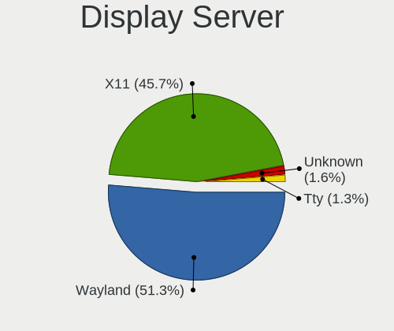
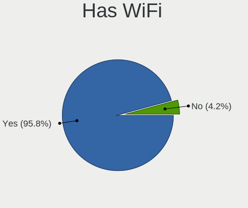
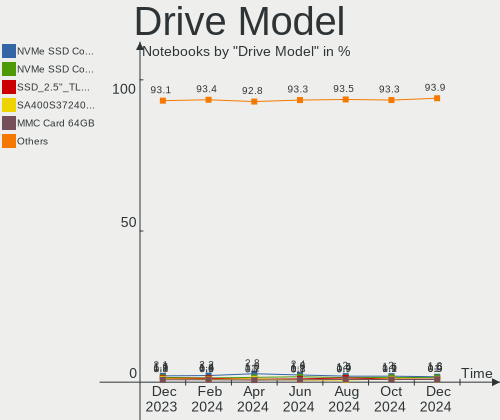
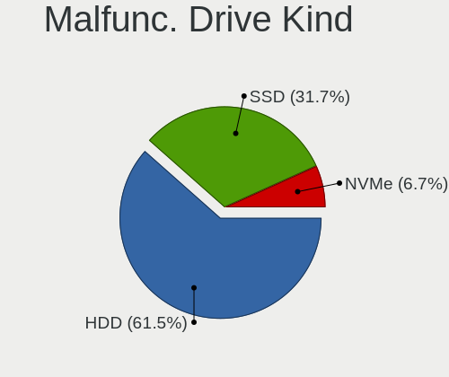
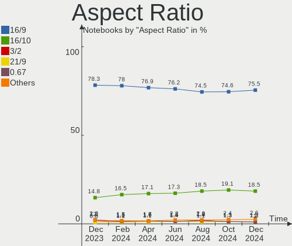
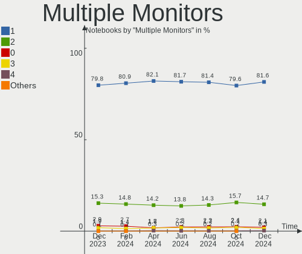
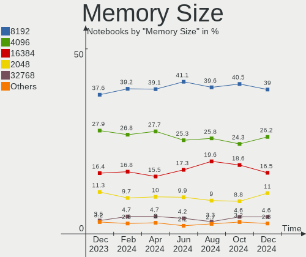

Linux - Hardware Trends (Notebooks)
-----------------------------------

A project to identify most popular hardware characteristics and track their change
over time based on data collected by Linux users at https://Linux-Hardware.org.

Anyone can contribute to this report by the [hw-probe](https://github.com/linuxhw/hw-probe) tool:

    sudo -E hw-probe -all -upload

This report is for one last month. Overall report since the beginning of time: [TestCoverage](https://github.com/linuxhw/TestCoverage)

Period: Nov, 2022.

Contents
--------

* [ System ](#system)
  - [ OS                       ](#os)
  - [ OS Family                ](#os-family)
  - [ Kernel                   ](#kernel)
  - [ Kernel Family            ](#kernel-family)
  - [ Kernel Major Ver.        ](#kernel-major-ver)
  - [ Arch                     ](#arch)
  - [ DE                       ](#de)
  - [ Display Server           ](#display-server)
  - [ Display Manager          ](#display-manager)
  - [ OS Lang                  ](#os-lang)
  - [ Boot Mode                ](#boot-mode)
  - [ Filesystem               ](#filesystem)
  - [ Part. scheme             ](#part-scheme)
  - [ Dual Boot with Linux/BSD ](#dual-boot-with-linuxbsd)
  - [ Dual Boot (Win)          ](#dual-boot-win)

* [ Board ](#board)
  - [ Vendor                   ](#vendor)
  - [ Model                    ](#model)
  - [ Model Family             ](#model-family)
  - [ MFG Year                 ](#mfg-year)
  - [ Form Factor              ](#form-factor)
  - [ Secure Boot              ](#secure-boot)
  - [ Coreboot                 ](#coreboot)
  - [ RAM Size                 ](#ram-size)
  - [ RAM Used                 ](#ram-used)
  - [ Total Drives             ](#total-drives)
  - [ Has CD-ROM               ](#has-cd-rom)
  - [ Has Ethernet             ](#has-ethernet)
  - [ Has WiFi                 ](#has-wifi)
  - [ Has Bluetooth            ](#has-bluetooth)

* [ Location ](#location)
  - [ Country                  ](#country)
  - [ City                     ](#city)

* [ Drives ](#drives)
  - [ Drive Vendor             ](#drive-vendor)
  - [ Drive Model              ](#drive-model)
  - [ HDD Vendor               ](#hdd-vendor)
  - [ SSD Vendor               ](#ssd-vendor)
  - [ Drive Kind               ](#drive-kind)
  - [ Drive Connector          ](#drive-connector)
  - [ Drive Size               ](#drive-size)
  - [ Space Total              ](#space-total)
  - [ Space Used               ](#space-used)
  - [ Malfunc. Drives          ](#malfunc-drives)
  - [ Malfunc. Drive Vendor    ](#malfunc-drive-vendor)
  - [ Malfunc. HDD Vendor      ](#malfunc-hdd-vendor)
  - [ Malfunc. Drive Kind      ](#malfunc-drive-kind)
  - [ Failed Drives            ](#failed-drives)
  - [ Failed Drive Vendor      ](#failed-drive-vendor)
  - [ Drive Status             ](#drive-status)

* [ Storage controller ](#storage-controller)
  - [ Storage Vendor           ](#storage-vendor)
  - [ Storage Model            ](#storage-model)
  - [ Storage Kind             ](#storage-kind)

* [ Processor ](#processor)
  - [ CPU Vendor               ](#cpu-vendor)
  - [ CPU Model                ](#cpu-model)
  - [ CPU Model Family         ](#cpu-model-family)
  - [ CPU Cores                ](#cpu-cores)
  - [ CPU Sockets              ](#cpu-sockets)
  - [ CPU Threads              ](#cpu-threads)
  - [ CPU Op-Modes             ](#cpu-op-modes)
  - [ CPU Microcode            ](#cpu-microcode)
  - [ CPU Microarch            ](#cpu-microarch)

* [ Graphics ](#graphics)
  - [ GPU Vendor               ](#gpu-vendor)
  - [ GPU Model                ](#gpu-model)
  - [ GPU Combo                ](#gpu-combo)
  - [ GPU Driver               ](#gpu-driver)
  - [ GPU Memory               ](#gpu-memory)

* [ Monitor ](#monitor)
  - [ Monitor Vendor           ](#monitor-vendor)
  - [ Monitor Model            ](#monitor-model)
  - [ Monitor Resolution       ](#monitor-resolution)
  - [ Monitor Diagonal         ](#monitor-diagonal)
  - [ Monitor Width            ](#monitor-width)
  - [ Aspect Ratio             ](#aspect-ratio)
  - [ Monitor Area             ](#monitor-area)
  - [ Pixel Density            ](#pixel-density)
  - [ Multiple Monitors        ](#multiple-monitors)

* [ Network ](#network)
  - [ Net Controller Vendor    ](#net-controller-vendor)
  - [ Net Controller Model     ](#net-controller-model)
  - [ Wireless Vendor          ](#wireless-vendor)
  - [ Wireless Model           ](#wireless-model)
  - [ Ethernet Vendor          ](#ethernet-vendor)
  - [ Ethernet Model           ](#ethernet-model)
  - [ Net Controller Kind      ](#net-controller-kind)
  - [ Used Controller          ](#used-controller)
  - [ NICs                     ](#nics)
  - [ IPv6                     ](#ipv6)

* [ Bluetooth ](#bluetooth)
  - [ Bluetooth Vendor         ](#bluetooth-vendor)
  - [ Bluetooth Model          ](#bluetooth-model)

* [ Sound ](#sound)
  - [ Sound Vendor             ](#sound-vendor)
  - [ Sound Model              ](#sound-model)

* [ Memory ](#memory)
  - [ Memory Vendor            ](#memory-vendor)
  - [ Memory Model             ](#memory-model)
  - [ Memory Kind              ](#memory-kind)
  - [ Memory Form Factor       ](#memory-form-factor)
  - [ Memory Size              ](#memory-size)
  - [ Memory Speed             ](#memory-speed)

* [ Printers & scanners ](#printers--scanners)
  - [ Printer Vendor           ](#printer-vendor)
  - [ Printer Model            ](#printer-model)
  - [ Scanner Vendor           ](#scanner-vendor)
  - [ Scanner Model            ](#scanner-model)

* [ Camera ](#camera)
  - [ Camera Vendor            ](#camera-vendor)
  - [ Camera Model             ](#camera-model)

* [ Security ](#security)
  - [ Fingerprint Vendor       ](#fingerprint-vendor)
  - [ Fingerprint Model        ](#fingerprint-model)
  - [ Chipcard Vendor          ](#chipcard-vendor)
  - [ Chipcard Model           ](#chipcard-model)

* [ Unsupported ](#unsupported)
  - [ Unsupported Devices      ](#unsupported-devices)
  - [ Unsupported Device Types ](#unsupported-device-types)

System
------

OS
--

Installed operating systems

| Name                         | Notebooks | Percent |
|------------------------------|-----------|---------|
| Ubuntu 22.04                 | 466       | 16.19%  |
| Linux Mint 21                | 173       | 6.01%   |
| Debian 11                    | 149       | 5.18%   |
| Fedora 37                    | 147       | 5.11%   |
| Pop!_OS 22.04                | 132       | 4.58%   |
| Ubuntu 22.10                 | 131       | 4.55%   |
| Arch Rolling                 | 113       | 3.92%   |
| OpenMandriva 4.3             | 108       | 3.75%   |
| ROSA 12.3                    | 106       | 3.68%   |
| Ubuntu 20.04                 | 101       | 3.51%   |
| Fedora 36                    | 101       | 3.51%   |
| Zorin 16                     | 87        | 3.02%   |
| KDE neon 22.04               | 61        | 2.12%   |
| Linux Mint 20.3              | 57        | 1.98%   |
| Kubuntu 22.04                | 50        | 1.74%   |
| OpenMandriva 4.50            | 44        | 1.53%   |
| Manjaro 22.0.0               | 39        | 1.35%   |
| SteamOS 3.3.2                | 37        | 1.29%   |
| openSUSE Tumbleweed-XXXXXXXX | 34        | 1.18%   |
| Debian                       | 34        | 1.18%   |
| Manjaro                      | 33        | 1.15%   |
| Elementary 6.1               | 28        | 0.97%   |
| EndeavourOS Rolling          | 27        | 0.94%   |
| ArcoLinux Rolling            | 27        | 0.94%   |
| Kali 2022.3                  | 25        | 0.87%   |
| Kubuntu 22.10                | 24        | 0.83%   |
| ROSA 12.2                    | 21        | 0.73%   |
| Nobara 36                    | 20        | 0.69%   |
| Xubuntu 22.04                | 19        | 0.66%   |
| LMDE 5                       | 19        | 0.66%   |
| Ubuntu 18.04                 | 18        | 0.63%   |
| Kali 2022.4                  | 18        | 0.63%   |
| Ubuntu MATE 22.04            | 16        | 0.56%   |
| SteamOS 3.4                  | 14        | 0.49%   |
| Lubuntu 22.04                | 14        | 0.49%   |
| Gentoo 2.8                   | 14        | 0.49%   |
| MX 21                        | 13        | 0.45%   |
| ALT Linux 10.1               | 11        | 0.38%   |
| Xubuntu 20.04                | 10        | 0.35%   |
| Linux Mint 20.2              | 9         | 0.31%   |

OS Family
---------

OS without a version

| Name          | Notebooks | Percent |
|---------------|-----------|---------|
| Ubuntu        | 728       | 25.29%  |
| Fedora        | 259       | 9%      |
| Linux Mint    | 256       | 8.89%   |
| Debian        | 191       | 6.63%   |
| OpenMandriva  | 162       | 5.63%   |
| ROSA          | 134       | 4.65%   |
| Pop!_OS       | 134       | 4.65%   |
| Arch          | 113       | 3.92%   |
| Zorin         | 90        | 3.13%   |
| Kubuntu       | 87        | 3.02%   |
| Manjaro       | 74        | 2.57%   |
| KDE neon      | 64        | 2.22%   |
| SteamOS       | 58        | 2.01%   |
| Kali          | 43        | 1.49%   |
| Xubuntu       | 40        | 1.39%   |
| openSUSE      | 40        | 1.39%   |
| ArcoLinux     | 31        | 1.08%   |
| Elementary    | 30        | 1.04%   |
| Ubuntu MATE   | 27        | 0.94%   |
| EndeavourOS   | 27        | 0.94%   |
| Lubuntu       | 25        | 0.87%   |
| Gentoo        | 25        | 0.87%   |
| Nobara        | 20        | 0.69%   |
| LMDE          | 20        | 0.69%   |
| Endless       | 20        | 0.69%   |
| ALT Linux     | 18        | 0.63%   |
| MX            | 14        | 0.49%   |
| Garuda Linux  | 13        | 0.45%   |
| Ubuntu Unity  | 9         | 0.31%   |
| Ubuntu Budgie | 8         | 0.28%   |
| Clear Linux   | 8         | 0.28%   |
| Parrot        | 7         | 0.24%   |
| Xero          | 6         | 0.21%   |
| NixOS         | 6         | 0.21%   |
| Artix         | 6         | 0.21%   |
| Void Linux    | 5         | 0.17%   |
| antiX         | 5         | 0.17%   |
| Red OS        | 4         | 0.14%   |
| Gooroom       | 4         | 0.14%   |
| BlackPanther  | 4         | 0.14%   |

Kernel
------

Version of the Linux kernel

| Version                             | Notebooks | Percent |
|-------------------------------------|-----------|---------|
| 5.15.0-52-generic                   | 464       | 16.12%  |
| 5.15.0-53-generic                   | 382       | 13.27%  |
| 5.19.0-23-generic                   | 135       | 4.69%   |
| 5.16.7-desktop-1omv4003             | 103       | 3.58%   |
| 5.10.0-19-amd64                     | 102       | 3.54%   |
| 6.0.6-76060006-generic              | 74        | 2.57%   |
| 6.0.5-200.fc36.x86_64               | 59        | 2.05%   |
| 5.4.0-131-generic                   | 55        | 1.91%   |
| 6.0.8-300.fc37.x86_64               | 50        | 1.74%   |
| 5.13.0-valve21.3-1-neptune          | 41        | 1.42%   |
| 5.15.0-43-generic                   | 38        | 1.32%   |
| 6.0.9-300.fc37.x86_64               | 37        | 1.29%   |
| 5.4.0-132-generic                   | 34        | 1.18%   |
| 5.15.75-generic-1rosa2021.1-x86_64  | 34        | 1.18%   |
| 6.0.9-arch1-1                       | 31        | 1.08%   |
| 6.0.7-arch1-1                       | 31        | 1.08%   |
| 5.10.0-18-amd64                     | 30        | 1.04%   |
| 5.19.12-desktop-2omv4090            | 28        | 0.97%   |
| 5.15.0-41-generic                   | 27        | 0.94%   |
| 6.0.8-arch1-1                       | 26        | 0.9%    |
| 6.0.3-76060003-generic              | 23        | 0.8%    |
| 5.15.77-generic-1rosa2021.1-x86_64  | 23        | 0.8%    |
| 6.0.2-76060002-generic              | 21        | 0.73%   |
| 5.19.0-21-generic                   | 21        | 0.73%   |
| 5.15.78-1-MANJARO                   | 21        | 0.73%   |
| 5.10.150-generic-1rosa2021.1-x86_64 | 21        | 0.73%   |
| 6.0.6-arch1-1                       | 20        | 0.69%   |
| 5.19.16-301.fc37.x86_64             | 18        | 0.63%   |
| 5.19.0-kali2-amd64                  | 18        | 0.63%   |
| 6.0.7-301.fc37.x86_64               | 17        | 0.59%   |
| 6.0.8-1-default                     | 16        | 0.56%   |
| 6.0.0-4-amd64                       | 16        | 0.56%   |
| 5.11.0-35-generic                   | 16        | 0.56%   |
| 5.10.74-generic-2rosa2021.1-x86_64  | 15        | 0.52%   |
| 6.0.8-zen1-1-zen                    | 14        | 0.49%   |
| 5.19.5-desktop-1omv4090             | 14        | 0.49%   |
| 5.17.5-300.fc36.x86_64              | 14        | 0.49%   |
| 6.0.8-1-MANJARO                     | 13        | 0.45%   |
| 6.0.0-kali3-amd64                   | 13        | 0.45%   |
| 5.14.0-1054-oem                     | 13        | 0.45%   |

Kernel Family
-------------

Linux kernel without a distro release

| Version  | Notebooks | Percent |
|----------|-----------|---------|
| 5.15.0   | 978       | 33.97%  |
| 5.19.0   | 201       | 6.98%   |
| 5.10.0   | 168       | 5.84%   |
| 6.0.8    | 135       | 4.69%   |
| 6.0.6    | 134       | 4.65%   |
| 6.0.9    | 113       | 3.92%   |
| 5.4.0    | 112       | 3.89%   |
| 5.16.7   | 103       | 3.58%   |
| 6.0.7    | 95        | 3.3%    |
| 6.0.5    | 72        | 2.5%    |
| 5.13.0   | 67        | 2.33%   |
| 6.0.0    | 65        | 2.26%   |
| 5.15.75  | 50        | 1.74%   |
| 6.0.2    | 44        | 1.53%   |
| 5.19.12  | 28        | 0.97%   |
| 5.15.78  | 28        | 0.97%   |
| 5.15.77  | 28        | 0.97%   |
| 5.14.0   | 27        | 0.94%   |
| 6.0.3    | 26        | 0.9%    |
| 5.19.16  | 26        | 0.9%    |
| 5.11.0   | 26        | 0.9%    |
| 4.15.0   | 24        | 0.83%   |
| 6.0.10   | 23        | 0.8%    |
| 5.10.150 | 21        | 0.73%   |
| 5.17.5   | 18        | 0.63%   |
| 6.1.0    | 17        | 0.59%   |
| 5.18.0   | 17        | 0.59%   |
| 5.15.76  | 17        | 0.59%   |
| 5.19.5   | 16        | 0.56%   |
| 5.10.74  | 16        | 0.56%   |
| 5.17.0   | 13        | 0.45%   |
| 5.19.17  | 10        | 0.35%   |
| 5.15.79  | 10        | 0.35%   |
| 5.16.13  | 9         | 0.31%   |
| 5.17.11  | 8         | 0.28%   |
| 4.19.0   | 8         | 0.28%   |
| 5.15.74  | 6         | 0.21%   |
| 5.10.118 | 6         | 0.21%   |
| 5.8.0    | 5         | 0.17%   |
| 5.14.21  | 5         | 0.17%   |

Kernel Major Ver.
-----------------

Linux kernel major version

| Version | Notebooks | Percent |
|---------|-----------|---------|
| 5.15    | 1133      | 39.35%  |
| 6.0     | 708       | 24.59%  |
| 5.19    | 292       | 10.14%  |
| 5.10    | 226       | 7.85%   |
| 5.4     | 120       | 4.17%   |
| 5.16    | 117       | 4.06%   |
| 5.13    | 67        | 2.33%   |
| 5.17    | 40        | 1.39%   |
| 5.14    | 36        | 1.25%   |
| 5.18    | 32        | 1.11%   |
| 5.11    | 27        | 0.94%   |
| 4.15    | 24        | 0.83%   |
| 6.1     | 17        | 0.59%   |
| 4.19    | 8         | 0.28%   |
| 4.18    | 8         | 0.28%   |
| 5.8     | 5         | 0.17%   |
| 4.9     | 5         | 0.17%   |
| 4.4     | 3         | 0.1%    |
| 3.10    | 3         | 0.1%    |
| 5.5     | 2         | 0.07%   |
| 5.3     | 2         | 0.07%   |
| 6.0.5   | 1         | 0.03%   |
| 5.9     | 1         | 0.03%   |
| 5.7     | 1         | 0.03%   |
| 5.6     | 1         | 0.03%   |

Arch
----

OS architecture (x86_64, i586, etc.)

| Name    | Notebooks | Percent |
|---------|-----------|---------|
| x86_64  | 2833      | 98.4%   |
| i686    | 42        | 1.46%   |
| aarch64 | 2         | 0.07%   |
| ppc     | 1         | 0.03%   |
| armv7l  | 1         | 0.03%   |

DE
--

Desktop Environment

| Name             | Notebooks | Percent |
|------------------|-----------|---------|
| GNOME            | 1321      | 45.88%  |
| KDE5             | 729       | 25.32%  |
| X-Cinnamon       | 224       | 7.78%   |
| XFCE             | 200       | 6.95%   |
| Unknown          | 94        | 3.27%   |
| MATE             | 81        | 2.81%   |
| LXQt             | 48        | 1.67%   |
| Pantheon         | 30        | 1.04%   |
| i3               | 22        | 0.76%   |
| Cinnamon         | 15        | 0.52%   |
| Budgie           | 14        | 0.49%   |
| sway             | 13        | 0.45%   |
| LXDE             | 12        | 0.42%   |
| GNOME Flashback  | 12        | 0.42%   |
| Unity            | 9         | 0.31%   |
| KDE              | 9         | 0.31%   |
| awesome          | 7         | 0.24%   |
| GNOME Classic    | 5         | 0.17%   |
| Deepin           | 5         | 0.17%   |
| openbox          | 4         | 0.14%   |
| trinity          | 3         | 0.1%    |
| lightdm-xsession | 3         | 0.1%    |
| LeftWM           | 3         | 0.1%    |
| KDE4             | 3         | 0.1%    |
| icewm            | 3         | 0.1%    |
| Enlightenment    | 3         | 0.1%    |
| Hyprland         | 2         | 0.07%   |
| bspwm            | 2         | 0.07%   |
| xmonad           | 1         | 0.03%   |
| none+bspwm       | 1         | 0.03%   |
| fluxbox          | 1         | 0.03%   |

Display Server
--------------

X11 or Wayland

| Name    | Notebooks | Percent |
|---------|-----------|---------|
| X11     | 1892      | 65.72%  |
| Wayland | 887       | 30.81%  |
| Unknown | 66        | 2.29%   |
| Tty     | 34        | 1.18%   |

Display Manager
---------------

SDDM, LightDM, etc.

| Name    | Notebooks | Percent |
|---------|-----------|---------|
| Unknown | 859       | 29.84%  |
| GDM3    | 701       | 24.35%  |
| SDDM    | 552       | 19.17%  |
| LightDM | 446       | 15.49%  |
| GDM     | 300       | 10.42%  |
| XDM     | 5         | 0.17%   |
| KDM     | 4         | 0.14%   |
| GREETD  | 4         | 0.14%   |
| Ly      | 3         | 0.1%    |
| TDM     | 2         | 0.07%   |
| LXDM    | 2         | 0.07%   |
| EMPTTY  | 1         | 0.03%   |

OS Lang
-------

Language

| Lang    | Notebooks | Percent |
|---------|-----------|---------|
| en_US   | 1242      | 43.14%  |
| ru_RU   | 245       | 8.51%   |
| de_DE   | 216       | 7.5%    |
| it_IT   | 152       | 5.28%   |
| en_GB   | 144       | 5%      |
| fr_FR   | 125       | 4.34%   |
| pt_BR   | 90        | 3.13%   |
| es_ES   | 67        | 2.33%   |
| Unknown | 51        | 1.77%   |
| en_IN   | 48        | 1.67%   |
| pl_PL   | 47        | 1.63%   |
| en_CA   | 37        | 1.29%   |
| en_AU   | 34        | 1.18%   |
| C       | 29        | 1.01%   |
| nl_NL   | 21        | 0.73%   |
| zh_CN   | 19        | 0.66%   |
| tr_TR   | 19        | 0.66%   |
| hu_HU   | 18        | 0.63%   |
| cs_CZ   | 18        | 0.63%   |
| es_MX   | 15        | 0.52%   |
| es_AR   | 15        | 0.52%   |
| en_AG   | 13        | 0.45%   |
| pt_PT   | 9         | 0.31%   |
| es_CL   | 9         | 0.31%   |
| en_ZA   | 9         | 0.31%   |
| ko_KR   | 8         | 0.28%   |
| ja_JP   | 8         | 0.28%   |
| de_AT   | 8         | 0.28%   |
| fr_CA   | 7         | 0.24%   |
| es_PE   | 6         | 0.21%   |
| en_PH   | 6         | 0.21%   |
| de_CH   | 6         | 0.21%   |
| bg_BG   | 6         | 0.21%   |
| sv_SE   | 5         | 0.17%   |
| nb_NO   | 5         | 0.17%   |
| fr_BE   | 5         | 0.17%   |
| fi_FI   | 5         | 0.17%   |
| en_NZ   | 5         | 0.17%   |
| el_GR   | 5         | 0.17%   |
| da_DK   | 5         | 0.17%   |

Boot Mode
---------

EFI or BIOS

| Mode | Notebooks | Percent |
|------|-----------|---------|
| EFI  | 1623      | 56.37%  |
| BIOS | 1256      | 43.63%  |

Filesystem
----------

Type of filesystem

| Type    | Notebooks | Percent |
|---------|-----------|---------|
| Ext4    | 2131      | 74.02%  |
| Btrfs   | 447       | 15.53%  |
| Overlay | 216       | 7.5%    |
| Zfs     | 38        | 1.32%   |
| Xfs     | 32        | 1.11%   |
| Ext2    | 5         | 0.17%   |
| F2fs    | 4         | 0.14%   |
| Ext3    | 2         | 0.07%   |
| Unknown | 2         | 0.07%   |
| Tmpfs   | 1         | 0.03%   |
| Jfs     | 1         | 0.03%   |

Part. scheme
------------

Scheme of partitioning

| Type    | Notebooks | Percent |
|---------|-----------|---------|
| GPT     | 1739      | 60.4%   |
| Unknown | 800       | 27.79%  |
| MBR     | 340       | 11.81%  |

Dual Boot with Linux/BSD
------------------------

Hosting more than one Linux/BSD

| Dual boot | Notebooks | Percent |
|-----------|-----------|---------|
| No        | 2545      | 88.4%   |
| Yes       | 334       | 11.6%   |

Dual Boot (Win)
---------------

Hosting Linux and Windows

| Dual boot | Notebooks | Percent |
|-----------|-----------|---------|
| No        | 2098      | 72.87%  |
| Yes       | 781       | 27.13%  |

Board
-----

Vendor
------

Motherboard manufacturer

| Name                | Notebooks | Percent |
|---------------------|-----------|---------|
| Lenovo              | 616       | 21.4%   |
| Hewlett-Packard     | 497       | 17.26%  |
| Dell                | 395       | 13.72%  |
| ASUSTek Computer    | 320       | 11.11%  |
| Acer                | 229       | 7.95%   |
| Apple               | 86        | 2.99%   |
| MSI                 | 79        | 2.74%   |
| Samsung Electronics | 62        | 2.15%   |
| HUAWEI              | 61        | 2.12%   |
| Toshiba             | 59        | 2.05%   |
| Valve               | 54        | 1.88%   |
| Sony                | 34        | 1.18%   |
| Google              | 32        | 1.11%   |
| Unknown             | 26        | 0.9%    |
| Fujitsu             | 18        | 0.63%   |
| Timi                | 16        | 0.56%   |
| TUXEDO              | 14        | 0.49%   |
| Notebook            | 14        | 0.49%   |
| Alienware           | 14        | 0.49%   |
| Packard Bell        | 12        | 0.42%   |
| Chuwi               | 11        | 0.38%   |
| Medion              | 9         | 0.31%   |
| Razer               | 8         | 0.28%   |
| GPU Company         | 8         | 0.28%   |
| GPD                 | 8         | 0.28%   |
| Gigabyte Technology | 8         | 0.28%   |
| System76            | 7         | 0.24%   |
| Panasonic           | 6         | 0.21%   |
| Intel               | 6         | 0.21%   |
| Clevo               | 6         | 0.21%   |
| Aquarius            | 6         | 0.21%   |
| Thomson             | 4         | 0.14%   |
| Semp Toshiba        | 4         | 0.14%   |
| Quanta              | 4         | 0.14%   |
| Positivo            | 4         | 0.14%   |
| Gateway             | 4         | 0.14%   |
| Fujitsu Siemens     | 4         | 0.14%   |
| Framework           | 4         | 0.14%   |
| SLIMBOOK            | 3         | 0.1%    |
| Schenker            | 3         | 0.1%    |

Model
-----

Motherboard model

| Name                                  | Notebooks | Percent |
|---------------------------------------|-----------|---------|
| Valve Jupiter                         | 54        | 1.88%   |
| Unknown                               | 38        | 1.32%   |
| HP Notebook                           | 23        | 0.8%    |
| Apple MacBookPro9,2                   | 11        | 0.38%   |
| HP Pavilion g6                        | 9         | 0.31%   |
| Dell Inspiron 15-3567                 | 9         | 0.31%   |
| Lenovo ThinkPad E475 20H40006US       | 8         | 0.28%   |
| Lenovo ThinkBook 15 G2 ITL 20VE       | 8         | 0.28%   |
| HUAWEI NBLK-WAX9X                     | 8         | 0.28%   |
| HUAWEI CREM-WXX9                      | 8         | 0.28%   |
| HP Pavilion 15                        | 8         | 0.28%   |
| Apple MacBookPro8,1                   | 8         | 0.28%   |
| HUAWEI KLVL-WXX9                      | 7         | 0.24%   |
| HUAWEI BOD-WXX9                       | 7         | 0.24%   |
| HP Pavilion g7                        | 7         | 0.24%   |
| Dell Latitude E6540                   | 7         | 0.24%   |
| Apple MacBookAir6,2                   | 7         | 0.24%   |
| Lenovo ThinkBook 15 G3 ACL 21A4       | 6         | 0.21%   |
| Lenovo IdeaPad 3 15ADA05 81W1         | 6         | 0.21%   |
| Lenovo G500 20236                     | 6         | 0.21%   |
| HP Pavilion dv6                       | 6         | 0.21%   |
| HP Pavilion 17                        | 6         | 0.21%   |
| HP EliteBook 8460p                    | 6         | 0.21%   |
| Google Terra                          | 6         | 0.21%   |
| Dell XPS 15 7590                      | 6         | 0.21%   |
| Dell Latitude E6420                   | 6         | 0.21%   |
| Apple MacBookPro12,1                  | 6         | 0.21%   |
| TUXEDO Pulse 15 Gen1                  | 5         | 0.17%   |
| Samsung 350V5C/351V5C/3540VC/3440VC   | 5         | 0.17%   |
| MSI Modern 14 B5M                     | 5         | 0.17%   |
| Lenovo ThinkPad 13 2nd Gen 20J10046US | 5         | 0.17%   |
| Lenovo IdeaPad Gaming 3 15ARH05 82EY  | 5         | 0.17%   |
| Lenovo IdeaPad Gaming 3 15ACH6 82K2   | 5         | 0.17%   |
| Lenovo IdeaPad 5 Pro 14ACN6 82L7      | 5         | 0.17%   |
| HP Pavilion Notebook                  | 5         | 0.17%   |
| HP Pavilion dv7                       | 5         | 0.17%   |
| HP Laptop 15-dw3xxx                   | 5         | 0.17%   |
| HP Laptop 15-db0xxx                   | 5         | 0.17%   |
| HP EliteBook 850 G8 Notebook PC       | 5         | 0.17%   |
| HP EliteBook 840 G5                   | 5         | 0.17%   |

Model Family
------------

Motherboard model prefix

| Name                  | Notebooks | Percent |
|-----------------------|-----------|---------|
| Lenovo ThinkPad       | 303       | 10.52%  |
| Acer Aspire           | 148       | 5.14%   |
| Dell Latitude         | 143       | 4.97%   |
| Lenovo IdeaPad        | 140       | 4.86%   |
| Dell Inspiron         | 108       | 3.75%   |
| HP Pavilion           | 105       | 3.65%   |
| HP EliteBook          | 102       | 3.54%   |
| ASUS VivoBook         | 69        | 2.4%    |
| HP Laptop             | 62        | 2.15%   |
| Valve Jupiter         | 54        | 1.88%   |
| HP ProBook            | 53        | 1.84%   |
| Dell XPS              | 53        | 1.84%   |
| Toshiba Satellite     | 47        | 1.63%   |
| Unknown               | 38        | 1.32%   |
| Lenovo Legion         | 35        | 1.22%   |
| Lenovo ThinkBook      | 32        | 1.11%   |
| Dell Precision        | 31        | 1.08%   |
| ASUS ASUS             | 28        | 0.97%   |
| Acer Nitro            | 28        | 0.97%   |
| ASUS ZenBook          | 26        | 0.9%    |
| ASUS ROG              | 24        | 0.83%   |
| HP Notebook           | 23        | 0.8%    |
| HP ZBook              | 22        | 0.76%   |
| Dell Vostro           | 21        | 0.73%   |
| Acer Swift            | 18        | 0.63%   |
| HP OMEN               | 15        | 0.52%   |
| HP ENVY               | 15        | 0.52%   |
| Fujitsu LIFEBOOK      | 15        | 0.52%   |
| MSI Modern            | 14        | 0.49%   |
| HP Compaq             | 13        | 0.45%   |
| Acer TravelMate       | 13        | 0.45%   |
| HP 250                | 12        | 0.42%   |
| Packard Bell EasyNote | 11        | 0.38%   |
| Lenovo Yoga           | 11        | 0.38%   |
| Apple MacBookPro9     | 11        | 0.38%   |
| HP 15                 | 10        | 0.35%   |
| Dell G3               | 10        | 0.35%   |
| Apple MacBookPro8     | 9         | 0.31%   |
| Apple MacBookPro11    | 9         | 0.31%   |
| Razer Blade           | 8         | 0.28%   |

MFG Year
--------

Motherboard manufacture year

| Year    | Notebooks | Percent |
|---------|-----------|---------|
| 2021    | 410       | 14.24%  |
| 2020    | 312       | 10.84%  |
| 2022    | 307       | 10.66%  |
| 2019    | 260       | 9.03%   |
| 2018    | 184       | 6.39%   |
| 2011    | 182       | 6.32%   |
| 2015    | 171       | 5.94%   |
| 2013    | 171       | 5.94%   |
| 2012    | 167       | 5.8%    |
| 2016    | 147       | 5.11%   |
| 2017    | 144       | 5%      |
| 2014    | 122       | 4.24%   |
| 2010    | 110       | 3.82%   |
| 2008    | 67        | 2.33%   |
| 2009    | 57        | 1.98%   |
| 2007    | 39        | 1.35%   |
| 2006    | 15        | 0.52%   |
| 2005    | 8         | 0.28%   |
| 2004    | 3         | 0.1%    |
| Unknown | 3         | 0.1%    |

Form Factor
-----------

Physical design of the computer

| Name     | Notebooks | Percent |
|----------|-----------|---------|
| Notebook | 2879      | 100%    |

Secure Boot
-----------

Enabled or disabled

| State    | Notebooks | Percent |
|----------|-----------|---------|
| Disabled | 2573      | 89.37%  |
| Enabled  | 306       | 10.63%  |

Coreboot
--------

Have coreboot on board

| Used | Notebooks | Percent |
|------|-----------|---------|
| No   | 2840      | 98.65%  |
| Yes  | 39        | 1.35%   |

RAM Size
--------

Total RAM memory

| Size in GB  | Notebooks | Percent |
|-------------|-----------|---------|
| 4.01-8.0    | 870       | 30.22%  |
| 8.01-16.0   | 538       | 18.69%  |
| 3.01-4.0    | 527       | 18.3%   |
| 16.01-24.0  | 509       | 17.68%  |
| 32.01-64.0  | 217       | 7.54%   |
| 1.01-2.0    | 81        | 2.81%   |
| 24.01-32.0  | 48        | 1.67%   |
| 64.01-256.0 | 47        | 1.63%   |
| 2.01-3.0    | 27        | 0.94%   |
| 0.51-1.0    | 13        | 0.45%   |
| 0.01-0.5    | 2         | 0.07%   |

RAM Used
--------

Used RAM memory

| Used GB    | Notebooks | Percent |
|------------|-----------|---------|
| 1.01-2.0   | 881       | 30.6%   |
| 2.01-3.0   | 780       | 27.09%  |
| 4.01-8.0   | 480       | 16.67%  |
| 3.01-4.0   | 413       | 14.35%  |
| 8.01-16.0  | 145       | 5.04%   |
| 0.51-1.0   | 141       | 4.9%    |
| 0.01-0.5   | 21        | 0.73%   |
| 16.01-24.0 | 13        | 0.45%   |
| 24.01-32.0 | 5         | 0.17%   |

Total Drives
------------

Number of drives on board

| Drives | Notebooks | Percent |
|--------|-----------|---------|
| 1      | 2114      | 73.43%  |
| 2      | 662       | 22.99%  |
| 3      | 76        | 2.64%   |
| 0      | 14        | 0.49%   |
| 4      | 12        | 0.42%   |
| 6      | 1         | 0.03%   |

Has CD-ROM
----------

Has CD-ROM on board

| Presented | Notebooks | Percent |
|-----------|-----------|---------|
| No        | 2089      | 72.56%  |
| Yes       | 790       | 27.44%  |

Has Ethernet
------------

Has Ethernet on board

| Presented | Notebooks | Percent |
|-----------|-----------|---------|
| Yes       | 2186      | 75.93%  |
| No        | 693       | 24.07%  |

Has WiFi
--------

Has WiFi module

| Presented | Notebooks | Percent |
|-----------|-----------|---------|
| Yes       | 2838      | 98.58%  |
| No        | 41        | 1.42%   |

Has Bluetooth
-------------

Has Bluetooth module

| Presented | Notebooks | Percent |
|-----------|-----------|---------|
| Yes       | 2343      | 81.38%  |
| No        | 536       | 18.62%  |

Location
--------

Country
-------

Geographic location (country)

| Country      | Notebooks | Percent |
|--------------|-----------|---------|
| USA          | 422       | 14.66%  |
| Germany      | 289       | 10.04%  |
| Russia       | 270       | 9.38%   |
| Italy        | 215       | 7.47%   |
| France       | 156       | 5.42%   |
| Brazil       | 133       | 4.62%   |
| UK           | 101       | 3.51%   |
| Spain        | 91        | 3.16%   |
| Poland       | 88        | 3.06%   |
| India        | 86        | 2.99%   |
| Netherlands  | 72        | 2.5%    |
| Canada       | 57        | 1.98%   |
| Turkey       | 46        | 1.6%    |
| Australia    | 44        | 1.53%   |
| Mexico       | 38        | 1.32%   |
| Romania      | 30        | 1.04%   |
| Indonesia    | 30        | 1.04%   |
| Hungary      | 30        | 1.04%   |
| Czechia      | 30        | 1.04%   |
| Portugal     | 27        | 0.94%   |
| China        | 27        | 0.94%   |
| Sweden       | 25        | 0.87%   |
| Switzerland  | 24        | 0.83%   |
| Argentina    | 24        | 0.83%   |
| Greece       | 23        | 0.8%    |
| Finland      | 22        | 0.76%   |
| Belgium      | 22        | 0.76%   |
| Austria      | 21        | 0.73%   |
| Chile        | 19        | 0.66%   |
| Bulgaria     | 18        | 0.63%   |
| Denmark      | 17        | 0.59%   |
| Belarus      | 16        | 0.56%   |
| Norway       | 15        | 0.52%   |
| Japan        | 14        | 0.49%   |
| South Africa | 12        | 0.42%   |
| Serbia       | 12        | 0.42%   |
| Estonia      | 12        | 0.42%   |
| South Korea  | 11        | 0.38%   |
| Kazakhstan   | 11        | 0.38%   |
| Egypt        | 10        | 0.35%   |

City
----

Geographic location (city)

| City              | Notebooks | Percent |
|-------------------|-----------|---------|
| Moscow            | 66        | 2.29%   |
| St Petersburg     | 36        | 1.25%   |
| Milan             | 34        | 1.18%   |
| Berlin            | 31        | 1.08%   |
| Paris             | 25        | 0.87%   |
| Rome              | 24        | 0.83%   |
| Madrid            | 20        | 0.69%   |
| Amsterdam         | 19        | 0.66%   |
| Warsaw            | 18        | 0.63%   |
| Sao Paulo         | 18        | 0.63%   |
| Istanbul          | 18        | 0.63%   |
| Bangor            | 18        | 0.63%   |
| Munich            | 14        | 0.49%   |
| Rio de Janeiro    | 13        | 0.45%   |
| Bucharest         | 13        | 0.45%   |
| Jakarta           | 12        | 0.42%   |
| Budapest          | 12        | 0.42%   |
| Voronezh          | 11        | 0.38%   |
| Novosibirsk       | 11        | 0.38%   |
| Melbourne         | 11        | 0.38%   |
| London            | 11        | 0.38%   |
| Krasnodar         | 11        | 0.38%   |
| Helsinki          | 11        | 0.38%   |
| Frankfurt am Main | 11        | 0.38%   |
| Bengaluru         | 11        | 0.38%   |
| Athens            | 11        | 0.38%   |
| Vienna            | 10        | 0.35%   |
| Prague            | 10        | 0.35%   |
| Naples            | 10        | 0.35%   |
| Lisbon            | 10        | 0.35%   |
| Krakow            | 10        | 0.35%   |
| Brisbane          | 10        | 0.35%   |
| Perm              | 9         | 0.31%   |
| Bologna           | 9         | 0.31%   |
| Belgrade          | 9         | 0.31%   |
| Sofia             | 8         | 0.28%   |
| Minsk             | 8         | 0.28%   |
| Los Angeles       | 8         | 0.28%   |
| Izmir             | 8         | 0.28%   |
| Tallinn           | 7         | 0.24%   |

Drives
------

Drive Vendor
------------

Hard drive vendors

| Vendor                      | Notebooks | Drives | Percent |
|-----------------------------|-----------|--------|---------|
| Samsung Electronics         | 599       | 656    | 16.81%  |
| WDC                         | 321       | 334    | 9.01%   |
| Seagate                     | 276       | 280    | 7.75%   |
| SanDisk                     | 255       | 264    | 7.16%   |
| Unknown                     | 222       | 237    | 6.23%   |
| Toshiba                     | 204       | 207    | 5.73%   |
| SK hynix                    | 173       | 173    | 4.86%   |
| Kingston                    | 153       | 157    | 4.29%   |
| Intel                       | 130       | 137    | 3.65%   |
| Micron Technology           | 110       | 110    | 3.09%   |
| Crucial                     | 108       | 111    | 3.03%   |
| Hitachi                     | 86        | 87     | 2.41%   |
| HGST                        | 82        | 86     | 2.3%    |
| KIOXIA                      | 53        | 54     | 1.49%   |
| Apple                       | 51        | 57     | 1.43%   |
| Phison Electronics          | 49        | 49     | 1.38%   |
| China                       | 49        | 50     | 1.38%   |
| Kingston Technology Company | 46        | 47     | 1.29%   |
| A-DATA Technology           | 40        | 42     | 1.12%   |
| Unknown                     | 40        | 42     | 1.12%   |
| SPCC                        | 24        | 24     | 0.67%   |
| Silicon Motion              | 24        | 24     | 0.67%   |
| Phison                      | 20        | 20     | 0.56%   |
| Micron/Crucial Technology   | 19        | 20     | 0.53%   |
| LITEON                      | 19        | 19     | 0.53%   |
| Netac                       | 17        | 17     | 0.48%   |
| PNY                         | 16        | 16     | 0.45%   |
| Intenso                     | 15        | 15     | 0.42%   |
| Transcend                   | 14        | 14     | 0.39%   |
| GOODRAM                     | 14        | 14     | 0.39%   |
| Fujitsu                     | 14        | 14     | 0.39%   |
| LITEONIT                    | 13        | 13     | 0.36%   |
| UMIS                        | 11        | 11     | 0.31%   |
| Solid State Storage         | 11        | 11     | 0.31%   |
| KingSpec                    | 11        | 11     | 0.31%   |
| JMicron Technology          | 10        | 10     | 0.28%   |
| ADATA Technology            | 10        | 10     | 0.28%   |
| SSSTC                       | 9         | 9      | 0.25%   |
| Patriot                     | 9         | 9      | 0.25%   |
| BIWIN                       | 9         | 9      | 0.25%   |

Drive Model
-----------

Hard drive models

| Model                                                | Notebooks | Percent |
|------------------------------------------------------|-----------|---------|
| Samsung NVMe SSD Controller SM981/PM981/PM983 1TB    | 89        | 2.44%   |
| Seagate ST1000LM035-1RK172 1TB                       | 44        | 1.2%    |
| Unknown MMC Card  64GB                               | 43        | 1.18%   |
| Unknown                                              | 40        | 1.09%   |
| Samsung NVMe SSD Controller PM9A1/PM9A3/980PRO 250GB | 37        | 1.01%   |
| Unknown MMC Card  32GB                               | 34        | 0.93%   |
| Toshiba MQ01ABD100 1TB                               | 34        | 0.93%   |
| Sandisk WD Black SN750 / PC SN730 NVMe SSD 1024GB    | 32        | 0.88%   |
| Kingston SA400S37240G 240GB SSD                      | 32        | 0.88%   |
| Sandisk WD Blue SN550 NVMe SSD 1TB                   | 30        | 0.82%   |
| Phison PS5013 E13 NVMe Controller 256GB              | 28        | 0.77%   |
| HGST HTS721010A9E630 1TB                             | 26        | 0.71%   |
| Toshiba MQ01ABF050 500GB                             | 25        | 0.68%   |
| Seagate ST1000LM024 HN-M101MBB 1TB                   | 25        | 0.68%   |
| Kingston Company OM3PDP3 NVMe SSD 256GB              | 25        | 0.68%   |
| Unknown MMC Card  128GB                              | 20        | 0.55%   |
| Kingston SA400S37480G 480GB SSD                      | 20        | 0.55%   |
| Seagate ST500LT012-1DG142 500GB                      | 19        | 0.52%   |
| Toshiba MQ04ABF100 1TB                               | 18        | 0.49%   |
| Intel SSD 660P Series 512GB                          | 18        | 0.49%   |
| WDC WD10JPVX-22JC3T0 1TB                             | 16        | 0.44%   |
| Sandisk WD Blue SN500 / PC SN520 NVMe SSD 512GB      | 16        | 0.44%   |
| Samsung SSD 860 EVO 500GB                            | 16        | 0.44%   |
| Samsung SSD 860 EVO 250GB                            | 16        | 0.44%   |
| Samsung SSD 850 EVO 500GB                            | 16        | 0.44%   |
| Samsung NVMe SSD Controller SM961/PM961/SM963 250GB  | 16        | 0.44%   |
| Kingston SA400S37120G 120GB SSD                      | 16        | 0.44%   |
| Unknown MMC Card  512GB                              | 15        | 0.41%   |
| Micron/Crucial P2 NVMe PCIe SSD 250GB                | 15        | 0.41%   |
| HGST HTS541010A9E680 1TB                             | 15        | 0.41%   |
| Crucial CT500MX500SSD1 500GB                         | 15        | 0.41%   |
| KIOXIA KBG40ZNS512G NVMe 512GB                       | 14        | 0.38%   |
| Seagate ST9500325AS 500GB                            | 13        | 0.36%   |
| Samsung SSD 980 1TB                                  | 13        | 0.36%   |
| Samsung MZALQ512HALU-000L2 512GB                     | 13        | 0.36%   |
| Phison E12 NVMe Controller 2TB                       | 13        | 0.36%   |
| Intel SSDPEKNU512GZ 512GB                            | 13        | 0.36%   |
| Crucial CT240BX500SSD1 240GB                         | 13        | 0.36%   |
| Seagate ST500LT012-9WS142 500GB                      | 12        | 0.33%   |
| Samsung MZALQ512HBLU-00BL2 512GB                     | 12        | 0.33%   |

HDD Vendor
----------

Hard disk drive vendors

| Vendor              | Notebooks | Drives | Percent |
|---------------------|-----------|--------|---------|
| Seagate             | 265       | 268    | 32.44%  |
| WDC                 | 200       | 202    | 24.48%  |
| Toshiba             | 137       | 137    | 16.77%  |
| Hitachi             | 86        | 87     | 10.53%  |
| HGST                | 82        | 86     | 10.04%  |
| Fujitsu             | 14        | 14     | 1.71%   |
| Samsung Electronics | 9         | 10     | 1.1%    |
| Unknown             | 5         | 5      | 0.61%   |
| ASMT                | 4         | 4      | 0.49%   |
| Apple               | 4         | 4      | 0.49%   |
| SAGE                | 2         | 2      | 0.24%   |
| ASMedia             | 2         | 2      | 0.24%   |
| USB3.0              | 1         | 1      | 0.12%   |
| USB                 | 1         | 1      | 0.12%   |
| KESU                | 1         | 1      | 0.12%   |
| Intenso             | 1         | 1      | 0.12%   |
| IBM/Hitachi         | 1         | 1      | 0.12%   |
| HGST HTS            | 1         | 1      | 0.12%   |
| ACASIS              | 1         | 1      | 0.12%   |

SSD Vendor
----------

Solid state drive vendors

| Vendor              | Notebooks | Drives | Percent |
|---------------------|-----------|--------|---------|
| Samsung Electronics | 228       | 241    | 20.8%   |
| Kingston            | 119       | 123    | 10.86%  |
| SanDisk             | 110       | 114    | 10.04%  |
| Crucial             | 99        | 102    | 9.03%   |
| WDC                 | 57        | 57     | 5.2%    |
| China               | 46        | 47     | 4.2%    |
| Apple               | 34        | 34     | 3.1%    |
| Intel               | 33        | 33     | 3.01%   |
| A-DATA Technology   | 26        | 28     | 2.37%   |
| SK hynix            | 23        | 23     | 2.1%    |
| SPCC                | 22        | 22     | 2.01%   |
| Toshiba             | 18        | 19     | 1.64%   |
| Micron Technology   | 17        | 17     | 1.55%   |
| Netac               | 16        | 16     | 1.46%   |
| LITEON              | 16        | 16     | 1.46%   |
| PNY                 | 15        | 15     | 1.37%   |
| LITEONIT            | 13        | 13     | 1.19%   |
| GOODRAM             | 13        | 13     | 1.19%   |
| Unknown             | 13        | 13     | 1.19%   |
| Transcend           | 12        | 12     | 1.09%   |
| Intenso             | 11        | 11     | 1%      |
| KingSpec            | 10        | 10     | 0.91%   |
| Patriot             | 9         | 9      | 0.82%   |
| Lexar               | 6         | 6      | 0.55%   |
| Apacer              | 6         | 6      | 0.55%   |
| Seagate             | 5         | 5      | 0.46%   |
| OCZ                 | 5         | 5      | 0.46%   |
| JMicron Technology  | 5         | 5      | 0.46%   |
| Hewlett-Packard     | 5         | 5      | 0.46%   |
| Team                | 4         | 4      | 0.36%   |
| Gigabyte Technology | 4         | 4      | 0.36%   |
| Teclast             | 3         | 3      | 0.27%   |
| Plextor             | 3         | 3      | 0.27%   |
| HS-SSD-C100         | 3         | 3      | 0.27%   |
| FORESEE             | 3         | 3      | 0.27%   |
| Dogfish             | 3         | 3      | 0.27%   |
| BIWIN               | 3         | 3      | 0.27%   |
| ASMT                | 3         | 3      | 0.27%   |
| AGI                 | 3         | 3      | 0.27%   |
| USB3.0              | 2         | 2      | 0.18%   |

Drive Kind
----------

HDD or SSD

| Kind    | Notebooks | Drives | Percent |
|---------|-----------|--------|---------|
| NVMe    | 1274      | 1424   | 37.53%  |
| SSD     | 1026      | 1125   | 30.22%  |
| HDD     | 796       | 828    | 23.45%  |
| MMC     | 245       | 268    | 7.22%   |
| Unknown | 54        | 54     | 1.59%   |

Drive Connector
---------------

SATA, SAS, NVMe, etc.

| Type | Notebooks | Drives | Percent |
|------|-----------|--------|---------|
| SATA | 1632      | 1896   | 50.08%  |
| NVMe | 1266      | 1410   | 38.85%  |
| MMC  | 245       | 268    | 7.52%   |
| SAS  | 116       | 125    | 3.56%   |

Drive Size
----------

Size of hard drive

| Size in TB | Notebooks | Drives | Percent |
|------------|-----------|--------|---------|
| 0.01-0.5   | 1192      | 1337   | 67.46%  |
| 0.51-1.0   | 517       | 553    | 29.26%  |
| 1.01-2.0   | 47        | 52     | 2.66%   |
| 4.01-10.0  | 5         | 5      | 0.28%   |
| 3.01-4.0   | 4         | 4      | 0.23%   |
| 2.01-3.0   | 2         | 2      | 0.11%   |

Space Total
-----------

Amount of disk space available on the file system

| Size in GB     | Notebooks | Percent |
|----------------|-----------|---------|
| 101-250        | 783       | 27.2%   |
| 251-500        | 714       | 24.8%   |
| 501-1000       | 445       | 15.46%  |
| 1-20           | 247       | 8.58%   |
| 1001-2000      | 203       | 7.05%   |
| 51-100         | 193       | 6.7%    |
| Unknown        | 98        | 3.4%    |
| 21-50          | 97        | 3.37%   |
| More than 3000 | 54        | 1.88%   |
| 2001-3000      | 45        | 1.56%   |

Space Used
----------

Amount of used disk space

| Used GB        | Notebooks | Percent |
|----------------|-----------|---------|
| 1-20           | 1026      | 35.64%  |
| 21-50          | 533       | 18.51%  |
| 101-250        | 408       | 14.17%  |
| 51-100         | 346       | 12.02%  |
| 251-500        | 255       | 8.86%   |
| 501-1000       | 145       | 5.04%   |
| Unknown        | 98        | 3.4%    |
| 1001-2000      | 44        | 1.53%   |
| 2001-3000      | 12        | 0.42%   |
| More than 3000 | 11        | 0.38%   |
| 0              | 1         | 0.03%   |

Malfunc. Drives
---------------

Drive models with a malfunction

| Model                                | Notebooks | Drives | Percent |
|--------------------------------------|-----------|--------|---------|
| Seagate ST500LT012-9WS142 500GB      | 9         | 9      | 3.85%   |
| Toshiba MQ01ABD075 752GB             | 5         | 5      | 2.14%   |
| Seagate ST9320325AS 320GB            | 5         | 5      | 2.14%   |
| Seagate ST1000LM024 HN-M101MBB 1TB   | 5         | 5      | 2.14%   |
| SK hynix BC711 HFM512GD3JX013N 512GB | 4         | 4      | 1.71%   |
| Hitachi HTS547575A9E384 752GB        | 4         | 4      | 1.71%   |
| HGST HTS721010A9E630 1TB             | 4         | 4      | 1.71%   |
| HGST HTS545050A7E680 500GB           | 4         | 4      | 1.71%   |
| HGST HTS541010A9E680 1TB             | 4         | 4      | 1.71%   |
| Toshiba MQ01ABD100 1TB               | 3         | 3      | 1.28%   |
| Toshiba MK3275GSX 320GB              | 3         | 3      | 1.28%   |
| SK hynix PC711 HFS512GDE9X073N 512GB | 3         | 3      | 1.28%   |
| Seagate ST9500325AS 500GB            | 3         | 3      | 1.28%   |
| Seagate ST9160412AS 160GB            | 3         | 3      | 1.28%   |
| Seagate ST500LT012-1DG142 500GB      | 3         | 3      | 1.28%   |
| Seagate ST320LT012-9WS14C 320GB      | 3         | 3      | 1.28%   |
| Seagate ST320LT007-9ZV142 320GB      | 3         | 3      | 1.28%   |
| Seagate ST1000LM035-1RK172 1TB       | 3         | 3      | 1.28%   |
| Hitachi HTS547550A9E384 500GB        | 3         | 3      | 1.28%   |
| WDC WD6400BEVT-22A0RT0 640GB         | 2         | 2      | 0.85%   |
| WDC WD5000LPCX-60VHAT0 500GB         | 2         | 2      | 0.85%   |
| WDC WD3200BPVT-22JJ5T0 320GB         | 2         | 2      | 0.85%   |
| Toshiba MQ01ABF050 500GB             | 2         | 2      | 0.85%   |
| Toshiba MQ01ABD050 500GB             | 2         | 2      | 0.85%   |
| Toshiba MK3265GSXN 320GB             | 2         | 2      | 0.85%   |
| Seagate ST500LM021-1KJ152 500GB      | 2         | 2      | 0.85%   |
| Seagate ST1000LM014-1EJ164 1TB       | 2         | 2      | 0.85%   |
| SanDisk SSD U100 256GB               | 2         | 2      | 0.85%   |
| SanDisk SSD PLUS 240GB               | 2         | 2      | 0.85%   |
| SanDisk SD8TN8U-256G-1006 256GB SSD  | 2         | 2      | 0.85%   |
| Kingston SUV400S37240G 240GB SSD     | 2         | 2      | 0.85%   |
| Hitachi HTS725050A9A364 500GB        | 2         | 2      | 0.85%   |
| Hitachi HTS547564A9E384 640GB        | 2         | 2      | 0.85%   |
| Hitachi HTS545032B9A300 320GB        | 2         | 2      | 0.85%   |
| Hitachi HTS541680J9SA00 80GB         | 2         | 2      | 0.85%   |
| HGST HTS541010A7E630 1TB             | 2         | 3      | 0.85%   |
| Unknown                              | 2         | 2      | 0.85%   |
| WDC WDS240G2G0A-00JH30 240GB SSD     | 1         | 1      | 0.43%   |
| WDC WDS120G2G0B-00EPW0 120GB SSD     | 1         | 1      | 0.43%   |
| WDC WD6400BPVT-75HXZT3 640GB         | 1         | 1      | 0.43%   |

Malfunc. Drive Vendor
---------------------

Vendors of faulty drives

| Vendor                      | Notebooks | Drives | Percent |
|-----------------------------|-----------|--------|---------|
| Seagate                     | 53        | 53     | 22.65%  |
| WDC                         | 32        | 32     | 13.68%  |
| Toshiba                     | 30        | 30     | 12.82%  |
| Hitachi                     | 27        | 27     | 11.54%  |
| HGST                        | 17        | 18     | 7.26%   |
| SanDisk                     | 11        | 11     | 4.7%    |
| Samsung Electronics         | 11        | 11     | 4.7%    |
| SK hynix                    | 10        | 10     | 4.27%   |
| Intel                       | 10        | 10     | 4.27%   |
| Kingston                    | 7         | 7      | 2.99%   |
| Fujitsu                     | 3         | 3      | 1.28%   |
| LITEONIT                    | 2         | 2      | 0.85%   |
| LITEON                      | 2         | 2      | 0.85%   |
| Crucial                     | 2         | 2      | 0.85%   |
| Apple                       | 2         | 2      | 0.85%   |
| A-DATA Technology           | 2         | 2      | 0.85%   |
| Unknown                     | 2         | 2      | 0.85%   |
| WALRAM                      | 1         | 1      | 0.43%   |
| VISIPRO                     | 1         | 1      | 0.43%   |
| Team                        | 1         | 1      | 0.43%   |
| Super Talent                | 1         | 1      | 0.43%   |
| Realtek Semiconductor       | 1         | 2      | 0.43%   |
| PNY                         | 1         | 1      | 0.43%   |
| OCZ                         | 1         | 1      | 0.43%   |
| Micron Technology           | 1         | 1      | 0.43%   |
| Kingston Technology Company | 1         | 1      | 0.43%   |
| Gritronix                   | 1         | 1      | 0.43%   |
| China                       | 1         | 1      | 0.43%   |

Malfunc. HDD Vendor
-------------------

Vendors of faulty HDD drives

| Vendor              | Notebooks | Drives | Percent |
|---------------------|-----------|--------|---------|
| Seagate             | 53        | 53     | 32.52%  |
| Toshiba             | 30        | 30     | 18.4%   |
| WDC                 | 29        | 29     | 17.79%  |
| Hitachi             | 27        | 27     | 16.56%  |
| HGST                | 17        | 18     | 10.43%  |
| Samsung Electronics | 3         | 3      | 1.84%   |
| Fujitsu             | 3         | 3      | 1.84%   |
| Apple               | 1         | 1      | 0.61%   |

Malfunc. Drive Kind
-------------------

Kinds of faulty drives

| Kind | Notebooks | Drives | Percent |
|------|-----------|--------|---------|
| HDD  | 162       | 164    | 69.53%  |
| SSD  | 48        | 48     | 20.6%   |
| NVMe | 23        | 24     | 9.87%   |

Failed Drives
-------------

Failed drive models

| Model                                                           | Notebooks | Drives | Percent |
|-----------------------------------------------------------------|-----------|--------|---------|
| WDC WD5000BEVT-35ZAT0 500GB                                     | 1         | 1      | 11.11%  |
| WDC WD5000BEVT-22A0RT0 500GB                                    | 1         | 1      | 11.11%  |
| WDC WD3200BEKT-60KA9T0 320GB                                    | 1         | 1      | 11.11%  |
| Toshiba MQ01ABD100 1TB                                          | 1         | 1      | 11.11%  |
| Toshiba MK8025GAL 80GB                                          | 1         | 1      | 11.11%  |
| Samsung Electronics NVMe SSD Controller SM961/PM961/SM963 250GB | 1         | 1      | 11.11%  |
| Samsung Electronics MZMPC032HBCD-000H1 32GB SSD                 | 1         | 1      | 11.11%  |
| Hitachi HTS545050A7E380 500GB                                   | 1         | 1      | 11.11%  |
| HGST HTS721010A9E630 1TB                                        | 1         | 1      | 11.11%  |

Failed Drive Vendor
-------------------

Failed drive vendors

| Vendor              | Notebooks | Drives | Percent |
|---------------------|-----------|--------|---------|
| WDC                 | 3         | 3      | 33.33%  |
| Toshiba             | 2         | 2      | 22.22%  |
| Samsung Electronics | 2         | 2      | 22.22%  |
| Hitachi             | 1         | 1      | 11.11%  |
| HGST                | 1         | 1      | 11.11%  |

Drive Status
------------

Number of failed and malfunc. drives

| Status   | Notebooks | Drives | Percent |
|----------|-----------|--------|---------|
| Detected | 1467      | 1892   | 48.5%   |
| Works    | 1320      | 1562   | 43.64%  |
| Malfunc  | 229       | 236    | 7.57%   |
| Failed   | 9         | 9      | 0.3%    |

Storage controller
------------------

Storage Vendor
--------------

Storage controller vendors

| Vendor                           | Notebooks | Percent |
|----------------------------------|-----------|---------|
| Intel                            | 1808      | 52.3%   |
| Samsung Electronics              | 398       | 11.51%  |
| AMD                              | 332       | 9.6%    |
| SanDisk                          | 208       | 6.02%   |
| SK hynix                         | 145       | 4.19%   |
| Micron Technology                | 94        | 2.72%   |
| Kingston Technology Company      | 80        | 2.31%   |
| Phison Electronics               | 72        | 2.08%   |
| KIOXIA                           | 53        | 1.53%   |
| Toshiba America Info Systems     | 50        | 1.45%   |
| Silicon Motion                   | 31        | 0.9%    |
| Micron/Crucial Technology        | 26        | 0.75%   |
| Solid State Storage Technology   | 24        | 0.69%   |
| ADATA Technology                 | 22        | 0.64%   |
| Nvidia                           | 19        | 0.55%   |
| Union Memory (Shenzhen)          | 18        | 0.52%   |
| Apple                            | 11        | 0.32%   |
| Silicon Integrated Systems [SiS] | 8         | 0.23%   |
| Realtek Semiconductor            | 8         | 0.23%   |
| O2 Micro                         | 8         | 0.23%   |
| Marvell Technology Group         | 7         | 0.2%    |
| Biwin Storage Technology         | 5         | 0.14%   |
| Lite-On Technology               | 4         | 0.12%   |
| INNOGRIT                         | 4         | 0.12%   |
| Yangtze Memory Technologies      | 3         | 0.09%   |
| Seagate Technology               | 3         | 0.09%   |
| MAXIO Technology (Hangzhou)      | 3         | 0.09%   |
| Zhaoxin                          | 2         | 0.06%   |
| Shenzhen Longsys Electronics     | 2         | 0.06%   |
| Lenovo                           | 2         | 0.06%   |
| JMicron Technology               | 2         | 0.06%   |
| ASMedia Technology               | 2         | 0.06%   |
| Transcend                        | 1         | 0.03%   |
| OCZ Technology Group             | 1         | 0.03%   |
| Netac Technology                 | 1         | 0.03%   |

Storage Model
-------------

Storage controller models

| Model                                                                          | Notebooks | Percent |
|--------------------------------------------------------------------------------|-----------|---------|
| AMD FCH SATA Controller [AHCI mode]                                            | 297       | 8.08%   |
| Intel 7 Series Chipset Family 6-port SATA Controller [AHCI mode]               | 182       | 4.95%   |
| Intel Sunrise Point-LP SATA Controller [AHCI mode]                             | 170       | 4.63%   |
| Intel 82801 Mobile SATA Controller [RAID mode]                                 | 155       | 4.22%   |
| Samsung NVMe SSD Controller SM981/PM981/PM983                                  | 150       | 4.08%   |
| Intel Volume Management Device NVMe RAID Controller                            | 149       | 4.06%   |
| Intel 6 Series/C200 Series Chipset Family 6 port Mobile SATA AHCI Controller   | 140       | 3.81%   |
| Samsung NVMe SSD Controller 980                                                | 121       | 3.29%   |
| Micron Non-Volatile memory controller                                          | 94        | 2.56%   |
| Intel 8 Series SATA Controller 1 [AHCI mode]                                   | 93        | 2.53%   |
| SK hynix Gold P31/PC711 NVMe Solid State Drive                                 | 78        | 2.12%   |
| Intel Wildcat Point-LP SATA Controller [AHCI Mode]                             | 76        | 2.07%   |
| Samsung NVMe SSD Controller PM9A1/PM9A3/980PRO                                 | 75        | 2.04%   |
| Intel 8 Series/C220 Series Chipset Family 6-port SATA Controller 1 [AHCI mode] | 71        | 1.93%   |
| Intel Cannon Lake Mobile PCH SATA AHCI Controller                              | 68        | 1.85%   |
| Intel Tiger Lake-LP SATA Controller                                            | 67        | 1.82%   |
| Intel 5 Series/3400 Series Chipset 4 port SATA AHCI Controller                 | 64        | 1.74%   |
| Intel Celeron/Pentium Silver Processor SATA Controller                         | 63        | 1.71%   |
| Intel 82801IBM/IEM (ICH9M/ICH9M-E) 4 port SATA Controller [AHCI mode]          | 57        | 1.55%   |
| SanDisk Non-Volatile memory controller                                         | 56        | 1.52%   |
| SanDisk WD Black SN750 / PC SN730 NVMe SSD                                     | 55        | 1.5%    |
| SanDisk WD Blue SN550 NVMe SSD                                                 | 51        | 1.39%   |
| KIOXIA NVMe SSD Controller BG4                                                 | 47        | 1.28%   |
| Intel HM170/QM170 Chipset SATA Controller [AHCI Mode]                          | 43        | 1.17%   |
| Phison PS5013 E13 NVMe Controller                                              | 40        | 1.09%   |
| Intel SSD 660P Series                                                          | 39        | 1.06%   |
| Intel Non-Volatile memory controller                                           | 39        | 1.06%   |
| Intel 82801HM/HEM (ICH8M/ICH8M-E) IDE Controller                               | 37        | 1.01%   |
| Intel Atom Processor E3800 Series SATA AHCI Controller                         | 33        | 0.9%    |
| Intel Comet Lake SATA AHCI Controller                                          | 32        | 0.87%   |
| Intel 82801HM/HEM (ICH8M/ICH8M-E) SATA Controller [AHCI mode]                  | 30        | 0.82%   |
| Intel Ice Lake-LP SATA Controller [AHCI mode]                                  | 29        | 0.79%   |
| Intel 5 Series/3400 Series Chipset 6 port SATA AHCI Controller                 | 28        | 0.76%   |
| Intel 400 Series Chipset Family SATA AHCI Controller                           | 28        | 0.76%   |
| Samsung NVMe SSD Controller SM961/PM961/SM963                                  | 27        | 0.73%   |
| Kingston Company OM3PDP3 NVMe SSD                                              | 27        | 0.73%   |
| Intel Celeron N3350/Pentium N4200/Atom E3900 Series SATA AHCI Controller       | 27        | 0.73%   |
| Intel Alder Lake-P SATA AHCI Controller                                        | 27        | 0.73%   |
| SK hynix Non-Volatile memory controller                                        | 26        | 0.71%   |
| Kingston Company Company Non-Volatile memory controller                        | 25        | 0.68%   |

Storage Kind
------------

Kind of storage controller (IDE, SATA, NVMe, SAS, ...)

| Kind | Notebooks | Percent |
|------|-----------|---------|
| SATA | 1824      | 51.6%   |
| NVMe | 1267      | 35.84%  |
| RAID | 308       | 8.71%   |
| IDE  | 136       | 3.85%   |

Processor
---------

CPU Vendor
----------

Processor vendors

| Vendor       | Notebooks | Percent |
|--------------|-----------|---------|
| Intel        | 2242      | 77.87%  |
| AMD          | 631       | 21.92%  |
| CentaurHauls | 2         | 0.07%   |
| PowerBook5,6 | 1         | 0.03%   |
| Phytium      | 1         | 0.03%   |
| ARM          | 1         | 0.03%   |
| Unknown      | 1         | 0.03%   |

CPU Model
---------

Processor models

| Model                                         | Notebooks | Percent |
|-----------------------------------------------|-----------|---------|
| Intel 11th Gen Core i5-1135G7 @ 2.40GHz       | 61        | 2.12%   |
| Intel 11th Gen Core i7-1165G7 @ 2.80GHz       | 59        | 2.05%   |
| AMD Custom APU 0405                           | 54        | 1.88%   |
| AMD Ryzen 5 5500U with Radeon Graphics        | 37        | 1.29%   |
| Intel Core i7-8565U CPU @ 1.80GHz             | 36        | 1.25%   |
| Intel Core i7-8550U CPU @ 1.80GHz             | 35        | 1.22%   |
| Intel 11th Gen Core i7-11800H @ 2.30GHz       | 35        | 1.22%   |
| AMD Ryzen 7 5800H with Radeon Graphics        | 35        | 1.22%   |
| Intel Celeron N4020 CPU @ 1.10GHz             | 34        | 1.18%   |
| AMD Ryzen 5 3500U with Radeon Vega Mobile Gfx | 34        | 1.18%   |
| Intel Core i7-8750H CPU @ 2.20GHz             | 30        | 1.04%   |
| AMD Ryzen 7 4800H with Radeon Graphics        | 30        | 1.04%   |
| Intel Core i7-9750H CPU @ 2.60GHz             | 29        | 1.01%   |
| Intel Core i5-8250U CPU @ 1.60GHz             | 29        | 1.01%   |
| Intel Core i5-7200U CPU @ 2.50GHz             | 29        | 1.01%   |
| AMD Ryzen 7 5700U with Radeon Graphics        | 29        | 1.01%   |
| Intel Core i5-6300U CPU @ 2.40GHz             | 28        | 0.97%   |
| Intel Core i7-7700HQ CPU @ 2.80GHz            | 27        | 0.94%   |
| Intel 12th Gen Core i7-12700H                 | 27        | 0.94%   |
| Intel Core i5-3210M CPU @ 2.50GHz             | 26        | 0.9%    |
| Intel Core i5-2520M CPU @ 2.50GHz             | 26        | 0.9%    |
| Intel 11th Gen Core i3-1115G4 @ 3.00GHz       | 26        | 0.9%    |
| Intel Core i7-10750H CPU @ 2.60GHz            | 25        | 0.87%   |
| Intel Core i5-5200U CPU @ 2.20GHz             | 25        | 0.87%   |
| Intel Core i7-6700HQ CPU @ 2.60GHz            | 22        | 0.76%   |
| Intel Core i5-1035G1 CPU @ 1.00GHz            | 22        | 0.76%   |
| Intel Core i7-10510U CPU @ 1.80GHz            | 21        | 0.73%   |
| Intel Core i5-10210U CPU @ 1.60GHz            | 21        | 0.73%   |
| Intel Core i5-8265U CPU @ 1.60GHz             | 19        | 0.66%   |
| Intel Core i5-3320M CPU @ 2.60GHz             | 19        | 0.66%   |
| Intel Core i3-2310M CPU @ 2.10GHz             | 19        | 0.66%   |
| Intel Celeron CPU N2840 @ 2.16GHz             | 19        | 0.66%   |
| Intel Core i5-6200U CPU @ 2.30GHz             | 18        | 0.63%   |
| Intel Celeron CPU N3060 @ 1.60GHz             | 18        | 0.63%   |
| Intel Core i7-7500U CPU @ 2.70GHz             | 17        | 0.59%   |
| Intel Core i7-2670QM CPU @ 2.20GHz            | 17        | 0.59%   |
| Intel Core i5-4210U CPU @ 1.70GHz             | 17        | 0.59%   |
| Intel Core i5-3230M CPU @ 2.60GHz             | 17        | 0.59%   |
| AMD Ryzen 5 5600H with Radeon Graphics        | 17        | 0.59%   |
| AMD Ryzen 5 4600H with Radeon Graphics        | 16        | 0.56%   |

CPU Model Family
----------------

Processor model prefix

| Model                          | Notebooks | Percent |
|--------------------------------|-----------|---------|
| Intel Core i5                  | 605       | 21.01%  |
| Intel Core i7                  | 554       | 19.24%  |
| Other                          | 450       | 15.63%  |
| Intel Core i3                  | 208       | 7.22%   |
| Intel Celeron                  | 184       | 6.39%   |
| AMD Ryzen 7                    | 158       | 5.49%   |
| AMD Ryzen 5                    | 151       | 5.24%   |
| Intel Core 2 Duo               | 84        | 2.92%   |
| Intel Pentium                  | 72        | 2.5%    |
| Intel Atom                     | 50        | 1.74%   |
| AMD Ryzen 3                    | 33        | 1.15%   |
| AMD Ryzen 7 PRO                | 30        | 1.04%   |
| AMD Ryzen 9                    | 23        | 0.8%    |
| AMD A6                         | 23        | 0.8%    |
| Intel Pentium Dual-Core        | 19        | 0.66%   |
| AMD A8                         | 18        | 0.63%   |
| AMD A4                         | 18        | 0.63%   |
| AMD E1                         | 16        | 0.56%   |
| Intel Pentium Dual             | 14        | 0.49%   |
| Intel Core i9                  | 13        | 0.45%   |
| Intel Core 2                   | 12        | 0.42%   |
| AMD Ryzen 5 PRO                | 12        | 0.42%   |
| AMD E2                         | 12        | 0.42%   |
| AMD A10                        | 11        | 0.38%   |
| Intel Pentium Silver           | 10        | 0.35%   |
| Intel Genuine                  | 9         | 0.31%   |
| AMD E                          | 9         | 0.31%   |
| Intel Core m3                  | 8         | 0.28%   |
| Intel Xeon                     | 6         | 0.21%   |
| Intel Pentium M                | 6         | 0.21%   |
| Intel Celeron M                | 5         | 0.17%   |
| AMD Athlon                     | 4         | 0.14%   |
| Intel Core m5                  | 3         | 0.1%    |
| Intel Core M                   | 3         | 0.1%    |
| Intel Celeron Dual-Core        | 3         | 0.1%    |
| AMD Turion X2 Dual-Core Mobile | 3         | 0.1%    |
| AMD Turion 64 X2 Mobile        | 3         | 0.1%    |
| AMD Turion 64 Mobile           | 3         | 0.1%    |
| AMD Phenom II                  | 3         | 0.1%    |
| AMD Athlon II                  | 3         | 0.1%    |

CPU Cores
---------

Number of processor cores

| Number | Notebooks | Percent |
|--------|-----------|---------|
| 2      | 1259      | 43.73%  |
| 4      | 962       | 33.41%  |
| 8      | 262       | 9.1%    |
| 6      | 221       | 7.68%   |
| 1      | 51        | 1.77%   |
| 14     | 47        | 1.63%   |
| 12     | 45        | 1.56%   |
| 10     | 27        | 0.94%   |
| 16     | 4         | 0.14%   |
| 5      | 1         | 0.03%   |

CPU Sockets
-----------

Number of sockets

| Number | Notebooks | Percent |
|--------|-----------|---------|
| 1      | 2878      | 99.97%  |
| 2      | 1         | 0.03%   |

CPU Threads
-----------

Threads per core (Hyper-Threading)

| Number | Notebooks | Percent |
|--------|-----------|---------|
| 2      | 2211      | 76.8%   |
| 1      | 667       | 23.17%  |
| 4      | 1         | 0.03%   |

CPU Op-Modes
------------

CPU Operation Modes (32-bit, 64-bit)

| Op mode        | Notebooks | Percent |
|----------------|-----------|---------|
| 32-bit, 64-bit | 2852      | 99.06%  |
| 32-bit         | 25        | 0.87%   |
| 64-bit         | 1         | 0.03%   |
| Unknown        | 1         | 0.03%   |

CPU Microcode
-------------

Microcode number

| Number     | Notebooks | Percent |
|------------|-----------|---------|
| Unknown    | 838       | 29.11%  |
| 0x206a7    | 146       | 5.07%   |
| 0x806c1    | 138       | 4.79%   |
| 0x306a9    | 120       | 4.17%   |
| 0x806ec    | 87        | 3.02%   |
| 0x906a3    | 77        | 2.67%   |
| 0x0a50000c | 68        | 2.36%   |
| 0x40651    | 67        | 2.33%   |
| 0x806ea    | 66        | 2.29%   |
| 0x806e9    | 65        | 2.26%   |
| 0x306d4    | 65        | 2.26%   |
| 0x306c3    | 60        | 2.08%   |
| 0x406e3    | 59        | 2.05%   |
| 0x906ea    | 53        | 1.84%   |
| 0xa0652    | 48        | 1.67%   |
| 0x08108109 | 44        | 1.53%   |
| 0x1067a    | 41        | 1.42%   |
| 0x08608103 | 41        | 1.42%   |
| 0x806d1    | 40        | 1.39%   |
| 0x20655    | 40        | 1.39%   |
| 0x30678    | 38        | 1.32%   |
| 0x706a8    | 37        | 1.29%   |
| 0x08600106 | 36        | 1.25%   |
| 0x706e5    | 33        | 1.15%   |
| 0x906e9    | 29        | 1.01%   |
| 0x6fd      | 28        | 0.97%   |
| 0x506e3    | 27        | 0.94%   |
| 0x406c4    | 26        | 0.9%    |
| 0x10676    | 24        | 0.83%   |
| 0x20652    | 23        | 0.8%    |
| 0x906a4    | 22        | 0.76%   |
| 0x506c9    | 21        | 0.73%   |
| 0x0a404102 | 20        | 0.69%   |
| 0x706a1    | 18        | 0.63%   |
| 0x07030105 | 18        | 0.63%   |
| 0x806eb    | 15        | 0.52%   |
| 0x406c3    | 15        | 0.52%   |
| 0x06006705 | 15        | 0.52%   |
| 0x08108102 | 14        | 0.49%   |
| 0x906ed    | 13        | 0.45%   |

CPU Microarch
-------------

Microarchitecture

| Name             | Notebooks | Percent |
|------------------|-----------|---------|
| KabyLake         | 471       | 16.36%  |
| Unknown          | 220       | 7.64%   |
| Haswell          | 197       | 6.84%   |
| TigerLake        | 195       | 6.77%   |
| SandyBridge      | 192       | 6.67%   |
| IvyBridge        | 173       | 6.01%   |
| Skylake          | 127       | 4.41%   |
| Silvermont       | 112       | 3.89%   |
| Zen 3            | 109       | 3.79%   |
| Zen 2            | 95        | 3.3%    |
| Westmere         | 95        | 3.3%    |
| Broadwell        | 95        | 3.3%    |
| Alderlake Hybrid | 95        | 3.3%    |
| Icelake          | 85        | 2.95%   |
| Penryn           | 84        | 2.92%   |
| Zen+             | 80        | 2.78%   |
| Goldmont plus    | 72        | 2.5%    |
| Core             | 60        | 2.08%   |
| CometLake        | 60        | 2.08%   |
| Excavator        | 42        | 1.46%   |
| Puma             | 36        | 1.25%   |
| Goldmont         | 27        | 0.94%   |
| Zen              | 23        | 0.8%    |
| Bobcat           | 18        | 0.63%   |
| Bonnell          | 17        | 0.59%   |
| P6               | 16        | 0.56%   |
| Tremont          | 11        | 0.38%   |
| Piledriver       | 11        | 0.38%   |
| K10 Llano        | 11        | 0.38%   |
| Jaguar           | 11        | 0.38%   |
| K10              | 10        | 0.35%   |
| K8 Hammer        | 9         | 0.31%   |
| Nehalem          | 8         | 0.28%   |
| K8 & K10 hybrid  | 6         | 0.21%   |
| Steamroller      | 5         | 0.17%   |
| NetBurst         | 1         | 0.03%   |

Graphics
--------

GPU Vendor
----------

Vendors of graphics cards

| Vendor                           | Notebooks | Percent |
|----------------------------------|-----------|---------|
| Intel                            | 2056      | 56.16%  |
| Nvidia                           | 813       | 22.21%  |
| AMD                              | 784       | 21.41%  |
| Silicon Integrated Systems [SiS] | 5         | 0.14%   |
| Zhaoxin                          | 2         | 0.05%   |
| Silicon Motion                   | 1         | 0.03%   |

GPU Model
---------

Graphics card models

| Model                                                                                    | Notebooks | Percent |
|------------------------------------------------------------------------------------------|-----------|---------|
| Intel 2nd Generation Core Processor Family Integrated Graphics Controller                | 176       | 4.68%   |
| Intel 3rd Gen Core processor Graphics Controller                                         | 161       | 4.28%   |
| Intel TigerLake-LP GT2 [Iris Xe Graphics]                                                | 160       | 4.26%   |
| Intel Haswell-ULT Integrated Graphics Controller                                         | 104       | 2.77%   |
| AMD Renoir                                                                               | 93        | 2.47%   |
| AMD Cezanne [Radeon Vega Series / Radeon Vega Mobile Series]                             | 91        | 2.42%   |
| Intel UHD Graphics 620                                                                   | 90        | 2.39%   |
| Intel CoffeeLake-H GT2 [UHD Graphics 630]                                                | 89        | 2.37%   |
| Intel Alder Lake-P Integrated Graphics Controller                                        | 88        | 2.34%   |
| AMD Picasso/Raven 2 [Radeon Vega Series / Radeon Vega Mobile Series]                     | 86        | 2.29%   |
| Intel Skylake GT2 [HD Graphics 520]                                                      | 82        | 2.18%   |
| Intel HD Graphics 5500                                                                   | 76        | 2.02%   |
| Intel 4th Gen Core Processor Integrated Graphics Controller                              | 76        | 2.02%   |
| Intel HD Graphics 620                                                                    | 72        | 1.91%   |
| AMD Lucienne                                                                             | 72        | 1.91%   |
| Intel WhiskeyLake-U GT2 [UHD Graphics 620]                                               | 71        | 1.89%   |
| Intel Core Processor Integrated Graphics Controller                                      | 69        | 1.84%   |
| Intel GeminiLake [UHD Graphics 600]                                                      | 66        | 1.76%   |
| Intel CometLake-U GT2 [UHD Graphics]                                                     | 65        | 1.73%   |
| Intel Atom Processor Z36xxx/Z37xxx Series Graphics & Display                             | 57        | 1.52%   |
| Intel Atom/Celeron/Pentium Processor x5-E8000/J3xxx/N3xxx Integrated Graphics Controller | 55        | 1.46%   |
| AMD VanGogh [AMD Custom GPU 0405]                                                        | 54        | 1.44%   |
| Intel CometLake-H GT2 [UHD Graphics]                                                     | 50        | 1.33%   |
| Intel TigerLake-H GT1 [UHD Graphics]                                                     | 49        | 1.3%    |
| Nvidia GA106M [GeForce RTX 3060 Mobile / Max-Q]                                          | 42        | 1.12%   |
| AMD Rembrandt [Radeon 680M]                                                              | 39        | 1.04%   |
| Nvidia TU117M [GeForce GTX 1650 Mobile / Max-Q]                                          | 38        | 1.01%   |
| Intel Mobile 4 Series Chipset Integrated Graphics Controller                             | 36        | 0.96%   |
| Intel Iris Plus Graphics G1 (Ice Lake)                                                   | 36        | 0.96%   |
| Intel HD Graphics 630                                                                    | 35        | 0.93%   |
| Intel Tiger Lake-LP GT2 [UHD Graphics G4]                                                | 34        | 0.9%    |
| Nvidia GA107M [GeForce RTX 3050 Mobile]                                                  | 32        | 0.85%   |
| Nvidia GP107M [GeForce GTX 1050 Mobile]                                                  | 31        | 0.82%   |
| Intel Mobile GM965/GL960 Integrated Graphics Controller (secondary)                      | 30        | 0.8%    |
| Intel Mobile GM965/GL960 Integrated Graphics Controller (primary)                        | 30        | 0.8%    |
| Nvidia GA107M [GeForce RTX 3050 Ti Mobile]                                               | 28        | 0.74%   |
| Intel HD Graphics 530                                                                    | 28        | 0.74%   |
| AMD Sun XT [Radeon HD 8670A/8670M/8690M / R5 M330 / M430 / Radeon 520 Mobile]            | 27        | 0.72%   |
| AMD Stoney [Radeon R2/R3/R4/R5 Graphics]                                                 | 27        | 0.72%   |
| Nvidia TU117M                                                                            | 24        | 0.64%   |

GPU Combo
---------

Combinations of graphics cards

| Name               | Notebooks | Percent |
|--------------------|-----------|---------|
| 1 x Intel          | 1361      | 47.27%  |
| Intel + Nvidia     | 583       | 20.25%  |
| 1 x AMD            | 543       | 18.86%  |
| 1 x Nvidia         | 125       | 4.34%   |
| AMD + Nvidia       | 100       | 3.47%   |
| Intel + AMD        | 94        | 3.27%   |
| 2 x AMD            | 46        | 1.6%    |
| Other              | 8         | 0.28%   |
| 2 x Intel          | 8         | 0.28%   |
| 1 x SiS            | 5         | 0.17%   |
| 2 x Nvidia         | 2         | 0.07%   |
| 1 x Zhaoxin        | 2         | 0.07%   |
| 1 x Silicon Motion | 1         | 0.03%   |
| Intel + 2 x Nvidia | 1         | 0.03%   |

GPU Driver
----------

Free vs proprietary

| Driver      | Notebooks | Percent |
|-------------|-----------|---------|
| Free        | 2414      | 83.85%  |
| Proprietary | 414       | 14.38%  |
| Unknown     | 51        | 1.77%   |

GPU Memory
----------

Total video memory

| Size in GB     | Notebooks | Percent |
|----------------|-----------|---------|
| Unknown        | 2043      | 70.96%  |
| 0.01-0.5       | 298       | 10.35%  |
| 1.01-2.0       | 219       | 7.61%   |
| 0.51-1.0       | 139       | 4.83%   |
| 3.01-4.0       | 108       | 3.75%   |
| 5.01-6.0       | 32        | 1.11%   |
| 7.01-8.0       | 24        | 0.83%   |
| 2.01-3.0       | 10        | 0.35%   |
| 8.01-16.0      | 4         | 0.14%   |
| More than 64.0 | 1         | 0.03%   |
| 16.01-24.0     | 1         | 0.03%   |

Monitor
-------

Monitor Vendor
--------------

Monitor vendors

| Vendor                  | Notebooks | Percent |
|-------------------------|-----------|---------|
| AU Optronics            | 615       | 18.75%  |
| BOE                     | 521       | 15.88%  |
| Chimei Innolux          | 443       | 13.51%  |
| LG Display              | 390       | 11.89%  |
| Samsung Electronics     | 300       | 9.15%   |
| Apple                   | 89        | 2.71%   |
| Dell                    | 85        | 2.59%   |
| Sharp                   | 82        | 2.5%    |
| Goldstar                | 70        | 2.13%   |
| Chi Mei Optoelectronics | 65        | 1.98%   |
| PANDA                   | 55        | 1.68%   |
| InfoVision              | 45        | 1.37%   |
| Lenovo                  | 43        | 1.31%   |
| Hewlett-Packard         | 40        | 1.22%   |
| Analogix                | 39        | 1.19%   |
| CSO                     | 34        | 1.04%   |
| Philips                 | 28        | 0.85%   |
| Acer                    | 28        | 0.85%   |
| BenQ                    | 23        | 0.7%    |
| Ancor Communications    | 22        | 0.67%   |
| Iiyama                  | 19        | 0.58%   |
| LG Philips              | 18        | 0.55%   |
| AOC                     | 17        | 0.52%   |
| Valve                   | 16        | 0.49%   |
| ASUSTek Computer        | 14        | 0.43%   |
| CPT                     | 11        | 0.34%   |
| ViewSonic               | 10        | 0.3%    |
| Sony                    | 9         | 0.27%   |
| TMX                     | 8         | 0.24%   |
| JDI                     | 8         | 0.24%   |
| MSI                     | 7         | 0.21%   |
| HannStar                | 7         | 0.21%   |
| Mi                      | 6         | 0.18%   |
| KDC                     | 6         | 0.18%   |
| Eizo                    | 6         | 0.18%   |
| Toshiba                 | 5         | 0.15%   |
| Fujitsu Siemens         | 5         | 0.15%   |
| Unknown                 | 4         | 0.12%   |
| Sceptre Tech            | 4         | 0.12%   |
| Panasonic               | 4         | 0.12%   |

Monitor Model
-------------

Monitor models

| Model                                                                | Notebooks | Percent |
|----------------------------------------------------------------------|-----------|---------|
| Analogix ANX7530 U ANX7539 800x1280                                  | 39        | 1.18%   |
| Chimei Innolux LCD Monitor CMN15F5 1920x1080 344x193mm 15.5-inch     | 28        | 0.84%   |
| AU Optronics LCD Monitor AUO403D 1920x1080 309x173mm 13.9-inch       | 24        | 0.72%   |
| AU Optronics LCD Monitor AUO21ED 1920x1080 344x193mm 15.5-inch       | 22        | 0.66%   |
| Chimei Innolux LCD Monitor CMN14D4 1920x1080 309x173mm 13.9-inch     | 21        | 0.63%   |
| Samsung Electronics LCD Monitor SEC5441 1366x768 344x194mm 15.5-inch | 17        | 0.51%   |
| Valve ANX7530 U VLV3001 800x1280 100x150mm 7.1-inch                  | 16        | 0.48%   |
| Chimei Innolux LCD Monitor CMN15E7 1920x1080 344x193mm 15.5-inch     | 15        | 0.45%   |
| BOE LCD Monitor BOE0872 1920x1080 344x194mm 15.5-inch                | 15        | 0.45%   |
| AU Optronics LCD Monitor AUO61ED 1920x1080 344x193mm 15.5-inch       | 15        | 0.45%   |
| LG Display LCD Monitor LGD02DC 1366x768 344x194mm 15.5-inch          | 14        | 0.42%   |
| Chimei Innolux LCD Monitor CMN15E6 1366x768 344x193mm 15.5-inch      | 14        | 0.42%   |
| Chimei Innolux LCD Monitor CMN15DB 1366x768 344x193mm 15.5-inch      | 14        | 0.42%   |
| Chimei Innolux LCD Monitor CMN1521 1920x1080 344x193mm 15.5-inch     | 14        | 0.42%   |
| AU Optronics LCD Monitor AUO38ED 1920x1080 344x193mm 15.5-inch       | 14        | 0.42%   |
| LG Display LCD Monitor LGD046F 1920x1080 345x194mm 15.6-inch         | 13        | 0.39%   |
| AU Optronics LCD Monitor AUO26EC 1366x768 344x193mm 15.5-inch        | 13        | 0.39%   |
| PANDA LCD Monitor NCP004D 1920x1080 344x194mm 15.5-inch              | 12        | 0.36%   |
| AU Optronics LCD Monitor AUOE48D 1920x1080 344x194mm 15.5-inch       | 12        | 0.36%   |
| AU Optronics LCD Monitor AUO21EC 1366x768 344x193mm 15.5-inch        | 12        | 0.36%   |
| Chimei Innolux LCD Monitor CMN15CA 1366x768 344x193mm 15.5-inch      | 11        | 0.33%   |
| Chimei Innolux LCD Monitor CMN14C9 1920x1080 309x173mm 13.9-inch     | 11        | 0.33%   |
| Chimei Innolux LCD Monitor CMN1490 1366x768 309x173mm 13.9-inch      | 11        | 0.33%   |
| BOE LCD Monitor BOE08E2 1920x1080 344x194mm 15.5-inch                | 11        | 0.33%   |
| AU Optronics LCD Monitor AUO22EC 1366x768 344x193mm 15.5-inch        | 11        | 0.33%   |
| Apple Color LCD APP9CC7 1280x800 286x179mm 13.3-inch                 | 11        | 0.33%   |
| LG Display LCD Monitor LGD039F 1366x768 345x194mm 15.6-inch          | 10        | 0.3%    |
| BOE LCD Monitor BOE0893 2160x1440 296x197mm 14.0-inch                | 10        | 0.3%    |
| Chimei Innolux LCD Monitor CMN1404 1920x1080 309x173mm 13.9-inch     | 9         | 0.27%   |
| BOE LCD Monitor BOE08D7 1920x1080 309x174mm 14.0-inch                | 9         | 0.27%   |
| BOE LCD Monitor BOE0812 1920x1080 344x194mm 15.5-inch                | 9         | 0.27%   |
| BOE LCD Monitor BOE06B3 1920x1080 310x170mm 13.9-inch                | 9         | 0.27%   |
| AU Optronics LCD Monitor AUO313C 1366x768 309x173mm 13.9-inch        | 9         | 0.27%   |
| AU Optronics LCD Monitor AUO23EC 1366x768 344x193mm 15.5-inch        | 9         | 0.27%   |
| AU Optronics LCD Monitor AUO235C 1366x768 256x144mm 11.6-inch        | 9         | 0.27%   |
| Apple Color LCD APP9CF0 1440x900 290x180mm 13.4-inch                 | 9         | 0.27%   |
| LG Display LCD Monitor LGD033A 1366x768 344x194mm 15.5-inch          | 8         | 0.24%   |
| Chimei Innolux LCD Monitor CMN1735 1920x1080 382x215mm 17.3-inch     | 8         | 0.24%   |
| Chimei Innolux LCD Monitor CMN15C3 1920x1080 344x193mm 15.5-inch     | 8         | 0.24%   |
| BOE LCD Monitor BOE092F 2520x1680 338x226mm 16.0-inch                | 8         | 0.24%   |

Monitor Resolution
------------------

Monitor screen resolution

| Resolution         | Notebooks | Percent |
|--------------------|-----------|---------|
| 1920x1080 (FHD)    | 1355      | 43.47%  |
| 1366x768 (WXGA)    | 814       | 26.11%  |
| 1600x900 (HD+)     | 151       | 4.84%   |
| 3840x2160 (4K)     | 107       | 3.43%   |
| 2560x1440 (QHD)    | 96        | 3.08%   |
| 1280x800 (WXGA)    | 87        | 2.79%   |
| 1920x1200 (WUXGA)  | 81        | 2.6%    |
| 2560x1600          | 62        | 1.99%   |
| 800x1280           | 54        | 1.73%   |
| 1440x900 (WXGA+)   | 51        | 1.64%   |
| 2880x1800          | 34        | 1.09%   |
| 3440x1440          | 33        | 1.06%   |
| 3840x2400          | 17        | 0.55%   |
| 1680x1050 (WSXGA+) | 17        | 0.55%   |
| 1280x1024 (SXGA)   | 17        | 0.55%   |
| 2160x1440          | 16        | 0.51%   |
| 1360x768           | 14        | 0.45%   |
| 2560x1080          | 13        | 0.42%   |
| 2520x1680          | 10        | 0.32%   |
| 1024x600           | 10        | 0.32%   |
| 3200x1800 (QHD+)   | 6         | 0.19%   |
| 1024x768 (XGA)     | 6         | 0.19%   |
| 3840x1080          | 5         | 0.16%   |
| 3000x2000          | 5         | 0.16%   |
| 2240x1400          | 5         | 0.16%   |
| 2256x1504          | 4         | 0.13%   |
| 1920x540           | 4         | 0.13%   |
| 1920x1280          | 4         | 0.13%   |
| 3200x2000          | 3         | 0.1%    |
| 3072x1920          | 3         | 0.1%    |
| 2160x1350          | 3         | 0.1%    |
| 1400x1050          | 3         | 0.1%    |
| Unknown            | 3         | 0.1%    |
| 3840x1600          | 2         | 0.06%   |
| 3456x2160          | 2         | 0.06%   |
| 2880x1620          | 2         | 0.06%   |
| 2288x1287          | 2         | 0.06%   |
| 1920x515           | 2         | 0.06%   |
| 1280x720 (HD)      | 2         | 0.06%   |
| 640x480            | 1         | 0.03%   |

Monitor Diagonal
----------------

Diagonal size in inches

| Inches  | Notebooks | Percent |
|---------|-----------|---------|
| 15      | 1306      | 39.77%  |
| 13      | 454       | 13.82%  |
| 14      | 404       | 12.3%   |
| 17      | 247       | 7.52%   |
| 27      | 128       | 3.9%    |
| 24      | 89        | 2.71%   |
| 16      | 86        | 2.62%   |
| 23      | 76        | 2.31%   |
| 11      | 72        | 2.19%   |
| 12      | 68        | 2.07%   |
| Unknown | 67        | 2.04%   |
| 21      | 48        | 1.46%   |
| 34      | 41        | 1.25%   |
| 18      | 32        | 0.97%   |
| 31      | 27        | 0.82%   |
| 7       | 16        | 0.49%   |
| 10      | 14        | 0.43%   |
| 40      | 11        | 0.33%   |
| 84      | 10        | 0.3%    |
| 19      | 10        | 0.3%    |
| 22      | 9         | 0.27%   |
| 20      | 9         | 0.27%   |
| 32      | 8         | 0.24%   |
| 48      | 7         | 0.21%   |
| 54      | 6         | 0.18%   |
| 26      | 6         | 0.18%   |
| 72      | 4         | 0.12%   |
| 37      | 4         | 0.12%   |
| 25      | 4         | 0.12%   |
| 49      | 3         | 0.09%   |
| 58      | 2         | 0.06%   |
| 52      | 2         | 0.06%   |
| 46      | 2         | 0.06%   |
| 43      | 2         | 0.06%   |
| 35      | 2         | 0.06%   |
| 142     | 1         | 0.03%   |
| 86      | 1         | 0.03%   |
| 74      | 1         | 0.03%   |
| 65      | 1         | 0.03%   |
| 38      | 1         | 0.03%   |

Monitor Width
-------------

Physical width

| Width in mm    | Notebooks | Percent |
|----------------|-----------|---------|
| 301-350        | 1950      | 59.91%  |
| 201-300        | 403       | 12.38%  |
| 351-400        | 295       | 9.06%   |
| 501-600        | 270       | 8.29%   |
| 401-500        | 101       | 3.1%    |
| Unknown        | 67        | 2.06%   |
| 701-800        | 49        | 1.51%   |
| 601-700        | 44        | 1.35%   |
| 1001-1500      | 23        | 0.71%   |
| 801-900        | 18        | 0.55%   |
| 1501-2000      | 16        | 0.49%   |
| 1-100          | 16        | 0.49%   |
| 901-1000       | 2         | 0.06%   |
| More than 2000 | 1         | 0.03%   |

Aspect Ratio
------------

Proportional relationship between the width and the height

| Ratio   | Notebooks | Percent |
|---------|-----------|---------|
| 16/9    | 2360      | 80.68%  |
| 16/10   | 363       | 12.41%  |
| 3/2     | 46        | 1.57%   |
| 21/9    | 45        | 1.54%   |
| 0.62    | 39        | 1.33%   |
| 0.67    | 16        | 0.55%   |
| 5/4     | 14        | 0.48%   |
| 4/3     | 14        | 0.48%   |
| Unknown | 14        | 0.48%   |
| 32/9    | 8         | 0.27%   |
| 6/5     | 2         | 0.07%   |
| 3.73    | 2         | 0.07%   |
| 3.40    | 1         | 0.03%   |
| 1.00    | 1         | 0.03%   |

Monitor Area
------------

Area in inch

| Area in inch | Notebooks | Percent |
|----------------|-----------|---------|
| 101-110        | 1314      | 40.06%  |
| 81-90          | 669       | 20.4%   |
| 121-130        | 204       | 6.22%   |
| 201-250        | 189       | 5.76%   |
| 71-80          | 179       | 5.46%   |
| 301-350        | 133       | 4.05%   |
| 351-500        | 82        | 2.5%    |
| 51-60          | 73        | 2.23%   |
| 111-120        | 71        | 2.16%   |
| Unknown        | 67        | 2.04%   |
| 61-70          | 66        | 2.01%   |
| 141-150        | 37        | 1.13%   |
| 131-140        | 37        | 1.13%   |
| More than 1000 | 33        | 1.01%   |
| 251-300        | 30        | 0.91%   |
| 151-200        | 29        | 0.88%   |
| 501-1000       | 22        | 0.67%   |
| 1-40           | 16        | 0.49%   |
| 91-100         | 15        | 0.46%   |
| 41-50          | 14        | 0.43%   |

Pixel Density
-------------

Pixels per inch

| Density       | Notebooks | Percent |
|---------------|-----------|---------|
| 121-160       | 1320      | 41.01%  |
| 101-120       | 915       | 28.42%  |
| 51-100        | 480       | 14.91%  |
| 161-240       | 313       | 9.72%   |
| More than 240 | 94        | 2.92%   |
| Unknown       | 67        | 2.08%   |
| 1-50          | 30        | 0.93%   |

Multiple Monitors
-----------------

Total monitors connected

| Total | Notebooks | Percent |
|-------|-----------|---------|
| 1     | 2317      | 80.48%  |
| 2     | 440       | 15.28%  |
| 3     | 58        | 2.01%   |
| 0     | 57        | 1.98%   |
| 4     | 4         | 0.14%   |
| 5     | 2         | 0.07%   |
| 6     | 1         | 0.03%   |

Network
-------

Net Controller Vendor
---------------------

Controller vendors

| Vendor                            | Notebooks | Percent |
|-----------------------------------|-----------|---------|
| Realtek Semiconductor             | 1538      | 34.38%  |
| Intel                             | 1488      | 33.26%  |
| Qualcomm Atheros                  | 596       | 13.32%  |
| Broadcom                          | 263       | 5.88%   |
| MediaTek                          | 106       | 2.37%   |
| Broadcom Limited                  | 60        | 1.34%   |
| ASIX Electronics                  | 47        | 1.05%   |
| Marvell Technology Group          | 37        | 0.83%   |
| Ralink                            | 34        | 0.76%   |
| TP-Link                           | 30        | 0.67%   |
| Samsung Electronics               | 19        | 0.42%   |
| Ralink Technology                 | 19        | 0.42%   |
| DisplayLink                       | 18        | 0.4%    |
| Hewlett-Packard                   | 17        | 0.38%   |
| Dell                              | 17        | 0.38%   |
| Lenovo                            | 16        | 0.36%   |
| Sierra Wireless                   | 13        | 0.29%   |
| Qualcomm                          | 13        | 0.29%   |
| Nvidia                            | 13        | 0.29%   |
| NetGear                           | 11        | 0.25%   |
| Huawei Technologies               | 10        | 0.22%   |
| Ericsson Business Mobile Networks | 10        | 0.22%   |
| Xiaomi                            | 9         | 0.2%    |
| Qualcomm Atheros Communications   | 8         | 0.18%   |
| JMicron Technology                | 7         | 0.16%   |
| Apple                             | 7         | 0.16%   |
| Silicon Integrated Systems [SiS]  | 6         | 0.13%   |
| ASUSTek Computer                  | 6         | 0.13%   |
| OPPO Electronics                  | 4         | 0.09%   |
| D-Link                            | 4         | 0.09%   |
| AMD                               | 4         | 0.09%   |
| U-Blox                            | 3         | 0.07%   |
| OnePlus Technology (Shenzhen)     | 3         | 0.07%   |
| Linksys                           | 3         | 0.07%   |
| Google                            | 3         | 0.07%   |
| Fibocom                           | 3         | 0.07%   |
| Spreadtrum Communications         | 2         | 0.04%   |
| Quectel Wireless Solutions        | 2         | 0.04%   |
| MosChip Semiconductor             | 2         | 0.04%   |
| Microchip Technology              | 2         | 0.04%   |

Net Controller Model
--------------------

Controller models

| Model                                                             | Notebooks | Percent |
|-------------------------------------------------------------------|-----------|---------|
| Realtek RTL8111/8168/8411 PCI Express Gigabit Ethernet Controller | 849       | 15.85%  |
| Realtek RTL810xE PCI Express Fast Ethernet controller             | 241       | 4.5%    |
| Realtek RTL8822CE 802.11ac PCIe Wireless Network Adapter          | 147       | 2.75%   |
| Intel Wi-Fi 6 AX201                                               | 144       | 2.69%   |
| Intel Wi-Fi 6 AX200                                               | 142       | 2.65%   |
| Qualcomm Atheros QCA9377 802.11ac Wireless Network Adapter        | 122       | 2.28%   |
| Realtek RTL8153 Gigabit Ethernet Adapter                          | 119       | 2.22%   |
| Intel Wireless 8265 / 8275                                        | 111       | 2.07%   |
| Intel Alder Lake-P PCH CNVi WiFi                                  | 100       | 1.87%   |
| Intel 82579LM Gigabit Network Connection (Lewisville)             | 95        | 1.77%   |
| Realtek RTL8821CE 802.11ac PCIe Wireless Network Adapter          | 94        | 1.76%   |
| Qualcomm Atheros QCA9565 / AR9565 Wireless Network Adapter        | 88        | 1.64%   |
| Intel Wireless 7265                                               | 85        | 1.59%   |
| Intel Wireless 7260                                               | 84        | 1.57%   |
| Qualcomm Atheros AR9485 Wireless Network Adapter                  | 80        | 1.49%   |
| MediaTek MT7921 802.11ax PCI Express Wireless Network Adapter     | 75        | 1.4%    |
| Qualcomm Atheros QCA6174 802.11ac Wireless Network Adapter        | 72        | 1.34%   |
| Intel Wireless 8260                                               | 71        | 1.33%   |
| Qualcomm Atheros AR9285 Wireless Network Adapter (PCI-Express)    | 70        | 1.31%   |
| Intel Cannon Lake PCH CNVi WiFi                                   | 56        | 1.05%   |
| Intel Comet Lake PCH-LP CNVi WiFi                                 | 55        | 1.03%   |
| Intel Comet Lake PCH CNVi WiFi                                    | 50        | 0.93%   |
| Broadcom BCM4313 802.11bgn Wireless Network Adapter               | 49        | 0.92%   |
| Intel Centrino Advanced-N 6205 [Taylor Peak]                      | 47        | 0.88%   |
| ASIX AX88179 Gigabit Ethernet                                     | 45        | 0.84%   |
| Intel Wi-Fi 6 AX210/AX211/AX411 160MHz                            | 42        | 0.78%   |
| Intel Ethernet Connection (4) I219-LM                             | 42        | 0.78%   |
| Realtek RTL8723BE PCIe Wireless Network Adapter                   | 40        | 0.75%   |
| Realtek RTL8852AE 802.11ax PCIe Wireless Network Adapter          | 38        | 0.71%   |
| Intel Cannon Point-LP CNVi [Wireless-AC]                          | 37        | 0.69%   |
| Intel Ethernet Connection I219-LM                                 | 36        | 0.67%   |
| Intel Ethernet Connection (3) I218-LM                             | 33        | 0.62%   |
| Broadcom BCM43142 802.11b/g/n                                     | 33        | 0.62%   |
| Intel Tiger Lake PCH CNVi WiFi                                    | 32        | 0.6%    |
| Intel Ethernet Connection I218-LM                                 | 32        | 0.6%    |
| Intel Ethernet Connection I217-LM                                 | 31        | 0.58%   |
| Intel Centrino Ultimate-N 6300                                    | 31        | 0.58%   |
| Intel Wireless 3165                                               | 30        | 0.56%   |
| Qualcomm Atheros AR8151 v2.0 Gigabit Ethernet                     | 29        | 0.54%   |
| Intel Wireless-AC 9260                                            | 28        | 0.52%   |

Wireless Vendor
---------------

Wireless vendors

| Vendor                          | Notebooks | Percent |
|---------------------------------|-----------|---------|
| Intel                           | 1433      | 48.05%  |
| Realtek Semiconductor           | 518       | 17.37%  |
| Qualcomm Atheros                | 506       | 16.97%  |
| Broadcom                        | 208       | 6.98%   |
| MediaTek                        | 105       | 3.52%   |
| Broadcom Limited                | 44        | 1.48%   |
| Ralink                          | 34        | 1.14%   |
| TP-Link                         | 22        | 0.74%   |
| Ralink Technology               | 19        | 0.64%   |
| Sierra Wireless                 | 13        | 0.44%   |
| Dell                            | 13        | 0.44%   |
| NetGear                         | 11        | 0.37%   |
| Hewlett-Packard                 | 11        | 0.37%   |
| Qualcomm                        | 10        | 0.34%   |
| Qualcomm Atheros Communications | 8         | 0.27%   |
| ASUSTek Computer                | 6         | 0.2%    |
| Fibocom                         | 3         | 0.1%    |
| D-Link                          | 3         | 0.1%    |
| Quectel Wireless Solutions      | 2         | 0.07%   |
| Linksys                         | 2         | 0.07%   |
| Edimax Technology               | 2         | 0.07%   |
| AVM                             | 2         | 0.07%   |
| Xiaomi                          | 1         | 0.03%   |
| Microsoft                       | 1         | 0.03%   |
| Micro Star International        | 1         | 0.03%   |
| Mercucys                        | 1         | 0.03%   |
| Belkin Components               | 1         | 0.03%   |
| Askey Computer                  | 1         | 0.03%   |
| Accton Technology               | 1         | 0.03%   |

Wireless Model
--------------

Wireless models

| Model                                                          | Notebooks | Percent |
|----------------------------------------------------------------|-----------|---------|
| Realtek RTL8822CE 802.11ac PCIe Wireless Network Adapter       | 147       | 4.9%    |
| Intel Wi-Fi 6 AX201                                            | 144       | 4.8%    |
| Intel Wi-Fi 6 AX200                                            | 142       | 4.73%   |
| Qualcomm Atheros QCA9377 802.11ac Wireless Network Adapter     | 122       | 4.07%   |
| Intel Wireless 8265 / 8275                                     | 111       | 3.7%    |
| Intel Alder Lake-P PCH CNVi WiFi                               | 100       | 3.33%   |
| Realtek RTL8821CE 802.11ac PCIe Wireless Network Adapter       | 94        | 3.13%   |
| Qualcomm Atheros QCA9565 / AR9565 Wireless Network Adapter     | 88        | 2.93%   |
| Intel Wireless 7265                                            | 85        | 2.83%   |
| Intel Wireless 7260                                            | 84        | 2.8%    |
| Qualcomm Atheros AR9485 Wireless Network Adapter               | 80        | 2.67%   |
| MediaTek MT7921 802.11ax PCI Express Wireless Network Adapter  | 75        | 2.5%    |
| Qualcomm Atheros QCA6174 802.11ac Wireless Network Adapter     | 72        | 2.4%    |
| Intel Wireless 8260                                            | 71        | 2.37%   |
| Qualcomm Atheros AR9285 Wireless Network Adapter (PCI-Express) | 70        | 2.33%   |
| Intel Cannon Lake PCH CNVi WiFi                                | 56        | 1.87%   |
| Intel Comet Lake PCH-LP CNVi WiFi                              | 55        | 1.83%   |
| Intel Comet Lake PCH CNVi WiFi                                 | 50        | 1.67%   |
| Broadcom BCM4313 802.11bgn Wireless Network Adapter            | 49        | 1.63%   |
| Intel Centrino Advanced-N 6205 [Taylor Peak]                   | 47        | 1.57%   |
| Intel Wi-Fi 6 AX210/AX211/AX411 160MHz                         | 42        | 1.4%    |
| Realtek RTL8723BE PCIe Wireless Network Adapter                | 40        | 1.33%   |
| Realtek RTL8852AE 802.11ax PCIe Wireless Network Adapter       | 38        | 1.27%   |
| Intel Cannon Point-LP CNVi [Wireless-AC]                       | 37        | 1.23%   |
| Broadcom BCM43142 802.11b/g/n                                  | 33        | 1.1%    |
| Intel Tiger Lake PCH CNVi WiFi                                 | 32        | 1.07%   |
| Intel Centrino Ultimate-N 6300                                 | 31        | 1.03%   |
| Intel Wireless 3165                                            | 30        | 1%      |
| Intel Wireless-AC 9260                                         | 28        | 0.93%   |
| Intel Centrino Advanced-N 6235                                 | 26        | 0.87%   |
| Realtek RTL8188CE 802.11b/g/n WiFi Adapter                     | 25        | 0.83%   |
| Intel Dual Band Wireless-AC 3165 Plus Bluetooth                | 25        | 0.83%   |
| Realtek 802.11n WLAN Adapter                                   | 23        | 0.77%   |
| Intel Wireless 3160                                            | 23        | 0.77%   |
| Intel PRO/Wireless 3945ABG [Golan] Network Connection          | 23        | 0.77%   |
| Realtek RTL8188EE Wireless Network Adapter                     | 22        | 0.73%   |
| Intel Dual Band Wireless-AC 3168NGW [Stone Peak]               | 22        | 0.73%   |
| Realtek Realtek Network controller                             | 21        | 0.7%    |
| Intel WiFi Link 5100                                           | 21        | 0.7%    |
| Intel Ice Lake-LP PCH CNVi WiFi                                | 21        | 0.7%    |

Ethernet Vendor
---------------

Ethernet vendors

| Vendor                           | Notebooks | Percent |
|----------------------------------|-----------|---------|
| Realtek Semiconductor            | 1280      | 56.09%  |
| Intel                            | 511       | 22.39%  |
| Qualcomm Atheros                 | 156       | 6.84%   |
| Broadcom                         | 95        | 4.16%   |
| ASIX Electronics                 | 47        | 2.06%   |
| Marvell Technology Group         | 37        | 1.62%   |
| Samsung Electronics              | 19        | 0.83%   |
| DisplayLink                      | 18        | 0.79%   |
| Broadcom Limited                 | 17        | 0.74%   |
| Lenovo                           | 15        | 0.66%   |
| Nvidia                           | 13        | 0.57%   |
| Xiaomi                           | 8         | 0.35%   |
| TP-Link                          | 8         | 0.35%   |
| Huawei Technologies              | 8         | 0.35%   |
| JMicron Technology               | 7         | 0.31%   |
| Apple                            | 7         | 0.31%   |
| Silicon Integrated Systems [SiS] | 6         | 0.26%   |
| OPPO Electronics                 | 4         | 0.18%   |
| Qualcomm                         | 3         | 0.13%   |
| OnePlus Technology (Shenzhen)    | 3         | 0.13%   |
| Google                           | 3         | 0.13%   |
| Spreadtrum Communications        | 2         | 0.09%   |
| MosChip Semiconductor            | 2         | 0.09%   |
| ICS Advent                       | 2         | 0.09%   |
| Attansic Technology              | 2         | 0.09%   |
| ZTE WCDMA Technologies MSM       | 1         | 0.04%   |
| Novatel Wireless                 | 1         | 0.04%   |
| Motorola PCS                     | 1         | 0.04%   |
| Microchip Technology             | 1         | 0.04%   |
| MediaTek                         | 1         | 0.04%   |
| Linksys                          | 1         | 0.04%   |
| Hewlett-Packard                  | 1         | 0.04%   |
| D-Link                           | 1         | 0.04%   |
| Belkin Components                | 1         | 0.04%   |

Ethernet Model
--------------

Ethernet models

| Model                                                             | Notebooks | Percent |
|-------------------------------------------------------------------|-----------|---------|
| Realtek RTL8111/8168/8411 PCI Express Gigabit Ethernet Controller | 849       | 36.69%  |
| Realtek RTL810xE PCI Express Fast Ethernet controller             | 241       | 10.41%  |
| Realtek RTL8153 Gigabit Ethernet Adapter                          | 119       | 5.14%   |
| Intel 82579LM Gigabit Network Connection (Lewisville)             | 95        | 4.11%   |
| ASIX AX88179 Gigabit Ethernet                                     | 45        | 1.94%   |
| Intel Ethernet Connection (4) I219-LM                             | 42        | 1.82%   |
| Intel Ethernet Connection I219-LM                                 | 36        | 1.56%   |
| Intel Ethernet Connection (3) I218-LM                             | 33        | 1.43%   |
| Intel Ethernet Connection I218-LM                                 | 32        | 1.38%   |
| Intel Ethernet Connection I217-LM                                 | 31        | 1.34%   |
| Qualcomm Atheros AR8151 v2.0 Gigabit Ethernet                     | 29        | 1.25%   |
| Intel Ethernet Connection (4) I219-V                              | 28        | 1.21%   |
| Realtek RTL8152 Fast Ethernet Adapter                             | 22        | 0.95%   |
| Realtek RTL8125 2.5GbE Controller                                 | 21        | 0.91%   |
| Realtek Killer E2600 Gigabit Ethernet Controller                  | 20        | 0.86%   |
| Broadcom NetXtreme BCM57765 Gigabit Ethernet PCIe                 | 20        | 0.86%   |
| Intel Ethernet Connection (13) I219-V                             | 19        | 0.82%   |
| Intel 82577LM Gigabit Network Connection                          | 16        | 0.69%   |
| Realtek RTL-8100/8101L/8139 PCI Fast Ethernet Adapter             | 15        | 0.65%   |
| Qualcomm Atheros Killer E2400 Gigabit Ethernet Controller         | 15        | 0.65%   |
| Broadcom NetLink BCM57780 Gigabit Ethernet PCIe                   | 15        | 0.65%   |
| Qualcomm Atheros AR8131 Gigabit Ethernet                          | 14        | 0.61%   |
| Intel Ethernet Connection (7) I219-LM                             | 13        | 0.56%   |
| Samsung Galaxy series, misc. (tethering mode)                     | 12        | 0.52%   |
| Qualcomm Atheros QCA8172 Fast Ethernet                            | 12        | 0.52%   |
| Qualcomm Atheros QCA8171 Gigabit Ethernet                         | 12        | 0.52%   |
| Qualcomm Atheros AR8162 Fast Ethernet                             | 12        | 0.52%   |
| Broadcom NetLink BCM57785 Gigabit Ethernet PCIe                   | 12        | 0.52%   |
| Qualcomm Atheros Killer E220x Gigabit Ethernet Controller         | 11        | 0.48%   |
| Intel Ethernet Connection (2) I219-LM                             | 11        | 0.48%   |
| Qualcomm Atheros Killer E2500 Gigabit Ethernet Controller         | 10        | 0.43%   |
| Qualcomm Atheros AR8161 Gigabit Ethernet                          | 10        | 0.43%   |
| Intel Ethernet Connection (6) I219-V                              | 10        | 0.43%   |
| Intel Ethernet Connection (16) I219-V                             | 10        | 0.43%   |
| Intel 82567LM Gigabit Network Connection                          | 10        | 0.43%   |
| Broadcom NetXtreme BCM57786 Gigabit Ethernet PCIe                 | 10        | 0.43%   |
| Qualcomm Atheros AR8121/AR8113/AR8114 Gigabit or Fast Ethernet    | 9         | 0.39%   |
| Nvidia MCP79 Ethernet                                             | 9         | 0.39%   |
| Marvell Group 88E8055 PCI-E Gigabit Ethernet Controller           | 9         | 0.39%   |
| Marvell Group 88E8040 PCI-E Fast Ethernet Controller              | 9         | 0.39%   |

Net Controller Kind
-------------------

Ethernet, WiFi or modem

| Kind     | Notebooks | Percent |
|----------|-----------|---------|
| WiFi     | 2837      | 56.07%  |
| Ethernet | 2181      | 43.1%   |
| Modem    | 37        | 0.73%   |
| Unknown  | 5         | 0.1%    |

Used Controller
---------------

Currently used network controller

| Kind     | Notebooks | Percent |
|----------|-----------|---------|
| WiFi     | 2369      | 79.12%  |
| Ethernet | 625       | 20.88%  |

NICs
----

Total network controllers on board

| Total | Notebooks | Percent |
|-------|-----------|---------|
| 2     | 1952      | 67.8%   |
| 1     | 837       | 29.07%  |
| 0     | 69        | 2.4%    |
| 3     | 21        | 0.73%   |

IPv6
----

IPv6 vs IPv4

| Used | Notebooks | Percent |
|------|-----------|---------|
| No   | 2117      | 73.53%  |
| Yes  | 762       | 26.47%  |

Bluetooth
---------

Bluetooth Vendor
----------------

Controller vendors

| Vendor                          | Notebooks | Percent |
|---------------------------------|-----------|---------|
| Intel                           | 1154      | 48.86%  |
| Realtek Semiconductor           | 253       | 10.71%  |
| Qualcomm Atheros Communications | 211       | 8.93%   |
| IMC Networks                    | 173       | 7.32%   |
| Broadcom                        | 97        | 4.11%   |
| Foxconn / Hon Hai               | 94        | 3.98%   |
| Lite-On Technology              | 91        | 3.85%   |
| Apple                           | 76        | 3.22%   |
| Realtek                         | 36        | 1.52%   |
| Dell                            | 30        | 1.27%   |
| Hewlett-Packard                 | 27        | 1.14%   |
| Cambridge Silicon Radio         | 24        | 1.02%   |
| Toshiba                         | 22        | 0.93%   |
| Ralink                          | 20        | 0.85%   |
| ASUSTek Computer                | 11        | 0.47%   |
| Foxconn International           | 9         | 0.38%   |
| Alps Electric                   | 8         | 0.34%   |
| MediaTek                        | 6         | 0.25%   |
| USI                             | 5         | 0.21%   |
| Edimax Technology               | 3         | 0.13%   |
| TP-Link                         | 2         | 0.08%   |
| Ralink Technology               | 2         | 0.08%   |
| Opticis                         | 2         | 0.08%   |
| Micro Star International        | 2         | 0.08%   |
| Qcom                            | 1         | 0.04%   |
| Fujitsu                         | 1         | 0.04%   |
| Belkin Components               | 1         | 0.04%   |
| Unknown                         | 1         | 0.04%   |

Bluetooth Model
---------------

Controller models

| Model                                                                               | Notebooks | Percent |
|-------------------------------------------------------------------------------------|-----------|---------|
| Intel Bluetooth wireless interface                                                  | 382       | 16.16%  |
| Intel AX201 Bluetooth                                                               | 275       | 11.63%  |
| Realtek Bluetooth Radio                                                             | 184       | 7.78%   |
| Intel Bluetooth 9460/9560 Jefferson Peak (JfP)                                      | 157       | 6.64%   |
| Intel AX200 Bluetooth                                                               | 131       | 5.54%   |
| Qualcomm Atheros  Bluetooth Device                                                  | 103       | 4.36%   |
| IMC Networks Bluetooth Radio                                                        | 80        | 3.38%   |
| Intel Bluetooth Device                                                              | 69        | 2.92%   |
| Realtek  Bluetooth 4.2 Adapter                                                      | 50        | 2.12%   |
| Intel AX210 Bluetooth                                                               | 41        | 1.73%   |
| Foxconn / Hon Hai Wireless_Device                                                   | 41        | 1.73%   |
| Apple Bluetooth Host Controller                                                     | 41        | 1.73%   |
| IMC Networks Wireless_Device                                                        | 39        | 1.65%   |
| Qualcomm Atheros AR3012 Bluetooth 4.0                                               | 38        | 1.61%   |
| Realtek Bluetooth Radio                                                             | 36        | 1.52%   |
| Intel Centrino Bluetooth Wireless Transceiver                                       | 36        | 1.52%   |
| Qualcomm Atheros QCA61x4 Bluetooth 4.0                                              | 32        | 1.35%   |
| Lite-On Qualcomm Atheros QCA9377 Bluetooth                                          | 32        | 1.35%   |
| IMC Networks Bluetooth Device                                                       | 29        | 1.23%   |
| Intel Wireless-AC 9260 Bluetooth Adapter                                            | 27        | 1.14%   |
| Apple Bluetooth USB Host Controller                                                 | 25        | 1.06%   |
| Cambridge Silicon Radio Bluetooth Dongle (HCI mode)                                 | 24        | 1.02%   |
| Foxconn / Hon Hai Bluetooth Device                                                  | 22        | 0.93%   |
| Intel Wireless-AC 3168 Bluetooth                                                    | 21        | 0.89%   |
| Ralink RT3290 Bluetooth                                                             | 20        | 0.85%   |
| Lite-On Bluetooth Device                                                            | 20        | 0.85%   |
| Qualcomm Atheros AR3011 Bluetooth                                                   | 19        | 0.8%    |
| Lite-On Wireless_Device                                                             | 17        | 0.72%   |
| HP Broadcom 2070 Bluetooth Combo                                                    | 17        | 0.72%   |
| Intel Centrino Advanced-N 6230 Bluetooth adapter                                    | 16        | 0.68%   |
| Lite-On Atheros AR3012 Bluetooth                                                    | 15        | 0.63%   |
| Dell DW375 Bluetooth Module                                                         | 14        | 0.59%   |
| IMC Networks Atheros AR3012 Bluetooth 4.0 Adapter                                   | 12        | 0.51%   |
| Broadcom HP Portable SoftSailing                                                    | 11        | 0.47%   |
| Broadcom BCM20702 Bluetooth 4.0 [ThinkPad]                                          | 11        | 0.47%   |
| Foxconn / Hon Hai Foxconn T77H114 BCM2070 [Single-Chip Bluetooth 2.1 + EDR Adapter] | 10        | 0.42%   |
| Broadcom BCM2045B (BDC-2.1)                                                         | 10        | 0.42%   |
| Realtek RTL8723B Bluetooth                                                          | 9         | 0.38%   |
| Foxconn International BCM43142A0 Bluetooth module                                   | 9         | 0.38%   |
| Dell BCM20702A0 Bluetooth Module                                                    | 9         | 0.38%   |

Sound
-----

Sound Vendor
------------

Sound card vendors

| Vendor                                       | Notebooks | Percent |
|----------------------------------------------|-----------|---------|
| Intel                                        | 2180      | 61.63%  |
| AMD                                          | 683       | 19.31%  |
| Nvidia                                       | 447       | 12.64%  |
| C-Media Electronics                          | 29        | 0.82%   |
| Realtek Semiconductor                        | 23        | 0.65%   |
| Logitech                                     | 14        | 0.4%    |
| Lenovo                                       | 12        | 0.34%   |
| JMTek                                        | 10        | 0.28%   |
| GN Netcom                                    | 9         | 0.25%   |
| Silicon Integrated Systems [SiS]             | 8         | 0.23%   |
| Apple                                        | 8         | 0.23%   |
| ASUSTek Computer                             | 7         | 0.2%    |
| Plantronics                                  | 6         | 0.17%   |
| Texas Instruments                            | 5         | 0.14%   |
| Focusrite-Novation                           | 5         | 0.14%   |
| Creative Technology                          | 5         | 0.14%   |
| Corsair                                      | 5         | 0.14%   |
| Blue Microphones                             | 5         | 0.14%   |
| Razer USA                                    | 4         | 0.11%   |
| Hewlett-Packard                              | 4         | 0.11%   |
| Sony                                         | 3         | 0.08%   |
| RODE Microphones                             | 3         | 0.08%   |
| Kingston Technology                          | 3         | 0.08%   |
| GYROCOM C&C                                  | 3         | 0.08%   |
| Generalplus Technology                       | 3         | 0.08%   |
| DSEA A/S                                     | 3         | 0.08%   |
| Zoran Co. Personal Media Division (Nogatech) | 2         | 0.06%   |
| Zhaoxin                                      | 2         | 0.06%   |
| WL80                                         | 2         | 0.06%   |
| SteelSeries ApS                              | 2         | 0.06%   |
| Silicon Motion                               | 2         | 0.06%   |
| Sennheiser Communications                    | 2         | 0.06%   |
| Samson Technologies                          | 2         | 0.06%   |
| PreSonus Audio Electronics                   | 2         | 0.06%   |
| Micro Star International                     | 2         | 0.06%   |
| DCMT Technology                              | 2         | 0.06%   |
| Conexant Systems                             | 2         | 0.06%   |
| BEHRINGER International                      | 2         | 0.06%   |
| YZ Technology                                | 1         | 0.03%   |
| Yamaha                                       | 1         | 0.03%   |

Sound Model
-----------

Sound card models

| Model                                                                                             | Notebooks | Percent |
|---------------------------------------------------------------------------------------------------|-----------|---------|
| AMD Family 17h/19h HD Audio Controller                                                            | 395       | 9.12%   |
| Intel Sunrise Point-LP HD Audio                                                                   | 271       | 6.26%   |
| AMD Renoir Radeon High Definition Audio Controller                                                | 238       | 5.49%   |
| Intel 7 Series/C216 Chipset Family High Definition Audio Controller                               | 209       | 4.82%   |
| Intel Tiger Lake-LP Smart Sound Technology Audio Controller                                       | 195       | 4.5%    |
| Intel 6 Series/C200 Series Chipset Family High Definition Audio Controller                        | 154       | 3.55%   |
| Intel Alder Lake PCH-P High Definition Audio Controller                                           | 118       | 2.72%   |
| Intel Haswell-ULT HD Audio Controller                                                             | 106       | 2.45%   |
| Intel 8 Series HD Audio Controller                                                                | 106       | 2.45%   |
| Intel Cannon Lake PCH cAVS                                                                        | 104       | 2.4%    |
| Intel 5 Series/3400 Series Chipset High Definition Audio                                          | 101       | 2.33%   |
| AMD Raven/Raven2/Fenghuang HDMI/DP Audio Controller                                               | 98        | 2.26%   |
| Intel Broadwell-U Audio Controller                                                                | 95        | 2.19%   |
| Intel 8 Series/C220 Series Chipset High Definition Audio Controller                               | 93        | 2.15%   |
| Intel Wildcat Point-LP High Definition Audio Controller                                           | 91        | 2.1%    |
| AMD Rembrandt Radeon High Definition Audio Controller                                             | 86        | 1.99%   |
| AMD FCH Azalia Controller                                                                         | 82        | 1.89%   |
| Intel Cannon Point-LP High Definition Audio Controller                                            | 76        | 1.75%   |
| Intel Xeon E3-1200 v3/4th Gen Core Processor HD Audio Controller                                  | 72        | 1.66%   |
| Intel Celeron/Pentium Silver Processor High Definition Audio                                      | 72        | 1.66%   |
| Intel Comet Lake PCH-LP cAVS                                                                      | 69        | 1.59%   |
| Intel 82801I (ICH9 Family) HD Audio Controller                                                    | 67        | 1.55%   |
| AMD Kabini HDMI/DP Audio                                                                          | 62        | 1.43%   |
| Nvidia TU107 GeForce GTX 1650 High Definition Audio Controller                                    | 57        | 1.32%   |
| Intel Comet Lake PCH cAVS                                                                         | 57        | 1.32%   |
| Intel Tiger Lake-H HD Audio Controller                                                            | 53        | 1.22%   |
| Intel Ice Lake-LP Smart Sound Technology Audio Controller                                         | 48        | 1.11%   |
| Nvidia Audio device                                                                               | 45        | 1.04%   |
| Nvidia GA106 High Definition Audio Controller                                                     | 43        | 0.99%   |
| Intel 82801H (ICH8 Family) HD Audio Controller                                                    | 43        | 0.99%   |
| Intel CM238 HD Audio Controller                                                                   | 40        | 0.92%   |
| Intel Atom/Celeron/Pentium Processor x5-E8000/J3xxx/N3xxx Series High Definition Audio Controller | 40        | 0.92%   |
| AMD Family 15h (Models 60h-6fh) Audio Controller                                                  | 40        | 0.92%   |
| Intel Atom Processor Z36xxx/Z37xxx Series High Definition Audio Controller                        | 39        | 0.9%    |
| Nvidia TU106 High Definition Audio Controller                                                     | 37        | 0.85%   |
| Nvidia GF108 High Definition Audio Controller                                                     | 37        | 0.85%   |
| Intel NM10/ICH7 Family High Definition Audio Controller                                           | 36        | 0.83%   |
| Intel 100 Series/C230 Series Chipset Family HD Audio Controller                                   | 36        | 0.83%   |
| Nvidia GP107GL High Definition Audio Controller                                                   | 34        | 0.78%   |
| Nvidia GA104 High Definition Audio Controller                                                     | 31        | 0.72%   |

Memory
------

Memory Vendor
-------------

Memory module vendors

| Vendor              | Notebooks | Percent |
|---------------------|-----------|---------|
| Samsung Electronics | 593       | 28.84%  |
| SK hynix            | 420       | 20.43%  |
| Micron Technology   | 254       | 12.35%  |
| Kingston            | 175       | 8.51%   |
| Unknown             | 114       | 5.54%   |
| Crucial             | 99        | 4.82%   |
| Elpida              | 46        | 2.24%   |
| Ramaxel Technology  | 42        | 2.04%   |
| A-DATA Technology   | 38        | 1.85%   |
| Unknown (ABCD)      | 37        | 1.8%    |
| Unknown             | 32        | 1.56%   |
| Nanya Technology    | 23        | 1.12%   |
| Corsair             | 22        | 1.07%   |
| Transcend           | 14        | 0.68%   |
| AMD                 | 13        | 0.63%   |
| G.Skill             | 11        | 0.54%   |
| Smart               | 9         | 0.44%   |
| Patriot             | 8         | 0.39%   |
| GOODRAM             | 8         | 0.39%   |
| Team                | 7         | 0.34%   |
| ASint Technology    | 7         | 0.34%   |
| Qimonda             | 6         | 0.29%   |
| ChangXin Memory     | 6         | 0.29%   |
| Timetec             | 5         | 0.24%   |
| Smart Brazil        | 5         | 0.24%   |
| Apacer              | 4         | 0.19%   |
| Neo Forza           | 3         | 0.15%   |
| Goldkey             | 3         | 0.15%   |
| Foxline             | 3         | 0.15%   |
| Avant               | 3         | 0.15%   |
| ACPI Digital        | 3         | 0.15%   |
| Unifosa             | 2         | 0.1%    |
| Silicon Power       | 2         | 0.1%    |
| Shenzhen WODPOSIT   | 2         | 0.1%    |
| pqi                 | 2         | 0.1%    |
| Kingmax             | 2         | 0.1%    |
| High Bridge         | 2         | 0.1%    |
| CSX                 | 2         | 0.1%    |
| ZIFEI               | 1         | 0.05%   |
| Wilk                | 1         | 0.05%   |

Memory Model
------------

Memory module models

| Model                                                            | Notebooks | Percent |
|------------------------------------------------------------------|-----------|---------|
| Unknown (ABCD) RAM 123456789012345678 2GB SODIMM LPDDR4 2400MT/s | 36        | 1.66%   |
| Unknown                                                          | 32        | 1.48%   |
| SK hynix RAM HMAA1GS6CJR6N-XN 8GB SODIMM DDR4 3200MT/s           | 29        | 1.34%   |
| Samsung RAM M471A1G44AB0-CWE 8GB SODIMM DDR4 3200MT/s            | 29        | 1.34%   |
| Samsung RAM M471A5244CB0-CTD 4GB SODIMM DDR4 3266MT/s            | 28        | 1.29%   |
| Samsung RAM M471B5173EB0-YK0 4GB SODIMM DDR3 1600MT/s            | 23        | 1.06%   |
| Samsung RAM M471B5173DB0-YK0 4096MB SODIMM DDR3 1600MT/s         | 23        | 1.06%   |
| Samsung RAM M471A1K43DB1-CWE 8192MB SODIMM DDR4 3200MT/s         | 23        | 1.06%   |
| Samsung RAM M471B5173QH0-YK0 4GB SODIMM DDR3 1600MT/s            | 22        | 1.02%   |
| SK hynix RAM HMA81GS6AFR8N-UH 8GB SODIMM DDR4 2667MT/s           | 21        | 0.97%   |
| SK hynix RAM HMT451S6BFR8A-PB 4GB SODIMM DDR3 1600MT/s           | 18        | 0.83%   |
| Samsung RAM M471B5273CH0-CH9 4GB SODIMM DDR3 1334MT/s            | 18        | 0.83%   |
| Samsung RAM M471A5244CB0-CWE 4096MB SODIMM DDR4 3200MT/s         | 18        | 0.83%   |
| Samsung RAM M471A1K43EB1-CWE 8GB SODIMM DDR4 3200MT/s            | 18        | 0.83%   |
| Samsung RAM M471B1G73DB0-YK0 8GB SODIMM DDR3 1600MT/s            | 17        | 0.79%   |
| Samsung RAM M471B5273DH0-CH9 4GB SODIMM DDR3 1334MT/s            | 15        | 0.69%   |
| Samsung RAM M471A1G44BB0-CWE 8GB SODIMM DDR4 3200MT/s            | 15        | 0.69%   |
| Micron RAM 4ATF1G64HZ-3G2E1 8GB Row Of Chips DDR4 3200MT/s       | 14        | 0.65%   |
| SK hynix RAM HMA81GS6DJR8N-XN 8GB SODIMM DDR4 3200MT/s           | 13        | 0.6%    |
| Samsung RAM M471A5244CB0-CTD 4GB Row Of Chips DDR4 2667MT/s      | 13        | 0.6%    |
| Samsung RAM M471A1K43CB1-CTD 8GB SODIMM DDR4 2667MT/s            | 13        | 0.6%    |
| Unknown RAM Module 2GB SODIMM DDR2 667MT/s                       | 12        | 0.55%   |
| Samsung RAM M471A1G44AB0-CWE 8GB Row Of Chips DDR4 3200MT/s      | 12        | 0.55%   |
| SK hynix RAM HMT351S6CFR8C-PB 4GB SODIMM DDR3 1600MT/s           | 11        | 0.51%   |
| Samsung RAM M471A2K43DB1-CWE 16GB SODIMM DDR4 3200MT/s           | 11        | 0.51%   |
| Micron RAM 8ATF1G64HZ-3G2J1 8GB SODIMM DDR4 3200MT/s             | 11        | 0.51%   |
| Micron RAM 4ATF51264HZ-3G2J1 4GB SODIMM DDR4 3200MT/s            | 11        | 0.51%   |
| Micron RAM 4ATF1G64HZ-3G2E1 8GB SODIMM DDR4 3200MT/s             | 11        | 0.51%   |
| SK hynix RAM HMT451S6AFR8A-PB 4GB SODIMM DDR3 1600MT/s           | 10        | 0.46%   |
| Samsung RAM M471B5273DH0-CK0 4GB SODIMM DDR3 1600MT/s            | 10        | 0.46%   |
| Samsung RAM M471B1G73QH0-YK0 8GB SODIMM DDR3 1600MT/s            | 10        | 0.46%   |
| Samsung RAM M471A5244CB0-CWE 4GB Row Of Chips DDR4 3200MT/s      | 10        | 0.46%   |
| Samsung RAM M471A5244CB0-CRC 4GB SODIMM DDR4 2667MT/s            | 10        | 0.46%   |
| Samsung RAM M471A2G43AB2-CWE 16GB SODIMM DDR4 3200MT/s           | 10        | 0.46%   |
| Samsung RAM M471A1K43CB1-CRC 8GB SODIMM DDR4 2667MT/s            | 10        | 0.46%   |
| Micron RAM 8KTF51264HZ-1G6E1 4GB SODIMM DDR3 1600MT/s            | 10        | 0.46%   |
| Elpida RAM EBJ41UF8BCS0-DJ-F 4GB SODIMM DDR3 1334MT/s            | 10        | 0.46%   |
| SK hynix RAM HMT41GS6BFR8A-PB 8GB SODIMM DDR3 1600MT/s           | 9         | 0.42%   |
| SK hynix RAM HMA851S6AFR6N-UH 4GB SODIMM DDR4 2667MT/s           | 9         | 0.42%   |
| SK hynix RAM HMA81GS6CJR8N-VK 8GB SODIMM DDR4 2667MT/s           | 9         | 0.42%   |

Memory Kind
-----------

Memory module kinds

| Kind    | Notebooks | Percent |
|---------|-----------|---------|
| DDR4    | 826       | 47.69%  |
| DDR3    | 549       | 31.7%   |
| LPDDR4  | 123       | 7.1%    |
| DDR2    | 61        | 3.52%   |
| LPDDR3  | 56        | 3.23%   |
| DDR5    | 36        | 2.08%   |
| LPDDR5  | 30        | 1.73%   |
| SDRAM   | 29        | 1.67%   |
| DDR     | 10        | 0.58%   |
| Unknown | 7         | 0.4%    |
| DRAM    | 5         | 0.29%   |

Memory Form Factor
------------------

Physical design of the memory module

| Name         | Notebooks | Percent |
|--------------|-----------|---------|
| SODIMM       | 1506      | 86.06%  |
| Row Of Chips | 210       | 12%     |
| Unknown      | 16        | 0.91%   |
| DIMM         | 10        | 0.57%   |
| Chip         | 8         | 0.46%   |

Memory Size
-----------

Memory module size

| Size  | Notebooks | Percent |
|-------|-----------|---------|
| 8192  | 703       | 37.47%  |
| 4096  | 583       | 31.08%  |
| 16384 | 261       | 13.91%  |
| 2048  | 224       | 11.94%  |
| 32768 | 54        | 2.88%   |
| 1024  | 41        | 2.19%   |
| 512   | 9         | 0.48%   |
| 256   | 1         | 0.05%   |

Memory Speed
------------

Memory module speed

| Speed   | Notebooks | Percent |
|---------|-----------|---------|
| 3200    | 440       | 23.57%  |
| 1600    | 385       | 20.62%  |
| 2667    | 298       | 15.96%  |
| 2400    | 138       | 7.39%   |
| 1334    | 97        | 5.2%    |
| 2133    | 70        | 3.75%   |
| 1333    | 61        | 3.27%   |
| 4267    | 40        | 2.14%   |
| 4800    | 39        | 2.09%   |
| 667     | 39        | 2.09%   |
| Unknown | 36        | 1.93%   |
| 6400    | 32        | 1.71%   |
| 3266    | 28        | 1.5%    |
| 1067    | 25        | 1.34%   |
| 1867    | 22        | 1.18%   |
| 4266    | 19        | 1.02%   |
| 800     | 14        | 0.75%   |
| 4199    | 13        | 0.7%    |
| 1066    | 13        | 0.7%    |
| 8400    | 11        | 0.59%   |
| 2048    | 10        | 0.54%   |
| 3733    | 9         | 0.48%   |
| 533     | 7         | 0.37%   |
| 2933    | 6         | 0.32%   |
| 975     | 4         | 0.21%   |
| 2666    | 2         | 0.11%   |
| 1866    | 2         | 0.11%   |
| 3400    | 1         | 0.05%   |
| 2800    | 1         | 0.05%   |
| 2267    | 1         | 0.05%   |
| 2134    | 1         | 0.05%   |
| 1639    | 1         | 0.05%   |
| 333     | 1         | 0.05%   |
| 133     | 1         | 0.05%   |

Printers & scanners
-------------------

Printer Vendor
--------------

Printer device vendors

| Vendor                 | Notebooks | Percent |
|------------------------|-----------|---------|
| Hewlett-Packard        | 5         | 23.81%  |
| Samsung Electronics    | 3         | 14.29%  |
| Brother Industries     | 3         | 14.29%  |
| Canon                  | 2         | 9.52%   |
| Xerox                  | 1         | 4.76%   |
| Seiko Epson            | 1         | 4.76%   |
| Prolific Technology    | 1         | 4.76%   |
| Pantum                 | 1         | 4.76%   |
| Panasonic (Matsushita) | 1         | 4.76%   |
| MIIIW                  | 1         | 4.76%   |
| Lexmark International  | 1         | 4.76%   |
| Unknown                | 1         | 4.76%   |

Printer Model
-------------

Printer device models

| Model                              | Notebooks | Percent |
|------------------------------------|-----------|---------|
| Xerox B215                         | 1         | 4.76%   |
| Seiko Epson ET-2600 Series         | 1         | 4.76%   |
| Samsung ML-1610 Mono Laser Printer | 1         | 4.76%   |
| Samsung M267x 287x Series          | 1         | 4.76%   |
| Samsung M2070 Series               | 1         | 4.76%   |
| Prolific PL2305 Parallel Port      | 1         | 4.76%   |
| Pantum PMF22 series                | 1         | 4.76%   |
| Panasonic (Matsushita) KX-MB1500RU | 1         | 4.76%   |
| MIIIW MW Keyboard Air Mini         | 1         | 4.76%   |
| Lexmark International 640 Series   | 1         | 4.76%   |
| HP Laser 107a                      | 1         | 4.76%   |
| HP ENVY Photo 6200 series          | 1         | 4.76%   |
| HP DeskJet 2700 series             | 1         | 4.76%   |
| HP DeskJet 2300 series             | 1         | 4.76%   |
| HP Deskjet 2050 J510               | 1         | 4.76%   |
| Canon PIXMA MX920 Series           | 1         | 4.76%   |
| Canon PIXMA MG3600 Series          | 1         | 4.76%   |
| Brother MFC-L8690CDW series        | 1         | 4.76%   |
| Brother DCP-L2510D series          | 1         | 4.76%   |
| Brother DCP-J132W                  | 1         | 4.76%   |
| Unknown                            | 1         | 4.76%   |

Scanner Vendor
--------------

Scanner device vendors

| Vendor      | Notebooks | Percent |
|-------------|-----------|---------|
| Seiko Epson | 2         | 66.67%  |
| Canon       | 1         | 33.33%  |

Scanner Model
-------------

Scanner device models

| Model                                       | Notebooks | Percent |
|---------------------------------------------|-----------|---------|
| Seiko Epson GT-X820 [Perfection V600 Photo] | 1         | 33.33%  |
| Seiko Epson ES-D200 [GT-S50]                | 1         | 33.33%  |
| Canon CanoScan LiDE 200                     | 1         | 33.33%  |

Camera
------

Camera Vendor
-------------

Camera device vendors

| Vendor                                 | Notebooks | Percent |
|----------------------------------------|-----------|---------|
| Chicony Electronics                    | 627       | 25.05%  |
| IMC Networks                           | 271       | 10.83%  |
| Acer                                   | 231       | 9.23%   |
| Microdia                               | 212       | 8.47%   |
| Realtek Semiconductor                  | 165       | 6.59%   |
| Quanta                                 | 141       | 5.63%   |
| Sunplus Innovation Technology          | 134       | 5.35%   |
| Cheng Uei Precision Industry (Foxlink) | 109       | 4.35%   |
| Suyin                                  | 71        | 2.84%   |
| Syntek                                 | 62        | 2.48%   |
| Luxvisions Innotech Limited            | 58        | 2.32%   |
| Apple                                  | 57        | 2.28%   |
| Lite-On Technology                     | 53        | 2.12%   |
| Silicon Motion                         | 41        | 1.64%   |
| Logitech                               | 34        | 1.36%   |
| Sonix Technology                       | 25        | 1%      |
| Alcor Micro                            | 25        | 1%      |
| Ricoh                                  | 23        | 0.92%   |
| Samsung Electronics                    | 21        | 0.84%   |
| Z-Star Microelectronics                | 14        | 0.56%   |
| USB Camera                             | 13        | 0.52%   |
| ALi                                    | 12        | 0.48%   |
| Lenovo                                 | 11        | 0.44%   |
| Y Media                                | 10        | 0.4%    |
| SunplusIT                              | 10        | 0.4%    |
| Primax Electronics                     | 9         | 0.36%   |
| DJKANA19IDX53W                         | 7         | 0.28%   |
| Tripath Technology                     | 5         | 0.2%    |
| Unknown                                | 3         | 0.12%   |
| Importek                               | 3         | 0.12%   |
| USB Camera CS                          | 2         | 0.08%   |
| Sunplus Technology                     | 2         | 0.08%   |
| ShineTech                              | 2         | 0.08%   |
| S1F0009330LB620L4100030N               | 2         | 0.08%   |
| Leap Motion                            | 2         | 0.08%   |
| KYE Systems (Mouse Systems)            | 2         | 0.08%   |
| kingcome                               | 2         | 0.08%   |
| Goodong Industry                       | 2         | 0.08%   |
| DigiTech                               | 2         | 0.08%   |
| Denron                                 | 2         | 0.08%   |

Camera Model
------------

Camera device models

| Model                                               | Notebooks | Percent |
|-----------------------------------------------------|-----------|---------|
| Chicony Integrated Camera                           | 149       | 5.92%   |
| Microdia Integrated_Webcam_HD                       | 105       | 4.17%   |
| IMC Networks USB2.0 HD UVC WebCam                   | 76        | 3.02%   |
| IMC Networks Integrated Camera                      | 70        | 2.78%   |
| Acer Integrated Camera                              | 70        | 2.78%   |
| Realtek Integrated_Webcam_HD                        | 62        | 2.46%   |
| Chicony HD WebCam                                   | 54        | 2.15%   |
| Sunplus Integrated_Webcam_HD                        | 47        | 1.87%   |
| Syntek Integrated Camera                            | 37        | 1.47%   |
| Chicony HD User Facing                              | 30        | 1.19%   |
| Realtek USB Camera                                  | 28        | 1.11%   |
| Chicony VGA WebCam                                  | 28        | 1.11%   |
| IMC Networks USB2.0 VGA UVC WebCam                  | 27        | 1.07%   |
| Chicony HP HD Camera                                | 26        | 1.03%   |
| Acer Lenovo EasyCamera                              | 26        | 1.03%   |
| Chicony HP Truevision HD camera                     | 24        | 0.95%   |
| Acer HD Webcam                                      | 24        | 0.95%   |
| Chicony HP Truevision HD                            | 23        | 0.91%   |
| Lite-On Integrated Camera                           | 22        | 0.87%   |
| Samsung Galaxy series, misc. (MTP mode)             | 21        | 0.83%   |
| Quanta HP TrueVision HD Camera                      | 21        | 0.83%   |
| Sonix USB2.0 HD UVC WebCam                          | 20        | 0.79%   |
| IMC Networks HD Camera                              | 20        | 0.79%   |
| Acer BisonCam,NB Pro                                | 20        | 0.79%   |
| Quanta HD User Facing                               | 19        | 0.75%   |
| Apple FaceTime HD Camera                            | 19        | 0.75%   |
| Sunplus HD WebCam                                   | 17        | 0.68%   |
| Quanta HP HD Camera                                 | 17        | 0.68%   |
| Microdia Integrated Webcam                          | 17        | 0.68%   |
| Quanta HP Wide Vision HD Camera                     | 16        | 0.64%   |
| Luxvisions Innotech Limited HP TrueVision HD Camera | 16        | 0.64%   |
| Chicony USB2.0 HD UVC WebCam                        | 16        | 0.64%   |
| IMC Networks ov9734_azurewave_camera                | 15        | 0.6%    |
| Suyin HP Truevision HD                              | 14        | 0.56%   |
| Chicony USB2.0 Camera                               | 14        | 0.56%   |
| Chicony USB 2.0 Camera                              | 14        | 0.56%   |
| Cheng Uei Precision Industry (Foxlink) HP HD Camera | 14        | 0.56%   |
| Apple Built-in iSight                               | 14        | 0.56%   |
| Acer BisonCam, NB Pro                               | 14        | 0.56%   |
| USB Camera USB Camera                               | 13        | 0.52%   |

Security
--------

Fingerprint Vendor
------------------

Fingerprint sensor vendors

| Vendor                             | Notebooks | Percent |
|------------------------------------|-----------|---------|
| Validity Sensors                   | 163       | 31.11%  |
| Synaptics                          | 138       | 26.34%  |
| Shenzhen Goodix Technology         | 115       | 21.95%  |
| Elan Microelectronics              | 37        | 7.06%   |
| AuthenTec                          | 23        | 4.39%   |
| Upek                               | 18        | 3.44%   |
| LighTuning Technology              | 14        | 2.67%   |
| Realtek USB2.0 Finger Print Bridge | 7         | 1.34%   |
| Focal-systems.Corp                 | 5         | 0.95%   |
| STMicroelectronics                 | 2         | 0.38%   |
| Samsung Electronics                | 1         | 0.19%   |
| GDMicroelectronics                 | 1         | 0.19%   |

Fingerprint Model
-----------------

Fingerprint sensor models

| Model                                                                      | Notebooks | Percent |
|----------------------------------------------------------------------------|-----------|---------|
| Shenzhen Goodix  Fingerprint Device                                        | 88        | 16.79%  |
| Synaptics Prometheus MIS Touch Fingerprint Reader                          | 56        | 10.69%  |
| Validity Sensors VFS495 Fingerprint Reader                                 | 41        | 7.82%   |
| Unknown                                                                    | 33        | 6.3%    |
| Elan ELAN:ARM-M4                                                           | 25        | 4.77%   |
| Validity Sensors VFS 5011 fingerprint sensor                               | 24        | 4.58%   |
| Validity Sensors VFS5011 Fingerprint Reader                                | 21        | 4.01%   |
| Synaptics Metallica MIS Touch Fingerprint Reader                           | 21        | 4.01%   |
| Upek Biometric Touchchip/Touchstrip Fingerprint Sensor                     | 17        | 3.24%   |
| Shenzhen Goodix Fingerprint Reader                                         | 15        | 2.86%   |
| Validity Sensors VFS471 Fingerprint Reader                                 | 13        | 2.48%   |
| Shenzhen Goodix FingerPrint                                                | 12        | 2.29%   |
| Elan ELAN:Fingerprint                                                      | 12        | 2.29%   |
| Validity Sensors Synaptics WBDI                                            | 11        | 2.1%    |
| Validity Sensors Synaptics VFS7552 Touch Fingerprint Sensor with PurePrint | 11        | 2.1%    |
| Validity Sensors Fingerprint scanner                                       | 11        | 2.1%    |
| Synaptics  VFS7552 Touch Fingerprint Sensor with PurePrint                 | 9         | 1.72%   |
| LighTuning EgisTec Touch Fingerprint Sensor                                | 9         | 1.72%   |
| AuthenTec Fingerprint Sensor                                               | 9         | 1.72%   |
| Validity Sensors Swipe Fingerprint Sensor                                  | 8         | 1.53%   |
| Synaptics  FS7604 Touch Fingerprint Sensor with PurePrint                  | 8         | 1.53%   |
| Validity Sensors VFS491                                                    | 7         | 1.34%   |
| Realtek USB2.0 Finger Print Bridge FocalTech Fingerprint Device            | 7         | 1.34%   |
| AuthenTec AES2810                                                          | 7         | 1.34%   |
| Validity Sensors VFS451 Fingerprint Reader                                 | 6         | 1.15%   |
| Validity Sensors VFS7500 Touch Fingerprint Sensor                          | 5         | 0.95%   |
| Synaptics  WBDI                                                            | 5         | 0.95%   |
| Focal-systems.Corp FT9201Fingerprint.                                      | 5         | 0.95%   |
| Synaptics Metallica MOH Touch Fingerprint Reader                           | 4         | 0.76%   |
| LighTuning ES603 Swipe Fingerprint Sensor                                  | 4         | 0.76%   |
| AuthenTec AES2501 Fingerprint Sensor                                       | 4         | 0.76%   |
| AuthenTec AES1600                                                          | 3         | 0.57%   |
| Validity Sensors VFS7552 Touch Fingerprint Sensor                          | 2         | 0.38%   |
| Synaptics WBDI Device                                                      | 2         | 0.38%   |
| STMicroelectronics Fingerprint Reader                                      | 2         | 0.38%   |
| Validity Sensors VFS301 Fingerprint Reader                                 | 1         | 0.19%   |
| Validity Sensors VFS300 Fingerprint Reader                                 | 1         | 0.19%   |
| Validity Sensors VFS Fingerprint sensor                                    | 1         | 0.19%   |
| Upek TCS5B Fingerprint sensor                                              | 1         | 0.19%   |
| Samsung Fingerprint Sensor Device - 730B                                   | 1         | 0.19%   |

Chipcard Vendor
---------------

Chipcard module vendors

| Vendor                | Notebooks | Percent |
|-----------------------|-----------|---------|
| Broadcom              | 88        | 43.14%  |
| Alcor Micro           | 79        | 38.73%  |
| Lenovo                | 11        | 5.39%   |
| O2 Micro              | 10        | 4.9%    |
| Upek                  | 6         | 2.94%   |
| Gemalto (was Gemplus) | 4         | 1.96%   |
| Clay Logic            | 2         | 0.98%   |
| Yubico.com            | 1         | 0.49%   |
| SCM Microsystems      | 1         | 0.49%   |
| Realtek Semiconductor | 1         | 0.49%   |
| Advanced Card Systems | 1         | 0.49%   |

Chipcard Model
--------------

Chipcard module models

| Model                                                                        | Notebooks | Percent |
|------------------------------------------------------------------------------|-----------|---------|
| Alcor Micro AU9540 Smartcard Reader                                          | 79        | 38.73%  |
| Broadcom BCM5880 Secure Applications Processor                               | 28        | 13.73%  |
| Broadcom 5880                                                                | 24        | 11.76%  |
| Broadcom 58200                                                               | 20        | 9.8%    |
| Broadcom BCM5880 Secure Applications Processor with fingerprint swipe sensor | 15        | 7.35%   |
| Lenovo Integrated Smart Card Reader                                          | 11        | 5.39%   |
| O2 Micro OZ776 CCID Smartcard Reader                                         | 9         | 4.41%   |
| Upek TouchChip Fingerprint Coprocessor (WBF advanced mode)                   | 6         | 2.94%   |
| Gemalto (was Gemplus) GemPC Twin SmartCard Reader                            | 2         | 0.98%   |
| Clay Logic Nitrokey Pro                                                      | 2         | 0.98%   |
| Yubico.com Yubikey NEO(-N) OTP+CCID                                          | 1         | 0.49%   |
| SCM Microsystems SCR331-LC1 / SCR3310 SmartCard Reader                       | 1         | 0.49%   |
| Realtek Semiconductor Smart Card Reader Interface                            | 1         | 0.49%   |
| O2 Micro Oz776 SmartCard Reader                                              | 1         | 0.49%   |
| Gemalto (was Gemplus) GemPC Key SmartCard Reader                             | 1         | 0.49%   |
| Gemalto (was Gemplus) Compact Smart Card Reader Writer                       | 1         | 0.49%   |
| Broadcom BCM5880 Secure Applications Processor with fingerprint touch sensor | 1         | 0.49%   |
| Advanced Card Systems ACR38 SmartCard Reader                                 | 1         | 0.49%   |

Unsupported
-----------

Unsupported Devices
-------------------

Total unsupported devices on board

| Total | Notebooks | Percent |
|-------|-----------|---------|
| 0     | 1790      | 62.17%  |
| 1     | 862       | 29.94%  |
| 2     | 196       | 6.81%   |
| 3     | 21        | 0.73%   |
| 4     | 5         | 0.17%   |
| 5     | 3         | 0.1%    |
| 7     | 1         | 0.03%   |
| 6     | 1         | 0.03%   |

Unsupported Device Types
------------------------

Types of unsupported devices

| Type                     | Notebooks | Percent |
|--------------------------|-----------|---------|
| Fingerprint reader       | 513       | 38.14%  |
| Graphics card            | 245       | 18.22%  |
| Chipcard                 | 168       | 12.49%  |
| Net/wireless             | 116       | 8.62%   |
| Multimedia controller    | 91        | 6.77%   |
| Camera                   | 60        | 4.46%   |
| Bluetooth                | 43        | 3.2%    |
| Communication controller | 34        | 2.53%   |
| Storage                  | 18        | 1.34%   |
| Net/ethernet             | 14        | 1.04%   |
| Sound                    | 13        | 0.97%   |
| Card reader              | 11        | 0.82%   |
| Network                  | 8         | 0.59%   |
| Modem                    | 5         | 0.37%   |
| Storage/nvme             | 1         | 0.07%   |
| Storage/ide              | 1         | 0.07%   |
| Storage/ata              | 1         | 0.07%   |
| Flash memory             | 1         | 0.07%   |
| Firewire controller      | 1         | 0.07%   |
| Dvb card                 | 1         | 0.07%   |

