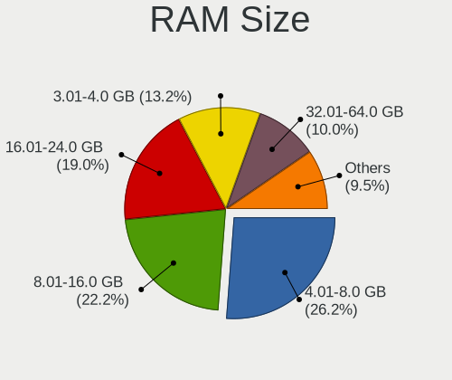
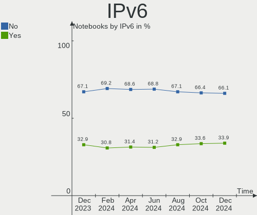

Linux Hardware Trends (Notebooks)
---------------------------------

A project to identify most popular hardware characteristics and track their change
over time based on data collected by Linux users at https://Linux-Hardware.org.

Anyone can contribute to this report by the [hw-probe](https://github.com/linuxhw/hw-probe) tool:

    sudo -E hw-probe -all -upload

Full-feature report is available here: https://linux-hardware.org/?view=trends&formfactor=notebook

Period: Aug, 2021.

Contents
--------

* [ System ](#system)
  - [ OS                       ](#os)
  - [ OS Family                ](#os-family)
  - [ Kernel                   ](#kernel)
  - [ Kernel Family            ](#kernel-family)
  - [ Kernel Major Ver.        ](#kernel-major-ver)
  - [ Arch                     ](#arch)
  - [ DE                       ](#de)
  - [ Display Server           ](#display-server)
  - [ Display Manager          ](#display-manager)
  - [ OS Lang                  ](#os-lang)
  - [ Boot Mode                ](#boot-mode)
  - [ Filesystem               ](#filesystem)
  - [ Part. scheme             ](#part-scheme)
  - [ Dual Boot with Linux/BSD ](#dual-boot-with-linuxbsd)
  - [ Dual Boot (Win)          ](#dual-boot-win)

* [ Board ](#board)
  - [ Vendor                   ](#vendor)
  - [ Model                    ](#model)
  - [ Model Family             ](#model-family)
  - [ MFG Year                 ](#mfg-year)
  - [ Form Factor              ](#form-factor)
  - [ Secure Boot              ](#secure-boot)
  - [ Coreboot                 ](#coreboot)
  - [ RAM Size                 ](#ram-size)
  - [ RAM Used                 ](#ram-used)
  - [ Total Drives             ](#total-drives)
  - [ Has CD-ROM               ](#has-cd-rom)
  - [ Has Ethernet             ](#has-ethernet)
  - [ Has WiFi                 ](#has-wifi)
  - [ Has Bluetooth            ](#has-bluetooth)

* [ Location ](#location)
  - [ Country                  ](#country)
  - [ City                     ](#city)

* [ Drives ](#drives)
  - [ Drive Vendor             ](#drive-vendor)
  - [ Drive Model              ](#drive-model)
  - [ HDD Vendor               ](#hdd-vendor)
  - [ SSD Vendor               ](#ssd-vendor)
  - [ Drive Kind               ](#drive-kind)
  - [ Drive Connector          ](#drive-connector)
  - [ Drive Size               ](#drive-size)
  - [ Space Total              ](#space-total)
  - [ Space Used               ](#space-used)
  - [ Malfunc. Drives          ](#malfunc-drives)
  - [ Malfunc. Drive Vendor    ](#malfunc-drive-vendor)
  - [ Malfunc. HDD Vendor      ](#malfunc-hdd-vendor)
  - [ Malfunc. Drive Kind      ](#malfunc-drive-kind)
  - [ Failed Drives            ](#failed-drives)
  - [ Failed Drive Vendor      ](#failed-drive-vendor)
  - [ Drive Status             ](#drive-status)

* [ Storage controller ](#storage-controller)
  - [ Storage Vendor           ](#storage-vendor)
  - [ Storage Model            ](#storage-model)
  - [ Storage Kind             ](#storage-kind)

* [ Processor ](#processor)
  - [ CPU Vendor               ](#cpu-vendor)
  - [ CPU Model                ](#cpu-model)
  - [ CPU Model Family         ](#cpu-model-family)
  - [ CPU Cores                ](#cpu-cores)
  - [ CPU Sockets              ](#cpu-sockets)
  - [ CPU Threads              ](#cpu-threads)
  - [ CPU Op-Modes             ](#cpu-op-modes)
  - [ CPU Microcode            ](#cpu-microcode)
  - [ CPU Microarch            ](#cpu-microarch)

* [ Graphics ](#graphics)
  - [ GPU Vendor               ](#gpu-vendor)
  - [ GPU Model                ](#gpu-model)
  - [ GPU Combo                ](#gpu-combo)
  - [ GPU Driver               ](#gpu-driver)
  - [ GPU Memory               ](#gpu-memory)

* [ Monitor ](#monitor)
  - [ Monitor Vendor           ](#monitor-vendor)
  - [ Monitor Model            ](#monitor-model)
  - [ Monitor Resolution       ](#monitor-resolution)
  - [ Monitor Diagonal         ](#monitor-diagonal)
  - [ Monitor Width            ](#monitor-width)
  - [ Aspect Ratio             ](#aspect-ratio)
  - [ Monitor Area             ](#monitor-area)
  - [ Pixel Density            ](#pixel-density)
  - [ Multiple Monitors        ](#multiple-monitors)

* [ Network ](#network)
  - [ Net Controller Vendor    ](#net-controller-vendor)
  - [ Net Controller Model     ](#net-controller-model)
  - [ Wireless Vendor          ](#wireless-vendor)
  - [ Wireless Model           ](#wireless-model)
  - [ Ethernet Vendor          ](#ethernet-vendor)
  - [ Ethernet Model           ](#ethernet-model)
  - [ Net Controller Kind      ](#net-controller-kind)
  - [ Used Controller          ](#used-controller)
  - [ NICs                     ](#nics)
  - [ IPv6                     ](#ipv6)

* [ Bluetooth ](#bluetooth)
  - [ Bluetooth Vendor         ](#bluetooth-vendor)
  - [ Bluetooth Model          ](#bluetooth-model)

* [ Sound ](#sound)
  - [ Sound Vendor             ](#sound-vendor)
  - [ Sound Model              ](#sound-model)

* [ Memory ](#memory)
  - [ Memory Vendor            ](#memory-vendor)
  - [ Memory Model             ](#memory-model)
  - [ Memory Kind              ](#memory-kind)
  - [ Memory Form Factor       ](#memory-form-factor)
  - [ Memory Size              ](#memory-size)
  - [ Memory Speed             ](#memory-speed)

* [ Printers & scanners ](#printers--scanners)
  - [ Printer Vendor           ](#printer-vendor)
  - [ Printer Model            ](#printer-model)
  - [ Scanner Vendor           ](#scanner-vendor)
  - [ Scanner Model            ](#scanner-model)

* [ Camera ](#camera)
  - [ Camera Vendor            ](#camera-vendor)
  - [ Camera Model             ](#camera-model)

* [ Security ](#security)
  - [ Fingerprint Vendor       ](#fingerprint-vendor)
  - [ Fingerprint Model        ](#fingerprint-model)
  - [ Chipcard Vendor          ](#chipcard-vendor)
  - [ Chipcard Model           ](#chipcard-model)

* [ Unsupported ](#unsupported)
  - [ Unsupported Devices      ](#unsupported-devices)
  - [ Unsupported Device Types ](#unsupported-device-types)

System
------

OS
--

Installed operating systems

| Name                | Notebooks | Percent |
|---------------------|-----------|---------|
| Ubuntu 20.04        | 477       | 16.8%   |
| Debian 11           | 344       | 12.12%  |
| Pop!_OS 21.04       | 213       | 7.5%    |
| Mint 20.2           | 194       | 6.83%   |
| Ubuntu 21.04        | 189       | 6.66%   |
| Fedora 34           | 156       | 5.49%   |
| OpenMandriva 4.2    | 126       | 4.44%   |
| KDE neon 20.04      | 69        | 2.43%   |
| Manjaro 21.1.0      | 56        | 1.97%   |
| Zorin 16            | 55        | 1.94%   |
| Arch                | 50        | 1.76%   |
| ArcoLinux Rolling   | 45        | 1.59%   |
| Ubuntu 18.04        | 44        | 1.55%   |
| Arch Rolling        | 43        | 1.51%   |
| Xubuntu 20.04       | 42        | 1.48%   |
| ROSA R11.1          | 42        | 1.48%   |
| BlackPanther 18.1   | 41        | 1.44%   |
| Manjaro             | 40        | 1.41%   |
| Endless 3.9.5       | 39        | 1.37%   |
| Zorin 15            | 38        | 1.34%   |
| Mint 20.1           | 30        | 1.06%   |
| Kubuntu 21.04       | 26        | 0.92%   |
| Kubuntu 20.04       | 25        | 0.88%   |
| Debian 10           | 23        | 0.81%   |
| Mint 19.3           | 22        | 0.77%   |
| Mint 20             | 19        | 0.67%   |
| Pop!_OS 20.04       | 18        | 0.63%   |
| Elementary 6        | 18        | 0.63%   |
| Kali 2021.2         | 16        | 0.56%   |
| Ubuntu 20.10        | 13        | 0.46%   |
| EndeavourOS Rolling | 13        | 0.46%   |
| LMDE 4              | 12        | 0.42%   |
| Parrot 4.11         | 11        | 0.39%   |
| openSUSE Leap-15.3  | 10        | 0.35%   |
| Manjaro 21.1.1      | 10        | 0.35%   |
| Gentoo              | 10        | 0.35%   |
| Fedora 35           | 10        | 0.35%   |
| OpenMandriva 4.50   | 9         | 0.32%   |
| Xubuntu 18.04       | 8         | 0.28%   |
| Ubuntu MATE 20.04   | 8         | 0.28%   |
| Clear Linux 34930   | 8         | 0.28%   |
| Xubuntu 21.04       | 7         | 0.25%   |
| ROSA R11            | 7         | 0.25%   |
| ArcoLinux           | 7         | 0.25%   |
| Lubuntu 21.04       | 6         | 0.21%   |
| Lubuntu 20.04       | 6         | 0.21%   |
| Garuda Soaring      | 6         | 0.21%   |
| Elementary 5.1.7    | 6         | 0.21%   |
| Ubuntu MATE 21.04   | 5         | 0.18%   |
| Ubuntu Budgie 20.04 | 5         | 0.18%   |
| Ubuntu 16.04        | 5         | 0.18%   |
| Fedora 33           | 5         | 0.18%   |
| CentOS 8            | 5         | 0.18%   |
| Ubuntu Budgie 21.04 | 4         | 0.14%   |
| Ubuntu 21.10        | 4         | 0.14%   |
| Slackware 15.0      | 4         | 0.14%   |
| Pop!_OS 20.10       | 4         | 0.14%   |
| Peppermint 10       | 4         | 0.14%   |
| Gentoo 2.7          | 4         | 0.14%   |
| Debian              | 4         | 0.14%   |

OS Family
---------

OS without a version

| Name          | Notebooks | Percent |
|---------------|-----------|---------|
| Ubuntu        | 738       | 26%     |
| Debian        | 372       | 13.1%   |
| Mint          | 275       | 9.69%   |
| Pop!_OS       | 235       | 8.28%   |
| Fedora        | 174       | 6.13%   |
| OpenMandriva  | 135       | 4.76%   |
| Manjaro       | 108       | 3.8%    |
| Zorin         | 93        | 3.28%   |
| Arch          | 93        | 3.28%   |
| KDE neon      | 69        | 2.43%   |
| Xubuntu       | 57        | 2.01%   |
| ROSA          | 54        | 1.9%    |
| Kubuntu       | 53        | 1.87%   |
| ArcoLinux     | 52        | 1.83%   |
| Endless       | 49        | 1.73%   |
| BlackPanther  | 45        | 1.59%   |
| Elementary    | 25        | 0.88%   |
| openSUSE      | 23        | 0.81%   |
| Kali          | 17        | 0.6%    |
| Ubuntu MATE   | 15        | 0.53%   |
| Gentoo        | 14        | 0.49%   |
| Lubuntu       | 13        | 0.46%   |
| EndeavourOS   | 13        | 0.46%   |
| Parrot        | 12        | 0.42%   |
| LMDE          | 12        | 0.42%   |
| Clear Linux   | 11        | 0.39%   |
| Ubuntu Budgie | 9         | 0.32%   |
| CentOS        | 8         | 0.28%   |
| Garuda        | 6         | 0.21%   |
| Slackware     | 5         | 0.18%   |
| Peppermint    | 4         | 0.14%   |
| Deepin        | 4         | 0.14%   |
| Void          | 3         | 0.11%   |
| Solus         | 3         | 0.11%   |
| Rocky         | 3         | 0.11%   |
| RHEL          | 3         | 0.11%   |
| MX            | 3         | 0.11%   |
| WindowsFX     | 2         | 0.07%   |
| Oracle Linux  | 2         | 0.07%   |
| NixOS         | 2         | 0.07%   |
| Kaisen        | 2         | 0.07%   |
| GNOME OS      | 2         | 0.07%   |
| GalliumOS     | 2         | 0.07%   |
| Exherbo       | 2         | 0.07%   |
| Devuan        | 2         | 0.07%   |
| Artix         | 2         | 0.07%   |
| ALT Linux     | 2         | 0.07%   |
| UHU           | 1         | 0.04%   |
| Siduction     | 1         | 0.04%   |
| SaferOS       | 1         | 0.04%   |
| Reborn OS     | 1         | 0.04%   |
| PureOS        | 1         | 0.04%   |
| PostmarketOS  | 1         | 0.04%   |
| Plamo         | 1         | 0.04%   |
| Pear OS       | 1         | 0.04%   |
| Makulu        | 1         | 0.04%   |
| Astra Linux   | 1         | 0.04%   |
| AlmaLinux     | 1         | 0.04%   |

Kernel
------

Version of the Linux kernel

| Version                     | Notebooks | Percent |
|-----------------------------|-----------|---------|
| 5.10.0-8-amd64              | 331       | 11.66%  |
| 5.11.0-25-generic           | 306       | 10.78%  |
| 5.11.0-27-generic           | 258       | 9.09%   |
| 5.11.0-7620-generic         | 216       | 7.61%   |
| 5.4.0-81-generic            | 170       | 5.99%   |
| 5.4.0-80-generic            | 166       | 5.85%   |
| 5.10.14-desktop-1omv4002    | 119       | 4.19%   |
| 5.8.0-63-generic            | 79        | 2.78%   |
| 5.11.0-31-generic           | 78        | 2.75%   |
| 5.8.0-14-generic            | 43        | 1.51%   |
| 5.13.12-200.fc34.x86_64     | 43        | 1.51%   |
| 5.8.0-43-generic            | 37        | 1.3%    |
| 5.13.12-arch1-1             | 34        | 1.2%    |
| 5.6.14-desktop-2bP          | 31        | 1.09%   |
| 5.13.8-200.fc34.x86_64      | 25        | 0.88%   |
| 5.4.0-74-generic            | 23        | 0.81%   |
| 5.13.9-200.fc34.x86_64      | 23        | 0.81%   |
| 5.13.6-200.fc34.x86_64      | 22        | 0.77%   |
| 5.13.10-arch1-1             | 20        | 0.7%    |
| 5.10.56-1-MANJARO           | 19        | 0.67%   |
| 5.10.53-1-MANJARO           | 19        | 0.67%   |
| 4.19.0-17-amd64             | 18        | 0.63%   |
| 5.13.10-200.fc34.x86_64     | 17        | 0.6%    |
| 5.11.0-16-generic           | 17        | 0.6%    |
| 5.8.0-59-generic            | 16        | 0.56%   |
| 5.13.11-1-MANJARO           | 15        | 0.53%   |
| 5.13.9-arch1-1              | 14        | 0.49%   |
| 5.10.0-kali9-amd64          | 14        | 0.49%   |
| 5.4.0-42-generic            | 13        | 0.46%   |
| 5.13.8-arch1-1              | 12        | 0.42%   |
| 5.4.83-generic-2rosa-x86_64 | 11        | 0.39%   |
| 5.4.0-77-generic            | 11        | 0.39%   |
| 5.13.12-1-MANJARO           | 11        | 0.39%   |
| 5.13.7-arch1-1              | 10        | 0.35%   |
| 5.13.13-arch1-1             | 10        | 0.35%   |
| 5.4.32-generic-2rosa-x86_64 | 9         | 0.32%   |
| 5.10.56-1-lts               | 9         | 0.32%   |
| 5.10.0-8parrot1-amd64       | 9         | 0.32%   |
| 4.18.16-desktop-1bP         | 9         | 0.32%   |
| 5.4.0-73-generic            | 8         | 0.28%   |
| 5.13.8-1-MANJARO            | 8         | 0.28%   |
| 5.12.4-desktop-1omv4050     | 8         | 0.28%   |
| 5.11.0-33-generic           | 8         | 0.28%   |
| 5.10.59-1-MANJARO           | 8         | 0.28%   |
| 4.15.0-151-generic          | 8         | 0.28%   |
| 5.13.5-1-MANJARO            | 7         | 0.25%   |
| 5.12.19-1-MANJARO           | 7         | 0.25%   |
| 5.11.0-26-generic           | 7         | 0.25%   |
| 5.11.0-22-generic           | 7         | 0.25%   |
| 5.10.0-7-amd64              | 7         | 0.25%   |
| 5.4.32-generic-2rosa-i586   | 6         | 0.21%   |
| 5.14.0-1-MANJARO            | 6         | 0.21%   |
| 5.13.9-zen1-1-zen           | 6         | 0.21%   |
| 5.13.8-1065.native          | 6         | 0.21%   |
| 5.13.8-1-default            | 6         | 0.21%   |
| 5.13.5-200.fc34.x86_64      | 6         | 0.21%   |
| 5.11.12-desktop-1omv4002    | 6         | 0.21%   |
| 5.11.12-300.fc34.x86_64     | 6         | 0.21%   |
| 5.11.0-7633-generic         | 6         | 0.21%   |
| 4.19.0-17-686               | 6         | 0.21%   |

Kernel Family
-------------

Linux kernel without a distro release

| Version | Notebooks | Percent |
|---------|-----------|---------|
| 5.11.0  | 916       | 32.26%  |
| 5.4.0   | 424       | 14.93%  |
| 5.10.0  | 395       | 13.91%  |
| 5.8.0   | 202       | 7.12%   |
| 5.10.14 | 119       | 4.19%   |
| 5.13.12 | 105       | 3.7%    |
| 5.13.8  | 67        | 2.36%   |
| 4.15.0  | 55        | 1.94%   |
| 5.13.9  | 51        | 1.8%    |
| 5.13.10 | 40        | 1.41%   |
| 5.13.6  | 36        | 1.27%   |
| 5.6.14  | 31        | 1.09%   |
| 4.19.0  | 29        | 1.02%   |
| 5.10.56 | 28        | 0.99%   |
| 5.13.7  | 26        | 0.92%   |
| 5.14.0  | 22        | 0.77%   |
| 5.13.5  | 20        | 0.7%    |
| 5.13.13 | 19        | 0.67%   |
| 5.13.11 | 19        | 0.67%   |
| 5.10.53 | 19        | 0.67%   |
| 5.4.32  | 15        | 0.53%   |
| 4.18.0  | 13        | 0.46%   |
| 5.4.83  | 12        | 0.42%   |
| 5.11.12 | 12        | 0.42%   |
| 5.3.18  | 11        | 0.39%   |
| 5.12.19 | 11        | 0.39%   |
| 4.18.16 | 9         | 0.32%   |
| 5.13.4  | 8         | 0.28%   |
| 5.12.4  | 8         | 0.28%   |
| 5.10.59 | 8         | 0.28%   |
| 5.10.52 | 7         | 0.25%   |
| 5.10.60 | 6         | 0.21%   |
| 5.13.0  | 5         | 0.18%   |
| 5.12.14 | 5         | 0.18%   |
| 4.9.20  | 5         | 0.18%   |
| 5.3.0   | 4         | 0.14%   |
| 5.10.50 | 4         | 0.14%   |
| 5.12.18 | 3         | 0.11%   |
| 5.12.15 | 3         | 0.11%   |
| 5.11.22 | 3         | 0.11%   |
| 5.0.0   | 3         | 0.11%   |
| 4.4.0   | 3         | 0.11%   |
| 5.4.17  | 2         | 0.07%   |
| 5.13.2  | 2         | 0.07%   |
| 5.12.5  | 2         | 0.07%   |
| 5.12.0  | 2         | 0.07%   |
| 5.11.6  | 2         | 0.07%   |
| 5.10.54 | 2         | 0.07%   |
| 5.10.41 | 2         | 0.07%   |
| 4.9.0   | 2         | 0.07%   |
| 4.16.18 | 2         | 0.07%   |
| 3.10.0  | 2         | 0.07%   |
| Unknown | 2         | 0.07%   |
| 5.4.141 | 1         | 0.04%   |
| 5.4.139 | 1         | 0.04%   |
| 5.4.138 | 1         | 0.04%   |
| 5.4.124 | 1         | 0.04%   |
| 5.4.115 | 1         | 0.04%   |
| 5.13.1  | 1         | 0.04%   |
| 5.12.8  | 1         | 0.04%   |

Kernel Major Ver.
-----------------

Linux kernel major version

| Version | Notebooks | Percent |
|---------|-----------|---------|
| 5.11    | 939       | 33.08%  |
| 5.10    | 601       | 21.17%  |
| 5.4     | 458       | 16.13%  |
| 5.13    | 399       | 14.05%  |
| 5.8     | 202       | 7.12%   |
| 4.15    | 55        | 1.94%   |
| 5.12    | 40        | 1.41%   |
| 5.6     | 31        | 1.09%   |
| 4.19    | 29        | 1.02%   |
| 5.14    | 22        | 0.77%   |
| 4.18    | 22        | 0.77%   |
| 5.3     | 15        | 0.53%   |
| 4.9     | 9         | 0.32%   |
| 5.0     | 3         | 0.11%   |
| 4.4     | 3         | 0.11%   |
| 4.16    | 3         | 0.11%   |
| 3.10    | 2         | 0.07%   |
| Unknown | 2         | 0.07%   |
| 4.20    | 1         | 0.04%   |
| 4.13    | 1         | 0.04%   |
| 4.10    | 1         | 0.04%   |
| 4.1     | 1         | 0.04%   |

Arch
----

OS architecture (x86_64, i586, etc.)

| Name    | Notebooks | Percent |
|---------|-----------|---------|
| x86_64  | 2769      | 97.53%  |
| i686    | 68        | 2.4%    |
| armv7l  | 1         | 0.04%   |
| Unknown | 1         | 0.04%   |

DE
--

Desktop Environment

| Name             | Notebooks | Percent |
|------------------|-----------|---------|
| GNOME            | 1300      | 45.79%  |
| KDE5             | 362       | 12.75%  |
| Unknown          | 332       | 11.69%  |
| XFCE             | 216       | 7.61%   |
| X-Cinnamon       | 211       | 7.43%   |
| KDE              | 140       | 4.93%   |
| MATE             | 82        | 2.89%   |
| KDE4             | 37        | 1.3%    |
| Pantheon         | 22        | 0.77%   |
| Cinnamon         | 22        | 0.77%   |
| i3               | 18        | 0.63%   |
| LXQt             | 15        | 0.53%   |
| Budgie           | 15        | 0.53%   |
| Unity            | 9         | 0.32%   |
| qtile            | 7         | 0.25%   |
| LXDE             | 7         | 0.25%   |
| Deepin           | 7         | 0.25%   |
| awesome          | 7         | 0.25%   |
| sway             | 5         | 0.18%   |
| GNOME Flashback  | 4         | 0.14%   |
| Enlightenment    | 4         | 0.14%   |
| bspwm            | 4         | 0.14%   |
| xmonad           | 3         | 0.11%   |
| ICEWM            | 2         | 0.07%   |
| dwm              | 2         | 0.07%   |
| wmaker-common    | 1         | 0.04%   |
| openbox          | 1         | 0.04%   |
| lightdm-xsession | 1         | 0.04%   |
| herbstluftwm     | 1         | 0.04%   |
| GNOME Classic    | 1         | 0.04%   |
| fly              | 1         | 0.04%   |

Display Server
--------------

X11 or Wayland

| Name    | Notebooks | Percent |
|---------|-----------|---------|
| X11     | 2155      | 75.91%  |
| Wayland | 374       | 13.17%  |
| Unknown | 280       | 9.86%   |
| Tty     | 30        | 1.06%   |

Display Manager
---------------

SDDM, LightDM, etc.

| Name    | Notebooks | Percent |
|---------|-----------|---------|
| Unknown | 1651      | 58.15%  |
| GDM     | 455       | 16.03%  |
| SDDM    | 386       | 13.6%   |
| TDM     | 178       | 6.27%   |
| LightDM | 120       | 4.23%   |
| KDM     | 39        | 1.37%   |
| XDM     | 4         | 0.14%   |
| LXDM    | 3         | 0.11%   |
| GDM3    | 2         | 0.07%   |
| SLiM    | 1         | 0.04%   |

OS Lang
-------

Language

| Lang    | Notebooks | Percent |
|---------|-----------|---------|
| en_US   | 1088      | 38.32%  |
| Unknown | 287       | 10.11%  |
| de_DE   | 215       | 7.57%   |
| en_GB   | 158       | 5.57%   |
| pt_BR   | 148       | 5.21%   |
| ru_RU   | 142       | 5%      |
| fr_FR   | 105       | 3.7%    |
| en_IN   | 71        | 2.5%    |
| es_ES   | 63        | 2.22%   |
| C       | 46        | 1.62%   |
| en_AU   | 45        | 1.59%   |
| pl_PL   | 40        | 1.41%   |
| en_CA   | 39        | 1.37%   |
| cs_CZ   | 32        | 1.13%   |
| it_IT   | 31        | 1.09%   |
| zh_CN   | 18        | 0.63%   |
| es_MX   | 18        | 0.63%   |
| en_ZA   | 15        | 0.53%   |
| es_AR   | 14        | 0.49%   |
| hu_HU   | 13        | 0.46%   |
| en_NZ   | 13        | 0.46%   |
| de_CH   | 13        | 0.46%   |
| tr_TR   | 12        | 0.42%   |
| ru_UA   | 12        | 0.42%   |
| nl_NL   | 12        | 0.42%   |
| es_CL   | 12        | 0.42%   |
| sv_SE   | 11        | 0.39%   |
| pt_PT   | 10        | 0.35%   |
| fi_FI   | 10        | 0.35%   |
| de_AT   | 9         | 0.32%   |
| ro_RO   | 8         | 0.28%   |
| nl_BE   | 8         | 0.28%   |
| es_CO   | 7         | 0.25%   |
| en_IE   | 7         | 0.25%   |
| fr_BE   | 6         | 0.21%   |
| es_EC   | 6         | 0.21%   |
| da_DK   | 6         | 0.21%   |
| ja_JP   | 5         | 0.18%   |
| hr_HR   | 5         | 0.18%   |
| es_PE   | 5         | 0.18%   |
| el_GR   | 5         | 0.18%   |
| fr_CH   | 4         | 0.14%   |
| fr_CA   | 4         | 0.14%   |
| es_UY   | 4         | 0.14%   |
| en_PH   | 4         | 0.14%   |
| zh_TW   | 3         | 0.11%   |
| nn_NO   | 3         | 0.11%   |
| es_VE   | 3         | 0.11%   |
| en_NG   | 3         | 0.11%   |
| en_IL   | 3         | 0.11%   |
| uk_UA   | 2         | 0.07%   |
| th_TH   | 2         | 0.07%   |
| sk_SK   | 2         | 0.07%   |
| nb_NO   | 2         | 0.07%   |
| es_CU   | 2         | 0.07%   |
| en_SG   | 2         | 0.07%   |
| en_DK   | 2         | 0.07%   |
| ca_ES   | 2         | 0.07%   |
| bg_BG   | 2         | 0.07%   |
| zh_HK   | 1         | 0.04%   |

Boot Mode
---------

EFI or BIOS

| Mode | Notebooks | Percent |
|------|-----------|---------|
| EFI  | 1538      | 54.17%  |
| BIOS | 1301      | 45.83%  |

Filesystem
----------

Type of filesystem

| Type                | Notebooks | Percent |
|---------------------|-----------|---------|
| Ext4                | 2110      | 74.32%  |
| Overlay             | 433       | 15.25%  |
| Btrfs               | 242       | 8.52%   |
| Xfs                 | 23        | 0.81%   |
| Zfs                 | 14        | 0.49%   |
| Unknown             | 5         | 0.18%   |
| F2fs                | 3         | 0.11%   |
| Ext3                | 3         | 0.11%   |
| Ext2                | 2         | 0.07%   |
| Aufs                | 2         | 0.07%   |
| Rootfs              | 1         | 0.04%   |
| Fuse.fuse-overlayfs | 1         | 0.04%   |

Part. scheme
------------

Scheme of partitioning

| Type    | Notebooks | Percent |
|---------|-----------|---------|
| Unknown | 1384      | 48.75%  |
| GPT     | 1117      | 39.34%  |
| MBR     | 338       | 11.91%  |

Dual Boot with Linux/BSD
------------------------

Hosting more than one Linux/BSD

| Dual boot | Notebooks | Percent |
|-----------|-----------|---------|
| No        | 2570      | 90.52%  |
| Yes       | 269       | 9.48%   |

Dual Boot (Win)
---------------

Hosting Linux and Windows

| Dual boot | Notebooks | Percent |
|-----------|-----------|---------|
| No        | 2139      | 75.34%  |
| Yes       | 700       | 24.66%  |

Board
-----

Vendor
------

Motherboard manufacturer

| Name                   | Notebooks | Percent |
|------------------------|-----------|---------|
| Lenovo                 | 589       | 20.75%  |
| Hewlett-Packard        | 470       | 16.56%  |
| Dell                   | 416       | 14.65%  |
| ASUSTek Computer       | 286       | 10.07%  |
| Acer                   | 257       | 9.05%   |
| Apple                  | 211       | 7.43%   |
| Toshiba                | 73        | 2.57%   |
| Google                 | 65        | 2.29%   |
| Samsung Electronics    | 56        | 1.97%   |
| MSI                    | 51        | 1.8%    |
| Sony                   | 36        | 1.27%   |
| Notebook               | 27        | 0.95%   |
| HUAWEI                 | 24        | 0.85%   |
| Unknown                | 21        | 0.74%   |
| Packard Bell           | 18        | 0.63%   |
| Fujitsu                | 18        | 0.63%   |
| TUXEDO                 | 15        | 0.53%   |
| System76               | 13        | 0.46%   |
| Medion                 | 13        | 0.46%   |
| Fujitsu Siemens        | 11        | 0.39%   |
| Positivo               | 10        | 0.35%   |
| LG Electronics         | 9         | 0.32%   |
| eMachines              | 9         | 0.32%   |
| Timi                   | 7         | 0.25%   |
| Razer                  | 7         | 0.25%   |
| PC Specialist          | 7         | 0.25%   |
| Panasonic              | 6         | 0.21%   |
| Clevo                  | 6         | 0.21%   |
| Gigabyte Technology    | 5         | 0.18%   |
| Teclast                | 4         | 0.14%   |
| Gateway                | 4         | 0.14%   |
| Alienware              | 4         | 0.14%   |
| Monster                | 3         | 0.11%   |
| Itautec                | 3         | 0.11%   |
| Intel                  | 3         | 0.11%   |
| Insyde                 | 3         | 0.11%   |
| GPD                    | 3         | 0.11%   |
| Eluktronics            | 3         | 0.11%   |
| AVITA                  | 3         | 0.11%   |
| Wortmann AG            | 2         | 0.07%   |
| SLIMBOOK               | 2         | 0.07%   |
| Philco                 | 2         | 0.07%   |
| ONE-NETBOOK TECHNOLOGY | 2         | 0.07%   |
| OEM                    | 2         | 0.07%   |
| Jumper                 | 2         | 0.07%   |
| IP3 Tech               | 2         | 0.07%   |
| IBM                    | 2         | 0.07%   |
| Framework              | 2         | 0.07%   |
| Digibras               | 2         | 0.07%   |
| Chuwi                  | 2         | 0.07%   |
| BANGHO                 | 2         | 0.07%   |
| AMI                    | 2         | 0.07%   |
| YJKC                   | 1         | 0.04%   |
| whyopencomputing       | 1         | 0.04%   |
| VIT                    | 1         | 0.04%   |
| VINGA                  | 1         | 0.04%   |
| UNOWHY                 | 1         | 0.04%   |
| Ultra                  | 1         | 0.04%   |
| TWG                    | 1         | 0.04%   |
| TrekStor               | 1         | 0.04%   |

Model
-----

Motherboard model

| Name                                  | Notebooks | Percent |
|---------------------------------------|-----------|---------|
| Apple MacBookAir7,1                   | 75        | 2.64%   |
| Apple MacBookAir7,2                   | 66        | 2.32%   |
| Google Enguarde                       | 48        | 1.69%   |
| Unknown                               | 30        | 1.06%   |
| HP Notebook                           | 18        | 0.63%   |
| ASUS UX31E                            | 16        | 0.56%   |
| Lenovo ThinkPad 13 2nd Gen 20J10046US | 13        | 0.46%   |
| HP Pavilion dv6                       | 10        | 0.35%   |
| HP Pavilion g6                        | 9         | 0.32%   |
| HP Pavilion 15                        | 9         | 0.32%   |
| Dell XPS 15 7590                      | 9         | 0.32%   |
| Acer Nitro AN515-54                   | 9         | 0.32%   |
| HP Pavilion dv7                       | 8         | 0.28%   |
| Apple MacBookPro8,1                   | 8         | 0.28%   |
| Acer Nitro AN515-44                   | 8         | 0.28%   |
| Lenovo IdeaPad 330-15IKB 81DE         | 7         | 0.25%   |
| HUAWEI BOHK-WAX9X                     | 7         | 0.25%   |
| HP Pavilion Gaming Laptop 15-ec1xxx   | 7         | 0.25%   |
| HP EliteBook 8460p                    | 7         | 0.25%   |
| HP EliteBook 820 G1                   | 7         | 0.25%   |
| Dell XPS 15 9560                      | 7         | 0.25%   |
| Dell Latitude E6400                   | 7         | 0.25%   |
| ASUS ROG Zephyrus G14 GA401QM_GA401QM | 7         | 0.25%   |
| Apple MacBookPro9,2                   | 7         | 0.25%   |
| HP EliteBook 840 G3                   | 6         | 0.21%   |
| Dell XPS 15 9500                      | 6         | 0.21%   |
| Dell Vostro 3500                      | 6         | 0.21%   |
| Dell Latitude E6510                   | 6         | 0.21%   |
| Dell Inspiron 3521                    | 6         | 0.21%   |
| System76 Oryx Pro                     | 5         | 0.18%   |
| Lenovo IdeaPad Y700-15ISK 80NV        | 5         | 0.18%   |
| Lenovo G500 20236                     | 5         | 0.18%   |
| HP Pavilion g7                        | 5         | 0.18%   |
| HP Laptop 15-bw0xx                    | 5         | 0.18%   |
| HP EliteBook 845 G7 Notebook PC       | 5         | 0.18%   |
| HP EliteBook 840 G1                   | 5         | 0.18%   |
| HP 2000                               | 5         | 0.18%   |
| Dell Latitude E6410                   | 5         | 0.18%   |
| Dell Latitude E6330                   | 5         | 0.18%   |
| Dell Latitude 7490                    | 5         | 0.18%   |
| Dell Latitude 7400                    | 5         | 0.18%   |
| Apple MacBookPro11,1                  | 5         | 0.18%   |
| Acer Aspire E5-573G                   | 5         | 0.18%   |
| Acer Aspire A315-42                   | 5         | 0.18%   |
| Acer Aspire 5750G                     | 5         | 0.18%   |
| System76 Gazelle                      | 4         | 0.14%   |
| Samsung 350V5C/351V5C/3540VC/3440VC   | 4         | 0.14%   |
| Lenovo ThinkPad P14s Gen 1 20Y1CTO1WW | 4         | 0.14%   |
| Lenovo IdeaPad S145-15IWL 81S9        | 4         | 0.14%   |
| Lenovo IdeaPad Gaming 3 15ARH05 82EY  | 4         | 0.14%   |
| Lenovo IdeaPad 520-15IKB 81BF         | 4         | 0.14%   |
| Lenovo IdeaPad 5 15ITL05 82FG         | 4         | 0.14%   |
| Lenovo IdeaPad 5 14ARE05 81YM         | 4         | 0.14%   |
| Lenovo IdeaPad 330S-15ARR 81FB        | 4         | 0.14%   |
| Lenovo IdeaPad 3 15ADA05 81W1         | 4         | 0.14%   |
| Lenovo G560 0679                      | 4         | 0.14%   |
| HP ProBook 650 G1                     | 4         | 0.14%   |
| HP ProBook 450 G8 Notebook PC         | 4         | 0.14%   |
| HP ProBook 450 G6                     | 4         | 0.14%   |
| HP Presario CQ56                      | 4         | 0.14%   |

Model Family
------------

Motherboard model prefix

| Name                    | Notebooks | Percent |
|-------------------------|-----------|---------|
| Lenovo ThinkPad         | 322       | 11.34%  |
| Acer Aspire             | 167       | 5.88%   |
| Lenovo IdeaPad          | 144       | 5.07%   |
| Apple MacBookAir7       | 141       | 4.97%   |
| Dell Latitude           | 136       | 4.79%   |
| Dell Inspiron           | 136       | 4.79%   |
| HP Pavilion             | 106       | 3.73%   |
| HP EliteBook            | 89        | 3.13%   |
| HP ProBook              | 65        | 2.29%   |
| HP Laptop               | 63        | 2.22%   |
| Dell XPS                | 63        | 2.22%   |
| Toshiba Satellite       | 62        | 2.18%   |
| Google Enguarde         | 48        | 1.69%   |
| ASUS VivoBook           | 47        | 1.66%   |
| Acer Nitro              | 37        | 1.3%    |
| Dell Precision          | 33        | 1.16%   |
| Unknown                 | 30        | 1.06%   |
| Dell Vostro             | 26        | 0.92%   |
| ASUS ROG                | 24        | 0.85%   |
| Acer Swift              | 24        | 0.85%   |
| HP ENVY                 | 20        | 0.7%    |
| HP Compaq               | 19        | 0.67%   |
| HP Notebook             | 18        | 0.63%   |
| ASUS ASUS               | 17        | 0.6%    |
| Fujitsu LIFEBOOK        | 16        | 0.56%   |
| ASUS ZenBook            | 16        | 0.56%   |
| ASUS UX31E              | 16        | 0.56%   |
| Packard Bell EasyNote   | 15        | 0.53%   |
| Lenovo ThinkBook        | 15        | 0.53%   |
| Lenovo Legion           | 12        | 0.42%   |
| HP Presario             | 11        | 0.39%   |
| Apple MacBookPro8       | 11        | 0.39%   |
| ASUS TUF                | 10        | 0.35%   |
| Acer Extensa            | 10        | 0.35%   |
| Apple MacBookPro9       | 9         | 0.32%   |
| Apple MacBookPro11      | 9         | 0.32%   |
| HP ZBook                | 8         | 0.28%   |
| HP 250                  | 8         | 0.28%   |
| Dell Studio             | 8         | 0.28%   |
| Razer Blade             | 7         | 0.25%   |
| HUAWEI BOHK-WAX9X       | 7         | 0.25%   |
| Dell G3                 | 7         | 0.25%   |
| Lenovo Yoga             | 6         | 0.21%   |
| HP 255                  | 6         | 0.21%   |
| Fujitsu Siemens ESPRIMO | 6         | 0.21%   |
| Apple MacBookPro5       | 6         | 0.21%   |
| Acer TravelMate         | 6         | 0.21%   |
| TUXEDO InfinityBook     | 5         | 0.18%   |
| Toshiba PORTEGE         | 5         | 0.18%   |
| System76 Oryx           | 5         | 0.18%   |
| Samsung 350V5C          | 5         | 0.18%   |
| MSI Modern              | 5         | 0.18%   |
| Lenovo G560             | 5         | 0.18%   |
| Lenovo G500             | 5         | 0.18%   |
| HP Stream               | 5         | 0.18%   |
| HP OMEN                 | 5         | 0.18%   |
| HP 2000                 | 5         | 0.18%   |
| HP 15                   | 5         | 0.18%   |
| Dell G5                 | 5         | 0.18%   |
| Apple MacBookAir4       | 5         | 0.18%   |

MFG Year
--------

Motherboard manufacture year

| Year    | Notebooks | Percent |
|---------|-----------|---------|
| 2021    | 558       | 19.65%  |
| 2020    | 498       | 17.54%  |
| 2019    | 330       | 11.62%  |
| 2018    | 189       | 6.66%   |
| 2013    | 174       | 6.13%   |
| 2012    | 157       | 5.53%   |
| 2011    | 151       | 5.32%   |
| 2010    | 134       | 4.72%   |
| 2015    | 133       | 4.68%   |
| 2014    | 121       | 4.26%   |
| 2016    | 98        | 3.45%   |
| 2017    | 96        | 3.38%   |
| 2009    | 77        | 2.71%   |
| 2008    | 70        | 2.47%   |
| 2007    | 31        | 1.09%   |
| 2006    | 15        | 0.53%   |
| 2005    | 5         | 0.18%   |
| Unknown | 2         | 0.07%   |

Form Factor
-----------

Physical design of the computer

| Name     | Notebooks | Percent |
|----------|-----------|---------|
| Notebook | 2839      | 100%    |

Secure Boot
-----------

Enabled or disabled

| State    | Notebooks | Percent |
|----------|-----------|---------|
| Disabled | 2583      | 90.98%  |
| Enabled  | 256       | 9.02%   |

Coreboot
--------

Have coreboot on board

| Used | Notebooks | Percent |
|------|-----------|---------|
| No   | 2763      | 97.32%  |
| Yes  | 76        | 2.68%   |

RAM Size
--------

Total RAM memory

| Size in GB  | Notebooks | Percent |
|-------------|-----------|---------|
| 4.01-8.0    | 840       | 29.59%  |
| 3.01-4.0    | 729       | 25.68%  |
| 8.01-16.0   | 436       | 15.36%  |
| 16.01-24.0  | 431       | 15.18%  |
| 32.01-64.0  | 165       | 5.81%   |
| 1.01-2.0    | 127       | 4.47%   |
| 2.01-3.0    | 48        | 1.69%   |
| 64.01-256.0 | 27        | 0.95%   |
| 24.01-32.0  | 20        | 0.7%    |
| 0.51-1.0    | 13        | 0.46%   |
| Unknown     | 2         | 0.07%   |
| 0.01-0.5    | 1         | 0.04%   |

RAM Used
--------

Used RAM memory

| Used GB    | Notebooks | Percent |
|------------|-----------|---------|
| 1.01-2.0   | 1222      | 43.04%  |
| 2.01-3.0   | 685       | 24.13%  |
| 4.01-8.0   | 330       | 11.62%  |
| 3.01-4.0   | 288       | 10.14%  |
| 0.51-1.0   | 202       | 7.12%   |
| 8.01-16.0  | 75        | 2.64%   |
| 0.01-0.5   | 25        | 0.88%   |
| 16.01-24.0 | 10        | 0.35%   |
| Unknown    | 2         | 0.07%   |

Total Drives
------------

Number of drives on board

| Drives | Notebooks | Percent |
|--------|-----------|---------|
| 1      | 2119      | 74.64%  |
| 2      | 616       | 21.7%   |
| 3      | 85        | 2.99%   |
| 4      | 8         | 0.28%   |
| 0      | 8         | 0.28%   |
| 5      | 3         | 0.11%   |

Has CD-ROM
----------

Has CD-ROM on board

| Presented | Notebooks | Percent |
|-----------|-----------|---------|
| No        | 1853      | 65.27%  |
| Yes       | 986       | 34.73%  |

Has Ethernet
------------

Has Ethernet on board

| Presented | Notebooks | Percent |
|-----------|-----------|---------|
| Yes       | 2200      | 77.49%  |
| No        | 639       | 22.51%  |

Has WiFi
--------

Has WiFi module

| Presented | Notebooks | Percent |
|-----------|-----------|---------|
| Yes       | 2776      | 97.78%  |
| No        | 63        | 2.22%   |

Has Bluetooth
-------------

Has Bluetooth module

| Presented | Notebooks | Percent |
|-----------|-----------|---------|
| Yes       | 2222      | 78.27%  |
| No        | 617       | 21.73%  |

Location
--------

Country
-------

Geographic location (country)

| Country      | Notebooks | Percent |
|--------------|-----------|---------|
| USA          | 642       | 22.61%  |
| Germany      | 272       | 9.58%   |
| Brazil       | 190       | 6.69%   |
| Russia       | 157       | 5.53%   |
| France       | 130       | 4.58%   |
| India        | 115       | 4.05%   |
| UK           | 111       | 3.91%   |
| Poland       | 72        | 2.54%   |
| Spain        | 70        | 2.47%   |
| Canada       | 64        | 2.25%   |
| Hungary      | 52        | 1.83%   |
| Italy        | 49        | 1.73%   |
| Australia    | 49        | 1.73%   |
| Netherlands  | 46        | 1.62%   |
| Czechia      | 44        | 1.55%   |
| Ukraine      | 42        | 1.48%   |
| Mexico       | 41        | 1.44%   |
| Switzerland  | 38        | 1.34%   |
| Turkey       | 32        | 1.13%   |
| Belgium      | 31        | 1.09%   |
| Finland      | 28        | 0.99%   |
| Sweden       | 26        | 0.92%   |
| Romania      | 26        | 0.92%   |
| China        | 25        | 0.88%   |
| Indonesia    | 23        | 0.81%   |
| Austria      | 22        | 0.77%   |
| Argentina    | 21        | 0.74%   |
| Portugal     | 19        | 0.67%   |
| South Africa | 18        | 0.63%   |
| New Zealand  | 17        | 0.6%    |
| Greece       | 16        | 0.56%   |
| Colombia     | 14        | 0.49%   |
| Chile        | 14        | 0.49%   |
| Japan        | 13        | 0.46%   |
| Denmark      | 13        | 0.46%   |
| Algeria      | 12        | 0.42%   |
| Belarus      | 11        | 0.39%   |
| Serbia       | 10        | 0.35%   |
| Norway       | 10        | 0.35%   |
| Iran         | 10        | 0.35%   |
| Estonia      | 10        | 0.35%   |
| Croatia      | 10        | 0.35%   |
| Vietnam      | 9         | 0.32%   |
| Latvia       | 9         | 0.32%   |
| Israel       | 9         | 0.32%   |
| Bulgaria     | 9         | 0.32%   |
| Ireland      | 8         | 0.28%   |
| Taiwan       | 7         | 0.25%   |
| Lithuania    | 7         | 0.25%   |
| South Korea  | 6         | 0.21%   |
| Philippines  | 6         | 0.21%   |
| Peru         | 6         | 0.21%   |
| Malaysia     | 6         | 0.21%   |
| Ecuador      | 6         | 0.21%   |
| Uruguay      | 5         | 0.18%   |
| Singapore    | 5         | 0.18%   |
| Kenya        | 5         | 0.18%   |
| Hong Kong    | 5         | 0.18%   |
| Thailand     | 4         | 0.14%   |
| Slovakia     | 4         | 0.14%   |

City
----

Geographic location (city)

| City              | Notebooks | Percent |
|-------------------|-----------|---------|
| Portland          | 219       | 7.71%   |
| Moscow            | 34        | 1.2%    |
| Prague            | 28        | 0.99%   |
| Berlin            | 26        | 0.92%   |
| St Petersburg     | 20        | 0.7%    |
| Helsinki          | 19        | 0.67%   |
| Warsaw            | 18        | 0.63%   |
| Bengaluru         | 18        | 0.63%   |
| Paris             | 17        | 0.6%    |
| S??o Paulo        | 15        | 0.53%   |
| London            | 15        | 0.53%   |
| Kyiv              | 14        | 0.49%   |
| Vienna            | 13        | 0.46%   |
| Istanbul          | 13        | 0.46%   |
| Madrid            | 12        | 0.42%   |
| Zurich            | 10        | 0.35%   |
| Budapest          | 10        | 0.35%   |
| Tehran            | 9         | 0.32%   |
| Tallinn           | 9         | 0.32%   |
| Montreal          | 9         | 0.32%   |
| Toronto           | 8         | 0.28%   |
| Sydney            | 8         | 0.28%   |
| Rostov-on-Don     | 8         | 0.28%   |
| Pune              | 8         | 0.28%   |
| Munich            | 8         | 0.28%   |
| Minsk             | 8         | 0.28%   |
| Melbourne         | 8         | 0.28%   |
| Manchester        | 8         | 0.28%   |
| Lyon              | 8         | 0.28%   |
| Los Angeles       | 8         | 0.28%   |
| Kolkata           | 8         | 0.28%   |
| Frankfurt am Main | 8         | 0.28%   |
| Stuttgart         | 7         | 0.25%   |
| San Jose          | 7         | 0.25%   |
| Rome              | 7         | 0.25%   |
| Rio de Janeiro    | 7         | 0.25%   |
| Mumbai            | 7         | 0.25%   |
| Dallas            | 7         | 0.25%   |
| Cape Town         | 7         | 0.25%   |
| Buenos Aires      | 7         | 0.25%   |
| Belo Horizonte    | 7         | 0.25%   |
| Auckland          | 7         | 0.25%   |
| Vancouver         | 6         | 0.21%   |
| Valencia          | 6         | 0.21%   |
| Tucson            | 6         | 0.21%   |
| Tel Aviv          | 6         | 0.21%   |
| Santiago          | 6         | 0.21%   |
| Riga              | 6         | 0.21%   |
| Novosibirsk       | 6         | 0.21%   |
| Milan             | 6         | 0.21%   |
| Mexico City       | 6         | 0.21%   |
| Leipzig           | 6         | 0.21%   |
| Krasnodar         | 6         | 0.21%   |
| Jakarta           | 6         | 0.21%   |
| Hamburg           | 6         | 0.21%   |
| Fortaleza         | 6         | 0.21%   |
| Delhi             | 6         | 0.21%   |
| Cologne           | 6         | 0.21%   |
| Chennai           | 6         | 0.21%   |
| Bucharest         | 6         | 0.21%   |

Drives
------

Drive Vendor
------------

Hard drive vendors

| Vendor                    | Notebooks | Drives | Percent |
|---------------------------|-----------|--------|---------|
| Samsung Electronics       | 534       | 588    | 15.5%   |
| WDC                       | 444       | 458    | 12.89%  |
| Seagate                   | 370       | 375    | 10.74%  |
| Toshiba                   | 294       | 299    | 8.53%   |
| Unknown                   | 217       | 234    | 6.3%    |
| SanDisk                   | 202       | 208    | 5.86%   |
| Apple                     | 173       | 173    | 5.02%   |
| Kingston                  | 169       | 173    | 4.91%   |
| SK Hynix                  | 134       | 136    | 3.89%   |
| Crucial                   | 102       | 107    | 2.96%   |
| Hitachi                   | 99        | 100    | 2.87%   |
| Intel                     | 98        | 106    | 2.84%   |
| HGST                      | 66        | 66     | 1.92%   |
| Micron Technology         | 60        | 61     | 1.74%   |
| A-DATA Technology         | 47        | 48     | 1.36%   |
| KIOXIA                    | 36        | 39     | 1.04%   |
| LITEON                    | 19        | 19     | 0.55%   |
| China                     | 19        | 19     | 0.55%   |
| SPCC                      | 18        | 19     | 0.52%   |
| Phison                    | 18        | 18     | 0.52%   |
| Fujitsu                   | 18        | 18     | 0.52%   |
| SABRENT                   | 16        | 16     | 0.46%   |
| PNY                       | 16        | 16     | 0.46%   |
| LITEONIT                  | 16        | 20     | 0.46%   |
| Transcend                 | 14        | 15     | 0.41%   |
| Silicon Motion            | 12        | 13     | 0.35%   |
| KingSpec                  | 12        | 12     | 0.35%   |
| Union Memory              | 9         | 9      | 0.26%   |
| OCZ                       | 8         | 8      | 0.23%   |
| Intenso                   | 8         | 8      | 0.23%   |
| Apacer                    | 8         | 8      | 0.23%   |
| Lexar                     | 7         | 7      | 0.2%    |
| JMicron                   | 7         | 10     | 0.2%    |
| Hewlett-Packard           | 7         | 7      | 0.2%    |
| Union Memory (Shenzhen)   | 6         | 7      | 0.17%   |
| Realtek Semiconductor     | 6         | 6      | 0.17%   |
| PLEXTOR                   | 6         | 6      | 0.17%   |
| Patriot                   | 6         | 6      | 0.17%   |
| ADATA Technology          | 6         | 6      | 0.17%   |
| Team                      | 5         | 5      | 0.15%   |
| Micron/Crucial Technology | 5         | 5      | 0.15%   |
| GOODRAM                   | 5         | 5      | 0.15%   |
| Corsair                   | 5         | 5      | 0.15%   |
| XPG                       | 4         | 4      | 0.12%   |
| Solid State Storage       | 4         | 4      | 0.12%   |
| Netac                     | 4         | 4      | 0.12%   |
| Leven                     | 4         | 4      | 0.12%   |
| Lenovo                    | 4         | 4      | 0.12%   |
| Gigabyte Technology       | 4         | 5      | 0.12%   |
| ASMT                      | 4         | 5      | 0.12%   |
| Vaseky                    | 3         | 3      | 0.09%   |
| Smartbuy                  | 3         | 3      | 0.09%   |
| Mushkin                   | 3         | 3      | 0.09%   |
| Lite-On                   | 3         | 3      | 0.09%   |
| BIWIN                     | 3         | 3      | 0.09%   |
| AMD                       | 3         | 4      | 0.09%   |
| ZTC                       | 2         | 2      | 0.06%   |
| Verbatim                  | 2         | 2      | 0.06%   |
| Teclast                   | 2         | 2      | 0.06%   |
| Phison Electronics        | 2         | 2      | 0.06%   |

Drive Model
-----------

Hard drive models

| Model                               | Notebooks | Percent |
|-------------------------------------|-----------|---------|
| Apple SSD AP0128H 121GB             | 75        | 2.11%   |
| Apple SSD SM0128G 121GB             | 66        | 1.86%   |
| Seagate ST1000LM035-1RK172 1TB      | 53        | 1.49%   |
| Toshiba MQ01ABD100 1TB              | 47        | 1.33%   |
| Kingston SA400S37240G 240GB SSD     | 41        | 1.16%   |
| Seagate ST1000LM024 HN-M101MBB 1TB  | 36        | 1.01%   |
| Unknown MMC Card  32GB              | 31        | 0.87%   |
| Toshiba MQ01ABF050 500GB            | 30        | 0.85%   |
| Samsung NVMe SSD Drive 512GB        | 29        | 0.82%   |
| Unknown AGND3R  16GB                | 26        | 0.73%   |
| Toshiba MQ04ABF100 1TB              | 25        | 0.7%    |
| Seagate ST500LT012-1DG142 500GB     | 24        | 0.68%   |
| Intel NVMe SSD Drive 512GB          | 24        | 0.68%   |
| WDC WD10SPZX-21Z10T0 1TB            | 22        | 0.62%   |
| SK Hynix NVMe SSD Drive 512GB       | 22        | 0.62%   |
| Sandisk NVMe SSD Drive 256GB        | 22        | 0.62%   |
| Samsung SSD 860 EVO 500GB           | 21        | 0.59%   |
| Unknown MMC Card  64GB              | 20        | 0.56%   |
| Seagate ST500LM012 HN-M500MBB 500GB | 20        | 0.56%   |
| Sandisk NVMe SSD Drive 512GB        | 20        | 0.56%   |
| Samsung SSD 850 EVO 500GB           | 20        | 0.56%   |
| HGST HTS721010A9E630 1TB            | 20        | 0.56%   |
| Unknown HAG2e  16GB                 | 19        | 0.54%   |
| Toshiba NVMe SSD Drive 512GB        | 19        | 0.54%   |
| Seagate ST9500325AS 500GB           | 19        | 0.54%   |
| Kingston SA400S37480G 480GB SSD     | 18        | 0.51%   |
| Kingston SA400S37120G 120GB SSD     | 18        | 0.51%   |
| Samsung NVMe SSD Drive 256GB        | 17        | 0.48%   |
| WDC WD10SPZX-24Z10 1TB              | 16        | 0.45%   |
| WDC WD10JPVX-22JC3T0 1TB            | 16        | 0.45%   |
| SanDisk SSD U100 256GB              | 16        | 0.45%   |
| Samsung SSD 860 EVO 1TB             | 16        | 0.45%   |
| SABRENT Disk 1TB                    | 16        | 0.45%   |
| Seagate ST1000LM049-2GH172 1TB      | 15        | 0.42%   |
| Samsung SSD 860 EVO 250GB           | 15        | 0.42%   |
| Samsung SSD 850 EVO 250GB           | 15        | 0.42%   |
| Seagate ST1000LM048-2E7172 1TB      | 14        | 0.39%   |
| Samsung NVMe SSD Drive 1024GB       | 14        | 0.39%   |
| Unknown MMC Card  128GB             | 13        | 0.37%   |
| Samsung NVMe SSD Drive 1TB          | 13        | 0.37%   |
| Crucial CT500MX500SSD1 500GB        | 13        | 0.37%   |
| Crucial CT240BX500SSD1 240GB        | 13        | 0.37%   |
| Crucial CT1000MX500SSD1 1TB         | 13        | 0.37%   |
| Seagate Expansion 2TB               | 12        | 0.34%   |
| Samsung NVMe SSD Drive 500GB        | 12        | 0.34%   |
| HGST HTS725050A7E630 500GB          | 12        | 0.34%   |
| WDC WDS500G2B0A-00SM50 500GB SSD    | 11        | 0.31%   |
| WDC WDS240G2G0A-00JH30 240GB SSD    | 10        | 0.28%   |
| Unknown SD/MMC/MS PRO 128GB         | 10        | 0.28%   |
| Unknown MMC Card  16GB              | 10        | 0.28%   |
| Toshiba MQ01ABD050 500GB            | 10        | 0.28%   |
| SK Hynix HFM001TD3JX013N 1TB        | 10        | 0.28%   |
| Seagate ST9500420AS 500GB           | 10        | 0.28%   |
| Seagate ST9320325AS 320GB           | 10        | 0.28%   |
| Intel SSDPEKNW512G8H 512GB          | 10        | 0.28%   |
| WDC WD5000LPVX-22V0TT0 500GB        | 9         | 0.25%   |
| SK Hynix NVMe SSD Drive 256GB       | 9         | 0.25%   |
| Seagate ST500LM000-1EJ162 500GB     | 9         | 0.25%   |
| SanDisk SSD PLUS 240GB              | 9         | 0.25%   |
| SanDisk SD8SN8U128G1001 128GB SSD   | 9         | 0.25%   |

HDD Vendor
----------

Hard disk drive vendors

| Vendor              | Notebooks | Drives | Percent |
|---------------------|-----------|--------|---------|
| Seagate             | 357       | 361    | 33.02%  |
| WDC                 | 286       | 288    | 26.46%  |
| Toshiba             | 210       | 210    | 19.43%  |
| Hitachi             | 99        | 100    | 9.16%   |
| HGST                | 66        | 66     | 6.11%   |
| Samsung Electronics | 26        | 26     | 2.41%   |
| Fujitsu             | 17        | 17     | 1.57%   |
| Apple               | 7         | 7      | 0.65%   |
| ASMT                | 3         | 4      | 0.28%   |
| IBM/Hitachi         | 2         | 2      | 0.19%   |
| USB3.0              | 1         | 1      | 0.09%   |
| Unknown             | 1         | 1      | 0.09%   |
| TO Exter            | 1         | 1      | 0.09%   |
| SATAFIRM            | 1         | 1      | 0.09%   |
| PHD 3.0             | 1         | 1      | 0.09%   |
| MARSHAL             | 1         | 1      | 0.09%   |
| JMicron             | 1         | 3      | 0.09%   |
| Intenso             | 1         | 1      | 0.09%   |

SSD Vendor
----------

Solid state drive vendors

| Vendor              | Notebooks | Drives | Percent |
|---------------------|-----------|--------|---------|
| Samsung Electronics | 271       | 287    | 22.58%  |
| SanDisk             | 138       | 140    | 11.5%   |
| Kingston            | 132       | 134    | 11%     |
| Crucial             | 93        | 97     | 7.75%   |
| Apple               | 86        | 86     | 7.17%   |
| WDC                 | 66        | 67     | 5.5%    |
| A-DATA Technology   | 33        | 33     | 2.75%   |
| Intel               | 31        | 31     | 2.58%   |
| Micron Technology   | 28        | 28     | 2.33%   |
| Toshiba             | 27        | 28     | 2.25%   |
| SK Hynix            | 26        | 26     | 2.17%   |
| China               | 19        | 19     | 1.58%   |
| SPCC                | 18        | 19     | 1.5%    |
| LITEON              | 18        | 18     | 1.5%    |
| SABRENT             | 16        | 16     | 1.33%   |
| PNY                 | 16        | 16     | 1.33%   |
| LITEONIT            | 16        | 20     | 1.33%   |
| Transcend           | 12        | 12     | 1%      |
| KingSpec            | 12        | 12     | 1%      |
| OCZ                 | 8         | 8      | 0.67%   |
| Apacer              | 8         | 8      | 0.67%   |
| Unknown             | 7         | 7      | 0.58%   |
| Lexar               | 7         | 7      | 0.58%   |
| PLEXTOR             | 6         | 6      | 0.5%    |
| Patriot             | 6         | 6      | 0.5%    |
| Intenso             | 6         | 6      | 0.5%    |
| Team                | 5         | 5      | 0.42%   |
| Seagate             | 5         | 5      | 0.42%   |
| Hewlett-Packard     | 5         | 5      | 0.42%   |
| GOODRAM             | 5         | 5      | 0.42%   |
| Smartbuy            | 3         | 3      | 0.25%   |
| Netac               | 3         | 3      | 0.25%   |
| Leven               | 3         | 3      | 0.25%   |
| Gigabyte Technology | 3         | 4      | 0.25%   |
| BIWIN               | 3         | 3      | 0.25%   |
| AMD                 | 3         | 4      | 0.25%   |
| ZTC                 | 2         | 2      | 0.17%   |
| Verbatim            | 2         | 2      | 0.17%   |
| Vaseky              | 2         | 2      | 0.17%   |
| Teclast             | 2         | 2      | 0.17%   |
| Mushkin             | 2         | 2      | 0.17%   |
| LDLC                | 2         | 2      | 0.17%   |
| KingDian            | 2         | 2      | 0.17%   |
| JMicron             | 2         | 2      | 0.17%   |
| FORESEE             | 2         | 2      | 0.17%   |
| DOGFISH             | 2         | 2      | 0.17%   |
| Corsair             | 2         | 2      | 0.17%   |
| Zheino              | 1         | 1      | 0.08%   |
| Yeyian              | 1         | 1      | 0.08%   |
| V Series            | 1         | 1      | 0.08%   |
| UNIC2               | 1         | 1      | 0.08%   |
| TurXun              | 1         | 1      | 0.08%   |
| TCSUNBOW            | 1         | 1      | 0.08%   |
| StoreJet            | 1         | 1      | 0.08%   |
| Solidata            | 1         | 3      | 0.08%   |
| PNY USB             | 1         | 1      | 0.08%   |
| Phison              | 1         | 1      | 0.08%   |
| Palit               | 1         | 1      | 0.08%   |
| OCZ-VERT            | 1         | 1      | 0.08%   |
| NGFF                | 1         | 1      | 0.08%   |

Drive Kind
----------

HDD or SSD

| Kind    | Notebooks | Drives | Percent |
|---------|-----------|--------|---------|
| SSD     | 1108      | 1235   | 33.37%  |
| HDD     | 1059      | 1091   | 31.9%   |
| NVMe    | 909       | 1000   | 27.38%  |
| MMC     | 195       | 212    | 5.87%   |
| Unknown | 49        | 49     | 1.48%   |

Drive Connector
---------------

SATA, SAS, NVMe, etc.

| Type | Notebooks | Drives | Percent |
|------|-----------|--------|---------|
| SATA | 1960      | 2251   | 61.69%  |
| NVMe | 909       | 999    | 28.61%  |
| MMC  | 195       | 212    | 6.14%   |
| SAS  | 113       | 125    | 3.56%   |

Drive Size
----------

Size of hard drive

| Size in TB | Notebooks | Drives | Percent |
|------------|-----------|--------|---------|
| 0.01-0.5   | 1471      | 1612   | 68.51%  |
| 0.51-1.0   | 595       | 625    | 27.71%  |
| 1.01-2.0   | 69        | 76     | 3.21%   |
| 3.01-4.0   | 7         | 8      | 0.33%   |
| 4.01-10.0  | 4         | 4      | 0.19%   |
| 2.01-3.0   | 1         | 1      | 0.05%   |

Space Total
-----------

Amount of disk space available on the file system

| Size in GB     | Notebooks | Percent |
|----------------|-----------|---------|
| 101-250        | 945       | 33.29%  |
| 251-500        | 676       | 23.81%  |
| 501-1000       | 367       | 12.93%  |
| 1-20           | 263       | 9.26%   |
| 51-100         | 173       | 6.09%   |
| 1001-2000      | 134       | 4.72%   |
| 21-50          | 98        | 3.45%   |
| Unknown        | 98        | 3.45%   |
| More than 3000 | 53        | 1.87%   |
| 2001-3000      | 32        | 1.13%   |

Space Used
----------

Amount of used disk space

| Used GB        | Notebooks | Percent |
|----------------|-----------|---------|
| 1-20           | 1288      | 45.37%  |
| 21-50          | 467       | 16.45%  |
| 101-250        | 352       | 12.4%   |
| 51-100         | 297       | 10.46%  |
| 251-500        | 190       | 6.69%   |
| Unknown        | 98        | 3.45%   |
| 501-1000       | 89        | 3.13%   |
| 1001-2000      | 37        | 1.3%    |
| More than 3000 | 10        | 0.35%   |
| 2001-3000      | 10        | 0.35%   |
| 0              | 1         | 0.04%   |

Malfunc. Drives
---------------

Drive models with a malfunction

| Model                                | Notebooks | Drives | Percent |
|--------------------------------------|-----------|--------|---------|
| SanDisk SSD U100 256GB               | 16        | 16     | 7.31%   |
| Toshiba MQ01ABD100 1TB               | 7         | 7      | 3.2%    |
| Seagate ST500LT012-1DG142 500GB      | 7         | 7      | 3.2%    |
| Seagate ST1000LM024 HN-M101MBB 1TB   | 5         | 5      | 2.28%   |
| HGST HTS725050A7E630 500GB           | 5         | 5      | 2.28%   |
| Seagate ST9500325AS 500GB            | 4         | 4      | 1.83%   |
| HGST HTS721010A9E630 1TB             | 4         | 4      | 1.83%   |
| WDC WD10JPVX-22JC3T0 1TB             | 3         | 3      | 1.37%   |
| Toshiba MQ01ABF050 500GB             | 3         | 3      | 1.37%   |
| Seagate ST9500420AS 500GB            | 3         | 3      | 1.37%   |
| Seagate ST9320325AS 320GB            | 3         | 3      | 1.37%   |
| Seagate ST500LT012-9WS142 500GB      | 3         | 3      | 1.37%   |
| Seagate ST1000LM049-2GH172 1TB       | 3         | 3      | 1.37%   |
| Seagate ST1000LM035-1RK172 1TB       | 3         | 3      | 1.37%   |
| Hitachi HTS543232A7A384 320GB        | 3         | 3      | 1.37%   |
| WDC WD5000LPCX-60VHAT0 500GB         | 2         | 2      | 0.91%   |
| WDC WD1600BEVT-22ZCT0 160GB          | 2         | 2      | 0.91%   |
| Toshiba MQ02ABD100H 1TB              | 2         | 2      | 0.91%   |
| Toshiba MQ01ABD075 752GB             | 2         | 2      | 0.91%   |
| Toshiba MQ01ABD050 500GB             | 2         | 2      | 0.91%   |
| Toshiba MK7559GSXP 752GB             | 2         | 2      | 0.91%   |
| Toshiba MK5059GSXP 500GB             | 2         | 2      | 0.91%   |
| Toshiba MK1234GSX 120GB              | 2         | 2      | 0.91%   |
| Seagate ST9320423AS 320GB            | 2         | 2      | 0.91%   |
| Seagate ST500LM021-1KJ152 500GB      | 2         | 2      | 0.91%   |
| Seagate ST500LM000-1EJ162 500GB      | 2         | 2      | 0.91%   |
| Samsung Electronics HM321HI 320GB    | 2         | 2      | 0.91%   |
| Hitachi HTS723232A7A364 320GB        | 2         | 2      | 0.91%   |
| Hitachi HTS542512K9SA00 120GB        | 2         | 2      | 0.91%   |
| Hitachi HTS541680J9SA00 80GB         | 2         | 2      | 0.91%   |
| HGST HTS545050A7E380 500GB           | 2         | 2      | 0.91%   |
| Crucial CT1050MX300SSD1 1050GB       | 2         | 2      | 0.91%   |
| WDC WD7500BPVT-08HXZT3 752GB         | 1         | 1      | 0.46%   |
| WDC WD6400BPVT-22HXZT1 640GB         | 1         | 1      | 0.46%   |
| WDC WD6400BEVT-60A0RT0 640GB         | 1         | 1      | 0.46%   |
| WDC WD6400BEVT-00A0RT0 640GB         | 1         | 1      | 0.46%   |
| WDC WD5000LPVX-22V0TT0 500GB         | 1         | 1      | 0.46%   |
| WDC WD5000LPLX-75ZNTT0 500GB         | 1         | 1      | 0.46%   |
| WDC WD5000LPCX-60VHAT1 500GB         | 1         | 1      | 0.46%   |
| WDC WD5000LPCX-24C6HT0 500GB         | 1         | 1      | 0.46%   |
| WDC WD5000BPVT-22HXZT3 500GB         | 1         | 1      | 0.46%   |
| WDC WD5000BPVT-22HXZT1 500GB         | 1         | 1      | 0.46%   |
| WDC WD5000BEVT-00A0RT0 500GB         | 1         | 1      | 0.46%   |
| WDC WD3200BPVT-24JJ5T0 320GB         | 1         | 1      | 0.46%   |
| WDC WD3200BEVT-80A0RT0 320GB         | 1         | 1      | 0.46%   |
| WDC WD3200BEVT-60ZCT1 320GB          | 1         | 1      | 0.46%   |
| WDC WD3200BEVT-22ZCT0 320GB          | 1         | 1      | 0.46%   |
| WDC WD2500BEVT-22A23T0 250GB         | 1         | 1      | 0.46%   |
| WDC WD1600BJKT-75F4T0 160GB          | 1         | 1      | 0.46%   |
| WDC WD10SPZX-24Z10 1TB               | 1         | 1      | 0.46%   |
| WDC WD10JPVX-60JC3T0 1TB             | 1         | 1      | 0.46%   |
| WDC WD10 EZEX-08WN4A0 1TB            | 1         | 1      | 0.46%   |
| Toshiba THNSNK512GCS8 SATA 512GB SSD | 1         | 1      | 0.46%   |
| Toshiba THNSNK256GCS8 SATA 256GB SSD | 1         | 1      | 0.46%   |
| Toshiba THNSFJ256GCSU 256GB SSD      | 1         | 1      | 0.46%   |
| Toshiba MQ04ABF100 1TB               | 1         | 1      | 0.46%   |
| Toshiba MQ01ACF050 500GB             | 1         | 1      | 0.46%   |
| Toshiba MQ01ABD100V 1TB              | 1         | 1      | 0.46%   |
| Toshiba MK5076GSX 500GB              | 1         | 1      | 0.46%   |
| Toshiba MK5075GSX 500GB              | 1         | 1      | 0.46%   |

Malfunc. Drive Vendor
---------------------

Vendors of faulty drives

| Vendor              | Notebooks | Drives | Percent |
|---------------------|-----------|--------|---------|
| Seagate             | 49        | 49     | 22.37%  |
| Toshiba             | 35        | 35     | 15.98%  |
| WDC                 | 27        | 27     | 12.33%  |
| Hitachi             | 27        | 27     | 12.33%  |
| SanDisk             | 21        | 21     | 9.59%   |
| HGST                | 14        | 14     | 6.39%   |
| Samsung Electronics | 13        | 13     | 5.94%   |
| Kingston            | 7         | 7      | 3.2%    |
| Intel               | 6         | 6      | 2.74%   |
| Crucial             | 5         | 5      | 2.28%   |
| Fujitsu             | 3         | 3      | 1.37%   |
| A-DATA Technology   | 3         | 3      | 1.37%   |
| SK Hynix            | 2         | 2      | 0.91%   |
| Micron Technology   | 2         | 2      | 0.91%   |
| LITEONIT            | 1         | 1      | 0.46%   |
| KingSpec            | 1         | 1      | 0.46%   |
| JDa                 | 1         | 1      | 0.46%   |
| IBM/Hitachi         | 1         | 1      | 0.46%   |
| Apple               | 1         | 1      | 0.46%   |

Malfunc. HDD Vendor
-------------------

Vendors of faulty HDD drives

| Vendor              | Notebooks | Drives | Percent |
|---------------------|-----------|--------|---------|
| Seagate             | 49        | 49     | 30.63%  |
| Toshiba             | 32        | 32     | 20%     |
| WDC                 | 27        | 27     | 16.88%  |
| Hitachi             | 27        | 27     | 16.88%  |
| HGST                | 14        | 14     | 8.75%   |
| Samsung Electronics | 6         | 6      | 3.75%   |
| Fujitsu             | 3         | 3      | 1.88%   |
| IBM/Hitachi         | 1         | 1      | 0.63%   |
| Apple               | 1         | 1      | 0.63%   |

Malfunc. Drive Kind
-------------------

Kinds of faulty drives

| Kind | Notebooks | Drives | Percent |
|------|-----------|--------|---------|
| HDD  | 157       | 160    | 72.69%  |
| SSD  | 54        | 54     | 25%     |
| NVMe | 5         | 5      | 2.31%   |

Failed Drives
-------------

Failed drive models

| Model                        | Notebooks | Drives | Percent |
|------------------------------|-----------|--------|---------|
| WDC WD5000BPVT-60HXZT1 500GB | 1         | 1      | 16.67%  |
| WDC WD3200BPVT-80ZEST0 320GB | 1         | 1      | 16.67%  |
| WDC WD3200BEKT-75PVMT1 320GB | 1         | 1      | 16.67%  |
| Toshiba MK3259GSXP 320GB     | 1         | 1      | 16.67%  |
| SanDisk SSD i100 24GB        | 1         | 1      | 16.67%  |
| HGST HTS541010A9E680 1TB     | 1         | 1      | 16.67%  |

Failed Drive Vendor
-------------------

Failed drive vendors

| Vendor  | Notebooks | Drives | Percent |
|---------|-----------|--------|---------|
| WDC     | 3         | 3      | 50%     |
| Toshiba | 1         | 1      | 16.67%  |
| SanDisk | 1         | 1      | 16.67%  |
| HGST    | 1         | 1      | 16.67%  |

Drive Status
------------

Number of failed and malfunc. drives

| Status   | Notebooks | Drives | Percent |
|----------|-----------|--------|---------|
| Detected | 1554      | 1931   | 51.94%  |
| Works    | 1218      | 1431   | 40.71%  |
| Malfunc  | 214       | 219    | 7.15%   |
| Failed   | 6         | 6      | 0.2%    |

Storage controller
------------------

Storage Vendor
--------------

Storage controller vendors

| Vendor                           | Notebooks | Percent |
|----------------------------------|-----------|---------|
| Intel                            | 1895      | 58.89%  |
| AMD                              | 336       | 10.44%  |
| Samsung Electronics              | 324       | 10.07%  |
| Sandisk                          | 155       | 4.82%   |
| SK Hynix                         | 108       | 3.36%   |
| Apple                            | 80        | 2.49%   |
| Toshiba America Info Systems     | 56        | 1.74%   |
| KIOXIA                           | 40        | 1.24%   |
| Kingston Technology Company      | 37        | 1.15%   |
| Micron Technology                | 33        | 1.03%   |
| Phison Electronics               | 22        | 0.68%   |
| Nvidia                           | 20        | 0.62%   |
| ADATA Technology                 | 18        | 0.56%   |
| Silicon Motion                   | 17        | 0.53%   |
| Union Memory (Shenzhen)          | 14        | 0.44%   |
| Micron/Crucial Technology        | 13        | 0.4%    |
| Realtek Semiconductor            | 12        | 0.37%   |
| Silicon Integrated Systems [SiS] | 10        | 0.31%   |
| Solid State Storage Technology   | 8         | 0.25%   |
| Seagate Technology               | 4         | 0.12%   |
| Lite-On Technology               | 4         | 0.12%   |
| Marvell Technology Group         | 3         | 0.09%   |
| Lenovo                           | 3         | 0.09%   |
| VIA Technologies                 | 2         | 0.06%   |
| JMicron Technology               | 2         | 0.06%   |
| Shenzhen Longsys Electronics     | 1         | 0.03%   |
| Biwin Storage Technology         | 1         | 0.03%   |

Storage Model
-------------

Storage controller models

| Model                                                                                  | Notebooks | Percent |
|----------------------------------------------------------------------------------------|-----------|---------|
| AMD FCH SATA Controller [AHCI mode]                                                    | 281       | 8.15%   |
| Intel Sunrise Point-LP SATA Controller [AHCI mode]                                     | 232       | 6.73%   |
| Intel 7 Series Chipset Family 6-port SATA Controller [AHCI mode]                       | 203       | 5.89%   |
| Intel 82801 Mobile SATA Controller [RAID mode]                                         | 163       | 4.73%   |
| Intel 6 Series/C200 Series Chipset Family 6 port Mobile SATA AHCI Controller           | 154       | 4.47%   |
| Samsung NVMe SSD Controller SM981/PM981/PM983                                          | 137       | 3.97%   |
| Intel 82801IBM/IEM (ICH9M/ICH9M-E) 4 port SATA Controller [AHCI mode]                  | 115       | 3.34%   |
| Intel 8 Series SATA Controller 1 [AHCI mode]                                           | 105       | 3.05%   |
| Intel 8 Series/C220 Series Chipset Family 6-port SATA Controller 1 [AHCI mode]         | 77        | 2.23%   |
| Apple S1X NVMe Controller                                                              | 75        | 2.18%   |
| Intel 5 Series/3400 Series Chipset 4 port SATA AHCI Controller                         | 74        | 2.15%   |
| Intel Wildcat Point-LP SATA Controller [AHCI Mode]                                     | 73        | 2.12%   |
| Samsung Electronics SATA controller                                                    | 71        | 2.06%   |
| Samsung NVMe Controller                                                                | 70        | 2.03%   |
| Intel Cannon Lake Mobile PCH SATA AHCI Controller                                      | 70        | 2.03%   |
| Intel Volume Management Device NVMe RAID Controller                                    | 66        | 1.91%   |
| Intel HM170/QM170 Chipset SATA Controller [AHCI Mode]                                  | 64        | 1.86%   |
| Intel 82801HM/HEM (ICH8M/ICH8M-E) IDE Controller                                       | 55        | 1.6%    |
| Intel 5 Series/3400 Series Chipset 6 port SATA AHCI Controller                         | 54        | 1.57%   |
| Intel 82801HM/HEM (ICH8M/ICH8M-E) SATA Controller [AHCI mode]                          | 49        | 1.42%   |
| Sandisk WD Black SN750 / PC SN730 NVMe SSD                                             | 44        | 1.28%   |
| Sandisk WD Blue SN550 NVMe SSD                                                         | 42        | 1.22%   |
| KIOXIA Non-Volatile memory controller                                                  | 40        | 1.16%   |
| Intel SSD 660P Series                                                                  | 40        | 1.16%   |
| Intel Comet Lake SATA AHCI Controller                                                  | 40        | 1.16%   |
| Micron Non-Volatile memory controller                                                  | 33        | 0.96%   |
| Intel Celeron/Pentium Silver Processor SATA Controller                                 | 33        | 0.96%   |
| AMD SB7x0/SB8x0/SB9x0 SATA Controller [AHCI mode]                                      | 33        | 0.96%   |
| Intel Cannon Point-LP SATA Controller [AHCI Mode]                                      | 32        | 0.93%   |
| SK Hynix NVMe SSD Controller                                                           | 31        | 0.9%    |
| Intel Tiger Lake-LP SATA Controller [AHCI mode]                                        | 31        | 0.9%    |
| Intel Atom Processor E3800 Series SATA AHCI Controller                                 | 29        | 0.84%   |
| Toshiba America Info Systems XG6 NVMe SSD Controller                                   | 28        | 0.81%   |
| Intel Atom/Celeron/Pentium Processor x5-E8000/J3xxx/N3xxx Series SATA Controller       | 27        | 0.78%   |
| SK Hynix BC511                                                                         | 26        | 0.75%   |
| SK Hynix Non-Volatile memory controller                                                | 25        | 0.73%   |
| Intel 400 Series Chipset Family SATA AHCI Controller                                   | 25        | 0.73%   |
| Sandisk WD Blue SN500 / PC SN520 NVMe SSD                                              | 22        | 0.64%   |
| Sandisk Non-Volatile memory controller                                                 | 21        | 0.61%   |
| Samsung NVMe SSD Controller PM9A1/PM9A3/980PRO                                         | 21        | 0.61%   |
| Intel NM10/ICH7 Family SATA Controller [AHCI mode]                                     | 20        | 0.58%   |
| SK Hynix BC501 NVMe Solid State Drive                                                  | 19        | 0.55%   |
| Intel Ice Lake-LP SATA Controller [AHCI mode]                                          | 18        | 0.52%   |
| Samsung NVMe SSD Controller SM961/PM961/SM963                                          | 17        | 0.49%   |
| Intel Celeron N3350/Pentium N4200/Atom E3900 Series SATA AHCI Controller               | 17        | 0.49%   |
| Intel 82801GBM/GHM (ICH7-M Family) SATA Controller [IDE mode]                          | 17        | 0.49%   |
| Intel 82801G (ICH7 Family) IDE Controller                                              | 15        | 0.44%   |
| Union Memory (Shenzhen) Non-Volatile memory controller                                 | 14        | 0.41%   |
| Sandisk PC SN520 NVMe SSD                                                              | 14        | 0.41%   |
| Intel Q170/Q150/B150/H170/H110/Z170/CM236 Chipset SATA Controller [AHCI Mode]          | 14        | 0.41%   |
| Intel 6 Series/C200 Series Chipset Family Mobile SATA Controller (IDE mode, ports 0-3) | 14        | 0.41%   |
| Toshiba America Info Systems Toshiba America Info Non-Volatile memory controller       | 13        | 0.38%   |
| Intel 82801GBM/GHM (ICH7-M Family) SATA Controller [AHCI mode]                         | 13        | 0.38%   |
| Silicon Motion SM2263EN/SM2263XT SSD Controller                                        | 12        | 0.35%   |
| Phison E12 NVMe Controller                                                             | 12        | 0.35%   |
| Kingston Company U-SNS8154P3 NVMe SSD                                                  | 12        | 0.35%   |
| Kingston Company Company Non-Volatile memory controller                                | 12        | 0.35%   |
| Kingston Company A2000 NVMe SSD                                                        | 11        | 0.32%   |
| Intel 82801IBM/IEM (ICH9M/ICH9M-E) 2 port SATA Controller [IDE mode]                   | 11        | 0.32%   |
| Intel 6 Series/C200 Series Chipset Family Mobile SATA Controller (IDE mode, ports 4-5) | 11        | 0.32%   |

Storage Kind
------------

Kind of storage controller (IDE, SATA, NVMe, SAS, ...)

| Kind | Notebooks | Percent |
|------|-----------|---------|
| SATA | 2015      | 60.26%  |
| NVMe | 909       | 27.18%  |
| RAID | 225       | 6.73%   |
| IDE  | 195       | 5.83%   |

Processor
---------

CPU Vendor
----------

Processor vendors

| Vendor   | Notebooks | Percent |
|----------|-----------|---------|
| Intel    | 2364      | 83.27%  |
| AMD      | 474       | 16.7%   |
| QUALCOMM | 1         | 0.04%   |

CPU Model
---------

Processor models

| Model                                         | Notebooks | Percent |
|-----------------------------------------------|-----------|---------|
| Intel Core i5-5250U CPU @ 1.60GHz             | 140       | 4.93%   |
| Intel Celeron CPU N2840 @ 2.16GHz             | 61        | 2.15%   |
| Intel 11th Gen Core i7-1165G7 @ 2.80GHz       | 47        | 1.66%   |
| Intel Core i5-7200U CPU @ 2.50GHz             | 40        | 1.41%   |
| AMD Ryzen 5 3500U with Radeon Vega Mobile Gfx | 38        | 1.34%   |
| Intel Core i5-8250U CPU @ 1.60GHz             | 37        | 1.3%    |
| Intel 11th Gen Core i5-1135G7 @ 2.40GHz       | 37        | 1.3%    |
| Intel Core i7-8550U CPU @ 1.80GHz             | 35        | 1.23%   |
| Intel Core i7-8565U CPU @ 1.80GHz             | 34        | 1.2%    |
| Intel Core i5-3210M CPU @ 2.50GHz             | 33        | 1.16%   |
| Intel Core i7-10510U CPU @ 1.80GHz            | 31        | 1.09%   |
| Intel Core i5-2520M CPU @ 2.50GHz             | 31        | 1.09%   |
| Intel Core i7-7700HQ CPU @ 2.80GHz            | 30        | 1.06%   |
| Intel Core i5-8265U CPU @ 1.60GHz             | 29        | 1.02%   |
| Intel Core i5-6200U CPU @ 2.30GHz             | 29        | 1.02%   |
| Intel Core i7-9750H CPU @ 2.60GHz             | 26        | 0.92%   |
| Intel Core i5-5200U CPU @ 2.20GHz             | 25        | 0.88%   |
| Intel Core i5-3320M CPU @ 2.60GHz             | 25        | 0.88%   |
| Intel Core i5-10210U CPU @ 1.60GHz            | 25        | 0.88%   |
| Intel Core i7-6700HQ CPU @ 2.60GHz            | 22        | 0.77%   |
| Intel Core i7-10750H CPU @ 2.60GHz            | 22        | 0.77%   |
| AMD Ryzen 5 4600H with Radeon Graphics        | 22        | 0.77%   |
| Intel Core i7-8750H CPU @ 2.20GHz             | 21        | 0.74%   |
| Intel Core i5-1035G1 CPU @ 1.00GHz            | 21        | 0.74%   |
| AMD Ryzen 7 PRO 4750U with Radeon Graphics    | 21        | 0.74%   |
| Intel Core i7-7500U CPU @ 2.70GHz             | 20        | 0.7%    |
| AMD Ryzen 7 4800H with Radeon Graphics        | 20        | 0.7%    |
| AMD Ryzen 5 4500U with Radeon Graphics        | 20        | 0.7%    |
| Intel Core i5-4210U CPU @ 1.70GHz             | 19        | 0.67%   |
| Intel Core i5 CPU M 520 @ 2.40GHz             | 19        | 0.67%   |
| Intel Core i7-6500U CPU @ 2.50GHz             | 18        | 0.63%   |
| Intel Core i7-2677M CPU @ 1.80GHz             | 18        | 0.63%   |
| Intel Core i5-6300U CPU @ 2.40GHz             | 18        | 0.63%   |
| Intel Core i3-3110M CPU @ 2.40GHz             | 18        | 0.63%   |
| AMD Ryzen 7 4700U with Radeon Graphics        | 18        | 0.63%   |
| Intel Core i5-9300H CPU @ 2.40GHz             | 17        | 0.6%    |
| Intel Core i5-7300HQ CPU @ 2.50GHz            | 17        | 0.6%    |
| Intel Celeron CPU N3060 @ 1.60GHz             | 16        | 0.56%   |
| Intel Core i5-5300U CPU @ 2.30GHz             | 15        | 0.53%   |
| Intel Core i3-6006U CPU @ 2.00GHz             | 15        | 0.53%   |
| Intel Celeron N4000 CPU @ 1.10GHz             | 15        | 0.53%   |
| Intel Core i7-6600U CPU @ 2.60GHz             | 14        | 0.49%   |
| Intel Core i7-4600U CPU @ 2.10GHz             | 14        | 0.49%   |
| Intel Celeron CPU 3865U @ 1.80GHz             | 14        | 0.49%   |
| Intel Core i7-4700MQ CPU @ 2.40GHz            | 13        | 0.46%   |
| Intel Core i7-1065G7 CPU @ 1.30GHz            | 13        | 0.46%   |
| Intel Core i5-4200U CPU @ 1.60GHz             | 13        | 0.46%   |
| Intel Pentium Dual-Core CPU T4500 @ 2.30GHz   | 12        | 0.42%   |
| Intel Core i7-3630QM CPU @ 2.40GHz            | 12        | 0.42%   |
| Intel Core i7 CPU Q 720 @ 1.60GHz             | 12        | 0.42%   |
| Intel Core i5-8300H CPU @ 2.30GHz             | 12        | 0.42%   |
| Intel Core i5-4300U CPU @ 1.90GHz             | 12        | 0.42%   |
| Intel Core i5-2410M CPU @ 2.30GHz             | 12        | 0.42%   |
| Intel Core i5 CPU M 430 @ 2.27GHz             | 12        | 0.42%   |
| Intel Core 2 Duo CPU P8700 @ 2.53GHz          | 12        | 0.42%   |
| Intel Core 2 Duo CPU P8600 @ 2.40GHz          | 12        | 0.42%   |
| Intel 11th Gen Core i7-1185G7 @ 3.00GHz       | 12        | 0.42%   |
| Intel 11th Gen Core i7-11800H @ 2.30GHz       | 12        | 0.42%   |
| Intel Core i7-8665U CPU @ 1.90GHz             | 11        | 0.39%   |
| Intel Core i7-10875H CPU @ 2.30GHz            | 11        | 0.39%   |

CPU Model Family
----------------

Processor model prefix

| Model                   | Notebooks | Percent |
|-------------------------|-----------|---------|
| Intel Core i5           | 802       | 28.25%  |
| Intel Core i7           | 596       | 20.99%  |
| Intel Core i3           | 212       | 7.47%   |
| Intel Celeron           | 199       | 7.01%   |
| Other                   | 146       | 5.14%   |
| Intel Core 2 Duo        | 143       | 5.04%   |
| AMD Ryzen 5             | 115       | 4.05%   |
| AMD Ryzen 7             | 84        | 2.96%   |
| Intel Pentium           | 67        | 2.36%   |
| Intel Atom              | 54        | 1.9%    |
| Intel Pentium Dual-Core | 27        | 0.95%   |
| AMD A4                  | 27        | 0.95%   |
| AMD Ryzen 9             | 25        | 0.88%   |
| AMD Ryzen 7 PRO         | 25        | 0.88%   |
| AMD Ryzen 3             | 24        | 0.85%   |
| AMD A6                  | 24        | 0.85%   |
| Intel Pentium Dual      | 22        | 0.77%   |
| AMD A8                  | 21        | 0.74%   |
| AMD E                   | 19        | 0.67%   |
| Intel Core 2            | 18        | 0.63%   |
| AMD A10                 | 17        | 0.6%    |
| Intel Genuine           | 14        | 0.49%   |
| Intel Core i9           | 14        | 0.49%   |
| Intel Pentium Silver    | 11        | 0.39%   |
| Intel Core m3           | 11        | 0.39%   |
| AMD E1                  | 11        | 0.39%   |
| AMD Athlon              | 11        | 0.39%   |
| Intel Xeon              | 10        | 0.35%   |
| AMD E2                  | 10        | 0.35%   |
| Intel Celeron Dual-Core | 8         | 0.28%   |
| Intel Pentium M         | 7         | 0.25%   |
| AMD Turion 64 X2 Mobile | 7         | 0.25%   |
| AMD Ryzen 5 PRO         | 7         | 0.25%   |
| Intel Celeron M         | 6         | 0.21%   |
| AMD Athlon II           | 4         | 0.14%   |
| AMD A12                 | 4         | 0.14%   |
| Intel Core M            | 3         | 0.11%   |
| AMD Turion 64 Mobile    | 3         | 0.11%   |
| AMD Athlon 64 X2        | 3         | 0.11%   |
| Intel Pentium Gold      | 2         | 0.07%   |
| AMD Turion II           | 2         | 0.07%   |
| AMD Phenom II           | 2         | 0.07%   |
| AMD Mobile Sempron      | 2         | 0.07%   |
| AMD C-60                | 2         | 0.07%   |
| AMD Athlon X2           | 2         | 0.07%   |
| AMD Athlon II Dual-Core | 2         | 0.07%   |
| Intel Core m7           | 1         | 0.04%   |
| Intel Core m5           | 1         | 0.04%   |
| Intel Core Duo          | 1         | 0.04%   |
| Intel Core 2 Solo       | 1         | 0.04%   |
| Intel Core 2 Extreme    | 1         | 0.04%   |
| AMD V140                | 1         | 0.04%   |
| AMD V120                | 1         | 0.04%   |
| AMD Turion II Dual-Core | 1         | 0.04%   |
| AMD Quad-Core           | 1         | 0.04%   |
| AMD GX                  | 1         | 0.04%   |
| AMD FX                  | 1         | 0.04%   |
| AMD C-70                | 1         | 0.04%   |
| AMD C-30                | 1         | 0.04%   |
| AMD Athlon 64           | 1         | 0.04%   |

CPU Cores
---------

Number of processor cores

| Number  | Notebooks | Percent |
|---------|-----------|---------|
| 2       | 1612      | 56.78%  |
| 4       | 850       | 29.94%  |
| 8       | 156       | 5.49%   |
| 6       | 150       | 5.28%   |
| 1       | 66        | 2.32%   |
| 16      | 1         | 0.04%   |
| 12      | 1         | 0.04%   |
| 10      | 1         | 0.04%   |
| 3       | 1         | 0.04%   |
| Unknown | 1         | 0.04%   |

CPU Sockets
-----------

Number of sockets

| Number  | Notebooks | Percent |
|---------|-----------|---------|
| 1       | 2838      | 99.96%  |
| Unknown | 1         | 0.04%   |

CPU Threads
-----------

Threads per core (Hyper-Threading)

| Number  | Notebooks | Percent |
|---------|-----------|---------|
| 2       | 2062      | 72.63%  |
| 1       | 776       | 27.33%  |
| Unknown | 1         | 0.04%   |

CPU Op-Modes
------------

CPU Operation Modes (32-bit, 64-bit)

| Op mode        | Notebooks | Percent |
|----------------|-----------|---------|
| 32-bit, 64-bit | 2806      | 98.84%  |
| 32-bit         | 27        | 0.95%   |
| Unknown        | 5         | 0.18%   |
| 64-bit         | 1         | 0.04%   |

CPU Microcode
-------------

Microcode number

| Number     | Notebooks | Percent |
|------------|-----------|---------|
| Unknown    | 565       | 19.9%   |
| 0x306d4    | 208       | 7.33%   |
| 0x206a7    | 159       | 5.6%    |
| 0x306a9    | 139       | 4.9%    |
| 0x806ec    | 109       | 3.84%   |
| 0x806c1    | 102       | 3.59%   |
| 0x406e3    | 95        | 3.35%   |
| 0x1067a    | 91        | 3.21%   |
| 0x40651    | 90        | 3.17%   |
| 0x806ea    | 79        | 2.78%   |
| 0x30678    | 77        | 2.71%   |
| 0x806e9    | 76        | 2.68%   |
| 0x306c3    | 69        | 2.43%   |
| 0x20655    | 63        | 2.22%   |
| 0x906ea    | 61        | 2.15%   |
| 0x6fd      | 56        | 1.97%   |
| 0x08108109 | 48        | 1.69%   |
| 0xa0652    | 43        | 1.51%   |
| 0x08600106 | 43        | 1.51%   |
| 0x906e9    | 37        | 1.3%    |
| 0x20652    | 35        | 1.23%   |
| 0x706e5    | 30        | 1.06%   |
| 0x406c4    | 29        | 1.02%   |
| 0x10676    | 28        | 0.99%   |
| 0x08600104 | 26        | 0.92%   |
| 0x08108102 | 26        | 0.92%   |
| 0x506e3    | 25        | 0.88%   |
| 0x0a50000c | 25        | 0.88%   |
| 0x806eb    | 24        | 0.85%   |
| 0x08600103 | 21        | 0.74%   |
| 0x706a1    | 19        | 0.67%   |
| 0x06006705 | 18        | 0.63%   |
| 0x906ed    | 17        | 0.6%    |
| 0x806d1    | 17        | 0.6%    |
| 0x07030105 | 16        | 0.56%   |
| 0x05000119 | 16        | 0.56%   |
| 0x506c9    | 14        | 0.49%   |
| 0x406c3    | 13        | 0.46%   |
| 0x6f6      | 12        | 0.42%   |
| 0x0a50000b | 12        | 0.42%   |
| 0x08608103 | 12        | 0.42%   |
| 0x06001119 | 12        | 0.42%   |
| 0x706a8    | 11        | 0.39%   |
| 0x106e5    | 11        | 0.39%   |
| 0x106ca    | 11        | 0.39%   |
| 0x0700010f | 11        | 0.39%   |
| 0x30661    | 8         | 0.28%   |
| 0x0810100b | 8         | 0.28%   |
| 0x6d8      | 7         | 0.25%   |
| 0x106c2    | 7         | 0.25%   |
| 0x0600611a | 7         | 0.25%   |
| 0x03000027 | 7         | 0.25%   |
| 0x010000c8 | 7         | 0.25%   |
| 0x6e8      | 6         | 0.21%   |
| 0x6fb      | 5         | 0.18%   |
| 0x10661    | 5         | 0.18%   |
| 0x08608102 | 5         | 0.18%   |
| 0x06006118 | 5         | 0.18%   |
| 0xa0660    | 4         | 0.14%   |
| 0x6fa      | 4         | 0.14%   |

CPU Microarch
-------------

Microarchitecture

| Name            | Notebooks | Percent |
|-----------------|-----------|---------|
| KabyLake        | 505       | 17.79%  |
| Broadwell       | 221       | 7.78%   |
| SandyBridge     | 214       | 7.54%   |
| Haswell         | 208       | 7.33%   |
| IvyBridge       | 196       | 6.9%    |
| Skylake         | 150       | 5.28%   |
| Penryn          | 145       | 5.11%   |
| Silvermont      | 141       | 4.97%   |
| Westmere        | 129       | 4.54%   |
| Zen 2           | 116       | 4.09%   |
| TigerLake       | 114       | 4.02%   |
| Zen+            | 94        | 3.31%   |
| Core            | 94        | 3.31%   |
| CometLake       | 62        | 2.18%   |
| IceLake         | 56        | 1.97%   |
| Zen 3           | 42        | 1.48%   |
| Goldmont plus   | 42        | 1.48%   |
| Excavator       | 42        | 1.48%   |
| Bonnell         | 30        | 1.06%   |
| Bobcat          | 29        | 1.02%   |
| Puma            | 27        | 0.95%   |
| Unknown         | 27        | 0.95%   |
| Jaguar          | 20        | 0.7%    |
| Zen             | 18        | 0.63%   |
| Goldmont        | 18        | 0.63%   |
| Piledriver      | 17        | 0.6%    |
| P6              | 17        | 0.6%    |
| K8 Hammer       | 17        | 0.6%    |
| Nehalem         | 15        | 0.53%   |
| K10             | 14        | 0.49%   |
| K10 Llano       | 10        | 0.35%   |
| Steamroller     | 5         | 0.18%   |
| K8 & K10 hybrid | 3         | 0.11%   |
| Tremont         | 1         | 0.04%   |

Graphics
--------

GPU Vendor
----------

Vendors of graphics cards

| Vendor                           | Notebooks | Percent |
|----------------------------------|-----------|---------|
| Intel                            | 2164      | 61.39%  |
| Nvidia                           | 710       | 20.14%  |
| AMD                              | 641       | 18.18%  |
| Silicon Integrated Systems [SiS] | 8         | 0.23%   |
| VIA Technologies                 | 2         | 0.06%   |

GPU Model
---------

Graphics card models

| Model                                                                                    | Notebooks | Percent |
|------------------------------------------------------------------------------------------|-----------|---------|
| Intel 2nd Generation Core Processor Family Integrated Graphics Controller                | 195       | 5.35%   |
| Intel 3rd Gen Core processor Graphics Controller                                         | 181       | 4.97%   |
| Intel HD Graphics 6000                                                                   | 142       | 3.9%    |
| Intel Haswell-ULT Integrated Graphics Controller                                         | 115       | 3.16%   |
| AMD Renoir                                                                               | 113       | 3.1%    |
| Intel TigerLake-LP GT2 [Iris Xe Graphics]                                                | 103       | 2.83%   |
| Intel Core Processor Integrated Graphics Controller                                      | 99        | 2.72%   |
| Intel Skylake GT2 [HD Graphics 520]                                                      | 98        | 2.69%   |
| Intel Mobile 4 Series Chipset Integrated Graphics Controller                             | 96        | 2.63%   |
| AMD Picasso                                                                              | 96        | 2.63%   |
| Intel UHD Graphics 620                                                                   | 94        | 2.58%   |
| Intel CoffeeLake-H GT2 [UHD Graphics 630]                                                | 91        | 2.5%    |
| Intel WhiskeyLake-U GT2 [UHD Graphics 620]                                               | 86        | 2.36%   |
| Intel Atom Processor Z36xxx/Z37xxx Series Graphics & Display                             | 84        | 2.31%   |
| Intel 4th Gen Core Processor Integrated Graphics Controller                              | 77        | 2.11%   |
| Intel HD Graphics 620                                                                    | 72        | 1.98%   |
| Intel CometLake-U GT2 [UHD Graphics]                                                     | 71        | 1.95%   |
| Intel HD Graphics 5500                                                                   | 70        | 1.92%   |
| Intel Atom/Celeron/Pentium Processor x5-E8000/J3xxx/N3xxx Integrated Graphics Controller | 57        | 1.56%   |
| Intel CometLake-H GT2 [UHD Graphics]                                                     | 53        | 1.45%   |
| Intel HD Graphics 630                                                                    | 48        | 1.32%   |
| Intel Mobile GM965/GL960 Integrated Graphics Controller (secondary)                      | 46        | 1.26%   |
| Intel Mobile GM965/GL960 Integrated Graphics Controller (primary)                        | 46        | 1.26%   |
| AMD Cezanne                                                                              | 39        | 1.07%   |
| Nvidia TU117M [GeForce GTX 1650 Mobile / Max-Q]                                          | 38        | 1.04%   |
| Nvidia GP107M [GeForce GTX 1050 Mobile]                                                  | 38        | 1.04%   |
| Intel GeminiLake [UHD Graphics 600]                                                      | 32        | 0.88%   |
| AMD Sun XT [Radeon HD 8670A/8670M/8690M / R5 M330 / M430 / Radeon 520 Mobile]            | 30        | 0.82%   |
| AMD Topaz XT [Radeon R7 M260/M265 / M340/M360 / M440/M445 / 530/535 / 620/625 Mobile]    | 29        | 0.8%    |
| Nvidia GA106M [GeForce RTX 3060 Mobile / Max-Q]                                          | 27        | 0.74%   |
| AMD Stoney [Radeon R2/R3/R4/R5 Graphics]                                                 | 27        | 0.74%   |
| Intel Iris Plus Graphics G1 (Ice Lake)                                                   | 26        | 0.71%   |
| Nvidia TU117M                                                                            | 25        | 0.69%   |
| Intel HD Graphics 530                                                                    | 25        | 0.69%   |
| Nvidia GF117M [GeForce 610M/710M/810M/820M / GT 620M/625M/630M/720M]                     | 24        | 0.66%   |
| AMD Seymour [Radeon HD 6400M/7400M Series]                                               | 22        | 0.6%    |
| Nvidia TU106M [GeForce RTX 2060 Mobile]                                                  | 21        | 0.58%   |
| Nvidia GP108M [GeForce MX150]                                                            | 21        | 0.58%   |
| Nvidia TU117M [GeForce GTX 1650 Ti Mobile]                                               | 20        | 0.55%   |
| Intel Mobile 945GM/GMS/GME, 943/940GML Express Integrated Graphics Controller            | 20        | 0.55%   |
| AMD Lucienne                                                                             | 20        | 0.55%   |
| Nvidia GP107M [GeForce GTX 1050 Ti Mobile]                                               | 19        | 0.52%   |
| Intel TigerLake-H GT1 [UHD Graphics]                                                     | 18        | 0.49%   |
| AMD Mullins [Radeon R4/R5 Graphics]                                                      | 18        | 0.49%   |
| AMD Thames [Radeon HD 7500M/7600M Series]                                                | 17        | 0.47%   |
| Nvidia TU116M [GeForce GTX 1660 Ti Mobile]                                               | 16        | 0.44%   |
| Intel Kaby Lake-U GT1 Integrated Graphics Controller                                     | 16        | 0.44%   |
| AMD Raven Ridge [Radeon Vega Series / Radeon Vega Mobile Series]                         | 16        | 0.44%   |
| Nvidia GM107M [GeForce GTX 960M]                                                         | 15        | 0.41%   |
| AMD Wani [Radeon R5/R6/R7 Graphics]                                                      | 15        | 0.41%   |
| Nvidia GM108M [GeForce 840M]                                                             | 13        | 0.36%   |
| Intel Mobile 945GM/GMS, 943/940GML Express Integrated Graphics Controller                | 13        | 0.36%   |
| Intel Iris Plus Graphics G7                                                              | 13        | 0.36%   |
| Intel HD Graphics 500                                                                    | 13        | 0.36%   |
| Intel Atom Processor D4xx/D5xx/N4xx/N5xx Integrated Graphics Controller                  | 13        | 0.36%   |
| Nvidia GP106M [GeForce GTX 1060 Mobile]                                                  | 12        | 0.33%   |
| Nvidia GM108M [GeForce MX110]                                                            | 12        | 0.33%   |
| AMD RS880M [Mobility Radeon HD 4225/4250]                                                | 12        | 0.33%   |
| Nvidia GM108M [GeForce 940MX]                                                            | 11        | 0.3%    |
| Intel Tiger Lake UHD Graphics                                                            | 11        | 0.3%    |

GPU Combo
---------

Combinations of graphics cards

| Name           | Notebooks | Percent |
|----------------|-----------|---------|
| 1 x Intel      | 1553      | 54.7%   |
| Intel + Nvidia | 501       | 17.65%  |
| 1 x AMD        | 410       | 14.44%  |
| 1 x Nvidia     | 131       | 4.61%   |
| Intel + AMD    | 108       | 3.8%    |
| AMD + Nvidia   | 74        | 2.61%   |
| 2 x AMD        | 49        | 1.73%   |
| 1 x SiS        | 8         | 0.28%   |
| 1 x VIA        | 2         | 0.07%   |
| Other          | 1         | 0.04%   |
| 2 x Nvidia     | 1         | 0.04%   |
| 2 x Intel      | 1         | 0.04%   |

GPU Driver
----------

Free vs proprietary

| Driver      | Notebooks | Percent |
|-------------|-----------|---------|
| Free        | 2423      | 85.35%  |
| Proprietary | 357       | 12.57%  |
| Unknown     | 59        | 2.08%   |

GPU Memory
----------

Total video memory

| Size in GB | Notebooks | Percent |
|------------|-----------|---------|
| Unknown    | 1943      | 68.44%  |
| 0.01-0.5   | 316       | 11.13%  |
| 1.01-2.0   | 269       | 9.48%   |
| 3.01-4.0   | 127       | 4.47%   |
| 0.51-1.0   | 117       | 4.12%   |
| 5.01-6.0   | 41        | 1.44%   |
| 7.01-8.0   | 14        | 0.49%   |
| 2.01-3.0   | 10        | 0.35%   |
| 8.01-16.0  | 2         | 0.07%   |

Monitor
-------

Monitor Vendor
--------------

Monitor vendors

| Vendor                  | Notebooks | Percent |
|-------------------------|-----------|---------|
| AU Optronics            | 594       | 18.97%  |
| LG Display              | 450       | 14.37%  |
| Chimei Innolux          | 383       | 12.23%  |
| BOE                     | 378       | 12.07%  |
| Samsung Electronics     | 277       | 8.85%   |
| Apple                   | 207       | 6.61%   |
| Sharp                   | 89        | 2.84%   |
| Dell                    | 74        | 2.36%   |
| Lenovo                  | 73        | 2.33%   |
| Chi Mei Optoelectronics | 71        | 2.27%   |
| PANDA                   | 66        | 2.11%   |
| Goldstar                | 62        | 1.98%   |
| Hewlett-Packard         | 36        | 1.15%   |
| Acer                    | 32        | 1.02%   |
| CPT                     | 30        | 0.96%   |
| LG Philips              | 29        | 0.93%   |
| Philips                 | 27        | 0.86%   |
| InfoVision              | 27        | 0.86%   |
| BenQ                    | 22        | 0.7%    |
| Ancor Communications    | 19        | 0.61%   |
| CSO                     | 15        | 0.48%   |
| AOC                     | 15        | 0.48%   |
| Sony                    | 13        | 0.42%   |
| Iiyama                  | 11        | 0.35%   |
| HannStar                | 11        | 0.35%   |
| Panasonic               | 9         | 0.29%   |
| ASUSTek Computer        | 9         | 0.29%   |
| NEC Computers           | 6         | 0.19%   |
| Vizio                   | 5         | 0.16%   |
| ViewSonic               | 5         | 0.16%   |
| Unknown                 | 5         | 0.16%   |
| InnoLux Display         | 5         | 0.16%   |
| Toshiba                 | 4         | 0.13%   |
| TMX                     | 4         | 0.13%   |
| Seiko/Epson             | 4         | 0.13%   |
| LGD                     | 4         | 0.13%   |
| Fujitsu Siemens         | 4         | 0.13%   |
| Vestel Elektronik       | 3         | 0.1%    |
| Quanta Display          | 3         | 0.1%    |
| JDI                     | 3         | 0.1%    |
| Sceptre Tech            | 2         | 0.06%   |
| RTK                     | 2         | 0.06%   |
| Medion                  | 2         | 0.06%   |
| Insignia                | 2         | 0.06%   |
| eMachines               | 2         | 0.06%   |
| CHD                     | 2         | 0.06%   |
| WST                     | 1         | 0.03%   |
| Viotek                  | 1         | 0.03%   |
| Unknown (XXX)           | 1         | 0.03%   |
| Unknown (AAA)           | 1         | 0.03%   |
| TCL                     | 1         | 0.03%   |
| Seiki                   | 1         | 0.03%   |
| Sanyo                   | 1         | 0.03%   |
| Positivo                | 1         | 0.03%   |
| Plain Tree Systems      | 1         | 0.03%   |
| Onkyo                   | 1         | 0.03%   |
| Nvidia                  | 1         | 0.03%   |
| NCS                     | 1         | 0.03%   |
| MTD                     | 1         | 0.03%   |
| MStar                   | 1         | 0.03%   |

Monitor Model
-------------

Monitor models

| Model                                                                    | Notebooks | Percent |
|--------------------------------------------------------------------------|-----------|---------|
| Apple Color LCD APP9CF3 1366x768 260x140mm 11.6-inch                     | 42        | 1.33%   |
| Apple Color LCD APP9CDF 1440x900 286x179mm 13.3-inch                     | 39        | 1.24%   |
| Apple Color LCD APP9CF2 1366x768 260x140mm 11.6-inch                     | 38        | 1.2%    |
| AU Optronics LCD Monitor AUO61ED 1920x1080 340x190mm 15.3-inch           | 31        | 0.98%   |
| BOE LCD Monitor BOE0609 1366x768 256x144mm 11.6-inch                     | 29        | 0.92%   |
| Apple Color LCD APP9CF0 1440x900 290x180mm 13.4-inch                     | 26        | 0.82%   |
| Chimei Innolux LCD Monitor CMN14D4 1920x1080 309x173mm 13.9-inch         | 24        | 0.76%   |
| AU Optronics LCD Monitor AUO38ED 1920x1080 340x190mm 15.3-inch           | 23        | 0.73%   |
| Chimei Innolux LCD Monitor CMN15DB 1366x768 344x193mm 15.5-inch          | 20        | 0.63%   |
| AU Optronics LCD Monitor AUO21ED 1920x1080 344x194mm 15.5-inch           | 19        | 0.6%    |
| AU Optronics LCD Monitor AUO22EC 1366x768 344x193mm 15.5-inch            | 18        | 0.57%   |
| PANDA LCD Monitor NCP004D 1920x1080 344x194mm 15.5-inch                  | 17        | 0.54%   |
| Samsung Electronics LCD Monitor SEC5441 1366x768 344x194mm 15.5-inch     | 16        | 0.51%   |
| CPT LCD Monitor COR17DB 1600x900 293x164mm 13.2-inch                     | 16        | 0.51%   |
| LG Display LCD Monitor LGD02DC 1366x768 344x194mm 15.5-inch              | 15        | 0.48%   |
| Chimei Innolux LCD Monitor CMN15E6 1366x768 344x193mm 15.5-inch          | 15        | 0.48%   |
| Chimei Innolux LCD Monitor CMN1132 1366x768 260x140mm 11.6-inch          | 14        | 0.44%   |
| Chimei Innolux LCD Monitor CMN15D5 1920x1080 340x190mm 15.3-inch         | 13        | 0.41%   |
| AU Optronics LCD Monitor AUO23EC 1366x768 344x193mm 15.5-inch            | 13        | 0.41%   |
| LG Display LCD Monitor LGD05E5 1920x1080 344x194mm 15.5-inch             | 12        | 0.38%   |
| LG Display LCD Monitor LGD033A 1366x768 340x190mm 15.3-inch              | 12        | 0.38%   |
| Chimei Innolux LCD Monitor CMN15F5 1920x1080 344x193mm 15.5-inch         | 12        | 0.38%   |
| AU Optronics LCD Monitor AUO403D 1920x1080 309x173mm 13.9-inch           | 12        | 0.38%   |
| AU Optronics LCD Monitor AUO26EC 1366x768 344x193mm 15.5-inch            | 12        | 0.38%   |
| LG Display LCD Monitor LGD0456 1366x768 344x194mm 15.5-inch              | 11        | 0.35%   |
| Chimei Innolux LCD Monitor CMN15E7 1920x1080 344x193mm 15.5-inch         | 11        | 0.35%   |
| BOE LCD Monitor BOE06A4 1366x768 344x194mm 15.5-inch                     | 11        | 0.35%   |
| AU Optronics LCD Monitor AUO71EC 1366x768 340x190mm 15.3-inch            | 11        | 0.35%   |
| AU Optronics LCD Monitor AUO573D 1920x1080 309x174mm 14.0-inch           | 11        | 0.35%   |
| AU Optronics LCD Monitor AUO235C 1366x768 260x140mm 11.6-inch            | 11        | 0.35%   |
| AU Optronics LCD Monitor AUO21EC 1366x768 340x190mm 15.3-inch            | 11        | 0.35%   |
| Samsung Electronics LCD Monitor SEC3245 1366x768 344x194mm 15.5-inch     | 10        | 0.32%   |
| LG Display LCD Monitor LGD046F 1920x1080 344x194mm 15.5-inch             | 10        | 0.32%   |
| Chi Mei Optoelectronics LCD Monitor CMO1592 1366x768 344x193mm 15.5-inch | 10        | 0.32%   |
| AU Optronics LCD Monitor AUO45EC 1366x768 340x190mm 15.3-inch            | 10        | 0.32%   |
| AU Optronics LCD Monitor AUO133D 1920x1080 309x173mm 13.9-inch           | 10        | 0.32%   |
| LG Display LCD Monitor LGD065A 1920x1080 344x194mm 15.5-inch             | 9         | 0.29%   |
| LG Display LCD Monitor LGD062E 1920x1080 344x194mm 15.5-inch             | 9         | 0.29%   |
| Chimei Innolux LCD Monitor CMN15C4 1920x1080 344x193mm 15.5-inch         | 9         | 0.29%   |
| BOE LCD Monitor BOE0812 1920x1080 344x194mm 15.5-inch                    | 9         | 0.29%   |
| BOE LCD Monitor BOE06CF 1366x768 277x156mm 12.5-inch                     | 9         | 0.29%   |
| AU Optronics LCD Monitor AUO139E 1600x900 382x214mm 17.2-inch            | 9         | 0.29%   |
| AU Optronics LCD Monitor AUO106C 1366x768 277x156mm 12.5-inch            | 9         | 0.29%   |
| Lenovo LCD Monitor LEN40B1 1600x900 344x194mm 15.5-inch                  | 8         | 0.25%   |
| Lenovo LCD Monitor LEN4036 1440x900 304x190mm 14.1-inch                  | 8         | 0.25%   |
| Chimei Innolux LCD Monitor CMN1521 1920x1080 344x193mm 15.5-inch         | 8         | 0.25%   |
| BOE LCD Monitor BOE06A5 1366x768 344x194mm 15.5-inch                     | 8         | 0.25%   |
| BOE LCD Monitor BOE0687 1920x1080 344x193mm 15.5-inch                    | 8         | 0.25%   |
| AU Optronics LCD Monitor AUO213E 1600x900 309x174mm 14.0-inch            | 8         | 0.25%   |
| Samsung Electronics LCD Monitor SEC3945 1280x800 331x207mm 15.4-inch     | 7         | 0.22%   |
| PANDA LCD Monitor NCP0036 1920x1080 344x194mm 15.5-inch                  | 7         | 0.22%   |
| LG Display LCD Monitor LGD056D 1920x1080 380x210mm 17.1-inch             | 7         | 0.22%   |
| LG Display LCD Monitor LGD04A7 1920x1080 340x190mm 15.3-inch             | 7         | 0.22%   |
| HannStar LCD Monitor HSD03E9 1024x600 220x129mm 10.0-inch                | 7         | 0.22%   |
| Chimei Innolux LCD Monitor CMN15C9 1366x768 344x193mm 15.5-inch          | 7         | 0.22%   |
| Chimei Innolux LCD Monitor CMN14E7 1920x1080 309x173mm 13.9-inch         | 7         | 0.22%   |
| Chimei Innolux LCD Monitor CMN14E5 1920x1080 309x173mm 13.9-inch         | 7         | 0.22%   |
| Chimei Innolux LCD Monitor CMN14D5 1920x1080 309x173mm 13.9-inch         | 7         | 0.22%   |
| Chimei Innolux LCD Monitor CMN14C3 1366x768 309x173mm 13.9-inch          | 7         | 0.22%   |
| Chimei Innolux LCD Monitor CMN1482 1600x900 309x174mm 14.0-inch          | 7         | 0.22%   |

Monitor Resolution
------------------

Monitor screen resolution

| Resolution         | Notebooks | Percent |
|--------------------|-----------|---------|
| 1920x1080 (FHD)    | 1140      | 38.28%  |
| 1366x768 (WXGA)    | 1002      | 33.65%  |
| 1600x900 (HD+)     | 165       | 5.54%   |
| 1280x800 (WXGA)    | 128       | 4.3%    |
| 1440x900 (WXGA+)   | 118       | 3.96%   |
| 3840x2160 (4K)     | 94        | 3.16%   |
| 2560x1440 (QHD)    | 67        | 2.25%   |
| 1920x1200 (WUXGA)  | 53        | 1.78%   |
| 2560x1600          | 26        | 0.87%   |
| 1680x1050 (WSXGA+) | 21        | 0.71%   |
| 2560x1080          | 18        | 0.6%    |
| 1024x600           | 17        | 0.57%   |
| 3840x2400          | 13        | 0.44%   |
| 1360x768           | 13        | 0.44%   |
| 1280x1024 (SXGA)   | 13        | 0.44%   |
| 3440x1440          | 12        | 0.4%    |
| 3200x1800 (QHD+)   | 10        | 0.34%   |
| 1024x768 (XGA)     | 9         | 0.3%    |
| 2160x1440          | 8         | 0.27%   |
| 1920x540           | 8         | 0.27%   |
| 2880x1800          | 7         | 0.24%   |
| 2256x1504          | 5         | 0.17%   |
| 3456x2160          | 3         | 0.1%    |
| 2288x1287          | 3         | 0.1%    |
| 1680x945           | 3         | 0.1%    |
| Unknown            | 3         | 0.1%    |
| 3840x1600          | 2         | 0.07%   |
| 3840x1200          | 2         | 0.07%   |
| 3840x1080          | 2         | 0.07%   |
| 2880x1920          | 2         | 0.07%   |
| 1920x1280          | 2         | 0.07%   |
| 1600x1200          | 2         | 0.07%   |
| 3072x1920          | 1         | 0.03%   |
| 3000x2000          | 1         | 0.03%   |
| 2400x1600          | 1         | 0.03%   |
| 1600x2560          | 1         | 0.03%   |
| 1400x1050          | 1         | 0.03%   |
| 1080x2160          | 1         | 0.03%   |
| 1024x576           | 1         | 0.03%   |

Monitor Diagonal
----------------

Diagonal size in inches

| Inches  | Notebooks | Percent |
|---------|-----------|---------|
| 15      | 1284      | 41.09%  |
| 13      | 494       | 15.81%  |
| 14      | 377       | 12.06%  |
| 17      | 203       | 6.5%    |
| 11      | 175       | 5.6%    |
| 24      | 82        | 2.62%   |
| 12      | 80        | 2.56%   |
| 27      | 77        | 2.46%   |
| 23      | 58        | 1.86%   |
| 21      | 49        | 1.57%   |
| 31      | 30        | 0.96%   |
| 34      | 26        | 0.83%   |
| 18      | 25        | 0.8%    |
| Unknown | 23        | 0.74%   |
| 10      | 21        | 0.67%   |
| 16      | 15        | 0.48%   |
| 22      | 14        | 0.45%   |
| 19      | 13        | 0.42%   |
| 25      | 10        | 0.32%   |
| 20      | 9         | 0.29%   |
| 40      | 8         | 0.26%   |
| 84      | 6         | 0.19%   |
| 72      | 6         | 0.19%   |
| 32      | 6         | 0.19%   |
| 142     | 3         | 0.1%    |
| 47      | 3         | 0.1%    |
| 46      | 3         | 0.1%    |
| 54      | 2         | 0.06%   |
| 49      | 2         | 0.06%   |
| 48      | 2         | 0.06%   |
| 39      | 2         | 0.06%   |
| 37      | 2         | 0.06%   |
| 28      | 2         | 0.06%   |
| 8       | 2         | 0.06%   |
| 74      | 1         | 0.03%   |
| 65      | 1         | 0.03%   |
| 60      | 1         | 0.03%   |
| 52      | 1         | 0.03%   |
| 43      | 1         | 0.03%   |
| 42      | 1         | 0.03%   |
| 41      | 1         | 0.03%   |
| 33      | 1         | 0.03%   |
| 29      | 1         | 0.03%   |
| 26      | 1         | 0.03%   |
| 5       | 1         | 0.03%   |

Monitor Width
-------------

Physical width

| Width in mm    | Notebooks | Percent |
|----------------|-----------|---------|
| 301-350        | 1864      | 59.95%  |
| 201-300        | 549       | 17.66%  |
| 351-400        | 236       | 7.59%   |
| 501-600        | 212       | 6.82%   |
| 401-500        | 105       | 3.38%   |
| 601-700        | 38        | 1.22%   |
| 701-800        | 33        | 1.06%   |
| Unknown        | 23        | 0.74%   |
| 1001-1500      | 15        | 0.48%   |
| 801-900        | 13        | 0.42%   |
| 1501-2000      | 13        | 0.42%   |
| More than 2000 | 3         | 0.1%    |
| 101-200        | 2         | 0.06%   |
| 901-1000       | 2         | 0.06%   |
| 1-100          | 1         | 0.03%   |

Aspect Ratio
------------

Proportional relationship between the width and the height

| Ratio   | Notebooks | Percent |
|---------|-----------|---------|
| 16/9    | 2342      | 83.11%  |
| 16/10   | 364       | 12.92%  |
| 21/9    | 32        | 1.14%   |
| 3/2     | 25        | 0.89%   |
| Unknown | 18        | 0.64%   |
| 4/3     | 14        | 0.5%    |
| 5/4     | 13        | 0.46%   |
| 32/9    | 3         | 0.11%   |
| 1.00    | 3         | 0.11%   |
| 0.62    | 2         | 0.07%   |
| 1.96    | 1         | 0.04%   |
| 0.46    | 1         | 0.04%   |

Monitor Area
------------

Area in inch

| Area in inch | Notebooks | Percent |
|----------------|-----------|---------|
| 101-110        | 1286      | 41.15%  |
| 81-90          | 668       | 21.38%  |
| 71-80          | 205       | 6.56%   |
| 51-60          | 175       | 5.6%    |
| 201-250        | 167       | 5.34%   |
| 121-130        | 165       | 5.28%   |
| 301-350        | 79        | 2.53%   |
| 61-70          | 76        | 2.43%   |
| 351-500        | 65        | 2.08%   |
| 251-300        | 36        | 1.15%   |
| 151-200        | 33        | 1.06%   |
| 131-140        | 32        | 1.02%   |
| 141-150        | 30        | 0.96%   |
| More than 1000 | 23        | 0.74%   |
| Unknown        | 23        | 0.74%   |
| 41-50          | 21        | 0.67%   |
| 501-1000       | 21        | 0.67%   |
| 111-120        | 11        | 0.35%   |
| 91-100         | 6         | 0.19%   |
| 1-40           | 3         | 0.1%    |

Pixel Density
-------------

Pixels per inch

| Density       | Notebooks | Percent |
|---------------|-----------|---------|
| 121-160       | 1344      | 43.58%  |
| 101-120       | 982       | 31.84%  |
| 51-100        | 444       | 14.4%   |
| 161-240       | 172       | 5.58%   |
| More than 240 | 89        | 2.89%   |
| 1-50          | 30        | 0.97%   |
| Unknown       | 23        | 0.75%   |

Multiple Monitors
-----------------

Total monitors connected

| Total | Notebooks | Percent |
|-------|-----------|---------|
| 1     | 2362      | 83.2%   |
| 2     | 371       | 13.07%  |
| 0     | 65        | 2.29%   |
| 3     | 39        | 1.37%   |
| 4     | 2         | 0.07%   |

Network
-------

Net Controller Vendor
---------------------

Controller vendors

| Vendor                                 | Notebooks | Percent |
|----------------------------------------|-----------|---------|
| Intel                                  | 1430      | 32.35%  |
| Realtek Semiconductor                  | 1395      | 31.55%  |
| Qualcomm Atheros                       | 669       | 15.13%  |
| Broadcom                               | 299       | 6.76%   |
| Broadcom Limited                       | 207       | 4.68%   |
| Marvell Technology Group               | 54        | 1.22%   |
| Ralink                                 | 38        | 0.86%   |
| MEDIATEK                               | 28        | 0.63%   |
| TP-Link                                | 26        | 0.59%   |
| Samsung Electronics                    | 23        | 0.52%   |
| Ralink Technology                      | 23        | 0.52%   |
| Ericsson Business Mobile Networks      | 19        | 0.43%   |
| JMicron Technology                     | 16        | 0.36%   |
| Nvidia                                 | 15        | 0.34%   |
| Lenovo                                 | 15        | 0.34%   |
| Dell                                   | 15        | 0.34%   |
| Sierra Wireless                        | 14        | 0.32%   |
| ASIX Electronics                       | 14        | 0.32%   |
| Xiaomi                                 | 11        | 0.25%   |
| Silicon Integrated Systems [SiS]       | 9         | 0.2%    |
| DisplayLink                            | 7         | 0.16%   |
| D-Link                                 | 7         | 0.16%   |
| Huawei Technologies                    | 6         | 0.14%   |
| Hewlett-Packard                        | 6         | 0.14%   |
| NetGear                                | 5         | 0.11%   |
| Motorola PCS                           | 5         | 0.11%   |
| ASUSTek Computer                       | 5         | 0.11%   |
| Qualcomm Atheros Communications        | 4         | 0.09%   |
| Qualcomm                               | 4         | 0.09%   |
| Fibocom                                | 4         | 0.09%   |
| Edimax Technology                      | 3         | 0.07%   |
| AMD                                    | 3         | 0.07%   |
| VIA Technologies                       | 2         | 0.05%   |
| T & A Mobile Phones                    | 2         | 0.05%   |
| OPPO                                   | 2         | 0.05%   |
| OnePlus Technology (Shenzhen)          | 2         | 0.05%   |
| Linksys                                | 2         | 0.05%   |
| ICS Advent                             | 2         | 0.05%   |
| Google                                 | 2         | 0.05%   |
| D-Link System                          | 2         | 0.05%   |
| Attansic Technology                    | 2         | 0.05%   |
| Apple                                  | 2         | 0.05%   |
| ZyDAS                                  | 1         | 0.02%   |
| ZTE WCDMA Technologies MSM             | 1         | 0.02%   |
| U-Blox                                 | 1         | 0.02%   |
| STMicroelectronics                     | 1         | 0.02%   |
| Spreadtrum Communications              | 1         | 0.02%   |
| Sony Ericsson Mobile Communications AB | 1         | 0.02%   |
| Sitecom Europe                         | 1         | 0.02%   |
| Sigma Designs                          | 1         | 0.02%   |
| Shenzhen Goodix Technology             | 1         | 0.02%   |
| Senao                                  | 1         | 0.02%   |
| Qcom                                   | 1         | 0.02%   |
| Pegatron                               | 1         | 0.02%   |
| NTmore                                 | 1         | 0.02%   |
| NEC Computers                          | 1         | 0.02%   |
| LG Electronics                         | 1         | 0.02%   |
| HMD Global                             | 1         | 0.02%   |
| Encore Electronics                     | 1         | 0.02%   |
| Dresden Elektronik                     | 1         | 0.02%   |

Net Controller Model
--------------------

Controller models

| Model                                                                   | Notebooks | Percent |
|-------------------------------------------------------------------------|-----------|---------|
| Realtek RTL8111/8168/8411 PCI Express Gigabit Ethernet Controller       | 863       | 16.43%  |
| Realtek RTL810xE PCI Express Fast Ethernet controller                   | 281       | 5.35%   |
| Intel Wi-Fi 6 AX200                                                     | 181       | 3.44%   |
| Broadcom Limited BCM4360 802.11ac Wireless Network Adapter              | 148       | 2.82%   |
| Intel Wireless 7260                                                     | 138       | 2.63%   |
| Qualcomm Atheros QCA9377 802.11ac Wireless Network Adapter              | 123       | 2.34%   |
| Intel Wireless 8265 / 8275                                              | 111       | 2.11%   |
| Qualcomm Atheros AR9485 Wireless Network Adapter                        | 108       | 2.06%   |
| Qualcomm Atheros QCA9565 / AR9565 Wireless Network Adapter              | 100       | 1.9%    |
| Intel 82579LM Gigabit Network Connection (Lewisville)                   | 98        | 1.87%   |
| Qualcomm Atheros AR9285 Wireless Network Adapter (PCI-Express)          | 89        | 1.69%   |
| Intel Wireless 7265                                                     | 85        | 1.62%   |
| Realtek RTL8153 Gigabit Ethernet Adapter                                | 84        | 1.6%    |
| Intel Wi-Fi 6 AX201                                                     | 81        | 1.54%   |
| Realtek RTL8822CE 802.11ac PCIe Wireless Network Adapter                | 77        | 1.47%   |
| Realtek RTL8821CE 802.11ac PCIe Wireless Network Adapter                | 76        | 1.45%   |
| Intel Centrino Advanced-N 6205 [Taylor Peak]                            | 63        | 1.2%    |
| Intel Wireless 8260                                                     | 60        | 1.14%   |
| Qualcomm Atheros QCA6174 802.11ac Wireless Network Adapter              | 53        | 1.01%   |
| Intel Comet Lake PCH-LP CNVi WiFi                                       | 50        | 0.95%   |
| Broadcom BCM43142 802.11b/g/n                                           | 50        | 0.95%   |
| Broadcom BCM4313 802.11bgn Wireless Network Adapter                     | 50        | 0.95%   |
| Intel Comet Lake PCH CNVi WiFi                                          | 47        | 0.89%   |
| Intel Cannon Point-LP CNVi [Wireless-AC]                                | 46        | 0.88%   |
| Realtek RTL8723BE PCIe Wireless Network Adapter                         | 43        | 0.82%   |
| Intel 82577LM Gigabit Network Connection                                | 43        | 0.82%   |
| Intel Wireless 3165                                                     | 39        | 0.74%   |
| Intel Cannon Lake PCH CNVi WiFi                                         | 37        | 0.7%    |
| Intel Wireless 3160                                                     | 36        | 0.69%   |
| Intel Ethernet Connection (4) I219-V                                    | 36        | 0.69%   |
| Qualcomm Atheros AR242x / AR542x Wireless Network Adapter (PCI-Express) | 35        | 0.67%   |
| Intel Ethernet Connection I218-LM                                       | 31        | 0.59%   |
| Intel Centrino Advanced-N 6200                                          | 31        | 0.59%   |
| Intel Dual Band Wireless-AC 3165 Plus Bluetooth                         | 30        | 0.57%   |
| Intel Ethernet Connection I219-LM                                       | 29        | 0.55%   |
| Intel WiFi Link 5100                                                    | 28        | 0.53%   |
| Intel Centrino Ultimate-N 6300                                          | 28        | 0.53%   |
| Intel PRO/Wireless 3945ABG [Golan] Network Connection                   | 27        | 0.51%   |
| Intel Ethernet Connection I217-LM                                       | 27        | 0.51%   |
| Intel Centrino Wireless-N 2230                                          | 27        | 0.51%   |
| Realtek RTL8822BE 802.11a/b/g/n/ac WiFi adapter                         | 26        | 0.49%   |
| Qualcomm Atheros AR8151 v2.0 Gigabit Ethernet                           | 26        | 0.49%   |
| Intel Ethernet Connection (4) I219-LM                                   | 26        | 0.49%   |
| Intel Dual Band Wireless-AC 3168NGW [Stone Peak]                        | 26        | 0.49%   |
| Intel 82567LM Gigabit Network Connection                                | 25        | 0.48%   |
| Realtek RTL8188CE 802.11b/g/n WiFi Adapter                              | 24        | 0.46%   |
| Intel Wireless-AC 9260                                                  | 24        | 0.46%   |
| Intel Ethernet Connection (3) I218-LM                                   | 23        | 0.44%   |
| Qualcomm Atheros AR9287 Wireless Network Adapter (PCI-Express)          | 22        | 0.42%   |
| Broadcom NetLink BCM57785 Gigabit Ethernet PCIe                         | 21        | 0.4%    |
| Qualcomm Atheros AR8161 Gigabit Ethernet                                | 20        | 0.38%   |
| MEDIATEK Network controller                                             | 20        | 0.38%   |
| Intel PRO/Wireless 4965 AG or AGN [Kedron] Network Connection           | 20        | 0.38%   |
| Intel Centrino Advanced-N 6235                                          | 20        | 0.38%   |
| Broadcom NetXtreme BCM57765 Gigabit Ethernet PCIe                       | 20        | 0.38%   |
| Broadcom BCM4331 802.11a/b/g/n                                          | 20        | 0.38%   |
| Broadcom BCM4322 802.11a/b/g/n Wireless LAN Controller                  | 20        | 0.38%   |
| Realtek RTL8723DE Wireless Network Adapter                              | 19        | 0.36%   |
| Realtek Killer E2600 Gigabit Ethernet Controller                        | 19        | 0.36%   |
| Qualcomm Atheros AR9462 Wireless Network Adapter                        | 19        | 0.36%   |

Wireless Vendor
---------------

Wireless vendors

| Vendor                          | Notebooks | Percent |
|---------------------------------|-----------|---------|
| Intel                           | 1365      | 47.48%  |
| Qualcomm Atheros                | 581       | 20.21%  |
| Realtek Semiconductor           | 351       | 12.21%  |
| Broadcom                        | 231       | 8.03%   |
| Broadcom Limited                | 190       | 6.61%   |
| Ralink                          | 38        | 1.32%   |
| Ralink Technology               | 23        | 0.8%    |
| MEDIATEK                        | 23        | 0.8%    |
| TP-Link                         | 20        | 0.7%    |
| Dell                            | 8         | 0.28%   |
| Sierra Wireless                 | 6         | 0.21%   |
| NetGear                         | 5         | 0.17%   |
| D-Link                          | 5         | 0.17%   |
| Qualcomm Atheros Communications | 4         | 0.14%   |
| Fibocom                         | 4         | 0.14%   |
| Edimax Technology               | 3         | 0.1%    |
| ASUSTek Computer                | 3         | 0.1%    |
| Qualcomm                        | 2         | 0.07%   |
| D-Link System                   | 2         | 0.07%   |
| ZyDAS                           | 1         | 0.03%   |
| Sitecom Europe                  | 1         | 0.03%   |
| Senao                           | 1         | 0.03%   |
| Qcom                            | 1         | 0.03%   |
| Pegatron                        | 1         | 0.03%   |
| Marvell Technology Group        | 1         | 0.03%   |
| Linksys                         | 1         | 0.03%   |
| Hewlett-Packard                 | 1         | 0.03%   |
| Encore Electronics              | 1         | 0.03%   |
| Belkin Components               | 1         | 0.03%   |
| AVM                             | 1         | 0.03%   |

Wireless Model
--------------

Wireless models

| Model                                                                   | Notebooks | Percent |
|-------------------------------------------------------------------------|-----------|---------|
| Intel Wi-Fi 6 AX200                                                     | 181       | 6.28%   |
| Broadcom Limited BCM4360 802.11ac Wireless Network Adapter              | 148       | 5.13%   |
| Intel Wireless 7260                                                     | 138       | 4.79%   |
| Qualcomm Atheros QCA9377 802.11ac Wireless Network Adapter              | 123       | 4.27%   |
| Intel Wireless 8265 / 8275                                              | 111       | 3.85%   |
| Qualcomm Atheros AR9485 Wireless Network Adapter                        | 108       | 3.75%   |
| Qualcomm Atheros QCA9565 / AR9565 Wireless Network Adapter              | 100       | 3.47%   |
| Qualcomm Atheros AR9285 Wireless Network Adapter (PCI-Express)          | 89        | 3.09%   |
| Intel Wireless 7265                                                     | 85        | 2.95%   |
| Intel Wi-Fi 6 AX201                                                     | 81        | 2.81%   |
| Realtek RTL8821CE 802.11ac PCIe Wireless Network Adapter                | 76        | 2.64%   |
| Intel Centrino Advanced-N 6205 [Taylor Peak]                            | 63        | 2.19%   |
| Intel Wireless 8260                                                     | 60        | 2.08%   |
| Qualcomm Atheros QCA6174 802.11ac Wireless Network Adapter              | 53        | 1.84%   |
| Realtek RTL8822CE 802.11ac PCIe Wireless Network Adapter                | 52        | 1.8%    |
| Intel Comet Lake PCH-LP CNVi WiFi                                       | 50        | 1.73%   |
| Broadcom BCM43142 802.11b/g/n                                           | 50        | 1.73%   |
| Broadcom BCM4313 802.11bgn Wireless Network Adapter                     | 50        | 1.73%   |
| Intel Comet Lake PCH CNVi WiFi                                          | 47        | 1.63%   |
| Intel Cannon Point-LP CNVi [Wireless-AC]                                | 46        | 1.6%    |
| Realtek RTL8723BE PCIe Wireless Network Adapter                         | 43        | 1.49%   |
| Intel Wireless 3165                                                     | 39        | 1.35%   |
| Intel Cannon Lake PCH CNVi WiFi                                         | 37        | 1.28%   |
| Intel Wireless 3160                                                     | 36        | 1.25%   |
| Qualcomm Atheros AR242x / AR542x Wireless Network Adapter (PCI-Express) | 35        | 1.21%   |
| Intel Centrino Advanced-N 6200                                          | 31        | 1.08%   |
| Intel Dual Band Wireless-AC 3165 Plus Bluetooth                         | 30        | 1.04%   |
| Intel WiFi Link 5100                                                    | 28        | 0.97%   |
| Intel Centrino Ultimate-N 6300                                          | 28        | 0.97%   |
| Intel PRO/Wireless 3945ABG [Golan] Network Connection                   | 27        | 0.94%   |
| Intel Centrino Wireless-N 2230                                          | 27        | 0.94%   |
| Realtek RTL8822BE 802.11a/b/g/n/ac WiFi adapter                         | 26        | 0.9%    |
| Intel Dual Band Wireless-AC 3168NGW [Stone Peak]                        | 26        | 0.9%    |
| Realtek RTL8188CE 802.11b/g/n WiFi Adapter                              | 24        | 0.83%   |
| Intel Wireless-AC 9260                                                  | 24        | 0.83%   |
| Qualcomm Atheros AR9287 Wireless Network Adapter (PCI-Express)          | 22        | 0.76%   |
| MEDIATEK Network controller                                             | 20        | 0.69%   |
| Intel PRO/Wireless 4965 AG or AGN [Kedron] Network Connection           | 20        | 0.69%   |
| Intel Centrino Advanced-N 6235                                          | 20        | 0.69%   |
| Broadcom BCM4331 802.11a/b/g/n                                          | 20        | 0.69%   |
| Broadcom BCM4322 802.11a/b/g/n Wireless LAN Controller                  | 20        | 0.69%   |
| Realtek RTL8723DE Wireless Network Adapter                              | 19        | 0.66%   |
| Qualcomm Atheros AR9462 Wireless Network Adapter                        | 19        | 0.66%   |
| Ralink RT3290 Wireless 802.11n 1T/1R PCIe                               | 18        | 0.62%   |
| Intel Wi-Fi 6 AX210/AX211/AX411 160MHz                                  | 18        | 0.62%   |
| Broadcom BCM43224 802.11a/b/g/n                                         | 17        | 0.59%   |
| Qualcomm Atheros AR928X Wireless Network Adapter (PCI-Express)          | 16        | 0.55%   |
| Realtek RTL8188EE Wireless Network Adapter                              | 15        | 0.52%   |
| Intel Ice Lake-LP PCH CNVi WiFi                                         | 15        | 0.52%   |
| Broadcom Limited BCM4312 802.11b/g LP-PHY                               | 15        | 0.52%   |
| Broadcom BCM43228 802.11a/b/g/n                                         | 15        | 0.52%   |
| Intel Ultimate N WiFi Link 5300                                         | 14        | 0.49%   |
| Realtek RTL8852AE 802.11ax PCIe Wireless Network Adapter                | 13        | 0.45%   |
| Intel Tiger Lake PCH CNVi WiFi                                          | 12        | 0.42%   |
| Intel Centrino Wireless-N 1000 [Condor Peak]                            | 12        | 0.42%   |
| Broadcom BCM4312 802.11b/g LP-PHY                                       | 12        | 0.42%   |
| Realtek RTL8821AE 802.11ac PCIe Wireless Network Adapter                | 11        | 0.38%   |
| Realtek RTL8723AE PCIe Wireless Network Adapter                         | 11        | 0.38%   |
| Ralink RT3090 Wireless 802.11n 1T/1R PCIe                               | 11        | 0.38%   |
| Intel PRO/Wireless 5100 AGN [Shiloh] Network Connection                 | 11        | 0.38%   |

Ethernet Vendor
---------------

Ethernet vendors

| Vendor                                 | Notebooks | Percent |
|----------------------------------------|-----------|---------|
| Realtek Semiconductor                  | 1271      | 55.7%   |
| Intel                                  | 495       | 21.69%  |
| Qualcomm Atheros                       | 165       | 7.23%   |
| Broadcom                               | 110       | 4.82%   |
| Marvell Technology Group               | 53        | 2.32%   |
| Samsung Electronics                    | 22        | 0.96%   |
| Broadcom Limited                       | 21        | 0.92%   |
| JMicron Technology                     | 16        | 0.7%    |
| Nvidia                                 | 15        | 0.66%   |
| Lenovo                                 | 15        | 0.66%   |
| ASIX Electronics                       | 14        | 0.61%   |
| Xiaomi                                 | 11        | 0.48%   |
| Silicon Integrated Systems [SiS]       | 9         | 0.39%   |
| Sierra Wireless                        | 8         | 0.35%   |
| DisplayLink                            | 7         | 0.31%   |
| TP-Link                                | 6         | 0.26%   |
| MediaTek                               | 5         | 0.22%   |
| Huawei Technologies                    | 4         | 0.18%   |
| Hewlett-Packard                        | 4         | 0.18%   |
| Motorola PCS                           | 3         | 0.13%   |
| VIA Technologies                       | 2         | 0.09%   |
| Qualcomm                               | 2         | 0.09%   |
| OPPO                                   | 2         | 0.09%   |
| OnePlus Technology (Shenzhen)          | 2         | 0.09%   |
| ICS Advent                             | 2         | 0.09%   |
| Google                                 | 2         | 0.09%   |
| D-Link                                 | 2         | 0.09%   |
| Attansic Technology                    | 2         | 0.09%   |
| ASUSTek Computer                       | 2         | 0.09%   |
| ZTE WCDMA Technologies MSM             | 1         | 0.04%   |
| T & A Mobile Phones                    | 1         | 0.04%   |
| Spreadtrum Communications              | 1         | 0.04%   |
| Sony Ericsson Mobile Communications AB | 1         | 0.04%   |
| NTmore                                 | 1         | 0.04%   |
| Linksys                                | 1         | 0.04%   |
| LG Electronics                         | 1         | 0.04%   |
| HMD Global                             | 1         | 0.04%   |
| Davicom Semiconductor                  | 1         | 0.04%   |
| Apple                                  | 1         | 0.04%   |

Ethernet Model
--------------

Ethernet models

| Model                                                                          | Notebooks | Percent |
|--------------------------------------------------------------------------------|-----------|---------|
| Realtek RTL8111/8168/8411 PCI Express Gigabit Ethernet Controller              | 863       | 37.18%  |
| Realtek RTL810xE PCI Express Fast Ethernet controller                          | 281       | 12.11%  |
| Intel 82579LM Gigabit Network Connection (Lewisville)                          | 98        | 4.22%   |
| Realtek RTL8153 Gigabit Ethernet Adapter                                       | 84        | 3.62%   |
| Intel 82577LM Gigabit Network Connection                                       | 43        | 1.85%   |
| Intel Ethernet Connection (4) I219-V                                           | 36        | 1.55%   |
| Intel Ethernet Connection I218-LM                                              | 31        | 1.34%   |
| Intel Ethernet Connection I219-LM                                              | 29        | 1.25%   |
| Intel Ethernet Connection I217-LM                                              | 27        | 1.16%   |
| Qualcomm Atheros AR8151 v2.0 Gigabit Ethernet                                  | 26        | 1.12%   |
| Intel Ethernet Connection (4) I219-LM                                          | 26        | 1.12%   |
| Realtek RTL8822CE 802.11ac PCIe Wireless Network Adapter                       | 25        | 1.08%   |
| Intel 82567LM Gigabit Network Connection                                       | 25        | 1.08%   |
| Intel Ethernet Connection (3) I218-LM                                          | 23        | 0.99%   |
| Broadcom NetLink BCM57785 Gigabit Ethernet PCIe                                | 21        | 0.9%    |
| Qualcomm Atheros AR8161 Gigabit Ethernet                                       | 20        | 0.86%   |
| Broadcom NetXtreme BCM57765 Gigabit Ethernet PCIe                              | 20        | 0.86%   |
| Realtek Killer E2600 Gigabit Ethernet Controller                               | 19        | 0.82%   |
| Samsung Galaxy series, misc. (tethering mode)                                  | 18        | 0.78%   |
| Marvell Group 88E8040 PCI-E Fast Ethernet Controller                           | 17        | 0.73%   |
| Intel Ethernet Connection (6) I219-V                                           | 15        | 0.65%   |
| Qualcomm Atheros QCA8172 Fast Ethernet                                         | 14        | 0.6%    |
| JMicron JMC250 PCI Express Gigabit Ethernet Controller                         | 14        | 0.6%    |
| Broadcom NetLink BCM57780 Gigabit Ethernet PCIe                                | 14        | 0.6%    |
| Qualcomm Atheros AR8132 Fast Ethernet                                          | 13        | 0.56%   |
| Qualcomm Atheros AR8131 Gigabit Ethernet                                       | 13        | 0.56%   |
| Intel Ethernet Connection I219-V                                               | 13        | 0.56%   |
| Qualcomm Atheros AR8152 v2.0 Fast Ethernet                                     | 12        | 0.52%   |
| Intel Ethernet Connection (6) I219-LM                                          | 12        | 0.52%   |
| Realtek RTL-8100/8101L/8139 PCI Fast Ethernet Adapter                          | 11        | 0.47%   |
| Intel 82566MM Gigabit Network Connection                                       | 11        | 0.47%   |
| Qualcomm Atheros QCA8171 Gigabit Ethernet                                      | 10        | 0.43%   |
| Qualcomm Atheros Killer E2400 Gigabit Ethernet Controller                      | 10        | 0.43%   |
| Qualcomm Atheros AR8162 Fast Ethernet                                          | 10        | 0.43%   |
| Intel Ethernet Connection (10) I219-V                                          | 10        | 0.43%   |
| ASIX AX88179 Gigabit Ethernet                                                  | 10        | 0.43%   |
| Silicon Integrated Systems [SiS] 191 Gigabit Ethernet Adapter                  | 9         | 0.39%   |
| Nvidia MCP79 Ethernet                                                          | 9         | 0.39%   |
| Intel Ethernet Connection (7) I219-LM                                          | 9         | 0.39%   |
| Intel Ethernet Connection (2) I219-LM                                          | 9         | 0.39%   |
| Sierra Wireless EM7345 4G LTE                                                  | 8         | 0.34%   |
| Qualcomm Atheros Killer E2500 Gigabit Ethernet Controller                      | 8         | 0.34%   |
| Qualcomm Atheros AR8121/AR8113/AR8114 Gigabit or Fast Ethernet                 | 8         | 0.34%   |
| Intel 82579V Gigabit Network Connection                                        | 8         | 0.34%   |
| Intel 82577LC Gigabit Network Connection                                       | 8         | 0.34%   |
| Broadcom NetXtreme BCM5764M Gigabit Ethernet PCIe                              | 8         | 0.34%   |
| Xiaomi Mi/Redmi series (RNDIS)                                                 | 7         | 0.3%    |
| Qualcomm Atheros AR8151 v1.0 Gigabit Ethernet                                  | 7         | 0.3%    |
| Marvell Group Yukon Optima 88E8059 [PCIe Gigabit Ethernet Controller with AVB] | 7         | 0.3%    |
| Marvell Group 88E8057 PCI-E Gigabit Ethernet Controller                        | 7         | 0.3%    |
| Marvell Group 88E8055 PCI-E Gigabit Ethernet Controller                        | 7         | 0.3%    |
| Intel Ethernet Connection (13) I219-V                                          | 7         | 0.3%    |
| Broadcom NetLink BCM5784M Gigabit Ethernet PCIe                                | 7         | 0.3%    |
| TP-Link USB 10/100/1000 LAN                                                    | 6         | 0.26%   |
| Realtek RTL8152 Fast Ethernet Adapter                                          | 6         | 0.26%   |
| Qualcomm Atheros Killer E220x Gigabit Ethernet Controller                      | 6         | 0.26%   |
| Qualcomm Atheros AR8152 v1.1 Fast Ethernet                                     | 6         | 0.26%   |
| Marvell Group 88E8058 PCI-E Gigabit Ethernet Controller                        | 6         | 0.26%   |
| Intel Ethernet Connection (11) I219-LM                                         | 6         | 0.26%   |
| Broadcom NetLink BCM5787M Gigabit Ethernet PCI Express                         | 6         | 0.26%   |

Net Controller Kind
-------------------

Ethernet, WiFi or modem

| Kind     | Notebooks | Percent |
|----------|-----------|---------|
| WiFi     | 2776      | 55.29%  |
| Ethernet | 2196      | 43.74%  |
| Modem    | 43        | 0.86%   |
| Unknown  | 6         | 0.12%   |

Used Controller
---------------

Currently used network controller

| Kind     | Notebooks | Percent |
|----------|-----------|---------|
| WiFi     | 2509      | 67.03%  |
| Ethernet | 1228      | 32.81%  |
| Modem    | 5         | 0.13%   |
| Unknown  | 1         | 0.03%   |

NICs
----

Total network controllers on board

| Total | Notebooks | Percent |
|-------|-----------|---------|
| 2     | 2002      | 70.52%  |
| 1     | 792       | 27.9%   |
| 0     | 25        | 0.88%   |
| 3     | 19        | 0.67%   |
| 5     | 1         | 0.04%   |

IPv6
----

IPv6 vs IPv4

| Used | Notebooks | Percent |
|------|-----------|---------|
| No   | 2189      | 77.1%   |
| Yes  | 650       | 22.9%   |

Bluetooth
---------

Bluetooth Vendor
----------------

Controller vendors

| Vendor                          | Notebooks | Percent |
|---------------------------------|-----------|---------|
| Intel                           | 1045      | 46.8%   |
| Qualcomm Atheros Communications | 207       | 9.27%   |
| Apple                           | 204       | 9.14%   |
| Realtek Semiconductor           | 196       | 8.78%   |
| Broadcom                        | 133       | 5.96%   |
| Lite-On Technology              | 98        | 4.39%   |
| IMC Networks                    | 91        | 4.08%   |
| Foxconn / Hon Hai               | 54        | 2.42%   |
| Dell                            | 38        | 1.7%    |
| Cambridge Silicon Radio         | 29        | 1.3%    |
| Hewlett-Packard                 | 26        | 1.16%   |
| Toshiba                         | 21        | 0.94%   |
| Realtek                         | 19        | 0.85%   |
| Ralink                          | 18        | 0.81%   |
| Foxconn International           | 13        | 0.58%   |
| Alps Electric                   | 11        | 0.49%   |
| Ralink Technology               | 8         | 0.36%   |
| ASUSTek Computer                | 8         | 0.36%   |
| Askey Computer                  | 4         | 0.18%   |
| Taiyo Yuden                     | 3         | 0.13%   |
| Chicony Electronics             | 2         | 0.09%   |
| Qcom                            | 1         | 0.04%   |
| Micro Star International        | 1         | 0.04%   |
| Marvell Semiconductor           | 1         | 0.04%   |
| i.Tech Dynamic Limited          | 1         | 0.04%   |
| Edimax Technology               | 1         | 0.04%   |

Bluetooth Model
---------------

Controller models

| Model                                                                               | Notebooks | Percent |
|-------------------------------------------------------------------------------------|-----------|---------|
| Intel Bluetooth wireless interface                                                  | 451       | 20.18%  |
| Intel Bluetooth Device                                                              | 208       | 9.31%   |
| Intel AX200 Bluetooth                                                               | 177       | 7.92%   |
| Apple Bluetooth USB Host Controller                                                 | 155       | 6.94%   |
| Realtek Bluetooth Radio                                                             | 146       | 6.53%   |
| Intel Bluetooth 9460/9560 Jefferson Peak (JfP)                                      | 120       | 5.37%   |
| Qualcomm Atheros  Bluetooth Device                                                  | 104       | 4.65%   |
| Intel Centrino Bluetooth Wireless Transceiver                                       | 47        | 2.1%    |
| IMC Networks Bluetooth Radio                                                        | 39        | 1.74%   |
| Qualcomm Atheros AR3012 Bluetooth 4.0                                               | 38        | 1.7%    |
| Lite-On Qualcomm Atheros QCA9377 Bluetooth                                          | 34        | 1.52%   |
| Apple Bluetooth Host Controller                                                     | 34        | 1.52%   |
| Cambridge Silicon Radio Bluetooth Dongle (HCI mode)                                 | 29        | 1.3%    |
| Broadcom BCM2045B (BDC-2.1)                                                         | 27        | 1.21%   |
| Qualcomm Atheros AR3011 Bluetooth                                                   | 26        | 1.16%   |
| Intel Wireless-AC 3168 Bluetooth                                                    | 26        | 1.16%   |
| Lite-On Bluetooth Device                                                            | 23        | 1.03%   |
| Foxconn / Hon Hai Bluetooth Device                                                  | 23        | 1.03%   |
| Realtek Bluetooth Radio                                                             | 19        | 0.85%   |
| IMC Networks Bluetooth Device                                                       | 19        | 0.85%   |
| HP Broadcom 2070 Bluetooth Combo                                                    | 19        | 0.85%   |
| Realtek 802.11n WLAN Adapter                                                        | 18        | 0.81%   |
| Ralink RT3290 Bluetooth                                                             | 18        | 0.81%   |
| Intel Centrino Advanced-N 6230 Bluetooth adapter                                    | 17        | 0.76%   |
| Lite-On Atheros AR3012 Bluetooth                                                    | 16        | 0.72%   |
| Realtek  Bluetooth 4.2 Adapter                                                      | 15        | 0.67%   |
| Qualcomm Atheros QCA61x4 Bluetooth 4.0                                              | 15        | 0.67%   |
| Dell BCM20702A0 Bluetooth Module                                                    | 14        | 0.63%   |
| IMC Networks Wireless_Device                                                        | 13        | 0.58%   |
| Foxconn International BCM43142A0 Bluetooth module                                   | 13        | 0.58%   |
| Broadcom BCM20702 Bluetooth 4.0 [ThinkPad]                                          | 11        | 0.49%   |
| Realtek RTL8723B Bluetooth                                                          | 10        | 0.45%   |
| Qualcomm Atheros AR9462 Bluetooth                                                   | 10        | 0.45%   |
| Broadcom BCM43142A0 Bluetooth 4.0                                                   | 10        | 0.45%   |
| Broadcom BCM2070 Bluetooth 2.1 + EDR                                                | 10        | 0.45%   |
| IMC Networks Atheros AR3012 Bluetooth 4.0 Adapter                                   | 9         | 0.4%    |
| Broadcom HP Portable SoftSailing                                                    | 9         | 0.4%    |
| Broadcom BCM2045B (BDC-2) [Bluetooth Controller]                                    | 9         | 0.4%    |
| Ralink Motorola BC4 Bluetooth 3.0+HS Adapter                                        | 8         | 0.36%   |
| Qualcomm Atheros Bluetooth USB Host Controller                                      | 8         | 0.36%   |
| Foxconn / Hon Hai Foxconn T77H114 BCM2070 [Single-Chip Bluetooth 2.1 + EDR Adapter] | 8         | 0.36%   |
| Dell DW375 Bluetooth Module                                                         | 8         | 0.36%   |
| Broadcom BCM2070 Bluetooth Device                                                   | 8         | 0.36%   |
| Realtek RTL8822BE Bluetooth 4.2 Adapter                                             | 7         | 0.31%   |
| Lite-On Wireless_Device                                                             | 7         | 0.31%   |
| HP Bluetooth 2.0 Interface [Broadcom BCM2045]                                       | 7         | 0.31%   |
| Broadcom BCM43142 Bluetooth 4.0                                                     | 7         | 0.31%   |
| Broadcom BCM2045B (BDC-2.1) [Bluetooth Controller]                                  | 7         | 0.31%   |
| Broadcom BCM2045 Bluetooth                                                          | 7         | 0.31%   |
| Apple Built-in Bluetooth 2.0+EDR HCI                                                | 7         | 0.31%   |
| Lite-On Qualcomm Atheros Bluetooth                                                  | 6         | 0.27%   |
| IMC Networks Bluetooth                                                              | 6         | 0.27%   |
| Broadcom HP Portable Valentine                                                      | 6         | 0.27%   |
| Apple Bluetooth HCI                                                                 | 6         | 0.27%   |
| Toshiba Bluetooth Device                                                            | 5         | 0.22%   |
| Toshiba BCM43142A0                                                                  | 5         | 0.22%   |
| Toshiba Askey Bluetooth Module                                                      | 5         | 0.22%   |
| Lite-On Bluetooth Radio                                                             | 5         | 0.22%   |
| Foxconn / Hon Hai Bluetooth USB Host Controller                                     | 5         | 0.22%   |
| Foxconn / Hon Hai BCM20702A0                                                        | 5         | 0.22%   |

Sound
-----

Sound Vendor
------------

Sound card vendors

| Vendor                                          | Notebooks | Percent |
|-------------------------------------------------|-----------|---------|
| Intel                                           | 2306      | 67.94%  |
| AMD                                             | 535       | 15.76%  |
| Nvidia                                          | 388       | 11.43%  |
| Realtek Semiconductor                           | 17        | 0.5%    |
| GN Netcom                                       | 15        | 0.44%   |
| C-Media Electronics                             | 14        | 0.41%   |
| Lenovo                                          | 11        | 0.32%   |
| Silicon Integrated Systems [SiS]                | 10        | 0.29%   |
| Logitech                                        | 10        | 0.29%   |
| Generalplus Technology                          | 9         | 0.27%   |
| Plantronics                                     | 7         | 0.21%   |
| Kingston Technology                             | 6         | 0.18%   |
| JMTek                                           | 6         | 0.18%   |
| Apple                                           | 6         | 0.18%   |
| Texas Instruments                               | 3         | 0.09%   |
| Razer USA                                       | 3         | 0.09%   |
| Hewlett-Packard                                 | 3         | 0.09%   |
| Focusrite-Novation                              | 3         | 0.09%   |
| XMOS                                            | 2         | 0.06%   |
| VIA Technologies                                | 2         | 0.06%   |
| Tenx Technology                                 | 2         | 0.06%   |
| SteelSeries ApS                                 | 2         | 0.06%   |
| Sennheiser Communications                       | 2         | 0.06%   |
| Samsung Electronics                             | 2         | 0.06%   |
| Dell                                            | 2         | 0.06%   |
| Creative Technology                             | 2         | 0.06%   |
| Conexant Systems                                | 2         | 0.06%   |
| CMX Systems                                     | 2         | 0.06%   |
| Audio-Technica                                  | 2         | 0.06%   |
| Yamaha                                          | 1         | 0.03%   |
| Trust                                           | 1         | 0.03%   |
| TerraTec Electronic                             | 1         | 0.03%   |
| TEAC                                            | 1         | 0.03%   |
| SAVITECH                                        | 1         | 0.03%   |
| RODE Microphones                                | 1         | 0.03%   |
| Numark                                          | 1         | 0.03%   |
| Native Instruments                              | 1         | 0.03%   |
| Microsoft                                       | 1         | 0.03%   |
| Mark of the Unicorn                             | 1         | 0.03%   |
| Licensed by Sony Computer Entertainment America | 1         | 0.03%   |
| KORG                                            | 1         | 0.03%   |
| FiiO Electronics Technology                     | 1         | 0.03%   |
| Elitegroup Computer Systems (ECS)               | 1         | 0.03%   |
| Corsair                                         | 1         | 0.03%   |
| Cirrus Logic                                    | 1         | 0.03%   |
| Barco Display Systems                           | 1         | 0.03%   |
| AlfaPlus Semiconductor                          | 1         | 0.03%   |
| Alesis                                          | 1         | 0.03%   |
| AKAI                                            | 1         | 0.03%   |

Sound Model
-----------

Sound card models

| Model                                                                                             | Notebooks | Percent |
|---------------------------------------------------------------------------------------------------|-----------|---------|
| Intel Sunrise Point-LP HD Audio                                                                   | 309       | 7.33%   |
| AMD Family 17h (Models 10h-1fh) HD Audio Controller                                               | 287       | 6.81%   |
| Intel 7 Series/C216 Chipset Family High Definition Audio Controller                               | 235       | 5.58%   |
| Intel Wildcat Point-LP High Definition Audio Controller                                           | 221       | 5.25%   |
| Intel Broadwell-U Audio Controller                                                                | 221       | 5.25%   |
| Intel 6 Series/C200 Series Chipset Family High Definition Audio Controller                        | 173       | 4.11%   |
| Intel 5 Series/3400 Series Chipset High Definition Audio                                          | 144       | 3.42%   |
| AMD Renoir Radeon High Definition Audio Controller                                                | 136       | 3.23%   |
| Intel 82801I (ICH9 Family) HD Audio Controller                                                    | 135       | 3.2%    |
| Intel Haswell-ULT HD Audio Controller                                                             | 116       | 2.75%   |
| Intel 8 Series HD Audio Controller                                                                | 116       | 2.75%   |
| Intel Tiger Lake-LP Smart Sound Technology Audio Controller                                       | 114       | 2.71%   |
| AMD Raven/Raven2/Fenghuang HDMI/DP Audio Controller                                               | 101       | 2.4%    |
| Intel Cannon Lake PCH cAVS                                                                        | 97        | 2.3%    |
| Intel 8 Series/C220 Series Chipset High Definition Audio Controller                               | 92        | 2.18%   |
| Intel Cannon Point-LP High Definition Audio Controller                                            | 90        | 2.14%   |
| AMD FCH Azalia Controller                                                                         | 89        | 2.11%   |
| Intel Xeon E3-1200 v3/4th Gen Core Processor HD Audio Controller                                  | 80        | 1.9%    |
| Intel Atom Processor Z36xxx/Z37xxx Series High Definition Audio Controller                        | 79        | 1.88%   |
| Intel Comet Lake PCH-LP cAVS                                                                      | 76        | 1.8%    |
| Nvidia TU107 GeForce GTX 1650 High Definition Audio Controller                                    | 62        | 1.47%   |
| AMD Kabini HDMI/DP Audio                                                                          | 62        | 1.47%   |
| Intel 82801H (ICH8 Family) HD Audio Controller                                                    | 59        | 1.4%    |
| Intel Comet Lake PCH cAVS                                                                         | 55        | 1.31%   |
| Intel NM10/ICH7 Family High Definition Audio Controller                                           | 52        | 1.23%   |
| Intel CM238 HD Audio Controller                                                                   | 50        | 1.19%   |
| AMD SBx00 Azalia (Intel HDA)                                                                      | 45        | 1.07%   |
| Intel Celeron/Pentium Silver Processor High Definition Audio                                      | 42        | 1%      |
| AMD Family 15h (Models 60h-6fh) Audio Controller                                                  | 40        | 0.95%   |
| Intel Ice Lake-LP Smart Sound Technology Audio Controller                                         | 39        | 0.93%   |
| Intel Atom/Celeron/Pentium Processor x5-E8000/J3xxx/N3xxx Series High Definition Audio Controller | 39        | 0.93%   |
| Nvidia GP107GL High Definition Audio Controller                                                   | 37        | 0.88%   |
| Intel 100 Series/C230 Series Chipset Family HD Audio Controller                                   | 35        | 0.83%   |
| Nvidia TU106 High Definition Audio Controller                                                     | 32        | 0.76%   |
| Nvidia Audio device                                                                               | 32        | 0.76%   |
| Nvidia GK107 HDMI Audio Controller                                                                | 30        | 0.71%   |
| AMD High Definition Audio Controller                                                              | 27        | 0.64%   |
| Nvidia GF108 High Definition Audio Controller                                                     | 26        | 0.62%   |
| Nvidia High Definition Audio Controller                                                           | 21        | 0.5%    |
| Intel Tiger Lake-H HD Audio Controller                                                            | 21        | 0.5%    |
| AMD Wrestler HDMI Audio                                                                           | 20        | 0.47%   |
| Intel Celeron N3350/Pentium N4200/Atom E3900 Series Audio Cluster                                 | 18        | 0.43%   |
| AMD Trinity HDMI Audio Controller                                                                 | 17        | 0.4%    |
| Nvidia GA104 High Definition Audio Controller                                                     | 16        | 0.38%   |
| Realtek Semiconductor USB Audio                                                                   | 15        | 0.36%   |
| Nvidia TU116 High Definition Audio Controller                                                     | 15        | 0.36%   |
| Nvidia GP106 High Definition Audio Controller                                                     | 15        | 0.36%   |
| AMD RV710/730 HDMI Audio [Radeon HD 4000 series]                                                  | 15        | 0.36%   |
| Nvidia GT216 HDMI Audio Controller                                                                | 14        | 0.33%   |
| Nvidia GM107 High Definition Audio Controller [GeForce 940MX]                                     | 14        | 0.33%   |
| Nvidia GF119 HDMI Audio Controller                                                                | 12        | 0.28%   |
| AMD Cedar HDMI Audio [Radeon HD 5400/6300/7300 Series]                                            | 11        | 0.26%   |
| Silicon Integrated Systems [SiS] Azalia Audio Controller                                          | 10        | 0.24%   |
| Nvidia GP104 High Definition Audio Controller                                                     | 10        | 0.24%   |
| Nvidia GK208 HDMI/DP Audio Controller                                                             | 10        | 0.24%   |
| AMD BeaverCreek HDMI Audio [Radeon HD 6500D and 6400G-6600G series]                               | 10        | 0.24%   |
| Nvidia MCP79 High Definition Audio                                                                | 9         | 0.21%   |
| Generalplus Technology USB Audio Device                                                           | 9         | 0.21%   |
| AMD RS880 HDMI Audio [Radeon HD 4200 Series]                                                      | 9         | 0.21%   |
| AMD Caicos HDMI Audio [Radeon HD 6450 / 7450/8450/8490 OEM / R5 230/235/235X OEM]                 | 9         | 0.21%   |

Memory
------

Memory Vendor
-------------

Memory module vendors

| Vendor                 | Notebooks | Percent |
|------------------------|-----------|---------|
| Samsung Electronics    | 567       | 29.76%  |
| SK Hynix               | 408       | 21.42%  |
| Micron Technology      | 209       | 10.97%  |
| Kingston               | 144       | 7.56%   |
| Unknown                | 135       | 7.09%   |
| Crucial                | 106       | 5.56%   |
| ELPIDA                 | 97        | 5.09%   |
| Ramaxel Technology     | 46        | 2.41%   |
| A-DATA Technology      | 35        | 1.84%   |
| Nanya Technology       | 28        | 1.47%   |
| Corsair                | 22        | 1.15%   |
| Smart                  | 15        | 0.79%   |
| G.Skill                | 10        | 0.52%   |
| Unknown (ABCD)         | 9         | 0.47%   |
| Transcend              | 9         | 0.47%   |
| Team                   | 6         | 0.31%   |
| Teikon                 | 4         | 0.21%   |
| Patriot                | 4         | 0.21%   |
| GOODRAM                | 3         | 0.16%   |
| AMD                    | 3         | 0.16%   |
| Wilk                   | 2         | 0.1%    |
| Silicon Power          | 2         | 0.1%    |
| SHARETRONIC            | 2         | 0.1%    |
| PNY                    | 2         | 0.1%    |
| Neo Forza              | 2         | 0.1%    |
| Kllisre                | 2         | 0.1%    |
| Kingmax                | 2         | 0.1%    |
| Goldkey                | 2         | 0.1%    |
| Avant                  | 2         | 0.1%    |
| Apacer                 | 2         | 0.1%    |
| 48spaces               | 2         | 0.1%    |
| Unknown (8AA2)         | 1         | 0.05%   |
| Unknown (897A)         | 1         | 0.05%   |
| Unknown (768A)         | 1         | 0.05%   |
| Unknown (0080000080AD) | 1         | 0.05%   |
| TIMETEC                | 1         | 0.05%   |
| Super Talent           | 1         | 0.05%   |
| Smart Brazil           | 1         | 0.05%   |
| Sesame                 | 1         | 0.05%   |
| Qumo                   | 1         | 0.05%   |
| Qimonda                | 1         | 0.05%   |
| Netlist                | 1         | 0.05%   |
| MLLSE                  | 1         | 0.05%   |
| Magnum Tech            | 1         | 0.05%   |
| Lexar Co Limited       | 1         | 0.05%   |
| KomputerBay            | 1         | 0.05%   |
| Infineon               | 1         | 0.05%   |
| High Bridge            | 1         | 0.05%   |
| HBS                    | 1         | 0.05%   |
| Foxline                | 1         | 0.05%   |
| Carry                  | 1         | 0.05%   |
| BINFUL                 | 1         | 0.05%   |
| ASint Technology       | 1         | 0.05%   |
| 09490000802C           | 1         | 0.05%   |

Memory Model
------------

Memory module models

| Model                                                            | Notebooks | Percent |
|------------------------------------------------------------------|-----------|---------|
| Samsung RAM Module 2GB SODIMM DDR3 1600MT/s                      | 60        | 2.96%   |
| Samsung RAM M471B5674QH0-YK0 2GB SODIMM DDR3 1600MT/s            | 40        | 1.98%   |
| Elpida RAM Module 4GB SODIMM DDR3 1600MT/s                       | 30        | 1.48%   |
| SK Hynix RAM HMA81GS6AFR8N-UH 8GB SODIMM DDR4 2667MT/s           | 26        | 1.28%   |
| Samsung RAM M471A1K43DB1-CWE 8GB SODIMM DDR4 3200MT/s            | 24        | 1.19%   |
| Samsung RAM M471A5244CB0-CTD 4096MB SODIMM DDR4 2667MT/s         | 23        | 1.14%   |
| Samsung RAM M471B5273CH0-CH9 4096MB SODIMM DDR3 1334MT/s         | 22        | 1.09%   |
| Samsung RAM M471B5173DB0-YK0 4GB SODIMM DDR3 1600MT/s            | 21        | 1.04%   |
| SK Hynix RAM Module 4GB SODIMM DDR3 1600MT/s                     | 19        | 0.94%   |
| Samsung RAM Module 4GB SODIMM DDR3 1600MT/s                      | 18        | 0.89%   |
| Samsung RAM M471A5244CB0-CRC 4GB SODIMM DDR4 2667MT/s            | 17        | 0.84%   |
| SK Hynix RAM HMT451S6BFR8A-PB 4096MB SODIMM DDR3 1600MT/s        | 16        | 0.79%   |
| SK Hynix RAM HMT41GS6BFR8A-PB 8GB SODIMM DDR3 1600MT/s           | 16        | 0.79%   |
| Samsung RAM M471A1G44AB0-CWE 8GB SODIMM DDR4 3200MT/s            | 16        | 0.79%   |
| Elpida RAM Module 2GB SODIMM DDR3 1600MT/s                       | 16        | 0.79%   |
| Elpida RAM Module 2GB SODIMM DDR3 1333MT/s                       | 16        | 0.79%   |
| Crucial RAM CT8G4SFS824A.M8FE 8GB SODIMM DDR4 2667MT/s           | 16        | 0.79%   |
| Samsung RAM M471B5273DH0-CH9 4GB SODIMM DDR3 1334MT/s            | 15        | 0.74%   |
| Micron RAM 4ATF1G64HZ-3G2E2 8GB SODIMM DDR4 3200MT/s             | 15        | 0.74%   |
| Samsung RAM M471B5173QH0-YK0 4GB SODIMM DDR3 1600MT/s            | 14        | 0.69%   |
| Samsung RAM M471B5173EB0-YK0 4096MB SODIMM DDR3 1600MT/s         | 14        | 0.69%   |
| Micron RAM 4ATF51264HZ-2G6E1 4096MB SODIMM DDR4 2667MT/s         | 14        | 0.69%   |
| SK Hynix RAM HMT351S6CFR8C-PB 4GB SODIMM DDR3 1600MT/s           | 13        | 0.64%   |
| Samsung RAM M471A5244CB0-CWE 4GB SODIMM DDR4 3200MT/s            | 12        | 0.59%   |
| Micron RAM 4ATF1G64HZ-3G2E1 8192MB SODIMM DDR4 3200MT/s          | 12        | 0.59%   |
| Unknown RAM Module 2GB SODIMM DDR2 667MT/s                       | 11        | 0.54%   |
| SK Hynix RAM HMT351S6EFR8C-PB 4GB SODIMM DDR3 1600MT/s           | 11        | 0.54%   |
| Samsung RAM M471B1G73QH0-YK0 8192MB SODIMM DDR3 2667MT/s         | 11        | 0.54%   |
| Samsung RAM M471A2G44AM0-CWE 16384MB SODIMM DDR4 3200MT/s        | 11        | 0.54%   |
| Micron RAM 8ATF1G64HZ-3G2J1 8192MB SODIMM DDR4 3200MT/s          | 11        | 0.54%   |
| Micron RAM 4ATF51264HZ-3G2J1 4096MB SODIMM DDR4 3200MT/s         | 11        | 0.54%   |
| Unknown RAM Module 2048MB SODIMM DDR2 667MT/s                    | 10        | 0.49%   |
| Samsung RAM M471A1K43CB1-CRC 8192MB SODIMM DDR4 2667MT/s         | 10        | 0.49%   |
| Samsung RAM M471A1K43BB1-CRC 8192MB SODIMM DDR4 2667MT/s         | 10        | 0.49%   |
| Micron RAM 4KTF25664HZ-1G6E 2GB SODIMM DDR3 1333MT/s             | 10        | 0.49%   |
| Unknown (ABCD) RAM 123456789012345678 2GB SODIMM LPDDR4 2400MT/s | 9         | 0.44%   |
| SK Hynix RAM HMA82GS6JJR8N-VK 16384MB SODIMM DDR4 2667MT/s       | 9         | 0.44%   |
| SK Hynix RAM HMA82GS6DJR8N-XN 16GB SODIMM DDR4 3200MT/s          | 9         | 0.44%   |
| SK Hynix RAM HMA81GS6JJR8N-VK 8GB SODIMM DDR4 2667MT/s           | 9         | 0.44%   |
| SK Hynix RAM HMA81GS6DJR8N-XN 8GB SODIMM DDR4 3200MT/s           | 9         | 0.44%   |
| Samsung RAM M471B5773DH0-CH9 2048MB SODIMM DDR3 1600MT/s         | 9         | 0.44%   |
| Samsung RAM M471B5773CHS-CH9 2048MB SODIMM DDR3 4199MT/s         | 9         | 0.44%   |
| Samsung RAM M471B1G73EB0-YK0 8192MB SODIMM DDR3 1600MT/s         | 9         | 0.44%   |
| Samsung RAM M471B1G73DB0-YK0 8GB SODIMM DDR3 1600MT/s            | 9         | 0.44%   |
| Samsung RAM M471A2K43CB1-CRC 16GB SODIMM DDR4 2667MT/s           | 9         | 0.44%   |
| Samsung RAM M471A2G43AB2-CWE 16GB SODIMM DDR4 3200MT/s           | 9         | 0.44%   |
| Samsung RAM M471A1K43CB1-CTD 8192MB SODIMM DDR4 2667MT/s         | 9         | 0.44%   |
| SK Hynix RAM HMT451S6AFR8A-PB 4GB SODIMM DDR3 1600MT/s           | 8         | 0.4%    |
| SK Hynix RAM HMA851S6JJR6N-VK 4GB SODIMM DDR4 2667MT/s           | 8         | 0.4%    |
| SK Hynix RAM HMA851S6CJR6N-VK 4GB Row Of Chips DDR4 2667MT/s     | 7         | 0.35%   |
| SK Hynix RAM HMA81GS6CJR8N-VK 8GB SODIMM DDR4 2667MT/s           | 7         | 0.35%   |
| Samsung RAM M471B5273DH0-CK0 4GB SODIMM DDR3 1600MT/s            | 7         | 0.35%   |
| Samsung RAM M471A2K43DB1-CTD 16GB SODIMM DDR4 2667MT/s           | 7         | 0.35%   |
| Samsung RAM M471A1K43DB1-CTD 8192MB SODIMM DDR4 2667MT/s         | 7         | 0.35%   |
| Micron RAM 4ATF51264HZ-2G3B1 4GB SODIMM DDR4 2400MT/s            | 7         | 0.35%   |
| Crucial RAM CT102464BF160B.C16 8GB SODIMM DDR3 1600MT/s          | 7         | 0.35%   |
| SK Hynix RAM HMT425S6AFR6A-PB 2GB SODIMM DDR3 1600MT/s           | 6         | 0.3%    |
| SK Hynix RAM HMT41GS6AFR8A-PB 8GB SODIMM DDR3 1600MT/s           | 6         | 0.3%    |
| SK Hynix RAM HMT351S6EFR8A-PB 4GB SODIMM DDR3 1600MT/s           | 6         | 0.3%    |
| SK Hynix RAM HMAB2GS6AMR6N-XN 16GB SODIMM DDR4 3200MT/s          | 6         | 0.3%    |

Memory Kind
-----------

Memory module kinds

| Kind    | Notebooks | Percent |
|---------|-----------|---------|
| DDR4    | 690       | 42.07%  |
| DDR3    | 685       | 41.77%  |
| DDR2    | 94        | 5.73%   |
| LPDDR4  | 59        | 3.6%    |
| LPDDR3  | 54        | 3.29%   |
| SDRAM   | 35        | 2.13%   |
| DDR     | 11        | 0.67%   |
| DRAM    | 6         | 0.37%   |
| Unknown | 6         | 0.37%   |

Memory Form Factor
------------------

Physical design of the memory module

| Name         | Notebooks | Percent |
|--------------|-----------|---------|
| SODIMM       | 1495      | 91.05%  |
| Row Of Chips | 120       | 7.31%   |
| Chip         | 15        | 0.91%   |
| Unknown      | 7         | 0.43%   |
| DIMM         | 5         | 0.3%    |

Memory Size
-----------

Memory module size

| Size    | Notebooks | Percent |
|---------|-----------|---------|
| 4096    | 596       | 33.46%  |
| 8192    | 514       | 28.86%  |
| 2048    | 374       | 21%     |
| 16384   | 199       | 11.17%  |
| 1024    | 64        | 3.59%   |
| 32768   | 23        | 1.29%   |
| 512     | 8         | 0.45%   |
| 1536    | 1         | 0.06%   |
| 256     | 1         | 0.06%   |
| Unknown | 1         | 0.06%   |

Memory Speed
------------

Memory module speed

| Speed   | Notebooks | Percent |
|---------|-----------|---------|
| 1600    | 526       | 30.18%  |
| 2667    | 358       | 20.54%  |
| 3200    | 232       | 13.31%  |
| 2400    | 116       | 6.66%   |
| 2133    | 87        | 4.99%   |
| 1334    | 84        | 4.82%   |
| 1333    | 68        | 3.9%    |
| 667     | 52        | 2.98%   |
| Unknown | 37        | 2.12%   |
| 4267    | 32        | 1.84%   |
| 1067    | 30        | 1.72%   |
| 4199    | 22        | 1.26%   |
| 1867    | 18        | 1.03%   |
| 800     | 18        | 1.03%   |
| 533     | 14        | 0.8%    |
| 975     | 10        | 0.57%   |
| 2048    | 9         | 0.52%   |
| 1066    | 9         | 0.52%   |
| 4266    | 5         | 0.29%   |
| 333     | 5         | 0.29%   |
| 1866    | 3         | 0.17%   |
| 3733    | 2         | 0.11%   |
| 2933    | 1         | 0.06%   |
| 2267    | 1         | 0.06%   |
| 1776    | 1         | 0.06%   |
| 933     | 1         | 0.06%   |
| 400     | 1         | 0.06%   |
| 266     | 1         | 0.06%   |

Printers & scanners
-------------------

Printer Vendor
--------------

Printer device vendors

| Vendor              | Notebooks | Percent |
|---------------------|-----------|---------|
| Samsung Electronics | 5         | 22.73%  |
| Canon               | 5         | 22.73%  |
| Brother Industries  | 5         | 22.73%  |
| Hewlett-Packard     | 4         | 18.18%  |
| Seiko Epson         | 2         | 9.09%   |
| Prolific Technology | 1         | 4.55%   |

Printer Model
-------------

Printer device models

| Model                                                 | Notebooks | Percent |
|-------------------------------------------------------|-----------|---------|
| Seiko Epson L130 Series                               | 1         | 4.55%   |
| Seiko Epson ET-2710 Series                            | 1         | 4.55%   |
| Samsung SCX-3200 Series                               | 1         | 4.55%   |
| Samsung ML-2010P Mono Laser Printer                   | 1         | 4.55%   |
| Samsung M2070 Series                                  | 1         | 4.55%   |
| Samsung Composite Device                              | 1         | 4.55%   |
| Samsung C48x Series Color Laser Multifunction Printer | 1         | 4.55%   |
| Prolific PL2305 Parallel Port                         | 1         | 4.55%   |
| HP ENVY 4520 series                                   | 1         | 4.55%   |
| HP Deskjet F2280 series                               | 1         | 4.55%   |
| HP DeskJet 2700 series                                | 1         | 4.55%   |
| HP DeskJet 2130 series                                | 1         | 4.55%   |
| Canon TS3300 series                                   | 1         | 4.55%   |
| Canon PIXMA MG2500 Series                             | 1         | 4.55%   |
| Canon MF4010 series                                   | 1         | 4.55%   |
| Canon LBP6000                                         | 1         | 4.55%   |
| Canon G4010 series                                    | 1         | 4.55%   |
| Brother MFC-L2730DW series                            | 1         | 4.55%   |
| Brother MFC-L2707DW                                   | 1         | 4.55%   |
| Brother HL-2030 Laser Printer                         | 1         | 4.55%   |
| Brother DCP-L3510CDW                                  | 1         | 4.55%   |
| Brother DCP-1600                                      | 1         | 4.55%   |

Scanner Vendor
--------------

Scanner device vendors

| Vendor      | Notebooks | Percent |
|-------------|-----------|---------|
| Seiko Epson | 1         | 50%     |
| Canon       | 1         | 50%     |

Scanner Model
-------------

Scanner device models

| Model                                   | Notebooks | Percent |
|-----------------------------------------|-----------|---------|
| Seiko Epson GT-7700U [Perfection 1240U] | 1         | 50%     |
| Canon CanoScan LiDE 220                 | 1         | 50%     |

Camera
------

Camera Vendor
-------------

Camera device vendors

| Vendor                                 | Notebooks | Percent |
|----------------------------------------|-----------|---------|
| Chicony Electronics                    | 569       | 24.26%  |
| IMC Networks                           | 254       | 10.83%  |
| Acer                                   | 199       | 8.49%   |
| Microdia                               | 191       | 8.14%   |
| Realtek Semiconductor                  | 188       | 8.02%   |
| Quanta                                 | 176       | 7.51%   |
| Sunplus Innovation Technology          | 123       | 5.25%   |
| Suyin                                  | 100       | 4.26%   |
| Cheng Uei Precision Industry (Foxlink) | 99        | 4.22%   |
| Syntek                                 | 62        | 2.64%   |
| Lite-On Technology                     | 59        | 2.52%   |
| Apple                                  | 54        | 2.3%    |
| Silicon Motion                         | 37        | 1.58%   |
| Alcor Micro                            | 33        | 1.41%   |
| Ricoh                                  | 25        | 1.07%   |
| Logitech                               | 24        | 1.02%   |
| Lenovo                                 | 23        | 0.98%   |
| Luxvisions Innotech Limited            | 15        | 0.64%   |
| Samsung Electronics                    | 14        | 0.6%    |
| Primax Electronics                     | 12        | 0.51%   |
| Z-Star Microelectronics                | 10        | 0.43%   |
| DLEQNA1RSF8M7D                         | 10        | 0.43%   |
| DigiTech                               | 9         | 0.38%   |
| ALi                                    | 7         | 0.3%    |
| Importek                               | 6         | 0.26%   |
| Intel                                  | 5         | 0.21%   |
| Genesys Logic                          | 5         | 0.21%   |
| Sonix Technology                       | 4         | 0.17%   |
| OmniVision Technologies                | 3         | 0.13%   |
| Generalplus Technology                 | 3         | 0.13%   |
| Pixart Imaging                         | 2         | 0.09%   |
| Microsoft                              | 2         | 0.09%   |
| KYE Systems (Mouse Systems)            | 2         | 0.09%   |
| Google                                 | 2         | 0.09%   |
| Goodong Industry                       | 2         | 0.09%   |
| Foxconn / Hon Hai                      | 2         | 0.09%   |
| Fitipower Integrated Technology        | 2         | 0.09%   |
| 8SSC20F27114V1SR11K1SE2                | 2         | 0.09%   |
| Xiongmai                               | 1         | 0.04%   |
| Xiaomi                                 | 1         | 0.04%   |
| Unknown                                | 1         | 0.04%   |
| SunplusIT                              | 1         | 0.04%   |
| SiGma Micro                            | 1         | 0.04%   |
| Mustek Systems                         | 1         | 0.04%   |
| LG Electronics                         | 1         | 0.04%   |
| icSpring                               | 1         | 0.04%   |
| GEMBIRD                                | 1         | 0.04%   |
| Cubeternet                             | 1         | 0.04%   |

Camera Model
------------

Camera device models

| Model                                                           | Notebooks | Percent |
|-----------------------------------------------------------------|-----------|---------|
| Chicony Integrated Camera                                       | 124       | 5.27%   |
| Microdia Integrated_Webcam_HD                                   | 88        | 3.74%   |
| Chicony HD WebCam                                               | 74        | 3.14%   |
| IMC Networks Integrated Camera                                  | 72        | 3.06%   |
| Realtek Integrated_Webcam_HD                                    | 68        | 2.89%   |
| IMC Networks USB2.0 HD UVC WebCam                               | 62        | 2.63%   |
| Acer Integrated Camera                                          | 53        | 2.25%   |
| Quanta HD User Facing                                           | 41        | 1.74%   |
| Quanta Chromebook HD Camera                                     | 39        | 1.66%   |
| Sunplus Integrated_Webcam_HD                                    | 37        | 1.57%   |
| IMC Networks USB2.0 VGA UVC WebCam                              | 35        | 1.49%   |
| Acer Lenovo EasyCamera                                          | 33        | 1.4%    |
| Syntek Integrated Camera                                        | 31        | 1.32%   |
| Chicony USB2.0 Camera                                           | 27        | 1.15%   |
| Lite-On Integrated Camera                                       | 25        | 1.06%   |
| Realtek USB Camera                                              | 24        | 1.02%   |
| Chicony USB 2.0 Camera                                          | 24        | 1.02%   |
| Chicony HP HD Camera                                            | 23        | 0.98%   |
| Quanta HP TrueVision HD Camera                                  | 21        | 0.89%   |
| Chicony HP Truevision HD                                        | 20        | 0.85%   |
| Apple FaceTime HD Camera                                        | 20        | 0.85%   |
| Acer BisonCam, NB Pro                                           | 20        | 0.85%   |
| Quanta HP HD Camera                                             | 18        | 0.76%   |
| Chicony Lenovo EasyCamera                                       | 18        | 0.76%   |
| Sunplus HD WebCam                                               | 17        | 0.72%   |
| Microdia Integrated Webcam                                      | 17        | 0.72%   |
| Chicony EasyCamera                                              | 17        | 0.72%   |
| Lite-On HP HD Camera                                            | 16        | 0.68%   |
| Chicony HD User Facing                                          | 16        | 0.68%   |
| Suyin Acer/HP Integrated Webcam [CN0314]                        | 15        | 0.64%   |
| Realtek Integrated Webcam                                       | 15        | 0.64%   |
| Chicony USB2.0 HD UVC WebCam                                    | 15        | 0.64%   |
| Chicony HP Truevision HD camera                                 | 15        | 0.64%   |
| Cheng Uei Precision Industry (Foxlink) HP Webcam                | 15        | 0.64%   |
| Samsung Galaxy series, misc. (MTP mode)                         | 14        | 0.59%   |
| Quanta VGA WebCam                                               | 14        | 0.59%   |
| Chicony VGA WebCam                                              | 14        | 0.59%   |
| Syntek Lenovo EasyCamera                                        | 13        | 0.55%   |
| Apple Built-in iSight                                           | 13        | 0.55%   |
| Acer HD Webcam                                                  | 13        | 0.55%   |
| Sunplus Asus Webcam                                             | 12        | 0.51%   |
| Realtek Lenovo EasyCamera                                       | 12        | 0.51%   |
| IMC Networks EasyCamera                                         | 12        | 0.51%   |
| Acer SunplusIT Integrated Camera                                | 12        | 0.51%   |
| Chicony Chromebook HD Camera                                    | 11        | 0.47%   |
| Acer BisonCam,NB Pro                                            | 11        | 0.47%   |
| Suyin HP Truevision HD                                          | 10        | 0.42%   |
| Quanta HP Webcam                                                | 10        | 0.42%   |
| Lenovo Integrated Webcam                                        | 10        | 0.42%   |
| DLEQNA1RSF8M7D HP TrueVision HD Camera                          | 10        | 0.42%   |
| Chicony TOSHIBA Web Camera - HD                                 | 10        | 0.42%   |
| Chicony Integrated Camera (1280x720@30)                         | 10        | 0.42%   |
| Cheng Uei Precision Industry (Foxlink) HP Wide Vision HD Camera | 10        | 0.42%   |
| Apple iPhone 5/5C/5S/6/SE                                       | 10        | 0.42%   |
| Syntek EasyCamera                                               | 9         | 0.38%   |
| Suyin Integrated_Webcam_HD                                      | 9         | 0.38%   |
| Suyin 1.3M HD WebCam                                            | 9         | 0.38%   |
| Realtek USB2.0 HD UVC WebCam                                    | 9         | 0.38%   |
| Quanta HD Webcam                                                | 9         | 0.38%   |
| IMC Networks ov9734_azurewave_camera                            | 9         | 0.38%   |

Security
--------

Fingerprint Vendor
------------------

Fingerprint sensor vendors

| Vendor                     | Notebooks | Percent |
|----------------------------|-----------|---------|
| Validity Sensors           | 186       | 38.59%  |
| Synaptics                  | 123       | 25.52%  |
| Shenzhen Goodix Technology | 72        | 14.94%  |
| LighTuning Technology      | 25        | 5.19%   |
| Upek                       | 24        | 4.98%   |
| AuthenTec                  | 22        | 4.56%   |
| Elan Microelectronics      | 15        | 3.11%   |
| STMicroelectronics         | 10        | 2.07%   |
| Focal-systems.Corp         | 3         | 0.62%   |
| HOLTEK                     | 1         | 0.21%   |
| Futronic Technology        | 1         | 0.21%   |

Fingerprint Model
-----------------

Fingerprint sensor models

| Model                                                                      | Notebooks | Percent |
|----------------------------------------------------------------------------|-----------|---------|
| Synaptics Prometheus MIS Touch Fingerprint Reader                          | 45        | 9.34%   |
| Validity Sensors VFS495 Fingerprint Reader                                 | 42        | 8.71%   |
| Shenzhen Goodix  FingerPrint Device                                        | 39        | 8.09%   |
| Validity Sensors VFS 5011 fingerprint sensor                               | 31        | 6.43%   |
| Validity Sensors VFS5011 Fingerprint Reader                                | 26        | 5.39%   |
| Upek Biometric Touchchip/Touchstrip Fingerprint Sensor                     | 22        | 4.56%   |
| Unknown                                                                    | 22        | 4.56%   |
| Shenzhen Goodix Fingerprint Reader                                         | 19        | 3.94%   |
| Synaptics Metallica MIS Touch Fingerprint Reader                           | 16        | 3.32%   |
| Validity Sensors VFS471 Fingerprint Reader                                 | 15        | 3.11%   |
| LighTuning EgisTec Touch Fingerprint Sensor                                | 15        | 3.11%   |
| Elan ELAN:Fingerprint                                                      | 15        | 3.11%   |
| Synaptics  VFS7552 Touch Fingerprint Sensor with PurePrint                 | 14        | 2.9%    |
| Shenzhen Goodix FingerPrint                                                | 14        | 2.9%    |
| Validity Sensors VFS491                                                    | 12        | 2.49%   |
| Validity Sensors VFS7500 Touch Fingerprint Sensor                          | 11        | 2.28%   |
| STMicroelectronics Fingerprint Reader                                      | 10        | 2.07%   |
| Validity Sensors Synaptics WBDI                                            | 8         | 1.66%   |
| Synaptics  FS7604 Touch Fingerprint Sensor with PurePrint                  | 8         | 1.66%   |
| LighTuning ES603 Swipe Fingerprint Sensor                                  | 8         | 1.66%   |
| AuthenTec AES2501 Fingerprint Sensor                                       | 8         | 1.66%   |
| Validity Sensors VFS451 Fingerprint Reader                                 | 7         | 1.45%   |
| Validity Sensors Swipe Fingerprint Sensor                                  | 7         | 1.45%   |
| Synaptics  WBDI                                                            | 7         | 1.45%   |
| Synaptics WBDI Device                                                      | 6         | 1.24%   |
| AuthenTec AES2810                                                          | 6         | 1.24%   |
| Validity Sensors Fingerprint scanner                                       | 5         | 1.04%   |
| Synaptics Metallica MOH Touch Fingerprint Reader                           | 5         | 1.04%   |
| AuthenTec AES1600                                                          | 5         | 1.04%   |
| Validity Sensors VFS7552 Touch Fingerprint Sensor                          | 4         | 0.83%   |
| Validity Sensors VFS301 Fingerprint Reader                                 | 4         | 0.83%   |
| Validity Sensors VFS Fingerprint sensor                                    | 4         | 0.83%   |
| Validity Sensors VFS300 Fingerprint Reader                                 | 3         | 0.62%   |
| Validity Sensors VFS101 Fingerprint Reader                                 | 3         | 0.62%   |
| Validity Sensors Synaptics VFS7552 Touch Fingerprint Sensor with PurePrint | 3         | 0.62%   |
| Focal-systems.Corp FT9201Fingerprint.                                      | 3         | 0.62%   |
| Upek TCS5B Fingerprint sensor                                              | 2         | 0.41%   |
| LighTuning Fingerprint Reader                                              | 2         | 0.41%   |
| Validity Sensors Synaptics VFS7552 Touch Fingerprint Sensor                | 1         | 0.21%   |
| HOLTEK FocalTech Fingerprint Device                                        | 1         | 0.21%   |
| Futronic Fingerprint Scanner Model FS88                                    | 1         | 0.21%   |
| AuthenTec Fingerprint Sensor                                               | 1         | 0.21%   |
| AuthenTec AES2550 Fingerprint Sensor                                       | 1         | 0.21%   |
| AuthenTec AES1660 Fingerprint Sensor                                       | 1         | 0.21%   |

Chipcard Vendor
---------------

Chipcard module vendors

| Vendor                | Notebooks | Percent |
|-----------------------|-----------|---------|
| Broadcom              | 97        | 50.79%  |
| Alcor Micro           | 51        | 26.7%   |
| Lenovo                | 13        | 6.81%   |
| O2 Micro              | 10        | 5.24%   |
| Upek                  | 7         | 3.66%   |
| OmniKey               | 3         | 1.57%   |
| Hewlett-Packard       | 2         | 1.05%   |
| Giesecke & Devrient   | 2         | 1.05%   |
| Cherry                | 2         | 1.05%   |
| Watchdata             | 1         | 0.52%   |
| SCM Microsystems      | 1         | 0.52%   |
| In Focus Systems      | 1         | 0.52%   |
| Gemalto (was Gemplus) | 1         | 0.52%   |

Chipcard Model
--------------

Chipcard module models

| Model                                                                        | Notebooks | Percent |
|------------------------------------------------------------------------------|-----------|---------|
| Alcor Micro AU9540 Smartcard Reader                                          | 51        | 26.7%   |
| Broadcom BCM5880 Secure Applications Processor                               | 39        | 20.42%  |
| Broadcom 58200                                                               | 23        | 12.04%  |
| Broadcom 5880                                                                | 20        | 10.47%  |
| Broadcom BCM5880 Secure Applications Processor with fingerprint swipe sensor | 14        | 7.33%   |
| Lenovo Integrated Smart Card Reader                                          | 13        | 6.81%   |
| O2 Micro OZ776 CCID Smartcard Reader                                         | 9         | 4.71%   |
| Upek TouchChip Fingerprint Coprocessor (WBF advanced mode)                   | 7         | 3.66%   |
| OmniKey CardMan 4321                                                         | 3         | 1.57%   |
| Hewlett-Packard SC Keyboard - Apollo (Liteon)                                | 2         | 1.05%   |
| Watchdata USB Key                                                            | 1         | 0.52%   |
| SCM Microsystems SCR331-LC1 / SCR3310 SmartCard Reader                       | 1         | 0.52%   |
| O2 Micro Oz776 SmartCard Reader                                              | 1         | 0.52%   |
| In Focus Systems EMV Smartcard Reader                                        | 1         | 0.52%   |
| Giesecke & Devrient StarSign CUT S                                           | 1         | 0.52%   |
| Giesecke & Devrient StarSign CUT                                             | 1         | 0.52%   |
| Gemalto (was Gemplus) Compact Smart Card Reader Writer                       | 1         | 0.52%   |
| Cherry SmartTerminal XX1X                                                    | 1         | 0.52%   |
| Cherry SmartCard Reader Keyboard KC 1000 SC                                  | 1         | 0.52%   |
| Broadcom BCM5880 Secure Applications Processor with fingerprint touch sensor | 1         | 0.52%   |

Unsupported
-----------

Unsupported Devices
-------------------

Total unsupported devices on board

| Total | Notebooks | Percent |
|-------|-----------|---------|
| 0     | 1766      | 62.21%  |
| 1     | 902       | 31.77%  |
| 2     | 141       | 4.97%   |
| 3     | 22        | 0.77%   |
| 4     | 4         | 0.14%   |
| 5     | 2         | 0.07%   |
| 7     | 1         | 0.04%   |
| 6     | 1         | 0.04%   |

Unsupported Device Types
------------------------

Types of unsupported devices

| Type                     | Notebooks | Percent |
|--------------------------|-----------|---------|
| Fingerprint reader       | 473       | 37.51%  |
| Multimedia controller    | 199       | 15.78%  |
| Graphics card            | 176       | 13.96%  |
| Chipcard                 | 165       | 13.08%  |
| Net/wireless             | 92        | 7.3%    |
| Bluetooth                | 33        | 2.62%   |
| Storage                  | 25        | 1.98%   |
| Camera                   | 25        | 1.98%   |
| Communication controller | 21        | 1.67%   |
| Net/ethernet             | 12        | 0.95%   |
| Card reader              | 11        | 0.87%   |
| Sound                    | 10        | 0.79%   |
| Flash memory             | 6         | 0.48%   |
| Modem                    | 5         | 0.4%    |
| Network                  | 4         | 0.32%   |
| Dvb card                 | 2         | 0.16%   |
| Wireless                 | 1         | 0.08%   |
| Firewire controller      | 1         | 0.08%   |

