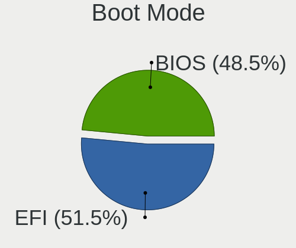
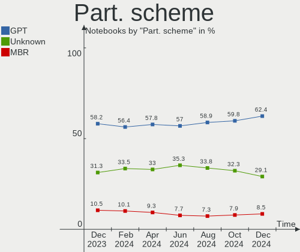
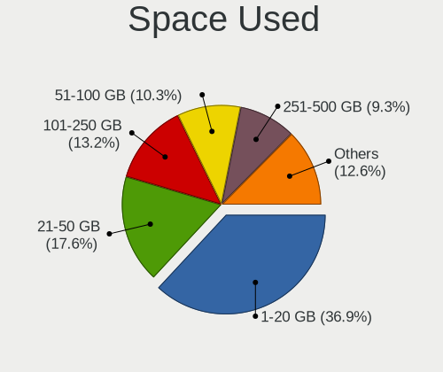
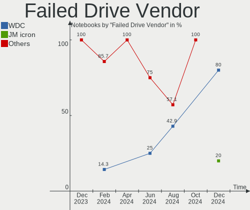
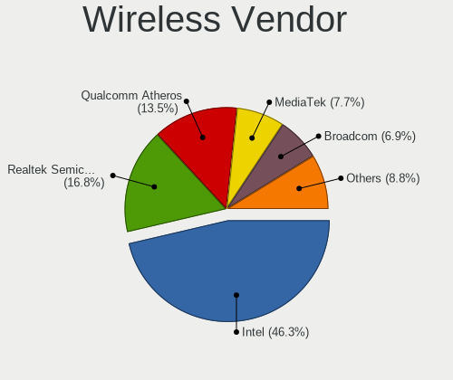

Linux Hardware Trends (Notebooks)
---------------------------------

A project to identify most popular hardware characteristics and track their change
over time based on data collected by Linux users at https://Linux-Hardware.org.

Anyone can contribute to this report by the [hw-probe](https://github.com/linuxhw/hw-probe) tool:

    sudo -E hw-probe -all -upload

Full-feature report is available here: https://linux-hardware.org/?view=trends

Period: Jan, 2022.

Contents
--------

* [ System ](#system)
  - [ OS                       ](#os)
  - [ OS Family                ](#os-family)
  - [ Kernel                   ](#kernel)
  - [ Kernel Family            ](#kernel-family)
  - [ Kernel Major Ver.        ](#kernel-major-ver)
  - [ Arch                     ](#arch)
  - [ DE                       ](#de)
  - [ Display Server           ](#display-server)
  - [ Display Manager          ](#display-manager)
  - [ OS Lang                  ](#os-lang)
  - [ Boot Mode                ](#boot-mode)
  - [ Filesystem               ](#filesystem)
  - [ Part. scheme             ](#part-scheme)
  - [ Dual Boot with Linux/BSD ](#dual-boot-with-linuxbsd)
  - [ Dual Boot (Win)          ](#dual-boot-win)

* [ Board ](#board)
  - [ Vendor                   ](#vendor)
  - [ Model                    ](#model)
  - [ Model Family             ](#model-family)
  - [ MFG Year                 ](#mfg-year)
  - [ Form Factor              ](#form-factor)
  - [ Secure Boot              ](#secure-boot)
  - [ Coreboot                 ](#coreboot)
  - [ RAM Size                 ](#ram-size)
  - [ RAM Used                 ](#ram-used)
  - [ Total Drives             ](#total-drives)
  - [ Has CD-ROM               ](#has-cd-rom)
  - [ Has Ethernet             ](#has-ethernet)
  - [ Has WiFi                 ](#has-wifi)
  - [ Has Bluetooth            ](#has-bluetooth)

* [ Location ](#location)
  - [ Country                  ](#country)
  - [ City                     ](#city)

* [ Drives ](#drives)
  - [ Drive Vendor             ](#drive-vendor)
  - [ Drive Model              ](#drive-model)
  - [ HDD Vendor               ](#hdd-vendor)
  - [ SSD Vendor               ](#ssd-vendor)
  - [ Drive Kind               ](#drive-kind)
  - [ Drive Connector          ](#drive-connector)
  - [ Drive Size               ](#drive-size)
  - [ Space Total              ](#space-total)
  - [ Space Used               ](#space-used)
  - [ Malfunc. Drives          ](#malfunc-drives)
  - [ Malfunc. Drive Vendor    ](#malfunc-drive-vendor)
  - [ Malfunc. HDD Vendor      ](#malfunc-hdd-vendor)
  - [ Malfunc. Drive Kind      ](#malfunc-drive-kind)
  - [ Failed Drives            ](#failed-drives)
  - [ Failed Drive Vendor      ](#failed-drive-vendor)
  - [ Drive Status             ](#drive-status)

* [ Storage controller ](#storage-controller)
  - [ Storage Vendor           ](#storage-vendor)
  - [ Storage Model            ](#storage-model)
  - [ Storage Kind             ](#storage-kind)

* [ Processor ](#processor)
  - [ CPU Vendor               ](#cpu-vendor)
  - [ CPU Model                ](#cpu-model)
  - [ CPU Model Family         ](#cpu-model-family)
  - [ CPU Cores                ](#cpu-cores)
  - [ CPU Sockets              ](#cpu-sockets)
  - [ CPU Threads              ](#cpu-threads)
  - [ CPU Op-Modes             ](#cpu-op-modes)
  - [ CPU Microcode            ](#cpu-microcode)
  - [ CPU Microarch            ](#cpu-microarch)

* [ Graphics ](#graphics)
  - [ GPU Vendor               ](#gpu-vendor)
  - [ GPU Model                ](#gpu-model)
  - [ GPU Combo                ](#gpu-combo)
  - [ GPU Driver               ](#gpu-driver)
  - [ GPU Memory               ](#gpu-memory)

* [ Monitor ](#monitor)
  - [ Monitor Vendor           ](#monitor-vendor)
  - [ Monitor Model            ](#monitor-model)
  - [ Monitor Resolution       ](#monitor-resolution)
  - [ Monitor Diagonal         ](#monitor-diagonal)
  - [ Monitor Width            ](#monitor-width)
  - [ Aspect Ratio             ](#aspect-ratio)
  - [ Monitor Area             ](#monitor-area)
  - [ Pixel Density            ](#pixel-density)
  - [ Multiple Monitors        ](#multiple-monitors)

* [ Network ](#network)
  - [ Net Controller Vendor    ](#net-controller-vendor)
  - [ Net Controller Model     ](#net-controller-model)
  - [ Wireless Vendor          ](#wireless-vendor)
  - [ Wireless Model           ](#wireless-model)
  - [ Ethernet Vendor          ](#ethernet-vendor)
  - [ Ethernet Model           ](#ethernet-model)
  - [ Net Controller Kind      ](#net-controller-kind)
  - [ Used Controller          ](#used-controller)
  - [ NICs                     ](#nics)
  - [ IPv6                     ](#ipv6)

* [ Bluetooth ](#bluetooth)
  - [ Bluetooth Vendor         ](#bluetooth-vendor)
  - [ Bluetooth Model          ](#bluetooth-model)

* [ Sound ](#sound)
  - [ Sound Vendor             ](#sound-vendor)
  - [ Sound Model              ](#sound-model)

* [ Memory ](#memory)
  - [ Memory Vendor            ](#memory-vendor)
  - [ Memory Model             ](#memory-model)
  - [ Memory Kind              ](#memory-kind)
  - [ Memory Form Factor       ](#memory-form-factor)
  - [ Memory Size              ](#memory-size)
  - [ Memory Speed             ](#memory-speed)

* [ Printers & scanners ](#printers--scanners)
  - [ Printer Vendor           ](#printer-vendor)
  - [ Printer Model            ](#printer-model)
  - [ Scanner Vendor           ](#scanner-vendor)
  - [ Scanner Model            ](#scanner-model)

* [ Camera ](#camera)
  - [ Camera Vendor            ](#camera-vendor)
  - [ Camera Model             ](#camera-model)

* [ Security ](#security)
  - [ Fingerprint Vendor       ](#fingerprint-vendor)
  - [ Fingerprint Model        ](#fingerprint-model)
  - [ Chipcard Vendor          ](#chipcard-vendor)
  - [ Chipcard Model           ](#chipcard-model)

* [ Unsupported ](#unsupported)
  - [ Unsupported Devices      ](#unsupported-devices)
  - [ Unsupported Device Types ](#unsupported-device-types)

System
------

OS
--

Installed operating systems

| Name                 | Notebooks | Percent |
|----------------------|-----------|---------|
| Ubuntu 20.04         | 428       | 16.04%  |
| Linux Mint 20.3      | 190       | 7.12%   |
| Ubuntu 21.10         | 183       | 6.86%   |
| Pop!_OS 21.10        | 152       | 5.7%    |
| Debian 11            | 132       | 4.95%   |
| Fedora 35            | 127       | 4.76%   |
| OpenMandriva 4.2     | 98        | 3.67%   |
| Linux Mint 20.2      | 98        | 3.67%   |
| Zorin 16             | 96        | 3.6%    |
| Elementary 6.1       | 78        | 2.92%   |
| KDE neon 20.04       | 63        | 2.36%   |
| Manjaro 21.2.1       | 47        | 1.76%   |
| Arch Rolling         | 47        | 1.76%   |
| Arch                 | 44        | 1.65%   |
| Xubuntu 20.04        | 37        | 1.39%   |
| BlackPanther 18.1    | 36        | 1.35%   |
| Manjaro              | 34        | 1.27%   |
| ArcoLinux Rolling    | 34        | 1.27%   |
| Ubuntu 18.04         | 29        | 1.09%   |
| ROSA R11.1           | 29        | 1.09%   |
| ROSA 12.1            | 27        | 1.01%   |
| OpenMandriva 4.50    | 27        | 1.01%   |
| Kubuntu 21.10        | 25        | 0.94%   |
| Kali 2021.4          | 25        | 0.94%   |
| Endless 4.0.2        | 25        | 0.94%   |
| Manjaro 21.2.2       | 21        | 0.79%   |
| Kubuntu 20.04        | 20        | 0.75%   |
| Pop!_OS 20.04        | 18        | 0.67%   |
| Linux Mint 19.3      | 18        | 0.67%   |
| EndeavourOS Rolling  | 18        | 0.67%   |
| Ubuntu 21.04         | 15        | 0.56%   |
| Xubuntu 21.10        | 14        | 0.52%   |
| Pop!_OS 21.04        | 14        | 0.52%   |
| Linux Mint 20.1      | 14        | 0.52%   |
| Fedora 34            | 14        | 0.52%   |
| Gentoo 2.8           | 13        | 0.49%   |
| Xubuntu 18.04        | 11        | 0.41%   |
| LinuxFX 11           | 11        | 0.41%   |
| Gentoo 2.6           | 11        | 0.41%   |
| Debian Unstable      | 11        | 0.41%   |
| Debian Testing       | 11        | 0.41%   |
| Zorin 15             | 10        | 0.37%   |
| Ubuntu 22.04         | 10        | 0.37%   |
| MX 21                | 10        | 0.37%   |
| Garuda Linux Soaring | 10        | 0.37%   |
| Gentoo 2.7           | 9         | 0.34%   |
| Lubuntu 21.10        | 8         | 0.3%    |
| Lubuntu 20.04        | 8         | 0.3%    |
| LMDE 4               | 7         | 0.26%   |
| Clear Linux 35000    | 7         | 0.26%   |
| Ubuntu MATE 20.04    | 6         | 0.22%   |
| Ubuntu Budgie 21.10  | 6         | 0.22%   |
| Kubuntu 21.04        | 6         | 0.22%   |
| Kubuntu 11           | 6         | 0.22%   |
| Elementary 6         | 6         | 0.22%   |
| Ubuntu Budgie 20.04  | 5         | 0.19%   |
| Parrot 5.0           | 5         | 0.19%   |
| Manjaro 21.2.0       | 5         | 0.19%   |
| Debian 10            | 5         | 0.19%   |
| Xero Rolling         | 4         | 0.15%   |

OS Family
---------

OS without a version

| Name              | Notebooks | Percent |
|-------------------|-----------|---------|
| Ubuntu            | 669       | 25.07%  |
| Linux Mint        | 332       | 12.44%  |
| Pop!_OS           | 187       | 7.01%   |
| Debian            | 167       | 6.26%   |
| Fedora            | 146       | 5.47%   |
| OpenMandriva      | 125       | 4.68%   |
| Manjaro           | 107       | 4.01%   |
| Zorin             | 106       | 3.97%   |
| Arch              | 91        | 3.41%   |
| Elementary        | 88        | 3.3%    |
| Xubuntu           | 63        | 2.36%   |
| KDE neon          | 63        | 2.36%   |
| ROSA              | 62        | 2.32%   |
| Kubuntu           | 59        | 2.21%   |
| Endless           | 37        | 1.39%   |
| ArcoLinux         | 37        | 1.39%   |
| BlackPanther      | 36        | 1.35%   |
| Gentoo            | 33        | 1.24%   |
| Kali              | 27        | 1.01%   |
| EndeavourOS       | 22        | 0.82%   |
| openSUSE          | 21        | 0.79%   |
| Lubuntu           | 21        | 0.79%   |
| Ubuntu MATE       | 13        | 0.49%   |
| Ubuntu Budgie     | 12        | 0.45%   |
| Garuda Linux      | 12        | 0.45%   |
| MX                | 11        | 0.41%   |
| LinuxFX           | 11        | 0.41%   |
| Clear Linux       | 11        | 0.41%   |
| LMDE              | 7         | 0.26%   |
| RHEL              | 6         | 0.22%   |
| Parrot            | 6         | 0.22%   |
| Xero              | 5         | 0.19%   |
| Void Linux        | 5         | 0.19%   |
| Artix             | 5         | 0.19%   |
| UbuntuDDE         | 4         | 0.15%   |
| Ubuntu Studio     | 4         | 0.15%   |
| Rocky Linux       | 4         | 0.15%   |
| Devuan            | 4         | 0.15%   |
| CentOS            | 4         | 0.15%   |
| Linux Lite        | 3         | 0.11%   |
| ALT Linux         | 3         | 0.11%   |
| Solus             | 2         | 0.07%   |
| Slackware         | 2         | 0.07%   |
| Siduction         | 2         | 0.07%   |
| Redcore           | 2         | 0.07%   |
| Peppermint        | 2         | 0.07%   |
| Pardus            | 2         | 0.07%   |
| GNOME OS          | 2         | 0.07%   |
| Drauger OS        | 2         | 0.07%   |
| Deepin            | 2         | 0.07%   |
| Archcraft         | 2         | 0.07%   |
| antiX             | 2         | 0.07%   |
| Alpine            | 2         | 0.07%   |
| Ultramarine Linux | 1         | 0.04%   |
| Sodalite          | 1         | 0.04%   |
| Q4OS              | 1         | 0.04%   |
| PostmarketOS      | 1         | 0.04%   |
| Point Linux       | 1         | 0.04%   |
| Org.kde.platform  | 1         | 0.04%   |
| Oracle Linux      | 1         | 0.04%   |

Kernel
------

Version of the Linux kernel

| Version                             | Notebooks | Percent |
|-------------------------------------|-----------|---------|
| 5.13.0-27-generic                   | 263       | 9.85%   |
| 5.11.0-46-generic                   | 134       | 5.02%   |
| 5.11.0-44-generic                   | 129       | 4.83%   |
| 5.11.0-43-generic                   | 124       | 4.65%   |
| 5.4.0-96-generic                    | 122       | 4.57%   |
| 5.4.0-91-generic                    | 94        | 3.52%   |
| 5.10.14-desktop-1omv4002            | 92        | 3.45%   |
| 5.4.0-92-generic                    | 81        | 3.03%   |
| 5.13.0-25-generic                   | 76        | 2.85%   |
| 5.10.0-10-amd64                     | 68        | 2.55%   |
| 5.4.0-94-generic                    | 65        | 2.44%   |
| 5.15.8-76051508-generic             | 56        | 2.1%    |
| 5.15.12-1-MANJARO                   | 50        | 1.87%   |
| 5.15.11-76051511-generic            | 49        | 1.84%   |
| 5.13.0-23-generic                   | 46        | 1.72%   |
| 5.15.12-200.fc35.x86_64             | 39        | 1.46%   |
| 5.15.15-76051515-generic            | 38        | 1.42%   |
| 5.13.0-22-generic                   | 37        | 1.39%   |
| 5.15.5-76051505-generic             | 28        | 1.05%   |
| 5.11.0-35-generic                   | 28        | 1.05%   |
| 5.11.0-27-generic                   | 28        | 1.05%   |
| 5.10.74-generic-2rosa2021.1-x86_64  | 27        | 1.01%   |
| 5.15.12-arch1-1                     | 26        | 0.97%   |
| 5.16.2-arch1-1                      | 25        | 0.94%   |
| 5.15.16-200.fc35.x86_64             | 24        | 0.9%    |
| 5.10.0-11-amd64                     | 24        | 0.9%    |
| 5.11.0-41-generic                   | 22        | 0.82%   |
| 5.6.14-desktop-2bP                  | 21        | 0.79%   |
| 5.15.0-2-amd64                      | 21        | 0.79%   |
| 5.13.0-19-generic                   | 19        | 0.71%   |
| 5.15.0-kali2-amd64                  | 17        | 0.64%   |
| 5.15.14-200.fc35.x86_64             | 16        | 0.6%    |
| 5.15.13-arch1-1                     | 16        | 0.6%    |
| 5.15.13-200.fc35.x86_64             | 16        | 0.6%    |
| 4.18.16-desktop-1bP                 | 15        | 0.56%   |
| 5.4.0-74-generic                    | 14        | 0.52%   |
| 4.15.0-166-generic                  | 14        | 0.52%   |
| 5.16.1-arch1-1                      | 12        | 0.45%   |
| 5.16.0-arch1-1                      | 12        | 0.45%   |
| 5.13.0-28-generic                   | 12        | 0.45%   |
| 5.10.0-7-amd64                      | 12        | 0.45%   |
| 5.15.16-1-MANJARO                   | 10        | 0.37%   |
| 5.15.12-zen1-1-zen                  | 10        | 0.37%   |
| 5.14.7-desktop-1omv4050             | 10        | 0.37%   |
| 5.12.4-desktop-1omv4050             | 10        | 0.37%   |
| 5.11.0-38-generic                   | 10        | 0.37%   |
| 4.15.0-desktop-122.124.1rosa-x86_64 | 9         | 0.34%   |
| 5.16.2-zen1-1-zen                   | 8         | 0.3%    |
| 5.16.2-1-MANJARO                    | 8         | 0.3%    |
| 5.14.0-9parrot1-amd64               | 8         | 0.3%    |
| 5.10.89-1-MANJARO                   | 8         | 0.3%    |
| 4.19.0-18-amd64                     | 8         | 0.3%    |
| 5.15.10-arch1-1                     | 7         | 0.26%   |
| 5.13.19-2-MANJARO                   | 7         | 0.26%   |
| 5.16.0-1-MANJARO                    | 6         | 0.22%   |
| 5.15.7-1-MANJARO                    | 6         | 0.22%   |
| 5.15.15-200.fc35.x86_64             | 6         | 0.22%   |
| 5.15.12-1-default                   | 6         | 0.22%   |
| 5.15.0-0.bpo.2-amd64                | 6         | 0.22%   |
| 5.13.13-1070.native                 | 6         | 0.22%   |

Kernel Family
-------------

Linux kernel without a distro release

| Version | Notebooks | Percent |
|---------|-----------|---------|
| 5.11.0  | 504       | 18.88%  |
| 5.13.0  | 476       | 17.83%  |
| 5.4.0   | 410       | 15.36%  |
| 5.15.12 | 151       | 5.66%   |
| 5.10.0  | 140       | 5.25%   |
| 5.10.14 | 92        | 3.45%   |
| 5.15.11 | 68        | 2.55%   |
| 5.15.0  | 66        | 2.47%   |
| 5.15.8  | 58        | 2.17%   |
| 5.16.2  | 54        | 2.02%   |
| 5.15.15 | 51        | 1.91%   |
| 5.15.13 | 51        | 1.91%   |
| 5.15.16 | 45        | 1.69%   |
| 4.15.0  | 44        | 1.65%   |
| 5.16.0  | 41        | 1.54%   |
| 5.15.5  | 32        | 1.2%    |
| 5.16.1  | 30        | 1.12%   |
| 5.10.74 | 27        | 1.01%   |
| 5.14.0  | 25        | 0.94%   |
| 5.15.14 | 22        | 0.82%   |
| 5.6.14  | 21        | 0.79%   |
| 5.8.0   | 16        | 0.6%    |
| 4.18.16 | 15        | 0.56%   |
| 4.18.0  | 14        | 0.52%   |
| 5.15.10 | 12        | 0.45%   |
| 5.13.19 | 12        | 0.45%   |
| 4.19.0  | 12        | 0.45%   |
| 5.14.7  | 10        | 0.37%   |
| 5.12.4  | 10        | 0.37%   |
| 5.11.12 | 10        | 0.37%   |
| 5.10.89 | 9         | 0.34%   |
| 5.15.7  | 8         | 0.3%    |
| 5.4.83  | 7         | 0.26%   |
| 5.4.32  | 7         | 0.26%   |
| 5.16.3  | 6         | 0.22%   |
| 5.14.14 | 6         | 0.22%   |
| 5.13.13 | 6         | 0.22%   |
| 5.10.93 | 6         | 0.22%   |
| 5.15.17 | 5         | 0.19%   |
| 5.14.18 | 5         | 0.19%   |
| 5.10.88 | 5         | 0.19%   |
| 5.16.4  | 4         | 0.15%   |
| 5.14.10 | 4         | 0.15%   |
| 4.4.0   | 4         | 0.15%   |
| 5.8.18  | 3         | 0.11%   |
| 5.14.9  | 3         | 0.11%   |
| 5.14.21 | 3         | 0.11%   |
| 5.11.22 | 3         | 0.11%   |
| 5.10.61 | 3         | 0.11%   |
| 4.9.155 | 3         | 0.11%   |
| 5.9.16  | 2         | 0.07%   |
| 5.3.18  | 2         | 0.07%   |
| 5.3.0   | 2         | 0.07%   |
| 5.15.6  | 2         | 0.07%   |
| 5.15.3  | 2         | 0.07%   |
| 5.14.16 | 2         | 0.07%   |
| 5.14.11 | 2         | 0.07%   |
| 5.10.90 | 2         | 0.07%   |
| 5.10.71 | 2         | 0.07%   |
| 5.0.0   | 2         | 0.07%   |

Kernel Major Ver.
-----------------

Linux kernel major version

| Version | Notebooks | Percent |
|---------|-----------|---------|
| 5.15    | 574       | 21.51%  |
| 5.11    | 517       | 19.37%  |
| 5.13    | 498       | 18.66%  |
| 5.4     | 425       | 15.92%  |
| 5.10    | 293       | 10.98%  |
| 5.16    | 135       | 5.06%   |
| 5.14    | 61        | 2.29%   |
| 4.15    | 44        | 1.65%   |
| 4.18    | 29        | 1.09%   |
| 5.6     | 22        | 0.82%   |
| 5.8     | 19        | 0.71%   |
| 4.19    | 14        | 0.52%   |
| 5.12    | 11        | 0.41%   |
| 4.9     | 6         | 0.22%   |
| 4.4     | 5         | 0.19%   |
| 5.9     | 4         | 0.15%   |
| 5.3     | 4         | 0.15%   |
| 5.0     | 2         | 0.07%   |
| 3.10    | 2         | 0.07%   |
| 5.17    | 1         | 0.04%   |
| 4.1     | 1         | 0.04%   |
| 3.16    | 1         | 0.04%   |
| Unknown | 1         | 0.04%   |

Arch
----

OS architecture (x86_64, i586, etc.)

| Name    | Notebooks | Percent |
|---------|-----------|---------|
| x86_64  | 2611      | 97.83%  |
| i686    | 56        | 2.1%    |
| armv7l  | 1         | 0.04%   |
| Unknown | 1         | 0.04%   |

DE
--

Desktop Environment

| Name                         | Notebooks | Percent |
|------------------------------|-----------|---------|
| GNOME                        | 1231      | 46.12%  |
| KDE5                         | 521       | 19.52%  |
| X-Cinnamon                   | 251       | 9.4%    |
| XFCE                         | 221       | 8.28%   |
| Unknown                      | 92        | 3.45%   |
| Pantheon                     | 88        | 3.3%    |
| MATE                         | 65        | 2.44%   |
| Cinnamon                     | 36        | 1.35%   |
| LXQt                         | 27        | 1.01%   |
| KDE4                         | 21        | 0.79%   |
| Budgie                       | 17        | 0.64%   |
| LXDE                         | 15        | 0.56%   |
| i3                           | 14        | 0.52%   |
| GNOME Flashback              | 8         | 0.3%    |
| Unity                        | 7         | 0.26%   |
| Deepin                       | 7         | 0.26%   |
| awesome                      | 7         | 0.26%   |
| sway                         | 6         | 0.22%   |
| KDE                          | 6         | 0.22%   |
| bspwm                        | 4         | 0.15%   |
| lightdm-xsession             | 3         | 0.11%   |
| LeftWM                       | 3         | 0.11%   |
| xmonad                       | 2         | 0.07%   |
| GNOME Classic                | 2         | 0.07%   |
| trinity                      | 1         | 0.04%   |
| spectrwm                     | 1         | 0.04%   |
| river                        | 1         | 0.04%   |
| qtile                        | 1         | 0.04%   |
| jwm                          | 1         | 0.04%   |
| icewm                        | 1         | 0.04%   |
| i3-with-shmlog               | 1         | 0.04%   |
| GNOME-Subgraph-Classic:GNOME | 1         | 0.04%   |
| fvwm                         | 1         | 0.04%   |
| Enlightenment                | 1         | 0.04%   |
| dwm                          | 1         | 0.04%   |
| cwm                          | 1         | 0.04%   |
| Cutefish                     | 1         | 0.04%   |
| awesomeminimal               | 1         | 0.04%   |
| /usr/bin/openbox-session     | 1         | 0.04%   |

Display Server
--------------

X11 or Wayland

| Name    | Notebooks | Percent |
|---------|-----------|---------|
| X11     | 2164      | 81.08%  |
| Wayland | 425       | 15.92%  |
| Unknown | 44        | 1.65%   |
| Tty     | 36        | 1.35%   |

Display Manager
---------------

SDDM, LightDM, etc.

| Name    | Notebooks | Percent |
|---------|-----------|---------|
| Unknown | 866       | 32.45%  |
| GDM     | 479       | 17.95%  |
| LightDM | 461       | 17.27%  |
| SDDM    | 419       | 15.7%   |
| GDM3    | 407       | 15.25%  |
| KDM     | 20        | 0.75%   |
| SLiM    | 5         | 0.19%   |
| XDM     | 4         | 0.15%   |
| GREETD  | 3         | 0.11%   |
| Ly      | 2         | 0.07%   |
| LXDM    | 2         | 0.07%   |
| NODM    | 1         | 0.04%   |

OS Lang
-------

Language

| Lang        | Notebooks | Percent |
|-------------|-----------|---------|
| en_US       | 1119      | 41.93%  |
| de_DE       | 266       | 9.97%   |
| en_GB       | 146       | 5.47%   |
| ru_RU       | 144       | 5.4%    |
| fr_FR       | 130       | 4.87%   |
| pt_BR       | 116       | 4.35%   |
| it_IT       | 71        | 2.66%   |
| Unknown     | 62        | 2.32%   |
| en_IN       | 54        | 2.02%   |
| pl_PL       | 52        | 1.95%   |
| es_ES       | 48        | 1.8%    |
| C           | 46        | 1.72%   |
| en_CA       | 44        | 1.65%   |
| en_AU       | 39        | 1.46%   |
| nl_NL       | 25        | 0.94%   |
| cs_CZ       | 25        | 0.94%   |
| es_MX       | 23        | 0.86%   |
| hu_HU       | 21        | 0.79%   |
| pt_PT       | 13        | 0.49%   |
| ru_UA       | 12        | 0.45%   |
| es_AR       | 12        | 0.45%   |
| de_CH       | 11        | 0.41%   |
| ja_JP       | 10        | 0.37%   |
| en_ZA       | 10        | 0.37%   |
| de_AT       | 10        | 0.37%   |
| tr_TR       | 8         | 0.3%    |
| ro_RO       | 8         | 0.3%    |
| nl_BE       | 8         | 0.3%    |
| fi_FI       | 8         | 0.3%    |
| en_DK       | 8         | 0.3%    |
| da_DK       | 8         | 0.3%    |
| sv_SE       | 7         | 0.26%   |
| fr_CA       | 7         | 0.26%   |
| zh_CN       | 6         | 0.22%   |
| es_CL       | 6         | 0.22%   |
| sk_SK       | 5         | 0.19%   |
| id_ID       | 5         | 0.19%   |
| uk_UA       | 4         | 0.15%   |
| nb_NO       | 4         | 0.15%   |
| hr_HR       | 4         | 0.15%   |
| fr_BE       | 4         | 0.15%   |
| en_NZ       | 4         | 0.15%   |
| el_GR       | 4         | 0.15%   |
| bg_BG       | 4         | 0.15%   |
| POSIX       | 3         | 0.11%   |
| es_PE       | 3         | 0.11%   |
| es_CO       | 3         | 0.11%   |
| en_SG       | 3         | 0.11%   |
| en_NG       | 3         | 0.11%   |
| en_IL       | 3         | 0.11%   |
| C.UTF8      | 3         | 0.11%   |
| ru_RU.UTF_8 | 2         | 0.07%   |
| es_VE       | 2         | 0.07%   |
| es_SV       | 2         | 0.07%   |
| es_PY       | 2         | 0.07%   |
| en_IE       | 2         | 0.07%   |
| ca_ES       | 2         | 0.07%   |
| zh_TW       | 1         | 0.04%   |
| szl_PL      | 1         | 0.04%   |
| sr_RS       | 1         | 0.04%   |

Boot Mode
---------

EFI or BIOS

| Mode | Notebooks | Percent |
|------|-----------|---------|
| EFI  | 1452      | 54.4%   |
| BIOS | 1217      | 45.6%   |

Filesystem
----------

Type of filesystem

| Type     | Notebooks | Percent |
|----------|-----------|---------|
| Ext4     | 2159      | 80.89%  |
| Btrfs    | 235       | 8.8%    |
| Overlay  | 198       | 7.42%   |
| Xfs      | 36        | 1.35%   |
| Zfs      | 13        | 0.49%   |
| Ext3     | 10        | 0.37%   |
| F2fs     | 7         | 0.26%   |
| Ext2     | 6         | 0.22%   |
| Unknown  | 2         | 0.07%   |
| Tmpfs    | 1         | 0.04%   |
| Reiserfs | 1         | 0.04%   |
| Aufs     | 1         | 0.04%   |

Part. scheme
------------

Scheme of partitioning

| Type    | Notebooks | Percent |
|---------|-----------|---------|
| Unknown | 1331      | 49.87%  |
| GPT     | 1023      | 38.33%  |
| MBR     | 315       | 11.8%   |

Dual Boot with Linux/BSD
------------------------

Hosting more than one Linux/BSD

| Dual boot | Notebooks | Percent |
|-----------|-----------|---------|
| No        | 2391      | 89.58%  |
| Yes       | 278       | 10.42%  |

Dual Boot (Win)
---------------

Hosting Linux and Windows

| Dual boot | Notebooks | Percent |
|-----------|-----------|---------|
| No        | 1939      | 72.65%  |
| Yes       | 730       | 27.35%  |

Board
-----

Vendor
------

Motherboard manufacturer

| Name                 | Notebooks | Percent |
|----------------------|-----------|---------|
| Lenovo               | 577       | 21.62%  |
| Dell                 | 444       | 16.64%  |
| Hewlett-Packard      | 435       | 16.3%   |
| ASUSTek Computer     | 301       | 11.28%  |
| Acer                 | 237       | 8.88%   |
| Apple                | 73        | 2.74%   |
| Toshiba              | 64        | 2.4%    |
| MSI                  | 63        | 2.36%   |
| Samsung Electronics  | 49        | 1.84%   |
| Sony                 | 44        | 1.65%   |
| HUAWEI               | 36        | 1.35%   |
| Packard Bell         | 20        | 0.75%   |
| Fujitsu              | 20        | 0.75%   |
| Timi                 | 17        | 0.64%   |
| Medion               | 16        | 0.6%    |
| Google               | 16        | 0.6%    |
| Unknown              | 16        | 0.6%    |
| Positivo             | 14        | 0.52%   |
| Notebook             | 14        | 0.52%   |
| System76             | 13        | 0.49%   |
| TUXEDO               | 12        | 0.45%   |
| Alienware            | 12        | 0.45%   |
| Razer                | 8         | 0.3%    |
| LG Electronics       | 8         | 0.3%    |
| Fujitsu Siemens      | 8         | 0.3%    |
| Gateway              | 7         | 0.26%   |
| Framework            | 6         | 0.22%   |
| Clevo                | 6         | 0.22%   |
| Aquarius             | 6         | 0.22%   |
| Jumper               | 5         | 0.19%   |
| HONOR                | 5         | 0.19%   |
| eMachines            | 5         | 0.19%   |
| Schenker             | 4         | 0.15%   |
| IBM                  | 4         | 0.15%   |
| Gigabyte Technology  | 4         | 0.15%   |
| Chuwi                | 4         | 0.15%   |
| Wortmann AG          | 3         | 0.11%   |
| Star Labs            | 3         | 0.11%   |
| Panasonic            | 3         | 0.11%   |
| Monster              | 3         | 0.11%   |
| Mediacom             | 3         | 0.11%   |
| GPD                  | 3         | 0.11%   |
| Dynabook             | 3         | 0.11%   |
| Compal               | 3         | 0.11%   |
| AMI                  | 3         | 0.11%   |
| Teclast              | 2         | 0.07%   |
| Multilaser           | 2         | 0.07%   |
| Itautec              | 2         | 0.07%   |
| Irbis                | 2         | 0.07%   |
| Intel Client Systems | 2         | 0.07%   |
| Insyde               | 2         | 0.07%   |
| GPU Company          | 2         | 0.07%   |
| EVOO                 | 2         | 0.07%   |
| YJKC                 | 1         | 0.04%   |
| YiFang               | 1         | 0.04%   |
| WinSome              | 1         | 0.04%   |
| win element          | 1         | 0.04%   |
| VIT                  | 1         | 0.04%   |
| Viglen               | 1         | 0.04%   |
| UNOWHY               | 1         | 0.04%   |

Model
-----

Motherboard model

| Name                                        | Notebooks | Percent |
|---------------------------------------------|-----------|---------|
| Unknown                                     | 23        | 0.86%   |
| HP Notebook                                 | 18        | 0.67%   |
| HP Pavilion Gaming Laptop 15-ec1xxx         | 9         | 0.34%   |
| Acer Swift SF114-34                         | 8         | 0.3%    |
| Dell Inspiron 5570                          | 7         | 0.26%   |
| Dell Inspiron 15-3567                       | 7         | 0.26%   |
| Apple MacBookPro9,2                         | 7         | 0.26%   |
| Lenovo G50-70 20351                         | 6         | 0.22%   |
| HUAWEI NBLK-WAX9X                           | 6         | 0.22%   |
| HP ProBook 6470b                            | 6         | 0.22%   |
| HP Pavilion g6                              | 6         | 0.22%   |
| HP Pavilion dv7                             | 6         | 0.22%   |
| HP Laptop 15-db0xxx                         | 6         | 0.22%   |
| HP EliteBook 820 G1                         | 6         | 0.22%   |
| Framework Laptop                            | 6         | 0.22%   |
| Dell XPS 15 9570                            | 6         | 0.22%   |
| Dell XPS 15 7590                            | 6         | 0.22%   |
| Dell XPS 13 9310                            | 6         | 0.22%   |
| Dell XPS 13 7390                            | 6         | 0.22%   |
| Dell Latitude E7440                         | 6         | 0.22%   |
| Dell Latitude 7490                          | 6         | 0.22%   |
| Dell Latitude 5480                          | 6         | 0.22%   |
| Dell Inspiron N5110                         | 6         | 0.22%   |
| Dell Inspiron 3451                          | 6         | 0.22%   |
| ASUS VivoBook_ASUSLaptop X515DA_M515DA      | 6         | 0.22%   |
| ASUS UX31E                                  | 6         | 0.22%   |
| Aquarius NS585                              | 6         | 0.22%   |
| Apple MacBookPro8,1                         | 6         | 0.22%   |
| Apple MacBookPro5,5                         | 6         | 0.22%   |
| Toshiba Satellite A300                      | 5         | 0.19%   |
| Lenovo Legion Y530-15ICH 81FV               | 5         | 0.19%   |
| Lenovo IdeaPad 330-15IKB 81DE               | 5         | 0.19%   |
| Lenovo IdeaPad 3 15IIL05 81WE               | 5         | 0.19%   |
| Jumper EZbook                               | 5         | 0.19%   |
| HP ProBook 445 G7                           | 5         | 0.19%   |
| HP Pavilion Gaming Laptop 15-ec2xxx         | 5         | 0.19%   |
| HP EliteBook 8440p                          | 5         | 0.19%   |
| HP 250 G7 Notebook PC                       | 5         | 0.19%   |
| Dell Vostro 3500                            | 5         | 0.19%   |
| Dell Latitude E6540                         | 5         | 0.19%   |
| Dell Latitude E6520                         | 5         | 0.19%   |
| Dell Latitude E6510                         | 5         | 0.19%   |
| Dell Latitude E6410                         | 5         | 0.19%   |
| Dell Latitude E6400                         | 5         | 0.19%   |
| Dell Latitude E5570                         | 5         | 0.19%   |
| Dell Latitude E5470                         | 5         | 0.19%   |
| Dell Latitude 7480                          | 5         | 0.19%   |
| Dell Inspiron 3505                          | 5         | 0.19%   |
| Dell Inspiron 1545                          | 5         | 0.19%   |
| Dell Inspiron 1525                          | 5         | 0.19%   |
| ASUS X553MA                                 | 5         | 0.19%   |
| Acer Nitro AN515-44                         | 5         | 0.19%   |
| Acer Aspire A315-42                         | 5         | 0.19%   |
| Acer Aspire A315-21                         | 5         | 0.19%   |
| Samsung RV411/RV511/E3511/S3511/RV711/E3411 | 4         | 0.15%   |
| Lenovo Y520-15IKBN 80WK                     | 4         | 0.15%   |
| Lenovo ThinkBook 15 G2 ITL 20VE             | 4         | 0.15%   |
| Lenovo ThinkBook 15 G2 ARE 20VG             | 4         | 0.15%   |
| Lenovo IdeaPad S145-15API 81V7              | 4         | 0.15%   |
| Lenovo IdeaPad Gaming 3 15ACH6 82K2         | 4         | 0.15%   |

Model Family
------------

Motherboard model prefix

| Name                  | Notebooks | Percent |
|-----------------------|-----------|---------|
| Lenovo ThinkPad       | 283       | 10.6%   |
| Dell Latitude         | 161       | 6.03%   |
| Acer Aspire           | 157       | 5.88%   |
| Dell Inspiron         | 142       | 5.32%   |
| Lenovo IdeaPad        | 138       | 5.17%   |
| HP Pavilion           | 96        | 3.6%    |
| HP ProBook            | 77        | 2.88%   |
| HP EliteBook          | 77        | 2.88%   |
| HP Laptop             | 60        | 2.25%   |
| Dell XPS              | 58        | 2.17%   |
| ASUS VivoBook         | 54        | 2.02%   |
| Toshiba Satellite     | 52        | 1.95%   |
| Dell Vostro           | 36        | 1.35%   |
| Lenovo Legion         | 29        | 1.09%   |
| Dell Precision        | 29        | 1.09%   |
| ASUS ROG              | 29        | 1.09%   |
| Acer Swift            | 27        | 1.01%   |
| Lenovo ThinkBook      | 24        | 0.9%    |
| Unknown               | 23        | 0.86%   |
| Packard Bell EasyNote | 20        | 0.75%   |
| Acer Nitro            | 20        | 0.75%   |
| Lenovo Yoga           | 19        | 0.71%   |
| HP Notebook           | 18        | 0.67%   |
| HP Compaq             | 17        | 0.64%   |
| Fujitsu LIFEBOOK      | 17        | 0.64%   |
| ASUS ZenBook          | 17        | 0.64%   |
| ASUS ASUS             | 16        | 0.6%    |
| HP 250                | 14        | 0.52%   |
| HP ENVY               | 12        | 0.45%   |
| HP ZBook              | 10        | 0.37%   |
| HP OMEN               | 10        | 0.37%   |
| HP 255                | 9         | 0.34%   |
| Apple MacBookPro9     | 9         | 0.34%   |
| Apple MacBookPro8     | 9         | 0.34%   |
| MSI GF63              | 8         | 0.3%    |
| ASUS TUF              | 8         | 0.3%    |
| Apple MacBookPro5     | 8         | 0.3%    |
| Acer TravelMate       | 8         | 0.3%    |
| Acer Extensa          | 8         | 0.3%    |
| Toshiba TECRA         | 7         | 0.26%   |
| Razer Blade           | 7         | 0.26%   |
| Acer Predator         | 7         | 0.26%   |
| Timi RedmiBook        | 6         | 0.22%   |
| Lenovo G50-70         | 6         | 0.22%   |
| HUAWEI NBLK-WAX9X     | 6         | 0.22%   |
| Framework Laptop      | 6         | 0.22%   |
| ASUS UX31E            | 6         | 0.22%   |
| Aquarius NS585        | 6         | 0.22%   |
| Apple MacBookPro11    | 6         | 0.22%   |
| Samsung RV411         | 5         | 0.19%   |
| MSI Modern            | 5         | 0.19%   |
| Jumper EZbook         | 5         | 0.19%   |
| Fujitsu Siemens AMILO | 5         | 0.19%   |
| ASUS X553MA           | 5         | 0.19%   |
| Apple MacBookPro16    | 5         | 0.19%   |
| Apple MacBookAir6     | 5         | 0.19%   |
| System76 Serval       | 4         | 0.15%   |
| MSI Prestige          | 4         | 0.15%   |
| MSI GS66              | 4         | 0.15%   |
| Medion Akoya          | 4         | 0.15%   |

MFG Year
--------

Motherboard manufacture year

| Year    | Notebooks | Percent |
|---------|-----------|---------|
| 2020    | 364       | 13.64%  |
| 2021    | 340       | 12.74%  |
| 2019    | 259       | 9.7%    |
| 2018    | 202       | 7.57%   |
| 2012    | 186       | 6.97%   |
| 2013    | 167       | 6.26%   |
| 2011    | 164       | 6.14%   |
| 2017    | 162       | 6.07%   |
| 2016    | 156       | 5.84%   |
| 2014    | 150       | 5.62%   |
| 2010    | 138       | 5.17%   |
| 2015    | 118       | 4.42%   |
| 2008    | 99        | 3.71%   |
| 2009    | 84        | 3.15%   |
| 2007    | 54        | 2.02%   |
| 2006    | 14        | 0.52%   |
| 2005    | 5         | 0.19%   |
| 2003    | 2         | 0.07%   |
| Unknown | 2         | 0.07%   |
| 2022    | 1         | 0.04%   |
| 2004    | 1         | 0.04%   |
| 2002    | 1         | 0.04%   |

Form Factor
-----------

Physical design of the computer

| Name     | Notebooks | Percent |
|----------|-----------|---------|
| Notebook | 2669      | 100%    |

Secure Boot
-----------

Enabled or disabled

| State    | Notebooks | Percent |
|----------|-----------|---------|
| Disabled | 2358      | 88.35%  |
| Enabled  | 311       | 11.65%  |

Coreboot
--------

Have coreboot on board

| Used | Notebooks | Percent |
|------|-----------|---------|
| No   | 2641      | 98.95%  |
| Yes  | 28        | 1.05%   |

RAM Size
--------

Total RAM memory

| Size in GB  | Notebooks | Percent |
|-------------|-----------|---------|
| 4.01-8.0    | 826       | 30.95%  |
| 3.01-4.0    | 549       | 20.57%  |
| 16.01-24.0  | 462       | 17.31%  |
| 8.01-16.0   | 427       | 16%     |
| 32.01-64.0  | 167       | 6.26%   |
| 1.01-2.0    | 105       | 3.93%   |
| 2.01-3.0    | 43        | 1.61%   |
| 64.01-256.0 | 38        | 1.42%   |
| 24.01-32.0  | 35        | 1.31%   |
| 0.51-1.0    | 16        | 0.6%    |
| Unknown     | 1         | 0.04%   |

RAM Used
--------

Used RAM memory

| Used GB    | Notebooks | Percent |
|------------|-----------|---------|
| 1.01-2.0   | 960       | 35.97%  |
| 2.01-3.0   | 675       | 25.29%  |
| 4.01-8.0   | 401       | 15.02%  |
| 3.01-4.0   | 320       | 11.99%  |
| 0.51-1.0   | 192       | 7.19%   |
| 8.01-16.0  | 82        | 3.07%   |
| 0.01-0.5   | 24        | 0.9%    |
| 16.01-24.0 | 8         | 0.3%    |
| 24.01-32.0 | 4         | 0.15%   |
| Unknown    | 2         | 0.07%   |
| 32.01-64.0 | 1         | 0.04%   |

Total Drives
------------

Number of drives on board

| Drives | Notebooks | Percent |
|--------|-----------|---------|
| 1      | 1937      | 72.57%  |
| 2      | 617       | 23.12%  |
| 3      | 91        | 3.41%   |
| 0      | 12        | 0.45%   |
| 4      | 10        | 0.37%   |
| 6      | 1         | 0.04%   |
| 5      | 1         | 0.04%   |

Has CD-ROM
----------

Has CD-ROM on board

| Presented | Notebooks | Percent |
|-----------|-----------|---------|
| No        | 1768      | 66.24%  |
| Yes       | 901       | 33.76%  |

Has Ethernet
------------

Has Ethernet on board

| Presented | Notebooks | Percent |
|-----------|-----------|---------|
| Yes       | 2153      | 80.67%  |
| No        | 516       | 19.33%  |

Has WiFi
--------

Has WiFi module

| Presented | Notebooks | Percent |
|-----------|-----------|---------|
| Yes       | 2630      | 98.54%  |
| No        | 39        | 1.46%   |

Has Bluetooth
-------------

Has Bluetooth module

| Presented | Notebooks | Percent |
|-----------|-----------|---------|
| Yes       | 2127      | 79.69%  |
| No        | 542       | 20.31%  |

Location
--------

Country
-------

Geographic location (country)

| Country      | Notebooks | Percent |
|--------------|-----------|---------|
| USA          | 406       | 15.21%  |
| Germany      | 314       | 11.76%  |
| Russia       | 167       | 6.26%   |
| Brazil       | 159       | 5.96%   |
| France       | 151       | 5.66%   |
| Italy        | 96        | 3.6%    |
| India        | 93        | 3.48%   |
| UK           | 91        | 3.41%   |
| Poland       | 89        | 3.33%   |
| Spain        | 72        | 2.7%    |
| Canada       | 72        | 2.7%    |
| Hungary      | 67        | 2.51%   |
| Netherlands  | 50        | 1.87%   |
| Ukraine      | 49        | 1.84%   |
| Czechia      | 46        | 1.72%   |
| Australia    | 43        | 1.61%   |
| Austria      | 38        | 1.42%   |
| Mexico       | 37        | 1.39%   |
| Belgium      | 35        | 1.31%   |
| Turkey       | 32        | 1.2%    |
| Sweden       | 32        | 1.2%    |
| Romania      | 32        | 1.2%    |
| Portugal     | 28        | 1.05%   |
| Indonesia    | 25        | 0.94%   |
| Switzerland  | 24        | 0.9%    |
| Denmark      | 22        | 0.82%   |
| Finland      | 21        | 0.79%   |
| Norway       | 18        | 0.67%   |
| Bulgaria     | 18        | 0.67%   |
| Argentina    | 18        | 0.67%   |
| Japan        | 15        | 0.56%   |
| South Africa | 13        | 0.49%   |
| Greece       | 13        | 0.49%   |
| China        | 13        | 0.49%   |
| Chile        | 12        | 0.45%   |
| Belarus      | 12        | 0.45%   |
| Slovakia     | 10        | 0.37%   |
| Serbia       | 10        | 0.37%   |
| Morocco      | 9         | 0.34%   |
| Croatia      | 9         | 0.34%   |
| Bangladesh   | 9         | 0.34%   |
| New Zealand  | 8         | 0.3%    |
| Egypt        | 8         | 0.3%    |
| Luxembourg   | 7         | 0.26%   |
| Iran         | 7         | 0.26%   |
| Taiwan       | 6         | 0.22%   |
| Philippines  | 6         | 0.22%   |
| Kenya        | 6         | 0.22%   |
| Colombia     | 6         | 0.22%   |
| Vietnam      | 5         | 0.19%   |
| Thailand     | 5         | 0.19%   |
| South Korea  | 5         | 0.19%   |
| Peru         | 5         | 0.19%   |
| Lithuania    | 5         | 0.19%   |
| Latvia       | 5         | 0.19%   |
| Israel       | 5         | 0.19%   |
| Ireland      | 5         | 0.19%   |
| Uzbekistan   | 4         | 0.15%   |
| Slovenia     | 4         | 0.15%   |
| Singapore    | 4         | 0.15%   |

City
----

Geographic location (city)

| City              | Notebooks | Percent |
|-------------------|-----------|---------|
| Moscow            | 38        | 1.42%   |
| Berlin            | 29        | 1.09%   |
| Vienna            | 27        | 1.01%   |
| Prague            | 23        | 0.86%   |
| Paris             | 19        | 0.71%   |
| Budapest          | 19        | 0.71%   |
| Warsaw            | 18        | 0.67%   |
| Milan             | 18        | 0.67%   |
| Sydney            | 17        | 0.64%   |
| Kyiv              | 17        | 0.64%   |
| S??o Paulo        | 15        | 0.56%   |
| Krakow            | 15        | 0.56%   |
| Chicago           | 15        | 0.56%   |
| Voronezh          | 13        | 0.49%   |
| Munich            | 13        | 0.49%   |
| St Petersburg     | 11        | 0.41%   |
| Helsinki          | 11        | 0.41%   |
| Hamburg           | 11        | 0.41%   |
| Yekaterinburg     | 10        | 0.37%   |
| Rome              | 10        | 0.37%   |
| Poznan            | 10        | 0.37%   |
| Frankfurt am Main | 10        | 0.37%   |
| Amsterdam         | 10        | 0.37%   |
| Stuttgart         | 9         | 0.34%   |
| Melbourne         | 9         | 0.34%   |
| Bengaluru         | 9         | 0.34%   |
| Belo Horizonte    | 9         | 0.34%   |
| Athens            | 9         | 0.34%   |
| Ankara            | 9         | 0.34%   |
| Zurich            | 8         | 0.3%    |
| Rostov-on-Don     | 8         | 0.3%    |
| Oslo              | 8         | 0.3%    |
| Novosibirsk       | 8         | 0.3%    |
| Leipzig           | 8         | 0.3%    |
| Istanbul          | 8         | 0.3%    |
| Bucharest         | 8         | 0.3%    |
| Belgrade          | 8         | 0.3%    |
| The Hague         | 7         | 0.26%   |
| Sofia             | 7         | 0.26%   |
| Minsk             | 7         | 0.26%   |
| Madrid            | 7         | 0.26%   |
| Brussels          | 7         | 0.26%   |
| Bratislava        | 7         | 0.26%   |
| Valencia          | 6         | 0.22%   |
| Turin             | 6         | 0.22%   |
| Stockholm         | 6         | 0.22%   |
| Phoenix           | 6         | 0.22%   |
| Nairobi           | 6         | 0.22%   |
| Montreal          | 6         | 0.22%   |
| London            | 6         | 0.22%   |
| Lille             | 6         | 0.22%   |
| Jakarta           | 6         | 0.22%   |
| Hanover           | 6         | 0.22%   |
| Fortaleza         | 6         | 0.22%   |
| Dallas            | 6         | 0.22%   |
| Cairo             | 6         | 0.22%   |
| Brisbane          | 6         | 0.22%   |
| Zagreb            | 5         | 0.19%   |
| Vilnius           | 5         | 0.19%   |
| Tehran            | 5         | 0.19%   |

Drives
------

Drive Vendor
------------

Hard drive vendors

| Vendor                         | Notebooks | Drives | Percent |
|--------------------------------|-----------|--------|---------|
| Samsung Electronics            | 587       | 643    | 17.79%  |
| WDC                            | 422       | 442    | 12.79%  |
| Seagate                        | 338       | 349    | 10.25%  |
| Toshiba                        | 246       | 250    | 7.46%   |
| SanDisk                        | 223       | 229    | 6.76%   |
| Kingston                       | 172       | 178    | 5.21%   |
| Unknown                        | 166       | 183    | 5.03%   |
| SK Hynix                       | 153       | 158    | 4.64%   |
| Crucial                        | 128       | 129    | 3.88%   |
| Intel                          | 106       | 110    | 3.21%   |
| Hitachi                        | 76        | 76     | 2.3%    |
| HGST                           | 72        | 72     | 2.18%   |
| Micron Technology              | 64        | 64     | 1.94%   |
| KIOXIA                         | 61        | 64     | 1.85%   |
| A-DATA Technology              | 52        | 53     | 1.58%   |
| Apple                          | 29        | 30     | 0.88%   |
| China                          | 23        | 23     | 0.7%    |
| LITEON                         | 19        | 19     | 0.58%   |
| Unknown                        | 18        | 18     | 0.55%   |
| Fujitsu                        | 16        | 16     | 0.48%   |
| Phison                         | 15        | 15     | 0.45%   |
| PNY                            | 14        | 14     | 0.42%   |
| SPCC                           | 12        | 12     | 0.36%   |
| Patriot                        | 12        | 12     | 0.36%   |
| Intenso                        | 12        | 12     | 0.36%   |
| GOODRAM                        | 12        | 12     | 0.36%   |
| KingSpec                       | 10        | 10     | 0.3%    |
| Apacer                         | 10        | 10     | 0.3%    |
| Transcend                      | 9         | 9      | 0.27%   |
| Silicon Motion                 | 9         | 9      | 0.27%   |
| LITEONIT                       | 9         | 10     | 0.27%   |
| UMIS                           | 8         | 8      | 0.24%   |
| SSSTC                          | 8         | 8      | 0.24%   |
| PLEXTOR                        | 8         | 8      | 0.24%   |
| KingFast                       | 8         | 9      | 0.24%   |
| JMicron                        | 8         | 8      | 0.24%   |
| XPG                            | 6         | 6      | 0.18%   |
| Team                           | 6         | 6      | 0.18%   |
| Corsair                        | 6         | 6      | 0.18%   |
| Netac                          | 5         | 5      | 0.15%   |
| Micron/Crucial Technology      | 5         | 6      | 0.15%   |
| Lexar                          | 5         | 5      | 0.15%   |
| Solid State Storage Technology | 4         | 4      | 0.12%   |
| OCZ                            | 4         | 4      | 0.12%   |
| Lenovo                         | 4         | 4      | 0.12%   |
| KIOXIA-EXCERIA                 | 4         | 4      | 0.12%   |
| Biwin                          | 4         | 4      | 0.12%   |
| ADATA Technology               | 4         | 5      | 0.12%   |
| YMTC                           | 3         | 3      | 0.09%   |
| TCSUNBOW                       | 3         | 4      | 0.09%   |
| Realtek Semiconductor          | 3         | 3      | 0.09%   |
| Mushkin                        | 3         | 3      | 0.09%   |
| Leven                          | 3         | 3      | 0.09%   |
| KingDian                       | 3         | 3      | 0.09%   |
| HUAWEI                         | 3         | 3      | 0.09%   |
| Hewlett-Packard                | 3         | 2      | 0.09%   |
| Gigabyte Technology            | 3         | 3      | 0.09%   |
| DOGFISH                        | 3         | 3      | 0.09%   |
| TYPEC 1T                       | 2         | 2      | 0.06%   |
| Teclast                        | 2         | 2      | 0.06%   |

Drive Model
-----------

Hard drive models

| Model                                | Notebooks | Percent |
|--------------------------------------|-----------|---------|
| Seagate ST1000LM035-1RK172 1TB       | 50        | 1.47%   |
| Samsung NVMe SSD Drive 512GB         | 47        | 1.38%   |
| Toshiba MQ04ABF100 1TB               | 37        | 1.09%   |
| Seagate ST1000LM024 HN-M101MBB 1TB   | 37        | 1.09%   |
| Sandisk NVMe SSD Drive 512GB         | 34        | 1%      |
| Seagate ST500LT012-1DG142 500GB      | 32        | 0.94%   |
| Unknown MMC Card  32GB               | 30        | 0.88%   |
| Samsung NVMe SSD Drive 256GB         | 30        | 0.88%   |
| Toshiba MQ01ABD100 1TB               | 28        | 0.82%   |
| Samsung SSD 860 EVO 500GB            | 28        | 0.82%   |
| Kingston SA400S37240G 240GB SSD      | 27        | 0.79%   |
| SK Hynix NVMe SSD Drive 512GB        | 25        | 0.73%   |
| Sandisk NVMe SSD Drive 256GB         | 23        | 0.67%   |
| Samsung NVMe SSD Drive 1024GB        | 23        | 0.67%   |
| HGST HTS721010A9E630 1TB             | 23        | 0.67%   |
| Unknown MMC Card  64GB               | 21        | 0.62%   |
| Seagate ST9500325AS 500GB            | 21        | 0.62%   |
| Kingston SA400S37120G 120GB SSD      | 20        | 0.59%   |
| Intel NVMe SSD Drive 512GB           | 20        | 0.59%   |
| Toshiba MQ01ABF050 500GB             | 18        | 0.53%   |
| Samsung SSD 850 EVO 250GB            | 18        | 0.53%   |
| Kingston SA400S37480G 480GB SSD      | 18        | 0.53%   |
| Unknown                              | 18        | 0.53%   |
| Samsung NVMe SSD Drive 1TB           | 17        | 0.5%    |
| Unknown MMC Card  128GB              | 16        | 0.47%   |
| Samsung SSD 860 EVO 1TB              | 16        | 0.47%   |
| HGST HTS725050A7E630 500GB           | 15        | 0.44%   |
| Crucial CT500MX500SSD1 500GB         | 15        | 0.44%   |
| Crucial CT240BX500SSD1 240GB         | 14        | 0.41%   |
| Crucial CT1000MX500SSD1 1TB          | 14        | 0.41%   |
| WDC WD10SPZX-24Z10 1TB               | 13        | 0.38%   |
| Sandisk NVMe SSD Drive 1TB           | 13        | 0.38%   |
| Samsung SSD 860 EVO 250GB            | 13        | 0.38%   |
| Samsung SSD 850 EVO 500GB            | 13        | 0.38%   |
| Crucial CT120BX500SSD1 120GB         | 13        | 0.38%   |
| WDC WD10SPZX-21Z10T0 1TB             | 12        | 0.35%   |
| WDC WD10JPVX-22JC3T0 1TB             | 12        | 0.35%   |
| Seagate ST1000LM049-2GH172 1TB       | 12        | 0.35%   |
| Samsung SSD 970 EVO Plus 1TB         | 12        | 0.35%   |
| Samsung NVMe SSD Drive 500GB         | 12        | 0.35%   |
| KIOXIA NVMe SSD Drive 256GB          | 12        | 0.35%   |
| WDC WDS500G2B0A-00SM50 500GB SSD     | 11        | 0.32%   |
| Unknown SD/MMC/MS PRO 128GB          | 11        | 0.32%   |
| WDC WDS240G2G0A-00JH30 240GB SSD     | 10        | 0.29%   |
| WDC WD5000LPVX-22V0TT0 500GB         | 10        | 0.29%   |
| Toshiba KBG30ZMS128G 128GB NVMe SSD  | 10        | 0.29%   |
| Sandisk NVMe SSD Drive 500GB         | 10        | 0.29%   |
| Sandisk NVMe SSD Drive 1024GB        | 10        | 0.29%   |
| Kingston NVMe SSD Drive 512GB        | 10        | 0.29%   |
| Hitachi HTS547575A9E384 752GB        | 10        | 0.29%   |
| Toshiba NVMe SSD Drive 512GB         | 9         | 0.26%   |
| Toshiba MQ01ABD075 752GB             | 9         | 0.26%   |
| SK Hynix NVMe SSD Drive 256GB        | 9         | 0.26%   |
| SK Hynix NVMe SSD Drive 1024GB       | 9         | 0.26%   |
| Seagate ST9320325AS 320GB            | 9         | 0.26%   |
| Seagate ST500LT012-9WS142 500GB      | 9         | 0.26%   |
| Crucial CT480BX500SSD1 480GB         | 9         | 0.26%   |
| WDC PC SN730 SDBQNTY-512G-1001 512GB | 8         | 0.23%   |
| Unknown MMC Card  16GB               | 8         | 0.23%   |
| Seagate ST1000LM048-2E7172 1TB       | 8         | 0.23%   |

HDD Vendor
----------

Hard disk drive vendors

| Vendor              | Notebooks | Drives | Percent |
|---------------------|-----------|--------|---------|
| Seagate             | 329       | 337    | 34.16%  |
| WDC                 | 249       | 251    | 25.86%  |
| Toshiba             | 173       | 174    | 17.96%  |
| Hitachi             | 76        | 76     | 7.89%   |
| HGST                | 72        | 72     | 7.48%   |
| Samsung Electronics | 24        | 24     | 2.49%   |
| Fujitsu             | 16        | 16     | 1.66%   |
| Unknown             | 11        | 11     | 1.14%   |
| Apple               | 3         | 3      | 0.31%   |
| Intenso             | 2         | 2      | 0.21%   |
| External            | 2         | 3      | 0.21%   |
| USB                 | 1         | 1      | 0.1%    |
| TO Exter            | 1         | 1      | 0.1%    |
| StoreJet            | 1         | 1      | 0.1%    |
| SABRENT             | 1         | 1      | 0.1%    |
| MARSHAL             | 1         | 1      | 0.1%    |
| LaCie               | 1         | 1      | 0.1%    |

SSD Vendor
----------

Solid state drive vendors

| Vendor              | Notebooks | Drives | Percent |
|---------------------|-----------|--------|---------|
| Samsung Electronics | 274       | 290    | 24.53%  |
| Kingston            | 124       | 127    | 11.1%   |
| SanDisk             | 121       | 123    | 10.83%  |
| Crucial             | 120       | 121    | 10.74%  |
| WDC                 | 64        | 67     | 5.73%   |
| A-DATA Technology   | 43        | 43     | 3.85%   |
| Intel               | 29        | 29     | 2.6%    |
| Toshiba             | 28        | 29     | 2.51%   |
| Micron Technology   | 26        | 26     | 2.33%   |
| SK Hynix            | 23        | 23     | 2.06%   |
| China               | 23        | 23     | 2.06%   |
| LITEON              | 18        | 18     | 1.61%   |
| Apple               | 17        | 17     | 1.52%   |
| PNY                 | 13        | 13     | 1.16%   |
| Patriot             | 12        | 12     | 1.07%   |
| GOODRAM             | 12        | 12     | 1.07%   |
| KingSpec            | 10        | 10     | 0.9%    |
| Apacer              | 10        | 10     | 0.9%    |
| Transcend           | 9         | 9      | 0.81%   |
| SPCC                | 9         | 9      | 0.81%   |
| LITEONIT            | 9         | 10     | 0.81%   |
| Intenso             | 9         | 9      | 0.81%   |
| PLEXTOR             | 7         | 7      | 0.63%   |
| Netac               | 5         | 5      | 0.45%   |
| Corsair             | 5         | 5      | 0.45%   |
| Unknown             | 5         | 5      | 0.45%   |
| OCZ                 | 4         | 4      | 0.36%   |
| Lexar               | 4         | 4      | 0.36%   |
| Unknown             | 3         | 3      | 0.27%   |
| Team                | 3         | 3      | 0.27%   |
| Seagate             | 3         | 3      | 0.27%   |
| Mushkin             | 3         | 3      | 0.27%   |
| Leven               | 3         | 3      | 0.27%   |
| KingFast            | 3         | 3      | 0.27%   |
| KingDian            | 3         | 3      | 0.27%   |
| Gigabyte Technology | 3         | 3      | 0.27%   |
| DOGFISH             | 3         | 3      | 0.27%   |
| TYPEC 1T            | 2         | 2      | 0.18%   |
| Teclast             | 2         | 2      | 0.18%   |
| TCSUNBOW            | 2         | 3      | 0.18%   |
| INNOVATION IT       | 2         | 2      | 0.18%   |
| Indilinx            | 2         | 2      | 0.18%   |
| Hewlett-Packard     | 2         | 2      | 0.18%   |
| BIWIN               | 2         | 2      | 0.18%   |
| ZTC                 | 1         | 1      | 0.09%   |
| ZHITAI              | 1         | 1      | 0.09%   |
| Zheino              | 1         | 1      | 0.09%   |
| WDC WDS2            | 1         | 1      | 0.09%   |
| W800SH              | 1         | 1      | 0.09%   |
| Vaseky              | 1         | 1      | 0.09%   |
| Union Memory        | 1         | 1      | 0.09%   |
| TrekStor            | 1         | 1      | 0.09%   |
| TAMMUZ              | 1         | 1      | 0.09%   |
| Star                | 1         | 1      | 0.09%   |
| SSSTC               | 1         | 1      | 0.09%   |
| Solid               | 1         | 1      | 0.09%   |
| Smartbuy            | 1         | 1      | 0.09%   |
| SABRENT             | 1         | 1      | 0.09%   |
| Qunion              | 1         | 1      | 0.09%   |
| PUSKILL             | 1         | 1      | 0.09%   |

Drive Kind
----------

HDD or SSD

| Kind    | Notebooks | Drives | Percent |
|---------|-----------|--------|---------|
| SSD     | 1036      | 1145   | 32.84%  |
| NVMe    | 983       | 1100   | 31.16%  |
| HDD     | 936       | 975    | 29.67%  |
| MMC     | 166       | 186    | 5.26%   |
| Unknown | 34        | 33     | 1.08%   |

Drive Connector
---------------

SATA, SAS, NVMe, etc.

| Type | Notebooks | Drives | Percent |
|------|-----------|--------|---------|
| SATA | 1762      | 2039   | 58.48%  |
| NVMe | 978       | 1092   | 32.46%  |
| MMC  | 166       | 186    | 5.51%   |
| SAS  | 107       | 122    | 3.55%   |

Drive Size
----------

Size of hard drive

| Size in TB | Notebooks | Drives | Percent |
|------------|-----------|--------|---------|
| 0.01-0.5   | 1307      | 1444   | 67.06%  |
| 0.51-1.0   | 572       | 604    | 29.35%  |
| 1.01-2.0   | 54        | 55     | 2.77%   |
| 4.01-10.0  | 10        | 10     | 0.51%   |
| 3.01-4.0   | 6         | 7      | 0.31%   |

Space Total
-----------

Amount of disk space available on the file system

| Size in GB     | Notebooks | Percent |
|----------------|-----------|---------|
| 101-250        | 772       | 28.92%  |
| 251-500        | 690       | 25.85%  |
| 501-1000       | 409       | 15.32%  |
| 51-100         | 170       | 6.37%   |
| 1-20           | 169       | 6.33%   |
| 1001-2000      | 145       | 5.43%   |
| 21-50          | 113       | 4.23%   |
| Unknown        | 112       | 4.2%    |
| More than 3000 | 50        | 1.87%   |
| 2001-3000      | 39        | 1.46%   |

Space Used
----------

Amount of used disk space

| Used GB        | Notebooks | Percent |
|----------------|-----------|---------|
| 1-20           | 970       | 36.34%  |
| 21-50          | 528       | 19.78%  |
| 101-250        | 379       | 14.2%   |
| 51-100         | 327       | 12.25%  |
| 251-500        | 182       | 6.82%   |
| Unknown        | 112       | 4.2%    |
| 501-1000       | 98        | 3.67%   |
| 1001-2000      | 48        | 1.8%    |
| More than 3000 | 14        | 0.52%   |
| 2001-3000      | 10        | 0.37%   |
| 0              | 1         | 0.04%   |

Malfunc. Drives
---------------

Drive models with a malfunction

| Model                                    | Notebooks | Drives | Percent |
|------------------------------------------|-----------|--------|---------|
| Seagate ST1000LM035-1RK172 1TB           | 7         | 7      | 3.3%    |
| Seagate ST1000LM024 HN-M101MBB 1TB       | 7         | 8      | 3.3%    |
| Toshiba MQ01ABD100 1TB                   | 6         | 6      | 2.83%   |
| Seagate ST9500325AS 500GB                | 6         | 6      | 2.83%   |
| SanDisk SSD U100 256GB                   | 6         | 6      | 2.83%   |
| Seagate ST500LT012-9WS142 500GB          | 5         | 5      | 2.36%   |
| Toshiba MQ01ABF050 500GB                 | 4         | 4      | 1.89%   |
| Seagate ST500LT012-1DG142 500GB          | 4         | 4      | 1.89%   |
| HGST HTS725050A7E630 500GB               | 4         | 4      | 1.89%   |
| HGST HTS721010A9E630 1TB                 | 4         | 4      | 1.89%   |
| HGST HTS545050A7E680 500GB               | 4         | 4      | 1.89%   |
| WDC WD10JPVX-60JC3T0 1TB                 | 3         | 3      | 1.42%   |
| Toshiba KSG60ZMV256G M.2 2280 256GB SSD  | 3         | 3      | 1.42%   |
| Seagate ST9250315AS 250GB                | 3         | 3      | 1.42%   |
| HGST HTS725032A7E630 320GB               | 3         | 3      | 1.42%   |
| HGST HTS541010A9E680 1TB                 | 3         | 3      | 1.42%   |
| WDC WD5000LPCX-60VHAT1 500GB             | 2         | 2      | 0.94%   |
| WDC WD10JPVX-22JC3T0 1TB                 | 2         | 2      | 0.94%   |
| Toshiba THNSFJ256GCSU 256GB SSD          | 2         | 2      | 0.94%   |
| Toshiba MQ01ABD075 752GB                 | 2         | 2      | 0.94%   |
| Toshiba MK5065GSX 500GB                  | 2         | 2      | 0.94%   |
| Toshiba MK3265GSX 320GB                  | 2         | 2      | 0.94%   |
| SK Hynix PC711 HFS512GDE9X073N 512GB     | 2         | 2      | 0.94%   |
| Seagate ST9320325AS 320GB                | 2         | 2      | 0.94%   |
| Seagate ST9250410AS 250GB                | 2         | 2      | 0.94%   |
| Seagate ST9160821AS 160GB                | 2         | 2      | 0.94%   |
| Seagate ST320LT020-9YG142 320GB          | 2         | 2      | 0.94%   |
| Samsung Electronics HM321HI 320GB        | 2         | 2      | 0.94%   |
| LITEON CV8-8E128-HP 128GB SSD            | 2         | 2      | 0.94%   |
| Kingston SV300S37A120G 120GB SSD         | 2         | 2      | 0.94%   |
| Hitachi HTS545032B9A300 320GB            | 2         | 2      | 0.94%   |
| Hitachi HTS543232A7A384 320GB            | 2         | 2      | 0.94%   |
| HGST HTS545050A7E380 500GB               | 2         | 2      | 0.94%   |
| HGST HTS541075A9E680 752GB               | 2         | 2      | 0.94%   |
| Crucial CT512M550SSD3 512GB              | 2         | 2      | 0.94%   |
| WDC WDS2 40G2G0A-00JH30 240GB SSD        | 1         | 1      | 0.47%   |
| WDC WD7500BPVX-75JC3T0 752GB             | 1         | 1      | 0.47%   |
| WDC WD6400BPVT-22HXZT3 640GB             | 1         | 1      | 0.47%   |
| WDC WD6400BEVT-60A0RT0 640GB             | 1         | 1      | 0.47%   |
| WDC WD5000LPVX-28V0TT0 500GB             | 1         | 1      | 0.47%   |
| WDC WD5000LPVT-22G33T0 500GB             | 1         | 1      | 0.47%   |
| WDC WD5000LPCX-60VHAT0 500GB             | 1         | 1      | 0.47%   |
| WDC WD5000BPVT-80HXZT3 500GB             | 1         | 1      | 0.47%   |
| WDC WD5000BPVT-08HXZT1 500GB             | 1         | 1      | 0.47%   |
| WDC WD5000BPVT-00HXZT1 500GB             | 1         | 1      | 0.47%   |
| WDC WD3200BPVT-80ZEST0 320GB             | 1         | 1      | 0.47%   |
| WDC WD3200BEVT-80A0RT0 320GB             | 1         | 1      | 0.47%   |
| WDC WD3200BEVT-60A23T0 320GB             | 1         | 1      | 0.47%   |
| WDC WD3200BEVT-22ZCT0 320GB              | 1         | 1      | 0.47%   |
| WDC WD3200BEKT-75PVMT0 320GB             | 1         | 1      | 0.47%   |
| WDC WD2500LPVX-22V0TT0 250GB             | 1         | 1      | 0.47%   |
| WDC WD10SPZX-24Z10 1TB                   | 1         | 1      | 0.47%   |
| WDC WD10JPCX-24UE4T0 1TB                 | 1         | 1      | 0.47%   |
| Transcend TS512GMTS800 512GB SSD         | 1         | 1      | 0.47%   |
| Transcend TS240GMTS420S 240GB SSD        | 1         | 1      | 0.47%   |
| Toshiba THNSNK256GVN8 M.2 2280 256GB SSD | 1         | 1      | 0.47%   |
| Toshiba MQ04ABF100 1TB                   | 1         | 1      | 0.47%   |
| Toshiba MQ01ABD100M 1TB                  | 1         | 1      | 0.47%   |
| Toshiba MQ01ABD050 500GB                 | 1         | 1      | 0.47%   |
| Toshiba MK8009GAH 80GB                   | 1         | 1      | 0.47%   |

Malfunc. Drive Vendor
---------------------

Vendors of faulty drives

| Vendor              | Notebooks | Drives | Percent |
|---------------------|-----------|--------|---------|
| Seagate             | 54        | 55     | 25.47%  |
| Toshiba             | 31        | 31     | 14.62%  |
| WDC                 | 24        | 24     | 11.32%  |
| HGST                | 23        | 23     | 10.85%  |
| Hitachi             | 15        | 15     | 7.08%   |
| Samsung Electronics | 10        | 10     | 4.72%   |
| SanDisk             | 9         | 9      | 4.25%   |
| SK Hynix            | 8         | 8      | 3.77%   |
| Kingston            | 8         | 8      | 3.77%   |
| Intel               | 5         | 5      | 2.36%   |
| Crucial             | 5         | 5      | 2.36%   |
| LITEON              | 4         | 4      | 1.89%   |
| Fujitsu             | 3         | 3      | 1.42%   |
| Transcend           | 2         | 2      | 0.94%   |
| Micron Technology   | 2         | 2      | 0.94%   |
| A-DATA Technology   | 2         | 2      | 0.94%   |
| WDC WDS2            | 1         | 1      | 0.47%   |
| SPCC                | 1         | 1      | 0.47%   |
| PLEXTOR             | 1         | 1      | 0.47%   |
| MARSHAL             | 1         | 1      | 0.47%   |
| KingFast            | 1         | 1      | 0.47%   |
| GOODRAM             | 1         | 1      | 0.47%   |
| DREVO               | 1         | 1      | 0.47%   |

Malfunc. HDD Vendor
-------------------

Vendors of faulty HDD drives

| Vendor              | Notebooks | Drives | Percent |
|---------------------|-----------|--------|---------|
| Seagate             | 54        | 55     | 35.76%  |
| Toshiba             | 25        | 25     | 16.56%  |
| WDC                 | 24        | 24     | 15.89%  |
| HGST                | 23        | 23     | 15.23%  |
| Hitachi             | 15        | 15     | 9.93%   |
| Samsung Electronics | 6         | 6      | 3.97%   |
| Fujitsu             | 3         | 3      | 1.99%   |
| MARSHAL             | 1         | 1      | 0.66%   |

Malfunc. Drive Kind
-------------------

Kinds of faulty drives

| Kind | Notebooks | Drives | Percent |
|------|-----------|--------|---------|
| HDD  | 151       | 152    | 71.23%  |
| SSD  | 53        | 53     | 25%     |
| NVMe | 8         | 8      | 3.77%   |

Failed Drives
-------------

Failed drive models

| Model                                      | Notebooks | Drives | Percent |
|--------------------------------------------|-----------|--------|---------|
| WDC WD7500BPVT-22HXZT1 752GB               | 1         | 1      | 16.67%  |
| WDC WD5000LPLX-75ZNTT0 500GB               | 1         | 1      | 16.67%  |
| Seagate ST9500325AS 500GB                  | 1         | 1      | 16.67%  |
| Seagate ST500LT012-1DG142 500GB            | 1         | 1      | 16.67%  |
| Samsung Electronics MZVLB1T0HALR-00000 1TB | 1         | 1      | 16.67%  |
| Hitachi HTS547575A9E384 752GB              | 1         | 1      | 16.67%  |

Failed Drive Vendor
-------------------

Failed drive vendors

| Vendor              | Notebooks | Drives | Percent |
|---------------------|-----------|--------|---------|
| WDC                 | 2         | 2      | 33.33%  |
| Seagate             | 2         | 2      | 33.33%  |
| Samsung Electronics | 1         | 1      | 16.67%  |
| Hitachi             | 1         | 1      | 16.67%  |

Drive Status
------------

Number of failed and malfunc. drives

| Status   | Notebooks | Drives | Percent |
|----------|-----------|--------|---------|
| Detected | 1481      | 1873   | 52.52%  |
| Works    | 1127      | 1347   | 39.96%  |
| Malfunc  | 206       | 213    | 7.3%    |
| Failed   | 6         | 6      | 0.21%   |

Storage controller
------------------

Storage Vendor
--------------

Storage controller vendors

| Vendor                           | Notebooks | Percent |
|----------------------------------|-----------|---------|
| Intel                            | 1828      | 57.54%  |
| AMD                              | 331       | 10.42%  |
| Samsung Electronics              | 311       | 9.79%   |
| Sandisk                          | 213       | 6.7%    |
| SK Hynix                         | 128       | 4.03%   |
| KIOXIA                           | 59        | 1.86%   |
| Toshiba America Info Systems     | 52        | 1.64%   |
| Kingston Technology Company      | 51        | 1.61%   |
| Micron Technology                | 38        | 1.2%    |
| Nvidia                           | 25        | 0.79%   |
| Phison Electronics               | 23        | 0.72%   |
| Silicon Motion                   | 14        | 0.44%   |
| Micron/Crucial Technology        | 13        | 0.41%   |
| ADATA Technology                 | 13        | 0.41%   |
| Solid State Storage Technology   | 10        | 0.31%   |
| Union Memory (Shenzhen)          | 9         | 0.28%   |
| Realtek Semiconductor            | 8         | 0.25%   |
| Marvell Technology Group         | 7         | 0.22%   |
| Apple                            | 7         | 0.22%   |
| Silicon Integrated Systems [SiS] | 6         | 0.19%   |
| Seagate Technology               | 5         | 0.16%   |
| ASMedia Technology               | 5         | 0.16%   |
| Yangtze Memory Technologies      | 4         | 0.13%   |
| VIA Technologies                 | 4         | 0.13%   |
| Lite-On Technology               | 4         | 0.13%   |
| Lenovo                           | 3         | 0.09%   |
| JMicron Technology               | 2         | 0.06%   |
| Unknown                          | 1         | 0.03%   |
| Biwin Storage Technology         | 1         | 0.03%   |
| Beijing Starblaze Technology     | 1         | 0.03%   |
| Unknown                          | 1         | 0.03%   |

Storage Model
-------------

Storage controller models

| Model                                                                                  | Notebooks | Percent |
|----------------------------------------------------------------------------------------|-----------|---------|
| AMD FCH SATA Controller [AHCI mode]                                                    | 278       | 8.12%   |
| Intel Sunrise Point-LP SATA Controller [AHCI mode]                                     | 209       | 6.11%   |
| Intel 7 Series Chipset Family 6-port SATA Controller [AHCI mode]                       | 205       | 5.99%   |
| Samsung NVMe SSD Controller SM981/PM981/PM983                                          | 148       | 4.32%   |
| Intel 82801 Mobile SATA Controller [RAID mode]                                         | 138       | 4.03%   |
| Intel 6 Series/C200 Series Chipset Family 6 port Mobile SATA AHCI Controller           | 120       | 3.51%   |
| Intel 8 Series SATA Controller 1 [AHCI mode]                                           | 112       | 3.27%   |
| Intel 82801IBM/IEM (ICH9M/ICH9M-E) 4 port SATA Controller [AHCI mode]                  | 101       | 2.95%   |
| Samsung NVMe SSD Controller 980                                                        | 100       | 2.92%   |
| Intel Volume Management Device NVMe RAID Controller                                    | 95        | 2.78%   |
| Intel Cannon Lake Mobile PCH SATA AHCI Controller                                      | 77        | 2.25%   |
| Intel Wildcat Point-LP SATA Controller [AHCI Mode]                                     | 64        | 1.87%   |
| Intel 82801HM/HEM (ICH8M/ICH8M-E) IDE Controller                                       | 63        | 1.84%   |
| Intel 5 Series/3400 Series Chipset 4 port SATA AHCI Controller                         | 62        | 1.81%   |
| Intel 8 Series/C220 Series Chipset Family 6-port SATA Controller 1 [AHCI mode]         | 61        | 1.78%   |
| SK Hynix Gold P31 SSD                                                                  | 58        | 1.69%   |
| KIOXIA Non-Volatile memory controller                                                  | 56        | 1.64%   |
| Sandisk WD Black SN750 / PC SN730 NVMe SSD                                             | 55        | 1.61%   |
| Intel Tiger Lake-LP SATA Controller [AHCI mode]                                        | 55        | 1.61%   |
| Sandisk WD Blue SN550 NVMe SSD                                                         | 50        | 1.46%   |
| Sandisk Non-Volatile memory controller                                                 | 49        | 1.43%   |
| Intel 82801HM/HEM (ICH8M/ICH8M-E) SATA Controller [AHCI mode]                          | 47        | 1.37%   |
| Intel Celeron/Pentium Silver Processor SATA Controller                                 | 41        | 1.2%    |
| Intel HM170/QM170 Chipset SATA Controller [AHCI Mode]                                  | 39        | 1.14%   |
| Micron Non-Volatile memory controller                                                  | 38        | 1.11%   |
| Intel SSD 660P Series                                                                  | 38        | 1.11%   |
| Intel Comet Lake SATA AHCI Controller                                                  | 36        | 1.05%   |
| Intel 400 Series Chipset Family SATA AHCI Controller                                   | 35        | 1.02%   |
| Intel Cannon Point-LP SATA Controller [AHCI Mode]                                      | 34        | 0.99%   |
| AMD SB7x0/SB8x0/SB9x0 SATA Controller [AHCI mode]                                      | 34        | 0.99%   |
| Intel Atom Processor E3800 Series SATA AHCI Controller                                 | 33        | 0.96%   |
| Intel 5 Series/3400 Series Chipset 6 port SATA AHCI Controller                         | 33        | 0.96%   |
| Samsung NVMe SSD Controller SM961/PM961/SM963                                          | 27        | 0.79%   |
| Samsung NVMe SSD Controller PM9A1/PM9A3/980PRO                                         | 26        | 0.76%   |
| Intel Celeron N3350/Pentium N4200/Atom E3900 Series SATA AHCI Controller               | 26        | 0.76%   |
| SK Hynix BC511                                                                         | 25        | 0.73%   |
| SK Hynix BC501 NVMe Solid State Drive                                                  | 24        | 0.7%    |
| Sandisk WD Blue SN500 / PC SN520 NVMe SSD                                              | 24        | 0.7%    |
| Intel Ice Lake-LP SATA Controller [AHCI mode]                                          | 24        | 0.7%    |
| Intel Atom/Celeron/Pentium Processor x5-E8000/J3xxx/N3xxx Series SATA Controller       | 22        | 0.64%   |
| Intel NM10/ICH7 Family SATA Controller [AHCI mode]                                     | 20        | 0.58%   |
| Toshiba America Info Systems XG6 NVMe SSD Controller                                   | 19        | 0.56%   |
| Kingston Company Company Non-Volatile memory controller                                | 19        | 0.56%   |
| SK Hynix Non-Volatile memory controller                                                | 18        | 0.53%   |
| Nvidia MCP79 AHCI Controller                                                           | 18        | 0.53%   |
| Intel 82801HM/HEM (ICH8M/ICH8M-E) SATA Controller [IDE mode]                           | 17        | 0.5%    |
| Intel 7 Series Chipset Family 4-port SATA Controller [IDE mode]                        | 16        | 0.47%   |
| Intel 7 Series Chipset Family 2-port SATA Controller [IDE mode]                        | 16        | 0.47%   |
| Sandisk PC SN520 NVMe SSD                                                              | 15        | 0.44%   |
| Intel Q170/Q150/B150/H170/H110/Z170/CM236 Chipset SATA Controller [AHCI Mode]          | 15        | 0.44%   |
| Toshiba America Info Systems Toshiba America Info Non-Volatile memory controller       | 13        | 0.38%   |
| Intel Non-Volatile memory controller                                                   | 13        | 0.38%   |
| AMD SB7x0/SB8x0/SB9x0 IDE Controller                                                   | 13        | 0.38%   |
| Sandisk WD Black 2018/SN750 / PC SN720 NVMe SSD                                        | 12        | 0.35%   |
| Phison E12 NVMe Controller                                                             | 12        | 0.35%   |
| Toshiba America Info Systems BG3 NVMe SSD Controller                                   | 11        | 0.32%   |
| Intel 6 Series/C200 Series Chipset Family Mobile SATA Controller (IDE mode, ports 0-3) | 11        | 0.32%   |
| Solid State Storage Non-Volatile memory controller                                     | 10        | 0.29%   |
| Silicon Motion SM2263EN/SM2263XT SSD Controller                                        | 10        | 0.29%   |
| Intel SSD Pro 7600p/760p/E 6100p Series                                                | 10        | 0.29%   |

Storage Kind
------------

Kind of storage controller (IDE, SATA, NVMe, SAS, ...)

| Kind | Notebooks | Percent |
|------|-----------|---------|
| SATA | 1863      | 57.09%  |
| NVMe | 979       | 30%     |
| RAID | 235       | 7.2%    |
| IDE  | 186       | 5.7%    |

Processor
---------

CPU Vendor
----------

Processor vendors

| Vendor | Notebooks | Percent |
|--------|-----------|---------|
| Intel  | 2154      | 80.7%   |
| AMD    | 514       | 19.26%  |
| ARM    | 1         | 0.04%   |

CPU Model
---------

Processor models

| Model                                         | Notebooks | Percent |
|-----------------------------------------------|-----------|---------|
| Intel 11th Gen Core i5-1135G7 @ 2.40GHz       | 67        | 2.51%   |
| Intel 11th Gen Core i7-1165G7 @ 2.80GHz       | 59        | 2.21%   |
| Intel Core i7-8550U CPU @ 1.80GHz             | 44        | 1.65%   |
| Intel Core i5-8265U CPU @ 1.60GHz             | 37        | 1.39%   |
| Intel Core i5-8250U CPU @ 1.60GHz             | 32        | 1.2%    |
| Intel Core i5-7200U CPU @ 2.50GHz             | 32        | 1.2%    |
| Intel Core i7-9750H CPU @ 2.60GHz             | 31        | 1.16%   |
| AMD Ryzen 5 5500U with Radeon Graphics        | 31        | 1.16%   |
| AMD Ryzen 5 3500U with Radeon Vega Mobile Gfx | 31        | 1.16%   |
| Intel Core i5-3210M CPU @ 2.50GHz             | 29        | 1.09%   |
| Intel Core i7-8750H CPU @ 2.20GHz             | 28        | 1.05%   |
| Intel Core i7-10750H CPU @ 2.60GHz            | 28        | 1.05%   |
| Intel Core i5-10210U CPU @ 1.60GHz            | 28        | 1.05%   |
| Intel Core i5-2520M CPU @ 2.50GHz             | 26        | 0.97%   |
| Intel Core i5-6200U CPU @ 2.30GHz             | 25        | 0.94%   |
| Intel Core i7-8565U CPU @ 1.80GHz             | 24        | 0.9%    |
| Intel Core i7-6700HQ CPU @ 2.60GHz            | 24        | 0.9%    |
| AMD Ryzen 7 5800H with Radeon Graphics        | 24        | 0.9%    |
| Intel Core i5-6300U CPU @ 2.40GHz             | 23        | 0.86%   |
| Intel Core i5-4210U CPU @ 1.70GHz             | 22        | 0.82%   |
| Intel Core i5-3230M CPU @ 2.60GHz             | 22        | 0.82%   |
| Intel Core i3-6006U CPU @ 2.00GHz             | 22        | 0.82%   |
| Intel 11th Gen Core i7-11800H @ 2.30GHz       | 22        | 0.82%   |
| AMD Ryzen 7 4800H with Radeon Graphics        | 22        | 0.82%   |
| Intel Core i5-3320M CPU @ 2.60GHz             | 21        | 0.79%   |
| Intel Core i7-7500U CPU @ 2.70GHz             | 20        | 0.75%   |
| Intel Core i7-10510U CPU @ 1.80GHz            | 20        | 0.75%   |
| Intel Core i5-5200U CPU @ 2.20GHz             | 20        | 0.75%   |
| AMD Ryzen 7 4700U with Radeon Graphics        | 20        | 0.75%   |
| AMD Ryzen 7 3700U with Radeon Vega Mobile Gfx | 20        | 0.75%   |
| AMD Ryzen 5 4600H with Radeon Graphics        | 20        | 0.75%   |
| Intel Core i7-7700HQ CPU @ 2.80GHz            | 19        | 0.71%   |
| AMD Ryzen 7 5700U with Radeon Graphics        | 19        | 0.71%   |
| Intel Core i3-5005U CPU @ 2.00GHz             | 18        | 0.67%   |
| Intel Celeron N4000 CPU @ 1.10GHz             | 18        | 0.67%   |
| Intel Core i5 CPU M 520 @ 2.40GHz             | 17        | 0.64%   |
| Intel Core i7-6500U CPU @ 2.50GHz             | 16        | 0.6%    |
| Intel Core i5-8300H CPU @ 2.30GHz             | 16        | 0.6%    |
| Intel Core i5-4200U CPU @ 1.60GHz             | 16        | 0.6%    |
| Intel Celeron CPU N2840 @ 2.16GHz             | 16        | 0.6%    |
| Intel 11th Gen Core i3-1115G4 @ 3.00GHz       | 16        | 0.6%    |
| Intel 11th Gen Core i7-1185G7 @ 3.00GHz       | 15        | 0.56%   |
| AMD Ryzen 5 4500U with Radeon Graphics        | 15        | 0.56%   |
| Intel Core i5-9300H CPU @ 2.40GHz             | 14        | 0.52%   |
| Intel Core i5-2410M CPU @ 2.30GHz             | 14        | 0.52%   |
| Intel Core i5-1035G1 CPU @ 1.00GHz            | 14        | 0.52%   |
| Intel Core i3-3217U CPU @ 1.80GHz             | 14        | 0.52%   |
| Intel Core i3-3110M CPU @ 2.40GHz             | 14        | 0.52%   |
| Intel Core i7-6600U CPU @ 2.60GHz             | 13        | 0.49%   |
| AMD Ryzen 5 2500U with Radeon Vega Mobile Gfx | 13        | 0.49%   |
| Intel Core i7-4600U CPU @ 2.10GHz             | 12        | 0.45%   |
| Intel Core i7-4510U CPU @ 2.00GHz             | 12        | 0.45%   |
| Intel Core i7-3630QM CPU @ 2.40GHz            | 12        | 0.45%   |
| Intel Core i7-2670QM CPU @ 2.20GHz            | 12        | 0.45%   |
| Intel Core i5-2430M CPU @ 2.40GHz             | 12        | 0.45%   |
| Intel Core i5 CPU M 540 @ 2.53GHz             | 12        | 0.45%   |
| Intel Core i3-7020U CPU @ 2.30GHz             | 12        | 0.45%   |
| AMD Ryzen 9 5900HX with Radeon Graphics       | 12        | 0.45%   |
| Intel Core i7-8650U CPU @ 1.90GHz             | 11        | 0.41%   |
| Intel Core i7-3520M CPU @ 2.90GHz             | 11        | 0.41%   |

CPU Model Family
----------------

Processor model prefix

| Model                                | Notebooks | Percent |
|--------------------------------------|-----------|---------|
| Intel Core i5                        | 626       | 23.45%  |
| Intel Core i7                        | 575       | 21.54%  |
| Other                                | 239       | 8.95%   |
| Intel Core i3                        | 209       | 7.83%   |
| Intel Celeron                        | 152       | 5.7%    |
| Intel Core 2 Duo                     | 146       | 5.47%   |
| AMD Ryzen 5                          | 141       | 5.28%   |
| AMD Ryzen 7                          | 128       | 4.8%    |
| Intel Pentium                        | 52        | 1.95%   |
| Intel Atom                           | 50        | 1.87%   |
| AMD A6                               | 27        | 1.01%   |
| Intel Pentium Dual                   | 24        | 0.9%    |
| AMD Ryzen 7 PRO                      | 23        | 0.86%   |
| AMD Ryzen 3                          | 23        | 0.86%   |
| AMD Ryzen 9                          | 21        | 0.79%   |
| Intel Pentium Silver                 | 20        | 0.75%   |
| Intel Pentium Dual-Core              | 18        | 0.67%   |
| Intel Core i9                        | 16        | 0.6%    |
| AMD A8                               | 16        | 0.6%    |
| AMD A10                              | 13        | 0.49%   |
| Intel Genuine                        | 10        | 0.37%   |
| AMD Athlon                           | 10        | 0.37%   |
| AMD A4                               | 10        | 0.37%   |
| AMD E                                | 9         | 0.34%   |
| Intel Core 2                         | 8         | 0.3%    |
| AMD E2                               | 8         | 0.3%    |
| AMD Athlon II                        | 7         | 0.26%   |
| Intel Pentium M                      | 6         | 0.22%   |
| AMD Turion 64 X2 Mobile              | 6         | 0.22%   |
| AMD E1                               | 6         | 0.22%   |
| Intel Celeron Dual-Core              | 5         | 0.19%   |
| AMD Athlon X2                        | 5         | 0.19%   |
| Intel Core m5                        | 4         | 0.15%   |
| AMD Ryzen 5 PRO                      | 4         | 0.15%   |
| AMD Mobile Sempron                   | 4         | 0.15%   |
| Intel Xeon                           | 3         | 0.11%   |
| AMD Phenom II                        | 3         | 0.11%   |
| AMD C-50                             | 3         | 0.11%   |
| AMD Athlon 64 X2                     | 3         | 0.11%   |
| Intel Core m3                        | 2         | 0.07%   |
| Intel Core 2 Extreme                 | 2         | 0.07%   |
| Intel Celeron M                      | 2         | 0.07%   |
| AMD Turion X2 Ultra Dual-Core Mobile | 2         | 0.07%   |
| AMD PRO A10                          | 2         | 0.07%   |
| AMD C-70                             | 2         | 0.07%   |
| AMD C-60                             | 2         | 0.07%   |
| AMD Athlon II Dual-Core              | 2         | 0.07%   |
| AMD Athlon 64                        | 2         | 0.07%   |
| AMD A12                              | 2         | 0.07%   |
| Intel Pentium III                    | 1         | 0.04%   |
| Intel Pentium Gold                   | 1         | 0.04%   |
| Intel Pentium 4                      | 1         | 0.04%   |
| Intel Core m7                        | 1         | 0.04%   |
| Intel Core M                         | 1         | 0.04%   |
| Intel Core Duo                       | 1         | 0.04%   |
| Intel Core 2 Quad                    | 1         | 0.04%   |
| AMD V160                             | 1         | 0.04%   |
| AMD V140                             | 1         | 0.04%   |
| AMD Turion X2 Dual-Core Mobile       | 1         | 0.04%   |
| AMD Turion II Dual-Core              | 1         | 0.04%   |

CPU Cores
---------

Number of processor cores

| Number  | Notebooks | Percent |
|---------|-----------|---------|
| 2       | 1329      | 49.79%  |
| 4       | 880       | 32.97%  |
| 6       | 208       | 7.79%   |
| 8       | 194       | 7.27%   |
| 1       | 53        | 1.99%   |
| 12      | 2         | 0.07%   |
| 3       | 2         | 0.07%   |
| Unknown | 1         | 0.04%   |

CPU Sockets
-----------

Number of sockets

| Number  | Notebooks | Percent |
|---------|-----------|---------|
| 1       | 2668      | 99.96%  |
| Unknown | 1         | 0.04%   |

CPU Threads
-----------

Threads per core (Hyper-Threading)

| Number  | Notebooks | Percent |
|---------|-----------|---------|
| 2       | 1986      | 74.41%  |
| 1       | 682       | 25.55%  |
| Unknown | 1         | 0.04%   |

CPU Op-Modes
------------

CPU Operation Modes (32-bit, 64-bit)

| Op mode        | Notebooks | Percent |
|----------------|-----------|---------|
| 32-bit, 64-bit | 2644      | 99.06%  |
| 32-bit         | 23        | 0.86%   |
| Unknown        | 2         | 0.07%   |

CPU Microcode
-------------

Microcode number

| Number     | Notebooks | Percent |
|------------|-----------|---------|
| Unknown    | 559       | 20.94%  |
| 0x306a9    | 154       | 5.77%   |
| 0x806c1    | 146       | 5.47%   |
| 0x206a7    | 139       | 5.21%   |
| 0x40651    | 97        | 3.63%   |
| 0x406e3    | 88        | 3.3%    |
| 0x806ec    | 84        | 3.15%   |
| 0x1067a    | 80        | 3%      |
| 0x806ea    | 74        | 2.77%   |
| 0x906ea    | 73        | 2.74%   |
| 0x806e9    | 69        | 2.59%   |
| 0x20655    | 62        | 2.32%   |
| 0x306d4    | 57        | 2.14%   |
| 0x0a50000c | 54        | 2.02%   |
| 0x6fd      | 53        | 1.99%   |
| 0x306c3    | 50        | 1.87%   |
| 0xa0652    | 46        | 1.72%   |
| 0x08600106 | 45        | 1.69%   |
| 0x08108109 | 42        | 1.57%   |
| 0x08608103 | 39        | 1.46%   |
| 0x08108102 | 35        | 1.31%   |
| 0x30678    | 34        | 1.27%   |
| 0x506e3    | 32        | 1.2%    |
| 0x706e5    | 31        | 1.16%   |
| 0x406c4    | 29        | 1.09%   |
| 0x806d1    | 26        | 0.97%   |
| 0x706a1    | 23        | 0.86%   |
| 0x506c9    | 23        | 0.86%   |
| 0x06006705 | 23        | 0.86%   |
| 0x10676    | 22        | 0.82%   |
| 0x906e9    | 21        | 0.79%   |
| 0x806eb    | 21        | 0.79%   |
| 0x20652    | 19        | 0.71%   |
| 0x08600103 | 19        | 0.71%   |
| 0x706a8    | 18        | 0.67%   |
| 0x406c3    | 17        | 0.64%   |
| 0x106ca    | 15        | 0.56%   |
| 0x08600104 | 15        | 0.56%   |
| 0x07030105 | 13        | 0.49%   |
| 0x906c0    | 12        | 0.45%   |
| 0x010000c8 | 11        | 0.41%   |
| 0x906ed    | 10        | 0.37%   |
| 0x0600611a | 10        | 0.37%   |
| 0x106e5    | 9         | 0.34%   |
| 0x05000119 | 9         | 0.34%   |
| 0x806c2    | 8         | 0.3%    |
| 0x6fb      | 8         | 0.3%    |
| 0x08608102 | 8         | 0.3%    |
| 0x08101007 | 8         | 0.3%    |
| 0x0810100b | 7         | 0.26%   |
| 0xa0660    | 6         | 0.22%   |
| 0x906eb    | 6         | 0.22%   |
| 0x6fa      | 6         | 0.22%   |
| 0x0a50000b | 6         | 0.22%   |
| 0x06001119 | 6         | 0.22%   |
| 0x6e8      | 5         | 0.19%   |
| 0x03000027 | 5         | 0.19%   |
| 0x6f6      | 4         | 0.15%   |
| 0x30673    | 4         | 0.15%   |
| 0x30661    | 4         | 0.15%   |

CPU Microarch
-------------

Microarchitecture

| Name            | Notebooks | Percent |
|-----------------|-----------|---------|
| KabyLake        | 472       | 17.68%  |
| IvyBridge       | 211       | 7.91%   |
| Haswell         | 200       | 7.49%   |
| TigerLake       | 184       | 6.89%   |
| SandyBridge     | 172       | 6.44%   |
| Skylake         | 149       | 5.58%   |
| Penryn          | 124       | 4.65%   |
| Zen 2           | 101       | 3.78%   |
| Westmere        | 100       | 3.75%   |
| Zen+            | 99        | 3.71%   |
| Silvermont      | 96        | 3.6%    |
| Core            | 89        | 3.33%   |
| Zen 3           | 76        | 2.85%   |
| CometLake       | 75        | 2.81%   |
| Broadwell       | 72        | 2.7%    |
| Unknown         | 70        | 2.62%   |
| Icelake         | 63        | 2.36%   |
| Excavator       | 49        | 1.84%   |
| Goldmont plus   | 46        | 1.72%   |
| Puma            | 26        | 0.97%   |
| Goldmont        | 26        | 0.97%   |
| Bonnell         | 24        | 0.9%    |
| Zen             | 21        | 0.79%   |
| Bobcat          | 21        | 0.79%   |
| P6              | 16        | 0.6%    |
| K8 Hammer       | 16        | 0.6%    |
| K10             | 16        | 0.6%    |
| Tremont         | 10        | 0.37%   |
| Piledriver      | 9         | 0.34%   |
| Nehalem         | 9         | 0.34%   |
| K8 & K10 hybrid | 9         | 0.34%   |
| K10 Llano       | 8         | 0.3%    |
| Jaguar          | 7         | 0.26%   |
| Steamroller     | 2         | 0.07%   |
| NetBurst        | 1         | 0.04%   |

Graphics
--------

GPU Vendor
----------

Vendors of graphics cards

| Vendor                           | Notebooks | Percent |
|----------------------------------|-----------|---------|
| Intel                            | 1939      | 57.38%  |
| Nvidia                           | 763       | 22.58%  |
| AMD                              | 668       | 19.77%  |
| Silicon Integrated Systems [SiS] | 5         | 0.15%   |
| VIA Technologies                 | 3         | 0.09%   |
| S3 Graphics                      | 1         | 0.03%   |

GPU Model
---------

Graphics card models

| Model                                                                                    | Notebooks | Percent |
|------------------------------------------------------------------------------------------|-----------|---------|
| Intel 3rd Gen Core processor Graphics Controller                                         | 195       | 5.63%   |
| Intel TigerLake-LP GT2 [Iris Xe Graphics]                                                | 162       | 4.68%   |
| Intel 2nd Generation Core Processor Family Integrated Graphics Controller                | 160       | 4.62%   |
| Intel Haswell-ULT Integrated Graphics Controller                                         | 126       | 3.64%   |
| AMD Picasso/Raven 2 [Radeon Vega Series / Radeon Vega Mobile Series]                     | 101       | 2.92%   |
| Intel UHD Graphics 620                                                                   | 98        | 2.83%   |
| Intel Skylake GT2 [HD Graphics 520]                                                      | 98        | 2.83%   |
| Intel CoffeeLake-H GT2 [UHD Graphics 630]                                                | 95        | 2.74%   |
| AMD Renoir                                                                               | 95        | 2.74%   |
| Intel Mobile 4 Series Chipset Integrated Graphics Controller                             | 81        | 2.34%   |
| Intel HD Graphics 620                                                                    | 79        | 2.28%   |
| AMD Cezanne                                                                              | 77        | 2.22%   |
| Intel WhiskeyLake-U GT2 [UHD Graphics 620]                                               | 72        | 2.08%   |
| Intel Core Processor Integrated Graphics Controller                                      | 64        | 1.85%   |
| Intel 4th Gen Core Processor Integrated Graphics Controller                              | 63        | 1.82%   |
| Intel HD Graphics 5500                                                                   | 60        | 1.73%   |
| Intel CometLake-U GT2 [UHD Graphics]                                                     | 60        | 1.73%   |
| Intel CometLake-H GT2 [UHD Graphics]                                                     | 58        | 1.67%   |
| AMD Lucienne                                                                             | 54        | 1.56%   |
| Intel Atom/Celeron/Pentium Processor x5-E8000/J3xxx/N3xxx Integrated Graphics Controller | 51        | 1.47%   |
| Intel Atom Processor Z36xxx/Z37xxx Series Graphics & Display                             | 45        | 1.3%    |
| Nvidia TU117M [GeForce GTX 1650 Mobile / Max-Q]                                          | 37        | 1.07%   |
| Intel GeminiLake [UHD Graphics 600]                                                      | 36        | 1.04%   |
| Intel Mobile GM965/GL960 Integrated Graphics Controller (secondary)                      | 34        | 0.98%   |
| Intel Mobile GM965/GL960 Integrated Graphics Controller (primary)                        | 34        | 0.98%   |
| Intel HD Graphics 530                                                                    | 34        | 0.98%   |
| Nvidia GF117M [GeForce 610M/710M/810M/820M / GT 620M/625M/630M/720M]                     | 33        | 0.95%   |
| Nvidia GA106M [GeForce RTX 3060 Mobile / Max-Q]                                          | 33        | 0.95%   |
| Intel TigerLake-H GT1 [UHD Graphics]                                                     | 33        | 0.95%   |
| AMD Stoney [Radeon R2/R3/R4/R5 Graphics]                                                 | 33        | 0.95%   |
| Nvidia GP107M [GeForce GTX 1050 Ti Mobile]                                               | 28        | 0.81%   |
| Intel HD Graphics 630                                                                    | 28        | 0.81%   |
| AMD Topaz XT [Radeon R7 M260/M265 / M340/M360 / M440/M445 / 530/535 / 620/625 Mobile]    | 27        | 0.78%   |
| Nvidia GP108M [GeForce MX150]                                                            | 25        | 0.72%   |
| Intel Iris Plus Graphics G1 (Ice Lake)                                                   | 24        | 0.69%   |
| Intel HD Graphics 500                                                                    | 23        | 0.66%   |
| Nvidia TU117M [GeForce GTX 1650 Ti Mobile]                                               | 21        | 0.61%   |
| Nvidia GP107M [GeForce GTX 1050 Mobile]                                                  | 20        | 0.58%   |
| Intel Tiger Lake UHD Graphics                                                            | 20        | 0.58%   |
| Nvidia TU106M [GeForce RTX 2060 Mobile]                                                  | 19        | 0.55%   |
| AMD Raven Ridge [Radeon Vega Series / Radeon Vega Mobile Series]                         | 19        | 0.55%   |
| AMD Mullins [Radeon R4/R5 Graphics]                                                      | 19        | 0.55%   |
| Nvidia TU116M [GeForce GTX 1660 Ti Mobile]                                               | 17        | 0.49%   |
| Nvidia TU117M                                                                            | 16        | 0.46%   |
| Intel Atom Processor D4xx/D5xx/N4xx/N5xx Integrated Graphics Controller                  | 16        | 0.46%   |
| AMD Wani [Radeon R5/R6/R7 Graphics]                                                      | 16        | 0.46%   |
| AMD Thames [Radeon HD 7500M/7600M Series]                                                | 16        | 0.46%   |
| AMD Sun XT [Radeon HD 8670A/8670M/8690M / R5 M330 / M430 / Radeon 520 Mobile]            | 16        | 0.46%   |
| Nvidia GP108M [GeForce MX250]                                                            | 15        | 0.43%   |
| Nvidia C79 [GeForce 9400M]                                                               | 15        | 0.43%   |
| Nvidia GP106M [GeForce GTX 1060 Mobile]                                                  | 14        | 0.4%    |
| Nvidia GM107M [GeForce GTX 960M]                                                         | 13        | 0.38%   |
| Nvidia GM107M [GeForce GTX 950M]                                                         | 13        | 0.38%   |
| Nvidia GA107M [GeForce RTX 3050 Ti Mobile]                                               | 13        | 0.38%   |
| Intel JasperLake [UHD Graphics]                                                          | 13        | 0.38%   |
| AMD Park [Mobility Radeon HD 5430/5450/5470]                                             | 13        | 0.38%   |
| Nvidia GA104M [GeForce RTX 3080 Mobile / Max-Q 8GB/16GB]                                 | 12        | 0.35%   |
| Nvidia GA104M [GeForce RTX 3070 Mobile / Max-Q]                                          | 12        | 0.35%   |
| Intel Mobile 945GM/GMS/GME, 943/940GML Express Integrated Graphics Controller            | 12        | 0.35%   |
| Nvidia GM108M [GeForce 940MX]                                                            | 11        | 0.32%   |

GPU Combo
---------

Combinations of graphics cards

| Name            | Notebooks | Percent |
|-----------------|-----------|---------|
| 1 x Intel       | 1312      | 49.16%  |
| Intel + Nvidia  | 533       | 19.97%  |
| 1 x AMD         | 456       | 17.09%  |
| 1 x Nvidia      | 145       | 5.43%   |
| Intel + AMD     | 92        | 3.45%   |
| AMD + Nvidia    | 83        | 3.11%   |
| 2 x AMD         | 36        | 1.35%   |
| 1 x SiS         | 5         | 0.19%   |
| 1 x VIA         | 3         | 0.11%   |
| 2 x Nvidia      | 2         | 0.07%   |
| Other           | 1         | 0.04%   |
| 1 x S3 Graphics | 1         | 0.04%   |

GPU Driver
----------

Free vs proprietary

| Driver      | Notebooks | Percent |
|-------------|-----------|---------|
| Free        | 2192      | 82.13%  |
| Proprietary | 382       | 14.31%  |
| Unknown     | 95        | 3.56%   |

GPU Memory
----------

Total video memory

| Size in GB | Notebooks | Percent |
|------------|-----------|---------|
| Unknown    | 1750      | 65.57%  |
| 0.01-0.5   | 337       | 12.63%  |
| 1.01-2.0   | 265       | 9.93%   |
| 0.51-1.0   | 133       | 4.98%   |
| 3.01-4.0   | 113       | 4.23%   |
| 5.01-6.0   | 44        | 1.65%   |
| 7.01-8.0   | 18        | 0.67%   |
| 2.01-3.0   | 7         | 0.26%   |
| 8.01-16.0  | 2         | 0.07%   |

Monitor
-------

Monitor Vendor
--------------

Monitor vendors

| Vendor                  | Notebooks | Percent |
|-------------------------|-----------|---------|
| AU Optronics            | 557       | 18.66%  |
| LG Display              | 426       | 14.27%  |
| Chimei Innolux          | 419       | 14.04%  |
| BOE                     | 381       | 12.76%  |
| Samsung Electronics     | 272       | 9.11%   |
| Sharp                   | 92        | 3.08%   |
| Goldstar                | 87        | 2.91%   |
| Chi Mei Optoelectronics | 76        | 2.55%   |
| Dell                    | 73        | 2.45%   |
| Apple                   | 73        | 2.45%   |
| PANDA                   | 55        | 1.84%   |
| Lenovo                  | 55        | 1.84%   |
| Hewlett-Packard         | 38        | 1.27%   |
| LG Philips              | 34        | 1.14%   |
| AOC                     | 27        | 0.9%    |
| Philips                 | 26        | 0.87%   |
| BenQ                    | 23        | 0.77%   |
| Acer                    | 23        | 0.77%   |
| InfoVision              | 22        | 0.74%   |
| Sony                    | 21        | 0.7%    |
| ASUSTek Computer        | 17        | 0.57%   |
| CSO                     | 16        | 0.54%   |
| CPT                     | 15        | 0.5%    |
| Iiyama                  | 11        | 0.37%   |
| Ancor Communications    | 11        | 0.37%   |
| ViewSonic               | 10        | 0.34%   |
| Panasonic               | 10        | 0.34%   |
| TMX                     | 9         | 0.3%    |
| HannStar                | 9         | 0.3%    |
| Toshiba                 | 6         | 0.2%    |
| Quanta Display          | 5         | 0.17%   |
| Eizo                    | 5         | 0.17%   |
| SLD                     | 4         | 0.13%   |
| Seiko/Epson             | 4         | 0.13%   |
| NEC Computers           | 4         | 0.13%   |
| Packard Bell            | 3         | 0.1%    |
| MSI                     | 3         | 0.1%    |
| Mi                      | 3         | 0.1%    |
| LGD                     | 3         | 0.1%    |
| KDC                     | 3         | 0.1%    |
| InnoLux Display         | 3         | 0.1%    |
| Unknown                 | 2         | 0.07%   |
| ONN                     | 2         | 0.07%   |
| MStar                   | 2         | 0.07%   |
| JDI                     | 2         | 0.07%   |
| ITE                     | 2         | 0.07%   |
| IBM                     | 2         | 0.07%   |
| CVT                     | 2         | 0.07%   |
| BOE Technology Group    | 2         | 0.07%   |
| YTH                     | 1         | 0.03%   |
| Vizio                   | 1         | 0.03%   |
| Viotek                  | 1         | 0.03%   |
| VIE                     | 1         | 0.03%   |
| Vestel Elektronik       | 1         | 0.03%   |
| Unknown (AAA)           | 1         | 0.03%   |
| TIANMA XM               | 1         | 0.03%   |
| STA                     | 1         | 0.03%   |
| SKY                     | 1         | 0.03%   |
| Sceptre Tech            | 1         | 0.03%   |
| Sanyo                   | 1         | 0.03%   |

Monitor Model
-------------

Monitor models

| Model                                                                     | Notebooks | Percent |
|---------------------------------------------------------------------------|-----------|---------|
| Chimei Innolux LCD Monitor CMN14D4 1920x1080 309x173mm 13.9-inch          | 31        | 1.03%   |
| AU Optronics LCD Monitor AUO38ED 1920x1080 344x193mm 15.5-inch            | 29        | 0.96%   |
| Chimei Innolux LCD Monitor CMN15F5 1920x1080 344x193mm 15.5-inch          | 26        | 0.86%   |
| Chimei Innolux LCD Monitor CMN15DB 1366x768 344x193mm 15.5-inch           | 24        | 0.8%    |
| AU Optronics LCD Monitor AUO21ED 1920x1080 344x193mm 15.5-inch            | 23        | 0.77%   |
| Samsung Electronics LCD Monitor SEC5441 1366x768 344x194mm 15.5-inch      | 22        | 0.73%   |
| LG Display LCD Monitor LGD02DC 1366x768 344x194mm 15.5-inch               | 22        | 0.73%   |
| Chimei Innolux LCD Monitor CMN15E6 1366x768 344x193mm 15.5-inch           | 18        | 0.6%    |
| Chi Mei Optoelectronics LCD Monitor CMO15A7 1366x768 344x193mm 15.5-inch  | 15        | 0.5%    |
| LG Display LCD Monitor LGD033A 1366x768 344x194mm 15.5-inch               | 14        | 0.47%   |
| AU Optronics LCD Monitor AUO61ED 1920x1080 344x194mm 15.5-inch            | 14        | 0.47%   |
| AU Optronics LCD Monitor AUO21EC 1366x768 344x193mm 15.5-inch             | 12        | 0.4%    |
| LG Display LCD Monitor LGD0521 1920x1080 309x174mm 14.0-inch              | 11        | 0.37%   |
| Chimei Innolux LCD Monitor CMN1521 1920x1080 344x193mm 15.5-inch          | 11        | 0.37%   |
| AU Optronics LCD Monitor AUO71EC 1366x768 344x193mm 15.5-inch             | 11        | 0.37%   |
| AU Optronics LCD Monitor AUO26EC 1366x768 344x193mm 15.5-inch             | 11        | 0.37%   |
| Samsung Electronics LCD Monitor SEC3358 1280x800 331x207mm 15.4-inch      | 10        | 0.33%   |
| LG Display LCD Monitor LGD046F 1920x1080 340x190mm 15.3-inch              | 10        | 0.33%   |
| Lenovo LCD Monitor LEN40BA 1920x1080 344x194mm 15.5-inch                  | 10        | 0.33%   |
| Chimei Innolux LCD Monitor CMN15E7 1920x1080 344x193mm 15.5-inch          | 10        | 0.33%   |
| AU Optronics LCD Monitor AUO70EC 1366x768 344x193mm 15.5-inch             | 10        | 0.33%   |
| AU Optronics LCD Monitor AUO403D 1920x1080 309x173mm 13.9-inch            | 10        | 0.33%   |
| AU Optronics LCD Monitor AUO235C 1366x768 256x144mm 11.6-inch             | 10        | 0.33%   |
| AU Optronics LCD Monitor AUO213E 1600x900 309x174mm 14.0-inch             | 10        | 0.33%   |
| LG Display LCD Monitor LGD05E5 1920x1080 344x194mm 15.5-inch              | 9         | 0.3%    |
| Chimei Innolux LCD Monitor CMN15BE 1366x768 344x193mm 15.5-inch           | 9         | 0.3%    |
| Chimei Innolux LCD Monitor CMN14D5 1920x1080 309x173mm 13.9-inch          | 9         | 0.3%    |
| Chimei Innolux LCD Monitor CMN14C9 1920x1080 309x173mm 13.9-inch          | 9         | 0.3%    |
| BOE LCD Monitor BOE0877 1920x1080 309x173mm 13.9-inch                     | 9         | 0.3%    |
| BOE LCD Monitor BOE0812 1920x1080 344x194mm 15.5-inch                     | 9         | 0.3%    |
| BOE LCD Monitor BOE0700 1920x1080 344x194mm 15.5-inch                     | 9         | 0.3%    |
| BOE LCD Monitor BOE0672 1366x768 344x194mm 15.5-inch                      | 9         | 0.3%    |
| Samsung Electronics LCD Monitor SDC324C 1920x1080 344x194mm 15.5-inch     | 8         | 0.27%   |
| PANDA LCD Monitor NCP004D 1920x1080 344x194mm 15.5-inch                   | 8         | 0.27%   |
| LG Philips LP154WX4-TLC8 LPL0120 1280x800 331x207mm 15.4-inch             | 8         | 0.27%   |
| Chimei Innolux LCD Monitor CMN1735 1920x1080 382x215mm 17.3-inch          | 8         | 0.27%   |
| Chimei Innolux LCD Monitor CMN15E8 1920x1080 344x193mm 15.5-inch          | 8         | 0.27%   |
| Chimei Innolux LCD Monitor CMN15DC 1366x768 344x193mm 15.5-inch           | 8         | 0.27%   |
| Chi Mei Optoelectronics LCD Monitor CMO1720 1920x1080 382x215mm 17.3-inch | 8         | 0.27%   |
| Chi Mei Optoelectronics LCD Monitor CMO1592 1366x768 344x193mm 15.5-inch  | 8         | 0.27%   |
| BOE LCD Monitor BOE0687 1920x1080 344x193mm 15.5-inch                     | 8         | 0.27%   |
| Samsung Electronics LCD Monitor SEC544B 1600x900 344x194mm 15.5-inch      | 7         | 0.23%   |
| Lenovo LCD Monitor LEN40B2 1920x1080 344x193mm 15.5-inch                  | 7         | 0.23%   |
| Goldstar LG FULL HD GSM5B55 1920x1080 480x270mm 21.7-inch                 | 7         | 0.23%   |
| BOE LCD Monitor BOE08D7 1920x1080 309x174mm 14.0-inch                     | 7         | 0.23%   |
| BOE LCD Monitor BOE06A5 1366x768 344x194mm 15.5-inch                      | 7         | 0.23%   |
| BOE LCD Monitor BOE06A4 1366x768 344x194mm 15.5-inch                      | 7         | 0.23%   |
| AU Optronics LCD Monitor AUO683D 1920x1080 309x174mm 14.0-inch            | 7         | 0.23%   |
| AU Optronics LCD Monitor AUO22EC 1366x768 344x193mm 15.5-inch             | 7         | 0.23%   |
| AU Optronics LCD Monitor AUO20EC 1366x768 344x193mm 15.5-inch             | 7         | 0.23%   |
| TMX TL156VDXP01 TMX1560 1920x1080 344x194mm 15.5-inch                     | 6         | 0.2%    |
| Sharp LQ156M1JW01 SHP14C3 1920x1080 344x194mm 15.5-inch                   | 6         | 0.2%    |
| Sharp LCD Monitor SHP14D1 1920x1200 336x210mm 15.6-inch                   | 6         | 0.2%    |
| Samsung Electronics LCD Monitor SEC5541 1366x768 344x193mm 15.5-inch      | 6         | 0.2%    |
| Samsung Electronics Color LCD SDCA029 2160x1440 252x168mm 11.9-inch       | 6         | 0.2%    |
| Panasonic LCD Monitor MEI96A2 2880x1620 344x193mm 15.5-inch               | 6         | 0.2%    |
| LG Display LCD Monitor LGD060F 1920x1080 309x174mm 14.0-inch              | 6         | 0.2%    |
| LG Display LCD Monitor LGD05FA 1920x1080 309x174mm 14.0-inch              | 6         | 0.2%    |
| HannStar HSD101PFW2A HSD03E9 1024x600 222x125mm 10.0-inch                 | 6         | 0.2%    |
| Goldstar HDR WFHD GSM7714 2560x1080 798x334mm 34.1-inch                   | 6         | 0.2%    |

Monitor Resolution
------------------

Monitor screen resolution

| Resolution         | Notebooks | Percent |
|--------------------|-----------|---------|
| 1920x1080 (FHD)    | 1214      | 43.28%  |
| 1366x768 (WXGA)    | 826       | 29.45%  |
| 1600x900 (HD+)     | 145       | 5.17%   |
| 3840x2160 (4K)     | 115       | 4.1%    |
| 1280x800 (WXGA)    | 113       | 4.03%   |
| 2560x1440 (QHD)    | 73        | 2.6%    |
| 1440x900 (WXGA+)   | 58        | 2.07%   |
| 1920x1200 (WUXGA)  | 52        | 1.85%   |
| 2560x1600          | 30        | 1.07%   |
| 1280x1024 (SXGA)   | 20        | 0.71%   |
| 1680x1050 (WSXGA+) | 16        | 0.57%   |
| 3440x1440          | 15        | 0.53%   |
| 1024x600           | 14        | 0.5%    |
| 2880x1800          | 12        | 0.43%   |
| 2560x1080          | 12        | 0.43%   |
| 3200x1800 (QHD+)   | 9         | 0.32%   |
| 3840x2400          | 8         | 0.29%   |
| 2160x1440          | 8         | 0.29%   |
| 1360x768           | 7         | 0.25%   |
| 3200x2000          | 6         | 0.21%   |
| 2256x1504          | 6         | 0.21%   |
| 3072x1920          | 5         | 0.18%   |
| 3000x2000          | 5         | 0.18%   |
| Unknown            | 5         | 0.18%   |
| 1680x945           | 4         | 0.14%   |
| 3840x1080          | 3         | 0.11%   |
| 2520x1680          | 2         | 0.07%   |
| 2288x1287          | 2         | 0.07%   |
| 2240x1400          | 2         | 0.07%   |
| 1920x540           | 2         | 0.07%   |
| 1920x1280          | 2         | 0.07%   |
| 1024x768 (XGA)     | 2         | 0.07%   |
| 6400x2160          | 1         | 0.04%   |
| 5760x1080          | 1         | 0.04%   |
| 4480x1440          | 1         | 0.04%   |
| 3840x2560          | 1         | 0.04%   |
| 3840x1100          | 1         | 0.04%   |
| 3456x2160          | 1         | 0.04%   |
| 2880x1920          | 1         | 0.04%   |
| 2048x1152          | 1         | 0.04%   |
| 1600x2560          | 1         | 0.04%   |
| 1600x1200          | 1         | 0.04%   |
| 1400x1050          | 1         | 0.04%   |
| 1280x720 (HD)      | 1         | 0.04%   |

Monitor Diagonal
----------------

Diagonal size in inches

| Inches  | Notebooks | Percent |
|---------|-----------|---------|
| 15      | 1281      | 43%     |
| 13      | 437       | 14.67%  |
| 14      | 361       | 12.12%  |
| 17      | 196       | 6.58%   |
| 27      | 106       | 3.56%   |
| 24      | 94        | 3.16%   |
| 23      | 80        | 2.69%   |
| 12      | 59        | 1.98%   |
| 11      | 58        | 1.95%   |
| 21      | 56        | 1.88%   |
| 18      | 31        | 1.04%   |
| Unknown | 30        | 1.01%   |
| 31      | 28        | 0.94%   |
| 16      | 28        | 0.94%   |
| 34      | 20        | 0.67%   |
| 10      | 19        | 0.64%   |
| 19      | 18        | 0.6%    |
| 72      | 9         | 0.3%    |
| 20      | 8         | 0.27%   |
| 40      | 7         | 0.23%   |
| 22      | 7         | 0.23%   |
| 26      | 6         | 0.2%    |
| 25      | 6         | 0.2%    |
| 84      | 5         | 0.17%   |
| 32      | 5         | 0.17%   |
| 52      | 4         | 0.13%   |
| 35      | 3         | 0.1%    |
| 33      | 3         | 0.1%    |
| 28      | 3         | 0.1%    |
| 142     | 2         | 0.07%   |
| 54      | 2         | 0.07%   |
| 29      | 2         | 0.07%   |
| 65      | 1         | 0.03%   |
| 55      | 1         | 0.03%   |
| 48      | 1         | 0.03%   |
| 47      | 1         | 0.03%   |
| 44      | 1         | 0.03%   |

Monitor Width
-------------

Physical width

| Width in mm    | Notebooks | Percent |
|----------------|-----------|---------|
| 301-350        | 1837      | 62.1%   |
| 201-300        | 365       | 12.34%  |
| 501-600        | 265       | 8.96%   |
| 351-400        | 245       | 8.28%   |
| 401-500        | 106       | 3.58%   |
| 601-700        | 45        | 1.52%   |
| Unknown        | 30        | 1.01%   |
| 701-800        | 28        | 0.95%   |
| 1501-2000      | 14        | 0.47%   |
| 801-900        | 10        | 0.34%   |
| 1001-1500      | 10        | 0.34%   |
| More than 2000 | 2         | 0.07%   |
| 901-1000       | 1         | 0.03%   |

Aspect Ratio
------------

Proportional relationship between the width and the height

| Ratio   | Notebooks | Percent |
|---------|-----------|---------|
| 16/9    | 2224      | 84.59%  |
| 16/10   | 302       | 11.49%  |
| 3/2     | 27        | 1.03%   |
| 21/9    | 24        | 0.91%   |
| Unknown | 19        | 0.72%   |
| 5/4     | 17        | 0.65%   |
| 4/3     | 8         | 0.3%    |
| 6/5     | 2         | 0.08%   |
| 32/9    | 2         | 0.08%   |
| 1.00    | 2         | 0.08%   |
| 3.40    | 1         | 0.04%   |
| 2.65    | 1         | 0.04%   |

Monitor Area
------------

Area in inch

| Area in inch | Notebooks | Percent |
|----------------|-----------|---------|
| 101-110        | 1282      | 43.21%  |
| 81-90          | 607       | 20.46%  |
| 201-250        | 198       | 6.67%   |
| 71-80          | 190       | 6.4%    |
| 121-130        | 162       | 5.46%   |
| 301-350        | 110       | 3.71%   |
| 351-500        | 62        | 2.09%   |
| 51-60          | 59        | 1.99%   |
| 61-70          | 56        | 1.89%   |
| 151-200        | 41        | 1.38%   |
| 251-300        | 30        | 1.01%   |
| Unknown        | 30        | 1.01%   |
| 141-150        | 29        | 0.98%   |
| 131-140        | 28        | 0.94%   |
| More than 1000 | 24        | 0.81%   |
| 41-50          | 19        | 0.64%   |
| 111-120        | 18        | 0.61%   |
| 91-100         | 12        | 0.4%    |
| 501-1000       | 10        | 0.34%   |

Pixel Density
-------------

Pixels per inch

| Density       | Notebooks | Percent |
|---------------|-----------|---------|
| 121-160       | 1189      | 40.75%  |
| 101-120       | 894       | 30.64%  |
| 51-100        | 475       | 16.28%  |
| 161-240       | 217       | 7.44%   |
| More than 240 | 90        | 3.08%   |
| Unknown       | 30        | 1.03%   |
| 1-50          | 23        | 0.79%   |

Multiple Monitors
-----------------

Total monitors connected

| Total | Notebooks | Percent |
|-------|-----------|---------|
| 1     | 2132      | 79.88%  |
| 2     | 400       | 14.99%  |
| 0     | 87        | 3.26%   |
| 3     | 49        | 1.84%   |
| 4     | 1         | 0.04%   |

Network
-------

Net Controller Vendor
---------------------

Controller vendors

| Vendor                            | Notebooks | Percent |
|-----------------------------------|-----------|---------|
| Intel                             | 1423      | 33.24%  |
| Realtek Semiconductor             | 1407      | 32.87%  |
| Qualcomm Atheros                  | 596       | 13.92%  |
| Broadcom                          | 266       | 6.21%   |
| Broadcom Limited                  | 80        | 1.87%   |
| MEDIATEK                          | 65        | 1.52%   |
| Marvell Technology Group          | 62        | 1.45%   |
| Ralink                            | 37        | 0.86%   |
| Ralink Technology                 | 36        | 0.84%   |
| TP-Link                           | 28        | 0.65%   |
| Samsung Electronics               | 26        | 0.61%   |
| Sierra Wireless                   | 22        | 0.51%   |
| Dell                              | 22        | 0.51%   |
| Nvidia                            | 20        | 0.47%   |
| ASIX Electronics                  | 15        | 0.35%   |
| Huawei Technologies               | 14        | 0.33%   |
| Ericsson Business Mobile Networks | 14        | 0.33%   |
| Hewlett-Packard                   | 12        | 0.28%   |
| DisplayLink                       | 11        | 0.26%   |
| Xiaomi                            | 10        | 0.23%   |
| Qualcomm                          | 10        | 0.23%   |
| JMicron Technology                | 10        | 0.23%   |
| Lenovo                            | 9         | 0.21%   |
| ICS Advent                        | 7         | 0.16%   |
| Toshiba                           | 6         | 0.14%   |
| Qualcomm Atheros Communications   | 6         | 0.14%   |
| Silicon Integrated Systems [SiS]  | 5         | 0.12%   |
| Motorola PCS                      | 5         | 0.12%   |
| Apple                             | 5         | 0.12%   |
| OPPO Electronics                  | 4         | 0.09%   |
| Google                            | 4         | 0.09%   |
| D-Link                            | 4         | 0.09%   |
| Attansic Technology               | 4         | 0.09%   |
| VIA Technologies                  | 3         | 0.07%   |
| NetGear                           | 3         | 0.07%   |
| Belkin Components                 | 3         | 0.07%   |
| ASUSTek Computer                  | 3         | 0.07%   |
| ZTE WCDMA Technologies MSM        | 2         | 0.05%   |
| Sitecom Europe                    | 2         | 0.05%   |
| Linksys                           | 2         | 0.05%   |
| Fibocom                           | 2         | 0.05%   |
| Cypress Semiconductor             | 2         | 0.05%   |
| Shenzhen Goodix Technology        | 1         | 0.02%   |
| OnePlus Technology (Shenzhen)     | 1         | 0.02%   |
| Microsoft                         | 1         | 0.02%   |
| Mercucys                          | 1         | 0.02%   |
| Mad Catz                          | 1         | 0.02%   |
| HTC (High Tech Computer)          | 1         | 0.02%   |
| HMD Global                        | 1         | 0.02%   |
| Fujitsu Siemens Computers         | 1         | 0.02%   |
| Foxconn / Hon Hai                 | 1         | 0.02%   |
| Chu Yuen Enterprise               | 1         | 0.02%   |
| Arduino SA                        | 1         | 0.02%   |
| Archos                            | 1         | 0.02%   |
| Aquantia                          | 1         | 0.02%   |
| AMD                               | 1         | 0.02%   |

Net Controller Model
--------------------

Controller models

| Model                                                                   | Notebooks | Percent |
|-------------------------------------------------------------------------|-----------|---------|
| Realtek RTL8111/8168/8411 PCI Express Gigabit Ethernet Controller       | 865       | 16.93%  |
| Realtek RTL810xE PCI Express Fast Ethernet controller                   | 248       | 4.85%   |
| Intel Wi-Fi 6 AX200                                                     | 142       | 2.78%   |
| Intel Wi-Fi 6 AX201                                                     | 138       | 2.7%    |
| Qualcomm Atheros QCA9377 802.11ac Wireless Network Adapter              | 123       | 2.41%   |
| Realtek RTL8153 Gigabit Ethernet Adapter                                | 107       | 2.09%   |
| Intel 82579LM Gigabit Network Connection (Lewisville)                   | 107       | 2.09%   |
| Intel Wireless 8265 / 8275                                              | 104       | 2.04%   |
| Realtek RTL8821CE 802.11ac PCIe Wireless Network Adapter                | 95        | 1.86%   |
| Qualcomm Atheros QCA9565 / AR9565 Wireless Network Adapter              | 93        | 1.82%   |
| Qualcomm Atheros AR9285 Wireless Network Adapter (PCI-Express)          | 85        | 1.66%   |
| Intel Wireless 7260                                                     | 84        | 1.64%   |
| Intel Centrino Advanced-N 6205 [Taylor Peak]                            | 76        | 1.49%   |
| Realtek RTL8822CE 802.11ac PCIe Wireless Network Adapter                | 71        | 1.39%   |
| Intel Wireless 8260                                                     | 69        | 1.35%   |
| Qualcomm Atheros AR9485 Wireless Network Adapter                        | 68        | 1.33%   |
| Intel Cannon Lake PCH CNVi WiFi                                         | 61        | 1.19%   |
| Qualcomm Atheros QCA6174 802.11ac Wireless Network Adapter              | 57        | 1.12%   |
| Intel Comet Lake PCH CNVi WiFi                                          | 57        | 1.12%   |
| MEDIATEK MT7921 802.11ax PCI Express Wireless Network Adapter           | 52        | 1.02%   |
| Intel Comet Lake PCH-LP CNVi WiFi                                       | 52        | 1.02%   |
| Intel Wireless 7265                                                     | 48        | 0.94%   |
| Realtek RTL8723BE PCIe Wireless Network Adapter                         | 43        | 0.84%   |
| Intel Cannon Point-LP CNVi [Wireless-AC]                                | 41        | 0.8%    |
| Realtek RTL8852AE 802.11ax PCIe Wireless Network Adapter                | 40        | 0.78%   |
| Broadcom BCM43142 802.11b/g/n                                           | 39        | 0.76%   |
| Broadcom BCM4313 802.11bgn Wireless Network Adapter                     | 39        | 0.76%   |
| Intel Ethernet Connection (4) I219-LM                                   | 38        | 0.74%   |
| Intel Ethernet Connection I219-LM                                       | 36        | 0.7%    |
| Intel Wireless 3165                                                     | 35        | 0.69%   |
| Intel Wi-Fi 6 AX210/AX211/AX411 160MHz                                  | 35        | 0.69%   |
| Intel Ethernet Connection I218-LM                                       | 35        | 0.69%   |
| Intel Wireless-AC 9260                                                  | 31        | 0.61%   |
| Intel Wireless 3160                                                     | 31        | 0.61%   |
| Intel 82577LM Gigabit Network Connection                                | 31        | 0.61%   |
| Qualcomm Atheros AR242x / AR542x Wireless Network Adapter (PCI-Express) | 29        | 0.57%   |
| Intel WiFi Link 5100                                                    | 28        | 0.55%   |
| Intel Dual Band Wireless-AC 3165 Plus Bluetooth                         | 28        | 0.55%   |
| Intel Centrino Ultimate-N 6300                                          | 28        | 0.55%   |
| Realtek RTL8188CE 802.11b/g/n WiFi Adapter                              | 27        | 0.53%   |
| Qualcomm Atheros AR9462 Wireless Network Adapter                        | 27        | 0.53%   |
| Intel PRO/Wireless 4965 AG or AGN [Kedron] Network Connection           | 27        | 0.53%   |
| Intel Centrino Advanced-N 6200                                          | 26        | 0.51%   |
| Intel Ice Lake-LP PCH CNVi WiFi                                         | 25        | 0.49%   |
| Realtek RTL8822BE 802.11a/b/g/n/ac WiFi adapter                         | 23        | 0.45%   |
| Intel Centrino Wireless-N 2230                                          | 23        | 0.45%   |
| Marvell Group 88E8040 PCI-E Fast Ethernet Controller                    | 22        | 0.43%   |
| Intel Ethernet Connection I217-LM                                       | 22        | 0.43%   |
| Qualcomm Atheros AR8151 v2.0 Gigabit Ethernet                           | 21        | 0.41%   |
| Intel PRO/Wireless 3945ABG [Golan] Network Connection                   | 21        | 0.41%   |
| Intel Tiger Lake PCH CNVi WiFi                                          | 20        | 0.39%   |
| Broadcom NetLink BCM57785 Gigabit Ethernet PCIe                         | 20        | 0.39%   |
| Intel Ethernet Connection (13) I219-V                                   | 19        | 0.37%   |
| Intel Ethernet Connection (4) I219-V                                    | 18        | 0.35%   |
| Intel Dual Band Wireless-AC 3168NGW [Stone Peak]                        | 18        | 0.35%   |
| Broadcom NetXtreme BCM57765 Gigabit Ethernet PCIe                       | 18        | 0.35%   |
| Broadcom BCM4331 802.11a/b/g/n                                          | 18        | 0.35%   |
| Broadcom BCM43228 802.11a/b/g/n                                         | 18        | 0.35%   |
| Intel Centrino Advanced-N 6235                                          | 17        | 0.33%   |
| Broadcom BCM4312 802.11b/g LP-PHY                                       | 17        | 0.33%   |

Wireless Vendor
---------------

Wireless vendors

| Vendor                          | Notebooks | Percent |
|---------------------------------|-----------|---------|
| Intel                           | 1358      | 49.17%  |
| Qualcomm Atheros                | 518       | 18.75%  |
| Realtek Semiconductor           | 420       | 15.21%  |
| Broadcom                        | 202       | 7.31%   |
| MEDIATEK                        | 61        | 2.21%   |
| Broadcom Limited                | 43        | 1.56%   |
| Ralink                          | 37        | 1.34%   |
| Ralink Technology               | 36        | 1.3%    |
| Sierra Wireless                 | 22        | 0.8%    |
| TP-Link                         | 18        | 0.65%   |
| Dell                            | 9         | 0.33%   |
| Qualcomm Atheros Communications | 6         | 0.22%   |
| Qualcomm                        | 6         | 0.22%   |
| Hewlett-Packard                 | 4         | 0.14%   |
| NetGear                         | 3         | 0.11%   |
| D-Link                          | 3         | 0.11%   |
| Belkin Components               | 3         | 0.11%   |
| Sitecom Europe                  | 2         | 0.07%   |
| Linksys                         | 2         | 0.07%   |
| Fibocom                         | 2         | 0.07%   |
| ASUSTek Computer                | 2         | 0.07%   |
| Microsoft                       | 1         | 0.04%   |
| Mercucys                        | 1         | 0.04%   |
| Marvell Technology Group        | 1         | 0.04%   |
| Fujitsu Siemens Computers       | 1         | 0.04%   |
| Chu Yuen Enterprise             | 1         | 0.04%   |

Wireless Model
--------------

Wireless models

| Model                                                                   | Notebooks | Percent |
|-------------------------------------------------------------------------|-----------|---------|
| Intel Wi-Fi 6 AX200                                                     | 142       | 5.12%   |
| Intel Wi-Fi 6 AX201                                                     | 138       | 4.97%   |
| Qualcomm Atheros QCA9377 802.11ac Wireless Network Adapter              | 123       | 4.43%   |
| Intel Wireless 8265 / 8275                                              | 104       | 3.75%   |
| Realtek RTL8821CE 802.11ac PCIe Wireless Network Adapter                | 95        | 3.42%   |
| Qualcomm Atheros QCA9565 / AR9565 Wireless Network Adapter              | 93        | 3.35%   |
| Qualcomm Atheros AR9285 Wireless Network Adapter (PCI-Express)          | 85        | 3.06%   |
| Intel Wireless 7260                                                     | 84        | 3.03%   |
| Intel Centrino Advanced-N 6205 [Taylor Peak]                            | 76        | 2.74%   |
| Realtek RTL8822CE 802.11ac PCIe Wireless Network Adapter                | 71        | 2.56%   |
| Intel Wireless 8260                                                     | 69        | 2.49%   |
| Qualcomm Atheros AR9485 Wireless Network Adapter                        | 68        | 2.45%   |
| Intel Cannon Lake PCH CNVi WiFi                                         | 61        | 2.2%    |
| Qualcomm Atheros QCA6174 802.11ac Wireless Network Adapter              | 57        | 2.05%   |
| Intel Comet Lake PCH CNVi WiFi                                          | 57        | 2.05%   |
| Intel Comet Lake PCH-LP CNVi WiFi                                       | 52        | 1.87%   |
| MEDIATEK MT7921 802.11ax PCI Express Wireless Network Adapter           | 51        | 1.84%   |
| Intel Wireless 7265                                                     | 48        | 1.73%   |
| Realtek RTL8723BE PCIe Wireless Network Adapter                         | 43        | 1.55%   |
| Intel Cannon Point-LP CNVi [Wireless-AC]                                | 41        | 1.48%   |
| Realtek RTL8852AE 802.11ax PCIe Wireless Network Adapter                | 40        | 1.44%   |
| Broadcom BCM43142 802.11b/g/n                                           | 39        | 1.4%    |
| Broadcom BCM4313 802.11bgn Wireless Network Adapter                     | 39        | 1.4%    |
| Intel Wireless 3165                                                     | 35        | 1.26%   |
| Intel Wi-Fi 6 AX210/AX211/AX411 160MHz                                  | 35        | 1.26%   |
| Intel Wireless-AC 9260                                                  | 31        | 1.12%   |
| Intel Wireless 3160                                                     | 31        | 1.12%   |
| Qualcomm Atheros AR242x / AR542x Wireless Network Adapter (PCI-Express) | 29        | 1.04%   |
| Intel WiFi Link 5100                                                    | 28        | 1.01%   |
| Intel Dual Band Wireless-AC 3165 Plus Bluetooth                         | 28        | 1.01%   |
| Intel Centrino Ultimate-N 6300                                          | 28        | 1.01%   |
| Realtek RTL8188CE 802.11b/g/n WiFi Adapter                              | 27        | 0.97%   |
| Qualcomm Atheros AR9462 Wireless Network Adapter                        | 27        | 0.97%   |
| Intel PRO/Wireless 4965 AG or AGN [Kedron] Network Connection           | 27        | 0.97%   |
| Intel Centrino Advanced-N 6200                                          | 26        | 0.94%   |
| Intel Ice Lake-LP PCH CNVi WiFi                                         | 25        | 0.9%    |
| Realtek RTL8822BE 802.11a/b/g/n/ac WiFi adapter                         | 23        | 0.83%   |
| Intel Centrino Wireless-N 2230                                          | 23        | 0.83%   |
| Intel PRO/Wireless 3945ABG [Golan] Network Connection                   | 21        | 0.76%   |
| Intel Tiger Lake PCH CNVi WiFi                                          | 20        | 0.72%   |
| Intel Dual Band Wireless-AC 3168NGW [Stone Peak]                        | 18        | 0.65%   |
| Broadcom BCM4331 802.11a/b/g/n                                          | 18        | 0.65%   |
| Broadcom BCM43228 802.11a/b/g/n                                         | 18        | 0.65%   |
| Intel Centrino Advanced-N 6235                                          | 17        | 0.61%   |
| Broadcom BCM4312 802.11b/g LP-PHY                                       | 17        | 0.61%   |
| Qualcomm Atheros AR928X Wireless Network Adapter (PCI-Express)          | 16        | 0.58%   |
| Broadcom BCM4322 802.11a/b/g/n Wireless LAN Controller                  | 16        | 0.58%   |
| Ralink RT3290 Wireless 802.11n 1T/1R PCIe                               | 15        | 0.54%   |
| Realtek RTL8723BU 802.11b/g/n WLAN Adapter                              | 14        | 0.5%    |
| Realtek 802.11ac NIC                                                    | 13        | 0.47%   |
| Intel Centrino Wireless-N 1030 [Rainbow Peak]                           | 13        | 0.47%   |
| Broadcom Limited BCM4312 802.11b/g LP-PHY                               | 13        | 0.47%   |
| Realtek RTL8821AE 802.11ac PCIe Wireless Network Adapter                | 12        | 0.43%   |
| Ralink RT2870/RT3070 Wireless Adapter                                   | 12        | 0.43%   |
| Ralink MT7601U Wireless Adapter                                         | 12        | 0.43%   |
| Qualcomm Atheros AR9287 Wireless Network Adapter (PCI-Express)          | 12        | 0.43%   |
| Broadcom BCM43224 802.11a/b/g/n                                         | 12        | 0.43%   |
| Realtek RTL8723DE Wireless Network Adapter                              | 11        | 0.4%    |
| Realtek RTL8188EE Wireless Network Adapter                              | 11        | 0.4%    |
| Intel Wi-Fi 6 AX201 160MHz                                              | 11        | 0.4%    |

Ethernet Vendor
---------------

Ethernet vendors

| Vendor                           | Notebooks | Percent |
|----------------------------------|-----------|---------|
| Realtek Semiconductor            | 1239      | 55.31%  |
| Intel                            | 487       | 21.74%  |
| Qualcomm Atheros                 | 134       | 5.98%   |
| Broadcom                         | 105       | 4.69%   |
| Marvell Technology Group         | 61        | 2.72%   |
| Broadcom Limited                 | 40        | 1.79%   |
| Samsung Electronics              | 26        | 1.16%   |
| Nvidia                           | 19        | 0.85%   |
| ASIX Electronics                 | 15        | 0.67%   |
| DisplayLink                      | 11        | 0.49%   |
| Xiaomi                           | 10        | 0.45%   |
| TP-Link                          | 10        | 0.45%   |
| JMicron Technology               | 10        | 0.45%   |
| Lenovo                           | 9         | 0.4%    |
| Huawei Technologies              | 9         | 0.4%    |
| ICS Advent                       | 7         | 0.31%   |
| Silicon Integrated Systems [SiS] | 5         | 0.22%   |
| Motorola PCS                     | 5         | 0.22%   |
| Apple                            | 5         | 0.22%   |
| OPPO Electronics                 | 4         | 0.18%   |
| Attansic Technology              | 4         | 0.18%   |
| VIA Technologies                 | 3         | 0.13%   |
| Qualcomm                         | 3         | 0.13%   |
| MediaTek                         | 3         | 0.13%   |
| Google                           | 3         | 0.13%   |
| Hewlett-Packard                  | 2         | 0.09%   |
| Cypress Semiconductor            | 2         | 0.09%   |
| ZTE WCDMA Technologies MSM       | 1         | 0.04%   |
| OnePlus Technology (Shenzhen)    | 1         | 0.04%   |
| HTC (High Tech Computer)         | 1         | 0.04%   |
| HMD Global                       | 1         | 0.04%   |
| Foxconn / Hon Hai                | 1         | 0.04%   |
| D-Link                           | 1         | 0.04%   |
| ASUSTek Computer                 | 1         | 0.04%   |
| Archos                           | 1         | 0.04%   |
| Aquantia                         | 1         | 0.04%   |

Ethernet Model
--------------

Ethernet models

| Model                                                                          | Notebooks | Percent |
|--------------------------------------------------------------------------------|-----------|---------|
| Realtek RTL8111/8168/8411 PCI Express Gigabit Ethernet Controller              | 865       | 38.04%  |
| Realtek RTL810xE PCI Express Fast Ethernet controller                          | 248       | 10.91%  |
| Realtek RTL8153 Gigabit Ethernet Adapter                                       | 107       | 4.71%   |
| Intel 82579LM Gigabit Network Connection (Lewisville)                          | 107       | 4.71%   |
| Intel Ethernet Connection (4) I219-LM                                          | 38        | 1.67%   |
| Intel Ethernet Connection I219-LM                                              | 36        | 1.58%   |
| Intel Ethernet Connection I218-LM                                              | 35        | 1.54%   |
| Intel 82577LM Gigabit Network Connection                                       | 31        | 1.36%   |
| Marvell Group 88E8040 PCI-E Fast Ethernet Controller                           | 22        | 0.97%   |
| Intel Ethernet Connection I217-LM                                              | 22        | 0.97%   |
| Qualcomm Atheros AR8151 v2.0 Gigabit Ethernet                                  | 21        | 0.92%   |
| Broadcom NetLink BCM57785 Gigabit Ethernet PCIe                                | 20        | 0.88%   |
| Intel Ethernet Connection (13) I219-V                                          | 19        | 0.84%   |
| Intel Ethernet Connection (4) I219-V                                           | 18        | 0.79%   |
| Broadcom NetXtreme BCM57765 Gigabit Ethernet PCIe                              | 18        | 0.79%   |
| Samsung Galaxy series, misc. (tethering mode)                                  | 16        | 0.7%    |
| Intel 82567LM Gigabit Network Connection                                       | 16        | 0.7%    |
| Intel Ethernet Connection (3) I218-LM                                          | 15        | 0.66%   |
| Realtek RTL8152 Fast Ethernet Adapter                                          | 14        | 0.62%   |
| Nvidia MCP79 Ethernet                                                          | 14        | 0.62%   |
| Realtek Killer E2600 Gigabit Ethernet Controller                               | 13        | 0.57%   |
| Qualcomm Atheros Killer E2400 Gigabit Ethernet Controller                      | 13        | 0.57%   |
| Intel Ethernet Connection (6) I219-V                                           | 13        | 0.57%   |
| Qualcomm Atheros AR8121/AR8113/AR8114 Gigabit or Fast Ethernet                 | 12        | 0.53%   |
| Intel Ethernet Connection I219-V                                               | 12        | 0.53%   |
| Broadcom NetLink BCM57780 Gigabit Ethernet PCIe                                | 12        | 0.53%   |
| Qualcomm Atheros AR8132 Fast Ethernet                                          | 11        | 0.48%   |
| Intel 82579V Gigabit Network Connection                                        | 11        | 0.48%   |
| Broadcom Limited NetLink BCM57780 Gigabit Ethernet PCIe                        | 11        | 0.48%   |
| Xiaomi Mi/Redmi series (RNDIS)                                                 | 10        | 0.44%   |
| TP-Link UE300 10/100/1000 LAN (ethernet mode) [Realtek RTL8153]                | 10        | 0.44%   |
| Realtek RTL8125 2.5GbE Controller                                              | 10        | 0.44%   |
| Qualcomm Atheros QCA8172 Fast Ethernet                                         | 10        | 0.44%   |
| Qualcomm Atheros AR8162 Fast Ethernet                                          | 10        | 0.44%   |
| Qualcomm Atheros AR8161 Gigabit Ethernet                                       | 10        | 0.44%   |
| Intel 82566MM Gigabit Network Connection                                       | 10        | 0.44%   |
| ASIX AX88179 Gigabit Ethernet                                                  | 10        | 0.44%   |
| Qualcomm Atheros Killer E2500 Gigabit Ethernet Controller                      | 9         | 0.4%    |
| Qualcomm Atheros Killer E220x Gigabit Ethernet Controller                      | 9         | 0.4%    |
| Qualcomm Atheros AR8131 Gigabit Ethernet                                       | 9         | 0.4%    |
| Marvell Group Yukon Optima 88E8059 [PCIe Gigabit Ethernet Controller with AVB] | 9         | 0.4%    |
| Samsung GT-I9070 (network tethering, USB debugging enabled)                    | 8         | 0.35%   |
| JMicron JMC250 PCI Express Gigabit Ethernet Controller                         | 8         | 0.35%   |
| Intel Ethernet Connection (2) I219-LM                                          | 8         | 0.35%   |
| Intel Ethernet Connection (11) I219-LM                                         | 8         | 0.35%   |
| Intel Ethernet Connection I217-V                                               | 7         | 0.31%   |
| Intel Ethernet Connection (7) I219-LM                                          | 7         | 0.31%   |
| Broadcom NetXtreme BCM57786 Gigabit Ethernet PCIe                              | 7         | 0.31%   |
| Broadcom NetXtreme BCM5764M Gigabit Ethernet PCIe                              | 7         | 0.31%   |
| Broadcom NetLink BCM5784M Gigabit Ethernet PCIe                                | 7         | 0.31%   |
| Qualcomm Atheros QCA8171 Gigabit Ethernet                                      | 6         | 0.26%   |
| Qualcomm Atheros AR8152 v1.1 Fast Ethernet                                     | 6         | 0.26%   |
| Marvell Group 88E8072 PCI-E Gigabit Ethernet Controller                        | 6         | 0.26%   |
| Marvell Group 88E8057 PCI-E Gigabit Ethernet Controller                        | 6         | 0.26%   |
| Intel I210 Gigabit Network Connection                                          | 6         | 0.26%   |
| Intel Ethernet Connection (7) I219-V                                           | 6         | 0.26%   |
| Intel Ethernet Connection (5) I219-LM                                          | 6         | 0.26%   |
| Intel Ethernet Connection (10) I219-LM                                         | 6         | 0.26%   |
| Huawei E353/E3131                                                              | 6         | 0.26%   |
| Broadcom NetLink BCM5906M Fast Ethernet PCI Express                            | 6         | 0.26%   |

Net Controller Kind
-------------------

Ethernet, WiFi or modem

| Kind     | Notebooks | Percent |
|----------|-----------|---------|
| WiFi     | 2630      | 54.4%   |
| Ethernet | 2146      | 44.38%  |
| Modem    | 55        | 1.14%   |
| Unknown  | 4         | 0.08%   |

Used Controller
---------------

Currently used network controller

| Kind     | Notebooks | Percent |
|----------|-----------|---------|
| WiFi     | 2369      | 60.04%  |
| Ethernet | 1564      | 39.64%  |
| Modem    | 13        | 0.33%   |

NICs
----

Total network controllers on board

| Total | Notebooks | Percent |
|-------|-----------|---------|
| 2     | 1952      | 73.14%  |
| 1     | 655       | 24.54%  |
| 0     | 44        | 1.65%   |
| 3     | 18        | 0.67%   |

IPv6
----

IPv6 vs IPv4

| Used | Notebooks | Percent |
|------|-----------|---------|
| No   | 1938      | 72.61%  |
| Yes  | 731       | 27.39%  |

Bluetooth
---------

Bluetooth Vendor
----------------

Controller vendors

| Vendor                          | Notebooks | Percent |
|---------------------------------|-----------|---------|
| Intel                           | 1029      | 48.04%  |
| Realtek Semiconductor           | 247       | 11.53%  |
| Qualcomm Atheros Communications | 191       | 8.92%   |
| Broadcom                        | 118       | 5.51%   |
| Lite-On Technology              | 106       | 4.95%   |
| IMC Networks                    | 101       | 4.72%   |
| Foxconn / Hon Hai               | 87        | 4.06%   |
| Apple                           | 63        | 2.94%   |
| Cambridge Silicon Radio         | 40        | 1.87%   |
| Dell                            | 39        | 1.82%   |
| Hewlett-Packard                 | 32        | 1.49%   |
| Realtek                         | 18        | 0.84%   |
| Ralink                          | 15        | 0.7%    |
| Toshiba                         | 13        | 0.61%   |
| ASUSTek Computer                | 11        | 0.51%   |
| Foxconn International           | 9         | 0.42%   |
| Ralink Technology               | 5         | 0.23%   |
| MediaTek                        | 3         | 0.14%   |
| Alps Electric                   | 3         | 0.14%   |
| Qcom                            | 2         | 0.09%   |
| Opticis                         | 2         | 0.09%   |
| Chicony Electronics             | 2         | 0.09%   |
| Askey Computer                  | 2         | 0.09%   |
| Unknown                         | 1         | 0.05%   |
| TP-Link                         | 1         | 0.05%   |
| SINO WEALTH                     | 1         | 0.05%   |
| Marvell Semiconductor           | 1         | 0.05%   |

Bluetooth Model
---------------

Controller models

| Model                                                                               | Notebooks | Percent |
|-------------------------------------------------------------------------------------|-----------|---------|
| Intel Bluetooth Device                                                              | 585       | 27.26%  |
| Realtek Bluetooth Radio                                                             | 165       | 7.69%   |
| Intel Bluetooth 9460/9560 Jefferson Peak (JfP)                                      | 163       | 7.6%    |
| Intel Bluetooth wireless interface                                                  | 146       | 6.8%    |
| Qualcomm Atheros  Bluetooth Device                                                  | 104       | 4.85%   |
| Realtek  Bluetooth 4.2 Adapter                                                      | 51        | 2.38%   |
| Intel Centrino Bluetooth Wireless Transceiver                                       | 42        | 1.96%   |
| Lite-On Qualcomm Atheros QCA9377 Bluetooth                                          | 41        | 1.91%   |
| Cambridge Silicon Radio Bluetooth Dongle (HCI mode)                                 | 40        | 1.86%   |
| Apple Bluetooth Host Controller                                                     | 40        | 1.86%   |
| Intel AX210 Bluetooth                                                               | 34        | 1.58%   |
| IMC Networks Wireless_Device                                                        | 30        | 1.4%    |
| IMC Networks Bluetooth Radio                                                        | 30        | 1.4%    |
| Intel Wireless-AC 9260 Bluetooth Adapter                                            | 27        | 1.26%   |
| Qualcomm Atheros QCA61x4 Bluetooth 4.0                                              | 24        | 1.12%   |
| Qualcomm Atheros AR3011 Bluetooth                                                   | 23        | 1.07%   |
| Foxconn / Hon Hai Bluetooth Device                                                  | 23        | 1.07%   |
| Qualcomm Atheros AR3012 Bluetooth 4.0                                               | 21        | 0.98%   |
| Lite-On Bluetooth Device                                                            | 21        | 0.98%   |
| IMC Networks Bluetooth Device                                                       | 20        | 0.93%   |
| HP Broadcom 2070 Bluetooth Combo                                                    | 20        | 0.93%   |
| Realtek Bluetooth Radio                                                             | 18        | 0.84%   |
| Lite-On Atheros AR3012 Bluetooth                                                    | 18        | 0.84%   |
| Intel Wireless-AC 3168 Bluetooth                                                    | 18        | 0.84%   |
| Broadcom HP Portable SoftSailing                                                    | 18        | 0.84%   |
| Apple Bluetooth USB Host Controller                                                 | 18        | 0.84%   |
| Broadcom BCM2045B (BDC-2.1)                                                         | 17        | 0.79%   |
| Foxconn / Hon Hai Wireless_Device                                                   | 16        | 0.75%   |
| Broadcom BCM20702 Bluetooth 4.0 [ThinkPad]                                          | 16        | 0.75%   |
| Ralink RT3290 Bluetooth                                                             | 15        | 0.7%    |
| Intel Centrino Advanced-N 6230 Bluetooth adapter                                    | 15        | 0.7%    |
| Foxconn / Hon Hai Foxconn T77H114 BCM2070 [Single-Chip Bluetooth 2.1 + EDR Adapter] | 13        | 0.61%   |
| Broadcom BCM2070 Bluetooth Device                                                   | 13        | 0.61%   |
| Qualcomm Atheros AR9462 Bluetooth                                                   | 11        | 0.51%   |
| HP Bluetooth 2.0 Interface [Broadcom BCM2045]                                       | 11        | 0.51%   |
| Realtek RTL8822BE Bluetooth 4.2 Adapter                                             | 10        | 0.47%   |
| Realtek RTL8723B Bluetooth                                                          | 10        | 0.47%   |
| Foxconn International BCM43142A0 Bluetooth module                                   | 9         | 0.42%   |
| Dell DW375 Bluetooth Module                                                         | 9         | 0.42%   |
| Realtek RTL8821A Bluetooth                                                          | 8         | 0.37%   |
| Foxconn / Hon Hai Bluetooth USB Host Controller                                     | 8         | 0.37%   |
| Dell Wireless 360 Bluetooth                                                         | 8         | 0.37%   |
| Dell BCM20702A0 Bluetooth Module                                                    | 8         | 0.37%   |
| IMC Networks Atheros AR3012 Bluetooth 4.0 Adapter                                   | 7         | 0.33%   |
| Dell Wireless 365 Bluetooth                                                         | 7         | 0.33%   |
| Broadcom BCM43142A0 Bluetooth 4.0                                                   | 7         | 0.33%   |
| Broadcom BCM43142 Bluetooth 4.0                                                     | 7         | 0.33%   |
| Lite-On Wireless_Device                                                             | 6         | 0.28%   |
| IMC Networks Bluetooth                                                              | 6         | 0.28%   |
| Broadcom BCM20702A0 Bluetooth 4.0                                                   | 6         | 0.28%   |
| Broadcom BCM2045 Bluetooth                                                          | 6         | 0.28%   |
| Toshiba Bluetooth Device                                                            | 5         | 0.23%   |
| Ralink Motorola BC4 Bluetooth 3.0+HS Adapter                                        | 5         | 0.23%   |
| Lite-On Broadcom BCM43142A0 Bluetooth Device                                        | 5         | 0.23%   |
| Foxconn / Hon Hai BT                                                                | 5         | 0.23%   |
| Foxconn / Hon Hai Broadcom Bluetooth 2.1 Device                                     | 5         | 0.23%   |
| Foxconn / Hon Hai Broadcom BCM20702 Bluetooth                                       | 5         | 0.23%   |
| Dell Wireless 370 Bluetooth Mini-card                                               | 5         | 0.23%   |
| Broadcom HP Portable Bumble Bee                                                     | 5         | 0.23%   |
| Broadcom BCM43142A0 Bluetooth Device                                                | 5         | 0.23%   |

Sound
-----

Sound Vendor
------------

Sound card vendors

| Vendor                                       | Notebooks | Percent |
|----------------------------------------------|-----------|---------|
| Intel                                        | 2097      | 64.5%   |
| AMD                                          | 578       | 17.78%  |
| Nvidia                                       | 397       | 12.21%  |
| C-Media Electronics                          | 21        | 0.65%   |
| Realtek Semiconductor                        | 20        | 0.62%   |
| Logitech                                     | 13        | 0.4%    |
| Lenovo                                       | 11        | 0.34%   |
| Texas Instruments                            | 9         | 0.28%   |
| Plantronics                                  | 9         | 0.28%   |
| GN Netcom                                    | 7         | 0.22%   |
| Generalplus Technology                       | 7         | 0.22%   |
| Silicon Integrated Systems [SiS]             | 6         | 0.18%   |
| Hewlett-Packard                              | 6         | 0.18%   |
| Focusrite-Novation                           | 6         | 0.18%   |
| Kingston Technology                          | 5         | 0.15%   |
| JMTek                                        | 5         | 0.15%   |
| Apple                                        | 5         | 0.15%   |
| SteelSeries ApS                              | 4         | 0.12%   |
| Creative Technology                          | 4         | 0.12%   |
| VIA Technologies                             | 3         | 0.09%   |
| Unknown                                      | 3         | 0.09%   |
| XMOS                                         | 2         | 0.06%   |
| Samson Technologies                          | 2         | 0.06%   |
| Razer USA                                    | 2         | 0.06%   |
| FiiO Electronics Technology                  | 2         | 0.06%   |
| Dell                                         | 2         | 0.06%   |
| Conexant Systems                             | 2         | 0.06%   |
| CalDigit                                     | 2         | 0.06%   |
| Zoran Co. Personal Media Division (Nogatech) | 1         | 0.03%   |
| Thomann                                      | 1         | 0.03%   |
| Syntek                                       | 1         | 0.03%   |
| Sennheiser Communications                    | 1         | 0.03%   |
| SAVITECH                                     | 1         | 0.03%   |
| RODE Microphones                             | 1         | 0.03%   |
| ROCCAT                                       | 1         | 0.03%   |
| QinHeng Electronics                          | 1         | 0.03%   |
| Other World Computing                        | 1         | 0.03%   |
| Orbbec 3D Technology International           | 1         | 0.03%   |
| OnePlus Technology (Shenzhen)                | 1         | 0.03%   |
| Microsoft                                    | 1         | 0.03%   |
| M-Audio                                      | 1         | 0.03%   |
| GYROCOM C&C                                  | 1         | 0.03%   |
| Digidesign                                   | 1         | 0.03%   |
| BR25                                         | 1         | 0.03%   |
| Blue Microphones                             | 1         | 0.03%   |
| BEHRINGER International                      | 1         | 0.03%   |
| AUDIOLAB                                     | 1         | 0.03%   |
| ACTIONS                                      | 1         | 0.03%   |
| A4Tech                                       | 1         | 0.03%   |

Sound Model
-----------

Sound card models

| Model                                                                                             | Notebooks | Percent |
|---------------------------------------------------------------------------------------------------|-----------|---------|
| AMD Family 17h (Models 10h-1fh) HD Audio Controller                                               | 345       | 8.74%   |
| Intel Sunrise Point-LP HD Audio                                                                   | 300       | 7.6%    |
| Intel 7 Series/C216 Chipset Family High Definition Audio Controller                               | 243       | 6.16%   |
| AMD Renoir Radeon High Definition Audio Controller                                                | 188       | 4.76%   |
| Intel Tiger Lake-LP Smart Sound Technology Audio Controller                                       | 184       | 4.66%   |
| Intel 6 Series/C200 Series Chipset Family High Definition Audio Controller                        | 139       | 3.52%   |
| Intel Haswell-ULT HD Audio Controller                                                             | 126       | 3.19%   |
| Intel 8 Series HD Audio Controller                                                                | 126       | 3.19%   |
| Intel 82801I (ICH9 Family) HD Audio Controller                                                    | 114       | 2.89%   |
| Intel Cannon Lake PCH cAVS                                                                        | 111       | 2.81%   |
| AMD Raven/Raven2/Fenghuang HDMI/DP Audio Controller                                               | 111       | 2.81%   |
| Intel 5 Series/3400 Series Chipset High Definition Audio                                          | 109       | 2.76%   |
| Intel Cannon Point-LP High Definition Audio Controller                                            | 75        | 1.9%    |
| Intel 8 Series/C220 Series Chipset High Definition Audio Controller                               | 74        | 1.87%   |
| Intel Broadwell-U Audio Controller                                                                | 72        | 1.82%   |
| Intel Wildcat Point-LP High Definition Audio Controller                                           | 71        | 1.8%    |
| Intel Comet Lake PCH-LP cAVS                                                                      | 68        | 1.72%   |
| Intel Comet Lake PCH cAVS                                                                         | 67        | 1.7%    |
| Intel 82801H (ICH8 Family) HD Audio Controller                                                    | 65        | 1.65%   |
| Intel Xeon E3-1200 v3/4th Gen Core Processor HD Audio Controller                                  | 64        | 1.62%   |
| AMD FCH Azalia Controller                                                                         | 59        | 1.49%   |
| Nvidia TU107 GeForce GTX 1650 High Definition Audio Controller                                    | 53        | 1.34%   |
| AMD Kabini HDMI/DP Audio                                                                          | 49        | 1.24%   |
| AMD SBx00 Azalia (Intel HDA)                                                                      | 48        | 1.22%   |
| AMD Family 15h (Models 60h-6fh) Audio Controller                                                  | 48        | 1.22%   |
| Intel Celeron/Pentium Silver Processor High Definition Audio                                      | 46        | 1.17%   |
| Nvidia Audio device                                                                               | 42        | 1.06%   |
| Nvidia GP107GL High Definition Audio Controller                                                   | 40        | 1.01%   |
| Intel Atom Processor Z36xxx/Z37xxx Series High Definition Audio Controller                        | 39        | 0.99%   |
| Intel 100 Series/C230 Series Chipset Family HD Audio Controller                                   | 38        | 0.96%   |
| Intel Tiger Lake-H HD Audio Controller                                                            | 37        | 0.94%   |
| Intel Ice Lake-LP Smart Sound Technology Audio Controller                                         | 37        | 0.94%   |
| Intel NM10/ICH7 Family High Definition Audio Controller                                           | 36        | 0.91%   |
| Intel Atom/Celeron/Pentium Processor x5-E8000/J3xxx/N3xxx Series High Definition Audio Controller | 33        | 0.84%   |
| AMD High Definition Audio Controller                                                              | 33        | 0.84%   |
| Nvidia TU106 High Definition Audio Controller                                                     | 32        | 0.81%   |
| Nvidia GF108 High Definition Audio Controller                                                     | 29        | 0.73%   |
| Intel CM238 HD Audio Controller                                                                   | 29        | 0.73%   |
| Intel Celeron N3350/Pentium N4200/Atom E3900 Series Audio Cluster                                 | 26        | 0.66%   |
| Nvidia GA104 High Definition Audio Controller                                                     | 25        | 0.63%   |
| Realtek Semiconductor USB Audio                                                                   | 20        | 0.51%   |
| Nvidia GP106 High Definition Audio Controller                                                     | 19        | 0.48%   |
| Nvidia MCP79 High Definition Audio                                                                | 18        | 0.46%   |
| Nvidia GK107 HDMI Audio Controller                                                                | 18        | 0.46%   |
| AMD Wrestler HDMI Audio                                                                           | 18        | 0.46%   |
| Nvidia TU116 High Definition Audio Controller                                                     | 17        | 0.43%   |
| Nvidia High Definition Audio Controller                                                           | 17        | 0.43%   |
| Nvidia GT216 HDMI Audio Controller                                                                | 15        | 0.38%   |
| Nvidia GM107 High Definition Audio Controller [GeForce 940MX]                                     | 14        | 0.35%   |
| Intel Jasper Lake HD Audio                                                                        | 13        | 0.33%   |
| AMD Cedar HDMI Audio [Radeon HD 5400/6300/7300 Series]                                            | 13        | 0.33%   |
| Nvidia GF119 HDMI Audio Controller                                                                | 11        | 0.28%   |
| Nvidia GK208 HDMI/DP Audio Controller                                                             | 10        | 0.25%   |
| AMD RV710/730 HDMI Audio [Radeon HD 4000 series]                                                  | 10        | 0.25%   |
| AMD Redwood HDMI Audio [Radeon HD 5000 Series]                                                    | 10        | 0.25%   |
| AMD Turks HDMI Audio [Radeon HD 6500/6600 / 6700M Series]                                         | 9         | 0.23%   |
| AMD Trinity HDMI Audio Controller                                                                 | 9         | 0.23%   |
| AMD Oland/Hainan/Cape Verde/Pitcairn HDMI Audio [Radeon HD 7000 Series]                           | 8         | 0.2%    |
| AMD BeaverCreek HDMI Audio [Radeon HD 6500D and 6400G-6600G series]                               | 8         | 0.2%    |
| Generalplus Technology Usb Audio Device                                                           | 7         | 0.18%   |

Memory
------

Memory Vendor
-------------

Memory module vendors

| Vendor              | Notebooks | Percent |
|---------------------|-----------|---------|
| Samsung Electronics | 496       | 28.65%  |
| SK Hynix            | 366       | 21.14%  |
| Micron Technology   | 230       | 13.29%  |
| Kingston            | 140       | 8.09%   |
| Unknown             | 114       | 6.59%   |
| Crucial             | 91        | 5.26%   |
| Ramaxel Technology  | 44        | 2.54%   |
| Elpida              | 36        | 2.08%   |
| A-DATA Technology   | 31        | 1.79%   |
| Unknown (ABCD)      | 19        | 1.1%    |
| Smart               | 19        | 1.1%    |
| Corsair             | 19        | 1.1%    |
| Nanya Technology    | 18        | 1.04%   |
| GOODRAM             | 10        | 0.58%   |
| Unknown             | 10        | 0.58%   |
| G.Skill             | 8         | 0.46%   |
| ASint Technology    | 8         | 0.46%   |
| Transcend           | 7         | 0.4%    |
| Team                | 5         | 0.29%   |
| SMART Brazil        | 5         | 0.29%   |
| Neo Forza           | 5         | 0.29%   |
| Apacer              | 5         | 0.29%   |
| Patriot             | 4         | 0.23%   |
| Goldkey             | 4         | 0.23%   |
| 48spaces            | 4         | 0.23%   |
| SHARETRONIC         | 3         | 0.17%   |
| Avant               | 3         | 0.17%   |
| V-GeN               | 2         | 0.12%   |
| Qimonda             | 2         | 0.12%   |
| AMD                 | 2         | 0.12%   |
| Unknown (AB)        | 1         | 0.06%   |
| Unknown (0x4509)    | 1         | 0.06%   |
| Unknown (0x0C26)    | 1         | 0.06%   |
| Unknown (09D5)      | 1         | 0.06%   |
| Teikon              | 1         | 0.06%   |
| Strontium           | 1         | 0.06%   |
| Smart Modular       | 1         | 0.06%   |
| Reboto              | 1         | 0.06%   |
| PUSKILL             | 1         | 0.06%   |
| pqi                 | 1         | 0.06%   |
| PNY                 | 1         | 0.06%   |
| Multilaser          | 1         | 0.06%   |
| Lexar               | 1         | 0.06%   |
| KingTiger           | 1         | 0.06%   |
| Kingmax             | 1         | 0.06%   |
| HT Micron           | 1         | 0.06%   |
| GSkill              | 1         | 0.06%   |
| Exceleram           | 1         | 0.06%   |
| Essencore           | 1         | 0.06%   |
| CSX                 | 1         | 0.06%   |
| ChangXin Memory     | 1         | 0.06%   |

Memory Model
------------

Memory module models

| Model                                                            | Notebooks | Percent |
|------------------------------------------------------------------|-----------|---------|
| Samsung RAM M471A1G44AB0-CWE 8192MB SODIMM DDR4 3200MT/s         | 44        | 2.4%    |
| Samsung RAM M471A1K43DB1-CWE 8GB SODIMM DDR4 3200MT/s            | 22        | 1.2%    |
| SK Hynix RAM HMA81GS6AFR8N-UH 8192MB SODIMM DDR4 2667MT/s        | 21        | 1.14%   |
| Micron RAM 4ATF1G64HZ-3G2E1 8GB SODIMM DDR4 3200MT/s             | 20        | 1.09%   |
| Samsung RAM M471B5173DB0-YK0 4GB SODIMM DDR3 1600MT/s            | 19        | 1.03%   |
| Samsung RAM M471A2K43DB1-CWE 16GB SODIMM DDR4 3200MT/s           | 18        | 0.98%   |
| Samsung RAM M471A5244CB0-CRC 4096MB SODIMM DDR4 2667MT/s         | 17        | 0.93%   |
| Samsung RAM M471B1G73DB0-YK0 8GB SODIMM DDR3 1600MT/s            | 16        | 0.87%   |
| Unknown (ABCD) RAM 123456789012345678 4GB SODIMM LPDDR3 2400MT/s | 15        | 0.82%   |
| SK Hynix RAM HMA81GS6DJR8N-XN 8GB SODIMM DDR4 3200MT/s           | 15        | 0.82%   |
| Samsung RAM M471A1K43CB1-CTD 8GB SODIMM DDR4 2667MT/s            | 15        | 0.82%   |
| Samsung RAM M471A5244CB0-CWE 4GB SODIMM DDR4 3200MT/s            | 14        | 0.76%   |
| Samsung RAM M471A5244CB0-CTD 4GB SODIMM DDR4 3266MT/s            | 14        | 0.76%   |
| Samsung RAM M471A2K43CB1-CTD 16384MB SODIMM DDR4 2667MT/s        | 14        | 0.76%   |
| Samsung RAM M471A1G44AB0-CWE 8GB Row Of Chips DDR4 3200MT/s      | 14        | 0.76%   |
| Micron RAM 4ATF51264HZ-3G2J1 4GB SODIMM DDR4 3200MT/s            | 14        | 0.76%   |
| Samsung RAM M471B5173QH0-YK0 4GB SODIMM DDR3 1600MT/s            | 13        | 0.71%   |
| SK Hynix RAM HMA81GS6CJR8N-VK 8GB SODIMM DDR4 2667MT/s           | 11        | 0.6%    |
| Samsung RAM M471B5773CHS-CH9 2GB SODIMM DDR3 4199MT/s            | 11        | 0.6%    |
| SK Hynix RAM HMT41GS6BFR8A-PB 8192MB SODIMM DDR3 1600MT/s        | 10        | 0.54%   |
| SK Hynix RAM HMA851S6CJR6N-VK 4GB SODIMM DDR4 2667MT/s           | 10        | 0.54%   |
| Samsung RAM M471B5773DH0-CH9 2GB SODIMM DDR3 1600MT/s            | 10        | 0.54%   |
| Samsung RAM M471B5173EB0-YK0 4GB SODIMM DDR3 1600MT/s            | 10        | 0.54%   |
| Samsung RAM M471A1K43CB1-CRC 8GB SODIMM DDR4 2667MT/s            | 10        | 0.54%   |
| Micron RAM 8ATF1G64HZ-2G6E1 8192MB SODIMM DDR4 2667MT/s          | 10        | 0.54%   |
| Crucial RAM CT102464BF160B.C16 8GB SODIMM DDR3 1600MT/s          | 10        | 0.54%   |
| Unknown                                                          | 10        | 0.54%   |
| Unknown RAM Module 4GB SODIMM DDR3                               | 9         | 0.49%   |
| SK Hynix RAM HMT351S6CFR8C-PB 4GB SODIMM DDR3 1600MT/s           | 9         | 0.49%   |
| SK Hynix RAM HMA82GS6AFR8N-UH 16GB SODIMM DDR4 2667MT/s          | 9         | 0.49%   |
| Samsung RAM M471B5273CH0-CH9 4GB SODIMM DDR3 1334MT/s            | 9         | 0.49%   |
| Samsung RAM M471B1G73QH0-YK0 8192MB SODIMM DDR3 2667MT/s         | 9         | 0.49%   |
| Samsung RAM M471A1K43EB1-CWE 8192MB SODIMM DDR4 3200MT/s         | 9         | 0.49%   |
| Samsung RAM M471A1K43DB1-CTD 8GB SODIMM DDR4 2667MT/s            | 9         | 0.49%   |
| Micron RAM 4ATF51264HZ-3G2J1 4GB Row Of Chips DDR4 3200MT/s      | 9         | 0.49%   |
| Crucial RAM CT102464BF160B.M16 8192MB SODIMM DDR3 1600MT/s       | 9         | 0.49%   |
| SK Hynix RAM HMT451S6AFR8A-PB 4GB SODIMM DDR3 1600MT/s           | 8         | 0.44%   |
| SK Hynix RAM HMAA1GS6CJR6N-XN 8192MB SODIMM DDR4 3200MT/s        | 8         | 0.44%   |
| SK Hynix RAM HMA81GS6JJR8N-VK 8GB SODIMM DDR4 2667MT/s           | 8         | 0.44%   |
| Samsung RAM M471B5273DH0-CH9 4GB SODIMM DDR3 1334MT/s            | 8         | 0.44%   |
| Samsung RAM M471B5173BH0-YK0 4GB SODIMM DDR3 1600MT/s            | 8         | 0.44%   |
| Samsung RAM M471A1K43BB1-CRC 8192MB SODIMM DDR4 2667MT/s         | 8         | 0.44%   |
| Micron RAM 4ATF1G64HZ-3G2E2 8GB SODIMM DDR4 3200MT/s             | 8         | 0.44%   |
| Micron RAM 16KTF1G64HZ-1G6E1 8192MB SODIMM DDR3 1600MT/s         | 8         | 0.44%   |
| Unknown RAM Module 2GB SODIMM DDR2                               | 7         | 0.38%   |
| SK Hynix RAM HMT451S6BFR8A-PB 4096MB SODIMM DDR3 1600MT/s        | 7         | 0.38%   |
| SK Hynix RAM HMA82GS6JJR8N-VK 16384MB SODIMM DDR4 2667MT/s       | 7         | 0.38%   |
| Samsung RAM M471B5273DH0-CK0 4096MB SODIMM DDR3 1600MT/s         | 7         | 0.38%   |
| Samsung RAM M471A4G43MB1-CTD 32GB SODIMM DDR4 2667MT/s           | 7         | 0.38%   |
| Samsung RAM M471A2G43AB2-CWE 16GB SODIMM DDR4 3200MT/s           | 7         | 0.38%   |
| Samsung RAM M471A1K43BB0-CPB 8192MB SODIMM DDR4 2133MT/s         | 7         | 0.38%   |
| Micron RAM 8ATF1G64HZ-3G2J1 8GB SODIMM DDR4 3200MT/s             | 7         | 0.38%   |
| Micron RAM 4ATF51264HZ-2G6E1 4GB SODIMM DDR4 2667MT/s            | 7         | 0.38%   |
| Unknown RAM Module 2GB SODIMM DDR3                               | 6         | 0.33%   |
| SK Hynix RAM HMT351S6EFR8A-PB 4096MB SODIMM DDR3 1600MT/s        | 6         | 0.33%   |
| SK Hynix RAM HMT351S6BFR8C-H9 4GB SODIMM DDR3 1333MT/s           | 6         | 0.33%   |
| Samsung RAM M471A2K43CB1-CRC 16GB SODIMM DDR4 2667MT/s           | 6         | 0.33%   |
| Micron RAM 8KTF51264HZ-1G6E1 4096MB SODIMM DDR3 1600MT/s         | 6         | 0.33%   |
| Micron RAM 4ATS2G64HZ-3G2B1 16GB SODIMM DDR4 3200MT/s            | 6         | 0.33%   |
| Micron RAM 4ATF1G64HZ-3G2E1 8192MB Row Of Chips DDR4 3200MT/s    | 6         | 0.33%   |

Memory Kind
-----------

Memory module kinds

| Kind    | Notebooks | Percent |
|---------|-----------|---------|
| DDR4    | 735       | 50.48%  |
| DDR3    | 479       | 32.9%   |
| LPDDR4  | 88        | 6.04%   |
| DDR2    | 66        | 4.53%   |
| LPDDR3  | 44        | 3.02%   |
| SDRAM   | 27        | 1.85%   |
| DDR     | 7         | 0.48%   |
| DRAM    | 6         | 0.41%   |
| Unknown | 4         | 0.27%   |

Memory Form Factor
------------------

Physical design of the memory module

| Name         | Notebooks | Percent |
|--------------|-----------|---------|
| SODIMM       | 1290      | 88.54%  |
| Row Of Chips | 143       | 9.81%   |
| DIMM         | 11        | 0.75%   |
| Chip         | 9         | 0.62%   |
| Unknown      | 4         | 0.27%   |

Memory Size
-----------

Memory module size

| Size  | Notebooks | Percent |
|-------|-----------|---------|
| 8192  | 603       | 37.92%  |
| 4096  | 498       | 31.32%  |
| 2048  | 201       | 12.64%  |
| 16384 | 194       | 12.2%   |
| 32768 | 45        | 2.83%   |
| 1024  | 41        | 2.58%   |
| 512   | 6         | 0.38%   |
| 256   | 2         | 0.13%   |

Memory Speed
------------

Memory module speed

| Speed   | Notebooks | Percent |
|---------|-----------|---------|
| 1600    | 335       | 21.24%  |
| 3200    | 332       | 21.05%  |
| 2667    | 325       | 20.61%  |
| 2400    | 117       | 7.42%   |
| 2133    | 68        | 4.31%   |
| 1333    | 65        | 4.12%   |
| 1334    | 62        | 3.93%   |
| Unknown | 46        | 2.92%   |
| 667     | 40        | 2.54%   |
| 4267    | 37        | 2.35%   |
| 1067    | 22        | 1.4%    |
| 800     | 20        | 1.27%   |
| 4266    | 18        | 1.14%   |
| 4199    | 17        | 1.08%   |
| 3266    | 14        | 0.89%   |
| 1867    | 14        | 0.89%   |
| 1066    | 10        | 0.63%   |
| 975     | 7         | 0.44%   |
| 2048    | 6         | 0.38%   |
| 3733    | 3         | 0.19%   |
| 1866    | 3         | 0.19%   |
| 533     | 3         | 0.19%   |
| 3000    | 2         | 0.13%   |
| 2933    | 2         | 0.13%   |
| 933     | 2         | 0.13%   |
| 1776    | 1         | 0.06%   |
| 1639    | 1         | 0.06%   |
| 1200    | 1         | 0.06%   |
| 888     | 1         | 0.06%   |
| 666     | 1         | 0.06%   |
| 333     | 1         | 0.06%   |
| 166     | 1         | 0.06%   |

Printers & scanners
-------------------

Printer Vendor
--------------

Printer device vendors

| Vendor                | Notebooks | Percent |
|-----------------------|-----------|---------|
| Hewlett-Packard       | 8         | 30.77%  |
| Canon                 | 5         | 19.23%  |
| Xerox                 | 4         | 15.38%  |
| Brother Industries    | 4         | 15.38%  |
| Seiko Epson           | 2         | 7.69%   |
| Zebra                 | 1         | 3.85%   |
| Samsung Electronics   | 1         | 3.85%   |
| Lexmark International | 1         | 3.85%   |

Printer Model
-------------

Printer device models

| Model                                      | Notebooks | Percent |
|--------------------------------------------|-----------|---------|
| Xerox B205                                 | 2         | 7.69%   |
| HP DeskJet 2700 series                     | 2         | 7.69%   |
| Zebra ZTC GX420t                           | 1         | 3.85%   |
| Xerox Phaser 6500DN                        | 1         | 3.85%   |
| Xerox Phaser 6000B                         | 1         | 3.85%   |
| Seiko Epson WF-2010 Series                 | 1         | 3.85%   |
| Seiko Epson AL-M310DN                      | 1         | 3.85%   |
| Samsung SCX-3200 Series                    | 1         | 3.85%   |
| Lexmark International InkJet Color Printer | 1         | 3.85%   |
| HP LaserJet 400 colorMFP M475dw            | 1         | 3.85%   |
| HP Ink Tank 110 series                     | 1         | 3.85%   |
| HP ENVY Photo 7800 series                  | 1         | 3.85%   |
| HP Deskjet 3050A                           | 1         | 3.85%   |
| HP DeskJet 2130 series                     | 1         | 3.85%   |
| HP DeskJet 1110 series                     | 1         | 3.85%   |
| Canon TS700 series                         | 1         | 3.85%   |
| Canon TR8500 series                        | 1         | 3.85%   |
| Canon LBP6030/6030B/6018L                  | 1         | 3.85%   |
| Canon iP1300                               | 1         | 3.85%   |
| Canon GX7000 series                        | 1         | 3.85%   |
| Brother MFC-L2730DW series                 | 1         | 3.85%   |
| Brother MFC Composite Device               | 1         | 3.85%   |
| Brother HL-5450DN series                   | 1         | 3.85%   |
| Brother HL-1110 series                     | 1         | 3.85%   |

Scanner Vendor
--------------

Scanner device vendors

| Vendor            | Notebooks | Percent |
|-------------------|-----------|---------|
| Canon             | 7         | 58.33%  |
| Seiko Epson       | 4         | 33.33%  |
| Canon Electronics | 1         | 8.33%   |

Scanner Model
-------------

Scanner device models

| Model                                             | Notebooks | Percent |
|---------------------------------------------------|-----------|---------|
| Canon CanoScan N670U/N676U/LiDE 20                | 3         | 25%     |
| Seiko Epson Scanner                               | 2         | 16.67%  |
| Seiko Epson GT-X750 [Perfection 4490 Photo]       | 1         | 8.33%   |
| Seiko Epson GT-7200U [Perfection 1250/1250 PHOTO] | 1         | 8.33%   |
| Canon P-150 Scanner                               | 1         | 8.33%   |
| Canon CanoScan LiDE 600F                          | 1         | 8.33%   |
| Canon CanoScan LIDE 25                            | 1         | 8.33%   |
| Canon CanoScan LiDE 110                           | 1         | 8.33%   |
| Canon CanoScan 3200F                              | 1         | 8.33%   |

Camera
------

Camera Vendor
-------------

Camera device vendors

| Vendor                                 | Notebooks | Percent |
|----------------------------------------|-----------|---------|
| Chicony Electronics                    | 576       | 24.25%  |
| IMC Networks                           | 278       | 11.71%  |
| Microdia                               | 215       | 9.05%   |
| Acer                                   | 203       | 8.55%   |
| Realtek Semiconductor                  | 176       | 7.41%   |
| Sunplus Innovation Technology          | 149       | 6.27%   |
| Quanta                                 | 144       | 6.06%   |
| Cheng Uei Precision Industry (Foxlink) | 84        | 3.54%   |
| Suyin                                  | 79        | 3.33%   |
| Syntek                                 | 64        | 2.69%   |
| Lite-On Technology                     | 57        | 2.4%    |
| Apple                                  | 56        | 2.36%   |
| Alcor Micro                            | 39        | 1.64%   |
| Silicon Motion                         | 34        | 1.43%   |
| Luxvisions Innotech Limited            | 32        | 1.35%   |
| Logitech                               | 31        | 1.31%   |
| Ricoh                                  | 21        | 0.88%   |
| Samsung Electronics                    | 13        | 0.55%   |
| OmniVision Technologies                | 9         | 0.38%   |
| Lenovo                                 | 8         | 0.34%   |
| Primax Electronics                     | 7         | 0.29%   |
| Importek                               | 7         | 0.29%   |
| Z-Star Microelectronics                | 6         | 0.25%   |
| Sonix Technology                       | 6         | 0.25%   |
| Microsoft                              | 6         | 0.25%   |
| Creative Technology                    | 6         | 0.25%   |
| Unknown                                | 5         | 0.21%   |
| GEMBIRD                                | 5         | 0.21%   |
| USB2.0 Webcamera                       | 4         | 0.17%   |
| Intel                                  | 4         | 0.17%   |
| DLUPCA1UIFL9ZS                         | 4         | 0.17%   |
| DigiTech                               | 4         | 0.17%   |
| ALi                                    | 4         | 0.17%   |
| DJJHFA1BIEW726                         | 3         | 0.13%   |
| USB Camera CS                          | 2         | 0.08%   |
| SunplusIT                              | 2         | 0.08%   |
| PC-LM1E                                | 2         | 0.08%   |
| Jieli Technology                       | 2         | 0.08%   |
| ARC International                      | 2         | 0.08%   |
| Y Media                                | 1         | 0.04%   |
| Unknown (3730304231393931305153)       | 1         | 0.04%   |
| Tobii Technology AB                    | 1         | 0.04%   |
| Sunplus Technology                     | 1         | 0.04%   |
| Sony                                   | 1         | 0.04%   |
| SHENZHEN EMEET TECHNOLOGY              | 1         | 0.04%   |
| RYS                                    | 1         | 0.04%   |
| Panasonic (Matsushita)                 | 1         | 0.04%   |
| Orbbec 3D Technology International     | 1         | 0.04%   |
| MacroSilicon                           | 1         | 0.04%   |
| LG Electronics                         | 1         | 0.04%   |
| kingcome                               | 1         | 0.04%   |
| GenesysLogic Technology                | 1         | 0.04%   |
| Genesys Logic                          | 1         | 0.04%   |
| Foxconn / Hon Hai                      | 1         | 0.04%   |
| EC2U200                                | 1         | 0.04%   |
| DJJHPA1G4EP1ZW                         | 1         | 0.04%   |
| Denron                                 | 1         | 0.04%   |
| Aveo Technology                        | 1         | 0.04%   |
| ANYKA                                  | 1         | 0.04%   |
| Anchor Chips                           | 1         | 0.04%   |

Camera Model
------------

Camera device models

| Model                                                                      | Notebooks | Percent |
|----------------------------------------------------------------------------|-----------|---------|
| Chicony Integrated Camera                                                  | 133       | 5.57%   |
| Microdia Integrated_Webcam_HD                                              | 114       | 4.78%   |
| IMC Networks Integrated Camera                                             | 87        | 3.65%   |
| Chicony HD WebCam                                                          | 69        | 2.89%   |
| Acer Integrated Camera                                                     | 64        | 2.68%   |
| Realtek Integrated_Webcam_HD                                               | 57        | 2.39%   |
| IMC Networks USB2.0 HD UVC WebCam                                          | 57        | 2.39%   |
| Sunplus Integrated_Webcam_HD                                               | 47        | 1.97%   |
| Syntek Integrated Camera                                                   | 37        | 1.55%   |
| IMC Networks USB2.0 VGA UVC WebCam                                         | 36        | 1.51%   |
| Quanta HD User Facing                                                      | 35        | 1.47%   |
| Quanta HP TrueVision HD Camera                                             | 22        | 0.92%   |
| Apple Built-in iSight                                                      | 22        | 0.92%   |
| Chicony HP HD Camera                                                       | 21        | 0.88%   |
| Acer Lenovo EasyCamera                                                     | 21        | 0.88%   |
| Chicony USB2.0 HD UVC WebCam                                               | 20        | 0.84%   |
| Chicony HD User Facing                                                     | 20        | 0.84%   |
| Acer HD Webcam                                                             | 20        | 0.84%   |
| Acer BisonCam, NB Pro                                                      | 20        | 0.84%   |
| Realtek USB Camera                                                         | 19        | 0.8%    |
| Quanta VGA WebCam                                                          | 19        | 0.8%    |
| Microdia Integrated Webcam                                                 | 19        | 0.8%    |
| Alcor Micro USB 2.0 Web Camera                                             | 19        | 0.8%    |
| Sunplus HD WebCam                                                          | 18        | 0.75%   |
| Chicony EasyCamera                                                         | 18        | 0.75%   |
| Lite-On Integrated Camera                                                  | 17        | 0.71%   |
| Chicony USB 2.0 Camera                                                     | 17        | 0.71%   |
| Chicony HP TrueVision HD Camera                                            | 17        | 0.71%   |
| Luxvisions Innotech Limited HP TrueVision HD Camera                        | 16        | 0.67%   |
| Chicony Lenovo EasyCamera                                                  | 16        | 0.67%   |
| Apple FaceTime HD Camera                                                   | 16        | 0.67%   |
| Lite-On HP HD Camera                                                       | 15        | 0.63%   |
| Chicony VGA Webcam                                                         | 15        | 0.63%   |
| Chicony USB2.0 VGA UVC WebCam                                              | 15        | 0.63%   |
| Acer SunplusIT Integrated Camera                                           | 15        | 0.63%   |
| Quanta HP Webcam                                                           | 14        | 0.59%   |
| Chicony USB2.0 Camera                                                      | 14        | 0.59%   |
| Acer EasyCamera                                                            | 14        | 0.59%   |
| Realtek Integrated Webcam                                                  | 13        | 0.54%   |
| Quanta HP HD Camera                                                        | 13        | 0.54%   |
| Luxvisions Innotech Limited HP Wide Vision HD Camera                       | 13        | 0.54%   |
| IMC Networks HD Camera                                                     | 13        | 0.54%   |
| Chicony TOSHIBA Web Camera - HD                                            | 13        | 0.54%   |
| Samsung Galaxy A5 (MTP)                                                    | 12        | 0.5%    |
| Quanta HD Webcam                                                           | 12        | 0.5%    |
| Microdia Laptop_Integrated_Webcam_HD                                       | 12        | 0.5%    |
| Chicony HP Wide Vision HD Camera                                           | 12        | 0.5%    |
| Chicony HP Webcam                                                          | 12        | 0.5%    |
| Apple iPhone 5/5C/5S/6/SE                                                  | 12        | 0.5%    |
| Chicony Integrated Camera (1280x720@30)                                    | 11        | 0.46%   |
| Chicony HP TrueVision HD                                                   | 11        | 0.46%   |
| Acer BisonCam,NB Pro                                                       | 11        | 0.46%   |
| Suyin Integrated_Webcam_HD                                                 | 10        | 0.42%   |
| Realtek USB2.0 VGA UVC WebCam                                              | 10        | 0.42%   |
| Chicony HP HD Webcam                                                       | 10        | 0.42%   |
| Cheng Uei Precision Industry (Foxlink) HP Wide Vision HD Integrated Webcam | 10        | 0.42%   |
| Syntek Lenovo EasyCamera                                                   | 9         | 0.38%   |
| Syntek EasyCamera                                                          | 9         | 0.38%   |
| Suyin Acer/HP Integrated Webcam [CN0314]                                   | 9         | 0.38%   |
| Sunplus Asus Webcam                                                        | 9         | 0.38%   |

Security
--------

Fingerprint Vendor
------------------

Fingerprint sensor vendors

| Vendor                     | Notebooks | Percent |
|----------------------------|-----------|---------|
| Validity Sensors           | 166       | 35.47%  |
| Synaptics                  | 110       | 23.5%   |
| Shenzhen Goodix Technology | 83        | 17.74%  |
| AuthenTec                  | 32        | 6.84%   |
| Upek                       | 24        | 5.13%   |
| LighTuning Technology      | 19        | 4.06%   |
| Elan Microelectronics      | 17        | 3.63%   |
| STMicroelectronics         | 12        | 2.56%   |
| Samsung Electronics        | 3         | 0.64%   |
| HOLTEK                     | 1         | 0.21%   |
| Focal-systems.Corp         | 1         | 0.21%   |

Fingerprint Model
-----------------

Fingerprint sensor models

| Model                                                                      | Notebooks | Percent |
|----------------------------------------------------------------------------|-----------|---------|
| Shenzhen Goodix  Fingerprint Device                                        | 55        | 11.75%  |
| Synaptics Prometheus MIS Touch Fingerprint Reader                          | 46        | 9.83%   |
| Validity Sensors VFS495 Fingerprint Reader                                 | 43        | 9.19%   |
| Validity Sensors VFS 5011 fingerprint sensor                               | 22        | 4.7%    |
| Upek Biometric Touchchip/Touchstrip Fingerprint Sensor                     | 22        | 4.7%    |
| Validity Sensors VFS5011 Fingerprint Reader                                | 20        | 4.27%   |
| Unknown                                                                    | 20        | 4.27%   |
| Synaptics Metallica MIS Touch Fingerprint Reader                           | 18        | 3.85%   |
| Elan ELAN:Fingerprint                                                      | 17        | 3.63%   |
| Shenzhen Goodix Fingerprint Reader                                         | 16        | 3.42%   |
| Validity Sensors Synaptics WBDI                                            | 14        | 2.99%   |
| Validity Sensors VFS491                                                    | 13        | 2.78%   |
| STMicroelectronics Fingerprint Reader                                      | 12        | 2.56%   |
| Shenzhen Goodix FingerPrint                                                | 12        | 2.56%   |
| LighTuning EgisTec Touch Fingerprint Sensor                                | 11        | 2.35%   |
| Validity Sensors VFS451 Fingerprint Reader                                 | 9         | 1.92%   |
| Validity Sensors Synaptics VFS7552 Touch Fingerprint Sensor with PurePrint | 9         | 1.92%   |
| Synaptics Metallica MOH Touch Fingerprint Reader                           | 8         | 1.71%   |
| AuthenTec AES2501 Fingerprint Sensor                                       | 8         | 1.71%   |
| Validity Sensors VFS471 Fingerprint Reader                                 | 7         | 1.5%    |
| Validity Sensors Fingerprint scanner                                       | 7         | 1.5%    |
| Synaptics  FS7604 Touch Fingerprint Sensor with PurePrint                  | 7         | 1.5%    |
| AuthenTec Fingerprint Sensor                                               | 7         | 1.5%    |
| AuthenTec AES2810                                                          | 7         | 1.5%    |
| Validity Sensors VFS7500 Touch Fingerprint Sensor                          | 6         | 1.28%   |
| Validity Sensors Swipe Fingerprint Sensor                                  | 6         | 1.28%   |
| AuthenTec AES1660 Fingerprint Sensor                                       | 6         | 1.28%   |
| Synaptics  VFS7552 Touch Fingerprint Sensor with PurePrint                 | 5         | 1.07%   |
| LighTuning ES603 Swipe Fingerprint Sensor                                  | 5         | 1.07%   |
| Synaptics  WBDI                                                            | 4         | 0.85%   |
| Validity Sensors VFS101 Fingerprint Reader                                 | 3         | 0.64%   |
| Validity Sensors VFS Fingerprint sensor                                    | 3         | 0.64%   |
| LighTuning Fingerprint Reader                                              | 3         | 0.64%   |
| Validity Sensors VFS7552 Touch Fingerprint Sensor                          | 2         | 0.43%   |
| Upek TCS5B Fingerprint sensor                                              | 2         | 0.43%   |
| Synaptics WBDI Device                                                      | 2         | 0.43%   |
| Samsung Fingerprint Device                                                 | 2         | 0.43%   |
| AuthenTec AES2550 Fingerprint Sensor                                       | 2         | 0.43%   |
| AuthenTec AES1600                                                          | 2         | 0.43%   |
| Validity Sensors VFS300 Fingerprint Reader                                 | 1         | 0.21%   |
| Validity Sensors Synaptics VFS7552 Touch Fingerprint Sensor                | 1         | 0.21%   |
| Samsung Fingerprint Sensor Device - 730B                                   | 1         | 0.21%   |
| HOLTEK FocalTech Fingerprint Device                                        | 1         | 0.21%   |
| Focal-systems.Corp FT9201Fingerprint.                                      | 1         | 0.21%   |

Chipcard Vendor
---------------

Chipcard module vendors

| Vendor                            | Notebooks | Percent |
|-----------------------------------|-----------|---------|
| Broadcom                          | 91        | 42.52%  |
| Alcor Micro                       | 59        | 27.57%  |
| O2 Micro                          | 21        | 9.81%   |
| Lenovo                            | 18        | 8.41%   |
| Upek                              | 12        | 5.61%   |
| Aladdin Knowledge Systems         | 3         | 1.4%    |
| VASCO Data Security International | 2         | 0.93%   |
| SCM Microsystems                  | 2         | 0.93%   |
| OmniKey                           | 2         | 0.93%   |
| Realtek Semiconductor             | 1         | 0.47%   |
| Giesecke & Devrient               | 1         | 0.47%   |
| Fujitsu Siemens Computers         | 1         | 0.47%   |
| Clay Logic                        | 1         | 0.47%   |

Chipcard Model
--------------

Chipcard module models

| Model                                                                        | Notebooks | Percent |
|------------------------------------------------------------------------------|-----------|---------|
| Alcor Micro AU9540 Smartcard Reader                                          | 57        | 26.64%  |
| Broadcom BCM5880 Secure Applications Processor                               | 34        | 15.89%  |
| Broadcom 5880                                                                | 28        | 13.08%  |
| O2 Micro OZ776 CCID Smartcard Reader                                         | 20        | 9.35%   |
| Lenovo Integrated Smart Card Reader                                          | 18        | 8.41%   |
| Broadcom 58200                                                               | 18        | 8.41%   |
| Upek TouchChip Fingerprint Coprocessor (WBF advanced mode)                   | 12        | 5.61%   |
| Broadcom BCM5880 Secure Applications Processor with fingerprint swipe sensor | 11        | 5.14%   |
| Aladdin Knowledge Systems Token JC                                           | 3         | 1.4%    |
| VASCO Data Security International DIGIPASS 870                               | 2         | 0.93%   |
| Alcor Micro Watchdata W 1981                                                 | 2         | 0.93%   |
| SCM Microsystems SCR3340 - ExpressCard54 Smart Card Reader                   | 1         | 0.47%   |
| SCM Microsystems SCR331-LC1 / SCR3310 SmartCard Reader                       | 1         | 0.47%   |
| Realtek Semiconductor Smart Card Reader Interface                            | 1         | 0.47%   |
| OmniKey CardMan Smart@Link                                                   | 1         | 0.47%   |
| OmniKey CardMan 3021 / 3121                                                  | 1         | 0.47%   |
| O2 Micro Oz776 SmartCard Reader                                              | 1         | 0.47%   |
| Giesecke & Devrient StarSign CUT S                                           | 1         | 0.47%   |
| Fujitsu Siemens Computers Keyboard KB SCR                                    | 1         | 0.47%   |
| Clay Logic Nitrokey Pro                                                      | 1         | 0.47%   |

Unsupported
-----------

Unsupported Devices
-------------------

Total unsupported devices on board

| Total | Notebooks | Percent |
|-------|-----------|---------|
| 0     | 1675      | 62.76%  |
| 1     | 774       | 29%     |
| 2     | 175       | 6.56%   |
| 3     | 36        | 1.35%   |
| 4     | 6         | 0.22%   |
| 5     | 2         | 0.07%   |
| 6     | 1         | 0.04%   |

Unsupported Device Types
------------------------

Types of unsupported devices

| Type                     | Notebooks | Percent |
|--------------------------|-----------|---------|
| Fingerprint reader       | 464       | 36.97%  |
| Graphics card            | 237       | 18.88%  |
| Chipcard                 | 182       | 14.5%   |
| Net/wireless             | 125       | 9.96%   |
| Multimedia controller    | 80        | 6.37%   |
| Bluetooth                | 31        | 2.47%   |
| Communication controller | 28        | 2.23%   |
| Camera                   | 25        | 1.99%   |
| Storage                  | 23        | 1.83%   |
| Card reader              | 17        | 1.35%   |
| Net/ethernet             | 13        | 1.04%   |
| Sound                    | 9         | 0.72%   |
| Network                  | 7         | 0.56%   |
| Modem                    | 6         | 0.48%   |
| Wireless                 | 2         | 0.16%   |
| Flash memory             | 2         | 0.16%   |
| Unassigned class         | 1         | 0.08%   |
| Storage/ide              | 1         | 0.08%   |
| Storage/ata              | 1         | 0.08%   |
| Dvb card                 | 1         | 0.08%   |

