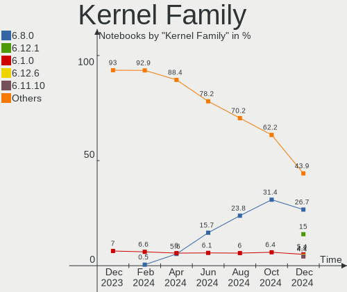
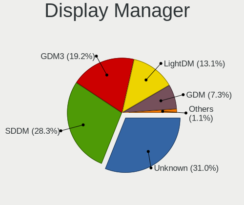
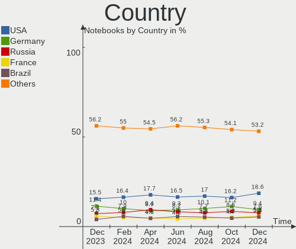
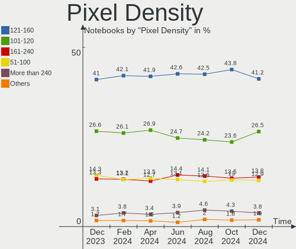
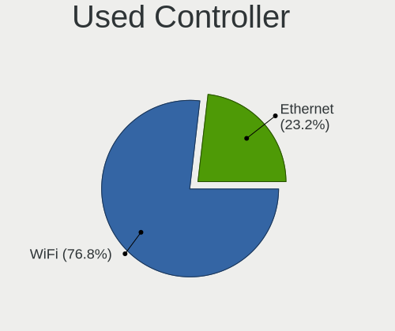

Linux Hardware Trends (Notebook)
--------------------------------

A project to identify most popular hardware characteristics and track their change
over time based on data collected by Linux users at https://Linux-Hardware.org.

Anyone can contribute to the study by uploading probes of their computers by
the [hw-probe](https://github.com/linuxhw/hw-probe) tool:

    sudo -E hw-probe -all -upload

Full-feature report is available here: https://linux-hardware.org/?view=trends&formfactor=notebook

Period: May, 2021.

Contents
--------

- [ OS                       ](#os)
- [ OS Family                ](#os-family)
- [ Kernel                   ](#kernel)
- [ Kernel Family            ](#kernel-family)
- [ Kernel Major Ver.        ](#kernel-major-ver)
- [ Arch                     ](#arch)
- [ DE                       ](#de)
- [ Display Server           ](#display-server)
- [ Display Manager          ](#display-manager)
- [ OS Lang                  ](#os-lang)
- [ Boot Mode                ](#boot-mode)
- [ Filesystem               ](#filesystem)
- [ Part. scheme             ](#part-scheme)
- [ Dual Boot with Linux/BSD ](#dual-boot-with-linux/bsd)
- [ Dual Boot (Win)          ](#dual-boot-win)
- [ Country                  ](#country)
- [ City                     ](#city)
- [ Vendor                   ](#vendor)
- [ Model                    ](#model)
- [ Model Family             ](#model-family)
- [ MFG Year                 ](#mfg-year)
- [ Form Factor              ](#form-factor)
- [ Secure Boot              ](#secure-boot)
- [ Coreboot                 ](#coreboot)
- [ RAM Size                 ](#ram-size)
- [ RAM Used                 ](#ram-used)
- [ Has CD-ROM               ](#has-cd-rom)
- [ Total Drives             ](#total-drives)
- [ Has Ethernet             ](#has-ethernet)
- [ Has WiFi                 ](#has-wifi)
- [ Has Bluetooth            ](#has-bluetooth)
- [ Drive Vendor             ](#drive-vendor)
- [ Drive Model              ](#drive-model)
- [ HDD Vendor               ](#hdd-vendor)
- [ SSD Vendor               ](#ssd-vendor)
- [ Drive Kind               ](#drive-kind)
- [ Drive Connector          ](#drive-connector)
- [ Drive Size               ](#drive-size)
- [ Space Total              ](#space-total)
- [ Space Used               ](#space-used)
- [ Malfunc. Drives          ](#malfunc-drives)
- [ Malfunc. Drive Vendor    ](#malfunc-drive-vendor)
- [ Malfunc. HDD Vendor      ](#malfunc-hdd-vendor)
- [ Malfunc. Drive Kind      ](#malfunc-drive-kind)
- [ Failed Drives            ](#failed-drives)
- [ Failed Drive Vendor      ](#failed-drive-vendor)
- [ Drive Status             ](#drive-status)
- [ Storage Vendor           ](#storage-vendor)
- [ Storage Model            ](#storage-model)
- [ Storage Kind             ](#storage-kind)
- [ CPU Vendor               ](#cpu-vendor)
- [ CPU Model                ](#cpu-model)
- [ CPU Model Family         ](#cpu-model-family)
- [ CPU Cores                ](#cpu-cores)
- [ CPU Sockets              ](#cpu-sockets)
- [ CPU Threads              ](#cpu-threads)
- [ CPU Op-Modes             ](#cpu-op-modes)
- [ CPU Microcode            ](#cpu-microcode)
- [ CPU Microarch            ](#cpu-microarch)
- [ GPU Vendor               ](#gpu-vendor)
- [ GPU Model                ](#gpu-model)
- [ GPU Combo                ](#gpu-combo)
- [ GPU Driver               ](#gpu-driver)
- [ GPU Memory               ](#gpu-memory)
- [ Monitor Vendor           ](#monitor-vendor)
- [ Monitor Model            ](#monitor-model)
- [ Monitor Resolution       ](#monitor-resolution)
- [ Monitor Diagonal         ](#monitor-diagonal)
- [ Monitor Width            ](#monitor-width)
- [ Aspect Ratio             ](#aspect-ratio)
- [ Monitor Area             ](#monitor-area)
- [ Pixel Density            ](#pixel-density)
- [ Multiple Monitors        ](#multiple-monitors)
- [ Net Controller Vendor    ](#net-controller-vendor)
- [ Net Controller Model     ](#net-controller-model)
- [ Wireless Vendor          ](#wireless-vendor)
- [ Wireless Model           ](#wireless-model)
- [ Ethernet Vendor          ](#ethernet-vendor)
- [ Ethernet Model           ](#ethernet-model)
- [ Net Controller Kind      ](#net-controller-kind)
- [ Used Controller          ](#used-controller)
- [ NICs                     ](#nics)
- [ IPv6                     ](#ipv6)
- [ Memory Vendor            ](#memory-vendor)
- [ Memory Model             ](#memory-model)
- [ Memory Kind              ](#memory-kind)
- [ Memory Form Factor       ](#memory-form-factor)
- [ Memory Size              ](#memory-size)
- [ Memory Speed             ](#memory-speed)
- [ Sound Vendor             ](#sound-vendor)
- [ Sound Model              ](#sound-model)
- [ Camera Vendor            ](#camera-vendor)
- [ Camera Model             ](#camera-model)
- [ Fingerprint Vendor       ](#fingerprint-vendor)
- [ Fingerprint Model        ](#fingerprint-model)
- [ Chipcard Vendor          ](#chipcard-vendor)
- [ Chipcard Model           ](#chipcard-model)
- [ Printer Vendor           ](#printer-vendor)
- [ Printer Model            ](#printer-model)
- [ Scanner Vendor           ](#scanner-vendor)
- [ Scanner Model            ](#scanner-model)
- [ Bluetooth Vendor         ](#bluetooth-vendor)
- [ Bluetooth Model          ](#bluetooth-model)
- [ Unsupported Devices      ](#unsupported-devices)
- [ Unsupported Device Types ](#unsupported-device-types)

OS
--

Installed operating systems

| Name                | Notebooks | Percent |
|---------------------|-----------|---------|
| Ubuntu 20.04        | 455       | 18.09%  |
| Mint 20.1           | 203       | 8.07%   |
| Fedora 34           | 169       | 6.72%   |
| OpenMandriva 4.2    | 163       | 6.48%   |
| Ubuntu 21.04        | 124       | 4.93%   |
| Pop!_OS 20.10       | 97        | 3.86%   |
| BlackPanther 18.1   | 91        | 3.62%   |
| Ubuntu 20.10        | 84        | 3.34%   |
| KDE neon 20.04      | 76        | 3.02%   |
| ROSA R11.1          | 62        | 2.47%   |
| OpenMandriva 4.50   | 57        | 2.27%   |
| Manjaro             | 56        | 2.23%   |
| Ubuntu 18.04        | 55        | 2.19%   |
| Arch                | 43        | 1.71%   |
| Endless 3.9.4       | 41        | 1.63%   |
| Zorin 15            | 38        | 1.51%   |
| Xubuntu 20.04       | 32        | 1.27%   |
| Manjaro 21.0.4      | 31        | 1.23%   |
| Manjaro 21.0.5      | 30        | 1.19%   |
| Fedora 33           | 30        | 1.19%   |
| Pop!_OS 20.04       | 27        | 1.07%   |
| Arch Rolling        | 27        | 1.07%   |
| Kubuntu 20.04       | 26        | 1.03%   |
| Mint 20             | 23        | 0.91%   |
| Debian 10           | 22        | 0.87%   |
| Mint 19.3           | 21        | 0.83%   |
| Kali 2021.1         | 17        | 0.68%   |
| Gentoo              | 14        | 0.56%   |
| Debian 11           | 14        | 0.56%   |
| ArcoLinux Rolling   | 14        | 0.56%   |
| Ubuntu MATE 20.04   | 13        | 0.52%   |
| EndeavourOS Rolling | 13        | 0.52%   |
| Manjaro 21.0.3      | 12        | 0.48%   |
| Debian              | 12        | 0.48%   |
| Ubuntu 16.04        | 11        | 0.44%   |
| Lubuntu 20.04       | 9         | 0.36%   |
| Kubuntu 21.04       | 9         | 0.36%   |
| Gentoo 2.7          | 9         | 0.36%   |
| Zorin 16            | 8         | 0.32%   |
| Xubuntu 18.04       | 8         | 0.32%   |
| Parrot 4.11         | 8         | 0.32%   |
| Elementary 5.1.7    | 8         | 0.32%   |
| Debian Testing      | 8         | 0.32%   |
| Xubuntu 21.04       | 7         | 0.28%   |
| Ubuntu Budgie 20.04 | 7         | 0.28%   |
| openSUSE Leap-15.2  | 7         | 0.28%   |
| LMDE 4              | 7         | 0.28%   |
| Lubuntu 21.04       | 6         | 0.24%   |
| Lubuntu 18.04       | 6         | 0.24%   |
| Endless 3.9.3       | 6         | 0.24%   |
| EndeavourOS         | 6         | 0.24%   |
| MX 19.4             | 5         | 0.2%    |
| Mint 19.1           | 5         | 0.2%    |
| Kubuntu 20.10       | 5         | 0.2%    |
| Garuda Soaring      | 5         | 0.2%    |
| Fedora 32           | 5         | 0.2%    |
| CentOS 8            | 5         | 0.2%    |
| Ubuntu MATE 21.04   | 4         | 0.16%   |
| Ubuntu MATE 18.04   | 4         | 0.16%   |
| Clear Linux 34640   | 4         | 0.16%   |

OS Family
---------

OS without a version

| Name          | Notebooks | Percent |
|---------------|-----------|---------|
| Ubuntu        | 735       | 29.22%  |
| Mint          | 260       | 10.34%  |
| OpenMandriva  | 220       | 8.75%   |
| Fedora        | 207       | 8.23%   |
| Manjaro       | 132       | 5.25%   |
| Pop!_OS       | 126       | 5.01%   |
| BlackPanther  | 93        | 3.7%    |
| KDE neon      | 76        | 3.02%   |
| ROSA          | 70        | 2.78%   |
| Arch          | 70        | 2.78%   |
| Debian        | 58        | 2.31%   |
| Endless       | 55        | 2.19%   |
| Xubuntu       | 52        | 2.07%   |
| Zorin         | 46        | 1.83%   |
| Kubuntu       | 44        | 1.75%   |
| Lubuntu       | 25        | 0.99%   |
| openSUSE      | 24        | 0.95%   |
| Ubuntu MATE   | 23        | 0.91%   |
| Gentoo        | 23        | 0.91%   |
| Kali          | 21        | 0.83%   |
| EndeavourOS   | 19        | 0.76%   |
| ArcoLinux     | 16        | 0.64%   |
| Clear Linux   | 15        | 0.6%    |
| Ubuntu Budgie | 11        | 0.44%   |
| Elementary    | 9         | 0.36%   |
| Parrot        | 8         | 0.32%   |
| MX            | 8         | 0.32%   |
| LMDE          | 7         | 0.28%   |
| CentOS        | 7         | 0.28%   |
| ALT Linux     | 6         | 0.24%   |
| Garuda        | 5         | 0.2%    |
| Artix         | 5         | 0.2%    |
| Void          | 3         | 0.12%   |
| RHEL          | 3         | 0.12%   |
| Peppermint    | 3         | 0.12%   |
| Mageia        | 3         | 0.12%   |
| GalliumOS     | 3         | 0.12%   |
| Deepin        | 3         | 0.12%   |
| Solus         | 2         | 0.08%   |
| Reborn OS     | 2         | 0.08%   |
| Archcraft     | 2         | 0.08%   |
| WindowsFX     | 1         | 0.04%   |
| Sparky        | 1         | 0.04%   |
| Siduction     | 1         | 0.04%   |
| Salient OS    | 1         | 0.04%   |
| Rocky         | 1         | 0.04%   |
| RELS          | 1         | 0.04%   |
| Pearl         | 1         | 0.04%   |
| Oracle Linux  | 1         | 0.04%   |
| NixOS         | 1         | 0.04%   |
| Manjaro-ARM   | 1         | 0.04%   |
| Hash Linux    | 1         | 0.04%   |
| Freedesktop   | 1         | 0.04%   |
| BunsenLabs    | 1         | 0.04%   |
| Archman       | 1         | 0.04%   |
| antiX         | 1         | 0.04%   |

Kernel
------

Version of the Linux kernel

| Version                             | Notebooks | Percent |
|-------------------------------------|-----------|---------|
| 5.4.0-73-generic                    | 255       | 10.14%  |
| 5.8.0-53-generic                    | 240       | 9.54%   |
| 5.8.0-50-generic                    | 187       | 7.44%   |
| 5.4.0-72-generic                    | 164       | 6.52%   |
| 5.10.14-desktop-1omv4002            | 154       | 6.12%   |
| 5.11.0-7614-generic                 | 100       | 3.98%   |
| 5.11.0-17-generic                   | 85        | 3.38%   |
| 5.6.14-desktop-2bP                  | 69        | 2.74%   |
| 5.12.4-desktop-1omv4050             | 56        | 2.23%   |
| 5.11.0-16-generic                   | 55        | 2.19%   |
| 5.8.0-14-generic                    | 49        | 1.95%   |
| 5.11.17-300.fc34.x86_64             | 32        | 1.27%   |
| 5.8.0-43-generic                    | 29        | 1.15%   |
| 5.4.0-58-generic                    | 29        | 1.15%   |
| 5.10.34-1-MANJARO                   | 27        | 1.07%   |
| 5.11.18-300.fc34.x86_64             | 23        | 0.91%   |
| 5.11.20-300.fc34.x86_64             | 22        | 0.87%   |
| 4.18.16-desktop-1bP                 | 22        | 0.87%   |
| 5.4.32-generic-2rosa-x86_64         | 21        | 0.83%   |
| 5.10.36-2-MANJARO                   | 21        | 0.83%   |
| 5.11.16-300.fc34.x86_64             | 19        | 0.76%   |
| 5.8.0-54-generic                    | 18        | 0.72%   |
| 5.4.83-generic-2rosa-x86_64         | 18        | 0.72%   |
| 5.12.6-300.fc34.x86_64              | 18        | 0.72%   |
| 5.4.0-42-generic                    | 17        | 0.68%   |
| 5.12.2-1-MANJARO                    | 17        | 0.68%   |
| 5.10.0-6-amd64                      | 17        | 0.68%   |
| 4.15.0-142-generic                  | 17        | 0.68%   |
| 5.12.7-300.fc34.x86_64              | 15        | 0.6%    |
| 5.11.16-arch1-1                     | 15        | 0.6%    |
| 5.11.0-7612-generic                 | 15        | 0.6%    |
| 5.10.32-1-MANJARO                   | 15        | 0.6%    |
| 5.10.0-kali7-amd64                  | 15        | 0.6%    |
| 4.19.0-16-amd64                     | 14        | 0.56%   |
| 5.12.3-arch1-1                      | 12        | 0.48%   |
| 5.11.21-300.fc34.x86_64             | 12        | 0.48%   |
| 4.15.0-143-generic                  | 12        | 0.48%   |
| 5.10.0-2-amd64                      | 11        | 0.44%   |
| 5.9.16-1-MANJARO                    | 10        | 0.4%    |
| 5.8.0-52-generic                    | 10        | 0.4%    |
| 5.12.1-2-MANJARO                    | 10        | 0.4%    |
| 5.12.4-arch1-2                      | 9         | 0.36%   |
| 5.11.12-desktop-1omv4002            | 9         | 0.36%   |
| 5.11.12-300.fc34.x86_64             | 9         | 0.36%   |
| 5.8.0-51-generic                    | 8         | 0.32%   |
| 5.8.0-48-generic                    | 8         | 0.32%   |
| 5.11.19-300.fc34.x86_64             | 8         | 0.32%   |
| 5.4.83-generic-2rosa-i586           | 7         | 0.28%   |
| 5.4.0-26-generic                    | 7         | 0.28%   |
| 5.12.8-arch1-1                      | 7         | 0.28%   |
| 5.12.1-arch1-1                      | 7         | 0.28%   |
| 5.11.18-200.fc33.x86_64             | 7         | 0.28%   |
| 5.11.16-zen1-1-zen                  | 7         | 0.28%   |
| 5.10.0-6parrot1-amd64               | 7         | 0.28%   |
| 4.15.0-desktop-122.124.1rosa-x86_64 | 7         | 0.28%   |
| 5.8.0-50-lowlatency                 | 6         | 0.24%   |
| 5.12.7-arch1-1                      | 6         | 0.24%   |
| 5.12.5-300.fc34.x86_64              | 6         | 0.24%   |
| 5.11.0-18-generic                   | 6         | 0.24%   |
| 5.8.0-7642-generic                  | 5         | 0.2%    |

Kernel Family
-------------

Linux kernel without a distro release

| Version | Notebooks | Percent |
|---------|-----------|---------|
| 5.8.0   | 577       | 22.94%  |
| 5.4.0   | 514       | 20.44%  |
| 5.11.0  | 269       | 10.7%   |
| 5.10.14 | 155       | 6.16%   |
| 5.12.4  | 80        | 3.18%   |
| 5.10.0  | 73        | 2.9%    |
| 5.6.14  | 69        | 2.74%   |
| 4.15.0  | 57        | 2.27%   |
| 5.11.16 | 48        | 1.91%   |
| 5.11.17 | 37        | 1.47%   |
| 5.11.18 | 36        | 1.43%   |
| 5.10.34 | 33        | 1.31%   |
| 5.12.6  | 30        | 1.19%   |
| 5.12.7  | 29        | 1.15%   |
| 5.12.2  | 29        | 1.15%   |
| 5.11.20 | 27        | 1.07%   |
| 5.4.32  | 26        | 1.03%   |
| 5.12.1  | 26        | 1.03%   |
| 5.4.83  | 25        | 0.99%   |
| 5.12.5  | 25        | 0.99%   |
| 4.19.0  | 25        | 0.99%   |
| 5.10.36 | 22        | 0.87%   |
| 4.18.16 | 22        | 0.87%   |
| 5.12.3  | 19        | 0.76%   |
| 5.11.12 | 19        | 0.76%   |
| 5.10.32 | 17        | 0.68%   |
| 5.11.19 | 16        | 0.64%   |
| 5.12.0  | 15        | 0.6%    |
| 5.11.21 | 14        | 0.56%   |
| 4.18.0  | 12        | 0.48%   |
| 5.9.16  | 11        | 0.44%   |
| 5.3.18  | 9         | 0.36%   |
| 5.11.15 | 9         | 0.36%   |
| 5.12.8  | 8         | 0.32%   |
| 5.10.27 | 8         | 0.32%   |
| 5.10.35 | 7         | 0.28%   |
| 5.3.0   | 6         | 0.24%   |
| 5.10.33 | 6         | 0.24%   |
| 5.6.0   | 5         | 0.2%    |
| 5.13.0  | 5         | 0.2%    |
| 4.16.18 | 5         | 0.2%    |
| 5.9.0   | 4         | 0.16%   |
| 5.4.116 | 4         | 0.16%   |
| 5.10.37 | 4         | 0.16%   |
| 5.10.31 | 4         | 0.16%   |
| 4.4.0   | 4         | 0.16%   |
| 5.11.11 | 3         | 0.12%   |
| 5.10.30 | 3         | 0.12%   |
| 5.10.29 | 3         | 0.12%   |
| 5.0.0   | 3         | 0.12%   |
| 5.7.0   | 2         | 0.08%   |
| 5.4.118 | 2         | 0.08%   |
| 5.4.114 | 2         | 0.08%   |
| 5.11.6  | 2         | 0.08%   |
| 5.11.22 | 2         | 0.08%   |
| 5.11.14 | 2         | 0.08%   |
| 5.10.41 | 2         | 0.08%   |
| 5.10.21 | 2         | 0.08%   |
| 5.10.19 | 2         | 0.08%   |
| 4.9.20  | 2         | 0.08%   |

Kernel Major Ver.
-----------------

Linux kernel major version

| Version | Notebooks | Percent |
|---------|-----------|---------|
| 5.4     | 581       | 23.1%   |
| 5.8     | 580       | 23.06%  |
| 5.11    | 487       | 19.36%  |
| 5.10    | 346       | 13.76%  |
| 5.12    | 261       | 10.38%  |
| 5.6     | 75        | 2.98%   |
| 4.15    | 57        | 2.27%   |
| 4.18    | 34        | 1.35%   |
| 4.19    | 25        | 0.99%   |
| 5.9     | 21        | 0.83%   |
| 5.3     | 16        | 0.64%   |
| 4.9     | 6         | 0.24%   |
| 4.16    | 6         | 0.24%   |
| 5.13    | 5         | 0.2%    |
| 4.4     | 4         | 0.16%   |
| 5.7     | 3         | 0.12%   |
| 5.0     | 3         | 0.12%   |
| 3.10    | 2         | 0.08%   |
| 5.5     | 1         | 0.04%   |
| 4.14    | 1         | 0.04%   |
| 4.11    | 1         | 0.04%   |

Arch
----

OS architecture (x86_64, i586, etc.)

| Name    | Notebooks | Percent |
|---------|-----------|---------|
| x86_64  | 2449      | 97.38%  |
| i686    | 65        | 2.58%   |
| aarch64 | 1         | 0.04%   |

DE
--

Desktop Environment

| Name             | Notebooks | Percent |
|------------------|-----------|---------|
| GNOME            | 1120      | 44.53%  |
| KDE5             | 459       | 18.25%  |
| XFCE             | 205       | 8.15%   |
| X-Cinnamon       | 200       | 7.95%   |
| KDE              | 145       | 5.77%   |
| Unknown          | 122       | 4.85%   |
| MATE             | 70        | 2.78%   |
| KDE4             | 39        | 1.55%   |
| LXQt             | 22        | 0.87%   |
| Cinnamon         | 21        | 0.83%   |
| Unity            | 17        | 0.68%   |
| Budgie           | 16        | 0.64%   |
| LXDE             | 14        | 0.56%   |
| Deepin           | 12        | 0.48%   |
| GNOME Flashback  | 11        | 0.44%   |
| i3               | 10        | 0.4%    |
| Pantheon         | 9         | 0.36%   |
| awesome          | 5         | 0.2%    |
| openbox          | 4         | 0.16%   |
| bspwm            | 3         | 0.12%   |
| sway             | 2         | 0.08%   |
| lightdm-xsession | 2         | 0.08%   |
| GNOME Classic    | 2         | 0.08%   |
| Xsession         | 1         | 0.04%   |
| qtile            | 1         | 0.04%   |
| Enlightenment    | 1         | 0.04%   |
| dwm              | 1         | 0.04%   |
| default          | 1         | 0.04%   |

Display Server
--------------

X11 or Wayland

| Name    | Notebooks | Percent |
|---------|-----------|---------|
| X11     | 2130      | 84.69%  |
| Wayland | 285       | 11.33%  |
| Unknown | 71        | 2.82%   |
| Tty     | 29        | 1.15%   |

Display Manager
---------------

SDDM, LightDM, etc.

| Name    | Notebooks | Percent |
|---------|-----------|---------|
| Unknown | 1414      | 56.22%  |
| SDDM    | 488       | 19.4%   |
| GDM     | 332       | 13.2%   |
| TDM     | 183       | 7.28%   |
| LightDM | 50        | 1.99%   |
| KDM     | 39        | 1.55%   |
| XDM     | 5         | 0.2%    |
| SLiM    | 2         | 0.08%   |
| LXDM    | 2         | 0.08%   |

OS Lang
-------

Language

| Lang    | Notebooks | Percent |
|---------|-----------|---------|
| en_US   | 976       | 38.81%  |
| de_DE   | 194       | 7.71%   |
| ru_RU   | 146       | 5.81%   |
| pt_BR   | 145       | 5.77%   |
| fr_FR   | 143       | 5.69%   |
| en_GB   | 123       | 4.89%   |
| Unknown | 119       | 4.73%   |
| it_IT   | 70        | 2.78%   |
| en_IN   | 57        | 2.27%   |
| es_ES   | 52        | 2.07%   |
| pl_PL   | 46        | 1.83%   |
| en_CA   | 38        | 1.51%   |
| C       | 35        | 1.39%   |
| en_AU   | 29        | 1.15%   |
| nl_NL   | 23        | 0.91%   |
| cs_CZ   | 20        | 0.8%    |
| hu_HU   | 19        | 0.76%   |
| es_CL   | 19        | 0.76%   |
| en_ZA   | 17        | 0.68%   |
| es_AR   | 16        | 0.64%   |
| de_CH   | 15        | 0.6%    |
| tr_TR   | 13        | 0.52%   |
| pt_PT   | 13        | 0.52%   |
| es_MX   | 13        | 0.52%   |
| es_UY   | 11        | 0.44%   |
| de_AT   | 11        | 0.44%   |
| zh_CN   | 9         | 0.36%   |
| fr_CA   | 8         | 0.32%   |
| ja_JP   | 7         | 0.28%   |
| ro_RO   | 6         | 0.24%   |
| fi_FI   | 6         | 0.24%   |
| en_NZ   | 6         | 0.24%   |
| da_DK   | 6         | 0.24%   |
| fr_BE   | 5         | 0.2%    |
| es_CR   | 5         | 0.2%    |
| es_CO   | 5         | 0.2%    |
| en_IE   | 5         | 0.2%    |
| uk_UA   | 4         | 0.16%   |
| sv_SE   | 4         | 0.16%   |
| sk_SK   | 4         | 0.16%   |
| ru_UA   | 4         | 0.16%   |
| nl_BE   | 4         | 0.16%   |
| ko_KR   | 4         | 0.16%   |
| es_EC   | 4         | 0.16%   |
| nb_NO   | 3         | 0.12%   |
| id_ID   | 3         | 0.12%   |
| es_VE   | 3         | 0.12%   |
| en_PH   | 3         | 0.12%   |
| en_IL   | 3         | 0.12%   |
| el_GR   | 3         | 0.12%   |
| ca_ES   | 3         | 0.12%   |
| bg_BG   | 3         | 0.12%   |
| sr_RS   | 2         | 0.08%   |
| POSIX   | 2         | 0.08%   |
| fr_CH   | 2         | 0.08%   |
| en_SG   | 2         | 0.08%   |
| en_NG   | 2         | 0.08%   |
| en_HK   | 2         | 0.08%   |
| en_DK   | 2         | 0.08%   |
| zh_TW   | 1         | 0.04%   |

Boot Mode
---------

EFI or BIOS

| Mode | Notebooks | Percent |
|------|-----------|---------|
| BIOS | 1258      | 50.02%  |
| EFI  | 1257      | 49.98%  |

Filesystem
----------

Type of filesystem

| Type     | Notebooks | Percent |
|----------|-----------|---------|
| Ext4     | 1916      | 76.18%  |
| Overlay  | 309       | 12.29%  |
| Btrfs    | 232       | 9.22%   |
| Xfs      | 28        | 1.11%   |
| Zfs      | 11        | 0.44%   |
| F2fs     | 8         | 0.32%   |
| Ext3     | 4         | 0.16%   |
| Unknown  | 3         | 0.12%   |
| Reiserfs | 2         | 0.08%   |
| Ext2     | 2         | 0.08%   |

Part. scheme
------------

Scheme of partitioning

| Type    | Notebooks | Percent |
|---------|-----------|---------|
| Unknown | 1379      | 54.83%  |
| GPT     | 790       | 31.41%  |
| MBR     | 346       | 13.76%  |

Dual Boot with Linux/BSD
------------------------

Hosting more than one Linux/BSD

| Dual boot | Notebooks | Percent |
|-----------|-----------|---------|
| No        | 2167      | 86.16%  |
| Yes       | 348       | 13.84%  |

Dual Boot (Win)
---------------

Hosting Linux and Windows

| Dual boot | Notebooks | Percent |
|-----------|-----------|---------|
| No        | 1819      | 72.33%  |
| Yes       | 696       | 27.67%  |

Country
-------

Geographic location (country)

| Country                | Notebooks | Percent |
|------------------------|-----------|---------|
| USA                    | 346       | 13.76%  |
| Germany                | 261       | 10.38%  |
| Brazil                 | 184       | 7.32%   |
| Russia                 | 152       | 6.04%   |
| France                 | 142       | 5.65%   |
| Italy                  | 99        | 3.94%   |
| India                  | 89        | 3.54%   |
| Hungary                | 88        | 3.5%    |
| UK                     | 86        | 3.42%   |
| Poland                 | 72        | 2.86%   |
| Spain                  | 63        | 2.5%    |
| Canada                 | 62        | 2.47%   |
| Netherlands            | 55        | 2.19%   |
| Ukraine                | 39        | 1.55%   |
| Australia              | 37        | 1.47%   |
| Switzerland            | 33        | 1.31%   |
| Czechia                | 31        | 1.23%   |
| Turkey                 | 29        | 1.15%   |
| Mexico                 | 28        | 1.11%   |
| Argentina              | 27        | 1.07%   |
| South Africa           | 25        | 0.99%   |
| Romania                | 24        | 0.95%   |
| China                  | 24        | 0.95%   |
| Chile                  | 23        | 0.91%   |
| Belgium                | 23        | 0.91%   |
| Austria                | 23        | 0.91%   |
| Greece                 | 21        | 0.83%   |
| Portugal               | 20        | 0.8%    |
| Sweden                 | 17        | 0.68%   |
| Slovakia               | 16        | 0.64%   |
| Japan                  | 16        | 0.64%   |
| Finland                | 16        | 0.64%   |
| Bulgaria               | 15        | 0.6%    |
| Uruguay                | 14        | 0.56%   |
| Denmark                | 12        | 0.48%   |
| Thailand               | 11        | 0.44%   |
| Serbia                 | 11        | 0.44%   |
| Norway                 | 11        | 0.44%   |
| Iran                   | 11        | 0.44%   |
| Indonesia              | 11        | 0.44%   |
| Colombia               | 11        | 0.44%   |
| Costa Rica             | 10        | 0.4%    |
| Vietnam                | 9         | 0.36%   |
| South Korea            | 9         | 0.36%   |
| Israel                 | 9         | 0.36%   |
| Ireland                | 9         | 0.36%   |
| Estonia                | 9         | 0.36%   |
| Belarus                | 9         | 0.36%   |
| New Zealand            | 8         | 0.32%   |
| Venezuela              | 7         | 0.28%   |
| Bangladesh             | 7         | 0.28%   |
| Peru                   | 6         | 0.24%   |
| Malaysia               | 6         | 0.24%   |
| Lithuania              | 6         | 0.24%   |
| Singapore              | 5         | 0.2%    |
| Philippines            | 5         | 0.2%    |
| Ecuador                | 5         | 0.2%    |
| Bosnia and Herzegovina | 5         | 0.2%    |
| Algeria                | 5         | 0.2%    |
| UAE                    | 4         | 0.16%   |

City
----

Geographic location (city)

| City              | Notebooks | Percent |
|-------------------|-----------|---------|
| Budapest          | 37        | 1.47%   |
| Moscow            | 30        | 1.19%   |
| Berlin            | 23        | 0.91%   |
| São Paulo        | 21        | 0.83%   |
| St Petersburg     | 15        | 0.6%    |
| Paris             | 15        | 0.6%    |
| London            | 14        | 0.56%   |
| Rome              | 13        | 0.52%   |
| Rio de Janeiro    | 13        | 0.52%   |
| Prague            | 13        | 0.52%   |
| Madrid            | 13        | 0.52%   |
| Kyiv              | 13        | 0.52%   |
| Voronezh          | 12        | 0.48%   |
| Vienna            | 12        | 0.48%   |
| Istanbul          | 12        | 0.48%   |
| Hamburg           | 12        | 0.48%   |
| Warsaw            | 11        | 0.44%   |
| Milan             | 11        | 0.44%   |
| Montreal          | 10        | 0.4%    |
| Bucharest         | 10        | 0.4%    |
| Pune              | 9         | 0.36%   |
| Mexico City       | 9         | 0.36%   |
| Buenos Aires      | 9         | 0.36%   |
| Athens            | 9         | 0.36%   |
| Sydney            | 8         | 0.32%   |
| Santiago          | 8         | 0.32%   |
| Montevideo        | 8         | 0.32%   |
| Johannesburg      | 8         | 0.32%   |
| Frankfurt am Main | 8         | 0.32%   |
| Chicago           | 8         | 0.32%   |
| Brisbane          | 8         | 0.32%   |
| Bengaluru         | 8         | 0.32%   |
| Belgrade          | 8         | 0.32%   |
| Toronto           | 7         | 0.28%   |
| Tehran            | 7         | 0.28%   |
| Tallinn           | 7         | 0.28%   |
| Sofia             | 7         | 0.28%   |
| Helsinki          | 7         | 0.28%   |
| The Hague         | 6         | 0.24%   |
| Srednyaya Akhtuba | 6         | 0.24%   |
| Munich            | 6         | 0.24%   |
| Minsk             | 6         | 0.24%   |
| Lucknow           | 6         | 0.24%   |
| Hyderabad         | 6         | 0.24%   |
| Dublin            | 6         | 0.24%   |
| Dhaka             | 6         | 0.24%   |
| Cologne           | 6         | 0.24%   |
| Chennai           | 6         | 0.24%   |
| Barcelona         | 6         | 0.24%   |
| Bangkok           | 6         | 0.24%   |
| Amsterdam         | 6         | 0.24%   |
| Zurich            | 5         | 0.2%    |
| Wellington        | 5         | 0.2%    |
| Tel Aviv          | 5         | 0.2%    |
| Santo André      | 5         | 0.2%    |
| Salvador          | 5         | 0.2%    |
| Rockville         | 5         | 0.2%    |
| Phoenix           | 5         | 0.2%    |
| Nuremberg         | 5         | 0.2%    |
| Novosibirsk       | 5         | 0.2%    |

Vendor
------

Motherboard manufacturer

| Name                             | Notebooks | Percent |
|----------------------------------|-----------|---------|
| Lenovo                           | 507       | 20.16%  |
| Hewlett-Packard                  | 491       | 19.52%  |
| Dell                             | 414       | 16.46%  |
| ASUSTek Computer                 | 267       | 10.62%  |
| Acer                             | 225       | 8.95%   |
| Toshiba                          | 84        | 3.34%   |
| Samsung Electronics              | 63        | 2.5%    |
| Apple                            | 62        | 2.47%   |
| MSI                              | 51        | 2.03%   |
| Sony                             | 36        | 1.43%   |
| HUAWEI                           | 24        | 0.95%   |
| Notebook                         | 22        | 0.87%   |
| Unknown                          | 21        | 0.83%   |
| Fujitsu                          | 17        | 0.68%   |
| TUXEDO                           | 12        | 0.48%   |
| Positivo                         | 12        | 0.48%   |
| Fujitsu Siemens                  | 11        | 0.44%   |
| Packard Bell                     | 10        | 0.4%    |
| Medion                           | 10        | 0.4%    |
| Alienware                        | 10        | 0.4%    |
| System76                         | 8         | 0.32%   |
| LG Electronics                   | 7         | 0.28%   |
| Google                           | 7         | 0.28%   |
| Panasonic                        | 6         | 0.24%   |
| eMachines                        | 6         | 0.24%   |
| Razer                            | 5         | 0.2%    |
| Timi                             | 4         | 0.16%   |
| Intel                            | 4         | 0.16%   |
| Teclast                          | 3         | 0.12%   |
| Standard                         | 3         | 0.12%   |
| Schenker                         | 3         | 0.12%   |
| Purism                           | 3         | 0.12%   |
| Positivo Bahia - VAIO            | 3         | 0.12%   |
| PC Specialist                    | 3         | 0.12%   |
| NEC Computers                    | 3         | 0.12%   |
| Gigabyte Technology              | 3         | 0.12%   |
| Gateway                          | 3         | 0.12%   |
| Dynabook                         | 3         | 0.12%   |
| Digibras                         | 3         | 0.12%   |
| Chuwi                            | 3         | 0.12%   |
| Wortmann AG                      | 2         | 0.08%   |
| VIT                              | 2         | 0.08%   |
| ONE-NETBOOK TECHNOLOGY           | 2         | 0.08%   |
| Multilaser                       | 2         | 0.08%   |
| Monster                          | 2         | 0.08%   |
| Jumper                           | 2         | 0.08%   |
| FUJITSU CLIENT COMPUTING LIMITED | 2         | 0.08%   |
| ECS                              | 2         | 0.08%   |
| Clevo                            | 2         | 0.08%   |
| AZW                              | 2         | 0.08%   |
| Aquarius                         | 2         | 0.08%   |
| AMI                              | 2         | 0.08%   |
| YJKC                             | 1         | 0.04%   |
| YIFANG                           | 1         | 0.04%   |
| whyopencomputing                 | 1         | 0.04%   |
| UNOWHY                           | 1         | 0.04%   |
| TrekStor                         | 1         | 0.04%   |
| TongFang                         | 1         | 0.04%   |
| SLIMBOOK                         | 1         | 0.04%   |
| Shuttle                          | 1         | 0.04%   |

Model
-----

Motherboard model

| Name                                  | Notebooks | Percent |
|---------------------------------------|-----------|---------|
| Unknown                               | 38        | 1.51%   |
| HP Notebook                           | 16        | 0.64%   |
| HP Pavilion dv6                       | 12        | 0.48%   |
| HP Pavilion dv7                       | 11        | 0.44%   |
| Dell XPS 13 9310                      | 11        | 0.44%   |
| HP Pavilion g7                        | 10        | 0.4%    |
| HP Pavilion g6                        | 10        | 0.4%    |
| Apple MacBookPro8,1                   | 10        | 0.4%    |
| HP Pavilion Notebook                  | 9         | 0.36%   |
| Acer Aspire A315-23                   | 9         | 0.36%   |
| Dell XPS 15 9500                      | 8         | 0.32%   |
| Dell Latitude D630                    | 8         | 0.32%   |
| Acer Nitro AN517-51                   | 8         | 0.32%   |
| HP Pavilion 15                        | 7         | 0.28%   |
| HP Laptop 15-bs0xx                    | 7         | 0.28%   |
| HP 250 G7 Notebook PC                 | 7         | 0.28%   |
| Dell Latitude E6410                   | 7         | 0.28%   |
| Dell Latitude E6400                   | 7         | 0.28%   |
| Lenovo V145-15AST 81MT                | 6         | 0.24%   |
| Lenovo IdeaPad 320-15IKB 80XL         | 6         | 0.24%   |
| Lenovo G50-45 80E3                    | 6         | 0.24%   |
| HP 15                                 | 6         | 0.24%   |
| Dell XPS 15 7590                      | 6         | 0.24%   |
| Dell Latitude E6430                   | 6         | 0.24%   |
| Dell Inspiron 1545                    | 6         | 0.24%   |
| ASUS ROG Zephyrus G14 GA401IV_GA401IV | 6         | 0.24%   |
| Samsung 340XAA/350XAA/550XAA          | 5         | 0.2%    |
| Lenovo IdeaPad 5 15ARE05 81YQ         | 5         | 0.2%    |
| HUAWEI BOHK-WAX9X                     | 5         | 0.2%    |
| HP Pavilion Gaming Laptop 15-cx0xxx   | 5         | 0.2%    |
| HP Pavilion dv5                       | 5         | 0.2%    |
| HP Laptop 15-da0xxx                   | 5         | 0.2%    |
| HP Laptop 15-bw0xx                    | 5         | 0.2%    |
| HP EliteBook 855 G7 Notebook PC       | 5         | 0.2%    |
| HP EliteBook 8440p                    | 5         | 0.2%    |
| Dell XPS 15 9550                      | 5         | 0.2%    |
| Dell XPS 13 9350                      | 5         | 0.2%    |
| Dell Precision 5530                   | 5         | 0.2%    |
| Dell Latitude E6420                   | 5         | 0.2%    |
| Dell Latitude 5520                    | 5         | 0.2%    |
| Dell Latitude 5480                    | 5         | 0.2%    |
| Dell Inspiron N5110                   | 5         | 0.2%    |
| Dell G5 5587                          | 5         | 0.2%    |
| ASUS TUF Gaming FX505DT_FX505DT       | 5         | 0.2%    |
| ASUS T100HAN                          | 5         | 0.2%    |
| ASUS K52F                             | 5         | 0.2%    |
| Apple MacBookPro9,2                   | 5         | 0.2%    |
| Acer Swift SF314-42                   | 5         | 0.2%    |
| Acer Nitro AN515-54                   | 5         | 0.2%    |
| Toshiba Satellite C660                | 4         | 0.16%   |
| Samsung 300E4C/300E5C/300E7C          | 4         | 0.16%   |
| Lenovo IdeaPad 3 15IIL05 81WE         | 4         | 0.16%   |
| Lenovo G500 20236                     | 4         | 0.16%   |
| HUAWEI NBLK-WAX9X                     | 4         | 0.16%   |
| HUAWEI MACH-WX9                       | 4         | 0.16%   |
| HP ProBook 455 G7                     | 4         | 0.16%   |
| HP Pavilion dv6700                    | 4         | 0.16%   |
| HP G62                                | 4         | 0.16%   |
| HP G60                                | 4         | 0.16%   |
| HP EliteBook 8470p                    | 4         | 0.16%   |

Model Family
------------

Motherboard model prefix

| Name                  | Notebooks | Percent |
|-----------------------|-----------|---------|
| Lenovo ThinkPad       | 255       | 10.14%  |
| Acer Aspire           | 148       | 5.88%   |
| Dell Latitude         | 140       | 5.57%   |
| Dell Inspiron         | 131       | 5.21%   |
| Lenovo IdeaPad        | 122       | 4.85%   |
| HP Pavilion           | 108       | 4.29%   |
| Toshiba Satellite     | 77        | 3.06%   |
| HP EliteBook          | 76        | 3.02%   |
| HP ProBook            | 70        | 2.78%   |
| HP Laptop             | 69        | 2.74%   |
| Dell XPS              | 63        | 2.5%    |
| ASUS VivoBook         | 41        | 1.63%   |
| Unknown               | 38        | 1.51%   |
| Dell Precision        | 34        | 1.35%   |
| Dell Vostro           | 23        | 0.91%   |
| HP Compaq             | 22        | 0.87%   |
| Acer Nitro            | 21        | 0.83%   |
| ASUS ROG              | 20        | 0.8%    |
| Acer Swift            | 19        | 0.76%   |
| HP Notebook           | 16        | 0.64%   |
| Lenovo Legion         | 15        | 0.6%    |
| HP ENVY               | 14        | 0.56%   |
| Fujitsu LIFEBOOK      | 14        | 0.56%   |
| HP 250                | 13        | 0.52%   |
| ASUS TUF              | 13        | 0.52%   |
| HP ZBook              | 12        | 0.48%   |
| Apple MacBookPro8     | 12        | 0.48%   |
| Lenovo Yoga           | 10        | 0.4%    |
| HP 15                 | 10        | 0.4%    |
| Apple MacBookPro11    | 10        | 0.4%    |
| Acer TravelMate       | 10        | 0.4%    |
| Packard Bell EasyNote | 8         | 0.32%   |
| Lenovo ThinkBook      | 8         | 0.32%   |
| HP Stream             | 8         | 0.32%   |
| HP OMEN               | 8         | 0.32%   |
| HP 255                | 8         | 0.32%   |
| Dell G3               | 8         | 0.32%   |
| Fujitsu Siemens AMILO | 7         | 0.28%   |
| Dell G5               | 7         | 0.28%   |
| ASUS ZenBook          | 7         | 0.28%   |
| Lenovo V145-15AST     | 6         | 0.24%   |
| Lenovo G50-45         | 6         | 0.24%   |
| HP Presario           | 6         | 0.24%   |
| ASUS ASUS             | 6         | 0.24%   |
| Apple MacBookPro9     | 6         | 0.24%   |
| Acer Extensa          | 6         | 0.24%   |
| Samsung 340XAA        | 5         | 0.2%    |
| HUAWEI BOHK-WAX9X     | 5         | 0.2%    |
| Dell G7               | 5         | 0.2%    |
| ASUS T100HAN          | 5         | 0.2%    |
| ASUS K52F             | 5         | 0.2%    |
| Samsung RV411         | 4         | 0.16%   |
| Samsung 300E4C        | 4         | 0.16%   |
| Razer Blade           | 4         | 0.16%   |
| MSI GF63              | 4         | 0.16%   |
| Lenovo G570           | 4         | 0.16%   |
| Lenovo G500           | 4         | 0.16%   |
| HUAWEI NBLK-WAX9X     | 4         | 0.16%   |
| HUAWEI MACH-WX9       | 4         | 0.16%   |
| HP Mini               | 4         | 0.16%   |

MFG Year
--------

Motherboard manufacture year

| Year    | Notebooks | Percent |
|---------|-----------|---------|
| 2020    | 535       | 21.27%  |
| 2019    | 339       | 13.48%  |
| 2021    | 211       | 8.39%   |
| 2018    | 200       | 7.95%   |
| 2013    | 162       | 6.44%   |
| 2012    | 159       | 6.32%   |
| 2011    | 157       | 6.24%   |
| 2015    | 121       | 4.81%   |
| 2014    | 114       | 4.53%   |
| 2010    | 107       | 4.25%   |
| 2017    | 101       | 4.02%   |
| 2016    | 98        | 3.9%    |
| 2009    | 90        | 3.58%   |
| 2008    | 69        | 2.74%   |
| 2007    | 31        | 1.23%   |
| 2006    | 12        | 0.48%   |
| 2005    | 4         | 0.16%   |
| Unknown | 4         | 0.16%   |
| 2004    | 1         | 0.04%   |

Form Factor
-----------

Physical design of the computer

| Name     | Notebooks | Percent |
|----------|-----------|---------|
| Notebook | 2515      | 100%    |

Secure Boot
-----------

Enabled or disabled

| State    | Notebooks | Percent |
|----------|-----------|---------|
| Disabled | 2285      | 90.85%  |
| Enabled  | 230       | 9.15%   |

Coreboot
--------

Have coreboot on board

| Used | Notebooks | Percent |
|------|-----------|---------|
| No   | 2501      | 99.44%  |
| Yes  | 14        | 0.56%   |

RAM Size
--------

Total RAM memory

| Size in GB  | Notebooks | Percent |
|-------------|-----------|---------|
| 4.01-8.0    | 732       | 29.11%  |
| 3.01-4.0    | 599       | 23.82%  |
| 8.01-16.0   | 394       | 15.67%  |
| 16.01-24.0  | 372       | 14.79%  |
| 32.01-64.0  | 155       | 6.16%   |
| 1.01-2.0    | 140       | 5.57%   |
| 2.01-3.0    | 56        | 2.23%   |
| 64.01-256.0 | 29        | 1.15%   |
| 24.01-32.0  | 22        | 0.87%   |
| 0.51-1.0    | 14        | 0.56%   |
| 0.01-0.5    | 2         | 0.08%   |

RAM Used
--------

Used RAM memory

| Used GB    | Notebooks | Percent |
|------------|-----------|---------|
| 1.01-2.0   | 1029      | 40.91%  |
| 2.01-3.0   | 582       | 23.14%  |
| 4.01-8.0   | 293       | 11.65%  |
| 3.01-4.0   | 272       | 10.82%  |
| 0.51-1.0   | 220       | 8.75%   |
| 8.01-16.0  | 79        | 3.14%   |
| 0.01-0.5   | 33        | 1.31%   |
| 16.01-24.0 | 5         | 0.2%    |
| 24.01-32.0 | 2         | 0.08%   |

Has CD-ROM
----------

Has CD-ROM on board

| Presented | Notebooks | Percent |
|-----------|-----------|---------|
| No        | 1520      | 60.44%  |
| Yes       | 995       | 39.56%  |

Total Drives
------------

Number of drives on board

| Drives | Notebooks | Percent |
|--------|-----------|---------|
| 1      | 1823      | 72.49%  |
| 2      | 582       | 23.14%  |
| 3      | 79        | 3.14%   |
| 0      | 18        | 0.72%   |
| 4      | 8         | 0.32%   |
| 6      | 2         | 0.08%   |
| 5      | 2         | 0.08%   |
| 8      | 1         | 0.04%   |

Has Ethernet
------------

Has Ethernet on board

| Presented | Notebooks | Percent |
|-----------|-----------|---------|
| Yes       | 2093      | 83.22%  |
| No        | 422       | 16.78%  |

Has WiFi
--------

Has WiFi module

| Presented | Notebooks | Percent |
|-----------|-----------|---------|
| Yes       | 2457      | 97.69%  |
| No        | 58        | 2.31%   |

Has Bluetooth
-------------

Has Bluetooth module

| Presented | Notebooks | Percent |
|-----------|-----------|---------|
| Yes       | 1887      | 75.03%  |
| No        | 628       | 24.97%  |

Drive Vendor
------------

Hard drive vendors

| Vendor                    | Notebooks | Drives | Percent |
|---------------------------|-----------|--------|---------|
| Samsung Electronics       | 438       | 476    | 14.17%  |
| WDC                       | 412       | 430    | 13.33%  |
| Seagate                   | 393       | 404    | 12.71%  |
| Toshiba                   | 287       | 292    | 9.29%   |
| Unknown                   | 187       | 208    | 6.05%   |
| Kingston                  | 162       | 165    | 5.24%   |
| Sandisk                   | 159       | 160    | 5.14%   |
| Intel                     | 125       | 130    | 4.04%   |
| Hitachi                   | 111       | 113    | 3.59%   |
| SK Hynix                  | 105       | 114    | 3.4%    |
| HGST                      | 92        | 92     | 2.98%   |
| Crucial                   | 90        | 93     | 2.91%   |
| A-DATA Technology         | 47        | 49     | 1.52%   |
| Micron Technology         | 44        | 44     | 1.42%   |
| Apple                     | 33        | 36     | 1.07%   |
| Fujitsu                   | 27        | 27     | 0.87%   |
| China                     | 24        | 24     | 0.78%   |
| KIOXIA                    | 19        | 20     | 0.61%   |
| LITEONIT                  | 17        | 17     | 0.55%   |
| SPCC                      | 16        | 16     | 0.52%   |
| LITEON                    | 16        | 16     | 0.52%   |
| Intenso                   | 16        | 17     | 0.52%   |
| Phison                    | 13        | 13     | 0.42%   |
| Union Memory              | 12        | 12     | 0.39%   |
| Transcend                 | 12        | 12     | 0.39%   |
| Patriot                   | 12        | 13     | 0.39%   |
| OCZ                       | 11        | 11     | 0.36%   |
| Silicon Motion            | 10        | 13     | 0.32%   |
| ASMT                      | 9         | 15     | 0.29%   |
| SABRENT                   | 8         | 8      | 0.26%   |
| KingSpec                  | 8         | 9      | 0.26%   |
| Realtek Semiconductor     | 7         | 7      | 0.23%   |
| PNY                       | 7         | 7      | 0.23%   |
| GOODRAM                   | 7         | 7      | 0.23%   |
| XPG                       | 6         | 7      | 0.19%   |
| Solid State Storage       | 5         | 5      | 0.16%   |
| Micron/Crucial Technology | 5         | 5      | 0.16%   |
| JMicron                   | 5         | 5      | 0.16%   |
| FORESEE                   | 5         | 5      | 0.16%   |
| External                  | 5         | 6      | 0.16%   |
| Corsair                   | 5         | 6      | 0.16%   |
| Apacer                    | 5         | 5      | 0.16%   |
| Team                      | 4         | 4      | 0.13%   |
| Mushkin                   | 4         | 5      | 0.13%   |
| Lite-On                   | 4         | 4      | 0.13%   |
| Lenovo                    | 4         | 4      | 0.13%   |
| Hewlett-Packard           | 4         | 4      | 0.13%   |
| ADATA Technology          | 4         | 4      | 0.13%   |
| Teclast                   | 3         | 3      | 0.1%    |
| KingFast                  | 3         | 3      | 0.1%    |
| KingDian                  | 3         | 3      | 0.1%    |
| Gigabyte Technology       | 3         | 3      | 0.1%    |
| Vaseky                    | 2         | 2      | 0.06%   |
| USB                       | 2         | 2      | 0.06%   |
| TrekStor                  | 2         | 2      | 0.06%   |
| TCSUNBOW                  | 2         | 2      | 0.06%   |
| ShanDianZhe               | 2         | 2      | 0.06%   |
| PLEXTOR                   | 2         | 2      | 0.06%   |
| Phison Electronics        | 2         | 3      | 0.06%   |
| OWC                       | 2         | 2      | 0.06%   |

Drive Model
-----------

Hard drive models

| Model                               | Notebooks | Percent |
|-------------------------------------|-----------|---------|
| Seagate ST1000LM035-1RK172 1TB      | 68        | 2.13%   |
| Seagate ST1000LM024 HN-M101MBB 1TB  | 50        | 1.57%   |
| Unknown MMC Card  32GB              | 41        | 1.29%   |
| Samsung NVMe SSD Drive 512GB        | 39        | 1.22%   |
| Toshiba MQ01ABD100 1TB              | 37        | 1.16%   |
| Toshiba MQ01ABF050 500GB            | 31        | 0.97%   |
| Kingston SA400S37480G 480GB SSD     | 30        | 0.94%   |
| Seagate ST9500325AS 500GB           | 28        | 0.88%   |
| Kingston SA400S37240G 240GB SSD     | 27        | 0.85%   |
| Intel NVMe SSD Drive 512GB          | 27        | 0.85%   |
| Toshiba MQ04ABF100 1TB              | 26        | 0.82%   |
| SK Hynix NVMe SSD Drive 512GB       | 26        | 0.82%   |
| Seagate ST500LT012-1DG142 500GB     | 26        | 0.82%   |
| HGST HTS721010A9E630 1TB            | 26        | 0.82%   |
| Samsung NVMe SSD Drive 256GB        | 24        | 0.75%   |
| Samsung SSD 860 EVO 500GB           | 23        | 0.72%   |
| WDC WD10SPZX-21Z10T0 1TB            | 21        | 0.66%   |
| Sandisk NVMe SSD Drive 512GB        | 21        | 0.66%   |
| Unknown SD/MMC/MS PRO 8GB           | 20        | 0.63%   |
| Kingston SA400S37120G 120GB SSD     | 19        | 0.6%    |
| Unknown MMC Card  64GB              | 18        | 0.56%   |
| WDC WD10JPVX-22JC3T0 1TB            | 17        | 0.53%   |
| Seagate ST500LM012 HN-M500MBB 500GB | 17        | 0.53%   |
| HGST HTS545050A7E680 500GB          | 17        | 0.53%   |
| Samsung NVMe SSD Drive 1024GB       | 16        | 0.5%    |
| Crucial CT240BX500SSD1 240GB        | 15        | 0.47%   |
| Seagate ST2000LM007-1R8174 2TB      | 14        | 0.44%   |
| Samsung NVMe SSD Drive 1TB          | 14        | 0.44%   |
| Kingston SV300S37A120G 120GB SSD    | 14        | 0.44%   |
| Crucial CT500MX500SSD1 500GB        | 14        | 0.44%   |
| WDC WDS240G2G0A-00JH30 240GB SSD    | 13        | 0.41%   |
| Seagate ST500LT012-9WS142 500GB     | 13        | 0.41%   |
| HGST HTS725050A7E630 500GB          | 13        | 0.41%   |
| HGST HTS541010A9E680 1TB            | 13        | 0.41%   |
| WDC WDS500G2B0A-00SM50 500GB SSD    | 12        | 0.38%   |
| WDC WD10SPZX-24Z10 1TB              | 12        | 0.38%   |
| Toshiba NVMe SSD Drive 512GB        | 12        | 0.38%   |
| Sandisk NVMe SSD Drive 256GB        | 12        | 0.38%   |
| Unknown MMC Card  16GB              | 11        | 0.34%   |
| Unknown MMC Card  128GB             | 11        | 0.34%   |
| Seagate ST1000LM048-2E7172 1TB      | 11        | 0.34%   |
| Samsung SSD 860 EVO 1TB             | 11        | 0.34%   |
| Samsung SSD 850 EVO 250GB           | 11        | 0.34%   |
| Hitachi HTS547575A9E384 752GB       | 10        | 0.31%   |
| Hitachi HTS545050A7E380 500GB       | 10        | 0.31%   |
| Crucial CT1000MX500SSD1 1TB         | 10        | 0.31%   |
| WDC WD10JPVX-60JC3T0 1TB            | 9         | 0.28%   |
| Toshiba MQ01ABD075 752GB            | 9         | 0.28%   |
| Seagate ST2000LX001-1RG174 2TB      | 9         | 0.28%   |
| Samsung NVMe SSD Drive 500GB        | 9         | 0.28%   |
| Hitachi HTS547550A9E384 500GB       | 9         | 0.28%   |
| WDC WD10JPCX-24UE4T0 1TB            | 8         | 0.25%   |
| Seagate ST9500420AS 500GB           | 8         | 0.25%   |
| Seagate ST750LM022 HN-M750MBB 752GB | 8         | 0.25%   |
| Seagate Expansion 2TB               | 8         | 0.25%   |
| SanDisk SSD PLUS 240GB              | 8         | 0.25%   |
| Intel NVMe SSD Drive 128GB          | 8         | 0.25%   |
| Crucial CT480BX500SSD1 480GB        | 8         | 0.25%   |
| WDC WD5000LPCX-24VHAT0 500GB        | 7         | 0.22%   |
| WDC WD5000LPCX-24C6HT0 500GB        | 7         | 0.22%   |

HDD Vendor
----------

Hard disk drive vendors

| Vendor              | Notebooks | Drives | Percent |
|---------------------|-----------|--------|---------|
| Seagate             | 386       | 394    | 33.92%  |
| WDC                 | 279       | 282    | 24.52%  |
| Toshiba             | 199       | 201    | 17.49%  |
| Hitachi             | 111       | 113    | 9.75%   |
| HGST                | 92        | 92     | 8.08%   |
| Fujitsu             | 26        | 26     | 2.28%   |
| Samsung Electronics | 21        | 21     | 1.85%   |
| ASMT                | 7         | 13     | 0.62%   |
| Apple               | 6         | 6      | 0.53%   |
| Intenso             | 4         | 5      | 0.35%   |
| USB                 | 1         | 1      | 0.09%   |
| Unknown             | 1         | 1      | 0.09%   |
| QNAP                | 1         | 1      | 0.09%   |
| NeoTech             | 1         | 1      | 0.09%   |
| Maxone              | 1         | 1      | 0.09%   |
| LaCie               | 1         | 1      | 0.09%   |
| HGST HTS            | 1         | 1      | 0.09%   |

SSD Vendor
----------

Solid state drive vendors

| Vendor              | Notebooks | Drives | Percent |
|---------------------|-----------|--------|---------|
| Samsung Electronics | 220       | 233    | 21.38%  |
| Kingston            | 136       | 139    | 13.22%  |
| SanDisk             | 109       | 109    | 10.59%  |
| Crucial             | 86        | 89     | 8.36%   |
| WDC                 | 69        | 71     | 6.71%   |
| Intel               | 41        | 41     | 3.98%   |
| A-DATA Technology   | 36        | 36     | 3.5%    |
| Toshiba             | 30        | 30     | 2.92%   |
| SK Hynix            | 27        | 27     | 2.62%   |
| China               | 24        | 24     | 2.33%   |
| Apple               | 22        | 22     | 2.14%   |
| Micron Technology   | 18        | 18     | 1.75%   |
| LITEONIT            | 17        | 17     | 1.65%   |
| LITEON              | 15        | 15     | 1.46%   |
| Transcend           | 12        | 12     | 1.17%   |
| SPCC                | 12        | 12     | 1.17%   |
| Patriot             | 12        | 13     | 1.17%   |
| OCZ                 | 11        | 11     | 1.07%   |
| Intenso             | 11        | 11     | 1.07%   |
| SABRENT             | 7         | 7      | 0.68%   |
| PNY                 | 7         | 7      | 0.68%   |
| KingSpec            | 7         | 8      | 0.68%   |
| GOODRAM             | 7         | 7      | 0.68%   |
| Union Memory        | 5         | 5      | 0.49%   |
| JMicron             | 5         | 5      | 0.49%   |
| FORESEE             | 4         | 4      | 0.39%   |
| Apacer              | 4         | 4      | 0.39%   |
| Teclast             | 3         | 3      | 0.29%   |
| Team                | 3         | 3      | 0.29%   |
| Seagate             | 3         | 3      | 0.29%   |
| Mushkin             | 3         | 3      | 0.29%   |
| KingDian            | 3         | 3      | 0.29%   |
| Hewlett-Packard     | 3         | 3      | 0.29%   |
| Corsair             | 3         | 3      | 0.29%   |
| Vaseky              | 2         | 2      | 0.19%   |
| Unknown             | 2         | 2      | 0.19%   |
| TrekStor            | 2         | 2      | 0.19%   |
| TCSUNBOW            | 2         | 2      | 0.19%   |
| PLEXTOR             | 2         | 2      | 0.19%   |
| Netac               | 2         | 2      | 0.19%   |
| Maxtor              | 2         | 2      | 0.19%   |
| LDLC                | 2         | 2      | 0.19%   |
| HS-SSD-E100         | 2         | 2      | 0.19%   |
| ASMT                | 2         | 2      | 0.19%   |
| Zheino              | 1         | 1      | 0.1%    |
| XrayDisk            | 1         | 1      | 0.1%    |
| Wdstars             | 1         | 1      | 0.1%    |
| W800S               | 1         | 1      | 0.1%    |
| VALK                | 1         | 1      | 0.1%    |
| TO Exter            | 1         | 1      | 0.1%    |
| takeMS              | 1         | 1      | 0.1%    |
| Smartbuy            | 1         | 1      | 0.1%    |
| SMART               | 1         | 1      | 0.1%    |
| ShanDianZhe         | 1         | 1      | 0.1%    |
| S3                  | 1         | 1      | 0.1%    |
| PNY USB             | 1         | 1      | 0.1%    |
| OWC                 | 1         | 1      | 0.1%    |
| NMICRO              | 1         | 1      | 0.1%    |
| Lexar               | 1         | 1      | 0.1%    |
| Lenovo              | 1         | 1      | 0.1%    |

Drive Kind
----------

HDD or SSD

| Kind    | Notebooks | Drives | Percent |
|---------|-----------|--------|---------|
| HDD     | 1111      | 1160   | 37.29%  |
| SSD     | 970       | 1052   | 32.56%  |
| NVMe    | 684       | 780    | 22.96%  |
| MMC     | 160       | 182    | 5.37%   |
| Unknown | 54        | 59     | 1.81%   |

Drive Connector
---------------

SATA, SAS, NVMe, etc.

| Type | Notebooks | Drives | Percent |
|------|-----------|--------|---------|
| SATA | 1871      | 2153   | 66.51%  |
| NVMe | 682       | 773    | 24.24%  |
| MMC  | 160       | 182    | 5.69%   |
| SAS  | 100       | 125    | 3.55%   |

Drive Size
----------

Size of hard drive

| Size in TB | Notebooks | Drives | Percent |
|------------|-----------|--------|---------|
| 0.01-0.5   | 1383      | 1518   | 67.43%  |
| 0.51-1.0   | 584       | 602    | 28.47%  |
| 1.01-2.0   | 76        | 82     | 3.71%   |
| 4.01-10.0  | 5         | 6      | 0.24%   |
| 3.01-4.0   | 3         | 4      | 0.15%   |

Space Total
-----------

Amount of disk space available on the file system

| Size in GB     | Notebooks | Percent |
|----------------|-----------|---------|
| 251-500        | 634       | 25.21%  |
| 101-250        | 629       | 25.01%  |
| 501-1000       | 379       | 15.07%  |
| 1-20           | 228       | 9.07%   |
| 51-100         | 178       | 7.08%   |
| Unknown        | 151       | 6%      |
| 1001-2000      | 134       | 5.33%   |
| 21-50          | 121       | 4.81%   |
| More than 3000 | 31        | 1.23%   |
| 2001-3000      | 30        | 1.19%   |

Space Used
----------

Amount of used disk space

| Used GB        | Notebooks | Percent |
|----------------|-----------|---------|
| 1-20           | 999       | 39.72%  |
| 21-50          | 427       | 16.98%  |
| 101-250        | 341       | 13.56%  |
| 51-100         | 300       | 11.93%  |
| 251-500        | 171       | 6.8%    |
| Unknown        | 151       | 6%      |
| 501-1000       | 84        | 3.34%   |
| 1001-2000      | 28        | 1.11%   |
| More than 3000 | 8         | 0.32%   |
| 2001-3000      | 5         | 0.2%    |
| 0              | 1         | 0.04%   |

Malfunc. Drives
---------------

Drive models with a malfunction

| Model                                          | Notebooks | Drives | Percent |
|------------------------------------------------|-----------|--------|---------|
| Seagate ST9500325AS 500GB                      | 8         | 8      | 3.49%   |
| Seagate ST500LT012-9WS142 500GB                | 8         | 8      | 3.49%   |
| Seagate ST1000LM024 HN-M101MBB 1TB             | 8         | 8      | 3.49%   |
| Seagate ST500LT012-1DG142 500GB                | 5         | 5      | 2.18%   |
| Seagate ST500LM021-1KJ152 500GB                | 5         | 5      | 2.18%   |
| Toshiba MQ01ABF050 500GB                       | 4         | 4      | 1.75%   |
| Hitachi HTS545050A7E380 500GB                  | 4         | 4      | 1.75%   |
| HGST HTS725050A7E630 500GB                     | 4         | 4      | 1.75%   |
| HGST HTS721010A9E630 1TB                       | 4         | 4      | 1.75%   |
| HGST HTS545050A7E680 500GB                     | 4         | 4      | 1.75%   |
| HGST HTS541010A9E680 1TB                       | 4         | 4      | 1.75%   |
| Seagate ST1000LM035-1RK172 1TB                 | 3         | 3      | 1.31%   |
| Hitachi HTS547575A9E384 752GB                  | 3         | 3      | 1.31%   |
| Hitachi HTS547550A9E384 500GB                  | 3         | 3      | 1.31%   |
| Hitachi HTS545032B9A300 320GB                  | 3         | 3      | 1.31%   |
| HGST HTS545032A7E380 320GB                     | 3         | 3      | 1.31%   |
| WDC WDS240G2G0A-00JH30 240GB SSD               | 2         | 2      | 0.87%   |
| WDC WDS120G2G0A-00JH30 120GB SSD               | 2         | 2      | 0.87%   |
| WDC WD3200BEVT-22A23T0 320GB                   | 2         | 2      | 0.87%   |
| Toshiba MQ01ABD100 1TB                         | 2         | 2      | 0.87%   |
| SK Hynix HFS256G39TND-N210A 256GB SSD          | 2         | 2      | 0.87%   |
| Seagate ST9320325AS 320GB                      | 2         | 2      | 0.87%   |
| Seagate ST9250410AS 250GB                      | 2         | 2      | 0.87%   |
| Seagate ST9250315AS 250GB                      | 2         | 2      | 0.87%   |
| Seagate ST9160821AS 160GB                      | 2         | 2      | 0.87%   |
| Seagate ST320LT020-9YG142 320GB                | 2         | 2      | 0.87%   |
| Seagate ST1000LX015-1U7172 1TB                 | 2         | 2      | 0.87%   |
| Seagate ST1000LM014-1EJ164 1TB                 | 2         | 2      | 0.87%   |
| SanDisk SSD PLUS 240GB                         | 2         | 2      | 0.87%   |
| Micron Technology 1100_MTFDDAV256TBN 256GB SSD | 2         | 2      | 0.87%   |
| Kingston SA400S37120G 120GB SSD                | 2         | 2      | 0.87%   |
| Hitachi HTS725050A7E630 500GB                  | 2         | 2      | 0.87%   |
| Hitachi HTS547564A9E384 640GB                  | 2         | 2      | 0.87%   |
| Hitachi HTS543232A7A384 320GB                  | 2         | 2      | 0.87%   |
| HGST HTS545050A7E380 500GB                     | 2         | 2      | 0.87%   |
| WDC WD7500BPVT-60HXZT1 752GB                   | 1         | 1      | 0.44%   |
| WDC WD7500BPVT-24HXZT1 752GB                   | 1         | 1      | 0.44%   |
| WDC WD7500BPVT-22HXZT1 752GB                   | 1         | 1      | 0.44%   |
| WDC WD7500BPVT-08HXZT3 752GB                   | 1         | 1      | 0.44%   |
| WDC WD5000LPVT-24G33T1 500GB                   | 1         | 1      | 0.44%   |
| WDC WD5000LPLX-60ZNTT1 500GB                   | 1         | 1      | 0.44%   |
| WDC WD5000LPCX-24VHAT0 500GB                   | 1         | 1      | 0.44%   |
| WDC WD5000BPVT-80HXZT3 500GB                   | 1         | 1      | 0.44%   |
| WDC WD5000BPKT-60PK4T0 500GB                   | 1         | 1      | 0.44%   |
| WDC WD5000BEVT-22ZAT0 500GB                    | 1         | 1      | 0.44%   |
| WDC WD3200BPVT-22JJ5T0 320GB                   | 1         | 1      | 0.44%   |
| WDC WD3200BEVT-60ZCT1 320GB                    | 1         | 1      | 0.44%   |
| WDC WD3200BEVT-60ZCT0 320GB                    | 1         | 1      | 0.44%   |
| WDC WD3200BEVT-60A23T0 320GB                   | 1         | 1      | 0.44%   |
| WDC WD3200BEKT-60V5T1 320GB                    | 1         | 1      | 0.44%   |
| WDC WD2500BEVT-80A23T0 250GB                   | 1         | 1      | 0.44%   |
| WDC WD2500BEVT-75A23T0 250GB                   | 1         | 1      | 0.44%   |
| WDC WD2500BEVT-60A23T0 250GB                   | 1         | 1      | 0.44%   |
| WDC WD1600BEVS-60VAT0 160GB                    | 1         | 1      | 0.44%   |
| WDC WD10SPZX-75Z10T3 1TB                       | 1         | 1      | 0.44%   |
| WDC WD10SPZX-24Z10T0 1TB                       | 1         | 1      | 0.44%   |
| WDC WD10JPVX-22JC3T0 1TB                       | 1         | 1      | 0.44%   |
| Vaseky V820/1TB SSD                            | 1         | 1      | 0.44%   |
| Toshiba THNSFJ256GCSU 256GB SSD                | 1         | 1      | 0.44%   |
| Toshiba MQ04ABF100 1TB                         | 1         | 1      | 0.44%   |

Malfunc. Drive Vendor
---------------------

Vendors of faulty drives

| Vendor              | Notebooks | Drives | Percent |
|---------------------|-----------|--------|---------|
| Seagate             | 62        | 62     | 27.19%  |
| Hitachi             | 33        | 33     | 14.47%  |
| WDC                 | 28        | 28     | 12.28%  |
| Toshiba             | 28        | 29     | 12.28%  |
| HGST                | 22        | 22     | 9.65%   |
| SanDisk             | 8         | 8      | 3.51%   |
| Samsung Electronics | 6         | 6      | 2.63%   |
| SK Hynix            | 5         | 5      | 2.19%   |
| Intel               | 5         | 5      | 2.19%   |
| Fujitsu             | 5         | 5      | 2.19%   |
| Kingston            | 4         | 4      | 1.75%   |
| Micron Technology   | 3         | 3      | 1.32%   |
| A-DATA Technology   | 3         | 3      | 1.32%   |
| LITEONIT            | 2         | 2      | 0.88%   |
| Crucial             | 2         | 2      | 0.88%   |
| China               | 2         | 2      | 0.88%   |
| Vaseky              | 1         | 1      | 0.44%   |
| SPCC                | 1         | 1      | 0.44%   |
| PLEXTOR             | 1         | 1      | 0.44%   |
| Patriot             | 1         | 1      | 0.44%   |
| Mushkin             | 1         | 1      | 0.44%   |
| LITEON              | 1         | 1      | 0.44%   |
| LDLC                | 1         | 1      | 0.44%   |
| Indilinx            | 1         | 1      | 0.44%   |
| GOODRAM             | 1         | 1      | 0.44%   |
| Apple               | 1         | 1      | 0.44%   |

Malfunc. HDD Vendor
-------------------

Vendors of faulty HDD drives

| Vendor              | Notebooks | Drives | Percent |
|---------------------|-----------|--------|---------|
| Seagate             | 62        | 62     | 35.23%  |
| Hitachi             | 33        | 33     | 18.75%  |
| Toshiba             | 27        | 28     | 15.34%  |
| WDC                 | 24        | 24     | 13.64%  |
| HGST                | 22        | 22     | 12.5%   |
| Fujitsu             | 5         | 5      | 2.84%   |
| Samsung Electronics | 2         | 2      | 1.14%   |
| Apple               | 1         | 1      | 0.57%   |

Malfunc. Drive Kind
-------------------

Kinds of faulty drives

| Kind | Notebooks | Drives | Percent |
|------|-----------|--------|---------|
| HDD  | 175       | 177    | 77.09%  |
| SSD  | 49        | 49     | 21.59%  |
| NVMe | 3         | 3      | 1.32%   |

Failed Drives
-------------

Failed drive models

| Model                           | Notebooks | Drives | Percent |
|---------------------------------|-----------|--------|---------|
| WDC WD7500BPVT-22HXZT1 752GB    | 1         | 1      | 12.5%   |
| Toshiba MQ02ABF050H 500GB       | 1         | 1      | 12.5%   |
| Toshiba MK2555GSX 250GB         | 1         | 1      | 12.5%   |
| Seagate ST9250315AS 250GB       | 1         | 1      | 12.5%   |
| Seagate ST500LT012-1DG142 500GB | 1         | 1      | 12.5%   |
| Hitachi HTS721010G9SA00 100GB   | 1         | 1      | 12.5%   |
| Hitachi HTS547550A9E384 500GB   | 1         | 1      | 12.5%   |
| Apple SSD TS064C 64GB           | 1         | 1      | 12.5%   |

Failed Drive Vendor
-------------------

Failed drive vendors

| Vendor  | Notebooks | Drives | Percent |
|---------|-----------|--------|---------|
| Toshiba | 2         | 2      | 25%     |
| Seagate | 2         | 2      | 25%     |
| Hitachi | 2         | 2      | 25%     |
| WDC     | 1         | 1      | 12.5%   |
| Apple   | 1         | 1      | 12.5%   |

Drive Status
------------

Number of failed and malfunc. drives

| Status   | Notebooks | Drives | Percent |
|----------|-----------|--------|---------|
| Detected | 1479      | 1872   | 55.85%  |
| Works    | 934       | 1124   | 35.27%  |
| Malfunc  | 227       | 229    | 8.57%   |
| Failed   | 8         | 8      | 0.3%    |

Storage Vendor
--------------

Storage controller vendors

| Vendor                           | Notebooks | Percent |
|----------------------------------|-----------|---------|
| Intel                            | 1880      | 65.64%  |
| AMD                              | 293       | 10.23%  |
| Samsung Electronics              | 222       | 7.75%   |
| Sandisk                          | 117       | 4.09%   |
| SK Hynix                         | 76        | 2.65%   |
| Toshiba America Info Systems     | 53        | 1.85%   |
| Micron Technology                | 26        | 0.91%   |
| Kingston Technology Company      | 26        | 0.91%   |
| KIOXIA                           | 25        | 0.87%   |
| Phison Electronics               | 24        | 0.84%   |
| Nvidia                           | 20        | 0.7%    |
| ADATA Technology                 | 19        | 0.66%   |
| Silicon Motion                   | 13        | 0.45%   |
| Micron/Crucial Technology        | 9         | 0.31%   |
| Union Memory (Shenzhen)          | 8         | 0.28%   |
| Solid State Storage Technology   | 8         | 0.28%   |
| Silicon Integrated Systems [SiS] | 8         | 0.28%   |
| Realtek Semiconductor            | 8         | 0.28%   |
| Lite-On Technology               | 6         | 0.21%   |
| Apple                            | 5         | 0.17%   |
| VIA Technologies                 | 3         | 0.1%    |
| Shenzhen Longsys Electronics     | 3         | 0.1%    |
| Marvell Technology Group         | 3         | 0.1%    |
| Lenovo                           | 3         | 0.1%    |
| ASMedia Technology               | 3         | 0.1%    |
| Silicon Image                    | 1         | 0.03%   |
| Seagate Technology               | 1         | 0.03%   |
| JMicron Technology               | 1         | 0.03%   |

Storage Model
-------------

Storage controller models

| Model                                                                            | Notebooks | Percent |
|----------------------------------------------------------------------------------|-----------|---------|
| AMD FCH SATA Controller [AHCI mode]                                              | 256       | 8.33%   |
| Intel Sunrise Point-LP SATA Controller [AHCI mode]                               | 213       | 6.93%   |
| Intel 7 Series Chipset Family 6-port SATA Controller [AHCI mode]                 | 197       | 6.41%   |
| Intel 82801 Mobile SATA Controller [RAID mode]                                   | 188       | 6.12%   |
| Intel 6 Series/C200 Series Chipset Family 6 port Mobile SATA AHCI Controller     | 150       | 4.88%   |
| Samsung NVMe SSD Controller SM981/PM981/PM983                                    | 129       | 4.2%    |
| Intel 82801IBM/IEM (ICH9M/ICH9M-E) 4 port SATA Controller [AHCI mode]            | 105       | 3.42%   |
| Intel 8 Series SATA Controller 1 [AHCI mode]                                     | 96        | 3.12%   |
| Intel Cannon Lake Mobile PCH SATA AHCI Controller                                | 83        | 2.7%    |
| Intel Wildcat Point-LP SATA Controller [AHCI Mode]                               | 79        | 2.57%   |
| Intel 8 Series/C220 Series Chipset Family 6-port SATA Controller 1 [AHCI mode]   | 78        | 2.54%   |
| Intel 5 Series/3400 Series Chipset 4 port SATA AHCI Controller                   | 78        | 2.54%   |
| Intel 82801HM/HEM (ICH8M/ICH8M-E) IDE Controller                                 | 61        | 1.98%   |
| Intel 82801HM/HEM (ICH8M/ICH8M-E) SATA Controller [AHCI mode]                    | 49        | 1.59%   |
| Intel Celeron/Pentium Silver Processor SATA Controller                           | 48        | 1.56%   |
| Samsung NVMe Controller                                                          | 46        | 1.5%    |
| Sandisk WD Black SN750 / PC SN730 NVMe SSD                                       | 45        | 1.46%   |
| Intel SSD 660P Series                                                            | 44        | 1.43%   |
| Intel HM170/QM170 Chipset SATA Controller [AHCI Mode]                            | 42        | 1.37%   |
| Intel Comet Lake SATA AHCI Controller                                            | 40        | 1.3%    |
| Intel 5 Series/3400 Series Chipset 6 port SATA AHCI Controller                   | 39        | 1.27%   |
| Intel Volume Management Device NVMe RAID Controller                              | 37        | 1.2%    |
| Intel 400 Series Chipset Family SATA AHCI Controller                             | 34        | 1.11%   |
| Intel Cannon Point-LP SATA Controller [AHCI Mode]                                | 33        | 1.07%   |
| Intel Atom Processor E3800 Series SATA AHCI Controller                           | 33        | 1.07%   |
| Intel Atom/Celeron/Pentium Processor x5-E8000/J3xxx/N3xxx Series SATA Controller | 30        | 0.98%   |
| Sandisk WD Blue SN550 NVMe SSD                                                   | 29        | 0.94%   |
| Toshiba America Info Systems XG6 NVMe SSD Controller                             | 26        | 0.85%   |
| SK Hynix BC511                                                                   | 26        | 0.85%   |
| Micron Non-Volatile memory controller                                            | 26        | 0.85%   |
| AMD SB7x0/SB8x0/SB9x0 SATA Controller [AHCI mode]                                | 26        | 0.85%   |
| KIOXIA Non-Volatile memory controller                                            | 25        | 0.81%   |
| SK Hynix Non-Volatile memory controller                                          | 24        | 0.78%   |
| Intel 82801GBM/GHM (ICH7-M Family) SATA Controller [IDE mode]                    | 24        | 0.78%   |
| Intel NM10/ICH7 Family SATA Controller [AHCI mode]                               | 21        | 0.68%   |
| Intel Ice Lake-LP SATA Controller [AHCI mode]                                    | 21        | 0.68%   |
| Intel Celeron N3350/Pentium N4200/Atom E3900 Series SATA AHCI Controller         | 21        | 0.68%   |
| Samsung NVMe SSD Controller SM961/PM961/SM963                                    | 18        | 0.59%   |
| Intel PROSet/Wireless WiFi Software extension                                    | 17        | 0.55%   |
| Sandisk WD Blue SN500 / PC SN520 NVMe SSD                                        | 16        | 0.52%   |
| Intel SSD Pro 7600p/760p/E 6100p Series                                          | 16        | 0.52%   |
| Intel 82801HM/HEM (ICH8M/ICH8M-E) SATA Controller [IDE mode]                     | 15        | 0.49%   |
| Intel 82801G (ICH7 Family) IDE Controller                                        | 15        | 0.49%   |
| Intel Tiger Lake-LP SATA Controller [AHCI mode]                                  | 14        | 0.46%   |
| Phison E12 NVMe Controller                                                       | 13        | 0.42%   |
| Kingston Company U-SNS8154P3 NVMe SSD                                            | 13        | 0.42%   |
| Intel Q170/Q150/B150/H170/H110/Z170/CM236 Chipset SATA Controller [AHCI Mode]    | 13        | 0.42%   |
| Intel 82801GBM/GHM (ICH7-M Family) SATA Controller [AHCI mode]                   | 13        | 0.42%   |
| Intel 5 Series/3400 Series Chipset 4 port SATA IDE Controller                    | 13        | 0.42%   |
| Toshiba America Info Systems Toshiba America Info Non-Volatile memory controller | 12        | 0.39%   |
| SK Hynix NVMe SSD Controller                                                     | 12        | 0.39%   |
| Toshiba America Info Systems BG3 NVMe SSD Controller                             | 11        | 0.36%   |
| SK Hynix BC501 NVMe Solid State Drive 512GB                                      | 11        | 0.36%   |
| Sandisk Non-Volatile memory controller                                           | 11        | 0.36%   |
| Intel 7 Series Chipset Family 4-port SATA Controller [IDE mode]                  | 11        | 0.36%   |
| Intel 7 Series Chipset Family 2-port SATA Controller [IDE mode]                  | 11        | 0.36%   |
| Intel 5 Series/3400 Series Chipset 2 port SATA IDE Controller                    | 11        | 0.36%   |
| Silicon Motion SM2263EN/SM2263XT SSD Controller                                  | 10        | 0.33%   |
| Samsung NVMe SSD Controller PM9A1/PM9A3/980PRO                                   | 10        | 0.33%   |
| Samsung Electronics SATA controller                                              | 10        | 0.33%   |

Storage Kind
------------

Kind of storage controller (IDE, SATA, NVMe, SAS, ...)

| Kind | Notebooks | Percent |
|------|-----------|---------|
| SATA | 1875      | 63.3%   |
| NVMe | 684       | 23.09%  |
| RAID | 213       | 7.19%   |
| IDE  | 190       | 6.41%   |

CPU Vendor
----------

Processor vendors

| Vendor       | Notebooks | Percent |
|--------------|-----------|---------|
| Intel        | 2128      | 84.61%  |
| AMD          | 385       | 15.31%  |
| CentaurHauls | 1         | 0.04%   |
| ARM          | 1         | 0.04%   |

CPU Model
---------

Processor models

| Model                                         | Notebooks | Percent |
|-----------------------------------------------|-----------|---------|
| Intel Core i5-7200U CPU @ 2.50GHz             | 46        | 1.83%   |
| Intel Core i5-8250U CPU @ 1.60GHz             | 44        | 1.75%   |
| Intel Core i7-8550U CPU @ 1.80GHz             | 38        | 1.51%   |
| AMD Ryzen 5 3500U with Radeon Vega Mobile Gfx | 38        | 1.51%   |
| Intel Core i7-10750H CPU @ 2.60GHz            | 36        | 1.43%   |
| Intel Core i7-9750H CPU @ 2.60GHz             | 34        | 1.35%   |
| Intel Core i7-10510U CPU @ 1.80GHz            | 32        | 1.27%   |
| Intel Core i5-10210U CPU @ 1.60GHz            | 32        | 1.27%   |
| Intel Core i5-3320M CPU @ 2.60GHz             | 31        | 1.23%   |
| Intel Core i7-8565U CPU @ 1.80GHz             | 30        | 1.19%   |
| Intel Core i5-6200U CPU @ 2.30GHz             | 30        | 1.19%   |
| Intel Core i5-2520M CPU @ 2.50GHz             | 30        | 1.19%   |
| Intel 11th Gen Core i7-1165G7 @ 2.80GHz       | 30        | 1.19%   |
| Intel Core i5-5200U CPU @ 2.20GHz             | 28        | 1.11%   |
| Intel Core i7-8750H CPU @ 2.20GHz             | 26        | 1.03%   |
| Intel Core i5-1035G1 CPU @ 1.00GHz            | 26        | 1.03%   |
| Intel Core i5-3230M CPU @ 2.60GHz             | 25        | 0.99%   |
| Intel Core i5-8265U CPU @ 1.60GHz             | 24        | 0.95%   |
| Intel Core i5-3210M CPU @ 2.50GHz             | 24        | 0.95%   |
| Intel Core i7-6700HQ CPU @ 2.60GHz            | 23        | 0.91%   |
| Intel 11th Gen Core i5-1135G7 @ 2.40GHz       | 23        | 0.91%   |
| Intel Core i5-4210U CPU @ 1.70GHz             | 22        | 0.87%   |
| Intel Core i7-7700HQ CPU @ 2.80GHz            | 21        | 0.83%   |
| Intel Core 2 Duo CPU P8600 @ 2.40GHz          | 21        | 0.83%   |
| Intel Core i5-9300H CPU @ 2.40GHz             | 20        | 0.8%    |
| AMD Ryzen 7 4800H with Radeon Graphics        | 20        | 0.8%    |
| Intel Atom x5-Z8350 CPU @ 1.44GHz             | 19        | 0.76%   |
| AMD Ryzen 5 4500U with Radeon Graphics        | 19        | 0.76%   |
| Intel Core i7-2670QM CPU @ 2.20GHz            | 18        | 0.72%   |
| Intel Core i5-6300U CPU @ 2.40GHz             | 18        | 0.72%   |
| Intel Core i7-7500U CPU @ 2.70GHz             | 17        | 0.68%   |
| Intel Core i5-2410M CPU @ 2.30GHz             | 17        | 0.68%   |
| Intel Core i3-7020U CPU @ 2.30GHz             | 17        | 0.68%   |
| Intel Celeron N4000 CPU @ 1.10GHz             | 17        | 0.68%   |
| Intel Core i7-6500U CPU @ 2.50GHz             | 16        | 0.64%   |
| Intel Core i7-3610QM CPU @ 2.30GHz            | 16        | 0.64%   |
| Intel Core i3-2310M CPU @ 2.10GHz             | 15        | 0.6%    |
| Intel Celeron CPU N2840 @ 2.16GHz             | 15        | 0.6%    |
| AMD Ryzen 7 PRO 4750U with Radeon Graphics    | 15        | 0.6%    |
| Intel Core i7-5500U CPU @ 2.40GHz             | 14        | 0.56%   |
| Intel Core i5-2450M CPU @ 2.50GHz             | 14        | 0.56%   |
| Intel Core i5-2430M CPU @ 2.40GHz             | 14        | 0.56%   |
| Intel Celeron CPU N3060 @ 1.60GHz             | 14        | 0.56%   |
| AMD Ryzen 7 4700U with Radeon Graphics        | 14        | 0.56%   |
| Intel Core i5-4200U CPU @ 1.60GHz             | 13        | 0.52%   |
| Intel Core i5-4200M CPU @ 2.50GHz             | 13        | 0.52%   |
| Intel Core i3-6006U CPU @ 2.00GHz             | 13        | 0.52%   |
| Intel Core i3 CPU M 370 @ 2.40GHz             | 13        | 0.52%   |
| Intel Core i3 CPU M 350 @ 2.27GHz             | 13        | 0.52%   |
| Intel 11th Gen Core i7-1185G7 @ 3.00GHz       | 13        | 0.52%   |
| Intel Core i7-3630QM CPU @ 2.40GHz            | 12        | 0.48%   |
| Intel Core i5-8300H CPU @ 2.30GHz             | 12        | 0.48%   |
| Intel Core i5 CPU M 540 @ 2.53GHz             | 12        | 0.48%   |
| Intel Core i3-1005G1 CPU @ 1.20GHz            | 12        | 0.48%   |
| Intel Pentium CPU N3540 @ 2.16GHz             | 11        | 0.44%   |
| Intel Core i7-4500U CPU @ 1.80GHz             | 11        | 0.44%   |
| Intel Core i7-2630QM CPU @ 2.00GHz            | 11        | 0.44%   |
| Intel Core i7-1065G7 CPU @ 1.30GHz            | 11        | 0.44%   |
| Intel Core i5-4300U CPU @ 1.90GHz             | 11        | 0.44%   |
| Intel Core i5 CPU M 520 @ 2.40GHz             | 11        | 0.44%   |

CPU Model Family
----------------

Processor model prefix

| Model                                | Notebooks | Percent |
|--------------------------------------|-----------|---------|
| Intel Core i5                        | 675       | 26.84%  |
| Intel Core i7                        | 582       | 23.14%  |
| Intel Core i3                        | 222       | 8.83%   |
| Intel Celeron                        | 153       | 6.08%   |
| Intel Core 2 Duo                     | 136       | 5.41%   |
| AMD Ryzen 5                          | 89        | 3.54%   |
| Other                                | 87        | 3.46%   |
| Intel Pentium                        | 76        | 3.02%   |
| Intel Atom                           | 73        | 2.9%    |
| AMD Ryzen 7                          | 64        | 2.54%   |
| AMD A6                               | 32        | 1.27%   |
| Intel Pentium Dual-Core              | 28        | 1.11%   |
| AMD A8                               | 24        | 0.95%   |
| Intel Pentium Dual                   | 22        | 0.87%   |
| AMD A4                               | 22        | 0.87%   |
| Intel Core i9                        | 20        | 0.8%    |
| AMD Ryzen 7 PRO                      | 17        | 0.68%   |
| Intel Core 2                         | 15        | 0.6%    |
| AMD A10                              | 14        | 0.56%   |
| Intel Pentium Silver                 | 13        | 0.52%   |
| AMD Ryzen 3                          | 13        | 0.52%   |
| AMD E                                | 12        | 0.48%   |
| Intel Genuine                        | 11        | 0.44%   |
| AMD E2                               | 11        | 0.44%   |
| AMD Ryzen 9                          | 10        | 0.4%    |
| AMD E1                               | 10        | 0.4%    |
| AMD Ryzen 5 PRO                      | 6         | 0.24%   |
| AMD A12                              | 6         | 0.24%   |
| Intel Pentium M                      | 5         | 0.2%    |
| Intel Xeon                           | 4         | 0.16%   |
| Intel Core m3                        | 4         | 0.16%   |
| Intel Celeron Dual-Core              | 4         | 0.16%   |
| AMD Mobile Sempron                   | 4         | 0.16%   |
| AMD Athlon X2                        | 4         | 0.16%   |
| AMD Athlon                           | 4         | 0.16%   |
| Intel Core Duo                       | 3         | 0.12%   |
| AMD Turion 64 X2 Mobile              | 3         | 0.12%   |
| AMD C-70                             | 3         | 0.12%   |
| AMD C-50                             | 3         | 0.12%   |
| AMD Athlon II Dual-Core              | 3         | 0.12%   |
| Intel Core M                         | 2         | 0.08%   |
| Intel Celeron M                      | 2         | 0.08%   |
| AMD Turion II Dual-Core              | 2         | 0.08%   |
| AMD Turion                           | 2         | 0.08%   |
| AMD FX                               | 2         | 0.08%   |
| Intel Pentium 4                      | 1         | 0.04%   |
| Intel Core m5                        | 1         | 0.04%   |
| Intel Core 2 Solo                    | 1         | 0.04%   |
| Intel Core 2 Quad                    | 1         | 0.04%   |
| CentaurHauls VIA C7                  | 1         | 0.04%   |
| AMD V120                             | 1         | 0.04%   |
| AMD Turion X2 Dual-Core Mobile       | 1         | 0.04%   |
| AMD Turion II Ultra Dual-Core Mobile | 1         | 0.04%   |
| AMD Turion II                        | 1         | 0.04%   |
| AMD Turion 64 X2                     | 1         | 0.04%   |
| AMD Turion 64 Mobile                 | 1         | 0.04%   |
| AMD Sempron                          | 1         | 0.04%   |
| AMD Ryzen Embedded                   | 1         | 0.04%   |
| AMD PRO A10                          | 1         | 0.04%   |
| AMD C-60                             | 1         | 0.04%   |

CPU Cores
---------

Number of processor cores

| Number | Notebooks | Percent |
|--------|-----------|---------|
| 2      | 1361      | 54.12%  |
| 4      | 831       | 33.04%  |
| 6      | 163       | 6.48%   |
| 8      | 96        | 3.82%   |
| 1      | 63        | 2.5%    |
| 16     | 1         | 0.04%   |

CPU Sockets
-----------

Number of sockets

| Number | Notebooks | Percent |
|--------|-----------|---------|
| 1      | 2514      | 99.96%  |
| 2      | 1         | 0.04%   |

CPU Threads
-----------

Threads per core (Hyper-Threading)

| Number | Notebooks | Percent |
|--------|-----------|---------|
| 2      | 1809      | 71.93%  |
| 1      | 706       | 28.07%  |

CPU Op-Modes
------------

CPU Operation Modes (32-bit, 64-bit)

| Op mode        | Notebooks | Percent |
|----------------|-----------|---------|
| 32-bit, 64-bit | 2484      | 98.77%  |
| 32-bit         | 31        | 1.23%   |

CPU Microcode
-------------

Microcode number

| Number     | Notebooks | Percent |
|------------|-----------|---------|
| Unknown    | 523       | 20.8%   |
| 0x306a9    | 166       | 6.6%    |
| 0x206a7    | 161       | 6.4%    |
| 0x806ec    | 101       | 4.02%   |
| 0x806ea    | 84        | 3.34%   |
| 0x40651    | 83        | 3.3%    |
| 0x1067a    | 82        | 3.26%   |
| 0x806e9    | 76        | 3.02%   |
| 0x906ea    | 73        | 2.9%    |
| 0x306d4    | 72        | 2.86%   |
| 0x306c3    | 67        | 2.66%   |
| 0x20655    | 66        | 2.62%   |
| 0x806c1    | 62        | 2.47%   |
| 0x406e3    | 59        | 2.35%   |
| 0xa0652    | 51        | 2.03%   |
| 0x6fd      | 44        | 1.75%   |
| 0x08108109 | 44        | 1.75%   |
| 0x08600106 | 43        | 1.71%   |
| 0x706e5    | 42        | 1.67%   |
| 0x30678    | 41        | 1.63%   |
| 0x406c4    | 36        | 1.43%   |
| 0x706a1    | 29        | 1.15%   |
| 0x20652    | 28        | 1.11%   |
| 0x806eb    | 27        | 1.07%   |
| 0x10676    | 27        | 1.07%   |
| 0x906e9    | 26        | 1.03%   |
| 0x06006705 | 26        | 1.03%   |
| 0x08108102 | 24        | 0.95%   |
| 0x906ed    | 23        | 0.91%   |
| 0x506e3    | 22        | 0.87%   |
| 0x506c9    | 17        | 0.68%   |
| 0x05000119 | 17        | 0.68%   |
| 0x406c3    | 16        | 0.64%   |
| 0x08600104 | 15        | 0.6%    |
| 0x08600103 | 15        | 0.6%    |
| 0x07030105 | 15        | 0.6%    |
| 0x106ca    | 14        | 0.56%   |
| 0x706a8    | 13        | 0.52%   |
| 0x6f6      | 12        | 0.48%   |
| 0x06001119 | 12        | 0.48%   |
| 0x106e5    | 11        | 0.44%   |
| 0x6fb      | 9         | 0.36%   |
| 0x106c2    | 9         | 0.36%   |
| 0x6ec      | 7         | 0.28%   |
| 0x06006118 | 7         | 0.28%   |
| 0x03000027 | 7         | 0.28%   |
| 0x40661    | 6         | 0.24%   |
| 0x10661    | 6         | 0.24%   |
| 0x02000032 | 6         | 0.24%   |
| 0x6e8      | 5         | 0.2%    |
| 0x6d8      | 5         | 0.2%    |
| 0x30661    | 5         | 0.2%    |
| 0x08600102 | 5         | 0.2%    |
| 0x0810100b | 5         | 0.2%    |
| 0x0a50000b | 4         | 0.16%   |
| 0x0700010f | 4         | 0.16%   |
| 0x0600611a | 4         | 0.16%   |
| 0x08101007 | 3         | 0.12%   |
| 0x07030106 | 3         | 0.12%   |
| 0x906eb    | 2         | 0.08%   |

CPU Microarch
-------------

Microarchitecture

| Name            | Notebooks | Percent |
|-----------------|-----------|---------|
| KabyLake        | 508       | 20.2%   |
| IvyBridge       | 206       | 8.19%   |
| SandyBridge     | 203       | 8.07%   |
| Haswell         | 199       | 7.91%   |
| Penryn          | 132       | 5.25%   |
| Skylake         | 126       | 5.01%   |
| Silvermont      | 122       | 4.85%   |
| Westmere        | 121       | 4.81%   |
| Zen 2           | 94        | 3.74%   |
| Core            | 89        | 3.54%   |
| Broadwell       | 88        | 3.5%    |
| Zen+            | 81        | 3.22%   |
| TigerLake       | 73        | 2.9%    |
| CometLake       | 70        | 2.78%   |
| Goldmont plus   | 52        | 2.07%   |
| Excavator       | 52        | 2.07%   |
| IceLake         | 50        | 1.99%   |
| Bonnell         | 31        | 1.23%   |
| Bobcat          | 28        | 1.11%   |
| Puma            | 22        | 0.87%   |
| Piledriver      | 21        | 0.83%   |
| Goldmont        | 21        | 0.83%   |
| P6              | 18        | 0.72%   |
| Zen             | 16        | 0.64%   |
| Nehalem         | 16        | 0.64%   |
| Jaguar          | 15        | 0.6%    |
| K8 Hammer       | 12        | 0.48%   |
| K10 Llano       | 10        | 0.4%    |
| Zen 3           | 9         | 0.36%   |
| K10             | 9         | 0.36%   |
| Unknown         | 9         | 0.36%   |
| K8 & K10 hybrid | 7         | 0.28%   |
| Steamroller     | 4         | 0.16%   |
| NetBurst        | 1         | 0.04%   |

GPU Vendor
----------

Vendors of graphics cards

| Vendor                           | Notebooks | Percent |
|----------------------------------|-----------|---------|
| Intel                            | 1929      | 60.83%  |
| Nvidia                           | 689       | 21.73%  |
| AMD                              | 545       | 17.19%  |
| Silicon Integrated Systems [SiS] | 6         | 0.19%   |
| VIA Technologies                 | 2         | 0.06%   |

GPU Model
---------

Graphics card models

| Model                                                                                    | Notebooks | Percent |
|------------------------------------------------------------------------------------------|-----------|---------|
| Intel 3rd Gen Core processor Graphics Controller                                         | 194       | 5.9%    |
| Intel 2nd Generation Core Processor Family Integrated Graphics Controller                | 187       | 5.68%   |
| Intel CoffeeLake-H GT2 [UHD Graphics 630]                                                | 110       | 3.34%   |
| Intel Haswell-ULT Integrated Graphics Controller                                         | 105       | 3.19%   |
| Intel UHD Graphics 620                                                                   | 99        | 3.01%   |
| Intel Mobile 4 Series Chipset Integrated Graphics Controller                             | 92        | 2.8%    |
| AMD Renoir                                                                               | 92        | 2.8%    |
| Intel Core Processor Integrated Graphics Controller                                      | 88        | 2.67%   |
| Intel Skylake GT2 [HD Graphics 520]                                                      | 87        | 2.64%   |
| Intel HD Graphics 620                                                                    | 86        | 2.61%   |
| AMD Picasso                                                                              | 82        | 2.49%   |
| Intel 4th Gen Core Processor Integrated Graphics Controller                              | 77        | 2.34%   |
| Intel HD Graphics 5500                                                                   | 75        | 2.28%   |
| Intel CometLake-U GT2 [UHD Graphics]                                                     | 75        | 2.28%   |
| Intel Atom/Celeron/Pentium Processor x5-E8000/J3xxx/N3xxx Integrated Graphics Controller | 70        | 2.13%   |
| Intel WhiskeyLake-U GT2 [UHD Graphics 620]                                               | 69        | 2.1%    |
| Intel TigerLake-LP GT2 [Iris Xe Graphics]                                                | 69        | 2.1%    |
| Intel CometLake-H GT2 [UHD Graphics]                                                     | 63        | 1.91%   |
| Intel Atom Processor Z36xxx/Z37xxx Series Graphics & Display                             | 52        | 1.58%   |
| Intel Mobile GM965/GL960 Integrated Graphics Controller (secondary)                      | 43        | 1.31%   |
| Intel Mobile GM965/GL960 Integrated Graphics Controller (primary)                        | 43        | 1.31%   |
| Intel GeminiLake [UHD Graphics 600]                                                      | 41        | 1.25%   |
| Nvidia TU117M [GeForce GTX 1650 Mobile / Max-Q]                                          | 39        | 1.19%   |
| Intel Iris Plus Graphics G1 (Ice Lake)                                                   | 38        | 1.16%   |
| AMD Stoney [Radeon R2/R3/R4/R5 Graphics]                                                 | 36        | 1.09%   |
| Intel HD Graphics 530                                                                    | 32        | 0.97%   |
| AMD Topaz XT [Radeon R7 M260/M265 / M340/M360 / M440/M445 / 530/535 / 620/625 Mobile]    | 29        | 0.88%   |
| Nvidia GF117M [GeForce 610M/710M/810M/820M / GT 620M/625M/630M/720M]                     | 28        | 0.85%   |
| Intel Mobile 945GM/GMS/GME, 943/940GML Express Integrated Graphics Controller            | 27        | 0.82%   |
| Nvidia TU117M [GeForce GTX 1650 Ti Mobile]                                               | 26        | 0.79%   |
| Intel HD Graphics 630                                                                    | 24        | 0.73%   |
| Nvidia GP107M [GeForce GTX 1050 Mobile]                                                  | 23        | 0.7%    |
| Nvidia GP108M [GeForce MX150]                                                            | 22        | 0.67%   |
| AMD Seymour [Radeon HD 6400M/7400M Series]                                               | 22        | 0.67%   |
| Nvidia GP107M [GeForce GTX 1050 Ti Mobile]                                               | 19        | 0.58%   |
| AMD Thames [Radeon HD 7500M/7600M Series]                                                | 19        | 0.58%   |
| Nvidia TU106M [GeForce RTX 2060 Mobile]                                                  | 18        | 0.55%   |
| Nvidia GM108M [GeForce 840M]                                                             | 18        | 0.55%   |
| Intel HD Graphics 500                                                                    | 18        | 0.55%   |
| Nvidia GP106M [GeForce GTX 1060 Mobile]                                                  | 17        | 0.52%   |
| Nvidia GM108M [GeForce 940MX]                                                            | 17        | 0.52%   |
| Nvidia GM107M [GeForce GTX 960M]                                                         | 17        | 0.52%   |
| AMD Sun XT [Radeon HD 8670A/8670M/8690M / R5 M330 / M430 / Radeon 520 Mobile]            | 17        | 0.52%   |
| Nvidia TU116M [GeForce GTX 1660 Ti Mobile]                                               | 16        | 0.49%   |
| Intel Mobile 945GM/GMS, 943/940GML Express Integrated Graphics Controller                | 16        | 0.49%   |
| AMD Wani [Radeon R5/R6/R7 Graphics]                                                      | 16        | 0.49%   |
| Nvidia GF108M [GeForce GT 620M/630M/635M/640M LE]                                        | 15        | 0.46%   |
| Intel Atom Processor D4xx/D5xx/N4xx/N5xx Integrated Graphics Controller                  | 15        | 0.46%   |
| Nvidia TU117M                                                                            | 14        | 0.43%   |
| AMD Raven Ridge [Radeon Vega Series / Radeon Vega Mobile Series]                         | 14        | 0.43%   |
| AMD Park [Mobility Radeon HD 5430/5450/5470]                                             | 14        | 0.43%   |
| AMD Mullins [Radeon R4/R5 Graphics]                                                      | 14        | 0.43%   |
| Nvidia GK208M [GeForce GT 740M]                                                          | 13        | 0.4%    |
| Nvidia GK208BM [GeForce 920M]                                                            | 13        | 0.4%    |
| Nvidia GP108M [GeForce MX250]                                                            | 12        | 0.36%   |
| Intel Iris Plus Graphics G7                                                              | 12        | 0.36%   |
| Nvidia GF108M [GeForce GT 540M]                                                          | 11        | 0.33%   |
| Intel Mobile 945GSE Express Integrated Graphics Controller                               | 11        | 0.33%   |
| Intel GeminiLake [UHD Graphics 605]                                                      | 11        | 0.33%   |
| AMD RV710/M92 [Mobility Radeon HD 4530/4570/545v]                                        | 11        | 0.33%   |

GPU Combo
---------

Combinations of graphics cards

| Name               | Notebooks | Percent |
|--------------------|-----------|---------|
| 1 x Intel          | 1311      | 52.13%  |
| Intel + Nvidia     | 515       | 20.48%  |
| 1 x AMD            | 362       | 14.39%  |
| 1 x Nvidia         | 132       | 5.25%   |
| Intel + AMD        | 100       | 3.98%   |
| 2 x AMD            | 46        | 1.83%   |
| AMD + Nvidia       | 37        | 1.47%   |
| 1 x SiS            | 6         | 0.24%   |
| 1 x VIA            | 2         | 0.08%   |
| Intel + 2 x Nvidia | 2         | 0.08%   |
| Other              | 1         | 0.04%   |
| 2 x Nvidia         | 1         | 0.04%   |

GPU Driver
----------

Free vs proprietary

| Driver      | Notebooks | Percent |
|-------------|-----------|---------|
| Free        | 2132      | 84.77%  |
| Proprietary | 313       | 12.45%  |
| Unknown     | 70        | 2.78%   |

GPU Memory
----------

Total video memory

| Size in GB | Notebooks | Percent |
|------------|-----------|---------|
| Unknown    | 1665      | 66.2%   |
| 0.01-0.5   | 281       | 11.17%  |
| 1.01-2.0   | 256       | 10.18%  |
| 0.51-1.0   | 127       | 5.05%   |
| 3.01-4.0   | 118       | 4.69%   |
| 5.01-6.0   | 36        | 1.43%   |
| 7.01-8.0   | 24        | 0.95%   |
| 2.01-3.0   | 6         | 0.24%   |
| 8.01-16.0  | 2         | 0.08%   |

Monitor Vendor
--------------

Monitor vendors

| Vendor                  | Notebooks | Percent |
|-------------------------|-----------|---------|
| AU Optronics            | 539       | 19.45%  |
| LG Display              | 412       | 14.87%  |
| Chimei Innolux          | 385       | 13.89%  |
| Samsung Electronics     | 324       | 11.69%  |
| BOE                     | 320       | 11.55%  |
| Sharp                   | 89        | 3.21%   |
| Chi Mei Optoelectronics | 73        | 2.63%   |
| Dell                    | 71        | 2.56%   |
| Apple                   | 62        | 2.24%   |
| Lenovo                  | 61        | 2.2%    |
| Goldstar                | 53        | 1.91%   |
| PANDA                   | 50        | 1.8%    |
| Acer                    | 35        | 1.26%   |
| LG Philips              | 31        | 1.12%   |
| Hewlett-Packard         | 31        | 1.12%   |
| InfoVision              | 23        | 0.83%   |
| Philips                 | 19        | 0.69%   |
| BenQ                    | 17        | 0.61%   |
| Sony                    | 15        | 0.54%   |
| AOC                     | 13        | 0.47%   |
| Ancor Communications    | 13        | 0.47%   |
| CPT                     | 12        | 0.43%   |
| Iiyama                  | 11        | 0.4%    |
| InnoLux Display         | 7         | 0.25%   |
| ViewSonic               | 6         | 0.22%   |
| Unknown                 | 6         | 0.22%   |
| Panasonic               | 6         | 0.22%   |
| LGD                     | 5         | 0.18%   |
| JDI                     | 5         | 0.18%   |
| HannStar                | 5         | 0.18%   |
| CSO                     | 5         | 0.18%   |
| ASUSTek Computer        | 5         | 0.18%   |
| Seiko/Epson             | 4         | 0.14%   |
| Vestel Elektronik       | 3         | 0.11%   |
| Toshiba                 | 3         | 0.11%   |
| Hitachi                 | 3         | 0.11%   |
| Vizio                   | 2         | 0.07%   |
| Quanta Display          | 2         | 0.07%   |
| NEC Computers           | 2         | 0.07%   |
| Lenovo Group Limited    | 2         | 0.07%   |
| Insignia                | 2         | 0.07%   |
| Eizo                    | 2         | 0.07%   |
| ___                     | 1         | 0.04%   |
| Unknown (XXX)           | 1         | 0.04%   |
| Sun                     | 1         | 0.04%   |
| STA                     | 1         | 0.04%   |
| SLD                     | 1         | 0.04%   |
| SKY                     | 1         | 0.04%   |
| SDC                     | 1         | 0.04%   |
| Sceptre Tech            | 1         | 0.04%   |
| S2-Tek                  | 1         | 0.04%   |
| Pioneer                 | 1         | 0.04%   |
| OEM                     | 1         | 0.04%   |
| Nvidia                  | 1         | 0.04%   |
| NECCI                   | 1         | 0.04%   |
| MStar                   | 1         | 0.04%   |
| Mi                      | 1         | 0.04%   |
| MCT                     | 1         | 0.04%   |
| LG Electronics          | 1         | 0.04%   |
| KTC                     | 1         | 0.04%   |

Monitor Model
-------------

Monitor models

| Model                                                                    | Notebooks | Percent |
|--------------------------------------------------------------------------|-----------|---------|
| Chimei Innolux LCD Monitor CMN15DB 1366x768 344x193mm 15.5-inch          | 31        | 1.11%   |
| Samsung Electronics LCD Monitor SEC5441 1366x768 344x194mm 15.5-inch     | 25        | 0.89%   |
| AU Optronics LCD Monitor AUO38ED 1920x1080 340x190mm 15.3-inch           | 24        | 0.86%   |
| Chimei Innolux LCD Monitor CMN14D4 1920x1080 309x173mm 13.9-inch         | 21        | 0.75%   |
| LG Display LCD Monitor LGD02DC 1366x768 344x194mm 15.5-inch              | 18        | 0.64%   |
| AU Optronics LCD Monitor AUO71EC 1366x768 340x190mm 15.3-inch            | 18        | 0.64%   |
| Chimei Innolux LCD Monitor CMN15F5 1920x1080 344x193mm 15.5-inch         | 17        | 0.61%   |
| AU Optronics LCD Monitor AUO22EC 1366x768 344x193mm 15.5-inch            | 17        | 0.61%   |
| AU Optronics LCD Monitor AUO21ED 1920x1080 344x194mm 15.5-inch           | 17        | 0.61%   |
| AU Optronics LCD Monitor AUO61ED 1920x1080 340x190mm 15.3-inch           | 14        | 0.5%    |
| AU Optronics LCD Monitor AUO106C 1366x768 277x156mm 12.5-inch            | 14        | 0.5%    |
| Chimei Innolux LCD Monitor CMN15DC 1366x768 344x193mm 15.5-inch          | 13        | 0.46%   |
| Chi Mei Optoelectronics LCD Monitor CMO15A7 1366x768 350x190mm 15.7-inch | 13        | 0.46%   |
| Chimei Innolux LCD Monitor CMN15D5 1920x1080 340x190mm 15.3-inch         | 11        | 0.39%   |
| Chi Mei Optoelectronics LCD Monitor CMO15A3 1366x768 344x193mm 15.5-inch | 11        | 0.39%   |
| AU Optronics LCD Monitor AUO403D 1920x1080 309x173mm 13.9-inch           | 11        | 0.39%   |
| LG Display LCD Monitor LGD05E5 1920x1080 344x194mm 15.5-inch             | 10        | 0.36%   |
| BOE LCD Monitor BOE06A4 1366x768 344x194mm 15.5-inch                     | 10        | 0.36%   |
| Chimei Innolux LCD Monitor CMN15E7 1920x1080 344x193mm 15.5-inch         | 9         | 0.32%   |
| Chimei Innolux LCD Monitor CMN15E6 1366x768 344x193mm 15.5-inch          | 9         | 0.32%   |
| BOE LCD Monitor BOE0812 1920x1080 344x194mm 15.5-inch                    | 9         | 0.32%   |
| AU Optronics LCD Monitor AUO183C 1366x768 309x173mm 13.9-inch            | 9         | 0.32%   |
| Apple LCD Monitor APP9CC5 1280x800 286x179mm 13.3-inch                   | 9         | 0.32%   |
| PANDA LCD Monitor NCP0050 1920x1080 309x174mm 14.0-inch                  | 8         | 0.29%   |
| Chimei Innolux LCD Monitor CMN15C4 1920x1080 344x193mm 15.5-inch         | 8         | 0.29%   |
| Chimei Innolux LCD Monitor CMN15AB 1366x768 350x190mm 15.7-inch          | 8         | 0.29%   |
| BOE LCD Monitor BOE07F6 1920x1080 309x174mm 14.0-inch                    | 8         | 0.29%   |
| BOE LCD Monitor BOE06A5 1366x768 344x194mm 15.5-inch                     | 8         | 0.29%   |
| AU Optronics LCD Monitor AUO70EC 1366x768 340x190mm 15.3-inch            | 8         | 0.29%   |
| AU Optronics LCD Monitor AUO23EC 1366x768 344x193mm 15.5-inch            | 8         | 0.29%   |
| AU Optronics LCD Monitor AUO21EC 1366x768 340x190mm 15.3-inch            | 8         | 0.29%   |
| AU Optronics LCD Monitor AUO139E 1600x900 382x214mm 17.2-inch            | 8         | 0.29%   |
| PANDA LCD Monitor NCP004D 1920x1080 344x194mm 15.5-inch                  | 7         | 0.25%   |
| LG Display LCD Monitor LGD046F 1920x1080 344x194mm 15.5-inch             | 7         | 0.25%   |
| LG Display LCD Monitor LGD033A 1366x768 340x190mm 15.3-inch              | 7         | 0.25%   |
| LG Display LCD Monitor LGD02D8 1366x768 277x156mm 12.5-inch              | 7         | 0.25%   |
| LG Display LCD Monitor LGD027A 1600x900 380x210mm 17.1-inch              | 7         | 0.25%   |
| Chimei Innolux LCD Monitor CMN1735 1920x1080 382x215mm 17.3-inch         | 7         | 0.25%   |
| Chimei Innolux LCD Monitor CMN15E8 1920x1080 344x193mm 15.5-inch         | 7         | 0.25%   |
| Chimei Innolux LCD Monitor CMN15BF 1366x768 344x193mm 15.5-inch          | 7         | 0.25%   |
| Chimei Innolux LCD Monitor CMN14C9 1920x1080 309x173mm 13.9-inch         | 7         | 0.25%   |
| Chimei Innolux LCD Monitor CMN1493 1366x768 310x170mm 13.9-inch          | 7         | 0.25%   |
| BOE LCD Monitor BOE0687 1920x1080 344x193mm 15.5-inch                    | 7         | 0.25%   |
| AU Optronics LCD Monitor AUO45EC 1366x768 340x190mm 15.3-inch            | 7         | 0.25%   |
| AU Optronics LCD Monitor AUO26EC 1366x768 344x193mm 15.5-inch            | 7         | 0.25%   |
| AU Optronics LCD Monitor AUO119E 1600x900 382x214mm 17.2-inch            | 7         | 0.25%   |
| Sharp LCD Monitor SHP14FA 3840x2400 288x180mm 13.4-inch                  | 6         | 0.21%   |
| Sharp LCD Monitor SHP14D1 1920x1200 336x210mm 15.6-inch                  | 6         | 0.21%   |
| Sharp LCD Monitor SHP144A 3200x1800 294x165mm 13.3-inch                  | 6         | 0.21%   |
| Samsung Electronics LCD Monitor SEC324A 1366x768 344x194mm 15.5-inch     | 6         | 0.21%   |
| LG Display LCD Monitor LGD062E 1920x1080 344x194mm 15.5-inch             | 6         | 0.21%   |
| LG Display LCD Monitor LGD053F 1920x1080 344x194mm 15.5-inch             | 6         | 0.21%   |
| LG Display LCD Monitor LGD0493 1366x768 344x194mm 15.5-inch              | 6         | 0.21%   |
| LG Display LCD Monitor LGD0456 1366x768 344x194mm 15.5-inch              | 6         | 0.21%   |
| LG Display LCD Monitor LGD0395 1366x768 344x194mm 15.5-inch              | 6         | 0.21%   |
| Lenovo LCD Monitor LEN40B1 1600x900 344x194mm 15.5-inch                  | 6         | 0.21%   |
| Chimei Innolux LCD Monitor CMN15D2 1920x1080 340x190mm 15.3-inch         | 6         | 0.21%   |
| Chimei Innolux LCD Monitor CMN15CA 1366x768 340x190mm 15.3-inch          | 6         | 0.21%   |
| BOE LCD Monitor BOE0839 1920x1080 382x215mm 17.3-inch                    | 6         | 0.21%   |
| BOE LCD Monitor BOE0818 1920x1080 344x194mm 15.5-inch                    | 6         | 0.21%   |

Monitor Resolution
------------------

Monitor screen resolution

| Resolution         | Notebooks | Percent |
|--------------------|-----------|---------|
| 1920x1080 (FHD)    | 1006      | 38.27%  |
| 1366x768 (WXGA)    | 901       | 34.27%  |
| 1600x900 (HD+)     | 178       | 6.77%   |
| 1280x800 (WXGA)    | 122       | 4.64%   |
| 3840x2160 (4K)     | 86        | 3.27%   |
| 1440x900 (WXGA+)   | 49        | 1.86%   |
| 1920x1200 (WUXGA)  | 45        | 1.71%   |
| 2560x1440 (QHD)    | 39        | 1.48%   |
| 1680x1050 (WSXGA+) | 28        | 1.07%   |
| 1024x600           | 25        | 0.95%   |
| 2560x1600          | 17        | 0.65%   |
| 1280x1024 (SXGA)   | 15        | 0.57%   |
| 3840x2400          | 13        | 0.49%   |
| 2880x1800          | 13        | 0.49%   |
| 3200x1800 (QHD+)   | 11        | 0.42%   |
| 2560x1080          | 11        | 0.42%   |
| 3440x1440          | 7         | 0.27%   |
| 2160x1440          | 7         | 0.27%   |
| 3000x2000          | 6         | 0.23%   |
| 1600x1200          | 5         | 0.19%   |
| 1920x540           | 4         | 0.15%   |
| 1680x945           | 4         | 0.15%   |
| 1400x1050          | 4         | 0.15%   |
| 1360x768           | 4         | 0.15%   |
| Unknown            | 4         | 0.15%   |
| 3840x1080          | 3         | 0.11%   |
| 2288x1287          | 3         | 0.11%   |
| 1920x1280          | 3         | 0.11%   |
| 7680x2160          | 1         | 0.04%   |
| 640x480            | 1         | 0.04%   |
| 5760x2160          | 1         | 0.04%   |
| 3840x1600          | 1         | 0.04%   |
| 3840x1100          | 1         | 0.04%   |
| 3300x2200          | 1         | 0.04%   |
| 3286x1080          | 1         | 0.04%   |
| 3072x1920          | 1         | 0.04%   |
| 2880x1920          | 1         | 0.04%   |
| 2160x1350          | 1         | 0.04%   |
| 1792x768           | 1         | 0.04%   |
| 1280x960           | 1         | 0.04%   |
| 1280x720 (HD)      | 1         | 0.04%   |
| 1080x2160          | 1         | 0.04%   |
| 1024x768 (XGA)     | 1         | 0.04%   |
| 1024x576           | 1         | 0.04%   |

Monitor Diagonal
----------------

Diagonal size in inches

| Inches  | Notebooks | Percent |
|---------|-----------|---------|
| 15      | 1222      | 43.93%  |
| 13      | 367       | 13.19%  |
| 14      | 317       | 11.39%  |
| 17      | 232       | 8.34%   |
| 24      | 83        | 2.98%   |
| 23      | 74        | 2.66%   |
| 12      | 74        | 2.66%   |
| 11      | 61        | 2.19%   |
| 27      | 58        | 2.08%   |
| 21      | 49        | 1.76%   |
| Unknown | 37        | 1.33%   |
| 18      | 32        | 1.15%   |
| 10      | 26        | 0.93%   |
| 19      | 21        | 0.75%   |
| 34      | 18        | 0.65%   |
| 31      | 15        | 0.54%   |
| 22      | 13        | 0.47%   |
| 20      | 12        | 0.43%   |
| 84      | 10        | 0.36%   |
| 8       | 9         | 0.32%   |
| 16      | 8         | 0.29%   |
| 48      | 5         | 0.18%   |
| 72      | 4         | 0.14%   |
| 32      | 4         | 0.14%   |
| 25      | 4         | 0.14%   |
| 54      | 3         | 0.11%   |
| 42      | 3         | 0.11%   |
| 40      | 3         | 0.11%   |
| 47      | 2         | 0.07%   |
| 46      | 2         | 0.07%   |
| 28      | 2         | 0.07%   |
| 26      | 2         | 0.07%   |
| 142     | 1         | 0.04%   |
| 57      | 1         | 0.04%   |
| 52      | 1         | 0.04%   |
| 49      | 1         | 0.04%   |
| 43      | 1         | 0.04%   |
| 41      | 1         | 0.04%   |
| 37      | 1         | 0.04%   |
| 29      | 1         | 0.04%   |
| 9       | 1         | 0.04%   |
| 5       | 1         | 0.04%   |

Monitor Width
-------------

Physical width

| Width in mm    | Notebooks | Percent |
|----------------|-----------|---------|
| 301-350        | 1690      | 61.03%  |
| 201-300        | 339       | 12.24%  |
| 351-400        | 279       | 10.08%  |
| 501-600        | 203       | 7.33%   |
| 401-500        | 120       | 4.33%   |
| Unknown        | 37        | 1.34%   |
| 601-700        | 29        | 1.05%   |
| 701-800        | 22        | 0.79%   |
| 1001-1500      | 15        | 0.54%   |
| 1501-2000      | 14        | 0.51%   |
| 101-200        | 10        | 0.36%   |
| 901-1000       | 5         | 0.18%   |
| 801-900        | 4         | 0.14%   |
| More than 2000 | 1         | 0.04%   |
| 1-100          | 1         | 0.04%   |

Aspect Ratio
------------

Proportional relationship between the width and the height

| Ratio   | Notebooks | Percent |
|---------|-----------|---------|
| 16/9    | 2107      | 84.48%  |
| 16/10   | 277       | 11.11%  |
| Unknown | 29        | 1.16%   |
| 3/2     | 23        | 0.92%   |
| 21/9    | 20        | 0.8%    |
| 5/4     | 15        | 0.6%    |
| 4/3     | 11        | 0.44%   |
| 0.62    | 4         | 0.16%   |
| 32/9    | 3         | 0.12%   |
| 6/5     | 2         | 0.08%   |
| 3.40    | 1         | 0.04%   |
| 1.00    | 1         | 0.04%   |
| 0.46    | 1         | 0.04%   |

Monitor Area
------------

Area in inch²

| Area in inch² | Notebooks | Percent |
|----------------|-----------|---------|
| 101-110        | 1219      | 43.86%  |
| 81-90          | 538       | 19.36%  |
| 121-130        | 196       | 7.05%   |
| 201-250        | 184       | 6.62%   |
| 71-80          | 144       | 5.18%   |
| 61-70          | 71        | 2.55%   |
| 51-60          | 62        | 2.23%   |
| 301-350        | 58        | 2.09%   |
| 151-200        | 42        | 1.51%   |
| 351-500        | 38        | 1.37%   |
| 141-150        | 38        | 1.37%   |
| Unknown        | 37        | 1.33%   |
| 251-300        | 31        | 1.12%   |
| 131-140        | 28        | 1.01%   |
| 41-50          | 26        | 0.94%   |
| More than 1000 | 24        | 0.86%   |
| 501-1000       | 16        | 0.58%   |
| 91-100         | 13        | 0.47%   |
| 1-40           | 11        | 0.4%    |
| 111-120        | 3         | 0.11%   |

Pixel Density
-------------

Pixels per inch

| Density       | Notebooks | Percent |
|---------------|-----------|---------|
| 121-160       | 1016      | 37.18%  |
| 101-120       | 979       | 35.82%  |
| 51-100        | 463       | 16.94%  |
| 161-240       | 127       | 4.65%   |
| More than 240 | 88        | 3.22%   |
| Unknown       | 37        | 1.35%   |
| 1-50          | 23        | 0.84%   |

Multiple Monitors
-----------------

Total monitors connected

| Total | Notebooks | Percent |
|-------|-----------|---------|
| 1     | 2030      | 80.72%  |
| 2     | 392       | 15.59%  |
| 0     | 68        | 2.7%    |
| 3     | 25        | 0.99%   |

Net Controller Vendor
---------------------

Controller vendors

| Vendor                            | Notebooks | Percent |
|-----------------------------------|-----------|---------|
| Realtek Semiconductor             | 1378      | 33.97%  |
| Intel                             | 1266      | 31.21%  |
| Qualcomm Atheros                  | 680       | 16.76%  |
| Broadcom                          | 265       | 6.53%   |
| Broadcom Limited                  | 72        | 1.77%   |
| Marvell Technology Group          | 60        | 1.48%   |
| Ralink                            | 50        | 1.23%   |
| TP-Link                           | 26        | 0.64%   |
| Ericsson Business Mobile Networks | 25        | 0.62%   |
| Sierra Wireless                   | 15        | 0.37%   |
| Ralink Technology                 | 14        | 0.35%   |
| Dell                              | 13        | 0.32%   |
| JMicron Technology                | 12        | 0.3%    |
| Huawei Technologies               | 12        | 0.3%    |
| Hewlett-Packard                   | 12        | 0.3%    |
| Qualcomm                          | 11        | 0.27%   |
| Nvidia                            | 11        | 0.27%   |
| MEDIATEK                          | 11        | 0.27%   |
| Lenovo                            | 10        | 0.25%   |
| DisplayLink                       | 9         | 0.22%   |
| Samsung Electronics               | 8         | 0.2%    |
| Xiaomi                            | 7         | 0.17%   |
| ASIX Electronics                  | 7         | 0.17%   |
| Silicon Integrated Systems [SiS]  | 6         | 0.15%   |
| Qualcomm Atheros Communications   | 6         | 0.15%   |
| Edimax Technology                 | 6         | 0.15%   |
| D-Link                            | 6         | 0.15%   |
| Linksys                           | 5         | 0.12%   |
| Apple                             | 4         | 0.1%    |
| NetGear                           | 3         | 0.07%   |
| Motorola PCS                      | 3         | 0.07%   |
| LG Electronics                    | 3         | 0.07%   |
| Fibocom                           | 3         | 0.07%   |
| Attansic Technology               | 3         | 0.07%   |
| ASUSTek Computer                  | 3         | 0.07%   |
| Sitecom Europe                    | 2         | 0.05%   |
| OPPO Electronics                  | 2         | 0.05%   |
| Microsoft                         | 2         | 0.05%   |
| D-Link System                     | 2         | 0.05%   |
| Cypress Semiconductor             | 2         | 0.05%   |
| AVM                               | 2         | 0.05%   |
| Wilocity                          | 1         | 0.02%   |
| Wacom                             | 1         | 0.02%   |
| Vimtron Electronics               | 1         | 0.02%   |
| VIA Technologies                  | 1         | 0.02%   |
| U-Blox                            | 1         | 0.02%   |
| T & A Mobile Phones               | 1         | 0.02%   |
| Shenzhen Goodix Technology        | 1         | 0.02%   |
| Research In Motion                | 1         | 0.02%   |
| Polar Electro Oy                  | 1         | 0.02%   |
| Micro Star International          | 1         | 0.02%   |
| J. Westhues                       | 1         | 0.02%   |
| Intersil                          | 1         | 0.02%   |
| ICS Advent                        | 1         | 0.02%   |
| HTC (High Tech Computer)          | 1         | 0.02%   |
| Fujitsu Siemens Computers         | 1         | 0.02%   |
| Arduino SA                        | 1         | 0.02%   |
| Aquantia                          | 1         | 0.02%   |
| Android                           | 1         | 0.02%   |
| AMD                               | 1         | 0.02%   |

Net Controller Model
--------------------

Controller models

| Model                                                                   | Notebooks | Percent |
|-------------------------------------------------------------------------|-----------|---------|
| Realtek RTL8111/8168/8411 PCI Express Gigabit Ethernet Controller       | 842       | 17.43%  |
| Realtek RTL810xE PCI Express Fast Ethernet controller                   | 308       | 6.38%   |
| Intel Wi-Fi 6 AX200                                                     | 155       | 3.21%   |
| Qualcomm Atheros QCA9377 802.11ac Wireless Network Adapter              | 140       | 2.9%    |
| Intel 82579LM Gigabit Network Connection (Lewisville)                   | 110       | 2.28%   |
| Qualcomm Atheros QCA9565 / AR9565 Wireless Network Adapter              | 99        | 2.05%   |
| Qualcomm Atheros AR9285 Wireless Network Adapter (PCI-Express)          | 98        | 2.03%   |
| Qualcomm Atheros AR9485 Wireless Network Adapter                        | 90        | 1.86%   |
| Realtek RTL8821CE 802.11ac PCIe Wireless Network Adapter                | 84        | 1.74%   |
| Realtek RTL8153 Gigabit Ethernet Adapter                                | 80        | 1.66%   |
| Intel Wireless 7260                                                     | 80        | 1.66%   |
| Intel Centrino Advanced-N 6205 [Taylor Peak]                            | 74        | 1.53%   |
| Intel Wireless 8265 / 8275                                              | 71        | 1.47%   |
| Intel Wireless 7265                                                     | 63        | 1.3%    |
| Intel Comet Lake PCH CNVi WiFi                                          | 63        | 1.3%    |
| Broadcom BCM4313 802.11bgn Wireless Network Adapter                     | 63        | 1.3%    |
| Qualcomm Atheros QCA6174 802.11ac Wireless Network Adapter              | 56        | 1.16%   |
| Intel Wi-Fi 6 AX201                                                     | 56        | 1.16%   |
| Intel Wireless 8260                                                     | 55        | 1.14%   |
| Intel Cannon Lake PCH CNVi WiFi                                         | 54        | 1.12%   |
| Realtek RTL8723BE PCIe Wireless Network Adapter                         | 48        | 0.99%   |
| Realtek RTL8822CE 802.11ac PCIe Wireless Network Adapter                | 47        | 0.97%   |
| Intel Wireless 3165                                                     | 47        | 0.97%   |
| Intel Comet Lake PCH-LP CNVi WiFi                                       | 44        | 0.91%   |
| Intel 82577LM Gigabit Network Connection                                | 38        | 0.79%   |
| Intel Wireless 3160                                                     | 37        | 0.77%   |
| Intel PRO/Wireless 3945ABG [Golan] Network Connection                   | 37        | 0.77%   |
| Intel Cannon Point-LP CNVi [Wireless-AC]                                | 35        | 0.72%   |
| Intel Centrino Advanced-N 6200                                          | 32        | 0.66%   |
| Broadcom BCM43142 802.11b/g/n                                           | 32        | 0.66%   |
| Realtek RTL8188CE 802.11b/g/n WiFi Adapter                              | 31        | 0.64%   |
| Realtek RTL8822BE 802.11a/b/g/n/ac WiFi adapter                         | 30        | 0.62%   |
| Qualcomm Atheros AR242x / AR542x Wireless Network Adapter (PCI-Express) | 29        | 0.6%    |
| Intel Ethernet Connection I218-LM                                       | 27        | 0.56%   |
| Ralink RT3290 Wireless 802.11n 1T/1R PCIe                               | 26        | 0.54%   |
| Qualcomm Atheros AR8151 v2.0 Gigabit Ethernet                           | 26        | 0.54%   |
| Intel Centrino Ultimate-N 6300                                          | 26        | 0.54%   |
| Intel Ice Lake-LP PCH CNVi WiFi                                         | 25        | 0.52%   |
| Intel Dual Band Wireless-AC 3168NGW [Stone Peak]                        | 25        | 0.52%   |
| Intel Wireless-AC 9260                                                  | 24        | 0.5%    |
| Intel Centrino Advanced-N 6235                                          | 24        | 0.5%    |
| Realtek RTL8188EE Wireless Network Adapter                              | 23        | 0.48%   |
| Marvell Group 88E8040 PCI-E Fast Ethernet Controller                    | 23        | 0.48%   |
| Intel Ethernet Connection I219-LM                                       | 23        | 0.48%   |
| Intel Ethernet Connection I217-LM                                       | 22        | 0.46%   |
| Intel Ethernet Connection (3) I218-LM                                   | 22        | 0.46%   |
| Intel Dual Band Wireless-AC 3165 Plus Bluetooth                         | 22        | 0.46%   |
| Intel Centrino Wireless-N 2230                                          | 22        | 0.46%   |
| Intel 82567LM Gigabit Network Connection                                | 22        | 0.46%   |
| Broadcom BCM4312 802.11b/g LP-PHY                                       | 22        | 0.46%   |
| Qualcomm Atheros AR8161 Gigabit Ethernet                                | 20        | 0.41%   |
| Intel WiFi Link 5100                                                    | 20        | 0.41%   |
| Qualcomm Atheros AR928X Wireless Network Adapter (PCI-Express)          | 19        | 0.39%   |
| Intel Ethernet Connection (4) I219-LM                                   | 19        | 0.39%   |
| Broadcom BCM4331 802.11a/b/g/n                                          | 19        | 0.39%   |
| Realtek RTL8723DE Wireless Network Adapter                              | 18        | 0.37%   |
| Qualcomm Atheros AR9462 Wireless Network Adapter                        | 18        | 0.37%   |
| Broadcom NetXtreme BCM57765 Gigabit Ethernet PCIe                       | 18        | 0.37%   |
| Realtek RTL8188EUS 802.11n Wireless Network Adapter                     | 17        | 0.35%   |
| Intel Centrino Wireless-N 1000 [Condor Peak]                            | 17        | 0.35%   |

Wireless Vendor
---------------

Wireless vendors

| Vendor                                | Notebooks | Percent |
|---------------------------------------|-----------|---------|
| Intel                                 | 1209      | 46.99%  |
| Qualcomm Atheros                      | 572       | 22.23%  |
| Realtek Semiconductor                 | 378       | 14.69%  |
| Broadcom                              | 212       | 8.24%   |
| Ralink                                | 50        | 1.94%   |
| Broadcom Limited                      | 42        | 1.63%   |
| TP-Link                               | 20        | 0.78%   |
| Sierra Wireless                       | 15        | 0.58%   |
| Ralink Technology                     | 14        | 0.54%   |
| Qualcomm                              | 9         | 0.35%   |
| Dell                                  | 7         | 0.27%   |
| Qualcomm Atheros Communications       | 6         | 0.23%   |
| Edimax Technology                     | 6         | 0.23%   |
| Linksys                               | 4         | 0.16%   |
| D-Link                                | 4         | 0.16%   |
| Hewlett-Packard                       | 3         | 0.12%   |
| Fibocom                               | 3         | 0.12%   |
| ASUSTek Computer                      | 3         | 0.12%   |
| Sitecom Europe                        | 2         | 0.08%   |
| NetGear                               | 2         | 0.08%   |
| Microsoft                             | 2         | 0.08%   |
| D-Link System                         | 2         | 0.08%   |
| AVM                                   | 2         | 0.08%   |
| Wilocity                              | 1         | 0.04%   |
| Wacom                                 | 1         | 0.04%   |
| Micro Star International              | 1         | 0.04%   |
| MEDIATEK                              | 1         | 0.04%   |
| Fujitsu Siemens Computers             | 1         | 0.04%   |
| 802.11g Adapter [Linksys WUSB54GC v3] | 1         | 0.04%   |

Wireless Model
--------------

Wireless models

| Model                                                                   | Notebooks | Percent |
|-------------------------------------------------------------------------|-----------|---------|
| Intel Wi-Fi 6 AX200                                                     | 155       | 5.99%   |
| Qualcomm Atheros QCA9377 802.11ac Wireless Network Adapter              | 140       | 5.41%   |
| Qualcomm Atheros QCA9565 / AR9565 Wireless Network Adapter              | 99        | 3.83%   |
| Qualcomm Atheros AR9285 Wireless Network Adapter (PCI-Express)          | 98        | 3.79%   |
| Qualcomm Atheros AR9485 Wireless Network Adapter                        | 90        | 3.48%   |
| Realtek RTL8821CE 802.11ac PCIe Wireless Network Adapter                | 84        | 3.25%   |
| Intel Wireless 7260                                                     | 80        | 3.09%   |
| Intel Centrino Advanced-N 6205 [Taylor Peak]                            | 74        | 2.86%   |
| Intel Wireless 8265 / 8275                                              | 71        | 2.74%   |
| Intel Wireless 7265                                                     | 63        | 2.44%   |
| Intel Comet Lake PCH CNVi WiFi                                          | 63        | 2.44%   |
| Broadcom BCM4313 802.11bgn Wireless Network Adapter                     | 63        | 2.44%   |
| Qualcomm Atheros QCA6174 802.11ac Wireless Network Adapter              | 56        | 2.16%   |
| Intel Wi-Fi 6 AX201                                                     | 56        | 2.16%   |
| Intel Wireless 8260                                                     | 55        | 2.13%   |
| Intel Cannon Lake PCH CNVi WiFi                                         | 54        | 2.09%   |
| Realtek RTL8723BE PCIe Wireless Network Adapter                         | 48        | 1.86%   |
| Realtek RTL8822CE 802.11ac PCIe Wireless Network Adapter                | 47        | 1.82%   |
| Intel Wireless 3165                                                     | 47        | 1.82%   |
| Intel Comet Lake PCH-LP CNVi WiFi                                       | 44        | 1.7%    |
| Intel Wireless 3160                                                     | 37        | 1.43%   |
| Intel PRO/Wireless 3945ABG [Golan] Network Connection                   | 37        | 1.43%   |
| Intel Cannon Point-LP CNVi [Wireless-AC]                                | 35        | 1.35%   |
| Intel Centrino Advanced-N 6200                                          | 32        | 1.24%   |
| Broadcom BCM43142 802.11b/g/n                                           | 32        | 1.24%   |
| Realtek RTL8188CE 802.11b/g/n WiFi Adapter                              | 31        | 1.2%    |
| Realtek RTL8822BE 802.11a/b/g/n/ac WiFi adapter                         | 30        | 1.16%   |
| Qualcomm Atheros AR242x / AR542x Wireless Network Adapter (PCI-Express) | 29        | 1.12%   |
| Ralink RT3290 Wireless 802.11n 1T/1R PCIe                               | 26        | 1.01%   |
| Intel Centrino Ultimate-N 6300                                          | 26        | 1.01%   |
| Intel Ice Lake-LP PCH CNVi WiFi                                         | 25        | 0.97%   |
| Intel Dual Band Wireless-AC 3168NGW [Stone Peak]                        | 25        | 0.97%   |
| Intel Wireless-AC 9260                                                  | 24        | 0.93%   |
| Intel Centrino Advanced-N 6235                                          | 24        | 0.93%   |
| Realtek RTL8188EE Wireless Network Adapter                              | 23        | 0.89%   |
| Intel Dual Band Wireless-AC 3165 Plus Bluetooth                         | 22        | 0.85%   |
| Intel Centrino Wireless-N 2230                                          | 22        | 0.85%   |
| Broadcom BCM4312 802.11b/g LP-PHY                                       | 22        | 0.85%   |
| Intel WiFi Link 5100                                                    | 20        | 0.77%   |
| Qualcomm Atheros AR928X Wireless Network Adapter (PCI-Express)          | 19        | 0.73%   |
| Broadcom BCM4331 802.11a/b/g/n                                          | 19        | 0.73%   |
| Realtek RTL8723DE Wireless Network Adapter                              | 18        | 0.7%    |
| Qualcomm Atheros AR9462 Wireless Network Adapter                        | 18        | 0.7%    |
| Realtek RTL8188EUS 802.11n Wireless Network Adapter                     | 17        | 0.66%   |
| Intel Centrino Wireless-N 1000 [Condor Peak]                            | 17        | 0.66%   |
| Intel PRO/Wireless 4965 AG or AGN [Kedron] Network Connection           | 16        | 0.62%   |
| Realtek RTL8821AE 802.11ac PCIe Wireless Network Adapter                | 15        | 0.58%   |
| Qualcomm Atheros AR9287 Wireless Network Adapter (PCI-Express)          | 15        | 0.58%   |
| Intel PRO/Wireless 5100 AGN [Shiloh] Network Connection                 | 15        | 0.58%   |
| Realtek 802.11ac NIC                                                    | 12        | 0.46%   |
| Broadcom Limited BCM4312 802.11b/g LP-PHY                               | 12        | 0.46%   |
| Broadcom BCM43228 802.11a/b/g/n                                         | 12        | 0.46%   |
| Broadcom BCM4322 802.11a/b/g/n Wireless LAN Controller                  | 12        | 0.46%   |
| Ralink RT3090 Wireless 802.11n 1T/1R PCIe                               | 11        | 0.43%   |
| Intel Gemini Lake PCH CNVi WiFi                                         | 11        | 0.43%   |
| Intel Centrino Wireless-N 1030 [Rainbow Peak]                           | 11        | 0.43%   |
| Broadcom BCM43602 802.11ac Wireless LAN SoC                             | 11        | 0.43%   |
| Realtek RTL88x2bu [AC1200 Techkey]                                      | 10        | 0.39%   |
| Broadcom BCM43224 802.11a/b/g/n                                         | 10        | 0.39%   |
| Qualcomm QCA6390 Wireless Network Adapter [AX500-DBS (2x2)]             | 9         | 0.35%   |

Ethernet Vendor
---------------

Ethernet vendors

| Vendor                           | Notebooks | Percent |
|----------------------------------|-----------|---------|
| Realtek Semiconductor            | 1250      | 57.84%  |
| Intel                            | 448       | 20.73%  |
| Qualcomm Atheros                 | 170       | 7.87%   |
| Broadcom                         | 89        | 4.12%   |
| Marvell Technology Group         | 60        | 2.78%   |
| Broadcom Limited                 | 30        | 1.39%   |
| JMicron Technology               | 12        | 0.56%   |
| Nvidia                           | 11        | 0.51%   |
| Lenovo                           | 10        | 0.46%   |
| DisplayLink                      | 9         | 0.42%   |
| Samsung Electronics              | 8         | 0.37%   |
| Xiaomi                           | 7         | 0.32%   |
| ASIX Electronics                 | 7         | 0.32%   |
| Silicon Integrated Systems [SiS] | 6         | 0.28%   |
| TP-Link                          | 5         | 0.23%   |
| Huawei Technologies              | 5         | 0.23%   |
| MediaTek                         | 4         | 0.19%   |
| Apple                            | 4         | 0.19%   |
| Attansic Technology              | 3         | 0.14%   |
| Qualcomm                         | 2         | 0.09%   |
| OPPO Electronics                 | 2         | 0.09%   |
| Motorola PCS                     | 2         | 0.09%   |
| LG Electronics                   | 2         | 0.09%   |
| Hewlett-Packard                  | 2         | 0.09%   |
| D-Link                           | 2         | 0.09%   |
| Cypress Semiconductor            | 2         | 0.09%   |
| Vimtron Electronics              | 1         | 0.05%   |
| VIA Technologies                 | 1         | 0.05%   |
| Research In Motion               | 1         | 0.05%   |
| NetGear                          | 1         | 0.05%   |
| Linksys                          | 1         | 0.05%   |
| ICS Advent                       | 1         | 0.05%   |
| HTC (High Tech Computer)         | 1         | 0.05%   |
| Aquantia                         | 1         | 0.05%   |
| Android                          | 1         | 0.05%   |

Ethernet Model
--------------

Ethernet models

| Model                                                                          | Notebooks | Percent |
|--------------------------------------------------------------------------------|-----------|---------|
| Realtek RTL8111/8168/8411 PCI Express Gigabit Ethernet Controller              | 842       | 38.62%  |
| Realtek RTL810xE PCI Express Fast Ethernet controller                          | 308       | 14.13%  |
| Intel 82579LM Gigabit Network Connection (Lewisville)                          | 110       | 5.05%   |
| Realtek RTL8153 Gigabit Ethernet Adapter                                       | 80        | 3.67%   |
| Intel 82577LM Gigabit Network Connection                                       | 38        | 1.74%   |
| Intel Ethernet Connection I218-LM                                              | 27        | 1.24%   |
| Qualcomm Atheros AR8151 v2.0 Gigabit Ethernet                                  | 26        | 1.19%   |
| Marvell Group 88E8040 PCI-E Fast Ethernet Controller                           | 23        | 1.06%   |
| Intel Ethernet Connection I219-LM                                              | 23        | 1.06%   |
| Intel Ethernet Connection I217-LM                                              | 22        | 1.01%   |
| Intel Ethernet Connection (3) I218-LM                                          | 22        | 1.01%   |
| Intel 82567LM Gigabit Network Connection                                       | 22        | 1.01%   |
| Qualcomm Atheros AR8161 Gigabit Ethernet                                       | 20        | 0.92%   |
| Intel Ethernet Connection (4) I219-LM                                          | 19        | 0.87%   |
| Broadcom NetXtreme BCM57765 Gigabit Ethernet PCIe                              | 18        | 0.83%   |
| Intel Ethernet Connection (4) I219-V                                           | 16        | 0.73%   |
| Qualcomm Atheros Killer E2400 Gigabit Ethernet Controller                      | 15        | 0.69%   |
| Intel Ethernet Connection (6) I219-V                                           | 15        | 0.69%   |
| Qualcomm Atheros QCA8171 Gigabit Ethernet                                      | 14        | 0.64%   |
| Qualcomm Atheros AR8131 Gigabit Ethernet                                       | 14        | 0.64%   |
| Intel Ethernet Connection (7) I219-LM                                          | 14        | 0.64%   |
| Qualcomm Atheros QCA8172 Fast Ethernet                                         | 13        | 0.6%    |
| Intel 82579V Gigabit Network Connection                                        | 13        | 0.6%    |
| Qualcomm Atheros AR8152 v2.0 Fast Ethernet                                     | 12        | 0.55%   |
| Marvell Group 88E8055 PCI-E Gigabit Ethernet Controller                        | 12        | 0.55%   |
| Intel Ethernet Connection (10) I219-V                                          | 12        | 0.55%   |
| Realtek RTL-8100/8101L/8139 PCI Fast Ethernet Adapter                          | 11        | 0.5%    |
| Qualcomm Atheros Killer E2500 Gigabit Ethernet Controller                      | 11        | 0.5%    |
| Qualcomm Atheros AR8162 Fast Ethernet                                          | 11        | 0.5%    |
| Intel Ethernet Connection I219-V                                               | 11        | 0.5%    |
| Broadcom NetLink BCM57785 Gigabit Ethernet PCIe                                | 11        | 0.5%    |
| JMicron JMC250 PCI Express Gigabit Ethernet Controller                         | 10        | 0.46%   |
| Qualcomm Atheros Killer E220x Gigabit Ethernet Controller                      | 9         | 0.41%   |
| Qualcomm Atheros AR8121/AR8113/AR8114 Gigabit or Fast Ethernet                 | 9         | 0.41%   |
| Broadcom NetLink BCM5906M Fast Ethernet PCI Express                            | 9         | 0.41%   |
| Realtek RTL8152 Fast Ethernet Adapter                                          | 8         | 0.37%   |
| Nvidia MCP79 Ethernet                                                          | 8         | 0.37%   |
| Intel Ethernet Connection (11) I219-LM                                         | 8         | 0.37%   |
| Broadcom NetLink BCM57780 Gigabit Ethernet PCIe                                | 8         | 0.37%   |
| Broadcom Limited NetLink BCM57780 Gigabit Ethernet PCIe                        | 8         | 0.37%   |
| Intel Ethernet Connection (2) I219-LM                                          | 7         | 0.32%   |
| Intel 82566MM Gigabit Network Connection                                       | 7         | 0.32%   |
| Broadcom NetXtreme BCM5764M Gigabit Ethernet PCIe                              | 7         | 0.32%   |
| Broadcom NetXtreme BCM5755M Gigabit Ethernet PCI Express                       | 7         | 0.32%   |
| Broadcom Limited NetLink BCM5787M Gigabit Ethernet PCI Express                 | 7         | 0.32%   |
| Xiaomi Mi/Redmi series (RNDIS)                                                 | 6         | 0.28%   |
| Realtek Killer E2600 Gigabit Ethernet Controller                               | 6         | 0.28%   |
| Qualcomm Atheros AR8132 Fast Ethernet                                          | 6         | 0.28%   |
| Marvell Group 88E8057 PCI-E Gigabit Ethernet Controller                        | 6         | 0.28%   |
| ASIX AX88179 Gigabit Ethernet                                                  | 6         | 0.28%   |
| TP-Link UE300 10/100/1000 LAN (ethernet mode) [Realtek RTL8153]                | 5         | 0.23%   |
| Silicon Integrated Systems [SiS] 191 Gigabit Ethernet Adapter                  | 5         | 0.23%   |
| Samsung Galaxy series, misc. (tethering mode)                                  | 5         | 0.23%   |
| Realtek Killer E2500 Gigabit Ethernet Controller                               | 5         | 0.23%   |
| Qualcomm Atheros AR8152 v1.1 Fast Ethernet                                     | 5         | 0.23%   |
| Marvell Group Yukon Optima 88E8059 [PCIe Gigabit Ethernet Controller with AVB] | 5         | 0.23%   |
| Intel Ethernet Connection (6) I219-LM                                          | 5         | 0.23%   |
| Intel 82577LC Gigabit Network Connection                                       | 5         | 0.23%   |
| Broadcom NetXtreme BCM57786 Gigabit Ethernet PCIe                              | 5         | 0.23%   |
| Broadcom NetLink BCM5787M Gigabit Ethernet PCI Express                         | 5         | 0.23%   |

Net Controller Kind
-------------------

Ethernet, WiFi or modem

| Kind     | Notebooks | Percent |
|----------|-----------|---------|
| WiFi     | 2457      | 53.25%  |
| Ethernet | 2093      | 45.36%  |
| Modem    | 54        | 1.17%   |
| Unknown  | 10        | 0.22%   |

Used Controller
---------------

Currently used network controller

| Kind     | Notebooks | Percent |
|----------|-----------|---------|
| WiFi     | 2117      | 65.12%  |
| Ethernet | 1125      | 34.6%   |
| Modem    | 9         | 0.28%   |

NICs
----

Total network controllers on board

| Total | Notebooks | Percent |
|-------|-----------|---------|
| 2     | 1940      | 77.14%  |
| 1     | 513       | 20.4%   |
| 0     | 48        | 1.91%   |
| 3     | 14        | 0.56%   |

IPv6
----

IPv6 vs IPv4

| Used | Notebooks | Percent |
|------|-----------|---------|
| No   | 1824      | 72.52%  |
| Yes  | 691       | 27.48%  |

Memory Vendor
-------------

Memory module vendors

| Vendor              | Notebooks | Percent |
|---------------------|-----------|---------|
| Samsung Electronics | 452       | 28.81%  |
| SK Hynix            | 348       | 22.18%  |
| Micron Technology   | 178       | 11.34%  |
| Kingston            | 148       | 9.43%   |
| Unknown             | 125       | 7.97%   |
| Elpida              | 49        | 3.12%   |
| Crucial             | 45        | 2.87%   |
| Ramaxel Technology  | 40        | 2.55%   |
| A-DATA Technology   | 38        | 2.42%   |
| Nanya Technology    | 23        | 1.47%   |
| Corsair             | 17        | 1.08%   |
| Unknown (ABCD)      | 14        | 0.89%   |
| Smart               | 14        | 0.89%   |
| GOODRAM             | 8         | 0.51%   |
| Patriot             | 7         | 0.45%   |
| G.Skill             | 7         | 0.45%   |
| Teikon              | 6         | 0.38%   |
| AMD                 | 6         | 0.38%   |
| Team                | 5         | 0.32%   |
| Smart Brazil        | 3         | 0.19%   |
| Goldkey             | 3         | 0.19%   |
| Unknown (8A02)      | 2         | 0.13%   |
| Transcend           | 2         | 0.13%   |
| Toshiba             | 2         | 0.13%   |
| Qimonda             | 2         | 0.13%   |
| PNY                 | 2         | 0.13%   |
| Kingmax             | 2         | 0.13%   |
| High Bridge         | 2         | 0.13%   |
| CSX                 | 2         | 0.13%   |
| ASint Technology    | 2         | 0.13%   |
| Apacer              | 2         | 0.13%   |
| Unknown (898F)      | 1         | 0.06%   |
| Unknown (7FDA)      | 1         | 0.06%   |
| Unifosa             | 1         | 0.06%   |
| Silicon Power       | 1         | 0.06%   |
| SanMax              | 1         | 0.06%   |
| Novatech            | 1         | 0.06%   |
| Neo Forza           | 1         | 0.06%   |
| Multilaser          | 1         | 0.06%   |
| Kllisre             | 1         | 0.06%   |
| Gold Key            | 1         | 0.06%   |
| DeTech              | 1         | 0.06%   |
| Avant               | 1         | 0.06%   |
| 3235CB0010E4        | 1         | 0.06%   |

Memory Model
------------

Memory module models

| Model                                                            | Notebooks | Percent |
|------------------------------------------------------------------|-----------|---------|
| Samsung RAM M471B5273DH0-CH9 4GB SODIMM DDR3 1334MT/s            | 27        | 1.6%    |
| Samsung RAM M471A5244CB0-CTD 4GB SODIMM DDR4 2667MT/s            | 23        | 1.37%   |
| SK Hynix RAM HMT351S6CFR8C-PB 4GB SODIMM DDR3 1600MT/s           | 22        | 1.31%   |
| Samsung RAM M471B5273CH0-CH9 4GB SODIMM DDR3 1334MT/s            | 19        | 1.13%   |
| SK Hynix RAM HMA81GS6AFR8N-UH 8GB SODIMM DDR4 2667MT/s           | 18        | 1.07%   |
| Samsung RAM M471B5173QH0-YK0 4GB SODIMM DDR3 1600MT/s            | 18        | 1.07%   |
| Samsung RAM M471B5173DB0-YK0 4096MB SODIMM DDR3 1600MT/s         | 18        | 1.07%   |
| Samsung RAM M471A1K43CB1-CRC 8192MB SODIMM DDR4 2667MT/s         | 15        | 0.89%   |
| SK Hynix RAM HMT451S6BFR8A-PB 4GB SODIMM DDR3 1600MT/s           | 14        | 0.83%   |
| SK Hynix RAM HMA81GS6CJR8N-VK 8GB SODIMM DDR4 2667MT/s           | 14        | 0.83%   |
| Unknown (ABCD) RAM 123456789012345678 4GB SODIMM LPDDR4 2400MT/s | 13        | 0.77%   |
| Samsung RAM M471B5273DH0-CK0 4GB SODIMM DDR3 1600MT/s            | 13        | 0.77%   |
| Samsung RAM M471A2K43DB1-CWE 16384MB SODIMM DDR4 3200MT/s        | 13        | 0.77%   |
| Samsung RAM M471A1K43DB1-CTD 8192MB SODIMM DDR4 2667MT/s         | 13        | 0.77%   |
| SK Hynix RAM HMA41GS6AFR8N-TF 8GB SODIMM DDR4 2133MT/s           | 12        | 0.71%   |
| Samsung RAM M471A1K43CB1-CTD 8192MB SODIMM DDR4 2667MT/s         | 12        | 0.71%   |
| Samsung RAM M471A1K43DB1-CWE 8192MB SODIMM DDR4 3200MT/s         | 11        | 0.65%   |
| Micron RAM 8ATF1G64HZ-3G2J1 8192MB SODIMM DDR4 3200MT/s          | 11        | 0.65%   |
| Micron RAM 4ATF51264HZ-2G3B1 4096MB SODIMM DDR4 2400MT/s         | 11        | 0.65%   |
| Elpida RAM EBJ41UF8BCS0-DJ-F 4096MB SODIMM DDR3 1334MT/s         | 11        | 0.65%   |
| Samsung RAM M471B5673FH0-CH9 2GB SODIMM DDR3 1334MT/s            | 10        | 0.59%   |
| Samsung RAM M471B1G73QH0-YK0 8GB SODIMM DDR3 1600MT/s            | 10        | 0.59%   |
| Samsung RAM M471A5244CB0-CRC 4GB SODIMM DDR4 2667MT/s            | 10        | 0.59%   |
| Micron RAM 4ATF51264HZ-3G2J1 4096MB SODIMM DDR4 3200MT/s         | 10        | 0.59%   |
| SK Hynix RAM HMA851S6AFR6N-UH 4GB SODIMM DDR4 2667MT/s           | 9         | 0.53%   |
| SK Hynix RAM HMA82GS6JJR8N-VK 16GB SODIMM DDR4 2667MT/s          | 9         | 0.53%   |
| Samsung RAM M471B5773CHS-CH9 2GB SODIMM DDR3 4199MT/s            | 9         | 0.53%   |
| Samsung RAM M471B5173EB0-YK0 4096MB SODIMM DDR3 1600MT/s         | 9         | 0.53%   |
| Samsung RAM M471B1G73DB0-YK0 8192MB SODIMM DDR3 1600MT/s         | 9         | 0.53%   |
| Samsung RAM M471A2K43DB1-CTD 16GB SODIMM DDR4 2667MT/s           | 9         | 0.53%   |
| Samsung RAM M471A1K43BB1-CRC 8GB SODIMM DDR4 2667MT/s            | 9         | 0.53%   |
| Samsung RAM M471A1G44AB0-CWE 8192MB SODIMM DDR4 3200MT/s         | 9         | 0.53%   |
| Micron RAM 4ATF51264HZ-2G6E1 4096MB SODIMM DDR4 2667MT/s         | 9         | 0.53%   |
| SK Hynix RAM HMT351S6EFR8C-PB 4096MB SODIMM DDR3 1600MT/s        | 8         | 0.48%   |
| Samsung RAM M471B5273EB0-CK0 4GB SODIMM DDR3 4199MT/s            | 8         | 0.48%   |
| Samsung RAM M471A5244BB0-CRC 4096MB SODIMM DDR4 2400MT/s         | 8         | 0.48%   |
| SK Hynix RAM HMT41GS6BFR8A-PB 8GB SODIMM DDR3 1600MT/s           | 7         | 0.42%   |
| SK Hynix RAM HMT351S6EFR8A-PB 4GB SODIMM DDR3 1600MT/s           | 7         | 0.42%   |
| SK Hynix RAM HMT325S6BFR8C-H9 2048MB SODIMM DDR3 1600MT/s        | 7         | 0.42%   |
| SK Hynix RAM HMA851S6CJR6N-VK 4GB Row Of Chips DDR4 2667MT/s     | 7         | 0.42%   |
| SK Hynix RAM HMA81GS6JJR8N-VK 8192MB SODIMM DDR4 2667MT/s        | 7         | 0.42%   |
| Samsung RAM M471B5673FH0-CF8 2GB SODIMM DDR3 1067MT/s            | 7         | 0.42%   |
| Samsung RAM M471B5673EH1-CF8 2048MB SODIMM 4199MT/s              | 7         | 0.42%   |
| Samsung RAM M471A2K43CB1-CRC 16GB SODIMM DDR4 2667MT/s           | 7         | 0.42%   |
| Unknown RAM Module 2048MB SODIMM DDR2 667MT/s                    | 6         | 0.36%   |
| SK Hynix RAM HYMP125S64CP8-S6 2GB SODIMM DDR2 975MT/s            | 6         | 0.36%   |
| SK Hynix RAM HMA851S6JJR6N-VK 4096MB SODIMM DDR4 2667MT/s        | 6         | 0.36%   |
| Samsung RAM M471A4G43MB1-CTD 32GB SODIMM DDR4 2667MT/s           | 6         | 0.36%   |
| Samsung RAM M471A1K43BB0-CPB 8GB SODIMM DDR4 2133MT/s            | 6         | 0.36%   |
| Ramaxel RAM RMSA3260ME78HAF-2666 8192MB SODIMM DDR4 2667MT/s     | 6         | 0.36%   |
| Nanya RAM NT4GC64B8HB0NS-CG 4GB SODIMM DDR3 1334MT/s             | 6         | 0.36%   |
| Micron RAM 8KTF51264HZ-1G6E1 4096MB SODIMM DDR3 1600MT/s         | 6         | 0.36%   |
| Micron RAM 8ATF1G64HZ-2G6E1 8192MB SODIMM DDR4 2667MT/s          | 6         | 0.36%   |
| Kingston RAM KHX2666C15S4/16G 16384MB SODIMM DDR4 2667MT/s       | 6         | 0.36%   |
| Unknown RAM Module 8GB SODIMM DDR3 1600MT/s                      | 5         | 0.3%    |
| Unknown RAM Module 4GB SODIMM DDR3                               | 5         | 0.3%    |
| Unknown RAM Module 2GB SODIMM DDR2                               | 5         | 0.3%    |
| SK Hynix RAM HMT451S6BFR8A-PB 4096MB SODIMM DDR3 1600MT/s        | 5         | 0.3%    |
| SK Hynix RAM HMA851S6AFR6N-UH 4GB SODIMM DDR4 2400MT/s           | 5         | 0.3%    |
| SK Hynix RAM HMA82GS6DJR8N-XN 16384MB SODIMM DDR4 3200MT/s       | 5         | 0.3%    |

Memory Kind
-----------

Memory module kinds

| Kind    | Notebooks | Percent |
|---------|-----------|---------|
| DDR4    | 566       | 41.71%  |
| DDR3    | 552       | 40.68%  |
| DDR2    | 82        | 6.04%   |
| LPDDR4  | 64        | 4.72%   |
| LPDDR3  | 40        | 2.95%   |
| SDRAM   | 35        | 2.58%   |
| Unknown | 10        | 0.74%   |
| DDR     | 6         | 0.44%   |
| DRAM    | 2         | 0.15%   |

Memory Form Factor
------------------

Physical design of the memory module

| Name         | Notebooks | Percent |
|--------------|-----------|---------|
| SODIMM       | 1227      | 91.64%  |
| Row Of Chips | 91        | 6.8%    |
| Chip         | 11        | 0.82%   |
| DIMM         | 8         | 0.6%    |
| Unknown      | 2         | 0.15%   |

Memory Size
-----------

Memory module size

| Size  | Notebooks | Percent |
|-------|-----------|---------|
| 4096  | 560       | 38.07%  |
| 8192  | 402       | 27.33%  |
| 2048  | 267       | 18.15%  |
| 16384 | 155       | 10.54%  |
| 1024  | 54        | 3.67%   |
| 32768 | 30        | 2.04%   |
| 512   | 3         | 0.2%    |

Memory Speed
------------

Memory module speed

| Speed   | Notebooks | Percent |
|---------|-----------|---------|
| 1600    | 363       | 24.71%  |
| 2667    | 300       | 20.42%  |
| 3200    | 154       | 10.48%  |
| 2400    | 124       | 8.44%   |
| 1334    | 109       | 7.42%   |
| 2133    | 78        | 5.31%   |
| 1333    | 77        | 5.24%   |
| 1067    | 39        | 2.65%   |
| 667     | 37        | 2.52%   |
| Unknown | 33        | 2.25%   |
| 4267    | 28        | 1.91%   |
| 4199    | 25        | 1.7%    |
| 1867    | 21        | 1.43%   |
| 800     | 18        | 1.23%   |
| 1066    | 17        | 1.16%   |
| 533     | 13        | 0.88%   |
| 975     | 12        | 0.82%   |
| 2048    | 7         | 0.48%   |
| 3733    | 5         | 0.34%   |
| 333     | 3         | 0.2%    |
| 2933    | 2         | 0.14%   |
| 4266    | 1         | 0.07%   |
| 1866    | 1         | 0.07%   |
| 1639    | 1         | 0.07%   |
| 400     | 1         | 0.07%   |

Sound Vendor
------------

Sound card vendors

| Vendor                                          | Notebooks | Percent |
|-------------------------------------------------|-----------|---------|
| Intel                                           | 2063      | 68%     |
| AMD                                             | 448       | 14.77%  |
| Nvidia                                          | 362       | 11.93%  |
| C-Media Electronics                             | 24        | 0.79%   |
| Logitech                                        | 16        | 0.53%   |
| Realtek Semiconductor                           | 14        | 0.46%   |
| Silicon Integrated Systems [SiS]                | 8         | 0.26%   |
| Lenovo                                          | 8         | 0.26%   |
| GN Netcom                                       | 8         | 0.26%   |
| JMTek                                           | 7         | 0.23%   |
| Texas Instruments                               | 5         | 0.16%   |
| Plantronics                                     | 5         | 0.16%   |
| Sennheiser Communications                       | 4         | 0.13%   |
| Microsoft                                       | 4         | 0.13%   |
| Generalplus Technology                          | 4         | 0.13%   |
| Razer USA                                       | 3         | 0.1%    |
| Kingston Technology                             | 3         | 0.1%    |
| Hewlett-Packard                                 | 3         | 0.1%    |
| Focusrite-Novation                              | 3         | 0.1%    |
| Dell                                            | 3         | 0.1%    |
| VIA Technologies                                | 2         | 0.07%   |
| RODE Microphones                                | 2         | 0.07%   |
| Creative Technology                             | 2         | 0.07%   |
| Conexant Systems                                | 2         | 0.07%   |
| Blue Microphones                                | 2         | 0.07%   |
| ASUSTek Computer                                | 2         | 0.07%   |
| Apple                                           | 2         | 0.07%   |
| Yealink Network Technology                      | 1         | 0.03%   |
| XMOS                                            | 1         | 0.03%   |
| Trust                                           | 1         | 0.03%   |
| Toshiba                                         | 1         | 0.03%   |
| Thesycon Systemsoftware & Consulting            | 1         | 0.03%   |
| Tdlasunnic                                      | 1         | 0.03%   |
| SteelSeries ApS                                 | 1         | 0.03%   |
| Sony                                            | 1         | 0.03%   |
| SAVITECH                                        | 1         | 0.03%   |
| Samson Technologies                             | 1         | 0.03%   |
| Roland                                          | 1         | 0.03%   |
| ROCCAT                                          | 1         | 0.03%   |
| QinHeng Electronics                             | 1         | 0.03%   |
| Phison Electronics                              | 1         | 0.03%   |
| Native Instruments                              | 1         | 0.03%   |
| Micronas                                        | 1         | 0.03%   |
| Licensed by Sony Computer Entertainment America | 1         | 0.03%   |
| JBL                                             | 1         | 0.03%   |
| GYROCOM C&C                                     | 1         | 0.03%   |
| Griffin Technology                              | 1         | 0.03%   |
| FiiO Electronics Technology                     | 1         | 0.03%   |
| Elitegroup Computer Systems (ECS)               | 1         | 0.03%   |
| EasyPass Industrial                             | 1         | 0.03%   |
| BY EDIFIER                                      | 1         | 0.03%   |
| Bose                                            | 1         | 0.03%   |

Sound Model
-----------

Sound card models

| Model                                                                                             | Notebooks | Percent |
|---------------------------------------------------------------------------------------------------|-----------|---------|
| Intel Sunrise Point-LP HD Audio                                                                   | 295       | 8.09%   |
| Intel 7 Series/C216 Chipset Family High Definition Audio Controller                               | 235       | 6.44%   |
| AMD Family 17h (Models 10h-1fh) HD Audio Controller                                               | 203       | 5.57%   |
| Intel 6 Series/C200 Series Chipset Family High Definition Audio Controller                        | 174       | 4.77%   |
| Intel 5 Series/3400 Series Chipset High Definition Audio                                          | 137       | 3.76%   |
| Intel Cannon Lake PCH cAVS                                                                        | 124       | 3.4%    |
| Intel 82801I (ICH9 Family) HD Audio Controller                                                    | 120       | 3.29%   |
| Intel Haswell-ULT HD Audio Controller                                                             | 108       | 2.96%   |
| Intel 8 Series HD Audio Controller                                                                | 108       | 2.96%   |
| Intel 8 Series/C220 Series Chipset High Definition Audio Controller                               | 90        | 2.47%   |
| AMD Renoir Radeon High Definition Audio Controller                                                | 90        | 2.47%   |
| Intel Broadwell-U Audio Controller                                                                | 88        | 2.41%   |
| Intel Wildcat Point-LP High Definition Audio Controller                                           | 86        | 2.36%   |
| AMD Raven/Raven2/Fenghuang HDMI/DP Audio Controller                                               | 86        | 2.36%   |
| AMD FCH Azalia Controller                                                                         | 84        | 2.3%    |
| Intel Comet Lake PCH-LP cAVS                                                                      | 75        | 2.06%   |
| Intel Tiger Lake-LP Smart Sound Technology Audio Controller                                       | 73        | 2%      |
| Intel Xeon E3-1200 v3/4th Gen Core Processor HD Audio Controller                                  | 72        | 1.97%   |
| Intel Cannon Point-LP High Definition Audio Controller                                            | 72        | 1.97%   |
| Intel Comet Lake PCH cAVS                                                                         | 70        | 1.92%   |
| Intel 82801H (ICH8 Family) HD Audio Controller                                                    | 66        | 1.81%   |
| Nvidia TU107 GeForce GTX 1650 High Definition Audio Controller                                    | 59        | 1.62%   |
| Intel NM10/ICH7 Family High Definition Audio Controller                                           | 58        | 1.59%   |
| AMD Kabini HDMI/DP Audio                                                                          | 53        | 1.45%   |
| AMD Family 15h (Models 60h-6fh) Audio Controller                                                  | 51        | 1.4%    |
| Intel Ice Lake-LP Smart Sound Technology Audio Controller                                         | 50        | 1.37%   |
| Intel Celeron/Pentium Silver Processor High Definition Audio                                      | 50        | 1.37%   |
| Nvidia GF108 High Definition Audio Controller                                                     | 47        | 1.29%   |
| Intel Atom Processor Z36xxx/Z37xxx Series High Definition Audio Controller                        | 42        | 1.15%   |
| Intel Atom/Celeron/Pentium Processor x5-E8000/J3xxx/N3xxx Series High Definition Audio Controller | 40        | 1.1%    |
| AMD High Definition Audio Controller                                                              | 36        | 0.99%   |
| Intel 100 Series/C230 Series Chipset Family HD Audio Controller                                   | 34        | 0.93%   |
| Nvidia TU106 High Definition Audio Controller                                                     | 33        | 0.9%    |
| AMD SBx00 Azalia (Intel HDA)                                                                      | 33        | 0.9%    |
| Nvidia GP107GL High Definition Audio Controller                                                   | 31        | 0.85%   |
| Intel CM238 HD Audio Controller                                                                   | 30        | 0.82%   |
| AMD Wrestler HDMI Audio                                                                           | 26        | 0.71%   |
| Intel Celeron N3350/Pentium N4200/Atom E3900 Series Audio Cluster                                 | 21        | 0.58%   |
| AMD Trinity HDMI Audio Controller                                                                 | 21        | 0.58%   |
| Nvidia TU116 High Definition Audio Controller                                                     | 20        | 0.55%   |
| Nvidia GK107 HDMI Audio Controller                                                                | 20        | 0.55%   |
| Nvidia GP106 High Definition Audio Controller                                                     | 18        | 0.49%   |
| Nvidia GT216 HDMI Audio Controller                                                                | 17        | 0.47%   |
| AMD RV710/730 HDMI Audio [Radeon HD 4000 series]                                                  | 16        | 0.44%   |
| Nvidia High Definition Audio Controller                                                           | 15        | 0.41%   |
| Nvidia GK208 HDMI/DP Audio Controller                                                             | 15        | 0.41%   |
| Realtek Semiconductor USB Audio                                                                   | 14        | 0.38%   |
| AMD Cedar HDMI Audio [Radeon HD 5400/6300/7300 Series]                                            | 14        | 0.38%   |
| Nvidia GM107 High Definition Audio Controller [GeForce 940MX]                                     | 13        | 0.36%   |
| AMD Turks HDMI Audio [Radeon HD 6500/6600 / 6700M Series]                                         | 13        | 0.36%   |
| Nvidia GP104 High Definition Audio Controller                                                     | 11        | 0.3%    |
| Nvidia GK106 HDMI Audio Controller                                                                | 9         | 0.25%   |
| Nvidia GF119 HDMI Audio Controller                                                                | 9         | 0.25%   |
| AMD BeaverCreek HDMI Audio [Radeon HD 6500D and 6400G-6600G series]                               | 9         | 0.25%   |
| Nvidia MCP79 High Definition Audio                                                                | 8         | 0.22%   |
| C-Media Electronics Audio Adapter (Unitek Y-247A)                                                 | 8         | 0.22%   |
| AMD Redwood HDMI Audio [Radeon HD 5000 Series]                                                    | 8         | 0.22%   |
| Silicon Integrated Systems [SiS] Azalia Audio Controller                                          | 7         | 0.19%   |
| Nvidia TU104 HD Audio Controller                                                                  | 7         | 0.19%   |
| Nvidia MCP89 High Definition Audio                                                                | 6         | 0.16%   |

Camera Vendor
-------------

Camera device vendors

| Vendor                                 | Notebooks | Percent |
|----------------------------------------|-----------|---------|
| Chicony Electronics                    | 590       | 26.61%  |
| IMC Networks                           | 217       | 9.79%   |
| Realtek Semiconductor                  | 200       | 9.02%   |
| Microdia                               | 198       | 8.93%   |
| Acer                                   | 181       | 8.16%   |
| Sunplus Innovation Technology          | 114       | 5.14%   |
| Quanta                                 | 111       | 5.01%   |
| Cheng Uei Precision Industry (Foxlink) | 98        | 4.42%   |
| Suyin                                  | 73        | 3.29%   |
| Syntek                                 | 56        | 2.53%   |
| Lite-On Technology                     | 51        | 2.3%    |
| Apple                                  | 49        | 2.21%   |
| Silicon Motion                         | 44        | 1.98%   |
| Ricoh                                  | 26        | 1.17%   |
| Alcor Micro                            | 25        | 1.13%   |
| Logitech                               | 23        | 1.04%   |
| Luxvisions Innotech Limited            | 22        | 0.99%   |
| Lenovo                                 | 16        | 0.72%   |
| ALi                                    | 14        | 0.63%   |
| Z-Star Microelectronics                | 10        | 0.45%   |
| DigiTech                               | 9         | 0.41%   |
| Samsung Electronics                    | 8         | 0.36%   |
| Importek                               | 8         | 0.36%   |
| Primax Electronics                     | 5         | 0.23%   |
| OmniVision Technologies                | 5         | 0.23%   |
| Microsoft                              | 5         | 0.23%   |
| Unknown                                | 4         | 0.18%   |
| GEMBIRD                                | 4         | 0.18%   |
| MacroSilicon                           | 3         | 0.14%   |
| Creative Technology                    | 3         | 0.14%   |
| Alpha Imaging Technology               | 3         | 0.14%   |
| Trust                                  | 2         | 0.09%   |
| Sunplus Technology                     | 2         | 0.09%   |
| Nebraska Furniture Mart                | 2         | 0.09%   |
| LG Electronics                         | 2         | 0.09%   |
| Jieli Technology                       | 2         | 0.09%   |
| Huawei Technologies                    | 2         | 0.09%   |
| Genesys Logic                          | 2         | 0.09%   |
| Generalplus Technology                 | 2         | 0.09%   |
| Denron                                 | 2         | 0.09%   |
| Cubeternet                             | 2         | 0.09%   |
| 8SSC20F27114V1SR0AM1M3P                | 2         | 0.09%   |
| Xiongmai                               | 1         | 0.05%   |
| USB3.0 HD Audio Capture                | 1         | 0.05%   |
| USB 2.0 Camera                         | 1         | 0.05%   |
| Tobii Technology AB                    | 1         | 0.05%   |
| SunplusIT                              | 1         | 0.05%   |
| Spreadtrum Communications              | 1         | 0.05%   |
| Razer USA                              | 1         | 0.05%   |
| Pixart Imaging                         | 1         | 0.05%   |
| PC-LM1E                                | 1         | 0.05%   |
| Panasonic (Matsushita)                 | 1         | 0.05%   |
| KYE Systems (Mouse Systems)            | 1         | 0.05%   |
| Intel                                  | 1         | 0.05%   |
| Image Processor                        | 1         | 0.05%   |
| Holitech                               | 1         | 0.05%   |
| Foxconn / Hon Hai                      | 1         | 0.05%   |
| eMPIA Technology                       | 1         | 0.05%   |
| Elecom                                 | 1         | 0.05%   |
| Blackmagic design                      | 1         | 0.05%   |

Camera Model
------------

Camera device models

| Model                                                          | Notebooks | Percent |
|----------------------------------------------------------------|-----------|---------|
| Microdia Integrated_Webcam_HD                                  | 84        | 3.77%   |
| Chicony Integrated Camera                                      | 79        | 3.55%   |
| Realtek Integrated_Webcam_HD                                   | 78        | 3.5%    |
| Chicony HD WebCam                                              | 67        | 3.01%   |
| IMC Networks Integrated Camera                                 | 58        | 2.6%    |
| Acer Integrated Camera                                         | 56        | 2.51%   |
| IMC Networks USB2.0 HD UVC WebCam                              | 45        | 2.02%   |
| Sunplus Integrated_Webcam_HD                                   | 31        | 1.39%   |
| IMC Networks USB2.0 VGA UVC WebCam                             | 31        | 1.39%   |
| Syntek Integrated Camera                                       | 27        | 1.21%   |
| Quanta VGA WebCam                                              | 26        | 1.17%   |
| Quanta HD User Facing                                          | 25        | 1.12%   |
| Chicony HP Truevision HD                                       | 25        | 1.12%   |
| Chicony USB2.0 Camera                                          | 23        | 1.03%   |
| Acer Lenovo EasyCamera                                         | 23        | 1.03%   |
| Microdia Integrated Webcam                                     | 20        | 0.9%    |
| Realtek Integrated Webcam                                      | 18        | 0.81%   |
| Chicony USB2.0 VGA UVC WebCam                                  | 18        | 0.81%   |
| Chicony TOSHIBA Web Camera - HD                                | 18        | 0.81%   |
| Chicony HD User Facing                                         | 18        | 0.81%   |
| Chicony EasyCamera                                             | 18        | 0.81%   |
| Apple FaceTime HD Camera                                       | 18        | 0.81%   |
| Lite-On Integrated Camera                                      | 17        | 0.76%   |
| Chicony USB 2.0 Camera                                         | 17        | 0.76%   |
| Acer BisonCam, NB Pro                                          | 17        | 0.76%   |
| Chicony HP Webcam                                              | 16        | 0.72%   |
| Chicony HP TrueVision HD Camera                                | 16        | 0.72%   |
| Chicony HP HD Webcam                                           | 16        | 0.72%   |
| Cheng Uei Precision Industry (Foxlink) Webcam                  | 16        | 0.72%   |
| Realtek USB Camera                                             | 15        | 0.67%   |
| Chicony USB2.0 HD UVC WebCam                                   | 15        | 0.67%   |
| Acer SunplusIT Integrated Camera                               | 15        | 0.67%   |
| Quanta HP TrueVision HD Camera                                 | 14        | 0.63%   |
| Microdia Laptop_Integrated_Webcam_HD                           | 14        | 0.63%   |
| Lite-On HP HD Camera                                           | 14        | 0.63%   |
| IMC Networks EasyCamera                                        | 14        | 0.63%   |
| Chicony HP HD Camera                                           | 14        | 0.63%   |
| Acer EasyCamera                                                | 14        | 0.63%   |
| Syntek Lenovo EasyCamera                                       | 13        | 0.58%   |
| Chicony FJ Camera                                              | 13        | 0.58%   |
| Cheng Uei Precision Industry (Foxlink) HP TrueVision HD Camera | 13        | 0.58%   |
| Alcor Micro USB 2.0 WebCamera                                  | 13        | 0.58%   |
| Acer BisonCam,NB Pro                                           | 13        | 0.58%   |
| Realtek USB2.0 VGA UVC WebCam                                  | 12        | 0.54%   |
| Realtek Lenovo EasyCamera                                      | 12        | 0.54%   |
| Chicony VGA WebCam                                             | 12        | 0.54%   |
| Syntek EasyCamera                                              | 11        | 0.49%   |
| Sunplus ASUS USB2.0 Webcam                                     | 11        | 0.49%   |
| Quanta HP Webcam                                               | 11        | 0.49%   |
| Quanta HP HD Camera                                            | 11        | 0.49%   |
| Quanta HD Webcam                                               | 11        | 0.49%   |
| Luxvisions Innotech Limited HP TrueVision HD Camera            | 11        | 0.49%   |
| Chicony Lenovo EasyCamera                                      | 11        | 0.49%   |
| Chicony Integrated Camera (1280x720@30)                        | 11        | 0.49%   |
| Chicony HP Wide Vision HD Camera                               | 11        | 0.49%   |
| Suyin Acer/HP Integrated Webcam [CN0314]                       | 10        | 0.45%   |
| Realtek HP Truevision HD                                       | 10        | 0.45%   |
| Chicony Integrated HP HD Webcam                                | 10        | 0.45%   |
| Apple Built-in iSight                                          | 10        | 0.45%   |
| ALi Gateway Webcam                                             | 10        | 0.45%   |

Fingerprint Vendor
------------------

Fingerprint sensor vendors

| Vendor                     | Notebooks | Percent |
|----------------------------|-----------|---------|
| Validity Sensors           | 160       | 36.7%   |
| Synaptics                  | 103       | 23.62%  |
| Shenzhen Goodix Technology | 61        | 13.99%  |
| Upek                       | 37        | 8.49%   |
| AuthenTec                  | 32        | 7.34%   |
| LighTuning Technology      | 15        | 3.44%   |
| STMicroelectronics         | 14        | 3.21%   |
| Elan Microelectronics      | 11        | 2.52%   |
| Samsung Electronics        | 1         | 0.23%   |
| HOLTEK                     | 1         | 0.23%   |
| Focal-systems.Corp         | 1         | 0.23%   |

Fingerprint Model
-----------------

Fingerprint sensor models

| Model                                                                      | Notebooks | Percent |
|----------------------------------------------------------------------------|-----------|---------|
| Validity Sensors VFS495 Fingerprint Reader                                 | 40        | 9.17%   |
| Synaptics Prometheus MIS Touch Fingerprint Reader                          | 36        | 8.26%   |
| Upek Biometric Touchchip/Touchstrip Fingerprint Sensor                     | 33        | 7.57%   |
| Shenzhen Goodix  Fingerprint Device                                        | 27        | 6.19%   |
| Shenzhen Goodix FingerPrint                                                | 22        | 5.05%   |
| Unknown                                                                    | 20        | 4.59%   |
| Validity Sensors VFS5011 Fingerprint Reader                                | 19        | 4.36%   |
| Validity Sensors VFS 5011 fingerprint sensor                               | 17        | 3.9%    |
| Validity Sensors Fingerprint scanner                                       | 14        | 3.21%   |
| Synaptics Metallica MIS Touch Fingerprint Reader                           | 14        | 3.21%   |
| STMicroelectronics Fingerprint Reader                                      | 14        | 3.21%   |
| Validity Sensors VFS471 Fingerprint Reader                                 | 13        | 2.98%   |
| Validity Sensors VFS451 Fingerprint Reader                                 | 13        | 2.98%   |
| Synaptics  FS7604 Touch Fingerprint Sensor with PurePrint                  | 12        | 2.75%   |
| Shenzhen Goodix Fingerprint Reader                                         | 12        | 2.75%   |
| Elan ELAN:Fingerprint                                                      | 11        | 2.52%   |
| AuthenTec AES2810                                                          | 11        | 2.52%   |
| Validity Sensors VFS7500 Touch Fingerprint Sensor                          | 10        | 2.29%   |
| AuthenTec AES2501 Fingerprint Sensor                                       | 10        | 2.29%   |
| Validity Sensors VFS491                                                    | 8         | 1.83%   |
| Validity Sensors Swipe Fingerprint Sensor                                  | 7         | 1.61%   |
| Synaptics  WBDI                                                            | 7         | 1.61%   |
| LighTuning EgisTec Touch Fingerprint Sensor                                | 7         | 1.61%   |
| AuthenTec Fingerprint Sensor                                               | 7         | 1.61%   |
| Synaptics  VFS7552 Touch Fingerprint Sensor with PurePrint                 | 6         | 1.38%   |
| Validity Sensors VFS101 Fingerprint Reader                                 | 5         | 1.15%   |
| Validity Sensors Synaptics WBDI                                            | 5         | 1.15%   |
| Validity Sensors Synaptics VFS7552 Touch Fingerprint Sensor with PurePrint | 5         | 1.15%   |
| Upek TCS5B Fingerprint sensor                                              | 4         | 0.92%   |
| Synaptics WBDI Device                                                      | 4         | 0.92%   |
| Synaptics Metallica MOH Touch Fingerprint Reader                           | 4         | 0.92%   |
| LighTuning Fingerprint Reader                                              | 4         | 0.92%   |
| LighTuning ES603 Swipe Fingerprint Sensor                                  | 4         | 0.92%   |
| Validity Sensors VFS7552 Touch Fingerprint Sensor                          | 2         | 0.46%   |
| Validity Sensors VFS300 Fingerprint Reader                                 | 2         | 0.46%   |
| AuthenTec AES1660 Fingerprint Sensor                                       | 2         | 0.46%   |
| Samsung Fingerprint Device                                                 | 1         | 0.23%   |
| HOLTEK FocalTech Fingerprint Device                                        | 1         | 0.23%   |
| Focal-systems.Corp FT9201Fingerprint.                                      | 1         | 0.23%   |
| AuthenTec AES2550 Fingerprint Sensor                                       | 1         | 0.23%   |
| AuthenTec AES1600                                                          | 1         | 0.23%   |

Chipcard Vendor
---------------

Chipcard module vendors

| Vendor              | Notebooks | Percent |
|---------------------|-----------|---------|
| Broadcom            | 98        | 50%     |
| Alcor Micro         | 44        | 22.45%  |
| O2 Micro            | 18        | 9.18%   |
| Upek                | 15        | 7.65%   |
| Lenovo              | 12        | 6.12%   |
| Giesecke & Devrient | 2         | 1.02%   |
| Yubico.com          | 1         | 0.51%   |
| Watchdata           | 1         | 0.51%   |
| SCM Microsystems    | 1         | 0.51%   |
| NXP Semiconductors  | 1         | 0.51%   |
| Chicony Electronics | 1         | 0.51%   |
| Cherry              | 1         | 0.51%   |
| C3PO                | 1         | 0.51%   |

Chipcard Model
--------------

Chipcard module models

| Model                                                                        | Notebooks | Percent |
|------------------------------------------------------------------------------|-----------|---------|
| Alcor Micro AU9540 Smartcard Reader                                          | 44        | 22.45%  |
| Broadcom BCM5880 Secure Applications Processor                               | 40        | 20.41%  |
| Broadcom 58200                                                               | 25        | 12.76%  |
| Broadcom 5880                                                                | 18        | 9.18%   |
| O2 Micro OZ776 CCID Smartcard Reader                                         | 17        | 8.67%   |
| Upek TouchChip Fingerprint Coprocessor (WBF advanced mode)                   | 15        | 7.65%   |
| Broadcom BCM5880 Secure Applications Processor with fingerprint swipe sensor | 15        | 7.65%   |
| Lenovo Integrated Smart Card Reader                                          | 12        | 6.12%   |
| Giesecke & Devrient StarSign CUT                                             | 2         | 1.02%   |
| Yubico.com Yubikey NEO(-N) OTP+CCID                                          | 1         | 0.51%   |
| Watchdata USB Key                                                            | 1         | 0.51%   |
| SCM Microsystems CLOUD 2900 R Smart Card Reader                              | 1         | 0.51%   |
| O2 Micro Oz776 SmartCard Reader                                              | 1         | 0.51%   |
| NXP Semiconductors PR533                                                     | 1         | 0.51%   |
| Chicony Electronics HP Skylab USB Smartcard Keyboard                         | 1         | 0.51%   |
| Cherry SmartCard Reader Keyboard KC 1000 SC                                  | 1         | 0.51%   |
| C3PO USB SMART CARD READER                                                   | 1         | 0.51%   |

Printer Vendor
--------------

Printer device vendors

| Vendor              | Notebooks | Percent |
|---------------------|-----------|---------|
| Hewlett-Packard     | 12        | 34.29%  |
| Samsung Electronics | 7         | 20%     |
| Canon               | 5         | 14.29%  |
| Brother Industries  | 5         | 14.29%  |
| Seiko Epson         | 3         | 8.57%   |
| Ricoh               | 1         | 2.86%   |
| Prolific Technology | 1         | 2.86%   |
| Pantum              | 1         | 2.86%   |

Printer Model
-------------

Printer device models

| Model                                                 | Notebooks | Percent |
|-------------------------------------------------------|-----------|---------|
| Samsung M2070 Series                                  | 2         | 5.71%   |
| Seiko Epson XP-202 203 206 Series                     | 1         | 2.86%   |
| Seiko Epson L395 Series                               | 1         | 2.86%   |
| Seiko Epson L3150 Series                              | 1         | 2.86%   |
| Samsung SCX-472x Series                               | 1         | 2.86%   |
| Samsung SCX-3400 Series                               | 1         | 2.86%   |
| Samsung ML-216x Series Laser Printer                  | 1         | 2.86%   |
| Samsung CLP-310 Color Laser Printer                   | 1         | 2.86%   |
| Samsung C48x Series Color Laser Multifunction Printer | 1         | 2.86%   |
| Ricoh SP 212SUw                                       | 1         | 2.86%   |
| Prolific PL2305 Parallel Port                         | 1         | 2.86%   |
| Pantum M6500W series                                  | 1         | 2.86%   |
| HP OfficeJet 4650 series                              | 1         | 2.86%   |
| HP LaserJet P1102                                     | 1         | 2.86%   |
| HP LaserJet CP 1025                                   | 1         | 2.86%   |
| HP LaserJet 200 colorMFP M275nw                       | 1         | 2.86%   |
| HP LaserJet 1010                                      | 1         | 2.86%   |
| HP Ink Tank 310 series                                | 1         | 2.86%   |
| HP EWS UPD                                            | 1         | 2.86%   |
| HP ENVY Photo 6200 series                             | 1         | 2.86%   |
| HP ENVY 4520 series                                   | 1         | 2.86%   |
| HP Deskjet F2280 series                               | 1         | 2.86%   |
| HP DeskJet 2300 series                                | 1         | 2.86%   |
| HP Deskjet 2050 J510                                  | 1         | 2.86%   |
| Canon PIXMA MX920 Series                              | 1         | 2.86%   |
| Canon PIXMA MG2500 Series                             | 1         | 2.86%   |
| Canon MF210 Series                                    | 1         | 2.86%   |
| Canon iP1700                                          | 1         | 2.86%   |
| Canon G4010 series                                    | 1         | 2.86%   |
| Brother HL-3180CDW                                    | 1         | 2.86%   |
| Brother HL-3140CW series                              | 1         | 2.86%   |
| Brother DCP-T300                                      | 1         | 2.86%   |
| Brother DCP-7055 scanner/printer                      | 1         | 2.86%   |
| Brother DCP-1610W                                     | 1         | 2.86%   |

Scanner Vendor
--------------

Scanner device vendors

| Vendor      | Notebooks | Percent |
|-------------|-----------|---------|
| Seiko Epson | 2         | 66.67%  |
| Canon       | 1         | 33.33%  |

Scanner Model
-------------

Scanner device models

| Model                                                       | Notebooks | Percent |
|-------------------------------------------------------------|-----------|---------|
| Seiko Epson GT-X820 [Perfection V600 Photo]                 | 1         | 33.33%  |
| Seiko Epson GT-8200U/GT-8200UF [Perfection 1650/1650 PHOTO] | 1         | 33.33%  |
| Canon CanoScan N670U/N676U/LiDE 20                          | 1         | 33.33%  |

Bluetooth Vendor
----------------

Controller vendors

| Vendor                          | Notebooks | Percent |
|---------------------------------|-----------|---------|
| Intel                           | 888       | 46.79%  |
| Qualcomm Atheros Communications | 208       | 10.96%  |
| Realtek Semiconductor           | 192       | 10.12%  |
| Broadcom                        | 116       | 6.11%   |
| Lite-On Technology              | 103       | 5.43%   |
| IMC Networks                    | 78        | 4.11%   |
| Apple                           | 56        | 2.95%   |
| Foxconn / Hon Hai               | 49        | 2.58%   |
| Dell                            | 48        | 2.53%   |
| Hewlett-Packard                 | 29        | 1.53%   |
| Cambridge Silicon Radio         | 28        | 1.48%   |
| Ralink                          | 26        | 1.37%   |
| Toshiba                         | 23        | 1.21%   |
| Realtek                         | 15        | 0.79%   |
| Foxconn International           | 10        | 0.53%   |
| Ralink Technology               | 9         | 0.47%   |
| Alps Electric                   | 8         | 0.42%   |
| ASUSTek Computer                | 3         | 0.16%   |
| Chicony Electronics             | 2         | 0.11%   |
| Askey Computer                  | 2         | 0.11%   |
| Unknown                         | 1         | 0.05%   |
| Taiyo Yuden                     | 1         | 0.05%   |
| Qcom                            | 1         | 0.05%   |
| Logitech                        | 1         | 0.05%   |
| Fujitsu                         | 1         | 0.05%   |

Bluetooth Model
---------------

Controller models

| Model                                                                               | Notebooks | Percent |
|-------------------------------------------------------------------------------------|-----------|---------|
| Intel Bluetooth Device                                                              | 300       | 15.81%  |
| Intel Bluetooth wireless interface                                                  | 219       | 11.54%  |
| Intel AX200 Bluetooth                                                               | 153       | 8.06%   |
| Realtek Bluetooth Radio                                                             | 141       | 7.43%   |
| Intel Bluetooth 9460/9560 Jefferson Peak (JfP)                                      | 130       | 6.85%   |
| Qualcomm Atheros  Bluetooth Device                                                  | 119       | 6.27%   |
| Lite-On Qualcomm Atheros QCA9377 Bluetooth                                          | 55        | 2.9%    |
| Intel Centrino Bluetooth Wireless Transceiver                                       | 39        | 2.05%   |
| Qualcomm Atheros AR3012 Bluetooth 4.0                                               | 38        | 2%      |
| Apple Bluetooth Host Controller                                                     | 35        | 1.84%   |
| IMC Networks Bluetooth Radio                                                        | 30        | 1.58%   |
| Qualcomm Atheros AR3011 Bluetooth                                                   | 29        | 1.53%   |
| Cambridge Silicon Radio Bluetooth Dongle (HCI mode)                                 | 28        | 1.48%   |
| Ralink RT3290 Bluetooth                                                             | 26        | 1.37%   |
| Intel Wireless-AC 3168 Bluetooth                                                    | 25        | 1.32%   |
| Broadcom BCM2045B (BDC-2.1)                                                         | 24        | 1.26%   |
| Intel Wireless-AC 9260 Bluetooth Adapter                                            | 22        | 1.16%   |
| IMC Networks Bluetooth Device                                                       | 22        | 1.16%   |
| Lite-On Bluetooth Device                                                            | 21        | 1.11%   |
| Foxconn / Hon Hai Bluetooth Device                                                  | 20        | 1.05%   |
| Realtek  Bluetooth 4.2 Adapter                                                      | 18        | 0.95%   |
| Broadcom BCM20702 Bluetooth 4.0 [ThinkPad]                                          | 18        | 0.95%   |
| HP Broadcom 2070 Bluetooth Combo                                                    | 16        | 0.84%   |
| Realtek Bluetooth Radio                                                             | 15        | 0.79%   |
| Dell DW375 Bluetooth Module                                                         | 15        | 0.79%   |
| Apple Bluetooth USB Host Controller                                                 | 15        | 0.79%   |
| Realtek RTL8821A Bluetooth                                                          | 14        | 0.74%   |
| Lite-On Atheros AR3012 Bluetooth                                                    | 13        | 0.68%   |
| HP Bluetooth 2.0 Interface [Broadcom BCM2045]                                       | 13        | 0.68%   |
| Dell BCM20702A0                                                                     | 13        | 0.68%   |
| Qualcomm Atheros AR9462 Bluetooth                                                   | 12        | 0.63%   |
| Toshiba Bluetooth Device                                                            | 10        | 0.53%   |
| IMC Networks Atheros AR3012 Bluetooth 4.0 Adapter                                   | 10        | 0.53%   |
| Foxconn International BCM43142A0 Bluetooth module                                   | 10        | 0.53%   |
| Broadcom BCM2070 Bluetooth 2.1 + EDR                                                | 10        | 0.53%   |
| Realtek RTL8822BE Bluetooth 4.2 Adapter                                             | 8         | 0.42%   |
| Realtek RTL8723B Bluetooth                                                          | 8         | 0.42%   |
| Foxconn / Hon Hai Bluetooth USB Host Controller                                     | 8         | 0.42%   |
| Ralink Motorola BC4 Bluetooth 3.0+HS Adapter                                        | 7         | 0.37%   |
| Qualcomm Atheros Bluetooth USB Host Controller                                      | 7         | 0.37%   |
| Lite-On Atheros Bluetooth                                                           | 7         | 0.37%   |
| Foxconn / Hon Hai BCM20702A0                                                        | 7         | 0.37%   |
| Broadcom BCM43142A0 Bluetooth Device                                                | 7         | 0.37%   |
| Toshiba Integrated Bluetooth HCI                                                    | 5         | 0.26%   |
| IMC Networks Wireless_Device                                                        | 5         | 0.26%   |
| Foxconn / Hon Hai Foxconn T77H114 BCM2070 [Single-Chip Bluetooth 2.1 + EDR Adapter] | 5         | 0.26%   |
| Broadcom HP Portable SoftSailing                                                    | 5         | 0.26%   |
| Broadcom HP Portable Bumble Bee                                                     | 5         | 0.26%   |
| Broadcom BCM43142A0 Bluetooth 4.0                                                   | 5         | 0.26%   |
| Broadcom BCM2045B (BDC-2.1) [Bluetooth Controller]                                  | 5         | 0.26%   |
| Broadcom BCM2045B (BDC-2) [Bluetooth Controller]                                    | 5         | 0.26%   |
| Lite-On Broadcom BCM43142A0 Bluetooth Device                                        | 4         | 0.21%   |
| Dell Wireless 370 Bluetooth Mini-card                                               | 4         | 0.21%   |
| Dell Wireless 365 Bluetooth                                                         | 4         | 0.21%   |
| Dell Wireless 360 Bluetooth                                                         | 4         | 0.21%   |
| Dell Wireless 355 Bluetooth                                                         | 4         | 0.21%   |
| Broadcom HP Portable Valentine                                                      | 4         | 0.21%   |
| Broadcom BCM2070 Bluetooth Device                                                   | 4         | 0.21%   |
| Broadcom BCM2045 Bluetooth                                                          | 4         | 0.21%   |
| Toshiba Askey Bluetooth Module                                                      | 3         | 0.16%   |

Unsupported Devices
-------------------

Total unsupported devices on board

| Total | Notebooks | Percent |
|-------|-----------|---------|
| 0     | 1603      | 63.74%  |
| 1     | 748       | 29.74%  |
| 2     | 144       | 5.73%   |
| 3     | 12        | 0.48%   |
| 4     | 7         | 0.28%   |
| 5     | 1         | 0.04%   |

Unsupported Device Types
------------------------

Types of unsupported devices

| Type                     | Notebooks | Percent |
|--------------------------|-----------|---------|
| Fingerprint reader       | 433       | 39.91%  |
| Graphics card            | 182       | 16.77%  |
| Chipcard                 | 172       | 15.85%  |
| Net/wireless             | 107       | 9.86%   |
| Multimedia controller    | 60        | 5.53%   |
| Bluetooth                | 37        | 3.41%   |
| Storage                  | 26        | 2.4%    |
| Communication controller | 17        | 1.57%   |
| Camera                   | 16        | 1.47%   |
| Net/ethernet             | 9         | 0.83%   |
| Card reader              | 8         | 0.74%   |
| Network                  | 6         | 0.55%   |
| Sound                    | 4         | 0.37%   |
| Modem                    | 4         | 0.37%   |
| Flash memory             | 3         | 0.28%   |
| Storage/nvme             | 1         | 0.09%   |

