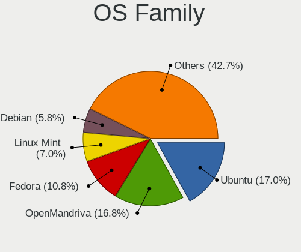
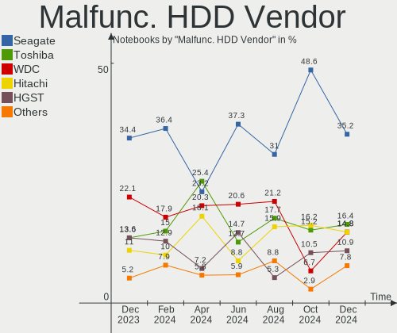
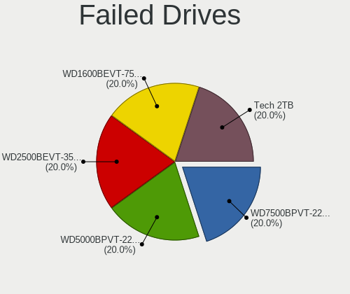

Linux - Hardware Trends (Notebooks)
-----------------------------------

A project to identify most popular hardware characteristics and track their change
over time based on data collected by Linux users at https://Linux-Hardware.org.

Anyone can contribute to this report by the [hw-probe](https://github.com/linuxhw/hw-probe) tool:

    sudo -E hw-probe -all -upload

This report is for one last month. Overall report since the beginning of time: [TestDays](https://github.com/linuxhw/TestDays)

Period: Jul, 2023.

Contents
--------

* [ System ](#system)
  - [ OS                       ](#os)
  - [ OS Family                ](#os-family)
  - [ Kernel                   ](#kernel)
  - [ Kernel Family            ](#kernel-family)
  - [ Kernel Major Ver.        ](#kernel-major-ver)
  - [ Arch                     ](#arch)
  - [ DE                       ](#de)
  - [ Display Server           ](#display-server)
  - [ Display Manager          ](#display-manager)
  - [ OS Lang                  ](#os-lang)
  - [ Boot Mode                ](#boot-mode)
  - [ Filesystem               ](#filesystem)
  - [ Part. scheme             ](#part-scheme)
  - [ Dual Boot with Linux/BSD ](#dual-boot-with-linuxbsd)
  - [ Dual Boot (Win)          ](#dual-boot-win)

* [ Board ](#board)
  - [ Vendor                   ](#vendor)
  - [ Model                    ](#model)
  - [ Model Family             ](#model-family)
  - [ MFG Year                 ](#mfg-year)
  - [ Form Factor              ](#form-factor)
  - [ Secure Boot              ](#secure-boot)
  - [ Coreboot                 ](#coreboot)
  - [ RAM Size                 ](#ram-size)
  - [ RAM Used                 ](#ram-used)
  - [ Total Drives             ](#total-drives)
  - [ Has CD-ROM               ](#has-cd-rom)
  - [ Has Ethernet             ](#has-ethernet)
  - [ Has WiFi                 ](#has-wifi)
  - [ Has Bluetooth            ](#has-bluetooth)

* [ Location ](#location)
  - [ Country                  ](#country)
  - [ City                     ](#city)

* [ Drives ](#drives)
  - [ Drive Vendor             ](#drive-vendor)
  - [ Drive Model              ](#drive-model)
  - [ HDD Vendor               ](#hdd-vendor)
  - [ SSD Vendor               ](#ssd-vendor)
  - [ Drive Kind               ](#drive-kind)
  - [ Drive Connector          ](#drive-connector)
  - [ Drive Size               ](#drive-size)
  - [ Space Total              ](#space-total)
  - [ Space Used               ](#space-used)
  - [ Malfunc. Drives          ](#malfunc-drives)
  - [ Malfunc. Drive Vendor    ](#malfunc-drive-vendor)
  - [ Malfunc. HDD Vendor      ](#malfunc-hdd-vendor)
  - [ Malfunc. Drive Kind      ](#malfunc-drive-kind)
  - [ Failed Drives            ](#failed-drives)
  - [ Failed Drive Vendor      ](#failed-drive-vendor)
  - [ Drive Status             ](#drive-status)

* [ Storage controller ](#storage-controller)
  - [ Storage Vendor           ](#storage-vendor)
  - [ Storage Model            ](#storage-model)
  - [ Storage Kind             ](#storage-kind)

* [ Processor ](#processor)
  - [ CPU Vendor               ](#cpu-vendor)
  - [ CPU Model                ](#cpu-model)
  - [ CPU Model Family         ](#cpu-model-family)
  - [ CPU Cores                ](#cpu-cores)
  - [ CPU Sockets              ](#cpu-sockets)
  - [ CPU Threads              ](#cpu-threads)
  - [ CPU Op-Modes             ](#cpu-op-modes)
  - [ CPU Microcode            ](#cpu-microcode)
  - [ CPU Microarch            ](#cpu-microarch)

* [ Graphics ](#graphics)
  - [ GPU Vendor               ](#gpu-vendor)
  - [ GPU Model                ](#gpu-model)
  - [ GPU Combo                ](#gpu-combo)
  - [ GPU Driver               ](#gpu-driver)
  - [ GPU Memory               ](#gpu-memory)

* [ Monitor ](#monitor)
  - [ Monitor Vendor           ](#monitor-vendor)
  - [ Monitor Model            ](#monitor-model)
  - [ Monitor Resolution       ](#monitor-resolution)
  - [ Monitor Diagonal         ](#monitor-diagonal)
  - [ Monitor Width            ](#monitor-width)
  - [ Aspect Ratio             ](#aspect-ratio)
  - [ Monitor Area             ](#monitor-area)
  - [ Pixel Density            ](#pixel-density)
  - [ Multiple Monitors        ](#multiple-monitors)

* [ Network ](#network)
  - [ Net Controller Vendor    ](#net-controller-vendor)
  - [ Net Controller Model     ](#net-controller-model)
  - [ Wireless Vendor          ](#wireless-vendor)
  - [ Wireless Model           ](#wireless-model)
  - [ Ethernet Vendor          ](#ethernet-vendor)
  - [ Ethernet Model           ](#ethernet-model)
  - [ Net Controller Kind      ](#net-controller-kind)
  - [ Used Controller          ](#used-controller)
  - [ NICs                     ](#nics)
  - [ IPv6                     ](#ipv6)

* [ Bluetooth ](#bluetooth)
  - [ Bluetooth Vendor         ](#bluetooth-vendor)
  - [ Bluetooth Model          ](#bluetooth-model)

* [ Sound ](#sound)
  - [ Sound Vendor             ](#sound-vendor)
  - [ Sound Model              ](#sound-model)

* [ Memory ](#memory)
  - [ Memory Vendor            ](#memory-vendor)
  - [ Memory Model             ](#memory-model)
  - [ Memory Kind              ](#memory-kind)
  - [ Memory Form Factor       ](#memory-form-factor)
  - [ Memory Size              ](#memory-size)
  - [ Memory Speed             ](#memory-speed)

* [ Printers & scanners ](#printers--scanners)
  - [ Printer Vendor           ](#printer-vendor)
  - [ Printer Model            ](#printer-model)
  - [ Scanner Vendor           ](#scanner-vendor)
  - [ Scanner Model            ](#scanner-model)

* [ Camera ](#camera)
  - [ Camera Vendor            ](#camera-vendor)
  - [ Camera Model             ](#camera-model)

* [ Security ](#security)
  - [ Fingerprint Vendor       ](#fingerprint-vendor)
  - [ Fingerprint Model        ](#fingerprint-model)
  - [ Chipcard Vendor          ](#chipcard-vendor)
  - [ Chipcard Model           ](#chipcard-model)

* [ Unsupported ](#unsupported)
  - [ Unsupported Devices      ](#unsupported-devices)
  - [ Unsupported Device Types ](#unsupported-device-types)

System
------

OS
--

Installed operating systems

| Name                         | Notebooks | Percent |
|------------------------------|-----------|---------|
| Ubuntu 22.04                 | 330       | 11.95%  |
| Fedora 38                    | 251       | 9.09%   |
| Debian 12                    | 162       | 5.87%   |
| Ubuntu 23.04                 | 140       | 5.07%   |
| Linux Mint 21.1              | 138       | 5%      |
| Arch Rolling                 | 121       | 4.38%   |
| Pop!_OS 22.04                | 117       | 4.24%   |
| OpenMandriva 23.03           | 88        | 3.19%   |
| Linux Mint 21.2              | 86        | 3.11%   |
| ROSA 12.4                    | 82        | 2.97%   |
| Zorin 16                     | 74        | 2.68%   |
| ArcoLinux Rolling            | 58        | 2.1%    |
| OpenMandriva 23.07           | 53        | 1.92%   |
| Ubuntu 20.04                 | 52        | 1.88%   |
| SteamOS 3.4.8                | 44        | 1.59%   |
| openSUSE Tumbleweed-XXXXXXXX | 42        | 1.52%   |
| EndeavourOS Rolling          | 42        | 1.52%   |
| Manjaro                      | 39        | 1.41%   |
| Kali 2023.2                  | 38        | 1.38%   |
| KDE neon 22.04               | 36        | 1.3%    |
| Debian 11                    | 36        | 1.3%    |
| Manjaro 23.0.0               | 28        | 1.01%   |
| Xubuntu 22.04                | 27        | 0.98%   |
| Xero Rolling                 | 27        | 0.98%   |
| Kubuntu 22.04                | 27        | 0.98%   |
| BlackPanther 18.1            | 25        | 0.91%   |
| Ubuntu 22.10                 | 24        | 0.87%   |
| Kubuntu 23.04                | 24        | 0.87%   |
| Debian                       | 24        | 0.87%   |
| openSUSE Leap-15.5           | 20        | 0.72%   |
| Parrot 5.3                   | 17        | 0.62%   |
| Gentoo 2.13                  | 17        | 0.62%   |
| Elementary 7                 | 17        | 0.62%   |
| Linux Mint 20.3              | 16        | 0.58%   |
| OpenMandriva 4.3             | 15        | 0.54%   |
| Fedora 37                    | 15        | 0.54%   |
| Nobara 38                    | 14        | 0.51%   |
| MX 21                        | 14        | 0.51%   |
| OpenMandriva 23.06           | 12        | 0.43%   |
| MX 23                        | 11        | 0.4%    |

OS Family
---------

OS without a version

| Name             | Notebooks | Percent |
|------------------|-----------|---------|
| Ubuntu           | 556       | 20.13%  |
| Fedora           | 271       | 9.81%   |
| Linux Mint       | 268       | 9.7%    |
| Debian           | 223       | 8.07%   |
| OpenMandriva     | 193       | 6.99%   |
| Arch             | 122       | 4.42%   |
| Pop!_OS          | 119       | 4.31%   |
| ROSA             | 96        | 3.48%   |
| Zorin            | 82        | 2.97%   |
| Manjaro          | 68        | 2.46%   |
| openSUSE         | 66        | 2.39%   |
| ArcoLinux        | 60        | 2.17%   |
| SteamOS          | 56        | 2.03%   |
| Kubuntu          | 56        | 2.03%   |
| EndeavourOS      | 42        | 1.52%   |
| Xubuntu          | 41        | 1.48%   |
| Kali             | 41        | 1.48%   |
| KDE neon         | 36        | 1.3%    |
| BlackPanther     | 29        | 1.05%   |
| Xero             | 27        | 0.98%   |
| MX               | 25        | 0.91%   |
| Elementary       | 21        | 0.76%   |
| Ubuntu MATE      | 20        | 0.72%   |
| Gentoo           | 19        | 0.69%   |
| Nobara           | 18        | 0.65%   |
| Lubuntu          | 18        | 0.65%   |
| Parrot           | 17        | 0.62%   |
| Endless          | 12        | 0.43%   |
| TUXEDO OS        | 10        | 0.36%   |
| LMDE             | 10        | 0.36%   |
| NixOS            | 9         | 0.33%   |
| Garuda Linux     | 9         | 0.33%   |
| Ubuntu Budgie    | 8         | 0.29%   |
| ALT Linux        | 8         | 0.29%   |
| blendOS          | 7         | 0.25%   |
| Red OS           | 6         | 0.22%   |
| Lilidog          | 5         | 0.18%   |
| Devuan           | 5         | 0.18%   |
| PostmarketOS     | 4         | 0.14%   |
| org.kde.Platform | 4         | 0.14%   |

Kernel
------

Version of the Linux kernel

| Version                           | Notebooks | Percent |
|-----------------------------------|-----------|---------|
| 5.19.0-46-generic                 | 310       | 11.22%  |
| 5.15.0-76-generic                 | 262       | 9.49%   |
| 6.2.6-76060206-generic            | 106       | 3.84%   |
| 6.1.0-10-amd64                    | 99        | 3.58%   |
| 6.2.6-desktop-1omv2390            | 88        | 3.19%   |
| 6.2.0-25-generic                  | 67        | 2.43%   |
| 5.15.0-78-generic                 | 63        | 2.28%   |
| 6.3.12-200.fc38.x86_64            | 61        | 2.21%   |
| 6.3.5-desktop-3omv2390            | 60        | 2.17%   |
| 6.1.0-9-amd64                     | 56        | 2.03%   |
| 5.19.0-50-generic                 | 56        | 2.03%   |
| 6.2.0-24-generic                  | 55        | 1.99%   |
| 6.3.8-200.fc38.x86_64             | 50        | 1.81%   |
| 6.3.11-200.fc38.x86_64            | 49        | 1.77%   |
| 5.13.0-valve36-1-neptune          | 46        | 1.67%   |
| 5.10.0-23-amd64                   | 43        | 1.56%   |
| 6.1.38-generic-1rosa2021.1-x86_64 | 41        | 1.48%   |
| 6.1.20-generic-2rosa2021.1-x86_64 | 30        | 1.09%   |
| 6.4.4-200.fc38.x86_64             | 27        | 0.98%   |
| 6.4.6-200.fc38.x86_64             | 26        | 0.94%   |
| 6.4.3-arch1-2                     | 25        | 0.91%   |
| 6.4.2-arch1-1                     | 24        | 0.87%   |
| 6.2.0-26-generic                  | 24        | 0.87%   |
| 6.4.1-arch2-1                     | 23        | 0.83%   |
| 6.2.9-300.fc38.x86_64             | 22        | 0.8%    |
| 5.19.0-32-generic                 | 22        | 0.8%    |
| 6.1.0-kali9-amd64                 | 20        | 0.72%   |
| 6.4.3-arch1-1                     | 19        | 0.69%   |
| 6.3.9-1-default                   | 19        | 0.69%   |
| 6.2.0-20-generic                  | 19        | 0.69%   |
| 6.4.4-arch1-1                     | 18        | 0.65%   |
| 5.4.0-153-generic                 | 18        | 0.65%   |
| 6.3.9-arch1-1                     | 17        | 0.62%   |
| 6.3.0-1-amd64                     | 16        | 0.58%   |
| 6.1.0-1parrot1-amd64              | 16        | 0.58%   |
| 5.6.14-desktop-2bP                | 16        | 0.58%   |
| 5.4.0-150-generic                 | 16        | 0.58%   |
| 5.14.21-150500.53-default         | 16        | 0.58%   |
| 6.3.0-kali1-amd64                 | 15        | 0.54%   |
| 6.1.31-2-MANJARO                  | 15        | 0.54%   |

Kernel Family
-------------

Linux kernel without a distro release

| Version | Notebooks | Percent |
|---------|-----------|---------|
| 5.19.0  | 430       | 15.57%  |
| 5.15.0  | 398       | 14.41%  |
| 6.1.0   | 226       | 8.18%   |
| 6.2.6   | 194       | 7.02%   |
| 6.2.0   | 192       | 6.95%   |
| 6.4.3   | 88        | 3.19%   |
| 6.1.38  | 80        | 2.9%    |
| 6.3.12  | 79        | 2.86%   |
| 6.3.5   | 66        | 2.39%   |
| 6.3.8   | 65        | 2.35%   |
| 5.10.0  | 62        | 2.24%   |
| 6.4.6   | 60        | 2.17%   |
| 6.4.4   | 60        | 2.17%   |
| 6.4.2   | 58        | 2.1%    |
| 5.13.0  | 56        | 2.03%   |
| 5.4.0   | 52        | 1.88%   |
| 6.3.11  | 51        | 1.85%   |
| 6.3.9   | 49        | 1.77%   |
| 6.4.1   | 45        | 1.63%   |
| 6.3.0   | 38        | 1.38%   |
| 6.4.0   | 35        | 1.27%   |
| 6.1.20  | 32        | 1.16%   |
| 6.2.9   | 22        | 0.8%    |
| 5.14.21 | 21        | 0.76%   |
| 6.1.31  | 18        | 0.65%   |
| 6.1.39  | 16        | 0.58%   |
| 5.6.14  | 16        | 0.58%   |
| 6.1.1   | 12        | 0.43%   |
| 6.4.7   | 11        | 0.4%    |
| 6.4.5   | 10        | 0.36%   |
| 6.3.10  | 9         | 0.33%   |
| 6.2.15  | 8         | 0.29%   |
| 5.16.7  | 8         | 0.29%   |
| 6.0.0   | 7         | 0.25%   |
| 5.16.13 | 7         | 0.25%   |
| 5.14.0  | 7         | 0.25%   |
| 5.11.0  | 7         | 0.25%   |
| 4.18.16 | 7         | 0.25%   |
| 6.1.41  | 6         | 0.22%   |
| 4.15.0  | 6         | 0.22%   |

Kernel Major Ver.
-----------------

Linux kernel major version

| Version | Notebooks | Percent |
|---------|-----------|---------|
| 5.19    | 432       | 15.64%  |
| 6.2     | 429       | 15.53%  |
| 5.15    | 423       | 15.31%  |
| 6.1     | 412       | 14.92%  |
| 6.3     | 377       | 13.65%  |
| 6.4     | 367       | 13.29%  |
| 5.10    | 80        | 2.9%    |
| 5.13    | 57        | 2.06%   |
| 5.4     | 56        | 2.03%   |
| 5.14    | 28        | 1.01%   |
| 6.0     | 19        | 0.69%   |
| 5.6     | 16        | 0.58%   |
| 5.16    | 16        | 0.58%   |
| 5.11    | 9         | 0.33%   |
| 4.18    | 7         | 0.25%   |
| 5.18    | 6         | 0.22%   |
| 4.9     | 6         | 0.22%   |
| 4.15    | 6         | 0.22%   |
| 6.5     | 5         | 0.18%   |
| 5.17    | 5         | 0.18%   |
| 6.3.3   | 1         | 0.04%   |
| 5.8     | 1         | 0.04%   |
| 5.1     | 1         | 0.04%   |
| 4.4     | 1         | 0.04%   |
| 3.10    | 1         | 0.04%   |
| 3.1     | 1         | 0.04%   |

Arch
----

OS architecture (x86_64, i586, etc.)

| Name    | Notebooks | Percent |
|---------|-----------|---------|
| x86_64  | 2723      | 98.59%  |
| i686    | 28        | 1.01%   |
| armv7l  | 7         | 0.25%   |
| aarch64 | 4         | 0.14%   |

DE
--

Desktop Environment

| Name             | Notebooks | Percent |
|------------------|-----------|---------|
| GNOME            | 1185      | 42.9%   |
| KDE5             | 731       | 26.47%  |
| XFCE             | 250       | 9.05%   |
| X-Cinnamon       | 240       | 8.69%   |
| MATE             | 88        | 3.19%   |
| Unknown          | 58        | 2.1%    |
| LXQt             | 43        | 1.56%   |
| Cinnamon         | 27        | 0.98%   |
| Pantheon         | 23        | 0.83%   |
| i3               | 16        | 0.58%   |
| Hyprland         | 13        | 0.47%   |
| Budgie           | 12        | 0.43%   |
| LXDE             | 9         | 0.33%   |
| sway             | 7         | 0.25%   |
| Deepin           | 7         | 0.25%   |
| lightdm-xsession | 6         | 0.22%   |
| KDE4             | 6         | 0.22%   |
| KDE              | 4         | 0.14%   |
| Unity            | 3         | 0.11%   |
| openbox          | 3         | 0.11%   |
| GNOME Classic    | 3         | 0.11%   |
| Enlightenment    | 3         | 0.11%   |
| DWM              | 3         | 0.11%   |
| BunsenLabs       | 3         | 0.11%   |
| bspwm            | 3         | 0.11%   |
| Trinity          | 2         | 0.07%   |
| qtile            | 2         | 0.07%   |
| LeftWM           | 2         | 0.07%   |
| awesome          | 2         | 0.07%   |
| UKUI             | 1         | 0.04%   |
| river            | 1         | 0.04%   |
| Jwm              | 1         | 0.04%   |
| GNOME-Classic    | 1         | 0.04%   |
| GNOME Flashback  | 1         | 0.04%   |
| gamescope        | 1         | 0.04%   |
| fly              | 1         | 0.04%   |
| fluxbox          | 1         | 0.04%   |

Display Server
--------------

X11 or Wayland

| Name        | Notebooks | Percent |
|-------------|-----------|---------|
| X11         | 1777      | 64.34%  |
| Wayland     | 918       | 33.24%  |
| Unknown     | 40        | 1.45%   |
| Tty         | 26        | 0.94%   |
| Unspecified | 1         | 0.04%   |

Display Manager
---------------

SDDM, LightDM, etc.

| Name    | Notebooks | Percent |
|---------|-----------|---------|
| Unknown | 915       | 33.13%  |
| GDM3    | 580       | 21%     |
| SDDM    | 569       | 20.6%   |
| LightDM | 462       | 16.73%  |
| GDM     | 212       | 7.68%   |
| LXDM    | 6         | 0.22%   |
| GREETD  | 5         | 0.18%   |
| KDM     | 4         | 0.14%   |
| SLiM    | 3         | 0.11%   |
| Ly      | 3         | 0.11%   |
| LY-DM   | 2         | 0.07%   |
| TDM     | 1         | 0.04%   |

OS Lang
-------

Language

| Lang    | Notebooks | Percent |
|---------|-----------|---------|
| en_US   | 1189      | 43.05%  |
| de_DE   | 211       | 7.64%   |
| ru_RU   | 196       | 7.1%    |
| en_GB   | 160       | 5.79%   |
| pt_BR   | 130       | 4.71%   |
| fr_FR   | 109       | 3.95%   |
| it_IT   | 75        | 2.72%   |
| es_ES   | 72        | 2.61%   |
| pl_PL   | 53        | 1.92%   |
| Unknown | 52        | 1.88%   |
| en_CA   | 51        | 1.85%   |
| en_IN   | 50        | 1.81%   |
| C       | 45        | 1.63%   |
| en_AU   | 26        | 0.94%   |
| es_MX   | 25        | 0.91%   |
| zh_CN   | 21        | 0.76%   |
| hu_HU   | 19        | 0.69%   |
| nl_NL   | 15        | 0.54%   |
| cs_CZ   | 14        | 0.51%   |
| sv_SE   | 12        | 0.43%   |
| es_AR   | 12        | 0.43%   |
| en_IE   | 12        | 0.43%   |
| es_CL   | 11        | 0.4%    |
| es_CO   | 10        | 0.36%   |
| nb_NO   | 9         | 0.33%   |
| ja_JP   | 9         | 0.33%   |
| fr_CA   | 9         | 0.33%   |
| de_AT   | 9         | 0.33%   |
| de_CH   | 8         | 0.29%   |
| da_DK   | 8         | 0.29%   |
| pt_PT   | 7         | 0.25%   |
| es_VE   | 7         | 0.25%   |
| en_PH   | 7         | 0.25%   |
| en_NZ   | 7         | 0.25%   |
| fr_BE   | 6         | 0.22%   |
| fi_FI   | 6         | 0.22%   |
| es_PE   | 6         | 0.22%   |
| en_ZA   | 6         | 0.22%   |
| en_HK   | 6         | 0.22%   |
| tr_TR   | 5         | 0.18%   |

Boot Mode
---------

EFI or BIOS

| Mode | Notebooks | Percent |
|------|-----------|---------|
| EFI  | 1532      | 55.47%  |
| BIOS | 1230      | 44.53%  |

Filesystem
----------

Type of filesystem

| Type    | Notebooks | Percent |
|---------|-----------|---------|
| Ext4    | 1614      | 58.44%  |
| Btrfs   | 535       | 19.37%  |
| Tmpfs   | 393       | 14.23%  |
| Overlay | 150       | 5.43%   |
| Xfs     | 44        | 1.59%   |
| Zfs     | 16        | 0.58%   |
| F2fs    | 6         | 0.22%   |
| Unknown | 2         | 0.07%   |
| Ext2    | 1         | 0.04%   |
| Aufs    | 1         | 0.04%   |

Part. scheme
------------

Scheme of partitioning

| Type    | Notebooks | Percent |
|---------|-----------|---------|
| GPT     | 1593      | 57.68%  |
| Unknown | 872       | 31.57%  |
| MBR     | 297       | 10.75%  |

Dual Boot with Linux/BSD
------------------------

Hosting more than one Linux/BSD

| Dual boot | Notebooks | Percent |
|-----------|-----------|---------|
| No        | 2445      | 88.52%  |
| Yes       | 317       | 11.48%  |

Dual Boot (Win)
---------------

Hosting Linux and Windows

| Dual boot | Notebooks | Percent |
|-----------|-----------|---------|
| No        | 2068      | 74.87%  |
| Yes       | 694       | 25.13%  |

Board
-----

Vendor
------

Motherboard manufacturer

| Name                   | Notebooks | Percent |
|------------------------|-----------|---------|
| Lenovo                 | 573       | 20.75%  |
| Hewlett-Packard        | 486       | 17.6%   |
| Dell                   | 403       | 14.59%  |
| ASUSTek Computer       | 292       | 10.57%  |
| Acer                   | 230       | 8.33%   |
| Apple                  | 120       | 4.34%   |
| MSI                    | 72        | 2.61%   |
| Valve                  | 52        | 1.88%   |
| Toshiba                | 46        | 1.67%   |
| HUAWEI                 | 44        | 1.59%   |
| Samsung Electronics    | 39        | 1.41%   |
| Google                 | 37        | 1.34%   |
| Fujitsu                | 29        | 1.05%   |
| Sony                   | 25        | 0.91%   |
| Unknown                | 20        | 0.72%   |
| TUXEDO                 | 18        | 0.65%   |
| Notebook               | 18        | 0.65%   |
| Timi                   | 17        | 0.62%   |
| Medion                 | 14        | 0.51%   |
| Alienware              | 14        | 0.51%   |
| Positivo               | 11        | 0.4%    |
| Gigabyte Technology    | 11        | 0.4%    |
| Packard Bell           | 8         | 0.29%   |
| HONOR                  | 8         | 0.29%   |
| Chuwi                  | 8         | 0.29%   |
| LG Electronics         | 7         | 0.25%   |
| GPU Company            | 7         | 0.25%   |
| Fujitsu Siemens        | 7         | 0.25%   |
| System76               | 6         | 0.22%   |
| Panasonic              | 6         | 0.22%   |
| Thomson                | 5         | 0.18%   |
| Teclast                | 5         | 0.18%   |
| Gateway                | 4         | 0.14%   |
| SLIMBOOK               | 3         | 0.11%   |
| Multilaser             | 3         | 0.11%   |
| Infinix                | 3         | 0.11%   |
| Compaq                 | 3         | 0.11%   |
| Avell High Performance | 3         | 0.11%   |
| XIAOMI                 | 2         | 0.07%   |
| Wortmann AG            | 2         | 0.07%   |

Model
-----

Motherboard model

| Name                            | Notebooks | Percent |
|---------------------------------|-----------|---------|
| Valve Jupiter                   | 52        | 1.88%   |
| Unknown                         | 31        | 1.12%   |
| HP Notebook                     | 15        | 0.54%   |
| Apple MacBookPro9,2             | 14        | 0.51%   |
| Apple MacBookPro8,1             | 14        | 0.51%   |
| Lenovo IdeaPad 3 15ADA05 81W1   | 8         | 0.29%   |
| HP EliteBook 840 G5             | 8         | 0.29%   |
| Dell XPS 15 7590                | 8         | 0.29%   |
| Apple MacBookPro11,1            | 8         | 0.29%   |
| HP Pavilion 17                  | 7         | 0.25%   |
| HP Pavilion 15                  | 7         | 0.25%   |
| Apple MacBookPro12,1            | 7         | 0.25%   |
| Lenovo G50-70 20351             | 6         | 0.22%   |
| HP Pavilion Laptop 15-eh1xxx    | 6         | 0.22%   |
| HP Pavilion dv6                 | 6         | 0.22%   |
| HP Laptop 17-cp0xxx             | 6         | 0.22%   |
| HP EliteBook 840 G3             | 6         | 0.22%   |
| Dell Latitude 7480              | 6         | 0.22%   |
| Timi Mi NoteBook Ultra          | 5         | 0.18%   |
| HUAWEI BOM-WXX9                 | 5         | 0.18%   |
| HUAWEI BOHB-WAX9                | 5         | 0.18%   |
| HUAWEI BOD-WXX9                 | 5         | 0.18%   |
| HP Victus by Laptop 16-e0xxx    | 5         | 0.18%   |
| HP Pavilion Notebook            | 5         | 0.18%   |
| HP Pavilion dv7                 | 5         | 0.18%   |
| HP Laptop 15-fc0xxx             | 5         | 0.18%   |
| HP 15                           | 5         | 0.18%   |
| Dell Latitude E6420             | 5         | 0.18%   |
| Dell Latitude E6400             | 5         | 0.18%   |
| Dell Latitude 7490              | 5         | 0.18%   |
| Dell Inspiron N5110             | 5         | 0.18%   |
| Dell Inspiron 1545              | 5         | 0.18%   |
| Apple MacBookAir7,2             | 5         | 0.18%   |
| Acer Aspire E5-573G             | 5         | 0.18%   |
| Acer Aspire A515-56             | 5         | 0.18%   |
| Toshiba Satellite L755          | 4         | 0.14%   |
| MSI GF63 Thin 11UC              | 4         | 0.14%   |
| MSI Alpha 15 B5EEK              | 4         | 0.14%   |
| Lenovo ThinkBook 15 G3 ACL 21A4 | 4         | 0.14%   |
| Lenovo ThinkBook 15 G2 ITL 20VE | 4         | 0.14%   |

Model Family
------------

Motherboard model prefix

| Name               | Notebooks | Percent |
|--------------------|-----------|---------|
| Lenovo ThinkPad    | 293       | 10.61%  |
| Dell Latitude      | 158       | 5.72%   |
| Lenovo IdeaPad     | 144       | 5.21%   |
| Acer Aspire        | 143       | 5.18%   |
| Dell Inspiron      | 122       | 4.42%   |
| HP Pavilion        | 96        | 3.48%   |
| ASUS VivoBook      | 89        | 3.22%   |
| HP EliteBook       | 85        | 3.08%   |
| HP Laptop          | 73        | 2.64%   |
| HP ProBook         | 57        | 2.06%   |
| Valve Jupiter      | 52        | 1.88%   |
| Dell XPS           | 48        | 1.74%   |
| ASUS ROG           | 40        | 1.45%   |
| Toshiba Satellite  | 34        | 1.23%   |
| Lenovo Legion      | 33        | 1.19%   |
| Unknown            | 31        | 1.12%   |
| Dell Precision     | 28        | 1.01%   |
| Acer Nitro         | 27        | 0.98%   |
| Fujitsu LIFEBOOK   | 26        | 0.94%   |
| ASUS ASUS          | 23        | 0.83%   |
| HP ENVY            | 20        | 0.72%   |
| Acer Swift         | 20        | 0.72%   |
| HP ZBook           | 19        | 0.69%   |
| ASUS ZenBook       | 19        | 0.69%   |
| Dell Vostro        | 18        | 0.65%   |
| Apple MacBookPro8  | 18        | 0.65%   |
| Apple MacBookPro11 | 18        | 0.65%   |
| Lenovo ThinkBook   | 17        | 0.62%   |
| HP Compaq          | 16        | 0.58%   |
| Apple MacBookPro9  | 16        | 0.58%   |
| HP Notebook        | 15        | 0.54%   |
| Lenovo Yoga        | 14        | 0.51%   |
| HP OMEN            | 13        | 0.47%   |
| HP 255             | 13        | 0.47%   |
| HP 250             | 13        | 0.47%   |
| Lenovo V15         | 10        | 0.36%   |
| Acer Predator      | 10        | 0.36%   |
| Acer Extensa       | 10        | 0.36%   |
| MSI GF63           | 9         | 0.33%   |
| HP Victus          | 9         | 0.33%   |

MFG Year
--------

Motherboard manufacture year

| Year    | Notebooks | Percent |
|---------|-----------|---------|
| 2021    | 371       | 13.43%  |
| 2022    | 307       | 11.12%  |
| 2020    | 260       | 9.41%   |
| 2019    | 214       | 7.75%   |
| 2018    | 190       | 6.88%   |
| 2012    | 178       | 6.44%   |
| 2013    | 157       | 5.68%   |
| 2011    | 152       | 5.5%    |
| 2017    | 142       | 5.14%   |
| 2016    | 134       | 4.85%   |
| 2015    | 119       | 4.31%   |
| 2014    | 119       | 4.31%   |
| 2023    | 118       | 4.27%   |
| 2010    | 107       | 3.87%   |
| 2008    | 80        | 2.9%    |
| 2009    | 60        | 2.17%   |
| 2007    | 28        | 1.01%   |
| 2006    | 11        | 0.4%    |
| Unknown | 10        | 0.36%   |
| 2005    | 5         | 0.18%   |

Form Factor
-----------

Physical design of the computer

| Name     | Notebooks | Percent |
|----------|-----------|---------|
| Notebook | 2762      | 100%    |

Secure Boot
-----------

Enabled or disabled

| State    | Notebooks | Percent |
|----------|-----------|---------|
| Disabled | 2510      | 90.88%  |
| Enabled  | 252       | 9.12%   |

Coreboot
--------

Have coreboot on board

| Used | Notebooks | Percent |
|------|-----------|---------|
| No   | 2723      | 98.59%  |
| Yes  | 39        | 1.41%   |

RAM Size
--------

Total RAM memory

| Size in GB  | Notebooks | Percent |
|-------------|-----------|---------|
| 4.01-8.0    | 810       | 29.33%  |
| 8.01-16.0   | 531       | 19.23%  |
| 16.01-24.0  | 508       | 18.39%  |
| 3.01-4.0    | 445       | 16.11%  |
| 32.01-64.0  | 258       | 9.34%   |
| 1.01-2.0    | 68        | 2.46%   |
| 64.01-256.0 | 59        | 2.14%   |
| 24.01-32.0  | 46        | 1.67%   |
| 2.01-3.0    | 29        | 1.05%   |
| 0.51-1.0    | 6         | 0.22%   |
| 0.01-0.5    | 2         | 0.07%   |

RAM Used
--------

Used RAM memory

| Used GB    | Notebooks | Percent |
|------------|-----------|---------|
| 1.01-2.0   | 792       | 28.67%  |
| 2.01-3.0   | 722       | 26.14%  |
| 4.01-8.0   | 528       | 19.12%  |
| 3.01-4.0   | 423       | 15.31%  |
| 8.01-16.0  | 142       | 5.14%   |
| 0.51-1.0   | 114       | 4.13%   |
| 16.01-24.0 | 17        | 0.62%   |
| 0.01-0.5   | 16        | 0.58%   |
| 24.01-32.0 | 5         | 0.18%   |
| 32.01-64.0 | 2         | 0.07%   |
| Unknown    | 1         | 0.04%   |

Total Drives
------------

Number of drives on board

| Drives | Notebooks | Percent |
|--------|-----------|---------|
| 1      | 1954      | 70.75%  |
| 2      | 693       | 25.09%  |
| 3      | 78        | 2.82%   |
| 4      | 17        | 0.62%   |
| 0      | 16        | 0.58%   |
| 5      | 4         | 0.14%   |

Has CD-ROM
----------

Has CD-ROM on board

| Presented | Notebooks | Percent |
|-----------|-----------|---------|
| No        | 2020      | 73.14%  |
| Yes       | 742       | 26.86%  |

Has Ethernet
------------

Has Ethernet on board

| Presented | Notebooks | Percent |
|-----------|-----------|---------|
| Yes       | 2095      | 75.85%  |
| No        | 667       | 24.15%  |

Has WiFi
--------

Has WiFi module

| Presented | Notebooks | Percent |
|-----------|-----------|---------|
| Yes       | 2701      | 97.79%  |
| No        | 61        | 2.21%   |

Has Bluetooth
-------------

Has Bluetooth module

| Presented | Notebooks | Percent |
|-----------|-----------|---------|
| Yes       | 2274      | 82.33%  |
| No        | 488       | 17.67%  |

Location
--------

Country
-------

Geographic location (country)

| Country     | Notebooks | Percent |
|-------------|-----------|---------|
| USA         | 481       | 17.41%  |
| Germany     | 278       | 10.07%  |
| Russia      | 211       | 7.64%   |
| Brazil      | 186       | 6.73%   |
| France      | 124       | 4.49%   |
| UK          | 122       | 4.42%   |
| Italy       | 108       | 3.91%   |
| India       | 80        | 2.9%    |
| Canada      | 78        | 2.82%   |
| Poland      | 72        | 2.61%   |
| Spain       | 70        | 2.53%   |
| Hungary     | 52        | 1.88%   |
| Mexico      | 50        | 1.81%   |
| Netherlands | 49        | 1.77%   |
| Turkey      | 42        | 1.52%   |
| Australia   | 38        | 1.38%   |
| Sweden      | 34        | 1.23%   |
| Czechia     | 27        | 0.98%   |
| Greece      | 26        | 0.94%   |
| China       | 25        | 0.91%   |
| Argentina   | 25        | 0.91%   |
| Switzerland | 24        | 0.87%   |
| Indonesia   | 24        | 0.87%   |
| Belgium     | 24        | 0.87%   |
| Norway      | 22        | 0.8%    |
| Japan       | 21        | 0.76%   |
| Austria     | 19        | 0.69%   |
| Romania     | 18        | 0.65%   |
| Colombia    | 17        | 0.62%   |
| Chile       | 17        | 0.62%   |
| Portugal    | 16        | 0.58%   |
| Denmark     | 16        | 0.58%   |
| Bulgaria    | 16        | 0.58%   |
| Ireland     | 14        | 0.51%   |
| Belarus     | 14        | 0.51%   |
| Hong Kong   | 13        | 0.47%   |
| Philippines | 12        | 0.43%   |
| Peru        | 12        | 0.43%   |
| Finland     | 12        | 0.43%   |
| Vietnam     | 11        | 0.4%    |

City
----

Geographic location (city)

| City           | Notebooks | Percent |
|----------------|-----------|---------|
| Moscow         | 53        | 1.92%   |
| Berlin         | 29        | 1.05%   |
| St Petersburg  | 24        | 0.87%   |
| Warsaw         | 22        | 0.8%    |
| Sao Paulo      | 19        | 0.69%   |
| Paris          | 19        | 0.69%   |
| Budapest       | 19        | 0.69%   |
| Istanbul       | 15        | 0.54%   |
| Prague         | 14        | 0.51%   |
| Los Angeles    | 14        | 0.51%   |
| Athens         | 14        | 0.51%   |
| Vienna         | 13        | 0.47%   |
| Delhi          | 13        | 0.47%   |
| Sydney         | 12        | 0.43%   |
| Melbourne      | 12        | 0.43%   |
| Madrid         | 12        | 0.43%   |
| Munich         | 11        | 0.4%    |
| Rio de Janeiro | 10        | 0.36%   |
| Milan          | 10        | 0.36%   |
| Dublin         | 10        | 0.36%   |
| Central        | 10        | 0.36%   |
| Ankara         | 10        | 0.36%   |
| Toronto        | 9         | 0.33%   |
| Stockholm      | 9         | 0.33%   |
| Sofia          | 9         | 0.33%   |
| Mexico City    | 9         | 0.33%   |
| Hamburg        | 9         | 0.33%   |
| Denver         | 9         | 0.33%   |
| Curitiba       | 9         | 0.33%   |
| Brasília      | 9         | 0.33%   |
| Bengaluru      | 9         | 0.33%   |
| Vancouver      | 8         | 0.29%   |
| Saratov        | 8         | 0.29%   |
| Samara         | 8         | 0.29%   |
| Nairobi        | 8         | 0.29%   |
| Montreal       | 8         | 0.29%   |
| Lisbon         | 8         | 0.29%   |
| Krasnodar      | 8         | 0.29%   |
| Hyderabad      | 8         | 0.29%   |
| Cologne        | 8         | 0.29%   |

Drives
------

Drive Vendor
------------

Hard drive vendors

| Vendor                       | Notebooks | Drives | Percent |
|------------------------------|-----------|--------|---------|
| Samsung Electronics          | 611       | 659    | 17.54%  |
| WDC                          | 297       | 309    | 8.52%   |
| SanDisk                      | 257       | 266    | 7.38%   |
| Seagate                      | 235       | 243    | 6.75%   |
| Toshiba                      | 198       | 202    | 5.68%   |
| Kingston                     | 185       | 191    | 5.31%   |
| SK hynix                     | 178       | 179    | 5.11%   |
| Unknown                      | 175       | 189    | 5.02%   |
| Micron Technology            | 133       | 134    | 3.82%   |
| Intel                        | 124       | 132    | 3.56%   |
| Crucial                      | 99        | 100    | 2.84%   |
| HGST                         | 67        | 67     | 1.92%   |
| Apple                        | 64        | 70     | 1.84%   |
| KIOXIA                       | 59        | 60     | 1.69%   |
| Hitachi                      | 59        | 59     | 1.69%   |
| China                        | 54        | 56     | 1.55%   |
| A-DATA Technology            | 48        | 48     | 1.38%   |
| Kingston Technology Company  | 39        | 40     | 1.12%   |
| Phison Electronics           | 36        | 36     | 1.03%   |
| Unknown                      | 36        | 37     | 1.03%   |
| Silicon Motion               | 30        | 30     | 0.86%   |
| Micron/Crucial Technology    | 30        | 31     | 0.86%   |
| SPCC                         | 24        | 24     | 0.69%   |
| PNY                          | 18        | 20     | 0.52%   |
| Intenso                      | 17        | 18     | 0.49%   |
| Netac                        | 16        | 16     | 0.46%   |
| LITEON                       | 15        | 16     | 0.43%   |
| JMicron Technology           | 15        | 16     | 0.43%   |
| Fujitsu                      | 13        | 13     | 0.37%   |
| Patriot                      | 12        | 12     | 0.34%   |
| Transcend                    | 11        | 11     | 0.32%   |
| O2 Micro                     | 11        | 11     | 0.32%   |
| LITEONIT                     | 10        | 10     | 0.29%   |
| Gigabyte Technology          | 10        | 10     | 0.29%   |
| SSSTC                        | 9         | 9      | 0.26%   |
| Realtek Semiconductor        | 9         | 9      | 0.26%   |
| Phison                       | 9         | 9      | 0.26%   |
| MAXIO Technology (Hangzhou)  | 9         | 9      | 0.26%   |
| Shenzhen Longsys Electronics | 8         | 8      | 0.23%   |
| Lenovo                       | 8         | 8      | 0.23%   |

Drive Model
-----------

Hard drive models

| Model                                                 | Notebooks | Percent |
|-------------------------------------------------------|-----------|---------|
| Samsung NVMe SSD Controller SM981/PM981/PM983 500GB   | 84        | 2.36%   |
| Samsung NVMe SSD Controller PM9A1/PM9A3/980PRO 1TB    | 58        | 1.63%   |
| Seagate ST1000LM035-1RK172 1TB                        | 40        | 1.12%   |
| Unknown                                               | 36        | 1.01%   |
| Kingston SA400S37240G 240GB SSD                       | 35        | 0.98%   |
| Kingston SA400S37480G 480GB SSD                       | 33        | 0.93%   |
| Toshiba MQ01ABD100 1TB                                | 29        | 0.81%   |
| Seagate ST1000LM024 HN-M101MBB 1TB                    | 27        | 0.76%   |
| Sandisk WD Blue SN550 NVMe SSD 250GB                  | 27        | 0.76%   |
| Intel SSD 660P Series 1024GB                          | 26        | 0.73%   |
| Micron/Crucial P2 NVMe PCIe SSD 1TB                   | 25        | 0.7%    |
| Unknown MMC Card  64GB                                | 24        | 0.67%   |
| Unknown MMC Card  32GB                                | 24        | 0.67%   |
| Toshiba MQ04ABF100 1TB                                | 24        | 0.67%   |
| Sandisk WD Black SN750 / PC SN730 NVMe SSD 1024GB     | 24        | 0.67%   |
| Unknown MMC Card  128GB                               | 23        | 0.65%   |
| HGST HTS721010A9E630 1TB                              | 20        | 0.56%   |
| Phison PS5013 E13 NVMe Controller 256GB               | 19        | 0.53%   |
| Intel SSDPEKNU512GZ 512GB                             | 18        | 0.51%   |
| Samsung SSD 850 EVO 500GB                             | 17        | 0.48%   |
| Toshiba XG6 NVMe SSD Controller 512GB                 | 16        | 0.45%   |
| Silicon Motion SM2263EN/SM2263XT SSD Controller 500GB | 16        | 0.45%   |
| Kingston Company OM3PDP3 NVMe SSD 512GB               | 16        | 0.45%   |
| Toshiba MQ01ABF050 500GB                              | 13        | 0.37%   |
| Sandisk WD Blue SN500 / PC SN520 NVMe SSD 512GB       | 13        | 0.37%   |
| Samsung SSD 980 1TB                                   | 13        | 0.37%   |
| Samsung NVMe SSD Controller SM961/PM961/SM963 256GB   | 13        | 0.37%   |
| Unknown MMC Card  512GB                               | 12        | 0.34%   |
| Seagate ST500LT012-1DG142 500GB                       | 12        | 0.34%   |
| Samsung SSD 860 EVO 500GB                             | 12        | 0.34%   |
| JMicron Generic 512GB                                 | 12        | 0.34%   |
| Crucial CT1000MX500SSD1 1TB                           | 12        | 0.34%   |
| WDC WD10SPZX-21Z10T0 1TB                              | 11        | 0.31%   |
| Unknown MMC Card  16GB                                | 11        | 0.31%   |
| Sandisk WD Black SN850 1TB                            | 11        | 0.31%   |
| Samsung SSD 870 EVO 500GB                             | 11        | 0.31%   |
| Samsung SSD 850 EVO 250GB                             | 11        | 0.31%   |
| O2 Micro E2M2 64GB                                    | 11        | 0.31%   |
| Micron 2450_MTFDKBA512TFK 512GB                       | 11        | 0.31%   |
| Kingston SA400S37120G 120GB SSD                       | 11        | 0.31%   |

HDD Vendor
----------

Hard disk drive vendors

| Vendor              | Notebooks | Drives | Percent |
|---------------------|-----------|--------|---------|
| Seagate             | 226       | 233    | 29.93%  |
| WDC                 | 191       | 194    | 25.3%   |
| Toshiba             | 131       | 133    | 17.35%  |
| HGST                | 67        | 67     | 8.87%   |
| Hitachi             | 59        | 59     | 7.81%   |
| Samsung Electronics | 20        | 20     | 2.65%   |
| JMicron Technology  | 13        | 13     | 1.72%   |
| Fujitsu             | 13        | 13     | 1.72%   |
| Unknown             | 12        | 13     | 1.59%   |
| Apple               | 8         | 9      | 1.06%   |
| External            | 2         | 3      | 0.26%   |
| ASMT                | 2         | 3      | 0.26%   |
| USB3.0              | 1         | 1      | 0.13%   |
| Teleplan            | 1         | 1      | 0.13%   |
| SYMTEC              | 1         | 1      | 0.13%   |
| SSK                 | 1         | 1      | 0.13%   |
| QNAP                | 1         | 4      | 0.13%   |
| Initio              | 1         | 1      | 0.13%   |
| Inateck             | 1         | 1      | 0.13%   |
| IB                  | 1         | 2      | 0.13%   |
| Hewlett-Packard     | 1         | 1      | 0.13%   |
| ASMedia             | 1         | 1      | 0.13%   |
| ACASIS              | 1         | 1      | 0.13%   |

SSD Vendor
----------

Solid state drive vendors

| Vendor              | Notebooks | Drives | Percent |
|---------------------|-----------|--------|---------|
| Samsung Electronics | 226       | 238    | 20.87%  |
| Kingston            | 140       | 143    | 12.93%  |
| SanDisk             | 92        | 94     | 8.49%   |
| Crucial             | 88        | 88     | 8.13%   |
| China               | 53        | 55     | 4.89%   |
| WDC                 | 52        | 52     | 4.8%    |
| Apple               | 38        | 38     | 3.51%   |
| A-DATA Technology   | 30        | 30     | 2.77%   |
| Micron Technology   | 26        | 26     | 2.4%    |
| SPCC                | 23        | 23     | 2.12%   |
| SK hynix            | 23        | 23     | 2.12%   |
| Intel               | 22        | 22     | 2.03%   |
| Toshiba             | 18        | 19     | 1.66%   |
| PNY                 | 17        | 19     | 1.57%   |
| Intenso             | 15        | 16     | 1.39%   |
| LITEON              | 14        | 15     | 1.29%   |
| Netac               | 13        | 13     | 1.2%    |
| Unknown             | 13        | 13     | 1.2%    |
| Transcend           | 11        | 11     | 1.02%   |
| LITEONIT            | 10        | 10     | 0.92%   |
| Patriot             | 9         | 9      | 0.83%   |
| Gigabyte Technology | 7         | 7      | 0.65%   |
| Team                | 6         | 6      | 0.55%   |
| Plextor             | 6         | 6      | 0.55%   |
| KingSpec            | 6         | 6      | 0.55%   |
| GOODRAM             | 6         | 6      | 0.55%   |
| Apacer              | 6         | 6      | 0.55%   |
| Phison              | 5         | 5      | 0.46%   |
| Hewlett-Packard     | 5         | 5      | 0.46%   |
| Wibtek              | 4         | 4      | 0.37%   |
| Verbatim            | 4         | 4      | 0.37%   |
| Teclast             | 4         | 4      | 0.37%   |
| Smartbuy            | 3         | 3      | 0.28%   |
| ShiJi               | 3         | 3      | 0.28%   |
| OWC                 | 3         | 3      | 0.28%   |
| OCZ                 | 3         | 3      | 0.28%   |
| XrayDisk            | 2         | 2      | 0.18%   |
| WALRAM              | 2         | 2      | 0.18%   |
| SSSTC               | 2         | 2      | 0.18%   |
| Seagate             | 2         | 2      | 0.18%   |

Drive Kind
----------

HDD or SSD

| Kind    | Notebooks | Drives | Percent |
|---------|-----------|--------|---------|
| NVMe    | 1308      | 1486   | 39.89%  |
| SSD     | 1010      | 1113   | 30.8%   |
| HDD     | 727       | 775    | 22.17%  |
| MMC     | 187       | 203    | 5.7%    |
| Unknown | 47        | 50     | 1.43%   |

Drive Connector
---------------

SATA, SAS, NVMe, etc.

| Type | Notebooks | Drives | Percent |
|------|-----------|--------|---------|
| SATA | 1539      | 1798   | 48.67%  |
| NVMe | 1301      | 1470   | 41.14%  |
| MMC  | 187       | 203    | 5.91%   |
| SAS  | 135       | 156    | 4.27%   |

Drive Size
----------

Size of hard drive

| Size in TB | Notebooks | Drives | Percent |
|------------|-----------|--------|---------|
| 0.01-0.5   | 1127      | 1245   | 65.26%  |
| 0.51-1.0   | 525       | 562    | 30.4%   |
| 1.01-2.0   | 58        | 60     | 3.36%   |
| 3.01-4.0   | 9         | 10     | 0.52%   |
| 4.01-10.0  | 8         | 11     | 0.46%   |

Space Total
-----------

Amount of disk space available on the file system

| Size in GB     | Notebooks | Percent |
|----------------|-----------|---------|
| 101-250        | 732       | 26.5%   |
| 251-500        | 696       | 25.2%   |
| 501-1000       | 434       | 15.71%  |
| 1001-2000      | 242       | 8.76%   |
| 1-20           | 181       | 6.55%   |
| 51-100         | 151       | 5.47%   |
| More than 3000 | 89        | 3.22%   |
| Unknown        | 89        | 3.22%   |
| 21-50          | 88        | 3.19%   |
| 2001-3000      | 60        | 2.17%   |

Space Used
----------

Amount of used disk space

| Used GB        | Notebooks | Percent |
|----------------|-----------|---------|
| 1-20           | 893       | 32.33%  |
| 21-50          | 555       | 20.09%  |
| 101-250        | 433       | 15.68%  |
| 51-100         | 351       | 12.71%  |
| 251-500        | 213       | 7.71%   |
| 501-1000       | 135       | 4.89%   |
| Unknown        | 89        | 3.22%   |
| 1001-2000      | 58        | 2.1%    |
| 2001-3000      | 18        | 0.65%   |
| More than 3000 | 17        | 0.62%   |

Malfunc. Drives
---------------

Drive models with a malfunction

| Model                                 | Notebooks | Drives | Percent |
|---------------------------------------|-----------|--------|---------|
| Seagate ST1000LM024 HN-M101MBB 1TB    | 6         | 7      | 3.23%   |
| HGST HTS725050A7E630 500GB            | 6         | 6      | 3.23%   |
| Toshiba MQ01ABD100 1TB                | 5         | 5      | 2.69%   |
| Seagate ST1000LM035-1RK172 1TB        | 5         | 5      | 2.69%   |
| HGST HTS545050A7E380 500GB            | 5         | 5      | 2.69%   |
| Seagate ST9500325AS 500GB             | 4         | 4      | 2.15%   |
| Seagate ST500LT012-9WS142 500GB       | 4         | 4      | 2.15%   |
| WDC WDS240G2G0A-00JH30 240GB SSD      | 2         | 2      | 1.08%   |
| Toshiba MQ01ABF050 500GB              | 2         | 2      | 1.08%   |
| Toshiba MK7559GSXP 752GB              | 2         | 2      | 1.08%   |
| Toshiba MK3265GSXN 320GB              | 2         | 2      | 1.08%   |
| Toshiba MK2533GSG 250GB               | 2         | 2      | 1.08%   |
| SSSTC CV8-8E128-HP 128GB SSD          | 2         | 2      | 1.08%   |
| SK hynix PC711 HFS001TDE9X073N 1TB    | 2         | 2      | 1.08%   |
| SK hynix HFS128G39TND-N210A 128GB SSD | 2         | 2      | 1.08%   |
| Seagate ST500LM021-1KJ152 500GB       | 2         | 2      | 1.08%   |
| Seagate ST500LM012 HN-M500MBB 500GB   | 2         | 2      | 1.08%   |
| SanDisk SSD U100 256GB                | 2         | 2      | 1.08%   |
| Samsung Electronics SSD 870 EVO 500GB | 2         | 2      | 1.08%   |
| Hitachi HTS547575A9E384 752GB         | 2         | 2      | 1.08%   |
| Hitachi HTS547550A9E384 500GB         | 2         | 2      | 1.08%   |
| Hitachi HTS545050A7E380 500GB         | 2         | 2      | 1.08%   |
| HGST HTS545050A7E680 500GB            | 2         | 2      | 1.08%   |
| HGST HTS541010A9E680 1TB              | 2         | 2      | 1.08%   |
| Unknown                               | 2         | 2      | 1.08%   |
| YS SSD 240GB                          | 1         | 1      | 0.54%   |
| WDC WDS100T2B0B-00YS70 1TB SSD        | 1         | 1      | 0.54%   |
| WDC WD7500BPVX-60JC3T0 752GB          | 1         | 1      | 0.54%   |
| WDC WD5000LPVX-22V0TT0 500GB          | 1         | 1      | 0.54%   |
| WDC WD5000LPVT-22G33T0 500GB          | 1         | 1      | 0.54%   |
| WDC WD5000LPLX-00ZNTT0 500GB          | 1         | 1      | 0.54%   |
| WDC WD5000LPCX-21VHAT0 500GB          | 1         | 1      | 0.54%   |
| WDC WD5000BPVT-75HXZT1 500GB          | 1         | 1      | 0.54%   |
| WDC WD5000BEVT-55A0RT0 500GB          | 1         | 1      | 0.54%   |
| WDC WD5000BEVT-16ZAT0 500GB           | 1         | 1      | 0.54%   |
| WDC WD5000BEKT-60KA9T0 500GB          | 1         | 1      | 0.54%   |
| WDC WD400UE-22HCT0 40GB               | 1         | 1      | 0.54%   |
| WDC WD3200BPVT-22JJ5T0 320GB          | 1         | 1      | 0.54%   |
| WDC WD3200BEVT-00A0RT0 320GB          | 1         | 1      | 0.54%   |
| WDC WD2500BEKT-75PVMT0 250GB          | 1         | 1      | 0.54%   |

Malfunc. Drive Vendor
---------------------

Vendors of faulty drives

| Vendor              | Notebooks | Drives | Percent |
|---------------------|-----------|--------|---------|
| Seagate             | 32        | 33     | 17.2%   |
| Toshiba             | 28        | 29     | 15.05%  |
| WDC                 | 23        | 23     | 12.37%  |
| HGST                | 20        | 20     | 10.75%  |
| Samsung Electronics | 14        | 16     | 7.53%   |
| Hitachi             | 14        | 14     | 7.53%   |
| Crucial             | 9         | 9      | 4.84%   |
| SanDisk             | 8         | 8      | 4.3%    |
| SK hynix            | 6         | 6      | 3.23%   |
| Kingston            | 4         | 4      | 2.15%   |
| Intel               | 4         | 4      | 2.15%   |
| Micron Technology   | 3         | 3      | 1.61%   |
| Transcend           | 2         | 2      | 1.08%   |
| SSSTC               | 2         | 2      | 1.08%   |
| LITEONIT            | 2         | 2      | 1.08%   |
| Fujitsu             | 2         | 2      | 1.08%   |
| China               | 2         | 2      | 1.08%   |
| Unknown             | 2         | 2      | 1.08%   |
| YS                  | 1         | 1      | 0.54%   |
| Team                | 1         | 1      | 0.54%   |
| Supersonic          | 1         | 1      | 0.54%   |
| OCZ                 | 1         | 1      | 0.54%   |
| LITEON              | 1         | 1      | 0.54%   |
| KingSpec            | 1         | 1      | 0.54%   |
| Initio              | 1         | 1      | 0.54%   |
| Apple               | 1         | 2      | 0.54%   |
| ACOS                | 1         | 1      | 0.54%   |

Malfunc. HDD Vendor
-------------------

Vendors of faulty HDD drives

| Vendor              | Notebooks | Drives | Percent |
|---------------------|-----------|--------|---------|
| Seagate             | 32        | 33     | 26.02%  |
| Toshiba             | 27        | 28     | 21.95%  |
| WDC                 | 20        | 20     | 16.26%  |
| HGST                | 20        | 20     | 16.26%  |
| Hitachi             | 14        | 14     | 11.38%  |
| Samsung Electronics | 6         | 6      | 4.88%   |
| Fujitsu             | 2         | 2      | 1.63%   |
| Initio              | 1         | 1      | 0.81%   |
| Apple               | 1         | 2      | 0.81%   |

Malfunc. Drive Kind
-------------------

Kinds of faulty drives

| Kind | Notebooks | Drives | Percent |
|------|-----------|--------|---------|
| HDD  | 118       | 126    | 65.19%  |
| SSD  | 57        | 58     | 31.49%  |
| NVMe | 6         | 7      | 3.31%   |

Failed Drives
-------------

Failed drive models

| Model                             | Notebooks | Drives | Percent |
|-----------------------------------|-----------|--------|---------|
| Samsung Electronics HM250HI 250GB | 1         | 1      | 100%    |

Failed Drive Vendor
-------------------

Failed drive vendors

| Vendor              | Notebooks | Drives | Percent |
|---------------------|-----------|--------|---------|
| Samsung Electronics | 1         | 1      | 100%    |

Drive Status
------------

Number of failed and malfunc. drives

| Status   | Notebooks | Drives | Percent |
|----------|-----------|--------|---------|
| Detected | 1431      | 1871   | 49.52%  |
| Works    | 1279      | 1564   | 44.26%  |
| Malfunc  | 179       | 191    | 6.19%   |
| Failed   | 1         | 1      | 0.03%   |

Storage controller
------------------

Storage Vendor
--------------

Storage controller vendors

| Vendor                                  | Notebooks | Percent |
|-----------------------------------------|-----------|---------|
| Intel                                   | 1723      | 50.62%  |
| Samsung Electronics                     | 396       | 11.63%  |
| AMD                                     | 312       | 9.17%   |
| SanDisk                                 | 217       | 6.37%   |
| SK hynix                                | 150       | 4.41%   |
| Micron Technology                       | 107       | 3.14%   |
| Kingston Technology Company             | 83        | 2.44%   |
| KIOXIA                                  | 61        | 1.79%   |
| Toshiba America Info Systems            | 50        | 1.47%   |
| Phison Electronics                      | 50        | 1.47%   |
| Micron/Crucial Technology               | 41        | 1.2%    |
| Silicon Motion                          | 32        | 0.94%   |
| ADATA Technology                        | 24        | 0.71%   |
| Nvidia                                  | 23        | 0.68%   |
| Apple                                   | 15        | 0.44%   |
| Shenzhen Longsys Electronics            | 13        | 0.38%   |
| MAXIO Technology (Hangzhou)             | 13        | 0.38%   |
| Solid State Storage Technology          | 12        | 0.35%   |
| Realtek Semiconductor                   | 12        | 0.35%   |
| O2 Micro                                | 11        | 0.32%   |
| Yangtze Memory Technologies             | 8         | 0.24%   |
| Union Memory (Shenzhen)                 | 8         | 0.24%   |
| Lenovo                                  | 7         | 0.21%   |
| Marvell Technology Group                | 6         | 0.18%   |
| Silicon Integrated Systems [SiS]        | 5         | 0.15%   |
| JMicron Technology                      | 3         | 0.09%   |
| INNOGRIT                                | 3         | 0.09%   |
| ASMedia Technology                      | 3         | 0.09%   |
| Silicon Image                           | 2         | 0.06%   |
| Shenzhen Unionmemory Information System | 2         | 0.06%   |
| Seagate Technology                      | 2         | 0.06%   |
| Netac Technology                        | 2         | 0.06%   |
| Jiangsu Huacun Elec.                    | 2         | 0.06%   |
| Biwin Storage Technology                | 2         | 0.06%   |
| VIA Technologies                        | 1         | 0.03%   |
| TenaFe                                  | 1         | 0.03%   |
| Shenzhen Shichuangyi Electronics        | 1         | 0.03%   |
| Lite-On Technology                      | 1         | 0.03%   |

Storage Model
-------------

Storage controller models

| Model                                                                          | Notebooks | Percent |
|--------------------------------------------------------------------------------|-----------|---------|
| AMD FCH SATA Controller [AHCI mode]                                            | 284       | 7.85%   |
| Intel Sunrise Point-LP SATA Controller [AHCI mode]                             | 220       | 6.08%   |
| Intel 7 Series Chipset Family 6-port SATA Controller [AHCI mode]               | 179       | 4.95%   |
| Intel Volume Management Device NVMe RAID Controller                            | 141       | 3.9%    |
| Intel 82801 Mobile SATA Controller [RAID mode]                                 | 133       | 3.68%   |
| Samsung NVMe SSD Controller SM981/PM981/PM983                                  | 128       | 3.54%   |
| Intel 6 Series/C200 Series Chipset Family 6 port Mobile SATA AHCI Controller   | 127       | 3.51%   |
| Samsung NVMe SSD Controller 980                                                | 112       | 3.09%   |
| Samsung NVMe SSD Controller PM9A1/PM9A3/980PRO                                 | 83        | 2.29%   |
| Intel 8 Series SATA Controller 1 [AHCI mode]                                   | 78        | 2.16%   |
| SK hynix Gold P31/BC711/PC711 NVMe Solid State Drive                           | 76        | 2.1%    |
| Intel Tiger Lake-LP SATA Controller                                            | 76        | 2.1%    |
| Intel 82801IBM/IEM (ICH9M/ICH9M-E) 4 port SATA Controller [AHCI mode]          | 73        | 2.02%   |
| Intel Wildcat Point-LP SATA Controller [AHCI Mode]                             | 65        | 1.8%    |
| Intel Cannon Lake Mobile PCH SATA AHCI Controller                              | 62        | 1.71%   |
| Intel 5 Series/3400 Series Chipset 4 port SATA AHCI Controller                 | 56        | 1.55%   |
| Intel Celeron/Pentium Silver Processor SATA Controller                         | 55        | 1.52%   |
| Intel Comet Lake SATA AHCI Controller                                          | 50        | 1.38%   |
| Intel 8 Series/C220 Series Chipset Family 6-port SATA Controller 1 [AHCI mode] | 48        | 1.33%   |
| SanDisk WD Blue SN550 NVMe SSD                                                 | 46        | 1.27%   |
| Intel SSD 670p Series [Keystone Harbor]                                        | 42        | 1.16%   |
| SanDisk WD Black SN750 / PC SN730 NVMe SSD                                     | 38        | 1.05%   |
| KIOXIA NVMe SSD Controller BG4 (DRAM-less)                                     | 37        | 1.02%   |
| Intel 82801HM/HEM (ICH8M/ICH8M-E) IDE Controller                               | 37        | 1.02%   |
| Intel 82801HM/HEM (ICH8M/ICH8M-E) SATA Controller [AHCI mode]                  | 35        | 0.97%   |
| Intel SSD 660P Series                                                          | 34        | 0.94%   |
| Micron/Crucial P2 [Nick P2] / P3 / P3 Plus NVMe PCIe SSD (DRAM-less)           | 33        | 0.91%   |
| Intel 5 Series/3400 Series Chipset 6 port SATA AHCI Controller                 | 33        | 0.91%   |
| Micron 2450 NVMe SSD [HendrixV] (DRAM-less)                                    | 32        | 0.88%   |
| Intel HM170/QM170 Chipset SATA Controller [AHCI Mode]                          | 31        | 0.86%   |
| Intel Alder Lake-P SATA AHCI Controller                                        | 28        | 0.77%   |
| Intel 400 Series Chipset Family SATA AHCI Controller                           | 27        | 0.75%   |
| Micron 2210 NVMe SSD [Cobain]                                                  | 26        | 0.72%   |
| Phison PS5013 E13 NVMe Controller                                              | 25        | 0.69%   |
| Toshiba America Info Systems XG6 NVMe SSD Controller                           | 23        | 0.64%   |
| Intel Tiger Lake SATA AHCI Controller                                          | 23        | 0.64%   |
| Intel Ice Lake-LP SATA Controller [AHCI mode]                                  | 22        | 0.61%   |
| Intel Cannon Point-LP SATA Controller [AHCI Mode]                              | 22        | 0.61%   |
| Intel Atom Processor E3800 Series SATA AHCI Controller                         | 22        | 0.61%   |
| SK hynix BC511 NVMe SSD                                                        | 21        | 0.58%   |

Storage Kind
------------

Kind of storage controller (IDE, SATA, NVMe, SAS, ...)

| Kind | Notebooks | Percent |
|------|-----------|---------|
| SATA | 1753      | 50.65%  |
| NVMe | 1301      | 37.59%  |
| RAID | 294       | 8.49%   |
| IDE  | 113       | 3.26%   |

Processor
---------

CPU Vendor
----------

Processor vendors

| Vendor       | Notebooks | Percent |
|--------------|-----------|---------|
| Intel        | 2106      | 76.25%  |
| AMD          | 644       | 23.32%  |
| ARM          | 9         | 0.33%   |
| Unknown      | 2         | 0.07%   |
| CentaurHauls | 1         | 0.04%   |

CPU Model
---------

Processor models

| Model                                         | Notebooks | Percent |
|-----------------------------------------------|-----------|---------|
| Intel 11th Gen Core i5-1135G7 @ 2.40GHz       | 57        | 2.06%   |
| AMD Custom APU 0405                           | 52        | 1.88%   |
| Intel 11th Gen Core i7-1165G7 @ 2.80GHz       | 42        | 1.52%   |
| AMD Ryzen 5 5500U with Radeon Graphics        | 41        | 1.48%   |
| Intel Core i5-6300U CPU @ 2.40GHz             | 36        | 1.3%    |
| Intel Core i5-7200U CPU @ 2.50GHz             | 35        | 1.27%   |
| Intel Core i7-9750H CPU @ 2.60GHz             | 34        | 1.23%   |
| Intel Core i5-8250U CPU @ 1.60GHz             | 31        | 1.12%   |
| AMD Ryzen 7 5800H with Radeon Graphics        | 30        | 1.09%   |
| Intel 12th Gen Core i7-12700H                 | 29        | 1.05%   |
| Intel 11th Gen Core i3-1115G4 @ 3.00GHz       | 29        | 1.05%   |
| Intel Core i7-8550U CPU @ 1.80GHz             | 28        | 1.01%   |
| Intel Core i5-10210U CPU @ 1.60GHz            | 28        | 1.01%   |
| Intel Celeron N4020 CPU @ 1.10GHz             | 27        | 0.98%   |
| Intel Core i7-8750H CPU @ 2.20GHz             | 26        | 0.94%   |
| Intel Core i5-6200U CPU @ 2.30GHz             | 26        | 0.94%   |
| Intel 11th Gen Core i7-11800H @ 2.30GHz       | 26        | 0.94%   |
| Intel Core i5-3210M CPU @ 2.50GHz             | 25        | 0.91%   |
| AMD Ryzen 5 5600H with Radeon Graphics        | 25        | 0.91%   |
| AMD Ryzen 5 3500U with Radeon Vega Mobile Gfx | 25        | 0.91%   |
| AMD Ryzen 7 5700U with Radeon Graphics        | 24        | 0.87%   |
| Intel Core i5-8265U CPU @ 1.60GHz             | 23        | 0.83%   |
| Intel Core i7-8565U CPU @ 1.80GHz             | 21        | 0.76%   |
| Intel Core i7-10510U CPU @ 1.80GHz            | 21        | 0.76%   |
| Intel Core i5-5200U CPU @ 2.20GHz             | 20        | 0.72%   |
| Intel Core i5-3320M CPU @ 2.60GHz             | 20        | 0.72%   |
| Intel Core i5-2520M CPU @ 2.50GHz             | 19        | 0.69%   |
| AMD Ryzen 7 3700U with Radeon Vega Mobile Gfx | 19        | 0.69%   |
| Intel Core i7-7700HQ CPU @ 2.80GHz            | 18        | 0.65%   |
| Intel Core i7-6500U CPU @ 2.50GHz             | 18        | 0.65%   |
| Intel Core i3-3110M CPU @ 2.40GHz             | 18        | 0.65%   |
| Intel Core i7-7500U CPU @ 2.70GHz             | 17        | 0.62%   |
| AMD Ryzen 7 4800H with Radeon Graphics        | 17        | 0.62%   |
| AMD Ryzen 5 4600H with Radeon Graphics        | 17        | 0.62%   |
| Intel Core i7-6700HQ CPU @ 2.60GHz            | 16        | 0.58%   |
| Intel Core i7-10750H CPU @ 2.60GHz            | 16        | 0.58%   |
| Intel Core i5-3230M CPU @ 2.60GHz             | 16        | 0.58%   |
| Intel Core i3-1005G1 CPU @ 1.20GHz            | 16        | 0.58%   |
| AMD Ryzen 7 5825U with Radeon Graphics        | 16        | 0.58%   |
| Intel Core i7-8650U CPU @ 1.90GHz             | 15        | 0.54%   |

CPU Model Family
----------------

Processor model prefix

| Model                   | Notebooks | Percent |
|-------------------------|-----------|---------|
| Intel Core i5           | 589       | 21.33%  |
| Intel Core i7           | 507       | 18.36%  |
| Other                   | 469       | 16.98%  |
| Intel Core i3           | 213       | 7.71%   |
| AMD Ryzen 7             | 171       | 6.19%   |
| AMD Ryzen 5             | 161       | 5.83%   |
| Intel Celeron           | 139       | 5.03%   |
| Intel Core 2 Duo        | 102       | 3.69%   |
| Intel Pentium           | 39        | 1.41%   |
| AMD Ryzen 9             | 38        | 1.38%   |
| AMD Ryzen 3             | 33        | 1.19%   |
| Intel Atom              | 30        | 1.09%   |
| AMD Ryzen 7 PRO         | 23        | 0.83%   |
| AMD A6                  | 22        | 0.8%    |
| AMD A4                  | 20        | 0.72%   |
| Intel Pentium Dual-Core | 16        | 0.58%   |
| Intel Pentium Silver    | 14        | 0.51%   |
| AMD Ryzen 5 PRO         | 14        | 0.51%   |
| AMD A8                  | 14        | 0.51%   |
| Intel Pentium Dual      | 12        | 0.43%   |
| AMD Athlon              | 12        | 0.43%   |
| Intel Core i9           | 11        | 0.4%    |
| AMD A10                 | 11        | 0.4%    |
| AMD E1                  | 9         | 0.33%   |
| AMD Athlon II           | 9         | 0.33%   |
| AMD E2                  | 8         | 0.29%   |
| Intel Genuine           | 7         | 0.25%   |
| Intel Core 2            | 7         | 0.25%   |
| AMD E                   | 7         | 0.25%   |
| Intel Core M            | 5         | 0.18%   |
| Intel Xeon              | 4         | 0.14%   |
| Intel Pentium M         | 4         | 0.14%   |
| Intel Celeron Dual-Core | 4         | 0.14%   |
| AMD Turion 64 X2 Mobile | 4         | 0.14%   |
| Intel Pentium Gold      | 3         | 0.11%   |
| Intel Core m5           | 3         | 0.11%   |
| Intel Core m3           | 3         | 0.11%   |
| Intel Celeron M         | 3         | 0.11%   |
| AMD Sempron             | 3         | 0.11%   |
| AMD FX                  | 3         | 0.11%   |

CPU Cores
---------

Number of processor cores

| Number | Notebooks | Percent |
|--------|-----------|---------|
| 2      | 1223      | 44.28%  |
| 4      | 822       | 29.76%  |
| 8      | 256       | 9.27%   |
| 6      | 239       | 8.65%   |
| 14     | 59        | 2.14%   |
| 1      | 49        | 1.77%   |
| 12     | 48        | 1.74%   |
| 10     | 43        | 1.56%   |
| 16     | 15        | 0.54%   |
| 24     | 8         | 0.29%   |

CPU Sockets
-----------

Number of sockets

| Number | Notebooks | Percent |
|--------|-----------|---------|
| 1      | 2760      | 99.93%  |
| 3      | 1         | 0.04%   |
| 2      | 1         | 0.04%   |

CPU Threads
-----------

Threads per core (Hyper-Threading)

| Number | Notebooks | Percent |
|--------|-----------|---------|
| 2      | 2201      | 79.69%  |
| 1      | 558       | 20.2%   |
| 8      | 2         | 0.07%   |
| 4      | 1         | 0.04%   |

CPU Op-Modes
------------

CPU Operation Modes (32-bit, 64-bit)

| Op mode        | Notebooks | Percent |
|----------------|-----------|---------|
| 32-bit, 64-bit | 2743      | 99.31%  |
| 32-bit         | 9         | 0.33%   |
| Unknown        | 8         | 0.29%   |
| 64-bit         | 2         | 0.07%   |

CPU Microcode
-------------

Microcode number

| Number     | Notebooks | Percent |
|------------|-----------|---------|
| Unknown    | 1485      | 53.77%  |
| 0x306a9    | 77        | 2.79%   |
| 0x206a7    | 73        | 2.64%   |
| 0x0a50000c | 61        | 2.21%   |
| 0x806c1    | 55        | 1.99%   |
| 0x406e3    | 47        | 1.7%    |
| 0x08608103 | 45        | 1.63%   |
| 0x08108109 | 42        | 1.52%   |
| 0x806ea    | 41        | 1.48%   |
| 0x1067a    | 40        | 1.45%   |
| 0x806ec    | 39        | 1.41%   |
| 0x0a50000d | 39        | 1.41%   |
| 0x306d4    | 35        | 1.27%   |
| 0x20655    | 32        | 1.16%   |
| 0x806e9    | 30        | 1.09%   |
| 0x40651    | 30        | 1.09%   |
| 0x906ea    | 28        | 1.01%   |
| 0x0a404102 | 28        | 1.01%   |
| 0x08600106 | 25        | 0.91%   |
| 0x906a3    | 24        | 0.87%   |
| 0x706e5    | 23        | 0.83%   |
| 0x706a8    | 20        | 0.72%   |
| 0x306c3    | 20        | 0.72%   |
| 0x30678    | 20        | 0.72%   |
| 0x06006705 | 18        | 0.65%   |
| 0x406c4    | 17        | 0.62%   |
| 0x6fd      | 16        | 0.58%   |
| 0x806d1    | 15        | 0.54%   |
| 0x10676    | 14        | 0.51%   |
| 0x08600104 | 14        | 0.51%   |
| 0x906a4    | 13        | 0.47%   |
| 0x20652    | 12        | 0.43%   |
| 0xa0652    | 11        | 0.4%    |
| 0x0a601203 | 11        | 0.4%    |
| 0x08108102 | 11        | 0.4%    |
| 0xb06a3    | 10        | 0.36%   |
| 0xb06a2    | 10        | 0.36%   |
| 0x906e9    | 9         | 0.33%   |
| 0x706a1    | 9         | 0.33%   |
| 0x0810100b | 9         | 0.33%   |

CPU Microarch
-------------

Microarchitecture

| Name             | Notebooks | Percent |
|------------------|-----------|---------|
| KabyLake         | 443       | 16.04%  |
| Unknown          | 291       | 10.54%  |
| IvyBridge        | 181       | 6.55%   |
| TigerLake        | 171       | 6.19%   |
| Haswell          | 168       | 6.08%   |
| SandyBridge      | 162       | 5.87%   |
| Skylake          | 156       | 5.65%   |
| Zen 3            | 139       | 5.03%   |
| Alderlake Hybrid | 117       | 4.24%   |
| Penryn           | 102       | 3.69%   |
| Westmere         | 85        | 3.08%   |
| Broadwell        | 85        | 3.08%   |
| Zen+             | 79        | 2.86%   |
| IceLake          | 75        | 2.72%   |
| Goldmont plus    | 70        | 2.53%   |
| Zen 2            | 66        | 2.39%   |
| Silvermont       | 64        | 2.32%   |
| Core             | 56        | 2.03%   |
| CometLake        | 50        | 1.81%   |
| Excavator        | 47        | 1.7%    |
| Zen              | 18        | 0.65%   |
| Puma             | 16        | 0.58%   |
| Piledriver       | 16        | 0.58%   |
| Bonnell          | 14        | 0.51%   |
| Bobcat           | 14        | 0.51%   |
| Nehalem          | 11        | 0.4%    |
| Goldmont         | 11        | 0.4%    |
| K10              | 10        | 0.36%   |
| K10 Llano        | 8         | 0.29%   |
| Jaguar           | 8         | 0.29%   |
| P6               | 7         | 0.25%   |
| K8 Hammer        | 7         | 0.25%   |
| Tremont          | 6         | 0.22%   |
| K8 & K10 hybrid  | 5         | 0.18%   |
| Steamroller      | 4         | 0.14%   |

Graphics
--------

GPU Vendor
----------

Vendors of graphics cards

| Vendor                           | Notebooks | Percent |
|----------------------------------|-----------|---------|
| Intel                            | 1932      | 55.98%  |
| AMD                              | 762       | 22.08%  |
| Nvidia                           | 751       | 21.76%  |
| Silicon Integrated Systems [SiS] | 4         | 0.12%   |
| Zhaoxin                          | 1         | 0.03%   |
| VIA Technologies                 | 1         | 0.03%   |

GPU Model
---------

Graphics card models

| Model                                                                                    | Notebooks | Percent |
|------------------------------------------------------------------------------------------|-----------|---------|
| Intel 3rd Gen Core processor Graphics Controller                                         | 170       | 4.79%   |
| Intel 2nd Generation Core Processor Family Integrated Graphics Controller                | 147       | 4.14%   |
| Intel TigerLake-LP GT2 [Iris Xe Graphics]                                                | 137       | 3.86%   |
| Intel Skylake GT2 [HD Graphics 520]                                                      | 114       | 3.21%   |
| Intel Haswell-ULT Integrated Graphics Controller                                         | 99        | 2.79%   |
| Intel UHD Graphics 620                                                                   | 94        | 2.65%   |
| AMD Cezanne [Radeon Vega Series / Radeon Vega Mobile Series]                             | 91        | 2.56%   |
| Intel HD Graphics 620                                                                    | 85        | 2.4%    |
| Intel CoffeeLake-H GT2 [UHD Graphics 630]                                                | 83        | 2.34%   |
| AMD Picasso/Raven 2 [Radeon Vega Series / Radeon Vega Mobile Series]                     | 82        | 2.31%   |
| Intel Alder Lake-P Integrated Graphics Controller                                        | 79        | 2.23%   |
| AMD Lucienne                                                                             | 75        | 2.11%   |
| AMD Renoir                                                                               | 63        | 1.78%   |
| Intel HD Graphics 5500                                                                   | 61        | 1.72%   |
| Intel Core Processor Integrated Graphics Controller                                      | 61        | 1.72%   |
| Intel CometLake-U GT2 [UHD Graphics]                                                     | 60        | 1.69%   |
| Intel GeminiLake [UHD Graphics 600]                                                      | 58        | 1.63%   |
| Intel Mobile 4 Series Chipset Integrated Graphics Controller                             | 57        | 1.61%   |
| Intel WhiskeyLake-U GT2 [UHD Graphics 620]                                               | 56        | 1.58%   |
| Intel 4th Gen Core Processor Integrated Graphics Controller                              | 52        | 1.47%   |
| AMD VanGogh [AMD Custom GPU 0405]                                                        | 52        | 1.47%   |
| AMD Rembrandt [Radeon 680M]                                                              | 49        | 1.38%   |
| Intel TigerLake-H GT1 [UHD Graphics]                                                     | 45        | 1.27%   |
| Nvidia TU117M [GeForce GTX 1650 Mobile / Max-Q]                                          | 40        | 1.13%   |
| Intel CometLake-H GT2 [UHD Graphics]                                                     | 40        | 1.13%   |
| Nvidia GA106M [GeForce RTX 3060 Mobile / Max-Q]                                          | 39        | 1.1%    |
| AMD Barcelo                                                                              | 39        | 1.1%    |
| Intel Atom Processor Z36xxx/Z37xxx Series Graphics & Display                             | 37        | 1.04%   |
| Nvidia GA107M [GeForce RTX 3050 Mobile]                                                  | 36        | 1.01%   |
| Intel Tiger Lake-LP GT2 [UHD Graphics G4]                                                | 33        | 0.93%   |
| AMD Stoney [Radeon R2/R3/R4/R5 Graphics]                                                 | 33        | 0.93%   |
| Intel Raptor Lake-P [Iris Xe Graphics]                                                   | 32        | 0.9%    |
| Intel Iris Plus Graphics G1 (Ice Lake)                                                   | 30        | 0.85%   |
| Intel Mobile GM965/GL960 Integrated Graphics Controller (secondary)                      | 27        | 0.76%   |
| Intel Mobile GM965/GL960 Integrated Graphics Controller (primary)                        | 27        | 0.76%   |
| Intel Atom/Celeron/Pentium Processor x5-E8000/J3xxx/N3xxx Integrated Graphics Controller | 27        | 0.76%   |
| Nvidia GF117M [GeForce 610M/710M/810M/820M / GT 620M/625M/630M/720M]                     | 26        | 0.73%   |
| Intel HD Graphics 630                                                                    | 26        | 0.73%   |
| AMD Sun XT [Radeon HD 8670A/8670M/8690M / R5 M330 / M430 / Radeon 520 Mobile]            | 26        | 0.73%   |
| Intel HD Graphics 530                                                                    | 24        | 0.68%   |

GPU Combo
---------

Combinations of graphics cards

| Name           | Notebooks | Percent |
|----------------|-----------|---------|
| 1 x Intel      | 1288      | 46.63%  |
| 1 x AMD        | 526       | 19.04%  |
| Intel + Nvidia | 513       | 18.57%  |
| 1 x Nvidia     | 131       | 4.74%   |
| AMD + Nvidia   | 102       | 3.69%   |
| Intel + AMD    | 81        | 2.93%   |
| 2 x AMD        | 53        | 1.92%   |
| 2 x Intel      | 38        | 1.38%   |
| Other          | 21        | 0.76%   |
| 1 x SiS        | 4         | 0.14%   |
| 2 x Nvidia     | 3         | 0.11%   |
| 1 x Zhaoxin    | 1         | 0.04%   |
| 1 x VIA        | 1         | 0.04%   |

GPU Driver
----------

Free vs proprietary

| Driver      | Notebooks | Percent |
|-------------|-----------|---------|
| Free        | 2314      | 83.78%  |
| Proprietary | 378       | 13.69%  |
| Unknown     | 70        | 2.53%   |

GPU Memory
----------

Total video memory

| Size in GB | Notebooks | Percent |
|------------|-----------|---------|
| Unknown    | 1984      | 71.83%  |
| 0.01-0.5   | 305       | 11.04%  |
| 1.01-2.0   | 185       | 6.7%    |
| 0.51-1.0   | 123       | 4.45%   |
| 3.01-4.0   | 90        | 3.26%   |
| 7.01-8.0   | 31        | 1.12%   |
| 5.01-6.0   | 29        | 1.05%   |
| 8.01-16.0  | 8         | 0.29%   |
| 2.01-3.0   | 6         | 0.22%   |
| 0          | 1         | 0.04%   |

Monitor
-------

Monitor Vendor
--------------

Monitor vendors

| Vendor                  | Notebooks | Percent |
|-------------------------|-----------|---------|
| AU Optronics            | 561       | 17.99%  |
| BOE                     | 499       | 16%     |
| Chimei Innolux          | 436       | 13.98%  |
| LG Display              | 380       | 12.19%  |
| Samsung Electronics     | 283       | 9.08%   |
| Apple                   | 118       | 3.78%   |
| Goldstar                | 73        | 2.34%   |
| Dell                    | 70        | 2.25%   |
| Sharp                   | 61        | 1.96%   |
| Chi Mei Optoelectronics | 52        | 1.67%   |
| Valve                   | 50        | 1.6%    |
| PANDA                   | 49        | 1.57%   |
| Lenovo                  | 47        | 1.51%   |
| Hewlett-Packard         | 41        | 1.31%   |
| InfoVision              | 38        | 1.22%   |
| CSO                     | 33        | 1.06%   |
| Acer                    | 29        | 0.93%   |
| TMX                     | 21        | 0.67%   |
| BenQ                    | 21        | 0.67%   |
| AOC                     | 19        | 0.61%   |
| Sony                    | 17        | 0.55%   |
| Philips                 | 17        | 0.55%   |
| ASUSTek Computer        | 17        | 0.55%   |
| LG Philips              | 15        | 0.48%   |
| Ancor Communications    | 12        | 0.38%   |
| Iiyama                  | 11        | 0.35%   |
| CPT                     | 10        | 0.32%   |
| ViewSonic               | 9         | 0.29%   |
| HKC                     | 7         | 0.22%   |
| HannStar                | 7         | 0.22%   |
| Toshiba                 | 5         | 0.16%   |
| Panasonic               | 5         | 0.16%   |
| MSI                     | 5         | 0.16%   |
| Sceptre Tech            | 4         | 0.13%   |
| Gigabyte Technology     | 4         | 0.13%   |
| Denver                  | 4         | 0.13%   |
| Unknown                 | 3         | 0.1%    |
| MStar                   | 3         | 0.1%    |
| Mi                      | 3         | 0.1%    |
| JDI                     | 3         | 0.1%    |

Monitor Model
-------------

Monitor models

| Model                                                                     | Notebooks | Percent |
|---------------------------------------------------------------------------|-----------|---------|
| Valve ANX7530 U VLV3001 800x1280 100x150mm 7.1-inch                       | 50        | 1.59%   |
| Chimei Innolux LCD Monitor CMN1521 1920x1080 344x193mm 15.5-inch          | 29        | 0.92%   |
| Chimei Innolux LCD Monitor CMN14D4 1920x1080 309x173mm 13.9-inch          | 25        | 0.79%   |
| AU Optronics LCD Monitor AUO61ED 1920x1080 344x193mm 15.5-inch            | 21        | 0.67%   |
| Chimei Innolux LCD Monitor CMN15E7 1920x1080 344x193mm 15.5-inch          | 19        | 0.6%    |
| Samsung Electronics LCD Monitor SEC5441 1366x768 344x194mm 15.5-inch      | 17        | 0.54%   |
| BOE LCD Monitor BOE0872 1920x1080 344x194mm 15.5-inch                     | 17        | 0.54%   |
| Chimei Innolux LCD Monitor CMN15F5 1920x1080 344x193mm 15.5-inch          | 16        | 0.51%   |
| AU Optronics LCD Monitor AUOAF90 1920x1080 344x193mm 15.5-inch            | 15        | 0.48%   |
| AU Optronics LCD Monitor AUO21EC 1366x768 344x193mm 15.5-inch             | 15        | 0.48%   |
| Chimei Innolux LCD Monitor CMN14C3 1366x768 309x173mm 13.9-inch           | 13        | 0.41%   |
| LG Display LCD Monitor LGD02DC 1366x768 344x194mm 15.5-inch               | 12        | 0.38%   |
| Chimei Innolux LCD Monitor CMN15E6 1366x768 344x193mm 15.5-inch           | 12        | 0.38%   |
| BOE LCD Monitor BOE0812 1920x1080 344x194mm 15.5-inch                     | 12        | 0.38%   |
| AU Optronics LCD Monitor AUO38ED 1920x1080 344x193mm 15.5-inch            | 12        | 0.38%   |
| AU Optronics LCD Monitor AUO21ED 1920x1080 344x194mm 15.5-inch            | 12        | 0.38%   |
| AU Optronics LCD Monitor AUO106C 1366x768 277x156mm 12.5-inch             | 12        | 0.38%   |
| Chimei Innolux LCD Monitor CMN15DB 1366x768 344x193mm 15.5-inch           | 11        | 0.35%   |
| AU Optronics LCD Monitor AUO26EC 1366x768 344x193mm 15.5-inch             | 11        | 0.35%   |
| Samsung Electronics LCD Monitor SDC4171 2880x1800 302x189mm 14.0-inch     | 10        | 0.32%   |
| Chimei Innolux LCD Monitor CMN14D6 1366x768 309x173mm 13.9-inch           | 10        | 0.32%   |
| BOE LCD Monitor BOE0700 1920x1080 344x194mm 15.5-inch                     | 10        | 0.32%   |
| Apple Color LCD APP9CC7 1280x800 286x179mm 13.3-inch                      | 10        | 0.32%   |
| LG Display LCD Monitor LGD046F 1920x1080 344x194mm 15.5-inch              | 9         | 0.29%   |
| BOE LCD Monitor BOE0672 1366x768 344x194mm 15.5-inch                      | 9         | 0.29%   |
| AU Optronics LCD Monitor AUO159E 1600x900 382x214mm 17.2-inch             | 9         | 0.29%   |
| PANDA LCD Monitor NCP004D 1920x1080 344x194mm 15.5-inch                   | 8         | 0.25%   |
| LG Display LCD Monitor LGD0521 1920x1080 309x174mm 14.0-inch              | 8         | 0.25%   |
| Chimei Innolux LCD Monitor CMN15E8 1920x1080 344x193mm 15.5-inch          | 8         | 0.25%   |
| Chi Mei Optoelectronics LCD Monitor CMO1720 1920x1080 382x215mm 17.3-inch | 8         | 0.25%   |
| BOE LCD Monitor BOE0877 1920x1080 309x173mm 13.9-inch                     | 8         | 0.25%   |
| BOE LCD Monitor BOE084E 1920x1080 382x215mm 17.3-inch                     | 8         | 0.25%   |
| AU Optronics LCD Monitor AUOE48D 1920x1080 344x194mm 15.5-inch            | 8         | 0.25%   |
| AU Optronics LCD Monitor AUO23ED 1920x1080 344x194mm 15.5-inch            | 8         | 0.25%   |
| Apple LCD Monitor APP9CC3 1280x800 286x179mm 13.3-inch                    | 8         | 0.25%   |
| TMX TL156MDMP01-0 TMX1560 3200x2000 336x210mm 15.6-inch                   | 7         | 0.22%   |
| Samsung Electronics LCD Monitor SDC4161 1920x1080 344x194mm 15.5-inch     | 7         | 0.22%   |
| LG Display LCD Monitor LGD039F 1366x768 345x194mm 15.6-inch               | 7         | 0.22%   |
| Lenovo LCD Monitor LEN40B1 1600x900 345x194mm 15.6-inch                   | 7         | 0.22%   |
| Chimei Innolux LCD Monitor CMN1734 1600x900 382x214mm 17.2-inch           | 7         | 0.22%   |

Monitor Resolution
------------------

Monitor screen resolution

| Resolution         | Notebooks | Percent |
|--------------------|-----------|---------|
| 1920x1080 (FHD)    | 1259      | 42.84%  |
| 1366x768 (WXGA)    | 736       | 25.04%  |
| 1600x900 (HD+)     | 136       | 4.63%   |
| 3840x2160 (4K)     | 108       | 3.67%   |
| 1280x800 (WXGA)    | 99        | 3.37%   |
| 2560x1440 (QHD)    | 91        | 3.1%    |
| 2560x1600          | 83        | 2.82%   |
| 1920x1200 (WUXGA)  | 79        | 2.69%   |
| 800x1280           | 51        | 1.74%   |
| 1440x900 (WXGA+)   | 50        | 1.7%    |
| 2880x1800          | 49        | 1.67%   |
| 2560x1080          | 21        | 0.71%   |
| 1680x1050 (WSXGA+) | 20        | 0.68%   |
| 3440x1440          | 17        | 0.58%   |
| 1280x1024 (SXGA)   | 13        | 0.44%   |
| 3840x2400          | 12        | 0.41%   |
| 3200x2000          | 11        | 0.37%   |
| 2160x1440          | 10        | 0.34%   |
| 1024x600           | 10        | 0.34%   |
| 3200x1800 (QHD+)   | 8         | 0.27%   |
| 1360x768           | 8         | 0.27%   |
| 3456x2160          | 7         | 0.24%   |
| 3072x1920          | 7         | 0.24%   |
| 1920x540           | 6         | 0.2%    |
| 2240x1400          | 5         | 0.17%   |
| 2880x1620          | 4         | 0.14%   |
| 1680x945           | 4         | 0.14%   |
| 1024x768 (XGA)     | 4         | 0.14%   |
| 3000x2000          | 3         | 0.1%    |
| 2256x1504          | 3         | 0.1%    |
| 1920x1280          | 3         | 0.1%    |
| 3840x1100          | 2         | 0.07%   |
| 3840x1080          | 2         | 0.07%   |
| 2520x1680          | 2         | 0.07%   |
| 2288x1287          | 2         | 0.07%   |
| 2160x1350          | 2         | 0.07%   |
| 1920x515           | 2         | 0.07%   |
| 1600x1200          | 2         | 0.07%   |
| Unknown            | 2         | 0.07%   |
| 800x600            | 1         | 0.03%   |

Monitor Diagonal
----------------

Diagonal size in inches

| Inches  | Notebooks | Percent |
|---------|-----------|---------|
| 15      | 1243      | 39.75%  |
| 13      | 406       | 12.98%  |
| 14      | 399       | 12.76%  |
| 17      | 250       | 7.99%   |
| 27      | 108       | 3.45%   |
| 16      | 106       | 3.39%   |
| 24      | 77        | 2.46%   |
| 12      | 75        | 2.4%    |
| 23      | 70        | 2.24%   |
| 21      | 54        | 1.73%   |
| 11      | 53        | 1.69%   |
| 7       | 50        | 1.6%    |
| 31      | 34        | 1.09%   |
| 34      | 28        | 0.9%    |
| Unknown | 28        | 0.9%    |
| 18      | 21        | 0.67%   |
| 19      | 13        | 0.42%   |
| 10      | 13        | 0.42%   |
| 72      | 12        | 0.38%   |
| 20      | 9         | 0.29%   |
| 22      | 8         | 0.26%   |
| 54      | 7         | 0.22%   |
| 32      | 7         | 0.22%   |
| 28      | 6         | 0.19%   |
| 26      | 6         | 0.19%   |
| 40      | 5         | 0.16%   |
| 35      | 5         | 0.16%   |
| 55      | 3         | 0.1%    |
| 52      | 3         | 0.1%    |
| 43      | 3         | 0.1%    |
| 142     | 2         | 0.06%   |
| 84      | 2         | 0.06%   |
| 65      | 2         | 0.06%   |
| 48      | 2         | 0.06%   |
| 46      | 2         | 0.06%   |
| 37      | 2         | 0.06%   |
| 33      | 2         | 0.06%   |
| 29      | 2         | 0.06%   |
| 25      | 2         | 0.06%   |
| 47      | 1         | 0.03%   |

Monitor Width
-------------

Physical width

| Width in mm    | Notebooks | Percent |
|----------------|-----------|---------|
| 301-350        | 1901      | 61.26%  |
| 201-300        | 342       | 11.02%  |
| 351-400        | 300       | 9.67%   |
| 501-600        | 235       | 7.57%   |
| 401-500        | 101       | 3.25%   |
| 601-700        | 54        | 1.74%   |
| 1-100          | 51        | 1.64%   |
| 701-800        | 38        | 1.22%   |
| Unknown        | 28        | 0.9%    |
| 1001-1500      | 19        | 0.61%   |
| 1501-2000      | 14        | 0.45%   |
| 801-900        | 13        | 0.42%   |
| 901-1000       | 4         | 0.13%   |
| More than 2000 | 2         | 0.06%   |
| 101-200        | 1         | 0.03%   |

Aspect Ratio
------------

Proportional relationship between the width and the height

| Ratio   | Notebooks | Percent |
|---------|-----------|---------|
| 16/9    | 2201      | 78.89%  |
| 16/10   | 423       | 15.16%  |
| 0.67    | 50        | 1.79%   |
| 21/9    | 39        | 1.4%    |
| 3/2     | 28        | 1%      |
| Unknown | 14        | 0.5%    |
| 5/4     | 12        | 0.43%   |
| 4/3     | 11        | 0.39%   |
| 32/9    | 4         | 0.14%   |
| 3.73    | 2         | 0.07%   |
| 3.40    | 2         | 0.07%   |
| 1.00    | 2         | 0.07%   |
| 6/5     | 1         | 0.04%   |
| 0.58    | 1         | 0.04%   |

Monitor Area
------------

Area in inch²

| Area in inch² | Notebooks | Percent |
|----------------|-----------|---------|
| 101-110        | 1253      | 40.19%  |
| 81-90          | 661       | 21.2%   |
| 121-130        | 223       | 7.15%   |
| 201-250        | 169       | 5.42%   |
| 71-80          | 137       | 4.39%   |
| 301-350        | 115       | 3.69%   |
| 111-120        | 89        | 2.85%   |
| 351-500        | 79        | 2.53%   |
| 61-70          | 71        | 2.28%   |
| 51-60          | 55        | 1.76%   |
| 1-40           | 52        | 1.67%   |
| 151-200        | 36        | 1.15%   |
| More than 1000 | 31        | 0.99%   |
| Unknown        | 28        | 0.9%    |
| 251-300        | 26        | 0.83%   |
| 141-150        | 25        | 0.8%    |
| 131-140        | 21        | 0.67%   |
| 501-1000       | 18        | 0.58%   |
| 91-100         | 15        | 0.48%   |
| 41-50          | 14        | 0.45%   |

Pixel Density
-------------

Pixels per inch

| Density       | Notebooks | Percent |
|---------------|-----------|---------|
| 121-160       | 1283      | 41.93%  |
| 101-120       | 856       | 27.97%  |
| 51-100        | 400       | 13.07%  |
| 161-240       | 357       | 11.67%  |
| More than 240 | 103       | 3.37%   |
| 1-50          | 33        | 1.08%   |
| Unknown       | 28        | 0.92%   |

Multiple Monitors
-----------------

Total monitors connected

| Total | Notebooks | Percent |
|-------|-----------|---------|
| 1     | 2217      | 80.27%  |
| 2     | 425       | 15.39%  |
| 0     | 73        | 2.64%   |
| 3     | 40        | 1.45%   |
| 4     | 7         | 0.25%   |

Network
-------

Net Controller Vendor
---------------------

Controller vendors

| Vendor                            | Notebooks | Percent |
|-----------------------------------|-----------|---------|
| Realtek Semiconductor             | 1478      | 34.56%  |
| Intel                             | 1401      | 32.76%  |
| Qualcomm Atheros                  | 473       | 11.06%  |
| Broadcom                          | 271       | 6.34%   |
| MediaTek                          | 156       | 3.65%   |
| Broadcom Limited                  | 76        | 1.78%   |
| ASIX Electronics                  | 48        | 1.12%   |
| Ralink                            | 33        | 0.77%   |
| Marvell Technology Group          | 32        | 0.75%   |
| TP-Link                           | 27        | 0.63%   |
| Qualcomm                          | 24        | 0.56%   |
| Ralink Technology                 | 23        | 0.54%   |
| Sierra Wireless                   | 22        | 0.51%   |
| Samsung Electronics               | 18        | 0.42%   |
| Nvidia                            | 17        | 0.4%    |
| Dell                              | 16        | 0.37%   |
| Xiaomi                            | 15        | 0.35%   |
| DisplayLink                       | 14        | 0.33%   |
| Lenovo                            | 13        | 0.3%    |
| OPPO Electronics                  | 9         | 0.21%   |
| Ericsson Business Mobile Networks | 9         | 0.21%   |
| Huawei Technologies               | 7         | 0.16%   |
| JMicron Technology                | 6         | 0.14%   |
| Apple                             | 6         | 0.14%   |
| ZTE WCDMA Technologies MSM        | 5         | 0.12%   |
| Silicon Integrated Systems [SiS]  | 5         | 0.12%   |
| Hewlett-Packard                   | 5         | 0.12%   |
| Fibocom                           | 5         | 0.12%   |
| ASUSTek Computer                  | 5         | 0.12%   |
| NetGear                           | 4         | 0.09%   |
| Google                            | 4         | 0.09%   |
| Qualcomm Atheros Communications   | 3         | 0.07%   |
| Motorola PCS                      | 3         | 0.07%   |
| Microsoft                         | 3         | 0.07%   |
| Edimax Technology                 | 3         | 0.07%   |
| D-Link                            | 3         | 0.07%   |
| Qualcomm Technologies             | 2         | 0.05%   |
| Linksys                           | 2         | 0.05%   |
| ICS Advent                        | 2         | 0.05%   |
| Dresden Elektronik                | 2         | 0.05%   |

Net Controller Model
--------------------

Controller models

| Model                                                             | Notebooks | Percent |
|-------------------------------------------------------------------|-----------|---------|
| Realtek RTL8111/8168/8411 PCI Express Gigabit Ethernet Controller | 846       | 16.47%  |
| Realtek RTL810xE PCI Express Fast Ethernet controller             | 195       | 3.8%    |
| Realtek RTL8822CE 802.11ac PCIe Wireless Network Adapter          | 137       | 2.67%   |
| Intel Wireless 8265 / 8275                                        | 120       | 2.34%   |
| Realtek RTL8153 Gigabit Ethernet Adapter                          | 118       | 2.3%    |
| Intel Wi-Fi 6 AX201                                               | 115       | 2.24%   |
| Intel Wi-Fi 6 AX200                                               | 112       | 2.18%   |
| Realtek RTL8821CE 802.11ac PCIe Wireless Network Adapter          | 111       | 2.16%   |
| Qualcomm Atheros QCA9377 802.11ac Wireless Network Adapter        | 99        | 1.93%   |
| Intel Alder Lake-P PCH CNVi WiFi                                  | 98        | 1.91%   |
| MediaTek MT7921 802.11ax PCI Express Wireless Network Adapter     | 82        | 1.6%    |
| Intel 82579LM Gigabit Network Connection (Lewisville)             | 79        | 1.54%   |
| Intel Wireless 8260                                               | 76        | 1.48%   |
| Intel Wireless 7265                                               | 69        | 1.34%   |
| Qualcomm Atheros QCA9565 / AR9565 Wireless Network Adapter        | 66        | 1.28%   |
| Intel Wireless 7260                                               | 60        | 1.17%   |
| Qualcomm Atheros AR9485 Wireless Network Adapter                  | 59        | 1.15%   |
| Intel Centrino Advanced-N 6205 [Taylor Peak]                      | 59        | 1.15%   |
| Qualcomm Atheros QCA6174 802.11ac Wireless Network Adapter        | 57        | 1.11%   |
| Qualcomm Atheros AR9285 Wireless Network Adapter (PCI-Express)    | 56        | 1.09%   |
| Intel Comet Lake PCH-LP CNVi WiFi                                 | 54        | 1.05%   |
| Intel Ethernet Connection (4) I219-LM                             | 52        | 1.01%   |
| Intel Cannon Lake PCH CNVi WiFi                                   | 48        | 0.93%   |
| Intel Ethernet Connection I219-LM                                 | 47        | 0.91%   |
| ASIX AX88179 Gigabit Ethernet                                     | 45        | 0.88%   |
| MediaTek MT7922 802.11ax PCI Express Wireless Network Adapter     | 43        | 0.84%   |
| Intel Wi-Fi 6 AX210/AX211/AX411 160MHz                            | 42        | 0.82%   |
| Intel Tiger Lake PCH CNVi WiFi                                    | 39        | 0.76%   |
| Intel Wireless 3165                                               | 38        | 0.74%   |
| Intel Comet Lake PCH CNVi WiFi                                    | 38        | 0.74%   |
| Broadcom BCM43142 802.11b/g/n                                     | 38        | 0.74%   |
| Realtek RTL8852BE PCIe 802.11ax Wireless Network Controller       | 36        | 0.7%    |
| Broadcom NetXtreme BCM57765 Gigabit Ethernet PCIe                 | 34        | 0.66%   |
| Broadcom BCM4331 802.11a/b/g/n                                    | 34        | 0.66%   |
| Realtek RTL8723BE PCIe Wireless Network Adapter                   | 32        | 0.62%   |
| Realtek RTL8125 2.5GbE Controller                                 | 32        | 0.62%   |
| Broadcom BCM4313 802.11bgn Wireless Network Adapter               | 32        | 0.62%   |
| Realtek RTL8852AE 802.11ax PCIe Wireless Network Adapter          | 30        | 0.58%   |
| Qualcomm Atheros AR9462 Wireless Network Adapter                  | 30        | 0.58%   |
| Intel Raptor Lake PCH CNVi WiFi                                   | 30        | 0.58%   |

Wireless Vendor
---------------

Wireless vendors

| Vendor                            | Notebooks | Percent |
|-----------------------------------|-----------|---------|
| Intel                             | 1341      | 47.1%   |
| Realtek Semiconductor             | 499       | 17.53%  |
| Qualcomm Atheros                  | 407       | 14.3%   |
| Broadcom                          | 225       | 7.9%    |
| MediaTek                          | 152       | 5.34%   |
| Broadcom Limited                  | 58        | 2.04%   |
| Ralink                            | 33        | 1.16%   |
| Ralink Technology                 | 23        | 0.81%   |
| TP-Link                           | 22        | 0.77%   |
| Sierra Wireless                   | 22        | 0.77%   |
| Qualcomm                          | 17        | 0.6%    |
| Dell                              | 10        | 0.35%   |
| Fibocom                           | 5         | 0.18%   |
| NetGear                           | 4         | 0.14%   |
| Qualcomm Atheros Communications   | 3         | 0.11%   |
| Microsoft                         | 3         | 0.11%   |
| Edimax Technology                 | 3         | 0.11%   |
| D-Link                            | 3         | 0.11%   |
| ASUSTek Computer                  | 3         | 0.11%   |
| Qualcomm Technologies             | 2         | 0.07%   |
| Linksys                           | 2         | 0.07%   |
| Ericsson Business Mobile Networks | 2         | 0.07%   |
| Xiaomi                            | 1         | 0.04%   |
| TRENDnet                          | 1         | 0.04%   |
| Panasonic (Matsushita)            | 1         | 0.04%   |
| Micro Star International          | 1         | 0.04%   |
| Marvell Technology Group          | 1         | 0.04%   |
| Guillemot                         | 1         | 0.04%   |
| BUFFALO                           | 1         | 0.04%   |
| Accton Technology                 | 1         | 0.04%   |

Wireless Model
--------------

Wireless models

| Model                                                          | Notebooks | Percent |
|----------------------------------------------------------------|-----------|---------|
| Realtek RTL8822CE 802.11ac PCIe Wireless Network Adapter       | 137       | 4.79%   |
| Intel Wireless 8265 / 8275                                     | 120       | 4.19%   |
| Intel Wi-Fi 6 AX201                                            | 115       | 4.02%   |
| Intel Wi-Fi 6 AX200                                            | 112       | 3.91%   |
| Realtek RTL8821CE 802.11ac PCIe Wireless Network Adapter       | 111       | 3.88%   |
| Qualcomm Atheros QCA9377 802.11ac Wireless Network Adapter     | 99        | 3.46%   |
| Intel Alder Lake-P PCH CNVi WiFi                               | 98        | 3.42%   |
| MediaTek MT7921 802.11ax PCI Express Wireless Network Adapter  | 82        | 2.87%   |
| Intel Wireless 8260                                            | 76        | 2.66%   |
| Intel Wireless 7265                                            | 69        | 2.41%   |
| Qualcomm Atheros QCA9565 / AR9565 Wireless Network Adapter     | 66        | 2.31%   |
| Intel Wireless 7260                                            | 60        | 2.1%    |
| Qualcomm Atheros AR9485 Wireless Network Adapter               | 59        | 2.06%   |
| Intel Centrino Advanced-N 6205 [Taylor Peak]                   | 59        | 2.06%   |
| Qualcomm Atheros QCA6174 802.11ac Wireless Network Adapter     | 57        | 1.99%   |
| Qualcomm Atheros AR9285 Wireless Network Adapter (PCI-Express) | 56        | 1.96%   |
| Intel Comet Lake PCH-LP CNVi WiFi                              | 54        | 1.89%   |
| Intel Cannon Lake PCH CNVi WiFi                                | 48        | 1.68%   |
| MediaTek MT7922 802.11ax PCI Express Wireless Network Adapter  | 43        | 1.5%    |
| Intel Wi-Fi 6 AX210/AX211/AX411 160MHz                         | 42        | 1.47%   |
| Intel Tiger Lake PCH CNVi WiFi                                 | 39        | 1.36%   |
| Intel Wireless 3165                                            | 38        | 1.33%   |
| Intel Comet Lake PCH CNVi WiFi                                 | 38        | 1.33%   |
| Broadcom BCM43142 802.11b/g/n                                  | 38        | 1.33%   |
| Realtek RTL8852BE PCIe 802.11ax Wireless Network Controller    | 36        | 1.26%   |
| Broadcom BCM4331 802.11a/b/g/n                                 | 34        | 1.19%   |
| Realtek RTL8723BE PCIe Wireless Network Adapter                | 32        | 1.12%   |
| Broadcom BCM4313 802.11bgn Wireless Network Adapter            | 32        | 1.12%   |
| Realtek RTL8852AE 802.11ax PCIe Wireless Network Adapter       | 30        | 1.05%   |
| Qualcomm Atheros AR9462 Wireless Network Adapter               | 30        | 1.05%   |
| Intel Raptor Lake PCH CNVi WiFi                                | 30        | 1.05%   |
| Intel Cannon Point-LP CNVi [Wireless-AC]                       | 30        | 1.05%   |
| Intel Wireless 3160                                            | 24        | 0.84%   |
| Intel Centrino Advanced-N 6200                                 | 24        | 0.84%   |
| Intel Centrino Ultimate-N 6300                                 | 23        | 0.8%    |
| Intel Ice Lake-LP PCH CNVi WiFi                                | 22        | 0.77%   |
| Realtek RTL8822BE 802.11a/b/g/n/ac WiFi adapter                | 21        | 0.73%   |
| Intel Gemini Lake PCH CNVi WiFi                                | 21        | 0.73%   |
| Broadcom Limited BCM4360 802.11ac Wireless Network Adapter     | 21        | 0.73%   |
| Intel Dual Band Wireless-AC 3168NGW [Stone Peak]               | 20        | 0.7%    |

Ethernet Vendor
---------------

Ethernet vendors

| Vendor                                 | Notebooks | Percent |
|----------------------------------------|-----------|---------|
| Realtek Semiconductor                  | 1233      | 56.02%  |
| Intel                                  | 503       | 22.85%  |
| Qualcomm Atheros                       | 123       | 5.59%   |
| Broadcom                               | 100       | 4.54%   |
| ASIX Electronics                       | 48        | 2.18%   |
| Marvell Technology Group               | 31        | 1.41%   |
| Broadcom Limited                       | 20        | 0.91%   |
| Nvidia                                 | 17        | 0.77%   |
| Xiaomi                                 | 14        | 0.64%   |
| Samsung Electronics                    | 14        | 0.64%   |
| DisplayLink                            | 14        | 0.64%   |
| Lenovo                                 | 13        | 0.59%   |
| OPPO Electronics                       | 9         | 0.41%   |
| Qualcomm                               | 7         | 0.32%   |
| JMicron Technology                     | 6         | 0.27%   |
| Apple                                  | 6         | 0.27%   |
| ZTE WCDMA Technologies MSM             | 5         | 0.23%   |
| TP-Link                                | 5         | 0.23%   |
| Silicon Integrated Systems [SiS]       | 5         | 0.23%   |
| MediaTek                               | 4         | 0.18%   |
| Hewlett-Packard                        | 4         | 0.18%   |
| Motorola PCS                           | 3         | 0.14%   |
| Huawei Technologies                    | 3         | 0.14%   |
| Google                                 | 3         | 0.14%   |
| ICS Advent                             | 2         | 0.09%   |
| Attansic Technology                    | 2         | 0.09%   |
| ASUSTek Computer                       | 2         | 0.09%   |
| VIA Technologies                       | 1         | 0.05%   |
| Tenda                                  | 1         | 0.05%   |
| Sony Ericsson Mobile Communications AB | 1         | 0.05%   |
| Microchip Technology                   | 1         | 0.05%   |
| HTC (High Tech Computer)               | 1         | 0.05%   |

Ethernet Model
--------------

Ethernet models

| Model                                                             | Notebooks | Percent |
|-------------------------------------------------------------------|-----------|---------|
| Realtek RTL8111/8168/8411 PCI Express Gigabit Ethernet Controller | 846       | 37.97%  |
| Realtek RTL810xE PCI Express Fast Ethernet controller             | 195       | 8.75%   |
| Realtek RTL8153 Gigabit Ethernet Adapter                          | 118       | 5.3%    |
| Intel 82579LM Gigabit Network Connection (Lewisville)             | 79        | 3.55%   |
| Intel Ethernet Connection (4) I219-LM                             | 52        | 2.33%   |
| Intel Ethernet Connection I219-LM                                 | 47        | 2.11%   |
| ASIX AX88179 Gigabit Ethernet                                     | 45        | 2.02%   |
| Broadcom NetXtreme BCM57765 Gigabit Ethernet PCIe                 | 34        | 1.53%   |
| Realtek RTL8125 2.5GbE Controller                                 | 32        | 1.44%   |
| Realtek Killer E2600 Gigabit Ethernet Controller                  | 29        | 1.3%    |
| Qualcomm Atheros AR8151 v2.0 Gigabit Ethernet                     | 26        | 1.17%   |
| Intel Ethernet Connection (4) I219-V                              | 25        | 1.12%   |
| Intel 82577LM Gigabit Network Connection                          | 25        | 1.12%   |
| Intel Ethernet Connection I217-LM                                 | 24        | 1.08%   |
| Intel Ethernet Connection I218-LM                                 | 23        | 1.03%   |
| Intel 82567LM Gigabit Network Connection                          | 21        | 0.94%   |
| Intel Ethernet Connection I219-V                                  | 18        | 0.81%   |
| Broadcom NetLink BCM57785 Gigabit Ethernet PCIe                   | 18        | 0.81%   |
| Intel Ethernet Connection (3) I218-LM                             | 17        | 0.76%   |
| Qualcomm Atheros AR8131 Gigabit Ethernet                          | 16        | 0.72%   |
| Intel Ethernet Connection (6) I219-V                              | 15        | 0.67%   |
| Xiaomi Mi/Redmi series (RNDIS)                                    | 14        | 0.63%   |
| Samsung Galaxy series, misc. (tethering mode)                     | 14        | 0.63%   |
| Realtek RTL8152 Fast Ethernet Adapter                             | 14        | 0.63%   |
| Intel Ethernet Connection (13) I219-V                             | 14        | 0.63%   |
| Nvidia MCP79 Ethernet                                             | 13        | 0.58%   |
| Intel Ethernet Connection (16) I219-V                             | 12        | 0.54%   |
| Qualcomm Atheros Killer E220x Gigabit Ethernet Controller         | 11        | 0.49%   |
| Intel Ethernet Connection (7) I219-LM                             | 10        | 0.45%   |
| Broadcom NetXtreme BCM5764M Gigabit Ethernet PCIe                 | 10        | 0.45%   |
| Realtek Killer E3000 2.5GbE Controller                            | 9         | 0.4%    |
| Qualcomm Atheros Killer E2500 Gigabit Ethernet Controller         | 9         | 0.4%    |
| Qualcomm Atheros AR8152 v2.0 Fast Ethernet                        | 9         | 0.4%    |
| Marvell Group 88E8040 PCI-E Fast Ethernet Controller              | 9         | 0.4%    |
| Intel Ethernet Connection (5) I219-LM                             | 9         | 0.4%    |
| Intel Ethernet Connection (2) I219-LM                             | 9         | 0.4%    |
| Intel Ethernet Connection (16) I219-LM                            | 9         | 0.4%    |
| Qualcomm Atheros QCA8171 Gigabit Ethernet                         | 8         | 0.36%   |
| Qualcomm Atheros AR8161 Gigabit Ethernet                          | 8         | 0.36%   |
| OPPO SM6375-QRD _SN:F4A23F05                                      | 8         | 0.36%   |

Net Controller Kind
-------------------

Ethernet, WiFi or modem

| Kind     | Notebooks | Percent |
|----------|-----------|---------|
| WiFi     | 2701      | 55.86%  |
| Ethernet | 2089      | 43.21%  |
| Modem    | 34        | 0.7%    |
| Unknown  | 11        | 0.23%   |

Used Controller
---------------

Currently used network controller

| Kind     | Notebooks | Percent |
|----------|-----------|---------|
| WiFi     | 2216      | 78.3%   |
| Ethernet | 614       | 21.7%   |

NICs
----

Total network controllers on board

| Total | Notebooks | Percent |
|-------|-----------|---------|
| 2     | 1854      | 67.13%  |
| 1     | 847       | 30.67%  |
| 0     | 37        | 1.34%   |
| 3     | 23        | 0.83%   |
| 4     | 1         | 0.04%   |

IPv6
----

IPv6 vs IPv4

| Used | Notebooks | Percent |
|------|-----------|---------|
| No   | 1866      | 67.56%  |
| Yes  | 896       | 32.44%  |

Bluetooth
---------

Bluetooth Vendor
----------------

Controller vendors

| Vendor                          | Notebooks | Percent |
|---------------------------------|-----------|---------|
| Intel                           | 1085      | 47.38%  |
| Realtek Semiconductor           | 276       | 12.05%  |
| Qualcomm Atheros Communications | 175       | 7.64%   |
| IMC Networks                    | 168       | 7.34%   |
| Foxconn / Hon Hai               | 117       | 5.11%   |
| Apple                           | 99        | 4.32%   |
| Broadcom                        | 87        | 3.8%    |
| Lite-On Technology              | 84        | 3.67%   |
| Hewlett-Packard                 | 30        | 1.31%   |
| Realtek                         | 25        | 1.09%   |
| Cambridge Silicon Radio         | 24        | 1.05%   |
| Dell                            | 21        | 0.92%   |
| Ralink                          | 19        | 0.83%   |
| MediaTek                        | 15        | 0.66%   |
| Toshiba                         | 13        | 0.57%   |
| ASUSTek Computer                | 9         | 0.39%   |
| USI                             | 8         | 0.35%   |
| Foxconn International           | 6         | 0.26%   |
| TP-Link                         | 3         | 0.13%   |
| Taiyo Yuden                     | 3         | 0.13%   |
| Opticis                         | 3         | 0.13%   |
| Micro Star International        | 3         | 0.13%   |
| Askey Computer                  | 3         | 0.13%   |
| Alps Electric                   | 3         | 0.13%   |
| Ralink Technology               | 2         | 0.09%   |
| Chicony Electronics             | 2         | 0.09%   |
| Smart Modular Technologies      | 1         | 0.04%   |
| Qcom                            | 1         | 0.04%   |
| Marvell Semiconductor           | 1         | 0.04%   |
| Fujitsu                         | 1         | 0.04%   |
| Edimax Technology               | 1         | 0.04%   |
| Actions                         | 1         | 0.04%   |
| Unknown                         | 1         | 0.04%   |

Bluetooth Model
---------------

Controller models

| Model                                               | Notebooks | Percent |
|-----------------------------------------------------|-----------|---------|
| Intel Bluetooth wireless interface                  | 365       | 15.93%  |
| Intel AX201 Bluetooth                               | 225       | 9.82%   |
| Realtek Bluetooth Radio                             | 202       | 8.82%   |
| Intel Bluetooth 9460/9560 Jefferson Peak (JfP)      | 168       | 7.33%   |
| Intel AX200 Bluetooth                               | 108       | 4.71%   |
| Intel Bluetooth Device                              | 104       | 4.54%   |
| Qualcomm Atheros  Bluetooth Device                  | 94        | 4.1%    |
| IMC Networks Bluetooth Radio                        | 84        | 3.67%   |
| Apple Bluetooth Host Controller                     | 60        | 2.62%   |
| Realtek  Bluetooth 4.2 Adapter                      | 48        | 2.1%    |
| IMC Networks Wireless_Device                        | 47        | 2.05%   |
| Intel AX210 Bluetooth                               | 41        | 1.79%   |
| Foxconn / Hon Hai Wireless_Device                   | 35        | 1.53%   |
| Apple Bluetooth USB Host Controller                 | 33        | 1.44%   |
| Foxconn / Hon Hai Bluetooth Device                  | 30        | 1.31%   |
| Qualcomm Atheros AR3012 Bluetooth 4.0               | 25        | 1.09%   |
| Lite-On Qualcomm Atheros QCA9377 Bluetooth          | 25        | 1.09%   |
| Foxconn / Hon Hai MediaTek Bluetooth Adapter        | 25        | 1.09%   |
| Intel Centrino Bluetooth Wireless Transceiver       | 24        | 1.05%   |
| Cambridge Silicon Radio Bluetooth Dongle (HCI mode) | 24        | 1.05%   |
| Realtek 802.11ac WLAN Adapter                       | 23        | 1%      |
| Qualcomm Atheros QCA61x4 Bluetooth 4.0              | 22        | 0.96%   |
| Lite-On Wireless_Device                             | 22        | 0.96%   |
| IMC Networks Bluetooth Device                       | 21        | 0.92%   |
| Ralink RT3290 Bluetooth                             | 19        | 0.83%   |
| Qualcomm Atheros AR3011 Bluetooth                   | 19        | 0.83%   |
| Intel Wireless-AC 3168 Bluetooth                    | 19        | 0.83%   |
| Intel Centrino Advanced-N 6230 Bluetooth adapter    | 17        | 0.74%   |
| Broadcom BCM2045B (BDC-2.1)                         | 16        | 0.7%    |
| MediaTek Wireless_Device                            | 15        | 0.65%   |
| Lite-On Bluetooth Device                            | 15        | 0.65%   |
| Intel Wireless-AC 9260 Bluetooth Adapter            | 15        | 0.65%   |
| HP Broadcom 2070 Bluetooth Combo                    | 15        | 0.65%   |
| Broadcom BCM20702 Bluetooth 4.0 [ThinkPad]          | 13        | 0.57%   |
| HP Bluetooth 2.0 Interface [Broadcom BCM2045]       | 12        | 0.52%   |
| Lite-On Atheros AR3012 Bluetooth                    | 11        | 0.48%   |
| Realtek RTL8723B Bluetooth                          | 9         | 0.39%   |
| Qualcomm Atheros AR9462 Bluetooth                   | 9         | 0.39%   |
| Broadcom BCM43142A0 Bluetooth 4.0                   | 9         | 0.39%   |
| USI Bluetooth Device                                | 8         | 0.35%   |

Sound
-----

Sound Vendor
------------

Sound card vendors

| Vendor                               | Notebooks | Percent |
|--------------------------------------|-----------|---------|
| Intel                                | 2059      | 59.85%  |
| AMD                                  | 689       | 20.03%  |
| Nvidia                               | 467       | 13.58%  |
| C-Media Electronics                  | 24        | 0.7%    |
| Lenovo                               | 18        | 0.52%   |
| Realtek Semiconductor                | 15        | 0.44%   |
| JMTek                                | 14        | 0.41%   |
| GN Netcom                            | 14        | 0.41%   |
| Logitech                             | 11        | 0.32%   |
| Apple                                | 10        | 0.29%   |
| Kingston Technology                  | 9         | 0.26%   |
| Razer USA                            | 7         | 0.2%    |
| Texas Instruments                    | 6         | 0.17%   |
| Hewlett-Packard                      | 6         | 0.17%   |
| Generalplus Technology               | 6         | 0.17%   |
| Silicon Integrated Systems [SiS]     | 5         | 0.15%   |
| Plantronics                          | 5         | 0.15%   |
| Creative Technology                  | 5         | 0.15%   |
| Sony                                 | 4         | 0.12%   |
| Focusrite-Novation                   | 4         | 0.12%   |
| Microsoft                            | 3         | 0.09%   |
| Dell                                 | 3         | 0.09%   |
| Corsair                              | 3         | 0.09%   |
| CMX Systems                          | 3         | 0.09%   |
| ASUSTek Computer                     | 3         | 0.09%   |
| VIA Technologies                     | 2         | 0.06%   |
| Samsung Electronics                  | 2         | 0.06%   |
| PreSonus Audio Electronics           | 2         | 0.06%   |
| Conexant Systems                     | 2         | 0.06%   |
| BEHRINGER International              | 2         | 0.06%   |
| Zhaoxin                              | 1         | 0.03%   |
| Yamaha                               | 1         | 0.03%   |
| Turtle Beach                         | 1         | 0.03%   |
| Thesycon Systemsoftware & Consulting | 1         | 0.03%   |
| Textech International                | 1         | 0.03%   |
| SteelSeries ApS                      | 1         | 0.03%   |
| Schiit Audio                         | 1         | 0.03%   |
| Scarlett                             | 1         | 0.03%   |
| SAVITECH                             | 1         | 0.03%   |
| RODE Microphones                     | 1         | 0.03%   |

Sound Model
-----------

Sound card models

| Model                                                                      | Notebooks | Percent |
|----------------------------------------------------------------------------|-----------|---------|
| AMD Family 17h/19h HD Audio Controller                                     | 441       | 10.49%  |
| Intel Sunrise Point-LP HD Audio                                            | 317       | 7.54%   |
| AMD Renoir Radeon High Definition Audio Controller                         | 240       | 5.71%   |
| Intel 7 Series/C216 Chipset Family High Definition Audio Controller        | 205       | 4.88%   |
| Intel Tiger Lake-LP Smart Sound Technology Audio Controller                | 171       | 4.07%   |
| Intel 6 Series/C200 Series Chipset Family High Definition Audio Controller | 138       | 3.28%   |
| Intel Alder Lake PCH-P High Definition Audio Controller                    | 117       | 2.78%   |
| AMD Rembrandt Radeon High Definition Audio Controller                      | 114       | 2.71%   |
| Intel Haswell-ULT HD Audio Controller                                      | 100       | 2.38%   |
| Intel 8 Series HD Audio Controller                                         | 99        | 2.36%   |
| Intel 5 Series/3400 Series Chipset High Definition Audio                   | 96        | 2.28%   |
| AMD Raven/Raven2/Fenghuang HDMI/DP Audio Controller                        | 91        | 2.17%   |
| Intel Cannon Lake PCH cAVS                                                 | 90        | 2.14%   |
| Intel 82801I (ICH9 Family) HD Audio Controller                             | 86        | 2.05%   |
| Intel Broadwell-U Audio Controller                                         | 85        | 2.02%   |
| Intel Wildcat Point-LP High Definition Audio Controller                    | 83        | 1.97%   |
| Nvidia Audio device                                                        | 77        | 1.83%   |
| Intel Celeron/Pentium Silver Processor High Definition Audio               | 69        | 1.64%   |
| Intel 8 Series/C220 Series Chipset High Definition Audio Controller        | 69        | 1.64%   |
| Intel Comet Lake PCH-LP cAVS                                               | 65        | 1.55%   |
| Intel Cannon Point-LP High Definition Audio Controller                     | 60        | 1.43%   |
| Nvidia TU107 GeForce GTX 1650 High Definition Audio Controller             | 59        | 1.4%    |
| AMD FCH Azalia Controller                                                  | 58        | 1.38%   |
| Intel Tiger Lake-H HD Audio Controller                                     | 49        | 1.17%   |
| Intel Xeon E3-1200 v3/4th Gen Core Processor HD Audio Controller           | 48        | 1.14%   |
| Intel Comet Lake PCH cAVS                                                  | 46        | 1.09%   |
| AMD Family 15h (Models 60h-6fh) Audio Controller                           | 46        | 1.09%   |
| Intel Ice Lake-LP Smart Sound Technology Audio Controller                  | 41        | 0.98%   |
| Nvidia GA106 High Definition Audio Controller                              | 39        | 0.93%   |
| Intel Raptor Lake-P/U/H cAVS                                               | 38        | 0.9%    |
| Intel 82801H (ICH8 Family) HD Audio Controller                             | 38        | 0.9%    |
| AMD Kabini HDMI/DP Audio                                                   | 38        | 0.9%    |
| Nvidia GF108 High Definition Audio Controller                              | 36        | 0.86%   |
| Nvidia GA104 High Definition Audio Controller                              | 34        | 0.81%   |
| Intel 100 Series/C230 Series Chipset Family HD Audio Controller            | 34        | 0.81%   |
| AMD High Definition Audio Controller                                       | 32        | 0.76%   |
| Intel CM238 HD Audio Controller                                            | 31        | 0.74%   |
| Intel Atom Processor Z36xxx/Z37xxx Series High Definition Audio Controller | 28        | 0.67%   |
| Intel NM10/ICH7 Family High Definition Audio Controller                    | 25        | 0.59%   |
| AMD SBx00 Azalia (Intel HDA)                                               | 24        | 0.57%   |

Memory
------

Memory Vendor
-------------

Memory module vendors

| Vendor              | Notebooks | Percent |
|---------------------|-----------|---------|
| Samsung Electronics | 541       | 28.62%  |
| SK hynix            | 410       | 21.69%  |
| Micron Technology   | 261       | 13.81%  |
| Kingston            | 151       | 7.99%   |
| Unknown             | 99        | 5.24%   |
| Crucial             | 98        | 5.19%   |
| Elpida              | 43        | 2.28%   |
| Ramaxel Technology  | 41        | 2.17%   |
| A-DATA Technology   | 31        | 1.64%   |
| Unknown             | 31        | 1.64%   |
| Smart               | 18        | 0.95%   |
| G.Skill             | 18        | 0.95%   |
| Corsair             | 18        | 0.95%   |
| Unknown (ABCD)      | 17        | 0.9%    |
| Nanya Technology    | 13        | 0.69%   |
| Team                | 10        | 0.53%   |
| Timetec             | 7         | 0.37%   |
| Patriot             | 6         | 0.32%   |
| GOODRAM             | 6         | 0.32%   |
| AMD                 | 5         | 0.26%   |
| Teikon              | 4         | 0.21%   |
| Smart Brazil        | 4         | 0.21%   |
| ff                  | 4         | 0.21%   |
| Avant               | 4         | 0.21%   |
| Apacer              | 4         | 0.21%   |
| 4ea5                | 4         | 0.21%   |
| Transcend           | 2         | 0.11%   |
| PNY                 | 2         | 0.11%   |
| Kingmax             | 2         | 0.11%   |
| High Bridge         | 2         | 0.11%   |
| 48spaces            | 2         | 0.11%   |
| Walton Chaintech    | 1         | 0.05%   |
| V-GeN               | 1         | 0.05%   |
| Unknown (F785)      | 1         | 0.05%   |
| Unknown (8AF1)      | 1         | 0.05%   |
| Unknown (0x0100)    | 1         | 0.05%   |
| Unknown (0B45)      | 1         | 0.05%   |
| Unknown (06F1)      | 1         | 0.05%   |
| Unifosa             | 1         | 0.05%   |
| Toshiba             | 1         | 0.05%   |

Memory Model
------------

Memory module models

| Model                                                            | Notebooks | Percent |
|------------------------------------------------------------------|-----------|---------|
| Unknown                                                          | 31        | 1.56%   |
| Samsung RAM M471A1K43EB1-CWE 8GB SODIMM DDR4 3200MT/s            | 29        | 1.46%   |
| Samsung RAM M471A1G44AB0-CWE 8GB SODIMM DDR4 3200MT/s            | 27        | 1.36%   |
| Samsung RAM M471A5244CB0-CTD 4GB SODIMM DDR4 3266MT/s            | 26        | 1.31%   |
| Samsung RAM M471A1G44BB0-CWE 8GB SODIMM DDR4 3200MT/s            | 22        | 1.11%   |
| Samsung RAM M471A5244CB0-CWE 4GB SODIMM DDR4 3200MT/s            | 21        | 1.06%   |
| SK hynix RAM HMA81GS6AFR8N-UH 8GB SODIMM DDR4 2667MT/s           | 20        | 1.01%   |
| SK hynix RAM HMT451S6BFR8A-PB 4GB SODIMM DDR3 1600MT/s           | 19        | 0.96%   |
| SK hynix RAM HMT351S6CFR8C-PB 4GB SODIMM DDR3 1600MT/s           | 19        | 0.96%   |
| Unknown (ABCD) RAM 123456789012345678 2GB SODIMM LPDDR4 2400MT/s | 17        | 0.86%   |
| SK hynix RAM HMA81GS6DJR8N-XN 8GB SODIMM DDR4 3200MT/s           | 17        | 0.86%   |
| Samsung RAM M471B5273DH0-CH9 4GB SODIMM DDR3 1334MT/s            | 17        | 0.86%   |
| SK hynix RAM HMAA1GS6CJR6N-XN 8GB SODIMM DDR4 3200MT/s           | 16        | 0.81%   |
| Samsung RAM M471B5173DB0-YK0 4GB SODIMM DDR3 1600MT/s            | 16        | 0.81%   |
| Samsung RAM M471B5173QH0-YK0 4096MB SODIMM DDR3 1600MT/s         | 14        | 0.71%   |
| Samsung RAM M471A1K43DB1-CWE 8192MB SODIMM DDR4 3200MT/s         | 14        | 0.71%   |
| Micron RAM 4ATF51264HZ-2G6E1 4GB SODIMM DDR4 2667MT/s            | 14        | 0.71%   |
| SK hynix RAM HMA851S6CJR6N-VK 4GB SODIMM DDR4 2667MT/s           | 13        | 0.66%   |
| Elpida RAM EBJ41UF8BCS0-DJ-F 4GB SODIMM DDR3 1334MT/s            | 13        | 0.66%   |
| SK hynix RAM HMA851S6DJR6N-XN 4GB SODIMM DDR4 3200MT/s           | 12        | 0.61%   |
| Samsung RAM M471A1K43CB1-CTD 8GB SODIMM DDR4 2667MT/s            | 12        | 0.61%   |
| Micron RAM 4ATF51264HZ-3G2J1 4GB SODIMM DDR4 3200MT/s            | 12        | 0.61%   |
| SK hynix RAM HMT41GS6BFR8A-PB 8GB SODIMM DDR3 1600MT/s           | 11        | 0.55%   |
| Samsung RAM M471B5173EB0-YK0 4GB SODIMM DDR3 1600MT/s            | 11        | 0.55%   |
| Micron RAM 4ATF1G64HZ-3G2F1 8GB SODIMM DDR4 3200MT/s             | 11        | 0.55%   |
| Unknown RAM Module 2GB SODIMM DDR2 667MT/s                       | 10        | 0.5%    |
| SK hynix RAM HMA81GS6JJR8N-VK 8GB SODIMM DDR4 2667MT/s           | 10        | 0.5%    |
| Samsung RAM M471B5273DH0-CK0 4GB SODIMM DDR3 1600MT/s            | 10        | 0.5%    |
| Samsung RAM M471B1G73EB0-YK0 8GB SODIMM DDR3 1600MT/s            | 10        | 0.5%    |
| Samsung RAM M471B1G73DB0-YK0 8GB SODIMM DDR3 1600MT/s            | 10        | 0.5%    |
| Samsung RAM M471A1K43DB1-CTD 8GB SODIMM DDR4 2667MT/s            | 10        | 0.5%    |
| Samsung RAM M471A1G44AB0-CWE 8GB Row Of Chips DDR4 3200MT/s      | 10        | 0.5%    |
| Micron RAM 8ATF1G64HZ-3G2R1 8GB SODIMM DDR4 3200MT/s             | 10        | 0.5%    |
| Micron RAM 4ATF1G64HZ-3G2E1 8GB SODIMM DDR4 3200MT/s             | 10        | 0.5%    |
| Micron RAM 4ATF1G64HZ-3G2E1 8GB Row Of Chips DDR4 3200MT/s       | 10        | 0.5%    |
| SK hynix RAM Module 4GB SODIMM DDR3 1600MT/s                     | 9         | 0.45%   |
| Samsung RAM M471B5273CH0-CH9 4GB SODIMM DDR3 1334MT/s            | 9         | 0.45%   |
| Samsung RAM M471A5244CB0-CRC 4GB SODIMM DDR4 2667MT/s            | 9         | 0.45%   |
| Samsung RAM M471A2K43CB1-CRC 16GB SODIMM DDR4 2667MT/s           | 9         | 0.45%   |
| Samsung RAM M471A1K43CB1-CRC 8GB SODIMM DDR4 2667MT/s            | 9         | 0.45%   |

Memory Kind
-----------

Memory module kinds

| Kind    | Notebooks | Percent |
|---------|-----------|---------|
| DDR4    | 771       | 48.7%   |
| DDR3    | 456       | 28.81%  |
| LPDDR4  | 86        | 5.43%   |
| DDR5    | 60        | 3.79%   |
| DDR2    | 60        | 3.79%   |
| LPDDR5  | 57        | 3.6%    |
| LPDDR3  | 42        | 2.65%   |
| SDRAM   | 30        | 1.9%    |
| Unknown | 11        | 0.69%   |
| DDR     | 6         | 0.38%   |
| DRAM    | 4         | 0.25%   |

Memory Form Factor
------------------

Physical design of the memory module

| Name         | Notebooks | Percent |
|--------------|-----------|---------|
| SODIMM       | 1393      | 86.47%  |
| Row Of Chips | 187       | 11.61%  |
| Unknown      | 15        | 0.93%   |
| Chip         | 11        | 0.68%   |
| DIMM         | 5         | 0.31%   |

Memory Size
-----------

Memory module size

| Size  | Notebooks | Percent |
|-------|-----------|---------|
| 8192  | 682       | 39.35%  |
| 4096  | 498       | 28.74%  |
| 16384 | 247       | 14.25%  |
| 2048  | 190       | 10.96%  |
| 32768 | 61        | 3.52%   |
| 1024  | 51        | 2.94%   |
| 12288 | 2         | 0.12%   |
| 512   | 2         | 0.12%   |

Memory Speed
------------

Memory module speed

| Speed   | Notebooks | Percent |
|---------|-----------|---------|
| 3200    | 404       | 23.65%  |
| 1600    | 307       | 17.97%  |
| 2667    | 281       | 16.45%  |
| 2400    | 125       | 7.32%   |
| 1334    | 75        | 4.39%   |
| 2133    | 66        | 3.86%   |
| 1333    | 59        | 3.45%   |
| 6400    | 55        | 3.22%   |
| 4800    | 52        | 3.04%   |
| 4267    | 29        | 1.7%    |
| 667     | 29        | 1.7%    |
| Unknown | 28        | 1.64%   |
| 3266    | 26        | 1.52%   |
| 1067    | 25        | 1.46%   |
| 800     | 19        | 1.11%   |
| 2048    | 16        | 0.94%   |
| 1867    | 16        | 0.94%   |
| 4199    | 12        | 0.7%    |
| 1066    | 12        | 0.7%    |
| 5600    | 11        | 0.64%   |
| 4266    | 10        | 0.59%   |
| 3733    | 9         | 0.53%   |
| 975     | 9         | 0.53%   |
| 533     | 6         | 0.35%   |
| 8400    | 5         | 0.29%   |
| 1866    | 4         | 0.23%   |
| 5500    | 3         | 0.18%   |
| 2933    | 3         | 0.18%   |
| 3000    | 2         | 0.12%   |
| 333     | 2         | 0.12%   |
| 5200    | 1         | 0.06%   |
| 3600    | 1         | 0.06%   |
| 2666    | 1         | 0.06%   |
| 1777    | 1         | 0.06%   |
| 1639    | 1         | 0.06%   |
| 1200    | 1         | 0.06%   |
| 666     | 1         | 0.06%   |
| 100     | 1         | 0.06%   |

Printers & scanners
-------------------

Printer Vendor
--------------

Printer device vendors

| Vendor              | Notebooks | Percent |
|---------------------|-----------|---------|
| Hewlett-Packard     | 11        | 47.83%  |
| Canon               | 7         | 30.43%  |
| Brother Industries  | 4         | 17.39%  |
| Samsung Electronics | 1         | 4.35%   |

Printer Model
-------------

Printer device models

| Model                           | Notebooks | Percent |
|---------------------------------|-----------|---------|
| Canon PIXMA MG3600 Series       | 3         | 13.04%  |
| HP LaserJet P1102               | 2         | 8.7%    |
| HP DeskJet 4100 series          | 2         | 8.7%    |
| Samsung M2070 Series            | 1         | 4.35%   |
| HP PSC 1400                     | 1         | 4.35%   |
| HP OfficeJet 6200               | 1         | 4.35%   |
| HP LaserJet P2015 series        | 1         | 4.35%   |
| HP LaserJet P1005               | 1         | 4.35%   |
| HP LaserJet 1018                | 1         | 4.35%   |
| HP DeskJet 3700 series          | 1         | 4.35%   |
| HP Deskjet 2540 series          | 1         | 4.35%   |
| Canon Pixma iP4500 Printer      | 1         | 4.35%   |
| Canon MF3110                    | 1         | 4.35%   |
| Canon G3060 series              | 1         | 4.35%   |
| Canon G3010 series              | 1         | 4.35%   |
| Brother MFC-L3750CDW            | 1         | 4.35%   |
| Brother HL-2250DN Laser Printer | 1         | 4.35%   |
| Brother DCP-L2520DW             | 1         | 4.35%   |
| Brother DCP-7010                | 1         | 4.35%   |

Scanner Vendor
--------------

Scanner device vendors

| Vendor                      | Notebooks | Percent |
|-----------------------------|-----------|---------|
| Canon                       | 3         | 75%     |
| KYE Systems (Mouse Systems) | 1         | 25%     |

Scanner Model
-------------

Scanner device models

| Model                                       | Notebooks | Percent |
|---------------------------------------------|-----------|---------|
| KYE Systems (Mouse Systems) ColorPage-SF600 | 1         | 25%     |
| Canon CanoScan LiDE 90                      | 1         | 25%     |
| Canon CanoScan LiDE 110                     | 1         | 25%     |
| Canon CanoScan 8800F                        | 1         | 25%     |

Camera
------

Camera Vendor
-------------

Camera device vendors

| Vendor                                 | Notebooks | Percent |
|----------------------------------------|-----------|---------|
| Chicony Electronics                    | 572       | 23.63%  |
| IMC Networks                           | 259       | 10.7%   |
| Microdia                               | 218       | 9%      |
| Quanta                                 | 181       | 7.48%   |
| Realtek Semiconductor                  | 158       | 6.53%   |
| Sunplus Innovation Technology          | 119       | 4.92%   |
| Bison Electronics                      | 111       | 4.58%   |
| Acer                                   | 94        | 3.88%   |
| Cheng Uei Precision Industry (Foxlink) | 87        | 3.59%   |
| Apple                                  | 86        | 3.55%   |
| Luxvisions Innotech Limited            | 79        | 3.26%   |
| Syntek                                 | 61        | 2.52%   |
| Suyin                                  | 55        | 2.27%   |
| Lite-On Technology                     | 44        | 1.82%   |
| Sonix Technology                       | 38        | 1.57%   |
| Silicon Motion                         | 34        | 1.4%    |
| Alcor Micro                            | 25        | 1.03%   |
| Logitech                               | 24        | 0.99%   |
| Samsung Electronics                    | 13        | 0.54%   |
| Ricoh                                  | 13        | 0.54%   |
| Lenovo                                 | 13        | 0.54%   |
| SunplusIT                              | 12        | 0.5%    |
| Primax Electronics                     | 11        | 0.45%   |
| Importek                               | 8         | 0.33%   |
| icSpring                               | 7         | 0.29%   |
| Y Media                                | 6         | 0.25%   |
| Microsoft                              | 6         | 0.25%   |
| Z-Star Microelectronics                | 5         | 0.21%   |
| DigiTech                               | 5         | 0.21%   |
| ALi                                    | 5         | 0.21%   |
| Sunplus Technology                     | 3         | 0.12%   |
| Shinetech                              | 3         | 0.12%   |
| Shenzhen Kingcome Optoelectronic       | 3         | 0.12%   |
| LG Electronics                         | 3         | 0.12%   |
| kingcome                               | 3         | 0.12%   |
| Intel                                  | 3         | 0.12%   |
| HRY                                    | 3         | 0.12%   |
| Google                                 | 3         | 0.12%   |
| Shine-optics                           | 2         | 0.08%   |
| Razer USA                              | 2         | 0.08%   |

Camera Model
------------

Camera device models

| Model                                               | Notebooks | Percent |
|-----------------------------------------------------|-----------|---------|
| Chicony Integrated Camera                           | 135       | 5.54%   |
| Microdia Integrated_Webcam_HD                       | 95        | 3.9%    |
| IMC Networks USB2.0 HD UVC WebCam                   | 84        | 3.45%   |
| IMC Networks Integrated Camera                      | 77        | 3.16%   |
| Realtek Integrated_Webcam_HD                        | 53        | 2.18%   |
| Syntek Integrated Camera                            | 44        | 1.81%   |
| Chicony HD WebCam                                   | 42        | 1.72%   |
| Sunplus Integrated_Webcam_HD                        | 38        | 1.56%   |
| Quanta HD User Facing                               | 38        | 1.56%   |
| Apple FaceTime HD Camera                            | 32        | 1.31%   |
| Chicony HP HD Camera                                | 30        | 1.23%   |
| Acer Integrated Camera                              | 30        | 1.23%   |
| Chicony HP TrueVision HD Camera                     | 28        | 1.15%   |
| Luxvisions Innotech Limited HP TrueVision HD Camera | 27        | 1.11%   |
| Bison Integrated Camera                             | 26        | 1.07%   |
| IMC Networks USB2.0 VGA UVC WebCam                  | 25        | 1.03%   |
| Quanta HP TrueVision HD Camera                      | 24        | 0.99%   |
| Chicony HP Truevision HD                            | 22        | 0.9%    |
| Acer BisonCam,NB Pro                                | 22        | 0.9%    |
| Sonix USB2.0 HD UVC WebCam                          | 21        | 0.86%   |
| Microdia Integrated Webcam                          | 21        | 0.86%   |
| Chicony HD User Facing                              | 21        | 0.86%   |
| Quanta HP HD Camera                                 | 20        | 0.82%   |
| Chicony USB2.0 Camera                               | 20        | 0.82%   |
| Sunplus HD WebCam                                   | 19        | 0.78%   |
| Apple iPhone 5/5C/5S/6/SE/7/8/X                     | 19        | 0.78%   |
| Apple Built-in iSight                               | 19        | 0.78%   |
| Lite-On Integrated Camera                           | 18        | 0.74%   |
| Chicony FJ Camera                                   | 18        | 0.74%   |
| Acer HD Webcam                                      | 18        | 0.74%   |
| Sonix USB2.0 FHD UVC WebCam                         | 16        | 0.66%   |
| Lite-On HP HD Camera                                | 16        | 0.66%   |
| Chicony HP Wide Vision HD Camera                    | 15        | 0.62%   |
| Alcor Micro USB 2.0 Camera                          | 15        | 0.62%   |
| Microdia Laptop_Integrated_Webcam_HD                | 14        | 0.57%   |
| Chicony USB2.0 HD UVC WebCam                        | 14        | 0.57%   |
| Chicony Integrated Camera (1280x720@30)             | 14        | 0.57%   |
| Bison Lenovo EasyCamera                             | 14        | 0.57%   |
| Samsung Galaxy series, misc. (MTP mode)             | 13        | 0.53%   |
| Quanta HP Wide Vision HD Camera                     | 13        | 0.53%   |

Security
--------

Fingerprint Vendor
------------------

Fingerprint sensor vendors

| Vendor                             | Notebooks | Percent |
|------------------------------------|-----------|---------|
| Validity Sensors                   | 150       | 33.11%  |
| Synaptics                          | 122       | 26.93%  |
| Shenzhen Goodix Technology         | 71        | 15.67%  |
| AuthenTec                          | 30        | 6.62%   |
| Elan Microelectronics              | 29        | 6.4%    |
| Upek                               | 17        | 3.75%   |
| LighTuning Technology              | 11        | 2.43%   |
| Realtek USB2.0 Finger Print Bridge | 9         | 1.99%   |
| Focal-systems.Corp                 | 8         | 1.77%   |
| STMicroelectronics                 | 3         | 0.66%   |
| Samsung Electronics                | 1         | 0.22%   |
| GDMicroelectronics                 | 1         | 0.22%   |
| DigitalPersona                     | 1         | 0.22%   |

Fingerprint Model
-----------------

Fingerprint sensor models

| Model                                                                      | Notebooks | Percent |
|----------------------------------------------------------------------------|-----------|---------|
| Shenzhen Goodix  FingerPrint Device                                        | 55        | 12.14%  |
| Validity Sensors VFS495 Fingerprint Reader                                 | 39        | 8.61%   |
| Synaptics Prometheus MIS Touch Fingerprint Reader                          | 36        | 7.95%   |
| Synaptics Metallica MIS Touch Fingerprint Reader                           | 25        | 5.52%   |
| Elan ELAN:ARM-M4                                                           | 18        | 3.97%   |
| Validity Sensors VFS 5011 fingerprint sensor                               | 16        | 3.53%   |
| Upek Biometric Touchchip/Touchstrip Fingerprint Sensor                     | 16        | 3.53%   |
| Synaptics FS7604 Touch Fingerprint Sensor with PurePrint                   | 16        | 3.53%   |
| Validity Sensors Synaptics WBDI                                            | 15        | 3.31%   |
| Shenzhen Goodix Fingerprint Reader                                         | 13        | 2.87%   |
| Synaptics UWP WBDI Device                                                  | 11        | 2.43%   |
| Elan ELAN:Fingerprint                                                      | 11        | 2.43%   |
| AuthenTec AES2810                                                          | 11        | 2.43%   |
| Validity Sensors VFS5011 Fingerprint Reader                                | 10        | 2.21%   |
| Validity Sensors Synaptics VFS7552 Touch Fingerprint Sensor with PurePrint | 10        | 2.21%   |
| Validity Sensors Swipe Fingerprint Sensor                                  | 10        | 2.21%   |
| Validity Sensors Fingerprint scanner                                       | 10        | 2.21%   |
| Realtek USB2.0 Finger Print Bridge FocalTech Fingerprint Device            | 9         | 1.99%   |
| Validity Sensors VFS491                                                    | 8         | 1.77%   |
| Focal-systems.Corp FT9201Fingerprint.                                      | 8         | 1.77%   |
| AuthenTec AES2501 Fingerprint Sensor                                       | 8         | 1.77%   |
| Validity Sensors VFS451 Fingerprint Reader                                 | 7         | 1.55%   |
| Synaptics Fingerprint reader [HP G6]                                       | 7         | 1.55%   |
| LighTuning EgisTec Touch Fingerprint Sensor                                | 7         | 1.55%   |
| Validity Sensors VFS7500 Touch Fingerprint Sensor                          | 6         | 1.32%   |
| Validity Sensors VFS471 Fingerprint Reader                                 | 6         | 1.32%   |
| Synaptics Metallica MOH Touch Fingerprint Reader                           | 6         | 1.32%   |
| Validity Sensors VFS301 Fingerprint Reader                                 | 4         | 0.88%   |
| Synaptics UWP WBDI                                                         | 4         | 0.88%   |
| Synaptics  FS7604 Touch Fingerprint Sensor with PurePrint                  | 4         | 0.88%   |
| AuthenTec AES1660 Fingerprint Sensor                                       | 4         | 0.88%   |
| Unknown                                                                    | 4         | 0.88%   |
| Validity Sensors VFS Fingerprint sensor                                    | 3         | 0.66%   |
| Synaptics WBDI Fingerprint Reader USB 086                                  | 3         | 0.66%   |
| STMicroelectronics Fingerprint Reader                                      | 3         | 0.66%   |
| Shenzhen Goodix FingerPrint                                                | 3         | 0.66%   |
| AuthenTec AES1600                                                          | 3         | 0.66%   |
| Validity Sensors VFS101 Fingerprint Reader                                 | 2         | 0.44%   |
| Validity Sensors Synaptics VFS7552 Touch Fingerprint Sensor                | 2         | 0.44%   |
| Synaptics WBDI Device                                                      | 2         | 0.44%   |

Chipcard Vendor
---------------

Chipcard module vendors

| Vendor                | Notebooks | Percent |
|-----------------------|-----------|---------|
| Broadcom              | 98        | 53.55%  |
| Alcor Micro           | 45        | 24.59%  |
| Upek                  | 13        | 7.1%    |
| Lenovo                | 11        | 6.01%   |
| O2 Micro              | 8         | 4.37%   |
| Yubico.com            | 2         | 1.09%   |
| SCM Microsystems      | 2         | 1.09%   |
| Realtek Semiconductor | 1         | 0.55%   |
| Gemalto (was Gemplus) | 1         | 0.55%   |
| Cherry                | 1         | 0.55%   |
| Aladdin R.D.          | 1         | 0.55%   |

Chipcard Model
--------------

Chipcard module models

| Model                                                                        | Notebooks | Percent |
|------------------------------------------------------------------------------|-----------|---------|
| Alcor Micro AU9540 Smartcard Reader                                          | 45        | 24.59%  |
| Broadcom BCM5880 Secure Applications Processor                               | 30        | 16.39%  |
| Broadcom 5880                                                                | 29        | 15.85%  |
| Broadcom 58200                                                               | 29        | 15.85%  |
| Upek TouchChip Fingerprint Coprocessor (WBF advanced mode)                   | 13        | 7.1%    |
| Lenovo Integrated Smart Card Reader                                          | 11        | 6.01%   |
| Broadcom BCM5880 Secure Applications Processor with fingerprint swipe sensor | 10        | 5.46%   |
| O2 Micro OZ776 CCID Smartcard Reader                                         | 6         | 3.28%   |
| Yubico.com Yubikey 4/5 U2F+CCID                                              | 2         | 1.09%   |
| O2 Micro Oz776 SmartCard Reader                                              | 2         | 1.09%   |
| SCM Microsystems SCR3340 - ExpressCard54 Smart Card Reader                   | 1         | 0.55%   |
| SCM Microsystems SCR331-LC1 / SCR3310 SmartCard Reader                       | 1         | 0.55%   |
| Realtek Semiconductor Smart Card Reader Interface                            | 1         | 0.55%   |
| Gemalto (was Gemplus) Compact Smart Card Reader Writer                       | 1         | 0.55%   |
| Cherry SmartCard Reader Keyboard KC 1000 SC                                  | 1         | 0.55%   |
| Aladdin R.D. JaCarta                                                         | 1         | 0.55%   |

Unsupported
-----------

Unsupported Devices
-------------------

Total unsupported devices on board

| Total | Notebooks | Percent |
|-------|-----------|---------|
| 0     | 1688      | 61.12%  |
| 1     | 884       | 32.01%  |
| 2     | 165       | 5.97%   |
| 3     | 19        | 0.69%   |
| 5     | 2         | 0.07%   |
| 4     | 2         | 0.07%   |
| 8     | 1         | 0.04%   |
| 6     | 1         | 0.04%   |

Unsupported Device Types
------------------------

Types of unsupported devices

| Type                     | Notebooks | Percent |
|--------------------------|-----------|---------|
| Fingerprint reader       | 447       | 35.14%  |
| Graphics card            | 262       | 20.6%   |
| Chipcard                 | 162       | 12.74%  |
| Multimedia controller    | 121       | 9.51%   |
| Net/wireless             | 95        | 7.47%   |
| Camera                   | 58        | 4.56%   |
| Bluetooth                | 36        | 2.83%   |
| Storage                  | 26        | 2.04%   |
| Sound                    | 19        | 1.49%   |
| Communication controller | 13        | 1.02%   |
| Net/ethernet             | 10        | 0.79%   |
| Network                  | 8         | 0.63%   |
| Card reader              | 5         | 0.39%   |
| Modem                    | 4         | 0.31%   |
| Flash memory             | 2         | 0.16%   |
| Dvb card                 | 2         | 0.16%   |
| Unassigned class         | 1         | 0.08%   |
| Firewire controller      | 1         | 0.08%   |

