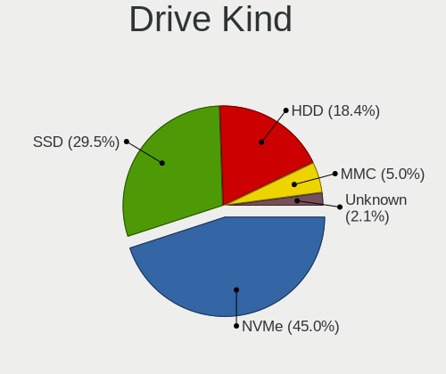
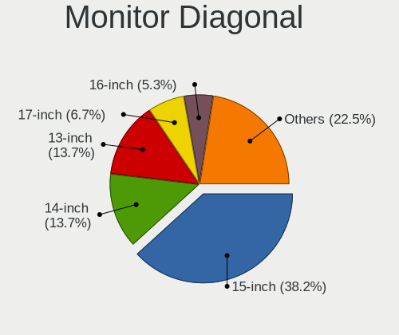

Linux Hardware Trends (Notebook)
--------------------------------

A project to identify most popular hardware characteristics and track their change
over time based on data collected by Linux users at https://Linux-Hardware.org.

Anyone can contribute to the study by uploading probes of their computers by
the [hw-probe](https://github.com/linuxhw/hw-probe) tool:

    sudo -E hw-probe -all -upload

Full-feature report is available here: https://linux-hardware.org/?view=trends&formfactor=notebook

Period: Jan, 2021.

Contents
--------

- [ OS                       ](#os)
- [ OS Family                ](#os-family)
- [ Kernel                   ](#kernel)
- [ Kernel Family            ](#kernel-family)
- [ Kernel Major Ver.        ](#kernel-major-ver)
- [ Arch                     ](#arch)
- [ DE                       ](#de)
- [ Display Server           ](#display-server)
- [ Display Manager          ](#display-manager)
- [ OS Lang                  ](#os-lang)
- [ Boot Mode                ](#boot-mode)
- [ Filesystem               ](#filesystem)
- [ Part. scheme             ](#part-scheme)
- [ Dual Boot with Linux/BSD ](#dual-boot-with-linux/bsd)
- [ Dual Boot (Win)          ](#dual-boot-win)
- [ Country                  ](#country)
- [ City                     ](#city)
- [ Vendor                   ](#vendor)
- [ Model                    ](#model)
- [ Model Family             ](#model-family)
- [ MFG Year                 ](#mfg-year)
- [ Form Factor              ](#form-factor)
- [ Secure Boot              ](#secure-boot)
- [ Coreboot                 ](#coreboot)
- [ RAM Size                 ](#ram-size)
- [ RAM Used                 ](#ram-used)
- [ Has CD-ROM               ](#has-cd-rom)
- [ Total Drives             ](#total-drives)
- [ Has Ethernet             ](#has-ethernet)
- [ Drive Vendor             ](#drive-vendor)
- [ Drive Model              ](#drive-model)
- [ HDD Vendor               ](#hdd-vendor)
- [ SSD Vendor               ](#ssd-vendor)
- [ Drive Kind               ](#drive-kind)
- [ Drive Connector          ](#drive-connector)
- [ Drive Size               ](#drive-size)
- [ Space Total              ](#space-total)
- [ Space Used               ](#space-used)
- [ Malfunc. Drives          ](#malfunc-drives)
- [ Malfunc. Drive Vendor    ](#malfunc-drive-vendor)
- [ Malfunc. HDD Vendor      ](#malfunc-hdd-vendor)
- [ Malfunc. Drive Kind      ](#malfunc-drive-kind)
- [ Failed Drives            ](#failed-drives)
- [ Failed Drive Vendor      ](#failed-drive-vendor)
- [ Drive Status             ](#drive-status)
- [ Storage Vendor           ](#storage-vendor)
- [ Storage Model            ](#storage-model)
- [ Storage Kind             ](#storage-kind)
- [ CPU Vendor               ](#cpu-vendor)
- [ CPU Model                ](#cpu-model)
- [ CPU Model Family         ](#cpu-model-family)
- [ CPU Cores                ](#cpu-cores)
- [ CPU Sockets              ](#cpu-sockets)
- [ CPU Threads              ](#cpu-threads)
- [ CPU Op-Modes             ](#cpu-op-modes)
- [ CPU Microcode            ](#cpu-microcode)
- [ CPU Microarch            ](#cpu-microarch)
- [ GPU Vendor               ](#gpu-vendor)
- [ GPU Model                ](#gpu-model)
- [ GPU Combo                ](#gpu-combo)
- [ GPU Driver               ](#gpu-driver)
- [ GPU Memory               ](#gpu-memory)
- [ Monitor Vendor           ](#monitor-vendor)
- [ Monitor Model            ](#monitor-model)
- [ Monitor Resolution       ](#monitor-resolution)
- [ Monitor Diagonal         ](#monitor-diagonal)
- [ Monitor Width            ](#monitor-width)
- [ Aspect Ratio             ](#aspect-ratio)
- [ Monitor Area             ](#monitor-area)
- [ Pixel Density            ](#pixel-density)
- [ Multiple Monitors        ](#multiple-monitors)
- [ Net Controller Vendor    ](#net-controller-vendor)
- [ Net Controller Model     ](#net-controller-model)
- [ Wireless Vendor          ](#wireless-vendor)
- [ Wireless Model           ](#wireless-model)
- [ Ethernet Vendor          ](#ethernet-vendor)
- [ Ethernet Model           ](#ethernet-model)
- [ Net Controller Kind      ](#net-controller-kind)
- [ Used Controller          ](#used-controller)
- [ NICs                     ](#nics)
- [ Memory Vendor            ](#memory-vendor)
- [ Memory Model             ](#memory-model)
- [ Memory Kind              ](#memory-kind)
- [ Memory Form Factor       ](#memory-form-factor)
- [ Memory Size              ](#memory-size)
- [ Memory Speed             ](#memory-speed)
- [ Sound Vendor             ](#sound-vendor)
- [ Sound Model              ](#sound-model)
- [ Camera Vendor            ](#camera-vendor)
- [ Camera Model             ](#camera-model)
- [ Fingerprint Vendor       ](#fingerprint-vendor)
- [ Fingerprint Model        ](#fingerprint-model)
- [ Chipcard Vendor          ](#chipcard-vendor)
- [ Chipcard Model           ](#chipcard-model)
- [ Printer Vendor           ](#printer-vendor)
- [ Printer Model            ](#printer-model)
- [ Scanner Vendor           ](#scanner-vendor)
- [ Scanner Model            ](#scanner-model)
- [ Bluetooth Vendor         ](#bluetooth-vendor)
- [ Bluetooth Model          ](#bluetooth-model)
- [ Unsupported Devices      ](#unsupported-devices)
- [ Unsupported Device Types ](#unsupported-device-types)

OS
--

Installed operating systems

| Name                | Notebooks | Percent |
|---------------------|-----------|---------|
| Ubuntu 20.04        | 842       | 29.11%  |
| Ubuntu 20.10        | 254       | 8.78%   |
| Fedora 33           | 155       | 5.36%   |
| Mint 20.1           | 151       | 5.22%   |
| Ubuntu 18.04        | 146       | 5.05%   |
| Pop!_OS 20.10       | 126       | 4.36%   |
| Mint 20             | 117       | 4.05%   |
| BlackPanther 18.1   | 107       | 3.7%    |
| KDE neon 20.04      | 82        | 2.84%   |
| Manjaro             | 61        | 2.11%   |
| Endless 3.9.1       | 61        | 2.11%   |
| ROSA R11.1          | 56        | 1.94%   |
| Mint 19.3           | 50        | 1.73%   |
| Manjaro 20.2.1      | 50        | 1.73%   |
| Arch                | 48        | 1.66%   |
| Zorin 15            | 45        | 1.56%   |
| Debian 10           | 44        | 1.52%   |
| Pop!_OS 20.04       | 38        | 1.31%   |
| Arch Rolling        | 31        | 1.07%   |
| ArcoLinux Rolling   | 24        | 0.83%   |
| Kali 2020.4         | 22        | 0.76%   |
| ROSA R11            | 19        | 0.66%   |
| Debian Testing      | 19        | 0.66%   |
| Ubuntu 16.04        | 18        | 0.62%   |
| Manjaro 20.2        | 17        | 0.59%   |
| Fedora 32           | 14        | 0.48%   |
| Gentoo              | 12        | 0.41%   |
| Endless 3.9.2       | 12        | 0.41%   |
| Elementary 5.1.7    | 11        | 0.38%   |
| openSUSE Leap-15.2  | 10        | 0.35%   |
| LMDE 4              | 10        | 0.35%   |
| Debian              | 8         | 0.28%   |
| Ubuntu 21.04        | 7         | 0.24%   |
| Gentoo 2.7          | 7         | 0.24%   |
| BlackPanther 16.2   | 7         | 0.24%   |
| MX 19.3             | 6         | 0.21%   |
| Artix Rolling       | 6         | 0.21%   |
| RHEL 8.3            | 5         | 0.17%   |
| Reborn OS           | 5         | 0.17%   |
| Peppermint 10       | 5         | 0.17%   |
| Garuda              | 5         | 0.17%   |
| Endless 3.7.8       | 5         | 0.17%   |
| Debian Unstable     | 5         | 0.17%   |
| ROSA R8.1           | 4         | 0.14%   |
| Mint 19.2           | 4         | 0.14%   |
| Mint 19.1           | 4         | 0.14%   |
| Mint 19             | 4         | 0.14%   |
| Garuda Soaring      | 4         | 0.14%   |
| CentOS 8            | 4         | 0.14%   |
| ROSA R12            | 3         | 0.1%    |
| ROSA R10            | 3         | 0.1%    |
| openSUSE 20210114   | 3         | 0.1%    |
| Mageia 7            | 3         | 0.1%    |
| GalliumOS 3.1       | 3         | 0.1%    |
| Fedora 31           | 3         | 0.1%    |
| EndeavourOS Rolling | 3         | 0.1%    |
| EndeavourOS         | 3         | 0.1%    |
| Debian 9.13         | 3         | 0.1%    |
| Chrome OS           | 3         | 0.1%    |
| ArcoLinux           | 3         | 0.1%    |

OS Family
---------

OS without a version

| Name           | Notebooks | Percent |
|----------------|-----------|---------|
| Ubuntu         | 1275      | 44.09%  |
| Mint           | 331       | 11.45%  |
| Fedora         | 176       | 6.09%   |
| Pop!_OS        | 164       | 5.67%   |
| Manjaro        | 128       | 4.43%   |
| BlackPanther   | 114       | 3.94%   |
| Endless        | 87        | 3.01%   |
| ROSA           | 85        | 2.94%   |
| KDE neon       | 83        | 2.87%   |
| Debian         | 80        | 2.77%   |
| Arch           | 79        | 2.73%   |
| Zorin          | 46        | 1.59%   |
| openSUSE       | 30        | 1.04%   |
| ArcoLinux      | 27        | 0.93%   |
| Kali           | 25        | 0.86%   |
| Gentoo         | 20        | 0.69%   |
| Elementary     | 11        | 0.38%   |
| LMDE           | 10        | 0.35%   |
| Clear Linux    | 10        | 0.35%   |
| Garuda         | 9         | 0.31%   |
| MX             | 8         | 0.28%   |
| Artix          | 8         | 0.28%   |
| CentOS         | 7         | 0.24%   |
| RHEL           | 6         | 0.21%   |
| Peppermint     | 6         | 0.21%   |
| EndeavourOS    | 6         | 0.21%   |
| Reborn OS      | 5         | 0.17%   |
| ALT Linux      | 4         | 0.14%   |
| Alpine         | 4         | 0.14%   |
| Mageia         | 3         | 0.1%    |
| Hefftor        | 3         | 0.1%    |
| GalliumOS      | 3         | 0.1%    |
| Deepin         | 3         | 0.1%    |
| Chrome OS      | 3         | 0.1%    |
| WindowsFX      | 2         | 0.07%   |
| Void           | 2         | 0.07%   |
| Sparky         | 2         | 0.07%   |
| Solus          | 2         | 0.07%   |
| RELS           | 2         | 0.07%   |
| Parrot         | 2         | 0.07%   |
| BunsenLabs     | 2         | 0.07%   |
| Slackware      | 1         | 0.03%   |
| Siduction      | 1         | 0.03%   |
| Progress       | 1         | 0.03%   |
| PCLinuxOS      | 1         | 0.03%   |
| Pardus         | 1         | 0.03%   |
| Parabola       | 1         | 0.03%   |
| OpenMandriva   | 1         | 0.03%   |
| NST            | 1         | 0.03%   |
| LFS            | 1         | 0.03%   |
| Laxer OS       | 1         | 0.03%   |
| Gooroom        | 1         | 0.03%   |
| GNOME OS       | 1         | 0.03%   |
| Funtoo         | 1         | 0.03%   |
| Docker Desktop | 1         | 0.03%   |
| Devuan         | 1         | 0.03%   |
| Ctlos          | 1         | 0.03%   |
| Calculate      | 1         | 0.03%   |
| Archman        | 1         | 0.03%   |
| antiX          | 1         | 0.03%   |

Kernel
------

Version of the Linux kernel

| Version                             | Notebooks | Percent |
|-------------------------------------|-----------|---------|
| 5.4.0-58-generic                    | 226       | 7.81%   |
| 5.8.0-36-generic                    | 162       | 5.6%    |
| 5.8.0-7630-generic                  | 151       | 5.22%   |
| 5.8.0-38-generic                    | 147       | 5.08%   |
| 5.4.0-62-generic                    | 142       | 4.91%   |
| 5.4.0-60-generic                    | 126       | 4.36%   |
| 5.8.0-40-generic                    | 118       | 4.08%   |
| 5.4.0-64-generic                    | 107       | 3.7%    |
| 5.4.0-59-generic                    | 106       | 3.67%   |
| 4.18.16-desktop-1bP                 | 96        | 3.32%   |
| 5.8.0-41-generic                    | 92        | 3.18%   |
| 5.9.16-200.fc33.x86_64              | 76        | 2.63%   |
| 5.8.0-14-generic                    | 75        | 2.59%   |
| 5.4.0-65-generic                    | 63        | 2.18%   |
| 5.8.0-34-generic                    | 54        | 1.87%   |
| 5.4.0-42-generic                    | 52        | 1.8%    |
| 5.8.0-33-generic                    | 51        | 1.76%   |
| 5.9.16-1-MANJARO                    | 44        | 1.52%   |
| 4.19.0-13-amd64                     | 40        | 1.38%   |
| 5.10.2-2-MANJARO                    | 38        | 1.31%   |
| 4.15.0-desktop-122.124.1rosa-x86_64 | 26        | 0.9%    |
| 4.15.0-128-generic                  | 23        | 0.8%    |
| 5.4.0-26-generic                    | 22        | 0.76%   |
| 4.15.0-desktop-45.1rosa-x86_64      | 19        | 0.66%   |
| 5.10.7-3-MANJARO                    | 18        | 0.62%   |
| 5.10.7-200.fc33.x86_64              | 18        | 0.62%   |
| 5.8.0-25-generic                    | 17        | 0.59%   |
| 5.10.9-201.fc33.x86_64              | 17        | 0.59%   |
| 5.10.7-arch1-1                      | 16        | 0.55%   |
| 5.10.0-1-amd64                      | 16        | 0.55%   |
| 4.15.0-130-generic                  | 16        | 0.55%   |
| 5.10.4-arch2-1                      | 14        | 0.48%   |
| 5.10.6-arch1-1                      | 13        | 0.45%   |
| 4.15.0-132-generic                  | 13        | 0.45%   |
| 5.9.0-5-amd64                       | 12        | 0.41%   |
| 5.4.0-52-generic                    | 12        | 0.41%   |
| 5.10.10-200.fc33.x86_64             | 12        | 0.41%   |
| 5.9.0-kali5-amd64                   | 11        | 0.38%   |
| 5.4.83-generic-2rosa-x86_64         | 11        | 0.38%   |
| 5.6.14-desktop-2bP                  | 10        | 0.35%   |
| 5.10.8-200.fc33.x86_64              | 10        | 0.35%   |
| 5.10.10-arch1-1                     | 10        | 0.35%   |
| 5.8.0-37-generic                    | 9         | 0.31%   |
| 4.15.0-129-generic                  | 9         | 0.31%   |
| 5.4.85-1-MANJARO                    | 8         | 0.28%   |
| 5.4.0-54-generic                    | 8         | 0.28%   |
| 5.10.7-1-default                    | 8         | 0.28%   |
| 5.0.0-32-generic                    | 8         | 0.28%   |
| 5.8.15-301.fc33.x86_64              | 7         | 0.24%   |
| 4.9.20-desktop-pae-1bP              | 7         | 0.24%   |
| 4.15.0-135-generic                  | 7         | 0.24%   |
| 5.9.16-100.fc32.x86_64              | 6         | 0.21%   |
| 5.4.0-56-generic                    | 6         | 0.21%   |
| 5.3.0-28-generic                    | 6         | 0.21%   |
| 5.10.6-200.fc33.x86_64              | 6         | 0.21%   |
| 5.10.4-051004-generic               | 6         | 0.21%   |
| 5.10.11-arch1-1                     | 6         | 0.21%   |
| 4.19.128-microsoft-standard         | 6         | 0.21%   |
| 4.19.0-13-686                       | 6         | 0.21%   |
| 4.15.0-134-generic                  | 6         | 0.21%   |

Kernel Family
-------------

Linux kernel without a distro release

| Version  | Notebooks | Percent |
|----------|-----------|---------|
| 5.4.0    | 907       | 31.36%  |
| 5.8.0    | 893       | 30.88%  |
| 4.15.0   | 144       | 4.98%   |
| 5.9.16   | 133       | 4.6%    |
| 4.18.16  | 96        | 3.32%   |
| 5.10.7   | 73        | 2.52%   |
| 4.19.0   | 54        | 1.87%   |
| 5.10.2   | 46        | 1.59%   |
| 5.9.0    | 45        | 1.56%   |
| 5.10.4   | 44        | 1.52%   |
| 5.10.9   | 33        | 1.14%   |
| 5.10.6   | 31        | 1.07%   |
| 5.10.10  | 31        | 1.07%   |
| 5.10.0   | 27        | 0.93%   |
| 5.10.8   | 23        | 0.8%    |
| 5.4.83   | 17        | 0.59%   |
| 5.0.0    | 16        | 0.55%   |
| 4.18.0   | 15        | 0.52%   |
| 5.3.0    | 13        | 0.45%   |
| 5.6.0    | 12        | 0.41%   |
| 5.9.14   | 11        | 0.38%   |
| 5.10.5   | 11        | 0.38%   |
| 5.10.3   | 11        | 0.38%   |
| 5.10.11  | 11        | 0.38%   |
| 5.6.14   | 10        | 0.35%   |
| 5.3.18   | 10        | 0.35%   |
| 5.11.0   | 10        | 0.35%   |
| 5.4.85   | 9         | 0.31%   |
| 5.4.80   | 8         | 0.28%   |
| 5.8.15   | 7         | 0.24%   |
| 5.4.89   | 7         | 0.24%   |
| 4.9.20   | 7         | 0.24%   |
| 5.8.18   | 6         | 0.21%   |
| 4.19.128 | 6         | 0.21%   |
| 4.16.18  | 6         | 0.21%   |
| 5.4.91   | 5         | 0.17%   |
| 4.9.155  | 5         | 0.17%   |
| 5.9.13   | 4         | 0.14%   |
| 5.7.0    | 4         | 0.14%   |
| 5.4.66   | 4         | 0.14%   |
| 4.4.0    | 4         | 0.14%   |
| 5.9.15   | 3         | 0.1%    |
| 5.9.12   | 3         | 0.1%    |
| 5.9.11   | 3         | 0.1%    |
| 5.9.10   | 3         | 0.1%    |
| 5.9.1    | 3         | 0.1%    |
| 5.7.1    | 3         | 0.1%    |
| 5.4.88   | 3         | 0.1%    |
| 5.4.87   | 3         | 0.1%    |
| 5.4.86   | 3         | 0.1%    |
| 5.4.32   | 3         | 0.1%    |
| 5.10.1   | 3         | 0.1%    |
| 4.9.60   | 3         | 0.1%    |
| 5.8.14   | 2         | 0.07%   |
| 5.8.1    | 2         | 0.07%   |
| 5.7.19   | 2         | 0.07%   |
| 5.4.93   | 2         | 0.07%   |
| 5.4.70   | 2         | 0.07%   |
| 4.9.0    | 2         | 0.07%   |
| 4.19.110 | 2         | 0.07%   |

Kernel Major Ver.
-----------------

Linux kernel major version

| Version | Notebooks | Percent |
|---------|-----------|---------|
| 5.4     | 977       | 33.78%  |
| 5.8     | 913       | 31.57%  |
| 5.10    | 344       | 11.89%  |
| 5.9     | 210       | 7.26%   |
| 4.15    | 144       | 4.98%   |
| 4.18    | 111       | 3.84%   |
| 4.19    | 66        | 2.28%   |
| 5.6     | 25        | 0.86%   |
| 5.3     | 23        | 0.8%    |
| 4.9     | 18        | 0.62%   |
| 5.0     | 16        | 0.55%   |
| 5.7     | 11        | 0.38%   |
| 5.11    | 10        | 0.35%   |
| 4.16    | 7         | 0.24%   |
| 4.4     | 4         | 0.14%   |
| 5.5     | 3         | 0.1%    |
| 4.10    | 2         | 0.07%   |
| 4.1     | 2         | 0.07%   |
| 5.2     | 1         | 0.03%   |
| 4.8     | 1         | 0.03%   |
| 4.14    | 1         | 0.03%   |
| 4.12    | 1         | 0.03%   |
| 3.14    | 1         | 0.03%   |
| 3.10    | 1         | 0.03%   |

Arch
----

OS architecture (x86_64, i586, etc.)

| Name    | Notebooks | Percent |
|---------|-----------|---------|
| x86_64  | 2776      | 95.99%  |
| i686    | 112       | 3.87%   |
| aarch64 | 3         | 0.1%    |
| armv7l  | 1         | 0.03%   |

DE
--

Desktop Environment

| Name              | Notebooks | Percent |
|-------------------|-----------|---------|
| GNOME             | 1515      | 52.39%  |
| X-Cinnamon        | 273       | 9.44%   |
| KDE5              | 263       | 9.09%   |
| XFCE              | 253       | 8.75%   |
| KDE               | 180       | 6.22%   |
| Unknown           | 113       | 3.91%   |
| MATE              | 72        | 2.49%   |
| KDE4              | 55        | 1.9%    |
| LXQt              | 28        | 0.97%   |
| Unity             | 25        | 0.86%   |
| Cinnamon          | 20        | 0.69%   |
| i3                | 17        | 0.59%   |
| LXDE              | 16        | 0.55%   |
| Budgie            | 13        | 0.45%   |
| Pantheon          | 11        | 0.38%   |
| GNOME Flashback   | 8         | 0.28%   |
| bspwm             | 6         | 0.21%   |
| xmonad            | 4         | 0.14%   |
| Deepin            | 4         | 0.14%   |
| dwm               | 3         | 0.1%    |
| Yaru:ubuntu:GNOME | 2         | 0.07%   |
| trinity           | 2         | 0.07%   |
| leftwm            | 2         | 0.07%   |
| sway              | 1         | 0.03%   |
| qtile             | 1         | 0.03%   |
| i3-with-shmlog    | 1         | 0.03%   |
| enlightenment     | 1         | 0.03%   |
| dwm-sc            | 1         | 0.03%   |
| custom            | 1         | 0.03%   |
| awesome           | 1         | 0.03%   |

Display Server
--------------

X11 or Wayland

| Name        | Notebooks | Percent |
|-------------|-----------|---------|
| X11         | 2593      | 89.66%  |
| Wayland     | 216       | 7.47%   |
| Unknown     | 56        | 1.94%   |
| Tty         | 26        | 0.9%    |
| Unspecified | 1         | 0.03%   |

Display Manager
---------------

SDDM, LightDM, etc.

| Name    | Notebooks | Percent |
|---------|-----------|---------|
| Unknown | 1878      | 64.94%  |
| GDM     | 395       | 13.66%  |
| SDDM    | 279       | 9.65%   |
| TDM     | 202       | 6.98%   |
| LightDM | 73        | 2.52%   |
| KDM     | 55        | 1.9%    |
| XDM     | 6         | 0.21%   |
| SLiM    | 2         | 0.07%   |
| GDM3    | 2         | 0.07%   |

OS Lang
-------

Language

| Lang    | Notebooks | Percent |
|---------|-----------|---------|
| en_US   | 1077      | 37.24%  |
| de_DE   | 250       | 8.64%   |
| pt_BR   | 164       | 5.67%   |
| Unknown | 164       | 5.67%   |
| en_GB   | 157       | 5.43%   |
| ru_RU   | 156       | 5.39%   |
| fr_FR   | 152       | 5.26%   |
| it_IT   | 85        | 2.94%   |
| es_ES   | 84        | 2.9%    |
| en_CA   | 52        | 1.8%    |
| pl_PL   | 48        | 1.66%   |
| en_IN   | 47        | 1.63%   |
| C       | 44        | 1.52%   |
| en_AU   | 33        | 1.14%   |
| es_MX   | 28        | 0.97%   |
| tr_TR   | 25        | 0.86%   |
| hu_HU   | 23        | 0.8%    |
| cs_CZ   | 19        | 0.66%   |
| ro_RO   | 15        | 0.52%   |
| pt_PT   | 15        | 0.52%   |
| sv_SE   | 13        | 0.45%   |
| en_ZA   | 13        | 0.45%   |
| sk_SK   | 12        | 0.41%   |
| de_AT   | 12        | 0.41%   |
| nl_NL   | 11        | 0.38%   |
| es_CO   | 11        | 0.38%   |
| ru_UA   | 10        | 0.35%   |
| fr_CA   | 10        | 0.35%   |
| es_CL   | 10        | 0.35%   |
| en_IE   | 10        | 0.35%   |
| el_GR   | 10        | 0.35%   |
| de_CH   | 10        | 0.35%   |
| zh_CN   | 9         | 0.31%   |
| fi_FI   | 9         | 0.31%   |
| es_AR   | 9         | 0.31%   |
| POSIX   | 6         | 0.21%   |
| ca_ES   | 6         | 0.21%   |
| ja_JP   | 5         | 0.17%   |
| hr_HR   | 5         | 0.17%   |
| fr_CH   | 5         | 0.17%   |
| es_UY   | 4         | 0.14%   |
| es_PE   | 4         | 0.14%   |
| en_SG   | 4         | 0.14%   |
| en_IL   | 4         | 0.14%   |
| da_DK   | 4         | 0.14%   |
| bg_BG   | 4         | 0.14%   |
| sl_SI   | 3         | 0.1%    |
| nl_BE   | 3         | 0.1%    |
| nb_NO   | 3         | 0.1%    |
| ko_KR   | 3         | 0.1%    |
| fr_BE   | 3         | 0.1%    |
| en_NG   | 3         | 0.1%    |
| he_IL   | 2         | 0.07%   |
| es_EC   | 2         | 0.07%   |
| en_PH   | 2         | 0.07%   |
| de_BE   | 2         | 0.07%   |
| zh_TW   | 1         | 0.03%   |
| vi_VN   | 1         | 0.03%   |
| it_CH   | 1         | 0.03%   |
| id_ID   | 1         | 0.03%   |

Boot Mode
---------

EFI or BIOS

| Mode | Notebooks | Percent |
|------|-----------|---------|
| BIOS | 1548      | 53.53%  |
| EFI  | 1344      | 46.47%  |

Filesystem
----------

Type of filesystem

| Type    | Notebooks | Percent |
|---------|-----------|---------|
| Ext4    | 2501      | 86.48%  |
| Btrfs   | 180       | 6.22%   |
| Overlay | 141       | 4.88%   |
| Xfs     | 33        | 1.14%   |
| Zfs     | 18        | 0.62%   |
| Ext3    | 5         | 0.17%   |
| Ext2    | 5         | 0.17%   |
| Tmpfs   | 3         | 0.1%    |
| Unknown | 3         | 0.1%    |
| Jfs     | 1         | 0.03%   |
| F2fs    | 1         | 0.03%   |
| ExX4    | 1         | 0.03%   |

Part. scheme
------------

Scheme of partitioning

| Type    | Notebooks | Percent |
|---------|-----------|---------|
| Unknown | 1866      | 64.52%  |
| GPT     | 718       | 24.83%  |
| MBR     | 308       | 10.65%  |

Dual Boot with Linux/BSD
------------------------

Hosting more than one Linux/BSD

| Dual boot | Notebooks | Percent |
|-----------|-----------|---------|
| No        | 2635      | 91.11%  |
| Yes       | 257       | 8.89%   |

Dual Boot (Win)
---------------

Hosting Linux and Windows

| Dual boot | Notebooks | Percent |
|-----------|-----------|---------|
| No        | 2072      | 71.65%  |
| Yes       | 820       | 28.35%  |

Country
-------

Geographic location (country)

| Country              | Notebooks | Percent |
|----------------------|-----------|---------|
| USA                  | 422       | 14.59%  |
| Germany              | 317       | 10.96%  |
| Russia               | 204       | 7.05%   |
| Brazil               | 200       | 6.92%   |
| France               | 157       | 5.43%   |
| Hungary              | 127       | 4.39%   |
| UK                   | 111       | 3.84%   |
| Italy                | 110       | 3.8%    |
| Spain                | 92        | 3.18%   |
| Canada               | 77        | 2.66%   |
| India                | 75        | 2.59%   |
| Poland               | 63        | 2.18%   |
| Netherlands          | 47        | 1.63%   |
| Ukraine              | 46        | 1.59%   |
| Mexico               | 41        | 1.42%   |
| Romania              | 39        | 1.35%   |
| Turkey               | 37        | 1.28%   |
| Australia            | 37        | 1.28%   |
| Switzerland          | 36        | 1.24%   |
| Finland              | 32        | 1.11%   |
| Austria              | 31        | 1.07%   |
| Sweden               | 30        | 1.04%   |
| Belgium              | 30        | 1.04%   |
| Czech Republic       | 27        | 0.93%   |
| Indonesia            | 26        | 0.9%    |
| Greece               | 26        | 0.9%    |
| Slovakia             | 22        | 0.76%   |
| Colombia             | 21        | 0.73%   |
| Argentina            | 20        | 0.69%   |
| Portugal             | 19        | 0.66%   |
| Bulgaria             | 19        | 0.66%   |
| South Africa         | 17        | 0.59%   |
| Norway               | 15        | 0.52%   |
| China                | 15        | 0.52%   |
| Israel               | 14        | 0.48%   |
| Belarus              | 14        | 0.48%   |
| Chile                | 13        | 0.45%   |
| Iran                 | 12        | 0.41%   |
| Denmark              | 12        | 0.41%   |
| Serbia               | 11        | 0.38%   |
| Egypt                | 11        | 0.38%   |
| Ireland              | 10        | 0.35%   |
| Tunisia              | 8         | 0.28%   |
| Singapore            | 8         | 0.28%   |
| Japan                | 7         | 0.24%   |
| Costa Rica           | 7         | 0.24%   |
| Slovenia             | 6         | 0.21%   |
| Pakistan             | 6         | 0.21%   |
| Morocco              | 6         | 0.21%   |
| Kenya                | 6         | 0.21%   |
| Croatia              | 6         | 0.21%   |
| Uruguay              | 5         | 0.17%   |
| UAE                  | 5         | 0.17%   |
| Saudi Arabia         | 5         | 0.17%   |
| Peru                 | 5         | 0.17%   |
| New Zealand          | 5         | 0.17%   |
| Moldova, Republic of | 5         | 0.17%   |
| Malaysia             | 5         | 0.17%   |
| Lithuania            | 5         | 0.17%   |
| Ecuador              | 5         | 0.17%   |

City
----

Geographic location (city)

| City              | Notebooks | Percent |
|-------------------|-----------|---------|
| Budapest          | 52        | 1.8%    |
| Moscow            | 45        | 1.56%   |
| Berlin            | 29        | 1%      |
| St Petersburg     | 26        | 0.9%    |
| Paris             | 24        | 0.83%   |
| Vienna            | 21        | 0.73%   |
| Rome              | 20        | 0.69%   |
| Warsaw            | 18        | 0.62%   |
| São Paulo        | 17        | 0.59%   |
| Athens            | 16        | 0.55%   |
| Rio de Janeiro    | 15        | 0.52%   |
| Munich            | 15        | 0.52%   |
| Istanbul          | 15        | 0.52%   |
| Hamburg           | 15        | 0.52%   |
| Kyiv              | 14        | 0.48%   |
| Madrid            | 13        | 0.45%   |
| Prague            | 12        | 0.41%   |
| Helsinki          | 12        | 0.41%   |
| Cologne           | 11        | 0.38%   |
| Toronto           | 10        | 0.35%   |
| Milan             | 10        | 0.35%   |
| Frankfurt am Main | 10        | 0.35%   |
| Amsterdam         | 10        | 0.35%   |
| Sofia             | 9         | 0.31%   |
| New York          | 9         | 0.31%   |
| Düsseldorf       | 9         | 0.31%   |
| Cairo             | 9         | 0.31%   |
| Barcelona         | 9         | 0.31%   |
| Tehran            | 8         | 0.28%   |
| Nuremberg         | 8         | 0.28%   |
| Novosibirsk       | 8         | 0.28%   |
| Minneapolis       | 8         | 0.28%   |
| Hyderabad         | 8         | 0.28%   |
| Denver            | 8         | 0.28%   |
| Chennai           | 8         | 0.28%   |
| Bratislava        | 8         | 0.28%   |
| Brasília         | 8         | 0.28%   |
| Bogotá           | 8         | 0.28%   |
| Vancouver         | 7         | 0.24%   |
| Sydney            | 7         | 0.24%   |
| Rockville         | 7         | 0.24%   |
| Lisbon            | 7         | 0.24%   |
| Krakow            | 7         | 0.24%   |
| Jakarta           | 7         | 0.24%   |
| Dallas            | 7         | 0.24%   |
| Bucharest         | 7         | 0.24%   |
| Brisbane          | 7         | 0.24%   |
| Bengaluru         | 7         | 0.24%   |
| Toulouse          | 6         | 0.21%   |
| Thessaloniki      | 6         | 0.21%   |
| Stuttgart         | 6         | 0.21%   |
| Singapore         | 6         | 0.21%   |
| Santiago          | 6         | 0.21%   |
| Nairobi           | 6         | 0.21%   |
| Minsk             | 6         | 0.21%   |
| Mexico City       | 6         | 0.21%   |
| Medellín         | 6         | 0.21%   |
| Ludlow            | 6         | 0.21%   |
| Krasnodar         | 6         | 0.21%   |
| Brussels          | 6         | 0.21%   |

Vendor
------

Motherboard manufacturer

| Name                           | Notebooks | Percent |
|--------------------------------|-----------|---------|
| Lenovo                         | 591       | 20.44%  |
| Hewlett-Packard                | 543       | 18.78%  |
| Dell                           | 515       | 17.81%  |
| ASUSTek Computer               | 319       | 11.03%  |
| Acer                           | 292       | 10.1%   |
| Toshiba                        | 80        | 2.77%   |
| Samsung Electronics            | 65        | 2.25%   |
| Sony                           | 62        | 2.14%   |
| Apple                          | 54        | 1.87%   |
| MSI                            | 47        | 1.63%   |
| HUAWEI                         | 28        | 0.97%   |
| Unknown                        | 26        | 0.9%    |
| Packard Bell                   | 21        | 0.73%   |
| Fujitsu                        | 17        | 0.59%   |
| Notebook                       | 16        | 0.55%   |
| Positivo                       | 13        | 0.45%   |
| Medion                         | 13        | 0.45%   |
| Google                         | 11        | 0.38%   |
| System76                       | 10        | 0.35%   |
| Alienware                      | 9         | 0.31%   |
| Fujitsu Siemens                | 8         | 0.28%   |
| TUXEDO                         | 7         | 0.24%   |
| Timi                           | 7         | 0.24%   |
| Intel                          | 6         | 0.21%   |
| eMachines                      | 6         | 0.21%   |
| Razer                          | 5         | 0.17%   |
| Star Labs                      | 4         | 0.14%   |
| LG Electronics                 | 4         | 0.14%   |
| IBM                            | 4         | 0.14%   |
| Gateway                        | 4         | 0.14%   |
| Clevo                          | 4         | 0.14%   |
| Chuwi                          | 4         | 0.14%   |
| Wortmann AG                    | 3         | 0.1%    |
| Schenker                       | 3         | 0.1%    |
| PC Specialist                  | 3         | 0.1%    |
| Itautec                        | 3         | 0.1%    |
| AMI                            | 3         | 0.1%    |
| whyopencomputing               | 2         | 0.07%   |
| TrekStor                       | 2         | 0.07%   |
| Teclast                        | 2         | 0.07%   |
| Semp Toshiba                   | 2         | 0.07%   |
| Positivo Bahia - VAIO          | 2         | 0.07%   |
| Panasonic                      | 2         | 0.07%   |
| NEC Computers                  | 2         | 0.07%   |
| MOTILE                         | 2         | 0.07%   |
| Monster                        | 2         | 0.07%   |
| Matsushita Electric Industrial | 2         | 0.07%   |
| IT Channel Pty                 | 2         | 0.07%   |
| Insyde                         | 2         | 0.07%   |
| HCL Infosystems Limited        | 2         | 0.07%   |
| Hampoo                         | 2         | 0.07%   |
| GPU Company                    | 2         | 0.07%   |
| Entroware                      | 2         | 0.07%   |
| Eluktronics                    | 2         | 0.07%   |
| Digma                          | 2         | 0.07%   |
| BANGHO                         | 2         | 0.07%   |
| VIT                            | 1         | 0.03%   |
| UNOWHY                         | 1         | 0.03%   |
| Unknown (D)                    | 1         | 0.03%   |
| UNITCOM                        | 1         | 0.03%   |

Model
-----

Motherboard model

| Name                                      | Notebooks | Percent |
|-------------------------------------------|-----------|---------|
| Unknown                                   | 41        | 1.42%   |
| HP Notebook                               | 22        | 0.76%   |
| HP Pavilion dv6                           | 14        | 0.48%   |
| Acer Nitro AN515-54                       | 12        | 0.41%   |
| HP Pavilion g6                            | 11        | 0.38%   |
| Dell XPS 13 7390                          | 11        | 0.38%   |
| HP Pavilion dv7                           | 10        | 0.35%   |
| HP Pavilion 15                            | 10        | 0.35%   |
| HP 255 G7 Notebook PC                     | 10        | 0.35%   |
| Dell Latitude E6430                       | 10        | 0.35%   |
| HP Pavilion Notebook                      | 9         | 0.31%   |
| Dell XPS 15 9500                          | 9         | 0.31%   |
| Dell XPS 15 7590                          | 9         | 0.31%   |
| Dell Latitude E6420                       | 9         | 0.31%   |
| Dell XPS 13 9360                          | 8         | 0.28%   |
| Dell Inspiron 1545                        | 8         | 0.28%   |
| Lenovo IdeaPad S145-15IWL 81S9            | 7         | 0.24%   |
| HP ProBook 650 G1                         | 7         | 0.24%   |
| HP EliteBook 840 G1                       | 7         | 0.24%   |
| HP 15                                     | 7         | 0.24%   |
| Dell XPS 13 9370                          | 7         | 0.24%   |
| Dell XPS 13 9310                          | 7         | 0.24%   |
| Dell Latitude E6410                       | 7         | 0.24%   |
| Dell Latitude E6400                       | 7         | 0.24%   |
| Dell Latitude D630                        | 7         | 0.24%   |
| Dell Inspiron N5110                       | 7         | 0.24%   |
| HUAWEI NBLK-WAX9X                         | 6         | 0.21%   |
| HP Presario CQ57                          | 6         | 0.21%   |
| HP Pavilion g7                            | 6         | 0.21%   |
| HP Laptop 15s-eq0xxx                      | 6         | 0.21%   |
| HP Laptop 15-dy1xxx                       | 6         | 0.21%   |
| HP 250 G7 Notebook PC                     | 6         | 0.21%   |
| Dell XPS 17 9700                          | 6         | 0.21%   |
| Dell XPS 13 9380                          | 6         | 0.21%   |
| Dell XPS 13 9300                          | 6         | 0.21%   |
| Apple MacBookPro9,2                       | 6         | 0.21%   |
| Apple MacBook4,1                          | 6         | 0.21%   |
| Acer Nitro AN517-51                       | 6         | 0.21%   |
| Acer Aspire A515-51G                      | 6         | 0.21%   |
| Acer Aspire A315-21                       | 6         | 0.21%   |
| Lenovo ThinkPad X1 Extreme 2nd 20QVCTO1WW | 5         | 0.17%   |
| Lenovo Legion 5 15ARH05 82B5              | 5         | 0.17%   |
| Lenovo IdeaPad Gaming 3 15ARH05 82EY      | 5         | 0.17%   |
| Lenovo IdeaPad 5 14ARE05 81YM             | 5         | 0.17%   |
| Lenovo IdeaPad 330-15IKB 81DE             | 5         | 0.17%   |
| HUAWEI BOHK-WAX9X                         | 5         | 0.17%   |
| HP ProBook 6570b                          | 5         | 0.17%   |
| HP ProBook 6550b                          | 5         | 0.17%   |
| HP Pavilion g4                            | 5         | 0.17%   |
| HP Laptop 17-ca1xxx                       | 5         | 0.17%   |
| HP ENVY 15                                | 5         | 0.17%   |
| HP EliteBook 840 G5                       | 5         | 0.17%   |
| HP 2000                                   | 5         | 0.17%   |
| Dell XPS L502X                            | 5         | 0.17%   |
| Dell Latitude E7450                       | 5         | 0.17%   |
| Dell Latitude E6540                       | 5         | 0.17%   |
| Dell Latitude E6330                       | 5         | 0.17%   |
| Dell Latitude 5480                        | 5         | 0.17%   |
| Dell Inspiron N5050                       | 5         | 0.17%   |
| Dell Inspiron 15 7000 Gaming              | 5         | 0.17%   |

Model Family
------------

Motherboard model prefix

| Name                  | Notebooks | Percent |
|-----------------------|-----------|---------|
| Lenovo ThinkPad       | 288       | 9.96%   |
| Acer Aspire           | 200       | 6.92%   |
| Dell Latitude         | 162       | 5.6%    |
| Dell Inspiron         | 160       | 5.53%   |
| Lenovo IdeaPad        | 151       | 5.22%   |
| HP Pavilion           | 130       | 4.5%    |
| Dell XPS              | 94        | 3.25%   |
| HP EliteBook          | 83        | 2.87%   |
| HP ProBook            | 75        | 2.59%   |
| Toshiba Satellite     | 71        | 2.46%   |
| HP Laptop             | 62        | 2.14%   |
| ASUS VivoBook         | 57        | 1.97%   |
| Dell Precision        | 41        | 1.42%   |
| Unknown               | 41        | 1.42%   |
| Dell Vostro           | 32        | 1.11%   |
| Acer Nitro            | 27        | 0.93%   |
| Lenovo Legion         | 22        | 0.76%   |
| HP Notebook           | 22        | 0.76%   |
| HP Compaq             | 22        | 0.76%   |
| Packard Bell EasyNote | 20        | 0.69%   |
| HP ZBook              | 18        | 0.62%   |
| HP ENVY               | 18        | 0.62%   |
| HP 250                | 18        | 0.62%   |
| ASUS TUF              | 17        | 0.59%   |
| HP 255                | 16        | 0.55%   |
| ASUS ZenBook          | 16        | 0.55%   |
| ASUS ROG              | 16        | 0.55%   |
| Fujitsu LIFEBOOK      | 14        | 0.48%   |
| Acer Swift            | 14        | 0.48%   |
| Acer TravelMate       | 12        | 0.41%   |
| Acer Extensa          | 12        | 0.41%   |
| Lenovo Yoga           | 11        | 0.38%   |
| HP OMEN               | 10        | 0.35%   |
| HP 15                 | 10        | 0.35%   |
| Dell Studio           | 10        | 0.35%   |
| Lenovo ThinkBook      | 9         | 0.31%   |
| HP Presario           | 9         | 0.31%   |
| Dell G3               | 9         | 0.31%   |
| Lenovo G580           | 6         | 0.21%   |
| HUAWEI NBLK-WAX9X     | 6         | 0.21%   |
| Apple MacBookPro9     | 6         | 0.21%   |
| Apple MacBookAir7     | 6         | 0.21%   |
| Apple MacBookAir6     | 6         | 0.21%   |
| Apple MacBook4        | 6         | 0.21%   |
| Razer Blade           | 5         | 0.17%   |
| MSI Prestige          | 5         | 0.17%   |
| HUAWEI BOHK-WAX9X     | 5         | 0.17%   |
| HP Stream             | 5         | 0.17%   |
| HP 2000               | 5         | 0.17%   |
| ASUS Strix            | 5         | 0.17%   |
| ASUS K53SC            | 5         | 0.17%   |
| Acer Predator         | 5         | 0.17%   |
| Toshiba PORTEGE       | 4         | 0.14%   |
| Samsung R530          | 4         | 0.14%   |
| Samsung 300E4C        | 4         | 0.14%   |
| MSI GL63              | 4         | 0.14%   |
| Lenovo Z50-75         | 4         | 0.14%   |
| Lenovo V330-15IKB     | 4         | 0.14%   |
| Lenovo G50-45         | 4         | 0.14%   |
| Lenovo Flex           | 4         | 0.14%   |

MFG Year
--------

Motherboard manufacture year

| Year    | Notebooks | Percent |
|---------|-----------|---------|
| 2020    | 738       | 25.52%  |
| 2019    | 393       | 13.59%  |
| 2018    | 249       | 8.61%   |
| 2011    | 203       | 7.02%   |
| 2012    | 198       | 6.85%   |
| 2013    | 191       | 6.6%    |
| 2010    | 151       | 5.22%   |
| 2014    | 148       | 5.12%   |
| 2016    | 124       | 4.29%   |
| 2017    | 120       | 4.15%   |
| 2015    | 117       | 4.05%   |
| 2008    | 98        | 3.39%   |
| 2009    | 84        | 2.9%    |
| 2007    | 37        | 1.28%   |
| 2006    | 18        | 0.62%   |
| Unknown | 13        | 0.45%   |
| 2005    | 7         | 0.24%   |
| 2004    | 3         | 0.1%    |

Form Factor
-----------

Physical design of the computer

| Name     | Notebooks | Percent |
|----------|-----------|---------|
| Notebook | 2892      | 100%    |

Secure Boot
-----------

Enabled or disabled

| State    | Notebooks | Percent |
|----------|-----------|---------|
| Disabled | 2623      | 90.7%   |
| Enabled  | 269       | 9.3%    |

Coreboot
--------

Have coreboot on board

| Used | Notebooks | Percent |
|------|-----------|---------|
| No   | 2872      | 99.31%  |
| Yes  | 20        | 0.69%   |

RAM Size
--------

Total RAM memory

| Size in GB  | Notebooks | Percent |
|-------------|-----------|---------|
| 4.01-8.0    | 879       | 30.39%  |
| 3.01-4.0    | 647       | 22.37%  |
| 8.01-16.0   | 470       | 16.25%  |
| 16.01-24.0  | 450       | 15.56%  |
| 32.01-64.0  | 154       | 5.33%   |
| 1.01-2.0    | 150       | 5.19%   |
| 2.01-3.0    | 74        | 2.56%   |
| 0.51-1.0    | 25        | 0.86%   |
| 64.01-256.0 | 22        | 0.76%   |
| 24.01-32.0  | 18        | 0.62%   |
| 0.01-0.5    | 3         | 0.1%    |

RAM Used
--------

Used RAM memory

| Used GB    | Notebooks | Percent |
|------------|-----------|---------|
| 1.01-2.0   | 1074      | 37.14%  |
| 2.01-3.0   | 669       | 23.13%  |
| 3.01-4.0   | 372       | 12.86%  |
| 4.01-8.0   | 341       | 11.79%  |
| 0.51-1.0   | 290       | 10.03%  |
| 8.01-16.0  | 83        | 2.87%   |
| 0.01-0.5   | 50        | 1.73%   |
| 16.01-24.0 | 9         | 0.31%   |
| 24.01-32.0 | 3         | 0.1%    |
| 32.01-64.0 | 1         | 0.03%   |

Has CD-ROM
----------

Has CD-ROM on board

| Presented | Notebooks | Percent |
|-----------|-----------|---------|
| No        | 1726      | 59.68%  |
| Yes       | 1166      | 40.32%  |

Total Drives
------------

Number of drives on board

| Drives | Notebooks | Percent |
|--------|-----------|---------|
| 1      | 2057      | 71.13%  |
| 2      | 703       | 24.31%  |
| 3      | 91        | 3.15%   |
| 0      | 25        | 0.86%   |
| 4      | 11        | 0.38%   |
| 5      | 3         | 0.1%    |
| 9      | 1         | 0.03%   |
| 7      | 1         | 0.03%   |

Has Ethernet
------------

Has Ethernet on board

| Presented | Notebooks | Percent |
|-----------|-----------|---------|
| Yes       | 2419      | 83.64%  |
| No        | 473       | 16.36%  |

Drive Vendor
------------

Hard drive vendors

| Vendor                    | Notebooks | Drives | Percent |
|---------------------------|-----------|--------|---------|
| Samsung Electronics       | 514       | 560    | 14.48%  |
| WDC                       | 482       | 502    | 13.58%  |
| Seagate                   | 474       | 499    | 13.35%  |
| Toshiba                   | 336       | 344    | 9.46%   |
| SanDisk                   | 197       | 202    | 5.55%   |
| Kingston                  | 197       | 201    | 5.55%   |
| Unknown                   | 177       | 197    | 4.99%   |
| Hitachi                   | 133       | 135    | 3.75%   |
| Intel                     | 130       | 138    | 3.66%   |
| SK Hynix                  | 115       | 116    | 3.24%   |
| HGST                      | 113       | 114    | 3.18%   |
| Crucial                   | 108       | 112    | 3.04%   |
| Micron Technology         | 61        | 62     | 1.72%   |
| A-DATA Technology         | 43        | 43     | 1.21%   |
| Apple                     | 32        | 34     | 0.9%    |
| Fujitsu                   | 28        | 29     | 0.79%   |
| China                     | 27        | 27     | 0.76%   |
| KIOXIA                    | 25        | 26     | 0.7%    |
| LITEON                    | 23        | 23     | 0.65%   |
| SPCC                      | 17        | 18     | 0.48%   |
| Phison                    | 17        | 18     | 0.48%   |
| Patriot                   | 17        | 18     | 0.48%   |
| Transcend                 | 15        | 15     | 0.42%   |
| PNY                       | 14        | 14     | 0.39%   |
| Intenso                   | 13        | 13     | 0.37%   |
| OCZ                       | 12        | 12     | 0.34%   |
| LITEONIT                  | 12        | 13     | 0.34%   |
| Micron/Crucial Technology | 10        | 10     | 0.28%   |
| Union Memory              | 9         | 9      | 0.25%   |
| Silicon Motion            | 9         | 9      | 0.25%   |
| KingSpec                  | 9         | 9      | 0.25%   |
| Hewlett-Packard           | 8         | 7      | 0.23%   |
| GOODRAM                   | 8         | 8      | 0.23%   |
| Apacer                    | 8         | 9      | 0.23%   |
| Msft                      | 7         | 15     | 0.2%    |
| ASMT                      | 7         | 10     | 0.2%    |
| Team                      | 6         | 6      | 0.17%   |
| Lenovo                    | 6         | 6      | 0.17%   |
| JMicron                   | 6         | 6      | 0.17%   |
| Union Memory (Shenzhen)   | 5         | 5      | 0.14%   |
| PLEXTOR                   | 5         | 5      | 0.14%   |
| Netac                     | 5         | 5      | 0.14%   |
| ADATA Technology          | 5         | 5      | 0.14%   |
| XPG                       | 4         | 5      | 0.11%   |
| Realtek Semiconductor     | 4         | 4      | 0.11%   |
| Lexar                     | 4         | 4      | 0.11%   |
| Corsair                   | 4         | 4      | 0.11%   |
| Verbatim                  | 3         | 3      | 0.08%   |
| Star                      | 3         | 3      | 0.08%   |
| ShanDianZhe               | 3         | 3      | 0.08%   |
| Pioneer                   | 3         | 3      | 0.08%   |
| LDLC                      | 3         | 3      | 0.08%   |
| KingFast                  | 3         | 3      | 0.08%   |
| KingDian                  | 3         | 3      | 0.08%   |
| Teclast                   | 2         | 2      | 0.06%   |
| MyDigitalSSD              | 2         | 2      | 0.06%   |
| Mass                      | 2         | 2      | 0.06%   |
| KIOXIA-EXCERIA            | 2         | 2      | 0.06%   |
| Kingmax                   | 2         | 2      | 0.06%   |
| JASTER                    | 2         | 2      | 0.06%   |

Drive Model
-----------

Hard drive models

| Model                               | Notebooks | Percent |
|-------------------------------------|-----------|---------|
| Seagate ST1000LM035-1RK172 1TB      | 81        | 2.21%   |
| Unknown MMC Card  32GB              | 42        | 1.14%   |
| Samsung NVMe SSD Drive 512GB        | 39        | 1.06%   |
| Seagate ST1000LM024 HN-M101MBB 1TB  | 38        | 1.04%   |
| Samsung SSD 860 EVO 500GB           | 37        | 1.01%   |
| Kingston SA400S37240G 240GB SSD     | 37        | 1.01%   |
| Toshiba MQ04ABF100 1TB              | 32        | 0.87%   |
| Toshiba MQ01ABD100 1TB              | 32        | 0.87%   |
| Intel NVMe SSD Drive 512GB          | 31        | 0.84%   |
| Seagate ST9500325AS 500GB           | 30        | 0.82%   |
| Kingston SA400S37480G 480GB SSD     | 29        | 0.79%   |
| Toshiba MQ01ABF050 500GB            | 28        | 0.76%   |
| Seagate ST500LT012-1DG142 500GB     | 28        | 0.76%   |
| WDC WD10SPZX-21Z10T0 1TB            | 26        | 0.71%   |
| Sandisk NVMe SSD Drive 512GB        | 26        | 0.71%   |
| Unknown MMC Card  64GB              | 25        | 0.68%   |
| WDC WD10SPZX-24Z10 1TB              | 24        | 0.65%   |
| Samsung NVMe SSD Drive 256GB        | 23        | 0.63%   |
| Kingston SA400S37120G 120GB SSD     | 23        | 0.63%   |
| HGST HTS721010A9E630 1TB            | 23        | 0.63%   |
| HGST HTS725050A7E630 500GB          | 20        | 0.54%   |
| Toshiba NVMe SSD Drive 512GB        | 19        | 0.52%   |
| Seagate ST500LM012 HN-M500MBB 500GB | 19        | 0.52%   |
| SK Hynix NVMe SSD Drive 256GB       | 18        | 0.49%   |
| SK Hynix NVMe SSD Drive 512GB       | 17        | 0.46%   |
| HGST HTS541010A9E680 1TB            | 17        | 0.46%   |
| Crucial CT240BX500SSD1 240GB        | 17        | 0.46%   |
| Samsung SSD 850 EVO 500GB           | 16        | 0.44%   |
| Samsung SSD 850 EVO 250GB           | 16        | 0.44%   |
| Crucial CT1000MX500SSD1 1TB         | 16        | 0.44%   |
| Sandisk NVMe SSD Drive 256GB        | 15        | 0.41%   |
| Samsung NVMe SSD Drive 1024GB       | 15        | 0.41%   |
| HGST HTS545050A7E680 500GB          | 15        | 0.41%   |
| Crucial CT500MX500SSD1 500GB        | 15        | 0.41%   |
| WDC WD10JPCX-24UE4T0 1TB            | 14        | 0.38%   |
| Toshiba NVMe SSD Drive 256GB        | 14        | 0.38%   |
| Seagate ST500LT012-9WS142 500GB     | 14        | 0.38%   |
| Samsung NVMe SSD Drive 1TB          | 14        | 0.38%   |
| Unknown MMC Card  128GB             | 13        | 0.35%   |
| Seagate ST9320325AS 320GB           | 13        | 0.35%   |
| Seagate ST2000LM007-1R8174 2TB      | 13        | 0.35%   |
| SanDisk SSD PLUS 240GB              | 13        | 0.35%   |
| Samsung SSD 860 EVO 250GB           | 13        | 0.35%   |
| Samsung SSD 860 EVO 1TB             | 13        | 0.35%   |
| HGST HTS545050A7E380 500GB          | 13        | 0.35%   |
| WDC WD5000LPVX-22V0TT0 500GB        | 12        | 0.33%   |
| WDC WD10SPZX-60Z10T0 1TB            | 12        | 0.33%   |
| WDC WD10JPVX-22JC3T0 1TB            | 12        | 0.33%   |
| Unknown SD/MMC/MS PRO 32GB          | 12        | 0.33%   |
| Seagate ST1000LM048-2E7172 1TB      | 12        | 0.33%   |
| Kingston SV300S37A240G 240GB SSD    | 12        | 0.33%   |
| Intel NVMe SSD Drive 256GB          | 12        | 0.33%   |
| Hitachi HTS547550A9E384 500GB       | 12        | 0.33%   |
| Hitachi HTS545050A7E380 500GB       | 12        | 0.33%   |
| Seagate ST1000LM049-2GH172 1TB      | 11        | 0.3%    |
| Hitachi HTS547575A9E384 752GB       | 11        | 0.3%    |
| Toshiba MQ01ABD050 500GB            | 10        | 0.27%   |
| Seagate ST9500420AS 500GB           | 10        | 0.27%   |
| Seagate ST500LM021-1KJ152 500GB     | 10        | 0.27%   |
| Seagate ST500LM000-1EJ162 500GB     | 10        | 0.27%   |

HDD Vendor
----------

Hard disk drive vendors

| Vendor              | Notebooks | Drives | Percent |
|---------------------|-----------|--------|---------|
| Seagate             | 465       | 481    | 33.77%  |
| WDC                 | 357       | 364    | 25.93%  |
| Toshiba             | 223       | 226    | 16.19%  |
| Hitachi             | 133       | 135    | 9.66%   |
| HGST                | 113       | 114    | 8.21%   |
| Samsung Electronics | 35        | 35     | 2.54%   |
| Fujitsu             | 27        | 28     | 1.96%   |
| Msft                | 7         | 15     | 0.51%   |
| Apple               | 7         | 7      | 0.51%   |
| ASMT                | 4         | 4      | 0.29%   |
| Intenso             | 2         | 2      | 0.15%   |
| USB3.0              | 1         | 1      | 0.07%   |
| KESU                | 1         | 1      | 0.07%   |
| IBM/Hitachi         | 1         | 1      | 0.07%   |
| HGST HTS            | 1         | 1      | 0.07%   |

SSD Vendor
----------

Solid state drive vendors

| Vendor              | Notebooks | Drives | Percent |
|---------------------|-----------|--------|---------|
| Samsung Electronics | 267       | 284    | 22.51%  |
| Kingston            | 166       | 169    | 14%     |
| SanDisk             | 136       | 138    | 11.47%  |
| Crucial             | 103       | 106    | 8.68%   |
| WDC                 | 60        | 62     | 5.06%   |
| A-DATA Technology   | 39        | 39     | 3.29%   |
| Intel               | 35        | 35     | 2.95%   |
| Toshiba             | 33        | 34     | 2.78%   |
| Micron Technology   | 33        | 33     | 2.78%   |
| China               | 27        | 27     | 2.28%   |
| SK Hynix            | 23        | 23     | 1.94%   |
| LITEON              | 21        | 21     | 1.77%   |
| Apple               | 21        | 21     | 1.77%   |
| Patriot             | 17        | 18     | 1.43%   |
| SPCC                | 16        | 17     | 1.35%   |
| Transcend           | 14        | 14     | 1.18%   |
| PNY                 | 14        | 14     | 1.18%   |
| OCZ                 | 12        | 12     | 1.01%   |
| LITEONIT            | 12        | 13     | 1.01%   |
| KingSpec            | 8         | 8      | 0.67%   |
| Intenso             | 8         | 8      | 0.67%   |
| GOODRAM             | 8         | 8      | 0.67%   |
| Apacer              | 8         | 9      | 0.67%   |
| Hewlett-Packard     | 7         | 7      | 0.59%   |
| Unknown             | 6         | 6      | 0.51%   |
| Team                | 6         | 6      | 0.51%   |
| Seagate             | 5         | 5      | 0.42%   |
| Netac               | 5         | 5      | 0.42%   |
| PLEXTOR             | 4         | 4      | 0.34%   |
| Lexar               | 4         | 4      | 0.34%   |
| Verbatim            | 3         | 3      | 0.25%   |
| Star                | 3         | 3      | 0.25%   |
| Pioneer             | 3         | 3      | 0.25%   |
| LDLC                | 3         | 3      | 0.25%   |
| KingDian            | 3         | 3      | 0.25%   |
| Corsair             | 3         | 3      | 0.25%   |
| Teclast             | 2         | 2      | 0.17%   |
| ShanDianZhe         | 2         | 2      | 0.17%   |
| MyDigitalSSD        | 2         | 2      | 0.17%   |
| Lenovo              | 2         | 2      | 0.17%   |
| KIOXIA-EXCERIA      | 2         | 2      | 0.17%   |
| Kingmax             | 2         | 2      | 0.17%   |
| JMicron             | 2         | 2      | 0.17%   |
| Gigabyte Technology | 2         | 2      | 0.17%   |
| BIWIN               | 2         | 2      | 0.17%   |
| BHT                 | 2         | 2      | 0.17%   |
| ASMT                | 2         | 2      | 0.17%   |
| ZTC                 | 1         | 1      | 0.08%   |
| WDC WDS5            | 1         | 1      | 0.08%   |
| Vaseky              | 1         | 2      | 0.08%   |
| V7                  | 1         | 1      | 0.08%   |
| USB30               | 1         | 1      | 0.08%   |
| TEAM T25            | 1         | 1      | 0.08%   |
| TCSUNBOW            | 1         | 1      | 0.08%   |
| StoreJet            | 1         | 1      | 0.08%   |
| SNR-ML              | 1         | 1      | 0.08%   |
| SABRENT             | 1         | 1      | 0.08%   |
| Pichau              | 1         | 1      | 0.08%   |
| PHISON              | 1         | 1      | 0.08%   |
| NGFF                | 1         | 1      | 0.08%   |

Drive Kind
----------

HDD or SSD

| Kind    | Notebooks | Drives | Percent |
|---------|-----------|--------|---------|
| HDD     | 1343      | 1415   | 39.1%   |
| SSD     | 1118      | 1220   | 32.55%  |
| NVMe    | 753       | 837    | 21.92%  |
| MMC     | 162       | 180    | 4.72%   |
| Unknown | 59        | 65     | 1.72%   |

Drive Connector
---------------

SATA, SAS, NVMe, etc.

| Type | Notebooks | Drives | Percent |
|------|-----------|--------|---------|
| SATA | 2225      | 2566   | 68.46%  |
| NVMe | 753       | 836    | 23.17%  |
| MMC  | 162       | 180    | 4.98%   |
| SAS  | 110       | 135    | 3.38%   |

Drive Size
----------

Size of hard drive

| Size in TB | Notebooks | Drives | Percent |
|------------|-----------|--------|---------|
| 0.01-0.5   | 1660      | 1837   | 68.31%  |
| 0.51-1.0   | 684       | 706    | 28.15%  |
| 1.01-2.0   | 72        | 76     | 2.96%   |
| 4.01-10.0  | 10        | 12     | 0.41%   |
| 3.01-4.0   | 3         | 3      | 0.12%   |
| 2.01-3.0   | 1         | 1      | 0.04%   |

Space Total
-----------

Amount of disk space available on the file system

| Size in GB     | Notebooks | Percent |
|----------------|-----------|---------|
| 101-250        | 910       | 31.47%  |
| 251-500        | 773       | 26.73%  |
| 501-1000       | 418       | 14.45%  |
| 51-100         | 199       | 6.88%   |
| 1001-2000      | 154       | 5.33%   |
| 21-50          | 125       | 4.32%   |
| Unknown        | 124       | 4.29%   |
| 1-20           | 115       | 3.98%   |
| More than 3000 | 43        | 1.49%   |
| 2001-3000      | 31        | 1.07%   |

Space Used
----------

Amount of used disk space

| Used GB        | Notebooks | Percent |
|----------------|-----------|---------|
| 1-20           | 1082      | 37.41%  |
| 21-50          | 562       | 19.43%  |
| 101-250        | 389       | 13.45%  |
| 51-100         | 361       | 12.48%  |
| 251-500        | 208       | 7.19%   |
| Unknown        | 124       | 4.29%   |
| 501-1000       | 104       | 3.6%    |
| 1001-2000      | 45        | 1.56%   |
| 2001-3000      | 9         | 0.31%   |
| More than 3000 | 7         | 0.24%   |
| 0              | 1         | 0.03%   |

Malfunc. Drives
---------------

Drive models with a malfunction

| Model                                   | Notebooks | Drives | Percent |
|-----------------------------------------|-----------|--------|---------|
| Seagate ST1000LM024 HN-M101MBB 1TB      | 7         | 7      | 3.72%   |
| Toshiba MK7575GSX 752GB                 | 5         | 5      | 2.66%   |
| HGST HTS545050A7E680 500GB              | 5         | 5      | 2.66%   |
| Seagate ST500LT012-1DG142 500GB         | 4         | 4      | 2.13%   |
| HGST HTS545050A7E380 500GB              | 4         | 4      | 2.13%   |
| HGST HTS541010A9E680 1TB                | 4         | 4      | 2.13%   |
| Toshiba MQ01ABF050 500GB                | 3         | 3      | 1.6%    |
| Toshiba MQ01ABD100 1TB                  | 3         | 3      | 1.6%    |
| Seagate ST9320325AS 320GB               | 3         | 3      | 1.6%    |
| Seagate ST500LM012 HN-M500MBB 500GB     | 3         | 3      | 1.6%    |
| Seagate ST320LT020-9YG142 320GB         | 3         | 3      | 1.6%    |
| Seagate ST1000LM035-1RK172 1TB          | 3         | 3      | 1.6%    |
| Hitachi HTS547550A9E384 500GB           | 3         | 3      | 1.6%    |
| HGST HTS721010A9E630 1TB                | 3         | 3      | 1.6%    |
| HGST HTS541075A9E680 752GB              | 3         | 3      | 1.6%    |
| WDC WD5000LPVX-22V0TT0 500GB            | 2         | 2      | 1.06%   |
| Toshiba MQ01ABD050 500GB                | 2         | 2      | 1.06%   |
| Toshiba MK5076GSX 500GB                 | 2         | 2      | 1.06%   |
| Toshiba MK5059GSXP 500GB                | 2         | 2      | 1.06%   |
| Seagate ST9500325AS 500GB               | 2         | 2      | 1.06%   |
| Seagate ST9320328CS 320GB               | 2         | 2      | 1.06%   |
| Seagate ST9250827AS 250GB               | 2         | 2      | 1.06%   |
| Seagate ST500LM000-SSHD-8GB             | 2         | 2      | 1.06%   |
| Samsung Electronics HM160HI 160GB       | 2         | 2      | 1.06%   |
| Kingston SV300S37A120G 120GB SSD        | 2         | 2      | 1.06%   |
| Hitachi HTS725050A9A364 500GB           | 2         | 2      | 1.06%   |
| Hitachi HTS547575A9E384 752GB           | 2         | 2      | 1.06%   |
| Hitachi HTS547564A9E384 640GB           | 2         | 2      | 1.06%   |
| Hitachi HTS545050A7E380 500GB           | 2         | 2      | 1.06%   |
| Hitachi HTS545032B9A300 320GB           | 2         | 2      | 1.06%   |
| HGST HTS545032A7E380 320GB              | 2         | 2      | 1.06%   |
| WDC WD800BEVS-22RST0 80GB               | 1         | 1      | 0.53%   |
| WDC WD5000LUCT-61C26Y0 500GB            | 1         | 1      | 0.53%   |
| WDC WD5000LPVX-60V0TT0 500GB            | 1         | 1      | 0.53%   |
| WDC WD5000LPCX-24VHAT0 500GB            | 1         | 1      | 0.53%   |
| WDC WD5000BEVT-35A0RT0 500GB            | 1         | 1      | 0.53%   |
| WDC WD5000BEVT-22ZAT0 500GB             | 1         | 1      | 0.53%   |
| WDC WD3200BEVT-08A23T1 320GB            | 1         | 1      | 0.53%   |
| WDC WD2500BEVT-75A23T0 250GB            | 1         | 1      | 0.53%   |
| WDC WD10SPZX-24Z10 1TB                  | 1         | 1      | 0.53%   |
| WDC WD10JUCT-63CYNY0 1TB                | 1         | 1      | 0.53%   |
| WDC WD10JPVX-08JC3T5 1TB                | 1         | 1      | 0.53%   |
| WDC PC SN520 SDAPMUW-512G-1001 512GB    | 1         | 1      | 0.53%   |
| Unknown IND-S325S120G 120GB SSD         | 1         | 1      | 0.53%   |
| Toshiba THNSNK256GCS8 SATA 256GB SSD    | 1         | 1      | 0.53%   |
| Toshiba MQ04ABF100 1TB                  | 1         | 1      | 0.53%   |
| Toshiba MQ01ACF050 500GB                | 1         | 1      | 0.53%   |
| Toshiba MQ01ABD075 752GB                | 1         | 1      | 0.53%   |
| Toshiba MK5075GSX 500GB                 | 1         | 1      | 0.53%   |
| Toshiba MK5065GSXN 500GB                | 1         | 1      | 0.53%   |
| Toshiba MK5065GSXF 500GB                | 1         | 1      | 0.53%   |
| Toshiba MK5061GSYN 500GB                | 1         | 1      | 0.53%   |
| Toshiba MK3276GSX 320GB                 | 1         | 1      | 0.53%   |
| Toshiba MK3259GSXP 320GB                | 1         | 1      | 0.53%   |
| Toshiba MK2565GSX 250GB                 | 1         | 1      | 0.53%   |
| Toshiba MK2552GSX 250GB                 | 1         | 1      | 0.53%   |
| Toshiba MK2035GSS 200GB                 | 1         | 1      | 0.53%   |
| Toshiba MK1665GSX 160GB                 | 1         | 1      | 0.53%   |
| Toshiba KSG60ZMV256G M.2 2280 256GB SSD | 1         | 1      | 0.53%   |
| SK Hynix SC308 SATA 128GB SSD           | 1         | 1      | 0.53%   |

Malfunc. Drive Vendor
---------------------

Vendors of faulty drives

| Vendor              | Notebooks | Drives | Percent |
|---------------------|-----------|--------|---------|
| Seagate             | 48        | 49     | 25.67%  |
| Toshiba             | 32        | 32     | 17.11%  |
| Hitachi             | 27        | 27     | 14.44%  |
| HGST                | 22        | 22     | 11.76%  |
| WDC                 | 14        | 14     | 7.49%   |
| Samsung Electronics | 8         | 8      | 4.28%   |
| Intel               | 6         | 6      | 3.21%   |
| SK Hynix            | 3         | 3      | 1.6%    |
| SanDisk             | 3         | 3      | 1.6%    |
| Micron Technology   | 3         | 3      | 1.6%    |
| Kingston            | 3         | 3      | 1.6%    |
| Fujitsu             | 3         | 3      | 1.6%    |
| Crucial             | 3         | 3      | 1.6%    |
| LITEONIT            | 2         | 3      | 1.07%   |
| LITEON              | 2         | 2      | 1.07%   |
| Unknown             | 1         | 1      | 0.53%   |
| PLEXTOR             | 1         | 1      | 0.53%   |
| Patriot             | 1         | 1      | 0.53%   |
| OCZ                 | 1         | 1      | 0.53%   |
| Intenso             | 1         | 1      | 0.53%   |
| HGST HTS            | 1         | 1      | 0.53%   |
| Apple               | 1         | 1      | 0.53%   |
| A-DATA Technology   | 1         | 1      | 0.53%   |

Malfunc. HDD Vendor
-------------------

Vendors of faulty HDD drives

| Vendor              | Notebooks | Drives | Percent |
|---------------------|-----------|--------|---------|
| Seagate             | 48        | 49     | 32%     |
| Toshiba             | 30        | 30     | 20%     |
| Hitachi             | 27        | 27     | 18%     |
| HGST                | 22        | 22     | 14.67%  |
| WDC                 | 13        | 13     | 8.67%   |
| Samsung Electronics | 5         | 5      | 3.33%   |
| Fujitsu             | 3         | 3      | 2%      |
| HGST HTS            | 1         | 1      | 0.67%   |
| Apple               | 1         | 1      | 0.67%   |

Malfunc. Drive Kind
-------------------

Kinds of faulty drives

| Kind | Notebooks | Drives | Percent |
|------|-----------|--------|---------|
| HDD  | 150       | 151    | 80.65%  |
| SSD  | 31        | 33     | 16.67%  |
| NVMe | 5         | 5      | 2.69%   |

Failed Drives
-------------

Failed drive models

| Model                             | Notebooks | Drives | Percent |
|-----------------------------------|-----------|--------|---------|
| WDC WD1200BEVS-07LAT0 120GB       | 1         | 1      | 16.67%  |
| Seagate ST9320325AS 320GB         | 1         | 1      | 16.67%  |
| Seagate ST9160821AS 160GB         | 1         | 1      | 16.67%  |
| Seagate ST1000LM048-2E7172 1TB    | 1         | 1      | 16.67%  |
| Samsung Electronics HM320JI 320GB | 1         | 1      | 16.67%  |
| HGST HTS545050A7E380 500GB        | 1         | 1      | 16.67%  |

Failed Drive Vendor
-------------------

Failed drive vendors

| Vendor              | Notebooks | Drives | Percent |
|---------------------|-----------|--------|---------|
| Seagate             | 3         | 3      | 50%     |
| WDC                 | 1         | 1      | 16.67%  |
| Samsung Electronics | 1         | 1      | 16.67%  |
| HGST                | 1         | 1      | 16.67%  |

Drive Status
------------

Number of failed and malfunc. drives

| Status   | Notebooks | Drives | Percent |
|----------|-----------|--------|---------|
| Detected | 1932      | 2444   | 64.55%  |
| Works    | 870       | 1078   | 29.07%  |
| Malfunc  | 185       | 189    | 6.18%   |
| Failed   | 6         | 6      | 0.2%    |

Storage Vendor
--------------

Storage controller vendors

| Vendor                           | Notebooks | Percent |
|----------------------------------|-----------|---------|
| Intel                            | 2147      | 65.78%  |
| AMD                              | 364       | 11.15%  |
| Samsung Electronics              | 236       | 7.23%   |
| Sandisk                          | 131       | 4.01%   |
| SK Hynix                         | 90        | 2.76%   |
| Toshiba America Info Systems     | 77        | 2.36%   |
| Kingston Technology Company      | 32        | 0.98%   |
| KIOXIA                           | 31        | 0.95%   |
| Micron Technology                | 29        | 0.89%   |
| Phison Electronics               | 19        | 0.58%   |
| Nvidia                           | 16        | 0.49%   |
| ADATA Technology                 | 13        | 0.4%    |
| Union Memory (Shenzhen)          | 12        | 0.37%   |
| Micron/Crucial Technology        | 12        | 0.37%   |
| Silicon Motion                   | 10        | 0.31%   |
| Silicon Integrated Systems [SiS] | 9         | 0.28%   |
| Marvell Technology Group         | 7         | 0.21%   |
| VIA Technologies                 | 4         | 0.12%   |
| Realtek Semiconductor            | 4         | 0.12%   |
| Lite-On Technology               | 4         | 0.12%   |
| Lenovo                           | 4         | 0.12%   |
| JMicron Technology               | 4         | 0.12%   |
| Apple                            | 4         | 0.12%   |
| Yangtze Memory Technologies      | 1         | 0.03%   |
| Solid State Storage Technology   | 1         | 0.03%   |
| Silicon Image                    | 1         | 0.03%   |
| Shenzhen Longsys Electronics     | 1         | 0.03%   |
| ASMedia Technology               | 1         | 0.03%   |

Storage Model
-------------

Storage controller models

| Model                                                                            | Notebooks | Percent |
|----------------------------------------------------------------------------------|-----------|---------|
| AMD FCH SATA Controller [AHCI mode]                                              | 297       | 8.45%   |
| Intel Sunrise Point-LP SATA Controller [AHCI mode]                               | 252       | 7.17%   |
| Intel 7 Series Chipset Family 6-port SATA Controller [AHCI mode]                 | 244       | 6.94%   |
| Intel 82801 Mobile SATA Controller [RAID mode]                                   | 223       | 6.34%   |
| Intel 6 Series/C200 Series Chipset Family 6 port Mobile SATA AHCI Controller     | 199       | 5.66%   |
| Samsung NVMe SSD Controller SM981/PM981/PM983                                    | 155       | 4.41%   |
| Intel 82801IBM/IEM (ICH9M/ICH9M-E) 4 port SATA Controller [AHCI mode]            | 132       | 3.75%   |
| Intel 8 Series SATA Controller 1 [AHCI mode]                                     | 109       | 3.1%    |
| Intel Wildcat Point-LP SATA Controller [AHCI Mode]                               | 87        | 2.47%   |
| Intel Cannon Lake Mobile PCH SATA AHCI Controller                                | 87        | 2.47%   |
| Intel 5 Series/3400 Series Chipset 4 port SATA AHCI Controller                   | 85        | 2.42%   |
| Intel 8 Series/C220 Series Chipset Family 6-port SATA Controller 1 [AHCI mode]   | 78        | 2.22%   |
| Intel 82801HM/HEM (ICH8M/ICH8M-E) IDE Controller                                 | 69        | 1.96%   |
| Intel 82801HM/HEM (ICH8M/ICH8M-E) SATA Controller [AHCI mode]                    | 57        | 1.62%   |
| Intel 5 Series/3400 Series Chipset 6 port SATA AHCI Controller                   | 57        | 1.62%   |
| Intel Cannon Point-LP SATA Controller [AHCI Mode]                                | 51        | 1.45%   |
| SK Hynix Non-Volatile memory controller                                          | 50        | 1.42%   |
| Intel SSD 660P Series                                                            | 48        | 1.37%   |
| Intel HM170/QM170 Chipset SATA Controller [AHCI Mode]                            | 46        | 1.31%   |
| Sandisk WD Black SN750 / PC SN730 NVMe SSD                                       | 44        | 1.25%   |
| Intel Celeron/Pentium Silver Processor SATA Controller                           | 44        | 1.25%   |
| Intel Comet Lake SATA AHCI Controller                                            | 43        | 1.22%   |
| AMD SB7x0/SB8x0/SB9x0 SATA Controller [AHCI mode]                                | 39        | 1.11%   |
| Samsung Electronics Non-Volatile memory controller                               | 35        | 1%      |
| Intel Atom Processor E3800 Series SATA AHCI Controller                           | 34        | 0.97%   |
| KIOXIA Non-Volatile memory controller                                            | 31        | 0.88%   |
| Micron Non-Volatile memory controller                                            | 29        | 0.82%   |
| Toshiba America Info Systems XG6 NVMe SSD Controller                             | 28        | 0.8%    |
| SK Hynix BC501 NVMe Solid State Drive 512GB                                      | 28        | 0.8%    |
| Intel NM10/ICH7 Family SATA Controller [AHCI mode]                               | 27        | 0.77%   |
| Sandisk WD Blue SN550 NVMe SSD                                                   | 26        | 0.74%   |
| Samsung NVMe SSD Controller SM961/PM961/SM963                                    | 25        | 0.71%   |
| Intel 82801G (ICH7 Family) IDE Controller                                        | 25        | 0.71%   |
| Sandisk WD Blue SN500 / PC SN520 NVMe SSD                                        | 22        | 0.63%   |
| Intel Ice Lake-LP SATA Controller [AHCI mode]                                    | 22        | 0.63%   |
| Intel Celeron N3350/Pentium N4200/Atom E3900 Series SATA AHCI Controller         | 22        | 0.63%   |
| Toshiba America Info Systems BG3 NVMe SSD Controller                             | 21        | 0.6%    |
| Intel PROSet/Wireless WiFi Software extension                                    | 20        | 0.57%   |
| Intel Q170/Q150/B150/H170/H110/Z170/CM236 Chipset SATA Controller [AHCI Mode]    | 19        | 0.54%   |
| Intel Atom/Celeron/Pentium Processor x5-E8000/J3xxx/N3xxx Series SATA Controller | 18        | 0.51%   |
| Intel 82801GBM/GHM (ICH7-M Family) SATA Controller [IDE mode]                    | 18        | 0.51%   |
| Intel 400 Series Chipset Family SATA AHCI Controller                             | 18        | 0.51%   |
| Intel 82801GBM/GHM (ICH7-M Family) SATA Controller [AHCI mode]                   | 17        | 0.48%   |
| Sandisk WD Black 2018 / PC SN720 NVMe SSD                                        | 16        | 0.46%   |
| AMD SB600 Non-Raid-5 SATA                                                        | 16        | 0.46%   |
| AMD SB600 IDE                                                                    | 16        | 0.46%   |
| Toshiba America Info Systems Toshiba America Info Non-Volatile memory controller | 15        | 0.43%   |
| Intel Volume Management Device NVMe RAID Controller                              | 15        | 0.43%   |
| Intel 82801IBM/IEM (ICH9M/ICH9M-E) 2 port SATA Controller [IDE mode]             | 15        | 0.43%   |
| AMD SB7x0/SB8x0/SB9x0 IDE Controller                                             | 15        | 0.43%   |
| Kingston Company Company Non-Volatile memory controller                          | 14        | 0.4%    |
| Intel SSD Pro 7600p/760p/E 6100p Series                                          | 14        | 0.4%    |
| Sandisk Non-Volatile memory controller                                           | 13        | 0.37%   |
| Phison E12 NVMe Controller                                                       | 13        | 0.37%   |
| Intel 7 Series Chipset Family 4-port SATA Controller [IDE mode]                  | 13        | 0.37%   |
| Intel 7 Series Chipset Family 2-port SATA Controller [IDE mode]                  | 13        | 0.37%   |
| Intel 5 Series/3400 Series Chipset 4 port SATA IDE Controller                    | 13        | 0.37%   |
| Intel 82801HM/HEM (ICH8M/ICH8M-E) SATA Controller [IDE mode]                     | 12        | 0.34%   |
| Union Memory (Shenzhen) Non-Volatile memory controller                           | 11        | 0.31%   |
| Toshiba America Info Systems XG4 NVMe SSD Controller                             | 11        | 0.31%   |

Storage Kind
------------

Kind of storage controller (IDE, SATA, NVMe, SAS, ...)

| Kind | Notebooks | Percent |
|------|-----------|---------|
| SATA | 2172      | 63.94%  |
| NVMe | 754       | 22.2%   |
| IDE  | 245       | 7.21%   |
| RAID | 226       | 6.65%   |

CPU Vendor
----------

Processor vendors

| Vendor   | Notebooks | Percent |
|----------|-----------|---------|
| Intel    | 2429      | 83.99%  |
| AMD      | 459       | 15.87%  |
| QUALCOMM | 2         | 0.07%   |
| ARM      | 2         | 0.07%   |

CPU Model
---------

Processor models

| Model                                         | Notebooks | Percent |
|-----------------------------------------------|-----------|---------|
| Intel Core i7-8550U CPU @ 1.80GHz             | 59        | 2.04%   |
| Intel Core i5-7200U CPU @ 2.50GHz             | 52        | 1.8%    |
| Intel Core i5-8250U CPU @ 1.60GHz             | 50        | 1.73%   |
| Intel Core i7-8565U CPU @ 1.80GHz             | 48        | 1.66%   |
| Intel Core i7-9750H CPU @ 2.60GHz             | 46        | 1.59%   |
| Intel Core i7-10510U CPU @ 1.80GHz            | 45        | 1.56%   |
| AMD Ryzen 5 3500U with Radeon Vega Mobile Gfx | 45        | 1.56%   |
| Intel Core i5-8265U CPU @ 1.60GHz             | 40        | 1.38%   |
| Intel Core i7-8750H CPU @ 2.20GHz             | 38        | 1.31%   |
| Intel Core i5-2520M CPU @ 2.50GHz             | 38        | 1.31%   |
| Intel Core i5-6200U CPU @ 2.30GHz             | 33        | 1.14%   |
| Intel Core i5-3210M CPU @ 2.50GHz             | 30        | 1.04%   |
| Intel Core i5-5200U CPU @ 2.20GHz             | 29        | 1%      |
| Intel Core i5-10210U CPU @ 1.60GHz            | 29        | 1%      |
| Intel Core i5-2410M CPU @ 2.30GHz             | 28        | 0.97%   |
| Intel Core i5-9300H CPU @ 2.40GHz             | 26        | 0.9%    |
| Intel Core i5-1035G1 CPU @ 1.00GHz            | 25        | 0.86%   |
| Intel Core i7-7500U CPU @ 2.70GHz             | 24        | 0.83%   |
| Intel Core i5-3320M CPU @ 2.60GHz             | 24        | 0.83%   |
| Intel Core i5-3230M CPU @ 2.60GHz             | 23        | 0.8%    |
| Intel Core i5-2450M CPU @ 2.50GHz             | 23        | 0.8%    |
| AMD Ryzen 7 4800H with Radeon Graphics        | 23        | 0.8%    |
| Intel Core i7-6700HQ CPU @ 2.60GHz            | 22        | 0.76%   |
| Intel Core i7-7700HQ CPU @ 2.80GHz            | 21        | 0.73%   |
| Intel Core i7-2670QM CPU @ 2.20GHz            | 21        | 0.73%   |
| Intel Core i7-10750H CPU @ 2.60GHz            | 21        | 0.73%   |
| Intel Core 2 Duo CPU P8600 @ 2.40GHz          | 20        | 0.69%   |
| AMD Ryzen 7 4700U with Radeon Graphics        | 20        | 0.69%   |
| Intel Core i7-5500U CPU @ 2.40GHz             | 19        | 0.66%   |
| Intel Core i5-4210U CPU @ 1.70GHz             | 19        | 0.66%   |
| Intel Core i3 CPU M 370 @ 2.40GHz             | 19        | 0.66%   |
| Intel Celeron CPU N2840 @ 2.16GHz             | 18        | 0.62%   |
| AMD Ryzen 7 3700U with Radeon Vega Mobile Gfx | 18        | 0.62%   |
| Intel Core i5-4200U CPU @ 1.60GHz             | 17        | 0.59%   |
| Intel Celeron N4000 CPU @ 1.10GHz             | 17        | 0.59%   |
| AMD Ryzen 5 2500U with Radeon Vega Mobile Gfx | 17        | 0.59%   |
| Intel Core i7-1065G7 CPU @ 1.30GHz            | 16        | 0.55%   |
| Intel Core i5-4300U CPU @ 1.90GHz             | 16        | 0.55%   |
| Intel Core i5 CPU M 520 @ 2.40GHz             | 16        | 0.55%   |
| Intel 11th Gen Core i7-1165G7 @ 2.80GHz       | 16        | 0.55%   |
| Intel Core i7-6500U CPU @ 2.50GHz             | 15        | 0.52%   |
| Intel Core i5-5300U CPU @ 2.30GHz             | 15        | 0.52%   |
| Intel Core i3-2310M CPU @ 2.10GHz             | 15        | 0.52%   |
| Intel Pentium Dual-Core CPU T4400 @ 2.20GHz   | 14        | 0.48%   |
| Intel Core i7-4510U CPU @ 2.00GHz             | 14        | 0.48%   |
| Intel Core i7-3630QM CPU @ 2.40GHz            | 14        | 0.48%   |
| Intel Core i5-6300U CPU @ 2.40GHz             | 14        | 0.48%   |
| Intel Core i5 CPU M 560 @ 2.67GHz             | 14        | 0.48%   |
| Intel Core i3-2350M CPU @ 2.30GHz             | 14        | 0.48%   |
| Intel Core i3-2330M CPU @ 2.20GHz             | 14        | 0.48%   |
| Intel Core i7-6600U CPU @ 2.60GHz             | 13        | 0.45%   |
| Intel Core i7-3610QM CPU @ 2.30GHz            | 13        | 0.45%   |
| Intel Core i7-2630QM CPU @ 2.00GHz            | 13        | 0.45%   |
| Intel Core i7-2620M CPU @ 2.70GHz             | 13        | 0.45%   |
| Intel Core i5-8300H CPU @ 2.30GHz             | 13        | 0.45%   |
| Intel Core i5-2430M CPU @ 2.40GHz             | 13        | 0.45%   |
| Intel Core i3-7020U CPU @ 2.30GHz             | 13        | 0.45%   |
| Intel Core i3-5005U CPU @ 2.00GHz             | 13        | 0.45%   |
| Intel Core i3-3217U CPU @ 1.80GHz             | 13        | 0.45%   |
| Intel Core i3-3110M CPU @ 2.40GHz             | 13        | 0.45%   |

CPU Model Family
----------------

Processor model prefix

| Model                          | Notebooks | Percent |
|--------------------------------|-----------|---------|
| Intel Core i5                  | 769       | 26.59%  |
| Intel Core i7                  | 734       | 25.38%  |
| Intel Core i3                  | 255       | 8.82%   |
| Intel Core 2 Duo               | 165       | 5.71%   |
| Intel Celeron                  | 143       | 4.94%   |
| AMD Ryzen 5                    | 99        | 3.42%   |
| Intel Pentium                  | 93        | 3.22%   |
| AMD Ryzen 7                    | 82        | 2.84%   |
| Intel Atom                     | 71        | 2.46%   |
| Other                          | 55        | 1.9%    |
| Intel Pentium Dual-Core        | 35        | 1.21%   |
| AMD A6                         | 32        | 1.11%   |
| AMD A4                         | 29        | 1%      |
| AMD A8                         | 25        | 0.86%   |
| Intel Genuine                  | 23        | 0.8%    |
| AMD Ryzen 3                    | 21        | 0.73%   |
| AMD A10                        | 19        | 0.66%   |
| Intel Core 2                   | 18        | 0.62%   |
| AMD E                          | 18        | 0.62%   |
| AMD Ryzen 7 PRO                | 17        | 0.59%   |
| Intel Pentium Dual             | 16        | 0.55%   |
| Intel Core i9                  | 15        | 0.52%   |
| AMD E1                         | 14        | 0.48%   |
| Intel Pentium Silver           | 12        | 0.41%   |
| Intel Pentium M                | 12        | 0.41%   |
| Intel Celeron Dual-Core        | 12        | 0.41%   |
| AMD Turion 64 X2 Mobile        | 9         | 0.31%   |
| AMD E2                         | 9         | 0.31%   |
| AMD A12                        | 9         | 0.31%   |
| Intel Xeon                     | 8         | 0.28%   |
| Intel Celeron M                | 7         | 0.24%   |
| AMD C-60                       | 6         | 0.21%   |
| AMD Ryzen 5 PRO                | 5         | 0.17%   |
| AMD Athlon 64 X2               | 5         | 0.17%   |
| AMD Athlon                     | 5         | 0.17%   |
| AMD Turion X2 Dual-Core Mobile | 4         | 0.14%   |
| AMD Turion II                  | 4         | 0.14%   |
| AMD FX                         | 4         | 0.14%   |
| AMD Athlon X2                  | 4         | 0.14%   |
| AMD Athlon II                  | 4         | 0.14%   |
| Intel Core m3                  | 3         | 0.1%    |
| Intel Core Duo                 | 3         | 0.1%    |
| AMD Turion 64 Mobile           | 3         | 0.1%    |
| AMD Ryzen 9                    | 3         | 0.1%    |
| AMD Phenom II                  | 3         | 0.1%    |
| QUALCOMM AArch64               | 2         | 0.07%   |
| AMD C-70                       | 2         | 0.07%   |
| Intel Pentium 4                | 1         | 0.03%   |
| Intel Core m5                  | 1         | 0.03%   |
| Intel Core M                   | 1         | 0.03%   |
| AMD Turion II Neo              | 1         | 0.03%   |
| AMD Turion                     | 1         | 0.03%   |
| AMD Sempron                    | 1         | 0.03%   |

CPU Cores
---------

Number of processor cores

| Number | Notebooks | Percent |
|--------|-----------|---------|
| 2      | 1609      | 55.64%  |
| 4      | 922       | 31.88%  |
| 6      | 165       | 5.71%   |
| 8      | 95        | 3.28%   |
| 1      | 95        | 3.28%   |
| 10     | 3         | 0.1%    |
| 3      | 3         | 0.1%    |

CPU Sockets
-----------

Number of sockets

| Number | Notebooks | Percent |
|--------|-----------|---------|
| 1      | 2889      | 99.9%   |
| 3      | 2         | 0.07%   |
| 4      | 1         | 0.03%   |

CPU Threads
-----------

Threads per core (Hyper-Threading)

| Number | Notebooks | Percent |
|--------|-----------|---------|
| 2      | 2072      | 71.65%  |
| 1      | 820       | 28.35%  |

CPU Op-Modes
------------

CPU Operation Modes (32-bit, 64-bit)

| Op mode        | Notebooks | Percent |
|----------------|-----------|---------|
| 32-bit, 64-bit | 2841      | 98.24%  |
| 32-bit         | 45        | 1.56%   |
| Unknown        | 6         | 0.21%   |

CPU Microcode
-------------

Microcode number

| Number     | Notebooks | Percent |
|------------|-----------|---------|
| Unknown    | 584       | 20.19%  |
| 0x206a7    | 235       | 8.13%   |
| 0x306a9    | 180       | 6.22%   |
| 0x806ec    | 126       | 4.36%   |
| 0x806ea    | 111       | 3.84%   |
| 0x40651    | 103       | 3.56%   |
| 0x1067a    | 98        | 3.39%   |
| 0x806e9    | 94        | 3.25%   |
| 0x906ea    | 91        | 3.15%   |
| 0x20655    | 89        | 3.08%   |
| 0x406e3    | 84        | 2.9%    |
| 0x306d4    | 80        | 2.77%   |
| 0x306c3    | 77        | 2.66%   |
| 0x6fd      | 44        | 1.52%   |
| 0x08108102 | 43        | 1.49%   |
| 0x706e5    | 40        | 1.38%   |
| 0x30678    | 40        | 1.38%   |
| 0xa0652    | 39        | 1.35%   |
| 0x10676    | 39        | 1.35%   |
| 0x08108109 | 39        | 1.35%   |
| 0x806eb    | 35        | 1.21%   |
| 0x20652    | 35        | 1.21%   |
| 0x706a1    | 33        | 1.14%   |
| 0x906e9    | 26        | 0.9%    |
| 0x08600104 | 26        | 0.9%    |
| 0x08600103 | 26        | 0.9%    |
| 0x06006705 | 26        | 0.9%    |
| 0x806c1    | 25        | 0.86%   |
| 0x406c4    | 23        | 0.8%    |
| 0x07030105 | 22        | 0.76%   |
| 0x506e3    | 21        | 0.73%   |
| 0x106ca    | 21        | 0.73%   |
| 0x08600106 | 21        | 0.73%   |
| 0x406c3    | 19        | 0.66%   |
| 0x06001119 | 18        | 0.62%   |
| 0x05000119 | 18        | 0.62%   |
| 0x506c9    | 17        | 0.59%   |
| 0x03000027 | 15        | 0.52%   |
| 0x906ed    | 14        | 0.48%   |
| 0x0810100b | 14        | 0.48%   |
| 0x6f6      | 12        | 0.41%   |
| 0x106e5    | 12        | 0.41%   |
| 0x6d8      | 11        | 0.38%   |
| 0x10661    | 11        | 0.38%   |
| 0x6fb      | 10        | 0.35%   |
| 0x010000c8 | 10        | 0.35%   |
| 0xa0660    | 8         | 0.28%   |
| 0x6ec      | 8         | 0.28%   |
| 0x6e8      | 8         | 0.28%   |
| 0x106c2    | 8         | 0.28%   |
| 0x0700010f | 8         | 0.28%   |
| 0x06006704 | 7         | 0.24%   |
| 0x07030106 | 6         | 0.21%   |
| 0x05000029 | 6         | 0.21%   |
| 0x706a8    | 5         | 0.17%   |
| 0x30661    | 5         | 0.17%   |
| 0x08200103 | 5         | 0.17%   |
| 0x07030104 | 5         | 0.17%   |
| 0x06006118 | 5         | 0.17%   |
| 0x06003106 | 5         | 0.17%   |

CPU Microarch
-------------

Microarchitecture

| Name            | Notebooks | Percent |
|-----------------|-----------|---------|
| KabyLake        | 636       | 21.99%  |
| SandyBridge     | 282       | 9.75%   |
| IvyBridge       | 226       | 7.81%   |
| Haswell         | 220       | 7.61%   |
| Penryn          | 173       | 5.98%   |
| Westmere        | 146       | 5.05%   |
| Skylake         | 146       | 5.05%   |
| Zen 2           | 104       | 3.6%    |
| Zen+            | 102       | 3.53%   |
| Broadwell       | 101       | 3.49%   |
| Core            | 99        | 3.42%   |
| Silvermont      | 96        | 3.32%   |
| CometLake       | 63        | 2.18%   |
| IceLake         | 52        | 1.8%    |
| Excavator       | 49        | 1.69%   |
| Goldmont plus   | 46        | 1.59%   |
| Bonnell         | 40        | 1.38%   |
| Puma            | 37        | 1.28%   |
| Bobcat          | 34        | 1.18%   |
| P6              | 32        | 1.11%   |
| TigerLake       | 31        | 1.07%   |
| Zen             | 29        | 1%      |
| Piledriver      | 26        | 0.9%    |
| Goldmont        | 23        | 0.8%    |
| K10 Llano       | 20        | 0.69%   |
| K8 Hammer       | 18        | 0.62%   |
| Nehalem         | 16        | 0.55%   |
| K10             | 12        | 0.41%   |
| Jaguar          | 11        | 0.38%   |
| K8 & K10 hybrid | 10        | 0.35%   |
| Steamroller     | 7         | 0.24%   |
| Unknown         | 4         | 0.14%   |
| NetBurst        | 1         | 0.03%   |

GPU Vendor
----------

Vendors of graphics cards

| Vendor                           | Notebooks | Percent |
|----------------------------------|-----------|---------|
| Intel                            | 2174      | 58.85%  |
| Nvidia                           | 809       | 21.9%   |
| AMD                              | 697       | 18.87%  |
| Silicon Integrated Systems [SiS] | 7         | 0.19%   |
| VIA Technologies                 | 4         | 0.11%   |
| S3 Graphics                      | 1         | 0.03%   |
| ATI Technologies                 | 1         | 0.03%   |
| ASPEED Technology                | 1         | 0.03%   |

GPU Model
---------

Graphics card models

| Model                                                                                    | Notebooks | Percent |
|------------------------------------------------------------------------------------------|-----------|---------|
| Intel 2nd Generation Core Processor Family Integrated Graphics Controller                | 259       | 6.75%   |
| Intel 3rd Gen Core processor Graphics Controller                                         | 214       | 5.58%   |
| Intel UHD Graphics 620                                                                   | 138       | 3.6%    |
| Intel UHD Graphics 630 (Mobile)                                                          | 128       | 3.34%   |
| Intel Haswell-ULT Integrated Graphics Controller                                         | 124       | 3.23%   |
| Intel Mobile 4 Series Chipset Integrated Graphics Controller                             | 108       | 2.81%   |
| AMD Picasso                                                                              | 106       | 2.76%   |
| Intel UHD Graphics 620 (Whiskey Lake)                                                    | 102       | 2.66%   |
| Intel Core Processor Integrated Graphics Controller                                      | 102       | 2.66%   |
| Intel HD Graphics 620                                                                    | 100       | 2.61%   |
| AMD Renoir                                                                               | 98        | 2.55%   |
| Intel Skylake GT2 [HD Graphics 520]                                                      | 89        | 2.32%   |
| Intel HD Graphics 5500                                                                   | 88        | 2.29%   |
| Intel CometLake-U GT2 [UHD Graphics]                                                     | 86        | 2.24%   |
| Intel 4th Gen Core Processor Integrated Graphics Controller                              | 84        | 2.19%   |
| Nvidia TU117M [GeForce GTX 1650 Mobile / Max-Q]                                          | 57        | 1.49%   |
| Intel Atom/Celeron/Pentium Processor x5-E8000/J3xxx/N3xxx Integrated Graphics Controller | 48        | 1.25%   |
| Intel Atom Processor Z36xxx/Z37xxx Series Graphics & Display                             | 48        | 1.25%   |
| Intel CometLake-H GT2 [UHD Graphics]                                                     | 47        | 1.22%   |
| Intel UHD Graphics 605                                                                   | 46        | 1.2%    |
| Intel Mobile GM965/GL960 Integrated Graphics Controller (secondary)                      | 42        | 1.09%   |
| Intel Mobile GM965/GL960 Integrated Graphics Controller (primary)                        | 42        | 1.09%   |
| Intel Mobile 945GM/GMS/GME, 943/940GML Express Integrated Graphics Controller            | 36        | 0.94%   |
| AMD Stoney [Radeon R2/R3/R4/R5 Graphics]                                                 | 36        | 0.94%   |
| Intel HD Graphics 530                                                                    | 35        | 0.91%   |
| Intel Iris Plus Graphics G1 (Ice Lake)                                                   | 34        | 0.89%   |
| AMD Topaz XT [Radeon R7 M260/M265 / M340/M360 / M440/M445 / 530/535 / 620/625 Mobile]    | 33        | 0.86%   |
| Nvidia GF117M [GeForce 610M/710M/810M/820M / GT 620M/625M/630M/720M]                     | 30        | 0.78%   |
| Intel TigerLake GT2 [Iris Xe Graphics]                                                   | 30        | 0.78%   |
| Intel HD Graphics 630                                                                    | 30        | 0.78%   |
| Nvidia GP107M [GeForce GTX 1050 Mobile]                                                  | 28        | 0.73%   |
| AMD Seymour [Radeon HD 6400M/7400M Series]                                               | 28        | 0.73%   |
| Nvidia GP108M [GeForce MX150]                                                            | 27        | 0.7%    |
| AMD Sun XT [Radeon HD 8670A/8670M/8690M / R5 M330 / M430 / Radeon 520 Mobile]            | 26        | 0.68%   |
| Intel Mobile 945GM/GMS, 943/940GML Express Integrated Graphics Controller                | 25        | 0.65%   |
| Intel Atom Processor D4xx/D5xx/N4xx/N5xx Integrated Graphics Controller                  | 25        | 0.65%   |
| AMD Mullins [Radeon R4/R5 Graphics]                                                      | 25        | 0.65%   |
| Nvidia TU117M [GeForce GTX 1650 Ti Mobile]                                               | 23        | 0.6%    |
| Nvidia GP106M [GeForce GTX 1060 Mobile]                                                  | 23        | 0.6%    |
| AMD Park [Mobility Radeon HD 5430/5450/5470]                                             | 23        | 0.6%    |
| Nvidia TU116M [GeForce GTX 1660 Ti Mobile]                                               | 22        | 0.57%   |
| AMD Raven Ridge [Radeon Vega Series / Radeon Vega Mobile Series]                         | 22        | 0.57%   |
| Nvidia GP107M [GeForce GTX 1050 Ti Mobile]                                               | 19        | 0.5%    |
| Nvidia GP108M [GeForce MX250]                                                            | 18        | 0.47%   |
| Intel Iris Plus Graphics G7                                                              | 17        | 0.44%   |
| Nvidia GM108M [GeForce MX130]                                                            | 16        | 0.42%   |
| Nvidia GM108M [GeForce 840M]                                                             | 16        | 0.42%   |
| Nvidia GM107M [GeForce GTX 960M]                                                         | 16        | 0.42%   |
| Intel HD Graphics 500                                                                    | 16        | 0.42%   |
| Nvidia GF108M [GeForce GT 540M]                                                          | 15        | 0.39%   |
| AMD Thames [Radeon HD 7500M/7600M Series]                                                | 14        | 0.36%   |
| Nvidia TU117M                                                                            | 13        | 0.34%   |
| Nvidia GM108M [GeForce 940MX]                                                            | 13        | 0.34%   |
| Nvidia GM107M [GeForce GTX 950M]                                                         | 13        | 0.34%   |
| AMD Wani [Radeon R5/R6/R7 Graphics]                                                      | 13        | 0.34%   |
| AMD Jet PRO [Radeon R5 M230 / R7 M260DX / Radeon 520 Mobile]                             | 13        | 0.34%   |
| Nvidia TU106M [GeForce RTX 2060 Mobile]                                                  | 12        | 0.31%   |
| Nvidia G96CM [GeForce 9600M GT]                                                          | 12        | 0.31%   |
| Intel UHD Graphics                                                                       | 12        | 0.31%   |
| Nvidia GK107M [GeForce GT 750M]                                                          | 11        | 0.29%   |

GPU Combo
---------

Combinations of graphics cards

| Name            | Notebooks | Percent |
|-----------------|-----------|---------|
| 1 x Intel       | 1406      | 48.62%  |
| Intel + Nvidia  | 609       | 21.06%  |
| 1 x AMD         | 437       | 15.11%  |
| Intel + AMD     | 157       | 5.43%   |
| 1 x Nvidia      | 151       | 5.22%   |
| 2 x AMD         | 61        | 2.11%   |
| AMD + Nvidia    | 42        | 1.45%   |
| Other           | 12        | 0.41%   |
| 1 x SiS         | 7         | 0.24%   |
| 1 x VIA         | 4         | 0.14%   |
| 2 x Nvidia      | 3         | 0.1%    |
| 2 x Intel       | 1         | 0.03%   |
| 1 x S3 Graphics | 1         | 0.03%   |
| Nvidia + ASPEED | 1         | 0.03%   |

GPU Driver
----------

Free vs proprietary

| Driver      | Notebooks | Percent |
|-------------|-----------|---------|
| Free        | 2410      | 83.33%  |
| Proprietary | 402       | 13.9%   |
| Unknown     | 80        | 2.77%   |

GPU Memory
----------

Total video memory

| Size in GB | Notebooks | Percent |
|------------|-----------|---------|
| Unknown    | 1827      | 63.17%  |
| 1.01-2.0   | 353       | 12.21%  |
| 0.01-0.5   | 318       | 11%     |
| 0.51-1.0   | 188       | 6.5%    |
| 3.01-4.0   | 135       | 4.67%   |
| 5.01-6.0   | 37        | 1.28%   |
| 7.01-8.0   | 22        | 0.76%   |
| 2.01-3.0   | 12        | 0.41%   |

Monitor Vendor
--------------

Monitor vendors

| Vendor                  | Notebooks | Percent |
|-------------------------|-----------|---------|
| AU Optronics            | 666       | 20.73%  |
| LG Display              | 517       | 16.1%   |
| BOE                     | 382       | 11.89%  |
| Chimei Innolux          | 371       | 11.55%  |
| Samsung Electronics     | 359       | 11.18%  |
| Sharp                   | 96        | 2.99%   |
| Chi Mei Optoelectronics | 83        | 2.58%   |
| Goldstar                | 75        | 2.33%   |
| Dell                    | 69        | 2.15%   |
| Lenovo                  | 67        | 2.09%   |
| Apple                   | 53        | 1.65%   |
| PANDA                   | 46        | 1.43%   |
| LG Philips              | 38        | 1.18%   |
| Hewlett-Packard         | 38        | 1.18%   |
| AOC                     | 30        | 0.93%   |
| Acer                    | 29        | 0.9%    |
| Sony                    | 27        | 0.84%   |
| Philips                 | 23        | 0.72%   |
| InfoVision              | 19        | 0.59%   |
| BenQ                    | 19        | 0.59%   |
| Ancor Communications    | 16        | 0.5%    |
| HannStar                | 14        | 0.44%   |
| CPT                     | 14        | 0.44%   |
| Iiyama                  | 10        | 0.31%   |
| ViewSonic               | 9         | 0.28%   |
| Panasonic               | 9         | 0.28%   |
| Seiko/Epson             | 8         | 0.25%   |
| Vestel Elektronik       | 7         | 0.22%   |
| Toshiba                 | 7         | 0.22%   |
| InnoLux Display         | 6         | 0.19%   |
| Eizo                    | 5         | 0.16%   |
| Vizio                   | 4         | 0.12%   |
| Quanta Display          | 4         | 0.12%   |
| LPL                     | 4         | 0.12%   |
| Insignia                | 4         | 0.12%   |
| Fujitsu Siemens         | 4         | 0.12%   |
| Unknown                 | 3         | 0.09%   |
| Medion                  | 3         | 0.09%   |
| LGD                     | 3         | 0.09%   |
| BOE Technology Group    | 3         | 0.09%   |
| ASUSTek Computer        | 3         | 0.09%   |
| Westinghouse            | 2         | 0.06%   |
| Sun                     | 2         | 0.06%   |
| Sceptre Tech            | 2         | 0.06%   |
| QCM                     | 2         | 0.06%   |
| Nvidia                  | 2         | 0.06%   |
| NEC Computers           | 2         | 0.06%   |
| MStar                   | 2         | 0.06%   |
| Lenovo Group Limited    | 2         | 0.06%   |
| KDC                     | 2         | 0.06%   |
| JDI                     | 2         | 0.06%   |
| IBM                     | 2         | 0.06%   |
| Hitachi                 | 2         | 0.06%   |
| CSO                     | 2         | 0.06%   |
| ___                     | 1         | 0.03%   |
| VJK                     | 1         | 0.03%   |
| Valve                   | 1         | 0.03%   |
| UTV                     | 1         | 0.03%   |
| TCL                     | 1         | 0.03%   |
| TBT                     | 1         | 0.03%   |

Monitor Model
-------------

Monitor models

| Model                                                                     | Notebooks | Percent |
|---------------------------------------------------------------------------|-----------|---------|
| Samsung Electronics LCD Monitor SEC5441 1366x768 344x194mm 15.5-inch      | 38        | 1.17%   |
| LG Display LCD Monitor LGD02DC 1366x768 344x194mm 15.5-inch               | 30        | 0.93%   |
| AU Optronics LCD Monitor AUO21ED 1920x1080 344x194mm 15.5-inch            | 30        | 0.93%   |
| Chimei Innolux LCD Monitor CMN15DB 1366x768 344x193mm 15.5-inch           | 25        | 0.77%   |
| AU Optronics LCD Monitor AUO38ED 1920x1080 340x190mm 15.3-inch            | 24        | 0.74%   |
| AU Optronics LCD Monitor AUO26EC 1366x768 344x193mm 15.5-inch             | 21        | 0.65%   |
| AU Optronics LCD Monitor AUO22EC 1366x768 344x193mm 15.5-inch             | 21        | 0.65%   |
| Chimei Innolux LCD Monitor CMN15F5 1920x1080 344x193mm 15.5-inch          | 20        | 0.62%   |
| AU Optronics LCD Monitor AUO61ED 1920x1080 340x190mm 15.3-inch            | 20        | 0.62%   |
| Chimei Innolux LCD Monitor CMN14D4 1920x1080 309x173mm 13.9-inch          | 16        | 0.49%   |
| Samsung Electronics LCD Monitor SEC544B 1600x900 382x214mm 17.2-inch      | 14        | 0.43%   |
| AU Optronics LCD Monitor AUO71EC 1366x768 340x190mm 15.3-inch             | 14        | 0.43%   |
| AU Optronics LCD Monitor AUO23EC 1366x768 344x193mm 15.5-inch             | 13        | 0.4%    |
| AU Optronics LCD Monitor AUO45EC 1366x768 340x190mm 15.3-inch             | 12        | 0.37%   |
| AU Optronics LCD Monitor AUO403D 1920x1080 309x173mm 13.9-inch            | 12        | 0.37%   |
| AU Optronics LCD Monitor AUO313C 1366x768 310x170mm 13.9-inch             | 12        | 0.37%   |
| Samsung Electronics LCD Monitor SEC3245 1366x768 344x194mm 15.5-inch      | 11        | 0.34%   |
| LG Display LCD Monitor LGD065A 1920x1080 344x194mm 15.5-inch              | 11        | 0.34%   |
| LG Display LCD Monitor LGD033A 1366x768 340x190mm 15.3-inch               | 11        | 0.34%   |
| Chimei Innolux LCD Monitor CMN15E8 1920x1080 344x193mm 15.5-inch          | 11        | 0.34%   |
| Chimei Innolux LCD Monitor CMN15E6 1366x768 344x193mm 15.5-inch           | 11        | 0.34%   |
| Chimei Innolux LCD Monitor CMN15D5 1920x1080 340x190mm 15.3-inch          | 11        | 0.34%   |
| Chi Mei Optoelectronics LCD Monitor CMO1720 1920x1080 382x215mm 17.3-inch | 11        | 0.34%   |
| BOE LCD Monitor BOE0812 1920x1080 344x194mm 15.5-inch                     | 11        | 0.34%   |
| AU Optronics LCD Monitor AUO5B2D 1920x1080 293x162mm 13.2-inch            | 11        | 0.34%   |
| AU Optronics LCD Monitor AUO21EC 1366x768 340x190mm 15.3-inch             | 11        | 0.34%   |
| AU Optronics LCD Monitor AUO139E 1600x900 382x214mm 17.2-inch             | 11        | 0.34%   |
| AU Optronics LCD Monitor AUO10EC 1366x768 340x190mm 15.3-inch             | 11        | 0.34%   |
| Samsung Electronics Color LCD SDCA029 2160x1440 252x168mm 11.9-inch       | 10        | 0.31%   |
| Chimei Innolux LCD Monitor CMN14C9 1920x1080 309x173mm 13.9-inch          | 10        | 0.31%   |
| Chi Mei Optoelectronics LCD Monitor CMO15A7 1366x768 350x190mm 15.7-inch  | 10        | 0.31%   |
| BOE LCD Monitor BOE06A5 1366x768 344x194mm 15.5-inch                      | 10        | 0.31%   |
| BOE LCD Monitor BOE0687 1920x1080 344x193mm 15.5-inch                     | 10        | 0.31%   |
| AU Optronics LCD Monitor AUO81EC 1366x768 344x193mm 15.5-inch             | 10        | 0.31%   |
| AU Optronics LCD Monitor AUO70EC 1366x768 340x190mm 15.3-inch             | 10        | 0.31%   |
| Samsung Electronics LCD Monitor SEC4251 1366x768 344x194mm 15.5-inch      | 9         | 0.28%   |
| LG Display LCD Monitor LGD02F2 1366x768 344x194mm 15.5-inch               | 9         | 0.28%   |
| Chimei Innolux LCD Monitor CMN15E7 1920x1080 344x193mm 15.5-inch          | 9         | 0.28%   |
| BOE LCD Monitor BOE06BA 1920x1080 344x193mm 15.5-inch                     | 9         | 0.28%   |
| BOE LCD Monitor BOE06A4 1366x768 344x194mm 15.5-inch                      | 9         | 0.28%   |
| BOE LCD Monitor BOE0675 1366x768 344x194mm 15.5-inch                      | 9         | 0.28%   |
| AU Optronics LCD Monitor AUO23ED 1920x1080 344x193mm 15.5-inch            | 9         | 0.28%   |
| AU Optronics LCD Monitor AUO213E 1600x900 309x174mm 14.0-inch             | 9         | 0.28%   |
| Sony Nvidia Defaul SNY05FA 1366x768 290x170mm 13.2-inch                   | 8         | 0.25%   |
| LG Display LCD Monitor LGD038E 1366x768 340x190mm 15.3-inch               | 8         | 0.25%   |
| LG Display LCD Monitor LGD02E9 1366x768 309x174mm 14.0-inch               | 8         | 0.25%   |
| Chimei Innolux LCD Monitor CMN15BE 1366x768 340x190mm 15.3-inch           | 8         | 0.25%   |
| BOE LCD Monitor BOE0757 1366x768 344x194mm 15.5-inch                      | 8         | 0.25%   |
| BOE LCD Monitor BOE0696 1366x768 309x173mm 13.9-inch                      | 8         | 0.25%   |
| AU Optronics LCD Monitor AUO46EC 1366x768 344x193mm 15.5-inch             | 8         | 0.25%   |
| AU Optronics LCD Monitor AUO235C 1366x768 260x140mm 11.6-inch             | 8         | 0.25%   |
| AU Optronics LCD Monitor AUO203D 1920x1080 309x174mm 14.0-inch            | 8         | 0.25%   |
| Vestel Elektronik 50UHD_LCD_TV VES3700 3840x2160 1872x1053mm 84.6-inch    | 7         | 0.22%   |
| Sharp LCD Monitor SHP14D0 3840x2400 336x210mm 15.6-inch                   | 7         | 0.22%   |
| Sharp LCD Monitor SHP1449 1920x1080 294x165mm 13.3-inch                   | 7         | 0.22%   |
| Samsung Electronics LCD Monitor SEC325A 1366x768 344x194mm 15.5-inch      | 7         | 0.22%   |
| Samsung Electronics LCD Monitor SDC4852 3840x2160 340x190mm 15.3-inch     | 7         | 0.22%   |
| LG Display LCD Monitor LGD05EC 1920x1080 309x174mm 14.0-inch              | 7         | 0.22%   |
| LG Display LCD Monitor LGD05E5 1920x1080 344x194mm 15.5-inch              | 7         | 0.22%   |
| LG Display LCD Monitor LGD0590 1920x1080 344x194mm 15.5-inch              | 7         | 0.22%   |

Monitor Resolution
------------------

Monitor screen resolution

| Resolution         | Notebooks | Percent |
|--------------------|-----------|---------|
| 1920x1080 (FHD)    | 1185      | 38.87%  |
| 1366x768 (WXGA)    | 1029      | 33.75%  |
| 1600x900 (HD+)     | 201       | 6.59%   |
| 1280x800 (WXGA)    | 148       | 4.85%   |
| 3840x2160 (4K)     | 100       | 3.28%   |
| 1440x900 (WXGA+)   | 81        | 2.66%   |
| 2560x1440 (QHD)    | 55        | 1.8%    |
| 1920x1200 (WUXGA)  | 38        | 1.25%   |
| 1024x600           | 29        | 0.95%   |
| 1680x1050 (WSXGA+) | 25        | 0.82%   |
| 1280x1024 (SXGA)   | 21        | 0.69%   |
| 3200x1800 (QHD+)   | 17        | 0.56%   |
| 3840x2400          | 16        | 0.52%   |
| 3440x1440          | 15        | 0.49%   |
| 1360x768           | 14        | 0.46%   |
| 2560x1080          | 11        | 0.36%   |
| 2160x1440          | 10        | 0.33%   |
| 2560x1600          | 7         | 0.23%   |
| 1024x768 (XGA)     | 5         | 0.16%   |
| Unknown            | 5         | 0.16%   |
| 2880x1800          | 4         | 0.13%   |
| 1080x2160          | 4         | 0.13%   |
| 1920x540           | 3         | 0.1%    |
| 1920x1280          | 3         | 0.1%    |
| 1400x1050          | 3         | 0.1%    |
| 3840x1080          | 2         | 0.07%   |
| 3000x2000          | 2         | 0.07%   |
| 1440x2560          | 2         | 0.07%   |
| 1280x768           | 2         | 0.07%   |
| 1280x720 (HD)      | 2         | 0.07%   |
| 800x480            | 1         | 0.03%   |
| 5760x2160          | 1         | 0.03%   |
| 3840x1100          | 1         | 0.03%   |
| 3072x1920          | 1         | 0.03%   |
| 2640x800           | 1         | 0.03%   |
| 2560x1700          | 1         | 0.03%   |
| 2400x1600          | 1         | 0.03%   |
| 2288x1287          | 1         | 0.03%   |
| 1920x1440          | 1         | 0.03%   |
| 1600x1200          | 1         | 0.03%   |

Monitor Diagonal
----------------

Diagonal size in inches

| Inches  | Notebooks | Percent |
|---------|-----------|---------|
| 15      | 1470      | 45.75%  |
| 13      | 413       | 12.85%  |
| 14      | 369       | 11.48%  |
| 17      | 272       | 8.47%   |
| 23      | 94        | 2.93%   |
| 27      | 74        | 2.3%    |
| 12      | 72        | 2.24%   |
| 24      | 68        | 2.12%   |
| 21      | 58        | 1.81%   |
| Unknown | 50        | 1.56%   |
| 11      | 44        | 1.37%   |
| 10      | 34        | 1.06%   |
| 34      | 27        | 0.84%   |
| 31      | 25        | 0.78%   |
| 19      | 24        | 0.75%   |
| 18      | 22        | 0.68%   |
| 22      | 14        | 0.44%   |
| 84      | 12        | 0.37%   |
| 72      | 9         | 0.28%   |
| 54      | 8         | 0.25%   |
| 32      | 5         | 0.16%   |
| 52      | 4         | 0.12%   |
| 48      | 4         | 0.12%   |
| 37      | 4         | 0.12%   |
| 25      | 4         | 0.12%   |
| 5       | 4         | 0.12%   |
| 40      | 3         | 0.09%   |
| 20      | 3         | 0.09%   |
| 16      | 3         | 0.09%   |
| 57      | 2         | 0.06%   |
| 46      | 2         | 0.06%   |
| 39      | 2         | 0.06%   |
| 36      | 2         | 0.06%   |
| 26      | 2         | 0.06%   |
| 142     | 1         | 0.03%   |
| 65      | 1         | 0.03%   |
| 61      | 1         | 0.03%   |
| 50      | 1         | 0.03%   |
| 43      | 1         | 0.03%   |
| 42      | 1         | 0.03%   |
| 41      | 1         | 0.03%   |
| 35      | 1         | 0.03%   |
| 29      | 1         | 0.03%   |
| 6       | 1         | 0.03%   |

Monitor Width
-------------

Physical width

| Width in mm    | Notebooks | Percent |
|----------------|-----------|---------|
| 301-350        | 2003      | 62.83%  |
| 201-300        | 346       | 10.85%  |
| 351-400        | 323       | 10.13%  |
| 501-600        | 226       | 7.09%   |
| 401-500        | 110       | 3.45%   |
| Unknown        | 50        | 1.57%   |
| 701-800        | 34        | 1.07%   |
| 601-700        | 33        | 1.04%   |
| 1001-1500      | 23        | 0.72%   |
| 1501-2000      | 21        | 0.66%   |
| 801-900        | 10        | 0.31%   |
| 1-100          | 4         | 0.13%   |
| 901-1000       | 3         | 0.09%   |
| More than 2000 | 1         | 0.03%   |
| 101-200        | 1         | 0.03%   |

Aspect Ratio
------------

Proportional relationship between the width and the height

| Ratio   | Notebooks | Percent |
|---------|-----------|---------|
| 16/9    | 2443      | 85.21%  |
| 16/10   | 298       | 10.39%  |
| Unknown | 38        | 1.33%   |
| 21/9    | 27        | 0.94%   |
| 3/2     | 24        | 0.84%   |
| 5/4     | 19        | 0.66%   |
| 4/3     | 9         | 0.31%   |
| 0.46    | 4         | 0.14%   |
| 1.96    | 2         | 0.07%   |
| 3.40    | 1         | 0.03%   |
| 1.03    | 1         | 0.03%   |
| 1.00    | 1         | 0.03%   |

Monitor Area
------------

Area in inch²

| Area in inch² | Notebooks | Percent |
|----------------|-----------|---------|
| 101-110        | 1460      | 45.44%  |
| 81-90          | 613       | 19.08%  |
| 121-130        | 228       | 7.1%    |
| 201-250        | 196       | 6.1%    |
| 71-80          | 168       | 5.23%   |
| 301-350        | 75        | 2.33%   |
| 61-70          | 71        | 2.21%   |
| 351-500        | 58        | 1.81%   |
| Unknown        | 50        | 1.56%   |
| 51-60          | 45        | 1.4%    |
| 151-200        | 45        | 1.4%    |
| More than 1000 | 41        | 1.28%   |
| 131-140        | 35        | 1.09%   |
| 41-50          | 34        | 1.06%   |
| 251-300        | 28        | 0.87%   |
| 141-150        | 27        | 0.84%   |
| 501-1000       | 19        | 0.59%   |
| 91-100         | 13        | 0.4%    |
| 1-40           | 5         | 0.16%   |
| 111-120        | 2         | 0.06%   |

Pixel Density
-------------

Pixels per inch

| Density       | Notebooks | Percent |
|---------------|-----------|---------|
| 101-120       | 1188      | 37.68%  |
| 121-160       | 1137      | 36.06%  |
| 51-100        | 503       | 15.95%  |
| 161-240       | 139       | 4.41%   |
| More than 240 | 96        | 3.04%   |
| Unknown       | 50        | 1.59%   |
| 1-50          | 40        | 1.27%   |

Multiple Monitors
-----------------

Total monitors connected

| Total | Notebooks | Percent |
|-------|-----------|---------|
| 1     | 2339      | 80.88%  |
| 2     | 448       | 15.49%  |
| 0     | 68        | 2.35%   |
| 3     | 36        | 1.24%   |
| 4     | 1         | 0.03%   |

Net Controller Vendor
---------------------

Controller vendors

| Vendor                            | Notebooks | Percent |
|-----------------------------------|-----------|---------|
| Realtek Semiconductor             | 1502      | 32.39%  |
| Intel                             | 1469      | 31.68%  |
| Qualcomm Atheros                  | 776       | 16.73%  |
| Broadcom Inc. and subsidiaries    | 362       | 7.81%   |
| Broadcom Limited                  | 91        | 1.96%   |
| Marvell Technology Group          | 84        | 1.81%   |
| Ralink                            | 39        | 0.84%   |
| Ralink Technology                 | 25        | 0.54%   |
| TP-Link                           | 19        | 0.41%   |
| Dell                              | 19        | 0.41%   |
| Samsung Electronics               | 17        | 0.37%   |
| JMicron Technology                | 17        | 0.37%   |
| Broadcom                          | 15        | 0.32%   |
| Sierra Wireless                   | 13        | 0.28%   |
| Ericsson Business Mobile Networks | 13        | 0.28%   |
| ASIX Electronics                  | 13        | 0.28%   |
| Nvidia                            | 12        | 0.26%   |
| Xiaomi                            | 11        | 0.24%   |
| Lenovo                            | 11        | 0.24%   |
| Huawei Technologies               | 10        | 0.22%   |
| DisplayLink                       | 10        | 0.22%   |
| Qualcomm Atheros Communications   | 9         | 0.19%   |
| Silicon Integrated Systems [SiS]  | 8         | 0.17%   |
| Hewlett-Packard                   | 8         | 0.17%   |
| Qualcomm                          | 7         | 0.15%   |
| Attansic Technology               | 7         | 0.15%   |
| MediaTek                          | 6         | 0.13%   |
| Linksys                           | 5         | 0.11%   |
| ASUSTek Computer                  | 5         | 0.11%   |
| VIA Technologies                  | 4         | 0.09%   |
| NetGear                           | 4         | 0.09%   |
| Motorola PCS                      | 4         | 0.09%   |
| OPPO Electronics                  | 3         | 0.06%   |
| Fibocom                           | 3         | 0.06%   |
| Edimax Technology                 | 3         | 0.06%   |
| ZTE WCDMA Technologies MSM        | 2         | 0.04%   |
| OnePlus Technology (Shenzhen)     | 2         | 0.04%   |
| Microsoft                         | 2         | 0.04%   |
| LG Electronics                    | 2         | 0.04%   |
| D-Link                            | 2         | 0.04%   |
| Apple                             | 2         | 0.04%   |
| AMD                               | 2         | 0.04%   |
| ZyDAS                             | 1         | 0.02%   |
| Vimtron Electronics               | 1         | 0.02%   |
| TRENDnet                          | 1         | 0.02%   |
| T & A Mobile Phones               | 1         | 0.02%   |
| Realtek                           | 1         | 0.02%   |
| PEAK-System Technik               | 1         | 0.02%   |
| NTmore                            | 1         | 0.02%   |
| Novatek Microelectronics          | 1         | 0.02%   |
| Meizu                             | 1         | 0.02%   |
| LSI                               | 1         | 0.02%   |
| ICS Advent                        | 1         | 0.02%   |
| HMD Global                        | 1         | 0.02%   |
| Gemtek                            | 1         | 0.02%   |
| Digitech Systems                  | 1         | 0.02%   |
| D-Link System                     | 1         | 0.02%   |
| Cypress Semiconductor             | 1         | 0.02%   |
| Belkin Components                 | 1         | 0.02%   |
| Accton Technology                 | 1         | 0.02%   |

Net Controller Model
--------------------

Controller models

| Model                                                                     | Notebooks | Percent |
|---------------------------------------------------------------------------|-----------|---------|
| Realtek RTL8111/8168/8411 PCI Express Gigabit Ethernet Controller         | 957       | 17.27%  |
| Realtek RTL810xE PCI Express Fast Ethernet controller                     | 337       | 6.08%   |
| Intel Wi-Fi 6 AX200                                                       | 161       | 2.9%    |
| Qualcomm Atheros QCA9377 802.11ac Wireless Network Adapter                | 152       | 2.74%   |
| Qualcomm Atheros AR9285 Wireless Network Adapter (PCI-Express)            | 126       | 2.27%   |
| Intel 82579LM Gigabit Network Connection (Lewisville)                     | 121       | 2.18%   |
| Intel Wireless 8265 / 8275                                                | 119       | 2.15%   |
| Intel Wireless 7260                                                       | 115       | 2.07%   |
| Qualcomm Atheros AR9485 Wireless Network Adapter                          | 109       | 1.97%   |
| Qualcomm Atheros QCA9565 / AR9565 Wireless Network Adapter                | 96        | 1.73%   |
| Intel Wireless 7265                                                       | 85        | 1.53%   |
| Realtek RTL8821CE 802.11ac PCIe Wireless Network Adapter                  | 83        | 1.5%    |
| Broadcom Inc. and subsidiaries BCM4313 802.11bgn Wireless Network Adapter | 83        | 1.5%    |
| Intel Centrino Advanced-N 6205 [Taylor Peak]                              | 80        | 1.44%   |
| Qualcomm Atheros QCA6174 802.11ac Wireless Network Adapter                | 72        | 1.3%    |
| Intel Wireless-AC 9560 [Jefferson Peak]                                   | 65        | 1.17%   |
| Realtek RTL8822CE 802.11ac PCIe Wireless Network Adapter                  | 64        | 1.15%   |
| Realtek RTL8153 Gigabit Ethernet Adapter                                  | 64        | 1.15%   |
| Intel Comet Lake PCH-LP CNVi WiFi                                         | 63        | 1.14%   |
| Intel Wireless 8260                                                       | 61        | 1.1%    |
| Broadcom Inc. and subsidiaries BCM43142 802.11b/g/n                       | 53        | 0.96%   |
| Realtek RTL8723BE PCIe Wireless Network Adapter                           | 51        | 0.92%   |
| Intel Wireless 3165                                                       | 46        | 0.83%   |
| Intel Comet Lake PCH CNVi WiFi                                            | 46        | 0.83%   |
| Intel PRO/Wireless 3945ABG [Golan] Network Connection                     | 43        | 0.78%   |
| Intel Cannon Point-LP CNVi [Wireless-AC]                                  | 43        | 0.78%   |
| Intel Centrino Advanced-N 6200                                            | 42        | 0.76%   |
| Intel 82577LM Gigabit Network Connection                                  | 41        | 0.74%   |
| Intel Dual Band Wireless-AC 3165 Plus Bluetooth                           | 38        | 0.69%   |
| Intel Wireless 3160                                                       | 37        | 0.67%   |
| Intel Ethernet Connection (4) I219-LM                                     | 36        | 0.65%   |
| Qualcomm Atheros AR8151 v2.0 Gigabit Ethernet                             | 35        | 0.63%   |
| Realtek RTL8822BE 802.11a/b/g/n/ac WiFi adapter                           | 34        | 0.61%   |
| Realtek RTL8188CE 802.11b/g/n WiFi Adapter                                | 34        | 0.61%   |
| Qualcomm Atheros AR242x / AR542x Wireless Network Adapter (PCI-Express)   | 34        | 0.61%   |
| Intel Ethernet Connection I218-LM                                         | 34        | 0.61%   |
| Intel Ethernet Connection I217-LM                                         | 34        | 0.61%   |
| Intel Centrino Ultimate-N 6300                                            | 34        | 0.61%   |
| Qualcomm Atheros AR9462 Wireless Network Adapter                          | 32        | 0.58%   |
| Intel WiFi Link 5100                                                      | 30        | 0.54%   |
| Intel 82567LM Gigabit Network Connection                                  | 30        | 0.54%   |
| Marvell Group 88E8040 PCI-E Fast Ethernet Controller                      | 27        | 0.49%   |
| Broadcom Inc. and subsidiaries NetLink BCM57785 Gigabit Ethernet PCIe     | 27        | 0.49%   |
| Intel Ethernet Connection (3) I218-LM                                     | 26        | 0.47%   |
| Intel Centrino Advanced-N 6235                                            | 26        | 0.47%   |
| Qualcomm Atheros AR9287 Wireless Network Adapter (PCI-Express)            | 25        | 0.45%   |
| Intel PRO/Wireless 5100 AGN [Shiloh] Network Connection                   | 25        | 0.45%   |
| Intel Wireless-AC 9260                                                    | 24        | 0.43%   |
| Intel PRO/Wireless 4965 AG or AGN [Kedron] Network Connection             | 24        | 0.43%   |
| Intel Ethernet Connection I219-LM                                         | 24        | 0.43%   |
| Qualcomm Atheros AR928X Wireless Network Adapter (PCI-Express)            | 23        | 0.41%   |
| Intel Killer Wi-Fi 6 AX1650i 160MHz Wireless Network Adapter (201NGW)     | 23        | 0.41%   |
| Intel Ethernet Connection (4) I219-V                                      | 23        | 0.41%   |
| Intel Centrino Wireless-N 2230                                            | 23        | 0.41%   |
| Intel Wi-Fi 6 AX201                                                       | 21        | 0.38%   |
| Broadcom Inc. and subsidiaries BCM43228 802.11a/b/g/n                     | 21        | 0.38%   |
| Broadcom Inc. and subsidiaries BCM4312 802.11b/g LP-PHY                   | 21        | 0.38%   |
| Realtek RTL8723DE Wireless Network Adapter                                | 20        | 0.36%   |
| Ralink RT3290 Wireless 802.11n 1T/1R PCIe                                 | 20        | 0.36%   |
| Intel Dual Band Wireless-AC 3168NGW [Stone Peak]                          | 20        | 0.36%   |

Wireless Vendor
---------------

Wireless vendors

| Vendor                            | Notebooks | Percent |
|-----------------------------------|-----------|---------|
| Intel                             | 1403      | 47.51%  |
| Qualcomm Atheros                  | 676       | 22.89%  |
| Realtek Semiconductor             | 390       | 13.21%  |
| Broadcom Inc. and subsidiaries    | 269       | 9.11%   |
| Broadcom Limited                  | 61        | 2.07%   |
| Ralink                            | 39        | 1.32%   |
| Ralink Technology                 | 25        | 0.85%   |
| TP-Link                           | 15        | 0.51%   |
| Sierra Wireless                   | 13        | 0.44%   |
| Qualcomm Atheros Communications   | 9         | 0.3%    |
| Dell                              | 6         | 0.2%    |
| Broadcom                          | 6         | 0.2%    |
| Qualcomm                          | 5         | 0.17%   |
| ASUSTek Computer                  | 5         | 0.17%   |
| NetGear                           | 4         | 0.14%   |
| MEDIATEK                          | 3         | 0.1%    |
| Linksys                           | 3         | 0.1%    |
| Hewlett-Packard                   | 3         | 0.1%    |
| Fibocom                           | 3         | 0.1%    |
| Ericsson Business Mobile Networks | 3         | 0.1%    |
| Edimax Technology                 | 3         | 0.1%    |
| D-Link                            | 2         | 0.07%   |
| ZyDAS                             | 1         | 0.03%   |
| TRENDnet                          | 1         | 0.03%   |
| Realtek                           | 1         | 0.03%   |
| Microsoft                         | 1         | 0.03%   |
| D-Link System                     | 1         | 0.03%   |
| Belkin Components                 | 1         | 0.03%   |
| Accton Technology                 | 1         | 0.03%   |

Wireless Model
--------------

Wireless models

| Model                                                                        | Notebooks | Percent |
|------------------------------------------------------------------------------|-----------|---------|
| Intel Wi-Fi 6 AX200                                                          | 161       | 5.42%   |
| Qualcomm Atheros QCA9377 802.11ac Wireless Network Adapter                   | 152       | 5.12%   |
| Qualcomm Atheros AR9285 Wireless Network Adapter (PCI-Express)               | 126       | 4.24%   |
| Intel Wireless 8265 / 8275                                                   | 119       | 4.01%   |
| Intel Wireless 7260                                                          | 115       | 3.87%   |
| Qualcomm Atheros AR9485 Wireless Network Adapter                             | 109       | 3.67%   |
| Qualcomm Atheros QCA9565 / AR9565 Wireless Network Adapter                   | 96        | 3.23%   |
| Intel Wireless 7265                                                          | 85        | 2.86%   |
| Realtek RTL8821CE 802.11ac PCIe Wireless Network Adapter                     | 83        | 2.79%   |
| Broadcom Inc. and subsidiaries BCM4313 802.11bgn Wireless Network Adapter    | 83        | 2.79%   |
| Intel Centrino Advanced-N 6205 [Taylor Peak]                                 | 80        | 2.69%   |
| Qualcomm Atheros QCA6174 802.11ac Wireless Network Adapter                   | 72        | 2.42%   |
| Intel Wireless-AC 9560 [Jefferson Peak]                                      | 65        | 2.19%   |
| Realtek RTL8822CE 802.11ac PCIe Wireless Network Adapter                     | 64        | 2.15%   |
| Intel Comet Lake PCH-LP CNVi WiFi                                            | 63        | 2.12%   |
| Intel Wireless 8260                                                          | 61        | 2.05%   |
| Broadcom Inc. and subsidiaries BCM43142 802.11b/g/n                          | 53        | 1.78%   |
| Realtek RTL8723BE PCIe Wireless Network Adapter                              | 51        | 1.72%   |
| Intel Wireless 3165                                                          | 46        | 1.55%   |
| Intel Comet Lake PCH CNVi WiFi                                               | 46        | 1.55%   |
| Intel PRO/Wireless 3945ABG [Golan] Network Connection                        | 43        | 1.45%   |
| Intel Cannon Point-LP CNVi [Wireless-AC]                                     | 43        | 1.45%   |
| Intel Centrino Advanced-N 6200                                               | 42        | 1.41%   |
| Intel Dual Band Wireless-AC 3165 Plus Bluetooth                              | 38        | 1.28%   |
| Intel Wireless 3160                                                          | 37        | 1.25%   |
| Realtek RTL8822BE 802.11a/b/g/n/ac WiFi adapter                              | 34        | 1.14%   |
| Realtek RTL8188CE 802.11b/g/n WiFi Adapter                                   | 34        | 1.14%   |
| Qualcomm Atheros AR242x / AR542x Wireless Network Adapter (PCI-Express)      | 34        | 1.14%   |
| Intel Centrino Ultimate-N 6300                                               | 34        | 1.14%   |
| Qualcomm Atheros AR9462 Wireless Network Adapter                             | 32        | 1.08%   |
| Intel WiFi Link 5100                                                         | 30        | 1.01%   |
| Intel Centrino Advanced-N 6235                                               | 26        | 0.88%   |
| Qualcomm Atheros AR9287 Wireless Network Adapter (PCI-Express)               | 25        | 0.84%   |
| Intel PRO/Wireless 5100 AGN [Shiloh] Network Connection                      | 25        | 0.84%   |
| Intel Wireless-AC 9260                                                       | 24        | 0.81%   |
| Intel PRO/Wireless 4965 AG or AGN [Kedron] Network Connection                | 24        | 0.81%   |
| Qualcomm Atheros AR928X Wireless Network Adapter (PCI-Express)               | 23        | 0.77%   |
| Intel Killer Wi-Fi 6 AX1650i 160MHz Wireless Network Adapter (201NGW)        | 23        | 0.77%   |
| Intel Centrino Wireless-N 2230                                               | 23        | 0.77%   |
| Intel Wi-Fi 6 AX201                                                          | 21        | 0.71%   |
| Broadcom Inc. and subsidiaries BCM43228 802.11a/b/g/n                        | 21        | 0.71%   |
| Broadcom Inc. and subsidiaries BCM4312 802.11b/g LP-PHY                      | 21        | 0.71%   |
| Realtek RTL8723DE Wireless Network Adapter                                   | 20        | 0.67%   |
| Ralink RT3290 Wireless 802.11n 1T/1R PCIe                                    | 20        | 0.67%   |
| Intel Dual Band Wireless-AC 3168NGW [Stone Peak]                             | 20        | 0.67%   |
| Intel Centrino Wireless-N 1000 [Condor Peak]                                 | 18        | 0.61%   |
| Realtek RTL8188EE Wireless Network Adapter                                   | 17        | 0.57%   |
| Intel Centrino Wireless-N 1030 [Rainbow Peak]                                | 17        | 0.57%   |
| Broadcom Limited BCM4312 802.11b/g LP-PHY                                    | 17        | 0.57%   |
| Broadcom Limited BCM4360 802.11ac Wireless Network Adapter                   | 16        | 0.54%   |
| Realtek RTL8821AE 802.11ac PCIe Wireless Network Adapter                     | 15        | 0.51%   |
| Intel AC 1550i Wireless                                                      | 14        | 0.47%   |
| Realtek 802.11ac NIC                                                         | 13        | 0.44%   |
| Broadcom Inc. and subsidiaries BCM43224 802.11a/b/g/n                        | 13        | 0.44%   |
| Broadcom Inc. and subsidiaries BCM4322 802.11a/b/g/n Wireless LAN Controller | 13        | 0.44%   |
| Broadcom Inc. and subsidiaries BCM4311 802.11b/g WLAN                        | 13        | 0.44%   |
| Intel Ultimate N WiFi Link 5300                                              | 12        | 0.4%    |
| Realtek RTL8191SEvB Wireless LAN Controller                                  | 11        | 0.37%   |
| Ralink RT3090 Wireless 802.11n 1T/1R PCIe                                    | 11        | 0.37%   |
| Broadcom Inc. and subsidiaries BCM4331 802.11a/b/g/n                         | 11        | 0.37%   |

Ethernet Vendor
---------------

Ethernet vendors

| Vendor                           | Notebooks | Percent |
|----------------------------------|-----------|---------|
| Realtek Semiconductor            | 1375      | 54.85%  |
| Intel                            | 530       | 21.14%  |
| Qualcomm Atheros                 | 190       | 7.58%   |
| Broadcom Inc. and subsidiaries   | 135       | 5.38%   |
| Marvell Technology Group         | 84        | 3.35%   |
| Broadcom Limited                 | 35        | 1.4%    |
| Samsung Electronics              | 17        | 0.68%   |
| JMicron Technology               | 17        | 0.68%   |
| ASIX Electronics                 | 13        | 0.52%   |
| Nvidia                           | 12        | 0.48%   |
| Xiaomi                           | 11        | 0.44%   |
| Lenovo                           | 11        | 0.44%   |
| DisplayLink                      | 10        | 0.4%    |
| Broadcom                         | 10        | 0.4%    |
| Silicon Integrated Systems [SiS] | 8         | 0.32%   |
| Attansic Technology              | 7         | 0.28%   |
| Huawei Technologies              | 5         | 0.2%    |
| VIA Technologies                 | 4         | 0.16%   |
| TP-Link                          | 4         | 0.16%   |
| OPPO Electronics                 | 3         | 0.12%   |
| ZTE WCDMA Technologies MSM       | 2         | 0.08%   |
| Qualcomm                         | 2         | 0.08%   |
| OnePlus Technology (Shenzhen)    | 2         | 0.08%   |
| MediaTek                         | 2         | 0.08%   |
| Linksys                          | 2         | 0.08%   |
| Hewlett-Packard                  | 2         | 0.08%   |
| Vimtron Electronics              | 1         | 0.04%   |
| T & A Mobile Phones              | 1         | 0.04%   |
| NTmore                           | 1         | 0.04%   |
| Motorola PCS                     | 1         | 0.04%   |
| Microsoft                        | 1         | 0.04%   |
| LSI                              | 1         | 0.04%   |
| LG Electronics                   | 1         | 0.04%   |
| ICS Advent                       | 1         | 0.04%   |
| HMD Global                       | 1         | 0.04%   |
| Gemtek                           | 1         | 0.04%   |
| Digitech Systems                 | 1         | 0.04%   |
| Cypress Semiconductor            | 1         | 0.04%   |
| Apple                            | 1         | 0.04%   |
| 3DSP                             | 1         | 0.04%   |

Ethernet Model
--------------

Ethernet models

| Model                                                                          | Notebooks | Percent |
|--------------------------------------------------------------------------------|-----------|---------|
| Realtek RTL8111/8168/8411 PCI Express Gigabit Ethernet Controller              | 957       | 37.98%  |
| Realtek RTL810xE PCI Express Fast Ethernet controller                          | 337       | 13.37%  |
| Intel 82579LM Gigabit Network Connection (Lewisville)                          | 121       | 4.8%    |
| Realtek RTL8153 Gigabit Ethernet Adapter                                       | 64        | 2.54%   |
| Intel 82577LM Gigabit Network Connection                                       | 41        | 1.63%   |
| Intel Ethernet Connection (4) I219-LM                                          | 36        | 1.43%   |
| Qualcomm Atheros AR8151 v2.0 Gigabit Ethernet                                  | 35        | 1.39%   |
| Intel Ethernet Connection I218-LM                                              | 34        | 1.35%   |
| Intel Ethernet Connection I217-LM                                              | 34        | 1.35%   |
| Intel 82567LM Gigabit Network Connection                                       | 30        | 1.19%   |
| Marvell Group 88E8040 PCI-E Fast Ethernet Controller                           | 27        | 1.07%   |
| Broadcom Inc. and subsidiaries NetLink BCM57785 Gigabit Ethernet PCIe          | 27        | 1.07%   |
| Intel Ethernet Connection (3) I218-LM                                          | 26        | 1.03%   |
| Intel Ethernet Connection I219-LM                                              | 24        | 0.95%   |
| Intel Ethernet Connection (4) I219-V                                           | 23        | 0.91%   |
| Broadcom Inc. and subsidiaries NetLink BCM57780 Gigabit Ethernet PCIe          | 18        | 0.71%   |
| Qualcomm Atheros AR8161 Gigabit Ethernet                                       | 17        | 0.67%   |
| Qualcomm Atheros AR8132 Fast Ethernet                                          | 17        | 0.67%   |
| Marvell Group 88E8055 PCI-E Gigabit Ethernet Controller                        | 17        | 0.67%   |
| Qualcomm Atheros AR8152 v2.0 Fast Ethernet                                     | 16        | 0.63%   |
| Qualcomm Atheros AR8131 Gigabit Ethernet                                       | 16        | 0.63%   |
| Intel Ethernet Connection I219-V                                               | 16        | 0.63%   |
| Qualcomm Atheros Killer E2400 Gigabit Ethernet Controller                      | 15        | 0.6%    |
| Marvell Group Yukon Optima 88E8059 [PCIe Gigabit Ethernet Controller with AVB] | 15        | 0.6%    |
| Qualcomm Atheros QCA8172 Fast Ethernet                                         | 14        | 0.56%   |
| JMicron JMC250 PCI Express Gigabit Ethernet Controller                         | 14        | 0.56%   |
| Intel Ethernet Connection (7) I219-LM                                          | 14        | 0.56%   |
| Qualcomm Atheros QCA8171 Gigabit Ethernet                                      | 13        | 0.52%   |
| Intel 82579V Gigabit Network Connection                                        | 13        | 0.52%   |
| Intel Ethernet Connection (6) I219-V                                           | 12        | 0.48%   |
| Intel Ethernet Connection (10) I219-V                                          | 12        | 0.48%   |
| Broadcom Inc. and subsidiaries NetLink BCM5787M Gigabit Ethernet PCI Express   | 12        | 0.48%   |
| Samsung Galaxy series, misc. (tethering mode)                                  | 11        | 0.44%   |
| Realtek RTL-8100/8101L/8139 PCI Fast Ethernet Adapter                          | 11        | 0.44%   |
| Broadcom Limited NetLink BCM57780 Gigabit Ethernet PCIe                        | 11        | 0.44%   |
| Broadcom Inc. and subsidiaries NetXtreme BCM5764M Gigabit Ethernet PCIe        | 11        | 0.44%   |
| Qualcomm Atheros AR8162 Fast Ethernet                                          | 10        | 0.4%    |
| Intel Ethernet Connection (7) I219-V                                           | 10        | 0.4%    |
| Intel Ethernet Connection (2) I219-LM                                          | 10        | 0.4%    |
| Broadcom Inc. and subsidiaries NetXtreme BCM57765 Gigabit Ethernet PCIe        | 10        | 0.4%    |
| Qualcomm Atheros Killer E220x Gigabit Ethernet Controller                      | 9         | 0.36%   |
| Qualcomm Atheros AR8152 v1.1 Fast Ethernet                                     | 9         | 0.36%   |
| Intel Ethernet Connection I217-V                                               | 9         | 0.36%   |
| Silicon Integrated Systems [SiS] 191 Gigabit Ethernet Adapter                  | 8         | 0.32%   |
| Broadcom Inc. and subsidiaries NetXtreme BCM5755M Gigabit Ethernet PCI Express | 8         | 0.32%   |
| Broadcom Inc. and subsidiaries NetLink BCM5784M Gigabit Ethernet PCIe          | 8         | 0.32%   |
| ASIX AX88179 Gigabit Ethernet                                                  | 8         | 0.32%   |
| Qualcomm Atheros Killer E2500 Gigabit Ethernet Controller                      | 7         | 0.28%   |
| Nvidia MCP79 Ethernet                                                          | 7         | 0.28%   |
| Intel Ethernet Connection (10) I219-LM                                         | 7         | 0.28%   |
| Intel 82577LC Gigabit Network Connection                                       | 7         | 0.28%   |
| Broadcom Inc. and subsidiaries NetXtreme BCM57786 Gigabit Ethernet PCIe        | 7         | 0.28%   |
| Broadcom Inc. and subsidiaries NetXtreme BCM5761 Gigabit Ethernet PCIe         | 7         | 0.28%   |
| Broadcom Inc. and subsidiaries BCM4401-B0 100Base-TX                           | 7         | 0.28%   |
| Attansic AR8152 v2.0 Fast Ethernet                                             | 7         | 0.28%   |
| Xiaomi Mi/Redmi series (RNDIS)                                                 | 6         | 0.24%   |
| Realtek RTL8152 Fast Ethernet Adapter                                          | 6         | 0.24%   |
| Qualcomm Atheros AR8121/AR8113/AR8114 Gigabit or Fast Ethernet                 | 6         | 0.24%   |
| Marvell Group 88E8058 PCI-E Gigabit Ethernet Controller                        | 6         | 0.24%   |
| Intel Ethernet Connection (5) I219-LM                                          | 6         | 0.24%   |

Net Controller Kind
-------------------

Ethernet, WiFi or modem

| Kind     | Notebooks | Percent |
|----------|-----------|---------|
| WiFi     | 2839      | 53.47%  |
| Ethernet | 2418      | 45.54%  |
| Modem    | 45        | 0.85%   |
| Unknown  | 8         | 0.15%   |

Used Controller
---------------

Currently used network controller

| Kind     | Notebooks | Percent |
|----------|-----------|---------|
| WiFi     | 2519      | 66.59%  |
| Ethernet | 1260      | 33.31%  |
| Modem    | 4         | 0.11%   |

NICs
----

Total network controllers on board

| Total | Notebooks | Percent |
|-------|-----------|---------|
| 2     | 2280      | 78.84%  |
| 1     | 547       | 18.91%  |
| 0     | 47        | 1.63%   |
| 3     | 17        | 0.59%   |
| 8     | 1         | 0.03%   |

Memory Vendor
-------------

Memory module vendors

| Vendor                                           | Notebooks | Percent |
|--------------------------------------------------|-----------|---------|
| Samsung Electronics                              | 447       | 29.33%  |
| SK Hynix                                         | 340       | 22.31%  |
| Micron Technology                                | 173       | 11.35%  |
| Unknown                                          | 131       | 8.6%    |
| Kingston                                         | 129       | 8.46%   |
| Crucial                                          | 53        | 3.48%   |
| Ramaxel Technology                               | 50        | 3.28%   |
| Elpida                                           | 42        | 2.76%   |
| Nanya Technology                                 | 24        | 1.57%   |
| Corsair                                          | 17        | 1.12%   |
| A-DATA Technology                                | 14        | 0.92%   |
| Team                                             | 11        | 0.72%   |
| G.Skill                                          | 11        | 0.72%   |
| Smart                                            | 10        | 0.66%   |
| Unknown (ABCD)                                   | 9         | 0.59%   |
| Patriot                                          | 9         | 0.59%   |
| GOODRAM                                          | 7         | 0.46%   |
| ASint Technology                                 | 6         | 0.39%   |
| Transcend                                        | 5         | 0.33%   |
| Silicon Power                                    | 4         | 0.26%   |
| SMART Brazil                                     | 3         | 0.2%    |
| CSX                                              | 3         | 0.2%    |
| Apacer                                           | 3         | 0.2%    |
| Teikon                                           | 2         | 0.13%   |
| Qimonda                                          | 2         | 0.13%   |
| Avant                                            | 2         | 0.13%   |
| AMD                                              | 2         | 0.13%   |
| Unknown (8A76)                                   | 1         | 0.07%   |
| Unknown (4D41)                                   | 1         | 0.07%   |
| Unknown (0x36345431323830323145444C335342322020) | 1         | 0.07%   |
| Unknown (01F3)                                   | 1         | 0.07%   |
| Unknown (00000B160000)                           | 1         | 0.07%   |
| Unifosa                                          | 1         | 0.07%   |
| PNY                                              | 1         | 0.07%   |
| Kreton                                           | 1         | 0.07%   |
| Kllisre                                          | 1         | 0.07%   |
| Kingmax Semiconductor                            | 1         | 0.07%   |
| Kingmax                                          | 1         | 0.07%   |
| High Bridge                                      | 1         | 0.07%   |
| HBS                                              | 1         | 0.07%   |
| Goldkey                                          | 1         | 0.07%   |
| 48spaces                                         | 1         | 0.07%   |

Memory Model
------------

Memory module models

| Model                                                               | Notebooks | Percent |
|---------------------------------------------------------------------|-----------|---------|
| Samsung RAM M471A5244CB0-CTD 4096MB SODIMM DDR4 2667MT/s            | 33        | 2.04%   |
| Samsung RAM M471A1K43CB1-CTD 8GB SODIMM DDR4 2667MT/s               | 25        | 1.55%   |
| SK Hynix RAM HMA81GS6AFR8N-UH 8GB SODIMM DDR4 2667MT/s              | 21        | 1.3%    |
| Samsung RAM M471A5244CB0-CRC 4096MB SODIMM DDR4 2667MT/s            | 19        | 1.17%   |
| Samsung RAM M471A2K43DB1-CWE 16GB SODIMM DDR4 3200MT/s              | 19        | 1.17%   |
| Samsung RAM M471B5273DH0-CH9 4GB SODIMM DDR3 1334MT/s               | 18        | 1.11%   |
| Samsung RAM M471B5173DB0-YK0 4GB SODIMM DDR3 1600MT/s               | 18        | 1.11%   |
| Samsung RAM M471A1K43DB1-CWE 8192MB SODIMM DDR4 3200MT/s            | 18        | 1.11%   |
| Micron RAM 4ATF1G64HZ-3G2E1 8192MB SODIMM DDR4 3200MT/s             | 14        | 0.87%   |
| SK Hynix RAM H9CCNNNCLGALAR-NVD 8192MB Row Of Chips LPDDR3 2133MT/s | 13        | 0.8%    |
| Samsung RAM M471A1K43DB1-CTD 8GB SODIMM DDR4 2667MT/s               | 13        | 0.8%    |
| SK Hynix RAM HMT451S6BFR8A-PB 4GB SODIMM DDR3 1600MT/s              | 12        | 0.74%   |
| SK Hynix RAM HMT351S6CFR8C-PB 4096MB SODIMM DDR3 1600MT/s           | 12        | 0.74%   |
| Samsung RAM M471B5273CH0-CH9 4096MB SODIMM DDR3 1334MT/s            | 12        | 0.74%   |
| SK Hynix RAM HMT41GS6BFR8A-PB 8192MB SODIMM DDR3 1600MT/s           | 11        | 0.68%   |
| SK Hynix RAM HMA81GS6JJR8N-VK 8192MB SODIMM DDR4 2667MT/s           | 11        | 0.68%   |
| Samsung RAM M471B1G73QH0-YK0 8GB SODIMM DDR3 1600MT/s               | 11        | 0.68%   |
| Samsung RAM M471B1G73DB0-YK0 8GB SODIMM DDR3 1600MT/s               | 11        | 0.68%   |
| Samsung RAM M471A1G44AB0-CWE 8GB SODIMM DDR4 3200MT/s               | 11        | 0.68%   |
| SK Hynix RAM HMT41GS6AFR8A-PB 8192MB SODIMM DDR3 1600MT/s           | 10        | 0.62%   |
| Samsung RAM M471B5773DH0-CH9 2048MB SODIMM DDR3 1600MT/s            | 10        | 0.62%   |
| Samsung RAM M471B5173QH0-YK0 4096MB SODIMM DDR3 1600MT/s            | 10        | 0.62%   |
| Samsung RAM M471B1G73EB0-YK0 8192MB SODIMM DDR3 1600MT/s            | 10        | 0.62%   |
| Micron RAM 8KTF51264HZ-1G6E1 4GB SODIMM DDR3 1600MT/s               | 10        | 0.62%   |
| SK Hynix RAM HMT451S6BFR8A-PB 4096MB SODIMM DDR3 1600MT/s           | 9         | 0.56%   |
| Samsung RAM M471A2K43CB1-CTD 16384MB SODIMM DDR4 2667MT/s           | 9         | 0.56%   |
| Samsung RAM M471A2K43CB1-CRC 16384MB SODIMM DDR4 2667MT/s           | 9         | 0.56%   |
| Samsung RAM M471A1K43CB1-CRC 8192MB SODIMM DDR4 2667MT/s            | 9         | 0.56%   |
| Ramaxel RAM RMSA3260ME78HAF-2666 8GB SODIMM DDR4 2667MT/s           | 9         | 0.56%   |
| Micron RAM MT52L1G32D4PG-093 8192MB Row Of Chips LPDDR3 2133MT/s    | 9         | 0.56%   |
| Micron RAM 4ATF51264HZ-2G6E1 4GB SODIMM DDR4 2667MT/s               | 9         | 0.56%   |
| SK Hynix RAM HMT451S6AFR8A-PB 4GB SODIMM DDR3 1600MT/s              | 8         | 0.49%   |
| Samsung RAM M471B5673FH0-CF8 2GB SODIMM DDR3 1067MT/s               | 8         | 0.49%   |
| Micron RAM 8ATF1G64HZ-3G2J1 8GB SODIMM DDR4 3200MT/s                | 8         | 0.49%   |
| Elpida RAM EBJ41UF8BCS0-DJ-F 4GB SODIMM DDR3 1334MT/s               | 8         | 0.49%   |
| Unknown RAM Module 4096MB SODIMM DDR3                               | 7         | 0.43%   |
| Unknown (ABCD) RAM 123456789012345678 1024MB SODIMM LPDDR4 2400MT/s | 7         | 0.43%   |
| SK Hynix RAM HMT351S6CFR8C-H9 4096MB SODIMM DDR3 1333MT/s           | 7         | 0.43%   |
| SK Hynix RAM HMA851S6AFR6N-UH 4GB SODIMM DDR4 2400MT/s              | 7         | 0.43%   |
| SK Hynix RAM HMA82GS6JJR8N-VK 16GB SODIMM DDR4 2667MT/s             | 7         | 0.43%   |
| SK Hynix RAM HMA81GS6DJR8N-XN 8GB SODIMM DDR4 3200MT/s              | 7         | 0.43%   |
| SK Hynix RAM HMA41GS6AFR8N-TF 8GB SODIMM DDR4 2133MT/s              | 7         | 0.43%   |
| Samsung RAM Module 16384MB SODIMM DDR4 2667MT/s                     | 7         | 0.43%   |
| Samsung RAM M471B5273DH0-CK0 4096MB SODIMM DDR3 1600MT/s            | 7         | 0.43%   |
| Samsung RAM M471B5173EB0-YK0 4096MB SODIMM DDR3 1600MT/s            | 7         | 0.43%   |
| Samsung RAM M471A2K43DB1-CTD 16384MB SODIMM DDR4 2667MT/s           | 7         | 0.43%   |
| Unknown RAM Module 1024MB SODIMM DDR                                | 6         | 0.37%   |
| SK Hynix RAM HMA851S6CJR6N-VK 4GB Row Of Chips DDR4 2667MT/s        | 6         | 0.37%   |
| SK Hynix RAM HMA82GS6AFR8N-UH 16GB SODIMM DDR4 2400MT/s             | 6         | 0.37%   |
| SK Hynix RAM HMA81GS6CJR8N-VK 8192MB SODIMM DDR4 2667MT/s           | 6         | 0.37%   |
| Samsung RAM M471B5773CHS-CH9 2048MB SODIMM DDR3 4199MT/s            | 6         | 0.37%   |
| Ramaxel RAM RMT3170MN68F9F1600 4096MB SODIMM DDR3 1600MT/s          | 6         | 0.37%   |
| Ramaxel RAM RMSA3270ME86H9F-2666 4096MB SODIMM DDR4 2667MT/s        | 6         | 0.37%   |
| Nanya RAM NT4GC64B8HB0NS-CG 4096MB SODIMM DDR3 1334MT/s             | 6         | 0.37%   |
| Nanya RAM NT2GC64B88B0NS-CG 2048MB SODIMM DDR3 1334MT/s             | 6         | 0.37%   |
| Micron RAM 4ATF51264HZ-3G2J1 4GB SODIMM DDR4 3200MT/s               | 6         | 0.37%   |
| Unknown RAM Module 2048MB SODIMM DDR2                               | 5         | 0.31%   |
| Unknown RAM Module 1024MB SODIMM DDR2 667MT/s                       | 5         | 0.31%   |
| Team RAM TEAMGROUP-SD4-2400 16384MB SODIMM DDR4 2400MT/s            | 5         | 0.31%   |
| SK Hynix RAM HMT351S6EFR8A-PB 4GB SODIMM DDR3 1600MT/s              | 5         | 0.31%   |

Memory Kind
-----------

Memory module kinds

| Kind    | Notebooks | Percent |
|---------|-----------|---------|
| DDR4    | 566       | 44.08%  |
| DDR3    | 500       | 38.94%  |
| DDR2    | 68        | 5.3%    |
| LPDDR3  | 65        | 5.06%   |
| LPDDR4  | 32        | 2.49%   |
| SDRAM   | 23        | 1.79%   |
| DDR     | 15        | 1.17%   |
| Unknown | 11        | 0.86%   |
| DRAM    | 4         | 0.31%   |

Memory Form Factor
------------------

Physical design of the memory module

| Name         | Notebooks | Percent |
|--------------|-----------|---------|
| SODIMM       | 1162      | 90.71%  |
| Row Of Chips | 97        | 7.57%   |
| Chip         | 15        | 1.17%   |
| DIMM         | 4         | 0.31%   |
| Unknown      | 3         | 0.23%   |

Memory Size
-----------

Memory module size

| Size  | Notebooks | Percent |
|-------|-----------|---------|
| 4096  | 492       | 34.97%  |
| 8192  | 444       | 31.56%  |
| 2048  | 214       | 15.21%  |
| 16384 | 172       | 12.22%  |
| 1024  | 55        | 3.91%   |
| 32768 | 22        | 1.56%   |
| 512   | 5         | 0.36%   |
| 256   | 3         | 0.21%   |

Memory Speed
------------

Memory module speed

| Speed   | Notebooks | Percent |
|---------|-----------|---------|
| 1600    | 335       | 24.01%  |
| 2667    | 330       | 23.66%  |
| 3200    | 141       | 10.11%  |
| 2400    | 110       | 7.89%   |
| 2133    | 89        | 6.38%   |
| 1334    | 87        | 6.24%   |
| 1333    | 78        | 5.59%   |
| 667     | 43        | 3.08%   |
| Unknown | 40        | 2.87%   |
| 1067    | 30        | 2.15%   |
| 800     | 20        | 1.43%   |
| 1867    | 19        | 1.36%   |
| 4267    | 14        | 1%      |
| 1066    | 13        | 0.93%   |
| 4199    | 12        | 0.86%   |
| 533     | 8         | 0.57%   |
| 2048    | 4         | 0.29%   |
| 1866    | 4         | 0.29%   |
| 4266    | 3         | 0.22%   |
| 1639    | 3         | 0.22%   |
| 975     | 3         | 0.22%   |
| 3733    | 2         | 0.14%   |
| 2933    | 2         | 0.14%   |
| 1400    | 2         | 0.14%   |
| 333     | 2         | 0.14%   |
| 400     | 1         | 0.07%   |

Sound Vendor
------------

Sound card vendors

| Vendor                                          | Notebooks | Percent |
|-------------------------------------------------|-----------|---------|
| Intel                                           | 2358      | 68.03%  |
| AMD                                             | 553       | 15.95%  |
| Nvidia                                          | 368       | 10.62%  |
| C-Media Electronics                             | 23        | 0.66%   |
| Realtek Semiconductor                           | 16        | 0.46%   |
| Logitech                                        | 15        | 0.43%   |
| Lenovo                                          | 12        | 0.35%   |
| GN Netcom                                       | 12        | 0.35%   |
| Texas Instruments                               | 11        | 0.32%   |
| JMTek                                           | 10        | 0.29%   |
| Silicon Integrated Systems [SiS]                | 9         | 0.26%   |
| Plantronics                                     | 8         | 0.23%   |
| Creative Technology                             | 7         | 0.2%    |
| Generalplus Technology                          | 6         | 0.17%   |
| VIA Technologies                                | 4         | 0.12%   |
| Sennheiser Communications                       | 3         | 0.09%   |
| XMOS                                            | 2         | 0.06%   |
| Sony                                            | 2         | 0.06%   |
| Samsung Electronics                             | 2         | 0.06%   |
| OPPO Electronics                                | 2         | 0.06%   |
| Dell                                            | 2         | 0.06%   |
| Corsair                                         | 2         | 0.06%   |
| CMX Systems                                     | 2         | 0.06%   |
| AudioQuest                                      | 2         | 0.06%   |
| Audio-Technica                                  | 2         | 0.06%   |
| Apple                                           | 2         | 0.06%   |
| VIDBOX                                          | 1         | 0.03%   |
| Valve Software                                  | 1         | 0.03%   |
| Turtle Beach                                    | 1         | 0.03%   |
| Syntek                                          | 1         | 0.03%   |
| Steinberg Soft-und Hardware                     | 1         | 0.03%   |
| Shure                                           | 1         | 0.03%   |
| Samson Technologies                             | 1         | 0.03%   |
| Razer USA                                       | 1         | 0.03%   |
| QinHeng Electronics                             | 1         | 0.03%   |
| PreSonus Audio Electronics                      | 1         | 0.03%   |
| Phison Electronics                              | 1         | 0.03%   |
| No brand                                        | 1         | 0.03%   |
| Native Instruments                              | 1         | 0.03%   |
| Microchip Technology                            | 1         | 0.03%   |
| M-Audio                                         | 1         | 0.03%   |
| Licensed by Sony Computer Entertainment America | 1         | 0.03%   |
| Kingston Technology                             | 1         | 0.03%   |
| JBL                                             | 1         | 0.03%   |
| iSoft Silicon                                   | 1         | 0.03%   |
| Harman                                          | 1         | 0.03%   |
| GYROCOM C&C                                     | 1         | 0.03%   |
| Goldvish                                        | 1         | 0.03%   |
| FiiO Electronics Technology                     | 1         | 0.03%   |
| Emotiva TA-100                                  | 1         | 0.03%   |
| Digidesign                                      | 1         | 0.03%   |
| Creative Labs                                   | 1         | 0.03%   |
| Conexant Systems                                | 1         | 0.03%   |
| Comtrue                                         | 1         | 0.03%   |
| Chicony Electronics                             | 1         | 0.03%   |
| Astro Gaming                                    | 1         | 0.03%   |
| AKAI Professional M.I.                          | 1         | 0.03%   |

Sound Model
-----------

Sound card models

| Model                                                                                             | Notebooks | Percent |
|---------------------------------------------------------------------------------------------------|-----------|---------|
| Intel Sunrise Point-LP HD Audio                                                                   | 361       | 8.64%   |
| Intel 7 Series/C216 Chipset Family High Definition Audio Controller                               | 281       | 6.73%   |
| AMD Family 17h (Models 10h-1fh) HD Audio Controller                                               | 230       | 5.51%   |
| Intel 6 Series/C200 Series Chipset Family High Definition Audio Controller                        | 225       | 5.39%   |
| Intel 5 Series/3400 Series Chipset High Definition Audio                                          | 162       | 3.88%   |
| Intel 82801I (ICH9 Family) HD Audio Controller                                                    | 154       | 3.69%   |
| Intel Cannon Lake PCH cAVS                                                                        | 142       | 3.4%    |
| Intel Haswell-ULT HD Audio Controller                                                             | 125       | 2.99%   |
| Intel 8 Series HD Audio Controller                                                                | 124       | 2.97%   |
| AMD Raven/Raven2/Fenghuang HDMI/DP Audio Controller                                               | 122       | 2.92%   |
| AMD FCH Azalia Controller                                                                         | 111       | 2.66%   |
| Intel Cannon Point-LP High Definition Audio Controller                                            | 107       | 2.56%   |
| Intel Broadwell-U Audio Controller                                                                | 101       | 2.42%   |
| Intel Wildcat Point-LP High Definition Audio Controller                                           | 99        | 2.37%   |
| Intel Comet Lake PCH-LP cAVS                                                                      | 98        | 2.35%   |
| Intel 8 Series/C220 Series Chipset High Definition Audio Controller                               | 94        | 2.25%   |
| Intel Xeon E3-1200 v3/4th Gen Core Processor HD Audio Controller                                  | 80        | 1.92%   |
| AMD Renoir Radeon High Definition Audio Controller                                                | 80        | 1.92%   |
| Intel NM10/ICH7 Family High Definition Audio Controller                                           | 74        | 1.77%   |
| Intel 82801H (ICH8 Family) HD Audio Controller                                                    | 71        | 1.7%    |
| Nvidia TU107 GeForce GTX 1650 High Definition Audio Controller                                    | 63        | 1.51%   |
| AMD Kabini HDMI/DP Audio                                                                          | 61        | 1.46%   |
| AMD SBx00 Azalia (Intel HDA)                                                                      | 60        | 1.44%   |
| Intel Comet Lake PCH cAVS                                                                         | 52        | 1.25%   |
| Intel Ice Lake-LP Smart Sound Technology Audio Controller                                         | 51        | 1.22%   |
| AMD Family 15h (Models 60h-6fh) Audio Controller                                                  | 49        | 1.17%   |
| Nvidia GF108 High Definition Audio Controller                                                     | 48        | 1.15%   |
| Intel Celeron/Pentium Silver Processor High Definition Audio                                      | 46        | 1.1%    |
| Intel Atom Processor Z36xxx/Z37xxx Series High Definition Audio Controller                        | 40        | 0.96%   |
| Intel CM238 HD Audio Controller                                                                   | 39        | 0.93%   |
| Intel 100 Series/C230 Series Chipset Family HD Audio Controller                                   | 39        | 0.93%   |
| AMD High Definition Audio Controller                                                              | 36        | 0.86%   |
| Nvidia GP107GL High Definition Audio Controller                                                   | 34        | 0.81%   |
| Intel Tiger Lake-LP Smart Sound Technology Audio Controller                                       | 31        | 0.74%   |
| Nvidia TU106 High Definition Audio Controller                                                     | 29        | 0.69%   |
| AMD Wrestler HDMI Audio                                                                           | 27        | 0.65%   |
| AMD Trinity HDMI Audio Controller                                                                 | 26        | 0.62%   |
| AMD Cedar HDMI Audio [Radeon HD 5400/6300/7300 Series]                                            | 26        | 0.62%   |
| Intel Atom/Celeron/Pentium Processor x5-E8000/J3xxx/N3xxx Series High Definition Audio Controller | 25        | 0.6%    |
| Nvidia TU116 High Definition Audio Controller                                                     | 24        | 0.57%   |
| Intel Celeron N3350/Pentium N4200/Atom E3900 Series Audio Cluster                                 | 22        | 0.53%   |
| AMD BeaverCreek HDMI Audio [Radeon HD 6500D and 6400G-6600G series]                               | 20        | 0.48%   |
| Nvidia High Definition Audio Controller                                                           | 18        | 0.43%   |
| Nvidia GT216 HDMI Audio Controller                                                                | 17        | 0.41%   |
| Nvidia GP106 High Definition Audio Controller                                                     | 17        | 0.41%   |
| Nvidia GK107 HDMI Audio Controller                                                                | 17        | 0.41%   |
| Realtek Semiconductor USB Audio                                                                   | 16        | 0.38%   |
| AMD RV710/730 HDMI Audio [Radeon HD 4000 series]                                                  | 16        | 0.38%   |
| Nvidia GF119 HDMI Audio Controller                                                                | 13        | 0.31%   |
| AMD Turks HDMI Audio [Radeon HD 6500/6600 / 6700M Series]                                         | 13        | 0.31%   |
| Nvidia GK208 HDMI/DP Audio Controller                                                             | 11        | 0.26%   |
| AMD Redwood HDMI Audio [Radeon HD 5000 Series]                                                    | 11        | 0.26%   |
| Nvidia TU104 HD Audio Controller                                                                  | 10        | 0.24%   |
| Nvidia MCP79 High Definition Audio                                                                | 10        | 0.24%   |
| Nvidia GP104 High Definition Audio Controller                                                     | 10        | 0.24%   |
| AMD Oland/Hainan/Cape Verde/Pitcairn HDMI Audio [Radeon HD 7000 Series]                           | 10        | 0.24%   |
| Silicon Integrated Systems [SiS] Azalia Audio Controller                                          | 9         | 0.22%   |
| Nvidia GM204 High Definition Audio Controller                                                     | 9         | 0.22%   |
| Nvidia GM107 High Definition Audio Controller [GeForce 940MX]                                     | 8         | 0.19%   |
| JMTek USB PnP Audio Device                                                                        | 8         | 0.19%   |

Camera Vendor
-------------

Camera device vendors

| Vendor                                 | Notebooks | Percent |
|----------------------------------------|-----------|---------|
| Chicony Electronics                    | 616       | 24.25%  |
| IMC Networks                           | 272       | 10.71%  |
| Realtek Semiconductor                  | 241       | 9.49%   |
| Microdia                               | 241       | 9.49%   |
| Acer                                   | 193       | 7.6%    |
| Sunplus Innovation Technology          | 141       | 5.55%   |
| Cheng Uei Precision Industry (Foxlink) | 126       | 4.96%   |
| Suyin                                  | 123       | 4.84%   |
| Quanta                                 | 97        | 3.82%   |
| Lite-On Technology                     | 76        | 2.99%   |
| Syntek                                 | 61        | 2.4%    |
| Silicon Motion                         | 47        | 1.85%   |
| Alcor Micro                            | 46        | 1.81%   |
| Ricoh                                  | 32        | 1.26%   |
| Apple                                  | 32        | 1.26%   |
| Logitech                               | 23        | 0.91%   |
| Lenovo                                 | 21        | 0.83%   |
| Importek                               | 17        | 0.67%   |
| Z-Star Microelectronics                | 15        | 0.59%   |
| Samsung Electronics                    | 12        | 0.47%   |
| ALi                                    | 12        | 0.47%   |
| Luxvisions Innotech Limited            | 11        | 0.43%   |
| DigiTech                               | 9         | 0.35%   |
| Primax Electronics                     | 8         | 0.31%   |
| Sunplus Technology                     | 7         | 0.28%   |
| OmniVision Technologies                | 7         | 0.28%   |
| Microsoft                              | 6         | 0.24%   |
| DJKCVA1G4E5NDI                         | 6         | 0.24%   |
| Intel                                  | 5         | 0.2%    |
| Genesys Logic                          | 4         | 0.16%   |
| Generalplus Technology                 | 4         | 0.16%   |
| Foxconn / Hon Hai                      | 4         | 0.16%   |
| eMPIA Technology                       | 3         | 0.12%   |
| YGTek                                  | 2         | 0.08%   |
| ARC International                      | 2         | 0.08%   |
| Valve Software                         | 1         | 0.04%   |
| Speed Tech                             | 1         | 0.04%   |
| Ruision                                | 1         | 0.04%   |
| Onda (unverified)                      | 1         | 0.04%   |
| Novatel Wireless                       | 1         | 0.04%   |
| Mustek Systems                         | 1         | 0.04%   |
| MSD                                    | 1         | 0.04%   |
| MACROSILICON                           | 1         | 0.04%   |
| KYE Systems (Mouse Systems)            | 1         | 0.04%   |
| Jieli Technology                       | 1         | 0.04%   |
| Huawei Technologies                    | 1         | 0.04%   |
| Holitech                               | 1         | 0.04%   |
| Goodong Industry                       | 1         | 0.04%   |
| GenesysLogic Technology                | 1         | 0.04%   |
| GEMBIRD                                | 1         | 0.04%   |
| Elecom                                 | 1         | 0.04%   |
| Creative Technology                    | 1         | 0.04%   |
| Alpha Imaging Technology               | 1         | 0.04%   |

Camera Model
------------

Camera device models

| Model                                                          | Notebooks | Percent |
|----------------------------------------------------------------|-----------|---------|
| Chicony Integrated Camera                                      | 121       | 4.75%   |
| Microdia Integrated_Webcam_HD                                  | 92        | 3.61%   |
| Realtek Integrated_Webcam_HD                                   | 87        | 3.41%   |
| IMC Networks Integrated Camera                                 | 68        | 2.67%   |
| Chicony HD Webcam                                              | 62        | 2.43%   |
| IMC Networks USB2.0 HD UVC WebCam                              | 59        | 2.31%   |
| Acer Integrated Camera                                         | 55        | 2.16%   |
| IMC Networks USB2.0 VGA UVC WebCam                             | 44        | 1.73%   |
| Sunplus Integrated_Webcam_HD                                   | 32        | 1.26%   |
| Lite-On Integrated Camera                                      | 30        | 1.18%   |
| Chicony HD User Facing                                         | 29        | 1.14%   |
| Acer Lenovo EasyCamera                                         | 28        | 1.1%    |
| Microdia Integrated Webcam                                     | 27        | 1.06%   |
| Sunplus HD WebCam                                              | 23        | 0.9%    |
| Chicony USB2.0 Camera                                          | 22        | 0.86%   |
| Cheng Uei Precision Industry (Foxlink) HP Webcam               | 22        | 0.86%   |
| Chicony TOSHIBA Web Camera - HD                                | 21        | 0.82%   |
| Chicony HP Truevision HD                                       | 21        | 0.82%   |
| Lite-On HP HD Camera                                           | 20        | 0.78%   |
| Cheng Uei Precision Industry (Foxlink) Webcam                  | 20        | 0.78%   |
| Cheng Uei Precision Industry (Foxlink) HP HD Webcam            | 20        | 0.78%   |
| Syntek Integrated Camera                                       | 19        | 0.75%   |
| Quanta VGA WebCam                                              | 19        | 0.75%   |
| Microdia Laptop_Integrated_Webcam_HD                           | 19        | 0.75%   |
| Chicony USB 2.0 Camera                                         | 19        | 0.75%   |
| Chicony HP HD Camera                                           | 19        | 0.75%   |
| Suyin HP Truevision HD                                         | 18        | 0.71%   |
| Realtek Integrated Webcam                                      | 18        | 0.71%   |
| Chicony USB2.0 VGA UVC WebCam                                  | 18        | 0.71%   |
| Acer EasyCamera                                                | 18        | 0.71%   |
| Syntek Lenovo EasyCamera                                       | 17        | 0.67%   |
| Realtek USB Camera                                             | 17        | 0.67%   |
| Realtek Integrated Webcam HD                                   | 17        | 0.67%   |
| Quanta HP TrueVision HD Camera                                 | 17        | 0.67%   |
| Chicony VGA WebCam                                             | 17        | 0.67%   |
| Chicony Integrated Camera (1280x720@30)                        | 17        | 0.67%   |
| Chicony HP Webcam                                              | 17        | 0.67%   |
| Chicony EasyCamera                                             | 17        | 0.67%   |
| Chicony HP Wide Vision HD Camera                               | 16        | 0.63%   |
| Chicony USB2.0 HD UVC WebCam                                   | 15        | 0.59%   |
| Chicony Lenovo EasyCamera                                      | 15        | 0.59%   |
| Acer BisonCam, NB Pro                                          | 15        | 0.59%   |
| Sunplus Asus Webcam                                            | 14        | 0.55%   |
| Quanta HP Webcam                                               | 14        | 0.55%   |
| Quanta HD User Facing                                          | 14        | 0.55%   |
| Suyin Acer/HP Integrated Webcam [CN0314]                       | 13        | 0.51%   |
| Suyin 1.3M HD WebCam                                           | 13        | 0.51%   |
| Realtek Lenovo EasyCamera                                      | 13        | 0.51%   |
| Lenovo Integrated Webcam [R5U877]                              | 13        | 0.51%   |
| Alcor Micro Asus Integrated Webcam                             | 13        | 0.51%   |
| Acer HD Webcam                                                 | 13        | 0.51%   |
| Samsung Galaxy series, misc. (MTP mode)                        | 12        | 0.47%   |
| IMC Networks ov9734_azurewave_camera                           | 12        | 0.47%   |
| Cheng Uei Precision Industry (Foxlink) HP TrueVision HD Camera | 12        | 0.47%   |
| Syntek EasyCamera                                              | 11        | 0.43%   |
| Realtek USB2.0 HD UVC WebCam                                   | 11        | 0.43%   |
| IMC Networks EasyCamera                                        | 11        | 0.43%   |
| Cheng Uei Precision Industry (Foxlink) HP Truevision HD        | 11        | 0.43%   |
| Alcor Micro USB Camera                                         | 11        | 0.43%   |
| Sunplus Laptop_Integrated_Webcam_FHD                           | 10        | 0.39%   |

Fingerprint Vendor
------------------

Fingerprint sensor vendors

| Vendor                     | Notebooks | Percent |
|----------------------------|-----------|---------|
| Validity Sensors           | 212       | 39.63%  |
| Synaptics                  | 115       | 21.5%   |
| Shenzhen Goodix Technology | 75        | 14.02%  |
| AuthenTec                  | 41        | 7.66%   |
| Upek                       | 33        | 6.17%   |
| LighTuning Technology      | 29        | 5.42%   |
| Elan Microelectronics      | 17        | 3.18%   |
| STMicroelectronics         | 12        | 2.24%   |
| Samsung Electronics        | 1         | 0.19%   |

Fingerprint Model
-----------------

Fingerprint sensor models

| Model                                                                      | Notebooks | Percent |
|----------------------------------------------------------------------------|-----------|---------|
| Validity Sensors VFS495 Fingerprint Reader                                 | 57        | 10.65%  |
| Synaptics Prometheus MIS Touch Fingerprint Reader                          | 38        | 7.1%    |
| Upek Biometric Touchchip/Touchstrip Fingerprint Sensor                     | 30        | 5.61%   |
| Shenzhen Goodix  Fingerprint Device                                        | 28        | 5.23%   |
| Shenzhen Goodix FingerPrint                                                | 28        | 5.23%   |
| Validity Sensors VFS 5011 fingerprint sensor                               | 27        | 5.05%   |
| Unknown                                                                    | 25        | 4.67%   |
| Synaptics Metallica MIS Touch Fingerprint Reader                           | 21        | 3.93%   |
| Shenzhen Goodix Fingerprint Reader                                         | 19        | 3.55%   |
| Elan ELAN:Fingerprint                                                      | 17        | 3.18%   |
| Validity Sensors VFS5011 Fingerprint Reader                                | 16        | 2.99%   |
| Validity Sensors VFS471 Fingerprint Reader                                 | 16        | 2.99%   |
| Validity Sensors Fingerprint scanner                                       | 16        | 2.99%   |
| LighTuning EgisTec Touch Fingerprint Sensor                                | 16        | 2.99%   |
| AuthenTec AES2810                                                          | 16        | 2.99%   |
| Validity Sensors VFS491                                                    | 13        | 2.43%   |
| Validity Sensors Synaptics WBDI                                            | 12        | 2.24%   |
| STMicroelectronics Fingerprint Reader                                      | 12        | 2.24%   |
| Validity Sensors VFS451 Fingerprint Reader                                 | 10        | 1.87%   |
| Validity Sensors Synaptics VFS7552 Touch Fingerprint Sensor with PurePrint | 10        | 1.87%   |
| Validity Sensors Swipe Fingerprint Sensor                                  | 10        | 1.87%   |
| Synaptics  VFS7552 Touch Fingerprint Sensor with PurePrint                 | 10        | 1.87%   |
| Synaptics  WBDI                                                            | 9         | 1.68%   |
| Synaptics Metallica MOH Touch Fingerprint Reader                           | 8         | 1.5%    |
| LighTuning ES603 Swipe Fingerprint Sensor                                  | 8         | 1.5%    |
| AuthenTec AES2501 Fingerprint Sensor                                       | 8         | 1.5%    |
| AuthenTec Fingerprint Sensor                                               | 7         | 1.31%   |
| Validity Sensors VFS301 Fingerprint Reader                                 | 6         | 1.12%   |
| Validity Sensors VFS101 Fingerprint Reader                                 | 6         | 1.12%   |
| AuthenTec AES1660 Fingerprint Sensor                                       | 6         | 1.12%   |
| Validity Sensors VFS7500 Touch Fingerprint Sensor                          | 5         | 0.93%   |
| Synaptics WBDI Device                                                      | 4         | 0.75%   |
| LighTuning Fingerprint Reader                                              | 4         | 0.75%   |
| AuthenTec AES1600                                                          | 4         | 0.75%   |
| Validity Sensors VFS7552 Touch Fingerprint Sensor                          | 3         | 0.56%   |
| Upek TCS5B Fingerprint sensor                                              | 3         | 0.56%   |
| Validity Sensors VFS300 Fingerprint Reader                                 | 2         | 0.37%   |
| Validity Sensors VFS Fingerprint sensor                                    | 2         | 0.37%   |
| Validity Sensors Synaptics VFS7552 Touch Fingerprint Sensor                | 1         | 0.19%   |
| Samsung Fingerprint Device                                                 | 1         | 0.19%   |
| LighTuning Fingerprint Sensor                                              | 1         | 0.19%   |

Chipcard Vendor
---------------

Chipcard module vendors

| Vendor                    | Notebooks | Percent |
|---------------------------|-----------|---------|
| Broadcom                  | 110       | 46.22%  |
| Alcor Micro               | 66        | 27.73%  |
| O2 Micro                  | 24        | 10.08%  |
| Lenovo                    | 17        | 7.14%   |
| Upek                      | 13        | 5.46%   |
| Gemalto (was Gemplus)     | 3         | 1.26%   |
| SCM Microsystems          | 2         | 0.84%   |
| Yubico.com                | 1         | 0.42%   |
| Aladdin Knowledge Systems | 1         | 0.42%   |
| Advanced Card Systems     | 1         | 0.42%   |

Chipcard Model
--------------

Chipcard module models

| Model                                                                        | Notebooks | Percent |
|------------------------------------------------------------------------------|-----------|---------|
| Alcor Micro AU9540 Smartcard Reader                                          | 66        | 27.62%  |
| Broadcom BCM5880 Secure Applications Processor                               | 47        | 19.67%  |
| Broadcom BCM5880 Secure Applications Processor with fingerprint swipe sensor | 25        | 10.46%  |
| O2 Micro OZ776 CCID Smartcard Reader                                         | 20        | 8.37%   |
| Broadcom 5880                                                                | 18        | 7.53%   |
| Lenovo Integrated Smart Card Reader                                          | 17        | 7.11%   |
| Broadcom 58200                                                               | 16        | 6.69%   |
| Upek TouchChip Fingerprint Coprocessor (WBF advanced mode)                   | 13        | 5.44%   |
| Broadcom BCM5880 Secure Applications Processor with fingerprint touch sensor | 5         | 2.09%   |
| O2 Micro Oz776 SmartCard Reader                                              | 4         | 1.67%   |
| Gemalto (was Gemplus) GemPC Twin SmartCard Reader                            | 2         | 0.84%   |
| Yubico.com Yubikey NEO(-N) OTP+CCID                                          | 1         | 0.42%   |
| SCM Microsystems SCR3340 - ExpressCard54 Smart Card Reader                   | 1         | 0.42%   |
| SCM Microsystems SCR331-LC1 / SCR3310 SmartCard Reader                       | 1         | 0.42%   |
| Gemalto (was Gemplus) Compact Smart Card Reader Writer                       | 1         | 0.42%   |
| Aladdin Knowledge Systems Token JC                                           | 1         | 0.42%   |
| Advanced Card Systems ACR38 SmartCard Reader                                 | 1         | 0.42%   |

Printer Vendor
--------------

Printer device vendors

| Vendor                 | Notebooks | Percent |
|------------------------|-----------|---------|
| Hewlett-Packard        | 11        | 29.73%  |
| Samsung Electronics    | 8         | 21.62%  |
| Brother Industries     | 7         | 18.92%  |
| Canon                  | 5         | 13.51%  |
| Seiko Epson            | 3         | 8.11%   |
| Panasonic (Matsushita) | 2         | 5.41%   |
| Konica Minolta         | 1         | 2.7%    |

Printer Model
-------------

Printer device models

| Model                                                        | Notebooks | Percent |
|--------------------------------------------------------------|-----------|---------|
| HP ENVY 4520 series                                          | 2         | 5.26%   |
| Seiko Epson XP-235 Series                                    | 1         | 2.63%   |
| Seiko Epson WF-3520 Series                                   | 1         | 2.63%   |
| Seiko Epson L366 Series                                      | 1         | 2.63%   |
| Samsung Xerox Phaser 3117 Laser Printer                      | 1         | 2.63%   |
| Samsung SCX-4200 series                                      | 1         | 2.63%   |
| Samsung SCX-3400 Series                                      | 1         | 2.63%   |
| Samsung SCX-3200 Series                                      | 1         | 2.63%   |
| Samsung M288x Series                                         | 1         | 2.63%   |
| Samsung M2070 Series                                         | 1         | 2.63%   |
| Samsung CLX-3300 Series                                      | 1         | 2.63%   |
| Samsung C48x Series Color Laser Multifunction Printer        | 1         | 2.63%   |
| Panasonic (Matsushita) KX-MB2030 Multifunction Laser Printer | 1         | 2.63%   |
| Panasonic (Matsushita) KX-MB1500RU                           | 1         | 2.63%   |
| Konica Minolta magicolor 1680MF scan                         | 1         | 2.63%   |
| HP LaserJet Professional P1102w                              | 1         | 2.63%   |
| HP Laserjet P1505                                            | 1         | 2.63%   |
| HP LaserJet P1102                                            | 1         | 2.63%   |
| HP LaserJet P1005                                            | 1         | 2.63%   |
| HP LaserJet 200 colorMFP M275nw                              | 1         | 2.63%   |
| HP LaserJet 1018                                             | 1         | 2.63%   |
| HP DeskJet F2100 Printer series                              | 1         | 2.63%   |
| HP DeskJet 5650c                                             | 1         | 2.63%   |
| HP DeskJet 2620 All-in-One Printer                           | 1         | 2.63%   |
| Canon TR8500 series                                          | 1         | 2.63%   |
| Canon PIXMA MX920 Series                                     | 1         | 2.63%   |
| Canon PIXMA MG3600 Series                                    | 1         | 2.63%   |
| Canon LiDE 300                                               | 1         | 2.63%   |
| Canon CAPT USB Device                                        | 1         | 2.63%   |
| Brother Printer                                              | 1         | 2.63%   |
| Brother MFC-L3750CDW series                                  | 1         | 2.63%   |
| Brother HL-3170CDW series                                    | 1         | 2.63%   |
| Brother HL-2270DW Laser Printer                              | 1         | 2.63%   |
| Brother HL-2170W series                                      | 1         | 2.63%   |
| Brother HL-1210W series                                      | 1         | 2.63%   |
| Brother HL-1200 series                                       | 1         | 2.63%   |
| Brother DCP-7055W                                            | 1         | 2.63%   |

Scanner Vendor
--------------

Scanner device vendors

| Vendor          | Notebooks | Percent |
|-----------------|-----------|---------|
| Canon           | 2         | 50%     |
| Seiko Epson     | 1         | 25%     |
| Hewlett-Packard | 1         | 25%     |

Scanner Model
-------------

Scanner device models

| Model                                                   | Notebooks | Percent |
|---------------------------------------------------------|-----------|---------|
| Seiko Epson GT-F730 [GT-S630/Perfection V33/V330 Photo] | 1         | 25%     |
| HP ScanJet 5300c/5370c                                  | 1         | 25%     |
| Canon CanoScan LiDE 110                                 | 1         | 25%     |
| Canon CanoScan LiDE 100                                 | 1         | 25%     |

Bluetooth Vendor
----------------

Controller vendors

| Vendor                          | Notebooks | Percent |
|---------------------------------|-----------|---------|
| Intel                           | 976       | 45.02%  |
| Qualcomm Atheros Communications | 242       | 11.16%  |
| Realtek Semiconductor           | 203       | 9.36%   |
| Broadcom                        | 166       | 7.66%   |
| Lite-On Technology              | 119       | 5.49%   |
| IMC Networks                    | 81        | 3.74%   |
| Foxconn / Hon Hai               | 76        | 3.51%   |
| Dell                            | 58        | 2.68%   |
| Apple                           | 51        | 2.35%   |
| Cambridge Silicon Radio         | 44        | 2.03%   |
| Hewlett-Packard                 | 36        | 1.66%   |
| Toshiba                         | 22        | 1.01%   |
| Realtek                         | 22        | 1.01%   |
| Ralink                          | 20        | 0.92%   |
| ASUSTek Computer                | 14        | 0.65%   |
| Alps Electric                   | 10        | 0.46%   |
| Ralink Technology               | 9         | 0.42%   |
| Foxconn International           | 9         | 0.42%   |
| Chicony Electronics             | 4         | 0.18%   |
| Taiyo Yuden                     | 2         | 0.09%   |
| USI                             | 1         | 0.05%   |
| MediaTek                        | 1         | 0.05%   |
| Integrated System Solution      | 1         | 0.05%   |
| Askey Computer                  | 1         | 0.05%   |

Bluetooth Model
---------------

Controller models

| Model                                                                               | Notebooks | Percent |
|-------------------------------------------------------------------------------------|-----------|---------|
| Intel Bluetooth wireless interface                                                  | 452       | 20.84%  |
| Intel Bluetooth Device                                                              | 163       | 7.51%   |
| Intel AX200 Bluetooth                                                               | 155       | 7.15%   |
| Intel Bluetooth 9460/9560 Jefferson Peak (JfP)                                      | 143       | 6.59%   |
| Qualcomm Atheros  Bluetooth Device                                                  | 125       | 5.76%   |
| Realtek Bluetooth Radio                                                             | 100       | 4.61%   |
| Realtek  Bluetooth 4.2 Adapter                                                      | 60        | 2.77%   |
| Lite-On Qualcomm Atheros QCA9377 Bluetooth                                          | 47        | 2.17%   |
| Cambridge Silicon Radio Bluetooth Dongle (HCI mode)                                 | 44        | 2.03%   |
| Qualcomm Atheros AR3011 Bluetooth                                                   | 43        | 1.98%   |
| Lite-On Bluetooth Device                                                            | 36        | 1.66%   |
| Foxconn / Hon Hai Bluetooth Device                                                  | 36        | 1.66%   |
| IMC Networks Bluetooth Radio                                                        | 29        | 1.34%   |
| Qualcomm Atheros AR3012 Bluetooth 4.0                                               | 26        | 1.2%    |
| Intel Centrino Advanced-N 6230 Bluetooth adapter                                    | 25        | 1.15%   |
| IMC Networks Bluetooth Device                                                       | 23        | 1.06%   |
| Broadcom BCM2045B (BDC-2.1)                                                         | 23        | 1.06%   |
| Realtek Bluetooth Radio                                                             | 22        | 1.01%   |
| Qualcomm Atheros QCA61x4 Bluetooth 4.0                                              | 22        | 1.01%   |
| Apple Bluetooth USB Host Controller                                                 | 22        | 1.01%   |
| Ralink RT3290 Bluetooth                                                             | 20        | 0.92%   |
| Realtek 802.11n WLAN Adapter                                                        | 19        | 0.88%   |
| Intel Wireless-AC 9260 Bluetooth Adapter                                            | 19        | 0.88%   |
| Intel Wireless-AC 3168 Bluetooth                                                    | 19        | 0.88%   |
| Broadcom BCM20702 Bluetooth 4.0 [ThinkPad]                                          | 19        | 0.88%   |
| Lite-On Atheros AR3012 Bluetooth                                                    | 18        | 0.83%   |
| Apple Bluetooth Host Controller                                                     | 18        | 0.83%   |
| HP Broadcom 2070 Bluetooth Combo                                                    | 17        | 0.78%   |
| Dell DW375 Bluetooth Module                                                         | 16        | 0.74%   |
| HP Bluetooth 2.0 Interface [Broadcom BCM2045]                                       | 15        | 0.69%   |
| Broadcom BCM2070 Bluetooth 2.1 + EDR                                                | 15        | 0.69%   |
| Dell BCM20702A0 Bluetooth Module                                                    | 14        | 0.65%   |
| Broadcom HP Portable SoftSailing                                                    | 14        | 0.65%   |
| Realtek RTL8723B Bluetooth                                                          | 13        | 0.6%    |
| Broadcom BCM43142A0 Bluetooth 4.0                                                   | 13        | 0.6%    |
| IMC Networks Atheros AR3012 Bluetooth 4.0 Adapter                                   | 12        | 0.55%   |
| Qualcomm Atheros AR9462 Bluetooth                                                   | 11        | 0.51%   |
| Foxconn / Hon Hai Foxconn T77H114 BCM2070 [Single-Chip Bluetooth 2.1 + EDR Adapter] | 11        | 0.51%   |
| Realtek RTL8822BE Bluetooth 4.2 Adapter                                             | 10        | 0.46%   |
| Dell Wireless 365 Bluetooth                                                         | 10        | 0.46%   |
| Foxconn International BCM43142A0 Bluetooth module                                   | 9         | 0.41%   |
| Broadcom BCM20702A0 Bluetooth 4.0                                                   | 9         | 0.41%   |
| Broadcom BCM2070 Bluetooth Device                                                   | 9         | 0.41%   |
| Broadcom BCM2045 Bluetooth                                                          | 9         | 0.41%   |
| Ralink Motorola BC4 Bluetooth 3.0+HS Adapter                                        | 8         | 0.37%   |
| Qualcomm Atheros Bluetooth USB Host Controller                                      | 8         | 0.37%   |
| Broadcom BCM43142A0 Bluetooth Device                                                | 8         | 0.37%   |
| Broadcom BCM43142 Bluetooth 4.0                                                     | 8         | 0.37%   |
| Lite-On Bluetooth Radio                                                             | 7         | 0.32%   |
| Foxconn / Hon Hai Broadcom Bluetooth 2.1 Device                                     | 7         | 0.32%   |
| Foxconn / Hon Hai BCM20702A0                                                        | 7         | 0.32%   |
| Dell Wireless 370 Bluetooth Mini-card                                               | 7         | 0.32%   |
| ASUS BT-253 Bluetooth Adapter                                                       | 7         | 0.32%   |
| Apple Bluetooth HCI                                                                 | 7         | 0.32%   |
| Qualcomm Atheros Bluetooth                                                          | 6         | 0.28%   |
| Broadcom HP Portable Valentine                                                      | 6         | 0.28%   |
| Broadcom HP Portable Bumble Bee                                                     | 6         | 0.28%   |
| Broadcom BCM2045B (BDC-2.1) [Bluetooth Controller]                                  | 6         | 0.28%   |
| Toshiba Bluetooth Device                                                            | 5         | 0.23%   |
| IMC Networks Bluetooth USB Host Controller                                          | 5         | 0.23%   |

Unsupported Devices
-------------------

Total unsupported devices on board

| Total | Notebooks | Percent |
|-------|-----------|---------|
| 0     | 1831      | 63.31%  |
| 1     | 840       | 29.05%  |
| 2     | 185       | 6.4%    |
| 3     | 26        | 0.9%    |
| 4     | 4         | 0.14%   |
| 7     | 2         | 0.07%   |
| 10    | 1         | 0.03%   |
| 8     | 1         | 0.03%   |
| 6     | 1         | 0.03%   |
| 5     | 1         | 0.03%   |

Unsupported Device Types
------------------------

Types of unsupported devices

| Type                     | Notebooks | Percent |
|--------------------------|-----------|---------|
| Fingerprint reader       | 531       | 40.57%  |
| Graphics card            | 220       | 16.81%  |
| Chipcard                 | 218       | 16.65%  |
| Net/wireless             | 119       | 9.09%   |
| Multimedia controller    | 67        | 5.12%   |
| Storage                  | 33        | 2.52%   |
| Bluetooth                | 33        | 2.52%   |
| Communication controller | 26        | 1.99%   |
| Camera                   | 20        | 1.53%   |
| Sound                    | 8         | 0.61%   |
| Card reader              | 8         | 0.61%   |
| Net/ethernet             | 6         | 0.46%   |
| Modem                    | 6         | 0.46%   |
| Network                  | 4         | 0.31%   |
| Flash memory             | 4         | 0.31%   |
| Firewire controller      | 2         | 0.15%   |
| Unassigned class         | 1         | 0.08%   |
| Tv card                  | 1         | 0.08%   |
| Storage/raid             | 1         | 0.08%   |
| Dvb card                 | 1         | 0.08%   |

