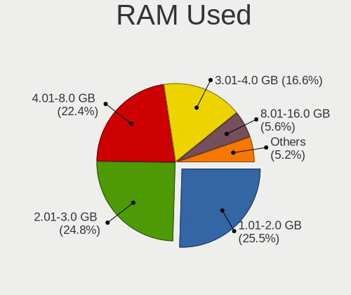
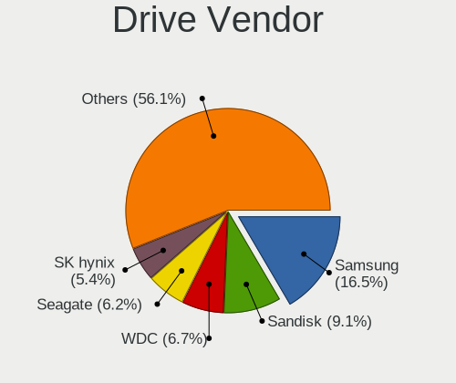
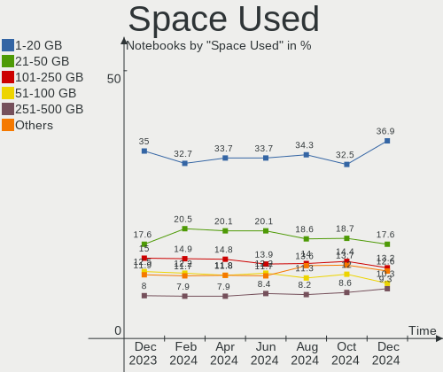
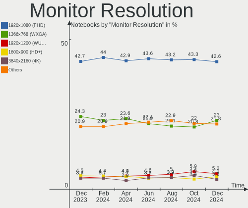
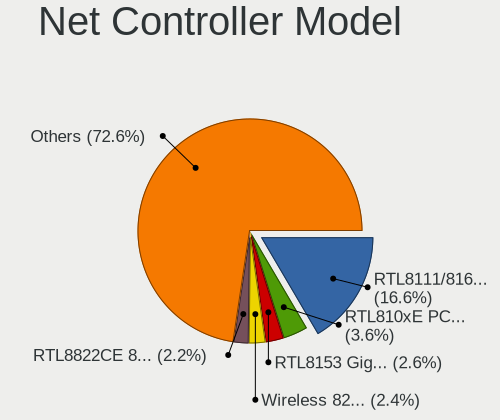

Linux Hardware Trends (Notebook)
--------------------------------

A project to identify most popular hardware characteristics and track their change
over time based on data collected by Linux users at https://Linux-Hardware.org.

Anyone can contribute to the study by uploading probes of their computers by
the [hw-probe](https://github.com/linuxhw/hw-probe) tool:

    sudo hw-probe -all -upload

Full-feature report is available here: https://linux-hardware.org/?view=trends&formfactor=notebook

Period: Nov, 2019.

Contents
--------

- [ OS                       ](#os)
- [ OS Family                ](#os-family)
- [ Kernel                   ](#kernel)
- [ Kernel Family            ](#kernel-family)
- [ Kernel Major Ver.        ](#kernel-major-ver)
- [ Arch                     ](#arch)
- [ DE                       ](#de)
- [ Display Server           ](#display-server)
- [ OS Lang                  ](#os-lang)
- [ Boot Mode                ](#boot-mode)
- [ Filesystem               ](#filesystem)
- [ Dual Boot with Linux     ](#dual-boot-with-linux)
- [ Dual Boot (Win)          ](#dual-boot-win)
- [ Country                  ](#country)
- [ City                     ](#city)
- [ Vendor                   ](#vendor)
- [ Model                    ](#model)
- [ Model Family             ](#model-family)
- [ MFG Year                 ](#mfg-year)
- [ Form Factor              ](#form-factor)
- [ Secure Boot              ](#secure-boot)
- [ Coreboot                 ](#coreboot)
- [ RAM Size                 ](#ram-size)
- [ RAM Used                 ](#ram-used)
- [ Drive Vendor             ](#drive-vendor)
- [ Drive Model              ](#drive-model)
- [ Drive Kind               ](#drive-kind)
- [ Drive Connector          ](#drive-connector)
- [ Drive Size               ](#drive-size)
- [ Space Total              ](#space-total)
- [ Space Used               ](#space-used)
- [ Malfunc. Drives          ](#malfunc-drives)
- [ Malfunc. Drive Vendor    ](#malfunc-drive-vendor)
- [ Malfunc. Drive Kind      ](#malfunc-drive-kind)
- [ Failed Drives            ](#failed-drives)
- [ Failed Drive Vendor      ](#failed-drive-vendor)
- [ Drive Status             ](#drive-status)
- [ CPU Vendor               ](#cpu-vendor)
- [ CPU Model                ](#cpu-model)
- [ CPU Model Family         ](#cpu-model-family)
- [ CPU Cores                ](#cpu-cores)
- [ CPU Sockets              ](#cpu-sockets)
- [ CPU Threads              ](#cpu-threads)
- [ CPU Op-Modes             ](#cpu-op-modes)
- [ CPU Microarch            ](#cpu-microarch)
- [ CPU Microcode            ](#cpu-microcode)
- [ GPU Vendor               ](#gpu-vendor)
- [ GPU Model                ](#gpu-model)
- [ GPU Combo                ](#gpu-combo)
- [ GPU Driver               ](#gpu-driver)
- [ GPU Memory               ](#gpu-memory)
- [ Monitor Vendor           ](#monitor-vendor)
- [ Monitor Model            ](#monitor-model)
- [ Monitor Resolution       ](#monitor-resolution)
- [ Monitor Diagonal         ](#monitor-diagonal)
- [ Monitor Width            ](#monitor-width)
- [ Aspect Ratio             ](#aspect-ratio)
- [ Monitor Area             ](#monitor-area)
- [ Pixel Density            ](#pixel-density)
- [ Multiple Monitors        ](#multiple-monitors)
- [ Net Controller Vendor    ](#net-controller-vendor)
- [ Net Controller Model     ](#net-controller-model)
- [ Net Controller Kind      ](#net-controller-kind)
- [ Used Controller          ](#used-controller)
- [ NICs                     ](#nics)
- [ Unsupported Devices      ](#unsupported-devices)
- [ Unsupported Device Types ](#unsupported-device-types)

OS
--

Installed operating systems

| Name                   | Computers | Percent |
|------------------------|-----------|---------|
| Ubuntu 18.04           | 285       | 27.38%  |
| Ubuntu 19.10           | 137       | 13.16%  |
| ROSA R11               | 110       | 10.57%  |
| Mint 19.2              | 110       | 10.57%  |
| Fedora 31              | 51        | 4.9%    |
| Ubuntu 19.04           | 32        | 3.07%   |
| Endless 3.7.3          | 25        | 2.4%    |
| Debian 10              | 20        | 1.92%   |
| Arch                   | 19        | 1.83%   |
| Ubuntu 16.04           | 18        | 1.73%   |
| Manjaro                | 14        | 1.34%   |
| Zorin 15               | 13        | 1.25%   |
| Mint 19.1              | 13        | 1.25%   |
| Endless 3.7.4          | 13        | 1.25%   |
| ROSA R8.1              | 11        | 1.06%   |
| Arch Rolling           | 11        | 1.06%   |
| Fedora 30              | 9         | 0.86%   |
| Zorin 12               | 8         | 0.77%   |
| Manjaro 18.1.3         | 8         | 0.77%   |
| Manjaro 18.1.2         | 8         | 0.77%   |
| KDE neon 18.04         | 8         | 0.77%   |
| Elementary 5.0         | 8         | 0.77%   |
| Mint 18.3              | 7         | 0.67%   |
| Peppermint 10          | 6         | 0.58%   |
| Debian                 | 6         | 0.58%   |
| Ubuntu 18.10           | 5         | 0.48%   |
| ROSA R10               | 5         | 0.48%   |
| Kali 2019.4            | 5         | 0.48%   |
| Mint 19                | 4         | 0.38%   |
| Endless 3.3.19-nexthw1 | 4         | 0.38%   |
| CentOS 8               | 4         | 0.38%   |
| Solus 4.0              | 3         | 0.29%   |
| Gentoo                 | 3         | 0.29%   |
| Endless 3.5.7-nexthw1  | 3         | 0.29%   |
| Debian Testing         | 3         | 0.29%   |
| Debian 9               | 3         | 0.29%   |
| RHEL 8.1               | 2         | 0.19%   |
| RHEL 8.0               | 2         | 0.19%   |
| Kali 2019.3            | 2         | 0.19%   |
| Gentoo 2.6             | 2         | 0.19%   |
| Endless 3.4.4-nexthw1  | 2         | 0.19%   |
| Endless 3.3.16-nexthw1 | 2         | 0.19%   |
| Debian 9.11            | 2         | 0.19%   |
| Clear Linux 31620      | 2         | 0.19%   |
| ALT Linux 9.0          | 2         | 0.19%   |
| Void                   | 1         | 0.1%    |
| Ubuntu 17.10           | 1         | 0.1%    |
| Trisquel 8.0           | 1         | 0.1%    |
| Sabayon                | 1         | 0.1%    |
| ROSA R9                | 1         | 0.1%    |
| RED 7.3                | 1         | 0.1%    |
| PureOS 9.0             | 1         | 0.1%    |
| Parrot 4.7             | 1         | 0.1%    |
| Pardus 19.1            | 1         | 0.1%    |
| openSUSE 20191118      | 1         | 0.1%    |
| openSUSE 20191112      | 1         | 0.1%    |
| MX 18.3                | 1         | 0.1%    |
| Mint 3                 | 1         | 0.1%    |
| Mint 19.3              | 1         | 0.1%    |
| Fedora 29              | 1         | 0.1%    |

OS Family
---------

OS without a version

| Name        | Computers | Percent |
|-------------|-----------|---------|
| Ubuntu      | 478       | 45.92%  |
| Mint        | 136       | 13.06%  |
| ROSA        | 127       | 12.2%   |
| Fedora      | 61        | 5.86%   |
| Endless     | 57        | 5.48%   |
| Debian      | 36        | 3.46%   |
| Manjaro     | 30        | 2.88%   |
| Arch        | 30        | 2.88%   |
| Zorin       | 21        | 2.02%   |
| KDE neon    | 8         | 0.77%   |
| Elementary  | 8         | 0.77%   |
| Kali        | 7         | 0.67%   |
| Peppermint  | 6         | 0.58%   |
| Clear Linux | 6         | 0.58%   |
| Gentoo      | 5         | 0.48%   |
| RHEL        | 4         | 0.38%   |
| CentOS      | 4         | 0.38%   |
| Solus       | 3         | 0.29%   |
| openSUSE    | 2         | 0.19%   |
| ALT Linux   | 2         | 0.19%   |
| Void        | 1         | 0.1%    |
| Trisquel    | 1         | 0.1%    |
| Sabayon     | 1         | 0.1%    |
| RED         | 1         | 0.1%    |
| PureOS      | 1         | 0.1%    |
| Parrot      | 1         | 0.1%    |
| Pardus      | 1         | 0.1%    |
| MX          | 1         | 0.1%    |
| Deepin      | 1         | 0.1%    |
| Ctlos       | 1         | 0.1%    |

Kernel
------

Version of the Linux kernel

| Version                          | Computers | Percent |
|----------------------------------|-----------|---------|
| 5.0.0-32-generic                 | 98        | 9.41%   |
| 5.0.0-36-generic                 | 93        | 8.93%   |
| 4.15.0-70-generic                | 87        | 8.36%   |
| 4.15.0-66-generic                | 73        | 7.01%   |
| 5.3.0-23-generic                 | 66        | 6.34%   |
| 5.3.0-19-generic                 | 50        | 4.8%    |
| 4.15.0-desktop-45.1rosa-x86_64   | 38        | 3.65%   |
| 4.15.0-desktop-60.7rosa-x86_64   | 36        | 3.46%   |
| 5.0.0-23-generic                 | 35        | 3.36%   |
| 5.3.0-12-generic                 | 27        | 2.59%   |
| 5.3.8-300.fc31.x86_64            | 23        | 2.21%   |
| 4.15.0-54-generic                | 22        | 2.11%   |
| 5.3.11-300.fc31.x86_64           | 21        | 2.02%   |
| 4.19.0-6-amd64                   | 13        | 1.25%   |
| 5.0.0-31-generic                 | 12        | 1.15%   |
| 5.3.8-arch1-1                    | 10        | 0.96%   |
| 4.9.155-nrj-desktop-1rosa-x86_64 | 10        | 0.96%   |
| 4.15.0-desktop-60.7rosa-i586     | 10        | 0.96%   |
| 5.3.0-18-generic                 | 9         | 0.86%   |
| 4.18.0-25-generic                | 8         | 0.77%   |
| 4.15.0-desktop-45.1rosa-i586     | 8         | 0.77%   |
| 5.3.12-1-MANJARO                 | 7         | 0.67%   |
| 5.3.11-arch1-1                   | 6         | 0.58%   |
| 5.3.0-24-generic                 | 6         | 0.58%   |
| 5.3.8-3-MANJARO                  | 5         | 0.48%   |
| 5.3.11-1-MANJARO                 | 5         | 0.48%   |
| 5.0.0-13-generic                 | 5         | 0.48%   |
| 4.9.0-11-amd64                   | 5         | 0.48%   |
| 4.18.0-80.11.2.el8_0.x86_64      | 5         | 0.48%   |
| 5.3.8-200.fc30.x86_64            | 4         | 0.38%   |
| 5.3.7-301.fc31.x86_64            | 4         | 0.38%   |
| 5.3.11-050311-generic            | 4         | 0.38%   |
| 5.3.0-19-lowlatency              | 4         | 0.38%   |
| 5.0.0-7-generic                  | 4         | 0.38%   |
| 4.9.155-nrj-laptop-1rosa-x86_64  | 4         | 0.38%   |
| 4.15.0-69-generic                | 4         | 0.38%   |
| 4.15.0-65-generic                | 4         | 0.38%   |
| 4.15.0-29-generic                | 4         | 0.38%   |
| 4.15.0-20-generic                | 4         | 0.38%   |
| 4.15.0-15-generic                | 4         | 0.38%   |
| 5.3.8-854.native                 | 3         | 0.29%   |
| 5.3.13-arch1-1                   | 3         | 0.29%   |
| 5.3.0-kali2-amd64                | 3         | 0.29%   |
| 5.3.0-23-lowlatency              | 3         | 0.29%   |
| 5.3.0-22-generic                 | 3         | 0.29%   |
| 5.3.0-21-generic                 | 3         | 0.29%   |
| 5.3.0-20-generic                 | 3         | 0.29%   |
| 5.2.0-3-amd64                    | 3         | 0.29%   |
| 5.0.0-37-generic                 | 3         | 0.29%   |
| 5.0.0-34-generic                 | 3         | 0.29%   |
| 4.9.155-nrj-desktop-1rosa-i586   | 3         | 0.29%   |
| 4.9.124-nrj-desktop-1rosa-x86_64 | 3         | 0.29%   |
| 4.19.0-5-amd64                   | 3         | 0.29%   |
| 4.15.0-55-generic                | 3         | 0.29%   |
| 4.10.0-38-generic                | 3         | 0.29%   |
| 4.1.38-nrj-desktop-2rosa-x86_64  | 3         | 0.29%   |
| 5.3.9-863.native                 | 2         | 0.19%   |
| 5.3.8-050308-generic             | 2         | 0.19%   |
| 5.3.7-arch1-2-ARCH               | 2         | 0.19%   |
| 5.3.7-200.fc30.x86_64            | 2         | 0.19%   |

Kernel Family
-------------

Linux kernel without a distro release

| Version  | Computers | Percent |
|----------|-----------|---------|
| 4.15.0   | 320       | 30.74%  |
| 5.0.0    | 269       | 25.84%  |
| 5.3.0    | 185       | 17.77%  |
| 5.3.8    | 50        | 4.8%    |
| 5.3.11   | 40        | 3.84%   |
| 4.18.0   | 22        | 2.11%   |
| 4.19.0   | 19        | 1.83%   |
| 4.9.155  | 17        | 1.63%   |
| 5.3.12   | 12        | 1.15%   |
| 5.3.9    | 10        | 0.96%   |
| 5.3.7    | 10        | 0.96%   |
| 5.2.0    | 6         | 0.58%   |
| 5.4.0    | 5         | 0.48%   |
| 5.3.13   | 5         | 0.48%   |
| 4.9.0    | 5         | 0.48%   |
| 5.3.10   | 3         | 0.29%   |
| 4.9.60   | 3         | 0.29%   |
| 4.9.124  | 3         | 0.29%   |
| 4.4.0    | 3         | 0.29%   |
| 4.16.18  | 3         | 0.29%   |
| 4.13.0   | 3         | 0.29%   |
| 4.10.0   | 3         | 0.29%   |
| 4.1.38   | 3         | 0.29%   |
| 5.3.6    | 2         | 0.19%   |
| 5.3.1    | 2         | 0.19%   |
| 5.2.21   | 2         | 0.19%   |
| 5.1.0    | 2         | 0.19%   |
| 4.9.20   | 2         | 0.19%   |
| 4.19.82  | 2         | 0.19%   |
| 4.19.81  | 2         | 0.19%   |
| 4.19.80  | 2         | 0.19%   |
| 4.17.0   | 2         | 0.19%   |
| 4.16.0   | 2         | 0.19%   |
| 5.4.1    | 1         | 0.1%    |
| 5.3.5    | 1         | 0.1%    |
| 5.3.2    | 1         | 0.1%    |
| 5.2.20   | 1         | 0.1%    |
| 5.2.15   | 1         | 0.1%    |
| 5.2.14   | 1         | 0.1%    |
| 5.2.13   | 1         | 0.1%    |
| 5.2.11   | 1         | 0.1%    |
| 5.0.9    | 1         | 0.1%    |
| 4.9.9    | 1         | 0.1%    |
| 4.9.193  | 1         | 0.1%    |
| 4.19.86  | 1         | 0.1%    |
| 4.19.84  | 1         | 0.1%    |
| 4.19.8   | 1         | 0.1%    |
| 4.19.79  | 1         | 0.1%    |
| 4.19.67  | 1         | 0.1%    |
| 4.19.60  | 1         | 0.1%    |
| 4.19.56  | 1         | 0.1%    |
| 4.15.18  | 1         | 0.1%    |
| 4.14.148 | 1         | 0.1%    |
| 4.14.138 | 1         | 0.1%    |
| 3.16.0   | 1         | 0.1%    |

Kernel Major Ver.
-----------------

Linux kernel major version

| Version | Computers | Percent |
|---------|-----------|---------|
| 5.3     | 321       | 30.84%  |
| 4.15    | 321       | 30.84%  |
| 5.0     | 270       | 25.94%  |
| 4.9     | 32        | 3.07%   |
| 4.19    | 32        | 3.07%   |
| 4.18    | 22        | 2.11%   |
| 5.2     | 13        | 1.25%   |
| 5.4     | 6         | 0.58%   |
| 4.16    | 5         | 0.48%   |
| 4.4     | 3         | 0.29%   |
| 4.13    | 3         | 0.29%   |
| 4.10    | 3         | 0.29%   |
| 4.1     | 3         | 0.29%   |
| 5.1     | 2         | 0.19%   |
| 4.17    | 2         | 0.19%   |
| 4.14    | 2         | 0.19%   |
| 3.16    | 1         | 0.1%    |

Arch
----

OS architecture (x86_64, i586, etc.)

| Name   | Computers | Percent |
|--------|-----------|---------|
| x86_64 | 950       | 91.26%  |
| i686   | 91        | 8.74%   |

DE
--

Desktop Environment

| Name                | Computers | Percent |
|---------------------|-----------|---------|
| Unknown             | 333       | 31.99%  |
| GNOME               | 325       | 31.22%  |
| KDE5                | 132       | 12.68%  |
| XFCE                | 79        | 7.59%   |
| X-Cinnamon          | 51        | 4.9%    |
| Cinnamon            | 29        | 2.79%   |
| MATE                | 28        | 2.69%   |
| KDE                 | 24        | 2.31%   |
| Unity               | 11        | 1.06%   |
| GNOME Flashback     | 6         | 0.58%   |
| Pantheon            | 5         | 0.48%   |
| LXDE                | 5         | 0.48%   |
| LXQt                | 4         | 0.38%   |
| Budgie              | 3         | 0.29%   |
| GNOME-Classic:GNOME | 2         | 0.19%   |
| Deepin              | 2         | 0.19%   |
| KDE4                | 1         | 0.1%    |
| i3                  | 1         | 0.1%    |

Display Server
--------------

X11 or Wayland

| Name    | Computers | Percent |
|---------|-----------|---------|
| Unknown | 644       | 61.86%  |
| X11     | 376       | 36.12%  |
| Wayland | 21        | 2.02%   |

OS Lang
-------

Language

| Lang       | Computers | Percent |
|------------|-----------|---------|
| Unknown    | 644       | 61.86%  |
| en_US      | 129       | 12.39%  |
| de_DE      | 38        | 3.65%   |
| pt_BR      | 25        | 2.4%    |
| it_IT      | 19        | 1.83%   |
| ru_RU      | 18        | 1.73%   |
| es_ES      | 17        | 1.63%   |
| fr_FR      | 16        | 1.54%   |
| en_GB      | 13        | 1.25%   |
| en_CA      | 12        | 1.15%   |
| pl_PL      | 10        | 0.96%   |
| en_US.utf8 | 9         | 0.86%   |
| C          | 7         | 0.67%   |
| en_AU      | 6         | 0.58%   |
| ro_RO      | 5         | 0.48%   |
| fr_CA      | 5         | 0.48%   |
| en_IN      | 5         | 0.48%   |
| pt_PT      | 4         | 0.38%   |
| de_AT      | 4         | 0.38%   |
| cs_CZ      | 4         | 0.38%   |
| pt_BR.utf8 | 3         | 0.29%   |
| hu_HU      | 3         | 0.29%   |
| es_CL      | 3         | 0.29%   |
| zh_CN      | 2         | 0.19%   |
| sk_SK      | 2         | 0.19%   |
| ru_UA      | 2         | 0.19%   |
| nl_NL      | 2         | 0.19%   |
| es_UY      | 2         | 0.19%   |
| es_MX      | 2         | 0.19%   |
| es_CO      | 2         | 0.19%   |
| en_ZA      | 2         | 0.19%   |
| en_NZ      | 2         | 0.19%   |
| en_IL      | 2         | 0.19%   |
| el_GR      | 2         | 0.19%   |
| de_CH      | 2         | 0.19%   |
| tr_TR      | 1         | 0.1%    |
| th_TH      | 1         | 0.1%    |
| nb_NO      | 1         | 0.1%    |
| lt_LT      | 1         | 0.1%    |
| id_ID      | 1         | 0.1%    |
| fr_FR.utf8 | 1         | 0.1%    |
| fr_BE      | 1         | 0.1%    |
| fi_FI      | 1         | 0.1%    |
| es_VE      | 1         | 0.1%    |
| es_PE      | 1         | 0.1%    |
| es_CR      | 1         | 0.1%    |
| es_AR      | 1         | 0.1%    |
| en_PH      | 1         | 0.1%    |
| en_IE      | 1         | 0.1%    |
| en_HK      | 1         | 0.1%    |
| de_DE.utf8 | 1         | 0.1%    |
| da_DK      | 1         | 0.1%    |
| ca_ES      | 1         | 0.1%    |

Boot Mode
---------

EFI or BIOS

| Mode | Computers | Percent |
|------|-----------|---------|
| BIOS | 540       | 51.87%  |
| EFI  | 501       | 48.13%  |

Filesystem
----------

Type of filesystem

| Type    | Computers | Percent |
|---------|-----------|---------|
| Ext4    | 976       | 93.76%  |
| Overlay | 27        | 2.59%   |
| Btrfs   | 17        | 1.63%   |
| Xfs     | 13        | 1.25%   |
| Ext3    | 3         | 0.29%   |
| Ext2    | 3         | 0.29%   |
| Zfs     | 1         | 0.1%    |
| Aufs    | 1         | 0.1%    |

Dual Boot with Linux
--------------------

Hosting more than one Linux

| Dual boot | Computers | Percent |
|-----------|-----------|---------|
| No        | 935       | 89.82%  |
| Yes       | 106       | 10.18%  |

Dual Boot (Win)
---------------

Hosting Linux and Windows

| Dual boot | Computers | Percent |
|-----------|-----------|---------|
| No        | 761       | 73.1%   |
| Yes       | 280       | 26.9%   |

Country
-------

Geographic location (country)

| Country                   | Computers | Percent |
|---------------------------|-----------|---------|
| Russia                    | 159       | 15.27%  |
| USA                       | 129       | 12.39%  |
| Germany                   | 99        | 9.51%   |
| Brazil                    | 68        | 6.53%   |
| Canada                    | 38        | 3.65%   |
| France                    | 37        | 3.55%   |
| Italy                     | 34        | 3.27%   |
| UK                        | 33        | 3.17%   |
| Spain                     | 32        | 3.07%   |
| India                     | 29        | 2.79%   |
| Poland                    | 27        | 2.59%   |
| Ukraine                   | 22        | 2.11%   |
| Romania                   | 22        | 2.11%   |
| Netherlands               | 18        | 1.73%   |
| Australia                 | 15        | 1.44%   |
| Turkey                    | 13        | 1.25%   |
| Slovakia                  | 13        | 1.25%   |
| Czech Republic            | 13        | 1.25%   |
| Portugal                  | 12        | 1.15%   |
| Hungary                   | 12        | 1.15%   |
| Belarus                   | 12        | 1.15%   |
| Austria                   | 11        | 1.06%   |
| Switzerland               | 10        | 0.96%   |
| Mexico                    | 9         | 0.86%   |
| Belgium                   | 9         | 0.86%   |
| Norway                    | 8         | 0.77%   |
| Greece                    | 7         | 0.67%   |
| Egypt                     | 7         | 0.67%   |
| Colombia                  | 7         | 0.67%   |
| Sweden                    | 6         | 0.58%   |
| Peru                      | 6         | 0.58%   |
| Japan                     | 6         | 0.58%   |
| Finland                   | 6         | 0.58%   |
| Chile                     | 6         | 0.58%   |
| Latvia                    | 5         | 0.48%   |
| Croatia                   | 5         | 0.48%   |
| Uruguay                   | 4         | 0.38%   |
| South Africa              | 4         | 0.38%   |
| Serbia                    | 4         | 0.38%   |
| New Zealand               | 4         | 0.38%   |
| Morocco                   | 4         | 0.38%   |
| Lithuania                 | 4         | 0.38%   |
| Israel                    | 4         | 0.38%   |
| Denmark                   | 4         | 0.38%   |
| China                     | 4         | 0.38%   |
| Argentina                 | 4         | 0.38%   |
| Tunisia                   | 3         | 0.29%   |
| Thailand                  | 3         | 0.29%   |
| Qatar                     | 3         | 0.29%   |
| Philippines               | 3         | 0.29%   |
| Iran                      | 3         | 0.29%   |
| Indonesia                 | 3         | 0.29%   |
| Bulgaria                  | 3         | 0.29%   |
| Bangladesh                | 3         | 0.29%   |
| Kazakhstan                | 2         | 0.19%   |
| Iran, Islamic Republic of | 2         | 0.19%   |
| Hong Kong                 | 2         | 0.19%   |
| Algeria                   | 2         | 0.19%   |
| Venezuela                 | 1         | 0.1%    |
| Uzbekistan                | 1         | 0.1%    |

City
----

Geographic location (city)

| City              | Computers | Percent |
|-------------------|-----------|---------|
| Moscow            | 26        | 2.5%    |
| St Petersburg     | 18        | 1.73%   |
| São Paulo        | 11        | 1.06%   |
| Berlin            | 11        | 1.06%   |
| Kyiv              | 10        | 0.96%   |
| Yekaterinburg     | 8         | 0.77%   |
| Warsaw            | 8         | 0.77%   |
| Bucharest         | 8         | 0.77%   |
| Paris             | 7         | 0.67%   |
| Istanbul          | 7         | 0.67%   |
| Bengaluru         | 7         | 0.67%   |
| Vienna            | 6         | 0.58%   |
| Nizhniy Novgorod  | 6         | 0.58%   |
| Budapest          | 6         | 0.58%   |
| Zagreb            | 5         | 0.48%   |
| Rostov-on-Don     | 5         | 0.48%   |
| Rome              | 5         | 0.48%   |
| Riga              | 5         | 0.48%   |
| Prague            | 5         | 0.48%   |
| Lima              | 5         | 0.48%   |
| Hamburg           | 5         | 0.48%   |
| Frankfurt am Main | 5         | 0.48%   |
| Zurich            | 4         | 0.38%   |
| Toronto           | 4         | 0.38%   |
| Rio de Janeiro    | 4         | 0.38%   |
| Porto Alegre      | 4         | 0.38%   |
| Montreal          | 4         | 0.38%   |
| Madrid            | 4         | 0.38%   |
| London            | 4         | 0.38%   |
| Curitiba          | 4         | 0.38%   |
| Cairo             | 4         | 0.38%   |
| Bogotá           | 4         | 0.38%   |
| Belgrade          | 4         | 0.38%   |
| Vitebsk           | 3         | 0.29%   |
| Vancouver         | 3         | 0.29%   |
| Tomsk             | 3         | 0.29%   |
| Tolyatti          | 3         | 0.29%   |
| Tehrān           | 3         | 0.29%   |
| Sydney            | 3         | 0.29%   |
| Stuttgart         | 3         | 0.29%   |
| Sofia             | 3         | 0.29%   |
| Seattle           | 3         | 0.29%   |
| Saratov           | 3         | 0.29%   |
| Santiago          | 3         | 0.29%   |
| Salvador          | 3         | 0.29%   |
| Ryazan            | 3         | 0.29%   |
| Perth             | 3         | 0.29%   |
| Ottawa            | 3         | 0.29%   |
| Odesa             | 3         | 0.29%   |
| Novosibirsk       | 3         | 0.29%   |
| Munich            | 3         | 0.29%   |
| Mumbai            | 3         | 0.29%   |
| Los Angeles       | 3         | 0.29%   |
| Krasnodar         | 3         | 0.29%   |
| Helsinki          | 3         | 0.29%   |
| Edmonton          | 3         | 0.29%   |
| Düsseldorf       | 3         | 0.29%   |
| Dublin            | 3         | 0.29%   |
| Chicago           | 3         | 0.29%   |
| Chelyabinsk       | 3         | 0.29%   |

Vendor
------

Motherboard manufacturer

| Name                           | Computers | Percent |
|--------------------------------|-----------|---------|
| Lenovo                         | 217       | 20.85%  |
| Hewlett-Packard                | 202       | 19.4%   |
| Dell                           | 136       | 13.06%  |
| ASUSTek Computer               | 134       | 12.87%  |
| Acer                           | 116       | 11.14%  |
| Toshiba                        | 48        | 4.61%   |
| Sony                           | 21        | 2.02%   |
| Samsung Electronics            | 21        | 2.02%   |
| Apple                          | 18        | 1.73%   |
| MSI                            | 17        | 1.63%   |
| Medion                         | 8         | 0.77%   |
| Packard Bell                   | 7         | 0.67%   |
| Fujitsu                        | 7         | 0.67%   |
| eMachines                      | 7         | 0.67%   |
| Notebook                       | 6         | 0.58%   |
| Positivo                       | 5         | 0.48%   |
| LG Electronics                 | 5         | 0.48%   |
| Fujitsu Siemens                | 5         | 0.48%   |
| Unknown                        | 5         | 0.48%   |
| Novastar                       | 4         | 0.38%   |
| HUAWEI                         | 4         | 0.38%   |
| Digma                          | 4         | 0.38%   |
| Clevo                          | 4         | 0.38%   |
| System76                       | 3         | 0.29%   |
| Intel                          | 3         | 0.29%   |
| ECS                            | 3         | 0.29%   |
| Alienware                      | 3         | 0.29%   |
| TrekStor                       | 2         | 0.19%   |
| Purism                         | 2         | 0.19%   |
| Panasonic                      | 2         | 0.19%   |
| Itautec                        | 2         | 0.19%   |
| TR                             | 1         | 0.1%    |
| Timi                           | 1         | 0.1%    |
| Standard                       | 1         | 0.1%    |
| Quanta                         | 1         | 0.1%    |
| Prestigio                      | 1         | 0.1%    |
| PC Specialist                  | 1         | 0.1%    |
| OEGStone                       | 1         | 0.1%    |
| Microboard                     | 1         | 0.1%    |
| Matsushita Electric Industrial | 1         | 0.1%    |
| Maibenben                      | 1         | 0.1%    |
| Google                         | 1         | 0.1%    |
| Gateway                        | 1         | 0.1%    |
| EVGA                           | 1         | 0.1%    |
| DNS                            | 1         | 0.1%    |
| DEXP                           | 1         | 0.1%    |
| COMPAL D                       | 1         | 0.1%    |
| BESSTAR Tech                   | 1         | 0.1%    |
| Avell High Performance         | 1         | 0.1%    |
| AMI                            | 1         | 0.1%    |
| Allview                        | 1         | 0.1%    |

Model
-----

Motherboard model

| Name                                  | Computers | Percent |
|---------------------------------------|-----------|---------|
| Unknown                               | 11        | 1.06%   |
| Notebook                              | 9         | 0.86%   |
| Pavilion dv6                          | 8         | 0.77%   |
| Pavilion g6                           | 7         | 0.67%   |
| Pavilion 15                           | 7         | 0.67%   |
| Laptop 15-bw0xx                       | 5         | 0.48%   |
| Laptop 15-bs1xx                       | 5         | 0.48%   |
| G50-30 80G0                           | 5         | 0.48%   |
| VivoBook_ASUSLaptop X570ZD_F570ZD     | 4         | 0.38%   |
| Pavilion dv7                          | 4         | 0.38%   |
| Legion Y530-15ICH 81FV                | 4         | 0.38%   |
| Latitude E6420                        | 4         | 0.38%   |
| Laptop 15-db0xxx                      | 4         | 0.38%   |
| KL55                                  | 4         | 0.38%   |
| IdeaPad S145-15IWL 81MV               | 4         | 0.38%   |
| IdeaPad 310-15IKB 80TV                | 4         | 0.38%   |
| EliteBook 840 G3                      | 4         | 0.38%   |
| Aspire A315-51                        | 4         | 0.38%   |
| Aspire A315-21                        | 4         | 0.38%   |
| XPS L502X                             | 3         | 0.29%   |
| X555LAB                               | 3         | 0.29%   |
| X540NA                                | 3         | 0.29%   |
| X406UAR                               | 3         | 0.29%   |
| VivoBook_ASUSLaptop X509FB_X509FB     | 3         | 0.29%   |
| SF20PA2                               | 3         | 0.29%   |
| ProBook 6470b                         | 3         | 0.29%   |
| ProBook 4530s                         | 3         | 0.29%   |
| MacBookPro8,1                         | 3         | 0.29%   |
| Latitude E6540                        | 3         | 0.29%   |
| Latitude E5520                        | 3         | 0.29%   |
| Laptop 15-bs0xx                       | 3         | 0.29%   |
| K53SV                                 | 3         | 0.29%   |
| Inspiron N5110                        | 3         | 0.29%   |
| Inspiron 1545                         | 3         | 0.29%   |
| Inspiron 15-3567                      | 3         | 0.29%   |
| IdeaPad 330-15AST 81D6                | 3         | 0.29%   |
| EliteBook 8470p                       | 3         | 0.29%   |
| EliteBook 840 G6                      | 3         | 0.29%   |
| E725                                  | 3         | 0.29%   |
| Compaq Presario CQ50                  | 3         | 0.29%   |
| B570e HuronRiver Platform             | 3         | 0.29%   |
| Aspire E5-571G                        | 3         | 0.29%   |
| Aspire 5750G                          | 3         | 0.29%   |
| ZenBook Pro Duo UX581GV_UX581GV       | 2         | 0.19%   |
| XPS 15 9570                           | 2         | 0.19%   |
| XPS 15 9550                           | 2         | 0.19%   |
| X555LB                                | 2         | 0.19%   |
| X551CAP                               | 2         | 0.19%   |
| X550DP                                | 2         | 0.19%   |
| X101CH                                | 2         | 0.19%   |
| WRT-WX9                               | 2         | 0.19%   |
| Vostro V130                           | 2         | 0.19%   |
| Vostro 3700                           | 2         | 0.19%   |
| VivoBook_ASUSLaptop X509FA_X509FA     | 2         | 0.19%   |
| VivoBook 15_ASUS Laptop X540UAR       | 2         | 0.19%   |
| VivoBook 15_ASUS Laptop X540MA_X543MA | 2         | 0.19%   |
| VivoBook 15_ASUS Laptop X540MA_X540MA | 2         | 0.19%   |
| V145-15AST 81MT                       | 2         | 0.19%   |
| ThinkPad X230 Tablet 34372T6          | 2         | 0.19%   |
| ThinkPad W520 427637U                 | 2         | 0.19%   |

Model Family
------------

Motherboard model prefix

| Name                       | Computers | Percent |
|----------------------------|-----------|---------|
| Lenovo ThinkPad            | 94        | 9.03%   |
| Acer Aspire                | 88        | 8.45%   |
| Lenovo IdeaPad             | 53        | 5.09%   |
| Dell Inspiron              | 51        | 4.9%    |
| HP Pavilion                | 49        | 4.71%   |
| Dell Latitude              | 43        | 4.13%   |
| Toshiba Satellite          | 38        | 3.65%   |
| HP Laptop                  | 36        | 3.46%   |
| HP EliteBook               | 30        | 2.88%   |
| ASUS VivoBook              | 25        | 2.4%    |
| HP ProBook                 | 22        | 2.11%   |
| Dell XPS                   | 12        | 1.15%   |
| Dell Vostro                | 12        | 1.15%   |
| Dell Precision             | 11        | 1.06%   |
| Unknown                    | 11        | 1.06%   |
| HP Notebook                | 9         | 0.86%   |
| Fujitsu LIFEBOOK           | 7         | 0.67%   |
| Packard Bell EasyNote      | 6         | 0.58%   |
| Lenovo Legion              | 6         | 0.58%   |
| HP ZBook                   | 6         | 0.58%   |
| HP Stream                  | 6         | 0.58%   |
| HP Compaq                  | 6         | 0.58%   |
| Acer TravelMate            | 6         | 0.58%   |
| Lenovo G50-30              | 5         | 0.48%   |
| HP OMEN                    | 5         | 0.48%   |
| HP 255                     | 5         | 0.48%   |
| Novastar KL55              | 4         | 0.38%   |
| Lenovo G580                | 4         | 0.38%   |
| HP 250                     | 4         | 0.38%   |
| ASUS TUF                   | 4         | 0.38%   |
| Apple MacBookPro8          | 4         | 0.38%   |
| Acer Swift                 | 4         | 0.38%   |
| Acer Nitro                 | 4         | 0.38%   |
| Lenovo B590                | 3         | 0.29%   |
| Lenovo B570e               | 3         | 0.29%   |
| HP Presario                | 3         | 0.29%   |
| HP Mini                    | 3         | 0.29%   |
| eMachines E725             | 3         | 0.29%   |
| ECS SF20PA2                | 3         | 0.29%   |
| Dell Studio                | 3         | 0.29%   |
| ASUS ZenBook               | 3         | 0.29%   |
| ASUS X555LAB               | 3         | 0.29%   |
| ASUS X540NA                | 3         | 0.29%   |
| ASUS X406UAR               | 3         | 0.29%   |
| ASUS Strix                 | 3         | 0.29%   |
| ASUS K53SV                 | 3         | 0.29%   |
| Acer Extensa               | 3         | 0.29%   |
| TrekStor SURFBOOK          | 2         | 0.19%   |
| Toshiba PORTEGE            | 2         | 0.19%   |
| System76 Galago            | 2         | 0.19%   |
| Samsung Electronics R540   | 2         | 0.19%   |
| Samsung Electronics 300E4Z | 2         | 0.19%   |
| Purism Librem              | 2         | 0.19%   |
| Positivo Q232A             | 2         | 0.19%   |
| MSI GT70                   | 2         | 0.19%   |
| MSI GP62                   | 2         | 0.19%   |
| MSI GF63                   | 2         | 0.19%   |
| Medion Akoya               | 2         | 0.19%   |
| Lenovo V145-15AST          | 2         | 0.19%   |
| Lenovo G585                | 2         | 0.19%   |

MFG Year
--------

Motherboard manufacture year

| Year    | Computers | Percent |
|---------|-----------|---------|
| 2019    | 224       | 21.52%  |
| 2018    | 151       | 14.51%  |
| 2013    | 89        | 8.55%   |
| 2012    | 85        | 8.17%   |
| 2011    | 74        | 7.11%   |
| 2017    | 69        | 6.63%   |
| 2014    | 63        | 6.05%   |
| 2010    | 63        | 6.05%   |
| 2015    | 60        | 5.76%   |
| 2016    | 51        | 4.9%    |
| 2009    | 42        | 4.03%   |
| 2008    | 33        | 3.17%   |
| 2007    | 22        | 2.11%   |
| 2006    | 12        | 1.15%   |
| 2005    | 2         | 0.19%   |
| Unknown | 1         | 0.1%    |

Form Factor
-----------

Physical design of the computer

| Name     | Computers | Percent |
|----------|-----------|---------|
| Notebook | 1041      | 100%    |

Secure Boot
-----------

Enabled or disabled

| State    | Computers | Percent |
|----------|-----------|---------|
| Disabled | 959       | 92.12%  |
| Enabled  | 82        | 7.88%   |

Coreboot
--------

Have coreboot on board

| Used | Computers | Percent |
|------|-----------|---------|
| No   | 1038      | 99.71%  |
| Yes  | 3         | 0.29%   |

RAM Size
--------

Total RAM memory

| Size in GB  | Computers | Percent |
|-------------|-----------|---------|
| 4.01-8.0    | 296       | 28.43%  |
| 3.01-4.0    | 293       | 28.15%  |
| 8.01-16.0   | 157       | 15.08%  |
| 16.01-24.0  | 119       | 11.43%  |
| 1.01-2.0    | 97        | 9.32%   |
| 2.01-3.0    | 32        | 3.07%   |
| 32.01-64.0  | 25        | 2.4%    |
| 0.01-1.0    | 16        | 1.54%   |
| 24.01-32.0  | 5         | 0.48%   |
| 64.01-256.0 | 1         | 0.1%    |

RAM Used
--------

Used RAM memory

| Used GB    | Computers | Percent |
|------------|-----------|---------|
| 1.01-2.0   | 448       | 43.04%  |
| 2.01-3.0   | 248       | 23.82%  |
| 0.01-1.0   | 168       | 16.14%  |
| 3.01-4.0   | 92        | 8.84%   |
| 4.01-8.0   | 77        | 7.4%    |
| 8.01-16.0  | 7         | 0.67%   |
| 16.01-24.0 | 1         | 0.1%    |

Drive Vendor
------------

Hard drive vendors

| Vendor              | Computers | Drives  | Percent |
|---------------------|-----------|---------|---------|
| Seagate             | 203       | 208     | 17.7%   |
| WDC                 | 183       | 186     | 15.95%  |
| Toshiba             | 139       | 141     | 12.12%  |
| Samsung Electronics | 105       | 111     | 9.15%   |
| Kingston            | 65        | 65      | 5.67%   |
| SanDisk             | 60        | 63      | 5.23%   |
| HGST                | 57        | 58      | 4.97%   |
| Hitachi             | 53        | 53      | 4.62%   |
| Unknown             | 51        | 55      | 4.45%   |
| Crucial             | 29        | 29      | 2.53%   |
| SK Hynix            | 24        | 24      | 2.09%   |
| Micron Technology   | 19        | 19      | 1.66%   |
| Intel               | 18        | 19      | 1.57%   |
| A-DATA Technology   | 15        | 15      | 1.31%   |
| LITEON              | 12        | 12      | 1.05%   |
| Fujitsu             | 10        | 10      | 0.87%   |
| Patriot             | 8         | 8       | 0.7%    |
| Transcend           | 6         | 6       | 0.52%   |
| PNY                 | 6         | 6       | 0.52%   |
| LITEONIT            | 6         | 6       | 0.52%   |
| HL-DT-ST            | 6         | Unknown | 0.52%   |
| SPCC                | 5         | 5       | 0.44%   |
| OCZ                 | 5         | 5       | 0.44%   |
| Generic             | 5         | 5       | 0.44%   |
| Apple               | 5         | 5       | 0.44%   |
| Apacer              | 4         | 4       | 0.35%   |
| KingSpec            | 3         | 3       | 0.26%   |
| Intenso             | 3         | 3       | 0.26%   |
| China               | 3         | 3       | 0.26%   |
| Team                | 2         | 2       | 0.17%   |
| IBM/Hitachi         | 2         | 2       | 0.17%   |
| HUAWEI              | 2         | 2       | 0.17%   |
| Corsair             | 2         | 2       | 0.17%   |
| ASMT                | 2         | 2       | 0.17%   |
| Zheino              | 1         | 1       | 0.09%   |
| VT                  | 1         | 1       | 0.09%   |
| Vi550               | 1         | 1       | 0.09%   |
| USB30               | 1         | 1       | 0.09%   |
| Union Memory        | 1         | 1       | 0.09%   |
| TO Exter            | 1         | 1       | 0.09%   |
| TCSUNBOW            | 1         | 1       | 0.09%   |
| Smartbuy            | 1         | 1       | 0.09%   |
| SABRENT             | 1         | 1       | 0.09%   |
| Reeinno             | 1         | 1       | 0.09%   |
| Phison              | 1         | 1       | 0.09%   |
| OWC                 | 1         | 1       | 0.09%   |
| Netac               | 1         | 1       | 0.09%   |
| Mushkin             | 1         | 1       | 0.09%   |
| MARSHAL             | 1         | 1       | 0.09%   |
| LONDISK             | 1         | 1       | 0.09%   |
| Lenovo              | 1         | 1       | 0.09%   |
| LaCie               | 1         | 1       | 0.09%   |
| KingFast            | 1         | 1       | 0.09%   |
| KingDian            | 1         | 1       | 0.09%   |
| JMicron             | 1         | 1       | 0.09%   |
| HECTRON             | 1         | 1       | 0.09%   |
| GOODRAM             | 1         | 1       | 0.09%   |
| Gigabyte Technology | 1         | 1       | 0.09%   |
| faspeed             | 1         | 1       | 0.09%   |
| DREVO               | 1         | 1       | 0.09%   |

Drive Model
-----------

Hard drive models

| Model                        | Computers | Percent |
|------------------------------|-----------|---------|
| ST1000LM035-1RK172 1TB       | 47        | 4.02%   |
| MQ01ABF050 500GB             | 27        | 2.31%   |
| ST1000LM024 HN-M101MBB 1TB   | 23        | 1.97%   |
| MQ01ABD100 1TB               | 16        | 1.37%   |
| MQ04ABF100 1TB               | 15        | 1.28%   |
| MMC Card  31GB               | 14        | 1.2%    |
| HTS545050A7E680 500GB        | 13        | 1.11%   |
| HTS541010A9E680 1TB          | 13        | 1.11%   |
| SV300S37A120G 120GB SSD      | 12        | 1.03%   |
| ST500LT012-1DG142 500GB      | 12        | 1.03%   |
| HTS721010A9E630 1TB          | 12        | 1.03%   |
| SA400S37240G 240GB SSD       | 10        | 0.86%   |
| WD10SPZX-21Z10T0 1TB         | 9         | 0.77%   |
| WD10JPVX-22JC3T0 1TB         | 9         | 0.77%   |
| SA400S37120G 120GB SSD       | 9         | 0.77%   |
| HTS545050A7E380 500GB        | 9         | 0.77%   |
| ST500LT012-9WS142 500GB      | 8         | 0.68%   |
| SSD PLUS 240GB               | 8         | 0.68%   |
| ST500LM012 HN-M500MBB 500GB  | 7         | 0.6%    |
| SSD 850 EVO 250GB            | 7         | 0.6%    |
| WD10SPZX-60Z10T0 1TB         | 6         | 0.51%   |
| WD10JPCX-24UE4T0 1TB         | 6         | 0.51%   |
| ST9500420AS 500GB            | 6         | 0.51%   |
| ST9320423AS 320GB            | 6         | 0.51%   |
| ST500LM030-1RK17D 500GB      | 6         | 0.51%   |
| SSD 860 EVO 250GB            | 6         | 0.51%   |
| HTS543232A7A384 320GB        | 6         | 0.51%   |
| DVDRAM GUC0N 1GB             | 6         | 0.51%   |
| DF4032  31GB                 | 6         | 0.51%   |
| CT500MX500SSD1 500GB         | 6         | 0.51%   |
| Burst 120GB SSD              | 6         | 0.51%   |
| WD3200BPVT-24JJ5T0 320GB     | 5         | 0.43%   |
| WD10SPZX-24Z10 1TB           | 5         | 0.43%   |
| SV300S37A240G 240GB SSD      | 5         | 0.43%   |
| ST9160821AS 160GB            | 5         | 0.43%   |
| SSD 850 EVO 500GB            | 5         | 0.43%   |
| SSD 120GB                    | 5         | 0.43%   |
| SD9SN8W-128G-1006 128GB SSD  | 5         | 0.43%   |
| SD/MMC/MS PRO 128GB          | 5         | 0.43%   |
| HTS547575A9E384 752GB        | 5         | 0.43%   |
| WDS240G2G0A-00JH30 240GB SSD | 4         | 0.34%   |
| WD5000LPCX-21VHAT0 500GB     | 4         | 0.34%   |
| WD10JPVX-60JC3T1 1TB         | 4         | 0.34%   |
| ST9500325AS 500GB            | 4         | 0.34%   |
| ST320LT020-9YG142 320GB      | 4         | 0.34%   |
| ST2000LM007-1R8174 2TB       | 4         | 0.34%   |
| ST1000LX015-1U7172 1TB       | 4         | 0.34%   |
| ST1000LM048-2E7172 1TB       | 4         | 0.34%   |
| ST1000LM014-1EJ164 1TB       | 4         | 0.34%   |
| SSD 860 EVO 500GB            | 4         | 0.34%   |
| Solid State Disk 128GB       | 4         | 0.34%   |
| SDSSDA240G 240GB             | 4         | 0.34%   |
| SA400S37480G 480GB SSD       | 4         | 0.34%   |
| RBUSNS4180S3256GJ 256GB SSD  | 4         | 0.34%   |
| MQ01ABD032 320GB             | 4         | 0.34%   |
| HTS541010B7E610 1TB          | 4         | 0.34%   |
| 1100_MTFDDAV256TBN 256GB SSD | 4         | 0.34%   |
| WDS250G2B0A-00SM50 250GB SSD | 3         | 0.26%   |
| WD7500BPVX-22JC3T0 750GB     | 3         | 0.26%   |
| WD5000LPCX-24VHAT0 500GB     | 3         | 0.26%   |

Drive Kind
----------

HDD or SSD

| Kind    | Computers | Drives | Percent |
|---------|-----------|--------|---------|
| HDD     | 617       | 636    | 55.54%  |
| SSD     | 368       | 404    | 33.12%  |
| MMC     | 59        | 65     | 5.31%   |
| NVMe    | 42        | 42     | 3.78%   |
| Unknown | 25        | 19     | 2.25%   |

Drive Connector
---------------

SATA, SAS, NVMe, etc.

| Type | Computers | Drives | Percent |
|------|-----------|--------|---------|
| SATA | 903       | 1032   | 87.25%  |
| MMC  | 59        | 65     | 5.7%    |
| NVMe | 42        | 42     | 4.06%   |
| SAS  | 31        | 27     | 3%      |

Drive Size
----------

Size of hard drive

| Size in TB | Computers | Drives | Percent |
|------------|-----------|--------|---------|
| 0.01-0.5   | 720       | 815    | 67.92%  |
| 0.51-1.0   | 310       | 320    | 29.25%  |
| 1.01-2.0   | 27        | 28     | 2.55%   |
| 3.01-4.0   | 2         | 2      | 0.19%   |
| Unknown    | 1         | 1      | 0.09%   |

Space Total
-----------

Amount of disk space available on the file system

| Size in GB     | Computers | Percent |
|----------------|-----------|---------|
| 101-250        | 334       | 32.08%  |
| 251-500        | 273       | 26.22%  |
| 501-1000       | 174       | 16.71%  |
| 51-100         | 86        | 8.26%   |
| 21-50          | 73        | 7.01%   |
| 1-20           | 43        | 4.13%   |
| 1001-2000      | 35        | 3.36%   |
| Unknown        | 10        | 0.96%   |
| 2001-3000      | 7         | 0.67%   |
| More than 3000 | 6         | 0.58%   |

Space Used
----------

Amount of used disk space

| Used GB        | Computers | Percent |
|----------------|-----------|---------|
| 1-20           | 457       | 43.9%   |
| 21-50          | 219       | 21.04%  |
| 51-100         | 131       | 12.58%  |
| 101-250        | 125       | 12.01%  |
| 251-500        | 50        | 4.8%    |
| 501-1000       | 34        | 3.27%   |
| 1001-2000      | 11        | 1.06%   |
| Unknown        | 10        | 0.96%   |
| More than 3000 | 2         | 0.19%   |
| 2001-3000      | 2         | 0.19%   |

Malfunc. Drives
---------------

Drive models with a malfunction

| Model                       | Computers | Drives | Percent |
|-----------------------------|-----------|--------|---------|
| WD1200BEVS-60UST0 120GB     | 2         | 2      | 2.94%   |
| ST500LM012 HN-M500MBB 500GB | 2         | 2      | 2.94%   |
| ST1000LM035-1RK172 1TB      | 2         | 2      | 2.94%   |
| MK3265GSX 320GB             | 2         | 2      | 2.94%   |
| MK2565GSX 250GB             | 2         | 2      | 2.94%   |
| HTS545050A7E380 500GB       | 2         | 2      | 2.94%   |
| WD7500BPVT-00HXZT3 752GB    | 1         | 1      | 1.47%   |
| WD7500BPVT-00HXZT1 752GB    | 1         | 1      | 1.47%   |
| WD5000BPVT-55HXZT3 500GB    | 1         | 1      | 1.47%   |
| WD5000BEVT-60A0RT0 500GB    | 1         | 1      | 1.47%   |
| WD5000BEVT-24A0RT0 500GB    | 1         | 1      | 1.47%   |
| WD3200BPVT-22JJ5T0 320GB    | 1         | 1      | 1.47%   |
| WD2500BEVT-35A23T0 250GB    | 1         | 1      | 1.47%   |
| WD2500BEKT-60A25T1 250GB    | 1         | 1      | 1.47%   |
| WD1600BEVT-22A23T0 160GB    | 1         | 1      | 1.47%   |
| WD1200BEVS-6 120GB          | 1         | 1      | 1.47%   |
| SV300S37A120G 120GB SSD     | 1         | 1      | 1.47%   |
| ST9640320AS 640GB           | 1         | 1      | 1.47%   |
| ST9500420AS 500GB           | 1         | 1      | 1.47%   |
| ST9500325AS 500GB           | 1         | 1      | 1.47%   |
| ST9320423AS 320GB           | 1         | 1      | 1.47%   |
| ST9320310AS 320GB           | 1         | 1      | 1.47%   |
| ST9250827AS 250GB           | 1         | 1      | 1.47%   |
| ST9160821AS 160GB           | 1         | 1      | 1.47%   |
| ST9160310AS 160GB           | 1         | 1      | 1.47%   |
| ST500LT012-9WS142 500GB     | 1         | 1      | 1.47%   |
| ST500LT012-9WS14 500GB      | 1         | 1      | 1.47%   |
| ST500LM012 HN-M5 500GB      | 1         | 1      | 1.47%   |
| ST320LT020-9YG142 320GB     | 1         | 1      | 1.47%   |
| ST320LT012-9WS14C 320GB     | 1         | 1      | 1.47%   |
| ST320LT012-9WS14 320GB      | 1         | 1      | 1.47%   |
| ST1000LM024 HN-M101MBB 1TB  | 1         | 1      | 1.47%   |
| ST1000LM014-SSHD-8GB        | 1         | 1      | 1.47%   |
| ST1000LM014-1EJ164 1TB      | 1         | 1      | 1.47%   |
| SSDSCKGW180A4 180GB         | 1         | 1      | 1.47%   |
| P3-512 512GB                | 1         | 1      | 1.47%   |
| MQ01ACF050 500GB            | 1         | 1      | 1.47%   |
| MQ01ABD100 1TB              | 1         | 1      | 1.47%   |
| MK8009GAH 80GB              | 1         | 1      | 1.47%   |
| MK6475GSX 640GB             | 1         | 1      | 1.47%   |
| MK5076GSX 500GB             | 1         | 1      | 1.47%   |
| MK2556GSY 250GB             | 1         | 1      | 1.47%   |
| MK1652GSX 160GB             | 1         | 1      | 1.47%   |
| MK1059GS 1TB                | 1         | 1      | 1.47%   |
| MHY2120BH 120GB             | 1         | 1      | 1.47%   |
| LMN-256M3M mSATA 256GB SSD  | 1         | 1      | 1.47%   |
| HTS725032A9A364 320GB       | 1         | 1      | 1.47%   |
| HTS721010A9E630 1TB         | 1         | 1      | 1.47%   |
| HTS721010A9 1TB             | 1         | 1      | 1.47%   |
| HTS547575A9E384 752GB       | 1         | 1      | 1.47%   |
| HTS547550A9E384 500GB       | 1         | 1      | 1.47%   |
| HTS545050A7E680 500GB       | 1         | 1      | 1.47%   |
| HTS545032B9SA00 320GB       | 1         | 1      | 1.47%   |
| HTS545032B9A300 320GB       | 1         | 1      | 1.47%   |
| HTS545025B9A300 250GB       | 1         | 1      | 1.47%   |
| HTS543232A7A384 320GB       | 1         | 1      | 1.47%   |
| HTS543225L9A300 250GB       | 1         | 1      | 1.47%   |
| HTS543216L9SA02 160GB       | 1         | 1      | 1.47%   |
| HTS542525K9SA00 250GB       | 1         | 1      | 1.47%   |
| HTS541616J9SA00 160GB       | 1         | 1      | 1.47%   |

Malfunc. Drive Vendor
---------------------

Vendors of faulty drives

| Vendor            | Computers | Drives | Percent |
|-------------------|-----------|--------|---------|
| Seagate           | 20        | 21     | 30.77%  |
| Toshiba           | 12        | 12     | 18.46%  |
| Hitachi           | 12        | 12     | 18.46%  |
| WDC               | 11        | 12     | 16.92%  |
| HGST              | 3         | 4      | 4.62%   |
| SK Hynix          | 1         | 1      | 1.54%   |
| Micron Technology | 1         | 1      | 1.54%   |
| LITEONIT          | 1         | 1      | 1.54%   |
| Kingston          | 1         | 1      | 1.54%   |
| KingSpec          | 1         | 1      | 1.54%   |
| Intel             | 1         | 1      | 1.54%   |
| Fujitsu           | 1         | 1      | 1.54%   |

Malfunc. Drive Kind
-------------------

Kinds of faulty drives

| Kind | Computers | Drives | Percent |
|------|-----------|--------|---------|
| HDD  | 58        | 62     | 90.63%  |
| SSD  | 5         | 5      | 7.81%   |
| NVMe | 1         | 1      | 1.56%   |

Failed Drives
-------------

Failed drive models

| Model                    | Computers | Drives | Percent |
|--------------------------|-----------|--------|---------|
| WD5000LPVX-80V0TT0 500GB | 1         | 1      | 33.33%  |
| WD2500BEVT-22A23T0 250GB | 1         | 1      | 33.33%  |
| HTS541010A9E680 1TB      | 1         | 1      | 33.33%  |

Failed Drive Vendor
-------------------

Failed drive vendors

| Vendor | Computers | Drives | Percent |
|--------|-----------|--------|---------|
| WDC    | 2         | 2      | 66.67%  |
| HGST   | 1         | 1      | 33.33%  |

Drive Status
------------

Number of failed and malfunc. drives

| Status   | Computers | Drives | Percent |
|----------|-----------|--------|---------|
| Detected | 716       | 836    | 71.53%  |
| Works    | 218       | 259    | 21.78%  |
| Malfunc  | 64        | 68     | 6.39%   |
| Failed   | 3         | 3      | 0.3%    |

CPU Vendor
----------

Processor vendors

| Vendor       | Computers | Percent |
|--------------|-----------|---------|
| Intel        | 892       | 85.69%  |
| AMD          | 148       | 14.22%  |
| CentaurHauls | 1         | 0.1%    |

CPU Model
---------

Processor models

| Model                                         | Computers | Percent |
|-----------------------------------------------|-----------|---------|
| Intel Core i5-7200U CPU @ 2.50GHz             | 27        | 2.59%   |
| Intel Core i5-8250U CPU @ 1.60GHz             | 26        | 2.5%    |
| Intel Core i5-8265U CPU @ 1.60GHz             | 20        | 1.92%   |
| Intel Core i7-8750H CPU @ 2.20GHz             | 16        | 1.54%   |
| Intel Core i7-7500U CPU @ 2.70GHz             | 16        | 1.54%   |
| Intel Core i5-3320M CPU @ 2.60GHz             | 16        | 1.54%   |
| Intel Core i7-8550U CPU @ 1.80GHz             | 15        | 1.44%   |
| Intel Core i5-5200U CPU @ 2.20GHz             | 15        | 1.44%   |
| Intel Core i5-2520M CPU @ 2.50GHz             | 15        | 1.44%   |
| Intel Core i7-9750H CPU @ 2.60GHz             | 13        | 1.25%   |
| Intel Celeron N4000 CPU @ 1.10GHz             | 13        | 1.25%   |
| Intel Celeron CPU N3350 @ 1.10GHz             | 13        | 1.25%   |
| Intel Core i7-8565U CPU @ 1.80GHz             | 12        | 1.15%   |
| Intel Core i5-6200U CPU @ 2.30GHz             | 12        | 1.15%   |
| Intel Core i5-3210M CPU @ 2.50GHz             | 12        | 1.15%   |
| AMD Ryzen 5 2500U with Radeon Vega Mobile Gfx | 12        | 1.15%   |
| Intel Celeron CPU N3060 @ 1.60GHz             | 11        | 1.06%   |
| Intel Core i7-2670QM CPU @ 2.20GHz            | 10        | 0.96%   |
| Intel Core i5 CPU M 520 @ 2.40GHz             | 10        | 0.96%   |
| Intel Atom x5-Z8350 CPU @ 1.44GHz             | 10        | 0.96%   |
| Intel Core i7-7700HQ CPU @ 2.80GHz            | 9         | 0.86%   |
| Intel Core i5-4210U CPU @ 1.70GHz             | 9         | 0.86%   |
| Intel Pentium CPU 2020M @ 2.40GHz             | 8         | 0.77%   |
| Intel Core i7-6700HQ CPU @ 2.60GHz            | 8         | 0.77%   |
| Intel Core i5-8300H CPU @ 2.30GHz             | 8         | 0.77%   |
| Intel Celeron CPU N2840 @ 2.16GHz             | 8         | 0.77%   |
| Intel Core i7-6500U CPU @ 2.50GHz             | 7         | 0.67%   |
| Intel Core i5-5300U CPU @ 2.30GHz             | 7         | 0.67%   |
| Intel Core i5-2450M CPU @ 2.50GHz             | 7         | 0.67%   |
| Intel Core i3-2350M CPU @ 2.30GHz             | 7         | 0.67%   |
| Intel Core i3 CPU M 370 @ 2.40GHz             | 7         | 0.67%   |
| AMD Ryzen 3 2200U with Radeon Vega Mobile Gfx | 7         | 0.67%   |
| Intel Core i7-5500U CPU @ 2.40GHz             | 6         | 0.58%   |
| Intel Core i7-2630QM CPU @ 2.00GHz            | 6         | 0.58%   |
| Intel Core i5-4200U CPU @ 1.60GHz             | 6         | 0.58%   |
| Intel Core i5-3230M CPU @ 2.60GHz             | 6         | 0.58%   |
| Intel Core i5-2540M CPU @ 2.60GHz             | 6         | 0.58%   |
| Intel Core i5-2410M CPU @ 2.30GHz             | 6         | 0.58%   |
| Intel Core i5 CPU M 430 @ 2.27GHz             | 6         | 0.58%   |
| Intel Core i3-7020U CPU @ 2.30GHz             | 6         | 0.58%   |
| Intel Core i3-6006U CPU @ 2.00GHz             | 6         | 0.58%   |
| Intel Core i3-5005U CPU @ 2.00GHz             | 6         | 0.58%   |
| Intel Core i3-3110M CPU @ 2.40GHz             | 6         | 0.58%   |
| Intel Core i3 CPU M 380 @ 2.53GHz             | 6         | 0.58%   |
| Intel Core 2 Duo CPU T7500 @ 2.20GHz          | 6         | 0.58%   |
| AMD Ryzen 5 3500U with Radeon Vega Mobile Gfx | 6         | 0.58%   |
| Intel Pentium CPU N3540 @ 2.16GHz             | 5         | 0.48%   |
| Intel Pentium CPU B960 @ 2.20GHz              | 5         | 0.48%   |
| Intel Pentium CPU 2117U @ 1.80GHz             | 5         | 0.48%   |
| Intel Core i7-3630QM CPU @ 2.40GHz            | 5         | 0.48%   |
| Intel Core i5-7300HQ CPU @ 2.50GHz            | 5         | 0.48%   |
| Intel Core i5-2430M CPU @ 2.40GHz             | 5         | 0.48%   |
| Intel Core i5 CPU M 540 @ 2.53GHz             | 5         | 0.48%   |
| Intel Core i3-4005U CPU @ 1.70GHz             | 5         | 0.48%   |
| Intel Core i3-3120M CPU @ 2.50GHz             | 5         | 0.48%   |
| Intel Core 2 Duo CPU T7250 @ 2.00GHz          | 5         | 0.48%   |
| Intel Celeron CPU 900 @ 2.20GHz               | 5         | 0.48%   |
| Intel Atom CPU N270 @ 1.60GHz                 | 5         | 0.48%   |
| AMD A6-6310 APU with AMD Radeon R4 Graphics   | 5         | 0.48%   |
| Intel Pentium Dual-Core CPU T4500 @ 2.30GHz   | 4         | 0.38%   |

CPU Model Family
----------------

Processor model prefix

| Model                   | Computers | Percent |
|-------------------------|-----------|---------|
| Intel Core i5           | 292       | 28.05%  |
| Intel Core i7           | 211       | 20.27%  |
| Intel Core i3           | 103       | 9.89%   |
| Intel Celeron           | 80        | 7.68%   |
| Intel Core 2 Duo        | 55        | 5.28%   |
| Intel Pentium           | 52        | 5%      |
| Intel Atom              | 43        | 4.13%   |
| AMD Ryzen 5             | 21        | 2.02%   |
| AMD A6                  | 21        | 2.02%   |
| AMD A8                  | 14        | 1.34%   |
| Intel Pentium Dual-Core | 12        | 1.15%   |
| Intel Pentium Dual      | 11        | 1.06%   |
| AMD A4                  | 11        | 1.06%   |
| Intel Genuine           | 10        | 0.96%   |
| AMD Ryzen 3             | 9         | 0.86%   |
| AMD A10                 | 9         | 0.86%   |
| Other                   | 6         | 0.58%   |
| Intel Core i9           | 5         | 0.48%   |
| Intel Core 2            | 5         | 0.48%   |
| AMD Ryzen 7             | 5         | 0.48%   |
| AMD E1                  | 5         | 0.48%   |
| Intel Pentium M         | 4         | 0.38%   |
| AMD V140                | 4         | 0.38%   |
| AMD Mobile Sempron      | 4         | 0.38%   |
| AMD E2                  | 4         | 0.38%   |
| AMD E                   | 4         | 0.38%   |
| AMD Athlon              | 4         | 0.38%   |
| Intel Pentium Silver    | 3         | 0.29%   |
| Intel Celeron M         | 3         | 0.29%   |
| AMD Turion 64 X2 Mobile | 3         | 0.29%   |
| AMD Turion 64 Mobile    | 3         | 0.29%   |
| AMD Sempron             | 3         | 0.29%   |
| AMD Phenom II           | 3         | 0.29%   |
| AMD Athlon II           | 3         | 0.29%   |
| AMD C-60                | 2         | 0.19%   |
| AMD Athlon 64 X2        | 2         | 0.19%   |
| Intel Xeon              | 1         | 0.1%    |
| Intel Core 2 Quad       | 1         | 0.1%    |
| Intel Celeron Dual-Core | 1         | 0.1%    |
| CentaurHauls VIA C7     | 1         | 0.1%    |
| AMD Turion II Dual-Core | 1         | 0.1%    |
| AMD Turion Dual-Core    | 1         | 0.1%    |
| AMD QC                  | 1         | 0.1%    |
| AMD PRO A10             | 1         | 0.1%    |
| AMD FX                  | 1         | 0.1%    |
| AMD Athlon X2           | 1         | 0.1%    |
| AMD Athlon Neo          | 1         | 0.1%    |
| AMD Athlon II Neo       | 1         | 0.1%    |

CPU Cores
---------

Number of processor cores

| Number | Computers | Percent |
|--------|-----------|---------|
| 2      | 663       | 63.69%  |
| 4      | 279       | 26.8%   |
| 1      | 59        | 5.67%   |
| 6      | 35        | 3.36%   |
| 8      | 5         | 0.48%   |

CPU Sockets
-----------

Number of sockets

| Number | Computers | Percent |
|--------|-----------|---------|
| 1      | 1041      | 100%    |

CPU Threads
-----------

Threads per core (Hyper-Threading)

| Number | Computers | Percent |
|--------|-----------|---------|
| 2      | 688       | 66.09%  |
| 1      | 353       | 33.91%  |

CPU Op-Modes
------------

CPU Operation Modes (32-bit, 64-bit)

| Op mode        | Computers | Percent |
|----------------|-----------|---------|
| 32-bit, 64-bit | 903       | 86.74%  |
| Unknown        | 109       | 10.47%  |
| 32-bit         | 29        | 2.79%   |

CPU Microarch
-------------

Microarchitecture

| Name            | Computers | Percent |
|-----------------|-----------|---------|
| Skylake         | 237       | 22.77%  |
| SandyBridge     | 111       | 10.66%  |
| IvyBridge       | 100       | 9.61%   |
| Core            | 86        | 8.26%   |
| Haswell         | 76        | 7.3%    |
| Westmere        | 63        | 6.05%   |
| Silvermont      | 57        | 5.48%   |
| Broadwell       | 42        | 4.03%   |
| KabyLake        | 31        | 2.98%   |
| Excavator       | 27        | 2.59%   |
| Bonnell         | 27        | 2.59%   |
| Zen             | 22        | 2.11%   |
| P6              | 16        | 1.54%   |
| Goldmont plus   | 16        | 1.54%   |
| K8 Hammer       | 15        | 1.44%   |
| Goldmont        | 14        | 1.34%   |
| Zen+            | 13        | 1.25%   |
| Puma            | 13        | 1.25%   |
| K10             | 13        | 1.25%   |
| Piledriver      | 11        | 1.06%   |
| Bobcat          | 10        | 0.96%   |
| Penryn          | 7         | 0.67%   |
| Jaguar          | 7         | 0.67%   |
| Unknown         | 7         | 0.67%   |
| K8 & K10 hybrid | 6         | 0.58%   |
| K10 Liano       | 4         | 0.38%   |
| Steamroller     | 3         | 0.29%   |
| K10 Llano       | 2         | 0.19%   |
| CometLake       | 2         | 0.19%   |
| Nehalem         | 1         | 0.1%    |
| K6              | 1         | 0.1%    |
| Icelake         | 1         | 0.1%    |

CPU Microcode
-------------

Microcode number

| Number     | Computers | Percent |
|------------|-----------|---------|
| 0x206a7    | 105       | 10.09%  |
| Unknown    | 103       | 9.89%   |
| 0x306a9    | 90        | 8.65%   |
| 0x806e9    | 52        | 5%      |
| 0x806ea    | 45        | 4.32%   |
| 0x906ea    | 41        | 3.94%   |
| 0x20655    | 40        | 3.84%   |
| 0x40651    | 37        | 3.55%   |
| 0x1067a    | 37        | 3.55%   |
| 0x306d4    | 36        | 3.46%   |
| 0x306c3    | 32        | 3.07%   |
| 0x406e3    | 26        | 2.5%    |
| 0x806ec    | 24        | 2.31%   |
| 0x6fd      | 24        | 2.31%   |
| 0x406c4    | 22        | 2.11%   |
| 0x806eb    | 20        | 1.92%   |
| 0x30678    | 19        | 1.83%   |
| 0x20652    | 18        | 1.73%   |
| 0x0810100b | 18        | 1.73%   |
| 0x906e9    | 15        | 1.44%   |
| 0x706a1    | 15        | 1.44%   |
| 0x106ca    | 14        | 1.34%   |
| 0x506e3    | 13        | 1.25%   |
| 0x08108102 | 12        | 1.15%   |
| 0x06006705 | 12        | 1.15%   |
| 0x506c9    | 11        | 1.06%   |
| 0x010000c8 | 11        | 1.06%   |
| 0x10676    | 10        | 0.96%   |
| 0x07030105 | 10        | 0.96%   |
| 0x06006704 | 10        | 0.96%   |
| 0x06001119 | 9         | 0.86%   |
| 0x106c2    | 8         | 0.77%   |
| 0x6e8      | 7         | 0.67%   |
| 0x406c3    | 7         | 0.67%   |
| 0x30661    | 7         | 0.67%   |
| 0x05000119 | 7         | 0.67%   |
| 0x6fb      | 6         | 0.58%   |
| 0x03000027 | 6         | 0.58%   |
| 0x0700010f | 5         | 0.48%   |
| 0x906ed    | 4         | 0.38%   |
| 0x6ec      | 4         | 0.38%   |
| 0x30673    | 4         | 0.38%   |
| 0x07030104 | 4         | 0.38%   |
| 0x706e5    | 3         | 0.29%   |
| 0x6fa      | 3         | 0.29%   |
| 0x6d8      | 3         | 0.29%   |
| 0x0600611a | 3         | 0.29%   |
| 0x02000057 | 3         | 0.29%   |
| 0x02000032 | 3         | 0.29%   |
| 0xa0660    | 2         | 0.19%   |
| 0x6f6      | 2         | 0.19%   |
| 0x6f2      | 2         | 0.19%   |
| 0x10661    | 2         | 0.19%   |
| 0x08101007 | 2         | 0.19%   |
| 0x06006110 | 2         | 0.19%   |
| 0x06003106 | 2         | 0.19%   |
| 0x05000029 | 2         | 0.19%   |
| 0x695      | 1         | 0.1%    |
| 0x40661    | 1         | 0.1%    |
| 0x106e5    | 1         | 0.1%    |

GPU Vendor
----------

Vendors of graphics cards

| Vendor                           | Computers | Percent |
|----------------------------------|-----------|---------|
| Intel                            | 800       | 59.7%   |
| Nvidia                           | 303       | 22.61%  |
| AMD                              | 230       | 17.16%  |
| Silicon Integrated Systems [SiS] | 4         | 0.3%    |
| VIA Technologies                 | 2         | 0.15%   |
| S3 Graphics                      | 1         | 0.07%   |

GPU Model
---------

Graphics card models

| Model                                                                              | Computers | Percent |
|------------------------------------------------------------------------------------|-----------|---------|
| 2nd Generation Core Processor Family Integrated Graphics Controller                | 101       | 7.21%   |
| 3rd Gen Core processor Graphics Controller                                         | 97        | 6.93%   |
| HD Graphics 620                                                                    | 53        | 3.79%   |
| UHD Graphics 620                                                                   | 46        | 3.29%   |
| Core Processor Integrated Graphics Controller                                      | 45        | 3.21%   |
| UHD Graphics 630 (Mobile)                                                          | 44        | 3.14%   |
| UHD Graphics 620 (Whiskey Lake)                                                    | 41        | 2.93%   |
| HD Graphics 5500                                                                   | 40        | 2.86%   |
| Haswell-ULT Integrated Graphics Controller                                         | 40        | 2.86%   |
| Mobile 4 Series Chipset Integrated Graphics Controller                             | 33        | 2.36%   |
| Atom/Celeron/Pentium Processor x5-E8000/J3xxx/N3xxx Integrated Graphics Controller | 32        | 2.29%   |
| 4th Gen Core Processor Integrated Graphics Controller                              | 32        | 2.29%   |
| Skylake GT2 [HD Graphics 520]                                                      | 31        | 2.21%   |
| Atom Processor Z36xxx/Z37xxx Series Graphics & Display                             | 25        | 1.79%   |
| Stoney [Radeon R2/R3/R4/R5 Graphics]                                               | 22        | 1.57%   |
| Raven Ridge [Radeon Vega Series / Radeon Vega Mobile Series]                       | 22        | 1.57%   |
| GF117M [GeForce 610M/710M/810M/820M / GT 620M/625M/630M/720M]                      | 21        | 1.5%    |
| GP107M [GeForce GTX 1050 Mobile]                                                   | 20        | 1.43%   |
| Topaz XT [Radeon R7 M260/M265 / M340/M360 / M440/M445 / 530/535 / 620/625 Mobile]  | 18        | 1.29%   |
| Mobile GM965/GL960 Integrated Graphics Controller (secondary)                      | 17        | 1.21%   |
| Mobile GM965/GL960 Integrated Graphics Controller (primary)                        | 17        | 1.21%   |
| UHD Graphics 605                                                                   | 16        | 1.14%   |
| Mobile 945GM/GMS/GME, 943/940GML Express Integrated Graphics Controller            | 16        | 1.14%   |
| HD Graphics 630                                                                    | 16        | 1.14%   |
| Sun XT [Radeon HD 8670A/8670M/8690M / R5 M330 / M430 / Radeon 520 Mobile]          | 15        | 1.07%   |
| Atom Processor D4xx/D5xx/N4xx/N5xx Integrated Graphics Controller                  | 14        | 1%      |
| Seymour [Radeon HD 6400M/7400M Series]                                             | 13        | 0.93%   |
| Picasso                                                                            | 13        | 0.93%   |
| HD Graphics 500                                                                    | 13        | 0.93%   |
| RS880M [Mobility Radeon HD 4225/4250]                                              | 12        | 0.86%   |
| Mullins [Radeon R4/R5 Graphics]                                                    | 12        | 0.86%   |
| HD Graphics 530                                                                    | 12        | 0.86%   |
| GP108M [GeForce MX150]                                                             | 10        | 0.71%   |
| Mobile 945GM/GMS, 943/940GML Express Integrated Graphics Controller                | 9         | 0.64%   |
| GM108M [GeForce MX110]                                                             | 9         | 0.64%   |
| GM108M [GeForce 940M]                                                              | 9         | 0.64%   |
| GM108M [GeForce 940MX]                                                             | 9         | 0.64%   |
| GF108M [GeForce GT 540M]                                                           | 9         | 0.64%   |
| Thames [Radeon HD 7500M/7600M Series]                                              | 8         | 0.57%   |
| GP107M [GeForce GTX 1050 Ti Mobile]                                                | 8         | 0.57%   |
| GP106M [GeForce GTX 1060 Mobile]                                                   | 8         | 0.57%   |
| Mobile 945GSE Express Integrated Graphics Controller                               | 7         | 0.5%    |
| GM107M [GeForce GTX 960M]                                                          | 7         | 0.5%    |
| GM107M [GeForce GTX 950M]                                                          | 7         | 0.5%    |
| GK208M [GeForce GT 740M]                                                           | 7         | 0.5%    |
| Atom Processor D2xxx/N2xxx Integrated Graphics Controller                          | 7         | 0.5%    |
| Whistler [Radeon HD 6630M/6650M/6750M/7670M/7690M]                                 | 6         | 0.43%   |
| TU117M [GeForce GTX 1650 Mobile / Max-Q]                                           | 6         | 0.43%   |
| GP108M [GeForce MX250]                                                             | 6         | 0.43%   |
| C77 [GeForce 8200M G]                                                              | 6         | 0.43%   |
| Wani [Radeon R5/R6/R7 Graphics]                                                    | 5         | 0.36%   |
| TU106M [GeForce RTX 2060 Mobile]                                                   | 5         | 0.36%   |
| Park [Mobility Radeon HD 5430/5450/5470]                                           | 5         | 0.36%   |
| GK208BM [GeForce 920M]                                                             | 5         | 0.36%   |
| GF108M [GeForce GT 620M/630M/635M/640M LE]                                         | 5         | 0.36%   |
| Coffee Lake UHD Graphics                                                           | 5         | 0.36%   |
| Wrestler [Radeon HD 7310]                                                          | 4         | 0.29%   |
| Sun LE [Radeon HD 8550M / R5 M230]                                                 | 4         | 0.29%   |
| RV710/M92 [Mobility Radeon HD 4530/4570/545v]                                      | 4         | 0.29%   |
| GT216M [GeForce GT 330M]                                                           | 4         | 0.29%   |

GPU Combo
---------

Combinations of graphics cards

| Name            | Computers | Percent |
|-----------------|-----------|---------|
| 1 x Intel       | 510       | 48.99%  |
| Intel + Nvidia  | 233       | 22.38%  |
| 1 x AMD         | 139       | 13.35%  |
| 1 x Nvidia      | 61        | 5.86%   |
| Intel + AMD     | 57        | 5.48%   |
| 2 x AMD         | 27        | 2.59%   |
| AMD + Nvidia    | 7         | 0.67%   |
| 1 x SiS         | 4         | 0.38%   |
| 1 x VIA         | 2         | 0.19%   |
| 1 x S3 Graphics | 1         | 0.1%    |

GPU Driver
----------

Free vs proprietary

| Driver      | Computers | Percent |
|-------------|-----------|---------|
| Free        | 896       | 86.07%  |
| Proprietary | 117       | 11.24%  |
| Unknown     | 28        | 2.69%   |

GPU Memory
----------

Total video memory

| Size in GB | Computers | Percent |
|------------|-----------|---------|
| Unknown    | 454       | 43.61%  |
| 1.01-2.0   | 250       | 24.02%  |
| 0.01-0.5   | 171       | 16.43%  |
| 3.01-4.0   | 79        | 7.59%   |
| 0.51-1.0   | 66        | 6.34%   |
| 5.01-6.0   | 10        | 0.96%   |
| 7.01-8.0   | 8         | 0.77%   |
| 2.01-3.0   | 3         | 0.29%   |

Monitor Vendor
--------------

Monitor vendors

| Vendor                  | Computers | Percent |
|-------------------------|-----------|---------|
| AU Optronics            | 221       | 20.2%   |
| LG Display              | 188       | 17.18%  |
| Samsung Electronics     | 162       | 14.81%  |
| Chimei Innolux          | 137       | 12.52%  |
| BOE                     | 120       | 10.97%  |
| Chi Mei Optoelectronics | 41        | 3.75%   |
| Lenovo                  | 27        | 2.47%   |
| Dell                    | 23        | 2.1%    |
| LG Philips              | 18        | 1.65%   |
| Apple                   | 17        | 1.55%   |
| Sharp                   | 15        | 1.37%   |
| Sony                    | 11        | 1.01%   |
| CPT                     | 10        | 0.91%   |
| Hewlett-Packard         | 9         | 0.82%   |
| Goldstar                | 9         | 0.82%   |
| HannStar                | 8         | 0.73%   |
| Philips                 | 7         | 0.64%   |
| AOC                     | 7         | 0.64%   |
| PANDA                   | 6         | 0.55%   |
| InfoVision              | 6         | 0.55%   |
| NOV                     | 4         | 0.37%   |
| BenQ                    | 4         | 0.37%   |
| Ancor Communications    | 4         | 0.37%   |
| Acer                    | 4         | 0.37%   |
| Sceptre Tech            | 2         | 0.18%   |
| Quanta Display          | 2         | 0.18%   |
| Lenovo Group Limited    | 2         | 0.18%   |
| Iiyama                  | 2         | 0.18%   |
| Westinghouse            | 1         | 0.09%   |
| Vizio                   | 1         | 0.09%   |
| ViewSonic               | 1         | 0.09%   |
| Toshiba                 | 1         | 0.09%   |
| TCL                     | 1         | 0.09%   |
| STD                     | 1         | 0.09%   |
| SAC                     | 1         | 0.09%   |
| Panasonic               | 1         | 0.09%   |
| Nvidia                  | 1         | 0.09%   |
| NECCI                   | 1         | 0.09%   |
| NEC Computers           | 1         | 0.09%   |
| MTD                     | 1         | 0.09%   |
| MSI                     | 1         | 0.09%   |
| Mitsubishi              | 1         | 0.09%   |
| Mitac                   | 1         | 0.09%   |
| KDC                     | 1         | 0.09%   |
| JDI                     | 1         | 0.09%   |
| ITE                     | 1         | 0.09%   |
| InnoLux Display         | 1         | 0.09%   |
| IBM                     | 1         | 0.09%   |
| HKC                     | 1         | 0.09%   |
| GEC                     | 1         | 0.09%   |
| Gateway                 | 1         | 0.09%   |
| Fujitsu Siemens         | 1         | 0.09%   |
| Element                 | 1         | 0.09%   |
| DTV                     | 1         | 0.09%   |
| Compal                  | 1         | 0.09%   |
| ASUSTek Computer        | 1         | 0.09%   |

Monitor Model
-------------

Monitor models

| Model                                              | Computers | Percent |
|----------------------------------------------------|-----------|---------|
| LCD Monitor AUO38ED 1920x1080 340x190mm 15.3-inch  | 27        | 2.45%   |
| LCD Monitor SEC5441 1366x768 344x194mm 15.5-inch   | 14        | 1.27%   |
| LCD Monitor CMN15DB 1366x768 344x193mm 15.5-inch   | 14        | 1.27%   |
| LCD Monitor LGD033A 1366x768 340x190mm 15.3-inch   | 11        | 1%      |
| LCD Monitor LGD039F 1366x768 345x194mm 15.6-inch   | 10        | 0.91%   |
| LCD Monitor LGD02DC 1366x768 344x194mm 15.5-inch   | 10        | 0.91%   |
| LCD Monitor CMO15A7 1366x768 350x190mm 15.7-inch   | 10        | 0.91%   |
| LCD Monitor BOE0687 1920x1080 344x193mm 15.5-inch  | 9         | 0.82%   |
| LCD Monitor CMN15F5 1920x1080 344x193mm 15.5-inch  | 8         | 0.73%   |
| LCD Monitor AUO61ED 1920x1080 340x190mm 15.3-inch  | 8         | 0.73%   |
| LCD Monitor CMN15DC 1366x768 344x193mm 15.5-inch   | 7         | 0.64%   |
| LCD Monitor AUO313C 1366x768 310x170mm 13.9-inch   | 7         | 0.64%   |
| LCD Monitor AUO22EC 1366x768 344x193mm 15.5-inch   | 7         | 0.64%   |
| LCD Monitor SEC5541 1366x768 344x193mm 15.5-inch   | 6         | 0.55%   |
| LCD Monitor LGD0456 1366x768 344x194mm 15.5-inch   | 6         | 0.55%   |
| LCD Monitor CMN15CA 1366x768 340x190mm 15.3-inch   | 6         | 0.55%   |
| LCD Monitor BOE069C 1920x1080 344x193mm 15.5-inch  | 6         | 0.55%   |
| LCD Monitor AUO71EC 1366x768 340x190mm 15.3-inch   | 6         | 0.55%   |
| LCD Monitor AUO47EC 1366x768 344x193mm 15.5-inch   | 6         | 0.55%   |
| LCD Monitor AUO26EC 1366x768 344x193mm 15.5-inch   | 6         | 0.55%   |
| LCD Monitor AUO21ED 1920x1080 344x194mm 15.5-inch  | 6         | 0.55%   |
| LCD Monitor AUO21EC 1366x768 340x190mm 15.3-inch   | 6         | 0.55%   |
| LCD Monitor AUO10EC 1366x768 340x190mm 15.3-inch   | 6         | 0.55%   |
| LCD Monitor SEC3046 1366x768 340x190mm 15.3-inch   | 5         | 0.45%   |
| LCD Monitor LGD05E5 1920x1080 344x194mm 15.5-inch  | 5         | 0.45%   |
| LCD Monitor LGD056D 1920x1080 380x210mm 17.1-inch  | 5         | 0.45%   |
| LCD Monitor LEN40B2 1920x1080 344x193mm 15.5-inch  | 5         | 0.45%   |
| LCD Monitor BOE0700 1920x1080 344x194mm 15.5-inch  | 5         | 0.45%   |
| LCD Monitor BOE06A4 1366x768 344x194mm 15.5-inch   | 5         | 0.45%   |
| LCD Monitor AUO70EC 1366x768 340x190mm 15.3-inch   | 5         | 0.45%   |
| NOVA HD CARD NOV0405 1920x1080 459x296mm 21.5-inch | 4         | 0.36%   |
| LP156WH2-TLAA LGD0230 1366x768 344x194mm 15.5-inch | 4         | 0.36%   |
| LCD Monitor SEC544B 1600x900 382x214mm 17.2-inch   | 4         | 0.36%   |
| LCD Monitor SEC324A 1366x768 344x194mm 15.5-inch   | 4         | 0.36%   |
| LCD Monitor SDC324C 1920x1080 344x194mm 15.5-inch  | 4         | 0.36%   |
| LCD Monitor LGD046F 1920x1080 344x194mm 15.5-inch  | 4         | 0.36%   |
| LCD Monitor LGD02F2 1366x768 344x194mm 15.5-inch   | 4         | 0.36%   |
| LCD Monitor HSD03E9 1024x600 220x129mm 10.0-inch   | 4         | 0.36%   |
| LCD Monitor CMN15C4 1920x1080 344x193mm 15.5-inch  | 4         | 0.36%   |
| LCD Monitor CMN15B7 1366x768 340x190mm 15.3-inch   | 4         | 0.36%   |
| LCD Monitor CMN14D4 1920x1080 309x173mm 13.9-inch  | 4         | 0.36%   |
| LCD Monitor CMN14C9 1920x1080 309x173mm 13.9-inch  | 4         | 0.36%   |
| LCD Monitor CMN1490 1366x768 309x173mm 13.9-inch   | 4         | 0.36%   |
| LCD Monitor BOE0718 1920x1080 309x173mm 13.9-inch  | 4         | 0.36%   |
| LCD Monitor BOE061D 1366x768 309x173mm 13.9-inch   | 4         | 0.36%   |
| LCD Monitor AUO61D2 1024x600 220x130mm 10.1-inch   | 4         | 0.36%   |
| LCD Monitor AUO45EC 1366x768 340x190mm 15.3-inch   | 4         | 0.36%   |
| LCD Monitor AUO2E3C 1366x768 309x173mm 13.9-inch   | 4         | 0.36%   |
| LCD Monitor AUO123D 1920x1080 309x173mm 13.9-inch  | 4         | 0.36%   |
| LCD Monitor AUO119E 1600x900 382x214mm 17.2-inch   | 4         | 0.36%   |
| LP156WH2-TLE1 LGDCF01 1366x768 344x194mm 15.5-inch | 3         | 0.27%   |
| LCD Monitor SEC5842 1366x768 309x174mm 14.0-inch   | 3         | 0.27%   |
| LCD Monitor SEC3642 1366x768 344x194mm 15.5-inch   | 3         | 0.27%   |
| LCD Monitor SEC3051 1600x900 398x232mm 18.1-inch   | 3         | 0.27%   |
| LCD Monitor SDC4E51 1366x768 340x190mm 15.3-inch   | 3         | 0.27%   |
| LCD Monitor SDC4951 1366x768 344x194mm 15.5-inch   | 3         | 0.27%   |
| LCD Monitor SDC4852 3840x2160 340x190mm 15.3-inch  | 3         | 0.27%   |
| LCD Monitor NCP0036 1920x1080 344x194mm 15.5-inch  | 3         | 0.27%   |
| LCD Monitor LGD05EC 1920x1080 309x174mm 14.0-inch  | 3         | 0.27%   |
| LCD Monitor LGD053F 1920x1080 344x194mm 15.5-inch  | 3         | 0.27%   |

Monitor Resolution
------------------

Monitor screen resolution

| Resolution         | Computers | Percent |
|--------------------|-----------|---------|
| 1366x768 (WXGA)    | 442       | 41.94%  |
| 1920x1080 (FHD)    | 339       | 32.16%  |
| 1280x800 (WXGA)    | 67        | 6.36%   |
| 1600x900 (HD+)     | 63        | 5.98%   |
| 1024x600           | 27        | 2.56%   |
| 1440x900 (WXGA+)   | 24        | 2.28%   |
| 3840x2160 (4K)     | 17        | 1.61%   |
| 2560x1440 (QHD)    | 13        | 1.23%   |
| 1680x1050 (WSXGA+) | 7         | 0.66%   |
| 1280x1024 (SXGA)   | 7         | 0.66%   |
| 1024x768 (XGA)     | 7         | 0.66%   |
| 2560x1600          | 6         | 0.57%   |
| 1920x1200 (WUXGA)  | 5         | 0.47%   |
| 1360x768           | 5         | 0.47%   |
| 2560x1080          | 4         | 0.38%   |
| 1920x540           | 3         | 0.28%   |
| 3840x1100          | 2         | 0.19%   |
| 3200x1800 (QHD+)   | 2         | 0.19%   |
| 2880x1800          | 2         | 0.19%   |
| 2160x1440          | 2         | 0.19%   |
| 1280x720 (HD)      | 2         | 0.19%   |
| 3840x1600          | 1         | 0.09%   |
| 3840x1080          | 1         | 0.09%   |
| 3360x1080          | 1         | 0.09%   |
| 3000x2000          | 1         | 0.09%   |
| 2880x1920          | 1         | 0.09%   |
| 1800x1440          | 1         | 0.09%   |
| 1400x1050          | 1         | 0.09%   |
| Unknown            | 1         | 0.09%   |

Monitor Diagonal
----------------

Diagonal size in inches

| Inches  | Computers | Percent |
|---------|-----------|---------|
| 15      | 544       | 49.82%  |
| 13      | 136       | 12.45%  |
| 14      | 117       | 10.71%  |
| 17      | 80        | 7.33%   |
| 12      | 29        | 2.66%   |
| 23      | 28        | 2.56%   |
| 10      | 28        | 2.56%   |
| 21      | 19        | 1.74%   |
| 11      | 19        | 1.74%   |
| 27      | 18        | 1.65%   |
| 18      | 14        | 1.28%   |
| Unknown | 11        | 1.01%   |
| 24      | 8         | 0.73%   |
| 20      | 6         | 0.55%   |
| 19      | 6         | 0.55%   |
| 72      | 5         | 0.46%   |
| 31      | 5         | 0.46%   |
| 34      | 3         | 0.27%   |
| 16      | 3         | 0.27%   |
| 25      | 2         | 0.18%   |
| 84      | 1         | 0.09%   |
| 64      | 1         | 0.09%   |
| 54      | 1         | 0.09%   |
| 48      | 1         | 0.09%   |
| 37      | 1         | 0.09%   |
| 32      | 1         | 0.09%   |
| 29      | 1         | 0.09%   |
| 28      | 1         | 0.09%   |
| 26      | 1         | 0.09%   |
| 22      | 1         | 0.09%   |
| 8       | 1         | 0.09%   |

Monitor Width
-------------

Physical width

| Width in mm | Computers | Percent |
|-------------|-----------|---------|
| 301-350     | 745       | 68.54%  |
| 201-300     | 127       | 11.68%  |
| 351-400     | 88        | 8.1%    |
| 501-600     | 52        | 4.78%   |
| 401-500     | 39        | 3.59%   |
| Unknown     | 11        | 1.01%   |
| 601-700     | 10        | 0.92%   |
| 1501-2000   | 6         | 0.55%   |
| 701-800     | 4         | 0.37%   |
| 1001-1500   | 3         | 0.28%   |
| 801-900     | 1         | 0.09%   |
| 101-200     | 1         | 0.09%   |

Aspect Ratio
------------

Proportional relationship between the width and the height

| Ratio   | Computers | Percent |
|---------|-----------|---------|
| 16/9    | 854       | 85.23%  |
| 16/10   | 110       | 10.98%  |
| 4/3     | 12        | 1.2%    |
| 5/4     | 6         | 0.6%    |
| 3/2     | 6         | 0.6%    |
| 21/9    | 5         | 0.5%    |
| Unknown | 5         | 0.5%    |
| 32/9    | 2         | 0.2%    |
| 3.40    | 2         | 0.2%    |

Monitor Area
------------

Area in inch²

| Area in inch² | Computers | Percent |
|----------------|-----------|---------|
| 101-110        | 541       | 49.59%  |
| 81-90          | 200       | 18.33%  |
| 121-130        | 67        | 6.14%   |
| 71-80          | 50        | 4.58%   |
| 201-250        | 41        | 3.76%   |
| 41-50          | 28        | 2.57%   |
| 151-200        | 28        | 2.57%   |
| 61-70          | 26        | 2.38%   |
| 51-60          | 21        | 1.92%   |
| 301-350        | 17        | 1.56%   |
| 141-150        | 13        | 1.19%   |
| 351-500        | 11        | 1.01%   |
| Unknown        | 11        | 1.01%   |
| 131-140        | 10        | 0.92%   |
| More than 1000 | 8         | 0.73%   |
| 251-300        | 7         | 0.64%   |
| 91-100         | 7         | 0.64%   |
| 111-120        | 2         | 0.18%   |
| 501-1000       | 2         | 0.18%   |
| 1-40           | 1         | 0.09%   |

Pixel Density
-------------

Pixels per inch

| Density       | Computers | Percent |
|---------------|-----------|---------|
| 101-120       | 522       | 48.51%  |
| 121-160       | 352       | 32.71%  |
| 51-100        | 129       | 11.99%  |
| 161-240       | 38        | 3.53%   |
| More than 240 | 18        | 1.67%   |
| Unknown       | 11        | 1.02%   |
| 1-50          | 6         | 0.56%   |

Multiple Monitors
-----------------

Total monitors connected

| Total | Computers | Percent |
|-------|-----------|---------|
| 1     | 882       | 84.73%  |
| 2     | 127       | 12.2%   |
| 0     | 25        | 2.4%    |
| 3     | 7         | 0.67%   |

Net Controller Vendor
---------------------

Controller vendors

| Vendor                                            | Computers | Percent |
|---------------------------------------------------|-----------|---------|
| Intel                                             | 148       | 54.61%  |
| Realtek Semiconductor                             | 56        | 20.66%  |
| Samsung Electronics                               | 7         | 2.58%   |
| Ericsson Business Mobile Networks                 | 7         | 2.58%   |
| Hewlett-Packard                                   | 6         | 2.21%   |
| Dell                                              | 6         | 2.21%   |
| Huawei Technologies                               | 4         | 1.48%   |
| Broadcom Inc. and subsidiaries                    | 4         | 1.48%   |
| Sierra Wireless                                   | 3         | 1.11%   |
| Qualcomm                                          | 3         | 1.11%   |
| Lenovo                                            | 3         | 1.11%   |
| FIBOCOM                                           | 3         | 1.11%   |
| VIA Technologies                                  | 2         | 0.74%   |
| MediaTek                                          | 2         | 0.74%   |
| LG Electronics                                    | 2         | 0.74%   |
| DisplayLink                                       | 2         | 0.74%   |
| Broadcom Limited                                  | 2         | 0.74%   |
| Broadcom                                          | 2         | 0.74%   |
| AMD                                               | 2         | 0.74%   |
| ZTE WCDMA Technologies MSM                        | 1         | 0.37%   |
| Spreadtrum Communications                         | 1         | 0.37%   |
| Silicon Integrated Systems [SiS]                  | 1         | 0.37%   |
| Motorola PCS                                      | 1         | 0.37%   |
| Kontron (Industrial Computer Source / ICS Advent) | 1         | 0.37%   |
| Davicom Semiconductor                             | 1         | 0.37%   |
| Android                                           | 1         | 0.37%   |

Net Controller Model
--------------------

Controller models

| Model                                                              | Computers | Percent |
|--------------------------------------------------------------------|-----------|---------|
| 82579LM Gigabit Network Connection (Lewisville)                    | 52        | 15.38%  |
| Centrino Advanced-N 6205 [Taylor Peak]                             | 40        | 11.83%  |
| RTL8723DE Wireless Network Adapter                                 | 21        | 6.21%   |
| Centrino Advanced-N 6200                                           | 18        | 5.33%   |
| 82577LM Gigabit Network Connection                                 | 18        | 5.33%   |
| Wi-Fi 6 AX200                                                      | 15        | 4.44%   |
| RTL8153 Gigabit Ethernet Adapter                                   | 13        | 3.85%   |
| Centrino Ultimate-N 6300                                           | 13        | 3.85%   |
| Wireless 8265 / 8275                                               | 12        | 3.55%   |
| RTL8152 Fast Ethernet Adapter                                      | 8         | 2.37%   |
| Centrino Advanced-N 6235                                           | 8         | 2.37%   |
| 82579V Gigabit Network Connection                                  | 7         | 2.07%   |
| RTL8723BU 802.11n WLAN Adapter                                     | 5         | 1.48%   |
| GT-I9500 [Galaxy S4] / GT-I9250 [Galaxy Nexus] (network tethering) | 5         | 1.48%   |
| 82567LM Gigabit Network Connection                                 | 5         | 1.48%   |
| I211 Gigabit Network Connection                                    | 4         | 1.18%   |
| Centrino Advanced-N + WiMAX 6250 [Kilmer Peak]                     | 4         | 1.18%   |
| BCM4401-B0 100Base-TX                                              | 4         | 1.18%   |
| RTL8187 Wireless LAN Adapter                                       | 3         | 0.89%   |
| H5321 gw Mobile Broadband Driver                                   | 3         | 0.89%   |
| F3507g Mobile Broadband Module                                     | 3         | 0.89%   |
| DW5550                                                             | 3         | 0.89%   |
| Centrino Advanced-N 6230 [Rainbow Peak]                            | 3         | 0.89%   |
| 82566MM Gigabit Network Connection                                 | 3         | 0.89%   |
| VT6102/VT6103 [Rhine-II]                                           | 2         | 0.59%   |
| un2430 Mobile Broadband Module                                     | 2         | 0.59%   |
| RTL8192EE PCIe Wireless Network Adapter                            | 2         | 0.59%   |
| RTL810xE PCI Express Fast Ethernet controller                      | 2         | 0.59%   |
| PRO/100 VE Network Connection                                      | 2         | 0.59%   |
| Power Ice Evo                                                      | 2         | 0.59%   |
| lt4120 Snapdragon X5 LTE                                           | 2         | 0.59%   |
| LGE Modem                                                          | 2         | 0.59%   |
| L830-EB-00                                                         | 2         | 0.59%   |
| IXP SB400 AC'97 Modem Controller                                   | 2         | 0.59%   |
| I210 Gigabit Network Connection                                    | 2         | 0.59%   |
| hs2340 HSPA+ mobile broadband                                      | 2         | 0.59%   |
| GT-I9070 (network tethering, USB debugging enabled)                | 2         | 0.59%   |
| Gobi 2000                                                          | 2         | 0.59%   |
| DLI-TL20                                                           | 2         | 0.59%   |
| BCM4331 802.11a/b/g/n                                              | 2         | 0.59%   |
| Android                                                            | 2         | 0.59%   |
| AC'97 Modem Controller                                             | 2         | 0.59%   |
| 82801FB/FBM/FR/FW/FRW (ICH6 Family) AC'97 Modem Controller         | 2         | 0.59%   |
| 82577LC Gigabit Network Connection                                 | 2         | 0.59%   |
| ZTE Mobile Broadband Station                                       | 1         | 0.3%    |
| Wireless-AC 9462                                                   | 1         | 0.3%    |
| Wireless Gigabit 17265 Device Driver                               | 1         | 0.3%    |
| USB3.0 Dual Video Dock                                             | 1         | 0.3%    |
| USB-C Dock Ethernet                                                | 1         | 0.3%    |
| USB 10/100 LAN                                                     | 1         | 0.3%    |
| ThinkPad USB 3.0 Dock                                              | 1         | 0.3%    |
| ThinkPad TBT3 LAN                                                  | 1         | 0.3%    |
| ThinkPad TBT 3 Dock                                                | 1         | 0.3%    |
| RTL8111/8168/8411 PCI Express Gigabit Ethernet Controller          | 1         | 0.3%    |
| Network controller                                                 | 1         | 0.3%    |
| N5321 gw                                                           | 1         | 0.3%    |
| Moto G (4)                                                         | 1         | 0.3%    |
| MC8305                                                             | 1         | 0.3%    |
| MBIM + 3 CDC-ACM                                                   | 1         | 0.3%    |
| Fly Era Nano 3                                                     | 1         | 0.3%    |

Net Controller Kind
-------------------

Ethernet, WiFi or modem

| Kind     | Computers | Percent |
|----------|-----------|---------|
| WiFi     | 153       | 46.08%  |
| Ethernet | 148       | 44.58%  |
| Modem    | 24        | 7.23%   |
| Unknown  | 7         | 2.11%   |

Used Controller
---------------

Currently used network controller

| Kind     | Computers | Percent |
|----------|-----------|---------|
| WiFi     | 93        | 61.18%  |
| Ethernet | 58        | 38.16%  |
| Unknown  | 1         | 0.66%   |

NICs
----

Total network controllers on board

| Total | Computers | Percent |
|-------|-----------|---------|
| 2     | 879       | 84.44%  |
| 1     | 140       | 13.45%  |
| 0     | 18        | 1.73%   |
| 3     | 4         | 0.38%   |

Unsupported Devices
-------------------

Total unsupported devices on board

| Total | Computers | Percent |
|-------|-----------|---------|
| 0     | 665       | 63.88%  |
| 1     | 289       | 27.76%  |
| 2     | 72        | 6.92%   |
| 3     | 11        | 1.06%   |
| 5     | 2         | 0.19%   |
| 4     | 2         | 0.19%   |

Unsupported Device Types
------------------------

Types of unsupported devices

| Type                     | Computers | Percent |
|--------------------------|-----------|---------|
| Fingerprint reader       | 159       | 33.9%   |
| Graphics card            | 101       | 21.54%  |
| Chipcard                 | 66        | 14.07%  |
| Net/wireless             | 42        | 8.96%   |
| Network                  | 23        | 4.9%    |
| Bluetooth                | 17        | 3.62%   |
| Multimedia controller    | 14        | 2.99%   |
| Storage                  | 12        | 2.56%   |
| Camera                   | 10        | 2.13%   |
| Communication controller | 7         | 1.49%   |
| Flash memory             | 5         | 1.07%   |
| Sound                    | 4         | 0.85%   |
| Card reader              | 4         | 0.85%   |
| Modem                    | 3         | 0.64%   |
| Unassigned class         | 1         | 0.21%   |
| Firewire controller      | 1         | 0.21%   |

