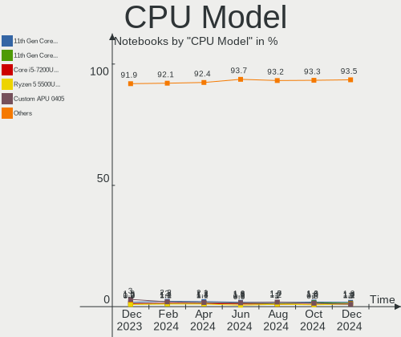
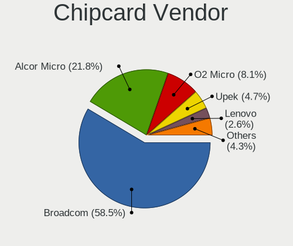

Linux - Hardware Trends (Notebooks)
-----------------------------------

A project to identify most popular hardware characteristics and track their change
over time based on data collected by Linux users at https://Linux-Hardware.org.

Anyone can contribute to this report by the [hw-probe](https://github.com/linuxhw/hw-probe) tool:

    sudo -E hw-probe -all -upload

This report is for one last month. Overall report since the beginning of time: [TestDays](https://github.com/linuxhw/TestDays)

Period: Dec, 2024.

Contents
--------

* [ System ](#system)
  - [ OS                       ](#os)
  - [ OS Family                ](#os-family)
  - [ Kernel                   ](#kernel)
  - [ Kernel Family            ](#kernel-family)
  - [ Kernel Major Ver.        ](#kernel-major-ver)
  - [ Arch                     ](#arch)
  - [ DE                       ](#de)
  - [ Display Server           ](#display-server)
  - [ Display Manager          ](#display-manager)
  - [ OS Lang                  ](#os-lang)
  - [ Boot Mode                ](#boot-mode)
  - [ Filesystem               ](#filesystem)
  - [ Part. scheme             ](#part-scheme)
  - [ Dual Boot with Linux/BSD ](#dual-boot-with-linuxbsd)
  - [ Dual Boot (Win)          ](#dual-boot-win)

* [ Board ](#board)
  - [ Vendor                   ](#vendor)
  - [ Model                    ](#model)
  - [ Model Family             ](#model-family)
  - [ MFG Year                 ](#mfg-year)
  - [ Form Factor              ](#form-factor)
  - [ Secure Boot              ](#secure-boot)
  - [ Coreboot                 ](#coreboot)
  - [ RAM Size                 ](#ram-size)
  - [ RAM Used                 ](#ram-used)
  - [ Total Drives             ](#total-drives)
  - [ Has CD-ROM               ](#has-cd-rom)
  - [ Has Ethernet             ](#has-ethernet)
  - [ Has WiFi                 ](#has-wifi)
  - [ Has Bluetooth            ](#has-bluetooth)

* [ Location ](#location)
  - [ Country                  ](#country)
  - [ City                     ](#city)

* [ Drives ](#drives)
  - [ Drive Vendor             ](#drive-vendor)
  - [ Drive Model              ](#drive-model)
  - [ HDD Vendor               ](#hdd-vendor)
  - [ SSD Vendor               ](#ssd-vendor)
  - [ Drive Kind               ](#drive-kind)
  - [ Drive Connector          ](#drive-connector)
  - [ Drive Size               ](#drive-size)
  - [ Space Total              ](#space-total)
  - [ Space Used               ](#space-used)
  - [ Malfunc. Drives          ](#malfunc-drives)
  - [ Malfunc. Drive Vendor    ](#malfunc-drive-vendor)
  - [ Malfunc. HDD Vendor      ](#malfunc-hdd-vendor)
  - [ Malfunc. Drive Kind      ](#malfunc-drive-kind)
  - [ Failed Drives            ](#failed-drives)
  - [ Failed Drive Vendor      ](#failed-drive-vendor)
  - [ Drive Status             ](#drive-status)

* [ Storage controller ](#storage-controller)
  - [ Storage Vendor           ](#storage-vendor)
  - [ Storage Model            ](#storage-model)
  - [ Storage Kind             ](#storage-kind)

* [ Processor ](#processor)
  - [ CPU Vendor               ](#cpu-vendor)
  - [ CPU Model                ](#cpu-model)
  - [ CPU Model Family         ](#cpu-model-family)
  - [ CPU Cores                ](#cpu-cores)
  - [ CPU Sockets              ](#cpu-sockets)
  - [ CPU Threads              ](#cpu-threads)
  - [ CPU Op-Modes             ](#cpu-op-modes)
  - [ CPU Microcode            ](#cpu-microcode)
  - [ CPU Microarch            ](#cpu-microarch)

* [ Graphics ](#graphics)
  - [ GPU Vendor               ](#gpu-vendor)
  - [ GPU Model                ](#gpu-model)
  - [ GPU Combo                ](#gpu-combo)
  - [ GPU Driver               ](#gpu-driver)
  - [ GPU Memory               ](#gpu-memory)

* [ Monitor ](#monitor)
  - [ Monitor Vendor           ](#monitor-vendor)
  - [ Monitor Model            ](#monitor-model)
  - [ Monitor Resolution       ](#monitor-resolution)
  - [ Monitor Diagonal         ](#monitor-diagonal)
  - [ Monitor Width            ](#monitor-width)
  - [ Aspect Ratio             ](#aspect-ratio)
  - [ Monitor Area             ](#monitor-area)
  - [ Pixel Density            ](#pixel-density)
  - [ Multiple Monitors        ](#multiple-monitors)

* [ Network ](#network)
  - [ Net Controller Vendor    ](#net-controller-vendor)
  - [ Net Controller Model     ](#net-controller-model)
  - [ Wireless Vendor          ](#wireless-vendor)
  - [ Wireless Model           ](#wireless-model)
  - [ Ethernet Vendor          ](#ethernet-vendor)
  - [ Ethernet Model           ](#ethernet-model)
  - [ Net Controller Kind      ](#net-controller-kind)
  - [ Used Controller          ](#used-controller)
  - [ NICs                     ](#nics)
  - [ IPv6                     ](#ipv6)

* [ Bluetooth ](#bluetooth)
  - [ Bluetooth Vendor         ](#bluetooth-vendor)
  - [ Bluetooth Model          ](#bluetooth-model)

* [ Sound ](#sound)
  - [ Sound Vendor             ](#sound-vendor)
  - [ Sound Model              ](#sound-model)

* [ Memory ](#memory)
  - [ Memory Vendor            ](#memory-vendor)
  - [ Memory Model             ](#memory-model)
  - [ Memory Kind              ](#memory-kind)
  - [ Memory Form Factor       ](#memory-form-factor)
  - [ Memory Size              ](#memory-size)
  - [ Memory Speed             ](#memory-speed)

* [ Printers & scanners ](#printers--scanners)
  - [ Printer Vendor           ](#printer-vendor)
  - [ Printer Model            ](#printer-model)
  - [ Scanner Vendor           ](#scanner-vendor)
  - [ Scanner Model            ](#scanner-model)

* [ Camera ](#camera)
  - [ Camera Vendor            ](#camera-vendor)
  - [ Camera Model             ](#camera-model)

* [ Security ](#security)
  - [ Fingerprint Vendor       ](#fingerprint-vendor)
  - [ Fingerprint Model        ](#fingerprint-model)
  - [ Chipcard Vendor          ](#chipcard-vendor)
  - [ Chipcard Model           ](#chipcard-model)

* [ Unsupported ](#unsupported)
  - [ Unsupported Devices      ](#unsupported-devices)
  - [ Unsupported Device Types ](#unsupported-device-types)

System
------

OS
--

Installed operating systems

| Name                         | Notebooks | Percent |
|------------------------------|-----------|---------|
| OpenMandriva 24.12           | 388       | 12.72%  |
| Ubuntu 24.04                 | 318       | 10.43%  |
| Fedora 41                    | 294       | 9.64%   |
| Arch Rolling                 | 157       | 5.15%   |
| Linux Mint 22                | 145       | 4.75%   |
| Debian 12                    | 141       | 4.62%   |
| Zorin 17                     | 130       | 4.26%   |
| Pop!_OS 22.04                | 92        | 3.02%   |
| Ubuntu 22.04                 | 91        | 2.98%   |
| Ubuntu 24.10                 | 70        | 2.3%    |
| ROSA 12.5.1                  | 68        | 2.23%   |
| OpenMandriva 5.0             | 52        | 1.7%    |
| ArcoLinux Rolling            | 49        | 1.61%   |
| SteamOS 3.6.20               | 44        | 1.44%   |
| Linux Mint 21.3              | 38        | 1.25%   |
| openSUSE Tumbleweed-XXXXXXXX | 36        | 1.18%   |
| Elementary 8                 | 33        | 1.08%   |
| Debian                       | 32        | 1.05%   |
| OpenMandriva 24.07           | 31        | 1.02%   |
| Manjaro                      | 30        | 0.98%   |
| Kubuntu 24.10                | 29        | 0.95%   |
| KDE neon 24.04               | 29        | 0.95%   |
| Kubuntu 24.04                | 28        | 0.92%   |
| Fedora 40                    | 25        | 0.82%   |
| Ubuntu 20.04                 | 23        | 0.75%   |
| Bazzite 41                   | 23        | 0.75%   |
| OpenMandriva 23.08           | 21        | 0.69%   |
| Kali 2024.4                  | 21        | 0.69%   |
| EndeavourOS Rolling          | 21        | 0.69%   |
| LMDE 6                       | 19        | 0.62%   |
| Gentoo 2.17                  | 18        | 0.59%   |
| BlackPanther 18.1            | 18        | 0.59%   |
| Manjaro 24.2.0               | 17        | 0.56%   |
| Elementary 7.1               | 17        | 0.56%   |
| MX 23                        | 14        | 0.46%   |
| Xubuntu 24.04                | 13        | 0.43%   |
| NixOS 24.11                  | 13        | 0.43%   |
| Manjaro 24.2.1               | 13        | 0.43%   |
| Ubuntu MATE 24.04            | 12        | 0.39%   |
| BlackPanther 22.1            | 12        | 0.39%   |

OS Family
---------

OS without a version

| Name         | Notebooks | Percent |
|--------------|-----------|---------|
| Ubuntu       | 517       | 16.95%  |
| OpenMandriva | 511       | 16.75%  |
| Fedora       | 328       | 10.75%  |
| Linux Mint   | 214       | 7.02%   |
| Debian       | 178       | 5.84%   |
| Arch         | 157       | 5.15%   |
| Zorin        | 140       | 4.59%   |
| Pop!_OS      | 99        | 3.25%   |
| ROSA         | 94        | 3.08%   |
| Manjaro      | 64        | 2.1%    |
| Kubuntu      | 64        | 2.1%    |
| SteamOS      | 56        | 1.84%   |
| Elementary   | 51        | 1.67%   |
| openSUSE     | 50        | 1.64%   |
| ArcoLinux    | 50        | 1.64%   |
| KDE neon     | 31        | 1.02%   |
| BlackPanther | 30        | 0.98%   |
| Xubuntu      | 29        | 0.95%   |
| Kali         | 25        | 0.82%   |
| Bazzite      | 23        | 0.75%   |
| EndeavourOS  | 21        | 0.69%   |
| NixOS        | 19        | 0.62%   |
| LMDE         | 19        | 0.62%   |
| Gentoo       | 19        | 0.62%   |
| Lubuntu      | 18        | 0.59%   |
| MX           | 17        | 0.56%   |
| Garuda Linux | 15        | 0.49%   |
| Ubuntu MATE  | 14        | 0.46%   |
| CachyOS      | 14        | 0.46%   |
| TUXEDO OS    | 12        | 0.39%   |
| Nobara       | 12        | 0.39%   |
| Endless      | 10        | 0.33%   |
| BigLinux     | 10        | 0.33%   |
| Red OS       | 9         | 0.3%    |
| Parrot       | 9         | 0.3%    |
| Vanilla      | 7         | 0.23%   |
| ALT Linux    | 7         | 0.23%   |
| Ubuntu Unity | 5         | 0.16%   |
| Artix        | 5         | 0.16%   |
| Void Linux   | 4         | 0.13%   |

Kernel
------

Version of the Linux kernel

| Version                                  | Notebooks | Percent |
|------------------------------------------|-----------|---------|
| 6.8.0-49-generic                         | 355       | 11.64%  |
| 6.12.1-desktop-1omv2490                  | 352       | 11.54%  |
| 6.8.0-51-generic                         | 203       | 6.66%   |
| 6.8.0-50-generic                         | 146       | 4.79%   |
| 6.1.0-28-amd64                           | 107       | 3.51%   |
| 6.9.3-76060903-generic                   | 96        | 3.15%   |
| 6.11.10-300.fc41.x86_64                  | 74        | 2.43%   |
| 6.6.2-desktop-1omv2390                   | 54        | 1.77%   |
| 6.6.47-generic-1rosa2021.1-x86_64        | 52        | 1.7%    |
| 6.11.0-9-generic                         | 46        | 1.51%   |
| 6.12.6-200.fc41.x86_64                   | 44        | 1.44%   |
| 6.5.0-valve22-1-neptune-65-g9a338ed8a75e | 43        | 1.41%   |
| 6.12.1-arch1-1                           | 43        | 1.41%   |
| 6.11.0-13-generic                        | 42        | 1.38%   |
| 6.12.5-200.fc41.x86_64                   | 41        | 1.34%   |
| 6.12.4-arch1-1                           | 41        | 1.34%   |
| 6.11.11-300.fc41.x86_64                  | 38        | 1.25%   |
| 6.11.4-301.fc41.x86_64                   | 36        | 1.18%   |
| 6.12.4-200.fc41.x86_64                   | 35        | 1.15%   |
| 6.12.6-desktop-1omv2490                  | 32        | 1.05%   |
| 6.10.0-desktop-1omv2490                  | 30        | 0.98%   |
| 5.15.0-126-generic                       | 29        | 0.95%   |
| 6.12.1-zen1-1-zen                        | 26        | 0.85%   |
| 6.12.6-arch1-1                           | 25        | 0.82%   |
| 6.11.8-1-default                         | 25        | 0.82%   |
| 6.12.4-zen1-1-zen                        | 23        | 0.75%   |
| 6.8.0-41-generic                         | 22        | 0.72%   |
| 6.11.2-amd64                             | 22        | 0.72%   |
| 6.8.0-38-generic                         | 21        | 0.69%   |
| 6.8.0-48-generic                         | 19        | 0.62%   |
| 6.12.7-arch1-1                           | 19        | 0.62%   |
| 6.1.0-27-amd64                           | 19        | 0.62%   |
| 6.11.10-2-MANJARO                        | 17        | 0.56%   |
| 6.11.8-300.fc41.x86_64                   | 16        | 0.52%   |
| 6.12.4-1-MANJARO                         | 15        | 0.49%   |
| 6.4.8-desktop-2omv2390                   | 14        | 0.46%   |
| 6.11.10-amd64                            | 14        | 0.46%   |
| 5.15.0-130-generic                       | 14        | 0.46%   |
| 6.6.27-generic-3rosa2021.1-x86_64        | 13        | 0.43%   |
| 6.8.0-40-generic                         | 12        | 0.39%   |

Kernel Family
-------------

Linux kernel without a distro release

| Version | Notebooks | Percent |
|---------|-----------|---------|
| 6.8.0   | 814       | 26.69%  |
| 6.12.1  | 456       | 14.95%  |
| 6.1.0   | 164       | 5.38%   |
| 6.12.6  | 143       | 4.69%   |
| 6.11.10 | 135       | 4.43%   |
| 6.12.4  | 134       | 4.39%   |
| 6.11.0  | 124       | 4.07%   |
| 6.9.3   | 96        | 3.15%   |
| 5.15.0  | 91        | 2.98%   |
| 6.5.0   | 69        | 2.26%   |
| 6.6.2   | 54        | 1.77%   |
| 6.11.11 | 54        | 1.77%   |
| 6.12.5  | 53        | 1.74%   |
| 6.6.47  | 52        | 1.7%    |
| 6.11.8  | 45        | 1.48%   |
| 6.11.4  | 38        | 1.25%   |
| 6.10.0  | 30        | 0.98%   |
| 6.12.7  | 25        | 0.82%   |
| 6.11.9  | 25        | 0.82%   |
| 5.4.0   | 24        | 0.79%   |
| 6.6.63  | 23        | 0.75%   |
| 6.11.2  | 23        | 0.75%   |
| 6.12.3  | 18        | 0.59%   |
| 6.11.5  | 17        | 0.56%   |
| 6.6.65  | 15        | 0.49%   |
| 6.4.8   | 14        | 0.46%   |
| 6.6.27  | 13        | 0.43%   |
| 6.10.11 | 13        | 0.43%   |
| 6.6.32  | 11        | 0.36%   |
| 6.13.0  | 11        | 0.36%   |
| 6.4.0   | 10        | 0.33%   |
| 6.11.7  | 10        | 0.33%   |
| 6.11.6  | 10        | 0.33%   |
| 6.4.11  | 9         | 0.3%    |
| 6.2.0   | 9         | 0.3%    |
| 5.14.0  | 8         | 0.26%   |
| 4.18.16 | 8         | 0.26%   |
| 6.8.12  | 7         | 0.23%   |
| 6.12.0  | 7         | 0.23%   |
| 6.1.89  | 7         | 0.23%   |

Kernel Major Ver.
-----------------

Linux kernel major version

| Version | Notebooks | Percent |
|---------|-----------|---------|
| 6.12    | 842       | 27.61%  |
| 6.8     | 834       | 27.34%  |
| 6.11    | 487       | 15.97%  |
| 6.6     | 211       | 6.92%   |
| 6.1     | 184       | 6.03%   |
| 6.9     | 107       | 3.51%   |
| 5.15    | 107       | 3.51%   |
| 6.5     | 71        | 2.33%   |
| 6.10    | 59        | 1.93%   |
| 6.4     | 33        | 1.08%   |
| 5.4     | 26        | 0.85%   |
| 6.2     | 13        | 0.43%   |
| 5.10    | 13        | 0.43%   |
| 6.13    | 11        | 0.36%   |
| 5.14    | 11        | 0.36%   |
| 4.18    | 8         | 0.26%   |
| 4.15    | 5         | 0.16%   |
| 5.6     | 4         | 0.13%   |
| 5.11    | 4         | 0.13%   |
| 6.0     | 3         | 0.1%    |
| 5.19    | 3         | 0.1%    |
| 5.17    | 2         | 0.07%   |
| 5.16    | 2         | 0.07%   |
| 6.7     | 1         | 0.03%   |
| 5.8     | 1         | 0.03%   |
| 5.3     | 1         | 0.03%   |
| 5.18    | 1         | 0.03%   |
| 5.13    | 1         | 0.03%   |
| 4.9     | 1         | 0.03%   |
| 4.8     | 1         | 0.03%   |
| 4.4     | 1         | 0.03%   |
| 4.19    | 1         | 0.03%   |
| 4.16    | 1         | 0.03%   |

Arch
----

OS architecture (x86_64, i586, etc.)

| Name    | Notebooks | Percent |
|---------|-----------|---------|
| x86_64  | 3024      | 99.15%  |
| i686    | 21        | 0.69%   |
| aarch64 | 5         | 0.16%   |

DE
--

Desktop Environment

| Name            | Notebooks | Percent |
|-----------------|-----------|---------|
| GNOME           | 1194      | 39.15%  |
| Unknown         | 421       | 13.8%   |
| KDE6            | 335       | 10.98%  |
| KDE5            | 321       | 10.52%  |
| X-Cinnamon      | 211       | 6.92%   |
| XFCE            | 182       | 5.97%   |
| LXQt            | 95        | 3.11%   |
| MATE            | 55        | 1.8%    |
| Pantheon        | 51        | 1.67%   |
| Hyprland        | 29        | 0.95%   |
| KDE             | 27        | 0.89%   |
| i3              | 17        | 0.56%   |
| sway            | 15        | 0.49%   |
| Budgie          | 13        | 0.43%   |
| Cinnamon        | 12        | 0.39%   |
| KDE4            | 11        | 0.36%   |
| COSMIC          | 10        | 0.33%   |
| Endless:GNOME   | 6         | 0.2%    |
| Unity           | 5         | 0.16%   |
| Trinity         | 5         | 0.16%   |
| GNOME Classic   | 5         | 0.16%   |
| DDE             | 4         | 0.13%   |
| openbox         | 3         | 0.1%    |
| icewm           | 3         | 0.1%    |
| none+awesome    | 2         | 0.07%   |
| LXDE            | 2         | 0.07%   |
| GNOME Flashback | 2         | 0.07%   |
| Enlightenment   | 2         | 0.07%   |
| Deepin          | 2         | 0.07%   |
| BunsenLabs      | 2         | 0.07%   |
| Xsession        | 1         | 0.03%   |
| xmonad          | 1         | 0.03%   |
| qtile           | 1         | 0.03%   |
| niri            | 1         | 0.03%   |
| labwc:wlroots   | 1         | 0.03%   |
| fly             | 1         | 0.03%   |
| fluxbox         | 1         | 0.03%   |
| awesome         | 1         | 0.03%   |

Display Server
--------------

X11 or Wayland

| Name    | Notebooks | Percent |
|---------|-----------|---------|
| Wayland | 1565      | 51.31%  |
| X11     | 1394      | 45.7%   |
| Unknown | 50        | 1.64%   |
| Tty     | 41        | 1.34%   |

Display Manager
---------------

SDDM, LightDM, etc.

| Name           | Notebooks | Percent |
|----------------|-----------|---------|
| Unknown        | 947       | 31.05%  |
| SDDM           | 862       | 28.26%  |
| GDM3           | 586       | 19.21%  |
| LightDM        | 399       | 13.08%  |
| GDM            | 222       | 7.28%   |
| GREETD         | 11        | 0.36%   |
| LY-DM          | 6         | 0.2%    |
| XDM            | 3         | 0.1%    |
| TDM            | 3         | 0.1%    |
| FLY-DM         | 3         | 0.1%    |
| LXDM           | 2         | 0.07%   |
| KDM            | 2         | 0.07%   |
| SLIMSKI        | 1         | 0.03%   |
| SLiM           | 1         | 0.03%   |
| Ly             | 1         | 0.03%   |
| COSMIC-GREETER | 1         | 0.03%   |

OS Lang
-------

Language

| Lang    | Notebooks | Percent |
|---------|-----------|---------|
| en_US   | 1445      | 47.38%  |
| de_DE   | 223       | 7.31%   |
| ru_RU   | 188       | 6.16%   |
| en_GB   | 146       | 4.79%   |
| fr_FR   | 126       | 4.13%   |
| pt_BR   | 119       | 3.9%    |
| it_IT   | 116       | 3.8%    |
| es_ES   | 82        | 2.69%   |
| C       | 67        | 2.2%    |
| pl_PL   | 56        | 1.84%   |
| en_CA   | 53        | 1.74%   |
| Unknown | 51        | 1.67%   |
| en_AU   | 37        | 1.21%   |
| tr_TR   | 28        | 0.92%   |
| nl_NL   | 26        | 0.85%   |
| en_IN   | 24        | 0.79%   |
| es_MX   | 21        | 0.69%   |
| cs_CZ   | 20        | 0.66%   |
| hu_HU   | 16        | 0.52%   |
| zh_CN   | 12        | 0.39%   |
| sv_SE   | 12        | 0.39%   |
| nl_BE   | 10        | 0.33%   |
| de_AT   | 10        | 0.33%   |
| pt_PT   | 9         | 0.3%    |
| es_CL   | 9         | 0.3%    |
| es_AR   | 8         | 0.26%   |
| fi_FI   | 7         | 0.23%   |
| bg_BG   | 6         | 0.2%    |
| ro_RO   | 5         | 0.16%   |
| fr_BE   | 5         | 0.16%   |
| en_ZA   | 5         | 0.16%   |
| el_GR   | 5         | 0.16%   |
| de_CH   | 5         | 0.16%   |
| ca_ES   | 5         | 0.16%   |
| nb_NO   | 4         | 0.13%   |
| ko_KR   | 4         | 0.13%   |
| ja_JP   | 4         | 0.13%   |
| es_PA   | 4         | 0.13%   |
| es_CO   | 4         | 0.13%   |
| en_SG   | 4         | 0.13%   |

Boot Mode
---------

EFI or BIOS

| Mode | Notebooks | Percent |
|------|-----------|---------|
| EFI  | 1571      | 51.51%  |
| BIOS | 1479      | 48.49%  |

Filesystem
----------

Type of filesystem

| Type     | Notebooks | Percent |
|----------|-----------|---------|
| Ext4     | 1636      | 53.64%  |
| Btrfs    | 624       | 20.46%  |
| Tmpfs    | 373       | 12.23%  |
| Overlay  | 358       | 11.74%  |
| Xfs      | 35        | 1.15%   |
| Zfs      | 12        | 0.39%   |
| F2fs     | 4         | 0.13%   |
| Unknown  | 3         | 0.1%    |
| Rootfs   | 2         | 0.07%   |
| Bcachefs | 2         | 0.07%   |
| Jfs      | 1         | 0.03%   |

Part. scheme
------------

Scheme of partitioning

| Type    | Notebooks | Percent |
|---------|-----------|---------|
| GPT     | 1904      | 62.43%  |
| Unknown | 888       | 29.11%  |
| MBR     | 258       | 8.46%   |

Dual Boot with Linux/BSD
------------------------

Hosting more than one Linux/BSD

| Dual boot | Notebooks | Percent |
|-----------|-----------|---------|
| No        | 2571      | 84.3%   |
| Yes       | 479       | 15.7%   |

Dual Boot (Win)
---------------

Hosting Linux and Windows

| Dual boot | Notebooks | Percent |
|-----------|-----------|---------|
| No        | 2322      | 76.13%  |
| Yes       | 728       | 23.87%  |

Board
-----

Vendor
------

Motherboard manufacturer

| Name                  | Notebooks | Percent |
|-----------------------|-----------|---------|
| Lenovo                | 676       | 22.16%  |
| Hewlett-Packard       | 464       | 15.21%  |
| Dell                  | 436       | 14.3%   |
| ASUSTek Computer      | 414       | 13.57%  |
| Acer                  | 261       | 8.56%   |
| Apple                 | 113       | 3.7%    |
| MSI                   | 70        | 2.3%    |
| Toshiba               | 58        | 1.9%    |
| Valve                 | 55        | 1.8%    |
| Samsung Electronics   | 49        | 1.61%   |
| HUAWEI                | 45        | 1.48%   |
| Google                | 33        | 1.08%   |
| Fujitsu               | 30        | 0.98%   |
| Unknown               | 27        | 0.89%   |
| Notebook              | 24        | 0.79%   |
| TUXEDO                | 21        | 0.69%   |
| Framework             | 20        | 0.66%   |
| Sony                  | 18        | 0.59%   |
| Chuwi                 | 12        | 0.39%   |
| Medion                | 10        | 0.33%   |
| Gigabyte Technology   | 10        | 0.33%   |
| Fujitsu Siemens       | 10        | 0.33%   |
| System76              | 8         | 0.26%   |
| Packard Bell          | 8         | 0.26%   |
| HONOR                 | 8         | 0.26%   |
| Timi                  | 7         | 0.23%   |
| eMachines             | 7         | 0.23%   |
| Clevo                 | 7         | 0.23%   |
| Positivo              | 6         | 0.2%    |
| Panasonic             | 6         | 0.2%    |
| LG Electronics        | 6         | 0.2%    |
| Maibenben             | 5         | 0.16%   |
| Infinix               | 5         | 0.16%   |
| GPD                   | 5         | 0.16%   |
| Razer                 | 4         | 0.13%   |
| Positivo Bahia - VAIO | 4         | 0.13%   |
| NEC Computers         | 4         | 0.13%   |
| Intel Client Systems  | 4         | 0.13%   |
| Gateway               | 4         | 0.13%   |
| Alienware             | 4         | 0.13%   |

Model
-----

Motherboard model

| Name                                        | Notebooks | Percent |
|---------------------------------------------|-----------|---------|
| Unknown                                     | 34        | 1.11%   |
| Valve Jupiter                               | 32        | 1.05%   |
| Valve Galileo                               | 23        | 0.75%   |
| HP Notebook                                 | 17        | 0.56%   |
| Apple MacBookPro8,1                         | 13        | 0.43%   |
| Apple MacBookPro9,2                         | 11        | 0.36%   |
| Acer Aspire A515-57                         | 10        | 0.33%   |
| Dell Latitude E6430                         | 9         | 0.3%    |
| HP Pavilion dv6                             | 8         | 0.26%   |
| Framework Laptop 16 (AMD Ryzen 7040 Series) | 8         | 0.26%   |
| Dell Latitude 7490                          | 8         | 0.26%   |
| ASUS VivoBook_ASUSLaptop X1404ZA_X1404ZA    | 8         | 0.26%   |
| Apple MacBookPro12,1                        | 8         | 0.26%   |
| Apple MacBookAir6,2                         | 8         | 0.26%   |
| HUAWEI KLVL-WXX9                            | 7         | 0.23%   |
| Framework Laptop 13 (AMD Ryzen 7040Series)  | 7         | 0.23%   |
| Dell Latitude E6420                         | 7         | 0.23%   |
| Dell Latitude E6410                         | 7         | 0.23%   |
| Dell Inspiron 5570                          | 7         | 0.23%   |
| Dell Inspiron 15 3520                       | 7         | 0.23%   |
| ASUS Vivobook Go E1504FA_E1504FA            | 7         | 0.23%   |
| Apple MacBookPro11,3                        | 7         | 0.23%   |
| Apple MacBookAir7,2                         | 7         | 0.23%   |
| Samsung 550XDA                              | 6         | 0.2%    |
| Lenovo IdeaPad 3 15ITL6 82H8                | 6         | 0.2%    |
| Lenovo IdeaPad 1 15ALC7 82R4                | 6         | 0.2%    |
| HP Pavilion 17                              | 6         | 0.2%    |
| HP Laptop 15s-eq2xxx                        | 6         | 0.2%    |
| HP EliteBook 840 G6                         | 6         | 0.2%    |
| Dell Latitude 5490                          | 6         | 0.2%    |
| ASUS Vivobook Go E1404FA_E1404FA            | 6         | 0.2%    |
| ASUS ASUS Zenbook 14 UX3405MA_UX3405MA      | 6         | 0.2%    |
| Acer Nitro AN515-54                         | 6         | 0.2%    |
| Acer Aspire A315-24P                        | 6         | 0.2%    |
| TUXEDO InfinityBook Pro AMD Gen9            | 5         | 0.16%   |
| Lenovo IdeaPad 3 15ALC6 82KU                | 5         | 0.16%   |
| Lenovo G500 20236                           | 5         | 0.16%   |
| HP Pavilion g7                              | 5         | 0.16%   |
| HP Pavilion dv7                             | 5         | 0.16%   |
| HP Laptop 17-cp0xxx                         | 5         | 0.16%   |

Model Family
------------

Motherboard model prefix

| Name               | Notebooks | Percent |
|--------------------|-----------|---------|
| Lenovo ThinkPad    | 343       | 11.25%  |
| Acer Aspire        | 183       | 6%      |
| Dell Latitude      | 173       | 5.67%   |
| Lenovo IdeaPad     | 136       | 4.46%   |
| Dell Inspiron      | 121       | 3.97%   |
| ASUS VivoBook      | 109       | 3.57%   |
| HP EliteBook       | 88        | 2.89%   |
| HP Laptop          | 85        | 2.79%   |
| HP Pavilion        | 83        | 2.72%   |
| ASUS ASUS          | 79        | 2.59%   |
| HP ProBook         | 62        | 2.03%   |
| Toshiba Satellite  | 54        | 1.77%   |
| Dell XPS           | 46        | 1.51%   |
| Dell Precision     | 46        | 1.51%   |
| Lenovo Legion      | 44        | 1.44%   |
| Unknown            | 34        | 1.11%   |
| Valve Jupiter      | 32        | 1.05%   |
| ASUS ROG           | 32        | 1.05%   |
| Lenovo ThinkBook   | 30        | 0.98%   |
| Acer Nitro         | 29        | 0.95%   |
| Dell Vostro        | 26        | 0.85%   |
| ASUS ZenBook       | 24        | 0.79%   |
| Valve Galileo      | 23        | 0.75%   |
| Fujitsu LIFEBOOK   | 22        | 0.72%   |
| Acer Swift         | 21        | 0.69%   |
| Lenovo Yoga        | 20        | 0.66%   |
| Framework Laptop   | 20        | 0.66%   |
| HP ENVY            | 19        | 0.62%   |
| Apple MacBookPro11 | 18        | 0.59%   |
| HP Notebook        | 17        | 0.56%   |
| HP ZBook           | 16        | 0.52%   |
| HP Victus          | 16        | 0.52%   |
| Apple MacBookPro8  | 16        | 0.52%   |
| Lenovo LOQ         | 15        | 0.49%   |
| Apple MacBookPro9  | 13        | 0.43%   |
| MSI Katana         | 12        | 0.39%   |
| HP 250             | 12        | 0.39%   |
| HP OMEN            | 11        | 0.36%   |
| Lenovo V15         | 10        | 0.33%   |
| Apple MacBookAir6  | 10        | 0.33%   |

MFG Year
--------

Motherboard manufacture year

| Year    | Notebooks | Percent |
|---------|-----------|---------|
| 2024    | 306       | 10.03%  |
| 2023    | 302       | 9.9%    |
| 2021    | 297       | 9.74%   |
| 2022    | 222       | 7.28%   |
| 2020    | 210       | 6.89%   |
| 2018    | 182       | 5.97%   |
| 2019    | 180       | 5.9%    |
| 2011    | 178       | 5.84%   |
| 2017    | 174       | 5.7%    |
| 2012    | 174       | 5.7%    |
| 2013    | 171       | 5.61%   |
| 2014    | 144       | 4.72%   |
| 2015    | 132       | 4.33%   |
| 2010    | 100       | 3.28%   |
| 2016    | 98        | 3.21%   |
| 2008    | 77        | 2.52%   |
| 2009    | 55        | 1.8%    |
| 2007    | 37        | 1.21%   |
| 2006    | 6         | 0.2%    |
| Unknown | 4         | 0.13%   |
| 2005    | 1         | 0.03%   |

Form Factor
-----------

Physical design of the computer

| Name     | Notebooks | Percent |
|----------|-----------|---------|
| Notebook | 3050      | 100%    |

Secure Boot
-----------

Enabled or disabled

| State    | Notebooks | Percent |
|----------|-----------|---------|
| Disabled | 2872      | 94.16%  |
| Enabled  | 178       | 5.84%   |

Coreboot
--------

Have coreboot on board

| Used | Notebooks | Percent |
|------|-----------|---------|
| No   | 3006      | 98.56%  |
| Yes  | 44        | 1.44%   |

RAM Size
--------

Total RAM memory

| Size in GB  | Notebooks | Percent |
|-------------|-----------|---------|
| 4.01-8.0    | 799       | 26.2%   |
| 8.01-16.0   | 676       | 22.16%  |
| 16.01-24.0  | 578       | 18.95%  |
| 3.01-4.0    | 402       | 13.18%  |
| 32.01-64.0  | 304       | 9.97%   |
| 24.01-32.0  | 109       | 3.57%   |
| 64.01-256.0 | 86        | 2.82%   |
| 1.01-2.0    | 59        | 1.93%   |
| 2.01-3.0    | 33        | 1.08%   |
| 0.51-1.0    | 4         | 0.13%   |

RAM Used
--------

Used RAM memory

| Used GB    | Notebooks | Percent |
|------------|-----------|---------|
| 1.01-2.0   | 777       | 25.48%  |
| 2.01-3.0   | 755       | 24.75%  |
| 4.01-8.0   | 682       | 22.36%  |
| 3.01-4.0   | 506       | 16.59%  |
| 8.01-16.0  | 170       | 5.57%   |
| 0.51-1.0   | 114       | 3.74%   |
| 16.01-24.0 | 24        | 0.79%   |
| 0.01-0.5   | 15        | 0.49%   |
| 32.01-64.0 | 5         | 0.16%   |
| 24.01-32.0 | 2         | 0.07%   |

Total Drives
------------

Number of drives on board

| Drives | Notebooks | Percent |
|--------|-----------|---------|
| 1      | 2280      | 74.75%  |
| 2      | 670       | 21.97%  |
| 3      | 71        | 2.33%   |
| 0      | 14        | 0.46%   |
| 4      | 12        | 0.39%   |
| 5      | 2         | 0.07%   |
| 6      | 1         | 0.03%   |

Has CD-ROM
----------

Has CD-ROM on board

| Presented | Notebooks | Percent |
|-----------|-----------|---------|
| No        | 2297      | 75.31%  |
| Yes       | 753       | 24.69%  |

Has Ethernet
------------

Has Ethernet on board

| Presented | Notebooks | Percent |
|-----------|-----------|---------|
| Yes       | 2298      | 75.34%  |
| No        | 752       | 24.66%  |

Has WiFi
--------

Has WiFi module

| Presented | Notebooks | Percent |
|-----------|-----------|---------|
| Yes       | 2921      | 95.77%  |
| No        | 129       | 4.23%   |

Has Bluetooth
-------------

Has Bluetooth module

| Presented | Notebooks | Percent |
|-----------|-----------|---------|
| Yes       | 2574      | 84.39%  |
| No        | 476       | 15.61%  |

Location
--------

Country
-------

Geographic location (country)

| Country      | Notebooks | Percent |
|--------------|-----------|---------|
| USA          | 568       | 18.62%  |
| Germany      | 286       | 9.38%   |
| Russia       | 231       | 7.57%   |
| France       | 176       | 5.77%   |
| Brazil       | 166       | 5.44%   |
| Italy        | 152       | 4.98%   |
| UK           | 102       | 3.34%   |
| Canada       | 96        | 3.15%   |
| Poland       | 91        | 2.98%   |
| Spain        | 90        | 2.95%   |
| India        | 79        | 2.59%   |
| Turkey       | 51        | 1.67%   |
| Hungary      | 51        | 1.67%   |
| Australia    | 48        | 1.57%   |
| Netherlands  | 46        | 1.51%   |
| Mexico       | 44        | 1.44%   |
| Belgium      | 33        | 1.08%   |
| Czechia      | 32        | 1.05%   |
| Switzerland  | 31        | 1.02%   |
| Sweden       | 30        | 0.98%   |
| Romania      | 29        | 0.95%   |
| Indonesia    | 28        | 0.92%   |
| Greece       | 27        | 0.89%   |
| Portugal     | 24        | 0.79%   |
| Austria      | 24        | 0.79%   |
| Finland      | 23        | 0.75%   |
| Bulgaria     | 22        | 0.72%   |
| Norway       | 21        | 0.69%   |
| Argentina    | 20        | 0.66%   |
| Chile        | 19        | 0.62%   |
| China        | 18        | 0.59%   |
| Japan        | 17        | 0.56%   |
| Serbia       | 15        | 0.49%   |
| South Africa | 14        | 0.46%   |
| Vietnam      | 12        | 0.39%   |
| Slovakia     | 12        | 0.39%   |
| Israel       | 11        | 0.36%   |
| Iran         | 11        | 0.36%   |
| Colombia     | 11        | 0.36%   |
| Thailand     | 10        | 0.33%   |

City
----

Geographic location (city)

| City              | Notebooks | Percent |
|-------------------|-----------|---------|
| Moscow            | 54        | 1.77%   |
| Berlin            | 30        | 0.98%   |
| Milan             | 24        | 0.79%   |
| St Petersburg     | 23        | 0.75%   |
| Sao Paulo         | 22        | 0.72%   |
| Warsaw            | 19        | 0.62%   |
| Sydney            | 19        | 0.62%   |
| Istanbul          | 19        | 0.62%   |
| Budapest          | 18        | 0.59%   |
| Paris             | 15        | 0.49%   |
| Munich            | 15        | 0.49%   |
| Helsinki          | 15        | 0.49%   |
| Seattle           | 14        | 0.46%   |
| Rome              | 14        | 0.46%   |
| Los Angeles       | 14        | 0.46%   |
| Bengaluru         | 14        | 0.46%   |
| Athens            | 14        | 0.46%   |
| Vienna            | 13        | 0.43%   |
| Toronto           | 13        | 0.43%   |
| Sofia             | 13        | 0.43%   |
| Santiago          | 13        | 0.43%   |
| Rio de Janeiro    | 13        | 0.43%   |
| Bucharest         | 13        | 0.43%   |
| Melbourne         | 12        | 0.39%   |
| Ankara            | 12        | 0.39%   |
| Frankfurt am Main | 11        | 0.36%   |
| Novosibirsk       | 10        | 0.33%   |
| Brasília         | 10        | 0.33%   |
| Amsterdam         | 10        | 0.33%   |
| Thessaloniki      | 9         | 0.3%    |
| Prague            | 9         | 0.3%    |
| Milano            | 9         | 0.3%    |
| Delhi             | 9         | 0.3%    |
| Belgrade          | 9         | 0.3%    |
| Oslo              | 8         | 0.26%   |
| Krakow            | 8         | 0.26%   |
| Hamburg           | 8         | 0.26%   |
| Düsseldorf       | 8         | 0.26%   |
| Buenos Aires      | 8         | 0.26%   |
| Zurich            | 7         | 0.23%   |

Drives
------

Drive Vendor
------------

Hard drive vendors

| Vendor                         | Notebooks | Drives | Percent |
|--------------------------------|-----------|--------|---------|
| Samsung Electronics            | 614       | 672    | 16.55%  |
| Sandisk                        | 339       | 351    | 9.14%   |
| WDC                            | 247       | 253    | 6.66%   |
| Seagate                        | 230       | 243    | 6.2%    |
| SK hynix                       | 200       | 206    | 5.39%   |
| Micron Technology              | 199       | 201    | 5.36%   |
| Unknown                        | 182       | 192    | 4.91%   |
| Kingston                       | 172       | 179    | 4.64%   |
| Toshiba                        | 168       | 171    | 4.53%   |
| Intel                          | 118       | 123    | 3.18%   |
| Crucial                        | 110       | 113    | 2.96%   |
| KIOXIA                         | 73        | 73     | 1.97%   |
| Kingston Technology Company    | 63        | 64     | 1.7%    |
| Apple                          | 60        | 75     | 1.62%   |
| Hitachi                        | 57        | 57     | 1.54%   |
| HGST                           | 55        | 55     | 1.48%   |
| China                          | 49        | 50     | 1.32%   |
| Phison Electronics             | 46        | 47     | 1.24%   |
| A-DATA Technology              | 45        | 46     | 1.21%   |
| Micron/Crucial Technology      | 38        | 39     | 1.02%   |
| Unknown                        | 38        | 40     | 1.02%   |
| MAXIO Technology (Hangzhou)    | 31        | 31     | 0.84%   |
| Silicon Motion                 | 29        | 29     | 0.78%   |
| SPCC                           | 28        | 28     | 0.75%   |
| PNY                            | 24        | 24     | 0.65%   |
| Shenzhen Longsys Electronics   | 20        | 20     | 0.54%   |
| ADATA Technology               | 18        | 18     | 0.49%   |
| Intenso                        | 17        | 17     | 0.46%   |
| Transcend                      | 16        | 16     | 0.43%   |
| Phison                         | 16        | 16     | 0.43%   |
| GOODRAM                        | 15        | 16     | 0.4%    |
| LITEON                         | 14        | 14     | 0.38%   |
| JMicron Technology             | 14        | 14     | 0.38%   |
| Patriot                        | 13        | 13     | 0.35%   |
| KingSpec                       | 13        | 13     | 0.35%   |
| Fujitsu                        | 13        | 13     | 0.35%   |
| Realtek Semiconductor          | 12        | 12     | 0.32%   |
| Verbatim                       | 10        | 10     | 0.27%   |
| LITEONIT                       | 10        | 10     | 0.27%   |
| Solid State Storage Technology | 9         | 9      | 0.24%   |

Drive Model
-----------

Hard drive models

| Model                                                 | Notebooks | Percent |
|-------------------------------------------------------|-----------|---------|
| Samsung NVMe SSD Controller SM981/PM981/PM983 512GB   | 67        | 1.76%   |
| Samsung NVMe SSD Controller PM9A1/PM9A3/980PRO 512GB  | 57        | 1.49%   |
| Unknown                                               | 38        | 1%      |
| Kingston SA400S37240G 240GB SSD                       | 36        | 0.94%   |
| Unknown MMC Card  64GB                                | 35        | 0.92%   |
| Seagate ST1000LM035-1RK172 1TB                        | 30        | 0.79%   |
| Sandisk WD Blue SN550 NVMe SSD 256GB                  | 29        | 0.76%   |
| Samsung NVMe SSD Controller SM961/PM961/SM963 256GB   | 29        | 0.76%   |
| Toshiba MQ01ABF050 500GB                              | 26        | 0.68%   |
| Intel SSDPEKNU512GZ 512GB                             | 26        | 0.68%   |
| SanDisk NVMe SSD Drive 1TB                            | 25        | 0.66%   |
| Kingston SA400S37480G 480GB SSD                       | 25        | 0.66%   |
| Unknown MMC Card  32GB                                | 24        | 0.63%   |
| SanDisk NVMe SSD Drive 512GB                          | 24        | 0.63%   |
| Unknown MMC Card  128GB                               | 23        | 0.6%    |
| Toshiba MQ04ABF100 1TB                                | 23        | 0.6%    |
| Kingston Company OM3PDP3 NVMe SSD 512GB               | 23        | 0.6%    |
| Toshiba MQ01ABD100 1TB                                | 21        | 0.55%   |
| Samsung SSD 980 1TB                                   | 21        | 0.55%   |
| Micron/Crucial P2 NVMe PCIe SSD 500GB                 | 21        | 0.55%   |
| Micron 2400_MTFDKBA512QFM 512GB                       | 20        | 0.52%   |
| Crucial CT500MX500SSD1 500GB                          | 20        | 0.52%   |
| MAXIO (Hangzhou) NVMe SSD Controller MAP1202 512GB    | 19        | 0.5%    |
| Seagate ST1000LM024 HN-M101MBB 1TB                    | 18        | 0.47%   |
| Samsung MZVL4512HBLU-00BTW 512GB                      | 18        | 0.47%   |
| Phison PS5013 E13 NVMe Controller 512GB               | 18        | 0.47%   |
| Micron 2450_MTFDKBA512TFK 512GB                       | 18        | 0.47%   |
| Sandisk WD Black SN750 / PC SN730 NVMe SSD 512GB      | 17        | 0.45%   |
| Samsung SSD 860 EVO 500GB                             | 17        | 0.45%   |
| Micron MTFDKBA1T0QFM-1BD1AABGB 1024GB                 | 17        | 0.45%   |
| Kingston Company SNV2S1000G 1TB                       | 17        | 0.45%   |
| Intel SSD 660P Series 1024GB                          | 17        | 0.45%   |
| Unknown MMC Card  512GB                               | 16        | 0.42%   |
| HGST HTS545050A7E680 500GB                            | 16        | 0.42%   |
| Seagate ST500LT012-1DG142 500GB                       | 14        | 0.37%   |
| Unknown NVMe SSD Drive 512GB                          | 13        | 0.34%   |
| Samsung SSD 990 PRO 1TB                               | 13        | 0.34%   |
| Samsung SSD 850 EVO 250GB                             | 13        | 0.34%   |
| Unknown MMC Card  16GB                                | 12        | 0.31%   |
| Silicon Motion SM2263EN/SM2263XT SSD Controller 256GB | 12        | 0.31%   |

HDD Vendor
----------

Hard disk drive vendors

| Vendor              | Notebooks | Drives | Percent |
|---------------------|-----------|--------|---------|
| Seagate             | 220       | 231    | 33.38%  |
| WDC                 | 161       | 162    | 24.43%  |
| Toshiba             | 116       | 118    | 17.6%   |
| Hitachi             | 56        | 56     | 8.5%    |
| HGST                | 55        | 55     | 8.35%   |
| Fujitsu             | 13        | 13     | 1.97%   |
| Samsung Electronics | 12        | 12     | 1.82%   |
| JMicron Technology  | 8         | 8      | 1.21%   |
| Unknown             | 4         | 4      | 0.61%   |
| SABRENT             | 3         | 3      | 0.46%   |
| TO Exter            | 2         | 2      | 0.3%    |
| External            | 2         | 2      | 0.3%    |
| ASMT                | 2         | 2      | 0.3%    |
| Apple               | 2         | 2      | 0.3%    |
| Min Yi U            | 1         | 1      | 0.15%   |
| Maxone              | 1         | 1      | 0.15%   |
| HGST HTS            | 1         | 1      | 0.15%   |

SSD Vendor
----------

Solid state drive vendors

| Vendor              | Notebooks | Drives | Percent |
|---------------------|-----------|--------|---------|
| Samsung Electronics | 205       | 211    | 18.64%  |
| Kingston            | 123       | 126    | 11.18%  |
| Crucial             | 91        | 93     | 8.27%   |
| SanDisk             | 87        | 88     | 7.91%   |
| WDC                 | 56        | 57     | 5.09%   |
| China               | 48        | 49     | 4.36%   |
| Apple               | 44        | 44     | 4%      |
| SK hynix            | 34        | 34     | 3.09%   |
| Micron Technology   | 34        | 34     | 3.09%   |
| A-DATA Technology   | 32        | 33     | 2.91%   |
| SPCC                | 27        | 27     | 2.45%   |
| Intel               | 26        | 26     | 2.36%   |
| PNY                 | 23        | 23     | 2.09%   |
| Toshiba             | 20        | 21     | 1.82%   |
| Intenso             | 16        | 16     | 1.45%   |
| GOODRAM             | 15        | 16     | 1.36%   |
| Transcend           | 14        | 14     | 1.27%   |
| LITEON              | 14        | 14     | 1.27%   |
| Patriot             | 13        | 13     | 1.18%   |
| KingSpec            | 13        | 13     | 1.18%   |
| Unknown             | 13        | 13     | 1.18%   |
| LITEONIT            | 10        | 10     | 0.91%   |
| Verbatim            | 9         | 9      | 0.82%   |
| Lexar               | 6         | 6      | 0.55%   |
| Apacer              | 6         | 6      | 0.55%   |
| Plextor             | 5         | 5      | 0.45%   |
| V-GeN               | 4         | 4      | 0.36%   |
| Netac               | 4         | 5      | 0.36%   |
| Fanxiang            | 4         | 4      | 0.36%   |
| Emtec               | 4         | 4      | 0.36%   |
| EAGET               | 4         | 4      | 0.36%   |
| XrayDisk            | 3         | 3      | 0.27%   |
| SSSTC               | 3         | 3      | 0.27%   |
| ShiJi               | 3         | 3      | 0.27%   |
| Mushkin             | 3         | 3      | 0.27%   |
| Hewlett-Packard     | 3         | 3      | 0.27%   |
| Gigabyte Technology | 3         | 3      | 0.27%   |
| ZHITAI              | 2         | 2      | 0.18%   |
| Teclast             | 2         | 2      | 0.18%   |
| Team                | 2         | 2      | 0.18%   |

Drive Kind
----------

HDD or SSD

| Kind    | Notebooks | Drives | Percent |
|---------|-----------|--------|---------|
| NVMe    | 1582      | 1808   | 44.98%  |
| SSD     | 1037      | 1119   | 29.49%  |
| HDD     | 648       | 673    | 18.42%  |
| MMC     | 176       | 186    | 5%      |
| Unknown | 74        | 76     | 2.1%    |

Drive Connector
---------------

SATA, SAS, NVMe, etc.

| Type | Notebooks | Drives | Percent |
|------|-----------|--------|---------|
| NVMe | 1579      | 1793   | 46.29%  |
| SATA | 1516      | 1736   | 44.44%  |
| MMC  | 176       | 186    | 5.16%   |
| SAS  | 140       | 147    | 4.1%    |

Drive Size
----------

Size of hard drive

| Size in TB | Notebooks | Drives | Percent |
|------------|-----------|--------|---------|
| 0.01-0.5   | 1142      | 1229   | 68.18%  |
| 0.51-1.0   | 452       | 480    | 26.99%  |
| 1.01-2.0   | 62        | 63     | 3.7%    |
| 3.01-4.0   | 9         | 10     | 0.54%   |
| 10.01-20.0 | 5         | 5      | 0.3%    |
| 4.01-10.0  | 3         | 3      | 0.18%   |
| 2.01-3.0   | 2         | 2      | 0.12%   |

Space Total
-----------

Amount of disk space available on the file system

| Size in GB     | Notebooks | Percent |
|----------------|-----------|---------|
| 251-500        | 748       | 24.52%  |
| 101-250        | 702       | 23.02%  |
| 501-1000       | 502       | 16.46%  |
| 1-20           | 324       | 10.62%  |
| 1001-2000      | 258       | 8.46%   |
| 51-100         | 145       | 4.75%   |
| More than 3000 | 120       | 3.93%   |
| Unknown        | 97        | 3.18%   |
| 21-50          | 88        | 2.89%   |
| 2001-3000      | 66        | 2.16%   |

Space Used
----------

Amount of used disk space

| Used GB        | Notebooks | Percent |
|----------------|-----------|---------|
| 1-20           | 1126      | 36.92%  |
| 21-50          | 538       | 17.64%  |
| 101-250        | 403       | 13.21%  |
| 51-100         | 315       | 10.33%  |
| 251-500        | 284       | 9.31%   |
| 501-1000       | 169       | 5.54%   |
| Unknown        | 97        | 3.18%   |
| 1001-2000      | 58        | 1.9%    |
| 2001-3000      | 22        | 0.72%   |
| More than 3000 | 20        | 0.66%   |
| 0              | 18        | 0.59%   |

Malfunc. Drives
---------------

Drive models with a malfunction

| Model                                          | Notebooks | Drives | Percent |
|------------------------------------------------|-----------|--------|---------|
| HGST HTS545050A7E680 500GB                     | 8         | 8      | 3.81%   |
| Toshiba MQ01ABD100 1TB                         | 5         | 5      | 2.38%   |
| Seagate ST9500325AS 500GB                      | 5         | 5      | 2.38%   |
| Seagate ST500LT012-9WS142 500GB                | 5         | 5      | 2.38%   |
| Seagate ST500LT012-1DG142 500GB                | 5         | 5      | 2.38%   |
| Seagate ST1000LM024 HN-M101MBB 1TB             | 5         | 5      | 2.38%   |
| Toshiba MQ04ABF100 1TB                         | 4         | 4      | 1.9%    |
| Toshiba MQ01ABF050 500GB                       | 4         | 4      | 1.9%    |
| Seagate ST9250315AS 250GB                      | 4         | 4      | 1.9%    |
| Seagate ST500LM000-1EJ162 500GB                | 4         | 4      | 1.9%    |
| Crucial CT525MX300SSD1 528GB                   | 4         | 5      | 1.9%    |
| Samsung Electronics SSD 980 1TB                | 3         | 3      | 1.43%   |
| Hitachi HTS545050B9A300 500GB                  | 3         | 3      | 1.43%   |
| WDC WDS240G2G0A-00JH30 240GB SSD               | 2         | 2      | 0.95%   |
| WDC WDS120G2G0A-00JH30 120GB SSD               | 2         | 2      | 0.95%   |
| Toshiba MQ01ABD050 500GB                       | 2         | 2      | 0.95%   |
| Toshiba KSG60ZMV256G M.2 2280 256GB SSD        | 2         | 2      | 0.95%   |
| SSSTC CVB-8D128-HP 128GB SSD                   | 2         | 2      | 0.95%   |
| SK hynix HFS256G39TND-N210A 256GB SSD          | 2         | 2      | 0.95%   |
| SK hynix HFS128G39TND-N210A 128GB SSD          | 2         | 2      | 0.95%   |
| Seagate ST9320423AS 320GB                      | 2         | 2      | 0.95%   |
| Seagate ST9320325AS 320GB                      | 2         | 2      | 0.95%   |
| Seagate ST320LT020-9YG142 320GB                | 2         | 2      | 0.95%   |
| Seagate ST1000LM049-2GH172 1TB                 | 2         | 2      | 0.95%   |
| Seagate ST1000LM048-2E7172 1TB                 | 2         | 2      | 0.95%   |
| Micron Technology 1100_MTFDDAV512TBN 512GB SSD | 2         | 2      | 0.95%   |
| Intel SSDSCKKF256H6 SATA 256GB                 | 2         | 2      | 0.95%   |
| Hitachi HTS723232A7A364 320GB                  | 2         | 2      | 0.95%   |
| Hitachi HTS547575A9E384 752GB                  | 2         | 2      | 0.95%   |
| Hitachi HTS545016B9A300 160GB                  | 2         | 2      | 0.95%   |
| Hitachi HTS541612J9SA00 120GB                  | 2         | 2      | 0.95%   |
| HGST HTS545050A7E380 500GB                     | 2         | 2      | 0.95%   |
| HGST HTS545032A7E380 320GB                     | 2         | 2      | 0.95%   |
| WDC WDS120G2G0B-00EPW0 120GB SSD               | 1         | 1      | 0.48%   |
| WDC WD7500BPVT-00HXZT3 752GB                   | 1         | 1      | 0.48%   |
| WDC WD6400BEVT-22A0RT0 640GB                   | 1         | 1      | 0.48%   |
| WDC WD5000LPVX-75V0TT0 500GB                   | 1         | 1      | 0.48%   |
| WDC WD5000LPCX-60VHAT0 500GB                   | 1         | 1      | 0.48%   |
| WDC WD5000LPCX-00VHAT0 500GB                   | 1         | 1      | 0.48%   |
| WDC WD5000BPVX-00JC3T0 500GB                   | 1         | 1      | 0.48%   |

Malfunc. Drive Vendor
---------------------

Vendors of faulty drives

| Vendor                       | Notebooks | Drives | Percent |
|------------------------------|-----------|--------|---------|
| Seagate                      | 45        | 46     | 21.63%  |
| WDC                          | 25        | 25     | 12.02%  |
| Toshiba                      | 23        | 24     | 11.06%  |
| Hitachi                      | 19        | 19     | 9.13%   |
| Samsung Electronics          | 15        | 16     | 7.21%   |
| HGST                         | 14        | 14     | 6.73%   |
| Crucial                      | 10        | 11     | 4.81%   |
| SK hynix                     | 7         | 7      | 3.37%   |
| Micron Technology            | 6         | 6      | 2.88%   |
| Intel                        | 6         | 6      | 2.88%   |
| Fujitsu                      | 6         | 6      | 2.88%   |
| Kingston                     | 4         | 5      | 1.92%   |
| SSSTC                        | 3         | 3      | 1.44%   |
| SanDisk                      | 3         | 3      | 1.44%   |
| A-DATA Technology            | 3         | 3      | 1.44%   |
| Apple                        | 2         | 2      | 0.96%   |
| V-GeN                        | 1         | 1      | 0.48%   |
| Transcend                    | 1         | 1      | 0.48%   |
| SPCC                         | 1         | 1      | 0.48%   |
| Silicon Motion               | 1         | 1      | 0.48%   |
| Shenzhen Longsys Electronics | 1         | 1      | 0.48%   |
| Realtek Semiconductor        | 1         | 1      | 0.48%   |
| PNY                          | 1         | 1      | 0.48%   |
| Min Yi U                     | 1         | 1      | 0.48%   |
| LITEONIT                     | 1         | 1      | 0.48%   |
| Lexar                        | 1         | 1      | 0.48%   |
| Leven                        | 1         | 1      | 0.48%   |
| HIKSEMI                      | 1         | 1      | 0.48%   |
| Hewlett-Packard              | 1         | 1      | 0.48%   |
| GS                           | 1         | 1      | 0.48%   |
| Dogfish                      | 1         | 1      | 0.48%   |
| China                        | 1         | 1      | 0.48%   |
| BAITITON                     | 1         | 1      | 0.48%   |

Malfunc. HDD Vendor
-------------------

Vendors of faulty HDD drives

| Vendor              | Notebooks | Drives | Percent |
|---------------------|-----------|--------|---------|
| Seagate             | 45        | 46     | 35.16%  |
| Toshiba             | 21        | 22     | 16.41%  |
| WDC                 | 19        | 19     | 14.84%  |
| Hitachi             | 19        | 19     | 14.84%  |
| HGST                | 14        | 14     | 10.94%  |
| Fujitsu             | 6         | 6      | 4.69%   |
| Samsung Electronics | 3         | 3      | 2.34%   |
| Min Yi U            | 1         | 1      | 0.78%   |

Malfunc. Drive Kind
-------------------

Kinds of faulty drives

| Kind | Notebooks | Drives | Percent |
|------|-----------|--------|---------|
| HDD  | 128       | 130    | 61.54%  |
| SSD  | 66        | 69     | 31.73%  |
| NVMe | 14        | 14     | 6.73%   |

Failed Drives
-------------

Failed drive models

| Model                        | Notebooks | Drives | Percent |
|------------------------------|-----------|--------|---------|
| WDC WD7500BPVT-22HXZT1 752GB | 1         | 1      | 20%     |
| WDC WD5000BPVT-22HXZT1 500GB | 1         | 1      | 20%     |
| WDC WD2500BEVT-35A23T0 250GB | 1         | 1      | 20%     |
| WDC WD1600BEVT-75ZCT1 160GB  | 1         | 1      | 20%     |
| JM icron Tech 2TB            | 1         | 1      | 20%     |

Failed Drive Vendor
-------------------

Failed drive vendors

| Vendor   | Notebooks | Drives | Percent |
|----------|-----------|--------|---------|
| WDC      | 4         | 4      | 80%     |
| JM icron | 1         | 1      | 20%     |

Drive Status
------------

Number of failed and malfunc. drives

| Status   | Notebooks | Drives | Percent |
|----------|-----------|--------|---------|
| Works    | 1502      | 1753   | 47.07%  |
| Detected | 1477      | 1891   | 46.29%  |
| Malfunc  | 207       | 213    | 6.49%   |
| Failed   | 5         | 5      | 0.16%   |

Storage controller
------------------

Storage Vendor
--------------

Storage controller vendors

| Vendor                                  | Notebooks | Percent |
|-----------------------------------------|-----------|---------|
| Intel                                   | 1770      | 47.66%  |
| Samsung Electronics                     | 434       | 11.69%  |
| Sandisk                                 | 285       | 7.67%   |
| AMD                                     | 263       | 7.08%   |
| Micron Technology                       | 170       | 4.58%   |
| SK hynix                                | 163       | 4.39%   |
| Kingston Technology Company             | 114       | 3.07%   |
| KIOXIA                                  | 73        | 1.97%   |
| Phison Electronics                      | 70        | 1.88%   |
| Micron/Crucial Technology               | 52        | 1.4%    |
| MAXIO Technology (Hangzhou)             | 39        | 1.05%   |
| Toshiba America Info Systems            | 34        | 0.92%   |
| Silicon Motion                          | 32        | 0.86%   |
| ADATA Technology                        | 31        | 0.83%   |
| Shenzhen Longsys Electronics            | 25        | 0.67%   |
| Nvidia                                  | 25        | 0.67%   |
| Solid State Storage Technology          | 17        | 0.46%   |
| Solidigm                                | 14        | 0.38%   |
| Realtek Semiconductor                   | 14        | 0.38%   |
| Union Memory (Shenzhen)                 | 12        | 0.32%   |
| Yangtze Memory Technologies             | 11        | 0.3%    |
| Apple                                   | 11        | 0.3%    |
| Marvell Technology Group                | 8         | 0.22%   |
| Seagate Technology                      | 6         | 0.16%   |
| Shenzhen Unionmemory Information System | 5         | 0.13%   |
| INNOGRIT                                | 5         | 0.13%   |
| Biwin Storage Technology                | 5         | 0.13%   |
| Lenovo                                  | 4         | 0.11%   |
| Unknown                                 | 4         | 0.11%   |
| Silicon Integrated Systems [SiS]        | 3         | 0.08%   |
| Zhaoxin                                 | 2         | 0.05%   |
| Transcend                               | 2         | 0.05%   |
| Shenzhen Shichuangyi Electronics        | 2         | 0.05%   |
| O2 Micro                                | 2         | 0.05%   |
| ASMedia Technology                      | 2         | 0.05%   |
| Silicon Image                           | 1         | 0.03%   |
| Ramaxel Technology(Shenzhen) Limited    | 1         | 0.03%   |
| PMC-Sierra                              | 1         | 0.03%   |
| Lite-On Technology                      | 1         | 0.03%   |
| JMicron Technology                      | 1         | 0.03%   |

Storage Model
-------------

Storage controller models

| Model                                                                          | Notebooks | Percent |
|--------------------------------------------------------------------------------|-----------|---------|
| AMD FCH SATA Controller [AHCI mode]                                            | 228       | 5.78%   |
| Intel Sunrise Point-LP SATA Controller [AHCI mode]                             | 209       | 5.3%    |
| Intel 7 Series Chipset Family 6-port SATA Controller [AHCI mode]               | 183       | 4.64%   |
| Intel Volume Management Device NVMe RAID Controller                            | 164       | 4.16%   |
| Intel 82801 Mobile SATA Controller [RAID mode]                                 | 139       | 3.52%   |
| Intel 6 Series/C200 Series Chipset Family 6 port Mobile SATA AHCI Controller   | 131       | 3.32%   |
| Samsung NVMe SSD Controller SM981/PM981/PM983                                  | 98        | 2.48%   |
| Samsung NVMe SSD Controller 980 (DRAM-less)                                    | 98        | 2.48%   |
| Intel 8 Series SATA Controller 1 [AHCI mode]                                   | 91        | 2.31%   |
| SanDisk WD Black SN770 / PC SN740 256GB / PC SN560 (DRAM-less) NVMe SSD        | 82        | 2.08%   |
| Samsung NVMe SSD Controller PM9A1/PM9A3/980PRO                                 | 76        | 1.93%   |
| Micron 2400 NVMe SSD (DRAM-less)                                               | 66        | 1.67%   |
| Intel 8 Series/C220 Series Chipset Family 6-port SATA Controller 1 [AHCI mode] | 66        | 1.67%   |
| Intel Wildcat Point-LP SATA Controller [AHCI Mode]                             | 65        | 1.65%   |
| Intel Tiger Lake-LP SATA Controller                                            | 62        | 1.57%   |
| Intel 82801IBM/IEM (ICH9M/ICH9M-E) 4 port SATA Controller [AHCI mode]          | 61        | 1.55%   |
| Intel Cannon Lake Mobile PCH SATA AHCI Controller                              | 60        | 1.52%   |
| SK hynix Gold P31/BC711/PC711 NVMe Solid State Drive                           | 53        | 1.34%   |
| Intel Volume Management Device NVMe RAID Controller Intel Corporation          | 52        | 1.32%   |
| Intel 5 Series/3400 Series Chipset 4 port SATA AHCI Controller                 | 51        | 1.29%   |
| Intel Alder Lake-P SATA AHCI Controller                                        | 48        | 1.22%   |
| Intel Celeron/Pentium Silver Processor SATA Controller                         | 43        | 1.09%   |
| Samsung NVMe SSD Controller PM9B1 (DRAM-less)                                  | 42        | 1.06%   |
| Intel SSD 670p Series [Keystone Harbor]                                        | 42        | 1.06%   |
| Samsung NVMe SSD Controller S4LV008[Pascal]                                    | 39        | 0.99%   |
| Intel HM170/QM170 Chipset SATA Controller [AHCI Mode]                          | 39        | 0.99%   |
| SanDisk Ultra 3D / WD PC SN530, IX SN530, Blue SN550 NVMe SSD (DRAM-less)      | 38        | 0.96%   |
| SK hynix Platinum P41/PC801 NVMe Solid State Drive                             | 37        | 0.94%   |
| Samsung NVMe SSD Controller SM961/PM961/SM963                                  | 36        | 0.91%   |
| Micron 2450 NVMe SSD [HendrixV] (DRAM-less)                                    | 36        | 0.91%   |
| Intel 82801HM/HEM (ICH8M/ICH8M-E) IDE Controller                               | 33        | 0.84%   |
| Intel Cannon Point-LP SATA Controller [AHCI Mode]                              | 32        | 0.81%   |
| Phison PS5013-E13 PCIe3 NVMe Controller (DRAM-less)                            | 30        | 0.76%   |
| Micron/Crucial P2 [Nick P2] / P3 / P3 Plus NVMe PCIe SSD (DRAM-less)           | 29        | 0.73%   |
| Intel 82801HM/HEM (ICH8M/ICH8M-E) SATA Controller [AHCI mode]                  | 29        | 0.73%   |
| SK hynix BC901 NVMe Solid State Drive (DRAM-less)                              | 27        | 0.68%   |
| MAXIO (Hangzhou) NVMe SSD Controller MAP1202 (DRAM-less)                       | 27        | 0.68%   |
| KIOXIA NVMe SSD Controller BG4 (DRAM-less)                                     | 27        | 0.68%   |
| Intel Atom Processor E3800 Series SATA AHCI Controller                         | 27        | 0.68%   |
| AMD SB7x0/SB8x0/SB9x0 SATA Controller [AHCI mode]                              | 27        | 0.68%   |

Storage Kind
------------

Kind of storage controller (IDE, SATA, NVMe, SAS, ...)

| Kind | Notebooks | Percent |
|------|-----------|---------|
| SATA | 1715      | 45.68%  |
| NVMe | 1576      | 41.98%  |
| RAID | 359       | 9.56%   |
| IDE  | 104       | 2.77%   |

Processor
---------

CPU Vendor
----------

Processor vendors

| Vendor       | Notebooks | Percent |
|--------------|-----------|---------|
| Intel        | 2302      | 75.48%  |
| AMD          | 740       | 24.26%  |
| CentaurHauls | 3         | 0.1%    |
| Unknown      | 3         | 0.1%    |
| Qualcomm     | 2         | 0.07%   |

CPU Model
---------

Processor models

| Model                                         | Notebooks | Percent |
|-----------------------------------------------|-----------|---------|
| Intel 11th Gen Core i5-1135G7 @ 2.40GHz       | 54        | 1.77%   |
| Intel 11th Gen Core i7-1165G7 @ 2.80GHz       | 44        | 1.44%   |
| Intel Core i5-7200U CPU @ 2.50GHz             | 36        | 1.18%   |
| AMD Ryzen 5 5500U with Radeon Graphics        | 33        | 1.08%   |
| AMD Custom APU 0405                           | 32        | 1.05%   |
| Intel Core Ultra 7 155H                       | 31        | 1.02%   |
| Intel Core i7-8550U CPU @ 1.80GHz             | 31        | 1.02%   |
| Intel Core i5-8250U CPU @ 1.60GHz             | 31        | 1.02%   |
| AMD Ryzen 7 5700U with Radeon Graphics        | 30        | 0.98%   |
| Intel 12th Gen Core i5-1235U                  | 29        | 0.95%   |
| AMD Ryzen 7 8845HS w/ Radeon 780M Graphics    | 28        | 0.92%   |
| AMD Ryzen 5 7520U with Radeon Graphics        | 28        | 0.92%   |
| Intel Core i5-6300U CPU @ 2.40GHz             | 27        | 0.89%   |
| Intel Core i7-8750H CPU @ 2.20GHz             | 26        | 0.85%   |
| Intel Core i5-6200U CPU @ 2.30GHz             | 26        | 0.85%   |
| Intel Core i5-3210M CPU @ 2.50GHz             | 26        | 0.85%   |
| Intel Core i5-2520M CPU @ 2.50GHz             | 26        | 0.85%   |
| Intel Core i5-5200U CPU @ 2.20GHz             | 24        | 0.79%   |
| Intel 11th Gen Core i3-1115G4 @ 3.00GHz       | 24        | 0.79%   |
| AMD Custom APU 0932                           | 23        | 0.75%   |
| Intel Core i5-8265U CPU @ 1.60GHz             | 22        | 0.72%   |
| Intel Core i7-10750H CPU @ 2.60GHz            | 21        | 0.69%   |
| Intel 12th Gen Core i7-12700H                 | 21        | 0.69%   |
| Intel Core i5-8350U CPU @ 1.70GHz             | 20        | 0.66%   |
| Intel Core i5-3320M CPU @ 2.60GHz             | 20        | 0.66%   |
| Intel Core i7-6700HQ CPU @ 2.60GHz            | 19        | 0.62%   |
| Intel 11th Gen Core i7-11800H @ 2.30GHz       | 19        | 0.62%   |
| AMD Ryzen 7 7730U with Radeon Graphics        | 19        | 0.62%   |
| Intel Core i7-9750H CPU @ 2.60GHz             | 18        | 0.59%   |
| Intel Core i7-7500U CPU @ 2.70GHz             | 18        | 0.59%   |
| Intel Core i5-4210U CPU @ 1.70GHz             | 18        | 0.59%   |
| Intel Celeron N4020 CPU @ 1.10GHz             | 18        | 0.59%   |
| Intel Core i9-14900HX                         | 17        | 0.56%   |
| Intel Core i7-6500U CPU @ 2.50GHz             | 17        | 0.56%   |
| Intel Core i3-6006U CPU @ 2.00GHz             | 17        | 0.56%   |
| AMD Ryzen 7 7735HS with Radeon Graphics       | 17        | 0.56%   |
| AMD Ryzen 5 5600H with Radeon Graphics        | 17        | 0.56%   |
| AMD Ryzen 5 3500U with Radeon Vega Mobile Gfx | 17        | 0.56%   |
| Intel N100                                    | 16        | 0.52%   |
| Intel Core i7-8650U CPU @ 1.90GHz             | 16        | 0.52%   |

CPU Model Family
----------------

Processor model prefix

| Model                   | Notebooks | Percent |
|-------------------------|-----------|---------|
| Intel Core i5           | 608       | 19.93%  |
| Other                   | 570       | 18.69%  |
| Intel Core i7           | 500       | 16.39%  |
| AMD Ryzen 7             | 221       | 7.25%   |
| Intel Core i3           | 199       | 6.52%   |
| AMD Ryzen 5             | 183       | 6%      |
| Intel Celeron           | 149       | 4.89%   |
| Intel Core 2 Duo        | 87        | 2.85%   |
| Intel Core              | 78        | 2.56%   |
| Intel Pentium           | 69        | 2.26%   |
| AMD Ryzen 9             | 37        | 1.21%   |
| AMD Ryzen 3             | 36        | 1.18%   |
| AMD Ryzen 7 PRO         | 30        | 0.98%   |
| Intel Atom              | 26        | 0.85%   |
| Intel Core i9           | 23        | 0.75%   |
| AMD Ryzen 5 PRO         | 23        | 0.75%   |
| AMD A6                  | 20        | 0.66%   |
| Intel Pentium Dual-Core | 18        | 0.59%   |
| AMD A4                  | 16        | 0.52%   |
| AMD A8                  | 13        | 0.43%   |
| Intel Pentium Silver    | 12        | 0.39%   |
| AMD E                   | 12        | 0.39%   |
| Intel Xeon              | 10        | 0.33%   |
| Intel Genuine           | 9         | 0.3%    |
| Intel Core m3           | 8         | 0.26%   |
| AMD E2                  | 8         | 0.26%   |
| AMD Athlon              | 8         | 0.26%   |
| AMD E1                  | 7         | 0.23%   |
| AMD A10                 | 7         | 0.23%   |
| Intel Pentium Dual      | 6         | 0.2%    |
| AMD Ryzen 3 PRO         | 6         | 0.2%    |
| AMD A12                 | 6         | 0.2%    |
| Intel Core M            | 5         | 0.16%   |
| AMD Athlon II           | 5         | 0.16%   |
| Intel Celeron Dual-Core | 4         | 0.13%   |
| Intel Pentium Gold      | 3         | 0.1%    |
| Intel Core Duo          | 3         | 0.1%    |
| AMD Turion 64 X2 Mobile | 3         | 0.1%    |
| Intel Core 2            | 2         | 0.07%   |
| AMD Turion II           | 2         | 0.07%   |

CPU Cores
---------

Number of processor cores

| Number | Notebooks | Percent |
|--------|-----------|---------|
| 2      | 1208      | 39.61%  |
| 4      | 877       | 28.75%  |
| 8      | 354       | 11.61%  |
| 6      | 247       | 8.1%    |
| 10     | 102       | 3.34%   |
| 12     | 77        | 2.52%   |
| 14     | 67        | 2.2%    |
| 16     | 62        | 2.03%   |
| 1      | 28        | 0.92%   |
| 24     | 27        | 0.89%   |
| 20     | 1         | 0.03%   |

CPU Sockets
-----------

Number of sockets

| Number | Notebooks | Percent |
|--------|-----------|---------|
| 1      | 3043      | 99.77%  |
| 2      | 7         | 0.23%   |

CPU Threads
-----------

Threads per core (Hyper-Threading)

| Number | Notebooks | Percent |
|--------|-----------|---------|
| 2      | 2441      | 80.03%  |
| 1      | 608       | 19.93%  |
| 4      | 1         | 0.03%   |

CPU Op-Modes
------------

CPU Operation Modes (32-bit, 64-bit)

| Op mode        | Notebooks | Percent |
|----------------|-----------|---------|
| 32-bit, 64-bit | 3033      | 99.44%  |
| 32-bit         | 12        | 0.39%   |
| 64-bit         | 5         | 0.16%   |

CPU Microcode
-------------

Microcode number

| Number     | Notebooks | Percent |
|------------|-----------|---------|
| Unknown    | 2697      | 88.43%  |
| 0x306a9    | 23        | 0.75%   |
| 0x206a7    | 19        | 0.62%   |
| 0x40651    | 14        | 0.46%   |
| 0x08608103 | 14        | 0.46%   |
| 0x20655    | 13        | 0.43%   |
| 0x406e3    | 12        | 0.39%   |
| 0x806c1    | 10        | 0.33%   |
| 0x306c3    | 10        | 0.33%   |
| 0x6fd      | 9         | 0.3%    |
| 0x806ea    | 8         | 0.26%   |
| 0x806e9    | 8         | 0.26%   |
| 0x306d4    | 8         | 0.26%   |
| 0x1067a    | 8         | 0.26%   |
| 0x30678    | 7         | 0.23%   |
| 0x10676    | 7         | 0.23%   |
| 0x906a3    | 6         | 0.2%    |
| 0x806ec    | 6         | 0.2%    |
| 0x106c2    | 6         | 0.2%    |
| 0x0a50000d | 6         | 0.2%    |
| 0xb06a2    | 5         | 0.16%   |
| 0xa0652    | 5         | 0.16%   |
| 0x906a4    | 5         | 0.16%   |
| 0x08a00008 | 5         | 0.16%   |
| 0x08600106 | 5         | 0.16%   |
| 0xb06a3    | 4         | 0.13%   |
| 0x906ea    | 4         | 0.13%   |
| 0x506e3    | 4         | 0.13%   |
| 0x506c9    | 4         | 0.13%   |
| 0x406c4    | 4         | 0.13%   |
| 0x0a50000f | 4         | 0.13%   |
| 0x0600611a | 4         | 0.13%   |
| 0x03000027 | 4         | 0.13%   |
| 0xa06a4    | 3         | 0.1%    |
| 0x906e9    | 3         | 0.1%    |
| 0x706a8    | 3         | 0.1%    |
| 0x6ec      | 3         | 0.1%    |
| 0x0a50000c | 3         | 0.1%    |
| 0x08a00006 | 3         | 0.1%    |
| 0x08108109 | 3         | 0.1%    |

CPU Microarch
-------------

Microarchitecture

| Name              | Notebooks | Percent |
|-------------------|-----------|---------|
| Unknown           | 536       | 17.57%  |
| KabyLake          | 436       | 14.3%   |
| Haswell           | 205       | 6.72%   |
| IvyBridge         | 184       | 6.03%   |
| SandyBridge       | 179       | 5.87%   |
| Alderlake Hybrid  | 179       | 5.87%   |
| TigerLake         | 160       | 5.25%   |
| Skylake           | 152       | 4.98%   |
| Zen 3             | 115       | 3.77%   |
| Penryn            | 89        | 2.92%   |
| Broadwell         | 88        | 2.89%   |
| Westmere          | 84        | 2.75%   |
| Silvermont        | 73        | 2.39%   |
| Zen 2             | 58        | 1.9%    |
| Zen+              | 57        | 1.87%   |
| IceLake           | 55        | 1.8%    |
| Goldmont plus     | 49        | 1.61%   |
| Meteorlake Hybrid | 44        | 1.44%   |
| Core              | 42        | 1.38%   |
| CometLake         | 42        | 1.38%   |
| Excavator         | 35        | 1.15%   |
| Zen               | 25        | 0.82%   |
| Goldmont          | 23        | 0.75%   |
| Puma              | 19        | 0.62%   |
| Bobcat            | 19        | 0.62%   |
| Bonnell           | 13        | 0.43%   |
| K10 Llano         | 12        | 0.39%   |
| Gracemont         | 12        | 0.39%   |
| K10               | 10        | 0.33%   |
| Jaguar            | 9         | 0.3%    |
| Piledriver        | 8         | 0.26%   |
| K8 Hammer         | 8         | 0.26%   |
| Tremont           | 7         | 0.23%   |
| P6                | 6         | 0.2%    |
| Nehalem           | 6         | 0.2%    |
| Lunarlake Hybrid  | 6         | 0.2%    |
| K8 & K10 hybrid   | 4         | 0.13%   |
| Steamroller       | 1         | 0.03%   |

Graphics
--------

GPU Vendor
----------

Vendors of graphics cards

| Vendor                           | Notebooks | Percent |
|----------------------------------|-----------|---------|
| Intel                            | 2131      | 55.77%  |
| AMD                              | 859       | 22.48%  |
| Nvidia                           | 827       | 21.64%  |
| Zhaoxin                          | 3         | 0.08%   |
| Silicon Integrated Systems [SiS] | 1         | 0.03%   |

GPU Model
---------

Graphics card models

| Model                                                                                    | Notebooks | Percent |
|------------------------------------------------------------------------------------------|-----------|---------|
| Intel 3rd Gen Core processor Graphics Controller                                         | 176       | 4.52%   |
| Intel 2nd Generation Core Processor Family Integrated Graphics Controller                | 167       | 4.29%   |
| Intel TigerLake-LP GT2 [Iris Xe Graphics]                                                | 129       | 3.31%   |
| Intel Haswell-ULT Integrated Graphics Controller                                         | 112       | 2.87%   |
| Intel Skylake GT2 [HD Graphics 520]                                                      | 105       | 2.69%   |
| Intel UHD Graphics 620                                                                   | 101       | 2.59%   |
| Intel HD Graphics 620                                                                    | 90        | 2.31%   |
| Intel CoffeeLake-H GT2 [UHD Graphics 630]                                                | 77        | 1.98%   |
| AMD Lucienne                                                                             | 75        | 1.92%   |
| Intel 4th Gen Core Processor Integrated Graphics Controller                              | 67        | 1.72%   |
| Intel HD Graphics 5500                                                                   | 62        | 1.59%   |
| Intel WhiskeyLake-U GT2 [UHD Graphics 620]                                               | 59        | 1.51%   |
| Intel Core Processor Integrated Graphics Controller                                      | 59        | 1.51%   |
| AMD Rembrandt [Radeon 680M]                                                              | 58        | 1.49%   |
| AMD Picasso/Raven 2 [Radeon Vega Series / Radeon Vega Mobile Series]                     | 58        | 1.49%   |
| AMD Renoir [Radeon Vega Series / Radeon Vega Mobile Series]                              | 56        | 1.44%   |
| AMD Cezanne [Radeon Vega Series / Radeon Vega Mobile Series]                             | 55        | 1.41%   |
| Intel Alder Lake-P GT2 [Iris Xe Graphics]                                                | 54        | 1.39%   |
| Intel Raptor Lake-P [Iris Xe Graphics]                                                   | 53        | 1.36%   |
| AMD Phoenix3                                                                             | 53        | 1.36%   |
| Nvidia AD107M [GeForce RTX 4060 Max-Q / Mobile]                                          | 52        | 1.33%   |
| Intel Meteor Lake-P [Intel Arc Graphics]                                                 | 52        | 1.33%   |
| AMD Barcelo                                                                              | 52        | 1.33%   |
| Intel Mobile 4 Series Chipset Integrated Graphics Controller                             | 50        | 1.28%   |
| AMD Phoenix1                                                                             | 47        | 1.21%   |
| Nvidia TU117M [GeForce GTX 1650 Mobile / Max-Q]                                          | 46        | 1.18%   |
| Intel Atom Processor Z36xxx/Z37xxx Series Graphics & Display                             | 41        | 1.05%   |
| Intel GeminiLake [UHD Graphics 600]                                                      | 39        | 1%      |
| Intel CometLake-U GT2 [UHD Graphics]                                                     | 39        | 1%      |
| Intel CometLake-H GT2 [UHD Graphics]                                                     | 38        | 0.98%   |
| Intel Alder Lake-UP3 GT2 [Iris Xe Graphics]                                              | 36        | 0.92%   |
| AMD Mendocino                                                                            | 35        | 0.9%    |
| Intel TigerLake-H GT1 [UHD Graphics]                                                     | 33        | 0.85%   |
| Intel Raptor Lake-S UHD Graphics                                                         | 33        | 0.85%   |
| Nvidia AD106M [GeForce RTX 4070 Max-Q / Mobile]                                          | 32        | 0.82%   |
| Intel Atom/Celeron/Pentium Processor x5-E8000/J3xxx/N3xxx Integrated Graphics Controller | 32        | 0.82%   |
| AMD VanGogh [AMD Custom GPU 0405]                                                        | 32        | 0.82%   |
| Intel Tiger Lake-LP GT2 [UHD Graphics G4]                                                | 31        | 0.8%    |
| Intel Raptor Lake-P [UHD Graphics]                                                       | 30        | 0.77%   |
| Intel HD Graphics 630                                                                    | 30        | 0.77%   |

GPU Combo
---------

Combinations of graphics cards

| Name           | Notebooks | Percent |
|----------------|-----------|---------|
| 1 x Intel      | 1446      | 47.41%  |
| 1 x AMD        | 595       | 19.51%  |
| Intel + Nvidia | 557       | 18.26%  |
| 1 x Nvidia     | 144       | 4.72%   |
| AMD + Nvidia   | 122       | 4%      |
| Intel + AMD    | 93        | 3.05%   |
| 2 x AMD        | 49        | 1.61%   |
| 2 x Intel      | 30        | 0.98%   |
| Other          | 9         | 0.3%    |
| 1 x Zhaoxin    | 3         | 0.1%    |
| 2 x Nvidia     | 1         | 0.03%   |
| 1 x SiS        | 1         | 0.03%   |

GPU Driver
----------

Free vs proprietary

| Driver      | Notebooks | Percent |
|-------------|-----------|---------|
| Free        | 2362      | 77.44%  |
| Proprietary | 369       | 12.1%   |
| Unknown     | 319       | 10.46%  |

GPU Memory
----------

Total video memory

| Size in GB | Notebooks | Percent |
|------------|-----------|---------|
| Unknown    | 2360      | 77.38%  |
| 0.01-0.5   | 294       | 9.64%   |
| 1.01-2.0   | 143       | 4.69%   |
| 0.51-1.0   | 103       | 3.38%   |
| 3.01-4.0   | 77        | 2.52%   |
| 7.01-8.0   | 38        | 1.25%   |
| 5.01-6.0   | 22        | 0.72%   |
| 2.01-3.0   | 7         | 0.23%   |
| 8.01-16.0  | 6         | 0.2%    |

Monitor
-------

Monitor Vendor
--------------

Monitor vendors

| Vendor                  | Notebooks | Percent |
|-------------------------|-----------|---------|
| AU Optronics            | 635       | 18.37%  |
| BOE                     | 589       | 17.04%  |
| Chimei Innolux          | 482       | 13.94%  |
| LG Display              | 396       | 11.46%  |
| Samsung Electronics     | 343       | 9.92%   |
| Apple                   | 112       | 3.24%   |
| Goldstar                | 70        | 2.02%   |
| Dell                    | 65        | 1.88%   |
| Chi Mei Optoelectronics | 63        | 1.82%   |
| Lenovo                  | 59        | 1.71%   |
| Sharp                   | 58        | 1.68%   |
| Valve                   | 55        | 1.59%   |
| CSO                     | 51        | 1.48%   |
| PANDA                   | 46        | 1.33%   |
| Hewlett-Packard         | 41        | 1.19%   |
| Philips                 | 32        | 0.93%   |
| InfoVision              | 30        | 0.87%   |
| AOC                     | 25        | 0.72%   |
| Acer                    | 24        | 0.69%   |
| BenQ                    | 20        | 0.58%   |
| LG Philips              | 18        | 0.52%   |
| ASUSTek Computer        | 13        | 0.38%   |
| TMX                     | 12        | 0.35%   |
| MSI                     | 12        | 0.35%   |
| Iiyama                  | 9         | 0.26%   |
| CSW                     | 9         | 0.26%   |
| ViewSonic               | 8         | 0.23%   |
| Panasonic               | 8         | 0.23%   |
| HKC                     | 8         | 0.23%   |
| Gigabyte Technology     | 8         | 0.23%   |
| Ancor Communications    | 8         | 0.23%   |
| Unknown                 | 7         | 0.2%    |
| Sony                    | 7         | 0.2%    |
| Vizio                   | 6         | 0.17%   |
| Toshiba                 | 6         | 0.17%   |
| Sceptre Tech            | 6         | 0.17%   |
| Mi                      | 5         | 0.14%   |
| HannStar                | 5         | 0.14%   |
| EDO                     | 5         | 0.14%   |
| CPT                     | 5         | 0.14%   |

Monitor Model
-------------

Monitor models

| Model                                                                     | Notebooks | Percent |
|---------------------------------------------------------------------------|-----------|---------|
| Valve ANX7530 U VLV3001 800x1280 100x150mm 7.1-inch                       | 32        | 0.92%   |
| Chimei Innolux LCD Monitor CMN15F5 1920x1080 344x193mm 15.5-inch          | 30        | 0.86%   |
| Chimei Innolux LCD Monitor CMN15E7 1920x1080 344x193mm 15.5-inch          | 29        | 0.83%   |
| Valve ANX7530 U VLV3003 800x1280 100x160mm 7.4-inch                       | 22        | 0.63%   |
| Chimei Innolux LCD Monitor CMN1521 1920x1080 344x193mm 15.5-inch          | 22        | 0.63%   |
| AU Optronics LCD Monitor AUO38ED 1920x1080 344x193mm 15.5-inch            | 19        | 0.55%   |
| Samsung Electronics LCD Monitor SEC5441 1280x800 286x179mm 13.3-inch      | 18        | 0.52%   |
| LG Display LCD Monitor LGD02DC 1366x768 344x194mm 15.5-inch               | 17        | 0.49%   |
| AU Optronics LCD Monitor AUO26EC 1366x768 344x193mm 15.5-inch             | 16        | 0.46%   |
| Chimei Innolux LCD Monitor CMN14D4 1920x1080 309x173mm 13.9-inch          | 15        | 0.43%   |
| AU Optronics LCD Monitor AUO21ED 1920x1080 344x193mm 15.5-inch            | 15        | 0.43%   |
| AU Optronics LCD Monitor AUO403D 1920x1080 309x174mm 14.0-inch            | 14        | 0.4%    |
| LG Display LCD Monitor LGD033A 1366x768 340x190mm 15.3-inch               | 13        | 0.37%   |
| Chimei Innolux LCD Monitor CMN15CA 1366x768 344x193mm 15.5-inch           | 13        | 0.37%   |
| AU Optronics LCD Monitor AUO22EC 1366x768 344x193mm 15.5-inch             | 13        | 0.37%   |
| PANDA LCD Monitor NCP004D 1920x1080 344x194mm 15.5-inch                   | 12        | 0.34%   |
| Samsung Electronics LCD Monitor SDC419D 2880x1800 302x189mm 14.0-inch     | 11        | 0.32%   |
| LG Display LCD Monitor LGD046F 1920x1080 344x194mm 15.5-inch              | 11        | 0.32%   |
| Chimei Innolux LCD Monitor CMN14D6 1366x768 309x173mm 13.9-inch           | 11        | 0.32%   |
| Chi Mei Optoelectronics LCD Monitor CMO15A7 1366x768 344x193mm 15.5-inch  | 11        | 0.32%   |
| AU Optronics LCD Monitor AUOAF90 1920x1080 344x193mm 15.5-inch            | 11        | 0.32%   |
| Chimei Innolux LCD Monitor CMN15E6 1366x768 344x193mm 15.5-inch           | 10        | 0.29%   |
| Chimei Innolux LCD Monitor CMN14C9 1920x1080 309x173mm 13.9-inch          | 10        | 0.29%   |
| BOE LCD Monitor BOE0C8E 2560x1600 329x206mm 15.3-inch                     | 10        | 0.29%   |
| BOE LCD Monitor BOE0893 2160x1440 296x197mm 14.0-inch                     | 10        | 0.29%   |
| BOE LCD Monitor BOE0812 1920x1080 344x194mm 15.5-inch                     | 10        | 0.29%   |
| BOE LCD Monitor BOE0675 1366x768 344x194mm 15.5-inch                      | 10        | 0.29%   |
| Samsung Electronics LCD Monitor SDC4171 2880x1800 302x189mm 14.0-inch     | 9         | 0.26%   |
| Chimei Innolux LCD Monitor CMN1618 1920x1200 344x215mm 16.0-inch          | 9         | 0.26%   |
| Chimei Innolux LCD Monitor CMN15DB 1366x768 344x193mm 15.5-inch           | 9         | 0.26%   |
| Chimei Innolux LCD Monitor CMN14D5 1920x1080 309x173mm 13.9-inch          | 9         | 0.26%   |
| Chi Mei Optoelectronics LCD Monitor CMO1720 1920x1080 382x215mm 17.3-inch | 9         | 0.26%   |
| BOE LCD Monitor BOE08D5 1920x1080 344x194mm 15.5-inch                     | 9         | 0.26%   |
| BOE LCD Monitor BOE07CB 1920x1080 344x193mm 15.5-inch                     | 9         | 0.26%   |
| AU Optronics LCD Monitor AUO70EC 1366x768 344x193mm 15.5-inch             | 9         | 0.26%   |
| AU Optronics LCD Monitor AUO61ED 1920x1080 344x194mm 15.5-inch            | 9         | 0.26%   |
| Chimei Innolux LCD Monitor CMN14E5 1920x1080 309x173mm 13.9-inch          | 8         | 0.23%   |
| Chimei Innolux LCD Monitor CMN1132 1366x768 256x144mm 11.6-inch           | 8         | 0.23%   |
| BOE LCD Monitor BOE0BC9 2560x1600 345x215mm 16.0-inch                     | 8         | 0.23%   |
| BOE LCD Monitor BOE0877 1920x1080 309x173mm 13.9-inch                     | 8         | 0.23%   |

Monitor Resolution
------------------

Monitor screen resolution

| Resolution         | Notebooks | Percent |
|--------------------|-----------|---------|
| 1920x1080 (FHD)    | 1409      | 42.59%  |
| 1366x768 (WXGA)    | 760       | 22.97%  |
| 1920x1200 (WUXGA)  | 171       | 5.17%   |
| 1600x900 (HD+)     | 138       | 4.17%   |
| 3840x2160 (4K)     | 109       | 3.3%    |
| 2560x1600          | 105       | 3.17%   |
| 2880x1800          | 102       | 3.08%   |
| 2560x1440 (QHD)    | 96        | 2.9%    |
| 1280x800 (WXGA)    | 87        | 2.63%   |
| 800x1280           | 55        | 1.66%   |
| 1440x900 (WXGA+)   | 46        | 1.39%   |
| 3440x1440          | 29        | 0.88%   |
| 1680x1050 (WSXGA+) | 19        | 0.57%   |
| 3200x2000          | 18        | 0.54%   |
| 3840x2400          | 16        | 0.48%   |
| 2160x1440          | 14        | 0.42%   |
| 1280x1024 (SXGA)   | 13        | 0.39%   |
| Unknown            | 13        | 0.39%   |
| 2256x1504          | 12        | 0.36%   |
| 2560x1080          | 10        | 0.3%    |
| 1024x600           | 9         | 0.27%   |
| 2240x1400          | 8         | 0.24%   |
| 2880x1620          | 7         | 0.21%   |
| 2288x1287          | 6         | 0.18%   |
| 3840x1080          | 5         | 0.15%   |
| 3072x1920          | 5         | 0.15%   |
| 1920x540           | 5         | 0.15%   |
| 1360x768           | 4         | 0.12%   |
| 3200x1800 (QHD+)   | 3         | 0.09%   |
| 2880x1920          | 3         | 0.09%   |
| 2304x1440          | 3         | 0.09%   |
| 1680x945           | 3         | 0.09%   |
| 1280x720 (HD)      | 3         | 0.09%   |
| 1024x768 (XGA)     | 3         | 0.09%   |
| 3840x1100          | 2         | 0.06%   |
| 2520x1680          | 2         | 0.06%   |
| 2400x1600          | 2         | 0.06%   |
| 720x1280           | 1         | 0.03%   |
| 4480x1600          | 1         | 0.03%   |
| 3840x2560          | 1         | 0.03%   |

Monitor Diagonal
----------------

Diagonal size in inches

| Inches  | Notebooks | Percent |
|---------|-----------|---------|
| 15      | 1322      | 38.24%  |
| 14      | 472       | 13.65%  |
| 13      | 472       | 13.65%  |
| 17      | 230       | 6.65%   |
| 16      | 182       | 5.26%   |
| 27      | 110       | 3.18%   |
| 24      | 99        | 2.86%   |
| 23      | 69        | 2%      |
| 12      | 68        | 1.97%   |
| 11      | 61        | 1.76%   |
| 21      | 56        | 1.62%   |
| 7       | 55        | 1.59%   |
| 31      | 50        | 1.45%   |
| 34      | 33        | 0.95%   |
| Unknown | 26        | 0.75%   |
| 18      | 17        | 0.49%   |
| 19      | 15        | 0.43%   |
| 10      | 12        | 0.35%   |
| 40      | 11        | 0.32%   |
| 32      | 10        | 0.29%   |
| 54      | 8         | 0.23%   |
| 25      | 8         | 0.23%   |
| 22      | 8         | 0.23%   |
| 48      | 7         | 0.2%    |
| 72      | 6         | 0.17%   |
| 142     | 5         | 0.14%   |
| 84      | 5         | 0.14%   |
| 20      | 5         | 0.14%   |
| 49      | 4         | 0.12%   |
| 28      | 4         | 0.12%   |
| 26      | 4         | 0.12%   |
| 52      | 3         | 0.09%   |
| 86      | 2         | 0.06%   |
| 42      | 2         | 0.06%   |
| 38      | 2         | 0.06%   |
| 8       | 2         | 0.06%   |
| 65      | 1         | 0.03%   |
| 64      | 1         | 0.03%   |
| 60      | 1         | 0.03%   |
| 58      | 1         | 0.03%   |

Monitor Width
-------------

Physical width

| Width in mm    | Notebooks | Percent |
|----------------|-----------|---------|
| 301-350        | 2136      | 62.13%  |
| 201-300        | 396       | 11.52%  |
| 351-400        | 287       | 8.35%   |
| 501-600        | 271       | 7.88%   |
| 401-500        | 90        | 2.62%   |
| 601-700        | 67        | 1.95%   |
| 1-100          | 55        | 1.6%    |
| 701-800        | 42        | 1.22%   |
| 1001-1500      | 30        | 0.87%   |
| Unknown        | 26        | 0.76%   |
| 801-900        | 17        | 0.49%   |
| 1501-2000      | 11        | 0.32%   |
| More than 2000 | 5         | 0.15%   |
| 901-1000       | 3         | 0.09%   |
| 101-200        | 2         | 0.06%   |

Aspect Ratio
------------

Proportional relationship between the width and the height

| Ratio   | Notebooks | Percent |
|---------|-----------|---------|
| 16/9    | 2377      | 75.48%  |
| 16/10   | 581       | 18.45%  |
| 3/2     | 40        | 1.27%   |
| 21/9    | 38        | 1.21%   |
| 0.67    | 32        | 1.02%   |
| 0.62    | 24        | 0.76%   |
| 5/4     | 16        | 0.51%   |
| Unknown | 16        | 0.51%   |
| 4/3     | 6         | 0.19%   |
| 32/9    | 6         | 0.19%   |
| 1.00    | 5         | 0.16%   |
| 0.56    | 4         | 0.13%   |
| 3.40    | 2         | 0.06%   |
| 1.96    | 2         | 0.06%   |

Monitor Area
------------

Area in inch²

| Area in inch² | Notebooks | Percent |
|----------------|-----------|---------|
| 101-110        | 1329      | 38.5%   |
| 81-90          | 758       | 21.96%  |
| 121-130        | 200       | 5.79%   |
| 201-250        | 188       | 5.45%   |
| 71-80          | 169       | 4.9%    |
| 111-120        | 163       | 4.72%   |
| 301-350        | 113       | 3.27%   |
| 351-500        | 97        | 2.81%   |
| 61-70          | 64        | 1.85%   |
| 51-60          | 64        | 1.85%   |
| 1-40           | 57        | 1.65%   |
| 251-300        | 41        | 1.19%   |
| More than 1000 | 38        | 1.1%    |
| 151-200        | 32        | 0.93%   |
| 91-100         | 27        | 0.78%   |
| 131-140        | 26        | 0.75%   |
| 501-1000       | 26        | 0.75%   |
| Unknown        | 26        | 0.75%   |
| 141-150        | 23        | 0.67%   |
| 41-50          | 11        | 0.32%   |

Pixel Density
-------------

Pixels per inch

| Density       | Notebooks | Percent |
|---------------|-----------|---------|
| 121-160       | 1403      | 41.18%  |
| 101-120       | 902       | 26.47%  |
| 161-240       | 470       | 13.8%   |
| 51-100        | 439       | 12.89%  |
| More than 240 | 129       | 3.79%   |
| 1-50          | 38        | 1.12%   |
| Unknown       | 26        | 0.76%   |

Multiple Monitors
-----------------

Total monitors connected

| Total | Notebooks | Percent |
|-------|-----------|---------|
| 1     | 2488      | 81.57%  |
| 2     | 448       | 14.69%  |
| 0     | 64        | 2.1%    |
| 3     | 42        | 1.38%   |
| 4     | 8         | 0.26%   |

Network
-------

Net Controller Vendor
---------------------

Controller vendors

| Vendor                                 | Notebooks | Percent |
|----------------------------------------|-----------|---------|
| Realtek Semiconductor                  | 1579      | 33.81%  |
| Intel                                  | 1518      | 32.51%  |
| Qualcomm Atheros                       | 497       | 10.64%  |
| MediaTek                               | 267       | 5.72%   |
| Broadcom                               | 266       | 5.7%    |
| Broadcom Limited                       | 77        | 1.65%   |
| Qualcomm                               | 46        | 0.99%   |
| ASIX Electronics                       | 46        | 0.99%   |
| TP-Link                                | 34        | 0.73%   |
| Samsung Electronics                    | 29        | 0.62%   |
| Ralink                                 | 28        | 0.6%    |
| Marvell Technology Group               | 28        | 0.6%    |
| Dell                                   | 23        | 0.49%   |
| Ralink Technology                      | 20        | 0.43%   |
| Suzhou Motorcomm Electronic Technology | 16        | 0.34%   |
| Sierra Wireless                        | 16        | 0.34%   |
| Nvidia                                 | 15        | 0.32%   |
| Lenovo                                 | 15        | 0.32%   |
| Xiaomi                                 | 14        | 0.3%    |
| JMicron Technology                     | 13        | 0.28%   |
| Qualcomm Technologies                  | 12        | 0.26%   |
| Ericsson Business Mobile Networks      | 11        | 0.24%   |
| DisplayLink                            | 9         | 0.19%   |
| Hewlett-Packard                        | 8         | 0.17%   |
| Qualcomm Atheros Communications        | 6         | 0.13%   |
| OPPO Electronics                       | 6         | 0.13%   |
| Huawei Technologies                    | 6         | 0.13%   |
| QinHeng Electronics                    | 5         | 0.11%   |
| Microsoft                              | 5         | 0.11%   |
| NetGear                                | 4         | 0.09%   |
| D-Link System                          | 4         | 0.09%   |
| ASUSTek Computer                       | 4         | 0.09%   |
| Fibocom                                | 3         | 0.06%   |
| Unknown                                | 3         | 0.06%   |
| ZTE WCDMA Technologies MSM             | 2         | 0.04%   |
| U-Blox                                 | 2         | 0.04%   |
| T & A Mobile Phones                    | 2         | 0.04%   |
| Silicon Integrated Systems [SiS]       | 2         | 0.04%   |
| Linksys                                | 2         | 0.04%   |
| Google                                 | 2         | 0.04%   |

Net Controller Model
--------------------

Controller models

| Model                                                                  | Notebooks | Percent |
|------------------------------------------------------------------------|-----------|---------|
| Realtek RTL8111/8168/8211/8411 PCI Express Gigabit Ethernet Controller | 927       | 16.55%  |
| Realtek RTL810xE PCI Express Fast Ethernet controller                  | 202       | 3.61%   |
| Realtek RTL8153 Gigabit Ethernet Adapter                               | 146       | 2.61%   |
| Intel Wireless 8265 / 8275                                             | 136       | 2.43%   |
| Realtek RTL8822CE 802.11ac PCIe Wireless Network Adapter               | 122       | 2.18%   |
| Intel Wi-Fi 6 AX201                                                    | 115       | 2.05%   |
| MediaTek MT7921 802.11ax PCI Express Wireless Network Adapter          | 107       | 1.91%   |
| Intel Alder Lake-P PCH CNVi WiFi                                       | 107       | 1.91%   |
| Realtek RTL8821CE 802.11ac PCIe Wireless Network Adapter               | 106       | 1.89%   |
| Intel 82579LM Gigabit Network Connection (Lewisville)                  | 91        | 1.62%   |
| Qualcomm Atheros QCA9377 802.11ac Wireless Network Adapter             | 89        | 1.59%   |
| Intel Wireless 7265                                                    | 85        | 1.52%   |
| MediaTek MT7922 802.11ax PCI Express Wireless Network Adapter          | 84        | 1.5%    |
| Intel Wi-Fi 6 AX200                                                    | 79        | 1.41%   |
| Qualcomm Atheros QCA9565 / AR9565 Wireless Network Adapter             | 75        | 1.34%   |
| Qualcomm Atheros AR9285 Wireless Network Adapter (PCI-Express)         | 75        | 1.34%   |
| Intel Wireless 7260                                                    | 74        | 1.32%   |
| Qualcomm Atheros AR9485 Wireless Network Adapter                       | 72        | 1.29%   |
| Realtek RTL8852BE PCIe 802.11ax Wireless Network Controller            | 65        | 1.16%   |
| Intel Wireless 8260                                                    | 65        | 1.16%   |
| Intel Raptor Lake PCH CNVi WiFi                                        | 60        | 1.07%   |
| Intel Ethernet Connection (4) I219-LM                                  | 60        | 1.07%   |
| Intel Centrino Advanced-N 6205 [Taylor Peak]                           | 60        | 1.07%   |
| MediaTek Wi-Fi 6E MT7902 Wireless Network Adapter                      | 52        | 0.93%   |
| Intel Wi-Fi 6E(802.11ax) AX210/AX1675* 2x2 [Typhoon Peak]              | 52        | 0.93%   |
| Qualcomm Atheros QCA6174 802.11ac Wireless Network Adapter             | 50        | 0.89%   |
| Intel Meteor Lake PCH CNVi WiFi                                        | 50        | 0.89%   |
| Intel Cannon Lake PCH CNVi WiFi                                        | 45        | 0.8%    |
| Qualcomm QCNFA765 Wireless Network Adapter                             | 43        | 0.77%   |
| ASIX AX88179 Gigabit Ethernet                                          | 43        | 0.77%   |
| Broadcom BCM4313 802.11bgn Wireless Network Adapter                    | 39        | 0.7%    |
| Realtek RTL8723BE PCIe Wireless Network Adapter                        | 37        | 0.66%   |
| Intel Ethernet Connection I219-LM                                      | 37        | 0.66%   |
| Intel Cannon Point-LP CNVi [Wireless-AC]                               | 37        | 0.66%   |
| Intel Wireless 3165                                                    | 35        | 0.62%   |
| Intel Comet Lake PCH-LP CNVi WiFi                                      | 35        | 0.62%   |
| Intel Comet Lake PCH CNVi WiFi                                         | 35        | 0.62%   |
| Broadcom BCM43142 802.11b/g/n                                          | 35        | 0.62%   |
| Qualcomm Atheros AR8151 v2.0 Gigabit Ethernet                          | 31        | 0.55%   |
| Intel Raptor Lake-S PCH CNVi WiFi                                      | 31        | 0.55%   |

Wireless Vendor
---------------

Wireless vendors

| Vendor                                | Notebooks | Percent |
|---------------------------------------|-----------|---------|
| Intel                                 | 1428      | 46.35%  |
| Realtek Semiconductor                 | 517       | 16.78%  |
| Qualcomm Atheros                      | 417       | 13.53%  |
| MediaTek                              | 236       | 7.66%   |
| Broadcom                              | 213       | 6.91%   |
| Broadcom Limited                      | 61        | 1.98%   |
| Qualcomm                              | 44        | 1.43%   |
| TP-Link                               | 32        | 1.04%   |
| Ralink                                | 28        | 0.91%   |
| Ralink Technology                     | 20        | 0.65%   |
| Dell                                  | 17        | 0.55%   |
| Sierra Wireless                       | 16        | 0.52%   |
| Qualcomm Technologies                 | 10        | 0.32%   |
| Qualcomm Atheros Communications       | 6         | 0.19%   |
| NetGear                               | 4         | 0.13%   |
| Microsoft                             | 4         | 0.13%   |
| Hewlett-Packard                       | 4         | 0.13%   |
| D-Link System                         | 4         | 0.13%   |
| ASUSTek Computer                      | 4         | 0.13%   |
| Fibocom                               | 3         | 0.1%    |
| Linksys                               | 2         | 0.06%   |
| Edimax Technology                     | 2         | 0.06%   |
| D-Link                                | 2         | 0.06%   |
| Belkin Components                     | 2         | 0.06%   |
| ZyDAS                                 | 1         | 0.03%   |
| Realtek                               | 1         | 0.03%   |
| Mercucys                              | 1         | 0.03%   |
| AVM                                   | 1         | 0.03%   |
| 802.11g Adapter [Linksys WUSB54GC v3] | 1         | 0.03%   |

Wireless Model
--------------

Wireless models

| Model                                                                   | Notebooks | Percent |
|-------------------------------------------------------------------------|-----------|---------|
| Intel Wireless 8265 / 8275                                              | 136       | 4.4%    |
| Realtek RTL8822CE 802.11ac PCIe Wireless Network Adapter                | 122       | 3.95%   |
| Intel Wi-Fi 6 AX201                                                     | 115       | 3.72%   |
| MediaTek MT7921 802.11ax PCI Express Wireless Network Adapter           | 107       | 3.46%   |
| Realtek RTL8821CE 802.11ac PCIe Wireless Network Adapter                | 106       | 3.43%   |
| Intel Alder Lake-P PCH CNVi WiFi                                        | 103       | 3.33%   |
| Qualcomm Atheros QCA9377 802.11ac Wireless Network Adapter              | 89        | 2.88%   |
| Intel Wireless 7265                                                     | 85        | 2.75%   |
| Intel Wi-Fi 6 AX200                                                     | 79        | 2.56%   |
| Qualcomm Atheros QCA9565 / AR9565 Wireless Network Adapter              | 75        | 2.43%   |
| Qualcomm Atheros AR9285 Wireless Network Adapter (PCI-Express)          | 75        | 2.43%   |
| Intel Wireless 7260                                                     | 74        | 2.39%   |
| Qualcomm Atheros AR9485 Wireless Network Adapter                        | 72        | 2.33%   |
| Intel Wireless 8260                                                     | 65        | 2.1%    |
| Intel Centrino Advanced-N 6205 [Taylor Peak]                            | 60        | 1.94%   |
| Intel Raptor Lake PCH CNVi WiFi                                         | 59        | 1.91%   |
| MediaTek MT7922 802.11ax PCI Express Wireless Network Adapter           | 55        | 1.78%   |
| Realtek RTL8852BE PCIe 802.11ax Wireless Network Controller             | 53        | 1.72%   |
| MediaTek Wi-Fi 6E MT7902 Wireless Network Adapter                       | 52        | 1.68%   |
| Intel Wi-Fi 6E(802.11ax) AX210/AX1675* 2x2 [Typhoon Peak]               | 52        | 1.68%   |
| Qualcomm Atheros QCA6174 802.11ac Wireless Network Adapter              | 50        | 1.62%   |
| Intel Meteor Lake PCH CNVi WiFi                                         | 50        | 1.62%   |
| Intel Cannon Lake PCH CNVi WiFi                                         | 45        | 1.46%   |
| Qualcomm QCNFA765 Wireless Network Adapter                              | 43        | 1.39%   |
| Broadcom BCM4313 802.11bgn Wireless Network Adapter                     | 39        | 1.26%   |
| Realtek RTL8723BE PCIe Wireless Network Adapter                         | 37        | 1.2%    |
| Intel Cannon Point-LP CNVi [Wireless-AC]                                | 37        | 1.2%    |
| Intel Wireless 3165                                                     | 35        | 1.13%   |
| Intel Comet Lake PCH-LP CNVi WiFi                                       | 35        | 1.13%   |
| Intel Comet Lake PCH CNVi WiFi                                          | 35        | 1.13%   |
| Broadcom BCM43142 802.11b/g/n                                           | 35        | 1.13%   |
| Intel Raptor Lake-S PCH CNVi WiFi                                       | 30        | 0.97%   |
| Intel Tiger Lake PCH CNVi WiFi                                          | 28        | 0.91%   |
| Intel Centrino Advanced-N 6235                                          | 28        | 0.91%   |
| Broadcom BCM4331 802.11a/b/g/n                                          | 28        | 0.91%   |
| Realtek RTL8852AE 802.11ax PCIe Wireless Network Adapter                | 26        | 0.84%   |
| Realtek RTL8188CE 802.11b/g/n WiFi Adapter                              | 25        | 0.81%   |
| Qualcomm Atheros AR242x / AR542x Wireless Network Adapter (PCI-Express) | 22        | 0.71%   |
| Broadcom Limited BCM4360 802.11ac Dual Band Wireless Network Adapter    | 22        | 0.71%   |
| Intel Dual Band Wireless-AC 3168NGW [Stone Peak]                        | 21        | 0.68%   |

Ethernet Vendor
---------------

Ethernet vendors

| Vendor                                 | Notebooks | Percent |
|----------------------------------------|-----------|---------|
| Realtek Semiconductor                  | 1340      | 55.62%  |
| Intel                                  | 577       | 23.95%  |
| Qualcomm Atheros                       | 134       | 5.56%   |
| Broadcom                               | 95        | 3.94%   |
| ASIX Electronics                       | 46        | 1.91%   |
| MediaTek                               | 31        | 1.29%   |
| Marvell Technology Group               | 28        | 1.16%   |
| Samsung Electronics                    | 19        | 0.79%   |
| Broadcom Limited                       | 18        | 0.75%   |
| Suzhou Motorcomm Electronic Technology | 16        | 0.66%   |
| Nvidia                                 | 15        | 0.62%   |
| Lenovo                                 | 15        | 0.62%   |
| Xiaomi                                 | 14        | 0.58%   |
| JMicron Technology                     | 13        | 0.54%   |
| DisplayLink                            | 9         | 0.37%   |
| OPPO Electronics                       | 6         | 0.25%   |
| TP-Link                                | 3         | 0.12%   |
| Huawei Technologies                    | 3         | 0.12%   |
| Unknown                                | 3         | 0.12%   |
| T & A Mobile Phones                    | 2         | 0.08%   |
| Silicon Integrated Systems [SiS]       | 2         | 0.08%   |
| Qualcomm Technologies                  | 2         | 0.08%   |
| Qualcomm                               | 2         | 0.08%   |
| Hewlett-Packard                        | 2         | 0.08%   |
| Google                                 | 2         | 0.08%   |
| Aquantia                               | 2         | 0.08%   |
| VIA Technologies                       | 1         | 0.04%   |
| Sony Ericsson Mobile Communications AB | 1         | 0.04%   |
| QinHeng Electronics                    | 1         | 0.04%   |
| OnePlus Technology (Shenzhen)          | 1         | 0.04%   |
| Motorola PCS                           | 1         | 0.04%   |
| Microsoft                              | 1         | 0.04%   |
| Microchip Technology                   | 1         | 0.04%   |
| ICS Advent                             | 1         | 0.04%   |
| Attansic Technology                    | 1         | 0.04%   |
| Apple                                  | 1         | 0.04%   |

Ethernet Model
--------------

Ethernet models

| Model                                                                  | Notebooks | Percent |
|------------------------------------------------------------------------|-----------|---------|
| Realtek RTL8111/8168/8211/8411 PCI Express Gigabit Ethernet Controller | 927       | 37.62%  |
| Realtek RTL810xE PCI Express Fast Ethernet controller                  | 202       | 8.2%    |
| Realtek RTL8153 Gigabit Ethernet Adapter                               | 146       | 5.93%   |
| Intel 82579LM Gigabit Network Connection (Lewisville)                  | 91        | 3.69%   |
| Intel Ethernet Connection (4) I219-LM                                  | 60        | 2.44%   |
| ASIX AX88179 Gigabit Ethernet                                          | 43        | 1.75%   |
| Intel Ethernet Connection I219-LM                                      | 37        | 1.5%    |
| Qualcomm Atheros AR8151 v2.0 Gigabit Ethernet                          | 31        | 1.26%   |
| MediaTek MT7922 802.11ax PCI Express Wireless Network Adapter          | 29        | 1.18%   |
| Broadcom NetXtreme BCM57765 Gigabit Ethernet PCIe                      | 29        | 1.18%   |
| Intel Ethernet Connection I218-LM                                      | 28        | 1.14%   |
| Intel Ethernet Connection (4) I219-V                                   | 26        | 1.06%   |
| Intel Ethernet Connection I217-LM                                      | 25        | 1.01%   |
| Realtek RTL8125 2.5GbE Controller                                      | 24        | 0.97%   |
| Intel 82577LM Gigabit Network Connection                               | 23        | 0.93%   |
| Intel Ethernet Connection (6) I219-LM                                  | 21        | 0.85%   |
| Intel Ethernet Connection (3) I218-LM                                  | 21        | 0.85%   |
| Samsung Galaxy series, misc. (tethering mode)                          | 19        | 0.77%   |
| Realtek RTL8152 Fast Ethernet Adapter                                  | 18        | 0.73%   |
| Qualcomm Atheros AR8161 Gigabit Ethernet                               | 18        | 0.73%   |
| Broadcom NetLink BCM57785 Gigabit Ethernet PCIe                        | 18        | 0.73%   |
| Realtek Killer E2600 GbE Controller                                    | 17        | 0.69%   |
| Suzhou Motorcomm Electronic YT6801 Gigabit Ethernet Controller         | 16        | 0.65%   |
| Intel Ethernet Connection (7) I219-LM                                  | 16        | 0.65%   |
| Intel Ethernet Connection (13) I219-V                                  | 14        | 0.57%   |
| Intel 82567LM Gigabit Network Connection                               | 14        | 0.57%   |
| Nvidia MCP79 Ethernet                                                  | 13        | 0.53%   |
| Intel Ethernet Connection I219-V                                       | 13        | 0.53%   |
| Intel Ethernet Connection (16) I219-LM                                 | 13        | 0.53%   |
| Intel CNVi: Wi-Fi                                                      | 13        | 0.53%   |
| Xiaomi Mi/Redmi series (RNDIS)                                         | 12        | 0.49%   |
| Realtek RTL8852BE PCIe 802.11ax Wireless Network Controller            | 12        | 0.49%   |
| Qualcomm Atheros QCA8172 Fast Ethernet                                 | 12        | 0.49%   |
| Intel Ethernet Connection (6) I219-V                                   | 12        | 0.49%   |
| Intel Ethernet Connection (5) I219-LM                                  | 12        | 0.49%   |
| Intel Ethernet Connection (16) I219-V                                  | 12        | 0.49%   |
| Broadcom Limited NetLink BCM57780 Gigabit Ethernet PCIe                | 12        | 0.49%   |
| Realtek RTL8852BE PCIe 802.11ax Wireless Network Controller [1T1R]     | 11        | 0.45%   |
| Qualcomm Atheros AR8152 v2.0 Fast Ethernet                             | 11        | 0.45%   |
| JMicron JMC250 PCI Express Gigabit Ethernet Controller                 | 11        | 0.45%   |

Net Controller Kind
-------------------

Ethernet, WiFi or modem

| Kind     | Notebooks | Percent |
|----------|-----------|---------|
| WiFi     | 2921      | 55.53%  |
| Ethernet | 2292      | 43.57%  |
| Modem    | 42        | 0.8%    |
| Unknown  | 5         | 0.1%    |

Used Controller
---------------

Currently used network controller

| Kind     | Notebooks | Percent |
|----------|-----------|---------|
| WiFi     | 2430      | 76.83%  |
| Ethernet | 733       | 23.17%  |

NICs
----

Total network controllers on board

| Total | Notebooks | Percent |
|-------|-----------|---------|
| 2     | 2005      | 65.74%  |
| 1     | 998       | 32.72%  |
| 0     | 27        | 0.89%   |
| 3     | 20        | 0.66%   |

IPv6
----

IPv6 vs IPv4

| Used | Notebooks | Percent |
|------|-----------|---------|
| No   | 2017      | 66.13%  |
| Yes  | 1033      | 33.87%  |

Bluetooth
---------

Bluetooth Vendor
----------------

Controller vendors

| Vendor                          | Notebooks | Percent |
|---------------------------------|-----------|---------|
| Intel                           | 1219      | 46.94%  |
| Realtek Semiconductor           | 325       | 12.51%  |
| IMC Networks                    | 225       | 8.66%   |
| Qualcomm Atheros Communications | 150       | 5.78%   |
| Foxconn / Hon Hai               | 144       | 5.54%   |
| Lite-On Technology              | 105       | 4.04%   |
| Apple                           | 97        | 3.74%   |
| Broadcom                        | 95        | 3.66%   |
| MediaTek                        | 40        | 1.54%   |
| Dell                            | 34        | 1.31%   |
| Cambridge Silicon Radio         | 30        | 1.16%   |
| Hewlett-Packard                 | 24        | 0.92%   |
| Toshiba                         | 22        | 0.85%   |
| Realtek                         | 20        | 0.77%   |
| USI                             | 13        | 0.5%    |
| Ralink                          | 13        | 0.5%    |
| Foxconn International           | 9         | 0.35%   |
| ASUSTek Computer                | 7         | 0.27%   |
| TP-Link                         | 6         | 0.23%   |
| Alps Electric                   | 4         | 0.15%   |
| Unknown                         | 3         | 0.12%   |
| Ralink Technology               | 2         | 0.08%   |
| Fujitsu                         | 2         | 0.08%   |
| Chicony Electronics             | 2         | 0.08%   |
| Taiyo Yuden                     | 1         | 0.04%   |
| SINO WEALTH                     | 1         | 0.04%   |
| Opticis                         | 1         | 0.04%   |
| Edimax Technology               | 1         | 0.04%   |
| Dynex                           | 1         | 0.04%   |
| Actions                         | 1         | 0.04%   |

Bluetooth Model
---------------

Controller models

| Model                                               | Notebooks | Percent |
|-----------------------------------------------------|-----------|---------|
| Intel Bluetooth wireless interface                  | 404       | 15.56%  |
| Intel AX201 Bluetooth                               | 263       | 10.13%  |
| Realtek Bluetooth Radio                             | 217       | 8.36%   |
| Intel AX211 Bluetooth                               | 166       | 6.39%   |
| Intel Bluetooth 9460/9560 Jefferson Peak (JfP)      | 141       | 5.43%   |
| IMC Networks Wireless_Device                        | 107       | 4.12%   |
| Intel AX200 Bluetooth                               | 77        | 2.96%   |
| Qualcomm Atheros  Bluetooth Device                  | 76        | 2.93%   |
| IMC Networks Bluetooth Radio                        | 71        | 2.73%   |
| Apple Bluetooth Host Controller                     | 57        | 2.19%   |
| Foxconn / Hon Hai Wireless_Device                   | 56        | 2.16%   |
| Realtek  Bluetooth 4.2 Adapter                      | 53        | 2.04%   |
| Intel AX210 Bluetooth                               | 50        | 1.93%   |
| Intel Centrino Bluetooth Wireless Transceiver       | 44        | 1.69%   |
| MediaTek Wireless_Device                            | 40        | 1.54%   |
| Apple Bluetooth USB Host Controller                 | 35        | 1.35%   |
| Lite-On Qualcomm Atheros QCA9377 Bluetooth          | 34        | 1.31%   |
| Lite-On Wireless_Device                             | 31        | 1.19%   |
| Cambridge Silicon Radio Bluetooth Dongle (HCI mode) | 30        | 1.16%   |
| Realtek 802.11ac WLAN Adapter                       | 29        | 1.12%   |
| Foxconn / Hon Hai MediaTek Bluetooth Adapter        | 28        | 1.08%   |
| Foxconn / Hon Hai Bluetooth Device                  | 28        | 1.08%   |
| Intel Bluetooth Device                              | 26        | 1%      |
| Qualcomm Atheros AR3011 Bluetooth                   | 25        | 0.96%   |
| IMC Networks Bluetooth Device                       | 22        | 0.85%   |
| Realtek Bluetooth Radio                             | 20        | 0.77%   |
| Intel Wireless-AC 3168 Bluetooth                    | 20        | 0.77%   |
| Qualcomm Atheros QCA61x4 Bluetooth 4.0              | 17        | 0.65%   |
| Qualcomm Atheros AR3012 Bluetooth 4.0               | 17        | 0.65%   |
| Broadcom BCM20702 Bluetooth 4.0 [ThinkPad]          | 17        | 0.65%   |
| Lite-On Bluetooth Device                            | 16        | 0.62%   |
| HP Broadcom 2070 Bluetooth Combo                    | 16        | 0.62%   |
| Broadcom BCM2045B (BDC-2.1)                         | 16        | 0.62%   |
| Dell DW375 Bluetooth Module                         | 15        | 0.58%   |
| Dell BCM20702A0 Bluetooth Module                    | 14        | 0.54%   |
| Ralink RT3290 Bluetooth                             | 13        | 0.5%    |
| Intel Wireless-AC 9260 Bluetooth Adapter            | 13        | 0.5%    |
| Intel Centrino Advanced-N 6230 Bluetooth adapter    | 13        | 0.5%    |
| USI Bluetooth Device                                | 12        | 0.46%   |
| Lite-On Atheros AR3012 Bluetooth                    | 10        | 0.39%   |

Sound
-----

Sound Vendor
------------

Sound card vendors

| Vendor                           | Notebooks | Percent |
|----------------------------------|-----------|---------|
| Intel                            | 2259      | 59.98%  |
| AMD                              | 786       | 20.87%  |
| Nvidia                           | 514       | 13.65%  |
| C-Media Electronics              | 27        | 0.72%   |
| Logitech                         | 13        | 0.35%   |
| Lenovo                           | 13        | 0.35%   |
| GN Netcom                        | 11        | 0.29%   |
| Sony                             | 10        | 0.27%   |
| Hewlett-Packard                  | 9         | 0.24%   |
| Realtek Semiconductor            | 7         | 0.19%   |
| Plantronics                      | 7         | 0.19%   |
| JMTek                            | 7         | 0.19%   |
| Generalplus Technology           | 7         | 0.19%   |
| ASUSTek Computer                 | 7         | 0.19%   |
| Kingston Technology              | 6         | 0.16%   |
| Texas Instruments                | 5         | 0.13%   |
| SteelSeries ApS                  | 4         | 0.11%   |
| Razer USA                        | 4         | 0.11%   |
| Jieli Technology                 | 4         | 0.11%   |
| Conexant Systems                 | 4         | 0.11%   |
| Apple                            | 4         | 0.11%   |
| Zhaoxin                          | 3         | 0.08%   |
| Walmart                          | 3         | 0.08%   |
| Silicon Integrated Systems [SiS] | 3         | 0.08%   |
| Dell                             | 3         | 0.08%   |
| Creative Technology              | 3         | 0.08%   |
| Tenx Technology                  | 2         | 0.05%   |
| RODE Microphones                 | 2         | 0.05%   |
| Huawei Technologies              | 2         | 0.05%   |
| Framework                        | 2         | 0.05%   |
| Focusrite-Novation               | 2         | 0.05%   |
| DSEA A/S                         | 2         | 0.05%   |
| BEHRINGER International          | 2         | 0.05%   |
| Audio-Technica                   | 2         | 0.05%   |
| Arturia                          | 2         | 0.05%   |
| VirTouch                         | 1         | 0.03%   |
| Unknown                          | 1         | 0.03%   |
| Turtle Beach                     | 1         | 0.03%   |
| TTGK Technology                  | 1         | 0.03%   |
| Synaptics                        | 1         | 0.03%   |

Sound Model
-----------

Sound card models

| Model                                                                      | Notebooks | Percent |
|----------------------------------------------------------------------------|-----------|---------|
| AMD Family 17h/19h/1ah HD Audio Controller                                 | 534       | 11.46%  |
| Intel Sunrise Point-LP HD Audio                                            | 325       | 6.97%   |
| AMD Rembrandt Radeon High Definition Audio Controller                      | 257       | 5.52%   |
| AMD Renoir Radeon High Definition Audio Controller                         | 220       | 4.72%   |
| Intel 7 Series/C216 Chipset Family High Definition Audio Controller        | 207       | 4.44%   |
| Intel Tiger Lake-LP Smart Sound Technology Audio Controller                | 160       | 3.43%   |
| Intel 6 Series/C200 Series Chipset Family High Definition Audio Controller | 155       | 3.33%   |
| Intel Alder Lake PCH-P High Definition Audio Controller                    | 154       | 3.3%    |
| Intel 8 Series HD Audio Controller                                         | 113       | 2.42%   |
| Intel Haswell-ULT HD Audio Controller                                      | 112       | 2.4%    |
| Intel 8 Series/C220 Series Chipset High Definition Audio Controller        | 92        | 1.97%   |
| Intel 5 Series/3400 Series Chipset High Definition Audio                   | 89        | 1.91%   |
| Intel Cannon Lake PCH cAVS                                                 | 87        | 1.87%   |
| Intel Broadwell-U Audio Controller                                         | 87        | 1.87%   |
| Intel Wildcat Point-LP High Definition Audio Controller                    | 84        | 1.8%    |
| Intel Raptor Lake-P/U/H cAVS                                               | 84        | 1.8%    |
| AMD Raven/Raven2/Fenghuang HDMI/DP Audio Controller                        | 75        | 1.61%   |
| Intel 82801I (ICH9 Family) HD Audio Controller                             | 72        | 1.55%   |
| Nvidia AD107 High Definition Audio Controller                              | 68        | 1.46%   |
| Intel Xeon E3-1200 v3/4th Gen Core Processor HD Audio Controller           | 68        | 1.46%   |
| Intel Meteor Lake-P HD Audio Controller                                    | 65        | 1.39%   |
| Intel Cannon Point-LP High Definition Audio Controller                     | 65        | 1.39%   |
| Nvidia GA107 High Definition Audio Controller                              | 59        | 1.27%   |
| AMD FCH Azalia Controller                                                  | 55        | 1.18%   |
| Intel Celeron/Pentium Silver Processor High Definition Audio               | 49        | 1.05%   |
| Nvidia TU107 GeForce GTX 1650 High Definition Audio Controller             | 45        | 0.97%   |
| Intel Raptor Lake High Definition Audio Controller                         | 44        | 0.94%   |
| Intel Comet Lake PCH cAVS                                                  | 41        | 0.88%   |
| AMD Kabini HDMI/DP Audio                                                   | 41        | 0.88%   |
| Intel Comet Lake PCH-LP cAVS                                               | 40        | 0.86%   |
| Intel Tiger Lake-H HD Audio Controller                                     | 37        | 0.79%   |
| Intel CM238 HD Audio Controller                                            | 37        | 0.79%   |
| Nvidia GF108 High Definition Audio Controller                              | 36        | 0.77%   |
| Intel Atom Processor Z36xxx/Z37xxx Series High Definition Audio Controller | 35        | 0.75%   |
| Intel 82801H (ICH8 Family) HD Audio Controller                             | 35        | 0.75%   |
| AMD Family 15h (Models 60h-6fh) Audio Controller                           | 34        | 0.73%   |
| AMD SBx00 Azalia (Intel HDA)                                               | 32        | 0.69%   |
| Intel Ice Lake-LP Smart Sound Technology Audio Controller                  | 31        | 0.67%   |
| Intel 100 Series/C230 Series Chipset Family HD Audio Controller            | 31        | 0.67%   |
| Nvidia GA106 High Definition Audio Controller                              | 30        | 0.64%   |

Memory
------

Memory Vendor
-------------

Memory module vendors

| Vendor                     | Notebooks | Percent |
|----------------------------|-----------|---------|
| Samsung Electronics        | 615       | 27.24%  |
| SK hynix                   | 512       | 22.67%  |
| Micron Technology          | 319       | 14.13%  |
| Kingston                   | 165       | 7.31%   |
| Crucial                    | 127       | 5.62%   |
| Unknown                    | 104       | 4.61%   |
| Unknown                    | 62        | 2.75%   |
| A-DATA Technology          | 49        | 2.17%   |
| Elpida                     | 41        | 1.82%   |
| Ramaxel Technology         | 34        | 1.51%   |
| Nanya Technology           | 30        | 1.33%   |
| Corsair                    | 20        | 0.89%   |
| Smart                      | 18        | 0.8%    |
| G.Skill                    | 18        | 0.8%    |
| Unknown (ABCD)             | 15        | 0.66%   |
| Timetec                    | 12        | 0.53%   |
| Transcend                  | 10        | 0.44%   |
| Patriot                    | 7         | 0.31%   |
| GOODRAM                    | 6         | 0.27%   |
| Team                       | 5         | 0.22%   |
| Silicon Power              | 5         | 0.22%   |
| AMD                        | 5         | 0.22%   |
| Teikon                     | 4         | 0.18%   |
| Lexar                      | 4         | 0.18%   |
| Goldkey                    | 4         | 0.18%   |
| Apacer                     | 4         | 0.18%   |
| SHARETRONIC                | 3         | 0.13%   |
| ASint Technology           | 3         | 0.13%   |
| Unknown (268C)             | 2         | 0.09%   |
| Smart Brazil               | 2         | 0.09%   |
| PNY                        | 2         | 0.09%   |
| Neo Forza                  | 2         | 0.09%   |
| Lexar Co Limited           | 2         | 0.09%   |
| Lenovo                     | 2         | 0.09%   |
| Foxline                    | 2         | 0.09%   |
| CSX                        | 2         | 0.09%   |
| 8F9400008F94               | 2         | 0.09%   |
| Xi'an UniIC Semiconductors | 1         | 0.04%   |
| Wodposit                   | 1         | 0.04%   |
| V-GeN                      | 1         | 0.04%   |

Memory Model
------------

Memory module models

| Model                                                            | Notebooks | Percent |
|------------------------------------------------------------------|-----------|---------|
| Unknown                                                          | 62        | 2.6%    |
| SK hynix RAM HMA81GS6AFR8N-UH 8GB SODIMM DDR4 2667MT/s           | 25        | 1.05%   |
| Samsung RAM M471A1K43EB1-CWE 8GB SODIMM DDR4 3200MT/s            | 25        | 1.05%   |
| Samsung RAM M471B5173DB0-YK0 4GB SODIMM DDR3 1600MT/s            | 23        | 0.97%   |
| Samsung RAM M471A5244CB0-CTD 4GB SODIMM DDR4 3266MT/s            | 23        | 0.97%   |
| Samsung RAM M471A5244CB0-CWE 4096MB SODIMM DDR4 3200MT/s         | 21        | 0.88%   |
| Samsung RAM M471A1G44BB0-CWE 8GB SODIMM DDR4 3200MT/s            | 20        | 0.84%   |
| SK hynix RAM HMT451S6BFR8A-PB 4096MB SODIMM DDR3 1600MT/s        | 18        | 0.76%   |
| SK hynix RAM HMT41GS6BFR8A-PB 8GB SODIMM DDR3 1600MT/s           | 18        | 0.76%   |
| Samsung RAM M471B5273DH0-CH9 4GB SODIMM DDR3 1334MT/s            | 18        | 0.76%   |
| SK hynix RAM HMAA1GS6CJR6N-XN 8GB SODIMM DDR4 3200MT/s           | 17        | 0.71%   |
| Samsung RAM M471A1G44AB0-CWE 8GB SODIMM DDR4 3200MT/s            | 17        | 0.71%   |
| Micron RAM 8ATF1G64HZ-3G2R1 8GB SODIMM DDR4 3200MT/s             | 17        | 0.71%   |
| Samsung RAM M471B5173EB0-YK0 4GB SODIMM DDR3 1600MT/s            | 16        | 0.67%   |
| Micron RAM 4ATF1G64HZ-3G2F1 8GB SODIMM DDR4 3200MT/s             | 16        | 0.67%   |
| Micron RAM 4ATF51264HZ-2G6E1 4GB SODIMM DDR4 2667MT/s            | 15        | 0.63%   |
| Unknown (ABCD) RAM 123456789012345678 2GB SODIMM LPDDR3 2400MT/s | 14        | 0.59%   |
| Samsung RAM M471B5173QH0-YK0 4GB SODIMM DDR3 1600MT/s            | 14        | 0.59%   |
| Micron RAM 4ATF1G64HZ-3G2E1 8GB SODIMM DDR4 3200MT/s             | 14        | 0.59%   |
| SK hynix RAM HMAA1GS6CJR6N-XN 8GB Row Of Chips DDR4 3200MT/s     | 13        | 0.55%   |
| Samsung RAM M471A1K43DB1-CWE 8GB SODIMM DDR4 3200MT/s            | 13        | 0.55%   |
| SK hynix RAM HMT351S6CFR8C-PB 4GB SODIMM DDR3 1600MT/s           | 12        | 0.5%    |
| SK hynix RAM HMA81GS6DJR8N-XN 8GB SODIMM DDR4 3200MT/s           | 12        | 0.5%    |
| SK hynix RAM HMA81GS6CJR8N-VK 8GB SODIMM DDR4 2667MT/s           | 12        | 0.5%    |
| Samsung RAM M471B1G73QH0-YK0 8GB SODIMM DDR3 1600MT/s            | 12        | 0.5%    |
| Samsung RAM M471A2K43CB1-CRC 16GB SODIMM DDR4 2667MT/s           | 12        | 0.5%    |
| Samsung RAM M471A1G44AB0-CWE 8GB Row Of Chips DDR4 3200MT/s      | 12        | 0.5%    |
| Unknown RAM Module 2GB SODIMM DDR2 667MT/s                       | 11        | 0.46%   |
| SK hynix RAM HMT351S6EFR8A-PB 4GB SODIMM DDR3 1600MT/s           | 11        | 0.46%   |
| Samsung RAM M471A1K43DB1-CTD 8GB SODIMM DDR4 2667MT/s            | 11        | 0.46%   |
| Samsung RAM M425R1GB4BB0-CQKOL 8GB SODIMM DDR5 4800MT/s          | 11        | 0.46%   |
| Nanya RAM NT2GC64B88B0NS-CG 2GB SODIMM DDR3 1334MT/s             | 11        | 0.46%   |
| SK hynix RAM HMT451S6BFR8A-PB 4GB SODIMM DDR3 1600MT/s           | 10        | 0.42%   |
| SK hynix RAM HMT451S6AFR8A-PB 4GB SODIMM DDR3 1600MT/s           | 10        | 0.42%   |
| Samsung RAM Module 16GB SODIMM DDR4 3200MT/s                     | 10        | 0.42%   |
| Samsung RAM M471B5773CHS-CH9 2GB SODIMM DDR3 4199MT/s            | 10        | 0.42%   |
| Samsung RAM M471B1G73DB0-YK0 8GB SODIMM DDR3 1600MT/s            | 10        | 0.42%   |
| Samsung RAM M471A5244CB0-CRC 4GB SODIMM DDR4 2667MT/s            | 10        | 0.42%   |
| Samsung RAM M471A1G44CB0-CWE 8GB SODIMM DDR4 3200MT/s            | 10        | 0.42%   |
| Micron RAM MTC4C10163S1SC48BA1 8GB SODIMM DDR5 4800MT/s          | 10        | 0.42%   |

Memory Kind
-----------

Memory module kinds

| Kind    | Notebooks | Percent |
|---------|-----------|---------|
| DDR4    | 796       | 41.85%  |
| DDR3    | 543       | 28.55%  |
| LPDDR5  | 168       | 8.83%   |
| DDR5    | 158       | 8.31%   |
| LPDDR4  | 86        | 4.52%   |
| DDR2    | 60        | 3.15%   |
| LPDDR3  | 42        | 2.21%   |
| SDRAM   | 31        | 1.63%   |
| Unknown | 11        | 0.58%   |
| DDR     | 4         | 0.21%   |
| DRAM    | 2         | 0.11%   |
| RAM     | 1         | 0.05%   |

Memory Form Factor
------------------

Physical design of the memory module

| Name         | Notebooks | Percent |
|--------------|-----------|---------|
| SODIMM       | 1625      | 84.95%  |
| Row Of Chips | 257       | 13.43%  |
| Unknown      | 14        | 0.73%   |
| Chip         | 10        | 0.52%   |
| DIMM         | 7         | 0.37%   |

Memory Size
-----------

Memory module size

| Size  | Notebooks | Percent |
|-------|-----------|---------|
| 8192  | 819       | 38.96%  |
| 4096  | 550       | 26.17%  |
| 16384 | 346       | 16.46%  |
| 2048  | 231       | 10.99%  |
| 32768 | 97        | 4.61%   |
| 1024  | 48        | 2.28%   |
| 3072  | 6         | 0.29%   |
| 49152 | 1         | 0.05%   |
| 12288 | 1         | 0.05%   |
| 6144  | 1         | 0.05%   |
| 5120  | 1         | 0.05%   |
| 512   | 1         | 0.05%   |

Memory Speed
------------

Memory module speed

| Speed   | Notebooks | Percent |
|---------|-----------|---------|
| 3200    | 463       | 22.67%  |
| 1600    | 393       | 19.25%  |
| 2667    | 272       | 13.32%  |
| 5600    | 103       | 5.04%   |
| 2400    | 102       | 5%      |
| 1334    | 86        | 4.21%   |
| 6400    | 73        | 3.57%   |
| 1333    | 71        | 3.48%   |
| 2133    | 68        | 3.33%   |
| 4800    | 57        | 2.79%   |
| 7500    | 47        | 2.3%    |
| 4267    | 43        | 2.11%   |
| 667     | 33        | 1.62%   |
| 800     | 25        | 1.22%   |
| 3266    | 23        | 1.13%   |
| 1867    | 22        | 1.08%   |
| 7467    | 20        | 0.98%   |
| 8533    | 18        | 0.88%   |
| 1067    | 18        | 0.88%   |
| Unknown | 18        | 0.88%   |
| 4199    | 15        | 0.73%   |
| 2048    | 13        | 0.64%   |
| 5500    | 9         | 0.44%   |
| 1066    | 9         | 0.44%   |
| 4266    | 8         | 0.39%   |
| 533     | 7         | 0.34%   |
| 2933    | 5         | 0.24%   |
| 975     | 5         | 0.24%   |
| 3733    | 2         | 0.1%    |
| 1866    | 2         | 0.1%    |
| 333     | 2         | 0.1%    |
| 8600    | 1         | 0.05%   |
| 8400    | 1         | 0.05%   |
| 7400    | 1         | 0.05%   |
| 5200    | 1         | 0.05%   |
| 3800    | 1         | 0.05%   |
| 3000    | 1         | 0.05%   |
| 2666    | 1         | 0.05%   |
| 1200    | 1         | 0.05%   |
| 400     | 1         | 0.05%   |

Printers & scanners
-------------------

Printer Vendor
--------------

Printer device vendors

| Vendor              | Notebooks | Percent |
|---------------------|-----------|---------|
| Hewlett-Packard     | 8         | 42.11%  |
| Brother Industries  | 5         | 26.32%  |
| Samsung Electronics | 2         | 10.53%  |
| Canon               | 2         | 10.53%  |
| Xerox               | 1         | 5.26%   |
| Seiko Epson         | 1         | 5.26%   |

Printer Model
-------------

Printer device models

| Model                                | Notebooks | Percent |
|--------------------------------------|-----------|---------|
| Brother MFC-J200                     | 2         | 10.53%  |
| Xerox Phaser 3020                    | 1         | 5.26%   |
| Seiko Epson ET-2810 Series           | 1         | 5.26%   |
| Samsung SCX-4623 Series              | 1         | 5.26%   |
| Samsung ML-1660 Series               | 1         | 5.26%   |
| HP OfficeJet 4650 series             | 1         | 5.26%   |
| HP LaserJet Professional P 1102w     | 1         | 5.26%   |
| HP LaserJet 1022                     | 1         | 5.26%   |
| HP Ink Tank 310 series               | 1         | 5.26%   |
| HP HP LaserJet M14-M17               | 1         | 5.26%   |
| HP DeskJet 959c                      | 1         | 5.26%   |
| HP DeskJet 3630 series               | 1         | 5.26%   |
| HP DeskJet 2700 series               | 1         | 5.26%   |
| Canon PIXMA MP270 All-In-One Printer | 1         | 5.26%   |
| Canon iP2700 series                  | 1         | 5.26%   |
| Brother MFC-7340                     | 1         | 5.26%   |
| Brother HL-L2370DW series            | 1         | 5.26%   |
| Brother DCP-L8410CDW series          | 1         | 5.26%   |

Scanner Vendor
--------------

Scanner device vendors

| Vendor      | Notebooks | Percent |
|-------------|-----------|---------|
| Seiko Epson | 2         | 50%     |
| Canon       | 2         | 50%     |

Scanner Model
-------------

Scanner device models

| Model                                 | Notebooks | Percent |
|---------------------------------------|-----------|---------|
| Seiko Epson GT-X770 [Perfection V500] | 1         | 25%     |
| Seiko Epson GT-F600 [Perfection 4180] | 1         | 25%     |
| Canon CanoScan N670U/N676U/LiDE 20    | 1         | 25%     |
| Canon CanoScan LIDE 25                | 1         | 25%     |

Camera
------

Camera Vendor
-------------

Camera device vendors

| Vendor                                 | Notebooks | Percent |
|----------------------------------------|-----------|---------|
| Chicony Electronics                    | 614       | 22.85%  |
| IMC Networks                           | 270       | 10.05%  |
| Realtek Semiconductor                  | 187       | 6.96%   |
| Quanta                                 | 181       | 6.74%   |
| Microdia                               | 181       | 6.74%   |
| Bison Electronics                      | 167       | 6.22%   |
| Sunplus Innovation Technology          | 153       | 5.69%   |
| Luxvisions Innotech Limited            | 115       | 4.28%   |
| Cheng Uei Precision Industry (Foxlink) | 91        | 3.39%   |
| Syntek                                 | 79        | 2.94%   |
| Suyin                                  | 70        | 2.61%   |
| Apple                                  | 65        | 2.42%   |
| Sonix Technology                       | 63        | 2.34%   |
| Lite-On Technology                     | 60        | 2.23%   |
| Shinetech                              | 51        | 1.9%    |
| Silicon Motion                         | 31        | 1.15%   |
| Acer                                   | 31        | 1.15%   |
| Logitech                               | 30        | 1.12%   |
| Alcor Micro                            | 29        | 1.08%   |
| Samsung Electronics                    | 18        | 0.67%   |
| kingcome                               | 17        | 0.63%   |
| Importek                               | 17        | 0.63%   |
| Ricoh                                  | 15        | 0.56%   |
| SunplusIT                              | 12        | 0.45%   |
| Lenovo                                 | 12        | 0.45%   |
| icSpring                               | 9         | 0.33%   |
| DigiTech                               | 8         | 0.3%    |
| Shine-optics                           | 7         | 0.26%   |
| Primax Electronics                     | 7         | 0.26%   |
| ALi                                    | 7         | 0.26%   |
| Unknown                                | 7         | 0.26%   |
| Z-Star Microelectronics                | 6         | 0.22%   |
| ShineOptics                            | 5         | 0.19%   |
| OmniVision Technologies                | 5         | 0.19%   |
| BillionPixels                          | 5         | 0.19%   |
| HYGD-220831-A                          | 4         | 0.15%   |
| GEMBIRD                                | 4         | 0.15%   |
| Shenzhen Kingcome Optoelectronic       | 3         | 0.11%   |
| Microsoft                              | 3         | 0.11%   |
| Intel                                  | 3         | 0.11%   |

Camera Model
------------

Camera device models

| Model                                               | Notebooks | Percent |
|-----------------------------------------------------|-----------|---------|
| Chicony Integrated Camera                           | 147       | 5.45%   |
| IMC Networks USB2.0 HD UVC WebCam                   | 88        | 3.26%   |
| Microdia Integrated_Webcam_HD                       | 85        | 3.15%   |
| Realtek Integrated_Webcam_HD                        | 64        | 2.37%   |
| Bison Integrated Camera                             | 63        | 2.33%   |
| IMC Networks Integrated Camera                      | 62        | 2.3%    |
| Syntek Integrated Camera                            | 54        | 2%      |
| Luxvisions Innotech Limited Integrated Camera       | 44        | 1.63%   |
| Sunplus Integrated_Webcam_HD                        | 42        | 1.56%   |
| Chicony HD WebCam                                   | 42        | 1.56%   |
| Sonix USB2.0 HD UVC WebCam                          | 36        | 1.33%   |
| Quanta ACER HD User Facing                          | 32        | 1.19%   |
| Quanta HD User Facing                               | 30        | 1.11%   |
| IMC Networks USB2.0 VGA UVC WebCam                  | 29        | 1.07%   |
| Chicony HP TrueVision HD Camera                     | 28        | 1.04%   |
| Shinetech USB2.0 FHD UVC WebCam                     | 27        | 1%      |
| Apple FaceTime HD Camera                            | 27        | 1%      |
| Chicony HP HD Camera                                | 25        | 0.93%   |
| Microdia Integrated Webcam                          | 24        | 0.89%   |
| Lite-On Integrated Camera                           | 24        | 0.89%   |
| Sunplus HD WebCam                                   | 23        | 0.85%   |
| Luxvisions Innotech Limited HP TrueVision HD Camera | 23        | 0.85%   |
| Chicony Integrated Camera (1280x720@30)             | 20        | 0.74%   |
| Chicony ACER HD User Facing                         | 20        | 0.74%   |
| Bison HD Webcam                                     | 20        | 0.74%   |
| Sonix USB2.0 FHD UVC WebCam                         | 19        | 0.7%    |
| Quanta HP HD Camera                                 | 19        | 0.7%    |
| Luxvisions Innotech Limited Integrated RGB Camera   | 18        | 0.67%   |
| Chicony USB2.0 VGA UVC WebCam                       | 18        | 0.67%   |
| Chicony HD User Facing                              | 18        | 0.67%   |
| Chicony Chicony USB2.0 Camera                       | 18        | 0.67%   |
| Samsung Galaxy series, misc. (MTP mode)             | 17        | 0.63%   |
| Quanta VGA WebCam                                   | 17        | 0.63%   |
| Quanta HP TrueVision HD Camera                      | 17        | 0.63%   |
| Chicony USB 2.0 Camera                              | 17        | 0.63%   |
| ShineTech USB2.0 HD UVC WebCam                      | 16        | 0.59%   |
| Realtek USB Camera                                  | 16        | 0.59%   |
| Chicony HP Truevision HD                            | 16        | 0.59%   |
| Chicony FJ Camera                                   | 16        | 0.59%   |
| Bison SunplusIT Integrated Camera                   | 16        | 0.59%   |

Security
--------

Fingerprint Vendor
------------------

Fingerprint sensor vendors

| Vendor                             | Notebooks | Percent |
|------------------------------------|-----------|---------|
| Validity Sensors                   | 156       | 35.06%  |
| Synaptics                          | 124       | 27.87%  |
| Shenzhen Goodix Technology         | 67        | 15.06%  |
| Elan Microelectronics              | 29        | 6.52%   |
| Upek                               | 18        | 4.04%   |
| LighTuning Technology              | 17        | 3.82%   |
| AuthenTec                          | 17        | 3.82%   |
| Realtek USB2.0 Finger Print Bridge | 5         | 1.12%   |
| STMicroelectronics                 | 3         | 0.67%   |
| FocalTech                          | 3         | 0.67%   |
| Focal-systems.Corp                 | 3         | 0.67%   |
| Samsung Electronics                | 2         | 0.45%   |
| HOLTEK                             | 1         | 0.22%   |

Fingerprint Model
-----------------

Fingerprint sensor models

| Model                                                                      | Notebooks | Percent |
|----------------------------------------------------------------------------|-----------|---------|
| Shenzhen Goodix  Fingerprint Device                                        | 55        | 12.36%  |
| Synaptics Prometheus MIS Touch Fingerprint Reader                          | 38        | 8.54%   |
| Validity Sensors VFS495 Fingerprint Reader                                 | 35        | 7.87%   |
| Validity Sensors VFS 5011 fingerprint sensor                               | 24        | 5.39%   |
| Validity Sensors Synaptics WBDI                                            | 23        | 5.17%   |
| Synaptics Metallica MIS Touch Fingerprint Reader                           | 19        | 4.27%   |
| Synaptics FS7604 Touch Fingerprint Sensor with PurePrint                   | 18        | 4.04%   |
| Elan ELAN:ARM-M4                                                           | 18        | 4.04%   |
| Upek Biometric Touchchip/Touchstrip Fingerprint Sensor                     | 16        | 3.6%    |
| Validity Sensors VFS5011 Fingerprint Reader                                | 14        | 3.15%   |
| Synaptics UWP WBDI Device                                                  | 13        | 2.92%   |
| Elan ELAN:Fingerprint                                                      | 11        | 2.47%   |
| Validity Sensors VFS451 Fingerprint Reader                                 | 10        | 2.25%   |
| Validity Sensors Swipe Fingerprint Sensor                                  | 10        | 2.25%   |
| Synaptics Prometheus Fingerprint Reader                                    | 10        | 2.25%   |
| Validity Sensors Synaptics VFS7552 Touch Fingerprint Sensor with PurePrint | 9         | 2.02%   |
| Synaptics Fingerprint reader [HP G6]                                       | 9         | 2.02%   |
| LighTuning EgisTec Touch Fingerprint Sensor                                | 9         | 2.02%   |
| Validity Sensors VFS471 Fingerprint Reader                                 | 8         | 1.8%    |
| Shenzhen Goodix FingerPrint                                                | 7         | 1.57%   |
| Validity Sensors Fingerprint scanner                                       | 6         | 1.35%   |
| AuthenTec AES2810                                                          | 6         | 1.35%   |
| Validity Sensors VFS7500 Touch Fingerprint Sensor                          | 5         | 1.12%   |
| Shenzhen Goodix Fingerprint Reader                                         | 5         | 1.12%   |
| Realtek USB2.0 Finger Print Bridge FocalTech Fingerprint Device            | 5         | 1.12%   |
| LighTuning ES603 Swipe Fingerprint Sensor                                  | 5         | 1.12%   |
| AuthenTec AES2501 Fingerprint Sensor                                       | 5         | 1.12%   |
| Validity Sensors VFS491                                                    | 4         | 0.9%    |
| Validity Sensors VFS301 Fingerprint Reader                                 | 4         | 0.9%    |
| Synaptics WBDI Fingerprint Reader USB 086                                  | 4         | 0.9%    |
| Synaptics Metallica MOH Touch Fingerprint Reader                           | 4         | 0.9%    |
| AuthenTec Fingerprint Sensor                                               | 4         | 0.9%    |
| Validity Sensors VFS101 Fingerprint Reader                                 | 3         | 0.67%   |
| Synaptics WBDI                                                             | 3         | 0.67%   |
| STMicroelectronics Fingerprint Reader                                      | 3         | 0.67%   |
| LighTuning Fingerprint Reader                                              | 3         | 0.67%   |
| FocalTech FocalTech Fingerprint Device                                     | 3         | 0.67%   |
| Focal-systems.Corp FT9201Fingerprint.̚                                  | 3         | 0.67%   |
| Upek TCS5B Fingerprint sensor                                              | 2         | 0.45%   |
| Synaptics UWP WBDI                                                         | 2         | 0.45%   |

Chipcard Vendor
---------------

Chipcard module vendors

| Vendor                | Notebooks | Percent |
|-----------------------|-----------|---------|
| Broadcom              | 137       | 58.55%  |
| Alcor Micro           | 51        | 21.79%  |
| O2 Micro              | 19        | 8.12%   |
| Upek                  | 11        | 4.7%    |
| Lenovo                | 6         | 2.56%   |
| SCM Microsystems      | 3         | 1.28%   |
| Advanced Card Systems | 2         | 0.85%   |
| Jing-Mold Enterprise  | 1         | 0.43%   |
| Gemalto (was Gemplus) | 1         | 0.43%   |
| Chicony Electronics   | 1         | 0.43%   |
| Bit4id                | 1         | 0.43%   |
| Aktiv                 | 1         | 0.43%   |

Chipcard Model
--------------

Chipcard module models

| Model                                                                        | Notebooks | Percent |
|------------------------------------------------------------------------------|-----------|---------|
| Alcor Micro AU9540 Smartcard Reader                                          | 50        | 21.37%  |
| Broadcom 5880                                                                | 40        | 17.09%  |
| Broadcom 58200                                                               | 40        | 17.09%  |
| Broadcom BCM5880 Secure Applications Processor                               | 39        | 16.67%  |
| O2 Micro OZ776 CCID Smartcard Reader                                         | 19        | 8.12%   |
| Broadcom BCM5880 Secure Applications Processor with fingerprint swipe sensor | 18        | 7.69%   |
| Upek TouchChip Fingerprint Coprocessor (WBF advanced mode)                   | 11        | 4.7%    |
| Lenovo Integrated Smart Card Reader                                          | 6         | 2.56%   |
| SCM Microsystems SCR35xx Smart Card Reader                                   | 1         | 0.43%   |
| SCM Microsystems SCR3340 - ExpressCard54 Smart Card Reader                   | 1         | 0.43%   |
| SCM Microsystems SCR331-LC1 / SCR3310 SmartCard Reader                       | 1         | 0.43%   |
| Jing-Mold Enterprise HP USB Business Slim Smartcard CCID Keyboard            | 1         | 0.43%   |
| Gemalto (was Gemplus) GemPC Twin SmartCard Reader                            | 1         | 0.43%   |
| Chicony Electronics HP Skylab USB Smartcard Keyboard                         | 1         | 0.43%   |
| Bit4id miniLector EVO                                                        | 1         | 0.43%   |
| Alcor Micro Watchdata W 1981                                                 | 1         | 0.43%   |
| Aktiv Rutoken lite                                                           | 1         | 0.43%   |
| Advanced Card Systems ACR39U                                                 | 1         | 0.43%   |
| Advanced Card Systems ACR122U                                                | 1         | 0.43%   |

Unsupported
-----------

Unsupported Devices
-------------------

Total unsupported devices on board

| Total | Notebooks | Percent |
|-------|-----------|---------|
| 0     | 1989      | 65.21%  |
| 1     | 875       | 28.69%  |
| 2     | 153       | 5.02%   |
| 3     | 23        | 0.75%   |
| 4     | 5         | 0.16%   |
| 8     | 2         | 0.07%   |
| 5     | 2         | 0.07%   |
| 9     | 1         | 0.03%   |

Unsupported Device Types
------------------------

Types of unsupported devices

| Type                     | Notebooks | Percent |
|--------------------------|-----------|---------|
| Fingerprint reader       | 438       | 34.25%  |
| Graphics card            | 232       | 18.14%  |
| Chipcard                 | 196       | 15.32%  |
| Multimedia controller    | 118       | 9.23%   |
| Net/wireless             | 116       | 9.07%   |
| Communication controller | 38        | 2.97%   |
| Bluetooth                | 34        | 2.66%   |
| Camera                   | 32        | 2.5%    |
| Storage                  | 21        | 1.64%   |
| Net/ethernet             | 13        | 1.02%   |
| Sound                    | 12        | 0.94%   |
| Card reader              | 12        | 0.94%   |
| Unassigned class         | 4         | 0.31%   |
| Network                  | 4         | 0.31%   |
| Storage/raid             | 2         | 0.16%   |
| Modem                    | 2         | 0.16%   |
| Flash memory             | 2         | 0.16%   |
| Storage/nvme             | 1         | 0.08%   |
| Storage/ata              | 1         | 0.08%   |
| Dvb card                 | 1         | 0.08%   |

