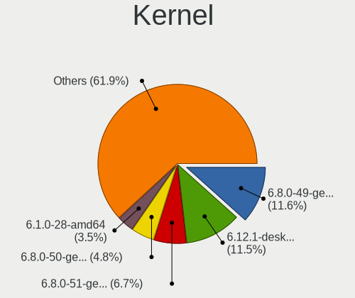
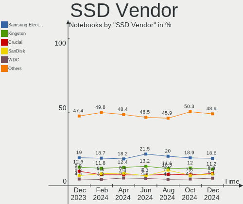
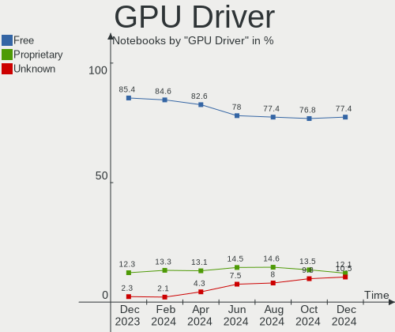
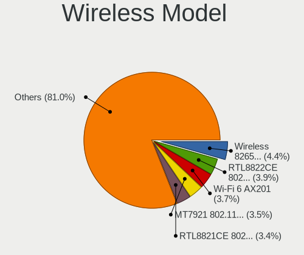
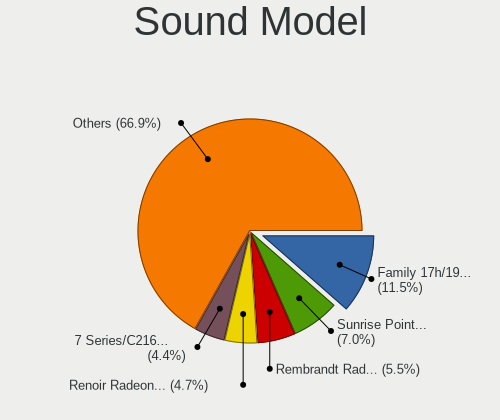

Linux - Hardware Trends (Notebooks)
-----------------------------------

A project to identify most popular hardware characteristics and track their change
over time based on data collected by Linux users at https://Linux-Hardware.org.

Anyone can contribute to this report by the [hw-probe](https://github.com/linuxhw/hw-probe) tool:

    sudo -E hw-probe -all -upload

This report is for one last month. Overall report since the beginning of time: [TestCoverage](https://github.com/linuxhw/TestCoverage)

Period: Jan, 2023.

Contents
--------

* [ System ](#system)
  - [ OS                       ](#os)
  - [ OS Family                ](#os-family)
  - [ Kernel                   ](#kernel)
  - [ Kernel Family            ](#kernel-family)
  - [ Kernel Major Ver.        ](#kernel-major-ver)
  - [ Arch                     ](#arch)
  - [ DE                       ](#de)
  - [ Display Server           ](#display-server)
  - [ Display Manager          ](#display-manager)
  - [ OS Lang                  ](#os-lang)
  - [ Boot Mode                ](#boot-mode)
  - [ Filesystem               ](#filesystem)
  - [ Part. scheme             ](#part-scheme)
  - [ Dual Boot with Linux/BSD ](#dual-boot-with-linuxbsd)
  - [ Dual Boot (Win)          ](#dual-boot-win)

* [ Board ](#board)
  - [ Vendor                   ](#vendor)
  - [ Model                    ](#model)
  - [ Model Family             ](#model-family)
  - [ MFG Year                 ](#mfg-year)
  - [ Form Factor              ](#form-factor)
  - [ Secure Boot              ](#secure-boot)
  - [ Coreboot                 ](#coreboot)
  - [ RAM Size                 ](#ram-size)
  - [ RAM Used                 ](#ram-used)
  - [ Total Drives             ](#total-drives)
  - [ Has CD-ROM               ](#has-cd-rom)
  - [ Has Ethernet             ](#has-ethernet)
  - [ Has WiFi                 ](#has-wifi)
  - [ Has Bluetooth            ](#has-bluetooth)

* [ Location ](#location)
  - [ Country                  ](#country)
  - [ City                     ](#city)

* [ Drives ](#drives)
  - [ Drive Vendor             ](#drive-vendor)
  - [ Drive Model              ](#drive-model)
  - [ HDD Vendor               ](#hdd-vendor)
  - [ SSD Vendor               ](#ssd-vendor)
  - [ Drive Kind               ](#drive-kind)
  - [ Drive Connector          ](#drive-connector)
  - [ Drive Size               ](#drive-size)
  - [ Space Total              ](#space-total)
  - [ Space Used               ](#space-used)
  - [ Malfunc. Drives          ](#malfunc-drives)
  - [ Malfunc. Drive Vendor    ](#malfunc-drive-vendor)
  - [ Malfunc. HDD Vendor      ](#malfunc-hdd-vendor)
  - [ Malfunc. Drive Kind      ](#malfunc-drive-kind)
  - [ Failed Drives            ](#failed-drives)
  - [ Failed Drive Vendor      ](#failed-drive-vendor)
  - [ Drive Status             ](#drive-status)

* [ Storage controller ](#storage-controller)
  - [ Storage Vendor           ](#storage-vendor)
  - [ Storage Model            ](#storage-model)
  - [ Storage Kind             ](#storage-kind)

* [ Processor ](#processor)
  - [ CPU Vendor               ](#cpu-vendor)
  - [ CPU Model                ](#cpu-model)
  - [ CPU Model Family         ](#cpu-model-family)
  - [ CPU Cores                ](#cpu-cores)
  - [ CPU Sockets              ](#cpu-sockets)
  - [ CPU Threads              ](#cpu-threads)
  - [ CPU Op-Modes             ](#cpu-op-modes)
  - [ CPU Microcode            ](#cpu-microcode)
  - [ CPU Microarch            ](#cpu-microarch)

* [ Graphics ](#graphics)
  - [ GPU Vendor               ](#gpu-vendor)
  - [ GPU Model                ](#gpu-model)
  - [ GPU Combo                ](#gpu-combo)
  - [ GPU Driver               ](#gpu-driver)
  - [ GPU Memory               ](#gpu-memory)

* [ Monitor ](#monitor)
  - [ Monitor Vendor           ](#monitor-vendor)
  - [ Monitor Model            ](#monitor-model)
  - [ Monitor Resolution       ](#monitor-resolution)
  - [ Monitor Diagonal         ](#monitor-diagonal)
  - [ Monitor Width            ](#monitor-width)
  - [ Aspect Ratio             ](#aspect-ratio)
  - [ Monitor Area             ](#monitor-area)
  - [ Pixel Density            ](#pixel-density)
  - [ Multiple Monitors        ](#multiple-monitors)

* [ Network ](#network)
  - [ Net Controller Vendor    ](#net-controller-vendor)
  - [ Net Controller Model     ](#net-controller-model)
  - [ Wireless Vendor          ](#wireless-vendor)
  - [ Wireless Model           ](#wireless-model)
  - [ Ethernet Vendor          ](#ethernet-vendor)
  - [ Ethernet Model           ](#ethernet-model)
  - [ Net Controller Kind      ](#net-controller-kind)
  - [ Used Controller          ](#used-controller)
  - [ NICs                     ](#nics)
  - [ IPv6                     ](#ipv6)

* [ Bluetooth ](#bluetooth)
  - [ Bluetooth Vendor         ](#bluetooth-vendor)
  - [ Bluetooth Model          ](#bluetooth-model)

* [ Sound ](#sound)
  - [ Sound Vendor             ](#sound-vendor)
  - [ Sound Model              ](#sound-model)

* [ Memory ](#memory)
  - [ Memory Vendor            ](#memory-vendor)
  - [ Memory Model             ](#memory-model)
  - [ Memory Kind              ](#memory-kind)
  - [ Memory Form Factor       ](#memory-form-factor)
  - [ Memory Size              ](#memory-size)
  - [ Memory Speed             ](#memory-speed)

* [ Printers & scanners ](#printers--scanners)
  - [ Printer Vendor           ](#printer-vendor)
  - [ Printer Model            ](#printer-model)
  - [ Scanner Vendor           ](#scanner-vendor)
  - [ Scanner Model            ](#scanner-model)

* [ Camera ](#camera)
  - [ Camera Vendor            ](#camera-vendor)
  - [ Camera Model             ](#camera-model)

* [ Security ](#security)
  - [ Fingerprint Vendor       ](#fingerprint-vendor)
  - [ Fingerprint Model        ](#fingerprint-model)
  - [ Chipcard Vendor          ](#chipcard-vendor)
  - [ Chipcard Model           ](#chipcard-model)

* [ Unsupported ](#unsupported)
  - [ Unsupported Devices      ](#unsupported-devices)
  - [ Unsupported Device Types ](#unsupported-device-types)

System
------

OS
--

Installed operating systems

| Name                         | Notebooks | Percent |
|------------------------------|-----------|---------|
| OpenMandriva 23.01           | 539       | 15.43%  |
| Ubuntu 22.04                 | 447       | 12.79%  |
| Linux Mint 21.1              | 258       | 7.38%   |
| Fedora 37                    | 249       | 7.13%   |
| Ubuntu 22.10                 | 162       | 4.64%   |
| Debian 11                    | 127       | 3.63%   |
| Pop!_OS 22.04                | 122       | 3.49%   |
| Zorin 16                     | 110       | 3.15%   |
| Arch Rolling                 | 109       | 3.12%   |
| Ubuntu 20.04                 | 95        | 2.72%   |
| ROSA 12.3                    | 87        | 2.49%   |
| SteamOS 3.4.4                | 76        | 2.18%   |
| KDE neon 22.04               | 57        | 1.63%   |
| OpenMandriva 4.3             | 52        | 1.49%   |
| Linux Mint 20.3              | 49        | 1.4%    |
| Manjaro                      | 42        | 1.2%    |
| Kubuntu 22.04                | 40        | 1.14%   |
| Kali 2022.4                  | 38        | 1.09%   |
| Kubuntu 22.10                | 36        | 1.03%   |
| openSUSE Tumbleweed-XXXXXXXX | 35        | 1%      |
| Linux Mint 21                | 32        | 0.92%   |
| Debian                       | 32        | 0.92%   |
| ArcoLinux Rolling            | 32        | 0.92%   |
| Manjaro 22.0.0               | 28        | 0.8%    |
| Gentoo 2.9                   | 27        | 0.77%   |
| EndeavourOS Rolling          | 26        | 0.74%   |
| Elementary 6.1               | 24        | 0.69%   |
| LMDE 5                       | 22        | 0.63%   |
| Fedora 36                    | 22        | 0.63%   |
| Nobara 37                    | 21        | 0.6%    |
| Ubuntu 18.04                 | 20        | 0.57%   |
| Xubuntu 22.04                | 19        | 0.54%   |
| Lubuntu 22.04                | 19        | 0.54%   |
| BlackPanther 18.1            | 18        | 0.52%   |
| Ubuntu MATE 22.04            | 16        | 0.46%   |
| Endless 4.0.13               | 16        | 0.46%   |
| Xubuntu 20.04                | 11        | 0.31%   |
| ROSA R11.1                   | 11        | 0.31%   |
| Manjaro 22.0                 | 11        | 0.31%   |
| Manjaro 22.0.1               | 9         | 0.26%   |

OS Family
---------

OS without a version

| Name             | Notebooks | Percent |
|------------------|-----------|---------|
| Ubuntu           | 729       | 20.86%  |
| OpenMandriva     | 617       | 17.66%  |
| Linux Mint       | 363       | 10.39%  |
| Fedora           | 283       | 8.1%    |
| Debian           | 165       | 4.72%   |
| Pop!_OS          | 123       | 3.52%   |
| Zorin            | 117       | 3.35%   |
| Arch             | 109       | 3.12%   |
| ROSA             | 108       | 3.09%   |
| SteamOS          | 91        | 2.6%    |
| Manjaro          | 91        | 2.6%    |
| Kubuntu          | 85        | 2.43%   |
| KDE neon         | 61        | 1.75%   |
| openSUSE         | 43        | 1.23%   |
| Kali             | 42        | 1.2%    |
| Xubuntu          | 40        | 1.14%   |
| ArcoLinux        | 34        | 0.97%   |
| Gentoo           | 28        | 0.8%    |
| Endless          | 28        | 0.8%    |
| EndeavourOS      | 26        | 0.74%   |
| Elementary       | 26        | 0.74%   |
| Ubuntu MATE      | 25        | 0.72%   |
| Lubuntu          | 25        | 0.72%   |
| Nobara           | 24        | 0.69%   |
| LMDE             | 22        | 0.63%   |
| BlackPanther     | 18        | 0.52%   |
| ALT Linux        | 13        | 0.37%   |
| Parrot           | 11        | 0.31%   |
| Garuda Linux     | 11        | 0.31%   |
| Ubuntu Unity     | 10        | 0.29%   |
| Rocky Linux      | 8         | 0.23%   |
| MX               | 8         | 0.23%   |
| BunsenLabs       | 8         | 0.23%   |
| Ubuntu Budgie    | 6         | 0.17%   |
| Xero             | 5         | 0.14%   |
| Void Linux       | 5         | 0.14%   |
| Slackware        | 5         | 0.14%   |
| Peppermint       | 4         | 0.11%   |
| org.kde.Platform | 4         | 0.11%   |
| CentOS           | 4         | 0.11%   |

Kernel
------

Version of the Linux kernel

| Version                            | Notebooks | Percent |
|------------------------------------|-----------|---------|
| 6.1.1-desktop-1omv2290             | 527       | 15.08%  |
| 5.15.0-58-generic                  | 508       | 14.54%  |
| 5.15.0-56-generic                  | 261       | 7.47%   |
| 5.15.0-57-generic                  | 188       | 5.38%   |
| 6.0.12-76060006-generic            | 112       | 3.21%   |
| 5.10.0-20-amd64                    | 105       | 3.01%   |
| 5.19.0-29-generic                  | 92        | 2.63%   |
| 5.13.0-valve36-1-neptune           | 84        | 2.4%    |
| 5.16.7-desktop-1omv4003            | 51        | 1.46%   |
| 5.19.0-28-generic                  | 50        | 1.43%   |
| 6.1.7-200.fc37.x86_64              | 47        | 1.35%   |
| 5.4.0-137-generic                  | 44        | 1.26%   |
| 6.1.1-1-MANJARO                    | 37        | 1.06%   |
| 6.0.15-300.fc37.x86_64             | 35        | 1%      |
| 5.15.79-generic-1rosa2021.1-x86_64 | 35        | 1%      |
| 6.1.6-200.fc37.x86_64              | 31        | 0.89%   |
| 6.0.16-300.fc37.x86_64             | 31        | 0.89%   |
| 5.19.0-26-generic                  | 31        | 0.89%   |
| 6.0.18-300.fc37.x86_64             | 29        | 0.83%   |
| 5.15.75-generic-1rosa2021.1-x86_64 | 27        | 0.77%   |
| 5.15.0-43-generic                  | 26        | 0.74%   |
| 5.4.0-136-generic                  | 25        | 0.72%   |
| 6.1.7-arch1-1                      | 24        | 0.69%   |
| 5.15.85-1-MANJARO                  | 24        | 0.69%   |
| 6.0.0-kali6-amd64                  | 22        | 0.63%   |
| 5.4.0-135-generic                  | 22        | 0.63%   |
| 5.10.0-21-amd64                    | 22        | 0.63%   |
| 6.1.5-200.fc37.x86_64              | 21        | 0.6%    |
| 6.1.4-arch1-1                      | 21        | 0.6%    |
| 5.19.0-21-generic                  | 21        | 0.6%    |
| 6.0.7-301.fc37.x86_64              | 18        | 0.52%   |
| 6.0.17-300.fc37.x86_64             | 18        | 0.52%   |
| 6.0.0-6-amd64                      | 18        | 0.52%   |
| 5.11.0-35-generic                  | 17        | 0.49%   |
| 6.1.8-arch1-1                      | 14        | 0.4%    |
| 6.1.1-arch1-1                      | 14        | 0.4%    |
| 6.1.2-arch1-1                      | 12        | 0.34%   |
| 6.0.0-kali3-amd64                  | 12        | 0.34%   |
| 5.15.0-59-generic                  | 12        | 0.34%   |
| 6.1.7-1-MANJARO                    | 11        | 0.31%   |

Kernel Family
-------------

Linux kernel without a distro release

| Version  | Notebooks | Percent |
|----------|-----------|---------|
| 5.15.0   | 1054      | 30.17%  |
| 6.1.1    | 589       | 16.86%  |
| 5.19.0   | 222       | 6.35%   |
| 5.10.0   | 168       | 4.81%   |
| 6.0.12   | 120       | 3.43%   |
| 5.4.0    | 116       | 3.32%   |
| 6.1.7    | 112       | 3.21%   |
| 5.13.0   | 99        | 2.83%   |
| 6.1.6    | 78        | 2.23%   |
| 6.0.0    | 78        | 2.23%   |
| 6.1.4    | 60        | 1.72%   |
| 6.0.15   | 51        | 1.46%   |
| 5.16.7   | 51        | 1.46%   |
| 6.1.5    | 41        | 1.17%   |
| 6.1.8    | 39        | 1.12%   |
| 6.0.16   | 37        | 1.06%   |
| 5.15.79  | 35        | 1%      |
| 6.0.18   | 32        | 0.92%   |
| 5.15.75  | 32        | 0.92%   |
| 5.15.85  | 28        | 0.8%    |
| 6.1.3    | 27        | 0.77%   |
| 6.1.2    | 27        | 0.77%   |
| 5.14.0   | 26        | 0.74%   |
| 5.11.0   | 25        | 0.72%   |
| 6.1.0    | 24        | 0.69%   |
| 6.0.7    | 20        | 0.57%   |
| 6.0.17   | 19        | 0.54%   |
| 4.15.0   | 19        | 0.54%   |
| 5.8.0    | 13        | 0.37%   |
| 6.0.10   | 11        | 0.31%   |
| 5.6.14   | 11        | 0.31%   |
| 5.17.0   | 11        | 0.31%   |
| 5.10.155 | 10        | 0.29%   |
| 5.15.89  | 8         | 0.23%   |
| 5.15.86  | 8         | 0.23%   |
| 5.14.21  | 8         | 0.23%   |
| 5.10.74  | 8         | 0.23%   |
| 6.2.0    | 7         | 0.2%    |
| 6.0.9    | 7         | 0.2%    |
| 6.0.6    | 7         | 0.2%    |

Kernel Major Ver.
-----------------

Linux kernel major version

| Version | Notebooks | Percent |
|---------|-----------|---------|
| 5.15    | 1191      | 34.09%  |
| 6.1     | 997       | 28.53%  |
| 6.0     | 402       | 11.51%  |
| 5.19    | 237       | 6.78%   |
| 5.10    | 209       | 5.98%   |
| 5.4     | 128       | 3.66%   |
| 5.13    | 100       | 2.86%   |
| 5.16    | 58        | 1.66%   |
| 5.14    | 36        | 1.03%   |
| 5.11    | 26        | 0.74%   |
| 4.15    | 19        | 0.54%   |
| 5.17    | 18        | 0.52%   |
| 5.18    | 17        | 0.49%   |
| 5.8     | 13        | 0.37%   |
| 5.6     | 11        | 0.31%   |
| 4.18    | 10        | 0.29%   |
| 6.2     | 7         | 0.2%    |
| 4.19    | 7         | 0.2%    |
| 4.4     | 2         | 0.06%   |
| 5.3     | 1         | 0.03%   |
| 5.12    | 1         | 0.03%   |
| 4.16    | 1         | 0.03%   |
| 4.10    | 1         | 0.03%   |
| 3.4     | 1         | 0.03%   |
| Unknown | 1         | 0.03%   |

Arch
----

OS architecture (x86_64, i586, etc.)

| Name    | Notebooks | Percent |
|---------|-----------|---------|
| x86_64  | 3454      | 98.86%  |
| i686    | 37        | 1.06%   |
| aarch64 | 2         | 0.06%   |
| armv7l  | 1         | 0.03%   |

DE
--

Desktop Environment

| Name              | Notebooks | Percent |
|-------------------|-----------|---------|
| GNOME             | 1446      | 41.39%  |
| KDE5              | 1120      | 32.05%  |
| X-Cinnamon        | 331       | 9.47%   |
| XFCE              | 234       | 6.7%    |
| MATE              | 94        | 2.69%   |
| Unknown           | 55        | 1.57%   |
| LXQt              | 41        | 1.17%   |
| Pantheon          | 28        | 0.8%    |
| i3                | 22        | 0.63%   |
| Cinnamon          | 22        | 0.63%   |
| Unity             | 11        | 0.31%   |
| LXDE              | 10        | 0.29%   |
| KDE               | 8         | 0.23%   |
| GNOME Flashback   | 8         | 0.23%   |
| Budgie            | 8         | 0.23%   |
| KDE4              | 6         | 0.17%   |
| sway              | 5         | 0.14%   |
| dwm               | 4         | 0.11%   |
| BunsenLabs        | 4         | 0.11%   |
| awesome           | 4         | 0.11%   |
| openbox           | 3         | 0.09%   |
| GNOME Classic     | 3         | 0.09%   |
| Deepin            | 3         | 0.09%   |
| xmonad            | 2         | 0.06%   |
| lightdm-xsession  | 2         | 0.06%   |
| Hyprland          | 2         | 0.06%   |
| fly               | 2         | 0.06%   |
| fluxbox           | 2         | 0.06%   |
| bspwm             | 2         | 0.06%   |
| x-session-manager | 1         | 0.03%   |
| wayfire-session   | 1         | 0.03%   |
| Trinity           | 1         | 0.03%   |
| qtile             | 1         | 0.03%   |
| Phosh:GNOME       | 1         | 0.03%   |
| Lubuntu           | 1         | 0.03%   |
| LeftWM            | 1         | 0.03%   |
| i3-with-shmlog    | 1         | 0.03%   |
| herbstluftwm      | 1         | 0.03%   |
| GNUstep           | 1         | 0.03%   |
| Enlightenment     | 1         | 0.03%   |

Display Server
--------------

X11 or Wayland

| Name        | Notebooks | Percent |
|-------------|-----------|---------|
| X11         | 2429      | 69.52%  |
| Wayland     | 990       | 28.33%  |
| Unknown     | 40        | 1.14%   |
| Tty         | 34        | 0.97%   |
| Unspecified | 1         | 0.03%   |

Display Manager
---------------

SDDM, LightDM, etc.

| Name    | Notebooks | Percent |
|---------|-----------|---------|
| Unknown | 988       | 28.28%  |
| SDDM    | 896       | 25.64%  |
| GDM3    | 726       | 20.78%  |
| LightDM | 499       | 14.28%  |
| GDM     | 356       | 10.19%  |
| SLiM    | 8         | 0.23%   |
| XDM     | 7         | 0.2%    |
| KDM     | 6         | 0.17%   |
| LXDM    | 2         | 0.06%   |
| GREETD  | 2         | 0.06%   |
| FLY-DM  | 2         | 0.06%   |
| NODM    | 1         | 0.03%   |
| Ly      | 1         | 0.03%   |

OS Lang
-------

Language

| Lang    | Notebooks | Percent |
|---------|-----------|---------|
| en_US   | 1578      | 45.16%  |
| de_DE   | 266       | 7.61%   |
| ru_RU   | 250       | 7.16%   |
| fr_FR   | 185       | 5.29%   |
| en_GB   | 155       | 4.44%   |
| pt_BR   | 126       | 3.61%   |
| it_IT   | 104       | 2.98%   |
| pl_PL   | 91        | 2.6%    |
| es_ES   | 82        | 2.35%   |
| en_CA   | 53        | 1.52%   |
| C       | 49        | 1.4%    |
| en_AU   | 40        | 1.14%   |
| en_IN   | 39        | 1.12%   |
| Unknown | 37        | 1.06%   |
| es_MX   | 34        | 0.97%   |
| cs_CZ   | 30        | 0.86%   |
| nl_NL   | 29        | 0.83%   |
| zh_CN   | 20        | 0.57%   |
| es_CO   | 18        | 0.52%   |
| tr_TR   | 17        | 0.49%   |
| en_NZ   | 15        | 0.43%   |
| de_AT   | 15        | 0.43%   |
| hu_HU   | 14        | 0.4%    |
| sv_SE   | 12        | 0.34%   |
| pt_PT   | 11        | 0.31%   |
| en_IE   | 11        | 0.31%   |
| de_CH   | 11        | 0.31%   |
| en_ZA   | 10        | 0.29%   |
| es_AR   | 9         | 0.26%   |
| fr_CA   | 8         | 0.23%   |
| es_CL   | 8         | 0.23%   |
| ro_RO   | 7         | 0.2%    |
| nb_NO   | 7         | 0.2%    |
| ja_JP   | 7         | 0.2%    |
| hr_HR   | 7         | 0.2%    |
| el_GR   | 7         | 0.2%    |
| fi_FI   | 6         | 0.17%   |
| da_DK   | 6         | 0.17%   |
| ca_ES   | 6         | 0.17%   |
| nl_BE   | 5         | 0.14%   |

Boot Mode
---------

EFI or BIOS

| Mode | Notebooks | Percent |
|------|-----------|---------|
| EFI  | 1988      | 56.9%   |
| BIOS | 1506      | 43.1%   |

Filesystem
----------

Type of filesystem

| Type    | Notebooks | Percent |
|---------|-----------|---------|
| Ext4    | 2291      | 65.57%  |
| Overlay | 564       | 16.14%  |
| Btrfs   | 557       | 15.94%  |
| Xfs     | 36        | 1.03%   |
| Zfs     | 27        | 0.77%   |
| Ext3    | 8         | 0.23%   |
| F2fs    | 5         | 0.14%   |
| Tmpfs   | 2         | 0.06%   |
| Ext2    | 2         | 0.06%   |
| XXXXXXX | 1         | 0.03%   |
| Aufs    | 1         | 0.03%   |

Part. scheme
------------

Scheme of partitioning

| Type    | Notebooks | Percent |
|---------|-----------|---------|
| GPT     | 2059      | 58.93%  |
| Unknown | 954       | 27.3%   |
| MBR     | 481       | 13.77%  |

Dual Boot with Linux/BSD
------------------------

Hosting more than one Linux/BSD

| Dual boot | Notebooks | Percent |
|-----------|-----------|---------|
| No        | 2897      | 82.91%  |
| Yes       | 597       | 17.09%  |

Dual Boot (Win)
---------------

Hosting Linux and Windows

| Dual boot | Notebooks | Percent |
|-----------|-----------|---------|
| No        | 2553      | 73.07%  |
| Yes       | 941       | 26.93%  |

Board
-----

Vendor
------

Motherboard manufacturer

| Name                | Notebooks | Percent |
|---------------------|-----------|---------|
| Lenovo              | 757       | 21.67%  |
| Hewlett-Packard     | 598       | 17.12%  |
| Dell                | 502       | 14.37%  |
| ASUSTek Computer    | 380       | 10.88%  |
| Acer                | 334       | 9.56%   |
| Apple               | 91        | 2.6%    |
| Valve               | 90        | 2.58%   |
| MSI                 | 89        | 2.55%   |
| Toshiba             | 76        | 2.18%   |
| Samsung Electronics | 52        | 1.49%   |
| HUAWEI              | 47        | 1.35%   |
| Google              | 42        | 1.2%    |
| Sony                | 36        | 1.03%   |
| Fujitsu             | 26        | 0.74%   |
| Notebook            | 25        | 0.72%   |
| Unknown             | 25        | 0.72%   |
| Timi                | 18        | 0.52%   |
| System76            | 17        | 0.49%   |
| TUXEDO              | 16        | 0.46%   |
| Medion              | 14        | 0.4%    |
| Clevo               | 13        | 0.37%   |
| Chuwi               | 12        | 0.34%   |
| Alienware           | 12        | 0.34%   |
| Packard Bell        | 11        | 0.31%   |
| Gigabyte Technology | 10        | 0.29%   |
| Schenker            | 9         | 0.26%   |
| GPU Company         | 9         | 0.26%   |
| Positivo            | 8         | 0.23%   |
| Panasonic           | 8         | 0.23%   |
| LG Electronics      | 7         | 0.2%    |
| HONOR               | 7         | 0.2%    |
| Razer               | 6         | 0.17%   |
| Gateway             | 6         | 0.17%   |
| Fujitsu Siemens     | 6         | 0.17%   |
| PC Specialist       | 5         | 0.14%   |
| Framework           | 5         | 0.14%   |
| UMAX                | 4         | 0.11%   |
| Intel               | 4         | 0.11%   |
| Infinix             | 4         | 0.11%   |
| Wortmann AG         | 3         | 0.09%   |

Model
-----

Motherboard model

| Name                                | Notebooks | Percent |
|-------------------------------------|-----------|---------|
| Valve Jupiter                       | 90        | 2.58%   |
| Unknown                             | 38        | 1.09%   |
| HP Notebook                         | 26        | 0.74%   |
| HP Pavilion dv6                     | 11        | 0.31%   |
| Dell XPS 15 9570                    | 10        | 0.29%   |
| HP Pavilion Notebook                | 8         | 0.23%   |
| HP Pavilion g6                      | 8         | 0.23%   |
| HP Pavilion 15                      | 8         | 0.23%   |
| HP Laptop 15s-eq2xxx                | 8         | 0.23%   |
| Dell Latitude E6420                 | 8         | 0.23%   |
| ASUS TUF Gaming FX505DT_FX505DT     | 8         | 0.23%   |
| Apple MacBookPro8,1                 | 8         | 0.23%   |
| Lenovo ThinkBook 15 G2 ITL 20VE     | 7         | 0.2%    |
| Lenovo IdeaPad 5 15ARE05 81YQ       | 7         | 0.2%    |
| Lenovo IdeaPad 330-15IKB 81DE       | 7         | 0.2%    |
| Lenovo IdeaPad 3 15ALC6 82MF        | 7         | 0.2%    |
| Lenovo IdeaPad 3 15ALC6 82KU        | 7         | 0.2%    |
| HP Pavilion dv7                     | 7         | 0.2%    |
| HP EliteBook 8460p                  | 7         | 0.2%    |
| HP EliteBook 840 G5                 | 7         | 0.2%    |
| HP EliteBook 840 G3                 | 7         | 0.2%    |
| HP 15                               | 7         | 0.2%    |
| Chuwi GemiBook Pro                  | 7         | 0.2%    |
| Apple MacBookPro9,2                 | 7         | 0.2%    |
| Apple MacBookAir7,2                 | 7         | 0.2%    |
| Lenovo Legion 5 Pro 16ACH6H 82JQ    | 6         | 0.17%   |
| HP ProBook 650 G1                   | 6         | 0.17%   |
| HP Laptop 17-cp0xxx                 | 6         | 0.17%   |
| HP EliteBook 2560p                  | 6         | 0.17%   |
| Dell XPS 9320                       | 6         | 0.17%   |
| Dell XPS 13 7390                    | 6         | 0.17%   |
| Dell Latitude 7480                  | 6         | 0.17%   |
| Apple MacBook5,1                    | 6         | 0.17%   |
| Acer Nitro AN515-54                 | 6         | 0.17%   |
| Acer Nitro AN515-44                 | 6         | 0.17%   |
| Samsung 350V5C/351V5C/3540VC/3440VC | 5         | 0.14%   |
| Lenovo IdeaPad 5 15ITL05 82FG       | 5         | 0.14%   |
| Lenovo IdeaPad 3 15ITL6 82H8        | 5         | 0.14%   |
| Lenovo G500 20236                   | 5         | 0.14%   |
| HUAWEI KLVL-WXX9                    | 5         | 0.14%   |

Model Family
------------

Motherboard model prefix

| Name                  | Notebooks | Percent |
|-----------------------|-----------|---------|
| Lenovo ThinkPad       | 352       | 10.07%  |
| Acer Aspire           | 231       | 6.61%   |
| Lenovo IdeaPad        | 213       | 6.1%    |
| Dell Latitude         | 184       | 5.27%   |
| Dell Inspiron         | 137       | 3.92%   |
| HP EliteBook          | 110       | 3.15%   |
| HP Pavilion           | 109       | 3.12%   |
| Valve Jupiter         | 90        | 2.58%   |
| HP Laptop             | 88        | 2.52%   |
| ASUS VivoBook         | 87        | 2.49%   |
| HP ProBook            | 74        | 2.12%   |
| Dell XPS              | 73        | 2.09%   |
| Toshiba Satellite     | 61        | 1.75%   |
| Dell Precision        | 46        | 1.32%   |
| Lenovo Legion         | 42        | 1.2%    |
| Unknown               | 38        | 1.09%   |
| ASUS ROG              | 34        | 0.97%   |
| Acer Nitro            | 32        | 0.92%   |
| HP ZBook              | 31        | 0.89%   |
| Acer Swift            | 30        | 0.86%   |
| HP Notebook           | 26        | 0.74%   |
| ASUS ZenBook          | 26        | 0.74%   |
| ASUS ASUS             | 26        | 0.74%   |
| Dell Vostro           | 23        | 0.66%   |
| HP OMEN               | 22        | 0.63%   |
| HP Compaq             | 22        | 0.63%   |
| Fujitsu LIFEBOOK      | 22        | 0.63%   |
| Lenovo ThinkBook      | 20        | 0.57%   |
| HP ENVY               | 19        | 0.54%   |
| HP 255                | 17        | 0.49%   |
| Lenovo Yoga           | 15        | 0.43%   |
| ASUS TUF              | 15        | 0.43%   |
| Apple MacBookPro8     | 13        | 0.37%   |
| Acer Predator         | 13        | 0.37%   |
| HP Stream             | 12        | 0.34%   |
| Dell G15              | 11        | 0.31%   |
| Acer TravelMate       | 11        | 0.31%   |
| Packard Bell EasyNote | 10        | 0.29%   |
| HP 250                | 10        | 0.29%   |
| HP 15                 | 10        | 0.29%   |

MFG Year
--------

Motherboard manufacture year

| Year    | Notebooks | Percent |
|---------|-----------|---------|
| 2021    | 472       | 13.51%  |
| 2022    | 411       | 11.76%  |
| 2020    | 337       | 9.65%   |
| 2019    | 265       | 7.58%   |
| 2012    | 243       | 6.95%   |
| 2018    | 227       | 6.5%    |
| 2011    | 227       | 6.5%    |
| 2013    | 213       | 6.1%    |
| 2017    | 193       | 5.52%   |
| 2016    | 182       | 5.21%   |
| 2015    | 175       | 5.01%   |
| 2014    | 165       | 4.72%   |
| 2010    | 136       | 3.89%   |
| 2008    | 88        | 2.52%   |
| 2009    | 85        | 2.43%   |
| 2007    | 48        | 1.37%   |
| 2006    | 10        | 0.29%   |
| 2005    | 6         | 0.17%   |
| Unknown | 6         | 0.17%   |
| 2023    | 3         | 0.09%   |
| 2003    | 2         | 0.06%   |

Form Factor
-----------

Physical design of the computer

| Name     | Notebooks | Percent |
|----------|-----------|---------|
| Notebook | 3494      | 100%    |

Secure Boot
-----------

Enabled or disabled

| State    | Notebooks | Percent |
|----------|-----------|---------|
| Disabled | 3183      | 91.1%   |
| Enabled  | 311       | 8.9%    |

Coreboot
--------

Have coreboot on board

| Used | Notebooks | Percent |
|------|-----------|---------|
| No   | 3435      | 98.31%  |
| Yes  | 59        | 1.69%   |

RAM Size
--------

Total RAM memory

| Size in GB  | Notebooks | Percent |
|-------------|-----------|---------|
| 4.01-8.0    | 1010      | 28.91%  |
| 8.01-16.0   | 716       | 20.49%  |
| 3.01-4.0    | 640       | 18.32%  |
| 16.01-24.0  | 617       | 17.66%  |
| 32.01-64.0  | 267       | 7.64%   |
| 1.01-2.0    | 102       | 2.92%   |
| 64.01-256.0 | 51        | 1.46%   |
| 24.01-32.0  | 46        | 1.32%   |
| 2.01-3.0    | 36        | 1.03%   |
| 0.51-1.0    | 8         | 0.23%   |
| 0.01-0.5    | 1         | 0.03%   |

RAM Used
--------

Used RAM memory

| Used GB    | Notebooks | Percent |
|------------|-----------|---------|
| 1.01-2.0   | 1232      | 35.26%  |
| 2.01-3.0   | 940       | 26.9%   |
| 4.01-8.0   | 565       | 16.17%  |
| 3.01-4.0   | 441       | 12.62%  |
| 0.51-1.0   | 145       | 4.15%   |
| 8.01-16.0  | 133       | 3.81%   |
| 16.01-24.0 | 17        | 0.49%   |
| 0.01-0.5   | 17        | 0.49%   |
| 24.01-32.0 | 2         | 0.06%   |
| 32.01-64.0 | 1         | 0.03%   |
| Unknown    | 1         | 0.03%   |

Total Drives
------------

Number of drives on board

| Drives | Notebooks | Percent |
|--------|-----------|---------|
| 1      | 2536      | 72.58%  |
| 2      | 828       | 23.7%   |
| 3      | 91        | 2.6%    |
| 0      | 19        | 0.54%   |
| 4      | 18        | 0.52%   |
| 5      | 2         | 0.06%   |

Has CD-ROM
----------

Has CD-ROM on board

| Presented | Notebooks | Percent |
|-----------|-----------|---------|
| No        | 2450      | 70.12%  |
| Yes       | 1044      | 29.88%  |

Has Ethernet
------------

Has Ethernet on board

| Presented | Notebooks | Percent |
|-----------|-----------|---------|
| Yes       | 2659      | 76.1%   |
| No        | 835       | 23.9%   |

Has WiFi
--------

Has WiFi module

| Presented | Notebooks | Percent |
|-----------|-----------|---------|
| Yes       | 3443      | 98.54%  |
| No        | 51        | 1.46%   |

Has Bluetooth
-------------

Has Bluetooth module

| Presented | Notebooks | Percent |
|-----------|-----------|---------|
| Yes       | 2850      | 81.57%  |
| No        | 644       | 18.43%  |

Location
--------

Country
-------

Geographic location (country)

| Country      | Notebooks | Percent |
|--------------|-----------|---------|
| USA          | 566       | 16.2%   |
| Germany      | 360       | 10.3%   |
| Russia       | 262       | 7.5%    |
| France       | 215       | 6.15%   |
| Brazil       | 184       | 5.27%   |
| Italy        | 174       | 4.98%   |
| UK           | 131       | 3.75%   |
| Poland       | 121       | 3.46%   |
| Canada       | 107       | 3.06%   |
| Spain        | 103       | 2.95%   |
| Netherlands  | 82        | 2.35%   |
| India        | 56        | 1.6%    |
| Australia    | 50        | 1.43%   |
| Hungary      | 46        | 1.32%   |
| Czechia      | 46        | 1.32%   |
| Mexico       | 45        | 1.29%   |
| Turkey       | 44        | 1.26%   |
| Japan        | 38        | 1.09%   |
| Austria      | 38        | 1.09%   |
| Switzerland  | 36        | 1.03%   |
| Sweden       | 33        | 0.94%   |
| Indonesia    | 32        | 0.92%   |
| Finland      | 31        | 0.89%   |
| Romania      | 30        | 0.86%   |
| Belgium      | 30        | 0.86%   |
| Portugal     | 28        | 0.8%    |
| Greece       | 26        | 0.74%   |
| Colombia     | 26        | 0.74%   |
| Serbia       | 22        | 0.63%   |
| Norway       | 21        | 0.6%    |
| Argentina    | 21        | 0.6%    |
| New Zealand  | 20        | 0.57%   |
| Denmark      | 20        | 0.57%   |
| South Africa | 18        | 0.52%   |
| China        | 18        | 0.52%   |
| Bulgaria     | 18        | 0.52%   |
| Ukraine      | 16        | 0.46%   |
| Slovakia     | 15        | 0.43%   |
| Ireland      | 15        | 0.43%   |
| Chile        | 14        | 0.4%    |

City
----

Geographic location (city)

| City              | Notebooks | Percent |
|-------------------|-----------|---------|
| Moscow            | 66        | 1.89%   |
| St Petersburg     | 37        | 1.06%   |
| Warsaw            | 31        | 0.89%   |
| Berlin            | 28        | 0.8%    |
| Sao Paulo         | 24        | 0.69%   |
| Paris             | 23        | 0.66%   |
| Vienna            | 21        | 0.6%    |
| Rome              | 21        | 0.6%    |
| Prague            | 20        | 0.57%   |
| Milan             | 19        | 0.54%   |
| Madrid            | 19        | 0.54%   |
| London            | 19        | 0.54%   |
| Munich            | 18        | 0.52%   |
| Amsterdam         | 18        | 0.52%   |
| Sydney            | 15        | 0.43%   |
| Hamburg           | 15        | 0.43%   |
| Frankfurt am Main | 15        | 0.43%   |
| Melbourne         | 14        | 0.4%    |
| Helsinki          | 13        | 0.37%   |
| Budapest          | 13        | 0.37%   |
| Athens            | 13        | 0.37%   |
| New York          | 12        | 0.34%   |
| Krasnodar         | 12        | 0.34%   |
| Istanbul          | 12        | 0.34%   |
| Belgrade          | 12        | 0.34%   |
| Barcelona         | 12        | 0.34%   |
| Jakarta           | 11        | 0.31%   |
| Cologne           | 11        | 0.31%   |
| Bogotá           | 11        | 0.31%   |
| Auckland          | 11        | 0.31%   |
| Tokyo             | 10        | 0.29%   |
| Montreal          | 10        | 0.29%   |
| Mexico City       | 10        | 0.29%   |
| Izmir             | 10        | 0.29%   |
| Denver            | 10        | 0.29%   |
| Ankara            | 10        | 0.29%   |
| Voronezh          | 9         | 0.26%   |
| Seattle           | 9         | 0.26%   |
| Krakow            | 9         | 0.26%   |
| Zurich            | 8         | 0.23%   |

Drives
------

Drive Vendor
------------

Hard drive vendors

| Vendor                      | Notebooks | Drives | Percent |
|-----------------------------|-----------|--------|---------|
| Samsung Electronics         | 713       | 770    | 16.52%  |
| WDC                         | 466       | 480    | 10.8%   |
| Seagate                     | 346       | 363    | 8.02%   |
| Sandisk                     | 274       | 286    | 6.35%   |
| Toshiba                     | 251       | 253    | 5.82%   |
| Unknown                     | 250       | 283    | 5.79%   |
| Kingston                    | 243       | 245    | 5.63%   |
| SK hynix                    | 196       | 199    | 4.54%   |
| Crucial                     | 154       | 159    | 3.57%   |
| Micron Technology           | 148       | 148    | 3.43%   |
| Intel                       | 136       | 146    | 3.15%   |
| HGST                        | 94        | 94     | 2.18%   |
| Hitachi                     | 87        | 87     | 2.02%   |
| KIOXIA                      | 81        | 81     | 1.88%   |
| Phison Electronics          | 56        | 57     | 1.3%    |
| A-DATA Technology           | 54        | 56     | 1.25%   |
| China                       | 47        | 47     | 1.09%   |
| Unknown                     | 46        | 47     | 1.07%   |
| Kingston Technology Company | 39        | 39     | 0.9%    |
| Apple                       | 39        | 42     | 0.9%    |
| SPCC                        | 24        | 25     | 0.56%   |
| LITEON                      | 24        | 24     | 0.56%   |
| Netac                       | 22        | 22     | 0.51%   |
| Silicon Motion              | 19        | 19     | 0.44%   |
| PNY                         | 19        | 19     | 0.44%   |
| O2 Micro                    | 19        | 19     | 0.44%   |
| Intenso                     | 18        | 18     | 0.42%   |
| Apacer                      | 18        | 19     | 0.42%   |
| Phison                      | 17        | 17     | 0.39%   |
| Patriot                     | 17        | 17     | 0.39%   |
| Fujitsu                     | 17        | 17     | 0.39%   |
| Micron/Crucial Technology   | 16        | 16     | 0.37%   |
| LITEONIT                    | 15        | 15     | 0.35%   |
| JMicron Technology          | 14        | 14     | 0.32%   |
| ADATA Technology            | 14        | 14     | 0.32%   |
| Transcend                   | 11        | 11     | 0.25%   |
| SSSTC                       | 11        | 13     | 0.25%   |
| GOODRAM                     | 11        | 12     | 0.25%   |
| Lexar                       | 10        | 10     | 0.23%   |
| Hewlett-Packard             | 10        | 10     | 0.23%   |

Drive Model
-----------

Hard drive models

| Model                                                | Notebooks | Percent |
|------------------------------------------------------|-----------|---------|
| Samsung NVMe SSD Controller SM981/PM981/PM983 500GB  | 87        | 1.96%   |
| Kingston SA400S37240G 240GB SSD                      | 51        | 1.15%   |
| Seagate ST1000LM035-1RK172 1TB                       | 46        | 1.04%   |
| Samsung NVMe SSD Controller PM9A1/PM9A3/980PRO 512GB | 46        | 1.04%   |
| Unknown                                              | 46        | 1.04%   |
| Unknown MMC Card  32GB                               | 40        | 0.9%    |
| Sandisk WD Black SN750 / PC SN730 NVMe SSD 1TB       | 39        | 0.88%   |
| Unknown MMC Card  64GB                               | 38        | 0.86%   |
| Seagate ST1000LM024 HN-M101MBB 1TB                   | 37        | 0.83%   |
| Toshiba MQ04ABF100 1TB                               | 36        | 0.81%   |
| Phison PS5013 E13 NVMe Controller 256GB              | 34        | 0.77%   |
| Kingston SA400S37480G 480GB SSD                      | 33        | 0.74%   |
| Toshiba MQ01ABF050 500GB                             | 32        | 0.72%   |
| Toshiba MQ01ABD100 1TB                               | 32        | 0.72%   |
| Intel SSD 660P Series 512GB                          | 29        | 0.65%   |
| Kingston Company OM3PDP3 NVMe SSD 512GB              | 28        | 0.63%   |
| Seagate ST500LT012-1DG142 500GB                      | 27        | 0.61%   |
| Samsung SSD 860 EVO 500GB                            | 26        | 0.59%   |
| Crucial CT500MX500SSD1 500GB                         | 23        | 0.52%   |
| Crucial CT240BX500SSD1 240GB                         | 23        | 0.52%   |
| Intel SSDPEKNU512GZ 512GB                            | 22        | 0.5%    |
| WDC WD10JPVX-22JC3T0 1TB                             | 21        | 0.47%   |
| Unknown MMC Card  128GB                              | 21        | 0.47%   |
| HGST HTS721010A9E630 1TB                             | 21        | 0.47%   |
| Unknown MMC Card  512GB                              | 20        | 0.45%   |
| Seagate ST9500325AS 500GB                            | 20        | 0.45%   |
| HGST HTS541010A9E680 1TB                             | 20        | 0.45%   |
| O2 Micro E2M2 64GB                                   | 19        | 0.43%   |
| Samsung SSD 850 EVO 250GB                            | 18        | 0.41%   |
| Seagate ST1000LM048-2E7172 1TB                       | 17        | 0.38%   |
| Sandisk WD Blue SN550 NVMe SSD 1TB                   | 17        | 0.38%   |
| Samsung SSD 870 EVO 500GB                            | 17        | 0.38%   |
| Micron 2450_MTFDKBA1T0TFK 1TB                        | 17        | 0.38%   |
| Crucial CT1000MX500SSD1 1TB                          | 17        | 0.38%   |
| Unknown MMC Card  256GB                              | 16        | 0.36%   |
| SK hynix BC501 NVMe Solid State Drive 512GB          | 16        | 0.36%   |
| Seagate ST500LM012 HN-M500MBB 500GB                  | 16        | 0.36%   |
| Samsung SSD 980 1TB                                  | 16        | 0.36%   |
| Kingston SA400S37120G 120GB SSD                      | 16        | 0.36%   |
| Unknown SD/MMC/MS PRO 2GB                            | 15        | 0.34%   |

HDD Vendor
----------

Hard disk drive vendors

| Vendor              | Notebooks | Drives | Percent |
|---------------------|-----------|--------|---------|
| Seagate             | 339       | 354    | 32.04%  |
| WDC                 | 289       | 291    | 27.32%  |
| Toshiba             | 174       | 175    | 16.45%  |
| HGST                | 94        | 94     | 8.88%   |
| Hitachi             | 87        | 87     | 8.22%   |
| Samsung Electronics | 23        | 23     | 2.17%   |
| Fujitsu             | 17        | 17     | 1.61%   |
| Unknown             | 15        | 15     | 1.42%   |
| SABRENT             | 4         | 4      | 0.38%   |
| Apple               | 4         | 4      | 0.38%   |
| ASMT                | 3         | 4      | 0.28%   |
| USB3.0              | 1         | 1      | 0.09%   |
| USB                 | 1         | 1      | 0.09%   |
| SAGE                | 1         | 1      | 0.09%   |
| Phison              | 1         | 1      | 0.09%   |
| Maxone              | 1         | 1      | 0.09%   |
| JMicron Technology  | 1         | 1      | 0.09%   |
| Intenso             | 1         | 1      | 0.09%   |
| IBM/Hitachi         | 1         | 1      | 0.09%   |
| HGST HTS            | 1         | 1      | 0.09%   |

SSD Vendor
----------

Solid state drive vendors

| Vendor              | Notebooks | Drives | Percent |
|---------------------|-----------|--------|---------|
| Samsung Electronics | 257       | 271    | 19.18%  |
| Kingston            | 172       | 173    | 12.84%  |
| Crucial             | 136       | 141    | 10.15%  |
| SanDisk             | 132       | 135    | 9.85%   |
| WDC                 | 78        | 78     | 5.82%   |
| China               | 47        | 47     | 3.51%   |
| A-DATA Technology   | 36        | 36     | 2.69%   |
| Micron Technology   | 33        | 33     | 2.46%   |
| SK hynix            | 32        | 32     | 2.39%   |
| Intel               | 28        | 28     | 2.09%   |
| Apple               | 26        | 26     | 1.94%   |
| LITEON              | 24        | 24     | 1.79%   |
| Toshiba             | 20        | 20     | 1.49%   |
| SPCC                | 19        | 19     | 1.42%   |
| Netac               | 18        | 18     | 1.34%   |
| PNY                 | 17        | 17     | 1.27%   |
| Patriot             | 17        | 17     | 1.27%   |
| Unknown             | 17        | 17     | 1.27%   |
| Apacer              | 16        | 17     | 1.19%   |
| LITEONIT            | 15        | 15     | 1.12%   |
| Intenso             | 13        | 13     | 0.97%   |
| Transcend           | 11        | 11     | 0.82%   |
| GOODRAM             | 11        | 12     | 0.82%   |
| Hewlett-Packard     | 10        | 10     | 0.75%   |
| Lexar               | 8         | 8      | 0.6%    |
| XrayDisk            | 5         | 5      | 0.37%   |
| OCZ                 | 5         | 5      | 0.37%   |
| KingSpec            | 5         | 5      | 0.37%   |
| JMicron Technology  | 5         | 5      | 0.37%   |
| TO Exter            | 4         | 4      | 0.3%    |
| Team                | 4         | 4      | 0.3%    |
| Plextor             | 4         | 4      | 0.3%    |
| KIOXIA-EXCERIA      | 4         | 4      | 0.3%    |
| Gigabyte Technology | 4         | 4      | 0.3%    |
| Dogfish             | 4         | 4      | 0.3%    |
| Teclast             | 3         | 3      | 0.22%   |
| Smartbuy            | 3         | 3      | 0.22%   |
| Seagate             | 3         | 3      | 0.22%   |
| Mushkin             | 3         | 3      | 0.22%   |
| Emtec               | 3         | 3      | 0.22%   |

Drive Kind
----------

HDD or SSD

| Kind    | Notebooks | Drives | Percent |
|---------|-----------|--------|---------|
| NVMe    | 1504      | 1675   | 36.43%  |
| SSD     | 1253      | 1366   | 30.35%  |
| HDD     | 1034      | 1077   | 25.05%  |
| MMC     | 272       | 302    | 6.59%   |
| Unknown | 65        | 68     | 1.57%   |

Drive Connector
---------------

SATA, SAS, NVMe, etc.

| Type | Notebooks | Drives | Percent |
|------|-----------|--------|---------|
| SATA | 2066      | 2343   | 51.75%  |
| NVMe | 1500      | 1671   | 37.58%  |
| MMC  | 272       | 302    | 6.81%   |
| SAS  | 154       | 172    | 3.86%   |

Drive Size
----------

Size of hard drive

| Size in TB | Notebooks | Drives | Percent |
|------------|-----------|--------|---------|
| 0.01-0.5   | 1513      | 1645   | 66.62%  |
| 0.51-1.0   | 684       | 719    | 30.12%  |
| 1.01-2.0   | 52        | 54     | 2.29%   |
| 4.01-10.0  | 12        | 15     | 0.53%   |
| 3.01-4.0   | 9         | 9      | 0.4%    |
| 0          | 1         | 1      | 0.04%   |

Space Total
-----------

Amount of disk space available on the file system

| Size in GB     | Notebooks | Percent |
|----------------|-----------|---------|
| 101-250        | 881       | 25.21%  |
| 251-500        | 848       | 24.27%  |
| 501-1000       | 532       | 15.23%  |
| 1-20           | 455       | 13.02%  |
| 51-100         | 216       | 6.18%   |
| 1001-2000      | 214       | 6.12%   |
| 21-50          | 119       | 3.41%   |
| Unknown        | 105       | 3.01%   |
| More than 3000 | 69        | 1.97%   |
| 2001-3000      | 55        | 1.57%   |

Space Used
----------

Amount of used disk space

| Used GB        | Notebooks | Percent |
|----------------|-----------|---------|
| 1-20           | 1415      | 40.5%   |
| 21-50          | 610       | 17.46%  |
| 101-250        | 489       | 14%     |
| 51-100         | 375       | 10.73%  |
| 251-500        | 273       | 7.81%   |
| 501-1000       | 150       | 4.29%   |
| Unknown        | 105       | 3.01%   |
| 1001-2000      | 45        | 1.29%   |
| More than 3000 | 21        | 0.6%    |
| 2001-3000      | 10        | 0.29%   |
| 0              | 1         | 0.03%   |

Malfunc. Drives
---------------

Drive models with a malfunction

| Model                                 | Notebooks | Drives | Percent |
|---------------------------------------|-----------|--------|---------|
| Toshiba MQ01ABF050 500GB              | 8         | 8      | 2.97%   |
| Seagate ST1000LM024 HN-M101MBB 1TB    | 8         | 8      | 2.97%   |
| Seagate ST9500325AS 500GB             | 7         | 7      | 2.6%    |
| Toshiba MQ01ABD100 1TB                | 6         | 6      | 2.23%   |
| Seagate ST500LT012-1DG142 500GB       | 6         | 6      | 2.23%   |
| Seagate ST500LM012 HN-M500MBB 500GB   | 6         | 6      | 2.23%   |
| HGST HTS545050A7E680 500GB            | 5         | 5      | 1.86%   |
| Toshiba MQ04ABF100 1TB                | 4         | 4      | 1.49%   |
| Toshiba MQ01ABD075 752GB              | 4         | 4      | 1.49%   |
| Samsung Electronics SSD 870 EVO 1TB   | 4         | 4      | 1.49%   |
| HGST HTS721010A9E630 1TB              | 4         | 4      | 1.49%   |
| HGST HTS541010A9E680 1TB              | 4         | 4      | 1.49%   |
| WDC WD10JPVX-60JC3T0 1TB              | 3         | 3      | 1.12%   |
| WDC WD10JPVX-22JC3T0 1TB              | 3         | 3      | 1.12%   |
| Toshiba MQ01ABD050 500GB              | 3         | 3      | 1.12%   |
| SK hynix BC711 HFM512GD3JX013N 512GB  | 3         | 3      | 1.12%   |
| Seagate ST9250315AS 250GB             | 3         | 3      | 1.12%   |
| Seagate ST500LT012-9WS142 500GB       | 3         | 3      | 1.12%   |
| Hitachi HTS547575A9E384 752GB         | 3         | 3      | 1.12%   |
| Hitachi HTS545050B9A300 500GB         | 3         | 3      | 1.12%   |
| Unknown                               | 3         | 3      | 1.12%   |
| WDC WDS240G2G0A-00JH30 240GB SSD      | 2         | 2      | 0.74%   |
| WDC WD10JPCX-24UE4T0 1TB              | 2         | 2      | 0.74%   |
| Toshiba MK3261GSYN 320GB              | 2         | 2      | 0.74%   |
| Seagate ST9100824AS 100GB             | 2         | 2      | 0.74%   |
| Seagate ST500LM000-SSHD-8GB           | 2         | 2      | 0.74%   |
| SanDisk SSD U100 256GB                | 2         | 2      | 0.74%   |
| SanDisk SSD PLUS 1000GB               | 2         | 2      | 0.74%   |
| Samsung Electronics PM9A1 NVMe 2048GB | 2         | 2      | 0.74%   |
| Netac SSD 256GB                       | 2         | 2      | 0.74%   |
| Kingston SV300S37A120G 120GB SSD      | 2         | 2      | 0.74%   |
| Kingston SA400S37120G 120GB SSD       | 2         | 2      | 0.74%   |
| Hitachi HTS545050A7E380 500GB         | 2         | 2      | 0.74%   |
| Hitachi HTS542525K9SA00 250GB         | 2         | 2      | 0.74%   |
| HGST HTS725050A7E630 500GB            | 2         | 2      | 0.74%   |
| HGST HTS725032A7E630 320GB            | 2         | 2      | 0.74%   |
| HGST HTS545050A7E380 500GB            | 2         | 2      | 0.74%   |
| China SSD 256GB                       | 2         | 2      | 0.74%   |
| XrayDisk SSD 240GB                    | 1         | 1      | 0.37%   |
| WDC WDS480G2G0A-00JH30 480GB SSD      | 1         | 1      | 0.37%   |

Malfunc. Drive Vendor
---------------------

Vendors of faulty drives

| Vendor                       | Notebooks | Drives | Percent |
|------------------------------|-----------|--------|---------|
| Seagate                      | 57        | 57     | 21.27%  |
| Toshiba                      | 43        | 44     | 16.04%  |
| WDC                          | 34        | 34     | 12.69%  |
| HGST                         | 23        | 23     | 8.58%   |
| Hitachi                      | 18        | 18     | 6.72%   |
| Samsung Electronics          | 15        | 15     | 5.6%    |
| SK hynix                     | 10        | 10     | 3.73%   |
| Kingston                     | 8         | 8      | 2.99%   |
| SanDisk                      | 7         | 7      | 2.61%   |
| Intel                        | 7         | 7      | 2.61%   |
| Crucial                      | 6         | 6      | 2.24%   |
| Fujitsu                      | 5         | 5      | 1.87%   |
| Netac                        | 3         | 3      | 1.12%   |
| China                        | 3         | 3      | 1.12%   |
| Unknown                      | 3         | 3      | 1.12%   |
| Plextor                      | 2         | 2      | 0.75%   |
| Patriot                      | 2         | 2      | 0.75%   |
| LITEONIT                     | 2         | 2      | 0.75%   |
| Apple                        | 2         | 2      | 0.75%   |
| A-DATA Technology            | 2         | 2      | 0.75%   |
| XrayDisk                     | 1         | 1      | 0.37%   |
| USB                          | 1         | 1      | 0.37%   |
| TwinMOS                      | 1         | 1      | 0.37%   |
| Teclast                      | 1         | 1      | 0.37%   |
| SPCC                         | 1         | 1      | 0.37%   |
| Shenzhen Longsys Electronics | 1         | 1      | 0.37%   |
| OCZ                          | 1         | 1      | 0.37%   |
| Mushkin                      | 1         | 1      | 0.37%   |
| Micron/Crucial Technology    | 1         | 1      | 0.37%   |
| Initio                       | 1         | 1      | 0.37%   |
| IBM/Hitachi                  | 1         | 1      | 0.37%   |
| Hewlett-Packard              | 1         | 1      | 0.37%   |
| BAITITON                     | 1         | 1      | 0.37%   |
| ASMT                         | 1         | 1      | 0.37%   |
| ADATA Technology             | 1         | 1      | 0.37%   |
| 2-Power                      | 1         | 1      | 0.37%   |

Malfunc. HDD Vendor
-------------------

Vendors of faulty HDD drives

| Vendor              | Notebooks | Drives | Percent |
|---------------------|-----------|--------|---------|
| Seagate             | 57        | 57     | 31.67%  |
| Toshiba             | 42        | 43     | 23.33%  |
| WDC                 | 27        | 27     | 15%     |
| HGST                | 23        | 23     | 12.78%  |
| Hitachi             | 18        | 18     | 10%     |
| Fujitsu             | 5         | 5      | 2.78%   |
| Samsung Electronics | 4         | 4      | 2.22%   |
| USB                 | 1         | 1      | 0.56%   |
| IBM/Hitachi         | 1         | 1      | 0.56%   |
| ASMT                | 1         | 1      | 0.56%   |
| Apple               | 1         | 1      | 0.56%   |

Malfunc. Drive Kind
-------------------

Kinds of faulty drives

| Kind | Notebooks | Drives | Percent |
|------|-----------|--------|---------|
| HDD  | 178       | 181    | 66.92%  |
| SSD  | 74        | 74     | 27.82%  |
| NVMe | 14        | 14     | 5.26%   |

Failed Drives
-------------

Failed drive models

| Model                           | Notebooks | Drives | Percent |
|---------------------------------|-----------|--------|---------|
| Seagate ST9500325AS 500GB       | 1         | 1      | 25%     |
| Samsung Electronics SSD 980 1TB | 1         | 1      | 25%     |
| Hitachi HTS723232A7A364 320GB   | 1         | 1      | 25%     |
| Hitachi HTS545050A7E380 500GB   | 1         | 1      | 25%     |

Failed Drive Vendor
-------------------

Failed drive vendors

| Vendor              | Notebooks | Drives | Percent |
|---------------------|-----------|--------|---------|
| Hitachi             | 2         | 2      | 50%     |
| Seagate             | 1         | 1      | 25%     |
| Samsung Electronics | 1         | 1      | 25%     |

Drive Status
------------

Number of failed and malfunc. drives

| Status   | Notebooks | Drives | Percent |
|----------|-----------|--------|---------|
| Detected | 1719      | 2189   | 46.79%  |
| Works    | 1687      | 2026   | 45.92%  |
| Malfunc  | 264       | 269    | 7.19%   |
| Failed   | 4         | 4      | 0.11%   |

Storage controller
------------------

Storage Vendor
--------------

Storage controller vendors

| Vendor                           | Notebooks | Percent |
|----------------------------------|-----------|---------|
| Intel                            | 2209      | 52.42%  |
| Samsung Electronics              | 461       | 10.94%  |
| AMD                              | 455       | 10.8%   |
| SanDisk                          | 239       | 5.67%   |
| SK hynix                         | 159       | 3.77%   |
| Micron Technology                | 114       | 2.71%   |
| Kingston Technology Company      | 109       | 2.59%   |
| KIOXIA                           | 81        | 1.92%   |
| Phison Electronics               | 79        | 1.87%   |
| Toshiba America Info Systems     | 59        | 1.4%    |
| Micron/Crucial Technology        | 33        | 0.78%   |
| Nvidia                           | 32        | 0.76%   |
| ADATA Technology                 | 30        | 0.71%   |
| Solid State Storage Technology   | 25        | 0.59%   |
| Silicon Motion                   | 25        | 0.59%   |
| O2 Micro                         | 19        | 0.45%   |
| Union Memory (Shenzhen)          | 17        | 0.4%    |
| Silicon Integrated Systems [SiS] | 11        | 0.26%   |
| Realtek Semiconductor            | 11        | 0.26%   |
| Shenzhen Longsys Electronics     | 9         | 0.21%   |
| Apple                            | 8         | 0.19%   |
| MAXIO Technology (Hangzhou)      | 6         | 0.14%   |
| INNOGRIT                         | 6         | 0.14%   |
| Netac Technology                 | 3         | 0.07%   |
| Lite-On Technology               | 3         | 0.07%   |
| Marvell Technology Group         | 2         | 0.05%   |
| Lenovo                           | 2         | 0.05%   |
| ASMedia Technology               | 2         | 0.05%   |
| Yangtze Memory Technologies      | 1         | 0.02%   |
| Silicon Image                    | 1         | 0.02%   |
| Seagate Technology               | 1         | 0.02%   |
| JMicron Technology               | 1         | 0.02%   |
| Biwin Storage Technology         | 1         | 0.02%   |

Storage Model
-------------

Storage controller models

| Model                                                                            | Notebooks | Percent |
|----------------------------------------------------------------------------------|-----------|---------|
| AMD FCH SATA Controller [AHCI mode]                                              | 403       | 8.99%   |
| Intel 7 Series Chipset Family 6-port SATA Controller [AHCI mode]                 | 243       | 5.42%   |
| Intel Sunrise Point-LP SATA Controller [AHCI mode]                               | 233       | 5.2%    |
| Intel 82801 Mobile SATA Controller [RAID mode]                                   | 187       | 4.17%   |
| Intel Volume Management Device NVMe RAID Controller                              | 185       | 4.13%   |
| Intel 6 Series/C200 Series Chipset Family 6 port Mobile SATA AHCI Controller     | 169       | 3.77%   |
| Samsung NVMe SSD Controller SM981/PM981/PM983                                    | 163       | 3.64%   |
| Samsung NVMe SSD Controller 980                                                  | 142       | 3.17%   |
| Micron Non-Volatile memory controller                                            | 114       | 2.54%   |
| Intel 8 Series SATA Controller 1 [AHCI mode]                                     | 110       | 2.45%   |
| Samsung NVMe SSD Controller PM9A1/PM9A3/980PRO                                   | 95        | 2.12%   |
| Intel 8 Series/C220 Series Chipset Family 6-port SATA Controller 1 [AHCI mode]   | 91        | 2.03%   |
| Intel Wildcat Point-LP SATA Controller [AHCI Mode]                               | 89        | 1.99%   |
| Intel Tiger Lake-LP SATA Controller                                              | 86        | 1.92%   |
| Intel Cannon Lake Mobile PCH SATA AHCI Controller                                | 81        | 1.81%   |
| SK hynix Gold P31/PC711 NVMe Solid State Drive                                   | 78        | 1.74%   |
| Intel 82801IBM/IEM (ICH9M/ICH9M-E) 4 port SATA Controller [AHCI mode]            | 77        | 1.72%   |
| Intel Celeron/Pentium Silver Processor SATA Controller                           | 76        | 1.7%    |
| Sandisk Non-Volatile memory controller                                           | 67        | 1.5%    |
| Intel 5 Series/3400 Series Chipset 4 port SATA AHCI Controller                   | 65        | 1.45%   |
| SanDisk WD Black SN750 / PC SN730 NVMe SSD                                       | 61        | 1.36%   |
| KIOXIA NVMe SSD Controller BG4                                                   | 60        | 1.34%   |
| SanDisk WD Blue SN550 NVMe SSD                                                   | 51        | 1.14%   |
| Intel HM170/QM170 Chipset SATA Controller [AHCI Mode]                            | 49        | 1.09%   |
| Intel Comet Lake SATA AHCI Controller                                            | 49        | 1.09%   |
| Intel Non-Volatile memory controller                                             | 47        | 1.05%   |
| Kingston Company Company Non-Volatile memory controller                          | 44        | 0.98%   |
| Intel 82801HM/HEM (ICH8M/ICH8M-E) IDE Controller                                 | 44        | 0.98%   |
| Phison PS5013 E13 NVMe Controller                                                | 42        | 0.94%   |
| Intel 82801HM/HEM (ICH8M/ICH8M-E) SATA Controller [AHCI mode]                    | 42        | 0.94%   |
| Samsung NVMe SSD Controller SM961/PM961/SM963                                    | 41        | 0.91%   |
| Intel SSD 660P Series                                                            | 41        | 0.91%   |
| Kingston Company OM3PDP3 NVMe SSD                                                | 40        | 0.89%   |
| Intel 5 Series/3400 Series Chipset 6 port SATA AHCI Controller                   | 38        | 0.85%   |
| Intel Atom Processor E3800 Series SATA AHCI Controller                           | 37        | 0.83%   |
| AMD SB7x0/SB8x0/SB9x0 SATA Controller [AHCI mode]                                | 35        | 0.78%   |
| Intel Cannon Point-LP SATA Controller [AHCI Mode]                                | 33        | 0.74%   |
| Intel Atom/Celeron/Pentium Processor x5-E8000/J3xxx/N3xxx Series SATA Controller | 30        | 0.67%   |
| Intel 400 Series Chipset Family SATA AHCI Controller                             | 30        | 0.67%   |
| Intel Q170/Q150/B150/H170/H110/Z170/CM236 Chipset SATA Controller [AHCI Mode]    | 28        | 0.62%   |

Storage Kind
------------

Kind of storage controller (IDE, SATA, NVMe, SAS, ...)

| Kind | Notebooks | Percent |
|------|-----------|---------|
| SATA | 2276      | 52.78%  |
| NVMe | 1502      | 34.83%  |
| RAID | 375       | 8.7%    |
| IDE  | 159       | 3.69%   |

Processor
---------

CPU Vendor
----------

Processor vendors

| Vendor  | Notebooks | Percent |
|---------|-----------|---------|
| Intel   | 2691      | 77.02%  |
| AMD     | 800       | 22.9%   |
| Unknown | 2         | 0.06%   |
| ARM     | 1         | 0.03%   |

CPU Model
---------

Processor models

| Model                                         | Notebooks | Percent |
|-----------------------------------------------|-----------|---------|
| AMD Custom APU 0405                           | 90        | 2.58%   |
| Intel 11th Gen Core i5-1135G7 @ 2.40GHz       | 85        | 2.43%   |
| Intel 11th Gen Core i7-1165G7 @ 2.80GHz       | 67        | 1.92%   |
| Intel Core i5-8250U CPU @ 1.60GHz             | 54        | 1.55%   |
| Intel 12th Gen Core i7-12700H                 | 48        | 1.37%   |
| AMD Ryzen 7 5800H with Radeon Graphics        | 46        | 1.32%   |
| Intel Core i5-10210U CPU @ 1.60GHz            | 44        | 1.26%   |
| Intel Core i5-7200U CPU @ 2.50GHz             | 43        | 1.23%   |
| AMD Ryzen 5 5500U with Radeon Graphics        | 41        | 1.17%   |
| Intel Core i5-3320M CPU @ 2.60GHz             | 35        | 1%      |
| AMD Ryzen 7 5700U with Radeon Graphics        | 35        | 1%      |
| Intel Core i7-9750H CPU @ 2.60GHz             | 34        | 0.97%   |
| Intel Celeron N4020 CPU @ 1.10GHz             | 34        | 0.97%   |
| Intel Core i7-8550U CPU @ 1.80GHz             | 33        | 0.94%   |
| Intel Core i5-6300U CPU @ 2.40GHz             | 32        | 0.92%   |
| AMD Ryzen 5 3500U with Radeon Vega Mobile Gfx | 32        | 0.92%   |
| Intel Core i5-8265U CPU @ 1.60GHz             | 31        | 0.89%   |
| Intel Core i5-3210M CPU @ 2.50GHz             | 31        | 0.89%   |
| Intel Core i7-8750H CPU @ 2.20GHz             | 30        | 0.86%   |
| Intel Core i5-6200U CPU @ 2.30GHz             | 30        | 0.86%   |
| Intel Core i7-10750H CPU @ 2.60GHz            | 29        | 0.83%   |
| Intel Core i5-5200U CPU @ 2.20GHz             | 29        | 0.83%   |
| Intel 11th Gen Core i7-11800H @ 2.30GHz       | 29        | 0.83%   |
| Intel Core i7-7700HQ CPU @ 2.80GHz            | 28        | 0.8%    |
| Intel Core i5-2520M CPU @ 2.50GHz             | 27        | 0.77%   |
| Intel Core i7-6700HQ CPU @ 2.60GHz            | 26        | 0.74%   |
| Intel Core i7-8565U CPU @ 1.80GHz             | 25        | 0.72%   |
| Intel Core i5-3230M CPU @ 2.60GHz             | 25        | 0.72%   |
| AMD Ryzen 5 4600H with Radeon Graphics        | 25        | 0.72%   |
| Intel Core i7-10510U CPU @ 1.80GHz            | 23        | 0.66%   |
| Intel 11th Gen Core i3-1115G4 @ 3.00GHz       | 23        | 0.66%   |
| Intel Celeron CPU N2840 @ 2.16GHz             | 22        | 0.63%   |
| Intel Core i3-6006U CPU @ 2.00GHz             | 21        | 0.6%    |
| Intel Core i3 CPU M 370 @ 2.40GHz             | 21        | 0.6%    |
| Intel Core i7-6500U CPU @ 2.50GHz             | 20        | 0.57%   |
| Intel Core i7-5500U CPU @ 2.40GHz             | 20        | 0.57%   |
| Intel Celeron N4000 CPU @ 1.10GHz             | 20        | 0.57%   |
| AMD Ryzen 7 4800H with Radeon Graphics        | 20        | 0.57%   |
| AMD Ryzen 7 4700U with Radeon Graphics        | 20        | 0.57%   |
| Intel Core i5-1035G1 CPU @ 1.00GHz            | 19        | 0.54%   |

CPU Model Family
----------------

Processor model prefix

| Model                   | Notebooks | Percent |
|-------------------------|-----------|---------|
| Intel Core i5           | 773       | 22.12%  |
| Intel Core i7           | 617       | 17.66%  |
| Other                   | 545       | 15.6%   |
| Intel Core i3           | 263       | 7.53%   |
| Intel Celeron           | 226       | 6.47%   |
| AMD Ryzen 7             | 188       | 5.38%   |
| AMD Ryzen 5             | 177       | 5.07%   |
| Intel Core 2 Duo        | 131       | 3.75%   |
| Intel Pentium           | 75        | 2.15%   |
| Intel Atom              | 51        | 1.46%   |
| AMD A6                  | 40        | 1.14%   |
| AMD Ryzen 3             | 38        | 1.09%   |
| AMD Ryzen 9             | 31        | 0.89%   |
| AMD A8                  | 28        | 0.8%    |
| Intel Pentium Dual-Core | 24        | 0.69%   |
| AMD E1                  | 23        | 0.66%   |
| AMD Ryzen 7 PRO         | 22        | 0.63%   |
| AMD A10                 | 22        | 0.63%   |
| AMD A4                  | 19        | 0.54%   |
| Intel Pentium Silver    | 17        | 0.49%   |
| Intel Core i9           | 15        | 0.43%   |
| AMD Ryzen 5 PRO         | 15        | 0.43%   |
| Intel Pentium Dual      | 13        | 0.37%   |
| AMD E2                  | 13        | 0.37%   |
| AMD E                   | 13        | 0.37%   |
| Intel Core 2            | 11        | 0.31%   |
| Intel Pentium M         | 8         | 0.23%   |
| AMD Athlon II           | 8         | 0.23%   |
| Intel Genuine           | 7         | 0.2%    |
| AMD Athlon              | 7         | 0.2%    |
| Intel Xeon              | 6         | 0.17%   |
| Intel Core m3           | 6         | 0.17%   |
| Intel Core M            | 6         | 0.17%   |
| AMD Turion 64 X2 Mobile | 6         | 0.17%   |
| AMD A12                 | 6         | 0.17%   |
| Intel Celeron Dual-Core | 5         | 0.14%   |
| AMD Athlon X2           | 5         | 0.14%   |
| Intel Pentium Gold      | 3         | 0.09%   |
| AMD Ryzen 3 PRO         | 3         | 0.09%   |
| AMD PRO A10             | 3         | 0.09%   |

CPU Cores
---------

Number of processor cores

| Number  | Notebooks | Percent |
|---------|-----------|---------|
| 2       | 1608      | 46.02%  |
| 4       | 1146      | 32.8%   |
| 8       | 277       | 7.93%   |
| 6       | 260       | 7.44%   |
| 14      | 71        | 2.03%   |
| 1       | 53        | 1.52%   |
| 12      | 38        | 1.09%   |
| 10      | 31        | 0.89%   |
| 16      | 6         | 0.17%   |
| 3       | 3         | 0.09%   |
| Unknown | 1         | 0.03%   |

CPU Sockets
-----------

Number of sockets

| Number  | Notebooks | Percent |
|---------|-----------|---------|
| 1       | 3493      | 99.97%  |
| Unknown | 1         | 0.03%   |

CPU Threads
-----------

Threads per core (Hyper-Threading)

| Number  | Notebooks | Percent |
|---------|-----------|---------|
| 2       | 2663      | 76.22%  |
| 1       | 821       | 23.5%   |
| 4       | 6         | 0.17%   |
| 8       | 2         | 0.06%   |
| 12      | 1         | 0.03%   |
| Unknown | 1         | 0.03%   |

CPU Op-Modes
------------

CPU Operation Modes (32-bit, 64-bit)

| Op mode        | Notebooks | Percent |
|----------------|-----------|---------|
| 32-bit, 64-bit | 3470      | 99.31%  |
| 32-bit         | 19        | 0.54%   |
| Unknown        | 3         | 0.09%   |
| 64-bit         | 2         | 0.06%   |

CPU Microcode
-------------

Microcode number

| Number     | Notebooks | Percent |
|------------|-----------|---------|
| Unknown    | 946       | 27.07%  |
| 0x206a7    | 173       | 4.95%   |
| 0x806c1    | 171       | 4.89%   |
| 0x306a9    | 159       | 4.55%   |
| 0x40651    | 96        | 2.75%   |
| 0x806ec    | 94        | 2.69%   |
| 0x806ea    | 89        | 2.55%   |
| 0x906a3    | 88        | 2.52%   |
| 0x406e3    | 87        | 2.49%   |
| 0x0a50000c | 82        | 2.35%   |
| 0x306d4    | 80        | 2.29%   |
| 0x1067a    | 80        | 2.29%   |
| 0x20655    | 68        | 1.95%   |
| 0x906ea    | 66        | 1.89%   |
| 0x806e9    | 66        | 1.89%   |
| 0x306c3    | 65        | 1.86%   |
| 0x08608103 | 58        | 1.66%   |
| 0xa0652    | 49        | 1.4%    |
| 0x706a8    | 49        | 1.4%    |
| 0x08108109 | 48        | 1.37%   |
| 0x30678    | 45        | 1.29%   |
| 0x6fd      | 40        | 1.14%   |
| 0x706e5    | 37        | 1.06%   |
| 0x506e3    | 36        | 1.03%   |
| 0x08600106 | 36        | 1.03%   |
| 0x806d1    | 34        | 0.97%   |
| 0x906e9    | 32        | 0.92%   |
| 0x06006705 | 31        | 0.89%   |
| 0x406c4    | 29        | 0.83%   |
| 0x906a4    | 26        | 0.74%   |
| 0x806eb    | 26        | 0.74%   |
| 0x706a1    | 26        | 0.74%   |
| 0x10676    | 21        | 0.6%    |
| 0x906c0    | 20        | 0.57%   |
| 0x08600104 | 20        | 0.57%   |
| 0x0a404102 | 19        | 0.54%   |
| 0x506c9    | 18        | 0.52%   |
| 0x406c3    | 18        | 0.52%   |
| 0x08108102 | 18        | 0.52%   |
| 0x20652    | 17        | 0.49%   |

CPU Microarch
-------------

Microarchitecture

| Name             | Notebooks | Percent |
|------------------|-----------|---------|
| KabyLake         | 544       | 15.57%  |
| Unknown          | 281       | 8.04%   |
| SandyBridge      | 239       | 6.84%   |
| IvyBridge        | 235       | 6.73%   |
| Haswell          | 234       | 6.7%    |
| TigerLake        | 230       | 6.58%   |
| Skylake          | 176       | 5.04%   |
| Zen 3            | 134       | 3.84%   |
| Penryn           | 123       | 3.52%   |
| Alderlake Hybrid | 118       | 3.38%   |
| Silvermont       | 117       | 3.35%   |
| Westmere         | 110       | 3.15%   |
| Broadwell        | 109       | 3.12%   |
| Zen+             | 97        | 2.78%   |
| Zen 2            | 94        | 2.69%   |
| Goldmont plus    | 89        | 2.55%   |
| Icelake          | 79        | 2.26%   |
| CometLake        | 71        | 2.03%   |
| Core             | 69        | 1.97%   |
| Excavator        | 66        | 1.89%   |
| Puma             | 31        | 0.89%   |
| Jaguar           | 31        | 0.89%   |
| Zen              | 27        | 0.77%   |
| Bonnell          | 26        | 0.74%   |
| Bobcat           | 26        | 0.74%   |
| Goldmont         | 24        | 0.69%   |
| Tremont          | 20        | 0.57%   |
| Piledriver       | 16        | 0.46%   |
| K10 Llano        | 16        | 0.46%   |
| K10              | 15        | 0.43%   |
| P6               | 11        | 0.31%   |
| K8 Hammer        | 10        | 0.29%   |
| K8 & K10 hybrid  | 10        | 0.29%   |
| Steamroller      | 8         | 0.23%   |
| Nehalem          | 7         | 0.2%    |
| NetBurst         | 1         | 0.03%   |

Graphics
--------

GPU Vendor
----------

Vendors of graphics cards

| Vendor                           | Notebooks | Percent |
|----------------------------------|-----------|---------|
| Intel                            | 2485      | 55.86%  |
| Nvidia                           | 994       | 22.34%  |
| AMD                              | 966       | 21.71%  |
| Silicon Integrated Systems [SiS] | 4         | 0.09%   |

GPU Model
---------

Graphics card models

| Model                                                                                    | Notebooks | Percent |
|------------------------------------------------------------------------------------------|-----------|---------|
| Intel 2nd Generation Core Processor Family Integrated Graphics Controller                | 217       | 4.73%   |
| Intel 3rd Gen Core processor Graphics Controller                                         | 216       | 4.71%   |
| Intel TigerLake-LP GT2 [Iris Xe Graphics]                                                | 202       | 4.4%    |
| Intel Haswell-ULT Integrated Graphics Controller                                         | 125       | 2.73%   |
| Intel UHD Graphics 620                                                                   | 117       | 2.55%   |
| Intel Skylake GT2 [HD Graphics 520]                                                      | 112       | 2.44%   |
| Intel Alder Lake-P Integrated Graphics Controller                                        | 107       | 2.33%   |
| Intel HD Graphics 620                                                                    | 101       | 2.2%    |
| AMD Picasso/Raven 2 [Radeon Vega Series / Radeon Vega Mobile Series]                     | 98        | 2.14%   |
| AMD Cezanne [Radeon Vega Series / Radeon Vega Mobile Series]                             | 98        | 2.14%   |
| Intel 4th Gen Core Processor Integrated Graphics Controller                              | 94        | 2.05%   |
| Intel CoffeeLake-H GT2 [UHD Graphics 630]                                                | 93        | 2.03%   |
| AMD Renoir                                                                               | 92        | 2.01%   |
| Intel CometLake-U GT2 [UHD Graphics]                                                     | 91        | 1.98%   |
| AMD VanGogh [AMD Custom GPU 0405]                                                        | 90        | 1.96%   |
| AMD Lucienne                                                                             | 87        | 1.9%    |
| Intel HD Graphics 5500                                                                   | 84        | 1.83%   |
| Intel Core Processor Integrated Graphics Controller                                      | 82        | 1.79%   |
| Intel GeminiLake [UHD Graphics 600]                                                      | 75        | 1.64%   |
| Intel WhiskeyLake-U GT2 [UHD Graphics 620]                                               | 70        | 1.53%   |
| Intel Mobile 4 Series Chipset Integrated Graphics Controller                             | 67        | 1.46%   |
| Intel CometLake-H GT2 [UHD Graphics]                                                     | 65        | 1.42%   |
| Nvidia GA106M [GeForce RTX 3060 Mobile / Max-Q]                                          | 61        | 1.33%   |
| Intel Atom Processor Z36xxx/Z37xxx Series Graphics & Display                             | 59        | 1.29%   |
| Intel Atom/Celeron/Pentium Processor x5-E8000/J3xxx/N3xxx Integrated Graphics Controller | 58        | 1.26%   |
| Intel TigerLake-H GT1 [UHD Graphics]                                                     | 53        | 1.16%   |
| Nvidia TU117M [GeForce GTX 1650 Mobile / Max-Q]                                          | 47        | 1.02%   |
| Intel HD Graphics 530                                                                    | 43        | 0.94%   |
| AMD Stoney [Radeon R2/R3/R4/R5 Graphics]                                                 | 42        | 0.92%   |
| AMD Rembrandt [Radeon 680M]                                                              | 40        | 0.87%   |
| AMD Topaz XT [Radeon R7 M260/M265 / M340/M360 / M440/M445 / 530/535 / 620/625 Mobile]    | 38        | 0.83%   |
| Nvidia GA107M [GeForce RTX 3050 Mobile]                                                  | 36        | 0.78%   |
| Intel HD Graphics 630                                                                    | 36        | 0.78%   |
| Nvidia GF117M [GeForce 610M/710M/810M/820M / GT 620M/625M/630M/720M]                     | 33        | 0.72%   |
| Intel Iris Plus Graphics G1 (Ice Lake)                                                   | 31        | 0.68%   |
| Nvidia TU116M [GeForce GTX 1660 Ti Mobile]                                               | 29        | 0.63%   |
| Intel Tiger Lake-LP GT2 [UHD Graphics G4]                                                | 28        | 0.61%   |
| Intel Mobile GM965/GL960 Integrated Graphics Controller (secondary)                      | 27        | 0.59%   |
| Intel Mobile GM965/GL960 Integrated Graphics Controller (primary)                        | 27        | 0.59%   |
| AMD Raven Ridge [Radeon Vega Series / Radeon Vega Mobile Series]                         | 26        | 0.57%   |

GPU Combo
---------

Combinations of graphics cards

| Name               | Notebooks | Percent |
|--------------------|-----------|---------|
| 1 x Intel          | 1596      | 45.68%  |
| Intel + Nvidia     | 718       | 20.55%  |
| 1 x AMD            | 646       | 18.49%  |
| 1 x Nvidia         | 155       | 4.44%   |
| Intel + AMD        | 120       | 3.43%   |
| AMD + Nvidia       | 114       | 3.26%   |
| 2 x AMD            | 85        | 2.43%   |
| 2 x Intel          | 42        | 1.2%    |
| Other              | 9         | 0.26%   |
| 2 x Nvidia         | 4         | 0.11%   |
| 1 x SiS            | 4         | 0.11%   |
| Intel + 2 x Nvidia | 1         | 0.03%   |

GPU Driver
----------

Free vs proprietary

| Driver      | Notebooks | Percent |
|-------------|-----------|---------|
| Free        | 3003      | 85.95%  |
| Proprietary | 431       | 12.34%  |
| Unknown     | 60        | 1.72%   |

GPU Memory
----------

Total video memory

| Size in GB | Notebooks | Percent |
|------------|-----------|---------|
| Unknown    | 2423      | 69.35%  |
| 0.01-0.5   | 400       | 11.45%  |
| 1.01-2.0   | 263       | 7.53%   |
| 0.51-1.0   | 155       | 4.44%   |
| 3.01-4.0   | 149       | 4.26%   |
| 5.01-6.0   | 56        | 1.6%    |
| 7.01-8.0   | 33        | 0.94%   |
| 2.01-3.0   | 8         | 0.23%   |
| 8.01-16.0  | 7         | 0.2%    |

Monitor
-------

Monitor Vendor
--------------

Monitor vendors

| Vendor                  | Notebooks | Percent |
|-------------------------|-----------|---------|
| AU Optronics            | 723       | 18.26%  |
| BOE                     | 601       | 15.18%  |
| Chimei Innolux          | 566       | 14.3%   |
| LG Display              | 512       | 12.93%  |
| Samsung Electronics     | 329       | 8.31%   |
| Sharp                   | 101       | 2.55%   |
| Chi Mei Optoelectronics | 99        | 2.5%    |
| Valve                   | 85        | 2.15%   |
| Dell                    | 84        | 2.12%   |
| Goldstar                | 83        | 2.1%    |
| Apple                   | 83        | 2.1%    |
| PANDA                   | 80        | 2.02%   |
| Lenovo                  | 80        | 2.02%   |
| InfoVision              | 54        | 1.36%   |
| Hewlett-Packard         | 46        | 1.16%   |
| Acer                    | 33        | 0.83%   |
| CSO                     | 31        | 0.78%   |
| LG Philips              | 30        | 0.76%   |
| AOC                     | 29        | 0.73%   |
| BenQ                    | 21        | 0.53%   |
| Ancor Communications    | 21        | 0.53%   |
| Philips                 | 18        | 0.45%   |
| TMX                     | 17        | 0.43%   |
| CPT                     | 17        | 0.43%   |
| ASUSTek Computer        | 16        | 0.4%    |
| ViewSonic               | 15        | 0.38%   |
| Sony                    | 14        | 0.35%   |
| Panasonic               | 9         | 0.23%   |
| Iiyama                  | 9         | 0.23%   |
| HannStar                | 8         | 0.2%    |
| HUAWEI                  | 7         | 0.18%   |
| Eizo                    | 7         | 0.18%   |
| Vestel Elektronik       | 6         | 0.15%   |
| Toshiba                 | 6         | 0.15%   |
| STA                     | 5         | 0.13%   |
| IBM                     | 5         | 0.13%   |
| Analogix                | 5         | 0.13%   |
| Vizio                   | 4         | 0.1%    |
| Unknown                 | 4         | 0.1%    |
| Mi                      | 4         | 0.1%    |

Monitor Model
-------------

Monitor models

| Model                                                                    | Notebooks | Percent |
|--------------------------------------------------------------------------|-----------|---------|
| Valve ANX7530 U VLV3001 800x1280 100x150mm 7.1-inch                      | 85        | 2.13%   |
| Chimei Innolux LCD Monitor CMN15F5 1920x1080 344x193mm 15.5-inch         | 30        | 0.75%   |
| Chimei Innolux LCD Monitor CMN15E7 1920x1080 344x193mm 15.5-inch         | 29        | 0.73%   |
| Samsung Electronics LCD Monitor SEC5441 1366x768 344x194mm 15.5-inch     | 26        | 0.65%   |
| Chimei Innolux LCD Monitor CMN14D4 1920x1080 309x173mm 13.9-inch         | 23        | 0.58%   |
| LG Display LCD Monitor LGD02DC 1366x768 344x194mm 15.5-inch              | 22        | 0.55%   |
| AU Optronics LCD Monitor AUO21ED 1920x1080 344x194mm 15.5-inch           | 22        | 0.55%   |
| AU Optronics LCD Monitor AUO38ED 1920x1080 344x193mm 15.5-inch           | 20        | 0.5%    |
| AU Optronics LCD Monitor AUO26EC 1366x768 344x193mm 15.5-inch            | 20        | 0.5%    |
| Chimei Innolux LCD Monitor CMN15DB 1366x768 344x193mm 15.5-inch          | 19        | 0.48%   |
| PANDA LCD Monitor NCP004D 1920x1080 344x194mm 15.5-inch                  | 17        | 0.43%   |
| Chimei Innolux LCD Monitor CMN14D5 1920x1080 309x173mm 13.9-inch         | 15        | 0.38%   |
| Chimei Innolux LCD Monitor CMN15E6 1366x768 344x193mm 15.5-inch          | 14        | 0.35%   |
| Chimei Innolux LCD Monitor CMN15D5 1920x1080 344x193mm 15.5-inch         | 14        | 0.35%   |
| AU Optronics LCD Monitor AUO61ED 1920x1080 344x194mm 15.5-inch           | 14        | 0.35%   |
| Chimei Innolux LCD Monitor CMN1521 1920x1080 344x193mm 15.5-inch         | 13        | 0.33%   |
| AU Optronics LCD Monitor AUO71EC 1366x768 344x193mm 15.5-inch            | 13        | 0.33%   |
| AU Optronics LCD Monitor AUO45EC 1366x768 344x193mm 15.5-inch            | 13        | 0.33%   |
| Chi Mei Optoelectronics LCD Monitor CMO15A7 1366x768 344x193mm 15.5-inch | 12        | 0.3%    |
| BOE LCD Monitor BOE08D5 1920x1080 344x194mm 15.5-inch                    | 12        | 0.3%    |
| BOE LCD Monitor BOE0687 1920x1080 344x193mm 15.5-inch                    | 12        | 0.3%    |
| AU Optronics LCD Monitor AUO21EC 1366x768 344x193mm 15.5-inch            | 12        | 0.3%    |
| Samsung Electronics LCD Monitor SDC4171 2880x1800 302x189mm 14.0-inch    | 11        | 0.28%   |
| LG Display LCD Monitor LGD046F 1920x1080 344x194mm 15.5-inch             | 11        | 0.28%   |
| Lenovo LCD Monitor LEN40B0 1366x768 344x194mm 15.5-inch                  | 11        | 0.28%   |
| BOE LCD Monitor BOE0872 1920x1080 344x194mm 15.5-inch                    | 11        | 0.28%   |
| AU Optronics LCD Monitor AUOAF90 1920x1080 344x193mm 15.5-inch           | 11        | 0.28%   |
| AU Optronics LCD Monitor AUO978F 1920x1080 382x215mm 17.3-inch           | 11        | 0.28%   |
| AU Optronics LCD Monitor AUO403D 1920x1080 309x173mm 13.9-inch           | 11        | 0.28%   |
| LG Display LCD Monitor LGD039F 1366x768 345x194mm 15.6-inch              | 10        | 0.25%   |
| LG Display LCD Monitor LGD033A 1366x768 344x194mm 15.5-inch              | 10        | 0.25%   |
| Lenovo LCD Monitor LEN40BA 1920x1080 344x194mm 15.5-inch                 | 10        | 0.25%   |
| Chimei Innolux LCD Monitor CMN1735 1920x1080 382x215mm 17.3-inch         | 10        | 0.25%   |
| Chimei Innolux LCD Monitor CMN15C4 1920x1080 344x193mm 15.5-inch         | 10        | 0.25%   |
| AU Optronics LCD Monitor AUO22EC 1366x768 344x193mm 15.5-inch            | 10        | 0.25%   |
| Lenovo LCD Monitor LEN40B1 1600x900 344x193mm 15.5-inch                  | 9         | 0.23%   |
| Chimei Innolux LCD Monitor CMN14D6 1366x768 309x173mm 13.9-inch          | 9         | 0.23%   |
| Chimei Innolux LCD Monitor CMN14C3 1366x768 309x173mm 13.9-inch          | 9         | 0.23%   |
| BOE LCD Monitor BOE06A5 1366x768 344x194mm 15.5-inch                     | 9         | 0.23%   |
| BOE LCD Monitor BOE0675 1366x768 344x194mm 15.5-inch                     | 9         | 0.23%   |

Monitor Resolution
------------------

Monitor screen resolution

| Resolution         | Notebooks | Percent |
|--------------------|-----------|---------|
| 1920x1080 (FHD)    | 1623      | 43.06%  |
| 1366x768 (WXGA)    | 1017      | 26.98%  |
| 1600x900 (HD+)     | 195       | 5.17%   |
| 3840x2160 (4K)     | 141       | 3.74%   |
| 1280x800 (WXGA)    | 109       | 2.89%   |
| 2560x1440 (QHD)    | 103       | 2.73%   |
| 800x1280           | 90        | 2.39%   |
| 1920x1200 (WUXGA)  | 76        | 2.02%   |
| 2560x1600          | 74        | 1.96%   |
| 1440x900 (WXGA+)   | 54        | 1.43%   |
| 2880x1800          | 37        | 0.98%   |
| 1680x1050 (WSXGA+) | 28        | 0.74%   |
| 3440x1440          | 26        | 0.69%   |
| 2160x1440          | 23        | 0.61%   |
| 2560x1080          | 22        | 0.58%   |
| 3840x2400          | 21        | 0.56%   |
| 1024x600           | 17        | 0.45%   |
| 1280x1024 (SXGA)   | 16        | 0.42%   |
| 1360x768           | 10        | 0.27%   |
| 1024x768 (XGA)     | 9         | 0.24%   |
| 3200x1800 (QHD+)   | 8         | 0.21%   |
| 3200x2000          | 7         | 0.19%   |
| 2256x1504          | 7         | 0.19%   |
| 1920x540           | 7         | 0.19%   |
| 3456x2160          | 5         | 0.13%   |
| 3000x2000          | 4         | 0.11%   |
| 2880x1620          | 4         | 0.11%   |
| 2240x1400          | 4         | 0.11%   |
| 3072x1920          | 3         | 0.08%   |
| 2304x1440          | 3         | 0.08%   |
| 2288x1287          | 3         | 0.08%   |
| 1680x945           | 3         | 0.08%   |
| 3840x1600          | 2         | 0.05%   |
| 3840x1080          | 2         | 0.05%   |
| 2560x2880          | 2         | 0.05%   |
| 2560x1700          | 2         | 0.05%   |
| 3840x1200          | 1         | 0.03%   |
| 3360x1080          | 1         | 0.03%   |
| 2880x864           | 1         | 0.03%   |
| 2520x1680          | 1         | 0.03%   |

Monitor Diagonal
----------------

Diagonal size in inches

| Inches  | Notebooks | Percent |
|---------|-----------|---------|
| 15      | 1658      | 41.82%  |
| 14      | 505       | 12.74%  |
| 13      | 496       | 12.51%  |
| 17      | 313       | 7.89%   |
| 27      | 121       | 3.05%   |
| 23      | 106       | 2.67%   |
| 24      | 100       | 2.52%   |
| 12      | 90        | 2.27%   |
| 7       | 85        | 2.14%   |
| 11      | 78        | 1.97%   |
| 16      | 76        | 1.92%   |
| 21      | 58        | 1.46%   |
| 34      | 35        | 0.88%   |
| 31      | 35        | 0.88%   |
| Unknown | 26        | 0.66%   |
| 10      | 25        | 0.63%   |
| 18      | 23        | 0.58%   |
| 84      | 18        | 0.45%   |
| 72      | 13        | 0.33%   |
| 19      | 13        | 0.33%   |
| 40      | 12        | 0.3%    |
| 20      | 12        | 0.3%    |
| 22      | 11        | 0.28%   |
| 25      | 6         | 0.15%   |
| 54      | 5         | 0.13%   |
| 32      | 5         | 0.13%   |
| 28      | 5         | 0.13%   |
| 37      | 4         | 0.1%    |
| 35      | 4         | 0.1%    |
| 48      | 3         | 0.08%   |
| 29      | 3         | 0.08%   |
| 142     | 2         | 0.05%   |
| 49      | 2         | 0.05%   |
| 43      | 2         | 0.05%   |
| 39      | 2         | 0.05%   |
| 26      | 2         | 0.05%   |
| 86      | 1         | 0.03%   |
| 65      | 1         | 0.03%   |
| 64      | 1         | 0.03%   |
| 57      | 1         | 0.03%   |

Monitor Width
-------------

Physical width

| Width in mm    | Notebooks | Percent |
|----------------|-----------|---------|
| 301-350        | 2432      | 61.74%  |
| 201-300        | 433       | 10.99%  |
| 351-400        | 372       | 9.44%   |
| 501-600        | 308       | 7.82%   |
| 401-500        | 113       | 2.87%   |
| 1-100          | 85        | 2.16%   |
| 601-700        | 52        | 1.32%   |
| 701-800        | 41        | 1.04%   |
| 1501-2000      | 32        | 0.81%   |
| Unknown        | 26        | 0.66%   |
| 801-900        | 22        | 0.56%   |
| 1001-1500      | 17        | 0.43%   |
| 901-1000       | 3         | 0.08%   |
| More than 2000 | 2         | 0.05%   |
| 101-200        | 1         | 0.03%   |

Aspect Ratio
------------

Proportional relationship between the width and the height

| Ratio   | Notebooks | Percent |
|---------|-----------|---------|
| 16/9    | 2907      | 81.66%  |
| 16/10   | 420       | 11.8%   |
| 0.67    | 85        | 2.39%   |
| 21/9    | 50        | 1.4%    |
| 3/2     | 41        | 1.15%   |
| 4/3     | 15        | 0.42%   |
| 5/4     | 14        | 0.39%   |
| Unknown | 9         | 0.25%   |
| 32/9    | 6         | 0.17%   |
| 0.62    | 6         | 0.17%   |
| 1.00    | 2         | 0.06%   |
| 0.89    | 2         | 0.06%   |
| 3.33    | 1         | 0.03%   |
| 3.20    | 1         | 0.03%   |
| 2.65    | 1         | 0.03%   |

Monitor Area
------------

Area in inch²

| Area in inch² | Notebooks | Percent |
|----------------|-----------|---------|
| 101-110        | 1671      | 42.23%  |
| 81-90          | 824       | 20.82%  |
| 121-130        | 271       | 6.85%   |
| 201-250        | 229       | 5.79%   |
| 71-80          | 177       | 4.47%   |
| 301-350        | 121       | 3.06%   |
| 1-40           | 86        | 2.17%   |
| 61-70          | 82        | 2.07%   |
| 351-500        | 81        | 2.05%   |
| 51-60          | 79        | 2%      |
| 111-120        | 60        | 1.52%   |
| More than 1000 | 47        | 1.19%   |
| 151-200        | 40        | 1.01%   |
| 251-300        | 38        | 0.96%   |
| 131-140        | 38        | 0.96%   |
| 141-150        | 26        | 0.66%   |
| 501-1000       | 26        | 0.66%   |
| Unknown        | 26        | 0.66%   |
| 41-50          | 24        | 0.61%   |
| 91-100         | 11        | 0.28%   |

Pixel Density
-------------

Pixels per inch

| Density       | Notebooks | Percent |
|---------------|-----------|---------|
| 121-160       | 1637      | 41.9%   |
| 101-120       | 1132      | 28.97%  |
| 51-100        | 544       | 13.92%  |
| 161-240       | 407       | 10.42%  |
| More than 240 | 126       | 3.22%   |
| 1-50          | 35        | 0.9%    |
| Unknown       | 26        | 0.67%   |

Multiple Monitors
-----------------

Total monitors connected

| Total | Notebooks | Percent |
|-------|-----------|---------|
| 1     | 2866      | 82.03%  |
| 2     | 522       | 14.94%  |
| 3     | 52        | 1.49%   |
| 0     | 51        | 1.46%   |
| 4     | 3         | 0.09%   |

Network
-------

Net Controller Vendor
---------------------

Controller vendors

| Vendor                                 | Notebooks | Percent |
|----------------------------------------|-----------|---------|
| Realtek Semiconductor                  | 1910      | 35.33%  |
| Intel                                  | 1782      | 32.96%  |
| Qualcomm Atheros                       | 704       | 13.02%  |
| Broadcom                               | 332       | 6.14%   |
| MediaTek                               | 112       | 2.07%   |
| Broadcom Limited                       | 86        | 1.59%   |
| ASIX Electronics                       | 49        | 0.91%   |
| Marvell Technology Group               | 47        | 0.87%   |
| Ralink                                 | 37        | 0.68%   |
| TP-Link                                | 31        | 0.57%   |
| Ralink Technology                      | 25        | 0.46%   |
| Samsung Electronics                    | 24        | 0.44%   |
| Nvidia                                 | 24        | 0.44%   |
| Dell                                   | 20        | 0.37%   |
| Qualcomm                               | 19        | 0.35%   |
| Sierra Wireless                        | 18        | 0.33%   |
| Lenovo                                 | 16        | 0.3%    |
| DisplayLink                            | 16        | 0.3%    |
| Xiaomi                                 | 15        | 0.28%   |
| JMicron Technology                     | 14        | 0.26%   |
| Ericsson Business Mobile Networks      | 13        | 0.24%   |
| Huawei Technologies                    | 9         | 0.17%   |
| Hewlett-Packard                        | 9         | 0.17%   |
| Silicon Integrated Systems [SiS]       | 7         | 0.13%   |
| Fibocom                                | 6         | 0.11%   |
| ASUSTek Computer                       | 6         | 0.11%   |
| OnePlus Technology (Shenzhen)          | 5         | 0.09%   |
| NetGear                                | 5         | 0.09%   |
| U-Blox                                 | 4         | 0.07%   |
| Qualcomm Atheros Communications        | 4         | 0.07%   |
| OPPO Electronics                       | 4         | 0.07%   |
| Motorola PCS                           | 4         | 0.07%   |
| Google                                 | 4         | 0.07%   |
| Apple                                  | 4         | 0.07%   |
| Sony Ericsson Mobile Communications AB | 3         | 0.06%   |
| Edimax Technology                      | 3         | 0.06%   |
| D-Link System                          | 3         | 0.06%   |
| Belkin Components                      | 3         | 0.06%   |
| Attansic Technology                    | 3         | 0.06%   |
| ZTE WCDMA Technologies MSM             | 2         | 0.04%   |

Net Controller Model
--------------------

Controller models

| Model                                                             | Notebooks | Percent |
|-------------------------------------------------------------------|-----------|---------|
| Realtek RTL8111/8168/8411 PCI Express Gigabit Ethernet Controller | 1042      | 16.13%  |
| Realtek RTL810xE PCI Express Fast Ethernet controller             | 282       | 4.37%   |
| Realtek RTL8822CE 802.11ac PCIe Wireless Network Adapter          | 210       | 3.25%   |
| Intel Wi-Fi 6 AX201                                               | 172       | 2.66%   |
| Intel Wi-Fi 6 AX200                                               | 152       | 2.35%   |
| Realtek RTL8153 Gigabit Ethernet Adapter                          | 145       | 2.24%   |
| Intel Wireless 8265 / 8275                                        | 145       | 2.24%   |
| Qualcomm Atheros QCA9565 / AR9565 Wireless Network Adapter        | 125       | 1.94%   |
| Qualcomm Atheros QCA9377 802.11ac Wireless Network Adapter        | 125       | 1.94%   |
| Realtek RTL8821CE 802.11ac PCIe Wireless Network Adapter          | 119       | 1.84%   |
| Intel Alder Lake-P PCH CNVi WiFi                                  | 118       | 1.83%   |
| Intel 82579LM Gigabit Network Connection (Lewisville)             | 116       | 1.8%    |
| Intel Wireless 7260                                               | 101       | 1.56%   |
| Qualcomm Atheros AR9485 Wireless Network Adapter                  | 100       | 1.55%   |
| Qualcomm Atheros AR9285 Wireless Network Adapter (PCI-Express)    | 98        | 1.52%   |
| Intel Wireless 7265                                               | 88        | 1.36%   |
| Intel Wireless 8260                                               | 81        | 1.25%   |
| Broadcom BCM4313 802.11bgn Wireless Network Adapter               | 74        | 1.15%   |
| Intel Comet Lake PCH-LP CNVi WiFi                                 | 72        | 1.11%   |
| Intel Centrino Advanced-N 6205 [Taylor Peak]                      | 72        | 1.11%   |
| Qualcomm Atheros QCA6174 802.11ac Wireless Network Adapter        | 71        | 1.1%    |
| MediaTek MT7921 802.11ax PCI Express Wireless Network Adapter     | 67        | 1.04%   |
| Realtek RTL8723BE PCIe Wireless Network Adapter                   | 64        | 0.99%   |
| Intel Cannon Lake PCH CNVi WiFi                                   | 59        | 0.91%   |
| Intel Comet Lake PCH CNVi WiFi                                    | 57        | 0.88%   |
| Intel Wireless 3165                                               | 54        | 0.84%   |
| Intel Ethernet Connection (4) I219-LM                             | 52        | 0.81%   |
| ASIX AX88179 Gigabit Ethernet                                     | 48        | 0.74%   |
| Intel Wi-Fi 6 AX210/AX211/AX411 160MHz                            | 45        | 0.7%    |
| Broadcom BCM43142 802.11b/g/n                                     | 43        | 0.67%   |
| Realtek RTL8852AE 802.11ax PCIe Wireless Network Adapter          | 41        | 0.63%   |
| Intel Ethernet Connection I219-LM                                 | 40        | 0.62%   |
| Intel Cannon Point-LP CNVi [Wireless-AC]                          | 37        | 0.57%   |
| Qualcomm Atheros AR9462 Wireless Network Adapter                  | 35        | 0.54%   |
| Intel Wireless 3160                                               | 35        | 0.54%   |
| Intel Ethernet Connection I218-LM                                 | 34        | 0.53%   |
| Intel Tiger Lake PCH CNVi WiFi                                    | 32        | 0.5%    |
| Intel Dual Band Wireless-AC 3168NGW [Stone Peak]                  | 32        | 0.5%    |
| Intel Dual Band Wireless-AC 3165 Plus Bluetooth                   | 32        | 0.5%    |
| Realtek RTL8188CE 802.11b/g/n WiFi Adapter                        | 30        | 0.46%   |

Wireless Vendor
---------------

Wireless vendors

| Vendor                                | Notebooks | Percent |
|---------------------------------------|-----------|---------|
| Intel                                 | 1708      | 47.48%  |
| Realtek Semiconductor                 | 689       | 19.15%  |
| Qualcomm Atheros                      | 614       | 17.07%  |
| Broadcom                              | 258       | 7.17%   |
| MediaTek                              | 108       | 3%      |
| Broadcom Limited                      | 50        | 1.39%   |
| Ralink                                | 37        | 1.03%   |
| Ralink Technology                     | 25        | 0.7%    |
| TP-Link                               | 24        | 0.67%   |
| Sierra Wireless                       | 18        | 0.5%    |
| Qualcomm                              | 15        | 0.42%   |
| Dell                                  | 12        | 0.33%   |
| Fibocom                               | 6         | 0.17%   |
| ASUSTek Computer                      | 6         | 0.17%   |
| NetGear                               | 5         | 0.14%   |
| Qualcomm Atheros Communications       | 4         | 0.11%   |
| Edimax Technology                     | 3         | 0.08%   |
| D-Link System                         | 3         | 0.08%   |
| Belkin Components                     | 3         | 0.08%   |
| Ericsson Business Mobile Networks     | 2         | 0.06%   |
| D-Link                                | 2         | 0.06%   |
| Qcom                                  | 1         | 0.03%   |
| Microsoft                             | 1         | 0.03%   |
| Mercucys                              | 1         | 0.03%   |
| Elecom                                | 1         | 0.03%   |
| 802.11g Adapter [Linksys WUSB54GC v3] | 1         | 0.03%   |

Wireless Model
--------------

Wireless models

| Model                                                          | Notebooks | Percent |
|----------------------------------------------------------------|-----------|---------|
| Realtek RTL8822CE 802.11ac PCIe Wireless Network Adapter       | 210       | 5.82%   |
| Intel Wi-Fi 6 AX201                                            | 172       | 4.76%   |
| Intel Wi-Fi 6 AX200                                            | 152       | 4.21%   |
| Intel Wireless 8265 / 8275                                     | 145       | 4.02%   |
| Qualcomm Atheros QCA9565 / AR9565 Wireless Network Adapter     | 125       | 3.46%   |
| Qualcomm Atheros QCA9377 802.11ac Wireless Network Adapter     | 125       | 3.46%   |
| Realtek RTL8821CE 802.11ac PCIe Wireless Network Adapter       | 119       | 3.3%    |
| Intel Alder Lake-P PCH CNVi WiFi                               | 118       | 3.27%   |
| Intel Wireless 7260                                            | 101       | 2.8%    |
| Qualcomm Atheros AR9485 Wireless Network Adapter               | 100       | 2.77%   |
| Qualcomm Atheros AR9285 Wireless Network Adapter (PCI-Express) | 98        | 2.71%   |
| Intel Wireless 7265                                            | 88        | 2.44%   |
| Intel Wireless 8260                                            | 81        | 2.24%   |
| Broadcom BCM4313 802.11bgn Wireless Network Adapter            | 74        | 2.05%   |
| Intel Comet Lake PCH-LP CNVi WiFi                              | 72        | 1.99%   |
| Intel Centrino Advanced-N 6205 [Taylor Peak]                   | 72        | 1.99%   |
| Qualcomm Atheros QCA6174 802.11ac Wireless Network Adapter     | 71        | 1.97%   |
| MediaTek MT7921 802.11ax PCI Express Wireless Network Adapter  | 67        | 1.86%   |
| Realtek RTL8723BE PCIe Wireless Network Adapter                | 64        | 1.77%   |
| Intel Cannon Lake PCH CNVi WiFi                                | 59        | 1.63%   |
| Intel Comet Lake PCH CNVi WiFi                                 | 57        | 1.58%   |
| Intel Wireless 3165                                            | 54        | 1.5%    |
| Intel Wi-Fi 6 AX210/AX211/AX411 160MHz                         | 45        | 1.25%   |
| Broadcom BCM43142 802.11b/g/n                                  | 43        | 1.19%   |
| Realtek RTL8852AE 802.11ax PCIe Wireless Network Adapter       | 41        | 1.14%   |
| Intel Cannon Point-LP CNVi [Wireless-AC]                       | 37        | 1.02%   |
| Qualcomm Atheros AR9462 Wireless Network Adapter               | 35        | 0.97%   |
| Intel Wireless 3160                                            | 35        | 0.97%   |
| Intel Tiger Lake PCH CNVi WiFi                                 | 32        | 0.89%   |
| Intel Dual Band Wireless-AC 3168NGW [Stone Peak]               | 32        | 0.89%   |
| Intel Dual Band Wireless-AC 3165 Plus Bluetooth                | 32        | 0.89%   |
| Realtek RTL8188CE 802.11b/g/n WiFi Adapter                     | 30        | 0.83%   |
| Realtek Realtek Network controller                             | 28        | 0.78%   |
| Intel Centrino Advanced-N 6200                                 | 27        | 0.75%   |
| Intel PRO/Wireless 3945ABG [Golan] Network Connection          | 25        | 0.69%   |
| Realtek RTL8822BE 802.11a/b/g/n/ac WiFi adapter                | 24        | 0.66%   |
| Intel Wireless-AC 9260                                         | 24        | 0.66%   |
| Realtek RTL8723DE Wireless Network Adapter                     | 23        | 0.64%   |
| Intel Ice Lake-LP PCH CNVi WiFi                                | 23        | 0.64%   |
| Intel Gemini Lake PCH CNVi WiFi                                | 23        | 0.64%   |

Ethernet Vendor
---------------

Ethernet vendors

| Vendor                                 | Notebooks | Percent |
|----------------------------------------|-----------|---------|
| Realtek Semiconductor                  | 1557      | 56.31%  |
| Intel                                  | 607       | 21.95%  |
| Qualcomm Atheros                       | 170       | 6.15%   |
| Broadcom                               | 128       | 4.63%   |
| ASIX Electronics                       | 49        | 1.77%   |
| Marvell Technology Group               | 47        | 1.7%    |
| Broadcom Limited                       | 36        | 1.3%    |
| Nvidia                                 | 24        | 0.87%   |
| Samsung Electronics                    | 23        | 0.83%   |
| DisplayLink                            | 16        | 0.58%   |
| Xiaomi                                 | 15        | 0.54%   |
| Lenovo                                 | 15        | 0.54%   |
| JMicron Technology                     | 14        | 0.51%   |
| TP-Link                                | 7         | 0.25%   |
| Silicon Integrated Systems [SiS]       | 6         | 0.22%   |
| Huawei Technologies                    | 6         | 0.22%   |
| Qualcomm                               | 4         | 0.14%   |
| OPPO Electronics                       | 4         | 0.14%   |
| OnePlus Technology (Shenzhen)          | 4         | 0.14%   |
| MediaTek                               | 4         | 0.14%   |
| Hewlett-Packard                        | 4         | 0.14%   |
| Apple                                  | 4         | 0.14%   |
| Google                                 | 3         | 0.11%   |
| Attansic Technology                    | 3         | 0.11%   |
| ZTE WCDMA Technologies MSM             | 2         | 0.07%   |
| Motorola PCS                           | 2         | 0.07%   |
| Linksys                                | 2         | 0.07%   |
| ZyXEL Communications                   | 1         | 0.04%   |
| Spreadtrum Communications              | 1         | 0.04%   |
| Sony Ericsson Mobile Communications AB | 1         | 0.04%   |
| MOBILE                                 | 1         | 0.04%   |
| LG Electronics                         | 1         | 0.04%   |
| ICS Advent                             | 1         | 0.04%   |
| Digitech Systems                       | 1         | 0.04%   |
| Cypress Semiconductor                  | 1         | 0.04%   |
| ADMtek                                 | 1         | 0.04%   |

Ethernet Model
--------------

Ethernet models

| Model                                                             | Notebooks | Percent |
|-------------------------------------------------------------------|-----------|---------|
| Realtek RTL8111/8168/8411 PCI Express Gigabit Ethernet Controller | 1042      | 37.29%  |
| Realtek RTL810xE PCI Express Fast Ethernet controller             | 282       | 10.09%  |
| Realtek RTL8153 Gigabit Ethernet Adapter                          | 145       | 5.19%   |
| Intel 82579LM Gigabit Network Connection (Lewisville)             | 116       | 4.15%   |
| Intel Ethernet Connection (4) I219-LM                             | 52        | 1.86%   |
| ASIX AX88179 Gigabit Ethernet                                     | 48        | 1.72%   |
| Intel Ethernet Connection I219-LM                                 | 40        | 1.43%   |
| Intel Ethernet Connection I218-LM                                 | 34        | 1.22%   |
| Intel Ethernet Connection I217-LM                                 | 30        | 1.07%   |
| Qualcomm Atheros AR8151 v2.0 Gigabit Ethernet                     | 29        | 1.04%   |
| Realtek RTL8125 2.5GbE Controller                                 | 28        | 1%      |
| Intel 82577LM Gigabit Network Connection                          | 28        | 1%      |
| Intel Ethernet Connection (13) I219-V                             | 23        | 0.82%   |
| Broadcom NetLink BCM57785 Gigabit Ethernet PCIe                   | 23        | 0.82%   |
| Realtek Killer E2600 Gigabit Ethernet Controller                  | 22        | 0.79%   |
| Intel Ethernet Connection (4) I219-V                              | 22        | 0.79%   |
| Broadcom NetXtreme BCM57765 Gigabit Ethernet PCIe                 | 22        | 0.79%   |
| Realtek RTL8152 Fast Ethernet Adapter                             | 21        | 0.75%   |
| Qualcomm Atheros QCA8171 Gigabit Ethernet                         | 21        | 0.75%   |
| Intel Ethernet Connection (3) I218-LM                             | 21        | 0.75%   |
| Nvidia MCP79 Ethernet                                             | 20        | 0.72%   |
| Qualcomm Atheros AR8162 Fast Ethernet                             | 19        | 0.68%   |
| Intel Ethernet Connection (2) I219-LM                             | 19        | 0.68%   |
| Broadcom NetLink BCM57780 Gigabit Ethernet PCIe                   | 19        | 0.68%   |
| Samsung Galaxy series, misc. (tethering mode)                     | 17        | 0.61%   |
| Intel Ethernet Connection I219-V                                  | 16        | 0.57%   |
| Broadcom NetXtreme BCM57786 Gigabit Ethernet PCIe                 | 16        | 0.57%   |
| Xiaomi Mi/Redmi series (RNDIS)                                    | 15        | 0.54%   |
| Realtek Killer E3000 2.5GbE Controller                            | 15        | 0.54%   |
| Intel 82567LM Gigabit Network Connection                          | 15        | 0.54%   |
| Intel Ethernet Connection (16) I219-LM                            | 14        | 0.5%    |
| Realtek RTL-8100/8101L/8139 PCI Fast Ethernet Adapter             | 13        | 0.47%   |
| Qualcomm Atheros QCA8172 Fast Ethernet                            | 13        | 0.47%   |
| Qualcomm Atheros Killer E2500 Gigabit Ethernet Controller         | 13        | 0.47%   |
| Intel Ethernet Connection (6) I219-LM                             | 13        | 0.47%   |
| Intel Ethernet Connection (10) I219-V                             | 13        | 0.47%   |
| Broadcom Limited NetLink BCM57780 Gigabit Ethernet PCIe           | 13        | 0.47%   |
| Marvell Group 88E8040 PCI-E Fast Ethernet Controller              | 12        | 0.43%   |
| Intel Ethernet Connection (16) I219-V                             | 12        | 0.43%   |
| Qualcomm Atheros Killer E2400 Gigabit Ethernet Controller         | 11        | 0.39%   |

Net Controller Kind
-------------------

Ethernet, WiFi or modem

| Kind     | Notebooks | Percent |
|----------|-----------|---------|
| WiFi     | 3442      | 55.97%  |
| Ethernet | 2654      | 43.15%  |
| Modem    | 44        | 0.72%   |
| Unknown  | 10        | 0.16%   |

Used Controller
---------------

Currently used network controller

| Kind     | Notebooks | Percent |
|----------|-----------|---------|
| WiFi     | 2848      | 79.11%  |
| Ethernet | 752       | 20.89%  |

NICs
----

Total network controllers on board

| Total | Notebooks | Percent |
|-------|-----------|---------|
| 2     | 2393      | 68.49%  |
| 1     | 1030      | 29.48%  |
| 0     | 55        | 1.57%   |
| 3     | 16        | 0.46%   |

IPv6
----

IPv6 vs IPv4

| Used | Notebooks | Percent |
|------|-----------|---------|
| No   | 2440      | 69.83%  |
| Yes  | 1054      | 30.17%  |

Bluetooth
---------

Bluetooth Vendor
----------------

Controller vendors

| Vendor                          | Notebooks | Percent |
|---------------------------------|-----------|---------|
| Intel                           | 1368      | 47.68%  |
| Realtek Semiconductor           | 339       | 11.82%  |
| Qualcomm Atheros Communications | 240       | 8.37%   |
| IMC Networks                    | 240       | 8.37%   |
| Lite-On Technology              | 133       | 4.64%   |
| Broadcom                        | 132       | 4.6%    |
| Foxconn / Hon Hai               | 112       | 3.9%    |
| Apple                           | 80        | 2.79%   |
| Hewlett-Packard                 | 39        | 1.36%   |
| Dell                            | 32        | 1.12%   |
| Toshiba                         | 27        | 0.94%   |
| Realtek                         | 25        | 0.87%   |
| Cambridge Silicon Radio         | 25        | 0.87%   |
| Ralink                          | 19        | 0.66%   |
| ASUSTek Computer                | 11        | 0.38%   |
| Foxconn International           | 10        | 0.35%   |
| Alps Electric                   | 9         | 0.31%   |
| Opticis                         | 7         | 0.24%   |
| USI                             | 5         | 0.17%   |
| MediaTek                        | 5         | 0.17%   |
| Taiyo Yuden                     | 3         | 0.1%    |
| Askey Computer                  | 3         | 0.1%    |
| Chicony Electronics             | 2         | 0.07%   |
| TP-Link                         | 1         | 0.03%   |
| Ralink Technology               | 1         | 0.03%   |
| Belkin Components               | 1         | 0.03%   |

Bluetooth Model
---------------

Controller models

| Model                                               | Notebooks | Percent |
|-----------------------------------------------------|-----------|---------|
| Intel Bluetooth wireless interface                  | 489       | 17.04%  |
| Intel Bluetooth Device                              | 397       | 13.83%  |
| Realtek Bluetooth Radio                             | 240       | 8.36%   |
| Intel Bluetooth 9460/9560 Jefferson Peak (JfP)      | 185       | 6.45%   |
| Intel AX200 Bluetooth                               | 145       | 5.05%   |
| IMC Networks Bluetooth Radio                        | 143       | 4.98%   |
| Qualcomm Atheros  Bluetooth Device                  | 117       | 4.08%   |
| Lite-On Bluetooth Device                            | 61        | 2.13%   |
| Realtek  Bluetooth 4.2 Adapter                      | 56        | 1.95%   |
| Apple Bluetooth Host Controller                     | 47        | 1.64%   |
| Intel Centrino Bluetooth Wireless Transceiver       | 45        | 1.57%   |
| Intel AX210 Bluetooth                               | 41        | 1.43%   |
| IMC Networks Wireless_Device                        | 39        | 1.36%   |
| Foxconn / Hon Hai Wireless_Device                   | 38        | 1.32%   |
| Foxconn / Hon Hai Bluetooth Device                  | 36        | 1.25%   |
| Qualcomm Atheros AR3012 Bluetooth 4.0               | 35        | 1.22%   |
| Qualcomm Atheros AR3011 Bluetooth                   | 34        | 1.18%   |
| Intel Wireless-AC 3168 Bluetooth                    | 32        | 1.11%   |
| Qualcomm Atheros QCA61x4 Bluetooth 4.0              | 31        | 1.08%   |
| Lite-On Atheros AR3012 Bluetooth                    | 31        | 1.08%   |
| IMC Networks Bluetooth Device                       | 27        | 0.94%   |
| Realtek Bluetooth Radio                             | 25        | 0.87%   |
| Cambridge Silicon Radio Bluetooth Dongle (HCI mode) | 25        | 0.87%   |
| Broadcom BCM20702 Bluetooth 4.0 [ThinkPad]          | 24        | 0.84%   |
| Intel Wireless-AC 9260 Bluetooth Adapter            | 23        | 0.8%    |
| HP Broadcom 2070 Bluetooth Combo                    | 21        | 0.73%   |
| Apple Bluetooth USB Host Controller                 | 21        | 0.73%   |
| Ralink RT3290 Bluetooth                             | 19        | 0.66%   |
| Lite-On Wireless_Device                             | 19        | 0.66%   |
| Realtek RTL8723B Bluetooth                          | 17        | 0.59%   |
| HP Bluetooth 2.0 Interface [Broadcom BCM2045]       | 17        | 0.59%   |
| Broadcom BCM2045B (BDC-2.1)                         | 17        | 0.59%   |
| Dell DW375 Bluetooth Module                         | 16        | 0.56%   |
| Realtek RTL8821A Bluetooth                          | 15        | 0.52%   |
| IMC Networks Atheros AR3012 Bluetooth 4.0 Adapter   | 15        | 0.52%   |
| Qualcomm Atheros AR9462 Bluetooth                   | 13        | 0.45%   |
| Intel Centrino Advanced-N 6230 Bluetooth adapter    | 12        | 0.42%   |
| Foxconn International BCM43142A0 Bluetooth module   | 10        | 0.35%   |
| Dell BCM20702A0 Bluetooth Module                    | 10        | 0.35%   |
| Broadcom BCM43142A0 Bluetooth 4.0                   | 10        | 0.35%   |

Sound
-----

Sound Vendor
------------

Sound card vendors

| Vendor                                       | Notebooks | Percent |
|----------------------------------------------|-----------|---------|
| Intel                                        | 2628      | 61.09%  |
| AMD                                          | 860       | 19.99%  |
| Nvidia                                       | 553       | 12.85%  |
| C-Media Electronics                          | 32        | 0.74%   |
| Logitech                                     | 22        | 0.51%   |
| Lenovo                                       | 19        | 0.44%   |
| GN Netcom                                    | 16        | 0.37%   |
| Hewlett-Packard                              | 15        | 0.35%   |
| Realtek Semiconductor                        | 12        | 0.28%   |
| Kingston Technology                          | 11        | 0.26%   |
| Silicon Integrated Systems [SiS]             | 10        | 0.23%   |
| Plantronics                                  | 10        | 0.23%   |
| Generalplus Technology                       | 8         | 0.19%   |
| ASUSTek Computer                             | 8         | 0.19%   |
| Texas Instruments                            | 6         | 0.14%   |
| JMTek                                        | 6         | 0.14%   |
| Sony                                         | 5         | 0.12%   |
| Creative Technology                          | 5         | 0.12%   |
| Focusrite-Novation                           | 4         | 0.09%   |
| Dell                                         | 4         | 0.09%   |
| Apple                                        | 4         | 0.09%   |
| SteelSeries ApS                              | 3         | 0.07%   |
| Razer USA                                    | 3         | 0.07%   |
| Promethean Limited                           | 3         | 0.07%   |
| DSEA A/S                                     | 3         | 0.07%   |
| Tenx Technology                              | 2         | 0.05%   |
| RODE Microphones                             | 2         | 0.05%   |
| Nreal                                        | 2         | 0.05%   |
| Corsair                                      | 2         | 0.05%   |
| Blue Microphones                             | 2         | 0.05%   |
| Asahi Kasei Microsystems                     | 2         | 0.05%   |
| Unknown                                      | 2         | 0.05%   |
| Zoran Co. Personal Media Division (Nogatech) | 1         | 0.02%   |
| Yamaha                                       | 1         | 0.02%   |
| Xiaomi                                       | 1         | 0.02%   |
| Veho                                         | 1         | 0.02%   |
| TTGK Technology                              | 1         | 0.02%   |
| Trust                                        | 1         | 0.02%   |
| Thesycon Systemsoftware & Consulting         | 1         | 0.02%   |
| Sennheiser Communications                    | 1         | 0.02%   |

Sound Model
-----------

Sound card models

| Model                                                                                             | Notebooks | Percent |
|---------------------------------------------------------------------------------------------------|-----------|---------|
| AMD Family 17h/19h HD Audio Controller                                                            | 468       | 8.9%    |
| Intel Sunrise Point-LP HD Audio                                                                   | 351       | 6.68%   |
| Intel 7 Series/C216 Chipset Family High Definition Audio Controller                               | 283       | 5.38%   |
| AMD Renoir Radeon High Definition Audio Controller                                                | 257       | 4.89%   |
| Intel Tiger Lake-LP Smart Sound Technology Audio Controller                                       | 230       | 4.37%   |
| Intel 6 Series/C200 Series Chipset Family High Definition Audio Controller                        | 191       | 3.63%   |
| Intel Alder Lake PCH-P High Definition Audio Controller                                           | 142       | 2.7%    |
| Intel 8 Series HD Audio Controller                                                                | 127       | 2.42%   |
| Intel Haswell-ULT HD Audio Controller                                                             | 126       | 2.4%    |
| AMD Rembrandt Radeon High Definition Audio Controller                                             | 121       | 2.3%    |
| Intel 5 Series/3400 Series Chipset High Definition Audio                                          | 117       | 2.23%   |
| AMD FCH Azalia Controller                                                                         | 113       | 2.15%   |
| AMD Raven/Raven2/Fenghuang HDMI/DP Audio Controller                                               | 111       | 2.11%   |
| Intel Broadwell-U Audio Controller                                                                | 109       | 2.07%   |
| Intel Wildcat Point-LP High Definition Audio Controller                                           | 107       | 2.03%   |
| Intel 8 Series/C220 Series Chipset High Definition Audio Controller                               | 107       | 2.03%   |
| Intel Cannon Lake PCH cAVS                                                                        | 104       | 1.98%   |
| Intel Comet Lake PCH-LP cAVS                                                                      | 95        | 1.81%   |
| Intel 82801I (ICH9 Family) HD Audio Controller                                                    | 95        | 1.81%   |
| Intel Xeon E3-1200 v3/4th Gen Core Processor HD Audio Controller                                  | 90        | 1.71%   |
| Intel Celeron/Pentium Silver Processor High Definition Audio                                      | 89        | 1.69%   |
| AMD Kabini HDMI/DP Audio                                                                          | 86        | 1.64%   |
| Intel Cannon Point-LP High Definition Audio Controller                                            | 76        | 1.45%   |
| Nvidia TU107 GeForce GTX 1650 High Definition Audio Controller                                    | 70        | 1.33%   |
| Intel Comet Lake PCH cAVS                                                                         | 67        | 1.27%   |
| AMD Family 15h (Models 60h-6fh) Audio Controller                                                  | 64        | 1.22%   |
| Nvidia GA106 High Definition Audio Controller                                                     | 60        | 1.14%   |
| Intel Tiger Lake-H HD Audio Controller                                                            | 54        | 1.03%   |
| Intel 100 Series/C230 Series Chipset Family HD Audio Controller                                   | 50        | 0.95%   |
| Intel 82801H (ICH8 Family) HD Audio Controller                                                    | 49        | 0.93%   |
| Intel Ice Lake-LP Smart Sound Technology Audio Controller                                         | 47        | 0.89%   |
| Intel Atom Processor Z36xxx/Z37xxx Series High Definition Audio Controller                        | 47        | 0.89%   |
| Nvidia GF108 High Definition Audio Controller                                                     | 46        | 0.87%   |
| Intel Atom/Celeron/Pentium Processor x5-E8000/J3xxx/N3xxx Series High Definition Audio Controller | 46        | 0.87%   |
| Intel CM238 HD Audio Controller                                                                   | 45        | 0.86%   |
| Nvidia TU106 High Definition Audio Controller                                                     | 43        | 0.82%   |
| Nvidia Audio device                                                                               | 43        | 0.82%   |
| AMD SBx00 Azalia (Intel HDA)                                                                      | 42        | 0.8%    |
| AMD High Definition Audio Controller                                                              | 42        | 0.8%    |
| Intel NM10/ICH7 Family High Definition Audio Controller                                           | 41        | 0.78%   |

Memory
------

Memory Vendor
-------------

Memory module vendors

| Vendor              | Notebooks | Percent |
|---------------------|-----------|---------|
| Samsung Electronics | 710       | 27.64%  |
| SK hynix            | 574       | 22.34%  |
| Micron Technology   | 345       | 13.43%  |
| Kingston            | 206       | 8.02%   |
| Unknown             | 146       | 5.68%   |
| Crucial             | 124       | 4.83%   |
| A-DATA Technology   | 57        | 2.22%   |
| Ramaxel Technology  | 49        | 1.91%   |
| Elpida              | 42        | 1.63%   |
| Nanya Technology    | 36        | 1.4%    |
| Unknown (ABCD)      | 30        | 1.17%   |
| Corsair             | 28        | 1.09%   |
| Smart               | 25        | 0.97%   |
| Unknown             | 23        | 0.9%    |
| G.Skill             | 12        | 0.47%   |
| Team                | 11        | 0.43%   |
| Patriot             | 9         | 0.35%   |
| Transcend           | 8         | 0.31%   |
| Smart Brazil        | 7         | 0.27%   |
| GOODRAM             | 7         | 0.27%   |
| Goldkey             | 7         | 0.27%   |
| Apacer              | 6         | 0.23%   |
| Wilk                | 5         | 0.19%   |
| Toshiba             | 5         | 0.19%   |
| Timetec             | 5         | 0.19%   |
| Teikon              | 5         | 0.19%   |
| Kllisre             | 5         | 0.19%   |
| AMD                 | 5         | 0.19%   |
| ACPI Digital        | 5         | 0.19%   |
| 4ea5                | 5         | 0.19%   |
| V-GeN               | 4         | 0.16%   |
| PNY                 | 4         | 0.16%   |
| Neo Forza           | 4         | 0.16%   |
| SHARETRONIC         | 3         | 0.12%   |
| PUSKILL             | 3         | 0.12%   |
| ff                  | 3         | 0.12%   |
| fef5                | 3         | 0.12%   |
| Avant               | 3         | 0.12%   |
| 48spaces            | 3         | 0.12%   |
| Unknown (0x0B5E)    | 2         | 0.08%   |

Memory Model
------------

Memory module models

| Model                                                            | Notebooks | Percent |
|------------------------------------------------------------------|-----------|---------|
| SK hynix RAM HMA81GS6AFR8N-UH 8192MB SODIMM DDR4 2667MT/s        | 35        | 1.29%   |
| Unknown (ABCD) RAM 123456789012345678 2GB SODIMM LPDDR4 2400MT/s | 28        | 1.03%   |
| Samsung RAM M471A5244CB0-CWE 4GB SODIMM DDR4 3200MT/s            | 28        | 1.03%   |
| Samsung RAM M471A5244CB0-CTD 4GB SODIMM DDR4 3266MT/s            | 27        | 0.99%   |
| Samsung RAM M471A1G44AB0-CWE 8GB SODIMM DDR4 3200MT/s            | 27        | 0.99%   |
| Samsung RAM M471B5273DH0-CH9 4GB SODIMM DDR3 1334MT/s            | 26        | 0.95%   |
| Samsung RAM M471B5173QH0-YK0 4GB SODIMM DDR3 1600MT/s            | 26        | 0.95%   |
| Samsung RAM M471A1K43DB1-CWE 8GB SODIMM DDR4 3200MT/s            | 26        | 0.95%   |
| Unknown                                                          | 23        | 0.84%   |
| SK hynix RAM HMAA1GS6CJR6N-XN 8GB SODIMM DDR4 3200MT/s           | 22        | 0.81%   |
| Samsung RAM M425R1GB4BB0-CQKOL 8GB SODIMM DDR5 4800MT/s          | 22        | 0.81%   |
| Micron RAM 4ATF51264HZ-2G6E1 4GB SODIMM DDR4 2667MT/s            | 20        | 0.73%   |
| SK hynix RAM HMT451S6BFR8A-PB 4096MB SODIMM DDR3 1600MT/s        | 19        | 0.7%    |
| Samsung RAM M471A1G44AB0-CWE 8GB Row Of Chips DDR4 3200MT/s      | 19        | 0.7%    |
| SK hynix RAM HMA81GS6DJR8N-XN 8GB SODIMM DDR4 3200MT/s           | 18        | 0.66%   |
| Samsung RAM M471B5173EB0-YK0 4GB SODIMM DDR3 1600MT/s            | 18        | 0.66%   |
| Samsung RAM M471A1K43EB1-CWE 8GB SODIMM DDR4 3200MT/s            | 18        | 0.66%   |
| Unknown RAM Module 2GB SODIMM DDR2 667MT/s                       | 17        | 0.62%   |
| SK hynix RAM HMT41GS6BFR8A-PB 8GB SODIMM DDR3 1600MT/s           | 17        | 0.62%   |
| SK hynix RAM HMT351S6CFR8C-PB 4GB SODIMM DDR3 1600MT/s           | 17        | 0.62%   |
| Samsung RAM M471B1G73DB0-YK0 8GB SODIMM DDR3 1600MT/s            | 17        | 0.62%   |
| SK hynix RAM HMT451S6AFR8A-PB 4GB SODIMM DDR3 1600MT/s           | 16        | 0.59%   |
| Samsung RAM M471B5273CH0-CH9 4GB SODIMM DDR3 1334MT/s            | 16        | 0.59%   |
| Samsung RAM M471A1K43DB1-CTD 8GB SODIMM DDR4 2667MT/s            | 16        | 0.59%   |
| Samsung RAM M471A1G44BB0-CWE 8GB SODIMM DDR4 3200MT/s            | 16        | 0.59%   |
| Samsung RAM M471B1G73QH0-YK0 8GB SODIMM DDR3 1867MT/s            | 15        | 0.55%   |
| Samsung RAM M471A5244CB0-CRC 4GB SODIMM DDR4 2667MT/s            | 15        | 0.55%   |
| Samsung RAM M471A1K43CB1-CTD 8GB SODIMM DDR4 2667MT/s            | 15        | 0.55%   |
| Samsung RAM M471B5173DB0-YK0 4GB SODIMM DDR3 1600MT/s            | 14        | 0.51%   |
| Micron RAM 8KTF51264HZ-1G6E1 4GB SODIMM DDR3 1600MT/s            | 14        | 0.51%   |
| Micron RAM 8ATF1G64HZ-3G2R1 8192MB SODIMM DDR4 3200MT/s          | 14        | 0.51%   |
| Micron RAM 4ATF51264HZ-3G2J1 4GB SODIMM DDR4 3200MT/s            | 14        | 0.51%   |
| Samsung RAM M471A5244CB0-CWE 4GB Row Of Chips DDR4 3200MT/s      | 13        | 0.48%   |
| Samsung RAM M471A1K43CB1-CRC 8GB SODIMM DDR4 2667MT/s            | 13        | 0.48%   |
| Samsung RAM M471A1K43BB1-CRC 8GB SODIMM DDR4 2667MT/s            | 13        | 0.48%   |
| Micron RAM 4ATF1G64HZ-3G2E2 8GB SODIMM DDR4 3200MT/s             | 13        | 0.48%   |
| Micron RAM 4ATF1G64HZ-3G2E1 8GB SODIMM DDR4 3200MT/s             | 13        | 0.48%   |
| SK hynix RAM HMA851S6DJR6N-XN 4GB SODIMM DDR4 3200MT/s           | 12        | 0.44%   |
| SK hynix RAM HMA851S6AFR6N-UH 4GB SODIMM DDR4 2667MT/s           | 12        | 0.44%   |
| SK hynix RAM HMA81GS6JJR8N-VK 8GB SODIMM DDR4 2667MT/s           | 12        | 0.44%   |

Memory Kind
-----------

Memory module kinds

| Kind    | Notebooks | Percent |
|---------|-----------|---------|
| DDR4    | 1009      | 46.48%  |
| DDR3    | 711       | 32.75%  |
| LPDDR4  | 149       | 6.86%   |
| DDR2    | 94        | 4.33%   |
| DDR5    | 55        | 2.53%   |
| LPDDR3  | 46        | 2.12%   |
| SDRAM   | 43        | 1.98%   |
| LPDDR5  | 33        | 1.52%   |
| Unknown | 19        | 0.88%   |
| DDR     | 9         | 0.41%   |
| DRAM    | 3         | 0.14%   |

Memory Form Factor
------------------

Physical design of the memory module

| Name         | Notebooks | Percent |
|--------------|-----------|---------|
| SODIMM       | 1914      | 87.68%  |
| Row Of Chips | 234       | 10.72%  |
| Unknown      | 19        | 0.87%   |
| Chip         | 12        | 0.55%   |
| DIMM         | 4         | 0.18%   |

Memory Size
-----------

Memory module size

| Size  | Notebooks | Percent |
|-------|-----------|---------|
| 8192  | 886       | 37.7%   |
| 4096  | 740       | 31.49%  |
| 2048  | 302       | 12.85%  |
| 16384 | 300       | 12.77%  |
| 32768 | 58        | 2.47%   |
| 1024  | 55        | 2.34%   |
| 512   | 6         | 0.26%   |
| 256   | 2         | 0.09%   |
| 8     | 1         | 0.04%   |

Memory Speed
------------

Memory module speed

| Speed   | Notebooks | Percent |
|---------|-----------|---------|
| 1600    | 511       | 21.84%  |
| 3200    | 507       | 21.67%  |
| 2667    | 375       | 16.03%  |
| 2400    | 192       | 8.21%   |
| 1334    | 110       | 4.7%    |
| 2133    | 87        | 3.72%   |
| 1333    | 77        | 3.29%   |
| 4800    | 58        | 2.48%   |
| 667     | 58        | 2.48%   |
| 4267    | 43        | 1.84%   |
| 1067    | 41        | 1.75%   |
| 6400    | 33        | 1.41%   |
| Unknown | 30        | 1.28%   |
| 4266    | 28        | 1.2%    |
| 800     | 28        | 1.2%    |
| 3266    | 27        | 1.15%   |
| 1867    | 21        | 0.9%    |
| 4199    | 20        | 0.85%   |
| 1066    | 15        | 0.64%   |
| 975     | 14        | 0.6%    |
| 2048    | 13        | 0.56%   |
| 533     | 10        | 0.43%   |
| 2933    | 8         | 0.34%   |
| 8400    | 7         | 0.3%    |
| 3733    | 4         | 0.17%   |
| 1639    | 4         | 0.17%   |
| 333     | 4         | 0.17%   |
| 3000    | 3         | 0.13%   |
| 1866    | 3         | 0.13%   |
| 1200    | 3         | 0.13%   |
| 933     | 2         | 0.09%   |
| 1596    | 1         | 0.04%   |
| 266     | 1         | 0.04%   |
| 133     | 1         | 0.04%   |
| 100     | 1         | 0.04%   |

Printers & scanners
-------------------

Printer Vendor
--------------

Printer device vendors

| Vendor              | Notebooks | Percent |
|---------------------|-----------|---------|
| Hewlett-Packard     | 10        | 29.41%  |
| Canon               | 10        | 29.41%  |
| Seiko Epson         | 4         | 11.76%  |
| Samsung Electronics | 4         | 11.76%  |
| Brother Industries  | 3         | 8.82%   |
| Xerox               | 2         | 5.88%   |
| Kyocera             | 1         | 2.94%   |

Printer Model
-------------

Printer device models

| Model                           | Notebooks | Percent |
|---------------------------------|-----------|---------|
| HP LaserJet P1102               | 2         | 5.88%   |
| Canon PIXMA MG2500 Series       | 2         | 5.88%   |
| Canon MF3110                    | 2         | 5.88%   |
| Xerox WorkCentre 3220           | 1         | 2.94%   |
| Xerox Phaser 3610               | 1         | 2.94%   |
| Seiko Epson L355 Series         | 1         | 2.94%   |
| Seiko Epson L220 Series         | 1         | 2.94%   |
| Seiko Epson L132 Series         | 1         | 2.94%   |
| Seiko Epson ET-2700 Series      | 1         | 2.94%   |
| Samsung SCX-3400 Series         | 1         | 2.94%   |
| Samsung ML-2950 Series          | 1         | 2.94%   |
| Samsung M2070 Series            | 1         | 2.94%   |
| Samsung M2020 Series            | 1         | 2.94%   |
| Kyocera FS-1120MFP              | 1         | 2.94%   |
| HP Officejet 2620 series        | 1         | 2.94%   |
| HP LaserJet CM1415fn            | 1         | 2.94%   |
| HP LaserJet 3055                | 1         | 2.94%   |
| HP LaserJet 1020                | 1         | 2.94%   |
| HP LaserJet 1018                | 1         | 2.94%   |
| HP Ink Tank Wireless 410 series | 1         | 2.94%   |
| HP EWS UPD                      | 1         | 2.94%   |
| HP DeskJet F2492 All-in-One     | 1         | 2.94%   |
| Canon TR8500 series             | 1         | 2.94%   |
| Canon SELPHY CP400              | 1         | 2.94%   |
| Canon PIXMA MX300               | 1         | 2.94%   |
| Canon PIXMA MG3600 Series       | 1         | 2.94%   |
| Canon MF4100 series             | 1         | 2.94%   |
| Canon iP7200 series             | 1         | 2.94%   |
| Brother MFC-J245                | 1         | 2.94%   |
| Brother HL-L2390DW              | 1         | 2.94%   |
| Brother HL-L2370DW series       | 1         | 2.94%   |

Scanner Vendor
--------------

Scanner device vendors

| Vendor          | Notebooks | Percent |
|-----------------|-----------|---------|
| Canon           | 3         | 50%     |
| Seiko Epson     | 2         | 33.33%  |
| Hewlett-Packard | 1         | 16.67%  |

Scanner Model
-------------

Scanner device models

| Model                                               | Notebooks | Percent |
|-----------------------------------------------------|-----------|---------|
| Canon CanoScan LiDE 110                             | 3         | 50%     |
| Seiko Epson GT-F520/GT-F570 [Perfection 3590 PHOTO] | 1         | 16.67%  |
| Seiko Epson GT-7300U [Perfection 1260/1260 PHOTO]   | 1         | 16.67%  |
| HP ScanJet 2400c                                    | 1         | 16.67%  |

Camera
------

Camera Vendor
-------------

Camera device vendors

| Vendor                                 | Notebooks | Percent |
|----------------------------------------|-----------|---------|
| Chicony Electronics                    | 744       | 24.32%  |
| IMC Networks                           | 348       | 11.38%  |
| Acer                                   | 275       | 8.99%   |
| Microdia                               | 273       | 8.92%   |
| Realtek Semiconductor                  | 218       | 7.13%   |
| Quanta                                 | 193       | 6.31%   |
| Sunplus Innovation Technology          | 153       | 5%      |
| Cheng Uei Precision Industry (Foxlink) | 131       | 4.28%   |
| Syntek                                 | 96        | 3.14%   |
| Suyin                                  | 93        | 3.04%   |
| Apple                                  | 74        | 2.42%   |
| Luxvisions Innotech Limited            | 72        | 2.35%   |
| Lite-On Technology                     | 64        | 2.09%   |
| Silicon Motion                         | 48        | 1.57%   |
| Alcor Micro                            | 39        | 1.27%   |
| Logitech                               | 37        | 1.21%   |
| Sonix Technology                       | 29        | 0.95%   |
| Ricoh                                  | 18        | 0.59%   |
| Primax Electronics                     | 13        | 0.42%   |
| Lenovo                                 | 13        | 0.42%   |
| SunplusIT                              | 11        | 0.36%   |
| Z-Star Microelectronics                | 10        | 0.33%   |
| Importek                               | 10        | 0.33%   |
| icSpring                               | 10        | 0.33%   |
| Samsung Electronics                    | 7         | 0.23%   |
| Microsoft                              | 7         | 0.23%   |
| Intel                                  | 6         | 0.2%    |
| Y Media                                | 5         | 0.16%   |
| OmniVision Technologies                | 5         | 0.16%   |
| ARC International                      | 5         | 0.16%   |
| ALi                                    | 5         | 0.16%   |
| Xiaomi                                 | 2         | 0.07%   |
| USB Camera CS                          | 2         | 0.07%   |
| Trust                                  | 2         | 0.07%   |
| MacroSilicon                           | 2         | 0.07%   |
| HRY                                    | 2         | 0.07%   |
| Genesys Logic                          | 2         | 0.07%   |
| GEMBIRD                                | 2         | 0.07%   |
| DigiTech                               | 2         | 0.07%   |
| Dell                                   | 2         | 0.07%   |

Camera Model
------------

Camera device models

| Model                                                | Notebooks | Percent |
|------------------------------------------------------|-----------|---------|
| Chicony Integrated Camera                            | 154       | 5.02%   |
| Microdia Integrated_Webcam_HD                        | 130       | 4.23%   |
| IMC Networks USB2.0 HD UVC WebCam                    | 98        | 3.19%   |
| IMC Networks Integrated Camera                       | 95        | 3.09%   |
| Chicony HD WebCam                                    | 82        | 2.67%   |
| Acer Integrated Camera                               | 73        | 2.38%   |
| Realtek Integrated_Webcam_HD                         | 68        | 2.21%   |
| Syntek Integrated Camera                             | 60        | 1.95%   |
| Sunplus Integrated_Webcam_HD                         | 44        | 1.43%   |
| Quanta HD User Facing                                | 39        | 1.27%   |
| IMC Networks USB2.0 VGA UVC WebCam                   | 39        | 1.27%   |
| Microdia Integrated Webcam                           | 36        | 1.17%   |
| Acer Lenovo EasyCamera                               | 35        | 1.14%   |
| Chicony USB2.0 Camera                                | 31        | 1.01%   |
| Sunplus HD WebCam                                    | 30        | 0.98%   |
| Chicony HP TrueVision HD Camera                      | 28        | 0.91%   |
| Chicony HP Truevision HD                             | 27        | 0.88%   |
| Chicony HP HD Camera                                 | 27        | 0.88%   |
| Chicony HD User Facing                               | 27        | 0.88%   |
| Chicony HP Webcam                                    | 26        | 0.85%   |
| Acer BisonCam,NB Pro                                 | 26        | 0.85%   |
| Sonix USB2.0 HD UVC WebCam                           | 25        | 0.81%   |
| Apple Built-in iSight                                | 24        | 0.78%   |
| Acer HD Webcam                                       | 23        | 0.75%   |
| Luxvisions Innotech Limited HP TrueVision HD Camera  | 21        | 0.68%   |
| Chicony USB2.0 VGA UVC WebCam                        | 21        | 0.68%   |
| Cheng Uei Precision Industry (Foxlink) HP HD Camera  | 21        | 0.68%   |
| Quanta HP HD Camera                                  | 20        | 0.65%   |
| Apple iPhone 5/5C/5S/6/SE                            | 20        | 0.65%   |
| Apple FaceTime HD Camera                             | 20        | 0.65%   |
| Lite-On HP HD Camera                                 | 19        | 0.62%   |
| Chicony VGA Webcam                                   | 19        | 0.62%   |
| Quanta HP Wide Vision HD Camera                      | 18        | 0.59%   |
| Chicony HP Wide Vision HD Camera                     | 18        | 0.59%   |
| Acer BisonCam, NB Pro                                | 18        | 0.59%   |
| Syntek Lenovo EasyCamera                             | 17        | 0.55%   |
| Quanta HD Webcam                                     | 17        | 0.55%   |
| Quanta ACER HD User Facing                           | 17        | 0.55%   |
| Luxvisions Innotech Limited HP Wide Vision HD Camera | 17        | 0.55%   |
| Lite-On Integrated Camera                            | 17        | 0.55%   |

Security
--------

Fingerprint Vendor
------------------

Fingerprint sensor vendors

| Vendor                             | Notebooks | Percent |
|------------------------------------|-----------|---------|
| Validity Sensors                   | 207       | 34.97%  |
| Synaptics                          | 134       | 22.64%  |
| Shenzhen Goodix Technology         | 96        | 16.22%  |
| Elan Microelectronics              | 47        | 7.94%   |
| AuthenTec                          | 33        | 5.57%   |
| Upek                               | 31        | 5.24%   |
| LighTuning Technology              | 29        | 4.9%    |
| STMicroelectronics                 | 6         | 1.01%   |
| Realtek USB2.0 Finger Print Bridge | 4         | 0.68%   |
| Focal-systems.Corp                 | 2         | 0.34%   |
| Samsung Electronics                | 1         | 0.17%   |
| Microsoft                          | 1         | 0.17%   |
| HOLTEK                             | 1         | 0.17%   |

Fingerprint Model
-----------------

Fingerprint sensor models

| Model                                                                      | Notebooks | Percent |
|----------------------------------------------------------------------------|-----------|---------|
| Shenzhen Goodix  Fingerprint Device                                        | 66        | 11.15%  |
| Validity Sensors VFS495 Fingerprint Reader                                 | 50        | 8.45%   |
| Unknown                                                                    | 50        | 8.45%   |
| Synaptics Prometheus MIS Touch Fingerprint Reader                          | 38        | 6.42%   |
| Elan ELAN:ARM-M4                                                           | 31        | 5.24%   |
| Upek Biometric Touchchip/Touchstrip Fingerprint Sensor                     | 30        | 5.07%   |
| Validity Sensors VFS 5011 fingerprint sensor                               | 27        | 4.56%   |
| Validity Sensors Synaptics WBDI                                            | 22        | 3.72%   |
| Synaptics Metallica MIS Touch Fingerprint Reader                           | 20        | 3.38%   |
| Validity Sensors VFS5011 Fingerprint Reader                                | 19        | 3.21%   |
| Validity Sensors VFS471 Fingerprint Reader                                 | 19        | 3.21%   |
| Shenzhen Goodix Fingerprint Reader                                         | 17        | 2.87%   |
| Validity Sensors VFS491                                                    | 16        | 2.7%    |
| LighTuning EgisTec Touch Fingerprint Sensor                                | 16        | 2.7%    |
| Elan ELAN:Fingerprint                                                      | 16        | 2.7%    |
| Validity Sensors Fingerprint scanner                                       | 14        | 2.36%   |
| Shenzhen Goodix FingerPrint                                                | 13        | 2.2%    |
| Validity Sensors Synaptics VFS7552 Touch Fingerprint Sensor with PurePrint | 12        | 2.03%   |
| AuthenTec AES2810                                                          | 12        | 2.03%   |
| Validity Sensors VFS451 Fingerprint Reader                                 | 9         | 1.52%   |
| AuthenTec AES2501 Fingerprint Sensor                                       | 9         | 1.52%   |
| Synaptics Metallica MOH Touch Fingerprint Reader                           | 8         | 1.35%   |
| LighTuning ES603 Swipe Fingerprint Sensor                                  | 8         | 1.35%   |
| Validity Sensors VFS7500 Touch Fingerprint Sensor                          | 6         | 1.01%   |
| STMicroelectronics Fingerprint Reader                                      | 6         | 1.01%   |
| Validity Sensors Swipe Fingerprint Sensor                                  | 5         | 0.84%   |
| Synaptics  WBDI                                                            | 5         | 0.84%   |
| Synaptics  VFS7552 Touch Fingerprint Sensor with PurePrint                 | 5         | 0.84%   |
| Synaptics  FS7604 Touch Fingerprint Sensor with PurePrint                  | 5         | 0.84%   |
| LighTuning Fingerprint Reader                                              | 5         | 0.84%   |
| Realtek USB2.0 Finger Print Bridge FocalTech Fingerprint Device            | 4         | 0.68%   |
| AuthenTec Fingerprint Sensor                                               | 4         | 0.68%   |
| AuthenTec AES1600                                                          | 4         | 0.68%   |
| Validity Sensors VFS301 Fingerprint Reader                                 | 3         | 0.51%   |
| AuthenTec AES2550 Fingerprint Sensor                                       | 3         | 0.51%   |
| Validity Sensors VFS101 Fingerprint Reader                                 | 2         | 0.34%   |
| Validity Sensors VFS Fingerprint sensor                                    | 2         | 0.34%   |
| Synaptics WBDI Device                                                      | 2         | 0.34%   |
| Focal-systems.Corp FT9201Fingerprint.                                      | 2         | 0.34%   |
| Validity Sensors VFS7552 Touch Fingerprint Sensor                          | 1         | 0.17%   |

Chipcard Vendor
---------------

Chipcard module vendors

| Vendor                    | Notebooks | Percent |
|---------------------------|-----------|---------|
| Broadcom                  | 119       | 45.25%  |
| Alcor Micro               | 79        | 30.04%  |
| Upek                      | 20        | 7.6%    |
| O2 Micro                  | 19        | 7.22%   |
| Lenovo                    | 16        | 6.08%   |
| Yubico.com                | 2         | 0.76%   |
| Clay Logic                | 2         | 0.76%   |
| Advanced Card Systems     | 2         | 0.76%   |
| Realtek Semiconductor     | 1         | 0.38%   |
| Gemalto (was Gemplus)     | 1         | 0.38%   |
| Fujitsu Siemens Computers | 1         | 0.38%   |
| Aladdin Knowledge Systems | 1         | 0.38%   |

Chipcard Model
--------------

Chipcard module models

| Model                                                                        | Notebooks | Percent |
|------------------------------------------------------------------------------|-----------|---------|
| Alcor Micro AU9540 Smartcard Reader                                          | 79        | 30.04%  |
| Broadcom 5880                                                                | 35        | 13.31%  |
| Broadcom BCM5880 Secure Applications Processor                               | 34        | 12.93%  |
| Broadcom 58200                                                               | 33        | 12.55%  |
| Upek TouchChip Fingerprint Coprocessor (WBF advanced mode)                   | 20        | 7.6%    |
| O2 Micro OZ776 CCID Smartcard Reader                                         | 17        | 6.46%   |
| Lenovo Integrated Smart Card Reader                                          | 15        | 5.7%    |
| Broadcom BCM5880 Secure Applications Processor with fingerprint swipe sensor | 15        | 5.7%    |
| Yubico.com Yubikey 4/5 U2F+CCID                                              | 2         | 0.76%   |
| O2 Micro Oz776 SmartCard Reader                                              | 2         | 0.76%   |
| Broadcom BCM5880 Secure Applications Processor with fingerprint touch sensor | 2         | 0.76%   |
| Realtek Semiconductor Smart Card Reader Interface                            | 1         | 0.38%   |
| Lenovo Smartcard Keyboard                                                    | 1         | 0.38%   |
| Gemalto (was Gemplus) Compact Smart Card Reader Writer                       | 1         | 0.38%   |
| Fujitsu Siemens Computers Keyboard KB SCR                                    | 1         | 0.38%   |
| Clay Logic Nitrokey Pro                                                      | 1         | 0.38%   |
| Clay Logic CanoKey Pigeon                                                    | 1         | 0.38%   |
| Aladdin Knowledge Systems Token JC                                           | 1         | 0.38%   |
| Advanced Card Systems ACR39U                                                 | 1         | 0.38%   |
| Advanced Card Systems ACR1281 1S Dual Reader                                 | 1         | 0.38%   |

Unsupported
-----------

Unsupported Devices
-------------------

Total unsupported devices on board

| Total | Notebooks | Percent |
|-------|-----------|---------|
| 0     | 2207      | 63.17%  |
| 1     | 1022      | 29.25%  |
| 2     | 223       | 6.38%   |
| 3     | 33        | 0.94%   |
| 4     | 6         | 0.17%   |
| 9     | 1         | 0.03%   |
| 6     | 1         | 0.03%   |
| 5     | 1         | 0.03%   |

Unsupported Device Types
------------------------

Types of unsupported devices

| Type                     | Notebooks | Percent |
|--------------------------|-----------|---------|
| Fingerprint reader       | 583       | 36.95%  |
| Graphics card            | 325       | 20.6%   |
| Chipcard                 | 223       | 14.13%  |
| Net/wireless             | 119       | 7.54%   |
| Multimedia controller    | 110       | 6.97%   |
| Camera                   | 66        | 4.18%   |
| Bluetooth                | 39        | 2.47%   |
| Storage                  | 30        | 1.9%    |
| Communication controller | 23        | 1.46%   |
| Sound                    | 17        | 1.08%   |
| Card reader              | 12        | 0.76%   |
| Modem                    | 10        | 0.63%   |
| Network                  | 7         | 0.44%   |
| Net/ethernet             | 6         | 0.38%   |
| Storage/nvme             | 2         | 0.13%   |
| Flash memory             | 2         | 0.13%   |
| Dvb card                 | 2         | 0.13%   |
| Wireless                 | 1         | 0.06%   |
| Firewire controller      | 1         | 0.06%   |

