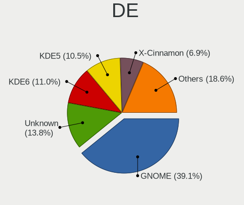
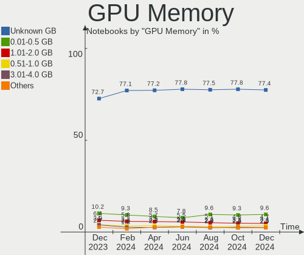
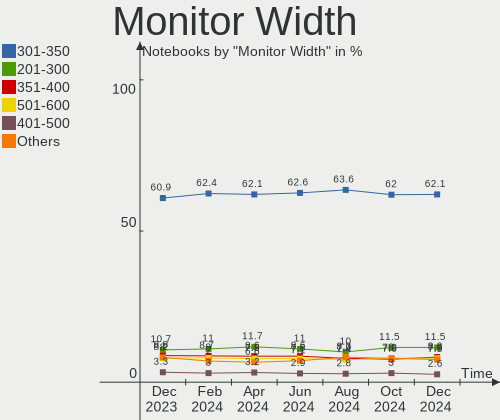

Linux - Hardware Trends (Notebooks)
-----------------------------------

A project to identify most popular hardware characteristics and track their change
over time based on data collected by Linux users at https://Linux-Hardware.org.

Anyone can contribute to this report by the [hw-probe](https://github.com/linuxhw/hw-probe) tool:

    sudo -E hw-probe -all -upload

This report is for one last month. Overall report since the beginning of time: [TestDays](https://github.com/linuxhw/TestDays)

Period: Oct, 2023.

Contents
--------

* [ System ](#system)
  - [ OS                       ](#os)
  - [ OS Family                ](#os-family)
  - [ Kernel                   ](#kernel)
  - [ Kernel Family            ](#kernel-family)
  - [ Kernel Major Ver.        ](#kernel-major-ver)
  - [ Arch                     ](#arch)
  - [ DE                       ](#de)
  - [ Display Server           ](#display-server)
  - [ Display Manager          ](#display-manager)
  - [ OS Lang                  ](#os-lang)
  - [ Boot Mode                ](#boot-mode)
  - [ Filesystem               ](#filesystem)
  - [ Part. scheme             ](#part-scheme)
  - [ Dual Boot with Linux/BSD ](#dual-boot-with-linuxbsd)
  - [ Dual Boot (Win)          ](#dual-boot-win)

* [ Board ](#board)
  - [ Vendor                   ](#vendor)
  - [ Model                    ](#model)
  - [ Model Family             ](#model-family)
  - [ MFG Year                 ](#mfg-year)
  - [ Form Factor              ](#form-factor)
  - [ Secure Boot              ](#secure-boot)
  - [ Coreboot                 ](#coreboot)
  - [ RAM Size                 ](#ram-size)
  - [ RAM Used                 ](#ram-used)
  - [ Total Drives             ](#total-drives)
  - [ Has CD-ROM               ](#has-cd-rom)
  - [ Has Ethernet             ](#has-ethernet)
  - [ Has WiFi                 ](#has-wifi)
  - [ Has Bluetooth            ](#has-bluetooth)

* [ Location ](#location)
  - [ Country                  ](#country)
  - [ City                     ](#city)

* [ Drives ](#drives)
  - [ Drive Vendor             ](#drive-vendor)
  - [ Drive Model              ](#drive-model)
  - [ HDD Vendor               ](#hdd-vendor)
  - [ SSD Vendor               ](#ssd-vendor)
  - [ Drive Kind               ](#drive-kind)
  - [ Drive Connector          ](#drive-connector)
  - [ Drive Size               ](#drive-size)
  - [ Space Total              ](#space-total)
  - [ Space Used               ](#space-used)
  - [ Malfunc. Drives          ](#malfunc-drives)
  - [ Malfunc. Drive Vendor    ](#malfunc-drive-vendor)
  - [ Malfunc. HDD Vendor      ](#malfunc-hdd-vendor)
  - [ Malfunc. Drive Kind      ](#malfunc-drive-kind)
  - [ Failed Drives            ](#failed-drives)
  - [ Failed Drive Vendor      ](#failed-drive-vendor)
  - [ Drive Status             ](#drive-status)

* [ Storage controller ](#storage-controller)
  - [ Storage Vendor           ](#storage-vendor)
  - [ Storage Model            ](#storage-model)
  - [ Storage Kind             ](#storage-kind)

* [ Processor ](#processor)
  - [ CPU Vendor               ](#cpu-vendor)
  - [ CPU Model                ](#cpu-model)
  - [ CPU Model Family         ](#cpu-model-family)
  - [ CPU Cores                ](#cpu-cores)
  - [ CPU Sockets              ](#cpu-sockets)
  - [ CPU Threads              ](#cpu-threads)
  - [ CPU Op-Modes             ](#cpu-op-modes)
  - [ CPU Microcode            ](#cpu-microcode)
  - [ CPU Microarch            ](#cpu-microarch)

* [ Graphics ](#graphics)
  - [ GPU Vendor               ](#gpu-vendor)
  - [ GPU Model                ](#gpu-model)
  - [ GPU Combo                ](#gpu-combo)
  - [ GPU Driver               ](#gpu-driver)
  - [ GPU Memory               ](#gpu-memory)

* [ Monitor ](#monitor)
  - [ Monitor Vendor           ](#monitor-vendor)
  - [ Monitor Model            ](#monitor-model)
  - [ Monitor Resolution       ](#monitor-resolution)
  - [ Monitor Diagonal         ](#monitor-diagonal)
  - [ Monitor Width            ](#monitor-width)
  - [ Aspect Ratio             ](#aspect-ratio)
  - [ Monitor Area             ](#monitor-area)
  - [ Pixel Density            ](#pixel-density)
  - [ Multiple Monitors        ](#multiple-monitors)

* [ Network ](#network)
  - [ Net Controller Vendor    ](#net-controller-vendor)
  - [ Net Controller Model     ](#net-controller-model)
  - [ Wireless Vendor          ](#wireless-vendor)
  - [ Wireless Model           ](#wireless-model)
  - [ Ethernet Vendor          ](#ethernet-vendor)
  - [ Ethernet Model           ](#ethernet-model)
  - [ Net Controller Kind      ](#net-controller-kind)
  - [ Used Controller          ](#used-controller)
  - [ NICs                     ](#nics)
  - [ IPv6                     ](#ipv6)

* [ Bluetooth ](#bluetooth)
  - [ Bluetooth Vendor         ](#bluetooth-vendor)
  - [ Bluetooth Model          ](#bluetooth-model)

* [ Sound ](#sound)
  - [ Sound Vendor             ](#sound-vendor)
  - [ Sound Model              ](#sound-model)

* [ Memory ](#memory)
  - [ Memory Vendor            ](#memory-vendor)
  - [ Memory Model             ](#memory-model)
  - [ Memory Kind              ](#memory-kind)
  - [ Memory Form Factor       ](#memory-form-factor)
  - [ Memory Size              ](#memory-size)
  - [ Memory Speed             ](#memory-speed)

* [ Printers & scanners ](#printers--scanners)
  - [ Printer Vendor           ](#printer-vendor)
  - [ Printer Model            ](#printer-model)
  - [ Scanner Vendor           ](#scanner-vendor)
  - [ Scanner Model            ](#scanner-model)

* [ Camera ](#camera)
  - [ Camera Vendor            ](#camera-vendor)
  - [ Camera Model             ](#camera-model)

* [ Security ](#security)
  - [ Fingerprint Vendor       ](#fingerprint-vendor)
  - [ Fingerprint Model        ](#fingerprint-model)
  - [ Chipcard Vendor          ](#chipcard-vendor)
  - [ Chipcard Model           ](#chipcard-model)

* [ Unsupported ](#unsupported)
  - [ Unsupported Devices      ](#unsupported-devices)
  - [ Unsupported Device Types ](#unsupported-device-types)

System
------

OS
--

Installed operating systems

| Name                         | Notebooks | Percent |
|------------------------------|-----------|---------|
| Ubuntu 22.04                 | 488       | 15.33%  |
| Fedora 38                    | 257       | 8.07%   |
| Linux Mint 21.2              | 232       | 7.29%   |
| Debian 12                    | 220       | 6.91%   |
| Arch Rolling                 | 143       | 4.49%   |
| Pop!_OS 22.04                | 120       | 3.77%   |
| Ubuntu 23.04                 | 102       | 3.2%    |
| Ubuntu 23.10                 | 92        | 2.89%   |
| ROSA 12.4                    | 90        | 2.83%   |
| Zorin 16                     | 80        | 2.51%   |
| OpenMandriva 23.08           | 76        | 2.39%   |
| ArcoLinux Rolling            | 66        | 2.07%   |
| Kali 2023.3                  | 62        | 1.95%   |
| Ubuntu 20.04                 | 48        | 1.51%   |
| Kubuntu 22.04                | 46        | 1.44%   |
| BlackPanther 18.1            | 41        | 1.29%   |
| OpenMandriva 23.10           | 40        | 1.26%   |
| openSUSE Tumbleweed-XXXXXXXX | 39        | 1.22%   |
| KDE neon 22.04               | 36        | 1.13%   |
| SteamOS 3.4.11               | 32        | 1.01%   |
| EndeavourOS Rolling          | 31        | 0.97%   |
| Fedora 39                    | 29        | 0.91%   |
| Xero Rolling                 | 28        | 0.88%   |
| Manjaro                      | 27        | 0.85%   |
| LMDE 6                       | 26        | 0.82%   |
| Debian 11                    | 26        | 0.82%   |
| Linux Mint 21.1              | 24        | 0.75%   |
| Elementary 7.1               | 24        | 0.75%   |
| Debian                       | 23        | 0.72%   |
| Linux Mint 20.3              | 20        | 0.63%   |
| Gentoo 2.14                  | 20        | 0.63%   |
| Nobara 38                    | 19        | 0.6%    |
| Kubuntu 23.04                | 19        | 0.6%    |
| Kubuntu 23.10                | 18        | 0.57%   |
| Ubuntu MATE 22.04            | 17        | 0.53%   |
| Lubuntu 22.04                | 17        | 0.53%   |
| NixOS 23.05                  | 16        | 0.5%    |
| Xubuntu 22.04                | 15        | 0.47%   |
| ALT Linux 10.2               | 15        | 0.47%   |
| SteamOS 3.4.10               | 14        | 0.44%   |

OS Family
---------

OS without a version

| Name          | Notebooks | Percent |
|---------------|-----------|---------|
| Ubuntu        | 748       | 23.49%  |
| Linux Mint    | 302       | 9.48%   |
| Fedora        | 301       | 9.45%   |
| Debian        | 271       | 8.51%   |
| OpenMandriva  | 160       | 5.03%   |
| Arch          | 143       | 4.49%   |
| Pop!_OS       | 121       | 3.8%    |
| ROSA          | 107       | 3.36%   |
| Kubuntu       | 88        | 2.76%   |
| Zorin         | 80        | 2.51%   |
| SteamOS       | 73        | 2.29%   |
| ArcoLinux     | 68        | 2.14%   |
| Kali          | 66        | 2.07%   |
| Manjaro       | 53        | 1.66%   |
| openSUSE      | 50        | 1.57%   |
| BlackPanther  | 46        | 1.44%   |
| KDE neon      | 37        | 1.16%   |
| EndeavourOS   | 31        | 0.97%   |
| LMDE          | 30        | 0.94%   |
| Xubuntu       | 28        | 0.88%   |
| Xero          | 28        | 0.88%   |
| Elementary    | 27        | 0.85%   |
| Lubuntu       | 25        | 0.79%   |
| Ubuntu MATE   | 24        | 0.75%   |
| ALT Linux     | 22        | 0.69%   |
| Gentoo        | 21        | 0.66%   |
| MX            | 20        | 0.63%   |
| Nobara        | 19        | 0.6%    |
| NixOS         | 18        | 0.57%   |
| Ubuntu Budgie | 13        | 0.41%   |
| Garuda Linux  | 12        | 0.38%   |
| Endless       | 12        | 0.38%   |
| blendOS       | 9         | 0.28%   |
| Parrot        | 8         | 0.25%   |
| TUXEDO OS     | 7         | 0.22%   |
| BunsenLabs    | 7         | 0.22%   |
| Clear Linux   | 6         | 0.19%   |
| BigLinux      | 6         | 0.19%   |
| Red OS        | 5         | 0.16%   |
| Void Linux    | 4         | 0.13%   |

Kernel
------

Version of the Linux kernel

| Version                           | Notebooks | Percent |
|-----------------------------------|-----------|---------|
| 6.2.0-34-generic                  | 321       | 10.08%  |
| 6.2.0-35-generic                  | 194       | 6.09%   |
| 6.1.0-13-amd64                    | 154       | 4.84%   |
| 5.15.0-86-generic                 | 151       | 4.74%   |
| 6.2.0-33-generic                  | 122       | 3.83%   |
| 5.15.0-87-generic                 | 109       | 3.42%   |
| 6.5.0-9-generic                   | 81        | 2.54%   |
| 6.5.5-200.fc38.x86_64             | 73        | 2.29%   |
| 6.1.0-12-amd64                    | 71        | 2.23%   |
| 6.4.11-desktop-1omv2390           | 69        | 2.17%   |
| 6.5.5-arch1-1                     | 64        | 2.01%   |
| 5.15.0-84-generic                 | 53        | 1.66%   |
| 6.5.6-200.fc38.x86_64             | 51        | 1.6%    |
| 6.5.4-76060504-generic            | 47        | 1.48%   |
| 5.13.0-valve37-1-neptune          | 46        | 1.44%   |
| 6.5.7-200.fc38.x86_64             | 44        | 1.38%   |
| 6.5.5-desktop-1omv2390            | 44        | 1.38%   |
| 6.5.7-arch1-1                     | 43        | 1.35%   |
| 6.5.8-200.fc38.x86_64             | 36        | 1.13%   |
| 6.2.9-300.fc38.x86_64             | 35        | 1.1%    |
| 6.1.46-generic-2rosa2021.1-x86_64 | 35        | 1.1%    |
| 6.5.6-76060506-generic            | 33        | 1.04%   |
| 6.2.0-26-generic                  | 31        | 0.97%   |
| 6.1.20-generic-2rosa2021.1-x86_64 | 31        | 0.97%   |
| 6.4.6-76060406-generic            | 28        | 0.88%   |
| 5.15.0-76-generic                 | 28        | 0.88%   |
| 6.5.0-kali2-amd64                 | 27        | 0.85%   |
| 6.5.8-arch1-1                     | 26        | 0.82%   |
| 6.5.0-10-generic                  | 25        | 0.79%   |
| 6.5.9-arch2-1                     | 24        | 0.75%   |
| 6.5.5-1-MANJARO                   | 24        | 0.75%   |
| 6.2.0-36-generic                  | 24        | 0.75%   |
| 6.5.6-300.fc39.x86_64             | 16        | 0.5%    |
| 6.5.5-zen1-1-zen                  | 16        | 0.5%    |
| 6.5.6-1-default                   | 15        | 0.47%   |
| 6.1.0-10-amd64                    | 15        | 0.47%   |
| 5.6.14-desktop-2bP                | 15        | 0.47%   |
| 6.5.4-1-default                   | 13        | 0.41%   |
| 6.2.0-32-generic                  | 13        | 0.41%   |
| 5.15.85-desktop-1bP               | 13        | 0.41%   |

Kernel Family
-------------

Linux kernel without a distro release

| Version | Notebooks | Percent |
|---------|-----------|---------|
| 6.2.0   | 736       | 23.12%  |
| 5.15.0  | 427       | 13.41%  |
| 6.1.0   | 276       | 8.67%   |
| 6.5.5   | 259       | 8.13%   |
| 6.5.0   | 192       | 6.03%   |
| 6.5.6   | 152       | 4.77%   |
| 6.5.7   | 128       | 4.02%   |
| 6.5.8   | 91        | 2.86%   |
| 6.4.11  | 77        | 2.42%   |
| 6.5.4   | 72        | 2.26%   |
| 5.13.0  | 50        | 1.57%   |
| 6.5.9   | 44        | 1.38%   |
| 5.4.0   | 41        | 1.29%   |
| 5.10.0  | 38        | 1.19%   |
| 6.2.9   | 36        | 1.13%   |
| 6.1.46  | 36        | 1.13%   |
| 6.1.20  | 31        | 0.97%   |
| 6.4.6   | 29        | 0.91%   |
| 6.1.55  | 28        | 0.88%   |
| 6.5.3   | 25        | 0.79%   |
| 6.1.52  | 22        | 0.69%   |
| 5.19.0  | 22        | 0.69%   |
| 6.1.58  | 16        | 0.5%    |
| 5.6.14  | 15        | 0.47%   |
| 6.4.0   | 14        | 0.44%   |
| 6.2.6   | 14        | 0.44%   |
| 6.4.8   | 13        | 0.41%   |
| 5.15.85 | 13        | 0.41%   |
| 4.18.16 | 13        | 0.41%   |
| 6.6.0   | 12        | 0.38%   |
| 6.4.12  | 10        | 0.31%   |
| 6.1.57  | 10        | 0.31%   |
| 5.14.0  | 10        | 0.31%   |
| 6.3.0   | 9         | 0.28%   |
| 5.14.21 | 9         | 0.28%   |
| 6.1.53  | 8         | 0.25%   |
| 6.3.9   | 7         | 0.22%   |
| 6.1.1   | 7         | 0.22%   |
| 6.4.15  | 6         | 0.19%   |
| 6.1.59  | 6         | 0.19%   |

Kernel Major Ver.
-----------------

Linux kernel major version

| Version | Notebooks | Percent |
|---------|-----------|---------|
| 6.5     | 968       | 30.4%   |
| 6.2     | 797       | 25.03%  |
| 6.1     | 467       | 14.67%  |
| 5.15    | 465       | 14.6%   |
| 6.4     | 163       | 5.12%   |
| 5.10    | 61        | 1.92%   |
| 5.13    | 50        | 1.57%   |
| 5.4     | 44        | 1.38%   |
| 6.3     | 35        | 1.1%    |
| 5.19    | 23        | 0.72%   |
| 5.14    | 20        | 0.63%   |
| 5.6     | 16        | 0.5%    |
| 4.18    | 15        | 0.47%   |
| 6.6     | 12        | 0.38%   |
| 5.16    | 11        | 0.35%   |
| 6.0     | 8         | 0.25%   |
| 4.15    | 6         | 0.19%   |
| 5.8     | 4         | 0.13%   |
| 5.17    | 4         | 0.13%   |
| 5.11    | 4         | 0.13%   |
| 5.18    | 2         | 0.06%   |
| 5.0     | 2         | 0.06%   |
| 4.4     | 2         | 0.06%   |
| 6.5.2   | 1         | 0.03%   |
| 5.3     | 1         | 0.03%   |
| 4.19    | 1         | 0.03%   |
| 4.14    | 1         | 0.03%   |
| 4.1     | 1         | 0.03%   |

Arch
----

OS architecture (x86_64, i586, etc.)

| Name    | Notebooks | Percent |
|---------|-----------|---------|
| x86_64  | 3159      | 99.21%  |
| i686    | 23        | 0.72%   |
| aarch64 | 2         | 0.06%   |

DE
--

Desktop Environment

| Name              | Notebooks | Percent |
|-------------------|-----------|---------|
| GNOME             | 1431      | 44.94%  |
| KDE5              | 807       | 25.35%  |
| X-Cinnamon        | 288       | 9.05%   |
| XFCE              | 207       | 6.5%    |
| Unknown           | 117       | 3.67%   |
| MATE              | 88        | 2.76%   |
| LXQt              | 57        | 1.79%   |
| Pantheon          | 28        | 0.88%   |
| Budgie            | 20        | 0.63%   |
| i3                | 19        | 0.6%    |
| Cinnamon          | 17        | 0.53%   |
| Hyprland          | 15        | 0.47%   |
| LXDE              | 12        | 0.38%   |
| GNOME Flashback   | 8         | 0.25%   |
| KDE               | 7         | 0.22%   |
| Endless:GNOME     | 7         | 0.22%   |
| GNOME Classic     | 5         | 0.16%   |
| Deepin            | 5         | 0.16%   |
| Unity             | 4         | 0.13%   |
| lightdm-xsession  | 4         | 0.13%   |
| KDE4              | 4         | 0.13%   |
| DWM               | 4         | 0.13%   |
| bspwm             | 4         | 0.13%   |
| sway              | 3         | 0.09%   |
| DDE               | 3         | 0.09%   |
| awesome           | 3         | 0.09%   |
| none+i3           | 2         | 0.06%   |
| JWM               | 2         | 0.06%   |
| x-session-manager | 1         | 0.03%   |
| swayland          | 1         | 0.03%   |
| qtile             | 1         | 0.03%   |
| none+awesome      | 1         | 0.03%   |
| LeftWM            | 1         | 0.03%   |
| icewm             | 1         | 0.03%   |
| Hypr              | 1         | 0.03%   |
| fly               | 1         | 0.03%   |
| fluxbox           | 1         | 0.03%   |
| Enlightenment     | 1         | 0.03%   |
| Cutefish          | 1         | 0.03%   |
| chadwm            | 1         | 0.03%   |

Display Server
--------------

X11 or Wayland

| Name    | Notebooks | Percent |
|---------|-----------|---------|
| X11     | 1796      | 56.41%  |
| Wayland | 1256      | 39.45%  |
| Unknown | 101       | 3.17%   |
| Tty     | 31        | 0.97%   |

Display Manager
---------------

SDDM, LightDM, etc.

| Name    | Notebooks | Percent |
|---------|-----------|---------|
| Unknown | 1051      | 33.01%  |
| GDM3    | 785       | 24.65%  |
| SDDM    | 639       | 20.07%  |
| LightDM | 446       | 14.01%  |
| GDM     | 247       | 7.76%   |
| LXDM    | 6         | 0.19%   |
| KDM     | 4         | 0.13%   |
| LY-DM   | 2         | 0.06%   |
| XDM     | 1         | 0.03%   |
| SLIMSKI | 1         | 0.03%   |
| SLiM    | 1         | 0.03%   |
| LEMURS  | 1         | 0.03%   |

OS Lang
-------

Language

| Lang    | Notebooks | Percent |
|---------|-----------|---------|
| en_US   | 1342      | 42.15%  |
| de_DE   | 237       | 7.44%   |
| ru_RU   | 231       | 7.26%   |
| fr_FR   | 149       | 4.68%   |
| en_GB   | 144       | 4.52%   |
| it_IT   | 131       | 4.11%   |
| Unknown | 127       | 3.99%   |
| pt_BR   | 110       | 3.45%   |
| C       | 97        | 3.05%   |
| es_ES   | 76        | 2.39%   |
| en_IN   | 48        | 1.51%   |
| en_CA   | 48        | 1.51%   |
| pl_PL   | 45        | 1.41%   |
| en_AU   | 39        | 1.22%   |
| es_MX   | 34        | 1.07%   |
| hu_HU   | 21        | 0.66%   |
| nl_NL   | 20        | 0.63%   |
| zh_CN   | 16        | 0.5%    |
| pt_PT   | 16        | 0.5%    |
| es_AR   | 14        | 0.44%   |
| cs_CZ   | 14        | 0.44%   |
| tr_TR   | 13        | 0.41%   |
| sv_SE   | 11        | 0.35%   |
| ja_JP   | 11        | 0.35%   |
| fi_FI   | 9         | 0.28%   |
| de_AT   | 9         | 0.28%   |
| nb_NO   | 8         | 0.25%   |
| en_ZA   | 7         | 0.22%   |
| en_IE   | 7         | 0.22%   |
| de_CH   | 7         | 0.22%   |
| ca_ES   | 7         | 0.22%   |
| POSIX   | 6         | 0.19%   |
| fr_CA   | 6         | 0.19%   |
| es_CL   | 6         | 0.19%   |
| en_DK   | 6         | 0.19%   |
| uk_UA   | 5         | 0.16%   |
| ro_RO   | 5         | 0.16%   |
| id_ID   | 5         | 0.16%   |
| es_CO   | 5         | 0.16%   |
| en_HK   | 5         | 0.16%   |

Boot Mode
---------

EFI or BIOS

| Mode | Notebooks | Percent |
|------|-----------|---------|
| EFI  | 1824      | 57.29%  |
| BIOS | 1360      | 42.71%  |

Filesystem
----------

Type of filesystem

| Type    | Notebooks | Percent |
|---------|-----------|---------|
| Ext4    | 1865      | 58.57%  |
| Btrfs   | 555       | 17.43%  |
| Tmpfs   | 486       | 15.26%  |
| Overlay | 203       | 6.38%   |
| Xfs     | 43        | 1.35%   |
| Zfs     | 19        | 0.6%    |
| F2fs    | 6         | 0.19%   |
| Ext3    | 3         | 0.09%   |
| Jfs     | 1         | 0.03%   |
| Ext2    | 1         | 0.03%   |
| Aufs    | 1         | 0.03%   |
| Unknown | 1         | 0.03%   |

Part. scheme
------------

Scheme of partitioning

| Type    | Notebooks | Percent |
|---------|-----------|---------|
| GPT     | 1947      | 61.15%  |
| Unknown | 934       | 29.33%  |
| MBR     | 303       | 9.52%   |

Dual Boot with Linux/BSD
------------------------

Hosting more than one Linux/BSD

| Dual boot | Notebooks | Percent |
|-----------|-----------|---------|
| No        | 2857      | 89.73%  |
| Yes       | 327       | 10.27%  |

Dual Boot (Win)
---------------

Hosting Linux and Windows

| Dual boot | Notebooks | Percent |
|-----------|-----------|---------|
| No        | 2341      | 73.52%  |
| Yes       | 843       | 26.48%  |

Board
-----

Vendor
------

Motherboard manufacturer

| Name                | Notebooks | Percent |
|---------------------|-----------|---------|
| Lenovo              | 674       | 21.17%  |
| Hewlett-Packard     | 546       | 17.15%  |
| Dell                | 455       | 14.29%  |
| ASUSTek Computer    | 356       | 11.18%  |
| Acer                | 245       | 7.69%   |
| Apple               | 110       | 3.45%   |
| MSI                 | 84        | 2.64%   |
| Valve               | 70        | 2.2%    |
| Toshiba             | 67        | 2.1%    |
| Google              | 64        | 2.01%   |
| HUAWEI              | 63        | 1.98%   |
| Samsung Electronics | 50        | 1.57%   |
| Sony                | 31        | 0.97%   |
| Notebook            | 22        | 0.69%   |
| Fujitsu             | 21        | 0.66%   |
| Unknown             | 16        | 0.5%    |
| Alienware           | 14        | 0.44%   |
| Timi                | 12        | 0.38%   |
| Medion              | 11        | 0.35%   |
| System76            | 10        | 0.31%   |
| Framework           | 10        | 0.31%   |
| Clevo               | 10        | 0.31%   |
| Panasonic           | 9         | 0.28%   |
| Packard Bell        | 9         | 0.28%   |
| Gigabyte Technology | 9         | 0.28%   |
| Razer               | 8         | 0.25%   |
| LG Electronics      | 8         | 0.25%   |
| HONOR               | 8         | 0.25%   |
| TUXEDO              | 7         | 0.22%   |
| Chuwi               | 7         | 0.22%   |
| Thomson             | 6         | 0.19%   |
| Gateway             | 6         | 0.19%   |
| Fujitsu Siemens     | 6         | 0.19%   |
| XIAOMI              | 5         | 0.16%   |
| UNOWHY              | 5         | 0.16%   |
| Positivo            | 5         | 0.16%   |
| Maibenben           | 5         | 0.16%   |
| GPU Company         | 5         | 0.16%   |
| Schenker            | 4         | 0.13%   |
| eMachines           | 4         | 0.13%   |

Model
-----

Motherboard model

| Name                             | Notebooks | Percent |
|----------------------------------|-----------|---------|
| Valve Jupiter                    | 70        | 2.2%    |
| Google Reks                      | 32        | 1.01%   |
| Unknown                          | 31        | 0.97%   |
| HP Notebook                      | 26        | 0.82%   |
| Lenovo ThinkPad E475 20H40006US  | 22        | 0.69%   |
| Apple MacBookPro9,2              | 12        | 0.38%   |
| Apple MacBookPro8,1              | 12        | 0.38%   |
| HP Victus by Laptop 16-e0xxx     | 9         | 0.28%   |
| HP Pavilion dv6                  | 9         | 0.28%   |
| Dell XPS 15 9530                 | 9         | 0.28%   |
| ASUS Vivobook Go E1504FA_E1504FA | 9         | 0.28%   |
| HP Pavilion Notebook             | 8         | 0.25%   |
| HP Pavilion dv7                  | 8         | 0.25%   |
| Apple MacBookPro12,1             | 8         | 0.25%   |
| Apple MacBookPro11,1             | 8         | 0.25%   |
| Apple MacBookAir6,2              | 8         | 0.25%   |
| HUAWEI KLVL-WXXW                 | 7         | 0.22%   |
| HP 15                            | 7         | 0.22%   |
| Dell Latitude E6420              | 7         | 0.22%   |
| Lenovo G500 20236                | 6         | 0.19%   |
| HUAWEI NBLB-WAX9N                | 6         | 0.19%   |
| HUAWEI BOM-WXX9                  | 6         | 0.19%   |
| HUAWEI BOHK-WAX9X                | 6         | 0.19%   |
| HP Pavilion 17                   | 6         | 0.19%   |
| HP Laptop 15s-eq2xxx             | 6         | 0.19%   |
| HP 250 G8 Notebook PC            | 6         | 0.19%   |
| Dell XPS 15 9500                 | 6         | 0.19%   |
| Dell XPS 13 9370                 | 6         | 0.19%   |
| Dell Latitude E6540              | 6         | 0.19%   |
| Dell Latitude 5520               | 6         | 0.19%   |
| XIAOMI Redmi Book Pro 15 2023    | 5         | 0.16%   |
| Lenovo IdeaPad Y700-15ISK 80NV   | 5         | 0.16%   |
| Lenovo IdeaPad 5 14ALC05 82LM    | 5         | 0.16%   |
| Lenovo IdeaPad 3 15ITL6 82H8     | 5         | 0.16%   |
| HUAWEI NBLK-WAX9X                | 5         | 0.16%   |
| HP ProBook 650 G1                | 5         | 0.16%   |
| HP ProBook 450 G8 Notebook PC    | 5         | 0.16%   |
| HP Pavilion g7                   | 5         | 0.16%   |
| HP Pavilion g6                   | 5         | 0.16%   |
| HP Laptop 15-ef2xxx              | 5         | 0.16%   |

Model Family
------------

Motherboard model prefix

| Name               | Notebooks | Percent |
|--------------------|-----------|---------|
| Lenovo ThinkPad    | 336       | 10.55%  |
| Dell Latitude      | 162       | 5.09%   |
| Lenovo IdeaPad     | 158       | 4.96%   |
| Acer Aspire        | 157       | 4.93%   |
| Dell Inspiron      | 113       | 3.55%   |
| HP Pavilion        | 99        | 3.11%   |
| ASUS VivoBook      | 99        | 3.11%   |
| HP EliteBook       | 88        | 2.76%   |
| HP Laptop          | 82        | 2.58%   |
| Valve Jupiter      | 70        | 2.2%    |
| HP ProBook         | 67        | 2.1%    |
| Dell XPS           | 62        | 1.95%   |
| Toshiba Satellite  | 57        | 1.79%   |
| Dell Precision     | 54        | 1.7%    |
| Dell Vostro        | 39        | 1.22%   |
| ASUS Zenbook       | 38        | 1.19%   |
| ASUS ASUS          | 37        | 1.16%   |
| Lenovo Legion      | 36        | 1.13%   |
| ASUS ROG           | 36        | 1.13%   |
| Google Reks        | 32        | 1.01%   |
| Unknown            | 31        | 0.97%   |
| Lenovo ThinkBook   | 27        | 0.85%   |
| Acer Nitro         | 27        | 0.85%   |
| HP Notebook        | 26        | 0.82%   |
| HP ZBook           | 24        | 0.75%   |
| HP 250             | 23        | 0.72%   |
| Acer Swift         | 23        | 0.72%   |
| Lenovo Yoga        | 21        | 0.66%   |
| HP OMEN            | 21        | 0.66%   |
| HP Victus          | 19        | 0.6%    |
| Fujitsu LIFEBOOK   | 18        | 0.57%   |
| Apple MacBookPro8  | 16        | 0.5%    |
| Apple MacBookPro11 | 15        | 0.47%   |
| HP 255             | 13        | 0.41%   |
| Apple MacBookPro9  | 13        | 0.41%   |
| HP ENVY            | 12        | 0.38%   |
| Acer TravelMate    | 12        | 0.38%   |
| HP Compaq          | 10        | 0.31%   |
| Framework Laptop   | 10        | 0.31%   |
| Apple MacBookAir6  | 10        | 0.31%   |

MFG Year
--------

Motherboard manufacture year

| Year    | Notebooks | Percent |
|---------|-----------|---------|
| 2021    | 401       | 12.59%  |
| 2022    | 337       | 10.58%  |
| 2023    | 322       | 10.11%  |
| 2020    | 278       | 8.73%   |
| 2019    | 234       | 7.35%   |
| 2018    | 203       | 6.38%   |
| 2013    | 184       | 5.78%   |
| 2011    | 182       | 5.72%   |
| 2012    | 174       | 5.46%   |
| 2015    | 152       | 4.77%   |
| 2017    | 150       | 4.71%   |
| 2014    | 150       | 4.71%   |
| 2016    | 128       | 4.02%   |
| 2010    | 108       | 3.39%   |
| 2008    | 72        | 2.26%   |
| 2009    | 58        | 1.82%   |
| 2007    | 30        | 0.94%   |
| 2006    | 12        | 0.38%   |
| Unknown | 4         | 0.13%   |
| 2005    | 3         | 0.09%   |
| 2004    | 2         | 0.06%   |

Form Factor
-----------

Physical design of the computer

| Name     | Notebooks | Percent |
|----------|-----------|---------|
| Notebook | 3184      | 100%    |

Secure Boot
-----------

Enabled or disabled

| State    | Notebooks | Percent |
|----------|-----------|---------|
| Disabled | 2885      | 90.61%  |
| Enabled  | 299       | 9.39%   |

Coreboot
--------

Have coreboot on board

| Used | Notebooks | Percent |
|------|-----------|---------|
| No   | 3108      | 97.61%  |
| Yes  | 76        | 2.39%   |

RAM Size
--------

Total RAM memory

| Size in GB  | Notebooks | Percent |
|-------------|-----------|---------|
| 4.01-8.0    | 924       | 29.02%  |
| 8.01-16.0   | 635       | 19.94%  |
| 16.01-24.0  | 570       | 17.9%   |
| 3.01-4.0    | 505       | 15.86%  |
| 32.01-64.0  | 308       | 9.67%   |
| 64.01-256.0 | 67        | 2.1%    |
| 1.01-2.0    | 65        | 2.04%   |
| 24.01-32.0  | 60        | 1.88%   |
| 2.01-3.0    | 38        | 1.19%   |
| 0.51-1.0    | 11        | 0.35%   |
| 0.01-0.5    | 1         | 0.03%   |

RAM Used
--------

Used RAM memory

| Used GB    | Notebooks | Percent |
|------------|-----------|---------|
| 2.01-3.0   | 856       | 26.88%  |
| 1.01-2.0   | 828       | 26.01%  |
| 4.01-8.0   | 669       | 21.01%  |
| 3.01-4.0   | 499       | 15.67%  |
| 8.01-16.0  | 174       | 5.46%   |
| 0.51-1.0   | 115       | 3.61%   |
| 0.01-0.5   | 18        | 0.57%   |
| 16.01-24.0 | 16        | 0.5%    |
| 24.01-32.0 | 5         | 0.16%   |
| 32.01-64.0 | 4         | 0.13%   |

Total Drives
------------

Number of drives on board

| Drives | Notebooks | Percent |
|--------|-----------|---------|
| 1      | 2311      | 72.58%  |
| 2      | 758       | 23.81%  |
| 3      | 92        | 2.89%   |
| 0      | 11        | 0.35%   |
| 4      | 10        | 0.31%   |
| 6      | 1         | 0.03%   |
| 5      | 1         | 0.03%   |

Has CD-ROM
----------

Has CD-ROM on board

| Presented | Notebooks | Percent |
|-----------|-----------|---------|
| No        | 2359      | 74.09%  |
| Yes       | 825       | 25.91%  |

Has Ethernet
------------

Has Ethernet on board

| Presented | Notebooks | Percent |
|-----------|-----------|---------|
| Yes       | 2344      | 73.62%  |
| No        | 840       | 26.38%  |

Has WiFi
--------

Has WiFi module

| Presented | Notebooks | Percent |
|-----------|-----------|---------|
| Yes       | 3147      | 98.84%  |
| No        | 37        | 1.16%   |

Has Bluetooth
-------------

Has Bluetooth module

| Presented | Notebooks | Percent |
|-----------|-----------|---------|
| Yes       | 2686      | 84.36%  |
| No        | 498       | 15.64%  |

Location
--------

Country
-------

Geographic location (country)

| Country      | Notebooks | Percent |
|--------------|-----------|---------|
| USA          | 547       | 17.18%  |
| Germany      | 307       | 9.64%   |
| Russia       | 268       | 8.42%   |
| Italy        | 202       | 6.34%   |
| France       | 168       | 5.28%   |
| Brazil       | 162       | 5.09%   |
| UK           | 119       | 3.74%   |
| Spain        | 110       | 3.45%   |
| India        | 85        | 2.67%   |
| Canada       | 77        | 2.42%   |
| Poland       | 76        | 2.39%   |
| Hungary      | 65        | 2.04%   |
| Netherlands  | 53        | 1.66%   |
| Mexico       | 51        | 1.6%    |
| Australia    | 51        | 1.6%    |
| Sweden       | 36        | 1.13%   |
| Czechia      | 36        | 1.13%   |
| Portugal     | 32        | 1.01%   |
| Indonesia    | 32        | 1.01%   |
| Romania      | 31        | 0.97%   |
| Switzerland  | 30        | 0.94%   |
| Turkey       | 28        | 0.88%   |
| Argentina    | 26        | 0.82%   |
| Norway       | 24        | 0.75%   |
| Austria      | 24        | 0.75%   |
| China        | 23        | 0.72%   |
| Finland      | 22        | 0.69%   |
| Belgium      | 21        | 0.66%   |
| Vietnam      | 20        | 0.63%   |
| Japan        | 19        | 0.6%    |
| Greece       | 19        | 0.6%    |
| Bulgaria     | 18        | 0.57%   |
| Colombia     | 15        | 0.47%   |
| Belarus      | 15        | 0.47%   |
| Pakistan     | 13        | 0.41%   |
| Denmark      | 13        | 0.41%   |
| Ukraine      | 12        | 0.38%   |
| South Africa | 12        | 0.38%   |
| Philippines  | 12        | 0.38%   |
| Kazakhstan   | 12        | 0.38%   |

City
----

Geographic location (city)

| City           | Notebooks | Percent |
|----------------|-----------|---------|
| Moscow         | 87        | 2.73%   |
| Bangor         | 60        | 1.88%   |
| St Petersburg  | 29        | 0.91%   |
| Berlin         | 28        | 0.88%   |
| Milan          | 27        | 0.85%   |
| Budapest       | 23        | 0.72%   |
| Rome           | 22        | 0.69%   |
| Paris          | 21        | 0.66%   |
| Warsaw         | 18        | 0.57%   |
| Rio de Janeiro | 18        | 0.57%   |
| Prague         | 18        | 0.57%   |
| Vienna         | 17        | 0.53%   |
| Milano         | 17        | 0.53%   |
| Sydney         | 16        | 0.5%    |
| Sao Paulo      | 14        | 0.44%   |
| Hamburg        | 13        | 0.41%   |
| Delhi          | 13        | 0.41%   |
| Barcelona      | 13        | 0.41%   |
| Madrid         | 12        | 0.38%   |
| Bengaluru      | 12        | 0.38%   |
| Amsterdam      | 12        | 0.38%   |
| Yekaterinburg  | 11        | 0.35%   |
| Novosibirsk    | 11        | 0.35%   |
| Melbourne      | 11        | 0.35%   |
| Helsinki       | 11        | 0.35%   |
| Athens         | 11        | 0.35%   |
| Sofia          | 10        | 0.31%   |
| Istanbul       | 10        | 0.31%   |
| Turin          | 9         | 0.28%   |
| Toulouse       | 9         | 0.28%   |
| Rostov-on-Don  | 9         | 0.28%   |
| Munich         | 9         | 0.28%   |
| Montreal       | 9         | 0.28%   |
| Hanoi          | 9         | 0.28%   |
| Charlotte      | 9         | 0.28%   |
| Wroclaw        | 8         | 0.25%   |
| Toronto        | 8         | 0.25%   |
| Tehran         | 8         | 0.25%   |
| Nuremberg      | 8         | 0.25%   |
| New York       | 8         | 0.25%   |

Drives
------

Drive Vendor
------------

Hard drive vendors

| Vendor                      | Notebooks | Drives | Percent |
|-----------------------------|-----------|--------|---------|
| Samsung Electronics         | 677       | 743    | 17.11%  |
| WDC                         | 327       | 344    | 8.27%   |
| Sandisk                     | 308       | 320    | 7.79%   |
| Seagate                     | 269       | 272    | 6.8%    |
| Unknown                     | 238       | 259    | 6.02%   |
| Kingston                    | 225       | 231    | 5.69%   |
| Toshiba                     | 183       | 184    | 4.63%   |
| SK hynix                    | 183       | 187    | 4.63%   |
| Micron Technology           | 176       | 176    | 4.45%   |
| Intel                       | 149       | 159    | 3.77%   |
| Crucial                     | 115       | 121    | 2.91%   |
| HGST                        | 80        | 82     | 2.02%   |
| Hitachi                     | 75        | 75     | 1.9%    |
| KIOXIA                      | 64        | 65     | 1.62%   |
| A-DATA Technology           | 57        | 57     | 1.44%   |
| Apple                       | 54        | 62     | 1.37%   |
| Phison Electronics          | 52        | 52     | 1.31%   |
| Unknown                     | 48        | 49     | 1.21%   |
| Kingston Technology Company | 45        | 46     | 1.14%   |
| China                       | 39        | 39     | 0.99%   |
| Silicon Motion              | 31        | 31     | 0.78%   |
| Micron/Crucial Technology   | 25        | 27     | 0.63%   |
| SPCC                        | 21        | 21     | 0.53%   |
| Phison                      | 20        | 20     | 0.51%   |
| Intenso                     | 19        | 19     | 0.48%   |
| ADATA Technology            | 18        | 18     | 0.46%   |
| PNY                         | 17        | 17     | 0.43%   |
| LITEON                      | 17        | 17     | 0.43%   |
| JMicron Technology          | 17        | 17     | 0.43%   |
| Transcend                   | 14        | 15     | 0.35%   |
| Hewlett-Packard             | 13        | 13     | 0.33%   |
| Fujitsu                     | 13        | 13     | 0.33%   |
| MAXIO Technology (Hangzhou) | 12        | 12     | 0.3%    |
| Team                        | 11        | 11     | 0.28%   |
| Netac                       | 11        | 11     | 0.28%   |
| KingSpec                    | 11        | 11     | 0.28%   |
| Union Memory (Shenzhen)     | 10        | 10     | 0.25%   |
| Realtek                     | 10        | 11     | 0.25%   |
| GOODRAM                     | 9         | 9      | 0.23%   |
| FORESEE                     | 9         | 9      | 0.23%   |

Drive Model
-----------

Hard drive models

| Model                                                 | Notebooks | Percent |
|-------------------------------------------------------|-----------|---------|
| Samsung NVMe SSD Controller PM9A1/PM9A3/980PRO 1TB    | 75        | 1.84%   |
| Samsung NVMe SSD Controller SM981/PM981/PM983 1TB     | 73        | 1.79%   |
| Seagate ST1000LM035-1RK172 1TB                        | 48        | 1.18%   |
| Unknown                                               | 48        | 1.18%   |
| Kingston SA400S37120G 120GB SSD                       | 41        | 1.01%   |
| Unknown MMC Card  64GB                                | 38        | 0.93%   |
| Kingston SA400S37480G 480GB SSD                       | 33        | 0.81%   |
| Sandisk WD Black SN750 / PC SN730 NVMe SSD 1024GB     | 32        | 0.78%   |
| Kingston SA400S37240G 240GB SSD                       | 32        | 0.78%   |
| Sandisk WD Blue SN550 NVMe SSD 1TB                    | 31        | 0.76%   |
| Intel SSDPEKNU512GZ 512GB                             | 30        | 0.74%   |
| Unknown MMC Card  32GB                                | 26        | 0.64%   |
| Toshiba MQ01ABF050 500GB                              | 26        | 0.64%   |
| Toshiba MQ01ABD100 1TB                                | 26        | 0.64%   |
| Toshiba MQ04ABF100 1TB                                | 25        | 0.61%   |
| Seagate ST500LT012-1DG142 500GB                       | 25        | 0.61%   |
| Intel SSD 660P Series 1024GB                          | 25        | 0.61%   |
| Unknown MMC Card  128GB                               | 24        | 0.59%   |
| Micron 2450_MTFDKBA512TFK 512GB                       | 23        | 0.56%   |
| HGST HTS721010A9E630 1TB                              | 23        | 0.56%   |
| Unknown MMC Card  512GB                               | 22        | 0.54%   |
| Unknown DF4016  16GB                                  | 22        | 0.54%   |
| Seagate ST1000LM024 HN-M101MBB 1TB                    | 21        | 0.52%   |
| Kingston Company OM3PDP3 NVMe SSD 512GB               | 21        | 0.52%   |
| Crucial CT240BX500SSD1 240GB                          | 21        | 0.52%   |
| Samsung SSD 850 EVO 250GB                             | 20        | 0.49%   |
| Phison PS5013 E13 NVMe Controller 256GB               | 20        | 0.49%   |
| Micron/Crucial P2 NVMe PCIe SSD 500GB                 | 20        | 0.49%   |
| Crucial CT500MX500SSD1 500GB                          | 19        | 0.47%   |
| Unknown MMC Card  256GB                               | 18        | 0.44%   |
| Seagate ST9500325AS 500GB                             | 18        | 0.44%   |
| Toshiba XG6 NVMe SSD Controller 256GB                 | 17        | 0.42%   |
| Samsung NVMe SSD Controller SM961/PM961/SM963 121GB   | 17        | 0.42%   |
| HGST HTS545050A7E680 500GB                            | 16        | 0.39%   |
| Sandisk WD Black SN850 1TB                            | 15        | 0.37%   |
| Micron 2400_MTFDKBA512QFM 512GB                       | 15        | 0.37%   |
| Silicon Motion SM2263EN/SM2263XT SSD Controller 256GB | 13        | 0.32%   |
| Samsung SSD 980 1TB                                   | 13        | 0.32%   |
| Phison E12 NVMe Controller 1TB                        | 13        | 0.32%   |
| Micron 2450_MTFDKBA1T0TFK 1TB                         | 13        | 0.32%   |

HDD Vendor
----------

Hard disk drive vendors

| Vendor              | Notebooks | Drives | Percent |
|---------------------|-----------|--------|---------|
| Seagate             | 260       | 261    | 31.98%  |
| WDC                 | 221       | 224    | 27.18%  |
| Toshiba             | 121       | 122    | 14.88%  |
| HGST                | 80        | 82     | 9.84%   |
| Hitachi             | 75        | 75     | 9.23%   |
| Samsung Electronics | 14        | 14     | 1.72%   |
| Fujitsu             | 13        | 13     | 1.6%    |
| Unknown             | 12        | 12     | 1.48%   |
| External            | 7         | 8      | 0.86%   |
| Apple               | 3         | 3      | 0.37%   |
| SSK                 | 2         | 2      | 0.25%   |
| HGST HTS            | 2         | 2      | 0.25%   |
| LaCie               | 1         | 1      | 0.12%   |
| KESU                | 1         | 1      | 0.12%   |
| IBM/Hitachi         | 1         | 1      | 0.12%   |

SSD Vendor
----------

Solid state drive vendors

| Vendor              | Notebooks | Drives | Percent |
|---------------------|-----------|--------|---------|
| Samsung Electronics | 230       | 239    | 19.93%  |
| Kingston            | 170       | 174    | 14.73%  |
| SanDisk             | 101       | 102    | 8.75%   |
| Crucial             | 95        | 98     | 8.23%   |
| WDC                 | 51        | 53     | 4.42%   |
| A-DATA Technology   | 44        | 44     | 3.81%   |
| China               | 38        | 38     | 3.29%   |
| Apple               | 36        | 36     | 3.12%   |
| SK hynix            | 32        | 32     | 2.77%   |
| Intel               | 31        | 31     | 2.69%   |
| Micron Technology   | 27        | 27     | 2.34%   |
| SPCC                | 19        | 19     | 1.65%   |
| PNY                 | 17        | 17     | 1.47%   |
| Intenso             | 17        | 17     | 1.47%   |
| Toshiba             | 14        | 14     | 1.21%   |
| LITEON              | 14        | 14     | 1.21%   |
| Transcend           | 13        | 14     | 1.13%   |
| Team                | 11        | 11     | 0.95%   |
| KingSpec            | 11        | 11     | 0.95%   |
| Hewlett-Packard     | 11        | 11     | 0.95%   |
| Netac               | 8         | 8      | 0.69%   |
| LITEONIT            | 8         | 8      | 0.69%   |
| GOODRAM             | 8         | 8      | 0.69%   |
| Apacer              | 7         | 7      | 0.61%   |
| Patriot             | 6         | 6      | 0.52%   |
| Lexar               | 6         | 6      | 0.52%   |
| Verbatim            | 5         | 5      | 0.43%   |
| SABRENT             | 5         | 5      | 0.43%   |
| Gigabyte Technology | 5         | 5      | 0.43%   |
| Emtec               | 5         | 5      | 0.43%   |
| Teclast             | 3         | 3      | 0.26%   |
| OWC                 | 3         | 3      | 0.26%   |
| GLOWAY              | 3         | 3      | 0.26%   |
| FORESEE             | 3         | 3      | 0.26%   |
| Dogfish             | 3         | 3      | 0.26%   |
| Wodposit            | 2         | 2      | 0.17%   |
| Wibtek              | 2         | 2      | 0.17%   |
| V-GeN               | 2         | 2      | 0.17%   |
| TO Exter            | 2         | 2      | 0.17%   |
| SSSTC               | 2         | 2      | 0.17%   |

Drive Kind
----------

HDD or SSD

| Kind    | Notebooks | Drives | Percent |
|---------|-----------|--------|---------|
| NVMe    | 1556      | 1787   | 41.69%  |
| SSD     | 1071      | 1175   | 28.7%   |
| HDD     | 791       | 821    | 21.2%   |
| MMC     | 255       | 282    | 6.83%   |
| Unknown | 59        | 61     | 1.58%   |

Drive Connector
---------------

SATA, SAS, NVMe, etc.

| Type | Notebooks | Drives | Percent |
|------|-----------|--------|---------|
| SATA | 1676      | 1918   | 46.22%  |
| NVMe | 1545      | 1759   | 42.61%  |
| MMC  | 255       | 282    | 7.03%   |
| SAS  | 150       | 167    | 4.14%   |

Drive Size
----------

Size of hard drive

| Size in TB | Notebooks | Drives | Percent |
|------------|-----------|--------|---------|
| 0.01-0.5   | 1272      | 1392   | 68.5%   |
| 0.51-1.0   | 506       | 522    | 27.25%  |
| 1.01-2.0   | 57        | 59     | 3.07%   |
| 3.01-4.0   | 8         | 9      | 0.43%   |
| 4.01-10.0  | 8         | 8      | 0.43%   |
| 2.01-3.0   | 5         | 5      | 0.27%   |
| 10.01-20.0 | 1         | 1      | 0.05%   |

Space Total
-----------

Amount of disk space available on the file system

| Size in GB     | Notebooks | Percent |
|----------------|-----------|---------|
| 101-250        | 832       | 26.13%  |
| 251-500        | 803       | 25.22%  |
| 501-1000       | 532       | 16.71%  |
| 1-20           | 235       | 7.38%   |
| 1001-2000      | 224       | 7.04%   |
| 51-100         | 195       | 6.12%   |
| Unknown        | 116       | 3.64%   |
| More than 3000 | 89        | 2.8%    |
| 21-50          | 83        | 2.61%   |
| 2001-3000      | 75        | 2.36%   |

Space Used
----------

Amount of used disk space

| Used GB        | Notebooks | Percent |
|----------------|-----------|---------|
| 1-20           | 1080      | 33.92%  |
| 21-50          | 637       | 20.01%  |
| 101-250        | 446       | 14.01%  |
| 51-100         | 381       | 11.97%  |
| 251-500        | 264       | 8.29%   |
| 501-1000       | 144       | 4.52%   |
| Unknown        | 116       | 3.64%   |
| 1001-2000      | 84        | 2.64%   |
| 2001-3000      | 17        | 0.53%   |
| More than 3000 | 14        | 0.44%   |
| 0              | 1         | 0.03%   |

Malfunc. Drives
---------------

Drive models with a malfunction

| Model                                            | Notebooks | Drives | Percent |
|--------------------------------------------------|-----------|--------|---------|
| Seagate ST500LT012-1DG142 500GB                  | 7         | 7      | 3.61%   |
| Seagate ST500LT012-9WS142 500GB                  | 5         | 5      | 2.58%   |
| HGST HTS721010A9E630 1TB                         | 5         | 5      | 2.58%   |
| Seagate ST9500325AS 500GB                        | 4         | 4      | 2.06%   |
| Seagate ST1000LM024 HN-M101MBB 1TB               | 4         | 4      | 2.06%   |
| HGST HTS545050A7E680 500GB                       | 4         | 4      | 2.06%   |
| HGST HTS541010A9E680 1TB                         | 4         | 4      | 2.06%   |
| Toshiba MQ01ABF050 500GB                         | 3         | 3      | 1.55%   |
| Toshiba MQ01ABD100 1TB                           | 3         | 3      | 1.55%   |
| SanDisk SSD PLUS 480GB                           | 3         | 3      | 1.55%   |
| Intel SSDSC2BF180A4L 180GB                       | 3         | 3      | 1.55%   |
| HGST HTS725050A7E630 500GB                       | 3         | 3      | 1.55%   |
| WDC WDS240G2G0A-00JH30 240GB SSD                 | 2         | 2      | 1.03%   |
| WDC WD5000LPCX-24C6HT0 500GB                     | 2         | 2      | 1.03%   |
| WDC WD3200BPVT-80ZEST0 320GB                     | 2         | 2      | 1.03%   |
| SK hynix HFS128G39TND-N210A 128GB SSD            | 2         | 2      | 1.03%   |
| SK hynix BC711 HFM512GD3JX013N 512GB             | 2         | 2      | 1.03%   |
| SK hynix BC711 HFM256GD3JX013N 256GB             | 2         | 2      | 1.03%   |
| Seagate ST500LM012 HN-M500MBB 500GB              | 2         | 2      | 1.03%   |
| Seagate ST1000LM035-1RK172 1TB                   | 2         | 2      | 1.03%   |
| Seagate ST1000LM014-1EJ164 1TB                   | 2         | 2      | 1.03%   |
| Samsung Electronics MZNLH128HBHQ-000H1 128GB SSD | 2         | 2      | 1.03%   |
| Samsung Electronics HM160HI 160GB                | 2         | 2      | 1.03%   |
| Hitachi HTS547550A9E384 500GB                    | 2         | 2      | 1.03%   |
| Hitachi HTS545032B9A300 320GB                    | 2         | 2      | 1.03%   |
| HGST HTS725032A7E630 320GB                       | 2         | 2      | 1.03%   |
| WDC WDS120G2G0B-00EPW0 120GB SSD                 | 1         | 1      | 0.52%   |
| WDC WD7500BPVT-80HXZT1 752GB                     | 1         | 1      | 0.52%   |
| WDC WD7500BPKT-75PK4T0 752GB                     | 1         | 1      | 0.52%   |
| WDC WD6400BPVT-22HXZT3 640GB                     | 1         | 1      | 0.52%   |
| WDC WD6400BEVT-22A0RT0 640GB                     | 1         | 1      | 0.52%   |
| WDC WD5000LPVX-60V0TT0 500GB                     | 1         | 1      | 0.52%   |
| WDC WD5000LPCX-75VHAT0 500GB                     | 1         | 1      | 0.52%   |
| WDC WD5000LPCX-60VHAT0 500GB                     | 1         | 1      | 0.52%   |
| WDC WD5000LPCX-22VHAT0 500GB                     | 1         | 1      | 0.52%   |
| WDC WD5000BEKT-22KA9T0 500GB                     | 1         | 1      | 0.52%   |
| WDC WD3200BEKT-75PVMT0 320GB                     | 1         | 1      | 0.52%   |
| WDC WD2500BEVE-00A0HT0 250GB                     | 1         | 1      | 0.52%   |
| WDC WD20 EARS-00J2GB0 2TB                        | 1         | 1      | 0.52%   |
| WDC WD1600BEKT-75PVMT0 160GB                     | 1         | 1      | 0.52%   |

Malfunc. Drive Vendor
---------------------

Vendors of faulty drives

| Vendor                | Notebooks | Drives | Percent |
|-----------------------|-----------|--------|---------|
| Seagate               | 35        | 35     | 18.23%  |
| WDC                   | 24        | 25     | 12.5%   |
| HGST                  | 20        | 20     | 10.42%  |
| Hitachi               | 18        | 18     | 9.38%   |
| Toshiba               | 17        | 18     | 8.85%   |
| Samsung Electronics   | 14        | 14     | 7.29%   |
| SK hynix              | 11        | 11     | 5.73%   |
| Kingston              | 8         | 9      | 4.17%   |
| Crucial               | 7         | 7      | 3.65%   |
| SanDisk               | 6         | 6      | 3.13%   |
| Intel                 | 6         | 6      | 3.13%   |
| Micron Technology     | 3         | 3      | 1.56%   |
| LITEON                | 3         | 3      | 1.56%   |
| Fujitsu               | 3         | 3      | 1.56%   |
| A-DATA Technology     | 2         | 2      | 1.04%   |
| Transcend             | 1         | 1      | 0.52%   |
| Realtek Semiconductor | 1         | 1      | 0.52%   |
| Phison                | 1         | 1      | 0.52%   |
| OWC                   | 1         | 1      | 0.52%   |
| LITEONIT              | 1         | 1      | 0.52%   |
| Lenovo                | 1         | 1      | 0.52%   |
| LDLC                  | 1         | 1      | 0.52%   |
| Kingmax               | 1         | 1      | 0.52%   |
| Kimtigo               | 1         | 1      | 0.52%   |
| IBM/Hitachi           | 1         | 1      | 0.52%   |
| Hewlett-Packard       | 1         | 1      | 0.52%   |
| HECTRON               | 1         | 1      | 0.52%   |
| Dogfish               | 1         | 1      | 0.52%   |
| Apple                 | 1         | 1      | 0.52%   |
| Apacer                | 1         | 1      | 0.52%   |

Malfunc. HDD Vendor
-------------------

Vendors of faulty HDD drives

| Vendor              | Notebooks | Drives | Percent |
|---------------------|-----------|--------|---------|
| Seagate             | 35        | 35     | 29.66%  |
| HGST                | 20        | 20     | 16.95%  |
| WDC                 | 19        | 20     | 16.1%   |
| Hitachi             | 18        | 18     | 15.25%  |
| Toshiba             | 17        | 18     | 14.41%  |
| Samsung Electronics | 4         | 4      | 3.39%   |
| Fujitsu             | 3         | 3      | 2.54%   |
| IBM/Hitachi         | 1         | 1      | 0.85%   |
| Apple               | 1         | 1      | 0.85%   |

Malfunc. Drive Kind
-------------------

Kinds of faulty drives

| Kind | Notebooks | Drives | Percent |
|------|-----------|--------|---------|
| HDD  | 118       | 120    | 61.46%  |
| SSD  | 57        | 58     | 29.69%  |
| NVMe | 17        | 17     | 8.85%   |

Failed Drives
-------------

Failed drive models

| Model                                       | Notebooks | Drives | Percent |
|---------------------------------------------|-----------|--------|---------|
| Toshiba MK2575GSX 250GB                     | 1         | 1      | 20%     |
| SK hynix PC401 NVMe Solid State Drive 256GB | 1         | 1      | 20%     |
| Seagate ST500LT012-1DG142 500GB             | 1         | 1      | 20%     |
| Samsung Electronics HM160HC 160GB           | 1         | 1      | 20%     |
| Hitachi HTS723232A7A364 320GB               | 1         | 1      | 20%     |

Failed Drive Vendor
-------------------

Failed drive vendors

| Vendor              | Notebooks | Drives | Percent |
|---------------------|-----------|--------|---------|
| Toshiba             | 1         | 1      | 20%     |
| SK hynix            | 1         | 1      | 20%     |
| Seagate             | 1         | 1      | 20%     |
| Samsung Electronics | 1         | 1      | 20%     |
| Hitachi             | 1         | 1      | 20%     |

Drive Status
------------

Number of failed and malfunc. drives

| Status   | Notebooks | Drives | Percent |
|----------|-----------|--------|---------|
| Detected | 1642      | 2109   | 49.1%   |
| Works    | 1504      | 1815   | 44.98%  |
| Malfunc  | 191       | 195    | 5.71%   |
| Failed   | 5         | 5      | 0.15%   |
| Fixed    | 2         | 2      | 0.06%   |

Storage controller
------------------

Storage Vendor
--------------

Storage controller vendors

| Vendor                                  | Notebooks | Percent |
|-----------------------------------------|-----------|---------|
| Intel                                   | 1897      | 48.97%  |
| Samsung Electronics                     | 463       | 11.95%  |
| AMD                                     | 356       | 9.19%   |
| SanDisk                                 | 265       | 6.84%   |
| SK hynix                                | 150       | 3.87%   |
| Micron Technology                       | 150       | 3.87%   |
| Kingston Technology Company             | 102       | 2.63%   |
| Phison Electronics                      | 78        | 2.01%   |
| KIOXIA                                  | 65        | 1.68%   |
| Toshiba America Info Systems            | 49        | 1.26%   |
| Micron/Crucial Technology               | 47        | 1.21%   |
| Silicon Motion                          | 34        | 0.88%   |
| ADATA Technology                        | 31        | 0.8%    |
| Nvidia                                  | 26        | 0.67%   |
| MAXIO Technology (Hangzhou)             | 20        | 0.52%   |
| Union Memory (Shenzhen)                 | 18        | 0.46%   |
| Solid State Storage Technology          | 17        | 0.44%   |
| Shenzhen Longsys Electronics            | 12        | 0.31%   |
| Apple                                   | 12        | 0.31%   |
| Marvell Technology Group                | 11        | 0.28%   |
| Realtek Semiconductor                   | 8         | 0.21%   |
| Solidigm                                | 6         | 0.15%   |
| O2 Micro                                | 6         | 0.15%   |
| Lite-On Technology                      | 6         | 0.15%   |
| Biwin Storage Technology                | 6         | 0.15%   |
| Yangtze Memory Technologies             | 5         | 0.13%   |
| JMicron Technology                      | 5         | 0.13%   |
| Shenzhen Unionmemory Information System | 4         | 0.1%    |
| Lenovo                                  | 4         | 0.1%    |
| INNOGRIT                                | 4         | 0.1%    |
| Netac Technology                        | 3         | 0.08%   |
| VIA Technologies                        | 2         | 0.05%   |
| Silicon Image                           | 2         | 0.05%   |
| Shenzhen Shichuangyi Electronics        | 2         | 0.05%   |
| Seagate Technology                      | 2         | 0.05%   |
| ASMedia Technology                      | 2         | 0.05%   |
| Zhaoxin                                 | 1         | 0.03%   |
| Silicon Integrated Systems [SiS]        | 1         | 0.03%   |
| ShenZhen TIGO Semiconductor             | 1         | 0.03%   |
| Jiangsu Huacun Elec.                    | 1         | 0.03%   |

Storage Model
-------------

Storage controller models

| Model                                                                            | Notebooks | Percent |
|----------------------------------------------------------------------------------|-----------|---------|
| AMD FCH SATA Controller [AHCI mode]                                              | 317       | 7.66%   |
| Intel 7 Series Chipset Family 6-port SATA Controller [AHCI mode]                 | 191       | 4.62%   |
| Intel Sunrise Point-LP SATA Controller [AHCI mode]                               | 188       | 4.54%   |
| Intel Volume Management Device NVMe RAID Controller                              | 172       | 4.16%   |
| Intel 82801 Mobile SATA Controller [RAID mode]                                   | 156       | 3.77%   |
| Intel 6 Series/C200 Series Chipset Family 6 port Mobile SATA AHCI Controller     | 140       | 3.38%   |
| Samsung NVMe SSD Controller SM981/PM981/PM983                                    | 134       | 3.24%   |
| Samsung NVMe SSD Controller 980 (DRAM-less)                                      | 134       | 3.24%   |
| Samsung NVMe SSD Controller PM9A1/PM9A3/980PRO                                   | 128       | 3.09%   |
| Intel Tiger Lake-LP SATA Controller                                              | 86        | 2.08%   |
| Intel Wildcat Point-LP SATA Controller [AHCI Mode]                               | 76        | 1.84%   |
| Intel 8 Series SATA Controller 1 [AHCI mode]                                     | 73        | 1.76%   |
| SK hynix Gold P31/BC711/PC711 NVMe Solid State Drive                             | 67        | 1.62%   |
| Intel Cannon Lake Mobile PCH SATA AHCI Controller                                | 62        | 1.5%    |
| Intel 8 Series/C220 Series Chipset Family 6-port SATA Controller 1 [AHCI mode]   | 62        | 1.5%    |
| Intel Celeron/Pentium Silver Processor SATA Controller                           | 60        | 1.45%   |
| Intel 5 Series/3400 Series Chipset 4 port SATA AHCI Controller                   | 58        | 1.4%    |
| Intel SSD 670p Series [Keystone Harbor]                                          | 56        | 1.35%   |
| Micron 2450 NVMe SSD [HendrixV] (DRAM-less)                                      | 53        | 1.28%   |
| Intel 82801IBM/IEM (ICH9M/ICH9M-E) 4 port SATA Controller [AHCI mode]            | 53        | 1.28%   |
| SanDisk Extreme Pro / WD Black SN750 / PC SN730 / Red SN700 NVMe SSD             | 51        | 1.23%   |
| SanDisk Ultra 3D / WD Blue SN550 NVMe SSD                                        | 50        | 1.21%   |
| Intel HM170/QM170 Chipset SATA Controller [AHCI Mode]                            | 47        | 1.14%   |
| Intel Comet Lake SATA AHCI Controller                                            | 46        | 1.11%   |
| Intel Alder Lake-P SATA AHCI Controller                                          | 44        | 1.06%   |
| Intel 82801HM/HEM (ICH8M/ICH8M-E) IDE Controller                                 | 39        | 0.94%   |
| Micron/Crucial P2 [Nick P2] / P3 / P3 Plus NVMe PCIe SSD (DRAM-less)             | 36        | 0.87%   |
| Intel Volume Management Device NVMe RAID Controller Intel Corporation            | 35        | 0.85%   |
| Intel SSD 660P Series                                                            | 35        | 0.85%   |
| Intel 82801HM/HEM (ICH8M/ICH8M-E) SATA Controller [AHCI mode]                    | 35        | 0.85%   |
| Intel Cannon Point-LP SATA Controller [AHCI Mode]                                | 34        | 0.82%   |
| SanDisk WD Black SN770 / PC SN740 256GB / PC SN560 (DRAM-less) NVMe SSD          | 30        | 0.72%   |
| KIOXIA NVMe SSD Controller BG4 (DRAM-less)                                       | 30        | 0.72%   |
| Intel 400 Series Chipset Family SATA AHCI Controller                             | 30        | 0.72%   |
| Phison PS5013-E13 PCIe3 NVMe Controller (DRAM-less)                              | 29        | 0.7%    |
| Samsung NVMe SSD Controller SM961/PM961/SM963                                    | 28        | 0.68%   |
| Micron 3400 NVMe SSD [Hendrix]                                                   | 28        | 0.68%   |
| Intel Atom/Celeron/Pentium Processor x5-E8000/J3xxx/N3xxx Series SATA Controller | 28        | 0.68%   |
| Toshiba America Info Systems XG6 NVMe SSD Controller                             | 27        | 0.65%   |
| Kingston Company OM3PDP3 NVMe SSD                                                | 27        | 0.65%   |

Storage Kind
------------

Kind of storage controller (IDE, SATA, NVMe, SAS, ...)

| Kind | Notebooks | Percent |
|------|-----------|---------|
| SATA | 1884      | 47.84%  |
| NVMe | 1544      | 39.21%  |
| RAID | 371       | 9.42%   |
| IDE  | 139       | 3.53%   |

Processor
---------

CPU Vendor
----------

Processor vendors

| Vendor       | Notebooks | Percent |
|--------------|-----------|---------|
| Intel        | 2408      | 75.63%  |
| AMD          | 772       | 24.25%  |
| CentaurHauls | 2         | 0.06%   |
| Qualcomm     | 1         | 0.03%   |
| Unknown      | 1         | 0.03%   |

CPU Model
---------

Processor models

| Model                                         | Notebooks | Percent |
|-----------------------------------------------|-----------|---------|
| Intel 11th Gen Core i5-1135G7 @ 2.40GHz       | 75        | 2.36%   |
| AMD Custom APU 0405                           | 70        | 2.2%    |
| Intel Celeron CPU N3060 @ 1.60GHz             | 47        | 1.48%   |
| Intel Core i5-7200U CPU @ 2.50GHz             | 46        | 1.44%   |
| AMD Ryzen 5 5500U with Radeon Graphics        | 43        | 1.35%   |
| Intel 11th Gen Core i7-1165G7 @ 2.80GHz       | 42        | 1.32%   |
| AMD Ryzen 7 5800H with Radeon Graphics        | 38        | 1.19%   |
| Intel 11th Gen Core i3-1115G4 @ 3.00GHz       | 35        | 1.1%    |
| Intel Core i5-10210U CPU @ 1.60GHz            | 34        | 1.07%   |
| AMD Ryzen 5 3500U with Radeon Vega Mobile Gfx | 34        | 1.07%   |
| Intel Core i7-9750H CPU @ 2.60GHz             | 33        | 1.04%   |
| Intel 12th Gen Core i5-1235U                  | 33        | 1.04%   |
| Intel 12th Gen Core i7-12700H                 | 32        | 1.01%   |
| Intel 11th Gen Core i7-11800H @ 2.30GHz       | 32        | 1.01%   |
| Intel Core i5-6300U CPU @ 2.40GHz             | 30        | 0.94%   |
| Intel Core i5-8250U CPU @ 1.60GHz             | 29        | 0.91%   |
| Intel Core i5-6200U CPU @ 2.30GHz             | 28        | 0.88%   |
| AMD Ryzen 7 5700U with Radeon Graphics        | 27        | 0.85%   |
| Intel Core i5-3210M CPU @ 2.50GHz             | 26        | 0.82%   |
| Intel Core i7-8750H CPU @ 2.20GHz             | 25        | 0.79%   |
| Intel Core i7-7700HQ CPU @ 2.80GHz            | 25        | 0.79%   |
| AMD Ryzen 7 4800H with Radeon Graphics        | 25        | 0.79%   |
| AMD Ryzen 5 5600H with Radeon Graphics        | 25        | 0.79%   |
| Intel Core i7-6700HQ CPU @ 2.60GHz            | 24        | 0.75%   |
| Intel Core i7-10750H CPU @ 2.60GHz            | 24        | 0.75%   |
| Intel Core i5-5200U CPU @ 2.20GHz             | 24        | 0.75%   |
| Intel Core i5-2520M CPU @ 2.50GHz             | 24        | 0.75%   |
| Intel Core i5-8350U CPU @ 1.70GHz             | 23        | 0.72%   |
| Intel Core i7-8565U CPU @ 1.80GHz             | 22        | 0.69%   |
| Intel Core i7-8550U CPU @ 1.80GHz             | 22        | 0.69%   |
| Intel Core i5-8265U CPU @ 1.60GHz             | 22        | 0.69%   |
| Intel Celeron N4020 CPU @ 1.10GHz             | 22        | 0.69%   |
| AMD PRO A6-9500B R5, 6 COMPUTE CORES 2C+4G    | 22        | 0.69%   |
| Intel Core i7-10510U CPU @ 1.80GHz            | 21        | 0.66%   |
| Intel Core i5-3320M CPU @ 2.60GHz             | 21        | 0.66%   |
| Intel Core i5-3230M CPU @ 2.60GHz             | 21        | 0.66%   |
| Intel 13th Gen Core i9-13900H                 | 20        | 0.63%   |
| AMD Ryzen 5 7520U with Radeon Graphics        | 20        | 0.63%   |
| Intel 12th Gen Core i7-1255U                  | 19        | 0.6%    |
| Intel Core i7-6820HQ CPU @ 2.70GHz            | 18        | 0.57%   |

CPU Model Family
----------------

Processor model prefix

| Model                   | Notebooks | Percent |
|-------------------------|-----------|---------|
| Other                   | 662       | 20.79%  |
| Intel Core i5           | 656       | 20.6%   |
| Intel Core i7           | 551       | 17.31%  |
| Intel Celeron           | 203       | 6.38%   |
| AMD Ryzen 5             | 201       | 6.31%   |
| AMD Ryzen 7             | 200       | 6.28%   |
| Intel Core i3           | 170       | 5.34%   |
| Intel Core 2 Duo        | 86        | 2.7%    |
| Intel Pentium           | 59        | 1.85%   |
| Intel Atom              | 34        | 1.07%   |
| AMD Ryzen 7 PRO         | 32        | 1.01%   |
| AMD Ryzen 9             | 30        | 0.94%   |
| AMD Ryzen 3             | 30        | 0.94%   |
| AMD A6                  | 25        | 0.79%   |
| AMD A8                  | 23        | 0.72%   |
| AMD A4                  | 21        | 0.66%   |
| AMD E2                  | 18        | 0.57%   |
| Intel Pentium Silver    | 16        | 0.5%    |
| Intel Pentium Dual-Core | 16        | 0.5%    |
| AMD E1                  | 12        | 0.38%   |
| AMD E                   | 11        | 0.35%   |
| AMD A10                 | 11        | 0.35%   |
| Intel Genuine           | 10        | 0.31%   |
| AMD Athlon              | 10        | 0.31%   |
| AMD Turion 64 X2 Mobile | 8         | 0.25%   |
| Intel Pentium Dual      | 7         | 0.22%   |
| Intel Core i9           | 7         | 0.22%   |
| Intel Core 2            | 7         | 0.22%   |
| Intel Celeron Dual-Core | 7         | 0.22%   |
| Intel Core m3           | 6         | 0.19%   |
| Intel Core M            | 4         | 0.13%   |
| AMD Ryzen 5 PRO         | 4         | 0.13%   |
| Intel Pentium M         | 3         | 0.09%   |
| AMD Ryzen 3 PRO         | 3         | 0.09%   |
| AMD Athlon X2           | 3         | 0.09%   |
| AMD Athlon II Dual-Core | 3         | 0.09%   |
| AMD Athlon II           | 3         | 0.09%   |
| Intel Xeon              | 2         | 0.06%   |
| Intel Core m7           | 2         | 0.06%   |
| Intel Core m5           | 2         | 0.06%   |

CPU Cores
---------

Number of processor cores

| Number | Notebooks | Percent |
|--------|-----------|---------|
| 2      | 1280      | 40.2%   |
| 4      | 994       | 31.22%  |
| 8      | 306       | 9.61%   |
| 6      | 261       | 8.2%    |
| 10     | 116       | 3.64%   |
| 14     | 86        | 2.7%    |
| 12     | 60        | 1.88%   |
| 1      | 57        | 1.79%   |
| 24     | 9         | 0.28%   |
| 16     | 9         | 0.28%   |
| 5      | 2         | 0.06%   |
| 3      | 2         | 0.06%   |
| 20     | 1         | 0.03%   |
| 9      | 1         | 0.03%   |

CPU Sockets
-----------

Number of sockets

| Number | Notebooks | Percent |
|--------|-----------|---------|
| 1      | 3184      | 100%    |

CPU Threads
-----------

Threads per core (Hyper-Threading)

| Number | Notebooks | Percent |
|--------|-----------|---------|
| 2      | 2488      | 78.14%  |
| 1      | 694       | 21.8%   |
| 8      | 2         | 0.06%   |

CPU Op-Modes
------------

CPU Operation Modes (32-bit, 64-bit)

| Op mode        | Notebooks | Percent |
|----------------|-----------|---------|
| 32-bit, 64-bit | 3169      | 99.53%  |
| 32-bit         | 13        | 0.41%   |
| 64-bit         | 2         | 0.06%   |

CPU Microcode
-------------

Microcode number

| Number     | Notebooks | Percent |
|------------|-----------|---------|
| Unknown    | 1923      | 60.4%   |
| 0x206a7    | 74        | 2.32%   |
| 0x306a9    | 70        | 2.2%    |
| 0x0a50000c | 57        | 1.79%   |
| 0x806c1    | 49        | 1.54%   |
| 0x0a50000d | 48        | 1.51%   |
| 0x406c4    | 45        | 1.41%   |
| 0x08108109 | 41        | 1.29%   |
| 0x0a404102 | 35        | 1.1%    |
| 0x08608103 | 34        | 1.07%   |
| 0x1067a    | 33        | 1.04%   |
| 0x08600106 | 32        | 1.01%   |
| 0x406e3    | 30        | 0.94%   |
| 0x806ec    | 29        | 0.91%   |
| 0x906a3    | 28        | 0.88%   |
| 0x306d4    | 28        | 0.88%   |
| 0x0600611a | 26        | 0.82%   |
| 0x906a4    | 25        | 0.79%   |
| 0x40651    | 25        | 0.79%   |
| 0x20655    | 23        | 0.72%   |
| 0x806ea    | 22        | 0.69%   |
| 0x306c3    | 22        | 0.69%   |
| 0x906ea    | 19        | 0.6%    |
| 0x706a8    | 19        | 0.6%    |
| 0x806e9    | 18        | 0.57%   |
| 0x906e9    | 16        | 0.5%    |
| 0x0a704103 | 16        | 0.5%    |
| 0x806d1    | 15        | 0.47%   |
| 0x06006705 | 15        | 0.47%   |
| 0x08a00008 | 14        | 0.44%   |
| 0x08600104 | 14        | 0.44%   |
| 0x08108102 | 14        | 0.44%   |
| 0x6fd      | 13        | 0.41%   |
| 0x08608102 | 13        | 0.41%   |
| 0x07030105 | 12        | 0.38%   |
| 0xb06a2    | 11        | 0.35%   |
| 0x706a1    | 11        | 0.35%   |
| 0x30678    | 11        | 0.35%   |
| 0x20652    | 11        | 0.35%   |
| 0xb06a3    | 10        | 0.31%   |

CPU Microarch
-------------

Microarchitecture

| Name              | Notebooks | Percent |
|-------------------|-----------|---------|
| KabyLake          | 454       | 14.26%  |
| Unknown           | 365       | 11.46%  |
| Alderlake Hybrid  | 223       | 7%      |
| TigerLake         | 201       | 6.31%   |
| IvyBridge         | 193       | 6.06%   |
| SandyBridge       | 189       | 5.94%   |
| Haswell           | 185       | 5.81%   |
| Skylake           | 155       | 4.87%   |
| Zen 3             | 141       | 4.43%   |
| Silvermont        | 111       | 3.49%   |
| Broadwell         | 91        | 2.86%   |
| Penryn            | 90        | 2.83%   |
| Westmere          | 87        | 2.73%   |
| Zen 2             | 83        | 2.61%   |
| Icelake           | 81        | 2.54%   |
| Zen+              | 80        | 2.51%   |
| Excavator         | 76        | 2.39%   |
| Goldmont plus     | 68        | 2.14%   |
| CometLake         | 65        | 2.04%   |
| Core              | 44        | 1.38%   |
| Puma              | 29        | 0.91%   |
| Goldmont          | 23        | 0.72%   |
| Bobcat            | 18        | 0.57%   |
| Zen               | 17        | 0.53%   |
| Bonnell           | 15        | 0.47%   |
| Piledriver        | 14        | 0.44%   |
| K8 Hammer         | 14        | 0.44%   |
| Jaguar            | 14        | 0.44%   |
| Tremont           | 12        | 0.38%   |
| P6                | 9         | 0.28%   |
| Nehalem           | 9         | 0.28%   |
| K10               | 9         | 0.28%   |
| K8 & K10 hybrid   | 8         | 0.25%   |
| K10 Llano         | 7         | 0.22%   |
| Steamroller       | 2         | 0.06%   |
| Meteorlake Hybrid | 1         | 0.03%   |
| Gracemont         | 1         | 0.03%   |

Graphics
--------

GPU Vendor
----------

Vendors of graphics cards

| Vendor                           | Notebooks | Percent |
|----------------------------------|-----------|---------|
| Intel                            | 2229      | 55.59%  |
| AMD                              | 906       | 22.59%  |
| Nvidia                           | 871       | 21.72%  |
| Zhaoxin                          | 2         | 0.05%   |
| VIA Technologies                 | 1         | 0.02%   |
| Silicon Integrated Systems [SiS] | 1         | 0.02%   |

GPU Model
---------

Graphics card models

| Model                                                                                    | Notebooks | Percent |
|------------------------------------------------------------------------------------------|-----------|---------|
| Intel 3rd Gen Core processor Graphics Controller                                         | 181       | 4.4%    |
| Intel 2nd Generation Core Processor Family Integrated Graphics Controller                | 168       | 4.09%   |
| Intel TigerLake-LP GT2 [Iris Xe Graphics]                                                | 163       | 3.97%   |
| Intel Skylake GT2 [HD Graphics 520]                                                      | 96        | 2.34%   |
| Intel Haswell-ULT Integrated Graphics Controller                                         | 95        | 2.31%   |
| Intel UHD Graphics 620                                                                   | 91        | 2.21%   |
| AMD Cezanne [Radeon Vega Series / Radeon Vega Mobile Series]                             | 90        | 2.19%   |
| Intel Raptor Lake-P [Iris Xe Graphics]                                                   | 84        | 2.04%   |
| AMD Renoir [Radeon RX Vega 6 (Ryzen 4000/5000 Mobile Series)]                            | 83        | 2.02%   |
| AMD Lucienne                                                                             | 82        | 2%      |
| AMD Picasso/Raven 2 [Radeon Vega Series / Radeon Vega Mobile Series]                     | 81        | 1.97%   |
| Intel HD Graphics 620                                                                    | 77        | 1.87%   |
| Intel CoffeeLake-H GT2 [UHD Graphics 630]                                                | 76        | 1.85%   |
| Intel Alder Lake-P GT2 [Iris Xe Graphics]                                                | 76        | 1.85%   |
| Intel Atom/Celeron/Pentium Processor x5-E8000/J3xxx/N3xxx Integrated Graphics Controller | 75        | 1.83%   |
| Intel 4th Gen Core Processor Integrated Graphics Controller                              | 74        | 1.8%    |
| Intel HD Graphics 5500                                                                   | 70        | 1.7%    |
| AMD VanGogh [AMD Custom GPU 0405]                                                        | 70        | 1.7%    |
| Intel CometLake-U GT2 [UHD Graphics]                                                     | 66        | 1.61%   |
| Intel Core Processor Integrated Graphics Controller                                      | 65        | 1.58%   |
| Nvidia TU117M [GeForce GTX 1650 Mobile / Max-Q]                                          | 63        | 1.53%   |
| Intel WhiskeyLake-U GT2 [UHD Graphics 620]                                               | 63        | 1.53%   |
| Nvidia GA106M [GeForce RTX 3060 Mobile / Max-Q]                                          | 57        | 1.39%   |
| Intel GeminiLake [UHD Graphics 600]                                                      | 57        | 1.39%   |
| Intel CometLake-H GT2 [UHD Graphics]                                                     | 56        | 1.36%   |
| Intel TigerLake-H GT1 [UHD Graphics]                                                     | 54        | 1.31%   |
| AMD Rembrandt [Radeon 680M]                                                              | 50        | 1.22%   |
| Intel Alder Lake-UP3 GT2 [Iris Xe Graphics]                                              | 48        | 1.17%   |
| Nvidia GA107M [GeForce RTX 3050 Mobile]                                                  | 45        | 1.1%    |
| Intel Mobile 4 Series Chipset Integrated Graphics Controller                             | 45        | 1.1%    |
| AMD Barcelo                                                                              | 44        | 1.07%   |
| AMD Stoney [Radeon R2/R3/R4/R5 Graphics]                                                 | 40        | 0.97%   |
| Intel Tiger Lake-LP GT2 [UHD Graphics G4]                                                | 38        | 0.92%   |
| Intel HD Graphics 630                                                                    | 36        | 0.88%   |
| Intel HD Graphics 530                                                                    | 36        | 0.88%   |
| Intel Atom Processor Z36xxx/Z37xxx Series Graphics & Display                             | 36        | 0.88%   |
| AMD Wani [Radeon R5/R6/R7 Graphics]                                                      | 36        | 0.88%   |
| AMD Phoenix1                                                                             | 30        | 0.73%   |
| Nvidia GP107M [GeForce GTX 1050 Mobile]                                                  | 25        | 0.61%   |
| Nvidia GF117M [GeForce 610M/710M/810M/820M / GT 620M/625M/630M/720M]                     | 25        | 0.61%   |

GPU Combo
---------

Combinations of graphics cards

| Name               | Notebooks | Percent |
|--------------------|-----------|---------|
| 1 x Intel          | 1498      | 47.05%  |
| 1 x AMD            | 628       | 19.72%  |
| Intel + Nvidia     | 605       | 19%     |
| 1 x Nvidia         | 140       | 4.4%    |
| AMD + Nvidia       | 122       | 3.83%   |
| Intel + AMD        | 99        | 3.11%   |
| 2 x AMD            | 57        | 1.79%   |
| 2 x Intel          | 22        | 0.69%   |
| Other              | 6         | 0.19%   |
| 2 x Nvidia         | 2         | 0.06%   |
| 1 x Zhaoxin        | 2         | 0.06%   |
| 1 x VIA            | 1         | 0.03%   |
| 1 x SiS            | 1         | 0.03%   |
| Intel + 2 x Nvidia | 1         | 0.03%   |

GPU Driver
----------

Free vs proprietary

| Driver      | Notebooks | Percent |
|-------------|-----------|---------|
| Free        | 2658      | 83.48%  |
| Proprietary | 436       | 13.69%  |
| Unknown     | 90        | 2.83%   |

GPU Memory
----------

Total video memory

| Size in GB | Notebooks | Percent |
|------------|-----------|---------|
| Unknown    | 2304      | 72.36%  |
| 0.01-0.5   | 368       | 11.56%  |
| 1.01-2.0   | 199       | 6.25%   |
| 0.51-1.0   | 127       | 3.99%   |
| 3.01-4.0   | 114       | 3.58%   |
| 5.01-6.0   | 33        | 1.04%   |
| 7.01-8.0   | 31        | 0.97%   |
| 8.01-16.0  | 7         | 0.22%   |
| 2.01-3.0   | 1         | 0.03%   |

Monitor
-------

Monitor Vendor
--------------

Monitor vendors

| Vendor                  | Notebooks | Percent |
|-------------------------|-----------|---------|
| AU Optronics            | 636       | 17.59%  |
| BOE                     | 615       | 17.01%  |
| Chimei Innolux          | 520       | 14.38%  |
| LG Display              | 423       | 11.7%   |
| Samsung Electronics     | 347       | 9.6%    |
| Apple                   | 108       | 2.99%   |
| Sharp                   | 84        | 2.32%   |
| Dell                    | 82        | 2.27%   |
| Goldstar                | 76        | 2.1%    |
| Valve                   | 70        | 1.94%   |
| PANDA                   | 64        | 1.77%   |
| Chi Mei Optoelectronics | 64        | 1.77%   |
| Lenovo                  | 52        | 1.44%   |
| InfoVision              | 42        | 1.16%   |
| CSO                     | 41        | 1.13%   |
| Hewlett-Packard         | 37        | 1.02%   |
| BenQ                    | 29        | 0.8%    |
| Acer                    | 29        | 0.8%    |
| AOC                     | 27        | 0.75%   |
| Philips                 | 22        | 0.61%   |
| Ancor Communications    | 18        | 0.5%    |
| ASUSTek Computer        | 15        | 0.41%   |
| LG Philips              | 14        | 0.39%   |
| Iiyama                  | 13        | 0.36%   |
| TMX                     | 12        | 0.33%   |
| ViewSonic               | 11        | 0.3%    |
| Sony                    | 11        | 0.3%    |
| HKC                     | 8         | 0.22%   |
| CPT                     | 8         | 0.22%   |
| Toshiba                 | 7         | 0.19%   |
| Panasonic               | 6         | 0.17%   |
| Vizio                   | 5         | 0.14%   |
| MSI                     | 5         | 0.14%   |
| Unknown                 | 4         | 0.11%   |
| Quanta Display          | 4         | 0.11%   |
| NEC Computers           | 4         | 0.11%   |
| Mi                      | 4         | 0.11%   |
| KDB                     | 4         | 0.11%   |
| HannStar                | 4         | 0.11%   |
| Gigabyte Technology     | 4         | 0.11%   |

Monitor Model
-------------

Monitor models

| Model                                                                    | Notebooks | Percent |
|--------------------------------------------------------------------------|-----------|---------|
| Valve ANX7530 U VLV3001 800x1280 100x150mm 7.1-inch                      | 70        | 1.92%   |
| Chimei Innolux LCD Monitor CMN15F5 1920x1080 344x193mm 15.5-inch         | 35        | 0.96%   |
| Chimei Innolux LCD Monitor CMN15E7 1920x1080 344x193mm 15.5-inch         | 27        | 0.74%   |
| BOE LCD Monitor BOE06B3 1920x1080                                        | 23        | 0.63%   |
| Chimei Innolux LCD Monitor CMN1521 1920x1080 344x193mm 15.5-inch         | 22        | 0.6%    |
| AU Optronics LCD Monitor AUO61ED 1920x1080 344x194mm 15.5-inch           | 20        | 0.55%   |
| Chimei Innolux LCD Monitor CMN15DB 1366x768 344x193mm 15.5-inch          | 19        | 0.52%   |
| BOE LCD Monitor BOE0609 1366x768 256x144mm 11.6-inch                     | 17        | 0.47%   |
| AU Optronics LCD Monitor AUO38ED 1920x1080 344x193mm 15.5-inch           | 17        | 0.47%   |
| Samsung Electronics LCD Monitor SEC5441 1366x768 309x174mm 14.0-inch     | 16        | 0.44%   |
| PANDA LCD Monitor NCP004D 1920x1080 344x194mm 15.5-inch                  | 16        | 0.44%   |
| LG Display LCD Monitor LGD02DC 1366x768 344x194mm 15.5-inch              | 15        | 0.41%   |
| AU Optronics LCD Monitor AUO403D 1920x1080 309x173mm 13.9-inch           | 15        | 0.41%   |
| Chimei Innolux LCD Monitor CMN14D4 1920x1080 309x173mm 13.9-inch         | 14        | 0.38%   |
| Chimei Innolux LCD Monitor CMN1132 1366x768 256x144mm 11.6-inch          | 14        | 0.38%   |
| BOE LCD Monitor BOE0877 1920x1080 309x173mm 13.9-inch                    | 14        | 0.38%   |
| BOE LCD Monitor BOE0872 1920x1080 344x194mm 15.5-inch                    | 14        | 0.38%   |
| Samsung Electronics LCD Monitor SDC4171 2880x1800 302x189mm 14.0-inch    | 13        | 0.36%   |
| Chi Mei Optoelectronics LCD Monitor CMO15A7 1366x768 344x193mm 15.5-inch | 13        | 0.36%   |
| Chimei Innolux LCD Monitor CMN153B 1920x1080 344x193mm 15.5-inch         | 12        | 0.33%   |
| BOE LCD Monitor BOE0893 2160x1440 296x197mm 14.0-inch                    | 12        | 0.33%   |
| BOE LCD Monitor BOE0812 1920x1080 344x194mm 15.5-inch                    | 12        | 0.33%   |
| LG Display LCD Monitor LGD0563 1920x1080 344x194mm 15.5-inch             | 11        | 0.3%    |
| LG Display LCD Monitor LGD046F 1920x1080 345x194mm 15.6-inch             | 11        | 0.3%    |
| Chimei Innolux LCD Monitor CMN15E6 1366x768 344x193mm 15.5-inch          | 11        | 0.3%    |
| Chimei Innolux LCD Monitor CMN14C9 1920x1080 309x173mm 13.9-inch         | 11        | 0.3%    |
| AU Optronics LCD Monitor AUO21ED 1920x1080 344x194mm 15.5-inch           | 11        | 0.3%    |
| AU Optronics LCD Monitor AUO10EC 1366x768 344x193mm 15.5-inch            | 11        | 0.3%    |
| Samsung Electronics LCD Monitor SEC544B 1600x900 382x214mm 17.2-inch     | 10        | 0.27%   |
| Goldstar FULL HD GSM5B55 1920x1080 480x270mm 21.7-inch                   | 10        | 0.27%   |
| Chimei Innolux LCD Monitor CMN14E5 1920x1080 309x173mm 13.9-inch         | 10        | 0.27%   |
| AU Optronics LCD Monitor AUO71EC 1366x768 344x193mm 15.5-inch            | 10        | 0.27%   |
| AU Optronics LCD Monitor AUO46EC 1366x768 344x193mm 15.5-inch            | 10        | 0.27%   |
| Samsung Electronics LCD Monitor SDC4161 1920x1080 344x194mm 15.5-inch    | 9         | 0.25%   |
| Chimei Innolux LCD Monitor CMN15E8 1920x1080 344x193mm 15.5-inch         | 9         | 0.25%   |
| Chimei Innolux LCD Monitor CMN14D5 1920x1080 309x173mm 13.9-inch         | 9         | 0.25%   |
| BOE LCD Monitor BOE08D5 1920x1080 344x194mm 15.5-inch                    | 9         | 0.25%   |
| AU Optronics LCD Monitor AUOAF90 1920x1080 344x193mm 15.5-inch           | 9         | 0.25%   |
| AU Optronics LCD Monitor AUO243D 1920x1080 309x173mm 13.9-inch           | 9         | 0.25%   |
| AU Optronics LCD Monitor AUO20EC 1366x768 344x193mm 15.5-inch            | 9         | 0.25%   |

Monitor Resolution
------------------

Monitor screen resolution

| Resolution         | Notebooks | Percent |
|--------------------|-----------|---------|
| 1920x1080 (FHD)    | 1523      | 44.7%   |
| 1366x768 (WXGA)    | 811       | 23.8%   |
| 1600x900 (HD+)     | 146       | 4.29%   |
| 3840x2160 (4K)     | 125       | 3.67%   |
| 1920x1200 (WUXGA)  | 114       | 3.35%   |
| 2560x1600          | 95        | 2.79%   |
| 2560x1440 (QHD)    | 91        | 2.67%   |
| 1280x800 (WXGA)    | 89        | 2.61%   |
| 800x1280           | 70        | 2.05%   |
| 2880x1800          | 52        | 1.53%   |
| 1440x900 (WXGA+)   | 47        | 1.38%   |
| 1680x1050 (WSXGA+) | 24        | 0.7%    |
| 2160x1440          | 23        | 0.68%   |
| 3440x1440          | 21        | 0.62%   |
| 3840x2400          | 19        | 0.56%   |
| 2560x1080          | 15        | 0.44%   |
| 3200x2000          | 13        | 0.38%   |
| 2256x1504          | 12        | 0.35%   |
| 1280x1024 (SXGA)   | 12        | 0.35%   |
| 1024x600           | 11        | 0.32%   |
| 3072x1920          | 10        | 0.29%   |
| 2880x1620          | 9         | 0.26%   |
| 2240x1400          | 9         | 0.26%   |
| 3456x2160          | 8         | 0.23%   |
| 3200x1800 (QHD+)   | 7         | 0.21%   |
| 2520x1680          | 7         | 0.21%   |
| 3840x1080          | 5         | 0.15%   |
| 3000x2000          | 5         | 0.15%   |
| 1920x1280          | 5         | 0.15%   |
| 1024x768 (XGA)     | 5         | 0.15%   |
| 2288x1287          | 3         | 0.09%   |
| 1360x768           | 3         | 0.09%   |
| 1280x720 (HD)      | 3         | 0.09%   |
| Unknown            | 3         | 0.09%   |
| 3840x1100          | 2         | 0.06%   |
| 2304x1440          | 2         | 0.06%   |
| 5120x1440          | 1         | 0.03%   |
| 2944x1840          | 1         | 0.03%   |
| 2400x1600          | 1         | 0.03%   |
| 1920x550           | 1         | 0.03%   |

Monitor Diagonal
----------------

Diagonal size in inches

| Inches  | Notebooks | Percent |
|---------|-----------|---------|
| 15      | 1459      | 40.39%  |
| 13      | 483       | 13.37%  |
| 14      | 462       | 12.79%  |
| 17      | 251       | 6.95%   |
| 16      | 125       | 3.46%   |
| 27      | 119       | 3.29%   |
| 24      | 94        | 2.6%    |
| 11      | 85        | 2.35%   |
| 23      | 79        | 2.19%   |
| 7       | 70        | 1.94%   |
| 21      | 69        | 1.91%   |
| 12      | 68        | 1.88%   |
| 31      | 36        | 1%      |
| 34      | 28        | 0.78%   |
| Unknown | 22        | 0.61%   |
| 18      | 18        | 0.5%    |
| 22      | 14        | 0.39%   |
| 20      | 14        | 0.39%   |
| 40      | 13        | 0.36%   |
| 10      | 13        | 0.36%   |
| 84      | 10        | 0.28%   |
| 32      | 9         | 0.25%   |
| 19      | 9         | 0.25%   |
| 54      | 7         | 0.19%   |
| 72      | 6         | 0.17%   |
| 29      | 6         | 0.17%   |
| 28      | 6         | 0.17%   |
| 25      | 5         | 0.14%   |
| 8       | 5         | 0.14%   |
| 74      | 4         | 0.11%   |
| 26      | 4         | 0.11%   |
| 142     | 3         | 0.08%   |
| 48      | 3         | 0.08%   |
| 86      | 2         | 0.06%   |
| 69      | 2         | 0.06%   |
| 52      | 2         | 0.06%   |
| 39      | 2         | 0.06%   |
| 65      | 1         | 0.03%   |
| 64      | 1         | 0.03%   |
| 63      | 1         | 0.03%   |

Monitor Width
-------------

Physical width

| Width in mm    | Notebooks | Percent |
|----------------|-----------|---------|
| 301-350        | 2207      | 61.51%  |
| 201-300        | 414       | 11.54%  |
| 351-400        | 321       | 8.95%   |
| 501-600        | 275       | 7.66%   |
| 401-500        | 115       | 3.21%   |
| 1-100          | 70        | 1.95%   |
| 601-700        | 63        | 1.76%   |
| 701-800        | 38        | 1.06%   |
| 1501-2000      | 22        | 0.61%   |
| Unknown        | 22        | 0.61%   |
| 1001-1500      | 18        | 0.5%    |
| 801-900        | 13        | 0.36%   |
| 101-200        | 5         | 0.14%   |
| More than 2000 | 3         | 0.08%   |
| 901-1000       | 2         | 0.06%   |

Aspect Ratio
------------

Proportional relationship between the width and the height

| Ratio   | Notebooks | Percent |
|---------|-----------|---------|
| 16/9    | 2535      | 78.58%  |
| 16/10   | 479       | 14.85%  |
| 0.67    | 70        | 2.17%   |
| 3/2     | 55        | 1.7%    |
| 21/9    | 34        | 1.05%   |
| Unknown | 14        | 0.43%   |
| 5/4     | 12        | 0.37%   |
| 4/3     | 11        | 0.34%   |
| 32/9    | 4         | 0.12%   |
| 1.00    | 3         | 0.09%   |
| 3.40    | 2         | 0.06%   |
| 0.62    | 2         | 0.06%   |
| 0.56    | 2         | 0.06%   |
| 6/5     | 1         | 0.03%   |
| 2.65    | 1         | 0.03%   |
| 0.65    | 1         | 0.03%   |

Monitor Area
------------

Area in inch

| Area in inch | Notebooks | Percent |
|----------------|-----------|---------|
| 101-110        | 1478      | 40.98%  |
| 81-90          | 779       | 21.6%   |
| 121-130        | 219       | 6.07%   |
| 201-250        | 207       | 5.74%   |
| 71-80          | 157       | 4.35%   |
| 301-350        | 125       | 3.47%   |
| 111-120        | 93        | 2.58%   |
| 51-60          | 87        | 2.41%   |
| 351-500        | 81        | 2.25%   |
| 1-40           | 75        | 2.08%   |
| 61-70          | 62        | 1.72%   |
| More than 1000 | 39        | 1.08%   |
| 251-300        | 38        | 1.05%   |
| 151-200        | 36        | 1%      |
| 131-140        | 31        | 0.86%   |
| 141-150        | 24        | 0.67%   |
| 91-100         | 23        | 0.64%   |
| Unknown        | 22        | 0.61%   |
| 501-1000       | 18        | 0.5%    |
| 41-50          | 13        | 0.36%   |

Pixel Density
-------------

Pixels per inch

| Density       | Notebooks | Percent |
|---------------|-----------|---------|
| 121-160       | 1530      | 43.16%  |
| 101-120       | 928       | 26.18%  |
| 51-100        | 484       | 13.65%  |
| 161-240       | 422       | 11.9%   |
| More than 240 | 132       | 3.72%   |
| 1-50          | 27        | 0.76%   |
| Unknown       | 22        | 0.62%   |

Multiple Monitors
-----------------

Total monitors connected

| Total | Notebooks | Percent |
|-------|-----------|---------|
| 1     | 2561      | 80.43%  |
| 2     | 486       | 15.26%  |
| 0     | 76        | 2.39%   |
| 3     | 56        | 1.76%   |
| 4     | 5         | 0.16%   |

Network
-------

Net Controller Vendor
---------------------

Controller vendors

| Vendor                            | Notebooks | Percent |
|-----------------------------------|-----------|---------|
| Realtek Semiconductor             | 1728      | 35.14%  |
| Intel                             | 1658      | 33.71%  |
| Qualcomm Atheros                  | 550       | 11.18%  |
| Broadcom                          | 285       | 5.8%    |
| MediaTek                          | 178       | 3.62%   |
| Broadcom Limited                  | 62        | 1.26%   |
| ASIX Electronics                  | 40        | 0.81%   |
| Marvell Technology Group          | 35        | 0.71%   |
| Ralink                            | 34        | 0.69%   |
| Qualcomm                          | 30        | 0.61%   |
| Xiaomi                            | 26        | 0.53%   |
| Ralink Technology                 | 24        | 0.49%   |
| TP-Link                           | 22        | 0.45%   |
| Samsung Electronics               | 22        | 0.45%   |
| Sierra Wireless                   | 20        | 0.41%   |
| Nvidia                            | 18        | 0.37%   |
| Hewlett-Packard                   | 15        | 0.31%   |
| Dell                              | 15        | 0.31%   |
| Lenovo                            | 14        | 0.28%   |
| DisplayLink                       | 12        | 0.24%   |
| OPPO Electronics                  | 10        | 0.2%    |
| NetGear                           | 10        | 0.2%    |
| Huawei Technologies               | 10        | 0.2%    |
| Qualcomm Atheros Communications   | 9         | 0.18%   |
| JMicron Technology                | 8         | 0.16%   |
| Google                            | 7         | 0.14%   |
| ASUSTek Computer                  | 7         | 0.14%   |
| Fibocom                           | 6         | 0.12%   |
| Ericsson Business Mobile Networks | 6         | 0.12%   |
| D-Link                            | 5         | 0.1%    |
| Arduino SA                        | 5         | 0.1%    |
| Apple                             | 5         | 0.1%    |
| Unknown                           | 5         | 0.1%    |
| Motorola PCS                      | 3         | 0.06%   |
| Microchip Technology              | 3         | 0.06%   |
| Belkin Components                 | 3         | 0.06%   |
| Micro Star International          | 2         | 0.04%   |
| Linksys                           | 2         | 0.04%   |
| ICS Advent                        | 2         | 0.04%   |
| D-Link System                     | 2         | 0.04%   |

Net Controller Model
--------------------

Controller models

| Model                                                             | Notebooks | Percent |
|-------------------------------------------------------------------|-----------|---------|
| Realtek RTL8111/8168/8411 PCI Express Gigabit Ethernet Controller | 967       | 16.54%  |
| Realtek RTL810xE PCI Express Fast Ethernet controller             | 242       | 4.14%   |
| Realtek RTL8822CE 802.11ac PCIe Wireless Network Adapter          | 182       | 3.11%   |
| Intel Wi-Fi 6 AX201                                               | 152       | 2.6%    |
| Realtek RTL8153 Gigabit Ethernet Adapter                          | 134       | 2.29%   |
| Intel Alder Lake-P PCH CNVi WiFi                                  | 131       | 2.24%   |
| Intel Wi-Fi 6 AX200                                               | 117       | 2%      |
| Realtek RTL8821CE 802.11ac PCIe Wireless Network Adapter          | 112       | 1.92%   |
| Qualcomm Atheros QCA9377 802.11ac Wireless Network Adapter        | 108       | 1.85%   |
| Intel Wireless 8265 / 8275                                        | 105       | 1.8%    |
| Intel Wireless 7265                                               | 103       | 1.76%   |
| Intel 82579LM Gigabit Network Connection (Lewisville)             | 91        | 1.56%   |
| Intel Wireless 8260                                               | 90        | 1.54%   |
| Intel Raptor Lake PCH CNVi WiFi                                   | 81        | 1.39%   |
| Qualcomm Atheros AR9285 Wireless Network Adapter (PCI-Express)    | 78        | 1.33%   |
| MediaTek MT7921 802.11ax PCI Express Wireless Network Adapter     | 77        | 1.32%   |
| Qualcomm Atheros QCA9565 / AR9565 Wireless Network Adapter        | 74        | 1.27%   |
| Intel Wireless 7260                                               | 71        | 1.21%   |
| Qualcomm Atheros QCA6174 802.11ac Wireless Network Adapter        | 70        | 1.2%    |
| Qualcomm Atheros AR9485 Wireless Network Adapter                  | 69        | 1.18%   |
| Intel Comet Lake PCH-LP CNVi WiFi                                 | 61        | 1.04%   |
| Broadcom BCM4313 802.11bgn Wireless Network Adapter               | 54        | 0.92%   |
| Intel Ethernet Connection (4) I219-LM                             | 53        | 0.91%   |
| MediaTek MT7922 802.11ax PCI Express Wireless Network Adapter     | 52        | 0.89%   |
| Intel Wi-Fi 6 AX210/AX211/AX411 160MHz                            | 52        | 0.89%   |
| Intel Cannon Lake PCH CNVi WiFi                                   | 52        | 0.89%   |
| Intel Wireless 3165                                               | 50        | 0.86%   |
| Intel Comet Lake PCH CNVi WiFi                                    | 49        | 0.84%   |
| Intel Centrino Advanced-N 6205 [Taylor Peak]                      | 49        | 0.84%   |
| Realtek RTL8852BE PCIe 802.11ax Wireless Network Controller       | 45        | 0.77%   |
| Broadcom BCM43142 802.11b/g/n                                     | 42        | 0.72%   |
| Intel Tiger Lake PCH CNVi WiFi                                    | 41        | 0.7%    |
| Intel Ethernet Connection I219-LM                                 | 41        | 0.7%    |
| Intel Cannon Point-LP CNVi [Wireless-AC]                          | 37        | 0.63%   |
| Realtek RTL8852AE 802.11ax PCIe Wireless Network Adapter          | 36        | 0.62%   |
| Realtek RTL8188CE 802.11b/g/n WiFi Adapter                        | 34        | 0.58%   |
| ASIX AX88179 Gigabit Ethernet                                     | 33        | 0.56%   |
| Realtek RTL8723BE PCIe Wireless Network Adapter                   | 32        | 0.55%   |
| Intel Centrino Advanced-N 6235                                    | 32        | 0.55%   |
| Realtek RTL8125 2.5GbE Controller                                 | 31        | 0.53%   |

Wireless Vendor
---------------

Wireless vendors

| Vendor                                | Notebooks | Percent |
|---------------------------------------|-----------|---------|
| Intel                                 | 1592      | 48.26%  |
| Realtek Semiconductor                 | 590       | 17.88%  |
| Qualcomm Atheros                      | 468       | 14.19%  |
| Broadcom                              | 241       | 7.31%   |
| MediaTek                              | 172       | 5.21%   |
| Broadcom Limited                      | 46        | 1.39%   |
| Ralink                                | 34        | 1.03%   |
| Ralink Technology                     | 24        | 0.73%   |
| Qualcomm                              | 22        | 0.67%   |
| TP-Link                               | 20        | 0.61%   |
| Sierra Wireless                       | 20        | 0.61%   |
| NetGear                               | 10        | 0.3%    |
| Dell                                  | 10        | 0.3%    |
| Qualcomm Atheros Communications       | 9         | 0.27%   |
| Fibocom                               | 6         | 0.18%   |
| D-Link                                | 5         | 0.15%   |
| ASUSTek Computer                      | 5         | 0.15%   |
| Unknown                               | 5         | 0.15%   |
| Hewlett-Packard                       | 4         | 0.12%   |
| Belkin Components                     | 3         | 0.09%   |
| Micro Star International              | 2         | 0.06%   |
| Linksys                               | 2         | 0.06%   |
| D-Link System                         | 2         | 0.06%   |
| Microsoft                             | 1         | 0.03%   |
| Fujitsu Siemens Computers             | 1         | 0.03%   |
| Edimax Technology                     | 1         | 0.03%   |
| BUFFALO                               | 1         | 0.03%   |
| AVM                                   | 1         | 0.03%   |
| Arduino SA                            | 1         | 0.03%   |
| 802.11g Adapter [Linksys WUSB54GC v3] | 1         | 0.03%   |

Wireless Model
--------------

Wireless models

| Model                                                          | Notebooks | Percent |
|----------------------------------------------------------------|-----------|---------|
| Realtek RTL8822CE 802.11ac PCIe Wireless Network Adapter       | 182       | 5.49%   |
| Intel Wi-Fi 6 AX201                                            | 152       | 4.59%   |
| Intel Alder Lake-P PCH CNVi WiFi                               | 131       | 3.95%   |
| Intel Wi-Fi 6 AX200                                            | 117       | 3.53%   |
| Realtek RTL8821CE 802.11ac PCIe Wireless Network Adapter       | 112       | 3.38%   |
| Qualcomm Atheros QCA9377 802.11ac Wireless Network Adapter     | 108       | 3.26%   |
| Intel Wireless 8265 / 8275                                     | 105       | 3.17%   |
| Intel Wireless 7265                                            | 103       | 3.11%   |
| Intel Wireless 8260                                            | 90        | 2.72%   |
| Intel Raptor Lake PCH CNVi WiFi                                | 81        | 2.44%   |
| Qualcomm Atheros AR9285 Wireless Network Adapter (PCI-Express) | 78        | 2.35%   |
| MediaTek MT7921 802.11ax PCI Express Wireless Network Adapter  | 77        | 2.32%   |
| Qualcomm Atheros QCA9565 / AR9565 Wireless Network Adapter     | 74        | 2.23%   |
| Intel Wireless 7260                                            | 71        | 2.14%   |
| Qualcomm Atheros QCA6174 802.11ac Wireless Network Adapter     | 70        | 2.11%   |
| Qualcomm Atheros AR9485 Wireless Network Adapter               | 69        | 2.08%   |
| Intel Comet Lake PCH-LP CNVi WiFi                              | 61        | 1.84%   |
| Broadcom BCM4313 802.11bgn Wireless Network Adapter            | 54        | 1.63%   |
| MediaTek MT7922 802.11ax PCI Express Wireless Network Adapter  | 52        | 1.57%   |
| Intel Wi-Fi 6 AX210/AX211/AX411 160MHz                         | 52        | 1.57%   |
| Intel Cannon Lake PCH CNVi WiFi                                | 52        | 1.57%   |
| Intel Wireless 3165                                            | 50        | 1.51%   |
| Intel Comet Lake PCH CNVi WiFi                                 | 49        | 1.48%   |
| Intel Centrino Advanced-N 6205 [Taylor Peak]                   | 49        | 1.48%   |
| Realtek RTL8852BE PCIe 802.11ax Wireless Network Controller    | 45        | 1.36%   |
| Broadcom BCM43142 802.11b/g/n                                  | 42        | 1.27%   |
| Intel Tiger Lake PCH CNVi WiFi                                 | 41        | 1.24%   |
| Intel Cannon Point-LP CNVi [Wireless-AC]                       | 37        | 1.12%   |
| Realtek RTL8852AE 802.11ax PCIe Wireless Network Adapter       | 36        | 1.09%   |
| Realtek RTL8188CE 802.11b/g/n WiFi Adapter                     | 34        | 1.03%   |
| Realtek RTL8723BE PCIe Wireless Network Adapter                | 32        | 0.97%   |
| Intel Centrino Advanced-N 6235                                 | 32        | 0.97%   |
| Broadcom BCM4331 802.11a/b/g/n                                 | 30        | 0.91%   |
| MediaTek Wi-Fi 6E MT7902 Wireless Network Adapter              | 29        | 0.88%   |
| Intel Dual Band Wireless-AC 3168NGW [Stone Peak]               | 29        | 0.88%   |
| Intel Wireless 3160                                            | 28        | 0.85%   |
| Intel Ice Lake-LP PCH CNVi WiFi                                | 27        | 0.81%   |
| Intel Centrino Ultimate-N 6300                                 | 27        | 0.81%   |
| Intel Wireless-AC 9260                                         | 24        | 0.72%   |
| Qualcomm Atheros AR9462 Wireless Network Adapter               | 22        | 0.66%   |

Ethernet Vendor
---------------

Ethernet vendors

| Vendor                           | Notebooks | Percent |
|----------------------------------|-----------|---------|
| Realtek Semiconductor            | 1415      | 57.59%  |
| Intel                            | 549       | 22.34%  |
| Qualcomm Atheros                 | 139       | 5.66%   |
| Broadcom                         | 100       | 4.07%   |
| ASIX Electronics                 | 40        | 1.63%   |
| Marvell Technology Group         | 35        | 1.42%   |
| Xiaomi                           | 26        | 1.06%   |
| Samsung Electronics              | 22        | 0.9%    |
| Nvidia                           | 18        | 0.73%   |
| Broadcom Limited                 | 16        | 0.65%   |
| Lenovo                           | 14        | 0.57%   |
| DisplayLink                      | 12        | 0.49%   |
| OPPO Electronics                 | 10        | 0.41%   |
| Qualcomm                         | 8         | 0.33%   |
| JMicron Technology               | 8         | 0.33%   |
| Google                           | 7         | 0.28%   |
| Huawei Technologies              | 6         | 0.24%   |
| MediaTek                         | 5         | 0.2%    |
| Hewlett-Packard                  | 5         | 0.2%    |
| Apple                            | 5         | 0.2%    |
| Microchip Technology             | 3         | 0.12%   |
| TP-Link                          | 2         | 0.08%   |
| ICS Advent                       | 2         | 0.08%   |
| ASUSTek Computer                 | 2         | 0.08%   |
| ZTE WCDMA Technologies MSM       | 1         | 0.04%   |
| VIA Technologies                 | 1         | 0.04%   |
| Spreadtrum Communications        | 1         | 0.04%   |
| Silicon Integrated Systems [SiS] | 1         | 0.04%   |
| Novatel Wireless                 | 1         | 0.04%   |
| Motorola PCS                     | 1         | 0.04%   |
| Cypress Semiconductor            | 1         | 0.04%   |
| Attansic Technology              | 1         | 0.04%   |

Ethernet Model
--------------

Ethernet models

| Model                                                             | Notebooks | Percent |
|-------------------------------------------------------------------|-----------|---------|
| Realtek RTL8111/8168/8411 PCI Express Gigabit Ethernet Controller | 967       | 38.84%  |
| Realtek RTL810xE PCI Express Fast Ethernet controller             | 242       | 9.72%   |
| Realtek RTL8153 Gigabit Ethernet Adapter                          | 134       | 5.38%   |
| Intel 82579LM Gigabit Network Connection (Lewisville)             | 91        | 3.65%   |
| Intel Ethernet Connection (4) I219-LM                             | 53        | 2.13%   |
| Intel Ethernet Connection I219-LM                                 | 41        | 1.65%   |
| ASIX AX88179 Gigabit Ethernet                                     | 33        | 1.33%   |
| Realtek RTL8125 2.5GbE Controller                                 | 31        | 1.24%   |
| Intel Ethernet Connection I217-LM                                 | 31        | 1.24%   |
| Realtek Killer E2600 Gigabit Ethernet Controller                  | 29        | 1.16%   |
| Broadcom NetXtreme BCM57765 Gigabit Ethernet PCIe                 | 29        | 1.16%   |
| Intel Ethernet Connection (16) I219-V                             | 25        | 1%      |
| Intel 82577LM Gigabit Network Connection                          | 22        | 0.88%   |
| Intel Ethernet Connection (4) I219-V                              | 20        | 0.8%    |
| Intel Ethernet Connection (3) I218-LM                             | 20        | 0.8%    |
| Qualcomm Atheros AR8151 v2.0 Gigabit Ethernet                     | 19        | 0.76%   |
| Realtek RTL8152 Fast Ethernet Adapter                             | 18        | 0.72%   |
| Intel Ethernet Connection (2) I219-LM                             | 18        | 0.72%   |
| Xiaomi Mi/Redmi series (RNDIS)                                    | 17        | 0.68%   |
| Samsung Galaxy series, misc. (tethering mode)                     | 17        | 0.68%   |
| Intel Ethernet Connection (13) I219-V                             | 17        | 0.68%   |
| Broadcom NetLink BCM57785 Gigabit Ethernet PCIe                   | 17        | 0.68%   |
| Intel Ethernet Connection I218-LM                                 | 16        | 0.64%   |
| Intel Ethernet Connection (6) I219-LM                             | 15        | 0.6%    |
| Qualcomm Atheros QCA8172 Fast Ethernet                            | 14        | 0.56%   |
| Qualcomm Atheros AR8161 Gigabit Ethernet                          | 14        | 0.56%   |
| Qualcomm Atheros Killer E2500 Gigabit Ethernet Controller         | 13        | 0.52%   |
| Intel Ethernet Connection I219-V                                  | 13        | 0.52%   |
| Intel Ethernet Connection (16) I219-LM                            | 13        | 0.52%   |
| Qualcomm Atheros AR8162 Fast Ethernet                             | 12        | 0.48%   |
| Intel 82579V Gigabit Network Connection                           | 12        | 0.48%   |
| Intel 82567LM Gigabit Network Connection                          | 12        | 0.48%   |
| Broadcom NetXtreme BCM5764M Gigabit Ethernet PCIe                 | 12        | 0.48%   |
| Intel Ethernet Connection I217-V                                  | 11        | 0.44%   |
| Intel Ethernet Connection (13) I219-LM                            | 11        | 0.44%   |
| Qualcomm Atheros Killer E2400 Gigabit Ethernet Controller         | 10        | 0.4%    |
| Intel Ethernet Connection (6) I219-V                              | 10        | 0.4%    |
| Xiaomi Mi/Redmi series (RNDIS + ADB)                              | 9         | 0.36%   |
| Qualcomm Atheros Killer E220x Gigabit Ethernet Controller         | 9         | 0.36%   |
| Qualcomm Atheros AR8152 v2.0 Fast Ethernet                        | 9         | 0.36%   |

Net Controller Kind
-------------------

Ethernet, WiFi or modem

| Kind     | Notebooks | Percent |
|----------|-----------|---------|
| WiFi     | 3146      | 56.91%  |
| Ethernet | 2340      | 42.33%  |
| Modem    | 34        | 0.62%   |
| Unknown  | 8         | 0.14%   |

Used Controller
---------------

Currently used network controller

| Kind     | Notebooks | Percent |
|----------|-----------|---------|
| WiFi     | 2653      | 80.47%  |
| Ethernet | 644       | 19.53%  |

NICs
----

Total network controllers on board

| Total | Notebooks | Percent |
|-------|-----------|---------|
| 2     | 2089      | 65.61%  |
| 1     | 1034      | 32.47%  |
| 0     | 41        | 1.29%   |
| 3     | 19        | 0.6%    |
| 4     | 1         | 0.03%   |

IPv6
----

IPv6 vs IPv4

| Used | Notebooks | Percent |
|------|-----------|---------|
| No   | 2235      | 70.19%  |
| Yes  | 949       | 29.81%  |

Bluetooth
---------

Bluetooth Vendor
----------------

Controller vendors

| Vendor                          | Notebooks | Percent |
|---------------------------------|-----------|---------|
| Intel                           | 1355      | 50%     |
| Realtek Semiconductor           | 306       | 11.29%  |
| Qualcomm Atheros Communications | 226       | 8.34%   |
| IMC Networks                    | 222       | 8.19%   |
| Foxconn / Hon Hai               | 104       | 3.84%   |
| Apple                           | 95        | 3.51%   |
| Lite-On Technology              | 87        | 3.21%   |
| Broadcom                        | 83        | 3.06%   |
| Realtek                         | 36        | 1.33%   |
| Dell                            | 26        | 0.96%   |
| Toshiba                         | 25        | 0.92%   |
| Cambridge Silicon Radio         | 22        | 0.81%   |
| Ralink                          | 21        | 0.77%   |
| Hewlett-Packard                 | 19        | 0.7%    |
| MediaTek                        | 15        | 0.55%   |
| ASUSTek Computer                | 15        | 0.55%   |
| USI                             | 14        | 0.52%   |
| Foxconn International           | 10        | 0.37%   |
| Alps Electric                   | 6         | 0.22%   |
| Ralink Technology               | 3         | 0.11%   |
| Taiyo Yuden                     | 2         | 0.07%   |
| Micro Star International        | 2         | 0.07%   |
| Fujitsu                         | 2         | 0.07%   |
| Askey Computer                  | 2         | 0.07%   |
| Unknown                         | 2         | 0.07%   |
| SIN                             | 1         | 0.04%   |
| Qcom                            | 1         | 0.04%   |
| Opticis                         | 1         | 0.04%   |
| ISSC                            | 1         | 0.04%   |
| Edimax Technology               | 1         | 0.04%   |
| Dynex                           | 1         | 0.04%   |
| Conwise Technology              | 1         | 0.04%   |
| Belkin Components               | 1         | 0.04%   |
| Actions                         | 1         | 0.04%   |
| 8BitDo                          | 1         | 0.04%   |

Bluetooth Model
---------------

Controller models

| Model                                               | Notebooks | Percent |
|-----------------------------------------------------|-----------|---------|
| Intel Bluetooth wireless interface                  | 423       | 15.61%  |
| Intel AX201 Bluetooth                               | 302       | 11.14%  |
| Realtek Bluetooth Radio                             | 244       | 9%      |
| Intel Bluetooth Device                              | 189       | 6.97%   |
| Intel Bluetooth 9460/9560 Jefferson Peak (JfP)      | 189       | 6.97%   |
| Intel AX200 Bluetooth                               | 115       | 4.24%   |
| IMC Networks Bluetooth Radio                        | 110       | 4.06%   |
| Qualcomm Atheros  Bluetooth Device                  | 109       | 4.02%   |
| IMC Networks Wireless_Device                        | 76        | 2.8%    |
| Apple Bluetooth Host Controller                     | 57        | 2.1%    |
| Foxconn / Hon Hai Wireless_Device                   | 54        | 1.99%   |
| Intel AX210 Bluetooth                               | 47        | 1.73%   |
| Realtek  Bluetooth 4.2 Adapter                      | 42        | 1.55%   |
| Intel Centrino Bluetooth Wireless Transceiver       | 40        | 1.48%   |
| Realtek Bluetooth Radio                             | 36        | 1.33%   |
| Qualcomm Atheros QCA61x4 Bluetooth 4.0              | 35        | 1.29%   |
| Qualcomm Atheros AR3011 Bluetooth                   | 33        | 1.22%   |
| Qualcomm Atheros AR3012 Bluetooth 4.0               | 31        | 1.14%   |
| Intel Wireless-AC 3168 Bluetooth                    | 29        | 1.07%   |
| Apple Bluetooth USB Host Controller                 | 26        | 0.96%   |
| Lite-On Qualcomm Atheros QCA9377 Bluetooth          | 24        | 0.89%   |
| Cambridge Silicon Radio Bluetooth Dongle (HCI mode) | 22        | 0.81%   |
| Ralink RT3290 Bluetooth                             | 21        | 0.77%   |
| Intel Wireless-AC 9260 Bluetooth Adapter            | 21        | 0.77%   |
| Lite-On Wireless_Device                             | 20        | 0.74%   |
| IMC Networks Bluetooth Device                       | 20        | 0.74%   |
| Foxconn / Hon Hai Bluetooth Device                  | 19        | 0.7%    |
| Lite-On Bluetooth Device                            | 17        | 0.63%   |
| HP Broadcom 2070 Bluetooth Combo                    | 17        | 0.63%   |
| MediaTek Wireless_Device                            | 15        | 0.55%   |
| USI Bluetooth Device                                | 13        | 0.48%   |
| Broadcom HP Portable Bumble Bee                     | 12        | 0.44%   |
| Qualcomm Atheros AR9462 Bluetooth                   | 11        | 0.41%   |
| Broadcom BCM2045B (BDC-2.1)                         | 11        | 0.41%   |
| Lite-On Bluetooth Radio                             | 10        | 0.37%   |
| Foxconn International BCM43142A0 Bluetooth module   | 10        | 0.37%   |
| Dell DW375 Bluetooth Module                         | 10        | 0.37%   |
| Broadcom BCM43142A0 Bluetooth 4.0                   | 10        | 0.37%   |
| Realtek RTL8822BE Bluetooth 4.2 Adapter             | 9         | 0.33%   |
| Realtek RTL8821A Bluetooth                          | 9         | 0.33%   |

Sound
-----

Sound Vendor
------------

Sound card vendors

| Vendor                                       | Notebooks | Percent |
|----------------------------------------------|-----------|---------|
| Intel                                        | 2366      | 59.91%  |
| AMD                                          | 819       | 20.74%  |
| Nvidia                                       | 529       | 13.4%   |
| C-Media Electronics                          | 24        | 0.61%   |
| Lenovo                                       | 21        | 0.53%   |
| GN Netcom                                    | 19        | 0.48%   |
| Logitech                                     | 17        | 0.43%   |
| Realtek Semiconductor                        | 14        | 0.35%   |
| JMTek                                        | 13        | 0.33%   |
| Hewlett-Packard                              | 10        | 0.25%   |
| Generalplus Technology                       | 9         | 0.23%   |
| Texas Instruments                            | 8         | 0.2%    |
| Apple                                        | 8         | 0.2%    |
| ASUSTek Computer                             | 7         | 0.18%   |
| Kingston Technology                          | 6         | 0.15%   |
| Plantronics                                  | 4         | 0.1%    |
| Corsair                                      | 4         | 0.1%    |
| Razer USA                                    | 3         | 0.08%   |
| Huawei Technologies                          | 3         | 0.08%   |
| DSEA A/S                                     | 3         | 0.08%   |
| Creative Technology                          | 3         | 0.08%   |
| Zhaoxin                                      | 2         | 0.05%   |
| VIA Technologies                             | 2         | 0.05%   |
| Sony                                         | 2         | 0.05%   |
| Sennheiser Communications                    | 2         | 0.05%   |
| RODE Microphones                             | 2         | 0.05%   |
| PreSonus Audio Electronics                   | 2         | 0.05%   |
| Native Instruments                           | 2         | 0.05%   |
| JBL                                          | 2         | 0.05%   |
| Focusrite-Novation                           | 2         | 0.05%   |
| Barco Display Systems                        | 2         | 0.05%   |
| Asahi Kasei Microsystems                     | 2         | 0.05%   |
| AKAI Professional M.I.                       | 2         | 0.05%   |
| Zoran Co. Personal Media Division (Nogatech) | 1         | 0.03%   |
| Turtle Beach                                 | 1         | 0.03%   |
| Thesycon Systemsoftware & Consulting         | 1         | 0.03%   |
| Tenx Technology                              | 1         | 0.03%   |
| TEAC                                         | 1         | 0.03%   |
| SteelSeries ApS                              | 1         | 0.03%   |
| Spreadtrum Communications                    | 1         | 0.03%   |

Sound Model
-----------

Sound card models

| Model                                                                                             | Notebooks | Percent |
|---------------------------------------------------------------------------------------------------|-----------|---------|
| AMD Family 17h/19h HD Audio Controller                                                            | 490       | 10.11%  |
| Intel Sunrise Point-LP HD Audio                                                                   | 290       | 5.98%   |
| AMD Renoir Radeon High Definition Audio Controller                                                | 264       | 5.45%   |
| Intel 7 Series/C216 Chipset Family High Definition Audio Controller                               | 223       | 4.6%    |
| Intel Tiger Lake-LP Smart Sound Technology Audio Controller                                       | 200       | 4.13%   |
| Intel Alder Lake PCH-P High Definition Audio Controller                                           | 170       | 3.51%   |
| AMD Rembrandt Radeon High Definition Audio Controller                                             | 170       | 3.51%   |
| Intel 6 Series/C200 Series Chipset Family High Definition Audio Controller                        | 159       | 3.28%   |
| Nvidia Audio device                                                                               | 101       | 2.08%   |
| Intel Raptor Lake-P/U/H cAVS                                                                      | 100       | 2.06%   |
| Intel Haswell-ULT HD Audio Controller                                                             | 96        | 1.98%   |
| Intel 8 Series HD Audio Controller                                                                | 96        | 1.98%   |
| Intel 5 Series/3400 Series Chipset High Definition Audio                                          | 95        | 1.96%   |
| Intel Broadwell-U Audio Controller                                                                | 91        | 1.88%   |
| Intel Wildcat Point-LP High Definition Audio Controller                                           | 90        | 1.86%   |
| Intel 8 Series/C220 Series Chipset High Definition Audio Controller                               | 90        | 1.86%   |
| AMD Raven/Raven2/Fenghuang HDMI/DP Audio Controller                                               | 90        | 1.86%   |
| Intel Cannon Lake PCH cAVS                                                                        | 87        | 1.8%    |
| AMD Kabini HDMI/DP Audio                                                                          | 79        | 1.63%   |
| Intel Xeon E3-1200 v3/4th Gen Core Processor HD Audio Controller                                  | 74        | 1.53%   |
| Intel Comet Lake PCH-LP cAVS                                                                      | 74        | 1.53%   |
| AMD FCH Azalia Controller                                                                         | 72        | 1.49%   |
| AMD Family 15h (Models 60h-6fh) Audio Controller                                                  | 72        | 1.49%   |
| Intel Cannon Point-LP High Definition Audio Controller                                            | 70        | 1.44%   |
| Intel Celeron/Pentium Silver Processor High Definition Audio                                      | 68        | 1.4%    |
| Intel 82801I (ICH9 Family) HD Audio Controller                                                    | 66        | 1.36%   |
| Intel Atom/Celeron/Pentium Processor x5-E8000/J3xxx/N3xxx Series High Definition Audio Controller | 65        | 1.34%   |
| Intel Tiger Lake-H HD Audio Controller                                                            | 61        | 1.26%   |
| Intel Comet Lake PCH cAVS                                                                         | 59        | 1.22%   |
| Nvidia GA106 High Definition Audio Controller                                                     | 57        | 1.18%   |
| Nvidia TU107 GeForce GTX 1650 High Definition Audio Controller                                    | 56        | 1.16%   |
| Intel 100 Series/C230 Series Chipset Family HD Audio Controller                                   | 45        | 0.93%   |
| Intel CM238 HD Audio Controller                                                                   | 44        | 0.91%   |
| Intel 82801H (ICH8 Family) HD Audio Controller                                                    | 42        | 0.87%   |
| AMD High Definition Audio Controller                                                              | 40        | 0.83%   |
| Intel Ice Lake-LP Smart Sound Technology Audio Controller                                         | 39        | 0.8%    |
| Nvidia GA104 High Definition Audio Controller                                                     | 34        | 0.7%    |
| Nvidia GF108 High Definition Audio Controller                                                     | 33        | 0.68%   |
| AMD SBx00 Azalia (Intel HDA)                                                                      | 31        | 0.64%   |
| Intel Atom Processor Z36xxx/Z37xxx Series High Definition Audio Controller                        | 29        | 0.6%    |

Memory
------

Memory Vendor
-------------

Memory module vendors

| Vendor                | Notebooks | Percent |
|-----------------------|-----------|---------|
| Samsung Electronics   | 681       | 30.83%  |
| SK hynix              | 496       | 22.45%  |
| Micron Technology     | 283       | 12.81%  |
| Kingston              | 167       | 7.56%   |
| Unknown               | 108       | 4.89%   |
| Crucial               | 99        | 4.48%   |
| A-DATA Technology     | 41        | 1.86%   |
| Ramaxel Technology    | 40        | 1.81%   |
| Unknown               | 34        | 1.54%   |
| Elpida                | 32        | 1.45%   |
| Unknown (ABCD)        | 26        | 1.18%   |
| Nanya Technology      | 26        | 1.18%   |
| Corsair               | 24        | 1.09%   |
| Smart                 | 18        | 0.81%   |
| Team                  | 13        | 0.59%   |
| G.Skill               | 13        | 0.59%   |
| Transcend             | 8         | 0.36%   |
| Apacer                | 7         | 0.32%   |
| AMD                   | 5         | 0.23%   |
| Patriot               | 4         | 0.18%   |
| ACPI Digital          | 4         | 0.18%   |
| ff                    | 3         | 0.14%   |
| CSX                   | 3         | 0.14%   |
| ChangXin Memory       | 3         | 0.14%   |
| ASint Technology      | 3         | 0.14%   |
| 4ea5                  | 3         | 0.14%   |
| 48spaces              | 3         | 0.14%   |
| Unknown (0x0BEC)      | 2         | 0.09%   |
| Unknown (0x0B45)      | 2         | 0.09%   |
| Timetec               | 2         | 0.09%   |
| Teikon                | 2         | 0.09%   |
| Sesame                | 2         | 0.09%   |
| PNY                   | 2         | 0.09%   |
| Neo Forza             | 2         | 0.09%   |
| Magnum Tech           | 2         | 0.09%   |
| Lexar Co Limited      | 2         | 0.09%   |
| Lexar                 | 2         | 0.09%   |
| Kllisre               | 2         | 0.09%   |
| Kingmax Semiconductor | 2         | 0.09%   |
| Kingmax               | 2         | 0.09%   |

Memory Model
------------

Memory module models

| Model                                                            | Notebooks | Percent |
|------------------------------------------------------------------|-----------|---------|
| Samsung RAM K4E8E324EB-EGCF 2GB LPDDR3 1867MT/s                  | 35        | 1.51%   |
| Unknown                                                          | 34        | 1.46%   |
| Samsung RAM M471A1G44BB0-CWE 8GB SODIMM DDR4 3200MT/s            | 32        | 1.38%   |
| SK hynix RAM HMAA1GS6CJR6N-XN 8GB SODIMM DDR4 3200MT/s           | 31        | 1.34%   |
| Samsung RAM M471A1K43EB1-CWE 8GB SODIMM DDR4 3200MT/s            | 31        | 1.34%   |
| Samsung RAM M471A5244CB0-CWE 4GB SODIMM DDR4 3200MT/s            | 25        | 1.08%   |
| Unknown (ABCD) RAM 123456789012345678 2GB SODIMM LPDDR4 2400MT/s | 24        | 1.03%   |
| SK hynix RAM HMA81GS6AFR8N-UH 8GB SODIMM DDR4 2667MT/s           | 23        | 0.99%   |
| Samsung RAM M471A1G44AB0-CWE 8GB SODIMM DDR4 3200MT/s            | 22        | 0.95%   |
| Samsung RAM M471A5244CB0-CTD 4GB SODIMM DDR4 3266MT/s            | 20        | 0.86%   |
| Samsung RAM M471B1G73DB0-YK0 8GB SODIMM DDR3 1600MT/s            | 19        | 0.82%   |
| Samsung RAM M471A1K43DB1-CWE 8GB SODIMM DDR4 3200MT/s            | 17        | 0.73%   |
| SK hynix RAM HMT41GS6BFR8A-PB 8192MB SODIMM DDR3 1600MT/s        | 16        | 0.69%   |
| Samsung RAM M471B5173QH0-YK0 4GB SODIMM DDR3 1600MT/s            | 16        | 0.69%   |
| Samsung RAM M471A1K43CB1-CRC 8GB SODIMM DDR4 2667MT/s            | 16        | 0.69%   |
| Micron RAM 4ATF1G64HZ-3G2F1 8GB SODIMM DDR4 3200MT/s             | 16        | 0.69%   |
| SK hynix RAM HMT41GS6AFR8A-PB 8GB SODIMM DDR3 1600MT/s           | 15        | 0.65%   |
| SK hynix RAM HMT451S6BFR8A-PB 4GB SODIMM DDR3 1600MT/s           | 14        | 0.6%    |
| SK hynix RAM HMT351S6CFR8C-PB 4GB SODIMM DDR3 1600MT/s           | 14        | 0.6%    |
| Samsung RAM M471A5143SB1-CRC 4GB SODIMM DDR4 2400MT/s            | 14        | 0.6%    |
| Micron RAM 8ATF1G64HZ-3G2R1 8GB SODIMM DDR4 3200MT/s             | 14        | 0.6%    |
| Samsung RAM M471B5273DH0-CH9 4GB SODIMM DDR3 1334MT/s            | 13        | 0.56%   |
| Samsung RAM M471B5173DB0-YK0 4GB SODIMM DDR3 1600MT/s            | 13        | 0.56%   |
| Samsung RAM M471B1G73QH0-YK0 8GB SODIMM DDR3 1867MT/s            | 13        | 0.56%   |
| SK hynix RAM HMA41GS6AFR8N-TF 8GB SODIMM DDR4 2667MT/s           | 12        | 0.52%   |
| Samsung RAM M471A5244CB0-CRC 4GB SODIMM DDR4 2667MT/s            | 12        | 0.52%   |
| Samsung RAM M471A1K43DB1-CTD 8GB SODIMM DDR4 2667MT/s            | 12        | 0.52%   |
| Samsung RAM M471A1G44AB0-CWE 8GB Row Of Chips DDR4 3200MT/s      | 12        | 0.52%   |
| Micron RAM 4ATF1G64HZ-3G2E2 8GB SODIMM DDR4 3200MT/s             | 12        | 0.52%   |
| Unknown RAM Module 8GB SODIMM DDR3 1600MT/s                      | 11        | 0.47%   |
| Unknown RAM Module 2GB SODIMM DDR2 667MT/s                       | 11        | 0.47%   |
| SK hynix RAM HMAA2GS6CJR8N-XN 16GB SODIMM DDR4 3200MT/s          | 11        | 0.47%   |
| Samsung RAM M471B5273CH0-CH9 4GB SODIMM DDR3 1334MT/s            | 11        | 0.47%   |
| Samsung RAM M471B1G73EB0-YK0 8GB SODIMM DDR3 1600MT/s            | 11        | 0.47%   |
| Samsung RAM M471A5244BB0-CRC 4GB SODIMM DDR4 2667MT/s            | 11        | 0.47%   |
| SK hynix RAM HMA851S6CJR6N-VK 4GB SODIMM DDR4 2667MT/s           | 10        | 0.43%   |
| SK hynix RAM HMA81GS6DJR8N-XN 8GB SODIMM DDR4 3200MT/s           | 10        | 0.43%   |
| SK hynix RAM H9JCNNNCP3MLYR-N6E 4GB Row Of Chips LPDDR5 6400MT/s | 10        | 0.43%   |
| Micron RAM 4ATF1G64HZ-3G2E1 8GB Row Of Chips DDR4 3200MT/s       | 10        | 0.43%   |
| Unknown RAM Module 2GB SODIMM DDR2                               | 9         | 0.39%   |

Memory Kind
-----------

Memory module kinds

| Kind    | Notebooks | Percent |
|---------|-----------|---------|
| DDR4    | 892       | 47.35%  |
| DDR3    | 514       | 27.28%  |
| LPDDR4  | 109       | 5.79%   |
| LPDDR5  | 106       | 5.63%   |
| DDR5    | 86        | 4.56%   |
| LPDDR3  | 74        | 3.93%   |
| DDR2    | 62        | 3.29%   |
| SDRAM   | 24        | 1.27%   |
| Unknown | 9         | 0.48%   |
| DRAM    | 4         | 0.21%   |
| DDR     | 4         | 0.21%   |

Memory Form Factor
------------------

Physical design of the memory module

| Name            | Notebooks | Percent |
|-----------------|-----------|---------|
| SODIMM          | 1589      | 83.37%  |
| Row Of Chips    | 256       | 13.43%  |
| Unknown         | 48        | 2.52%   |
| Chip            | 7         | 0.37%   |
| DIMM            | 5         | 0.26%   |
| Proprietary Car | 1         | 0.05%   |

Memory Size
-----------

Memory module size

| Size  | Notebooks | Percent |
|-------|-----------|---------|
| 8192  | 804       | 38.8%   |
| 4096  | 550       | 26.54%  |
| 16384 | 339       | 16.36%  |
| 2048  | 245       | 11.82%  |
| 32768 | 80        | 3.86%   |
| 1024  | 41        | 1.98%   |
| 512   | 8         | 0.39%   |
| 256   | 2         | 0.1%    |
| 65536 | 1         | 0.05%   |
| 6144  | 1         | 0.05%   |
| 1536  | 1         | 0.05%   |

Memory Speed
------------

Memory module speed

| Speed   | Notebooks | Percent |
|---------|-----------|---------|
| 3200    | 502       | 25.01%  |
| 1600    | 366       | 18.24%  |
| 2667    | 321       | 15.99%  |
| 2400    | 125       | 6.23%   |
| 6400    | 94        | 4.68%   |
| 2133    | 79        | 3.94%   |
| 1334    | 70        | 3.49%   |
| 4800    | 69        | 3.44%   |
| 1333    | 51        | 2.54%   |
| 1867    | 49        | 2.44%   |
| 4267    | 41        | 2.04%   |
| 667     | 31        | 1.54%   |
| Unknown | 28        | 1.4%    |
| 1067    | 23        | 1.15%   |
| 5600    | 22        | 1.1%    |
| 3266    | 20        | 1%      |
| 4199    | 16        | 0.8%    |
| 4266    | 15        | 0.75%   |
| 1066    | 13        | 0.65%   |
| 800     | 10        | 0.5%    |
| 533     | 9         | 0.45%   |
| 8400    | 8         | 0.4%    |
| 975     | 8         | 0.4%    |
| 7467    | 6         | 0.3%    |
| 2048    | 6         | 0.3%    |
| 5500    | 5         | 0.25%   |
| 3733    | 5         | 0.25%   |
| 2933    | 4         | 0.2%    |
| 333     | 4         | 0.2%    |
| 7500    | 2         | 0.1%    |
| 2666    | 1         | 0.05%   |
| 1866    | 1         | 0.05%   |
| 1639    | 1         | 0.05%   |
| 666     | 1         | 0.05%   |
| 400     | 1         | 0.05%   |

Printers & scanners
-------------------

Printer Vendor
--------------

Printer device vendors

| Vendor              | Notebooks | Percent |
|---------------------|-----------|---------|
| Canon               | 5         | 23.81%  |
| Seiko Epson         | 4         | 19.05%  |
| Hewlett-Packard     | 4         | 19.05%  |
| Brother Industries  | 4         | 19.05%  |
| Samsung Electronics | 2         | 9.52%   |
| Pantum              | 1         | 4.76%   |
| Kyocera             | 1         | 4.76%   |

Printer Model
-------------

Printer device models

| Model                      | Notebooks | Percent |
|----------------------------|-----------|---------|
| Seiko Epson XP-235 Series  | 1         | 4.76%   |
| Seiko Epson USB2.0 Printer | 1         | 4.76%   |
| Seiko Epson Printer        | 1         | 4.76%   |
| Seiko Epson ET-2600 Series | 1         | 4.76%   |
| Samsung M2070 Series       | 1         | 4.76%   |
| Samsung M2020 Series       | 1         | 4.76%   |
| Pantum P2200W-series       | 1         | 4.76%   |
| Kyocera ECOSYS M2040dn     | 1         | 4.76%   |
| HP PSC 1400                | 1         | 4.76%   |
| HP Printing Support        | 1         | 4.76%   |
| HP DeskJet 4100 series     | 1         | 4.76%   |
| HP DeskJet 3830 series     | 1         | 4.76%   |
| Canon TR4600 series        | 1         | 4.76%   |
| Canon PIXMA MG2500 Series  | 1         | 4.76%   |
| Canon LBP810               | 1         | 4.76%   |
| Canon iP4800 series        | 1         | 4.76%   |
| Canon G2020 series         | 1         | 4.76%   |
| Brother HL-L2340D series   | 1         | 4.76%   |
| Brother HL-5340 series     | 1         | 4.76%   |
| Brother HL-2240 series     | 1         | 4.76%   |
| Brother DCP-L2530DW series | 1         | 4.76%   |

Scanner Vendor
--------------

Scanner device vendors

| Vendor      | Notebooks | Percent |
|-------------|-----------|---------|
| Canon       | 3         | 75%     |
| Seiko Epson | 1         | 25%     |

Scanner Model
-------------

Scanner device models

| Model                                        | Notebooks | Percent |
|----------------------------------------------|-----------|---------|
| Seiko Epson GT-9700F [Perfection 2450 PHOTO] | 1         | 25%     |
| Canon CanoScan LiDE 210                      | 1         | 25%     |
| Canon CanoScan LiDE 120                      | 1         | 25%     |
| Canon CanoScan 4400F                         | 1         | 25%     |

Camera
------

Camera Vendor
-------------

Camera device vendors

| Vendor                                 | Notebooks | Percent |
|----------------------------------------|-----------|---------|
| Chicony Electronics                    | 615       | 22.15%  |
| IMC Networks                           | 295       | 10.62%  |
| Realtek Semiconductor                  | 230       | 8.28%   |
| Microdia                               | 217       | 7.81%   |
| Quanta                                 | 215       | 7.74%   |
| Bison Electronics                      | 196       | 7.06%   |
| Sunplus Innovation Technology          | 136       | 4.9%    |
| Cheng Uei Precision Industry (Foxlink) | 117       | 4.21%   |
| Syntek                                 | 92        | 3.31%   |
| Luxvisions Innotech Limited            | 90        | 3.24%   |
| Apple                                  | 75        | 2.7%    |
| Sonix Technology                       | 58        | 2.09%   |
| Suyin                                  | 56        | 2.02%   |
| Acer                                   | 54        | 1.94%   |
| Lite-On Technology                     | 49        | 1.76%   |
| Silicon Motion                         | 38        | 1.37%   |
| Alcor Micro                            | 25        | 0.9%    |
| Logitech                               | 24        | 0.86%   |
| ShineTech                              | 18        | 0.65%   |
| Ricoh                                  | 18        | 0.65%   |
| SunplusIT                              | 17        | 0.61%   |
| Samsung Electronics                    | 15        | 0.54%   |
| Lenovo                                 | 14        | 0.5%    |
| ALi                                    | 8         | 0.29%   |
| Y Media                                | 7         | 0.25%   |
| Importek                               | 7         | 0.25%   |
| icSpring                               | 6         | 0.22%   |
| DigiTech                               | 6         | 0.22%   |
| Z-Star Microelectronics                | 5         | 0.18%   |
| 8SSC21D67422V1SR28902JL                | 5         | 0.18%   |
| Primax Electronics                     | 4         | 0.14%   |
| Microsoft                              | 4         | 0.14%   |
| Intel                                  | 4         | 0.14%   |
| Tripath Technology                     | 3         | 0.11%   |
| Goodong                                | 3         | 0.11%   |
| BKX-210918                             | 3         | 0.11%   |
| Shine-optics                           | 2         | 0.07%   |
| Shenzhen Kingcome Optoelectronic       | 2         | 0.07%   |
| SHENZHEN AONI ELECTRONIC               | 2         | 0.07%   |
| Ruision                                | 2         | 0.07%   |

Camera Model
------------

Camera device models

| Model                                                | Notebooks | Percent |
|------------------------------------------------------|-----------|---------|
| Chicony Integrated Camera                            | 156       | 5.59%   |
| Microdia Integrated_Webcam_HD                        | 103       | 3.69%   |
| IMC Networks USB2.0 HD UVC WebCam                    | 93        | 3.33%   |
| IMC Networks Integrated Camera                       | 84        | 3.01%   |
| Realtek Integrated_Webcam_HD                         | 81        | 2.9%    |
| Syntek Integrated Camera                             | 58        | 2.08%   |
| Bison Integrated Camera                              | 53        | 1.9%    |
| Chicony HD WebCam                                    | 44        | 1.58%   |
| Quanta HD User Facing                                | 37        | 1.33%   |
| Chicony HP TrueVision HD Camera                      | 36        | 1.29%   |
| Sonix USB2.0 HD UVC WebCam                           | 32        | 1.15%   |
| Quanta Chromebook HD Camera                          | 32        | 1.15%   |
| Bison HD Webcam                                      | 32        | 1.15%   |
| Sunplus Integrated_Webcam_HD                         | 29        | 1.04%   |
| Apple FaceTime HD Camera                             | 29        | 1.04%   |
| Chicony HP HD Camera                                 | 28        | 1%      |
| Luxvisions Innotech Limited HP Wide Vision HD Camera | 24        | 0.86%   |
| Chicony HP Truevision HD                             | 24        | 0.86%   |
| Microdia Integrated Webcam                           | 23        | 0.82%   |
| Luxvisions Innotech Limited HP TrueVision HD Camera  | 23        | 0.82%   |
| IMC Networks USB2.0 VGA UVC WebCam                   | 23        | 0.82%   |
| Quanta ACER HD User Facing                           | 22        | 0.79%   |
| Acer Integrated Camera                               | 22        | 0.79%   |
| Sonix USB2.0 FHD UVC WebCam                          | 21        | 0.75%   |
| Chicony HD User Facing                               | 21        | 0.75%   |
| Apple Built-in iSight                                | 21        | 0.75%   |
| Quanta HP TrueVision HD Camera                       | 19        | 0.68%   |
| Quanta HP HD Camera                                  | 19        | 0.68%   |
| Chicony USB2.0 Camera                                | 19        | 0.68%   |
| Bison BisonCam,NB Pro                                | 18        | 0.65%   |
| Realtek USB2.0 camera                                | 17        | 0.61%   |
| Quanta VGA WebCam                                    | 17        | 0.61%   |
| Chicony USB2.0 HD UVC WebCam                         | 17        | 0.61%   |
| Chicony HP Wide Vision HD Camera                     | 17        | 0.61%   |
| Bison Integrated RGB Camera                          | 17        | 0.61%   |
| Syntek Lenovo EasyCamera                             | 16        | 0.57%   |
| Realtek Lenovo EasyCamera                            | 16        | 0.57%   |
| Realtek Integrated Webcam HD                         | 16        | 0.57%   |
| IMC Networks ov9734_azurewave_camera                 | 16        | 0.57%   |
| Chicony TOSHIBA Web Camera - HD                      | 16        | 0.57%   |

Security
--------

Fingerprint Vendor
------------------

Fingerprint sensor vendors

| Vendor                             | Notebooks | Percent |
|------------------------------------|-----------|---------|
| Validity Sensors                   | 154       | 31.17%  |
| Synaptics                          | 132       | 26.72%  |
| Shenzhen Goodix Technology         | 103       | 20.85%  |
| Elan Microelectronics              | 32        | 6.48%   |
| AuthenTec                          | 20        | 4.05%   |
| Upek                               | 18        | 3.64%   |
| LighTuning Technology              | 12        | 2.43%   |
| Realtek USB2.0 Finger Print Bridge | 11        | 2.23%   |
| Focal-systems.Corp                 | 5         | 1.01%   |
| STMicroelectronics                 | 3         | 0.61%   |
| FocalTech                          | 2         | 0.4%    |
| Samsung Electronics                | 1         | 0.2%    |
| DigitalPersona                     | 1         | 0.2%    |

Fingerprint Model
-----------------

Fingerprint sensor models

| Model                                                                      | Notebooks | Percent |
|----------------------------------------------------------------------------|-----------|---------|
| Shenzhen Goodix  Fingerprint Device                                        | 76        | 15.38%  |
| Validity Sensors VFS495 Fingerprint Reader                                 | 37        | 7.49%   |
| Synaptics Prometheus MIS Touch Fingerprint Reader                          | 34        | 6.88%   |
| Synaptics Metallica MIS Touch Fingerprint Reader                           | 32        | 6.48%   |
| Elan ELAN:ARM-M4                                                           | 25        | 5.06%   |
| Validity Sensors VFS5011 Fingerprint Reader                                | 23        | 4.66%   |
| Upek Biometric Touchchip/Touchstrip Fingerprint Sensor                     | 17        | 3.44%   |
| Validity Sensors VFS471 Fingerprint Reader                                 | 16        | 3.24%   |
| Validity Sensors VFS 5011 fingerprint sensor                               | 16        | 3.24%   |
| Synaptics FS7604 Touch Fingerprint Sensor with PurePrint                   | 16        | 3.24%   |
| Shenzhen Goodix FingerPrint                                                | 16        | 3.24%   |
| Shenzhen Goodix Fingerprint Reader                                         | 11        | 2.23%   |
| Realtek USB2.0 Finger Print Bridge FocalTech Fingerprint Device            | 11        | 2.23%   |
| Validity Sensors VFS7500 Touch Fingerprint Sensor                          | 9         | 1.82%   |
| Validity Sensors VFS491                                                    | 9         | 1.82%   |
| Validity Sensors Synaptics WBDI                                            | 8         | 1.62%   |
| Synaptics UWP WBDI Device                                                  | 8         | 1.62%   |
| Synaptics Fingerprint reader [HP G6]                                       | 8         | 1.62%   |
| LighTuning EgisTec Touch Fingerprint Sensor                                | 8         | 1.62%   |
| Validity Sensors Synaptics VFS7552 Touch Fingerprint Sensor with PurePrint | 7         | 1.42%   |
| Validity Sensors Fingerprint scanner                                       | 7         | 1.42%   |
| Synaptics WBDI                                                             | 7         | 1.42%   |
| Elan ELAN:Fingerprint                                                      | 7         | 1.42%   |
| Validity Sensors VFS301 Fingerprint Reader                                 | 6         | 1.21%   |
| Synaptics WBDI Fingerprint Reader USB 086                                  | 6         | 1.21%   |
| AuthenTec Fingerprint Sensor                                               | 6         | 1.21%   |
| Synaptics TouchPad                                                         | 5         | 1.01%   |
| Focal-systems.Corp FT9201Fingerprint.                                      | 5         | 1.01%   |
| AuthenTec AES2810                                                          | 5         | 1.01%   |
| Validity Sensors Swipe Fingerprint Sensor                                  | 4         | 0.81%   |
| Synaptics  FS7604 Touch Fingerprint Sensor with PurePrint                  | 4         | 0.81%   |
| LighTuning ES603 Swipe Fingerprint Sensor                                  | 4         | 0.81%   |
| Validity Sensors VFS451 Fingerprint Reader                                 | 3         | 0.61%   |
| Synaptics Metallica MOH Touch Fingerprint Reader                           | 3         | 0.61%   |
| STMicroelectronics Fingerprint Reader                                      | 3         | 0.61%   |
| AuthenTec AES2501 Fingerprint Sensor                                       | 3         | 0.61%   |
| AuthenTec AES1660 Fingerprint Sensor                                       | 3         | 0.61%   |
| Unknown                                                                    | 3         | 0.61%   |
| Validity Sensors VFS7552 Touch Fingerprint Sensor                          | 2         | 0.4%    |
| Validity Sensors VFS300 Fingerprint Reader                                 | 2         | 0.4%    |

Chipcard Vendor
---------------

Chipcard module vendors

| Vendor                    | Notebooks | Percent |
|---------------------------|-----------|---------|
| Broadcom                  | 126       | 55.51%  |
| Alcor Micro               | 65        | 28.63%  |
| Lenovo                    | 9         | 3.96%   |
| Upek                      | 7         | 3.08%   |
| O2 Micro                  | 7         | 3.08%   |
| Advanced Card Systems     | 3         | 1.32%   |
| SCM Microsystems          | 2         | 0.88%   |
| Aladdin Knowledge Systems | 2         | 0.88%   |
| Yubico.com                | 1         | 0.44%   |
| Realtek Semiconductor     | 1         | 0.44%   |
| Gemalto (was Gemplus)     | 1         | 0.44%   |
| Cherry                    | 1         | 0.44%   |
| Bit4id                    | 1         | 0.44%   |
| Aladdin R.D.              | 1         | 0.44%   |

Chipcard Model
--------------

Chipcard module models

| Model                                                                        | Notebooks | Percent |
|------------------------------------------------------------------------------|-----------|---------|
| Alcor Micro AU9540 Smartcard Reader                                          | 65        | 28.63%  |
| Broadcom 5880                                                                | 38        | 16.74%  |
| Broadcom BCM5880 Secure Applications Processor                               | 35        | 15.42%  |
| Broadcom 58200                                                               | 34        | 14.98%  |
| Broadcom BCM5880 Secure Applications Processor with fingerprint swipe sensor | 16        | 7.05%   |
| Lenovo Integrated Smart Card Reader                                          | 8         | 3.52%   |
| Upek TouchChip Fingerprint Coprocessor (WBF advanced mode)                   | 7         | 3.08%   |
| O2 Micro OZ776 CCID Smartcard Reader                                         | 6         | 2.64%   |
| Broadcom BCM5880 Secure Applications Processor with fingerprint touch sensor | 3         | 1.32%   |
| SCM Microsystems SCR331-LC1 / SCR3310 SmartCard Reader                       | 2         | 0.88%   |
| Aladdin Knowledge Systems Token JC                                           | 2         | 0.88%   |
| Advanced Card Systems ACR122U                                                | 2         | 0.88%   |
| Yubico.com Yubikey 4/5 U2F+CCID                                              | 1         | 0.44%   |
| Realtek Semiconductor Smart Card Reader Interface                            | 1         | 0.44%   |
| O2 Micro Oz776 SmartCard Reader                                              | 1         | 0.44%   |
| Lenovo Smartcard Keyboard                                                    | 1         | 0.44%   |
| Gemalto (was Gemplus) Compact Smart Card Reader Writer                       | 1         | 0.44%   |
| Cherry SmartCard Reader Keyboard KC 1000 SC                                  | 1         | 0.44%   |
| Bit4id miniLector EVO                                                        | 1         | 0.44%   |
| Aladdin R.D. JaCarta                                                         | 1         | 0.44%   |
| Advanced Card Systems ACR39U                                                 | 1         | 0.44%   |

Unsupported
-----------

Unsupported Devices
-------------------

Total unsupported devices on board

| Total | Notebooks | Percent |
|-------|-----------|---------|
| 0     | 1989      | 62.47%  |
| 1     | 981       | 30.81%  |
| 2     | 173       | 5.43%   |
| 3     | 28        | 0.88%   |
| 4     | 7         | 0.22%   |
| 5     | 3         | 0.09%   |
| 6     | 2         | 0.06%   |
| 9     | 1         | 0.03%   |

Unsupported Device Types
------------------------

Types of unsupported devices

| Type                     | Notebooks | Percent |
|--------------------------|-----------|---------|
| Fingerprint reader       | 488       | 33.8%   |
| Graphics card            | 291       | 20.15%  |
| Chipcard                 | 190       | 13.16%  |
| Multimedia controller    | 137       | 9.49%   |
| Net/wireless             | 127       | 8.8%    |
| Camera                   | 52        | 3.6%    |
| Bluetooth                | 44        | 3.05%   |
| Storage                  | 26        | 1.8%    |
| Communication controller | 22        | 1.52%   |
| Sound                    | 20        | 1.39%   |
| Card reader              | 20        | 1.39%   |
| Net/ethernet             | 6         | 0.42%   |
| Modem                    | 6         | 0.42%   |
| Network                  | 5         | 0.35%   |
| Flash memory             | 3         | 0.21%   |
| Unassigned class         | 2         | 0.14%   |
| Storage/nvme             | 2         | 0.14%   |
| Wireless                 | 1         | 0.07%   |
| Storage/raid             | 1         | 0.07%   |
| Storage/ide              | 1         | 0.07%   |

