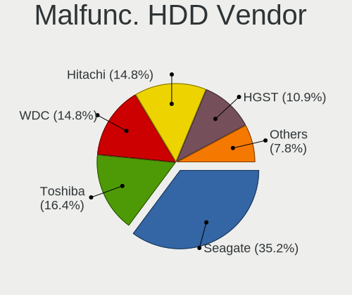
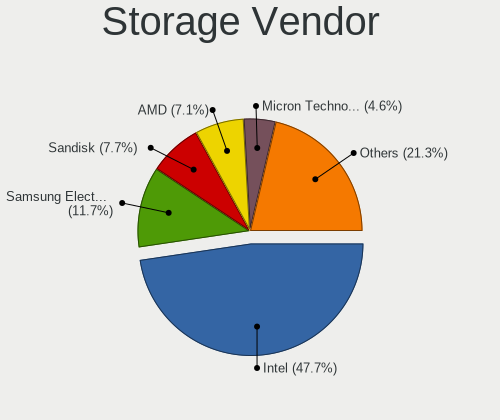
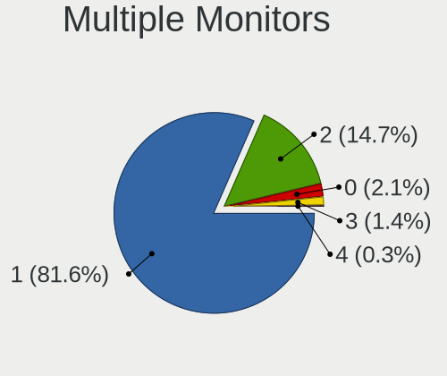
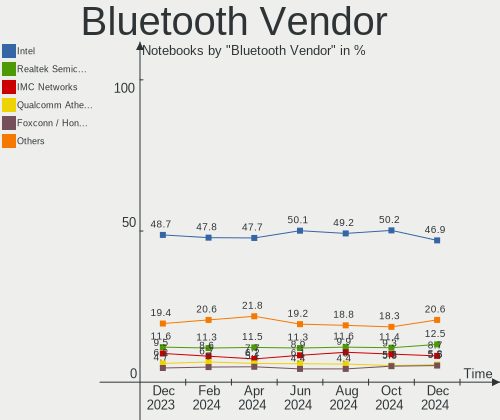

Linux - Hardware Trends (Notebooks)
-----------------------------------

A project to identify most popular hardware characteristics and track their change
over time based on data collected by Linux users at https://Linux-Hardware.org.

Anyone can contribute to this report by the [hw-probe](https://github.com/linuxhw/hw-probe) tool:

    sudo -E hw-probe -all -upload

This report is for one last month. Overall report since the beginning of time: [TestCoverage](https://github.com/linuxhw/TestCoverage)

Period: Aug, 2022.

Contents
--------

* [ System ](#system)
  - [ OS                       ](#os)
  - [ OS Family                ](#os-family)
  - [ Kernel                   ](#kernel)
  - [ Kernel Family            ](#kernel-family)
  - [ Kernel Major Ver.        ](#kernel-major-ver)
  - [ Arch                     ](#arch)
  - [ DE                       ](#de)
  - [ Display Server           ](#display-server)
  - [ Display Manager          ](#display-manager)
  - [ OS Lang                  ](#os-lang)
  - [ Boot Mode                ](#boot-mode)
  - [ Filesystem               ](#filesystem)
  - [ Part. scheme             ](#part-scheme)
  - [ Dual Boot with Linux/BSD ](#dual-boot-with-linuxbsd)
  - [ Dual Boot (Win)          ](#dual-boot-win)

* [ Board ](#board)
  - [ Vendor                   ](#vendor)
  - [ Model                    ](#model)
  - [ Model Family             ](#model-family)
  - [ MFG Year                 ](#mfg-year)
  - [ Form Factor              ](#form-factor)
  - [ Secure Boot              ](#secure-boot)
  - [ Coreboot                 ](#coreboot)
  - [ RAM Size                 ](#ram-size)
  - [ RAM Used                 ](#ram-used)
  - [ Total Drives             ](#total-drives)
  - [ Has CD-ROM               ](#has-cd-rom)
  - [ Has Ethernet             ](#has-ethernet)
  - [ Has WiFi                 ](#has-wifi)
  - [ Has Bluetooth            ](#has-bluetooth)

* [ Location ](#location)
  - [ Country                  ](#country)
  - [ City                     ](#city)

* [ Drives ](#drives)
  - [ Drive Vendor             ](#drive-vendor)
  - [ Drive Model              ](#drive-model)
  - [ HDD Vendor               ](#hdd-vendor)
  - [ SSD Vendor               ](#ssd-vendor)
  - [ Drive Kind               ](#drive-kind)
  - [ Drive Connector          ](#drive-connector)
  - [ Drive Size               ](#drive-size)
  - [ Space Total              ](#space-total)
  - [ Space Used               ](#space-used)
  - [ Malfunc. Drives          ](#malfunc-drives)
  - [ Malfunc. Drive Vendor    ](#malfunc-drive-vendor)
  - [ Malfunc. HDD Vendor      ](#malfunc-hdd-vendor)
  - [ Malfunc. Drive Kind      ](#malfunc-drive-kind)
  - [ Failed Drives            ](#failed-drives)
  - [ Failed Drive Vendor      ](#failed-drive-vendor)
  - [ Drive Status             ](#drive-status)

* [ Storage controller ](#storage-controller)
  - [ Storage Vendor           ](#storage-vendor)
  - [ Storage Model            ](#storage-model)
  - [ Storage Kind             ](#storage-kind)

* [ Processor ](#processor)
  - [ CPU Vendor               ](#cpu-vendor)
  - [ CPU Model                ](#cpu-model)
  - [ CPU Model Family         ](#cpu-model-family)
  - [ CPU Cores                ](#cpu-cores)
  - [ CPU Sockets              ](#cpu-sockets)
  - [ CPU Threads              ](#cpu-threads)
  - [ CPU Op-Modes             ](#cpu-op-modes)
  - [ CPU Microcode            ](#cpu-microcode)
  - [ CPU Microarch            ](#cpu-microarch)

* [ Graphics ](#graphics)
  - [ GPU Vendor               ](#gpu-vendor)
  - [ GPU Model                ](#gpu-model)
  - [ GPU Combo                ](#gpu-combo)
  - [ GPU Driver               ](#gpu-driver)
  - [ GPU Memory               ](#gpu-memory)

* [ Monitor ](#monitor)
  - [ Monitor Vendor           ](#monitor-vendor)
  - [ Monitor Model            ](#monitor-model)
  - [ Monitor Resolution       ](#monitor-resolution)
  - [ Monitor Diagonal         ](#monitor-diagonal)
  - [ Monitor Width            ](#monitor-width)
  - [ Aspect Ratio             ](#aspect-ratio)
  - [ Monitor Area             ](#monitor-area)
  - [ Pixel Density            ](#pixel-density)
  - [ Multiple Monitors        ](#multiple-monitors)

* [ Network ](#network)
  - [ Net Controller Vendor    ](#net-controller-vendor)
  - [ Net Controller Model     ](#net-controller-model)
  - [ Wireless Vendor          ](#wireless-vendor)
  - [ Wireless Model           ](#wireless-model)
  - [ Ethernet Vendor          ](#ethernet-vendor)
  - [ Ethernet Model           ](#ethernet-model)
  - [ Net Controller Kind      ](#net-controller-kind)
  - [ Used Controller          ](#used-controller)
  - [ NICs                     ](#nics)
  - [ IPv6                     ](#ipv6)

* [ Bluetooth ](#bluetooth)
  - [ Bluetooth Vendor         ](#bluetooth-vendor)
  - [ Bluetooth Model          ](#bluetooth-model)

* [ Sound ](#sound)
  - [ Sound Vendor             ](#sound-vendor)
  - [ Sound Model              ](#sound-model)

* [ Memory ](#memory)
  - [ Memory Vendor            ](#memory-vendor)
  - [ Memory Model             ](#memory-model)
  - [ Memory Kind              ](#memory-kind)
  - [ Memory Form Factor       ](#memory-form-factor)
  - [ Memory Size              ](#memory-size)
  - [ Memory Speed             ](#memory-speed)

* [ Printers & scanners ](#printers--scanners)
  - [ Printer Vendor           ](#printer-vendor)
  - [ Printer Model            ](#printer-model)
  - [ Scanner Vendor           ](#scanner-vendor)
  - [ Scanner Model            ](#scanner-model)

* [ Camera ](#camera)
  - [ Camera Vendor            ](#camera-vendor)
  - [ Camera Model             ](#camera-model)

* [ Security ](#security)
  - [ Fingerprint Vendor       ](#fingerprint-vendor)
  - [ Fingerprint Model        ](#fingerprint-model)
  - [ Chipcard Vendor          ](#chipcard-vendor)
  - [ Chipcard Model           ](#chipcard-model)

* [ Unsupported ](#unsupported)
  - [ Unsupported Devices      ](#unsupported-devices)
  - [ Unsupported Device Types ](#unsupported-device-types)

System
------

OS
--

Installed operating systems

| Name                         | Notebooks | Percent |
|------------------------------|-----------|---------|
| Ubuntu 22.04                 | 397       | 15.72%  |
| Fedora 36                    | 194       | 7.68%   |
| Ubuntu 20.04                 | 151       | 5.98%   |
| Debian 11                    | 148       | 5.86%   |
| Pop!_OS 22.04                | 131       | 5.19%   |
| OpenMandriva 4.3             | 130       | 5.15%   |
| ROSA 12.2                    | 115       | 4.55%   |
| Linux Mint 21                | 110       | 4.35%   |
| Linux Mint 20.3              | 94        | 3.72%   |
| Arch                         | 78        | 3.09%   |
| Zorin 16                     | 75        | 2.97%   |
| KDE neon 20.04               | 63        | 2.49%   |
| OpenMandriva 4.90            | 59        | 2.34%   |
| SteamOS 3.3                  | 37        | 1.46%   |
| Elementary 6.1               | 36        | 1.43%   |
| Arch Rolling                 | 36        | 1.43%   |
| Kubuntu 22.04                | 31        | 1.23%   |
| Manjaro                      | 28        | 1.11%   |
| SteamOS 3.3.1                | 26        | 1.03%   |
| Kali 2022.3                  | 26        | 1.03%   |
| Manjaro 21.3.6               | 25        | 0.99%   |
| Debian Testing               | 24        | 0.95%   |
| Gentoo 2.8                   | 23        | 0.91%   |
| ArcoLinux Rolling            | 21        | 0.83%   |
| openSUSE Tumbleweed-XXXXXXXX | 20        | 0.79%   |
| Ubuntu 18.04                 | 19        | 0.75%   |
| Manjaro 21.3.7               | 17        | 0.67%   |
| Xubuntu 22.04                | 16        | 0.63%   |
| Xubuntu 20.04                | 13        | 0.51%   |
| Lubuntu 22.04                | 13        | 0.51%   |
| ROSA R11.1                   | 12        | 0.48%   |
| LMDE 5                       | 12        | 0.48%   |
| Fedora 35                    | 12        | 0.48%   |
| BlackPanther 18.1            | 12        | 0.48%   |
| MX 21                        | 11        | 0.44%   |
| Zorin 15                     | 10        | 0.4%    |
| Ubuntu MATE 22.04            | 10        | 0.4%    |
| EndeavourOS Rolling          | 10        | 0.4%    |
| Linux Mint 19.3              | 9         | 0.36%   |
| Garuda Linux Soaring         | 9         | 0.36%   |
| Endless 4.0.8                | 9         | 0.36%   |
| Nobara 36                    | 8         | 0.32%   |
| Debian Unstable              | 8         | 0.32%   |
| Linux Mint 20.2              | 7         | 0.28%   |
| Endless 4.0.7                | 7         | 0.28%   |
| Ubuntu 21.10                 | 6         | 0.24%   |
| OpenMandriva 4.2             | 6         | 0.24%   |
| Linux Mint 20                | 6         | 0.24%   |
| Kubuntu 20.04                | 6         | 0.24%   |
| Kali 2022.2                  | 6         | 0.24%   |
| Xubuntu 18.04                | 5         | 0.2%    |
| Ubuntu 22.10                 | 5         | 0.2%    |
| Linux Mint 20.1              | 5         | 0.2%    |
| Kubuntu 11.1                 | 5         | 0.2%    |
| Archcraft Rolling            | 5         | 0.2%    |
| Ubuntu MATE 20.04            | 4         | 0.16%   |
| Ubuntu 16.04                 | 4         | 0.16%   |
| Parrot 5.1                   | 4         | 0.16%   |
| openSUSE Leap-15.4           | 4         | 0.16%   |
| KDE neon 22.04               | 4         | 0.16%   |

OS Family
---------

OS without a version

| Name              | Notebooks | Percent |
|-------------------|-----------|---------|
| Ubuntu            | 584       | 23.12%  |
| Linux Mint        | 234       | 9.26%   |
| Fedora            | 211       | 8.35%   |
| OpenMandriva      | 197       | 7.8%    |
| Debian            | 185       | 7.32%   |
| Pop!_OS           | 134       | 5.3%    |
| ROSA              | 130       | 5.15%   |
| Arch              | 114       | 4.51%   |
| Zorin             | 86        | 3.4%    |
| Manjaro           | 74        | 2.93%   |
| SteamOS           | 67        | 2.65%   |
| KDE neon          | 67        | 2.65%   |
| Kubuntu           | 48        | 1.9%    |
| Elementary        | 38        | 1.5%    |
| Xubuntu           | 35        | 1.39%   |
| Kali              | 33        | 1.31%   |
| openSUSE          | 25        | 0.99%   |
| Endless           | 25        | 0.99%   |
| Gentoo            | 24        | 0.95%   |
| ArcoLinux         | 24        | 0.95%   |
| Lubuntu           | 16        | 0.63%   |
| Ubuntu MATE       | 15        | 0.59%   |
| LMDE              | 14        | 0.55%   |
| EndeavourOS       | 14        | 0.55%   |
| MX                | 12        | 0.48%   |
| BlackPanther      | 12        | 0.48%   |
| Garuda Linux      | 11        | 0.44%   |
| ALT Linux         | 9         | 0.36%   |
| Parrot            | 8         | 0.32%   |
| Nobara            | 8         | 0.32%   |
| Ubuntu Budgie     | 7         | 0.28%   |
| Archcraft         | 5         | 0.2%    |
| Xero              | 3         | 0.12%   |
| Trisquel          | 3         | 0.12%   |
| Red OS            | 3         | 0.12%   |
| NixOS             | 3         | 0.12%   |
| Linux Lite        | 3         | 0.12%   |
| Clear Linux       | 3         | 0.12%   |
| CentOS            | 3         | 0.12%   |
| BigLinux          | 3         | 0.12%   |
| Artix             | 3         | 0.12%   |
| Alpine            | 3         | 0.12%   |
| Void Linux        | 2         | 0.08%   |
| RHEL              | 2         | 0.08%   |
| Oracle Linux      | 2         | 0.08%   |
| Devuan            | 2         | 0.08%   |
| Ultramarine Linux | 1         | 0.04%   |
| Ubuntu Studio     | 1         | 0.04%   |
| TeArch            | 1         | 0.04%   |
| Storm OS          | 1         | 0.04%   |
| Sparky            | 1         | 0.04%   |
| Solus             | 1         | 0.04%   |
| Slackware         | 1         | 0.04%   |
| Skaros            | 1         | 0.04%   |
| Sabayon           | 1         | 0.04%   |
| Q4OS              | 1         | 0.04%   |
| Peppermint        | 1         | 0.04%   |
| Nitrux            | 1         | 0.04%   |
| Manjaro-ARM       | 1         | 0.04%   |
| Mageia            | 1         | 0.04%   |

Kernel
------

Version of the Linux kernel

| Version                                        | Notebooks | Percent |
|------------------------------------------------|-----------|---------|
| 5.15.0-46-generic                              | 466       | 18.45%  |
| 5.15.0-43-generic                              | 255       | 10.1%   |
| 5.16.7-desktop-1omv4003                        | 123       | 4.87%   |
| 5.10.0-16-amd64                                | 94        | 3.72%   |
| 5.18.10-76051810-generic                       | 79        | 3.13%   |
| 5.15.0-41-generic                              | 61        | 2.41%   |
| 5.10.74-generic-2rosa2021.1-x86_64             | 57        | 2.26%   |
| 5.4.0-122-generic                              | 56        | 2.22%   |
| 5.18.12-desktop-3omv4090                       | 54        | 2.14%   |
| 5.18.16-200.fc36.x86_64                        | 45        | 1.78%   |
| 5.4.0-124-generic                              | 44        | 1.74%   |
| 5.19.0-76051900-generic                        | 44        | 1.74%   |
| 5.10.0-17-amd64                                | 38        | 1.5%    |
| 5.10.118-generic-2rosa2021.1-x86_64            | 36        | 1.43%   |
| 5.18.17-200.fc36.x86_64                        | 35        | 1.39%   |
| 5.18.16-arch1-1                                | 35        | 1.39%   |
| 5.13.0-valve21-1-neptune-02209-g2a5bdc1102a0   | 32        | 1.27%   |
| 5.18.13-200.fc36.x86_64                        | 30        | 1.19%   |
| 5.15.0-25-generic                              | 29        | 1.15%   |
| 5.18.0-kali5-amd64                             | 28        | 1.11%   |
| 5.13.0-valve21.1-1-neptune-02211-gc54cda5a36f3 | 26        | 1.03%   |
| 5.4.0-125-generic                              | 20        | 0.79%   |
| 5.18.18-200.fc36.x86_64                        | 20        | 0.79%   |
| 5.18.19-200.fc36.x86_64                        | 19        | 0.75%   |
| 5.15.60-1-MANJARO                              | 19        | 0.75%   |
| 5.18.0-3-amd64                                 | 18        | 0.71%   |
| 5.11.0-35-generic                              | 18        | 0.71%   |
| 5.19.1-arch2-1                                 | 17        | 0.67%   |
| 5.18.0-4-amd64                                 | 17        | 0.67%   |
| 5.15.0-47-generic                              | 14        | 0.55%   |
| 5.19.2-arch1-1                                 | 13        | 0.51%   |
| 5.17.5-300.fc36.x86_64                         | 12        | 0.48%   |
| 5.15.57-2-MANJARO                              | 11        | 0.44%   |
| 5.19.4-200.fc36.x86_64                         | 10        | 0.4%    |
| 5.19.3-arch1-1                                 | 9         | 0.36%   |
| 5.18.14-1-MANJARO                              | 9         | 0.36%   |
| 5.19.1-3-MANJARO                               | 8         | 0.32%   |
| 5.18.16-zen1-1-zen                             | 8         | 0.32%   |
| 5.18.15-arch1-1                                | 8         | 0.32%   |
| 5.17.5-76051705-generic                        | 8         | 0.32%   |
| 5.13.0-30-generic                              | 8         | 0.32%   |
| 5.19.0-051900-generic                          | 7         | 0.28%   |
| 5.6.14-desktop-2bP                             | 6         | 0.24%   |
| 5.4.0-91-generic                               | 6         | 0.24%   |
| 5.19.5-arch1-1                                 | 6         | 0.24%   |
| 5.15.0-46-lowlatency                           | 6         | 0.24%   |
| 5.10.14-desktop-1omv4002                       | 6         | 0.24%   |
| 4.18.16-desktop-1bP                            | 6         | 0.24%   |
| 5.19.4-arch1-1                                 | 5         | 0.2%    |
| 5.19.3-051903-generic                          | 5         | 0.2%    |
| 5.19.2-arch1-2                                 | 5         | 0.2%    |
| 5.19.2-1-default                               | 5         | 0.2%    |
| 5.18.15-arch1-2                                | 5         | 0.2%    |
| 5.18.15-200.fc36.x86_64                        | 5         | 0.2%    |
| 5.18.0-0.bpo.1-amd64                           | 5         | 0.2%    |
| 5.17.11-generic-2rosa2021.1-x86_64             | 5         | 0.2%    |
| 5.15.60-1-lts                                  | 5         | 0.2%    |
| 5.15.0-40-generic                              | 5         | 0.2%    |
| 5.13.0-51-generic                              | 5         | 0.2%    |
| 5.13.0-39-generic                              | 5         | 0.2%    |

Kernel Family
-------------

Linux kernel without a distro release

| Version  | Notebooks | Percent |
|----------|-----------|---------|
| 5.15.0   | 853       | 33.77%  |
| 5.4.0    | 159       | 6.29%   |
| 5.10.0   | 157       | 6.22%   |
| 5.16.7   | 123       | 4.87%   |
| 5.18.16  | 106       | 4.2%    |
| 5.13.0   | 103       | 4.08%   |
| 5.19.0   | 90        | 3.56%   |
| 5.18.10  | 80        | 3.17%   |
| 5.18.0   | 80        | 3.17%   |
| 5.10.74  | 61        | 2.41%   |
| 5.18.12  | 58        | 2.3%    |
| 5.19.1   | 42        | 1.66%   |
| 5.18.17  | 40        | 1.58%   |
| 5.10.118 | 38        | 1.5%    |
| 5.18.15  | 33        | 1.31%   |
| 5.18.13  | 32        | 1.27%   |
| 5.19.2   | 31        | 1.23%   |
| 5.11.0   | 31        | 1.23%   |
| 5.18.18  | 27        | 1.07%   |
| 5.15.60  | 25        | 0.99%   |
| 5.18.19  | 23        | 0.91%   |
| 4.15.0   | 22        | 0.87%   |
| 5.19.3   | 21        | 0.83%   |
| 5.17.5   | 21        | 0.83%   |
| 5.19.4   | 20        | 0.79%   |
| 5.18.14  | 18        | 0.71%   |
| 5.15.59  | 18        | 0.71%   |
| 5.14.0   | 18        | 0.71%   |
| 5.15.57  | 12        | 0.48%   |
| 5.15.55  | 9         | 0.36%   |
| 5.8.0    | 7         | 0.28%   |
| 5.19.5   | 7         | 0.28%   |
| 5.18.11  | 7         | 0.28%   |
| 5.17.11  | 7         | 0.28%   |
| 5.17.1   | 7         | 0.28%   |
| 5.6.14   | 6         | 0.24%   |
| 5.16.0   | 6         | 0.24%   |
| 5.10.14  | 6         | 0.24%   |
| 4.18.16  | 6         | 0.24%   |
| 5.17.0   | 5         | 0.2%    |
| 5.4.83   | 4         | 0.16%   |
| 5.16.13  | 4         | 0.16%   |
| 5.15.53  | 4         | 0.16%   |
| 5.15.52  | 4         | 0.16%   |
| 5.15.43  | 4         | 0.16%   |
| 5.14.21  | 4         | 0.16%   |
| 5.4.32   | 3         | 0.12%   |
| 5.18.7   | 3         | 0.12%   |
| 5.15.62  | 3         | 0.12%   |
| 5.15.61  | 3         | 0.12%   |
| 5.15.41  | 3         | 0.12%   |
| 5.10.136 | 3         | 0.12%   |
| 4.19.0   | 3         | 0.12%   |
| 6.0.0    | 2         | 0.08%   |
| 5.3.0    | 2         | 0.08%   |
| 5.17.8   | 2         | 0.08%   |
| 5.17.15  | 2         | 0.08%   |
| 5.15.63  | 2         | 0.08%   |
| 5.15.58  | 2         | 0.08%   |
| 5.15.35  | 2         | 0.08%   |

Kernel Major Ver.
-----------------

Linux kernel major version

| Version | Notebooks | Percent |
|---------|-----------|---------|
| 5.15    | 951       | 37.65%  |
| 5.18    | 514       | 20.35%  |
| 5.10    | 276       | 10.93%  |
| 5.19    | 211       | 8.35%   |
| 5.4     | 169       | 6.69%   |
| 5.16    | 135       | 5.34%   |
| 5.13    | 105       | 4.16%   |
| 5.17    | 50        | 1.98%   |
| 5.11    | 31        | 1.23%   |
| 5.14    | 24        | 0.95%   |
| 4.15    | 22        | 0.87%   |
| 5.8     | 7         | 0.28%   |
| 4.18    | 7         | 0.28%   |
| 5.6     | 6         | 0.24%   |
| 5.3     | 3         | 0.12%   |
| 4.19    | 3         | 0.12%   |
| 6.0     | 2         | 0.08%   |
| 5.7     | 2         | 0.08%   |
| 4.9     | 2         | 0.08%   |
| 4.4     | 2         | 0.08%   |
| 5.5     | 1         | 0.04%   |
| 5.17.1  | 1         | 0.04%   |
| 5.0     | 1         | 0.04%   |
| 3.10    | 1         | 0.04%   |

Arch
----

OS architecture (x86_64, i586, etc.)

| Name    | Notebooks | Percent |
|---------|-----------|---------|
| x86_64  | 2494      | 98.73%  |
| i686    | 30        | 1.19%   |
| armv7l  | 1         | 0.04%   |
| aarch64 | 1         | 0.04%   |

DE
--

Desktop Environment

| Name               | Notebooks | Percent |
|--------------------|-----------|---------|
| GNOME              | 1133      | 44.85%  |
| KDE5               | 647       | 25.61%  |
| XFCE               | 200       | 7.92%   |
| X-Cinnamon         | 197       | 7.8%    |
| Unknown            | 97        | 3.84%   |
| MATE               | 57        | 2.26%   |
| LXQt               | 47        | 1.86%   |
| Pantheon           | 39        | 1.54%   |
| Cinnamon           | 22        | 0.87%   |
| KDE4               | 11        | 0.44%   |
| Budgie             | 11        | 0.44%   |
| Unity              | 8         | 0.32%   |
| LXDE               | 8         | 0.32%   |
| i3                 | 8         | 0.32%   |
| GNOME Flashback    | 5         | 0.2%    |
| sway               | 4         | 0.16%   |
| qtile              | 3         | 0.12%   |
| dwm                | 3         | 0.12%   |
| Deepin             | 3         | 0.12%   |
| bspwm              | 3         | 0.12%   |
| awesome            | 3         | 0.12%   |
| openbox            | 2         | 0.08%   |
| lightdm-xsession   | 2         | 0.08%   |
| GNOME Classic      | 2         | 0.08%   |
| gamescope          | 2         | 0.08%   |
| Enlightenment      | 2         | 0.08%   |
| Cutefish           | 2         | 0.08%   |
| X-Generic          | 1         | 0.04%   |
| pantheon-non-gnome | 1         | 0.04%   |
| none+xmonad        | 1         | 0.04%   |
| KDE                | 1         | 0.04%   |
| dusk               | 1         | 0.04%   |

Display Server
--------------

X11 or Wayland

| Name    | Notebooks | Percent |
|---------|-----------|---------|
| X11     | 1721      | 68.13%  |
| Wayland | 713       | 28.23%  |
| Unknown | 64        | 2.53%   |
| Tty     | 28        | 1.11%   |

Display Manager
---------------

SDDM, LightDM, etc.

| Name    | Notebooks | Percent |
|---------|-----------|---------|
| Unknown | 810       | 32.07%  |
| GDM3    | 549       | 21.73%  |
| SDDM    | 472       | 18.69%  |
| LightDM | 369       | 14.61%  |
| GDM     | 300       | 11.88%  |
| KDM     | 11        | 0.44%   |
| XDM     | 5         | 0.2%    |
| Ly      | 4         | 0.16%   |
| LXDM    | 3         | 0.12%   |
| GREETD  | 2         | 0.08%   |
| SLiM    | 1         | 0.04%   |

OS Lang
-------

Language

| Lang    | Notebooks | Percent |
|---------|-----------|---------|
| en_US   | 1180      | 46.71%  |
| ru_RU   | 199       | 7.88%   |
| de_DE   | 156       | 6.18%   |
| pt_BR   | 135       | 5.34%   |
| fr_FR   | 106       | 4.2%    |
| en_GB   | 100       | 3.96%   |
| es_ES   | 57        | 2.26%   |
| Unknown | 57        | 2.26%   |
| en_IN   | 54        | 2.14%   |
| it_IT   | 48        | 1.9%    |
| en_CA   | 33        | 1.31%   |
| en_AU   | 30        | 1.19%   |
| C       | 29        | 1.15%   |
| pl_PL   | 28        | 1.11%   |
| nl_NL   | 19        | 0.75%   |
| pt_PT   | 18        | 0.71%   |
| zh_CN   | 15        | 0.59%   |
| es_AR   | 15        | 0.59%   |
| cs_CZ   | 15        | 0.59%   |
| hu_HU   | 14        | 0.55%   |
| es_MX   | 13        | 0.51%   |
| en_ZA   | 11        | 0.44%   |
| en_NZ   | 10        | 0.4%    |
| tr_TR   | 9         | 0.36%   |
| fi_FI   | 9         | 0.36%   |
| es_CO   | 9         | 0.36%   |
| en_IE   | 8         | 0.32%   |
| sv_SE   | 7         | 0.28%   |
| es_CL   | 7         | 0.28%   |
| de_CH   | 7         | 0.28%   |
| de_AT   | 7         | 0.28%   |
| fr_BE   | 6         | 0.24%   |
| C.UTF8  | 6         | 0.24%   |
| nb_NO   | 5         | 0.2%    |
| en_SG   | 5         | 0.2%    |
| en_PH   | 5         | 0.2%    |
| ro_RO   | 4         | 0.16%   |
| nl_BE   | 4         | 0.16%   |
| ja_JP   | 4         | 0.16%   |
| en_HK   | 4         | 0.16%   |
| en_AG   | 4         | 0.16%   |
| ca_ES   | 4         | 0.16%   |
| sr_RS   | 3         | 0.12%   |
| fr_CH   | 3         | 0.12%   |
| fr_CA   | 3         | 0.12%   |
| es_US   | 3         | 0.12%   |
| es_GT   | 3         | 0.12%   |
| es_CR   | 3         | 0.12%   |
| da_DK   | 3         | 0.12%   |
| bg_BG   | 3         | 0.12%   |
| zh_TW   | 2         | 0.08%   |
| sl_SI   | 2         | 0.08%   |
| sk_SK   | 2         | 0.08%   |
| ru_UA   | 2         | 0.08%   |
| lt_LT   | 2         | 0.08%   |
| id_ID   | 2         | 0.08%   |
| et_EE   | 2         | 0.08%   |
| es_PE   | 2         | 0.08%   |
| es_EC   | 2         | 0.08%   |
| en_DK   | 2         | 0.08%   |

Boot Mode
---------

EFI or BIOS

| Mode | Notebooks | Percent |
|------|-----------|---------|
| EFI  | 1469      | 58.16%  |
| BIOS | 1057      | 41.84%  |

Filesystem
----------

Type of filesystem

| Type    | Notebooks | Percent |
|---------|-----------|---------|
| Ext4    | 1854      | 73.4%   |
| Btrfs   | 384       | 15.2%   |
| Overlay | 232       | 9.18%   |
| Xfs     | 26        | 1.03%   |
| Zfs     | 14        | 0.55%   |
| XXXXXXX | 4         | 0.16%   |
| F2fs    | 4         | 0.16%   |
| Ext3    | 2         | 0.08%   |
| Ext2    | 2         | 0.08%   |
| Unknown | 2         | 0.08%   |
| XXXXX   | 1         | 0.04%   |
| Tmpfs   | 1         | 0.04%   |

Part. scheme
------------

Scheme of partitioning

| Type    | Notebooks | Percent |
|---------|-----------|---------|
| GPT     | 1162      | 46%     |
| Unknown | 1138      | 45.05%  |
| MBR     | 226       | 8.95%   |

Dual Boot with Linux/BSD
------------------------

Hosting more than one Linux/BSD

| Dual boot | Notebooks | Percent |
|-----------|-----------|---------|
| No        | 2218      | 87.81%  |
| Yes       | 308       | 12.19%  |

Dual Boot (Win)
---------------

Hosting Linux and Windows

| Dual boot | Notebooks | Percent |
|-----------|-----------|---------|
| No        | 1863      | 73.75%  |
| Yes       | 663       | 26.25%  |

Board
-----

Vendor
------

Motherboard manufacturer

| Name                   | Notebooks | Percent |
|------------------------|-----------|---------|
| Lenovo                 | 519       | 20.55%  |
| Hewlett-Packard        | 416       | 16.47%  |
| Dell                   | 371       | 14.69%  |
| ASUSTek Computer       | 309       | 12.23%  |
| Acer                   | 198       | 7.84%   |
| Apple                  | 77        | 3.05%   |
| Valve                  | 62        | 2.45%   |
| MSI                    | 58        | 2.3%    |
| Toshiba                | 50        | 1.98%   |
| HUAWEI                 | 46        | 1.82%   |
| Samsung Electronics    | 42        | 1.66%   |
| Google                 | 42        | 1.66%   |
| Notebook               | 24        | 0.95%   |
| Sony                   | 21        | 0.83%   |
| Positivo               | 16        | 0.63%   |
| Unknown                | 16        | 0.63%   |
| Fujitsu                | 14        | 0.55%   |
| Packard Bell           | 13        | 0.51%   |
| Alienware              | 13        | 0.51%   |
| Timi                   | 12        | 0.48%   |
| System76               | 9         | 0.36%   |
| Medion                 | 9         | 0.36%   |
| eMachines              | 8         | 0.32%   |
| TUXEDO                 | 7         | 0.28%   |
| Panasonic              | 7         | 0.28%   |
| GPU Company            | 7         | 0.28%   |
| Framework              | 6         | 0.24%   |
| Intel                  | 5         | 0.2%    |
| HONOR                  | 5         | 0.2%    |
| Gateway                | 5         | 0.2%    |
| Chuwi                  | 5         | 0.2%    |
| TrekStor               | 4         | 0.16%   |
| Razer                  | 4         | 0.16%   |
| LG Electronics         | 4         | 0.16%   |
| AMI                    | 4         | 0.16%   |
| Standard               | 3         | 0.12%   |
| SLIMBOOK               | 3         | 0.12%   |
| Microtech              | 3         | 0.12%   |
| Gigabyte Technology    | 3         | 0.12%   |
| Fujitsu Siemens        | 3         | 0.12%   |
| Daten Tecnologia       | 3         | 0.12%   |
| Compaq                 | 3         | 0.12%   |
| Avell High Performance | 3         | 0.12%   |
| Acidanthera            | 3         | 0.12%   |
| Shuttle                | 2         | 0.08%   |
| Positivo Bahia - VAIO  | 2         | 0.08%   |
| OnLogic                | 2         | 0.08%   |
| Monster                | 2         | 0.08%   |
| MECHREVO               | 2         | 0.08%   |
| ICL                    | 2         | 0.08%   |
| GPD                    | 2         | 0.08%   |
| Exo                    | 2         | 0.08%   |
| Eluktronics            | 2         | 0.08%   |
| Dynabook               | 2         | 0.08%   |
| Casper                 | 2         | 0.08%   |
| BBEN                   | 2         | 0.08%   |
| AZW                    | 2         | 0.08%   |
| Aquarius               | 2         | 0.08%   |
| 3Logic Group           | 2         | 0.08%   |
| Xplore                 | 1         | 0.04%   |

Model
-----

Motherboard model

| Name                                 | Notebooks | Percent |
|--------------------------------------|-----------|---------|
| Valve Jupiter                        | 62        | 2.45%   |
| Unknown                              | 31        | 1.23%   |
| HP Notebook                          | 14        | 0.55%   |
| Google Terra                         | 14        | 0.55%   |
| HP Pavilion g6                       | 11        | 0.44%   |
| Apple MacBookPro9,2                  | 10        | 0.4%    |
| Dell Latitude E6430                  | 8         | 0.32%   |
| Lenovo IdeaPad 330-15IKB 81DE        | 7         | 0.28%   |
| HP Pavilion Notebook                 | 7         | 0.28%   |
| Google Reks                          | 7         | 0.28%   |
| Dell Latitude E6420                  | 7         | 0.28%   |
| Apple MacBookAir7,2                  | 7         | 0.28%   |
| Lenovo IdeaPad Gaming 3 15ACH6 82K2  | 6         | 0.24%   |
| HP Pavilion 15                       | 6         | 0.24%   |
| HP 15                                | 6         | 0.24%   |
| Dell XPS 15 9520                     | 6         | 0.24%   |
| Dell Latitude E6400                  | 6         | 0.24%   |
| Dell Latitude E5470                  | 6         | 0.24%   |
| Dell Inspiron 15-3567                | 6         | 0.24%   |
| ASUS VivoBook 15_ASUS Laptop X540UAR | 6         | 0.24%   |
| System76 Oryx Pro                    | 5         | 0.2%    |
| Lenovo IdeaPad S340-14API 81NB       | 5         | 0.2%    |
| Lenovo IdeaPad 5 Pro 14ACN6 82L7     | 5         | 0.2%    |
| Lenovo IdeaPad 3 15ITL6 82H8         | 5         | 0.2%    |
| HUAWEI NBD-WXX9                      | 5         | 0.2%    |
| HP Victus by Laptop 16-e0xxx         | 5         | 0.2%    |
| HP Pavilion dv6                      | 5         | 0.2%    |
| HP EliteBook 8460p                   | 5         | 0.2%    |
| HP EliteBook 840 G8 Notebook PC      | 5         | 0.2%    |
| Framework Laptop                     | 5         | 0.2%    |
| Dell XPS 9320                        | 5         | 0.2%    |
| Dell XPS 15 9560                     | 5         | 0.2%    |
| Dell XPS 13 7390                     | 5         | 0.2%    |
| Dell Latitude 5420                   | 5         | 0.2%    |
| Dell Latitude 3310                   | 5         | 0.2%    |
| Dell Inspiron N5010                  | 5         | 0.2%    |
| ASUS ROG Strix G513QY_G513QY         | 5         | 0.2%    |
| Apple MacBookPro5,5                  | 5         | 0.2%    |
| Apple MacBookPro11,3                 | 5         | 0.2%    |
| Timi TM1701                          | 4         | 0.16%   |
| Lenovo ThinkBook 15 G2 ITL 20VE      | 4         | 0.16%   |
| Lenovo Legion 5 15IMH05H 81Y6        | 4         | 0.16%   |
| Lenovo G500 20236                    | 4         | 0.16%   |
| Lenovo B570e HuronRiver Platform     | 4         | 0.16%   |
| HUAWEI KLVD-WXX9                     | 4         | 0.16%   |
| HUAWEI HVY-WXX9                      | 4         | 0.16%   |
| HUAWEI CREM-WXX9                     | 4         | 0.16%   |
| HP ProBook 4540s                     | 4         | 0.16%   |
| HP Pavilion 17                       | 4         | 0.16%   |
| HP Laptop 17-cp0xxx                  | 4         | 0.16%   |
| HP Laptop 15-dy2xxx                  | 4         | 0.16%   |
| HP Laptop 15-db0xxx                  | 4         | 0.16%   |
| HP EliteBook 8470p                   | 4         | 0.16%   |
| HP EliteBook 840 G5                  | 4         | 0.16%   |
| HP EliteBook 820 G3                  | 4         | 0.16%   |
| HP 255 G6 Notebook PC                | 4         | 0.16%   |
| Dell XPS 15 9550                     | 4         | 0.16%   |
| Dell XPS 15 9500                     | 4         | 0.16%   |
| Dell XPS 13 9380                     | 4         | 0.16%   |
| Dell XPS 13 9360                     | 4         | 0.16%   |

Model Family
------------

Motherboard model prefix

| Name                  | Notebooks | Percent |
|-----------------------|-----------|---------|
| Lenovo ThinkPad       | 235       | 9.3%    |
| Lenovo IdeaPad        | 149       | 5.9%    |
| Dell Latitude         | 143       | 5.66%   |
| Acer Aspire           | 123       | 4.87%   |
| Dell Inspiron         | 99        | 3.92%   |
| HP Pavilion           | 80        | 3.17%   |
| ASUS VivoBook         | 75        | 2.97%   |
| HP Laptop             | 65        | 2.57%   |
| Valve Jupiter         | 62        | 2.45%   |
| HP EliteBook          | 58        | 2.3%    |
| HP ProBook            | 57        | 2.26%   |
| Dell XPS              | 56        | 2.22%   |
| ASUS ROG              | 35        | 1.39%   |
| Toshiba Satellite     | 33        | 1.31%   |
| Unknown               | 31        | 1.23%   |
| Lenovo Legion         | 29        | 1.15%   |
| Dell Vostro           | 26        | 1.03%   |
| Acer Nitro            | 26        | 1.03%   |
| Lenovo ThinkBook      | 24        | 0.95%   |
| Dell Precision        | 23        | 0.91%   |
| ASUS Zenbook          | 23        | 0.91%   |
| HP ENVY               | 21        | 0.83%   |
| HP Compaq             | 17        | 0.67%   |
| HP ZBook              | 16        | 0.63%   |
| ASUS ASUS             | 15        | 0.59%   |
| HP Notebook           | 14        | 0.55%   |
| Google Terra          | 14        | 0.55%   |
| Packard Bell EasyNote | 13        | 0.51%   |
| Fujitsu LIFEBOOK      | 12        | 0.48%   |
| HP OMEN               | 11        | 0.44%   |
| Apple MacBookPro11    | 11        | 0.44%   |
| Lenovo Yoga           | 10        | 0.4%    |
| HP 255                | 10        | 0.4%    |
| Apple MacBookPro9     | 10        | 0.4%    |
| Acer TravelMate       | 10        | 0.4%    |
| MSI Modern            | 9         | 0.36%   |
| HP Stream             | 9         | 0.36%   |
| Dell G3               | 9         | 0.36%   |
| Acer Swift            | 9         | 0.36%   |
| HP 15                 | 8         | 0.32%   |
| Apple MacBookAir7     | 8         | 0.32%   |
| Google Reks           | 7         | 0.28%   |
| ASUS TUF              | 7         | 0.28%   |
| Apple MacBookPro5     | 7         | 0.28%   |
| Apple MacBookPro14    | 7         | 0.28%   |
| HP 250                | 6         | 0.24%   |
| Framework Laptop      | 6         | 0.24%   |
| Dell G15              | 6         | 0.24%   |
| Apple MacBookPro8     | 6         | 0.24%   |
| Toshiba PORTEGE       | 5         | 0.2%    |
| System76 Oryx         | 5         | 0.2%    |
| MSI Creator           | 5         | 0.2%    |
| Lenovo B570e          | 5         | 0.2%    |
| HUAWEI NBD-WXX9       | 5         | 0.2%    |
| HP Victus             | 5         | 0.2%    |
| HP 240                | 5         | 0.2%    |
| Apple MacBookPro16    | 5         | 0.2%    |
| Apple MacBookAir6     | 5         | 0.2%    |
| Acer Predator         | 5         | 0.2%    |
| Acer Extensa          | 5         | 0.2%    |

MFG Year
--------

Motherboard manufacture year

| Year    | Notebooks | Percent |
|---------|-----------|---------|
| 2021    | 389       | 15.4%   |
| 2020    | 274       | 10.85%  |
| 2022    | 222       | 8.79%   |
| 2019    | 221       | 8.75%   |
| 2018    | 184       | 7.28%   |
| 2012    | 181       | 7.17%   |
| 2011    | 155       | 6.14%   |
| 2013    | 140       | 5.54%   |
| 2016    | 128       | 5.07%   |
| 2017    | 119       | 4.71%   |
| 2015    | 118       | 4.67%   |
| 2014    | 117       | 4.63%   |
| 2010    | 108       | 4.28%   |
| 2008    | 63        | 2.49%   |
| 2009    | 51        | 2.02%   |
| 2007    | 37        | 1.46%   |
| 2006    | 13        | 0.51%   |
| Unknown | 5         | 0.2%    |
| 2005    | 1         | 0.04%   |

Form Factor
-----------

Physical design of the computer

| Name     | Notebooks | Percent |
|----------|-----------|---------|
| Notebook | 2526      | 100%    |

Secure Boot
-----------

Enabled or disabled

| State    | Notebooks | Percent |
|----------|-----------|---------|
| Disabled | 2278      | 90.18%  |
| Enabled  | 248       | 9.82%   |

Coreboot
--------

Have coreboot on board

| Used | Notebooks | Percent |
|------|-----------|---------|
| No   | 2474      | 97.94%  |
| Yes  | 52        | 2.06%   |

RAM Size
--------

Total RAM memory

| Size in GB  | Notebooks | Percent |
|-------------|-----------|---------|
| 4.01-8.0    | 758       | 30.01%  |
| 8.01-16.0   | 493       | 19.52%  |
| 3.01-4.0    | 459       | 18.17%  |
| 16.01-24.0  | 434       | 17.18%  |
| 32.01-64.0  | 170       | 6.73%   |
| 1.01-2.0    | 98        | 3.88%   |
| 64.01-256.0 | 38        | 1.5%    |
| 24.01-32.0  | 34        | 1.35%   |
| 2.01-3.0    | 33        | 1.31%   |
| 0.51-1.0    | 9         | 0.36%   |

RAM Used
--------

Used RAM memory

| Used GB    | Notebooks | Percent |
|------------|-----------|---------|
| 1.01-2.0   | 859       | 34.01%  |
| 2.01-3.0   | 624       | 24.7%   |
| 4.01-8.0   | 399       | 15.8%   |
| 3.01-4.0   | 365       | 14.45%  |
| 0.51-1.0   | 138       | 5.46%   |
| 8.01-16.0  | 111       | 4.39%   |
| 0.01-0.5   | 15        | 0.59%   |
| 16.01-24.0 | 9         | 0.36%   |
| 24.01-32.0 | 3         | 0.12%   |
| 32.01-64.0 | 2         | 0.08%   |
| Unknown    | 1         | 0.04%   |

Total Drives
------------

Number of drives on board

| Drives | Notebooks | Percent |
|--------|-----------|---------|
| 1      | 1863      | 73.75%  |
| 2      | 583       | 23.08%  |
| 3      | 61        | 2.41%   |
| 0      | 8         | 0.32%   |
| 5      | 5         | 0.2%    |
| 4      | 5         | 0.2%    |
| 8      | 1         | 0.04%   |

Has CD-ROM
----------

Has CD-ROM on board

| Presented | Notebooks | Percent |
|-----------|-----------|---------|
| No        | 1774      | 70.23%  |
| Yes       | 752       | 29.77%  |

Has Ethernet
------------

Has Ethernet on board

| Presented | Notebooks | Percent |
|-----------|-----------|---------|
| Yes       | 1917      | 75.89%  |
| No        | 609       | 24.11%  |

Has WiFi
--------

Has WiFi module

| Presented | Notebooks | Percent |
|-----------|-----------|---------|
| Yes       | 2480      | 98.18%  |
| No        | 46        | 1.82%   |

Has Bluetooth
-------------

Has Bluetooth module

| Presented | Notebooks | Percent |
|-----------|-----------|---------|
| Yes       | 2046      | 81%     |
| No        | 480       | 19%     |

Location
--------

Country
-------

Geographic location (country)

| Country      | Notebooks | Percent |
|--------------|-----------|---------|
| USA          | 476       | 18.84%  |
| Russia       | 240       | 9.5%    |
| Germany      | 197       | 7.8%    |
| Brazil       | 174       | 6.89%   |
| France       | 129       | 5.11%   |
| UK           | 84        | 3.33%   |
| India        | 83        | 3.29%   |
| Italy        | 76        | 3.01%   |
| Netherlands  | 66        | 2.61%   |
| Canada       | 60        | 2.38%   |
| Spain        | 59        | 2.34%   |
| Poland       | 55        | 2.18%   |
| Australia    | 40        | 1.58%   |
| Argentina    | 37        | 1.46%   |
| Turkey       | 35        | 1.39%   |
| Hungary      | 34        | 1.35%   |
| Mexico       | 31        | 1.23%   |
| Czechia      | 29        | 1.15%   |
| Romania      | 25        | 0.99%   |
| Sweden       | 24        | 0.95%   |
| Portugal     | 23        | 0.91%   |
| Finland      | 22        | 0.87%   |
| Austria      | 22        | 0.87%   |
| Belgium      | 21        | 0.83%   |
| Switzerland  | 20        | 0.79%   |
| Norway       | 20        | 0.79%   |
| Indonesia    | 20        | 0.79%   |
| New Zealand  | 16        | 0.63%   |
| China        | 16        | 0.63%   |
| Chile        | 15        | 0.59%   |
| Belarus      | 15        | 0.59%   |
| Colombia     | 13        | 0.51%   |
| Bulgaria     | 13        | 0.51%   |
| Philippines  | 12        | 0.48%   |
| Greece       | 12        | 0.48%   |
| Denmark      | 12        | 0.48%   |
| Ukraine      | 11        | 0.44%   |
| South Africa | 11        | 0.44%   |
| Japan        | 11        | 0.44%   |
| Iran         | 11        | 0.44%   |
| Vietnam      | 10        | 0.4%    |
| Ireland      | 10        | 0.4%    |
| Thailand     | 9         | 0.36%   |
| Slovakia     | 9         | 0.36%   |
| Singapore    | 9         | 0.36%   |
| Serbia       | 9         | 0.36%   |
| Tunisia      | 8         | 0.32%   |
| Israel       | 8         | 0.32%   |
| Hong Kong    | 8         | 0.32%   |
| Egypt        | 8         | 0.32%   |
| Pakistan     | 7         | 0.28%   |
| Malaysia     | 7         | 0.28%   |
| Georgia      | 7         | 0.28%   |
| Venezuela    | 6         | 0.24%   |
| Lithuania    | 6         | 0.24%   |
| Latvia       | 6         | 0.24%   |
| Guatemala    | 6         | 0.24%   |
| Costa Rica   | 6         | 0.24%   |
| Bangladesh   | 6         | 0.24%   |
| Uruguay      | 5         | 0.2%    |

City
----

Geographic location (city)

| City              | Notebooks | Percent |
|-------------------|-----------|---------|
| Moscow            | 62        | 2.45%   |
| Bangor            | 31        | 1.23%   |
| St Petersburg     | 24        | 0.95%   |
| Paris             | 18        | 0.71%   |
| Sydney            | 17        | 0.67%   |
| Sao Paulo         | 17        | 0.67%   |
| Milan             | 17        | 0.67%   |
| Berlin            | 17        | 0.67%   |
| Bengaluru         | 16        | 0.63%   |
| Vienna            | 15        | 0.59%   |
| Madrid            | 14        | 0.55%   |
| Krasnodar         | 14        | 0.55%   |
| Helsinki          | 13        | 0.51%   |
| Budapest          | 13        | 0.51%   |
| Oslo              | 12        | 0.48%   |
| Mumbai            | 12        | 0.48%   |
| Istanbul          | 12        | 0.48%   |
| Fortaleza         | 12        | 0.48%   |
| Stockholm         | 11        | 0.44%   |
| Rio de Janeiro    | 11        | 0.44%   |
| Bucharest         | 11        | 0.44%   |
| Schagen           | 10        | 0.4%    |
| Munich            | 10        | 0.4%    |
| Singapore         | 9         | 0.36%   |
| Minsk             | 9         | 0.36%   |
| Los Angeles       | 9         | 0.36%   |
| Yekaterinburg     | 8         | 0.32%   |
| Voronezh          | 8         | 0.32%   |
| Sofia             | 8         | 0.32%   |
| Prague            | 8         | 0.32%   |
| Dublin            | 8         | 0.32%   |
| Buenos Aires      | 8         | 0.32%   |
| Warsaw            | 7         | 0.28%   |
| Toronto           | 7         | 0.28%   |
| Tehran            | 7         | 0.28%   |
| Pune              | 7         | 0.28%   |
| Denver            | 7         | 0.28%   |
| Dallas            | 7         | 0.28%   |
| Chelyabinsk       | 7         | 0.28%   |
| Brisbane          | 7         | 0.28%   |
| Barcelona         | 7         | 0.28%   |
| Auckland          | 7         | 0.28%   |
| Zurich            | 6         | 0.24%   |
| Stuttgart         | 6         | 0.24%   |
| Saratov           | 6         | 0.24%   |
| Novosibirsk       | 6         | 0.24%   |
| Melbourne         | 6         | 0.24%   |
| Louisville        | 6         | 0.24%   |
| Jakarta           | 6         | 0.24%   |
| Frankfurt am Main | 6         | 0.24%   |
| Belgrade          | 6         | 0.24%   |
| Tunis             | 5         | 0.2%    |
| The Hague         | 5         | 0.2%    |
| Tampere           | 5         | 0.2%    |
| Rome              | 5         | 0.2%    |
| Riga              | 5         | 0.2%    |
| Porto Alegre      | 5         | 0.2%    |
| Portland          | 5         | 0.2%    |
| Phoenix           | 5         | 0.2%    |
| New York          | 5         | 0.2%    |

Drives
------

Drive Vendor
------------

Hard drive vendors

| Vendor                         | Notebooks | Drives | Percent |
|--------------------------------|-----------|--------|---------|
| Samsung Electronics            | 497       | 544    | 15.9%   |
| WDC                            | 329       | 334    | 10.53%  |
| Seagate                        | 264       | 277    | 8.45%   |
| Unknown                        | 215       | 223    | 6.88%   |
| Kingston                       | 188       | 190    | 6.02%   |
| SanDisk                        | 186       | 189    | 5.95%   |
| Toshiba                        | 173       | 179    | 5.54%   |
| SK hynix                       | 155       | 161    | 4.96%   |
| Crucial                        | 105       | 111    | 3.36%   |
| Intel                          | 96        | 104    | 3.07%   |
| Micron Technology              | 81        | 83     | 2.59%   |
| Hitachi                        | 77        | 78     | 2.46%   |
| HGST                           | 71        | 71     | 2.27%   |
| Phison                         | 62        | 64     | 1.98%   |
| Apple                          | 45        | 54     | 1.44%   |
| KIOXIA                         | 40        | 43     | 1.28%   |
| A-DATA Technology              | 39        | 40     | 1.25%   |
| Unknown                        | 37        | 37     | 1.18%   |
| China                          | 35        | 35     | 1.12%   |
| Silicon Motion                 | 25        | 27     | 0.8%    |
| LITEON                         | 23        | 23     | 0.74%   |
| PNY                            | 20        | 20     | 0.64%   |
| Transcend                      | 14        | 14     | 0.45%   |
| SPCC                           | 14        | 14     | 0.45%   |
| Micron/Crucial Technology      | 14        | 14     | 0.45%   |
| Intenso                        | 14        | 15     | 0.45%   |
| ADATA Technology               | 13        | 13     | 0.42%   |
| Netac                          | 12        | 12     | 0.38%   |
| JMicron Technology             | 12        | 12     | 0.38%   |
| UMIS                           | 11        | 11     | 0.35%   |
| GOODRAM                        | 11        | 11     | 0.35%   |
| Patriot                        | 10        | 10     | 0.32%   |
| KingSpec                       | 10        | 10     | 0.32%   |
| Fujitsu                        | 9         | 9      | 0.29%   |
| Apacer                         | 9         | 9      | 0.29%   |
| Union Memory (Shenzhen)        | 8         | 8      | 0.26%   |
| XPG                            | 7         | 8      | 0.22%   |
| Gigabyte Technology            | 6         | 6      | 0.19%   |
| Team                           | 5         | 5      | 0.16%   |
| LITEONIT                       | 5         | 5      | 0.16%   |
| Kingston Technology Company    | 5         | 5      | 0.16%   |
| Hewlett-Packard                | 5         | 5      | 0.16%   |
| Corsair                        | 5         | 5      | 0.16%   |
| USB3.0                         | 4         | 4      | 0.13%   |
| Solid State Storage Technology | 4         | 4      | 0.13%   |
| Realtek Semiconductor          | 4         | 4      | 0.13%   |
| OCZ                            | 4         | 4      | 0.13%   |
| Lexar                          | 4         | 4      | 0.13%   |
| Lenovo                         | 4         | 4      | 0.13%   |
| BIWIN                          | 4         | 4      | 0.13%   |
| Win Memory                     | 3         | 3      | 0.1%    |
| TrekStor                       | 3         | 3      | 0.1%    |
| SSSTC                          | 3         | 3      | 0.1%    |
| SABRENT                        | 3         | 3      | 0.1%    |
| Plextor                        | 3         | 3      | 0.1%    |
| Phison Electronics             | 3         | 3      | 0.1%    |
| O2 Micro                       | 3         | 3      | 0.1%    |
| KingFast                       | 3         | 3      | 0.1%    |
| HS-SSD-C100                    | 3         | 3      | 0.1%    |
| FORESEE                        | 3         | 3      | 0.1%    |

Drive Model
-----------

Hard drive models

| Model                                             | Notebooks | Percent |
|---------------------------------------------------|-----------|---------|
| Seagate ST1000LM035-1RK172 1TB                    | 48        | 1.49%   |
| Samsung NVMe SSD Drive 512GB                      | 44        | 1.36%   |
| Unknown                                           | 37        | 1.15%   |
| Seagate ST1000LM024 HN-M101MBB 1TB                | 34        | 1.05%   |
| Kingston SA400S37240G 240GB SSD                   | 29        | 0.9%    |
| SanDisk NVMe SSD Drive 512GB                      | 27        | 0.84%   |
| Phison NVMe SSD Drive 512GB                       | 26        | 0.8%    |
| Kingston NVMe SSD Drive 512GB                     | 23        | 0.71%   |
| Toshiba MQ04ABF100 1TB                            | 21        | 0.65%   |
| Toshiba MQ01ABD100 1TB                            | 20        | 0.62%   |
| Intel NVMe SSD Drive 512GB                        | 20        | 0.62%   |
| Unknown MMC Card  128GB                           | 19        | 0.59%   |
| Toshiba MQ01ABF050 500GB                          | 19        | 0.59%   |
| Seagate ST500LT012-1DG142 500GB                   | 19        | 0.59%   |
| Crucial CT240BX500SSD1 240GB                      | 19        | 0.59%   |
| Crucial CT1000MX500SSD1 1TB                       | 19        | 0.59%   |
| Unknown MMC Card  64GB                            | 18        | 0.56%   |
| SanDisk NVMe SSD Drive 256GB                      | 17        | 0.53%   |
| Kingston SA400S37480G 480GB SSD                   | 17        | 0.53%   |
| Unknown MMC Card  32GB                            | 16        | 0.5%    |
| Samsung NVMe SSD Drive 256GB                      | 16        | 0.5%    |
| Samsung SSD 970 EVO Plus 1TB                      | 15        | 0.46%   |
| Samsung SSD 860 EVO 500GB                         | 15        | 0.46%   |
| Samsung SSD 850 EVO 500GB                         | 15        | 0.46%   |
| Kingston SA400S37120G 120GB SSD                   | 15        | 0.46%   |
| Kingston NVMe SSD Drive 256GB                     | 15        | 0.46%   |
| Crucial CT500MX500SSD1 500GB                      | 15        | 0.46%   |
| Unknown SDW16G  16GB                              | 14        | 0.43%   |
| Samsung SM963 2.5" NVMe PCIe SSD 1024GB           | 14        | 0.43%   |
| Samsung NVMe SSD Drive 1TB                        | 14        | 0.43%   |
| Micron NVMe SSD Drive 512GB                       | 14        | 0.43%   |
| Intel SSDPEKNW512G8 512GB                         | 14        | 0.43%   |
| HGST HTS721010A9E630 1TB                          | 14        | 0.43%   |
| WDC WD10SPZX-24Z10 1TB                            | 13        | 0.4%    |
| WDC WD10SPZX-21Z10T0 1TB                          | 13        | 0.4%    |
| Unknown MMC Card  512GB                           | 13        | 0.4%    |
| Seagate ST1000LM048-2E7172 1TB                    | 13        | 0.4%    |
| Samsung NVMe SSD Controller SM981/PM981/PM983 1TB | 13        | 0.4%    |
| SK hynix NVMe SSD Drive 512GB                     | 12        | 0.37%   |
| SK hynix NVMe SSD Drive 1024GB                    | 12        | 0.37%   |
| HGST HTS545050A7E680 500GB                        | 12        | 0.37%   |
| Unknown SD/MMC/MS PRO 128GB                       | 11        | 0.34%   |
| Samsung NVMe SSD Drive 500GB                      | 11        | 0.34%   |
| Samsung MZALQ512HALU-000L2 512GB                  | 11        | 0.34%   |
| HGST HTS541010A9E680 1TB                          | 11        | 0.34%   |
| Crucial CT480BX500SSD1 480GB                      | 11        | 0.34%   |
| Toshiba KBG30ZMS128G 128GB NVMe SSD               | 10        | 0.31%   |
| Phison NVMe SSD Drive 256GB                       | 10        | 0.31%   |
| Kingston SV300S37A120G 120GB SSD                  | 10        | 0.31%   |
| SK hynix NVMe SSD Drive 256GB                     | 9         | 0.28%   |
| Silicon Motion NVMe SSD Drive 512GB               | 9         | 0.28%   |
| Seagate Expansion 500GB                           | 9         | 0.28%   |
| SanDisk SSD PLUS 240GB                            | 9         | 0.28%   |
| SanDisk NVMe SSD Drive 1024GB                     | 9         | 0.28%   |
| SanDisk DF4032  32GB                              | 9         | 0.28%   |
| ADATA NVMe SSD Drive 256GB                        | 9         | 0.28%   |
| WDC WDS120G2G0A-00JH30 120GB SSD                  | 8         | 0.25%   |
| Seagate ST9500325AS 500GB                         | 8         | 0.25%   |
| Seagate ST500LT012-9WS142 500GB                   | 8         | 0.25%   |
| Seagate ST500LM012 HN-M500MBB 500GB               | 8         | 0.25%   |

HDD Vendor
----------

Hard disk drive vendors

| Vendor              | Notebooks | Drives | Percent |
|---------------------|-----------|--------|---------|
| Seagate             | 258       | 270    | 32.91%  |
| WDC                 | 207       | 209    | 26.4%   |
| Toshiba             | 108       | 110    | 13.78%  |
| Hitachi             | 77        | 78     | 9.82%   |
| HGST                | 71        | 71     | 9.06%   |
| Samsung Electronics | 15        | 15     | 1.91%   |
| Unknown             | 14        | 14     | 1.79%   |
| Fujitsu             | 9         | 9      | 1.15%   |
| Apple               | 5         | 6      | 0.64%   |
| USB3.0              | 4         | 4      | 0.51%   |
| SABRENT             | 3         | 3      | 0.38%   |
| SAGE                | 2         | 2      | 0.26%   |
| JMicron Technology  | 2         | 2      | 0.26%   |
| HGST HTS            | 2         | 2      | 0.26%   |
| ASMT                | 2         | 2      | 0.26%   |
| PHD 3.0             | 1         | 1      | 0.13%   |
| Maxone              | 1         | 1      | 0.13%   |
| Magnetic Data       | 1         | 1      | 0.13%   |
| ASMedia             | 1         | 1      | 0.13%   |
| Asm                 | 1         | 1      | 0.13%   |

SSD Vendor
----------

Solid state drive vendors

| Vendor              | Notebooks | Drives | Percent |
|---------------------|-----------|--------|---------|
| Samsung Electronics | 190       | 198    | 20.13%  |
| Kingston            | 113       | 114    | 11.97%  |
| Crucial             | 98        | 103    | 10.38%  |
| SanDisk             | 88        | 90     | 9.32%   |
| WDC                 | 43        | 43     | 4.56%   |
| China               | 35        | 35     | 3.71%   |
| Apple               | 25        | 25     | 2.65%   |
| Micron Technology   | 24        | 24     | 2.54%   |
| SK hynix            | 23        | 23     | 2.44%   |
| LITEON              | 23        | 23     | 2.44%   |
| A-DATA Technology   | 23        | 23     | 2.44%   |
| PNY                 | 20        | 20     | 2.12%   |
| Toshiba             | 18        | 20     | 1.91%   |
| Intel               | 17        | 17     | 1.8%    |
| Transcend           | 13        | 13     | 1.38%   |
| SPCC                | 13        | 13     | 1.38%   |
| Netac               | 11        | 11     | 1.17%   |
| Intenso             | 11        | 12     | 1.17%   |
| GOODRAM             | 11        | 11     | 1.17%   |
| Unknown             | 11        | 11     | 1.17%   |
| Patriot             | 10        | 10     | 1.06%   |
| KingSpec            | 10        | 10     | 1.06%   |
| Apacer              | 7         | 7      | 0.74%   |
| JMicron Technology  | 6         | 6      | 0.64%   |
| LITEONIT            | 5         | 5      | 0.53%   |
| OCZ                 | 4         | 4      | 0.42%   |
| Lexar               | 4         | 4      | 0.42%   |
| Corsair             | 4         | 4      | 0.42%   |
| Win Memory          | 3         | 3      | 0.32%   |
| TrekStor            | 3         | 3      | 0.32%   |
| Team                | 3         | 3      | 0.32%   |
| Plextor             | 3         | 3      | 0.32%   |
| Gigabyte Technology | 3         | 3      | 0.32%   |
| FORESEE             | 3         | 3      | 0.32%   |
| TO Exter            | 2         | 2      | 0.21%   |
| Teclast             | 2         | 2      | 0.21%   |
| TCSUNBOW            | 2         | 3      | 0.21%   |
| Phison              | 2         | 2      | 0.21%   |
| Maxtor              | 2         | 2      | 0.21%   |
| Leqixiang           | 2         | 2      | 0.21%   |
| LDLC                | 2         | 2      | 0.21%   |
| KingDian            | 2         | 2      | 0.21%   |
| HUSKY               | 2         | 2      | 0.21%   |
| HS-SSD-C100         | 2         | 2      | 0.21%   |
| Hewlett-Packard     | 2         | 2      | 0.21%   |
| GALAX               | 2         | 2      | 0.21%   |
| Emtec               | 2         | 2      | 0.21%   |
| Dogfish             | 2         | 2      | 0.21%   |
| BHT                 | 2         | 2      | 0.21%   |
| ZTC                 | 1         | 1      | 0.11%   |
| ZHITAI              | 1         | 1      | 0.11%   |
| VISIPRO             | 1         | 1      | 0.11%   |
| Verbatim            | 1         | 1      | 0.11%   |
| Vaseky              | 1         | 1      | 0.11%   |
| ValueTech           | 1         | 1      | 0.11%   |
| V-GeN               | 1         | 2      | 0.11%   |
| Unknown             | 1         | 1      | 0.11%   |
| Teutons             | 1         | 1      | 0.11%   |
| T-CREATE            | 1         | 1      | 0.11%   |
| Super Talent        | 1         | 1      | 0.11%   |

Drive Kind
----------

HDD or SSD

| Kind    | Notebooks | Drives | Percent |
|---------|-----------|--------|---------|
| NVMe    | 1074      | 1205   | 36.04%  |
| SSD     | 878       | 965    | 29.46%  |
| HDD     | 759       | 802    | 25.47%  |
| MMC     | 230       | 242    | 7.72%   |
| Unknown | 39        | 39     | 1.31%   |

Drive Connector
---------------

SATA, SAS, NVMe, etc.

| Type | Notebooks | Drives | Percent |
|------|-----------|--------|---------|
| SATA | 1474      | 1679   | 51.07%  |
| NVMe | 1072      | 1199   | 37.14%  |
| MMC  | 230       | 242    | 7.97%   |
| SAS  | 110       | 133    | 3.81%   |

Drive Size
----------

Size of hard drive

| Size in TB | Notebooks | Drives | Percent |
|------------|-----------|--------|---------|
| 0.01-0.5   | 1116      | 1248   | 69.14%  |
| 0.51-1.0   | 438       | 456    | 27.14%  |
| 1.01-2.0   | 45        | 46     | 2.79%   |
| 3.01-4.0   | 8         | 8      | 0.5%    |
| 4.01-10.0  | 7         | 9      | 0.43%   |

Space Total
-----------

Amount of disk space available on the file system

| Size in GB     | Notebooks | Percent |
|----------------|-----------|---------|
| 101-250        | 732       | 28.98%  |
| 251-500        | 668       | 26.44%  |
| 501-1000       | 373       | 14.77%  |
| 1-20           | 224       | 8.87%   |
| 51-100         | 140       | 5.54%   |
| 1001-2000      | 139       | 5.5%    |
| Unknown        | 84        | 3.33%   |
| 21-50          | 70        | 2.77%   |
| More than 3000 | 54        | 2.14%   |
| 2001-3000      | 41        | 1.62%   |
| 0              | 1         | 0.04%   |

Space Used
----------

Amount of used disk space

| Used GB        | Notebooks | Percent |
|----------------|-----------|---------|
| 1-20           | 955       | 37.81%  |
| 21-50          | 458       | 18.13%  |
| 101-250        | 338       | 13.38%  |
| 51-100         | 320       | 12.67%  |
| 251-500        | 206       | 8.16%   |
| 501-1000       | 99        | 3.92%   |
| Unknown        | 84        | 3.33%   |
| 1001-2000      | 45        | 1.78%   |
| More than 3000 | 10        | 0.4%    |
| 2001-3000      | 7         | 0.28%   |
| 0              | 4         | 0.16%   |

Malfunc. Drives
---------------

Drive models with a malfunction

| Model                                            | Notebooks | Drives | Percent |
|--------------------------------------------------|-----------|--------|---------|
| HGST HTS545050A7E680 500GB                       | 7         | 7      | 3.65%   |
| Seagate ST500LT012-9WS142 500GB                  | 5         | 5      | 2.6%    |
| SK hynix BC711 HFM512GD3JX013N 512GB             | 4         | 4      | 2.08%   |
| Seagate ST1000LM024 HN-M101MBB 1TB               | 4         | 4      | 2.08%   |
| WDC WD1600BEVT-22A23T0 160GB                     | 3         | 3      | 1.56%   |
| Toshiba MQ01ABF050 500GB                         | 3         | 3      | 1.56%   |
| Toshiba MQ01ABD075 752GB                         | 3         | 3      | 1.56%   |
| Seagate ST500LT012-1DG142 500GB                  | 3         | 3      | 1.56%   |
| Kingston SV300S37A120G 120GB SSD                 | 3         | 3      | 1.56%   |
| Hitachi HTS545032B9A300 320GB                    | 3         | 3      | 1.56%   |
| Hitachi HTS545025B9A300 250GB                    | 3         | 3      | 1.56%   |
| WDC WD2500BEKT-60A25T1 250GB                     | 2         | 2      | 1.04%   |
| Toshiba MQ04ABF100 1TB                           | 2         | 2      | 1.04%   |
| SK hynix HFS256G39TND-N210A 256GB SSD            | 2         | 2      | 1.04%   |
| Seagate ST9250827AS 250GB                        | 2         | 2      | 1.04%   |
| Seagate ST500LM012 HN-M500MBB 500GB              | 2         | 2      | 1.04%   |
| Seagate ST320LT007-9ZV142 320GB                  | 2         | 2      | 1.04%   |
| Seagate ST2000LM007-1R8174 2TB                   | 2         | 2      | 1.04%   |
| Seagate ST1000LX015-1U7172 1TB                   | 2         | 2      | 1.04%   |
| Seagate ST1000LM035-1RK172 1TB                   | 2         | 2      | 1.04%   |
| Seagate ST1000LM014-1EJ164 1TB                   | 2         | 2      | 1.04%   |
| Samsung Electronics MZNLH128HBHQ-000H1 128GB SSD | 2         | 2      | 1.04%   |
| Micron Technology 1100_MTFDDAK256TBN 256GB SSD   | 2         | 2      | 1.04%   |
| Kingston SA400S37240G 240GB SSD                  | 2         | 2      | 1.04%   |
| Hitachi HTS543232L9A300 320GB                    | 2         | 2      | 1.04%   |
| Hitachi HTS541680J9SA00 80GB                     | 2         | 2      | 1.04%   |
| Hitachi HTS541616J9SA00 160GB                    | 2         | 2      | 1.04%   |
| HGST HTS541010A9E680 1TB                         | 2         | 2      | 1.04%   |
| HGST HTS 721010A9E630 1TB                        | 2         | 2      | 1.04%   |
| A-DATA Technology SP900 256GB SSD                | 2         | 2      | 1.04%   |
| WDC WD7500BPKT-22PK4T0 752GB                     | 1         | 1      | 0.52%   |
| WDC WD5000LPZX-60Z10T0 500GB                     | 1         | 1      | 0.52%   |
| WDC WD5000LPVX-80V0TT0 500GB                     | 1         | 1      | 0.52%   |
| WDC WD5000LPVX-22V0TT0 500GB                     | 1         | 1      | 0.52%   |
| WDC WD5000LPCX-22VHAT0 500GB                     | 1         | 1      | 0.52%   |
| WDC WD5000BEVT-22A0RT0 500GB                     | 1         | 1      | 0.52%   |
| WDC WD5000BEKT-75KA9T0 500GB                     | 1         | 1      | 0.52%   |
| WDC WD3200BUDT-63DPZY0 320GB                     | 1         | 1      | 0.52%   |
| WDC WD3200BPVT-22ZEST0 320GB                     | 1         | 1      | 0.52%   |
| WDC WD3200BPVT-00ZEST0 320GB                     | 1         | 1      | 0.52%   |
| WDC WD3200BPVT-00JJ5T0 320GB                     | 1         | 1      | 0.52%   |
| WDC WD3200BEVT-60ZCT1 320GB                      | 1         | 1      | 0.52%   |
| WDC WD3200BEVT-60A23T0 320GB                     | 1         | 1      | 0.52%   |
| WDC WD3200BEKT-75PVMT0 320GB                     | 1         | 1      | 0.52%   |
| WDC WD2500BEKT-75A25T0 250GB                     | 1         | 1      | 0.52%   |
| WDC WD2500BEKT-60PVMT0 250GB                     | 1         | 1      | 0.52%   |
| WDC WD1600BEVS-22RST0 160GB                      | 1         | 1      | 0.52%   |
| WDC WD10SPZX-60Z10T0 1TB                         | 1         | 1      | 0.52%   |
| WDC WD10SPZX-24Z10T0 1TB                         | 1         | 1      | 0.52%   |
| WDC WD10SPZX-21Z10T0 1TB                         | 1         | 1      | 0.52%   |
| WDC WD10SPZX-08Z10 1TB                           | 1         | 1      | 0.52%   |
| WDC WD10SPCX-24HWST1 1TB                         | 1         | 1      | 0.52%   |
| WDC WD10JPVX-60JC3T1 1TB                         | 1         | 1      | 0.52%   |
| WDC WD10 SPZX-08Z10 1TB                          | 1         | 1      | 0.52%   |
| USB3.0 Super Speed 128GB                         | 1         | 1      | 0.52%   |
| Transcend TS32GMSA310 32GB SSD                   | 1         | 1      | 0.52%   |
| Toshiba MQ01ABF050M 500GB                        | 1         | 1      | 0.52%   |
| Toshiba MQ01ABD100 1TB                           | 1         | 1      | 0.52%   |
| Toshiba MK6465GSX 640GB                          | 1         | 1      | 0.52%   |
| Toshiba MK3276GSX 320GB                          | 1         | 1      | 0.52%   |

Malfunc. Drive Vendor
---------------------

Vendors of faulty drives

| Vendor              | Notebooks | Drives | Percent |
|---------------------|-----------|--------|---------|
| Seagate             | 37        | 38     | 19.47%  |
| WDC                 | 28        | 29     | 14.74%  |
| Hitachi             | 26        | 26     | 13.68%  |
| Toshiba             | 16        | 16     | 8.42%   |
| HGST                | 16        | 16     | 8.42%   |
| Kingston            | 10        | 10     | 5.26%   |
| Samsung Electronics | 9         | 9      | 4.74%   |
| SK hynix            | 8         | 8      | 4.21%   |
| SanDisk             | 6         | 6      | 3.16%   |
| Micron Technology   | 5         | 5      | 2.63%   |
| Intel               | 3         | 3      | 1.58%   |
| A-DATA Technology   | 3         | 3      | 1.58%   |
| Netac               | 2         | 2      | 1.05%   |
| LITEON              | 2         | 2      | 1.05%   |
| HGST HTS            | 2         | 2      | 1.05%   |
| Fujitsu             | 2         | 2      | 1.05%   |
| Crucial             | 2         | 2      | 1.05%   |
| China               | 2         | 2      | 1.05%   |
| USB3.0              | 1         | 1      | 0.53%   |
| Transcend           | 1         | 1      | 0.53%   |
| Team                | 1         | 1      | 0.53%   |
| SemsoTai            | 1         | 1      | 0.53%   |
| Magnetic Data       | 1         | 1      | 0.53%   |
| LEQIXIANG           | 1         | 1      | 0.53%   |
| JMicron Technology  | 1         | 1      | 0.53%   |
| Indilinx            | 1         | 1      | 0.53%   |
| Hewlett-Packard     | 1         | 1      | 0.53%   |
| Apple               | 1         | 1      | 0.53%   |
| Unknown             | 1         | 1      | 0.53%   |

Malfunc. HDD Vendor
-------------------

Vendors of faulty HDD drives

| Vendor              | Notebooks | Drives | Percent |
|---------------------|-----------|--------|---------|
| Seagate             | 37        | 38     | 27.82%  |
| WDC                 | 28        | 29     | 21.05%  |
| Hitachi             | 26        | 26     | 19.55%  |
| Toshiba             | 16        | 16     | 12.03%  |
| HGST                | 16        | 16     | 12.03%  |
| Samsung Electronics | 2         | 2      | 1.5%    |
| HGST HTS            | 2         | 2      | 1.5%    |
| Fujitsu             | 2         | 2      | 1.5%    |
| USB3.0              | 1         | 1      | 0.75%   |
| Magnetic Data       | 1         | 1      | 0.75%   |
| JMicron Technology  | 1         | 1      | 0.75%   |
| Apple               | 1         | 1      | 0.75%   |

Malfunc. Drive Kind
-------------------

Kinds of faulty drives

| Kind | Notebooks | Drives | Percent |
|------|-----------|--------|---------|
| HDD  | 132       | 135    | 69.84%  |
| SSD  | 48        | 48     | 25.4%   |
| NVMe | 9         | 9      | 4.76%   |

Failed Drives
-------------

Failed drive models

| Model                             | Notebooks | Drives | Percent |
|-----------------------------------|-----------|--------|---------|
| WDC WD5000BEVT-22A0RT0 500GB      | 1         | 1      | 20%     |
| WDC WD1600BEVT-75A23T0 160GB      | 1         | 1      | 20%     |
| Samsung Electronics HM321HI 320GB | 1         | 1      | 20%     |
| Samsung Electronics HM251JI 250GB | 1         | 1      | 20%     |
| Phison ESO128GTLC9-E8C-2 128GB    | 1         | 1      | 20%     |

Failed Drive Vendor
-------------------

Failed drive vendors

| Vendor              | Notebooks | Drives | Percent |
|---------------------|-----------|--------|---------|
| WDC                 | 2         | 2      | 40%     |
| Samsung Electronics | 2         | 2      | 40%     |
| Phison              | 1         | 1      | 20%     |

Drive Status
------------

Number of failed and malfunc. drives

| Status   | Notebooks | Drives | Percent |
|----------|-----------|--------|---------|
| Detected | 1340      | 1696   | 49.93%  |
| Works    | 1151      | 1360   | 42.88%  |
| Malfunc  | 188       | 192    | 7%      |
| Failed   | 5         | 5      | 0.19%   |

Storage controller
------------------

Storage Vendor
--------------

Storage controller vendors

| Vendor                           | Notebooks | Percent |
|----------------------------------|-----------|---------|
| Intel                            | 1626      | 53.42%  |
| Samsung Electronics              | 328       | 10.78%  |
| AMD                              | 315       | 10.35%  |
| SanDisk                          | 165       | 5.42%   |
| SK hynix                         | 129       | 4.24%   |
| Kingston Technology Company      | 80        | 2.63%   |
| Phison Electronics               | 70        | 2.3%    |
| Micron Technology                | 56        | 1.84%   |
| Toshiba America Info Systems     | 49        | 1.61%   |
| KIOXIA                           | 37        | 1.22%   |
| Silicon Motion                   | 36        | 1.18%   |
| ADATA Technology                 | 30        | 0.99%   |
| Micron/Crucial Technology        | 20        | 0.66%   |
| Nvidia                           | 19        | 0.62%   |
| Union Memory (Shenzhen)          | 18        | 0.59%   |
| Apple                            | 15        | 0.49%   |
| Realtek Semiconductor            | 9         | 0.3%    |
| Solid State Storage Technology   | 7         | 0.23%   |
| Marvell Technology Group         | 5         | 0.16%   |
| Yangtze Memory Technologies      | 4         | 0.13%   |
| Lenovo                           | 4         | 0.13%   |
| Silicon Integrated Systems [SiS] | 3         | 0.1%    |
| O2 Micro                         | 3         | 0.1%    |
| Biwin Storage Technology         | 3         | 0.1%    |
| VIA Technologies                 | 2         | 0.07%   |
| Seagate Technology               | 2         | 0.07%   |
| Lite-On Technology               | 2         | 0.07%   |
| ASMedia Technology               | 2         | 0.07%   |
| Zhaoxin                          | 1         | 0.03%   |
| Unknown                          | 1         | 0.03%   |
| Silicon Image                    | 1         | 0.03%   |
| MAXIO Technology (Hangzhou)      | 1         | 0.03%   |
| Unknown                          | 1         | 0.03%   |

Storage Model
-------------

Storage controller models

| Model                                                                            | Notebooks | Percent |
|----------------------------------------------------------------------------------|-----------|---------|
| AMD FCH SATA Controller [AHCI mode]                                              | 281       | 8.71%   |
| Intel Sunrise Point-LP SATA Controller [AHCI mode]                               | 192       | 5.95%   |
| Intel 7 Series Chipset Family 6-port SATA Controller [AHCI mode]                 | 182       | 5.64%   |
| Intel 82801 Mobile SATA Controller [RAID mode]                                   | 143       | 4.43%   |
| Intel Volume Management Device NVMe RAID Controller                              | 133       | 4.12%   |
| Samsung NVMe SSD Controller SM981/PM981/PM983                                    | 113       | 3.5%    |
| Samsung NVMe SSD Controller 980                                                  | 113       | 3.5%    |
| Intel 6 Series/C200 Series Chipset Family 6 port Mobile SATA AHCI Controller     | 97        | 3.01%   |
| Intel 8 Series SATA Controller 1 [AHCI mode]                                     | 66        | 2.05%   |
| SK hynix Gold P31 SSD                                                            | 64        | 1.98%   |
| Intel 82801IBM/IEM (ICH9M/ICH9M-E) 4 port SATA Controller [AHCI mode]            | 64        | 1.98%   |
| Intel 5 Series/3400 Series Chipset 4 port SATA AHCI Controller                   | 61        | 1.89%   |
| Intel Tiger Lake-LP SATA Controller                                              | 59        | 1.83%   |
| Intel 8 Series/C220 Series Chipset Family 6-port SATA Controller 1 [AHCI mode]   | 59        | 1.83%   |
| Intel Wildcat Point-LP SATA Controller [AHCI Mode]                               | 58        | 1.8%    |
| Samsung NVMe SSD Controller PM9A1/PM9A3/980PRO                                   | 57        | 1.77%   |
| Micron Non-Volatile memory controller                                            | 56        | 1.74%   |
| Intel Celeron/Pentium Silver Processor SATA Controller                           | 52        | 1.61%   |
| Phison PS5013 E13 NVMe Controller                                                | 51        | 1.58%   |
| SanDisk WD Blue SN550 NVMe SSD                                                   | 50        | 1.55%   |
| SanDisk WD Black SN750 / PC SN730 NVMe SSD                                       | 49        | 1.52%   |
| Intel Comet Lake SATA AHCI Controller                                            | 43        | 1.33%   |
| Intel HM170/QM170 Chipset SATA Controller [AHCI Mode]                            | 39        | 1.21%   |
| Intel Cannon Lake Mobile PCH SATA AHCI Controller                                | 39        | 1.21%   |
| Intel 400 Series Chipset Family SATA AHCI Controller                             | 39        | 1.21%   |
| Intel SSD 660P Series                                                            | 37        | 1.15%   |
| Intel 82801HM/HEM (ICH8M/ICH8M-E) IDE Controller                                 | 37        | 1.15%   |
| Kingston Company OM3PDP3 NVMe SSD                                                | 36        | 1.12%   |
| SanDisk Non-Volatile memory controller                                           | 34        | 1.05%   |
| Intel 82801HM/HEM (ICH8M/ICH8M-E) SATA Controller [AHCI mode]                    | 33        | 1.02%   |
| KIOXIA NVMe SSD Controller BG4                                                   | 30        | 0.93%   |
| Intel Non-Volatile memory controller                                             | 30        | 0.93%   |
| Intel Cannon Point-LP SATA Controller [AHCI Mode]                                | 30        | 0.93%   |
| Silicon Motion SM2263EN/SM2263XT SSD Controller                                  | 26        | 0.81%   |
| Kingston Company Company Non-Volatile memory controller                          | 25        | 0.77%   |
| Toshiba America Info Systems XG6 NVMe SSD Controller                             | 23        | 0.71%   |
| Intel Atom/Celeron/Pentium Processor x5-E8000/J3xxx/N3xxx Series SATA Controller | 22        | 0.68%   |
| AMD SB7x0/SB8x0/SB9x0 SATA Controller [AHCI mode]                                | 22        | 0.68%   |
| Samsung NVMe SSD Controller SM961/PM961/SM963                                    | 21        | 0.65%   |
| Intel Atom Processor E3800 Series SATA AHCI Controller                           | 21        | 0.65%   |
| SK hynix BC511                                                                   | 20        | 0.62%   |
| Intel Ice Lake-LP SATA Controller [AHCI mode]                                    | 20        | 0.62%   |
| Intel Celeron N3350/Pentium N4200/Atom E3900 Series SATA AHCI Controller         | 20        | 0.62%   |
| Intel 500 Series Chipset Family SATA AHCI Controller                             | 20        | 0.62%   |
| Intel 5 Series/3400 Series Chipset 6 port SATA AHCI Controller                   | 20        | 0.62%   |
| SK hynix Non-Volatile memory controller                                          | 19        | 0.59%   |
| Intel NM10/ICH7 Family SATA Controller [AHCI mode]                               | 19        | 0.59%   |
| SK hynix BC501 NVMe Solid State Drive                                            | 17        | 0.53%   |
| Intel Q170/Q150/B150/H170/H110/Z170/CM236 Chipset SATA Controller [AHCI Mode]    | 17        | 0.53%   |
| ADATA Non-Volatile memory controller                                             | 16        | 0.5%    |
| Union Memory (Shenzhen) Non-Volatile memory controller                           | 14        | 0.43%   |
| Samsung Electronics SATA controller                                              | 14        | 0.43%   |
| SanDisk WD Blue SN500 / PC SN520 NVMe SSD                                        | 13        | 0.4%    |
| Toshiba America Info Systems BG3 NVMe SSD Controller                             | 12        | 0.37%   |
| Intel 82801GBM/GHM (ICH7-M Family) SATA Controller [IDE mode]                    | 12        | 0.37%   |
| SanDisk WD PC SN810 / Black SN850 NVMe SSD                                       | 11        | 0.34%   |
| Phison E12 NVMe Controller                                                       | 11        | 0.34%   |
| Nvidia MCP79 AHCI Controller                                                     | 10        | 0.31%   |
| Micron/Crucial P2 NVMe PCIe SSD                                                  | 10        | 0.31%   |
| Toshiba America Info Systems Toshiba America Info Non-Volatile memory controller | 9         | 0.28%   |

Storage Kind
------------

Kind of storage controller (IDE, SATA, NVMe, SAS, ...)

| Kind | Notebooks | Percent |
|------|-----------|---------|
| SATA | 1644      | 52.74%  |
| NVMe | 1072      | 34.39%  |
| RAID | 285       | 9.14%   |
| IDE  | 116       | 3.72%   |

Processor
---------

CPU Vendor
----------

Processor vendors

| Vendor       | Notebooks | Percent |
|--------------|-----------|---------|
| Intel        | 1955      | 77.4%   |
| AMD          | 568       | 22.49%  |
| ARM          | 2         | 0.08%   |
| CentaurHauls | 1         | 0.04%   |

CPU Model
---------

Processor models

| Model                                         | Notebooks | Percent |
|-----------------------------------------------|-----------|---------|
| Intel 11th Gen Core i5-1135G7 @ 2.40GHz       | 69        | 2.73%   |
| AMD Custom APU 0405                           | 62        | 2.45%   |
| Intel 11th Gen Core i7-1165G7 @ 2.80GHz       | 53        | 2.1%    |
| Intel Core i5-8250U CPU @ 1.60GHz             | 39        | 1.54%   |
| Intel Celeron CPU N3060 @ 1.60GHz             | 37        | 1.46%   |
| Intel Core i5-10210U CPU @ 1.60GHz            | 35        | 1.39%   |
| AMD Ryzen 5 5500U with Radeon Graphics        | 34        | 1.35%   |
| Intel Core i5-3320M CPU @ 2.60GHz             | 32        | 1.27%   |
| Intel Core i7-8550U CPU @ 1.80GHz             | 31        | 1.23%   |
| Intel Core i7-10510U CPU @ 1.80GHz            | 30        | 1.19%   |
| Intel Core i7-10750H CPU @ 2.60GHz            | 29        | 1.15%   |
| Intel Core i5-7200U CPU @ 2.50GHz             | 29        | 1.15%   |
| Intel Core i7-8565U CPU @ 1.80GHz             | 28        | 1.11%   |
| Intel Core i5-8265U CPU @ 1.60GHz             | 28        | 1.11%   |
| Intel Core i5-6200U CPU @ 2.30GHz             | 28        | 1.11%   |
| AMD Ryzen 5 3500U with Radeon Vega Mobile Gfx | 28        | 1.11%   |
| Intel Core i7-6700HQ CPU @ 2.60GHz            | 27        | 1.07%   |
| Intel Core i5-3210M CPU @ 2.50GHz             | 27        | 1.07%   |
| AMD Ryzen 7 5800H with Radeon Graphics        | 25        | 0.99%   |
| AMD Ryzen 5 5600H with Radeon Graphics        | 24        | 0.95%   |
| Intel Celeron N4020 CPU @ 1.10GHz             | 23        | 0.91%   |
| Intel Core i5-2520M CPU @ 2.50GHz             | 22        | 0.87%   |
| Intel 11th Gen Core i7-11800H @ 2.30GHz       | 21        | 0.83%   |
| AMD Ryzen 7 5700U with Radeon Graphics        | 20        | 0.79%   |
| Intel Core i7-8750H CPU @ 2.20GHz             | 19        | 0.75%   |
| Intel Core i5-5200U CPU @ 2.20GHz             | 18        | 0.71%   |
| Intel 12th Gen Core i7-12700H                 | 18        | 0.71%   |
| Intel Core i5-6300U CPU @ 2.40GHz             | 16        | 0.63%   |
| Intel Core i5-3230M CPU @ 2.60GHz             | 16        | 0.63%   |
| Intel Core i7-9750H CPU @ 2.60GHz             | 15        | 0.59%   |
| AMD Ryzen 7 4800H with Radeon Graphics        | 15        | 0.59%   |
| AMD Ryzen 5 4600H with Radeon Graphics        | 15        | 0.59%   |
| Intel Core i7-7700HQ CPU @ 2.80GHz            | 14        | 0.55%   |
| Intel Core i7-7500U CPU @ 2.70GHz             | 14        | 0.55%   |
| Intel Core i5-4210U CPU @ 1.70GHz             | 14        | 0.55%   |
| Intel Core i5-1035G1 CPU @ 1.00GHz            | 14        | 0.55%   |
| Intel 11th Gen Core i3-1115G4 @ 3.00GHz       | 14        | 0.55%   |
| AMD Ryzen 7 3700U with Radeon Vega Mobile Gfx | 14        | 0.55%   |
| Intel Core i5-2450M CPU @ 2.50GHz             | 13        | 0.51%   |
| Intel Core i7-6500U CPU @ 2.50GHz             | 12        | 0.48%   |
| Intel Core i7-5500U CPU @ 2.40GHz             | 12        | 0.48%   |
| Intel Core i5-10300H CPU @ 2.50GHz            | 12        | 0.48%   |
| Intel Core i3-6006U CPU @ 2.00GHz             | 12        | 0.48%   |
| Intel Core i3-3110M CPU @ 2.40GHz             | 12        | 0.48%   |
| Intel Core i3-1005G1 CPU @ 1.20GHz            | 12        | 0.48%   |
| Intel Core 2 Duo CPU P8600 @ 2.40GHz          | 12        | 0.48%   |
| Intel Celeron CPU N3350 @ 1.10GHz             | 12        | 0.48%   |
| AMD Ryzen 9 5900HX with Radeon Graphics       | 12        | 0.48%   |
| AMD Ryzen 5 3550H with Radeon Vega Mobile Gfx | 12        | 0.48%   |
| Intel Core i7-4510U CPU @ 2.00GHz             | 11        | 0.44%   |
| Intel Core i7-3610QM CPU @ 2.30GHz            | 11        | 0.44%   |
| Intel Core i5-8350U CPU @ 1.70GHz             | 11        | 0.44%   |
| Intel Core i5 CPU M 520 @ 2.40GHz             | 11        | 0.44%   |
| Intel Core i3-7100U CPU @ 2.40GHz             | 11        | 0.44%   |
| Intel Celeron N4000 CPU @ 1.10GHz             | 11        | 0.44%   |
| AMD Ryzen 7 4700U with Radeon Graphics        | 11        | 0.44%   |
| AMD Ryzen 3 3200U with Radeon Vega Mobile Gfx | 11        | 0.44%   |
| Intel Core i5-9300H CPU @ 2.40GHz             | 10        | 0.4%    |
| Intel Core i5-5300U CPU @ 2.30GHz             | 10        | 0.4%    |
| Intel Core i3-7020U CPU @ 2.30GHz             | 10        | 0.4%    |

CPU Model Family
----------------

Processor model prefix

| Model                          | Notebooks | Percent |
|--------------------------------|-----------|---------|
| Intel Core i5                  | 570       | 22.57%  |
| Intel Core i7                  | 471       | 18.65%  |
| Other                          | 347       | 13.74%  |
| Intel Core i3                  | 179       | 7.09%   |
| Intel Celeron                  | 170       | 6.73%   |
| AMD Ryzen 5                    | 143       | 5.66%   |
| AMD Ryzen 7                    | 121       | 4.79%   |
| Intel Core 2 Duo               | 99        | 3.92%   |
| Intel Pentium                  | 62        | 2.45%   |
| Intel Atom                     | 48        | 1.9%    |
| AMD Ryzen 9                    | 31        | 1.23%   |
| AMD Ryzen 3                    | 28        | 1.11%   |
| AMD A6                         | 24        | 0.95%   |
| Intel Pentium Dual-Core        | 23        | 0.91%   |
| AMD Ryzen 7 PRO                | 19        | 0.75%   |
| AMD A10                        | 19        | 0.75%   |
| AMD A4                         | 16        | 0.63%   |
| Intel Pentium Silver           | 14        | 0.55%   |
| AMD A8                         | 11        | 0.44%   |
| AMD E2                         | 10        | 0.4%    |
| AMD E1                         | 10        | 0.4%    |
| Intel Core 2                   | 9         | 0.36%   |
| AMD E                          | 8         | 0.32%   |
| AMD Athlon                     | 8         | 0.32%   |
| Intel Pentium Dual             | 7         | 0.28%   |
| AMD Ryzen 5 PRO                | 7         | 0.28%   |
| Intel Core i9                  | 6         | 0.24%   |
| AMD C-60                       | 6         | 0.24%   |
| Intel Genuine                  | 5         | 0.2%    |
| AMD Turion 64 X2 Mobile        | 5         | 0.2%    |
| Intel Xeon                     | 4         | 0.16%   |
| Intel Pentium Gold             | 4         | 0.16%   |
| Intel Core m5                  | 4         | 0.16%   |
| AMD Phenom II                  | 4         | 0.16%   |
| AMD A12                        | 4         | 0.16%   |
| Intel Celeron M                | 3         | 0.12%   |
| AMD Athlon II                  | 3         | 0.12%   |
| Intel Pentium M                | 2         | 0.08%   |
| Intel Core M                   | 2         | 0.08%   |
| Intel Celeron Dual-Core        | 2         | 0.08%   |
| AMD PRO A10                    | 2         | 0.08%   |
| AMD Mobile Sempron             | 2         | 0.08%   |
| AMD C-70                       | 2         | 0.08%   |
| Intel Core m3                  | 1         | 0.04%   |
| Intel Core Duo                 | 1         | 0.04%   |
| ARM ARMv7                      | 1         | 0.04%   |
| AMD V140                       | 1         | 0.04%   |
| AMD Turion X2 Dual-Core Mobile | 1         | 0.04%   |
| AMD Turion Neo X2              | 1         | 0.04%   |
| AMD Turion 64 Mobile           | 1         | 0.04%   |
| AMD Turion                     | 1         | 0.04%   |
| AMD Ryzen 3 PRO                | 1         | 0.04%   |
| AMD FX                         | 1         | 0.04%   |
| AMD Athlon Neo X2              | 1         | 0.04%   |
| AMD Athlon 64 X2               | 1         | 0.04%   |

CPU Cores
---------

Number of processor cores

| Number | Notebooks | Percent |
|--------|-----------|---------|
| 2      | 1180      | 46.71%  |
| 4      | 864       | 34.2%   |
| 8      | 193       | 7.64%   |
| 6      | 189       | 7.48%   |
| 14     | 39        | 1.54%   |
| 1      | 39        | 1.54%   |
| 12     | 10        | 0.4%    |
| 10     | 7         | 0.28%   |
| 3      | 4         | 0.16%   |
| 5      | 1         | 0.04%   |

CPU Sockets
-----------

Number of sockets

| Number | Notebooks | Percent |
|--------|-----------|---------|
| 1      | 2526      | 100%    |

CPU Threads
-----------

Threads per core (Hyper-Threading)

| Number | Notebooks | Percent |
|--------|-----------|---------|
| 2      | 1930      | 76.41%  |
| 1      | 595       | 23.56%  |
| 8      | 1         | 0.04%   |

CPU Op-Modes
------------

CPU Operation Modes (32-bit, 64-bit)

| Op mode        | Notebooks | Percent |
|----------------|-----------|---------|
| 32-bit, 64-bit | 2508      | 99.29%  |
| 32-bit         | 12        | 0.48%   |
| Unknown        | 5         | 0.2%    |
| 64-bit         | 1         | 0.04%   |

CPU Microcode
-------------

Microcode number

| Number     | Notebooks | Percent |
|------------|-----------|---------|
| Unknown    | 647       | 25.61%  |
| 0x306a9    | 141       | 5.58%   |
| 0x806c1    | 125       | 4.95%   |
| 0x806ec    | 102       | 4.04%   |
| 0x206a7    | 102       | 4.04%   |
| 0x806ea    | 74        | 2.93%   |
| 0x0a50000c | 67        | 2.65%   |
| 0x806e9    | 65        | 2.57%   |
| 0x406e3    | 62        | 2.45%   |
| 0x306d4    | 59        | 2.34%   |
| 0x40651    | 58        | 2.3%    |
| 0x1067a    | 58        | 2.3%    |
| 0xa0652    | 52        | 2.06%   |
| 0x20655    | 51        | 2.02%   |
| 0x406c4    | 49        | 1.94%   |
| 0x08108109 | 47        | 1.86%   |
| 0x306c3    | 44        | 1.74%   |
| 0x08608103 | 42        | 1.66%   |
| 0x906ea    | 39        | 1.54%   |
| 0x906a3    | 38        | 1.5%    |
| 0x506e3    | 35        | 1.39%   |
| 0x08600106 | 34        | 1.35%   |
| 0x6fd      | 30        | 1.19%   |
| 0x806d1    | 29        | 1.15%   |
| 0x706a8    | 29        | 1.15%   |
| 0x706e5    | 26        | 1.03%   |
| 0x30678    | 22        | 0.87%   |
| 0x08108102 | 22        | 0.87%   |
| 0x706a1    | 20        | 0.79%   |
| 0x506c9    | 19        | 0.75%   |
| 0x806eb    | 18        | 0.71%   |
| 0x20652    | 16        | 0.63%   |
| 0x06006705 | 16        | 0.63%   |
| 0x106ca    | 15        | 0.59%   |
| 0x906e9    | 14        | 0.55%   |
| 0x06001119 | 14        | 0.55%   |
| 0x05000119 | 13        | 0.51%   |
| 0x406c3    | 11        | 0.44%   |
| 0x10676    | 11        | 0.44%   |
| 0x0a404101 | 11        | 0.44%   |
| 0x08600104 | 11        | 0.44%   |
| 0x906c0    | 10        | 0.4%    |
| 0x08600103 | 10        | 0.4%    |
| 0x40661    | 8         | 0.32%   |
| 0x08608102 | 8         | 0.32%   |
| 0x07030105 | 8         | 0.32%   |
| 0x0700010f | 8         | 0.32%   |
| 0x906ed    | 7         | 0.28%   |
| 0x010000c8 | 7         | 0.28%   |
| 0x6fb      | 6         | 0.24%   |
| 0x6f6      | 6         | 0.24%   |
| 0x0600611a | 6         | 0.24%   |
| 0x906a4    | 5         | 0.2%    |
| 0x806c2    | 5         | 0.2%    |
| 0x08200103 | 5         | 0.2%    |
| 0x03000027 | 5         | 0.2%    |
| 0x6f2      | 4         | 0.16%   |
| 0x30661    | 4         | 0.16%   |
| 0x0a50000b | 4         | 0.16%   |
| 0x0a404102 | 4         | 0.16%   |

CPU Microarch
-------------

Microarchitecture

| Name             | Notebooks | Percent |
|------------------|-----------|---------|
| KabyLake         | 425       | 16.83%  |
| IvyBridge        | 186       | 7.36%   |
| TigerLake        | 181       | 7.17%   |
| Unknown          | 177       | 7.01%   |
| Haswell          | 148       | 5.86%   |
| SandyBridge      | 138       | 5.46%   |
| Skylake          | 131       | 5.19%   |
| Silvermont       | 104       | 4.12%   |
| Zen 3            | 103       | 4.08%   |
| Zen+             | 90        | 3.56%   |
| Penryn           | 90        | 3.56%   |
| Westmere         | 87        | 3.44%   |
| Broadwell        | 78        | 3.09%   |
| Zen 2            | 71        | 2.81%   |
| CometLake        | 67        | 2.65%   |
| Icelake          | 66        | 2.61%   |
| Goldmont plus    | 58        | 2.3%    |
| Core             | 58        | 2.3%    |
| Alderlake Hybrid | 40        | 1.58%   |
| Excavator        | 38        | 1.5%    |
| Piledriver       | 23        | 0.91%   |
| Goldmont         | 23        | 0.91%   |
| Bonnell          | 23        | 0.91%   |
| Bobcat           | 23        | 0.91%   |
| Zen              | 17        | 0.67%   |
| Puma             | 15        | 0.59%   |
| Jaguar           | 12        | 0.48%   |
| K8 Hammer        | 11        | 0.44%   |
| Tremont          | 9         | 0.36%   |
| P6               | 8         | 0.32%   |
| K10 Llano        | 8         | 0.32%   |
| K10              | 8         | 0.32%   |
| Nehalem          | 5         | 0.2%    |
| K8 & K10 hybrid  | 3         | 0.12%   |
| Steamroller      | 2         | 0.08%   |

Graphics
--------

GPU Vendor
----------

Vendors of graphics cards

| Vendor                           | Notebooks | Percent |
|----------------------------------|-----------|---------|
| Intel                            | 1808      | 56.75%  |
| AMD                              | 694       | 21.78%  |
| Nvidia                           | 678       | 21.28%  |
| VIA Technologies                 | 2         | 0.06%   |
| Silicon Integrated Systems [SiS] | 2         | 0.06%   |
| Zhaoxin                          | 1         | 0.03%   |
| ATI Technologies                 | 1         | 0.03%   |

GPU Model
---------

Graphics card models

| Model                                                                                    | Notebooks | Percent |
|------------------------------------------------------------------------------------------|-----------|---------|
| Intel 3rd Gen Core processor Graphics Controller                                         | 176       | 5.37%   |
| Intel TigerLake-LP GT2 [Iris Xe Graphics]                                                | 156       | 4.76%   |
| Intel 2nd Generation Core Processor Family Integrated Graphics Controller                | 129       | 3.94%   |
| AMD Picasso/Raven 2 [Radeon Vega Series / Radeon Vega Mobile Series]                     | 96        | 2.93%   |
| Intel UHD Graphics 620                                                                   | 90        | 2.75%   |
| AMD Cezanne                                                                              | 88        | 2.69%   |
| Intel Skylake GT2 [HD Graphics 520]                                                      | 79        | 2.41%   |
| Intel CometLake-U GT2 [UHD Graphics]                                                     | 79        | 2.41%   |
| Intel Haswell-ULT Integrated Graphics Controller                                         | 76        | 2.32%   |
| Intel WhiskeyLake-U GT2 [UHD Graphics 620]                                               | 71        | 2.17%   |
| Intel HD Graphics 620                                                                    | 69        | 2.11%   |
| Intel Atom/Celeron/Pentium Processor x5-E8000/J3xxx/N3xxx Integrated Graphics Controller | 69        | 2.11%   |
| AMD Renoir                                                                               | 67        | 2.05%   |
| Intel Core Processor Integrated Graphics Controller                                      | 62        | 1.89%   |
| AMD VanGogh [AMD Custom GPU 0405]                                                        | 62        | 1.89%   |
| Intel HD Graphics 5500                                                                   | 61        | 1.86%   |
| Intel Mobile 4 Series Chipset Integrated Graphics Controller                             | 60        | 1.83%   |
| AMD Lucienne                                                                             | 59        | 1.8%    |
| Intel 4th Gen Core Processor Integrated Graphics Controller                              | 58        | 1.77%   |
| Intel CometLake-H GT2 [UHD Graphics]                                                     | 55        | 1.68%   |
| Intel CoffeeLake-H GT2 [UHD Graphics 630]                                                | 49        | 1.5%    |
| Intel GeminiLake [UHD Graphics 600]                                                      | 48        | 1.47%   |
| Intel Alder Lake-P Integrated Graphics Controller                                        | 48        | 1.47%   |
| Nvidia GA106M [GeForce RTX 3060 Mobile / Max-Q]                                          | 37        | 1.13%   |
| Intel TigerLake-H GT1 [UHD Graphics]                                                     | 36        | 1.1%    |
| Intel Atom Processor Z36xxx/Z37xxx Series Graphics & Display                             | 35        | 1.07%   |
| Intel HD Graphics 530                                                                    | 34        | 1.04%   |
| Nvidia TU117M [GeForce GTX 1650 Mobile / Max-Q]                                          | 31        | 0.95%   |
| Intel Mobile GM965/GL960 Integrated Graphics Controller (secondary)                      | 27        | 0.82%   |
| Intel Mobile GM965/GL960 Integrated Graphics Controller (primary)                        | 27        | 0.82%   |
| AMD Topaz XT [Radeon R7 M260/M265 / M340/M360 / M440/M445 / 530/535 / 620/625 Mobile]    | 27        | 0.82%   |
| AMD Stoney [Radeon R2/R3/R4/R5 Graphics]                                                 | 27        | 0.82%   |
| Intel Iris Plus Graphics G1 (Ice Lake)                                                   | 26        | 0.79%   |
| Nvidia GA107M [GeForce RTX 3050 Ti Mobile]                                               | 25        | 0.76%   |
| Intel Tiger Lake UHD Graphics                                                            | 23        | 0.7%    |
| AMD Rembrandt [Radeon 680M]                                                              | 23        | 0.7%    |
| Nvidia GF117M [GeForce 610M/710M/810M/820M / GT 620M/625M/630M/720M]                     | 20        | 0.61%   |
| Nvidia GA107M [GeForce RTX 3050 Mobile]                                                  | 20        | 0.61%   |
| Intel HD Graphics 630                                                                    | 20        | 0.61%   |
| AMD Sun XT [Radeon HD 8670A/8670M/8690M / R5 M330 / M430 / Radeon 520 Mobile]            | 19        | 0.58%   |
| Nvidia TU117M [GeForce GTX 1650 Ti Mobile]                                               | 17        | 0.52%   |
| Nvidia TU117M                                                                            | 17        | 0.52%   |
| Nvidia TU116M [GeForce GTX 1660 Ti Mobile]                                               | 17        | 0.52%   |
| Nvidia GP108M [GeForce MX150]                                                            | 17        | 0.52%   |
| Nvidia GP107M [GeForce GTX 1050 Mobile]                                                  | 17        | 0.52%   |
| Intel HD Graphics 500                                                                    | 17        | 0.52%   |
| Intel Atom Processor D4xx/D5xx/N4xx/N5xx Integrated Graphics Controller                  | 17        | 0.52%   |
| AMD Seymour [Radeon HD 6400M/7400M Series]                                               | 16        | 0.49%   |
| Nvidia GM108M [GeForce 940MX]                                                            | 14        | 0.43%   |
| Nvidia GM108M [GeForce 840M]                                                             | 14        | 0.43%   |
| AMD Thames [Radeon HD 7500M/7600M Series]                                                | 14        | 0.43%   |
| Nvidia GP107M [GeForce GTX 1050 Ti Mobile]                                               | 13        | 0.4%    |
| Nvidia GM107M [GeForce GTX 960M]                                                         | 13        | 0.4%    |
| Nvidia GA104M [GeForce RTX 3070 Mobile / Max-Q]                                          | 13        | 0.4%    |
| Nvidia GP106M [GeForce GTX 1060 Mobile]                                                  | 12        | 0.37%   |
| Nvidia TU106M [GeForce RTX 2060 Mobile]                                                  | 11        | 0.34%   |
| Nvidia GK208BM [GeForce 920M]                                                            | 11        | 0.34%   |
| Intel JasperLake [UHD Graphics]                                                          | 11        | 0.34%   |
| AMD Wani [Radeon R5/R6/R7 Graphics]                                                      | 11        | 0.34%   |
| AMD Raven Ridge [Radeon Vega Series / Radeon Vega Mobile Series]                         | 11        | 0.34%   |

GPU Combo
---------

Combinations of graphics cards

| Name           | Notebooks | Percent |
|----------------|-----------|---------|
| 1 x Intel      | 1223      | 48.42%  |
| Intel + Nvidia | 478       | 18.92%  |
| 1 x AMD        | 464       | 18.37%  |
| 1 x Nvidia     | 109       | 4.32%   |
| Intel + AMD    | 91        | 3.6%    |
| AMD + Nvidia   | 87        | 3.44%   |
| 2 x AMD        | 53        | 2.1%    |
| Other          | 7         | 0.28%   |
| 2 x Intel      | 7         | 0.28%   |
| 2 x Nvidia     | 2         | 0.08%   |
| 1 x VIA        | 2         | 0.08%   |
| 1 x SiS        | 2         | 0.08%   |
| 1 x Zhaoxin    | 1         | 0.04%   |

GPU Driver
----------

Free vs proprietary

| Driver      | Notebooks | Percent |
|-------------|-----------|---------|
| Free        | 2131      | 84.36%  |
| Proprietary | 342       | 13.54%  |
| Unknown     | 53        | 2.1%    |

GPU Memory
----------

Total video memory

| Size in GB | Notebooks | Percent |
|------------|-----------|---------|
| Unknown    | 1775      | 70.27%  |
| 0.01-0.5   | 276       | 10.93%  |
| 1.01-2.0   | 225       | 8.91%   |
| 0.51-1.0   | 107       | 4.24%   |
| 3.01-4.0   | 71        | 2.81%   |
| 5.01-6.0   | 36        | 1.43%   |
| 7.01-8.0   | 24        | 0.95%   |
| 2.01-3.0   | 6         | 0.24%   |
| 8.01-16.0  | 6         | 0.24%   |

Monitor
-------

Monitor Vendor
--------------

Monitor vendors

| Vendor                  | Notebooks | Percent |
|-------------------------|-----------|---------|
| AU Optronics            | 543       | 19.23%  |
| BOE                     | 424       | 15.01%  |
| Chimei Innolux          | 394       | 13.95%  |
| LG Display              | 387       | 13.7%   |
| Samsung Electronics     | 227       | 8.04%   |
| Apple                   | 78        | 2.76%   |
| Sharp                   | 77        | 2.73%   |
| Dell                    | 63        | 2.23%   |
| PANDA                   | 59        | 2.09%   |
| ANX                     | 59        | 2.09%   |
| Goldstar                | 58        | 2.05%   |
| Chi Mei Optoelectronics | 53        | 1.88%   |
| Lenovo                  | 47        | 1.66%   |
| Hewlett-Packard         | 31        | 1.1%    |
| Acer                    | 27        | 0.96%   |
| InfoVision              | 25        | 0.89%   |
| CSO                     | 24        | 0.85%   |
| Philips                 | 19        | 0.67%   |
| BenQ                    | 16        | 0.57%   |
| Ancor Communications    | 15        | 0.53%   |
| LG Philips              | 14        | 0.5%    |
| AOC                     | 13        | 0.46%   |
| ASUSTek Computer        | 11        | 0.39%   |
| HannStar                | 10        | 0.35%   |
| TMX                     | 9         | 0.32%   |
| ViewSonic               | 8         | 0.28%   |
| Toshiba                 | 8         | 0.28%   |
| Sony                    | 8         | 0.28%   |
| Iiyama                  | 6         | 0.21%   |
| Eizo                    | 6         | 0.21%   |
| Vizio                   | 5         | 0.18%   |
| Sceptre Tech            | 5         | 0.18%   |
| Seiko/Epson             | 4         | 0.14%   |
| Panasonic               | 4         | 0.14%   |
| KDC                     | 4         | 0.14%   |
| JDI                     | 4         | 0.14%   |
| CPT                     | 4         | 0.14%   |
| Unknown                 | 3         | 0.11%   |
| Pixio                   | 3         | 0.11%   |
| InnoLux Display         | 3         | 0.11%   |
| HKC                     | 3         | 0.11%   |
| STA                     | 2         | 0.07%   |
| SLD                     | 2         | 0.07%   |
| RTK                     | 2         | 0.07%   |
| MSI                     | 2         | 0.07%   |
| LGD                     | 2         | 0.07%   |
| Gigabyte Technology     | 2         | 0.07%   |
| Fujitsu Siemens         | 2         | 0.07%   |
| CS_                     | 2         | 0.07%   |
| BOE Technology Group    | 2         | 0.07%   |
| YCT                     | 1         | 0.04%   |
| Westinghouse            | 1         | 0.04%   |
| Wacom                   | 1         | 0.04%   |
| VIE                     | 1         | 0.04%   |
| Vestel Elektronik       | 1         | 0.04%   |
| Valve                   | 1         | 0.04%   |
| USR                     | 1         | 0.04%   |
| TR_                     | 1         | 0.04%   |
| TLW                     | 1         | 0.04%   |
| Tianma XM               | 1         | 0.04%   |

Monitor Model
-------------

Monitor models

| Model                                                                    | Notebooks | Percent |
|--------------------------------------------------------------------------|-----------|---------|
| ANX ANX7530 U ANX7539 800x1280                                           | 59        | 2.07%   |
| LG Display LCD Monitor LGD02DC 1366x768 344x194mm 15.5-inch              | 19        | 0.67%   |
| Chimei Innolux LCD Monitor CMN15DB 1366x768 344x193mm 15.5-inch          | 19        | 0.67%   |
| AU Optronics LCD Monitor AUO38ED 1920x1080 344x193mm 15.5-inch           | 19        | 0.67%   |
| PANDA LCD Monitor NCP004D 1920x1080 344x194mm 15.5-inch                  | 18        | 0.63%   |
| AU Optronics LCD Monitor AUO235C 1366x768 256x144mm 11.6-inch            | 18        | 0.63%   |
| AU Optronics LCD Monitor AUO22EC 1366x768 344x193mm 15.5-inch            | 18        | 0.63%   |
| Samsung Electronics LCD Monitor SEC5441 1366x768 344x194mm 15.5-inch     | 17        | 0.6%    |
| Chimei Innolux LCD Monitor CMN15F5 1920x1080 344x193mm 15.5-inch         | 17        | 0.6%    |
| Chimei Innolux LCD Monitor CMN15E6 1366x768 344x193mm 15.5-inch          | 16        | 0.56%   |
| AU Optronics LCD Monitor AUO21ED 1920x1080 344x193mm 15.5-inch           | 16        | 0.56%   |
| LG Display LCD Monitor LGD033A 1366x768 344x194mm 15.5-inch              | 12        | 0.42%   |
| AU Optronics LCD Monitor AUO71EC 1366x768 344x193mm 15.5-inch            | 12        | 0.42%   |
| Chimei Innolux LCD Monitor CMN15E7 1920x1080 344x193mm 15.5-inch         | 11        | 0.39%   |
| Chimei Innolux LCD Monitor CMN14D5 1920x1080 309x173mm 13.9-inch         | 11        | 0.39%   |
| Chimei Innolux LCD Monitor CMN1132 1366x768 256x144mm 11.6-inch          | 11        | 0.39%   |
| Chi Mei Optoelectronics LCD Monitor CMO15A7 1366x768 344x193mm 15.5-inch | 11        | 0.39%   |
| AU Optronics LCD Monitor AUO61ED 1920x1080 344x193mm 15.5-inch           | 11        | 0.39%   |
| AU Optronics LCD Monitor AUO106C 1366x768 277x156mm 12.5-inch            | 10        | 0.35%   |
| Samsung Electronics LCD Monitor SEC544B 1600x900 382x215mm 17.3-inch     | 9         | 0.32%   |
| Samsung Electronics LCD Monitor SDC4161 1920x1080 344x194mm 15.5-inch    | 9         | 0.32%   |
| Chimei Innolux LCD Monitor CMN15CA 1366x768 344x193mm 15.5-inch          | 9         | 0.32%   |
| Chimei Innolux LCD Monitor CMN14D6 1366x768 309x173mm 13.9-inch          | 9         | 0.32%   |
| Chimei Innolux LCD Monitor CMN14D4 1920x1080 309x173mm 13.9-inch         | 9         | 0.32%   |
| BOE LCD Monitor BOE0872 1920x1080 344x194mm 15.5-inch                    | 9         | 0.32%   |
| BOE LCD Monitor BOE0747 1920x1080 344x194mm 15.5-inch                    | 9         | 0.32%   |
| AU Optronics LCD Monitor AUOD1ED 1920x1080 344x193mm 15.5-inch           | 9         | 0.32%   |
| AU Optronics LCD Monitor AUO2E3C 1366x768 309x173mm 13.9-inch            | 9         | 0.32%   |
| AU Optronics LCD Monitor AUO26EC 1366x768 344x193mm 15.5-inch            | 9         | 0.32%   |
| Lenovo LCD Monitor LEN40BA 1920x1080 344x194mm 15.5-inch                 | 8         | 0.28%   |
| Chimei Innolux LCD Monitor CMN1735 1920x1080 382x215mm 17.3-inch         | 8         | 0.28%   |
| Chimei Innolux LCD Monitor CMN15E8 1920x1080 344x193mm 15.5-inch         | 8         | 0.28%   |
| Chimei Innolux LCD Monitor CMN15C4 1920x1080 344x193mm 15.5-inch         | 8         | 0.28%   |
| BOE LCD Monitor BOE0893 2160x1440 296x197mm 14.0-inch                    | 8         | 0.28%   |
| BOE LCD Monitor BOE0877 1920x1080 309x173mm 13.9-inch                    | 8         | 0.28%   |
| BOE LCD Monitor BOE0687 1920x1080 344x193mm 15.5-inch                    | 8         | 0.28%   |
| LG Display LCD Monitor LGD046F 1920x1080 345x194mm 15.6-inch             | 7         | 0.25%   |
| LG Display LCD Monitor LGD0456 1366x768 344x194mm 15.5-inch              | 7         | 0.25%   |
| Chimei Innolux LCD Monitor CMN1728 1600x900 382x215mm 17.3-inch          | 7         | 0.25%   |
| Chimei Innolux LCD Monitor CMN15D5 1920x1080 344x193mm 15.5-inch         | 7         | 0.25%   |
| BOE LCD Monitor BOE08D7 1920x1080 309x174mm 14.0-inch                    | 7         | 0.25%   |
| BOE LCD Monitor BOE0819 1920x1080 344x194mm 15.5-inch                    | 7         | 0.25%   |
| BOE LCD Monitor BOE0812 1920x1080 344x194mm 15.5-inch                    | 7         | 0.25%   |
| AU Optronics LCD Monitor AUO81EC 1366x768 344x193mm 15.5-inch            | 7         | 0.25%   |
| AU Optronics LCD Monitor AUO408D 1920x1080 309x174mm 14.0-inch           | 7         | 0.25%   |
| AU Optronics LCD Monitor AUO213E 1600x900 309x174mm 14.0-inch            | 7         | 0.25%   |
| AU Optronics LCD Monitor AUO10EC 1366x768 344x193mm 15.5-inch            | 7         | 0.25%   |
| AU Optronics LCD Monitor AUO109D 1920x1080 381x214mm 17.2-inch           | 7         | 0.25%   |
| Apple Color LCD APP9CC7 1280x800 286x179mm 13.3-inch                     | 7         | 0.25%   |
| PANDA LCD Monitor NCP0035 1920x1080 309x174mm 14.0-inch                  | 6         | 0.21%   |
| LG Display LCD Monitor LGD05E5 1920x1080 344x194mm 15.5-inch             | 6         | 0.21%   |
| LG Display LCD Monitor LGD046D 1920x1080 309x174mm 14.0-inch             | 6         | 0.21%   |
| LG Display LCD Monitor LGD02F2 1366x768 344x194mm 15.5-inch              | 6         | 0.21%   |
| LG Display LCD Monitor LGD02DF 1600x900 310x174mm 14.0-inch              | 6         | 0.21%   |
| Goldstar HDR WFHD GSM7714 2560x1080 798x334mm 34.1-inch                  | 6         | 0.21%   |
| Chimei Innolux LCD Monitor CMN14C3 1366x768 309x173mm 13.9-inch          | 6         | 0.21%   |
| Chimei Innolux LCD Monitor CMN1482 1600x900 309x174mm 14.0-inch          | 6         | 0.21%   |
| BOE LCD Monitor BOE095F 2256x1504 285x190mm 13.5-inch                    | 6         | 0.21%   |
| BOE LCD Monitor BOE084E 1920x1080 382x215mm 17.3-inch                    | 6         | 0.21%   |
| BOE LCD Monitor BOE06A5 1366x768 344x194mm 15.5-inch                     | 6         | 0.21%   |

Monitor Resolution
------------------

Monitor screen resolution

| Resolution         | Notebooks | Percent |
|--------------------|-----------|---------|
| 1920x1080 (FHD)    | 1126      | 41.64%  |
| 1366x768 (WXGA)    | 768       | 28.4%   |
| 1600x900 (HD+)     | 139       | 5.14%   |
| 3840x2160 (4K)     | 93        | 3.44%   |
| 1280x800 (WXGA)    | 87        | 3.22%   |
| 2560x1440 (QHD)    | 70        | 2.59%   |
| 800x1280           | 60        | 2.22%   |
| 1440x900 (WXGA+)   | 48        | 1.78%   |
| 1920x1200 (WUXGA)  | 43        | 1.59%   |
| 2560x1600          | 36        | 1.33%   |
| 2880x1800          | 34        | 1.26%   |
| 1680x1050 (WSXGA+) | 24        | 0.89%   |
| 1280x1024 (SXGA)   | 17        | 0.63%   |
| 2560x1080          | 16        | 0.59%   |
| 3440x1440          | 15        | 0.55%   |
| 1024x600           | 13        | 0.48%   |
| 3840x2400          | 12        | 0.44%   |
| 2160x1440          | 12        | 0.44%   |
| 3200x1800 (QHD+)   | 7         | 0.26%   |
| 1920x540           | 7         | 0.26%   |
| 2256x1504          | 6         | 0.22%   |
| 1360x768           | 6         | 0.22%   |
| Unknown            | 6         | 0.22%   |
| 2520x1680          | 5         | 0.18%   |
| 1024x768 (XGA)     | 5         | 0.18%   |
| 3456x2160          | 4         | 0.15%   |
| 3200x2000          | 4         | 0.15%   |
| 3072x1920          | 4         | 0.15%   |
| 3000x2000          | 4         | 0.15%   |
| 1920x1280          | 4         | 0.15%   |
| 3840x1080          | 3         | 0.11%   |
| 1680x945           | 3         | 0.11%   |
| 3840x1100          | 2         | 0.07%   |
| 2288x1287          | 2         | 0.07%   |
| 2240x1400          | 2         | 0.07%   |
| 1600x1200          | 2         | 0.07%   |
| 7040x1440          | 1         | 0.04%   |
| 6400x2160          | 1         | 0.04%   |
| 5760x2160          | 1         | 0.04%   |
| 3840x1200          | 1         | 0.04%   |
| 3360x1200          | 1         | 0.04%   |
| 2726x768           | 1         | 0.04%   |
| 2646x1024          | 1         | 0.04%   |
| 2400x1600          | 1         | 0.04%   |
| 2304x1440          | 1         | 0.04%   |
| 2200x1650          | 1         | 0.04%   |
| 1920x515           | 1         | 0.04%   |
| 1528x1222          | 1         | 0.04%   |
| 1400x1050          | 1         | 0.04%   |
| 1280x960           | 1         | 0.04%   |
| 1280x720 (HD)      | 1         | 0.04%   |

Monitor Diagonal
----------------

Diagonal size in inches

| Inches  | Notebooks | Percent |
|---------|-----------|---------|
| 15      | 1169      | 41.44%  |
| 13      | 392       | 13.9%   |
| 14      | 357       | 12.66%  |
| 17      | 209       | 7.41%   |
| Unknown | 90        | 3.19%   |
| 27      | 84        | 2.98%   |
| 12      | 71        | 2.52%   |
| 11      | 69        | 2.45%   |
| 24      | 59        | 2.09%   |
| 23      | 55        | 1.95%   |
| 16      | 45        | 1.6%    |
| 21      | 41        | 1.45%   |
| 34      | 31        | 1.1%    |
| 31      | 19        | 0.67%   |
| 19      | 17        | 0.6%    |
| 18      | 16        | 0.57%   |
| 10      | 16        | 0.57%   |
| 22      | 15        | 0.53%   |
| 20      | 9         | 0.32%   |
| 32      | 7         | 0.25%   |
| 84      | 6         | 0.21%   |
| 46      | 4         | 0.14%   |
| 26      | 4         | 0.14%   |
| 74      | 3         | 0.11%   |
| 72      | 3         | 0.11%   |
| 54      | 3         | 0.11%   |
| 28      | 3         | 0.11%   |
| 142     | 2         | 0.07%   |
| 49      | 2         | 0.07%   |
| 48      | 2         | 0.07%   |
| 42      | 2         | 0.07%   |
| 35      | 2         | 0.07%   |
| 29      | 2         | 0.07%   |
| 25      | 2         | 0.07%   |
| 69      | 1         | 0.04%   |
| 65      | 1         | 0.04%   |
| 64      | 1         | 0.04%   |
| 55      | 1         | 0.04%   |
| 43      | 1         | 0.04%   |
| 37      | 1         | 0.04%   |
| 33      | 1         | 0.04%   |
| 9       | 1         | 0.04%   |
| 8       | 1         | 0.04%   |
| 7       | 1         | 0.04%   |

Monitor Width
-------------

Physical width

| Width in mm    | Notebooks | Percent |
|----------------|-----------|---------|
| 301-350        | 1735      | 62.14%  |
| 201-300        | 337       | 12.07%  |
| 351-400        | 250       | 8.95%   |
| 501-600        | 186       | 6.66%   |
| Unknown        | 90        | 3.22%   |
| 401-500        | 88        | 3.15%   |
| 701-800        | 38        | 1.36%   |
| 601-700        | 30        | 1.07%   |
| 1001-1500      | 15        | 0.54%   |
| 1501-2000      | 13        | 0.47%   |
| 801-900        | 3         | 0.11%   |
| More than 2000 | 2         | 0.07%   |
| 101-200        | 2         | 0.07%   |
| 901-1000       | 2         | 0.07%   |
| 1-100          | 1         | 0.04%   |

Aspect Ratio
------------

Proportional relationship between the width and the height

| Ratio   | Notebooks | Percent |
|---------|-----------|---------|
| 16/9    | 2080      | 80.97%  |
| 16/10   | 307       | 11.95%  |
| 0.62    | 59        | 2.3%    |
| 3/2     | 34        | 1.32%   |
| 21/9    | 34        | 1.32%   |
| 5/4     | 16        | 0.62%   |
| Unknown | 16        | 0.62%   |
| 4/3     | 11        | 0.43%   |
| 32/9    | 5         | 0.19%   |
| 3.40    | 2         | 0.08%   |
| 1.00    | 2         | 0.08%   |
| 3.73    | 1         | 0.04%   |
| 3.20    | 1         | 0.04%   |
| 0.67    | 1         | 0.04%   |

Monitor Area
------------

Area in inch

| Area in inch | Notebooks | Percent |
|----------------|-----------|---------|
| 101-110        | 1174      | 41.73%  |
| 81-90          | 617       | 21.93%  |
| 121-130        | 175       | 6.22%   |
| 201-250        | 132       | 4.69%   |
| 71-80          | 129       | 4.59%   |
| Unknown        | 90        | 3.2%    |
| 301-350        | 88        | 3.13%   |
| 51-60          | 72        | 2.56%   |
| 61-70          | 70        | 2.49%   |
| 351-500        | 61        | 2.17%   |
| 151-200        | 38        | 1.35%   |
| 111-120        | 34        | 1.21%   |
| 131-140        | 27        | 0.96%   |
| 251-300        | 25        | 0.89%   |
| More than 1000 | 22        | 0.78%   |
| 141-150        | 21        | 0.75%   |
| 41-50          | 16        | 0.57%   |
| 501-1000       | 11        | 0.39%   |
| 91-100         | 9         | 0.32%   |
| 1-40           | 2         | 0.07%   |

Pixel Density
-------------

Pixels per inch

| Density       | Notebooks | Percent |
|---------------|-----------|---------|
| 121-160       | 1164      | 41.9%   |
| 101-120       | 816       | 29.37%  |
| 51-100        | 374       | 13.46%  |
| 161-240       | 216       | 7.78%   |
| More than 240 | 96        | 3.46%   |
| Unknown       | 90        | 3.24%   |
| 1-50          | 22        | 0.79%   |

Multiple Monitors
-----------------

Total monitors connected

| Total | Notebooks | Percent |
|-------|-----------|---------|
| 1     | 2088      | 82.66%  |
| 2     | 343       | 13.58%  |
| 0     | 52        | 2.06%   |
| 3     | 40        | 1.58%   |
| 4     | 3         | 0.12%   |

Network
-------

Net Controller Vendor
---------------------

Controller vendors

| Vendor                            | Notebooks | Percent |
|-----------------------------------|-----------|---------|
| Realtek Semiconductor             | 1391      | 34.93%  |
| Intel                             | 1284      | 32.25%  |
| Qualcomm Atheros                  | 524       | 13.16%  |
| Broadcom                          | 237       | 5.95%   |
| MediaTek                          | 78        | 1.96%   |
| Broadcom Limited                  | 60        | 1.51%   |
| TP-Link                           | 38        | 0.95%   |
| Ralink                            | 34        | 0.85%   |
| Marvell Technology Group          | 32        | 0.8%    |
| ASIX Electronics                  | 32        | 0.8%    |
| Samsung Electronics               | 23        | 0.58%   |
| Ralink Technology                 | 23        | 0.58%   |
| Nvidia                            | 16        | 0.4%    |
| Dell                              | 15        | 0.38%   |
| Sierra Wireless                   | 14        | 0.35%   |
| Xiaomi                            | 12        | 0.3%    |
| JMicron Technology                | 12        | 0.3%    |
| Hewlett-Packard                   | 12        | 0.3%    |
| Ericsson Business Mobile Networks | 12        | 0.3%    |
| DisplayLink                       | 12        | 0.3%    |
| Huawei Technologies               | 11        | 0.28%   |
| Qualcomm                          | 10        | 0.25%   |
| Lenovo                            | 8         | 0.2%    |
| Qualcomm Atheros Communications   | 7         | 0.18%   |
| NetGear                           | 7         | 0.18%   |
| Motorola PCS                      | 6         | 0.15%   |
| Attansic Technology               | 6         | 0.15%   |
| Apple                             | 6         | 0.15%   |
| ICS Advent                        | 5         | 0.13%   |
| Google                            | 5         | 0.13%   |
| ASUSTek Computer                  | 5         | 0.13%   |
| OPPO Electronics                  | 4         | 0.1%    |
| D-Link                            | 4         | 0.1%    |
| ZTE WCDMA Technologies MSM        | 3         | 0.08%   |
| U-Blox                            | 3         | 0.08%   |
| Silicon Integrated Systems [SiS]  | 3         | 0.08%   |
| Realtek                           | 3         | 0.08%   |
| VIA Technologies                  | 2         | 0.05%   |
| OnePlus Technology (Shenzhen)     | 2         | 0.05%   |
| Microsoft                         | 2         | 0.05%   |
| Linksys                           | 2         | 0.05%   |
| D-Link System                     | 2         | 0.05%   |
| Wilocity                          | 1         | 0.03%   |
| vivo                              | 1         | 0.03%   |
| T & A Mobile Phones               | 1         | 0.03%   |
| Shenzhen Goodix Technology        | 1         | 0.03%   |
| SEGGER                            | 1         | 0.03%   |
| Promise Technology                | 1         | 0.03%   |
| MicroPython                       | 1         | 0.03%   |
| Microchip Technology              | 1         | 0.03%   |
| LeafLabs                          | 1         | 0.03%   |
| IMC Networks                      | 1         | 0.03%   |
| Fibocom                           | 1         | 0.03%   |
| Edimax Technology                 | 1         | 0.03%   |
| BUFFALO                           | 1         | 0.03%   |
| Belkin Components                 | 1         | 0.03%   |
| AVM                               | 1         | 0.03%   |

Net Controller Model
--------------------

Controller models

| Model                                                                   | Notebooks | Percent |
|-------------------------------------------------------------------------|-----------|---------|
| Realtek RTL8111/8168/8411 PCI Express Gigabit Ethernet Controller       | 774       | 16.48%  |
| Realtek RTL810xE PCI Express Fast Ethernet controller                   | 217       | 4.62%   |
| Intel Wi-Fi 6 AX201                                                     | 128       | 2.73%   |
| Realtek RTL8822CE 802.11ac PCIe Wireless Network Adapter                | 125       | 2.66%   |
| Intel Wi-Fi 6 AX200                                                     | 123       | 2.62%   |
| Realtek RTL8821CE 802.11ac PCIe Wireless Network Adapter                | 111       | 2.36%   |
| Qualcomm Atheros QCA9377 802.11ac Wireless Network Adapter              | 104       | 2.21%   |
| Realtek RTL8153 Gigabit Ethernet Adapter                                | 98        | 2.09%   |
| Intel Wireless 8265 / 8275                                              | 90        | 1.92%   |
| Intel Wireless 7265                                                     | 90        | 1.92%   |
| Intel 82579LM Gigabit Network Connection (Lewisville)                   | 89        | 1.9%    |
| Qualcomm Atheros AR9285 Wireless Network Adapter (PCI-Express)          | 77        | 1.64%   |
| Qualcomm Atheros QCA9565 / AR9565 Wireless Network Adapter              | 76        | 1.62%   |
| Qualcomm Atheros QCA6174 802.11ac Wireless Network Adapter              | 71        | 1.51%   |
| Intel Comet Lake PCH-LP CNVi WiFi                                       | 65        | 1.38%   |
| Qualcomm Atheros AR9485 Wireless Network Adapter                        | 63        | 1.34%   |
| MediaTek MT7921 802.11ax PCI Express Wireless Network Adapter           | 57        | 1.21%   |
| Intel Centrino Advanced-N 6205 [Taylor Peak]                            | 57        | 1.21%   |
| Intel Comet Lake PCH CNVi WiFi                                          | 55        | 1.17%   |
| Intel Wireless 7260                                                     | 54        | 1.15%   |
| Intel Alder Lake-P PCH CNVi WiFi                                        | 49        | 1.04%   |
| Intel Wireless 8260                                                     | 48        | 1.02%   |
| Broadcom BCM4313 802.11bgn Wireless Network Adapter                     | 40        | 0.85%   |
| Intel Cannon Point-LP CNVi [Wireless-AC]                                | 39        | 0.83%   |
| Realtek RTL8723BE PCIe Wireless Network Adapter                         | 38        | 0.81%   |
| Intel Wi-Fi 6 AX210/AX211/AX411 160MHz                                  | 38        | 0.81%   |
| Intel Wireless 3165                                                     | 36        | 0.77%   |
| Intel Tiger Lake PCH CNVi WiFi                                          | 31        | 0.66%   |
| ASIX AX88179 Gigabit Ethernet                                           | 30        | 0.64%   |
| Qualcomm Atheros AR9462 Wireless Network Adapter                        | 29        | 0.62%   |
| Intel Cannon Lake PCH CNVi WiFi                                         | 29        | 0.62%   |
| Realtek RTL8852AE 802.11ax PCIe Wireless Network Adapter                | 28        | 0.6%    |
| Intel Centrino Ultimate-N 6300                                          | 28        | 0.6%    |
| Broadcom BCM43142 802.11b/g/n                                           | 28        | 0.6%    |
| Realtek RTL8125 2.5GbE Controller                                       | 27        | 0.57%   |
| Intel Ethernet Connection (4) I219-LM                                   | 27        | 0.57%   |
| Intel Wireless 3160                                                     | 26        | 0.55%   |
| Intel Dual Band Wireless-AC 3168NGW [Stone Peak]                        | 23        | 0.49%   |
| Qualcomm Atheros AR8151 v2.0 Gigabit Ethernet                           | 22        | 0.47%   |
| Intel Dual Band Wireless-AC 3165 Plus Bluetooth                         | 22        | 0.47%   |
| Intel Ethernet Connection I219-LM                                       | 21        | 0.45%   |
| Realtek Killer E2600 Gigabit Ethernet Controller                        | 20        | 0.43%   |
| Ralink RT3290 Wireless 802.11n 1T/1R PCIe                               | 20        | 0.43%   |
| Intel Wireless-AC 9260                                                  | 20        | 0.43%   |
| Intel PRO/Wireless 3945ABG [Golan] Network Connection                   | 20        | 0.43%   |
| Intel Ethernet Connection I218-LM                                       | 20        | 0.43%   |
| Intel Ethernet Connection (3) I218-LM                                   | 20        | 0.43%   |
| Broadcom NetLink BCM57780 Gigabit Ethernet PCIe                         | 20        | 0.43%   |
| Realtek RTL8188CE 802.11b/g/n WiFi Adapter                              | 19        | 0.4%    |
| Intel Ethernet Connection I217-LM                                       | 19        | 0.4%    |
| Intel Ethernet Connection (4) I219-V                                    | 19        | 0.4%    |
| Intel Centrino Advanced-N 6235                                          | 19        | 0.4%    |
| Intel Centrino Wireless-N 2230                                          | 18        | 0.38%   |
| Intel 82567LM Gigabit Network Connection                                | 17        | 0.36%   |
| Realtek RTL8188EE Wireless Network Adapter                              | 16        | 0.34%   |
| Realtek Realtek Network controller                                      | 16        | 0.34%   |
| Qualcomm Atheros AR242x / AR542x Wireless Network Adapter (PCI-Express) | 16        | 0.34%   |
| Intel Ice Lake-LP PCH CNVi WiFi                                         | 16        | 0.34%   |
| Broadcom NetXtreme BCM57765 Gigabit Ethernet PCIe                       | 16        | 0.34%   |
| Realtek 802.11ac NIC                                                    | 15        | 0.32%   |

Wireless Vendor
---------------

Wireless vendors

| Vendor                            | Notebooks | Percent |
|-----------------------------------|-----------|---------|
| Intel                             | 1228      | 46.83%  |
| Realtek Semiconductor             | 480       | 18.31%  |
| Qualcomm Atheros                  | 465       | 17.73%  |
| Broadcom                          | 181       | 6.9%    |
| MediaTek                          | 73        | 2.78%   |
| Broadcom Limited                  | 44        | 1.68%   |
| Ralink                            | 34        | 1.3%    |
| TP-Link                           | 26        | 0.99%   |
| Ralink Technology                 | 23        | 0.88%   |
| Sierra Wireless                   | 13        | 0.5%    |
| Dell                              | 9         | 0.34%   |
| Qualcomm Atheros Communications   | 7         | 0.27%   |
| NetGear                           | 7         | 0.27%   |
| Qualcomm                          | 5         | 0.19%   |
| ASUSTek Computer                  | 4         | 0.15%   |
| Realtek                           | 3         | 0.11%   |
| D-Link                            | 3         | 0.11%   |
| Microsoft                         | 2         | 0.08%   |
| Linksys                           | 2         | 0.08%   |
| Hewlett-Packard                   | 2         | 0.08%   |
| Ericsson Business Mobile Networks | 2         | 0.08%   |
| D-Link System                     | 2         | 0.08%   |
| Wilocity                          | 1         | 0.04%   |
| IMC Networks                      | 1         | 0.04%   |
| Fibocom                           | 1         | 0.04%   |
| Edimax Technology                 | 1         | 0.04%   |
| BUFFALO                           | 1         | 0.04%   |
| Belkin Components                 | 1         | 0.04%   |
| AVM                               | 1         | 0.04%   |

Wireless Model
--------------

Wireless models

| Model                                                                   | Notebooks | Percent |
|-------------------------------------------------------------------------|-----------|---------|
| Intel Wi-Fi 6 AX201                                                     | 128       | 4.86%   |
| Realtek RTL8822CE 802.11ac PCIe Wireless Network Adapter                | 125       | 4.75%   |
| Intel Wi-Fi 6 AX200                                                     | 123       | 4.67%   |
| Realtek RTL8821CE 802.11ac PCIe Wireless Network Adapter                | 111       | 4.22%   |
| Qualcomm Atheros QCA9377 802.11ac Wireless Network Adapter              | 104       | 3.95%   |
| Intel Wireless 8265 / 8275                                              | 90        | 3.42%   |
| Intel Wireless 7265                                                     | 90        | 3.42%   |
| Qualcomm Atheros AR9285 Wireless Network Adapter (PCI-Express)          | 77        | 2.92%   |
| Qualcomm Atheros QCA9565 / AR9565 Wireless Network Adapter              | 76        | 2.89%   |
| Qualcomm Atheros QCA6174 802.11ac Wireless Network Adapter              | 71        | 2.7%    |
| Intel Comet Lake PCH-LP CNVi WiFi                                       | 65        | 2.47%   |
| Qualcomm Atheros AR9485 Wireless Network Adapter                        | 63        | 2.39%   |
| MediaTek MT7921 802.11ax PCI Express Wireless Network Adapter           | 57        | 2.16%   |
| Intel Centrino Advanced-N 6205 [Taylor Peak]                            | 57        | 2.16%   |
| Intel Comet Lake PCH CNVi WiFi                                          | 55        | 2.09%   |
| Intel Wireless 7260                                                     | 54        | 2.05%   |
| Intel Alder Lake-P PCH CNVi WiFi                                        | 49        | 1.86%   |
| Intel Wireless 8260                                                     | 48        | 1.82%   |
| Broadcom BCM4313 802.11bgn Wireless Network Adapter                     | 40        | 1.52%   |
| Intel Cannon Point-LP CNVi [Wireless-AC]                                | 39        | 1.48%   |
| Realtek RTL8723BE PCIe Wireless Network Adapter                         | 38        | 1.44%   |
| Intel Wi-Fi 6 AX210/AX211/AX411 160MHz                                  | 38        | 1.44%   |
| Intel Wireless 3165                                                     | 36        | 1.37%   |
| Intel Tiger Lake PCH CNVi WiFi                                          | 31        | 1.18%   |
| Qualcomm Atheros AR9462 Wireless Network Adapter                        | 29        | 1.1%    |
| Intel Cannon Lake PCH CNVi WiFi                                         | 29        | 1.1%    |
| Realtek RTL8852AE 802.11ax PCIe Wireless Network Adapter                | 28        | 1.06%   |
| Intel Centrino Ultimate-N 6300                                          | 28        | 1.06%   |
| Broadcom BCM43142 802.11b/g/n                                           | 28        | 1.06%   |
| Intel Wireless 3160                                                     | 26        | 0.99%   |
| Intel Dual Band Wireless-AC 3168NGW [Stone Peak]                        | 23        | 0.87%   |
| Intel Dual Band Wireless-AC 3165 Plus Bluetooth                         | 22        | 0.84%   |
| Ralink RT3290 Wireless 802.11n 1T/1R PCIe                               | 20        | 0.76%   |
| Intel Wireless-AC 9260                                                  | 20        | 0.76%   |
| Intel PRO/Wireless 3945ABG [Golan] Network Connection                   | 20        | 0.76%   |
| Realtek RTL8188CE 802.11b/g/n WiFi Adapter                              | 19        | 0.72%   |
| Intel Centrino Advanced-N 6235                                          | 19        | 0.72%   |
| Intel Centrino Wireless-N 2230                                          | 18        | 0.68%   |
| Realtek RTL8188EE Wireless Network Adapter                              | 16        | 0.61%   |
| Realtek Realtek Network controller                                      | 16        | 0.61%   |
| Qualcomm Atheros AR242x / AR542x Wireless Network Adapter (PCI-Express) | 16        | 0.61%   |
| Intel Ice Lake-LP PCH CNVi WiFi                                         | 16        | 0.61%   |
| Realtek 802.11ac NIC                                                    | 15        | 0.57%   |
| Broadcom Limited BCM4360 802.11ac Wireless Network Adapter              | 15        | 0.57%   |
| Broadcom BCM4331 802.11a/b/g/n                                          | 15        | 0.57%   |
| Realtek RTL8188EUS 802.11n Wireless Network Adapter                     | 14        | 0.53%   |
| Realtek 802.11n WLAN Adapter                                            | 14        | 0.53%   |
| Qualcomm Atheros AR9287 Wireless Network Adapter (PCI-Express)          | 14        | 0.53%   |
| Intel Centrino Advanced-N 6200                                          | 14        | 0.53%   |
| Broadcom BCM43228 802.11a/b/g/n                                         | 14        | 0.53%   |
| Broadcom BCM4322 802.11a/b/g/n Wireless LAN Controller                  | 14        | 0.53%   |
| Realtek RTL8723DE Wireless Network Adapter                              | 13        | 0.49%   |
| Intel PRO/Wireless 4965 AG or AGN [Kedron] Network Connection           | 13        | 0.49%   |
| Realtek RTL8822BE 802.11a/b/g/n/ac WiFi adapter                         | 11        | 0.42%   |
| Realtek RTL8821AE 802.11ac PCIe Wireless Network Adapter                | 11        | 0.42%   |
| Intel WiFi Link 5100                                                    | 11        | 0.42%   |
| Broadcom BCM43602 802.11ac Wireless LAN SoC                             | 11        | 0.42%   |
| Realtek RTL8191SEvB Wireless LAN Controller                             | 10        | 0.38%   |
| Broadcom Limited BCM4312 802.11b/g LP-PHY                               | 10        | 0.38%   |
| Broadcom BCM43225 802.11b/g/n                                           | 10        | 0.38%   |

Ethernet Vendor
---------------

Ethernet vendors

| Vendor                           | Notebooks | Percent |
|----------------------------------|-----------|---------|
| Realtek Semiconductor            | 1138      | 56.81%  |
| Intel                            | 408       | 20.37%  |
| Qualcomm Atheros                 | 124       | 6.19%   |
| Broadcom                         | 90        | 4.49%   |
| Marvell Technology Group         | 32        | 1.6%    |
| ASIX Electronics                 | 32        | 1.6%    |
| Samsung Electronics              | 23        | 1.15%   |
| Nvidia                           | 16        | 0.8%    |
| Broadcom Limited                 | 16        | 0.8%    |
| Xiaomi                           | 12        | 0.6%    |
| TP-Link                          | 12        | 0.6%    |
| JMicron Technology               | 12        | 0.6%    |
| DisplayLink                      | 12        | 0.6%    |
| Huawei Technologies              | 9         | 0.45%   |
| Lenovo                           | 8         | 0.4%    |
| Attansic Technology              | 6         | 0.3%    |
| Apple                            | 6         | 0.3%    |
| Qualcomm                         | 5         | 0.25%   |
| MediaTek                         | 5         | 0.25%   |
| ICS Advent                       | 5         | 0.25%   |
| Hewlett-Packard                  | 5         | 0.25%   |
| Google                           | 5         | 0.25%   |
| OPPO Electronics                 | 4         | 0.2%    |
| Motorola PCS                     | 4         | 0.2%    |
| Silicon Integrated Systems [SiS] | 3         | 0.15%   |
| VIA Technologies                 | 2         | 0.1%    |
| OnePlus Technology (Shenzhen)    | 2         | 0.1%    |
| ZTE WCDMA Technologies MSM       | 1         | 0.05%   |
| T & A Mobile Phones              | 1         | 0.05%   |
| Sierra Wireless                  | 1         | 0.05%   |
| Promise Technology               | 1         | 0.05%   |
| Microchip Technology             | 1         | 0.05%   |
| D-Link                           | 1         | 0.05%   |
| ASUSTek Computer                 | 1         | 0.05%   |

Ethernet Model
--------------

Ethernet models

| Model                                                                          | Notebooks | Percent |
|--------------------------------------------------------------------------------|-----------|---------|
| Realtek RTL8111/8168/8411 PCI Express Gigabit Ethernet Controller              | 774       | 38.22%  |
| Realtek RTL810xE PCI Express Fast Ethernet controller                          | 217       | 10.72%  |
| Realtek RTL8153 Gigabit Ethernet Adapter                                       | 98        | 4.84%   |
| Intel 82579LM Gigabit Network Connection (Lewisville)                          | 89        | 4.4%    |
| ASIX AX88179 Gigabit Ethernet                                                  | 30        | 1.48%   |
| Realtek RTL8125 2.5GbE Controller                                              | 27        | 1.33%   |
| Intel Ethernet Connection (4) I219-LM                                          | 27        | 1.33%   |
| Qualcomm Atheros AR8151 v2.0 Gigabit Ethernet                                  | 22        | 1.09%   |
| Intel Ethernet Connection I219-LM                                              | 21        | 1.04%   |
| Realtek Killer E2600 Gigabit Ethernet Controller                               | 20        | 0.99%   |
| Intel Ethernet Connection I218-LM                                              | 20        | 0.99%   |
| Intel Ethernet Connection (3) I218-LM                                          | 20        | 0.99%   |
| Broadcom NetLink BCM57780 Gigabit Ethernet PCIe                                | 20        | 0.99%   |
| Intel Ethernet Connection I217-LM                                              | 19        | 0.94%   |
| Intel Ethernet Connection (4) I219-V                                           | 19        | 0.94%   |
| Intel 82567LM Gigabit Network Connection                                       | 17        | 0.84%   |
| Broadcom NetXtreme BCM57765 Gigabit Ethernet PCIe                              | 16        | 0.79%   |
| Intel Ethernet Connection (2) I219-LM                                          | 14        | 0.69%   |
| Intel 82577LM Gigabit Network Connection                                       | 14        | 0.69%   |
| Broadcom NetLink BCM57785 Gigabit Ethernet PCIe                                | 14        | 0.69%   |
| Qualcomm Atheros AR8161 Gigabit Ethernet                                       | 13        | 0.64%   |
| Qualcomm Atheros AR8131 Gigabit Ethernet                                       | 12        | 0.59%   |
| Samsung GT-I9070 (network tethering, USB debugging enabled)                    | 11        | 0.54%   |
| Samsung Galaxy series, misc. (tethering mode)                                  | 11        | 0.54%   |
| Qualcomm Atheros AR8162 Fast Ethernet                                          | 11        | 0.54%   |
| Intel Ethernet Connection (6) I219-V                                           | 11        | 0.54%   |
| Intel Ethernet Connection (13) I219-V                                          | 11        | 0.54%   |
| TP-Link UE300 10/100/1000 LAN (ethernet mode) [Realtek RTL8153]                | 10        | 0.49%   |
| Qualcomm Atheros QCA8172 Fast Ethernet                                         | 10        | 0.49%   |
| Qualcomm Atheros AR8152 v2.0 Fast Ethernet                                     | 10        | 0.49%   |
| Nvidia MCP79 Ethernet                                                          | 10        | 0.49%   |
| Qualcomm Atheros QCA8171 Gigabit Ethernet                                      | 9         | 0.44%   |
| JMicron JMC250 PCI Express Gigabit Ethernet Controller                         | 9         | 0.44%   |
| Intel WiMAX Connection 2400m                                                   | 9         | 0.44%   |
| Intel Ethernet Connection I219-V                                               | 9         | 0.44%   |
| Intel Ethernet Connection I217-V                                               | 9         | 0.44%   |
| Intel 82566MM Gigabit Network Connection                                       | 9         | 0.44%   |
| Realtek RTL8152 Fast Ethernet Adapter                                          | 8         | 0.4%    |
| Qualcomm Atheros Killer E2500 Gigabit Ethernet Controller                      | 8         | 0.4%    |
| Qualcomm Atheros Killer E2400 Gigabit Ethernet Controller                      | 8         | 0.4%    |
| Qualcomm Atheros AR8132 Fast Ethernet                                          | 8         | 0.4%    |
| Marvell Group 88E8040 PCI-E Fast Ethernet Controller                           | 8         | 0.4%    |
| Intel Ethernet Connection (6) I219-LM                                          | 8         | 0.4%    |
| Intel Ethernet Connection (10) I219-V                                          | 8         | 0.4%    |
| Intel 82579V Gigabit Network Connection                                        | 8         | 0.4%    |
| Xiaomi Mi/Redmi series (RNDIS + ADB)                                           | 7         | 0.35%   |
| Realtek Killer E3000 2.5GbE Controller                                         | 7         | 0.35%   |
| Intel Ethernet Connection (10) I219-LM                                         | 6         | 0.3%    |
| Huawei JNY-LX1                                                                 | 6         | 0.3%    |
| Broadcom Limited NetLink BCM57780 Gigabit Ethernet PCIe                        | 6         | 0.3%    |
| Broadcom BCM4401-B0 100Base-TX                                                 | 6         | 0.3%    |
| Attansic AR8152 v2.0 Fast Ethernet                                             | 6         | 0.3%    |
| Xiaomi Mi/Redmi series (RNDIS)                                                 | 5         | 0.25%   |
| Qualcomm Atheros AR8121/AR8113/AR8114 Gigabit or Fast Ethernet                 | 5         | 0.25%   |
| Marvell Group Yukon Optima 88E8059 [PCIe Gigabit Ethernet Controller with AVB] | 5         | 0.25%   |
| Intel Ethernet Controller I225-V                                               | 5         | 0.25%   |
| Intel Ethernet Connection (7) I219-LM                                          | 5         | 0.25%   |
| Intel Ethernet Connection (16) I219-LM                                         | 5         | 0.25%   |
| Intel Ethernet Connection (14) I219-LM                                         | 5         | 0.25%   |
| Intel Ethernet Connection (13) I219-LM                                         | 5         | 0.25%   |

Net Controller Kind
-------------------

Ethernet, WiFi or modem

| Kind     | Notebooks | Percent |
|----------|-----------|---------|
| WiFi     | 2480      | 55.97%  |
| Ethernet | 1914      | 43.2%   |
| Modem    | 32        | 0.72%   |
| Unknown  | 5         | 0.11%   |

Used Controller
---------------

Currently used network controller

| Kind     | Notebooks | Percent |
|----------|-----------|---------|
| WiFi     | 2047      | 78.88%  |
| Ethernet | 548       | 21.12%  |

NICs
----

Total network controllers on board

| Total | Notebooks | Percent |
|-------|-----------|---------|
| 2     | 1689      | 66.86%  |
| 1     | 768       | 30.4%   |
| 0     | 48        | 1.9%    |
| 3     | 21        | 0.83%   |

IPv6
----

IPv6 vs IPv4

| Used | Notebooks | Percent |
|------|-----------|---------|
| No   | 1823      | 72.17%  |
| Yes  | 703       | 27.83%  |

Bluetooth
---------

Bluetooth Vendor
----------------

Controller vendors

| Vendor                          | Notebooks | Percent |
|---------------------------------|-----------|---------|
| Intel                           | 973       | 47.3%   |
| Realtek Semiconductor           | 234       | 11.38%  |
| IMC Networks                    | 190       | 9.24%   |
| Qualcomm Atheros Communications | 185       | 8.99%   |
| Broadcom                        | 96        | 4.67%   |
| Foxconn / Hon Hai               | 78        | 3.79%   |
| Lite-On Technology              | 75        | 3.65%   |
| Apple                           | 59        | 2.87%   |
| Dell                            | 36        | 1.75%   |
| Hewlett-Packard                 | 21        | 1.02%   |
| Cambridge Silicon Radio         | 21        | 1.02%   |
| Ralink                          | 20        | 0.97%   |
| Realtek                         | 17        | 0.83%   |
| Toshiba                         | 13        | 0.63%   |
| Foxconn International           | 9         | 0.44%   |
| ASUSTek Computer                | 7         | 0.34%   |
| Alps Electric                   | 5         | 0.24%   |
| Ralink Technology               | 4         | 0.19%   |
| USI                             | 3         | 0.15%   |
| Opticis                         | 2         | 0.1%    |
| MediaTek                        | 2         | 0.1%    |
| Dynex                           | 2         | 0.1%    |
| Syntek                          | 1         | 0.05%   |
| Qcom                            | 1         | 0.05%   |
| Mobile Action Technology        | 1         | 0.05%   |
| Fujitsu                         | 1         | 0.05%   |
| Askey Computer                  | 1         | 0.05%   |

Bluetooth Model
---------------

Controller models

| Model                                                                               | Notebooks | Percent |
|-------------------------------------------------------------------------------------|-----------|---------|
| Intel Bluetooth wireless interface                                                  | 331       | 16.09%  |
| Intel AX201 Bluetooth                                                               | 233       | 11.33%  |
| Realtek Bluetooth Radio                                                             | 171       | 8.31%   |
| Intel Bluetooth 9460/9560 Jefferson Peak (JfP)                                      | 135       | 6.56%   |
| Intel AX200 Bluetooth                                                               | 119       | 5.79%   |
| IMC Networks Bluetooth Radio                                                        | 102       | 4.96%   |
| Qualcomm Atheros  Bluetooth Device                                                  | 93        | 4.52%   |
| Realtek  Bluetooth 4.2 Adapter                                                      | 41        | 1.99%   |
| Intel Bluetooth Device                                                              | 40        | 1.94%   |
| Intel AX210 Bluetooth                                                               | 36        | 1.75%   |
| Qualcomm Atheros QCA61x4 Bluetooth 4.0                                              | 35        | 1.7%    |
| IMC Networks Wireless_Device                                                        | 33        | 1.6%    |
| IMC Networks Bluetooth Device                                                       | 33        | 1.6%    |
| Intel Centrino Bluetooth Wireless Transceiver                                       | 31        | 1.51%   |
| Apple Bluetooth Host Controller                                                     | 31        | 1.51%   |
| Foxconn / Hon Hai Wireless_Device                                                   | 26        | 1.26%   |
| Foxconn / Hon Hai Bluetooth Device                                                  | 24        | 1.17%   |
| Apple Bluetooth USB Host Controller                                                 | 24        | 1.17%   |
| Lite-On Bluetooth Device                                                            | 23        | 1.12%   |
| Intel Wireless-AC 3168 Bluetooth                                                    | 22        | 1.07%   |
| Lite-On Qualcomm Atheros QCA9377 Bluetooth                                          | 21        | 1.02%   |
| Cambridge Silicon Radio Bluetooth Dongle (HCI mode)                                 | 21        | 1.02%   |
| Ralink RT3290 Bluetooth                                                             | 20        | 0.97%   |
| Qualcomm Atheros AR3012 Bluetooth 4.0                                               | 19        | 0.92%   |
| Qualcomm Atheros AR3011 Bluetooth                                                   | 19        | 0.92%   |
| Realtek Bluetooth Radio                                                             | 17        | 0.83%   |
| Intel Wireless-AC 9260 Bluetooth Adapter                                            | 17        | 0.83%   |
| Broadcom BCM2045B (BDC-2.1)                                                         | 17        | 0.83%   |
| IMC Networks Atheros AR3012 Bluetooth 4.0 Adapter                                   | 14        | 0.68%   |
| Broadcom BCM20702 Bluetooth 4.0 [ThinkPad]                                          | 14        | 0.68%   |
| Lite-On Atheros AR3012 Bluetooth                                                    | 13        | 0.63%   |
| HP Broadcom 2070 Bluetooth Combo                                                    | 13        | 0.63%   |
| Dell DW375 Bluetooth Module                                                         | 11        | 0.53%   |
| Realtek RTL8723B Bluetooth                                                          | 10        | 0.49%   |
| Dell BCM20702A0 Bluetooth Module                                                    | 10        | 0.49%   |
| Realtek RTL8821A Bluetooth                                                          | 9         | 0.44%   |
| Lite-On Wireless_Device                                                             | 9         | 0.44%   |
| Intel Centrino Advanced-N 6230 Bluetooth adapter                                    | 9         | 0.44%   |
| Foxconn International BCM43142A0 Bluetooth module                                   | 9         | 0.44%   |
| Qualcomm Atheros AR9462 Bluetooth                                                   | 8         | 0.39%   |
| HP Bluetooth 2.0 Interface [Broadcom BCM2045]                                       | 8         | 0.39%   |
| Foxconn / Hon Hai Foxconn T77H114 BCM2070 [Single-Chip Bluetooth 2.1 + EDR Adapter] | 8         | 0.39%   |
| Broadcom BCM2045B (BDC-2.1) [Bluetooth Controller]                                  | 7         | 0.34%   |
| Broadcom BCM2045 Bluetooth                                                          | 7         | 0.34%   |
| Foxconn / Hon Hai Broadcom Bluetooth 2.1 Device                                     | 6         | 0.29%   |
| Broadcom HP Portable SoftSailing                                                    | 6         | 0.29%   |
| Broadcom HP Portable Bumble Bee                                                     | 6         | 0.29%   |
| Lite-On Broadcom BCM43142A0 Bluetooth Device                                        | 5         | 0.24%   |
| Foxconn / Hon Hai BCM20702A0                                                        | 5         | 0.24%   |
| Dell Wireless 370 Bluetooth Mini-card                                               | 5         | 0.24%   |
| Broadcom BCM43142 Bluetooth 4.0                                                     | 5         | 0.24%   |
| Broadcom BCM2070 Bluetooth Device                                                   | 5         | 0.24%   |
| Broadcom BCM2070 Bluetooth 2.1 + EDR                                                | 5         | 0.24%   |
| Toshiba Integrated Bluetooth HCI                                                    | 4         | 0.19%   |
| Ralink Motorola BC4 Bluetooth 3.0+HS Adapter                                        | 4         | 0.19%   |
| Qualcomm Atheros AR3012 Bluetooth                                                   | 4         | 0.19%   |
| Dell Wireless 365 Bluetooth                                                         | 4         | 0.19%   |
| Toshiba RT Bluetooth Radio                                                          | 3         | 0.15%   |
| Realtek RTL8822BE Bluetooth 4.2 Adapter                                             | 3         | 0.15%   |
| Qualcomm Atheros Bluetooth USB Host Controller                                      | 3         | 0.15%   |

Sound
-----

Sound Vendor
------------

Sound card vendors

| Vendor                                       | Notebooks | Percent |
|----------------------------------------------|-----------|---------|
| Intel                                        | 1906      | 62.68%  |
| AMD                                          | 608       | 19.99%  |
| Nvidia                                       | 365       | 12%     |
| C-Media Electronics                          | 20        | 0.66%   |
| Logitech                                     | 10        | 0.33%   |
| GN Netcom                                    | 10        | 0.33%   |
| Apple                                        | 9         | 0.3%    |
| Lenovo                                       | 8         | 0.26%   |
| JMTek                                        | 8         | 0.26%   |
| Realtek Semiconductor                        | 6         | 0.2%    |
| Hewlett-Packard                              | 6         | 0.2%    |
| Generalplus Technology                       | 6         | 0.2%    |
| Texas Instruments                            | 4         | 0.13%   |
| Plantronics                                  | 4         | 0.13%   |
| Corsair                                      | 4         | 0.13%   |
| Silicon Integrated Systems [SiS]             | 3         | 0.1%    |
| Kingston Technology                          | 3         | 0.1%    |
| Creative Technology                          | 3         | 0.1%    |
| Conexant Systems                             | 3         | 0.1%    |
| XMOS                                         | 2         | 0.07%   |
| VIA Technologies                             | 2         | 0.07%   |
| SteelSeries ApS                              | 2         | 0.07%   |
| Sennheiser Communications                    | 2         | 0.07%   |
| Razer USA                                    | 2         | 0.07%   |
| No brand                                     | 2         | 0.07%   |
| BR25                                         | 2         | 0.07%   |
| BEHRINGER International                      | 2         | 0.07%   |
| ASUSTek Computer                             | 2         | 0.07%   |
| Zoran Co. Personal Media Division (Nogatech) | 1         | 0.03%   |
| ZOOM                                         | 1         | 0.03%   |
| Zhaoxin                                      | 1         | 0.03%   |
| Yealink Network Technology                   | 1         | 0.03%   |
| Thesycon Systemsoftware & Consulting         | 1         | 0.03%   |
| Tenx Technology                              | 1         | 0.03%   |
| Sony                                         | 1         | 0.03%   |
| SAVITECH                                     | 1         | 0.03%   |
| Satechi                                      | 1         | 0.03%   |
| Samsung Electronics                          | 1         | 0.03%   |
| Samson Technologies                          | 1         | 0.03%   |
| Roland                                       | 1         | 0.03%   |
| RODE Microphones                             | 1         | 0.03%   |
| PreSonus Audio Electronics                   | 1         | 0.03%   |
| Panasonic (Matsushita)                       | 1         | 0.03%   |
| OPPO Electronics                             | 1         | 0.03%   |
| Nordic Semiconductor ASA                     | 1         | 0.03%   |
| Midiplus                                     | 1         | 0.03%   |
| Microsoft                                    | 1         | 0.03%   |
| Micronas                                     | 1         | 0.03%   |
| Meizu                                        | 1         | 0.03%   |
| M-Audio                                      | 1         | 0.03%   |
| Lautsprecher Teufel                          | 1         | 0.03%   |
| JOUNIVO                                      | 1         | 0.03%   |
| JBL                                          | 1         | 0.03%   |
| Huawei Technologies                          | 1         | 0.03%   |
| Guillemot                                    | 1         | 0.03%   |
| Focusrite-Novation                           | 1         | 0.03%   |
| FIFINE Microphones                           | 1         | 0.03%   |
| DigiTech                                     | 1         | 0.03%   |
| DCMT Technology                              | 1         | 0.03%   |
| Cooler Master                                | 1         | 0.03%   |

Sound Model
-----------

Sound card models

| Model                                                                                             | Notebooks | Percent |
|---------------------------------------------------------------------------------------------------|-----------|---------|
| AMD Family 17h/19h HD Audio Controller                                                            | 352       | 9.51%   |
| Intel Sunrise Point-LP HD Audio                                                                   | 269       | 7.26%   |
| Intel 7 Series/C216 Chipset Family High Definition Audio Controller                               | 212       | 5.73%   |
| AMD Renoir Radeon High Definition Audio Controller                                                | 194       | 5.24%   |
| Intel Tiger Lake-LP Smart Sound Technology Audio Controller                                       | 181       | 4.89%   |
| Intel 6 Series/C200 Series Chipset Family High Definition Audio Controller                        | 112       | 3.02%   |
| AMD Raven/Raven2/Fenghuang HDMI/DP Audio Controller                                               | 101       | 2.73%   |
| Intel 5 Series/3400 Series Chipset High Definition Audio                                          | 92        | 2.48%   |
| Intel Comet Lake PCH-LP cAVS                                                                      | 84        | 2.27%   |
| Intel Cannon Point-LP High Definition Audio Controller                                            | 80        | 2.16%   |
| AMD Rembrandt Radeon High Definition Audio Controller                                             | 79        | 2.13%   |
| Intel Broadwell-U Audio Controller                                                                | 78        | 2.11%   |
| Intel 82801I (ICH9 Family) HD Audio Controller                                                    | 78        | 2.11%   |
| Intel Wildcat Point-LP High Definition Audio Controller                                           | 77        | 2.08%   |
| Intel Haswell-ULT HD Audio Controller                                                             | 76        | 2.05%   |
| Intel 8 Series HD Audio Controller                                                                | 76        | 2.05%   |
| Intel 8 Series/C220 Series Chipset High Definition Audio Controller                               | 71        | 1.92%   |
| AMD FCH Azalia Controller                                                                         | 71        | 1.92%   |
| Intel Comet Lake PCH cAVS                                                                         | 63        | 1.7%    |
| Intel Xeon E3-1200 v3/4th Gen Core Processor HD Audio Controller                                  | 58        | 1.57%   |
| Intel Celeron/Pentium Silver Processor High Definition Audio                                      | 58        | 1.57%   |
| Intel Cannon Lake PCH cAVS                                                                        | 57        | 1.54%   |
| Intel Alder Lake PCH-P High Definition Audio Controller                                           | 53        | 1.43%   |
| Nvidia TU107 GeForce GTX 1650 High Definition Audio Controller                                    | 52        | 1.4%    |
| Intel Atom/Celeron/Pentium Processor x5-E8000/J3xxx/N3xxx Series High Definition Audio Controller | 52        | 1.4%    |
| Intel 82801H (ICH8 Family) HD Audio Controller                                                    | 42        | 1.13%   |
| Intel 100 Series/C230 Series Chipset Family HD Audio Controller                                   | 41        | 1.11%   |
| Intel Tiger Lake-H HD Audio Controller                                                            | 39        | 1.05%   |
| AMD Kabini HDMI/DP Audio                                                                          | 38        | 1.03%   |
| Nvidia GA106 High Definition Audio Controller                                                     | 37        | 1%      |
| Intel NM10/ICH7 Family High Definition Audio Controller                                           | 36        | 0.97%   |
| Intel Ice Lake-LP Smart Sound Technology Audio Controller                                         | 36        | 0.97%   |
| AMD Family 15h (Models 60h-6fh) Audio Controller                                                  | 36        | 0.97%   |
| Nvidia GA104 High Definition Audio Controller                                                     | 33        | 0.89%   |
| AMD SBx00 Azalia (Intel HDA)                                                                      | 29        | 0.78%   |
| Intel Atom Processor Z36xxx/Z37xxx Series High Definition Audio Controller                        | 28        | 0.76%   |
| Nvidia TU106 High Definition Audio Controller                                                     | 27        | 0.73%   |
| Nvidia Audio device                                                                               | 27        | 0.73%   |
| AMD High Definition Audio Controller                                                              | 27        | 0.73%   |
| Intel CM238 HD Audio Controller                                                                   | 24        | 0.65%   |
| Nvidia GF108 High Definition Audio Controller                                                     | 23        | 0.62%   |
| Intel Celeron N3350/Pentium N4200/Atom E3900 Series Audio Cluster                                 | 23        | 0.62%   |
| AMD Trinity HDMI Audio Controller                                                                 | 23        | 0.62%   |
| Nvidia GK107 HDMI Audio Controller                                                                | 21        | 0.57%   |
| Nvidia TU116 High Definition Audio Controller                                                     | 19        | 0.51%   |
| AMD Wrestler HDMI Audio                                                                           | 19        | 0.51%   |
| Nvidia GP107GL High Definition Audio Controller                                                   | 18        | 0.49%   |
| Nvidia GK208 HDMI/DP Audio Controller                                                             | 14        | 0.38%   |
| Nvidia GP106 High Definition Audio Controller                                                     | 13        | 0.35%   |
| Nvidia High Definition Audio Controller                                                           | 12        | 0.32%   |
| Nvidia MCP79 High Definition Audio                                                                | 11        | 0.3%    |
| Nvidia GM107 High Definition Audio Controller [GeForce 940MX]                                     | 11        | 0.3%    |
| Intel Jasper Lake HD Audio                                                                        | 11        | 0.3%    |
| Nvidia GT216 HDMI Audio Controller                                                                | 10        | 0.27%   |
| AMD Navi 21/23 HDMI/DP Audio Controller                                                           | 9         | 0.24%   |
| AMD Cedar HDMI Audio [Radeon HD 5400/6300/7300 Series]                                            | 9         | 0.24%   |
| AMD Redwood HDMI Audio [Radeon HD 5000 Series]                                                    | 8         | 0.22%   |
| AMD BeaverCreek HDMI Audio [Radeon HD 6500D and 6400G-6600G series]                               | 8         | 0.22%   |
| Nvidia GP104 High Definition Audio Controller                                                     | 7         | 0.19%   |
| Nvidia GF119 HDMI Audio Controller                                                                | 7         | 0.19%   |

Memory
------

Memory Vendor
-------------

Memory module vendors

| Vendor                                           | Notebooks | Percent |
|--------------------------------------------------|-----------|---------|
| Samsung Electronics                              | 504       | 28.46%  |
| SK hynix                                         | 375       | 21.17%  |
| Micron Technology                                | 220       | 12.42%  |
| Kingston                                         | 163       | 9.2%    |
| Unknown                                          | 98        | 5.53%   |
| Crucial                                          | 86        | 4.86%   |
| A-DATA Technology                                | 43        | 2.43%   |
| Unknown                                          | 35        | 1.98%   |
| Ramaxel Technology                               | 29        | 1.64%   |
| Nanya Technology                                 | 28        | 1.58%   |
| Unknown (ABCD)                                   | 26        | 1.47%   |
| Elpida                                           | 25        | 1.41%   |
| G.Skill                                          | 15        | 0.85%   |
| Team                                             | 11        | 0.62%   |
| Smart                                            | 9         | 0.51%   |
| AMD                                              | 8         | 0.45%   |
| Corsair                                          | 7         | 0.4%    |
| GOODRAM                                          | 6         | 0.34%   |
| Qimonda                                          | 5         | 0.28%   |
| Patriot                                          | 5         | 0.28%   |
| 48spaces                                         | 5         | 0.28%   |
| Transcend                                        | 4         | 0.23%   |
| PNY                                              | 4         | 0.23%   |
| Goldkey                                          | 4         | 0.23%   |
| Teikon                                           | 3         | 0.17%   |
| Sesame                                           | 3         | 0.17%   |
| Multilaser                                       | 3         | 0.17%   |
| ChangXin Memory                                  | 3         | 0.17%   |
| ASint Technology                                 | 3         | 0.17%   |
| Apacer                                           | 3         | 0.17%   |
| Timetec                                          | 2         | 0.11%   |
| Smart Brazil                                     | 2         | 0.11%   |
| Silicon Power                                    | 2         | 0.11%   |
| Qumo                                             | 2         | 0.11%   |
| Neo Forza                                        | 2         | 0.11%   |
| Kllisre                                          | 2         | 0.11%   |
| Foxline                                          | 2         | 0.11%   |
| fef5                                             | 2         | 0.11%   |
| Avant                                            | 2         | 0.11%   |
| Wilk                                             | 1         | 0.06%   |
| Unknown (0x4E41324D3030314733374455202020202020) | 1         | 0.06%   |
| Unknown (0x4D342037305432393533455A332D43453620) | 1         | 0.06%   |
| Toshiba                                          | 1         | 0.06%   |
| Super Talent                                     | 1         | 0.06%   |
| Shenzhen Zhongteng                               | 1         | 0.06%   |
| Shenzhen WODPOSIT                                | 1         | 0.06%   |
| SHARETRONIC                                      | 1         | 0.06%   |
| SemsoTai                                         | 1         | 0.06%   |
| Novatech                                         | 1         | 0.06%   |
| Lexar                                            | 1         | 0.06%   |
| Kreton                                           | 1         | 0.06%   |
| KomputerBay                                      | 1         | 0.06%   |
| KLEVV                                            | 1         | 0.06%   |
| Kingmax                                          | 1         | 0.06%   |
| Kimtigo Semiconductor (HK) Limited               | 1         | 0.06%   |
| Hewlett-Packard                                  | 1         | 0.06%   |
| GSkill                                           | 1         | 0.06%   |
| GeIL                                             | 1         | 0.06%   |
| CSX                                              | 1         | 0.06%   |

Memory Model
------------

Memory module models

| Model                                                               | Notebooks | Percent |
|---------------------------------------------------------------------|-----------|---------|
| Unknown                                                             | 35        | 1.89%   |
| Samsung RAM M471A1G44AB0-CWE 8GB SODIMM DDR4 3200MT/s               | 34        | 1.83%   |
| Samsung RAM M471A5244CB0-CTD 4096MB SODIMM DDR4 3266MT/s            | 27        | 1.46%   |
| Unknown (ABCD) RAM 123456789012345678 2048MB SODIMM LPDDR4 2400MT/s | 24        | 1.29%   |
| SK hynix RAM HMT451S6BFR8A-PB 4GB SODIMM DDR3 1600MT/s              | 19        | 1.02%   |
| SK hynix RAM HMA81GS6DJR8N-XN 8GB SODIMM DDR4 3200MT/s              | 19        | 1.02%   |
| Samsung RAM M471B5173DB0-YK0 4096MB SODIMM DDR3 1600MT/s            | 19        | 1.02%   |
| SK hynix RAM HMAA1GS6CJR6N-XN 8GB SODIMM DDR4 3200MT/s              | 18        | 0.97%   |
| Samsung RAM M471A5244CB0-CWE 4GB SODIMM DDR4 3200MT/s               | 18        | 0.97%   |
| Samsung RAM M471A1K43DB1-CWE 8GB SODIMM DDR4 3200MT/s               | 17        | 0.92%   |
| Samsung RAM M471A5244CB0-CRC 4GB SODIMM DDR4 2667MT/s               | 16        | 0.86%   |
| Samsung RAM M471A1K43EB1-CWE 8GB SODIMM DDR4 3200MT/s               | 16        | 0.86%   |
| SK hynix RAM HMT351S6CFR8C-PB 4GB SODIMM DDR3 1600MT/s              | 15        | 0.81%   |
| SK hynix RAM HMA81GS6AFR8N-UH 8GB SODIMM DDR4 2667MT/s              | 15        | 0.81%   |
| Micron RAM 8ATF1G64HZ-3G2J1 8GB SODIMM DDR4 3200MT/s                | 14        | 0.76%   |
| SK hynix RAM HMT41GS6BFR8A-PB 8GB SODIMM DDR3 1600MT/s              | 13        | 0.7%    |
| Samsung RAM M471B5273DH0-CH9 4096MB SODIMM DDR3 1334MT/s            | 13        | 0.7%    |
| Samsung RAM M471B5173EB0-YK0 4GB SODIMM DDR3 1600MT/s               | 13        | 0.7%    |
| Samsung RAM M471A1K43CB1-CRC 8GB SODIMM DDR4 2667MT/s               | 13        | 0.7%    |
| Micron RAM 4ATF51264HZ-3G2J1 4GB SODIMM DDR4 3200MT/s               | 13        | 0.7%    |
| Unknown RAM Module 2GB SODIMM DDR2 667MT/s                          | 12        | 0.65%   |
| Samsung RAM M471B5173QH0-YK0 4GB SODIMM DDR3 1600MT/s               | 12        | 0.65%   |
| Samsung RAM M471A2K43CB1-CTD 16GB SODIMM DDR4 8400MT/s              | 12        | 0.65%   |
| Micron RAM 4ATF51264HZ-2G6E1 4GB SODIMM DDR4 2667MT/s               | 12        | 0.65%   |
| SK hynix RAM HMA81GS6JJR8N-VK 8GB SODIMM DDR4 2667MT/s              | 11        | 0.59%   |
| Samsung RAM M471B5273DH0-CK0 4GB SODIMM DDR3 1600MT/s               | 11        | 0.59%   |
| Micron RAM 4ATF1G64HZ-3G2E1 8GB SODIMM DDR4 3200MT/s                | 11        | 0.59%   |
| Samsung RAM M471B5273CH0-CK0 4GB SODIMM DDR3 1600MT/s               | 10        | 0.54%   |
| Samsung RAM M471A5244CB0-CWE 4GB Row Of Chips DDR4 3200MT/s         | 10        | 0.54%   |
| Samsung RAM M471A1K43CB1-CTD 8GB SODIMM DDR4 2667MT/s               | 10        | 0.54%   |
| Samsung RAM M471A1G44AB0-CWE 8GB Row Of Chips DDR4 3200MT/s         | 10        | 0.54%   |
| Micron RAM 4ATF1G64HZ-3G2E2 8GB SODIMM DDR4 3200MT/s                | 10        | 0.54%   |
| SK hynix RAM HMT41GS6AFR8A-PB 8GB SODIMM DDR3 1600MT/s              | 9         | 0.49%   |
| Samsung RAM M471B1G73EB0-YK0 8GB SODIMM DDR3 1600MT/s               | 9         | 0.49%   |
| SK hynix RAM Module 4GB SODIMM DDR3 1600MT/s                        | 8         | 0.43%   |
| Samsung RAM M471B5773DH0-CH9 2048MB SODIMM DDR3 1600MT/s            | 8         | 0.43%   |
| Samsung RAM M471B1G73QH0-YK0 8GB SODIMM DDR3 1600MT/s               | 8         | 0.43%   |
| Samsung RAM M471A2K43DB1-CWE 16GB SODIMM DDR4 3200MT/s              | 8         | 0.43%   |
| Samsung RAM M471A1K43DB1-CTD 8GB SODIMM DDR4 2667MT/s               | 8         | 0.43%   |
| Samsung RAM M471A1G44BB0-CWE 8192MB SODIMM DDR4 3200MT/s            | 8         | 0.43%   |
| Samsung RAM K4E8E324EB-EGCF 2GB LPDDR3 1867MT/s                     | 8         | 0.43%   |
| Micron RAM 8KTF51264HZ-1G6E1 4096MB SODIMM DDR3 1600MT/s            | 8         | 0.43%   |
| Micron RAM 4ATF1G64HZ-3G2E1 8GB Row Of Chips DDR4 3200MT/s          | 8         | 0.43%   |
| Samsung RAM M471A2G44AM0-CWE 16GB SODIMM DDR4 3200MT/s              | 7         | 0.38%   |
| Unknown RAM Module 4GB SODIMM DDR3 1600MT/s                         | 6         | 0.32%   |
| SK hynix RAM HMT351S6EFR8A-PB 4GB SODIMM DDR3 1600MT/s              | 6         | 0.32%   |
| SK hynix RAM HMA851S6DJR6N-XN 4GB SODIMM DDR4 3200MT/s              | 6         | 0.32%   |
| SK hynix RAM HMA851S6AFR6N-UH 4GB SODIMM DDR4 2667MT/s              | 6         | 0.32%   |
| SK hynix RAM HMA81GS6CJR8N-VK 8GB SODIMM DDR4 2667MT/s              | 6         | 0.32%   |
| SK hynix RAM H9CCNNNCLGALAR-NVD 8GB Row Of Chips LPDDR3 2133MT/s    | 6         | 0.32%   |
| Samsung RAM M471B5273CH0-CH9 4096MB SODIMM DDR3 1334MT/s            | 6         | 0.32%   |
| Samsung RAM M471A5244BB0-CRC 4GB SODIMM DDR4 2667MT/s               | 6         | 0.32%   |
| Ramaxel RAM RMSA3260ME78HAF-2666 8GB SODIMM DDR4 2667MT/s           | 6         | 0.32%   |
| Micron RAM 16KTF51264HZ-1G6M1 4GB SODIMM DDR3 1600MT/s              | 6         | 0.32%   |
| Kingston RAM LV32D4S2S8HD-8 8GB SODIMM DDR4 3200MT/s                | 6         | 0.32%   |
| Crucial RAM CT51264BF160B.C16F 4GB SODIMM DDR3 1600MT/s             | 6         | 0.32%   |
| Unknown RAM Module 2GB SODIMM DDR2                                  | 5         | 0.27%   |
| Unknown RAM Module 1GB SODIMM DDR2 667MT/s                          | 5         | 0.27%   |
| SK hynix RAM Module 8GB SODIMM DDR4 2400MT/s                        | 5         | 0.27%   |
| SK hynix RAM HMT425S6AFR6A-PB 2GB SODIMM DDR3 3200MT/s              | 5         | 0.27%   |

Memory Kind
-----------

Memory module kinds

| Kind    | Notebooks | Percent |
|---------|-----------|---------|
| DDR4    | 738       | 49.13%  |
| DDR3    | 463       | 30.83%  |
| LPDDR4  | 88        | 5.86%   |
| DDR2    | 68        | 4.53%   |
| LPDDR3  | 61        | 4.06%   |
| Unknown | 35        | 2.33%   |
| SDRAM   | 19        | 1.26%   |
| LPDDR5  | 11        | 0.73%   |
| DDR5    | 10        | 0.67%   |
| DDR     | 5         | 0.33%   |
| DRAM    | 4         | 0.27%   |

Memory Form Factor
------------------

Physical design of the memory module

| Name         | Notebooks | Percent |
|--------------|-----------|---------|
| SODIMM       | 1307      | 86.27%  |
| Row Of Chips | 160       | 10.56%  |
| Unknown      | 31        | 2.05%   |
| Chip         | 10        | 0.66%   |
| DIMM         | 7         | 0.46%   |

Memory Size
-----------

Memory module size

| Size  | Notebooks | Percent |
|-------|-----------|---------|
| 8192  | 594       | 36.33%  |
| 4096  | 546       | 33.39%  |
| 2048  | 207       | 12.66%  |
| 16384 | 182       | 11.13%  |
| 32768 | 54        | 3.3%    |
| 1024  | 46        | 2.81%   |
| 512   | 5         | 0.31%   |
| 1536  | 1         | 0.06%   |

Memory Speed
------------

Memory module speed

| Speed   | Notebooks | Percent |
|---------|-----------|---------|
| 3200    | 371       | 22.79%  |
| 1600    | 344       | 21.13%  |
| 2667    | 279       | 17.14%  |
| 2400    | 128       | 7.86%   |
| 2133    | 77        | 4.73%   |
| 1334    | 63        | 3.87%   |
| 667     | 51        | 3.13%   |
| 1333    | 47        | 2.89%   |
| 4267    | 30        | 1.84%   |
| 1867    | 28        | 1.72%   |
| 3266    | 27        | 1.66%   |
| 4800    | 26        | 1.6%    |
| 1067    | 23        | 1.41%   |
| 800     | 19        | 1.17%   |
| Unknown | 17        | 1.04%   |
| 6400    | 16        | 0.98%   |
| 4199    | 14        | 0.86%   |
| 8400    | 12        | 0.74%   |
| 4266    | 12        | 0.74%   |
| 533     | 9         | 0.55%   |
| 1066    | 7         | 0.43%   |
| 975     | 6         | 0.37%   |
| 3733    | 5         | 0.31%   |
| 2933    | 5         | 0.31%   |
| 2048    | 4         | 0.25%   |
| 1866    | 3         | 0.18%   |
| 333     | 3         | 0.18%   |
| 2666    | 1         | 0.06%   |
| 400     | 1         | 0.06%   |

Printers & scanners
-------------------

Printer Vendor
--------------

Printer device vendors

| Vendor                 | Notebooks | Percent |
|------------------------|-----------|---------|
| Hewlett-Packard        | 8         | 34.78%  |
| Canon                  | 3         | 13.04%  |
| Brother Industries     | 3         | 13.04%  |
| Seiko Epson            | 2         | 8.7%    |
| Prolific Technology    | 2         | 8.7%    |
| Zebra                  | 1         | 4.35%   |
| Samsung Electronics    | 1         | 4.35%   |
| Panasonic (Matsushita) | 1         | 4.35%   |
| Lexmark International  | 1         | 4.35%   |
| Dell                   | 1         | 4.35%   |

Printer Model
-------------

Printer device models

| Model                              | Notebooks | Percent |
|------------------------------------|-----------|---------|
| Prolific PL2305 Parallel Port      | 2         | 8.7%    |
| Zebra ZP 450 Printer               | 1         | 4.35%   |
| Seiko Epson Printer                | 1         | 4.35%   |
| Seiko Epson L120 Series            | 1         | 4.35%   |
| Samsung M2020 Series               | 1         | 4.35%   |
| Panasonic (Matsushita) KX-MB1500UC | 1         | 4.35%   |
| Lexmark International 2400 series  | 1         | 4.35%   |
| HP OfficeJet Pro 69                | 1         | 4.35%   |
| HP LaserJet 1018                   | 1         | 4.35%   |
| HP Ink Tank Wireless 410 series    | 1         | 4.35%   |
| HP DeskJet 6122                    | 1         | 4.35%   |
| HP DeskJet 4100 series             | 1         | 4.35%   |
| HP DeskJet 2620 All-in-One Printer | 1         | 4.35%   |
| HP DeskJet 2300 series             | 1         | 4.35%   |
| HP DeskJet 1110 series             | 1         | 4.35%   |
| Dell Laser Printer 1720dn          | 1         | 4.35%   |
| Canon TR150 series                 | 1         | 4.35%   |
| Canon PIXMA MG3500 Series          | 1         | 4.35%   |
| Canon PIXMA MG2900 Series          | 1         | 4.35%   |
| Brother DCP-L2540DW                | 1         | 4.35%   |
| Brother DCP-9022CDW                | 1         | 4.35%   |
| Brother DCP-1510                   | 1         | 4.35%   |

Scanner Vendor
--------------

Scanner device vendors

| Vendor | Notebooks | Percent |
|--------|-----------|---------|
| Canon  | 2         | 100%    |

Scanner Model
-------------

Scanner device models

| Model                    | Notebooks | Percent |
|--------------------------|-----------|---------|
| Canon CanoScan LiDE 600F | 1         | 50%     |
| Canon CanoScan 4200F     | 1         | 50%     |

Camera
------

Camera Vendor
-------------

Camera device vendors

| Vendor                                 | Notebooks | Percent |
|----------------------------------------|-----------|---------|
| Chicony Electronics                    | 525       | 23.79%  |
| IMC Networks                           | 274       | 12.42%  |
| Microdia                               | 198       | 8.97%   |
| Realtek Semiconductor                  | 174       | 7.88%   |
| Acer                                   | 156       | 7.07%   |
| Quanta                                 | 150       | 6.8%    |
| Sunplus Innovation Technology          | 129       | 5.85%   |
| Cheng Uei Precision Industry (Foxlink) | 87        | 3.94%   |
| Suyin                                  | 66        | 2.99%   |
| Syntek                                 | 54        | 2.45%   |
| Luxvisions Innotech Limited            | 50        | 2.27%   |
| Apple                                  | 50        | 2.27%   |
| Lite-On Technology                     | 45        | 2.04%   |
| Alcor Micro                            | 31        | 1.4%    |
| Silicon Motion                         | 29        | 1.31%   |
| Logitech                               | 27        | 1.22%   |
| Sonix Technology                       | 16        | 0.72%   |
| Lenovo                                 | 16        | 0.72%   |
| Ricoh                                  | 15        | 0.68%   |
| ALi                                    | 14        | 0.63%   |
| icSpring                               | 9         | 0.41%   |
| Samsung Electronics                    | 8         | 0.36%   |
| Importek                               | 8         | 0.36%   |
| Primax Electronics                     | 7         | 0.32%   |
| Y Media                                | 6         | 0.27%   |
| SunplusIT                              | 6         | 0.27%   |
| Microsoft                              | 5         | 0.23%   |
| Z-Star Microelectronics                | 4         | 0.18%   |
| ShineTech                              | 4         | 0.18%   |
| Unknown                                | 3         | 0.14%   |
| Intel                                  | 3         | 0.14%   |
| DigiTech                               | 3         | 0.14%   |
| Razer USA                              | 2         | 0.09%   |
| OmniVision Technologies                | 2         | 0.09%   |
| LG Electronics                         | 2         | 0.09%   |
| Goodong                                | 2         | 0.09%   |
| Foxconn / Hon Hai                      | 2         | 0.09%   |
| Cubeternet                             | 2         | 0.09%   |
| Unknown                                | 2         | 0.09%   |
| Vimicro                                | 1         | 0.05%   |
| USB Camera CS                          | 1         | 0.05%   |
| Sunplus Technology                     | 1         | 0.05%   |
| SN0002                                 | 1         | 0.05%   |
| SHENZHEN EMEET TECHNOLOGY              | 1         | 0.05%   |
| Oculus VR                              | 1         | 0.05%   |
| Novatek Microelectronics               | 1         | 0.05%   |
| Nikon                                  | 1         | 0.05%   |
| Nebraska Furniture Mart                | 1         | 0.05%   |
| MacroSilicon                           | 1         | 0.05%   |
| Leap Motion                            | 1         | 0.05%   |
| KYE Systems (Mouse Systems)            | 1         | 0.05%   |
| Jieli Technology                       | 1         | 0.05%   |
| HRY                                    | 1         | 0.05%   |
| Google                                 | 1         | 0.05%   |
| Goodong Industry                       | 1         | 0.05%   |
| GEMBIRD                                | 1         | 0.05%   |
| eMPIA Technology                       | 1         | 0.05%   |
| BKX-Usb2.0 2MP Camera                  | 1         | 0.05%   |
| ANYKA                                  | 1         | 0.05%   |
| Alpha Imaging Technology               | 1         | 0.05%   |

Camera Model
------------

Camera device models

| Model                                                          | Notebooks | Percent |
|----------------------------------------------------------------|-----------|---------|
| Chicony Integrated Camera                                      | 129       | 5.83%   |
| Microdia Integrated_Webcam_HD                                  | 103       | 4.65%   |
| IMC Networks Integrated Camera                                 | 73        | 3.3%    |
| IMC Networks USB2.0 HD UVC WebCam                              | 70        | 3.16%   |
| Realtek Integrated_Webcam_HD                                   | 55        | 2.48%   |
| Chicony HD Webcam                                              | 48        | 2.17%   |
| Acer Integrated Camera                                         | 43        | 1.94%   |
| Sunplus Integrated_Webcam_HD                                   | 38        | 1.72%   |
| Syntek Integrated Camera                                       | 37        | 1.67%   |
| IMC Networks USB2.0 VGA UVC WebCam                             | 36        | 1.63%   |
| Quanta HD User Facing                                          | 33        | 1.49%   |
| Chicony USB2.0 HD UVC WebCam                                   | 28        | 1.26%   |
| Acer HD Webcam                                                 | 26        | 1.17%   |
| Quanta HP TrueVision HD Camera                                 | 24        | 1.08%   |
| Chicony USB2.0 VGA UVC WebCam                                  | 24        | 1.08%   |
| Chicony HP HD Camera                                           | 22        | 0.99%   |
| Chicony USB 2.0 Camera                                         | 21        | 0.95%   |
| IMC Networks HD Camera                                         | 20        | 0.9%    |
| Chicony HD User Facing                                         | 20        | 0.9%    |
| Sunplus HD WebCam                                              | 18        | 0.81%   |
| Luxvisions Innotech Limited HP TrueVision HD Camera            | 18        | 0.81%   |
| Acer BisonCam,NB Pro                                           | 18        | 0.81%   |
| Microdia Integrated Webcam                                     | 17        | 0.77%   |
| Apple FaceTime HD Camera                                       | 17        | 0.77%   |
| Realtek USB Camera                                             | 16        | 0.72%   |
| Chicony HP Truevision HD camera                                | 16        | 0.72%   |
| Chicony HP TrueVision HD                                       | 16        | 0.72%   |
| Apple iPhone 5/5C/5S/6/SE                                      | 16        | 0.72%   |
| Alcor Micro USB 2.0 Camera                                     | 16        | 0.72%   |
| Sonix USB2.0 HD UVC WebCam                                     | 15        | 0.68%   |
| Chicony Lenovo EasyCamera                                      | 15        | 0.68%   |
| Quanta HP Wide Vision HD Camera                                | 14        | 0.63%   |
| Cheng Uei Precision Industry (Foxlink) Webcam                  | 14        | 0.63%   |
| Quanta HP HD Camera                                            | 13        | 0.59%   |
| Lite-On Integrated Camera                                      | 13        | 0.59%   |
| Chicony USB2.0 Camera                                          | 13        | 0.59%   |
| Chicony TOSHIBA Web Camera - HD                                | 13        | 0.59%   |
| Chicony EasyCamera                                             | 13        | 0.59%   |
| Suyin HP Truevision HD                                         | 11        | 0.5%    |
| Realtek Integrated Webcam                                      | 11        | 0.5%    |
| Realtek EasyCamera                                             | 11        | 0.5%    |
| Quanta HD Webcam                                               | 11        | 0.5%    |
| Chicony HP Wide Vision HD Camera                               | 11        | 0.5%    |
| Acer Lenovo EasyCamera                                         | 11        | 0.5%    |
| Quanta VGA WebCam                                              | 10        | 0.45%   |
| Quanta HP Webcam                                               | 10        | 0.45%   |
| Lite-On HP HD Camera                                           | 10        | 0.45%   |
| Cheng Uei Precision Industry (Foxlink) HP Webcam               | 10        | 0.45%   |
| Apple Built-in iSight                                          | 10        | 0.45%   |
| Suyin Acer/HP Integrated Webcam [CN0314]                       | 9         | 0.41%   |
| Realtek USB2.0 VGA UVC WebCam                                  | 9         | 0.41%   |
| Quanta HD Camera                                               | 9         | 0.41%   |
| Microdia Webcam Vitade AF                                      | 9         | 0.41%   |
| Luxvisions Innotech Limited Integrated Camera                  | 9         | 0.41%   |
| Luxvisions Innotech Limited HP Wide Vision HD Camera           | 9         | 0.41%   |
| Lite-On HP HD Webcam                                           | 9         | 0.41%   |
| IMC Networks HP TrueVision HD Camera                           | 9         | 0.41%   |
| IMC Networks EasyCamera                                        | 9         | 0.41%   |
| icSpring camera                                                | 9         | 0.41%   |
| Cheng Uei Precision Industry (Foxlink) HP TrueVision HD Camera | 9         | 0.41%   |

Security
--------

Fingerprint Vendor
------------------

Fingerprint sensor vendors

| Vendor                     | Notebooks | Percent |
|----------------------------|-----------|---------|
| Validity Sensors           | 127       | 32.23%  |
| Synaptics                  | 98        | 24.87%  |
| Shenzhen Goodix Technology | 79        | 20.05%  |
| AuthenTec                  | 27        | 6.85%   |
| Elan Microelectronics      | 26        | 6.6%    |
| Upek                       | 18        | 4.57%   |
| LighTuning Technology      | 9         | 2.28%   |
| STMicroelectronics         | 6         | 1.52%   |
| Focal-systems.Corp         | 2         | 0.51%   |
| DigitalPersona             | 1         | 0.25%   |
| Dell                       | 1         | 0.25%   |

Fingerprint Model
-----------------

Fingerprint sensor models

| Model                                                                      | Notebooks | Percent |
|----------------------------------------------------------------------------|-----------|---------|
| Shenzhen Goodix  Fingerprint Device                                        | 61        | 15.48%  |
| Validity Sensors VFS495 Fingerprint Reader                                 | 35        | 8.88%   |
| Synaptics Prometheus MIS Touch Fingerprint Reader                          | 30        | 7.61%   |
| Unknown                                                                    | 28        | 7.11%   |
| Elan ELAN:ARM-M4                                                           | 18        | 4.57%   |
| Validity Sensors VFS 5011 fingerprint sensor                               | 16        | 4.06%   |
| Upek Biometric Touchchip/Touchstrip Fingerprint Sensor                     | 16        | 4.06%   |
| Synaptics Metallica MIS Touch Fingerprint Reader                           | 12        | 3.05%   |
| Shenzhen Goodix Fingerprint Reader                                         | 12        | 3.05%   |
| Validity Sensors VFS491                                                    | 11        | 2.79%   |
| Validity Sensors VFS5011 Fingerprint Reader                                | 10        | 2.54%   |
| Validity Sensors VFS471 Fingerprint Reader                                 | 10        | 2.54%   |
| Validity Sensors VFS7500 Touch Fingerprint Sensor                          | 8         | 2.03%   |
| Validity Sensors Fingerprint scanner                                       | 8         | 2.03%   |
| Synaptics  FS7604 Touch Fingerprint Sensor with PurePrint                  | 8         | 2.03%   |
| Elan ELAN:Fingerprint                                                      | 8         | 2.03%   |
| Synaptics  VFS7552 Touch Fingerprint Sensor with PurePrint                 | 7         | 1.78%   |
| AuthenTec AES2810                                                          | 7         | 1.78%   |
| AuthenTec AES2501 Fingerprint Sensor                                       | 7         | 1.78%   |
| Validity Sensors VFS451 Fingerprint Reader                                 | 6         | 1.52%   |
| Synaptics Metallica MOH Touch Fingerprint Reader                           | 6         | 1.52%   |
| STMicroelectronics Fingerprint Reader                                      | 6         | 1.52%   |
| Shenzhen Goodix FingerPrint                                                | 6         | 1.52%   |
| AuthenTec Fingerprint Sensor                                               | 6         | 1.52%   |
| Validity Sensors Swipe Fingerprint Sensor                                  | 5         | 1.27%   |
| LighTuning ES603 Swipe Fingerprint Sensor                                  | 5         | 1.27%   |
| Validity Sensors Synaptics WBDI                                            | 4         | 1.02%   |
| Validity Sensors Synaptics VFS7552 Touch Fingerprint Sensor with PurePrint | 4         | 1.02%   |
| Synaptics  WBDI                                                            | 4         | 1.02%   |
| AuthenTec AES1660 Fingerprint Sensor                                       | 4         | 1.02%   |
| Validity Sensors VFS7552 Touch Fingerprint Sensor                          | 3         | 0.76%   |
| Synaptics WBDI Device                                                      | 3         | 0.76%   |
| LighTuning Fingerprint Reader                                              | 3         | 0.76%   |
| AuthenTec AES1600                                                          | 3         | 0.76%   |
| Validity Sensors VFS300 Fingerprint Reader                                 | 2         | 0.51%   |
| Validity Sensors VFS101 Fingerprint Reader                                 | 2         | 0.51%   |
| Upek TCS5B Fingerprint sensor                                              | 2         | 0.51%   |
| Focal-systems.Corp FT9201Fingerprint.                                      | 2         | 0.51%   |
| Validity Sensors VFS301 Fingerprint Reader                                 | 1         | 0.25%   |
| Validity Sensors VFS Fingerprint sensor                                    | 1         | 0.25%   |
| Validity Sensors Synaptics VFS7552 Touch Fingerprint Sensor                | 1         | 0.25%   |
| LighTuning EgisTec Touch Fingerprint Sensor                                | 1         | 0.25%   |
| DigitalPersona Fingerprint Reader                                          | 1         | 0.25%   |
| Dell MS819 Wired Mouse With Fingerprint Reader                             | 1         | 0.25%   |

Chipcard Vendor
---------------

Chipcard module vendors

| Vendor                     | Notebooks | Percent |
|----------------------------|-----------|---------|
| Broadcom                   | 88        | 46.32%  |
| Alcor Micro                | 48        | 25.26%  |
| O2 Micro                   | 16        | 8.42%   |
| Upek                       | 11        | 5.79%   |
| Lenovo                     | 10        | 5.26%   |
| Gemalto (was Gemplus)      | 5         | 2.63%   |
| Yubico.com                 | 3         | 1.58%   |
| SCM Microsystems           | 3         | 1.58%   |
| Realtek Semiconductor      | 1         | 0.53%   |
| OmniKey                    | 1         | 0.53%   |
| Clay Logic                 | 1         | 0.53%   |
| Bit4id                     | 1         | 0.53%   |
| Athena Smartcard Solutions | 1         | 0.53%   |
| Aladdin Knowledge Systems  | 1         | 0.53%   |

Chipcard Model
--------------

Chipcard module models

| Model                                                                        | Notebooks | Percent |
|------------------------------------------------------------------------------|-----------|---------|
| Alcor Micro AU9540 Smartcard Reader                                          | 48        | 25.26%  |
| Broadcom 5880                                                                | 26        | 13.68%  |
| Broadcom BCM5880 Secure Applications Processor                               | 24        | 12.63%  |
| Broadcom 58200                                                               | 23        | 12.11%  |
| O2 Micro OZ776 CCID Smartcard Reader                                         | 15        | 7.89%   |
| Broadcom BCM5880 Secure Applications Processor with fingerprint swipe sensor | 15        | 7.89%   |
| Upek TouchChip Fingerprint Coprocessor (WBF advanced mode)                   | 11        | 5.79%   |
| Lenovo Integrated Smart Card Reader                                          | 10        | 5.26%   |
| Yubico.com Yubikey 4 U2F+CCID                                                | 3         | 1.58%   |
| Gemalto (was Gemplus) GemPC Twin SmartCard Reader                            | 3         | 1.58%   |
| SCM Microsystems SCR331-LC1 / SCR3310 SmartCard Reader                       | 2         | 1.05%   |
| Gemalto (was Gemplus) Compact Smart Card Reader Writer                       | 2         | 1.05%   |
| SCM Microsystems SCR3500 A Contact Reader                                    | 1         | 0.53%   |
| Realtek Semiconductor Smart Card Reader Interface                            | 1         | 0.53%   |
| OmniKey CardMan 3021 / 3121                                                  | 1         | 0.53%   |
| O2 Micro Oz776 SmartCard Reader                                              | 1         | 0.53%   |
| Clay Logic CanoKey Pigeon                                                    | 1         | 0.53%   |
| Bit4id miniLector EVO                                                        | 1         | 0.53%   |
| Athena Smartcard Solutions ASEDrive CCID                                     | 1         | 0.53%   |
| Aladdin Knowledge Systems Token JC                                           | 1         | 0.53%   |

Unsupported
-----------

Unsupported Devices
-------------------

Total unsupported devices on board

| Total | Notebooks | Percent |
|-------|-----------|---------|
| 0     | 1572      | 62.23%  |
| 1     | 771       | 30.52%  |
| 2     | 153       | 6.06%   |
| 3     | 22        | 0.87%   |
| 4     | 4         | 0.16%   |
| 5     | 3         | 0.12%   |
| 7     | 1         | 0.04%   |

Unsupported Device Types
------------------------

Types of unsupported devices

| Type                     | Notebooks | Percent |
|--------------------------|-----------|---------|
| Fingerprint reader       | 385       | 33.36%  |
| Graphics card            | 233       | 20.19%  |
| Chipcard                 | 162       | 14.04%  |
| Net/wireless             | 110       | 9.53%   |
| Multimedia controller    | 88        | 7.63%   |
| Bluetooth                | 44        | 3.81%   |
| Camera                   | 42        | 3.64%   |
| Communication controller | 28        | 2.43%   |
| Storage                  | 17        | 1.47%   |
| Sound                    | 14        | 1.21%   |
| Card reader              | 9         | 0.78%   |
| Net/ethernet             | 8         | 0.69%   |
| Network                  | 5         | 0.43%   |
| Modem                    | 3         | 0.26%   |
| Flash memory             | 3         | 0.26%   |
| Storage/nvme             | 2         | 0.17%   |
| Storage/raid             | 1         | 0.09%   |

