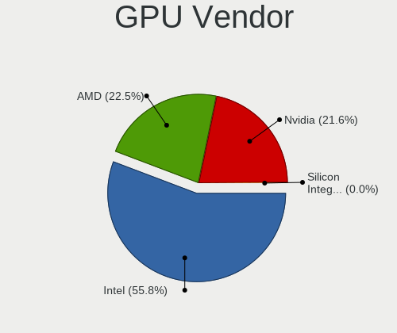

Linux Hardware Trends (Notebook)
--------------------------------

A project to identify most popular hardware characteristics and track their change
over time based on data collected by Linux users at https://Linux-Hardware.org.

Anyone can contribute to the study by uploading probes of their computers by
the [hw-probe](https://github.com/linuxhw/hw-probe) tool:

    sudo hw-probe -all -upload

Full-feature report is available here: https://linux-hardware.org/?view=trends&formfactor=notebook

Period: Apr, 2020.

Contents
--------

- [ OS                       ](#os)
- [ OS Family                ](#os-family)
- [ Kernel                   ](#kernel)
- [ Kernel Family            ](#kernel-family)
- [ Kernel Major Ver.        ](#kernel-major-ver)
- [ Arch                     ](#arch)
- [ DE                       ](#de)
- [ Display Server           ](#display-server)
- [ Display Manager          ](#display-manager)
- [ OS Lang                  ](#os-lang)
- [ Boot Mode                ](#boot-mode)
- [ Filesystem               ](#filesystem)
- [ Dual Boot with Linux/BSD ](#dual-boot-with-linux/bsd)
- [ Dual Boot (Win)          ](#dual-boot-win)
- [ Country                  ](#country)
- [ City                     ](#city)
- [ Vendor                   ](#vendor)
- [ Model                    ](#model)
- [ Model Family             ](#model-family)
- [ MFG Year                 ](#mfg-year)
- [ Form Factor              ](#form-factor)
- [ Secure Boot              ](#secure-boot)
- [ Coreboot                 ](#coreboot)
- [ RAM Size                 ](#ram-size)
- [ RAM Used                 ](#ram-used)
- [ Drive Vendor             ](#drive-vendor)
- [ Drive Model              ](#drive-model)
- [ Drive Kind               ](#drive-kind)
- [ Drive Connector          ](#drive-connector)
- [ Drive Size               ](#drive-size)
- [ Space Total              ](#space-total)
- [ Space Used               ](#space-used)
- [ Malfunc. Drives          ](#malfunc-drives)
- [ Malfunc. Drive Vendor    ](#malfunc-drive-vendor)
- [ Malfunc. Drive Kind      ](#malfunc-drive-kind)
- [ Failed Drives            ](#failed-drives)
- [ Failed Drive Vendor      ](#failed-drive-vendor)
- [ Drive Status             ](#drive-status)
- [ Storage Vendor           ](#storage-vendor)
- [ Storage Model            ](#storage-model)
- [ Storage Kind             ](#storage-kind)
- [ CPU Vendor               ](#cpu-vendor)
- [ CPU Model                ](#cpu-model)
- [ CPU Model Family         ](#cpu-model-family)
- [ CPU Cores                ](#cpu-cores)
- [ CPU Sockets              ](#cpu-sockets)
- [ CPU Threads              ](#cpu-threads)
- [ CPU Op-Modes             ](#cpu-op-modes)
- [ CPU Microarch            ](#cpu-microarch)
- [ CPU Microcode            ](#cpu-microcode)
- [ GPU Vendor               ](#gpu-vendor)
- [ GPU Model                ](#gpu-model)
- [ GPU Combo                ](#gpu-combo)
- [ GPU Driver               ](#gpu-driver)
- [ GPU Memory               ](#gpu-memory)
- [ Monitor Vendor           ](#monitor-vendor)
- [ Monitor Model            ](#monitor-model)
- [ Monitor Resolution       ](#monitor-resolution)
- [ Monitor Diagonal         ](#monitor-diagonal)
- [ Monitor Width            ](#monitor-width)
- [ Aspect Ratio             ](#aspect-ratio)
- [ Monitor Area             ](#monitor-area)
- [ Pixel Density            ](#pixel-density)
- [ Multiple Monitors        ](#multiple-monitors)
- [ Net Controller Vendor    ](#net-controller-vendor)
- [ Net Controller Model     ](#net-controller-model)
- [ Net Controller Kind      ](#net-controller-kind)
- [ Used Controller          ](#used-controller)
- [ NICs                     ](#nics)
- [ Unsupported Devices      ](#unsupported-devices)
- [ Unsupported Device Types ](#unsupported-device-types)

OS
--

Installed operating systems

| Name                   | Computers | Percent |
|------------------------|-----------|---------|
| Ubuntu 18.04           | 682       | 24.54%  |
| Ubuntu 20.04           | 423       | 15.22%  |
| Ubuntu 19.10           | 282       | 10.15%  |
| Mint 19.3              | 171       | 6.15%   |
| ROSA R11               | 123       | 4.43%   |
| Endless 3.7.8          | 116       | 4.17%   |
| Zorin 15               | 89        | 3.2%    |
| Fedora 31              | 88        | 3.17%   |
| BlackPanther 18.1      | 83        | 2.99%   |
| Ubuntu 16.04           | 55        | 1.98%   |
| Arch                   | 54        | 1.94%   |
| Manjaro                | 49        | 1.76%   |
| Debian 10              | 49        | 1.76%   |
| Manjaro 20.0           | 36        | 1.3%    |
| ROSA R11.1             | 32        | 1.15%   |
| Fedora 32              | 26        | 0.94%   |
| KDE neon 18.04         | 25        | 0.9%    |
| openSUSE 15.1          | 24        | 0.86%   |
| Manjaro 19.0.2         | 23        | 0.83%   |
| BlackPanther 16.2      | 20        | 0.72%   |
| Arch Rolling           | 15        | 0.54%   |
| Kali 2020.2            | 13        | 0.47%   |
| Ubuntu 19.04           | 12        | 0.43%   |
| openSUSE 20200405      | 12        | 0.43%   |
| Elementary 5.1.3       | 12        | 0.43%   |
| Gentoo                 | 11        | 0.4%    |
| Mint 4                 | 10        | 0.36%   |
| Debian                 | 9         | 0.32%   |
| Parrot 4.8             | 8         | 0.29%   |
| Mint 19.1              | 8         | 0.29%   |
| Endless 3.8.0          | 8         | 0.29%   |
| CentOS 8               | 8         | 0.29%   |
| ROSA R8.1              | 7         | 0.25%   |
| ROSA R10               | 7         | 0.25%   |
| Clear Linux 32760      | 7         | 0.25%   |
| Peppermint 10          | 6         | 0.22%   |
| Debian Testing         | 6         | 0.22%   |
| Chrome OS              | 6         | 0.22%   |
| Zorin 12               | 5         | 0.18%   |
| Endless 3.4.2-nexthw1  | 5         | 0.18%   |
| Endless 3.3.20-nexthw1 | 5         | 0.18%   |
| openSUSE Leap-15.1     | 4         | 0.14%   |
| Mint 19                | 4         | 0.14%   |
| Endless                | 4         | 0.14%   |
| Clear Linux 32910      | 4         | 0.14%   |
| Ubuntu                 | 3         | 0.11%   |
| Solus 4.1              | 3         | 0.11%   |
| Reborn OS              | 3         | 0.11%   |
| Pop!_OS 19.10          | 3         | 0.11%   |
| openSUSE 20200408      | 3         | 0.11%   |
| Mint 19.2              | 3         | 0.11%   |
| Mint 18.3              | 3         | 0.11%   |
| Fedora 30              | 3         | 0.11%   |
| Elementary 5.1.2       | 3         | 0.11%   |
| Debian Unstable        | 3         | 0.11%   |
| Debian 9.12            | 3         | 0.11%   |
| CentOS 7               | 3         | 0.11%   |
| ROSA R9                | 2         | 0.07%   |
| RHEL 8.1               | 2         | 0.07%   |
| RED X4                 | 2         | 0.07%   |

OS Family
---------

OS without a version

| Name         | Computers | Percent |
|--------------|-----------|---------|
| Ubuntu       | 1459      | 52.5%   |
| Mint         | 200       | 7.2%    |
| ROSA         | 174       | 6.26%   |
| Endless      | 152       | 5.47%   |
| Fedora       | 120       | 4.32%   |
| Manjaro      | 109       | 3.92%   |
| BlackPanther | 103       | 3.71%   |
| Zorin        | 94        | 3.38%   |
| Debian       | 72        | 2.59%   |
| Arch         | 69        | 2.48%   |
| openSUSE     | 61        | 2.2%    |
| KDE neon     | 25        | 0.9%    |
| Clear Linux  | 18        | 0.65%   |
| Elementary   | 17        | 0.61%   |
| Kali         | 15        | 0.54%   |
| Gentoo       | 14        | 0.5%    |
| CentOS       | 12        | 0.43%   |
| Parrot       | 9         | 0.32%   |
| Peppermint   | 6         | 0.22%   |
| Chrome OS    | 6         | 0.22%   |
| Pop!_OS      | 5         | 0.18%   |
| ArcoLinux    | 5         | 0.18%   |
| Solus        | 3         | 0.11%   |
| RHEL         | 3         | 0.11%   |
| Reborn OS    | 3         | 0.11%   |
| Deepin       | 3         | 0.11%   |
| antergos     | 3         | 0.11%   |
| PureOS       | 2         | 0.07%   |
| Oracle Linux | 2         | 0.07%   |
| MX           | 2         | 0.07%   |
| Void         | 1         | 0.04%   |
| SolydXK      | 1         | 0.04%   |
| Pardus       | 1         | 0.04%   |
| NixOS        | 1         | 0.04%   |
| Garuda       | 1         | 0.04%   |
| GalliumOS    | 1         | 0.04%   |
| EndeavourOS  | 1         | 0.04%   |
| BlackArch    | 1         | 0.04%   |
| Astra Linux  | 1         | 0.04%   |
| Artix        | 1         | 0.04%   |
| ArchLabs     | 1         | 0.04%   |
| Antix        | 1         | 0.04%   |
| Alpine       | 1         | 0.04%   |

Kernel
------

Version of the Linux kernel

| Version                        | Computers | Percent |
|--------------------------------|-----------|---------|
| 5.3.0-46-generic               | 549       | 19.75%  |
| 5.4.0-26-generic               | 228       | 8.2%    |
| 5.3.0-45-generic               | 197       | 7.09%   |
| 5.3.0-28-generic               | 170       | 6.12%   |
| 4.15.0-96-generic              | 131       | 4.71%   |
| 4.18.16-desktop-1bP            | 73        | 2.63%   |
| 4.15.0-91-generic              | 69        | 2.48%   |
| 5.4.0-28-generic               | 65        | 2.34%   |
| 5.4.0-21-generic               | 63        | 2.27%   |
| 4.19.0-8-amd64                 | 44        | 1.58%   |
| 5.3.0-42-generic               | 43        | 1.55%   |
| 4.15.0-desktop-45.1rosa-x86_64 | 36        | 1.29%   |
| 5.0.0-32-generic               | 35        | 1.26%   |
| 5.4.0-24-generic               | 32        | 1.15%   |
| 5.3.0-51-generic               | 29        | 1.04%   |
| 5.3.0-40-generic               | 29        | 1.04%   |
| 4.15.0-desktop-94.1rosa-x86_64 | 29        | 1.04%   |
| 4.15.0-desktop-68.5rosa-x86_64 | 27        | 0.97%   |
| 5.5.15-200.fc31.x86_64         | 26        | 0.94%   |
| 4.12.14-lp151.28.44-default    | 24        | 0.86%   |
| 5.3.0-47-generic               | 21        | 0.76%   |
| 5.3.0-18-generic               | 19        | 0.68%   |
| 4.9.20-desktop-pae-1bP         | 18        | 0.65%   |
| 5.5.17-200.fc31.x86_64         | 17        | 0.61%   |
| 5.6.4-arch1-1                  | 15        | 0.54%   |
| 5.5.13-arch2-1                 | 13        | 0.47%   |
| 5.6.0-1-default                | 12        | 0.43%   |
| 4.15.0-desktop-45.1rosa-i586   | 12        | 0.43%   |
| 5.6.3-arch1-1                  | 11        | 0.4%    |
| 5.4.28-1-MANJARO               | 11        | 0.4%    |
| 5.4.32-generic-2rosa-x86_64    | 10        | 0.36%   |
| 5.4.31-1-MANJARO               | 10        | 0.36%   |
| 5.4.0-25-generic               | 10        | 0.36%   |
| 5.0.0-37-generic               | 10        | 0.36%   |
| 5.6.7-1-MANJARO                | 9         | 0.32%   |
| 5.5.13-200.fc31.x86_64         | 9         | 0.32%   |
| 5.4.33-3-MANJARO               | 9         | 0.32%   |
| 5.3.0-48-generic               | 9         | 0.32%   |
| 5.3.0-46-lowlatency            | 9         | 0.32%   |
| 5.1.15-desktop-1bP             | 9         | 0.32%   |
| 5.0.0-23-generic               | 9         | 0.32%   |
| 4.4.0-177-generic              | 9         | 0.32%   |
| 4.15.0-desktop-68.5rosa-i586   | 9         | 0.32%   |
| 5.6.6-200.fc31.x86_64          | 8         | 0.29%   |
| 5.5.11-200.fc31.x86_64         | 8         | 0.29%   |
| 5.4.0-4parrot1-amd64           | 8         | 0.29%   |
| 5.4.0-19-generic               | 8         | 0.29%   |
| 5.0.0-38-generic               | 8         | 0.29%   |
| 4.16.0-4-generic               | 8         | 0.29%   |
| 5.6.7-arch1-1                  | 7         | 0.25%   |
| 5.5.15-930.native              | 7         | 0.25%   |
| 5.4.34-1-MANJARO               | 7         | 0.25%   |
| 5.4.0-4-amd64                  | 7         | 0.25%   |
| 4.18.0-15-generic              | 7         | 0.25%   |
| 4.15.0-15-generic              | 7         | 0.25%   |
| 5.6.7-300.fc32.x86_64          | 6         | 0.22%   |
| 5.6.6-arch1-1                  | 6         | 0.22%   |
| 5.6.5-arch3-1                  | 6         | 0.22%   |
| 5.6.3-2-MANJARO                | 6         | 0.22%   |
| 5.6.2-1-default                | 6         | 0.22%   |

Kernel Family
-------------

Linux kernel without a distro release

| Version  | Computers | Percent |
|----------|-----------|---------|
| 5.3.0    | 1097      | 39.46%  |
| 5.4.0    | 463       | 16.65%  |
| 4.15.0   | 393       | 14.14%  |
| 5.0.0    | 80        | 2.88%   |
| 4.18.16  | 73        | 2.63%   |
| 4.19.0   | 57        | 2.05%   |
| 5.5.13   | 39        | 1.4%    |
| 5.5.15   | 34        | 1.22%   |
| 5.6.4    | 29        | 1.04%   |
| 5.6.3    | 29        | 1.04%   |
| 5.6.7    | 28        | 1.01%   |
| 4.12.14  | 28        | 1.01%   |
| 5.6.6    | 27        | 0.97%   |
| 5.6.0    | 22        | 0.79%   |
| 5.4.28   | 22        | 0.79%   |
| 4.9.20   | 22        | 0.79%   |
| 4.4.0    | 22        | 0.79%   |
| 4.18.0   | 21        | 0.76%   |
| 5.6.2    | 19        | 0.68%   |
| 5.5.17   | 17        | 0.61%   |
| 5.4.31   | 15        | 0.54%   |
| 5.6.5    | 14        | 0.5%    |
| 5.5.11   | 13        | 0.47%   |
| 5.4.33   | 13        | 0.47%   |
| 5.5.0    | 12        | 0.43%   |
| 5.4.32   | 11        | 0.4%    |
| 5.5.16   | 10        | 0.36%   |
| 5.1.15   | 10        | 0.36%   |
| 4.9.155  | 9         | 0.32%   |
| 5.4.34   | 8         | 0.29%   |
| 4.16.0   | 8         | 0.29%   |
| 5.5.9    | 7         | 0.25%   |
| 4.13.0   | 7         | 0.25%   |
| 5.4.35   | 6         | 0.22%   |
| 4.9.60   | 6         | 0.22%   |
| 4.9.0    | 6         | 0.22%   |
| 4.19.88  | 5         | 0.18%   |
| 5.5.10   | 4         | 0.14%   |
| 5.4.30   | 4         | 0.14%   |
| 5.4.23   | 4         | 0.14%   |
| 5.3.7    | 4         | 0.14%   |
| 5.1.0    | 4         | 0.14%   |
| 4.19.114 | 4         | 0.14%   |
| 5.5.19   | 3         | 0.11%   |
| 5.5.18   | 3         | 0.11%   |
| 5.4.27   | 3         | 0.11%   |
| 5.4.24   | 3         | 0.11%   |
| 4.19.116 | 3         | 0.11%   |
| 4.10.0   | 3         | 0.11%   |
| 3.10.0   | 3         | 0.11%   |
| 5.5.7    | 2         | 0.07%   |
| 5.4.26   | 2         | 0.07%   |
| 5.4.17   | 2         | 0.07%   |
| 5.3.18   | 2         | 0.07%   |
| 4.9.9    | 2         | 0.07%   |
| 4.9.41   | 2         | 0.07%   |
| 4.9.212  | 2         | 0.07%   |
| 4.19.97  | 2         | 0.07%   |
| 4.1.13   | 2         | 0.07%   |
| 5.7.0    | 1         | 0.04%   |

Kernel Major Ver.
-----------------

Linux kernel major version

| Version | Computers | Percent |
|---------|-----------|---------|
| 5.3     | 1107      | 39.82%  |
| 5.4     | 560       | 20.14%  |
| 4.15    | 394       | 14.17%  |
| 5.6     | 169       | 6.08%   |
| 5.5     | 149       | 5.36%   |
| 4.18    | 95        | 3.42%   |
| 5.0     | 80        | 2.88%   |
| 4.19    | 76        | 2.73%   |
| 4.9     | 50        | 1.8%    |
| 4.12    | 28        | 1.01%   |
| 4.4     | 23        | 0.83%   |
| 5.1     | 15        | 0.54%   |
| 4.16    | 9         | 0.32%   |
| 4.13    | 8         | 0.29%   |
| 3.10    | 4         | 0.14%   |
| 4.10    | 3         | 0.11%   |
| 4.1     | 3         | 0.11%   |
| 5.7     | 1         | 0.04%   |
| 5.2     | 1         | 0.04%   |
| 4.8     | 1         | 0.04%   |
| 4.7     | 1         | 0.04%   |
| 4.20    | 1         | 0.04%   |
| 4.14    | 1         | 0.04%   |
| 3.13    | 1         | 0.04%   |

Arch
----

OS architecture (x86_64, i586, etc.)

| Name   | Computers | Percent |
|--------|-----------|---------|
| x86_64 | 2575      | 92.63%  |
| i686   | 204       | 7.34%   |
| armv7l | 1         | 0.04%   |

DE
--

Desktop Environment

| Name             | Computers | Percent |
|------------------|-----------|---------|
| GNOME            | 1550      | 55.76%  |
| KDE5             | 276       | 9.93%   |
| XFCE             | 248       | 8.92%   |
| X-Cinnamon       | 127       | 4.57%   |
| Unknown          | 127       | 4.57%   |
| KDE              | 103       | 3.71%   |
| KDE4             | 97        | 3.49%   |
| MATE             | 69        | 2.48%   |
| Unity            | 44        | 1.58%   |
| Cinnamon         | 37        | 1.33%   |
| LXQt             | 26        | 0.94%   |
| Pantheon         | 17        | 0.61%   |
| Budgie           | 15        | 0.54%   |
| LXDE             | 14        | 0.5%    |
| Deepin           | 9         | 0.32%   |
| GNOME Flashback  | 6         | 0.22%   |
| GNOME Classic    | 6         | 0.22%   |
| i3               | 3         | 0.11%   |
| xubuntu          | 1         | 0.04%   |
| Trinity          | 1         | 0.04%   |
| lightdm-xsession | 1         | 0.04%   |
| i3-gaps          | 1         | 0.04%   |
| fly              | 1         | 0.04%   |
| Awesome          | 1         | 0.04%   |

Display Server
--------------

X11 or Wayland

| Name        | Computers | Percent |
|-------------|-----------|---------|
| X11         | 2557      | 91.98%  |
| Wayland     | 158       | 5.68%   |
| Unknown     | 50        | 1.8%    |
| Tty         | 14        | 0.5%    |
| Unspecified | 1         | 0.04%   |

Display Manager
---------------

SDDM, LightDM, etc.

| Name    | Computers | Percent |
|---------|-----------|---------|
| Unknown | 2045      | 73.56%  |
| SDDM    | 248       | 8.92%   |
| LightDM | 196       | 7.05%   |
| GDM     | 188       | 6.76%   |
| KDM     | 97        | 3.49%   |
| SLiM    | 3         | 0.11%   |
| XDM     | 1         | 0.04%   |
| NODM    | 1         | 0.04%   |
| MDM     | 1         | 0.04%   |

OS Lang
-------

Language

| Lang       | Computers | Percent |
|------------|-----------|---------|
| en_US      | 824       | 29.64%  |
| ru_RU      | 214       | 7.7%    |
| Unknown    | 202       | 7.27%   |
| de_DE      | 190       | 6.83%   |
| en_GB      | 141       | 5.07%   |
| pt_BR      | 136       | 4.89%   |
| it_IT      | 130       | 4.68%   |
| fr_FR      | 99        | 3.56%   |
| es_ES      | 91        | 3.27%   |
| en_US.utf8 | 72        | 2.59%   |
| pl_PL      | 52        | 1.87%   |
| en_IN      | 44        | 1.58%   |
| en_CA      | 43        | 1.55%   |
| C          | 38        | 1.37%   |
| en_AU      | 31        | 1.12%   |
| pt_PT      | 30        | 1.08%   |
| nl_NL      | 25        | 0.9%    |
| es_MX      | 24        | 0.86%   |
| es_AR      | 21        | 0.76%   |
| cs_CZ      | 21        | 0.76%   |
| hu_HU      | 18        | 0.65%   |
| tr_TR      | 17        | 0.61%   |
| pt_BR.utf8 | 17        | 0.61%   |
| ru_UA      | 16        | 0.58%   |
| ro_RO      | 16        | 0.58%   |
| es_CL      | 13        | 0.47%   |
| es_CO      | 12        | 0.43%   |
| en_IE      | 11        | 0.4%    |
| el_GR      | 11        | 0.4%    |
| fi_FI      | 10        | 0.36%   |
| de_AT      | 10        | 0.36%   |
| de_CH      | 9         | 0.32%   |
| fr_CA      | 8         | 0.29%   |
| en_ZA      | 8         | 0.29%   |
| uk_UA      | 6         | 0.22%   |
| sv_SE      | 6         | 0.22%   |
| sk_SK      | 6         | 0.22%   |
| ru_RU.utf8 | 6         | 0.22%   |
| POSIX      | 6         | 0.22%   |
| nl_BE      | 6         | 0.22%   |
| ja_JP      | 6         | 0.22%   |
| en_PH      | 6         | 0.22%   |
| da_DK      | 6         | 0.22%   |
| ca_ES      | 6         | 0.22%   |
| zh_CN      | 5         | 0.18%   |
| nb_NO      | 5         | 0.18%   |
| en_GB.utf8 | 5         | 0.18%   |
| lt_LT      | 4         | 0.14%   |
| ko_KR      | 4         | 0.14%   |
| it_IT.utf8 | 4         | 0.14%   |
| en_NZ      | 4         | 0.14%   |
| en_IL      | 4         | 0.14%   |
| bg_BG      | 4         | 0.14%   |
| pl_PL.utf8 | 3         | 0.11%   |
| fr_FR.utf8 | 3         | 0.11%   |
| es_PE      | 3         | 0.11%   |
| en_SG      | 3         | 0.11%   |
| en_IN      | 3         | 0.11%   |
| de_DE.utf8 | 3         | 0.11%   |
| C          | 3         | 0.11%   |

Boot Mode
---------

EFI or BIOS

| Mode | Computers | Percent |
|------|-----------|---------|
| BIOS | 1579      | 56.8%   |
| EFI  | 1201      | 43.2%   |

Filesystem
----------

Type of filesystem

| Type    | Computers | Percent |
|---------|-----------|---------|
| Ext4    | 2555      | 91.91%  |
| Overlay | 75        | 2.7%    |
| Btrfs   | 70        | 2.52%   |
| Xfs     | 29        | 1.04%   |
| Zfs     | 18        | 0.65%   |
| Tmpfs   | 9         | 0.32%   |
| Ext2    | 8         | 0.29%   |
| Ext3    | 7         | 0.25%   |
| F2fs    | 3         | 0.11%   |
| Aufs    | 3         | 0.11%   |
| Rootfs  | 1         | 0.04%   |
| Jfs     | 1         | 0.04%   |
| Unknown | 1         | 0.04%   |

Dual Boot with Linux/BSD
------------------------

Hosting more than one Linux/BSD

| Dual boot | Computers | Percent |
|-----------|-----------|---------|
| No        | 2514      | 90.43%  |
| Yes       | 266       | 9.57%   |

Dual Boot (Win)
---------------

Hosting Linux and Windows

| Dual boot | Computers | Percent |
|-----------|-----------|---------|
| No        | 1971      | 70.9%   |
| Yes       | 809       | 29.1%   |

Country
-------

Geographic location (country)

| Country        | Computers | Percent |
|----------------|-----------|---------|
| USA            | 394       | 14.17%  |
| Russia         | 278       | 10%     |
| Germany        | 245       | 8.81%   |
| Brazil         | 182       | 6.55%   |
| Italy          | 153       | 5.5%    |
| France         | 117       | 4.21%   |
| Spain          | 104       | 3.74%   |
| Hungary        | 104       | 3.74%   |
| UK             | 103       | 3.71%   |
| Poland         | 73        | 2.63%   |
| Canada         | 70        | 2.52%   |
| India          | 67        | 2.41%   |
| Ukraine        | 56        | 2.01%   |
| Netherlands    | 56        | 2.01%   |
| Romania        | 41        | 1.47%   |
| Australia      | 40        | 1.44%   |
| Mexico         | 37        | 1.33%   |
| Switzerland    | 36        | 1.29%   |
| Argentina      | 34        | 1.22%   |
| Portugal       | 33        | 1.19%   |
| Turkey         | 30        | 1.08%   |
| Austria        | 29        | 1.04%   |
| Belgium        | 26        | 0.94%   |
| Czech Republic | 25        | 0.9%    |
| Colombia       | 24        | 0.86%   |
| Greece         | 21        | 0.76%   |
| Finland        | 17        | 0.61%   |
| Bulgaria       | 17        | 0.61%   |
| Norway         | 16        | 0.58%   |
| Indonesia      | 16        | 0.58%   |
| Ireland        | 15        | 0.54%   |
| Chile          | 15        | 0.54%   |
| Sweden         | 14        | 0.5%    |
| Iran           | 13        | 0.47%   |
| China          | 12        | 0.43%   |
| South Africa   | 11        | 0.4%    |
| Slovakia       | 11        | 0.4%    |
| Israel         | 10        | 0.36%   |
| Denmark        | 10        | 0.36%   |
| Saudi Arabia   | 9         | 0.32%   |
| New Zealand    | 9         | 0.32%   |
| Vietnam        | 8         | 0.29%   |
| Philippines    | 8         | 0.29%   |
| Lithuania      | 8         | 0.29%   |
| Latvia         | 8         | 0.29%   |
| Kenya          | 8         | 0.29%   |
| Japan          | 8         | 0.29%   |
| Egypt          | 8         | 0.29%   |
| Serbia         | 7         | 0.25%   |
| Tunisia        | 6         | 0.22%   |
| Singapore      | 6         | 0.22%   |
| Estonia        | 5         | 0.18%   |
| Croatia        | 5         | 0.18%   |
| Costa Rica     | 5         | 0.18%   |
| Belarus        | 5         | 0.18%   |
| Uruguay        | 4         | 0.14%   |
| UAE            | 4         | 0.14%   |
| Taiwan         | 4         | 0.14%   |
| Peru           | 4         | 0.14%   |
| Pakistan       | 4         | 0.14%   |

City
----

Geographic location (city)

| City              | Computers | Percent |
|-------------------|-----------|---------|
| Moscow            | 65        | 2.34%   |
| Budapest          | 40        | 1.44%   |
| St Petersburg     | 28        | 1.01%   |
| São Paulo        | 26        | 0.94%   |
| Berlin            | 26        | 0.94%   |
| Paris             | 21        | 0.76%   |
| Warsaw            | 20        | 0.72%   |
| Kyiv              | 20        | 0.72%   |
| Vienna            | 19        | 0.68%   |
| Madrid            | 18        | 0.65%   |
| Rome              | 17        | 0.61%   |
| Rio de Janeiro    | 15        | 0.54%   |
| Milan             | 15        | 0.54%   |
| Melbourne         | 13        | 0.47%   |
| Hamburg           | 13        | 0.47%   |
| Bogotá           | 13        | 0.47%   |
| Prague            | 12        | 0.43%   |
| Munich            | 12        | 0.43%   |
| Krasnodar         | 12        | 0.43%   |
| Bucharest         | 12        | 0.43%   |
| Zurich            | 11        | 0.4%    |
| Sofia             | 11        | 0.4%    |
| Buenos Aires      | 11        | 0.4%    |
| Athens            | 11        | 0.4%    |
| Toronto           | 10        | 0.36%   |
| Dublin            | 10        | 0.36%   |
| Curitiba          | 10        | 0.36%   |
| Barcelona         | 10        | 0.36%   |
| Santiago          | 9         | 0.32%   |
| Ekaterinburg      | 9         | 0.32%   |
| Delhi             | 9         | 0.32%   |
| Bengaluru         | 9         | 0.32%   |
| Wrocław          | 8         | 0.29%   |
| Tehran            | 8         | 0.29%   |
| Stuttgart         | 8         | 0.29%   |
| Sacramento        | 8         | 0.29%   |
| Los Angeles       | 8         | 0.29%   |
| Lisbon            | 8         | 0.29%   |
| Helsinki          | 8         | 0.29%   |
| Nizhniy Novgorod  | 7         | 0.25%   |
| Nairobi           | 7         | 0.25%   |
| Montreal          | 7         | 0.25%   |
| Frankfurt am Main | 7         | 0.25%   |
| Voronezh          | 6         | 0.22%   |
| Turin             | 6         | 0.22%   |
| Samara            | 6         | 0.22%   |
| Istanbul          | 6         | 0.22%   |
| Dnipro            | 6         | 0.22%   |
| Denver            | 6         | 0.22%   |
| Cologne           | 6         | 0.22%   |
| Chicago           | 6         | 0.22%   |
| Brasília         | 6         | 0.22%   |
| Birmingham        | 6         | 0.22%   |
| Auckland          | 6         | 0.22%   |
| Atlanta           | 6         | 0.22%   |
| Ufa               | 5         | 0.18%   |
| Tula              | 5         | 0.18%   |
| Seattle           | 5         | 0.18%   |
| Salvador          | 5         | 0.18%   |
| Riga              | 5         | 0.18%   |

Vendor
------

Motherboard manufacturer

| Name                | Computers | Percent |
|---------------------|-----------|---------|
| Hewlett-Packard     | 575       | 20.68%  |
| Lenovo              | 474       | 17.05%  |
| Dell                | 467       | 16.8%   |
| ASUSTek Computer    | 337       | 12.12%  |
| Acer                | 276       | 9.93%   |
| Toshiba             | 122       | 4.39%   |
| Samsung Electronics | 67        | 2.41%   |
| Sony                | 64        | 2.3%    |
| Apple               | 58        | 2.09%   |
| MSI                 | 41        | 1.47%   |
| Packard Bell        | 22        | 0.79%   |
| Unknown             | 17        | 0.61%   |
| Notebook            | 16        | 0.58%   |
| Fujitsu Siemens     | 16        | 0.58%   |
| HUAWEI              | 14        | 0.5%    |
| Fujitsu             | 14        | 0.5%    |
| Medion              | 13        | 0.47%   |
| Clevo               | 12        | 0.43%   |
| Positivo            | 10        | 0.36%   |
| Alienware           | 9         | 0.32%   |
| Google              | 8         | 0.29%   |
| eMachines           | 8         | 0.29%   |
| Gateway             | 7         | 0.25%   |
| Chuwi               | 6         | 0.22%   |
| TUXEDO              | 5         | 0.18%   |
| Compal              | 5         | 0.18%   |
| THOMSON             | 4         | 0.14%   |
| IBM                 | 4         | 0.14%   |
| VIT                 | 3         | 0.11%   |
| Timi                | 3         | 0.11%   |
| SLIMBOOK            | 3         | 0.11%   |
| Panasonic           | 3         | 0.11%   |
| LG Electronics      | 3         | 0.11%   |
| Intel               | 3         | 0.11%   |
| Gigabyte Technology | 3         | 0.11%   |
| System76            | 2         | 0.07%   |
| Semp Toshiba        | 2         | 0.07%   |
| Razer               | 2         | 0.07%   |
| Quanta              | 2         | 0.07%   |
| NEC Computers       | 2         | 0.07%   |
| Multilaser          | 2         | 0.07%   |
| Monster             | 2         | 0.07%   |
| Itautec             | 2         | 0.07%   |
| Insyde              | 2         | 0.07%   |
| Dixonsxp            | 2         | 0.07%   |
| Digibras            | 2         | 0.07%   |
| BESSTAR Tech        | 2         | 0.07%   |
| YJKC                | 1         | 0.04%   |
| YASHI               | 1         | 0.04%   |
| Xplore Tech         | 1         | 0.04%   |
| Xplore              | 1         | 0.04%   |
| XMG                 | 1         | 0.04%   |
| WS                  | 1         | 0.04%   |
| Wortmann AG         | 1         | 0.04%   |
| W25BBZ              | 1         | 0.04%   |
| Visual Fan          | 1         | 0.04%   |
| UnBranded           | 1         | 0.04%   |
| UMAX                | 1         | 0.04%   |
| TWJ                 | 1         | 0.04%   |
| TrekStor            | 1         | 0.04%   |

Model
-----

Motherboard model

| Name                                       | Computers | Percent |
|--------------------------------------------|-----------|---------|
| Unknown                                    | 33        | 1.19%   |
| HP Pavilion dv6                            | 26        | 0.94%   |
| HP Notebook                                | 23        | 0.83%   |
| HP Pavilion dv7                            | 18        | 0.65%   |
| HP Pavilion g6                             | 16        | 0.58%   |
| Dell Latitude E6410                        | 12        | 0.43%   |
| HP EliteBook 8470p                         | 11        | 0.4%    |
| HP EliteBook 8460p                         | 10        | 0.36%   |
| Dell Inspiron 1545                         | 10        | 0.36%   |
| Dell G3 3590                               | 10        | 0.36%   |
| HP Pavilion Notebook                       | 9         | 0.32%   |
| HP Laptop 15-db0xxx                        | 9         | 0.32%   |
| HP Presario CQ57                           | 8         | 0.29%   |
| HP Laptop 15-da0xxx                        | 8         | 0.29%   |
| HP EliteBook 840 G6                        | 8         | 0.29%   |
| HP 15                                      | 8         | 0.29%   |
| Dell XPS 13 7390                           | 8         | 0.29%   |
| Dell Latitude E6420                        | 8         | 0.29%   |
| Dell Inspiron 15-3567                      | 8         | 0.29%   |
| Toshiba Satellite C660                     | 7         | 0.25%   |
| HP 250 G6 Notebook PC                      | 7         | 0.25%   |
| Dell Latitude E6430                        | 7         | 0.25%   |
| Dell Latitude 7490                         | 7         | 0.25%   |
| Dell Inspiron 1525                         | 7         | 0.25%   |
| ASUS VivoBook 15_ASUS Laptop X540MA_X540MA | 7         | 0.25%   |
| ASUS VivoBook 15_ASUS Laptop X540BA        | 7         | 0.25%   |
| HP Pavilion g4                             | 6         | 0.22%   |
| HP Laptop 15-bs0xx                         | 6         | 0.22%   |
| HP G62                                     | 6         | 0.22%   |
| HP EliteBook 8440p                         | 6         | 0.22%   |
| HP 250 G7 Notebook PC                      | 6         | 0.22%   |
| Dell XPS 15 7590                           | 6         | 0.22%   |
| Dell Latitude E6530                        | 6         | 0.22%   |
| Dell Latitude E6400                        | 6         | 0.22%   |
| Dell Latitude D630                         | 6         | 0.22%   |
| Acer Nitro AN515-52                        | 6         | 0.22%   |
| Acer Aspire E5-575G                        | 6         | 0.22%   |
| Lenovo IdeaPad S145-15AST 81N3             | 5         | 0.18%   |
| Lenovo IdeaPad FLEX-14API 81SS             | 5         | 0.18%   |
| Lenovo G50-45 80E3                         | 5         | 0.18%   |
| HP ProBook 4540s                           | 5         | 0.18%   |
| HP Pavilion g7                             | 5         | 0.18%   |
| HP Pavilion 17                             | 5         | 0.18%   |
| HP Pavilion 15                             | 5         | 0.18%   |
| HP Laptop 15-bw0xx                         | 5         | 0.18%   |
| HP EliteBook 8570p                         | 5         | 0.18%   |
| HP EliteBook 840 G5                        | 5         | 0.18%   |
| HP EliteBook 840 G1                        | 5         | 0.18%   |
| HP EliteBook 2560p                         | 5         | 0.18%   |
| HP 620                                     | 5         | 0.18%   |
| Dell XPS 13 9370                           | 5         | 0.18%   |
| Dell Latitude E7470                        | 5         | 0.18%   |
| Dell Latitude E7440                        | 5         | 0.18%   |
| Dell Latitude E6540                        | 5         | 0.18%   |
| Dell Latitude E6320                        | 5         | 0.18%   |
| Dell Latitude E5470                        | 5         | 0.18%   |
| Dell Inspiron N5110                        | 5         | 0.18%   |
| Dell Inspiron 5570                         | 5         | 0.18%   |
| Dell Inspiron 3583                         | 5         | 0.18%   |
| Dell Inspiron 11-3168                      | 5         | 0.18%   |

Model Family
------------

Motherboard model prefix

| Name                       | Computers | Percent |
|----------------------------|-----------|---------|
| Lenovo ThinkPad            | 227       | 8.17%   |
| Acer Aspire                | 205       | 7.37%   |
| Dell Inspiron              | 175       | 6.29%   |
| Dell Latitude              | 147       | 5.29%   |
| HP Pavilion                | 145       | 5.22%   |
| Lenovo IdeaPad             | 123       | 4.42%   |
| Toshiba Satellite          | 105       | 3.78%   |
| HP EliteBook               | 94        | 3.38%   |
| HP Laptop                  | 71        | 2.55%   |
| ASUS VivoBook              | 65        | 2.34%   |
| HP ProBook                 | 53        | 1.91%   |
| Dell XPS                   | 49        | 1.76%   |
| Unknown                    | 33        | 1.19%   |
| Dell Vostro                | 32        | 1.15%   |
| HP Compaq                  | 30        | 1.08%   |
| Dell Precision             | 29        | 1.04%   |
| HP Notebook                | 23        | 0.83%   |
| Packard Bell EasyNote      | 22        | 0.79%   |
| HP 250                     | 19        | 0.68%   |
| ASUS ZenBook               | 18        | 0.65%   |
| HP ZBook                   | 16        | 0.58%   |
| HP Presario                | 16        | 0.58%   |
| HP ENVY                    | 16        | 0.58%   |
| Acer Swift                 | 15        | 0.54%   |
| Acer Extensa               | 15        | 0.54%   |
| Acer Nitro                 | 14        | 0.5%    |
| Fujitsu LIFEBOOK           | 13        | 0.47%   |
| Dell G3                    | 13        | 0.47%   |
| ASUS TUF                   | 13        | 0.47%   |
| HP 15                      | 10        | 0.36%   |
| HP Mini                    | 9         | 0.32%   |
| HP 255                     | 9         | 0.32%   |
| Fujitsu Siemens AMILO      | 8         | 0.29%   |
| Dell G5                    | 8         | 0.29%   |
| Lenovo Legion              | 7         | 0.25%   |
| Dell Studio                | 7         | 0.25%   |
| Apple MacBookPro8          | 7         | 0.25%   |
| Acer TravelMate            | 7         | 0.25%   |
| Lenovo G580                | 6         | 0.22%   |
| Lenovo 3000                | 6         | 0.22%   |
| HP Stream                  | 6         | 0.22%   |
| HP G62                     | 6         | 0.22%   |
| Toshiba PORTEGE            | 5         | 0.18%   |
| Lenovo G50-45              | 5         | 0.18%   |
| HP 620                     | 5         | 0.18%   |
| Apple MacBookPro12         | 5         | 0.18%   |
| Apple MacBookAir7          | 5         | 0.18%   |
| Toshiba TECRA              | 4         | 0.14%   |
| Samsung Electronics RV411  | 4         | 0.14%   |
| Samsung Electronics RC530  | 4         | 0.14%   |
| Samsung Electronics 300E4C | 4         | 0.14%   |
| Positivo MOBILE            | 4         | 0.14%   |
| MSI GF63                   | 4         | 0.14%   |
| Lenovo Yoga                | 4         | 0.14%   |
| Lenovo ThinkBook           | 4         | 0.14%   |
| Lenovo G550                | 4         | 0.14%   |
| Lenovo G505s               | 4         | 0.14%   |
| Lenovo B50-30              | 4         | 0.14%   |
| IBM ThinkPad               | 4         | 0.14%   |
| HUAWEI NBLK-WAX9X          | 4         | 0.14%   |

MFG Year
--------

Motherboard manufacture year

| Year    | Computers | Percent |
|---------|-----------|---------|
| 2019    | 613       | 22.05%  |
| 2018    | 281       | 10.11%  |
| 2011    | 226       | 8.13%   |
| 2013    | 211       | 7.59%   |
| 2012    | 195       | 7.01%   |
| 2014    | 184       | 6.62%   |
| 2010    | 172       | 6.19%   |
| 2015    | 154       | 5.54%   |
| 2016    | 144       | 5.18%   |
| 2009    | 135       | 4.86%   |
| 2017    | 118       | 4.24%   |
| 2008    | 115       | 4.14%   |
| 2020    | 100       | 3.6%    |
| 2007    | 82        | 2.95%   |
| 2006    | 30        | 1.08%   |
| 2005    | 10        | 0.36%   |
| Unknown | 6         | 0.22%   |
| 2004    | 2         | 0.07%   |
| 2003    | 2         | 0.07%   |

Form Factor
-----------

Physical design of the computer

| Name     | Computers | Percent |
|----------|-----------|---------|
| Notebook | 2780      | 100%    |

Secure Boot
-----------

Enabled or disabled

| State    | Computers | Percent |
|----------|-----------|---------|
| Disabled | 2532      | 91.08%  |
| Enabled  | 248       | 8.92%   |

Coreboot
--------

Have coreboot on board

| Used | Computers | Percent |
|------|-----------|---------|
| No   | 2768      | 99.57%  |
| Yes  | 12        | 0.43%   |

RAM Size
--------

Total RAM memory

| Size in GB  | Computers | Percent |
|-------------|-----------|---------|
| 3.01-4.0    | 831       | 29.89%  |
| 4.01-8.0    | 733       | 26.37%  |
| 8.01-16.0   | 399       | 14.35%  |
| 16.01-24.0  | 338       | 12.16%  |
| 1.01-2.0    | 239       | 8.6%    |
| 2.01-3.0    | 89        | 3.2%    |
| 32.01-64.0  | 72        | 2.59%   |
| 0.01-1.0    | 49        | 1.76%   |
| 24.01-32.0  | 18        | 0.65%   |
| 64.01-256.0 | 11        | 0.4%    |
| Unknown     | 1         | 0.04%   |

RAM Used
--------

Used RAM memory

| Used GB    | Computers | Percent |
|------------|-----------|---------|
| 1.01-2.0   | 1197      | 43.06%  |
| 2.01-3.0   | 666       | 23.96%  |
| 0.01-1.0   | 368       | 13.24%  |
| 3.01-4.0   | 262       | 9.42%   |
| 4.01-8.0   | 218       | 7.84%   |
| 8.01-16.0  | 62        | 2.23%   |
| 16.01-24.0 | 3         | 0.11%   |
| Unknown    | 3         | 0.11%   |
| 32.01-64.0 | 1         | 0.04%   |

Drive Vendor
------------

Hard drive vendors

| Vendor              | Computers | Drives | Percent |
|---------------------|-----------|--------|---------|
| Seagate             | 522       | 530    | 17%     |
| WDC                 | 452       | 458    | 14.72%  |
| Samsung Electronics | 351       | 360    | 11.43%  |
| Toshiba             | 329       | 331    | 10.72%  |
| Kingston            | 173       | 175    | 5.64%   |
| Unknown             | 170       | 195    | 5.54%   |
| Hitachi             | 162       | 165    | 5.28%   |
| HGST                | 135       | 135    | 4.4%    |
| SanDisk             | 133       | 137    | 4.33%   |
| Crucial             | 95        | 96     | 3.09%   |
| Intel               | 63        | 63     | 2.05%   |
| Fujitsu             | 55        | 55     | 1.79%   |
| HL-DT-ST            | 49        | 17     | 1.6%    |
| SK Hynix            | 47        | 47     | 1.53%   |
| Micron Technology   | 40        | 40     | 1.3%    |
| A-DATA Technology   | 34        | 35     | 1.11%   |
| LITEONIT            | 19        | 19     | 0.62%   |
| Apple               | 18        | 18     | 0.59%   |
| OCZ                 | 16        | 16     | 0.52%   |
| Transcend           | 13        | 13     | 0.42%   |
| PNY                 | 11        | 11     | 0.36%   |
| LITEON              | 11        | 11     | 0.36%   |
| Generic             | 11        | 11     | 0.36%   |
| SPCC                | 10        | 10     | 0.33%   |
| China               | 10        | 10     | 0.33%   |
| KingSpec            | 9         | 9      | 0.29%   |
| PLEXTOR             | 8         | 8      | 0.26%   |
| Patriot             | 5         | 5      | 0.16%   |
| KingDian            | 5         | 5      | 0.16%   |
| JMicron             | 5         | 5      | 0.16%   |
| Intenso             | 5         | 5      | 0.16%   |
| GOODRAM             | 5         | 5      | 0.16%   |
| DOGFISH             | 5         | 5      | 0.16%   |
| Zheino              | 4         | 4      | 0.13%   |
| Hewlett-Packard     | 4         | 4      | 0.13%   |
| FORESEE             | 4         | 4      | 0.13%   |
| Corsair             | 4         | 4      | 0.13%   |
| Union Memory        | 3         | 3      | 0.1%    |
| TO Exter            | 3         | 3      | 0.1%    |
| Team                | 3         | 3      | 0.1%    |
| Silicon Motion      | 3         | 3      | 0.1%    |
| Lenovo              | 3         | 3      | 0.1%    |
| KingFast            | 3         | 3      | 0.1%    |
| HUAWEI              | 3         | 3      | 0.1%    |
| Dell                | 3         | 3      | 0.1%    |
| ASUS-PHISON         | 3         | 4      | 0.1%    |
| SABRENT             | 2         | 2      | 0.07%   |
| OWC                 | 2         | 2      | 0.07%   |
| Mushkin             | 2         | 2      | 0.07%   |
| LaCie               | 2         | 2      | 0.07%   |
| KINGMAX             | 2         | 2      | 0.07%   |
| BHT                 | 2         | 2      | 0.07%   |
| ASMT                | 2         | 2      | 0.07%   |
| Apacer              | 2         | 2      | 0.07%   |
| WDC WD32            | 1         | 1      | 0.03%   |
| WD MediaMax         | 1         | 1      | 0.03%   |
| Vi550               | 1         | 1      | 0.03%   |
| Verbatim            | 1         | 1      | 0.03%   |
| USB3.0              | 1         | 1      | 0.03%   |
| USB                 | 1         | 1      | 0.03%   |

Drive Model
-----------

Hard drive models

| Model                        | Computers | Percent |
|------------------------------|-----------|---------|
| ST1000LM035-1RK172 1TB       | 71        | 2.27%   |
| MQ01ABD100 1TB               | 62        | 1.98%   |
| MMC Card  32GB               | 57        | 1.82%   |
| ST1000LM024 HN-M101MBB 1TB   | 56        | 1.79%   |
| MQ01ABF050 500GB             | 54        | 1.73%   |
| ST500LT012-1DG142 500GB      | 40        | 1.28%   |
| MQ04ABF100 1TB               | 35        | 1.12%   |
| SA400S37120G 120GB SSD       | 34        | 1.09%   |
| ST9500325AS 500GB            | 33        | 1.06%   |
| DVDRAM GUE1N 3GB             | 33        | 1.06%   |
| MMC Card  64GB               | 31        | 0.99%   |
| SA400S37240G 240GB SSD       | 29        | 0.93%   |
| HTS721010A9E630 1TB          | 26        | 0.83%   |
| HTS541010A9E680 1TB          | 25        | 0.8%    |
| SSD 860 EVO 500GB            | 23        | 0.74%   |
| HTS545050A7E680 500GB        | 22        | 0.7%    |
| HTS545050A7E380 500GB        | 21        | 0.67%   |
| SV300S37A120G 120GB SSD      | 20        | 0.64%   |
| SSD 850 EVO 250GB            | 20        | 0.64%   |
| WD10SPZX-21Z10T0 1TB         | 19        | 0.61%   |
| MMC Card  128GB              | 18        | 0.58%   |
| ST2000LM007-1R8174 2TB       | 17        | 0.54%   |
| HTS725050A7E630 500GB        | 17        | 0.54%   |
| WD10JPVX-22JC3T0 1TB         | 16        | 0.51%   |
| ST500LT012-9WS142 500GB      | 16        | 0.51%   |
| MMC Card  16GB               | 16        | 0.51%   |
| DVDRAM GUC0N 1GB             | 16        | 0.51%   |
| ST9320325AS 320GB            | 14        | 0.45%   |
| ST500LM012 HN-M500MBB 500GB  | 14        | 0.45%   |
| ST1000LM048-2E7172 1TB       | 14        | 0.45%   |
| HTS543232A7A384 320GB        | 14        | 0.45%   |
| WD5000LPCX-24VHAT0 500GB     | 13        | 0.42%   |
| WD10SPZX-24Z10 1TB           | 13        | 0.42%   |
| ST500LM000-1EJ162 500GB      | 13        | 0.42%   |
| SA400S37480G 480GB SSD       | 13        | 0.42%   |
| ST9250315AS 250GB            | 12        | 0.38%   |
| ST1000LX015-1U7172 1TB       | 12        | 0.38%   |
| SSD 860 EVO 250GB            | 12        | 0.38%   |
| SSD 850 EVO 500GB            | 12        | 0.38%   |
| SSD 840 EVO 250GB            | 12        | 0.38%   |
| ST9320423AS 320GB            | 11        | 0.35%   |
| MMC Card  7GB                | 11        | 0.35%   |
| HTS545032B9A300 320GB        | 11        | 0.35%   |
| CT500MX500SSD1 500GB         | 11        | 0.35%   |
| SSD PLUS 240GB               | 10        | 0.32%   |
| SDSSDA240G 240GB             | 10        | 0.32%   |
| HTS547575A9E384 752GB        | 10        | 0.32%   |
| HM321HI 320GB                | 10        | 0.32%   |
| Expansion 1TB                | 10        | 0.32%   |
| CT240BX500SSD1 240GB         | 10        | 0.32%   |
| WD10SPZX-60Z10T0 1TB         | 9         | 0.29%   |
| WD10JPVX-60JC3T0 1TB         | 9         | 0.29%   |
| SV300S37A240G 240GB SSD      | 9         | 0.29%   |
| ST9500420AS 500GB            | 9         | 0.29%   |
| ST500LM021-1KJ152 500GB      | 9         | 0.29%   |
| SD/MMC/MS PRO 64GB           | 9         | 0.29%   |
| HTS541612J9SA00 120GB        | 9         | 0.29%   |
| 1100_MTFDDAV256TBN 256GB SSD | 9         | 0.29%   |
| WD3200BPVT-22JJ5T0 320GB     | 8         | 0.26%   |
| WD3200BEVT-22ZCT0 320GB      | 8         | 0.26%   |

Drive Kind
----------

HDD or SSD

| Kind    | Computers | Drives | Percent |
|---------|-----------|--------|---------|
| HDD     | 1572      | 1623   | 52.68%  |
| SSD     | 993       | 1059   | 33.28%  |
| MMC     | 168       | 194    | 5.63%   |
| NVMe    | 151       | 156    | 5.06%   |
| Unknown | 100       | 69     | 3.35%   |

Drive Connector
---------------

SATA, SAS, NVMe, etc.

| Type | Computers | Drives | Percent |
|------|-----------|--------|---------|
| SATA | 2371      | 2655   | 84.17%  |
| MMC  | 168       | 194    | 5.96%   |
| NVMe | 151       | 156    | 5.36%   |
| SAS  | 127       | 96     | 4.51%   |

Drive Size
----------

Size of hard drive

| Size in TB | Computers | Drives | Percent |
|------------|-----------|--------|---------|
| 0.01-0.5   | 2013      | 2256   | 71.28%  |
| 0.51-1.0   | 714       | 744    | 25.28%  |
| 1.01-2.0   | 81        | 84     | 2.87%   |
| 3.01-4.0   | 6         | 7      | 0.21%   |
| 4.01-10.0  | 6         | 6      | 0.21%   |
| 2.01-3.0   | 4         | 4      | 0.14%   |

Space Total
-----------

Amount of disk space available on the file system

| Size in GB     | Computers | Percent |
|----------------|-----------|---------|
| 101-250        | 951       | 34.21%  |
| 251-500        | 708       | 25.47%  |
| 501-1000       | 371       | 13.35%  |
| 51-100         | 260       | 9.35%   |
| 21-50          | 158       | 5.68%   |
| 1-20           | 134       | 4.82%   |
| 1001-2000      | 108       | 3.88%   |
| Unknown        | 36        | 1.29%   |
| 2001-3000      | 29        | 1.04%   |
| More than 3000 | 25        | 0.9%    |

Space Used
----------

Amount of used disk space

| Used GB        | Computers | Percent |
|----------------|-----------|---------|
| 1-20           | 1315      | 47.3%   |
| 21-50          | 505       | 18.17%  |
| 101-250        | 314       | 11.29%  |
| 51-100         | 312       | 11.22%  |
| 251-500        | 166       | 5.97%   |
| 501-1000       | 96        | 3.45%   |
| Unknown        | 36        | 1.29%   |
| 1001-2000      | 27        | 0.97%   |
| More than 3000 | 5         | 0.18%   |
| 2001-3000      | 4         | 0.14%   |

Malfunc. Drives
---------------

Drive models with a malfunction

| Model                           | Computers | Drives | Percent |
|---------------------------------|-----------|--------|---------|
| ST500LT012-1DG142 500GB         | 9         | 9      | 5.23%   |
| ST1000LM024 HN-M101MBB 1TB      | 7         | 7      | 4.07%   |
| HTS545050A7E380 500GB           | 5         | 5      | 2.91%   |
| HTS543232A7A384 320GB           | 5         | 5      | 2.91%   |
| HTS541010A9E680 1TB             | 5         | 5      | 2.91%   |
| ST9500325AS 500GB               | 4         | 4      | 2.33%   |
| ST9320325AS 320GB               | 4         | 4      | 2.33%   |
| MQ01ABD100 1TB                  | 4         | 4      | 2.33%   |
| ST1000LM035-1RK172 1TB          | 3         | 3      | 1.74%   |
| HTS725050A7E630 500GB           | 3         | 3      | 1.74%   |
| HTS545050A7E680 500GB           | 3         | 3      | 1.74%   |
| HM160HI 160GB                   | 3         | 3      | 1.74%   |
| WD3200BPVT-22ZEST0 320GB        | 2         | 2      | 1.16%   |
| ST9320423AS 320GB               | 2         | 2      | 1.16%   |
| ST9250827AS 250GB               | 2         | 2      | 1.16%   |
| ST9250410AS 250GB               | 2         | 2      | 1.16%   |
| ST9250315AS 250GB               | 2         | 2      | 1.16%   |
| ST9160310AS 160GB               | 2         | 2      | 1.16%   |
| ST500LT012-9WS142 500GB         | 2         | 2      | 1.16%   |
| ST500LM000-1EJ162 500GB         | 2         | 2      | 1.16%   |
| ST320LT020-9YG142 320GB         | 2         | 2      | 1.16%   |
| ST1000LM048-2E7172 1TB          | 2         | 2      | 1.16%   |
| SA400S37120G 120GB SSD          | 2         | 2      | 1.16%   |
| MQ01ABF050 500GB                | 2         | 2      | 1.16%   |
| MK7559GSXP 752GB                | 2         | 2      | 1.16%   |
| MK5065GSX 500GB                 | 2         | 2      | 1.16%   |
| HTS725032A9A364 320GB           | 2         | 2      | 1.16%   |
| HTS545050B9A300 500GB           | 2         | 2      | 1.16%   |
| 1100_MTFDDAV256TBN 256GB SSD    | 2         | 2      | 1.16%   |
| WD7500BPVT-24HXZT3 752GB        | 1         | 1      | 0.58%   |
| WD6400BPVT-55HXZT3 640GB        | 1         | 1      | 0.58%   |
| WD5000LPVX-22V0TT0 500GB        | 1         | 1      | 0.58%   |
| WD5000LPCX-24VHAT0 500GB        | 1         | 1      | 0.58%   |
| WD5000LPCX-24C6HT0 500GB        | 1         | 1      | 0.58%   |
| WD5000LPCX-21VHAT0 500GB        | 1         | 1      | 0.58%   |
| WD5000BPVT-75HXZT3 500GB        | 1         | 1      | 0.58%   |
| WD5000BPKT-60PK4T0 500GB        | 1         | 1      | 0.58%   |
| WD5000BEVT-75A0RT0 500GB        | 1         | 1      | 0.58%   |
| WD5000BEVT-60ZAT1 500GB         | 1         | 1      | 0.58%   |
| WD3200BEVT-75ZCT0 320GB         | 1         | 1      | 0.58%   |
| WD3200BEKT-60F3T1 320GB         | 1         | 1      | 0.58%   |
| WD2500BPVT-80ZEST0 250GB        | 1         | 1      | 0.58%   |
| WD2500BEKT-75PVMT0 250GB        | 1         | 1      | 0.58%   |
| WD1600BEKT-60A25T1 160GB        | 1         | 1      | 0.58%   |
| WD10JPVX-60JC3T0 1TB            | 1         | 1      | 0.58%   |
| TRION100 240GB SSD              | 1         | 1      | 0.58%   |
| SV300S37A120G 120GB SSD         | 1         | 1      | 0.58%   |
| ST9750423AS 752GB               | 1         | 1      | 0.58%   |
| ST9500420AS 500GB               | 1         | 1      | 0.58%   |
| ST9320310AS 320GB               | 1         | 1      | 0.58%   |
| ST9160314AS 160GB               | 1         | 1      | 0.58%   |
| ST320LT012-9WS14C 320GB         | 1         | 1      | 0.58%   |
| ST2000LX001-1RG174 2TB          | 1         | 1      | 0.58%   |
| ST1000LM044 HN-M101SAD 1TB      | 1         | 1      | 0.58%   |
| SSDSA2M160G2GN 160GB            | 1         | 1      | 0.58%   |
| SSD2SC120G3LC726B104-370P 120GB | 1         | 1      | 0.58%   |
| SSD TS128E 121GB                | 1         | 1      | 0.58%   |
| SSD i100 24GB                   | 1         | 1      | 0.58%   |
| SSD 960 PRO 2TB                 | 1         | 1      | 0.58%   |
| SSD 840 EVO 250GB               | 1         | 1      | 0.58%   |

Malfunc. Drive Vendor
---------------------

Vendors of faulty drives

| Vendor              | Computers | Drives | Percent |
|---------------------|-----------|--------|---------|
| Seagate             | 52        | 52     | 30.23%  |
| Toshiba             | 24        | 24     | 13.95%  |
| Hitachi             | 19        | 19     | 11.05%  |
| HGST                | 19        | 19     | 11.05%  |
| WDC                 | 18        | 18     | 10.47%  |
| Samsung Electronics | 8         | 8      | 4.65%   |
| SanDisk             | 6         | 6      | 3.49%   |
| Fujitsu             | 5         | 5      | 2.91%   |
| Kingston            | 4         | 4      | 2.33%   |
| Crucial             | 4         | 4      | 2.33%   |
| SK Hynix            | 3         | 3      | 1.74%   |
| Micron Technology   | 3         | 3      | 1.74%   |
| LITEONIT            | 2         | 2      | 1.16%   |
| PNY                 | 1         | 1      | 0.58%   |
| OCZ                 | 1         | 1      | 0.58%   |
| MARSHAL             | 1         | 1      | 0.58%   |
| Intel               | 1         | 1      | 0.58%   |
| Apple               | 1         | 1      | 0.58%   |

Malfunc. Drive Kind
-------------------

Kinds of faulty drives

| Kind | Computers | Drives | Percent |
|------|-----------|--------|---------|
| HDD  | 141       | 142    | 82.46%  |
| SSD  | 27        | 27     | 15.79%  |
| NVMe | 3         | 3      | 1.75%   |

Failed Drives
-------------

Failed drive models

| Model                    | Computers | Drives | Percent |
|--------------------------|-----------|--------|---------|
| WD5000BEVT-00A0RT0 500GB | 1         | 1      | 14.29%  |
| WD3200BPVT-24JJ5T0 320GB | 1         | 1      | 14.29%  |
| ST9500420AS 500GB        | 1         | 1      | 14.29%  |
| MQ01ABD100 1TB           | 1         | 1      | 14.29%  |
| MK5065GSXN 500GB         | 1         | 1      | 14.29%  |
| HTS541010G9SA00 100GB    | 1         | 1      | 14.29%  |
| HM250JI 250GB            | 1         | 1      | 14.29%  |

Failed Drive Vendor
-------------------

Failed drive vendors

| Vendor              | Computers | Drives | Percent |
|---------------------|-----------|--------|---------|
| WDC                 | 2         | 2      | 28.57%  |
| Toshiba             | 2         | 2      | 28.57%  |
| Seagate             | 1         | 1      | 14.29%  |
| Samsung Electronics | 1         | 1      | 14.29%  |
| Hitachi             | 1         | 1      | 14.29%  |

Drive Status
------------

Number of failed and malfunc. drives

| Status   | Computers | Drives | Percent |
|----------|-----------|--------|---------|
| Detected | 1892      | 2202   | 70.81%  |
| Works    | 604       | 720    | 22.6%   |
| Malfunc  | 169       | 172    | 6.32%   |
| Failed   | 7         | 7      | 0.26%   |

Storage Vendor
--------------

Storage controller vendors

| Vendor                           | Computers | Percent |
|----------------------------------|-----------|---------|
| Intel                            | 2154      | 72.99%  |
| AMD                              | 341       | 11.56%  |
| Samsung Electronics              | 139       | 4.71%   |
| Sandisk                          | 61        | 2.07%   |
| SK Hynix                         | 54        | 1.83%   |
| Toshiba America Info Systems     | 47        | 1.59%   |
| Nvidia                           | 31        | 1.05%   |
| Silicon Integrated Systems [SiS] | 24        | 0.81%   |
| Kingston Technology Company      | 13        | 0.44%   |
| Micron Technology                | 12        | 0.41%   |
| VIA Technologies                 | 10        | 0.34%   |
| Silicon Motion                   | 8         | 0.27%   |
| KIOXIA                           | 8         | 0.27%   |
| JMicron Technology               | 7         | 0.24%   |
| Union Memory (Shenzhen)          | 6         | 0.2%    |
| Phison Electronics               | 6         | 0.2%    |
| Micron/Crucial Technology        | 6         | 0.2%    |
| Lenovo                           | 6         | 0.2%    |
| ADATA Technology                 | 4         | 0.14%   |
| Marvell Technology Group         | 3         | 0.1%    |
| Apple                            | 3         | 0.1%    |
| Silicon Image                    | 2         | 0.07%   |
| Seagate Technology               | 2         | 0.07%   |
| Unknown                          | 1         | 0.03%   |
| ULi Electronics                  | 1         | 0.03%   |
| Lite-On Technology               | 1         | 0.03%   |
| ASMedia Technology               | 1         | 0.03%   |

Storage Model
-------------

Storage controller models

| Model                                                                      | Computers | Percent |
|----------------------------------------------------------------------------|-----------|---------|
| 7 Series Chipset Family 6-port SATA Controller [AHCI mode]                 | 269       | 8.28%   |
| FCH SATA Controller [AHCI mode]                                            | 244       | 7.51%   |
| Sunrise Point-LP SATA Controller [AHCI mode]                               | 236       | 7.26%   |
| 6 Series/C200 Series Chipset Family 6 port Mobile SATA AHCI Controller     | 197       | 6.06%   |
| 82801 Mobile SATA Controller [RAID mode]                                   | 185       | 5.69%   |
| 82801IBM/IEM (ICH9M/ICH9M-E) 4 port SATA Controller [AHCI mode]            | 148       | 4.56%   |
| 8 Series SATA Controller 1 [AHCI mode]                                     | 113       | 3.48%   |
| Non-Volatile memory controller                                             | 101       | 3.11%   |
| 82801HM/HEM (ICH8M/ICH8M-E) IDE Controller                                 | 101       | 3.11%   |
| Cannon Lake Mobile PCH SATA AHCI Controller                                | 99        | 3.05%   |
| 5 Series/3400 Series Chipset 4 port SATA AHCI Controller                   | 95        | 2.92%   |
| NVMe SSD Controller SM981/PM981/PM983                                      | 91        | 2.8%    |
| Wildcat Point-LP SATA Controller [AHCI Mode]                               | 90        | 2.77%   |
| 82801HM/HEM (ICH8M/ICH8M-E) SATA Controller [AHCI mode]                    | 89        | 2.74%   |
| 8 Series/C220 Series Chipset Family 6-port SATA Controller 1 [AHCI mode]   | 78        | 2.4%    |
| SB7x0/SB8x0/SB9x0 SATA Controller [AHCI mode]                              | 61        | 1.88%   |
| Cannon Point-LP SATA Controller [AHCI Mode]                                | 50        | 1.54%   |
| 5 Series/3400 Series Chipset 6 port SATA AHCI Controller                   | 46        | 1.42%   |
| 82801GBM/GHM (ICH7-M Family) SATA Controller [IDE mode]                    | 45        | 1.39%   |
| HM170/QM170 Chipset SATA Controller [AHCI Mode]                            | 44        | 1.35%   |
| SATA controller                                                            | 42        | 1.29%   |
| Atom/Celeron/Pentium Processor x5-E8000/J3xxx/N3xxx Series SATA Controller | 41        | 1.26%   |
| Atom Processor E3800 Series SATA AHCI Controller                           | 41        | 1.26%   |
| NM10/ICH7 Family SATA Controller [AHCI mode]                               | 35        | 1.08%   |
| BC501 NVMe Solid State Drive 512GB                                         | 32        | 0.98%   |
| WD Black 2018/PC SN520 NVMe SSD                                            | 27        | 0.83%   |
| 82801G (ICH7 Family) IDE Controller                                        | 26        | 0.8%    |
| 82801GBM/GHM (ICH7-M Family) SATA Controller [AHCI mode]                   | 25        | 0.77%   |
| Toshiba America Info Non-Volatile memory controller                        | 24        | 0.74%   |
| 5513 IDE Controller                                                        | 24        | 0.74%   |
| SSD Pro 7600p/760p/E 6100p Series                                          | 23        | 0.71%   |
| 82801HM/HEM (ICH8M/ICH8M-E) SATA Controller [IDE mode]                     | 22        | 0.68%   |
| SATA Controller / IDE mode                                                 | 21        | 0.65%   |
| Q170/Q150/B150/H170/H110/Z170/CM236 Chipset SATA Controller [AHCI Mode]    | 20        | 0.62%   |
| 82801IBM/IEM (ICH9M/ICH9M-E) 2 port SATA Controller [IDE mode]             | 20        | 0.62%   |
| SSD 660P Series                                                            | 19        | 0.58%   |
| NVMe SSD Controller SM961/PM961                                            | 19        | 0.58%   |
| Celeron N3350/Pentium N4200/Atom E3900 Series SATA AHCI Controller         | 18        | 0.55%   |
| BG3 NVMe SSD Controller                                                    | 16        | 0.49%   |
| SB7x0/SB8x0/SB9x0 IDE Controller                                           | 15        | 0.46%   |
| SB600 Non-Raid-5 SATA                                                      | 13        | 0.4%    |
| SB600 IDE                                                                  | 13        | 0.4%    |
| 7 Series Chipset Family 4-port SATA Controller [IDE mode]                  | 13        | 0.4%    |
| 7 Series Chipset Family 2-port SATA Controller [IDE mode]                  | 13        | 0.4%    |
| 5 Series/3400 Series Chipset 4 port SATA IDE Controller                    | 13        | 0.4%    |
| WD Black 2018/PC SN720 NVMe SSD                                            | 12        | 0.37%   |
| MCP79 AHCI Controller                                                      | 11        | 0.34%   |
| Electronics SATA controller                                                | 11        | 0.34%   |
| 5 Series/3400 Series Chipset 2 port SATA IDE Controller                    | 11        | 0.34%   |
| Mobile 4 Series Chipset PT IDER Controller                                 | 10        | 0.31%   |
| IXP SB4x0 IDE Controller                                                   | 10        | 0.31%   |
| FCH SATA Controller [IDE mode]                                             | 10        | 0.31%   |
| FCH IDE Controller                                                         | 9         | 0.28%   |
| Electronics Non-Volatile memory controller                                 | 9         | 0.28%   |
| Comet Lake SATA AHCI Controller                                            | 9         | 0.28%   |
| VT82C586A/B/VT82C686/A/B/VT823x/A/C PIPC Bus Master IDE                    | 8         | 0.25%   |
| Ice Lake-LP SATA Controller [AHCI mode]                                    | 8         | 0.25%   |
| 82801FBM (ICH6M) SATA Controller                                           | 7         | 0.22%   |
| 82801FB/FBM/FR/FW/FRW (ICH6 Family) IDE Controller                         | 7         | 0.22%   |
| PROSet/Wireless WiFi Software extension                                    | 6         | 0.18%   |

Storage Kind
------------

Kind of storage controller (IDE, SATA, NVMe, SAS, ...)

| Kind | Computers | Percent |
|------|-----------|---------|
| SATA | 2165      | 69.3%   |
| NVMe | 408       | 13.06%  |
| IDE  | 366       | 11.72%  |
| RAID | 185       | 5.92%   |

CPU Vendor
----------

Processor vendors

| Vendor       | Computers | Percent |
|--------------|-----------|---------|
| Intel        | 2392      | 86.04%  |
| AMD          | 385       | 13.85%  |
| CentaurHauls | 2         | 0.07%   |
| ARM          | 1         | 0.04%   |

CPU Model
---------

Processor models

| Model                                         | Computers | Percent |
|-----------------------------------------------|-----------|---------|
| Intel Core i5-8265U CPU @ 1.60GHz             | 54        | 1.94%   |
| Intel Core i5-8250U CPU @ 1.60GHz             | 45        | 1.62%   |
| Intel Core i7-8550U CPU @ 1.80GHz             | 42        | 1.51%   |
| Intel Core i7-8565U CPU @ 1.80GHz             | 41        | 1.47%   |
| Intel Core i7-8750H CPU @ 2.20GHz             | 39        | 1.4%    |
| Intel Core i5-7200U CPU @ 2.50GHz             | 39        | 1.4%    |
| Intel Core i7-9750H CPU @ 2.60GHz             | 37        | 1.33%   |
| Intel Core i7-7500U CPU @ 2.70GHz             | 30        | 1.08%   |
| Intel Core i5-3210M CPU @ 2.50GHz             | 30        | 1.08%   |
| Intel Core i5-2520M CPU @ 2.50GHz             | 30        | 1.08%   |
| Intel Core i5-3320M CPU @ 2.60GHz             | 29        | 1.04%   |
| Intel Core i5-2430M CPU @ 2.40GHz             | 29        | 1.04%   |
| Intel Core i5 CPU M 520 @ 2.40GHz             | 29        | 1.04%   |
| Intel Celeron N4000 CPU @ 1.10GHz             | 29        | 1.04%   |
| Intel Core i5-5200U CPU @ 2.20GHz             | 27        | 0.97%   |
| Intel Core i5-4200U CPU @ 1.60GHz             | 25        | 0.9%    |
| Intel Celeron CPU N3060 @ 1.60GHz             | 25        | 0.9%    |
| Intel Core i3-6006U CPU @ 2.00GHz             | 24        | 0.86%   |
| Intel Core i7-6500U CPU @ 2.50GHz             | 23        | 0.83%   |
| Intel Core i7-2670QM CPU @ 2.20GHz            | 23        | 0.83%   |
| Intel Core i5-4210U CPU @ 1.70GHz             | 23        | 0.83%   |
| Intel Core i5-2410M CPU @ 2.30GHz             | 23        | 0.83%   |
| AMD Ryzen 5 3500U with Radeon Vega Mobile Gfx | 23        | 0.83%   |
| Intel Celeron CPU N2840 @ 2.16GHz             | 22        | 0.79%   |
| Intel Core i3-7020U CPU @ 2.30GHz             | 19        | 0.68%   |
| Intel Atom CPU N270 @ 1.60GHz                 | 19        | 0.68%   |
| Intel Core i7-6700HQ CPU @ 2.60GHz            | 18        | 0.65%   |
| Intel Core i7-5500U CPU @ 2.40GHz             | 18        | 0.65%   |
| Intel Core i5-6200U CPU @ 2.30GHz             | 18        | 0.65%   |
| Intel Core i7-7700HQ CPU @ 2.80GHz            | 17        | 0.61%   |
| Intel Core i5-3230M CPU @ 2.60GHz             | 17        | 0.61%   |
| Intel Core i3-5005U CPU @ 2.00GHz             | 17        | 0.61%   |
| Intel Core i3-3110M CPU @ 2.40GHz             | 17        | 0.61%   |
| Intel Core 2 Duo CPU P8600 @ 2.40GHz          | 17        | 0.61%   |
| AMD A6-9225 RADEON R4, 5 COMPUTE CORES 2C+3G  | 17        | 0.61%   |
| Intel Core i7-4700MQ CPU @ 2.40GHz            | 16        | 0.58%   |
| Intel Core i7-10510U CPU @ 1.80GHz            | 16        | 0.58%   |
| Intel Core i5-8300H CPU @ 2.30GHz             | 16        | 0.58%   |
| Intel Core i5-2450M CPU @ 2.50GHz             | 16        | 0.58%   |
| AMD Ryzen 5 2500U with Radeon Vega Mobile Gfx | 16        | 0.58%   |
| Intel Pentium Dual-Core CPU T4200 @ 2.00GHz   | 15        | 0.54%   |
| Intel Core i5-9300H CPU @ 2.40GHz             | 15        | 0.54%   |
| Intel Core i5-3317U CPU @ 1.70GHz             | 15        | 0.54%   |
| Intel Core i3-2310M CPU @ 2.10GHz             | 15        | 0.54%   |
| Intel Celeron CPU N3350 @ 1.10GHz             | 15        | 0.54%   |
| Intel Core i7-3630QM CPU @ 2.40GHz            | 14        | 0.5%    |
| Intel Core i7-3520M CPU @ 2.90GHz             | 14        | 0.5%    |
| Intel Core i5-6300U CPU @ 2.40GHz             | 14        | 0.5%    |
| Intel Core i3 CPU M 380 @ 2.53GHz             | 14        | 0.5%    |
| Intel Atom x5-Z8300 CPU @ 1.44GHz             | 14        | 0.5%    |
| Intel Atom CPU N455 @ 1.66GHz                 | 14        | 0.5%    |
| Intel Core i7-2620M CPU @ 2.70GHz             | 13        | 0.47%   |
| Intel Core i3-3217U CPU @ 1.80GHz             | 13        | 0.47%   |
| Intel Core i3-2330M CPU @ 2.20GHz             | 13        | 0.47%   |
| Intel Core i3 CPU M 370 @ 2.40GHz             | 13        | 0.47%   |
| Intel Core i3 CPU M 350 @ 2.27GHz             | 13        | 0.47%   |
| Intel Core 2 Duo CPU P8700 @ 2.53GHz          | 13        | 0.47%   |
| Intel Atom x5-Z8350 CPU @ 1.44GHz             | 13        | 0.47%   |
| Intel Pentium Dual-Core CPU T4500 @ 2.30GHz   | 12        | 0.43%   |
| Intel Pentium CPU B960 @ 2.20GHz              | 12        | 0.43%   |

CPU Model Family
----------------

Processor model prefix

| Model                          | Computers | Percent |
|--------------------------------|-----------|---------|
| Intel Core i5                  | 696       | 25.04%  |
| Intel Core i7                  | 620       | 22.3%   |
| Intel Core i3                  | 254       | 9.14%   |
| Intel Core 2 Duo               | 217       | 7.81%   |
| Intel Celeron                  | 187       | 6.73%   |
| Intel Atom                     | 110       | 3.96%   |
| Intel Pentium                  | 101       | 3.63%   |
| AMD A6                         | 54        | 1.94%   |
| AMD Ryzen 5                    | 48        | 1.73%   |
| Intel Pentium Dual-Core        | 46        | 1.65%   |
| Intel Pentium Dual             | 29        | 1.04%   |
| Intel Core 2                   | 29        | 1.04%   |
| Intel Genuine                  | 27        | 0.97%   |
| AMD A10                        | 25        | 0.9%    |
| AMD E1                         | 24        | 0.86%   |
| AMD A8                         | 22        | 0.79%   |
| AMD E                          | 20        | 0.72%   |
| AMD A4                         | 19        | 0.68%   |
| Other                          | 18        | 0.65%   |
| AMD Ryzen 3                    | 18        | 0.65%   |
| Intel Pentium M                | 17        | 0.61%   |
| AMD E2                         | 17        | 0.61%   |
| AMD Ryzen 7                    | 16        | 0.58%   |
| AMD Turion 64 X2 Mobile        | 14        | 0.5%    |
| Intel Celeron M                | 11        | 0.4%    |
| Intel Core i9                  | 10        | 0.36%   |
| AMD Athlon II                  | 10        | 0.36%   |
| AMD Phenom II                  | 9         | 0.32%   |
| AMD Athlon                     | 9         | 0.32%   |
| Intel Pentium Silver           | 8         | 0.29%   |
| Intel Celeron Dual-Core        | 7         | 0.25%   |
| Intel Xeon                     | 6         | 0.22%   |
| Intel Core m3                  | 6         | 0.22%   |
| AMD Mobile Sempron             | 6         | 0.22%   |
| AMD A12                        | 6         | 0.22%   |
| AMD C-50                       | 5         | 0.18%   |
| AMD Turion II                  | 4         | 0.14%   |
| AMD FX                         | 4         | 0.14%   |
| AMD C-60                       | 4         | 0.14%   |
| Intel Pentium 4                | 3         | 0.11%   |
| AMD Turion II Dual-Core        | 3         | 0.11%   |
| AMD Turion 64 Mobile           | 3         | 0.11%   |
| AMD Athlon X2                  | 3         | 0.11%   |
| AMD Athlon 64 X2               | 3         | 0.11%   |
| Intel Core m5                  | 2         | 0.07%   |
| Intel Core Duo                 | 2         | 0.07%   |
| AMD Turion X2 Dual-Core Mobile | 2         | 0.07%   |
| AMD Sempron                    | 2         | 0.07%   |
| AMD Ryzen 7 PRO                | 2         | 0.07%   |
| AMD C-70                       | 2         | 0.07%   |
| AMD Athlon II Dual-Core        | 2         | 0.07%   |
| Intel Core m7                  | 1         | 0.04%   |
| Intel Core M                   | 1         | 0.04%   |
| Intel Core 2 Quad              | 1         | 0.04%   |
| Intel Celeron D                | 1         | 0.04%   |
| CentaurHauls VIA Nano          | 1         | 0.04%   |
| CentaurHauls VIA C7            | 1         | 0.04%   |
| ARM ARMv7                      | 1         | 0.04%   |
| AMD V140                       | 1         | 0.04%   |
| AMD V120                       | 1         | 0.04%   |

CPU Cores
---------

Number of processor cores

| Number | Computers | Percent |
|--------|-----------|---------|
| 2      | 1795      | 64.57%  |
| 4      | 737       | 26.51%  |
| 1      | 138       | 4.96%   |
| 6      | 95        | 3.42%   |
| 8      | 11        | 0.4%    |
| 3      | 3         | 0.11%   |
| 12     | 1         | 0.04%   |

CPU Sockets
-----------

Number of sockets

| Number | Computers | Percent |
|--------|-----------|---------|
| 1      | 2780      | 100%    |

CPU Threads
-----------

Threads per core (Hyper-Threading)

| Number | Computers | Percent |
|--------|-----------|---------|
| 2      | 1784      | 64.17%  |
| 1      | 996       | 35.83%  |

CPU Op-Modes
------------

CPU Operation Modes (32-bit, 64-bit)

| Op mode        | Computers | Percent |
|----------------|-----------|---------|
| 32-bit, 64-bit | 2693      | 96.87%  |
| 32-bit         | 83        | 2.99%   |
| Unknown        | 4         | 0.14%   |

CPU Microarch
-------------

Microarchitecture

| Name            | Computers | Percent |
|-----------------|-----------|---------|
| Skylake         | 594       | 21.37%  |
| Core            | 337       | 12.12%  |
| SandyBridge     | 264       | 9.5%    |
| IvyBridge       | 253       | 9.1%    |
| Haswell         | 218       | 7.84%   |
| Westmere        | 158       | 5.68%   |
| Silvermont      | 151       | 5.43%   |
| Broadwell       | 105       | 3.78%   |
| KabyLake        | 85        | 3.06%   |
| Excavator       | 74        | 2.66%   |
| Bonnell         | 63        | 2.27%   |
| Zen+            | 60        | 2.16%   |
| P6              | 49        | 1.76%   |
| Goldmont plus   | 42        | 1.51%   |
| Bobcat          | 39        | 1.4%    |
| Puma            | 32        | 1.15%   |
| K8 Hammer       | 32        | 1.15%   |
| K10             | 31        | 1.12%   |
| Zen             | 28        | 1.01%   |
| Piledriver      | 28        | 1.01%   |
| Penryn          | 23        | 0.83%   |
| Jaguar          | 23        | 0.83%   |
| K10 Llano       | 18        | 0.65%   |
| Goldmont        | 18        | 0.65%   |
| Nehalem         | 12        | 0.43%   |
| Icelake         | 12        | 0.43%   |
| K8 & K10 hybrid | 10        | 0.36%   |
| Unknown         | 10        | 0.36%   |
| Steamroller     | 6         | 0.22%   |
| NetBurst        | 3         | 0.11%   |
| Zen 2           | 1         | 0.04%   |
| CometLake       | 1         | 0.04%   |

CPU Microcode
-------------

Microcode number

| Number     | Computers | Percent |
|------------|-----------|---------|
| Unknown    | 306       | 11.01%  |
| 0x206a7    | 241       | 8.67%   |
| 0x306a9    | 231       | 8.31%   |
| 0x1067a    | 129       | 4.64%   |
| 0x40651    | 111       | 3.99%   |
| 0x806ea    | 107       | 3.85%   |
| 0x20655    | 104       | 3.74%   |
| 0x906ea    | 100       | 3.6%    |
| 0x806e9    | 96        | 3.45%   |
| 0x806ec    | 89        | 3.2%    |
| 0x306d4    | 88        | 3.17%   |
| 0x6fd      | 86        | 3.09%   |
| 0x406e3    | 86        | 3.09%   |
| 0x306c3    | 82        | 2.95%   |
| 0x10676    | 56        | 2.01%   |
| 0x30678    | 50        | 1.8%    |
| 0x406c4    | 46        | 1.65%   |
| 0x08108102 | 45        | 1.62%   |
| 0x806eb    | 40        | 1.44%   |
| 0x20652    | 40        | 1.44%   |
| 0x06006705 | 39        | 1.4%    |
| 0x706a1    | 36        | 1.29%   |
| 0x406c3    | 31        | 1.12%   |
| 0x05000119 | 30        | 1.08%   |
| 0x906e9    | 29        | 1.04%   |
| 0x106ca    | 29        | 1.04%   |
| 0x07030105 | 26        | 0.94%   |
| 0x506e3    | 25        | 0.9%    |
| 0x6f6      | 24        | 0.86%   |
| 0x010000c8 | 24        | 0.86%   |
| 0x106c2    | 23        | 0.83%   |
| 0x06001119 | 23        | 0.83%   |
| 0x0700010f | 19        | 0.68%   |
| 0x6fb      | 18        | 0.65%   |
| 0x6d8      | 17        | 0.61%   |
| 0x03000027 | 17        | 0.61%   |
| 0x506c9    | 16        | 0.58%   |
| 0x0810100b | 16        | 0.58%   |
| 0x706e5    | 14        | 0.5%    |
| 0x6e8      | 14        | 0.5%    |
| 0x08108109 | 13        | 0.47%   |
| 0x06006704 | 13        | 0.47%   |
| 0x106e5    | 12        | 0.43%   |
| 0x906ed    | 11        | 0.4%    |
| 0x10661    | 11        | 0.4%    |
| 0x6fa      | 10        | 0.36%   |
| 0xa0660    | 9         | 0.32%   |
| 0x6ec      | 9         | 0.32%   |
| 0x30661    | 9         | 0.32%   |
| 0x0600611a | 8         | 0.29%   |
| 0x02000057 | 8         | 0.29%   |
| 0x08101007 | 7         | 0.25%   |
| 0x05000029 | 7         | 0.25%   |
| 0x6f2      | 6         | 0.22%   |
| 0x30673    | 6         | 0.22%   |
| 0x06006118 | 5         | 0.18%   |
| 0x06003106 | 4         | 0.14%   |
| 0x6d6      | 3         | 0.11%   |
| 0x06006110 | 3         | 0.11%   |
| 0xf29      | 2         | 0.07%   |

GPU Vendor
----------

Vendors of graphics cards

| Vendor                           | Computers | Percent |
|----------------------------------|-----------|---------|
| Intel                            | 2087      | 60.72%  |
| Nvidia                           | 698       | 20.31%  |
| AMD                              | 625       | 18.18%  |
| Silicon Integrated Systems [SiS] | 17        | 0.49%   |
| VIA Technologies                 | 10        | 0.29%   |

GPU Model
---------

Graphics card models

| Model                                                                              | Computers | Percent |
|------------------------------------------------------------------------------------|-----------|---------|
| 2nd Generation Core Processor Family Integrated Graphics Controller                | 236       | 6.5%    |
| 3rd Gen Core processor Graphics Controller                                         | 230       | 6.34%   |
| Mobile 4 Series Chipset Integrated Graphics Controller                             | 127       | 3.5%    |
| Haswell-ULT Integrated Graphics Controller                                         | 126       | 3.47%   |
| UHD Graphics 630 (Mobile)                                                          | 118       | 3.25%   |
| UHD Graphics 620 (Whiskey Lake)                                                    | 116       | 3.2%    |
| Core Processor Integrated Graphics Controller                                      | 112       | 3.09%   |
| UHD Graphics 620                                                                   | 107       | 2.95%   |
| HD Graphics 620                                                                    | 92        | 2.54%   |
| Atom/Celeron/Pentium Processor x5-E8000/J3xxx/N3xxx Integrated Graphics Controller | 86        | 2.37%   |
| Skylake GT2 [HD Graphics 520]                                                      | 85        | 2.34%   |
| HD Graphics 5500                                                                   | 85        | 2.34%   |
| 4th Gen Core Processor Integrated Graphics Controller                              | 79        | 2.18%   |
| Mobile GM965/GL960 Integrated Graphics Controller (secondary)                      | 67        | 1.85%   |
| Mobile GM965/GL960 Integrated Graphics Controller (primary)                        | 67        | 1.85%   |
| Atom Processor Z36xxx/Z37xxx Series Graphics & Display                             | 65        | 1.79%   |
| Picasso                                                                            | 60        | 1.65%   |
| Stoney [Radeon R2/R3/R4/R5 Graphics]                                               | 55        | 1.52%   |
| Mobile 945GM/GMS/GME, 943/940GML Express Integrated Graphics Controller            | 53        | 1.46%   |
| UHD Graphics 605                                                                   | 42        | 1.16%   |
| GF117M [GeForce 610M/710M/810M/820M / GT 620M/625M/630M/720M]                      | 40        | 1.1%    |
| TU117M [GeForce GTX 1650 Mobile / Max-Q]                                           | 34        | 0.94%   |
| UHD Graphics                                                                       | 33        | 0.91%   |
| Topaz XT [Radeon R7 M260/M265 / M340/M360 / M440/M445 / 530/535 / 620/625 Mobile]  | 33        | 0.91%   |
| Sun XT [Radeon HD 8670A/8670M/8690M / R5 M330 / M430 / Radeon 520 Mobile]          | 32        | 0.88%   |
| Mobile 945GM/GMS, 943/940GML Express Integrated Graphics Controller                | 32        | 0.88%   |
| GP107M [GeForce GTX 1050 Mobile]                                                   | 31        | 0.85%   |
| Atom Processor D4xx/D5xx/N4xx/N5xx Integrated Graphics Controller                  | 31        | 0.85%   |
| HD Graphics 630                                                                    | 28        | 0.77%   |
| HD Graphics 530                                                                    | 28        | 0.77%   |
| Raven Ridge [Radeon Vega Series / Radeon Vega Mobile Series]                       | 27        | 0.74%   |
| GP107M [GeForce GTX 1050 Ti Mobile]                                                | 27        | 0.74%   |
| Seymour [Radeon HD 6400M/7400M Series]                                             | 26        | 0.72%   |
| RS880M [Mobility Radeon HD 4225/4250]                                              | 23        | 0.63%   |
| Mobile 945GSE Express Integrated Graphics Controller                               | 21        | 0.58%   |
| Park [Mobility Radeon HD 5430/5450/5470]                                           | 20        | 0.55%   |
| Mullins [Radeon R4/R5 Graphics]                                                    | 20        | 0.55%   |
| GP108M [GeForce MX150]                                                             | 20        | 0.55%   |
| Whistler [Radeon HD 6630M/6650M/6750M/7670M/7690M]                                 | 19        | 0.52%   |
| Wani [Radeon R5/R6/R7 Graphics]                                                    | 19        | 0.52%   |
| GF108M [GeForce GT 540M]                                                           | 19        | 0.52%   |
| HD Graphics 500                                                                    | 17        | 0.47%   |
| GP108M [GeForce MX250]                                                             | 17        | 0.47%   |
| 771/671 PCIE VGA Display Adapter                                                   | 17        | 0.47%   |
| Thames [Radeon HD 7550M/7570M/7650M]                                               | 16        | 0.44%   |
| GM108M [GeForce MX130]                                                             | 16        | 0.44%   |
| RV710/M92 [Mobility Radeon HD 4530/4570/545v]                                      | 15        | 0.41%   |
| GP106M [GeForce GTX 1060 Mobile]                                                   | 14        | 0.39%   |
| GM107M [GeForce GTX 960M]                                                          | 14        | 0.39%   |
| GK208BM [GeForce 920M]                                                             | 14        | 0.39%   |
| Wrestler [Radeon HD 6310]                                                          | 13        | 0.36%   |
| Thames [Radeon HD 7500M/7600M Series]                                              | 13        | 0.36%   |
| Jet PRO [Radeon R5 M230 / R7 M260DX / Radeon 520 Mobile]                           | 13        | 0.36%   |
| GT218M [NVS 3100M]                                                                 | 13        | 0.36%   |
| GM108M [GeForce 940MX]                                                             | 13        | 0.36%   |
| GK107M [GeForce GT 650M]                                                           | 13        | 0.36%   |
| RV620/M82 [Mobility Radeon HD 3450/3470]                                           | 12        | 0.33%   |
| Madison [Mobility Radeon HD 5650/5750 / 6530M/6550M]                               | 12        | 0.33%   |
| GM108M [GeForce 840M]                                                              | 12        | 0.33%   |
| GM107M [GeForce GTX 950M]                                                          | 12        | 0.33%   |

GPU Combo
---------

Combinations of graphics cards

| Name           | Computers | Percent |
|----------------|-----------|---------|
| 1 x Intel      | 1435      | 51.62%  |
| Intel + Nvidia | 496       | 17.84%  |
| 1 x AMD        | 395       | 14.21%  |
| 1 x Nvidia     | 194       | 6.98%   |
| Intel + AMD    | 152       | 5.47%   |
| 2 x AMD        | 70        | 2.52%   |
| 1 x SiS        | 17        | 0.61%   |
| 1 x VIA        | 10        | 0.36%   |
| AMD + Nvidia   | 7         | 0.25%   |
| Other          | 4         | 0.14%   |

GPU Driver
----------

Free vs proprietary

| Driver      | Computers | Percent |
|-------------|-----------|---------|
| Free        | 2383      | 85.72%  |
| Proprietary | 321       | 11.55%  |
| Unknown     | 76        | 2.73%   |

GPU Memory
----------

Total video memory

| Size in GB | Computers | Percent |
|------------|-----------|---------|
| Unknown    | 1489      | 53.56%  |
| 0.01-0.5   | 443       | 15.94%  |
| 1.01-2.0   | 442       | 15.9%   |
| 0.51-1.0   | 208       | 7.48%   |
| 3.01-4.0   | 156       | 5.61%   |
| 5.01-6.0   | 21        | 0.76%   |
| 7.01-8.0   | 14        | 0.5%    |
| 2.01-3.0   | 7         | 0.25%   |

Monitor Vendor
--------------

Monitor vendors

| Vendor                  | Computers | Percent |
|-------------------------|-----------|---------|
| AU Optronics            | 614       | 20.9%   |
| LG Display              | 501       | 17.05%  |
| Samsung Electronics     | 375       | 12.76%  |
| Chimei Innolux          | 348       | 11.84%  |
| BOE                     | 329       | 11.2%   |
| Chi Mei Optoelectronics | 123       | 4.19%   |
| Lenovo                  | 64        | 2.18%   |
| Apple                   | 56        | 1.91%   |
| Sharp                   | 50        | 1.7%    |
| Dell                    | 47        | 1.6%    |
| LG Philips              | 42        | 1.43%   |
| Goldstar                | 38        | 1.29%   |
| InfoVision              | 32        | 1.09%   |
| Hewlett-Packard         | 32        | 1.09%   |
| PANDA                   | 23        | 0.78%   |
| Acer                    | 20        | 0.68%   |
| Sony                    | 17        | 0.58%   |
| HannStar                | 17        | 0.58%   |
| AOC                     | 16        | 0.54%   |
| Philips                 | 14        | 0.48%   |
| BenQ                    | 13        | 0.44%   |
| Iiyama                  | 11        | 0.37%   |
| Toshiba                 | 10        | 0.34%   |
| CPT                     | 10        | 0.34%   |
| Seiko/Epson             | 9         | 0.31%   |
| Ancor Communications    | 9         | 0.31%   |
| Unknown                 | 8         | 0.27%   |
| Quanta Display          | 8         | 0.27%   |
| LGD                     | 8         | 0.27%   |
| InnoLux Display         | 8         | 0.27%   |
| Panasonic               | 5         | 0.17%   |
| Fujitsu Siemens         | 5         | 0.17%   |
| ViewSonic               | 4         | 0.14%   |
| KDC                     | 4         | 0.14%   |
| ASUSTek Computer        | 4         | 0.14%   |
| ___                     | 3         | 0.1%    |
| Vestel Elektronik       | 3         | 0.1%    |
| Lenovo Group Limited    | 3         | 0.1%    |
| IBM                     | 3         | 0.1%    |
| Element                 | 3         | 0.1%    |
| Eizo                    | 3         | 0.1%    |
| CMN                     | 3         | 0.1%    |
| Vizio                   | 2         | 0.07%   |
| Sceptre Tech            | 2         | 0.07%   |
| RTK                     | 2         | 0.07%   |
| Nvidia                  | 2         | 0.07%   |
| NEC Computers           | 2         | 0.07%   |
| LG Electronics          | 2         | 0.07%   |
| JDI                     | 2         | 0.07%   |
| ITE                     | 2         | 0.07%   |
| Insignia                | 2         | 0.07%   |
| Hitachi                 | 2         | 0.07%   |
| Wacom                   | 1         | 0.03%   |
| TOTTORISANYO            | 1         | 0.03%   |
| TAA                     | 1         | 0.03%   |
| SKY                     | 1         | 0.03%   |
| S2-Tek                  | 1         | 0.03%   |
| Ruijiang                | 1         | 0.03%   |
| Orion                   | 1         | 0.03%   |
| OEM                     | 1         | 0.03%   |

Monitor Model
-------------

Monitor models

| Model                                             | Computers | Percent |
|---------------------------------------------------|-----------|---------|
| LCD Monitor AUO38ED 1920x1080 340x190mm 15.3-inch | 33        | 1.12%   |
| LCD Monitor SEC5441 1366x768 344x194mm 15.5-inch  | 29        | 0.98%   |
| LCD Monitor LGD02DC 1366x768 344x194mm 15.5-inch  | 25        | 0.85%   |
| LCD Monitor CMN15DB 1366x768 344x193mm 15.5-inch  | 23        | 0.78%   |
| LCD Monitor BOE06A5 1366x768 344x194mm 15.5-inch  | 23        | 0.78%   |
| LCD Monitor AUO22EC 1366x768 344x193mm 15.5-inch  | 21        | 0.71%   |
| LCD Monitor AUO21ED 1920x1080 344x194mm 15.5-inch | 21        | 0.71%   |
| LCD Monitor CMO15A7 1366x768 350x190mm 15.7-inch  | 20        | 0.68%   |
| LCD Monitor CMN14D4 1920x1080 309x173mm 13.9-inch | 19        | 0.64%   |
| LCD Monitor AUO71EC 1366x768 340x190mm 15.3-inch  | 19        | 0.64%   |
| LCD Monitor AUO61ED 1920x1080 340x190mm 15.3-inch | 18        | 0.61%   |
| LCD Monitor LGD033A 1366x768 340x190mm 15.3-inch  | 17        | 0.58%   |
| LCD Monitor BOE06A4 1366x768 344x194mm 15.5-inch  | 16        | 0.54%   |
| LCD Monitor BOE0672 1366x768 344x194mm 15.5-inch  | 16        | 0.54%   |
| LCD Monitor CMN15DC 1366x768 344x193mm 15.5-inch  | 15        | 0.51%   |
| LCD Monitor AUO26EC 1366x768 344x193mm 15.5-inch  | 15        | 0.51%   |
| LCD Monitor SEC544B 1600x900 382x214mm 17.2-inch  | 14        | 0.47%   |
| LCD Monitor CMO1592 1366x768 344x193mm 15.5-inch  | 12        | 0.41%   |
| LCD Monitor CMN15E6 1366x768 344x193mm 15.5-inch  | 12        | 0.41%   |
| LCD Monitor CMN15D5 1920x1080 340x190mm 15.3-inch | 12        | 0.41%   |
| LCD Monitor CMN15CA 1366x768 340x190mm 15.3-inch  | 12        | 0.41%   |
| LCD Monitor 1920x1080                             | 12        | 0.41%   |
| LCD Monitor AUO2E3C 1366x768 309x173mm 13.9-inch  | 11        | 0.37%   |
| LCD Monitor AUO20EC 1366x768 344x193mm 15.5-inch  | 11        | 0.37%   |
| LCD Monitor AUO139E 1600x900 382x214mm 17.2-inch  | 11        | 0.37%   |
| LCD Monitor SEC4251 1366x768 344x194mm 15.5-inch  | 10        | 0.34%   |
| LCD Monitor LGD02D8 1366x768 277x156mm 12.5-inch  | 10        | 0.34%   |
| LCD Monitor CMO15A3 1366x768 344x193mm 15.5-inch  | 10        | 0.34%   |
| LCD Monitor CMN15F5 1920x1080 344x193mm 15.5-inch | 10        | 0.34%   |
| LCD Monitor CMN15C4 1920x1080 344x193mm 15.5-inch | 10        | 0.34%   |
| LCD Monitor AUO23EC 1366x768 344x193mm 15.5-inch  | 10        | 0.34%   |
| LCD Monitor SEC5541 1366x768 344x193mm 15.5-inch  | 9         | 0.3%    |
| LCD Monitor LGD0563 1920x1080 344x194mm 15.5-inch | 9         | 0.3%    |
| LCD Monitor LGD053F 1920x1080 344x194mm 15.5-inch | 9         | 0.3%    |
| LCD Monitor LGD038E 1366x768 340x190mm 15.3-inch  | 9         | 0.3%    |
| LCD Monitor LGD02AC 1366x768 344x194mm 15.5-inch  | 9         | 0.3%    |
| LCD Monitor LEN4036 1440x900 304x190mm 14.1-inch  | 9         | 0.3%    |
| LCD Monitor CMO15A2 1366x768 344x193mm 15.5-inch  | 9         | 0.3%    |
| LCD Monitor CMN15E8 1920x1080 344x193mm 15.5-inch | 9         | 0.3%    |
| LCD Monitor BOE0819 1920x1080 344x194mm 15.5-inch | 9         | 0.3%    |
| LCD Monitor BOE0687 1920x1080 344x193mm 15.5-inch | 9         | 0.3%    |
| LCD Monitor AUO70EC 1366x768 340x190mm 15.3-inch  | 9         | 0.3%    |
| LCD Monitor AUO21EC 1366x768 340x190mm 15.3-inch  | 9         | 0.3%    |
| LCD Monitor AUO10EC 1366x768 340x190mm 15.3-inch  | 9         | 0.3%    |
| LCD Monitor LGD046F 1920x1080 344x194mm 15.5-inch | 8         | 0.27%   |
| LCD Monitor LGD0456 1366x768 344x194mm 15.5-inch  | 8         | 0.27%   |
| LCD Monitor LGD02F2 1366x768 344x194mm 15.5-inch  | 8         | 0.27%   |
| LCD Monitor HSD03E9 1024x600 220x129mm 10.0-inch  | 8         | 0.27%   |
| LCD Monitor CMN1735 1920x1080 382x215mm 17.3-inch | 8         | 0.27%   |
| LCD Monitor BOE0696 1366x768 309x173mm 13.9-inch  | 8         | 0.27%   |
| LCD Monitor AUO403D 1920x1080 309x173mm 13.9-inch | 8         | 0.27%   |
| LCD Monitor AUO313C 1366x768 310x170mm 13.9-inch  | 8         | 0.27%   |
| LCD Monitor AUO223E 1600x900 309x174mm 14.0-inch  | 8         | 0.27%   |
| LCD Monitor AUO119E 1600x900 382x214mm 17.2-inch  | 8         | 0.27%   |
| LCD Monitor 1366x768                              | 8         | 0.27%   |
| LCD Monitor SEC3945 1280x800 331x207mm 15.4-inch  | 7         | 0.24%   |
| LCD Monitor NCP0035 1920x1080 309x174mm 14.0-inch | 7         | 0.24%   |
| LCD Monitor LGD046D 1920x1080 309x174mm 14.0-inch | 7         | 0.24%   |
| LCD Monitor LGD039F 1366x768 345x194mm 15.6-inch  | 7         | 0.24%   |
| LCD Monitor LEN40B1 1600x900 344x194mm 15.5-inch  | 7         | 0.24%   |

Monitor Resolution
------------------

Monitor screen resolution

| Resolution         | Computers | Percent |
|--------------------|-----------|---------|
| 1366x768 (WXGA)    | 1133      | 39.94%  |
| 1920x1080 (FHD)    | 884       | 31.16%  |
| 1280x800 (WXGA)    | 222       | 7.83%   |
| 1600x900 (HD+)     | 221       | 7.79%   |
| 1440x900 (WXGA+)   | 70        | 2.47%   |
| 3840x2160 (4K)     | 52        | 1.83%   |
| 1024x600           | 46        | 1.62%   |
| 2560x1440 (QHD)    | 28        | 0.99%   |
| 1680x1050 (WSXGA+) | 23        | 0.81%   |
| 1920x1200 (WUXGA)  | 22        | 0.78%   |
| 1280x1024 (SXGA)   | 22        | 0.78%   |
| 1360x768           | 21        | 0.74%   |
| 1024x768 (XGA)     | 21        | 0.74%   |
| 2880x1800          | 9         | 0.32%   |
| Unknown            | 9         | 0.32%   |
| 3200x1800 (QHD+)   | 8         | 0.28%   |
| 2560x1600          | 8         | 0.28%   |
| 1280x720 (HD)      | 4         | 0.14%   |
| 2160x1440          | 3         | 0.11%   |
| 1920x540           | 3         | 0.11%   |
| 1080x2160          | 3         | 0.11%   |
| 3000x2000          | 2         | 0.07%   |
| 2560x1080          | 2         | 0.07%   |
| 1680x945           | 2         | 0.07%   |
| 1600x1200          | 2         | 0.07%   |
| 1280x768           | 2         | 0.07%   |
| 6320x1800          | 1         | 0.04%   |
| 5760x2160          | 1         | 0.04%   |
| 4800x1800          | 1         | 0.04%   |
| 3840x2400          | 1         | 0.04%   |
| 3840x1600          | 1         | 0.04%   |
| 3440x1440          | 1         | 0.04%   |
| 3120x1050          | 1         | 0.04%   |
| 3000x1920          | 1         | 0.04%   |
| 2880x1920          | 1         | 0.04%   |
| 2732x768           | 1         | 0.04%   |
| 2646x1024          | 1         | 0.04%   |
| 2400x1600          | 1         | 0.04%   |
| 1920x1280          | 1         | 0.04%   |
| 1400x1050          | 1         | 0.04%   |
| 1024x576           | 1         | 0.04%   |

Monitor Diagonal
----------------

Diagonal size in inches

| Inches  | Computers | Percent |
|---------|-----------|---------|
| 15      | 1319      | 44.94%  |
| 13      | 404       | 13.76%  |
| 14      | 361       | 12.3%   |
| 17      | 236       | 8.04%   |
| 12      | 86        | 2.93%   |
| 11      | 70        | 2.39%   |
| 23      | 69        | 2.35%   |
| Unknown | 66        | 2.25%   |
| 10      | 59        | 2.01%   |
| 27      | 49        | 1.67%   |
| 21      | 45        | 1.53%   |
| 24      | 35        | 1.19%   |
| 18      | 19        | 0.65%   |
| 72      | 13        | 0.44%   |
| 22      | 13        | 0.44%   |
| 31      | 11        | 0.37%   |
| 40      | 10        | 0.34%   |
| 20      | 10        | 0.34%   |
| 19      | 10        | 0.34%   |
| 32      | 7         | 0.24%   |
| 16      | 7         | 0.24%   |
| 25      | 5         | 0.17%   |
| 43      | 3         | 0.1%    |
| 26      | 3         | 0.1%    |
| 5       | 3         | 0.1%    |
| 54      | 2         | 0.07%   |
| 48      | 2         | 0.07%   |
| 46      | 2         | 0.07%   |
| 33      | 2         | 0.07%   |
| 29      | 2         | 0.07%   |
| 28      | 2         | 0.07%   |
| 8       | 2         | 0.07%   |
| 74      | 1         | 0.03%   |
| 63      | 1         | 0.03%   |
| 57      | 1         | 0.03%   |
| 49      | 1         | 0.03%   |
| 42      | 1         | 0.03%   |
| 37      | 1         | 0.03%   |
| 34      | 1         | 0.03%   |
| 9       | 1         | 0.03%   |

Monitor Width
-------------

Physical width

| Width in mm | Computers | Percent |
|-------------|-----------|---------|
| 301-350     | 1908      | 65.32%  |
| 201-300     | 392       | 13.42%  |
| 351-400     | 241       | 8.25%   |
| 501-600     | 151       | 5.17%   |
| 401-500     | 90        | 3.08%   |
| Unknown     | 66        | 2.26%   |
| 601-700     | 20        | 0.68%   |
| 1501-2000   | 14        | 0.48%   |
| 801-900     | 11        | 0.38%   |
| 701-800     | 10        | 0.34%   |
| 1001-1500   | 9         | 0.31%   |
| 901-1000    | 4         | 0.14%   |
| 1-100       | 3         | 0.1%    |
| 101-200     | 2         | 0.07%   |

Aspect Ratio
------------

Proportional relationship between the width and the height

| Ratio   | Computers | Percent |
|---------|-----------|---------|
| 16/9    | 2233      | 82.98%  |
| 16/10   | 339       | 12.6%   |
| Unknown | 52        | 1.93%   |
| 4/3     | 27        | 1%      |
| 5/4     | 22        | 0.82%   |
| 3/2     | 8         | 0.3%    |
| 21/9    | 4         | 0.15%   |
| 32/9    | 3         | 0.11%   |
| 0.50    | 3         | 0.11%   |

Monitor Area
------------

Area in inch²

| Area in inch² | Computers | Percent |
|----------------|-----------|---------|
| 101-110        | 1314      | 44.75%  |
| 81-90          | 596       | 20.3%   |
| 121-130        | 197       | 6.71%   |
| 71-80          | 172       | 5.86%   |
| 201-250        | 113       | 3.85%   |
| 61-70          | 77        | 2.62%   |
| 51-60          | 71        | 2.42%   |
| Unknown        | 66        | 2.25%   |
| 151-200        | 60        | 2.04%   |
| 41-50          | 59        | 2.01%   |
| 301-350        | 50        | 1.7%    |
| 141-150        | 27        | 0.92%   |
| 131-140        | 25        | 0.85%   |
| 351-500        | 24        | 0.82%   |
| 251-300        | 24        | 0.82%   |
| More than 1000 | 21        | 0.72%   |
| 501-1000       | 16        | 0.54%   |
| 91-100         | 14        | 0.48%   |
| 1-40           | 5         | 0.17%   |
| 111-120        | 5         | 0.17%   |

Pixel Density
-------------

Pixels per inch

| Density       | Computers | Percent |
|---------------|-----------|---------|
| 101-120       | 1323      | 45.68%  |
| 121-160       | 944       | 32.6%   |
| 51-100        | 366       | 12.64%  |
| 161-240       | 118       | 4.07%   |
| Unknown       | 66        | 2.28%   |
| More than 240 | 52        | 1.8%    |
| 1-50          | 27        | 0.93%   |

Multiple Monitors
-----------------

Total monitors connected

| Total | Computers | Percent |
|-------|-----------|---------|
| 1     | 2375      | 85.43%  |
| 2     | 306       | 11.01%  |
| 0     | 68        | 2.45%   |
| 3     | 30        | 1.08%   |
| 4     | 1         | 0.04%   |

Net Controller Vendor
---------------------

Controller vendors

| Vendor                                            | Computers | Percent |
|---------------------------------------------------|-----------|---------|
| Intel                                             | 397       | 54.31%  |
| Realtek Semiconductor                             | 124       | 16.96%  |
| Dell                                              | 20        | 2.74%   |
| Hewlett-Packard                                   | 17        | 2.33%   |
| Samsung Electronics                               | 15        | 2.05%   |
| Huawei Technologies                               | 15        | 2.05%   |
| Ericsson Business Mobile Networks                 | 15        | 2.05%   |
| Android                                           | 12        | 1.64%   |
| Broadcom Inc. and subsidiaries                    | 11        | 1.5%    |
| ASIX Electronics                                  | 11        | 1.5%    |
| Sierra Wireless                                   | 9         | 1.23%   |
| VIA Technologies                                  | 8         | 1.09%   |
| MediaTek                                          | 7         | 0.96%   |
| DisplayLink                                       | 6         | 0.82%   |
| TP-Link                                           | 5         | 0.68%   |
| Nvidia                                            | 5         | 0.68%   |
| NetGear                                           | 5         | 0.68%   |
| Lenovo                                            | 4         | 0.55%   |
| FIBOCOM                                           | 4         | 0.55%   |
| AMD                                               | 4         | 0.55%   |
| OnePlus                                           | 3         | 0.41%   |
| Kontron (Industrial Computer Source / ICS Advent) | 3         | 0.41%   |
| Broadcom Limited                                  | 3         | 0.41%   |
| Motorola PCS                                      | 2         | 0.27%   |
| Google                                            | 2         | 0.27%   |
| Foxconn / Hon Hai                                 | 2         | 0.27%   |
| Edimax Technology                                 | 2         | 0.27%   |
| D-Link System                                     | 2         | 0.27%   |
| Broadcom                                          | 2         | 0.27%   |
| Arduino SA                                        | 2         | 0.27%   |
| Xilinx                                            | 1         | 0.14%   |
| ULi Electronics                                   | 1         | 0.14%   |
| U-Blox                                            | 1         | 0.14%   |
| T & A Mobile Phones                               | 1         | 0.14%   |
| Standard Microsystems                             | 1         | 0.14%   |
| Sony Ericsson Mobile Communications AB            | 1         | 0.14%   |
| Silicon Integrated Systems [SiS]                  | 1         | 0.14%   |
| SEGGER                                            | 1         | 0.14%   |
| Qualcomm                                          | 1         | 0.14%   |
| MosChip Semiconductor                             | 1         | 0.14%   |
| Microsoft                                         | 1         | 0.14%   |
| HTC (High Tech Computer)                          | 1         | 0.14%   |
| BUFFALO                                           | 1         | 0.14%   |
| Apple                                             | 1         | 0.14%   |

Net Controller Model
--------------------

Controller models

| Model                                                              | Computers | Percent |
|--------------------------------------------------------------------|-----------|---------|
| 82579LM Gigabit Network Connection (Lewisville)                    | 139       | 15.6%   |
| Centrino Advanced-N 6205 [Taylor Peak]                             | 89        | 9.99%   |
| RTL8723DE Wireless Network Adapter                                 | 51        | 5.72%   |
| 82577LM Gigabit Network Connection                                 | 51        | 5.72%   |
| Wi-Fi 6 AX200                                                      | 49        | 5.5%    |
| RTL8153 Gigabit Ethernet Adapter                                   | 43        | 4.83%   |
| Centrino Ultimate-N 6300                                           | 40        | 4.49%   |
| Centrino Advanced-N 6200                                           | 38        | 4.26%   |
| Centrino Advanced-N 6235                                           | 37        | 4.15%   |
| 82567LM Gigabit Network Connection                                 | 26        | 2.92%   |
| Wireless 8265 / 8275                                               | 20        | 2.24%   |
| BCM4401-B0 100Base-TX                                              | 16        | 1.8%    |
| 82579V Gigabit Network Connection                                  | 13        | 1.46%   |
| 82566MM Gigabit Network Connection                                 | 12        | 1.35%   |
| SDM636-MTP _SN:5F93851E                                            | 11        | 1.23%   |
| RTL8152 Fast Ethernet Adapter                                      | 11        | 1.23%   |
| GT-I9500 [Galaxy S4] / GT-I9250 [Galaxy Nexus] (network tethering) | 9         | 1.01%   |
| 82801FB/FBM/FR/FW/FRW (ICH6 Family) AC'97 Modem Controller         | 9         | 1.01%   |
| VT6102/VT6103 [Rhine-II]                                           | 8         | 0.9%    |
| RTL8723BU 802.11n WLAN Adapter                                     | 8         | 0.9%    |
| DLI-TL20                                                           | 8         | 0.9%    |
| H5321 gw Mobile Broadband Driver                                   | 7         | 0.79%   |
| DW5811e Snapdragon X7 LTE                                          | 6         | 0.67%   |
| AX88179 Gigabit Ethernet                                           | 6         | 0.67%   |
| 82801DB/DBL/DBM (ICH4/ICH4-L/ICH4-M) AC'97 Modem Controller        | 6         | 0.67%   |
| RTL8111/8168/8411 PCI Express Gigabit Ethernet Controller          | 5         | 0.56%   |
| PRO/100 VE Network Connection                                      | 5         | 0.56%   |
| F3607gw v2 Mobile Broadband Module                                 | 5         | 0.56%   |
| F3507g Mobile Broadband Module                                     | 5         | 0.56%   |
| DW5550                                                             | 5         | 0.56%   |
| AC'97 Modem Controller                                             | 5         | 0.56%   |
| 82562GT 10/100 Network Connection                                  | 5         | 0.56%   |
| RTL8153 TP-Link UE300 USB 10/100/1000 LAN                          | 4         | 0.45%   |
| Power Ice Evo                                                      | 4         | 0.45%   |
| MCP51 Ethernet Controller                                          | 4         | 0.45%   |
| IXP SB400 AC'97 Modem Controller                                   | 4         | 0.45%   |
| hs2350 HSPA+ MobileBroadband                                       | 4         | 0.45%   |
| hs2340 HSPA+ mobile broadband                                      | 4         | 0.45%   |
| GT-I9070 (network tethering, USB debugging enabled)                | 4         | 0.45%   |
| EM7345 4G LTE                                                      | 4         | 0.45%   |
| Centrino Advanced-N 6230 [Rainbow Peak]                            | 4         | 0.45%   |
| Centrino Advanced-N + WiMAX 6250 [Kilmer Peak]                     | 4         | 0.45%   |
| A6210                                                              | 4         | 0.45%   |
| un2430 Mobile Broadband Module                                     | 3         | 0.34%   |
| OnePlus                                                            | 3         | 0.34%   |
| N5321 gw                                                           | 3         | 0.34%   |
| L830-EB-00                                                         | 3         | 0.34%   |
| E398 LTE/UMTS/GSM Modem/Networkcard                                | 3         | 0.34%   |
| DM9601 Fast Ethernet Adapter                                       | 3         | 0.34%   |
| USB-C Dock Ethernet                                                | 2         | 0.22%   |
| RTL8822CE 802.11ac PCIe Wireless Network Adapter                   | 2         | 0.22%   |
| RTL8187 Wireless LAN Adapter                                       | 2         | 0.22%   |
| Nokia 8                                                            | 2         | 0.22%   |
| Nexus 4/5/7/10 (tether)                                            | 2         | 0.22%   |
| Moto G (4)                                                         | 2         | 0.22%   |
| lt4120 Snapdragon X5 LTE                                           | 2         | 0.22%   |
| lt4112 Gobi 4G Module Network Device                               | 2         | 0.22%   |
| L830-EB                                                            | 2         | 0.22%   |
| Kiera                                                              | 2         | 0.22%   |
| F5521gw                                                            | 2         | 0.22%   |

Net Controller Kind
-------------------

Ethernet, WiFi or modem

| Kind     | Computers | Percent |
|----------|-----------|---------|
| Ethernet | 422       | 48.56%  |
| WiFi     | 377       | 43.38%  |
| Modem    | 65        | 7.48%   |
| Unknown  | 5         | 0.58%   |

Used Controller
---------------

Currently used network controller

| Kind     | Computers | Percent |
|----------|-----------|---------|
| WiFi     | 257       | 63.93%  |
| Ethernet | 145       | 36.07%  |

NICs
----

Total network controllers on board

| Total | Computers | Percent |
|-------|-----------|---------|
| 2     | 2277      | 81.91%  |
| 1     | 445       | 16.01%  |
| 0     | 50        | 1.8%    |
| 3     | 8         | 0.29%   |

Unsupported Devices
-------------------

Total unsupported devices on board

| Total | Computers | Percent |
|-------|-----------|---------|
| 0     | 1809      | 65.07%  |
| 1     | 807       | 29.03%  |
| 2     | 144       | 5.18%   |
| 3     | 12        | 0.43%   |
| 4     | 5         | 0.18%   |
| 5     | 2         | 0.07%   |
| 6     | 1         | 0.04%   |

Unsupported Device Types
------------------------

Types of unsupported devices

| Type                     | Computers | Percent |
|--------------------------|-----------|---------|
| Fingerprint reader       | 441       | 38.65%  |
| Graphics card            | 186       | 16.3%   |
| Chipcard                 | 173       | 15.16%  |
| Net/wireless             | 89        | 7.8%    |
| Bluetooth                | 40        | 3.51%   |
| Network                  | 37        | 3.24%   |
| Camera                   | 35        | 3.07%   |
| Multimedia controller    | 33        | 2.89%   |
| Storage                  | 27        | 2.37%   |
| Communication controller | 25        | 2.19%   |
| Modem                    | 13        | 1.14%   |
| Flash memory             | 11        | 0.96%   |
| Card reader              | 10        | 0.88%   |
| Sound                    | 8         | 0.7%    |
| Net/ethernet             | 6         | 0.53%   |
| Firewire controller      | 3         | 0.26%   |
| Unassigned class         | 2         | 0.18%   |
| Storage/nvme             | 1         | 0.09%   |
| Storage/ide              | 1         | 0.09%   |

