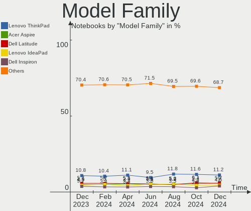
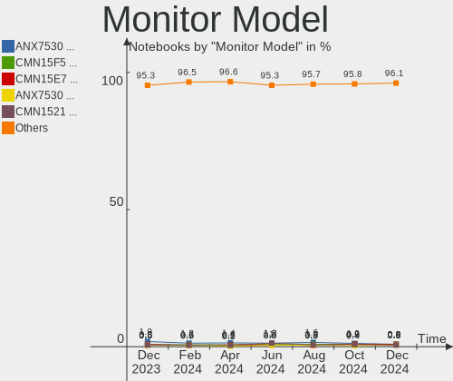

Linux - Hardware Trends (Notebooks)
-----------------------------------

A project to identify most popular hardware characteristics and track their change
over time based on data collected by Linux users at https://Linux-Hardware.org.

Anyone can contribute to this report by the [hw-probe](https://github.com/linuxhw/hw-probe) tool:

    sudo -E hw-probe -all -upload

This report is for one last month. Overall report since the beginning of time: [TestCoverage](https://github.com/linuxhw/TestCoverage)

Period: Jul, 2022.

Contents
--------

* [ System ](#system)
  - [ OS                       ](#os)
  - [ OS Family                ](#os-family)
  - [ Kernel                   ](#kernel)
  - [ Kernel Family            ](#kernel-family)
  - [ Kernel Major Ver.        ](#kernel-major-ver)
  - [ Arch                     ](#arch)
  - [ DE                       ](#de)
  - [ Display Server           ](#display-server)
  - [ Display Manager          ](#display-manager)
  - [ OS Lang                  ](#os-lang)
  - [ Boot Mode                ](#boot-mode)
  - [ Filesystem               ](#filesystem)
  - [ Part. scheme             ](#part-scheme)
  - [ Dual Boot with Linux/BSD ](#dual-boot-with-linuxbsd)
  - [ Dual Boot (Win)          ](#dual-boot-win)

* [ Board ](#board)
  - [ Vendor                   ](#vendor)
  - [ Model                    ](#model)
  - [ Model Family             ](#model-family)
  - [ MFG Year                 ](#mfg-year)
  - [ Form Factor              ](#form-factor)
  - [ Secure Boot              ](#secure-boot)
  - [ Coreboot                 ](#coreboot)
  - [ RAM Size                 ](#ram-size)
  - [ RAM Used                 ](#ram-used)
  - [ Total Drives             ](#total-drives)
  - [ Has CD-ROM               ](#has-cd-rom)
  - [ Has Ethernet             ](#has-ethernet)
  - [ Has WiFi                 ](#has-wifi)
  - [ Has Bluetooth            ](#has-bluetooth)

* [ Location ](#location)
  - [ Country                  ](#country)
  - [ City                     ](#city)

* [ Drives ](#drives)
  - [ Drive Vendor             ](#drive-vendor)
  - [ Drive Model              ](#drive-model)
  - [ HDD Vendor               ](#hdd-vendor)
  - [ SSD Vendor               ](#ssd-vendor)
  - [ Drive Kind               ](#drive-kind)
  - [ Drive Connector          ](#drive-connector)
  - [ Drive Size               ](#drive-size)
  - [ Space Total              ](#space-total)
  - [ Space Used               ](#space-used)
  - [ Malfunc. Drives          ](#malfunc-drives)
  - [ Malfunc. Drive Vendor    ](#malfunc-drive-vendor)
  - [ Malfunc. HDD Vendor      ](#malfunc-hdd-vendor)
  - [ Malfunc. Drive Kind      ](#malfunc-drive-kind)
  - [ Failed Drives            ](#failed-drives)
  - [ Failed Drive Vendor      ](#failed-drive-vendor)
  - [ Drive Status             ](#drive-status)

* [ Storage controller ](#storage-controller)
  - [ Storage Vendor           ](#storage-vendor)
  - [ Storage Model            ](#storage-model)
  - [ Storage Kind             ](#storage-kind)

* [ Processor ](#processor)
  - [ CPU Vendor               ](#cpu-vendor)
  - [ CPU Model                ](#cpu-model)
  - [ CPU Model Family         ](#cpu-model-family)
  - [ CPU Cores                ](#cpu-cores)
  - [ CPU Sockets              ](#cpu-sockets)
  - [ CPU Threads              ](#cpu-threads)
  - [ CPU Op-Modes             ](#cpu-op-modes)
  - [ CPU Microcode            ](#cpu-microcode)
  - [ CPU Microarch            ](#cpu-microarch)

* [ Graphics ](#graphics)
  - [ GPU Vendor               ](#gpu-vendor)
  - [ GPU Model                ](#gpu-model)
  - [ GPU Combo                ](#gpu-combo)
  - [ GPU Driver               ](#gpu-driver)
  - [ GPU Memory               ](#gpu-memory)

* [ Monitor ](#monitor)
  - [ Monitor Vendor           ](#monitor-vendor)
  - [ Monitor Model            ](#monitor-model)
  - [ Monitor Resolution       ](#monitor-resolution)
  - [ Monitor Diagonal         ](#monitor-diagonal)
  - [ Monitor Width            ](#monitor-width)
  - [ Aspect Ratio             ](#aspect-ratio)
  - [ Monitor Area             ](#monitor-area)
  - [ Pixel Density            ](#pixel-density)
  - [ Multiple Monitors        ](#multiple-monitors)

* [ Network ](#network)
  - [ Net Controller Vendor    ](#net-controller-vendor)
  - [ Net Controller Model     ](#net-controller-model)
  - [ Wireless Vendor          ](#wireless-vendor)
  - [ Wireless Model           ](#wireless-model)
  - [ Ethernet Vendor          ](#ethernet-vendor)
  - [ Ethernet Model           ](#ethernet-model)
  - [ Net Controller Kind      ](#net-controller-kind)
  - [ Used Controller          ](#used-controller)
  - [ NICs                     ](#nics)
  - [ IPv6                     ](#ipv6)

* [ Bluetooth ](#bluetooth)
  - [ Bluetooth Vendor         ](#bluetooth-vendor)
  - [ Bluetooth Model          ](#bluetooth-model)

* [ Sound ](#sound)
  - [ Sound Vendor             ](#sound-vendor)
  - [ Sound Model              ](#sound-model)

* [ Memory ](#memory)
  - [ Memory Vendor            ](#memory-vendor)
  - [ Memory Model             ](#memory-model)
  - [ Memory Kind              ](#memory-kind)
  - [ Memory Form Factor       ](#memory-form-factor)
  - [ Memory Size              ](#memory-size)
  - [ Memory Speed             ](#memory-speed)

* [ Printers & scanners ](#printers--scanners)
  - [ Printer Vendor           ](#printer-vendor)
  - [ Printer Model            ](#printer-model)
  - [ Scanner Vendor           ](#scanner-vendor)
  - [ Scanner Model            ](#scanner-model)

* [ Camera ](#camera)
  - [ Camera Vendor            ](#camera-vendor)
  - [ Camera Model             ](#camera-model)

* [ Security ](#security)
  - [ Fingerprint Vendor       ](#fingerprint-vendor)
  - [ Fingerprint Model        ](#fingerprint-model)
  - [ Chipcard Vendor          ](#chipcard-vendor)
  - [ Chipcard Model           ](#chipcard-model)

* [ Unsupported ](#unsupported)
  - [ Unsupported Devices      ](#unsupported-devices)
  - [ Unsupported Device Types ](#unsupported-device-types)

System
------

OS
--

Installed operating systems

| Name                         | Notebooks | Percent |
|------------------------------|-----------|---------|
| Ubuntu 22.04                 | 322       | 13.19%  |
| Linux Mint 20.3              | 208       | 8.52%   |
| OpenMandriva 4.3             | 180       | 7.37%   |
| Ubuntu 20.04                 | 173       | 7.09%   |
| Fedora 36                    | 166       | 6.8%    |
| Pop!_OS 22.04                | 135       | 5.53%   |
| ROSA 12.2                    | 130       | 5.33%   |
| Debian 11                    | 81        | 3.32%   |
| Zorin 16                     | 69        | 2.83%   |
| KDE neon 20.04               | 68        | 2.79%   |
| Arch                         | 62        | 2.54%   |
| OpenMandriva 4.90            | 59        | 2.42%   |
| Manjaro                      | 46        | 1.88%   |
| Elementary 6.1               | 32        | 1.31%   |
| Arch Rolling                 | 28        | 1.15%   |
| Kubuntu 22.04                | 27        | 1.11%   |
| Kali 2022.2                  | 26        | 1.07%   |
| SteamOS 3.2                  | 25        | 1.02%   |
| Xubuntu 20.04                | 21        | 0.86%   |
| Ubuntu 18.04                 | 20        | 0.82%   |
| LMDE 5                       | 20        | 0.82%   |
| Red OS 7.3.1                 | 19        | 0.78%   |
| Gentoo 2.8                   | 17        | 0.7%    |
| Debian Testing               | 17        | 0.7%    |
| Parrot 5.0                   | 15        | 0.61%   |
| Manjaro 21.3.2               | 15        | 0.61%   |
| ArcoLinux Rolling            | 15        | 0.61%   |
| Xubuntu 22.04                | 14        | 0.57%   |
| openSUSE Tumbleweed-XXXXXXXX | 14        | 0.57%   |
| BlackPanther 18.1            | 14        | 0.57%   |
| ROSA R11.1                   | 13        | 0.53%   |
| Linux Mint 20.2              | 13        | 0.53%   |
| Ubuntu 21.10                 | 11        | 0.45%   |
| Endless 4.0.7                | 11        | 0.45%   |
| SteamOS 3.3                  | 10        | 0.41%   |
| OpenMandriva 4.2             | 9         | 0.37%   |
| Manjaro 21.3.5               | 9         | 0.37%   |
| Zorin 15                     | 8         | 0.33%   |
| MX 21                        | 8         | 0.33%   |
| Manjaro 21.3.1               | 8         | 0.33%   |
| Linux Mint 19.3              | 8         | 0.33%   |
| Fedora 35                    | 8         | 0.33%   |
| Manjaro 21.3.3               | 7         | 0.29%   |
| Lubuntu 22.04                | 7         | 0.29%   |
| Kubuntu 20.04                | 7         | 0.29%   |
| openSUSE Leap-15.4           | 6         | 0.25%   |
| Linux Mint 21                | 6         | 0.25%   |
| Linux Mint 20.1              | 6         | 0.25%   |
| EndeavourOS Rolling          | 6         | 0.25%   |
| Xubuntu 18.04                | 5         | 0.2%    |
| Ubuntu Budgie 22.04          | 5         | 0.2%    |
| Ubuntu Budgie 20.04          | 5         | 0.2%    |
| Red OS 7.3                   | 5         | 0.2%    |
| Lubuntu 20.04                | 5         | 0.2%    |
| Lubuntu 18.04                | 5         | 0.2%    |
| Linux Mint 20                | 5         | 0.2%    |
| Kubuntu 11.1                 | 5         | 0.2%    |
| Garuda Linux Soaring         | 5         | 0.2%    |
| Debian Unstable              | 5         | 0.2%    |
| ALT Linux 10.0               | 5         | 0.2%    |

OS Family
---------

OS without a version

| Name              | Notebooks | Percent |
|-------------------|-----------|---------|
| Ubuntu            | 535       | 21.92%  |
| OpenMandriva      | 252       | 10.32%  |
| Linux Mint        | 250       | 10.24%  |
| Fedora            | 180       | 7.37%   |
| ROSA              | 146       | 5.98%   |
| Pop!_OS           | 143       | 5.86%   |
| Debian            | 109       | 4.47%   |
| Manjaro           | 95        | 3.89%   |
| Arch              | 90        | 3.69%   |
| Zorin             | 77        | 3.15%   |
| KDE neon          | 68        | 2.79%   |
| Xubuntu           | 44        | 1.8%    |
| Kubuntu           | 43        | 1.76%   |
| SteamOS           | 39        | 1.6%    |
| Kali              | 33        | 1.35%   |
| Elementary        | 33        | 1.35%   |
| Red OS            | 24        | 0.98%   |
| openSUSE          | 22        | 0.9%    |
| LMDE              | 21        | 0.86%   |
| Endless           | 20        | 0.82%   |
| Parrot            | 18        | 0.74%   |
| Lubuntu           | 18        | 0.74%   |
| Gentoo            | 18        | 0.74%   |
| ArcoLinux         | 16        | 0.66%   |
| BlackPanther      | 14        | 0.57%   |
| Ubuntu Budgie     | 10        | 0.41%   |
| Clear Linux       | 10        | 0.41%   |
| Ubuntu MATE       | 9         | 0.37%   |
| MX                | 9         | 0.37%   |
| ALT Linux         | 9         | 0.37%   |
| EndeavourOS       | 8         | 0.33%   |
| Peppermint        | 7         | 0.29%   |
| Garuda Linux      | 6         | 0.25%   |
| Devuan            | 6         | 0.25%   |
| Solus             | 4         | 0.16%   |
| RHEL              | 4         | 0.16%   |
| Linux Lite        | 4         | 0.16%   |
| Lilidog           | 4         | 0.16%   |
| antiX             | 4         | 0.16%   |
| Ultramarine Linux | 3         | 0.12%   |
| CentOS            | 3         | 0.12%   |
| Artix             | 3         | 0.12%   |
| Xero              | 2         | 0.08%   |
| Rocky Linux       | 2         | 0.08%   |
| Reborn OS         | 2         | 0.08%   |
| Nobara            | 2         | 0.08%   |
| Kaisen            | 2         | 0.08%   |
| Void Linux        | 1         | 0.04%   |
| Ubuntu Studio     | 1         | 0.04%   |
| Trisquel          | 1         | 0.04%   |
| Sparky            | 1         | 0.04%   |
| Slackware         | 1         | 0.04%   |
| PCLinuxOS         | 1         | 0.04%   |
| Pardus            | 1         | 0.04%   |
| org.kde.Platform  | 1         | 0.04%   |
| Oracle Linux      | 1         | 0.04%   |
| NixOS             | 1         | 0.04%   |
| LinuxFX           | 1         | 0.04%   |
| GNOME OS          | 1         | 0.04%   |
| Feren OS          | 1         | 0.04%   |

Kernel
------

Version of the Linux kernel

| Version                                      | Notebooks | Percent |
|----------------------------------------------|-----------|---------|
| 5.15.0-41-generic                            | 332       | 13.6%   |
| 5.16.7-desktop-1omv4003                      | 165       | 6.76%   |
| 5.13.0-52-generic                            | 146       | 5.98%   |
| 5.4.0-122-generic                            | 125       | 5.12%   |
| 5.15.0-40-generic                            | 110       | 4.51%   |
| 5.17.15-76051715-generic                     | 95        | 3.89%   |
| 5.4.0-121-generic                            | 76        | 3.11%   |
| 5.10.74-generic-2rosa2021.1-x86_64           | 63        | 2.58%   |
| 5.18.12-desktop-3omv4090                     | 55        | 2.25%   |
| 5.10.0-16-amd64                              | 51        | 2.09%   |
| 5.10.118-generic-2rosa2021.1-x86_64          | 50        | 2.05%   |
| 5.18.11-200.fc36.x86_64                      | 47        | 1.93%   |
| 5.18.13-200.fc36.x86_64                      | 34        | 1.39%   |
| 5.15.0-43-generic                            | 31        | 1.27%   |
| 5.18.10-76051810-generic                     | 30        | 1.23%   |
| 5.18.9-200.fc36.x86_64                       | 29        | 1.19%   |
| 5.18.0-2-amd64                               | 28        | 1.15%   |
| 5.10.0-15-amd64                              | 28        | 1.15%   |
| 5.13.0-valve15-1-neptune-02197-gf6ec7ad3762a | 26        | 1.07%   |
| 5.15.0-25-generic                            | 24        | 0.98%   |
| 5.13.0-51-generic                            | 23        | 0.94%   |
| 5.18.7-200.fc36.x86_64                       | 21        | 0.86%   |
| 5.18.10-200.fc36.x86_64                      | 21        | 0.86%   |
| 5.4.0-91-generic                             | 19        | 0.78%   |
| 5.18.12-arch1-1                              | 19        | 0.78%   |
| 5.18.14-arch1-1                              | 15        | 0.61%   |
| 5.15.0-39-generic                            | 15        | 0.61%   |
| 5.18.0-kali5-amd64                           | 14        | 0.57%   |
| 5.17.5-76051705-generic                      | 14        | 0.57%   |
| 5.15.49-1-MANJARO                            | 13        | 0.53%   |
| 5.18.0-1parrot1-amd64                        | 12        | 0.49%   |
| 5.15.10-1.el7.x86_64                         | 11        | 0.45%   |
| 5.15.0-33-generic                            | 11        | 0.45%   |
| 5.14.0-1044-oem                              | 11        | 0.45%   |
| 5.11.0-35-generic                            | 11        | 0.45%   |
| 5.18.9-arch1-1                               | 10        | 0.41%   |
| 5.18.7-arch1-1                               | 9         | 0.37%   |
| 5.18.11-arch1-1                              | 9         | 0.37%   |
| 5.17.5-300.fc36.x86_64                       | 9         | 0.37%   |
| 5.16.13-desktop-1omv4003                     | 9         | 0.37%   |
| 5.15.55-1-MANJARO                            | 9         | 0.37%   |
| 5.13.0-30-generic                            | 9         | 0.37%   |
| 5.10.14-desktop-1omv4002                     | 9         | 0.37%   |
| 4.18.16-desktop-1bP                          | 9         | 0.37%   |
| 4.15.0-189-generic                           | 9         | 0.37%   |
| 5.18.12-3-MANJARO                            | 8         | 0.33%   |
| 5.18.10-arch1-1                              | 8         | 0.33%   |
| 5.18.0-kali2-amd64                           | 8         | 0.33%   |
| 5.15.53-1-MANJARO                            | 8         | 0.33%   |
| 5.14.0-1045-oem                              | 8         | 0.33%   |
| 5.18.6-1-default                             | 7         | 0.29%   |
| 5.18.13-arch1-1                              | 7         | 0.29%   |
| 5.15.50-1-MANJARO                            | 7         | 0.29%   |
| 5.10.0-13-amd64                              | 7         | 0.29%   |
| 5.4.83-generic-2rosa-i586                    | 6         | 0.25%   |
| 5.4.0-120-generic                            | 6         | 0.25%   |
| 5.18.8-arch1-1                               | 6         | 0.25%   |
| 5.18.10-1-MANJARO                            | 6         | 0.25%   |
| 5.16.0-kali7-amd64                           | 6         | 0.25%   |
| 5.15.35-4.el7.3.x86_64                       | 6         | 0.25%   |

Kernel Family
-------------

Linux kernel without a distro release

| Version  | Notebooks | Percent |
|----------|-----------|---------|
| 5.15.0   | 538       | 22.04%  |
| 5.4.0    | 258       | 10.57%  |
| 5.13.0   | 242       | 9.91%   |
| 5.16.7   | 165       | 6.76%   |
| 5.10.0   | 104       | 4.26%   |
| 5.17.15  | 98        | 4.01%   |
| 5.18.12  | 97        | 3.97%   |
| 5.18.0   | 82        | 3.36%   |
| 5.18.10  | 78        | 3.2%    |
| 5.18.11  | 66        | 2.7%    |
| 5.10.74  | 65        | 2.66%   |
| 5.10.118 | 51        | 2.09%   |
| 5.18.9   | 49        | 2.01%   |
| 5.18.13  | 49        | 2.01%   |
| 5.18.7   | 39        | 1.6%    |
| 5.14.0   | 28        | 1.15%   |
| 4.15.0   | 24        | 0.98%   |
| 5.17.5   | 23        | 0.94%   |
| 5.18.14  | 22        | 0.9%    |
| 5.11.0   | 22        | 0.9%    |
| 5.18.6   | 20        | 0.82%   |
| 5.16.0   | 19        | 0.78%   |
| 5.18.8   | 14        | 0.57%   |
| 5.15.49  | 14        | 0.57%   |
| 5.17.0   | 13        | 0.53%   |
| 5.16.13  | 13        | 0.53%   |
| 5.8.0    | 11        | 0.45%   |
| 5.15.55  | 11        | 0.45%   |
| 5.15.53  | 11        | 0.45%   |
| 5.15.50  | 11        | 0.45%   |
| 5.15.10  | 11        | 0.45%   |
| 5.19.0   | 10        | 0.41%   |
| 5.15.35  | 10        | 0.41%   |
| 5.10.14  | 9         | 0.37%   |
| 4.18.16  | 9         | 0.37%   |
| 5.4.83   | 8         | 0.33%   |
| 5.15.52  | 7         | 0.29%   |
| 5.14.21  | 6         | 0.25%   |
| 5.6.14   | 5         | 0.2%    |
| 5.18.3   | 5         | 0.2%    |
| 4.4.0    | 5         | 0.2%    |
| 4.18.0   | 5         | 0.2%    |
| 5.18.5   | 4         | 0.16%   |
| 5.18.15  | 4         | 0.16%   |
| 5.17.11  | 4         | 0.16%   |
| 5.17.1   | 4         | 0.16%   |
| 5.15.57  | 4         | 0.16%   |
| 5.15.43  | 4         | 0.16%   |
| 5.15.32  | 4         | 0.16%   |
| 5.14.7   | 4         | 0.16%   |
| 5.10.131 | 4         | 0.16%   |
| 5.4.32   | 3         | 0.12%   |
| 5.18.1   | 3         | 0.12%   |
| 5.15.54  | 3         | 0.12%   |
| 5.15.46  | 3         | 0.12%   |
| 5.13.19  | 3         | 0.12%   |
| 5.11.22  | 3         | 0.12%   |
| 5.10.29  | 3         | 0.12%   |
| 4.9.0    | 3         | 0.12%   |
| 4.19.0   | 3         | 0.12%   |

Kernel Major Ver.
-----------------

Linux kernel major version

| Version | Notebooks | Percent |
|---------|-----------|---------|
| 5.15    | 644       | 26.38%  |
| 5.18    | 533       | 21.84%  |
| 5.4     | 272       | 11.14%  |
| 5.13    | 245       | 10.04%  |
| 5.10    | 244       | 10%     |
| 5.16    | 202       | 8.28%   |
| 5.17    | 148       | 6.06%   |
| 5.14    | 41        | 1.68%   |
| 5.11    | 26        | 1.07%   |
| 4.15    | 24        | 0.98%   |
| 4.18    | 14        | 0.57%   |
| 5.8     | 12        | 0.49%   |
| 5.19    | 10        | 0.41%   |
| 5.6     | 5         | 0.2%    |
| 4.9     | 5         | 0.2%    |
| 4.4     | 5         | 0.2%    |
| 5.3     | 3         | 0.12%   |
| 4.19    | 3         | 0.12%   |
| 5.0     | 2         | 0.08%   |
| 5.9     | 1         | 0.04%   |
| 3.13    | 1         | 0.04%   |
| 3.0     | 1         | 0.04%   |

Arch
----

OS architecture (x86_64, i586, etc.)

| Name   | Notebooks | Percent |
|--------|-----------|---------|
| x86_64 | 2395      | 98.12%  |
| i686   | 45        | 1.84%   |
| armv7l | 1         | 0.04%   |

DE
--

Desktop Environment

| Name             | Notebooks | Percent |
|------------------|-----------|---------|
| GNOME            | 1067      | 43.71%  |
| KDE5             | 654       | 26.79%  |
| XFCE             | 193       | 7.91%   |
| X-Cinnamon       | 191       | 7.82%   |
| MATE             | 96        | 3.93%   |
| Unknown          | 63        | 2.58%   |
| Pantheon         | 33        | 1.35%   |
| LXQt             | 28        | 1.15%   |
| Cinnamon         | 22        | 0.9%    |
| Budgie           | 15        | 0.61%   |
| KDE4             | 12        | 0.49%   |
| LXDE             | 11        | 0.45%   |
| i3               | 10        | 0.41%   |
| GNOME Flashback  | 6         | 0.25%   |
| openbox          | 5         | 0.2%    |
| lightdm-xsession | 5         | 0.2%    |
| Unity            | 4         | 0.16%   |
| bspwm            | 4         | 0.16%   |
| awesome          | 4         | 0.16%   |
| sway             | 3         | 0.12%   |
| qtile            | 3         | 0.12%   |
| trinity          | 2         | 0.08%   |
| KDE              | 2         | 0.08%   |
| icewm            | 2         | 0.08%   |
| Deepin           | 2         | 0.08%   |
| hyprland         | 1         | 0.04%   |
| GNUstep          | 1         | 0.04%   |
| GNOME Classic    | 1         | 0.04%   |
| fly              | 1         | 0.04%   |

Display Server
--------------

X11 or Wayland

| Name    | Notebooks | Percent |
|---------|-----------|---------|
| X11     | 1795      | 73.54%  |
| Wayland | 587       | 24.05%  |
| Unknown | 35        | 1.43%   |
| Tty     | 24        | 0.98%   |

Display Manager
---------------

SDDM, LightDM, etc.

| Name    | Notebooks | Percent |
|---------|-----------|---------|
| Unknown | 797       | 32.65%  |
| SDDM    | 489       | 20.03%  |
| GDM3    | 451       | 18.48%  |
| LightDM | 363       | 14.87%  |
| GDM     | 313       | 12.82%  |
| KDM     | 12        | 0.49%   |
| LXDM    | 6         | 0.25%   |
| XDM     | 3         | 0.12%   |
| SLiM    | 3         | 0.12%   |
| GREETD  | 2         | 0.08%   |
| TDM     | 1         | 0.04%   |
| Ly      | 1         | 0.04%   |

OS Lang
-------

Language

| Lang    | Notebooks | Percent |
|---------|-----------|---------|
| en_US   | 1080      | 44.24%  |
| ru_RU   | 239       | 9.79%   |
| de_DE   | 159       | 6.51%   |
| fr_FR   | 117       | 4.79%   |
| pt_BR   | 108       | 4.42%   |
| en_GB   | 96        | 3.93%   |
| Unknown | 66        | 2.7%    |
| es_ES   | 48        | 1.97%   |
| en_IN   | 43        | 1.76%   |
| pl_PL   | 40        | 1.64%   |
| it_IT   | 37        | 1.52%   |
| en_AU   | 36        | 1.47%   |
| en_CA   | 32        | 1.31%   |
| C       | 27        | 1.11%   |
| es_MX   | 23        | 0.94%   |
| nl_NL   | 19        | 0.78%   |
| cs_CZ   | 19        | 0.78%   |
| hu_HU   | 14        | 0.57%   |
| tr_TR   | 13        | 0.53%   |
| es_CL   | 13        | 0.53%   |
| pt_PT   | 12        | 0.49%   |
| es_AR   | 12        | 0.49%   |
| en_ZA   | 12        | 0.49%   |
| zh_CN   | 11        | 0.45%   |
| fi_FI   | 8         | 0.33%   |
| en_PH   | 8         | 0.33%   |
| nb_NO   | 7         | 0.29%   |
| es_CO   | 7         | 0.29%   |
| en_NZ   | 6         | 0.25%   |
| el_GR   | 6         | 0.25%   |
| de_CH   | 6         | 0.25%   |
| de_AT   | 6         | 0.25%   |
| ru_UA   | 5         | 0.2%    |
| fr_CA   | 5         | 0.2%    |
| en_IE   | 5         | 0.2%    |
| en_AG   | 5         | 0.2%    |
| sv_SE   | 4         | 0.16%   |
| POSIX   | 4         | 0.16%   |
| hr_HR   | 4         | 0.16%   |
| fr_CH   | 4         | 0.16%   |
| fr_BE   | 4         | 0.16%   |
| en_IL   | 4         | 0.16%   |
| ca_ES   | 4         | 0.16%   |
| ro_RO   | 3         | 0.12%   |
| nl_BE   | 3         | 0.12%   |
| es_PE   | 3         | 0.12%   |
| es_EC   | 3         | 0.12%   |
| en_DK   | 3         | 0.12%   |
| da_DK   | 3         | 0.12%   |
| C.UTF8  | 3         | 0.12%   |
| zh_TW   | 2         | 0.08%   |
| uk_UA   | 2         | 0.08%   |
| sr_RS   | 2         | 0.08%   |
| lv_LV   | 2         | 0.08%   |
| ko_KR   | 2         | 0.08%   |
| ja_JP   | 2         | 0.08%   |
| id_ID   | 2         | 0.08%   |
| es_SV   | 2         | 0.08%   |
| es_GT   | 2         | 0.08%   |
| es_CR   | 2         | 0.08%   |

Boot Mode
---------

EFI or BIOS

| Mode | Notebooks | Percent |
|------|-----------|---------|
| EFI  | 1333      | 54.61%  |
| BIOS | 1108      | 45.39%  |

Filesystem
----------

Type of filesystem

| Type     | Notebooks | Percent |
|----------|-----------|---------|
| Ext4     | 1825      | 74.76%  |
| Btrfs    | 302       | 12.37%  |
| Overlay  | 262       | 10.73%  |
| Xfs      | 20        | 0.82%   |
| Zfs      | 19        | 0.78%   |
| F2fs     | 7         | 0.29%   |
| Ext2     | 2         | 0.08%   |
| Unknown  | 2         | 0.08%   |
| Ext3     | 1         | 0.04%   |
| Bcachefs | 1         | 0.04%   |

Part. scheme
------------

Scheme of partitioning

| Type    | Notebooks | Percent |
|---------|-----------|---------|
| Unknown | 1125      | 46.09%  |
| GPT     | 1023      | 41.91%  |
| MBR     | 293       | 12%     |

Dual Boot with Linux/BSD
------------------------

Hosting more than one Linux/BSD

| Dual boot | Notebooks | Percent |
|-----------|-----------|---------|
| No        | 2124      | 87.01%  |
| Yes       | 317       | 12.99%  |

Dual Boot (Win)
---------------

Hosting Linux and Windows

| Dual boot | Notebooks | Percent |
|-----------|-----------|---------|
| No        | 1799      | 73.7%   |
| Yes       | 642       | 26.3%   |

Board
-----

Vendor
------

Motherboard manufacturer

| Name                   | Notebooks | Percent |
|------------------------|-----------|---------|
| Lenovo                 | 489       | 20.03%  |
| Hewlett-Packard        | 429       | 17.57%  |
| Dell                   | 388       | 15.9%   |
| ASUSTek Computer       | 274       | 11.22%  |
| Acer                   | 213       | 8.73%   |
| Apple                  | 59        | 2.42%   |
| Toshiba                | 56        | 2.29%   |
| MSI                    | 56        | 2.29%   |
| Samsung Electronics    | 44        | 1.8%    |
| Sony                   | 42        | 1.72%   |
| HUAWEI                 | 38        | 1.56%   |
| Valve                  | 31        | 1.27%   |
| Unknown                | 21        | 0.86%   |
| Google                 | 18        | 0.74%   |
| Notebook               | 15        | 0.61%   |
| Timi                   | 14        | 0.57%   |
| Fujitsu                | 13        | 0.53%   |
| Alienware              | 13        | 0.53%   |
| Packard Bell           | 11        | 0.45%   |
| GPU Company            | 10        | 0.41%   |
| Chuwi                  | 10        | 0.41%   |
| System76               | 9         | 0.37%   |
| Panasonic              | 9         | 0.37%   |
| Razer                  | 7         | 0.29%   |
| Positivo               | 7         | 0.29%   |
| Gigabyte Technology    | 7         | 0.29%   |
| eMachines              | 7         | 0.29%   |
| TUXEDO                 | 6         | 0.25%   |
| Framework              | 6         | 0.25%   |
| Schenker               | 5         | 0.2%    |
| HONOR                  | 5         | 0.2%    |
| Aquarius               | 5         | 0.2%    |
| AMI                    | 5         | 0.2%    |
| LG Electronics         | 4         | 0.16%   |
| Intel                  | 4         | 0.16%   |
| AZW                    | 4         | 0.16%   |
| Wortmann AG            | 3         | 0.12%   |
| NEC Computers          | 3         | 0.12%   |
| Jumper                 | 3         | 0.12%   |
| Intel Client Systems   | 3         | 0.12%   |
| Insyde                 | 3         | 0.12%   |
| Gateway                | 3         | 0.12%   |
| Fujitsu Siemens        | 3         | 0.12%   |
| Digma                  | 3         | 0.12%   |
| Digibras               | 3         | 0.12%   |
| Clevo                  | 3         | 0.12%   |
| Avell High Performance | 3         | 0.12%   |
| Thomson                | 2         | 0.08%   |
| Standard               | 2         | 0.08%   |
| SLIMBOOK               | 2         | 0.08%   |
| Semp Toshiba           | 2         | 0.08%   |
| Purism                 | 2         | 0.08%   |
| Pegatron               | 2         | 0.08%   |
| Medion                 | 2         | 0.08%   |
| Irbis                  | 2         | 0.08%   |
| IBM                    | 2         | 0.08%   |
| GPD                    | 2         | 0.08%   |
| Compaq                 | 2         | 0.08%   |
| AXDIA International    | 2         | 0.08%   |
| 3Logic Group           | 2         | 0.08%   |

Model
-----

Motherboard model

| Name                                 | Notebooks | Percent |
|--------------------------------------|-----------|---------|
| Unknown                              | 33        | 1.35%   |
| Valve Jupiter                        | 31        | 1.27%   |
| HP Notebook                          | 19        | 0.78%   |
| Lenovo V15-IWL 81YE                  | 17        | 0.7%    |
| HP Pavilion g6                       | 10        | 0.41%   |
| Apple MacBookAir7,2                  | 9         | 0.37%   |
| Dell Latitude 5420                   | 8         | 0.33%   |
| Dell Latitude 3310                   | 8         | 0.33%   |
| HP Pavilion 15                       | 7         | 0.29%   |
| Dell Latitude E7440                  | 7         | 0.29%   |
| Dell Latitude E6420                  | 7         | 0.29%   |
| Lenovo G50-45 80E3                   | 6         | 0.25%   |
| HUAWEI NBLK-WAX9X                    | 6         | 0.25%   |
| HP Pavilion Aero Laptop 13-be0xxx    | 6         | 0.25%   |
| HP EliteBook 8470p                   | 6         | 0.25%   |
| Framework Laptop                     | 6         | 0.25%   |
| Dell XPS 15 9520                     | 6         | 0.25%   |
| Dell Latitude E7450                  | 6         | 0.25%   |
| Apple MacBookPro9,2                  | 6         | 0.25%   |
| HUAWEI KLVL-WXXW                     | 5         | 0.2%    |
| HUAWEI HVY-WXX9                      | 5         | 0.2%    |
| HP Pavilion g4                       | 5         | 0.2%    |
| HP Laptop 17-cp0xxx                  | 5         | 0.2%    |
| HP EliteBook 855 G8 Notebook PC      | 5         | 0.2%    |
| HP EliteBook 8460p                   | 5         | 0.2%    |
| Dell XPS 15 9500                     | 5         | 0.2%    |
| Dell Vostro 3550                     | 5         | 0.2%    |
| Dell Latitude E6540                  | 5         | 0.2%    |
| Dell Latitude E6430                  | 5         | 0.2%    |
| ASUS UX31E                           | 5         | 0.2%    |
| Apple MacBookPro14,1                 | 5         | 0.2%    |
| Acer Nitro AN515-55                  | 5         | 0.2%    |
| Lenovo ThinkBook 15 G2 ITL 20VE      | 4         | 0.16%   |
| Lenovo IdeaPad Gaming 3 15ARH05 82EY | 4         | 0.16%   |
| Lenovo IdeaPad 5 14ALC05 82LM        | 4         | 0.16%   |
| Lenovo G50-30 80G0                   | 4         | 0.16%   |
| HUAWEI CREM-WXX9                     | 4         | 0.16%   |
| HP ProBook 6570b                     | 4         | 0.16%   |
| HP Pavilion Notebook                 | 4         | 0.16%   |
| HP Pavilion dv7                      | 4         | 0.16%   |
| HP Pavilion dv6                      | 4         | 0.16%   |
| HP Pavilion 17                       | 4         | 0.16%   |
| HP Laptop 15-dy2xxx                  | 4         | 0.16%   |
| HP G62                               | 4         | 0.16%   |
| HP ENVY 17                           | 4         | 0.16%   |
| HP EliteBook 8570w                   | 4         | 0.16%   |
| HP EliteBook 840 G1                  | 4         | 0.16%   |
| GPU Company GWTC116-2                | 4         | 0.16%   |
| Dell XPS 15 9570                     | 4         | 0.16%   |
| Dell XPS 15 9510                     | 4         | 0.16%   |
| Dell XPS 13 9360                     | 4         | 0.16%   |
| Dell Vostro 15 3515                  | 4         | 0.16%   |
| Dell Vostro 15 3510                  | 4         | 0.16%   |
| Dell Latitude E7470                  | 4         | 0.16%   |
| Dell Latitude E5530 non-vPro         | 4         | 0.16%   |
| Dell Latitude E5440                  | 4         | 0.16%   |
| Chuwi GemiBook Pro                   | 4         | 0.16%   |
| Apple MacBookPro12,1                 | 4         | 0.16%   |
| Apple MacBookAir6,2                  | 4         | 0.16%   |
| Acer Aspire R3-131T                  | 4         | 0.16%   |

Model Family
------------

Motherboard model prefix

| Name                  | Notebooks | Percent |
|-----------------------|-----------|---------|
| Lenovo ThinkPad       | 213       | 8.73%   |
| Dell Latitude         | 167       | 6.84%   |
| Acer Aspire           | 149       | 6.1%    |
| Lenovo IdeaPad        | 129       | 5.28%   |
| Dell Inspiron         | 102       | 4.18%   |
| HP Pavilion           | 82        | 3.36%   |
| HP EliteBook          | 72        | 2.95%   |
| HP Laptop             | 69        | 2.83%   |
| ASUS VivoBook         | 63        | 2.58%   |
| HP ProBook            | 58        | 2.38%   |
| Dell XPS              | 42        | 1.72%   |
| Toshiba Satellite     | 40        | 1.64%   |
| Dell Vostro           | 36        | 1.47%   |
| Unknown               | 33        | 1.35%   |
| Valve Jupiter         | 31        | 1.27%   |
| Dell Precision        | 25        | 1.02%   |
| ASUS ROG              | 23        | 0.94%   |
| Lenovo ThinkBook      | 22        | 0.9%    |
| Acer Nitro            | 21        | 0.86%   |
| HP Notebook           | 20        | 0.82%   |
| ASUS ASUS             | 20        | 0.82%   |
| Lenovo Legion         | 19        | 0.78%   |
| HP ZBook              | 19        | 0.78%   |
| Lenovo V15-IWL        | 17        | 0.7%    |
| HP Compaq             | 15        | 0.61%   |
| HP 250                | 15        | 0.61%   |
| Acer Swift            | 13        | 0.53%   |
| HP OMEN               | 11        | 0.45%   |
| Packard Bell EasyNote | 10        | 0.41%   |
| HP ENVY               | 10        | 0.41%   |
| Fujitsu LIFEBOOK      | 10        | 0.41%   |
| Apple MacBookAir7     | 10        | 0.41%   |
| MSI GF63              | 9         | 0.37%   |
| HP Stream             | 8         | 0.33%   |
| ASUS Zenbook          | 8         | 0.33%   |
| ASUS TUF              | 8         | 0.33%   |
| Razer Blade           | 7         | 0.29%   |
| Apple MacBookPro9     | 7         | 0.29%   |
| Apple MacBookPro14    | 7         | 0.29%   |
| Acer Predator         | 7         | 0.29%   |
| Lenovo Yoga           | 6         | 0.25%   |
| Lenovo G50-45         | 6         | 0.25%   |
| HUAWEI NBLK-WAX9X     | 6         | 0.25%   |
| HP 255                | 6         | 0.25%   |
| Framework Laptop      | 6         | 0.25%   |
| Apple MacBookPro11    | 6         | 0.25%   |
| Acer TravelMate       | 6         | 0.25%   |
| Timi Mi               | 5         | 0.2%    |
| HUAWEI KLVL-WXXW      | 5         | 0.2%    |
| HUAWEI HVY-WXX9       | 5         | 0.2%    |
| HP Victus             | 5         | 0.2%    |
| Chuwi GemiBook        | 5         | 0.2%    |
| ASUS UX31E            | 5         | 0.2%    |
| Apple MacBookAir6     | 5         | 0.2%    |
| Toshiba TECRA         | 4         | 0.16%   |
| Toshiba dynabook      | 4         | 0.16%   |
| System76 Lemur        | 4         | 0.16%   |
| MSI Prestige          | 4         | 0.16%   |
| MSI Katana            | 4         | 0.16%   |
| Lenovo G570           | 4         | 0.16%   |

MFG Year
--------

Motherboard manufacture year

| Year    | Notebooks | Percent |
|---------|-----------|---------|
| 2021    | 371       | 15.2%   |
| 2020    | 261       | 10.69%  |
| 2019    | 229       | 9.38%   |
| 2018    | 166       | 6.8%    |
| 2012    | 163       | 6.68%   |
| 2011    | 152       | 6.23%   |
| 2017    | 144       | 5.9%    |
| 2022    | 133       | 5.45%   |
| 2010    | 131       | 5.37%   |
| 2013    | 130       | 5.33%   |
| 2014    | 129       | 5.28%   |
| 2015    | 125       | 5.12%   |
| 2016    | 112       | 4.59%   |
| 2008    | 61        | 2.5%    |
| 2009    | 60        | 2.46%   |
| 2007    | 43        | 1.76%   |
| 2006    | 23        | 0.94%   |
| 2005    | 4         | 0.16%   |
| 1999    | 2         | 0.08%   |
| Unknown | 2         | 0.08%   |

Form Factor
-----------

Physical design of the computer

| Name     | Notebooks | Percent |
|----------|-----------|---------|
| Notebook | 2441      | 100%    |

Secure Boot
-----------

Enabled or disabled

| State    | Notebooks | Percent |
|----------|-----------|---------|
| Disabled | 2225      | 91.15%  |
| Enabled  | 216       | 8.85%   |

Coreboot
--------

Have coreboot on board

| Used | Notebooks | Percent |
|------|-----------|---------|
| No   | 2414      | 98.89%  |
| Yes  | 27        | 1.11%   |

RAM Size
--------

Total RAM memory

| Size in GB  | Notebooks | Percent |
|-------------|-----------|---------|
| 4.01-8.0    | 748       | 30.64%  |
| 3.01-4.0    | 500       | 20.48%  |
| 8.01-16.0   | 464       | 19.01%  |
| 16.01-24.0  | 353       | 14.46%  |
| 32.01-64.0  | 158       | 6.47%   |
| 1.01-2.0    | 95        | 3.89%   |
| 24.01-32.0  | 39        | 1.6%    |
| 64.01-256.0 | 39        | 1.6%    |
| 2.01-3.0    | 30        | 1.23%   |
| 0.51-1.0    | 12        | 0.49%   |
| 0.01-0.5    | 3         | 0.12%   |

RAM Used
--------

Used RAM memory

| Used GB    | Notebooks | Percent |
|------------|-----------|---------|
| 1.01-2.0   | 887       | 36.34%  |
| 2.01-3.0   | 623       | 25.52%  |
| 3.01-4.0   | 331       | 13.56%  |
| 4.01-8.0   | 324       | 13.27%  |
| 0.51-1.0   | 149       | 6.1%    |
| 8.01-16.0  | 88        | 3.61%   |
| 0.01-0.5   | 18        | 0.74%   |
| 16.01-24.0 | 14        | 0.57%   |
| 24.01-32.0 | 5         | 0.2%    |
| Unknown    | 2         | 0.08%   |

Total Drives
------------

Number of drives on board

| Drives | Notebooks | Percent |
|--------|-----------|---------|
| 1      | 1787      | 73.21%  |
| 2      | 559       | 22.9%   |
| 3      | 71        | 2.91%   |
| 0      | 13        | 0.53%   |
| 4      | 9         | 0.37%   |
| 7      | 1         | 0.04%   |
| 5      | 1         | 0.04%   |

Has CD-ROM
----------

Has CD-ROM on board

| Presented | Notebooks | Percent |
|-----------|-----------|---------|
| No        | 1684      | 68.99%  |
| Yes       | 757       | 31.01%  |

Has Ethernet
------------

Has Ethernet on board

| Presented | Notebooks | Percent |
|-----------|-----------|---------|
| Yes       | 1881      | 77.06%  |
| No        | 560       | 22.94%  |

Has WiFi
--------

Has WiFi module

| Presented | Notebooks | Percent |
|-----------|-----------|---------|
| Yes       | 2405      | 98.53%  |
| No        | 36        | 1.47%   |

Has Bluetooth
-------------

Has Bluetooth module

| Presented | Notebooks | Percent |
|-----------|-----------|---------|
| Yes       | 1927      | 78.94%  |
| No        | 514       | 21.06%  |

Location
--------

Country
-------

Geographic location (country)

| Country      | Notebooks | Percent |
|--------------|-----------|---------|
| USA          | 436       | 17.86%  |
| Russia       | 276       | 11.31%  |
| Germany      | 218       | 8.93%   |
| Brazil       | 157       | 6.43%   |
| France       | 134       | 5.49%   |
| UK           | 78        | 3.2%    |
| India        | 70        | 2.87%   |
| Italy        | 59        | 2.42%   |
| Canada       | 57        | 2.34%   |
| Poland       | 56        | 2.29%   |
| Netherlands  | 55        | 2.25%   |
| Spain        | 53        | 2.17%   |
| Australia    | 42        | 1.72%   |
| Mexico       | 40        | 1.64%   |
| Hungary      | 32        | 1.31%   |
| Turkey       | 29        | 1.19%   |
| Switzerland  | 28        | 1.15%   |
| Sweden       | 26        | 1.07%   |
| Czechia      | 26        | 1.07%   |
| Belgium      | 26        | 1.07%   |
| Argentina    | 23        | 0.94%   |
| Indonesia    | 22        | 0.9%    |
| China        | 22        | 0.9%    |
| Portugal     | 20        | 0.82%   |
| Romania      | 19        | 0.78%   |
| Greece       | 19        | 0.78%   |
| Ukraine      | 17        | 0.7%    |
| Colombia     | 17        | 0.7%    |
| Norway       | 16        | 0.66%   |
| Finland      | 16        | 0.66%   |
| Chile        | 16        | 0.66%   |
| Austria      | 16        | 0.66%   |
| Japan        | 15        | 0.61%   |
| South Africa | 14        | 0.57%   |
| Philippines  | 13        | 0.53%   |
| Belarus      | 12        | 0.49%   |
| Serbia       | 11        | 0.45%   |
| Croatia      | 11        | 0.45%   |
| Taiwan       | 10        | 0.41%   |
| New Zealand  | 9         | 0.37%   |
| Iran         | 9         | 0.37%   |
| Egypt        | 9         | 0.37%   |
| Denmark      | 9         | 0.37%   |
| Malaysia     | 8         | 0.33%   |
| Bulgaria     | 8         | 0.33%   |
| Thailand     | 7         | 0.29%   |
| Peru         | 7         | 0.29%   |
| Hong Kong    | 7         | 0.29%   |
| Slovakia     | 6         | 0.25%   |
| Moldova      | 6         | 0.25%   |
| Israel       | 6         | 0.25%   |
| Venezuela    | 5         | 0.2%    |
| Tunisia      | 5         | 0.2%    |
| Sri Lanka    | 5         | 0.2%    |
| Singapore    | 5         | 0.2%    |
| Puerto Rico  | 5         | 0.2%    |
| Pakistan     | 5         | 0.2%    |
| Morocco      | 5         | 0.2%    |
| Latvia       | 5         | 0.2%    |
| Ireland      | 5         | 0.2%    |

City
----

Geographic location (city)

| City              | Notebooks | Percent |
|-------------------|-----------|---------|
| Moscow            | 52        | 2.13%   |
| St Petersburg     | 25        | 1.02%   |
| Berlin            | 23        | 0.94%   |
| Warsaw            | 18        | 0.74%   |
| Salekhard         | 18        | 0.74%   |
| Paris             | 18        | 0.74%   |
| Budapest          | 18        | 0.74%   |
| Sao Paulo         | 15        | 0.61%   |
| Prague            | 13        | 0.53%   |
| Sydney            | 12        | 0.49%   |
| Istanbul          | 12        | 0.49%   |
| Vienna            | 11        | 0.45%   |
| Milan             | 11        | 0.45%   |
| Hamburg           | 11        | 0.45%   |
| Brisbane          | 11        | 0.45%   |
| Bengaluru         | 11        | 0.45%   |
| Rio de Janeiro    | 10        | 0.41%   |
| Mexico City       | 10        | 0.41%   |
| Seattle           | 9         | 0.37%   |
| Schagen           | 9         | 0.37%   |
| Bucharest         | 9         | 0.37%   |
| Belgrade          | 9         | 0.37%   |
| Yekaterinburg     | 8         | 0.33%   |
| Perm              | 8         | 0.33%   |
| Madrid            | 8         | 0.33%   |
| Chennai           | 8         | 0.33%   |
| Belo Horizonte    | 8         | 0.33%   |
| Athens            | 8         | 0.33%   |
| Voronezh          | 7         | 0.29%   |
| Ufa               | 7         | 0.29%   |
| Tehran            | 7         | 0.29%   |
| Taipei            | 7         | 0.29%   |
| Santiago          | 7         | 0.29%   |
| San Jose          | 7         | 0.29%   |
| Munich            | 7         | 0.29%   |
| Mumbai            | 7         | 0.29%   |
| Melbourne         | 7         | 0.29%   |
| London            | 7         | 0.29%   |
| Austin            | 7         | 0.29%   |
| Amsterdam         | 7         | 0.29%   |
| The Hague         | 6         | 0.25%   |
| Stockholm         | 6         | 0.25%   |
| Ottawa            | 6         | 0.25%   |
| Oslo              | 6         | 0.25%   |
| Nizhniy Novgorod  | 6         | 0.25%   |
| Helsinki          | 6         | 0.25%   |
| Frankfurt am Main | 6         | 0.25%   |
| Dublin            | 6         | 0.25%   |
| Dresden           | 6         | 0.25%   |
| Cairo             | 6         | 0.25%   |
| Brasília         | 6         | 0.25%   |
| Auckland          | 6         | 0.25%   |
| Atlanta           | 6         | 0.25%   |
| Zurich            | 5         | 0.2%    |
| Wuppertal         | 5         | 0.2%    |
| Wroclaw           | 5         | 0.2%    |
| Valencia          | 5         | 0.2%    |
| Toronto           | 5         | 0.2%    |
| Stuttgart         | 5         | 0.2%    |
| Sofia             | 5         | 0.2%    |

Drives
------

Drive Vendor
------------

Hard drive vendors

| Vendor                      | Notebooks | Drives | Percent |
|-----------------------------|-----------|--------|---------|
| Samsung Electronics         | 472       | 524    | 15.68%  |
| WDC                         | 335       | 345    | 11.13%  |
| Seagate                     | 277       | 283    | 9.2%    |
| Toshiba                     | 211       | 214    | 7.01%   |
| SanDisk                     | 203       | 206    | 6.74%   |
| Kingston                    | 179       | 187    | 5.95%   |
| Unknown                     | 154       | 170    | 5.12%   |
| SK hynix                    | 148       | 148    | 4.92%   |
| Crucial                     | 95        | 97     | 3.16%   |
| Hitachi                     | 90        | 91     | 2.99%   |
| Micron Technology           | 73        | 75     | 2.43%   |
| HGST                        | 73        | 73     | 2.43%   |
| Intel                       | 72        | 82     | 2.39%   |
| Phison                      | 48        | 48     | 1.59%   |
| KIOXIA                      | 47        | 47     | 1.56%   |
| A-DATA Technology           | 44        | 46     | 1.46%   |
| Apple                       | 38        | 46     | 1.26%   |
| China                       | 28        | 28     | 0.93%   |
| Unknown                     | 28        | 28     | 0.93%   |
| SPCC                        | 18        | 18     | 0.6%    |
| PNY                         | 16        | 16     | 0.53%   |
| Netac                       | 15        | 15     | 0.5%    |
| Silicon Motion              | 14        | 14     | 0.47%   |
| LITEON                      | 14        | 14     | 0.47%   |
| Intenso                     | 13        | 13     | 0.43%   |
| Gigabyte Technology         | 13        | 13     | 0.43%   |
| Transcend                   | 12        | 12     | 0.4%    |
| UMIS                        | 11        | 11     | 0.37%   |
| XPG                         | 10        | 10     | 0.33%   |
| Fujitsu                     | 10        | 10     | 0.33%   |
| Team                        | 9         | 9      | 0.3%    |
| Patriot                     | 9         | 9      | 0.3%    |
| JMicron Technology          | 9         | 9      | 0.3%    |
| GOODRAM                     | 9         | 9      | 0.3%    |
| SSSTC                       | 8         | 8      | 0.27%   |
| Hewlett-Packard             | 7         | 7      | 0.23%   |
| ADATA Technology            | 7         | 7      | 0.23%   |
| OCZ                         | 6         | 6      | 0.2%    |
| Lexar                       | 6         | 6      | 0.2%    |
| KingSpec                    | 6         | 6      | 0.2%    |
| Corsair                     | 6         | 6      | 0.2%    |
| Smartbuy                    | 5         | 5      | 0.17%   |
| SABRENT                     | 5         | 5      | 0.17%   |
| Plextor                     | 5         | 5      | 0.17%   |
| ASMT                        | 5         | 5      | 0.17%   |
| Union Memory (Shenzhen)     | 4         | 4      | 0.13%   |
| TO Exter                    | 4         | 4      | 0.13%   |
| LITEONIT                    | 4         | 4      | 0.13%   |
| Lenovo                      | 4         | 5      | 0.13%   |
| BIWIN                       | 4         | 4      | 0.13%   |
| Apacer                      | 4         | 5      | 0.13%   |
| W800S                       | 3         | 4      | 0.1%    |
| ShiJi                       | 3         | 3      | 0.1%    |
| MAXIO Technology (Hangzhou) | 3         | 3      | 0.1%    |
| Lite-On                     | 3         | 3      | 0.1%    |
| GALAX                       | 3         | 3      | 0.1%    |
| Dogfish                     | 3         | 3      | 0.1%    |
| ZTE                         | 2         | 2      | 0.07%   |
| V-GeN                       | 2         | 2      | 0.07%   |
| USB3.0                      | 2         | 2      | 0.07%   |

Drive Model
-----------

Hard drive models

| Model                               | Notebooks | Percent |
|-------------------------------------|-----------|---------|
| Seagate ST1000LM035-1RK172 1TB      | 42        | 1.35%   |
| Samsung NVMe SSD Drive 512GB        | 31        | 1%      |
| Kingston SA400S37240G 240GB SSD     | 29        | 0.93%   |
| Toshiba MQ01ABF050 500GB            | 28        | 0.9%    |
| SanDisk NVMe SSD Drive 256GB        | 28        | 0.9%    |
| Unknown                             | 28        | 0.9%    |
| SanDisk NVMe SSD Drive 512GB        | 27        | 0.87%   |
| Toshiba MQ04ABF100 1TB              | 25        | 0.8%    |
| Toshiba MQ01ABD100 1TB              | 25        | 0.8%    |
| HGST HTS721010A9E630 1TB            | 24        | 0.77%   |
| Kingston SA400S37480G 480GB SSD     | 22        | 0.71%   |
| Samsung NVMe SSD Drive 1024GB       | 21        | 0.67%   |
| Seagate ST500LT012-1DG142 500GB     | 20        | 0.64%   |
| Samsung NVMe SSD Drive 256GB        | 20        | 0.64%   |
| Samsung MZALQ256HAJD-000L2 256GB    | 20        | 0.64%   |
| SK hynix NVMe SSD Drive 512GB       | 18        | 0.58%   |
| Seagate ST1000LM024 HN-M101MBB 1TB  | 18        | 0.58%   |
| Kingston NVMe SSD Drive 512GB       | 18        | 0.58%   |
| Unknown MMC Card  32GB              | 15        | 0.48%   |
| SK hynix NVMe SSD Drive 256GB       | 15        | 0.48%   |
| Crucial CT1000MX500SSD1 1TB         | 15        | 0.48%   |
| WDC WDS240G2G0A-00JH30 240GB SSD    | 14        | 0.45%   |
| Phison NVMe SSD Drive 512GB         | 14        | 0.45%   |
| Crucial CT500MX500SSD1 500GB        | 14        | 0.45%   |
| Unknown MMC Card  64GB              | 13        | 0.42%   |
| SanDisk NVMe SSD Drive 1TB          | 13        | 0.42%   |
| Samsung NVMe SSD Drive 1TB          | 13        | 0.42%   |
| Micron NVMe SSD Drive 512GB         | 13        | 0.42%   |
| WDC WD10SPZX-21Z10T0 1TB            | 12        | 0.39%   |
| WDC WD10JPVX-22JC3T0 1TB            | 12        | 0.39%   |
| Seagate ST1000LM048-2E7172 1TB      | 12        | 0.39%   |
| SanDisk NVMe SSD Drive 1024GB       | 12        | 0.39%   |
| Seagate ST500LT012-9WS142 500GB     | 11        | 0.35%   |
| Seagate Expansion 1TB               | 11        | 0.35%   |
| Samsung SSD 860 EVO 500GB           | 11        | 0.35%   |
| Intel NVMe SSD Drive 512GB          | 11        | 0.35%   |
| WDC WD10SPZX-24Z10 1TB              | 10        | 0.32%   |
| Unknown SD/MMC/MS PRO 64GB          | 10        | 0.32%   |
| Unknown MMC Card  128GB             | 10        | 0.32%   |
| Seagate ST500LM012 HN-M500MBB 500GB | 10        | 0.32%   |
| Samsung SSD 980 1TB                 | 10        | 0.32%   |
| Samsung SSD 850 EVO 250GB           | 10        | 0.32%   |
| Samsung NVMe SSD Drive 500GB        | 10        | 0.32%   |
| Samsung MZALQ512HBLU-00BL2 512GB    | 10        | 0.32%   |
| Kingston SV300S37A120G 120GB SSD    | 10        | 0.32%   |
| Kingston SA400S37120G 120GB SSD     | 10        | 0.32%   |
| Hitachi HTS545032B9A300 320GB       | 10        | 0.32%   |
| HGST HTS541010A9E680 1TB            | 10        | 0.32%   |
| Crucial CT240BX500SSD1 240GB        | 10        | 0.32%   |
| SK hynix NVMe SSD Drive 1024GB      | 9         | 0.29%   |
| Seagate ST9500325AS 500GB           | 9         | 0.29%   |
| Seagate ST500LM021-1KJ152 500GB     | 9         | 0.29%   |
| Samsung SSD 980 PRO 1TB             | 9         | 0.29%   |
| Samsung SSD 970 EVO Plus 1TB        | 9         | 0.29%   |
| Samsung SSD 860 EVO 250GB           | 9         | 0.29%   |
| KIOXIA NVMe SSD Drive 512GB         | 9         | 0.29%   |
| Kingston NVMe SSD Drive 256GB       | 9         | 0.29%   |
| Hitachi HTS547550A9E384 500GB       | 9         | 0.29%   |
| HGST HTS725050A7E630 500GB          | 9         | 0.29%   |
| HGST HTS545050A7E680 500GB          | 9         | 0.29%   |

HDD Vendor
----------

Hard disk drive vendors

| Vendor              | Notebooks | Drives | Percent |
|---------------------|-----------|--------|---------|
| Seagate             | 270       | 275    | 31.54%  |
| WDC                 | 214       | 218    | 25%     |
| Toshiba             | 159       | 160    | 18.57%  |
| Hitachi             | 90        | 91     | 10.51%  |
| HGST                | 73        | 73     | 8.53%   |
| Unknown             | 11        | 11     | 1.29%   |
| Samsung Electronics | 11        | 11     | 1.29%   |
| Fujitsu             | 9         | 9      | 1.05%   |
| SABRENT             | 5         | 5      | 0.58%   |
| ASMT                | 4         | 4      | 0.47%   |
| Apple               | 3         | 3      | 0.35%   |
| SATAFIRM            | 2         | 2      | 0.23%   |
| SAGE                | 2         | 2      | 0.23%   |
| ASMedia             | 2         | 2      | 0.23%   |
| HGST HTS            | 1         | 1      | 0.12%   |

SSD Vendor
----------

Solid state drive vendors

| Vendor              | Notebooks | Drives | Percent |
|---------------------|-----------|--------|---------|
| Samsung Electronics | 173       | 181    | 18.74%  |
| Kingston            | 117       | 118    | 12.68%  |
| SanDisk             | 108       | 108    | 11.7%   |
| Crucial             | 85        | 87     | 9.21%   |
| WDC                 | 45        | 45     | 4.88%   |
| China               | 28        | 28     | 3.03%   |
| A-DATA Technology   | 26        | 26     | 2.82%   |
| Micron Technology   | 24        | 24     | 2.6%    |
| Apple               | 23        | 23     | 2.49%   |
| SK hynix            | 22        | 22     | 2.38%   |
| SPCC                | 18        | 18     | 1.95%   |
| PNY                 | 15        | 15     | 1.63%   |
| Netac               | 13        | 13     | 1.41%   |
| LITEON              | 13        | 13     | 1.41%   |
| Transcend           | 12        | 12     | 1.3%    |
| Intenso             | 12        | 12     | 1.3%    |
| Unknown             | 12        | 12     | 1.3%    |
| Intel               | 11        | 11     | 1.19%   |
| Toshiba             | 10        | 10     | 1.08%   |
| Patriot             | 9         | 9      | 0.98%   |
| GOODRAM             | 8         | 8      | 0.87%   |
| Team                | 7         | 7      | 0.76%   |
| OCZ                 | 6         | 6      | 0.65%   |
| KingSpec            | 6         | 6      | 0.65%   |
| Hewlett-Packard     | 6         | 6      | 0.65%   |
| Corsair             | 6         | 6      | 0.65%   |
| Smartbuy            | 5         | 5      | 0.54%   |
| Gigabyte Technology | 5         | 5      | 0.54%   |
| TO Exter            | 4         | 4      | 0.43%   |
| Plextor             | 4         | 4      | 0.43%   |
| LITEONIT            | 4         | 4      | 0.43%   |
| Lexar               | 4         | 4      | 0.43%   |
| Apacer              | 4         | 5      | 0.43%   |
| Dogfish             | 3         | 3      | 0.33%   |
| W800S               | 2         | 2      | 0.22%   |
| USB3.0              | 2         | 2      | 0.22%   |
| Teclast             | 2         | 2      | 0.22%   |
| Seagate             | 2         | 2      | 0.22%   |
| S3+                 | 2         | 2      | 0.22%   |
| OWC                 | 2         | 2      | 0.22%   |
| LS                  | 2         | 2      | 0.22%   |
| LDLC                | 2         | 3      | 0.22%   |
| GALAX               | 2         | 2      | 0.22%   |
| BR                  | 2         | 2      | 0.22%   |
| BIWIN               | 2         | 2      | 0.22%   |
| BHT                 | 2         | 2      | 0.22%   |
| Zheino              | 1         | 1      | 0.11%   |
| XrayDisk            | 1         | 1      | 0.11%   |
| Win Memory          | 1         | 1      | 0.11%   |
| WellcommMaster      | 1         | 1      | 0.11%   |
| walram              | 1         | 1      | 0.11%   |
| W800SH              | 1         | 1      | 0.11%   |
| Vaseky              | 1         | 1      | 0.11%   |
| ValueTech           | 1         | 1      | 0.11%   |
| V-GeN               | 1         | 1      | 0.11%   |
| Unknown (CF)        | 1         | 1      | 0.11%   |
| Unknown             | 1         | 1      | 0.11%   |
| TrekStor            | 1         | 1      | 0.11%   |
| TOPMORE             | 1         | 1      | 0.11%   |
| Timetec             | 1         | 1      | 0.11%   |

Drive Kind
----------

HDD or SSD

| Kind    | Notebooks | Drives | Percent |
|---------|-----------|--------|---------|
| NVMe    | 986       | 1113   | 34.2%   |
| SSD     | 865       | 936    | 30%     |
| HDD     | 834       | 867    | 28.93%  |
| MMC     | 161       | 179    | 5.58%   |
| Unknown | 37        | 42     | 1.28%   |

Drive Connector
---------------

SATA, SAS, NVMe, etc.

| Type | Notebooks | Drives | Percent |
|------|-----------|--------|---------|
| SATA | 1531      | 1739   | 54.99%  |
| NVMe | 983       | 1104   | 35.31%  |
| MMC  | 161       | 179    | 5.78%   |
| SAS  | 109       | 115    | 3.92%   |

Drive Size
----------

Size of hard drive

| Size in TB | Notebooks | Drives | Percent |
|------------|-----------|--------|---------|
| 0.01-0.5   | 1136      | 1225   | 67.3%   |
| 0.51-1.0   | 500       | 523    | 29.62%  |
| 1.01-2.0   | 42        | 45     | 2.49%   |
| 3.01-4.0   | 9         | 9      | 0.53%   |
| 4.01-10.0  | 1         | 1      | 0.06%   |

Space Total
-----------

Amount of disk space available on the file system

| Size in GB     | Notebooks | Percent |
|----------------|-----------|---------|
| 101-250        | 720       | 29.5%   |
| 251-500        | 585       | 23.97%  |
| 501-1000       | 345       | 14.13%  |
| 1-20           | 255       | 10.45%  |
| 51-100         | 140       | 5.74%   |
| 1001-2000      | 136       | 5.57%   |
| 21-50          | 105       | 4.3%    |
| Unknown        | 74        | 3.03%   |
| More than 3000 | 46        | 1.88%   |
| 2001-3000      | 35        | 1.43%   |

Space Used
----------

Amount of used disk space

| Used GB        | Notebooks | Percent |
|----------------|-----------|---------|
| 1-20           | 1052      | 43.1%   |
| 21-50          | 423       | 17.33%  |
| 101-250        | 294       | 12.04%  |
| 51-100         | 277       | 11.35%  |
| 251-500        | 175       | 7.17%   |
| 501-1000       | 92        | 3.77%   |
| Unknown        | 74        | 3.03%   |
| 1001-2000      | 40        | 1.64%   |
| More than 3000 | 10        | 0.41%   |
| 2001-3000      | 4         | 0.16%   |

Malfunc. Drives
---------------

Drive models with a malfunction

| Model                                            | Notebooks | Drives | Percent |
|--------------------------------------------------|-----------|--------|---------|
| Seagate ST500LT012-9WS142 500GB                  | 8         | 8      | 3.6%    |
| HGST HTS721010A9E630 1TB                         | 6         | 6      | 2.7%    |
| Toshiba MQ01ABD100 1TB                           | 5         | 5      | 2.25%   |
| HGST HTS545050A7E680 500GB                       | 5         | 5      | 2.25%   |
| WDC WD5000BEVT-22A0RT0 500GB                     | 4         | 4      | 1.8%    |
| Seagate ST9500325AS 500GB                        | 4         | 4      | 1.8%    |
| Seagate ST1000LX015-1U7172 1TB                   | 4         | 4      | 1.8%    |
| Seagate ST1000LM024 HN-M101MBB 1TB               | 4         | 4      | 1.8%    |
| SanDisk SSD U100 256GB                           | 4         | 4      | 1.8%    |
| Toshiba MQ01ABF050 500GB                         | 3         | 3      | 1.35%   |
| Seagate ST320LT020-9YG142 320GB                  | 3         | 3      | 1.35%   |
| Kingston SV300S37A120G 120GB SSD                 | 3         | 3      | 1.35%   |
| Hitachi HTS545050B9A300 500GB                    | 3         | 3      | 1.35%   |
| Hitachi HTS545032B9A300 320GB                    | 3         | 3      | 1.35%   |
| HGST HTS725050A7E630 500GB                       | 3         | 3      | 1.35%   |
| HGST HTS541010A9E680 1TB                         | 3         | 3      | 1.35%   |
| WDC WDS240G2G0A-00JH30 240GB SSD                 | 2         | 2      | 0.9%    |
| WDC WD5000LPVX-22V0TT0 500GB                     | 2         | 2      | 0.9%    |
| WDC WD5000LPCX-60VHAT0 500GB                     | 2         | 2      | 0.9%    |
| WDC WD2500BEKT-60A25T1 250GB                     | 2         | 2      | 0.9%    |
| WDC WD10JPCX-24UE4T0 1TB                         | 2         | 2      | 0.9%    |
| Toshiba MQ01ABD075 752GB                         | 2         | 2      | 0.9%    |
| SK hynix PC711 HFS001TDE9X073N 1TB               | 2         | 2      | 0.9%    |
| SK hynix HFS256G39TND-N210A 256GB SSD            | 2         | 2      | 0.9%    |
| Seagate ST9250315AS 250GB                        | 2         | 2      | 0.9%    |
| Seagate ST500LT012-1DG142 500GB                  | 2         | 2      | 0.9%    |
| Seagate ST500LM021-1KJ152 500GB                  | 2         | 2      | 0.9%    |
| Seagate ST320LT007-9ZV142 320GB                  | 2         | 2      | 0.9%    |
| Seagate ST320LM001 HN-M320MBB 320GB              | 2         | 2      | 0.9%    |
| Seagate ST1000LM035-1RK172 1TB                   | 2         | 2      | 0.9%    |
| Samsung Electronics MZNLH128HBHQ-000H1 128GB SSD | 2         | 2      | 0.9%    |
| Samsung Electronics HM160HI 160GB                | 2         | 2      | 0.9%    |
| Hitachi HTS723232A7A364 320GB                    | 2         | 2      | 0.9%    |
| Hitachi HTS545050B9SA00 500GB                    | 2         | 2      | 0.9%    |
| Hitachi HTS545050A7E380 500GB                    | 2         | 2      | 0.9%    |
| Hitachi HTS543232L9A300 320GB                    | 2         | 2      | 0.9%    |
| China SSD 128GB                                  | 2         | 2      | 0.9%    |
| WellcommMaster 128GB SSD                         | 1         | 1      | 0.45%   |
| WDC WDS480G2G0A-00JH30 480GB SSD                 | 1         | 1      | 0.45%   |
| WDC WDS120G2G0A-00JH30 120GB SSD                 | 1         | 1      | 0.45%   |
| WDC WD7500BPVT-60HXZT3 752GB                     | 1         | 1      | 0.45%   |
| WDC WD5000LPVX-80V0TT0 500GB                     | 1         | 1      | 0.45%   |
| WDC WD5000LPCX-00VHAT0 500GB                     | 1         | 1      | 0.45%   |
| WDC WD5000BPVT-80HXZT1 500GB                     | 1         | 1      | 0.45%   |
| WDC WD5000BPVT-24HXZT3 500GB                     | 1         | 1      | 0.45%   |
| WDC WD5000BEVT-80A0RT1 500GB                     | 1         | 1      | 0.45%   |
| WDC WD5000BEVT-22ZAT0 500GB                      | 1         | 1      | 0.45%   |
| WDC WD3200BPVT-22ZEST0 320GB                     | 1         | 1      | 0.45%   |
| WDC WD3200BPVT-16JJ5T0 320GB                     | 1         | 1      | 0.45%   |
| WDC WD3200BEVT-75A23T0 320GB                     | 1         | 1      | 0.45%   |
| WDC WD3200BEKT-60V5T1 320GB                      | 1         | 1      | 0.45%   |
| WDC WD2500BEVT-60A23T0 250GB                     | 1         | 1      | 0.45%   |
| WDC WD2500BEVT-22A23T0 250GB                     | 1         | 1      | 0.45%   |
| WDC WD10SPZX-24Z10 1TB                           | 1         | 1      | 0.45%   |
| WDC WD10SPZX-21Z10T0 1TB                         | 1         | 1      | 0.45%   |
| WDC WD10JPVX-60JC3T1 1TB                         | 1         | 1      | 0.45%   |
| WDC WD10JPVT-60A1YT0 1TB                         | 1         | 2      | 0.45%   |
| WDC PC SA530 SDATN8Y-256G-1006 256GB SSD         | 1         | 1      | 0.45%   |
| Toshiba MQ04ABF100 1TB                           | 1         | 1      | 0.45%   |
| Toshiba MQ01ABF032 320GB                         | 1         | 1      | 0.45%   |

Malfunc. Drive Vendor
---------------------

Vendors of faulty drives

| Vendor              | Notebooks | Drives | Percent |
|---------------------|-----------|--------|---------|
| Seagate             | 52        | 53     | 23.42%  |
| WDC                 | 34        | 35     | 15.32%  |
| Hitachi             | 28        | 28     | 12.61%  |
| Toshiba             | 24        | 24     | 10.81%  |
| HGST                | 20        | 20     | 9.01%   |
| Samsung Electronics | 11        | 11     | 4.95%   |
| Kingston            | 9         | 9      | 4.05%   |
| SK hynix            | 8         | 8      | 3.6%    |
| SanDisk             | 7         | 7      | 3.15%   |
| Crucial             | 4         | 4      | 1.8%    |
| China               | 4         | 4      | 1.8%    |
| Netac               | 2         | 2      | 0.9%    |
| Corsair             | 2         | 2      | 0.9%    |
| A-DATA Technology   | 2         | 2      | 0.9%    |
| WellcommMaster      | 1         | 1      | 0.45%   |
| Smartbuy            | 1         | 1      | 0.45%   |
| ShiJi               | 1         | 1      | 0.45%   |
| OCZ                 | 1         | 1      | 0.45%   |
| Micron Technology   | 1         | 1      | 0.45%   |
| LITEONIT            | 1         | 1      | 0.45%   |
| LITEON              | 1         | 1      | 0.45%   |
| Lexar               | 1         | 1      | 0.45%   |
| Leven               | 1         | 1      | 0.45%   |
| Lenovo              | 1         | 1      | 0.45%   |
| HGST HTS            | 1         | 1      | 0.45%   |
| Fujitsu             | 1         | 1      | 0.45%   |
| Dogfish             | 1         | 1      | 0.45%   |
| ASMedia             | 1         | 1      | 0.45%   |
| Unknown             | 1         | 1      | 0.45%   |

Malfunc. HDD Vendor
-------------------

Vendors of faulty HDD drives

| Vendor              | Notebooks | Drives | Percent |
|---------------------|-----------|--------|---------|
| Seagate             | 52        | 53     | 32.5%   |
| WDC                 | 29        | 30     | 18.13%  |
| Hitachi             | 28        | 28     | 17.5%   |
| Toshiba             | 24        | 24     | 15%     |
| HGST                | 20        | 20     | 12.5%   |
| Samsung Electronics | 4         | 4      | 2.5%    |
| HGST HTS            | 1         | 1      | 0.63%   |
| Fujitsu             | 1         | 1      | 0.63%   |
| ASMedia             | 1         | 1      | 0.63%   |

Malfunc. Drive Kind
-------------------

Kinds of faulty drives

| Kind | Notebooks | Drives | Percent |
|------|-----------|--------|---------|
| HDD  | 157       | 162    | 71.69%  |
| SSD  | 52        | 52     | 23.74%  |
| NVMe | 10        | 10     | 4.57%   |

Failed Drives
-------------

Failed drive models

| Model                        | Notebooks | Drives | Percent |
|------------------------------|-----------|--------|---------|
| WDC WD5000LPCX-24VHAT0 500GB | 1         | 1      | 14.29%  |
| WDC WD5000BEVT-22A0RT0 500GB | 1         | 1      | 14.29%  |
| WDC WD3200BEVT-11ZCT0 320GB  | 1         | 1      | 14.29%  |
| Toshiba MQ01ABD100 1TB       | 1         | 1      | 14.29%  |
| Toshiba MK1646GSX 160GB      | 1         | 1      | 14.29%  |
| Seagate ST9500420AS 500GB    | 1         | 1      | 14.29%  |
| Intel SSDSA2BW160G3 160GB    | 1         | 1      | 14.29%  |

Failed Drive Vendor
-------------------

Failed drive vendors

| Vendor  | Notebooks | Drives | Percent |
|---------|-----------|--------|---------|
| WDC     | 3         | 3      | 42.86%  |
| Toshiba | 2         | 2      | 28.57%  |
| Seagate | 1         | 1      | 14.29%  |
| Intel   | 1         | 1      | 14.29%  |

Drive Status
------------

Number of failed and malfunc. drives

| Status   | Notebooks | Drives | Percent |
|----------|-----------|--------|---------|
| Detected | 1263      | 1613   | 49.18%  |
| Works    | 1082      | 1293   | 42.13%  |
| Malfunc  | 216       | 224    | 8.41%   |
| Failed   | 7         | 7      | 0.27%   |

Storage controller
------------------

Storage Vendor
--------------

Storage controller vendors

| Vendor                           | Notebooks | Percent |
|----------------------------------|-----------|---------|
| Intel                            | 1588      | 54.18%  |
| Samsung Electronics              | 320       | 10.92%  |
| AMD                              | 319       | 10.88%  |
| SanDisk                          | 165       | 5.63%   |
| SK hynix                         | 121       | 4.13%   |
| Kingston Technology Company      | 66        | 2.25%   |
| Phison Electronics               | 60        | 2.05%   |
| Micron Technology                | 49        | 1.67%   |
| KIOXIA                           | 46        | 1.57%   |
| Toshiba America Info Systems     | 44        | 1.5%    |
| ADATA Technology                 | 31        | 1.06%   |
| Silicon Motion                   | 17        | 0.58%   |
| Nvidia                           | 16        | 0.55%   |
| Union Memory (Shenzhen)          | 15        | 0.51%   |
| Solid State Storage Technology   | 12        | 0.41%   |
| Micron/Crucial Technology        | 12        | 0.41%   |
| Apple                            | 11        | 0.38%   |
| Marvell Technology Group         | 7         | 0.24%   |
| Realtek Semiconductor            | 5         | 0.17%   |
| Shenzhen Longsys Electronics     | 4         | 0.14%   |
| Silicon Integrated Systems [SiS] | 3         | 0.1%    |
| MAXIO Technology (Hangzhou)      | 3         | 0.1%    |
| Lite-On Technology               | 3         | 0.1%    |
| Lenovo                           | 3         | 0.1%    |
| Yangtze Memory Technologies      | 2         | 0.07%   |
| Unknown                          | 2         | 0.07%   |
| Biwin Storage Technology         | 2         | 0.07%   |
| ASMedia Technology               | 2         | 0.07%   |
| VIA Technologies                 | 1         | 0.03%   |
| Seagate Technology               | 1         | 0.03%   |
| O2 Micro                         | 1         | 0.03%   |

Storage Model
-------------

Storage controller models

| Model                                                                            | Notebooks | Percent |
|----------------------------------------------------------------------------------|-----------|---------|
| AMD FCH SATA Controller [AHCI mode]                                              | 271       | 8.72%   |
| Intel Sunrise Point-LP SATA Controller [AHCI mode]                               | 174       | 5.6%    |
| Intel 7 Series Chipset Family 6-port SATA Controller [AHCI mode]                 | 174       | 5.6%    |
| Intel 82801 Mobile SATA Controller [RAID mode]                                   | 123       | 3.96%   |
| Samsung NVMe SSD Controller 980                                                  | 119       | 3.83%   |
| Intel 6 Series/C200 Series Chipset Family 6 port Mobile SATA AHCI Controller     | 110       | 3.54%   |
| Samsung NVMe SSD Controller SM981/PM981/PM983                                    | 100       | 3.22%   |
| Intel Volume Management Device NVMe RAID Controller                              | 96        | 3.09%   |
| Intel 8 Series SATA Controller 1 [AHCI mode]                                     | 89        | 2.86%   |
| Intel 82801IBM/IEM (ICH9M/ICH9M-E) 4 port SATA Controller [AHCI mode]            | 70        | 2.25%   |
| Intel 5 Series/3400 Series Chipset 4 port SATA AHCI Controller                   | 69        | 2.22%   |
| Intel Wildcat Point-LP SATA Controller [AHCI Mode]                               | 67        | 2.16%   |
| SK hynix Gold P31 SSD                                                            | 64        | 2.06%   |
| Samsung NVMe SSD Controller PM9A1/PM9A3/980PRO                                   | 58        | 1.87%   |
| Intel Cannon Lake Mobile PCH SATA AHCI Controller                                | 57        | 1.83%   |
| Intel Cannon Point-LP SATA Controller [AHCI Mode]                                | 51        | 1.64%   |
| SanDisk WD Blue SN550 NVMe SSD                                                   | 50        | 1.61%   |
| Micron Non-Volatile memory controller                                            | 49        | 1.58%   |
| Intel 8 Series/C220 Series Chipset Family 6-port SATA Controller 1 [AHCI mode]   | 49        | 1.58%   |
| SanDisk WD Black SN750 / PC SN730 NVMe SSD                                       | 48        | 1.54%   |
| Intel Tiger Lake-LP SATA Controller                                              | 48        | 1.54%   |
| Intel Celeron/Pentium Silver Processor SATA Controller                           | 47        | 1.51%   |
| Phison PS5013 E13 NVMe Controller                                                | 41        | 1.32%   |
| KIOXIA NVMe SSD Controller BG4                                                   | 40        | 1.29%   |
| Intel 82801HM/HEM (ICH8M/ICH8M-E) IDE Controller                                 | 36        | 1.16%   |
| Intel HM170/QM170 Chipset SATA Controller [AHCI Mode]                            | 34        | 1.09%   |
| SanDisk Non-Volatile memory controller                                           | 31        | 1%      |
| Intel Atom Processor E3800 Series SATA AHCI Controller                           | 31        | 1%      |
| Intel Ice Lake-LP SATA Controller [AHCI mode]                                    | 30        | 0.97%   |
| Intel 82801HM/HEM (ICH8M/ICH8M-E) SATA Controller [AHCI mode]                    | 30        | 0.97%   |
| Intel Comet Lake SATA AHCI Controller                                            | 29        | 0.93%   |
| Samsung NVMe SSD Controller SM961/PM961/SM963                                    | 26        | 0.84%   |
| AMD SB7x0/SB8x0/SB9x0 SATA Controller [AHCI mode]                                | 26        | 0.84%   |
| Toshiba America Info Systems XG6 NVMe SSD Controller                             | 24        | 0.77%   |
| Intel Celeron N3350/Pentium N4200/Atom E3900 Series SATA AHCI Controller         | 24        | 0.77%   |
| Intel 400 Series Chipset Family SATA AHCI Controller                             | 24        | 0.77%   |
| Kingston Company OM3PDP3 NVMe SSD                                                | 23        | 0.74%   |
| Intel Non-Volatile memory controller                                             | 23        | 0.74%   |
| Intel 5 Series/3400 Series Chipset 6 port SATA AHCI Controller                   | 23        | 0.74%   |
| SK hynix BC511                                                                   | 20        | 0.64%   |
| Kingston Company Company Non-Volatile memory controller                          | 19        | 0.61%   |
| Intel 500 Series Chipset Family SATA AHCI Controller                             | 19        | 0.61%   |
| ADATA Non-Volatile memory controller                                             | 19        | 0.61%   |
| Intel SSD 660P Series                                                            | 18        | 0.58%   |
| SK hynix BC501 NVMe Solid State Drive                                            | 17        | 0.55%   |
| Intel Atom/Celeron/Pentium Processor x5-E8000/J3xxx/N3xxx Series SATA Controller | 17        | 0.55%   |
| Intel 82801GBM/GHM (ICH7-M Family) SATA Controller [IDE mode]                    | 16        | 0.51%   |
| Intel SSD Pro 7600p/760p/E 6100p Series                                          | 14        | 0.45%   |
| Union Memory (Shenzhen) Non-Volatile memory controller                           | 13        | 0.42%   |
| SanDisk PC SN520 NVMe SSD                                                        | 13        | 0.42%   |
| Solid State Storage Non-Volatile memory controller                               | 12        | 0.39%   |
| SK hynix Non-Volatile memory controller                                          | 12        | 0.39%   |
| Silicon Motion SM2263EN/SM2263XT SSD Controller                                  | 12        | 0.39%   |
| Samsung Electronics SATA controller                                              | 12        | 0.39%   |
| Kingston Company U-SNS8154P3 NVMe SSD                                            | 12        | 0.39%   |
| Intel Q170/Q150/B150/H170/H110/Z170/CM236 Chipset SATA Controller [AHCI Mode]    | 12        | 0.39%   |
| Intel NM10/ICH7 Family SATA Controller [AHCI mode]                               | 12        | 0.39%   |
| Intel 82801G (ICH7 Family) IDE Controller                                        | 12        | 0.39%   |
| AMD SB600 IDE                                                                    | 10        | 0.32%   |
| Phison E12 NVMe Controller                                                       | 9         | 0.29%   |

Storage Kind
------------

Kind of storage controller (IDE, SATA, NVMe, SAS, ...)

| Kind | Notebooks | Percent |
|------|-----------|---------|
| SATA | 1654      | 55.17%  |
| NVMe | 984       | 32.82%  |
| RAID | 221       | 7.37%   |
| IDE  | 139       | 4.64%   |

Processor
---------

CPU Vendor
----------

Processor vendors

| Vendor  | Notebooks | Percent |
|---------|-----------|---------|
| Intel   | 1916      | 78.49%  |
| AMD     | 523       | 21.43%  |
| ARM     | 1         | 0.04%   |
| Unknown | 1         | 0.04%   |

CPU Model
---------

Processor models

| Model                                         | Notebooks | Percent |
|-----------------------------------------------|-----------|---------|
| Intel 11th Gen Core i5-1135G7 @ 2.40GHz       | 51        | 2.09%   |
| Intel Core i5-8265U CPU @ 1.60GHz             | 44        | 1.8%    |
| Intel 11th Gen Core i7-1165G7 @ 2.80GHz       | 40        | 1.64%   |
| AMD Ryzen 5 3500U with Radeon Vega Mobile Gfx | 37        | 1.52%   |
| Intel 11th Gen Core i7-11800H @ 2.30GHz       | 35        | 1.43%   |
| Intel Core i7-8550U CPU @ 1.80GHz             | 31        | 1.27%   |
| Intel Core i5-8250U CPU @ 1.60GHz             | 31        | 1.27%   |
| AMD Custom APU 0405                           | 31        | 1.27%   |
| Intel Core i5-7200U CPU @ 2.50GHz             | 30        | 1.23%   |
| AMD Ryzen 5 5500U with Radeon Graphics        | 30        | 1.23%   |
| Intel Core i7-9750H CPU @ 2.60GHz             | 26        | 1.07%   |
| Intel Core i7-7500U CPU @ 2.70GHz             | 26        | 1.07%   |
| Intel Core i5-1035G1 CPU @ 1.00GHz            | 24        | 0.98%   |
| AMD Ryzen 7 5700U with Radeon Graphics        | 24        | 0.98%   |
| Intel Core i5-3320M CPU @ 2.60GHz             | 22        | 0.9%    |
| Intel Core i5-10210U CPU @ 1.60GHz            | 22        | 0.9%    |
| Intel Core i7-10510U CPU @ 1.80GHz            | 21        | 0.86%   |
| Intel Core i5-5200U CPU @ 2.20GHz             | 21        | 0.86%   |
| Intel Core i5-4210U CPU @ 1.70GHz             | 21        | 0.86%   |
| Intel Celeron CPU N2840 @ 2.16GHz             | 21        | 0.86%   |
| AMD Ryzen 7 5800H with Radeon Graphics        | 21        | 0.86%   |
| Intel Core i3-1005G1 CPU @ 1.20GHz            | 20        | 0.82%   |
| Intel Core i5-6200U CPU @ 2.30GHz             | 19        | 0.78%   |
| Intel Core i5-4200U CPU @ 1.60GHz             | 19        | 0.78%   |
| Intel Core i5-3210M CPU @ 2.50GHz             | 19        | 0.78%   |
| Intel Celeron N4020 CPU @ 1.10GHz             | 19        | 0.78%   |
| Intel Core i7-10750H CPU @ 2.60GHz            | 18        | 0.74%   |
| Intel Core i5-3230M CPU @ 2.60GHz             | 18        | 0.74%   |
| Intel Core i5-2520M CPU @ 2.50GHz             | 18        | 0.74%   |
| Intel Core i7-8750H CPU @ 2.20GHz             | 17        | 0.7%    |
| Intel Core i3-6006U CPU @ 2.00GHz             | 17        | 0.7%    |
| AMD Ryzen 7 4800H with Radeon Graphics        | 17        | 0.7%    |
| Intel Core i7-7700HQ CPU @ 2.80GHz            | 16        | 0.66%   |
| Intel Core i7-6700HQ CPU @ 2.60GHz            | 16        | 0.66%   |
| Intel Core i3-5005U CPU @ 2.00GHz             | 16        | 0.66%   |
| Intel Core i3 CPU M 370 @ 2.40GHz             | 16        | 0.66%   |
| Intel 12th Gen Core i7-12700H                 | 16        | 0.66%   |
| AMD Ryzen 5 5600H with Radeon Graphics        | 16        | 0.66%   |
| Intel Core i3-2350M CPU @ 2.30GHz             | 14        | 0.57%   |
| Intel Core i5-5300U CPU @ 2.30GHz             | 13        | 0.53%   |
| Intel Core i5-2410M CPU @ 2.30GHz             | 13        | 0.53%   |
| Intel Core i5 CPU M 520 @ 2.40GHz             | 13        | 0.53%   |
| AMD Ryzen 5 4500U with Radeon Graphics        | 13        | 0.53%   |
| Intel Core i5-8300H CPU @ 2.30GHz             | 12        | 0.49%   |
| Intel Core i5-6300U CPU @ 2.40GHz             | 12        | 0.49%   |
| Intel Core i5-2450M CPU @ 2.50GHz             | 12        | 0.49%   |
| Intel Celeron CPU N3350 @ 1.10GHz             | 12        | 0.49%   |
| AMD Ryzen 5 4600H with Radeon Graphics        | 12        | 0.49%   |
| Intel Core i7-8565U CPU @ 1.80GHz             | 11        | 0.45%   |
| Intel Core i7-3630QM CPU @ 2.40GHz            | 11        | 0.45%   |
| Intel Core i5-10300H CPU @ 2.50GHz            | 11        | 0.45%   |
| Intel Celeron N4000 CPU @ 1.10GHz             | 11        | 0.45%   |
| Intel Celeron CPU N3060 @ 1.60GHz             | 11        | 0.45%   |
| AMD Ryzen 7 3700U with Radeon Vega Mobile Gfx | 11        | 0.45%   |
| Intel Core i7-5500U CPU @ 2.40GHz             | 10        | 0.41%   |
| Intel Core i7-4710HQ CPU @ 2.50GHz            | 10        | 0.41%   |
| Intel Core i5-7300U CPU @ 2.60GHz             | 10        | 0.41%   |
| Intel Core i5-4300U CPU @ 1.90GHz             | 10        | 0.41%   |
| Intel Core i5-2430M CPU @ 2.40GHz             | 10        | 0.41%   |
| Intel Core i3-3217U CPU @ 1.80GHz             | 10        | 0.41%   |

CPU Model Family
----------------

Processor model prefix

| Model                          | Notebooks | Percent |
|--------------------------------|-----------|---------|
| Intel Core i5                  | 582       | 23.84%  |
| Intel Core i7                  | 424       | 17.37%  |
| Other                          | 285       | 11.68%  |
| Intel Core i3                  | 213       | 8.73%   |
| Intel Celeron                  | 171       | 7.01%   |
| AMD Ryzen 5                    | 135       | 5.53%   |
| AMD Ryzen 7                    | 108       | 4.42%   |
| Intel Core 2 Duo               | 88        | 3.61%   |
| Intel Pentium                  | 59        | 2.42%   |
| Intel Atom                     | 42        | 1.72%   |
| AMD A6                         | 26        | 1.07%   |
| AMD Ryzen 9                    | 24        | 0.98%   |
| AMD A8                         | 24        | 0.98%   |
| Intel Pentium Dual-Core        | 20        | 0.82%   |
| AMD Ryzen 7 PRO                | 20        | 0.82%   |
| AMD Ryzen 3                    | 20        | 0.82%   |
| AMD Athlon                     | 15        | 0.61%   |
| AMD A10                        | 13        | 0.53%   |
| Intel Pentium Dual             | 12        | 0.49%   |
| AMD E1                         | 12        | 0.49%   |
| Intel Pentium Silver           | 10        | 0.41%   |
| Intel Core i9                  | 10        | 0.41%   |
| AMD Ryzen 5 PRO                | 10        | 0.41%   |
| AMD E                          | 10        | 0.41%   |
| Intel Genuine                  | 9         | 0.37%   |
| Intel Core 2                   | 9         | 0.37%   |
| AMD Turion 64 X2 Mobile        | 9         | 0.37%   |
| AMD A4                         | 9         | 0.37%   |
| Intel Celeron M                | 6         | 0.25%   |
| AMD E2                         | 6         | 0.25%   |
| AMD Phenom II                  | 5         | 0.2%    |
| Intel Pentium M                | 4         | 0.16%   |
| AMD Athlon 64 X2               | 4         | 0.16%   |
| Intel Xeon                     | 3         | 0.12%   |
| Intel Pentium Gold             | 3         | 0.12%   |
| Intel Celeron Dual-Core        | 3         | 0.12%   |
| AMD Athlon X2                  | 3         | 0.12%   |
| AMD Athlon II                  | 3         | 0.12%   |
| AMD A12                        | 3         | 0.12%   |
| Intel Core m3                  | 2         | 0.08%   |
| Intel Core Duo                 | 2         | 0.08%   |
| AMD Mobile Sempron             | 2         | 0.08%   |
| AMD FX                         | 2         | 0.08%   |
| AMD C-60                       | 2         | 0.08%   |
| AMD Athlon II Dual-Core        | 2         | 0.08%   |
| Intel Core m5                  | 1         | 0.04%   |
| Intel Core M                   | 1         | 0.04%   |
| Intel Core 2 Solo              | 1         | 0.04%   |
| ARM ARMv7                      | 1         | 0.04%   |
| AMD V120                       | 1         | 0.04%   |
| AMD Turion X2 Dual-Core Mobile | 1         | 0.04%   |
| AMD Turion II Dual-Core        | 1         | 0.04%   |
| AMD Turion II                  | 1         | 0.04%   |
| AMD Turion 64 Mobile           | 1         | 0.04%   |
| AMD Sempron                    | 1         | 0.04%   |
| AMD Quad-Core                  | 1         | 0.04%   |
| AMD PRO A8                     | 1         | 0.04%   |
| AMD PRO A10                    | 1         | 0.04%   |
| AMD C-50                       | 1         | 0.04%   |
| AMD Athlon Neo X2              | 1         | 0.04%   |

CPU Cores
---------

Number of processor cores

| Number | Notebooks | Percent |
|--------|-----------|---------|
| 2      | 1190      | 48.75%  |
| 4      | 767       | 31.42%  |
| 8      | 196       | 8.03%   |
| 6      | 187       | 7.66%   |
| 1      | 53        | 2.17%   |
| 14     | 29        | 1.19%   |
| 12     | 8         | 0.33%   |
| 10     | 7         | 0.29%   |
| 3      | 3         | 0.12%   |
| 16     | 1         | 0.04%   |

CPU Sockets
-----------

Number of sockets

| Number | Notebooks | Percent |
|--------|-----------|---------|
| 1      | 2441      | 100%    |

CPU Threads
-----------

Threads per core (Hyper-Threading)

| Number | Notebooks | Percent |
|--------|-----------|---------|
| 2      | 1843      | 75.5%   |
| 1      | 596       | 24.42%  |
| 8      | 1         | 0.04%   |
| 4      | 1         | 0.04%   |

CPU Op-Modes
------------

CPU Operation Modes (32-bit, 64-bit)

| Op mode        | Notebooks | Percent |
|----------------|-----------|---------|
| 32-bit, 64-bit | 2414      | 98.89%  |
| 32-bit         | 26        | 1.07%   |
| Unknown        | 1         | 0.04%   |

CPU Microcode
-------------

Microcode number

| Number     | Notebooks | Percent |
|------------|-----------|---------|
| Unknown    | 618       | 25.32%  |
| 0x306a9    | 133       | 5.45%   |
| 0x206a7    | 111       | 4.55%   |
| 0x806c1    | 105       | 4.3%    |
| 0x806ec    | 93        | 3.81%   |
| 0x40651    | 76        | 3.11%   |
| 0x0a50000c | 72        | 2.95%   |
| 0x806e9    | 68        | 2.79%   |
| 0x806ea    | 66        | 2.7%    |
| 0x1067a    | 62        | 2.54%   |
| 0x306d4    | 60        | 2.46%   |
| 0x20655    | 56        | 2.29%   |
| 0x406e3    | 54        | 2.21%   |
| 0x08108109 | 50        | 2.05%   |
| 0x906ea    | 46        | 1.88%   |
| 0x706e5    | 39        | 1.6%    |
| 0x306c3    | 39        | 1.6%    |
| 0x806d1    | 38        | 1.56%   |
| 0x08608103 | 38        | 1.56%   |
| 0xa0652    | 34        | 1.39%   |
| 0x30678    | 33        | 1.35%   |
| 0x6fd      | 32        | 1.31%   |
| 0x906a3    | 31        | 1.27%   |
| 0x08600106 | 27        | 1.11%   |
| 0x406c4    | 26        | 1.07%   |
| 0x706a8    | 25        | 1.02%   |
| 0x506e3    | 22        | 0.9%    |
| 0x07030105 | 20        | 0.82%   |
| 0x08108102 | 18        | 0.74%   |
| 0x806eb    | 17        | 0.7%    |
| 0x506c9    | 16        | 0.66%   |
| 0x06006705 | 16        | 0.66%   |
| 0x906c0    | 15        | 0.61%   |
| 0x20652    | 15        | 0.61%   |
| 0x906e9    | 14        | 0.57%   |
| 0x706a1    | 14        | 0.57%   |
| 0x10676    | 14        | 0.57%   |
| 0x106ca    | 12        | 0.49%   |
| 0x08608102 | 12        | 0.49%   |
| 0x406c3    | 11        | 0.45%   |
| 0x08600104 | 11        | 0.45%   |
| 0x06001119 | 9         | 0.37%   |
| 0x906ed    | 8         | 0.33%   |
| 0x6f6      | 7         | 0.29%   |
| 0x6d8      | 7         | 0.29%   |
| 0x106c2    | 7         | 0.29%   |
| 0x08600103 | 7         | 0.29%   |
| 0xa0660    | 6         | 0.25%   |
| 0x6e8      | 6         | 0.25%   |
| 0x0a404101 | 6         | 0.25%   |
| 0x0600611a | 6         | 0.25%   |
| 0x05000119 | 6         | 0.25%   |
| 0x03000027 | 6         | 0.25%   |
| 0x010000c8 | 6         | 0.25%   |
| 0x906a4    | 5         | 0.2%    |
| 0x506ca    | 5         | 0.2%    |
| 0x106e5    | 5         | 0.2%    |
| 0x6fb      | 4         | 0.16%   |
| 0x6ec      | 4         | 0.16%   |
| 0x40661    | 4         | 0.16%   |

CPU Microarch
-------------

Microarchitecture

| Name             | Notebooks | Percent |
|------------------|-----------|---------|
| KabyLake         | 422       | 17.29%  |
| Haswell          | 166       | 6.8%    |
| IvyBridge        | 161       | 6.6%    |
| SandyBridge      | 154       | 6.31%   |
| Unknown          | 143       | 5.86%   |
| TigerLake        | 140       | 5.74%   |
| Skylake          | 108       | 4.42%   |
| Zen 3            | 95        | 3.89%   |
| Westmere         | 93        | 3.81%   |
| Zen+             | 91        | 3.73%   |
| IceLake          | 91        | 3.73%   |
| Broadwell        | 88        | 3.61%   |
| Silvermont       | 87        | 3.56%   |
| Penryn           | 87        | 3.56%   |
| Zen 2            | 65        | 2.66%   |
| Core             | 59        | 2.42%   |
| Goldmont plus    | 52        | 2.13%   |
| CometLake        | 52        | 2.13%   |
| Excavator        | 37        | 1.52%   |
| Alderlake Hybrid | 34        | 1.39%   |
| Puma             | 28        | 1.15%   |
| Goldmont         | 26        | 1.07%   |
| Bonnell          | 21        | 0.86%   |
| K8 Hammer        | 19        | 0.78%   |
| P6               | 18        | 0.74%   |
| Bobcat           | 18        | 0.74%   |
| Piledriver       | 17        | 0.7%    |
| Zen              | 15        | 0.61%   |
| K10              | 14        | 0.57%   |
| Tremont          | 11        | 0.45%   |
| K10 Llano        | 10        | 0.41%   |
| Nehalem          | 6         | 0.25%   |
| Jaguar           | 5         | 0.2%    |
| Steamroller      | 4         | 0.16%   |
| K8 & K10 hybrid  | 4         | 0.16%   |

Graphics
--------

GPU Vendor
----------

Vendors of graphics cards

| Vendor                           | Notebooks | Percent |
|----------------------------------|-----------|---------|
| Intel                            | 1755      | 57.13%  |
| Nvidia                           | 666       | 21.68%  |
| AMD                              | 645       | 21%     |
| Silicon Integrated Systems [SiS] | 3         | 0.1%    |
| Neomagic                         | 2         | 0.07%   |
| VIA Technologies                 | 1         | 0.03%   |

GPU Model
---------

Graphics card models

| Model                                                                                    | Notebooks | Percent |
|------------------------------------------------------------------------------------------|-----------|---------|
| Intel 3rd Gen Core processor Graphics Controller                                         | 150       | 4.75%   |
| Intel 2nd Generation Core Processor Family Integrated Graphics Controller                | 141       | 4.47%   |
| Intel TigerLake-LP GT2 [Iris Xe Graphics]                                                | 124       | 3.93%   |
| Intel Haswell-ULT Integrated Graphics Controller                                         | 102       | 3.23%   |
| AMD Picasso/Raven 2 [Radeon Vega Series / Radeon Vega Mobile Series]                     | 95        | 3.01%   |
| Intel HD Graphics 620                                                                    | 83        | 2.63%   |
| AMD Cezanne                                                                              | 80        | 2.54%   |
| Intel UHD Graphics 620                                                                   | 78        | 2.47%   |
| Intel Skylake GT2 [HD Graphics 520]                                                      | 70        | 2.22%   |
| Intel HD Graphics 5500                                                                   | 69        | 2.19%   |
| Intel WhiskeyLake-U GT2 [UHD Graphics 620]                                               | 67        | 2.12%   |
| Intel CoffeeLake-H GT2 [UHD Graphics 630]                                                | 67        | 2.12%   |
| Intel Mobile 4 Series Chipset Integrated Graphics Controller                             | 65        | 2.06%   |
| AMD Renoir                                                                               | 63        | 2%      |
| Intel TigerLake-H GT1 [UHD Graphics]                                                     | 58        | 1.84%   |
| Intel CometLake-U GT2 [UHD Graphics]                                                     | 58        | 1.84%   |
| AMD Lucienne                                                                             | 58        | 1.84%   |
| Intel Core Processor Integrated Graphics Controller                                      | 57        | 1.81%   |
| Intel 4th Gen Core Processor Integrated Graphics Controller                              | 54        | 1.71%   |
| Intel GeminiLake [UHD Graphics 600]                                                      | 46        | 1.46%   |
| Intel Atom Processor Z36xxx/Z37xxx Series Graphics & Display                             | 46        | 1.46%   |
| Intel Iris Plus Graphics G1 (Ice Lake)                                                   | 45        | 1.43%   |
| Intel CometLake-H GT2 [UHD Graphics]                                                     | 41        | 1.3%    |
| Intel Atom/Celeron/Pentium Processor x5-E8000/J3xxx/N3xxx Integrated Graphics Controller | 41        | 1.3%    |
| Intel Alder Lake-P Integrated Graphics Controller                                        | 35        | 1.11%   |
| Nvidia GA106M [GeForce RTX 3060 Mobile / Max-Q]                                          | 32        | 1.01%   |
| AMD VanGogh [AMD Custom GPU 0405]                                                        | 31        | 0.98%   |
| Intel Mobile GM965/GL960 Integrated Graphics Controller (secondary)                      | 29        | 0.92%   |
| Intel Mobile GM965/GL960 Integrated Graphics Controller (primary)                        | 29        | 0.92%   |
| Nvidia GA107M [GeForce RTX 3050 Ti Mobile]                                               | 28        | 0.89%   |
| Nvidia TU117M [GeForce GTX 1650 Mobile / Max-Q]                                          | 27        | 0.86%   |
| AMD Stoney [Radeon R2/R3/R4/R5 Graphics]                                                 | 25        | 0.79%   |
| Intel HD Graphics 530                                                                    | 24        | 0.76%   |
| Intel HD Graphics 500                                                                    | 23        | 0.73%   |
| AMD Sun XT [Radeon HD 8670A/8670M/8690M / R5 M330 / M430 / Radeon 520 Mobile]            | 21        | 0.67%   |
| AMD Mullins [Radeon R4/R5 Graphics]                                                      | 21        | 0.67%   |
| Nvidia GF117M [GeForce 610M/710M/810M/820M / GT 620M/625M/630M/720M]                     | 20        | 0.63%   |
| Nvidia GM108M [GeForce 940MX]                                                            | 18        | 0.57%   |
| Nvidia GA107M [GeForce RTX 3050 Mobile]                                                  | 18        | 0.57%   |
| AMD Topaz XT [Radeon R7 M260/M265 / M340/M360 / M440/M445 / 530/535 / 620/625 Mobile]    | 18        | 0.57%   |
| Nvidia TU117M [GeForce GTX 1650 Ti Mobile]                                               | 17        | 0.54%   |
| Nvidia TU106M [GeForce RTX 2060 Mobile]                                                  | 17        | 0.54%   |
| Nvidia GP107M [GeForce GTX 1050 Ti Mobile]                                               | 17        | 0.54%   |
| Intel HD Graphics 630                                                                    | 17        | 0.54%   |
| Nvidia TU117M                                                                            | 16        | 0.51%   |
| Nvidia TU116M [GeForce GTX 1660 Ti Mobile]                                               | 15        | 0.48%   |
| Nvidia GM108M [GeForce 840M]                                                             | 15        | 0.48%   |
| Intel Mobile 945GM/GMS/GME, 943/940GML Express Integrated Graphics Controller            | 15        | 0.48%   |
| Intel JasperLake [UHD Graphics]                                                          | 15        | 0.48%   |
| Nvidia GP107M [GeForce GTX 1050 Mobile]                                                  | 14        | 0.44%   |
| Nvidia GA104M [GeForce RTX 3080 Mobile / Max-Q 8GB/16GB]                                 | 14        | 0.44%   |
| Intel Tiger Lake UHD Graphics                                                            | 13        | 0.41%   |
| AMD Park [Mobility Radeon HD 5430/5450/5470]                                             | 13        | 0.41%   |
| Nvidia GP108M [GeForce MX250]                                                            | 12        | 0.38%   |
| Nvidia GP108M [GeForce MX150]                                                            | 12        | 0.38%   |
| Nvidia GM108M [GeForce MX110]                                                            | 12        | 0.38%   |
| Intel Atom Processor D4xx/D5xx/N4xx/N5xx Integrated Graphics Controller                  | 12        | 0.38%   |
| AMD Wani [Radeon R5/R6/R7 Graphics]                                                      | 12        | 0.38%   |
| AMD Seymour [Radeon HD 6400M/7400M Series]                                               | 12        | 0.38%   |
| AMD Rembrandt [Radeon 680M]                                                              | 12        | 0.38%   |

GPU Combo
---------

Combinations of graphics cards

| Name           | Notebooks | Percent |
|----------------|-----------|---------|
| 1 x Intel      | 1194      | 48.91%  |
| Intel + Nvidia | 478       | 19.58%  |
| 1 x AMD        | 456       | 18.68%  |
| 1 x Nvidia     | 112       | 4.59%   |
| Intel + AMD    | 77        | 3.15%   |
| AMD + Nvidia   | 74        | 3.03%   |
| 2 x AMD        | 37        | 1.52%   |
| 2 x Intel      | 3         | 0.12%   |
| 1 x SiS        | 3         | 0.12%   |
| Other          | 2         | 0.08%   |
| 2 x Nvidia     | 2         | 0.08%   |
| 1 x Neomagic   | 2         | 0.08%   |
| 1 x VIA        | 1         | 0.04%   |

GPU Driver
----------

Free vs proprietary

| Driver      | Notebooks | Percent |
|-------------|-----------|---------|
| Free        | 2054      | 84.15%  |
| Proprietary | 330       | 13.52%  |
| Unknown     | 57        | 2.34%   |

GPU Memory
----------

Total video memory

| Size in GB | Notebooks | Percent |
|------------|-----------|---------|
| Unknown    | 1682      | 68.91%  |
| 0.01-0.5   | 278       | 11.39%  |
| 1.01-2.0   | 203       | 8.32%   |
| 0.51-1.0   | 120       | 4.92%   |
| 3.01-4.0   | 96        | 3.93%   |
| 5.01-6.0   | 27        | 1.11%   |
| 7.01-8.0   | 24        | 0.98%   |
| 8.01-16.0  | 6         | 0.25%   |
| 2.01-3.0   | 5         | 0.2%    |

Monitor
-------

Monitor Vendor
--------------

Monitor vendors

| Vendor                  | Notebooks | Percent |
|-------------------------|-----------|---------|
| AU Optronics            | 548       | 20.11%  |
| BOE                     | 445       | 16.33%  |
| Chimei Innolux          | 356       | 13.06%  |
| LG Display              | 344       | 12.62%  |
| Samsung Electronics     | 238       | 8.73%   |
| Dell                    | 72        | 2.64%   |
| Sharp                   | 69        | 2.53%   |
| Goldstar                | 62        | 2.28%   |
| Chi Mei Optoelectronics | 62        | 2.28%   |
| Apple                   | 59        | 2.17%   |
| Lenovo                  | 46        | 1.69%   |
| PANDA                   | 37        | 1.36%   |
| ANX                     | 30        | 1.1%    |
| Hewlett-Packard         | 27        | 0.99%   |
| InfoVision              | 26        | 0.95%   |
| Philips                 | 24        | 0.88%   |
| CSO                     | 21        | 0.77%   |
| BenQ                    | 20        | 0.73%   |
| LG Philips              | 18        | 0.66%   |
| Acer                    | 18        | 0.66%   |
| Sony                    | 16        | 0.59%   |
| CPT                     | 14        | 0.51%   |
| AOC                     | 13        | 0.48%   |
| Ancor Communications    | 11        | 0.4%    |
| Toshiba                 | 10        | 0.37%   |
| Eizo                    | 8         | 0.29%   |
| Vizio                   | 7         | 0.26%   |
| ViewSonic               | 7         | 0.26%   |
| TMX                     | 7         | 0.26%   |
| Iiyama                  | 6         | 0.22%   |
| ASUSTek Computer        | 6         | 0.22%   |
| Pixio                   | 5         | 0.18%   |
| Panasonic               | 5         | 0.18%   |
| Vestel Elektronik       | 4         | 0.15%   |
| Quanta Display          | 4         | 0.15%   |
| MSI                     | 4         | 0.15%   |
| HannStar                | 4         | 0.15%   |
| Fujitsu Siemens         | 4         | 0.15%   |
| Insignia                | 3         | 0.11%   |
| HKC                     | 3         | 0.11%   |
| Hitachi                 | 3         | 0.11%   |
| BOE Technology Group    | 3         | 0.11%   |
| Sun                     | 2         | 0.07%   |
| SLD                     | 2         | 0.07%   |
| Sceptre Tech            | 2         | 0.07%   |
| ONN                     | 2         | 0.07%   |
| NEC Computers           | 2         | 0.07%   |
| Mi                      | 2         | 0.07%   |
| LTM                     | 2         | 0.07%   |
| JDI                     | 2         | 0.07%   |
| ITE                     | 2         | 0.07%   |
| InnoLux Display         | 2         | 0.07%   |
| IBM                     | 2         | 0.07%   |
| Gateway                 | 2         | 0.07%   |
| AGO                     | 2         | 0.07%   |
| Unknown                 | 2         | 0.07%   |
| ___                     | 1         | 0.04%   |
| Xiaomi                  | 1         | 0.04%   |
| VOXICON                 | 1         | 0.04%   |
| VIZ                     | 1         | 0.04%   |

Monitor Model
-------------

Monitor models

| Model                                                                     | Notebooks | Percent |
|---------------------------------------------------------------------------|-----------|---------|
| ANX ANX7530 U ANX7539 800x1280                                            | 30        | 1.09%   |
| BOE LCD Monitor BOE0812 1920x1080 344x194mm 15.5-inch                     | 24        | 0.87%   |
| Chimei Innolux LCD Monitor CMN15F5 1920x1080 344x193mm 15.5-inch          | 23        | 0.84%   |
| AU Optronics LCD Monitor AUO21ED 1920x1080 344x194mm 15.5-inch            | 23        | 0.84%   |
| AU Optronics LCD Monitor AUO38ED 1920x1080 344x193mm 15.5-inch            | 21        | 0.76%   |
| AU Optronics LCD Monitor AUO22EC 1366x768 344x193mm 15.5-inch             | 20        | 0.73%   |
| AU Optronics LCD Monitor AUO61ED 1920x1080 344x193mm 15.5-inch            | 18        | 0.65%   |
| Chimei Innolux LCD Monitor CMN15DB 1366x768 344x193mm 15.5-inch           | 17        | 0.62%   |
| Samsung Electronics LCD Monitor SEC5441 1366x768 344x194mm 15.5-inch      | 16        | 0.58%   |
| LG Display LCD Monitor LGD02DC 1366x768 344x194mm 15.5-inch               | 15        | 0.55%   |
| Chimei Innolux LCD Monitor CMN14D4 1920x1080 309x173mm 13.9-inch          | 14        | 0.51%   |
| Chimei Innolux LCD Monitor CMN15E6 1366x768 344x193mm 15.5-inch           | 13        | 0.47%   |
| Chimei Innolux LCD Monitor CMN1521 1920x1080 344x193mm 15.5-inch          | 12        | 0.44%   |
| AU Optronics LCD Monitor AUO71EC 1366x768 344x193mm 15.5-inch             | 12        | 0.44%   |
| AU Optronics LCD Monitor AUO26EC 1366x768 344x193mm 15.5-inch             | 12        | 0.44%   |
| Chimei Innolux LCD Monitor CMN15C4 1920x1080 344x193mm 15.5-inch          | 10        | 0.36%   |
| PANDA LCD Monitor NCP004D 1920x1080 344x194mm 15.5-inch                   | 9         | 0.33%   |
| LG Display LCD Monitor LGD0563 1920x1080 344x194mm 15.5-inch              | 9         | 0.33%   |
| Chimei Innolux LCD Monitor CMN14D5 1920x1080 309x173mm 13.9-inch          | 9         | 0.33%   |
| Chimei Innolux LCD Monitor CMN1132 1366x768 256x144mm 11.6-inch           | 9         | 0.33%   |
| BOE LCD Monitor BOE06A4 1366x768 344x194mm 15.5-inch                      | 9         | 0.33%   |
| AU Optronics LCD Monitor AUO235C 1366x768 256x144mm 11.6-inch             | 9         | 0.33%   |
| Chimei Innolux LCD Monitor CMN14FF 1920x1080 309x173mm 13.9-inch          | 8         | 0.29%   |
| BOE LCD Monitor BOE0687 1920x1080 344x193mm 15.5-inch                     | 8         | 0.29%   |
| AU Optronics LCD Monitor AUO243D 1920x1080 309x173mm 13.9-inch            | 8         | 0.29%   |
| Sony LCD Monitor SNY05FA 1366x768 310x170mm 13.9-inch                     | 7         | 0.25%   |
| Samsung Electronics LCD Monitor SDC4852 1366x768 344x194mm 15.5-inch      | 7         | 0.25%   |
| Lenovo LCD Monitor LEN40BA 1920x1080 344x194mm 15.5-inch                  | 7         | 0.25%   |
| Chimei Innolux LCD Monitor CMN14C9 1920x1080 309x173mm 13.9-inch          | 7         | 0.25%   |
| Chi Mei Optoelectronics LCD Monitor CMO15A7 1366x768 344x193mm 15.5-inch  | 7         | 0.25%   |
| BOE LCD Monitor BOE0893 2160x1440 296x197mm 14.0-inch                     | 7         | 0.25%   |
| BOE LCD Monitor BOE0872 1920x1080 344x194mm 15.5-inch                     | 7         | 0.25%   |
| AU Optronics LCD Monitor AUO81EC 1366x768 344x193mm 15.5-inch             | 7         | 0.25%   |
| AU Optronics LCD Monitor AUO45EC 1366x768 344x193mm 15.5-inch             | 7         | 0.25%   |
| AU Optronics LCD Monitor AUO313C 1366x768 309x173mm 13.9-inch             | 7         | 0.25%   |
| AU Optronics LCD Monitor AUO20EC 1366x768 344x193mm 15.5-inch             | 7         | 0.25%   |
| AU Optronics LCD Monitor AUO193C 1366x768 309x173mm 13.9-inch             | 7         | 0.25%   |
| AU Optronics LCD Monitor AUO133D 1920x1080 309x173mm 13.9-inch            | 7         | 0.25%   |
| AU Optronics LCD Monitor AUO10EC 1366x768 344x193mm 15.5-inch             | 7         | 0.25%   |
| Apple Color LCD APP9CF0 1440x900 290x180mm 13.4-inch                      | 7         | 0.25%   |
| Sharp LCD Monitor SHP14D0 3840x2400 336x210mm 15.6-inch                   | 6         | 0.22%   |
| LG Display LCD Monitor LGD033B 1366x768 344x194mm 15.5-inch               | 6         | 0.22%   |
| LG Display LCD Monitor LGD0259 1920x1080 345x194mm 15.6-inch              | 6         | 0.22%   |
| Chimei Innolux LCD Monitor CMN1728 1600x900 382x215mm 17.3-inch           | 6         | 0.22%   |
| Chimei Innolux LCD Monitor CMN15E7 1920x1080 344x193mm 15.5-inch          | 6         | 0.22%   |
| Chimei Innolux LCD Monitor CMN15DC 1366x768 344x193mm 15.5-inch           | 6         | 0.22%   |
| Chimei Innolux LCD Monitor CMN15D5 1920x1080 344x193mm 15.5-inch          | 6         | 0.22%   |
| Chimei Innolux LCD Monitor CMN15CA 1366x768 344x193mm 15.5-inch           | 6         | 0.22%   |
| Chimei Innolux LCD Monitor CMN1404 1920x1080 309x173mm 13.9-inch          | 6         | 0.22%   |
| Chi Mei Optoelectronics LCD Monitor CMO1720 1920x1080 382x215mm 17.3-inch | 6         | 0.22%   |
| Chi Mei Optoelectronics LCD Monitor CMO15A3 1366x768 344x194mm 15.5-inch  | 6         | 0.22%   |
| Chi Mei Optoelectronics LCD Monitor CMO1592 1366x768 344x193mm 15.5-inch  | 6         | 0.22%   |
| BOE LCD Monitor BOE09C5 1920x1080 341x192mm 15.4-inch                     | 6         | 0.22%   |
| BOE LCD Monitor BOE095F 2256x1504 285x190mm 13.5-inch                     | 6         | 0.22%   |
| BOE LCD Monitor BOE091D 1920x1080 309x174mm 14.0-inch                     | 6         | 0.22%   |
| BOE LCD Monitor BOE08D7 1920x1080 309x174mm 14.0-inch                     | 6         | 0.22%   |
| BOE LCD Monitor BOE07F6 1920x1080 309x174mm 14.0-inch                     | 6         | 0.22%   |
| BOE LCD Monitor BOE069C 1920x1080 344x193mm 15.5-inch                     | 6         | 0.22%   |
| BOE LCD Monitor BOE0696 1366x768 309x173mm 13.9-inch                      | 6         | 0.22%   |
| BOE LCD Monitor BOE0672 1366x768 344x194mm 15.5-inch                      | 6         | 0.22%   |

Monitor Resolution
------------------

Monitor screen resolution

| Resolution         | Notebooks | Percent |
|--------------------|-----------|---------|
| 1920x1080 (FHD)    | 1095      | 42.43%  |
| 1366x768 (WXGA)    | 764       | 29.6%   |
| 1600x900 (HD+)     | 130       | 5.04%   |
| 3840x2160 (4K)     | 100       | 3.87%   |
| 1280x800 (WXGA)    | 81        | 3.14%   |
| 2560x1440 (QHD)    | 65        | 2.52%   |
| 1920x1200 (WUXGA)  | 43        | 1.67%   |
| 1440x900 (WXGA+)   | 39        | 1.51%   |
| 2560x1600          | 36        | 1.39%   |
| 800x1280           | 31        | 1.2%    |
| 1680x1050 (WSXGA+) | 21        | 0.81%   |
| 2880x1800          | 20        | 0.77%   |
| 1280x1024 (SXGA)   | 18        | 0.7%    |
| 3840x2400          | 17        | 0.66%   |
| 2560x1080          | 17        | 0.66%   |
| 2160x1440          | 12        | 0.46%   |
| 1024x600           | 10        | 0.39%   |
| 3440x1440          | 8         | 0.31%   |
| 1360x768           | 8         | 0.31%   |
| 2256x1504          | 6         | 0.23%   |
| 3840x1080          | 4         | 0.15%   |
| 3456x2160          | 4         | 0.15%   |
| 3200x1800 (QHD+)   | 4         | 0.15%   |
| 2520x1680          | 4         | 0.15%   |
| 2288x1287          | 4         | 0.15%   |
| 2240x1400          | 4         | 0.15%   |
| 1920x1280          | 4         | 0.15%   |
| 1024x768 (XGA)     | 4         | 0.15%   |
| 3200x2000          | 3         | 0.12%   |
| 3072x1920          | 3         | 0.12%   |
| 1920x540           | 3         | 0.12%   |
| 1280x720 (HD)      | 3         | 0.12%   |
| Unknown            | 3         | 0.12%   |
| 2160x1350          | 2         | 0.08%   |
| 2048x1152          | 2         | 0.08%   |
| 6400x2160          | 1         | 0.04%   |
| 4480x1440          | 1         | 0.04%   |
| 3840x1100          | 1         | 0.04%   |
| 3286x1080          | 1         | 0.04%   |
| 3200x1080          | 1         | 0.04%   |
| 3000x2000          | 1         | 0.04%   |
| 2304x1440          | 1         | 0.04%   |
| 1400x1050          | 1         | 0.04%   |
| 1360x765           | 1         | 0.04%   |

Monitor Diagonal
----------------

Diagonal size in inches

| Inches  | Notebooks | Percent |
|---------|-----------|---------|
| 15      | 1164      | 42.73%  |
| 13      | 375       | 13.77%  |
| 14      | 336       | 12.33%  |
| 17      | 195       | 7.16%   |
| 24      | 73        | 2.68%   |
| 27      | 64        | 2.35%   |
| 23      | 63        | 2.31%   |
| 11      | 63        | 2.31%   |
| 12      | 56        | 2.06%   |
| Unknown | 50        | 1.84%   |
| 21      | 49        | 1.8%    |
| 16      | 48        | 1.76%   |
| 31      | 27        | 0.99%   |
| 18      | 21        | 0.77%   |
| 34      | 18        | 0.66%   |
| 84      | 16        | 0.59%   |
| 19      | 14        | 0.51%   |
| 22      | 12        | 0.44%   |
| 10      | 11        | 0.4%    |
| 20      | 8         | 0.29%   |
| 49      | 7         | 0.26%   |
| 29      | 7         | 0.26%   |
| 32      | 6         | 0.22%   |
| 72      | 4         | 0.15%   |
| 26      | 4         | 0.15%   |
| 25      | 4         | 0.15%   |
| 54      | 3         | 0.11%   |
| 48      | 3         | 0.11%   |
| 46      | 3         | 0.11%   |
| 40      | 3         | 0.11%   |
| 57      | 2         | 0.07%   |
| 37      | 2         | 0.07%   |
| 7       | 2         | 0.07%   |
| 85      | 1         | 0.04%   |
| 65      | 1         | 0.04%   |
| 52      | 1         | 0.04%   |
| 43      | 1         | 0.04%   |
| 42      | 1         | 0.04%   |
| 41      | 1         | 0.04%   |
| 39      | 1         | 0.04%   |
| 35      | 1         | 0.04%   |
| 33      | 1         | 0.04%   |
| 28      | 1         | 0.04%   |
| 8       | 1         | 0.04%   |

Monitor Width
-------------

Physical width

| Width in mm | Notebooks | Percent |
|-------------|-----------|---------|
| 301-350     | 1708      | 63.1%   |
| 201-300     | 303       | 11.19%  |
| 351-400     | 240       | 8.87%   |
| 501-600     | 186       | 6.87%   |
| 401-500     | 97        | 3.58%   |
| Unknown     | 50        | 1.85%   |
| 601-700     | 44        | 1.63%   |
| 701-800     | 24        | 0.89%   |
| 1501-2000   | 21        | 0.78%   |
| 1001-1500   | 20        | 0.74%   |
| 801-900     | 8         | 0.3%    |
| 901-1000    | 3         | 0.11%   |
| 101-200     | 2         | 0.07%   |
| 1-100       | 1         | 0.04%   |

Aspect Ratio
------------

Proportional relationship between the width and the height

| Ratio   | Notebooks | Percent |
|---------|-----------|---------|
| 16/9    | 2013      | 83.39%  |
| 16/10   | 272       | 11.27%  |
| 0.62    | 31        | 1.28%   |
| 3/2     | 30        | 1.24%   |
| 21/9    | 21        | 0.87%   |
| Unknown | 13        | 0.54%   |
| 5/4     | 11        | 0.46%   |
| 4/3     | 10        | 0.41%   |
| 32/9    | 4         | 0.17%   |
| 2.65    | 4         | 0.17%   |
| 6/5     | 2         | 0.08%   |
| 3.40    | 1         | 0.04%   |
| 1.00    | 1         | 0.04%   |
| 0.67    | 1         | 0.04%   |

Monitor Area
------------

Area in inch²

| Area in inch² | Notebooks | Percent |
|----------------|-----------|---------|
| 101-110        | 1171      | 43.05%  |
| 81-90          | 580       | 21.32%  |
| 121-130        | 171       | 6.29%   |
| 201-250        | 160       | 5.88%   |
| 71-80          | 131       | 4.82%   |
| 301-350        | 69        | 2.54%   |
| 51-60          | 64        | 2.35%   |
| 351-500        | 53        | 1.95%   |
| 61-70          | 52        | 1.91%   |
| Unknown        | 50        | 1.84%   |
| 151-200        | 36        | 1.32%   |
| More than 1000 | 34        | 1.25%   |
| 251-300        | 30        | 1.1%    |
| 111-120        | 29        | 1.07%   |
| 141-150        | 26        | 0.96%   |
| 131-140        | 20        | 0.74%   |
| 501-1000       | 17        | 0.63%   |
| 91-100         | 13        | 0.48%   |
| 41-50          | 11        | 0.4%    |
| 1-40           | 3         | 0.11%   |

Pixel Density
-------------

Pixels per inch

| Density       | Notebooks | Percent |
|---------------|-----------|---------|
| 121-160       | 1113      | 41.69%  |
| 101-120       | 818       | 30.64%  |
| 51-100        | 392       | 14.68%  |
| 161-240       | 185       | 6.93%   |
| More than 240 | 86        | 3.22%   |
| Unknown       | 50        | 1.87%   |
| 1-50          | 26        | 0.97%   |

Multiple Monitors
-----------------

Total monitors connected

| Total | Notebooks | Percent |
|-------|-----------|---------|
| 1     | 1969      | 80.66%  |
| 2     | 365       | 14.95%  |
| 0     | 66        | 2.7%    |
| 3     | 38        | 1.56%   |
| 4     | 3         | 0.12%   |

Network
-------

Net Controller Vendor
---------------------

Controller vendors

| Vendor                                | Notebooks | Percent |
|---------------------------------------|-----------|---------|
| Realtek Semiconductor                 | 1360      | 35.56%  |
| Intel                                 | 1173      | 30.67%  |
| Qualcomm Atheros                      | 540       | 14.12%  |
| Broadcom                              | 244       | 6.38%   |
| MediaTek                              | 69        | 1.8%    |
| Broadcom Limited                      | 69        | 1.8%    |
| Marvell Technology Group              | 46        | 1.2%    |
| Ralink                                | 39        | 1.02%   |
| TP-Link                               | 25        | 0.65%   |
| ASIX Electronics                      | 25        | 0.65%   |
| Ralink Technology                     | 22        | 0.58%   |
| Samsung Electronics                   | 20        | 0.52%   |
| Dell                                  | 16        | 0.42%   |
| DisplayLink                           | 14        | 0.37%   |
| Lenovo                                | 13        | 0.34%   |
| Sierra Wireless                       | 12        | 0.31%   |
| Qualcomm                              | 12        | 0.31%   |
| Huawei Technologies                   | 10        | 0.26%   |
| Nvidia                                | 9         | 0.24%   |
| Hewlett-Packard                       | 8         | 0.21%   |
| Xiaomi                                | 7         | 0.18%   |
| NetGear                               | 7         | 0.18%   |
| JMicron Technology                    | 7         | 0.18%   |
| Qualcomm Atheros Communications       | 5         | 0.13%   |
| Motorola PCS                          | 5         | 0.13%   |
| Apple                                 | 5         | 0.13%   |
| ICS Advent                            | 4         | 0.1%    |
| Fibocom                               | 4         | 0.1%    |
| Ericsson Business Mobile Networks     | 4         | 0.1%    |
| Cypress Semiconductor                 | 4         | 0.1%    |
| Toshiba                               | 3         | 0.08%   |
| Silicon Integrated Systems [SiS]      | 3         | 0.08%   |
| OPPO Electronics                      | 3         | 0.08%   |
| Google                                | 3         | 0.08%   |
| Edimax Technology                     | 3         | 0.08%   |
| Belkin Components                     | 3         | 0.08%   |
| Arduino SA                            | 3         | 0.08%   |
| ZTE WCDMA Technologies MSM            | 2         | 0.05%   |
| T & A Mobile Phones                   | 2         | 0.05%   |
| Attansic Technology                   | 2         | 0.05%   |
| ASUSTek Computer                      | 2         | 0.05%   |
| VIA Technologies                      | 1         | 0.03%   |
| U-Blox                                | 1         | 0.03%   |
| TRENDnet                              | 1         | 0.03%   |
| Texas Instruments                     | 1         | 0.03%   |
| Spreadtrum Communications             | 1         | 0.03%   |
| Sigma Sport                           | 1         | 0.03%   |
| Shenzhen Goodix Technology            | 1         | 0.03%   |
| Raspberry Pi                          | 1         | 0.03%   |
| OnePlus Technology (Shenzhen)         | 1         | 0.03%   |
| Microchip Technology                  | 1         | 0.03%   |
| Micro Star International              | 1         | 0.03%   |
| Linksys                               | 1         | 0.03%   |
| InterBiometrics                       | 1         | 0.03%   |
| Hex/ProfiCNC                          | 1         | 0.03%   |
| Davicom Semiconductor                 | 1         | 0.03%   |
| D-Link                                | 1         | 0.03%   |
| Aquantia                              | 1         | 0.03%   |
| 802.11g Adapter [Linksys WUSB54GC v3] | 1         | 0.03%   |

Net Controller Model
--------------------

Controller models

| Model                                                                   | Notebooks | Percent |
|-------------------------------------------------------------------------|-----------|---------|
| Realtek RTL8111/8168/8411 PCI Express Gigabit Ethernet Controller       | 757       | 16.58%  |
| Realtek RTL810xE PCI Express Fast Ethernet controller                   | 217       | 4.75%   |
| Realtek RTL8822CE 802.11ac PCIe Wireless Network Adapter                | 125       | 2.74%   |
| Realtek RTL8821CE 802.11ac PCIe Wireless Network Adapter                | 109       | 2.39%   |
| Qualcomm Atheros QCA9377 802.11ac Wireless Network Adapter              | 107       | 2.34%   |
| Intel Wi-Fi 6 AX201                                                     | 105       | 2.3%    |
| Intel Wi-Fi 6 AX200                                                     | 101       | 2.21%   |
| Intel Wireless 8265 / 8275                                              | 93        | 2.04%   |
| Realtek RTL8153 Gigabit Ethernet Adapter                                | 80        | 1.75%   |
| Intel 82579LM Gigabit Network Connection (Lewisville)                   | 78        | 1.71%   |
| Qualcomm Atheros AR9285 Wireless Network Adapter (PCI-Express)          | 77        | 1.69%   |
| Qualcomm Atheros QCA9565 / AR9565 Wireless Network Adapter              | 75        | 1.64%   |
| Qualcomm Atheros AR9485 Wireless Network Adapter                        | 74        | 1.62%   |
| Intel Wireless 7265                                                     | 73        | 1.6%    |
| Intel Wireless 7260                                                     | 71        | 1.56%   |
| Qualcomm Atheros QCA6174 802.11ac Wireless Network Adapter              | 58        | 1.27%   |
| Intel Centrino Advanced-N 6205 [Taylor Peak]                            | 48        | 1.05%   |
| Intel Comet Lake PCH-LP CNVi WiFi                                       | 47        | 1.03%   |
| MediaTek MT7921 802.11ax PCI Express Wireless Network Adapter           | 45        | 0.99%   |
| Broadcom BCM4313 802.11bgn Wireless Network Adapter                     | 43        | 0.94%   |
| Intel Wireless 3165                                                     | 41        | 0.9%    |
| Intel Wi-Fi 6 AX210/AX211/AX411 160MHz                                  | 41        | 0.9%    |
| Realtek RTL8723BE PCIe Wireless Network Adapter                         | 40        | 0.88%   |
| Intel Comet Lake PCH CNVi WiFi                                          | 40        | 0.88%   |
| Intel Alder Lake-P PCH CNVi WiFi                                        | 40        | 0.88%   |
| Broadcom BCM43142 802.11b/g/n                                           | 40        | 0.88%   |
| Intel Cannon Lake PCH CNVi WiFi                                         | 39        | 0.85%   |
| Intel Wireless 8260                                                     | 38        | 0.83%   |
| Intel Tiger Lake PCH CNVi WiFi                                          | 37        | 0.81%   |
| Intel Ice Lake-LP PCH CNVi WiFi                                         | 33        | 0.72%   |
| Intel Ethernet Connection (4) I219-LM                                   | 29        | 0.64%   |
| Qualcomm Atheros AR9462 Wireless Network Adapter                        | 28        | 0.61%   |
| Intel Ethernet Connection I218-LM                                       | 28        | 0.61%   |
| Intel Cannon Point-LP CNVi [Wireless-AC]                                | 28        | 0.61%   |
| Qualcomm Atheros AR242x / AR542x Wireless Network Adapter (PCI-Express) | 27        | 0.59%   |
| Realtek RTL8852AE 802.11ax PCIe Wireless Network Adapter                | 26        | 0.57%   |
| Realtek RTL8822BE 802.11a/b/g/n/ac WiFi adapter                         | 25        | 0.55%   |
| Intel Ethernet Connection (4) I219-V                                    | 25        | 0.55%   |
| Intel Centrino Ultimate-N 6300                                          | 25        | 0.55%   |
| Qualcomm Atheros AR8151 v2.0 Gigabit Ethernet                           | 24        | 0.53%   |
| Intel Wireless 3160                                                     | 24        | 0.53%   |
| Realtek RTL8188CE 802.11b/g/n WiFi Adapter                              | 22        | 0.48%   |
| ASIX AX88179 Gigabit Ethernet                                           | 22        | 0.48%   |
| Intel Ethernet Connection (3) I218-LM                                   | 21        | 0.46%   |
| Intel Ethernet Connection I219-LM                                       | 20        | 0.44%   |
| Intel Dual Band Wireless-AC 3165 Plus Bluetooth                         | 20        | 0.44%   |
| Intel PRO/Wireless 3945ABG [Golan] Network Connection                   | 19        | 0.42%   |
| Intel 82577LM Gigabit Network Connection                                | 19        | 0.42%   |
| Realtek RTL8125 2.5GbE Controller                                       | 18        | 0.39%   |
| Intel WiFi Link 5100                                                    | 18        | 0.39%   |
| Samsung Galaxy series, misc. (tethering mode)                           | 17        | 0.37%   |
| Realtek RTL8723DE Wireless Network Adapter                              | 17        | 0.37%   |
| Realtek Killer E2600 Gigabit Ethernet Controller                        | 17        | 0.37%   |
| Intel Ethernet Connection I217-LM                                       | 17        | 0.37%   |
| Intel 82567LM Gigabit Network Connection                                | 17        | 0.37%   |
| Broadcom Limited BCM4360 802.11ac Wireless Network Adapter              | 17        | 0.37%   |
| Broadcom BCM43228 802.11a/b/g/n                                         | 17        | 0.37%   |
| Realtek 802.11n WLAN Adapter                                            | 16        | 0.35%   |
| Realtek RTL88x2bu [AC1200 Techkey]                                      | 15        | 0.33%   |
| Ralink RT3290 Wireless 802.11n 1T/1R PCIe                               | 15        | 0.33%   |

Wireless Vendor
---------------

Wireless vendors

| Vendor                                | Notebooks | Percent |
|---------------------------------------|-----------|---------|
| Intel                                 | 1118      | 44.21%  |
| Realtek Semiconductor                 | 487       | 19.26%  |
| Qualcomm Atheros                      | 477       | 18.86%  |
| Broadcom                              | 189       | 7.47%   |
| MediaTek                              | 62        | 2.45%   |
| Broadcom Limited                      | 51        | 2.02%   |
| Ralink                                | 39        | 1.54%   |
| TP-Link                               | 24        | 0.95%   |
| Ralink Technology                     | 22        | 0.87%   |
| Sierra Wireless                       | 12        | 0.47%   |
| Dell                                  | 11        | 0.43%   |
| NetGear                               | 7         | 0.28%   |
| Qualcomm                              | 6         | 0.24%   |
| Qualcomm Atheros Communications       | 5         | 0.2%    |
| Hewlett-Packard                       | 3         | 0.12%   |
| Fibocom                               | 3         | 0.12%   |
| Edimax Technology                     | 3         | 0.12%   |
| Belkin Components                     | 3         | 0.12%   |
| TRENDnet                              | 1         | 0.04%   |
| Texas Instruments                     | 1         | 0.04%   |
| Micro Star International              | 1         | 0.04%   |
| Linksys                               | 1         | 0.04%   |
| D-Link                                | 1         | 0.04%   |
| ASUSTek Computer                      | 1         | 0.04%   |
| 802.11g Adapter [Linksys WUSB54GC v3] | 1         | 0.04%   |

Wireless Model
--------------

Wireless models

| Model                                                                   | Notebooks | Percent |
|-------------------------------------------------------------------------|-----------|---------|
| Realtek RTL8822CE 802.11ac PCIe Wireless Network Adapter                | 125       | 4.93%   |
| Realtek RTL8821CE 802.11ac PCIe Wireless Network Adapter                | 109       | 4.3%    |
| Qualcomm Atheros QCA9377 802.11ac Wireless Network Adapter              | 107       | 4.22%   |
| Intel Wi-Fi 6 AX201                                                     | 105       | 4.14%   |
| Intel Wi-Fi 6 AX200                                                     | 101       | 3.98%   |
| Intel Wireless 8265 / 8275                                              | 93        | 3.67%   |
| Qualcomm Atheros AR9285 Wireless Network Adapter (PCI-Express)          | 77        | 3.04%   |
| Qualcomm Atheros QCA9565 / AR9565 Wireless Network Adapter              | 75        | 2.96%   |
| Qualcomm Atheros AR9485 Wireless Network Adapter                        | 74        | 2.92%   |
| Intel Wireless 7265                                                     | 73        | 2.88%   |
| Intel Wireless 7260                                                     | 71        | 2.8%    |
| Qualcomm Atheros QCA6174 802.11ac Wireless Network Adapter              | 58        | 2.29%   |
| Intel Centrino Advanced-N 6205 [Taylor Peak]                            | 48        | 1.89%   |
| Intel Comet Lake PCH-LP CNVi WiFi                                       | 47        | 1.85%   |
| MediaTek MT7921 802.11ax PCI Express Wireless Network Adapter           | 45        | 1.77%   |
| Broadcom BCM4313 802.11bgn Wireless Network Adapter                     | 43        | 1.69%   |
| Intel Wireless 3165                                                     | 41        | 1.62%   |
| Intel Wi-Fi 6 AX210/AX211/AX411 160MHz                                  | 41        | 1.62%   |
| Realtek RTL8723BE PCIe Wireless Network Adapter                         | 40        | 1.58%   |
| Intel Comet Lake PCH CNVi WiFi                                          | 40        | 1.58%   |
| Broadcom BCM43142 802.11b/g/n                                           | 40        | 1.58%   |
| Intel Cannon Lake PCH CNVi WiFi                                         | 39        | 1.54%   |
| Intel Alder Lake-P PCH CNVi WiFi                                        | 39        | 1.54%   |
| Intel Wireless 8260                                                     | 38        | 1.5%    |
| Intel Tiger Lake PCH CNVi WiFi                                          | 37        | 1.46%   |
| Intel Ice Lake-LP PCH CNVi WiFi                                         | 33        | 1.3%    |
| Qualcomm Atheros AR9462 Wireless Network Adapter                        | 28        | 1.1%    |
| Intel Cannon Point-LP CNVi [Wireless-AC]                                | 28        | 1.1%    |
| Qualcomm Atheros AR242x / AR542x Wireless Network Adapter (PCI-Express) | 27        | 1.06%   |
| Realtek RTL8852AE 802.11ax PCIe Wireless Network Adapter                | 26        | 1.02%   |
| Realtek RTL8822BE 802.11a/b/g/n/ac WiFi adapter                         | 25        | 0.99%   |
| Intel Centrino Ultimate-N 6300                                          | 25        | 0.99%   |
| Intel Wireless 3160                                                     | 24        | 0.95%   |
| Realtek RTL8188CE 802.11b/g/n WiFi Adapter                              | 22        | 0.87%   |
| Intel Dual Band Wireless-AC 3165 Plus Bluetooth                         | 20        | 0.79%   |
| Intel PRO/Wireless 3945ABG [Golan] Network Connection                   | 19        | 0.75%   |
| Intel WiFi Link 5100                                                    | 18        | 0.71%   |
| Realtek RTL8723DE Wireless Network Adapter                              | 17        | 0.67%   |
| Broadcom Limited BCM4360 802.11ac Wireless Network Adapter              | 17        | 0.67%   |
| Broadcom BCM43228 802.11a/b/g/n                                         | 17        | 0.67%   |
| Realtek 802.11n WLAN Adapter                                            | 16        | 0.63%   |
| Realtek RTL88x2bu [AC1200 Techkey]                                      | 15        | 0.59%   |
| Ralink RT3290 Wireless 802.11n 1T/1R PCIe                               | 15        | 0.59%   |
| Realtek RTL8188EE Wireless Network Adapter                              | 14        | 0.55%   |
| Qualcomm Atheros AR9287 Wireless Network Adapter (PCI-Express)          | 14        | 0.55%   |
| Intel PRO/Wireless 4965 AG or AGN [Kedron] Network Connection           | 14        | 0.55%   |
| Intel Centrino Advanced-N 6200                                          | 14        | 0.55%   |
| Broadcom BCM4312 802.11b/g LP-PHY                                       | 14        | 0.55%   |
| Intel Dual Band Wireless-AC 3168NGW [Stone Peak]                        | 13        | 0.51%   |
| Intel Centrino Wireless-N 1000 [Condor Peak]                            | 13        | 0.51%   |
| Intel Centrino Advanced-N 6235                                          | 13        | 0.51%   |
| Realtek 802.11ac NIC                                                    | 12        | 0.47%   |
| Broadcom BCM4331 802.11a/b/g/n                                          | 12        | 0.47%   |
| Realtek RTL8188EUS 802.11n Wireless Network Adapter                     | 11        | 0.43%   |
| Qualcomm Atheros AR928X Wireless Network Adapter (PCI-Express)          | 11        | 0.43%   |
| Realtek Realtek Network controller                                      | 10        | 0.39%   |
| Intel Wireless-AC 9260                                                  | 9         | 0.35%   |
| Intel Wi-Fi 6 AX201 160MHz                                              | 9         | 0.35%   |
| Broadcom Limited BCM4312 802.11b/g LP-PHY                               | 9         | 0.35%   |
| Broadcom BCM43602 802.11ac Wireless LAN SoC                             | 9         | 0.35%   |

Ethernet Vendor
---------------

Ethernet vendors

| Vendor                           | Notebooks | Percent |
|----------------------------------|-----------|---------|
| Realtek Semiconductor            | 1109      | 56.32%  |
| Intel                            | 418       | 21.23%  |
| Qualcomm Atheros                 | 126       | 6.4%    |
| Broadcom                         | 93        | 4.72%   |
| Marvell Technology Group         | 46        | 2.34%   |
| ASIX Electronics                 | 25        | 1.27%   |
| Samsung Electronics              | 20        | 1.02%   |
| Broadcom Limited                 | 19        | 0.96%   |
| DisplayLink                      | 14        | 0.71%   |
| Lenovo                           | 13        | 0.66%   |
| Nvidia                           | 9         | 0.46%   |
| Huawei Technologies              | 9         | 0.46%   |
| Xiaomi                           | 7         | 0.36%   |
| JMicron Technology               | 7         | 0.36%   |
| Qualcomm                         | 6         | 0.3%    |
| MediaTek                         | 6         | 0.3%    |
| Apple                            | 5         | 0.25%   |
| Motorola PCS                     | 4         | 0.2%    |
| ICS Advent                       | 4         | 0.2%    |
| Cypress Semiconductor            | 4         | 0.2%    |
| Silicon Integrated Systems [SiS] | 3         | 0.15%   |
| OPPO Electronics                 | 3         | 0.15%   |
| Hewlett-Packard                  | 3         | 0.15%   |
| Google                           | 3         | 0.15%   |
| ZTE WCDMA Technologies MSM       | 2         | 0.1%    |
| TP-Link                          | 2         | 0.1%    |
| Attansic Technology              | 2         | 0.1%    |
| VIA Technologies                 | 1         | 0.05%   |
| T & A Mobile Phones              | 1         | 0.05%   |
| Spreadtrum Communications        | 1         | 0.05%   |
| Fibocom                          | 1         | 0.05%   |
| Davicom Semiconductor            | 1         | 0.05%   |
| ASUSTek Computer                 | 1         | 0.05%   |
| Aquantia                         | 1         | 0.05%   |

Ethernet Model
--------------

Ethernet models

| Model                                                                          | Notebooks | Percent |
|--------------------------------------------------------------------------------|-----------|---------|
| Realtek RTL8111/8168/8411 PCI Express Gigabit Ethernet Controller              | 757       | 37.98%  |
| Realtek RTL810xE PCI Express Fast Ethernet controller                          | 217       | 10.89%  |
| Realtek RTL8153 Gigabit Ethernet Adapter                                       | 80        | 4.01%   |
| Intel 82579LM Gigabit Network Connection (Lewisville)                          | 78        | 3.91%   |
| Intel Ethernet Connection (4) I219-LM                                          | 29        | 1.46%   |
| Intel Ethernet Connection I218-LM                                              | 28        | 1.4%    |
| Intel Ethernet Connection (4) I219-V                                           | 25        | 1.25%   |
| Qualcomm Atheros AR8151 v2.0 Gigabit Ethernet                                  | 24        | 1.2%    |
| ASIX AX88179 Gigabit Ethernet                                                  | 22        | 1.1%    |
| Intel Ethernet Connection (3) I218-LM                                          | 21        | 1.05%   |
| Intel Ethernet Connection I219-LM                                              | 20        | 1%      |
| Intel 82577LM Gigabit Network Connection                                       | 19        | 0.95%   |
| Realtek RTL8125 2.5GbE Controller                                              | 18        | 0.9%    |
| Samsung Galaxy series, misc. (tethering mode)                                  | 17        | 0.85%   |
| Realtek Killer E2600 Gigabit Ethernet Controller                               | 17        | 0.85%   |
| Intel Ethernet Connection I217-LM                                              | 17        | 0.85%   |
| Intel 82567LM Gigabit Network Connection                                       | 17        | 0.85%   |
| Qualcomm Atheros AR8152 v2.0 Fast Ethernet                                     | 15        | 0.75%   |
| Broadcom NetLink BCM57780 Gigabit Ethernet PCIe                                | 15        | 0.75%   |
| Broadcom NetLink BCM57785 Gigabit Ethernet PCIe                                | 13        | 0.65%   |
| Realtek RTL8152 Fast Ethernet Adapter                                          | 12        | 0.6%    |
| Qualcomm Atheros AR8161 Gigabit Ethernet                                       | 12        | 0.6%    |
| Qualcomm Atheros AR8131 Gigabit Ethernet                                       | 12        | 0.6%    |
| Marvell Group Yukon Optima 88E8059 [PCIe Gigabit Ethernet Controller with AVB] | 12        | 0.6%    |
| Intel Ethernet Connection (7) I219-LM                                          | 12        | 0.6%    |
| Intel Ethernet Connection (13) I219-V                                          | 12        | 0.6%    |
| Intel Ethernet Controller I225-V                                               | 11        | 0.55%   |
| Broadcom NetXtreme BCM57765 Gigabit Ethernet PCIe                              | 11        | 0.55%   |
| Realtek RTL-8100/8101L/8139 PCI Fast Ethernet Adapter                          | 10        | 0.5%    |
| Qualcomm Atheros Killer E2400 Gigabit Ethernet Controller                      | 10        | 0.5%    |
| Marvell Group 88E8040 PCI-E Fast Ethernet Controller                           | 10        | 0.5%    |
| Intel Ethernet Connection (2) I219-LM                                          | 10        | 0.5%    |
| Intel Ethernet Connection (13) I219-LM                                         | 10        | 0.5%    |
| Intel Ethernet Connection (10) I219-V                                          | 10        | 0.5%    |
| Qualcomm Atheros Killer E2500 Gigabit Ethernet Controller                      | 9         | 0.45%   |
| Intel Ethernet Connection (14) I219-LM                                         | 9         | 0.45%   |
| Intel 82579V Gigabit Network Connection                                        | 9         | 0.45%   |
| Broadcom NetLink BCM5906M Fast Ethernet PCI Express                            | 9         | 0.45%   |
| Realtek Killer E3000 2.5GbE Controller                                         | 8         | 0.4%    |
| Intel Ethernet Connection (6) I219-LM                                          | 8         | 0.4%    |
| Intel 82566MM Gigabit Network Connection                                       | 8         | 0.4%    |
| Broadcom NetXtreme BCM5761 Gigabit Ethernet PCIe                               | 8         | 0.4%    |
| Broadcom Limited NetLink BCM57780 Gigabit Ethernet PCIe                        | 8         | 0.4%    |
| Qualcomm Atheros QCA8171 Gigabit Ethernet                                      | 7         | 0.35%   |
| Qualcomm Atheros AR8162 Fast Ethernet                                          | 7         | 0.35%   |
| Qualcomm Atheros AR8152 v1.1 Fast Ethernet                                     | 7         | 0.35%   |
| Intel Ethernet Connection I217-V                                               | 7         | 0.35%   |
| Intel Ethernet Connection (10) I219-LM                                         | 7         | 0.35%   |
| Broadcom BCM4401-B0 100Base-TX                                                 | 7         | 0.35%   |
| Xiaomi Mi/Redmi series (RNDIS)                                                 | 6         | 0.3%    |
| Qualcomm BENGAL-QRD _SN:C5464635                                               | 6         | 0.3%    |
| Qualcomm Atheros AR8132 Fast Ethernet                                          | 6         | 0.3%    |
| Qualcomm Atheros AR8121/AR8113/AR8114 Gigabit or Fast Ethernet                 | 6         | 0.3%    |
| Intel Ethernet Connection (6) I219-V                                           | 6         | 0.3%    |
| Broadcom NetLink BCM5784M Gigabit Ethernet PCIe                                | 6         | 0.3%    |
| Qualcomm Atheros QCA8172 Fast Ethernet                                         | 5         | 0.25%   |
| MediaTek moto e(6) plus                                                        | 5         | 0.25%   |
| Marvell Group 88E8072 PCI-E Gigabit Ethernet Controller                        | 5         | 0.25%   |
| Lenovo ThinkPad Lan                                                            | 5         | 0.25%   |
| JMicron JMC250 PCI Express Gigabit Ethernet Controller                         | 5         | 0.25%   |

Net Controller Kind
-------------------

Ethernet, WiFi or modem

| Kind     | Notebooks | Percent |
|----------|-----------|---------|
| WiFi     | 2405      | 55.71%  |
| Ethernet | 1878      | 43.5%   |
| Modem    | 27        | 0.63%   |
| Unknown  | 7         | 0.16%   |

Used Controller
---------------

Currently used network controller

| Kind     | Notebooks | Percent |
|----------|-----------|---------|
| WiFi     | 1952      | 77.74%  |
| Ethernet | 559       | 22.26%  |

NICs
----

Total network controllers on board

| Total | Notebooks | Percent |
|-------|-----------|---------|
| 2     | 1706      | 69.89%  |
| 1     | 674       | 27.61%  |
| 0     | 51        | 2.09%   |
| 3     | 10        | 0.41%   |

IPv6
----

IPv6 vs IPv4

| Used | Notebooks | Percent |
|------|-----------|---------|
| No   | 1714      | 70.22%  |
| Yes  | 727       | 29.78%  |

Bluetooth
---------

Bluetooth Vendor
----------------

Controller vendors

| Vendor                          | Notebooks | Percent |
|---------------------------------|-----------|---------|
| Intel                           | 883       | 45.52%  |
| Realtek Semiconductor           | 252       | 12.99%  |
| Qualcomm Atheros Communications | 174       | 8.97%   |
| IMC Networks                    | 125       | 6.44%   |
| Lite-On Technology              | 101       | 5.21%   |
| Broadcom                        | 100       | 5.15%   |
| Foxconn / Hon Hai               | 79        | 4.07%   |
| Apple                           | 46        | 2.37%   |
| Dell                            | 35        | 1.8%    |
| Cambridge Silicon Radio         | 31        | 1.6%    |
| Realtek                         | 28        | 1.44%   |
| Hewlett-Packard                 | 21        | 1.08%   |
| Ralink                          | 15        | 0.77%   |
| Toshiba                         | 14        | 0.72%   |
| Foxconn International           | 10        | 0.52%   |
| Ralink Technology               | 6         | 0.31%   |
| ASUSTek Computer                | 6         | 0.31%   |
| USI                             | 2         | 0.1%    |
| Micro Star International        | 2         | 0.1%    |
| MediaTek                        | 2         | 0.1%    |
| Chicony Electronics             | 2         | 0.1%    |
| Alps Electric                   | 2         | 0.1%    |
| Unknown                         | 1         | 0.05%   |
| Opticis                         | 1         | 0.05%   |
| Mobile Action Technology        | 1         | 0.05%   |
| Fujitsu                         | 1         | 0.05%   |

Bluetooth Model
---------------

Controller models

| Model                                                                               | Notebooks | Percent |
|-------------------------------------------------------------------------------------|-----------|---------|
| Intel Bluetooth wireless interface                                                  | 330       | 17.01%  |
| Intel AX201 Bluetooth                                                               | 207       | 10.67%  |
| Realtek Bluetooth Radio                                                             | 175       | 9.02%   |
| Intel Bluetooth 9460/9560 Jefferson Peak (JfP)                                      | 134       | 6.91%   |
| Qualcomm Atheros  Bluetooth Device                                                  | 115       | 5.93%   |
| Intel AX200 Bluetooth                                                               | 96        | 4.95%   |
| IMC Networks Bluetooth Radio                                                        | 66        | 3.4%    |
| Realtek  Bluetooth 4.2 Adapter                                                      | 51        | 2.63%   |
| Intel Bluetooth Device                                                              | 50        | 2.58%   |
| Intel AX210 Bluetooth                                                               | 39        | 2.01%   |
| Lite-On Qualcomm Atheros QCA9377 Bluetooth                                          | 35        | 1.8%    |
| Cambridge Silicon Radio Bluetooth Dongle (HCI mode)                                 | 31        | 1.6%    |
| Realtek Bluetooth Radio                                                             | 28        | 1.44%   |
| Lite-On Bluetooth Device                                                            | 24        | 1.24%   |
| IMC Networks Wireless_Device                                                        | 24        | 1.24%   |
| Apple Bluetooth USB Host Controller                                                 | 24        | 1.24%   |
| Qualcomm Atheros AR3012 Bluetooth 4.0                                               | 23        | 1.19%   |
| Foxconn / Hon Hai Wireless_Device                                                   | 20        | 1.03%   |
| Foxconn / Hon Hai Bluetooth Device                                                  | 20        | 1.03%   |
| Apple Bluetooth Host Controller                                                     | 20        | 1.03%   |
| Qualcomm Atheros AR3011 Bluetooth                                                   | 16        | 0.82%   |
| IMC Networks Bluetooth Device                                                       | 16        | 0.82%   |
| Ralink RT3290 Bluetooth                                                             | 15        | 0.77%   |
| Intel Centrino Bluetooth Wireless Transceiver                                       | 15        | 0.77%   |
| Broadcom HP Portable SoftSailing                                                    | 15        | 0.77%   |
| Lite-On Atheros AR3012 Bluetooth                                                    | 14        | 0.72%   |
| IMC Networks Atheros AR3012 Bluetooth 4.0 Adapter                                   | 13        | 0.67%   |
| Broadcom BCM2045B (BDC-2.1)                                                         | 13        | 0.67%   |
| Realtek RTL8723B Bluetooth                                                          | 12        | 0.62%   |
| Intel Wireless-AC 3168 Bluetooth                                                    | 12        | 0.62%   |
| Foxconn / Hon Hai Foxconn T77H114 BCM2070 [Single-Chip Bluetooth 2.1 + EDR Adapter] | 12        | 0.62%   |
| HP Broadcom 2070 Bluetooth Combo                                                    | 11        | 0.57%   |
| Dell BCM20702A0 Bluetooth Module                                                    | 11        | 0.57%   |
| Qualcomm Atheros AR9462 Bluetooth                                                   | 10        | 0.52%   |
| Lite-On Broadcom BCM43142A0 Bluetooth Device                                        | 10        | 0.52%   |
| Foxconn International BCM43142A0 Bluetooth module                                   | 10        | 0.52%   |
| HP Bluetooth 2.0 Interface [Broadcom BCM2045]                                       | 9         | 0.46%   |
| Dell DW375 Bluetooth Module                                                         | 9         | 0.46%   |
| Broadcom BCM43142A0 Bluetooth 4.0                                                   | 9         | 0.46%   |
| Broadcom BCM20702 Bluetooth 4.0 [ThinkPad]                                          | 9         | 0.46%   |
| Realtek RTL8822BE Bluetooth 4.2 Adapter                                             | 8         | 0.41%   |
| Lite-On Wireless_Device                                                             | 8         | 0.41%   |
| Foxconn / Hon Hai Bluetooth USB Host Controller                                     | 8         | 0.41%   |
| Broadcom BCM2070 Bluetooth 2.1 + EDR                                                | 8         | 0.41%   |
| Toshiba Integrated Bluetooth HCI                                                    | 6         | 0.31%   |
| Broadcom BCM43142A0 Bluetooth Device                                                | 6         | 0.31%   |
| Lite-On Bluetooth Radio                                                             | 5         | 0.26%   |
| Foxconn / Hon Hai BT                                                                | 5         | 0.26%   |
| Broadcom BCM43142 Bluetooth 4.0                                                     | 5         | 0.26%   |
| Realtek RTL8821A Bluetooth                                                          | 4         | 0.21%   |
| Ralink Motorola BC4 Bluetooth 3.0+HS Adapter                                        | 4         | 0.21%   |
| Qualcomm Atheros Bluetooth                                                          | 4         | 0.21%   |
| Foxconn / Hon Hai Broadcom Bluetooth 2.1 Device                                     | 4         | 0.21%   |
| Dell Wireless 365 Bluetooth                                                         | 4         | 0.21%   |
| Dell Wireless 360 Bluetooth                                                         | 4         | 0.21%   |
| Broadcom HP Portable Valentine                                                      | 4         | 0.21%   |
| Broadcom HP Portable Bumble Bee                                                     | 4         | 0.21%   |
| Broadcom BCM2045B (BDC-2.1) [Bluetooth Controller]                                  | 4         | 0.21%   |
| ASUS BT-270 Bluetooth Adapter                                                       | 4         | 0.21%   |
| Toshiba Askey Bluetooth Module                                                      | 3         | 0.15%   |

Sound
-----

Sound Vendor
------------

Sound card vendors

| Vendor                                       | Notebooks | Percent |
|----------------------------------------------|-----------|---------|
| Intel                                        | 1874      | 63.06%  |
| AMD                                          | 576       | 19.38%  |
| Nvidia                                       | 358       | 12.05%  |
| C-Media Electronics                          | 20        | 0.67%   |
| Logitech                                     | 14        | 0.47%   |
| Realtek Semiconductor                        | 11        | 0.37%   |
| Lenovo                                       | 11        | 0.37%   |
| GN Netcom                                    | 11        | 0.37%   |
| Hewlett-Packard                              | 8         | 0.27%   |
| Texas Instruments                            | 6         | 0.2%    |
| Apple                                        | 6         | 0.2%    |
| JMTek                                        | 5         | 0.17%   |
| Generalplus Technology                       | 5         | 0.17%   |
| Sennheiser Communications                    | 4         | 0.13%   |
| Plantronics                                  | 4         | 0.13%   |
| Creative Technology                          | 4         | 0.13%   |
| Sony                                         | 3         | 0.1%    |
| Silicon Integrated Systems [SiS]             | 3         | 0.1%    |
| Kingston Technology                          | 3         | 0.1%    |
| Blue Microphones                             | 3         | 0.1%    |
| Zoran Co. Personal Media Division (Nogatech) | 2         | 0.07%   |
| SteelSeries ApS                              | 2         | 0.07%   |
| RODE Microphones                             | 2         | 0.07%   |
| Razer USA                                    | 2         | 0.07%   |
| MosArt Semiconductor                         | 2         | 0.07%   |
| GYROCOM C&C                                  | 2         | 0.07%   |
| ESS Technology                               | 2         | 0.07%   |
| Conexant Systems                             | 2         | 0.07%   |
| YZ Technology                                | 1         | 0.03%   |
| VIA Technologies                             | 1         | 0.03%   |
| Thesycon Systemsoftware & Consulting         | 1         | 0.03%   |
| TerraTec Electronic                          | 1         | 0.03%   |
| Synaptics                                    | 1         | 0.03%   |
| Sony Ericsson Mobile Communications AB       | 1         | 0.03%   |
| Samson Technologies                          | 1         | 0.03%   |
| Roland                                       | 1         | 0.03%   |
| No brand                                     | 1         | 0.03%   |
| Native Instruments                           | 1         | 0.03%   |
| Microsoft                                    | 1         | 0.03%   |
| Microchip Technology                         | 1         | 0.03%   |
| M-Audio                                      | 1         | 0.03%   |
| Linux Foundation                             | 1         | 0.03%   |
| JBL                                          | 1         | 0.03%   |
| Google                                       | 1         | 0.03%   |
| Elgato Systems                               | 1         | 0.03%   |
| DSEA A/S                                     | 1         | 0.03%   |
| Dell                                         | 1         | 0.03%   |
| DCMT Technology                              | 1         | 0.03%   |
| Corsair                                      | 1         | 0.03%   |
| Cambridge Silicon Radio                      | 1         | 0.03%   |
| Cambridge Audio                              | 1         | 0.03%   |
| BEHRINGER International                      | 1         | 0.03%   |
| AudioQuest                                   | 1         | 0.03%   |
| Astro Gaming                                 | 1         | 0.03%   |
| Unknown                                      | 1         | 0.03%   |

Sound Model
-----------

Sound card models

| Model                                                                                             | Notebooks | Percent |
|---------------------------------------------------------------------------------------------------|-----------|---------|
| AMD Family 17h/19h HD Audio Controller                                                            | 318       | 8.75%   |
| Intel Sunrise Point-LP HD Audio                                                                   | 257       | 7.07%   |
| Intel 7 Series/C216 Chipset Family High Definition Audio Controller                               | 192       | 5.28%   |
| AMD Renoir Radeon High Definition Audio Controller                                                | 178       | 4.9%    |
| Intel Tiger Lake-LP Smart Sound Technology Audio Controller                                       | 140       | 3.85%   |
| Intel 6 Series/C200 Series Chipset Family High Definition Audio Controller                        | 123       | 3.38%   |
| Intel 8 Series HD Audio Controller                                                                | 104       | 2.86%   |
| Intel Haswell-ULT HD Audio Controller                                                             | 102       | 2.81%   |
| Intel 5 Series/3400 Series Chipset High Definition Audio                                          | 99        | 2.72%   |
| AMD Raven/Raven2/Fenghuang HDMI/DP Audio Controller                                               | 98        | 2.7%    |
| Intel Wildcat Point-LP High Definition Audio Controller                                           | 88        | 2.42%   |
| Intel Broadwell-U Audio Controller                                                                | 88        | 2.42%   |
| Intel 82801I (ICH9 Family) HD Audio Controller                                                    | 83        | 2.28%   |
| Intel Cannon Point-LP High Definition Audio Controller                                            | 80        | 2.2%    |
| Intel Cannon Lake PCH cAVS                                                                        | 76        | 2.09%   |
| AMD FCH Azalia Controller                                                                         | 70        | 1.93%   |
| Intel Comet Lake PCH-LP cAVS                                                                      | 64        | 1.76%   |
| Intel 8 Series/C220 Series Chipset High Definition Audio Controller                               | 62        | 1.71%   |
| Intel Tiger Lake-H HD Audio Controller                                                            | 61        | 1.68%   |
| Intel Ice Lake-LP Smart Sound Technology Audio Controller                                         | 54        | 1.49%   |
| Intel Xeon E3-1200 v3/4th Gen Core Processor HD Audio Controller                                  | 53        | 1.46%   |
| Intel Celeron/Pentium Silver Processor High Definition Audio                                      | 52        | 1.43%   |
| Intel Comet Lake PCH cAVS                                                                         | 46        | 1.27%   |
| Nvidia TU107 GeForce GTX 1650 High Definition Audio Controller                                    | 45        | 1.24%   |
| AMD Kabini HDMI/DP Audio                                                                          | 45        | 1.24%   |
| Intel Alder Lake PCH-P High Definition Audio Controller                                           | 43        | 1.18%   |
| AMD Rembrandt Radeon High Definition Audio Controller                                             | 42        | 1.16%   |
| Intel NM10/ICH7 Family High Definition Audio Controller                                           | 41        | 1.13%   |
| AMD SBx00 Azalia (Intel HDA)                                                                      | 40        | 1.1%    |
| Intel Atom Processor Z36xxx/Z37xxx Series High Definition Audio Controller                        | 39        | 1.07%   |
| Nvidia GA104 High Definition Audio Controller                                                     | 38        | 1.05%   |
| Intel 82801H (ICH8 Family) HD Audio Controller                                                    | 38        | 1.05%   |
| AMD Family 15h (Models 60h-6fh) Audio Controller                                                  | 36        | 0.99%   |
| Nvidia GA106 High Definition Audio Controller                                                     | 32        | 0.88%   |
| Intel 100 Series/C230 Series Chipset Family HD Audio Controller                                   | 31        | 0.85%   |
| Nvidia TU106 High Definition Audio Controller                                                     | 27        | 0.74%   |
| Nvidia GF108 High Definition Audio Controller                                                     | 27        | 0.74%   |
| Intel Atom/Celeron/Pentium Processor x5-E8000/J3xxx/N3xxx Series High Definition Audio Controller | 27        | 0.74%   |
| Intel Celeron N3350/Pentium N4200/Atom E3900 Series Audio Cluster                                 | 26        | 0.72%   |
| AMD High Definition Audio Controller                                                              | 25        | 0.69%   |
| Intel CM238 HD Audio Controller                                                                   | 24        | 0.66%   |
| Nvidia Audio device                                                                               | 23        | 0.63%   |
| Nvidia GP107GL High Definition Audio Controller                                                   | 18        | 0.5%    |
| Nvidia GM107 High Definition Audio Controller [GeForce 940MX]                                     | 17        | 0.47%   |
| Nvidia GK107 HDMI Audio Controller                                                                | 17        | 0.47%   |
| AMD Trinity HDMI Audio Controller                                                                 | 17        | 0.47%   |
| Nvidia GT216 HDMI Audio Controller                                                                | 16        | 0.44%   |
| AMD Cedar HDMI Audio [Radeon HD 5400/6300/7300 Series]                                            | 16        | 0.44%   |
| Nvidia TU116 High Definition Audio Controller                                                     | 15        | 0.41%   |
| Intel Jasper Lake HD Audio                                                                        | 15        | 0.41%   |
| Nvidia High Definition Audio Controller                                                           | 14        | 0.39%   |
| AMD Wrestler HDMI Audio                                                                           | 14        | 0.39%   |
| Nvidia GP104 High Definition Audio Controller                                                     | 11        | 0.3%    |
| AMD Redwood HDMI Audio [Radeon HD 5000 Series]                                                    | 10        | 0.28%   |
| AMD BeaverCreek HDMI Audio [Radeon HD 6500D and 6400G-6600G series]                               | 10        | 0.28%   |
| Realtek Semiconductor USB Audio                                                                   | 9         | 0.25%   |
| Nvidia GK208 HDMI/DP Audio Controller                                                             | 9         | 0.25%   |
| C-Media Electronics Audio Adapter (Unitek Y-247A)                                                 | 9         | 0.25%   |
| Nvidia GP106 High Definition Audio Controller                                                     | 8         | 0.22%   |
| Hewlett-Packard USB Audio                                                                         | 8         | 0.22%   |

Memory
------

Memory Vendor
-------------

Memory module vendors

| Vendor                       | Notebooks | Percent |
|------------------------------|-----------|---------|
| Samsung Electronics          | 471       | 27.85%  |
| SK hynix                     | 355       | 20.99%  |
| Micron Technology            | 226       | 13.36%  |
| Kingston                     | 135       | 7.98%   |
| Unknown                      | 131       | 7.75%   |
| Crucial                      | 70        | 4.14%   |
| A-DATA Technology            | 40        | 2.37%   |
| Elpida                       | 36        | 2.13%   |
| Ramaxel Technology           | 31        | 1.83%   |
| Unknown (ABCD)               | 27        | 1.6%    |
| Smart                        | 24        | 1.42%   |
| Unknown                      | 18        | 1.06%   |
| Nanya Technology             | 16        | 0.95%   |
| Corsair                      | 12        | 0.71%   |
| G.Skill                      | 10        | 0.59%   |
| AMD                          | 10        | 0.59%   |
| Teikon                       | 7         | 0.41%   |
| Team                         | 7         | 0.41%   |
| Patriot                      | 6         | 0.35%   |
| GOODRAM                      | 6         | 0.35%   |
| Foxline                      | 5         | 0.3%    |
| Neo Forza                    | 4         | 0.24%   |
| Smart Brazil                 | 3         | 0.18%   |
| Kingmax                      | 3         | 0.18%   |
| Goldkey                      | 3         | 0.18%   |
| Avant                        | 3         | 0.18%   |
| ASint Technology             | 3         | 0.18%   |
| Transcend                    | 2         | 0.12%   |
| Toshiba                      | 2         | 0.12%   |
| SHARETRONIC                  | 2         | 0.12%   |
| Qimonda                      | 2         | 0.12%   |
| Patriot Memory (PDP Systems) | 2         | 0.12%   |
| Kllisre                      | 2         | 0.12%   |
| Essencore                    | 2         | 0.12%   |
| Apacer                       | 2         | 0.12%   |
| Wilk                         | 1         | 0.06%   |
| Unknown (07F7)               | 1         | 0.06%   |
| Timetec                      | 1         | 0.06%   |
| PNY                          | 1         | 0.06%   |
| OM Nanotech                  | 1         | 0.06%   |
| Netlist                      | 1         | 0.06%   |
| Lenovo                       | 1         | 0.06%   |
| Hikvision                    | 1         | 0.06%   |
| GSkill                       | 1         | 0.06%   |
| CSX                          | 1         | 0.06%   |
| Atermiter                    | 1         | 0.06%   |
| ACPI Digital                 | 1         | 0.06%   |
| 48spaces                     | 1         | 0.06%   |

Memory Model
------------

Memory module models

| Model                                                            | Notebooks | Percent |
|------------------------------------------------------------------|-----------|---------|
| Samsung RAM M471A1G44AB0-CWE 8192MB SODIMM DDR4 3200MT/s         | 31        | 1.73%   |
| Unknown (ABCD) RAM 123456789012345678 4GB SODIMM LPDDR4 2400MT/s | 27        | 1.51%   |
| SK hynix RAM HMAA1GS6CJR6N-XN 8GB SODIMM DDR4 3200MT/s           | 25        | 1.4%    |
| Samsung RAM M471A1K43DB1-CTD 8192MB SODIMM DDR4 2667MT/s         | 25        | 1.4%    |
| Samsung RAM M471A5244CB0-CTD 4096MB SODIMM DDR4 3266MT/s         | 24        | 1.34%   |
| SK hynix RAM HMA81GS6AFR8N-UH 8GB SODIMM DDR4 2667MT/s           | 21        | 1.17%   |
| Samsung RAM M471B5173EB0-YK0 4GB SODIMM DDR3 1600MT/s            | 19        | 1.06%   |
| Samsung RAM M471B5173DB0-YK0 4GB SODIMM DDR3 1600MT/s            | 18        | 1.01%   |
| Unknown                                                          | 18        | 1.01%   |
| SK hynix RAM HMT451S6BFR8A-PB 4GB SODIMM DDR3 1600MT/s           | 17        | 0.95%   |
| Samsung RAM M471B5273DH0-CH9 4GB SODIMM DDR3 1334MT/s            | 17        | 0.95%   |
| Samsung RAM M471B5173QH0-YK0 4GB SODIMM DDR3 1600MT/s            | 17        | 0.95%   |
| Samsung RAM M471A1K43EB1-CWE 8192MB SODIMM DDR4 3200MT/s         | 17        | 0.95%   |
| Micron RAM 4ATF51264HZ-2G6E1 4GB SODIMM DDR4 2667MT/s            | 16        | 0.89%   |
| SK hynix RAM HMA81GS6DJR8N-XN 8GB SODIMM DDR4 3200MT/s           | 15        | 0.84%   |
| Samsung RAM M471A1K43DB1-CWE 8GB SODIMM DDR4 3200MT/s            | 15        | 0.84%   |
| Micron RAM 4ATF1G64HZ-3G2E1 8GB SODIMM DDR4 3200MT/s             | 14        | 0.78%   |
| Micron RAM 4ATF1G64HZ-3G2E1 8GB Row Of Chips DDR4 3200MT/s       | 14        | 0.78%   |
| SK hynix RAM HMA851S6AFR6N-UH 4GB SODIMM DDR4 2667MT/s           | 13        | 0.73%   |
| Unknown RAM Module 2GB SODIMM DDR2 667MT/s                       | 11        | 0.61%   |
| Samsung RAM M471A5244CB0-CRC 4GB SODIMM DDR4 2667MT/s            | 11        | 0.61%   |
| Samsung RAM M471A1K43BB1-CRC 8GB SODIMM DDR4 2667MT/s            | 11        | 0.61%   |
| Unknown RAM Module 4GB SODIMM DDR3                               | 10        | 0.56%   |
| Samsung RAM M471B5273CH0-CH9 4GB SODIMM DDR3 1334MT/s            | 10        | 0.56%   |
| Samsung RAM M471A5244CB0-CWE 4GB SODIMM DDR4 3200MT/s            | 10        | 0.56%   |
| Samsung RAM M471A1G44AB0-CWE 8GB Row Of Chips DDR4 3200MT/s      | 10        | 0.56%   |
| Unknown RAM Module 2GB SODIMM DDR2                               | 9         | 0.5%    |
| SK hynix RAM HMT351S6CFR8C-PB 4GB SODIMM DDR3 1600MT/s           | 9         | 0.5%    |
| SK hynix RAM HMA851S6DJR6N-XN 4GB SODIMM DDR4 3200MT/s           | 9         | 0.5%    |
| SK hynix RAM HMA81GS6JJR8N-VK 8GB SODIMM DDR4 2667MT/s           | 9         | 0.5%    |
| Samsung RAM M471B5673FH0-CF8 2GB SODIMM DDR3 1067MT/s            | 9         | 0.5%    |
| Samsung RAM M471B1G73QH0-YK0 8GB SODIMM DDR3 1600MT/s            | 9         | 0.5%    |
| Samsung RAM M471B1G73DB0-YK0 8GB SODIMM DDR3 1600MT/s            | 9         | 0.5%    |
| Samsung RAM M471A1K43CB1-CRC 8GB SODIMM DDR4 2667MT/s            | 9         | 0.5%    |
| SK hynix RAM HMAA1GS6CJR6N-XN 8GB Row Of Chips DDR4 3200MT/s     | 8         | 0.45%   |
| Samsung RAM M471A2K43DB1-CWE 16GB SODIMM DDR4 3200MT/s           | 8         | 0.45%   |
| Samsung RAM M471A1K43CB1-CTD 8GB SODIMM DDR4 2667MT/s            | 8         | 0.45%   |
| Micron RAM 8ATF1G64HZ-2G6E1 8GB SODIMM DDR4 2667MT/s             | 8         | 0.45%   |
| Micron RAM 4ATF1G64HZ-3G2E2 8GB SODIMM DDR4 3200MT/s             | 8         | 0.45%   |
| SK hynix RAM HYMP125S64CP8-S6 2GB SODIMM DDR 800MT/s             | 7         | 0.39%   |
| SK hynix RAM HMT451S6AFR8A-PB 4GB SODIMM DDR3 1600MT/s           | 7         | 0.39%   |
| SK hynix RAM HMT425S6AFR6A-PB 2GB SODIMM DDR3 1600MT/s           | 7         | 0.39%   |
| SK hynix RAM HMT41GS6BFR8A-PB 8GB SODIMM DDR3 1600MT/s           | 7         | 0.39%   |
| SK hynix RAM HMT41GS6AFR8A-PB 8GB SODIMM DDR3 1600MT/s           | 7         | 0.39%   |
| SK hynix RAM HMA851S6CJR6N-VK 4GB SODIMM DDR4 2667MT/s           | 7         | 0.39%   |
| Samsung RAM M471A2G44AM0-CWE 16GB SODIMM DDR4 3200MT/s           | 7         | 0.39%   |
| Samsung RAM M471A2G43AB2-CWE 16GB SODIMM DDR4 3200MT/s           | 7         | 0.39%   |
| Micron RAM 8KTF51264HZ-1G6E1 4GB SODIMM DDR3 1600MT/s            | 7         | 0.39%   |
| Micron RAM 4ATF51264HZ-3G2J1 4GB SODIMM DDR4 3200MT/s            | 7         | 0.39%   |
| SK hynix RAM HMT351S6EFR8A-PB 4GB SODIMM DDR3 1600MT/s           | 6         | 0.34%   |
| SK hynix RAM HMAA2GS6AJR8N-XN 16384MB SODIMM DDR4 3200MT/s       | 6         | 0.34%   |
| SK hynix RAM HMA82GS6JJR8N-VK 16GB SODIMM DDR4 2667MT/s          | 6         | 0.34%   |
| SK hynix RAM HMA82GS6AFR8N-UH 16GB SODIMM DDR4 2667MT/s          | 6         | 0.34%   |
| Samsung RAM M471B5773CHS-CH9 2GB SODIMM DDR3 4199MT/s            | 6         | 0.34%   |
| Samsung RAM M471B5273DH0-CK0 4GB SODIMM DDR3 1600MT/s            | 6         | 0.34%   |
| Samsung RAM M471B5273CH0-CK0 4GB SODIMM DDR3 1600MT/s            | 6         | 0.34%   |
| Ramaxel RAM RMSA3270ME86H9F-2666 4GB SODIMM DDR4 2667MT/s        | 6         | 0.34%   |
| Nanya RAM NT2GC64B88B0NS-CG 2GB SODIMM DDR3 1334MT/s             | 6         | 0.34%   |
| Micron RAM 8ATF1G64HZ-3G2J1 8GB SODIMM DDR4 3200MT/s             | 6         | 0.34%   |
| Kingston RAM ACR256X64D3S1333C9 2048MB SODIMM DDR3 1334MT/s      | 6         | 0.34%   |

Memory Kind
-----------

Memory module kinds

| Kind    | Notebooks | Percent |
|---------|-----------|---------|
| DDR4    | 685       | 48.34%  |
| DDR3    | 471       | 33.24%  |
| LPDDR4  | 86        | 6.07%   |
| DDR2    | 69        | 4.87%   |
| LPDDR3  | 32        | 2.26%   |
| Unknown | 28        | 1.98%   |
| SDRAM   | 25        | 1.76%   |
| LPDDR5  | 7         | 0.49%   |
| DDR     | 7         | 0.49%   |
| DRAM    | 4         | 0.28%   |
| DDR5    | 3         | 0.21%   |

Memory Form Factor
------------------

Physical design of the memory module

| Name         | Notebooks | Percent |
|--------------|-----------|---------|
| SODIMM       | 1269      | 88.74%  |
| Row Of Chips | 144       | 10.07%  |
| DIMM         | 7         | 0.49%   |
| Chip         | 7         | 0.49%   |
| Unknown      | 3         | 0.21%   |

Memory Size
-----------

Memory module size

| Size  | Notebooks | Percent |
|-------|-----------|---------|
| 8192  | 540       | 34.97%  |
| 4096  | 511       | 33.1%   |
| 2048  | 215       | 13.92%  |
| 16384 | 177       | 11.46%  |
| 1024  | 54        | 3.5%    |
| 32768 | 37        | 2.4%    |
| 512   | 6         | 0.39%   |
| 256   | 2         | 0.13%   |
| 64    | 2         | 0.13%   |

Memory Speed
------------

Memory module speed

| Speed   | Notebooks | Percent |
|---------|-----------|---------|
| 3200    | 339       | 22.07%  |
| 1600    | 311       | 20.25%  |
| 2667    | 282       | 18.36%  |
| 2400    | 106       | 6.9%    |
| 1334    | 70        | 4.56%   |
| 2133    | 63        | 4.1%    |
| 1333    | 51        | 3.32%   |
| Unknown | 41        | 2.67%   |
| 667     | 36        | 2.34%   |
| 1067    | 32        | 2.08%   |
| 3266    | 24        | 1.56%   |
| 4267    | 23        | 1.5%    |
| 4800    | 20        | 1.3%    |
| 800     | 20        | 1.3%    |
| 1867    | 18        | 1.17%   |
| 1066    | 17        | 1.11%   |
| 4199    | 14        | 0.91%   |
| 533     | 13        | 0.85%   |
| 6400    | 11        | 0.72%   |
| 975     | 10        | 0.65%   |
| 4266    | 9         | 0.59%   |
| 2048    | 7         | 0.46%   |
| 8400    | 4         | 0.26%   |
| 3733    | 3         | 0.2%    |
| 1866    | 3         | 0.2%    |
| 2933    | 2         | 0.13%   |
| 400     | 2         | 0.13%   |
| 333     | 2         | 0.13%   |
| 2267    | 1         | 0.07%   |
| 1639    | 1         | 0.07%   |
| 933     | 1         | 0.07%   |

Printers & scanners
-------------------

Printer Vendor
--------------

Printer device vendors

| Vendor                | Notebooks | Percent |
|-----------------------|-----------|---------|
| Hewlett-Packard       | 7         | 53.85%  |
| Canon                 | 2         | 15.38%  |
| Xiaomi                | 1         | 7.69%   |
| Seiko Epson           | 1         | 7.69%   |
| Lexmark International | 1         | 7.69%   |
| Brother Industries    | 1         | 7.69%   |

Printer Model
-------------

Printer device models

| Model                              | Notebooks | Percent |
|------------------------------------|-----------|---------|
| Xiaomi MiMouse 2                   | 1         | 7.69%   |
| Seiko Epson L3110 Series           | 1         | 7.69%   |
| Lexmark International E360d        | 1         | 7.69%   |
| HP LaserJet 1320                   | 1         | 7.69%   |
| HP LaserJet 1022                   | 1         | 7.69%   |
| HP Ink Tank Wireless 410 series    | 1         | 7.69%   |
| HP DeskJet 2700 series             | 1         | 7.69%   |
| HP DeskJet 2620 All-in-One Printer | 1         | 7.69%   |
| HP DeskJet 2300 series             | 1         | 7.69%   |
| HP DeskJet 2130 series             | 1         | 7.69%   |
| Canon TS300 series                 | 1         | 7.69%   |
| Canon G2000 series                 | 1         | 7.69%   |
| Brother DCP-7055W                  | 1         | 7.69%   |

Scanner Vendor
--------------

Scanner device vendors

| Vendor | Notebooks | Percent |
|--------|-----------|---------|
| Canon  | 3         | 100%    |

Scanner Model
-------------

Scanner device models

| Model                         | Notebooks | Percent |
|-------------------------------|-----------|---------|
| Canon CanoScan N1240U/LiDE 30 | 2         | 66.67%  |
| Canon CanoScan LIDE 25        | 1         | 33.33%  |

Camera
------

Camera Vendor
-------------

Camera device vendors

| Vendor                                 | Notebooks | Percent |
|----------------------------------------|-----------|---------|
| Chicony Electronics                    | 506       | 23.88%  |
| Microdia                               | 222       | 10.48%  |
| IMC Networks                           | 221       | 10.43%  |
| Realtek Semiconductor                  | 170       | 8.02%   |
| Acer                                   | 163       | 7.69%   |
| Quanta                                 | 129       | 6.09%   |
| Sunplus Innovation Technology          | 106       | 5%      |
| Cheng Uei Precision Industry (Foxlink) | 99        | 4.67%   |
| Suyin                                  | 79        | 3.73%   |
| Syntek                                 | 71        | 3.35%   |
| Luxvisions Innotech Limited            | 41        | 1.93%   |
| Apple                                  | 33        | 1.56%   |
| Lite-On Technology                     | 32        | 1.51%   |
| Silicon Motion                         | 31        | 1.46%   |
| Alcor Micro                            | 27        | 1.27%   |
| Ricoh                                  | 26        | 1.23%   |
| Logitech                               | 16        | 0.76%   |
| Sonix Technology                       | 14        | 0.66%   |
| ALi                                    | 14        | 0.66%   |
| Lenovo                                 | 13        | 0.61%   |
| Primax Electronics                     | 11        | 0.52%   |
| SunplusIT                              | 10        | 0.47%   |
| Importek                               | 9         | 0.42%   |
| Samsung Electronics                    | 8         | 0.38%   |
| icSpring                               | 6         | 0.28%   |
| Z-Star Microelectronics                | 5         | 0.24%   |
| Y Media                                | 3         | 0.14%   |
| Sunplus Technology                     | 3         | 0.14%   |
| Jieli Technology                       | 3         | 0.14%   |
| GEMBIRD                                | 3         | 0.14%   |
| Unknown                                | 3         | 0.14%   |
| USB Camera CS                          | 2         | 0.09%   |
| Unknown                                | 2         | 0.09%   |
| ShineTech                              | 2         | 0.09%   |
| Microsoft                              | 2         | 0.09%   |
| Intel                                  | 2         | 0.09%   |
| Hewlett-Packard                        | 2         | 0.09%   |
| Genesys Logic                          | 2         | 0.09%   |
| DigiTech                               | 2         | 0.09%   |
| Dell                                   | 2         | 0.09%   |
| Cubeternet                             | 2         | 0.09%   |
| 8SSC20F27142V1GZ17M2049                | 2         | 0.09%   |
| Xiaomi                                 | 1         | 0.05%   |
| WCM_USB                                | 1         | 0.05%   |
| Tobii Technology AB                    | 1         | 0.05%   |
| OmniVision Technologies                | 1         | 0.05%   |
| Nebraska Furniture Mart                | 1         | 0.05%   |
| Motorola PCS                           | 1         | 0.05%   |
| MacroSilicon                           | 1         | 0.05%   |
| KYE Systems (Mouse Systems)            | 1         | 0.05%   |
| Huawei Technologies                    | 1         | 0.05%   |
| HRY                                    | 1         | 0.05%   |
| Goodong Industry                       | 1         | 0.05%   |
| Goodong                                | 1         | 0.05%   |
| Foxconn / Hon Hai                      | 1         | 0.05%   |
| Etron Technology                       | 1         | 0.05%   |
| DJJHNA29IE70D3                         | 1         | 0.05%   |
| Denron                                 | 1         | 0.05%   |
| BUFFALO                                | 1         | 0.05%   |
| BRS 2Mp Camera                         | 1         | 0.05%   |

Camera Model
------------

Camera device models

| Model                                                   | Notebooks | Percent |
|---------------------------------------------------------|-----------|---------|
| Chicony Integrated Camera                               | 106       | 4.98%   |
| Microdia Integrated_Webcam_HD                           | 103       | 4.84%   |
| IMC Networks USB2.0 HD UVC WebCam                       | 64        | 3.01%   |
| IMC Networks Integrated Camera                          | 56        | 2.63%   |
| Chicony HD WebCam                                       | 55        | 2.59%   |
| Realtek Integrated_Webcam_HD                            | 51        | 2.4%    |
| Syntek Integrated Camera                                | 50        | 2.35%   |
| Acer Integrated Camera                                  | 44        | 2.07%   |
| Sunplus Integrated_Webcam_HD                            | 35        | 1.65%   |
| Quanta HD User Facing                                   | 34        | 1.6%    |
| IMC Networks USB2.0 VGA UVC WebCam                      | 34        | 1.6%    |
| Quanta HP TrueVision HD Camera                          | 23        | 1.08%   |
| Microdia Integrated Webcam                              | 22        | 1.03%   |
| Acer HD Webcam                                          | 22        | 1.03%   |
| Quanta HP HD Camera                                     | 20        | 0.94%   |
| Acer Lenovo EasyCamera                                  | 20        | 0.94%   |
| Chicony HD User Facing                                  | 19        | 0.89%   |
| Chicony USB2.0 VGA UVC WebCam                           | 18        | 0.85%   |
| Chicony HP Truevision HD                                | 17        | 0.8%    |
| Chicony HP HD Camera                                    | 17        | 0.8%    |
| Chicony EasyCamera                                      | 17        | 0.8%    |
| Suyin HP Truevision HD                                  | 15        | 0.71%   |
| Realtek USB Camera                                      | 15        | 0.71%   |
| Chicony USB2.0 Camera                                   | 15        | 0.71%   |
| Chicony Lenovo EasyCamera                               | 15        | 0.71%   |
| Chicony HP TrueVision HD Camera                         | 15        | 0.71%   |
| Cheng Uei Precision Industry (Foxlink) HP Webcam        | 15        | 0.71%   |
| Sunplus HD WebCam                                       | 14        | 0.66%   |
| Quanta VGA WebCam                                       | 14        | 0.66%   |
| Luxvisions Innotech Limited HP TrueVision HD Camera     | 14        | 0.66%   |
| Lite-On Integrated Camera                               | 14        | 0.66%   |
| IMC Networks HD Camera                                  | 14        | 0.66%   |
| Chicony Integrated Camera (1280x720@30)                 | 14        | 0.66%   |
| Microdia Laptop_Integrated_Webcam_HD                    | 13        | 0.61%   |
| Chicony USB2.0 HD UVC WebCam                            | 13        | 0.61%   |
| Chicony USB 2.0 Camera                                  | 13        | 0.61%   |
| Cheng Uei Precision Industry (Foxlink) Webcam           | 13        | 0.61%   |
| Sonix USB2.0 HD UVC WebCam                              | 12        | 0.56%   |
| Microdia Amcrest AWC2198 USB Webcam                     | 12        | 0.56%   |
| Chicony TOSHIBA Web Camera - HD                         | 12        | 0.56%   |
| Chicony HP Webcam                                       | 12        | 0.56%   |
| Cheng Uei Precision Industry (Foxlink) HP Truevision HD | 12        | 0.56%   |
| Apple iPhone 5/5C/5S/6/SE                               | 12        | 0.56%   |
| ALi Gateway Webcam                                      | 12        | 0.56%   |
| Realtek MTD camera                                      | 11        | 0.52%   |
| Luxvisions Innotech Limited HP Wide Vision HD Camera    | 11        | 0.52%   |
| IMC Networks ov9734_azurewave_camera                    | 11        | 0.52%   |
| Chicony Integrated HP HD Webcam                         | 11        | 0.52%   |
| Chicony HP Wide Vision HD Camera                        | 11        | 0.52%   |
| Apple FaceTime HD Camera                                | 11        | 0.52%   |
| Acer SunplusIT Integrated Camera                        | 11        | 0.52%   |
| Acer Lenovo Integrated Webcam                           | 11        | 0.52%   |
| Realtek Lenovo EasyCamera                               | 10        | 0.47%   |
| Primax HP HD Webcam [Fixed]                             | 10        | 0.47%   |
| Chicony VGA WebCam                                      | 10        | 0.47%   |
| Chicony HP HD Webcam                                    | 10        | 0.47%   |
| Acer BisonCam,NB Pro                                    | 10        | 0.47%   |
| Acer BisonCam, NB Pro                                   | 10        | 0.47%   |
| Syntek EasyCamera                                       | 9         | 0.42%   |
| Realtek Integrated Webcam                               | 9         | 0.42%   |

Security
--------

Fingerprint Vendor
------------------

Fingerprint sensor vendors

| Vendor                     | Notebooks | Percent |
|----------------------------|-----------|---------|
| Validity Sensors           | 144       | 34.7%   |
| Synaptics                  | 94        | 22.65%  |
| Shenzhen Goodix Technology | 68        | 16.39%  |
| Elan Microelectronics      | 30        | 7.23%   |
| AuthenTec                  | 25        | 6.02%   |
| Upek                       | 22        | 5.3%    |
| LighTuning Technology      | 17        | 4.1%    |
| STMicroelectronics         | 8         | 1.93%   |
| Focal-systems.Corp         | 4         | 0.96%   |
| HOLTEK                     | 2         | 0.48%   |
| DigitalPersona             | 1         | 0.24%   |

Fingerprint Model
-----------------

Fingerprint sensor models

| Model                                                                      | Notebooks | Percent |
|----------------------------------------------------------------------------|-----------|---------|
| Shenzhen Goodix  Fingerprint Device                                        | 50        | 12.05%  |
| Validity Sensors VFS495 Fingerprint Reader                                 | 41        | 9.88%   |
| Synaptics Prometheus MIS Touch Fingerprint Reader                          | 37        | 8.92%   |
| Unknown                                                                    | 21        | 5.06%   |
| Upek Biometric Touchchip/Touchstrip Fingerprint Sensor                     | 19        | 4.58%   |
| Elan ELAN:ARM-M4                                                           | 18        | 4.34%   |
| Validity Sensors VFS5011 Fingerprint Reader                                | 17        | 4.1%    |
| Validity Sensors Synaptics WBDI                                            | 16        | 3.86%   |
| Synaptics Metallica MIS Touch Fingerprint Reader                           | 14        | 3.37%   |
| Validity Sensors VFS491                                                    | 13        | 3.13%   |
| Elan ELAN:Fingerprint                                                      | 12        | 2.89%   |
| Validity Sensors VFS 5011 fingerprint sensor                               | 11        | 2.65%   |
| Validity Sensors Synaptics VFS7552 Touch Fingerprint Sensor with PurePrint | 10        | 2.41%   |
| Shenzhen Goodix FingerPrint                                                | 10        | 2.41%   |
| AuthenTec AES2810                                                          | 10        | 2.41%   |
| Synaptics  FS7604 Touch Fingerprint Sensor with PurePrint                  | 9         | 2.17%   |
| STMicroelectronics Fingerprint Reader                                      | 8         | 1.93%   |
| Shenzhen Goodix Fingerprint Reader                                         | 8         | 1.93%   |
| AuthenTec Fingerprint Sensor                                               | 8         | 1.93%   |
| Validity Sensors VFS7500 Touch Fingerprint Sensor                          | 7         | 1.69%   |
| Validity Sensors VFS471 Fingerprint Reader                                 | 7         | 1.69%   |
| Validity Sensors Fingerprint scanner                                       | 7         | 1.69%   |
| LighTuning ES603 Swipe Fingerprint Sensor                                  | 7         | 1.69%   |
| Validity Sensors Swipe Fingerprint Sensor                                  | 6         | 1.45%   |
| LighTuning EgisTec Touch Fingerprint Sensor                                | 6         | 1.45%   |
| Synaptics  VFS7552 Touch Fingerprint Sensor with PurePrint                 | 5         | 1.2%    |
| Synaptics Metallica MOH Touch Fingerprint Reader                           | 5         | 1.2%    |
| AuthenTec AES2501 Fingerprint Sensor                                       | 5         | 1.2%    |
| LighTuning Fingerprint Reader                                              | 4         | 0.96%   |
| Focal-systems.Corp FT9201Fingerprint.                                      | 4         | 0.96%   |
| Validity Sensors VFS451 Fingerprint Reader                                 | 3         | 0.72%   |
| Validity Sensors VFS301 Fingerprint Reader                                 | 3         | 0.72%   |
| Upek TCS5B Fingerprint sensor                                              | 3         | 0.72%   |
| Validity Sensors VFS7552 Touch Fingerprint Sensor                          | 2         | 0.48%   |
| Synaptics  WBDI                                                            | 2         | 0.48%   |
| HOLTEK FocalTech Fingerprint Device                                        | 2         | 0.48%   |
| AuthenTec AES1660 Fingerprint Sensor                                       | 2         | 0.48%   |
| Validity Sensors VFS300 Fingerprint Reader                                 | 1         | 0.24%   |
| Synaptics WBDI Device                                                      | 1         | 0.24%   |
| DigitalPersona Fingerprint Reader                                          | 1         | 0.24%   |

Chipcard Vendor
---------------

Chipcard module vendors

| Vendor                   | Notebooks | Percent |
|--------------------------|-----------|---------|
| Broadcom                 | 89        | 50%     |
| Alcor Micro              | 50        | 28.09%  |
| O2 Micro                 | 16        | 8.99%   |
| Lenovo                   | 8         | 4.49%   |
| Upek                     | 7         | 3.93%   |
| Gemalto (was Gemplus)    | 3         | 1.69%   |
| Yubico.com               | 1         | 0.56%   |
| Reiner SCT Kartensysteme | 1         | 0.56%   |
| Clay Logic               | 1         | 0.56%   |
| Aktiv                    | 1         | 0.56%   |
| Advanced Card Systems    | 1         | 0.56%   |

Chipcard Model
--------------

Chipcard module models

| Model                                                                        | Notebooks | Percent |
|------------------------------------------------------------------------------|-----------|---------|
| Alcor Micro AU9540 Smartcard Reader                                          | 50        | 28.09%  |
| Broadcom BCM5880 Secure Applications Processor                               | 30        | 16.85%  |
| Broadcom 58200                                                               | 25        | 14.04%  |
| Broadcom 5880                                                                | 17        | 9.55%   |
| Broadcom BCM5880 Secure Applications Processor with fingerprint swipe sensor | 15        | 8.43%   |
| O2 Micro OZ776 CCID Smartcard Reader                                         | 11        | 6.18%   |
| Lenovo Integrated Smart Card Reader                                          | 8         | 4.49%   |
| Upek TouchChip Fingerprint Coprocessor (WBF advanced mode)                   | 7         | 3.93%   |
| O2 Micro Oz776 SmartCard Reader                                              | 5         | 2.81%   |
| Gemalto (was Gemplus) Compact Smart Card Reader Writer                       | 3         | 1.69%   |
| Broadcom BCM5880 Secure Applications Processor with fingerprint touch sensor | 2         | 1.12%   |
| Yubico.com Yubikey 4/5 U2F+CCID                                              | 1         | 0.56%   |
| Reiner SCT Kartensysteme cyberJack RFID basis contactless smartcard reader   | 1         | 0.56%   |
| Clay Logic Nitrokey Pro                                                      | 1         | 0.56%   |
| Aktiv Rutoken lite                                                           | 1         | 0.56%   |
| Advanced Card Systems ACR122U                                                | 1         | 0.56%   |

Unsupported
-----------

Unsupported Devices
-------------------

Total unsupported devices on board

| Total | Notebooks | Percent |
|-------|-----------|---------|
| 0     | 1514      | 62.02%  |
| 1     | 726       | 29.74%  |
| 2     | 164       | 6.72%   |
| 3     | 20        | 0.82%   |
| 4     | 7         | 0.29%   |
| 5     | 5         | 0.2%    |
| 6     | 4         | 0.16%   |
| 8     | 1         | 0.04%   |

Unsupported Device Types
------------------------

Types of unsupported devices

| Type                     | Notebooks | Percent |
|--------------------------|-----------|---------|
| Fingerprint reader       | 411       | 35.52%  |
| Graphics card            | 210       | 18.15%  |
| Chipcard                 | 159       | 13.74%  |
| Net/wireless             | 107       | 9.25%   |
| Multimedia controller    | 88        | 7.61%   |
| Bluetooth                | 39        | 3.37%   |
| Camera                   | 30        | 2.59%   |
| Communication controller | 28        | 2.42%   |
| Sound                    | 22        | 1.9%    |
| Storage                  | 19        | 1.64%   |
| Net/ethernet             | 12        | 1.04%   |
| Card reader              | 10        | 0.86%   |
| Network                  | 9         | 0.78%   |
| Flash memory             | 7         | 0.61%   |
| Modem                    | 5         | 0.43%   |
| Firewire controller      | 1         | 0.09%   |

