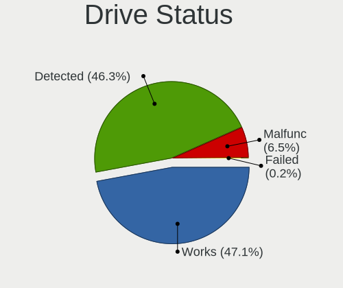

Linux Hardware Trends (Notebook)
--------------------------------

A project to identify most popular hardware characteristics and track their change
over time based on data collected by Linux users at https://Linux-Hardware.org.

Anyone can contribute to the study by uploading probes of their computers by
the [hw-probe](https://github.com/linuxhw/hw-probe) tool:

    sudo hw-probe -all -upload

Full-feature report is available here: https://linux-hardware.org/?view=trends&formfactor=notebook

Period: Feb, 2020.

Contents
--------

- [ OS                       ](#os)
- [ OS Family                ](#os-family)
- [ Kernel                   ](#kernel)
- [ Kernel Family            ](#kernel-family)
- [ Kernel Major Ver.        ](#kernel-major-ver)
- [ Arch                     ](#arch)
- [ DE                       ](#de)
- [ Display Server           ](#display-server)
- [ OS Lang                  ](#os-lang)
- [ Boot Mode                ](#boot-mode)
- [ Filesystem               ](#filesystem)
- [ Dual Boot with Linux     ](#dual-boot-with-linux)
- [ Dual Boot (Win)          ](#dual-boot-win)
- [ Country                  ](#country)
- [ City                     ](#city)
- [ Vendor                   ](#vendor)
- [ Model                    ](#model)
- [ Model Family             ](#model-family)
- [ MFG Year                 ](#mfg-year)
- [ Form Factor              ](#form-factor)
- [ Secure Boot              ](#secure-boot)
- [ Coreboot                 ](#coreboot)
- [ RAM Size                 ](#ram-size)
- [ RAM Used                 ](#ram-used)
- [ Drive Vendor             ](#drive-vendor)
- [ Drive Model              ](#drive-model)
- [ Drive Kind               ](#drive-kind)
- [ Drive Connector          ](#drive-connector)
- [ Drive Size               ](#drive-size)
- [ Space Total              ](#space-total)
- [ Space Used               ](#space-used)
- [ Malfunc. Drives          ](#malfunc-drives)
- [ Malfunc. Drive Vendor    ](#malfunc-drive-vendor)
- [ Malfunc. Drive Kind      ](#malfunc-drive-kind)
- [ Failed Drives            ](#failed-drives)
- [ Failed Drive Vendor      ](#failed-drive-vendor)
- [ Drive Status             ](#drive-status)
- [ Storage Vendor           ](#storage-vendor)
- [ Storage Model            ](#storage-model)
- [ Storage Kind             ](#storage-kind)
- [ CPU Vendor               ](#cpu-vendor)
- [ CPU Model                ](#cpu-model)
- [ CPU Model Family         ](#cpu-model-family)
- [ CPU Cores                ](#cpu-cores)
- [ CPU Sockets              ](#cpu-sockets)
- [ CPU Threads              ](#cpu-threads)
- [ CPU Op-Modes             ](#cpu-op-modes)
- [ CPU Microarch            ](#cpu-microarch)
- [ CPU Microcode            ](#cpu-microcode)
- [ GPU Vendor               ](#gpu-vendor)
- [ GPU Model                ](#gpu-model)
- [ GPU Combo                ](#gpu-combo)
- [ GPU Driver               ](#gpu-driver)
- [ GPU Memory               ](#gpu-memory)
- [ Monitor Vendor           ](#monitor-vendor)
- [ Monitor Model            ](#monitor-model)
- [ Monitor Resolution       ](#monitor-resolution)
- [ Monitor Diagonal         ](#monitor-diagonal)
- [ Monitor Width            ](#monitor-width)
- [ Aspect Ratio             ](#aspect-ratio)
- [ Monitor Area             ](#monitor-area)
- [ Pixel Density            ](#pixel-density)
- [ Multiple Monitors        ](#multiple-monitors)
- [ Net Controller Vendor    ](#net-controller-vendor)
- [ Net Controller Model     ](#net-controller-model)
- [ Net Controller Kind      ](#net-controller-kind)
- [ Used Controller          ](#used-controller)
- [ NICs                     ](#nics)
- [ Unsupported Devices      ](#unsupported-devices)
- [ Unsupported Device Types ](#unsupported-device-types)

OS
--

Installed operating systems

| Name                         | Computers | Percent |
|------------------------------|-----------|---------|
| Ubuntu 18.04                 | 373       | 22.28%  |
| Ubuntu 19.10                 | 232       | 13.86%  |
| ROSA R11                     | 153       | 9.14%   |
| BlackPanther 18.1            | 134       | 8%      |
| Fedora 31                    | 115       | 6.87%   |
| Mint 19.3                    | 94        | 5.62%   |
| Manjaro 18.1.5               | 41        | 2.45%   |
| Endless 3.7.7                | 34        | 2.03%   |
| Arch                         | 33        | 1.97%   |
| Debian 10                    | 31        | 1.85%   |
| Zorin 15                     | 27        | 1.61%   |
| Endless 3.7.6                | 26        | 1.55%   |
| Manjaro                      | 24        | 1.43%   |
| Ubuntu 16.04                 | 18        | 1.08%   |
| Ubuntu 19.04                 | 17        | 1.02%   |
| Ubuntu 20.04                 | 15        | 0.9%    |
| KDE neon 18.04               | 14        | 0.84%   |
| Arch Rolling                 | 13        | 0.78%   |
| ROSA R8.1                    | 11        | 0.66%   |
| Kali 2020.1                  | 10        | 0.6%    |
| Clear Linux 32270            | 10        | 0.6%    |
| BlackPanther 16.2            | 10        | 0.6%    |
| ROSA R10                     | 9         | 0.54%   |
| Debian                       | 9         | 0.54%   |
| Mint 19.2                    | 8         | 0.48%   |
| Gentoo                       | 8         | 0.48%   |
| Clear Linux 32480            | 8         | 0.48%   |
| Clear Linux 32380            | 8         | 0.48%   |
| Mint 19.1                    | 7         | 0.42%   |
| Fedora 30                    | 7         | 0.42%   |
| Clear Linux 32330            | 7         | 0.42%   |
| Peppermint 10                | 6         | 0.36%   |
| Mint 19                      | 6         | 0.36%   |
| Pop!_OS 19.10                | 5         | 0.3%    |
| Manjaro 19.0.0               | 5         | 0.3%    |
| Manjaro 19.0                 | 5         | 0.3%    |
| Endless 3.3.20-nexthw1       | 5         | 0.3%    |
| Elementary 5.1.2             | 5         | 0.3%    |
| Debian Testing               | 5         | 0.3%    |
| CentOS 8                     | 5         | 0.3%    |
| Zorin 12                     | 4         | 0.24%   |
| MX 19                        | 4         | 0.24%   |
| Debian Unstable              | 4         | 0.24%   |
| Clear Linux 32390            | 4         | 0.24%   |
| Clear Linux 32340            | 4         | 0.24%   |
| Ubuntu                       | 3         | 0.18%   |
| Solus 4.1                    | 3         | 0.18%   |
| RHEL 8.1                     | 3         | 0.18%   |
| RED X4                       | 3         | 0.18%   |
| openSUSE Tumbleweed-20200128 | 3         | 0.18%   |
| Endless 3.4.8-nexthw1        | 3         | 0.18%   |
| Elementary 5.1               | 3         | 0.18%   |
| Clear Linux 32400            | 3         | 0.18%   |
| Clear Linux 32310            | 3         | 0.18%   |
| Clear Linux 32280            | 3         | 0.18%   |
| Ubuntu 18.10                 | 2         | 0.12%   |
| Reborn OS                    | 2         | 0.12%   |
| Peppermint 9                 | 2         | 0.12%   |
| Parrot 4.8                   | 2         | 0.12%   |
| openSUSE 15.1                | 2         | 0.12%   |

OS Family
---------

OS without a version

| Name         | Computers | Percent |
|--------------|-----------|---------|
| Ubuntu       | 661       | 39.49%  |
| ROSA         | 176       | 10.51%  |
| BlackPanther | 145       | 8.66%   |
| Fedora       | 125       | 7.47%   |
| Mint         | 116       | 6.93%   |
| Endless      | 81        | 4.84%   |
| Manjaro      | 77        | 4.6%    |
| Clear Linux  | 56        | 3.35%   |
| Debian       | 50        | 2.99%   |
| Arch         | 46        | 2.75%   |
| Zorin        | 31        | 1.85%   |
| KDE neon     | 14        | 0.84%   |
| openSUSE     | 13        | 0.78%   |
| Kali         | 12        | 0.72%   |
| Gentoo       | 10        | 0.6%    |
| Elementary   | 9         | 0.54%   |
| Peppermint   | 8         | 0.48%   |
| CentOS       | 7         | 0.42%   |
| Pop!_OS      | 6         | 0.36%   |
| MX           | 5         | 0.3%    |
| Solus        | 3         | 0.18%   |
| RHEL         | 3         | 0.18%   |
| RED          | 2         | 0.12%   |
| Reborn OS    | 2         | 0.12%   |
| Parrot       | 2         | 0.12%   |
| Oracle Linux | 2         | 0.12%   |
| Chrome OS    | 2         | 0.12%   |
| Void         | 1         | 0.06%   |
| TTOS         | 1         | 0.06%   |
| Sabayon      | 1         | 0.06%   |
| Pardus       | 1         | 0.06%   |
| OpenMandriva | 1         | 0.06%   |
| GalliumOS    | 1         | 0.06%   |
| Devuan       | 1         | 0.06%   |
| Artix        | 1         | 0.06%   |
| Arcolinux    | 1         | 0.06%   |
| Alpine       | 1         | 0.06%   |

Kernel
------

Version of the Linux kernel

| Version                          | Computers | Percent |
|----------------------------------|-----------|---------|
| 5.3.0-28-generic                 | 238       | 14.22%  |
| 5.3.0-40-generic                 | 202       | 12.07%  |
| 5.3.0-29-generic                 | 99        | 5.91%   |
| 4.18.16-desktop-1bP              | 84        | 5.02%   |
| 4.15.0-76-generic                | 70        | 4.18%   |
| 4.15.0-desktop-68.5rosa-x86_64   | 58        | 3.46%   |
| 4.15.0-desktop-45.1rosa-x86_64   | 55        | 3.29%   |
| 5.1.15-desktop-1bP               | 50        | 2.99%   |
| 4.15.0-88-generic                | 32        | 1.91%   |
| 5.3.0-23-generic                 | 26        | 1.55%   |
| 5.3.0-18-generic                 | 24        | 1.43%   |
| 5.5.5-200.fc31.x86_64            | 22        | 1.31%   |
| 5.0.0-23-generic                 | 22        | 1.31%   |
| 5.4.17-200.fc31.x86_64           | 21        | 1.25%   |
| 5.4.15-2-MANJARO                 | 20        | 1.19%   |
| 5.4.19-200.fc31.x86_64           | 16        | 0.96%   |
| 5.3.0-26-generic                 | 16        | 0.96%   |
| 5.4.18-200.fc31.x86_64           | 15        | 0.9%    |
| 4.19.0-6-amd64                   | 15        | 0.9%    |
| 4.15.0-desktop-68.5rosa-i586     | 15        | 0.9%    |
| 5.4.18-902.native                | 14        | 0.84%   |
| 5.0.0-32-generic                 | 14        | 0.84%   |
| 5.4.15-200.fc31.x86_64           | 13        | 0.78%   |
| 4.19.0-8-amd64                   | 13        | 0.78%   |
| 5.5.6-914.native                 | 12        | 0.72%   |
| 5.5.2-1-MANJARO                  | 12        | 0.72%   |
| 5.0.0-37-generic                 | 12        | 0.72%   |
| 4.15.0-desktop-45.1rosa-i586     | 12        | 0.72%   |
| 4.15.0-74-generic                | 11        | 0.66%   |
| 5.5.5-arch1-1                    | 10        | 0.6%    |
| 5.5.0-1-MANJARO                  | 10        | 0.6%    |
| 5.4.18-1-MANJARO                 | 10        | 0.6%    |
| 5.3.0-41-generic                 | 10        | 0.6%    |
| 5.0.0-38-generic                 | 10        | 0.6%    |
| 5.5.5-911.native                 | 9         | 0.54%   |
| 5.4.20-200.fc31.x86_64           | 9         | 0.54%   |
| 5.4.0-kali3-amd64                | 9         | 0.54%   |
| 4.9.20-desktop-pae-1bP           | 9         | 0.54%   |
| 4.9.155-nrj-desktop-1rosa-x86_64 | 8         | 0.48%   |
| 5.5.4-909.native                 | 6         | 0.36%   |
| 5.5.3-908.native                 | 6         | 0.36%   |
| 5.5.2-arch1-1                    | 6         | 0.36%   |
| 5.4.0-14-generic                 | 6         | 0.36%   |
| 4.9.155-nrj-desktop-1rosa-i586   | 6         | 0.36%   |
| 5.4.0-12-generic                 | 5         | 0.3%    |
| 5.3.7-301.fc31.x86_64            | 5         | 0.3%    |
| 5.3.18-1-MANJARO                 | 5         | 0.3%    |
| 5.0.0-31-generic                 | 5         | 0.3%    |
| 5.0.0-13-generic                 | 5         | 0.3%    |
| 4.4.0-173-generic                | 5         | 0.3%    |
| 4.15.0-15-generic                | 5         | 0.3%    |
| 5.5.6-arch1-1                    | 4         | 0.24%   |
| 5.5.3-905.native                 | 4         | 0.24%   |
| 5.5.2-arch2-2                    | 4         | 0.24%   |
| 5.4.0-4-amd64                    | 4         | 0.24%   |
| 5.4.0-3-amd64                    | 4         | 0.24%   |
| 5.3.0-7625-generic               | 4         | 0.24%   |
| 5.3.0-29-lowlatency              | 4         | 0.24%   |
| 4.9.60-nrj-desktop-1rosa-x86_64  | 4         | 0.24%   |
| 4.9.60-nrj-desktop-1rosa-i586    | 4         | 0.24%   |

Kernel Family
-------------

Linux kernel without a distro release

| Version  | Computers | Percent |
|----------|-----------|---------|
| 5.3.0    | 636       | 37.99%  |
| 4.15.0   | 291       | 17.38%  |
| 4.18.16  | 84        | 5.02%   |
| 5.0.0    | 77        | 4.6%    |
| 5.1.15   | 50        | 2.99%   |
| 5.5.5    | 45        | 2.69%   |
| 5.4.18   | 42        | 2.51%   |
| 5.4.0    | 42        | 2.51%   |
| 5.4.15   | 38        | 2.27%   |
| 4.19.0   | 32        | 1.91%   |
| 5.5.2    | 28        | 1.67%   |
| 5.4.17   | 25        | 1.49%   |
| 4.18.0   | 22        | 1.31%   |
| 5.5.6    | 21        | 1.25%   |
| 5.4.19   | 19        | 1.14%   |
| 5.5.3    | 17        | 1.02%   |
| 5.5.4    | 15        | 0.9%    |
| 5.5.0    | 14        | 0.84%   |
| 4.9.155  | 14        | 0.84%   |
| 5.4.20   | 11        | 0.66%   |
| 4.9.20   | 11        | 0.66%   |
| 5.5.1    | 9         | 0.54%   |
| 4.9.60   | 8         | 0.48%   |
| 4.9.0    | 8         | 0.48%   |
| 5.4.14   | 7         | 0.42%   |
| 5.4.13   | 7         | 0.42%   |
| 5.3.18   | 7         | 0.42%   |
| 4.4.0    | 7         | 0.42%   |
| 5.6.0    | 6         | 0.36%   |
| 4.13.0   | 6         | 0.36%   |
| 5.4.16   | 5         | 0.3%    |
| 5.3.7    | 5         | 0.3%    |
| 5.4.12   | 4         | 0.24%   |
| 4.19.97  | 4         | 0.24%   |
| 4.1.38   | 4         | 0.24%   |
| 5.4.6    | 3         | 0.18%   |
| 5.4.21   | 3         | 0.18%   |
| 5.4.10   | 3         | 0.18%   |
| 4.16.18  | 3         | 0.18%   |
| 5.4.7    | 2         | 0.12%   |
| 5.2.21   | 2         | 0.12%   |
| 4.9.9    | 2         | 0.12%   |
| 4.8.0    | 2         | 0.12%   |
| 4.19.99  | 2         | 0.12%   |
| 4.19.102 | 2         | 0.12%   |
| 4.19.101 | 2         | 0.12%   |
| 4.12.14  | 2         | 0.12%   |
| 3.10.0   | 2         | 0.12%   |
| 5.5.7    | 1         | 0.06%   |
| 5.4.22   | 1         | 0.06%   |
| 5.3.8    | 1         | 0.06%   |
| 5.3.6    | 1         | 0.06%   |
| 5.3.16   | 1         | 0.06%   |
| 5.3.15   | 1         | 0.06%   |
| 5.2.8    | 1         | 0.06%   |
| 5.2.2    | 1         | 0.06%   |
| 5.1.0    | 1         | 0.06%   |
| 5.0.9    | 1         | 0.06%   |
| 4.9.124  | 1         | 0.06%   |
| 4.7.0    | 1         | 0.06%   |

Kernel Major Ver.
-----------------

Linux kernel major version

| Version | Computers | Percent |
|---------|-----------|---------|
| 5.3     | 652       | 38.95%  |
| 4.15    | 291       | 17.38%  |
| 5.4     | 212       | 12.66%  |
| 5.5     | 150       | 8.96%   |
| 4.18    | 106       | 6.33%   |
| 5.0     | 78        | 4.66%   |
| 5.1     | 51        | 3.05%   |
| 4.19    | 47        | 2.81%   |
| 4.9     | 44        | 2.63%   |
| 4.4     | 8         | 0.48%   |
| 5.6     | 6         | 0.36%   |
| 4.13    | 6         | 0.36%   |
| 4.1     | 5         | 0.3%    |
| 5.2     | 4         | 0.24%   |
| 4.16    | 4         | 0.24%   |
| 4.8     | 2         | 0.12%   |
| 4.12    | 2         | 0.12%   |
| 3.10    | 2         | 0.12%   |
| 4.7     | 1         | 0.06%   |
| 4.14    | 1         | 0.06%   |
| 4.11    | 1         | 0.06%   |
| 4.10    | 1         | 0.06%   |

Arch
----

OS architecture (x86_64, i586, etc.)

| Name   | Computers | Percent |
|--------|-----------|---------|
| x86_64 | 1560      | 93.19%  |
| i686   | 114       | 6.81%   |

DE
--

Desktop Environment

| Name            | Computers | Percent |
|-----------------|-----------|---------|
| GNOME           | 768       | 45.88%  |
| KDE5            | 274       | 16.37%  |
| Unknown         | 115       | 6.87%   |
| XFCE            | 101       | 6.03%   |
| KDE4            | 101       | 6.03%   |
| X-Cinnamon      | 81        | 4.84%   |
| KDE             | 73        | 4.36%   |
| MATE            | 41        | 2.45%   |
| Cinnamon        | 25        | 1.49%   |
| Unity           | 22        | 1.31%   |
| LXQt            | 14        | 0.84%   |
| GNOME Flashback | 13        | 0.78%   |
| LXDE            | 12        | 0.72%   |
| Budgie          | 12        | 0.72%   |
| i3              | 7         | 0.42%   |
| Pantheon        | 6         | 0.36%   |
| Openbox         | 3         | 0.18%   |
| GNOME Classic   | 2         | 0.12%   |
| xubuntu         | 1         | 0.06%   |
| qt5ct           | 1         | 0.06%   |
| Lubuntu         | 1         | 0.06%   |
| Deepin          | 1         | 0.06%   |

Display Server
--------------

X11 or Wayland

| Name    | Computers | Percent |
|---------|-----------|---------|
| X11     | 1488      | 88.89%  |
| Wayland | 130       | 7.77%   |
| Unknown | 50        | 2.99%   |
| Tty     | 6         | 0.36%   |

OS Lang
-------

Language

| Lang        | Computers | Percent |
|-------------|-----------|---------|
| en_US       | 503       | 30.05%  |
| Unknown     | 380       | 22.7%   |
| de_DE       | 92        | 5.5%    |
| ru_RU       | 80        | 4.78%   |
| pt_BR       | 74        | 4.42%   |
| en_GB       | 63        | 3.76%   |
| fr_FR       | 45        | 2.69%   |
| es_ES       | 34        | 2.03%   |
| en_CA       | 29        | 1.73%   |
| it_IT       | 28        | 1.67%   |
| pl_PL       | 25        | 1.49%   |
| en_US.utf8  | 24        | 1.43%   |
| en_IN       | 24        | 1.43%   |
| en_AU       | 22        | 1.31%   |
| es_MX       | 19        | 1.14%   |
| C           | 18        | 1.08%   |
| ru_UA       | 13        | 0.78%   |
| pt_BR.utf8  | 13        | 0.78%   |
| hu_HU       | 11        | 0.66%   |
| cs_CZ       | 10        | 0.6%    |
| en_ZA       | 9         | 0.54%   |
| tr_TR       | 8         | 0.48%   |
| sv_SE       | 8         | 0.48%   |
| es_AR       | 8         | 0.48%   |
| ro_RO       | 6         | 0.36%   |
| bg_BG       | 6         | 0.36%   |
| pt_PT       | 5         | 0.3%    |
| nl_NL       | 5         | 0.3%    |
| ja_JP       | 5         | 0.3%    |
| es_CO       | 5         | 0.3%    |
| en_NZ       | 5         | 0.3%    |
| sk_SK       | 4         | 0.24%   |
| fi_FI       | 4         | 0.24%   |
| es_CL       | 4         | 0.24%   |
| en_IE       | 4         | 0.24%   |
| da_DK       | 4         | 0.24%   |
| ca_ES       | 4         | 0.24%   |
| uk_UA       | 3         | 0.18%   |
| it_IT.utf8  | 3         | 0.18%   |
| es_PE       | 3         | 0.18%   |
| es_CR       | 3         | 0.18%   |
| en_PH       | 3         | 0.18%   |
| en_DK       | 3         | 0.18%   |
| el_GR       | 3         | 0.18%   |
| de_DE.utf8  | 3         | 0.18%   |
| zh_TW       | 2         | 0.12%   |
| zh_CN       | 2         | 0.12%   |
| ru_RU.utf8  | 2         | 0.12%   |
| pl_PL.utf8  | 2         | 0.12%   |
| nl_BE       | 2         | 0.12%   |
| fr_BE       | 2         | 0.12%   |
| es_VE       | 2         | 0.12%   |
| es_SV       | 2         | 0.12%   |
| es_EC       | 2         | 0.12%   |
| en_GB.utf8  | 2         | 0.12%   |
| de_CH       | 2         | 0.12%   |
| de_AT       | 2         | 0.12%   |
| zh_CN.utf8  | 1         | 0.06%   |
| vi_VN       | 1         | 0.06%   |
| sr_RS@latin | 1         | 0.06%   |

Boot Mode
---------

EFI or BIOS

| Mode | Computers | Percent |
|------|-----------|---------|
| BIOS | 867       | 51.79%  |
| EFI  | 807       | 48.21%  |

Filesystem
----------

Type of filesystem

| Type     | Computers | Percent |
|----------|-----------|---------|
| Ext4     | 1564      | 93.43%  |
| Btrfs    | 39        | 2.33%   |
| Overlay  | 37        | 2.21%   |
| Xfs      | 18        | 1.08%   |
| Zfs      | 8         | 0.48%   |
| Ext3     | 3         | 0.18%   |
| Tmpfs    | 1         | 0.06%   |
| Reiserfs | 1         | 0.06%   |
| F2fs     | 1         | 0.06%   |
| Ext2     | 1         | 0.06%   |
| Aufs     | 1         | 0.06%   |

Dual Boot with Linux
--------------------

Hosting more than one Linux

| Dual boot | Computers | Percent |
|-----------|-----------|---------|
| No        | 1531      | 91.46%  |
| Yes       | 143       | 8.54%   |

Dual Boot (Win)
---------------

Hosting Linux and Windows

| Dual boot | Computers | Percent |
|-----------|-----------|---------|
| No        | 1197      | 71.51%  |
| Yes       | 477       | 28.49%  |

Country
-------

Geographic location (country)

| Country              | Computers | Percent |
|----------------------|-----------|---------|
| Russia               | 233       | 13.92%  |
| USA                  | 219       | 13.08%  |
| Germany              | 138       | 8.24%   |
| Hungary              | 129       | 7.71%   |
| Brazil               | 105       | 6.27%   |
| Canada               | 51        | 3.05%   |
| UK                   | 50        | 2.99%   |
| France               | 48        | 2.87%   |
| Ukraine              | 47        | 2.81%   |
| Italy                | 45        | 2.69%   |
| Spain                | 44        | 2.63%   |
| India                | 38        | 2.27%   |
| Poland               | 35        | 2.09%   |
| Mexico               | 29        | 1.73%   |
| Romania              | 24        | 1.43%   |
| Australia            | 23        | 1.37%   |
| Netherlands          | 21        | 1.25%   |
| Turkey               | 18        | 1.08%   |
| Sweden               | 16        | 0.96%   |
| Norway               | 15        | 0.9%    |
| Czech Republic       | 15        | 0.9%    |
| Belarus              | 14        | 0.84%   |
| Belgium              | 12        | 0.72%   |
| Austria              | 12        | 0.72%   |
| Argentina            | 12        | 0.72%   |
| South Africa         | 11        | 0.66%   |
| Indonesia            | 11        | 0.66%   |
| Greece               | 11        | 0.66%   |
| China                | 11        | 0.66%   |
| Bulgaria             | 11        | 0.66%   |
| Denmark              | 10        | 0.6%    |
| Japan                | 9         | 0.54%   |
| Colombia             | 9         | 0.54%   |
| Slovakia             | 8         | 0.48%   |
| Portugal             | 8         | 0.48%   |
| Finland              | 8         | 0.48%   |
| Thailand             | 7         | 0.42%   |
| Switzerland          | 7         | 0.42%   |
| Serbia               | 7         | 0.42%   |
| New Zealand          | 7         | 0.42%   |
| Latvia               | 6         | 0.36%   |
| Kazakhstan           | 6         | 0.36%   |
| Ireland              | 6         | 0.36%   |
| Singapore            | 5         | 0.3%    |
| Philippines          | 5         | 0.3%    |
| Iran                 | 5         | 0.3%    |
| Chile                | 5         | 0.3%    |
| Vietnam              | 4         | 0.24%   |
| Peru                 | 4         | 0.24%   |
| Morocco              | 4         | 0.24%   |
| Israel               | 4         | 0.24%   |
| Costa Rica           | 4         | 0.24%   |
| UAE                  | 3         | 0.18%   |
| Taiwan               | 3         | 0.18%   |
| Puerto Rico          | 3         | 0.18%   |
| Moldova, Republic of | 3         | 0.18%   |
| Lithuania            | 3         | 0.18%   |
| Korea, Republic of   | 3         | 0.18%   |
| Hong Kong            | 3         | 0.18%   |
| Egypt                | 3         | 0.18%   |

City
----

Geographic location (city)

| City              | Computers | Percent |
|-------------------|-----------|---------|
| Moscow            | 56        | 3.35%   |
| Budapest          | 39        | 2.33%   |
| St Petersburg     | 29        | 1.73%   |
| Berlin            | 17        | 1.02%   |
| Kyiv              | 15        | 0.9%    |
| São Paulo        | 13        | 0.78%   |
| Mexico City       | 10        | 0.6%    |
| Warsaw            | 9         | 0.54%   |
| Madrid            | 9         | 0.54%   |
| Yekaterinburg     | 8         | 0.48%   |
| Nuremberg         | 8         | 0.48%   |
| Rome              | 7         | 0.42%   |
| Novosibirsk       | 7         | 0.42%   |
| Miskolc           | 7         | 0.42%   |
| Minsk             | 7         | 0.42%   |
| Chicago           | 7         | 0.42%   |
| Bengaluru         | 7         | 0.42%   |
| Belgrade          | 7         | 0.42%   |
| Barcelona         | 7         | 0.42%   |
| Amsterdam         | 7         | 0.42%   |
| Vienna            | 6         | 0.36%   |
| Sofia             | 6         | 0.36%   |
| Rio de Janeiro    | 6         | 0.36%   |
| Paris             | 6         | 0.36%   |
| Kolkata           | 6         | 0.36%   |
| Istanbul          | 6         | 0.36%   |
| Frankfurt am Main | 6         | 0.36%   |
| Bogotá           | 6         | 0.36%   |
| Athens            | 6         | 0.36%   |
| Toronto           | 5         | 0.3%    |
| Székesfehérvár | 5         | 0.3%    |
| Singapore         | 5         | 0.3%    |
| Samara            | 5         | 0.3%    |
| Riga              | 5         | 0.3%    |
| Ottawa            | 5         | 0.3%    |
| Oslo              | 5         | 0.3%    |
| Nizhniy Novgorod  | 5         | 0.3%    |
| Dublin            | 5         | 0.3%    |
| Cologne           | 5         | 0.3%    |
| Brasília         | 5         | 0.3%    |
| Auckland          | 5         | 0.3%    |
| Zalaegerszeg      | 4         | 0.24%   |
| Voronezh          | 4         | 0.24%   |
| Ufa               | 4         | 0.24%   |
| Szigetszentmiklos | 4         | 0.24%   |
| Santiago          | 4         | 0.24%   |
| Prague            | 4         | 0.24%   |
| Milan             | 4         | 0.24%   |
| Lima              | 4         | 0.24%   |
| Krasnodar         | 4         | 0.24%   |
| Krakow            | 4         | 0.24%   |
| Kharkiv           | 4         | 0.24%   |
| Kazan’          | 4         | 0.24%   |
| Johannesburg      | 4         | 0.24%   |
| Jakarta           | 4         | 0.24%   |
| Helsinki          | 4         | 0.24%   |
| Bucharest         | 4         | 0.24%   |
| Brussels          | 4         | 0.24%   |
| Érd              | 3         | 0.18%   |
| Wrocław          | 3         | 0.18%   |

Vendor
------

Motherboard manufacturer

| Name                  | Computers | Percent |
|-----------------------|-----------|---------|
| Hewlett-Packard       | 345       | 20.61%  |
| Lenovo                | 328       | 19.59%  |
| Dell                  | 279       | 16.67%  |
| ASUSTek Computer      | 216       | 12.9%   |
| Acer                  | 174       | 10.39%  |
| Toshiba               | 49        | 2.93%   |
| Samsung Electronics   | 46        | 2.75%   |
| MSI                   | 35        | 2.09%   |
| Apple                 | 29        | 1.73%   |
| Sony                  | 20        | 1.19%   |
| Fujitsu               | 11        | 0.66%   |
| HUAWEI                | 9         | 0.54%   |
| Packard Bell          | 8         | 0.48%   |
| Notebook              | 8         | 0.48%   |
| Alienware             | 8         | 0.48%   |
| Google                | 6         | 0.36%   |
| Timi                  | 5         | 0.3%    |
| Medion                | 5         | 0.3%    |
| LG Electronics        | 5         | 0.3%    |
| Gateway               | 5         | 0.3%    |
| Fujitsu Siemens       | 5         | 0.3%    |
| Unknown               | 5         | 0.3%    |
| Positivo              | 4         | 0.24%   |
| Intel                 | 4         | 0.24%   |
| Digma                 | 4         | 0.24%   |
| TrekStor              | 3         | 0.18%   |
| Gigabyte Technology   | 3         | 0.18%   |
| Complet               | 3         | 0.18%   |
| Razer                 | 2         | 0.12%   |
| Pegatron              | 2         | 0.12%   |
| PC Specialist         | 2         | 0.12%   |
| eMachines             | 2         | 0.12%   |
| Digibras              | 2         | 0.12%   |
| CyberPowerPC          | 2         | 0.12%   |
| Clevo                 | 2         | 0.12%   |
| YIFANG                | 1         | 0.06%   |
| Wortmann AG           | 1         | 0.06%   |
| VULCAN                | 1         | 0.06%   |
| TUXEDO                | 1         | 0.06%   |
| Thomson               | 1         | 0.06%   |
| Synology              | 1         | 0.06%   |
| SLIMBOOK              | 1         | 0.06%   |
| SHARP                 | 1         | 0.06%   |
| Schenker              | 1         | 0.06%   |
| Quanta                | 1         | 0.06%   |
| Prestigio             | 1         | 0.06%   |
| Panasonic             | 1         | 0.06%   |
| OriginPC              | 1         | 0.06%   |
| OEM                   | 1         | 0.06%   |
| NEC Computers         | 1         | 0.06%   |
| Multilaser Industrial | 1         | 0.06%   |
| MECHREVO              | 1         | 0.06%   |
| Koompi                | 1         | 0.06%   |
| Itautec               | 1         | 0.06%   |
| IT Channel Pty        | 1         | 0.06%   |
| Infomash              | 1         | 0.06%   |
| IBM                   | 1         | 0.06%   |
| Hampoo                | 1         | 0.06%   |
| GIADA                 | 1         | 0.06%   |
| Exo                   | 1         | 0.06%   |

Model
-----

Motherboard model

| Name                                            | Computers | Percent |
|-------------------------------------------------|-----------|---------|
| HP Notebook                                     | 17        | 1.02%   |
| HP Pavilion g6                                  | 11        | 0.66%   |
| Unknown                                         | 11        | 0.66%   |
| HP Pavilion dv6                                 | 10        | 0.6%    |
| Acer Nitro AN515-52                             | 9         | 0.54%   |
| HP 15                                           | 8         | 0.48%   |
| Dell Latitude E6430                             | 8         | 0.48%   |
| HP Pavilion dv7                                 | 7         | 0.42%   |
| HP Laptop 15-bw0xx                              | 7         | 0.42%   |
| ASUS X541NA                                     | 7         | 0.42%   |
| ASUS K50IJ                                      | 7         | 0.42%   |
| HP Laptop 15-db0xxx                             | 6         | 0.36%   |
| HP Laptop 15-bs0xx                              | 6         | 0.36%   |
| HP EliteBook 8460p                              | 6         | 0.36%   |
| HP EliteBook 840 G6                             | 6         | 0.36%   |
| Dell XPS 15 7590                                | 6         | 0.36%   |
| Dell Inspiron 15-3567                           | 6         | 0.36%   |
| ASUS VivoBook 15_ASUS Laptop X540UAR            | 6         | 0.36%   |
| Lenovo IdeaPad 330-15IKB 81DE                   | 5         | 0.3%    |
| Lenovo IdeaPad 310-15ISK 80SM                   | 5         | 0.3%    |
| HP Pavilion Gaming Laptop 15-cx0xxx             | 5         | 0.3%    |
| HP Laptop 15-bs1xx                              | 5         | 0.3%    |
| HP 250 G1                                       | 5         | 0.3%    |
| Dell XPS 13 9360                                | 5         | 0.3%    |
| Dell Precision 5540                             | 5         | 0.3%    |
| Dell Latitude E7240                             | 5         | 0.3%    |
| Dell Latitude E6400                             | 5         | 0.3%    |
| Dell Inspiron 15 7000 Gaming                    | 5         | 0.3%    |
| ASUS 1005HA                                     | 5         | 0.3%    |
| Acer Aspire A315-53                             | 5         | 0.3%    |
| Lenovo G500 20236                               | 4         | 0.24%   |
| Lenovo G50-30 80G0                              | 4         | 0.24%   |
| Lenovo B570e HuronRiver Platform                | 4         | 0.24%   |
| HP ProBook 650 G1                               | 4         | 0.24%   |
| HP Pavilion Gaming Laptop 15-ec0xxx             | 4         | 0.24%   |
| HP Pavilion g7                                  | 4         | 0.24%   |
| HP Pavilion 15                                  | 4         | 0.24%   |
| HP Laptop 17-by0xxx                             | 4         | 0.24%   |
| HP G62                                          | 4         | 0.24%   |
| HP EliteBook 8470p                              | 4         | 0.24%   |
| HP EliteBook 840 G3                             | 4         | 0.24%   |
| Dell Precision 5530                             | 4         | 0.24%   |
| Dell Latitude E6440                             | 4         | 0.24%   |
| Dell Latitude E6410                             | 4         | 0.24%   |
| Dell Latitude D630                              | 4         | 0.24%   |
| Dell Latitude 5490                              | 4         | 0.24%   |
| Dell Inspiron 3542                              | 4         | 0.24%   |
| Dell Inspiron 1545                              | 4         | 0.24%   |
| Dell Inspiron 13-5378                           | 4         | 0.24%   |
| ASUS K53SV                                      | 4         | 0.24%   |
| Apple MacBook4,1                                | 4         | 0.24%   |
| Acer Aspire E5-571                              | 4         | 0.24%   |
| Acer Aspire A315-21                             | 4         | 0.24%   |
| Toshiba Satellite C660                          | 3         | 0.18%   |
| Samsung Electronics N150/N210/N220              | 3         | 0.18%   |
| Samsung Electronics 350V5C/351V5C/3540VC/3440VC | 3         | 0.18%   |
| Positivo Mobile                                 | 3         | 0.18%   |
| Packard Bell EasyNote TE11HC                    | 3         | 0.18%   |
| Lenovo Z50-75 80EC                              | 3         | 0.18%   |
| Lenovo Z50-70 20354                             | 3         | 0.18%   |

Model Family
------------

Motherboard model prefix

| Name                       | Computers | Percent |
|----------------------------|-----------|---------|
| Lenovo ThinkPad            | 163       | 9.74%   |
| Acer Aspire                | 125       | 7.47%   |
| Dell Inspiron              | 101       | 6.03%   |
| Dell Latitude              | 89        | 5.32%   |
| Lenovo IdeaPad             | 84        | 5.02%   |
| HP Pavilion                | 78        | 4.66%   |
| HP EliteBook               | 54        | 3.23%   |
| HP ProBook                 | 48        | 2.87%   |
| HP Laptop                  | 48        | 2.87%   |
| Toshiba Satellite          | 38        | 2.27%   |
| ASUS VivoBook              | 35        | 2.09%   |
| Dell XPS                   | 29        | 1.73%   |
| Dell Precision             | 29        | 1.73%   |
| Dell Vostro                | 19        | 1.14%   |
| HP Compaq                  | 18        | 1.08%   |
| HP Notebook                | 17        | 1.02%   |
| Acer Nitro                 | 17        | 1.02%   |
| HP 250                     | 12        | 0.72%   |
| Acer TravelMate            | 12        | 0.72%   |
| Fujitsu LIFEBOOK           | 11        | 0.66%   |
| Unknown                    | 11        | 0.66%   |
| HP ZBook                   | 9         | 0.54%   |
| HP 15                      | 9         | 0.54%   |
| Packard Bell EasyNote      | 7         | 0.42%   |
| ASUS X541NA                | 7         | 0.42%   |
| ASUS TUF                   | 7         | 0.42%   |
| ASUS K50IJ                 | 7         | 0.42%   |
| Lenovo ThinkBook           | 6         | 0.36%   |
| HP ENVY                    | 6         | 0.36%   |
| HP Stream                  | 5         | 0.3%    |
| ASUS 1005HA                | 5         | 0.3%    |
| Toshiba PORTEGE            | 4         | 0.24%   |
| Lenovo Yoga                | 4         | 0.24%   |
| Lenovo G500                | 4         | 0.24%   |
| Lenovo G50-30              | 4         | 0.24%   |
| Lenovo B570e               | 4         | 0.24%   |
| HP OMEN                    | 4         | 0.24%   |
| HP Mini                    | 4         | 0.24%   |
| HP G62                     | 4         | 0.24%   |
| Dell Studio                | 4         | 0.24%   |
| Dell G5                    | 4         | 0.24%   |
| ASUS ZenBook               | 4         | 0.24%   |
| ASUS K53SV                 | 4         | 0.24%   |
| Apple MacBookPro8          | 4         | 0.24%   |
| Apple MacBook4             | 4         | 0.24%   |
| Acer Extensa               | 4         | 0.24%   |
| Samsung Electronics N150   | 3         | 0.18%   |
| Samsung Electronics 350V5C | 3         | 0.18%   |
| Positivo Mobile            | 3         | 0.18%   |
| MSI Prestige               | 3         | 0.18%   |
| Lenovo Z50-75              | 3         | 0.18%   |
| Lenovo Z50-70              | 3         | 0.18%   |
| Lenovo Y50-70              | 3         | 0.18%   |
| Lenovo Legion              | 3         | 0.18%   |
| HUAWEI MACH-WX9            | 3         | 0.18%   |
| HP Presario                | 3         | 0.18%   |
| HP 240                     | 3         | 0.18%   |
| ASUS X553MA                | 3         | 0.18%   |
| ASUS X541UVK               | 3         | 0.18%   |
| ASUS K56CM                 | 3         | 0.18%   |

MFG Year
--------

Motherboard manufacture year

| Year | Computers | Percent |
|------|-----------|---------|
| 2019 | 470       | 28.08%  |
| 2018 | 202       | 12.07%  |
| 2013 | 131       | 7.83%   |
| 2012 | 129       | 7.71%   |
| 2011 | 129       | 7.71%   |
| 2017 | 106       | 6.33%   |
| 2015 | 90        | 5.38%   |
| 2014 | 85        | 5.08%   |
| 2016 | 82        | 4.9%    |
| 2010 | 81        | 4.84%   |
| 2009 | 67        | 4%      |
| 2008 | 50        | 2.99%   |
| 2007 | 16        | 0.96%   |
| 2020 | 15        | 0.9%    |
| 2006 | 15        | 0.9%    |
| 2005 | 6         | 0.36%   |

Form Factor
-----------

Physical design of the computer

| Name     | Computers | Percent |
|----------|-----------|---------|
| Notebook | 1674      | 100%    |

Secure Boot
-----------

Enabled or disabled

| State    | Computers | Percent |
|----------|-----------|---------|
| Disabled | 1503      | 89.78%  |
| Enabled  | 171       | 10.22%  |

Coreboot
--------

Have coreboot on board

| Used | Computers | Percent |
|------|-----------|---------|
| No   | 1668      | 99.64%  |
| Yes  | 6         | 0.36%   |

RAM Size
--------

Total RAM memory

| Size in GB  | Computers | Percent |
|-------------|-----------|---------|
| 3.01-4.0    | 461       | 27.54%  |
| 4.01-8.0    | 421       | 25.15%  |
| 8.01-16.0   | 281       | 16.79%  |
| 16.01-24.0  | 250       | 14.93%  |
| 1.01-2.0    | 118       | 7.05%   |
| 32.01-64.0  | 54        | 3.23%   |
| 2.01-3.0    | 52        | 3.11%   |
| 0.01-1.0    | 22        | 1.31%   |
| 24.01-32.0  | 9         | 0.54%   |
| 64.01-256.0 | 6         | 0.36%   |

RAM Used
--------

Used RAM memory

| Used GB    | Computers | Percent |
|------------|-----------|---------|
| 1.01-2.0   | 651       | 38.89%  |
| 2.01-3.0   | 400       | 23.89%  |
| 0.01-1.0   | 280       | 16.73%  |
| 4.01-8.0   | 155       | 9.26%   |
| 3.01-4.0   | 155       | 9.26%   |
| 8.01-16.0  | 30        | 1.79%   |
| 16.01-24.0 | 3         | 0.18%   |

Drive Vendor
------------

Hard drive vendors

| Vendor              | Computers | Drives | Percent |
|---------------------|-----------|--------|---------|
| Seagate             | 296       | 303    | 16.19%  |
| WDC                 | 291       | 301    | 15.92%  |
| Samsung Electronics | 207       | 218    | 11.32%  |
| Toshiba             | 202       | 206    | 11.05%  |
| Hitachi             | 103       | 103    | 5.63%   |
| Kingston            | 101       | 103    | 5.53%   |
| HGST                | 97        | 98     | 5.31%   |
| SanDisk             | 91        | 96     | 4.98%   |
| Unknown             | 81        | 93     | 4.43%   |
| Crucial             | 45        | 45     | 2.46%   |
| SK Hynix            | 35        | 35     | 1.91%   |
| Intel               | 34        | 35     | 1.86%   |
| A-DATA Technology   | 29        | 30     | 1.59%   |
| Micron Technology   | 21        | 21     | 1.15%   |
| SPCC                | 17        | 17     | 0.93%   |
| China               | 17        | 17     | 0.93%   |
| Fujitsu             | 13        | 13     | 0.71%   |
| LITEONIT            | 12        | 12     | 0.66%   |
| LITEON              | 10        | 10     | 0.55%   |
| Apple               | 10        | 10     | 0.55%   |
| PNY                 | 9         | 9      | 0.49%   |
| Transcend           | 8         | 8      | 0.44%   |
| OCZ                 | 7         | 7      | 0.38%   |
| Team                | 5         | 5      | 0.27%   |
| HL-DT-ST            | 5         | 1      | 0.27%   |
| Hewlett-Packard     | 5         | 5      | 0.27%   |
| GOODRAM             | 5         | 5      | 0.27%   |
| Phison              | 4         | 4      | 0.22%   |
| Intenso             | 4         | 4      | 0.22%   |
| Generic             | 4         | 4      | 0.22%   |
| FORESEE             | 4         | 4      | 0.22%   |
| Smartbuy            | 3         | 3      | 0.16%   |
| PLEXTOR             | 3         | 3      | 0.16%   |
| Patriot             | 3         | 3      | 0.16%   |
| JMicron             | 3         | 3      | 0.16%   |
| HUAWEI              | 3         | 3      | 0.16%   |
| Corsair             | 3         | 3      | 0.16%   |
| Apacer              | 3         | 4      | 0.16%   |
| ShineDisk           | 2         | 3      | 0.11%   |
| SABRENT             | 2         | 3      | 0.11%   |
| KingDian            | 2         | 2      | 0.11%   |
| KESU                | 2         | 2      | 0.11%   |
| WDC WD50            | 1         | 1      | 0.05%   |
| WDC WD20            | 1         | 1      | 0.05%   |
| Vaseky              | 1         | 1      | 0.05%   |
| USB                 | 1         | 1      | 0.05%   |
| Super Talent        | 1         | 1      | 0.05%   |
| SSK                 | 1         | 1      | 0.05%   |
| SMART               | 1         | 1      | 0.05%   |
| PM981a N            | 1         | 1      | 0.05%   |
| Lenovo              | 1         | 1      | 0.05%   |
| LDLC                | 1         | 1      | 0.05%   |
| LaCie               | 1         | 1      | 0.05%   |
| KingSpec            | 1         | 1      | 0.05%   |
| KingFast            | 1         | 1      | 0.05%   |
| Kingchuxing         | 1         | 1      | 0.05%   |
| Integral            | 1         | 1      | 0.05%   |
| INDMEM              | 1         | 1      | 0.05%   |
| Inateck             | 1         | 1      | 0.05%   |
| IM2S3138            | 1         | 1      | 0.05%   |

Drive Model
-----------

Hard drive models

| Model                        | Computers | Percent |
|------------------------------|-----------|---------|
| ST1000LM035-1RK172 1TB       | 40        | 2.14%   |
| ST1000LM024 HN-M101MBB 1TB   | 35        | 1.87%   |
| HTS721010A9E630 1TB          | 31        | 1.66%   |
| MQ01ABD100 1TB               | 30        | 1.61%   |
| WD10SPZX-21Z10T0 1TB         | 26        | 1.39%   |
| MQ04ABF100 1TB               | 25        | 1.34%   |
| MMC Card  32GB               | 25        | 1.34%   |
| MQ01ABF050 500GB             | 24        | 1.28%   |
| ST500LT012-1DG142 500GB      | 18        | 0.96%   |
| SA400S37240G 240GB SSD       | 18        | 0.96%   |
| ST500LM012 HN-M500MBB 500GB  | 16        | 0.86%   |
| SSD 850 EVO 250GB            | 16        | 0.86%   |
| HTS541010A9E680 1TB          | 16        | 0.86%   |
| MMC Card  64GB               | 15        | 0.8%    |
| HTS545050A7E380 500GB        | 15        | 0.8%    |
| ST9500325AS 500GB            | 14        | 0.75%   |
| SSD 850 EVO 500GB            | 14        | 0.75%   |
| HTS725050A7E630 500GB        | 14        | 0.75%   |
| HTS545050A7E680 500GB        | 14        | 0.75%   |
| SV300S37A120G 120GB SSD      | 13        | 0.7%    |
| WD5000LPCX-24VHAT0 500GB     | 12        | 0.64%   |
| ST1000LM049-2GH172 1TB       | 12        | 0.64%   |
| SA400S37480G 480GB SSD       | 12        | 0.64%   |
| SA400S37120G 120GB SSD       | 12        | 0.64%   |
| ST2000LM007-1R8174 2TB       | 11        | 0.59%   |
| HTS543232A7A384 320GB        | 11        | 0.59%   |
| CT500MX500SSD1 500GB         | 11        | 0.59%   |
| WD5000LPVX-22V0TT0 500GB     | 10        | 0.54%   |
| WD10JPVX-22JC3T0 1TB         | 10        | 0.54%   |
| ST500LT012-9WS142 500GB      | 10        | 0.54%   |
| HTS545025B9A300 250GB        | 10        | 0.54%   |
| ST2000LX001-1RG174 2TB       | 8         | 0.43%   |
| SSD PLUS 240GB               | 8         | 0.43%   |
| SSD 860 EVO 250GB            | 8         | 0.43%   |
| ST9250315AS 250GB            | 7         | 0.37%   |
| ST320LT020-9YG142 320GB      | 7         | 0.37%   |
| MZNLN128HAHQ-000H1 128GB SSD | 7         | 0.37%   |
| MMC Card  16GB               | 7         | 0.37%   |
| HTS547575A9E384 752GB        | 7         | 0.37%   |
| HTS545032A7E380 320GB        | 7         | 0.37%   |
| Expansion 1TB                | 7         | 0.37%   |
| 1100_MTFDDAV256TBN 256GB SSD | 7         | 0.37%   |
| WD5000LPCX-21VHAT0 500GB     | 6         | 0.32%   |
| WD3200BPVT-22ZEST0 320GB     | 6         | 0.32%   |
| WD3200BPVT-22JJ5T0 320GB     | 6         | 0.32%   |
| WD10JPVX-60JC3T1 1TB         | 6         | 0.32%   |
| WD10JPVX-60JC3T0 1TB         | 6         | 0.32%   |
| SSD 860 EVO 500GB            | 6         | 0.32%   |
| RBUSC180DS37256GJ 256GB SSD  | 6         | 0.32%   |
| HTS545050B9A300 500GB        | 6         | 0.32%   |
| HTS543216L9A300 160GB        | 6         | 0.32%   |
| WDS120G2G0A-00JH30 120GB SSD | 5         | 0.27%   |
| WD10SPCX-24HWST1 1TB         | 5         | 0.27%   |
| WD10JPCX-24UE4T0 1TB         | 5         | 0.27%   |
| SUV400S37240G 240GB SSD      | 5         | 0.27%   |
| ST750LM022 HN-M750MBB 752GB  | 5         | 0.27%   |
| ST500LM000-1EJ162 500GB      | 5         | 0.27%   |
| ST320LT007-9ZV142 320GB      | 5         | 0.27%   |
| ST1000LX015-1U7172 1TB       | 5         | 0.27%   |
| ST1000LM048-2E7172 1TB       | 5         | 0.27%   |

Drive Kind
----------

HDD or SSD

| Kind    | Computers | Drives | Percent |
|---------|-----------|--------|---------|
| HDD     | 923       | 951    | 51.77%  |
| SSD     | 624       | 677    | 35%     |
| NVMe    | 113       | 118    | 6.34%   |
| MMC     | 81        | 94     | 4.54%   |
| Unknown | 42        | 41     | 2.36%   |

Drive Connector
---------------

SATA, SAS, NVMe, etc.

| Type | Computers | Drives | Percent |
|------|-----------|--------|---------|
| SATA | 1399      | 1611   | 84.69%  |
| NVMe | 113       | 118    | 6.84%   |
| MMC  | 81        | 94     | 4.9%    |
| SAS  | 59        | 58     | 3.57%   |

Drive Size
----------

Size of hard drive

| Size in TB | Computers | Drives | Percent |
|------------|-----------|--------|---------|
| 0.01-0.5   | 1153      | 1301   | 67.51%  |
| 0.51-1.0   | 489       | 508    | 28.63%  |
| 1.01-2.0   | 58        | 60     | 3.4%    |
| 3.01-4.0   | 5         | 5      | 0.29%   |
| 4.01-10.0  | 3         | 7      | 0.18%   |

Space Total
-----------

Amount of disk space available on the file system

| Size in GB     | Computers | Percent |
|----------------|-----------|---------|
| 101-250        | 549       | 32.8%   |
| 251-500        | 427       | 25.51%  |
| 501-1000       | 249       | 14.87%  |
| 51-100         | 142       | 8.48%   |
| 21-50          | 100       | 5.97%   |
| 1001-2000      | 71        | 4.24%   |
| 1-20           | 67        | 4%      |
| Unknown        | 31        | 1.85%   |
| 2001-3000      | 23        | 1.37%   |
| More than 3000 | 15        | 0.9%    |

Space Used
----------

Amount of used disk space

| Used GB        | Computers | Percent |
|----------------|-----------|---------|
| 1-20           | 790       | 47.19%  |
| 21-50          | 278       | 16.61%  |
| 101-250        | 193       | 11.53%  |
| 51-100         | 191       | 11.41%  |
| 251-500        | 104       | 6.21%   |
| 501-1000       | 60        | 3.58%   |
| Unknown        | 31        | 1.85%   |
| 1001-2000      | 18        | 1.08%   |
| 2001-3000      | 6         | 0.36%   |
| More than 3000 | 3         | 0.18%   |

Malfunc. Drives
---------------

Drive models with a malfunction

| Model                          | Computers | Drives | Percent |
|--------------------------------|-----------|--------|---------|
| HTS545025B9A300 250GB          | 7         | 7      | 4.67%   |
| HTS545050A7E680 500GB          | 5         | 5      | 3.33%   |
| ST9500325AS 500GB              | 4         | 4      | 2.67%   |
| HTS545032A7E380 320GB          | 4         | 4      | 2.67%   |
| HTS541010A9E680 1TB            | 4         | 4      | 2.67%   |
| ST9250315AS 250GB              | 3         | 3      | 2%      |
| MQ01ABF050 500GB               | 3         | 3      | 2%      |
| HTS545050A7E380 500GB          | 3         | 3      | 2%      |
| WD3200BPVT-22ZEST0 320GB       | 2         | 2      | 1.33%   |
| WD10JPVX-60JC3T0 1TB           | 2         | 2      | 1.33%   |
| ST980811AS 80GB                | 2         | 2      | 1.33%   |
| ST320LT020-9YG142 320GB        | 2         | 2      | 1.33%   |
| ST320LT007-9ZV142 320GB        | 2         | 2      | 1.33%   |
| ST2000LX001-1RG174 2TB         | 2         | 2      | 1.33%   |
| ST2000LM007-1R8174 2TB         | 2         | 2      | 1.33%   |
| ST1000LX015-1U7172 1TB         | 2         | 2      | 1.33%   |
| MK5059GSXP 500GB               | 2         | 2      | 1.33%   |
| MK2565GSX 250GB                | 2         | 2      | 1.33%   |
| HTS721010A9E630 1TB            | 2         | 2      | 1.33%   |
| HTS547550A9E384 500GB          | 2         | 2      | 1.33%   |
| HTS543232A7A384 320GB          | 2         | 2      | 1.33%   |
| CV8-8E128-HP 128GB SSD         | 2         | 2      | 1.33%   |
| WD7500BPVT-60HXZT3 752GB       | 1         | 1      | 0.67%   |
| WD7500BPKT-75PK4T0 752GB       | 1         | 1      | 0.67%   |
| WD6400BEVT-24A0RT0 640GB       | 1         | 1      | 0.67%   |
| WD6400BEVT-22A0RT0 640GB       | 1         | 1      | 0.67%   |
| WD5000LPVX-00V0TT0 500GB       | 1         | 1      | 0.67%   |
| WD5000LPLX-08ZNTT0 500GB       | 1         | 1      | 0.67%   |
| WD5000LPCX-24VHAT0 500GB       | 1         | 1      | 0.67%   |
| WD5000BEVT-60ZAT1 500GB        | 1         | 1      | 0.67%   |
| WD3200BPVT-80ZEST0 320GB       | 1         | 1      | 0.67%   |
| WD3200BEVT-75A23T0 320GB       | 1         | 1      | 0.67%   |
| WD3200BEVT-60ZCT1 320GB        | 1         | 1      | 0.67%   |
| WD3200BEVT-22A23T0 320GB       | 1         | 1      | 0.67%   |
| WD3200BEKT-60PVMT0 320GB       | 1         | 1      | 0.67%   |
| WD3200BEKT-60F3T1 320GB        | 1         | 1      | 0.67%   |
| WD2500BEKT-60PVMT0 250GB       | 1         | 1      | 0.67%   |
| WD1600BEKT-60V5T1 160GB        | 1         | 1      | 0.67%   |
| WD10SPCX-60KHST0 1TB           | 1         | 1      | 0.67%   |
| WD10JPVX-60JC3T1 1TB           | 1         | 1      | 0.67%   |
| WD10JPVX-22JC3T0 1TB           | 1         | 1      | 0.67%   |
| TS32GPSD330 32GB SSD           | 1         | 1      | 0.67%   |
| T650-120GB SSD                 | 1         | 1      | 0.67%   |
| SV300S37A120G 120GB SSD        | 1         | 1      | 0.67%   |
| SUV400S37240G 240GB SSD        | 1         | 1      | 0.67%   |
| ST9500420AS 500GB              | 1         | 1      | 0.67%   |
| ST9320325AS 320GB              | 1         | 1      | 0.67%   |
| ST500LT012-9WS142 500GB        | 1         | 1      | 0.67%   |
| ST500LT012-1DG142 500GB        | 1         | 1      | 0.67%   |
| ST500LM012 HN-M500MBB 500GB    | 1         | 1      | 0.67%   |
| ST320LT012-9WS14C 320GB        | 1         | 1      | 0.67%   |
| ST1000LM035-1RK172 1TB         | 1         | 1      | 0.67%   |
| ST1000LM024 HN-M101MBB 1TB     | 1         | 1      | 0.67%   |
| ST1000LM014-SSHD-8GB           | 1         | 1      | 0.67%   |
| ST1000LM014-1EJ164 1TB         | 1         | 1      | 0.67%   |
| SSDSA2M080G2GC 80GB            | 1         | 1      | 0.67%   |
| SSD2SC240G1LC709B121-443 240GB | 1         | 1      | 0.67%   |
| SSD U100 64GB                  | 1         | 1      | 0.67%   |
| SSD 240GB                      | 1         | 1      | 0.67%   |
| SHFS37A120G 120GB SSD          | 1         | 1      | 0.67%   |

Malfunc. Drive Vendor
---------------------

Vendors of faulty drives

| Vendor              | Computers | Drives | Percent |
|---------------------|-----------|--------|---------|
| Seagate             | 29        | 29     | 19.33%  |
| Hitachi             | 27        | 27     | 18%     |
| WDC                 | 23        | 23     | 15.33%  |
| Toshiba             | 23        | 24     | 15.33%  |
| HGST                | 19        | 19     | 12.67%  |
| Samsung Electronics | 6         | 6      | 4%      |
| Kingston            | 4         | 5      | 2.67%   |
| SanDisk             | 3         | 3      | 2%      |
| SK Hynix            | 2         | 2      | 1.33%   |
| Micron Technology   | 2         | 2      | 1.33%   |
| LITEON              | 2         | 2      | 1.33%   |
| Fujitsu             | 2         | 2      | 1.33%   |
| Unknown             | 1         | 1      | 0.67%   |
| Transcend           | 1         | 1      | 0.67%   |
| Smartbuy            | 1         | 1      | 0.67%   |
| PNY                 | 1         | 1      | 0.67%   |
| LITEONIT            | 1         | 1      | 0.67%   |
| Intel               | 1         | 1      | 0.67%   |
| Corsair             | 1         | 1      | 0.67%   |
| Apple               | 1         | 1      | 0.67%   |

Malfunc. Drive Kind
-------------------

Kinds of faulty drives

| Kind | Computers | Drives | Percent |
|------|-----------|--------|---------|
| HDD  | 128       | 129    | 85.33%  |
| SSD  | 21        | 22     | 14%     |
| NVMe | 1         | 1      | 0.67%   |

Failed Drives
-------------

Failed drive models

| Model                      | Computers | Drives | Percent |
|----------------------------|-----------|--------|---------|
| ST9500420AS 500GB          | 1         | 1      | 50%     |
| ST1000LM024 HN-M101MBB 1TB | 1         | 1      | 50%     |

Failed Drive Vendor
-------------------

Failed drive vendors

| Vendor  | Computers | Drives | Percent |
|---------|-----------|--------|---------|
| Seagate | 2         | 2      | 100%    |

Drive Status
------------

Number of failed and malfunc. drives

| Status   | Computers | Drives | Percent |
|----------|-----------|--------|---------|
| Detected | 1002      | 1186   | 62.55%  |
| Works    | 449       | 541    | 28.03%  |
| Malfunc  | 149       | 152    | 9.3%    |
| Failed   | 2         | 2      | 0.12%   |

Storage Vendor
--------------

Storage controller vendors

| Vendor                           | Computers | Percent |
|----------------------------------|-----------|---------|
| Intel                            | 1311      | 72.43%  |
| AMD                              | 198       | 10.94%  |
| Samsung Electronics              | 115       | 6.35%   |
| Sandisk                          | 44        | 2.43%   |
| Toshiba America Info Systems     | 38        | 2.1%    |
| SK Hynix                         | 24        | 1.33%   |
| Nvidia                           | 15        | 0.83%   |
| Silicon Integrated Systems [SiS] | 11        | 0.61%   |
| Kingston Technology Company      | 11        | 0.61%   |
| Phison Electronics               | 7         | 0.39%   |
| Lite-On Technology               | 6         | 0.33%   |
| Unknown                          | 3         | 0.17%   |
| Union Memory (Shenzhen)          | 3         | 0.17%   |
| Realtek Semiconductor            | 3         | 0.17%   |
| Micron Technology                | 3         | 0.17%   |
| Lenovo                           | 3         | 0.17%   |
| Apple                            | 3         | 0.17%   |
| ADATA Technology                 | 3         | 0.17%   |
| Silicon Motion                   | 2         | 0.11%   |
| VIA Technologies                 | 1         | 0.06%   |
| Silicon Image                    | 1         | 0.06%   |
| Seagate Technology               | 1         | 0.06%   |
| OCZ Technology Group             | 1         | 0.06%   |
| Micron/Crucial Technology        | 1         | 0.06%   |
| Marvell Technology Group         | 1         | 0.06%   |
| JMicron Technology               | 1         | 0.06%   |

Storage Model
-------------

Storage controller models

| Model                                                                            | Computers | Percent |
|----------------------------------------------------------------------------------|-----------|---------|
| Sunrise Point-LP SATA Controller [AHCI mode]                                     | 183       | 9.38%   |
| FCH SATA Controller [AHCI mode]                                                  | 141       | 7.23%   |
| 7 Series Chipset Family 6-port SATA Controller [AHCI mode]                       | 141       | 7.23%   |
| 82801 Mobile SATA Controller [RAID mode]                                         | 119       | 6.1%    |
| 6 Series/C200 Series Chipset Family 6 port Mobile SATA AHCI Controller           | 109       | 5.59%   |
| NVMe SSD Controller SM981/PM981/PM983                                            | 78        | 4%      |
| 82801IBM/IEM (ICH9M/ICH9M-E) 4 port SATA Controller [AHCI mode]                  | 76        | 3.9%    |
| Non-Volatile memory controller                                                   | 74        | 3.79%   |
| Cannon Lake Mobile PCH SATA AHCI Controller                                      | 70        | 3.59%   |
| Wildcat Point-LP SATA Controller [AHCI Mode]                                     | 65        | 3.33%   |
| 8 Series SATA Controller 1 [AHCI mode]                                           | 65        | 3.33%   |
| 5 Series/3400 Series Chipset 4 port SATA AHCI Controller                         | 52        | 2.67%   |
| HM170/QM170 Chipset SATA Controller [AHCI Mode]                                  | 47        | 2.41%   |
| 8 Series/C220 Series Chipset Family 6-port SATA Controller 1 [AHCI mode]         | 47        | 2.41%   |
| SB7x0/SB8x0/SB9x0 SATA Controller [AHCI mode]                                    | 40        | 2.05%   |
| 82801HM/HEM (ICH8M/ICH8M-E) IDE Controller                                       | 37        | 1.9%    |
| 5 Series/3400 Series Chipset 6 port SATA AHCI Controller                         | 32        | 1.64%   |
| 82801HM/HEM (ICH8M/ICH8M-E) SATA Controller [AHCI mode]                          | 28        | 1.44%   |
| Atom Processor E3800 Series SATA AHCI Controller                                 | 26        | 1.33%   |
| Cannon Point-LP SATA Controller [AHCI Mode]                                      | 25        | 1.28%   |
| NVMe SSD Controller SM961/PM961                                                  | 23        | 1.18%   |
| Celeron N3350/Pentium N4200/Atom E3900 Series SATA AHCI Controller               | 23        | 1.18%   |
| SATA controller                                                                  | 22        | 1.13%   |
| NM10/ICH7 Family SATA Controller [AHCI mode]                                     | 22        | 1.13%   |
| SSD 660P Series                                                                  | 20        | 1.03%   |
| Toshiba America Info Non-Volatile memory controller                              | 18        | 0.92%   |
| SSD Pro 7600p/760p/E 6100p Series                                                | 16        | 0.82%   |
| Comet Lake SATA AHCI Controller                                                  | 16        | 0.82%   |
| 82801HM/HEM (ICH8M/ICH8M-E) SATA Controller [IDE mode]                           | 15        | 0.77%   |
| WD Black 2018/PC SN720 NVMe SSD                                                  | 12        | 0.62%   |
| WD Black 2018/PC SN520 NVMe SSD                                                  | 12        | 0.62%   |
| Q170/Q150/B150/H170/H110/Z170/CM236 Chipset SATA Controller [AHCI Mode]          | 12        | 0.62%   |
| Atom/Celeron/Pentium Processor x5-E8000/J3xxx/N3xxx Series SATA Controller       | 12        | 0.62%   |
| 82801G (ICH7 Family) IDE Controller                                              | 12        | 0.62%   |
| BG3 NVMe SSD Controller                                                          | 11        | 0.56%   |
| 82801GBM/GHM (ICH7-M Family) SATA Controller [AHCI mode]                         | 11        | 0.56%   |
| 82801GBM/GHM (ICH7-M Family) SATA Controller [IDE mode]                          | 10        | 0.51%   |
| 5513 IDE Controller                                                              | 10        | 0.51%   |
| 7 Series Chipset Family 4-port SATA Controller [IDE mode]                        | 9         | 0.46%   |
| 7 Series Chipset Family 2-port SATA Controller [IDE mode]                        | 9         | 0.46%   |
| 82801IBM/IEM (ICH9M/ICH9M-E) 2 port SATA Controller [IDE mode]                   | 8         | 0.41%   |
| 5 Series/3400 Series Chipset 4 port SATA IDE Controller                          | 8         | 0.41%   |
| SB7x0/SB8x0/SB9x0 IDE Controller                                                 | 7         | 0.36%   |
| SATA Controller / IDE mode                                                       | 7         | 0.36%   |
| 6 Series/C200 Series Chipset Family Mobile SATA Controller (IDE mode, ports 4-5) | 7         | 0.36%   |
| 6 Series/C200 Series Chipset Family Mobile SATA Controller (IDE mode, ports 0-3) | 7         | 0.36%   |
| 5 Series/3400 Series Chipset 2 port SATA IDE Controller                          | 7         | 0.36%   |
| 82801FB/FBM/FR/FW/FRW (ICH6 Family) IDE Controller                               | 6         | 0.31%   |
| XG4 NVMe SSD Controller                                                          | 5         | 0.26%   |
| SB600 Non-Raid-5 SATA                                                            | 5         | 0.26%   |
| SB600 IDE                                                                        | 5         | 0.26%   |
| NVMe SSD Controller SM951/PM951                                                  | 5         | 0.26%   |
| MCP79 AHCI Controller                                                            | 5         | 0.26%   |
| FCH SATA Controller [IDE mode]                                                   | 5         | 0.26%   |
| FCH IDE Controller                                                               | 5         | 0.26%   |
| Electronics Non-Volatile memory controller                                       | 5         | 0.26%   |
| 82801FBM (ICH6M) SATA Controller                                                 | 5         | 0.26%   |
| SSD 600P Series                                                                  | 4         | 0.21%   |
| NVMe Controller                                                                  | 4         | 0.21%   |
| Mobile PM965/GM965 PT IDER Controller                                            | 4         | 0.21%   |

Storage Kind
------------

Kind of storage controller (IDE, SATA, NVMe, SAS, ...)

| Kind | Computers | Percent |
|------|-----------|---------|
| SATA | 1300      | 69.22%  |
| NVMe | 299       | 15.92%  |
| IDE  | 156       | 8.31%   |
| RAID | 123       | 6.55%   |

CPU Vendor
----------

Processor vendors

| Vendor | Computers | Percent |
|--------|-----------|---------|
| Intel  | 1448      | 86.5%   |
| AMD    | 226       | 13.5%   |

CPU Model
---------

Processor models

| Model                                         | Computers | Percent |
|-----------------------------------------------|-----------|---------|
| Intel Core i5-8250U CPU @ 1.60GHz             | 41        | 2.45%   |
| Intel Core i7-9750H CPU @ 2.60GHz             | 35        | 2.09%   |
| Intel Core i5-7200U CPU @ 2.50GHz             | 34        | 2.03%   |
| Intel Core i7-8550U CPU @ 1.80GHz             | 33        | 1.97%   |
| Intel Core i5-8265U CPU @ 1.60GHz             | 29        | 1.73%   |
| Intel Core i7-7700HQ CPU @ 2.80GHz            | 27        | 1.61%   |
| Intel Core i7-7500U CPU @ 2.70GHz             | 26        | 1.55%   |
| Intel Core i7-8565U CPU @ 1.80GHz             | 23        | 1.37%   |
| Intel Core i5-3210M CPU @ 2.50GHz             | 23        | 1.37%   |
| Intel Core i5-5200U CPU @ 2.20GHz             | 22        | 1.31%   |
| Intel Core i7-8750H CPU @ 2.20GHz             | 20        | 1.19%   |
| Intel Core i5-6200U CPU @ 2.30GHz             | 19        | 1.14%   |
| Intel Core i3-6006U CPU @ 2.00GHz             | 18        | 1.08%   |
| Intel Core i7-6700HQ CPU @ 2.60GHz            | 17        | 1.02%   |
| Intel Core i5-8300H CPU @ 2.30GHz             | 17        | 1.02%   |
| Intel Core i5-2520M CPU @ 2.50GHz             | 16        | 0.96%   |
| Intel Celeron N4000 CPU @ 1.10GHz             | 16        | 0.96%   |
| Intel Core i5-3320M CPU @ 2.60GHz             | 14        | 0.84%   |
| Intel Core i5-2430M CPU @ 2.40GHz             | 14        | 0.84%   |
| Intel Celeron CPU N3350 @ 1.10GHz             | 14        | 0.84%   |
| Intel Core i7-4510U CPU @ 2.00GHz             | 13        | 0.78%   |
| Intel Core i3-7020U CPU @ 2.30GHz             | 13        | 0.78%   |
| Intel Core i7-2670QM CPU @ 2.20GHz            | 12        | 0.72%   |
| Intel Core i5-4210U CPU @ 1.70GHz             | 12        | 0.72%   |
| Intel Core i5-3230M CPU @ 2.60GHz             | 12        | 0.72%   |
| Intel Core i5-2450M CPU @ 2.50GHz             | 12        | 0.72%   |
| Intel Core i3-5005U CPU @ 2.00GHz             | 12        | 0.72%   |
| Intel Core i3 CPU M 370 @ 2.40GHz             | 12        | 0.72%   |
| Intel Atom x5-Z8350 CPU @ 1.44GHz             | 12        | 0.72%   |
| AMD Ryzen 5 3500U with Radeon Vega Mobile Gfx | 12        | 0.72%   |
| Intel Core i7-10510U CPU @ 1.80GHz            | 11        | 0.66%   |
| Intel Core i5-3317U CPU @ 1.70GHz             | 11        | 0.66%   |
| Intel Core i5-10210U CPU @ 1.60GHz            | 11        | 0.66%   |
| Intel Core i5 CPU M 520 @ 2.40GHz             | 11        | 0.66%   |
| AMD Ryzen 5 2500U with Radeon Vega Mobile Gfx | 11        | 0.66%   |
| Intel Core i7-5600U CPU @ 2.60GHz             | 10        | 0.6%    |
| Intel Core i5-7300HQ CPU @ 2.50GHz            | 10        | 0.6%    |
| Intel Core i5-5300U CPU @ 2.30GHz             | 10        | 0.6%    |
| Intel Core 2 Duo CPU P8600 @ 2.40GHz          | 10        | 0.6%    |
| Intel Celeron CPU N2840 @ 2.16GHz             | 10        | 0.6%    |
| Intel Core i7 CPU Q 720 @ 1.60GHz             | 9         | 0.54%   |
| Intel Core i3-7100U CPU @ 2.40GHz             | 9         | 0.54%   |
| Intel Core i3-2350M CPU @ 2.30GHz             | 9         | 0.54%   |
| Intel Core 2 Duo CPU T7500 @ 2.20GHz          | 9         | 0.54%   |
| Intel Core i7-6500U CPU @ 2.50GHz             | 8         | 0.48%   |
| Intel Core i7-4800MQ CPU @ 2.70GHz            | 8         | 0.48%   |
| Intel Core i7-10710U CPU @ 1.10GHz            | 8         | 0.48%   |
| Intel Core i5-9300H CPU @ 2.40GHz             | 8         | 0.48%   |
| Intel Core i5-6300U CPU @ 2.40GHz             | 8         | 0.48%   |
| Intel Core i5-4300U CPU @ 1.90GHz             | 8         | 0.48%   |
| Intel Core i5-3337U CPU @ 1.80GHz             | 8         | 0.48%   |
| Intel Core i3 CPU M 330 @ 2.13GHz             | 8         | 0.48%   |
| Intel Celeron CPU N3060 @ 1.60GHz             | 8         | 0.48%   |
| Intel Core i7-9850H CPU @ 2.60GHz             | 7         | 0.42%   |
| Intel Core i7-8850H CPU @ 2.60GHz             | 7         | 0.42%   |
| Intel Core i7-6600U CPU @ 2.60GHz             | 7         | 0.42%   |
| Intel Core i7-4600U CPU @ 2.10GHz             | 7         | 0.42%   |
| Intel Core i7-2630QM CPU @ 2.00GHz            | 7         | 0.42%   |
| Intel Core i5-4200U CPU @ 1.60GHz             | 7         | 0.42%   |
| Intel Core i5-4200M CPU @ 2.50GHz             | 7         | 0.42%   |

CPU Model Family
----------------

Processor model prefix

| Model                                | Computers | Percent |
|--------------------------------------|-----------|---------|
| Intel Core i5                        | 455       | 27.18%  |
| Intel Core i7                        | 432       | 25.81%  |
| Intel Core i3                        | 164       | 9.8%    |
| Intel Core 2 Duo                     | 102       | 6.09%   |
| Intel Celeron                        | 98        | 5.85%   |
| Intel Pentium                        | 54        | 3.23%   |
| Intel Atom                           | 54        | 3.23%   |
| AMD Ryzen 5                          | 27        | 1.61%   |
| AMD A10                              | 20        | 1.19%   |
| AMD E                                | 18        | 1.08%   |
| AMD E1                               | 17        | 1.02%   |
| AMD A6                               | 17        | 1.02%   |
| AMD A4                               | 15        | 0.9%    |
| Other                                | 14        | 0.84%   |
| AMD A8                               | 14        | 0.84%   |
| Intel Pentium Dual-Core              | 13        | 0.78%   |
| Intel Pentium Dual                   | 12        | 0.72%   |
| Intel Genuine                        | 11        | 0.66%   |
| Intel Core 2                         | 11        | 0.66%   |
| Intel Celeron Dual-Core              | 11        | 0.66%   |
| AMD Ryzen 7                          | 11        | 0.66%   |
| AMD Ryzen 3                          | 11        | 0.66%   |
| AMD E2                               | 10        | 0.6%    |
| Intel Pentium M                      | 8         | 0.48%   |
| AMD A12                              | 7         | 0.42%   |
| Intel Xeon                           | 6         | 0.36%   |
| AMD Athlon II                        | 6         | 0.36%   |
| AMD Turion 64 X2 Mobile              | 5         | 0.3%    |
| AMD Athlon                           | 5         | 0.3%    |
| Intel Pentium Silver                 | 4         | 0.24%   |
| Intel Celeron M                      | 4         | 0.24%   |
| AMD Phenom II                        | 4         | 0.24%   |
| AMD Turion 64 Mobile                 | 3         | 0.18%   |
| AMD C-50                             | 3         | 0.18%   |
| AMD Athlon II Dual-Core              | 3         | 0.18%   |
| Intel Core M                         | 2         | 0.12%   |
| AMD Sempron                          | 2         | 0.12%   |
| AMD Ryzen 7 PRO                      | 2         | 0.12%   |
| AMD C-60                             | 2         | 0.12%   |
| AMD Athlon X2                        | 2         | 0.12%   |
| AMD Athlon 64 X2                     | 2         | 0.12%   |
| Intel Pentium 4                      | 1         | 0.06%   |
| Intel Core i9                        | 1         | 0.06%   |
| Intel Core Duo                       | 1         | 0.06%   |
| Intel Core 2 Solo                    | 1         | 0.06%   |
| Intel Core 2 Extreme                 | 1         | 0.06%   |
| AMD Turion II Ultra Dual-Core Mobile | 1         | 0.06%   |
| AMD Turion II Dual-Core              | 1         | 0.06%   |
| AMD Turion 64 X2                     | 1         | 0.06%   |
| AMD Ryzen 5 PRO                      | 1         | 0.06%   |
| AMD Mobile Sempron                   | 1         | 0.06%   |
| AMD FX                               | 1         | 0.06%   |
| AMD C-30                             | 1         | 0.06%   |
| AMD Athlon Neo                       | 1         | 0.06%   |

CPU Cores
---------

Number of processor cores

| Number | Computers | Percent |
|--------|-----------|---------|
| 2      | 1031      | 61.59%  |
| 4      | 496       | 29.63%  |
| 6      | 81        | 4.84%   |
| 1      | 64        | 3.82%   |
| 8      | 1         | 0.06%   |
| 3      | 1         | 0.06%   |

CPU Sockets
-----------

Number of sockets

| Number | Computers | Percent |
|--------|-----------|---------|
| 1      | 1674      | 100%    |

CPU Threads
-----------

Threads per core (Hyper-Threading)

| Number | Computers | Percent |
|--------|-----------|---------|
| 2      | 1177      | 70.31%  |
| 1      | 497       | 29.69%  |

CPU Op-Modes
------------

CPU Operation Modes (32-bit, 64-bit)

| Op mode        | Computers | Percent |
|----------------|-----------|---------|
| 32-bit, 64-bit | 1645      | 98.27%  |
| 32-bit         | 29        | 1.73%   |

CPU Microarch
-------------

Microarchitecture

| Name            | Computers | Percent |
|-----------------|-----------|---------|
| Skylake         | 431       | 25.75%  |
| Core            | 154       | 9.2%    |
| SandyBridge     | 151       | 9.02%   |
| IvyBridge       | 144       | 8.6%    |
| Haswell         | 131       | 7.83%   |
| KabyLake        | 90        | 5.38%   |
| Westmere        | 83        | 4.96%   |
| Silvermont      | 70        | 4.18%   |
| Broadwell       | 70        | 4.18%   |
| Excavator       | 42        | 2.51%   |
| Zen+            | 34        | 2.03%   |
| Bonnell         | 32        | 1.91%   |
| Bobcat          | 29        | 1.73%   |
| Goldmont plus   | 24        | 1.43%   |
| Piledriver      | 23        | 1.37%   |
| Goldmont        | 23        | 1.37%   |
| Zen             | 19        | 1.14%   |
| Puma            | 16        | 0.96%   |
| P6              | 16        | 0.96%   |
| K10             | 15        | 0.9%    |
| K8 Hammer       | 14        | 0.84%   |
| Jaguar          | 12        | 0.72%   |
| Nehalem         | 11        | 0.66%   |
| Penryn          | 9         | 0.54%   |
| K8 & K10 hybrid | 7         | 0.42%   |
| K10 Llano       | 7         | 0.42%   |
| Icelake         | 7         | 0.42%   |
| Steamroller     | 5         | 0.3%    |
| Unknown         | 4         | 0.24%   |
| NetBurst        | 1         | 0.06%   |

CPU Microcode
-------------

Microcode number

| Number     | Computers | Percent |
|------------|-----------|---------|
| Unknown    | 223       | 13.32%  |
| 0x206a7    | 142       | 8.48%   |
| 0x306a9    | 124       | 7.41%   |
| 0x806ea    | 80        | 4.78%   |
| 0x906ea    | 78        | 4.66%   |
| 0x806e9    | 77        | 4.6%    |
| 0x1067a    | 68        | 4.06%   |
| 0x40651    | 60        | 3.58%   |
| 0x306d4    | 58        | 3.46%   |
| 0x806ec    | 56        | 3.35%   |
| 0x306c3    | 54        | 3.23%   |
| 0x406e3    | 48        | 2.87%   |
| 0x20655    | 48        | 2.87%   |
| 0x906e9    | 34        | 2.03%   |
| 0x6fd      | 30        | 1.79%   |
| 0x20652    | 29        | 1.73%   |
| 0x10676    | 24        | 1.43%   |
| 0x08108102 | 24        | 1.43%   |
| 0x30678    | 23        | 1.37%   |
| 0x06006705 | 23        | 1.37%   |
| 0x706a1    | 22        | 1.31%   |
| 0x506e3    | 22        | 1.31%   |
| 0x806eb    | 21        | 1.25%   |
| 0x406c4    | 21        | 1.25%   |
| 0x06001119 | 21        | 1.25%   |
| 0x506c9    | 17        | 1.02%   |
| 0x05000119 | 17        | 1.02%   |
| 0x106ca    | 16        | 0.96%   |
| 0x0810100b | 14        | 0.84%   |
| 0x6fb      | 11        | 0.66%   |
| 0x6f6      | 11        | 0.66%   |
| 0x406c3    | 11        | 0.66%   |
| 0x106e5    | 11        | 0.66%   |
| 0x07030105 | 11        | 0.66%   |
| 0x0700010f | 11        | 0.66%   |
| 0x05000029 | 11        | 0.66%   |
| 0x010000c8 | 10        | 0.6%    |
| 0x6d8      | 9         | 0.54%   |
| 0xa0660    | 8         | 0.48%   |
| 0x706e5    | 8         | 0.48%   |
| 0x106c2    | 8         | 0.48%   |
| 0x03000027 | 8         | 0.48%   |
| 0x08108109 | 7         | 0.42%   |
| 0x30661    | 6         | 0.36%   |
| 0x06006704 | 5         | 0.3%    |
| 0x0600611a | 5         | 0.3%    |
| 0x06003106 | 5         | 0.3%    |
| 0x02000057 | 5         | 0.3%    |
| 0x6e8      | 4         | 0.24%   |
| 0x30673    | 4         | 0.24%   |
| 0x08101007 | 4         | 0.24%   |
| 0x6fa      | 3         | 0.18%   |
| 0x6ec      | 3         | 0.18%   |
| 0x10661    | 3         | 0.18%   |
| 0x06006118 | 3         | 0.18%   |
| 0x906ed    | 2         | 0.12%   |
| 0x40661    | 2         | 0.12%   |
| 0x07030106 | 2         | 0.12%   |
| 0x02000032 | 2         | 0.12%   |
| 0xf43      | 1         | 0.06%   |

GPU Vendor
----------

Vendors of graphics cards

| Vendor                           | Computers | Percent |
|----------------------------------|-----------|---------|
| Intel                            | 1293      | 60.03%  |
| Nvidia                           | 494       | 22.93%  |
| AMD                              | 358       | 16.62%  |
| Silicon Integrated Systems [SiS] | 8         | 0.37%   |
| VIA Technologies                 | 1         | 0.05%   |

GPU Model
---------

Graphics card models

| Model                                                                              | Computers | Percent |
|------------------------------------------------------------------------------------|-----------|---------|
| 2nd Generation Core Processor Family Integrated Graphics Controller                | 140       | 6.24%   |
| 3rd Gen Core processor Graphics Controller                                         | 134       | 5.98%   |
| UHD Graphics 620                                                                   | 91        | 4.06%   |
| UHD Graphics 630 (Mobile)                                                          | 88        | 3.93%   |
| HD Graphics 620                                                                    | 76        | 3.39%   |
| Haswell-ULT Integrated Graphics Controller                                         | 70        | 3.12%   |
| UHD Graphics 620 (Whiskey Lake)                                                    | 68        | 3.03%   |
| Mobile 4 Series Chipset Integrated Graphics Controller                             | 63        | 2.81%   |
| Skylake GT2 [HD Graphics 520]                                                      | 61        | 2.72%   |
| HD Graphics 5500                                                                   | 60        | 2.68%   |
| Core Processor Integrated Graphics Controller                                      | 59        | 2.63%   |
| 4th Gen Core Processor Integrated Graphics Controller                              | 53        | 2.36%   |
| Atom/Celeron/Pentium Processor x5-E8000/J3xxx/N3xxx Integrated Graphics Controller | 37        | 1.65%   |
| HD Graphics 630                                                                    | 35        | 1.56%   |
| Picasso                                                                            | 34        | 1.52%   |
| Atom Processor Z36xxx/Z37xxx Series Graphics & Display                             | 33        | 1.47%   |
| UHD Graphics                                                                       | 30        | 1.34%   |
| Stoney [Radeon R2/R3/R4/R5 Graphics]                                               | 30        | 1.34%   |
| Mobile GM965/GL960 Integrated Graphics Controller (secondary)                      | 30        | 1.34%   |
| Mobile GM965/GL960 Integrated Graphics Controller (primary)                        | 30        | 1.34%   |
| Topaz XT [Radeon R7 M260/M265 / M340/M360 / M440/M445 / 530/535 / 620/625 Mobile]  | 28        | 1.25%   |
| GP107M [GeForce GTX 1050 Mobile]                                                   | 27        | 1.2%    |
| GF117M [GeForce 610M/710M/810M/820M / GT 620M/625M/630M/720M]                      | 26        | 1.16%   |
| UHD Graphics 605                                                                   | 24        | 1.07%   |
| HD Graphics 530                                                                    | 21        | 0.94%   |
| TU117M [GeForce GTX 1650 Mobile / Max-Q]                                           | 20        | 0.89%   |
| Seymour [Radeon HD 6400M/7400M Series]                                             | 19        | 0.85%   |
| HD Graphics 500                                                                    | 19        | 0.85%   |
| GP108M [GeForce MX150]                                                             | 19        | 0.85%   |
| Raven Ridge [Radeon Vega Series / Radeon Vega Mobile Series]                       | 18        | 0.8%    |
| Mobile 945GM/GMS/GME, 943/940GML Express Integrated Graphics Controller            | 18        | 0.8%    |
| GP107M [GeForce GTX 1050 Ti Mobile]                                                | 18        | 0.8%    |
| Sun XT [Radeon HD 8670A/8670M/8690M / R5 M330 / M430 / Radeon 520 Mobile]          | 17        | 0.76%   |
| Atom Processor D4xx/D5xx/N4xx/N5xx Integrated Graphics Controller                  | 17        | 0.76%   |
| Thames [Radeon HD 7500M/7600M Series]                                              | 15        | 0.67%   |
| GM108M [GeForce 840M]                                                              | 15        | 0.67%   |
| GP106M [GeForce GTX 1060 Mobile]                                                   | 14        | 0.62%   |
| Wani [Radeon R5/R6/R7 Graphics]                                                    | 12        | 0.54%   |
| RS880M [Mobility Radeon HD 4225/4250]                                              | 12        | 0.54%   |
| Mobile 945GM/GMS, 943/940GML Express Integrated Graphics Controller                | 12        | 0.54%   |
| GM107M [GeForce GTX 960M]                                                          | 12        | 0.54%   |
| GF108M [GeForce GT 540M]                                                           | 12        | 0.54%   |
| Park [Mobility Radeon HD 5430/5450/5470]                                           | 11        | 0.49%   |
| Wrestler [Radeon HD 6310]                                                          | 10        | 0.45%   |
| TU116M [GeForce GTX 1660 Ti Mobile]                                                | 10        | 0.45%   |
| Kaby Lake-U GT2f Integrated Graphics Controller                                    | 10        | 0.45%   |
| GM107M [GeForce GTX 950M]                                                          | 10        | 0.45%   |
| GF108M [GeForce GT 620M/630M/635M/640M LE]                                         | 10        | 0.45%   |
| Mullins [Radeon R4/R5 Graphics]                                                    | 9         | 0.4%    |
| GP108M [GeForce MX250]                                                             | 9         | 0.4%    |
| GM108M [GeForce MX130]                                                             | 9         | 0.4%    |
| GM108M [GeForce 920MX]                                                             | 9         | 0.4%    |
| Whistler [Radeon HD 6630M/6650M/6750M/7670M/7690M]                                 | 8         | 0.36%   |
| GT218M [GeForce 310M]                                                              | 8         | 0.36%   |
| GP107M [GeForce GTX 1050 3 GB Max-Q]                                               | 7         | 0.31%   |
| GM108M [GeForce 940MX]                                                             | 7         | 0.31%   |
| GK107M [GeForce GT 650M]                                                           | 7         | 0.31%   |
| Baffin [Radeon RX 460/560D / Pro 450/455/460/555/555X/560/560X]                    | 7         | 0.31%   |
| Atom Processor D2xxx/N2xxx Integrated Graphics Controller                          | 7         | 0.31%   |
| 771/671 PCIE VGA Display Adapter                                                   | 7         | 0.31%   |

GPU Combo
---------

Combinations of graphics cards

| Name           | Computers | Percent |
|----------------|-----------|---------|
| 1 x Intel      | 820       | 48.98%  |
| Intel + Nvidia | 376       | 22.46%  |
| 1 x AMD        | 218       | 13.02%  |
| 1 x Nvidia     | 109       | 6.51%   |
| Intel + AMD    | 93        | 5.56%   |
| 2 x AMD        | 39        | 2.33%   |
| 1 x SiS        | 8         | 0.48%   |
| AMD + Nvidia   | 8         | 0.48%   |
| Other          | 1         | 0.06%   |
| 2 x Nvidia     | 1         | 0.06%   |
| 1 x VIA        | 1         | 0.06%   |

GPU Driver
----------

Free vs proprietary

| Driver      | Computers | Percent |
|-------------|-----------|---------|
| Free        | 1440      | 86.02%  |
| Proprietary | 190       | 11.35%  |
| Unknown     | 44        | 2.63%   |

GPU Memory
----------

Total video memory

| Size in GB | Computers | Percent |
|------------|-----------|---------|
| Unknown    | 893       | 53.35%  |
| 1.01-2.0   | 262       | 15.65%  |
| 0.01-0.5   | 244       | 14.58%  |
| 3.01-4.0   | 128       | 7.65%   |
| 0.51-1.0   | 109       | 6.51%   |
| 7.01-8.0   | 15        | 0.9%    |
| 5.01-6.0   | 15        | 0.9%    |
| 2.01-3.0   | 8         | 0.48%   |

Monitor Vendor
--------------

Monitor vendors

| Vendor                  | Computers | Percent |
|-------------------------|-----------|---------|
| AU Optronics            | 389       | 21.56%  |
| LG Display              | 301       | 16.69%  |
| BOE                     | 221       | 12.25%  |
| Chimei Innolux          | 215       | 11.92%  |
| Samsung Electronics     | 192       | 10.64%  |
| Chi Mei Optoelectronics | 63        | 3.49%   |
| Lenovo                  | 47        | 2.61%   |
| Sharp                   | 43        | 2.38%   |
| Dell                    | 41        | 2.27%   |
| Apple                   | 30        | 1.66%   |
| LG Philips              | 25        | 1.39%   |
| Goldstar                | 25        | 1.39%   |
| Hewlett-Packard         | 18        | 1%      |
| PANDA                   | 17        | 0.94%   |
| HannStar                | 17        | 0.94%   |
| Acer                    | 16        | 0.89%   |
| CPT                     | 13        | 0.72%   |
| InfoVision              | 12        | 0.67%   |
| Philips                 | 10        | 0.55%   |
| AOC                     | 10        | 0.55%   |
| Ancor Communications    | 9         | 0.5%    |
| Sony                    | 8         | 0.44%   |
| Iiyama                  | 8         | 0.44%   |
| BenQ                    | 7         | 0.39%   |
| Toshiba                 | 6         | 0.33%   |
| InnoLux Display         | 5         | 0.28%   |
| LPL                     | 4         | 0.22%   |
| LGD                     | 4         | 0.22%   |
| ViewSonic               | 3         | 0.17%   |
| Seiko/Epson             | 3         | 0.17%   |
| JDI                     | 3         | 0.17%   |
| ITE                     | 3         | 0.17%   |
| IBM                     | 3         | 0.17%   |
| Eizo                    | 3         | 0.17%   |
| Vestel Elektronik       | 2         | 0.11%   |
| Unknown                 | 2         | 0.11%   |
| Panasonic               | 2         | 0.11%   |
| CMN                     | 2         | 0.11%   |
| BOE Technology Group    | 2         | 0.11%   |
| Zoran                   | 1         | 0.06%   |
| SMP                     | 1         | 0.06%   |
| Quanta Display          | 1         | 0.06%   |
| OEM                     | 1         | 0.06%   |
| Nvidia                  | 1         | 0.06%   |
| NEC Computers           | 1         | 0.06%   |
| MStar                   | 1         | 0.06%   |
| Medion                  | 1         | 0.06%   |
| Lenovo Group Limited    | 1         | 0.06%   |
| KDC                     | 1         | 0.06%   |
| HSE                     | 1         | 0.06%   |
| HKC                     | 1         | 0.06%   |
| GKK                     | 1         | 0.06%   |
| Gateway                 | 1         | 0.06%   |
| DENON                   | 1         | 0.06%   |
| CVT                     | 1         | 0.06%   |
| CTV                     | 1         | 0.06%   |
| CHR                     | 1         | 0.06%   |
| AUS                     | 1         | 0.06%   |
| ASUSTek Computer        | 1         | 0.06%   |

Monitor Model
-------------

Monitor models

| Model                                              | Computers | Percent |
|----------------------------------------------------|-----------|---------|
| LCD Monitor AUO38ED 1920x1080 340x190mm 15.3-inch  | 28        | 1.53%   |
| LCD Monitor CMN15DB 1366x768 344x193mm 15.5-inch   | 23        | 1.26%   |
| LCD Monitor AUO22EC 1366x768 344x193mm 15.5-inch   | 22        | 1.21%   |
| LCD Monitor CMO15A7 1366x768 350x190mm 15.7-inch   | 16        | 0.88%   |
| LCD Monitor BOE06A5 1366x768 344x194mm 15.5-inch   | 16        | 0.88%   |
| LCD Monitor SEC5441 1366x768 344x194mm 15.5-inch   | 15        | 0.82%   |
| LCD Monitor AUO61ED 1920x1080 340x190mm 15.3-inch  | 14        | 0.77%   |
| LCD Monitor HSD03E9 1024x600 220x129mm 10.0-inch   | 12        | 0.66%   |
| LCD Monitor AUO21ED 1920x1080 344x194mm 15.5-inch  | 12        | 0.66%   |
| LCD Monitor AUO26EC 1366x768 344x193mm 15.5-inch   | 11        | 0.6%    |
| LCD Monitor CMN15F5 1920x1080 344x193mm 15.5-inch  | 10        | 0.55%   |
| LCD Monitor AUO71EC 1366x768 340x190mm 15.3-inch   | 10        | 0.55%   |
| LCD Monitor LGD02DC 1366x768 344x194mm 15.5-inch   | 9         | 0.49%   |
| LCD Monitor BOE0687 1920x1080 344x193mm 15.5-inch  | 9         | 0.49%   |
| LCD Monitor BOE0675 1366x768 344x194mm 15.5-inch   | 9         | 0.49%   |
| LCD Monitor BOE0672 1366x768 344x194mm 15.5-inch   | 9         | 0.49%   |
| LCD Monitor LGD046F 1920x1080 344x194mm 15.5-inch  | 8         | 0.44%   |
| LCD Monitor CMN15D5 1920x1080 340x190mm 15.3-inch  | 8         | 0.44%   |
| LCD Monitor BOE06A4 1366x768 344x194mm 15.5-inch   | 8         | 0.44%   |
| LCD Monitor AUO313C 1366x768 310x170mm 13.9-inch   | 8         | 0.44%   |
| LCD Monitor AUO10EC 1366x768 340x190mm 15.3-inch   | 8         | 0.44%   |
| LCD Monitor 1920x1080                              | 8         | 0.44%   |
| LCD Monitor LGD056D 1920x1080 380x210mm 17.1-inch  | 7         | 0.38%   |
| LCD Monitor LGD0395 1366x768 344x194mm 15.5-inch   | 7         | 0.38%   |
| LCD Monitor LGD02E3 1366x768 344x194mm 15.5-inch   | 7         | 0.38%   |
| LCD Monitor LGD01E8 1366x768 340x190mm 15.3-inch   | 7         | 0.38%   |
| LCD Monitor LEN40B0 1366x768 344x194mm 15.5-inch   | 7         | 0.38%   |
| LCD Monitor SHP14BA 1920x1080 344x194mm 15.5-inch  | 6         | 0.33%   |
| LCD Monitor SDC4951 1366x768 344x194mm 15.5-inch   | 6         | 0.33%   |
| LCD Monitor LGD038E 1366x768 340x190mm 15.3-inch   | 6         | 0.33%   |
| LCD Monitor LGD033A 1366x768 340x190mm 15.3-inch   | 6         | 0.33%   |
| LCD Monitor LEN40B1 1600x900 344x194mm 15.5-inch   | 6         | 0.33%   |
| LCD Monitor CMN15BF 1366x768 344x193mm 15.5-inch   | 6         | 0.33%   |
| LCD Monitor CMN14D6 1366x768 309x173mm 13.9-inch   | 6         | 0.33%   |
| LCD Monitor AUO61D2 1024x600 220x130mm 10.1-inch   | 6         | 0.33%   |
| LCD Monitor AUO21EC 1366x768 340x190mm 15.3-inch   | 6         | 0.33%   |
| LCD Monitor AUO133D 1920x1080 309x173mm 13.9-inch  | 6         | 0.33%   |
| LCD Monitor AUO123D 1920x1080 309x173mm 13.9-inch  | 6         | 0.33%   |
| LCD Monitor SEC544B 1600x900 382x214mm 17.2-inch   | 5         | 0.27%   |
| LCD Monitor SDC4E51 1366x768 340x190mm 15.3-inch   | 5         | 0.27%   |
| LCD Monitor LGD0590 1920x1080 344x194mm 15.5-inch  | 5         | 0.27%   |
| LCD Monitor LGD04E8 1920x1080 382x215mm 17.3-inch  | 5         | 0.27%   |
| LCD Monitor LEN4036 1440x900 304x190mm 14.1-inch   | 5         | 0.27%   |
| LCD Monitor CPT14C7 1366x768 344x194mm 15.5-inch   | 5         | 0.27%   |
| LCD Monitor CMN1728 1600x900 382x215mm 17.3-inch   | 5         | 0.27%   |
| LCD Monitor CMN14D4 1920x1080 309x173mm 13.9-inch  | 5         | 0.27%   |
| LCD Monitor CMN14C9 1920x1080 309x173mm 13.9-inch  | 5         | 0.27%   |
| LCD Monitor BOE0700 1920x1080 344x194mm 15.5-inch  | 5         | 0.27%   |
| LCD Monitor BOE06BA 1920x1080 344x193mm 15.5-inch  | 5         | 0.27%   |
| LCD Monitor AUO70EC 1366x768 340x190mm 15.3-inch   | 5         | 0.27%   |
| LCD Monitor AUO34ED 1920x1080 340x190mm 15.3-inch  | 5         | 0.27%   |
| LCD Monitor AUO303E 1600x900 309x174mm 14.0-inch   | 5         | 0.27%   |
| LCD Monitor AUO183C 1366x768 309x173mm 13.9-inch   | 5         | 0.27%   |
| LP156WH2-TLAA LGD0230 1366x768 344x194mm 15.5-inch | 4         | 0.22%   |
| LCD Monitor SHP148D 3840x2160 344x194mm 15.5-inch  | 4         | 0.22%   |
| LCD Monitor SHP1453 1920x1080 346x194mm 15.6-inch  | 4         | 0.22%   |
| LCD Monitor SEC3741 1280x800 331x207mm 15.4-inch   | 4         | 0.22%   |
| LCD Monitor SEC334A 1366x768 340x190mm 15.3-inch   | 4         | 0.22%   |
| LCD Monitor SDC4852 3840x2160 340x190mm 15.3-inch  | 4         | 0.22%   |
| LCD Monitor NCP0036 1920x1080 344x194mm 15.5-inch  | 4         | 0.22%   |

Monitor Resolution
------------------

Monitor screen resolution

| Resolution         | Computers | Percent |
|--------------------|-----------|---------|
| 1366x768 (WXGA)    | 680       | 39.17%  |
| 1920x1080 (FHD)    | 621       | 35.77%  |
| 1600x900 (HD+)     | 111       | 6.39%   |
| 1280x800 (WXGA)    | 93        | 5.36%   |
| 3840x2160 (4K)     | 46        | 2.65%   |
| 1024x600           | 33        | 1.9%    |
| 1440x900 (WXGA+)   | 31        | 1.79%   |
| 2560x1440 (QHD)    | 25        | 1.44%   |
| 1680x1050 (WSXGA+) | 21        | 1.21%   |
| 1920x1200 (WUXGA)  | 15        | 0.86%   |
| 1280x1024 (SXGA)   | 8         | 0.46%   |
| 1024x768 (XGA)     | 7         | 0.4%    |
| 3200x1800 (QHD+)   | 6         | 0.35%   |
| 2560x1600          | 5         | 0.29%   |
| 2560x1080          | 5         | 0.29%   |
| 1360x768           | 5         | 0.29%   |
| 3440x1440          | 4         | 0.23%   |
| 2880x1800          | 4         | 0.23%   |
| 3000x2000          | 3         | 0.17%   |
| 1920x540           | 3         | 0.17%   |
| Unknown            | 3         | 0.17%   |
| 5040x1080          | 1         | 0.06%   |
| 3840x1080          | 1         | 0.06%   |
| 2736x1824          | 1         | 0.06%   |
| 2048x1536          | 1         | 0.06%   |
| 2048x1152          | 1         | 0.06%   |
| 1680x945           | 1         | 0.06%   |
| 1280x768           | 1         | 0.06%   |

Monitor Diagonal
----------------

Diagonal size in inches

| Inches  | Computers | Percent |
|---------|-----------|---------|
| 15      | 850       | 47.09%  |
| 13      | 259       | 14.35%  |
| 14      | 207       | 11.47%  |
| 17      | 122       | 6.76%   |
| 23      | 52        | 2.88%   |
| 12      | 44        | 2.44%   |
| 27      | 40        | 2.22%   |
| 10      | 39        | 2.16%   |
| 24      | 35        | 1.94%   |
| 11      | 30        | 1.66%   |
| Unknown | 28        | 1.55%   |
| 21      | 24        | 1.33%   |
| 22      | 12        | 0.66%   |
| 18      | 10        | 0.55%   |
| 19      | 8         | 0.44%   |
| 32      | 7         | 0.39%   |
| 31      | 7         | 0.39%   |
| 72      | 6         | 0.33%   |
| 34      | 4         | 0.22%   |
| 29      | 4         | 0.22%   |
| 16      | 4         | 0.22%   |
| 54      | 2         | 0.11%   |
| 42      | 2         | 0.11%   |
| 25      | 2         | 0.11%   |
| 20      | 2         | 0.11%   |
| 55      | 1         | 0.06%   |
| 40      | 1         | 0.06%   |
| 35      | 1         | 0.06%   |
| 33      | 1         | 0.06%   |
| 9       | 1         | 0.06%   |

Monitor Width
-------------

Physical width

| Width in mm | Computers | Percent |
|-------------|-----------|---------|
| 301-350     | 1212      | 67.52%  |
| 201-300     | 211       | 11.75%  |
| 351-400     | 132       | 7.35%   |
| 501-600     | 116       | 6.46%   |
| 401-500     | 51        | 2.84%   |
| Unknown     | 28        | 1.56%   |
| 601-700     | 19        | 1.06%   |
| 701-800     | 12        | 0.67%   |
| 1501-2000   | 6         | 0.33%   |
| 1001-1500   | 3         | 0.17%   |
| 801-900     | 2         | 0.11%   |
| 901-1000    | 2         | 0.11%   |
| 101-200     | 1         | 0.06%   |

Aspect Ratio
------------

Proportional relationship between the width and the height

| Ratio   | Computers | Percent |
|---------|-----------|---------|
| 16/9    | 1434      | 86.7%   |
| 16/10   | 162       | 9.79%   |
| Unknown | 23        | 1.39%   |
| 21/9    | 9         | 0.54%   |
| 5/4     | 8         | 0.48%   |
| 4/3     | 8         | 0.48%   |
| 3/2     | 8         | 0.48%   |
| 32/9    | 2         | 0.12%   |

Monitor Area
------------

Area in inch²

| Area in inch² | Computers | Percent |
|----------------|-----------|---------|
| 101-110        | 841       | 46.7%   |
| 81-90          | 372       | 20.66%  |
| 121-130        | 108       | 6%      |
| 71-80          | 94        | 5.22%   |
| 201-250        | 84        | 4.66%   |
| 61-70          | 44        | 2.44%   |
| 301-350        | 44        | 2.44%   |
| 41-50          | 40        | 2.22%   |
| 51-60          | 30        | 1.67%   |
| Unknown        | 28        | 1.55%   |
| 151-200        | 27        | 1.5%    |
| 351-500        | 20        | 1.11%   |
| 251-300        | 19        | 1.05%   |
| 141-150        | 15        | 0.83%   |
| 91-100         | 11        | 0.61%   |
| 131-140        | 10        | 0.56%   |
| More than 1000 | 9         | 0.5%    |
| 501-1000       | 3         | 0.17%   |
| 111-120        | 2         | 0.11%   |

Pixel Density
-------------

Pixels per inch

| Density       | Computers | Percent |
|---------------|-----------|---------|
| 101-120       | 790       | 44.26%  |
| 121-160       | 628       | 35.18%  |
| 51-100        | 216       | 12.1%   |
| 161-240       | 64        | 3.59%   |
| More than 240 | 49        | 2.75%   |
| Unknown       | 28        | 1.57%   |
| 1-50          | 10        | 0.56%   |

Multiple Monitors
-----------------

Total monitors connected

| Total | Computers | Percent |
|-------|-----------|---------|
| 1     | 1418      | 84.71%  |
| 2     | 191       | 11.41%  |
| 0     | 40        | 2.39%   |
| 3     | 22        | 1.31%   |
| 4     | 3         | 0.18%   |

Net Controller Vendor
---------------------

Controller vendors

| Vendor                                            | Computers | Percent |
|---------------------------------------------------|-----------|---------|
| Intel                                             | 223       | 53.86%  |
| Realtek Semiconductor                             | 85        | 20.53%  |
| Huawei Technologies                               | 13        | 3.14%   |
| Samsung Electronics                               | 9         | 2.17%   |
| Hewlett-Packard                                   | 9         | 2.17%   |
| Ericsson Business Mobile Networks                 | 9         | 2.17%   |
| Dell                                              | 7         | 1.69%   |
| Broadcom Limited                                  | 6         | 1.45%   |
| Sierra Wireless                                   | 5         | 1.21%   |
| Lenovo                                            | 5         | 1.21%   |
| Broadcom Inc. and subsidiaries                    | 5         | 1.21%   |
| TP-Link                                           | 4         | 0.97%   |
| FIBOCOM                                           | 4         | 0.97%   |
| ZTE WCDMA Technologies MSM                        | 3         | 0.72%   |
| ASIX Electronics                                  | 3         | 0.72%   |
| Silicon Integrated Systems [SiS]                  | 2         | 0.48%   |
| DisplayLink                                       | 2         | 0.48%   |
| Arduino SA                                        | 2         | 0.48%   |
| Apple                                             | 2         | 0.48%   |
| Android                                           | 2         | 0.48%   |
| VIA Technologies                                  | 1         | 0.24%   |
| Van Ooijen Technische Informatica                 | 1         | 0.24%   |
| U-Blox                                            | 1         | 0.24%   |
| T & A Mobile Phones                               | 1         | 0.24%   |
| Nvidia                                            | 1         | 0.24%   |
| Novatek Microelectronics                          | 1         | 0.24%   |
| Motorola PCS                                      | 1         | 0.24%   |
| MediaTek                                          | 1         | 0.24%   |
| LG Electronics                                    | 1         | 0.24%   |
| Kontron (Industrial Computer Source / ICS Advent) | 1         | 0.24%   |
| D-Link                                            | 1         | 0.24%   |
| Atmel                                             | 1         | 0.24%   |
| Archos                                            | 1         | 0.24%   |
| AMD                                               | 1         | 0.24%   |

Net Controller Model
--------------------

Controller models

| Model                                                              | Computers | Percent |
|--------------------------------------------------------------------|-----------|---------|
| 82579LM Gigabit Network Connection (Lewisville)                    | 65        | 13.16%  |
| Centrino Advanced-N 6205 [Taylor Peak]                             | 48        | 9.72%   |
| RTL8723DE Wireless Network Adapter                                 | 35        | 7.09%   |
| Wi-Fi 6 AX200                                                      | 34        | 6.88%   |
| RTL8153 Gigabit Ethernet Adapter                                   | 30        | 6.07%   |
| 82577LM Gigabit Network Connection                                 | 23        | 4.66%   |
| Centrino Advanced-N 6200                                           | 21        | 4.25%   |
| Centrino Ultimate-N 6300                                           | 19        | 3.85%   |
| 82567LM Gigabit Network Connection                                 | 18        | 3.64%   |
| Wireless 8265 / 8275                                               | 14        | 2.83%   |
| Centrino Advanced-N 6235                                           | 14        | 2.83%   |
| 82579V Gigabit Network Connection                                  | 10        | 2.02%   |
| Wireless-AC 9462                                                   | 8         | 1.62%   |
| BCM4401-B0 100Base-TX                                              | 8         | 1.62%   |
| 82566MM Gigabit Network Connection                                 | 8         | 1.62%   |
| Centrino Advanced-N 6230 [Rainbow Peak]                            | 7         | 1.42%   |
| RTL8723BU 802.11n WLAN Adapter                                     | 5         | 1.01%   |
| GT-I9070 (network tethering, USB debugging enabled)                | 5         | 1.01%   |
| 82801FB/FBM/FR/FW/FRW (ICH6 Family) AC'97 Modem Controller         | 5         | 1.01%   |
| RTL8153 TP-Link UE300 USB 10/100/1000 LAN                          | 4         | 0.81%   |
| RTL8152 Fast Ethernet Adapter                                      | 4         | 0.81%   |
| RTL8111/8168/8411 PCI Express Gigabit Ethernet Controller          | 4         | 0.81%   |
| L830-EB-00                                                         | 4         | 0.81%   |
| DLI-TL20                                                           | 4         | 0.81%   |
| RTL8822CE 802.11ac PCIe Wireless Network Adapter                   | 3         | 0.61%   |
| N5321 gw                                                           | 3         | 0.61%   |
| MT65xx Android Phone                                               | 3         | 0.61%   |
| lt4112 Gobi 4G Module Network Device                               | 3         | 0.61%   |
| GT-I9500 [Galaxy S4] / GT-I9250 [Galaxy Nexus] (network tethering) | 3         | 0.61%   |
| DW5811e Snapdragon X7 LTE                                          | 3         | 0.61%   |
| Centrino Advanced-N + WiMAX 6250 [Kilmer Peak]                     | 3         | 0.61%   |
| 82577LC Gigabit Network Connection                                 | 3         | 0.61%   |
| Uno R3 (CDC ACM)                                                   | 2         | 0.4%    |
| un2430 Mobile Broadband Module                                     | 2         | 0.4%    |
| ThinkPad TBT3 LAN                                                  | 2         | 0.4%    |
| Mobile Broadband Module                                            | 2         | 0.4%    |
| Mobile                                                             | 2         | 0.4%    |
| lt4120 Snapdragon X5 LTE                                           | 2         | 0.4%    |
| hs2350 HSPA+ MobileBroadband                                       | 2         | 0.4%    |
| H5321 gw Mobile Broadband Driver                                   | 2         | 0.4%    |
| F5521gw                                                            | 2         | 0.4%    |
| F3507g Mobile Broadband Module                                     | 2         | 0.4%    |
| Ethernet Adapter [A1277]                                           | 2         | 0.4%    |
| EM7305                                                             | 2         | 0.4%    |
| E398 LTE/UMTS/GSM Modem/Networkcard                                | 2         | 0.4%    |
| DW5550                                                             | 2         | 0.4%    |
| BCM4331 802.11a/b/g/n                                              | 2         | 0.4%    |
| AX88179 Gigabit Ethernet                                           | 2         | 0.4%    |
| Android                                                            | 2         | 0.4%    |
| AC'97 Modem Controller                                             | 2         | 0.4%    |
| X5max_PRO                                                          | 1         | 0.2%    |
| VT6102/VT6103 [Rhine-II]                                           | 1         | 0.2%    |
| USB-C Dock Ethernet                                                | 1         | 0.2%    |
| u-blox 7 - GPS/GNSS Receiver                                       | 1         | 0.2%    |
| ThinkPad Dock Giga                                                 | 1         | 0.2%    |
| Teensyduino Serial                                                 | 1         | 0.2%    |
| SDM636-MTP _SN:5F93851E                                            | 1         | 0.2%    |
| SB200 AC97 Modem Controller                                        | 1         | 0.2%    |
| RTL8723AU 802.11n WLAN Adapter                                     | 1         | 0.2%    |
| RTL8192EE PCIe Wireless Network Adapter                            | 1         | 0.2%    |

Net Controller Kind
-------------------

Ethernet, WiFi or modem

| Kind     | Computers | Percent |
|----------|-----------|---------|
| WiFi     | 234       | 48.35%  |
| Ethernet | 217       | 44.83%  |
| Modem    | 32        | 6.61%   |
| Unknown  | 1         | 0.21%   |

Used Controller
---------------

Currently used network controller

| Kind     | Computers | Percent |
|----------|-----------|---------|
| WiFi     | 156       | 67.24%  |
| Ethernet | 76        | 32.76%  |

NICs
----

Total network controllers on board

| Total | Computers | Percent |
|-------|-----------|---------|
| 2     | 1406      | 83.99%  |
| 1     | 242       | 14.46%  |
| 0     | 23        | 1.37%   |
| 3     | 3         | 0.18%   |

Unsupported Devices
-------------------

Total unsupported devices on board

| Total | Computers | Percent |
|-------|-----------|---------|
| 0     | 1039      | 62.07%  |
| 1     | 521       | 31.12%  |
| 2     | 98        | 5.85%   |
| 3     | 10        | 0.6%    |
| 4     | 4         | 0.24%   |
| 6     | 2         | 0.12%   |

Unsupported Device Types
------------------------

Types of unsupported devices

| Type                     | Computers | Percent |
|--------------------------|-----------|---------|
| Fingerprint reader       | 276       | 36.27%  |
| Graphics card            | 145       | 19.05%  |
| Chipcard                 | 124       | 16.29%  |
| Net/wireless             | 50        | 6.57%   |
| Network                  | 33        | 4.34%   |
| Bluetooth                | 31        | 4.07%   |
| Storage                  | 20        | 2.63%   |
| Multimedia controller    | 17        | 2.23%   |
| Camera                   | 16        | 2.1%    |
| Communication controller | 13        | 1.71%   |
| Card reader              | 11        | 1.45%   |
| Modem                    | 7         | 0.92%   |
| Sound                    | 6         | 0.79%   |
| Unassigned class         | 4         | 0.53%   |
| Flash memory             | 4         | 0.53%   |
| Firewire controller      | 2         | 0.26%   |
| Unclassified device      | 1         | 0.13%   |
| Dvb card                 | 1         | 0.13%   |

