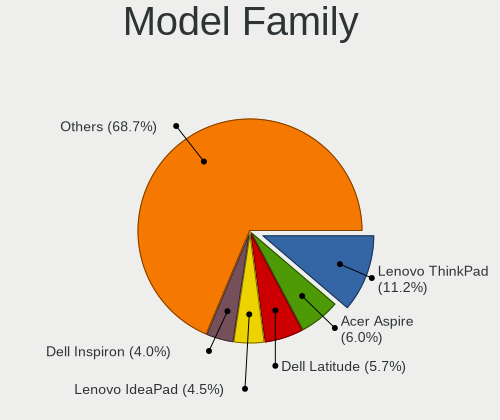
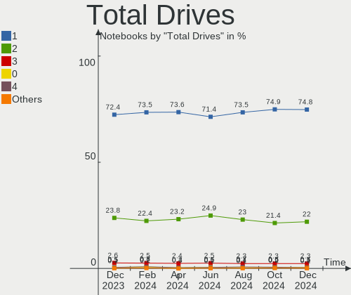
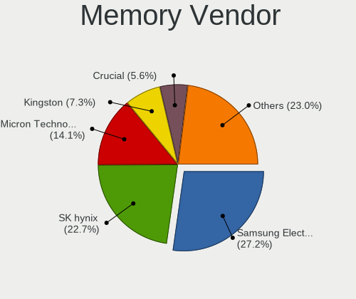

Linux Hardware Trends (Notebook)
--------------------------------

A project to identify most popular hardware characteristics and track their change
over time based on data collected by Linux users at https://Linux-Hardware.org.

Anyone can contribute to the study by uploading probes of their computers by
the [hw-probe](https://github.com/linuxhw/hw-probe) tool:

    sudo -E hw-probe -all -upload

Full-feature report is available here: https://linux-hardware.org/?view=trends&formfactor=notebook

Period: Feb, 2021.

Contents
--------

- [ OS                       ](#os)
- [ OS Family                ](#os-family)
- [ Kernel                   ](#kernel)
- [ Kernel Family            ](#kernel-family)
- [ Kernel Major Ver.        ](#kernel-major-ver)
- [ Arch                     ](#arch)
- [ DE                       ](#de)
- [ Display Server           ](#display-server)
- [ Display Manager          ](#display-manager)
- [ OS Lang                  ](#os-lang)
- [ Boot Mode                ](#boot-mode)
- [ Filesystem               ](#filesystem)
- [ Part. scheme             ](#part-scheme)
- [ Dual Boot with Linux/BSD ](#dual-boot-with-linux/bsd)
- [ Dual Boot (Win)          ](#dual-boot-win)
- [ Country                  ](#country)
- [ City                     ](#city)
- [ Vendor                   ](#vendor)
- [ Model                    ](#model)
- [ Model Family             ](#model-family)
- [ MFG Year                 ](#mfg-year)
- [ Form Factor              ](#form-factor)
- [ Secure Boot              ](#secure-boot)
- [ Coreboot                 ](#coreboot)
- [ RAM Size                 ](#ram-size)
- [ RAM Used                 ](#ram-used)
- [ Has CD-ROM               ](#has-cd-rom)
- [ Total Drives             ](#total-drives)
- [ Has Ethernet             ](#has-ethernet)
- [ Drive Vendor             ](#drive-vendor)
- [ Drive Model              ](#drive-model)
- [ HDD Vendor               ](#hdd-vendor)
- [ SSD Vendor               ](#ssd-vendor)
- [ Drive Kind               ](#drive-kind)
- [ Drive Connector          ](#drive-connector)
- [ Drive Size               ](#drive-size)
- [ Space Total              ](#space-total)
- [ Space Used               ](#space-used)
- [ Malfunc. Drives          ](#malfunc-drives)
- [ Malfunc. Drive Vendor    ](#malfunc-drive-vendor)
- [ Malfunc. HDD Vendor      ](#malfunc-hdd-vendor)
- [ Malfunc. Drive Kind      ](#malfunc-drive-kind)
- [ Failed Drives            ](#failed-drives)
- [ Failed Drive Vendor      ](#failed-drive-vendor)
- [ Drive Status             ](#drive-status)
- [ Storage Vendor           ](#storage-vendor)
- [ Storage Model            ](#storage-model)
- [ Storage Kind             ](#storage-kind)
- [ CPU Vendor               ](#cpu-vendor)
- [ CPU Model                ](#cpu-model)
- [ CPU Model Family         ](#cpu-model-family)
- [ CPU Cores                ](#cpu-cores)
- [ CPU Sockets              ](#cpu-sockets)
- [ CPU Threads              ](#cpu-threads)
- [ CPU Op-Modes             ](#cpu-op-modes)
- [ CPU Microcode            ](#cpu-microcode)
- [ CPU Microarch            ](#cpu-microarch)
- [ GPU Vendor               ](#gpu-vendor)
- [ GPU Model                ](#gpu-model)
- [ GPU Combo                ](#gpu-combo)
- [ GPU Driver               ](#gpu-driver)
- [ GPU Memory               ](#gpu-memory)
- [ Monitor Vendor           ](#monitor-vendor)
- [ Monitor Model            ](#monitor-model)
- [ Monitor Resolution       ](#monitor-resolution)
- [ Monitor Diagonal         ](#monitor-diagonal)
- [ Monitor Width            ](#monitor-width)
- [ Aspect Ratio             ](#aspect-ratio)
- [ Monitor Area             ](#monitor-area)
- [ Pixel Density            ](#pixel-density)
- [ Multiple Monitors        ](#multiple-monitors)
- [ Net Controller Vendor    ](#net-controller-vendor)
- [ Net Controller Model     ](#net-controller-model)
- [ Wireless Vendor          ](#wireless-vendor)
- [ Wireless Model           ](#wireless-model)
- [ Ethernet Vendor          ](#ethernet-vendor)
- [ Ethernet Model           ](#ethernet-model)
- [ Net Controller Kind      ](#net-controller-kind)
- [ Used Controller          ](#used-controller)
- [ NICs                     ](#nics)
- [ Memory Vendor            ](#memory-vendor)
- [ Memory Model             ](#memory-model)
- [ Memory Kind              ](#memory-kind)
- [ Memory Form Factor       ](#memory-form-factor)
- [ Memory Size              ](#memory-size)
- [ Memory Speed             ](#memory-speed)
- [ Sound Vendor             ](#sound-vendor)
- [ Sound Model              ](#sound-model)
- [ Camera Vendor            ](#camera-vendor)
- [ Camera Model             ](#camera-model)
- [ Fingerprint Vendor       ](#fingerprint-vendor)
- [ Fingerprint Model        ](#fingerprint-model)
- [ Chipcard Vendor          ](#chipcard-vendor)
- [ Chipcard Model           ](#chipcard-model)
- [ Printer Vendor           ](#printer-vendor)
- [ Printer Model            ](#printer-model)
- [ Scanner Vendor           ](#scanner-vendor)
- [ Scanner Model            ](#scanner-model)
- [ Bluetooth Vendor         ](#bluetooth-vendor)
- [ Bluetooth Model          ](#bluetooth-model)
- [ Unsupported Devices      ](#unsupported-devices)
- [ Unsupported Device Types ](#unsupported-device-types)

OS
--

Installed operating systems

| Name                | Notebooks | Percent |
|---------------------|-----------|---------|
| Ubuntu 20.04        | 673       | 23.33%  |
| OpenMandriva 4.2    | 526       | 18.23%  |
| Ubuntu 20.10        | 178       | 6.17%   |
| Mint 20.1           | 177       | 6.14%   |
| Fedora 33           | 122       | 4.23%   |
| BlackPanther 18.1   | 117       | 4.06%   |
| Pop!_OS 20.10       | 113       | 3.92%   |
| KDE neon 20.04      | 92        | 3.19%   |
| Ubuntu 18.04        | 91        | 3.15%   |
| Manjaro 20.2.1      | 66        | 2.29%   |
| Arch                | 47        | 1.63%   |
| Mint 19.3           | 42        | 1.46%   |
| Endless 3.9.2       | 39        | 1.35%   |
| Manjaro             | 38        | 1.32%   |
| Zorin 15            | 37        | 1.28%   |
| ROSA R11.1          | 37        | 1.28%   |
| Debian 10           | 35        | 1.21%   |
| Mint 20             | 33        | 1.14%   |
| Pop!_OS 20.04       | 23        | 0.8%    |
| Arch Rolling        | 22        | 0.76%   |
| ROSA R11            | 21        | 0.73%   |
| Gentoo              | 18        | 0.62%   |
| ArcoLinux Rolling   | 18        | 0.62%   |
| LMDE 4              | 15        | 0.52%   |
| Kali 2020.4         | 14        | 0.49%   |
| Endless 3.9.3       | 14        | 0.49%   |
| Elementary 5.1.7    | 14        | 0.49%   |
| Ubuntu 16.04        | 12        | 0.42%   |
| Kali 2021.1         | 12        | 0.42%   |
| Debian              | 12        | 0.42%   |
| Debian Testing      | 11        | 0.38%   |
| openSUSE Leap-15.2  | 9         | 0.31%   |
| MX 19.3             | 9         | 0.31%   |
| BlackPanther 16.2   | 9         | 0.31%   |
| Fedora 32           | 7         | 0.24%   |
| RHEL 8.3            | 6         | 0.21%   |
| Peppermint 10       | 6         | 0.21%   |
| Debian Unstable     | 6         | 0.21%   |
| MX 20               | 5         | 0.17%   |
| Mint 19.1           | 5         | 0.17%   |
| Garuda Soaring      | 5         | 0.17%   |
| Endless 3.9.1       | 5         | 0.17%   |
| Endless 3.7.4       | 5         | 0.17%   |
| EndeavourOS Rolling | 5         | 0.17%   |
| WindowsFX 10        | 4         | 0.14%   |
| Parrot 4.10         | 4         | 0.14%   |
| Oracle Linux 8.3    | 4         | 0.14%   |
| Gentoo 2.7          | 4         | 0.14%   |
| Clear Linux 34290   | 4         | 0.14%   |
| Ubuntu 21.04        | 3         | 0.1%    |
| Ubuntu 19.10        | 3         | 0.1%    |
| Ubuntu 18.10        | 3         | 0.1%    |
| Ubuntu              | 3         | 0.1%    |
| Solus 4.2           | 3         | 0.1%    |
| Mint 19             | 3         | 0.1%    |
| Mint 18.3           | 3         | 0.1%    |
| EndeavourOS         | 3         | 0.1%    |
| Clear Linux 34250   | 3         | 0.1%    |
| Chrome OS           | 3         | 0.1%    |
| Void Rolling        | 2         | 0.07%   |

OS Family
---------

OS without a version

| Name         | Notebooks | Percent |
|--------------|-----------|---------|
| Ubuntu       | 968       | 33.55%  |
| OpenMandriva | 527       | 18.27%  |
| Mint         | 265       | 9.19%   |
| Pop!_OS      | 136       | 4.71%   |
| Fedora       | 130       | 4.51%   |
| BlackPanther | 126       | 4.37%   |
| Manjaro      | 107       | 3.71%   |
| KDE neon     | 92        | 3.19%   |
| Endless      | 75        | 2.6%    |
| Arch         | 69        | 2.39%   |
| Debian       | 65        | 2.25%   |
| ROSA         | 60        | 2.08%   |
| Zorin        | 38        | 1.32%   |
| Kali         | 27        | 0.94%   |
| openSUSE     | 23        | 0.8%    |
| Gentoo       | 23        | 0.8%    |
| ArcoLinux    | 20        | 0.69%   |
| MX           | 16        | 0.55%   |
| LMDE         | 16        | 0.55%   |
| Elementary   | 14        | 0.49%   |
| Clear Linux  | 11        | 0.38%   |
| EndeavourOS  | 8         | 0.28%   |
| RHEL         | 7         | 0.24%   |
| Peppermint   | 6         | 0.21%   |
| Garuda       | 5         | 0.17%   |
| Deepin       | 5         | 0.17%   |
| WindowsFX    | 4         | 0.14%   |
| Parrot       | 4         | 0.14%   |
| Oracle Linux | 4         | 0.14%   |
| Solus        | 3         | 0.1%    |
| Chrome OS    | 3         | 0.1%    |
| Artix        | 3         | 0.1%    |
| Void         | 2         | 0.07%   |
| Sparky       | 2         | 0.07%   |
| Slackware    | 2         | 0.07%   |
| RELS         | 2         | 0.07%   |
| Mageia       | 2         | 0.07%   |
| CentOS       | 2         | 0.07%   |
| BunsenLabs   | 2         | 0.07%   |
| SkiffOS      | 1         | 0.03%   |
| Siduction    | 1         | 0.03%   |
| Reborn OS    | 1         | 0.03%   |
| Pearl        | 1         | 0.03%   |
| PCLinuxOS    | 1         | 0.03%   |
| Kylin        | 1         | 0.03%   |
| Hefftor      | 1         | 0.03%   |
| BigLinux     | 1         | 0.03%   |
| Archman      | 1         | 0.03%   |
| ArchLabs     | 1         | 0.03%   |
| ALT Linux    | 1         | 0.03%   |

Kernel
------

Version of the Linux kernel

| Version                             | Notebooks | Percent |
|-------------------------------------|-----------|---------|
| 5.10.14-desktop-1omv4002            | 523       | 18.13%  |
| 5.4.0-65-generic                    | 424       | 14.7%   |
| 5.8.0-43-generic                    | 306       | 10.61%  |
| 5.8.0-41-generic                    | 194       | 6.72%   |
| 5.8.0-7642-generic                  | 102       | 3.54%   |
| 4.18.16-desktop-1bP                 | 95        | 3.29%   |
| 5.8.0-44-generic                    | 83        | 2.88%   |
| 5.4.0-66-generic                    | 69        | 2.39%   |
| 5.8.0-14-generic                    | 58        | 2.01%   |
| 5.9.16-1-MANJARO                    | 46        | 1.59%   |
| 4.19.0-14-amd64                     | 33        | 1.14%   |
| 5.8.0-7630-generic                  | 31        | 1.07%   |
| 4.15.0-135-generic                  | 26        | 0.9%    |
| 5.4.0-42-generic                    | 24        | 0.83%   |
| 5.6.14-desktop-2bP                  | 22        | 0.76%   |
| 5.10.7-3-MANJARO                    | 22        | 0.76%   |
| 5.10.16-arch1-1                     | 22        | 0.76%   |
| 5.10.16-200.fc33.x86_64             | 19        | 0.66%   |
| 5.10.13-200.fc33.x86_64             | 19        | 0.66%   |
| 5.10.0-3-amd64                      | 19        | 0.66%   |
| 5.4.0-58-generic                    | 17        | 0.59%   |
| 4.15.0-desktop-45.1rosa-x86_64      | 17        | 0.59%   |
| 5.10.15-1-MANJARO                   | 16        | 0.55%   |
| 5.4.0-65-lowlatency                 | 15        | 0.52%   |
| 5.4.0-26-generic                    | 14        | 0.49%   |
| 5.10.11-200.fc33.x86_64             | 14        | 0.49%   |
| 5.10.0-kali3-amd64                  | 14        | 0.49%   |
| 5.4.0-64-generic                    | 13        | 0.45%   |
| 4.15.0-desktop-122.124.1rosa-x86_64 | 13        | 0.45%   |
| 5.10.12-200.fc33.x86_64             | 12        | 0.42%   |
| 5.10.10-200.fc33.x86_64             | 12        | 0.42%   |
| 5.10.14-200.fc33.x86_64             | 11        | 0.38%   |
| 5.10.11-arch1-1                     | 10        | 0.35%   |
| 5.11.1-arch1-1                      | 9         | 0.31%   |
| 5.11.0-051100-generic               | 9         | 0.31%   |
| 5.10.0-2-amd64                      | 9         | 0.31%   |
| 4.9.20-desktop-pae-1bP              | 9         | 0.31%   |
| 4.15.0-136-generic                  | 9         | 0.31%   |
| 5.8.0-40-generic                    | 8         | 0.28%   |
| 5.4.83-generic-2rosa-x86_64         | 8         | 0.28%   |
| 5.10.15-arch1-1                     | 8         | 0.28%   |
| 5.10.15-200.fc33.x86_64             | 8         | 0.28%   |
| 4.15.0-133-generic                  | 8         | 0.28%   |
| 5.8.0-38-generic                    | 7         | 0.24%   |
| 5.4.0-62-generic                    | 7         | 0.24%   |
| 5.10.17-200.fc33.x86_64             | 7         | 0.24%   |
| 5.0.0-32-generic                    | 7         | 0.24%   |
| 4.19.0-13-amd64                     | 7         | 0.24%   |
| 5.8.15-301.fc33.x86_64              | 6         | 0.21%   |
| 5.8.0-42-generic                    | 6         | 0.21%   |
| 5.8.0-25-generic                    | 6         | 0.21%   |
| 5.4.0-54-generic                    | 6         | 0.21%   |
| 5.3.18-lp152.63-default             | 6         | 0.21%   |
| 5.3.0-19-generic                    | 6         | 0.21%   |
| 4.18.0-240.10.1.el8_3.x86_64        | 6         | 0.21%   |
| 5.9.0-kali1-amd64                   | 5         | 0.17%   |
| 5.8.0-33-generic                    | 5         | 0.17%   |
| 5.8.0-3-amd64                       | 5         | 0.17%   |
| 5.4.0-59-generic                    | 5         | 0.17%   |
| 5.4.0-56-generic                    | 5         | 0.17%   |

Kernel Family
-------------

Linux kernel without a distro release

| Version  | Notebooks | Percent |
|----------|-----------|---------|
| 5.8.0    | 823       | 28.53%  |
| 5.4.0    | 619       | 21.46%  |
| 5.10.14  | 545       | 18.89%  |
| 4.18.16  | 95        | 3.29%   |
| 4.15.0   | 95        | 3.29%   |
| 5.10.0   | 68        | 2.36%   |
| 5.10.16  | 60        | 2.08%   |
| 4.19.0   | 54        | 1.87%   |
| 5.9.16   | 47        | 1.63%   |
| 5.10.15  | 40        | 1.39%   |
| 5.10.13  | 38        | 1.32%   |
| 5.11.0   | 32        | 1.11%   |
| 5.10.11  | 31        | 1.07%   |
| 5.10.12  | 30        | 1.04%   |
| 5.6.14   | 22        | 0.76%   |
| 5.10.7   | 22        | 0.76%   |
| 5.10.17  | 21        | 0.73%   |
| 5.11.1   | 18        | 0.62%   |
| 5.10.10  | 17        | 0.59%   |
| 5.3.0    | 16        | 0.55%   |
| 4.18.0   | 13        | 0.45%   |
| 5.9.0    | 12        | 0.42%   |
| 5.6.0    | 11        | 0.38%   |
| 5.4.83   | 11        | 0.38%   |
| 5.0.0    | 11        | 0.38%   |
| 4.9.20   | 9         | 0.31%   |
| 5.3.18   | 8         | 0.28%   |
| 5.4.97   | 7         | 0.24%   |
| 5.10.18  | 7         | 0.24%   |
| 5.8.15   | 6         | 0.21%   |
| 4.4.0    | 6         | 0.21%   |
| 5.7.0    | 5         | 0.17%   |
| 5.4.32   | 5         | 0.17%   |
| 5.4.95   | 4         | 0.14%   |
| 5.4.92   | 4         | 0.14%   |
| 5.4.89   | 4         | 0.14%   |
| 5.9.6    | 3         | 0.1%    |
| 5.9.11   | 3         | 0.1%    |
| 5.4.94   | 3         | 0.1%    |
| 5.4.66   | 3         | 0.1%    |
| 5.10.9   | 3         | 0.1%    |
| 5.10.8   | 3         | 0.1%    |
| 4.9.155  | 3         | 0.1%    |
| 5.4.70   | 2         | 0.07%   |
| 5.4.17   | 2         | 0.07%   |
| 5.10.2   | 2         | 0.07%   |
| 4.19.160 | 2         | 0.07%   |
| 4.14.221 | 2         | 0.07%   |
| 3.10.0   | 2         | 0.07%   |
| 5.9.3    | 1         | 0.03%   |
| 5.9.14   | 1         | 0.03%   |
| 5.9.12   | 1         | 0.03%   |
| 5.9.10   | 1         | 0.03%   |
| 5.9.1    | 1         | 0.03%   |
| 5.8.18   | 1         | 0.03%   |
| 5.8.11   | 1         | 0.03%   |
| 5.6.16   | 1         | 0.03%   |
| 5.6.15   | 1         | 0.03%   |
| 5.5.4    | 1         | 0.03%   |
| 5.5.19   | 1         | 0.03%   |

Kernel Major Ver.
-----------------

Linux kernel major version

| Version | Notebooks | Percent |
|---------|-----------|---------|
| 5.10    | 890       | 30.85%  |
| 5.8     | 831       | 28.8%   |
| 5.4     | 671       | 23.26%  |
| 4.18    | 108       | 3.74%   |
| 4.15    | 95        | 3.29%   |
| 5.9     | 70        | 2.43%   |
| 4.19    | 58        | 2.01%   |
| 5.11    | 51        | 1.77%   |
| 5.6     | 35        | 1.21%   |
| 5.3     | 24        | 0.83%   |
| 4.9     | 14        | 0.49%   |
| 5.0     | 11        | 0.38%   |
| 4.4     | 8         | 0.28%   |
| 5.7     | 5         | 0.17%   |
| 4.14    | 4         | 0.14%   |
| 5.5     | 3         | 0.1%    |
| 3.10    | 2         | 0.07%   |
| 4.17    | 1         | 0.03%   |
| 4.12    | 1         | 0.03%   |
| 4.10    | 1         | 0.03%   |
| 3.18    | 1         | 0.03%   |
| Unknown | 1         | 0.03%   |

Arch
----

OS architecture (x86_64, i586, etc.)

| Name    | Notebooks | Percent |
|---------|-----------|---------|
| x86_64  | 2806      | 97.26%  |
| i686    | 78        | 2.7%    |
| aarch64 | 1         | 0.03%   |

DE
--

Desktop Environment

| Name             | Notebooks | Percent |
|------------------|-----------|---------|
| GNOME            | 1163      | 40.31%  |
| KDE5             | 779       | 27%     |
| X-Cinnamon       | 212       | 7.35%   |
| XFCE             | 202       | 7%      |
| KDE              | 155       | 5.37%   |
| Unknown          | 127       | 4.4%    |
| MATE             | 69        | 2.39%   |
| KDE4             | 39        | 1.35%   |
| LXQt             | 23        | 0.8%    |
| Cinnamon         | 20        | 0.69%   |
| Budgie           | 18        | 0.62%   |
| Unity            | 16        | 0.55%   |
| LXDE             | 13        | 0.45%   |
| Pantheon         | 10        | 0.35%   |
| i3               | 10        | 0.35%   |
| Deepin           | 7         | 0.24%   |
| GNOME Flashback  | 4         | 0.14%   |
| xmonad           | 3         | 0.1%    |
| DWM              | 3         | 0.1%    |
| sway             | 2         | 0.07%   |
| qtile            | 2         | 0.07%   |
| Trinity          | 1         | 0.03%   |
| spectrwm         | 1         | 0.03%   |
| nxde             | 1         | 0.03%   |
| lightdm-xsession | 1         | 0.03%   |
| i3-with-shmlog   | 1         | 0.03%   |
| GNOME Classic    | 1         | 0.03%   |
| Enlightenment    | 1         | 0.03%   |
| awesome          | 1         | 0.03%   |

Display Server
--------------

X11 or Wayland

| Name    | Notebooks | Percent |
|---------|-----------|---------|
| X11     | 2610      | 90.47%  |
| Wayland | 181       | 6.27%   |
| Unknown | 68        | 2.36%   |
| Tty     | 26        | 0.9%    |

Display Manager
---------------

SDDM, LightDM, etc.

| Name    | Notebooks | Percent |
|---------|-----------|---------|
| Unknown | 1535      | 53.21%  |
| SDDM    | 783       | 27.14%  |
| GDM     | 292       | 10.12%  |
| TDM     | 163       | 5.65%   |
| LightDM | 62        | 2.15%   |
| KDM     | 38        | 1.32%   |
| XDM     | 5         | 0.17%   |
| SLiM    | 3         | 0.1%    |
| GDM3    | 2         | 0.07%   |
| Ly      | 1         | 0.03%   |
| LXDM    | 1         | 0.03%   |

OS Lang
-------

Language

| Lang    | Notebooks | Percent |
|---------|-----------|---------|
| en_US   | 1154      | 40%     |
| de_DE   | 292       | 10.12%  |
| Unknown | 179       | 6.2%    |
| pt_BR   | 167       | 5.79%   |
| ru_RU   | 152       | 5.27%   |
| en_GB   | 132       | 4.58%   |
| fr_FR   | 126       | 4.37%   |
| pl_PL   | 62        | 2.15%   |
| it_IT   | 62        | 2.15%   |
| es_ES   | 59        | 2.05%   |
| en_IN   | 44        | 1.53%   |
| en_CA   | 41        | 1.42%   |
| C       | 32        | 1.11%   |
| en_AU   | 28        | 0.97%   |
| nl_NL   | 23        | 0.8%    |
| es_MX   | 22        | 0.76%   |
| pt_PT   | 20        | 0.69%   |
| cs_CZ   | 20        | 0.69%   |
| es_AR   | 18        | 0.62%   |
| sv_SE   | 14        | 0.49%   |
| hu_HU   | 14        | 0.49%   |
| tr_TR   | 13        | 0.45%   |
| ru_UA   | 13        | 0.45%   |
| zh_CN   | 12        | 0.42%   |
| sk_SK   | 11        | 0.38%   |
| ro_RO   | 11        | 0.38%   |
| en_ZA   | 11        | 0.38%   |
| es_CL   | 10        | 0.35%   |
| de_AT   | 10        | 0.35%   |
| el_GR   | 9         | 0.31%   |
| uk_UA   | 7         | 0.24%   |
| nl_BE   | 7         | 0.24%   |
| es_CO   | 7         | 0.24%   |
| en_NZ   | 7         | 0.24%   |
| en_IE   | 7         | 0.24%   |
| de_CH   | 7         | 0.24%   |
| ca_ES   | 7         | 0.24%   |
| fr_BE   | 6         | 0.21%   |
| en_IL   | 6         | 0.21%   |
| ja_JP   | 5         | 0.17%   |
| id_ID   | 5         | 0.17%   |
| fi_FI   | 5         | 0.17%   |
| POSIX   | 4         | 0.14%   |
| nb_NO   | 4         | 0.14%   |
| fr_CA   | 4         | 0.14%   |
| en_SG   | 4         | 0.14%   |
| bg_BG   | 4         | 0.14%   |
| da_DK   | 3         | 0.1%    |
| sl_SI   | 2         | 0.07%   |
| es_PE   | 2         | 0.07%   |
| myv_RU  | 1         | 0.03%   |
| lt_LT   | 1         | 0.03%   |
| ko_KR   | 1         | 0.03%   |
| it_CH   | 1         | 0.03%   |
| gl_ES   | 1         | 0.03%   |
| fr_CH   | 1         | 0.03%   |
| es_SV   | 1         | 0.03%   |
| es_PY   | 1         | 0.03%   |
| es_GT   | 1         | 0.03%   |
| es_EC   | 1         | 0.03%   |

Boot Mode
---------

EFI or BIOS

| Mode | Notebooks | Percent |
|------|-----------|---------|
| BIOS | 1546      | 53.59%  |
| EFI  | 1339      | 46.41%  |

Filesystem
----------

Type of filesystem

| Type    | Notebooks | Percent |
|---------|-----------|---------|
| Ext4    | 2117      | 73.38%  |
| Overlay | 567       | 19.65%  |
| Btrfs   | 145       | 5.03%   |
| Xfs     | 26        | 0.9%    |
| Zfs     | 14        | 0.49%   |
| Ext3    | 6         | 0.21%   |
| F2fs    | 4         | 0.14%   |
| Ext2    | 3         | 0.1%    |
| Tmpfs   | 2         | 0.07%   |
| Jfs     | 1         | 0.03%   |

Part. scheme
------------

Scheme of partitioning

| Type    | Notebooks | Percent |
|---------|-----------|---------|
| Unknown | 1500      | 51.99%  |
| GPT     | 899       | 31.16%  |
| MBR     | 486       | 16.85%  |

Dual Boot with Linux/BSD
------------------------

Hosting more than one Linux/BSD

| Dual boot | Notebooks | Percent |
|-----------|-----------|---------|
| No        | 2359      | 81.77%  |
| Yes       | 526       | 18.23%  |

Dual Boot (Win)
---------------

Hosting Linux and Windows

| Dual boot | Notebooks | Percent |
|-----------|-----------|---------|
| No        | 2016      | 69.88%  |
| Yes       | 869       | 30.12%  |

Country
-------

Geographic location (country)

| Country        | Notebooks | Percent |
|----------------|-----------|---------|
| USA            | 378       | 13.1%   |
| Germany        | 354       | 12.27%  |
| Brazil         | 215       | 7.45%   |
| Russia         | 189       | 6.55%   |
| France         | 148       | 5.13%   |
| Hungary        | 120       | 4.16%   |
| UK             | 109       | 3.78%   |
| Italy          | 91        | 3.15%   |
| Poland         | 85        | 2.95%   |
| Spain          | 78        | 2.7%    |
| Canada         | 73        | 2.53%   |
| India          | 67        | 2.32%   |
| Ukraine        | 56        | 1.94%   |
| Netherlands    | 55        | 1.91%   |
| Mexico         | 55        | 1.91%   |
| Sweden         | 41        | 1.42%   |
| Australia      | 37        | 1.28%   |
| Romania        | 35        | 1.21%   |
| Turkey         | 33        | 1.14%   |
| Czech Republic | 33        | 1.14%   |
| Portugal       | 30        | 1.04%   |
| Belgium        | 27        | 0.94%   |
| Indonesia      | 26        | 0.9%    |
| Argentina      | 26        | 0.9%    |
| Greece         | 25        | 0.87%   |
| Bulgaria       | 24        | 0.83%   |
| Austria        | 24        | 0.83%   |
| Finland        | 23        | 0.8%    |
| Switzerland    | 22        | 0.76%   |
| Belarus        | 22        | 0.76%   |
| South Africa   | 20        | 0.69%   |
| Slovakia       | 19        | 0.66%   |
| Norway         | 18        | 0.62%   |
| Japan          | 17        | 0.59%   |
| China          | 16        | 0.55%   |
| Colombia       | 15        | 0.52%   |
| Iran           | 14        | 0.49%   |
| Chile          | 12        | 0.42%   |
| Thailand       | 10        | 0.35%   |
| New Zealand    | 10        | 0.35%   |
| Ireland        | 10        | 0.35%   |
| Vietnam        | 9         | 0.31%   |
| Morocco        | 9         | 0.31%   |
| Serbia         | 8         | 0.28%   |
| Malaysia       | 8         | 0.28%   |
| Kenya          | 8         | 0.28%   |
| Israel         | 8         | 0.28%   |
| Denmark        | 8         | 0.28%   |
| Algeria        | 8         | 0.28%   |
| Pakistan       | 7         | 0.24%   |
| Egypt          | 7         | 0.24%   |
| Slovenia       | 6         | 0.21%   |
| Singapore      | 6         | 0.21%   |
| Saudi Arabia   | 6         | 0.21%   |
| Croatia        | 6         | 0.21%   |
| Armenia        | 6         | 0.21%   |
| Philippines    | 5         | 0.17%   |
| Lithuania      | 5         | 0.17%   |
| Costa Rica     | 5         | 0.17%   |
| Bangladesh     | 5         | 0.17%   |

City
----

Geographic location (city)

| City              | Notebooks | Percent |
|-------------------|-----------|---------|
| Budapest          | 47        | 1.63%   |
| Moscow            | 46        | 1.59%   |
| Berlin            | 46        | 1.59%   |
| Paris             | 23        | 0.8%    |
| Warsaw            | 22        | 0.76%   |
| São Paulo        | 20        | 0.69%   |
| St Petersburg     | 16        | 0.55%   |
| Hamburg           | 16        | 0.55%   |
| Prague            | 15        | 0.52%   |
| Rome              | 14        | 0.49%   |
| Rio de Janeiro    | 14        | 0.49%   |
| Mexico City       | 14        | 0.49%   |
| Kyiv              | 14        | 0.49%   |
| Vienna            | 13        | 0.45%   |
| Sofia             | 13        | 0.45%   |
| Madrid            | 13        | 0.45%   |
| Stuttgart         | 12        | 0.42%   |
| Munich            | 11        | 0.38%   |
| Milan             | 11        | 0.38%   |
| Istanbul          | 11        | 0.38%   |
| Curitiba          | 11        | 0.38%   |
| Bucharest         | 11        | 0.38%   |
| Bratislava        | 11        | 0.38%   |
| Athens            | 11        | 0.38%   |
| Brasília         | 10        | 0.35%   |
| Toronto           | 9         | 0.31%   |
| New Delhi         | 9         | 0.31%   |
| Krakow            | 9         | 0.31%   |
| Johannesburg      | 9         | 0.31%   |
| Helsinki          | 9         | 0.31%   |
| Düsseldorf       | 9         | 0.31%   |
| Amsterdam         | 9         | 0.31%   |
| Portland          | 8         | 0.28%   |
| London            | 8         | 0.28%   |
| Frankfurt am Main | 8         | 0.28%   |
| Ekaterinburg      | 8         | 0.28%   |
| Brisbane          | 8         | 0.28%   |
| Belo Horizonte    | 8         | 0.28%   |
| Barcelona         | 8         | 0.28%   |
| Tehran            | 7         | 0.24%   |
| Nairobi           | 7         | 0.24%   |
| Kharkiv           | 7         | 0.24%   |
| Jakarta           | 7         | 0.24%   |
| Dublin            | 7         | 0.24%   |
| Chennai           | 7         | 0.24%   |
| Bogotá           | 7         | 0.24%   |
| Bengaluru         | 7         | 0.24%   |
| Beijing           | 7         | 0.24%   |
| Thessaloniki      | 6         | 0.21%   |
| Singapore         | 6         | 0.21%   |
| New York          | 6         | 0.21%   |
| Minsk             | 6         | 0.21%   |
| Mannheim          | 6         | 0.21%   |
| Cologne           | 6         | 0.21%   |
| Buenos Aires      | 6         | 0.21%   |
| Zurich            | 5         | 0.17%   |
| Zagreb            | 5         | 0.17%   |
| Toulouse          | 5         | 0.17%   |
| Sydney            | 5         | 0.17%   |
| Santiago          | 5         | 0.17%   |

Vendor
------

Motherboard manufacturer

| Name                  | Notebooks | Percent |
|-----------------------|-----------|---------|
| Lenovo                | 566       | 19.62%  |
| Hewlett-Packard       | 534       | 18.51%  |
| Dell                  | 454       | 15.74%  |
| ASUSTek Computer      | 350       | 12.13%  |
| Acer                  | 294       | 10.19%  |
| Toshiba               | 102       | 3.54%   |
| Apple                 | 70        | 2.43%   |
| Sony                  | 68        | 2.36%   |
| Samsung Electronics   | 62        | 2.15%   |
| MSI                   | 46        | 1.59%   |
| Notebook              | 25        | 0.87%   |
| Medion                | 24        | 0.83%   |
| Fujitsu               | 24        | 0.83%   |
| Packard Bell          | 23        | 0.8%    |
| HUAWEI                | 19        | 0.66%   |
| Unknown               | 19        | 0.66%   |
| Positivo              | 16        | 0.55%   |
| Fujitsu Siemens       | 15        | 0.52%   |
| System76              | 14        | 0.49%   |
| Timi                  | 13        | 0.45%   |
| TUXEDO                | 9         | 0.31%   |
| Google                | 7         | 0.24%   |
| eMachines             | 7         | 0.24%   |
| Clevo                 | 7         | 0.24%   |
| Wortmann AG           | 5         | 0.17%   |
| LG Electronics        | 5         | 0.17%   |
| Alienware             | 5         | 0.17%   |
| Semp Toshiba          | 4         | 0.14%   |
| NEC Computers         | 4         | 0.14%   |
| Maibenben             | 4         | 0.14%   |
| Gateway               | 4         | 0.14%   |
| Compal                | 4         | 0.14%   |
| PC Specialist         | 3         | 0.1%    |
| Panasonic             | 3         | 0.1%    |
| OEM                   | 3         | 0.1%    |
| Intel                 | 3         | 0.1%    |
| Gigabyte Technology   | 3         | 0.1%    |
| Chuwi                 | 3         | 0.1%    |
| AVITA                 | 3         | 0.1%    |
| SLIMBOOK              | 2         | 0.07%   |
| Razer                 | 2         | 0.07%   |
| Philco                | 2         | 0.07%   |
| Microtech             | 2         | 0.07%   |
| Jumper                | 2         | 0.07%   |
| Insyde                | 2         | 0.07%   |
| GPU Company           | 2         | 0.07%   |
| EVOO Products Company | 2         | 0.07%   |
| Compaq                | 2         | 0.07%   |
| BOX                   | 2         | 0.07%   |
| YIFANG                | 1         | 0.03%   |
| WYSE                  | 1         | 0.03%   |
| VINGA                 | 1         | 0.03%   |
| UMAX                  | 1         | 0.03%   |
| Trenton Systems       | 1         | 0.03%   |
| TQ-Group              | 1         | 0.03%   |
| TECNO                 | 1         | 0.03%   |
| Teclast               | 1         | 0.03%   |
| Star Labs             | 1         | 0.03%   |
| RoverComputers        | 1         | 0.03%   |
| RoverBook             | 1         | 0.03%   |

Model
-----

Motherboard model

| Name                                       | Notebooks | Percent |
|--------------------------------------------|-----------|---------|
| Unknown                                    | 33        | 1.14%   |
| HP Notebook                                | 26        | 0.9%    |
| HP Pavilion Notebook                       | 13        | 0.45%   |
| Acer Nitro AN515-54                        | 12        | 0.42%   |
| HP Pavilion g6                             | 11        | 0.38%   |
| HP Pavilion dv7                            | 11        | 0.38%   |
| HP Pavilion dv6                            | 11        | 0.38%   |
| Dell Latitude E6420                        | 11        | 0.38%   |
| HP 15                                      | 10        | 0.35%   |
| Dell XPS 13 7390                           | 10        | 0.35%   |
| Apple MacBookPro9,2                        | 10        | 0.35%   |
| HP Laptop 15-da0xxx                        | 8         | 0.28%   |
| HUAWEI NBLK-WAX9X                          | 7         | 0.24%   |
| Dell Latitude E6430                        | 7         | 0.24%   |
| Dell Latitude E4310                        | 7         | 0.24%   |
| Dell Inspiron 15-3567                      | 7         | 0.24%   |
| Lenovo Legion 5 15ARH05 82B5               | 6         | 0.21%   |
| HP Pavilion 15                             | 6         | 0.21%   |
| HP EliteBook 8470p                         | 6         | 0.21%   |
| HP EliteBook 8440p                         | 6         | 0.21%   |
| Dell Precision M4800                       | 6         | 0.21%   |
| Dell Latitude E6400                        | 6         | 0.21%   |
| Dell Inspiron 3542                         | 6         | 0.21%   |
| Apple MacBookPro8,1                        | 6         | 0.21%   |
| Positivo MOBILE                            | 5         | 0.17%   |
| Lenovo IdeaPad L340-15IRH Gaming 81LK      | 5         | 0.17%   |
| Lenovo IdeaPad 330-15IKB 81DE              | 5         | 0.17%   |
| HP ProBook 450 G5                          | 5         | 0.17%   |
| HP Laptop 17-ca1xxx                        | 5         | 0.17%   |
| HP Laptop 15s-fq2xxx                       | 5         | 0.17%   |
| HP Laptop 15-db0xxx                        | 5         | 0.17%   |
| HP Laptop 15-bw0xx                         | 5         | 0.17%   |
| HP G62                                     | 5         | 0.17%   |
| HP ENVY Notebook                           | 5         | 0.17%   |
| HP EliteBook 2570p                         | 5         | 0.17%   |
| Dell XPS 15 9570                           | 5         | 0.17%   |
| Dell XPS 15 9500                           | 5         | 0.17%   |
| Dell XPS 15 7590                           | 5         | 0.17%   |
| Dell XPS 13 9370                           | 5         | 0.17%   |
| Dell Latitude E6540                        | 5         | 0.17%   |
| Dell Latitude E6500                        | 5         | 0.17%   |
| Dell Latitude E6230                        | 5         | 0.17%   |
| Dell Latitude 7490                         | 5         | 0.17%   |
| Dell Inspiron 1525                         | 5         | 0.17%   |
| ASUS VivoBook 15_ASUS Laptop X540MA_X543MA | 5         | 0.17%   |
| Apple MacBookAir7,2                        | 5         | 0.17%   |
| System76 Oryx Pro                          | 4         | 0.14%   |
| Samsung 355V4C/356V4C/3445VC/3545VC        | 4         | 0.14%   |
| Samsung 340XAA/350XAA/550XAA               | 4         | 0.14%   |
| Packard Bell EasyNote TS11HR               | 4         | 0.14%   |
| Lenovo Z50-70 20354                        | 4         | 0.14%   |
| Lenovo Y50-70 20378                        | 4         | 0.14%   |
| Lenovo V15-ADA 82C7                        | 4         | 0.14%   |
| Lenovo IdeaPad Z510 20287                  | 4         | 0.14%   |
| Lenovo IdeaPad S145-15IWL 81S9             | 4         | 0.14%   |
| Lenovo IdeaPad L340-15API 81LW             | 4         | 0.14%   |
| Lenovo IdeaPad 110-15ACL 80TJ              | 4         | 0.14%   |
| Lenovo G50-80 80E5                         | 4         | 0.14%   |
| HUAWEI BOHK-WAX9X                          | 4         | 0.14%   |
| HP Stream Notebook PC 11                   | 4         | 0.14%   |

Model Family
------------

Motherboard model prefix

| Name                     | Notebooks | Percent |
|--------------------------|-----------|---------|
| Lenovo ThinkPad          | 291       | 10.09%  |
| Acer Aspire              | 187       | 6.48%   |
| Dell Latitude            | 163       | 5.65%   |
| Dell Inspiron            | 143       | 4.96%   |
| Lenovo IdeaPad           | 141       | 4.89%   |
| HP Pavilion              | 114       | 3.95%   |
| Toshiba Satellite        | 85        | 2.95%   |
| HP EliteBook             | 78        | 2.7%    |
| HP Laptop                | 73        | 2.53%   |
| HP ProBook               | 70        | 2.43%   |
| ASUS VivoBook            | 56        | 1.94%   |
| Dell XPS                 | 52        | 1.8%    |
| Dell Vostro              | 39        | 1.35%   |
| Unknown                  | 33        | 1.14%   |
| HP Compaq                | 31        | 1.07%   |
| Dell Precision           | 30        | 1.04%   |
| HP Notebook              | 26        | 0.9%    |
| Acer Nitro               | 26        | 0.9%    |
| Acer TravelMate          | 21        | 0.73%   |
| Acer Swift               | 21        | 0.73%   |
| Packard Bell EasyNote    | 20        | 0.69%   |
| ASUS ZenBook             | 19        | 0.66%   |
| Fujitsu LIFEBOOK         | 18        | 0.62%   |
| Lenovo Legion            | 16        | 0.55%   |
| HP ENVY                  | 16        | 0.55%   |
| ASUS TUF                 | 15        | 0.52%   |
| Acer Extensa             | 15        | 0.52%   |
| HP OMEN                  | 12        | 0.42%   |
| HP Stream                | 11        | 0.38%   |
| HP 15                    | 11        | 0.38%   |
| Apple MacBookPro9        | 11        | 0.38%   |
| Lenovo ThinkBook         | 10        | 0.35%   |
| HP ZBook                 | 10        | 0.35%   |
| HP 250                   | 10        | 0.35%   |
| Dell Studio              | 9         | 0.31%   |
| Apple MacBookPro8        | 9         | 0.31%   |
| Dell G3                  | 8         | 0.28%   |
| HUAWEI NBLK-WAX9X        | 7         | 0.24%   |
| ASUS ROG                 | 7         | 0.24%   |
| ASUS ASUS                | 7         | 0.24%   |
| Apple MacBookPro11       | 7         | 0.24%   |
| Acer Predator            | 7         | 0.24%   |
| Lenovo Yoga              | 6         | 0.21%   |
| HP Presario              | 6         | 0.21%   |
| HP 255                   | 6         | 0.21%   |
| Fujitsu Siemens ESPRIMO  | 6         | 0.21%   |
| Dell G5                  | 6         | 0.21%   |
| Apple MacBookPro5        | 6         | 0.21%   |
| Toshiba TECRA            | 5         | 0.17%   |
| Toshiba PORTEGE          | 5         | 0.17%   |
| Samsung R540             | 5         | 0.17%   |
| Positivo MOBILE          | 5         | 0.17%   |
| Lenovo G50-80            | 5         | 0.17%   |
| HP G62                   | 5         | 0.17%   |
| Fujitsu Siemens LIFEBOOK | 5         | 0.17%   |
| Apple MacBookAir7        | 5         | 0.17%   |
| Timi Mi                  | 4         | 0.14%   |
| System76 Oryx            | 4         | 0.14%   |
| Samsung 355V4C           | 4         | 0.14%   |
| Samsung 350V5C           | 4         | 0.14%   |

MFG Year
--------

Motherboard manufacture year

| Year    | Notebooks | Percent |
|---------|-----------|---------|
| 2020    | 629       | 21.8%   |
| 2019    | 373       | 12.93%  |
| 2018    | 214       | 7.42%   |
| 2013    | 214       | 7.42%   |
| 2012    | 208       | 7.21%   |
| 2011    | 183       | 6.34%   |
| 2015    | 169       | 5.86%   |
| 2014    | 154       | 5.34%   |
| 2017    | 141       | 4.89%   |
| 2010    | 137       | 4.75%   |
| 2016    | 131       | 4.54%   |
| 2009    | 131       | 4.54%   |
| 2008    | 109       | 3.78%   |
| 2007    | 44        | 1.53%   |
| 2021    | 26        | 0.9%    |
| 2006    | 13        | 0.45%   |
| Unknown | 6         | 0.21%   |
| 2004    | 2         | 0.07%   |
| 2005    | 1         | 0.03%   |

Form Factor
-----------

Physical design of the computer

| Name     | Notebooks | Percent |
|----------|-----------|---------|
| Notebook | 2885      | 100%    |

Secure Boot
-----------

Enabled or disabled

| State    | Notebooks | Percent |
|----------|-----------|---------|
| Disabled | 2663      | 92.31%  |
| Enabled  | 222       | 7.69%   |

Coreboot
--------

Have coreboot on board

| Used | Notebooks | Percent |
|------|-----------|---------|
| No   | 2869      | 99.45%  |
| Yes  | 16        | 0.55%   |

RAM Size
--------

Total RAM memory

| Size in GB  | Notebooks | Percent |
|-------------|-----------|---------|
| 4.01-8.0    | 857       | 29.71%  |
| 3.01-4.0    | 756       | 26.2%   |
| 8.01-16.0   | 488       | 16.92%  |
| 16.01-24.0  | 430       | 14.9%   |
| 1.01-2.0    | 167       | 5.79%   |
| 32.01-64.0  | 89        | 3.08%   |
| 2.01-3.0    | 51        | 1.77%   |
| 0.51-1.0    | 17        | 0.59%   |
| 24.01-32.0  | 15        | 0.52%   |
| 64.01-256.0 | 15        | 0.52%   |

RAM Used
--------

Used RAM memory

| Used GB    | Notebooks | Percent |
|------------|-----------|---------|
| 1.01-2.0   | 1336      | 46.31%  |
| 2.01-3.0   | 580       | 20.1%   |
| 4.01-8.0   | 306       | 10.61%  |
| 3.01-4.0   | 288       | 9.98%   |
| 0.51-1.0   | 272       | 9.43%   |
| 8.01-16.0  | 65        | 2.25%   |
| 0.01-0.5   | 34        | 1.18%   |
| 16.01-24.0 | 3         | 0.1%    |
| 24.01-32.0 | 1         | 0.03%   |

Has CD-ROM
----------

Has CD-ROM on board

| Presented | Notebooks | Percent |
|-----------|-----------|---------|
| No        | 1604      | 55.6%   |
| Yes       | 1281      | 44.4%   |

Total Drives
------------

Number of drives on board

| Drives | Notebooks | Percent |
|--------|-----------|---------|
| 1      | 2050      | 71.06%  |
| 2      | 705       | 24.44%  |
| 3      | 97        | 3.36%   |
| 0      | 20        | 0.69%   |
| 4      | 11        | 0.38%   |
| 6      | 1         | 0.03%   |
| 5      | 1         | 0.03%   |

Has Ethernet
------------

Has Ethernet on board

| Presented | Notebooks | Percent |
|-----------|-----------|---------|
| Yes       | 2474      | 85.75%  |
| No        | 411       | 14.25%  |

Drive Vendor
------------

Hard drive vendors

| Vendor                  | Notebooks | Drives | Percent |
|-------------------------|-----------|--------|---------|
| Samsung Electronics     | 510       | 551    | 14.31%  |
| Seagate                 | 487       | 503    | 13.66%  |
| WDC                     | 473       | 487    | 13.27%  |
| Toshiba                 | 303       | 313    | 8.5%    |
| Kingston                | 200       | 204    | 5.61%   |
| SanDisk                 | 189       | 195    | 5.3%    |
| Unknown                 | 180       | 203    | 5.05%   |
| Hitachi                 | 146       | 146    | 4.1%    |
| Intel                   | 135       | 145    | 3.79%   |
| Crucial                 | 133       | 136    | 3.73%   |
| HGST                    | 127       | 129    | 3.56%   |
| SK Hynix                | 89        | 92     | 2.5%    |
| Micron Technology       | 68        | 71     | 1.91%   |
| A-DATA Technology       | 43        | 44     | 1.21%   |
| Apple                   | 32        | 33     | 0.9%    |
| Fujitsu                 | 31        | 32     | 0.87%   |
| China                   | 27        | 27     | 0.76%   |
| LITEON                  | 25        | 25     | 0.7%    |
| PNY                     | 24        | 24     | 0.67%   |
| Intenso                 | 21        | 22     | 0.59%   |
| LITEONIT                | 17        | 17     | 0.48%   |
| KIOXIA                  | 17        | 17     | 0.48%   |
| JMicron                 | 16        | 18     | 0.45%   |
| GOODRAM                 | 16        | 17     | 0.45%   |
| OCZ                     | 13        | 13     | 0.36%   |
| Transcend               | 12        | 12     | 0.34%   |
| Phison                  | 12        | 13     | 0.34%   |
| Patriot                 | 12        | 13     | 0.34%   |
| KingSpec                | 10        | 11     | 0.28%   |
| Team                    | 9         | 9      | 0.25%   |
| SPCC                    | 9         | 9      | 0.25%   |
| Silicon Motion          | 8         | 8      | 0.22%   |
| PLEXTOR                 | 8         | 8      | 0.22%   |
| Apacer                  | 8         | 8      | 0.22%   |
| Corsair                 | 7         | 7      | 0.2%    |
| Realtek Semiconductor   | 6         | 6      | 0.17%   |
| KingFast                | 6         | 6      | 0.17%   |
| XPG                     | 5         | 6      | 0.14%   |
| Union Memory            | 5         | 5      | 0.14%   |
| KingDian                | 5         | 5      | 0.14%   |
| FORESEE                 | 5         | 5      | 0.14%   |
| TO Exter                | 4         | 4      | 0.11%   |
| SABRENT                 | 4         | 4      | 0.11%   |
| Netac                   | 4         | 4      | 0.11%   |
| Hewlett-Packard         | 4         | 4      | 0.11%   |
| Union Memory (Shenzhen) | 3         | 3      | 0.08%   |
| Teclast                 | 3         | 3      | 0.08%   |
| Mushkin                 | 3         | 3      | 0.08%   |
| Maxtor                  | 3         | 3      | 0.08%   |
| Lexar                   | 3         | 3      | 0.08%   |
| HS-SSD-C100             | 3         | 4      | 0.08%   |
| Colorful                | 3         | 3      | 0.08%   |
| BIWIN                   | 3         | 3      | 0.08%   |
| ADATA Technology        | 3         | 3      | 0.08%   |
| ZTC                     | 2         | 2      | 0.06%   |
| TCSUNBOW                | 2         | 2      | 0.06%   |
| Phison Electronics      | 2         | 2      | 0.06%   |
| OWC                     | 2         | 2      | 0.06%   |
| MyDigitalSSD            | 2         | 3      | 0.06%   |
| Msft                    | 2         | 6      | 0.06%   |

Drive Model
-----------

Hard drive models

| Model                               | Notebooks | Percent |
|-------------------------------------|-----------|---------|
| Seagate ST1000LM035-1RK172 1TB      | 67        | 1.82%   |
| Seagate ST1000LM024 HN-M101MBB 1TB  | 54        | 1.47%   |
| Seagate ST500LT012-1DG142 500GB     | 47        | 1.28%   |
| Unknown MMC Card  32GB              | 39        | 1.06%   |
| Toshiba MQ01ABD100 1TB              | 39        | 1.06%   |
| Toshiba MQ04ABF100 1TB              | 37        | 1.01%   |
| Toshiba MQ01ABF050 500GB            | 33        | 0.9%    |
| HGST HTS545050A7E680 500GB          | 33        | 0.9%    |
| Kingston SA400S37240G 240GB SSD     | 32        | 0.87%   |
| Seagate ST9500325AS 500GB           | 30        | 0.82%   |
| Sandisk NVMe SSD Drive 256GB        | 30        | 0.82%   |
| Samsung SSD 860 EVO 500GB           | 30        | 0.82%   |
| Unknown MMC Card  64GB              | 29        | 0.79%   |
| Samsung SSD 850 EVO 250GB           | 29        | 0.79%   |
| Intel NVMe SSD Drive 512GB          | 28        | 0.76%   |
| Samsung SSD 850 EVO 500GB           | 25        | 0.68%   |
| Samsung NVMe SSD Drive 512GB        | 25        | 0.68%   |
| WDC WD10SPZX-21Z10T0 1TB            | 23        | 0.63%   |
| Kingston SA400S37120G 120GB SSD     | 23        | 0.63%   |
| Crucial CT500MX500SSD1 500GB        | 23        | 0.63%   |
| Samsung SSD 860 EVO 250GB           | 22        | 0.6%    |
| HGST HTS721010A9E630 1TB            | 22        | 0.6%    |
| Samsung NVMe SSD Drive 256GB        | 21        | 0.57%   |
| Kingston SV300S37A120G 120GB SSD    | 21        | 0.57%   |
| HGST HTS541010A9E680 1TB            | 21        | 0.57%   |
| Samsung NVMe SSD Drive 1TB          | 20        | 0.54%   |
| Kingston SA400S37480G 480GB SSD     | 19        | 0.52%   |
| HGST HTS725050A7E630 500GB          | 19        | 0.52%   |
| Crucial CT240BX500SSD1 240GB        | 19        | 0.52%   |
| Seagate ST9320325AS 320GB           | 18        | 0.49%   |
| Sandisk NVMe SSD Drive 512GB        | 18        | 0.49%   |
| WDC WD10SPZX-24Z10 1TB              | 15        | 0.41%   |
| Seagate ST500LT012-9WS142 500GB     | 15        | 0.41%   |
| Seagate ST500LM012 HN-M500MBB 500GB | 15        | 0.41%   |
| Seagate ST1000LM048-2E7172 1TB      | 15        | 0.41%   |
| Hitachi HTS547575A9E384 752GB       | 15        | 0.41%   |
| WDC WDS240G2G0A-00JH30 240GB SSD    | 13        | 0.35%   |
| SK Hynix NVMe SSD Drive 256GB       | 13        | 0.35%   |
| Seagate ST2000LM007-1R8174 2TB      | 13        | 0.35%   |
| Seagate ST1000LM014-1EJ164 1TB      | 13        | 0.35%   |
| WDC WD10JPVX-22JC3T0 1TB            | 12        | 0.33%   |
| Unknown MMC Card  128GB             | 12        | 0.33%   |
| SanDisk SSD PLUS 240GB              | 12        | 0.33%   |
| Crucial CT1000MX500SSD1 1TB         | 12        | 0.33%   |
| Unknown SD/MMC/MS PRO 64GB          | 11        | 0.3%    |
| Toshiba MQ01ABD050 500GB            | 11        | 0.3%    |
| Seagate ST500LM021-1KJ152 500GB     | 11        | 0.3%    |
| Seagate Expansion 500GB             | 11        | 0.3%    |
| Micron 1100_MTFDDAV256TBN 256GB SSD | 11        | 0.3%    |
| Intel SSDPEKNW512G8H 512GB          | 11        | 0.3%    |
| Intel NVMe SSD Drive 1024GB         | 11        | 0.3%    |
| Hitachi HTS545050A7E380 500GB       | 11        | 0.3%    |
| WDC WD10SPZX-60Z10T0 1TB            | 10        | 0.27%   |
| Unknown MMC Card  16GB              | 10        | 0.27%   |
| Seagate ST9750420AS 752GB           | 10        | 0.27%   |
| Samsung SSD 860 EVO 1TB             | 10        | 0.27%   |
| PNY CS900 120GB SSD                 | 10        | 0.27%   |
| Kingston SV300S37A240G 240GB SSD    | 10        | 0.27%   |
| JMicron Generic 320GB               | 10        | 0.27%   |
| Intel SSDPEKNW512G8 512GB           | 10        | 0.27%   |

HDD Vendor
----------

Hard disk drive vendors

| Vendor              | Notebooks | Drives | Percent |
|---------------------|-----------|--------|---------|
| Seagate             | 477       | 488    | 33.54%  |
| WDC                 | 366       | 370    | 25.74%  |
| Toshiba             | 224       | 225    | 15.75%  |
| Hitachi             | 146       | 146    | 10.27%  |
| HGST                | 127       | 129    | 8.93%   |
| Fujitsu             | 30        | 31     | 2.11%   |
| Samsung Electronics | 29        | 29     | 2.04%   |
| Apple               | 7         | 7      | 0.49%   |
| TO Exter            | 4         | 4      | 0.28%   |
| Intenso             | 3         | 3      | 0.21%   |
| Msft                | 2         | 6      | 0.14%   |
| IBM/Hitachi         | 2         | 2      | 0.14%   |
| USB3.0              | 1         | 1      | 0.07%   |
| SILICONMOTION       | 1         | 1      | 0.07%   |
| LaCie               | 1         | 1      | 0.07%   |
| ASMT                | 1         | 2      | 0.07%   |
| ASMedia             | 1         | 1      | 0.07%   |

SSD Vendor
----------

Solid state drive vendors

| Vendor              | Notebooks | Drives | Percent |
|---------------------|-----------|--------|---------|
| Samsung Electronics | 304       | 319    | 23.96%  |
| Kingston            | 172       | 175    | 13.55%  |
| Crucial             | 129       | 132    | 10.17%  |
| SanDisk             | 118       | 123    | 9.3%    |
| WDC                 | 59        | 60     | 4.65%   |
| Micron Technology   | 40        | 40     | 3.15%   |
| Intel               | 40        | 40     | 3.15%   |
| A-DATA Technology   | 38        | 39     | 2.99%   |
| Toshiba             | 33        | 35     | 2.6%    |
| China               | 26        | 26     | 2.05%   |
| PNY                 | 23        | 23     | 1.81%   |
| LITEON              | 23        | 23     | 1.81%   |
| SK Hynix            | 21        | 21     | 1.65%   |
| Apple               | 19        | 19     | 1.5%    |
| LITEONIT            | 17        | 17     | 1.34%   |
| Intenso             | 16        | 17     | 1.26%   |
| GOODRAM             | 16        | 17     | 1.26%   |
| OCZ                 | 13        | 13     | 1.02%   |
| Transcend           | 12        | 12     | 0.95%   |
| Patriot             | 12        | 13     | 0.95%   |
| JMicron             | 10        | 12     | 0.79%   |
| Team                | 9         | 9      | 0.71%   |
| SPCC                | 9         | 9      | 0.71%   |
| KingSpec            | 9         | 9      | 0.71%   |
| PLEXTOR             | 8         | 8      | 0.63%   |
| Apacer              | 8         | 8      | 0.63%   |
| KingDian            | 5         | 5      | 0.39%   |
| Unknown             | 4         | 4      | 0.32%   |
| FORESEE             | 4         | 4      | 0.32%   |
| Corsair             | 4         | 4      | 0.32%   |
| Teclast             | 3         | 3      | 0.24%   |
| Seagate             | 3         | 3      | 0.24%   |
| SABRENT             | 3         | 3      | 0.24%   |
| Netac               | 3         | 3      | 0.24%   |
| Mushkin             | 3         | 3      | 0.24%   |
| Maxtor              | 3         | 3      | 0.24%   |
| Lexar               | 3         | 3      | 0.24%   |
| KingFast            | 3         | 3      | 0.24%   |
| BIWIN               | 3         | 3      | 0.24%   |
| ZTC                 | 2         | 2      | 0.16%   |
| TCSUNBOW            | 2         | 2      | 0.16%   |
| OWC                 | 2         | 2      | 0.16%   |
| MyDigitalSSD        | 2         | 3      | 0.16%   |
| LDLC                | 2         | 2      | 0.16%   |
| Hewlett-Packard     | 2         | 2      | 0.16%   |
| External            | 2         | 3      | 0.16%   |
| DOGFISH             | 2         | 2      | 0.16%   |
| Colorful            | 2         | 2      | 0.16%   |
| BHT                 | 2         | 2      | 0.16%   |
| W800S               | 1         | 1      | 0.08%   |
| Vaseky              | 1         | 1      | 0.08%   |
| Union Memory        | 1         | 1      | 0.08%   |
| Star                | 1         | 1      | 0.08%   |
| PNY USB             | 1         | 1      | 0.08%   |
| Pioneer             | 1         | 1      | 0.08%   |
| OSC                 | 1         | 1      | 0.08%   |
| Leven               | 1         | 1      | 0.08%   |
| Kston               | 1         | 1      | 0.08%   |
| Kingrich            | 1         | 1      | 0.08%   |
| Integral            | 1         | 1      | 0.08%   |

Drive Kind
----------

HDD or SSD

| Kind    | Notebooks | Drives | Percent |
|---------|-----------|--------|---------|
| HDD     | 1380      | 1446   | 40.24%  |
| SSD     | 1179      | 1306   | 34.38%  |
| NVMe    | 641       | 715    | 18.69%  |
| MMC     | 168       | 187    | 4.9%    |
| Unknown | 61        | 65     | 1.78%   |

Drive Connector
---------------

SATA, SAS, NVMe, etc.

| Type | Notebooks | Drives | Percent |
|------|-----------|--------|---------|
| SATA | 2295      | 2681   | 71.18%  |
| NVMe | 641       | 714    | 19.88%  |
| MMC  | 168       | 187    | 5.21%   |
| SAS  | 120       | 137    | 3.72%   |

Drive Size
----------

Size of hard drive

| Size in TB | Notebooks | Drives | Percent |
|------------|-----------|--------|---------|
| 0.01-0.5   | 1735      | 1938   | 68.96%  |
| 0.51-1.0   | 700       | 728    | 27.82%  |
| 1.01-2.0   | 69        | 73     | 2.74%   |
| 3.01-4.0   | 6         | 7      | 0.24%   |
| 4.01-10.0  | 6         | 6      | 0.24%   |

Space Total
-----------

Amount of disk space available on the file system

| Size in GB     | Notebooks | Percent |
|----------------|-----------|---------|
| 101-250        | 808       | 28.01%  |
| 251-500        | 647       | 22.43%  |
| 1-20           | 381       | 13.21%  |
| 501-1000       | 370       | 12.82%  |
| 51-100         | 208       | 7.21%   |
| 1001-2000      | 144       | 4.99%   |
| Unknown        | 143       | 4.96%   |
| 21-50          | 123       | 4.26%   |
| 2001-3000      | 33        | 1.14%   |
| More than 3000 | 28        | 0.97%   |

Space Used
----------

Amount of used disk space

| Used GB        | Notebooks | Percent |
|----------------|-----------|---------|
| 1-20           | 1341      | 46.48%  |
| 21-50          | 463       | 16.05%  |
| 101-250        | 349       | 12.1%   |
| 51-100         | 283       | 9.81%   |
| 251-500        | 165       | 5.72%   |
| Unknown        | 143       | 4.96%   |
| 501-1000       | 91        | 3.15%   |
| 1001-2000      | 38        | 1.32%   |
| More than 3000 | 8         | 0.28%   |
| 2001-3000      | 4         | 0.14%   |

Malfunc. Drives
---------------

Drive models with a malfunction

| Model                              | Notebooks | Drives | Percent |
|------------------------------------|-----------|--------|---------|
| HGST HTS545050A7E680 500GB         | 13        | 13     | 4.41%   |
| Seagate ST500LT012-1DG142 500GB    | 12        | 12     | 4.07%   |
| Seagate ST9500325AS 500GB          | 9         | 9      | 3.05%   |
| Seagate ST1000LM024 HN-M101MBB 1TB | 9         | 9      | 3.05%   |
| Seagate ST9320325AS 320GB          | 6         | 6      | 2.03%   |
| Toshiba MQ01ABF050 500GB           | 5         | 5      | 1.69%   |
| Toshiba MQ01ABD100 1TB             | 5         | 5      | 1.69%   |
| Seagate ST9500420AS 500GB          | 5         | 5      | 1.69%   |
| Seagate ST1000LM035-1RK172 1TB     | 5         | 5      | 1.69%   |
| Hitachi HTS545025B9A300 250GB      | 5         | 5      | 1.69%   |
| HGST HTS725050A7E630 500GB         | 5         | 5      | 1.69%   |
| HGST HTS541010A9E680 1TB           | 5         | 5      | 1.69%   |
| Seagate ST9250315AS 250GB          | 4         | 4      | 1.36%   |
| Seagate ST500LT012-9WS142 500GB    | 4         | 4      | 1.36%   |
| Hitachi HTS547575A9E384 752GB      | 4         | 4      | 1.36%   |
| Hitachi HTS547564A9E384 640GB      | 4         | 4      | 1.36%   |
| Toshiba MQ01ACF050 500GB           | 3         | 3      | 1.02%   |
| Toshiba MQ01ABD050 500GB           | 3         | 3      | 1.02%   |
| Seagate ST9500423AS 500GB          | 3         | 3      | 1.02%   |
| Seagate ST9250410AS 250GB          | 3         | 3      | 1.02%   |
| Seagate ST1000LM014-1EJ164 1TB     | 3         | 3      | 1.02%   |
| Kingston SV300S37A120G 120GB SSD   | 3         | 3      | 1.02%   |
| Hitachi HTS547550A9E384 500GB      | 3         | 3      | 1.02%   |
| Hitachi HTS542516K9SA00 160GB      | 3         | 3      | 1.02%   |
| WDC WDS240G2G0B-00EPW0 240GB SSD   | 2         | 2      | 0.68%   |
| WDC WD7500BPVT-22HXZT3 752GB       | 2         | 2      | 0.68%   |
| WDC WD10JPVX-75JC3T0 1TB           | 2         | 2      | 0.68%   |
| WDC WD10JPVX-60JC3T1 1TB           | 2         | 2      | 0.68%   |
| Toshiba MQ02ABD100H 1TB            | 2         | 2      | 0.68%   |
| Toshiba MK5076GSX 500GB            | 2         | 2      | 0.68%   |
| Toshiba MK5065GSXF 500GB           | 2         | 2      | 0.68%   |
| Toshiba MK3265GSX 320GB            | 2         | 2      | 0.68%   |
| Seagate ST9750420AS 752GB          | 2         | 2      | 0.68%   |
| Seagate ST9320423AS 320GB          | 2         | 2      | 0.68%   |
| Seagate ST500LM021-1KJ152 500GB    | 2         | 2      | 0.68%   |
| Seagate ST1000LM048-2E7172 1TB     | 2         | 2      | 0.68%   |
| Samsung Electronics HM320JI 320GB  | 2         | 2      | 0.68%   |
| Hitachi HTS725016A9A364 160GB      | 2         | 2      | 0.68%   |
| Hitachi HTS545016B9A300 160GB      | 2         | 2      | 0.68%   |
| HGST HTS545050A7E380 500GB         | 2         | 2      | 0.68%   |
| HGST HTS541075A9E680 752GB         | 2         | 2      | 0.68%   |
| WDC WDS240G2G0A-00JH30 240GB SSD   | 1         | 1      | 0.34%   |
| WDC WD7500BPVX-22JC3T0 752GB       | 1         | 1      | 0.34%   |
| WDC WD6400BPVT-80HXZT1 640GB       | 1         | 1      | 0.34%   |
| WDC WD6400BEVT-80A0RT0 640GB       | 1         | 1      | 0.34%   |
| WDC WD5000LPCX-60VHAT1 500GB       | 1         | 1      | 0.34%   |
| WDC WD5000LPCX-24C6HT0 500GB       | 1         | 1      | 0.34%   |
| WDC WD5000LPCX-21VHAT0 500GB       | 1         | 1      | 0.34%   |
| WDC WD5000BPVT-22HXZT3 500GB       | 1         | 1      | 0.34%   |
| WDC WD5000BPVT-22HXZT1 500GB       | 1         | 1      | 0.34%   |
| WDC WD5000BEVT-60ZAT0 500GB        | 1         | 1      | 0.34%   |
| WDC WD5000BEVT-24A0RT0 500GB       | 1         | 1      | 0.34%   |
| WDC WD5000BEVT-11ZAT0 500GB        | 1         | 1      | 0.34%   |
| WDC WD3200BPVT-24ZEST0 320GB       | 1         | 1      | 0.34%   |
| WDC WD3200BPVT-22ZEST0 320GB       | 1         | 1      | 0.34%   |
| WDC WD3200BPVT-00JJ5T0 320GB       | 1         | 1      | 0.34%   |
| WDC WD3200BEVT-60A23T0 320GB       | 1         | 1      | 0.34%   |
| WDC WD3200BEVT-00ZCT0 320GB        | 1         | 1      | 0.34%   |
| WDC WD3200BEVS-26VAT0 320GB        | 1         | 1      | 0.34%   |
| WDC WD3200BEKT-60V5T1 320GB        | 1         | 1      | 0.34%   |

Malfunc. Drive Vendor
---------------------

Vendors of faulty drives

| Vendor              | Notebooks | Drives | Percent |
|---------------------|-----------|--------|---------|
| Seagate             | 85        | 86     | 28.91%  |
| WDC                 | 41        | 41     | 13.95%  |
| Toshiba             | 41        | 41     | 13.95%  |
| Hitachi             | 41        | 41     | 13.95%  |
| HGST                | 30        | 30     | 10.2%   |
| Samsung Electronics | 10        | 10     | 3.4%    |
| Crucial             | 8         | 8      | 2.72%   |
| SanDisk             | 6         | 6      | 2.04%   |
| Micron Technology   | 5         | 5      | 1.7%    |
| Kingston            | 5         | 5      | 1.7%    |
| Intel               | 4         | 4      | 1.36%   |
| KingSpec            | 3         | 3      | 1.02%   |
| Fujitsu             | 2         | 2      | 0.68%   |
| Corsair             | 2         | 2      | 0.68%   |
| Apple               | 2         | 2      | 0.68%   |
| Unknown             | 1         | 1      | 0.34%   |
| Transcend           | 1         | 1      | 0.34%   |
| PNY                 | 1         | 1      | 0.34%   |
| OCZ                 | 1         | 1      | 0.34%   |
| LITEON              | 1         | 1      | 0.34%   |
| LDLC                | 1         | 1      | 0.34%   |
| KingDian            | 1         | 1      | 0.34%   |
| GOWE                | 1         | 1      | 0.34%   |
| A-DATA Technology   | 1         | 1      | 0.34%   |

Malfunc. HDD Vendor
-------------------

Vendors of faulty HDD drives

| Vendor              | Notebooks | Drives | Percent |
|---------------------|-----------|--------|---------|
| Seagate             | 85        | 86     | 35.27%  |
| Toshiba             | 41        | 41     | 17.01%  |
| Hitachi             | 41        | 41     | 17.01%  |
| WDC                 | 36        | 36     | 14.94%  |
| HGST                | 30        | 30     | 12.45%  |
| Samsung Electronics | 6         | 6      | 2.49%   |
| Fujitsu             | 2         | 2      | 0.83%   |

Malfunc. Drive Kind
-------------------

Kinds of faulty drives

| Kind | Notebooks | Drives | Percent |
|------|-----------|--------|---------|
| HDD  | 238       | 242    | 81.79%  |
| SSD  | 50        | 50     | 17.18%  |
| NVMe | 3         | 3      | 1.03%   |

Failed Drives
-------------

Failed drive models

| Model                                | Notebooks | Drives | Percent |
|--------------------------------------|-----------|--------|---------|
| Hitachi HTS545050A7E380 500GB        | 2         | 2      | 33.33%  |
| WDC WD2500BEVT-22A23T0 250GB         | 1         | 1      | 16.67%  |
| WDC WD2500BEVS-22UST0 250GB          | 1         | 1      | 16.67%  |
| WDC PC SN520 SDAPNUW-256G-1102 256GB | 1         | 1      | 16.67%  |
| Seagate ST9320325AS 320GB            | 1         | 1      | 16.67%  |

Failed Drive Vendor
-------------------

Failed drive vendors

| Vendor  | Notebooks | Drives | Percent |
|---------|-----------|--------|---------|
| WDC     | 3         | 3      | 50%     |
| Hitachi | 2         | 2      | 33.33%  |
| Seagate | 1         | 1      | 16.67%  |

Drive Status
------------

Number of failed and malfunc. drives

| Status   | Notebooks | Drives | Percent |
|----------|-----------|--------|---------|
| Detected | 1604      | 2059   | 52.94%  |
| Works    | 1132      | 1359   | 37.36%  |
| Malfunc  | 288       | 295    | 9.5%    |
| Failed   | 6         | 6      | 0.2%    |

Storage Vendor
--------------

Storage controller vendors

| Vendor                           | Notebooks | Percent |
|----------------------------------|-----------|---------|
| Intel                            | 2217      | 69.11%  |
| AMD                              | 348       | 10.85%  |
| Samsung Electronics              | 201       | 6.27%   |
| Sandisk                          | 117       | 3.65%   |
| SK Hynix                         | 65        | 2.03%   |
| Toshiba America Info Systems     | 48        | 1.5%    |
| Nvidia                           | 29        | 0.9%    |
| Micron Technology                | 28        | 0.87%   |
| Kingston Technology Company      | 28        | 0.87%   |
| Phison Electronics               | 20        | 0.62%   |
| KIOXIA                           | 20        | 0.62%   |
| ADATA Technology                 | 11        | 0.34%   |
| Silicon Motion                   | 10        | 0.31%   |
| Silicon Integrated Systems [SiS] | 10        | 0.31%   |
| Realtek Semiconductor            | 8         | 0.25%   |
| Union Memory (Shenzhen)          | 6         | 0.19%   |
| JMicron Technology               | 6         | 0.19%   |
| Solid State Storage Technology   | 5         | 0.16%   |
| Micron/Crucial Technology        | 5         | 0.16%   |
| Apple                            | 5         | 0.16%   |
| Silicon Image                    | 3         | 0.09%   |
| Shenzhen Longsys Electronics     | 3         | 0.09%   |
| Seagate Technology               | 3         | 0.09%   |
| Lite-On Technology               | 3         | 0.09%   |
| ASMedia Technology               | 3         | 0.09%   |
| Lenovo                           | 2         | 0.06%   |
| VIA Technologies                 | 1         | 0.03%   |
| Red Hat                          | 1         | 0.03%   |
| Marvell Technology Group         | 1         | 0.03%   |
| Lite-On IT Corp. / Plextor       | 1         | 0.03%   |

Storage Model
-------------

Storage controller models

| Model                                                                                  | Notebooks | Percent |
|----------------------------------------------------------------------------------------|-----------|---------|
| AMD FCH SATA Controller [AHCI mode]                                                    | 277       | 7.96%   |
| Intel 7 Series Chipset Family 6-port SATA Controller [AHCI mode]                       | 274       | 7.87%   |
| Intel Sunrise Point-LP SATA Controller [AHCI mode]                                     | 271       | 7.79%   |
| Intel 82801 Mobile SATA Controller [RAID mode]                                         | 209       | 6.01%   |
| Intel 6 Series/C200 Series Chipset Family 6 port Mobile SATA AHCI Controller           | 186       | 5.34%   |
| Intel 82801IBM/IEM (ICH9M/ICH9M-E) 4 port SATA Controller [AHCI mode]                  | 150       | 4.31%   |
| Intel 8 Series SATA Controller 1 [AHCI mode]                                           | 129       | 3.71%   |
| Samsung NVMe SSD Controller SM981/PM981/PM983                                          | 128       | 3.68%   |
| Intel 8 Series/C220 Series Chipset Family 6-port SATA Controller 1 [AHCI mode]         | 97        | 2.79%   |
| Intel 82801HM/HEM (ICH8M/ICH8M-E) IDE Controller                                       | 91        | 2.61%   |
| Intel Wildcat Point-LP SATA Controller [AHCI Mode]                                     | 86        | 2.47%   |
| Intel 5 Series/3400 Series Chipset 4 port SATA AHCI Controller                         | 83        | 2.39%   |
| Intel 82801HM/HEM (ICH8M/ICH8M-E) SATA Controller [AHCI mode]                          | 72        | 2.07%   |
| Intel Cannon Lake Mobile PCH SATA AHCI Controller                                      | 64        | 1.84%   |
| Intel 5 Series/3400 Series Chipset 6 port SATA AHCI Controller                         | 51        | 1.47%   |
| Intel SSD 660P Series                                                                  | 50        | 1.44%   |
| Intel Atom Processor E3800 Series SATA AHCI Controller                                 | 49        | 1.41%   |
| AMD SB7x0/SB8x0/SB9x0 SATA Controller [AHCI mode]                                      | 49        | 1.41%   |
| Intel Comet Lake SATA AHCI Controller                                                  | 46        | 1.32%   |
| Intel HM170/QM170 Chipset SATA Controller [AHCI Mode]                                  | 39        | 1.12%   |
| Intel Celeron/Pentium Silver Processor SATA Controller                                 | 39        | 1.12%   |
| Intel Cannon Point-LP SATA Controller [AHCI Mode]                                      | 38        | 1.09%   |
| Samsung Electronics Non-Volatile memory controller                                     | 36        | 1.03%   |
| Sandisk WD Blue SN500 / PC SN520 NVMe SSD                                              | 35        | 1.01%   |
| Intel Atom/Celeron/Pentium Processor x5-E8000/J3xxx/N3xxx Series SATA Controller       | 30        | 0.86%   |
| Micron Non-Volatile memory controller                                                  | 28        | 0.8%    |
| Sandisk WD Black SN750 / PC SN730 NVMe SSD                                             | 27        | 0.78%   |
| SK Hynix Non-Volatile memory controller                                                | 23        | 0.66%   |
| Intel Celeron N3350/Pentium N4200/Atom E3900 Series SATA AHCI Controller               | 23        | 0.66%   |
| Samsung NVMe SSD Controller SM961/PM961/SM963                                          | 22        | 0.63%   |
| Intel Ice Lake-LP SATA Controller [AHCI mode]                                          | 22        | 0.63%   |
| Intel 82801G (ICH7 Family) IDE Controller                                              | 22        | 0.63%   |
| Sandisk WD Blue SN550 NVMe SSD                                                         | 21        | 0.6%    |
| Intel NM10/ICH7 Family SATA Controller [AHCI mode]                                     | 21        | 0.6%    |
| Intel 82801HM/HEM (ICH8M/ICH8M-E) SATA Controller [IDE mode]                           | 21        | 0.6%    |
| Intel 82801GBM/GHM (ICH7-M Family) SATA Controller [IDE mode]                          | 21        | 0.6%    |
| SK Hynix BC511                                                                         | 20        | 0.57%   |
| KIOXIA Non-Volatile memory controller                                                  | 20        | 0.57%   |
| Intel 82801IBM/IEM (ICH9M/ICH9M-E) 2 port SATA Controller [IDE mode]                   | 20        | 0.57%   |
| Intel 400 Series Chipset Family SATA AHCI Controller                                   | 20        | 0.57%   |
| Toshiba America Info Systems XG6 NVMe SSD Controller                                   | 19        | 0.55%   |
| SK Hynix BC501 NVMe Solid State Drive 512GB                                            | 18        | 0.52%   |
| Sandisk PC SN520 NVMe SSD                                                              | 18        | 0.52%   |
| Intel Volume Management Device NVMe RAID Controller                                    | 17        | 0.49%   |
| Intel Q170/Q150/B150/H170/H110/Z170/CM236 Chipset SATA Controller [AHCI Mode]          | 17        | 0.49%   |
| Intel PROSet/Wireless WiFi Software extension                                          | 17        | 0.49%   |
| Intel 82801GBM/GHM (ICH7-M Family) SATA Controller [AHCI mode]                         | 17        | 0.49%   |
| Toshiba America Info Systems Toshiba America Info Non-Volatile memory controller       | 14        | 0.4%    |
| Phison E12 NVMe Controller                                                             | 14        | 0.4%    |
| Nvidia MCP79 AHCI Controller                                                           | 14        | 0.4%    |
| AMD SB7x0/SB8x0/SB9x0 IDE Controller                                                   | 13        | 0.37%   |
| Intel 7 Series Chipset Family 4-port SATA Controller [IDE mode]                        | 12        | 0.34%   |
| Intel 7 Series Chipset Family 2-port SATA Controller [IDE mode]                        | 12        | 0.34%   |
| Intel 6 Series/C200 Series Chipset Family Mobile SATA Controller (IDE mode, ports 0-3) | 12        | 0.34%   |
| Intel 5 Series/3400 Series Chipset 4 port SATA IDE Controller                          | 12        | 0.34%   |
| AMD SB600 Non-Raid-5 SATA                                                              | 12        | 0.34%   |
| AMD SB600 IDE                                                                          | 12        | 0.34%   |
| Toshiba America Info Systems BG3 NVMe SSD Controller                                   | 11        | 0.32%   |
| Silicon Integrated Systems [SiS] 5513 IDE Controller                                   | 10        | 0.29%   |
| Sandisk WD Black 2018/SN750 / PC SN720 NVMe SSD                                        | 10        | 0.29%   |

Storage Kind
------------

Kind of storage controller (IDE, SATA, NVMe, SAS, ...)

| Kind | Notebooks | Percent |
|------|-----------|---------|
| SATA | 2233      | 66.42%  |
| NVMe | 644       | 19.16%  |
| IDE  | 264       | 7.85%   |
| RAID | 220       | 6.54%   |
| SCSI | 1         | 0.03%   |

CPU Vendor
----------

Processor vendors

| Vendor | Notebooks | Percent |
|--------|-----------|---------|
| Intel  | 2455      | 85.1%   |
| AMD    | 429       | 14.87%  |
| ARM    | 1         | 0.03%   |

CPU Model
---------

Processor models

| Model                                         | Notebooks | Percent |
|-----------------------------------------------|-----------|---------|
| Intel Core i5-8250U CPU @ 1.60GHz             | 53        | 1.84%   |
| Intel Core i5-7200U CPU @ 2.50GHz             | 51        | 1.77%   |
| Intel Core i7-10510U CPU @ 1.80GHz            | 49        | 1.7%    |
| Intel Core i7-8550U CPU @ 1.80GHz             | 48        | 1.66%   |
| AMD Ryzen 5 3500U with Radeon Vega Mobile Gfx | 47        | 1.63%   |
| Intel Core i7-9750H CPU @ 2.60GHz             | 38        | 1.32%   |
| Intel Core i5-6200U CPU @ 2.30GHz             | 36        | 1.25%   |
| Intel Core i5-8265U CPU @ 1.60GHz             | 34        | 1.18%   |
| Intel Core i7-8565U CPU @ 1.80GHz             | 33        | 1.14%   |
| Intel Core i7-7500U CPU @ 2.70GHz             | 33        | 1.14%   |
| Intel Core i5-3320M CPU @ 2.60GHz             | 32        | 1.11%   |
| Intel Core i5-2520M CPU @ 2.50GHz             | 32        | 1.11%   |
| Intel Core i7-8750H CPU @ 2.20GHz             | 31        | 1.07%   |
| Intel Core i5-3210M CPU @ 2.50GHz             | 30        | 1.04%   |
| Intel Core i5-5200U CPU @ 2.20GHz             | 29        | 1.01%   |
| Intel Core i5-3230M CPU @ 2.60GHz             | 26        | 0.9%    |
| Intel Core i5-2410M CPU @ 2.30GHz             | 26        | 0.9%    |
| Intel Core i3 CPU M 370 @ 2.40GHz             | 26        | 0.9%    |
| Intel Core i5-9300H CPU @ 2.40GHz             | 23        | 0.8%    |
| Intel Core i5-4210U CPU @ 1.70GHz             | 23        | 0.8%    |
| Intel Core i5-1035G1 CPU @ 1.00GHz            | 23        | 0.8%    |
| Intel Core i5-10210U CPU @ 1.60GHz            | 23        | 0.8%    |
| Intel Core i5-2450M CPU @ 2.50GHz             | 22        | 0.76%   |
| Intel Core 2 Duo CPU P8600 @ 2.40GHz          | 21        | 0.73%   |
| Intel Celeron CPU N2840 @ 2.16GHz             | 21        | 0.73%   |
| Intel Core i7-6700HQ CPU @ 2.60GHz            | 20        | 0.69%   |
| Intel Core i7-2670QM CPU @ 2.20GHz            | 20        | 0.69%   |
| Intel Core i7-10750H CPU @ 2.60GHz            | 20        | 0.69%   |
| Intel Core i5 CPU M 520 @ 2.40GHz             | 20        | 0.69%   |
| Intel Core i3-4005U CPU @ 1.70GHz             | 19        | 0.66%   |
| AMD Ryzen 7 4800H with Radeon Graphics        | 19        | 0.66%   |
| Intel Core i7-7700HQ CPU @ 2.80GHz            | 18        | 0.62%   |
| Intel Core i5-6300U CPU @ 2.40GHz             | 18        | 0.62%   |
| Intel Core i5-4300U CPU @ 1.90GHz             | 18        | 0.62%   |
| Intel Core i3-2310M CPU @ 2.10GHz             | 18        | 0.62%   |
| Intel Celeron CPU N3060 @ 1.60GHz             | 18        | 0.62%   |
| AMD Ryzen 5 4500U with Radeon Graphics        | 18        | 0.62%   |
| Intel Core i7-3630QM CPU @ 2.40GHz            | 17        | 0.59%   |
| Intel Core i5-4200U CPU @ 1.60GHz             | 17        | 0.59%   |
| Intel Core i3-2350M CPU @ 2.30GHz             | 17        | 0.59%   |
| Intel Core i3-5005U CPU @ 2.00GHz             | 16        | 0.55%   |
| Intel Core 2 Duo CPU P8400 @ 2.26GHz          | 16        | 0.55%   |
| Intel 11th Gen Core i7-1165G7 @ 2.80GHz       | 16        | 0.55%   |
| Intel Core i7-1065G7 CPU @ 1.30GHz            | 15        | 0.52%   |
| Intel Core i3-6006U CPU @ 2.00GHz             | 15        | 0.52%   |
| Intel Core 2 Duo CPU T7500 @ 2.20GHz          | 15        | 0.52%   |
| Intel Pentium Dual-Core CPU T4400 @ 2.20GHz   | 14        | 0.49%   |
| Intel Core i7-4510U CPU @ 2.00GHz             | 14        | 0.49%   |
| Intel Core i7-3520M CPU @ 2.90GHz             | 14        | 0.49%   |
| Intel Core i5-5300U CPU @ 2.30GHz             | 14        | 0.49%   |
| Intel Core i5 CPU M 540 @ 2.53GHz             | 14        | 0.49%   |
| Intel Core i3-3217U CPU @ 1.80GHz             | 14        | 0.49%   |
| Intel Core 2 Duo CPU P8700 @ 2.53GHz          | 14        | 0.49%   |
| Intel Celeron N4000 CPU @ 1.10GHz             | 14        | 0.49%   |
| Intel Core i7-6500U CPU @ 2.50GHz             | 13        | 0.45%   |
| Intel Core i7-5500U CPU @ 2.40GHz             | 13        | 0.45%   |
| Intel Core i7-4500U CPU @ 1.80GHz             | 13        | 0.45%   |
| Intel Core i3-7020U CPU @ 2.30GHz             | 13        | 0.45%   |
| Intel Core i3-3110M CPU @ 2.40GHz             | 13        | 0.45%   |
| Intel Celeron CPU N3350 @ 1.10GHz             | 13        | 0.45%   |

CPU Model Family
----------------

Processor model prefix

| Model                          | Notebooks | Percent |
|--------------------------------|-----------|---------|
| Intel Core i5                  | 749       | 25.96%  |
| Intel Core i7                  | 671       | 23.26%  |
| Intel Core i3                  | 295       | 10.23%  |
| Intel Core 2 Duo               | 204       | 7.07%   |
| Intel Celeron                  | 169       | 5.86%   |
| Intel Pentium                  | 103       | 3.57%   |
| AMD Ryzen 5                    | 92        | 3.19%   |
| Intel Atom                     | 72        | 2.5%    |
| AMD Ryzen 7                    | 55        | 1.91%   |
| Other                          | 50        | 1.73%   |
| Intel Pentium Dual-Core        | 45        | 1.56%   |
| AMD A6                         | 33        | 1.14%   |
| Intel Pentium Dual             | 31        | 1.07%   |
| AMD Ryzen 3                    | 25        | 0.87%   |
| Intel Core 2                   | 22        | 0.76%   |
| AMD E                          | 21        | 0.73%   |
| AMD A8                         | 21        | 0.73%   |
| AMD A4                         | 21        | 0.73%   |
| AMD E2                         | 17        | 0.59%   |
| AMD A10                        | 17        | 0.59%   |
| AMD E1                         | 14        | 0.49%   |
| Intel Genuine                  | 11        | 0.38%   |
| AMD Turion 64 X2 Mobile        | 11        | 0.38%   |
| AMD Ryzen 7 PRO                | 11        | 0.38%   |
| Intel Core i9                  | 10        | 0.35%   |
| Intel Pentium Silver           | 9         | 0.31%   |
| AMD Athlon II                  | 8         | 0.28%   |
| Intel Celeron M                | 7         | 0.24%   |
| Intel Celeron Dual-Core        | 7         | 0.24%   |
| AMD Ryzen 5 PRO                | 7         | 0.24%   |
| AMD Athlon                     | 7         | 0.24%   |
| AMD A12                        | 7         | 0.24%   |
| AMD C-60                       | 6         | 0.21%   |
| Intel Core m3                  | 5         | 0.17%   |
| AMD Athlon 64 X2               | 5         | 0.17%   |
| Intel Pentium M                | 4         | 0.14%   |
| AMD Turion X2 Dual-Core Mobile | 3         | 0.1%    |
| AMD Turion II                  | 3         | 0.1%    |
| AMD Sempron                    | 3         | 0.1%    |
| AMD Ryzen 9                    | 3         | 0.1%    |
| AMD Phenom II                  | 3         | 0.1%    |
| AMD FX                         | 3         | 0.1%    |
| AMD Athlon X2                  | 3         | 0.1%    |
| AMD Athlon II Dual-Core        | 3         | 0.1%    |
| Intel Pentium Gold             | 2         | 0.07%   |
| Intel Core M                   | 2         | 0.07%   |
| Intel Core 2 Extreme           | 2         | 0.07%   |
| AMD C-70                       | 2         | 0.07%   |
| AMD C-50                       | 2         | 0.07%   |
| Intel Xeon                     | 1         | 0.03%   |
| Intel Mobile Pentium 4         | 1         | 0.03%   |
| Intel Core m7                  | 1         | 0.03%   |
| Intel Core 2 Solo              | 1         | 0.03%   |
| Intel Celeron D                | 1         | 0.03%   |
| AMD V120                       | 1         | 0.03%   |
| AMD Turion II Dual-Core        | 1         | 0.03%   |
| AMD G                          | 1         | 0.03%   |
| AMD Athlon II Neo              | 1         | 0.03%   |

CPU Cores
---------

Number of processor cores

| Number | Notebooks | Percent |
|--------|-----------|---------|
| 2      | 1747      | 60.55%  |
| 4      | 856       | 29.67%  |
| 6      | 140       | 4.85%   |
| 1      | 79        | 2.74%   |
| 8      | 62        | 2.15%   |
| 3      | 1         | 0.03%   |

CPU Sockets
-----------

Number of sockets

| Number | Notebooks | Percent |
|--------|-----------|---------|
| 1      | 2884      | 99.97%  |
| 2      | 1         | 0.03%   |

CPU Threads
-----------

Threads per core (Hyper-Threading)

| Number | Notebooks | Percent |
|--------|-----------|---------|
| 2      | 1991      | 69.01%  |
| 1      | 894       | 30.99%  |

CPU Op-Modes
------------

CPU Operation Modes (32-bit, 64-bit)

| Op mode        | Notebooks | Percent |
|----------------|-----------|---------|
| 32-bit, 64-bit | 2854      | 98.93%  |
| 32-bit         | 31        | 1.07%   |

CPU Microcode
-------------

Microcode number

| Number     | Notebooks | Percent |
|------------|-----------|---------|
| Unknown    | 488       | 16.92%  |
| 0x206a7    | 229       | 7.94%   |
| 0x306a9    | 211       | 7.31%   |
| 0x1067a    | 130       | 4.51%   |
| 0x40651    | 128       | 4.44%   |
| 0x806ec    | 107       | 3.71%   |
| 0x806ea    | 104       | 3.6%    |
| 0x20655    | 102       | 3.54%   |
| 0x806e9    | 94        | 3.26%   |
| 0x406e3    | 94        | 3.26%   |
| 0x906ea    | 88        | 3.05%   |
| 0x306c3    | 84        | 2.91%   |
| 0x306d4    | 77        | 2.67%   |
| 0x6fd      | 57        | 1.98%   |
| 0x30678    | 53        | 1.84%   |
| 0x10676    | 47        | 1.63%   |
| 0x706e5    | 38        | 1.32%   |
| 0x08108102 | 38        | 1.32%   |
| 0x08108109 | 36        | 1.25%   |
| 0xa0652    | 30        | 1.04%   |
| 0x806eb    | 29        | 1.01%   |
| 0x906e9    | 28        | 0.97%   |
| 0x706a1    | 28        | 0.97%   |
| 0x406c4    | 28        | 0.97%   |
| 0x506e3    | 26        | 0.9%    |
| 0x06006705 | 26        | 0.9%    |
| 0x806c1    | 24        | 0.83%   |
| 0x08600106 | 24        | 0.83%   |
| 0x07030105 | 24        | 0.83%   |
| 0x20652    | 23        | 0.8%    |
| 0x08600103 | 23        | 0.8%    |
| 0x406c3    | 22        | 0.76%   |
| 0x6fb      | 19        | 0.66%   |
| 0x05000119 | 17        | 0.59%   |
| 0x6f6      | 16        | 0.55%   |
| 0x506c9    | 16        | 0.55%   |
| 0x106ca    | 16        | 0.55%   |
| 0x06001119 | 16        | 0.55%   |
| 0x106e5    | 15        | 0.52%   |
| 0x106c2    | 15        | 0.52%   |
| 0x08600104 | 14        | 0.49%   |
| 0x0810100b | 13        | 0.45%   |
| 0x906ed    | 12        | 0.42%   |
| 0x010000c8 | 12        | 0.42%   |
| 0x0700010f | 11        | 0.38%   |
| 0x10661    | 10        | 0.35%   |
| 0x706a8    | 9         | 0.31%   |
| 0x03000027 | 9         | 0.31%   |
| 0x30673    | 8         | 0.28%   |
| 0x30661    | 8         | 0.28%   |
| 0x07030106 | 8         | 0.28%   |
| 0x6e8      | 7         | 0.24%   |
| 0x06003106 | 7         | 0.24%   |
| 0x6f2      | 6         | 0.21%   |
| 0x06006704 | 6         | 0.21%   |
| 0xa0660    | 5         | 0.17%   |
| 0x6fa      | 5         | 0.17%   |
| 0x08101007 | 5         | 0.17%   |
| 0x0600611a | 5         | 0.17%   |
| 0x06006118 | 5         | 0.17%   |

CPU Microarch
-------------

Microarchitecture

| Name            | Notebooks | Percent |
|-----------------|-----------|---------|
| KabyLake        | 570       | 19.76%  |
| IvyBridge       | 262       | 9.08%   |
| SandyBridge     | 261       | 9.05%   |
| Haswell         | 255       | 8.84%   |
| Penryn          | 206       | 7.14%   |
| Skylake         | 141       | 4.89%   |
| Westmere        | 140       | 4.85%   |
| Core            | 129       | 4.47%   |
| Silvermont      | 125       | 4.33%   |
| Broadwell       | 97        | 3.36%   |
| Zen+            | 96        | 3.33%   |
| Zen 2           | 78        | 2.7%    |
| IceLake         | 50        | 1.73%   |
| Excavator       | 50        | 1.73%   |
| CometLake       | 47        | 1.63%   |
| Goldmont plus   | 42        | 1.46%   |
| Bonnell         | 42        | 1.46%   |
| Puma            | 41        | 1.42%   |
| Bobcat          | 36        | 1.25%   |
| TigerLake       | 31        | 1.07%   |
| Goldmont        | 25        | 0.87%   |
| Zen             | 23        | 0.8%    |
| K10             | 23        | 0.8%    |
| Piledriver      | 21        | 0.73%   |
| Nehalem         | 17        | 0.59%   |
| K8 Hammer       | 17        | 0.59%   |
| Jaguar          | 15        | 0.52%   |
| P6              | 14        | 0.49%   |
| K10 Llano       | 12        | 0.42%   |
| Steamroller     | 8         | 0.28%   |
| K8 & K10 hybrid | 7         | 0.24%   |
| Unknown         | 3         | 0.1%    |
| NetBurst        | 1         | 0.03%   |

GPU Vendor
----------

Vendors of graphics cards

| Vendor                           | Notebooks | Percent |
|----------------------------------|-----------|---------|
| Intel                            | 2161      | 59.34%  |
| Nvidia                           | 798       | 21.91%  |
| AMD                              | 672       | 18.45%  |
| Silicon Integrated Systems [SiS] | 8         | 0.22%   |
| VIA Technologies                 | 1         | 0.03%   |
| Microsoft                        | 1         | 0.03%   |
| ASPEED Technology                | 1         | 0.03%   |

GPU Model
---------

Graphics card models

| Model                                                                                    | Notebooks | Percent |
|------------------------------------------------------------------------------------------|-----------|---------|
| Intel 3rd Gen Core processor Graphics Controller                                         | 245       | 6.47%   |
| Intel 2nd Generation Core Processor Family Integrated Graphics Controller                | 232       | 6.13%   |
| Intel Haswell-ULT Integrated Graphics Controller                                         | 143       | 3.78%   |
| Intel Mobile 4 Series Chipset Integrated Graphics Controller                             | 120       | 3.17%   |
| Intel UHD Graphics 620                                                                   | 119       | 3.14%   |
| Intel HD Graphics 620                                                                    | 106       | 2.8%    |
| Intel CoffeeLake-H GT2 [UHD Graphics 630]                                                | 102       | 2.69%   |
| Intel 4th Gen Core Processor Integrated Graphics Controller                              | 100       | 2.64%   |
| Intel Skylake GT2 [HD Graphics 520]                                                      | 98        | 2.59%   |
| Intel Core Processor Integrated Graphics Controller                                      | 96        | 2.54%   |
| AMD Picasso                                                                              | 96        | 2.54%   |
| Intel CometLake-U GT2 [UHD Graphics]                                                     | 90        | 2.38%   |
| Intel HD Graphics 5500                                                                   | 84        | 2.22%   |
| Intel WhiskeyLake-U GT2 [UHD Graphics 620]                                               | 77        | 2.03%   |
| AMD Renoir                                                                               | 73        | 1.93%   |
| Intel Atom Processor Z36xxx/Z37xxx Series Graphics & Display                             | 66        | 1.74%   |
| Intel Mobile GM965/GL960 Integrated Graphics Controller (secondary)                      | 59        | 1.56%   |
| Intel Mobile GM965/GL960 Integrated Graphics Controller (primary)                        | 59        | 1.56%   |
| Intel Atom/Celeron/Pentium Processor x5-E8000/J3xxx/N3xxx Integrated Graphics Controller | 59        | 1.56%   |
| Nvidia TU117M [GeForce GTX 1650 Mobile / Max-Q]                                          | 42        | 1.11%   |
| Nvidia GF117M [GeForce 610M/710M/810M/820M / GT 620M/625M/630M/720M]                     | 38        | 1%      |
| Intel CometLake-H GT2 [UHD Graphics]                                                     | 38        | 1%      |
| AMD Sun XT [Radeon HD 8670A/8670M/8690M / R5 M330 / M430 / Radeon 520 Mobile]            | 36        | 0.95%   |
| AMD Stoney [Radeon R2/R3/R4/R5 Graphics]                                                 | 35        | 0.92%   |
| Intel GeminiLake [UHD Graphics 600]                                                      | 33        | 0.87%   |
| Intel Iris Plus Graphics G1 (Ice Lake)                                                   | 30        | 0.79%   |
| Intel Mobile 945GM/GMS/GME, 943/940GML Express Integrated Graphics Controller            | 29        | 0.77%   |
| Intel HD Graphics 630                                                                    | 29        | 0.77%   |
| Nvidia GP107M [GeForce GTX 1050 Mobile]                                                  | 28        | 0.74%   |
| Intel HD Graphics 530                                                                    | 28        | 0.74%   |
| AMD Topaz XT [Radeon R7 M260/M265 / M340/M360 / M440/M445 / 530/535 / 620/625 Mobile]    | 28        | 0.74%   |
| Intel TigerLake GT2 [Iris Xe Graphics]                                                   | 27        | 0.71%   |
| Nvidia GP108M [GeForce MX150]                                                            | 26        | 0.69%   |
| AMD Seymour [Radeon HD 6400M/7400M Series]                                               | 26        | 0.69%   |
| AMD Thames [Radeon HD 7500M/7600M Series]                                                | 25        | 0.66%   |
| Nvidia GM108M [GeForce 940MX]                                                            | 24        | 0.63%   |
| AMD Mullins [Radeon R4/R5 Graphics]                                                      | 24        | 0.63%   |
| Nvidia TU116M [GeForce GTX 1660 Ti Mobile]                                               | 23        | 0.61%   |
| AMD Park [Mobility Radeon HD 5430/5450/5470]                                             | 22        | 0.58%   |
| Nvidia GP107M [GeForce GTX 1050 Ti Mobile]                                               | 19        | 0.5%    |
| AMD Raven Ridge [Radeon Vega Series / Radeon Vega Mobile Series]                         | 19        | 0.5%    |
| Nvidia GM108M [GeForce 840M]                                                             | 18        | 0.48%   |
| Intel HD Graphics 500                                                                    | 18        | 0.48%   |
| AMD RV710/M92 [Mobility Radeon HD 4530/4570/545v]                                        | 17        | 0.45%   |
| AMD RS880M [Mobility Radeon HD 4225/4250]                                                | 17        | 0.45%   |
| Nvidia TU117M [GeForce GTX 1650 Ti Mobile]                                               | 16        | 0.42%   |
| Nvidia GP108M [GeForce MX250]                                                            | 16        | 0.42%   |
| Intel Mobile 945GM/GMS, 943/940GML Express Integrated Graphics Controller                | 16        | 0.42%   |
| Intel Atom Processor D4xx/D5xx/N4xx/N5xx Integrated Graphics Controller                  | 16        | 0.42%   |
| Nvidia TU106M [GeForce RTX 2060 Mobile]                                                  | 15        | 0.4%    |
| Nvidia GK208M [GeForce GT 740M]                                                          | 15        | 0.4%    |
| Nvidia GK208BM [GeForce 920M]                                                            | 15        | 0.4%    |
| Intel Iris Plus Graphics G7                                                              | 15        | 0.4%    |
| AMD Wani [Radeon R5/R6/R7 Graphics]                                                      | 15        | 0.4%    |
| Nvidia GF108M [GeForce GT 620M/630M/635M/640M LE]                                        | 14        | 0.37%   |
| Nvidia GF108M [GeForce GT 540M]                                                          | 14        | 0.37%   |
| Nvidia G96CM [GeForce 9600M GT]                                                          | 14        | 0.37%   |
| Nvidia GP106M [GeForce GTX 1060 Mobile]                                                  | 13        | 0.34%   |
| Nvidia GM108M [GeForce 930MX]                                                            | 13        | 0.34%   |
| Nvidia GM107M [GeForce GTX 960M]                                                         | 13        | 0.34%   |

GPU Combo
---------

Combinations of graphics cards

| Name           | Notebooks | Percent |
|----------------|-----------|---------|
| 1 x Intel      | 1440      | 49.91%  |
| Intel + Nvidia | 564       | 19.55%  |
| 1 x AMD        | 430       | 14.9%   |
| 1 x Nvidia     | 192       | 6.66%   |
| Intel + AMD    | 154       | 5.34%   |
| 2 x AMD        | 52        | 1.8%    |
| AMD + Nvidia   | 36        | 1.25%   |
| 1 x SiS        | 8         | 0.28%   |
| Other          | 3         | 0.1%    |
| 2 x Nvidia     | 3         | 0.1%    |
| 1 x VIA        | 1         | 0.03%   |
| 1 x Microsoft  | 1         | 0.03%   |
| Intel + ASPEED | 1         | 0.03%   |

GPU Driver
----------

Free vs proprietary

| Driver      | Notebooks | Percent |
|-------------|-----------|---------|
| Free        | 2497      | 86.55%  |
| Proprietary | 314       | 10.88%  |
| Unknown     | 74        | 2.56%   |

GPU Memory
----------

Total video memory

| Size in GB | Notebooks | Percent |
|------------|-----------|---------|
| Unknown    | 1799      | 62.36%  |
| 0.01-0.5   | 361       | 12.51%  |
| 1.01-2.0   | 351       | 12.17%  |
| 0.51-1.0   | 178       | 6.17%   |
| 3.01-4.0   | 131       | 4.54%   |
| 5.01-6.0   | 38        | 1.32%   |
| 7.01-8.0   | 14        | 0.49%   |
| 2.01-3.0   | 13        | 0.45%   |

Monitor Vendor
--------------

Monitor vendors

| Vendor                                | Notebooks | Percent |
|---------------------------------------|-----------|---------|
| AU Optronics                          | 670       | 21.51%  |
| LG Display                            | 511       | 16.4%   |
| Chimei Innolux                        | 378       | 12.13%  |
| BOE                                   | 378       | 12.13%  |
| Samsung Electronics                   | 337       | 10.82%  |
| Chi Mei Optoelectronics               | 107       | 3.43%   |
| Lenovo                                | 69        | 2.22%   |
| Apple                                 | 68        | 2.18%   |
| Dell                                  | 66        | 2.12%   |
| Sharp                                 | 61        | 1.96%   |
| Goldstar                              | 48        | 1.54%   |
| LG Philips                            | 42        | 1.35%   |
| PANDA                                 | 33        | 1.06%   |
| InfoVision                            | 28        | 0.9%    |
| Acer                                  | 26        | 0.83%   |
| Philips                               | 25        | 0.8%    |
| Hewlett-Packard                       | 25        | 0.8%    |
| BenQ                                  | 21        | 0.67%   |
| AOC                                   | 21        | 0.67%   |
| HannStar                              | 17        | 0.55%   |
| CPT                                   | 16        | 0.51%   |
| Sony                                  | 14        | 0.45%   |
| ViewSonic                             | 11        | 0.35%   |
| Ancor Communications                  | 11        | 0.35%   |
| Toshiba                               | 10        | 0.32%   |
| InnoLux Display                       | 10        | 0.32%   |
| ASUSTek Computer                      | 9         | 0.29%   |
| Iiyama                                | 8         | 0.26%   |
| Panasonic                             | 7         | 0.22%   |
| LGD                                   | 7         | 0.22%   |
| Seiko/Epson                           | 6         | 0.19%   |
| NEC Computers                         | 5         | 0.16%   |
| Unknown                               | 4         | 0.13%   |
| KDC                                   | 4         | 0.13%   |
| Vestel Elektronik                     | 3         | 0.1%    |
| Lenovo Group Limited                  | 3         | 0.1%    |
| Fujitsu Siemens                       | 3         | 0.1%    |
| Eizo                                  | 3         | 0.1%    |
| Quanta Display                        | 2         | 0.06%   |
| ONN                                   | 2         | 0.06%   |
| Nvidia                                | 2         | 0.06%   |
| MStar                                 | 2         | 0.06%   |
| LG Electronics                        | 2         | 0.06%   |
| JDI                                   | 2         | 0.06%   |
| IBM                                   | 2         | 0.06%   |
| Xiaomi                                | 1         | 0.03%   |
| Vizio                                 | 1         | 0.03%   |
| Unknown (ACA)                         | 1         | 0.03%   |
| Toshiba Matsushita Display Technology | 1         | 0.03%   |
| SKY                                   | 1         | 0.03%   |
| Seiki                                 | 1         | 0.03%   |
| SEE                                   | 1         | 0.03%   |
| PZG                                   | 1         | 0.03%   |
| Positivo                              | 1         | 0.03%   |
| Olevia                                | 1         | 0.03%   |
| NCS                                   | 1         | 0.03%   |
| MTD                                   | 1         | 0.03%   |
| Mi                                    | 1         | 0.03%   |
| Medion Akoya                          | 1         | 0.03%   |
| LTM                                   | 1         | 0.03%   |

Monitor Model
-------------

Monitor models

| Model                                                                     | Notebooks | Percent |
|---------------------------------------------------------------------------|-----------|---------|
| AU Optronics LCD Monitor AUO21ED 1920x1080 344x194mm 15.5-inch            | 31        | 0.99%   |
| AU Optronics LCD Monitor AUO38ED 1920x1080 340x190mm 15.3-inch            | 30        | 0.95%   |
| AU Optronics LCD Monitor AUO61ED 1920x1080 340x190mm 15.3-inch            | 27        | 0.86%   |
| Samsung Electronics LCD Monitor SEC5441 1366x768 344x194mm 15.5-inch      | 24        | 0.76%   |
| AU Optronics LCD Monitor AUO26EC 1366x768 344x193mm 15.5-inch             | 23        | 0.73%   |
| LG Display LCD Monitor LGD02DC 1366x768 344x194mm 15.5-inch               | 21        | 0.67%   |
| Chimei Innolux LCD Monitor CMN15DB 1366x768 344x193mm 15.5-inch           | 20        | 0.64%   |
| AU Optronics LCD Monitor AUO22EC 1366x768 344x193mm 15.5-inch             | 20        | 0.64%   |
| Chimei Innolux LCD Monitor CMN15F5 1920x1080 344x193mm 15.5-inch          | 18        | 0.57%   |
| AU Optronics LCD Monitor AUO45EC 1366x768 340x190mm 15.3-inch             | 16        | 0.51%   |
| AU Optronics LCD Monitor AUO403D 1920x1080 309x173mm 13.9-inch            | 16        | 0.51%   |
| LG Display LCD Monitor LGD046F 1920x1080 344x194mm 15.5-inch              | 15        | 0.48%   |
| LG Display LCD Monitor LGD033A 1366x768 340x190mm 15.3-inch               | 15        | 0.48%   |
| Chimei Innolux LCD Monitor CMN14D4 1920x1080 309x173mm 13.9-inch          | 15        | 0.48%   |
| Chi Mei Optoelectronics LCD Monitor CMO15A7 1366x768 350x190mm 15.7-inch  | 14        | 0.45%   |
| BOE LCD Monitor BOE06A5 1366x768 344x194mm 15.5-inch                      | 13        | 0.41%   |
| AU Optronics LCD Monitor AUO70EC 1366x768 340x190mm 15.3-inch             | 13        | 0.41%   |
| Chimei Innolux LCD Monitor CMN15E8 1920x1080 344x193mm 15.5-inch          | 12        | 0.38%   |
| AU Optronics LCD Monitor AUO23EC 1366x768 344x193mm 15.5-inch             | 12        | 0.38%   |
| AU Optronics LCD Monitor AUO106C 1366x768 277x156mm 12.5-inch             | 11        | 0.35%   |
| Samsung Electronics LCD Monitor SEC544B 1600x900 382x214mm 17.2-inch      | 10        | 0.32%   |
| LG Display LCD Monitor LGD065A 1920x1080 344x194mm 15.5-inch              | 10        | 0.32%   |
| LG Display LCD Monitor LGD05E5 1920x1080 344x194mm 15.5-inch              | 10        | 0.32%   |
| Goldstar LG ULTRAWIDE GSM59F1 1920x1080 580x240mm 24.7-inch               | 10        | 0.32%   |
| Chimei Innolux LCD Monitor CMN1738 1920x1080 381x214mm 17.2-inch          | 10        | 0.32%   |
| Chimei Innolux LCD Monitor CMN1728 1600x900 382x215mm 17.3-inch           | 10        | 0.32%   |
| Chimei Innolux LCD Monitor CMN15E6 1366x768 344x193mm 15.5-inch           | 10        | 0.32%   |
| Chimei Innolux LCD Monitor CMN15CA 1366x768 340x190mm 15.3-inch           | 10        | 0.32%   |
| BOE LCD Monitor BOE0812 1920x1080 344x194mm 15.5-inch                     | 10        | 0.32%   |
| AU Optronics LCD Monitor AUO139E 1600x900 382x214mm 17.2-inch             | 10        | 0.32%   |
| LG Display LCD Monitor LGD0456 1366x768 344x194mm 15.5-inch               | 9         | 0.29%   |
| Lenovo LCD Monitor LEN4011 1280x800 261x163mm 12.1-inch                   | 9         | 0.29%   |
| HannStar LCD Monitor HSD03E9 1024x600 220x129mm 10.0-inch                 | 9         | 0.29%   |
| Chimei Innolux LCD Monitor CMN15DC 1366x768 344x193mm 15.5-inch           | 9         | 0.29%   |
| Chimei Innolux LCD Monitor CMN14D5 1920x1080 309x173mm 13.9-inch          | 9         | 0.29%   |
| Chi Mei Optoelectronics LCD Monitor CMO1720 1920x1080 382x215mm 17.3-inch | 9         | 0.29%   |
| Chi Mei Optoelectronics LCD Monitor CMO15A3 1366x768 344x193mm 15.5-inch  | 9         | 0.29%   |
| BOE LCD Monitor BOE0687 1920x1080 344x193mm 15.5-inch                     | 9         | 0.29%   |
| BOE LCD Monitor BOE0672 1366x768 344x194mm 15.5-inch                      | 9         | 0.29%   |
| AU Optronics LCD Monitor AUO71EC 1366x768 340x190mm 15.3-inch             | 9         | 0.29%   |
| AU Optronics LCD Monitor AUO206C 1366x768 277x156mm 12.5-inch             | 9         | 0.29%   |
| Apple Color LCD APP9CC7 1280x800 290x180mm 13.4-inch                      | 9         | 0.29%   |
| Samsung Electronics LCD Monitor SEC324A 1366x768 344x194mm 15.5-inch      | 8         | 0.25%   |
| PANDA LCD Monitor NCP004D 1920x1080 344x194mm 15.5-inch                   | 8         | 0.25%   |
| PANDA LCD Monitor NCP0036 1920x1080 344x194mm 15.5-inch                   | 8         | 0.25%   |
| Chimei Innolux LCD Monitor CMN14C3 1366x768 309x173mm 13.9-inch           | 8         | 0.25%   |
| Chi Mei Optoelectronics LCD Monitor CMO15A2 1366x768 344x193mm 15.5-inch  | 8         | 0.25%   |
| Chi Mei Optoelectronics LCD Monitor CMO1592 1366x768 344x193mm 15.5-inch  | 8         | 0.25%   |
| BOE LCD Monitor BOE06A4 1366x768 344x194mm 15.5-inch                      | 8         | 0.25%   |
| BOE LCD Monitor BOE069C 1920x1080 344x193mm 15.5-inch                     | 8         | 0.25%   |
| BOE LCD Monitor BOE0696 1366x768 309x173mm 13.9-inch                      | 8         | 0.25%   |
| BOE LCD Monitor BOE0675 1366x768 344x194mm 15.5-inch                      | 8         | 0.25%   |
| AU Optronics LCD Monitor AUO48EC 1366x768 344x193mm 15.5-inch             | 8         | 0.25%   |
| AU Optronics LCD Monitor AUO20EC 1366x768 344x193mm 15.5-inch             | 8         | 0.25%   |
| AU Optronics LCD Monitor AUO193C 1366x768 309x173mm 13.9-inch             | 8         | 0.25%   |
| AU Optronics LCD Monitor AUO10EC 1366x768 340x190mm 15.3-inch             | 8         | 0.25%   |
| Panasonic VVX13F009G00 MEI96A2 1920x1080 290x170mm 13.2-inch              | 7         | 0.22%   |
| LG Display LCD Monitor LGD045C 1366x768 350x190mm 15.7-inch               | 7         | 0.22%   |
| LG Display LCD Monitor LGD02D8 1366x768 277x156mm 12.5-inch               | 7         | 0.22%   |
| LG Display LCD Monitor LGD0259 1920x1080 350x190mm 15.7-inch              | 7         | 0.22%   |

Monitor Resolution
------------------

Monitor screen resolution

| Resolution         | Notebooks | Percent |
|--------------------|-----------|---------|
| 1366x768 (WXGA)    | 1113      | 37.21%  |
| 1920x1080 (FHD)    | 1099      | 36.74%  |
| 1600x900 (HD+)     | 207       | 6.92%   |
| 1280x800 (WXGA)    | 153       | 5.12%   |
| 1440x900 (WXGA+)   | 76        | 2.54%   |
| 3840x2160 (4K)     | 63        | 2.11%   |
| 2560x1440 (QHD)    | 52        | 1.74%   |
| 1680x1050 (WSXGA+) | 39        | 1.3%    |
| 1920x1200 (WUXGA)  | 27        | 0.9%    |
| 1024x600           | 25        | 0.84%   |
| 1280x1024 (SXGA)   | 20        | 0.67%   |
| 2560x1080          | 13        | 0.43%   |
| 2880x1800          | 10        | 0.33%   |
| Unknown            | 10        | 0.33%   |
| 3200x1800 (QHD+)   | 9         | 0.3%    |
| 1360x768           | 9         | 0.3%    |
| 1024x768 (XGA)     | 7         | 0.23%   |
| 3840x2400          | 6         | 0.2%    |
| 3440x1440          | 6         | 0.2%    |
| 2560x1600          | 6         | 0.2%    |
| 1600x1200          | 6         | 0.2%    |
| 1920x540           | 5         | 0.17%   |
| 3840x1080          | 4         | 0.13%   |
| 2256x1504          | 4         | 0.13%   |
| 2160x1440          | 4         | 0.13%   |
| 1680x945           | 4         | 0.13%   |
| 1080x2160          | 3         | 0.1%    |
| 3000x2000          | 2         | 0.07%   |
| 5440x1800          | 1         | 0.03%   |
| 3926x1440          | 1         | 0.03%   |
| 3840x1200          | 1         | 0.03%   |
| 3840x1100          | 1         | 0.03%   |
| 3300x2200          | 1         | 0.03%   |
| 3286x1080          | 1         | 0.03%   |
| 3280x1080          | 1         | 0.03%   |
| 2288x1287          | 1         | 0.03%   |
| 1400x1050          | 1         | 0.03%   |

Monitor Diagonal
----------------

Diagonal size in inches

| Inches  | Notebooks | Percent |
|---------|-----------|---------|
| 15      | 1405      | 45.19%  |
| 13      | 411       | 13.22%  |
| 14      | 337       | 10.84%  |
| 17      | 290       | 9.33%   |
| 12      | 103       | 3.31%   |
| 27      | 73        | 2.35%   |
| 24      | 67        | 2.16%   |
| 23      | 67        | 2.16%   |
| 11      | 62        | 1.99%   |
| 21      | 47        | 1.51%   |
| Unknown | 47        | 1.51%   |
| 10      | 32        | 1.03%   |
| 18      | 25        | 0.8%    |
| 34      | 19        | 0.61%   |
| 19      | 18        | 0.58%   |
| 31      | 15        | 0.48%   |
| 22      | 15        | 0.48%   |
| 20      | 13        | 0.42%   |
| 54      | 6         | 0.19%   |
| 16      | 5         | 0.16%   |
| 72      | 4         | 0.13%   |
| 48      | 4         | 0.13%   |
| 46      | 4         | 0.13%   |
| 40      | 4         | 0.13%   |
| 25      | 4         | 0.13%   |
| 84      | 3         | 0.1%    |
| 65      | 3         | 0.1%    |
| 47      | 3         | 0.1%    |
| 32      | 3         | 0.1%    |
| 5       | 3         | 0.1%    |
| 74      | 2         | 0.06%   |
| 52      | 2         | 0.06%   |
| 43      | 2         | 0.06%   |
| 39      | 2         | 0.06%   |
| 37      | 2         | 0.06%   |
| 33      | 2         | 0.06%   |
| 142     | 1         | 0.03%   |
| 50      | 1         | 0.03%   |
| 42      | 1         | 0.03%   |
| 36      | 1         | 0.03%   |
| 26      | 1         | 0.03%   |

Monitor Width
-------------

Physical width

| Width in mm    | Notebooks | Percent |
|----------------|-----------|---------|
| 301-350        | 1944      | 62.83%  |
| 201-300        | 369       | 11.93%  |
| 351-400        | 337       | 10.89%  |
| 501-600        | 195       | 6.3%    |
| 401-500        | 108       | 3.49%   |
| Unknown        | 47        | 1.52%   |
| 701-800        | 25        | 0.81%   |
| 1001-1500      | 24        | 0.78%   |
| 601-700        | 22        | 0.71%   |
| 1501-2000      | 9         | 0.29%   |
| 801-900        | 8         | 0.26%   |
| 1-100          | 3         | 0.1%    |
| 901-1000       | 2         | 0.06%   |
| More than 2000 | 1         | 0.03%   |

Aspect Ratio
------------

Proportional relationship between the width and the height

| Ratio   | Notebooks | Percent |
|---------|-----------|---------|
| 16/9    | 2408      | 84.88%  |
| 16/10   | 310       | 10.93%  |
| Unknown | 33        | 1.16%   |
| 3/2     | 26        | 0.92%   |
| 21/9    | 19        | 0.67%   |
| 5/4     | 18        | 0.63%   |
| 4/3     | 14        | 0.49%   |
| 0.46    | 3         | 0.11%   |
| 32/9    | 2         | 0.07%   |
| 3.40    | 1         | 0.04%   |
| 3.20    | 1         | 0.04%   |
| 1.96    | 1         | 0.04%   |
| 1.00    | 1         | 0.04%   |

Monitor Area
------------

Area in inch²

| Area in inch² | Notebooks | Percent |
|----------------|-----------|---------|
| 101-110        | 1398      | 45%     |
| 81-90          | 611       | 19.67%  |
| 121-130        | 230       | 7.4%    |
| 201-250        | 160       | 5.15%   |
| 71-80          | 141       | 4.54%   |
| 61-70          | 97        | 3.12%   |
| 301-350        | 73        | 2.35%   |
| 51-60          | 64        | 2.06%   |
| 131-140        | 55        | 1.77%   |
| Unknown        | 47        | 1.51%   |
| 151-200        | 45        | 1.45%   |
| 351-500        | 37        | 1.19%   |
| 41-50          | 31        | 1%      |
| 141-150        | 28        | 0.9%    |
| 251-300        | 26        | 0.84%   |
| More than 1000 | 25        | 0.8%    |
| 501-1000       | 20        | 0.64%   |
| 91-100         | 12        | 0.39%   |
| 111-120        | 4         | 0.13%   |
| 1-40           | 3         | 0.1%    |

Pixel Density
-------------

Pixels per inch

| Density       | Notebooks | Percent |
|---------------|-----------|---------|
| 101-120       | 1199      | 39.2%   |
| 121-160       | 1123      | 36.71%  |
| 51-100        | 477       | 15.59%  |
| 161-240       | 123       | 4.02%   |
| More than 240 | 54        | 1.77%   |
| Unknown       | 47        | 1.54%   |
| 1-50          | 36        | 1.18%   |

Multiple Monitors
-----------------

Total monitors connected

| Total | Notebooks | Percent |
|-------|-----------|---------|
| 1     | 2413      | 83.64%  |
| 2     | 360       | 12.48%  |
| 0     | 68        | 2.36%   |
| 3     | 42        | 1.46%   |
| 4     | 2         | 0.07%   |

Net Controller Vendor
---------------------

Controller vendors

| Vendor                                 | Notebooks | Percent |
|----------------------------------------|-----------|---------|
| Realtek Semiconductor                  | 1563      | 33.33%  |
| Intel                                  | 1404      | 29.94%  |
| Qualcomm Atheros                       | 822       | 17.53%  |
| Broadcom Inc. and subsidiaries         | 329       | 7.01%   |
| Broadcom Limited                       | 86        | 1.83%   |
| Marvell Technology Group               | 79        | 1.68%   |
| Ralink                                 | 68        | 1.45%   |
| Dell                                   | 28        | 0.6%    |
| JMicron Technology                     | 27        | 0.58%   |
| Ralink Technology                      | 24        | 0.51%   |
| Nvidia                                 | 18        | 0.38%   |
| TP-Link                                | 17        | 0.36%   |
| Sierra Wireless                        | 16        | 0.34%   |
| Ericsson Business Mobile Networks      | 16        | 0.34%   |
| Broadcom                               | 16        | 0.34%   |
| DisplayLink                            | 14        | 0.3%    |
| Samsung Electronics                    | 13        | 0.28%   |
| Huawei Technologies                    | 13        | 0.28%   |
| Hewlett-Packard                        | 11        | 0.23%   |
| ASIX Electronics                       | 11        | 0.23%   |
| Lenovo                                 | 9         | 0.19%   |
| Qualcomm Atheros Communications        | 8         | 0.17%   |
| Xiaomi                                 | 7         | 0.15%   |
| Silicon Integrated Systems [SiS]       | 7         | 0.15%   |
| NetGear                                | 6         | 0.13%   |
| MediaTek                               | 6         | 0.13%   |
| D-Link                                 | 6         | 0.13%   |
| Attansic Technology                    | 6         | 0.13%   |
| ASUSTek Computer                       | 6         | 0.13%   |
| Qualcomm                               | 5         | 0.11%   |
| Motorola PCS                           | 5         | 0.11%   |
| Linksys                                | 4         | 0.09%   |
| LG Electronics                         | 4         | 0.09%   |
| Edimax Technology                      | 4         | 0.09%   |
| Apple                                  | 4         | 0.09%   |
| ZTE WCDMA Technologies MSM             | 3         | 0.06%   |
| Fibocom                                | 3         | 0.06%   |
| T & A Mobile Phones                    | 2         | 0.04%   |
| ICS Advent                             | 2         | 0.04%   |
| VIA Technologies                       | 1         | 0.02%   |
| U-Blox                                 | 1         | 0.02%   |
| Toshiba                                | 1         | 0.02%   |
| Sony Ericsson Mobile Communications AB | 1         | 0.02%   |
| Sitecom Europe                         | 1         | 0.02%   |
| Quanta                                 | 1         | 0.02%   |
| PLANEX                                 | 1         | 0.02%   |
| Philips (or NXP)                       | 1         | 0.02%   |
| OPPO Electronics                       | 1         | 0.02%   |
| Microsoft                              | 1         | 0.02%   |
| Intersil                               | 1         | 0.02%   |
| Google                                 | 1         | 0.02%   |
| Gemtek                                 | 1         | 0.02%   |
| Fujitsu Siemens Computers              | 1         | 0.02%   |
| BUFFALO                                | 1         | 0.02%   |
| Belkin Components                      | 1         | 0.02%   |
| Aquantia                               | 1         | 0.02%   |
| 802.11g Adapter [Linksys WUSB54GC v3]  | 1         | 0.02%   |

Net Controller Model
--------------------

Controller models

| Model                                                                     | Notebooks | Percent |
|---------------------------------------------------------------------------|-----------|---------|
| Realtek RTL8111/8168/8411 PCI Express Gigabit Ethernet Controller         | 959       | 17.12%  |
| Realtek RTL810xE PCI Express Fast Ethernet controller                     | 385       | 6.87%   |
| Qualcomm Atheros QCA9377 802.11ac Wireless Network Adapter                | 158       | 2.82%   |
| Qualcomm Atheros AR9285 Wireless Network Adapter (PCI-Express)            | 129       | 2.3%    |
| Intel Wi-Fi 6 AX200                                                       | 126       | 2.25%   |
| Intel 82579LM Gigabit Network Connection (Lewisville)                     | 122       | 2.18%   |
| Qualcomm Atheros QCA9565 / AR9565 Wireless Network Adapter                | 120       | 2.14%   |
| Qualcomm Atheros AR9485 Wireless Network Adapter                          | 112       | 2%      |
| Intel Wireless 7260                                                       | 110       | 1.96%   |
| Intel Wireless 8265 / 8275                                                | 106       | 1.89%   |
| Intel Wireless 7265                                                       | 85        | 1.52%   |
| Realtek RTL8821CE 802.11ac PCIe Wireless Network Adapter                  | 83        | 1.48%   |
| Intel Centrino Advanced-N 6205 [Taylor Peak]                              | 74        | 1.32%   |
| Realtek RTL8723BE PCIe Wireless Network Adapter                           | 65        | 1.16%   |
| Broadcom Inc. and subsidiaries BCM4313 802.11bgn Wireless Network Adapter | 63        | 1.12%   |
| Qualcomm Atheros QCA6174 802.11ac Wireless Network Adapter                | 62        | 1.11%   |
| Intel Comet Lake PCH-LP CNVi WiFi                                         | 60        | 1.07%   |
| Realtek RTL8153 Gigabit Ethernet Adapter                                  | 59        | 1.05%   |
| Intel Wireless 8260                                                       | 58        | 1.04%   |
| Broadcom Inc. and subsidiaries BCM43142 802.11b/g/n                       | 56        | 1%      |
| Realtek RTL8822CE 802.11ac PCIe Wireless Network Adapter                  | 55        | 0.98%   |
| Intel WiFi Link 5100                                                      | 52        | 0.93%   |
| Intel PRO/Wireless 3945ABG [Golan] Network Connection                     | 51        | 0.91%   |
| Intel Wireless-AC 9560 [Jefferson Peak]                                   | 49        | 0.87%   |
| Intel 82577LM Gigabit Network Connection                                  | 49        | 0.87%   |
| Intel Wireless 3165                                                       | 48        | 0.86%   |
| Realtek RTL8188CE 802.11b/g/n WiFi Adapter                                | 47        | 0.84%   |
| Qualcomm Atheros AR8151 v2.0 Gigabit Ethernet                             | 47        | 0.84%   |
| Intel Centrino Ultimate-N 6300                                            | 44        | 0.79%   |
| Intel Cannon Point-LP CNVi [Wireless-AC]                                  | 43        | 0.77%   |
| Qualcomm Atheros AR242x / AR542x Wireless Network Adapter (PCI-Express)   | 40        | 0.71%   |
| Intel 82567LM Gigabit Network Connection                                  | 39        | 0.7%    |
| Realtek RTL8822BE 802.11a/b/g/n/ac WiFi adapter                           | 37        | 0.66%   |
| Intel Comet Lake PCH CNVi WiFi                                            | 37        | 0.66%   |
| Intel PRO/Wireless 4965 AG or AGN [Kedron] Network Connection             | 36        | 0.64%   |
| Qualcomm Atheros AR9462 Wireless Network Adapter                          | 34        | 0.61%   |
| Intel Wireless 3160                                                       | 33        | 0.59%   |
| Intel Ethernet Connection I218-LM                                         | 33        | 0.59%   |
| Intel Centrino Advanced-N 6200                                            | 33        | 0.59%   |
| Intel Ethernet Connection I217-LM                                         | 32        | 0.57%   |
| Ralink RT3290 Wireless 802.11n 1T/1R PCIe                                 | 31        | 0.55%   |
| Realtek RTL8188EE Wireless Network Adapter                                | 29        | 0.52%   |
| Qualcomm Atheros AR9287 Wireless Network Adapter (PCI-Express)            | 29        | 0.52%   |
| Intel Dual Band Wireless-AC 3165 Plus Bluetooth                           | 29        | 0.52%   |
| Broadcom Inc. and subsidiaries NetLink BCM57785 Gigabit Ethernet PCIe     | 29        | 0.52%   |
| Intel Centrino Wireless-N 2230                                            | 28        | 0.5%    |
| Intel Killer Wi-Fi 6 AX1650i 160MHz Wireless Network Adapter (201NGW)     | 27        | 0.48%   |
| Intel Ethernet Connection (4) I219-LM                                     | 27        | 0.48%   |
| Intel Ethernet Connection (3) I218-LM                                     | 27        | 0.48%   |
| Intel Centrino Advanced-N 6235                                            | 27        | 0.48%   |
| Intel PRO/Wireless 5100 AGN [Shiloh] Network Connection                   | 25        | 0.45%   |
| Intel Centrino Wireless-N 1000 [Condor Peak]                              | 25        | 0.45%   |
| Qualcomm Atheros AR8131 Gigabit Ethernet                                  | 24        | 0.43%   |
| Intel Ethernet Connection I219-LM                                         | 24        | 0.43%   |
| Qualcomm Atheros AR928X Wireless Network Adapter (PCI-Express)            | 23        | 0.41%   |
| Intel Wi-Fi 6 AX201                                                       | 23        | 0.41%   |
| Marvell Group 88E8040 PCI-E Fast Ethernet Controller                      | 22        | 0.39%   |
| JMicron JMC250 PCI Express Gigabit Ethernet Controller                    | 22        | 0.39%   |
| Intel Wireless-AC 9260                                                    | 22        | 0.39%   |
| Qualcomm Atheros AR8161 Gigabit Ethernet                                  | 21        | 0.37%   |

Wireless Vendor
---------------

Wireless vendors

| Vendor                                | Notebooks | Percent |
|---------------------------------------|-----------|---------|
| Intel                                 | 1334      | 45.01%  |
| Qualcomm Atheros                      | 714       | 24.09%  |
| Realtek Semiconductor                 | 443       | 14.95%  |
| Broadcom Inc. and subsidiaries        | 235       | 7.93%   |
| Ralink                                | 68        | 2.29%   |
| Broadcom Limited                      | 51        | 1.72%   |
| Ralink Technology                     | 24        | 0.81%   |
| Sierra Wireless                       | 16        | 0.54%   |
| Dell                                  | 13        | 0.44%   |
| TP-Link                               | 12        | 0.4%    |
| Qualcomm Atheros Communications       | 8         | 0.27%   |
| Broadcom                              | 8         | 0.27%   |
| NetGear                               | 6         | 0.2%    |
| D-Link                                | 5         | 0.17%   |
| ASUSTek Computer                      | 5         | 0.17%   |
| Edimax Technology                     | 4         | 0.13%   |
| Qualcomm                              | 2         | 0.07%   |
| MEDIATEK                              | 2         | 0.07%   |
| Linksys                               | 2         | 0.07%   |
| Hewlett-Packard                       | 2         | 0.07%   |
| Fibocom                               | 2         | 0.07%   |
| Xiaomi                                | 1         | 0.03%   |
| PLANEX                                | 1         | 0.03%   |
| Philips (or NXP)                      | 1         | 0.03%   |
| Microsoft                             | 1         | 0.03%   |
| Fujitsu Siemens Computers             | 1         | 0.03%   |
| BUFFALO                               | 1         | 0.03%   |
| Belkin Components                     | 1         | 0.03%   |
| 802.11g Adapter [Linksys WUSB54GC v3] | 1         | 0.03%   |

Wireless Model
--------------

Wireless models

| Model                                                                        | Notebooks | Percent |
|------------------------------------------------------------------------------|-----------|---------|
| Qualcomm Atheros QCA9377 802.11ac Wireless Network Adapter                   | 158       | 5.31%   |
| Qualcomm Atheros AR9285 Wireless Network Adapter (PCI-Express)               | 129       | 4.33%   |
| Intel Wi-Fi 6 AX200                                                          | 126       | 4.23%   |
| Qualcomm Atheros QCA9565 / AR9565 Wireless Network Adapter                   | 120       | 4.03%   |
| Qualcomm Atheros AR9485 Wireless Network Adapter                             | 112       | 3.76%   |
| Intel Wireless 7260                                                          | 110       | 3.69%   |
| Intel Wireless 8265 / 8275                                                   | 106       | 3.56%   |
| Intel Wireless 7265                                                          | 85        | 2.86%   |
| Realtek RTL8821CE 802.11ac PCIe Wireless Network Adapter                     | 83        | 2.79%   |
| Intel Centrino Advanced-N 6205 [Taylor Peak]                                 | 74        | 2.49%   |
| Realtek RTL8723BE PCIe Wireless Network Adapter                              | 65        | 2.18%   |
| Broadcom Inc. and subsidiaries BCM4313 802.11bgn Wireless Network Adapter    | 63        | 2.12%   |
| Qualcomm Atheros QCA6174 802.11ac Wireless Network Adapter                   | 62        | 2.08%   |
| Intel Comet Lake PCH-LP CNVi WiFi                                            | 60        | 2.02%   |
| Intel Wireless 8260                                                          | 58        | 1.95%   |
| Broadcom Inc. and subsidiaries BCM43142 802.11b/g/n                          | 56        | 1.88%   |
| Realtek RTL8822CE 802.11ac PCIe Wireless Network Adapter                     | 55        | 1.85%   |
| Intel WiFi Link 5100                                                         | 52        | 1.75%   |
| Intel PRO/Wireless 3945ABG [Golan] Network Connection                        | 51        | 1.71%   |
| Intel Wireless-AC 9560 [Jefferson Peak]                                      | 49        | 1.65%   |
| Intel Wireless 3165                                                          | 48        | 1.61%   |
| Realtek RTL8188CE 802.11b/g/n WiFi Adapter                                   | 47        | 1.58%   |
| Intel Centrino Ultimate-N 6300                                               | 44        | 1.48%   |
| Intel Cannon Point-LP CNVi [Wireless-AC]                                     | 43        | 1.44%   |
| Qualcomm Atheros AR242x / AR542x Wireless Network Adapter (PCI-Express)      | 40        | 1.34%   |
| Realtek RTL8822BE 802.11a/b/g/n/ac WiFi adapter                              | 37        | 1.24%   |
| Intel Comet Lake PCH CNVi WiFi                                               | 37        | 1.24%   |
| Intel PRO/Wireless 4965 AG or AGN [Kedron] Network Connection                | 36        | 1.21%   |
| Qualcomm Atheros AR9462 Wireless Network Adapter                             | 34        | 1.14%   |
| Intel Wireless 3160                                                          | 33        | 1.11%   |
| Intel Centrino Advanced-N 6200                                               | 33        | 1.11%   |
| Ralink RT3290 Wireless 802.11n 1T/1R PCIe                                    | 31        | 1.04%   |
| Realtek RTL8188EE Wireless Network Adapter                                   | 29        | 0.97%   |
| Qualcomm Atheros AR9287 Wireless Network Adapter (PCI-Express)               | 29        | 0.97%   |
| Intel Dual Band Wireless-AC 3165 Plus Bluetooth                              | 29        | 0.97%   |
| Intel Centrino Wireless-N 2230                                               | 28        | 0.94%   |
| Intel Killer Wi-Fi 6 AX1650i 160MHz Wireless Network Adapter (201NGW)        | 27        | 0.91%   |
| Intel Centrino Advanced-N 6235                                               | 27        | 0.91%   |
| Intel PRO/Wireless 5100 AGN [Shiloh] Network Connection                      | 25        | 0.84%   |
| Intel Centrino Wireless-N 1000 [Condor Peak]                                 | 25        | 0.84%   |
| Qualcomm Atheros AR928X Wireless Network Adapter (PCI-Express)               | 23        | 0.77%   |
| Intel Wi-Fi 6 AX201                                                          | 23        | 0.77%   |
| Intel Wireless-AC 9260                                                       | 22        | 0.74%   |
| Broadcom Inc. and subsidiaries BCM4312 802.11b/g LP-PHY                      | 21        | 0.71%   |
| Realtek RTL8723DE Wireless Network Adapter                                   | 20        | 0.67%   |
| Intel Dual Band Wireless-AC 3168NGW [Stone Peak]                             | 20        | 0.67%   |
| Broadcom Inc. and subsidiaries BCM4331 802.11a/b/g/n                         | 20        | 0.67%   |
| Realtek RTL8821AE 802.11ac PCIe Wireless Network Adapter                     | 17        | 0.57%   |
| Broadcom Inc. and subsidiaries BCM43224 802.11a/b/g/n                        | 17        | 0.57%   |
| Ralink RT3090 Wireless 802.11n 1T/1R PCIe                                    | 16        | 0.54%   |
| Broadcom Limited BCM4312 802.11b/g LP-PHY                                    | 16        | 0.54%   |
| Intel Ultimate N WiFi Link 5300                                              | 15        | 0.5%    |
| Realtek RTL8191SEvB Wireless LAN Controller                                  | 14        | 0.47%   |
| Intel Centrino Wireless-N 1030 [Rainbow Peak]                                | 14        | 0.47%   |
| Realtek RTL8723AE PCIe Wireless Network Adapter                              | 12        | 0.4%    |
| Broadcom Inc. and subsidiaries BCM43228 802.11a/b/g/n                        | 12        | 0.4%    |
| Broadcom Inc. and subsidiaries BCM4322 802.11a/b/g/n Wireless LAN Controller | 11        | 0.37%   |
| Realtek RTL8188EUS 802.11n Wireless Network Adapter                          | 10        | 0.34%   |
| Ralink RT5390 Wireless 802.11n 1T/1R PCIe                                    | 10        | 0.34%   |
| Broadcom Limited BCM4360 802.11ac Wireless Network Adapter                   | 10        | 0.34%   |

Ethernet Vendor
---------------

Ethernet vendors

| Vendor                                 | Notebooks | Percent |
|----------------------------------------|-----------|---------|
| Realtek Semiconductor                  | 1420      | 55.66%  |
| Intel                                  | 512       | 20.07%  |
| Qualcomm Atheros                       | 199       | 7.8%    |
| Broadcom Inc. and subsidiaries         | 135       | 5.29%   |
| Marvell Technology Group               | 79        | 3.1%    |
| Broadcom Limited                       | 38        | 1.49%   |
| JMicron Technology                     | 27        | 1.06%   |
| Nvidia                                 | 18        | 0.71%   |
| DisplayLink                            | 14        | 0.55%   |
| Samsung Electronics                    | 13        | 0.51%   |
| ASIX Electronics                       | 11        | 0.43%   |
| Huawei Technologies                    | 10        | 0.39%   |
| Lenovo                                 | 9         | 0.35%   |
| Broadcom                               | 9         | 0.35%   |
| Silicon Integrated Systems [SiS]       | 7         | 0.27%   |
| Xiaomi                                 | 6         | 0.24%   |
| TP-Link                                | 6         | 0.24%   |
| Attansic Technology                    | 6         | 0.24%   |
| MediaTek                               | 4         | 0.16%   |
| Qualcomm                               | 3         | 0.12%   |
| Motorola PCS                           | 3         | 0.12%   |
| Apple                                  | 3         | 0.12%   |
| Linksys                                | 2         | 0.08%   |
| LG Electronics                         | 2         | 0.08%   |
| ICS Advent                             | 2         | 0.08%   |
| ZTE WCDMA Technologies MSM             | 1         | 0.04%   |
| VIA Technologies                       | 1         | 0.04%   |
| T & A Mobile Phones                    | 1         | 0.04%   |
| Sony Ericsson Mobile Communications AB | 1         | 0.04%   |
| Sitecom Europe                         | 1         | 0.04%   |
| Quanta                                 | 1         | 0.04%   |
| OPPO Electronics                       | 1         | 0.04%   |
| Hewlett-Packard                        | 1         | 0.04%   |
| Google                                 | 1         | 0.04%   |
| Gemtek                                 | 1         | 0.04%   |
| Fibocom                                | 1         | 0.04%   |
| D-Link                                 | 1         | 0.04%   |
| Aquantia                               | 1         | 0.04%   |

Ethernet Model
--------------

Ethernet models

| Model                                                                          | Notebooks | Percent |
|--------------------------------------------------------------------------------|-----------|---------|
| Realtek RTL8111/8168/8411 PCI Express Gigabit Ethernet Controller              | 959       | 37.4%   |
| Realtek RTL810xE PCI Express Fast Ethernet controller                          | 385       | 15.02%  |
| Intel 82579LM Gigabit Network Connection (Lewisville)                          | 122       | 4.76%   |
| Realtek RTL8153 Gigabit Ethernet Adapter                                       | 59        | 2.3%    |
| Intel 82577LM Gigabit Network Connection                                       | 49        | 1.91%   |
| Qualcomm Atheros AR8151 v2.0 Gigabit Ethernet                                  | 47        | 1.83%   |
| Intel 82567LM Gigabit Network Connection                                       | 39        | 1.52%   |
| Intel Ethernet Connection I218-LM                                              | 33        | 1.29%   |
| Intel Ethernet Connection I217-LM                                              | 32        | 1.25%   |
| Broadcom Inc. and subsidiaries NetLink BCM57785 Gigabit Ethernet PCIe          | 29        | 1.13%   |
| Intel Ethernet Connection (4) I219-LM                                          | 27        | 1.05%   |
| Intel Ethernet Connection (3) I218-LM                                          | 27        | 1.05%   |
| Qualcomm Atheros AR8131 Gigabit Ethernet                                       | 24        | 0.94%   |
| Intel Ethernet Connection I219-LM                                              | 24        | 0.94%   |
| Marvell Group 88E8040 PCI-E Fast Ethernet Controller                           | 22        | 0.86%   |
| JMicron JMC250 PCI Express Gigabit Ethernet Controller                         | 22        | 0.86%   |
| Qualcomm Atheros AR8161 Gigabit Ethernet                                       | 21        | 0.82%   |
| Broadcom Inc. and subsidiaries NetXtreme BCM57765 Gigabit Ethernet PCIe        | 20        | 0.78%   |
| Marvell Group 88E8055 PCI-E Gigabit Ethernet Controller                        | 18        | 0.7%    |
| Intel Ethernet Connection (4) I219-V                                           | 16        | 0.62%   |
| Qualcomm Atheros AR8162 Fast Ethernet                                          | 15        | 0.59%   |
| Qualcomm Atheros AR8152 v2.0 Fast Ethernet                                     | 15        | 0.59%   |
| Qualcomm Atheros AR8132 Fast Ethernet                                          | 15        | 0.59%   |
| Broadcom Inc. and subsidiaries NetXtreme BCM5764M Gigabit Ethernet PCIe        | 14        | 0.55%   |
| Intel Ethernet Connection I219-V                                               | 13        | 0.51%   |
| Intel 82579V Gigabit Network Connection                                        | 13        | 0.51%   |
| Broadcom Inc. and subsidiaries NetLink BCM57780 Gigabit Ethernet PCIe          | 13        | 0.51%   |
| Qualcomm Atheros QCA8172 Fast Ethernet                                         | 12        | 0.47%   |
| Intel 82566MM Gigabit Network Connection                                       | 12        | 0.47%   |
| Broadcom Limited NetLink BCM5787M Gigabit Ethernet PCI Express                 | 12        | 0.47%   |
| Intel Ethernet Connection (6) I219-V                                           | 11        | 0.43%   |
| Intel Ethernet Connection (2) I219-LM                                          | 11        | 0.43%   |
| Realtek RTL-8100/8101L/8139 PCI Fast Ethernet Adapter                          | 10        | 0.39%   |
| Marvell Group Yukon Optima 88E8059 [PCIe Gigabit Ethernet Controller with AVB] | 10        | 0.39%   |
| Broadcom Inc. and subsidiaries NetLink BCM5784M Gigabit Ethernet PCIe          | 10        | 0.39%   |
| Qualcomm Atheros QCA8171 Gigabit Ethernet                                      | 9         | 0.35%   |
| Marvell Group 88E8057 PCI-E Gigabit Ethernet Controller                        | 9         | 0.35%   |
| Intel Ethernet Connection (10) I219-V                                          | 9         | 0.35%   |
| Broadcom Inc. and subsidiaries NetLink BCM5906M Fast Ethernet PCI Express      | 9         | 0.35%   |
| Broadcom Inc. and subsidiaries NetLink BCM5787M Gigabit Ethernet PCI Express   | 9         | 0.35%   |
| ASIX AX88179 Gigabit Ethernet                                                  | 9         | 0.35%   |
| Nvidia MCP79 Ethernet                                                          | 8         | 0.31%   |
| Intel Ethernet Connection I217-V                                               | 8         | 0.31%   |
| Intel Ethernet Connection (7) I219-LM                                          | 8         | 0.31%   |
| Huawei JNY-LX1                                                                 | 8         | 0.31%   |
| Broadcom Inc. and subsidiaries NetXtreme BCM57786 Gigabit Ethernet PCIe        | 8         | 0.31%   |
| Silicon Integrated Systems [SiS] 191 Gigabit Ethernet Adapter                  | 7         | 0.27%   |
| Samsung Galaxy series, misc. (tethering mode)                                  | 7         | 0.27%   |
| Realtek RTL8152 Fast Ethernet Adapter                                          | 7         | 0.27%   |
| Qualcomm Atheros Killer E2400 Gigabit Ethernet Controller                      | 7         | 0.27%   |
| Qualcomm Atheros Killer E220x Gigabit Ethernet Controller                      | 7         | 0.27%   |
| Qualcomm Atheros AR8152 v1.1 Fast Ethernet                                     | 7         | 0.27%   |
| Qualcomm Atheros AR8121/AR8113/AR8114 Gigabit or Fast Ethernet                 | 7         | 0.27%   |
| Intel Ethernet Connection (7) I219-V                                           | 7         | 0.27%   |
| Broadcom Inc. and subsidiaries BCM4401-B0 100Base-TX                           | 7         | 0.27%   |
| Xiaomi Mi/Redmi series (RNDIS)                                                 | 6         | 0.23%   |
| Samsung GT-I9070 (network tethering, USB debugging enabled)                    | 6         | 0.23%   |
| Qualcomm Atheros Killer E2500 Gigabit Ethernet Controller                      | 6         | 0.23%   |
| Marvell Group 88E8039 PCI-E Fast Ethernet Controller                           | 6         | 0.23%   |
| Intel Ethernet Connection (10) I219-LM                                         | 6         | 0.23%   |

Net Controller Kind
-------------------

Ethernet, WiFi or modem

| Kind     | Notebooks | Percent |
|----------|-----------|---------|
| WiFi     | 2837      | 52.85%  |
| Ethernet | 2471      | 46.03%  |
| Modem    | 53        | 0.99%   |
| Unknown  | 7         | 0.13%   |

Used Controller
---------------

Currently used network controller

| Kind     | Notebooks | Percent |
|----------|-----------|---------|
| WiFi     | 2396      | 66.46%  |
| Ethernet | 1205      | 33.43%  |
| Modem    | 3         | 0.08%   |
| Unknown  | 1         | 0.03%   |

NICs
----

Total network controllers on board

| Total | Notebooks | Percent |
|-------|-----------|---------|
| 2     | 2330      | 80.76%  |
| 1     | 513       | 17.78%  |
| 0     | 30        | 1.04%   |
| 3     | 12        | 0.42%   |

Memory Vendor
-------------

Memory module vendors

| Vendor                | Notebooks | Percent |
|-----------------------|-----------|---------|
| Samsung Electronics   | 539       | 29.03%  |
| SK Hynix              | 434       | 23.37%  |
| Micron Technology     | 189       | 10.18%  |
| Kingston              | 165       | 8.89%   |
| Unknown               | 160       | 8.62%   |
| Crucial               | 69        | 3.72%   |
| Elpida                | 53        | 2.85%   |
| Nanya Technology      | 36        | 1.94%   |
| A-DATA Technology     | 36        | 1.94%   |
| Corsair               | 32        | 1.72%   |
| Ramaxel Technology    | 28        | 1.51%   |
| Smart                 | 15        | 0.81%   |
| Transcend             | 9         | 0.48%   |
| Unknown (ABCD)        | 8         | 0.43%   |
| G.Skill               | 7         | 0.38%   |
| Qimonda               | 6         | 0.32%   |
| High Bridge           | 6         | 0.32%   |
| Apacer                | 6         | 0.32%   |
| Teikon                | 5         | 0.27%   |
| GOODRAM               | 4         | 0.22%   |
| Avant                 | 4         | 0.22%   |
| ASint Technology      | 4         | 0.22%   |
| Toshiba               | 3         | 0.16%   |
| SMART Brazil          | 3         | 0.16%   |
| Silicon Power         | 3         | 0.16%   |
| Patriot               | 3         | 0.16%   |
| CSX                   | 3         | 0.16%   |
| AMD                   | 3         | 0.16%   |
| Goldkey               | 2         | 0.11%   |
| Unknown (8C26)        | 1         | 0.05%   |
| Unknown (8A76)        | 1         | 0.05%   |
| Unknown (89D0)        | 1         | 0.05%   |
| Unknown (768A)        | 1         | 0.05%   |
| Unknown (0x8634)      | 1         | 0.05%   |
| Unknown (0x8319)      | 1         | 0.05%   |
| Unknown (09D5)        | 1         | 0.05%   |
| Unknown (02B5)        | 1         | 0.05%   |
| Team                  | 1         | 0.05%   |
| Sesame                | 1         | 0.05%   |
| Qumo                  | 1         | 0.05%   |
| Positivo              | 1         | 0.05%   |
| Memox                 | 1         | 0.05%   |
| Kllisre               | 1         | 0.05%   |
| Kingmax Semiconductor | 1         | 0.05%   |
| Kingmax               | 1         | 0.05%   |
| HEXON                 | 1         | 0.05%   |
| Carry                 | 1         | 0.05%   |
| A-DA                  | 1         | 0.05%   |
| A Force               | 1         | 0.05%   |
| 8A7600008A76          | 1         | 0.05%   |
| 48spaces              | 1         | 0.05%   |

Memory Model
------------

Memory module models

| Model                                                               | Notebooks | Percent |
|---------------------------------------------------------------------|-----------|---------|
| SK Hynix RAM HMT451S6BFR8A-PB 4GB SODIMM DDR3 1600MT/s              | 41        | 2.05%   |
| Samsung RAM M471B5273DH0-CH9 4096MB SODIMM DDR3 1334MT/s            | 37        | 1.85%   |
| Samsung RAM M471A5244CB0-CTD 4GB SODIMM DDR4 2667MT/s               | 32        | 1.6%    |
| Samsung RAM M471B5173QH0-YK0 4096MB SODIMM DDR3 1600MT/s            | 26        | 1.3%    |
| Samsung RAM M471B5173DB0-YK0 4GB SODIMM DDR3 1600MT/s               | 26        | 1.3%    |
| SK Hynix RAM HMA81GS6AFR8N-UH 8GB SODIMM DDR4 2667MT/s              | 25        | 1.25%   |
| Samsung RAM M471A5244CB0-CRC 4GB SODIMM DDR4 2667MT/s               | 24        | 1.2%    |
| SK Hynix RAM HMT41GS6BFR8A-PB 8GB SODIMM DDR3 1600MT/s              | 22        | 1.1%    |
| Samsung RAM M471B5173EB0-YK0 4096MB SODIMM DDR3 1600MT/s            | 22        | 1.1%    |
| Samsung RAM M471A1K43DB1-CWE 8192MB SODIMM DDR4 3200MT/s            | 22        | 1.1%    |
| Samsung RAM M471B5273DH0-CK0 4GB SODIMM DDR3 1600MT/s               | 18        | 0.9%    |
| Samsung RAM M471A1K43CB1-CRC 8192MB SODIMM DDR4 2667MT/s            | 18        | 0.9%    |
| Samsung RAM M471B5273CH0-CH9 4096MB SODIMM DDR3 1334MT/s            | 16        | 0.8%    |
| SK Hynix RAM HMA81GS6JJR8N-VK 8192MB SODIMM DDR4 2667MT/s           | 14        | 0.7%    |
| Samsung RAM M471A1K43CB1-CTD 8GB SODIMM DDR4 2667MT/s               | 14        | 0.7%    |
| SK Hynix RAM HMT351S6CFR8C-PB 4096MB SODIMM DDR3 1600MT/s           | 13        | 0.65%   |
| SK Hynix RAM HMA81GS6CJR8N-VK 8192MB SODIMM DDR4 2667MT/s           | 13        | 0.65%   |
| Samsung RAM M471B5673FH0-CF8 2GB SODIMM DDR3 1067MT/s               | 12        | 0.6%    |
| Samsung RAM M471B1G73QH0-YK0 8192MB SODIMM DDR3 1600MT/s            | 12        | 0.6%    |
| Samsung RAM M471A1K43DB1-CTD 8GB SODIMM DDR4 2667MT/s               | 12        | 0.6%    |
| Samsung RAM M471B5773CHS-CH9 2GB SODIMM DDR3 4199MT/s               | 11        | 0.55%   |
| Samsung RAM M471B1G73DB0-YK0 8GB SODIMM DDR3 1600MT/s               | 11        | 0.55%   |
| Nanya RAM NT4GC64B8HB0NS-CG 4GB SODIMM DDR3 1334MT/s                | 11        | 0.55%   |
| Micron RAM 8ATF1G64HZ-2G6E1 8GB SODIMM DDR4 2667MT/s                | 11        | 0.55%   |
| SK Hynix RAM H9CCNNNCLGALAR-NVD 8GB Row Of Chips LPDDR3 2133MT/s    | 10        | 0.5%    |
| Samsung RAM M471B5673FH0-CH9 2048MB SODIMM DDR3 1334MT/s            | 10        | 0.5%    |
| SK Hynix RAM HMA851S6CJR6N-VK 4GB Row Of Chips DDR4 2667MT/s        | 9         | 0.45%   |
| SK Hynix RAM HMA851S6AFR6N-UH 4096MB SODIMM DDR4 2667MT/s           | 9         | 0.45%   |
| Samsung RAM M471B5773DH0-CH9 2048MB SODIMM DDR3 1600MT/s            | 9         | 0.45%   |
| Micron RAM 8KTF51264HZ-1G6E1 4096MB SODIMM DDR3 1600MT/s            | 9         | 0.45%   |
| Unknown RAM Module 4GB SODIMM DDR3                                  | 8         | 0.4%    |
| SK Hynix RAM HMT41GS6AFR8A-PB 8GB SODIMM DDR3 1600MT/s              | 8         | 0.4%    |
| SK Hynix RAM HMT351S6CFR8C-PB 4GB SODIMM DDR3 1600MT/s              | 8         | 0.4%    |
| SK Hynix RAM HMT351S6CFR8C-H9 4096MB SODIMM DDR3 1334MT/s           | 8         | 0.4%    |
| SK Hynix RAM HMA851S6CJR6N-VK 4GB SODIMM DDR4 2667MT/s              | 8         | 0.4%    |
| Samsung RAM M471A5244CB0-CWE 4GB SODIMM DDR4 3200MT/s               | 8         | 0.4%    |
| Samsung RAM M471A2K43CB1-CRC 16384MB SODIMM DDR4 2667MT/s           | 8         | 0.4%    |
| Samsung RAM M471A1K43BB1-CRC 8192MB SODIMM DDR4 2667MT/s            | 8         | 0.4%    |
| Samsung RAM M471A1G44AB0-CWE 8192MB SODIMM DDR4 3200MT/s            | 8         | 0.4%    |
| Micron RAM 4ATF51264HZ-2G6E1 4GB SODIMM DDR4 2667MT/s               | 8         | 0.4%    |
| Elpida RAM EBJ41UF8BCS0-DJ-F 4GB SODIMM DDR3 1334MT/s               | 8         | 0.4%    |
| Unknown SODIMM 2GB SODIMM DDR2 667MT/s                              | 7         | 0.35%   |
| Unknown RAM Module 2GB SODIMM DDR2 667MT/s                          | 7         | 0.35%   |
| Unknown RAM Module 1GB SODIMM DDR2                                  | 7         | 0.35%   |
| Unknown (ABCD) RAM 123456789012345678 2048MB SODIMM LPDDR4 2400MT/s | 7         | 0.35%   |
| SK Hynix RAM HYMP125S64CP8-Y5 2048MB SODIMM DDR2 667MT/s            | 7         | 0.35%   |
| SK Hynix RAM HMT451S6AFR8A-PB 4096MB SODIMM DDR3 1600MT/s           | 7         | 0.35%   |
| SK Hynix RAM HMT351S6EFR8A-PB 4096MB SODIMM DDR3 1600MT/s           | 7         | 0.35%   |
| SK Hynix RAM HMA851S6CJR6N-VK 4096MB SODIMM DDR4 2667MT/s           | 7         | 0.35%   |
| SK Hynix RAM HMA81GS6AFR8N-UH 8192MB SODIMM DDR4 2400MT/s           | 7         | 0.35%   |
| Samsung RAM M471A1K43BB0-CPB 8192MB SODIMM DDR4 2133MT/s            | 7         | 0.35%   |
| Samsung RAM M4 70T5663QZ3-CF7 2048MB SODIMM DDR2 2048MT/s           | 7         | 0.35%   |
| Micron RAM MT52L1G32D4PG-093 8GB Row Of Chips LPDDR3 2133MT/s       | 7         | 0.35%   |
| Micron RAM 4ATF1G64HZ-3G2E1 8192MB SODIMM DDR4 3200MT/s             | 7         | 0.35%   |
| Crucial RAM CT102464BF160B.M16 8GB SODIMM DDR3 1600MT/s             | 7         | 0.35%   |
| Unknown RAM Module 2GB SODIMM DDR3 1333MT/s                         | 6         | 0.3%    |
| Unknown RAM Module 2048MB SODIMM DDR2 667MT/s                       | 6         | 0.3%    |
| SK Hynix RAM HMA851S6JJR6N-VK 4GB SODIMM DDR4 2667MT/s              | 6         | 0.3%    |
| SK Hynix RAM HMA81GS6DJR8N-XN 8GB SODIMM DDR4 3200MT/s              | 6         | 0.3%    |
| Samsung RAM M471A4G43MB1-CTD 32GB SODIMM DDR4 2667MT/s              | 6         | 0.3%    |

Memory Kind
-----------

Memory module kinds

| Kind    | Notebooks | Percent |
|---------|-----------|---------|
| DDR3    | 736       | 46.7%   |
| DDR4    | 567       | 35.98%  |
| DDR2    | 117       | 7.42%   |
| LPDDR3  | 49        | 3.11%   |
| SDRAM   | 46        | 2.92%   |
| LPDDR4  | 38        | 2.41%   |
| Unknown | 12        | 0.76%   |
| DDR     | 9         | 0.57%   |
| DRAM    | 2         | 0.13%   |

Memory Form Factor
------------------

Physical design of the memory module

| Name         | Notebooks | Percent |
|--------------|-----------|---------|
| SODIMM       | 1455      | 92.85%  |
| Row Of Chips | 95        | 6.06%   |
| Chip         | 10        | 0.64%   |
| Unknown      | 4         | 0.26%   |
| DIMM         | 3         | 0.19%   |

Memory Size
-----------

Memory module size

| Size    | Notebooks | Percent |
|---------|-----------|---------|
| 4096    | 676       | 38.72%  |
| 8192    | 516       | 29.55%  |
| 2048    | 343       | 19.64%  |
| 16384   | 114       | 6.53%   |
| 1024    | 73        | 4.18%   |
| 32768   | 18        | 1.03%   |
| 512     | 3         | 0.17%   |
| 256     | 2         | 0.11%   |
| Unknown | 1         | 0.06%   |

Memory Speed
------------

Memory module speed

| Speed   | Notebooks | Percent |
|---------|-----------|---------|
| 1600    | 487       | 28.07%  |
| 2667    | 343       | 19.77%  |
| 1334    | 138       | 7.95%   |
| 2400    | 125       | 7.2%    |
| 3200    | 114       | 6.57%   |
| 1333    | 100       | 5.76%   |
| 2133    | 90        | 5.19%   |
| 667     | 62        | 3.57%   |
| 1067    | 59        | 3.4%    |
| Unknown | 53        | 3.05%   |
| 800     | 32        | 1.84%   |
| 2048    | 22        | 1.27%   |
| 4199    | 18        | 1.04%   |
| 1066    | 16        | 0.92%   |
| 1867    | 15        | 0.86%   |
| 533     | 12        | 0.69%   |
| 4267    | 11        | 0.63%   |
| 975     | 11        | 0.63%   |
| 333     | 5         | 0.29%   |
| 3733    | 4         | 0.23%   |
| 1866    | 3         | 0.17%   |
| 2933    | 2         | 0.12%   |
| 1639    | 2         | 0.12%   |
| 1200    | 2         | 0.12%   |
| 400     | 2         | 0.12%   |
| 266     | 2         | 0.12%   |
| 4266    | 1         | 0.06%   |
| 2666    | 1         | 0.06%   |
| 2267    | 1         | 0.06%   |
| 2       | 1         | 0.06%   |
| 1       | 1         | 0.06%   |

Sound Vendor
------------

Sound card vendors

| Vendor                               | Notebooks | Percent |
|--------------------------------------|-----------|---------|
| Intel                                | 2389      | 68.99%  |
| AMD                                  | 521       | 15.04%  |
| Nvidia                               | 378       | 10.92%  |
| C-Media Electronics                  | 27        | 0.78%   |
| Realtek Semiconductor                | 17        | 0.49%   |
| Logitech                             | 13        | 0.38%   |
| Lenovo                               | 11        | 0.32%   |
| Silicon Integrated Systems [SiS]     | 10        | 0.29%   |
| Creative Technology                  | 8         | 0.23%   |
| Plantronics                          | 7         | 0.2%    |
| GN Netcom                            | 7         | 0.2%    |
| M-Audio                              | 5         | 0.14%   |
| JMTek                                | 5         | 0.14%   |
| Apple                                | 5         | 0.14%   |
| Texas Instruments                    | 4         | 0.12%   |
| Generalplus Technology               | 4         | 0.12%   |
| Hewlett-Packard                      | 3         | 0.09%   |
| Blue Microphones                     | 3         | 0.09%   |
| BEHRINGER International              | 3         | 0.09%   |
| Yamaha                               | 2         | 0.06%   |
| Samsung Electronics                  | 2         | 0.06%   |
| Razer USA                            | 2         | 0.06%   |
| Dell                                 | 2         | 0.06%   |
| Corsair                              | 2         | 0.06%   |
| AudioQuest                           | 2         | 0.06%   |
| Audio-Technica                       | 2         | 0.06%   |
| XMOS                                 | 1         | 0.03%   |
| VIA Technologies                     | 1         | 0.03%   |
| Unknown                              | 1         | 0.03%   |
| Thesycon Systemsoftware & Consulting | 1         | 0.03%   |
| Tenx Technology                      | 1         | 0.03%   |
| Tdlasunnic                           | 1         | 0.03%   |
| SteelSeries ApS                      | 1         | 0.03%   |
| SAVITECH                             | 1         | 0.03%   |
| Samson Technologies                  | 1         | 0.03%   |
| ROCCAT                               | 1         | 0.03%   |
| Pioneer                              | 1         | 0.03%   |
| Orbbec 3D Technology International   | 1         | 0.03%   |
| No brand                             | 1         | 0.03%   |
| Microsoft                            | 1         | 0.03%   |
| Mark of the Unicorn                  | 1         | 0.03%   |
| Mad Catz                             | 1         | 0.03%   |
| Kingston Technology                  | 1         | 0.03%   |
| GYROCOM C&C                          | 1         | 0.03%   |
| Focusrite-Novation                   | 1         | 0.03%   |
| FiiO Electronics Technology          | 1         | 0.03%   |
| Elitegroup Computer Systems (ECS)    | 1         | 0.03%   |
| EGO SYStems                          | 1         | 0.03%   |
| Casio Computer                       | 1         | 0.03%   |
| Cambridge Silicon Radio              | 1         | 0.03%   |
| ATOLL Electronique                   | 1         | 0.03%   |
| ASUSTek Computer                     | 1         | 0.03%   |
| Astro Gaming                         | 1         | 0.03%   |
| AKAI Professional M.I.               | 1         | 0.03%   |
| Afatech                              | 1         | 0.03%   |

Sound Model
-----------

Sound card models

| Model                                                                                             | Notebooks | Percent |
|---------------------------------------------------------------------------------------------------|-----------|---------|
| Intel Sunrise Point-LP HD Audio                                                                   | 350       | 8.36%   |
| Intel 7 Series/C216 Chipset Family High Definition Audio Controller                               | 312       | 7.45%   |
| Intel 6 Series/C200 Series Chipset Family High Definition Audio Controller                        | 211       | 5.04%   |
| AMD Family 17h (Models 10h-1fh) HD Audio Controller                                               | 194       | 4.63%   |
| Intel 82801I (ICH9 Family) HD Audio Controller                                                    | 184       | 4.4%    |
| Intel 5 Series/3400 Series Chipset High Definition Audio                                          | 156       | 3.73%   |
| Intel 8 Series HD Audio Controller                                                                | 144       | 3.44%   |
| Intel Haswell-ULT HD Audio Controller                                                             | 143       | 3.42%   |
| Intel Cannon Lake PCH cAVS                                                                        | 116       | 2.77%   |
| Intel 8 Series/C220 Series Chipset High Definition Audio Controller                               | 111       | 2.65%   |
| AMD Raven/Raven2/Fenghuang HDMI/DP Audio Controller                                               | 106       | 2.53%   |
| AMD FCH Azalia Controller                                                                         | 105       | 2.51%   |
| Intel Xeon E3-1200 v3/4th Gen Core Processor HD Audio Controller                                  | 97        | 2.32%   |
| Intel Broadwell-U Audio Controller                                                                | 97        | 2.32%   |
| Intel Wildcat Point-LP High Definition Audio Controller                                           | 96        | 2.29%   |
| Intel Comet Lake PCH-LP cAVS                                                                      | 96        | 2.29%   |
| Intel 82801H (ICH8 Family) HD Audio Controller                                                    | 95        | 2.27%   |
| Intel Cannon Point-LP High Definition Audio Controller                                            | 81        | 1.94%   |
| AMD Kabini HDMI/DP Audio                                                                          | 70        | 1.67%   |
| Intel NM10/ICH7 Family High Definition Audio Controller                                           | 69        | 1.65%   |
| AMD SBx00 Azalia (Intel HDA)                                                                      | 69        | 1.65%   |
| AMD Renoir Radeon High Definition Audio Controller                                                | 63        | 1.51%   |
| Intel Atom Processor Z36xxx/Z37xxx Series High Definition Audio Controller                        | 56        | 1.34%   |
| Nvidia TU107 GeForce GTX 1650 High Definition Audio Controller                                    | 52        | 1.24%   |
| AMD Family 15h (Models 60h-6fh) Audio Controller                                                  | 50        | 1.19%   |
| Nvidia GF108 High Definition Audio Controller                                                     | 49        | 1.17%   |
| Intel Ice Lake-LP Smart Sound Technology Audio Controller                                         | 49        | 1.17%   |
| Intel Comet Lake PCH cAVS                                                                         | 42        | 1%      |
| Intel Celeron/Pentium Silver Processor High Definition Audio                                      | 42        | 1%      |
| Intel Atom/Celeron/Pentium Processor x5-E8000/J3xxx/N3xxx Series High Definition Audio Controller | 42        | 1%      |
| Intel 100 Series/C230 Series Chipset Family HD Audio Controller                                   | 37        | 0.88%   |
| AMD High Definition Audio Controller                                                              | 35        | 0.84%   |
| Nvidia GP107GL High Definition Audio Controller                                                   | 32        | 0.76%   |
| Nvidia High Definition Audio Controller                                                           | 31        | 0.74%   |
| Intel Tiger Lake-LP Smart Sound Technology Audio Controller                                       | 31        | 0.74%   |
| Intel CM238 HD Audio Controller                                                                   | 31        | 0.74%   |
| AMD Wrestler HDMI Audio                                                                           | 30        | 0.72%   |
| Nvidia TU106 High Definition Audio Controller                                                     | 26        | 0.62%   |
| Nvidia GK107 HDMI Audio Controller                                                                | 26        | 0.62%   |
| Intel Celeron N3350/Pentium N4200/Atom E3900 Series Audio Cluster                                 | 25        | 0.6%    |
| AMD Cedar HDMI Audio [Radeon HD 5400/6300/7300 Series]                                            | 25        | 0.6%    |
| AMD RV710/730 HDMI Audio [Radeon HD 4000 series]                                                  | 23        | 0.55%   |
| Nvidia TU116 High Definition Audio Controller                                                     | 22        | 0.53%   |
| AMD Trinity HDMI Audio Controller                                                                 | 21        | 0.5%    |
| Realtek Semiconductor USB Audio                                                                   | 17        | 0.41%   |
| Nvidia GK208 HDMI/DP Audio Controller                                                             | 16        | 0.38%   |
| Nvidia GT216 HDMI Audio Controller                                                                | 15        | 0.36%   |
| Nvidia GP106 High Definition Audio Controller                                                     | 15        | 0.36%   |
| AMD RS880 HDMI Audio [Radeon HD 4200 Series]                                                      | 15        | 0.36%   |
| Nvidia MCP79 High Definition Audio                                                                | 14        | 0.33%   |
| AMD Redwood HDMI Audio [Radeon HD 5000 Series]                                                    | 12        | 0.29%   |
| AMD BeaverCreek HDMI Audio [Radeon HD 6500D and 6400G-6600G series]                               | 12        | 0.29%   |
| Nvidia GM107 High Definition Audio Controller [GeForce 940MX]                                     | 11        | 0.26%   |
| AMD RV635 HDMI Audio [Radeon HD 3650/3730/3750]                                                   | 11        | 0.26%   |
| Silicon Integrated Systems [SiS] Azalia Audio Controller                                          | 10        | 0.24%   |
| Nvidia GM204 High Definition Audio Controller                                                     | 10        | 0.24%   |
| AMD Caicos HDMI Audio [Radeon HD 6450 / 7450/8450/8490 OEM / R5 230/235/235X OEM]                 | 9         | 0.22%   |
| Nvidia GF119 HDMI Audio Controller                                                                | 8         | 0.19%   |
| C-Media Electronics Audio Adapter (Unitek Y-247A)                                                 | 8         | 0.19%   |
| AMD Kaveri HDMI/DP Audio Controller                                                               | 8         | 0.19%   |

Camera Vendor
-------------

Camera device vendors

| Vendor                                 | Notebooks | Percent |
|----------------------------------------|-----------|---------|
| Chicony Electronics                    | 656       | 26.21%  |
| IMC Networks                           | 281       | 11.23%  |
| Microdia                               | 218       | 8.71%   |
| Realtek Semiconductor                  | 212       | 8.47%   |
| Acer                                   | 197       | 7.87%   |
| Suyin                                  | 138       | 5.51%   |
| Sunplus Innovation Technology          | 133       | 5.31%   |
| Cheng Uei Precision Industry (Foxlink) | 118       | 4.71%   |
| Quanta                                 | 91        | 3.64%   |
| Syntek                                 | 74        | 2.96%   |
| Apple                                  | 57        | 2.28%   |
| Lite-On Technology                     | 55        | 2.2%    |
| Silicon Motion                         | 47        | 1.88%   |
| Ricoh                                  | 35        | 1.4%    |
| Alcor Micro                            | 27        | 1.08%   |
| Logitech                               | 24        | 0.96%   |
| Lenovo                                 | 18        | 0.72%   |
| Primax Electronics                     | 15        | 0.6%    |
| Luxvisions Innotech Limited            | 15        | 0.6%    |
| Importek                               | 14        | 0.56%   |
| Samsung Electronics                    | 12        | 0.48%   |
| Z-Star Microelectronics                | 9         | 0.36%   |
| OmniVision Technologies                | 9         | 0.36%   |
| DigiTech                               | 8         | 0.32%   |
| ALi                                    | 7         | 0.28%   |
| Sunplus Technology                     | 4         | 0.16%   |
| Sonix Technology                       | 3         | 0.12%   |
| Unknown                                | 2         | 0.08%   |
| Nokia Mobile Phones                    | 2         | 0.08%   |
| MacroSilicon                           | 2         | 0.08%   |
| Genesys Logic                          | 2         | 0.08%   |
| Generalplus Technology                 | 2         | 0.08%   |
| eMPIA Technology                       | 2         | 0.08%   |
| Y Media                                | 1         | 0.04%   |
| Pixart Imaging                         | 1         | 0.04%   |
| Orbbec 3D Technology International     | 1         | 0.04%   |
| MSD                                    | 1         | 0.04%   |
| LG Electronics                         | 1         | 0.04%   |
| Intel                                  | 1         | 0.04%   |
| HD WEBCAM                              | 1         | 0.04%   |
| GenesysLogic Technology                | 1         | 0.04%   |
| Foxconn / Hon Hai                      | 1         | 0.04%   |
| Creative Technology                    | 1         | 0.04%   |
| Camera                                 | 1         | 0.04%   |
| Aveo Technology                        | 1         | 0.04%   |
| ARC International                      | 1         | 0.04%   |
| Alpha Imaging Technology               | 1         | 0.04%   |

Camera Model
------------

Camera device models

| Model                                                          | Notebooks | Percent |
|----------------------------------------------------------------|-----------|---------|
| Chicony Integrated Camera                                      | 95        | 3.78%   |
| Microdia Integrated_Webcam_HD                                  | 77        | 3.06%   |
| Realtek Integrated_Webcam_HD                                   | 70        | 2.79%   |
| Chicony HD Webcam                                              | 68        | 2.71%   |
| IMC Networks USB2.0 HD UVC WebCam                              | 59        | 2.35%   |
| Acer Integrated Camera                                         | 55        | 2.19%   |
| IMC Networks Integrated Camera                                 | 51        | 2.03%   |
| IMC Networks USB2.0 VGA UVC WebCam                             | 46        | 1.83%   |
| Microdia Integrated Webcam                                     | 36        | 1.43%   |
| Sunplus Integrated_Webcam_HD                                   | 33        | 1.31%   |
| Syntek Integrated Camera                                       | 30        | 1.19%   |
| Acer Lenovo EasyCamera                                         | 29        | 1.15%   |
| Acer BisonCam, NB Pro                                          | 28        | 1.11%   |
| Chicony HD User Facing                                         | 27        | 1.07%   |
| Lite-On Integrated Camera                                      | 26        | 1.03%   |
| Chicony USB2.0 HD UVC WebCam                                   | 26        | 1.03%   |
| Chicony HP Truevision HD                                       | 25        | 0.99%   |
| Chicony TOSHIBA Web Camera - HD                                | 24        | 0.96%   |
| Chicony USB 2.0 Camera                                         | 23        | 0.92%   |
| Chicony USB2.0 VGA UVC WebCam                                  | 22        | 0.88%   |
| Sunplus HD WebCam                                              | 21        | 0.84%   |
| Chicony USB2.0 Camera                                          | 20        | 0.8%    |
| Cheng Uei Precision Industry (Foxlink) HP TrueVision HD        | 20        | 0.8%    |
| Apple FaceTime HD Camera                                       | 20        | 0.8%    |
| Suyin HP TrueVision HD                                         | 19        | 0.76%   |
| Realtek USB Camera                                             | 19        | 0.76%   |
| Quanta HP TrueVision HD Camera                                 | 19        | 0.76%   |
| Chicony HP Webcam                                              | 19        | 0.76%   |
| Syntek Lenovo EasyCamera                                       | 18        | 0.72%   |
| Suyin Acer/HP Integrated Webcam [CN0314]                       | 18        | 0.72%   |
| Quanta VGA WebCam                                              | 18        | 0.72%   |
| Microdia Laptop_Integrated_Webcam_HD                           | 18        | 0.72%   |
| IMC Networks UVC VGA Webcam                                    | 17        | 0.68%   |
| Chicony Lenovo EasyCamera                                      | 17        | 0.68%   |
| Chicony Integrated Camera (1280x720@30)                        | 17        | 0.68%   |
| Chicony HP HD Camera                                           | 17        | 0.68%   |
| Chicony EasyCamera                                             | 17        | 0.68%   |
| Chicony VGA WebCam                                             | 16        | 0.64%   |
| Chicony HP TrueVision HD Camera                                | 16        | 0.64%   |
| IMC Networks Integrated Webcam                                 | 15        | 0.6%    |
| Apple Built-in iSight                                          | 15        | 0.6%    |
| Acer SunplusIT Integrated Camera                               | 15        | 0.6%    |
| Acer EasyCamera                                                | 15        | 0.6%    |
| Cheng Uei Precision Industry (Foxlink) HP Webcam               | 14        | 0.56%   |
| Acer Lenovo Integrated Webcam                                  | 14        | 0.56%   |
| Syntek EasyCamera                                              | 13        | 0.52%   |
| Quanta HD User Facing                                          | 13        | 0.52%   |
| Cheng Uei Precision Industry (Foxlink) HP TrueVision HD Camera | 13        | 0.52%   |
| Realtek HD WebCam                                              | 12        | 0.48%   |
| IMC Networks USB2.0 HD IR UVC WebCam                           | 12        | 0.48%   |
| Samsung Galaxy A5 (MTP)                                        | 11        | 0.44%   |
| Realtek USB2.0 HD UVC WebCam                                   | 11        | 0.44%   |
| Quanta HD Webcam                                               | 11        | 0.44%   |
| Lite-On HP HD Camera                                           | 11        | 0.44%   |
| IMC Networks USB2.0 UVC HD Webcam                              | 11        | 0.44%   |
| IMC Networks ov9734_azurewave_camera                           | 11        | 0.44%   |
| Chicony HP HD Webcam                                           | 11        | 0.44%   |
| Chicony FJ Camera                                              | 11        | 0.44%   |
| Cheng Uei Precision Industry (Foxlink) Webcam                  | 11        | 0.44%   |
| Suyin 1.3M HD WebCam                                           | 10        | 0.4%    |

Fingerprint Vendor
------------------

Fingerprint sensor vendors

| Vendor                     | Notebooks | Percent |
|----------------------------|-----------|---------|
| Validity Sensors           | 174       | 35.08%  |
| Synaptics                  | 94        | 18.95%  |
| Shenzhen Goodix Technology | 62        | 12.5%   |
| AuthenTec                  | 51        | 10.28%  |
| Upek                       | 40        | 8.06%   |
| LighTuning Technology      | 34        | 6.85%   |
| Elan Microelectronics      | 24        | 4.84%   |
| STMicroelectronics         | 13        | 2.62%   |
| Samsung Electronics        | 2         | 0.4%    |
| Focal-systems.Corp         | 2         | 0.4%    |

Fingerprint Model
-----------------

Fingerprint sensor models

| Model                                                                      | Notebooks | Percent |
|----------------------------------------------------------------------------|-----------|---------|
| Upek Biometric Touchchip/Touchstrip Fingerprint Sensor                     | 38        | 7.66%   |
| Validity Sensors VFS495 Fingerprint Reader                                 | 35        | 7.06%   |
| Shenzhen Goodix  Fingerprint Device                                        | 30        | 6.05%   |
| Synaptics Prometheus MIS Touch Fingerprint Reader                          | 29        | 5.85%   |
| Validity Sensors VFS 5011 fingerprint sensor                               | 25        | 5.04%   |
| Unknown                                                                    | 25        | 5.04%   |
| Elan ELAN:Fingerprint                                                      | 24        | 4.84%   |
| Validity Sensors VFS5011 Fingerprint Reader                                | 22        | 4.44%   |
| Shenzhen Goodix Fingerprint Reader                                         | 22        | 4.44%   |
| Synaptics Metallica MIS Touch Fingerprint Reader                           | 19        | 3.83%   |
| LighTuning EgisTec Touch Fingerprint Sensor                                | 19        | 3.83%   |
| Validity Sensors VFS491                                                    | 17        | 3.43%   |
| AuthenTec AES2810                                                          | 16        | 3.23%   |
| AuthenTec AES2501 Fingerprint Sensor                                       | 16        | 3.23%   |
| Validity Sensors Fingerprint scanner                                       | 13        | 2.62%   |
| STMicroelectronics Fingerprint Reader                                      | 13        | 2.62%   |
| LighTuning ES603 Swipe Fingerprint Sensor                                  | 13        | 2.62%   |
| Validity Sensors VFS471 Fingerprint Reader                                 | 11        | 2.22%   |
| Synaptics Metallica MOH Touch Fingerprint Reader                           | 10        | 2.02%   |
| Shenzhen Goodix FingerPrint                                                | 10        | 2.02%   |
| AuthenTec AES1600                                                          | 10        | 2.02%   |
| Validity Sensors VFS451 Fingerprint Reader                                 | 8         | 1.61%   |
| Validity Sensors Synaptics WBDI                                            | 8         | 1.61%   |
| Validity Sensors Swipe Fingerprint Sensor                                  | 7         | 1.41%   |
| AuthenTec Fingerprint Sensor                                               | 6         | 1.21%   |
| Validity Sensors VFS7500 Touch Fingerprint Sensor                          | 5         | 1.01%   |
| Validity Sensors VFS301 Fingerprint Reader                                 | 5         | 1.01%   |
| Validity Sensors VFS101 Fingerprint Reader                                 | 5         | 1.01%   |
| Validity Sensors VFS Fingerprint sensor                                    | 5         | 1.01%   |
| Synaptics  WBDI                                                            | 4         | 0.81%   |
| Synaptics  VFS7552 Touch Fingerprint Sensor with PurePrint                 | 4         | 0.81%   |
| Validity Sensors VFS300 Fingerprint Reader                                 | 3         | 0.6%    |
| Validity Sensors Synaptics VFS7552 Touch Fingerprint Sensor with PurePrint | 3         | 0.6%    |
| Synaptics WBDI Device                                                      | 3         | 0.6%    |
| Upek TCS5B Fingerprint sensor                                              | 2         | 0.4%    |
| Samsung Fingerprint Device                                                 | 2         | 0.4%    |
| LighTuning Fingerprint Reader                                              | 2         | 0.4%    |
| Focal-systems.Corp FT9201Fingerprint.                                      | 2         | 0.4%    |
| AuthenTec AES2550 Fingerprint Sensor                                       | 2         | 0.4%    |
| Validity Sensors VFS7552 Touch Fingerprint Sensor                          | 1         | 0.2%    |
| Validity Sensors Synaptics VFS7552 Touch Fingerprint Sensor                | 1         | 0.2%    |
| AuthenTec AES1660 Fingerprint Sensor                                       | 1         | 0.2%    |

Chipcard Vendor
---------------

Chipcard module vendors

| Vendor                | Notebooks | Percent |
|-----------------------|-----------|---------|
| Broadcom              | 115       | 51.11%  |
| Alcor Micro           | 47        | 20.89%  |
| O2 Micro              | 25        | 11.11%  |
| Lenovo                | 17        | 7.56%   |
| Upek                  | 12        | 5.33%   |
| SCM Microsystems      | 2         | 0.89%   |
| OmniKey               | 2         | 0.89%   |
| Gemalto (was Gemplus) | 2         | 0.89%   |
| Yubico.com            | 1         | 0.44%   |
| Hewlett-Packard       | 1         | 0.44%   |
| Clay Logic            | 1         | 0.44%   |

Chipcard Model
--------------

Chipcard module models

| Model                                                                        | Notebooks | Percent |
|------------------------------------------------------------------------------|-----------|---------|
| Broadcom BCM5880 Secure Applications Processor                               | 57        | 25.33%  |
| Alcor Micro AU9540 Smartcard Reader                                          | 47        | 20.89%  |
| Broadcom BCM5880 Secure Applications Processor with fingerprint swipe sensor | 25        | 11.11%  |
| O2 Micro OZ776 CCID Smartcard Reader                                         | 23        | 10.22%  |
| Broadcom 5880                                                                | 22        | 9.78%   |
| Lenovo Integrated Smart Card Reader                                          | 17        | 7.56%   |
| Upek TouchChip Fingerprint Coprocessor (WBF advanced mode)                   | 12        | 5.33%   |
| Broadcom 58200                                                               | 8         | 3.56%   |
| Broadcom BCM5880 Secure Applications Processor with fingerprint touch sensor | 3         | 1.33%   |
| SCM Microsystems SCR3340 - ExpressCard54 Smart Card Reader                   | 2         | 0.89%   |
| OmniKey CardMan 4321                                                         | 2         | 0.89%   |
| O2 Micro Oz776 SmartCard Reader                                              | 2         | 0.89%   |
| Yubico.com Yubikey NEO(-N) OTP+CCID                                          | 1         | 0.44%   |
| Hewlett-Packard SC Keyboard - Apollo (Liteon)                                | 1         | 0.44%   |
| Gemalto (was Gemplus) GemPC Twin SmartCard Reader                            | 1         | 0.44%   |
| Gemalto (was Gemplus) GemPC Key SmartCard Reader                             | 1         | 0.44%   |
| Clay Logic Nitrokey Pro                                                      | 1         | 0.44%   |

Printer Vendor
--------------

Printer device vendors

| Vendor                | Notebooks | Percent |
|-----------------------|-----------|---------|
| Hewlett-Packard       | 20        | 52.63%  |
| Canon                 | 5         | 13.16%  |
| Brother Industries    | 5         | 13.16%  |
| Seiko Epson           | 4         | 10.53%  |
| STMicroelectronics    | 1         | 2.63%   |
| Samsung Electronics   | 1         | 2.63%   |
| Lexmark International | 1         | 2.63%   |
| Kyocera               | 1         | 2.63%   |

Printer Model
-------------

Printer device models

| Model                                                     | Notebooks | Percent |
|-----------------------------------------------------------|-----------|---------|
| HP ENVY Pro 6400 series                                   | 2         | 5.26%   |
| HP ENVY 4520 series                                       | 2         | 5.26%   |
| HP DeskJet 2300 series                                    | 2         | 5.26%   |
| STMicroelectronics LED badge -- mini LED display -- 11x44 | 1         | 2.63%   |
| Seiko Epson ME 320/330 Series [Stylus SX125]              | 1         | 2.63%   |
| Seiko Epson L350 Series                                   | 1         | 2.63%   |
| Seiko Epson L310 Series                                   | 1         | 2.63%   |
| Seiko Epson L220 Series                                   | 1         | 2.63%   |
| Samsung M2020 Series                                      | 1         | 2.63%   |
| Lexmark International Lexmark C544                        | 1         | 2.63%   |
| Kyocera Mita FS-920                                       | 1         | 2.63%   |
| HP OfficeJet 3830 series                                  | 1         | 2.63%   |
| HP LaserJet Professional P1102w                           | 1         | 2.63%   |
| HP LaserJet Pro M404-M405                                 | 1         | 2.63%   |
| HP Laserjet P1505                                         | 1         | 2.63%   |
| HP LaserJet P1005                                         | 1         | 2.63%   |
| HP LaserJet 1320                                          | 1         | 2.63%   |
| HP LaserJet 1020                                          | 1         | 2.63%   |
| HP LaserJet 1018                                          | 1         | 2.63%   |
| HP LaserJet 1012                                          | 1         | 2.63%   |
| HP ENVY 6000 series                                       | 1         | 2.63%   |
| HP Deskjet F4500 series                                   | 1         | 2.63%   |
| HP Deskjet F2280 series                                   | 1         | 2.63%   |
| HP DeskJet F2100 Printer series                           | 1         | 2.63%   |
| HP DeskJet 2130 series                                    | 1         | 2.63%   |
| Canon TR8500 series                                       | 1         | 2.63%   |
| Canon PIXMA MP495                                         | 1         | 2.63%   |
| Canon PIXMA MG3500 Series                                 | 1         | 2.63%   |
| Canon PIXMA MG2500 Series                                 | 1         | 2.63%   |
| Canon LBP2900                                             | 1         | 2.63%   |
| Brother MFC-L2710DW series                                | 1         | 2.63%   |
| Brother HL-3170CDW series                                 | 1         | 2.63%   |
| Brother HL-2270DW Laser Printer                           | 1         | 2.63%   |
| Brother HL-1200 series                                    | 1         | 2.63%   |
| Brother DCP-T300                                          | 1         | 2.63%   |

Scanner Vendor
--------------

Scanner device vendors

| Vendor          | Notebooks | Percent |
|-----------------|-----------|---------|
| Seiko Epson     | 2         | 40%     |
| Hewlett-Packard | 2         | 40%     |
| Canon           | 1         | 20%     |

Scanner Model
-------------

Scanner device models

| Model                                                       | Notebooks | Percent |
|-------------------------------------------------------------|-----------|---------|
| Seiko Epson GT-F730 [GT-S630/Perfection V33/V330 Photo]     | 1         | 20%     |
| Seiko Epson GT-8200U/GT-8200UF [Perfection 1650/1650 PHOTO] | 1         | 20%     |
| HP scanjet 8270                                             | 1         | 20%     |
| HP ScanJet 5590                                             | 1         | 20%     |
| Canon CanoScan LiDE 600F                                    | 1         | 20%     |

Bluetooth Vendor
----------------

Controller vendors

| Vendor                          | Notebooks | Percent |
|---------------------------------|-----------|---------|
| Intel                           | 894       | 42.29%  |
| Qualcomm Atheros Communications | 239       | 11.31%  |
| Realtek Semiconductor           | 194       | 9.18%   |
| Broadcom                        | 137       | 6.48%   |
| Lite-On Technology              | 129       | 6.1%    |
| IMC Networks                    | 102       | 4.82%   |
| Foxconn / Hon Hai               | 70        | 3.31%   |
| Apple                           | 64        | 3.03%   |
| Dell                            | 60        | 2.84%   |
| Hewlett-Packard                 | 45        | 2.13%   |
| Toshiba                         | 31        | 1.47%   |
| Ralink                          | 31        | 1.47%   |
| Cambridge Silicon Radio         | 25        | 1.18%   |
| Realtek                         | 19        | 0.9%    |
| ASUSTek Computer                | 19        | 0.9%    |
| Alps Electric                   | 15        | 0.71%   |
| Foxconn International           | 13        | 0.61%   |
| Ralink Technology               | 10        | 0.47%   |
| Taiyo Yuden                     | 3         | 0.14%   |
| Micro Star International        | 3         | 0.14%   |
| Askey Computer                  | 3         | 0.14%   |
| Fujitsu                         | 2         | 0.09%   |
| Unknown                         | 1         | 0.05%   |
| Qcom                            | 1         | 0.05%   |
| MediaTek                        | 1         | 0.05%   |
| Dynex                           | 1         | 0.05%   |
| D-Link System                   | 1         | 0.05%   |
| Chicony Electronics             | 1         | 0.05%   |

Bluetooth Model
---------------

Controller models

| Model                                                                               | Notebooks | Percent |
|-------------------------------------------------------------------------------------|-----------|---------|
| Intel Bluetooth wireless interface                                                  | 434       | 20.52%  |
| Intel Bluetooth Device                                                              | 129       | 6.1%    |
| Intel Bluetooth 9460/9560 Jefferson Peak (JfP)                                      | 124       | 5.86%   |
| Intel AX200 Bluetooth                                                               | 122       | 5.77%   |
| Qualcomm Atheros  Bluetooth Device                                                  | 120       | 5.67%   |
| Realtek Bluetooth Radio                                                             | 102       | 4.82%   |
| Realtek  Bluetooth 4.2 Adapter                                                      | 62        | 2.93%   |
| Intel Centrino Bluetooth Wireless Transceiver                                       | 47        | 2.22%   |
| Lite-On Qualcomm Atheros QCA9377 Bluetooth                                          | 46        | 2.17%   |
| IMC Networks Bluetooth Radio                                                        | 44        | 2.08%   |
| Lite-On Bluetooth Device                                                            | 41        | 1.94%   |
| Qualcomm Atheros AR3012 Bluetooth 4.0                                               | 40        | 1.89%   |
| IMC Networks Bluetooth Device                                                       | 35        | 1.65%   |
| Apple Bluetooth Host Controller                                                     | 32        | 1.51%   |
| Ralink RT3290 Bluetooth                                                             | 31        | 1.47%   |
| Qualcomm Atheros AR3011 Bluetooth                                                   | 31        | 1.47%   |
| Foxconn / Hon Hai Bluetooth Device                                                  | 25        | 1.18%   |
| Cambridge Silicon Radio Bluetooth Dongle (HCI mode)                                 | 25        | 1.18%   |
| Broadcom BCM2045B (BDC-2.1)                                                         | 25        | 1.18%   |
| HP Bluetooth 2.0 Interface [Broadcom BCM2045]                                       | 23        | 1.09%   |
| HP Broadcom 2070 Bluetooth Combo                                                    | 22        | 1.04%   |
| Apple Bluetooth USB Host Controller                                                 | 22        | 1.04%   |
| Lite-On Atheros AR3012 Bluetooth                                                    | 21        | 0.99%   |
| Intel Wireless-AC 9260 Bluetooth Adapter                                            | 20        | 0.95%   |
| Realtek Bluetooth Radio                                                             | 19        | 0.9%    |
| Intel Wireless-AC 3168 Bluetooth                                                    | 19        | 0.9%    |
| Dell DW375 Bluetooth Module                                                         | 17        | 0.8%    |
| Qualcomm Atheros AR9462 Bluetooth                                                   | 15        | 0.71%   |
| Broadcom BCM20702 Bluetooth 4.0 [ThinkPad]                                          | 15        | 0.71%   |
| Realtek RTL8723B Bluetooth                                                          | 14        | 0.66%   |
| Dell BCM20702A0 Bluetooth Module                                                    | 14        | 0.66%   |
| Qualcomm Atheros QCA61x4 Bluetooth 4.0                                              | 13        | 0.61%   |
| Foxconn International BCM43142A0 Bluetooth module                                   | 13        | 0.61%   |
| Broadcom HP Portable SoftSailing                                                    | 13        | 0.61%   |
| Realtek RTL8822BE Bluetooth 4.2 Adapter                                             | 12        | 0.57%   |
| Foxconn / Hon Hai Foxconn T77H114 BCM2070 [Single-Chip Bluetooth 2.1 + EDR Adapter] | 11        | 0.52%   |
| Foxconn / Hon Hai Bluetooth USB Host Controller                                     | 11        | 0.52%   |
| Foxconn / Hon Hai BCM20702A0                                                        | 11        | 0.52%   |
| Broadcom BCM2070 Bluetooth Device                                                   | 11        | 0.52%   |
| IMC Networks Atheros AR3012 Bluetooth 4.0 Adapter                                   | 10        | 0.47%   |
| Broadcom BCM43142A0 Bluetooth 4.0                                                   | 10        | 0.47%   |
| Broadcom BCM2045B (BDC-2.1) [Bluetooth Controller]                                  | 10        | 0.47%   |
| Toshiba Bluetooth Device                                                            | 9         | 0.43%   |
| Qualcomm Atheros Bluetooth                                                          | 9         | 0.43%   |
| Toshiba Integrated Bluetooth HCI                                                    | 8         | 0.38%   |
| Ralink Motorola BC4 Bluetooth 3.0+HS Adapter                                        | 8         | 0.38%   |
| Broadcom BCM2045 Bluetooth                                                          | 8         | 0.38%   |
| Dell Wireless 365 Bluetooth                                                         | 7         | 0.33%   |
| Dell Wireless 360 Bluetooth                                                         | 7         | 0.33%   |
| Broadcom BCM2070 Bluetooth 2.1 + EDR                                                | 7         | 0.33%   |
| Lite-On Broadcom BCM43142A0 Bluetooth Device                                        | 6         | 0.28%   |
| Dell Wireless 370 Bluetooth Mini-card                                               | 6         | 0.28%   |
| Broadcom BCM43142 Bluetooth 4.0                                                     | 6         | 0.28%   |
| Broadcom BCM2045B (BDC-2) [Bluetooth Controller]                                    | 6         | 0.28%   |
| Apple Bluetooth HCI                                                                 | 6         | 0.28%   |
| Toshiba BCM43142A0                                                                  | 5         | 0.24%   |
| Qualcomm Atheros Bluetooth USB Host Controller                                      | 5         | 0.24%   |
| Qualcomm Atheros AR3012 Bluetooth                                                   | 5         | 0.24%   |
| Lite-On Qualcomm Atheros Bluetooth                                                  | 5         | 0.24%   |
| IMC Networks Bluetooth                                                              | 5         | 0.24%   |

Unsupported Devices
-------------------

Total unsupported devices on board

| Total | Notebooks | Percent |
|-------|-----------|---------|
| 0     | 1903      | 65.96%  |
| 1     | 792       | 27.45%  |
| 2     | 157       | 5.44%   |
| 3     | 24        | 0.83%   |
| 4     | 5         | 0.17%   |
| 7     | 2         | 0.07%   |
| 8     | 1         | 0.03%   |
| 5     | 1         | 0.03%   |

Unsupported Device Types
------------------------

Types of unsupported devices

| Type                     | Notebooks | Percent |
|--------------------------|-----------|---------|
| Fingerprint reader       | 484       | 40.23%  |
| Chipcard                 | 204       | 16.96%  |
| Graphics card            | 172       | 14.3%   |
| Net/wireless             | 95        | 7.9%    |
| Multimedia controller    | 61        | 5.07%   |
| Bluetooth                | 47        | 3.91%   |
| Storage                  | 43        | 3.57%   |
| Camera                   | 31        | 2.58%   |
| Communication controller | 23        | 1.91%   |
| Card reader              | 11        | 0.91%   |
| Sound                    | 10        | 0.83%   |
| Net/ethernet             | 8         | 0.67%   |
| Modem                    | 4         | 0.33%   |
| Flash memory             | 4         | 0.33%   |
| Firewire controller      | 3         | 0.25%   |
| Dvb card                 | 2         | 0.17%   |
| Unassigned class         | 1         | 0.08%   |

