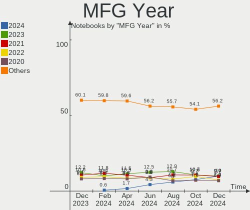
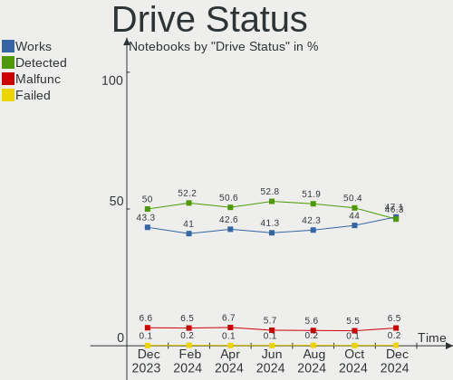
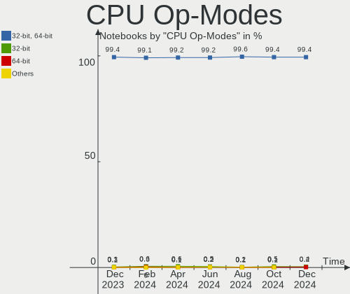
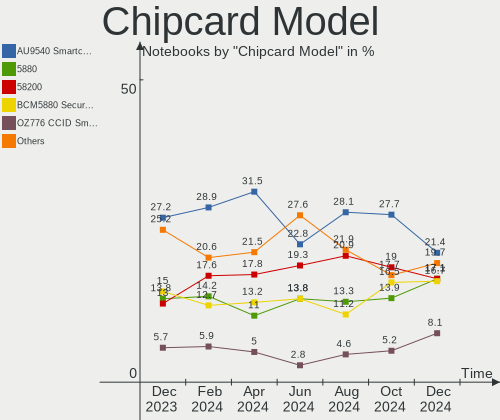
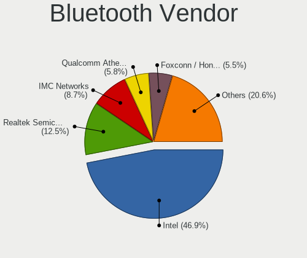

Linux Hardware Trends (Notebook)
--------------------------------

A project to identify most popular hardware characteristics and track their change
over time based on data collected by Linux users at https://Linux-Hardware.org.

Anyone can contribute to the study by uploading probes of their computers by
the [hw-probe](https://github.com/linuxhw/hw-probe) tool:

    sudo -E hw-probe -all -upload

Full-feature report is available here: https://linux-hardware.org/?view=trends&formfactor=notebook

Period: Dec, 2020.

Contents
--------

- [ OS                       ](#os)
- [ OS Family                ](#os-family)
- [ Kernel                   ](#kernel)
- [ Kernel Family            ](#kernel-family)
- [ Kernel Major Ver.        ](#kernel-major-ver)
- [ Arch                     ](#arch)
- [ DE                       ](#de)
- [ Display Server           ](#display-server)
- [ Display Manager          ](#display-manager)
- [ OS Lang                  ](#os-lang)
- [ Boot Mode                ](#boot-mode)
- [ Filesystem               ](#filesystem)
- [ Part. scheme             ](#part-scheme)
- [ Dual Boot with Linux/BSD ](#dual-boot-with-linux/bsd)
- [ Dual Boot (Win)          ](#dual-boot-win)
- [ Country                  ](#country)
- [ City                     ](#city)
- [ Vendor                   ](#vendor)
- [ Model                    ](#model)
- [ Model Family             ](#model-family)
- [ MFG Year                 ](#mfg-year)
- [ Form Factor              ](#form-factor)
- [ Secure Boot              ](#secure-boot)
- [ Coreboot                 ](#coreboot)
- [ RAM Size                 ](#ram-size)
- [ RAM Used                 ](#ram-used)
- [ Has CD-ROM               ](#has-cd-rom)
- [ Total Drives             ](#total-drives)
- [ Has Ethernet             ](#has-ethernet)
- [ Drive Vendor             ](#drive-vendor)
- [ Drive Model              ](#drive-model)
- [ HDD Vendor               ](#hdd-vendor)
- [ SSD Vendor               ](#ssd-vendor)
- [ Drive Kind               ](#drive-kind)
- [ Drive Connector          ](#drive-connector)
- [ Drive Size               ](#drive-size)
- [ Space Total              ](#space-total)
- [ Space Used               ](#space-used)
- [ Malfunc. Drives          ](#malfunc-drives)
- [ Malfunc. Drive Vendor    ](#malfunc-drive-vendor)
- [ Malfunc. HDD Vendor      ](#malfunc-hdd-vendor)
- [ Malfunc. Drive Kind      ](#malfunc-drive-kind)
- [ Failed Drives            ](#failed-drives)
- [ Failed Drive Vendor      ](#failed-drive-vendor)
- [ Drive Status             ](#drive-status)
- [ Storage Vendor           ](#storage-vendor)
- [ Storage Model            ](#storage-model)
- [ Storage Kind             ](#storage-kind)
- [ CPU Vendor               ](#cpu-vendor)
- [ CPU Model                ](#cpu-model)
- [ CPU Model Family         ](#cpu-model-family)
- [ CPU Cores                ](#cpu-cores)
- [ CPU Sockets              ](#cpu-sockets)
- [ CPU Threads              ](#cpu-threads)
- [ CPU Op-Modes             ](#cpu-op-modes)
- [ CPU Microcode            ](#cpu-microcode)
- [ CPU Microarch            ](#cpu-microarch)
- [ GPU Vendor               ](#gpu-vendor)
- [ GPU Model                ](#gpu-model)
- [ GPU Combo                ](#gpu-combo)
- [ GPU Driver               ](#gpu-driver)
- [ GPU Memory               ](#gpu-memory)
- [ Monitor Vendor           ](#monitor-vendor)
- [ Monitor Model            ](#monitor-model)
- [ Monitor Resolution       ](#monitor-resolution)
- [ Monitor Diagonal         ](#monitor-diagonal)
- [ Monitor Width            ](#monitor-width)
- [ Aspect Ratio             ](#aspect-ratio)
- [ Monitor Area             ](#monitor-area)
- [ Pixel Density            ](#pixel-density)
- [ Multiple Monitors        ](#multiple-monitors)
- [ Net Controller Vendor    ](#net-controller-vendor)
- [ Net Controller Model     ](#net-controller-model)
- [ Wireless Vendor          ](#wireless-vendor)
- [ Wireless Model           ](#wireless-model)
- [ Ethernet Vendor          ](#ethernet-vendor)
- [ Ethernet Model           ](#ethernet-model)
- [ Net Controller Kind      ](#net-controller-kind)
- [ Used Controller          ](#used-controller)
- [ NICs                     ](#nics)
- [ Memory Vendor            ](#memory-vendor)
- [ Memory Model             ](#memory-model)
- [ Memory Kind              ](#memory-kind)
- [ Memory Form Factor       ](#memory-form-factor)
- [ Memory Size              ](#memory-size)
- [ Memory Speed             ](#memory-speed)
- [ Sound Vendor             ](#sound-vendor)
- [ Sound Model              ](#sound-model)
- [ Camera Vendor            ](#camera-vendor)
- [ Camera Model             ](#camera-model)
- [ Fingerprint Vendor       ](#fingerprint-vendor)
- [ Fingerprint Model        ](#fingerprint-model)
- [ Chipcard Vendor          ](#chipcard-vendor)
- [ Chipcard Model           ](#chipcard-model)
- [ Printer Vendor           ](#printer-vendor)
- [ Printer Model            ](#printer-model)
- [ Scanner Vendor           ](#scanner-vendor)
- [ Scanner Model            ](#scanner-model)
- [ Bluetooth Vendor         ](#bluetooth-vendor)
- [ Bluetooth Model          ](#bluetooth-model)
- [ Unsupported Devices      ](#unsupported-devices)
- [ Unsupported Device Types ](#unsupported-device-types)

OS
--

Installed operating systems

| Name                | Notebooks | Percent |
|---------------------|-----------|---------|
| Ubuntu 20.04        | 822       | 28.73%  |
| Ubuntu 20.10        | 227       | 7.93%   |
| Mint 20             | 211       | 7.38%   |
| Fedora 33           | 153       | 5.35%   |
| Ubuntu 18.04        | 144       | 5.03%   |
| Pop!_OS 20.10       | 118       | 4.12%   |
| KDE neon 20.04      | 115       | 4.02%   |
| BlackPanther 18.1   | 105       | 3.67%   |
| Arch                | 66        | 2.31%   |
| Manjaro 20.2        | 65        | 2.27%   |
| Manjaro             | 58        | 2.03%   |
| ROSA R11.1          | 57        | 1.99%   |
| Endless 3.9.1       | 54        | 1.89%   |
| Debian 10           | 50        | 1.75%   |
| Pop!_OS 20.04       | 47        | 1.64%   |
| Zorin 15            | 43        | 1.5%    |
| Mint 19.3           | 37        | 1.29%   |
| Arch Rolling        | 34        | 1.19%   |
| Endless 3.9.0       | 30        | 1.05%   |
| ROSA R11            | 29        | 1.01%   |
| ArcoLinux Rolling   | 28        | 0.98%   |
| Ubuntu 16.04        | 21        | 0.73%   |
| Elementary 5.1.7    | 17        | 0.59%   |
| Debian Testing      | 17        | 0.59%   |
| LMDE 4              | 16        | 0.56%   |
| Fedora 32           | 16        | 0.56%   |
| Kali 2020.4         | 15        | 0.52%   |
| Gentoo              | 13        | 0.45%   |
| Peppermint 10       | 9         | 0.31%   |
| Debian              | 9         | 0.31%   |
| CentOS 8            | 9         | 0.31%   |
| Reborn OS           | 8         | 0.28%   |
| openSUSE Leap-15.2  | 8         | 0.28%   |
| Mint 20.1           | 6         | 0.21%   |
| Endless 3.8.7       | 6         | 0.21%   |
| Endless 3.7.4       | 6         | 0.21%   |
| BlackPanther 16.2   | 6         | 0.21%   |
| Zorin 12            | 5         | 0.17%   |
| Ubuntu 21.04        | 5         | 0.17%   |
| ROSA R8.1           | 5         | 0.17%   |
| RHEL 8.3            | 5         | 0.17%   |
| Gentoo 2.7          | 5         | 0.17%   |
| EndeavourOS         | 5         | 0.17%   |
| Chrome OS           | 5         | 0.17%   |
| Ubuntu 19.10        | 4         | 0.14%   |
| Ubuntu              | 4         | 0.14%   |
| Parrot 4.10         | 4         | 0.14%   |
| MX 19.3             | 4         | 0.14%   |
| Mint 19.2           | 4         | 0.14%   |
| Endless 3.7.8       | 4         | 0.14%   |
| Solus 4.1           | 3         | 0.1%    |
| OpenMandriva 4.2    | 3         | 0.1%    |
| Mint 19.1           | 3         | 0.1%    |
| Mint 18.3           | 3         | 0.1%    |
| Mageia 7            | 3         | 0.1%    |
| Garuda Soaring      | 3         | 0.1%    |
| Fedora 30           | 3         | 0.1%    |
| EndeavourOS Rolling | 3         | 0.1%    |
| Debian Unstable     | 3         | 0.1%    |
| Artix               | 3         | 0.1%    |

OS Family
---------

OS without a version

| Name         | Notebooks | Percent |
|--------------|-----------|---------|
| Ubuntu       | 1236      | 43.2%   |
| Mint         | 266       | 9.3%    |
| Fedora       | 174       | 6.08%   |
| Pop!_OS      | 165       | 5.77%   |
| Manjaro      | 124       | 4.33%   |
| KDE neon     | 115       | 4.02%   |
| BlackPanther | 111       | 3.88%   |
| Endless      | 107       | 3.74%   |
| Arch         | 100       | 3.5%    |
| ROSA         | 94        | 3.29%   |
| Debian       | 81        | 2.83%   |
| Zorin        | 48        | 1.68%   |
| ArcoLinux    | 30        | 1.05%   |
| openSUSE     | 25        | 0.87%   |
| Gentoo       | 18        | 0.63%   |
| Kali         | 17        | 0.59%   |
| Elementary   | 17        | 0.59%   |
| LMDE         | 16        | 0.56%   |
| CentOS       | 11        | 0.38%   |
| Peppermint   | 9         | 0.31%   |
| Reborn OS    | 8         | 0.28%   |
| EndeavourOS  | 8         | 0.28%   |
| Clear Linux  | 8         | 0.28%   |
| RHEL         | 6         | 0.21%   |
| Artix        | 6         | 0.21%   |
| Parrot       | 5         | 0.17%   |
| MX           | 5         | 0.17%   |
| Chrome OS    | 5         | 0.17%   |
| OpenMandriva | 4         | 0.14%   |
| Garuda       | 4         | 0.14%   |
| ALT Linux    | 4         | 0.14%   |
| Solus        | 3         | 0.1%    |
| Mageia       | 3         | 0.1%    |
| Hefftor      | 3         | 0.1%    |
| Deepin       | 3         | 0.1%    |
| Alpine       | 3         | 0.1%    |
| Pardus       | 2         | 0.07%   |
| WindowsFX    | 1         | 0.03%   |
| Void         | 1         | 0.03%   |
| Springdale   | 1         | 0.03%   |
| Sparky       | 1         | 0.03%   |
| Slackware    | 1         | 0.03%   |
| SkiffOS      | 1         | 0.03%   |
| Siduction    | 1         | 0.03%   |
| RELS         | 1         | 0.03%   |
| RED          | 1         | 0.03%   |
| Porteus      | 1         | 0.03%   |
| HamoniKR     | 1         | 0.03%   |
| GalliumOS    | 1         | 0.03%   |
| Devuan       | 1         | 0.03%   |
| Calculate    | 1         | 0.03%   |
| BunsenLabs   | 1         | 0.03%   |
| BlackArch    | 1         | 0.03%   |
| Archman      | 1         | 0.03%   |

Kernel
------

Version of the Linux kernel

| Version                             | Notebooks | Percent |
|-------------------------------------|-----------|---------|
| 5.4.0-58-generic                    | 606       | 21.18%  |
| 5.4.0-56-generic                    | 381       | 13.32%  |
| 5.8.0-7630-generic                  | 154       | 5.38%   |
| 5.8.0-33-generic                    | 117       | 4.09%   |
| 4.18.16-desktop-1bP                 | 97        | 3.39%   |
| 5.4.0-54-generic                    | 86        | 3.01%   |
| 5.8.0-14-generic                    | 85        | 2.97%   |
| 5.9.11-3-MANJARO                    | 69        | 2.41%   |
| 5.8.0-31-generic                    | 54        | 1.89%   |
| 5.4.0-42-generic                    | 49        | 1.71%   |
| 5.9.14-arch1-1                      | 45        | 1.57%   |
| 5.9.11-200.fc33.x86_64              | 41        | 1.43%   |
| 4.19.0-13-amd64                     | 39        | 1.36%   |
| 5.4.0-26-generic                    | 37        | 1.29%   |
| 4.15.0-128-generic                  | 34        | 1.19%   |
| 5.9.13-200.fc33.x86_64              | 30        | 1.05%   |
| 5.8.0-32-generic                    | 27        | 0.94%   |
| 4.15.0-desktop-122.124.1rosa-x86_64 | 26        | 0.91%   |
| 5.9.11-arch2-1                      | 25        | 0.87%   |
| 4.15.0-desktop-45.1rosa-x86_64      | 24        | 0.84%   |
| 5.9.16-200.fc33.x86_64              | 20        | 0.7%    |
| 5.9.14-200.fc33.x86_64              | 20        | 0.7%    |
| 5.8.18-1-MANJARO                    | 20        | 0.7%    |
| 5.8.0-29-generic                    | 20        | 0.7%    |
| 5.9.13-arch1-1                      | 19        | 0.66%   |
| 5.8.0-34-generic                    | 16        | 0.56%   |
| 5.9.0-4-amd64                       | 15        | 0.52%   |
| 5.4.0-53-generic                    | 14        | 0.49%   |
| 4.15.0-126-generic                  | 14        | 0.49%   |
| 5.9.15-200.fc33.x86_64              | 13        | 0.45%   |
| 5.4.0-59-generic                    | 13        | 0.45%   |
| 5.4.0-52-generic                    | 13        | 0.45%   |
| 4.19.0-12-amd64                     | 12        | 0.42%   |
| 5.8.0-25-generic                    | 11        | 0.38%   |
| 5.4.80-2-MANJARO                    | 11        | 0.38%   |
| 5.4.0-48-generic                    | 11        | 0.38%   |
| 5.10.2-051002-generic               | 11        | 0.38%   |
| 5.9.10-arch1-1                      | 10        | 0.35%   |
| 5.4.0-58-lowlatency                 | 10        | 0.35%   |
| 5.9.10-200.fc33.x86_64              | 9         | 0.31%   |
| 5.3.18-lp152.57-default             | 9         | 0.31%   |
| 4.18.0-240.1.1.el8_3.x86_64         | 9         | 0.31%   |
| 5.9.14-zen1-1-zen                   | 8         | 0.28%   |
| 5.4.80-gentoo-r1                    | 8         | 0.28%   |
| 5.4.0-57-generic                    | 8         | 0.28%   |
| 5.0.0-32-generic                    | 8         | 0.28%   |
| 5.9.12-050912-generic               | 7         | 0.24%   |
| 5.9.0-5-amd64                       | 7         | 0.24%   |
| 5.8.15-301.fc33.x86_64              | 7         | 0.24%   |
| 5.6.14-desktop-2bP                  | 7         | 0.24%   |
| 5.9.12-arch1-1                      | 6         | 0.21%   |
| 5.9.12-200.fc33.x86_64              | 6         | 0.21%   |
| 5.4.83-generic-2rosa-x86_64         | 6         | 0.21%   |
| 5.4.72-generic-1rosa-x86_64         | 6         | 0.21%   |
| 5.3.0-19-generic                    | 6         | 0.21%   |
| 4.9.20-desktop-pae-1bP              | 6         | 0.21%   |
| 4.4.0-197-generic                   | 6         | 0.21%   |
| 5.9.11-zen2-1-zen                   | 5         | 0.17%   |
| 5.9.0-kali5-amd64                   | 5         | 0.17%   |
| 5.4.53+                             | 5         | 0.17%   |

Kernel Family
-------------

Linux kernel without a distro release

| Version | Notebooks | Percent |
|---------|-----------|---------|
| 5.4.0   | 1260      | 44.04%  |
| 5.8.0   | 502       | 17.55%  |
| 5.9.11  | 151       | 5.28%   |
| 4.15.0  | 146       | 5.1%    |
| 4.18.16 | 97        | 3.39%   |
| 5.9.14  | 90        | 3.15%   |
| 4.19.0  | 65        | 2.27%   |
| 5.9.13  | 58        | 2.03%   |
| 5.9.0   | 48        | 1.68%   |
| 5.9.12  | 30        | 1.05%   |
| 5.9.10  | 26        | 0.91%   |
| 5.9.16  | 25        | 0.87%   |
| 5.8.18  | 24        | 0.84%   |
| 5.4.80  | 23        | 0.8%    |
| 5.3.0   | 22        | 0.77%   |
| 4.18.0  | 20        | 0.7%    |
| 5.10.1  | 18        | 0.63%   |
| 5.9.15  | 17        | 0.59%   |
| 5.10.2  | 17        | 0.59%   |
| 5.10.0  | 14        | 0.49%   |
| 5.0.0   | 13        | 0.45%   |
| 4.9.155 | 11        | 0.38%   |
| 5.9.8   | 10        | 0.35%   |
| 5.6.0   | 10        | 0.35%   |
| 5.4.83  | 10        | 0.35%   |
| 5.3.18  | 10        | 0.35%   |
| 4.4.0   | 9         | 0.31%   |
| 5.8.15  | 7         | 0.24%   |
| 5.6.14  | 7         | 0.24%   |
| 4.9.20  | 7         | 0.24%   |
| 5.9.1   | 6         | 0.21%   |
| 5.4.72  | 6         | 0.21%   |
| 5.4.53  | 5         | 0.17%   |
| 5.4.32  | 5         | 0.17%   |
| 5.7.19  | 4         | 0.14%   |
| 5.4.84  | 4         | 0.14%   |
| 4.16.0  | 4         | 0.14%   |
| 5.7.0   | 3         | 0.1%    |
| 5.6.13  | 3         | 0.1%    |
| 5.4.85  | 3         | 0.1%    |
| 5.4.82  | 3         | 0.1%    |
| 5.10.3  | 3         | 0.1%    |
| 4.9.0   | 3         | 0.1%    |
| 4.13.0  | 3         | 0.1%    |
| 5.9.6   | 2         | 0.07%   |
| 5.8.6   | 2         | 0.07%   |
| 5.8.13  | 2         | 0.07%   |
| 5.8.11  | 2         | 0.07%   |
| 5.7.1   | 2         | 0.07%   |
| 5.6.19  | 2         | 0.07%   |
| 5.4.81  | 2         | 0.07%   |
| 5.4.77  | 2         | 0.07%   |
| 5.4.70  | 2         | 0.07%   |
| 4.9.60  | 2         | 0.07%   |
| 4.12.14 | 2         | 0.07%   |
| 3.10.0  | 2         | 0.07%   |
| 5.9.3   | 1         | 0.03%   |
| 5.8.4   | 1         | 0.03%   |
| 5.8.16  | 1         | 0.03%   |
| 5.8.1   | 1         | 0.03%   |

Kernel Major Ver.
-----------------

Linux kernel major version

| Version | Notebooks | Percent |
|---------|-----------|---------|
| 5.4     | 1333      | 46.59%  |
| 5.8     | 542       | 18.94%  |
| 5.9     | 464       | 16.22%  |
| 4.15    | 146       | 5.1%    |
| 4.18    | 117       | 4.09%   |
| 4.19    | 68        | 2.38%   |
| 5.10    | 53        | 1.85%   |
| 5.3     | 32        | 1.12%   |
| 4.9     | 25        | 0.87%   |
| 5.6     | 22        | 0.77%   |
| 5.7     | 16        | 0.56%   |
| 5.0     | 13        | 0.45%   |
| 4.4     | 9         | 0.31%   |
| 4.16    | 5         | 0.17%   |
| 5.5     | 3         | 0.1%    |
| 4.13    | 3         | 0.1%    |
| 4.12    | 2         | 0.07%   |
| 3.10    | 2         | 0.07%   |
| 5.2     | 1         | 0.03%   |
| 5.11    | 1         | 0.03%   |
| 4.20    | 1         | 0.03%   |
| 4.14    | 1         | 0.03%   |
| 4.1     | 1         | 0.03%   |
| Unknown | 1         | 0.03%   |

Arch
----

OS architecture (x86_64, i586, etc.)

| Name    | Notebooks | Percent |
|---------|-----------|---------|
| x86_64  | 2769      | 96.78%  |
| i686    | 91        | 3.18%   |
| Unknown | 1         | 0.03%   |

DE
--

Desktop Environment

| Name              | Notebooks | Percent |
|-------------------|-----------|---------|
| GNOME             | 1470      | 51.38%  |
| KDE5              | 266       | 9.3%    |
| XFCE              | 247       | 8.63%   |
| X-Cinnamon        | 239       | 8.35%   |
| KDE               | 228       | 7.97%   |
| Unknown           | 101       | 3.53%   |
| MATE              | 68        | 2.38%   |
| KDE4              | 55        | 1.92%   |
| Unity             | 30        | 1.05%   |
| LXQt              | 25        | 0.87%   |
| Cinnamon          | 24        | 0.84%   |
| Budgie            | 19        | 0.66%   |
| Pantheon          | 15        | 0.52%   |
| LXDE              | 14        | 0.49%   |
| i3                | 14        | 0.49%   |
| GNOME Flashback   | 10        | 0.35%   |
| DWM               | 8         | 0.28%   |
| Deepin            | 8         | 0.28%   |
| GNOME Classic     | 5         | 0.17%   |
| awesome           | 3         | 0.1%    |
| xmonad            | 2         | 0.07%   |
| bspwm             | 2         | 0.07%   |
| Yaru:ubuntu:GNOME | 1         | 0.03%   |
| Trinity           | 1         | 0.03%   |
| sway              | 1         | 0.03%   |
| spectrwm          | 1         | 0.03%   |
| qtile             | 1         | 0.03%   |
| lightdm-xsession  | 1         | 0.03%   |
| enlightenment     | 1         | 0.03%   |
| default           | 1         | 0.03%   |

Display Server
--------------

X11 or Wayland

| Name        | Notebooks | Percent |
|-------------|-----------|---------|
| X11         | 2565      | 89.65%  |
| Wayland     | 232       | 8.11%   |
| Unknown     | 44        | 1.54%   |
| Tty         | 19        | 0.66%   |
| Unspecified | 1         | 0.03%   |

Display Manager
---------------

SDDM, LightDM, etc.

| Name    | Notebooks | Percent |
|---------|-----------|---------|
| Unknown | 1889      | 66.03%  |
| GDM     | 363       | 12.69%  |
| SDDM    | 282       | 9.86%   |
| TDM     | 204       | 7.13%   |
| LightDM | 58        | 2.03%   |
| KDM     | 57        | 1.99%   |
| XDM     | 3         | 0.1%    |
| SLiM    | 2         | 0.07%   |
| GDM3    | 2         | 0.07%   |
| NODM    | 1         | 0.03%   |

OS Lang
-------

Language

| Lang        | Notebooks | Percent |
|-------------|-----------|---------|
| en_US       | 1000      | 34.95%  |
| de_DE       | 263       | 9.19%   |
| Unknown     | 185       | 6.47%   |
| en_GB       | 142       | 4.96%   |
| pt_BR       | 123       | 4.3%    |
| ru_RU       | 118       | 4.12%   |
| fr_FR       | 108       | 3.77%   |
| it_IT       | 92        | 3.22%   |
| es_ES       | 64        | 2.24%   |
| en_US.utf8  | 60        | 2.1%    |
| pl_PL       | 55        | 1.92%   |
| en_IN       | 52        | 1.82%   |
| en_CA       | 43        | 1.5%    |
| C           | 40        | 1.4%    |
| en_AU       | 35        | 1.22%   |
| pt_BR.utf8  | 29        | 1.01%   |
| nl_NL       | 26        | 0.91%   |
| es_MX       | 24        | 0.84%   |
| hu_HU       | 20        | 0.7%    |
| cs_CZ       | 16        | 0.56%   |
| es_AR       | 15        | 0.52%   |
| tr_TR       | 14        | 0.49%   |
| ja_JP       | 14        | 0.49%   |
| sv_SE       | 13        | 0.45%   |
| ro_RO       | 13        | 0.45%   |
| pt_PT       | 13        | 0.45%   |
| el_GR       | 13        | 0.45%   |
| de_CH       | 12        | 0.42%   |
| fr_CA       | 11        | 0.38%   |
| fi_FI       | 11        | 0.38%   |
| es_CO       | 10        | 0.35%   |
| nl_BE       | 9         | 0.31%   |
| es_CL       | 9         | 0.31%   |
| en_ZA       | 9         | 0.31%   |
| de_AT       | 9         | 0.31%   |
| C           | 9         | 0.31%   |
| zh_CN       | 8         | 0.28%   |
| sk_SK       | 8         | 0.28%   |
| de_DE.utf8  | 8         | 0.28%   |
| ru_UA       | 7         | 0.24%   |
| ru_RU.utf8  | 7         | 0.24%   |
| hr_HR       | 7         | 0.24%   |
| en_IL       | 7         | 0.24%   |
| pl_PL.utf8  | 5         | 0.17%   |
| fr_BE       | 5         | 0.17%   |
| en_IN       | 5         | 0.17%   |
| en_CA.utf8  | 5         | 0.17%   |
| da_DK       | 5         | 0.17%   |
| nb_NO       | 4         | 0.14%   |
| ko_KR       | 4         | 0.14%   |
| it_IT.utf8  | 4         | 0.14%   |
| fr_FR.utf8  | 4         | 0.14%   |
| en_IE       | 4         | 0.14%   |
| en_DK       | 4         | 0.14%   |
| bg_BG       | 4         | 0.14%   |
| zh_TW       | 3         | 0.1%    |
| ru_RU.UTF_8 | 3         | 0.1%    |
| POSIX       | 3         | 0.1%    |
| id_ID       | 3         | 0.1%    |
| es_UY       | 3         | 0.1%    |

Boot Mode
---------

EFI or BIOS

| Mode | Notebooks | Percent |
|------|-----------|---------|
| BIOS | 1477      | 51.63%  |
| EFI  | 1384      | 48.37%  |

Filesystem
----------

Type of filesystem

| Type                | Notebooks | Percent |
|---------------------|-----------|---------|
| Ext4                | 2466      | 86.19%  |
| Btrfs               | 172       | 6.01%   |
| Overlay             | 148       | 5.17%   |
| Xfs                 | 34        | 1.19%   |
| Zfs                 | 19        | 0.66%   |
| Unknown             | 5         | 0.17%   |
| Ext3                | 4         | 0.14%   |
| Ext2                | 4         | 0.14%   |
| Tmpfs               | 3         | 0.1%    |
| Aufs                | 3         | 0.1%    |
| Jfs                 | 1         | 0.03%   |
| Fuse.fuse-overlayfs | 1         | 0.03%   |
| F2fs                | 1         | 0.03%   |

Part. scheme
------------

Scheme of partitioning

| Type    | Notebooks | Percent |
|---------|-----------|---------|
| Unknown | 1860      | 65.01%  |
| GPT     | 724       | 25.31%  |
| MBR     | 277       | 9.68%   |

Dual Boot with Linux/BSD
------------------------

Hosting more than one Linux/BSD

| Dual boot | Notebooks | Percent |
|-----------|-----------|---------|
| No        | 2605      | 91.05%  |
| Yes       | 256       | 8.95%   |

Dual Boot (Win)
---------------

Hosting Linux and Windows

| Dual boot | Notebooks | Percent |
|-----------|-----------|---------|
| No        | 2138      | 74.73%  |
| Yes       | 723       | 25.27%  |

Country
-------

Geographic location (country)

| Country            | Notebooks | Percent |
|--------------------|-----------|---------|
| USA                | 423       | 14.79%  |
| Germany            | 344       | 12.02%  |
| Brazil             | 194       | 6.78%   |
| Russia             | 169       | 5.91%   |
| France             | 134       | 4.68%   |
| Hungary            | 117       | 4.09%   |
| Italy              | 115       | 4.02%   |
| UK                 | 110       | 3.84%   |
| India              | 88        | 3.08%   |
| Spain              | 87        | 3.04%   |
| Canada             | 77        | 2.69%   |
| Poland             | 70        | 2.45%   |
| Netherlands        | 63        | 2.2%    |
| Ukraine            | 39        | 1.36%   |
| Mexico             | 38        | 1.33%   |
| Australia          | 38        | 1.33%   |
| Turkey             | 37        | 1.29%   |
| Romania            | 36        | 1.26%   |
| Switzerland        | 34        | 1.19%   |
| Belgium            | 34        | 1.19%   |
| Greece             | 33        | 1.15%   |
| Sweden             | 32        | 1.12%   |
| Austria            | 32        | 1.12%   |
| Czech Republic     | 28        | 0.98%   |
| Finland            | 23        | 0.8%    |
| Argentina          | 23        | 0.8%    |
| Portugal           | 21        | 0.73%   |
| Japan              | 18        | 0.63%   |
| Indonesia          | 18        | 0.63%   |
| Denmark            | 18        | 0.63%   |
| Colombia           | 18        | 0.63%   |
| South Africa       | 16        | 0.56%   |
| Bulgaria           | 16        | 0.56%   |
| China              | 14        | 0.49%   |
| Chile              | 14        | 0.49%   |
| Egypt              | 13        | 0.45%   |
| Vietnam            | 12        | 0.42%   |
| Slovakia           | 12        | 0.42%   |
| Croatia            | 12        | 0.42%   |
| Israel             | 11        | 0.38%   |
| Slovenia           | 10        | 0.35%   |
| Iran               | 10        | 0.35%   |
| Belarus            | 10        | 0.35%   |
| Serbia             | 9         | 0.31%   |
| Norway             | 9         | 0.31%   |
| Korea, Republic of | 8         | 0.28%   |
| Tunisia            | 7         | 0.24%   |
| Lithuania          | 7         | 0.24%   |
| Thailand           | 6         | 0.21%   |
| Singapore          | 6         | 0.21%   |
| Pakistan           | 6         | 0.21%   |
| Morocco            | 6         | 0.21%   |
| Latvia             | 6         | 0.21%   |
| Kenya              | 6         | 0.21%   |
| Ireland            | 6         | 0.21%   |
| Estonia            | 6         | 0.21%   |
| Philippines        | 5         | 0.17%   |
| New Zealand        | 5         | 0.17%   |
| Uruguay            | 4         | 0.14%   |
| Taiwan             | 4         | 0.14%   |

City
----

Geographic location (city)

| City           | Notebooks | Percent |
|----------------|-----------|---------|
| Budapest       | 46        | 1.61%   |
| Moscow         | 34        | 1.19%   |
| Berlin         | 28        | 0.98%   |
| Paris          | 27        | 0.94%   |
| Rome           | 23        | 0.8%    |
| Vienna         | 21        | 0.73%   |
| São Paulo     | 19        | 0.66%   |
| Athens         | 19        | 0.66%   |
| St Petersburg  | 18        | 0.63%   |
| Warsaw         | 17        | 0.59%   |
| Madrid         | 16        | 0.56%   |
| Kyiv           | 15        | 0.52%   |
| Istanbul       | 15        | 0.52%   |
| Munich         | 14        | 0.49%   |
| Rio de Janeiro | 12        | 0.42%   |
| Bucharest      | 12        | 0.42%   |
| Sydney         | 11        | 0.38%   |
| Novosibirsk    | 11        | 0.38%   |
| Chennai        | 11        | 0.38%   |
| Bengaluru      | 11        | 0.38%   |
| Prague         | 10        | 0.35%   |
| Düsseldorf    | 10        | 0.35%   |
| Buenos Aires   | 10        | 0.35%   |
| Bogotá        | 10        | 0.35%   |
| Zurich         | 9         | 0.31%   |
| Tehran         | 9         | 0.31%   |
| Stuttgart      | 9         | 0.31%   |
| Sofia          | 9         | 0.31%   |
| Seattle        | 8         | 0.28%   |
| Milan          | 8         | 0.28%   |
| Hamburg        | 8         | 0.28%   |
| Barcelona      | 8         | 0.28%   |
| Zagreb         | 7         | 0.24%   |
| Santiago       | 7         | 0.24%   |
| Mumbai         | 7         | 0.24%   |
| Melbourne      | 7         | 0.24%   |
| Florence       | 7         | 0.24%   |
| Dresden        | 7         | 0.24%   |
| Copenhagen     | 7         | 0.24%   |
| Cologne        | 7         | 0.24%   |
| Brasília      | 7         | 0.24%   |
| Belgrade       | 7         | 0.24%   |
| Austin         | 7         | 0.24%   |
| Thessaloniki   | 6         | 0.21%   |
| Stockholm      | 6         | 0.21%   |
| Rockville      | 6         | 0.21%   |
| Riga           | 6         | 0.21%   |
| Oxford         | 6         | 0.21%   |
| New York       | 6         | 0.21%   |
| Nairobi        | 6         | 0.21%   |
| Montreal       | 6         | 0.21%   |
| Leipzig        | 6         | 0.21%   |
| Houston        | 6         | 0.21%   |
| Ekaterinburg   | 6         | 0.21%   |
| Curitiba       | 6         | 0.21%   |
| Chicago        | 6         | 0.21%   |
| Cairo          | 6         | 0.21%   |
| Wuppertal      | 5         | 0.17%   |
| Washington     | 5         | 0.17%   |
| Vilnius        | 5         | 0.17%   |

Vendor
------

Motherboard manufacturer

| Name                   | Notebooks | Percent |
|------------------------|-----------|---------|
| Lenovo                 | 593       | 20.73%  |
| Hewlett-Packard        | 505       | 17.65%  |
| Dell                   | 488       | 17.06%  |
| ASUSTek Computer       | 314       | 10.98%  |
| Acer                   | 301       | 10.52%  |
| Toshiba                | 100       | 3.5%    |
| Samsung Electronics    | 72        | 2.52%   |
| MSI                    | 64        | 2.24%   |
| Apple                  | 57        | 1.99%   |
| Sony                   | 41        | 1.43%   |
| Unknown                | 28        | 0.98%   |
| HUAWEI                 | 27        | 0.94%   |
| Fujitsu                | 27        | 0.94%   |
| Notebook               | 21        | 0.73%   |
| Medion                 | 17        | 0.59%   |
| TUXEDO                 | 13        | 0.45%   |
| Positivo               | 12        | 0.42%   |
| Packard Bell           | 11        | 0.38%   |
| Fujitsu Siemens        | 10        | 0.35%   |
| Timi                   | 9         | 0.31%   |
| System76               | 9         | 0.31%   |
| LG Electronics         | 8         | 0.28%   |
| PC Specialist          | 7         | 0.24%   |
| Alienware              | 7         | 0.24%   |
| Teclast                | 6         | 0.21%   |
| Panasonic              | 6         | 0.21%   |
| Razer                  | 4         | 0.14%   |
| Insyde                 | 4         | 0.14%   |
| Google                 | 4         | 0.14%   |
| Gigabyte Technology    | 4         | 0.14%   |
| eMachines              | 4         | 0.14%   |
| Clevo                  | 4         | 0.14%   |
| Chuwi                  | 4         | 0.14%   |
| NEC Computers          | 3         | 0.1%    |
| Gateway                | 3         | 0.1%    |
| EUROCOM                | 3         | 0.1%    |
| Avell High Performance | 3         | 0.1%    |
| SLIMBOOK               | 2         | 0.07%   |
| Semp Toshiba           | 2         | 0.07%   |
| Schenker               | 2         | 0.07%   |
| Quanta                 | 2         | 0.07%   |
| Monster                | 2         | 0.07%   |
| MAIBENBEN              | 2         | 0.07%   |
| Intel                  | 2         | 0.07%   |
| HASEE Computer         | 2         | 0.07%   |
| Fusion5                | 2         | 0.07%   |
| Eluktronics            | 2         | 0.07%   |
| Compal                 | 2         | 0.07%   |
| XMG                    | 1         | 0.03%   |
| Wortmann AG            | 1         | 0.03%   |
| TrekStor               | 1         | 0.03%   |
| Thomson                | 1         | 0.03%   |
| Thirdwave Diginnos     | 1         | 0.03%   |
| TaNix                  | 1         | 0.03%   |
| Star Labs              | 1         | 0.03%   |
| Standard               | 1         | 0.03%   |
| Sole                   | 1         | 0.03%   |
| Prestigio              | 1         | 0.03%   |
| Positivo Bahia - VAIO  | 1         | 0.03%   |
| Phoenix/SiS            | 1         | 0.03%   |

Model
-----

Motherboard model

| Name                                       | Notebooks | Percent |
|--------------------------------------------|-----------|---------|
| Unknown                                    | 43        | 1.5%    |
| HP Notebook                                | 19        | 0.66%   |
| HP Pavilion g6                             | 16        | 0.56%   |
| Acer Nitro AN515-54                        | 14        | 0.49%   |
| HP 15                                      | 11        | 0.38%   |
| HP ProBook 4540s                           | 10        | 0.35%   |
| Dell XPS 15 7590                           | 10        | 0.35%   |
| Dell Inspiron 1545                         | 10        | 0.35%   |
| HP Laptop 15-db0xxx                        | 9         | 0.31%   |
| Dell XPS 13 9370                           | 9         | 0.31%   |
| Dell Latitude E6430                        | 9         | 0.31%   |
| HUAWEI NBLK-WAX9X                          | 8         | 0.28%   |
| HP Pavilion Notebook                       | 8         | 0.28%   |
| HP Pavilion dv7                            | 8         | 0.28%   |
| HP Pavilion dv6                            | 8         | 0.28%   |
| Lenovo IdeaPad 3 15IIL05 81WE              | 7         | 0.24%   |
| HUAWEI BOHK-WAX9X                          | 7         | 0.24%   |
| HP Pavilion 15                             | 7         | 0.24%   |
| HP EliteBook 8460p                         | 7         | 0.24%   |
| Dell XPS 15 9500                           | 7         | 0.24%   |
| Dell XPS 13 9310                           | 7         | 0.24%   |
| Dell Latitude E6420                        | 7         | 0.24%   |
| Apple MacBookPro9,2                        | 7         | 0.24%   |
| Acer Aspire A315-21                        | 7         | 0.24%   |
| HP Pavilion Laptop 15-cw1xxx               | 6         | 0.21%   |
| HP Pavilion g7                             | 6         | 0.21%   |
| HP Pavilion g4                             | 6         | 0.21%   |
| HP Laptop 15-bs0xx                         | 6         | 0.21%   |
| HP EliteBook 8470p                         | 6         | 0.21%   |
| HP EliteBook 840 G3                        | 6         | 0.21%   |
| HP 255 G7 Notebook PC                      | 6         | 0.21%   |
| HP 250 G7 Notebook PC                      | 6         | 0.21%   |
| Dell XPS 15 9570                           | 6         | 0.21%   |
| Dell XPS 13 9380                           | 6         | 0.21%   |
| Dell Latitude E7440                        | 6         | 0.21%   |
| Dell Latitude E6400                        | 6         | 0.21%   |
| Dell Latitude E5470                        | 6         | 0.21%   |
| Dell Latitude D630                         | 6         | 0.21%   |
| Dell Inspiron N5110                        | 6         | 0.21%   |
| Dell Inspiron 5570                         | 6         | 0.21%   |
| Dell Inspiron 15 7000 Gaming               | 6         | 0.21%   |
| ASUS VivoBook 15_ASUS Laptop X540BA        | 6         | 0.21%   |
| Acer Swift SF314-42                        | 6         | 0.21%   |
| Samsung 300E4A/300E5A/300E7A/3430EA/3530EA | 5         | 0.17%   |
| Lenovo Y520-15IKBN 80WK                    | 5         | 0.17%   |
| Lenovo IdeaPad 5 14ARE05 81YM              | 5         | 0.17%   |
| HP Pavilion 17                             | 5         | 0.17%   |
| HP Laptop 15-db1xxx                        | 5         | 0.17%   |
| HP 2000                                    | 5         | 0.17%   |
| Dell Latitude E7470                        | 5         | 0.17%   |
| Dell Latitude E6500                        | 5         | 0.17%   |
| Dell Inspiron 3543                         | 5         | 0.17%   |
| Dell Inspiron 3542                         | 5         | 0.17%   |
| ASUS X550CA                                | 5         | 0.17%   |
| ASUS X510UNR                               | 5         | 0.17%   |
| Apple MacBookPro8,1                        | 5         | 0.17%   |
| Acer Aspire E5-571                         | 5         | 0.17%   |
| Acer Aspire A715-75G                       | 5         | 0.17%   |
| Acer Aspire A315-34                        | 5         | 0.17%   |
| Acer Aspire 5738                           | 5         | 0.17%   |

Model Family
------------

Motherboard model prefix

| Name                    | Notebooks | Percent |
|-------------------------|-----------|---------|
| Lenovo ThinkPad         | 321       | 11.22%  |
| Acer Aspire             | 196       | 6.85%   |
| Dell Inspiron           | 165       | 5.77%   |
| Dell Latitude           | 164       | 5.73%   |
| Lenovo IdeaPad          | 142       | 4.96%   |
| HP Pavilion             | 125       | 4.37%   |
| HP EliteBook            | 90        | 3.15%   |
| Toshiba Satellite       | 82        | 2.87%   |
| Dell XPS                | 75        | 2.62%   |
| HP ProBook              | 63        | 2.2%    |
| ASUS VivoBook           | 58        | 2.03%   |
| HP Laptop               | 57        | 1.99%   |
| Unknown                 | 43        | 1.5%    |
| Dell Precision          | 34        | 1.19%   |
| Acer Nitro              | 30        | 1.05%   |
| Dell Vostro             | 29        | 1.01%   |
| HP Compaq               | 21        | 0.73%   |
| Lenovo Legion           | 20        | 0.7%    |
| Fujitsu LIFEBOOK        | 20        | 0.7%    |
| HP ZBook                | 19        | 0.66%   |
| HP Notebook             | 19        | 0.66%   |
| ASUS TUF                | 19        | 0.66%   |
| Acer Extensa            | 19        | 0.66%   |
| Acer Swift              | 17        | 0.59%   |
| HP 250                  | 16        | 0.56%   |
| HP 15                   | 15        | 0.52%   |
| HP 255                  | 13        | 0.45%   |
| ASUS ZenBook            | 13        | 0.45%   |
| Packard Bell EasyNote   | 11        | 0.38%   |
| Lenovo Yoga             | 11        | 0.38%   |
| HP OMEN                 | 10        | 0.35%   |
| HP ENVY                 | 10        | 0.35%   |
| Acer TravelMate         | 10        | 0.35%   |
| HUAWEI NBLK-WAX9X       | 8         | 0.28%   |
| Dell G3                 | 8         | 0.28%   |
| HUAWEI BOHK-WAX9X       | 7         | 0.24%   |
| Apple MacBookPro9       | 7         | 0.24%   |
| Apple MacBookPro8       | 7         | 0.24%   |
| Samsung 300E4A          | 6         | 0.21%   |
| Lenovo ThinkBook        | 6         | 0.21%   |
| HP Stream               | 6         | 0.21%   |
| Dell G5                 | 6         | 0.21%   |
| Apple MacBookPro11      | 6         | 0.21%   |
| Acer Predator           | 6         | 0.21%   |
| Toshiba TECRA           | 5         | 0.17%   |
| MSI GL65                | 5         | 0.17%   |
| Lenovo Y520-15IKBN      | 5         | 0.17%   |
| HP Presario             | 5         | 0.17%   |
| HP 2000                 | 5         | 0.17%   |
| Fujitsu Siemens ESPRIMO | 5         | 0.17%   |
| Dell Studio             | 5         | 0.17%   |
| ASUS X550CA             | 5         | 0.17%   |
| ASUS X510UNR            | 5         | 0.17%   |
| TUXEDO Pulse            | 4         | 0.14%   |
| Timi RedmiBook          | 4         | 0.14%   |
| Samsung 550P5C          | 4         | 0.14%   |
| Samsung 340XAA          | 4         | 0.14%   |
| Razer Blade             | 4         | 0.14%   |
| Positivo Mobile         | 4         | 0.14%   |
| MSI GF63                | 4         | 0.14%   |

MFG Year
--------

Motherboard manufacture year

| Year    | Notebooks | Percent |
|---------|-----------|---------|
| 2020    | 699       | 24.43%  |
| 2019    | 407       | 14.23%  |
| 2018    | 243       | 8.49%   |
| 2013    | 191       | 6.68%   |
| 2012    | 174       | 6.08%   |
| 2014    | 168       | 5.87%   |
| 2015    | 158       | 5.52%   |
| 2011    | 156       | 5.45%   |
| 2017    | 149       | 5.21%   |
| 2010    | 124       | 4.33%   |
| 2016    | 119       | 4.16%   |
| 2009    | 106       | 3.7%    |
| 2008    | 91        | 3.18%   |
| 2007    | 45        | 1.57%   |
| 2006    | 17        | 0.59%   |
| 2005    | 8         | 0.28%   |
| Unknown | 4         | 0.14%   |
| 2004    | 1         | 0.03%   |
| 2003    | 1         | 0.03%   |

Form Factor
-----------

Physical design of the computer

| Name     | Notebooks | Percent |
|----------|-----------|---------|
| Notebook | 2861      | 100%    |

Secure Boot
-----------

Enabled or disabled

| State    | Notebooks | Percent |
|----------|-----------|---------|
| Disabled | 2557      | 89.37%  |
| Enabled  | 304       | 10.63%  |

Coreboot
--------

Have coreboot on board

| Used | Notebooks | Percent |
|------|-----------|---------|
| No   | 2852      | 99.69%  |
| Yes  | 9         | 0.31%   |

RAM Size
--------

Total RAM memory

| Size in GB  | Notebooks | Percent |
|-------------|-----------|---------|
| 4.01-8.0    | 799       | 27.93%  |
| 3.01-4.0    | 700       | 24.47%  |
| 8.01-16.0   | 462       | 16.15%  |
| 16.01-24.0  | 434       | 15.17%  |
| 1.01-2.0    | 173       | 6.05%   |
| 32.01-64.0  | 149       | 5.21%   |
| 2.01-3.0    | 64        | 2.24%   |
| 64.01-256.0 | 32        | 1.12%   |
| 24.01-32.0  | 29        | 1.01%   |
| 0.51-1.0    | 18        | 0.63%   |
| Unknown     | 1         | 0.03%   |

RAM Used
--------

Used RAM memory

| Used GB    | Notebooks | Percent |
|------------|-----------|---------|
| 1.01-2.0   | 1074      | 37.54%  |
| 2.01-3.0   | 741       | 25.9%   |
| 4.01-8.0   | 349       | 12.2%   |
| 3.01-4.0   | 323       | 11.29%  |
| 0.51-1.0   | 247       | 8.63%   |
| 8.01-16.0  | 86        | 3.01%   |
| 0.01-0.5   | 32        | 1.12%   |
| 16.01-24.0 | 6         | 0.21%   |
| 24.01-32.0 | 2         | 0.07%   |
| Unknown    | 1         | 0.03%   |

Has CD-ROM
----------

Has CD-ROM on board

| Presented | Notebooks | Percent |
|-----------|-----------|---------|
| No        | 1686      | 58.93%  |
| Yes       | 1175      | 41.07%  |

Total Drives
------------

Number of drives on board

| Drives | Notebooks | Percent |
|--------|-----------|---------|
| 1      | 2077      | 72.6%   |
| 2      | 699       | 24.43%  |
| 3      | 55        | 1.92%   |
| 0      | 13        | 0.45%   |
| 4      | 11        | 0.38%   |
| 5      | 4         | 0.14%   |
| 8      | 1         | 0.03%   |
| 6      | 1         | 0.03%   |

Has Ethernet
------------

Has Ethernet on board

| Presented | Notebooks | Percent |
|-----------|-----------|---------|
| Yes       | 2439      | 85.25%  |
| No        | 422       | 14.75%  |

Drive Vendor
------------

Hard drive vendors

| Vendor                    | Notebooks | Drives | Percent |
|---------------------------|-----------|--------|---------|
| Samsung Electronics       | 545       | 588    | 15.62%  |
| WDC                       | 453       | 468    | 12.98%  |
| Seagate                   | 450       | 462    | 12.89%  |
| Toshiba                   | 323       | 332    | 9.26%   |
| Kingston                  | 230       | 236    | 6.59%   |
| SanDisk                   | 191       | 196    | 5.47%   |
| Unknown                   | 182       | 203    | 5.21%   |
| Hitachi                   | 129       | 130    | 3.7%    |
| SK Hynix                  | 127       | 132    | 3.64%   |
| Intel                     | 116       | 119    | 3.32%   |
| HGST                      | 112       | 113    | 3.21%   |
| Crucial                   | 93        | 97     | 2.66%   |
| Micron Technology         | 52        | 55     | 1.49%   |
| A-DATA Technology         | 45        | 47     | 1.29%   |
| Fujitsu                   | 30        | 30     | 0.86%   |
| Apple                     | 27        | 29     | 0.77%   |
| China                     | 23        | 23     | 0.66%   |
| LITEON                    | 21        | 21     | 0.6%    |
| Phison                    | 17        | 19     | 0.49%   |
| KIOXIA                    | 16        | 16     | 0.46%   |
| SPCC                      | 15        | 15     | 0.43%   |
| Silicon Motion            | 15        | 16     | 0.43%   |
| LITEONIT                  | 15        | 15     | 0.43%   |
| Transcend                 | 14        | 14     | 0.4%    |
| Intenso                   | 14        | 14     | 0.4%    |
| PNY                       | 13        | 13     | 0.37%   |
| Patriot                   | 11        | 12     | 0.32%   |
| OCZ                       | 11        | 11     | 0.32%   |
| ADATA Technology          | 10        | 10     | 0.29%   |
| Union Memory              | 9         | 9      | 0.26%   |
| Micron/Crucial Technology | 9         | 10     | 0.26%   |
| JMicron                   | 9         | 10     | 0.26%   |
| PLEXTOR                   | 7         | 7      | 0.2%    |
| Lexar                     | 6         | 6      | 0.17%   |
| Team                      | 5         | 5      | 0.14%   |
| KingDian                  | 5         | 5      | 0.14%   |
| Hewlett-Packard           | 5         | 5      | 0.14%   |
| Gigabyte Technology       | 5         | 5      | 0.14%   |
| ASMT                      | 5         | 8      | 0.14%   |
| XPG                       | 4         | 5      | 0.11%   |
| Union Memory (Shenzhen)   | 4         | 4      | 0.11%   |
| TO Exter                  | 4         | 4      | 0.11%   |
| Lenovo                    | 4         | 5      | 0.11%   |
| GOODRAM                   | 4         | 4      | 0.11%   |
| Corsair                   | 4         | 4      | 0.11%   |
| Apacer                    | 4         | 4      | 0.11%   |
| Teclast                   | 3         | 3      | 0.09%   |
| StoreJet                  | 3         | 3      | 0.09%   |
| Solid State Storage       | 3         | 3      | 0.09%   |
| Realtek Semiconductor     | 3         | 3      | 0.09%   |
| Pioneer                   | 3         | 3      | 0.09%   |
| Netac                     | 3         | 3      | 0.09%   |
| Lite-On                   | 3         | 3      | 0.09%   |
| KingSpec                  | 3         | 3      | 0.09%   |
| BHT                       | 3         | 3      | 0.09%   |
| XrayDisk                  | 2         | 3      | 0.06%   |
| SUNEAST                   | 2         | 2      | 0.06%   |
| SSSTC                     | 2         | 2      | 0.06%   |
| ShanDianZhe               | 2         | 2      | 0.06%   |
| SABRENT                   | 2         | 2      | 0.06%   |

Drive Model
-----------

Hard drive models

| Model                               | Notebooks | Percent |
|-------------------------------------|-----------|---------|
| Seagate ST1000LM035-1RK172 1TB      | 59        | 1.64%   |
| Kingston SA400S37240G 240GB SSD     | 47        | 1.31%   |
| Seagate ST1000LM024 HN-M101MBB 1TB  | 44        | 1.22%   |
| Samsung NVMe SSD Drive 512GB        | 43        | 1.2%    |
| Unknown MMC Card  32GB              | 41        | 1.14%   |
| Toshiba MQ01ABF050 500GB            | 39        | 1.09%   |
| Toshiba MQ01ABD100 1TB              | 39        | 1.09%   |
| Seagate ST500LT012-1DG142 500GB     | 39        | 1.09%   |
| Samsung NVMe SSD Drive 256GB        | 36        | 1%      |
| Samsung SSD 860 EVO 500GB           | 35        | 0.97%   |
| WDC WD10SPZX-21Z10T0 1TB            | 34        | 0.95%   |
| Toshiba MQ04ABF100 1TB              | 34        | 0.95%   |
| Kingston SA400S37480G 480GB SSD     | 29        | 0.81%   |
| Intel NVMe SSD Drive 512GB          | 28        | 0.78%   |
| HGST HTS721010A9E630 1TB            | 28        | 0.78%   |
| HGST HTS545050A7E680 500GB          | 28        | 0.78%   |
| Sandisk NVMe SSD Drive 512GB        | 27        | 0.75%   |
| Unknown MMC Card  64GB              | 26        | 0.72%   |
| Seagate ST9500325AS 500GB           | 24        | 0.67%   |
| SK Hynix NVMe SSD Drive 256GB       | 23        | 0.64%   |
| Seagate ST1000LM049-2GH172 1TB      | 22        | 0.61%   |
| Kingston SA400S37120G 120GB SSD     | 22        | 0.61%   |
| Seagate ST1000LM048-2E7172 1TB      | 21        | 0.58%   |
| Samsung SSD 860 EVO 1TB             | 21        | 0.58%   |
| Crucial CT500MX500SSD1 500GB        | 21        | 0.58%   |
| Samsung SSD 850 EVO 500GB           | 19        | 0.53%   |
| Samsung SSD 850 EVO 250GB           | 19        | 0.53%   |
| WDC WD10JPVX-22JC3T0 1TB            | 18        | 0.5%    |
| Unknown MMC Card  16GB              | 18        | 0.5%    |
| SK Hynix NVMe SSD Drive 512GB       | 18        | 0.5%    |
| Samsung NVMe SSD Drive 1TB          | 18        | 0.5%    |
| Sandisk NVMe SSD Drive 256GB        | 17        | 0.47%   |
| Seagate ST500LT012-9WS142 500GB     | 16        | 0.45%   |
| Samsung SSD 860 EVO 250GB           | 16        | 0.45%   |
| HGST HTS541010A9E680 1TB            | 16        | 0.45%   |
| SanDisk SSD PLUS 240GB              | 15        | 0.42%   |
| WDC WD10SPZX-24Z10 1TB              | 13        | 0.36%   |
| Unknown SD/MMC/MS PRO 128GB         | 13        | 0.36%   |
| Seagate Expansion+ 4TB              | 13        | 0.36%   |
| Kingston SV300S37A120G 120GB SSD    | 13        | 0.36%   |
| WDC WDS240G2G0B-00EPW0 240GB SSD    | 12        | 0.33%   |
| Unknown MMC Card  128GB             | 12        | 0.33%   |
| Toshiba NVMe SSD Drive 512GB        | 12        | 0.33%   |
| Seagate ST500LM000-1EJ162 500GB     | 12        | 0.33%   |
| Kingston NVMe SSD Drive 512GB       | 11        | 0.31%   |
| HGST HTS725050A7E630 500GB          | 11        | 0.31%   |
| Toshiba MQ01ABD050 500GB            | 10        | 0.28%   |
| Seagate ST500LM012 HN-M500MBB 500GB | 10        | 0.28%   |
| Samsung SSD 970 EVO 1TB             | 10        | 0.28%   |
| Samsung NVMe SSD Drive 500GB        | 10        | 0.28%   |
| Samsung NVMe SSD Drive 1024GB       | 10        | 0.28%   |
| Kingston SV300S37A240G 240GB SSD    | 10        | 0.28%   |
| Crucial CT240BX500SSD1 240GB        | 10        | 0.28%   |
| WDC WDS240G2G0A-00JH30 240GB SSD    | 9         | 0.25%   |
| Toshiba NVMe SSD Drive 256GB        | 9         | 0.25%   |
| Seagate ST9320423AS 320GB           | 9         | 0.25%   |
| Seagate ST2000LM007-1R8174 2TB      | 9         | 0.25%   |
| Intel NVMe SSD Drive 256GB          | 9         | 0.25%   |
| Hitachi HTS547575A9E384 752GB       | 9         | 0.25%   |
| Hitachi HTS545050A7E380 500GB       | 9         | 0.25%   |

HDD Vendor
----------

Hard disk drive vendors

| Vendor              | Notebooks | Drives | Percent |
|---------------------|-----------|--------|---------|
| Seagate             | 443       | 451    | 33.38%  |
| WDC                 | 333       | 335    | 25.09%  |
| Toshiba             | 237       | 241    | 17.86%  |
| Hitachi             | 129       | 130    | 9.72%   |
| HGST                | 112       | 113    | 8.44%   |
| Fujitsu             | 29        | 29     | 2.19%   |
| Samsung Electronics | 27        | 27     | 2.03%   |
| Apple               | 6         | 6      | 0.45%   |
| TO Exter            | 4         | 4      | 0.3%    |
| ASMT                | 3         | 3      | 0.23%   |
| Msft                | 1         | 1      | 0.08%   |
| Magnetic Data       | 1         | 1      | 0.08%   |
| Intenso             | 1         | 1      | 0.08%   |
| IBM/Hitachi         | 1         | 1      | 0.08%   |

SSD Vendor
----------

Solid state drive vendors

| Vendor              | Notebooks | Drives | Percent |
|---------------------|-----------|--------|---------|
| Samsung Electronics | 289       | 300    | 24.16%  |
| Kingston            | 195       | 200    | 16.3%   |
| SanDisk             | 130       | 133    | 10.87%  |
| Crucial             | 90        | 94     | 7.53%   |
| WDC                 | 60        | 61     | 5.02%   |
| Intel               | 41        | 41     | 3.43%   |
| A-DATA Technology   | 37        | 38     | 3.09%   |
| SK Hynix            | 33        | 33     | 2.76%   |
| Micron Technology   | 32        | 32     | 2.68%   |
| Toshiba             | 31        | 31     | 2.59%   |
| China               | 22        | 22     | 1.84%   |
| LITEON              | 18        | 18     | 1.51%   |
| Apple               | 18        | 18     | 1.51%   |
| LITEONIT            | 15        | 15     | 1.25%   |
| Transcend           | 14        | 14     | 1.17%   |
| SPCC                | 14        | 14     | 1.17%   |
| PNY                 | 13        | 13     | 1.09%   |
| Intenso             | 13        | 13     | 1.09%   |
| Patriot             | 11        | 12     | 0.92%   |
| OCZ                 | 11        | 11     | 0.92%   |
| Unknown             | 7         | 7      | 0.59%   |
| PLEXTOR             | 6         | 6      | 0.5%    |
| Team                | 5         | 5      | 0.42%   |
| Lexar               | 5         | 5      | 0.42%   |
| KingDian            | 5         | 5      | 0.42%   |
| Hewlett-Packard     | 5         | 5      | 0.42%   |
| JMicron             | 4         | 4      | 0.33%   |
| GOODRAM             | 4         | 4      | 0.33%   |
| Gigabyte Technology | 4         | 4      | 0.33%   |
| Apacer              | 4         | 4      | 0.33%   |
| Teclast             | 3         | 3      | 0.25%   |
| Pioneer             | 3         | 3      | 0.25%   |
| Netac               | 3         | 3      | 0.25%   |
| Corsair             | 3         | 3      | 0.25%   |
| SUNEAST             | 2         | 2      | 0.17%   |
| Seagate             | 2         | 2      | 0.17%   |
| SABRENT             | 2         | 2      | 0.17%   |
| NGFF                | 2         | 2      | 0.17%   |
| KingSpec            | 2         | 2      | 0.17%   |
| FORESEE             | 2         | 2      | 0.17%   |
| BHT                 | 2         | 2      | 0.17%   |
| AMD                 | 2         | 2      | 0.17%   |
| Zheino              | 1         | 1      | 0.08%   |
| XrayDisk            | 1         | 2      | 0.08%   |
| Vaseky              | 1         | 1      | 0.08%   |
| TCSUNBOW            | 1         | 1      | 0.08%   |
| SMART               | 1         | 1      | 0.08%   |
| ShanDianZhe         | 1         | 1      | 0.08%   |
| S528                | 1         | 1      | 0.08%   |
| Reeinno             | 1         | 1      | 0.08%   |
| Palit               | 1         | 1      | 0.08%   |
| OWC                 | 1         | 1      | 0.08%   |
| ORICO               | 1         | 1      | 0.08%   |
| Mushkin             | 1         | 1      | 0.08%   |
| Maxtor              | 1         | 1      | 0.08%   |
| Linux               | 1         | 1      | 0.08%   |
| LDLC                | 1         | 1      | 0.08%   |
| KIOXIA-EXCERIA      | 1         | 1      | 0.08%   |
| KingFast            | 1         | 1      | 0.08%   |
| INTEL SS            | 1         | 1      | 0.08%   |

Drive Kind
----------

HDD or SSD

| Kind    | Notebooks | Drives | Percent |
|---------|-----------|--------|---------|
| HDD     | 1290      | 1343   | 38.19%  |
| SSD     | 1126      | 1223   | 33.33%  |
| NVMe    | 744       | 825    | 22.02%  |
| MMC     | 155       | 174    | 4.59%   |
| Unknown | 63        | 72     | 1.87%   |

Drive Connector
---------------

SATA, SAS, NVMe, etc.

| Type | Notebooks | Drives | Percent |
|------|-----------|--------|---------|
| SATA | 2199      | 2519   | 68.65%  |
| NVMe | 744       | 825    | 23.23%  |
| MMC  | 155       | 174    | 4.84%   |
| SAS  | 105       | 119    | 3.28%   |

Drive Size
----------

Size of hard drive

| Size in TB | Notebooks | Drives | Percent |
|------------|-----------|--------|---------|
| 0.01-0.5   | 1633      | 1795   | 68.58%  |
| 0.51-1.0   | 679       | 699    | 28.52%  |
| 1.01-2.0   | 51        | 53     | 2.14%   |
| 3.01-4.0   | 15        | 16     | 0.63%   |
| 0          | 2         | 2      | 0.08%   |
| 2.01-3.0   | 1         | 1      | 0.04%   |

Space Total
-----------

Amount of disk space available on the file system

| Size in GB     | Notebooks | Percent |
|----------------|-----------|---------|
| 101-250        | 863       | 30.16%  |
| 251-500        | 762       | 26.63%  |
| 501-1000       | 438       | 15.31%  |
| 51-100         | 203       | 7.1%    |
| 1001-2000      | 143       | 5%      |
| Unknown        | 143       | 5%      |
| 21-50          | 137       | 4.79%   |
| 1-20           | 113       | 3.95%   |
| More than 3000 | 34        | 1.19%   |
| 2001-3000      | 25        | 0.87%   |

Space Used
----------

Amount of used disk space

| Used GB        | Notebooks | Percent |
|----------------|-----------|---------|
| 1-20           | 1088      | 38.03%  |
| 21-50          | 525       | 18.35%  |
| 101-250        | 430       | 15.03%  |
| 51-100         | 329       | 11.5%   |
| 251-500        | 187       | 6.54%   |
| Unknown        | 143       | 5%      |
| 501-1000       | 117       | 4.09%   |
| 1001-2000      | 27        | 0.94%   |
| More than 3000 | 11        | 0.38%   |
| 2001-3000      | 4         | 0.14%   |

Malfunc. Drives
---------------

Drive models with a malfunction

| Model                                 | Notebooks | Drives | Percent |
|---------------------------------------|-----------|--------|---------|
| HGST HTS545050A7E680 500GB            | 8         | 8      | 4.37%   |
| Seagate ST500LT012-9WS142 500GB       | 7         | 7      | 3.83%   |
| Seagate ST1000LM024 HN-M101MBB 1TB    | 6         | 6      | 3.28%   |
| Toshiba MQ01ABD100 1TB                | 4         | 4      | 2.19%   |
| Seagate ST500LT012-1DG142 500GB       | 4         | 4      | 2.19%   |
| Seagate ST1000LM035-1RK172 1TB        | 4         | 4      | 2.19%   |
| Hitachi HTS545050A7E380 500GB         | 4         | 4      | 2.19%   |
| Toshiba MQ04ABF100 1TB                | 3         | 3      | 1.64%   |
| Seagate ST9320325AS 320GB             | 3         | 3      | 1.64%   |
| Seagate ST500LM021-1KJ152 500GB       | 3         | 3      | 1.64%   |
| Seagate ST1000LM049-2GH172 1TB        | 3         | 3      | 1.64%   |
| Hitachi HTS545025B9A300 250GB         | 3         | 3      | 1.64%   |
| Hitachi HTS543232A7A384 320GB         | 3         | 3      | 1.64%   |
| HGST HTS721010A9E630 1TB              | 3         | 3      | 1.64%   |
| HGST HTS545050A7E380 500GB            | 3         | 3      | 1.64%   |
| HGST HTS541075A9E680 752GB            | 3         | 3      | 1.64%   |
| WDC WDS120G2G0A-00JH30 120GB SSD      | 2         | 2      | 1.09%   |
| WDC WD10JPVX-75JC3T0 1TB              | 2         | 2      | 1.09%   |
| WDC WD10JPVX-22JC3T0 1TB              | 2         | 2      | 1.09%   |
| Toshiba MQ01ABF050 500GB              | 2         | 2      | 1.09%   |
| Toshiba MQ01ABD050 500GB              | 2         | 2      | 1.09%   |
| Seagate ST9500325AS 500GB             | 2         | 2      | 1.09%   |
| Kingston SV300S37A120G 120GB SSD      | 2         | 2      | 1.09%   |
| Hitachi HTS727550A9E364 500GB         | 2         | 2      | 1.09%   |
| Hitachi HTS547550A9E384 500GB         | 2         | 2      | 1.09%   |
| Hitachi HTS545032A7E380 320GB         | 2         | 2      | 1.09%   |
| HGST HTS725050A7E630 500GB            | 2         | 2      | 1.09%   |
| Fujitsu MHY2120BH 120GB               | 2         | 2      | 1.09%   |
| Crucial CT500P1SSD8 500GB             | 2         | 2      | 1.09%   |
| WDC WDS240G2G0B-00EPW0 240GB SSD      | 1         | 1      | 0.55%   |
| WDC WD7500BPVT-80HXZT1 752GB          | 1         | 1      | 0.55%   |
| WDC WD5000LPVX-60V0TT0 500GB          | 1         | 1      | 0.55%   |
| WDC WD5000LPVX-22V0TT0 500GB          | 1         | 1      | 0.55%   |
| WDC WD5000LPLX-00ZNTT0 500GB          | 1         | 1      | 0.55%   |
| WDC WD5000BEVT-60ZAT1 500GB           | 1         | 1      | 0.55%   |
| WDC WD3200LPVX-22V0TT0 320GB          | 1         | 1      | 0.55%   |
| WDC WD3200BPVT-22ZEST0 320GB          | 1         | 1      | 0.55%   |
| WDC WD3200BPVT-00JJ5T0 320GB          | 1         | 1      | 0.55%   |
| WDC WD3200BEVT-60A23T0 320GB          | 1         | 1      | 0.55%   |
| WDC WD3200BEVT-22ZCT0 320GB           | 1         | 1      | 0.55%   |
| WDC WD2500BEVT-60A23T0 250GB          | 1         | 1      | 0.55%   |
| WDC WD10SPZX-24Z10T0 1TB              | 1         | 1      | 0.55%   |
| WDC WD10SPCX-11HWST0 1TB              | 1         | 1      | 0.55%   |
| Unknown IND-S325S120G 120GB SSD       | 1         | 1      | 0.55%   |
| Toshiba THNSNK128GCS8 SATA 128GB SSD  | 1         | 1      | 0.55%   |
| Toshiba MQ02ABD100H 1TB               | 1         | 1      | 0.55%   |
| Toshiba MQ01ACF050 500GB              | 1         | 1      | 0.55%   |
| Toshiba MQ01ABD075 752GB              | 1         | 1      | 0.55%   |
| Toshiba MK8009GAH 80GB                | 1         | 1      | 0.55%   |
| Toshiba MK7575GSX 752GB               | 1         | 1      | 0.55%   |
| Toshiba MK3252GSX 320GB               | 1         | 1      | 0.55%   |
| Toshiba MK1655GSX 160GB               | 1         | 1      | 0.55%   |
| Toshiba MK1652GSX 160GB               | 1         | 1      | 0.55%   |
| Toshiba MK1629GSG 160GB               | 1         | 1      | 0.55%   |
| SK Hynix PC401 NVMe 512GB             | 1         | 1      | 0.55%   |
| SK Hynix HFS256G3BTND-N210A 256GB SSD | 1         | 1      | 0.55%   |
| SK Hynix HFS256G39TND-N210A 256GB SSD | 1         | 1      | 0.55%   |
| Seagate ST9750423AS 752GB             | 1         | 1      | 0.55%   |
| Seagate ST9750420AS 752GB             | 1         | 1      | 0.55%   |
| Seagate ST95005620AS 500GB            | 1         | 1      | 0.55%   |

Malfunc. Drive Vendor
---------------------

Vendors of faulty drives

| Vendor              | Notebooks | Drives | Percent |
|---------------------|-----------|--------|---------|
| Seagate             | 49        | 49     | 26.78%  |
| Hitachi             | 27        | 27     | 14.75%  |
| Toshiba             | 21        | 21     | 11.48%  |
| HGST                | 21        | 21     | 11.48%  |
| WDC                 | 20        | 20     | 10.93%  |
| Intel               | 8         | 8      | 4.37%   |
| Samsung Electronics | 6         | 6      | 3.28%   |
| Kingston            | 6         | 6      | 3.28%   |
| SanDisk             | 5         | 5      | 2.73%   |
| Crucial             | 5         | 5      | 2.73%   |
| Fujitsu             | 4         | 4      | 2.19%   |
| SK Hynix            | 3         | 3      | 1.64%   |
| Micron Technology   | 2         | 2      | 1.09%   |
| Unknown             | 1         | 1      | 0.55%   |
| OWC                 | 1         | 1      | 0.55%   |
| OCZ                 | 1         | 1      | 0.55%   |
| KingSpec            | 1         | 1      | 0.55%   |
| Apple               | 1         | 1      | 0.55%   |
| A-DATA Technology   | 1         | 1      | 0.55%   |

Malfunc. HDD Vendor
-------------------

Vendors of faulty HDD drives

| Vendor              | Notebooks | Drives | Percent |
|---------------------|-----------|--------|---------|
| Seagate             | 49        | 49     | 34.75%  |
| Hitachi             | 27        | 27     | 19.15%  |
| HGST                | 21        | 21     | 14.89%  |
| Toshiba             | 20        | 20     | 14.18%  |
| WDC                 | 17        | 17     | 12.06%  |
| Fujitsu             | 4         | 4      | 2.84%   |
| Samsung Electronics | 3         | 3      | 2.13%   |

Malfunc. Drive Kind
-------------------

Kinds of faulty drives

| Kind | Notebooks | Drives | Percent |
|------|-----------|--------|---------|
| HDD  | 141       | 141    | 77.47%  |
| SSD  | 35        | 36     | 19.23%  |
| NVMe | 6         | 6      | 3.3%    |

Failed Drives
-------------

Failed drive models

| Model                                        | Notebooks | Drives | Percent |
|----------------------------------------------|-----------|--------|---------|
| WDC WD2500LPCX-24C6HT0 250GB                 | 1         | 1      | 25%     |
| Toshiba MQ01ABD050V 500GB                    | 1         | 1      | 25%     |
| Samsung Electronics MZVLW128HEGR-000L2 128GB | 1         | 1      | 25%     |
| Samsung Electronics HM500JI 500GB            | 1         | 1      | 25%     |

Failed Drive Vendor
-------------------

Failed drive vendors

| Vendor              | Notebooks | Drives | Percent |
|---------------------|-----------|--------|---------|
| Samsung Electronics | 2         | 2      | 50%     |
| WDC                 | 1         | 1      | 25%     |
| Toshiba             | 1         | 1      | 25%     |

Drive Status
------------

Number of failed and malfunc. drives

| Status   | Notebooks | Drives | Percent |
|----------|-----------|--------|---------|
| Detected | 1928      | 2429   | 65.05%  |
| Works    | 852       | 1020   | 28.74%  |
| Malfunc  | 179       | 183    | 6.04%   |
| Failed   | 4         | 4      | 0.13%   |
| Limited  | 1         | 1      | 0.03%   |

Storage Vendor
--------------

Storage controller vendors

| Vendor                           | Notebooks | Percent |
|----------------------------------|-----------|---------|
| Intel                            | 2100      | 64.73%  |
| AMD                              | 385       | 11.87%  |
| Samsung Electronics              | 254       | 7.83%   |
| Sandisk                          | 126       | 3.88%   |
| SK Hynix                         | 93        | 2.87%   |
| Toshiba America Info Systems     | 55        | 1.7%    |
| Kingston Technology Company      | 36        | 1.11%   |
| Nvidia                           | 23        | 0.71%   |
| KIOXIA                           | 21        | 0.65%   |
| ADATA Technology                 | 21        | 0.65%   |
| Phison Electronics               | 20        | 0.62%   |
| Micron Technology                | 20        | 0.62%   |
| Silicon Motion                   | 16        | 0.49%   |
| Union Memory (Shenzhen)          | 12        | 0.37%   |
| Micron/Crucial Technology        | 12        | 0.37%   |
| Silicon Integrated Systems [SiS] | 11        | 0.34%   |
| Lite-On Technology               | 7         | 0.22%   |
| Solid State Storage Technology   | 6         | 0.18%   |
| Realtek Semiconductor            | 4         | 0.12%   |
| Lenovo                           | 4         | 0.12%   |
| ASMedia Technology               | 3         | 0.09%   |
| Apple                            | 3         | 0.09%   |
| VIA Technologies                 | 2         | 0.06%   |
| Shenzhen Longsys Electronics     | 2         | 0.06%   |
| Seagate Technology               | 2         | 0.06%   |
| Marvell Technology Group         | 2         | 0.06%   |
| Yangtze Memory Technologies      | 1         | 0.03%   |
| ULi Electronics                  | 1         | 0.03%   |
| OCZ Technology Group             | 1         | 0.03%   |
| JMicron Technology               | 1         | 0.03%   |

Storage Model
-------------

Storage controller models

| Model                                                                            | Notebooks | Percent |
|----------------------------------------------------------------------------------|-----------|---------|
| AMD FCH SATA Controller [AHCI mode]                                              | 325       | 9.34%   |
| Intel Sunrise Point-LP SATA Controller [AHCI mode]                               | 245       | 7.04%   |
| Intel 7 Series Chipset Family 6-port SATA Controller [AHCI mode]                 | 243       | 6.98%   |
| Intel 82801 Mobile SATA Controller [RAID mode]                                   | 195       | 5.61%   |
| Intel 6 Series/C200 Series Chipset Family 6 port Mobile SATA AHCI Controller     | 187       | 5.38%   |
| Samsung NVMe SSD Controller SM981/PM981/PM983                                    | 167       | 4.8%    |
| Intel 82801IBM/IEM (ICH9M/ICH9M-E) 4 port SATA Controller [AHCI mode]            | 131       | 3.77%   |
| Intel 8 Series SATA Controller 1 [AHCI mode]                                     | 130       | 3.74%   |
| Intel Cannon Lake Mobile PCH SATA AHCI Controller                                | 101       | 2.9%    |
| Intel Wildcat Point-LP SATA Controller [AHCI Mode]                               | 98        | 2.82%   |
| Intel 8 Series/C220 Series Chipset Family 6-port SATA Controller 1 [AHCI mode]   | 80        | 2.3%    |
| Intel 5 Series/3400 Series Chipset 4 port SATA AHCI Controller                   | 69        | 1.98%   |
| Intel 82801HM/HEM (ICH8M/ICH8M-E) IDE Controller                                 | 68        | 1.95%   |
| Intel 82801HM/HEM (ICH8M/ICH8M-E) SATA Controller [AHCI mode]                    | 58        | 1.67%   |
| Intel HM170/QM170 Chipset SATA Controller [AHCI Mode]                            | 54        | 1.55%   |
| SK Hynix Non-Volatile memory controller                                          | 49        | 1.41%   |
| Sandisk WD Black SN750 / PC SN730 NVMe SSD                                       | 47        | 1.35%   |
| Intel 5 Series/3400 Series Chipset 6 port SATA AHCI Controller                   | 44        | 1.26%   |
| Intel Comet Lake SATA AHCI Controller                                            | 42        | 1.21%   |
| Intel Atom Processor E3800 Series SATA AHCI Controller                           | 42        | 1.21%   |
| Samsung NVMe SSD Controller SM961/PM961/SM963                                    | 40        | 1.15%   |
| Intel Cannon Point-LP SATA Controller [AHCI Mode]                                | 39        | 1.12%   |
| SK Hynix BC501 NVMe Solid State Drive 512GB                                      | 36        | 1.03%   |
| Intel Atom/Celeron/Pentium Processor x5-E8000/J3xxx/N3xxx Series SATA Controller | 36        | 1.03%   |
| AMD SB7x0/SB8x0/SB9x0 SATA Controller [AHCI mode]                                | 33        | 0.95%   |
| Intel SSD 660P Series                                                            | 32        | 0.92%   |
| Intel Celeron/Pentium Silver Processor SATA Controller                           | 30        | 0.86%   |
| Sandisk WD Blue SN500 / PC SN520 NVMe SSD                                        | 29        | 0.83%   |
| Samsung Electronics Non-Volatile memory controller                               | 29        | 0.83%   |
| Intel 82801GBM/GHM (ICH7-M Family) SATA Controller [IDE mode]                    | 28        | 0.8%    |
| Intel 400 Series Chipset Family SATA AHCI Controller                             | 28        | 0.8%    |
| Intel Ice Lake-LP SATA Controller [AHCI mode]                                    | 22        | 0.63%   |
| Toshiba America Info Systems XG6 NVMe SSD Controller                             | 21        | 0.6%    |
| Intel 82801HM/HEM (ICH8M/ICH8M-E) SATA Controller [IDE mode]                     | 21        | 0.6%    |
| Micron Non-Volatile memory controller                                            | 20        | 0.57%   |
| KIOXIA Non-Volatile memory controller                                            | 20        | 0.57%   |
| Intel NM10/ICH7 Family SATA Controller [AHCI mode]                               | 20        | 0.57%   |
| Sandisk WD Blue SN550 NVMe SSD                                                   | 19        | 0.55%   |
| Intel 82801G (ICH7 Family) IDE Controller                                        | 19        | 0.55%   |
| Intel PROSet/Wireless WiFi Software extension                                    | 17        | 0.49%   |
| Toshiba America Info Systems Toshiba America Info Non-Volatile memory controller | 16        | 0.46%   |
| Kingston Company U-SNS8154P3 NVMe SSD                                            | 16        | 0.46%   |
| Intel Celeron N3350/Pentium N4200/Atom E3900 Series SATA AHCI Controller         | 15        | 0.43%   |
| Intel 82801IBM/IEM (ICH9M/ICH9M-E) 2 port SATA Controller [IDE mode]             | 15        | 0.43%   |
| Silicon Motion SM2263EN/SM2263XT SSD Controller                                  | 14        | 0.4%    |
| Intel SSD Pro 7600p/760p/E 6100p Series                                          | 13        | 0.37%   |
| Intel Q170/Q150/B150/H170/H110/Z170/CM236 Chipset SATA Controller [AHCI Mode]    | 13        | 0.37%   |
| Intel 82801GBM/GHM (ICH7-M Family) SATA Controller [AHCI mode]                   | 13        | 0.37%   |
| Sandisk PC SN520 NVMe SSD                                                        | 12        | 0.34%   |
| Intel 7 Series Chipset Family 4-port SATA Controller [IDE mode]                  | 12        | 0.34%   |
| Intel 7 Series Chipset Family 2-port SATA Controller [IDE mode]                  | 12        | 0.34%   |
| AMD SB600 Non-Raid-5 SATA                                                        | 12        | 0.34%   |
| AMD SB600 IDE                                                                    | 12        | 0.34%   |
| ADATA Non-Volatile memory controller                                             | 12        | 0.34%   |
| Union Memory (Shenzhen) Non-Volatile memory controller                           | 11        | 0.32%   |
| Toshiba America Info Systems BG3 NVMe SSD Controller                             | 11        | 0.32%   |
| Silicon Integrated Systems [SiS] 5513 IDE Controller                             | 11        | 0.32%   |
| Kingston Company Company Non-Volatile memory controller                          | 11        | 0.32%   |
| Intel 5 Series/3400 Series Chipset 4 port SATA IDE Controller                    | 11        | 0.32%   |
| Silicon Integrated Systems [SiS] SATA Controller / IDE mode                      | 10        | 0.29%   |

Storage Kind
------------

Kind of storage controller (IDE, SATA, NVMe, SAS, ...)

| Kind | Notebooks | Percent |
|------|-----------|---------|
| SATA | 2170      | 64.56%  |
| NVMe | 744       | 22.14%  |
| IDE  | 253       | 7.53%   |
| RAID | 194       | 5.77%   |

CPU Vendor
----------

Processor vendors

| Vendor       | Notebooks | Percent |
|--------------|-----------|---------|
| Intel        | 2365      | 82.66%  |
| AMD          | 495       | 17.3%   |
| CentaurHauls | 1         | 0.03%   |

CPU Model
---------

Processor models

| Model                                         | Notebooks | Percent |
|-----------------------------------------------|-----------|---------|
| Intel Core i5-8250U CPU @ 1.60GHz             | 56        | 1.96%   |
| Intel Core i5-7200U CPU @ 2.50GHz             | 53        | 1.85%   |
| AMD Ryzen 5 3500U with Radeon Vega Mobile Gfx | 48        | 1.68%   |
| Intel Core i7-9750H CPU @ 2.60GHz             | 46        | 1.61%   |
| Intel Core i7-8565U CPU @ 1.80GHz             | 45        | 1.57%   |
| Intel Core i7-10510U CPU @ 1.80GHz            | 42        | 1.47%   |
| Intel Core i7-8550U CPU @ 1.80GHz             | 41        | 1.43%   |
| Intel Core i5-8265U CPU @ 1.60GHz             | 39        | 1.36%   |
| AMD Ryzen 7 4800H with Radeon Graphics        | 39        | 1.36%   |
| Intel Core i5-2520M CPU @ 2.50GHz             | 37        | 1.29%   |
| Intel Core i7-7700HQ CPU @ 2.80GHz            | 35        | 1.22%   |
| Intel Core i5-6200U CPU @ 2.30GHz             | 33        | 1.15%   |
| Intel Core i7-8750H CPU @ 2.20GHz             | 31        | 1.08%   |
| Intel Core i7-10750H CPU @ 2.60GHz            | 29        | 1.01%   |
| Intel Core i5-10210U CPU @ 1.60GHz            | 27        | 0.94%   |
| Intel Core i5-3320M CPU @ 2.60GHz             | 26        | 0.91%   |
| Intel Core 2 Duo CPU P8600 @ 2.40GHz          | 24        | 0.84%   |
| Intel Core i5-5200U CPU @ 2.20GHz             | 23        | 0.8%    |
| Intel Core i5-2410M CPU @ 2.30GHz             | 23        | 0.8%    |
| AMD Ryzen 7 PRO 4750U with Radeon Graphics    | 23        | 0.8%    |
| Intel Core i5-9300H CPU @ 2.40GHz             | 22        | 0.77%   |
| Intel Core i5-4210U CPU @ 1.70GHz             | 22        | 0.77%   |
| Intel Core i5-3230M CPU @ 2.60GHz             | 22        | 0.77%   |
| Intel Core i5-3210M CPU @ 2.50GHz             | 22        | 0.77%   |
| AMD Ryzen 5 4500U with Radeon Graphics        | 21        | 0.73%   |
| Intel Core i5-6300U CPU @ 2.40GHz             | 20        | 0.7%    |
| Intel Core i5-5300U CPU @ 2.30GHz             | 20        | 0.7%    |
| Intel Core i5-4200U CPU @ 1.60GHz             | 20        | 0.7%    |
| Intel Core i5-2450M CPU @ 2.50GHz             | 20        | 0.7%    |
| Intel Core i5-1035G1 CPU @ 1.00GHz            | 20        | 0.7%    |
| Intel Core i7-6700HQ CPU @ 2.60GHz            | 19        | 0.66%   |
| Intel Core i7-6500U CPU @ 2.50GHz             | 19        | 0.66%   |
| Intel Core i7-5500U CPU @ 2.40GHz             | 18        | 0.63%   |
| Intel Core i7-4500U CPU @ 1.80GHz             | 17        | 0.59%   |
| Intel Core i5-4300U CPU @ 1.90GHz             | 17        | 0.59%   |
| Intel Core i3-3110M CPU @ 2.40GHz             | 17        | 0.59%   |
| Intel Pentium CPU B960 @ 2.20GHz              | 16        | 0.56%   |
| Intel Core i7-7500U CPU @ 2.70GHz             | 16        | 0.56%   |
| Intel Core i7-4700MQ CPU @ 2.40GHz            | 16        | 0.56%   |
| Intel Core i5-8300H CPU @ 2.30GHz             | 16        | 0.56%   |
| Intel Core i3-2350M CPU @ 2.30GHz             | 16        | 0.56%   |
| Intel Celeron CPU N3060 @ 1.60GHz             | 16        | 0.56%   |
| AMD Ryzen 7 3700U with Radeon Vega Mobile Gfx | 16        | 0.56%   |
| Intel Core i7-8650U CPU @ 1.90GHz             | 15        | 0.52%   |
| Intel Core i7-3630QM CPU @ 2.40GHz            | 15        | 0.52%   |
| Intel Core i5-2430M CPU @ 2.40GHz             | 15        | 0.52%   |
| Intel Core i3-6006U CPU @ 2.00GHz             | 15        | 0.52%   |
| Intel Celeron N4000 CPU @ 1.10GHz             | 15        | 0.52%   |
| Intel Core i5-3337U CPU @ 1.80GHz             | 14        | 0.49%   |
| Intel Core i3-5005U CPU @ 2.00GHz             | 14        | 0.49%   |
| Intel Core i3-4005U CPU @ 1.70GHz             | 14        | 0.49%   |
| Intel Core i3 CPU M 370 @ 2.40GHz             | 14        | 0.49%   |
| Intel Celeron CPU N2840 @ 2.16GHz             | 14        | 0.49%   |
| Intel Atom x5-Z8350 CPU @ 1.44GHz             | 14        | 0.49%   |
| AMD Ryzen 7 4700U with Radeon Graphics        | 14        | 0.49%   |
| Intel Pentium Dual-Core CPU T4400 @ 2.20GHz   | 13        | 0.45%   |
| Intel Core i7-8665U CPU @ 1.90GHz             | 13        | 0.45%   |
| Intel Core i7-4510U CPU @ 2.00GHz             | 13        | 0.45%   |
| Intel Core i7-2670QM CPU @ 2.20GHz            | 13        | 0.45%   |
| Intel Core i5-3317U CPU @ 1.70GHz             | 13        | 0.45%   |

CPU Model Family
----------------

Processor model prefix

| Model                          | Notebooks | Percent |
|--------------------------------|-----------|---------|
| Intel Core i5                  | 745       | 26.04%  |
| Intel Core i7                  | 715       | 24.99%  |
| Intel Core i3                  | 250       | 8.74%   |
| Intel Core 2 Duo               | 172       | 6.01%   |
| Intel Celeron                  | 131       | 4.58%   |
| Intel Pentium                  | 104       | 3.64%   |
| AMD Ryzen 5                    | 98        | 3.43%   |
| AMD Ryzen 7                    | 83        | 2.9%    |
| Intel Atom                     | 66        | 2.31%   |
| Other                          | 42        | 1.47%   |
| AMD A6                         | 42        | 1.47%   |
| Intel Pentium Dual-Core        | 34        | 1.19%   |
| AMD Ryzen 3                    | 30        | 1.05%   |
| AMD A8                         | 29        | 1.01%   |
| AMD A4                         | 28        | 0.98%   |
| AMD Ryzen 7 PRO                | 27        | 0.94%   |
| Intel Pentium Dual             | 21        | 0.73%   |
| Intel Genuine                  | 21        | 0.73%   |
| Intel Core i9                  | 20        | 0.7%    |
| Intel Core 2                   | 19        | 0.66%   |
| AMD E1                         | 18        | 0.63%   |
| AMD Turion 64 X2 Mobile        | 15        | 0.52%   |
| AMD E                          | 15        | 0.52%   |
| AMD E2                         | 14        | 0.49%   |
| AMD A10                        | 13        | 0.45%   |
| Intel Core m3                  | 8         | 0.28%   |
| Intel Celeron Dual-Core        | 8         | 0.28%   |
| Intel Pentium M                | 7         | 0.24%   |
| AMD A12                        | 7         | 0.24%   |
| AMD Athlon                     | 6         | 0.21%   |
| Intel Xeon                     | 5         | 0.17%   |
| Intel Pentium Silver           | 5         | 0.17%   |
| Intel Celeron M                | 5         | 0.17%   |
| AMD Athlon X2                  | 5         | 0.17%   |
| AMD Turion 64 Mobile           | 4         | 0.14%   |
| AMD C-60                       | 4         | 0.14%   |
| Intel Core m5                  | 3         | 0.1%    |
| Intel Core Duo                 | 3         | 0.1%    |
| AMD Turion X2 Dual-Core Mobile | 3         | 0.1%    |
| AMD Ryzen 9                    | 3         | 0.1%    |
| AMD Phenom II                  | 3         | 0.1%    |
| AMD Mobile Sempron             | 3         | 0.1%    |
| Intel Pentium 4                | 2         | 0.07%   |
| Intel Core M                   | 2         | 0.07%   |
| AMD Ryzen 5 PRO                | 2         | 0.07%   |
| AMD Athlon II Dual-Core        | 2         | 0.07%   |
| AMD Athlon II                  | 2         | 0.07%   |
| AMD Athlon 64 X2               | 2         | 0.07%   |
| Intel Core 2 Solo              | 1         | 0.03%   |
| Intel Core 2 Quad              | 1         | 0.03%   |
| CentaurHauls VIA Eden          | 1         | 0.03%   |
| AMD V140                       | 1         | 0.03%   |
| AMD Turion II Neo              | 1         | 0.03%   |
| AMD Turion 64 X2               | 1         | 0.03%   |
| AMD Turion                     | 1         | 0.03%   |
| AMD Sempron                    | 1         | 0.03%   |
| AMD Quad-Core                  | 1         | 0.03%   |
| AMD PRO A8                     | 1         | 0.03%   |
| AMD FX                         | 1         | 0.03%   |
| AMD C-50                       | 1         | 0.03%   |

CPU Cores
---------

Number of processor cores

| Number  | Notebooks | Percent |
|---------|-----------|---------|
| 2       | 1606      | 56.13%  |
| 4       | 882       | 30.83%  |
| 6       | 176       | 6.15%   |
| 8       | 107       | 3.74%   |
| 1       | 85        | 2.97%   |
| 3       | 2         | 0.07%   |
| 12      | 1         | 0.03%   |
| 10      | 1         | 0.03%   |
| Unknown | 1         | 0.03%   |

CPU Sockets
-----------

Number of sockets

| Number  | Notebooks | Percent |
|---------|-----------|---------|
| 1       | 2860      | 99.97%  |
| Unknown | 1         | 0.03%   |

CPU Threads
-----------

Threads per core (Hyper-Threading)

| Number  | Notebooks | Percent |
|---------|-----------|---------|
| 2       | 2034      | 71.09%  |
| 1       | 826       | 28.87%  |
| Unknown | 1         | 0.03%   |

CPU Op-Modes
------------

CPU Operation Modes (32-bit, 64-bit)

| Op mode        | Notebooks | Percent |
|----------------|-----------|---------|
| 32-bit, 64-bit | 2818      | 98.5%   |
| 32-bit         | 38        | 1.33%   |
| Unknown        | 5         | 0.17%   |

CPU Microcode
-------------

Microcode number

| Number     | Notebooks | Percent |
|------------|-----------|---------|
| Unknown    | 566       | 19.78%  |
| 0x306a9    | 192       | 6.71%   |
| 0x206a7    | 191       | 6.68%   |
| 0x806ec    | 122       | 4.26%   |
| 0x40651    | 113       | 3.95%   |
| 0x1067a    | 108       | 3.77%   |
| 0x906ea    | 107       | 3.74%   |
| 0x806ea    | 103       | 3.6%    |
| 0x406e3    | 93        | 3.25%   |
| 0x806e9    | 92        | 3.22%   |
| 0x306d4    | 82        | 2.87%   |
| 0x306c3    | 73        | 2.55%   |
| 0x20655    | 66        | 2.31%   |
| 0xa0652    | 50        | 1.75%   |
| 0x08108102 | 49        | 1.71%   |
| 0x6fd      | 47        | 1.64%   |
| 0x30678    | 42        | 1.47%   |
| 0x06006705 | 42        | 1.47%   |
| 0x10676    | 40        | 1.4%    |
| 0x706e5    | 38        | 1.33%   |
| 0x08108109 | 38        | 1.33%   |
| 0x906e9    | 36        | 1.26%   |
| 0x406c4    | 36        | 1.26%   |
| 0x20652    | 31        | 1.08%   |
| 0x08600103 | 30        | 1.05%   |
| 0x08600106 | 29        | 1.01%   |
| 0x806eb    | 25        | 0.87%   |
| 0x08600104 | 25        | 0.87%   |
| 0x506e3    | 24        | 0.84%   |
| 0x706a1    | 23        | 0.8%    |
| 0x05000119 | 22        | 0.77%   |
| 0x406c3    | 21        | 0.73%   |
| 0x106ca    | 19        | 0.66%   |
| 0x07030105 | 18        | 0.63%   |
| 0x06001119 | 16        | 0.56%   |
| 0x906ed    | 15        | 0.52%   |
| 0x106e5    | 14        | 0.49%   |
| 0x08600102 | 14        | 0.49%   |
| 0x806c1    | 13        | 0.45%   |
| 0x0700010f | 13        | 0.45%   |
| 0x6f6      | 12        | 0.42%   |
| 0x506c9    | 12        | 0.42%   |
| 0x06006704 | 11        | 0.38%   |
| 0x0810100b | 10        | 0.35%   |
| 0x6e8      | 9         | 0.31%   |
| 0x106c2    | 9         | 0.31%   |
| 0x10661    | 9         | 0.31%   |
| 0x03000027 | 9         | 0.31%   |
| 0x6d8      | 8         | 0.28%   |
| 0x010000c8 | 8         | 0.28%   |
| 0x6fb      | 7         | 0.24%   |
| 0x0600611a | 6         | 0.21%   |
| 0x6ec      | 5         | 0.17%   |
| 0x02000057 | 5         | 0.17%   |
| 0xa0660    | 4         | 0.14%   |
| 0x30673    | 4         | 0.14%   |
| 0x08101007 | 4         | 0.14%   |
| 0x06006118 | 4         | 0.14%   |
| 0x06003106 | 4         | 0.14%   |
| 0x706a8    | 3         | 0.1%    |

CPU Microarch
-------------

Microarchitecture

| Name            | Notebooks | Percent |
|-----------------|-----------|---------|
| KabyLake        | 629       | 21.99%  |
| SandyBridge     | 246       | 8.6%    |
| IvyBridge       | 238       | 8.32%   |
| Haswell         | 236       | 8.25%   |
| Penryn          | 175       | 6.12%   |
| Skylake         | 142       | 4.96%   |
| Silvermont      | 120       | 4.19%   |
| Zen 2           | 118       | 4.12%   |
| Westmere        | 114       | 3.98%   |
| Broadwell       | 110       | 3.84%   |
| Zen+            | 106       | 3.7%    |
| Core            | 104       | 3.64%   |
| Excavator       | 74        | 2.59%   |
| CometLake       | 68        | 2.38%   |
| IceLake         | 44        | 1.54%   |
| Goldmont plus   | 34        | 1.19%   |
| Puma            | 33        | 1.15%   |
| Bonnell         | 32        | 1.12%   |
| K8 Hammer       | 29        | 1.01%   |
| Bobcat          | 28        | 0.98%   |
| Piledriver      | 24        | 0.84%   |
| Zen             | 23        | 0.8%    |
| P6              | 23        | 0.8%    |
| Jaguar          | 21        | 0.73%   |
| TigerLake       | 17        | 0.59%   |
| Nehalem         | 16        | 0.56%   |
| Goldmont        | 15        | 0.52%   |
| K10 Llano       | 12        | 0.42%   |
| K8 & K10 hybrid | 10        | 0.35%   |
| K10             | 10        | 0.35%   |
| Steamroller     | 6         | 0.21%   |
| NetBurst        | 2         | 0.07%   |
| Unknown         | 2         | 0.07%   |

GPU Vendor
----------

Vendors of graphics cards

| Vendor                           | Notebooks | Percent |
|----------------------------------|-----------|---------|
| Intel                            | 2122      | 58.6%   |
| Nvidia                           | 807       | 22.29%  |
| AMD                              | 682       | 18.83%  |
| Silicon Integrated Systems [SiS] | 8         | 0.22%   |
| VIA Technologies                 | 2         | 0.06%   |

GPU Model
---------

Graphics card models

| Model                                                                                    | Notebooks | Percent |
|------------------------------------------------------------------------------------------|-----------|---------|
| Intel 3rd Gen Core processor Graphics Controller                                         | 231       | 6.14%   |
| Intel 2nd Generation Core Processor Family Integrated Graphics Controller                | 212       | 5.63%   |
| Intel UHD Graphics                                                                       | 141       | 3.75%   |
| Intel Haswell-ULT Integrated Graphics Controller                                         | 141       | 3.75%   |
| Intel UHD Graphics 630 (Mobile)                                                          | 132       | 3.51%   |
| Intel UHD Graphics 620                                                                   | 126       | 3.35%   |
| AMD Renoir                                                                               | 116       | 3.08%   |
| Intel Mobile 4 Series Chipset Integrated Graphics Controller                             | 110       | 2.92%   |
| AMD Picasso                                                                              | 107       | 2.84%   |
| Intel UHD Graphics 620 (Whiskey Lake)                                                    | 103       | 2.74%   |
| Intel Skylake GT2 [HD Graphics 520]                                                      | 100       | 2.66%   |
| Intel HD Graphics 620                                                                    | 97        | 2.58%   |
| Intel HD Graphics 5500                                                                   | 92        | 2.44%   |
| Intel 4th Gen Core Processor Integrated Graphics Controller                              | 84        | 2.23%   |
| Intel Core Processor Integrated Graphics Controller                                      | 79        | 2.1%    |
| Intel Atom/Celeron/Pentium Processor x5-E8000/J3xxx/N3xxx Integrated Graphics Controller | 67        | 1.78%   |
| AMD Stoney [Radeon R2/R3/R4/R5 Graphics]                                                 | 60        | 1.59%   |
| Intel Mobile GM965/GL960 Integrated Graphics Controller (secondary)                      | 55        | 1.46%   |
| Intel Mobile GM965/GL960 Integrated Graphics Controller (primary)                        | 55        | 1.46%   |
| Intel Atom Processor Z36xxx/Z37xxx Series Graphics & Display                             | 53        | 1.41%   |
| Nvidia TU117M [GeForce GTX 1650 Mobile / Max-Q]                                          | 51        | 1.35%   |
| Intel HD Graphics 630                                                                    | 40        | 1.06%   |
| Nvidia GP107M [GeForce GTX 1050 Mobile]                                                  | 38        | 1.01%   |
| Nvidia GP108M [GeForce MX150]                                                            | 36        | 0.96%   |
| Intel UHD Graphics 605                                                                   | 34        | 0.9%    |
| Nvidia GP107M [GeForce GTX 1050 Ti Mobile]                                               | 33        | 0.88%   |
| Intel Mobile 945GM/GMS/GME, 943/940GML Express Integrated Graphics Controller            | 32        | 0.85%   |
| Intel Iris Plus Graphics G1 (Ice Lake)                                                   | 31        | 0.82%   |
| Nvidia GF117M [GeForce 610M/710M/810M/820M / GT 620M/625M/630M/720M]                     | 28        | 0.74%   |
| Intel HD Graphics 530                                                                    | 26        | 0.69%   |
| AMD Topaz XT [Radeon R7 M260/M265 / M340/M360 / M440/M445 / 530/535 / 620/625 Mobile]    | 26        | 0.69%   |
| AMD Seymour [Radeon HD 6400M/7400M Series]                                               | 24        | 0.64%   |
| Nvidia TU106M [GeForce RTX 2060 Mobile]                                                  | 22        | 0.58%   |
| Intel Mobile 945GM/GMS, 943/940GML Express Integrated Graphics Controller                | 22        | 0.58%   |
| AMD Sun XT [Radeon HD 8670A/8670M/8690M / R5 M330 / M430 / Radeon 520 Mobile]            | 22        | 0.58%   |
| AMD Mullins [Radeon R4/R5 Graphics]                                                      | 21        | 0.56%   |
| Nvidia TU117M                                                                            | 20        | 0.53%   |
| Nvidia GM108M [GeForce 940MX]                                                            | 20        | 0.53%   |
| AMD Raven Ridge [Radeon Vega Series / Radeon Vega Mobile Series]                         | 20        | 0.53%   |
| Nvidia TU117M [GeForce GTX 1650 Ti Mobile]                                               | 19        | 0.5%    |
| Intel Atom Processor D4xx/D5xx/N4xx/N5xx Integrated Graphics Controller                  | 19        | 0.5%    |
| Nvidia TU116M [GeForce GTX 1660 Ti Mobile]                                               | 17        | 0.45%   |
| Nvidia GP108M [GeForce MX250]                                                            | 17        | 0.45%   |
| Nvidia GM108M [GeForce 840M]                                                             | 17        | 0.45%   |
| Nvidia GM107M [GeForce GTX 960M]                                                         | 17        | 0.45%   |
| Intel Iris Xe Graphics                                                                   | 17        | 0.45%   |
| AMD Park [Mobility Radeon HD 5430/5450/5470]                                             | 16        | 0.43%   |
| Nvidia GK208BM [GeForce 920M]                                                            | 14        | 0.37%   |
| AMD Whistler [Radeon HD 6630M/6650M/6750M/7670M/7690M]                                   | 14        | 0.37%   |
| AMD Wani [Radeon R5/R6/R7 Graphics]                                                      | 14        | 0.37%   |
| Nvidia GM108M [GeForce MX110]                                                            | 13        | 0.35%   |
| Nvidia GF108M [GeForce GT 540M]                                                          | 13        | 0.35%   |
| AMD Lexa [Radeon 540X/550X/630 / RX 640 / E9171 MCM]                                     | 13        | 0.35%   |
| Nvidia GK208M [GeForce GT 740M]                                                          | 12        | 0.32%   |
| Intel Iris Plus Graphics G7                                                              | 12        | 0.32%   |
| Intel HD Graphics 500                                                                    | 12        | 0.32%   |
| Nvidia GP106M [GeForce GTX 1060 Mobile]                                                  | 11        | 0.29%   |
| Nvidia GM108M [GeForce MX130]                                                            | 11        | 0.29%   |
| Nvidia GT218M [NVS 3100M]                                                                | 10        | 0.27%   |
| Nvidia GM107M [GeForce GTX 950M]                                                         | 10        | 0.27%   |

GPU Combo
---------

Combinations of graphics cards

| Name           | Notebooks | Percent |
|----------------|-----------|---------|
| 1 x Intel      | 1401      | 48.97%  |
| Intel + Nvidia | 595       | 20.8%   |
| 1 x AMD        | 463       | 16.18%  |
| 1 x Nvidia     | 173       | 6.05%   |
| Intel + AMD    | 124       | 4.33%   |
| 2 x AMD        | 56        | 1.96%   |
| AMD + Nvidia   | 38        | 1.33%   |
| 1 x SiS        | 8         | 0.28%   |
| 1 x VIA        | 2         | 0.07%   |
| Other          | 1         | 0.03%   |

GPU Driver
----------

Free vs proprietary

| Driver      | Notebooks | Percent |
|-------------|-----------|---------|
| Free        | 2401      | 83.92%  |
| Proprietary | 399       | 13.95%  |
| Unknown     | 61        | 2.13%   |

GPU Memory
----------

Total video memory

| Size in GB | Notebooks | Percent |
|------------|-----------|---------|
| Unknown    | 1788      | 62.5%   |
| 0.01-0.5   | 359       | 12.55%  |
| 1.01-2.0   | 351       | 12.27%  |
| 0.51-1.0   | 153       | 5.35%   |
| 3.01-4.0   | 137       | 4.79%   |
| 5.01-6.0   | 43        | 1.5%    |
| 7.01-8.0   | 20        | 0.7%    |
| 2.01-3.0   | 9         | 0.31%   |
| 8.01-16.0  | 1         | 0.03%   |

Monitor Vendor
--------------

Monitor vendors

| Vendor                  | Notebooks | Percent |
|-------------------------|-----------|---------|
| AU Optronics            | 683       | 21.51%  |
| LG Display              | 521       | 16.41%  |
| Chimei Innolux          | 403       | 12.69%  |
| Samsung Electronics     | 352       | 11.09%  |
| BOE                     | 337       | 10.61%  |
| Chi Mei Optoelectronics | 106       | 3.34%   |
| Dell                    | 86        | 2.71%   |
| Sharp                   | 82        | 2.58%   |
| Lenovo                  | 61        | 1.92%   |
| Apple                   | 61        | 1.92%   |
| Goldstar                | 51        | 1.61%   |
| PANDA                   | 38        | 1.2%    |
| Hewlett-Packard         | 36        | 1.13%   |
| LG Philips              | 34        | 1.07%   |
| InfoVision              | 31        | 0.98%   |
| AOC                     | 27        | 0.85%   |
| Acer                    | 26        | 0.82%   |
| Philips                 | 24        | 0.76%   |
| CPT                     | 13        | 0.41%   |
| Sony                    | 12        | 0.38%   |
| BenQ                    | 12        | 0.38%   |
| Ancor Communications    | 11        | 0.35%   |
| ViewSonic               | 10        | 0.31%   |
| LGD                     | 8         | 0.25%   |
| InnoLux Display         | 8         | 0.25%   |
| Iiyama                  | 8         | 0.25%   |
| Toshiba                 | 7         | 0.22%   |
| Sceptre Tech            | 7         | 0.22%   |
| Seiko/Epson             | 6         | 0.19%   |
| HannStar                | 6         | 0.19%   |
| Eizo                    | 6         | 0.19%   |
| ASUSTek Computer        | 6         | 0.19%   |
| Unknown                 | 5         | 0.16%   |
| Vizio                   | 4         | 0.13%   |
| Vestel Elektronik       | 4         | 0.13%   |
| Quanta Display          | 4         | 0.13%   |
| Panasonic               | 4         | 0.13%   |
| Nvidia                  | 4         | 0.13%   |
| MSI                     | 4         | 0.13%   |
| LPL                     | 4         | 0.13%   |
| MStar                   | 3         | 0.09%   |
| JDI                     | 3         | 0.09%   |
| CSO                     | 3         | 0.09%   |
| TIANMA XM               | 2         | 0.06%   |
| SKY                     | 2         | 0.06%   |
| RTK                     | 2         | 0.06%   |
| NEC Computers           | 2         | 0.06%   |
| Lenovo Group Limited    | 2         | 0.06%   |
| KTC                     | 2         | 0.06%   |
| IBM                     | 2         | 0.06%   |
| Hitachi                 | 2         | 0.06%   |
| Element                 | 2         | 0.06%   |
| Denver                  | 2         | 0.06%   |
| CVT                     | 2         | 0.06%   |
| CMN                     | 2         | 0.06%   |
| AGO                     | 2         | 0.06%   |
| SYM                     | 1         | 0.03%   |
| SII                     | 1         | 0.03%   |
| RIS                     | 1         | 0.03%   |
| QBell                   | 1         | 0.03%   |

Monitor Model
-------------

Monitor models

| Model                                                                     | Notebooks | Percent |
|---------------------------------------------------------------------------|-----------|---------|
| AU Optronics LCD Monitor AUO38ED 1920x1080 340x190mm 15.3-inch            | 35        | 1.09%   |
| AU Optronics LCD Monitor AUO21ED 1920x1080 344x194mm 15.5-inch            | 30        | 0.94%   |
| Samsung Electronics LCD Monitor SEC5441 1366x768 344x194mm 15.5-inch      | 29        | 0.91%   |
| LG Display LCD Monitor LGD02DC 1366x768 344x194mm 15.5-inch               | 24        | 0.75%   |
| Chimei Innolux LCD Monitor CMN15DB 1366x768 344x193mm 15.5-inch           | 23        | 0.72%   |
| Chimei Innolux LCD Monitor CMN14D4 1920x1080 309x173mm 13.9-inch          | 23        | 0.72%   |
| Chimei Innolux LCD Monitor CMN15F5 1920x1080 344x193mm 15.5-inch          | 21        | 0.66%   |
| AU Optronics LCD Monitor AUO61ED 1920x1080 340x190mm 15.3-inch            | 21        | 0.66%   |
| AU Optronics LCD Monitor AUO70EC 1366x768 340x190mm 15.3-inch             | 16        | 0.5%    |
| AU Optronics LCD Monitor AUO22EC 1366x768 344x193mm 15.5-inch             | 15        | 0.47%   |
| BOE LCD Monitor BOE06A5 1366x768 344x194mm 15.5-inch                      | 14        | 0.44%   |
| AU Optronics LCD Monitor AUO71EC 1366x768 340x190mm 15.3-inch             | 14        | 0.44%   |
| AU Optronics LCD Monitor AUO403D 1920x1080 309x173mm 13.9-inch            | 14        | 0.44%   |
| AU Optronics LCD Monitor AUO26EC 1366x768 344x193mm 15.5-inch             | 14        | 0.44%   |
| LG Display LCD Monitor LGD065A 1920x1080 344x194mm 15.5-inch              | 13        | 0.41%   |
| AU Optronics LCD Monitor AUO106C 1366x768 277x156mm 12.5-inch             | 13        | 0.41%   |
| Chimei Innolux LCD Monitor CMN15D5 1920x1080 340x190mm 15.3-inch          | 12        | 0.38%   |
| Chimei Innolux LCD Monitor CMN15CA 1366x768 340x190mm 15.3-inch           | 12        | 0.38%   |
| Chimei Innolux LCD Monitor CMN15AB 1366x768 350x190mm 15.7-inch           | 12        | 0.38%   |
| Chi Mei Optoelectronics LCD Monitor CMO1720 1920x1080 382x215mm 17.3-inch | 12        | 0.38%   |
| BOE LCD Monitor BOE06A4 1366x768 344x194mm 15.5-inch                      | 12        | 0.38%   |
| AU Optronics LCD Monitor AUO81EC 1366x768 344x193mm 15.5-inch             | 12        | 0.38%   |
| AU Optronics LCD Monitor AUO313C 1366x768 310x170mm 13.9-inch             | 12        | 0.38%   |
| Samsung Electronics LCD Monitor SEC324A 1366x768 344x194mm 15.5-inch      | 11        | 0.34%   |
| LG Display LCD Monitor LGD039F 1366x768 345x194mm 15.6-inch               | 11        | 0.34%   |
| LG Display LCD Monitor LGD02D8 1366x768 277x156mm 12.5-inch               | 11        | 0.34%   |
| AU Optronics LCD Monitor AUO10EC 1366x768 340x190mm 15.3-inch             | 11        | 0.34%   |
| Samsung Electronics LCD Monitor SEC544B 1600x900 382x214mm 17.2-inch      | 10        | 0.31%   |
| LG Display LCD Monitor LGD046F 1920x1080 344x194mm 15.5-inch              | 10        | 0.31%   |
| LG Display LCD Monitor LGD0395 1366x768 344x194mm 15.5-inch               | 10        | 0.31%   |
| Chimei Innolux LCD Monitor CMN15C4 1920x1080 344x193mm 15.5-inch          | 10        | 0.31%   |
| Chimei Innolux LCD Monitor CMN14D6 1366x768 309x173mm 13.9-inch           | 10        | 0.31%   |
| Chi Mei Optoelectronics LCD Monitor CMO15A7 1366x768 350x190mm 15.7-inch  | 10        | 0.31%   |
| AU Optronics LCD Monitor AUO45EC 1366x768 340x190mm 15.3-inch             | 10        | 0.31%   |
| AU Optronics LCD Monitor AUO2E3C 1366x768 309x173mm 13.9-inch             | 10        | 0.31%   |
| AU Optronics LCD Monitor AUO23EC 1366x768 344x193mm 15.5-inch             | 10        | 0.31%   |
| LG Display LCD Monitor LGD0533 1920x1080 344x194mm 15.5-inch              | 9         | 0.28%   |
| LG Display LCD Monitor LGD02F2 1366x768 344x194mm 15.5-inch               | 9         | 0.28%   |
| Lenovo LCD Monitor LEN40B1 1600x900 344x194mm 15.5-inch                   | 9         | 0.28%   |
| Chimei Innolux LCD Monitor CMN1734 1600x900 382x214mm 17.2-inch           | 9         | 0.28%   |
| BOE LCD Monitor BOE0687 1920x1080 344x193mm 15.5-inch                     | 9         | 0.28%   |
| BOE LCD Monitor BOE0672 1366x768 344x194mm 15.5-inch                      | 9         | 0.28%   |
| Sharp LQ156M1JW01 SHP14C3 1920x1080 344x194mm 15.5-inch                   | 8         | 0.25%   |
| Samsung Electronics Color LCD SDCA029 2160x1440 252x168mm 11.9-inch       | 8         | 0.25%   |
| PANDA LCD Monitor NCP004D 1920x1080 344x194mm 15.5-inch                   | 8         | 0.25%   |
| LG Display LCD Monitor LGD0456 1366x768 344x194mm 15.5-inch               | 8         | 0.25%   |
| LG Display LCD Monitor LGD033A 1366x768 340x190mm 15.3-inch               | 8         | 0.25%   |
| Chimei Innolux LCD Monitor CMN15DC 1366x768 344x193mm 15.5-inch           | 8         | 0.25%   |
| Chimei Innolux LCD Monitor CMN15C9 1366x768 344x193mm 15.5-inch           | 8         | 0.25%   |
| Chimei Innolux LCD Monitor CMN15BF 1366x768 344x193mm 15.5-inch           | 8         | 0.25%   |
| Chimei Innolux LCD Monitor CMN14C3 1366x768 309x173mm 13.9-inch           | 8         | 0.25%   |
| BOE LCD Monitor BOE07C9 1920x1080 309x173mm 13.9-inch                     | 8         | 0.25%   |
| BOE LCD Monitor BOE0700 1920x1080 344x194mm 15.5-inch                     | 8         | 0.25%   |
| AU Optronics LCD Monitor AUO8174 1280x800 331x207mm 15.4-inch             | 8         | 0.25%   |
| AU Optronics LCD Monitor AUO323D 1920x1080 309x174mm 14.0-inch            | 8         | 0.25%   |
| AU Optronics LCD Monitor AUO159E 1600x900 380x210mm 17.1-inch             | 8         | 0.25%   |
| AU Optronics LCD Monitor AUO123D 1920x1080 309x173mm 13.9-inch            | 8         | 0.25%   |
| Apple Color LCD APP9CC7 1280x800 290x180mm 13.4-inch                      | 8         | 0.25%   |
| LG Display LCD Monitor LGD05E5 1920x1080 344x194mm 15.5-inch              | 7         | 0.22%   |
| LG Display LCD Monitor LGD0563 1920x1080 344x194mm 15.5-inch              | 7         | 0.22%   |

Monitor Resolution
------------------

Monitor screen resolution

| Resolution         | Notebooks | Percent |
|--------------------|-----------|---------|
| 1920x1080 (FHD)    | 1170      | 38.77%  |
| 1366x768 (WXGA)    | 1045      | 34.63%  |
| 1600x900 (HD+)     | 187       | 6.2%    |
| 1280x800 (WXGA)    | 147       | 4.87%   |
| 3840x2160 (4K)     | 97        | 3.21%   |
| 2560x1440 (QHD)    | 55        | 1.82%   |
| 1440x900 (WXGA+)   | 52        | 1.72%   |
| 1920x1200 (WUXGA)  | 50        | 1.66%   |
| 1680x1050 (WSXGA+) | 34        | 1.13%   |
| 1280x1024 (SXGA)   | 26        | 0.86%   |
| 1024x600           | 23        | 0.76%   |
| 3440x1440          | 13        | 0.43%   |
| 1024x768 (XGA)     | 13        | 0.43%   |
| 3840x2400          | 11        | 0.36%   |
| 3200x1800 (QHD+)   | 10        | 0.33%   |
| 2560x1600          | 10        | 0.33%   |
| 1360x768           | 10        | 0.33%   |
| 2560x1080          | 8         | 0.27%   |
| 2880x1800          | 7         | 0.23%   |
| 2160x1440          | 6         | 0.2%    |
| 1920x540           | 6         | 0.2%    |
| 3000x2000          | 5         | 0.17%   |
| Unknown            | 5         | 0.17%   |
| 1920x1280          | 3         | 0.1%    |
| 1080x2160          | 3         | 0.1%    |
| 3840x1600          | 2         | 0.07%   |
| 2048x1152          | 2         | 0.07%   |
| 1720x1440          | 2         | 0.07%   |
| 1680x945           | 2         | 0.07%   |
| 1280x768           | 2         | 0.07%   |
| 7680x1080          | 1         | 0.03%   |
| 7040x1440          | 1         | 0.03%   |
| 6400x2160          | 1         | 0.03%   |
| 3840x1100          | 1         | 0.03%   |
| 3840x1080          | 1         | 0.03%   |
| 3200x1080          | 1         | 0.03%   |
| 2880x1024          | 1         | 0.03%   |
| 2560x1700          | 1         | 0.03%   |
| 2400x1600          | 1         | 0.03%   |
| 2304x1440          | 1         | 0.03%   |
| 2288x1287          | 1         | 0.03%   |
| 1600x1200          | 1         | 0.03%   |

Monitor Diagonal
----------------

Diagonal size in inches

| Inches  | Notebooks | Percent |
|---------|-----------|---------|
| 15      | 1430      | 45.04%  |
| 13      | 422       | 13.29%  |
| 14      | 356       | 11.21%  |
| 17      | 248       | 7.81%   |
| 12      | 92        | 2.9%    |
| 27      | 74        | 2.33%   |
| 24      | 73        | 2.3%    |
| 23      | 69        | 2.17%   |
| 21      | 59        | 1.86%   |
| Unknown | 58        | 1.83%   |
| 11      | 55        | 1.73%   |
| 18      | 30        | 0.94%   |
| 10      | 28        | 0.88%   |
| 31      | 23        | 0.72%   |
| 34      | 21        | 0.66%   |
| 19      | 21        | 0.66%   |
| 84      | 14        | 0.44%   |
| 22      | 12        | 0.38%   |
| 20      | 11        | 0.35%   |
| 72      | 8         | 0.25%   |
| 54      | 7         | 0.22%   |
| 40      | 7         | 0.22%   |
| 32      | 6         | 0.19%   |
| 16      | 6         | 0.19%   |
| 52      | 4         | 0.13%   |
| 25      | 4         | 0.13%   |
| 65      | 3         | 0.09%   |
| 47      | 3         | 0.09%   |
| 37      | 3         | 0.09%   |
| 8       | 3         | 0.09%   |
| 5       | 3         | 0.09%   |
| 74      | 2         | 0.06%   |
| 55      | 2         | 0.06%   |
| 46      | 2         | 0.06%   |
| 43      | 2         | 0.06%   |
| 38      | 2         | 0.06%   |
| 26      | 2         | 0.06%   |
| 142     | 1         | 0.03%   |
| 64      | 1         | 0.03%   |
| 60      | 1         | 0.03%   |
| 49      | 1         | 0.03%   |
| 48      | 1         | 0.03%   |
| 42      | 1         | 0.03%   |
| 41      | 1         | 0.03%   |
| 29      | 1         | 0.03%   |
| 28      | 1         | 0.03%   |
| 3       | 1         | 0.03%   |

Monitor Width
-------------

Physical width

| Width in mm    | Notebooks | Percent |
|----------------|-----------|---------|
| 301-350        | 1991      | 62.95%  |
| 201-300        | 363       | 11.48%  |
| 351-400        | 285       | 9.01%   |
| 501-600        | 205       | 6.48%   |
| 401-500        | 125       | 3.95%   |
| Unknown        | 58        | 1.83%   |
| 601-700        | 36        | 1.14%   |
| 701-800        | 27        | 0.85%   |
| 1001-1500      | 25        | 0.79%   |
| 1501-2000      | 24        | 0.76%   |
| 801-900        | 12        | 0.38%   |
| 901-1000       | 4         | 0.13%   |
| 1-100          | 4         | 0.13%   |
| 101-200        | 3         | 0.09%   |
| More than 2000 | 1         | 0.03%   |

Aspect Ratio
------------

Proportional relationship between the width and the height

| Ratio   | Notebooks | Percent |
|---------|-----------|---------|
| 16/9    | 2415      | 84.74%  |
| 16/10   | 295       | 10.35%  |
| Unknown | 42        | 1.47%   |
| 5/4     | 26        | 0.91%   |
| 21/9    | 23        | 0.81%   |
| 3/2     | 22        | 0.77%   |
| 4/3     | 17        | 0.6%    |
| 0.46    | 3         | 0.11%   |
| 6/5     | 2         | 0.07%   |
| 32/9    | 2         | 0.07%   |
| 3.40    | 1         | 0.04%   |
| 1.00    | 1         | 0.04%   |
| 0.62    | 1         | 0.04%   |

Monitor Area
------------

Area in inch²

| Area in inch² | Notebooks | Percent |
|----------------|-----------|---------|
| 101-110        | 1430      | 45.01%  |
| 81-90          | 625       | 19.67%  |
| 121-130        | 199       | 6.26%   |
| 201-250        | 165       | 5.19%   |
| 71-80          | 150       | 4.72%   |
| 61-70          | 89        | 2.8%    |
| 301-350        | 74        | 2.33%   |
| Unknown        | 58        | 1.83%   |
| 51-60          | 57        | 1.79%   |
| 151-200        | 52        | 1.64%   |
| 351-500        | 51        | 1.61%   |
| 141-150        | 48        | 1.51%   |
| More than 1000 | 45        | 1.42%   |
| 131-140        | 34        | 1.07%   |
| 251-300        | 33        | 1.04%   |
| 41-50          | 27        | 0.85%   |
| 501-1000       | 21        | 0.66%   |
| 91-100         | 10        | 0.31%   |
| 1-40           | 7         | 0.22%   |
| 111-120        | 2         | 0.06%   |

Pixel Density
-------------

Pixels per inch

| Density       | Notebooks | Percent |
|---------------|-----------|---------|
| 121-160       | 1146      | 36.66%  |
| 101-120       | 1139      | 36.44%  |
| 51-100        | 500       | 15.99%  |
| 161-240       | 152       | 4.86%   |
| More than 240 | 86        | 2.75%   |
| Unknown       | 58        | 1.86%   |
| 1-50          | 45        | 1.44%   |

Multiple Monitors
-----------------

Total monitors connected

| Total | Notebooks | Percent |
|-------|-----------|---------|
| 1     | 2357      | 82.38%  |
| 2     | 410       | 14.33%  |
| 0     | 56        | 1.96%   |
| 3     | 35        | 1.22%   |
| 4     | 3         | 0.1%    |

Net Controller Vendor
---------------------

Controller vendors

| Vendor                            | Notebooks | Percent |
|-----------------------------------|-----------|---------|
| Realtek Semiconductor             | 1531      | 33.05%  |
| Intel                             | 1449      | 31.28%  |
| Qualcomm Atheros                  | 765       | 16.52%  |
| Broadcom Inc. and subsidiaries    | 328       | 7.08%   |
| Broadcom Limited                  | 80        | 1.73%   |
| Marvell Technology Group          | 62        | 1.34%   |
| Ralink                            | 50        | 1.08%   |
| TP-Link                           | 29        | 0.63%   |
| Sierra Wireless                   | 23        | 0.5%    |
| Ralink Technology                 | 23        | 0.5%    |
| Dell                              | 22        | 0.47%   |
| Broadcom                          | 22        | 0.47%   |
| Ericsson Business Mobile Networks | 18        | 0.39%   |
| Nvidia                            | 16        | 0.35%   |
| Lenovo                            | 13        | 0.28%   |
| ASIX Electronics                  | 13        | 0.28%   |
| Samsung Electronics               | 12        | 0.26%   |
| Huawei Technologies               | 12        | 0.26%   |
| Silicon Integrated Systems [SiS]  | 11        | 0.24%   |
| JMicron Technology                | 11        | 0.24%   |
| Hewlett-Packard                   | 11        | 0.24%   |
| MediaTek                          | 10        | 0.22%   |
| Qualcomm                          | 9         | 0.19%   |
| Xiaomi                            | 8         | 0.17%   |
| NetGear                           | 8         | 0.17%   |
| ICS Advent                        | 8         | 0.17%   |
| Qualcomm Atheros Communications   | 7         | 0.15%   |
| D-Link                            | 7         | 0.15%   |
| Linksys                           | 6         | 0.13%   |
| Motorola PCS                      | 5         | 0.11%   |
| Fibocom                           | 5         | 0.11%   |
| DisplayLink                       | 5         | 0.11%   |
| ASUSTek Computer                  | 5         | 0.11%   |
| Edimax Technology                 | 4         | 0.09%   |
| AMD                               | 4         | 0.09%   |
| ZTE WCDMA Technologies MSM        | 3         | 0.06%   |
| OnePlus Technology (Shenzhen)     | 3         | 0.06%   |
| Apple                             | 3         | 0.06%   |
| D-Link System                     | 2         | 0.04%   |
| Attansic Technology               | 2         | 0.04%   |
| Android                           | 2         | 0.04%   |
| ZyDAS                             | 1         | 0.02%   |
| Vimtron Electronics               | 1         | 0.02%   |
| VIA Technologies                  | 1         | 0.02%   |
| ULi Electronics                   | 1         | 0.02%   |
| TRENDnet                          | 1         | 0.02%   |
| Toshiba                           | 1         | 0.02%   |
| Texas Instruments                 | 1         | 0.02%   |
| STMicroelectronics                | 1         | 0.02%   |
| ST-Ericsson                       | 1         | 0.02%   |
| Spreadtrum Communications         | 1         | 0.02%   |
| Sitecom Europe                    | 1         | 0.02%   |
| Research In Motion                | 1         | 0.02%   |
| PEAK-System Technik               | 1         | 0.02%   |
| Ovislink                          | 1         | 0.02%   |
| LSI                               | 1         | 0.02%   |
| LG Electronics                    | 1         | 0.02%   |
| HMD Global                        | 1         | 0.02%   |
| Google                            | 1         | 0.02%   |
| Fuji Photo Film                   | 1         | 0.02%   |

Net Controller Model
--------------------

Controller models

| Model                                                                     | Notebooks | Percent |
|---------------------------------------------------------------------------|-----------|---------|
| Realtek RTL8111/8168/8411 PCI Express Gigabit Ethernet Controller         | 956       | 17.15%  |
| Realtek RTL810xE PCI Express Fast Ethernet controller                     | 357       | 6.4%    |
| Intel Wi-Fi 6 AX200                                                       | 155       | 2.78%   |
| Qualcomm Atheros QCA9565 / AR9565 Wireless Network Adapter                | 133       | 2.39%   |
| Qualcomm Atheros QCA9377 802.11ac Wireless Network Adapter                | 126       | 2.26%   |
| Intel 82579LM Gigabit Network Connection (Lewisville)                     | 125       | 2.24%   |
| Intel Wireless 8265 / 8275                                                | 121       | 2.17%   |
| Intel Wireless 7260                                                       | 111       | 1.99%   |
| Qualcomm Atheros AR9285 Wireless Network Adapter (PCI-Express)            | 110       | 1.97%   |
| Qualcomm Atheros AR9485 Wireless Network Adapter                          | 101       | 1.81%   |
| Realtek RTL8821CE 802.11ac PCIe Wireless Network Adapter                  | 91        | 1.63%   |
| Intel Wireless 7265                                                       | 83        | 1.49%   |
| Qualcomm Atheros QCA6174 802.11ac Wireless Network Adapter                | 81        | 1.45%   |
| Intel Centrino Advanced-N 6205 [Taylor Peak]                              | 80        | 1.44%   |
| Realtek RTL8153 Gigabit Ethernet Adapter                                  | 70        | 1.26%   |
| Intel Wireless-AC 9560 [Jefferson Peak]                                   | 70        | 1.26%   |
| Intel Wireless 8260                                                       | 67        | 1.2%    |
| Intel Comet Lake PCH-LP CNVi WiFi                                         | 65        | 1.17%   |
| Broadcom Inc. and subsidiaries BCM4313 802.11bgn Wireless Network Adapter | 65        | 1.17%   |
| Intel Cannon Point-LP CNVi [Wireless-AC]                                  | 62        | 1.11%   |
| Realtek RTL8723BE PCIe Wireless Network Adapter                           | 59        | 1.06%   |
| Intel Comet Lake PCH CNVi WiFi                                            | 58        | 1.04%   |
| Realtek RTL8822CE 802.11ac PCIe Wireless Network Adapter                  | 54        | 0.97%   |
| Broadcom Inc. and subsidiaries BCM43142 802.11b/g/n                       | 50        | 0.9%    |
| Intel Wireless 3160                                                       | 45        | 0.81%   |
| Intel PRO/Wireless 3945ABG [Golan] Network Connection                     | 44        | 0.79%   |
| Intel Wireless 3165                                                       | 43        | 0.77%   |
| Intel Ethernet Connection (4) I219-LM                                     | 40        | 0.72%   |
| Intel Centrino Advanced-N 6235                                            | 38        | 0.68%   |
| Intel 82577LM Gigabit Network Connection                                  | 37        | 0.66%   |
| Realtek RTL8822BE 802.11a/b/g/n/ac WiFi adapter                           | 36        | 0.65%   |
| Intel Ethernet Connection I218-LM                                         | 36        | 0.65%   |
| Qualcomm Atheros AR8151 v2.0 Gigabit Ethernet                             | 35        | 0.63%   |
| Intel Ethernet Connection I217-LM                                         | 33        | 0.59%   |
| Intel 82567LM Gigabit Network Connection                                  | 33        | 0.59%   |
| Intel Wireless-AC 9260                                                    | 32        | 0.57%   |
| Qualcomm Atheros AR242x / AR542x Wireless Network Adapter (PCI-Express)   | 31        | 0.56%   |
| Intel WiFi Link 5100                                                      | 31        | 0.56%   |
| Intel Ethernet Connection I219-LM                                         | 31        | 0.56%   |
| Intel Centrino Ultimate-N 6300                                            | 30        | 0.54%   |
| Broadcom Inc. and subsidiaries BCM4312 802.11b/g LP-PHY                   | 30        | 0.54%   |
| Intel Killer Wi-Fi 6 AX1650i 160MHz Wireless Network Adapter (201NGW)     | 29        | 0.52%   |
| Ralink RT3290 Wireless 802.11n 1T/1R PCIe                                 | 28        | 0.5%    |
| Intel Ethernet Connection (4) I219-V                                      | 28        | 0.5%    |
| Intel Ethernet Connection (3) I218-LM                                     | 28        | 0.5%    |
| Realtek RTL8188CE 802.11b/g/n WiFi Adapter                                | 27        | 0.48%   |
| Marvell Group 88E8040 PCI-E Fast Ethernet Controller                      | 27        | 0.48%   |
| Qualcomm Atheros AR928X Wireless Network Adapter (PCI-Express)            | 26        | 0.47%   |
| Qualcomm Atheros AR9462 Wireless Network Adapter                          | 24        | 0.43%   |
| Intel Centrino Advanced-N 6200                                            | 24        | 0.43%   |
| Broadcom Limited BCM4312 802.11b/g LP-PHY                                 | 24        | 0.43%   |
| Realtek RTL8188EE Wireless Network Adapter                                | 23        | 0.41%   |
| Intel Ethernet Connection (7) I219-LM                                     | 23        | 0.41%   |
| Intel Dual Band Wireless-AC 3165 Plus Bluetooth                           | 22        | 0.39%   |
| Intel PRO/Wireless 5100 AGN [Shiloh] Network Connection                   | 21        | 0.38%   |
| Intel Centrino Wireless-N 2230                                            | 21        | 0.38%   |
| Qualcomm Atheros AR8161 Gigabit Ethernet                                  | 19        | 0.34%   |
| Qualcomm Atheros AR8131 Gigabit Ethernet                                  | 19        | 0.34%   |
| Intel Dual Band Wireless-AC 3168NGW [Stone Peak]                          | 19        | 0.34%   |
| Broadcom Inc. and subsidiaries NetLink BCM57785 Gigabit Ethernet PCIe     | 19        | 0.34%   |

Wireless Vendor
---------------

Wireless vendors

| Vendor                                | Notebooks | Percent |
|---------------------------------------|-----------|---------|
| Intel                                 | 1386      | 46.87%  |
| Qualcomm Atheros                      | 659       | 22.29%  |
| Realtek Semiconductor                 | 412       | 13.93%  |
| Broadcom Inc. and subsidiaries        | 245       | 8.29%   |
| Broadcom Limited                      | 51        | 1.72%   |
| Ralink                                | 50        | 1.69%   |
| Sierra Wireless                       | 23        | 0.78%   |
| Ralink Technology                     | 23        | 0.78%   |
| TP-Link                               | 22        | 0.74%   |
| Broadcom                              | 13        | 0.44%   |
| Dell                                  | 12        | 0.41%   |
| NetGear                               | 8         | 0.27%   |
| Qualcomm Atheros Communications       | 7         | 0.24%   |
| MEDIATEK                              | 7         | 0.24%   |
| Qualcomm                              | 6         | 0.2%    |
| Fibocom                               | 5         | 0.17%   |
| D-Link                                | 5         | 0.17%   |
| ASUSTek Computer                      | 5         | 0.17%   |
| Linksys                               | 4         | 0.14%   |
| Edimax Technology                     | 4         | 0.14%   |
| D-Link System                         | 2         | 0.07%   |
| ZyDAS                                 | 1         | 0.03%   |
| TRENDnet                              | 1         | 0.03%   |
| Sitecom Europe                        | 1         | 0.03%   |
| Samsung Electronics                   | 1         | 0.03%   |
| Ovislink                              | 1         | 0.03%   |
| BUFFALO                               | 1         | 0.03%   |
| Apple                                 | 1         | 0.03%   |
| 802.11g Adapter [Linksys WUSB54GC v3] | 1         | 0.03%   |

Wireless Model
--------------

Wireless models

| Model                                                                        | Notebooks | Percent |
|------------------------------------------------------------------------------|-----------|---------|
| Intel Wi-Fi 6 AX200                                                          | 155       | 5.22%   |
| Qualcomm Atheros QCA9565 / AR9565 Wireless Network Adapter                   | 133       | 4.48%   |
| Qualcomm Atheros QCA9377 802.11ac Wireless Network Adapter                   | 126       | 4.24%   |
| Intel Wireless 8265 / 8275                                                   | 121       | 4.07%   |
| Intel Wireless 7260                                                          | 111       | 3.74%   |
| Qualcomm Atheros AR9285 Wireless Network Adapter (PCI-Express)               | 110       | 3.7%    |
| Qualcomm Atheros AR9485 Wireless Network Adapter                             | 101       | 3.4%    |
| Realtek RTL8821CE 802.11ac PCIe Wireless Network Adapter                     | 91        | 3.06%   |
| Intel Wireless 7265                                                          | 83        | 2.79%   |
| Qualcomm Atheros QCA6174 802.11ac Wireless Network Adapter                   | 81        | 2.73%   |
| Intel Centrino Advanced-N 6205 [Taylor Peak]                                 | 80        | 2.69%   |
| Intel Wireless-AC 9560 [Jefferson Peak]                                      | 70        | 2.36%   |
| Intel Wireless 8260                                                          | 67        | 2.26%   |
| Intel Comet Lake PCH-LP CNVi WiFi                                            | 65        | 2.19%   |
| Broadcom Inc. and subsidiaries BCM4313 802.11bgn Wireless Network Adapter    | 65        | 2.19%   |
| Intel Cannon Point-LP CNVi [Wireless-AC]                                     | 62        | 2.09%   |
| Realtek RTL8723BE PCIe Wireless Network Adapter                              | 59        | 1.99%   |
| Intel Comet Lake PCH CNVi WiFi                                               | 58        | 1.95%   |
| Realtek RTL8822CE 802.11ac PCIe Wireless Network Adapter                     | 54        | 1.82%   |
| Broadcom Inc. and subsidiaries BCM43142 802.11b/g/n                          | 50        | 1.68%   |
| Intel Wireless 3160                                                          | 45        | 1.51%   |
| Intel PRO/Wireless 3945ABG [Golan] Network Connection                        | 44        | 1.48%   |
| Intel Wireless 3165                                                          | 43        | 1.45%   |
| Intel Centrino Advanced-N 6235                                               | 38        | 1.28%   |
| Realtek RTL8822BE 802.11a/b/g/n/ac WiFi adapter                              | 36        | 1.21%   |
| Intel Wireless-AC 9260                                                       | 32        | 1.08%   |
| Qualcomm Atheros AR242x / AR542x Wireless Network Adapter (PCI-Express)      | 31        | 1.04%   |
| Intel WiFi Link 5100                                                         | 31        | 1.04%   |
| Intel Centrino Ultimate-N 6300                                               | 30        | 1.01%   |
| Broadcom Inc. and subsidiaries BCM4312 802.11b/g LP-PHY                      | 30        | 1.01%   |
| Intel Killer Wi-Fi 6 AX1650i 160MHz Wireless Network Adapter (201NGW)        | 29        | 0.98%   |
| Ralink RT3290 Wireless 802.11n 1T/1R PCIe                                    | 28        | 0.94%   |
| Realtek RTL8188CE 802.11b/g/n WiFi Adapter                                   | 27        | 0.91%   |
| Qualcomm Atheros AR928X Wireless Network Adapter (PCI-Express)               | 26        | 0.88%   |
| Qualcomm Atheros AR9462 Wireless Network Adapter                             | 24        | 0.81%   |
| Intel Centrino Advanced-N 6200                                               | 24        | 0.81%   |
| Broadcom Limited BCM4312 802.11b/g LP-PHY                                    | 24        | 0.81%   |
| Realtek RTL8188EE Wireless Network Adapter                                   | 23        | 0.77%   |
| Intel Dual Band Wireless-AC 3165 Plus Bluetooth                              | 22        | 0.74%   |
| Intel PRO/Wireless 5100 AGN [Shiloh] Network Connection                      | 21        | 0.71%   |
| Intel Centrino Wireless-N 2230                                               | 21        | 0.71%   |
| Intel Dual Band Wireless-AC 3168NGW [Stone Peak]                             | 19        | 0.64%   |
| Realtek RTL8723DE Wireless Network Adapter                                   | 18        | 0.61%   |
| Intel PRO/Wireless 4965 AG or AGN [Kedron] Network Connection                | 18        | 0.61%   |
| Realtek RTL8723AE PCIe Wireless Network Adapter                              | 17        | 0.57%   |
| Qualcomm Atheros AR9287 Wireless Network Adapter (PCI-Express)               | 16        | 0.54%   |
| Realtek RTL8191SEvB Wireless LAN Controller                                  | 14        | 0.47%   |
| Intel Wi-Fi 6 AX201                                                          | 14        | 0.47%   |
| Intel Centrino Wireless-N 1000 [Condor Peak]                                 | 14        | 0.47%   |
| Broadcom Inc. and subsidiaries BCM43228 802.11a/b/g/n                        | 14        | 0.47%   |
| Realtek RTL8821AE 802.11ac PCIe Wireless Network Adapter                     | 13        | 0.44%   |
| Ralink RT5390 Wireless 802.11n 1T/1R PCIe                                    | 13        | 0.44%   |
| Broadcom Inc. and subsidiaries BCM4331 802.11a/b/g/n                         | 13        | 0.44%   |
| Realtek RTL8188EUS 802.11n Wireless Network Adapter                          | 12        | 0.4%    |
| Intel Ultimate N WiFi Link 5300                                              | 12        | 0.4%    |
| Broadcom Inc. and subsidiaries BCM43224 802.11a/b/g/n                        | 12        | 0.4%    |
| Broadcom Inc. and subsidiaries BCM4322 802.11a/b/g/n Wireless LAN Controller | 12        | 0.4%    |
| Broadcom Inc. and subsidiaries BCM4311 802.11b/g WLAN                        | 11        | 0.37%   |
| Realtek 802.11ac NIC                                                         | 10        | 0.34%   |
| Intel Centrino Wireless-N 1030 [Rainbow Peak]                                | 10        | 0.34%   |

Ethernet Vendor
---------------

Ethernet vendors

| Vendor                           | Notebooks | Percent |
|----------------------------------|-----------|---------|
| Realtek Semiconductor            | 1397      | 55.28%  |
| Intel                            | 570       | 22.56%  |
| Qualcomm Atheros                 | 189       | 7.48%   |
| Broadcom Inc. and subsidiaries   | 120       | 4.75%   |
| Marvell Technology Group         | 62        | 2.45%   |
| Broadcom Limited                 | 30        | 1.19%   |
| Nvidia                           | 15        | 0.59%   |
| Lenovo                           | 13        | 0.51%   |
| ASIX Electronics                 | 13        | 0.51%   |
| Silicon Integrated Systems [SiS] | 11        | 0.44%   |
| Samsung Electronics              | 11        | 0.44%   |
| JMicron Technology               | 11        | 0.44%   |
| Huawei Technologies              | 9         | 0.36%   |
| Broadcom                         | 9         | 0.36%   |
| Xiaomi                           | 8         | 0.32%   |
| ICS Advent                       | 8         | 0.32%   |
| TP-Link                          | 7         | 0.28%   |
| Motorola PCS                     | 5         | 0.2%    |
| DisplayLink                      | 5         | 0.2%    |
| Qualcomm                         | 3         | 0.12%   |
| OnePlus Technology (Shenzhen)    | 3         | 0.12%   |
| MediaTek                         | 3         | 0.12%   |
| ZTE WCDMA Technologies MSM       | 2         | 0.08%   |
| Linksys                          | 2         | 0.08%   |
| Hewlett-Packard                  | 2         | 0.08%   |
| D-Link                           | 2         | 0.08%   |
| Attansic Technology              | 2         | 0.08%   |
| Apple                            | 2         | 0.08%   |
| Android                          | 2         | 0.08%   |
| Vimtron Electronics              | 1         | 0.04%   |
| VIA Technologies                 | 1         | 0.04%   |
| ULi Electronics                  | 1         | 0.04%   |
| Spreadtrum Communications        | 1         | 0.04%   |
| Research In Motion               | 1         | 0.04%   |
| LSI                              | 1         | 0.04%   |
| LG Electronics                   | 1         | 0.04%   |
| HMD Global                       | 1         | 0.04%   |
| Google                           | 1         | 0.04%   |
| Aquantia                         | 1         | 0.04%   |
| ADMtek                           | 1         | 0.04%   |

Ethernet Model
--------------

Ethernet models

| Model                                                                          | Notebooks | Percent |
|--------------------------------------------------------------------------------|-----------|---------|
| Realtek RTL8111/8168/8411 PCI Express Gigabit Ethernet Controller              | 956       | 37.61%  |
| Realtek RTL810xE PCI Express Fast Ethernet controller                          | 357       | 14.04%  |
| Intel 82579LM Gigabit Network Connection (Lewisville)                          | 125       | 4.92%   |
| Realtek RTL8153 Gigabit Ethernet Adapter                                       | 70        | 2.75%   |
| Intel Ethernet Connection (4) I219-LM                                          | 40        | 1.57%   |
| Intel 82577LM Gigabit Network Connection                                       | 37        | 1.46%   |
| Intel Ethernet Connection I218-LM                                              | 36        | 1.42%   |
| Qualcomm Atheros AR8151 v2.0 Gigabit Ethernet                                  | 35        | 1.38%   |
| Intel Ethernet Connection I217-LM                                              | 33        | 1.3%    |
| Intel 82567LM Gigabit Network Connection                                       | 33        | 1.3%    |
| Intel Ethernet Connection I219-LM                                              | 31        | 1.22%   |
| Intel Ethernet Connection (4) I219-V                                           | 28        | 1.1%    |
| Intel Ethernet Connection (3) I218-LM                                          | 28        | 1.1%    |
| Marvell Group 88E8040 PCI-E Fast Ethernet Controller                           | 27        | 1.06%   |
| Intel Ethernet Connection (7) I219-LM                                          | 23        | 0.9%    |
| Qualcomm Atheros AR8161 Gigabit Ethernet                                       | 19        | 0.75%   |
| Qualcomm Atheros AR8131 Gigabit Ethernet                                       | 19        | 0.75%   |
| Broadcom Inc. and subsidiaries NetLink BCM57785 Gigabit Ethernet PCIe          | 19        | 0.75%   |
| Realtek RTL-8100/8101L/8139 PCI Fast Ethernet Adapter                          | 16        | 0.63%   |
| Intel Ethernet Connection I219-V                                               | 16        | 0.63%   |
| Qualcomm Atheros QCA8171 Gigabit Ethernet                                      | 15        | 0.59%   |
| Qualcomm Atheros Killer E220x Gigabit Ethernet Controller                      | 15        | 0.59%   |
| Intel 82579V Gigabit Network Connection                                        | 15        | 0.59%   |
| Qualcomm Atheros AR8152 v2.0 Fast Ethernet                                     | 14        | 0.55%   |
| Intel Ethernet Connection (6) I219-V                                           | 14        | 0.55%   |
| Intel Ethernet Connection (10) I219-V                                          | 14        | 0.55%   |
| Broadcom Inc. and subsidiaries NetXtreme BCM57765 Gigabit Ethernet PCIe        | 14        | 0.55%   |
| Intel Ethernet Connection (6) I219-LM                                          | 13        | 0.51%   |
| Qualcomm Atheros AR8132 Fast Ethernet                                          | 12        | 0.47%   |
| Broadcom Inc. and subsidiaries NetXtreme BCM57786 Gigabit Ethernet PCIe        | 12        | 0.47%   |
| Silicon Integrated Systems [SiS] 191 Gigabit Ethernet Adapter                  | 11        | 0.43%   |
| Qualcomm Atheros Killer E2400 Gigabit Ethernet Controller                      | 11        | 0.43%   |
| Broadcom Inc. and subsidiaries NetLink BCM5784M Gigabit Ethernet PCIe          | 11        | 0.43%   |
| Qualcomm Atheros Killer E2500 Gigabit Ethernet Controller                      | 10        | 0.39%   |
| Qualcomm Atheros AR8162 Fast Ethernet                                          | 10        | 0.39%   |
| JMicron JMC250 PCI Express Gigabit Ethernet Controller                         | 10        | 0.39%   |
| Intel Ethernet Connection (2) I219-LM                                          | 10        | 0.39%   |
| Broadcom Inc. and subsidiaries NetXtreme BCM5764M Gigabit Ethernet PCIe        | 10        | 0.39%   |
| Broadcom Inc. and subsidiaries NetLink BCM57780 Gigabit Ethernet PCIe          | 10        | 0.39%   |
| Broadcom Limited NetLink BCM57780 Gigabit Ethernet PCIe                        | 9         | 0.35%   |
| Broadcom Inc. and subsidiaries NetLink BCM5787M Gigabit Ethernet PCI Express   | 9         | 0.35%   |
| ASIX AX88179 Gigabit Ethernet                                                  | 9         | 0.35%   |
| Xiaomi Mi/Redmi series (RNDIS)                                                 | 8         | 0.31%   |
| Qualcomm Atheros QCA8172 Fast Ethernet                                         | 8         | 0.31%   |
| Qualcomm Atheros AR8121/AR8113/AR8114 Gigabit or Fast Ethernet                 | 8         | 0.31%   |
| Broadcom Inc. and subsidiaries NetXtreme BCM5755M Gigabit Ethernet PCI Express | 8         | 0.31%   |
| TP-Link USB 10/100/1000 LAN                                                    | 7         | 0.28%   |
| Intel 82566MM Gigabit Network Connection                                       | 7         | 0.28%   |
| Broadcom Limited NetLink BCM5787M Gigabit Ethernet PCI Express                 | 7         | 0.28%   |
| Broadcom Inc. and subsidiaries NetXtreme BCM5761 Gigabit Ethernet PCIe         | 7         | 0.28%   |
| Samsung Galaxy series, misc. (tethering mode)                                  | 6         | 0.24%   |
| Qualcomm Atheros AR8152 v1.1 Fast Ethernet                                     | 6         | 0.24%   |
| Qualcomm Atheros AR8151 v1.0 Gigabit Ethernet                                  | 6         | 0.24%   |
| Nvidia MCP79 Ethernet                                                          | 6         | 0.24%   |
| Marvell Group 88E8058 PCI-E Gigabit Ethernet Controller                        | 6         | 0.24%   |
| Intel Ethernet Connection I218-V                                               | 6         | 0.24%   |
| Intel Ethernet Connection (11) I219-LM                                         | 6         | 0.24%   |
| ICS Advent DM9601 Fast Ethernet Adapter                                        | 6         | 0.24%   |
| Samsung GT-I9070 (network tethering, USB debugging enabled)                    | 5         | 0.2%    |
| Motorola PCS moto g(8) power                                                   | 5         | 0.2%    |

Net Controller Kind
-------------------

Ethernet, WiFi or modem

| Kind     | Notebooks | Percent |
|----------|-----------|---------|
| WiFi     | 2811      | 52.95%  |
| Ethernet | 2437      | 45.9%   |
| Modem    | 59        | 1.11%   |
| Unknown  | 2         | 0.04%   |

Used Controller
---------------

Currently used network controller

| Kind     | Notebooks | Percent |
|----------|-----------|---------|
| WiFi     | 2509      | 65.61%  |
| Ethernet | 1313      | 34.34%  |
| Modem    | 2         | 0.05%   |

NICs
----

Total network controllers on board

| Total | Notebooks | Percent |
|-------|-----------|---------|
| 2     | 2286      | 79.9%   |
| 1     | 516       | 18.04%  |
| 0     | 38        | 1.33%   |
| 3     | 21        | 0.73%   |

Memory Vendor
-------------

Memory module vendors

| Vendor                | Notebooks | Percent |
|-----------------------|-----------|---------|
| Samsung Electronics   | 437       | 30.41%  |
| SK Hynix              | 334       | 23.24%  |
| Kingston              | 144       | 10.02%  |
| Micron Technology     | 139       | 9.67%   |
| Unknown               | 112       | 7.79%   |
| Elpida                | 46        | 3.2%    |
| Crucial               | 41        | 2.85%   |
| Ramaxel Technology    | 34        | 2.37%   |
| A-DATA Technology     | 25        | 1.74%   |
| Nanya Technology      | 21        | 1.46%   |
| Corsair               | 18        | 1.25%   |
| G.Skill               | 9         | 0.63%   |
| Unknown (ABCD)        | 7         | 0.49%   |
| Teikon                | 7         | 0.49%   |
| Smart                 | 7         | 0.49%   |
| ASint Technology      | 6         | 0.42%   |
| Transcend             | 4         | 0.28%   |
| Smart Brazil          | 4         | 0.28%   |
| Patriot               | 4         | 0.28%   |
| SHARETRONIC           | 3         | 0.21%   |
| Apacer                | 3         | 0.21%   |
| Team                  | 2         | 0.14%   |
| Silicon Power         | 2         | 0.14%   |
| Kllisre               | 2         | 0.14%   |
| Goldkey               | 2         | 0.14%   |
| AMD                   | 2         | 0.14%   |
| 48spaces              | 2         | 0.14%   |
| Unknown (F301)        | 1         | 0.07%   |
| Unknown (0B2C)        | 1         | 0.07%   |
| Unknown (0A94)        | 1         | 0.07%   |
| Unknown (07DC)        | 1         | 0.07%   |
| Unifosa               | 1         | 0.07%   |
| Toshiba               | 1         | 0.07%   |
| Spectek               | 1         | 0.07%   |
| SanMax                | 1         | 0.07%   |
| Qimonda               | 1         | 0.07%   |
| PUSKILL               | 1         | 0.07%   |
| Netlist               | 1         | 0.07%   |
| MLLSE                 | 1         | 0.07%   |
| Magnum Tech           | 1         | 0.07%   |
| Kingmax Semiconductor | 1         | 0.07%   |
| Golden Empire         | 1         | 0.07%   |
| CSX                   | 1         | 0.07%   |
| Avant                 | 1         | 0.07%   |
| Aeneon                | 1         | 0.07%   |
| 314F000000000000      | 1         | 0.07%   |
| 0770000080AD          | 1         | 0.07%   |

Memory Model
------------

Memory module models

| Model                                                               | Notebooks | Percent |
|---------------------------------------------------------------------|-----------|---------|
| Samsung RAM M471A1K43CB1-CTD 8GB SODIMM DDR4 2667MT/s               | 21        | 1.38%   |
| SK Hynix RAM HMA81GS6AFR8N-UH 8GB SODIMM DDR4 2667MT/s              | 20        | 1.31%   |
| SK Hynix RAM HMT451S6BFR8A-PB 4096MB SODIMM DDR3 1600MT/s           | 18        | 1.18%   |
| Samsung RAM M471B5173QH0-YK0 4096MB SODIMM DDR3 1600MT/s            | 18        | 1.18%   |
| Samsung RAM M471A5244CB0-CTD 4096MB SODIMM DDR4 2667MT/s            | 18        | 1.18%   |
| SK Hynix RAM HMT351S6CFR8C-PB 4096MB SODIMM DDR3 1600MT/s           | 17        | 1.12%   |
| Samsung RAM M471B5173DB0-YK0 4GB SODIMM DDR3 1600MT/s               | 17        | 1.12%   |
| Samsung RAM M471B5273DH0-CH9 4GB SODIMM DDR3 1334MT/s               | 16        | 1.05%   |
| Samsung RAM M471A1K43DB1-CTD 8GB SODIMM DDR4 2667MT/s               | 15        | 0.98%   |
| Samsung RAM M471A1K43CB1-CRC 8192MB SODIMM DDR4 2667MT/s            | 15        | 0.98%   |
| Samsung RAM M471B5273CH0-CH9 4096MB SODIMM DDR3 1334MT/s            | 14        | 0.92%   |
| Samsung RAM M471A5244CB0-CRC 4096MB SODIMM DDR4 2667MT/s            | 14        | 0.92%   |
| Samsung RAM M471A2K43DB1-CWE 16384MB SODIMM DDR4 3200MT/s           | 14        | 0.92%   |
| SK Hynix RAM HMA81GS6CJR8N-VK 8192MB SODIMM DDR4 2667MT/s           | 13        | 0.85%   |
| Samsung RAM M471B1G73DB0-YK0 8GB SODIMM DDR3 1600MT/s               | 12        | 0.79%   |
| Samsung RAM M471A1K43DB1-CWE 8GB SODIMM DDR4 3200MT/s               | 12        | 0.79%   |
| SK Hynix RAM HMA81GS6JJR8N-VK 8192MB SODIMM DDR4 2667MT/s           | 10        | 0.66%   |
| Samsung RAM M471A2K43CB1-CTD 16GB SODIMM DDR4 2667MT/s              | 10        | 0.66%   |
| SK Hynix RAM HMT351S6EFR8A-PB 4096MB SODIMM DDR3 1600MT/s           | 9         | 0.59%   |
| SK Hynix RAM HMA82GS6AFR8N-UH 16GB SODIMM DDR4 2400MT/s             | 9         | 0.59%   |
| Samsung RAM M471B5173EB0-YK0 4096MB SODIMM DDR3 1600MT/s            | 9         | 0.59%   |
| Samsung RAM M471B1G73EB0-YK0 8GB SODIMM DDR3 1600MT/s               | 9         | 0.59%   |
| Samsung RAM M471A1K43BB1-CRC 8192MB SODIMM DDR4 2667MT/s            | 9         | 0.59%   |
| Unknown RAM Module 2048MB SODIMM DDR2 667MT/s                       | 8         | 0.52%   |
| SK Hynix RAM HMA851S6AFR6N-UH 4GB SODIMM DDR4 2400MT/s              | 8         | 0.52%   |
| Samsung RAM M471B5773CHS-CH9 2048MB SODIMM DDR3 4199MT/s            | 8         | 0.52%   |
| Samsung RAM M471B5273DH0-CK0 4096MB SODIMM DDR3 1600MT/s            | 8         | 0.52%   |
| Kingston RAM LV32D4S2S8HD-8 8GB SODIMM DDR4 3200MT/s                | 8         | 0.52%   |
| SK Hynix RAM HMA851S6AFR6N-UH 4GB SODIMM DDR4 2667MT/s              | 7         | 0.46%   |
| SK Hynix RAM HMA82GS6DJR8N-XN 16384MB SODIMM DDR4 3200MT/s          | 7         | 0.46%   |
| SK Hynix RAM HMA81GS6DJR8N-XN 8192MB SODIMM DDR4 3200MT/s           | 7         | 0.46%   |
| Samsung RAM M471B5673FH0-CH9 2GB SODIMM 1333MT/s                    | 7         | 0.46%   |
| Samsung RAM M471B1G73QH0-YK0 8GB SODIMM DDR3 1600MT/s               | 7         | 0.46%   |
| Samsung RAM M471A5244CB0-CWE 4096MB SODIMM DDR4 3200MT/s            | 7         | 0.46%   |
| Samsung RAM M471A1G44AB0-CWE 8GB SODIMM DDR4 3200MT/s               | 7         | 0.46%   |
| Nanya RAM NT2GC64B88B0NS-CG 2GB SODIMM DDR3 1334MT/s                | 7         | 0.46%   |
| Micron RAM MT52L1G32D4PG-093 8GB Row Of Chips LPDDR3 2133MT/s       | 7         | 0.46%   |
| Micron RAM 4ATF51264HZ-2G3B1 4096MB SODIMM DDR4 2400MT/s            | 7         | 0.46%   |
| Unknown RAM Module 4GB SODIMM DDR3                                  | 6         | 0.39%   |
| Unknown (ABCD) RAM 123456789012345678 2048MB SODIMM LPDDR4 2400MT/s | 6         | 0.39%   |
| SK Hynix RAM HMT451S6BFR8A-PB 4GB SODIMM DDR3 1600MT/s              | 6         | 0.39%   |
| SK Hynix RAM HMT451S6AFR8A-PB 4GB SODIMM DDR3 1600MT/s              | 6         | 0.39%   |
| SK Hynix RAM HMT41GS6BFR8A-PB 8192MB SODIMM DDR3 1600MT/s           | 6         | 0.39%   |
| SK Hynix RAM HMA851S6CJR6N-VK 4GB SODIMM DDR4 2667MT/s              | 6         | 0.39%   |
| SK Hynix RAM HMA851S6CJR6N-VK 4096MB Row Of Chips DDR4 2667MT/s     | 6         | 0.39%   |
| Samsung RAM M471B5673FH0-CF8 2048MB SODIMM DDR3 1067MT/s            | 6         | 0.39%   |
| Samsung RAM M471A5244CB0-CTD 4096MB Row Of Chips DDR4 2667MT/s      | 6         | 0.39%   |
| Samsung RAM M471A4G43MB1-CTD 32GB SODIMM DDR4 2667MT/s              | 6         | 0.39%   |
| Samsung RAM M471A2K43DB1-CTD 16GB SODIMM DDR4 2667MT/s              | 6         | 0.39%   |
| Samsung RAM M471A2K43CB1-CRC 16384MB SODIMM DDR4 2667MT/s           | 6         | 0.39%   |
| Samsung RAM K4EBE304EC-EGCG 8192MB Row Of Chips LPDDR3 2133MT/s     | 6         | 0.39%   |
| Micron RAM 4ATF51264HZ-2G6E1 4GB SODIMM DDR4 2667MT/s               | 6         | 0.39%   |
| Micron RAM 16JSF51264HZ-1G4D1 4GB SODIMM DDR3 1334MT/s              | 6         | 0.39%   |
| SK Hynix RAM HMT351S6CFR8C-H9 4GB SODIMM DDR3 1333MT/s              | 5         | 0.33%   |
| SK Hynix RAM HMA82GS6JJR8N-VK 16GB SODIMM DDR4 2667MT/s             | 5         | 0.33%   |
| SK Hynix RAM HMA41GS6AFR8N-TF 8GB SODIMM DDR4 2133MT/s              | 5         | 0.33%   |
| SK Hynix RAM H9CCNNNCLGALAR-NVD 8GB Row Of Chips LPDDR3 2133MT/s    | 5         | 0.33%   |
| Samsung RAM M471A2G44AM0-CWE 16GB SODIMM DDR4 3200MT/s              | 5         | 0.33%   |
| Micron RAM 8KTF51264HZ-1G6E1 4GB SODIMM DDR3 1600MT/s               | 5         | 0.33%   |
| Micron RAM 8ATF1G64HZ-3G2J1 8192MB SODIMM DDR4 3200MT/s             | 5         | 0.33%   |

Memory Kind
-----------

Memory module kinds

| Kind    | Notebooks | Percent |
|---------|-----------|---------|
| DDR4    | 551       | 45.13%  |
| DDR3    | 470       | 38.49%  |
| DDR2    | 73        | 5.98%   |
| LPDDR3  | 54        | 4.42%   |
| LPDDR4  | 29        | 2.38%   |
| SDRAM   | 27        | 2.21%   |
| DDR     | 7         | 0.57%   |
| Unknown | 7         | 0.57%   |
| DRAM    | 3         | 0.25%   |

Memory Form Factor
------------------

Physical design of the memory module

| Name         | Notebooks | Percent |
|--------------|-----------|---------|
| SODIMM       | 1094      | 90.26%  |
| Row Of Chips | 94        | 7.76%   |
| Chip         | 14        | 1.16%   |
| DIMM         | 8         | 0.66%   |
| Unknown      | 2         | 0.17%   |

Memory Size
-----------

Memory module size

| Size    | Notebooks | Percent |
|---------|-----------|---------|
| 4096    | 474       | 35.61%  |
| 8192    | 429       | 32.23%  |
| 2048    | 193       | 14.5%   |
| 16384   | 166       | 12.47%  |
| 1024    | 46        | 3.46%   |
| 32768   | 17        | 1.28%   |
| 512     | 5         | 0.38%   |
| Unknown | 1         | 0.08%   |

Memory Speed
------------

Memory module speed

| Speed   | Notebooks | Percent |
|---------|-----------|---------|
| 1600    | 326       | 24.79%  |
| 2667    | 316       | 24.03%  |
| 3200    | 129       | 9.81%   |
| 2400    | 110       | 8.37%   |
| 2133    | 84        | 6.39%   |
| 1334    | 79        | 6.01%   |
| 1333    | 62        | 4.71%   |
| 667     | 42        | 3.19%   |
| 800     | 24        | 1.83%   |
| Unknown | 24        | 1.83%   |
| 1067    | 21        | 1.6%    |
| 1066    | 15        | 1.14%   |
| 4199    | 14        | 1.06%   |
| 1867    | 12        | 0.91%   |
| 975     | 11        | 0.84%   |
| 4267    | 10        | 0.76%   |
| 2048    | 10        | 0.76%   |
| 533     | 9         | 0.68%   |
| 1866    | 5         | 0.38%   |
| 3733    | 4         | 0.3%    |
| 333     | 2         | 0.15%   |
| 4266    | 1         | 0.08%   |
| 3500    | 1         | 0.08%   |
| 3400    | 1         | 0.08%   |
| 1776    | 1         | 0.08%   |
| 1639    | 1         | 0.08%   |
| 1400    | 1         | 0.08%   |

Sound Vendor
------------

Sound card vendors

| Vendor                            | Notebooks | Percent |
|-----------------------------------|-----------|---------|
| Intel                             | 2301      | 67.36%  |
| AMD                               | 560       | 16.39%  |
| Nvidia                            | 387       | 11.33%  |
| Realtek Semiconductor             | 17        | 0.5%    |
| C-Media Electronics               | 16        | 0.47%   |
| Logitech                          | 13        | 0.38%   |
| GN Netcom                         | 13        | 0.38%   |
| Lenovo                            | 12        | 0.35%   |
| Silicon Integrated Systems [SiS]  | 11        | 0.32%   |
| Plantronics                       | 10        | 0.29%   |
| Creative Technology               | 7         | 0.2%    |
| JMTek                             | 6         | 0.18%   |
| Sennheiser Communications         | 4         | 0.12%   |
| Hewlett-Packard                   | 3         | 0.09%   |
| Generalplus Technology            | 3         | 0.09%   |
| Focusrite-Novation                | 3         | 0.09%   |
| CalDigit                          | 3         | 0.09%   |
| Blue Microphones                  | 3         | 0.09%   |
| VIA Technologies                  | 2         | 0.06%   |
| Texas Instruments                 | 2         | 0.06%   |
| Samson Technologies               | 2         | 0.06%   |
| GYROCOM C&C                       | 2         | 0.06%   |
| Corsair                           | 2         | 0.06%   |
| Conexant Systems                  | 2         | 0.06%   |
| Apple                             | 2         | 0.06%   |
| ULi Electronics                   | 1         | 0.03%   |
| Syntek                            | 1         | 0.03%   |
| SteelSeries ApS                   | 1         | 0.03%   |
| Sony                              | 1         | 0.03%   |
| Silicon Motion                    | 1         | 0.03%   |
| Shenzhen Riitek Technology        | 1         | 0.03%   |
| Samsung Electronics               | 1         | 0.03%   |
| Roland                            | 1         | 0.03%   |
| Razer USA                         | 1         | 0.03%   |
| QinHeng Electronics               | 1         | 0.03%   |
| Pioneer DJ                        | 1         | 0.03%   |
| Micronas                          | 1         | 0.03%   |
| Microchip Technology              | 1         | 0.03%   |
| KORG                              | 1         | 0.03%   |
| Kingston Technology               | 1         | 0.03%   |
| Google                            | 1         | 0.03%   |
| FiiO Electronics Technology       | 1         | 0.03%   |
| Elitegroup Computer Systems (ECS) | 1         | 0.03%   |
| Elite Silicon                     | 1         | 0.03%   |
| EDIFIER Technology                | 1         | 0.03%   |
| Earth Computer Technologies       | 1         | 0.03%   |
| Dell                              | 1         | 0.03%   |
| ClearOne Communications           | 1         | 0.03%   |
| Cambridge Audio                   | 1         | 0.03%   |
| Belkin Components                 | 1         | 0.03%   |
| BEHRINGER International           | 1         | 0.03%   |
| Audio-Technica                    | 1         | 0.03%   |
| Astro Gaming                      | 1         | 0.03%   |
| Alesis                            | 1         | 0.03%   |
| Afatech                           | 1         | 0.03%   |

Sound Model
-----------

Sound card models

| Model                                                                                             | Notebooks | Percent |
|---------------------------------------------------------------------------------------------------|-----------|---------|
| Intel Sunrise Point-LP HD Audio                                                                   | 352       | 8.42%   |
| Intel 7 Series/C216 Chipset Family High Definition Audio Controller                               | 279       | 6.67%   |
| AMD Family 17h (Models 10h-1fh) HD Audio Controller                                               | 245       | 5.86%   |
| Intel 6 Series/C200 Series Chipset Family High Definition Audio Controller                        | 204       | 4.88%   |
| Intel Cannon Lake PCH cAVS                                                                        | 152       | 3.63%   |
| Intel 82801I (ICH9 Family) HD Audio Controller                                                    | 152       | 3.63%   |
| Intel 8 Series HD Audio Controller                                                                | 141       | 3.37%   |
| Intel Haswell-ULT HD Audio Controller                                                             | 139       | 3.32%   |
| Intel 5 Series/3400 Series Chipset High Definition Audio                                          | 130       | 3.11%   |
| AMD Raven/Raven2/Fenghuang HDMI/DP Audio Controller                                               | 120       | 2.87%   |
| Intel Wildcat Point-LP High Definition Audio Controller                                           | 110       | 2.63%   |
| Intel Broadwell-U Audio Controller                                                                | 110       | 2.63%   |
| Intel Cannon Point-LP High Definition Audio Controller                                            | 107       | 2.56%   |
| AMD FCH Azalia Controller                                                                         | 107       | 2.56%   |
| Intel 8 Series/C220 Series Chipset High Definition Audio Controller                               | 93        | 2.22%   |
| AMD Renoir Radeon High Definition Audio Controller                                                | 91        | 2.18%   |
| Intel Comet Lake PCH-LP cAVS                                                                      | 81        | 1.94%   |
| Intel 82801H (ICH8 Family) HD Audio Controller                                                    | 80        | 1.91%   |
| Intel Xeon E3-1200 v3/4th Gen Core Processor HD Audio Controller                                  | 77        | 1.84%   |
| AMD Family 15h (Models 60h-6fh) Audio Controller                                                  | 73        | 1.75%   |
| Nvidia TU107 GeForce GTX 1650 High Definition Audio Controller                                    | 68        | 1.63%   |
| AMD Kabini HDMI/DP Audio                                                                          | 68        | 1.63%   |
| Intel NM10/ICH7 Family High Definition Audio Controller                                           | 64        | 1.53%   |
| Intel Comet Lake PCH cAVS                                                                         | 63        | 1.51%   |
| AMD High Definition Audio Controller                                                              | 60        | 1.43%   |
| AMD SBx00 Azalia (Intel HDA)                                                                      | 49        | 1.17%   |
| Intel CM238 HD Audio Controller                                                                   | 47        | 1.12%   |
| Nvidia GF108 High Definition Audio Controller                                                     | 46        | 1.1%    |
| Intel Ice Lake-LP Smart Sound Technology Audio Controller                                         | 44        | 1.05%   |
| Intel Atom/Celeron/Pentium Processor x5-E8000/J3xxx/N3xxx Series High Definition Audio Controller | 43        | 1.03%   |
| Intel Atom Processor Z36xxx/Z37xxx Series High Definition Audio Controller                        | 43        | 1.03%   |
| Nvidia GP107GL High Definition Audio Controller                                                   | 39        | 0.93%   |
| Nvidia TU106 High Definition Audio Controller                                                     | 38        | 0.91%   |
| Intel Celeron/Pentium Silver Processor High Definition Audio                                      | 34        | 0.81%   |
| Intel 100 Series/C230 Series Chipset Family HD Audio Controller                                   | 34        | 0.81%   |
| AMD Trinity HDMI Audio Controller                                                                 | 24        | 0.57%   |
| AMD Wrestler HDMI Audio                                                                           | 22        | 0.53%   |
| Nvidia High Definition Audio Controller                                                           | 21        | 0.5%    |
| Nvidia GK107 HDMI Audio Controller                                                                | 21        | 0.5%    |
| Realtek Semiconductor USB Audio                                                                   | 17        | 0.41%   |
| Intel Tiger Lake-LP Smart Sound Technology Audio Controller                                       | 17        | 0.41%   |
| Nvidia TU116 High Definition Audio Controller                                                     | 16        | 0.38%   |
| Nvidia GK208 HDMI/DP Audio Controller                                                             | 16        | 0.38%   |
| AMD RV710/730 HDMI Audio [Radeon HD 4000 series]                                                  | 16        | 0.38%   |
| AMD Cedar HDMI Audio [Radeon HD 5400/6300/7300 Series]                                            | 16        | 0.38%   |
| Intel Celeron N3350/Pentium N4200/Atom E3900 Series Audio Cluster                                 | 15        | 0.36%   |
| Nvidia GT216 HDMI Audio Controller                                                                | 14        | 0.33%   |
| Nvidia GM107 High Definition Audio Controller [GeForce 940MX]                                     | 12        | 0.29%   |
| AMD BeaverCreek HDMI Audio [Radeon HD 6500D and 6400G-6600G series]                               | 12        | 0.29%   |
| Silicon Integrated Systems [SiS] Azalia Audio Controller                                          | 11        | 0.26%   |
| Nvidia GP104 High Definition Audio Controller                                                     | 11        | 0.26%   |
| Nvidia GF119 HDMI Audio Controller                                                                | 11        | 0.26%   |
| AMD Caicos HDMI Audio [Radeon HD 6450 / 7450/8450/8490 OEM / R5 230/235/235X OEM]                 | 11        | 0.26%   |
| Nvidia MCP79 High Definition Audio                                                                | 10        | 0.24%   |
| Nvidia GP106 High Definition Audio Controller                                                     | 10        | 0.24%   |
| AMD Redwood HDMI Audio [Radeon HD 5000 Series]                                                    | 9         | 0.22%   |
| AMD Navi 10 HDMI Audio                                                                            | 9         | 0.22%   |
| Nvidia TU104 HD Audio Controller                                                                  | 8         | 0.19%   |
| Nvidia GK106 HDMI Audio Controller                                                                | 8         | 0.19%   |
| Nvidia GM204 High Definition Audio Controller                                                     | 6         | 0.14%   |

Camera Vendor
-------------

Camera device vendors

| Vendor                                 | Notebooks | Percent |
|----------------------------------------|-----------|---------|
| Chicony Electronics                    | 664       | 26.43%  |
| IMC Networks                           | 260       | 10.35%  |
| Acer                                   | 225       | 8.96%   |
| Microdia                               | 222       | 8.84%   |
| Realtek Semiconductor                  | 217       | 8.64%   |
| Sunplus Innovation Technology          | 135       | 5.37%   |
| Quanta                                 | 118       | 4.7%    |
| Suyin                                  | 100       | 3.98%   |
| Cheng Uei Precision Industry (Foxlink) | 100       | 3.98%   |
| Lite-On Technology                     | 69        | 2.75%   |
| Silicon Motion                         | 58        | 2.31%   |
| Syntek                                 | 55        | 2.19%   |
| Apple                                  | 44        | 1.75%   |
| Alcor Micro                            | 34        | 1.35%   |
| Ricoh                                  | 27        | 1.07%   |
| Logitech                               | 26        | 1.04%   |
| Lenovo                                 | 19        | 0.76%   |
| Importek                               | 16        | 0.64%   |
| Z-Star Microelectronics                | 14        | 0.56%   |
| Samsung Electronics                    | 13        | 0.52%   |
| Luxvisions Innotech Limited            | 12        | 0.48%   |
| Primax Electronics                     | 11        | 0.44%   |
| DigiTech                               | 9         | 0.36%   |
| OmniVision Technologies                | 8         | 0.32%   |
| ALi                                    | 7         | 0.28%   |
| GEMBIRD                                | 5         | 0.2%    |
| Unknown                                | 4         | 0.16%   |
| Intel                                  | 4         | 0.16%   |
| Creative Technology                    | 4         | 0.16%   |
| Microsoft                              | 3         | 0.12%   |
| Mustek Systems                         | 2         | 0.08%   |
| LG Electronics                         | 2         | 0.08%   |
| kingcome                               | 2         | 0.08%   |
| Generalplus Technology                 | 2         | 0.08%   |
| Foxconn / Hon Hai                      | 2         | 0.08%   |
| Trust                                  | 1         | 0.04%   |
| SunplusIT                              | 1         | 0.04%   |
| Sunplus Technology                     | 1         | 0.04%   |
| SHENZHEN EMEET TECHNOLOGY              | 1         | 0.04%   |
| Ruision                                | 1         | 0.04%   |
| OnePlus Technology (Shenzhen)          | 1         | 0.04%   |
| Omnivision                             | 1         | 0.04%   |
| Novatek Microelectronics               | 1         | 0.04%   |
| Nintendo                               | 1         | 0.04%   |
| MACROSIL                               | 1         | 0.04%   |
| Jieli Technology                       | 1         | 0.04%   |
| HTC (High Tech Computer)               | 1         | 0.04%   |
| Hewlett-Packard                        | 1         | 0.04%   |
| Elecom                                 | 1         | 0.04%   |
| Dynex                                  | 1         | 0.04%   |
| Cubeternet                             | 1         | 0.04%   |
| AVer Information                       | 1         | 0.04%   |
| Asuscom Network                        | 1         | 0.04%   |
| ARC International                      | 1         | 0.04%   |

Camera Model
------------

Camera device models

| Model                                                                      | Notebooks | Percent |
|----------------------------------------------------------------------------|-----------|---------|
| Chicony Integrated Camera                                                  | 110       | 4.34%   |
| Microdia Integrated_Webcam_HD                                              | 94        | 3.71%   |
| Realtek Integrated_Webcam_HD                                               | 81        | 3.2%    |
| Chicony HD Webcam                                                          | 79        | 3.12%   |
| IMC Networks Integrated Camera                                             | 62        | 2.45%   |
| Acer Integrated Camera                                                     | 56        | 2.21%   |
| IMC Networks USB2.0 HD UVC WebCam                                          | 55        | 2.17%   |
| IMC Networks USB2.0 VGA UVC WebCam                                         | 49        | 1.93%   |
| Acer Lenovo EasyCamera                                                     | 46        | 1.82%   |
| Sunplus Integrated_Webcam_HD                                               | 37        | 1.46%   |
| Syntek Integrated Camera                                                   | 29        | 1.14%   |
| Quanta HD User Facing                                                      | 29        | 1.14%   |
| Chicony HD User Facing                                                     | 29        | 1.14%   |
| Microdia Integrated Webcam                                                 | 28        | 1.1%    |
| Lite-On Integrated Camera                                                  | 28        | 1.1%    |
| Chicony USB2.0 VGA UVC WebCam                                              | 27        | 1.07%   |
| Quanta VGA WebCam                                                          | 21        | 0.83%   |
| Chicony VGA WebCam                                                         | 21        | 0.83%   |
| Chicony USB2.0 Camera                                                      | 21        | 0.83%   |
| Chicony EasyCamera                                                         | 21        | 0.83%   |
| Chicony USB2.0 HD UVC WebCam                                               | 20        | 0.79%   |
| Chicony HP Truevision HD camera                                            | 20        | 0.79%   |
| Sunplus HD WebCam                                                          | 19        | 0.75%   |
| Chicony USB 2.0 Camera                                                     | 19        | 0.75%   |
| Microdia Laptop_Integrated_Webcam_HD                                       | 18        | 0.71%   |
| Lite-On HP HD Camera                                                       | 18        | 0.71%   |
| Chicony Integrated Camera (1280x720@30)                                    | 18        | 0.71%   |
| Cheng Uei Precision Industry (Foxlink) HP Webcam                           | 18        | 0.71%   |
| Realtek USB Camera                                                         | 17        | 0.67%   |
| Chicony TOSHIBA Web Camera - HD                                            | 17        | 0.67%   |
| Chicony HP HD Camera                                                       | 17        | 0.67%   |
| Quanta HP TrueVision HD Camera                                             | 16        | 0.63%   |
| Chicony Integrated HP HD Webcam                                            | 16        | 0.63%   |
| Chicony FJ Camera                                                          | 16        | 0.63%   |
| Acer HD Webcam                                                             | 16        | 0.63%   |
| Acer BisonCam, NB Pro                                                      | 16        | 0.63%   |
| Suyin HP TrueVision HD                                                     | 15        | 0.59%   |
| Suyin Acer/HP Integrated Webcam [CN0314]                                   | 15        | 0.59%   |
| Sunplus Asus Webcam                                                        | 15        | 0.59%   |
| Chicony HP Truevision HD                                                   | 15        | 0.59%   |
| Acer SunplusIT Integrated Camera                                           | 15        | 0.59%   |
| Acer EasyCamera                                                            | 15        | 0.59%   |
| Apple FaceTime HD Camera                                                   | 14        | 0.55%   |
| Realtek Integrated Webcam HD                                               | 13        | 0.51%   |
| Chicony HP Wide Vision HD Camera                                           | 13        | 0.51%   |
| Cheng Uei Precision Industry (Foxlink) HP Wide Vision HD Integrated Webcam | 13        | 0.51%   |
| Apple Built-in iSight                                                      | 13        | 0.51%   |
| Alcor Micro Asus Integrated Webcam                                         | 13        | 0.51%   |
| Samsung Galaxy A5 (MTP)                                                    | 12        | 0.47%   |
| Realtek Lenovo EasyCamera                                                  | 12        | 0.47%   |
| Realtek HP Truevision HD                                                   | 12        | 0.47%   |
| Microdia HP Webcam                                                         | 12        | 0.47%   |
| IMC Networks ov9734_azurewave_camera                                       | 12        | 0.47%   |
| Cheng Uei Precision Industry (Foxlink) HP TrueVision HD Camera             | 12        | 0.47%   |
| IMC Networks Integrated Webcam                                             | 11        | 0.43%   |
| Chicony HP HD Webcam [Fixed]                                               | 11        | 0.43%   |
| Chicony HP HD Webcam                                                       | 11        | 0.43%   |
| Cheng Uei Precision Industry (Foxlink) HP TrueVision HD                    | 11        | 0.43%   |
| Suyin 1.3M WebCam (notebook emachines E730, Acer sub-brand)                | 10        | 0.39%   |
| Realtek USB2.0 VGA UVC WebCam                                              | 10        | 0.39%   |

Fingerprint Vendor
------------------

Fingerprint sensor vendors

| Vendor                     | Notebooks | Percent |
|----------------------------|-----------|---------|
| Validity Sensors           | 186       | 36.69%  |
| Synaptics                  | 127       | 25.05%  |
| AuthenTec                  | 55        | 10.85%  |
| Shenzhen Goodix Technology | 52        | 10.26%  |
| Upek                       | 30        | 5.92%   |
| LighTuning Technology      | 24        | 4.73%   |
| Elan Microelectronics      | 18        | 3.55%   |
| STMicroelectronics         | 9         | 1.78%   |
| Samsung Electronics        | 4         | 0.79%   |
| Focal-systems.Corp         | 2         | 0.39%   |

Fingerprint Model
-----------------

Fingerprint sensor models

| Model                                                                      | Notebooks | Percent |
|----------------------------------------------------------------------------|-----------|---------|
| Synaptics Prometheus MIS Touch Fingerprint Reader                          | 46        | 9.07%   |
| Validity Sensors VFS495 Fingerprint Reader                                 | 35        | 6.9%    |
| Shenzhen Goodix  FingerPrint Device                                        | 34        | 6.71%   |
| Validity Sensors VFS 5011 fingerprint sensor                               | 32        | 6.31%   |
| Upek Biometric Touchchip/Touchstrip Fingerprint Sensor                     | 29        | 5.72%   |
| Unknown                                                                    | 29        | 5.72%   |
| Synaptics Metallica MIS Touch Fingerprint Reader                           | 25        | 4.93%   |
| Validity Sensors VFS491                                                    | 19        | 3.75%   |
| Shenzhen Goodix Fingerprint Reader                                         | 18        | 3.55%   |
| Elan ELAN:Fingerprint                                                      | 18        | 3.55%   |
| AuthenTec AES2810                                                          | 18        | 3.55%   |
| Validity Sensors VFS471 Fingerprint Reader                                 | 17        | 3.35%   |
| Validity Sensors VFS5011 Fingerprint Reader                                | 16        | 3.16%   |
| LighTuning EgisTec Touch Fingerprint Sensor                                | 15        | 2.96%   |
| Validity Sensors VFS451 Fingerprint Reader                                 | 11        | 2.17%   |
| Validity Sensors Synaptics WBDI                                            | 11        | 2.17%   |
| AuthenTec Fingerprint Sensor                                               | 11        | 2.17%   |
| AuthenTec AES2501 Fingerprint Sensor                                       | 11        | 2.17%   |
| Validity Sensors VFS7500 Touch Fingerprint Sensor                          | 9         | 1.78%   |
| Synaptics Metallica MOH Touch Fingerprint Reader                           | 9         | 1.78%   |
| STMicroelectronics Fingerprint Reader                                      | 9         | 1.78%   |
| Validity Sensors VFS101 Fingerprint Reader                                 | 8         | 1.58%   |
| Validity Sensors Swipe Fingerprint Sensor                                  | 8         | 1.58%   |
| Synaptics  WBDI                                                            | 8         | 1.58%   |
| Synaptics  VFS7552 Touch Fingerprint Sensor with PurePrint                 | 8         | 1.58%   |
| Validity Sensors Fingerprint scanner                                       | 7         | 1.38%   |
| LighTuning ES603 Swipe Fingerprint Sensor                                  | 7         | 1.38%   |
| AuthenTec AES1600                                                          | 7         | 1.38%   |
| Validity Sensors VFS Fingerprint sensor                                    | 6         | 1.18%   |
| Validity Sensors Synaptics VFS7552 Touch Fingerprint Sensor with PurePrint | 5         | 0.99%   |
| AuthenTec AES2550 Fingerprint Sensor                                       | 5         | 0.99%   |
| Samsung Fingerprint Device                                                 | 3         | 0.59%   |
| AuthenTec AES1660 Fingerprint Sensor                                       | 3         | 0.59%   |
| Synaptics WBDI Device                                                      | 2         | 0.39%   |
| LighTuning Fingerprint Reader                                              | 2         | 0.39%   |
| Focal-systems.Corp FT9201Fingerprint.                                      | 2         | 0.39%   |
| Validity Sensors VFS301 Fingerprint Reader                                 | 1         | 0.2%    |
| Validity Sensors VFS300 Fingerprint Reader                                 | 1         | 0.2%    |
| Upek TCS5B Fingerprint sensor                                              | 1         | 0.2%    |
| Samsung Fingerprint Sensor Device - 730B                                   | 1         | 0.2%    |

Chipcard Vendor
---------------

Chipcard module vendors

| Vendor                | Notebooks | Percent |
|-----------------------|-----------|---------|
| Broadcom              | 101       | 46.12%  |
| Alcor Micro           | 63        | 28.77%  |
| O2 Micro              | 24        | 10.96%  |
| Upek                  | 13        | 5.94%   |
| Lenovo                | 10        | 4.57%   |
| Yubico.com            | 3         | 1.37%   |
| SCM Microsystems      | 2         | 0.91%   |
| Gemalto (was Gemplus) | 1         | 0.46%   |
| C3PO                  | 1         | 0.46%   |
| BIT4ID                | 1         | 0.46%   |

Chipcard Model
--------------

Chipcard module models

| Model                                                                        | Notebooks | Percent |
|------------------------------------------------------------------------------|-----------|---------|
| Alcor Micro AU9540 Smartcard Reader                                          | 63        | 28.77%  |
| Broadcom BCM5880 Secure Applications Processor                               | 42        | 19.18%  |
| Broadcom BCM5880 Secure Applications Processor with fingerprint swipe sensor | 28        | 12.79%  |
| O2 Micro OZ776 CCID Smartcard Reader                                         | 20        | 9.13%   |
| Broadcom 5880                                                                | 20        | 9.13%   |
| Upek TouchChip Fingerprint Coprocessor (WBF advanced mode)                   | 13        | 5.94%   |
| Lenovo Integrated Smart Card Reader                                          | 10        | 4.57%   |
| Broadcom 58200                                                               | 9         | 4.11%   |
| O2 Micro Oz776 SmartCard Reader                                              | 4         | 1.83%   |
| Yubico.com Yubikey 4/5 U2F+CCID                                              | 2         | 0.91%   |
| Broadcom BCM5880 Secure Applications Processor with fingerprint touch sensor | 2         | 0.91%   |
| Yubico.com Yubikey NEO(-N) OTP+CCID                                          | 1         | 0.46%   |
| SCM Microsystems SCR3500 C Contact Reader                                    | 1         | 0.46%   |
| SCM Microsystems SCR3340 - ExpressCard54 Smart Card Reader                   | 1         | 0.46%   |
| Gemalto (was Gemplus) Compact Smart Card Reader Writer                       | 1         | 0.46%   |
| C3PO LTC31v2                                                                 | 1         | 0.46%   |
| BIT4ID miniLector EVO                                                        | 1         | 0.46%   |

Printer Vendor
--------------

Printer device vendors

| Vendor              | Notebooks | Percent |
|---------------------|-----------|---------|
| Samsung Electronics | 9         | 28.13%  |
| Hewlett-Packard     | 9         | 28.13%  |
| Canon               | 5         | 15.63%  |
| Brother Industries  | 4         | 12.5%   |
| Seiko Epson         | 3         | 9.38%   |
| Prolific Technology | 1         | 3.13%   |
| Kyocera             | 1         | 3.13%   |

Printer Model
-------------

Printer device models

| Model                                                 | Notebooks | Percent |
|-------------------------------------------------------|-----------|---------|
| Seiko Epson WF-3520 Series                            | 1         | 3.13%   |
| Seiko Epson L365 Series                               | 1         | 3.13%   |
| Seiko Epson L120 Series                               | 1         | 3.13%   |
| Samsung SCX-3400 Series                               | 1         | 3.13%   |
| Samsung M337x 387x 407x Series                        | 1         | 3.13%   |
| Samsung M267x 287x Series                             | 1         | 3.13%   |
| Samsung M2020 Series                                  | 1         | 3.13%   |
| Samsung Composite Device                              | 1         | 3.13%   |
| Samsung Color Laser Printer                           | 1         | 3.13%   |
| Samsung CLX-3180 Series                               | 1         | 3.13%   |
| Samsung CLP-325 Color Laser Printer                   | 1         | 3.13%   |
| Samsung C48x Series Color Laser Multifunction Printer | 1         | 3.13%   |
| Prolific PL2305 Parallel Port                         | 1         | 3.13%   |
| Kyocera Mita FS-820                                   | 1         | 3.13%   |
| HP Printing Support                                   | 1         | 3.13%   |
| HP LaserJet P1005                                     | 1         | 3.13%   |
| HP LaserJet 1022                                      | 1         | 3.13%   |
| HP ENVY 5000 series                                   | 1         | 3.13%   |
| HP Deskjet F2280 series                               | 1         | 3.13%   |
| HP Deskjet D4300 series                               | 1         | 3.13%   |
| HP Deskjet 3050 J610 series                           | 1         | 3.13%   |
| HP Deskjet 2540 series                                | 1         | 3.13%   |
| HP DeskJet 2130 series                                | 1         | 3.13%   |
| Canon TS6100 series                                   | 1         | 3.13%   |
| Canon PIXMA MG3100 Series                             | 1         | 3.13%   |
| Canon MF3010                                          | 1         | 3.13%   |
| Canon G4000 series                                    | 1         | 3.13%   |
| Canon G1010 series                                    | 1         | 3.13%   |
| Brother MFC-L2710DW series                            | 1         | 3.13%   |
| Brother MFC-J470DW                                    | 1         | 3.13%   |
| Brother MFC-7320                                      | 1         | 3.13%   |
| Brother HL-L2320D series                              | 1         | 3.13%   |

Scanner Vendor
--------------

Scanner device vendors

| Vendor          | Notebooks | Percent |
|-----------------|-----------|---------|
| Canon           | 5         | 41.67%  |
| Seiko Epson     | 4         | 33.33%  |
| Hewlett-Packard | 2         | 16.67%  |
| Mustek Systems  | 1         | 8.33%   |

Scanner Model
-------------

Scanner device models

| Model                                                   | Notebooks | Percent |
|---------------------------------------------------------|-----------|---------|
| Canon CanoScan LiDE 110                                 | 3         | 25%     |
| Seiko Epson GT-F730 [GT-S630/Perfection V33/V330 Photo] | 2         | 16.67%  |
| Seiko Epson GT-X820 [Perfection V600 Photo]             | 1         | 8.33%   |
| Seiko Epson GT-F650 [GT-S600/Perfection V10/V100]       | 1         | 8.33%   |
| Mustek Systems BearPaw 2448 CU Pro                      | 1         | 8.33%   |
| HP ScanJet 4300c                                        | 1         | 8.33%   |
| HP ScanJet 2400c                                        | 1         | 8.33%   |
| Canon CanoScan LiDE 600F                                | 1         | 8.33%   |
| Canon CanoScan LiDE 210                                 | 1         | 8.33%   |

Bluetooth Vendor
----------------

Controller vendors

| Vendor                          | Notebooks | Percent |
|---------------------------------|-----------|---------|
| Intel                           | 997       | 46.2%   |
| Qualcomm Atheros Communications | 233       | 10.8%   |
| Realtek Semiconductor           | 198       | 9.18%   |
| Broadcom                        | 136       | 6.3%    |
| Lite-On Technology              | 125       | 5.79%   |
| IMC Networks                    | 97        | 4.49%   |
| Foxconn / Hon Hai               | 77        | 3.57%   |
| Apple                           | 54        | 2.5%    |
| Dell                            | 45        | 2.09%   |
| Hewlett-Packard                 | 37        | 1.71%   |
| Ralink                          | 28        | 1.3%    |
| Cambridge Silicon Radio         | 28        | 1.3%    |
| Toshiba                         | 27        | 1.25%   |
| Realtek                         | 22        | 1.02%   |
| ASUSTek Computer                | 17        | 0.79%   |
| Foxconn International           | 12        | 0.56%   |
| Alps Electric                   | 10        | 0.46%   |
| Askey Computer                  | 6         | 0.28%   |
| Taiyo Yuden                     | 2         | 0.09%   |
| Qcom                            | 2         | 0.09%   |
| MediaTek                        | 2         | 0.09%   |
| Syntek                          | 1         | 0.05%   |
| Integrated System Solution      | 1         | 0.05%   |
| Dynex                           | 1         | 0.05%   |

Bluetooth Model
---------------

Controller models

| Model                                               | Notebooks | Percent |
|-----------------------------------------------------|-----------|---------|
| Intel Bluetooth Device                              | 431       | 19.97%  |
| Intel Bluetooth wireless interface                  | 276       | 12.79%  |
| Intel Bluetooth 9460/9560 Jefferson Peak (JfP)      | 161       | 7.46%   |
| Realtek Bluetooth Radio                             | 107       | 4.96%   |
| Qualcomm Atheros  Bluetooth Device                  | 106       | 4.91%   |
| Realtek  Bluetooth 4.2 Adapter                      | 66        | 3.06%   |
| Intel Centrino Bluetooth Wireless Transceiver       | 60        | 2.78%   |
| Lite-On Qualcomm Atheros QCA9377 Bluetooth          | 50        | 2.32%   |
| IMC Networks Bluetooth Radio                        | 41        | 1.9%    |
| Qualcomm Atheros AR3012 Bluetooth 4.0               | 34        | 1.58%   |
| Foxconn / Hon Hai Bluetooth Device                  | 34        | 1.58%   |
| Qualcomm Atheros AR3011 Bluetooth                   | 32        | 1.48%   |
| Lite-On Bluetooth Device                            | 32        | 1.48%   |
| Intel Wireless-AC 9260 Bluetooth Adapter            | 30        | 1.39%   |
| IMC Networks Bluetooth Device                       | 30        | 1.39%   |
| Ralink RT3290 Bluetooth                             | 28        | 1.3%    |
| Qualcomm Atheros QCA61x4 Bluetooth 4.0              | 28        | 1.3%    |
| Cambridge Silicon Radio Bluetooth Dongle (HCI mode) | 28        | 1.3%    |
| Lite-On Atheros AR3012 Bluetooth                    | 27        | 1.25%   |
| Apple Bluetooth Host Controller                     | 27        | 1.25%   |
| Broadcom BCM2045B (BDC-2.1)                         | 23        | 1.07%   |
| Realtek Bluetooth Radio                             | 22        | 1.02%   |
| Intel Centrino Advanced-N 6230 Bluetooth adapter    | 20        | 0.93%   |
| Intel Wireless-AC 3168 Bluetooth                    | 19        | 0.88%   |
| HP Broadcom 2070 Bluetooth Combo                    | 19        | 0.88%   |
| HP Bluetooth 2.0 Interface [Broadcom BCM2045]       | 17        | 0.79%   |
| Qualcomm Atheros AR9462 Bluetooth                   | 16        | 0.74%   |
| Apple Bluetooth USB Host Controller                 | 15        | 0.7%    |
| Dell BCM20702A0 Bluetooth Module                    | 13        | 0.6%    |
| Broadcom BCM2045 Bluetooth                          | 13        | 0.6%    |
| IMC Networks Atheros AR3012 Bluetooth 4.0 Adapter   | 12        | 0.56%   |
| Foxconn International BCM43142A0 Bluetooth module   | 12        | 0.56%   |
| Dell DW375 Bluetooth Module                         | 12        | 0.56%   |
| Broadcom HP Portable SoftSailing                    | 12        | 0.56%   |
| Broadcom BCM2045B (BDC-2.1) [Bluetooth Controller]  | 12        | 0.56%   |
| Realtek RTL8723B Bluetooth                          | 11        | 0.51%   |
| Broadcom BCM20702 Bluetooth 4.0 [ThinkPad]          | 11        | 0.51%   |
| Realtek RTL8822BE Bluetooth 4.2 Adapter             | 10        | 0.46%   |
| Broadcom BCM43142A0 Bluetooth 4.0                   | 10        | 0.46%   |
| Broadcom BCM2070 Bluetooth 2.1 + EDR                | 10        | 0.46%   |
| Foxconn / Hon Hai Broadcom Bluetooth 2.1 Device     | 9         | 0.42%   |
| ASUS BT-253 Bluetooth Adapter                       | 9         | 0.42%   |
| Qualcomm Atheros Bluetooth USB Host Controller      | 8         | 0.37%   |
| Dell Wireless 365 Bluetooth                         | 8         | 0.37%   |
| Apple Bluetooth HCI                                 | 8         | 0.37%   |
| Toshiba Integrated Bluetooth HCI                    | 7         | 0.32%   |
| IMC Networks Bluetooth                              | 7         | 0.32%   |
| Broadcom BCM43142A0 Bluetooth Device                | 7         | 0.32%   |
| Foxconn / Hon Hai Bluetooth USB Host Controller     | 6         | 0.28%   |
| Foxconn / Hon Hai BCM20702A0                        | 6         | 0.28%   |
| Foxconn / Hon Hai Acer Bluetooth module             | 6         | 0.28%   |
| Broadcom BCM2070 Bluetooth Device                   | 6         | 0.28%   |
| Askey Bluetooth Device                              | 6         | 0.28%   |
| Toshiba Askey Bluetooth Module                      | 5         | 0.23%   |
| Qualcomm Atheros Bluetooth                          | 5         | 0.23%   |
| Broadcom BCM43142 Bluetooth 4.0                     | 5         | 0.23%   |
| Broadcom BCM20702A0 Bluetooth 4.0                   | 5         | 0.23%   |
| Alps Electric Bluetooth Controller (ALPS/UGPZ6)     | 5         | 0.23%   |
| Toshiba Bluetooth Device                            | 4         | 0.19%   |
| Qualcomm Atheros AR3012 Bluetooth                   | 4         | 0.19%   |

Unsupported Devices
-------------------

Total unsupported devices on board

| Total | Notebooks | Percent |
|-------|-----------|---------|
| 0     | 1834      | 64.1%   |
| 1     | 829       | 28.98%  |
| 2     | 165       | 5.77%   |
| 3     | 24        | 0.84%   |
| 4     | 5         | 0.17%   |
| 7     | 2         | 0.07%   |
| 9     | 1         | 0.03%   |
| 5     | 1         | 0.03%   |

Unsupported Device Types
------------------------

Types of unsupported devices

| Type                     | Notebooks | Percent |
|--------------------------|-----------|---------|
| Fingerprint reader       | 500       | 39.81%  |
| Graphics card            | 196       | 15.61%  |
| Chipcard                 | 190       | 15.13%  |
| Net/wireless             | 114       | 9.08%   |
| Multimedia controller    | 67        | 5.33%   |
| Bluetooth                | 43        | 3.42%   |
| Storage                  | 38        | 3.03%   |
| Communication controller | 32        | 2.55%   |
| Camera                   | 21        | 1.67%   |
| Card reader              | 16        | 1.27%   |
| Sound                    | 12        | 0.96%   |
| Modem                    | 9         | 0.72%   |
| Flash memory             | 8         | 0.64%   |
| Network                  | 5         | 0.4%    |
| Net/ethernet             | 3         | 0.24%   |
| Unassigned class         | 1         | 0.08%   |
| Firewire controller      | 1         | 0.08%   |

