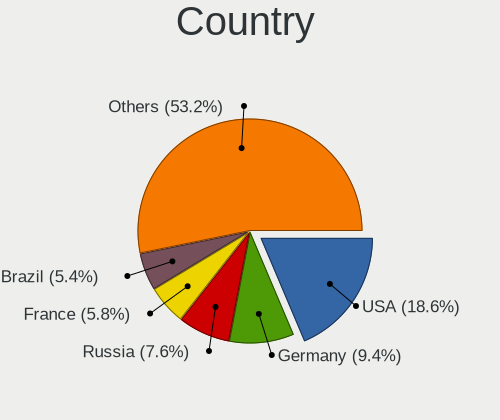
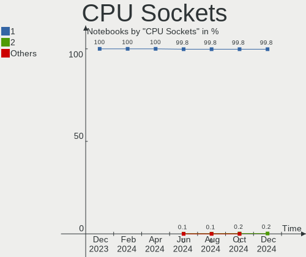
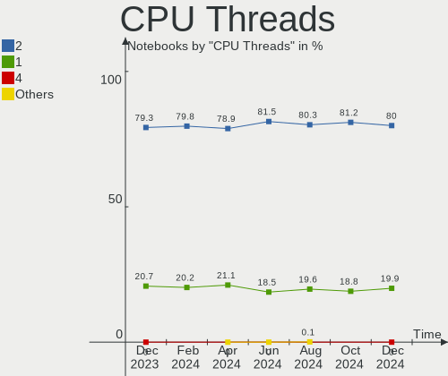
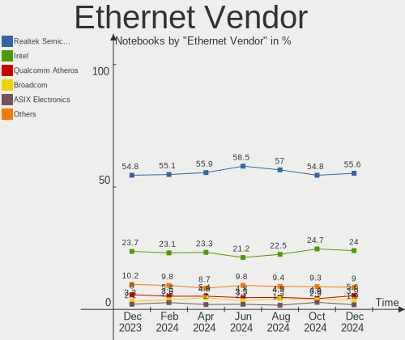

Linux - Hardware Trends (Notebooks)
-----------------------------------

A project to identify most popular hardware characteristics and track their change
over time based on data collected by Linux users at https://Linux-Hardware.org.

Anyone can contribute to this report by the [hw-probe](https://github.com/linuxhw/hw-probe) tool:

    sudo -E hw-probe -all -upload

This report is for one last month. Overall report since the beginning of time: [TestCoverage](https://github.com/linuxhw/TestCoverage)

Period: Jun, 2022.

Contents
--------

* [ System ](#system)
  - [ OS                       ](#os)
  - [ OS Family                ](#os-family)
  - [ Kernel                   ](#kernel)
  - [ Kernel Family            ](#kernel-family)
  - [ Kernel Major Ver.        ](#kernel-major-ver)
  - [ Arch                     ](#arch)
  - [ DE                       ](#de)
  - [ Display Server           ](#display-server)
  - [ Display Manager          ](#display-manager)
  - [ OS Lang                  ](#os-lang)
  - [ Boot Mode                ](#boot-mode)
  - [ Filesystem               ](#filesystem)
  - [ Part. scheme             ](#part-scheme)
  - [ Dual Boot with Linux/BSD ](#dual-boot-with-linuxbsd)
  - [ Dual Boot (Win)          ](#dual-boot-win)

* [ Board ](#board)
  - [ Vendor                   ](#vendor)
  - [ Model                    ](#model)
  - [ Model Family             ](#model-family)
  - [ MFG Year                 ](#mfg-year)
  - [ Form Factor              ](#form-factor)
  - [ Secure Boot              ](#secure-boot)
  - [ Coreboot                 ](#coreboot)
  - [ RAM Size                 ](#ram-size)
  - [ RAM Used                 ](#ram-used)
  - [ Total Drives             ](#total-drives)
  - [ Has CD-ROM               ](#has-cd-rom)
  - [ Has Ethernet             ](#has-ethernet)
  - [ Has WiFi                 ](#has-wifi)
  - [ Has Bluetooth            ](#has-bluetooth)

* [ Location ](#location)
  - [ Country                  ](#country)
  - [ City                     ](#city)

* [ Drives ](#drives)
  - [ Drive Vendor             ](#drive-vendor)
  - [ Drive Model              ](#drive-model)
  - [ HDD Vendor               ](#hdd-vendor)
  - [ SSD Vendor               ](#ssd-vendor)
  - [ Drive Kind               ](#drive-kind)
  - [ Drive Connector          ](#drive-connector)
  - [ Drive Size               ](#drive-size)
  - [ Space Total              ](#space-total)
  - [ Space Used               ](#space-used)
  - [ Malfunc. Drives          ](#malfunc-drives)
  - [ Malfunc. Drive Vendor    ](#malfunc-drive-vendor)
  - [ Malfunc. HDD Vendor      ](#malfunc-hdd-vendor)
  - [ Malfunc. Drive Kind      ](#malfunc-drive-kind)
  - [ Failed Drives            ](#failed-drives)
  - [ Failed Drive Vendor      ](#failed-drive-vendor)
  - [ Drive Status             ](#drive-status)

* [ Storage controller ](#storage-controller)
  - [ Storage Vendor           ](#storage-vendor)
  - [ Storage Model            ](#storage-model)
  - [ Storage Kind             ](#storage-kind)

* [ Processor ](#processor)
  - [ CPU Vendor               ](#cpu-vendor)
  - [ CPU Model                ](#cpu-model)
  - [ CPU Model Family         ](#cpu-model-family)
  - [ CPU Cores                ](#cpu-cores)
  - [ CPU Sockets              ](#cpu-sockets)
  - [ CPU Threads              ](#cpu-threads)
  - [ CPU Op-Modes             ](#cpu-op-modes)
  - [ CPU Microcode            ](#cpu-microcode)
  - [ CPU Microarch            ](#cpu-microarch)

* [ Graphics ](#graphics)
  - [ GPU Vendor               ](#gpu-vendor)
  - [ GPU Model                ](#gpu-model)
  - [ GPU Combo                ](#gpu-combo)
  - [ GPU Driver               ](#gpu-driver)
  - [ GPU Memory               ](#gpu-memory)

* [ Monitor ](#monitor)
  - [ Monitor Vendor           ](#monitor-vendor)
  - [ Monitor Model            ](#monitor-model)
  - [ Monitor Resolution       ](#monitor-resolution)
  - [ Monitor Diagonal         ](#monitor-diagonal)
  - [ Monitor Width            ](#monitor-width)
  - [ Aspect Ratio             ](#aspect-ratio)
  - [ Monitor Area             ](#monitor-area)
  - [ Pixel Density            ](#pixel-density)
  - [ Multiple Monitors        ](#multiple-monitors)

* [ Network ](#network)
  - [ Net Controller Vendor    ](#net-controller-vendor)
  - [ Net Controller Model     ](#net-controller-model)
  - [ Wireless Vendor          ](#wireless-vendor)
  - [ Wireless Model           ](#wireless-model)
  - [ Ethernet Vendor          ](#ethernet-vendor)
  - [ Ethernet Model           ](#ethernet-model)
  - [ Net Controller Kind      ](#net-controller-kind)
  - [ Used Controller          ](#used-controller)
  - [ NICs                     ](#nics)
  - [ IPv6                     ](#ipv6)

* [ Bluetooth ](#bluetooth)
  - [ Bluetooth Vendor         ](#bluetooth-vendor)
  - [ Bluetooth Model          ](#bluetooth-model)

* [ Sound ](#sound)
  - [ Sound Vendor             ](#sound-vendor)
  - [ Sound Model              ](#sound-model)

* [ Memory ](#memory)
  - [ Memory Vendor            ](#memory-vendor)
  - [ Memory Model             ](#memory-model)
  - [ Memory Kind              ](#memory-kind)
  - [ Memory Form Factor       ](#memory-form-factor)
  - [ Memory Size              ](#memory-size)
  - [ Memory Speed             ](#memory-speed)

* [ Printers & scanners ](#printers--scanners)
  - [ Printer Vendor           ](#printer-vendor)
  - [ Printer Model            ](#printer-model)
  - [ Scanner Vendor           ](#scanner-vendor)
  - [ Scanner Model            ](#scanner-model)

* [ Camera ](#camera)
  - [ Camera Vendor            ](#camera-vendor)
  - [ Camera Model             ](#camera-model)

* [ Security ](#security)
  - [ Fingerprint Vendor       ](#fingerprint-vendor)
  - [ Fingerprint Model        ](#fingerprint-model)
  - [ Chipcard Vendor          ](#chipcard-vendor)
  - [ Chipcard Model           ](#chipcard-model)

* [ Unsupported ](#unsupported)
  - [ Unsupported Devices      ](#unsupported-devices)
  - [ Unsupported Device Types ](#unsupported-device-types)

System
------

OS
--

Installed operating systems

| Name                         | Notebooks | Percent |
|------------------------------|-----------|---------|
| Ubuntu 22.04                 | 301       | 13.18%  |
| Ubuntu 20.04                 | 203       | 8.89%   |
| Fedora 36                    | 186       | 8.15%   |
| Linux Mint 20.3              | 171       | 7.49%   |
| Pop!_OS 22.04                | 120       | 5.26%   |
| Debian 11                    | 119       | 5.21%   |
| ROSA 12.2                    | 118       | 5.17%   |
| OpenMandriva 4.3             | 114       | 4.99%   |
| Arch                         | 73        | 3.2%    |
| Zorin 16                     | 60        | 2.63%   |
| KDE neon 20.04               | 58        | 2.54%   |
| Kubuntu 22.04                | 38        | 1.66%   |
| Manjaro                      | 36        | 1.58%   |
| Arch Rolling                 | 36        | 1.58%   |
| ArcoLinux Rolling            | 29        | 1.27%   |
| Elementary 6.1               | 24        | 1.05%   |
| Manjaro 21.2.6               | 23        | 1.01%   |
| SteamOS 3.2                  | 21        | 0.92%   |
| LMDE 5                       | 21        | 0.92%   |
| Xubuntu 20.04                | 20        | 0.88%   |
| Kali 2022.2                  | 20        | 0.88%   |
| Manjaro 21.3.0               | 19        | 0.83%   |
| Ubuntu 18.04                 | 18        | 0.79%   |
| ROSA R11.1                   | 18        | 0.79%   |
| Fedora 35                    | 17        | 0.74%   |
| Xubuntu 22.04                | 16        | 0.7%    |
| OpenMandriva 4.2             | 16        | 0.7%    |
| Endless 4.0.6                | 16        | 0.7%    |
| Ubuntu 21.10                 | 15        | 0.66%   |
| Gentoo 2.8                   | 15        | 0.66%   |
| openSUSE Tumbleweed-XXXXXXXX | 14        | 0.61%   |
| Ubuntu MATE 22.04            | 12        | 0.53%   |
| Lubuntu 22.04                | 12        | 0.53%   |
| Debian Testing               | 12        | 0.53%   |
| BlackPanther 18.1            | 12        | 0.53%   |
| Manjaro 21.3.1               | 11        | 0.48%   |
| MX 21                        | 10        | 0.44%   |
| Linux Mint 20.2              | 9         | 0.39%   |
| Xubuntu 18.04                | 8         | 0.35%   |
| Kubuntu 11.1                 | 8         | 0.35%   |
| Kubuntu 11                   | 8         | 0.35%   |
| Parrot 5.0                   | 7         | 0.31%   |
| openSUSE Leap-15.4           | 7         | 0.31%   |
| Kubuntu 20.04                | 7         | 0.31%   |
| Garuda Linux Soaring         | 7         | 0.31%   |
| EndeavourOS Rolling          | 7         | 0.31%   |
| Ubuntu 22.10                 | 6         | 0.26%   |
| Debian 10                    | 6         | 0.26%   |
| Ubuntu 21.04                 | 5         | 0.22%   |
| Linux Mint 20.1              | 5         | 0.22%   |
| Linux Mint 19.3              | 5         | 0.22%   |
| antiX 21                     | 5         | 0.22%   |
| Zorin 15                     | 4         | 0.18%   |
| Ubuntu Budgie 22.04          | 4         | 0.18%   |
| Artix Rolling                | 4         | 0.18%   |
| Artix                        | 4         | 0.18%   |
| Alpine 3.16.0                | 4         | 0.18%   |
| Xubuntu 21.10                | 3         | 0.13%   |
| Ubuntu Budgie 21.10          | 3         | 0.13%   |
| RHEL 8                       | 3         | 0.13%   |

OS Family
---------

OS without a version

| Name              | Notebooks | Percent |
|-------------------|-----------|---------|
| Ubuntu            | 550       | 24.09%  |
| Fedora            | 205       | 8.98%   |
| Linux Mint        | 191       | 8.37%   |
| Debian            | 142       | 6.22%   |
| ROSA              | 137       | 6%      |
| OpenMandriva      | 134       | 5.87%   |
| Pop!_OS           | 123       | 5.39%   |
| Arch              | 109       | 4.77%   |
| Manjaro           | 89        | 3.9%    |
| Kubuntu           | 66        | 2.89%   |
| Zorin             | 64        | 2.8%    |
| KDE neon          | 58        | 2.54%   |
| Xubuntu           | 49        | 2.15%   |
| ArcoLinux         | 29        | 1.27%   |
| Elementary        | 27        | 1.18%   |
| Endless           | 26        | 1.14%   |
| SteamOS           | 25        | 1.1%    |
| openSUSE          | 22        | 0.96%   |
| Kali              | 22        | 0.96%   |
| LMDE              | 21        | 0.92%   |
| Lubuntu           | 18        | 0.79%   |
| Gentoo            | 18        | 0.79%   |
| Ubuntu MATE       | 14        | 0.61%   |
| BlackPanther      | 12        | 0.53%   |
| MX                | 10        | 0.44%   |
| EndeavourOS       | 10        | 0.44%   |
| Ubuntu Budgie     | 9         | 0.39%   |
| Garuda Linux      | 9         | 0.39%   |
| Parrot            | 8         | 0.35%   |
| Artix             | 8         | 0.35%   |
| Clear Linux       | 7         | 0.31%   |
| CentOS            | 5         | 0.22%   |
| antiX             | 5         | 0.22%   |
| RHEL              | 4         | 0.18%   |
| NixOS             | 4         | 0.18%   |
| LinuxFX           | 4         | 0.18%   |
| Alpine            | 4         | 0.18%   |
| Red OS            | 3         | 0.13%   |
| Q4OS              | 3         | 0.13%   |
| Guix              | 3         | 0.13%   |
| Devuan            | 3         | 0.13%   |
| AlmaLinux         | 3         | 0.13%   |
| Rocky Linux       | 2         | 0.09%   |
| PCLinuxOS         | 2         | 0.09%   |
| Oracle Linux      | 2         | 0.09%   |
| Linux Lite        | 2         | 0.09%   |
| Lilidog           | 2         | 0.09%   |
| ALT Linux         | 2         | 0.09%   |
| Xero              | 1         | 0.04%   |
| Void Linux        | 1         | 0.04%   |
| Ultramarine Linux | 1         | 0.04%   |
| Ubuntu Studio     | 1         | 0.04%   |
| Sparky            | 1         | 0.04%   |
| Solus             | 1         | 0.04%   |
| PureOS            | 1         | 0.04%   |
| Peppermint        | 1         | 0.04%   |
| org.kde.Platform  | 1         | 0.04%   |
| Openeuler         | 1         | 0.04%   |
| Mageia            | 1         | 0.04%   |
| Huayra            | 1         | 0.04%   |

Kernel
------

Version of the Linux kernel

| Version                                      | Notebooks | Percent |
|----------------------------------------------|-----------|---------|
| 5.13.0-51-generic                            | 122       | 5.34%   |
| 5.17.5-76051705-generic                      | 112       | 4.91%   |
| 5.13.0-44-generic                            | 102       | 4.47%   |
| 5.16.7-desktop-1omv4003                      | 100       | 4.38%   |
| 5.13.0-48-generic                            | 82        | 3.59%   |
| 5.10.74-generic-2rosa2021.1-x86_64           | 80        | 3.5%    |
| 5.15.0-40-generic                            | 79        | 3.46%   |
| 5.15.0-39-generic                            | 75        | 3.29%   |
| 5.15.0-37-generic                            | 69        | 3.02%   |
| 5.15.0-33-generic                            | 62        | 2.72%   |
| 5.15.0-35-generic                            | 59        | 2.58%   |
| 5.4.0-117-generic                            | 51        | 2.23%   |
| 5.4.0-113-generic                            | 51        | 2.23%   |
| 5.10.0-14-amd64                              | 42        | 1.84%   |
| 5.4.0-120-generic                            | 41        | 1.8%    |
| 5.10.0-15-amd64                              | 41        | 1.8%    |
| 5.18.5-200.fc36.x86_64                       | 38        | 1.66%   |
| 5.17.13-300.fc36.x86_64                      | 36        | 1.58%   |
| 5.4.0-121-generic                            | 35        | 1.53%   |
| 5.10.0-7-amd64                               | 29        | 1.27%   |
| 5.15.0-25-generic                            | 28        | 1.23%   |
| 5.17.12-300.fc36.x86_64                      | 27        | 1.18%   |
| 5.17.11-300.fc36.x86_64                      | 26        | 1.14%   |
| 5.18.6-200.fc36.x86_64                       | 25        | 1.1%    |
| 5.4.0-91-generic                             | 23        | 1.01%   |
| 5.18.1-arch1-1                               | 23        | 1.01%   |
| 5.18.3-arch1-1                               | 22        | 0.96%   |
| 5.10.118-generic-2rosa2021.1-x86_64          | 22        | 0.96%   |
| 5.13.0-valve15-1-neptune-02197-gf6ec7ad3762a | 21        | 0.92%   |
| 5.15.41-1-MANJARO                            | 20        | 0.88%   |
| 5.11.0-35-generic                            | 20        | 0.88%   |
| 5.17.5-300.fc36.x86_64                       | 15        | 0.66%   |
| 5.10.14-desktop-1omv4002                     | 15        | 0.66%   |
| 5.18.6-arch1-1                               | 14        | 0.61%   |
| 5.18.5-arch1-1                               | 14        | 0.61%   |
| 5.10.0-13-amd64                              | 13        | 0.57%   |
| 5.16.0-kali7-amd64                           | 11        | 0.48%   |
| 5.13.0-40-generic                            | 11        | 0.48%   |
| 5.18.2-arch1-1                               | 10        | 0.44%   |
| 5.16.13-desktop-1omv4003                     | 10        | 0.44%   |
| 5.15.48-1-MANJARO                            | 10        | 0.44%   |
| 5.18.5-1-MANJARO                             | 9         | 0.39%   |
| 5.18.3-zen1-1-zen                            | 9         | 0.39%   |
| 5.13.0-41-generic                            | 9         | 0.39%   |
| 5.18.7-arch1-1                               | 8         | 0.35%   |
| 5.17.15-76051715-generic                     | 8         | 0.35%   |
| 5.17.0-kali3-amd64                           | 8         | 0.35%   |
| 5.15.49-1-MANJARO                            | 8         | 0.35%   |
| 5.4.83-generic-2rosa-x86_64                  | 7         | 0.31%   |
| 5.14.21-150400.22-default                    | 7         | 0.31%   |
| 5.14.0-1042-oem                              | 7         | 0.31%   |
| 5.13.0-52-generic                            | 7         | 0.31%   |
| 4.18.16-desktop-1bP                          | 7         | 0.31%   |
| 5.4.0-109-generic                            | 6         | 0.26%   |
| 5.18.0-2-amd64                               | 6         | 0.26%   |
| 5.16.0-12parrot1-amd64                       | 6         | 0.26%   |
| 5.15.46-1-MANJARO                            | 6         | 0.26%   |
| 5.15.0-27-generic                            | 6         | 0.26%   |
| 5.14.0-1038-oem                              | 6         | 0.26%   |
| 5.6.14-desktop-2bP                           | 5         | 0.22%   |

Kernel Family
-------------

Linux kernel without a distro release

| Version  | Notebooks | Percent |
|----------|-----------|---------|
| 5.15.0   | 391       | 17.13%  |
| 5.13.0   | 378       | 16.56%  |
| 5.4.0    | 230       | 10.07%  |
| 5.10.0   | 141       | 6.18%   |
| 5.17.5   | 130       | 5.69%   |
| 5.16.7   | 100       | 4.38%   |
| 5.10.74  | 84        | 3.68%   |
| 5.18.5   | 76        | 3.33%   |
| 5.18.6   | 53        | 2.32%   |
| 5.18.1   | 44        | 1.93%   |
| 5.18.3   | 41        | 1.8%    |
| 5.11.0   | 39        | 1.71%   |
| 5.17.13  | 38        | 1.66%   |
| 5.17.11  | 35        | 1.53%   |
| 5.17.12  | 33        | 1.45%   |
| 5.18.0   | 29        | 1.27%   |
| 5.16.0   | 25        | 1.1%    |
| 5.15.41  | 25        | 1.1%    |
| 5.10.118 | 25        | 1.1%    |
| 5.18.2   | 23        | 1.01%   |
| 5.14.0   | 21        | 0.92%   |
| 4.15.0   | 21        | 0.92%   |
| 5.17.0   | 18        | 0.79%   |
| 5.18.7   | 16        | 0.7%    |
| 5.15.48  | 15        | 0.66%   |
| 5.10.14  | 15        | 0.66%   |
| 5.18.4   | 14        | 0.61%   |
| 5.16.13  | 14        | 0.61%   |
| 5.17.9   | 12        | 0.53%   |
| 5.17.15  | 11        | 0.48%   |
| 5.15.49  | 11        | 0.48%   |
| 5.15.46  | 11        | 0.48%   |
| 5.4.83   | 10        | 0.44%   |
| 5.15.32  | 9         | 0.39%   |
| 5.15.43  | 8         | 0.35%   |
| 5.17.14  | 7         | 0.31%   |
| 5.14.21  | 7         | 0.31%   |
| 4.18.16  | 7         | 0.31%   |
| 4.18.0   | 6         | 0.26%   |
| 5.8.0    | 5         | 0.22%   |
| 5.6.14   | 5         | 0.22%   |
| 5.17.1   | 5         | 0.22%   |
| 5.19.0   | 4         | 0.18%   |
| 5.17.7   | 4         | 0.18%   |
| 5.15.45  | 4         | 0.18%   |
| 4.9.0    | 4         | 0.18%   |
| 4.19.0   | 4         | 0.18%   |
| 5.18.8   | 3         | 0.13%   |
| 5.17.4   | 3         | 0.13%   |
| 5.16.20  | 3         | 0.13%   |
| 5.15.50  | 3         | 0.13%   |
| 5.15.44  | 3         | 0.13%   |
| 5.15.35  | 3         | 0.13%   |
| 5.14.7   | 3         | 0.13%   |
| 3.10.0   | 3         | 0.13%   |
| 5.4.32   | 2         | 0.09%   |
| 5.3.0    | 2         | 0.09%   |
| 5.17.8   | 2         | 0.09%   |
| 5.17.6   | 2         | 0.09%   |
| 5.16.9   | 2         | 0.09%   |

Kernel Major Ver.
-----------------

Linux kernel major version

| Version | Notebooks | Percent |
|---------|-----------|---------|
| 5.15    | 489       | 21.42%  |
| 5.13    | 379       | 16.6%   |
| 5.17    | 300       | 13.14%  |
| 5.18    | 299       | 13.1%   |
| 5.10    | 275       | 12.05%  |
| 5.4     | 244       | 10.69%  |
| 5.16    | 148       | 6.48%   |
| 5.11    | 41        | 1.8%    |
| 5.14    | 36        | 1.58%   |
| 4.15    | 21        | 0.92%   |
| 4.18    | 13        | 0.57%   |
| 5.6     | 6         | 0.26%   |
| 4.9     | 6         | 0.26%   |
| 5.8     | 5         | 0.22%   |
| 4.19    | 5         | 0.22%   |
| 5.19    | 4         | 0.18%   |
| 5.3     | 3         | 0.13%   |
| 3.10    | 3         | 0.13%   |
| 5.0     | 2         | 0.09%   |
| 5.9     | 1         | 0.04%   |
| 5.12    | 1         | 0.04%   |
| 4.1     | 1         | 0.04%   |
| 3.0     | 1         | 0.04%   |

Arch
----

OS architecture (x86_64, i586, etc.)

| Name    | Notebooks | Percent |
|---------|-----------|---------|
| x86_64  | 2242      | 98.2%   |
| i686    | 38        | 1.66%   |
| i586    | 1         | 0.04%   |
| armv7l  | 1         | 0.04%   |
| aarch64 | 1         | 0.04%   |

DE
--

Desktop Environment

| Name             | Notebooks | Percent |
|------------------|-----------|---------|
| GNOME            | 1062      | 46.52%  |
| KDE5             | 558       | 24.44%  |
| X-Cinnamon       | 172       | 7.53%   |
| XFCE             | 161       | 7.05%   |
| Unknown          | 101       | 4.42%   |
| MATE             | 54        | 2.37%   |
| LXQt             | 36        | 1.58%   |
| Pantheon         | 27        | 1.18%   |
| Cinnamon         | 16        | 0.7%    |
| Budgie           | 15        | 0.66%   |
| i3               | 13        | 0.57%   |
| KDE4             | 11        | 0.48%   |
| sway             | 9         | 0.39%   |
| Unity            | 6         | 0.26%   |
| GNOME Classic    | 6         | 0.26%   |
| awesome          | 6         | 0.26%   |
| trinity          | 4         | 0.18%   |
| LXDE             | 4         | 0.18%   |
| GNOME Flashback  | 4         | 0.18%   |
| lightdm-xsession | 3         | 0.13%   |
| qtile            | 2         | 0.09%   |
| icewm            | 2         | 0.09%   |
| Enlightenment    | 2         | 0.09%   |
| Deepin           | 2         | 0.09%   |
| bspwm            | 2         | 0.09%   |
| xmonad           | 1         | 0.04%   |
| sway-dbus        | 1         | 0.04%   |
| stumpwm          | 1         | 0.04%   |
| spectrwm         | 1         | 0.04%   |
| fly              | 1         | 0.04%   |

Display Server
--------------

X11 or Wayland

| Name    | Notebooks | Percent |
|---------|-----------|---------|
| X11     | 1570      | 68.77%  |
| Wayland | 623       | 27.29%  |
| Unknown | 62        | 2.72%   |
| Tty     | 28        | 1.23%   |

Display Manager
---------------

SDDM, LightDM, etc.

| Name    | Notebooks | Percent |
|---------|-----------|---------|
| Unknown | 755       | 33.07%  |
| GDM3    | 466       | 20.41%  |
| SDDM    | 411       | 18%     |
| LightDM | 322       | 14.1%   |
| GDM     | 301       | 13.18%  |
| KDM     | 10        | 0.44%   |
| XDM     | 3         | 0.13%   |
| TDM     | 3         | 0.13%   |
| SLiM    | 2         | 0.09%   |
| NODM    | 2         | 0.09%   |
| Ly      | 2         | 0.09%   |
| LXDM    | 2         | 0.09%   |
| GREETD  | 2         | 0.09%   |
| SLIMSKI | 1         | 0.04%   |
| FLY-DM  | 1         | 0.04%   |

OS Lang
-------

Language

| Lang    | Notebooks | Percent |
|---------|-----------|---------|
| en_US   | 978       | 42.84%  |
| ru_RU   | 242       | 10.6%   |
| de_DE   | 152       | 6.66%   |
| pt_BR   | 115       | 5.04%   |
| fr_FR   | 102       | 4.47%   |
| en_GB   | 94        | 4.12%   |
| pl_PL   | 46        | 2.01%   |
| it_IT   | 45        | 1.97%   |
| en_IN   | 44        | 1.93%   |
| es_ES   | 42        | 1.84%   |
| en_CA   | 37        | 1.62%   |
| en_AU   | 37        | 1.62%   |
| Unknown | 37        | 1.62%   |
| C       | 33        | 1.45%   |
| es_MX   | 22        | 0.96%   |
| es_AR   | 18        | 0.79%   |
| zh_CN   | 14        | 0.61%   |
| pt_PT   | 14        | 0.61%   |
| hu_HU   | 14        | 0.61%   |
| cs_CZ   | 12        | 0.53%   |
| en_ZA   | 11        | 0.48%   |
| nl_NL   | 9         | 0.39%   |
| es_CO   | 9         | 0.39%   |
| tr_TR   | 8         | 0.35%   |
| de_CH   | 8         | 0.35%   |
| de_AT   | 8         | 0.35%   |
| fr_BE   | 7         | 0.31%   |
| es_CL   | 7         | 0.31%   |
| en_IL   | 7         | 0.31%   |
| es_VE   | 6         | 0.26%   |
| es_PE   | 6         | 0.26%   |
| da_DK   | 6         | 0.26%   |
| sv_SE   | 5         | 0.22%   |
| nl_BE   | 5         | 0.22%   |
| en_IE   | 5         | 0.22%   |
| en_DK   | 5         | 0.22%   |
| ro_RO   | 4         | 0.18%   |
| es_BO   | 4         | 0.18%   |
| en_SG   | 4         | 0.18%   |
| en_NZ   | 4         | 0.18%   |
| ru_UA   | 3         | 0.13%   |
| ja_JP   | 3         | 0.13%   |
| fi_FI   | 3         | 0.13%   |
| en_DE   | 3         | 0.13%   |
| bg_BG   | 3         | 0.13%   |
| uk_UA   | 2         | 0.09%   |
| nn_NO   | 2         | 0.09%   |
| hr_HR   | 2         | 0.09%   |
| fr_CA   | 2         | 0.09%   |
| es_UY   | 2         | 0.09%   |
| en_PH   | 2         | 0.09%   |
| en_HK   | 2         | 0.09%   |
| C.UTF8  | 2         | 0.09%   |
| zh_TW   | 1         | 0.04%   |
| zh_HK   | 1         | 0.04%   |
| th_TH   | 1         | 0.04%   |
| sr_RS   | 1         | 0.04%   |
| sk_SK   | 1         | 0.04%   |
| POSIX   | 1         | 0.04%   |
| lv_LV   | 1         | 0.04%   |

Boot Mode
---------

EFI or BIOS

| Mode | Notebooks | Percent |
|------|-----------|---------|
| EFI  | 1304      | 57.12%  |
| BIOS | 979       | 42.88%  |

Filesystem
----------

Type of filesystem

| Type     | Notebooks | Percent |
|----------|-----------|---------|
| Ext4     | 1757      | 76.96%  |
| Btrfs    | 302       | 13.23%  |
| Overlay  | 169       | 7.4%    |
| Xfs      | 28        | 1.23%   |
| Zfs      | 17        | 0.74%   |
| F2fs     | 3         | 0.13%   |
| Ext3     | 2         | 0.09%   |
| Tmpfs    | 1         | 0.04%   |
| Rootfs   | 1         | 0.04%   |
| Ext2     | 1         | 0.04%   |
| Bcachefs | 1         | 0.04%   |
| Unknown  | 1         | 0.04%   |

Part. scheme
------------

Scheme of partitioning

| Type    | Notebooks | Percent |
|---------|-----------|---------|
| Unknown | 1079      | 47.26%  |
| GPT     | 974       | 42.66%  |
| MBR     | 230       | 10.07%  |

Dual Boot with Linux/BSD
------------------------

Hosting more than one Linux/BSD

| Dual boot | Notebooks | Percent |
|-----------|-----------|---------|
| No        | 2054      | 89.97%  |
| Yes       | 229       | 10.03%  |

Dual Boot (Win)
---------------

Hosting Linux and Windows

| Dual boot | Notebooks | Percent |
|-----------|-----------|---------|
| No        | 1626      | 71.22%  |
| Yes       | 657       | 28.78%  |

Board
-----

Vendor
------

Motherboard manufacturer

| Name                           | Notebooks | Percent |
|--------------------------------|-----------|---------|
| Lenovo                         | 454       | 19.89%  |
| Hewlett-Packard                | 399       | 17.48%  |
| Dell                           | 377       | 16.51%  |
| ASUSTek Computer               | 239       | 10.47%  |
| Acer                           | 198       | 8.67%   |
| Samsung Electronics            | 54        | 2.37%   |
| Apple                          | 54        | 2.37%   |
| Toshiba                        | 52        | 2.28%   |
| MSI                            | 45        | 1.97%   |
| HUAWEI                         | 35        | 1.53%   |
| Aquarius                       | 32        | 1.4%    |
| Valve                          | 23        | 1.01%   |
| Sony                           | 23        | 1.01%   |
| Google                         | 20        | 0.88%   |
| Fujitsu                        | 18        | 0.79%   |
| Positivo                       | 14        | 0.61%   |
| Unknown                        | 14        | 0.61%   |
| Alienware                      | 12        | 0.53%   |
| System76                       | 11        | 0.48%   |
| Timi                           | 9         | 0.39%   |
| Razer                          | 9         | 0.39%   |
| Packard Bell                   | 9         | 0.39%   |
| Medion                         | 9         | 0.39%   |
| GPU Company                    | 9         | 0.39%   |
| TUXEDO                         | 8         | 0.35%   |
| Notebook                       | 8         | 0.35%   |
| LG Electronics                 | 8         | 0.35%   |
| HONOR                          | 6         | 0.26%   |
| eMachines                      | 6         | 0.26%   |
| Chuwi                          | 6         | 0.26%   |
| Framework                      | 5         | 0.22%   |
| Intel                          | 4         | 0.18%   |
| Gigabyte Technology            | 4         | 0.18%   |
| Clevo                          | 4         | 0.18%   |
| Schenker                       | 3         | 0.13%   |
| Panasonic                      | 3         | 0.13%   |
| Monster                        | 3         | 0.13%   |
| Fujitsu Siemens                | 3         | 0.13%   |
| Avell High Performance         | 3         | 0.13%   |
| AMI                            | 3         | 0.13%   |
| VIT                            | 2         | 0.09%   |
| TrekStor                       | 2         | 0.09%   |
| SLIMBOOK                       | 2         | 0.09%   |
| Purism                         | 2         | 0.09%   |
| Prestigio                      | 2         | 0.09%   |
| MicroByte                      | 2         | 0.09%   |
| Matsushita Electric Industrial | 2         | 0.09%   |
| Jumper                         | 2         | 0.09%   |
| Itautec                        | 2         | 0.09%   |
| Intel Client Systems           | 2         | 0.09%   |
| ICL                            | 2         | 0.09%   |
| Haier                          | 2         | 0.09%   |
| Gateway                        | 2         | 0.09%   |
| Dynabook                       | 2         | 0.09%   |
| Compaq                         | 2         | 0.09%   |
| AZW                            | 2         | 0.09%   |
| AVITA                          | 2         | 0.09%   |
| 3Logic Group                   | 2         | 0.09%   |
| win element                    | 1         | 0.04%   |
| Thomson                        | 1         | 0.04%   |

Model
-----

Motherboard model

| Name                                | Notebooks | Percent |
|-------------------------------------|-----------|---------|
| Aquarius NS585                      | 28        | 1.23%   |
| Unknown                             | 24        | 1.05%   |
| Valve Jupiter                       | 23        | 1.01%   |
| HP Pavilion Notebook                | 9         | 0.39%   |
| HP Pavilion g6                      | 9         | 0.39%   |
| HP Pavilion dv6                     | 9         | 0.39%   |
| HP Pavilion dv7                     | 8         | 0.35%   |
| HP Pavilion 15                      | 7         | 0.31%   |
| HP Notebook                         | 7         | 0.31%   |
| HP EliteBook 8470p                  | 7         | 0.31%   |
| Dell Latitude E5430 non-vPro        | 7         | 0.31%   |
| Dell Latitude E6540                 | 6         | 0.26%   |
| Dell Latitude E6410                 | 6         | 0.26%   |
| Dell Inspiron 3451                  | 6         | 0.26%   |
| Apple MacBookPro11,1                | 6         | 0.26%   |
| Acer Nitro AN515-44                 | 6         | 0.26%   |
| Acer Aspire V3-571G                 | 6         | 0.26%   |
| Lenovo ThinkBook 15 G3 ACL 21A4     | 5         | 0.22%   |
| HP 15                               | 5         | 0.22%   |
| Framework Laptop                    | 5         | 0.22%   |
| Dell Latitude E6400                 | 5         | 0.22%   |
| Dell Latitude 3420                  | 5         | 0.22%   |
| Dell Inspiron 15-3567               | 5         | 0.22%   |
| Dell G3 3500                        | 5         | 0.22%   |
| Razer Blade                         | 4         | 0.18%   |
| Lenovo ThinkBook 15 G2 ITL 20VE     | 4         | 0.18%   |
| Lenovo IdeaPad Gaming 3 15ACH6 82K2 | 4         | 0.18%   |
| Lenovo IdeaPad 5 15ITL05 82FG       | 4         | 0.18%   |
| HUAWEI KLVL-WXX9                    | 4         | 0.18%   |
| HP Pavilion Laptop 15-eh1xxx        | 4         | 0.18%   |
| HP Laptop 14-fq0xxx                 | 4         | 0.18%   |
| HP ENVY dv7                         | 4         | 0.18%   |
| HP EliteBook 8460p                  | 4         | 0.18%   |
| HP EliteBook 840 G3                 | 4         | 0.18%   |
| HP EliteBook 840 G2                 | 4         | 0.18%   |
| HP EliteBook 2560p                  | 4         | 0.18%   |
| GPU Company GWTC116-2               | 4         | 0.18%   |
| Dell XPS 15 9560                    | 4         | 0.18%   |
| Dell XPS 15 9520                    | 4         | 0.18%   |
| Dell XPS 13 9310                    | 4         | 0.18%   |
| Dell Precision M6800                | 4         | 0.18%   |
| Dell Precision 5540                 | 4         | 0.18%   |
| Dell Latitude E7440                 | 4         | 0.18%   |
| Dell Latitude E6430                 | 4         | 0.18%   |
| Dell Latitude E6420                 | 4         | 0.18%   |
| Dell Latitude E5530 non-vPro        | 4         | 0.18%   |
| Dell Latitude E5470                 | 4         | 0.18%   |
| Dell Latitude D630                  | 4         | 0.18%   |
| Dell Latitude 5511                  | 4         | 0.18%   |
| Chuwi GemiBook Pro                  | 4         | 0.18%   |
| ASUS N53SV                          | 4         | 0.18%   |
| Apple MacBookPro14,1                | 4         | 0.18%   |
| Apple MacBookPro12,1                | 4         | 0.18%   |
| Apple MacBookAir7,2                 | 4         | 0.18%   |
| Acer Swift SF314-43                 | 4         | 0.18%   |
| Toshiba Satellite L775D             | 3         | 0.13%   |
| System76 Oryx Pro                   | 3         | 0.13%   |
| System76 Lemur Pro                  | 3         | 0.13%   |
| Positivo S14CT01                    | 3         | 0.13%   |
| LG 15Z970-E.BH71P1                  | 3         | 0.13%   |

Model Family
------------

Motherboard model prefix

| Name                  | Notebooks | Percent |
|-----------------------|-----------|---------|
| Lenovo ThinkPad       | 225       | 9.86%   |
| Dell Latitude         | 142       | 6.22%   |
| Acer Aspire           | 129       | 5.65%   |
| Dell Inspiron         | 115       | 5.04%   |
| Lenovo IdeaPad        | 99        | 4.34%   |
| HP Pavilion           | 93        | 4.07%   |
| HP EliteBook          | 69        | 3.02%   |
| HP Laptop             | 64        | 2.8%    |
| HP ProBook            | 57        | 2.5%    |
| Toshiba Satellite     | 47        | 2.06%   |
| ASUS VivoBook         | 47        | 2.06%   |
| Dell XPS              | 40        | 1.75%   |
| Dell Precision        | 35        | 1.53%   |
| ASUS ROG              | 34        | 1.49%   |
| Aquarius NS585        | 28        | 1.23%   |
| Dell Vostro           | 27        | 1.18%   |
| Lenovo ThinkBook      | 25        | 1.1%    |
| Unknown               | 24        | 1.05%   |
| Valve Jupiter         | 23        | 1.01%   |
| Lenovo Legion         | 22        | 0.96%   |
| Acer Swift            | 21        | 0.92%   |
| Acer Nitro            | 18        | 0.79%   |
| ASUS ZenBook          | 17        | 0.74%   |
| ASUS ASUS             | 17        | 0.74%   |
| HP OMEN               | 16        | 0.7%    |
| Fujitsu LIFEBOOK      | 15        | 0.66%   |
| HP ZBook              | 13        | 0.57%   |
| HP Compaq             | 11        | 0.48%   |
| HP 255                | 11        | 0.48%   |
| Razer Blade           | 9         | 0.39%   |
| Packard Bell EasyNote | 8         | 0.35%   |
| HP Stream             | 8         | 0.35%   |
| HP ENVY               | 8         | 0.35%   |
| HP 15                 | 8         | 0.35%   |
| ASUS TUF              | 8         | 0.35%   |
| Apple MacBookPro11    | 8         | 0.35%   |
| HP Notebook           | 7         | 0.31%   |
| HP 250                | 7         | 0.31%   |
| Acer Predator         | 7         | 0.31%   |
| Lenovo Yoga           | 6         | 0.26%   |
| Apple MacBookPro14    | 6         | 0.26%   |
| Acer TravelMate       | 6         | 0.26%   |
| Framework Laptop      | 5         | 0.22%   |
| Dell G3               | 5         | 0.22%   |
| Apple MacBookPro8     | 5         | 0.22%   |
| Apple MacBookPro5     | 5         | 0.22%   |
| MSI Bravo             | 4         | 0.18%   |
| HUAWEI KLVL-WXX9      | 4         | 0.18%   |
| GPU Company GWTC116-2 | 4         | 0.18%   |
| Chuwi GemiBook        | 4         | 0.18%   |
| ASUS N53SV            | 4         | 0.18%   |
| Aquarius NS685U       | 4         | 0.18%   |
| Apple MacBookPro12    | 4         | 0.18%   |
| Apple MacBookAir7     | 4         | 0.18%   |
| Timi RedmiBook        | 3         | 0.13%   |
| System76 Oryx         | 3         | 0.13%   |
| System76 Lemur        | 3         | 0.13%   |
| Samsung RV411         | 3         | 0.13%   |
| Samsung R530          | 3         | 0.13%   |
| Samsung 355V4C        | 3         | 0.13%   |

MFG Year
--------

Motherboard manufacture year

| Year    | Notebooks | Percent |
|---------|-----------|---------|
| 2021    | 344       | 15.07%  |
| 2020    | 307       | 13.45%  |
| 2019    | 186       | 8.15%   |
| 2012    | 161       | 7.05%   |
| 2018    | 155       | 6.79%   |
| 2011    | 137       | 6%      |
| 2017    | 136       | 5.96%   |
| 2013    | 136       | 5.96%   |
| 2014    | 122       | 5.34%   |
| 2016    | 120       | 5.26%   |
| 2022    | 100       | 4.38%   |
| 2015    | 99        | 4.34%   |
| 2010    | 97        | 4.25%   |
| 2008    | 69        | 3.02%   |
| 2009    | 60        | 2.63%   |
| 2007    | 33        | 1.45%   |
| 2006    | 14        | 0.61%   |
| 2005    | 3         | 0.13%   |
| Unknown | 3         | 0.13%   |
| 2003    | 1         | 0.04%   |

Form Factor
-----------

Physical design of the computer

| Name     | Notebooks | Percent |
|----------|-----------|---------|
| Notebook | 2283      | 100%    |

Secure Boot
-----------

Enabled or disabled

| State    | Notebooks | Percent |
|----------|-----------|---------|
| Disabled | 2050      | 89.79%  |
| Enabled  | 233       | 10.21%  |

Coreboot
--------

Have coreboot on board

| Used | Notebooks | Percent |
|------|-----------|---------|
| No   | 2250      | 98.55%  |
| Yes  | 33        | 1.45%   |

RAM Size
--------

Total RAM memory

| Size in GB  | Notebooks | Percent |
|-------------|-----------|---------|
| 4.01-8.0    | 707       | 30.97%  |
| 3.01-4.0    | 445       | 19.49%  |
| 8.01-16.0   | 397       | 17.39%  |
| 16.01-24.0  | 381       | 16.69%  |
| 32.01-64.0  | 180       | 7.88%   |
| 1.01-2.0    | 79        | 3.46%   |
| 64.01-256.0 | 35        | 1.53%   |
| 2.01-3.0    | 26        | 1.14%   |
| 24.01-32.0  | 18        | 0.79%   |
| 0.51-1.0    | 12        | 0.53%   |
| 0.01-0.5    | 2         | 0.09%   |
| Unknown     | 1         | 0.04%   |

RAM Used
--------

Used RAM memory

| Used GB    | Notebooks | Percent |
|------------|-----------|---------|
| 1.01-2.0   | 731       | 32.02%  |
| 2.01-3.0   | 580       | 25.41%  |
| 4.01-8.0   | 339       | 14.85%  |
| 3.01-4.0   | 328       | 14.37%  |
| 0.51-1.0   | 160       | 7.01%   |
| 8.01-16.0  | 107       | 4.69%   |
| 0.01-0.5   | 27        | 1.18%   |
| 16.01-24.0 | 5         | 0.22%   |
| 24.01-32.0 | 4         | 0.18%   |
| Unknown    | 2         | 0.09%   |

Total Drives
------------

Number of drives on board

| Drives | Notebooks | Percent |
|--------|-----------|---------|
| 1      | 1669      | 73.11%  |
| 2      | 528       | 23.13%  |
| 3      | 57        | 2.5%    |
| 0      | 13        | 0.57%   |
| 4      | 10        | 0.44%   |
| 5      | 4         | 0.18%   |
| 7      | 1         | 0.04%   |
| 6      | 1         | 0.04%   |

Has CD-ROM
----------

Has CD-ROM on board

| Presented | Notebooks | Percent |
|-----------|-----------|---------|
| No        | 1618      | 70.87%  |
| Yes       | 665       | 29.13%  |

Has Ethernet
------------

Has Ethernet on board

| Presented | Notebooks | Percent |
|-----------|-----------|---------|
| Yes       | 1762      | 77.18%  |
| No        | 521       | 22.82%  |

Has WiFi
--------

Has WiFi module

| Presented | Notebooks | Percent |
|-----------|-----------|---------|
| Yes       | 2245      | 98.34%  |
| No        | 38        | 1.66%   |

Has Bluetooth
-------------

Has Bluetooth module

| Presented | Notebooks | Percent |
|-----------|-----------|---------|
| Yes       | 1837      | 80.46%  |
| No        | 446       | 19.54%  |

Location
--------

Country
-------

Geographic location (country)

| Country      | Notebooks | Percent |
|--------------|-----------|---------|
| USA          | 395       | 17.3%   |
| Russia       | 243       | 10.64%  |
| Germany      | 207       | 9.07%   |
| Brazil       | 145       | 6.35%   |
| France       | 119       | 5.21%   |
| UK           | 75        | 3.29%   |
| India        | 72        | 3.15%   |
| Poland       | 71        | 3.11%   |
| Italy        | 66        | 2.89%   |
| Spain        | 50        | 2.19%   |
| Canada       | 50        | 2.19%   |
| Netherlands  | 46        | 2.01%   |
| Australia    | 43        | 1.88%   |
| Mexico       | 41        | 1.8%    |
| Hungary      | 35        | 1.53%   |
| Turkey       | 28        | 1.23%   |
| Argentina    | 28        | 1.23%   |
| Czechia      | 25        | 1.1%    |
| China        | 24        | 1.05%   |
| Indonesia    | 23        | 1.01%   |
| Sweden       | 21        | 0.92%   |
| Portugal     | 20        | 0.88%   |
| Belgium      | 20        | 0.88%   |
| Switzerland  | 19        | 0.83%   |
| Chile        | 17        | 0.74%   |
| Bulgaria     | 17        | 0.74%   |
| Belarus      | 17        | 0.74%   |
| Colombia     | 16        | 0.7%    |
| Ukraine      | 15        | 0.66%   |
| South Africa | 15        | 0.66%   |
| Austria      | 15        | 0.66%   |
| Denmark      | 14        | 0.61%   |
| Greece       | 12        | 0.53%   |
| Romania      | 11        | 0.48%   |
| Peru         | 10        | 0.44%   |
| Japan        | 10        | 0.44%   |
| Israel       | 10        | 0.44%   |
| Slovakia     | 9         | 0.39%   |
| Thailand     | 8         | 0.35%   |
| Taiwan       | 8         | 0.35%   |
| Norway       | 8         | 0.35%   |
| New Zealand  | 8         | 0.35%   |
| Ireland      | 8         | 0.35%   |
| Hong Kong    | 8         | 0.35%   |
| Finland      | 8         | 0.35%   |
| Egypt        | 8         | 0.35%   |
| Singapore    | 7         | 0.31%   |
| Kazakhstan   | 7         | 0.31%   |
| Vietnam      | 6         | 0.26%   |
| Serbia       | 6         | 0.26%   |
| Pakistan     | 6         | 0.26%   |
| Iran         | 6         | 0.26%   |
| Venezuela    | 5         | 0.22%   |
| South Korea  | 5         | 0.22%   |
| Nepal        | 5         | 0.22%   |
| Latvia       | 5         | 0.22%   |
| Ecuador      | 5         | 0.22%   |
| Croatia      | 5         | 0.22%   |
| Uzbekistan   | 4         | 0.18%   |
| Algeria      | 4         | 0.18%   |

City
----

Geographic location (city)

| City              | Notebooks | Percent |
|-------------------|-----------|---------|
| Moscow            | 49        | 2.15%   |
| Voronezh          | 32        | 1.4%    |
| St Petersburg     | 27        | 1.18%   |
| Paris             | 26        | 1.14%   |
| Berlin            | 21        | 0.92%   |
| Warsaw            | 18        | 0.79%   |
| Budapest          | 15        | 0.66%   |
| Novosibirsk       | 14        | 0.61%   |
| Prague            | 13        | 0.57%   |
| Milan             | 13        | 0.57%   |
| Vienna            | 12        | 0.53%   |
| Munich            | 12        | 0.53%   |
| Krakow            | 12        | 0.53%   |
| Sydney            | 11        | 0.48%   |
| Melbourne         | 11        | 0.48%   |
| London            | 11        | 0.48%   |
| Jakarta           | 11        | 0.48%   |
| New York          | 10        | 0.44%   |
| Minsk             | 10        | 0.44%   |
| Istanbul          | 10        | 0.44%   |
| Schagen           | 9         | 0.39%   |
| Santiago          | 9         | 0.39%   |
| Mexico City       | 9         | 0.39%   |
| Madrid            | 9         | 0.39%   |
| Yekaterinburg     | 8         | 0.35%   |
| Tel Aviv          | 8         | 0.35%   |
| Sao Paulo         | 8         | 0.35%   |
| Rome              | 8         | 0.35%   |
| Hamburg           | 8         | 0.35%   |
| Amsterdam         | 8         | 0.35%   |
| Rio de Janeiro    | 7         | 0.31%   |
| Lima              | 7         | 0.31%   |
| Krasnodar         | 7         | 0.31%   |
| Dallas            | 7         | 0.31%   |
| Buenos Aires      | 7         | 0.31%   |
| Bengaluru         | 7         | 0.31%   |
| Zurich            | 6         | 0.26%   |
| Thessaloniki      | 6         | 0.26%   |
| Singapore         | 6         | 0.26%   |
| Seattle           | 6         | 0.26%   |
| Frankfurt am Main | 6         | 0.26%   |
| Bogotá           | 6         | 0.26%   |
| Zagreb            | 5         | 0.22%   |
| Wroclaw           | 5         | 0.22%   |
| Vancouver         | 5         | 0.22%   |
| Toronto           | 5         | 0.22%   |
| Stockholm         | 5         | 0.22%   |
| Shanghai          | 5         | 0.22%   |
| Quito             | 5         | 0.22%   |
| Porto             | 5         | 0.22%   |
| Perth             | 5         | 0.22%   |
| Mumbai            | 5         | 0.22%   |
| Lisbon            | 5         | 0.22%   |
| Leipzig           | 5         | 0.22%   |
| Krasnoyarsk       | 5         | 0.22%   |
| Kolkata           | 5         | 0.22%   |
| Dublin            | 5         | 0.22%   |
| Curitiba          | 5         | 0.22%   |
| Brasília         | 5         | 0.22%   |
| Athens            | 5         | 0.22%   |

Drives
------

Drive Vendor
------------

Hard drive vendors

| Vendor                         | Notebooks | Drives | Percent |
|--------------------------------|-----------|--------|---------|
| Samsung Electronics            | 425       | 461    | 15.19%  |
| WDC                            | 318       | 332    | 11.37%  |
| Seagate                        | 257       | 271    | 9.19%   |
| Toshiba                        | 209       | 214    | 7.47%   |
| SanDisk                        | 174       | 179    | 6.22%   |
| Kingston                       | 153       | 156    | 5.47%   |
| Unknown                        | 135       | 150    | 4.83%   |
| SK hynix                       | 130       | 133    | 4.65%   |
| Hitachi                        | 84        | 84     | 3%      |
| Intel                          | 81        | 93     | 2.9%    |
| Crucial                        | 78        | 80     | 2.79%   |
| A-DATA Technology              | 73        | 73     | 2.61%   |
| HGST                           | 72        | 74     | 2.57%   |
| Micron Technology              | 60        | 60     | 2.15%   |
| KIOXIA                         | 44        | 44     | 1.57%   |
| Phison                         | 38        | 42     | 1.36%   |
| Apple                          | 28        | 36     | 1%      |
| China                          | 24        | 25     | 0.86%   |
| LITEON                         | 22        | 22     | 0.79%   |
| Unknown                        | 21        | 21     | 0.75%   |
| Fujitsu                        | 19        | 19     | 0.68%   |
| Silicon Motion                 | 14        | 14     | 0.5%    |
| PNY                            | 13        | 13     | 0.46%   |
| SSSTC                          | 12        | 12     | 0.43%   |
| SPCC                           | 12        | 12     | 0.43%   |
| Netac                          | 12        | 12     | 0.43%   |
| Intenso                        | 12        | 12     | 0.43%   |
| Transcend                      | 11        | 11     | 0.39%   |
| Solid State Storage Technology | 11        | 11     | 0.39%   |
| Patriot                        | 11        | 11     | 0.39%   |
| Gigabyte Technology            | 11        | 11     | 0.39%   |
| Apacer                         | 11        | 11     | 0.39%   |
| UMIS                           | 10        | 10     | 0.36%   |
| Team                           | 10        | 10     | 0.36%   |
| LITEONIT                       | 10        | 10     | 0.36%   |
| Goodram                        | 10        | 10     | 0.36%   |
| Micron/Crucial Technology      | 6         | 6      | 0.21%   |
| JMicron Technology             | 6         | 6      | 0.21%   |
| ADATA Technology               | 6         | 6      | 0.21%   |
| OCZ                            | 5         | 5      | 0.18%   |
| Mushkin                        | 5         | 5      | 0.18%   |
| Lite-On                        | 5         | 5      | 0.18%   |
| KingSpec                       | 5         | 5      | 0.18%   |
| KingDian                       | 5         | 5      | 0.18%   |
| FORESEE                        | 5         | 5      | 0.18%   |
| XPG                            | 4         | 5      | 0.14%   |
| KIOXIA-EXCERIA                 | 4         | 4      | 0.14%   |
| Hewlett-Packard                | 4         | 4      | 0.14%   |
| External                       | 4         | 5      | 0.14%   |
| Corsair                        | 4         | 4      | 0.14%   |
| BIWIN                          | 4         | 4      | 0.14%   |
| BHT                            | 4         | 4      | 0.14%   |
| USB3.0                         | 3         | 3      | 0.11%   |
| Union Memory                   | 3         | 3      | 0.11%   |
| Plextor                        | 3         | 3      | 0.11%   |
| O2 Micro                       | 3         | 3      | 0.11%   |
| Lexar                          | 3         | 3      | 0.11%   |
| Leven                          | 3         | 3      | 0.11%   |
| KingFast                       | 3         | 4      | 0.11%   |
| HS-SSD-C100                    | 3         | 3      | 0.11%   |

Drive Model
-----------

Hard drive models

| Model                               | Notebooks | Percent |
|-------------------------------------|-----------|---------|
| Toshiba MQ01ABD100 1TB              | 33        | 1.14%   |
| Samsung NVMe SSD Drive 512GB        | 33        | 1.14%   |
| Kingston SA400S37240G 240GB SSD     | 32        | 1.1%    |
| Seagate ST1000LM035-1RK172 1TB      | 31        | 1.07%   |
| Seagate ST1000LM024 HN-M101MBB 1TB  | 31        | 1.07%   |
| Seagate ST500LT012-1DG142 500GB     | 30        | 1.04%   |
| SanDisk NVMe SSD Drive 512GB        | 29        | 1%      |
| A-DATA SU800 512GB SSD              | 29        | 1%      |
| Toshiba MQ04ABF100 1TB              | 28        | 0.97%   |
| Samsung NVMe SSD Drive 256GB        | 25        | 0.86%   |
| Unknown                             | 21        | 0.72%   |
| HGST HTS721010A9E630 1TB            | 20        | 0.69%   |
| SK hynix NVMe SSD Drive 512GB       | 19        | 0.66%   |
| Samsung NVMe SSD Drive 1024GB       | 18        | 0.62%   |
| Intel NVMe SSD Drive 512GB          | 18        | 0.62%   |
| Toshiba MQ01ABF050 500GB            | 17        | 0.59%   |
| SanDisk NVMe SSD Drive 1TB          | 17        | 0.59%   |
| Crucial CT240BX500SSD1 240GB        | 17        | 0.59%   |
| Unknown MMC Card  32GB              | 16        | 0.55%   |
| HGST HTS541010A9E680 1TB            | 16        | 0.55%   |
| Samsung SSD 860 EVO 500GB           | 15        | 0.52%   |
| SK hynix NVMe SSD Drive 256GB       | 14        | 0.48%   |
| Samsung NVMe SSD Drive 1TB          | 14        | 0.48%   |
| Kingston NVMe SSD Drive 256GB       | 14        | 0.48%   |
| WDC WD10SPZX-21Z10T0 1TB            | 13        | 0.45%   |
| Seagate ST9500325AS 500GB           | 13        | 0.45%   |
| Samsung SSD 850 EVO 500GB           | 13        | 0.45%   |
| Kingston SA400S37120G 120GB SSD     | 13        | 0.45%   |
| Kingston NVMe SSD Drive 512GB       | 13        | 0.45%   |
| HGST HTS545050A7E680 500GB          | 13        | 0.45%   |
| SanDisk NVMe SSD Drive 256GB        | 12        | 0.41%   |
| Kingston SA400S37480G 480GB SSD     | 12        | 0.41%   |
| Crucial CT1000MX500SSD1 1TB         | 12        | 0.41%   |
| Unknown SD/MMC/MS PRO 128GB         | 11        | 0.38%   |
| Intel SSDPEKNU512GZ 512GB           | 11        | 0.38%   |
| WDC WDS240G2G0A-00JH30 240GB SSD    | 10        | 0.35%   |
| WDC WD10JPVX-22JC3T0 1TB            | 10        | 0.35%   |
| Samsung SSD 970 EVO Plus 1TB        | 10        | 0.35%   |
| Samsung SSD 860 EVO 250GB           | 10        | 0.35%   |
| Samsung SSD 850 EVO 250GB           | 10        | 0.35%   |
| Unknown MMC Card  64GB              | 9         | 0.31%   |
| Unknown DA4064  64GB                | 9         | 0.31%   |
| Seagate Expansion 1TB               | 9         | 0.31%   |
| Samsung SSD 980 1TB                 | 9         | 0.31%   |
| KIOXIA NVMe SSD Drive 256GB         | 9         | 0.31%   |
| WDC WD10SPZX-24Z10 1TB              | 8         | 0.28%   |
| Toshiba MQ01ABD075 752GB            | 8         | 0.28%   |
| SK hynix HFM001TD3JX013N 1TB        | 8         | 0.28%   |
| Seagate ST2000LM015-2E8174 2TB      | 8         | 0.28%   |
| Seagate ST2000LM007-1R8174 2TB      | 8         | 0.28%   |
| Samsung SSD 970 EVO Plus 2TB        | 8         | 0.28%   |
| Phison 311CD0512GB                  | 8         | 0.28%   |
| Micron NVMe SSD Drive 512GB         | 8         | 0.28%   |
| Intel SSDPEKNW512G8 512GB           | 8         | 0.28%   |
| WDC WD5000LPVX-22V0TT0 500GB        | 7         | 0.24%   |
| Unknown MMC Card  16GB              | 7         | 0.24%   |
| Toshiba NVMe SSD Drive 512GB        | 7         | 0.24%   |
| Seagate ST9320325AS 320GB           | 7         | 0.24%   |
| Seagate ST500LM012 HN-M500MBB 500GB | 7         | 0.24%   |
| SanDisk SSD PLUS 240GB              | 7         | 0.24%   |

HDD Vendor
----------

Hard disk drive vendors

| Vendor              | Notebooks | Drives | Percent |
|---------------------|-----------|--------|---------|
| Seagate             | 253       | 265    | 31.35%  |
| WDC                 | 196       | 198    | 24.29%  |
| Toshiba             | 151       | 151    | 18.71%  |
| Hitachi             | 84        | 84     | 10.41%  |
| HGST                | 72        | 74     | 8.92%   |
| Fujitsu             | 19        | 19     | 2.35%   |
| Unknown             | 12        | 12     | 1.49%   |
| Samsung Electronics | 10        | 10     | 1.24%   |
| JMicron Technology  | 4         | 4      | 0.5%    |
| ASMT                | 2         | 2      | 0.25%   |
| Intenso             | 1         | 1      | 0.12%   |
| Inateck             | 1         | 1      | 0.12%   |
| HGST HDN            | 1         | 1      | 0.12%   |
| Apple               | 1         | 1      | 0.12%   |

SSD Vendor
----------

Solid state drive vendors

| Vendor              | Notebooks | Drives | Percent |
|---------------------|-----------|--------|---------|
| Samsung Electronics | 171       | 176    | 19.86%  |
| SanDisk             | 92        | 94     | 10.69%  |
| Kingston            | 91        | 94     | 10.57%  |
| Crucial             | 68        | 69     | 7.9%    |
| A-DATA Technology   | 60        | 60     | 6.97%   |
| WDC                 | 44        | 45     | 5.11%   |
| Micron Technology   | 23        | 23     | 2.67%   |
| China               | 23        | 24     | 2.67%   |
| LITEON              | 20        | 20     | 2.32%   |
| Apple               | 18        | 18     | 2.09%   |
| SK hynix            | 17        | 17     | 1.97%   |
| Toshiba             | 14        | 14     | 1.63%   |
| Intel               | 12        | 12     | 1.39%   |
| Patriot             | 11        | 11     | 1.28%   |
| SPCC                | 10        | 10     | 1.16%   |
| PNY                 | 10        | 10     | 1.16%   |
| Netac               | 10        | 10     | 1.16%   |
| LITEONIT            | 10        | 10     | 1.16%   |
| Goodram             | 10        | 10     | 1.16%   |
| Apacer              | 10        | 10     | 1.16%   |
| Transcend           | 9         | 9      | 1.05%   |
| Team                | 8         | 8      | 0.93%   |
| Intenso             | 8         | 8      | 0.93%   |
| OCZ                 | 5         | 5      | 0.58%   |
| Mushkin             | 5         | 5      | 0.58%   |
| KingSpec            | 5         | 5      | 0.58%   |
| KingDian            | 5         | 5      | 0.58%   |
| Gigabyte Technology | 5         | 5      | 0.58%   |
| FORESEE             | 4         | 4      | 0.46%   |
| BIWIN               | 4         | 4      | 0.46%   |
| BHT                 | 4         | 4      | 0.46%   |
| USB3.0              | 3         | 3      | 0.35%   |
| Union Memory        | 3         | 3      | 0.35%   |
| Plextor             | 3         | 3      | 0.35%   |
| Lexar               | 3         | 3      | 0.35%   |
| KingFast            | 3         | 3      | 0.35%   |
| Hewlett-Packard     | 3         | 3      | 0.35%   |
| Corsair             | 3         | 3      | 0.35%   |
| Unknown             | 3         | 3      | 0.35%   |
| Verbatim            | 2         | 2      | 0.23%   |
| Teclast             | 2         | 2      | 0.23%   |
| S3+                 | 2         | 2      | 0.23%   |
| Phison              | 2         | 2      | 0.23%   |
| KIOXIA-EXCERIA      | 2         | 2      | 0.23%   |
| INNOVATION IT       | 2         | 2      | 0.23%   |
| HS-SSD-C100         | 2         | 2      | 0.23%   |
| Dogfish             | 2         | 2      | 0.23%   |
| XrayDisk            | 1         | 1      | 0.12%   |
| WODPOSIT            | 1         | 2      | 0.12%   |
| WDC WDS             | 1         | 1      | 0.12%   |
| WDC WDB             | 1         | 1      | 0.12%   |
| Vaseky              | 1         | 1      | 0.12%   |
| V-GeN               | 1         | 1      | 0.12%   |
| TwinMOS             | 1         | 1      | 0.12%   |
| Timetec             | 1         | 1      | 0.12%   |
| SSSTC               | 1         | 1      | 0.12%   |
| Smartbuy            | 1         | 1      | 0.12%   |
| RECADATA            | 1         | 1      | 0.12%   |
| PUSKILL             | 1         | 1      | 0.12%   |
| Pioneer             | 1         | 1      | 0.12%   |

Drive Kind
----------

HDD or SSD

| Kind    | Notebooks | Drives | Percent |
|---------|-----------|--------|---------|
| NVMe    | 902       | 1035   | 33.83%  |
| SSD     | 798       | 876    | 29.93%  |
| HDD     | 789       | 823    | 29.59%  |
| MMC     | 146       | 161    | 5.48%   |
| Unknown | 31        | 31     | 1.16%   |

Drive Connector
---------------

SATA, SAS, NVMe, etc.

| Type | Notebooks | Drives | Percent |
|------|-----------|--------|---------|
| SATA | 1420      | 1645   | 55.73%  |
| NVMe | 899       | 1027   | 35.28%  |
| MMC  | 146       | 161    | 5.73%   |
| SAS  | 83        | 93     | 3.26%   |

Drive Size
----------

Size of hard drive

| Size in TB | Notebooks | Drives | Percent |
|------------|-----------|--------|---------|
| 0.01-0.5   | 1018      | 1132   | 65.09%  |
| 0.51-1.0   | 477       | 498    | 30.5%   |
| 1.01-2.0   | 53        | 53     | 3.39%   |
| 4.01-10.0  | 10        | 10     | 0.64%   |
| 3.01-4.0   | 5         | 5      | 0.32%   |
| 10.01-20.0 | 1         | 1      | 0.06%   |

Space Total
-----------

Amount of disk space available on the file system

| Size in GB     | Notebooks | Percent |
|----------------|-----------|---------|
| 101-250        | 651       | 28.52%  |
| 251-500        | 570       | 24.97%  |
| 501-1000       | 352       | 15.42%  |
| 1-20           | 175       | 7.67%   |
| 1001-2000      | 138       | 6.04%   |
| 51-100         | 128       | 5.61%   |
| Unknown        | 103       | 4.51%   |
| 21-50          | 85        | 3.72%   |
| More than 3000 | 48        | 2.1%    |
| 2001-3000      | 33        | 1.45%   |

Space Used
----------

Amount of used disk space

| Used GB        | Notebooks | Percent |
|----------------|-----------|---------|
| 1-20           | 886       | 38.81%  |
| 21-50          | 395       | 17.3%   |
| 101-250        | 316       | 13.84%  |
| 51-100         | 268       | 11.74%  |
| 251-500        | 184       | 8.06%   |
| Unknown        | 103       | 4.51%   |
| 501-1000       | 85        | 3.72%   |
| 1001-2000      | 30        | 1.31%   |
| More than 3000 | 9         | 0.39%   |
| 2001-3000      | 7         | 0.31%   |

Malfunc. Drives
---------------

Drive models with a malfunction

| Model                               | Notebooks | Drives | Percent |
|-------------------------------------|-----------|--------|---------|
| Seagate ST1000LM024 HN-M101MBB 1TB  | 10        | 10     | 4.72%   |
| HGST HTS545050A7E680 500GB          | 6         | 6      | 2.83%   |
| Seagate ST9320325AS 320GB           | 5         | 5      | 2.36%   |
| Seagate ST500LT012-9WS142 500GB     | 5         | 5      | 2.36%   |
| Seagate ST1000LM035-1RK172 1TB      | 4         | 4      | 1.89%   |
| HGST HTS721010A9E630 1TB            | 4         | 4      | 1.89%   |
| Toshiba MQ01ABF050 500GB            | 3         | 3      | 1.42%   |
| Seagate ST9500325AS 500GB           | 3         | 3      | 1.42%   |
| Seagate ST9250315AS 250GB           | 3         | 3      | 1.42%   |
| SanDisk SSD U100 256GB              | 3         | 3      | 1.42%   |
| Hitachi HTS723232A7A364 320GB       | 3         | 3      | 1.42%   |
| Hitachi HTS547575A9E384 752GB       | 3         | 3      | 1.42%   |
| Hitachi HTS545050A7E380 500GB       | 3         | 3      | 1.42%   |
| HGST HTS545050A7E380 500GB          | 3         | 3      | 1.42%   |
| HGST HTS541010A9E680 1TB            | 3         | 3      | 1.42%   |
| Crucial M4-CT256M4SSD3 256GB        | 3         | 3      | 1.42%   |
| Toshiba MQ01ABD100 1TB              | 2         | 2      | 0.94%   |
| Toshiba MQ01ABD050 500GB            | 2         | 2      | 0.94%   |
| Toshiba MK5059GSXP 500GB            | 2         | 2      | 0.94%   |
| Toshiba MK3265GSX 320GB             | 2         | 2      | 0.94%   |
| Seagate ST9160412AS 160GB           | 2         | 2      | 0.94%   |
| Seagate ST500LM012 HN-M500MBB 500GB | 2         | 2      | 0.94%   |
| Seagate ST320LT012-9WS14C 320GB     | 2         | 2      | 0.94%   |
| Seagate ST1000LX015-1U7172 1TB      | 2         | 2      | 0.94%   |
| SanDisk SSD PLUS 480GB              | 2         | 2      | 0.94%   |
| SanDisk SD9SN8W-128G-1006 128GB SSD | 2         | 2      | 0.94%   |
| Kingston SUV400S37240G 240GB SSD    | 2         | 2      | 0.94%   |
| Hitachi HTS727550A9E364 500GB       | 2         | 2      | 0.94%   |
| Hitachi HTS725050A9A364 500GB       | 2         | 2      | 0.94%   |
| Hitachi HTS547564A9E384 640GB       | 2         | 2      | 0.94%   |
| Hitachi HTS547550A9E384 500GB       | 2         | 2      | 0.94%   |
| Hitachi HTS542512K9SA00 120GB       | 2         | 2      | 0.94%   |
| HGST HTS725050A7E630 500GB          | 2         | 2      | 0.94%   |
| WDC WDS480G2G0A-00JH30 480GB SSD    | 1         | 1      | 0.47%   |
| WDC WDS240G2G0A-00JH30 240GB SSD    | 1         | 1      | 0.47%   |
| WDC WD5000LPVX-80V0TT0 500GB        | 1         | 1      | 0.47%   |
| WDC WD5000LPVX-22V0TT0 500GB        | 1         | 1      | 0.47%   |
| WDC WD5000LPLX-00ZNTT0 500GB        | 1         | 1      | 0.47%   |
| WDC WD5000LPCX-24VHAT0 500GB        | 1         | 1      | 0.47%   |
| WDC WD5000LPCX-24C6HT0 500GB        | 1         | 1      | 0.47%   |
| WDC WD5000BPVT-80HXZT3 500GB        | 1         | 1      | 0.47%   |
| WDC WD5000BPVT-22HXZT3 500GB        | 1         | 1      | 0.47%   |
| WDC WD3200LPCX-24C6HT0 320GB        | 1         | 1      | 0.47%   |
| WDC WD3200BPVT-00JJ5T0 320GB        | 1         | 1      | 0.47%   |
| WDC WD3200BEVT-60A23T0 320GB        | 1         | 1      | 0.47%   |
| WDC WD3200BEVT-22ZCT0 320GB         | 1         | 1      | 0.47%   |
| WDC WD3200BEVT-00A0RT0 320GB        | 1         | 1      | 0.47%   |
| WDC WD3200BEKT-60V5T1 320GB         | 1         | 1      | 0.47%   |
| WDC WD2500BUCT-63TWBY0 250GB        | 1         | 1      | 0.47%   |
| WDC WD2500BEKT-60A25T1 250GB        | 1         | 1      | 0.47%   |
| WDC WD1600BEVT-60ZCT0 160GB         | 1         | 1      | 0.47%   |
| WDC WD10SPZX-24Z10T0 1TB            | 1         | 1      | 0.47%   |
| WDC WD10SPZX-08Z10 1TB              | 1         | 1      | 0.47%   |
| WDC WD10JPVX-22JC3T0 1TB            | 1         | 1      | 0.47%   |
| WDC WD10JPVT-55A1YT0 1TB            | 1         | 1      | 0.47%   |
| WDC WD10JPVT-08A1YT2 1TB            | 1         | 1      | 0.47%   |
| WDC WD10 TPVT-65HT5T0 1TB           | 1         | 1      | 0.47%   |
| Toshiba MQ04ABF100 1TB              | 1         | 1      | 0.47%   |
| Toshiba MQ01ACF050 500GB            | 1         | 1      | 0.47%   |
| Toshiba MQ01ABD075 752GB            | 1         | 1      | 0.47%   |

Malfunc. Drive Vendor
---------------------

Vendors of faulty drives

| Vendor              | Notebooks | Drives | Percent |
|---------------------|-----------|--------|---------|
| Seagate             | 50        | 51     | 23.7%   |
| Hitachi             | 36        | 36     | 17.06%  |
| Toshiba             | 25        | 25     | 11.85%  |
| WDC                 | 24        | 24     | 11.37%  |
| HGST                | 19        | 19     | 9%      |
| SanDisk             | 12        | 12     | 5.69%   |
| Samsung Electronics | 6         | 6      | 2.84%   |
| Micron Technology   | 6         | 6      | 2.84%   |
| SK hynix            | 5         | 5      | 2.37%   |
| Fujitsu             | 5         | 5      | 2.37%   |
| Crucial             | 5         | 5      | 2.37%   |
| A-DATA Technology   | 4         | 4      | 1.9%    |
| Kingston            | 3         | 3      | 1.42%   |
| Intel               | 3         | 3      | 1.42%   |
| China               | 3         | 3      | 1.42%   |
| Patriot             | 1         | 1      | 0.47%   |
| JMicron Technology  | 1         | 1      | 0.47%   |
| Apple               | 1         | 1      | 0.47%   |
| Apacer              | 1         | 1      | 0.47%   |
| AMD                 | 1         | 1      | 0.47%   |

Malfunc. HDD Vendor
-------------------

Vendors of faulty HDD drives

| Vendor              | Notebooks | Drives | Percent |
|---------------------|-----------|--------|---------|
| Seagate             | 50        | 51     | 31.65%  |
| Hitachi             | 36        | 36     | 22.78%  |
| Toshiba             | 24        | 24     | 15.19%  |
| WDC                 | 22        | 22     | 13.92%  |
| HGST                | 19        | 19     | 12.03%  |
| Fujitsu             | 5         | 5      | 3.16%   |
| Samsung Electronics | 2         | 2      | 1.27%   |

Malfunc. Drive Kind
-------------------

Kinds of faulty drives

| Kind    | Notebooks | Drives | Percent |
|---------|-----------|--------|---------|
| HDD     | 157       | 159    | 74.76%  |
| SSD     | 44        | 44     | 20.95%  |
| NVMe    | 8         | 8      | 3.81%   |
| Unknown | 1         | 1      | 0.48%   |

Failed Drives
-------------

Failed drive models

| Model                           | Notebooks | Drives | Percent |
|---------------------------------|-----------|--------|---------|
| WDC WD5000BEVT-22A0RT0 500GB    | 1         | 1      | 33.33%  |
| Seagate ST500LM000-1EJ162 500GB | 1         | 1      | 33.33%  |
| HGST HTS721010A9E630 1TB        | 1         | 1      | 33.33%  |

Failed Drive Vendor
-------------------

Failed drive vendors

| Vendor  | Notebooks | Drives | Percent |
|---------|-----------|--------|---------|
| WDC     | 1         | 1      | 33.33%  |
| Seagate | 1         | 1      | 33.33%  |
| HGST    | 1         | 1      | 33.33%  |

Drive Status
------------

Number of failed and malfunc. drives

| Status   | Notebooks | Drives | Percent |
|----------|-----------|--------|---------|
| Detected | 1184      | 1500   | 49.48%  |
| Works    | 998       | 1211   | 41.7%   |
| Malfunc  | 208       | 212    | 8.69%   |
| Failed   | 3         | 3      | 0.13%   |

Storage controller
------------------

Storage Vendor
--------------

Storage controller vendors

| Vendor                           | Notebooks | Percent |
|----------------------------------|-----------|---------|
| Intel                            | 1525      | 55.82%  |
| AMD                              | 274       | 10.03%  |
| Samsung Electronics              | 265       | 9.7%    |
| SanDisk                          | 159       | 5.82%   |
| SK hynix                         | 110       | 4.03%   |
| Kingston Technology Company      | 62        | 2.27%   |
| Toshiba America Info Systems     | 51        | 1.87%   |
| Phison Electronics               | 48        | 1.76%   |
| KIOXIA                           | 41        | 1.5%    |
| Micron Technology                | 37        | 1.35%   |
| Solid State Storage Technology   | 22        | 0.81%   |
| Silicon Motion                   | 18        | 0.66%   |
| ADATA Technology                 | 18        | 0.66%   |
| Micron/Crucial Technology        | 17        | 0.62%   |
| Nvidia                           | 15        | 0.55%   |
| Union Memory (Shenzhen)          | 11        | 0.4%    |
| Marvell Technology Group         | 9         | 0.33%   |
| Realtek Semiconductor            | 8         | 0.29%   |
| Apple                            | 8         | 0.29%   |
| Lite-On Technology               | 7         | 0.26%   |
| Unknown                          | 4         | 0.15%   |
| Shenzhen Longsys Electronics     | 4         | 0.15%   |
| Seagate Technology               | 3         | 0.11%   |
| O2 Micro                         | 3         | 0.11%   |
| MAXIO Technology (Hangzhou)      | 3         | 0.11%   |
| ASMedia Technology               | 3         | 0.11%   |
| Yangtze Memory Technologies      | 2         | 0.07%   |
| VIA Technologies                 | 1         | 0.04%   |
| Silicon Integrated Systems [SiS] | 1         | 0.04%   |
| Silicon Image                    | 1         | 0.04%   |
| Lenovo                           | 1         | 0.04%   |
| JMicron Technology               | 1         | 0.04%   |

Storage Model
-------------

Storage controller models

| Model                                                                            | Notebooks | Percent |
|----------------------------------------------------------------------------------|-----------|---------|
| AMD FCH SATA Controller [AHCI mode]                                              | 236       | 8.1%    |
| Intel 7 Series Chipset Family 6-port SATA Controller [AHCI mode]                 | 175       | 6.01%   |
| Intel Sunrise Point-LP SATA Controller [AHCI mode]                               | 163       | 5.6%    |
| Intel 82801 Mobile SATA Controller [RAID mode]                                   | 121       | 4.16%   |
| Samsung NVMe SSD Controller SM981/PM981/PM983                                    | 106       | 3.64%   |
| Intel Volume Management Device NVMe RAID Controller                              | 102       | 3.5%    |
| Intel 6 Series/C200 Series Chipset Family 6 port Mobile SATA AHCI Controller     | 96        | 3.3%    |
| Samsung NVMe SSD Controller 980                                                  | 91        | 3.13%   |
| Intel 8 Series SATA Controller 1 [AHCI mode]                                     | 74        | 2.54%   |
| Intel 82801IBM/IEM (ICH9M/ICH9M-E) 4 port SATA Controller [AHCI mode]            | 65        | 2.23%   |
| Intel Wildcat Point-LP SATA Controller [AHCI Mode]                               | 59        | 2.03%   |
| Intel 8 Series/C220 Series Chipset Family 6-port SATA Controller 1 [AHCI mode]   | 58        | 1.99%   |
| SK hynix Gold P31 SSD                                                            | 54        | 1.85%   |
| Intel Tiger Lake-LP SATA Controller [AHCI mode]                                  | 51        | 1.75%   |
| Intel Cannon Lake Mobile PCH SATA AHCI Controller                                | 47        | 1.61%   |
| Intel Celeron/Pentium Silver Processor SATA Controller                           | 46        | 1.58%   |
| SanDisk WD Black SN750 / PC SN730 NVMe SSD                                       | 45        | 1.55%   |
| SanDisk WD Blue SN550 NVMe SSD                                                   | 42        | 1.44%   |
| Samsung NVMe SSD Controller PM9A1/PM9A3/980PRO                                   | 40        | 1.37%   |
| KIOXIA Non-Volatile memory controller                                            | 39        | 1.34%   |
| Intel 82801HM/HEM (ICH8M/ICH8M-E) IDE Controller                                 | 38        | 1.3%    |
| Intel 5 Series/3400 Series Chipset 4 port SATA AHCI Controller                   | 38        | 1.3%    |
| Micron Non-Volatile memory controller                                            | 37        | 1.27%   |
| Intel Atom Processor E3800 Series SATA AHCI Controller                           | 35        | 1.2%    |
| Intel HM170/QM170 Chipset SATA Controller [AHCI Mode]                            | 33        | 1.13%   |
| Intel Comet Lake SATA AHCI Controller                                            | 33        | 1.13%   |
| SanDisk Non-Volatile memory controller                                           | 32        | 1.1%    |
| Intel 400 Series Chipset Family SATA AHCI Controller                             | 32        | 1.1%    |
| Intel 5 Series/3400 Series Chipset 6 port SATA AHCI Controller                   | 31        | 1.06%   |
| Intel Non-Volatile memory controller                                             | 30        | 1.03%   |
| Intel 82801HM/HEM (ICH8M/ICH8M-E) SATA Controller [AHCI mode]                    | 30        | 1.03%   |
| Intel Celeron N3350/Pentium N4200/Atom E3900 Series SATA AHCI Controller         | 29        | 1%      |
| Intel Cannon Lake PCH SATA AHCI Controller                                       | 28        | 0.96%   |
| Kingston Company OM3PDP3 NVMe SSD                                                | 27        | 0.93%   |
| Intel Cannon Point-LP SATA Controller [AHCI Mode]                                | 27        | 0.93%   |
| AMD SB7x0/SB8x0/SB9x0 SATA Controller [AHCI mode]                                | 26        | 0.89%   |
| Phison PS5013 E13 NVMe Controller                                                | 24        | 0.82%   |
| Solid State Storage Non-Volatile memory controller                               | 22        | 0.76%   |
| Intel SSD 660P Series                                                            | 22        | 0.76%   |
| Intel Ice Lake-LP SATA Controller [AHCI mode]                                    | 22        | 0.76%   |
| Toshiba America Info Systems XG6 NVMe SSD Controller                             | 20        | 0.69%   |
| Samsung NVMe SSD Controller SM961/PM961/SM963                                    | 20        | 0.69%   |
| Intel Q170/Q150/B150/H170/H110/Z170/CM236 Chipset SATA Controller [AHCI Mode]    | 19        | 0.65%   |
| SK hynix Non-Volatile memory controller                                          | 18        | 0.62%   |
| Kingston Company Company Non-Volatile memory controller                          | 18        | 0.62%   |
| Phison E12 NVMe Controller                                                       | 17        | 0.58%   |
| SK hynix BC511                                                                   | 16        | 0.55%   |
| Silicon Motion SM2263EN/SM2263XT SSD Controller                                  | 16        | 0.55%   |
| SanDisk WD Blue SN500 / PC SN520 NVMe SSD                                        | 16        | 0.55%   |
| SK hynix BC501 NVMe Solid State Drive                                            | 15        | 0.52%   |
| Intel Atom/Celeron/Pentium Processor x5-E8000/J3xxx/N3xxx Series SATA Controller | 14        | 0.48%   |
| Toshiba America Info Systems Toshiba America Info Non-Volatile memory controller | 13        | 0.45%   |
| Micron/Crucial P2 NVMe PCIe SSD                                                  | 12        | 0.41%   |
| Intel SSD Pro 7600p/760p/E 6100p Series                                          | 12        | 0.41%   |
| Intel NM10/ICH7 Family SATA Controller [AHCI mode]                               | 11        | 0.38%   |
| ADATA Non-Volatile memory controller                                             | 11        | 0.38%   |
| SanDisk PC SN520 NVMe SSD                                                        | 10        | 0.34%   |
| Intel 82801G (ICH7 Family) IDE Controller                                        | 10        | 0.34%   |
| Intel 500 Series Chipset Family SATA AHCI Controller                             | 10        | 0.34%   |
| Toshiba America Info Systems BG3 NVMe SSD Controller                             | 9         | 0.31%   |

Storage Kind
------------

Kind of storage controller (IDE, SATA, NVMe, SAS, ...)

| Kind | Notebooks | Percent |
|------|-----------|---------|
| SATA | 1545      | 55.3%   |
| NVMe | 899       | 32.18%  |
| RAID | 226       | 8.09%   |
| IDE  | 124       | 4.44%   |

Processor
---------

CPU Vendor
----------

Processor vendors

| Vendor       | Notebooks | Percent |
|--------------|-----------|---------|
| Intel        | 1810      | 79.28%  |
| AMD          | 469       | 20.54%  |
| Unknown      | 2         | 0.09%   |
| GenuineTMx86 | 1         | 0.04%   |
| ARM          | 1         | 0.04%   |

CPU Model
---------

Processor models

| Model                                         | Notebooks | Percent |
|-----------------------------------------------|-----------|---------|
| Intel 11th Gen Core i7-1165G7 @ 2.80GHz       | 54        | 2.37%   |
| Intel 11th Gen Core i5-1135G7 @ 2.40GHz       | 51        | 2.23%   |
| Intel Core i5-7200U CPU @ 2.50GHz             | 38        | 1.66%   |
| Intel Core i5-8250U CPU @ 1.60GHz             | 34        | 1.49%   |
| AMD Ryzen 7 5800H with Radeon Graphics        | 33        | 1.45%   |
| Intel Core i7-9750H CPU @ 2.60GHz             | 29        | 1.27%   |
| Intel Core i7-8550U CPU @ 1.80GHz             | 28        | 1.23%   |
| Intel Core i5-5200U CPU @ 2.20GHz             | 28        | 1.23%   |
| Intel Core i3-9100 CPU @ 3.60GHz              | 28        | 1.23%   |
| AMD Ryzen 5 5500U with Radeon Graphics        | 27        | 1.18%   |
| Intel Core i7-7700HQ CPU @ 2.80GHz            | 25        | 1.1%    |
| Intel Core i7-10750H CPU @ 2.60GHz            | 25        | 1.1%    |
| AMD Ryzen 5 3500U with Radeon Vega Mobile Gfx | 25        | 1.1%    |
| Intel Core i5-3320M CPU @ 2.60GHz             | 24        | 1.05%   |
| Intel 11th Gen Core i7-11800H @ 2.30GHz       | 23        | 1.01%   |
| AMD Custom APU 0405                           | 23        | 1.01%   |
| Intel Celeron N4020 CPU @ 1.10GHz             | 22        | 0.96%   |
| Intel Core i5-8265U CPU @ 1.60GHz             | 21        | 0.92%   |
| Intel Core i5-6200U CPU @ 2.30GHz             | 21        | 0.92%   |
| Intel Core i5-10210U CPU @ 1.60GHz            | 21        | 0.92%   |
| Intel Core i5-2520M CPU @ 2.50GHz             | 20        | 0.88%   |
| AMD Ryzen 7 4800H with Radeon Graphics        | 20        | 0.88%   |
| Intel Core i7-8750H CPU @ 2.20GHz             | 19        | 0.83%   |
| Intel Core i5-3210M CPU @ 2.50GHz             | 18        | 0.79%   |
| Intel Core i5-1035G1 CPU @ 1.00GHz            | 18        | 0.79%   |
| Intel Core i5-6300U CPU @ 2.40GHz             | 17        | 0.74%   |
| Intel Core i5-4210U CPU @ 1.70GHz             | 17        | 0.74%   |
| Intel Core i5-4200U CPU @ 1.60GHz             | 17        | 0.74%   |
| Intel Core i7-10510U CPU @ 1.80GHz            | 16        | 0.7%    |
| Intel Celeron CPU N3350 @ 1.10GHz             | 16        | 0.7%    |
| Intel Celeron CPU N2840 @ 2.16GHz             | 16        | 0.7%    |
| AMD Ryzen 7 5700U with Radeon Graphics        | 15        | 0.66%   |
| AMD Ryzen 5 5600H with Radeon Graphics        | 15        | 0.66%   |
| Intel Core i5-3230M CPU @ 2.60GHz             | 14        | 0.61%   |
| Intel 11th Gen Core i3-1115G4 @ 3.00GHz       | 14        | 0.61%   |
| Intel Core i7-8565U CPU @ 1.80GHz             | 13        | 0.57%   |
| Intel Celeron CPU N3060 @ 1.60GHz             | 13        | 0.57%   |
| Intel Core i5-5300U CPU @ 2.30GHz             | 12        | 0.53%   |
| Intel Core i3-7020U CPU @ 2.30GHz             | 12        | 0.53%   |
| Intel Core i3-6006U CPU @ 2.00GHz             | 12        | 0.53%   |
| Intel Core i3-3110M CPU @ 2.40GHz             | 12        | 0.53%   |
| AMD Ryzen 7 PRO 4750U with Radeon Graphics    | 12        | 0.53%   |
| Intel Core i5-2450M CPU @ 2.50GHz             | 11        | 0.48%   |
| Intel Core i5-2410M CPU @ 2.30GHz             | 11        | 0.48%   |
| Intel Core i5 CPU M 560 @ 2.67GHz             | 11        | 0.48%   |
| AMD Ryzen 9 5900HX with Radeon Graphics       | 11        | 0.48%   |
| AMD Ryzen 5 4600H with Radeon Graphics        | 11        | 0.48%   |
| AMD Ryzen 5 4500U with Radeon Graphics        | 11        | 0.48%   |
| Intel Core i7-6700HQ CPU @ 2.60GHz            | 10        | 0.44%   |
| Intel Core i7-6600U CPU @ 2.60GHz             | 10        | 0.44%   |
| Intel Core i5-4300U CPU @ 1.90GHz             | 10        | 0.44%   |
| Intel Core i5-10300H CPU @ 2.50GHz            | 10        | 0.44%   |
| Intel Core i3-1005G1 CPU @ 1.20GHz            | 10        | 0.44%   |
| Intel Core i3 CPU M 350 @ 2.27GHz             | 10        | 0.44%   |
| Intel Celeron N4000 CPU @ 1.10GHz             | 10        | 0.44%   |
| Intel 12th Gen Core i7-12700H                 | 10        | 0.44%   |
| Intel 11th Gen Core i7-1185G7 @ 3.00GHz       | 10        | 0.44%   |
| Intel Core i7-7500U CPU @ 2.70GHz             | 9         | 0.39%   |
| Intel Core i7-5500U CPU @ 2.40GHz             | 9         | 0.39%   |
| Intel Core i7-4510U CPU @ 2.00GHz             | 9         | 0.39%   |

CPU Model Family
----------------

Processor model prefix

| Model                                | Notebooks | Percent |
|--------------------------------------|-----------|---------|
| Intel Core i5                        | 536       | 23.48%  |
| Intel Core i7                        | 422       | 18.48%  |
| Other                                | 261       | 11.43%  |
| Intel Core i3                        | 204       | 8.94%   |
| Intel Celeron                        | 148       | 6.48%   |
| AMD Ryzen 5                          | 114       | 4.99%   |
| AMD Ryzen 7                          | 110       | 4.82%   |
| Intel Core 2 Duo                     | 84        | 3.68%   |
| Intel Pentium                        | 55        | 2.41%   |
| Intel Atom                           | 42        | 1.84%   |
| AMD Ryzen 7 PRO                      | 26        | 1.14%   |
| AMD A6                               | 26        | 1.14%   |
| Intel Pentium Dual-Core              | 25        | 1.1%    |
| AMD Ryzen 3                          | 25        | 1.1%    |
| AMD Ryzen 9                          | 21        | 0.92%   |
| AMD A10                              | 17        | 0.74%   |
| Intel Pentium Silver                 | 16        | 0.7%    |
| AMD E2                               | 12        | 0.53%   |
| AMD E                                | 11        | 0.48%   |
| AMD A8                               | 11        | 0.48%   |
| AMD A4                               | 11        | 0.48%   |
| Intel Core i9                        | 9         | 0.39%   |
| AMD E1                               | 8         | 0.35%   |
| Intel Genuine                        | 7         | 0.31%   |
| Intel Core 2                         | 7         | 0.31%   |
| Intel Xeon                           | 6         | 0.26%   |
| Intel Pentium M                      | 6         | 0.26%   |
| Intel Pentium Dual                   | 6         | 0.26%   |
| AMD Athlon                           | 6         | 0.26%   |
| Intel Celeron Dual-Core              | 4         | 0.18%   |
| AMD Ryzen 5 PRO                      | 4         | 0.18%   |
| AMD A12                              | 4         | 0.18%   |
| AMD Turion 64 X2 Mobile              | 3         | 0.13%   |
| AMD Phenom II                        | 3         | 0.13%   |
| AMD FX                               | 3         | 0.13%   |
| AMD Athlon X2                        | 3         | 0.13%   |
| Intel Core m5                        | 2         | 0.09%   |
| Intel Core m3                        | 2         | 0.09%   |
| Intel Core M                         | 2         | 0.09%   |
| Intel Core 2 Extreme                 | 2         | 0.09%   |
| AMD C-60                             | 2         | 0.09%   |
| AMD Athlon 64 X2                     | 2         | 0.09%   |
| Intel Pentium Gold                   | 1         | 0.04%   |
| Intel Core Solo                      | 1         | 0.04%   |
| Intel Core Duo                       | 1         | 0.04%   |
| Intel Core 2 Quad                    | 1         | 0.04%   |
| ARM ARMv7                            | 1         | 0.04%   |
| AMD V140                             | 1         | 0.04%   |
| AMD V120                             | 1         | 0.04%   |
| AMD Turion X2 Ultra Dual-Core Mobile | 1         | 0.04%   |
| AMD Turion X2 Dual-Core Mobile       | 1         | 0.04%   |
| AMD Turion II Dual-Core              | 1         | 0.04%   |
| AMD Turion II                        | 1         | 0.04%   |
| AMD Sempron                          | 1         | 0.04%   |
| AMD C-50                             | 1         | 0.04%   |
| AMD Athlon II Dual-Core              | 1         | 0.04%   |
| AMD Athlon II                        | 1         | 0.04%   |

CPU Cores
---------

Number of processor cores

| Number | Notebooks | Percent |
|--------|-----------|---------|
| 2      | 1093      | 47.88%  |
| 4      | 744       | 32.59%  |
| 8      | 191       | 8.37%   |
| 6      | 179       | 7.84%   |
| 1      | 43        | 1.88%   |
| 14     | 20        | 0.88%   |
| 12     | 9         | 0.39%   |
| 10     | 3         | 0.13%   |
| 3      | 1         | 0.04%   |

CPU Sockets
-----------

Number of sockets

| Number | Notebooks | Percent |
|--------|-----------|---------|
| 1      | 2282      | 99.96%  |
| 2      | 1         | 0.04%   |

CPU Threads
-----------

Threads per core (Hyper-Threading)

| Number | Notebooks | Percent |
|--------|-----------|---------|
| 2      | 1714      | 75.08%  |
| 1      | 569       | 24.92%  |

CPU Op-Modes
------------

CPU Operation Modes (32-bit, 64-bit)

| Op mode        | Notebooks | Percent |
|----------------|-----------|---------|
| 32-bit, 64-bit | 2259      | 98.95%  |
| 32-bit         | 17        | 0.74%   |
| Unknown        | 6         | 0.26%   |
| 64-bit         | 1         | 0.04%   |

CPU Microcode
-------------

Microcode number

| Number     | Notebooks | Percent |
|------------|-----------|---------|
| Unknown    | 528       | 23.13%  |
| 0x306a9    | 136       | 5.96%   |
| 0x806c1    | 126       | 5.52%   |
| 0x206a7    | 108       | 4.73%   |
| 0x806ec    | 71        | 3.11%   |
| 0x0a50000c | 67        | 2.93%   |
| 0x806ea    | 65        | 2.85%   |
| 0x40651    | 65        | 2.85%   |
| 0x806e9    | 61        | 2.67%   |
| 0x406e3    | 60        | 2.63%   |
| 0x306d4    | 54        | 2.37%   |
| 0x306c3    | 53        | 2.32%   |
| 0x906ea    | 51        | 2.23%   |
| 0x1067a    | 49        | 2.15%   |
| 0xa0652    | 41        | 1.8%    |
| 0x20655    | 40        | 1.75%   |
| 0x08108109 | 37        | 1.62%   |
| 0x30678    | 35        | 1.53%   |
| 0x08608103 | 31        | 1.36%   |
| 0x806d1    | 30        | 1.31%   |
| 0x906eb    | 28        | 1.23%   |
| 0x08600106 | 27        | 1.18%   |
| 0x906e9    | 26        | 1.14%   |
| 0x706a8    | 26        | 1.14%   |
| 0x906a3    | 25        | 1.1%    |
| 0x706e5    | 23        | 1.01%   |
| 0x6fd      | 23        | 1.01%   |
| 0x406c4    | 23        | 1.01%   |
| 0x506c9    | 22        | 0.96%   |
| 0x10676    | 21        | 0.92%   |
| 0x08108102 | 19        | 0.83%   |
| 0x706a1    | 17        | 0.74%   |
| 0x08600103 | 17        | 0.74%   |
| 0x806eb    | 14        | 0.61%   |
| 0x506e3    | 14        | 0.61%   |
| 0x20652    | 12        | 0.53%   |
| 0x08600104 | 12        | 0.53%   |
| 0x06006705 | 12        | 0.53%   |
| 0x05000119 | 11        | 0.48%   |
| 0x406c3    | 10        | 0.44%   |
| 0x106ca    | 10        | 0.44%   |
| 0x03000027 | 10        | 0.44%   |
| 0x06001119 | 9         | 0.39%   |
| 0x906c0    | 8         | 0.35%   |
| 0x07030105 | 8         | 0.35%   |
| 0x806c2    | 7         | 0.31%   |
| 0x08200103 | 7         | 0.31%   |
| 0x106e5    | 6         | 0.26%   |
| 0x106c2    | 6         | 0.26%   |
| 0x0a50000b | 6         | 0.26%   |
| 0x0600611a | 6         | 0.26%   |
| 0x010000c8 | 6         | 0.26%   |
| 0x6fb      | 5         | 0.22%   |
| 0x08608102 | 5         | 0.22%   |
| 0x0810100b | 5         | 0.22%   |
| 0x0700010f | 5         | 0.22%   |
| 0x906ed    | 4         | 0.18%   |
| 0x6f6      | 4         | 0.18%   |
| 0x6d8      | 4         | 0.18%   |
| 0x506ca    | 4         | 0.18%   |

CPU Microarch
-------------

Microarchitecture

| Name             | Notebooks | Percent |
|------------------|-----------|---------|
| KabyLake         | 410       | 17.96%  |
| IvyBridge        | 170       | 7.45%   |
| Haswell          | 156       | 6.83%   |
| TigerLake        | 155       | 6.79%   |
| SandyBridge      | 143       | 6.26%   |
| Skylake          | 102       | 4.47%   |
| Unknown          | 99        | 4.34%   |
| Zen 3            | 95        | 4.16%   |
| Penryn           | 91        | 3.99%   |
| Silvermont       | 87        | 3.81%   |
| Westmere         | 76        | 3.33%   |
| Zen 2            | 73        | 3.2%    |
| Broadwell        | 73        | 3.2%    |
| Zen+             | 71        | 3.11%   |
| CometLake        | 68        | 2.98%   |
| Icelake          | 65        | 2.85%   |
| Goldmont plus    | 53        | 2.32%   |
| Core             | 46        | 2.01%   |
| Excavator        | 36        | 1.58%   |
| Goldmont         | 30        | 1.31%   |
| Alderlake Hybrid | 24        | 1.05%   |
| Bonnell          | 20        | 0.88%   |
| Puma             | 19        | 0.83%   |
| Bobcat           | 18        | 0.79%   |
| Zen              | 17        | 0.74%   |
| Piledriver       | 17        | 0.74%   |
| K10 Llano        | 13        | 0.57%   |
| P6               | 11        | 0.48%   |
| K10              | 9         | 0.39%   |
| Nehalem          | 8         | 0.35%   |
| Tremont          | 7         | 0.31%   |
| Jaguar           | 7         | 0.31%   |
| K8 Hammer        | 6         | 0.26%   |
| K8 & K10 hybrid  | 5         | 0.22%   |
| Steamroller      | 3         | 0.13%   |

Graphics
--------

GPU Vendor
----------

Vendors of graphics cards

| Vendor                           | Notebooks | Percent |
|----------------------------------|-----------|---------|
| Intel                            | 1663      | 57.94%  |
| Nvidia                           | 628       | 21.88%  |
| AMD                              | 578       | 20.14%  |
| Silicon Integrated Systems [SiS] | 1         | 0.03%   |

GPU Model
---------

Graphics card models

| Model                                                                                    | Notebooks | Percent |
|------------------------------------------------------------------------------------------|-----------|---------|
| Intel 3rd Gen Core processor Graphics Controller                                         | 163       | 5.52%   |
| Intel TigerLake-LP GT2 [Iris Xe Graphics]                                                | 137       | 4.64%   |
| Intel 2nd Generation Core Processor Family Integrated Graphics Controller                | 131       | 4.44%   |
| Intel Haswell-ULT Integrated Graphics Controller                                         | 88        | 2.98%   |
| AMD Cezanne                                                                              | 82        | 2.78%   |
| AMD Picasso/Raven 2 [Radeon Vega Series / Radeon Vega Mobile Series]                     | 78        | 2.64%   |
| Intel UHD Graphics 620                                                                   | 76        | 2.57%   |
| Intel HD Graphics 620                                                                    | 71        | 2.4%    |
| AMD Renoir                                                                               | 71        | 2.4%    |
| Intel Skylake GT2 [HD Graphics 520]                                                      | 69        | 2.34%   |
| Intel HD Graphics 5500                                                                   | 62        | 2.1%    |
| Intel CoffeeLake-H GT2 [UHD Graphics 630]                                                | 61        | 2.07%   |
| Intel Mobile 4 Series Chipset Integrated Graphics Controller                             | 57        | 1.93%   |
| Intel CometLake-H GT2 [UHD Graphics]                                                     | 55        | 1.86%   |
| Intel 4th Gen Core Processor Integrated Graphics Controller                              | 55        | 1.86%   |
| Intel Core Processor Integrated Graphics Controller                                      | 54        | 1.83%   |
| Intel CometLake-U GT2 [UHD Graphics]                                                     | 54        | 1.83%   |
| AMD Lucienne                                                                             | 49        | 1.66%   |
| Intel Atom Processor Z36xxx/Z37xxx Series Graphics & Display                             | 46        | 1.56%   |
| Intel WhiskeyLake-U GT2 [UHD Graphics 620]                                               | 44        | 1.49%   |
| Intel Atom/Celeron/Pentium Processor x5-E8000/J3xxx/N3xxx Integrated Graphics Controller | 41        | 1.39%   |
| Intel GeminiLake [UHD Graphics 600]                                                      | 39        | 1.32%   |
| Intel TigerLake-H GT1 [UHD Graphics]                                                     | 34        | 1.15%   |
| Nvidia GA106M [GeForce RTX 3060 Mobile / Max-Q]                                          | 33        | 1.12%   |
| Intel Iris Plus Graphics G1 (Ice Lake)                                                   | 28        | 0.95%   |
| Intel HD Graphics 630                                                                    | 28        | 0.95%   |
| Intel CoffeeLake-S GT2 [UHD Graphics 630]                                                | 28        | 0.95%   |
| Intel Alder Lake-P Integrated Graphics Controller                                        | 28        | 0.95%   |
| Intel HD Graphics 500                                                                    | 26        | 0.88%   |
| AMD VanGogh [AMD Custom GPU 0405]                                                        | 23        | 0.78%   |
| AMD Stoney [Radeon R2/R3/R4/R5 Graphics]                                                 | 22        | 0.75%   |
| Nvidia TU117M [GeForce GTX 1650 Mobile / Max-Q]                                          | 21        | 0.71%   |
| Nvidia GP108M [GeForce MX150]                                                            | 21        | 0.71%   |
| Intel Mobile GM965/GL960 Integrated Graphics Controller (secondary)                      | 21        | 0.71%   |
| Intel Mobile GM965/GL960 Integrated Graphics Controller (primary)                        | 21        | 0.71%   |
| AMD Topaz XT [Radeon R7 M260/M265 / M340/M360 / M440/M445 / 530/535 / 620/625 Mobile]    | 21        | 0.71%   |
| Intel HD Graphics 530                                                                    | 20        | 0.68%   |
| Nvidia TU117M                                                                            | 19        | 0.64%   |
| Nvidia GF117M [GeForce 610M/710M/810M/820M / GT 620M/625M/630M/720M]                     | 19        | 0.64%   |
| Nvidia GA107M [GeForce RTX 3050 Ti Mobile]                                               | 17        | 0.58%   |
| Intel Tiger Lake UHD Graphics                                                            | 17        | 0.58%   |
| Nvidia TU106M [GeForce RTX 2060 Mobile]                                                  | 16        | 0.54%   |
| Nvidia GP107M [GeForce GTX 1050 Ti Mobile]                                               | 16        | 0.54%   |
| Nvidia GA107M [GeForce RTX 3050 Mobile]                                                  | 16        | 0.54%   |
| AMD Thames [Radeon HD 7500M/7600M Series]                                                | 16        | 0.54%   |
| AMD Sun XT [Radeon HD 8670A/8670M/8690M / R5 M330 / M430 / Radeon 520 Mobile]            | 16        | 0.54%   |
| Nvidia GA104M [GeForce RTX 3070 Mobile / Max-Q]                                          | 14        | 0.47%   |
| Intel GeminiLake [UHD Graphics 605]                                                      | 14        | 0.47%   |
| AMD Wani [Radeon R5/R6/R7 Graphics]                                                      | 14        | 0.47%   |
| Nvidia TU117M [GeForce GTX 1650 Ti Mobile]                                               | 13        | 0.44%   |
| Nvidia GP107M [GeForce GTX 1050 Mobile]                                                  | 13        | 0.44%   |
| Nvidia GM108M [GeForce 940MX]                                                            | 13        | 0.44%   |
| AMD Seymour [Radeon HD 6400M/7400M Series]                                               | 12        | 0.41%   |
| Nvidia GM108M [GeForce 840M]                                                             | 11        | 0.37%   |
| Nvidia GK208M [GeForce GT 740M]                                                          | 11        | 0.37%   |
| Intel Atom Processor D4xx/D5xx/N4xx/N5xx Integrated Graphics Controller                  | 11        | 0.37%   |
| AMD Mullins [Radeon R4/R5 Graphics]                                                      | 11        | 0.37%   |
| Nvidia TU117GLM [Quadro T1000 Mobile]                                                    | 10        | 0.34%   |
| Nvidia TU116M [GeForce GTX 1660 Ti Mobile]                                               | 10        | 0.34%   |
| Nvidia GP106M [GeForce GTX 1060 Mobile]                                                  | 10        | 0.34%   |

GPU Combo
---------

Combinations of graphics cards

| Name           | Notebooks | Percent |
|----------------|-----------|---------|
| 1 x Intel      | 1137      | 49.8%   |
| Intel + Nvidia | 441       | 19.32%  |
| 1 x AMD        | 384       | 16.82%  |
| 1 x Nvidia     | 115       | 5.04%   |
| Intel + AMD    | 75        | 3.29%   |
| AMD + Nvidia   | 69        | 3.02%   |
| 2 x AMD        | 50        | 2.19%   |
| Other          | 6         | 0.26%   |
| 2 x Intel      | 3         | 0.13%   |
| 2 x Nvidia     | 2         | 0.09%   |
| 1 x SiS        | 1         | 0.04%   |

GPU Driver
----------

Free vs proprietary

| Driver      | Notebooks | Percent |
|-------------|-----------|---------|
| Free        | 1900      | 83.22%  |
| Proprietary | 310       | 13.58%  |
| Unknown     | 73        | 3.2%    |

GPU Memory
----------

Total video memory

| Size in GB | Notebooks | Percent |
|------------|-----------|---------|
| Unknown    | 1575      | 68.99%  |
| 0.01-0.5   | 271       | 11.87%  |
| 1.01-2.0   | 205       | 8.98%   |
| 0.51-1.0   | 92        | 4.03%   |
| 3.01-4.0   | 78        | 3.42%   |
| 5.01-6.0   | 28        | 1.23%   |
| 7.01-8.0   | 25        | 1.1%    |
| 2.01-3.0   | 5         | 0.22%   |
| 8.01-16.0  | 4         | 0.18%   |

Monitor
-------

Monitor Vendor
--------------

Monitor vendors

| Vendor                  | Notebooks | Percent |
|-------------------------|-----------|---------|
| AU Optronics            | 504       | 19.82%  |
| Chimei Innolux          | 358       | 14.08%  |
| BOE                     | 355       | 13.96%  |
| LG Display              | 350       | 13.76%  |
| Samsung Electronics     | 257       | 10.11%  |
| Dell                    | 64        | 2.52%   |
| Sharp                   | 63        | 2.48%   |
| Goldstar                | 59        | 2.32%   |
| Apple                   | 53        | 2.08%   |
| Chi Mei Optoelectronics | 51        | 2.01%   |
| PANDA                   | 46        | 1.81%   |
| Lenovo                  | 45        | 1.77%   |
| Hewlett-Packard         | 30        | 1.18%   |
| Philips                 | 25        | 0.98%   |
| ANX                     | 23        | 0.9%    |
| Acer                    | 21        | 0.83%   |
| AOC                     | 19        | 0.75%   |
| CSO                     | 17        | 0.67%   |
| InfoVision              | 16        | 0.63%   |
| BenQ                    | 14        | 0.55%   |
| LG Philips              | 13        | 0.51%   |
| Iiyama                  | 11        | 0.43%   |
| CPT                     | 11        | 0.43%   |
| Ancor Communications    | 10        | 0.39%   |
| Panasonic               | 8         | 0.31%   |
| ViewSonic               | 7         | 0.28%   |
| Unknown                 | 6         | 0.24%   |
| HannStar                | 6         | 0.24%   |
| TMX                     | 5         | 0.2%    |
| Sony                    | 5         | 0.2%    |
| Seiko/Epson             | 4         | 0.16%   |
| KDC                     | 3         | 0.12%   |
| JDI                     | 3         | 0.12%   |
| InnoLux Display         | 3         | 0.12%   |
| Eizo                    | 3         | 0.12%   |
| ASUSTek Computer        | 3         | 0.12%   |
| ___                     | 2         | 0.08%   |
| Vestel Elektronik       | 2         | 0.08%   |
| Toshiba                 | 2         | 0.08%   |
| SLD                     | 2         | 0.08%   |
| NEC Computers           | 2         | 0.08%   |
| MStar                   | 2         | 0.08%   |
| MSI                     | 2         | 0.08%   |
| Fujitsu Siemens         | 2         | 0.08%   |
| DENON                   | 2         | 0.08%   |
| CS_                     | 2         | 0.08%   |
| Unknown                 | 2         | 0.08%   |
| ZSC                     | 1         | 0.04%   |
| YTH                     | 1         | 0.04%   |
| Vizio                   | 1         | 0.04%   |
| Unknown (XXX)           | 1         | 0.04%   |
| TR_                     | 1         | 0.04%   |
| TM@                     | 1         | 0.04%   |
| Tianma XM               | 1         | 0.04%   |
| TCL                     | 1         | 0.04%   |
| Sunplus                 | 1         | 0.04%   |
| Sun                     | 1         | 0.04%   |
| STA                     | 1         | 0.04%   |
| Sceptre Tech            | 1         | 0.04%   |
| RTK                     | 1         | 0.04%   |

Monitor Model
-------------

Monitor models

| Model                                                                     | Notebooks | Percent |
|---------------------------------------------------------------------------|-----------|---------|
| ANX ANX7530 U ANX7539 800x1280                                            | 23        | 0.89%   |
| Samsung Electronics LCD Monitor SEC5441 1366x768 344x194mm 15.5-inch      | 19        | 0.74%   |
| AU Optronics LCD Monitor AUO38ED 1920x1080 344x193mm 15.5-inch            | 19        | 0.74%   |
| Chimei Innolux LCD Monitor CMN15F5 1920x1080 344x193mm 15.5-inch          | 17        | 0.66%   |
| Chimei Innolux LCD Monitor CMN14D4 1920x1080 309x173mm 13.9-inch          | 16        | 0.62%   |
| AU Optronics LCD Monitor AUO61ED 1920x1080 344x194mm 15.5-inch            | 15        | 0.58%   |
| AU Optronics LCD Monitor AUO21ED 1920x1080 344x193mm 15.5-inch            | 15        | 0.58%   |
| PANDA LCD Monitor NCP004D 1920x1080 344x194mm 15.5-inch                   | 14        | 0.54%   |
| AU Optronics LCD Monitor AUO22EC 1366x768 344x193mm 15.5-inch             | 14        | 0.54%   |
| Chi Mei Optoelectronics LCD Monitor CMO15A7 1366x768 344x193mm 15.5-inch  | 13        | 0.5%    |
| AU Optronics LCD Monitor AUO403D 1920x1080 309x174mm 14.0-inch            | 13        | 0.5%    |
| Chimei Innolux LCD Monitor CMN15DB 1366x768 344x193mm 15.5-inch           | 12        | 0.47%   |
| LG Display LCD Monitor LGD05E5 1920x1080 340x190mm 15.3-inch              | 11        | 0.43%   |
| LG Display LCD Monitor LGD046F 1920x1080 344x194mm 15.5-inch              | 11        | 0.43%   |
| AU Optronics LCD Monitor AUO26EC 1366x768 344x193mm 15.5-inch             | 11        | 0.43%   |
| LG Display LCD Monitor LGD02DC 1366x768 344x194mm 15.5-inch               | 10        | 0.39%   |
| Chimei Innolux LCD Monitor CMN15E7 1920x1080 344x193mm 15.5-inch          | 10        | 0.39%   |
| Chimei Innolux LCD Monitor CMN15E6 1366x768 344x193mm 15.5-inch           | 9         | 0.35%   |
| Chi Mei Optoelectronics LCD Monitor CMO1720 1920x1080 382x215mm 17.3-inch | 9         | 0.35%   |
| AU Optronics LCD Monitor AUO313C 1366x768 309x173mm 13.9-inch             | 9         | 0.35%   |
| AU Optronics LCD Monitor AUO21EC 1366x768 344x193mm 15.5-inch             | 9         | 0.35%   |
| LG Display LCD Monitor LGD02D8 1366x768 277x156mm 12.5-inch               | 8         | 0.31%   |
| Chimei Innolux LCD Monitor CMN15C4 1920x1080 344x193mm 15.5-inch          | 8         | 0.31%   |
| Chimei Innolux LCD Monitor CMN1521 1920x1080 344x193mm 15.5-inch          | 8         | 0.31%   |
| Chimei Innolux LCD Monitor CMN14C4 1366x768 309x173mm 13.9-inch           | 8         | 0.31%   |
| BOE LCD Monitor BOE0872 1920x1080 344x194mm 15.5-inch                     | 8         | 0.31%   |
| BOE LCD Monitor BOE06A5 1366x768 344x194mm 15.5-inch                      | 8         | 0.31%   |
| AU Optronics LCD Monitor AUO70EC 1366x768 344x193mm 15.5-inch             | 8         | 0.31%   |
| AU Optronics LCD Monitor AUO45EC 1366x768 344x193mm 15.5-inch             | 8         | 0.31%   |
| AU Optronics LCD Monitor AUO2E3C 1366x768 309x173mm 13.9-inch             | 8         | 0.31%   |
| AU Optronics LCD Monitor AUO203D 1920x1080 309x174mm 14.0-inch            | 8         | 0.31%   |
| BOE LCD Monitor BOE0687 1920x1080 344x193mm 15.5-inch                     | 7         | 0.27%   |
| BOE LCD Monitor BOE0629 1366x768 309x173mm 13.9-inch                      | 7         | 0.27%   |
| AU Optronics LCD Monitor AUO40EC 1366x768 344x193mm 15.5-inch             | 7         | 0.27%   |
| AU Optronics LCD Monitor AUO405C 1366x768 256x144mm 11.6-inch             | 7         | 0.27%   |
| AU Optronics LCD Monitor AUO223E 1600x900 309x174mm 14.0-inch             | 7         | 0.27%   |
| AU Optronics LCD Monitor AUO10EC 1366x768 344x193mm 15.5-inch             | 7         | 0.27%   |
| LG Display LCD Monitor LGD0521 1920x1080 309x174mm 14.0-inch              | 6         | 0.23%   |
| LG Display LCD Monitor LGD0456 1366x768 344x194mm 15.5-inch               | 6         | 0.23%   |
| Goldstar IPS FULLHD GSM5AB8 1920x1080 480x270mm 21.7-inch                 | 6         | 0.23%   |
| Chimei Innolux LCD Monitor CMN15DC 1366x768 340x190mm 15.3-inch           | 6         | 0.23%   |
| Chimei Innolux LCD Monitor CMN15B6 1366x768 344x194mm 15.5-inch           | 6         | 0.23%   |
| Chimei Innolux LCD Monitor CMN15AB 1366x768 344x194mm 15.5-inch           | 6         | 0.23%   |
| Chimei Innolux LCD Monitor CMN14D6 1366x768 309x173mm 13.9-inch           | 6         | 0.23%   |
| Chimei Innolux LCD Monitor CMN14D5 1920x1080 309x173mm 13.9-inch          | 6         | 0.23%   |
| BOE LCD Monitor BOE095F 2256x1504 285x190mm 13.5-inch                     | 6         | 0.23%   |
| BOE LCD Monitor BOE08D7 1920x1080 309x174mm 14.0-inch                     | 6         | 0.23%   |
| BOE LCD Monitor BOE0893 2160x1440 296x197mm 14.0-inch                     | 6         | 0.23%   |
| BOE LCD Monitor BOE0757 1366x768 344x194mm 15.5-inch                      | 6         | 0.23%   |
| BOE LCD Monitor BOE0747 1920x1080 344x194mm 15.5-inch                     | 6         | 0.23%   |
| BOE LCD Monitor BOE06A4 1366x768 344x194mm 15.5-inch                      | 6         | 0.23%   |
| AU Optronics LCD Monitor AUOE48D 1920x1080 344x194mm 15.5-inch            | 6         | 0.23%   |
| AU Optronics LCD Monitor AUO2E8D 1920x1080 344x194mm 15.5-inch            | 6         | 0.23%   |
| AU Optronics LCD Monitor AUO23EC 1366x768 344x193mm 15.5-inch             | 6         | 0.23%   |
| AU Optronics LCD Monitor AUO133D 1920x1080 309x173mm 13.9-inch            | 6         | 0.23%   |
| Samsung Electronics LCD Monitor SEC544B 1600x900 310x174mm 14.0-inch      | 5         | 0.19%   |
| Samsung Electronics LCD Monitor SEC3651 1366x768 344x194mm 15.5-inch      | 5         | 0.19%   |
| Samsung Electronics LCD Monitor SEC324A 1366x768 344x194mm 15.5-inch      | 5         | 0.19%   |
| PANDA LCD Monitor NCP002D 1920x1080 344x194mm 15.5-inch                   | 5         | 0.19%   |
| LG Display LCD Monitor LGD062E 1920x1080 344x194mm 15.5-inch              | 5         | 0.19%   |

Monitor Resolution
------------------

Monitor screen resolution

| Resolution         | Notebooks | Percent |
|--------------------|-----------|---------|
| 1920x1080 (FHD)    | 1041      | 43.07%  |
| 1366x768 (WXGA)    | 716       | 29.62%  |
| 1600x900 (HD+)     | 109       | 4.51%   |
| 3840x2160 (4K)     | 94        | 3.89%   |
| 2560x1440 (QHD)    | 68        | 2.81%   |
| 1280x800 (WXGA)    | 60        | 2.48%   |
| 1440x900 (WXGA+)   | 56        | 2.32%   |
| 1920x1200 (WUXGA)  | 39        | 1.61%   |
| 2560x1600          | 25        | 1.03%   |
| 800x1280           | 23        | 0.95%   |
| 2880x1800          | 23        | 0.95%   |
| 1680x1050 (WSXGA+) | 17        | 0.7%    |
| 2160x1440          | 15        | 0.62%   |
| 3840x2400          | 14        | 0.58%   |
| 3440x1440          | 13        | 0.54%   |
| 2560x1080          | 13        | 0.54%   |
| 1280x1024 (SXGA)   | 12        | 0.5%    |
| 1024x600           | 12        | 0.5%    |
| 3840x1080          | 6         | 0.25%   |
| 2256x1504          | 6         | 0.25%   |
| 3456x2160          | 5         | 0.21%   |
| 1360x768           | 4         | 0.17%   |
| 1280x720 (HD)      | 4         | 0.17%   |
| 3200x1800 (QHD+)   | 3         | 0.12%   |
| 3000x2000          | 3         | 0.12%   |
| 2288x1287          | 3         | 0.12%   |
| 2240x1400          | 3         | 0.12%   |
| 1920x540           | 3         | 0.12%   |
| 1400x1050          | 3         | 0.12%   |
| 1024x768 (XGA)     | 3         | 0.12%   |
| Unknown            | 3         | 0.12%   |
| 3840x1600          | 2         | 0.08%   |
| 3200x2000          | 2         | 0.08%   |
| 3072x1920          | 2         | 0.08%   |
| 2520x1680          | 2         | 0.08%   |
| 1920x1280          | 2         | 0.08%   |
| 1680x945           | 2         | 0.08%   |
| 4480x1600          | 1         | 0.04%   |
| 3286x1080          | 1         | 0.04%   |
| 2304x1440          | 1         | 0.04%   |
| 2048x1152          | 1         | 0.04%   |
| 1600x1200          | 1         | 0.04%   |
| 1366x912           | 1         | 0.04%   |

Monitor Diagonal
----------------

Diagonal size in inches

| Inches  | Notebooks | Percent |
|---------|-----------|---------|
| 15      | 1047      | 41.12%  |
| 13      | 364       | 14.3%   |
| 14      | 326       | 12.8%   |
| 17      | 182       | 7.15%   |
| 27      | 93        | 3.65%   |
| 24      | 65        | 2.55%   |
| 11      | 58        | 2.28%   |
| 12      | 55        | 2.16%   |
| 23      | 53        | 2.08%   |
| 21      | 46        | 1.81%   |
| Unknown | 41        | 1.61%   |
| 16      | 31        | 1.22%   |
| 31      | 26        | 1.02%   |
| 18      | 25        | 0.98%   |
| 34      | 23        | 0.9%    |
| 19      | 16        | 0.63%   |
| 10      | 16        | 0.63%   |
| 84      | 11        | 0.43%   |
| 54      | 10        | 0.39%   |
| 22      | 10        | 0.39%   |
| 72      | 6         | 0.24%   |
| 20      | 6         | 0.24%   |
| 48      | 4         | 0.16%   |
| 40      | 4         | 0.16%   |
| 32      | 4         | 0.16%   |
| 142     | 3         | 0.12%   |
| 26      | 3         | 0.12%   |
| 55      | 2         | 0.08%   |
| 49      | 2         | 0.08%   |
| 43      | 2         | 0.08%   |
| 37      | 2         | 0.08%   |
| 25      | 2         | 0.08%   |
| 65      | 1         | 0.04%   |
| 57      | 1         | 0.04%   |
| 52      | 1         | 0.04%   |
| 42      | 1         | 0.04%   |
| 35      | 1         | 0.04%   |
| 33      | 1         | 0.04%   |
| 29      | 1         | 0.04%   |
| 28      | 1         | 0.04%   |

Monitor Width
-------------

Physical width

| Width in mm    | Notebooks | Percent |
|----------------|-----------|---------|
| 301-350        | 1559      | 61.62%  |
| 201-300        | 296       | 11.7%   |
| 351-400        | 224       | 8.85%   |
| 501-600        | 200       | 7.91%   |
| 401-500        | 95        | 3.75%   |
| Unknown        | 41        | 1.62%   |
| 601-700        | 36        | 1.42%   |
| 701-800        | 28        | 1.11%   |
| 1001-1500      | 21        | 0.83%   |
| 1501-2000      | 17        | 0.67%   |
| 801-900        | 7         | 0.28%   |
| More than 2000 | 3         | 0.12%   |
| 901-1000       | 3         | 0.12%   |

Aspect Ratio
------------

Proportional relationship between the width and the height

| Ratio   | Notebooks | Percent |
|---------|-----------|---------|
| 16/9    | 1897      | 83.79%  |
| 16/10   | 245       | 10.82%  |
| 3/2     | 32        | 1.41%   |
| 21/9    | 26        | 1.15%   |
| 0.62    | 23        | 1.02%   |
| Unknown | 13        | 0.57%   |
| 5/4     | 12        | 0.53%   |
| 4/3     | 8         | 0.35%   |
| 32/9    | 4         | 0.18%   |
| 1.00    | 3         | 0.13%   |
| 2.65    | 1         | 0.04%   |

Monitor Area
------------

Area in inch²

| Area in inch² | Notebooks | Percent |
|----------------|-----------|---------|
| 101-110        | 1055      | 41.49%  |
| 81-90          | 564       | 22.18%  |
| 121-130        | 152       | 5.98%   |
| 201-250        | 147       | 5.78%   |
| 71-80          | 122       | 4.8%    |
| 301-350        | 95        | 3.74%   |
| 51-60          | 58        | 2.28%   |
| 351-500        | 57        | 2.24%   |
| 61-70          | 54        | 2.12%   |
| Unknown        | 41        | 1.61%   |
| More than 1000 | 37        | 1.45%   |
| 151-200        | 34        | 1.34%   |
| 131-140        | 27        | 1.06%   |
| 251-300        | 23        | 0.9%    |
| 141-150        | 23        | 0.9%    |
| 111-120        | 19        | 0.75%   |
| 41-50          | 16        | 0.63%   |
| 501-1000       | 12        | 0.47%   |
| 91-100         | 7         | 0.28%   |

Pixel Density
-------------

Pixels per inch

| Density       | Notebooks | Percent |
|---------------|-----------|---------|
| 121-160       | 1020      | 40.75%  |
| 101-120       | 768       | 30.68%  |
| 51-100        | 370       | 14.78%  |
| 161-240       | 191       | 7.63%   |
| More than 240 | 83        | 3.32%   |
| Unknown       | 41        | 1.64%   |
| 1-50          | 30        | 1.2%    |

Multiple Monitors
-----------------

Total monitors connected

| Total | Notebooks | Percent |
|-------|-----------|---------|
| 1     | 1816      | 79.54%  |
| 2     | 345       | 15.11%  |
| 0     | 80        | 3.5%    |
| 3     | 40        | 1.75%   |
| 4     | 2         | 0.09%   |

Network
-------

Net Controller Vendor
---------------------

Controller vendors

| Vendor                            | Notebooks | Percent |
|-----------------------------------|-----------|---------|
| Realtek Semiconductor             | 1253      | 34.93%  |
| Intel                             | 1169      | 32.59%  |
| Qualcomm Atheros                  | 483       | 13.47%  |
| Broadcom                          | 219       | 6.11%   |
| MediaTek                          | 79        | 2.2%    |
| Broadcom Limited                  | 60        | 1.67%   |
| Ralink                            | 46        | 1.28%   |
| Marvell Technology Group          | 34        | 0.95%   |
| Samsung Electronics               | 23        | 0.64%   |
| ASIX Electronics                  | 19        | 0.53%   |
| TP-Link                           | 18        | 0.5%    |
| Dell                              | 17        | 0.47%   |
| Ralink Technology                 | 14        | 0.39%   |
| Huawei Technologies               | 13        | 0.36%   |
| Xiaomi                            | 12        | 0.33%   |
| Lenovo                            | 12        | 0.33%   |
| Nvidia                            | 11        | 0.31%   |
| Sierra Wireless                   | 10        | 0.28%   |
| Qualcomm                          | 9         | 0.25%   |
| Google                            | 8         | 0.22%   |
| JMicron Technology                | 6         | 0.17%   |
| Hewlett-Packard                   | 6         | 0.17%   |
| DisplayLink                       | 6         | 0.17%   |
| ICS Advent                        | 5         | 0.14%   |
| Ericsson Business Mobile Networks | 5         | 0.14%   |
| Qualcomm Atheros Communications   | 4         | 0.11%   |
| Edimax Technology                 | 4         | 0.11%   |
| D-Link                            | 4         | 0.11%   |
| OPPO Electronics                  | 3         | 0.08%   |
| Motorola PCS                      | 3         | 0.08%   |
| ASUSTek Computer                  | 3         | 0.08%   |
| TRENDnet                          | 2         | 0.06%   |
| Linksys                           | 2         | 0.06%   |
| LG Electronics                    | 2         | 0.06%   |
| Fibocom                           | 2         | 0.06%   |
| D-Link System                     | 2         | 0.06%   |
| Belkin Components                 | 2         | 0.06%   |
| Apple                             | 2         | 0.06%   |
| ZTE WCDMA Technologies MSM        | 1         | 0.03%   |
| U-Blox                            | 1         | 0.03%   |
| Texas Instruments                 | 1         | 0.03%   |
| STMicroelectronics                | 1         | 0.03%   |
| Silicon Integrated Systems [SiS]  | 1         | 0.03%   |
| Sigma Designs                     | 1         | 0.03%   |
| Quectel Wireless Solutions        | 1         | 0.03%   |
| NetGear                           | 1         | 0.03%   |
| MicroPython                       | 1         | 0.03%   |
| HTC (High Tech Computer)          | 1         | 0.03%   |
| HMD Global                        | 1         | 0.03%   |
| Cypress Semiconductor             | 1         | 0.03%   |
| BUFFALO                           | 1         | 0.03%   |
| Aquantia                          | 1         | 0.03%   |
| Unknown                           | 1         | 0.03%   |

Net Controller Model
--------------------

Controller models

| Model                                                             | Notebooks | Percent |
|-------------------------------------------------------------------|-----------|---------|
| Realtek RTL8111/8168/8411 PCI Express Gigabit Ethernet Controller | 726       | 17%     |
| Realtek RTL810xE PCI Express Fast Ethernet controller             | 196       | 4.59%   |
| Intel Wi-Fi 6 AX201                                               | 115       | 2.69%   |
| Intel Wi-Fi 6 AX200                                               | 109       | 2.55%   |
| Realtek RTL8822CE 802.11ac PCIe Wireless Network Adapter          | 96        | 2.25%   |
| Qualcomm Atheros QCA9377 802.11ac Wireless Network Adapter        | 85        | 1.99%   |
| Intel 82579LM Gigabit Network Connection (Lewisville)             | 83        | 1.94%   |
| Realtek RTL8153 Gigabit Ethernet Adapter                          | 81        | 1.9%    |
| Qualcomm Atheros QCA9565 / AR9565 Wireless Network Adapter        | 79        | 1.85%   |
| Intel Wireless 7265                                               | 77        | 1.8%    |
| Realtek RTL8821CE 802.11ac PCIe Wireless Network Adapter          | 76        | 1.78%   |
| Intel Wireless 8265 / 8275                                        | 73        | 1.71%   |
| Intel Cannon Lake PCH CNVi WiFi                                   | 72        | 1.69%   |
| Qualcomm Atheros AR9485 Wireless Network Adapter                  | 71        | 1.66%   |
| MediaTek MT7921 802.11ax PCI Express Wireless Network Adapter     | 60        | 1.4%    |
| Intel Wireless 7260                                               | 60        | 1.4%    |
| Intel Comet Lake PCH CNVi WiFi                                    | 56        | 1.31%   |
| Qualcomm Atheros QCA6174 802.11ac Wireless Network Adapter        | 54        | 1.26%   |
| Intel Wireless 8260                                               | 53        | 1.24%   |
| Qualcomm Atheros AR9285 Wireless Network Adapter (PCI-Express)    | 51        | 1.19%   |
| Intel Centrino Advanced-N 6205 [Taylor Peak]                      | 51        | 1.19%   |
| Broadcom BCM4313 802.11bgn Wireless Network Adapter               | 44        | 1.03%   |
| Intel Comet Lake PCH-LP CNVi WiFi                                 | 43        | 1.01%   |
| Intel Wireless 3165                                               | 38        | 0.89%   |
| Broadcom BCM43142 802.11b/g/n                                     | 37        | 0.87%   |
| Intel Wi-Fi 6 AX210/AX211/AX411 160MHz                            | 32        | 0.75%   |
| Intel Alder Lake-P PCH CNVi WiFi                                  | 29        | 0.68%   |
| Realtek RTL8723BE PCIe Wireless Network Adapter                   | 28        | 0.66%   |
| Qualcomm Atheros AR9462 Wireless Network Adapter                  | 28        | 0.66%   |
| Intel Cannon Point-LP CNVi [Wireless-AC]                          | 28        | 0.66%   |
| Realtek RTL8852AE 802.11ax PCIe Wireless Network Adapter          | 27        | 0.63%   |
| Intel Ethernet Connection I219-LM                                 | 27        | 0.63%   |
| Realtek RTL8188CE 802.11b/g/n WiFi Adapter                        | 26        | 0.61%   |
| Intel 82577LM Gigabit Network Connection                          | 26        | 0.61%   |
| Intel Ethernet Connection (4) I219-LM                             | 25        | 0.59%   |
| Intel Centrino Ultimate-N 6300                                    | 24        | 0.56%   |
| Ralink RT3290 Wireless 802.11n 1T/1R PCIe                         | 23        | 0.54%   |
| Intel Tiger Lake PCH CNVi WiFi                                    | 23        | 0.54%   |
| Qualcomm Atheros AR8151 v2.0 Gigabit Ethernet                     | 22        | 0.52%   |
| Intel Wireless-AC 9260                                            | 21        | 0.49%   |
| Intel Ethernet Connection I218-LM                                 | 21        | 0.49%   |
| Intel Ethernet Connection I217-LM                                 | 21        | 0.49%   |
| Intel Ice Lake-LP PCH CNVi WiFi                                   | 20        | 0.47%   |
| Realtek RTL8822BE 802.11a/b/g/n/ac WiFi adapter                   | 19        | 0.44%   |
| Realtek RTL8723DE Wireless Network Adapter                        | 19        | 0.44%   |
| Intel PRO/Wireless 3945ABG [Golan] Network Connection             | 19        | 0.44%   |
| Intel Ethernet Connection (3) I218-LM                             | 19        | 0.44%   |
| Intel Centrino Advanced-N 6235                                    | 19        | 0.44%   |
| Realtek 802.11n WLAN Adapter                                      | 18        | 0.42%   |
| Intel Ethernet Connection (4) I219-V                              | 18        | 0.42%   |
| Broadcom NetLink BCM57785 Gigabit Ethernet PCIe                   | 18        | 0.42%   |
| ASIX AX88179 Gigabit Ethernet                                     | 18        | 0.42%   |
| Intel Centrino Advanced-N 6200                                    | 17        | 0.4%    |
| Realtek RTL8125 2.5GbE Controller                                 | 16        | 0.37%   |
| Realtek Killer E2600 Gigabit Ethernet Controller                  | 16        | 0.37%   |
| Qualcomm Atheros AR928X Wireless Network Adapter (PCI-Express)    | 16        | 0.37%   |
| Realtek RTL8188EE Wireless Network Adapter                        | 15        | 0.35%   |
| Qualcomm Atheros AR8152 v2.0 Fast Ethernet                        | 15        | 0.35%   |
| Intel Dual Band Wireless-AC 3168NGW [Stone Peak]                  | 15        | 0.35%   |
| Samsung Galaxy series, misc. (tethering mode)                     | 14        | 0.33%   |

Wireless Vendor
---------------

Wireless vendors

| Vendor                          | Notebooks | Percent |
|---------------------------------|-----------|---------|
| Intel                           | 1126      | 47.89%  |
| Qualcomm Atheros                | 409       | 17.4%   |
| Realtek Semiconductor           | 406       | 17.27%  |
| Broadcom                        | 165       | 7.02%   |
| MediaTek                        | 74        | 3.15%   |
| Ralink                          | 46        | 1.96%   |
| Broadcom Limited                | 41        | 1.74%   |
| TP-Link                         | 15        | 0.64%   |
| Ralink Technology               | 14        | 0.6%    |
| Dell                            | 12        | 0.51%   |
| Sierra Wireless                 | 10        | 0.43%   |
| Qualcomm                        | 5         | 0.21%   |
| Qualcomm Atheros Communications | 4         | 0.17%   |
| Edimax Technology               | 4         | 0.17%   |
| D-Link                          | 3         | 0.13%   |
| TRENDnet                        | 2         | 0.09%   |
| Linksys                         | 2         | 0.09%   |
| Hewlett-Packard                 | 2         | 0.09%   |
| Fibocom                         | 2         | 0.09%   |
| D-Link System                   | 2         | 0.09%   |
| Belkin Components               | 2         | 0.09%   |
| ASUSTek Computer                | 2         | 0.09%   |
| Quectel Wireless Solutions      | 1         | 0.04%   |
| NetGear                         | 1         | 0.04%   |
| BUFFALO                         | 1         | 0.04%   |

Wireless Model
--------------

Wireless models

| Model                                                                   | Notebooks | Percent |
|-------------------------------------------------------------------------|-----------|---------|
| Intel Wi-Fi 6 AX201                                                     | 115       | 4.85%   |
| Intel Wi-Fi 6 AX200                                                     | 109       | 4.6%    |
| Realtek RTL8822CE 802.11ac PCIe Wireless Network Adapter                | 96        | 4.05%   |
| Qualcomm Atheros QCA9377 802.11ac Wireless Network Adapter              | 85        | 3.59%   |
| Qualcomm Atheros QCA9565 / AR9565 Wireless Network Adapter              | 79        | 3.33%   |
| Intel Wireless 7265                                                     | 77        | 3.25%   |
| Realtek RTL8821CE 802.11ac PCIe Wireless Network Adapter                | 76        | 3.21%   |
| Intel Wireless 8265 / 8275                                              | 73        | 3.08%   |
| Intel Cannon Lake PCH CNVi WiFi                                         | 72        | 3.04%   |
| Qualcomm Atheros AR9485 Wireless Network Adapter                        | 71        | 3%      |
| MediaTek MT7921 802.11ax PCI Express Wireless Network Adapter           | 60        | 2.53%   |
| Intel Wireless 7260                                                     | 60        | 2.53%   |
| Intel Comet Lake PCH CNVi WiFi                                          | 56        | 2.36%   |
| Qualcomm Atheros QCA6174 802.11ac Wireless Network Adapter              | 54        | 2.28%   |
| Intel Wireless 8260                                                     | 53        | 2.24%   |
| Qualcomm Atheros AR9285 Wireless Network Adapter (PCI-Express)          | 51        | 2.15%   |
| Intel Centrino Advanced-N 6205 [Taylor Peak]                            | 51        | 2.15%   |
| Broadcom BCM4313 802.11bgn Wireless Network Adapter                     | 44        | 1.86%   |
| Intel Comet Lake PCH-LP CNVi WiFi                                       | 43        | 1.81%   |
| Intel Wireless 3165                                                     | 38        | 1.6%    |
| Broadcom BCM43142 802.11b/g/n                                           | 37        | 1.56%   |
| Intel Wi-Fi 6 AX210/AX211/AX411 160MHz                                  | 32        | 1.35%   |
| Intel Alder Lake-P PCH CNVi WiFi                                        | 29        | 1.22%   |
| Realtek RTL8723BE PCIe Wireless Network Adapter                         | 28        | 1.18%   |
| Qualcomm Atheros AR9462 Wireless Network Adapter                        | 28        | 1.18%   |
| Intel Cannon Point-LP CNVi [Wireless-AC]                                | 28        | 1.18%   |
| Realtek RTL8852AE 802.11ax PCIe Wireless Network Adapter                | 27        | 1.14%   |
| Realtek RTL8188CE 802.11b/g/n WiFi Adapter                              | 26        | 1.1%    |
| Intel Centrino Ultimate-N 6300                                          | 24        | 1.01%   |
| Ralink RT3290 Wireless 802.11n 1T/1R PCIe                               | 23        | 0.97%   |
| Intel Tiger Lake PCH CNVi WiFi                                          | 23        | 0.97%   |
| Intel Wireless-AC 9260                                                  | 21        | 0.89%   |
| Intel Ice Lake-LP PCH CNVi WiFi                                         | 20        | 0.84%   |
| Realtek RTL8822BE 802.11a/b/g/n/ac WiFi adapter                         | 19        | 0.8%    |
| Realtek RTL8723DE Wireless Network Adapter                              | 19        | 0.8%    |
| Intel PRO/Wireless 3945ABG [Golan] Network Connection                   | 19        | 0.8%    |
| Intel Centrino Advanced-N 6235                                          | 19        | 0.8%    |
| Realtek 802.11n WLAN Adapter                                            | 18        | 0.76%   |
| Intel Centrino Advanced-N 6200                                          | 17        | 0.72%   |
| Qualcomm Atheros AR928X Wireless Network Adapter (PCI-Express)          | 16        | 0.68%   |
| Realtek RTL8188EE Wireless Network Adapter                              | 15        | 0.63%   |
| Intel Dual Band Wireless-AC 3168NGW [Stone Peak]                        | 15        | 0.63%   |
| Realtek RTL8821AE 802.11ac PCIe Wireless Network Adapter                | 14        | 0.59%   |
| Intel PRO/Wireless 4965 AG or AGN [Kedron] Network Connection           | 14        | 0.59%   |
| Intel Centrino Wireless-N 1000 [Condor Peak]                            | 14        | 0.59%   |
| Intel WiFi Link 5100                                                    | 13        | 0.55%   |
| Broadcom Limited BCM4360 802.11ac Wireless Network Adapter              | 13        | 0.55%   |
| Qualcomm Atheros AR242x / AR542x Wireless Network Adapter (PCI-Express) | 11        | 0.46%   |
| Intel Dual Band Wireless-AC 3165 Plus Bluetooth                         | 11        | 0.46%   |
| Intel Centrino Wireless-N 2230                                          | 11        | 0.46%   |
| Broadcom BCM43228 802.11a/b/g/n                                         | 11        | 0.46%   |
| Broadcom BCM4322 802.11a/b/g/n Wireless LAN Controller                  | 11        | 0.46%   |
| Broadcom BCM4312 802.11b/g LP-PHY                                       | 11        | 0.46%   |
| Realtek RTL88x2bu [AC1200 Techkey]                                      | 10        | 0.42%   |
| Realtek RTL8723BU 802.11b/g/n WLAN Adapter                              | 10        | 0.42%   |
| Realtek 802.11ac NIC                                                    | 10        | 0.42%   |
| Intel Wireless 3160                                                     | 10        | 0.42%   |
| Intel PRO/Wireless 5100 AGN [Shiloh] Network Connection                 | 10        | 0.42%   |
| Broadcom Limited BCM4312 802.11b/g LP-PHY                               | 10        | 0.42%   |
| Broadcom BCM43224 802.11a/b/g/n                                         | 10        | 0.42%   |

Ethernet Vendor
---------------

Ethernet vendors

| Vendor                           | Notebooks | Percent |
|----------------------------------|-----------|---------|
| Realtek Semiconductor            | 1045      | 56.79%  |
| Intel                            | 404       | 21.96%  |
| Qualcomm Atheros                 | 121       | 6.58%   |
| Broadcom                         | 77        | 4.18%   |
| Marvell Technology Group         | 34        | 1.85%   |
| Samsung Electronics              | 23        | 1.25%   |
| Broadcom Limited                 | 19        | 1.03%   |
| ASIX Electronics                 | 19        | 1.03%   |
| Xiaomi                           | 12        | 0.65%   |
| Lenovo                           | 12        | 0.65%   |
| Nvidia                           | 11        | 0.6%    |
| Huawei Technologies              | 10        | 0.54%   |
| Google                           | 7         | 0.38%   |
| MediaTek                         | 6         | 0.33%   |
| JMicron Technology               | 6         | 0.33%   |
| DisplayLink                      | 6         | 0.33%   |
| ICS Advent                       | 5         | 0.27%   |
| Qualcomm                         | 4         | 0.22%   |
| TP-Link                          | 3         | 0.16%   |
| OPPO Electronics                 | 3         | 0.16%   |
| LG Electronics                   | 2         | 0.11%   |
| Apple                            | 2         | 0.11%   |
| ZTE WCDMA Technologies MSM       | 1         | 0.05%   |
| Silicon Integrated Systems [SiS] | 1         | 0.05%   |
| Motorola PCS                     | 1         | 0.05%   |
| HMD Global                       | 1         | 0.05%   |
| Hewlett-Packard                  | 1         | 0.05%   |
| D-Link                           | 1         | 0.05%   |
| Cypress Semiconductor            | 1         | 0.05%   |
| ASUSTek Computer                 | 1         | 0.05%   |
| Aquantia                         | 1         | 0.05%   |

Ethernet Model
--------------

Ethernet models

| Model                                                                          | Notebooks | Percent |
|--------------------------------------------------------------------------------|-----------|---------|
| Realtek RTL8111/8168/8411 PCI Express Gigabit Ethernet Controller              | 726       | 38.91%  |
| Realtek RTL810xE PCI Express Fast Ethernet controller                          | 196       | 10.5%   |
| Intel 82579LM Gigabit Network Connection (Lewisville)                          | 83        | 4.45%   |
| Realtek RTL8153 Gigabit Ethernet Adapter                                       | 81        | 4.34%   |
| Intel Ethernet Connection I219-LM                                              | 27        | 1.45%   |
| Intel 82577LM Gigabit Network Connection                                       | 26        | 1.39%   |
| Intel Ethernet Connection (4) I219-LM                                          | 25        | 1.34%   |
| Qualcomm Atheros AR8151 v2.0 Gigabit Ethernet                                  | 22        | 1.18%   |
| Intel Ethernet Connection I218-LM                                              | 21        | 1.13%   |
| Intel Ethernet Connection I217-LM                                              | 21        | 1.13%   |
| Intel Ethernet Connection (3) I218-LM                                          | 19        | 1.02%   |
| Intel Ethernet Connection (4) I219-V                                           | 18        | 0.96%   |
| Broadcom NetLink BCM57785 Gigabit Ethernet PCIe                                | 18        | 0.96%   |
| ASIX AX88179 Gigabit Ethernet                                                  | 18        | 0.96%   |
| Realtek RTL8125 2.5GbE Controller                                              | 16        | 0.86%   |
| Realtek Killer E2600 Gigabit Ethernet Controller                               | 16        | 0.86%   |
| Qualcomm Atheros AR8152 v2.0 Fast Ethernet                                     | 15        | 0.8%    |
| Samsung Galaxy series, misc. (tethering mode)                                  | 14        | 0.75%   |
| Realtek RTL8152 Fast Ethernet Adapter                                          | 14        | 0.75%   |
| Qualcomm Atheros AR8131 Gigabit Ethernet                                       | 14        | 0.75%   |
| Intel 82567LM Gigabit Network Connection                                       | 14        | 0.75%   |
| Marvell Group 88E8040 PCI-E Fast Ethernet Controller                           | 12        | 0.64%   |
| Intel Ethernet Connection (13) I219-V                                          | 12        | 0.64%   |
| Intel Ethernet Connection (2) I219-LM                                          | 11        | 0.59%   |
| Xiaomi Mi/Redmi series (RNDIS)                                                 | 10        | 0.54%   |
| Qualcomm Atheros QCA8172 Fast Ethernet                                         | 10        | 0.54%   |
| Qualcomm Atheros AR8132 Fast Ethernet                                          | 10        | 0.54%   |
| Intel Ethernet Connection (11) I219-LM                                         | 10        | 0.54%   |
| Broadcom NetXtreme BCM5761 Gigabit Ethernet PCIe                               | 10        | 0.54%   |
| Qualcomm Atheros AR8162 Fast Ethernet                                          | 9         | 0.48%   |
| Qualcomm Atheros AR8161 Gigabit Ethernet                                       | 9         | 0.48%   |
| Nvidia MCP79 Ethernet                                                          | 9         | 0.48%   |
| Intel Ethernet Connection (7) I219-LM                                          | 9         | 0.48%   |
| Samsung GT-I9070 (network tethering, USB debugging enabled)                    | 8         | 0.43%   |
| Realtek Killer E3000 2.5GbE Controller                                         | 8         | 0.43%   |
| Qualcomm Atheros QCA8171 Gigabit Ethernet                                      | 8         | 0.43%   |
| Qualcomm Atheros Killer E2500 Gigabit Ethernet Controller                      | 8         | 0.43%   |
| Intel Ethernet Connection I219-V                                               | 8         | 0.43%   |
| Intel Ethernet Connection (6) I219-V                                           | 8         | 0.43%   |
| Intel Ethernet Connection (10) I219-V                                          | 8         | 0.43%   |
| Intel Ethernet Connection (10) I219-LM                                         | 8         | 0.43%   |
| Huawei E353/E3131                                                              | 8         | 0.43%   |
| Broadcom NetXtreme BCM57786 Gigabit Ethernet PCIe                              | 7         | 0.38%   |
| Broadcom Limited NetLink BCM57780 Gigabit Ethernet PCIe                        | 7         | 0.38%   |
| Qualcomm Atheros Killer E220x Gigabit Ethernet Controller                      | 6         | 0.32%   |
| Broadcom NetLink BCM57780 Gigabit Ethernet PCIe                                | 6         | 0.32%   |
| MediaTek TECNO SPARK 3                                                         | 5         | 0.27%   |
| Lenovo USB-C Dock Ethernet                                                     | 5         | 0.27%   |
| Intel Ethernet Connection I217-V                                               | 5         | 0.27%   |
| Intel Ethernet Connection (16) I219-LM                                         | 5         | 0.27%   |
| Intel Ethernet Connection (13) I219-LM                                         | 5         | 0.27%   |
| Intel 82566MM Gigabit Network Connection                                       | 5         | 0.27%   |
| ICS Advent DM9601 Fast Ethernet Adapter                                        | 5         | 0.27%   |
| Broadcom NetXtreme BCM57765 Gigabit Ethernet PCIe                              | 5         | 0.27%   |
| Broadcom NetLink BCM5784M Gigabit Ethernet PCIe                                | 5         | 0.27%   |
| Broadcom Limited BCM4401-B0 100Base-TX                                         | 5         | 0.27%   |
| Marvell Group Yukon Optima 88E8059 [PCIe Gigabit Ethernet Controller with AVB] | 4         | 0.21%   |
| Intel WiMAX Connection 2400m                                                   | 4         | 0.21%   |
| Intel Ethernet Connection I218-V                                               | 4         | 0.21%   |
| Intel Ethernet Connection (3) I218-V                                           | 4         | 0.21%   |

Net Controller Kind
-------------------

Ethernet, WiFi or modem

| Kind     | Notebooks | Percent |
|----------|-----------|---------|
| WiFi     | 2245      | 55.61%  |
| Ethernet | 1757      | 43.52%  |
| Modem    | 29        | 0.72%   |
| Unknown  | 6         | 0.15%   |

Used Controller
---------------

Currently used network controller

| Kind     | Notebooks | Percent |
|----------|-----------|---------|
| WiFi     | 1814      | 77.13%  |
| Ethernet | 538       | 22.87%  |

NICs
----

Total network controllers on board

| Total | Notebooks | Percent |
|-------|-----------|---------|
| 2     | 1592      | 69.73%  |
| 1     | 611       | 26.76%  |
| 0     | 56        | 2.45%   |
| 3     | 23        | 1.01%   |
| 10    | 1         | 0.04%   |

IPv6
----

IPv6 vs IPv4

| Used | Notebooks | Percent |
|------|-----------|---------|
| No   | 1649      | 72.23%  |
| Yes  | 634       | 27.77%  |

Bluetooth
---------

Bluetooth Vendor
----------------

Controller vendors

| Vendor                          | Notebooks | Percent |
|---------------------------------|-----------|---------|
| Intel                           | 889       | 48%     |
| Realtek Semiconductor           | 208       | 11.23%  |
| Qualcomm Atheros Communications | 168       | 9.07%   |
| IMC Networks                    | 129       | 6.97%   |
| Broadcom                        | 91        | 4.91%   |
| Lite-On Technology              | 81        | 4.37%   |
| Foxconn / Hon Hai               | 61        | 3.29%   |
| Apple                           | 45        | 2.43%   |
| Dell                            | 37        | 2%      |
| Ralink                          | 23        | 1.24%   |
| Hewlett-Packard                 | 21        | 1.13%   |
| Cambridge Silicon Radio         | 20        | 1.08%   |
| Realtek                         | 17        | 0.92%   |
| Toshiba                         | 14        | 0.76%   |
| Foxconn International           | 10        | 0.54%   |
| ASUSTek Computer                | 10        | 0.54%   |
| Ralink Technology               | 8         | 0.43%   |
| Alps Electric                   | 6         | 0.32%   |
| MediaTek                        | 4         | 0.22%   |
| Opticis                         | 3         | 0.16%   |
| Qcom                            | 2         | 0.11%   |
| Chicony Electronics             | 2         | 0.11%   |
| SINO WEALTH                     | 1         | 0.05%   |
| Integrated System Solution      | 1         | 0.05%   |
| Fujitsu                         | 1         | 0.05%   |

Bluetooth Model
---------------

Controller models

| Model                                               | Notebooks | Percent |
|-----------------------------------------------------|-----------|---------|
| Intel Bluetooth wireless interface                  | 292       | 15.77%  |
| Intel Bluetooth Device                              | 235       | 12.69%  |
| Intel Bluetooth 9460/9560 Jefferson Peak (JfP)      | 153       | 8.26%   |
| Realtek Bluetooth Radio                             | 144       | 7.78%   |
| Intel AX200 Bluetooth                               | 109       | 5.89%   |
| Qualcomm Atheros  Bluetooth Device                  | 78        | 4.21%   |
| IMC Networks Bluetooth Radio                        | 51        | 2.75%   |
| Realtek  Bluetooth 4.2 Adapter                      | 49        | 2.65%   |
| IMC Networks Wireless_Device                        | 38        | 2.05%   |
| Lite-On Qualcomm Atheros QCA9377 Bluetooth          | 31        | 1.67%   |
| Intel AX210 Bluetooth                               | 31        | 1.67%   |
| Qualcomm Atheros AR3012 Bluetooth 4.0               | 29        | 1.57%   |
| Apple Bluetooth Host Controller                     | 28        | 1.51%   |
| Foxconn / Hon Hai Bluetooth Device                  | 25        | 1.35%   |
| Intel Centrino Bluetooth Wireless Transceiver       | 24        | 1.3%    |
| Ralink RT3290 Bluetooth                             | 23        | 1.24%   |
| IMC Networks Bluetooth Device                       | 22        | 1.19%   |
| Lite-On Bluetooth Device                            | 20        | 1.08%   |
| Cambridge Silicon Radio Bluetooth Dongle (HCI mode) | 20        | 1.08%   |
| Qualcomm Atheros QCA61x4 Bluetooth 4.0              | 19        | 1.03%   |
| Intel Wireless-AC 9260 Bluetooth Adapter            | 18        | 0.97%   |
| Foxconn / Hon Hai Wireless_Device                   | 18        | 0.97%   |
| Realtek Bluetooth Radio                             | 17        | 0.92%   |
| Qualcomm Atheros AR3011 Bluetooth                   | 16        | 0.86%   |
| Broadcom BCM2045B (BDC-2.1)                         | 16        | 0.86%   |
| Intel Centrino Advanced-N 6230 Bluetooth adapter    | 14        | 0.76%   |
| HP Broadcom 2070 Bluetooth Combo                    | 14        | 0.76%   |
| Intel Wireless-AC 3168 Bluetooth                    | 13        | 0.7%    |
| Dell BCM20702A0 Bluetooth Module                    | 13        | 0.7%    |
| Lite-On Atheros AR3012 Bluetooth                    | 11        | 0.59%   |
| Broadcom HP Portable SoftSailing                    | 11        | 0.59%   |
| Foxconn International BCM43142A0 Bluetooth module   | 10        | 0.54%   |
| Qualcomm Atheros Bluetooth USB Host Controller      | 9         | 0.49%   |
| Qualcomm Atheros AR9462 Bluetooth                   | 9         | 0.49%   |
| Lite-On Wireless_Device                             | 9         | 0.49%   |
| Apple Bluetooth USB Host Controller                 | 9         | 0.49%   |
| IMC Networks Atheros AR3012 Bluetooth 4.0 Adapter   | 8         | 0.43%   |
| Broadcom BCM2070 Bluetooth 2.1 + EDR                | 8         | 0.43%   |
| Broadcom BCM43142A0 Bluetooth Device                | 7         | 0.38%   |
| Broadcom BCM20702 Bluetooth 4.0 [ThinkPad]          | 7         | 0.38%   |
| Realtek RTL8821A Bluetooth                          | 6         | 0.32%   |
| Realtek RTL8723B Bluetooth                          | 6         | 0.32%   |
| HP Bluetooth 2.0 Interface [Broadcom BCM2045]       | 6         | 0.32%   |
| Foxconn / Hon Hai BCM20702A0                        | 6         | 0.32%   |
| Dell Wireless 365 Bluetooth                         | 6         | 0.32%   |
| Dell DW375 Bluetooth Module                         | 6         | 0.32%   |
| Broadcom BCM43142 Bluetooth 4.0                     | 6         | 0.32%   |
| Broadcom BCM2070 Bluetooth Device                   | 6         | 0.32%   |
| Broadcom BCM2045 Bluetooth                          | 6         | 0.32%   |
| Ralink CSR BS8510                                   | 5         | 0.27%   |
| Lite-On Broadcom BCM43142A0 Bluetooth Device        | 5         | 0.27%   |
| Broadcom BCM43142A0 Bluetooth 4.0                   | 5         | 0.27%   |
| Qualcomm Atheros Bluetooth                          | 4         | 0.22%   |
| MediaTek Wireless_Device                            | 4         | 0.22%   |
| Dell Wireless 370 Bluetooth Mini-card               | 4         | 0.22%   |
| Dell Wireless 355 Bluetooth                         | 4         | 0.22%   |
| Broadcom HP Portable Bumble Bee                     | 4         | 0.22%   |
| Broadcom BCM2045B (BDC-2.1) [Bluetooth Controller]  | 4         | 0.22%   |
| Apple Built-in Bluetooth 2.0+EDR HCI                | 4         | 0.22%   |
| Toshiba RT Bluetooth Radio                          | 3         | 0.16%   |

Sound
-----

Sound Vendor
------------

Sound card vendors

| Vendor                                       | Notebooks | Percent |
|----------------------------------------------|-----------|---------|
| Intel                                        | 1772      | 63.9%   |
| AMD                                          | 510       | 18.39%  |
| Nvidia                                       | 340       | 12.26%  |
| C-Media Electronics                          | 16        | 0.58%   |
| Realtek Semiconductor                        | 15        | 0.54%   |
| Lenovo                                       | 12        | 0.43%   |
| GN Netcom                                    | 9         | 0.32%   |
| Texas Instruments                            | 8         | 0.29%   |
| Logitech                                     | 8         | 0.29%   |
| Generalplus Technology                       | 8         | 0.29%   |
| Plantronics                                  | 7         | 0.25%   |
| Razer USA                                    | 5         | 0.18%   |
| JMTek                                        | 5         | 0.18%   |
| SteelSeries ApS                              | 3         | 0.11%   |
| Kingston Technology                          | 3         | 0.11%   |
| Focusrite-Novation                           | 3         | 0.11%   |
| Apple                                        | 3         | 0.11%   |
| Thesycon Systemsoftware & Consulting         | 2         | 0.07%   |
| Tenx Technology                              | 2         | 0.07%   |
| Sony                                         | 2         | 0.07%   |
| Samsung Electronics                          | 2         | 0.07%   |
| Mackie Designs                               | 2         | 0.07%   |
| Hewlett-Packard                              | 2         | 0.07%   |
| Corsair                                      | 2         | 0.07%   |
| Conexant Systems                             | 2         | 0.07%   |
| ASUSTek Computer                             | 2         | 0.07%   |
| Zoran Co. Personal Media Division (Nogatech) | 1         | 0.04%   |
| Yamaha                                       | 1         | 0.04%   |
| XMOS                                         | 1         | 0.04%   |
| VIA Technologies                             | 1         | 0.04%   |
| TC Electronic                                | 1         | 0.04%   |
| Synaptics                                    | 1         | 0.04%   |
| Specialix                                    | 1         | 0.04%   |
| Silicon Integrated Systems [SiS]             | 1         | 0.04%   |
| Samson Technologies                          | 1         | 0.04%   |
| RODE Microphones                             | 1         | 0.04%   |
| ONN                                          | 1         | 0.04%   |
| Numark                                       | 1         | 0.04%   |
| No brand                                     | 1         | 0.04%   |
| Microsoft                                    | 1         | 0.04%   |
| Medeli Electronics                           | 1         | 0.04%   |
| LG Electronics                               | 1         | 0.04%   |
| JBL                                          | 1         | 0.04%   |
| iConnectivity                                | 1         | 0.04%   |
| DEXP U700 microphone                         | 1         | 0.04%   |
| Dell                                         | 1         | 0.04%   |
| DCMT Technology                              | 1         | 0.04%   |
| Cyber Acoustics                              | 1         | 0.04%   |
| Cooler Master                                | 1         | 0.04%   |
| C&T                                          | 1         | 0.04%   |
| Bose                                         | 1         | 0.04%   |
| BontempiSpa                                  | 1         | 0.04%   |
| Arturia                                      | 1         | 0.04%   |
| AOKEO                                        | 1         | 0.04%   |

Sound Model
-----------

Sound card models

| Model                                                                                             | Notebooks | Percent |
|---------------------------------------------------------------------------------------------------|-----------|---------|
| AMD Family 17h/19h HD Audio Controller                                                            | 303       | 8.95%   |
| Intel Sunrise Point-LP HD Audio                                                                   | 238       | 7.03%   |
| Intel 7 Series/C216 Chipset Family High Definition Audio Controller                               | 202       | 5.96%   |
| AMD Renoir Radeon High Definition Audio Controller                                                | 178       | 5.26%   |
| Intel Tiger Lake-LP Smart Sound Technology Audio Controller                                       | 155       | 4.58%   |
| Intel 6 Series/C200 Series Chipset Family High Definition Audio Controller                        | 110       | 3.25%   |
| Intel Cannon Lake PCH cAVS                                                                        | 100       | 2.95%   |
| Intel Haswell-ULT HD Audio Controller                                                             | 88        | 2.6%    |
| Intel 8 Series HD Audio Controller                                                                | 87        | 2.57%   |
| Intel 5 Series/3400 Series Chipset High Definition Audio                                          | 84        | 2.48%   |
| AMD Raven/Raven2/Fenghuang HDMI/DP Audio Controller                                               | 84        | 2.48%   |
| Intel 82801I (ICH9 Family) HD Audio Controller                                                    | 76        | 2.24%   |
| Intel Broadwell-U Audio Controller                                                                | 73        | 2.16%   |
| Intel Wildcat Point-LP High Definition Audio Controller                                           | 72        | 2.13%   |
| Intel 8 Series/C220 Series Chipset High Definition Audio Controller                               | 67        | 1.98%   |
| Intel Comet Lake PCH cAVS                                                                         | 65        | 1.92%   |
| AMD FCH Azalia Controller                                                                         | 64        | 1.89%   |
| Intel Comet Lake PCH-LP cAVS                                                                      | 60        | 1.77%   |
| Intel Xeon E3-1200 v3/4th Gen Core Processor HD Audio Controller                                  | 56        | 1.65%   |
| Intel Celeron/Pentium Silver Processor High Definition Audio                                      | 53        | 1.56%   |
| Intel Cannon Point-LP High Definition Audio Controller                                            | 53        | 1.56%   |
| Nvidia TU107 GeForce GTX 1650 High Definition Audio Controller                                    | 52        | 1.54%   |
| Nvidia Audio device                                                                               | 52        | 1.54%   |
| Intel Atom Processor Z36xxx/Z37xxx Series High Definition Audio Controller                        | 42        | 1.24%   |
| AMD Kabini HDMI/DP Audio                                                                          | 40        | 1.18%   |
| Intel 82801H (ICH8 Family) HD Audio Controller                                                    | 39        | 1.15%   |
| Intel Tiger Lake-H HD Audio Controller                                                            | 36        | 1.06%   |
| AMD Family 15h (Models 60h-6fh) Audio Controller                                                  | 36        | 1.06%   |
| Intel Ice Lake-LP Smart Sound Technology Audio Controller                                         | 35        | 1.03%   |
| Nvidia TU106 High Definition Audio Controller                                                     | 34        | 1%      |
| Intel CM238 HD Audio Controller                                                                   | 34        | 1%      |
| Intel Alder Lake PCH-P High Definition Audio Controller                                           | 32        | 0.94%   |
| AMD SBx00 Azalia (Intel HDA)                                                                      | 32        | 0.94%   |
| Intel Celeron N3350/Pentium N4200/Atom E3900 Series Audio Cluster                                 | 30        | 0.89%   |
| AMD Rembrandt Radeon High Definition Audio Controller                                             | 30        | 0.89%   |
| Nvidia GA104 High Definition Audio Controller                                                     | 29        | 0.86%   |
| Intel NM10/ICH7 Family High Definition Audio Controller                                           | 28        | 0.83%   |
| Intel 100 Series/C230 Series Chipset Family HD Audio Controller                                   | 26        | 0.77%   |
| Nvidia GF108 High Definition Audio Controller                                                     | 25        | 0.74%   |
| Intel Atom/Celeron/Pentium Processor x5-E8000/J3xxx/N3xxx Series High Definition Audio Controller | 24        | 0.71%   |
| AMD High Definition Audio Controller                                                              | 22        | 0.65%   |
| Nvidia GP107GL High Definition Audio Controller                                                   | 20        | 0.59%   |
| AMD Trinity HDMI Audio Controller                                                                 | 17        | 0.5%    |
| Nvidia GP106 High Definition Audio Controller                                                     | 14        | 0.41%   |
| AMD Wrestler HDMI Audio                                                                           | 14        | 0.41%   |
| Realtek Semiconductor USB Audio                                                                   | 13        | 0.38%   |
| AMD BeaverCreek HDMI Audio [Radeon HD 6500D and 6400G-6600G series]                               | 13        | 0.38%   |
| Nvidia GK107 HDMI Audio Controller                                                                | 12        | 0.35%   |
| Nvidia High Definition Audio Controller                                                           | 11        | 0.32%   |
| AMD Cedar HDMI Audio [Radeon HD 5400/6300/7300 Series]                                            | 11        | 0.32%   |
| Nvidia TU116 High Definition Audio Controller                                                     | 10        | 0.3%    |
| Nvidia GT216 HDMI Audio Controller                                                                | 10        | 0.3%    |
| Nvidia GM107 High Definition Audio Controller [GeForce 940MX]                                     | 10        | 0.3%    |
| Nvidia MCP79 High Definition Audio                                                                | 9         | 0.27%   |
| Intel Jasper Lake HD Audio                                                                        | 9         | 0.27%   |
| Nvidia GF119 HDMI Audio Controller                                                                | 8         | 0.24%   |
| AMD RS880 HDMI Audio [Radeon HD 4200 Series]                                                      | 8         | 0.24%   |
| Nvidia TU104 HD Audio Controller                                                                  | 7         | 0.21%   |
| Nvidia GK208 HDMI/DP Audio Controller                                                             | 7         | 0.21%   |
| Nvidia GK104 HDMI Audio Controller                                                                | 7         | 0.21%   |

Memory
------

Memory Vendor
-------------

Memory module vendors

| Vendor                                  | Notebooks | Percent |
|-----------------------------------------|-----------|---------|
| Samsung Electronics                     | 433       | 27.65%  |
| SK hynix                                | 356       | 22.73%  |
| Micron Technology                       | 205       | 13.09%  |
| Kingston                                | 110       | 7.02%   |
| Unknown                                 | 97        | 6.19%   |
| Crucial                                 | 86        | 5.49%   |
| Ramaxel Technology                      | 32        | 2.04%   |
| A-DATA Technology                       | 32        | 2.04%   |
| Unknown (ABCD)                          | 27        | 1.72%   |
| Elpida                                  | 27        | 1.72%   |
| Nanya Technology                        | 22        | 1.4%    |
| Corsair                                 | 14        | 0.89%   |
| Smart                                   | 13        | 0.83%   |
| G.Skill                                 | 11        | 0.7%    |
| Unknown                                 | 10        | 0.64%   |
| Patriot                                 | 8         | 0.51%   |
| Foxline                                 | 7         | 0.45%   |
| Goldkey                                 | 6         | 0.38%   |
| Teikon                                  | 5         | 0.32%   |
| Team                                    | 5         | 0.32%   |
| AMD                                     | 5         | 0.32%   |
| Transcend                               | 4         | 0.26%   |
| Goodram                                 | 4         | 0.26%   |
| Neo Forza                               | 3         | 0.19%   |
| High Bridge                             | 3         | 0.19%   |
| Apacer                                  | 3         | 0.19%   |
| Wilk                                    | 2         | 0.13%   |
| Unknown (0x0C26)                        | 2         | 0.13%   |
| Silicon Power                           | 2         | 0.13%   |
| Kllisre                                 | 2         | 0.13%   |
| ASint Technology                        | 2         | 0.13%   |
| Unknown (89F7)                          | 1         | 0.06%   |
| Unknown (7F7F7F7F7F7F6B00)              | 1         | 0.06%   |
| Unknown (768A)                          | 1         | 0.06%   |
| Unknown (0xAD0A)                        | 1         | 0.06%   |
| TwinMOS                                 | 1         | 0.06%   |
| Toshiba                                 | 1         | 0.06%   |
| Smart Brazil                            | 1         | 0.06%   |
| Silicon Power Computer & Communications | 1         | 0.06%   |
| SHARETRONIC                             | 1         | 0.06%   |
| Sesame                                  | 1         | 0.06%   |
| Saikano                                 | 1         | 0.06%   |
| Ramos Technology                        | 1         | 0.06%   |
| Qumo                                    | 1         | 0.06%   |
| PNY                                     | 1         | 0.06%   |
| Patriot Memory (PDP Systems)            | 1         | 0.06%   |
| Netlist                                 | 1         | 0.06%   |
| Magnum Tech                             | 1         | 0.06%   |
| Kembona                                 | 1         | 0.06%   |
| HMD                                     | 1         | 0.06%   |
| GSkill                                  | 1         | 0.06%   |
| Gold Key                                | 1         | 0.06%   |
| fef5                                    | 1         | 0.06%   |
| Essencore                               | 1         | 0.06%   |
| ChangXin Memory                         | 1         | 0.06%   |
| Carry                                   | 1         | 0.06%   |
| Avant                                   | 1         | 0.06%   |
| Anucell Technology Holding              | 1         | 0.06%   |
| 48spaces                                | 1         | 0.06%   |

Memory Model
------------

Memory module models

| Model                                                               | Notebooks | Percent |
|---------------------------------------------------------------------|-----------|---------|
| Samsung RAM M471A1G44AB0-CWE 8192MB SODIMM DDR4 3200MT/s            | 30        | 1.81%   |
| Crucial RAM CT8G4SFRA266.C8FD1 8GB SODIMM DDR4 2667MT/s             | 28        | 1.69%   |
| Unknown (ABCD) RAM 123456789012345678 2048MB SODIMM LPDDR4 2400MT/s | 25        | 1.51%   |
| SK hynix RAM HMA81GS6AFR8N-UH 8GB SODIMM DDR4 2667MT/s              | 20        | 1.21%   |
| Samsung RAM M471A1K43DB1-CWE 8GB SODIMM DDR4 3200MT/s               | 20        | 1.21%   |
| SK hynix RAM HMT351S6CFR8C-PB 4GB SODIMM DDR3 1600MT/s              | 18        | 1.09%   |
| Samsung RAM M471A5244CB0-CWE 4GB SODIMM DDR4 3200MT/s               | 18        | 1.09%   |
| Samsung RAM M471B5173QH0-YK0 4GB SODIMM DDR3 1600MT/s               | 17        | 1.03%   |
| Samsung RAM M471A5244CB0-CTD 4GB SODIMM DDR4 3266MT/s               | 17        | 1.03%   |
| Samsung RAM M471B1G73DB0-YK0 8GB SODIMM DDR3 1600MT/s               | 16        | 0.97%   |
| SK hynix RAM HMT451S6BFR8A-PB 4096MB SODIMM DDR3 1600MT/s           | 15        | 0.91%   |
| Micron RAM 8ATF1G64HZ-3G2J1 8GB SODIMM DDR4 3200MT/s                | 15        | 0.91%   |
| Samsung RAM M471B5273DH0-CH9 4GB SODIMM DDR3 1334MT/s               | 14        | 0.85%   |
| Micron RAM 4ATF51264HZ-2G6E1 4GB SODIMM DDR4 2667MT/s               | 14        | 0.85%   |
| Samsung RAM M471B5173DB0-YK0 4GB SODIMM DDR3 1600MT/s               | 13        | 0.79%   |
| SK hynix RAM HMT451S6AFR8A-PB 4GB SODIMM DDR3 1600MT/s              | 12        | 0.72%   |
| SK hynix RAM HMT41GS6BFR8A-PB 8GB SODIMM DDR3 1600MT/s              | 12        | 0.72%   |
| Samsung RAM M471B5173EB0-YK0 4GB SODIMM DDR3 1600MT/s               | 12        | 0.72%   |
| Unknown RAM Module 2GB SODIMM DDR2 667MT/s                          | 11        | 0.66%   |
| SK hynix RAM HMAA1GS6CJR6N-XN 8192MB SODIMM DDR4 3200MT/s           | 11        | 0.66%   |
| Samsung RAM M471A2K43CB1-CRC 16GB SODIMM DDR4 2667MT/s              | 11        | 0.66%   |
| Samsung RAM M471A1K43EB1-CWE 8GB SODIMM DDR4 3200MT/s               | 11        | 0.66%   |
| Micron RAM 4ATF1G64HZ-3G2E1 8GB SODIMM DDR4 3200MT/s                | 11        | 0.66%   |
| SK hynix RAM HMAA1GS6CJR6N-XN 8GB SODIMM DDR4 3200MT/s              | 10        | 0.6%    |
| Samsung RAM M471B1G73QH0-YK0 8GB SODIMM DDR3 1600MT/s               | 10        | 0.6%    |
| Samsung RAM M471A1K43CB1-CTD 8GB SODIMM DDR4 2667MT/s               | 10        | 0.6%    |
| Unknown                                                             | 10        | 0.6%    |
| SK hynix RAM HMT41GS6AFR8A-PB 8192MB SODIMM DDR3 1600MT/s           | 9         | 0.54%   |
| SK hynix RAM HMA41GS6AFR8N-TF 8GB SODIMM DDR4 2667MT/s              | 9         | 0.54%   |
| Samsung RAM M471A1K43DB1-CTD 8GB SODIMM DDR4 2667MT/s               | 9         | 0.54%   |
| Micron RAM 4ATF1G64HZ-3G2E2 8GB SODIMM DDR4 3200MT/s                | 9         | 0.54%   |
| SK hynix RAM HMA851S6AFR6N-UH 4GB SODIMM DDR4 2667MT/s              | 8         | 0.48%   |
| Samsung RAM M471B5273CH0-CH9 4GB SODIMM DDR3 1334MT/s               | 8         | 0.48%   |
| Samsung RAM M471B5173BH0-YK0 4GB SODIMM DDR3 1600MT/s               | 8         | 0.48%   |
| Samsung RAM M471A2G44AM0-CWE 16384MB SODIMM DDR4 3200MT/s           | 8         | 0.48%   |
| SK hynix RAM HMA81GS6JJR8N-VK 8GB SODIMM DDR4 2667MT/s              | 7         | 0.42%   |
| Samsung RAM M471B5773DH0-CH9 2GB SODIMM DDR3 1600MT/s               | 7         | 0.42%   |
| Samsung RAM M471A2K43DB1-CWE 16GB SODIMM DDR4 3200MT/s              | 7         | 0.42%   |
| Samsung RAM M471A1K43CB1-CRC 8192MB SODIMM DDR4 2667MT/s            | 7         | 0.42%   |
| Micron RAM 4ATF51264HZ-2G3B1 4GB SODIMM DDR4 2400MT/s               | 7         | 0.42%   |
| Micron RAM 16KTF51264HZ-1G6M1 4GB SODIMM DDR3 1600MT/s              | 7         | 0.42%   |
| SK hynix RAM HMT451S6BFR8A-PB 4GB SODIMM DDR3 1600MT/s              | 6         | 0.36%   |
| SK hynix RAM HMT351S6EFR8A-PB 4GB SODIMM DDR3 1600MT/s              | 6         | 0.36%   |
| SK hynix RAM HMT351S6BFR8C-H9 4GB SODIMM DDR3 1333MT/s              | 6         | 0.36%   |
| SK hynix RAM HMA851S6CJR6N-VK 4GB SODIMM DDR4 2667MT/s              | 6         | 0.36%   |
| SK hynix RAM HMA82GS6AFR8N-UH 16GB SODIMM DDR4 2667MT/s             | 6         | 0.36%   |
| Samsung RAM M471B1G73EB0-YK0 8GB SODIMM DDR3 1600MT/s               | 6         | 0.36%   |
| Samsung RAM M471A5244CB0-CTD 4GB Row Of Chips DDR4 2667MT/s         | 6         | 0.36%   |
| Samsung RAM M471A5244CB0-CRC 4GB SODIMM DDR4 2667MT/s               | 6         | 0.36%   |
| Samsung RAM M471A4G43MB1-CTD 32GB SODIMM DDR4 2667MT/s              | 6         | 0.36%   |
| Samsung RAM M471A1K43BB1-CRC 8GB SODIMM DDR4 2667MT/s               | 6         | 0.36%   |
| Samsung RAM M471A1G44BB0-CWE 8GB SODIMM DDR4 3200MT/s               | 6         | 0.36%   |
| Micron RAM 8ATF1G64HZ-2G6E1 8192MB SODIMM DDR4 2667MT/s             | 6         | 0.36%   |
| Micron RAM 4ATS2G64HZ-3G2B1 16GB SODIMM DDR4 3200MT/s               | 6         | 0.36%   |
| Foxline RAM FL2666D4S19-8G 8GB SODIMM DDR4 2667MT/s                 | 6         | 0.36%   |
| Unknown RAM Module 2GB SODIMM DDR2                                  | 5         | 0.3%    |
| Unknown RAM Module 1GB SODIMM DDR2 667MT/s                          | 5         | 0.3%    |
| SK hynix RAM HMAA2GS6CJR8N-XN 16384MB SODIMM DDR4 3200MT/s          | 5         | 0.3%    |
| Samsung RAM M471B5273DH0-CK0 4GB SODIMM DDR3 1600MT/s               | 5         | 0.3%    |
| Samsung RAM M471A4G43AB1-CWE 32GB SODIMM DDR4 3200MT/s              | 5         | 0.3%    |

Memory Kind
-----------

Memory module kinds

| Kind    | Notebooks | Percent |
|---------|-----------|---------|
| DDR4    | 671       | 50.45%  |
| DDR3    | 413       | 31.05%  |
| LPDDR4  | 91        | 6.84%   |
| DDR2    | 58        | 4.36%   |
| Unknown | 37        | 2.78%   |
| LPDDR3  | 30        | 2.26%   |
| SDRAM   | 14        | 1.05%   |
| DDR     | 10        | 0.75%   |
| DRAM    | 5         | 0.38%   |
| RAM     | 1         | 0.08%   |

Memory Form Factor
------------------

Physical design of the memory module

| Name         | Notebooks | Percent |
|--------------|-----------|---------|
| SODIMM       | 1185      | 88.17%  |
| Row Of Chips | 125       | 9.3%    |
| Chip         | 14        | 1.04%   |
| DIMM         | 12        | 0.89%   |
| Unknown      | 8         | 0.6%    |

Memory Size
-----------

Memory module size

| Size  | Notebooks | Percent |
|-------|-----------|---------|
| 8192  | 529       | 36.79%  |
| 4096  | 474       | 32.96%  |
| 16384 | 175       | 12.17%  |
| 2048  | 172       | 11.96%  |
| 32768 | 44        | 3.06%   |
| 1024  | 37        | 2.57%   |
| 512   | 5         | 0.35%   |
| 1536  | 1         | 0.07%   |
| 232   | 1         | 0.07%   |

Memory Speed
------------

Memory module speed

| Speed   | Notebooks | Percent |
|---------|-----------|---------|
| 3200    | 310       | 21.72%  |
| 1600    | 302       | 21.16%  |
| 2667    | 285       | 19.97%  |
| 2400    | 116       | 8.13%   |
| 1334    | 67        | 4.7%    |
| 2133    | 64        | 4.48%   |
| 1333    | 45        | 3.15%   |
| 667     | 38        | 2.66%   |
| 4267    | 35        | 2.45%   |
| Unknown | 26        | 1.82%   |
| 800     | 21        | 1.47%   |
| 4800    | 18        | 1.26%   |
| 3266    | 17        | 1.19%   |
| 1067    | 14        | 0.98%   |
| 1867    | 13        | 0.91%   |
| 1066    | 12        | 0.84%   |
| 2048    | 8         | 0.56%   |
| 6400    | 7         | 0.49%   |
| 4266    | 7         | 0.49%   |
| 4199    | 5         | 0.35%   |
| 3733    | 3         | 0.21%   |
| 1866    | 3         | 0.21%   |
| 975     | 3         | 0.21%   |
| 533     | 3         | 0.21%   |
| 8400    | 2         | 0.14%   |
| 3000    | 1         | 0.07%   |
| 1776    | 1         | 0.07%   |
| 1639    | 1         | 0.07%   |

Printers & scanners
-------------------

Printer Vendor
--------------

Printer device vendors

| Vendor              | Notebooks | Percent |
|---------------------|-----------|---------|
| Hewlett-Packard     | 9         | 45%     |
| Brother Industries  | 4         | 20%     |
| Samsung Electronics | 3         | 15%     |
| Xerox               | 2         | 10%     |
| STMicroelectronics  | 1         | 5%      |
| Canon               | 1         | 5%      |

Printer Model
-------------

Printer device models

| Model                               | Notebooks | Percent |
|-------------------------------------|-----------|---------|
| Brother DCP-7055W                   | 3         | 15%     |
| Xerox B205                          | 2         | 10%     |
| HP OfficeJet 3830 series            | 2         | 10%     |
| STMicroelectronics USB Printer P    | 1         | 5%      |
| Samsung ML-2010P Mono Laser Printer | 1         | 5%      |
| Samsung ML-1210 Printer             | 1         | 5%      |
| Samsung M283x Series                | 1         | 5%      |
| HP Officejet 4500 G510g-m           | 1         | 5%      |
| HP LaserJet 1022                    | 1         | 5%      |
| HP LaserJet 1018                    | 1         | 5%      |
| HP ENVY Photo 6200 series           | 1         | 5%      |
| HP DeskJet 3630 series              | 1         | 5%      |
| HP DeskJet 2700 series              | 1         | 5%      |
| HP Deskjet 1000 J110 series         | 1         | 5%      |
| Canon PIXMA MX920 Series            | 1         | 5%      |
| Brother MFC Composite Device        | 1         | 5%      |

Scanner Vendor
--------------

Scanner device vendors

| Vendor | Notebooks | Percent |
|--------|-----------|---------|
| Canon  | 1         | 100%    |

Scanner Model
-------------

Scanner device models

| Model                              | Notebooks | Percent |
|------------------------------------|-----------|---------|
| Canon CanoScan N670U/N676U/LiDE 20 | 1         | 100%    |

Camera
------

Camera Vendor
-------------

Camera device vendors

| Vendor                                 | Notebooks | Percent |
|----------------------------------------|-----------|---------|
| Chicony Electronics                    | 459       | 22.75%  |
| IMC Networks                           | 202       | 10.01%  |
| Microdia                               | 198       | 9.81%   |
| Acer                                   | 198       | 9.81%   |
| Realtek Semiconductor                  | 154       | 7.63%   |
| Quanta                                 | 142       | 7.04%   |
| Sunplus Innovation Technology          | 116       | 5.75%   |
| Cheng Uei Precision Industry (Foxlink) | 82        | 4.06%   |
| Suyin                                  | 68        | 3.37%   |
| Syntek                                 | 51        | 2.53%   |
| Lite-On Technology                     | 46        | 2.28%   |
| Silicon Motion                         | 42        | 2.08%   |
| Apple                                  | 37        | 1.83%   |
| Luxvisions Innotech Limited            | 36        | 1.78%   |
| Alcor Micro                            | 24        | 1.19%   |
| Ricoh                                  | 18        | 0.89%   |
| Logitech                               | 18        | 0.89%   |
| Sonix Technology                       | 14        | 0.69%   |
| Lenovo                                 | 11        | 0.55%   |
| SunplusIT                              | 10        | 0.5%    |
| Samsung Electronics                    | 9         | 0.45%   |
| ALi                                    | 7         | 0.35%   |
| Primax Electronics                     | 6         | 0.3%    |
| OmniVision Technologies                | 6         | 0.3%    |
| Generalplus Technology                 | 5         | 0.25%   |
| Z-Star Microelectronics                | 4         | 0.2%    |
| Y Media                                | 4         | 0.2%    |
| icSpring                               | 4         | 0.2%    |
| DigiTech                               | 4         | 0.2%    |
| ARC International                      | 4         | 0.2%    |
| 8SSC20F27145V1SR1BX02P8                | 4         | 0.2%    |
| Unknown                                | 3         | 0.15%   |
| Microsoft                              | 3         | 0.15%   |
| Importek                               | 3         | 0.15%   |
| Unknown                                | 3         | 0.15%   |
| Pixart Imaging                         | 2         | 0.1%    |
| OPPO Electronics                       | 2         | 0.1%    |
| LG Electronics                         | 2         | 0.1%    |
| Intel                                  | 2         | 0.1%    |
| GEMBIRD                                | 2         | 0.1%    |
| Creative Technology                    | 2         | 0.1%    |
| USB Camera CS                          | 1         | 0.05%   |
| OYT TECH                               | 1         | 0.05%   |
| Nikon                                  | 1         | 0.05%   |
| Nebraska Furniture Mart                | 1         | 0.05%   |
| Leopard Imaging                        | 1         | 0.05%   |
| KYE Systems (Mouse Systems)            | 1         | 0.05%   |
| Guillemot                              | 1         | 0.05%   |
| globaloptics                           | 1         | 0.05%   |
| Foxconn / Hon Hai                      | 1         | 0.05%   |
| Denron                                 | 1         | 0.05%   |
| Alpha Imaging Technology               | 1         | 0.05%   |

Camera Model
------------

Camera device models

| Model                                                          | Notebooks | Percent |
|----------------------------------------------------------------|-----------|---------|
| Chicony Integrated Camera                                      | 106       | 5.22%   |
| Microdia Integrated_Webcam_HD                                  | 94        | 4.63%   |
| IMC Networks Integrated Camera                                 | 59        | 2.9%    |
| Acer Integrated Camera                                         | 54        | 2.66%   |
| IMC Networks USB2.0 HD UVC WebCam                              | 53        | 2.61%   |
| Chicony HD Webcam                                              | 48        | 2.36%   |
| Realtek Integrated_Webcam_HD                                   | 44        | 2.17%   |
| Acer BisonCam, NB Pro                                          | 34        | 1.67%   |
| Sunplus Integrated_Webcam_HD                                   | 31        | 1.53%   |
| Quanta HD User Facing                                          | 30        | 1.48%   |
| Syntek Integrated Camera                                       | 28        | 1.38%   |
| Sunplus HD WebCam                                              | 24        | 1.18%   |
| IMC Networks USB2.0 VGA UVC WebCam                             | 24        | 1.18%   |
| Realtek USB Camera                                             | 21        | 1.03%   |
| Quanta HP TrueVision HD Camera                                 | 20        | 0.98%   |
| Microdia Integrated Webcam                                     | 20        | 0.98%   |
| Chicony HP HD Camera                                           | 20        | 0.98%   |
| Quanta VGA WebCam                                              | 18        | 0.89%   |
| Chicony USB2.0 HD UVC WebCam                                   | 17        | 0.84%   |
| Acer Lenovo EasyCamera                                         | 16        | 0.79%   |
| Quanta HP HD Camera                                            | 15        | 0.74%   |
| Chicony HP TrueVision HD Camera                                | 15        | 0.74%   |
| Chicony HD User Facing                                         | 15        | 0.74%   |
| Alcor Micro USB 2.0 Camera                                     | 15        | 0.74%   |
| Acer HD Webcam                                                 | 15        | 0.74%   |
| Realtek Integrated Webcam                                      | 14        | 0.69%   |
| Lite-On Integrated Camera                                      | 14        | 0.69%   |
| IMC Networks HD Camera                                         | 14        | 0.69%   |
| Cheng Uei Precision Industry (Foxlink) HP HD Camera            | 14        | 0.69%   |
| Sonix USB2.0 HD UVC WebCam                                     | 13        | 0.64%   |
| Quanta HP Webcam                                               | 13        | 0.64%   |
| Chicony USB2.0 VGA UVC WebCam                                  | 13        | 0.64%   |
| Chicony TOSHIBA Web Camera - HD                                | 13        | 0.64%   |
| Chicony HP Truevision HD                                       | 13        | 0.64%   |
| Apple iPhone 5/5C/5S/6/SE                                      | 13        | 0.64%   |
| Syntek Lenovo EasyCamera                                       | 12        | 0.59%   |
| Microdia USB 2.0 Camera                                        | 12        | 0.59%   |
| Luxvisions Innotech Limited HP TrueVision HD Camera            | 12        | 0.59%   |
| Chicony USB2.0 Camera                                          | 12        | 0.59%   |
| Chicony USB 2.0 Camera                                         | 12        | 0.59%   |
| Chicony Integrated HP HD Webcam                                | 12        | 0.59%   |
| Suyin HP Truevision HD                                         | 11        | 0.54%   |
| Microdia Laptop_Integrated_Webcam_HD                           | 11        | 0.54%   |
| Lite-On HP HD Camera                                           | 11        | 0.54%   |
| Chicony VGA WebCam                                             | 11        | 0.54%   |
| Chicony HP Wide Vision HD Camera                               | 11        | 0.54%   |
| Chicony FJ Camera                                              | 11        | 0.54%   |
| Acer BisonCam,NB Pro                                           | 11        | 0.54%   |
| Quanta HD Webcam                                               | 10        | 0.49%   |
| Lite-On HP HD Webcam                                           | 10        | 0.49%   |
| Chicony Lenovo EasyCamera                                      | 10        | 0.49%   |
| Chicony Integrated Camera (1280x720@30)                        | 10        | 0.49%   |
| Cheng Uei Precision Industry (Foxlink) HP TrueVision HD Camera | 10        | 0.49%   |
| Apple Built-in iSight                                          | 10        | 0.49%   |
| Acer SunplusIT Integrated Camera                               | 10        | 0.49%   |
| Suyin Integrated_Webcam_HD                                     | 9         | 0.44%   |
| Suyin HP TrueVision HD Integrated Webcam                       | 9         | 0.44%   |
| Samsung Galaxy series, misc. (MTP mode)                        | 9         | 0.44%   |
| IMC Networks HP TrueVision HD Camera                           | 9         | 0.44%   |
| Chicony HP Webcam                                              | 9         | 0.44%   |

Security
--------

Fingerprint Vendor
------------------

Fingerprint sensor vendors

| Vendor                     | Notebooks | Percent |
|----------------------------|-----------|---------|
| Validity Sensors           | 151       | 36.74%  |
| Synaptics                  | 95        | 23.11%  |
| Shenzhen Goodix Technology | 87        | 21.17%  |
| Elan Microelectronics      | 21        | 5.11%   |
| AuthenTec                  | 20        | 4.87%   |
| Upek                       | 15        | 3.65%   |
| LighTuning Technology      | 11        | 2.68%   |
| STMicroelectronics         | 6         | 1.46%   |
| Focal-systems.Corp         | 3         | 0.73%   |
| Samsung Electronics        | 1         | 0.24%   |
| HOLTEK                     | 1         | 0.24%   |

Fingerprint Model
-----------------

Fingerprint sensor models

| Model                                                                      | Notebooks | Percent |
|----------------------------------------------------------------------------|-----------|---------|
| Shenzhen Goodix  Fingerprint Device                                        | 65        | 15.82%  |
| Synaptics Prometheus MIS Touch Fingerprint Reader                          | 38        | 9.25%   |
| Validity Sensors VFS495 Fingerprint Reader                                 | 34        | 8.27%   |
| Unknown                                                                    | 17        | 4.14%   |
| Validity Sensors VFS5011 Fingerprint Reader                                | 16        | 3.89%   |
| Validity Sensors VFS 5011 fingerprint sensor                               | 15        | 3.65%   |
| Upek Biometric Touchchip/Touchstrip Fingerprint Sensor                     | 15        | 3.65%   |
| Shenzhen Goodix Fingerprint Reader                                         | 15        | 3.65%   |
| Validity Sensors VFS491                                                    | 14        | 3.41%   |
| Synaptics Metallica MIS Touch Fingerprint Reader                           | 14        | 3.41%   |
| Validity Sensors Fingerprint scanner                                       | 13        | 3.16%   |
| Validity Sensors VFS7500 Touch Fingerprint Sensor                          | 12        | 2.92%   |
| Synaptics  FS7604 Touch Fingerprint Sensor with PurePrint                  | 11        | 2.68%   |
| Elan ELAN:Fingerprint                                                      | 11        | 2.68%   |
| Validity Sensors Synaptics WBDI                                            | 10        | 2.43%   |
| Elan ELAN:ARM-M4                                                           | 10        | 2.43%   |
| Validity Sensors VFS471 Fingerprint Reader                                 | 9         | 2.19%   |
| LighTuning EgisTec Touch Fingerprint Sensor                                | 8         | 1.95%   |
| AuthenTec AES2810                                                          | 8         | 1.95%   |
| Validity Sensors VFS451 Fingerprint Reader                                 | 7         | 1.7%    |
| Shenzhen Goodix FingerPrint                                                | 7         | 1.7%    |
| Validity Sensors Synaptics VFS7552 Touch Fingerprint Sensor with PurePrint | 6         | 1.46%   |
| Synaptics  VFS7552 Touch Fingerprint Sensor with PurePrint                 | 6         | 1.46%   |
| STMicroelectronics Fingerprint Reader                                      | 6         | 1.46%   |
| Synaptics Metallica MOH Touch Fingerprint Reader                           | 5         | 1.22%   |
| Validity Sensors VFS301 Fingerprint Reader                                 | 4         | 0.97%   |
| Validity Sensors Swipe Fingerprint Sensor                                  | 4         | 0.97%   |
| Synaptics WBDI Device                                                      | 4         | 0.97%   |
| AuthenTec AES2501 Fingerprint Sensor                                       | 4         | 0.97%   |
| Validity Sensors VFS7552 Touch Fingerprint Sensor                          | 3         | 0.73%   |
| Focal-systems.Corp FT9201Fingerprint.                                      | 3         | 0.73%   |
| Validity Sensors VFS300 Fingerprint Reader                                 | 2         | 0.49%   |
| LighTuning ES603 Swipe Fingerprint Sensor                                  | 2         | 0.49%   |
| AuthenTec Fingerprint Sensor                                               | 2         | 0.49%   |
| AuthenTec AES2550 Fingerprint Sensor                                       | 2         | 0.49%   |
| AuthenTec AES1660 Fingerprint Sensor                                       | 2         | 0.49%   |
| AuthenTec AES1600                                                          | 2         | 0.49%   |
| Validity Sensors VFS101 Fingerprint Reader                                 | 1         | 0.24%   |
| Validity Sensors VFS Fingerprint sensor                                    | 1         | 0.24%   |
| Samsung Fingerprint Device                                                 | 1         | 0.24%   |
| LighTuning Fingerprint Reader                                              | 1         | 0.24%   |
| HOLTEK FocalTech Fingerprint Device                                        | 1         | 0.24%   |

Chipcard Vendor
---------------

Chipcard module vendors

| Vendor                | Notebooks | Percent |
|-----------------------|-----------|---------|
| Broadcom              | 86        | 52.12%  |
| Alcor Micro           | 45        | 27.27%  |
| O2 Micro              | 12        | 7.27%   |
| Upek                  | 10        | 6.06%   |
| Lenovo                | 5         | 3.03%   |
| Gemalto (was Gemplus) | 5         | 3.03%   |
| OmniKey               | 1         | 0.61%   |
| Advanced Card Systems | 1         | 0.61%   |

Chipcard Model
--------------

Chipcard module models

| Model                                                                        | Notebooks | Percent |
|------------------------------------------------------------------------------|-----------|---------|
| Alcor Micro AU9540 Smartcard Reader                                          | 44        | 26.67%  |
| Broadcom BCM5880 Secure Applications Processor                               | 31        | 18.79%  |
| Broadcom BCM5880 Secure Applications Processor with fingerprint swipe sensor | 19        | 11.52%  |
| Broadcom 5880                                                                | 19        | 11.52%  |
| Broadcom 58200                                                               | 16        | 9.7%    |
| Upek TouchChip Fingerprint Coprocessor (WBF advanced mode)                   | 10        | 6.06%   |
| O2 Micro OZ776 CCID Smartcard Reader                                         | 10        | 6.06%   |
| Lenovo Integrated Smart Card Reader                                          | 5         | 3.03%   |
| O2 Micro Oz776 SmartCard Reader                                              | 2         | 1.21%   |
| Gemalto (was Gemplus) GemPC Twin SmartCard Reader                            | 2         | 1.21%   |
| Gemalto (was Gemplus) Compact Smart Card Reader Writer                       | 2         | 1.21%   |
| OmniKey CardMan 4321                                                         | 1         | 0.61%   |
| Gemalto (was Gemplus) GemPC Key SmartCard Reader                             | 1         | 0.61%   |
| Broadcom BCM5880 Secure Applications Processor with fingerprint touch sensor | 1         | 0.61%   |
| Alcor Micro EMV Smartcard Reader                                             | 1         | 0.61%   |
| Advanced Card Systems ACR38 SmartCard Reader                                 | 1         | 0.61%   |

Unsupported
-----------

Unsupported Devices
-------------------

Total unsupported devices on board

| Total | Notebooks | Percent |
|-------|-----------|---------|
| 0     | 1371      | 60.05%  |
| 1     | 735       | 32.19%  |
| 2     | 148       | 6.48%   |
| 3     | 15        | 0.66%   |
| 4     | 9         | 0.39%   |
| 6     | 2         | 0.09%   |
| 5     | 2         | 0.09%   |
| 9     | 1         | 0.04%   |

Unsupported Device Types
------------------------

Types of unsupported devices

| Type                     | Notebooks | Percent |
|--------------------------|-----------|---------|
| Fingerprint reader       | 401       | 35.93%  |
| Graphics card            | 212       | 19%     |
| Chipcard                 | 143       | 12.81%  |
| Multimedia controller    | 89        | 7.97%   |
| Net/wireless             | 88        | 7.89%   |
| Bluetooth                | 48        | 4.3%    |
| Camera                   | 39        | 3.49%   |
| Communication controller | 26        | 2.33%   |
| Sound                    | 13        | 1.16%   |
| Card reader              | 13        | 1.16%   |
| Storage                  | 12        | 1.08%   |
| Net/ethernet             | 12        | 1.08%   |
| Network                  | 10        | 0.9%    |
| Modem                    | 4         | 0.36%   |
| Firewire controller      | 2         | 0.18%   |
| Unassigned class         | 1         | 0.09%   |
| Storage/raid             | 1         | 0.09%   |
| Flash memory             | 1         | 0.09%   |
| Dvb card                 | 1         | 0.09%   |

