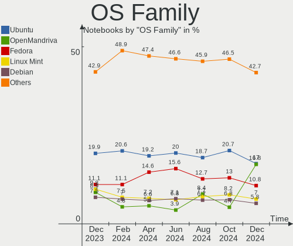
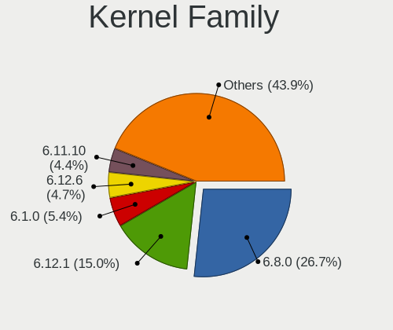

Linux Hardware Trends (Notebooks)
---------------------------------

A project to identify most popular hardware characteristics and track their change
over time based on data collected by Linux users at https://Linux-Hardware.org.

Anyone can contribute to this report by the [hw-probe](https://github.com/linuxhw/hw-probe) tool:

    sudo -E hw-probe -all -upload

Full-feature report is available here: https://linux-hardware.org/?view=trends&formfactor=notebook

Period: Jul, 2021.

Contents
--------

* [ System ](#system)
  - [ OS                       ](#os)
  - [ OS Family                ](#os-family)
  - [ Kernel                   ](#kernel)
  - [ Kernel Family            ](#kernel-family)
  - [ Kernel Major Ver.        ](#kernel-major-ver)
  - [ Arch                     ](#arch)
  - [ DE                       ](#de)
  - [ Display Server           ](#display-server)
  - [ Display Manager          ](#display-manager)
  - [ OS Lang                  ](#os-lang)
  - [ Boot Mode                ](#boot-mode)
  - [ Filesystem               ](#filesystem)
  - [ Part. scheme             ](#part-scheme)
  - [ Dual Boot with Linux/BSD ](#dual-boot-with-linuxbsd)
  - [ Dual Boot (Win)          ](#dual-boot-win)

* [ Board ](#board)
  - [ Vendor                   ](#vendor)
  - [ Model                    ](#model)
  - [ Model Family             ](#model-family)
  - [ MFG Year                 ](#mfg-year)
  - [ Form Factor              ](#form-factor)
  - [ Secure Boot              ](#secure-boot)
  - [ Coreboot                 ](#coreboot)
  - [ RAM Size                 ](#ram-size)
  - [ RAM Used                 ](#ram-used)
  - [ Total Drives             ](#total-drives)
  - [ Has CD-ROM               ](#has-cd-rom)
  - [ Has Ethernet             ](#has-ethernet)
  - [ Has WiFi                 ](#has-wifi)
  - [ Has Bluetooth            ](#has-bluetooth)

* [ Location ](#location)
  - [ Country                  ](#country)
  - [ City                     ](#city)

* [ Drives ](#drives)
  - [ Drive Vendor             ](#drive-vendor)
  - [ Drive Model              ](#drive-model)
  - [ HDD Vendor               ](#hdd-vendor)
  - [ SSD Vendor               ](#ssd-vendor)
  - [ Drive Kind               ](#drive-kind)
  - [ Drive Connector          ](#drive-connector)
  - [ Drive Size               ](#drive-size)
  - [ Space Total              ](#space-total)
  - [ Space Used               ](#space-used)
  - [ Malfunc. Drives          ](#malfunc-drives)
  - [ Malfunc. Drive Vendor    ](#malfunc-drive-vendor)
  - [ Malfunc. HDD Vendor      ](#malfunc-hdd-vendor)
  - [ Malfunc. Drive Kind      ](#malfunc-drive-kind)
  - [ Failed Drives            ](#failed-drives)
  - [ Failed Drive Vendor      ](#failed-drive-vendor)
  - [ Drive Status             ](#drive-status)

* [ Storage controller ](#storage-controller)
  - [ Storage Vendor           ](#storage-vendor)
  - [ Storage Model            ](#storage-model)
  - [ Storage Kind             ](#storage-kind)

* [ Processor ](#processor)
  - [ CPU Vendor               ](#cpu-vendor)
  - [ CPU Model                ](#cpu-model)
  - [ CPU Model Family         ](#cpu-model-family)
  - [ CPU Cores                ](#cpu-cores)
  - [ CPU Sockets              ](#cpu-sockets)
  - [ CPU Threads              ](#cpu-threads)
  - [ CPU Op-Modes             ](#cpu-op-modes)
  - [ CPU Microcode            ](#cpu-microcode)
  - [ CPU Microarch            ](#cpu-microarch)

* [ Graphics ](#graphics)
  - [ GPU Vendor               ](#gpu-vendor)
  - [ GPU Model                ](#gpu-model)
  - [ GPU Combo                ](#gpu-combo)
  - [ GPU Driver               ](#gpu-driver)
  - [ GPU Memory               ](#gpu-memory)

* [ Monitor ](#monitor)
  - [ Monitor Vendor           ](#monitor-vendor)
  - [ Monitor Model            ](#monitor-model)
  - [ Monitor Resolution       ](#monitor-resolution)
  - [ Monitor Diagonal         ](#monitor-diagonal)
  - [ Monitor Width            ](#monitor-width)
  - [ Aspect Ratio             ](#aspect-ratio)
  - [ Monitor Area             ](#monitor-area)
  - [ Pixel Density            ](#pixel-density)
  - [ Multiple Monitors        ](#multiple-monitors)

* [ Network ](#network)
  - [ Net Controller Vendor    ](#net-controller-vendor)
  - [ Net Controller Model     ](#net-controller-model)
  - [ Wireless Vendor          ](#wireless-vendor)
  - [ Wireless Model           ](#wireless-model)
  - [ Ethernet Vendor          ](#ethernet-vendor)
  - [ Ethernet Model           ](#ethernet-model)
  - [ Net Controller Kind      ](#net-controller-kind)
  - [ Used Controller          ](#used-controller)
  - [ NICs                     ](#nics)
  - [ IPv6                     ](#ipv6)

* [ Bluetooth ](#bluetooth)
  - [ Bluetooth Vendor         ](#bluetooth-vendor)
  - [ Bluetooth Model          ](#bluetooth-model)

* [ Sound ](#sound)
  - [ Sound Vendor             ](#sound-vendor)
  - [ Sound Model              ](#sound-model)

* [ Memory ](#memory)
  - [ Memory Vendor            ](#memory-vendor)
  - [ Memory Model             ](#memory-model)
  - [ Memory Kind              ](#memory-kind)
  - [ Memory Form Factor       ](#memory-form-factor)
  - [ Memory Size              ](#memory-size)
  - [ Memory Speed             ](#memory-speed)

* [ Printers & scanners ](#printers--scanners)
  - [ Printer Vendor           ](#printer-vendor)
  - [ Printer Model            ](#printer-model)
  - [ Scanner Vendor           ](#scanner-vendor)
  - [ Scanner Model            ](#scanner-model)

* [ Camera ](#camera)
  - [ Camera Vendor            ](#camera-vendor)
  - [ Camera Model             ](#camera-model)

* [ Security ](#security)
  - [ Fingerprint Vendor       ](#fingerprint-vendor)
  - [ Fingerprint Model        ](#fingerprint-model)
  - [ Chipcard Vendor          ](#chipcard-vendor)
  - [ Chipcard Model           ](#chipcard-model)

* [ Unsupported ](#unsupported)
  - [ Unsupported Devices      ](#unsupported-devices)
  - [ Unsupported Device Types ](#unsupported-device-types)

System
------

OS
--

Installed operating systems

| Name                | Notebooks | Percent |
|---------------------|-----------|---------|
| Ubuntu 20.04        | 441       | 17.5%   |
| Pop!_OS 21.04       | 181       | 7.18%   |
| Fedora 34           | 157       | 6.23%   |
| OpenMandriva 4.2    | 152       | 6.03%   |
| Mint 20.2           | 152       | 6.03%   |
| Ubuntu 21.04        | 141       | 5.6%    |
| Debian 11           | 138       | 5.48%   |
| Mint 20.1           | 90        | 3.57%   |
| Arch                | 57        | 2.26%   |
| Ubuntu 18.04        | 54        | 2.14%   |
| ROSA R11.1          | 54        | 2.14%   |
| BlackPanther 18.1   | 52        | 2.06%   |
| KDE neon 20.04      | 50        | 1.98%   |
| Arch Rolling        | 40        | 1.59%   |
| Xubuntu 20.04       | 37        | 1.47%   |
| Manjaro 21.1.0      | 35        | 1.39%   |
| OpenMandriva 4.50   | 34        | 1.35%   |
| Manjaro 21.0.7      | 33        | 1.31%   |
| Endless 3.9.5       | 33        | 1.31%   |
| Mint 19.3           | 32        | 1.27%   |
| Manjaro             | 30        | 1.19%   |
| Kubuntu 21.04       | 26        | 1.03%   |
| ArcoLinux Rolling   | 26        | 1.03%   |
| Kubuntu 20.04       | 25        | 0.99%   |
| Pop!_OS 20.04       | 23        | 0.91%   |
| Debian 10           | 23        | 0.91%   |
| Zorin 15            | 20        | 0.79%   |
| Mint 20             | 17        | 0.67%   |
| Kali 2021.2         | 16        | 0.63%   |
| LMDE 4              | 15        | 0.6%    |
| Xubuntu 18.04       | 14        | 0.56%   |
| Ubuntu 20.10        | 13        | 0.52%   |
| Fedora 33           | 12        | 0.48%   |
| EndeavourOS Rolling | 10        | 0.4%    |
| Ubuntu MATE 20.04   | 9         | 0.36%   |
| Ubuntu 16.04        | 8         | 0.32%   |
| Lubuntu 21.04       | 8         | 0.32%   |
| Gentoo              | 8         | 0.32%   |
| ArcoLinux           | 8         | 0.32%   |
| Xubuntu 21.04       | 7         | 0.28%   |
| Ubuntu 21.10        | 7         | 0.28%   |
| Pop!_OS 20.10       | 7         | 0.28%   |
| Elementary 5.1.7    | 7         | 0.28%   |
| Ubuntu MATE 21.04   | 6         | 0.24%   |
| ROSA R11            | 6         | 0.24%   |
| RHEL 8.4            | 6         | 0.24%   |
| Lubuntu 20.04       | 6         | 0.24%   |
| Endless 3.9.4       | 6         | 0.24%   |
| Debian              | 6         | 0.24%   |
| Clear Linux 34820   | 6         | 0.24%   |
| ROSA R12            | 5         | 0.2%    |
| Garuda Soaring      | 5         | 0.2%    |
| Peppermint 10       | 4         | 0.16%   |
| MX 19.4             | 4         | 0.16%   |
| Mint 19.1           | 4         | 0.16%   |
| Kubuntu 20.10       | 4         | 0.16%   |
| Kubuntu 18.04       | 4         | 0.16%   |
| Gentoo 2.7          | 4         | 0.16%   |
| EndeavourOS         | 4         | 0.16%   |
| Clear Linux 34860   | 4         | 0.16%   |

OS Family
---------

OS without a version

| Name          | Notebooks | Percent |
|---------------|-----------|---------|
| Ubuntu        | 670       | 26.59%  |
| Mint          | 299       | 11.87%  |
| Pop!_OS       | 211       | 8.37%   |
| OpenMandriva  | 187       | 7.42%   |
| Fedora        | 172       | 6.83%   |
| Debian        | 171       | 6.79%   |
| Manjaro       | 103       | 4.09%   |
| Arch          | 97        | 3.85%   |
| ROSA          | 67        | 2.66%   |
| Kubuntu       | 61        | 2.42%   |
| Xubuntu       | 60        | 2.38%   |
| BlackPanther  | 52        | 2.06%   |
| KDE neon      | 50        | 1.98%   |
| Endless       | 41        | 1.63%   |
| ArcoLinux     | 34        | 1.35%   |
| Zorin         | 23        | 0.91%   |
| openSUSE      | 22        | 0.87%   |
| Kali          | 19        | 0.75%   |
| Ubuntu MATE   | 18        | 0.71%   |
| Lubuntu       | 16        | 0.63%   |
| LMDE          | 15        | 0.6%    |
| EndeavourOS   | 14        | 0.56%   |
| Clear Linux   | 14        | 0.56%   |
| Gentoo        | 12        | 0.48%   |
| Elementary    | 9         | 0.36%   |
| Ubuntu Budgie | 7         | 0.28%   |
| RHEL          | 7         | 0.28%   |
| Garuda        | 7         | 0.28%   |
| MX            | 6         | 0.24%   |
| CentOS        | 5         | 0.2%    |
| Peppermint    | 4         | 0.16%   |
| Artix         | 4         | 0.16%   |
| Void          | 3         | 0.12%   |
| PostmarketOS  | 3         | 0.12%   |
| Parrot        | 3         | 0.12%   |
| Devuan        | 3         | 0.12%   |
| Deepin        | 3         | 0.12%   |
| Solus         | 2         | 0.08%   |
| Siduction     | 2         | 0.08%   |
| Q4OS          | 2         | 0.08%   |
| PureOS        | 2         | 0.08%   |
| Oracle Linux  | 2         | 0.08%   |
| ALT Linux     | 2         | 0.08%   |
| Alpine        | 2         | 0.08%   |
| AlmaLinux     | 2         | 0.08%   |
| WifiSlax64    | 1         | 0.04%   |
| SuperX        | 1         | 0.04%   |
| Red OS        | 1         | 0.04%   |
| RED           | 1         | 0.04%   |
| NixOS         | 1         | 0.04%   |
| Mageia        | 1         | 0.04%   |
| KaOS          | 1         | 0.04%   |
| Kaisen        | 1         | 0.04%   |
| Generic       | 1         | 0.04%   |
| GalliumOS     | 1         | 0.04%   |
| Calculate     | 1         | 0.04%   |
| Archcraft     | 1         | 0.04%   |

Kernel
------

Version of the Linux kernel

| Version                             | Notebooks | Percent |
|-------------------------------------|-----------|---------|
| 5.8.0-59-generic                    | 267       | 10.6%   |
| 5.4.0-77-generic                    | 223       | 8.85%   |
| 5.11.0-7620-generic                 | 192       | 7.62%   |
| 5.8.0-63-generic                    | 127       | 5.04%   |
| 5.11.0-22-generic                   | 120       | 4.76%   |
| 5.10.14-desktop-1omv4002            | 115       | 4.56%   |
| 5.4.0-80-generic                    | 112       | 4.44%   |
| 5.10.0-8-amd64                      | 86        | 3.41%   |
| 5.11.0-25-generic                   | 54        | 2.14%   |
| 5.6.14-desktop-2bP                  | 44        | 1.75%   |
| 5.10.0-7-amd64                      | 41        | 1.63%   |
| 5.8.0-14-generic                    | 40        | 1.59%   |
| 5.12.13-300.fc34.x86_64             | 39        | 1.55%   |
| 5.11.12-desktop-1omv4002            | 37        | 1.47%   |
| 5.12.14-300.fc34.x86_64             | 35        | 1.39%   |
| 5.8.0-43-generic                    | 30        | 1.19%   |
| 5.12.15-arch1-1                     | 27        | 1.07%   |
| 5.12.4-desktop-1omv4050             | 25        | 0.99%   |
| 5.12.14-arch1-1                     | 25        | 0.99%   |
| 5.10.42-1-MANJARO                   | 25        | 0.99%   |
| 5.13.4-200.fc34.x86_64              | 22        | 0.87%   |
| 5.12.9-1-MANJARO                    | 21        | 0.83%   |
| 4.19.0-17-amd64                     | 21        | 0.83%   |
| 5.4.0-74-generic                    | 19        | 0.75%   |
| 4.15.0-151-generic                  | 18        | 0.71%   |
| 5.4.83-generic-2rosa-x86_64         | 16        | 0.63%   |
| 5.12.15-300.fc34.x86_64             | 16        | 0.63%   |
| 5.4.32-generic-2rosa-x86_64         | 15        | 0.6%    |
| 5.11.0-16-generic                   | 15        | 0.6%    |
| 5.4.0-58-generic                    | 14        | 0.56%   |
| 5.11.12-300.fc34.x86_64             | 13        | 0.52%   |
| 5.13.5-arch1-1                      | 12        | 0.48%   |
| 4.15.0-147-generic                  | 12        | 0.48%   |
| 5.8.0-55-generic                    | 11        | 0.44%   |
| 5.4.0-42-generic                    | 11        | 0.44%   |
| 5.10.0-kali9-amd64                  | 11        | 0.44%   |
| 5.10.49-1-MANJARO                   | 10        | 0.4%    |
| 5.8.0-61-generic                    | 9         | 0.36%   |
| 5.4.32-generic-2rosa-i586           | 9         | 0.36%   |
| 5.13.4-arch2-1                      | 9         | 0.36%   |
| 5.11.0-26-generic                   | 9         | 0.36%   |
| 5.12.15-zen1-1-zen                  | 8         | 0.32%   |
| 5.12.14-1051.native                 | 8         | 0.32%   |
| 5.12.13-arch1-2                     | 8         | 0.32%   |
| 5.10.52-1-MANJARO                   | 8         | 0.32%   |
| 4.18.16-desktop-1bP                 | 8         | 0.32%   |
| 5.13.5-200.fc34.x86_64              | 7         | 0.28%   |
| 5.13.4-arch1-1                      | 7         | 0.28%   |
| 5.11.0-7614-generic                 | 7         | 0.28%   |
| 5.11.0-24-generic                   | 7         | 0.28%   |
| 4.15.0-desktop-122.124.1rosa-x86_64 | 7         | 0.28%   |
| 5.4.83-generic-2rosa-i586           | 6         | 0.24%   |
| 5.4.0-73-generic                    | 6         | 0.24%   |
| 5.4.0-26-generic                    | 6         | 0.24%   |
| 5.13.1-3-MANJARO                    | 6         | 0.24%   |
| 5.12.7-desktop-1omv4003             | 6         | 0.24%   |
| 5.12.12-300.fc34.x86_64             | 6         | 0.24%   |
| 5.10.47-1-lts                       | 6         | 0.24%   |
| 5.10.0-2-amd64                      | 6         | 0.24%   |
| 5.0.0-32-generic                    | 6         | 0.24%   |

Kernel Family
-------------

Linux kernel without a distro release

| Version | Notebooks | Percent |
|---------|-----------|---------|
| 5.8.0   | 504       | 20%     |
| 5.4.0   | 424       | 16.83%  |
| 5.11.0  | 414       | 16.43%  |
| 5.10.0  | 174       | 6.9%    |
| 5.10.14 | 115       | 4.56%   |
| 5.12.14 | 83        | 3.29%   |
| 4.15.0  | 63        | 2.5%    |
| 5.13.4  | 62        | 2.46%   |
| 5.12.13 | 58        | 2.3%    |
| 5.12.15 | 57        | 2.26%   |
| 5.11.12 | 50        | 1.98%   |
| 5.6.14  | 44        | 1.75%   |
| 4.19.0  | 37        | 1.47%   |
| 5.10.42 | 26        | 1.03%   |
| 5.12.4  | 25        | 0.99%   |
| 5.4.32  | 24        | 0.95%   |
| 5.13.5  | 23        | 0.91%   |
| 5.12.9  | 23        | 0.91%   |
| 5.4.83  | 22        | 0.87%   |
| 5.13.0  | 22        | 0.87%   |
| 5.13.1  | 20        | 0.79%   |
| 5.12.12 | 15        | 0.6%    |
| 5.10.52 | 14        | 0.56%   |
| 4.18.0  | 14        | 0.56%   |
| 5.13.2  | 12        | 0.48%   |
| 5.10.49 | 12        | 0.48%   |
| 5.9.0   | 8         | 0.32%   |
| 5.0.0   | 8         | 0.32%   |
| 4.18.16 | 8         | 0.32%   |
| 5.12.7  | 7         | 0.28%   |
| 5.10.53 | 7         | 0.28%   |
| 5.10.47 | 7         | 0.28%   |
| 5.3.18  | 6         | 0.24%   |
| 5.12.17 | 6         | 0.24%   |
| 5.10.27 | 6         | 0.24%   |
| 5.14.0  | 5         | 0.2%    |
| 5.13.6  | 5         | 0.2%    |
| 5.12.16 | 5         | 0.2%    |
| 5.12.0  | 5         | 0.2%    |
| 5.10.48 | 5         | 0.2%    |
| 4.4.0   | 5         | 0.2%    |
| 5.12.19 | 4         | 0.16%   |
| 5.11.22 | 4         | 0.16%   |
| 5.10.46 | 4         | 0.16%   |
| 5.6.0   | 3         | 0.12%   |
| 5.3.0   | 3         | 0.12%   |
| 5.12.11 | 3         | 0.12%   |
| 5.12.10 | 3         | 0.12%   |
| 5.10.50 | 3         | 0.12%   |
| 4.9.0   | 3         | 0.12%   |
| 3.10.17 | 3         | 0.12%   |
| 5.4.17  | 2         | 0.08%   |
| 5.12.8  | 2         | 0.08%   |
| 5.12.18 | 2         | 0.08%   |
| 5.11.4  | 2         | 0.08%   |
| 5.10.54 | 2         | 0.08%   |
| 5.10.43 | 2         | 0.08%   |
| 5.10.41 | 2         | 0.08%   |
| 5.10.26 | 2         | 0.08%   |
| 5.10.17 | 2         | 0.08%   |

Kernel Major Ver.
-----------------

Linux kernel major version

| Version | Notebooks | Percent |
|---------|-----------|---------|
| 5.8     | 506       | 20.08%  |
| 5.4     | 480       | 19.05%  |
| 5.11    | 474       | 18.81%  |
| 5.10    | 389       | 15.44%  |
| 5.12    | 299       | 11.87%  |
| 5.13    | 144       | 5.71%   |
| 4.15    | 63        | 2.5%    |
| 5.6     | 48        | 1.9%    |
| 4.19    | 39        | 1.55%   |
| 4.18    | 22        | 0.87%   |
| 5.9     | 11        | 0.44%   |
| 5.3     | 9         | 0.36%   |
| 5.0     | 8         | 0.32%   |
| 5.14    | 5         | 0.2%    |
| 4.4     | 5         | 0.2%    |
| 4.9     | 4         | 0.16%   |
| 3.10    | 3         | 0.12%   |
| 5.5     | 2         | 0.08%   |
| 4.16    | 2         | 0.08%   |
| 4.13    | 2         | 0.08%   |
| 5.7     | 1         | 0.04%   |
| 5.2     | 1         | 0.04%   |
| 4.20    | 1         | 0.04%   |
| 4.14    | 1         | 0.04%   |
| 3.13    | 1         | 0.04%   |

Arch
----

OS architecture (x86_64, i586, etc.)

| Name    | Notebooks | Percent |
|---------|-----------|---------|
| x86_64  | 2454      | 97.38%  |
| i686    | 60        | 2.38%   |
| armv7l  | 3         | 0.12%   |
| aarch64 | 3         | 0.12%   |

DE
--

Desktop Environment

| Name                 | Notebooks | Percent |
|----------------------|-----------|---------|
| GNOME                | 1162      | 46.11%  |
| KDE5                 | 434       | 17.22%  |
| X-Cinnamon           | 216       | 8.57%   |
| XFCE                 | 196       | 7.78%   |
| Unknown              | 118       | 4.68%   |
| KDE                  | 107       | 4.25%   |
| MATE                 | 82        | 3.25%   |
| KDE4                 | 36        | 1.43%   |
| LXQt                 | 33        | 1.31%   |
| Cinnamon             | 27        | 1.07%   |
| i3                   | 22        | 0.87%   |
| LXDE                 | 15        | 0.6%    |
| Budgie               | 12        | 0.48%   |
| Unity                | 11        | 0.44%   |
| Deepin               | 9         | 0.36%   |
| Pantheon             | 8         | 0.32%   |
| GNOME Flashback      | 8         | 0.32%   |
| sway                 | 4         | 0.16%   |
| awesome              | 3         | 0.12%   |
| qtile                | 2         | 0.08%   |
| GNOME Classic        | 2         | 0.08%   |
| Enlightenment        | 2         | 0.08%   |
| bspwm                | 2         | 0.08%   |
| XSession             | 1         | 0.04%   |
| xmonad               | 1         | 0.04%   |
| Trinity              | 1         | 0.04%   |
| swayLANG=en_CA.UTF-8 | 1         | 0.04%   |
| openbox              | 1         | 0.04%   |
| lightdm-xsession     | 1         | 0.04%   |
| i3-with-shmlog       | 1         | 0.04%   |
| herbstluftwm         | 1         | 0.04%   |
| dwm                  | 1         | 0.04%   |

Display Server
--------------

X11 or Wayland

| Name    | Notebooks | Percent |
|---------|-----------|---------|
| X11     | 2059      | 81.71%  |
| Wayland | 369       | 14.64%  |
| Unknown | 60        | 2.38%   |
| Tty     | 32        | 1.27%   |

Display Manager
---------------

SDDM, LightDM, etc.

| Name    | Notebooks | Percent |
|---------|-----------|---------|
| Unknown | 1301      | 51.63%  |
| SDDM    | 465       | 18.45%  |
| GDM     | 431       | 17.1%   |
| TDM     | 227       | 9.01%   |
| LightDM | 48        | 1.9%    |
| KDM     | 36        | 1.43%   |
| XDM     | 8         | 0.32%   |
| GDM3    | 4         | 0.16%   |

OS Lang
-------

Language

| Lang    | Notebooks | Percent |
|---------|-----------|---------|
| en_US   | 1026      | 40.71%  |
| de_DE   | 213       | 8.45%   |
| ru_RU   | 160       | 6.35%   |
| en_GB   | 143       | 5.67%   |
| pt_BR   | 131       | 5.2%    |
| fr_FR   | 105       | 4.17%   |
| en_IN   | 78        | 3.1%    |
| Unknown | 76        | 3.02%   |
| pl_PL   | 47        | 1.87%   |
| it_IT   | 46        | 1.83%   |
| C       | 45        | 1.79%   |
| en_CA   | 43        | 1.71%   |
| es_ES   | 42        | 1.67%   |
| en_AU   | 34        | 1.35%   |
| cs_CZ   | 23        | 0.91%   |
| es_MX   | 21        | 0.83%   |
| pt_PT   | 18        | 0.71%   |
| nl_NL   | 16        | 0.63%   |
| en_ZA   | 15        | 0.6%    |
| de_AT   | 12        | 0.48%   |
| zh_CN   | 11        | 0.44%   |
| hu_HU   | 11        | 0.44%   |
| es_AR   | 11        | 0.44%   |
| de_CH   | 11        | 0.44%   |
| ja_JP   | 10        | 0.4%    |
| es_CO   | 10        | 0.4%    |
| en_SG   | 9         | 0.36%   |
| tr_TR   | 7         | 0.28%   |
| ru_UA   | 7         | 0.28%   |
| ro_RO   | 7         | 0.28%   |
| fi_FI   | 7         | 0.28%   |
| es_CL   | 7         | 0.28%   |
| sv_SE   | 6         | 0.24%   |
| hr_HR   | 6         | 0.24%   |
| el_GR   | 6         | 0.24%   |
| fr_BE   | 5         | 0.2%    |
| es_CR   | 5         | 0.2%    |
| en_IE   | 5         | 0.2%    |
| da_DK   | 5         | 0.2%    |
| zh_TW   | 4         | 0.16%   |
| uk_UA   | 4         | 0.16%   |
| nb_NO   | 4         | 0.16%   |
| es_UY   | 4         | 0.16%   |
| en_PH   | 4         | 0.16%   |
| en_NZ   | 4         | 0.16%   |
| POSIX   | 3         | 0.12%   |
| es_EC   | 3         | 0.12%   |
| es_DO   | 3         | 0.12%   |
| en_NG   | 3         | 0.12%   |
| en_DK   | 3         | 0.12%   |
| sk_SK   | 2         | 0.08%   |
| nl_BE   | 2         | 0.08%   |
| lv_LV   | 2         | 0.08%   |
| ko_KR   | 2         | 0.08%   |
| id_ID   | 2         | 0.08%   |
| fr_LU   | 2         | 0.08%   |
| fr_CH   | 2         | 0.08%   |
| fr_CA   | 2         | 0.08%   |
| es_SV   | 2         | 0.08%   |
| es_NI   | 2         | 0.08%   |

Boot Mode
---------

EFI or BIOS

| Mode | Notebooks | Percent |
|------|-----------|---------|
| EFI  | 1355      | 53.77%  |
| BIOS | 1165      | 46.23%  |

Filesystem
----------

Type of filesystem

| Type    | Notebooks | Percent |
|---------|-----------|---------|
| Ext4    | 2011      | 79.8%   |
| Btrfs   | 224       | 8.89%   |
| Overlay | 220       | 8.73%   |
| Xfs     | 35        | 1.39%   |
| Zfs     | 12        | 0.48%   |
| Unknown | 7         | 0.28%   |
| F2fs    | 5         | 0.2%    |
| Ext3    | 2         | 0.08%   |
| XXXXX   | 1         | 0.04%   |
| Tmpfs   | 1         | 0.04%   |
| Nfs     | 1         | 0.04%   |
| Ext2    | 1         | 0.04%   |

Part. scheme
------------

Scheme of partitioning

| Type    | Notebooks | Percent |
|---------|-----------|---------|
| Unknown | 1249      | 49.56%  |
| GPT     | 956       | 37.94%  |
| MBR     | 315       | 12.5%   |

Dual Boot with Linux/BSD
------------------------

Hosting more than one Linux/BSD

| Dual boot | Notebooks | Percent |
|-----------|-----------|---------|
| No        | 2221      | 88.13%  |
| Yes       | 299       | 11.87%  |

Dual Boot (Win)
---------------

Hosting Linux and Windows

| Dual boot | Notebooks | Percent |
|-----------|-----------|---------|
| No        | 1790      | 71.03%  |
| Yes       | 730       | 28.97%  |

Board
-----

Vendor
------

Motherboard manufacturer

| Name                                         | Notebooks | Percent |
|----------------------------------------------|-----------|---------|
| Lenovo                                       | 574       | 22.78%  |
| Hewlett-Packard                              | 449       | 17.82%  |
| Dell                                         | 416       | 16.51%  |
| ASUSTek Computer                             | 258       | 10.24%  |
| Acer                                         | 252       | 10%     |
| Toshiba                                      | 65        | 2.58%   |
| Apple                                        | 60        | 2.38%   |
| Samsung Electronics                          | 49        | 1.94%   |
| MSI                                          | 42        | 1.67%   |
| Sony                                         | 40        | 1.59%   |
| Fujitsu                                      | 21        | 0.83%   |
| TUXEDO                                       | 17        | 0.67%   |
| Notebook                                     | 17        | 0.67%   |
| Google                                       | 17        | 0.67%   |
| Unknown                                      | 17        | 0.67%   |
| HUAWEI                                       | 16        | 0.63%   |
| System76                                     | 14        | 0.56%   |
| Medion                                       | 12        | 0.48%   |
| Timi                                         | 11        | 0.44%   |
| Packard Bell                                 | 9         | 0.36%   |
| Positivo                                     | 8         | 0.32%   |
| Fujitsu Siemens                              | 8         | 0.32%   |
| AMI                                          | 7         | 0.28%   |
| LG Electronics                               | 6         | 0.24%   |
| Gigabyte Technology                          | 6         | 0.24%   |
| eMachines                                    | 6         | 0.24%   |
| Gateway                                      | 5         | 0.2%    |
| Alienware                                    | 5         | 0.2%    |
| Teclast                                      | 4         | 0.16%   |
| SLIMBOOK                                     | 4         | 0.16%   |
| PC Specialist                                | 4         | 0.16%   |
| Panasonic                                    | 4         | 0.16%   |
| Itautec                                      | 4         | 0.16%   |
| Casper                                       | 4         | 0.16%   |
| Razer                                        | 3         | 0.12%   |
| Purism                                       | 3         | 0.12%   |
| Digibras                                     | 3         | 0.12%   |
| Clevo                                        | 3         | 0.12%   |
| Chuwi                                        | 3         | 0.12%   |
| AVITA                                        | 3         | 0.12%   |
| Star Labs                                    | 2         | 0.08%   |
| Semp Toshiba                                 | 2         | 0.08%   |
| Schenker                                     | 2         | 0.08%   |
| Pegatron                                     | 2         | 0.08%   |
| Intel Client Systems                         | 2         | 0.08%   |
| HONOR                                        | 2         | 0.08%   |
| GPU Company                                  | 2         | 0.08%   |
| GPD                                          | 2         | 0.08%   |
| FUJITSU CLIENT COMPUTING LIMITED             | 2         | 0.08%   |
| Entroware                                    | 2         | 0.08%   |
| Eluktronics                                  | 2         | 0.08%   |
| CHUWI?Innovation?And?Technology(ShenZhen)co. | 2         | 0.08%   |
| Avell High Performance                       | 2         | 0.08%   |
| Wortmann AG                                  | 1         | 0.04%   |
| Wiltronic                                    | 1         | 0.04%   |
| whyopencomputing                             | 1         | 0.04%   |
| TrekStor                                     | 1         | 0.04%   |
| TENKU                                        | 1         | 0.04%   |
| TaNix                                        | 1         | 0.04%   |
| Standard                                     | 1         | 0.04%   |

Model
-----

Motherboard model

| Name                                  | Notebooks | Percent |
|---------------------------------------|-----------|---------|
| Unknown                               | 29        | 1.15%   |
| HP Notebook                           | 14        | 0.56%   |
| HP Pavilion dv6                       | 12        | 0.48%   |
| HP Laptop 15s-eq2xxx                  | 10        | 0.4%    |
| HP EliteBook 8470p                    | 9         | 0.36%   |
| Lenovo IdeaPad 5 14ARE05 81YM         | 8         | 0.32%   |
| HP Pavilion g6                        | 8         | 0.32%   |
| HP Pavilion 15                        | 8         | 0.32%   |
| Dell XPS 15 9500                      | 8         | 0.32%   |
| Dell Latitude E6420                   | 8         | 0.32%   |
| Dell Inspiron N5110                   | 8         | 0.32%   |
| Acer Nitro AN515-54                   | 8         | 0.32%   |
| HP Pavilion Notebook                  | 7         | 0.28%   |
| HP 250 G7 Notebook PC                 | 7         | 0.28%   |
| Dell XPS 13 9310                      | 7         | 0.28%   |
| Dell Latitude E5470                   | 7         | 0.28%   |
| Dell Inspiron 1545                    | 7         | 0.28%   |
| Apple MacBookAir7,2                   | 7         | 0.28%   |
| Lenovo IdeaPad 5 15ARE05 81YQ         | 6         | 0.24%   |
| Dell XPS 15 9560                      | 6         | 0.24%   |
| Dell Latitude E7440                   | 6         | 0.24%   |
| Dell Latitude E5520                   | 6         | 0.24%   |
| Dell Latitude 5480                    | 6         | 0.24%   |
| Dell Inspiron 5570                    | 6         | 0.24%   |
| Dell Inspiron 5558                    | 6         | 0.24%   |
| Apple MacBookPro9,2                   | 6         | 0.24%   |
| Lenovo G50-80 80E5                    | 5         | 0.2%    |
| HP Pavilion g7                        | 5         | 0.2%    |
| HP Laptop 15-bs0xx                    | 5         | 0.2%    |
| Dell Latitude E7470                   | 5         | 0.2%    |
| Dell Latitude E6510                   | 5         | 0.2%    |
| Dell Latitude E6430                   | 5         | 0.2%    |
| Dell G3 3579                          | 5         | 0.2%    |
| ASUS TUF Gaming FX505DT_FX505DT       | 5         | 0.2%    |
| ASUS N53SV                            | 5         | 0.2%    |
| Apple MacBookPro11,5                  | 5         | 0.2%    |
| Acer Aspire ES1-523                   | 5         | 0.2%    |
| Acer Aspire E5-573G                   | 5         | 0.2%    |
| Timi A35S                             | 4         | 0.16%   |
| Samsung 350V5C/351V5C/3540VC/3440VC   | 4         | 0.16%   |
| Lenovo ThinkBook 14 G2 ITL 20VD       | 4         | 0.16%   |
| Lenovo IdeaPad L340-15IRH Gaming 81LK | 4         | 0.16%   |
| Lenovo IdeaPad 330-15ARR 81D2         | 4         | 0.16%   |
| Lenovo IdeaPad 3 15IIL05 81WE         | 4         | 0.16%   |
| Lenovo IdeaPad 3 15ADA05 81W1         | 4         | 0.16%   |
| Lenovo G50-30 80G0                    | 4         | 0.16%   |
| Lenovo B50-10 80QR                    | 4         | 0.16%   |
| HUAWEI HLYL-WXX9                      | 4         | 0.16%   |
| HP ProBook 6460b                      | 4         | 0.16%   |
| HP ProBook 450 G8 Notebook PC         | 4         | 0.16%   |
| HP ProBook 445 G7                     | 4         | 0.16%   |
| HP Pavilion dv7                       | 4         | 0.16%   |
| HP Laptop 15-da0xxx                   | 4         | 0.16%   |
| HP EliteBook 8460p                    | 4         | 0.16%   |
| HP EliteBook 845 G7 Notebook PC       | 4         | 0.16%   |
| HP EliteBook 8440p                    | 4         | 0.16%   |
| HP EliteBook 840 G3                   | 4         | 0.16%   |
| HP EliteBook 840 G2                   | 4         | 0.16%   |
| HP 620                                | 4         | 0.16%   |
| HP 250 G1                             | 4         | 0.16%   |

Model Family
------------

Motherboard model prefix

| Name                  | Notebooks | Percent |
|-----------------------|-----------|---------|
| Lenovo ThinkPad       | 299       | 11.87%  |
| Acer Aspire           | 172       | 6.83%   |
| Dell Inspiron         | 140       | 5.56%   |
| Lenovo IdeaPad        | 135       | 5.36%   |
| Dell Latitude         | 133       | 5.28%   |
| HP Pavilion           | 95        | 3.77%   |
| HP EliteBook          | 81        | 3.21%   |
| HP ProBook            | 71        | 2.82%   |
| HP Laptop             | 67        | 2.66%   |
| Dell XPS              | 61        | 2.42%   |
| Toshiba Satellite     | 50        | 1.98%   |
| ASUS VivoBook         | 49        | 1.94%   |
| Dell Vostro           | 33        | 1.31%   |
| Unknown               | 29        | 1.15%   |
| Lenovo Legion         | 26        | 1.03%   |
| Dell Precision        | 24        | 0.95%   |
| ASUS ROG              | 24        | 0.95%   |
| Acer Nitro            | 20        | 0.79%   |
| HP 250                | 19        | 0.75%   |
| HP Compaq             | 18        | 0.71%   |
| Fujitsu LIFEBOOK      | 18        | 0.71%   |
| Acer Swift            | 18        | 0.71%   |
| Lenovo ThinkBook      | 16        | 0.63%   |
| HP Notebook           | 14        | 0.56%   |
| Lenovo Yoga           | 12        | 0.48%   |
| ASUS TUF              | 12        | 0.48%   |
| HP ZBook              | 11        | 0.44%   |
| Dell G3               | 11        | 0.44%   |
| ASUS ZenBook          | 11        | 0.44%   |
| ASUS ASUS             | 11        | 0.44%   |
| Apple MacBookPro11    | 11        | 0.44%   |
| HP ENVY               | 10        | 0.4%    |
| Acer Predator         | 10        | 0.4%    |
| Packard Bell EasyNote | 9         | 0.36%   |
| HP Stream             | 9         | 0.36%   |
| HP OMEN               | 8         | 0.32%   |
| Apple MacBookAir7     | 8         | 0.32%   |
| Acer TravelMate       | 7         | 0.28%   |
| Acer Extensa          | 7         | 0.28%   |
| TUXEDO InfinityBook   | 6         | 0.24%   |
| HP Presario           | 6         | 0.24%   |
| HP 15                 | 6         | 0.24%   |
| Dell Studio           | 6         | 0.24%   |
| Apple MacBookPro9     | 6         | 0.24%   |
| Toshiba TECRA         | 5         | 0.2%    |
| Samsung 350V5C        | 5         | 0.2%    |
| Lenovo G50-80         | 5         | 0.2%    |
| HP 255                | 5         | 0.2%    |
| ASUS N53SV            | 5         | 0.2%    |
| Apple MacBookPro8     | 5         | 0.2%    |
| Timi A35S             | 4         | 0.16%   |
| Samsung R530          | 4         | 0.16%   |
| MSI Prestige          | 4         | 0.16%   |
| MSI Modern            | 4         | 0.16%   |
| Lenovo G50-30         | 4         | 0.16%   |
| Lenovo B50-10         | 4         | 0.16%   |
| Itautec Infoway       | 4         | 0.16%   |
| HUAWEI HLYL-WXX9      | 4         | 0.16%   |
| HP 620                | 4         | 0.16%   |
| Fujitsu Siemens AMILO | 4         | 0.16%   |

MFG Year
--------

Motherboard manufacture year

| Year    | Notebooks | Percent |
|---------|-----------|---------|
| 2020    | 473       | 18.77%  |
| 2021    | 406       | 16.11%  |
| 2019    | 258       | 10.24%  |
| 2018    | 206       | 8.17%   |
| 2012    | 152       | 6.03%   |
| 2011    | 152       | 6.03%   |
| 2013    | 150       | 5.95%   |
| 2014    | 117       | 4.64%   |
| 2016    | 115       | 4.56%   |
| 2015    | 113       | 4.48%   |
| 2017    | 105       | 4.17%   |
| 2010    | 94        | 3.73%   |
| 2009    | 71        | 2.82%   |
| 2008    | 60        | 2.38%   |
| 2007    | 28        | 1.11%   |
| 2006    | 9         | 0.36%   |
| Unknown | 8         | 0.32%   |
| 2004    | 2         | 0.08%   |
| 2005    | 1         | 0.04%   |

Form Factor
-----------

Physical design of the computer

| Name     | Notebooks | Percent |
|----------|-----------|---------|
| Notebook | 2520      | 100%    |

Secure Boot
-----------

Enabled or disabled

| State    | Notebooks | Percent |
|----------|-----------|---------|
| Disabled | 2289      | 90.83%  |
| Enabled  | 231       | 9.17%   |

Coreboot
--------

Have coreboot on board

| Used | Notebooks | Percent |
|------|-----------|---------|
| No   | 2493      | 98.93%  |
| Yes  | 27        | 1.07%   |

RAM Size
--------

Total RAM memory

| Size in GB  | Notebooks | Percent |
|-------------|-----------|---------|
| 4.01-8.0    | 765       | 30.36%  |
| 3.01-4.0    | 508       | 20.16%  |
| 16.01-24.0  | 454       | 18.02%  |
| 8.01-16.0   | 419       | 16.63%  |
| 32.01-64.0  | 151       | 5.99%   |
| 1.01-2.0    | 129       | 5.12%   |
| 2.01-3.0    | 33        | 1.31%   |
| 24.01-32.0  | 25        | 0.99%   |
| 64.01-256.0 | 21        | 0.83%   |
| 0.51-1.0    | 11        | 0.44%   |
| 0.01-0.5    | 3         | 0.12%   |
| Unknown     | 1         | 0.04%   |

RAM Used
--------

Used RAM memory

| Used GB    | Notebooks | Percent |
|------------|-----------|---------|
| 1.01-2.0   | 923       | 36.63%  |
| 2.01-3.0   | 620       | 24.6%   |
| 3.01-4.0   | 344       | 13.65%  |
| 4.01-8.0   | 321       | 12.74%  |
| 0.51-1.0   | 166       | 6.59%   |
| 8.01-16.0  | 95        | 3.77%   |
| 0.01-0.5   | 33        | 1.31%   |
| 16.01-24.0 | 8         | 0.32%   |
| Unknown    | 5         | 0.2%    |
| 24.01-32.0 | 3         | 0.12%   |
| 32.01-64.0 | 2         | 0.08%   |

Total Drives
------------

Number of drives on board

| Drives | Notebooks | Percent |
|--------|-----------|---------|
| 1      | 1815      | 72.02%  |
| 2      | 604       | 23.97%  |
| 3      | 63        | 2.5%    |
| 0      | 29        | 1.15%   |
| 4      | 7         | 0.28%   |
| 7      | 1         | 0.04%   |
| 5      | 1         | 0.04%   |

Has CD-ROM
----------

Has CD-ROM on board

| Presented | Notebooks | Percent |
|-----------|-----------|---------|
| No        | 1636      | 64.92%  |
| Yes       | 884       | 35.08%  |

Has Ethernet
------------

Has Ethernet on board

| Presented | Notebooks | Percent |
|-----------|-----------|---------|
| Yes       | 2060      | 81.75%  |
| No        | 460       | 18.25%  |

Has WiFi
--------

Has WiFi module

| Presented | Notebooks | Percent |
|-----------|-----------|---------|
| Yes       | 2464      | 97.78%  |
| No        | 56        | 2.22%   |

Has Bluetooth
-------------

Has Bluetooth module

| Presented | Notebooks | Percent |
|-----------|-----------|---------|
| Yes       | 1957      | 77.66%  |
| No        | 563       | 22.34%  |

Location
--------

Country
-------

Geographic location (country)

| Country      | Notebooks | Percent |
|--------------|-----------|---------|
| USA          | 391       | 15.52%  |
| Germany      | 269       | 10.67%  |
| Brazil       | 177       | 7.02%   |
| Russia       | 171       | 6.79%   |
| France       | 122       | 4.84%   |
| India        | 115       | 4.56%   |
| UK           | 93        | 3.69%   |
| Poland       | 71        | 2.82%   |
| Canada       | 60        | 2.38%   |
| Italy        | 59        | 2.34%   |
| Netherlands  | 57        | 2.26%   |
| Hungary      | 55        | 2.18%   |
| Spain        | 53        | 2.1%    |
| Czechia      | 47        | 1.87%   |
| Ukraine      | 43        | 1.71%   |
| Mexico       | 39        | 1.55%   |
| Australia    | 37        | 1.47%   |
| Switzerland  | 32        | 1.27%   |
| Indonesia    | 29        | 1.15%   |
| Austria      | 28        | 1.11%   |
| Portugal     | 27        | 1.07%   |
| Romania      | 25        | 0.99%   |
| Turkey       | 21        | 0.83%   |
| Greece       | 20        | 0.79%   |
| Finland      | 20        | 0.79%   |
| Colombia     | 19        | 0.75%   |
| Belgium      | 19        | 0.75%   |
| China        | 18        | 0.71%   |
| South Africa | 17        | 0.67%   |
| Bulgaria     | 17        | 0.67%   |
| Argentina    | 16        | 0.63%   |
| Sweden       | 15        | 0.6%    |
| Belarus      | 15        | 0.6%    |
| Croatia      | 14        | 0.56%   |
| Norway       | 13        | 0.52%   |
| Iran         | 12        | 0.48%   |
| Denmark      | 12        | 0.48%   |
| Malaysia     | 11        | 0.44%   |
| Japan        | 11        | 0.44%   |
| Chile        | 10        | 0.4%    |
| Thailand     | 9         | 0.36%   |
| Kazakhstan   | 9         | 0.36%   |
| Slovakia     | 8         | 0.32%   |
| New Zealand  | 8         | 0.32%   |
| Latvia       | 8         | 0.32%   |
| Puerto Rico  | 7         | 0.28%   |
| Philippines  | 7         | 0.28%   |
| Vietnam      | 6         | 0.24%   |
| Singapore    | 6         | 0.24%   |
| Pakistan     | 6         | 0.24%   |
| Ireland      | 6         | 0.24%   |
| Ecuador      | 6         | 0.24%   |
| Costa Rica   | 6         | 0.24%   |
| Uruguay      | 5         | 0.2%    |
| Taiwan       | 5         | 0.2%    |
| Serbia       | 5         | 0.2%    |
| Nepal        | 5         | 0.2%    |
| Luxembourg   | 5         | 0.2%    |
| Kenya        | 5         | 0.2%    |
| Egypt        | 5         | 0.2%    |

City
----

Geographic location (city)

| City              | Notebooks | Percent |
|-------------------|-----------|---------|
| Moscow            | 46        | 1.83%   |
| Paris             | 25        | 0.99%   |
| Prague            | 19        | 0.75%   |
| St Petersburg     | 18        | 0.71%   |
| Kyiv              | 15        | 0.6%    |
| Budapest          | 15        | 0.6%    |
| Berlin            | 15        | 0.6%    |
| Vienna            | 14        | 0.56%   |
| Sydney            | 14        | 0.56%   |
| São Paulo        | 12        | 0.48%   |
| Rio de Janeiro    | 12        | 0.48%   |
| Bengaluru         | 12        | 0.48%   |
| Warsaw            | 11        | 0.44%   |
| Stuttgart         | 11        | 0.44%   |
| Munich            | 11        | 0.44%   |
| Bucharest         | 11        | 0.44%   |
| Athens            | 11        | 0.44%   |
| Toronto           | 10        | 0.4%    |
| Mumbai            | 10        | 0.4%    |
| Mexico City       | 10        | 0.4%    |
| Helsinki          | 10        | 0.4%    |
| Frankfurt am Main | 10        | 0.4%    |
| Voronezh          | 9         | 0.36%   |
| Tehran            | 9         | 0.36%   |
| Sofia             | 9         | 0.36%   |
| Pune              | 9         | 0.36%   |
| Minsk             | 9         | 0.36%   |
| Milan             | 9         | 0.36%   |
| Zagreb            | 8         | 0.32%   |
| S??o Paulo        | 8         | 0.32%   |
| Los Angeles       | 8         | 0.32%   |
| Cape Town         | 8         | 0.32%   |
| Zurich            | 7         | 0.28%   |
| Riga              | 7         | 0.28%   |
| Oslo              | 7         | 0.28%   |
| Madrid            | 7         | 0.28%   |
| London            | 7         | 0.28%   |
| Kuala Lumpur      | 7         | 0.28%   |
| Hyderabad         | 7         | 0.28%   |
| Denver            | 7         | 0.28%   |
| Dallas            | 7         | 0.28%   |
| Wroclaw           | 6         | 0.24%   |
| Winnipeg          | 6         | 0.24%   |
| New Delhi         | 6         | 0.24%   |
| Lyon              | 6         | 0.24%   |
| Kolkata           | 6         | 0.24%   |
| Juncos            | 6         | 0.24%   |
| Istanbul          | 6         | 0.24%   |
| Dublin            | 6         | 0.24%   |
| Donetsk           | 6         | 0.24%   |
| Chennai           | 6         | 0.24%   |
| Buenos Aires      | 6         | 0.24%   |
| Brussels          | 6         | 0.24%   |
| Brno              | 6         | 0.24%   |
| Bogot??           | 6         | 0.24%   |
| Belo Horizonte    | 6         | 0.24%   |
| Atlanta           | 6         | 0.24%   |
| Amsterdam         | 6         | 0.24%   |
| Yekaterinburg     | 5         | 0.2%    |
| Singapore         | 5         | 0.2%    |

Drives
------

Drive Vendor
------------

Hard drive vendors

| Vendor                    | Notebooks | Drives | Percent |
|---------------------------|-----------|--------|---------|
| Samsung Electronics       | 492       | 542    | 16.13%  |
| WDC                       | 415       | 427    | 13.61%  |
| Seagate                   | 354       | 366    | 11.61%  |
| Toshiba                   | 269       | 277    | 8.82%   |
| Unknown                   | 171       | 196    | 5.61%   |
| SanDisk                   | 171       | 177    | 5.61%   |
| Kingston                  | 153       | 158    | 5.02%   |
| SK Hynix                  | 131       | 135    | 4.3%    |
| HGST                      | 98        | 98     | 3.21%   |
| Intel                     | 92        | 104    | 3.02%   |
| Crucial                   | 92        | 97     | 3.02%   |
| Hitachi                   | 86        | 87     | 2.82%   |
| Micron Technology         | 55        | 55     | 1.8%    |
| A-DATA Technology         | 44        | 44     | 1.44%   |
| Apple                     | 34        | 35     | 1.11%   |
| KIOXIA                    | 31        | 34     | 1.02%   |
| LITEON                    | 23        | 23     | 0.75%   |
| China                     | 21        | 21     | 0.69%   |
| Phison                    | 20        | 22     | 0.66%   |
| SPCC                      | 15        | 15     | 0.49%   |
| Fujitsu                   | 15        | 16     | 0.49%   |
| Transcend                 | 14        | 14     | 0.46%   |
| Silicon Motion            | 14        | 15     | 0.46%   |
| LITEONIT                  | 13        | 13     | 0.43%   |
| PNY                       | 11        | 11     | 0.36%   |
| Patriot                   | 11        | 11     | 0.36%   |
| GOODRAM                   | 11        | 11     | 0.36%   |
| Intenso                   | 10        | 10     | 0.33%   |
| Micron/Crucial Technology | 9         | 10     | 0.3%    |
| JMicron                   | 9         | 9      | 0.3%    |
| Union Memory              | 8         | 8      | 0.26%   |
| KingSpec                  | 8         | 8      | 0.26%   |
| Lenovo                    | 7         | 8      | 0.23%   |
| Netac                     | 6         | 6      | 0.2%    |
| Apacer                    | 6         | 6      | 0.2%    |
| OCZ                       | 5         | 5      | 0.16%   |
| Lexar                     | 5         | 5      | 0.16%   |
| XPG                       | 4         | 4      | 0.13%   |
| Union Memory (Shenzhen)   | 4         | 4      | 0.13%   |
| Team                      | 4         | 4      | 0.13%   |
| Solid State Storage       | 4         | 4      | 0.13%   |
| Lite-On                   | 4         | 4      | 0.13%   |
| KingFast                  | 4         | 4      | 0.13%   |
| KingDian                  | 4         | 4      | 0.13%   |
| FORESEE                   | 4         | 4      | 0.13%   |
| ADATA Technology          | 4         | 4      | 0.13%   |
| Realtek Semiconductor     | 3         | 3      | 0.1%    |
| Mushkin                   | 3         | 3      | 0.1%    |
| Leven                     | 3         | 3      | 0.1%    |
| LDLC                      | 3         | 3      | 0.1%    |
| External                  | 3         | 3      | 0.1%    |
| DOGFISH                   | 3         | 3      | 0.1%    |
| Corsair                   | 3         | 3      | 0.1%    |
| XrayDisk                  | 2         | 2      | 0.07%   |
| SILICONMOTION             | 2         | 2      | 0.07%   |
| PLEXTOR                   | 2         | 2      | 0.07%   |
| HUAWEI                    | 2         | 2      | 0.07%   |
| Hewlett-Packard           | 2         | 2      | 0.07%   |
| Gigabyte Technology       | 2         | 2      | 0.07%   |
| EMTEC                     | 2         | 2      | 0.07%   |

Drive Model
-----------

Hard drive models

| Model                                | Notebooks | Percent |
|--------------------------------------|-----------|---------|
| Seagate ST1000LM035-1RK172 1TB       | 61        | 1.92%   |
| Seagate ST1000LM024 HN-M101MBB 1TB   | 51        | 1.6%    |
| Samsung NVMe SSD Drive 512GB         | 41        | 1.29%   |
| Toshiba MQ01ABD100 1TB               | 39        | 1.23%   |
| Samsung SSD 860 EVO 500GB            | 37        | 1.16%   |
| Toshiba MQ01ABF050 500GB             | 35        | 1.1%    |
| Kingston SA400S37240G 240GB SSD      | 31        | 0.98%   |
| Unknown MMC Card  32GB               | 30        | 0.94%   |
| Toshiba MQ04ABF100 1TB               | 30        | 0.94%   |
| HGST HTS721010A9E630 1TB             | 27        | 0.85%   |
| Seagate ST500LT012-1DG142 500GB      | 24        | 0.76%   |
| WDC WD10SPZX-21Z10T0 1TB             | 23        | 0.72%   |
| SK Hynix NVMe SSD Drive 512GB        | 23        | 0.72%   |
| Sandisk NVMe SSD Drive 256GB         | 21        | 0.66%   |
| Intel NVMe SSD Drive 512GB           | 21        | 0.66%   |
| Samsung NVMe SSD Drive 256GB         | 19        | 0.6%    |
| Unknown MMC Card  64GB               | 18        | 0.57%   |
| Unknown MMC Card  16GB               | 18        | 0.57%   |
| Sandisk NVMe SSD Drive 512GB         | 18        | 0.57%   |
| Seagate ST9500325AS 500GB            | 17        | 0.53%   |
| Samsung SSD 860 EVO 1TB              | 17        | 0.53%   |
| Kingston SA400S37480G 480GB SSD      | 16        | 0.5%    |
| Samsung SSD 850 EVO 500GB            | 15        | 0.47%   |
| Samsung SSD 850 EVO 250GB            | 15        | 0.47%   |
| Crucial CT1000MX500SSD1 1TB          | 15        | 0.47%   |
| Seagate ST1000LM049-2GH172 1TB       | 14        | 0.44%   |
| Seagate ST1000LM048-2E7172 1TB       | 14        | 0.44%   |
| Kingston SA400S37120G 120GB SSD      | 14        | 0.44%   |
| HGST HTS725050A7E630 500GB           | 14        | 0.44%   |
| HGST HTS545050A7E680 500GB           | 14        | 0.44%   |
| Toshiba NVMe SSD Drive 512GB         | 13        | 0.41%   |
| WDC WD5000LPVX-22V0TT0 500GB         | 12        | 0.38%   |
| WDC WD10JPVX-22JC3T0 1TB             | 12        | 0.38%   |
| Samsung NVMe SSD Drive 500GB         | 12        | 0.38%   |
| HGST HTS541010A9E680 1TB             | 12        | 0.38%   |
| Crucial CT500MX500SSD1 500GB         | 12        | 0.38%   |
| WDC WDS500G2B0A-00SM50 500GB SSD     | 11        | 0.35%   |
| WDC WDS240G2G0A-00JH30 240GB SSD     | 11        | 0.35%   |
| Seagate ST9320325AS 320GB            | 11        | 0.35%   |
| Seagate ST500LT012-9WS142 500GB      | 11        | 0.35%   |
| Samsung SSD 860 EVO 250GB            | 11        | 0.35%   |
| Samsung NVMe SSD Drive 1TB           | 11        | 0.35%   |
| WDC PC SN530 SDBPMPZ-512G-1101 512GB | 10        | 0.31%   |
| SK Hynix NVMe SSD Drive 1024GB       | 10        | 0.31%   |
| Micron NVMe SSD Drive 512GB          | 10        | 0.31%   |
| Crucial CT240BX500SSD1 240GB         | 10        | 0.31%   |
| Unknown SD/MMC/MS PRO 128GB          | 9         | 0.28%   |
| Sandisk NVMe SSD Drive 1024GB        | 9         | 0.28%   |
| Kingston NVMe SSD Drive 512GB        | 9         | 0.28%   |
| Hitachi HTS547550A9E384 500GB        | 9         | 0.28%   |
| HGST HTS545050A7E380 500GB           | 9         | 0.28%   |
| HGST HTS541075A9E680 752GB           | 9         | 0.28%   |
| SK Hynix NVMe SSD Drive 256GB        | 8         | 0.25%   |
| Seagate ST320LT007-9ZV142 320GB      | 8         | 0.25%   |
| Seagate ST2000LM007-1R8174 2TB       | 8         | 0.25%   |
| Seagate Expansion 4TB                | 8         | 0.25%   |
| SanDisk SSD PLUS 240GB               | 8         | 0.25%   |
| Samsung SSD 970 EVO Plus 500GB       | 8         | 0.25%   |
| Samsung SSD 970 EVO Plus 1TB         | 8         | 0.25%   |
| Samsung NVMe SSD Drive 1024GB        | 8         | 0.25%   |

HDD Vendor
----------

Hard disk drive vendors

| Vendor              | Notebooks | Drives | Percent |
|---------------------|-----------|--------|---------|
| Seagate             | 343       | 351    | 32.92%  |
| WDC                 | 264       | 267    | 25.34%  |
| Toshiba             | 190       | 190    | 18.23%  |
| HGST                | 98        | 98     | 9.4%    |
| Hitachi             | 86        | 87     | 8.25%   |
| Samsung Electronics | 35        | 36     | 3.36%   |
| Fujitsu             | 14        | 15     | 1.34%   |
| Apple               | 4         | 4      | 0.38%   |
| SILICONMOTION       | 2         | 2      | 0.19%   |
| ASMT                | 2         | 3      | 0.19%   |
| USB3.0              | 1         | 1      | 0.1%    |
| Unknown             | 1         | 1      | 0.1%    |
| Intenso             | 1         | 1      | 0.1%    |
| asmedia             | 1         | 1      | 0.1%    |

SSD Vendor
----------

Solid state drive vendors

| Vendor              | Notebooks | Drives | Percent |
|---------------------|-----------|--------|---------|
| Samsung Electronics | 211       | 221    | 22.14%  |
| Kingston            | 114       | 118    | 11.96%  |
| SanDisk             | 101       | 103    | 10.6%   |
| Crucial             | 80        | 85     | 8.39%   |
| WDC                 | 62        | 62     | 6.51%   |
| Intel               | 32        | 32     | 3.36%   |
| A-DATA Technology   | 29        | 29     | 3.04%   |
| Micron Technology   | 26        | 26     | 2.73%   |
| Apple               | 25        | 25     | 2.62%   |
| Toshiba             | 23        | 23     | 2.41%   |
| SK Hynix            | 22        | 22     | 2.31%   |
| LITEON              | 22        | 22     | 2.31%   |
| China               | 21        | 21     | 2.2%    |
| SPCC                | 15        | 15     | 1.57%   |
| Transcend           | 14        | 14     | 1.47%   |
| LITEONIT            | 13        | 13     | 1.36%   |
| Patriot             | 11        | 11     | 1.15%   |
| GOODRAM             | 11        | 11     | 1.15%   |
| PNY                 | 10        | 10     | 1.05%   |
| Intenso             | 9         | 9      | 0.94%   |
| KingSpec            | 6         | 6      | 0.63%   |
| Apacer              | 6         | 6      | 0.63%   |
| Unknown             | 5         | 5      | 0.52%   |
| Seagate             | 5         | 5      | 0.52%   |
| OCZ                 | 5         | 5      | 0.52%   |
| Lexar               | 5         | 5      | 0.52%   |
| JMicron             | 5         | 5      | 0.52%   |
| Netac               | 4         | 4      | 0.42%   |
| KingDian            | 4         | 4      | 0.42%   |
| Team                | 3         | 3      | 0.31%   |
| Leven               | 3         | 3      | 0.31%   |
| FORESEE             | 3         | 3      | 0.31%   |
| DOGFISH             | 3         | 3      | 0.31%   |
| PLEXTOR             | 2         | 2      | 0.21%   |
| Mushkin             | 2         | 2      | 0.21%   |
| LDLC                | 2         | 2      | 0.21%   |
| Hewlett-Packard     | 2         | 2      | 0.21%   |
| Gigabyte Technology | 2         | 2      | 0.21%   |
| EMTEC               | 2         | 2      | 0.21%   |
| Corsair             | 2         | 2      | 0.21%   |
| BHT                 | 2         | 2      | 0.21%   |
| ZTC                 | 1         | 1      | 0.1%    |
| ZHITAI              | 1         | 1      | 0.1%    |
| XrayDisk            | 1         | 1      | 0.1%    |
| W800SH              | 1         | 1      | 0.1%    |
| Vaseky              | 1         | 1      | 0.1%    |
| Union Memory        | 1         | 1      | 0.1%    |
| TEXTORM             | 1         | 1      | 0.1%    |
| TCSUNBOW            | 1         | 2      | 0.1%    |
| takeMS              | 1         | 1      | 0.1%    |
| SMART               | 1         | 2      | 0.1%    |
| S3+                 | 1         | 1      | 0.1%    |
| PNY USB             | 1         | 1      | 0.1%    |
| Platinet            | 1         | 1      | 0.1%    |
| OSCOO               | 1         | 1      | 0.1%    |
| OCZ-ARC1            | 1         | 1      | 0.1%    |
| Maxtor              | 1         | 1      | 0.1%    |
| Lenovo              | 1         | 1      | 0.1%    |
| Kross Elegance      | 1         | 1      | 0.1%    |
| KIOXIA-EXCERIA      | 1         | 1      | 0.1%    |

Drive Kind
----------

HDD or SSD

| Kind    | Notebooks | Drives | Percent |
|---------|-----------|--------|---------|
| HDD     | 1013      | 1057   | 34.29%  |
| SSD     | 902       | 976    | 30.53%  |
| NVMe    | 833       | 936    | 28.2%   |
| MMC     | 157       | 184    | 5.31%   |
| Unknown | 49        | 52     | 1.66%   |

Drive Connector
---------------

SATA, SAS, NVMe, etc.

| Type | Notebooks | Drives | Percent |
|------|-----------|--------|---------|
| SATA | 1743      | 1977   | 61.66%  |
| NVMe | 831       | 932    | 29.4%   |
| MMC  | 157       | 184    | 5.55%   |
| SAS  | 96        | 112    | 3.4%    |

Drive Size
----------

Size of hard drive

| Size in TB | Notebooks | Drives | Percent |
|------------|-----------|--------|---------|
| 0.01-0.5   | 1217      | 1321   | 63.72%  |
| 0.51-1.0   | 620       | 634    | 32.46%  |
| 1.01-2.0   | 47        | 49     | 2.46%   |
| 3.01-4.0   | 19        | 19     | 0.99%   |
| 2.01-3.0   | 4         | 7      | 0.21%   |
| 4.01-10.0  | 2         | 2      | 0.1%    |
| 0          | 1         | 1      | 0.05%   |

Space Total
-----------

Amount of disk space available on the file system

| Size in GB     | Notebooks | Percent |
|----------------|-----------|---------|
| 101-250        | 669       | 26.55%  |
| 251-500        | 614       | 24.37%  |
| 501-1000       | 401       | 15.91%  |
| 1-20           | 215       | 8.53%   |
| 1001-2000      | 172       | 6.83%   |
| 51-100         | 165       | 6.55%   |
| Unknown        | 112       | 4.44%   |
| 21-50          | 101       | 4.01%   |
| More than 3000 | 48        | 1.9%    |
| 2001-3000      | 23        | 0.91%   |

Space Used
----------

Amount of used disk space

| Used GB        | Notebooks | Percent |
|----------------|-----------|---------|
| 1-20           | 962       | 38.17%  |
| 21-50          | 448       | 17.78%  |
| 101-250        | 340       | 13.49%  |
| 51-100         | 289       | 11.47%  |
| 251-500        | 174       | 6.9%    |
| 501-1000       | 131       | 5.2%    |
| Unknown        | 112       | 4.44%   |
| 1001-2000      | 41        | 1.63%   |
| More than 3000 | 10        | 0.4%    |
| 2001-3000      | 10        | 0.4%    |
| 0              | 3         | 0.12%   |

Malfunc. Drives
---------------

Drive models with a malfunction

| Model                                   | Notebooks | Drives | Percent |
|-----------------------------------------|-----------|--------|---------|
| Seagate ST1000LM024 HN-M101MBB 1TB      | 8         | 8      | 3.62%   |
| Toshiba MQ01ABD100 1TB                  | 6         | 6      | 2.71%   |
| Seagate ST500LT012-9WS142 500GB         | 6         | 6      | 2.71%   |
| Seagate ST1000LM035-1RK172 1TB          | 6         | 6      | 2.71%   |
| Toshiba MQ01ABF050 500GB                | 5         | 5      | 2.26%   |
| HGST HTS545050A7E680 500GB              | 5         | 5      | 2.26%   |
| HGST HTS545050A7E380 500GB              | 5         | 5      | 2.26%   |
| Seagate ST9500325AS 500GB               | 4         | 4      | 1.81%   |
| Seagate ST9320325AS 320GB               | 4         | 4      | 1.81%   |
| Seagate ST500LT012-1DG142 500GB         | 4         | 4      | 1.81%   |
| Samsung Electronics HM160HI 160GB       | 4         | 4      | 1.81%   |
| WDC WD5000LPVX-22V0TT0 500GB            | 3         | 3      | 1.36%   |
| Toshiba MQ04ABF100 1TB                  | 3         | 3      | 1.36%   |
| Toshiba MQ01ABD075 752GB                | 3         | 3      | 1.36%   |
| Toshiba MK5056GSY 500GB                 | 3         | 3      | 1.36%   |
| Seagate ST320LT007-9ZV142 320GB         | 3         | 3      | 1.36%   |
| Hitachi HTS547550A9E384 500GB           | 3         | 3      | 1.36%   |
| Hitachi HTS545050A7E380 500GB           | 3         | 3      | 1.36%   |
| HGST HTS541075A9E680 752GB              | 3         | 3      | 1.36%   |
| WDC WD1600BEVT-22ZCT0 160GB             | 2         | 2      | 0.9%    |
| Toshiba MK3259GSXP 320GB                | 2         | 2      | 0.9%    |
| Toshiba KSG60ZMV256G M.2 2280 256GB SSD | 2         | 2      | 0.9%    |
| Seagate ST9250410AS 250GB               | 2         | 2      | 0.9%    |
| Seagate ST500LM021-1KJ152 500GB         | 2         | 2      | 0.9%    |
| Seagate ST1000LM048-2E7172 1TB          | 2         | 2      | 0.9%    |
| Seagate ST1000LM014-SSHD-8GB            | 2         | 2      | 0.9%    |
| SanDisk SSD U100 256GB                  | 2         | 2      | 0.9%    |
| Hitachi HTS547575A9E384 752GB           | 2         | 2      | 0.9%    |
| Hitachi HTS545025B9A300 250GB           | 2         | 2      | 0.9%    |
| HGST HTS721010A9E630 1TB                | 2         | 2      | 0.9%    |
| HGST HTS545032A7E380 320GB              | 2         | 2      | 0.9%    |
| HGST HTS541010A9E680 1TB                | 2         | 2      | 0.9%    |
| WDC WD7500BPVT-80HXZT3 752GB            | 1         | 1      | 0.45%   |
| WDC WD6400BEVT-60A0RT0 640GB            | 1         | 1      | 0.45%   |
| WDC WD6400BEVT-22A0RT0 640GB            | 1         | 1      | 0.45%   |
| WDC WD5000BPVT-22HXZT3 500GB            | 1         | 1      | 0.45%   |
| WDC WD5000BEVT-60A0RT0 500GB            | 1         | 1      | 0.45%   |
| WDC WD3200LPVX-08V0TT5 320GB            | 1         | 1      | 0.45%   |
| WDC WD3200LPCX-24C6HT0 320GB            | 1         | 1      | 0.45%   |
| WDC WD3200BPVT-80ZEST0 320GB            | 1         | 1      | 0.45%   |
| WDC WD3200BPVT-75ZEST0 320GB            | 1         | 1      | 0.45%   |
| WDC WD3200BEVT-22A23T0 320GB            | 1         | 1      | 0.45%   |
| WDC WD2500BPVT-75JJ5T0 250GB            | 1         | 1      | 0.45%   |
| WDC WD2500BEVS-60UST0 250GB             | 1         | 1      | 0.45%   |
| WDC WD1600BJKT-75F4T0 160GB             | 1         | 1      | 0.45%   |
| WDC WD1600BEVT-22A23T0 160GB            | 1         | 1      | 0.45%   |
| WDC WD1600BEVT-00A23T0 160GB            | 1         | 1      | 0.45%   |
| WDC WD1600BEVS-08VAT2 160GB             | 1         | 1      | 0.45%   |
| WDC WD10SPZX-24Z10T0 1TB                | 1         | 1      | 0.45%   |
| WDC WD10SPZX-24Z10 1TB                  | 1         | 1      | 0.45%   |
| WDC WD10SPZX-21Z10T0 1TB                | 1         | 1      | 0.45%   |
| WDC WD10JPVX-75JC3T0 1TB                | 1         | 1      | 0.45%   |
| WDC WD10JPVX-22JC3T0 1TB                | 1         | 1      | 0.45%   |
| WDC WD10JPVT-75A1YT0 1TB                | 1         | 1      | 0.45%   |
| WDC WD10JPVT-00A1YT0 1TB                | 1         | 1      | 0.45%   |
| Union Memory UMIS RPJTJ128MED1MWX 128GB | 1         | 1      | 0.45%   |
| Toshiba Q300. 240GB SSD                 | 1         | 1      | 0.45%   |
| Toshiba MQ01ABD032 320GB                | 1         | 1      | 0.45%   |
| Toshiba MK8034GSX 80GB                  | 1         | 1      | 0.45%   |
| Toshiba MK6476GSX 640GB                 | 1         | 1      | 0.45%   |

Malfunc. Drive Vendor
---------------------

Vendors of faulty drives

| Vendor              | Notebooks | Drives | Percent |
|---------------------|-----------|--------|---------|
| Seagate             | 58        | 59     | 26.36%  |
| Toshiba             | 38        | 38     | 17.27%  |
| WDC                 | 28        | 28     | 12.73%  |
| HGST                | 22        | 22     | 10%     |
| Hitachi             | 20        | 20     | 9.09%   |
| Samsung Electronics | 13        | 13     | 5.91%   |
| SanDisk             | 7         | 7      | 3.18%   |
| Intel               | 6         | 6      | 2.73%   |
| SK Hynix            | 3         | 3      | 1.36%   |
| LITEON              | 3         | 3      | 1.36%   |
| Kingston            | 3         | 3      | 1.36%   |
| Crucial             | 3         | 3      | 1.36%   |
| Micron Technology   | 2         | 2      | 0.91%   |
| China               | 2         | 2      | 0.91%   |
| Apple               | 2         | 2      | 0.91%   |
| A-DATA Technology   | 2         | 2      | 0.91%   |
| Union Memory        | 1         | 1      | 0.45%   |
| takeMS              | 1         | 1      | 0.45%   |
| SPCC                | 1         | 1      | 0.45%   |
| Platinet            | 1         | 1      | 0.45%   |
| KingSpec            | 1         | 1      | 0.45%   |
| Fujitsu             | 1         | 1      | 0.45%   |
| BLueRay             | 1         | 1      | 0.45%   |
| ASMT                | 1         | 1      | 0.45%   |

Malfunc. HDD Vendor
-------------------

Vendors of faulty HDD drives

| Vendor              | Notebooks | Drives | Percent |
|---------------------|-----------|--------|---------|
| Seagate             | 58        | 59     | 33.33%  |
| Toshiba             | 35        | 35     | 20.11%  |
| WDC                 | 28        | 28     | 16.09%  |
| HGST                | 22        | 22     | 12.64%  |
| Hitachi             | 20        | 20     | 11.49%  |
| Samsung Electronics | 8         | 8      | 4.6%    |
| Fujitsu             | 1         | 1      | 0.57%   |
| ASMT                | 1         | 1      | 0.57%   |
| Apple               | 1         | 1      | 0.57%   |

Malfunc. Drive Kind
-------------------

Kinds of faulty drives

| Kind | Notebooks | Drives | Percent |
|------|-----------|--------|---------|
| HDD  | 172       | 175    | 78.9%   |
| SSD  | 38        | 38     | 17.43%  |
| NVMe | 8         | 8      | 3.67%   |

Failed Drives
-------------

Failed drive models

| Model                    | Notebooks | Drives | Percent |
|--------------------------|-----------|--------|---------|
| WDC WD10SPZX-21Z10T0 1TB | 1         | 1      | 100%    |

Failed Drive Vendor
-------------------

Failed drive vendors

| Vendor | Notebooks | Drives | Percent |
|--------|-----------|--------|---------|
| WDC    | 1         | 1      | 100%    |

Drive Status
------------

Number of failed and malfunc. drives

| Status   | Notebooks | Drives | Percent |
|----------|-----------|--------|---------|
| Detected | 1364      | 1726   | 51.9%   |
| Works    | 1049      | 1257   | 39.92%  |
| Malfunc  | 214       | 221    | 8.14%   |
| Failed   | 1         | 1      | 0.04%   |

Storage controller
------------------

Storage Vendor
--------------

Storage controller vendors

| Vendor                           | Notebooks | Percent |
|----------------------------------|-----------|---------|
| Intel                            | 1756      | 60.05%  |
| AMD                              | 315       | 10.77%  |
| Samsung Electronics              | 278       | 9.51%   |
| Sandisk                          | 156       | 5.34%   |
| SK Hynix                         | 105       | 3.59%   |
| Toshiba America Info Systems     | 55        | 1.88%   |
| Kingston Technology Company      | 39        | 1.33%   |
| KIOXIA                           | 36        | 1.23%   |
| Micron Technology                | 30        | 1.03%   |
| Phison Electronics               | 24        | 0.82%   |
| Micron/Crucial Technology        | 20        | 0.68%   |
| ADATA Technology                 | 19        | 0.65%   |
| Silicon Motion                   | 18        | 0.62%   |
| Nvidia                           | 15        | 0.51%   |
| Union Memory (Shenzhen)          | 10        | 0.34%   |
| Solid State Storage Technology   | 9         | 0.31%   |
| Lenovo                           | 6         | 0.21%   |
| Realtek Semiconductor            | 5         | 0.17%   |
| Lite-On Technology               | 5         | 0.17%   |
| JMicron Technology               | 5         | 0.17%   |
| Apple                            | 5         | 0.17%   |
| Marvell Technology Group         | 4         | 0.14%   |
| Silicon Integrated Systems [SiS] | 2         | 0.07%   |
| Shenzhen Longsys Electronics     | 2         | 0.07%   |
| VIA Technologies                 | 1         | 0.03%   |
| Unknown                          | 1         | 0.03%   |
| Silicon Image                    | 1         | 0.03%   |
| Seagate Technology               | 1         | 0.03%   |
| ASMedia Technology               | 1         | 0.03%   |

Storage Model
-------------

Storage controller models

| Model                                                                            | Notebooks | Percent |
|----------------------------------------------------------------------------------|-----------|---------|
| AMD FCH SATA Controller [AHCI mode]                                              | 267       | 8.57%   |
| Intel Sunrise Point-LP SATA Controller [AHCI mode]                               | 219       | 7.03%   |
| Intel 7 Series Chipset Family 6-port SATA Controller [AHCI mode]                 | 204       | 6.55%   |
| Intel 82801 Mobile SATA Controller [RAID mode]                                   | 177       | 5.68%   |
| Intel 6 Series/C200 Series Chipset Family 6 port Mobile SATA AHCI Controller     | 158       | 5.07%   |
| Samsung NVMe SSD Controller SM981/PM981/PM983                                    | 140       | 4.5%    |
| Intel 8 Series SATA Controller 1 [AHCI mode]                                     | 94        | 3.02%   |
| Intel 82801IBM/IEM (ICH9M/ICH9M-E) 4 port SATA Controller [AHCI mode]            | 86        | 2.76%   |
| Intel Cannon Lake Mobile PCH SATA AHCI Controller                                | 81        | 2.6%    |
| Intel Wildcat Point-LP SATA Controller [AHCI Mode]                               | 75        | 2.41%   |
| Samsung NVMe Controller                                                          | 72        | 2.31%   |
| Intel 8 Series/C220 Series Chipset Family 6-port SATA Controller 1 [AHCI mode]   | 60        | 1.93%   |
| Intel 5 Series/3400 Series Chipset 4 port SATA AHCI Controller                   | 57        | 1.83%   |
| Intel 82801HM/HEM (ICH8M/ICH8M-E) IDE Controller                                 | 55        | 1.77%   |
| Intel 82801HM/HEM (ICH8M/ICH8M-E) SATA Controller [AHCI mode]                    | 50        | 1.61%   |
| Intel Comet Lake SATA AHCI Controller                                            | 49        | 1.57%   |
| Sandisk WD Black SN750 / PC SN730 NVMe SSD                                       | 48        | 1.54%   |
| Intel Volume Management Device NVMe RAID Controller                              | 47        | 1.51%   |
| Intel HM170/QM170 Chipset SATA Controller [AHCI Mode]                            | 47        | 1.51%   |
| Intel 5 Series/3400 Series Chipset 6 port SATA AHCI Controller                   | 42        | 1.35%   |
| Sandisk WD Blue SN550 NVMe SSD                                                   | 41        | 1.32%   |
| Intel Atom Processor E3800 Series SATA AHCI Controller                           | 37        | 1.19%   |
| KIOXIA Non-Volatile memory controller                                            | 35        | 1.12%   |
| AMD SB7x0/SB8x0/SB9x0 SATA Controller [AHCI mode]                                | 33        | 1.06%   |
| Samsung NVMe SSD Controller SM961/PM961/SM963                                    | 32        | 1.03%   |
| Micron Non-Volatile memory controller                                            | 30        | 0.96%   |
| Toshiba America Info Systems XG6 NVMe SSD Controller                             | 29        | 0.93%   |
| SK Hynix BC511                                                                   | 28        | 0.9%    |
| Intel Tiger Lake-LP SATA Controller [AHCI mode]                                  | 28        | 0.9%    |
| Intel SSD 660P Series                                                            | 28        | 0.9%    |
| Intel Celeron/Pentium Silver Processor SATA Controller                           | 28        | 0.9%    |
| SK Hynix NVMe SSD Controller                                                     | 27        | 0.87%   |
| Sandisk Non-Volatile memory controller                                           | 27        | 0.87%   |
| Intel Cannon Point-LP SATA Controller [AHCI Mode]                                | 27        | 0.87%   |
| SK Hynix BC501 NVMe Solid State Drive                                            | 25        | 0.8%    |
| SK Hynix Non-Volatile memory controller                                          | 23        | 0.74%   |
| Intel Ice Lake-LP SATA Controller [AHCI mode]                                    | 23        | 0.74%   |
| Intel 400 Series Chipset Family SATA AHCI Controller                             | 18        | 0.58%   |
| Sandisk WD Blue SN500 / PC SN520 NVMe SSD                                        | 17        | 0.55%   |
| Sandisk WD Black 2018/SN750 / PC SN720 NVMe SSD                                  | 17        | 0.55%   |
| Samsung NVMe SSD Controller PM9A1/PM9A3/980PRO                                   | 17        | 0.55%   |
| Intel Celeron N3350/Pentium N4200/Atom E3900 Series SATA AHCI Controller         | 17        | 0.55%   |
| Intel Atom/Celeron/Pentium Processor x5-E8000/J3xxx/N3xxx Series SATA Controller | 17        | 0.55%   |
| Samsung Electronics SATA controller                                              | 15        | 0.48%   |
| Intel NM10/ICH7 Family SATA Controller [AHCI mode]                               | 15        | 0.48%   |
| Intel 82801G (ICH7 Family) IDE Controller                                        | 15        | 0.48%   |
| Phison E12 NVMe Controller                                                       | 14        | 0.45%   |
| Kingston Company U-SNS8154P3 NVMe SSD                                            | 13        | 0.42%   |
| Intel 82801IBM/IEM (ICH9M/ICH9M-E) 2 port SATA Controller [IDE mode]             | 13        | 0.42%   |
| Intel 82801GBM/GHM (ICH7-M Family) SATA Controller [AHCI mode]                   | 13        | 0.42%   |
| Toshiba America Info Systems BG3 NVMe SSD Controller                             | 12        | 0.39%   |
| Silicon Motion SM2263EN/SM2263XT SSD Controller                                  | 12        | 0.39%   |
| Kingston Company Company Non-Volatile memory controller                          | 11        | 0.35%   |
| AMD SB600 Non-Raid-5 SATA                                                        | 11        | 0.35%   |
| AMD SB600 IDE                                                                    | 10        | 0.32%   |
| ADATA XPG SX8200 Pro PCIe Gen3x4 M.2 2280 Solid State Drive                      | 10        | 0.32%   |
| Union Memory (Shenzhen) Non-Volatile memory controller                           | 9         | 0.29%   |
| Solid State Storage Non-Volatile memory controller                               | 9         | 0.29%   |
| Phison PS5013 E13 NVMe Controller                                                | 9         | 0.29%   |
| Micron/Crucial P1 NVMe PCIe SSD                                                  | 9         | 0.29%   |

Storage Kind
------------

Kind of storage controller (IDE, SATA, NVMe, SAS, ...)

| Kind | Notebooks | Percent |
|------|-----------|---------|
| SATA | 1813      | 59.89%  |
| NVMe | 831       | 27.45%  |
| RAID | 227       | 7.5%    |
| IDE  | 156       | 5.15%   |

Processor
---------

CPU Vendor
----------

Processor vendors

| Vendor   | Notebooks | Percent |
|----------|-----------|---------|
| Intel    | 2069      | 82.1%   |
| AMD      | 445       | 17.66%  |
| ARM      | 5         | 0.2%    |
| QUALCOMM | 1         | 0.04%   |

CPU Model
---------

Processor models

| Model                                         | Notebooks | Percent |
|-----------------------------------------------|-----------|---------|
| Intel Core i5-8250U CPU @ 1.60GHz             | 47        | 1.87%   |
| Intel 11th Gen Core i7-1165G7 @ 2.80GHz       | 45        | 1.79%   |
| Intel 11th Gen Core i5-1135G7 @ 2.40GHz       | 43        | 1.71%   |
| AMD Ryzen 5 3500U with Radeon Vega Mobile Gfx | 40        | 1.59%   |
| Intel Core i7-8550U CPU @ 1.80GHz             | 39        | 1.55%   |
| Intel Core i5-6200U CPU @ 2.30GHz             | 39        | 1.55%   |
| Intel Core i7-10510U CPU @ 1.80GHz            | 35        | 1.39%   |
| Intel Core i5-7200U CPU @ 2.50GHz             | 35        | 1.39%   |
| Intel Core i7-7700HQ CPU @ 2.80GHz            | 33        | 1.31%   |
| Intel Core i7-9750H CPU @ 2.60GHz             | 32        | 1.27%   |
| Intel Core i5-8265U CPU @ 1.60GHz             | 32        | 1.27%   |
| Intel Core i5-3210M CPU @ 2.50GHz             | 31        | 1.23%   |
| Intel Core i7-10750H CPU @ 2.60GHz            | 29        | 1.15%   |
| Intel Core i5-2520M CPU @ 2.50GHz             | 28        | 1.11%   |
| Intel Core i7-8750H CPU @ 2.20GHz             | 27        | 1.07%   |
| AMD Ryzen 7 4700U with Radeon Graphics        | 27        | 1.07%   |
| Intel Core i7-8565U CPU @ 1.80GHz             | 26        | 1.03%   |
| Intel Core i7-7500U CPU @ 2.70GHz             | 26        | 1.03%   |
| Intel Core i5-6300U CPU @ 2.40GHz             | 26        | 1.03%   |
| Intel Core i5-10210U CPU @ 1.60GHz            | 25        | 0.99%   |
| Intel Core i5-4210U CPU @ 1.70GHz             | 22        | 0.87%   |
| AMD Ryzen 7 PRO 4750U with Radeon Graphics    | 22        | 0.87%   |
| AMD Ryzen 7 4800H with Radeon Graphics        | 22        | 0.87%   |
| Intel Core i5-3320M CPU @ 2.60GHz             | 21        | 0.83%   |
| Intel Core i5-3230M CPU @ 2.60GHz             | 21        | 0.83%   |
| Intel Core i5 CPU M 520 @ 2.40GHz             | 20        | 0.79%   |
| Intel Core i3-6006U CPU @ 2.00GHz             | 20        | 0.79%   |
| Intel Celeron CPU N2840 @ 2.16GHz             | 20        | 0.79%   |
| Intel Core i5-5300U CPU @ 2.30GHz             | 19        | 0.75%   |
| Intel Core i5-5200U CPU @ 2.20GHz             | 19        | 0.75%   |
| Intel Core i3-1005G1 CPU @ 1.20GHz            | 19        | 0.75%   |
| Intel Core i3-2310M CPU @ 2.10GHz             | 18        | 0.71%   |
| AMD Ryzen 5 4500U with Radeon Graphics        | 18        | 0.71%   |
| Intel Core i5-9300H CPU @ 2.40GHz             | 17        | 0.67%   |
| Intel Core i3-5005U CPU @ 2.00GHz             | 17        | 0.67%   |
| Intel Core i7-6700HQ CPU @ 2.60GHz            | 16        | 0.63%   |
| Intel Core i5-2410M CPU @ 2.30GHz             | 16        | 0.63%   |
| Intel Core 2 Duo CPU P8400 @ 2.26GHz          | 16        | 0.63%   |
| AMD Ryzen 5 5500U with Radeon Graphics        | 16        | 0.63%   |
| Intel Core i7-2670QM CPU @ 2.20GHz            | 15        | 0.6%    |
| Intel Core i7-1065G7 CPU @ 1.30GHz            | 15        | 0.6%    |
| Intel Core i5-4200U CPU @ 1.60GHz             | 15        | 0.6%    |
| Intel Core i5-4300U CPU @ 1.90GHz             | 14        | 0.56%   |
| Intel Core i5-1035G1 CPU @ 1.00GHz            | 14        | 0.56%   |
| Intel Core i3-2350M CPU @ 2.30GHz             | 14        | 0.56%   |
| Intel Core i7-5500U CPU @ 2.40GHz             | 13        | 0.52%   |
| Intel Core i3-3110M CPU @ 2.40GHz             | 13        | 0.52%   |
| Intel Celeron CPU N3350 @ 1.10GHz             | 13        | 0.52%   |
| Intel 11th Gen Core i7-1185G7 @ 3.00GHz       | 13        | 0.52%   |
| AMD Ryzen 7 5800H with Radeon Graphics        | 13        | 0.52%   |
| Intel Core i7-4510U CPU @ 2.00GHz             | 12        | 0.48%   |
| Intel Core i5-8300H CPU @ 2.30GHz             | 12        | 0.48%   |
| Intel Core i5-10300H CPU @ 2.50GHz            | 12        | 0.48%   |
| Intel Core i7-3630QM CPU @ 2.40GHz            | 11        | 0.44%   |
| Intel Core i7-2640M CPU @ 2.80GHz             | 11        | 0.44%   |
| Intel Core i3-8130U CPU @ 2.20GHz             | 11        | 0.44%   |
| Intel Celeron N4020 CPU @ 1.10GHz             | 11        | 0.44%   |
| Intel Celeron CPU N3060 @ 1.60GHz             | 11        | 0.44%   |
| AMD Ryzen 5 2500U with Radeon Vega Mobile Gfx | 11        | 0.44%   |
| Intel Pentium Dual-Core CPU T4500 @ 2.30GHz   | 10        | 0.4%    |

CPU Model Family
----------------

Processor model prefix

| Model                   | Notebooks | Percent |
|-------------------------|-----------|---------|
| Intel Core i5           | 658       | 26.11%  |
| Intel Core i7           | 587       | 23.29%  |
| Intel Core i3           | 222       | 8.81%   |
| Other                   | 130       | 5.16%   |
| Intel Core 2 Duo        | 123       | 4.88%   |
| Intel Celeron           | 121       | 4.8%    |
| AMD Ryzen 5             | 112       | 4.44%   |
| AMD Ryzen 7             | 87        | 3.45%   |
| Intel Pentium           | 63        | 2.5%    |
| Intel Atom              | 56        | 2.22%   |
| AMD Ryzen 7 PRO         | 28        | 1.11%   |
| AMD Ryzen 3             | 26        | 1.03%   |
| AMD A6                  | 25        | 0.99%   |
| AMD A4                  | 24        | 0.95%   |
| Intel Pentium Dual-Core | 22        | 0.87%   |
| Intel Core i9           | 20        | 0.79%   |
| AMD Ryzen 9             | 18        | 0.71%   |
| AMD A8                  | 16        | 0.63%   |
| AMD E1                  | 14        | 0.56%   |
| AMD E                   | 14        | 0.56%   |
| Intel Pentium Dual      | 13        | 0.52%   |
| AMD A10                 | 13        | 0.52%   |
| Intel Core 2            | 12        | 0.48%   |
| Intel Genuine           | 11        | 0.44%   |
| Intel Pentium Silver    | 10        | 0.4%    |
| AMD E2                  | 8         | 0.32%   |
| AMD Turion 64 X2 Mobile | 7         | 0.28%   |
| AMD C-60                | 6         | 0.24%   |
| Intel Core m3           | 5         | 0.2%    |
| Intel Celeron M         | 5         | 0.2%    |
| Intel Celeron Dual-Core | 5         | 0.2%    |
| AMD Athlon              | 5         | 0.2%    |
| AMD A12                 | 5         | 0.2%    |
| Intel Xeon              | 4         | 0.16%   |
| Intel Pentium M         | 4         | 0.16%   |
| Intel Core m7           | 4         | 0.16%   |
| AMD Athlon 64 X2        | 4         | 0.16%   |
| Intel Core m5           | 3         | 0.12%   |
| ARM ARMv7               | 3         | 0.12%   |
| AMD Ryzen 5 PRO         | 3         | 0.12%   |
| AMD Athlon II           | 3         | 0.12%   |
| Intel Core M            | 2         | 0.08%   |
| AMD V120                | 2         | 0.08%   |
| AMD FX                  | 2         | 0.08%   |
| AMD C-50                | 2         | 0.08%   |
| QUALCOMM AArch64        | 1         | 0.04%   |
| Intel Core Duo          | 1         | 0.04%   |
| AMD V160                | 1         | 0.04%   |
| AMD V140                | 1         | 0.04%   |
| AMD Turion II Dual-Core | 1         | 0.04%   |
| AMD Turion II           | 1         | 0.04%   |
| AMD Sempron             | 1         | 0.04%   |
| AMD PRO A10             | 1         | 0.04%   |
| AMD Phenom II           | 1         | 0.04%   |
| AMD C-70                | 1         | 0.04%   |
| AMD C-30                | 1         | 0.04%   |
| AMD Athlon Neo          | 1         | 0.04%   |
| AMD Athlon II Dual-Core | 1         | 0.04%   |

CPU Cores
---------

Number of processor cores

| Number | Notebooks | Percent |
|--------|-----------|---------|
| 2      | 1330      | 52.78%  |
| 4      | 810       | 32.14%  |
| 6      | 175       | 6.94%   |
| 8      | 146       | 5.79%   |
| 1      | 55        | 2.18%   |
| 3      | 2         | 0.08%   |
| 16     | 1         | 0.04%   |
| 10     | 1         | 0.04%   |

CPU Sockets
-----------

Number of sockets

| Number | Notebooks | Percent |
|--------|-----------|---------|
| 1      | 2517      | 99.88%  |
| 2      | 2         | 0.08%   |
| 3      | 1         | 0.04%   |

CPU Threads
-----------

Threads per core (Hyper-Threading)

| Number | Notebooks | Percent |
|--------|-----------|---------|
| 2      | 1890      | 75%     |
| 1      | 630       | 25%     |

CPU Op-Modes
------------

CPU Operation Modes (32-bit, 64-bit)

| Op mode        | Notebooks | Percent |
|----------------|-----------|---------|
| 32-bit, 64-bit | 2490      | 98.81%  |
| 32-bit         | 24        | 0.95%   |
| Unknown        | 4         | 0.16%   |
| 64-bit         | 2         | 0.08%   |

CPU Microcode
-------------

Microcode number

| Number     | Notebooks | Percent |
|------------|-----------|---------|
| Unknown    | 527       | 20.91%  |
| 0x206a7    | 172       | 6.83%   |
| 0x306a9    | 151       | 5.99%   |
| 0x406e3    | 103       | 4.09%   |
| 0x806c1    | 92        | 3.65%   |
| 0x806ec    | 90        | 3.57%   |
| 0x806ea    | 83        | 3.29%   |
| 0x40651    | 77        | 3.06%   |
| 0x306d4    | 74        | 2.94%   |
| 0x806e9    | 69        | 2.74%   |
| 0x1067a    | 67        | 2.66%   |
| 0x906ea    | 65        | 2.58%   |
| 0x20655    | 63        | 2.5%    |
| 0x08600106 | 53        | 2.1%    |
| 0x306c3    | 51        | 2.02%   |
| 0xa0652    | 45        | 1.79%   |
| 0x30678    | 44        | 1.75%   |
| 0x08108109 | 40        | 1.59%   |
| 0x706e5    | 39        | 1.55%   |
| 0x6fd      | 38        | 1.51%   |
| 0x906e9    | 32        | 1.27%   |
| 0x10676    | 29        | 1.15%   |
| 0x08600104 | 25        | 0.99%   |
| 0x08108102 | 25        | 0.99%   |
| 0x806eb    | 23        | 0.91%   |
| 0x406c4    | 23        | 0.91%   |
| 0x906ed    | 20        | 0.79%   |
| 0x05000119 | 19        | 0.75%   |
| 0x20652    | 18        | 0.71%   |
| 0x0a50000c | 17        | 0.67%   |
| 0x06006705 | 17        | 0.67%   |
| 0x706a1    | 16        | 0.63%   |
| 0x08608102 | 16        | 0.63%   |
| 0x07030105 | 16        | 0.63%   |
| 0x406c3    | 15        | 0.6%    |
| 0x08600103 | 15        | 0.6%    |
| 0x506c9    | 14        | 0.56%   |
| 0x706a8    | 13        | 0.52%   |
| 0x106ca    | 13        | 0.52%   |
| 0x506e3    | 12        | 0.48%   |
| 0x0700010f | 12        | 0.48%   |
| 0x08608103 | 11        | 0.44%   |
| 0x06001119 | 11        | 0.44%   |
| 0x0810100b | 10        | 0.4%    |
| 0x6f6      | 9         | 0.36%   |
| 0x106e5    | 9         | 0.36%   |
| 0x106c2    | 9         | 0.36%   |
| 0x40661    | 8         | 0.32%   |
| 0x0a50000b | 8         | 0.32%   |
| 0x03000027 | 7         | 0.28%   |
| 0xa0660    | 6         | 0.24%   |
| 0x06006704 | 6         | 0.24%   |
| 0x05000029 | 6         | 0.24%   |
| 0x010000c8 | 6         | 0.24%   |
| 0x806d1    | 5         | 0.2%    |
| 0x6fb      | 5         | 0.2%    |
| 0x6e8      | 4         | 0.16%   |
| 0x6d8      | 4         | 0.16%   |
| 0x30673    | 4         | 0.16%   |
| 0x30661    | 4         | 0.16%   |

CPU Microarch
-------------

Microarchitecture

| Name            | Notebooks | Percent |
|-----------------|-----------|---------|
| KabyLake        | 512       | 20.32%  |
| SandyBridge     | 213       | 8.45%   |
| IvyBridge       | 192       | 7.62%   |
| Haswell         | 184       | 7.3%    |
| Skylake         | 146       | 5.79%   |
| Penryn          | 117       | 4.64%   |
| Zen 2           | 115       | 4.56%   |
| TigerLake       | 113       | 4.48%   |
| Westmere        | 101       | 4.01%   |
| Silvermont      | 99        | 3.93%   |
| Broadwell       | 92        | 3.65%   |
| Zen+            | 81        | 3.21%   |
| Core            | 70        | 2.78%   |
| CometLake       | 68        | 2.7%    |
| IceLake         | 55        | 2.18%   |
| Unknown         | 39        | 1.55%   |
| Zen 3           | 37        | 1.47%   |
| Excavator       | 35        | 1.39%   |
| Goldmont plus   | 34        | 1.35%   |
| Bobcat          | 31        | 1.23%   |
| Puma            | 26        | 1.03%   |
| Bonnell         | 26        | 1.03%   |
| Goldmont        | 19        | 0.75%   |
| Jaguar          | 18        | 0.71%   |
| Piledriver      | 17        | 0.67%   |
| Zen             | 16        | 0.63%   |
| P6              | 14        | 0.56%   |
| K8 Hammer       | 12        | 0.48%   |
| K10             | 11        | 0.44%   |
| Nehalem         | 10        | 0.4%    |
| K10 Llano       | 10        | 0.4%    |
| Steamroller     | 5         | 0.2%    |
| Tremont         | 1         | 0.04%   |
| K8 & K10 hybrid | 1         | 0.04%   |

Graphics
--------

GPU Vendor
----------

Vendors of graphics cards

| Vendor                           | Notebooks | Percent |
|----------------------------------|-----------|---------|
| Intel                            | 1882      | 59.11%  |
| Nvidia                           | 677       | 21.26%  |
| AMD                              | 622       | 19.54%  |
| Silicon Integrated Systems [SiS] | 2         | 0.06%   |
| VIA Technologies                 | 1         | 0.03%   |

GPU Model
---------

Graphics card models

| Model                                                                                    | Notebooks | Percent |
|------------------------------------------------------------------------------------------|-----------|---------|
| Intel 2nd Generation Core Processor Family Integrated Graphics Controller                | 190       | 5.79%   |
| Intel 3rd Gen Core processor Graphics Controller                                         | 177       | 5.39%   |
| AMD Renoir                                                                               | 113       | 3.44%   |
| Intel UHD Graphics 620                                                                   | 110       | 3.35%   |
| Intel Haswell-ULT Integrated Graphics Controller                                         | 106       | 3.23%   |
| Intel TigerLake-LP GT2 [Iris Xe Graphics]                                                | 105       | 3.2%    |
| Intel Skylake GT2 [HD Graphics 520]                                                      | 104       | 3.17%   |
| Intel CoffeeLake-H GT2 [UHD Graphics 630]                                                | 103       | 3.14%   |
| AMD Picasso                                                                              | 82        | 2.5%    |
| Intel HD Graphics 620                                                                    | 78        | 2.38%   |
| Intel HD Graphics 5500                                                                   | 78        | 2.38%   |
| Intel WhiskeyLake-U GT2 [UHD Graphics 620]                                               | 75        | 2.28%   |
| Intel Core Processor Integrated Graphics Controller                                      | 73        | 2.22%   |
| Intel CometLake-U GT2 [UHD Graphics]                                                     | 71        | 2.16%   |
| Intel Mobile 4 Series Chipset Integrated Graphics Controller                             | 70        | 2.13%   |
| Intel 4th Gen Core Processor Integrated Graphics Controller                              | 64        | 1.95%   |
| Intel Atom Processor Z36xxx/Z37xxx Series Graphics & Display                             | 56        | 1.71%   |
| Intel CometLake-H GT2 [UHD Graphics]                                                     | 54        | 1.64%   |
| Intel Atom/Celeron/Pentium Processor x5-E8000/J3xxx/N3xxx Integrated Graphics Controller | 43        | 1.31%   |
| Intel HD Graphics 630                                                                    | 41        | 1.25%   |
| Intel Mobile GM965/GL960 Integrated Graphics Controller (secondary)                      | 39        | 1.19%   |
| Intel Mobile GM965/GL960 Integrated Graphics Controller (primary)                        | 39        | 1.19%   |
| Nvidia TU117M [GeForce GTX 1650 Mobile / Max-Q]                                          | 35        | 1.07%   |
| AMD Topaz XT [Radeon R7 M260/M265 / M340/M360 / M440/M445 / 530/535 / 620/625 Mobile]    | 35        | 1.07%   |
| Intel Iris Plus Graphics G1 (Ice Lake)                                                   | 33        | 1%      |
| AMD Cezanne                                                                              | 33        | 1%      |
| AMD Lucienne                                                                             | 30        | 0.91%   |
| Nvidia GP107M [GeForce GTX 1050 Mobile]                                                  | 29        | 0.88%   |
| Nvidia GF117M [GeForce 610M/710M/810M/820M / GT 620M/625M/630M/720M]                     | 28        | 0.85%   |
| Intel GeminiLake [UHD Graphics 600]                                                      | 26        | 0.79%   |
| Nvidia TU117M [GeForce GTX 1650 Ti Mobile]                                               | 25        | 0.76%   |
| AMD Stoney [Radeon R2/R3/R4/R5 Graphics]                                                 | 25        | 0.76%   |
| Nvidia TU116M [GeForce GTX 1660 Ti Mobile]                                               | 24        | 0.73%   |
| Nvidia GP107M [GeForce GTX 1050 Ti Mobile]                                               | 24        | 0.73%   |
| Nvidia GP108M [GeForce MX150]                                                            | 22        | 0.67%   |
| Intel HD Graphics 530                                                                    | 22        | 0.67%   |
| AMD Sun XT [Radeon HD 8670A/8670M/8690M / R5 M330 / M430 / Radeon 520 Mobile]            | 20        | 0.61%   |
| Intel Mobile 945GM/GMS/GME, 943/940GML Express Integrated Graphics Controller            | 19        | 0.58%   |
| AMD Seymour [Radeon HD 6400M/7400M Series]                                               | 18        | 0.55%   |
| Nvidia GP106M [GeForce GTX 1060 Mobile]                                                  | 17        | 0.52%   |
| Intel HD Graphics 500                                                                    | 17        | 0.52%   |
| Nvidia TU106M [GeForce RTX 2060 Mobile]                                                  | 16        | 0.49%   |
| Intel Iris Plus Graphics G7                                                              | 15        | 0.46%   |
| AMD Raven Ridge [Radeon Vega Series / Radeon Vega Mobile Series]                         | 15        | 0.46%   |
| Nvidia GM108M [GeForce 940MX]                                                            | 14        | 0.43%   |
| Intel Mobile 945GM/GMS, 943/940GML Express Integrated Graphics Controller                | 14        | 0.43%   |
| AMD Mullins [Radeon R4/R5 Graphics]                                                      | 14        | 0.43%   |
| Nvidia TU117M                                                                            | 13        | 0.4%    |
| Nvidia GF108M [GeForce GT 540M]                                                          | 13        | 0.4%    |
| Intel Atom Processor D4xx/D5xx/N4xx/N5xx Integrated Graphics Controller                  | 13        | 0.4%    |
| Nvidia GM108M [GeForce 840M]                                                             | 12        | 0.37%   |
| Nvidia GA106M [GeForce RTX 3060 Mobile / Max-Q]                                          | 12        | 0.37%   |
| AMD Thames [Radeon HD 7550M/7570M/7650M]                                                 | 12        | 0.37%   |
| Nvidia GP108M [GeForce MX330]                                                            | 11        | 0.33%   |
| AMD Thames [Radeon HD 7500M/7600M Series]                                                | 11        | 0.33%   |
| AMD RS880M [Mobility Radeon HD 4225/4250]                                                | 11        | 0.33%   |
| AMD Lexa [Radeon 540X/550X/630 / RX 640 / E9171 MCM]                                     | 11        | 0.33%   |
| Nvidia GP108M [GeForce MX250]                                                            | 10        | 0.3%    |
| Nvidia GM107M [GeForce GTX 950M]                                                         | 10        | 0.3%    |
| Nvidia GK208M [GeForce GT 740M]                                                          | 10        | 0.3%    |

GPU Combo
---------

Combinations of graphics cards

| Name           | Notebooks | Percent |
|----------------|-----------|---------|
| 1 x Intel      | 1263      | 50.12%  |
| Intel + Nvidia | 500       | 19.84%  |
| 1 x AMD        | 410       | 16.27%  |
| 1 x Nvidia     | 125       | 4.96%   |
| Intel + AMD    | 118       | 4.68%   |
| AMD + Nvidia   | 52        | 2.06%   |
| 2 x AMD        | 42        | 1.67%   |
| Other          | 7         | 0.28%   |
| 1 x SiS        | 2         | 0.08%   |
| 1 x VIA        | 1         | 0.04%   |

GPU Driver
----------

Free vs proprietary

| Driver      | Notebooks | Percent |
|-------------|-----------|---------|
| Free        | 2392      | 94.92%  |
| Unknown     | 70        | 2.78%   |
| Proprietary | 58        | 2.3%    |

GPU Memory
----------

Total video memory

| Size in GB | Notebooks | Percent |
|------------|-----------|---------|
| Unknown    | 1639      | 65.04%  |
| 0.01-0.5   | 289       | 11.47%  |
| 1.01-2.0   | 265       | 10.52%  |
| 0.51-1.0   | 129       | 5.12%   |
| 3.01-4.0   | 123       | 4.88%   |
| 5.01-6.0   | 43        | 1.71%   |
| 7.01-8.0   | 20        | 0.79%   |
| 2.01-3.0   | 10        | 0.4%    |
| 8.01-16.0  | 2         | 0.08%   |

Monitor
-------

Monitor Vendor
--------------

Monitor vendors

| Vendor                  | Notebooks | Percent |
|-------------------------|-----------|---------|
| AU Optronics            | 566       | 20.42%  |
| Chimei Innolux          | 435       | 15.69%  |
| LG Display              | 414       | 14.94%  |
| BOE                     | 317       | 11.44%  |
| Samsung Electronics     | 277       | 9.99%   |
| Sharp                   | 77        | 2.78%   |
| Dell                    | 76        | 2.74%   |
| Chi Mei Optoelectronics | 73        | 2.63%   |
| Apple                   | 56        | 2.02%   |
| Lenovo                  | 49        | 1.77%   |
| Goldstar                | 47        | 1.7%    |
| PANDA                   | 42        | 1.52%   |
| Hewlett-Packard         | 34        | 1.23%   |
| Acer                    | 30        | 1.08%   |
| LG Philips              | 25        | 0.9%    |
| InfoVision              | 22        | 0.79%   |
| AOC                     | 22        | 0.79%   |
| BenQ                    | 19        | 0.69%   |
| Ancor Communications    | 19        | 0.69%   |
| Philips                 | 16        | 0.58%   |
| Sony                    | 13        | 0.47%   |
| Iiyama                  | 12        | 0.43%   |
| CPT                     | 10        | 0.36%   |
| ViewSonic               | 9         | 0.32%   |
| InnoLux Display         | 8         | 0.29%   |
| CSO                     | 8         | 0.29%   |
| Sceptre Tech            | 7         | 0.25%   |
| HannStar                | 6         | 0.22%   |
| LGD                     | 5         | 0.18%   |
| ASUSTek Computer        | 5         | 0.18%   |
| Vizio                   | 3         | 0.11%   |
| Seiko/Epson             | 3         | 0.11%   |
| Panasonic               | 3         | 0.11%   |
| Eizo                    | 3         | 0.11%   |
| Westinghouse            | 2         | 0.07%   |
| Vestel Elektronik       | 2         | 0.07%   |
| Unknown (XXX)           | 2         | 0.07%   |
| Unknown                 | 2         | 0.07%   |
| Toshiba                 | 2         | 0.07%   |
| SKY                     | 2         | 0.07%   |
| MiTAC                   | 2         | 0.07%   |
| LPL                     | 2         | 0.07%   |
| KDC                     | 2         | 0.07%   |
| JRY                     | 2         | 0.07%   |
| Grundig                 | 2         | 0.07%   |
| Gateway                 | 2         | 0.07%   |
| TMX                     | 1         | 0.04%   |
| STD                     | 1         | 0.04%   |
| SLD                     | 1         | 0.04%   |
| Sanyo                   | 1         | 0.04%   |
| S2-Tek                  | 1         | 0.04%   |
| Quanta Display          | 1         | 0.04%   |
| QCM                     | 1         | 0.04%   |
| Proview                 | 1         | 0.04%   |
| Plain Tree Systems      | 1         | 0.04%   |
| Pixio                   | 1         | 0.04%   |
| Packard Bell            | 1         | 0.04%   |
| NEC Computers           | 1         | 0.04%   |
| NCS                     | 1         | 0.04%   |
| NAD                     | 1         | 0.04%   |

Monitor Model
-------------

Monitor models

| Model                                                                    | Notebooks | Percent |
|--------------------------------------------------------------------------|-----------|---------|
| Samsung Electronics LCD Monitor SEC5441 1366x768 344x194mm 15.5-inch     | 34        | 1.21%   |
| Chimei Innolux LCD Monitor CMN14D4 1920x1080 309x173mm 13.9-inch         | 34        | 1.21%   |
| AU Optronics LCD Monitor AUO38ED 1920x1080 340x190mm 15.3-inch           | 31        | 1.11%   |
| Chimei Innolux LCD Monitor CMN15F5 1920x1080 344x193mm 15.5-inch         | 28        | 1%      |
| AU Optronics LCD Monitor AUO21ED 1920x1080 344x194mm 15.5-inch           | 24        | 0.86%   |
| LG Display LCD Monitor LGD02DC 1366x768 344x194mm 15.5-inch              | 20        | 0.71%   |
| Chimei Innolux LCD Monitor CMN15DB 1366x768 344x193mm 15.5-inch          | 16        | 0.57%   |
| AU Optronics LCD Monitor AUO403D 1920x1080 309x173mm 13.9-inch           | 16        | 0.57%   |
| Chimei Innolux LCD Monitor CMN14D5 1920x1080 309x173mm 13.9-inch         | 15        | 0.54%   |
| AU Optronics LCD Monitor AUO61ED 1920x1080 340x190mm 15.3-inch           | 15        | 0.54%   |
| Chi Mei Optoelectronics LCD Monitor CMO15A7 1366x768 350x190mm 15.7-inch | 14        | 0.5%    |
| AU Optronics LCD Monitor AUO71EC 1366x768 340x190mm 15.3-inch            | 14        | 0.5%    |
| Chimei Innolux LCD Monitor CMN15E6 1366x768 344x193mm 15.5-inch          | 13        | 0.46%   |
| Chimei Innolux LCD Monitor CMN15E7 1920x1080 344x193mm 15.5-inch         | 12        | 0.43%   |
| AU Optronics LCD Monitor AUO26EC 1366x768 344x193mm 15.5-inch            | 12        | 0.43%   |
| AU Optronics LCD Monitor AUO106C 1366x768 277x156mm 12.5-inch            | 12        | 0.43%   |
| Chimei Innolux LCD Monitor CMN1521 1920x1080 344x193mm 15.5-inch         | 11        | 0.39%   |
| BOE LCD Monitor BOE06A4 1366x768 344x194mm 15.5-inch                     | 10        | 0.36%   |
| AU Optronics LCD Monitor AUO235C 1366x768 260x140mm 11.6-inch            | 10        | 0.36%   |
| AU Optronics LCD Monitor AUO213E 1600x900 309x174mm 14.0-inch            | 10        | 0.36%   |
| LG Display LCD Monitor LGD033A 1366x768 340x190mm 15.3-inch              | 9         | 0.32%   |
| Lenovo LCD Monitor LEN40BA 1920x1080 344x194mm 15.5-inch                 | 9         | 0.32%   |
| Chimei Innolux LCD Monitor CMN15E8 1920x1080 344x193mm 15.5-inch         | 9         | 0.32%   |
| Chimei Innolux LCD Monitor CMN14C3 1366x768 309x173mm 13.9-inch          | 9         | 0.32%   |
| BOE LCD Monitor BOE0672 1366x768 344x194mm 15.5-inch                     | 9         | 0.32%   |
| AU Optronics LCD Monitor AUO20EC 1366x768 344x193mm 15.5-inch            | 9         | 0.32%   |
| LG Display LCD Monitor LGD02D8 1366x768 277x156mm 12.5-inch              | 8         | 0.29%   |
| Chimei Innolux LCD Monitor CMN15D5 1920x1080 340x190mm 15.3-inch         | 8         | 0.29%   |
| Chimei Innolux LCD Monitor CMN15C6 1366x768 340x190mm 15.3-inch          | 8         | 0.29%   |
| Chimei Innolux LCD Monitor CMN15C5 1366x768 344x193mm 15.5-inch          | 8         | 0.29%   |
| Chimei Innolux LCD Monitor CMN14E5 1920x1080 309x173mm 13.9-inch         | 8         | 0.29%   |
| Chimei Innolux LCD Monitor CMN14D6 1366x768 309x173mm 13.9-inch          | 8         | 0.29%   |
| AU Optronics LCD Monitor AUO45EC 1366x768 340x190mm 15.3-inch            | 8         | 0.29%   |
| AU Optronics LCD Monitor AUO22EC 1366x768 344x193mm 15.5-inch            | 8         | 0.29%   |
| AU Optronics LCD Monitor AUO223E 1600x900 309x174mm 14.0-inch            | 8         | 0.29%   |
| AU Optronics LCD Monitor AUO133D 1920x1080 309x173mm 13.9-inch           | 8         | 0.29%   |
| Samsung Electronics LCD Monitor SEC544B 1600x900 382x214mm 17.2-inch     | 7         | 0.25%   |
| PANDA LCD Monitor NCP004D 1920x1080 344x194mm 15.5-inch                  | 7         | 0.25%   |
| PANDA LCD Monitor NCP002D 1920x1080 344x194mm 15.5-inch                  | 7         | 0.25%   |
| LG Display LCD Monitor LGD064C 1920x1080 344x194mm 15.5-inch             | 7         | 0.25%   |
| LG Display LCD Monitor LGD0521 1920x1080 309x174mm 14.0-inch             | 7         | 0.25%   |
| LG Display LCD Monitor LGD039F 1366x768 345x194mm 15.6-inch              | 7         | 0.25%   |
| Chimei Innolux LCD Monitor CMN15BE 1366x768 340x190mm 15.3-inch          | 7         | 0.25%   |
| Chimei Innolux LCD Monitor CMN14C9 1920x1080 309x173mm 13.9-inch         | 7         | 0.25%   |
| BOE LCD Monitor BOE08E8 1920x1080 344x194mm 15.5-inch                    | 7         | 0.25%   |
| BOE LCD Monitor BOE0718 1920x1080 309x173mm 13.9-inch                    | 7         | 0.25%   |
| BOE LCD Monitor BOE06A9 1920x1080 344x193mm 15.5-inch                    | 7         | 0.25%   |
| BOE LCD Monitor BOE0675 1366x768 344x194mm 15.5-inch                     | 7         | 0.25%   |
| AU Optronics LCD Monitor AUO70EC 1366x768 340x190mm 15.3-inch            | 7         | 0.25%   |
| AU Optronics LCD Monitor AUO21EC 1366x768 340x190mm 15.3-inch            | 7         | 0.25%   |
| Sharp LCD Monitor SHP14F9 1920x1200 288x180mm 13.4-inch                  | 6         | 0.21%   |
| Samsung Electronics LCD Monitor SEC3358 1280x800 331x207mm 15.4-inch     | 6         | 0.21%   |
| Samsung Electronics LCD Monitor SDC324C 1920x1080 344x194mm 15.5-inch    | 6         | 0.21%   |
| LG Display LCD Monitor LGD062E 1920x1080 344x194mm 15.5-inch             | 6         | 0.21%   |
| LG Display LCD Monitor LGD05E5 1920x1080 344x194mm 15.5-inch             | 6         | 0.21%   |
| LG Display LCD Monitor LGD0250 1366x768 345x194mm 15.6-inch              | 6         | 0.21%   |
| Chimei Innolux LCD Monitor CMN15DC 1366x768 344x193mm 15.5-inch          | 6         | 0.21%   |
| Chimei Innolux LCD Monitor CMN15D3 1920x1080 344x193mm 15.5-inch         | 6         | 0.21%   |
| Chimei Innolux LCD Monitor CMN15CA 1366x768 340x190mm 15.3-inch          | 6         | 0.21%   |
| Chimei Innolux LCD Monitor CMN15BF 1366x768 344x193mm 15.5-inch          | 6         | 0.21%   |

Monitor Resolution
------------------

Monitor screen resolution

| Resolution         | Notebooks | Percent |
|--------------------|-----------|---------|
| 1920x1080 (FHD)    | 1106      | 42.05%  |
| 1366x768 (WXGA)    | 853       | 32.43%  |
| 1600x900 (HD+)     | 157       | 5.97%   |
| 1280x800 (WXGA)    | 93        | 3.54%   |
| 3840x2160 (4K)     | 87        | 3.31%   |
| 2560x1440 (QHD)    | 59        | 2.24%   |
| 1440x900 (WXGA+)   | 52        | 1.98%   |
| 1920x1200 (WUXGA)  | 38        | 1.44%   |
| 1680x1050 (WSXGA+) | 24        | 0.91%   |
| 1024x600           | 17        | 0.65%   |
| 2880x1800          | 15        | 0.57%   |
| 1280x1024 (SXGA)   | 14        | 0.53%   |
| 2560x1600          | 13        | 0.49%   |
| 3440x1440          | 11        | 0.42%   |
| 3840x2400          | 9         | 0.34%   |
| 2560x1080          | 9         | 0.34%   |
| 3200x1800 (QHD+)   | 8         | 0.3%    |
| 1360x768           | 8         | 0.3%    |
| 3456x2160          | 6         | 0.23%   |
| 1024x768 (XGA)     | 5         | 0.19%   |
| 2256x1504          | 4         | 0.15%   |
| 2240x1400          | 4         | 0.15%   |
| 2160x1440          | 4         | 0.15%   |
| 1920x540           | 4         | 0.15%   |
| 1600x1200          | 4         | 0.15%   |
| Unknown            | 4         | 0.15%   |
| 1280x720 (HD)      | 3         | 0.11%   |
| 3840x1600          | 2         | 0.08%   |
| 3280x1050          | 2         | 0.08%   |
| 3000x2000          | 2         | 0.08%   |
| 2304x1440          | 2         | 0.08%   |
| 1920x1280          | 2         | 0.08%   |
| 1280x768           | 2         | 0.08%   |
| 800x480            | 1         | 0.04%   |
| 3840x1200          | 1         | 0.04%   |
| 3840x1080          | 1         | 0.04%   |
| 3072x1920          | 1         | 0.04%   |
| 2288x1287          | 1         | 0.04%   |
| 1440x2560          | 1         | 0.04%   |
| 1080x2160          | 1         | 0.04%   |

Monitor Diagonal
----------------

Diagonal size in inches

| Inches  | Notebooks | Percent |
|---------|-----------|---------|
| 15      | 1196      | 43.05%  |
| 13      | 425       | 15.3%   |
| 14      | 345       | 12.42%  |
| 17      | 208       | 7.49%   |
| 24      | 75        | 2.7%    |
| 27      | 68        | 2.45%   |
| 23      | 65        | 2.34%   |
| 12      | 65        | 2.34%   |
| 11      | 48        | 1.73%   |
| 21      | 47        | 1.69%   |
| Unknown | 29        | 1.04%   |
| 31      | 25        | 0.9%    |
| 18      | 23        | 0.83%   |
| 10      | 22        | 0.79%   |
| 34      | 18        | 0.65%   |
| 19      | 17        | 0.61%   |
| 22      | 15        | 0.54%   |
| 72      | 12        | 0.43%   |
| 16      | 11        | 0.4%    |
| 32      | 9         | 0.32%   |
| 20      | 8         | 0.29%   |
| 84      | 7         | 0.25%   |
| 40      | 7         | 0.25%   |
| 25      | 5         | 0.18%   |
| 54      | 4         | 0.14%   |
| 65      | 3         | 0.11%   |
| 29      | 3         | 0.11%   |
| 8       | 3         | 0.11%   |
| 39      | 2         | 0.07%   |
| 37      | 2         | 0.07%   |
| 28      | 2         | 0.07%   |
| 59      | 1         | 0.04%   |
| 55      | 1         | 0.04%   |
| 47      | 1         | 0.04%   |
| 43      | 1         | 0.04%   |
| 42      | 1         | 0.04%   |
| 36      | 1         | 0.04%   |
| 30      | 1         | 0.04%   |
| 26      | 1         | 0.04%   |
| 5       | 1         | 0.04%   |

Monitor Width
-------------

Physical width

| Width in mm | Notebooks | Percent |
|-------------|-----------|---------|
| 301-350     | 1748      | 63.31%  |
| 201-300     | 308       | 11.16%  |
| 351-400     | 263       | 9.53%   |
| 501-600     | 203       | 7.35%   |
| 401-500     | 101       | 3.66%   |
| 601-700     | 35        | 1.27%   |
| Unknown     | 29        | 1.05%   |
| 701-800     | 28        | 1.01%   |
| 1501-2000   | 19        | 0.69%   |
| 801-900     | 11        | 0.4%    |
| 1001-1500   | 11        | 0.4%    |
| 101-200     | 3         | 0.11%   |
| 901-1000    | 1         | 0.04%   |
| 1-100       | 1         | 0.04%   |

Aspect Ratio
------------

Proportional relationship between the width and the height

| Ratio   | Notebooks | Percent |
|---------|-----------|---------|
| 16/9    | 2139      | 86.08%  |
| 16/10   | 259       | 10.42%  |
| 21/9    | 22        | 0.89%   |
| Unknown | 19        | 0.76%   |
| 3/2     | 15        | 0.6%    |
| 5/4     | 14        | 0.56%   |
| 4/3     | 10        | 0.4%    |
| 0.62    | 2         | 0.08%   |
| 6/5     | 1         | 0.04%   |
| 32/9    | 1         | 0.04%   |
| 3.20    | 1         | 0.04%   |
| 1.00    | 1         | 0.04%   |
| 0.46    | 1         | 0.04%   |

Monitor Area
------------

Area in inch²

| Area in inch² | Notebooks | Percent |
|----------------|-----------|---------|
| 101-110        | 1199      | 43.24%  |
| 81-90          | 625       | 22.54%  |
| 121-130        | 179       | 6.46%   |
| 201-250        | 161       | 5.81%   |
| 71-80          | 143       | 5.16%   |
| 301-350        | 69        | 2.49%   |
| 61-70          | 64        | 2.31%   |
| 351-500        | 56        | 2.02%   |
| 51-60          | 49        | 1.77%   |
| 151-200        | 35        | 1.26%   |
| 251-300        | 34        | 1.23%   |
| 141-150        | 29        | 1.05%   |
| Unknown        | 29        | 1.05%   |
| More than 1000 | 28        | 1.01%   |
| 131-140        | 24        | 0.87%   |
| 41-50          | 21        | 0.76%   |
| 501-1000       | 15        | 0.54%   |
| 91-100         | 5         | 0.18%   |
| 1-40           | 4         | 0.14%   |
| 111-120        | 4         | 0.14%   |

Pixel Density
-------------

Pixels per inch

| Density       | Notebooks | Percent |
|---------------|-----------|---------|
| 121-160       | 1121      | 41.11%  |
| 101-120       | 893       | 32.75%  |
| 51-100        | 436       | 15.99%  |
| 161-240       | 148       | 5.43%   |
| More than 240 | 73        | 2.68%   |
| Unknown       | 29        | 1.06%   |
| 1-50          | 27        | 0.99%   |

Multiple Monitors
-----------------

Total monitors connected

| Total | Notebooks | Percent |
|-------|-----------|---------|
| 1     | 2043      | 81.07%  |
| 2     | 371       | 14.72%  |
| 0     | 70        | 2.78%   |
| 3     | 32        | 1.27%   |
| 4     | 4         | 0.16%   |

Network
-------

Net Controller Vendor
---------------------

Controller vendors

| Vendor                            | Notebooks | Percent |
|-----------------------------------|-----------|---------|
| Realtek Semiconductor             | 1348      | 33.62%  |
| Intel                             | 1321      | 32.94%  |
| Qualcomm Atheros                  | 650       | 16.21%  |
| Broadcom                          | 228       | 5.69%   |
| Broadcom Limited                  | 75        | 1.87%   |
| Marvell Technology Group          | 62        | 1.55%   |
| Ralink                            | 40        | 1%      |
| MEDIATEK                          | 23        | 0.57%   |
| TP-Link                           | 21        | 0.52%   |
| Lenovo                            | 20        | 0.5%    |
| Samsung Electronics               | 18        | 0.45%   |
| Ralink Technology                 | 17        | 0.42%   |
| Dell                              | 15        | 0.37%   |
| ASIX Electronics                  | 12        | 0.3%    |
| Qualcomm                          | 11        | 0.27%   |
| Nvidia                            | 11        | 0.27%   |
| Sierra Wireless                   | 10        | 0.25%   |
| Huawei Technologies               | 10        | 0.25%   |
| Hewlett-Packard                   | 10        | 0.25%   |
| Ericsson Business Mobile Networks | 10        | 0.25%   |
| NetGear                           | 9         | 0.22%   |
| JMicron Technology                | 9         | 0.22%   |
| Xiaomi                            | 8         | 0.2%    |
| Qualcomm Atheros Communications   | 8         | 0.2%    |
| DisplayLink                       | 7         | 0.17%   |
| D-Link                            | 6         | 0.15%   |
| Motorola PCS                      | 4         | 0.1%    |
| Fibocom                           | 4         | 0.1%    |
| Davicom Semiconductor             | 3         | 0.07%   |
| ASUSTek Computer                  | 3         | 0.07%   |
| ZyXEL Communications              | 2         | 0.05%   |
| U-Blox                            | 2         | 0.05%   |
| Silicon Integrated Systems [SiS]  | 2         | 0.05%   |
| Microchip Technology              | 2         | 0.05%   |
| Linksys                           | 2         | 0.05%   |
| ICS Advent                        | 2         | 0.05%   |
| Google                            | 2         | 0.05%   |
| Edimax Technology                 | 2         | 0.05%   |
| Cypress Semiconductor             | 2         | 0.05%   |
| Attansic Technology               | 2         | 0.05%   |
| Arduino SA                        | 2         | 0.05%   |
| ZyDAS                             | 1         | 0.02%   |
| vivo                              | 1         | 0.02%   |
| VIA Technologies                  | 1         | 0.02%   |
| Van Ooijen Technische Informatica | 1         | 0.02%   |
| Toshiba                           | 1         | 0.02%   |
| T & A Mobile Phones               | 1         | 0.02%   |
| Sagem                             | 1         | 0.02%   |
| OPPO Electronics                  | 1         | 0.02%   |
| MicroPython                       | 1         | 0.02%   |
| Meizu                             | 1         | 0.02%   |
| Manta                             | 1         | 0.02%   |
| LSI                               | 1         | 0.02%   |
| Gemtek                            | 1         | 0.02%   |
| D-Link System                     | 1         | 0.02%   |
| Apple                             | 1         | 0.02%   |

Net Controller Model
--------------------

Controller models

| Model                                                                   | Notebooks | Percent |
|-------------------------------------------------------------------------|-----------|---------|
| Realtek RTL8111/8168/8411 PCI Express Gigabit Ethernet Controller       | 872       | 18.21%  |
| Realtek RTL810xE PCI Express Fast Ethernet controller                   | 253       | 5.28%   |
| Intel Wi-Fi 6 AX200                                                     | 174       | 3.63%   |
| Qualcomm Atheros QCA9377 802.11ac Wireless Network Adapter              | 145       | 3.03%   |
| Intel 82579LM Gigabit Network Connection (Lewisville)                   | 106       | 2.21%   |
| Intel Wireless 8265 / 8275                                              | 99        | 2.07%   |
| Qualcomm Atheros AR9285 Wireless Network Adapter (PCI-Express)          | 98        | 2.05%   |
| Qualcomm Atheros QCA9565 / AR9565 Wireless Network Adapter              | 94        | 1.96%   |
| Qualcomm Atheros AR9485 Wireless Network Adapter                        | 93        | 1.94%   |
| Realtek RTL8821CE 802.11ac PCIe Wireless Network Adapter                | 81        | 1.69%   |
| Intel Centrino Advanced-N 6205 [Taylor Peak]                            | 79        | 1.65%   |
| Intel Wi-Fi 6 AX201                                                     | 73        | 1.52%   |
| Intel Wireless 7260                                                     | 72        | 1.5%    |
| Realtek RTL8822CE 802.11ac PCIe Wireless Network Adapter                | 70        | 1.46%   |
| Intel Wireless 8260                                                     | 69        | 1.44%   |
| Realtek RTL8153 Gigabit Ethernet Adapter                                | 67        | 1.4%    |
| Intel Wireless 7265                                                     | 64        | 1.34%   |
| Intel Comet Lake PCH-LP CNVi WiFi                                       | 63        | 1.32%   |
| Intel Cannon Lake PCH CNVi WiFi                                         | 59        | 1.23%   |
| Qualcomm Atheros QCA6174 802.11ac Wireless Network Adapter              | 50        | 1.04%   |
| Intel Comet Lake PCH CNVi WiFi                                          | 50        | 1.04%   |
| Realtek RTL8723BE PCIe Wireless Network Adapter                         | 48        | 1%      |
| Broadcom BCM4313 802.11bgn Wireless Network Adapter                     | 46        | 0.96%   |
| Intel Cannon Point-LP CNVi [Wireless-AC]                                | 44        | 0.92%   |
| Intel Wireless 3165                                                     | 41        | 0.86%   |
| Intel Wireless 3160                                                     | 41        | 0.86%   |
| Broadcom BCM43142 802.11b/g/n                                           | 38        | 0.79%   |
| Intel 82577LM Gigabit Network Connection                                | 35        | 0.73%   |
| Intel Ethernet Connection I219-LM                                       | 34        | 0.71%   |
| Intel PRO/Wireless 3945ABG [Golan] Network Connection                   | 32        | 0.67%   |
| Intel Dual Band Wireless-AC 3165 Plus Bluetooth                         | 30        | 0.63%   |
| Intel Ethernet Connection I218-LM                                       | 29        | 0.61%   |
| Intel WiFi Link 5100                                                    | 28        | 0.58%   |
| Realtek RTL8188CE 802.11b/g/n WiFi Adapter                              | 27        | 0.56%   |
| Intel Wireless-AC 9260                                                  | 26        | 0.54%   |
| Intel Ice Lake-LP PCH CNVi WiFi                                         | 26        | 0.54%   |
| Intel Ethernet Connection (3) I218-LM                                   | 26        | 0.54%   |
| Realtek RTL8822BE 802.11a/b/g/n/ac WiFi adapter                         | 24        | 0.5%    |
| Intel Ethernet Connection (4) I219-V                                    | 24        | 0.5%    |
| Intel Ethernet Connection (4) I219-LM                                   | 24        | 0.5%    |
| Intel Centrino Advanced-N 6200                                          | 24        | 0.5%    |
| Ralink RT3290 Wireless 802.11n 1T/1R PCIe                               | 23        | 0.48%   |
| Qualcomm Atheros AR242x / AR542x Wireless Network Adapter (PCI-Express) | 23        | 0.48%   |
| Marvell Group 88E8040 PCI-E Fast Ethernet Controller                    | 23        | 0.48%   |
| Qualcomm Atheros AR9462 Wireless Network Adapter                        | 22        | 0.46%   |
| Qualcomm Atheros AR8151 v2.0 Gigabit Ethernet                           | 21        | 0.44%   |
| Intel Ethernet Connection (6) I219-V                                    | 21        | 0.44%   |
| Broadcom Limited BCM4312 802.11b/g LP-PHY                               | 21        | 0.44%   |
| Qualcomm Atheros AR8152 v2.0 Fast Ethernet                              | 20        | 0.42%   |
| Intel Centrino Wireless-N 2230                                          | 20        | 0.42%   |
| Intel Centrino Ultimate-N 6300                                          | 20        | 0.42%   |
| Realtek RTL8723DE Wireless Network Adapter                              | 19        | 0.4%    |
| Intel 82567LM Gigabit Network Connection                                | 19        | 0.4%    |
| Intel Ethernet Connection I217-LM                                       | 18        | 0.38%   |
| MEDIATEK Network controller                                             | 17        | 0.36%   |
| Intel Dual Band Wireless-AC 3168NGW [Stone Peak]                        | 17        | 0.36%   |
| Qualcomm Atheros AR8161 Gigabit Ethernet                                | 16        | 0.33%   |
| Intel Ethernet Connection (7) I219-LM                                   | 16        | 0.33%   |
| Intel Centrino Advanced-N 6235                                          | 16        | 0.33%   |
| Realtek RTL8723AE PCIe Wireless Network Adapter                         | 15        | 0.31%   |

Wireless Vendor
---------------

Wireless vendors

| Vendor                          | Notebooks | Percent |
|---------------------------------|-----------|---------|
| Intel                           | 1258      | 48.85%  |
| Qualcomm Atheros                | 563       | 21.86%  |
| Realtek Semiconductor           | 362       | 14.06%  |
| Broadcom                        | 176       | 6.83%   |
| Broadcom Limited                | 52        | 2.02%   |
| Ralink                          | 40        | 1.55%   |
| MEDIATEK                        | 20        | 0.78%   |
| Ralink Technology               | 17        | 0.66%   |
| TP-Link                         | 13        | 0.5%    |
| Dell                            | 12        | 0.47%   |
| Sierra Wireless                 | 10        | 0.39%   |
| NetGear                         | 9         | 0.35%   |
| Qualcomm Atheros Communications | 8         | 0.31%   |
| Qualcomm                        | 8         | 0.31%   |
| D-Link                          | 5         | 0.19%   |
| Fibocom                         | 4         | 0.16%   |
| Hewlett-Packard                 | 3         | 0.12%   |
| ASUSTek Computer                | 3         | 0.12%   |
| ZyXEL Communications            | 2         | 0.08%   |
| Huawei Technologies             | 2         | 0.08%   |
| Edimax Technology               | 2         | 0.08%   |
| ZyDAS                           | 1         | 0.04%   |
| Xiaomi                          | 1         | 0.04%   |
| Samsung Electronics             | 1         | 0.04%   |
| Sagem                           | 1         | 0.04%   |
| Marvell Technology Group        | 1         | 0.04%   |
| D-Link System                   | 1         | 0.04%   |

Wireless Model
--------------

Wireless models

| Model                                                                   | Notebooks | Percent |
|-------------------------------------------------------------------------|-----------|---------|
| Intel Wi-Fi 6 AX200                                                     | 174       | 6.74%   |
| Qualcomm Atheros QCA9377 802.11ac Wireless Network Adapter              | 145       | 5.61%   |
| Intel Wireless 8265 / 8275                                              | 99        | 3.83%   |
| Qualcomm Atheros AR9285 Wireless Network Adapter (PCI-Express)          | 98        | 3.79%   |
| Qualcomm Atheros QCA9565 / AR9565 Wireless Network Adapter              | 94        | 3.64%   |
| Qualcomm Atheros AR9485 Wireless Network Adapter                        | 93        | 3.6%    |
| Realtek RTL8821CE 802.11ac PCIe Wireless Network Adapter                | 81        | 3.14%   |
| Intel Centrino Advanced-N 6205 [Taylor Peak]                            | 79        | 3.06%   |
| Intel Wi-Fi 6 AX201                                                     | 73        | 2.83%   |
| Intel Wireless 7260                                                     | 72        | 2.79%   |
| Realtek RTL8822CE 802.11ac PCIe Wireless Network Adapter                | 70        | 2.71%   |
| Intel Wireless 8260                                                     | 69        | 2.67%   |
| Intel Wireless 7265                                                     | 64        | 2.48%   |
| Intel Comet Lake PCH-LP CNVi WiFi                                       | 63        | 2.44%   |
| Intel Cannon Lake PCH CNVi WiFi                                         | 59        | 2.28%   |
| Qualcomm Atheros QCA6174 802.11ac Wireless Network Adapter              | 50        | 1.94%   |
| Intel Comet Lake PCH CNVi WiFi                                          | 50        | 1.94%   |
| Realtek RTL8723BE PCIe Wireless Network Adapter                         | 48        | 1.86%   |
| Broadcom BCM4313 802.11bgn Wireless Network Adapter                     | 46        | 1.78%   |
| Intel Cannon Point-LP CNVi [Wireless-AC]                                | 44        | 1.7%    |
| Intel Wireless 3165                                                     | 41        | 1.59%   |
| Intel Wireless 3160                                                     | 41        | 1.59%   |
| Broadcom BCM43142 802.11b/g/n                                           | 38        | 1.47%   |
| Intel PRO/Wireless 3945ABG [Golan] Network Connection                   | 32        | 1.24%   |
| Intel Dual Band Wireless-AC 3165 Plus Bluetooth                         | 30        | 1.16%   |
| Intel WiFi Link 5100                                                    | 28        | 1.08%   |
| Realtek RTL8188CE 802.11b/g/n WiFi Adapter                              | 27        | 1.05%   |
| Intel Wireless-AC 9260                                                  | 26        | 1.01%   |
| Intel Ice Lake-LP PCH CNVi WiFi                                         | 26        | 1.01%   |
| Realtek RTL8822BE 802.11a/b/g/n/ac WiFi adapter                         | 24        | 0.93%   |
| Intel Centrino Advanced-N 6200                                          | 24        | 0.93%   |
| Ralink RT3290 Wireless 802.11n 1T/1R PCIe                               | 23        | 0.89%   |
| Qualcomm Atheros AR242x / AR542x Wireless Network Adapter (PCI-Express) | 23        | 0.89%   |
| Qualcomm Atheros AR9462 Wireless Network Adapter                        | 22        | 0.85%   |
| Broadcom Limited BCM4312 802.11b/g LP-PHY                               | 21        | 0.81%   |
| Intel Centrino Wireless-N 2230                                          | 20        | 0.77%   |
| Intel Centrino Ultimate-N 6300                                          | 20        | 0.77%   |
| Realtek RTL8723DE Wireless Network Adapter                              | 19        | 0.74%   |
| MEDIATEK Network controller                                             | 17        | 0.66%   |
| Intel Dual Band Wireless-AC 3168NGW [Stone Peak]                        | 17        | 0.66%   |
| Intel Centrino Advanced-N 6235                                          | 16        | 0.62%   |
| Realtek RTL8723AE PCIe Wireless Network Adapter                         | 15        | 0.58%   |
| Qualcomm Atheros AR9287 Wireless Network Adapter (PCI-Express)          | 15        | 0.58%   |
| Intel Centrino Wireless-N 1030 [Rainbow Peak]                           | 13        | 0.5%    |
| Intel Centrino Wireless-N 1000 [Condor Peak]                            | 13        | 0.5%    |
| Broadcom Limited BCM4360 802.11ac Wireless Network Adapter              | 13        | 0.5%    |
| Qualcomm Atheros AR928X Wireless Network Adapter (PCI-Express)          | 12        | 0.46%   |
| Intel PRO/Wireless 4965 AG or AGN [Kedron] Network Connection           | 12        | 0.46%   |
| Broadcom BCM43602 802.11ac Wireless LAN SoC                             | 12        | 0.46%   |
| Broadcom BCM4331 802.11a/b/g/n                                          | 12        | 0.46%   |
| Realtek RTL8188EE Wireless Network Adapter                              | 11        | 0.43%   |
| Realtek Realtek Network controller                                      | 11        | 0.43%   |
| Broadcom BCM4322 802.11a/b/g/n Wireless LAN Controller                  | 11        | 0.43%   |
| Broadcom BCM4312 802.11b/g LP-PHY                                       | 11        | 0.43%   |
| Realtek RTL8821AE 802.11ac PCIe Wireless Network Adapter                | 10        | 0.39%   |
| Intel Wi-Fi 6 AX210/AX211/AX411 160MHz                                  | 10        | 0.39%   |
| Broadcom BCM43228 802.11a/b/g/n                                         | 10        | 0.39%   |
| Realtek RTL8188EUS 802.11n Wireless Network Adapter                     | 9         | 0.35%   |
| Qualcomm Atheros AR9271 802.11n                                         | 8         | 0.31%   |
| Intel PRO/Wireless 5100 AGN [Shiloh] Network Connection                 | 8         | 0.31%   |

Ethernet Vendor
---------------

Ethernet vendors

| Vendor                           | Notebooks | Percent |
|----------------------------------|-----------|---------|
| Realtek Semiconductor            | 1211      | 56.27%  |
| Intel                            | 483       | 22.44%  |
| Qualcomm Atheros                 | 155       | 7.2%    |
| Broadcom                         | 86        | 4%      |
| Marvell Technology Group         | 61        | 2.83%   |
| Broadcom Limited                 | 25        | 1.16%   |
| Lenovo                           | 20        | 0.93%   |
| Samsung Electronics              | 16        | 0.74%   |
| ASIX Electronics                 | 12        | 0.56%   |
| Nvidia                           | 11        | 0.51%   |
| JMicron Technology               | 9         | 0.42%   |
| TP-Link                          | 8         | 0.37%   |
| Xiaomi                           | 7         | 0.33%   |
| DisplayLink                      | 7         | 0.33%   |
| Huawei Technologies              | 5         | 0.23%   |
| Motorola PCS                     | 4         | 0.19%   |
| Qualcomm                         | 3         | 0.14%   |
| MediaTek                         | 3         | 0.14%   |
| Davicom Semiconductor            | 3         | 0.14%   |
| Silicon Integrated Systems [SiS] | 2         | 0.09%   |
| Microchip Technology             | 2         | 0.09%   |
| Linksys                          | 2         | 0.09%   |
| ICS Advent                       | 2         | 0.09%   |
| Google                           | 2         | 0.09%   |
| Cypress Semiconductor            | 2         | 0.09%   |
| Attansic Technology              | 2         | 0.09%   |
| vivo                             | 1         | 0.05%   |
| VIA Technologies                 | 1         | 0.05%   |
| T & A Mobile Phones              | 1         | 0.05%   |
| OPPO Electronics                 | 1         | 0.05%   |
| LSI                              | 1         | 0.05%   |
| Hewlett-Packard                  | 1         | 0.05%   |
| Gemtek                           | 1         | 0.05%   |
| D-Link                           | 1         | 0.05%   |
| Apple                            | 1         | 0.05%   |

Ethernet Model
--------------

Ethernet models

| Model                                                                          | Notebooks | Percent |
|--------------------------------------------------------------------------------|-----------|---------|
| Realtek RTL8111/8168/8411 PCI Express Gigabit Ethernet Controller              | 872       | 40.22%  |
| Realtek RTL810xE PCI Express Fast Ethernet controller                          | 253       | 11.67%  |
| Intel 82579LM Gigabit Network Connection (Lewisville)                          | 106       | 4.89%   |
| Realtek RTL8153 Gigabit Ethernet Adapter                                       | 67        | 3.09%   |
| Intel 82577LM Gigabit Network Connection                                       | 35        | 1.61%   |
| Intel Ethernet Connection I219-LM                                              | 34        | 1.57%   |
| Intel Ethernet Connection I218-LM                                              | 29        | 1.34%   |
| Intel Ethernet Connection (3) I218-LM                                          | 26        | 1.2%    |
| Intel Ethernet Connection (4) I219-V                                           | 24        | 1.11%   |
| Intel Ethernet Connection (4) I219-LM                                          | 24        | 1.11%   |
| Marvell Group 88E8040 PCI-E Fast Ethernet Controller                           | 23        | 1.06%   |
| Qualcomm Atheros AR8151 v2.0 Gigabit Ethernet                                  | 21        | 0.97%   |
| Intel Ethernet Connection (6) I219-V                                           | 21        | 0.97%   |
| Qualcomm Atheros AR8152 v2.0 Fast Ethernet                                     | 20        | 0.92%   |
| Intel 82567LM Gigabit Network Connection                                       | 19        | 0.88%   |
| Intel Ethernet Connection I217-LM                                              | 18        | 0.83%   |
| Qualcomm Atheros AR8161 Gigabit Ethernet                                       | 16        | 0.74%   |
| Intel Ethernet Connection (7) I219-LM                                          | 16        | 0.74%   |
| Qualcomm Atheros Killer E2500 Gigabit Ethernet Controller                      | 15        | 0.69%   |
| Intel Ethernet Connection I219-V                                               | 15        | 0.69%   |
| Intel 82579V Gigabit Network Connection                                        | 15        | 0.69%   |
| Broadcom NetLink BCM57785 Gigabit Ethernet PCIe                                | 15        | 0.69%   |
| Samsung Galaxy series, misc. (tethering mode)                                  | 12        | 0.55%   |
| Broadcom NetLink BCM57780 Gigabit Ethernet PCIe                                | 12        | 0.55%   |
| Qualcomm Atheros Killer E2400 Gigabit Ethernet Controller                      | 11        | 0.51%   |
| Qualcomm Atheros AR8131 Gigabit Ethernet                                       | 11        | 0.51%   |
| Intel Ethernet Connection (6) I219-LM                                          | 11        | 0.51%   |
| Broadcom NetXtreme BCM57765 Gigabit Ethernet PCIe                              | 11        | 0.51%   |
| Qualcomm Atheros QCA8172 Fast Ethernet                                         | 10        | 0.46%   |
| Qualcomm Atheros AR8162 Fast Ethernet                                          | 10        | 0.46%   |
| Marvell Group 88E8055 PCI-E Gigabit Ethernet Controller                        | 10        | 0.46%   |
| Intel Ethernet Connection (10) I219-V                                          | 10        | 0.46%   |
| Realtek Killer E2600 Gigabit Ethernet Controller                               | 9         | 0.42%   |
| Qualcomm Atheros QCA8171 Gigabit Ethernet                                      | 9         | 0.42%   |
| Qualcomm Atheros AR8132 Fast Ethernet                                          | 9         | 0.42%   |
| Broadcom NetLink BCM5787M Gigabit Ethernet PCI Express                         | 9         | 0.42%   |
| Realtek RTL8152 Fast Ethernet Adapter                                          | 8         | 0.37%   |
| Intel Ethernet Connection (2) I219-LM                                          | 8         | 0.37%   |
| Intel Ethernet Connection (10) I219-LM                                         | 8         | 0.37%   |
| TP-Link UE300 10/100/1000 LAN (ethernet mode) [Realtek RTL8153]                | 7         | 0.32%   |
| Realtek RTL-8100/8101L/8139 PCI Fast Ethernet Adapter                          | 7         | 0.32%   |
| Qualcomm Atheros AR8121/AR8113/AR8114 Gigabit or Fast Ethernet                 | 7         | 0.32%   |
| Nvidia MCP79 Ethernet                                                          | 7         | 0.32%   |
| Marvell Group Yukon Optima 88E8059 [PCIe Gigabit Ethernet Controller with AVB] | 7         | 0.32%   |
| Lenovo USB-C Dock Ethernet                                                     | 7         | 0.32%   |
| JMicron JMC250 PCI Express Gigabit Ethernet Controller                         | 7         | 0.32%   |
| Intel Ethernet Connection (5) I219-LM                                          | 7         | 0.32%   |
| Intel Ethernet Connection (13) I219-V                                          | 7         | 0.32%   |
| Broadcom NetXtreme BCM5764M Gigabit Ethernet PCIe                              | 7         | 0.32%   |
| Broadcom NetXtreme BCM5761 Gigabit Ethernet PCIe                               | 7         | 0.32%   |
| Xiaomi Mi/Redmi series (RNDIS)                                                 | 6         | 0.28%   |
| Qualcomm Atheros Killer E220x Gigabit Ethernet Controller                      | 6         | 0.28%   |
| Intel Ethernet Connection (11) I219-LM                                         | 6         | 0.28%   |
| Broadcom NetXtreme BCM57786 Gigabit Ethernet PCIe                              | 6         | 0.28%   |
| Marvell Group 88E8071 PCI-E Gigabit Ethernet Controller                        | 5         | 0.23%   |
| Lenovo ThinkPad TBT 3 Dock                                                     | 5         | 0.23%   |
| Intel Ethernet Connection (13) I219-LM                                         | 5         | 0.23%   |
| Intel 82566MM Gigabit Network Connection                                       | 5         | 0.23%   |
| Broadcom NetLink BCM5784M Gigabit Ethernet PCIe                                | 5         | 0.23%   |
| Broadcom Limited NetLink BCM57780 Gigabit Ethernet PCIe                        | 5         | 0.23%   |

Net Controller Kind
-------------------

Ethernet, WiFi or modem

| Kind     | Notebooks | Percent |
|----------|-----------|---------|
| WiFi     | 2464      | 54.06%  |
| Ethernet | 2057      | 45.13%  |
| Modem    | 34        | 0.75%   |
| Unknown  | 3         | 0.07%   |

Used Controller
---------------

Currently used network controller

| Kind     | Notebooks | Percent |
|----------|-----------|---------|
| WiFi     | 2159      | 65.94%  |
| Ethernet | 1113      | 34%     |
| Modem    | 2         | 0.06%   |

NICs
----

Total network controllers on board

| Total | Notebooks | Percent |
|-------|-----------|---------|
| 2     | 1910      | 75.79%  |
| 1     | 564       | 22.38%  |
| 0     | 31        | 1.23%   |
| 3     | 15        | 0.6%    |

IPv6
----

IPv6 vs IPv4

| Used | Notebooks | Percent |
|------|-----------|---------|
| No   | 1911      | 75.83%  |
| Yes  | 609       | 24.17%  |

Bluetooth
---------

Bluetooth Vendor
----------------

Controller vendors

| Vendor                          | Notebooks | Percent |
|---------------------------------|-----------|---------|
| Intel                           | 949       | 47.98%  |
| Realtek Semiconductor           | 205       | 10.36%  |
| Qualcomm Atheros Communications | 197       | 9.96%   |
| Lite-On Technology              | 120       | 6.07%   |
| Broadcom                        | 117       | 5.92%   |
| IMC Networks                    | 95        | 4.8%    |
| Apple                           | 54        | 2.73%   |
| Foxconn / Hon Hai               | 45        | 2.28%   |
| Dell                            | 35        | 1.77%   |
| Cambridge Silicon Radio         | 33        | 1.67%   |
| Hewlett-Packard                 | 24        | 1.21%   |
| Ralink                          | 23        | 1.16%   |
| Toshiba                         | 18        | 0.91%   |
| Realtek                         | 13        | 0.66%   |
| ASUSTek Computer                | 12        | 0.61%   |
| Foxconn International           | 8         | 0.4%    |
| Alps Electric                   | 8         | 0.4%    |
| Ralink Technology               | 6         | 0.3%    |
| Chicony Electronics             | 5         | 0.25%   |
| Taiyo Yuden                     | 3         | 0.15%   |
| Unknown                         | 2         | 0.1%    |
| Askey Computer                  | 2         | 0.1%    |
| Qcom                            | 1         | 0.05%   |
| Marvell Semiconductor           | 1         | 0.05%   |
| i.Tech Dynamic Limited          | 1         | 0.05%   |
| Edimax Technology               | 1         | 0.05%   |

Bluetooth Model
---------------

Controller models

| Model                                               | Notebooks | Percent |
|-----------------------------------------------------|-----------|---------|
| Intel Bluetooth wireless interface                  | 374       | 18.91%  |
| Intel AX201 Bluetooth                               | 171       | 8.65%   |
| Intel AX200 Bluetooth                               | 170       | 8.59%   |
| Intel Bluetooth 9460/9560 Jefferson Peak (JfP)      | 135       | 6.83%   |
| Realtek Bluetooth Radio                             | 120       | 6.07%   |
| Qualcomm Atheros  Bluetooth Device                  | 101       | 5.11%   |
| Lite-On Qualcomm Atheros QCA9377 Bluetooth          | 57        | 2.88%   |
| Realtek  Bluetooth 4.2 Adapter                      | 56        | 2.83%   |
| IMC Networks Bluetooth Radio                        | 34        | 1.72%   |
| Intel Centrino Bluetooth Wireless Transceiver       | 33        | 1.67%   |
| Cambridge Silicon Radio Bluetooth Dongle (HCI mode) | 33        | 1.67%   |
| Qualcomm Atheros AR3011 Bluetooth                   | 31        | 1.57%   |
| IMC Networks Bluetooth Device                       | 31        | 1.57%   |
| Apple Bluetooth Host Controller                     | 28        | 1.42%   |
| Qualcomm Atheros AR3012 Bluetooth 4.0               | 27        | 1.37%   |
| Ralink RT3290 Bluetooth                             | 23        | 1.16%   |
| Intel Wireless-AC 9260 Bluetooth Adapter            | 23        | 1.16%   |
| Lite-On Atheros AR3012 Bluetooth                    | 22        | 1.11%   |
| Broadcom BCM2045B (BDC-2.1)                         | 22        | 1.11%   |
| Lite-On Bluetooth Device                            | 21        | 1.06%   |
| Intel Centrino Advanced-N 6230 Bluetooth adapter    | 20        | 1.01%   |
| Qualcomm Atheros QCA61x4 Bluetooth 4.0              | 19        | 0.96%   |
| Apple Bluetooth USB Host Controller                 | 18        | 0.91%   |
| Realtek RTL8723B Bluetooth                          | 17        | 0.86%   |
| Intel Wireless-AC 3168 Bluetooth                    | 16        | 0.81%   |
| HP Broadcom 2070 Bluetooth Combo                    | 15        | 0.76%   |
| Foxconn / Hon Hai Bluetooth Device                  | 15        | 0.76%   |
| Broadcom HP Portable SoftSailing                    | 15        | 0.76%   |
| Realtek Bluetooth Radio                             | 13        | 0.66%   |
| Broadcom BCM20702 Bluetooth 4.0 [ThinkPad]          | 12        | 0.61%   |
| Dell DW375 Bluetooth Module                         | 11        | 0.56%   |
| IMC Networks Atheros AR3012 Bluetooth 4.0 Adapter   | 10        | 0.51%   |
| Foxconn / Hon Hai Bluetooth USB Host Controller     | 10        | 0.51%   |
| Broadcom BCM2045 Bluetooth                          | 10        | 0.51%   |
| Realtek RTL8821A Bluetooth                          | 9         | 0.46%   |
| IMC Networks Wireless_Device                        | 9         | 0.46%   |
| HP Bluetooth 2.0 Interface [Broadcom BCM2045]       | 9         | 0.46%   |
| Foxconn / Hon Hai BCM20702A0                        | 9         | 0.46%   |
| Dell BCM20702A0 Bluetooth Module                    | 9         | 0.46%   |
| Broadcom BCM43142 Bluetooth 4.0                     | 9         | 0.46%   |
| Lite-On Wireless_Device                             | 8         | 0.4%    |
| Foxconn International BCM43142A0 Bluetooth module   | 8         | 0.4%    |
| Intel Bluetooth Device                              | 7         | 0.35%   |
| Dell Wireless 355 Bluetooth                         | 7         | 0.35%   |
| Broadcom BCM2070 Bluetooth 2.1 + EDR                | 7         | 0.35%   |
| Toshiba Bluetooth Device                            | 6         | 0.3%    |
| Qualcomm Atheros AR9462 Bluetooth                   | 6         | 0.3%    |
| Broadcom BCM2070 Bluetooth Device                   | 6         | 0.3%    |
| Toshiba RT Bluetooth Radio                          | 5         | 0.25%   |
| Qualcomm Atheros Bluetooth USB Host Controller      | 5         | 0.25%   |
| Chicony Bluetooth Radio                             | 5         | 0.25%   |
| Broadcom BCM43142A0 Bluetooth Device                | 5         | 0.25%   |
| Broadcom BCM43142A0 Bluetooth 4.0                   | 5         | 0.25%   |
| ASUS BT-270 Bluetooth Adapter                       | 5         | 0.25%   |
| Ralink Motorola BC4 Bluetooth 3.0+HS Adapter        | 4         | 0.2%    |
| Qualcomm Atheros AR3012 Bluetooth                   | 4         | 0.2%    |
| Lite-On Bluetooth Radio                             | 4         | 0.2%    |
| IMC Networks Bluetooth USB Host Controller          | 4         | 0.2%    |
| IMC Networks Bluetooth                              | 4         | 0.2%    |
| Dell Wireless 365 Bluetooth                         | 4         | 0.2%    |

Sound
-----

Sound Vendor
------------

Sound card vendors

| Vendor                           | Notebooks | Percent |
|----------------------------------|-----------|---------|
| Intel                            | 2024      | 66.47%  |
| AMD                              | 501       | 16.45%  |
| Nvidia                           | 353       | 11.59%  |
| C-Media Electronics              | 19        | 0.62%   |
| Logitech                         | 14        | 0.46%   |
| Lenovo                           | 14        | 0.46%   |
| Realtek Semiconductor            | 12        | 0.39%   |
| Plantronics                      | 9         | 0.3%    |
| GN Netcom                        | 8         | 0.26%   |
| Creative Technology              | 8         | 0.26%   |
| JMTek                            | 7         | 0.23%   |
| Texas Instruments                | 6         | 0.2%    |
| Generalplus Technology           | 6         | 0.2%    |
| SteelSeries ApS                  | 4         | 0.13%   |
| Sennheiser Communications        | 4         | 0.13%   |
| TerraTec Electronic              | 3         | 0.1%    |
| Razer USA                        | 3         | 0.1%    |
| KORG                             | 3         | 0.1%    |
| Kingston Technology              | 3         | 0.1%    |
| Focusrite-Novation               | 3         | 0.1%    |
| AKAI                             | 3         | 0.1%    |
| Silicon Integrated Systems [SiS] | 2         | 0.07%   |
| Native Instruments               | 2         | 0.07%   |
| Hewlett-Packard                  | 2         | 0.07%   |
| Corsair                          | 2         | 0.07%   |
| CMX Systems                      | 2         | 0.07%   |
| Yamaha                           | 1         | 0.03%   |
| Winbond Electronics              | 1         | 0.03%   |
| VIA Technologies                 | 1         | 0.03%   |
| Vault                            | 1         | 0.03%   |
| Trust                            | 1         | 0.03%   |
| Tenx Technology                  | 1         | 0.03%   |
| TC Electronic                    | 1         | 0.03%   |
| Sony                             | 1         | 0.03%   |
| Signalpath International         | 1         | 0.03%   |
| Shure                            | 1         | 0.03%   |
| Schiit Audio                     | 1         | 0.03%   |
| Samson Technologies              | 1         | 0.03%   |
| Quanta                           | 1         | 0.03%   |
| QinHeng Electronics              | 1         | 0.03%   |
| PreSonus Audio Electronics       | 1         | 0.03%   |
| Pioneer DJ                       | 1         | 0.03%   |
| Pioneer                          | 1         | 0.03%   |
| No brand                         | 1         | 0.03%   |
| Microsoft                        | 1         | 0.03%   |
| GYROCOM C&C                      | 1         | 0.03%   |
| Fujitsu                          | 1         | 0.03%   |
| Cambridge Silicon Radio          | 1         | 0.03%   |
| Blue Microphones                 | 1         | 0.03%   |
| BEHRINGER International          | 1         | 0.03%   |
| ASUSTek Computer                 | 1         | 0.03%   |
| Astro Gaming                     | 1         | 0.03%   |
| Apple                            | 1         | 0.03%   |
| Afatech                          | 1         | 0.03%   |

Sound Model
-----------

Sound card models

| Model                                                                                             | Notebooks | Percent |
|---------------------------------------------------------------------------------------------------|-----------|---------|
| Intel Sunrise Point-LP HD Audio                                                                   | 319       | 8.61%   |
| AMD Family 17h (Models 10h-1fh) HD Audio Controller                                               | 277       | 7.48%   |
| Intel 7 Series/C216 Chipset Family High Definition Audio Controller                               | 226       | 6.1%    |
| Intel 6 Series/C200 Series Chipset Family High Definition Audio Controller                        | 178       | 4.8%    |
| AMD Renoir Radeon High Definition Audio Controller                                                | 151       | 4.08%   |
| Intel Cannon Lake PCH cAVS                                                                        | 116       | 3.13%   |
| Intel Tiger Lake-LP Smart Sound Technology Audio Controller                                       | 113       | 3.05%   |
| Intel 5 Series/3400 Series Chipset High Definition Audio                                          | 111       | 3%      |
| Intel 8 Series HD Audio Controller                                                                | 107       | 2.89%   |
| Intel Haswell-ULT HD Audio Controller                                                             | 106       | 2.86%   |
| Intel 82801I (ICH9 Family) HD Audio Controller                                                    | 104       | 2.81%   |
| Intel Wildcat Point-LP High Definition Audio Controller                                           | 92        | 2.48%   |
| Intel Broadwell-U Audio Controller                                                                | 92        | 2.48%   |
| AMD Raven/Raven2/Fenghuang HDMI/DP Audio Controller                                               | 90        | 2.43%   |
| AMD FCH Azalia Controller                                                                         | 85        | 2.29%   |
| Intel Comet Lake PCH-LP cAVS                                                                      | 79        | 2.13%   |
| Intel 8 Series/C220 Series Chipset High Definition Audio Controller                               | 77        | 2.08%   |
| Intel Cannon Point-LP High Definition Audio Controller                                            | 75        | 2.02%   |
| Intel Xeon E3-1200 v3/4th Gen Core Processor HD Audio Controller                                  | 65        | 1.75%   |
| Intel Comet Lake PCH cAVS                                                                         | 60        | 1.62%   |
| Intel 82801H (ICH8 Family) HD Audio Controller                                                    | 58        | 1.57%   |
| Nvidia TU107 GeForce GTX 1650 High Definition Audio Controller                                    | 57        | 1.54%   |
| AMD Kabini HDMI/DP Audio                                                                          | 54        | 1.46%   |
| Intel Ice Lake-LP Smart Sound Technology Audio Controller                                         | 50        | 1.35%   |
| Intel Atom Processor Z36xxx/Z37xxx Series High Definition Audio Controller                        | 47        | 1.27%   |
| Intel CM238 HD Audio Controller                                                                   | 45        | 1.21%   |
| AMD SBx00 Azalia (Intel HDA)                                                                      | 44        | 1.19%   |
| Nvidia GF108 High Definition Audio Controller                                                     | 43        | 1.16%   |
| Nvidia GP107GL High Definition Audio Controller                                                   | 41        | 1.11%   |
| Intel NM10/ICH7 Family High Definition Audio Controller                                           | 39        | 1.05%   |
| Intel Celeron/Pentium Silver Processor High Definition Audio                                      | 34        | 0.92%   |
| AMD Family 15h (Models 60h-6fh) Audio Controller                                                  | 34        | 0.92%   |
| Nvidia TU106 High Definition Audio Controller                                                     | 32        | 0.86%   |
| Intel 100 Series/C230 Series Chipset Family HD Audio Controller                                   | 27        | 0.73%   |
| AMD High Definition Audio Controller                                                              | 25        | 0.67%   |
| Nvidia TU116 High Definition Audio Controller                                                     | 24        | 0.65%   |
| Intel Atom/Celeron/Pentium Processor x5-E8000/J3xxx/N3xxx Series High Definition Audio Controller | 23        | 0.62%   |
| Nvidia GP106 High Definition Audio Controller                                                     | 20        | 0.54%   |
| AMD Wrestler HDMI Audio                                                                           | 20        | 0.54%   |
| Intel Celeron N3350/Pentium N4200/Atom E3900 Series Audio Cluster                                 | 19        | 0.51%   |
| AMD Trinity HDMI Audio Controller                                                                 | 17        | 0.46%   |
| Nvidia GK107 HDMI Audio Controller                                                                | 14        | 0.38%   |
| Nvidia GF119 HDMI Audio Controller                                                                | 13        | 0.35%   |
| AMD Turks HDMI Audio [Radeon HD 6500/6600 / 6700M Series]                                         | 13        | 0.35%   |
| Realtek Semiconductor USB Audio                                                                   | 12        | 0.32%   |
| Nvidia GK208 HDMI/DP Audio Controller                                                             | 11        | 0.3%    |
| Nvidia GA104 High Definition Audio Controller                                                     | 11        | 0.3%    |
| Nvidia Audio device                                                                               | 11        | 0.3%    |
| AMD RV710/730 HDMI Audio [Radeon HD 4000 series]                                                  | 11        | 0.3%    |
| AMD Cedar HDMI Audio [Radeon HD 5400/6300/7300 Series]                                            | 11        | 0.3%    |
| Nvidia High Definition Audio Controller                                                           | 10        | 0.27%   |
| Nvidia GT216 HDMI Audio Controller                                                                | 10        | 0.27%   |
| AMD BeaverCreek HDMI Audio [Radeon HD 6500D and 6400G-6600G series]                               | 10        | 0.27%   |
| AMD Caicos HDMI Audio [Radeon HD 6450 / 7450/8450/8490 OEM / R5 230/235/235X OEM]                 | 9         | 0.24%   |
| Nvidia MCP79 High Definition Audio                                                                | 8         | 0.22%   |
| Nvidia GP104 High Definition Audio Controller                                                     | 8         | 0.22%   |
| Nvidia GM107 High Definition Audio Controller [GeForce 940MX]                                     | 8         | 0.22%   |
| C-Media Electronics Audio Adapter (Unitek Y-247A)                                                 | 8         | 0.22%   |
| Nvidia TU104 HD Audio Controller                                                                  | 7         | 0.19%   |
| JMTek USB PnP Audio Device                                                                        | 7         | 0.19%   |

Memory
------

Memory Vendor
-------------

Memory module vendors

| Vendor              | Notebooks | Percent |
|---------------------|-----------|---------|
| Samsung Electronics | 502       | 28.82%  |
| SK Hynix            | 380       | 21.81%  |
| Micron Technology   | 213       | 12.23%  |
| Kingston            | 155       | 8.9%    |
| Unknown             | 123       | 7.06%   |
| Crucial             | 71        | 4.08%   |
| Ramaxel Technology  | 46        | 2.64%   |
| A-DATA Technology   | 42        | 2.41%   |
| Nanya Technology    | 32        | 1.84%   |
| Elpida              | 30        | 1.72%   |
| Smart               | 24        | 1.38%   |
| Corsair             | 22        | 1.26%   |
| Team                | 10        | 0.57%   |
| Patriot             | 10        | 0.57%   |
| G.Skill             | 10        | 0.57%   |
| Unknown (ABCD)      | 8         | 0.46%   |
| Teikon              | 7         | 0.4%    |
| Kllisre             | 5         | 0.29%   |
| GOODRAM             | 5         | 0.29%   |
| Goldkey             | 5         | 0.29%   |
| ASint Technology    | 4         | 0.23%   |
| Apacer              | 4         | 0.23%   |
| Silicon Power       | 3         | 0.17%   |
| Neo Forza           | 3         | 0.17%   |
| Transcend           | 2         | 0.11%   |
| Toshiba             | 2         | 0.11%   |
| SMART Brazil        | 2         | 0.11%   |
| OnBoard             | 2         | 0.11%   |
| High Bridge         | 2         | 0.11%   |
| AMD                 | 2         | 0.11%   |
| Unknown (768A)      | 1         | 0.06%   |
| Unknown (094A)      | 1         | 0.06%   |
| Unknown (02BA)      | 1         | 0.06%   |
| Unifosa             | 1         | 0.06%   |
| Smart Modular       | 1         | 0.06%   |
| SHARETRONIC         | 1         | 0.06%   |
| Qimonda             | 1         | 0.06%   |
| Klevv               | 1         | 0.06%   |
| KingTiger           | 1         | 0.06%   |
| Kingmax             | 1         | 0.06%   |
| Golden Empire       | 1         | 0.06%   |
| Avant               | 1         | 0.06%   |
| Apogee              | 1         | 0.06%   |
| 48spaces            | 1         | 0.06%   |
| 314F000000000000    | 1         | 0.06%   |
| 0898000080AD        | 1         | 0.06%   |

Memory Model
------------

Memory module models

| Model                                                               | Notebooks | Percent |
|---------------------------------------------------------------------|-----------|---------|
| Samsung RAM M471A5244CB0-CTD 4GB SODIMM DDR4 2667MT/s               | 27        | 1.46%   |
| Samsung RAM M471B5173DB0-YK0 4096MB SODIMM DDR3 1600MT/s            | 24        | 1.3%    |
| Samsung RAM M471A1K43DB1-CWE 8GB SODIMM DDR4 3200MT/s               | 24        | 1.3%    |
| SK Hynix RAM HMA81GS6AFR8N-UH 8GB SODIMM DDR4 2667MT/s              | 23        | 1.24%   |
| Samsung RAM M471A1G44AB0-CWE 8GB SODIMM DDR4 3200MT/s               | 23        | 1.24%   |
| Samsung RAM M471B5273DH0-CH9 4GB SODIMM DDR3 1334MT/s               | 20        | 1.08%   |
| Samsung RAM M471B5173EB0-YK0 4GB SODIMM DDR3 1600MT/s               | 19        | 1.03%   |
| Micron RAM 4ATF1G64HZ-3G2E1 8192MB SODIMM DDR4 3200MT/s             | 19        | 1.03%   |
| Samsung RAM M471A5244CB0-CRC 4GB SODIMM DDR4 2667MT/s               | 18        | 0.97%   |
| SK Hynix RAM HMA81GS6DJR8N-XN 8GB SODIMM DDR4 3200MT/s              | 16        | 0.87%   |
| SK Hynix RAM HMT451S6BFR8A-PB 4096MB SODIMM DDR3 1600MT/s           | 14        | 0.76%   |
| SK Hynix RAM HMT41GS6BFR8A-PB 8GB SODIMM DDR3 1600MT/s              | 14        | 0.76%   |
| Samsung RAM M471B5173QH0-YK0 4GB SODIMM DDR3 1600MT/s               | 14        | 0.76%   |
| Samsung RAM M471A1K43DB1-CTD 8GB SODIMM DDR4 2667MT/s               | 14        | 0.76%   |
| Samsung RAM M471A1K43CB1-CRC 8GB SODIMM DDR4 2667MT/s               | 14        | 0.76%   |
| Micron RAM 4ATF51264HZ-3G2J1 4096MB SODIMM DDR4 3200MT/s            | 14        | 0.76%   |
| SK Hynix RAM HMT351S6CFR8C-PB 4GB SODIMM DDR3 1600MT/s              | 13        | 0.7%    |
| Samsung RAM M471B5273CH0-CH9 4096MB SODIMM DDR3 1334MT/s            | 13        | 0.7%    |
| Samsung RAM M471B1G73QH0-YK0 8GB SODIMM DDR3 1600MT/s               | 13        | 0.7%    |
| Samsung RAM M471A1K43CB1-CTD 8192MB SODIMM DDR4 2667MT/s            | 12        | 0.65%   |
| Samsung RAM M471A1G44AB0-CWE 8192MB Row Of Chips DDR4 3200MT/s      | 12        | 0.65%   |
| Nanya RAM NT2GC64B88B0NS-CG 2048MB SODIMM DDR3 1334MT/s             | 12        | 0.65%   |
| Samsung RAM M471A5244CB0-CWE 4GB SODIMM DDR4 3200MT/s               | 11        | 0.6%    |
| Micron RAM 8ATF1G64HZ-3G2J1 8GB SODIMM DDR4 3200MT/s                | 11        | 0.6%    |
| Samsung RAM M471B5273DH0-CK0 4GB SODIMM DDR3 1600MT/s               | 10        | 0.54%   |
| Samsung RAM M471A2K43DB1-CWE 16GB SODIMM DDR4 3200MT/s              | 10        | 0.54%   |
| Samsung RAM M471A2K43CB1-CTD 16384MB SODIMM DDR4 2667MT/s           | 10        | 0.54%   |
| SK Hynix RAM HMT41GS6AFR8A-PB 8GB SODIMM DDR3 1600MT/s              | 9         | 0.49%   |
| SK Hynix RAM HMT351S6EFR8A-PB 4GB SODIMM DDR3 1600MT/s              | 9         | 0.49%   |
| SK Hynix RAM H9CCNNNCLGALAR-NVD 8GB Row Of Chips LPDDR3 2133MT/s    | 9         | 0.49%   |
| Samsung RAM M471B1G73DB0-YK0 8GB SODIMM DDR3 1600MT/s               | 9         | 0.49%   |
| Unknown SODIMM 2048MB SODIMM DDR2 667MT/s                           | 8         | 0.43%   |
| SK Hynix RAM HMA851S6CJR6N-VK 4096MB SODIMM DDR4 2667MT/s           | 8         | 0.43%   |
| SK Hynix RAM HMA851S6AFR6N-UH 4096MB SODIMM DDR4 2667MT/s           | 8         | 0.43%   |
| Samsung RAM M471B5673FH0-CH9 2048MB SODIMM DDR3 1334MT/s            | 8         | 0.43%   |
| Samsung RAM M471B5273CH0-CK0 4096MB SODIMM DDR3 1600MT/s            | 8         | 0.43%   |
| Samsung RAM M471A2K43DB1-CTD 16GB SODIMM DDR4 2667MT/s              | 8         | 0.43%   |
| Samsung RAM M471A2K43CB1-CRC 16GB SODIMM DDR4 2667MT/s              | 8         | 0.43%   |
| Samsung RAM M471A2G44AM0-CWE 16GB SODIMM DDR4 3200MT/s              | 8         | 0.43%   |
| Micron RAM 4ATF51264HZ-2G6E1 4GB SODIMM DDR4 2667MT/s               | 8         | 0.43%   |
| Unknown (ABCD) RAM 123456789012345678 1536MB SODIMM LPDDR3 2400MT/s | 7         | 0.38%   |
| SK Hynix RAM HMA81GS6CJR8N-VK 8192MB SODIMM DDR4 2667MT/s           | 7         | 0.38%   |
| SK Hynix RAM HMA81GS6AFR8N-UH 8GB SODIMM DDR4 2400MT/s              | 7         | 0.38%   |
| SK Hynix RAM HMA41GS6AFR8N-TF 8192MB SODIMM DDR4 2133MT/s           | 7         | 0.38%   |
| Samsung RAM M471B5273EB0-CK0 4096MB SODIMM DDR3 4199MT/s            | 7         | 0.38%   |
| Samsung RAM M471B1G73EB0-YK0 8192MB SODIMM DDR3 1600MT/s            | 7         | 0.38%   |
| Samsung RAM M471A5244BB0-CRC 4096MB SODIMM DDR4 2667MT/s            | 7         | 0.38%   |
| SK Hynix RAM Module 4GB SODIMM DDR3 1600MT/s                        | 6         | 0.32%   |
| SK Hynix RAM HYMP125S64CP8-S6 2GB SODIMM DDR2 975MT/s               | 6         | 0.32%   |
| SK Hynix RAM HMT351S6CFR8C-H9 4GB SODIMM DDR3 1333MT/s              | 6         | 0.32%   |
| SK Hynix RAM HMA851S6CJR6N-VK 4GB Row Of Chips DDR4 2667MT/s        | 6         | 0.32%   |
| SK Hynix RAM HMA81GS6JJR8N-VK 8GB SODIMM DDR4 2667MT/s              | 6         | 0.32%   |
| Samsung RAM M471A1K43BB1-CRC 8GB SODIMM DDR4 2667MT/s               | 6         | 0.32%   |
| Micron RAM 8KTF51264HZ-1G6E1 4GB SODIMM DDR3 1600MT/s               | 6         | 0.32%   |
| Micron RAM 8JSF25664HZ-1G4D1 2048MB SODIMM DDR3 1334MT/s            | 6         | 0.32%   |
| Micron RAM 8ATF2G64HZ-3G2E2 16384MB SODIMM DDR4 3200MT/s            | 6         | 0.32%   |
| Elpida RAM EBJ21UE8BFU0-DJ-F 2048MB SODIMM DDR3 1334MT/s            | 6         | 0.32%   |
| Unknown SODIMM 2GB SODIMM DDR2 667MT/s                              | 5         | 0.27%   |
| Unknown RAM Module 4GB SODIMM DDR3 1333MT/s                         | 5         | 0.27%   |
| Unknown RAM Module 4GB SODIMM DDR3                                  | 5         | 0.27%   |

Memory Kind
-----------

Memory module kinds

| Kind    | Notebooks | Percent |
|---------|-----------|---------|
| DDR4    | 706       | 47.93%  |
| DDR3    | 541       | 36.73%  |
| DDR2    | 84        | 5.7%    |
| LPDDR4  | 59        | 4.01%   |
| LPDDR3  | 44        | 2.99%   |
| SDRAM   | 23        | 1.56%   |
| Unknown | 8         | 0.54%   |
| DDR     | 5         | 0.34%   |
| DRAM    | 3         | 0.2%    |

Memory Form Factor
------------------

Physical design of the memory module

| Name         | Notebooks | Percent |
|--------------|-----------|---------|
| SODIMM       | 1326      | 90.27%  |
| Row Of Chips | 125       | 8.51%   |
| DIMM         | 8         | 0.54%   |
| Chip         | 6         | 0.41%   |
| Unknown      | 4         | 0.27%   |

Memory Size
-----------

Memory module size

| Size  | Notebooks | Percent |
|-------|-----------|---------|
| 4096  | 576       | 35.87%  |
| 8192  | 514       | 32%     |
| 2048  | 235       | 14.63%  |
| 16384 | 199       | 12.39%  |
| 1024  | 47        | 2.93%   |
| 32768 | 24        | 1.49%   |
| 512   | 8         | 0.5%    |
| 256   | 3         | 0.19%   |

Memory Speed
------------

Memory module speed

| Speed   | Notebooks | Percent |
|---------|-----------|---------|
| 1600    | 366       | 22.96%  |
| 2667    | 342       | 21.46%  |
| 3200    | 263       | 16.5%   |
| 2400    | 123       | 7.72%   |
| 1334    | 100       | 6.27%   |
| 1333    | 87        | 5.46%   |
| 2133    | 82        | 5.14%   |
| 667     | 45        | 2.82%   |
| 4267    | 30        | 1.88%   |
| 1067    | 23        | 1.44%   |
| 1867    | 21        | 1.32%   |
| Unknown | 21        | 1.32%   |
| 800     | 17        | 1.07%   |
| 4199    | 15        | 0.94%   |
| 533     | 13        | 0.82%   |
| 1066    | 12        | 0.75%   |
| 975     | 9         | 0.56%   |
| 2048    | 7         | 0.44%   |
| 4266    | 4         | 0.25%   |
| 333     | 3         | 0.19%   |
| 3733    | 2         | 0.13%   |
| 1866    | 2         | 0.13%   |
| 400     | 2         | 0.13%   |
| 2800    | 1         | 0.06%   |
| 1776    | 1         | 0.06%   |
| 1200    | 1         | 0.06%   |
| 933     | 1         | 0.06%   |
| 200     | 1         | 0.06%   |

Printers & scanners
-------------------

Printer Vendor
--------------

Printer device vendors

| Vendor              | Notebooks | Percent |
|---------------------|-----------|---------|
| Canon               | 8         | 26.67%  |
| Seiko Epson         | 6         | 20%     |
| Hewlett-Packard     | 5         | 16.67%  |
| Samsung Electronics | 3         | 10%     |
| Brother Industries  | 3         | 10%     |
| QinHeng Electronics | 2         | 6.67%   |
| Prolific Technology | 2         | 6.67%   |
| STMicroelectronics  | 1         | 3.33%   |

Printer Model
-------------

Printer device models

| Model                                                     | Notebooks | Percent |
|-----------------------------------------------------------|-----------|---------|
| QinHeng CH340S                                            | 2         | 6.67%   |
| Prolific PL2305 Parallel Port                             | 2         | 6.67%   |
| STMicroelectronics LED badge -- mini LED display -- 11x44 | 1         | 3.33%   |
| Seiko Epson XP-4100 Series                                | 1         | 3.33%   |
| Seiko Epson XP-2100 Series                                | 1         | 3.33%   |
| Seiko Epson WF-2830 Series                                | 1         | 3.33%   |
| Seiko Epson L555 Series                                   | 1         | 3.33%   |
| Seiko Epson L395 Series                                   | 1         | 3.33%   |
| Seiko Epson L3110 Series                                  | 1         | 3.33%   |
| Samsung Xerox Phaser 3117 Laser Printer                   | 1         | 3.33%   |
| Samsung M267x 287x Series                                 | 1         | 3.33%   |
| Samsung C48x Series Color Laser Multifunction Printer     | 1         | 3.33%   |
| HP LaserJet Professional P 1102w                          | 1         | 3.33%   |
| HP EWS UPD                                                | 1         | 3.33%   |
| HP Deskjet F4500 series                                   | 1         | 3.33%   |
| HP Deskjet F2280 series                                   | 1         | 3.33%   |
| HP DeskJet 1110 series                                    | 1         | 3.33%   |
| Canon TR8500 series                                       | 1         | 3.33%   |
| Canon PIXMA TS6250                                        | 1         | 3.33%   |
| Canon MF4410                                              | 1         | 3.33%   |
| Canon MF3200 series                                       | 1         | 3.33%   |
| Canon LBP6230/6240                                        | 1         | 3.33%   |
| Canon LBP3010B printer                                    | 1         | 3.33%   |
| Canon LaserShot LBP-1120 Printer                          | 1         | 3.33%   |
| Canon CanoScan LiDE 300                                   | 1         | 3.33%   |
| Brother MFC-L2700DN                                       | 1         | 3.33%   |
| Brother HL-L2305 series                                   | 1         | 3.33%   |
| Brother HL-2270DW Laser Printer                           | 1         | 3.33%   |

Scanner Vendor
--------------

Scanner device vendors

| Vendor      | Notebooks | Percent |
|-------------|-----------|---------|
| Canon       | 3         | 75%     |
| Seiko Epson | 1         | 25%     |

Scanner Model
-------------

Scanner device models

| Model                                 | Notebooks | Percent |
|---------------------------------------|-----------|---------|
| Seiko Epson GT-X770 [Perfection V500] | 1         | 25%     |
| Canon CanoScan N1240U/LiDE 30         | 1         | 25%     |
| Canon CanoScan LiDE 600F              | 1         | 25%     |
| Canon CanoScan LiDE 120               | 1         | 25%     |

Camera
------

Camera Vendor
-------------

Camera device vendors

| Vendor                                 | Notebooks | Percent |
|----------------------------------------|-----------|---------|
| Chicony Electronics                    | 609       | 27.21%  |
| IMC Networks                           | 259       | 11.57%  |
| Microdia                               | 191       | 8.53%   |
| Acer                                   | 182       | 8.13%   |
| Realtek Semiconductor                  | 167       | 7.46%   |
| Sunplus Innovation Technology          | 131       | 5.85%   |
| Quanta                                 | 117       | 5.23%   |
| Suyin                                  | 92        | 4.11%   |
| Cheng Uei Precision Industry (Foxlink) | 81        | 3.62%   |
| Syntek                                 | 55        | 2.46%   |
| Lite-On Technology                     | 55        | 2.46%   |
| Silicon Motion                         | 38        | 1.7%    |
| Apple                                  | 38        | 1.7%    |
| Ricoh                                  | 27        | 1.21%   |
| Logitech                               | 23        | 1.03%   |
| Alcor Micro                            | 23        | 1.03%   |
| Luxvisions Innotech Limited            | 18        | 0.8%    |
| Samsung Electronics                    | 17        | 0.76%   |
| Lenovo                                 | 11        | 0.49%   |
| ALi                                    | 11        | 0.49%   |
| OmniVision Technologies                | 9         | 0.4%    |
| DLEQNA19IESZE9                         | 8         | 0.36%   |
| Primax Electronics                     | 7         | 0.31%   |
| Importek                               | 7         | 0.31%   |
| DigiTech                               | 6         | 0.27%   |
| Z-Star Microelectronics                | 5         | 0.22%   |
| Y Media                                | 3         | 0.13%   |
| Unknown                                | 3         | 0.13%   |
| Pixart Imaging                         | 3         | 0.13%   |
| Nebraska Furniture Mart                | 3         | 0.13%   |
| Microsoft                              | 3         | 0.13%   |
| LG Electronics                         | 3         | 0.13%   |
| Generalplus Technology                 | 3         | 0.13%   |
| Foxconn / Hon Hai                      | 3         | 0.13%   |
| Sunplus Technology                     | 2         | 0.09%   |
| Intel                                  | 2         | 0.09%   |
| eMPIA Technology                       | 2         | 0.09%   |
| DJKANA1RSEXXVE                         | 2         | 0.09%   |
| Cubeternet                             | 2         | 0.09%   |
| Xiongmai                               | 1         | 0.04%   |
| WCM_USB                                | 1         | 0.04%   |
| Trust                                  | 1         | 0.04%   |
| Sonix Technology                       | 1         | 0.04%   |
| Razer USA                              | 1         | 0.04%   |
| Philips (or NXP)                       | 1         | 0.04%   |
| OPPO Electronics                       | 1         | 0.04%   |
| Nokia Mobile Phones                    | 1         | 0.04%   |
| MSD                                    | 1         | 0.04%   |
| MacroSilicon                           | 1         | 0.04%   |
| Jieli Technology                       | 1         | 0.04%   |
| Goertek Electronics                    | 1         | 0.04%   |
| GEMBIRD                                | 1         | 0.04%   |
| Camera                                 | 1         | 0.04%   |
| Alpha Imaging Technology               | 1         | 0.04%   |
| A4Tech                                 | 1         | 0.04%   |
| 8SSC20F27114V1SR11M110G                | 1         | 0.04%   |

Camera Model
------------

Camera device models

| Model                                                   | Notebooks | Percent |
|---------------------------------------------------------|-----------|---------|
| Chicony Integrated Camera                               | 141       | 6.27%   |
| Microdia Integrated_Webcam_HD                           | 82        | 3.65%   |
| IMC Networks Integrated Camera                          | 82        | 3.65%   |
| Chicony HD WebCam                                       | 70        | 3.11%   |
| Realtek Integrated_Webcam_HD                            | 64        | 2.85%   |
| IMC Networks USB2.0 HD UVC WebCam                       | 60        | 2.67%   |
| Acer Integrated Camera                                  | 43        | 1.91%   |
| Sunplus Integrated_Webcam_HD                            | 40        | 1.78%   |
| IMC Networks USB2.0 VGA UVC WebCam                      | 35        | 1.56%   |
| Syntek Integrated Camera                                | 29        | 1.29%   |
| Acer Lenovo EasyCamera                                  | 29        | 1.29%   |
| Chicony USB2.0 Camera                                   | 27        | 1.2%    |
| Chicony HP HD Camera                                    | 26        | 1.16%   |
| Lite-On Integrated Camera                               | 25        | 1.11%   |
| Quanta HD User Facing                                   | 24        | 1.07%   |
| Chicony HD User Facing                                  | 21        | 0.93%   |
| Chicony EasyCamera                                      | 20        | 0.89%   |
| Microdia Integrated Webcam                              | 19        | 0.84%   |
| Chicony USB2.0 HD UVC WebCam                            | 19        | 0.84%   |
| Sunplus HD Webcam                                       | 18        | 0.8%    |
| Realtek Integrated Webcam                               | 18        | 0.8%    |
| Quanta HP TrueVision HD Camera                          | 18        | 0.8%    |
| Samsung Galaxy A5 (MTP)                                 | 17        | 0.76%   |
| Realtek USB Camera                                      | 17        | 0.76%   |
| Acer BisonCam, NB Pro                                   | 17        | 0.76%   |
| Chicony HP TrueVision HD Camera                         | 15        | 0.67%   |
| Chicony HP TrueVision HD                                | 15        | 0.67%   |
| Quanta VGA WebCam                                       | 14        | 0.62%   |
| Chicony USB2.0 VGA UVC WebCam                           | 14        | 0.62%   |
| Chicony Integrated HP HD Webcam                         | 14        | 0.62%   |
| Chicony HP Wide Vision HD Camera                        | 14        | 0.62%   |
| Chicony FJ Camera                                       | 14        | 0.62%   |
| Acer SunplusIT Integrated Camera                        | 14        | 0.62%   |
| Acer HD Webcam                                          | 14        | 0.62%   |
| Syntek Lenovo EasyCamera                                | 13        | 0.58%   |
| Chicony VGA WebCam                                      | 13        | 0.58%   |
| Chicony TOSHIBA Web Camera - HD                         | 13        | 0.58%   |
| Acer EasyCamera                                         | 13        | 0.58%   |
| Suyin HP TrueVision HD                                  | 12        | 0.53%   |
| Chicony Lenovo Integrated Camera (0.3MP)                | 12        | 0.53%   |
| Chicony HP HD Webcam                                    | 12        | 0.53%   |
| Cheng Uei Precision Industry (Foxlink) HP Truevision HD | 12        | 0.53%   |
| Apple iPhone 5/5C/5S/6/SE                               | 12        | 0.53%   |
| Quanta HP HD Camera                                     | 11        | 0.49%   |
| Microdia Laptop_Integrated_Webcam_HD                    | 11        | 0.49%   |
| Lite-On HP HD Camera                                    | 11        | 0.49%   |
| Chicony Lenovo EasyCamera                               | 11        | 0.49%   |
| Apple FaceTime HD Camera                                | 11        | 0.49%   |
| Apple Built-in iSight                                   | 11        | 0.49%   |
| Acer BisonCam,NB Pro                                    | 11        | 0.49%   |
| Quanta HD Webcam                                        | 10        | 0.44%   |
| Chicony WebCam                                          | 10        | 0.44%   |
| Chicony USB 2.0 Camera                                  | 10        | 0.44%   |
| Cheng Uei Precision Industry (Foxlink) Webcam           | 10        | 0.44%   |
| Cheng Uei Precision Industry (Foxlink) HP Webcam        | 10        | 0.44%   |
| Suyin Acer/HP Integrated Webcam [CN0314]                | 9         | 0.4%    |
| Luxvisions Innotech Limited HP HD Camera                | 9         | 0.4%    |
| IMC Networks HP TrueVision HD Camera                    | 9         | 0.4%    |
| Cheng Uei Precision Industry (Foxlink) HP HD Camera     | 9         | 0.4%    |
| Sunplus Laptop Integrated Webcam HD                     | 8         | 0.36%   |

Security
--------

Fingerprint Vendor
------------------

Fingerprint sensor vendors

| Vendor                     | Notebooks | Percent |
|----------------------------|-----------|---------|
| Validity Sensors           | 166       | 34.8%   |
| Synaptics                  | 133       | 27.88%  |
| Shenzhen Goodix Technology | 78        | 16.35%  |
| AuthenTec                  | 30        | 6.29%   |
| Upek                       | 27        | 5.66%   |
| LighTuning Technology      | 19        | 3.98%   |
| Elan Microelectronics      | 15        | 3.14%   |
| STMicroelectronics         | 8         | 1.68%   |
| Focal-systems.Corp         | 1         | 0.21%   |

Fingerprint Model
-----------------

Fingerprint sensor models

| Model                                                                      | Notebooks | Percent |
|----------------------------------------------------------------------------|-----------|---------|
| Synaptics Prometheus MIS Touch Fingerprint Reader                          | 49        | 10.27%  |
| Shenzhen Goodix  Fingerprint Device                                        | 38        | 7.97%   |
| Validity Sensors VFS495 Fingerprint Reader                                 | 34        | 7.13%   |
| Upek Biometric Touchchip/Touchstrip Fingerprint Sensor                     | 26        | 5.45%   |
| Synaptics Metallica MIS Touch Fingerprint Reader                           | 21        | 4.4%    |
| Shenzhen Goodix Fingerprint Reader                                         | 21        | 4.4%    |
| Validity Sensors VFS 5011 fingerprint sensor                               | 20        | 4.19%   |
| Unknown                                                                    | 20        | 4.19%   |
| Shenzhen Goodix FingerPrint                                                | 19        | 3.98%   |
| Validity Sensors VFS471 Fingerprint Reader                                 | 16        | 3.35%   |
| Validity Sensors VFS5011 Fingerprint Reader                                | 15        | 3.14%   |
| Elan ELAN:Fingerprint                                                      | 15        | 3.14%   |
| Validity Sensors VFS491                                                    | 13        | 2.73%   |
| Synaptics  FS7604 Touch Fingerprint Sensor with PurePrint                  | 11        | 2.31%   |
| Validity Sensors VFS451 Fingerprint Reader                                 | 10        | 2.1%    |
| Synaptics  VFS7552 Touch Fingerprint Sensor with PurePrint                 | 10        | 2.1%    |
| LighTuning EgisTec Touch Fingerprint Sensor                                | 10        | 2.1%    |
| Validity Sensors Synaptics WBDI                                            | 9         | 1.89%   |
| Validity Sensors Synaptics VFS7552 Touch Fingerprint Sensor with PurePrint | 9         | 1.89%   |
| Validity Sensors Fingerprint scanner                                       | 9         | 1.89%   |
| Validity Sensors VFS7500 Touch Fingerprint Sensor                          | 8         | 1.68%   |
| Validity Sensors Swipe Fingerprint Sensor                                  | 8         | 1.68%   |
| Synaptics  WBDI                                                            | 8         | 1.68%   |
| STMicroelectronics Fingerprint Reader                                      | 8         | 1.68%   |
| Synaptics WBDI Device                                                      | 7         | 1.47%   |
| Synaptics Metallica MOH Touch Fingerprint Reader                           | 7         | 1.47%   |
| AuthenTec Fingerprint Sensor                                               | 7         | 1.47%   |
| AuthenTec AES2501 Fingerprint Sensor                                       | 7         | 1.47%   |
| LighTuning ES603 Swipe Fingerprint Sensor                                  | 6         | 1.26%   |
| AuthenTec AES2810                                                          | 6         | 1.26%   |
| Validity Sensors VFS7552 Touch Fingerprint Sensor                          | 4         | 0.84%   |
| Validity Sensors VFS101 Fingerprint Reader                                 | 4         | 0.84%   |
| Validity Sensors VFS Fingerprint sensor                                    | 4         | 0.84%   |
| AuthenTec AES2550 Fingerprint Sensor                                       | 4         | 0.84%   |
| AuthenTec AES1600                                                          | 4         | 0.84%   |
| LighTuning Fingerprint Reader                                              | 2         | 0.42%   |
| AuthenTec AES1660 Fingerprint Sensor                                       | 2         | 0.42%   |
| Validity Sensors VFS301 Fingerprint Reader                                 | 1         | 0.21%   |
| Validity Sensors VFS300 Fingerprint Reader                                 | 1         | 0.21%   |
| Validity Sensors Synaptics VFS7552 Touch Fingerprint Sensor                | 1         | 0.21%   |
| Upek TCS5B Fingerprint sensor                                              | 1         | 0.21%   |
| LighTuning EgisTec EH577                                                   | 1         | 0.21%   |
| Focal-systems.Corp FT9201Fingerprint.                                      | 1         | 0.21%   |

Chipcard Vendor
---------------

Chipcard module vendors

| Vendor                | Notebooks | Percent |
|-----------------------|-----------|---------|
| Broadcom              | 100       | 47.62%  |
| Alcor Micro           | 66        | 31.43%  |
| O2 Micro              | 15        | 7.14%   |
| Upek                  | 12        | 5.71%   |
| Lenovo                | 10        | 4.76%   |
| SCM Microsystems      | 2         | 0.95%   |
| Yubico.com            | 1         | 0.48%   |
| Watchdata             | 1         | 0.48%   |
| Hewlett-Packard       | 1         | 0.48%   |
| Gemalto (was Gemplus) | 1         | 0.48%   |
| Clay Logic            | 1         | 0.48%   |

Chipcard Model
--------------

Chipcard module models

| Model                                                                        | Notebooks | Percent |
|------------------------------------------------------------------------------|-----------|---------|
| Alcor Micro AU9540 Smartcard Reader                                          | 65        | 30.95%  |
| Broadcom BCM5880 Secure Applications Processor                               | 33        | 15.71%  |
| Broadcom 5880                                                                | 31        | 14.76%  |
| Broadcom BCM5880 Secure Applications Processor with fingerprint swipe sensor | 21        | 10%     |
| Broadcom 58200                                                               | 15        | 7.14%   |
| O2 Micro OZ776 CCID Smartcard Reader                                         | 14        | 6.67%   |
| Upek TouchChip Fingerprint Coprocessor (WBF advanced mode)                   | 12        | 5.71%   |
| Lenovo Integrated Smart Card Reader                                          | 10        | 4.76%   |
| SCM Microsystems SCR3340 - ExpressCard54 Smart Card Reader                   | 2         | 0.95%   |
| Yubico.com Yubikey NEO(-N) OTP+CCID                                          | 1         | 0.48%   |
| Watchdata USB Key                                                            | 1         | 0.48%   |
| O2 Micro Oz776 SmartCard Reader                                              | 1         | 0.48%   |
| Hewlett-Packard SC Keyboard - Apollo (Liteon)                                | 1         | 0.48%   |
| Gemalto (was Gemplus) Compact Smart Card Reader Writer                       | 1         | 0.48%   |
| Clay Logic CanoKey                                                           | 1         | 0.48%   |
| Alcor Micro Watchdata W 1981                                                 | 1         | 0.48%   |

Unsupported
-----------

Unsupported Devices
-------------------

Total unsupported devices on board

| Total | Notebooks | Percent |
|-------|-----------|---------|
| 0     | 1591      | 63.13%  |
| 1     | 751       | 29.8%   |
| 2     | 153       | 6.07%   |
| 3     | 19        | 0.75%   |
| 4     | 3         | 0.12%   |
| 7     | 1         | 0.04%   |
| 6     | 1         | 0.04%   |
| 5     | 1         | 0.04%   |

Unsupported Device Types
------------------------

Types of unsupported devices

| Type                     | Notebooks | Percent |
|--------------------------|-----------|---------|
| Fingerprint reader       | 474       | 41.84%  |
| Chipcard                 | 185       | 16.33%  |
| Graphics card            | 170       | 15%     |
| Net/wireless             | 83        | 7.33%   |
| Multimedia controller    | 67        | 5.91%   |
| Bluetooth                | 38        | 3.35%   |
| Storage                  | 31        | 2.74%   |
| Communication controller | 24        | 2.12%   |
| Camera                   | 18        | 1.59%   |
| Sound                    | 12        | 1.06%   |
| Card reader              | 11        | 0.97%   |
| Net/ethernet             | 6         | 0.53%   |
| Modem                    | 5         | 0.44%   |
| Unassigned class         | 3         | 0.26%   |
| Firewire controller      | 2         | 0.18%   |
| Video                    | 1         | 0.09%   |
| Storage/ide              | 1         | 0.09%   |
| Network                  | 1         | 0.09%   |
| Flash memory             | 1         | 0.09%   |

