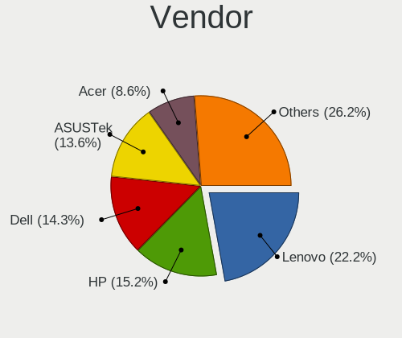
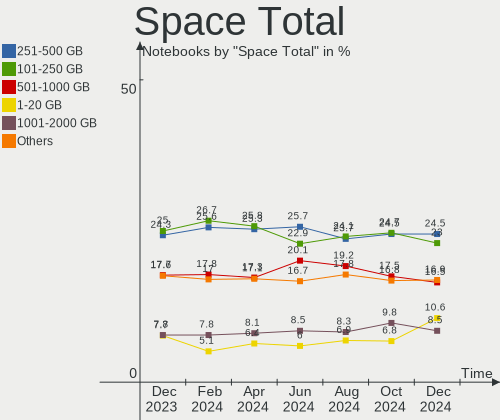
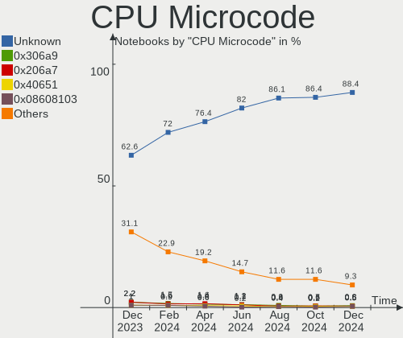
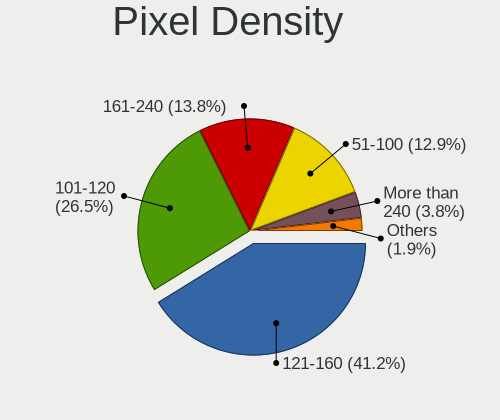

Linux - Hardware Trends (Notebooks)
-----------------------------------

A project to identify most popular hardware characteristics and track their change
over time based on data collected by Linux users at https://Linux-Hardware.org.

Anyone can contribute to this report by the [hw-probe](https://github.com/linuxhw/hw-probe) tool:

    sudo -E hw-probe -all -upload

This report is for one last month. Overall report since the beginning of time: [TestDays](https://github.com/linuxhw/TestDays)

Period: Feb, 2023.

Contents
--------

* [ System ](#system)
  - [ OS                       ](#os)
  - [ OS Family                ](#os-family)
  - [ Kernel                   ](#kernel)
  - [ Kernel Family            ](#kernel-family)
  - [ Kernel Major Ver.        ](#kernel-major-ver)
  - [ Arch                     ](#arch)
  - [ DE                       ](#de)
  - [ Display Server           ](#display-server)
  - [ Display Manager          ](#display-manager)
  - [ OS Lang                  ](#os-lang)
  - [ Boot Mode                ](#boot-mode)
  - [ Filesystem               ](#filesystem)
  - [ Part. scheme             ](#part-scheme)
  - [ Dual Boot with Linux/BSD ](#dual-boot-with-linuxbsd)
  - [ Dual Boot (Win)          ](#dual-boot-win)

* [ Board ](#board)
  - [ Vendor                   ](#vendor)
  - [ Model                    ](#model)
  - [ Model Family             ](#model-family)
  - [ MFG Year                 ](#mfg-year)
  - [ Form Factor              ](#form-factor)
  - [ Secure Boot              ](#secure-boot)
  - [ Coreboot                 ](#coreboot)
  - [ RAM Size                 ](#ram-size)
  - [ RAM Used                 ](#ram-used)
  - [ Total Drives             ](#total-drives)
  - [ Has CD-ROM               ](#has-cd-rom)
  - [ Has Ethernet             ](#has-ethernet)
  - [ Has WiFi                 ](#has-wifi)
  - [ Has Bluetooth            ](#has-bluetooth)

* [ Location ](#location)
  - [ Country                  ](#country)
  - [ City                     ](#city)

* [ Drives ](#drives)
  - [ Drive Vendor             ](#drive-vendor)
  - [ Drive Model              ](#drive-model)
  - [ HDD Vendor               ](#hdd-vendor)
  - [ SSD Vendor               ](#ssd-vendor)
  - [ Drive Kind               ](#drive-kind)
  - [ Drive Connector          ](#drive-connector)
  - [ Drive Size               ](#drive-size)
  - [ Space Total              ](#space-total)
  - [ Space Used               ](#space-used)
  - [ Malfunc. Drives          ](#malfunc-drives)
  - [ Malfunc. Drive Vendor    ](#malfunc-drive-vendor)
  - [ Malfunc. HDD Vendor      ](#malfunc-hdd-vendor)
  - [ Malfunc. Drive Kind      ](#malfunc-drive-kind)
  - [ Failed Drives            ](#failed-drives)
  - [ Failed Drive Vendor      ](#failed-drive-vendor)
  - [ Drive Status             ](#drive-status)

* [ Storage controller ](#storage-controller)
  - [ Storage Vendor           ](#storage-vendor)
  - [ Storage Model            ](#storage-model)
  - [ Storage Kind             ](#storage-kind)

* [ Processor ](#processor)
  - [ CPU Vendor               ](#cpu-vendor)
  - [ CPU Model                ](#cpu-model)
  - [ CPU Model Family         ](#cpu-model-family)
  - [ CPU Cores                ](#cpu-cores)
  - [ CPU Sockets              ](#cpu-sockets)
  - [ CPU Threads              ](#cpu-threads)
  - [ CPU Op-Modes             ](#cpu-op-modes)
  - [ CPU Microcode            ](#cpu-microcode)
  - [ CPU Microarch            ](#cpu-microarch)

* [ Graphics ](#graphics)
  - [ GPU Vendor               ](#gpu-vendor)
  - [ GPU Model                ](#gpu-model)
  - [ GPU Combo                ](#gpu-combo)
  - [ GPU Driver               ](#gpu-driver)
  - [ GPU Memory               ](#gpu-memory)

* [ Monitor ](#monitor)
  - [ Monitor Vendor           ](#monitor-vendor)
  - [ Monitor Model            ](#monitor-model)
  - [ Monitor Resolution       ](#monitor-resolution)
  - [ Monitor Diagonal         ](#monitor-diagonal)
  - [ Monitor Width            ](#monitor-width)
  - [ Aspect Ratio             ](#aspect-ratio)
  - [ Monitor Area             ](#monitor-area)
  - [ Pixel Density            ](#pixel-density)
  - [ Multiple Monitors        ](#multiple-monitors)

* [ Network ](#network)
  - [ Net Controller Vendor    ](#net-controller-vendor)
  - [ Net Controller Model     ](#net-controller-model)
  - [ Wireless Vendor          ](#wireless-vendor)
  - [ Wireless Model           ](#wireless-model)
  - [ Ethernet Vendor          ](#ethernet-vendor)
  - [ Ethernet Model           ](#ethernet-model)
  - [ Net Controller Kind      ](#net-controller-kind)
  - [ Used Controller          ](#used-controller)
  - [ NICs                     ](#nics)
  - [ IPv6                     ](#ipv6)

* [ Bluetooth ](#bluetooth)
  - [ Bluetooth Vendor         ](#bluetooth-vendor)
  - [ Bluetooth Model          ](#bluetooth-model)

* [ Sound ](#sound)
  - [ Sound Vendor             ](#sound-vendor)
  - [ Sound Model              ](#sound-model)

* [ Memory ](#memory)
  - [ Memory Vendor            ](#memory-vendor)
  - [ Memory Model             ](#memory-model)
  - [ Memory Kind              ](#memory-kind)
  - [ Memory Form Factor       ](#memory-form-factor)
  - [ Memory Size              ](#memory-size)
  - [ Memory Speed             ](#memory-speed)

* [ Printers & scanners ](#printers--scanners)
  - [ Printer Vendor           ](#printer-vendor)
  - [ Printer Model            ](#printer-model)
  - [ Scanner Vendor           ](#scanner-vendor)
  - [ Scanner Model            ](#scanner-model)

* [ Camera ](#camera)
  - [ Camera Vendor            ](#camera-vendor)
  - [ Camera Model             ](#camera-model)

* [ Security ](#security)
  - [ Fingerprint Vendor       ](#fingerprint-vendor)
  - [ Fingerprint Model        ](#fingerprint-model)
  - [ Chipcard Vendor          ](#chipcard-vendor)
  - [ Chipcard Model           ](#chipcard-model)

* [ Unsupported ](#unsupported)
  - [ Unsupported Devices      ](#unsupported-devices)
  - [ Unsupported Device Types ](#unsupported-device-types)

System
------

OS
--

Installed operating systems

| Name                         | Notebooks | Percent |
|------------------------------|-----------|---------|
| Ubuntu 22.04                 | 476       | 15.91%  |
| Fedora 37                    | 238       | 7.95%   |
| Linux Mint 21.1              | 237       | 7.92%   |
| OpenMandriva 23.01           | 207       | 6.92%   |
| Debian 11                    | 146       | 4.88%   |
| Ubuntu 22.10                 | 134       | 4.48%   |
| Pop!_OS 22.04                | 130       | 4.34%   |
| Arch Rolling                 | 103       | 3.44%   |
| Zorin 16                     | 96        | 3.21%   |
| Ubuntu 20.04                 | 69        | 2.31%   |
| SteamOS 3.4.4                | 68        | 2.27%   |
| KDE neon 22.04               | 64        | 2.14%   |
| ROSA 12.3                    | 63        | 2.11%   |
| OpenMandriva 4.3             | 53        | 1.77%   |
| Linux Mint 20.3              | 45        | 1.5%    |
| Manjaro                      | 44        | 1.47%   |
| Kubuntu 22.04                | 42        | 1.4%    |
| Kubuntu 22.10                | 32        | 1.07%   |
| Kali 2022.4                  | 31        | 1.04%   |
| openSUSE Tumbleweed-XXXXXXXX | 30        | 1%      |
| Elementary 7                 | 27        | 0.9%    |
| MX 21                        | 25        | 0.84%   |
| Debian                       | 25        | 0.84%   |
| Xubuntu 22.04                | 23        | 0.77%   |
| EndeavourOS Rolling          | 23        | 0.77%   |
| ArcoLinux Rolling            | 23        | 0.77%   |
| Linux Mint 21                | 22        | 0.74%   |
| BlackPanther 18.1            | 22        | 0.74%   |
| Nobara 37                    | 18        | 0.6%    |
| Lubuntu 22.04                | 15        | 0.5%    |
| Endless 5.0.0                | 15        | 0.5%    |
| Ubuntu MATE 22.04            | 14        | 0.47%   |
| Ubuntu 18.04                 | 14        | 0.47%   |
| Gentoo 2.13                  | 14        | 0.47%   |
| Manjaro 22.0.4               | 13        | 0.43%   |
| OpenMandriva 4.2             | 12        | 0.4%    |
| Manjaro 22.0.2               | 12        | 0.4%    |
| LMDE 5                       | 12        | 0.4%    |
| Gentoo 2.9                   | 12        | 0.4%    |
| Ubuntu 23.04                 | 11        | 0.37%   |

OS Family
---------

OS without a version

| Name          | Notebooks | Percent |
|---------------|-----------|---------|
| Ubuntu        | 709       | 23.7%   |
| Linux Mint    | 321       | 10.73%  |
| OpenMandriva  | 290       | 9.69%   |
| Fedora        | 250       | 8.36%   |
| Debian        | 171       | 5.72%   |
| Pop!_OS       | 130       | 4.34%   |
| Zorin         | 103       | 3.44%   |
| Arch          | 103       | 3.44%   |
| Manjaro       | 87        | 2.91%   |
| SteamOS       | 80        | 2.67%   |
| ROSA          | 78        | 2.61%   |
| Kubuntu       | 78        | 2.61%   |
| KDE neon      | 65        | 2.17%   |
| Xubuntu       | 39        | 1.3%    |
| openSUSE      | 38        | 1.27%   |
| Kali          | 34        | 1.14%   |
| Endless       | 34        | 1.14%   |
| Elementary    | 34        | 1.14%   |
| Gentoo        | 27        | 0.9%    |
| ArcoLinux     | 26        | 0.87%   |
| MX            | 25        | 0.84%   |
| Lubuntu       | 24        | 0.8%    |
| EndeavourOS   | 23        | 0.77%   |
| BlackPanther  | 22        | 0.74%   |
| Ubuntu MATE   | 19        | 0.64%   |
| Nobara        | 19        | 0.64%   |
| LMDE          | 12        | 0.4%    |
| Garuda Linux  | 10        | 0.33%   |
| BunsenLabs    | 9         | 0.3%    |
| ALT Linux     | 9         | 0.3%    |
| RHEL          | 8         | 0.27%   |
| Red OS        | 8         | 0.27%   |
| Parrot        | 7         | 0.23%   |
| Artix         | 7         | 0.23%   |
| Ubuntu Budgie | 6         | 0.2%    |
| Rocky Linux   | 6         | 0.2%    |
| Clear Linux   | 6         | 0.2%    |
| TUXEDO OS     | 5         | 0.17%   |
| Ubuntu Studio | 4         | 0.13%   |
| blendOS       | 4         | 0.13%   |

Kernel
------

Version of the Linux kernel

| Version                            | Notebooks | Percent |
|------------------------------------|-----------|---------|
| 5.15.0-60-generic                  | 389       | 13%     |
| 5.15.0-58-generic                  | 313       | 10.46%  |
| 5.19.0-32-generic                  | 216       | 7.22%   |
| 6.1.1-desktop-1omv2290             | 158       | 5.28%   |
| 5.10.0-21-amd64                    | 119       | 3.98%   |
| 5.19.0-31-generic                  | 102       | 3.41%   |
| 6.0.12-76060006-generic            | 95        | 3.18%   |
| 5.13.0-valve36-1-neptune           | 71        | 2.37%   |
| 5.15.0-56-generic                  | 44        | 1.47%   |
| 6.1.11-200.fc37.x86_64             | 41        | 1.37%   |
| 6.1.4-desktop-1omv2301             | 40        | 1.34%   |
| 6.1.9-200.fc37.x86_64              | 39        | 1.3%    |
| 5.19.0-29-generic                  | 37        | 1.24%   |
| 6.1.8-200.fc37.x86_64              | 34        | 1.14%   |
| 6.1.10-200.fc37.x86_64             | 34        | 1.14%   |
| 5.4.0-139-generic                  | 34        | 1.14%   |
| 5.4.0-137-generic                  | 33        | 1.1%    |
| 6.1.13-200.fc37.x86_64             | 32        | 1.07%   |
| 6.1.12-arch1-1                     | 31        | 1.04%   |
| 5.16.7-desktop-1omv4003            | 29        | 0.97%   |
| 5.15.79-generic-1rosa2021.1-x86_64 | 26        | 0.87%   |
| 6.0.0-kali6-amd64                  | 25        | 0.84%   |
| 5.10.0-20-amd64                    | 25        | 0.84%   |
| 6.1.11-76060111-generic            | 24        | 0.8%    |
| 5.16.13-desktop-1omv4003           | 24        | 0.8%    |
| 5.15.0-43-generic                  | 24        | 0.8%    |
| 6.1.11-1-MANJARO                   | 22        | 0.74%   |
| 6.1.9-arch1-1                      | 21        | 0.7%    |
| 6.0.7-301.fc37.x86_64              | 18        | 0.6%    |
| 5.19.0-21-generic                  | 18        | 0.6%    |
| 5.15.75-generic-1rosa2021.1-x86_64 | 17        | 0.57%   |
| 5.15.0-47-generic                  | 17        | 0.57%   |
| 6.1.0-3-amd64                      | 16        | 0.53%   |
| 6.1.12-200.fc37.x86_64             | 15        | 0.5%    |
| 6.1.12-1-MANJARO                   | 15        | 0.5%    |
| 6.1.11-arch1-1                     | 15        | 0.5%    |
| 5.19.0-35-generic                  | 15        | 0.5%    |
| 6.1.9-arch1-2                      | 13        | 0.43%   |
| 5.6.14-desktop-2bP                 | 13        | 0.43%   |
| 6.1.9-1-MANJARO                    | 12        | 0.4%    |

Kernel Family
-------------

Linux kernel without a distro release

| Version | Notebooks | Percent |
|---------|-----------|---------|
| 5.15.0  | 836       | 27.94%  |
| 5.19.0  | 409       | 13.67%  |
| 5.10.0  | 169       | 5.65%   |
| 6.1.1   | 166       | 5.55%   |
| 6.1.11  | 132       | 4.41%   |
| 6.1.9   | 120       | 4.01%   |
| 6.1.12  | 109       | 3.64%   |
| 6.0.12  | 104       | 3.48%   |
| 5.4.0   | 88        | 2.94%   |
| 5.13.0  | 86        | 2.87%   |
| 6.1.10  | 74        | 2.47%   |
| 6.1.8   | 67        | 2.24%   |
| 6.0.0   | 62        | 2.07%   |
| 6.1.4   | 45        | 1.5%    |
| 6.1.0   | 39        | 1.3%    |
| 6.1.13  | 37        | 1.24%   |
| 5.16.7  | 29        | 0.97%   |
| 5.15.79 | 27        | 0.9%    |
| 5.16.13 | 24        | 0.8%    |
| 6.2.0   | 23        | 0.77%   |
| 5.15.75 | 23        | 0.77%   |
| 6.1.7   | 22        | 0.74%   |
| 5.14.0  | 21        | 0.7%    |
| 6.0.7   | 18        | 0.6%    |
| 4.15.0  | 18        | 0.6%    |
| 5.11.0  | 17        | 0.57%   |
| 5.15.94 | 14        | 0.47%   |
| 6.2.1   | 13        | 0.43%   |
| 5.6.14  | 13        | 0.43%   |
| 5.15.91 | 11        | 0.37%   |
| 5.10.14 | 10        | 0.33%   |
| 5.8.0   | 9         | 0.3%    |
| 4.18.16 | 9         | 0.3%    |
| 6.1.6   | 8         | 0.27%   |
| 5.17.0  | 7         | 0.23%   |
| 6.0.10  | 6         | 0.2%    |
| 5.15.93 | 5         | 0.17%   |
| 5.15.89 | 5         | 0.17%   |
| 4.18.0  | 5         | 0.17%   |
| 5.18.0  | 4         | 0.13%   |

Kernel Major Ver.
-----------------

Linux kernel major version

| Version | Notebooks | Percent |
|---------|-----------|---------|
| 5.15    | 945       | 31.58%  |
| 6.1     | 820       | 27.41%  |
| 5.19    | 412       | 13.77%  |
| 5.10    | 206       | 6.89%   |
| 6.0     | 204       | 6.82%   |
| 5.4     | 90        | 3.01%   |
| 5.13    | 86        | 2.87%   |
| 5.16    | 56        | 1.87%   |
| 6.2     | 36        | 1.2%    |
| 5.14    | 27        | 0.9%    |
| 5.11    | 20        | 0.67%   |
| 4.15    | 18        | 0.6%    |
| 5.17    | 14        | 0.47%   |
| 4.18    | 14        | 0.47%   |
| 5.6     | 13        | 0.43%   |
| 5.18    | 10        | 0.33%   |
| 5.8     | 9         | 0.3%    |
| 4.9     | 3         | 0.1%    |
| 5.0     | 2         | 0.07%   |
| 4.4     | 2         | 0.07%   |
| 5.3     | 1         | 0.03%   |
| 4.19    | 1         | 0.03%   |
| 4.14    | 1         | 0.03%   |
| 4.1     | 1         | 0.03%   |
| 3.10    | 1         | 0.03%   |

Arch
----

OS architecture (x86_64, i586, etc.)

| Name    | Notebooks | Percent |
|---------|-----------|---------|
| x86_64  | 2956      | 98.8%   |
| i686    | 32        | 1.07%   |
| aarch64 | 4         | 0.13%   |

DE
--

Desktop Environment

| Name             | Notebooks | Percent |
|------------------|-----------|---------|
| GNOME            | 1349      | 45.09%  |
| KDE5             | 824       | 27.54%  |
| X-Cinnamon       | 261       | 8.72%   |
| XFCE             | 215       | 7.19%   |
| MATE             | 79        | 2.64%   |
| Unknown          | 70        | 2.34%   |
| LXQt             | 36        | 1.2%    |
| Pantheon         | 34        | 1.14%   |
| Cinnamon         | 18        | 0.6%    |
| LXDE             | 12        | 0.4%    |
| i3               | 12        | 0.4%    |
| Hyprland         | 9         | 0.3%    |
| KDE              | 8         | 0.27%   |
| GNOME Flashback  | 7         | 0.23%   |
| sway             | 6         | 0.2%    |
| KDE4             | 6         | 0.2%    |
| Budgie           | 6         | 0.2%    |
| Deepin           | 5         | 0.17%   |
| Unity            | 3         | 0.1%    |
| qtile            | 3         | 0.1%    |
| lightdm-xsession | 3         | 0.1%    |
| icewm            | 3         | 0.1%    |
| GNOME Classic    | 3         | 0.1%    |
| dwm              | 3         | 0.1%    |
| chadwm           | 3         | 0.1%    |
| BunsenLabs       | 3         | 0.1%    |
| Trinity          | 2         | 0.07%   |
| openbox          | 2         | 0.07%   |
| xmonad           | 1         | 0.03%   |
| xinitrc          | 1         | 0.03%   |
| LeftWM           | 1         | 0.03%   |
| i3-with-shmlog   | 1         | 0.03%   |
| GNOME-Classic    | 1         | 0.03%   |
| dot-xsession     | 1         | 0.03%   |
| awesome          | 1         | 0.03%   |

Display Server
--------------

X11 or Wayland

| Name    | Notebooks | Percent |
|---------|-----------|---------|
| X11     | 1990      | 66.51%  |
| Wayland | 911       | 30.45%  |
| Unknown | 61        | 2.04%   |
| Tty     | 30        | 1%      |

Display Manager
---------------

SDDM, LightDM, etc.

| Name    | Notebooks | Percent |
|---------|-----------|---------|
| Unknown | 984       | 32.89%  |
| GDM3    | 682       | 22.79%  |
| SDDM    | 598       | 19.99%  |
| LightDM | 432       | 14.44%  |
| GDM     | 271       | 9.06%   |
| KDM     | 6         | 0.2%    |
| SLiM    | 5         | 0.17%   |
| LXDM    | 5         | 0.17%   |
| Ly      | 3         | 0.1%    |
| TDM     | 2         | 0.07%   |
| GREETD  | 2         | 0.07%   |
| XDM     | 1         | 0.03%   |
| SLIMSKI | 1         | 0.03%   |

OS Lang
-------

Language

| Lang    | Notebooks | Percent |
|---------|-----------|---------|
| en_US   | 1322      | 44.18%  |
| de_DE   | 267       | 8.92%   |
| ru_RU   | 218       | 7.29%   |
| en_GB   | 146       | 4.88%   |
| fr_FR   | 137       | 4.58%   |
| it_IT   | 109       | 3.64%   |
| pt_BR   | 105       | 3.51%   |
| pl_PL   | 62        | 2.07%   |
| es_ES   | 59        | 1.97%   |
| Unknown | 56        | 1.87%   |
| en_IN   | 45        | 1.5%    |
| C       | 42        | 1.4%    |
| en_CA   | 40        | 1.34%   |
| es_MX   | 30        | 1%      |
| cs_CZ   | 28        | 0.94%   |
| nl_NL   | 20        | 0.67%   |
| de_CH   | 20        | 0.67%   |
| en_AU   | 19        | 0.64%   |
| hu_HU   | 17        | 0.57%   |
| zh_CN   | 15        | 0.5%    |
| de_AT   | 14        | 0.47%   |
| pt_PT   | 13        | 0.43%   |
| tr_TR   | 12        | 0.4%    |
| es_CO   | 11        | 0.37%   |
| es_AR   | 11        | 0.37%   |
| en_NZ   | 11        | 0.37%   |
| fi_FI   | 10        | 0.33%   |
| es_CL   | 10        | 0.33%   |
| sv_SE   | 8         | 0.27%   |
| zh_TW   | 7         | 0.23%   |
| es_UY   | 6         | 0.2%    |
| es_PE   | 6         | 0.2%    |
| en_ZA   | 6         | 0.2%    |
| nl_BE   | 5         | 0.17%   |
| nb_NO   | 5         | 0.17%   |
| fr_BE   | 5         | 0.17%   |
| en_PH   | 5         | 0.17%   |
| en_IL   | 5         | 0.17%   |
| ja_JP   | 4         | 0.13%   |
| es_VE   | 4         | 0.13%   |

Boot Mode
---------

EFI or BIOS

| Mode | Notebooks | Percent |
|------|-----------|---------|
| EFI  | 1622      | 54.21%  |
| BIOS | 1370      | 45.79%  |

Filesystem
----------

Type of filesystem

| Type     | Notebooks | Percent |
|----------|-----------|---------|
| Ext4     | 2226      | 74.4%   |
| Btrfs    | 470       | 15.71%  |
| Overlay  | 223       | 7.45%   |
| Xfs      | 32        | 1.07%   |
| Zfs      | 24        | 0.8%    |
| Tmpfs    | 5         | 0.17%   |
| F2fs     | 3         | 0.1%    |
| Ext2     | 3         | 0.1%    |
| Unknown  | 2         | 0.07%   |
| XXXfs    | 1         | 0.03%   |
| Reiserfs | 1         | 0.03%   |
| Jfs      | 1         | 0.03%   |
| Ext3     | 1         | 0.03%   |

Part. scheme
------------

Scheme of partitioning

| Type    | Notebooks | Percent |
|---------|-----------|---------|
| GPT     | 1705      | 56.99%  |
| Unknown | 924       | 30.88%  |
| MBR     | 363       | 12.13%  |

Dual Boot with Linux/BSD
------------------------

Hosting more than one Linux/BSD

| Dual boot | Notebooks | Percent |
|-----------|-----------|---------|
| No        | 2622      | 87.63%  |
| Yes       | 370       | 12.37%  |

Dual Boot (Win)
---------------

Hosting Linux and Windows

| Dual boot | Notebooks | Percent |
|-----------|-----------|---------|
| No        | 2224      | 74.33%  |
| Yes       | 768       | 25.67%  |

Board
-----

Vendor
------

Motherboard manufacturer

| Name                           | Notebooks | Percent |
|--------------------------------|-----------|---------|
| Lenovo                         | 656       | 21.93%  |
| Hewlett-Packard                | 495       | 16.54%  |
| Dell                           | 421       | 14.07%  |
| ASUSTek Computer               | 333       | 11.13%  |
| Acer                           | 258       | 8.62%   |
| Apple                          | 88        | 2.94%   |
| Valve                          | 75        | 2.51%   |
| MSI                            | 65        | 2.17%   |
| Toshiba                        | 64        | 2.14%   |
| HUAWEI                         | 47        | 1.57%   |
| Samsung Electronics            | 46        | 1.54%   |
| Unknown                        | 39        | 1.3%    |
| Sony                           | 37        | 1.24%   |
| Google                         | 36        | 1.2%    |
| Fujitsu                        | 23        | 0.77%   |
| Timi                           | 21        | 0.7%    |
| Medion                         | 18        | 0.6%    |
| Alienware                      | 17        | 0.57%   |
| TUXEDO                         | 16        | 0.53%   |
| Notebook                       | 14        | 0.47%   |
| Positivo                       | 11        | 0.37%   |
| Gigabyte Technology            | 11        | 0.37%   |
| HONOR                          | 10        | 0.33%   |
| Packard Bell                   | 9         | 0.3%    |
| Chuwi                          | 9         | 0.3%    |
| System76                       | 7         | 0.23%   |
| Fujitsu Siemens                | 7         | 0.23%   |
| Gateway                        | 6         | 0.2%    |
| Clevo                          | 6         | 0.2%    |
| Schenker                       | 5         | 0.17%   |
| Intel                          | 5         | 0.17%   |
| Panasonic                      | 4         | 0.13%   |
| Monster                        | 4         | 0.13%   |
| GPU Company                    | 4         | 0.13%   |
| eMachines                      | 4         | 0.13%   |
| Teclast                        | 3         | 0.1%    |
| Star Labs                      | 3         | 0.1%    |
| Standard                       | 3         | 0.1%    |
| SmbiosType1_SystemManufacturer | 3         | 0.1%    |
| SLIMBOOK                       | 3         | 0.1%    |

Model
-----

Motherboard model

| Name                             | Notebooks | Percent |
|----------------------------------|-----------|---------|
| Valve Jupiter                    | 75        | 2.51%   |
| Unknown                          | 53        | 1.77%   |
| HP Notebook                      | 28        | 0.94%   |
| HP Pavilion g6                   | 10        | 0.33%   |
| HP Pavilion 15                   | 10        | 0.33%   |
| Apple MacBookPro8,1              | 10        | 0.33%   |
| Lenovo G50-80 80E5               | 7         | 0.23%   |
| HP Pavilion dv7                  | 7         | 0.23%   |
| Dell Precision M4800             | 7         | 0.23%   |
| Dell Precision 5570              | 7         | 0.23%   |
| Apple MacBookPro9,2              | 7         | 0.23%   |
| Lenovo IdeaPad 5 Pro 16ARH7 82SN | 6         | 0.2%    |
| Lenovo IdeaPad 3 15ADA05 81W1    | 6         | 0.2%    |
| HP Laptop 15s-eq2xxx             | 6         | 0.2%    |
| HP 250 G6 Notebook PC            | 6         | 0.2%    |
| HP 15                            | 6         | 0.2%    |
| Dell Latitude D630               | 6         | 0.2%    |
| Clevo NL41MU2                    | 6         | 0.2%    |
| Lenovo ThinkBook 15 G3 ACL 21A4  | 5         | 0.17%   |
| Lenovo IdeaPad 5 Pro 16ACH6 82L5 | 5         | 0.17%   |
| Lenovo IdeaPad 3 15ALC6 82KU     | 5         | 0.17%   |
| HUAWEI BOM-WXX9                  | 5         | 0.17%   |
| HP Pavilion 17                   | 5         | 0.17%   |
| HP ENVY 17                       | 5         | 0.17%   |
| HP ENVY 15                       | 5         | 0.17%   |
| HP EliteBook 830 G5              | 5         | 0.17%   |
| HP 15 Notebook PC                | 5         | 0.17%   |
| Dell XPS 15 9520                 | 5         | 0.17%   |
| Dell XPS 13 9370                 | 5         | 0.17%   |
| Dell XPS 13 9360                 | 5         | 0.17%   |
| Dell XPS 13 7390                 | 5         | 0.17%   |
| Dell Latitude E7470              | 5         | 0.17%   |
| Dell Latitude E6430              | 5         | 0.17%   |
| Dell Latitude E5450              | 5         | 0.17%   |
| Dell Latitude 5420               | 5         | 0.17%   |
| Dell Inspiron N5110              | 5         | 0.17%   |
| Apple MacBookAir7,2              | 5         | 0.17%   |
| Acer Aspire V3-771               | 5         | 0.17%   |
| Acer Aspire A515-51G             | 5         | 0.17%   |
| Toshiba Satellite C660           | 4         | 0.13%   |

Model Family
------------

Motherboard model prefix

| Name              | Notebooks | Percent |
|-------------------|-----------|---------|
| Lenovo ThinkPad   | 353       | 11.8%   |
| Acer Aspire       | 174       | 5.82%   |
| Dell Latitude     | 154       | 5.15%   |
| Lenovo IdeaPad    | 153       | 5.11%   |
| Dell Inspiron     | 107       | 3.58%   |
| HP Pavilion       | 96        | 3.21%   |
| HP EliteBook      | 80        | 2.67%   |
| ASUS VivoBook     | 80        | 2.67%   |
| Valve Jupiter     | 75        | 2.51%   |
| HP Laptop         | 67        | 2.24%   |
| HP ProBook        | 59        | 1.97%   |
| Toshiba Satellite | 55        | 1.84%   |
| Unknown           | 53        | 1.77%   |
| Dell XPS          | 51        | 1.7%    |
| Dell Precision    | 40        | 1.34%   |
| ASUS ROG          | 37        | 1.24%   |
| Lenovo Legion     | 33        | 1.1%    |
| Lenovo ThinkBook  | 30        | 1%      |
| Dell Vostro       | 29        | 0.97%   |
| ASUS Zenbook      | 29        | 0.97%   |
| HP Notebook       | 28        | 0.94%   |
| HP ENVY           | 23        | 0.77%   |
| ASUS ASUS         | 21        | 0.7%    |
| Acer Nitro        | 21        | 0.7%    |
| Fujitsu LIFEBOOK  | 20        | 0.67%   |
| HP 250            | 18        | 0.6%    |
| Acer Swift        | 18        | 0.6%    |
| HP Compaq         | 17        | 0.57%   |
| HP ZBook          | 16        | 0.53%   |
| Acer TravelMate   | 15        | 0.5%    |
| Apple MacBookPro8 | 14        | 0.47%   |
| HP OMEN           | 12        | 0.4%    |
| Dell G15          | 12        | 0.4%    |
| Acer Predator     | 12        | 0.4%    |
| HP 15             | 11        | 0.37%   |
| Lenovo Yoga       | 10        | 0.33%   |
| ASUS TUF          | 10        | 0.33%   |
| MSI GF63          | 9         | 0.3%    |
| Lenovo G50-80     | 9         | 0.3%    |
| HP Stream         | 8         | 0.27%   |

MFG Year
--------

Motherboard manufacture year

| Year    | Notebooks | Percent |
|---------|-----------|---------|
| 2021    | 392       | 13.1%   |
| 2022    | 371       | 12.4%   |
| 2020    | 271       | 9.06%   |
| 2019    | 261       | 8.72%   |
| 2012    | 189       | 6.32%   |
| 2013    | 187       | 6.25%   |
| 2018    | 185       | 6.18%   |
| 2011    | 180       | 6.02%   |
| 2017    | 171       | 5.72%   |
| 2016    | 158       | 5.28%   |
| 2015    | 148       | 4.95%   |
| 2014    | 143       | 4.78%   |
| 2010    | 108       | 3.61%   |
| 2009    | 83        | 2.77%   |
| 2008    | 63        | 2.11%   |
| 2007    | 41        | 1.37%   |
| 2023    | 23        | 0.77%   |
| 2006    | 11        | 0.37%   |
| Unknown | 4         | 0.13%   |
| 2004    | 2         | 0.07%   |
| 2005    | 1         | 0.03%   |

Form Factor
-----------

Physical design of the computer

| Name     | Notebooks | Percent |
|----------|-----------|---------|
| Notebook | 2992      | 100%    |

Secure Boot
-----------

Enabled or disabled

| State    | Notebooks | Percent |
|----------|-----------|---------|
| Disabled | 2714      | 90.71%  |
| Enabled  | 278       | 9.29%   |

Coreboot
--------

Have coreboot on board

| Used | Notebooks | Percent |
|------|-----------|---------|
| No   | 2949      | 98.56%  |
| Yes  | 43        | 1.44%   |

RAM Size
--------

Total RAM memory

| Size in GB  | Notebooks | Percent |
|-------------|-----------|---------|
| 4.01-8.0    | 842       | 28.14%  |
| 8.01-16.0   | 588       | 19.65%  |
| 16.01-24.0  | 561       | 18.75%  |
| 3.01-4.0    | 539       | 18.01%  |
| 32.01-64.0  | 219       | 7.32%   |
| 1.01-2.0    | 94        | 3.14%   |
| 64.01-256.0 | 54        | 1.8%    |
| 24.01-32.0  | 52        | 1.74%   |
| 2.01-3.0    | 35        | 1.17%   |
| 0.51-1.0    | 8         | 0.27%   |

RAM Used
--------

Used RAM memory

| Used GB    | Notebooks | Percent |
|------------|-----------|---------|
| 1.01-2.0   | 949       | 31.72%  |
| 2.01-3.0   | 798       | 26.67%  |
| 4.01-8.0   | 519       | 17.35%  |
| 3.01-4.0   | 418       | 13.97%  |
| 8.01-16.0  | 144       | 4.81%   |
| 0.51-1.0   | 126       | 4.21%   |
| 0.01-0.5   | 16        | 0.53%   |
| 16.01-24.0 | 14        | 0.47%   |
| 24.01-32.0 | 5         | 0.17%   |
| 32.01-64.0 | 3         | 0.1%    |

Total Drives
------------

Number of drives on board

| Drives | Notebooks | Percent |
|--------|-----------|---------|
| 1      | 2152      | 71.93%  |
| 2      | 732       | 24.47%  |
| 3      | 75        | 2.51%   |
| 4      | 17        | 0.57%   |
| 0      | 16        | 0.53%   |

Has CD-ROM
----------

Has CD-ROM on board

| Presented | Notebooks | Percent |
|-----------|-----------|---------|
| No        | 2123      | 70.96%  |
| Yes       | 869       | 29.04%  |

Has Ethernet
------------

Has Ethernet on board

| Presented | Notebooks | Percent |
|-----------|-----------|---------|
| Yes       | 2274      | 76%     |
| No        | 718       | 24%     |

Has WiFi
--------

Has WiFi module

| Presented | Notebooks | Percent |
|-----------|-----------|---------|
| Yes       | 2923      | 97.69%  |
| No        | 69        | 2.31%   |

Has Bluetooth
-------------

Has Bluetooth module

| Presented | Notebooks | Percent |
|-----------|-----------|---------|
| Yes       | 2445      | 81.72%  |
| No        | 547       | 18.28%  |

Location
--------

Country
-------

Geographic location (country)

| Country     | Notebooks | Percent |
|-------------|-----------|---------|
| USA         | 492       | 16.44%  |
| Germany     | 361       | 12.07%  |
| Russia      | 244       | 8.16%   |
| Italy       | 157       | 5.25%   |
| France      | 156       | 5.21%   |
| Brazil      | 155       | 5.18%   |
| Poland      | 113       | 3.78%   |
| UK          | 100       | 3.34%   |
| Spain       | 87        | 2.91%   |
| India       | 72        | 2.41%   |
| Canada      | 60        | 2.01%   |
| Netherlands | 56        | 1.87%   |
| Hungary     | 50        | 1.67%   |
| Turkey      | 42        | 1.4%    |
| Mexico      | 39        | 1.3%    |
| Australia   | 38        | 1.27%   |
| Switzerland | 37        | 1.24%   |
| Czechia     | 37        | 1.24%   |
| Finland     | 31        | 1.04%   |
| Belgium     | 30        | 1%      |
| Portugal    | 29        | 0.97%   |
| Sweden      | 28        | 0.94%   |
| Indonesia   | 27        | 0.9%    |
| Romania     | 26        | 0.87%   |
| Austria     | 22        | 0.74%   |
| Argentina   | 22        | 0.74%   |
| Chile       | 19        | 0.64%   |
| Japan       | 18        | 0.6%    |
| Belarus     | 17        | 0.57%   |
| Ukraine     | 16        | 0.53%   |
| China       | 16        | 0.53%   |
| New Zealand | 15        | 0.5%    |
| Israel      | 15        | 0.5%    |
| Colombia    | 15        | 0.5%    |
| Norway      | 14        | 0.47%   |
| Philippines | 13        | 0.43%   |
| Bulgaria    | 13        | 0.43%   |
| Vietnam     | 12        | 0.4%    |
| Thailand    | 12        | 0.4%    |
| Ireland     | 12        | 0.4%    |

City
----

Geographic location (city)

| City              | Notebooks | Percent |
|-------------------|-----------|---------|
| Moscow            | 51        | 1.7%    |
| St Petersburg     | 33        | 1.1%    |
| Berlin            | 33        | 1.1%    |
| Milan             | 29        | 0.97%   |
| Warsaw            | 27        | 0.9%    |
| Paris             | 27        | 0.9%    |
| Istanbul          | 18        | 0.6%    |
| Barcelona         | 18        | 0.6%    |
| Helsinki          | 17        | 0.57%   |
| Munich            | 16        | 0.53%   |
| Bengaluru         | 15        | 0.5%    |
| Prague            | 14        | 0.47%   |
| Milano            | 14        | 0.47%   |
| Mexico City       | 13        | 0.43%   |
| Madrid            | 13        | 0.43%   |
| Krakow            | 13        | 0.43%   |
| Melbourne         | 12        | 0.4%    |
| Sydney            | 11        | 0.37%   |
| Rome              | 11        | 0.37%   |
| Rio de Janeiro    | 11        | 0.37%   |
| London            | 11        | 0.37%   |
| Cologne           | 11        | 0.37%   |
| Budapest          | 11        | 0.37%   |
| Amsterdam         | 11        | 0.37%   |
| Sao Paulo         | 10        | 0.33%   |
| Santiago          | 10        | 0.33%   |
| Lisbon            | 10        | 0.33%   |
| Frankfurt am Main | 10        | 0.33%   |
| Vienna            | 9         | 0.3%    |
| Houston           | 9         | 0.3%    |
| Chicago           | 9         | 0.3%    |
| Bucharest         | 9         | 0.3%    |
| Voronezh          | 8         | 0.27%   |
| Montreal          | 8         | 0.27%   |
| Krasnodar         | 8         | 0.27%   |
| Central           | 8         | 0.27%   |
| Auckland          | 8         | 0.27%   |
| Wroclaw           | 7         | 0.23%   |
| Vancouver         | 7         | 0.23%   |
| Tbilisi           | 7         | 0.23%   |

Drives
------

Drive Vendor
------------

Hard drive vendors

| Vendor                      | Notebooks | Drives | Percent |
|-----------------------------|-----------|--------|---------|
| Samsung Electronics         | 629       | 679    | 16.77%  |
| WDC                         | 324       | 331    | 8.64%   |
| Seagate                     | 302       | 312    | 8.05%   |
| Sandisk                     | 255       | 264    | 6.8%    |
| Unknown                     | 240       | 262    | 6.4%    |
| Toshiba                     | 239       | 240    | 6.37%   |
| Kingston                    | 187       | 190    | 4.99%   |
| SK hynix                    | 156       | 160    | 4.16%   |
| Intel                       | 136       | 146    | 3.63%   |
| Crucial                     | 129       | 133    | 3.44%   |
| Micron Technology           | 120       | 121    | 3.2%    |
| HGST                        | 88        | 88     | 2.35%   |
| Hitachi                     | 72        | 72     | 1.92%   |
| KIOXIA                      | 61        | 61     | 1.63%   |
| Apple                       | 52        | 62     | 1.39%   |
| A-DATA Technology           | 48        | 48     | 1.28%   |
| China                       | 47        | 49     | 1.25%   |
| Kingston Technology Company | 43        | 43     | 1.15%   |
| Unknown                     | 41        | 41     | 1.09%   |
| Phison Electronics          | 40        | 41     | 1.07%   |
| SPCC                        | 27        | 27     | 0.72%   |
| Intenso                     | 23        | 24     | 0.61%   |
| ADATA Technology            | 20        | 20     | 0.53%   |
| Transcend                   | 17        | 17     | 0.45%   |
| Phison                      | 17        | 17     | 0.45%   |
| Silicon Motion              | 16        | 16     | 0.43%   |
| Micron/Crucial Technology   | 16        | 16     | 0.43%   |
| LITEON                      | 16        | 16     | 0.43%   |
| PNY                         | 15        | 15     | 0.4%    |
| JMicron Technology          | 15        | 15     | 0.4%    |
| O2 Micro                    | 14        | 14     | 0.37%   |
| Netac                       | 14        | 15     | 0.37%   |
| Patriot                     | 13        | 13     | 0.35%   |
| LITEONIT                    | 12        | 12     | 0.32%   |
| GOODRAM                     | 12        | 12     | 0.32%   |
| Fujitsu                     | 12        | 12     | 0.32%   |
| Apacer                      | 11        | 11     | 0.29%   |
| UMIS                        | 9         | 9      | 0.24%   |
| BIWIN                       | 8         | 8      | 0.21%   |
| TO Exter                    | 7         | 7      | 0.19%   |

Drive Model
-----------

Hard drive models

| Model                                                | Notebooks | Percent |
|------------------------------------------------------|-----------|---------|
| Samsung NVMe SSD Controller SM981/PM981/PM983 250GB  | 81        | 2.11%   |
| Samsung NVMe SSD Controller PM9A1/PM9A3/980PRO 960GB | 52        | 1.35%   |
| Unknown MMC Card  64GB                               | 42        | 1.09%   |
| Unknown MMC Card  32GB                               | 42        | 1.09%   |
| Unknown                                              | 41        | 1.07%   |
| Seagate ST1000LM035-1RK172 1TB                       | 40        | 1.04%   |
| Kingston SA400S37240G 240GB SSD                      | 38        | 0.99%   |
| Toshiba MQ01ABD100 1TB                               | 35        | 0.91%   |
| Unknown MMC Card  128GB                              | 32        | 0.83%   |
| Kingston SA400S37480G 480GB SSD                      | 29        | 0.75%   |
| Toshiba MQ01ABF050 500GB                             | 27        | 0.7%    |
| Phison PS5013 E13 NVMe Controller 500GB              | 27        | 0.7%    |
| Kingston Company OM3PDP3 NVMe SSD 512GB              | 27        | 0.7%    |
| Crucial CT240BX500SSD1 240GB                         | 27        | 0.7%    |
| Sandisk WD Black SN750 / PC SN730 NVMe SSD 512GB     | 26        | 0.68%   |
| Seagate ST500LT012-1DG142 500GB                      | 25        | 0.65%   |
| Seagate ST1000LM024 HN-M101MBB 1TB                   | 24        | 0.62%   |
| Sandisk WD Blue SN550 NVMe SSD 1TB                   | 23        | 0.6%    |
| HGST HTS721010A9E630 1TB                             | 23        | 0.6%    |
| HGST HTS545050A7E680 500GB                           | 23        | 0.6%    |
| Toshiba MQ04ABF100 1TB                               | 22        | 0.57%   |
| Intel SSD 660P Series 1024GB                         | 22        | 0.57%   |
| Crucial CT500MX500SSD1 500GB                         | 21        | 0.55%   |
| Unknown MMC Card  512GB                              | 20        | 0.52%   |
| Intel SSDPEKNU512GZ 512GB                            | 20        | 0.52%   |
| Crucial CT1000MX500SSD1 1TB                          | 19        | 0.49%   |
| Seagate ST9500325AS 500GB                            | 18        | 0.47%   |
| WDC WD10SPZX-21Z10T0 1TB                             | 17        | 0.44%   |
| Samsung NVMe SSD Controller SM961/PM961/SM963 512GB  | 15        | 0.39%   |
| Seagate ST500LM021-1KJ152 500GB                      | 14        | 0.36%   |
| Samsung SSD 870 EVO 500GB                            | 14        | 0.36%   |
| O2 Micro E2M2 64GB                                   | 14        | 0.36%   |
| Kingston SA400S37120G 120GB SSD                      | 13        | 0.34%   |
| SK hynix BC511 512GB                                 | 12        | 0.31%   |
| Seagate ST2000LM015-2E8174 2TB                       | 12        | 0.31%   |
| Samsung SSD 980 1TB                                  | 12        | 0.31%   |
| Samsung SSD 860 EVO 250GB                            | 12        | 0.31%   |
| Samsung SSD 860 EVO 1TB                              | 12        | 0.31%   |
| HGST HTS541010A9E680 1TB                             | 12        | 0.31%   |
| Unknown MMC Card  256GB                              | 11        | 0.29%   |

HDD Vendor
----------

Hard disk drive vendors

| Vendor              | Notebooks | Drives | Percent |
|---------------------|-----------|--------|---------|
| Seagate             | 294       | 303    | 32.7%   |
| WDC                 | 215       | 215    | 23.92%  |
| Toshiba             | 169       | 169    | 18.8%   |
| HGST                | 88        | 88     | 9.79%   |
| Hitachi             | 72        | 72     | 8.01%   |
| Samsung Electronics | 18        | 18     | 2%      |
| Fujitsu             | 12        | 12     | 1.33%   |
| Unknown             | 10        | 11     | 1.11%   |
| JMicron Technology  | 6         | 6      | 0.67%   |
| SABRENT             | 4         | 4      | 0.44%   |
| ASMT                | 3         | 3      | 0.33%   |
| Apple               | 3         | 3      | 0.33%   |
| Intenso             | 2         | 2      | 0.22%   |
| USB3.0              | 1         | 1      | 0.11%   |
| LaCie               | 1         | 1      | 0.11%   |
| HGST HTS            | 1         | 1      | 0.11%   |

SSD Vendor
----------

Solid state drive vendors

| Vendor              | Notebooks | Drives | Percent |
|---------------------|-----------|--------|---------|
| Samsung Electronics | 209       | 215    | 18.45%  |
| Kingston            | 150       | 153    | 13.24%  |
| SanDisk             | 122       | 125    | 10.77%  |
| Crucial             | 113       | 116    | 9.97%   |
| WDC                 | 51        | 52     | 4.5%    |
| China               | 47        | 49     | 4.15%   |
| A-DATA Technology   | 36        | 36     | 3.18%   |
| Apple               | 30        | 30     | 2.65%   |
| Intel               | 28        | 28     | 2.47%   |
| Micron Technology   | 26        | 26     | 2.29%   |
| SPCC                | 22        | 22     | 1.94%   |
| Toshiba             | 21        | 21     | 1.85%   |
| Intenso             | 20        | 20     | 1.77%   |
| SK hynix            | 18        | 18     | 1.59%   |
| Transcend           | 15        | 15     | 1.32%   |
| PNY                 | 14        | 14     | 1.24%   |
| Netac               | 14        | 14     | 1.24%   |
| Patriot             | 13        | 13     | 1.15%   |
| LITEON              | 13        | 13     | 1.15%   |
| LITEONIT            | 12        | 12     | 1.06%   |
| GOODRAM             | 11        | 11     | 0.97%   |
| Apacer              | 10        | 10     | 0.88%   |
| TO Exter            | 7         | 7      | 0.62%   |
| Team                | 7         | 7      | 0.62%   |
| Unknown             | 7         | 7      | 0.62%   |
| KingSpec            | 6         | 6      | 0.53%   |
| Dogfish             | 6         | 6      | 0.53%   |
| Teclast             | 4         | 4      | 0.35%   |
| OCZ                 | 4         | 4      | 0.35%   |
| Lexar               | 4         | 4      | 0.35%   |
| Hewlett-Packard     | 4         | 4      | 0.35%   |
| Corsair             | 4         | 4      | 0.35%   |
| Plextor             | 3         | 3      | 0.26%   |
| OWC                 | 3         | 3      | 0.26%   |
| FORESEE             | 3         | 3      | 0.26%   |
| EVM                 | 3         | 3      | 0.26%   |
| XrayDisk            | 2         | 2      | 0.18%   |
| TCSUNBOW            | 2         | 2      | 0.18%   |
| Smartbuy            | 2         | 2      | 0.18%   |
| ShiJi               | 2         | 2      | 0.18%   |

Drive Kind
----------

HDD or SSD

| Kind    | Notebooks | Drives | Percent |
|---------|-----------|--------|---------|
| NVMe    | 1317      | 1474   | 36.94%  |
| SSD     | 1055      | 1151   | 29.59%  |
| HDD     | 863       | 909    | 24.21%  |
| MMC     | 266       | 288    | 7.46%   |
| Unknown | 64        | 65     | 1.8%    |

Drive Connector
---------------

SATA, SAS, NVMe, etc.

| Type | Notebooks | Drives | Percent |
|------|-----------|--------|---------|
| SATA | 1722      | 1994   | 50.17%  |
| NVMe | 1313      | 1463   | 38.26%  |
| MMC  | 266       | 288    | 7.75%   |
| SAS  | 131       | 142    | 3.82%   |

Drive Size
----------

Size of hard drive

| Size in TB      | Notebooks | Drives | Percent |
|-----------------|-----------|--------|---------|
| 0.01-0.5        | 1280      | 1408   | 67.44%  |
| 0.51-1.0        | 546       | 573    | 28.77%  |
| 1.01-2.0        | 61        | 65     | 3.21%   |
| 3.01-4.0        | 4         | 5      | 0.21%   |
| 2.01-3.0        | 4         | 5      | 0.21%   |
| 4.01-10.0       | 2         | 3      | 0.11%   |
| More than 100.0 | 1         | 1      | 0.05%   |

Space Total
-----------

Amount of disk space available on the file system

| Size in GB     | Notebooks | Percent |
|----------------|-----------|---------|
| 101-250        | 826       | 27.61%  |
| 251-500        | 743       | 24.83%  |
| 501-1000       | 473       | 15.81%  |
| 1-20           | 235       | 7.85%   |
| 1001-2000      | 211       | 7.05%   |
| 51-100         | 180       | 6.02%   |
| Unknown        | 107       | 3.58%   |
| 21-50          | 103       | 3.44%   |
| More than 3000 | 68        | 2.27%   |
| 2001-3000      | 46        | 1.54%   |

Space Used
----------

Amount of used disk space

| Used GB        | Notebooks | Percent |
|----------------|-----------|---------|
| 1-20           | 1044      | 34.89%  |
| 21-50          | 586       | 19.59%  |
| 101-250        | 444       | 14.84%  |
| 51-100         | 367       | 12.27%  |
| 251-500        | 227       | 7.59%   |
| 501-1000       | 138       | 4.61%   |
| Unknown        | 107       | 3.58%   |
| 1001-2000      | 48        | 1.6%    |
| More than 3000 | 16        | 0.53%   |
| 2001-3000      | 13        | 0.43%   |
| 0              | 2         | 0.07%   |

Malfunc. Drives
---------------

Drive models with a malfunction

| Model                                                           | Notebooks | Drives | Percent |
|-----------------------------------------------------------------|-----------|--------|---------|
| Seagate ST9500325AS 500GB                                       | 8         | 8      | 3.11%   |
| Seagate ST1000LM035-1RK172 1TB                                  | 8         | 8      | 3.11%   |
| Seagate ST500LT012-1DG142 500GB                                 | 7         | 7      | 2.72%   |
| Seagate ST1000LM024 HN-M101MBB 1TB                              | 6         | 6      | 2.33%   |
| Seagate ST9320325AS 320GB                                       | 5         | 5      | 1.95%   |
| HGST HTS545050A7E680 500GB                                      | 5         | 5      | 1.95%   |
| HGST HTS541075A9E680 752GB                                      | 5         | 5      | 1.95%   |
| HGST HTS541010A9E680 1TB                                        | 5         | 5      | 1.95%   |
| Toshiba MQ01ABD075 752GB                                        | 4         | 4      | 1.56%   |
| SanDisk SSD U100 256GB                                          | 4         | 4      | 1.56%   |
| Seagate ST500LM021-1KJ152 500GB                                 | 3         | 3      | 1.17%   |
| Seagate ST500LM012 HN-M500MBB 500GB                             | 3         | 3      | 1.17%   |
| Seagate ST320LT020-9YG142 320GB                                 | 3         | 3      | 1.17%   |
| Samsung Electronics NVMe SSD Controller SM981/PM981/PM983 250GB | 3         | 3      | 1.17%   |
| HGST HTS725050A7E630 500GB                                      | 3         | 3      | 1.17%   |
| WDC WD3200BEKT-60PVMT0 320GB                                    | 2         | 2      | 0.78%   |
| WDC WD10JPVX-22JC3T0 1TB                                        | 2         | 2      | 0.78%   |
| Toshiba MQ04ABF100 1TB                                          | 2         | 2      | 0.78%   |
| Toshiba MQ01ABF050 500GB                                        | 2         | 2      | 0.78%   |
| Toshiba MK3265GSX 320GB                                         | 2         | 2      | 0.78%   |
| SK hynix PC711 HFS512GDE9X073N 512GB                            | 2         | 2      | 0.78%   |
| Seagate ST9160412AS 160GB                                       | 2         | 2      | 0.78%   |
| Seagate ST500LT012-9WS142 500GB                                 | 2         | 2      | 0.78%   |
| Seagate ST320LT007-9ZV142 320GB                                 | 2         | 2      | 0.78%   |
| Seagate ST1000LX015-1U7172 1TB                                  | 2         | 2      | 0.78%   |
| Seagate ST1000LM049-2GH172 1TB                                  | 2         | 2      | 0.78%   |
| SanDisk SSD PLUS 1000GB                                         | 2         | 2      | 0.78%   |
| Samsung Electronics SSD 980 1TB                                 | 2         | 2      | 0.78%   |
| Samsung Electronics SSD 870 EVO 500GB                           | 2         | 2      | 0.78%   |
| Samsung Electronics SSD 870 EVO 1TB                             | 2         | 2      | 0.78%   |
| Micron Technology 1100_MTFDDAV512TBN 512GB SSD                  | 2         | 2      | 0.78%   |
| JMicron Technology Generic 200GB                                | 2         | 2      | 0.78%   |
| Intel SSDSC2BF180A5L 180GB                                      | 2         | 2      | 0.78%   |
| Hitachi HTS545050A7E380 500GB                                   | 2         | 2      | 0.78%   |
| Hitachi HTS545032B9A300 320GB                                   | 2         | 2      | 0.78%   |
| HGST HTS721010A9E630 1TB                                        | 2         | 2      | 0.78%   |
| HGST HTS545032A7E380 320GB                                      | 2         | 2      | 0.78%   |
| Apple SSD TS064E 64GB                                           | 2         | 2      | 0.78%   |
| Unknown                                                         | 2         | 2      | 0.78%   |
| Yangtze Memory Technologies YMTC PC005 256GB                    | 1         | 1      | 0.39%   |

Malfunc. Drive Vendor
---------------------

Vendors of faulty drives

| Vendor                      | Notebooks | Drives | Percent |
|-----------------------------|-----------|--------|---------|
| Seagate                     | 73        | 74     | 28.4%   |
| Toshiba                     | 29        | 29     | 11.28%  |
| Samsung Electronics         | 23        | 23     | 8.95%   |
| HGST                        | 23        | 23     | 8.95%   |
| WDC                         | 22        | 22     | 8.56%   |
| Hitachi                     | 18        | 18     | 7%      |
| SanDisk                     | 10        | 10     | 3.89%   |
| SK hynix                    | 8         | 8      | 3.11%   |
| Kingston                    | 5         | 5      | 1.95%   |
| Intel                       | 5         | 5      | 1.95%   |
| Micron Technology           | 4         | 4      | 1.56%   |
| Crucial                     | 4         | 4      | 1.56%   |
| China                       | 4         | 4      | 1.56%   |
| A-DATA Technology           | 3         | 3      | 1.17%   |
| JMicron Technology          | 2         | 2      | 0.78%   |
| Fujitsu                     | 2         | 2      | 0.78%   |
| Apple                       | 2         | 2      | 0.78%   |
| Unknown                     | 2         | 2      | 0.78%   |
| Yangtze Memory Technologies | 1         | 1      | 0.39%   |
| Transcend                   | 1         | 1      | 0.39%   |
| Teclast                     | 1         | 1      | 0.39%   |
| RENICE                      | 1         | 1      | 0.39%   |
| OCZ                         | 1         | 1      | 0.39%   |
| Neo                         | 1         | 1      | 0.39%   |
| Micron/Crucial Technology   | 1         | 1      | 0.39%   |
| Lenovo                      | 1         | 1      | 0.39%   |
| KLEVV                       | 1         | 1      | 0.39%   |
| KingSpec                    | 1         | 1      | 0.39%   |
| KingFast                    | 1         | 1      | 0.39%   |
| HS-SSD-E100                 | 1         | 1      | 0.39%   |
| HGST HTS                    | 1         | 1      | 0.39%   |
| Hewlett-Packard             | 1         | 1      | 0.39%   |
| FASTDISK                    | 1         | 1      | 0.39%   |
| Corsair                     | 1         | 1      | 0.39%   |
| BAITITON                    | 1         | 1      | 0.39%   |
| ASMT                        | 1         | 1      | 0.39%   |

Malfunc. HDD Vendor
-------------------

Vendors of faulty HDD drives

| Vendor              | Notebooks | Drives | Percent |
|---------------------|-----------|--------|---------|
| Seagate             | 73        | 74     | 40.78%  |
| Toshiba             | 28        | 28     | 15.64%  |
| HGST                | 23        | 23     | 12.85%  |
| WDC                 | 22        | 22     | 12.29%  |
| Hitachi             | 18        | 18     | 10.06%  |
| Samsung Electronics | 9         | 9      | 5.03%   |
| JMicron Technology  | 2         | 2      | 1.12%   |
| Fujitsu             | 2         | 2      | 1.12%   |
| HGST HTS            | 1         | 1      | 0.56%   |
| ASMT                | 1         | 1      | 0.56%   |

Malfunc. Drive Kind
-------------------

Kinds of faulty drives

| Kind | Notebooks | Drives | Percent |
|------|-----------|--------|---------|
| HDD  | 175       | 180    | 69.17%  |
| SSD  | 60        | 60     | 23.72%  |
| NVMe | 18        | 18     | 7.11%   |

Failed Drives
-------------

Failed drive models

| Model                                            | Notebooks | Drives | Percent |
|--------------------------------------------------|-----------|--------|---------|
| WDC WD2500BEVT-35A23T0 250GB                     | 1         | 1      | 16.67%  |
| Toshiba MK3259GSXP 320GB                         | 1         | 1      | 16.67%  |
| Samsung Electronics MZNTY128HDHP-00000 128GB SSD | 1         | 1      | 16.67%  |
| Intel SSDPEKKW256G7 256GB                        | 1         | 1      | 16.67%  |
| HGST HTS541010B7E610 1TB                         | 1         | 1      | 16.67%  |
| Crucial M4-CT256M4SSD3 256GB                     | 1         | 1      | 16.67%  |

Failed Drive Vendor
-------------------

Failed drive vendors

| Vendor              | Notebooks | Drives | Percent |
|---------------------|-----------|--------|---------|
| WDC                 | 1         | 1      | 16.67%  |
| Toshiba             | 1         | 1      | 16.67%  |
| Samsung Electronics | 1         | 1      | 16.67%  |
| Intel               | 1         | 1      | 16.67%  |
| HGST                | 1         | 1      | 16.67%  |
| Crucial             | 1         | 1      | 16.67%  |

Drive Status
------------

Number of failed and malfunc. drives

| Status   | Notebooks | Drives | Percent |
|----------|-----------|--------|---------|
| Detected | 1590      | 2044   | 50.22%  |
| Works    | 1319      | 1579   | 41.66%  |
| Malfunc  | 251       | 258    | 7.93%   |
| Failed   | 6         | 6      | 0.19%   |

Storage controller
------------------

Storage Vendor
--------------

Storage controller vendors

| Vendor                           | Notebooks | Percent |
|----------------------------------|-----------|---------|
| Intel                            | 1906      | 53.12%  |
| Samsung Electronics              | 431       | 12.01%  |
| AMD                              | 348       | 9.7%    |
| SanDisk                          | 185       | 5.16%   |
| SK hynix                         | 135       | 3.76%   |
| Micron Technology                | 95        | 2.65%   |
| Kingston Technology Company      | 80        | 2.23%   |
| KIOXIA                           | 65        | 1.81%   |
| Phison Electronics               | 63        | 1.76%   |
| Toshiba America Info Systems     | 48        | 1.34%   |
| ADATA Technology                 | 34        | 0.95%   |
| Micron/Crucial Technology        | 33        | 0.92%   |
| Silicon Motion                   | 22        | 0.61%   |
| Nvidia                           | 22        | 0.61%   |
| Solid State Storage Technology   | 16        | 0.45%   |
| O2 Micro                         | 14        | 0.39%   |
| Apple                            | 14        | 0.39%   |
| Union Memory (Shenzhen)          | 13        | 0.36%   |
| Realtek Semiconductor            | 8         | 0.22%   |
| Lite-On Technology               | 8         | 0.22%   |
| Shenzhen Longsys Electronics     | 6         | 0.17%   |
| Lenovo                           | 6         | 0.17%   |
| INNOGRIT                         | 6         | 0.17%   |
| MAXIO Technology (Hangzhou)      | 5         | 0.14%   |
| Marvell Technology Group         | 5         | 0.14%   |
| Biwin Storage Technology         | 5         | 0.14%   |
| Yangtze Memory Technologies      | 3         | 0.08%   |
| Transcend                        | 2         | 0.06%   |
| Silicon Integrated Systems [SiS] | 2         | 0.06%   |
| Seagate Technology               | 2         | 0.06%   |
| VIA Technologies                 | 1         | 0.03%   |
| ULi Electronics                  | 1         | 0.03%   |
| Netac Technology                 | 1         | 0.03%   |
| JMicron Technology               | 1         | 0.03%   |
| Jiangsu Huacun Elec.             | 1         | 0.03%   |
| Unknown                          | 1         | 0.03%   |

Storage Model
-------------

Storage controller models

| Model                                                                          | Notebooks | Percent |
|--------------------------------------------------------------------------------|-----------|---------|
| AMD FCH SATA Controller [AHCI mode]                                            | 312       | 8.18%   |
| Intel Sunrise Point-LP SATA Controller [AHCI mode]                             | 230       | 6.03%   |
| Intel 7 Series Chipset Family 6-port SATA Controller [AHCI mode]               | 196       | 5.14%   |
| Intel 82801 Mobile SATA Controller [RAID mode]                                 | 154       | 4.04%   |
| Samsung NVMe SSD Controller SM981/PM981/PM983                                  | 150       | 3.93%   |
| Intel 6 Series/C200 Series Chipset Family 6 port Mobile SATA AHCI Controller   | 143       | 3.75%   |
| Intel Volume Management Device NVMe RAID Controller                            | 142       | 3.73%   |
| Samsung NVMe SSD Controller 980                                                | 128       | 3.36%   |
| Intel 8 Series SATA Controller 1 [AHCI mode]                                   | 103       | 2.7%    |
| Samsung NVMe SSD Controller PM9A1/PM9A3/980PRO                                 | 102       | 2.68%   |
| Micron Non-Volatile memory controller                                          | 95        | 2.49%   |
| Intel Wildcat Point-LP SATA Controller [AHCI Mode]                             | 78        | 2.05%   |
| Intel 82801IBM/IEM (ICH9M/ICH9M-E) 4 port SATA Controller [AHCI mode]          | 76        | 1.99%   |
| Intel 8 Series/C220 Series Chipset Family 6-port SATA Controller 1 [AHCI mode] | 72        | 1.89%   |
| SK hynix Gold P31/PC711 NVMe Solid State Drive                                 | 70        | 1.84%   |
| Intel Tiger Lake-LP SATA Controller                                            | 65        | 1.71%   |
| Intel Cannon Lake Mobile PCH SATA AHCI Controller                              | 64        | 1.68%   |
| Intel 5 Series/3400 Series Chipset 4 port SATA AHCI Controller                 | 54        | 1.42%   |
| Intel Celeron/Pentium Silver Processor SATA Controller                         | 53        | 1.39%   |
| SanDisk Non-Volatile memory controller                                         | 50        | 1.31%   |
| Intel Non-Volatile memory controller                                           | 47        | 1.23%   |
| Intel Comet Lake SATA AHCI Controller                                          | 47        | 1.23%   |
| Intel 82801HM/HEM (ICH8M/ICH8M-E) IDE Controller                               | 45        | 1.18%   |
| SanDisk WD Black SN750 / PC SN730 NVMe SSD                                     | 43        | 1.13%   |
| SanDisk WD Blue SN550 NVMe SSD                                                 | 42        | 1.1%    |
| Intel SSD 660P Series                                                          | 40        | 1.05%   |
| Intel 82801HM/HEM (ICH8M/ICH8M-E) SATA Controller [AHCI mode]                  | 40        | 1.05%   |
| KIOXIA NVMe SSD Controller BG4                                                 | 37        | 0.97%   |
| Phison PS5013 E13 NVMe Controller                                              | 36        | 0.94%   |
| Intel HM170/QM170 Chipset SATA Controller [AHCI Mode]                          | 34        | 0.89%   |
| Intel Cannon Point-LP SATA Controller [AHCI Mode]                              | 34        | 0.89%   |
| Intel 5 Series/3400 Series Chipset 6 port SATA AHCI Controller                 | 34        | 0.89%   |
| Kingston Company OM3PDP3 NVMe SSD                                              | 33        | 0.87%   |
| Kingston Company Company Non-Volatile memory controller                        | 32        | 0.84%   |
| Samsung NVMe SSD Controller SM961/PM961/SM963                                  | 30        | 0.79%   |
| Intel 400 Series Chipset Family SATA AHCI Controller                           | 30        | 0.79%   |
| Intel Celeron N3350/Pentium N4200/Atom E3900 Series SATA AHCI Controller       | 27        | 0.71%   |
| KIOXIA Non-Volatile memory controller                                          | 26        | 0.68%   |
| AMD SB7x0/SB8x0/SB9x0 SATA Controller [AHCI mode]                              | 26        | 0.68%   |
| Intel Atom Processor E3800 Series SATA AHCI Controller                         | 23        | 0.6%    |

Storage Kind
------------

Kind of storage controller (IDE, SATA, NVMe, SAS, ...)

| Kind | Notebooks | Percent |
|------|-----------|---------|
| SATA | 1920      | 52.39%  |
| NVMe | 1312      | 35.8%   |
| RAID | 300       | 8.19%   |
| IDE  | 133       | 3.63%   |

Processor
---------

CPU Vendor
----------

Processor vendors

| Vendor       | Notebooks | Percent |
|--------------|-----------|---------|
| Intel        | 2325      | 77.71%  |
| AMD          | 660       | 22.06%  |
| CentaurHauls | 3         | 0.1%    |
| Unknown      | 3         | 0.1%    |
| ARM          | 1         | 0.03%   |

CPU Model
---------

Processor models

| Model                                         | Notebooks | Percent |
|-----------------------------------------------|-----------|---------|
| AMD Custom APU 0405                           | 75        | 2.51%   |
| Intel 11th Gen Core i5-1135G7 @ 2.40GHz       | 62        | 2.07%   |
| Intel 11th Gen Core i7-1165G7 @ 2.80GHz       | 49        | 1.64%   |
| Intel Core i5-7200U CPU @ 2.50GHz             | 46        | 1.54%   |
| AMD Ryzen 7 5800H with Radeon Graphics        | 40        | 1.34%   |
| Intel 12th Gen Core i7-12700H                 | 37        | 1.24%   |
| AMD Ryzen 5 5500U with Radeon Graphics        | 36        | 1.2%    |
| Intel Core i5-6300U CPU @ 2.40GHz             | 34        | 1.14%   |
| Intel Core i5-8265U CPU @ 1.60GHz             | 33        | 1.1%    |
| Intel Core i5-6200U CPU @ 2.30GHz             | 33        | 1.1%    |
| Intel Core i5-8250U CPU @ 1.60GHz             | 32        | 1.07%   |
| Intel Celeron N4020 CPU @ 1.10GHz             | 32        | 1.07%   |
| Intel Core i5-10210U CPU @ 1.60GHz            | 31        | 1.04%   |
| Intel Core i7-9750H CPU @ 2.60GHz             | 30        | 1%      |
| Intel Core i7-8550U CPU @ 1.80GHz             | 29        | 0.97%   |
| AMD Ryzen 5 3500U with Radeon Vega Mobile Gfx | 29        | 0.97%   |
| Intel Core i7-8565U CPU @ 1.80GHz             | 27        | 0.9%    |
| Intel Core i7-10750H CPU @ 2.60GHz            | 26        | 0.87%   |
| Intel Core i5-3210M CPU @ 2.50GHz             | 26        | 0.87%   |
| AMD Ryzen 7 5700U with Radeon Graphics        | 26        | 0.87%   |
| Intel Core i7-8750H CPU @ 2.20GHz             | 25        | 0.84%   |
| Intel 12th Gen Core i7-1260P                  | 25        | 0.84%   |
| Intel Core i5-1035G1 CPU @ 1.00GHz            | 23        | 0.77%   |
| Intel Core i7-7500U CPU @ 2.70GHz             | 22        | 0.74%   |
| Intel Core i5-5200U CPU @ 2.20GHz             | 22        | 0.74%   |
| Intel Core i5-3320M CPU @ 2.60GHz             | 22        | 0.74%   |
| Intel Core i5-2520M CPU @ 2.50GHz             | 22        | 0.74%   |
| Intel 11th Gen Core i3-1115G4 @ 3.00GHz       | 22        | 0.74%   |
| Intel Core i7-10510U CPU @ 1.80GHz            | 21        | 0.7%    |
| Intel Core i5-4210U CPU @ 1.70GHz             | 20        | 0.67%   |
| Intel 11th Gen Core i7-11800H @ 2.30GHz       | 20        | 0.67%   |
| Intel Core i7-6700HQ CPU @ 2.60GHz            | 19        | 0.64%   |
| Intel Core i5-4200U CPU @ 1.60GHz             | 19        | 0.64%   |
| Intel Celeron CPU N3350 @ 1.10GHz             | 19        | 0.64%   |
| Intel Core i7-7700HQ CPU @ 2.80GHz            | 18        | 0.6%    |
| Intel Core i7-6500U CPU @ 2.50GHz             | 18        | 0.6%    |
| Intel Core i3-10110U CPU @ 2.10GHz            | 18        | 0.6%    |
| Intel Celeron CPU N3060 @ 1.60GHz             | 18        | 0.6%    |
| Intel Core i5-5300U CPU @ 2.30GHz             | 17        | 0.57%   |
| Intel Core i5-8300H CPU @ 2.30GHz             | 16        | 0.53%   |

CPU Model Family
----------------

Processor model prefix

| Model                          | Notebooks | Percent |
|--------------------------------|-----------|---------|
| Intel Core i5                  | 676       | 22.59%  |
| Intel Core i7                  | 565       | 18.88%  |
| Other                          | 465       | 15.54%  |
| Intel Core i3                  | 210       | 7.02%   |
| Intel Celeron                  | 183       | 6.12%   |
| AMD Ryzen 7                    | 150       | 5.01%   |
| AMD Ryzen 5                    | 142       | 4.75%   |
| Intel Core 2 Duo               | 112       | 3.74%   |
| Intel Pentium                  | 63        | 2.11%   |
| Intel Atom                     | 49        | 1.64%   |
| AMD Ryzen 9                    | 40        | 1.34%   |
| AMD Ryzen 3                    | 35        | 1.17%   |
| AMD Ryzen 7 PRO                | 28        | 0.94%   |
| AMD A8                         | 26        | 0.87%   |
| Intel Pentium Dual-Core        | 24        | 0.8%    |
| AMD A6                         | 23        | 0.77%   |
| AMD E1                         | 20        | 0.67%   |
| AMD A4                         | 17        | 0.57%   |
| AMD A10                        | 15        | 0.5%    |
| AMD E                          | 14        | 0.47%   |
| Intel Core i9                  | 12        | 0.4%    |
| AMD Ryzen 5 PRO                | 12        | 0.4%    |
| Intel Pentium Silver           | 11        | 0.37%   |
| Intel Genuine                  | 9         | 0.3%    |
| AMD E2                         | 9         | 0.3%    |
| Intel Pentium Dual             | 8         | 0.27%   |
| Intel Xeon                     | 6         | 0.2%    |
| AMD Athlon                     | 6         | 0.2%    |
| Intel Core 2                   | 5         | 0.17%   |
| AMD Turion 64 X2 Mobile        | 5         | 0.17%   |
| AMD A12                        | 5         | 0.17%   |
| Intel Core M                   | 4         | 0.13%   |
| Intel Celeron Dual-Core        | 4         | 0.13%   |
| AMD Ryzen 3 PRO                | 4         | 0.13%   |
| Intel Pentium M                | 3         | 0.1%    |
| AMD Phenom II                  | 3         | 0.1%    |
| AMD C-60                       | 3         | 0.1%    |
| Intel Core m3                  | 2         | 0.07%   |
| Intel Celeron M                | 2         | 0.07%   |
| AMD Turion X2 Dual-Core Mobile | 2         | 0.07%   |

CPU Cores
---------

Number of processor cores

| Number | Notebooks | Percent |
|--------|-----------|---------|
| 2      | 1364      | 45.59%  |
| 4      | 981       | 32.79%  |
| 8      | 240       | 8.02%   |
| 6      | 222       | 7.42%   |
| 14     | 57        | 1.91%   |
| 10     | 46        | 1.54%   |
| 12     | 39        | 1.3%    |
| 1      | 38        | 1.27%   |
| 16     | 3         | 0.1%    |
| 5      | 1         | 0.03%   |
| 3      | 1         | 0.03%   |

CPU Sockets
-----------

Number of sockets

| Number | Notebooks | Percent |
|--------|-----------|---------|
| 1      | 2992      | 100%    |

CPU Threads
-----------

Threads per core (Hyper-Threading)

| Number | Notebooks | Percent |
|--------|-----------|---------|
| 2      | 2329      | 77.84%  |
| 1      | 661       | 22.09%  |
| 4      | 2         | 0.07%   |

CPU Op-Modes
------------

CPU Operation Modes (32-bit, 64-bit)

| Op mode        | Notebooks | Percent |
|----------------|-----------|---------|
| 32-bit, 64-bit | 2972      | 99.33%  |
| 32-bit         | 15        | 0.5%    |
| 64-bit         | 3         | 0.1%    |
| Unknown        | 2         | 0.07%   |

CPU Microcode
-------------

Microcode number

| Number     | Notebooks | Percent |
|------------|-----------|---------|
| Unknown    | 922       | 30.82%  |
| 0x306a9    | 136       | 4.55%   |
| 0x806c1    | 127       | 4.24%   |
| 0x206a7    | 123       | 4.11%   |
| 0x806ec    | 95        | 3.18%   |
| 0x40651    | 87        | 2.91%   |
| 0x406e3    | 83        | 2.77%   |
| 0x806e9    | 76        | 2.54%   |
| 0x806ea    | 73        | 2.44%   |
| 0x1067a    | 68        | 2.27%   |
| 0x906a3    | 66        | 2.21%   |
| 0x306d4    | 61        | 2.04%   |
| 0x0a50000c | 61        | 2.04%   |
| 0x906ea    | 60        | 2.01%   |
| 0x08608103 | 49        | 1.64%   |
| 0xa0652    | 48        | 1.6%    |
| 0x306c3    | 48        | 1.6%    |
| 0x20655    | 40        | 1.34%   |
| 0x08108109 | 38        | 1.27%   |
| 0x906a4    | 36        | 1.2%    |
| 0x706a8    | 35        | 1.17%   |
| 0x806d1    | 32        | 1.07%   |
| 0x706e5    | 31        | 1.04%   |
| 0x506e3    | 31        | 1.04%   |
| 0x406c4    | 27        | 0.9%    |
| 0x506c9    | 26        | 0.87%   |
| 0x6fd      | 25        | 0.84%   |
| 0x30678    | 25        | 0.84%   |
| 0x0a404102 | 24        | 0.8%    |
| 0x08600106 | 23        | 0.77%   |
| 0x0a50000d | 21        | 0.7%    |
| 0x906e9    | 19        | 0.64%   |
| 0x806eb    | 18        | 0.6%    |
| 0x20652    | 18        | 0.6%    |
| 0x08108102 | 18        | 0.6%    |
| 0x10676    | 16        | 0.53%   |
| 0x406c3    | 15        | 0.5%    |
| 0x0a404101 | 15        | 0.5%    |
| 0x706a1    | 14        | 0.47%   |
| 0x07030105 | 13        | 0.43%   |

CPU Microarch
-------------

Microarchitecture

| Name             | Notebooks | Percent |
|------------------|-----------|---------|
| KabyLake         | 489       | 16.34%  |
| Unknown          | 275       | 9.19%   |
| Haswell          | 206       | 6.89%   |
| SandyBridge      | 194       | 6.48%   |
| IvyBridge        | 191       | 6.38%   |
| TigerLake        | 189       | 6.32%   |
| Skylake          | 162       | 5.41%   |
| Zen 3            | 124       | 4.14%   |
| Penryn           | 111       | 3.71%   |
| Alderlake Hybrid | 102       | 3.41%   |
| Silvermont       | 94        | 3.14%   |
| Broadwell        | 94        | 3.14%   |
| Westmere         | 92        | 3.07%   |
| Zen+             | 85        | 2.84%   |
| IceLake          | 75        | 2.51%   |
| CometLake        | 71        | 2.37%   |
| Goldmont plus    | 63        | 2.11%   |
| Zen 2            | 59        | 1.97%   |
| Core             | 53        | 1.77%   |
| Puma             | 39        | 1.3%    |
| Excavator        | 38        | 1.27%   |
| Goldmont         | 34        | 1.14%   |
| Bobcat           | 27        | 0.9%    |
| Zen              | 22        | 0.74%   |
| Piledriver       | 19        | 0.64%   |
| Jaguar           | 16        | 0.53%   |
| Bonnell          | 16        | 0.53%   |
| Tremont          | 10        | 0.33%   |
| P6               | 9         | 0.3%    |
| K8 Hammer        | 9         | 0.3%    |
| Nehalem          | 7         | 0.23%   |
| K10              | 6         | 0.2%    |
| K8 & K10 hybrid  | 4         | 0.13%   |
| K10 Llano        | 4         | 0.13%   |
| Steamroller      | 3         | 0.1%    |

Graphics
--------

GPU Vendor
----------

Vendors of graphics cards

| Vendor            | Notebooks | Percent |
|-------------------|-----------|---------|
| Intel             | 2164      | 56.87%  |
| Nvidia            | 827       | 21.73%  |
| AMD               | 810       | 21.29%  |
| Zhaoxin           | 2         | 0.05%   |
| VIA Technologies  | 1         | 0.03%   |
| ASPEED Technology | 1         | 0.03%   |

GPU Model
---------

Graphics card models

| Model                                                                                    | Notebooks | Percent |
|------------------------------------------------------------------------------------------|-----------|---------|
| Intel 2nd Generation Core Processor Family Integrated Graphics Controller                | 183       | 4.69%   |
| Intel 3rd Gen Core processor Graphics Controller                                         | 178       | 4.56%   |
| Intel TigerLake-LP GT2 [Iris Xe Graphics]                                                | 161       | 4.13%   |
| Intel Skylake GT2 [HD Graphics 520]                                                      | 118       | 3.02%   |
| Intel Haswell-ULT Integrated Graphics Controller                                         | 111       | 2.85%   |
| Intel HD Graphics 620                                                                    | 104       | 2.67%   |
| AMD Cezanne [Radeon Vega Series / Radeon Vega Mobile Series]                             | 96        | 2.46%   |
| Intel Alder Lake-P Integrated Graphics Controller                                        | 95        | 2.44%   |
| AMD Picasso/Raven 2 [Radeon Vega Series / Radeon Vega Mobile Series]                     | 87        | 2.23%   |
| Intel UHD Graphics 620                                                                   | 85        | 2.18%   |
| Intel CoffeeLake-H GT2 [UHD Graphics 630]                                                | 84        | 2.15%   |
| Intel HD Graphics 5500                                                                   | 78        | 2%      |
| Intel 4th Gen Core Processor Integrated Graphics Controller                              | 76        | 1.95%   |
| AMD VanGogh [AMD Custom GPU 0405]                                                        | 75        | 1.92%   |
| AMD Lucienne                                                                             | 75        | 1.92%   |
| Intel CometLake-U GT2 [UHD Graphics]                                                     | 71        | 1.82%   |
| Intel WhiskeyLake-U GT2 [UHD Graphics 620]                                               | 70        | 1.79%   |
| Intel Mobile 4 Series Chipset Integrated Graphics Controller                             | 70        | 1.79%   |
| Intel Core Processor Integrated Graphics Controller                                      | 69        | 1.77%   |
| Intel Atom/Celeron/Pentium Processor x5-E8000/J3xxx/N3xxx Integrated Graphics Controller | 60        | 1.54%   |
| Intel CometLake-H GT2 [UHD Graphics]                                                     | 59        | 1.51%   |
| AMD Renoir                                                                               | 57        | 1.46%   |
| Intel GeminiLake [UHD Graphics 600]                                                      | 56        | 1.44%   |
| AMD Rembrandt [Radeon 680M]                                                              | 54        | 1.38%   |
| Nvidia GA106M [GeForce RTX 3060 Mobile / Max-Q]                                          | 42        | 1.08%   |
| Nvidia TU117M [GeForce GTX 1650 Mobile / Max-Q]                                          | 39        | 1%      |
| Intel TigerLake-H GT1 [UHD Graphics]                                                     | 36        | 0.92%   |
| AMD Sun XT [Radeon HD 8670A/8670M/8690M / R5 M330 / M430 / Radeon 520 Mobile]            | 36        | 0.92%   |
| Intel Atom Processor Z36xxx/Z37xxx Series Graphics & Display                             | 34        | 0.87%   |
| Intel Alder Lake-UP3 GT2 [Iris Xe Graphics]                                              | 32        | 0.82%   |
| Nvidia GA107M [GeForce RTX 3050 Ti Mobile]                                               | 31        | 0.79%   |
| Intel Mobile GM965/GL960 Integrated Graphics Controller (secondary)                      | 31        | 0.79%   |
| Intel Mobile GM965/GL960 Integrated Graphics Controller (primary)                        | 31        | 0.79%   |
| Intel Iris Plus Graphics G1 (Ice Lake)                                                   | 31        | 0.79%   |
| Intel HD Graphics 630                                                                    | 31        | 0.79%   |
| Nvidia GA107M [GeForce RTX 3050 Mobile]                                                  | 30        | 0.77%   |
| Intel HD Graphics 500                                                                    | 28        | 0.72%   |
| Intel Tiger Lake-LP GT2 [UHD Graphics G4]                                                | 27        | 0.69%   |
| Nvidia GP107M [GeForce GTX 1050 Mobile]                                                  | 26        | 0.67%   |
| Nvidia GF117M [GeForce 610M/710M/810M/820M / GT 620M/625M/630M/720M]                     | 26        | 0.67%   |

GPU Combo
---------

Combinations of graphics cards

| Name               | Notebooks | Percent |
|--------------------|-----------|---------|
| 1 x Intel          | 1419      | 47.43%  |
| Intel + Nvidia     | 599       | 20.02%  |
| 1 x AMD            | 550       | 18.38%  |
| 1 x Nvidia         | 123       | 4.11%   |
| Intel + AMD        | 111       | 3.71%   |
| AMD + Nvidia       | 98        | 3.28%   |
| 2 x AMD            | 50        | 1.67%   |
| 2 x Intel          | 19        | 0.64%   |
| Other              | 15        | 0.5%    |
| 2 x Nvidia         | 2         | 0.07%   |
| 1 x Zhaoxin        | 2         | 0.07%   |
| 1 x VIA            | 1         | 0.03%   |
| Intel + 2 x Nvidia | 1         | 0.03%   |
| 1 x ASPEED         | 1         | 0.03%   |
| AMD + 2 x Nvidia   | 1         | 0.03%   |

GPU Driver
----------

Free vs proprietary

| Driver      | Notebooks | Percent |
|-------------|-----------|---------|
| Free        | 2519      | 84.19%  |
| Proprietary | 397       | 13.27%  |
| Unknown     | 76        | 2.54%   |

GPU Memory
----------

Total video memory

| Size in GB | Notebooks | Percent |
|------------|-----------|---------|
| Unknown    | 2179      | 72.83%  |
| 0.01-0.5   | 272       | 9.09%   |
| 1.01-2.0   | 225       | 7.52%   |
| 0.51-1.0   | 141       | 4.71%   |
| 3.01-4.0   | 109       | 3.64%   |
| 7.01-8.0   | 30        | 1%      |
| 5.01-6.0   | 29        | 0.97%   |
| 8.01-16.0  | 6         | 0.2%    |
| 2.01-3.0   | 1         | 0.03%   |

Monitor
-------

Monitor Vendor
--------------

Monitor vendors

| Vendor                  | Notebooks | Percent |
|-------------------------|-----------|---------|
| AU Optronics            | 628       | 19.05%  |
| BOE                     | 483       | 14.65%  |
| Chimei Innolux          | 473       | 14.35%  |
| LG Display              | 436       | 13.23%  |
| Samsung Electronics     | 279       | 8.46%   |
| Apple                   | 90        | 2.73%   |
| Dell                    | 76        | 2.31%   |
| Valve                   | 75        | 2.28%   |
| Sharp                   | 72        | 2.18%   |
| PANDA                   | 60        | 1.82%   |
| Chi Mei Optoelectronics | 59        | 1.79%   |
| Goldstar                | 52        | 1.58%   |
| Lenovo                  | 48        | 1.46%   |
| CSO                     | 35        | 1.06%   |
| AOC                     | 35        | 1.06%   |
| Hewlett-Packard         | 30        | 0.91%   |
| Acer                    | 29        | 0.88%   |
| InfoVision              | 26        | 0.79%   |
| Philips                 | 25        | 0.76%   |
| LG Philips              | 20        | 0.61%   |
| Ancor Communications    | 18        | 0.55%   |
| BenQ                    | 17        | 0.52%   |
| ASUSTek Computer        | 13        | 0.39%   |
| TMX                     | 12        | 0.36%   |
| CPT                     | 12        | 0.36%   |
| ViewSonic               | 11        | 0.33%   |
| Sony                    | 11        | 0.33%   |
| Iiyama                  | 10        | 0.3%    |
| Toshiba                 | 9         | 0.27%   |
| HannStar                | 8         | 0.24%   |
| Eizo                    | 8         | 0.24%   |
| Panasonic               | 7         | 0.21%   |
| Vizio                   | 6         | 0.18%   |
| SLD                     | 6         | 0.18%   |
| NEC Computers           | 6         | 0.18%   |
| MSI                     | 6         | 0.18%   |
| BOE Technology Group    | 6         | 0.18%   |
| HKC                     | 5         | 0.15%   |
| Unknown                 | 5         | 0.15%   |
| LGD                     | 4         | 0.12%   |

Monitor Model
-------------

Monitor models

| Model                                                                     | Notebooks | Percent |
|---------------------------------------------------------------------------|-----------|---------|
| Valve ANX7530 U VLV3001 800x1280 100x150mm 7.1-inch                       | 74        | 2.23%   |
| Chimei Innolux LCD Monitor CMN15F5 1920x1080 344x193mm 15.5-inch          | 32        | 0.96%   |
| Chimei Innolux LCD Monitor CMN14D4 1920x1080 309x173mm 13.9-inch          | 27        | 0.81%   |
| Chimei Innolux LCD Monitor CMN15E7 1920x1080 344x193mm 15.5-inch          | 21        | 0.63%   |
| AU Optronics LCD Monitor AUO61ED 1920x1080 344x193mm 15.5-inch            | 19        | 0.57%   |
| AU Optronics LCD Monitor AUO21ED 1920x1080 344x193mm 15.5-inch            | 19        | 0.57%   |
| AU Optronics LCD Monitor AUO38ED 1920x1080 344x193mm 15.5-inch            | 18        | 0.54%   |
| Chimei Innolux LCD Monitor CMN15DB 1366x768 344x193mm 15.5-inch           | 17        | 0.51%   |
| AU Optronics LCD Monitor AUO403D 1920x1080 309x173mm 13.9-inch            | 17        | 0.51%   |
| LG Display LCD Monitor LGD02DC 1366x768 344x194mm 15.5-inch               | 16        | 0.48%   |
| Chimei Innolux LCD Monitor CMN1521 1920x1080 344x193mm 15.5-inch          | 13        | 0.39%   |
| PANDA LCD Monitor NCP004D 1920x1080 344x194mm 15.5-inch                   | 12        | 0.36%   |
| Chimei Innolux LCD Monitor CMN15DC 1366x768 344x193mm 15.5-inch           | 12        | 0.36%   |
| Chimei Innolux LCD Monitor CMN151E 1920x1080 344x193mm 15.5-inch          | 12        | 0.36%   |
| AU Optronics LCD Monitor AUO71EC 1366x768 344x193mm 15.5-inch             | 12        | 0.36%   |
| AU Optronics LCD Monitor AUO2E3C 1366x768 309x173mm 13.9-inch             | 12        | 0.36%   |
| AU Optronics LCD Monitor AUO22EC 1366x768 344x193mm 15.5-inch             | 12        | 0.36%   |
| Samsung Electronics LCD Monitor SEC5441 1366x768 293x165mm 13.2-inch      | 11        | 0.33%   |
| LG Display LCD Monitor LGD039F 1366x768 345x194mm 15.6-inch               | 11        | 0.33%   |
| LG Display LCD Monitor LGD02D8 1366x768 277x156mm 12.5-inch               | 11        | 0.33%   |
| Chimei Innolux LCD Monitor CMN15E6 1366x768 344x193mm 15.5-inch           | 11        | 0.33%   |
| BOE LCD Monitor BOE0872 1920x1080 344x194mm 15.5-inch                     | 11        | 0.33%   |
| Apple Color LCD APP9CC7 1280x800 286x179mm 13.3-inch                      | 11        | 0.33%   |
| Samsung Electronics LCD Monitor SDC4161 1920x1080 344x194mm 15.5-inch     | 10        | 0.3%    |
| PANDA LCD Monitor NCP0035 1920x1080 344x194mm 15.5-inch                   | 9         | 0.27%   |
| Chimei Innolux LCD Monitor CMN1735 1920x1080 382x215mm 17.3-inch          | 9         | 0.27%   |
| Chimei Innolux LCD Monitor CMN14D5 1920x1080 309x173mm 13.9-inch          | 9         | 0.27%   |
| BOE LCD Monitor BOE0893 2160x1440 296x197mm 14.0-inch                     | 9         | 0.27%   |
| BOE LCD Monitor BOE0812 1920x1080 344x194mm 15.5-inch                     | 9         | 0.27%   |
| BOE LCD Monitor BOE0700 1920x1080 344x194mm 15.5-inch                     | 9         | 0.27%   |
| AU Optronics LCD Monitor AUO47EC 1366x768 344x193mm 15.5-inch             | 9         | 0.27%   |
| Samsung Electronics C24F390 SAM0D2C 1920x1080 521x293mm 23.5-inch         | 8         | 0.24%   |
| LG Display LCD Monitor LGD0395 1366x768 344x194mm 15.5-inch               | 8         | 0.24%   |
| LG Display LCD Monitor LGD033A 1366x768 344x194mm 15.5-inch               | 8         | 0.24%   |
| Chimei Innolux LCD Monitor CMN1512 1920x1080 344x193mm 15.5-inch          | 8         | 0.24%   |
| Chi Mei Optoelectronics LCD Monitor CMO1720 1920x1080 382x215mm 17.3-inch | 8         | 0.24%   |
| Chi Mei Optoelectronics LCD Monitor CMO15A7 1366x768 344x193mm 15.5-inch  | 8         | 0.24%   |
| BOE LCD Monitor BOE08E2 1920x1080 344x194mm 15.5-inch                     | 8         | 0.24%   |
| BOE LCD Monitor BOE06A5 1366x768 344x194mm 15.5-inch                      | 8         | 0.24%   |
| BOE LCD Monitor BOE0672 1366x768 344x194mm 15.5-inch                      | 8         | 0.24%   |

Monitor Resolution
------------------

Monitor screen resolution

| Resolution         | Notebooks | Percent |
|--------------------|-----------|---------|
| 1920x1080 (FHD)    | 1391      | 44.43%  |
| 1366x768 (WXGA)    | 843       | 26.92%  |
| 1600x900 (HD+)     | 150       | 4.79%   |
| 3840x2160 (4K)     | 102       | 3.26%   |
| 1280x800 (WXGA)    | 89        | 2.84%   |
| 2560x1440 (QHD)    | 86        | 2.75%   |
| 800x1280           | 75        | 2.4%    |
| 1920x1200 (WUXGA)  | 73        | 2.33%   |
| 2560x1600          | 56        | 1.79%   |
| 1440x900 (WXGA+)   | 46        | 1.47%   |
| 2880x1800          | 36        | 1.15%   |
| 1680x1050 (WSXGA+) | 22        | 0.7%    |
| 3440x1440          | 19        | 0.61%   |
| 3840x2400          | 18        | 0.57%   |
| 2560x1080          | 14        | 0.45%   |
| 2160x1440          | 14        | 0.45%   |
| 1280x1024 (SXGA)   | 9         | 0.29%   |
| 1024x600           | 9         | 0.29%   |
| 1360x768           | 8         | 0.26%   |
| Unknown            | 8         | 0.26%   |
| 3456x2160          | 5         | 0.16%   |
| 3200x2000          | 5         | 0.16%   |
| 3072x1920          | 5         | 0.16%   |
| 3200x1800 (QHD+)   | 4         | 0.13%   |
| 3000x2000          | 4         | 0.13%   |
| 2256x1504          | 4         | 0.13%   |
| 1680x945           | 4         | 0.13%   |
| 2880x1620          | 3         | 0.1%    |
| 2520x1680          | 3         | 0.1%    |
| 2240x1400          | 3         | 0.1%    |
| 1920x540           | 3         | 0.1%    |
| 3120x2080          | 2         | 0.06%   |
| 2304x1440          | 2         | 0.06%   |
| 7280x1440          | 1         | 0.03%   |
| 5120x1600          | 1         | 0.03%   |
| 3926x1080          | 1         | 0.03%   |
| 3840x1600          | 1         | 0.03%   |
| 3840x1200          | 1         | 0.03%   |
| 3840x1100          | 1         | 0.03%   |
| 3840x1080          | 1         | 0.03%   |

Monitor Diagonal
----------------

Diagonal size in inches

| Inches  | Notebooks | Percent |
|---------|-----------|---------|
| 15      | 1311      | 39.74%  |
| 13      | 456       | 13.82%  |
| 14      | 417       | 12.64%  |
| 17      | 265       | 8.03%   |
| 27      | 108       | 3.27%   |
| 24      | 94        | 2.85%   |
| 23      | 82        | 2.49%   |
| 12      | 79        | 2.39%   |
| 7       | 74        | 2.24%   |
| 11      | 65        | 1.97%   |
| 16      | 62        | 1.88%   |
| 21      | 47        | 1.42%   |
| Unknown | 41        | 1.24%   |
| 31      | 31        | 0.94%   |
| 34      | 28        | 0.85%   |
| 18      | 27        | 0.82%   |
| 10      | 16        | 0.48%   |
| 19      | 12        | 0.36%   |
| 22      | 10        | 0.3%    |
| 84      | 9         | 0.27%   |
| 54      | 7         | 0.21%   |
| 40      | 7         | 0.21%   |
| 25      | 6         | 0.18%   |
| 32      | 5         | 0.15%   |
| 72      | 4         | 0.12%   |
| 20      | 4         | 0.12%   |
| 35      | 3         | 0.09%   |
| 28      | 3         | 0.09%   |
| 8       | 3         | 0.09%   |
| 74      | 2         | 0.06%   |
| 65      | 2         | 0.06%   |
| 60      | 2         | 0.06%   |
| 46      | 2         | 0.06%   |
| 42      | 2         | 0.06%   |
| 38      | 2         | 0.06%   |
| 26      | 2         | 0.06%   |
| 69      | 1         | 0.03%   |
| 49      | 1         | 0.03%   |
| 48      | 1         | 0.03%   |
| 47      | 1         | 0.03%   |

Monitor Width
-------------

Physical width

| Width in mm | Notebooks | Percent |
|-------------|-----------|---------|
| 301-350     | 2007      | 61.23%  |
| 201-300     | 370       | 11.29%  |
| 351-400     | 298       | 9.09%   |
| 501-600     | 262       | 7.99%   |
| 401-500     | 94        | 2.87%   |
| 1-100       | 74        | 2.26%   |
| 601-700     | 47        | 1.43%   |
| Unknown     | 41        | 1.25%   |
| 701-800     | 35        | 1.07%   |
| 1001-1500   | 16        | 0.49%   |
| 1501-2000   | 15        | 0.46%   |
| 801-900     | 13        | 0.4%    |
| 101-200     | 3         | 0.09%   |
| 901-1000    | 3         | 0.09%   |

Aspect Ratio
------------

Proportional relationship between the width and the height

| Ratio   | Notebooks | Percent |
|---------|-----------|---------|
| 16/9    | 2419      | 81.42%  |
| 16/10   | 359       | 12.08%  |
| 0.67    | 74        | 2.49%   |
| 3/2     | 35        | 1.18%   |
| 21/9    | 34        | 1.14%   |
| Unknown | 30        | 1.01%   |
| 5/4     | 7         | 0.24%   |
| 4/3     | 5         | 0.17%   |
| 32/9    | 3         | 0.1%    |
| 0.62    | 3         | 0.1%    |
| 3.40    | 1         | 0.03%   |
| 0.63    | 1         | 0.03%   |

Monitor Area
------------

Area in inch

| Area in inch | Notebooks | Percent |
|----------------|-----------|---------|
| 101-110        | 1312      | 39.82%  |
| 81-90          | 713       | 21.64%  |
| 121-130        | 235       | 7.13%   |
| 201-250        | 197       | 5.98%   |
| 71-80          | 154       | 4.67%   |
| 301-350        | 111       | 3.37%   |
| 1-40           | 77        | 2.34%   |
| 61-70          | 75        | 2.28%   |
| 351-500        | 70        | 2.12%   |
| 51-60          | 66        | 2%      |
| 111-120        | 56        | 1.7%    |
| Unknown        | 41        | 1.24%   |
| 251-300        | 30        | 0.91%   |
| 131-140        | 29        | 0.88%   |
| 151-200        | 28        | 0.85%   |
| 141-150        | 28        | 0.85%   |
| More than 1000 | 27        | 0.82%   |
| 41-50          | 16        | 0.49%   |
| 501-1000       | 16        | 0.49%   |
| 91-100         | 14        | 0.42%   |

Pixel Density
-------------

Pixels per inch

| Density       | Notebooks | Percent |
|---------------|-----------|---------|
| 121-160       | 1366      | 42.2%   |
| 101-120       | 944       | 29.16%  |
| 51-100        | 420       | 12.97%  |
| 161-240       | 344       | 10.63%  |
| More than 240 | 99        | 3.06%   |
| Unknown       | 41        | 1.27%   |
| 1-50          | 23        | 0.71%   |

Multiple Monitors
-----------------

Total monitors connected

| Total | Notebooks | Percent |
|-------|-----------|---------|
| 1     | 2449      | 81.85%  |
| 2     | 412       | 13.77%  |
| 0     | 85        | 2.84%   |
| 3     | 40        | 1.34%   |
| 4     | 6         | 0.2%    |

Network
-------

Net Controller Vendor
---------------------

Controller vendors

| Vendor                            | Notebooks | Percent |
|-----------------------------------|-----------|---------|
| Realtek Semiconductor             | 1571      | 34.06%  |
| Intel                             | 1523      | 33.02%  |
| Qualcomm Atheros                  | 609       | 13.2%   |
| Broadcom                          | 264       | 5.72%   |
| MediaTek                          | 116       | 2.51%   |
| Broadcom Limited                  | 67        | 1.45%   |
| ASIX Electronics                  | 53        | 1.15%   |
| Ralink                            | 40        | 0.87%   |
| Marvell Technology Group          | 31        | 0.67%   |
| Samsung Electronics               | 29        | 0.63%   |
| Qualcomm                          | 28        | 0.61%   |
| Dell                              | 25        | 0.54%   |
| TP-Link                           | 23        | 0.5%    |
| Xiaomi                            | 21        | 0.46%   |
| Ralink Technology                 | 20        | 0.43%   |
| Ericsson Business Mobile Networks | 18        | 0.39%   |
| Sierra Wireless                   | 17        | 0.37%   |
| Nvidia                            | 17        | 0.37%   |
| JMicron Technology                | 12        | 0.26%   |
| DisplayLink                       | 12        | 0.26%   |
| Lenovo                            | 11        | 0.24%   |
| Hewlett-Packard                   | 11        | 0.24%   |
| Huawei Technologies               | 9         | 0.2%    |
| Qualcomm Atheros Communications   | 7         | 0.15%   |
| FIBOCOM                           | 7         | 0.15%   |
| NetGear                           | 6         | 0.13%   |
| Google                            | 6         | 0.13%   |
| OnePlus Technology (Shenzhen)     | 4         | 0.09%   |
| Motorola PCS                      | 4         | 0.09%   |
| D-Link                            | 4         | 0.09%   |
| OPPO                              | 3         | 0.07%   |
| ICS Advent                        | 3         | 0.07%   |
| Edimax Technology                 | 3         | 0.07%   |
| ZTE WCDMA Technologies MSM        | 2         | 0.04%   |
| T & A Mobile Phones               | 2         | 0.04%   |
| Silicon Integrated Systems [SiS]  | 2         | 0.04%   |
| Linksys                           | 2         | 0.04%   |
| LG Electronics                    | 2         | 0.04%   |
| Attansic Technology               | 2         | 0.04%   |
| ASUSTek Computer                  | 2         | 0.04%   |

Net Controller Model
--------------------

Controller models

| Model                                                             | Notebooks | Percent |
|-------------------------------------------------------------------|-----------|---------|
| Realtek RTL8111/8168/8411 PCI Express Gigabit Ethernet Controller | 859       | 15.49%  |
| Realtek RTL810xE PCI Express Fast Ethernet controller             | 265       | 4.78%   |
| Realtek RTL8822CE 802.11ac PCIe Wireless Network Adapter          | 159       | 2.87%   |
| Intel Wi-Fi 6 AX201                                               | 144       | 2.6%    |
| Intel Alder Lake-P PCH CNVi WiFi                                  | 129       | 2.33%   |
| Intel Wireless 8265 / 8275                                        | 123       | 2.22%   |
| Intel Wi-Fi 6 AX200                                               | 111       | 2%      |
| Qualcomm Atheros QCA9377 802.11ac Wireless Network Adapter        | 106       | 1.91%   |
| Realtek RTL8821CE 802.11ac PCIe Wireless Network Adapter          | 102       | 1.84%   |
| Qualcomm Atheros QCA9565 / AR9565 Wireless Network Adapter        | 101       | 1.82%   |
| Intel 82579LM Gigabit Network Connection (Lewisville)             | 99        | 1.79%   |
| Realtek RTL8153 Gigabit Ethernet Adapter                          | 97        | 1.75%   |
| Intel Wireless 7265                                               | 93        | 1.68%   |
| Qualcomm Atheros AR9285 Wireless Network Adapter (PCI-Express)    | 87        | 1.57%   |
| Intel Wireless 8260                                               | 79        | 1.42%   |
| MediaTek MT7921 802.11ax PCI Express Wireless Network Adapter     | 77        | 1.39%   |
| Intel Wireless 7260                                               | 73        | 1.32%   |
| Qualcomm Atheros AR9485 Wireless Network Adapter                  | 71        | 1.28%   |
| Intel Centrino Advanced-N 6205 [Taylor Peak]                      | 64        | 1.15%   |
| Qualcomm Atheros QCA6174 802.11ac Wireless Network Adapter        | 61        | 1.1%    |
| Intel Comet Lake PCH-LP CNVi WiFi                                 | 60        | 1.08%   |
| Intel Comet Lake PCH CNVi WiFi                                    | 56        | 1.01%   |
| Intel Cannon Lake PCH CNVi WiFi                                   | 54        | 0.97%   |
| Intel Ethernet Connection I219-LM                                 | 47        | 0.85%   |
| ASIX AX88179 Gigabit Ethernet                                     | 47        | 0.85%   |
| Realtek RTL8723BE PCIe Wireless Network Adapter                   | 46        | 0.83%   |
| Intel Ethernet Connection (4) I219-LM                             | 45        | 0.81%   |
| Intel Cannon Point-LP CNVi [Wireless-AC]                          | 45        | 0.81%   |
| Broadcom BCM43142 802.11b/g/n                                     | 39        | 0.7%    |
| Realtek RTL8852AE 802.11ax PCIe Wireless Network Adapter          | 38        | 0.69%   |
| Realtek RTL8125 2.5GbE Controller                                 | 37        | 0.67%   |
| Broadcom BCM4313 802.11bgn Wireless Network Adapter               | 37        | 0.67%   |
| Intel Wireless 3165                                               | 35        | 0.63%   |
| Qualcomm Atheros AR9462 Wireless Network Adapter                  | 34        | 0.61%   |
| Realtek Realtek Network controller                                | 32        | 0.58%   |
| Intel Wireless 3160                                               | 30        | 0.54%   |
| Intel Wi-Fi 6 AX210/AX211/AX411 160MHz                            | 30        | 0.54%   |
| Intel Ethernet Connection (3) I218-LM                             | 29        | 0.52%   |
| Intel Wireless-AC 9260                                            | 28        | 0.51%   |
| Intel Centrino Ultimate-N 6300                                    | 28        | 0.51%   |

Wireless Vendor
---------------

Wireless vendors

| Vendor                            | Notebooks | Percent |
|-----------------------------------|-----------|---------|
| Intel                             | 1474      | 48.06%  |
| Realtek Semiconductor             | 567       | 18.49%  |
| Qualcomm Atheros                  | 511       | 16.66%  |
| Broadcom                          | 192       | 6.26%   |
| MediaTek                          | 90        | 2.93%   |
| Broadcom Limited                  | 43        | 1.4%    |
| Ralink                            | 40        | 1.3%    |
| Qualcomm                          | 25        | 0.82%   |
| TP-Link                           | 20        | 0.65%   |
| Ralink Technology                 | 20        | 0.65%   |
| Sierra Wireless                   | 17        | 0.55%   |
| Dell                              | 17        | 0.55%   |
| Qualcomm Atheros Communications   | 7         | 0.23%   |
| Fibocom                           | 7         | 0.23%   |
| Ericsson Business Mobile Networks | 6         | 0.2%    |
| NetGear                           | 5         | 0.16%   |
| Hewlett-Packard                   | 4         | 0.13%   |
| D-Link                            | 4         | 0.13%   |
| Edimax Technology                 | 3         | 0.1%    |
| Linksys                           | 2         | 0.07%   |
| ASUSTek Computer                  | 2         | 0.07%   |
| ZyDAS                             | 1         | 0.03%   |
| Winbond Electronics               | 1         | 0.03%   |
| Wacom                             | 1         | 0.03%   |
| Sweex                             | 1         | 0.03%   |
| Quectel Wireless Solutions        | 1         | 0.03%   |
| Philips (or NXP)                  | 1         | 0.03%   |
| Microsoft                         | 1         | 0.03%   |
| D-Link System                     | 1         | 0.03%   |
| BUFFALO                           | 1         | 0.03%   |
| AVM                               | 1         | 0.03%   |
| AboCom Systems                    | 1         | 0.03%   |

Wireless Model
--------------

Wireless models

| Model                                                          | Notebooks | Percent |
|----------------------------------------------------------------|-----------|---------|
| Realtek RTL8822CE 802.11ac PCIe Wireless Network Adapter       | 159       | 5.16%   |
| Intel Wi-Fi 6 AX201                                            | 144       | 4.67%   |
| Intel Alder Lake-P PCH CNVi WiFi                               | 129       | 4.19%   |
| Intel Wireless 8265 / 8275                                     | 123       | 3.99%   |
| Intel Wi-Fi 6 AX200                                            | 111       | 3.6%    |
| Qualcomm Atheros QCA9377 802.11ac Wireless Network Adapter     | 106       | 3.44%   |
| Realtek RTL8821CE 802.11ac PCIe Wireless Network Adapter       | 102       | 3.31%   |
| Qualcomm Atheros QCA9565 / AR9565 Wireless Network Adapter     | 101       | 3.28%   |
| Intel Wireless 7265                                            | 93        | 3.02%   |
| Qualcomm Atheros AR9285 Wireless Network Adapter (PCI-Express) | 87        | 2.82%   |
| Intel Wireless 8260                                            | 79        | 2.56%   |
| Intel Wireless 7260                                            | 73        | 2.37%   |
| Qualcomm Atheros AR9485 Wireless Network Adapter               | 71        | 2.3%    |
| Intel Centrino Advanced-N 6205 [Taylor Peak]                   | 64        | 2.08%   |
| Qualcomm Atheros QCA6174 802.11ac Wireless Network Adapter     | 61        | 1.98%   |
| Intel Comet Lake PCH-LP CNVi WiFi                              | 60        | 1.95%   |
| MediaTek MT7921 802.11ax PCI Express Wireless Network Adapter  | 56        | 1.82%   |
| Intel Comet Lake PCH CNVi WiFi                                 | 56        | 1.82%   |
| Intel Cannon Lake PCH CNVi WiFi                                | 54        | 1.75%   |
| Realtek RTL8723BE PCIe Wireless Network Adapter                | 46        | 1.49%   |
| Intel Cannon Point-LP CNVi [Wireless-AC]                       | 45        | 1.46%   |
| Broadcom BCM43142 802.11b/g/n                                  | 39        | 1.27%   |
| Realtek RTL8852AE 802.11ax PCIe Wireless Network Adapter       | 38        | 1.23%   |
| Broadcom BCM4313 802.11bgn Wireless Network Adapter            | 37        | 1.2%    |
| Intel Wireless 3165                                            | 35        | 1.14%   |
| Qualcomm Atheros AR9462 Wireless Network Adapter               | 34        | 1.1%    |
| Realtek Realtek Network controller                             | 32        | 1.04%   |
| Intel Wireless 3160                                            | 30        | 0.97%   |
| Intel Wi-Fi 6 AX210/AX211/AX411 160MHz                         | 30        | 0.97%   |
| Intel Wireless-AC 9260                                         | 28        | 0.91%   |
| Intel Centrino Ultimate-N 6300                                 | 28        | 0.91%   |
| Intel Tiger Lake PCH CNVi WiFi                                 | 27        | 0.88%   |
| Realtek RTL8188CE 802.11b/g/n WiFi Adapter                     | 26        | 0.84%   |
| Broadcom BCM4331 802.11a/b/g/n                                 | 25        | 0.81%   |
| Intel Dual Band Wireless-AC 3168NGW [Stone Peak]               | 24        | 0.78%   |
| Intel Centrino Wireless-N 2230                                 | 24        | 0.78%   |
| Ralink RT3290 Wireless 802.11n 1T/1R PCIe                      | 23        | 0.75%   |
| Qualcomm QCNFA765 Wireless Network Adapter                     | 23        | 0.75%   |
| Realtek RTL8822BE 802.11a/b/g/n/ac WiFi adapter                | 22        | 0.71%   |
| Intel WiFi Link 5100                                           | 22        | 0.71%   |

Ethernet Vendor
---------------

Ethernet vendors

| Vendor                           | Notebooks | Percent |
|----------------------------------|-----------|---------|
| Realtek Semiconductor            | 1289      | 53.91%  |
| Intel                            | 542       | 22.67%  |
| Qualcomm Atheros                 | 165       | 6.9%    |
| Broadcom                         | 112       | 4.68%   |
| ASIX Electronics                 | 53        | 2.22%   |
| Marvell Technology Group         | 31        | 1.3%    |
| Samsung Electronics              | 28        | 1.17%   |
| MediaTek                         | 26        | 1.09%   |
| Broadcom Limited                 | 25        | 1.05%   |
| Xiaomi                           | 21        | 0.88%   |
| Nvidia                           | 17        | 0.71%   |
| JMicron Technology               | 12        | 0.5%    |
| DisplayLink                      | 12        | 0.5%    |
| Lenovo                           | 10        | 0.42%   |
| Google                           | 6         | 0.25%   |
| Huawei Technologies              | 5         | 0.21%   |
| OnePlus Technology (Shenzhen)    | 4         | 0.17%   |
| TP-Link                          | 3         | 0.13%   |
| Qualcomm                         | 3         | 0.13%   |
| OPPO                             | 3         | 0.13%   |
| Motorola PCS                     | 3         | 0.13%   |
| ICS Advent                       | 3         | 0.13%   |
| ZTE WCDMA Technologies MSM       | 2         | 0.08%   |
| Silicon Integrated Systems [SiS] | 2         | 0.08%   |
| LG Electronics                   | 2         | 0.08%   |
| Attansic Technology              | 2         | 0.08%   |
| ULi Electronics                  | 1         | 0.04%   |
| T & A Mobile Phones              | 1         | 0.04%   |
| Spreadtrum Communications        | 1         | 0.04%   |
| NetGear                          | 1         | 0.04%   |
| Netchip Technology               | 1         | 0.04%   |
| Microchip Technology             | 1         | 0.04%   |
| HMD Global                       | 1         | 0.04%   |
| Hewlett-Packard                  | 1         | 0.04%   |
| Apple                            | 1         | 0.04%   |
| 3DSP                             | 1         | 0.04%   |

Ethernet Model
--------------

Ethernet models

| Model                                                             | Notebooks | Percent |
|-------------------------------------------------------------------|-----------|---------|
| Realtek RTL8111/8168/8411 PCI Express Gigabit Ethernet Controller | 859       | 35.57%  |
| Realtek RTL810xE PCI Express Fast Ethernet controller             | 265       | 10.97%  |
| Intel 82579LM Gigabit Network Connection (Lewisville)             | 99        | 4.1%    |
| Realtek RTL8153 Gigabit Ethernet Adapter                          | 97        | 4.02%   |
| Intel Ethernet Connection I219-LM                                 | 47        | 1.95%   |
| ASIX AX88179 Gigabit Ethernet                                     | 47        | 1.95%   |
| Intel Ethernet Connection (4) I219-LM                             | 45        | 1.86%   |
| Realtek RTL8125 2.5GbE Controller                                 | 37        | 1.53%   |
| Intel Ethernet Connection (3) I218-LM                             | 29        | 1.2%    |
| Qualcomm Atheros AR8151 v2.0 Gigabit Ethernet                     | 27        | 1.12%   |
| Intel Ethernet Connection I217-LM                                 | 25        | 1.04%   |
| Intel Ethernet Connection (4) I219-V                              | 25        | 1.04%   |
| Intel 82577LM Gigabit Network Connection                          | 23        | 0.95%   |
| Qualcomm Atheros AR8161 Gigabit Ethernet                          | 22        | 0.91%   |
| Intel Ethernet Connection I218-LM                                 | 22        | 0.91%   |
| Broadcom NetXtreme BCM57765 Gigabit Ethernet PCIe                 | 22        | 0.91%   |
| Samsung Galaxy series, misc. (tethering mode)                     | 21        | 0.87%   |
| MediaTek MT7921 802.11ax PCI Express Wireless Network Adapter     | 21        | 0.87%   |
| Broadcom NetLink BCM57785 Gigabit Ethernet PCIe                   | 21        | 0.87%   |
| Intel Ethernet Connection (13) I219-V                             | 20        | 0.83%   |
| Realtek RTL8152 Fast Ethernet Adapter                             | 18        | 0.75%   |
| Xiaomi Mi/Redmi series (RNDIS)                                    | 17        | 0.7%    |
| Qualcomm Atheros Killer E2500 Gigabit Ethernet Controller         | 17        | 0.7%    |
| Realtek Killer E2600 Gigabit Ethernet Controller                  | 16        | 0.66%   |
| Qualcomm Atheros AR8131 Gigabit Ethernet                          | 16        | 0.66%   |
| Qualcomm Atheros Killer E2400 Gigabit Ethernet Controller         | 15        | 0.62%   |
| Intel Ethernet Connection I219-V                                  | 15        | 0.62%   |
| Intel Ethernet Connection (16) I219-V                             | 15        | 0.62%   |
| Intel Ethernet Connection (6) I219-V                              | 14        | 0.58%   |
| Intel Ethernet Connection (2) I219-LM                             | 14        | 0.58%   |
| Intel Ethernet Connection (10) I219-V                             | 14        | 0.58%   |
| Qualcomm Atheros AR8162 Fast Ethernet                             | 13        | 0.54%   |
| Intel Ethernet Connection (16) I219-LM                            | 13        | 0.54%   |
| Broadcom NetXtreme BCM57786 Gigabit Ethernet PCIe                 | 13        | 0.54%   |
| JMicron JMC250 PCI Express Gigabit Ethernet Controller            | 12        | 0.5%    |
| Intel 82567LM Gigabit Network Connection                          | 12        | 0.5%    |
| Qualcomm Atheros QCA8171 Gigabit Ethernet                         | 11        | 0.46%   |
| Qualcomm Atheros AR8152 v2.0 Fast Ethernet                        | 11        | 0.46%   |
| Qualcomm Atheros QCA8172 Fast Ethernet                            | 10        | 0.41%   |
| Nvidia MCP79 Ethernet                                             | 10        | 0.41%   |

Net Controller Kind
-------------------

Ethernet, WiFi or modem

| Kind     | Notebooks | Percent |
|----------|-----------|---------|
| WiFi     | 2923      | 55.8%   |
| Ethernet | 2267      | 43.28%  |
| Modem    | 41        | 0.78%   |
| Unknown  | 7         | 0.13%   |

Used Controller
---------------

Currently used network controller

| Kind     | Notebooks | Percent |
|----------|-----------|---------|
| WiFi     | 2407      | 78.15%  |
| Ethernet | 673       | 21.85%  |

NICs
----

Total network controllers on board

| Total | Notebooks | Percent |
|-------|-----------|---------|
| 2     | 2038      | 68.11%  |
| 1     | 881       | 29.45%  |
| 0     | 54        | 1.8%    |
| 3     | 17        | 0.57%   |
| 7     | 1         | 0.03%   |
| 4     | 1         | 0.03%   |

IPv6
----

IPv6 vs IPv4

| Used | Notebooks | Percent |
|------|-----------|---------|
| No   | 2113      | 70.62%  |
| Yes  | 879       | 29.38%  |

Bluetooth
---------

Bluetooth Vendor
----------------

Controller vendors

| Vendor                          | Notebooks | Percent |
|---------------------------------|-----------|---------|
| Intel                           | 1192      | 48.53%  |
| Realtek Semiconductor           | 282       | 11.48%  |
| IMC Networks                    | 196       | 7.98%   |
| Qualcomm Atheros Communications | 186       | 7.57%   |
| Foxconn / Hon Hai               | 118       | 4.8%    |
| Lite-On Technology              | 112       | 4.56%   |
| Broadcom                        | 103       | 4.19%   |
| Apple                           | 71        | 2.89%   |
| Dell                            | 47        | 1.91%   |
| Ralink                          | 23        | 0.94%   |
| Cambridge Silicon Radio         | 20        | 0.81%   |
| Realtek                         | 19        | 0.77%   |
| Hewlett-Packard                 | 17        | 0.69%   |
| Toshiba                         | 15        | 0.61%   |
| ASUSTek Computer                | 12        | 0.49%   |
| USI                             | 10        | 0.41%   |
| Alps Electric                   | 8         | 0.33%   |
| Foxconn International           | 7         | 0.29%   |
| Opticis                         | 6         | 0.24%   |
| MediaTek                        | 4         | 0.16%   |
| Taiyo Yuden                     | 2         | 0.08%   |
| Askey Computer                  | 2         | 0.08%   |
| Unknown                         | 1         | 0.04%   |
| TP-Link                         | 1         | 0.04%   |
| Ralink Technology               | 1         | 0.04%   |
| Qcom                            | 1         | 0.04%   |

Bluetooth Model
---------------

Controller models

| Model                                               | Notebooks | Percent |
|-----------------------------------------------------|-----------|---------|
| Intel Bluetooth wireless interface                  | 420       | 17.09%  |
| Intel AX201 Bluetooth                               | 278       | 11.31%  |
| Realtek Bluetooth Radio                             | 209       | 8.51%   |
| Intel Bluetooth 9460/9560 Jefferson Peak (JfP)      | 161       | 6.55%   |
| IMC Networks Bluetooth Radio                        | 109       | 4.44%   |
| Intel AX200 Bluetooth                               | 106       | 4.31%   |
| Qualcomm Atheros  Bluetooth Device                  | 92        | 3.74%   |
| Intel Bluetooth Device                              | 89        | 3.62%   |
| Realtek  Bluetooth 4.2 Adapter                      | 47        | 1.91%   |
| Intel Centrino Bluetooth Wireless Transceiver       | 42        | 1.71%   |
| Foxconn / Hon Hai Wireless_Device                   | 41        | 1.67%   |
| Apple Bluetooth Host Controller                     | 39        | 1.59%   |
| IMC Networks Wireless_Device                        | 38        | 1.55%   |
| Foxconn / Hon Hai Bluetooth Device                  | 38        | 1.55%   |
| Qualcomm Atheros AR3012 Bluetooth 4.0               | 32        | 1.3%    |
| Lite-On Qualcomm Atheros QCA9377 Bluetooth          | 32        | 1.3%    |
| Lite-On Bluetooth Device                            | 29        | 1.18%   |
| Intel AX210 Bluetooth                               | 28        | 1.14%   |
| Qualcomm Atheros AR3011 Bluetooth                   | 27        | 1.1%    |
| IMC Networks Bluetooth Device                       | 27        | 1.1%    |
| Intel Wireless-AC 9260 Bluetooth Adapter            | 26        | 1.06%   |
| Ralink RT3290 Bluetooth                             | 23        | 0.94%   |
| Intel Wireless-AC 3168 Bluetooth                    | 23        | 0.94%   |
| Apple Bluetooth USB Host Controller                 | 23        | 0.94%   |
| Qualcomm Atheros QCA61x4 Bluetooth 4.0              | 21        | 0.85%   |
| Lite-On Wireless_Device                             | 20        | 0.81%   |
| Lite-On Atheros AR3012 Bluetooth                    | 20        | 0.81%   |
| Cambridge Silicon Radio Bluetooth Dongle (HCI mode) | 20        | 0.81%   |
| Broadcom BCM2045B (BDC-2.1)                         | 20        | 0.81%   |
| Intel Centrino Advanced-N 6230 Bluetooth adapter    | 19        | 0.77%   |
| Realtek 802.11ac WLAN Adapter                       | 17        | 0.69%   |
| Broadcom BCM20702 Bluetooth 4.0 [ThinkPad]          | 17        | 0.69%   |
| Dell DW375 Bluetooth Module                         | 13        | 0.53%   |
| USI Bluetooth Device                                | 10        | 0.41%   |
| Dell BCM20702A0 Bluetooth Module                    | 10        | 0.41%   |
| Broadcom BCM43142A0 Bluetooth Device                | 10        | 0.41%   |
| Realtek RTL8822BE Bluetooth 4.2 Adapter             | 9         | 0.37%   |
| Realtek RTL8821A Bluetooth                          | 9         | 0.37%   |
| Qualcomm Atheros AR9462 Bluetooth                   | 9         | 0.37%   |
| HP Broadcom 2070 Bluetooth Combo                    | 9         | 0.37%   |

Sound
-----

Sound Vendor
------------

Sound card vendors

| Vendor                                       | Notebooks | Percent |
|----------------------------------------------|-----------|---------|
| Intel                                        | 2269      | 61.81%  |
| AMD                                          | 703       | 19.15%  |
| Nvidia                                       | 457       | 12.45%  |
| C-Media Electronics                          | 36        | 0.98%   |
| Lenovo                                       | 18        | 0.49%   |
| Realtek Semiconductor                        | 15        | 0.41%   |
| GN Netcom                                    | 15        | 0.41%   |
| Logitech                                     | 14        | 0.38%   |
| Generalplus Technology                       | 11        | 0.3%    |
| ASUSTek Computer                             | 10        | 0.27%   |
| Apple                                        | 10        | 0.27%   |
| Hewlett-Packard                              | 9         | 0.25%   |
| Plantronics                                  | 8         | 0.22%   |
| Kingston Technology                          | 8         | 0.22%   |
| Texas Instruments                            | 6         | 0.16%   |
| Corsair                                      | 6         | 0.16%   |
| Focusrite-Novation                           | 5         | 0.14%   |
| DSEA A/S                                     | 5         | 0.14%   |
| Zoran Co. Personal Media Division (Nogatech) | 4         | 0.11%   |
| Razer USA                                    | 4         | 0.11%   |
| JMTek                                        | 4         | 0.11%   |
| SteelSeries ApS                              | 3         | 0.08%   |
| Zhaoxin                                      | 2         | 0.05%   |
| Yamaha                                       | 2         | 0.05%   |
| Sony                                         | 2         | 0.05%   |
| Silicon Integrated Systems [SiS]             | 2         | 0.05%   |
| Samsung Electronics                          | 2         | 0.05%   |
| Promethean Limited                           | 2         | 0.05%   |
| No brand                                     | 2         | 0.05%   |
| Jieli Technology                             | 2         | 0.05%   |
| Dell                                         | 2         | 0.05%   |
| DCMT Technology                              | 2         | 0.05%   |
| Creative Technology                          | 2         | 0.05%   |
| Cambridge Silicon Radio                      | 2         | 0.05%   |
| VIA Technologies                             | 1         | 0.03%   |
| Valve Software                               | 1         | 0.03%   |
| ULi Electronics                              | 1         | 0.03%   |
| Turtle Beach                                 | 1         | 0.03%   |
| TTGK Technology                              | 1         | 0.03%   |
| Syntek                                       | 1         | 0.03%   |

Sound Model
-----------

Sound card models

| Model                                                                                             | Notebooks | Percent |
|---------------------------------------------------------------------------------------------------|-----------|---------|
| AMD Family 17h/19h HD Audio Controller                                                            | 406       | 9.07%   |
| Intel Sunrise Point-LP HD Audio                                                                   | 328       | 7.32%   |
| Intel 7 Series/C216 Chipset Family High Definition Audio Controller                               | 225       | 5.02%   |
| AMD Renoir Radeon High Definition Audio Controller                                                | 220       | 4.91%   |
| Intel Tiger Lake-LP Smart Sound Technology Audio Controller                                       | 188       | 4.2%    |
| Intel 6 Series/C200 Series Chipset Family High Definition Audio Controller                        | 159       | 3.55%   |
| Intel Alder Lake PCH-P High Definition Audio Controller                                           | 144       | 3.22%   |
| AMD Rembrandt Radeon High Definition Audio Controller                                             | 117       | 2.61%   |
| Intel Haswell-ULT HD Audio Controller                                                             | 115       | 2.57%   |
| Intel 8 Series HD Audio Controller                                                                | 115       | 2.57%   |
| Intel 5 Series/3400 Series Chipset High Definition Audio                                          | 99        | 2.21%   |
| Intel Cannon Lake PCH cAVS                                                                        | 95        | 2.12%   |
| Intel Broadwell-U Audio Controller                                                                | 94        | 2.1%    |
| Intel 82801I (ICH9 Family) HD Audio Controller                                                    | 93        | 2.08%   |
| Intel Wildcat Point-LP High Definition Audio Controller                                           | 91        | 2.03%   |
| Intel 8 Series/C220 Series Chipset High Definition Audio Controller                               | 91        | 2.03%   |
| AMD Raven/Raven2/Fenghuang HDMI/DP Audio Controller                                               | 91        | 2.03%   |
| AMD FCH Azalia Controller                                                                         | 90        | 2.01%   |
| Intel Cannon Point-LP High Definition Audio Controller                                            | 80        | 1.79%   |
| Intel Xeon E3-1200 v3/4th Gen Core Processor HD Audio Controller                                  | 76        | 1.7%    |
| Intel Comet Lake PCH-LP cAVS                                                                      | 76        | 1.7%    |
| AMD Kabini HDMI/DP Audio                                                                          | 71        | 1.59%   |
| Intel Comet Lake PCH cAVS                                                                         | 67        | 1.5%    |
| Intel Celeron/Pentium Silver Processor High Definition Audio                                      | 63        | 1.41%   |
| Nvidia TU107 GeForce GTX 1650 High Definition Audio Controller                                    | 57        | 1.27%   |
| Intel 82801H (ICH8 Family) HD Audio Controller                                                    | 49        | 1.09%   |
| Nvidia GF108 High Definition Audio Controller                                                     | 44        | 0.98%   |
| Intel Ice Lake-LP Smart Sound Technology Audio Controller                                         | 42        | 0.94%   |
| Nvidia GA106 High Definition Audio Controller                                                     | 41        | 0.92%   |
| Intel Tiger Lake-H HD Audio Controller                                                            | 39        | 0.87%   |
| Nvidia GA104 High Definition Audio Controller                                                     | 38        | 0.85%   |
| Nvidia Audio device                                                                               | 38        | 0.85%   |
| Nvidia TU106 High Definition Audio Controller                                                     | 37        | 0.83%   |
| Intel Atom/Celeron/Pentium Processor x5-E8000/J3xxx/N3xxx Series High Definition Audio Controller | 37        | 0.83%   |
| AMD Family 15h (Models 60h-6fh) Audio Controller                                                  | 37        | 0.83%   |
| Intel 100 Series/C230 Series Chipset Family HD Audio Controller                                   | 36        | 0.8%    |
| Intel CM238 HD Audio Controller                                                                   | 34        | 0.76%   |
| Intel Celeron N3350/Pentium N4200/Atom E3900 Series Audio Cluster                                 | 34        | 0.76%   |
| Nvidia GP107GL High Definition Audio Controller                                                   | 31        | 0.69%   |
| AMD SBx00 Azalia (Intel HDA)                                                                      | 28        | 0.63%   |

Memory
------

Memory Vendor
-------------

Memory module vendors

| Vendor              | Notebooks | Percent |
|---------------------|-----------|---------|
| Samsung Electronics | 574       | 28.42%  |
| SK hynix            | 462       | 22.87%  |
| Micron Technology   | 258       | 12.77%  |
| Kingston            | 154       | 7.62%   |
| Unknown             | 109       | 5.4%    |
| Crucial             | 90        | 4.46%   |
| Ramaxel Technology  | 52        | 2.57%   |
| Elpida              | 36        | 1.78%   |
| A-DATA Technology   | 36        | 1.78%   |
| Unknown             | 27        | 1.34%   |
| Corsair             | 24        | 1.19%   |
| Unknown (ABCD)      | 22        | 1.09%   |
| Smart               | 17        | 0.84%   |
| Nanya Technology    | 16        | 0.79%   |
| Team                | 12        | 0.59%   |
| G.Skill             | 10        | 0.5%    |
| Transcend           | 9         | 0.45%   |
| GOODRAM             | 9         | 0.45%   |
| ASint Technology    | 6         | 0.3%    |
| ACPI Digital        | 6         | 0.3%    |
| fef5                | 5         | 0.25%   |
| Kllisre             | 4         | 0.2%    |
| Apacer              | 4         | 0.2%    |
| Smart Brazil        | 3         | 0.15%   |
| SHARETRONIC         | 3         | 0.15%   |
| PNY                 | 3         | 0.15%   |
| Patriot             | 3         | 0.15%   |
| Lexar               | 3         | 0.15%   |
| GSkill              | 3         | 0.15%   |
| Goldkey             | 3         | 0.15%   |
| ff                  | 3         | 0.15%   |
| 4ea5                | 3         | 0.15%   |
| 48spaces            | 3         | 0.15%   |
| Unknown (8AD6)      | 2         | 0.1%    |
| Unknown (0x0B5E)    | 2         | 0.1%    |
| Toshiba             | 2         | 0.1%    |
| Timetec             | 2         | 0.1%    |
| Teikon              | 2         | 0.1%    |
| Super Talent        | 2         | 0.1%    |
| Silicon Power       | 2         | 0.1%    |

Memory Model
------------

Memory module models

| Model                                                            | Notebooks | Percent |
|------------------------------------------------------------------|-----------|---------|
| SK hynix RAM HMT451S6BFR8A-PB 4GB SODIMM DDR3 1600MT/s           | 28        | 1.31%   |
| Samsung RAM M471A5244CB0-CTD 4GB SODIMM DDR4 3266MT/s            | 27        | 1.27%   |
| Unknown                                                          | 27        | 1.27%   |
| Samsung RAM M471A1G44AB0-CWE 8GB SODIMM DDR4 3200MT/s            | 26        | 1.22%   |
| SK hynix RAM HMA81GS6AFR8N-UH 8GB SODIMM DDR4 2667MT/s           | 21        | 0.99%   |
| Samsung RAM M471B5173DB0-YK0 4GB SODIMM DDR3 1600MT/s            | 21        | 0.99%   |
| Samsung RAM M471A1K43EB1-CWE 8GB SODIMM DDR4 3200MT/s            | 20        | 0.94%   |
| Unknown (ABCD) RAM 123456789012345678 2GB SODIMM LPDDR4 2400MT/s | 19        | 0.89%   |
| SK hynix RAM HMA81GS6DJR8N-XN 8GB SODIMM DDR4 3200MT/s           | 19        | 0.89%   |
| Samsung RAM M471B5173QH0-YK0 4GB SODIMM DDR3 1600MT/s            | 19        | 0.89%   |
| Samsung RAM M471A1G44BB0-CWE 8GB SODIMM DDR4 3200MT/s            | 18        | 0.85%   |
| Samsung RAM M471B5173EB0-YK0 4GB SODIMM DDR3 1600MT/s            | 17        | 0.8%    |
| Samsung RAM M471A1K43DB1-CWE 8GB SODIMM DDR4 3200MT/s            | 17        | 0.8%    |
| Samsung RAM M471B5273DH0-CH9 4GB SODIMM DDR3 1334MT/s            | 16        | 0.75%   |
| Samsung RAM M471B1G73DB0-YK0 8192MB SODIMM DDR3 1600MT/s         | 16        | 0.75%   |
| SK hynix RAM HMT351S6CFR8C-PB 4GB SODIMM DDR3 1600MT/s           | 15        | 0.7%    |
| Samsung RAM M471B5273CH0-CH9 4GB SODIMM DDR3 1334MT/s            | 15        | 0.7%    |
| Samsung RAM M471A1K43DB1-CTD 8GB SODIMM DDR4 2667MT/s            | 15        | 0.7%    |
| Samsung RAM M471A1K43CB1-CRC 8GB SODIMM DDR4 2667MT/s            | 13        | 0.61%   |
| Unknown RAM Module 2GB SODIMM DDR2 667MT/s                       | 12        | 0.56%   |
| SK hynix RAM HMT451S6AFR8A-PB 4GB SODIMM DDR3 1600MT/s           | 12        | 0.56%   |
| SK hynix RAM HMAA1GS6CJR6N-XN 8GB Row Of Chips DDR4 3200MT/s     | 12        | 0.56%   |
| SK hynix RAM HMAA1GS6CJR6N-XN 8192MB SODIMM DDR4 3200MT/s        | 12        | 0.56%   |
| SK hynix RAM HMA851S6DJR6N-XN 4GB SODIMM DDR4 3200MT/s           | 11        | 0.52%   |
| Samsung RAM M471A5244CB0-CWE 4GB SODIMM DDR4 3200MT/s            | 11        | 0.52%   |
| Micron RAM 4ATF1G64HZ-3G2E2 8GB SODIMM DDR4 3200MT/s             | 11        | 0.52%   |
| SK hynix RAM HMAA1GS6CJR6N-XN 8GB SODIMM DDR4 3200MT/s           | 10        | 0.47%   |
| SK hynix RAM HMA81GS6CJR8N-VK 8GB SODIMM DDR4 2667MT/s           | 10        | 0.47%   |
| Samsung RAM M471B5773DH0-CH9 2GB SODIMM DDR3 1600MT/s            | 10        | 0.47%   |
| Samsung RAM M471B1G73QH0-YK0 8GB SODIMM DDR3 1867MT/s            | 10        | 0.47%   |
| Samsung RAM M471B1G73EB0-YK0 8192MB SODIMM DDR3 1600MT/s         | 10        | 0.47%   |
| Samsung RAM M471A5244CB0-CWE 4GB Row Of Chips DDR4 3200MT/s      | 10        | 0.47%   |
| Samsung RAM M471A4G43AB1-CWE 32GB SODIMM DDR4 3200MT/s           | 10        | 0.47%   |
| Samsung RAM M471A1K43CB1-CTD 8GB SODIMM DDR4 2667MT/s            | 10        | 0.47%   |
| Samsung RAM M471A1K43BB1-CRC 8GB SODIMM DDR4 2667MT/s            | 10        | 0.47%   |
| Samsung RAM M471A1G44AB0-CWE 8GB Row Of Chips DDR4 3200MT/s      | 10        | 0.47%   |
| Samsung RAM M425R2GA3BB0-CQKOL 16GB SODIMM DDR5 4800MT/s         | 10        | 0.47%   |
| Micron RAM 4ATF51264HZ-2G6E1 4GB SODIMM DDR4 2667MT/s            | 10        | 0.47%   |
| Micron RAM 4ATF1G64HZ-3G2E1 8GB SODIMM DDR4 3200MT/s             | 10        | 0.47%   |
| Crucial RAM CT102464BF160B.C16 8192MB SODIMM DDR3 1600MT/s       | 10        | 0.47%   |

Memory Kind
-----------

Memory module kinds

| Kind    | Notebooks | Percent |
|---------|-----------|---------|
| DDR4    | 801       | 46.79%  |
| DDR3    | 548       | 32.01%  |
| LPDDR4  | 103       | 6.02%   |
| DDR2    | 69        | 4.03%   |
| LPDDR3  | 51        | 2.98%   |
| DDR5    | 50        | 2.92%   |
| LPDDR5  | 43        | 2.51%   |
| SDRAM   | 24        | 1.4%    |
| Unknown | 16        | 0.93%   |
| DDR     | 5         | 0.29%   |
| DRAM    | 2         | 0.12%   |

Memory Form Factor
------------------

Physical design of the memory module

| Name         | Notebooks | Percent |
|--------------|-----------|---------|
| SODIMM       | 1486      | 86.05%  |
| Row Of Chips | 203       | 11.75%  |
| Unknown      | 17        | 0.98%   |
| DIMM         | 12        | 0.69%   |
| Chip         | 9         | 0.52%   |

Memory Size
-----------

Memory module size

| Size  | Notebooks | Percent |
|-------|-----------|---------|
| 8192  | 707       | 37.79%  |
| 4096  | 557       | 29.77%  |
| 16384 | 248       | 13.25%  |
| 2048  | 231       | 12.35%  |
| 32768 | 62        | 3.31%   |
| 1024  | 59        | 3.15%   |
| 512   | 5         | 0.27%   |
| 1536  | 1         | 0.05%   |
| 384   | 1         | 0.05%   |

Memory Speed
------------

Memory module speed

| Speed   | Notebooks | Percent |
|---------|-----------|---------|
| 3200    | 436       | 23.96%  |
| 1600    | 396       | 21.76%  |
| 2667    | 281       | 15.44%  |
| 2400    | 121       | 6.65%   |
| 2133    | 81        | 4.45%   |
| 1334    | 69        | 3.79%   |
| 1333    | 61        | 3.35%   |
| 4800    | 54        | 2.97%   |
| 6400    | 42        | 2.31%   |
| 667     | 42        | 2.31%   |
| 4267    | 36        | 1.98%   |
| 3266    | 27        | 1.48%   |
| Unknown | 27        | 1.48%   |
| 1067    | 25        | 1.37%   |
| 1867    | 23        | 1.26%   |
| 800     | 19        | 1.04%   |
| 4199    | 14        | 0.77%   |
| 1066    | 12        | 0.66%   |
| 4266    | 11        | 0.6%    |
| 3733    | 7         | 0.38%   |
| 2048    | 7         | 0.38%   |
| 975     | 7         | 0.38%   |
| 8400    | 5         | 0.27%   |
| 533     | 4         | 0.22%   |
| 2933    | 2         | 0.11%   |
| 1639    | 2         | 0.11%   |
| 3000    | 1         | 0.05%   |
| 2800    | 1         | 0.05%   |
| 2666    | 1         | 0.05%   |
| 1866    | 1         | 0.05%   |
| 1776    | 1         | 0.05%   |
| 1200    | 1         | 0.05%   |
| 933     | 1         | 0.05%   |
| 333     | 1         | 0.05%   |
| 166     | 1         | 0.05%   |

Printers & scanners
-------------------

Printer Vendor
--------------

Printer device vendors

| Vendor              | Notebooks | Percent |
|---------------------|-----------|---------|
| Hewlett-Packard     | 8         | 34.78%  |
| Canon               | 6         | 26.09%  |
| Seiko Epson         | 5         | 21.74%  |
| Samsung Electronics | 2         | 8.7%    |
| MiiiW               | 1         | 4.35%   |
| BIXOLON             | 1         | 4.35%   |

Printer Model
-------------

Printer device models

| Model                                        | Notebooks | Percent |
|----------------------------------------------|-----------|---------|
| Seiko Epson WF-3520 Series                   | 1         | 4.17%   |
| Seiko Epson WF-2510 Series                   | 1         | 4.17%   |
| Seiko Epson Thermal Receipt Printer [TM-T20] | 1         | 4.17%   |
| Seiko Epson ET-2850 Series                   | 1         | 4.17%   |
| Seiko Epson ET-2810 Series                   | 1         | 4.17%   |
| Samsung ML-216x Series Laser Printer         | 1         | 4.17%   |
| Samsung M288x Series                         | 1         | 4.17%   |
| MiiiW MW USB Receiver                        | 1         | 4.17%   |
| HP Officejet J4500 series                    | 1         | 4.17%   |
| HP Officejet 4500 G510n-z                    | 1         | 4.17%   |
| HP OfficeJet 3830 series                     | 1         | 4.17%   |
| HP LaserJet Professional P 1102w             | 1         | 4.17%   |
| HP LaserJet P1005                            | 1         | 4.17%   |
| HP LaserJet CM1415fn                         | 1         | 4.17%   |
| HP LaserJet 4250                             | 1         | 4.17%   |
| HP LaserJet 1022                             | 1         | 4.17%   |
| HP color LaserJet 5550                       | 1         | 4.17%   |
| Canon TS3100 series                          | 1         | 4.17%   |
| Canon TR8500 series                          | 1         | 4.17%   |
| Canon PIXMA MX490 Series                     | 1         | 4.17%   |
| Canon PIXMA MP230                            | 1         | 4.17%   |
| Canon PIXMA MP190                            | 1         | 4.17%   |
| Canon MG2100 series                          | 1         | 4.17%   |
| BIXOLON BIXOLON_SLP-T400                     | 1         | 4.17%   |

Scanner Vendor
--------------

Scanner device vendors

| Vendor                                         | Notebooks | Percent |
|------------------------------------------------|-----------|---------|
| Canon                                          | 2         | 50%     |
| Siemens Information and Communication Products | 1         | 25%     |
| Hewlett-Packard                                | 1         | 25%     |

Scanner Model
-------------

Scanner device models

| Model                                                                           | Notebooks | Percent |
|---------------------------------------------------------------------------------|-----------|---------|
| Siemens Information and Communication Products ID-Mouse with Fingerprint Reader | 1         | 25%     |
| HP Scanjet 300                                                                  | 1         | 25%     |
| Canon CanoScan N670U/N676U/LiDE 20                                              | 1         | 25%     |
| Canon CanoScan LIDE 25                                                          | 1         | 25%     |

Camera
------

Camera Vendor
-------------

Camera device vendors

| Vendor                                 | Notebooks | Percent |
|----------------------------------------|-----------|---------|
| Chicony Electronics                    | 626       | 23.99%  |
| IMC Networks                           | 280       | 10.73%  |
| Acer                                   | 228       | 8.74%   |
| Microdia                               | 219       | 8.39%   |
| Realtek Semiconductor                  | 199       | 7.63%   |
| Quanta                                 | 182       | 6.98%   |
| Sunplus Innovation Technology          | 140       | 5.37%   |
| Cheng Uei Precision Industry (Foxlink) | 110       | 4.22%   |
| Suyin                                  | 88        | 3.37%   |
| Apple                                  | 66        | 2.53%   |
| Syntek                                 | 60        | 2.3%    |
| Luxvisions Innotech Limited            | 59        | 2.26%   |
| Lite-On Technology                     | 48        | 1.84%   |
| Logitech                               | 35        | 1.34%   |
| Silicon Motion                         | 31        | 1.19%   |
| Alcor Micro                            | 31        | 1.19%   |
| Sonix Technology                       | 29        | 1.11%   |
| Ricoh                                  | 23        | 0.88%   |
| icSpring                               | 19        | 0.73%   |
| Lenovo                                 | 18        | 0.69%   |
| Primax Electronics                     | 13        | 0.5%    |
| Samsung Electronics                    | 8         | 0.31%   |
| Importek                               | 8         | 0.31%   |
| DLEQNA19IFK6G2                         | 7         | 0.27%   |
| SunplusIT                              | 6         | 0.23%   |
| Bison Electronics                      | 6         | 0.23%   |
| ALi                                    | 6         | 0.23%   |
| OmniVision Technologies                | 4         | 0.15%   |
| Generalplus Technology                 | 4         | 0.15%   |
| Z-Star Microelectronics                | 3         | 0.11%   |
| Y Media                                | 3         | 0.11%   |
| Jieli Technology                       | 3         | 0.11%   |
| Intel                                  | 3         | 0.11%   |
| DigiTech                               | 3         | 0.11%   |
| USB Camera CS                          | 2         | 0.08%   |
| ShineTech                              | 2         | 0.08%   |
| Pixart Imaging                         | 2         | 0.08%   |
| Microsoft                              | 2         | 0.08%   |
| kingcome                               | 2         | 0.08%   |
| Hewlett-Packard                        | 2         | 0.08%   |

Camera Model
------------

Camera device models

| Model                                            | Notebooks | Percent |
|--------------------------------------------------|-----------|---------|
| Chicony Integrated Camera                        | 154       | 5.87%   |
| Microdia Integrated_Webcam_HD                    | 103       | 3.93%   |
| IMC Networks USB2.0 HD UVC WebCam                | 88        | 3.35%   |
| Acer Integrated Camera                           | 76        | 2.9%    |
| IMC Networks Integrated Camera                   | 74        | 2.82%   |
| Chicony HD WebCam                                | 72        | 2.74%   |
| Realtek Integrated_Webcam_HD                     | 63        | 2.4%    |
| Syntek Integrated Camera                         | 44        | 1.68%   |
| Sunplus Integrated_Webcam_HD                     | 40        | 1.52%   |
| Quanta HD User Facing                            | 37        | 1.41%   |
| IMC Networks USB2.0 VGA UVC WebCam               | 32        | 1.22%   |
| Chicony HP Truevision HD camera                  | 25        | 0.95%   |
| Sunplus HD WebCam                                | 23        | 0.88%   |
| Acer BisonCam,NB Pro                             | 23        | 0.88%   |
| Sonix USB2.0 HD UVC WebCam                       | 22        | 0.84%   |
| Microdia Integrated Webcam                       | 22        | 0.84%   |
| Chicony HD User Facing                           | 22        | 0.84%   |
| Acer Lenovo EasyCamera                           | 22        | 0.84%   |
| Quanta HP Wide Vision HD Camera                  | 21        | 0.8%    |
| Chicony HP TrueVision HD                         | 21        | 0.8%    |
| Cheng Uei Precision Industry (Foxlink) HP Webcam | 21        | 0.8%    |
| Apple FaceTime HD Camera                         | 21        | 0.8%    |
| Quanta HP HD Camera                              | 20        | 0.76%   |
| IMC Networks HD Camera                           | 20        | 0.76%   |
| Chicony USB2.0 HD UVC WebCam                     | 20        | 0.76%   |
| Chicony HP HD Camera                             | 20        | 0.76%   |
| Apple iPhone 5/5C/5S/6/SE                        | 20        | 0.76%   |
| icSpring camera                                  | 19        | 0.72%   |
| Chicony USB2.0 VGA UVC WebCam                    | 19        | 0.72%   |
| Acer HD Webcam                                   | 18        | 0.69%   |
| Realtek USB Camera                               | 17        | 0.65%   |
| Quanta HD Webcam                                 | 16        | 0.61%   |
| Chicony VGA Webcam                               | 16        | 0.61%   |
| Alcor Micro USB Camera                           | 16        | 0.61%   |
| Realtek Integrated Webcam                        | 15        | 0.57%   |
| Chicony USB2.0 Camera                            | 15        | 0.57%   |
| Chicony TOSHIBA Web Camera - HD                  | 15        | 0.57%   |
| Quanta USB2.0 HD UVC WebCam                      | 14        | 0.53%   |
| Microdia Integrated_Webcam_FHD                   | 14        | 0.53%   |
| Lite-On HP HD Camera                             | 14        | 0.53%   |

Security
--------

Fingerprint Vendor
------------------

Fingerprint sensor vendors

| Vendor                             | Notebooks | Percent |
|------------------------------------|-----------|---------|
| Validity Sensors                   | 147       | 31.34%  |
| Synaptics                          | 129       | 27.51%  |
| Shenzhen Goodix Technology         | 83        | 17.7%   |
| Elan Microelectronics              | 33        | 7.04%   |
| Upek                               | 26        | 5.54%   |
| LighTuning Technology              | 21        | 4.48%   |
| AuthenTec                          | 19        | 4.05%   |
| STMicroelectronics                 | 5         | 1.07%   |
| Realtek USB2.0 Finger Print Bridge | 4         | 0.85%   |
| Samsung Electronics                | 1         | 0.21%   |
| Focal-systems.Corp                 | 1         | 0.21%   |

Fingerprint Model
-----------------

Fingerprint sensor models

| Model                                                                      | Notebooks | Percent |
|----------------------------------------------------------------------------|-----------|---------|
| Shenzhen Goodix  Fingerprint Device                                        | 63        | 13.43%  |
| Synaptics Prometheus MIS Touch Fingerprint Reader                          | 47        | 10.02%  |
| Unknown                                                                    | 41        | 8.74%   |
| Validity Sensors VFS495 Fingerprint Reader                                 | 30        | 6.4%    |
| Upek Biometric Touchchip/Touchstrip Fingerprint Sensor                     | 22        | 4.69%   |
| Synaptics Metallica MIS Touch Fingerprint Reader                           | 22        | 4.69%   |
| Validity Sensors VFS 5011 fingerprint sensor                               | 20        | 4.26%   |
| Elan ELAN:Fingerprint                                                      | 18        | 3.84%   |
| Validity Sensors Synaptics WBDI                                            | 17        | 3.62%   |
| Elan ELAN:ARM-M4                                                           | 14        | 2.99%   |
| Validity Sensors Swipe Fingerprint Sensor                                  | 13        | 2.77%   |
| Shenzhen Goodix Fingerprint Reader                                         | 13        | 2.77%   |
| Validity Sensors VFS5011 Fingerprint Reader                                | 12        | 2.56%   |
| Validity Sensors VFS491                                                    | 11        | 2.35%   |
| Validity Sensors VFS471 Fingerprint Reader                                 | 9         | 1.92%   |
| Synaptics Metallica MOH Touch Fingerprint Reader                           | 9         | 1.92%   |
| Validity Sensors VFS7500 Touch Fingerprint Sensor                          | 8         | 1.71%   |
| LighTuning Fingerprint Reader                                              | 8         | 1.71%   |
| Validity Sensors Synaptics VFS7552 Touch Fingerprint Sensor with PurePrint | 7         | 1.49%   |
| Shenzhen Goodix FingerPrint                                                | 7         | 1.49%   |
| LighTuning ES603 Swipe Fingerprint Sensor                                  | 7         | 1.49%   |
| Validity Sensors VFS451 Fingerprint Reader                                 | 6         | 1.28%   |
| Validity Sensors Fingerprint scanner                                       | 6         | 1.28%   |
| LighTuning EgisTec Touch Fingerprint Sensor                                | 6         | 1.28%   |
| AuthenTec AES2501 Fingerprint Sensor                                       | 6         | 1.28%   |
| STMicroelectronics Fingerprint Reader                                      | 5         | 1.07%   |
| Upek TCS5B Fingerprint sensor                                              | 4         | 0.85%   |
| Synaptics  FS7604 Touch Fingerprint Sensor with PurePrint                  | 4         | 0.85%   |
| Realtek USB2.0 Finger Print Bridge FocalTech Fingerprint Device            | 4         | 0.85%   |
| AuthenTec Fingerprint Sensor                                               | 4         | 0.85%   |
| AuthenTec AES1600                                                          | 4         | 0.85%   |
| Synaptics  VFS7552 Touch Fingerprint Sensor with PurePrint                 | 3         | 0.64%   |
| AuthenTec AES2810                                                          | 3         | 0.64%   |
| Validity Sensors VFS101 Fingerprint Reader                                 | 2         | 0.43%   |
| Validity Sensors VFS Fingerprint sensor                                    | 2         | 0.43%   |
| Synaptics  WBDI                                                            | 2         | 0.43%   |
| Validity Sensors VFS7552 Touch Fingerprint Sensor                          | 1         | 0.21%   |
| Validity Sensors VFS301 Fingerprint Reader                                 | 1         | 0.21%   |
| Validity Sensors VFS300 Fingerprint Reader                                 | 1         | 0.21%   |
| Validity Sensors Synaptics VFS7552 Touch Fingerprint Sensor                | 1         | 0.21%   |

Chipcard Vendor
---------------

Chipcard module vendors

| Vendor                    | Notebooks | Percent |
|---------------------------|-----------|---------|
| Broadcom                  | 111       | 46.64%  |
| Alcor Micro               | 72        | 30.25%  |
| O2 Micro                  | 18        | 7.56%   |
| Upek                      | 14        | 5.88%   |
| Lenovo                    | 11        | 4.62%   |
| SCM Microsystems          | 2         | 0.84%   |
| Gemalto (was Gemplus)     | 2         | 0.84%   |
| Advanced Card Systems     | 2         | 0.84%   |
| Yubico.com                | 1         | 0.42%   |
| Watchdata                 | 1         | 0.42%   |
| Realtek Semiconductor     | 1         | 0.42%   |
| Clay Logic                | 1         | 0.42%   |
| Chicony Electronics       | 1         | 0.42%   |
| Aladdin Knowledge Systems | 1         | 0.42%   |

Chipcard Model
--------------

Chipcard module models

| Model                                                                        | Notebooks | Percent |
|------------------------------------------------------------------------------|-----------|---------|
| Alcor Micro AU9540 Smartcard Reader                                          | 71        | 29.83%  |
| Broadcom BCM5880 Secure Applications Processor                               | 36        | 15.13%  |
| Broadcom 5880                                                                | 30        | 12.61%  |
| Broadcom 58200                                                               | 29        | 12.18%  |
| Broadcom BCM5880 Secure Applications Processor with fingerprint swipe sensor | 16        | 6.72%   |
| O2 Micro OZ776 CCID Smartcard Reader                                         | 15        | 6.3%    |
| Upek TouchChip Fingerprint Coprocessor (WBF advanced mode)                   | 14        | 5.88%   |
| Lenovo Integrated Smart Card Reader                                          | 11        | 4.62%   |
| O2 Micro Oz776 SmartCard Reader                                              | 3         | 1.26%   |
| Yubico.com Yubikey 4 U2F+CCID                                                | 1         | 0.42%   |
| Watchdata USB Key                                                            | 1         | 0.42%   |
| SCM Microsystems SCR3340 - ExpressCard54 Smart Card Reader                   | 1         | 0.42%   |
| SCM Microsystems SCR331-LC1 / SCR3310 SmartCard Reader                       | 1         | 0.42%   |
| Realtek Semiconductor Smart Card Reader Interface                            | 1         | 0.42%   |
| Gemalto (was Gemplus) GemPC Twin SmartCard Reader                            | 1         | 0.42%   |
| Gemalto (was Gemplus) Compact Smart Card Reader Writer                       | 1         | 0.42%   |
| Clay Logic Nitrokey Pro                                                      | 1         | 0.42%   |
| Chicony Electronics HP Skylab USB Smartcard Keyboard                         | 1         | 0.42%   |
| Alcor Micro Watchdata W 1981                                                 | 1         | 0.42%   |
| Aladdin Knowledge Systems Token JC                                           | 1         | 0.42%   |
| Advanced Card Systems ACR39U                                                 | 1         | 0.42%   |
| Advanced Card Systems ACR122U                                                | 1         | 0.42%   |

Unsupported
-----------

Unsupported Devices
-------------------

Total unsupported devices on board

| Total | Notebooks | Percent |
|-------|-----------|---------|
| 0     | 1872      | 62.57%  |
| 1     | 895       | 29.91%  |
| 2     | 191       | 6.38%   |
| 3     | 23        | 0.77%   |
| 4     | 5         | 0.17%   |
| 5     | 3         | 0.1%    |
| 7     | 2         | 0.07%   |
| 9     | 1         | 0.03%   |

Unsupported Device Types
------------------------

Types of unsupported devices

| Type                     | Notebooks | Percent |
|--------------------------|-----------|---------|
| Fingerprint reader       | 467       | 33.96%  |
| Graphics card            | 289       | 21.02%  |
| Chipcard                 | 210       | 15.27%  |
| Net/wireless             | 108       | 7.85%   |
| Multimedia controller    | 102       | 7.42%   |
| Camera                   | 49        | 3.56%   |
| Bluetooth                | 46        | 3.35%   |
| Communication controller | 24        | 1.75%   |
| Storage                  | 23        | 1.67%   |
| Sound                    | 18        | 1.31%   |
| Net/ethernet             | 11        | 0.8%    |
| Network                  | 10        | 0.73%   |
| Card reader              | 9         | 0.65%   |
| Storage/nvme             | 2         | 0.15%   |
| Modem                    | 2         | 0.15%   |
| Flash memory             | 2         | 0.15%   |
| Unassigned class         | 1         | 0.07%   |
| Firewire controller      | 1         | 0.07%   |
| Dvb card                 | 1         | 0.07%   |

