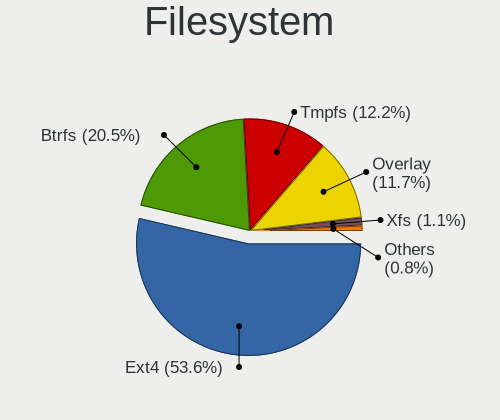
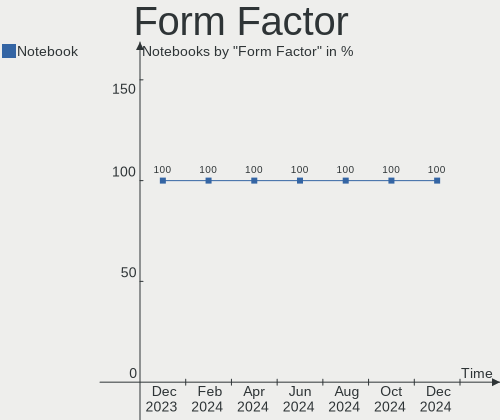
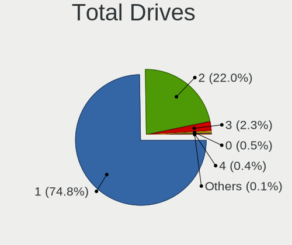
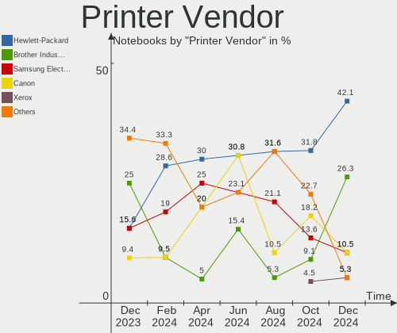
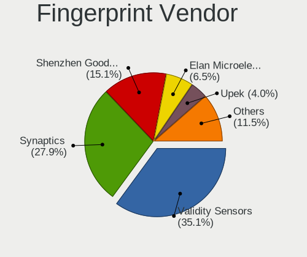

Linux - Hardware Trends (Notebooks)
-----------------------------------

A project to identify most popular hardware characteristics and track their change
over time based on data collected by Linux users at https://Linux-Hardware.org.

Anyone can contribute to this report by the [hw-probe](https://github.com/linuxhw/hw-probe) tool:

    sudo -E hw-probe -all -upload

This report is for one last month. Overall report since the beginning of time: [TestCoverage](https://github.com/linuxhw/TestCoverage)

Period: Oct, 2022.

Contents
--------

* [ System ](#system)
  - [ OS                       ](#os)
  - [ OS Family                ](#os-family)
  - [ Kernel                   ](#kernel)
  - [ Kernel Family            ](#kernel-family)
  - [ Kernel Major Ver.        ](#kernel-major-ver)
  - [ Arch                     ](#arch)
  - [ DE                       ](#de)
  - [ Display Server           ](#display-server)
  - [ Display Manager          ](#display-manager)
  - [ OS Lang                  ](#os-lang)
  - [ Boot Mode                ](#boot-mode)
  - [ Filesystem               ](#filesystem)
  - [ Part. scheme             ](#part-scheme)
  - [ Dual Boot with Linux/BSD ](#dual-boot-with-linuxbsd)
  - [ Dual Boot (Win)          ](#dual-boot-win)

* [ Board ](#board)
  - [ Vendor                   ](#vendor)
  - [ Model                    ](#model)
  - [ Model Family             ](#model-family)
  - [ MFG Year                 ](#mfg-year)
  - [ Form Factor              ](#form-factor)
  - [ Secure Boot              ](#secure-boot)
  - [ Coreboot                 ](#coreboot)
  - [ RAM Size                 ](#ram-size)
  - [ RAM Used                 ](#ram-used)
  - [ Total Drives             ](#total-drives)
  - [ Has CD-ROM               ](#has-cd-rom)
  - [ Has Ethernet             ](#has-ethernet)
  - [ Has WiFi                 ](#has-wifi)
  - [ Has Bluetooth            ](#has-bluetooth)

* [ Location ](#location)
  - [ Country                  ](#country)
  - [ City                     ](#city)

* [ Drives ](#drives)
  - [ Drive Vendor             ](#drive-vendor)
  - [ Drive Model              ](#drive-model)
  - [ HDD Vendor               ](#hdd-vendor)
  - [ SSD Vendor               ](#ssd-vendor)
  - [ Drive Kind               ](#drive-kind)
  - [ Drive Connector          ](#drive-connector)
  - [ Drive Size               ](#drive-size)
  - [ Space Total              ](#space-total)
  - [ Space Used               ](#space-used)
  - [ Malfunc. Drives          ](#malfunc-drives)
  - [ Malfunc. Drive Vendor    ](#malfunc-drive-vendor)
  - [ Malfunc. HDD Vendor      ](#malfunc-hdd-vendor)
  - [ Malfunc. Drive Kind      ](#malfunc-drive-kind)
  - [ Failed Drives            ](#failed-drives)
  - [ Failed Drive Vendor      ](#failed-drive-vendor)
  - [ Drive Status             ](#drive-status)

* [ Storage controller ](#storage-controller)
  - [ Storage Vendor           ](#storage-vendor)
  - [ Storage Model            ](#storage-model)
  - [ Storage Kind             ](#storage-kind)

* [ Processor ](#processor)
  - [ CPU Vendor               ](#cpu-vendor)
  - [ CPU Model                ](#cpu-model)
  - [ CPU Model Family         ](#cpu-model-family)
  - [ CPU Cores                ](#cpu-cores)
  - [ CPU Sockets              ](#cpu-sockets)
  - [ CPU Threads              ](#cpu-threads)
  - [ CPU Op-Modes             ](#cpu-op-modes)
  - [ CPU Microcode            ](#cpu-microcode)
  - [ CPU Microarch            ](#cpu-microarch)

* [ Graphics ](#graphics)
  - [ GPU Vendor               ](#gpu-vendor)
  - [ GPU Model                ](#gpu-model)
  - [ GPU Combo                ](#gpu-combo)
  - [ GPU Driver               ](#gpu-driver)
  - [ GPU Memory               ](#gpu-memory)

* [ Monitor ](#monitor)
  - [ Monitor Vendor           ](#monitor-vendor)
  - [ Monitor Model            ](#monitor-model)
  - [ Monitor Resolution       ](#monitor-resolution)
  - [ Monitor Diagonal         ](#monitor-diagonal)
  - [ Monitor Width            ](#monitor-width)
  - [ Aspect Ratio             ](#aspect-ratio)
  - [ Monitor Area             ](#monitor-area)
  - [ Pixel Density            ](#pixel-density)
  - [ Multiple Monitors        ](#multiple-monitors)

* [ Network ](#network)
  - [ Net Controller Vendor    ](#net-controller-vendor)
  - [ Net Controller Model     ](#net-controller-model)
  - [ Wireless Vendor          ](#wireless-vendor)
  - [ Wireless Model           ](#wireless-model)
  - [ Ethernet Vendor          ](#ethernet-vendor)
  - [ Ethernet Model           ](#ethernet-model)
  - [ Net Controller Kind      ](#net-controller-kind)
  - [ Used Controller          ](#used-controller)
  - [ NICs                     ](#nics)
  - [ IPv6                     ](#ipv6)

* [ Bluetooth ](#bluetooth)
  - [ Bluetooth Vendor         ](#bluetooth-vendor)
  - [ Bluetooth Model          ](#bluetooth-model)

* [ Sound ](#sound)
  - [ Sound Vendor             ](#sound-vendor)
  - [ Sound Model              ](#sound-model)

* [ Memory ](#memory)
  - [ Memory Vendor            ](#memory-vendor)
  - [ Memory Model             ](#memory-model)
  - [ Memory Kind              ](#memory-kind)
  - [ Memory Form Factor       ](#memory-form-factor)
  - [ Memory Size              ](#memory-size)
  - [ Memory Speed             ](#memory-speed)

* [ Printers & scanners ](#printers--scanners)
  - [ Printer Vendor           ](#printer-vendor)
  - [ Printer Model            ](#printer-model)
  - [ Scanner Vendor           ](#scanner-vendor)
  - [ Scanner Model            ](#scanner-model)

* [ Camera ](#camera)
  - [ Camera Vendor            ](#camera-vendor)
  - [ Camera Model             ](#camera-model)

* [ Security ](#security)
  - [ Fingerprint Vendor       ](#fingerprint-vendor)
  - [ Fingerprint Model        ](#fingerprint-model)
  - [ Chipcard Vendor          ](#chipcard-vendor)
  - [ Chipcard Model           ](#chipcard-model)

* [ Unsupported ](#unsupported)
  - [ Unsupported Devices      ](#unsupported-devices)
  - [ Unsupported Device Types ](#unsupported-device-types)

System
------

OS
--

Installed operating systems

| Name                         | Notebooks | Percent |
|------------------------------|-----------|---------|
| Ubuntu 22.04                 | 512       | 17.37%  |
| Fedora 36                    | 179       | 6.07%   |
| Debian 11                    | 155       | 5.26%   |
| Pop!_OS 22.04                | 151       | 5.12%   |
| Linux Mint 21                | 148       | 5.02%   |
| Arch Rolling                 | 134       | 4.55%   |
| ROSA 12.2                    | 110       | 3.73%   |
| OpenMandriva 4.3             | 110       | 3.73%   |
| Ubuntu 20.04                 | 109       | 3.7%    |
| Zorin 16                     | 92        | 3.12%   |
| Ubuntu 22.10                 | 72        | 2.44%   |
| Linux Mint 20.3              | 66        | 2.24%   |
| Kubuntu 22.04                | 63        | 2.14%   |
| SteamOS 3.3.2                | 52        | 1.76%   |
| Manjaro                      | 51        | 1.73%   |
| KDE neon 20.04               | 48        | 1.63%   |
| Kali 2022.3                  | 48        | 1.63%   |
| Manjaro 22.0.0               | 47        | 1.59%   |
| Fedora 37                    | 45        | 1.53%   |
| OpenMandriva 4.50            | 38        | 1.29%   |
| ArcoLinux Rolling            | 35        | 1.19%   |
| Nobara 36                    | 34        | 1.15%   |
| Xubuntu 22.04                | 28        | 0.95%   |
| Gentoo 2.8                   | 28        | 0.95%   |
| openSUSE Tumbleweed-XXXXXXXX | 26        | 0.88%   |
| EndeavourOS Rolling          | 26        | 0.88%   |
| Ubuntu 18.04                 | 23        | 0.78%   |
| Elementary 6.1               | 23        | 0.78%   |
| Xubuntu 20.04                | 19        | 0.64%   |
| KDE neon 22.04               | 19        | 0.64%   |
| SteamOS 3.3.1                | 17        | 0.58%   |
| LMDE 5                       | 17        | 0.58%   |
| Debian Testing               | 17        | 0.58%   |
| MX 21                        | 15        | 0.51%   |
| ROSA R11.1                   | 14        | 0.48%   |
| Parrot 5.1                   | 14        | 0.48%   |
| Ubuntu Budgie 22.04          | 13        | 0.44%   |
| BlackPanther 18.1            | 13        | 0.44%   |
| Debian                       | 12        | 0.41%   |
| Ubuntu MATE 22.04            | 11        | 0.37%   |

OS Family
---------

OS without a version

| Name          | Notebooks | Percent |
|---------------|-----------|---------|
| Ubuntu        | 723       | 24.53%  |
| Linux Mint    | 242       | 8.21%   |
| Fedora        | 228       | 7.74%   |
| Debian        | 188       | 6.38%   |
| OpenMandriva  | 166       | 5.63%   |
| Pop!_OS       | 153       | 5.19%   |
| Arch          | 134       | 4.55%   |
| ROSA          | 126       | 4.28%   |
| Manjaro       | 101       | 3.43%   |
| Zorin         | 100       | 3.39%   |
| SteamOS       | 82        | 2.78%   |
| Kubuntu       | 80        | 2.71%   |
| KDE neon      | 67        | 2.27%   |
| Xubuntu       | 53        | 1.8%    |
| Kali          | 50        | 1.7%    |
| ArcoLinux     | 38        | 1.29%   |
| Nobara        | 34        | 1.15%   |
| openSUSE      | 33        | 1.12%   |
| Gentoo        | 33        | 1.12%   |
| EndeavourOS   | 26        | 0.88%   |
| Elementary    | 24        | 0.81%   |
| Endless       | 23        | 0.78%   |
| Lubuntu       | 20        | 0.68%   |
| Ubuntu MATE   | 18        | 0.61%   |
| LMDE          | 18        | 0.61%   |
| Ubuntu Unity  | 16        | 0.54%   |
| Parrot        | 16        | 0.54%   |
| MX            | 16        | 0.54%   |
| Ubuntu Budgie | 15        | 0.51%   |
| BlackPanther  | 14        | 0.48%   |
| Garuda Linux  | 13        | 0.44%   |
| ALT Linux     | 9         | 0.31%   |
| Red OS        | 8         | 0.27%   |
| TUXEDO OS     | 7         | 0.24%   |
| Linux Lite    | 6         | 0.2%    |
| Clear Linux   | 6         | 0.2%    |
| NixOS         | 5         | 0.17%   |
| Xero          | 4         | 0.14%   |
| Peppermint    | 4         | 0.14%   |
| Artix         | 4         | 0.14%   |

Kernel
------

Version of the Linux kernel

| Version                                        | Notebooks | Percent |
|------------------------------------------------|-----------|---------|
| 5.15.0-52-generic                              | 329       | 11.16%  |
| 5.15.0-48-generic                              | 315       | 10.69%  |
| 5.15.0-50-generic                              | 258       | 8.75%   |
| 5.16.7-desktop-1omv4003                        | 104       | 3.53%   |
| 5.10.0-18-amd64                                | 87        | 2.95%   |
| 5.19.0-76051900-generic                        | 85        | 2.88%   |
| 6.0.2-arch1-1                                  | 62        | 2.1%    |
| 5.13.0-valve21.3-1-neptune                     | 51        | 1.73%   |
| 5.19.16-200.fc36.x86_64                        | 45        | 1.53%   |
| 5.19.0-23-generic                              | 42        | 1.43%   |
| 5.10.74-generic-2rosa2021.1-x86_64             | 41        | 1.39%   |
| 5.10.0-19-amd64                                | 41        | 1.39%   |
| 5.10.118-generic-2rosa2021.1-x86_64            | 40        | 1.36%   |
| 5.15.0-43-generic                              | 37        | 1.26%   |
| 6.0.2-76060002-generic                         | 36        | 1.22%   |
| 5.4.0-131-generic                              | 36        | 1.22%   |
| 5.19.15-201.fc36.x86_64                        | 32        | 1.09%   |
| 5.4.0-126-generic                              | 31        | 1.05%   |
| 5.19.13-arch1-1                                | 30        | 1.02%   |
| 5.15.74-3-MANJARO                              | 26        | 0.88%   |
| 5.15.0-41-generic                              | 26        | 0.88%   |
| 5.19.13-200.fc36.x86_64                        | 25        | 0.85%   |
| 5.4.0-128-generic                              | 24        | 0.81%   |
| 5.19.14-200.fc36.x86_64                        | 24        | 0.81%   |
| 5.19.0-21-generic                              | 23        | 0.78%   |
| 5.19.0-2-amd64                                 | 21        | 0.71%   |
| 5.15.0-46-generic                              | 20        | 0.68%   |
| 5.11.0-35-generic                              | 20        | 0.68%   |
| 5.19.5-desktop-1omv4090                        | 19        | 0.64%   |
| 5.19.16-76051916-generic                       | 19        | 0.64%   |
| 5.19.12-200.fc36.x86_64                        | 19        | 0.64%   |
| 5.18.0-kali7-amd64                             | 19        | 0.64%   |
| 6.0.2-zen1-1-zen                               | 18        | 0.61%   |
| 5.19.0-kali2-amd64                             | 18        | 0.61%   |
| 5.19.12-arch1-1                                | 17        | 0.58%   |
| 5.15.65-1-MANJARO                              | 17        | 0.58%   |
| 5.13.0-valve21.1-1-neptune-02211-gc54cda5a36f3 | 17        | 0.58%   |
| 5.10.0-16-amd64                                | 16        | 0.54%   |
| 5.19.14-201.fsync.fc36.x86_64                  | 15        | 0.51%   |
| 5.15.0-47-generic                              | 15        | 0.51%   |

Kernel Family
-------------

Linux kernel without a distro release

| Version  | Notebooks | Percent |
|----------|-----------|---------|
| 5.15.0   | 1048      | 35.56%  |
| 5.19.0   | 212       | 7.19%   |
| 5.10.0   | 167       | 5.67%   |
| 6.0.2    | 146       | 4.95%   |
| 5.4.0    | 125       | 4.24%   |
| 5.16.7   | 104       | 3.53%   |
| 5.13.0   | 101       | 3.43%   |
| 5.19.16  | 83        | 2.82%   |
| 5.19.13  | 83        | 2.82%   |
| 5.19.12  | 68        | 2.31%   |
| 6.0.0    | 64        | 2.17%   |
| 5.18.0   | 53        | 1.8%    |
| 5.19.14  | 49        | 1.66%   |
| 5.15.74  | 44        | 1.49%   |
| 5.10.74  | 43        | 1.46%   |
| 5.19.15  | 42        | 1.43%   |
| 5.10.118 | 41        | 1.39%   |
| 5.11.0   | 29        | 0.98%   |
| 6.0.5    | 27        | 0.92%   |
| 6.0.1    | 25        | 0.85%   |
| 5.15.72  | 24        | 0.81%   |
| 5.14.0   | 24        | 0.81%   |
| 4.15.0   | 22        | 0.75%   |
| 5.19.5   | 20        | 0.68%   |
| 5.19.11  | 19        | 0.64%   |
| 5.15.65  | 18        | 0.61%   |
| 6.0.3    | 17        | 0.58%   |
| 5.17.5   | 15        | 0.51%   |
| 5.15.71  | 13        | 0.44%   |
| 5.19.7   | 12        | 0.41%   |
| 5.17.0   | 11        | 0.37%   |
| 5.10.14  | 10        | 0.34%   |
| 5.14.21  | 8         | 0.27%   |
| 5.6.14   | 7         | 0.24%   |
| 5.4.32   | 7         | 0.24%   |
| 5.18.12  | 7         | 0.24%   |
| 5.17.11  | 7         | 0.24%   |
| 5.15.73  | 7         | 0.24%   |
| 5.16.13  | 6         | 0.2%    |
| 4.18.16  | 6         | 0.2%    |

Kernel Major Ver.
-----------------

Linux kernel major version

| Version | Notebooks | Percent |
|---------|-----------|---------|
| 5.15    | 1199      | 40.69%  |
| 5.19    | 601       | 20.39%  |
| 6.0     | 282       | 9.57%   |
| 5.10    | 271       | 9.2%    |
| 5.4     | 140       | 4.75%   |
| 5.16    | 118       | 4%      |
| 5.13    | 101       | 3.43%   |
| 5.18    | 71        | 2.41%   |
| 5.17    | 40        | 1.36%   |
| 5.14    | 33        | 1.12%   |
| 5.11    | 29        | 0.98%   |
| 4.15    | 22        | 0.75%   |
| 4.18    | 8         | 0.27%   |
| 5.6     | 7         | 0.24%   |
| 4.9     | 4         | 0.14%   |
| 4.19    | 4         | 0.14%   |
| 6.1     | 3         | 0.1%    |
| 5.3     | 3         | 0.1%    |
| 4.4     | 3         | 0.1%    |
| 5.8     | 2         | 0.07%   |
| 5.0     | 2         | 0.07%   |
| 6       | 1         | 0.03%   |
| 5.9     | 1         | 0.03%   |
| 3.4     | 1         | 0.03%   |
| Unknown | 1         | 0.03%   |

Arch
----

OS architecture (x86_64, i586, etc.)

| Name    | Notebooks | Percent |
|---------|-----------|---------|
| x86_64  | 2900      | 98.41%  |
| i686    | 44        | 1.49%   |
| aarch64 | 2         | 0.07%   |
| armv7l  | 1         | 0.03%   |

DE
--

Desktop Environment

| Name            | Notebooks | Percent |
|-----------------|-----------|---------|
| GNOME           | 1378      | 46.76%  |
| KDE5            | 724       | 24.57%  |
| XFCE            | 219       | 7.43%   |
| X-Cinnamon      | 210       | 7.13%   |
| Unknown         | 103       | 3.5%    |
| MATE            | 85        | 2.88%   |
| LXQt            | 41        | 1.39%   |
| Pantheon        | 24        | 0.81%   |
| Cinnamon        | 20        | 0.68%   |
| i3              | 19        | 0.64%   |
| Budgie          | 19        | 0.64%   |
| GNOME Flashback | 17        | 0.58%   |
| Unity           | 16        | 0.54%   |
| LXDE            | 16        | 0.54%   |
| awesome         | 11        | 0.37%   |
| KDE4            | 10        | 0.34%   |
| sway            | 4         | 0.14%   |
| openbox         | 4         | 0.14%   |
| Hyprland        | 4         | 0.14%   |
| qtile           | 3         | 0.1%    |
| Deepin          | 3         | 0.1%    |
| xmonad          | 2         | 0.07%   |
| UKUI            | 2         | 0.07%   |
| trinity         | 2         | 0.07%   |
| bspwm           | 2         | 0.07%   |
| none+xmonad     | 1         | 0.03%   |
| none+i3         | 1         | 0.03%   |
| Lubuntu         | 1         | 0.03%   |
| KDE             | 1         | 0.03%   |
| instantwm       | 1         | 0.03%   |
| ICEWM           | 1         | 0.03%   |
| i3-with-shmlog  | 1         | 0.03%   |
| fluxbox         | 1         | 0.03%   |
| DWM             | 1         | 0.03%   |

Display Server
--------------

X11 or Wayland

| Name    | Notebooks | Percent |
|---------|-----------|---------|
| X11     | 1957      | 66.41%  |
| Wayland | 885       | 30.03%  |
| Unknown | 60        | 2.04%   |
| Tty     | 45        | 1.53%   |

Display Manager
---------------

SDDM, LightDM, etc.

| Name    | Notebooks | Percent |
|---------|-----------|---------|
| Unknown | 953       | 32.34%  |
| GDM3    | 709       | 24.06%  |
| SDDM    | 519       | 17.61%  |
| LightDM | 428       | 14.52%  |
| GDM     | 314       | 10.65%  |
| KDM     | 10        | 0.34%   |
| XDM     | 4         | 0.14%   |
| LXDM    | 4         | 0.14%   |
| SLiM    | 2         | 0.07%   |
| Ly      | 2         | 0.07%   |
| MDM     | 1         | 0.03%   |
| EMPTTY  | 1         | 0.03%   |

OS Lang
-------

Language

| Lang    | Notebooks | Percent |
|---------|-----------|---------|
| en_US   | 1255      | 42.59%  |
| ru_RU   | 215       | 7.3%    |
| it_IT   | 201       | 6.82%   |
| de_DE   | 184       | 6.24%   |
| fr_FR   | 140       | 4.75%   |
| en_GB   | 131       | 4.45%   |
| pt_BR   | 102       | 3.46%   |
| es_ES   | 67        | 2.27%   |
| Unknown | 67        | 2.27%   |
| pl_PL   | 60        | 2.04%   |
| en_IN   | 45        | 1.53%   |
| en_CA   | 42        | 1.43%   |
| C       | 33        | 1.12%   |
| en_AU   | 31        | 1.05%   |
| es_MX   | 23        | 0.78%   |
| nl_NL   | 17        | 0.58%   |
| hu_HU   | 17        | 0.58%   |
| zh_CN   | 16        | 0.54%   |
| pt_PT   | 16        | 0.54%   |
| es_AR   | 15        | 0.51%   |
| es_CO   | 14        | 0.48%   |
| en_ZA   | 14        | 0.48%   |
| tr_TR   | 13        | 0.44%   |
| es_CL   | 13        | 0.44%   |
| en_PH   | 12        | 0.41%   |
| de_AT   | 12        | 0.41%   |
| en_AG   | 11        | 0.37%   |
| cs_CZ   | 11        | 0.37%   |
| nb_NO   | 9         | 0.31%   |
| fi_FI   | 9         | 0.31%   |
| en_NZ   | 9         | 0.31%   |
| en_IE   | 9         | 0.31%   |
| el_GR   | 8         | 0.27%   |
| C.UTF8  | 8         | 0.27%   |
| POSIX   | 7         | 0.24%   |
| fr_BE   | 7         | 0.24%   |
| es_PE   | 6         | 0.2%    |
| sv_SE   | 5         | 0.17%   |
| nl_BE   | 5         | 0.17%   |
| ko_KR   | 5         | 0.17%   |

Boot Mode
---------

EFI or BIOS

| Mode | Notebooks | Percent |
|------|-----------|---------|
| EFI  | 1594      | 54.09%  |
| BIOS | 1353      | 45.91%  |

Filesystem
----------

Type of filesystem

| Type    | Notebooks | Percent |
|---------|-----------|---------|
| Ext4    | 2193      | 74.41%  |
| Btrfs   | 451       | 15.3%   |
| Overlay | 229       | 7.77%   |
| Xfs     | 35        | 1.19%   |
| Zfs     | 19        | 0.64%   |
| F2fs    | 6         | 0.2%    |
| Ext2    | 5         | 0.17%   |
| Tmpfs   | 3         | 0.1%    |
| Ext3    | 3         | 0.1%    |
| XXXXXXX | 2         | 0.07%   |
| XXX4    | 1         | 0.03%   |

Part. scheme
------------

Scheme of partitioning

| Type    | Notebooks | Percent |
|---------|-----------|---------|
| GPT     | 1683      | 57.11%  |
| Unknown | 901       | 30.57%  |
| MBR     | 363       | 12.32%  |

Dual Boot with Linux/BSD
------------------------

Hosting more than one Linux/BSD

| Dual boot | Notebooks | Percent |
|-----------|-----------|---------|
| No        | 2644      | 89.72%  |
| Yes       | 303       | 10.28%  |

Dual Boot (Win)
---------------

Hosting Linux and Windows

| Dual boot | Notebooks | Percent |
|-----------|-----------|---------|
| No        | 2113      | 71.7%   |
| Yes       | 834       | 28.3%   |

Board
-----

Vendor
------

Motherboard manufacturer

| Name                           | Notebooks | Percent |
|--------------------------------|-----------|---------|
| Lenovo                         | 636       | 21.58%  |
| Hewlett-Packard                | 494       | 16.76%  |
| Dell                           | 444       | 15.07%  |
| ASUSTek Computer               | 329       | 11.16%  |
| Acer                           | 228       | 7.74%   |
| MSI                            | 83        | 2.82%   |
| Valve                          | 79        | 2.68%   |
| Apple                          | 76        | 2.58%   |
| Toshiba                        | 68        | 2.31%   |
| HUAWEI                         | 57        | 1.93%   |
| Samsung Electronics            | 47        | 1.59%   |
| Sony                           | 32        | 1.09%   |
| Google                         | 22        | 0.75%   |
| Fujitsu                        | 19        | 0.64%   |
| Notebook                       | 18        | 0.61%   |
| Unknown                        | 16        | 0.54%   |
| System76                       | 15        | 0.51%   |
| Alienware                      | 14        | 0.48%   |
| Packard Bell                   | 13        | 0.44%   |
| Timi                           | 12        | 0.41%   |
| Gigabyte Technology            | 12        | 0.41%   |
| Medion                         | 10        | 0.34%   |
| TUXEDO                         | 9         | 0.31%   |
| Positivo                       | 9         | 0.31%   |
| LG Electronics                 | 9         | 0.31%   |
| Chuwi                          | 8         | 0.27%   |
| GPU Company                    | 7         | 0.24%   |
| Framework                      | 7         | 0.24%   |
| Avell High Performance         | 6         | 0.2%    |
| Intel                          | 5         | 0.17%   |
| Clevo                          | 5         | 0.17%   |
| Aquarius                       | 5         | 0.17%   |
| UNOWHY                         | 4         | 0.14%   |
| Tactus                         | 4         | 0.14%   |
| SLIMBOOK                       | 4         | 0.14%   |
| Shanghai Zhaoxin Semiconductor | 4         | 0.14%   |
| Schenker                       | 4         | 0.14%   |
| PC Specialist                  | 4         | 0.14%   |
| Panasonic                      | 4         | 0.14%   |
| Monster                        | 4         | 0.14%   |

Model
-----

Motherboard model

| Name                                | Notebooks | Percent |
|-------------------------------------|-----------|---------|
| Valve Jupiter                       | 79        | 2.68%   |
| Unknown                             | 27        | 0.92%   |
| Lenovo ThinkPad E475 20H40006US     | 14        | 0.48%   |
| Apple MacBookAir7,2                 | 13        | 0.44%   |
| HP Pavilion g6                      | 12        | 0.41%   |
| HP Pavilion dv7                     | 11        | 0.37%   |
| Lenovo IdeaPad 3 15ADA05 81W1       | 10        | 0.34%   |
| HP Pavilion Notebook                | 10        | 0.34%   |
| Acer Aspire E5-575G                 | 9         | 0.31%   |
| HP Pavilion dv6                     | 8         | 0.27%   |
| HP Laptop 15s-eq2xxx                | 8         | 0.27%   |
| HP 255 G8 Notebook PC               | 8         | 0.27%   |
| Lenovo ThinkBook 15 G2 ITL 20VE     | 7         | 0.24%   |
| HP Notebook                         | 7         | 0.24%   |
| HP EliteBook 8470p                  | 7         | 0.24%   |
| Lenovo IdeaPad Gaming 3 15ACH6 82K2 | 6         | 0.2%    |
| HUAWEI BOM-WXX9                     | 6         | 0.2%    |
| HP Laptop 15-da0xxx                 | 6         | 0.2%    |
| HP 15                               | 6         | 0.2%    |
| Dell Latitude E7240                 | 6         | 0.2%    |
| Dell Latitude E6510                 | 6         | 0.2%    |
| Dell Latitude E6440                 | 6         | 0.2%    |
| Dell Latitude E6420                 | 6         | 0.2%    |
| Acer Aspire A515-45                 | 6         | 0.2%    |
| Toshiba Satellite C660              | 5         | 0.17%   |
| Lenovo IdeaPad 330-15IKB 81DE       | 5         | 0.17%   |
| Lenovo IdeaPad 3 15ITL6 82H8        | 5         | 0.17%   |
| Lenovo IdeaPad 1 14ADA05 82GW       | 5         | 0.17%   |
| HUAWEI NBLK-WAX9X                   | 5         | 0.17%   |
| HUAWEI NBLB-WAX9N                   | 5         | 0.17%   |
| HP ProBook 640 G1                   | 5         | 0.17%   |
| HP Pavilion Gaming Laptop 15-dk0xxx | 5         | 0.17%   |
| HP Pavilion Gaming Laptop 15-cx0xxx | 5         | 0.17%   |
| HP Laptop 15-db0xxx                 | 5         | 0.17%   |
| HP ENVY 15                          | 5         | 0.17%   |
| HP EliteBook 8460p                  | 5         | 0.17%   |
| HP EliteBook 845 G7 Notebook PC     | 5         | 0.17%   |
| Dell XPS 15 9570                    | 5         | 0.17%   |
| Dell XPS 15 9500                    | 5         | 0.17%   |
| Dell XPS 15 7590                    | 5         | 0.17%   |

Model Family
------------

Motherboard model prefix

| Name                  | Notebooks | Percent |
|-----------------------|-----------|---------|
| Lenovo ThinkPad       | 319       | 10.82%  |
| Acer Aspire           | 160       | 5.43%   |
| Dell Latitude         | 159       | 5.4%    |
| Lenovo IdeaPad        | 154       | 5.23%   |
| Dell Inspiron         | 121       | 4.11%   |
| HP Pavilion           | 109       | 3.7%    |
| HP Laptop             | 84        | 2.85%   |
| ASUS VivoBook         | 83        | 2.82%   |
| HP EliteBook          | 81        | 2.75%   |
| Valve Jupiter         | 79        | 2.68%   |
| Dell XPS              | 62        | 2.1%    |
| Toshiba Satellite     | 57        | 1.93%   |
| HP ProBook            | 56        | 1.9%    |
| Dell Precision        | 49        | 1.66%   |
| Dell Vostro           | 34        | 1.15%   |
| Lenovo Legion         | 33        | 1.12%   |
| ASUS ROG              | 27        | 0.92%   |
| ASUS ASUS             | 27        | 0.92%   |
| Unknown               | 27        | 0.92%   |
| Lenovo ThinkBook      | 24        | 0.81%   |
| HP ENVY               | 23        | 0.78%   |
| ASUS ZenBook          | 23        | 0.78%   |
| HP ZBook              | 22        | 0.75%   |
| Lenovo Yoga           | 20        | 0.68%   |
| Fujitsu LIFEBOOK      | 19        | 0.64%   |
| Acer Nitro            | 19        | 0.64%   |
| Acer Swift            | 17        | 0.58%   |
| Apple MacBookAir7     | 13        | 0.44%   |
| HP Compaq             | 12        | 0.41%   |
| Packard Bell EasyNote | 11        | 0.37%   |
| MSI Modern            | 11        | 0.37%   |
| HP OMEN               | 11        | 0.37%   |
| HP 255                | 11        | 0.37%   |
| HP 250                | 11        | 0.37%   |
| Acer Extensa          | 11        | 0.37%   |
| HP Victus             | 8         | 0.27%   |
| Dell Studio           | 8         | 0.27%   |
| ASUS TUF              | 8         | 0.27%   |
| Apple MacBookPro5     | 8         | 0.27%   |
| Apple MacBookPro11    | 8         | 0.27%   |

MFG Year
--------

Motherboard manufacture year

| Year    | Notebooks | Percent |
|---------|-----------|---------|
| 2021    | 423       | 14.35%  |
| 2020    | 349       | 11.84%  |
| 2022    | 278       | 9.43%   |
| 2019    | 268       | 9.09%   |
| 2018    | 198       | 6.72%   |
| 2012    | 179       | 6.07%   |
| 2011    | 173       | 5.87%   |
| 2013    | 164       | 5.56%   |
| 2017    | 161       | 5.46%   |
| 2014    | 150       | 5.09%   |
| 2016    | 146       | 4.95%   |
| 2015    | 128       | 4.34%   |
| 2010    | 119       | 4.04%   |
| 2008    | 84        | 2.85%   |
| 2009    | 76        | 2.58%   |
| 2007    | 30        | 1.02%   |
| 2006    | 12        | 0.41%   |
| Unknown | 4         | 0.14%   |
| 2005    | 3         | 0.1%    |
| 2004    | 1         | 0.03%   |
| 2003    | 1         | 0.03%   |

Form Factor
-----------

Physical design of the computer

| Name     | Notebooks | Percent |
|----------|-----------|---------|
| Notebook | 2947      | 100%    |

Secure Boot
-----------

Enabled or disabled

| State    | Notebooks | Percent |
|----------|-----------|---------|
| Disabled | 2666      | 90.46%  |
| Enabled  | 281       | 9.54%   |

Coreboot
--------

Have coreboot on board

| Used | Notebooks | Percent |
|------|-----------|---------|
| No   | 2909      | 98.71%  |
| Yes  | 38        | 1.29%   |

RAM Size
--------

Total RAM memory

| Size in GB  | Notebooks | Percent |
|-------------|-----------|---------|
| 4.01-8.0    | 887       | 30.1%   |
| 8.01-16.0   | 563       | 19.1%   |
| 16.01-24.0  | 547       | 18.56%  |
| 3.01-4.0    | 489       | 16.59%  |
| 32.01-64.0  | 230       | 7.8%    |
| 1.01-2.0    | 94        | 3.19%   |
| 24.01-32.0  | 44        | 1.49%   |
| 64.01-256.0 | 42        | 1.43%   |
| 2.01-3.0    | 37        | 1.26%   |
| 0.51-1.0    | 13        | 0.44%   |
| 0.01-0.5    | 1         | 0.03%   |

RAM Used
--------

Used RAM memory

| Used GB    | Notebooks | Percent |
|------------|-----------|---------|
| 1.01-2.0   | 886       | 30.06%  |
| 2.01-3.0   | 790       | 26.81%  |
| 4.01-8.0   | 511       | 17.34%  |
| 3.01-4.0   | 426       | 14.46%  |
| 0.51-1.0   | 155       | 5.26%   |
| 8.01-16.0  | 144       | 4.89%   |
| 16.01-24.0 | 15        | 0.51%   |
| 0.01-0.5   | 14        | 0.48%   |
| 24.01-32.0 | 5         | 0.17%   |
| Unknown    | 1         | 0.03%   |

Total Drives
------------

Number of drives on board

| Drives | Notebooks | Percent |
|--------|-----------|---------|
| 1      | 2140      | 72.62%  |
| 2      | 705       | 23.92%  |
| 3      | 74        | 2.51%   |
| 4      | 14        | 0.48%   |
| 0      | 13        | 0.44%   |
| 5      | 1         | 0.03%   |

Has CD-ROM
----------

Has CD-ROM on board

| Presented | Notebooks | Percent |
|-----------|-----------|---------|
| No        | 2119      | 71.9%   |
| Yes       | 828       | 28.1%   |

Has Ethernet
------------

Has Ethernet on board

| Presented | Notebooks | Percent |
|-----------|-----------|---------|
| Yes       | 2252      | 76.42%  |
| No        | 695       | 23.58%  |

Has WiFi
--------

Has WiFi module

| Presented | Notebooks | Percent |
|-----------|-----------|---------|
| Yes       | 2895      | 98.24%  |
| No        | 52        | 1.76%   |

Has Bluetooth
-------------

Has Bluetooth module

| Presented | Notebooks | Percent |
|-----------|-----------|---------|
| Yes       | 2377      | 80.66%  |
| No        | 570       | 19.34%  |

Location
--------

Country
-------

Geographic location (country)

| Country      | Notebooks | Percent |
|--------------|-----------|---------|
| USA          | 469       | 15.91%  |
| Italy        | 304       | 10.32%  |
| Germany      | 267       | 9.06%   |
| Russia       | 234       | 7.94%   |
| France       | 173       | 5.87%   |
| Brazil       | 143       | 4.85%   |
| Poland       | 90        | 3.05%   |
| UK           | 86        | 2.92%   |
| Spain        | 84        | 2.85%   |
| India        | 80        | 2.71%   |
| Canada       | 64        | 2.17%   |
| Netherlands  | 51        | 1.73%   |
| Hungary      | 47        | 1.59%   |
| Mexico       | 42        | 1.43%   |
| Australia    | 38        | 1.29%   |
| Austria      | 36        | 1.22%   |
| Turkey       | 33        | 1.12%   |
| Belgium      | 31        | 1.05%   |
| Portugal     | 30        | 1.02%   |
| Switzerland  | 27        | 0.92%   |
| Indonesia    | 27        | 0.92%   |
| Argentina    | 27        | 0.92%   |
| Sweden       | 24        | 0.81%   |
| China        | 22        | 0.75%   |
| Czechia      | 21        | 0.71%   |
| Chile        | 21        | 0.71%   |
| Romania      | 20        | 0.68%   |
| Norway       | 19        | 0.64%   |
| Finland      | 19        | 0.64%   |
| Greece       | 18        | 0.61%   |
| South Africa | 17        | 0.58%   |
| Colombia     | 17        | 0.58%   |
| Ukraine      | 15        | 0.51%   |
| Philippines  | 15        | 0.51%   |
| Ireland      | 14        | 0.48%   |
| Denmark      | 13        | 0.44%   |
| Egypt        | 12        | 0.41%   |
| Bulgaria     | 11        | 0.37%   |
| Thailand     | 10        | 0.34%   |
| South Korea  | 10        | 0.34%   |

City
----

Geographic location (city)

| City              | Notebooks | Percent |
|-------------------|-----------|---------|
| Moscow            | 64        | 2.17%   |
| Milan             | 63        | 2.14%   |
| Bangor            | 27        | 0.92%   |
| Berlin            | 25        | 0.85%   |
| Vienna            | 22        | 0.75%   |
| Sao Paulo         | 22        | 0.75%   |
| Budapest          | 22        | 0.75%   |
| St Petersburg     | 20        | 0.68%   |
| Warsaw            | 19        | 0.64%   |
| Madrid            | 19        | 0.64%   |
| Rome              | 17        | 0.58%   |
| Munich            | 17        | 0.58%   |
| Paris             | 14        | 0.48%   |
| Istanbul          | 13        | 0.44%   |
| Turin             | 12        | 0.41%   |
| Prague            | 12        | 0.41%   |
| Hamburg           | 12        | 0.41%   |
| Dallas            | 12        | 0.41%   |
| Barcelona         | 12        | 0.41%   |
| Mexico City       | 11        | 0.37%   |
| Los Angeles       | 11        | 0.37%   |
| Brisbane          | 11        | 0.37%   |
| Bogotá           | 11        | 0.37%   |
| Bengaluru         | 11        | 0.37%   |
| Zurich            | 10        | 0.34%   |
| New York          | 10        | 0.34%   |
| Chicago           | 10        | 0.34%   |
| Athens            | 10        | 0.34%   |
| Oslo              | 9         | 0.31%   |
| Krakow            | 9         | 0.31%   |
| Helsinki          | 9         | 0.31%   |
| Frankfurt am Main | 9         | 0.31%   |
| Sydney            | 8         | 0.27%   |
| Singapore         | 8         | 0.27%   |
| Seattle           | 8         | 0.27%   |
| Santiago          | 8         | 0.27%   |
| Rio de Janeiro    | 8         | 0.27%   |
| Padova            | 8         | 0.27%   |
| Lima              | 8         | 0.27%   |
| Jakarta           | 8         | 0.27%   |

Drives
------

Drive Vendor
------------

Hard drive vendors

| Vendor                      | Notebooks | Drives | Percent |
|-----------------------------|-----------|--------|---------|
| Samsung Electronics         | 628       | 679    | 17.2%   |
| WDC                         | 346       | 355    | 9.48%   |
| Seagate                     | 303       | 308    | 8.3%    |
| SanDisk                     | 268       | 277    | 7.34%   |
| Unknown                     | 253       | 282    | 6.93%   |
| Toshiba                     | 208       | 212    | 5.7%    |
| Kingston                    | 169       | 176    | 4.63%   |
| SK hynix                    | 166       | 168    | 4.55%   |
| Crucial                     | 134       | 137    | 3.67%   |
| Micron Technology           | 128       | 128    | 3.51%   |
| Intel                       | 115       | 124    | 3.15%   |
| Hitachi                     | 93        | 93     | 2.55%   |
| HGST                        | 78        | 80     | 2.14%   |
| KIOXIA                      | 67        | 67     | 1.84%   |
| A-DATA Technology           | 55        | 55     | 1.51%   |
| Apple                       | 46        | 48     | 1.26%   |
| Phison Electronics          | 45        | 46     | 1.23%   |
| Kingston Technology Company | 40        | 40     | 1.1%    |
| China                       | 38        | 39     | 1.04%   |
| Unknown                     | 27        | 27     | 0.74%   |
| Intenso                     | 24        | 24     | 0.66%   |
| PNY                         | 22        | 22     | 0.6%    |
| SPCC                        | 20        | 20     | 0.55%   |
| Micron/Crucial Technology   | 19        | 19     | 0.52%   |
| Netac                       | 16        | 16     | 0.44%   |
| Silicon Motion              | 14        | 14     | 0.38%   |
| LITEONIT                    | 14        | 14     | 0.38%   |
| LITEON                      | 14        | 14     | 0.38%   |
| GOODRAM                     | 14        | 14     | 0.38%   |
| Fujitsu                     | 14        | 15     | 0.38%   |
| JMicron Technology          | 13        | 13     | 0.36%   |
| Transcend                   | 12        | 13     | 0.33%   |
| UMIS                        | 11        | 11     | 0.3%    |
| SSSTC                       | 10        | 10     | 0.27%   |
| Phison                      | 10        | 10     | 0.27%   |
| Patriot                     | 10        | 10     | 0.27%   |
| KingSpec                    | 9         | 9      | 0.25%   |
| Gigabyte Technology         | 9         | 9      | 0.25%   |
| Realtek Semiconductor       | 7         | 7      | 0.19%   |
| ADATA Technology            | 7         | 7      | 0.19%   |

Drive Model
-----------

Hard drive models

| Model                                                | Notebooks | Percent |
|------------------------------------------------------|-----------|---------|
| Samsung NVMe SSD Controller SM981/PM981/PM983 500GB  | 68        | 1.81%   |
| Seagate ST1000LM035-1RK172 1TB                       | 49        | 1.31%   |
| Unknown MMC Card  32GB                               | 47        | 1.25%   |
| Samsung NVMe SSD Controller PM9A1/PM9A3/980PRO 250GB | 40        | 1.07%   |
| Unknown MMC Card  64GB                               | 39        | 1.04%   |
| Sandisk WD Blue SN550 NVMe SSD 1TB                   | 38        | 1.01%   |
| Kingston SA400S37240G 240GB SSD                      | 33        | 0.88%   |
| Toshiba MQ04ABF100 1TB                               | 31        | 0.83%   |
| Sandisk WD Black SN750 / PC SN730 NVMe SSD 1TB       | 31        | 0.83%   |
| Kingston Company OM3PDP3 NVMe SSD 512GB              | 30        | 0.8%    |
| Toshiba MQ01ABF050 500GB                             | 29        | 0.77%   |
| Phison PS5013 E13 NVMe Controller 256GB              | 29        | 0.77%   |
| Seagate ST1000LM024 HN-M101MBB 1TB                   | 28        | 0.75%   |
| HGST HTS721010A9E630 1TB                             | 28        | 0.75%   |
| Crucial CT500MX500SSD1 500GB                         | 28        | 0.75%   |
| Unknown                                              | 27        | 0.72%   |
| Seagate ST500LT012-1DG142 500GB                      | 26        | 0.69%   |
| Unknown MMC Card  128GB                              | 21        | 0.56%   |
| Unknown MMC Card  256GB                              | 20        | 0.53%   |
| Samsung SSD 860 EVO 500GB                            | 20        | 0.53%   |
| Kingston SA400S37480G 480GB SSD                      | 20        | 0.53%   |
| Kingston SA400S37120G 120GB SSD                      | 20        | 0.53%   |
| Samsung NVMe SSD Controller SM961/PM961/SM963 250GB  | 19        | 0.51%   |
| Samsung SSD 850 EVO 250GB                            | 17        | 0.45%   |
| Toshiba MQ01ABD100 1TB                               | 16        | 0.43%   |
| Samsung MZVLQ512HALU-000H1 512GB                     | 16        | 0.43%   |
| Micron 2210_MTFDHBA512QFD 512GB                      | 16        | 0.43%   |
| Intel SSD 660P Series 1024GB                         | 16        | 0.43%   |
| Crucial CT240BX500SSD1 240GB                         | 16        | 0.43%   |
| KIOXIA KBG40ZNV512G 512GB                            | 15        | 0.4%    |
| Kingston SV300S37A120G 120GB SSD                     | 15        | 0.4%    |
| Unknown SD/MMC/MS PRO 1TB                            | 14        | 0.37%   |
| Seagate ST1000LM048-2E7172 1TB                       | 14        | 0.37%   |
| Samsung SSD 850 EVO 500GB                            | 14        | 0.37%   |
| KIOXIA KBG40ZNS512G NVMe 512GB                       | 14        | 0.37%   |
| Intel SSDPEKNW512G8 512GB                            | 14        | 0.37%   |
| Unknown MMC Card  512GB                              | 13        | 0.35%   |
| Toshiba XG6 NVMe SSD Controller 512GB                | 13        | 0.35%   |
| Seagate ST1000LM049-2GH172 1TB                       | 13        | 0.35%   |
| Samsung SSD 860 EVO 1TB                              | 13        | 0.35%   |

HDD Vendor
----------

Hard disk drive vendors

| Vendor              | Notebooks | Drives | Percent |
|---------------------|-----------|--------|---------|
| Seagate             | 298       | 302    | 34.25%  |
| WDC                 | 208       | 209    | 23.91%  |
| Toshiba             | 128       | 128    | 14.71%  |
| Hitachi             | 93        | 93     | 10.69%  |
| HGST                | 78        | 80     | 8.97%   |
| Samsung Electronics | 22        | 22     | 2.53%   |
| Unknown             | 16        | 16     | 1.84%   |
| Fujitsu             | 14        | 15     | 1.61%   |
| HGST HTS            | 3         | 3      | 0.34%   |
| Apple               | 3         | 3      | 0.34%   |
| USB3.0              | 2         | 2      | 0.23%   |
| SABRENT             | 2         | 4      | 0.23%   |
| SAGE                | 1         | 1      | 0.11%   |
| IBM/Hitachi         | 1         | 1      | 0.11%   |
| Unknown             | 1         | 1      | 0.11%   |

SSD Vendor
----------

Solid state drive vendors

| Vendor              | Notebooks | Drives | Percent |
|---------------------|-----------|--------|---------|
| Samsung Electronics | 233       | 247    | 20.71%  |
| Kingston            | 129       | 134    | 11.47%  |
| Crucial             | 124       | 127    | 11.02%  |
| SanDisk             | 115       | 117    | 10.22%  |
| WDC                 | 68        | 69     | 6.04%   |
| China               | 38        | 39     | 3.38%   |
| A-DATA Technology   | 35        | 35     | 3.11%   |
| Apple               | 33        | 33     | 2.93%   |
| SK hynix            | 30        | 30     | 2.67%   |
| Toshiba             | 23        | 24     | 2.04%   |
| Micron Technology   | 22        | 22     | 1.96%   |
| PNY                 | 20        | 20     | 1.78%   |
| Intel               | 20        | 20     | 1.78%   |
| SPCC                | 17        | 17     | 1.51%   |
| Netac               | 16        | 16     | 1.42%   |
| Intenso             | 15        | 15     | 1.33%   |
| LITEONIT            | 14        | 14     | 1.24%   |
| GOODRAM             | 13        | 13     | 1.16%   |
| LITEON              | 12        | 12     | 1.07%   |
| Transcend           | 11        | 11     | 0.98%   |
| Patriot             | 10        | 10     | 0.89%   |
| Unknown             | 10        | 10     | 0.89%   |
| KingSpec            | 9         | 9      | 0.8%    |
| Gigabyte Technology | 6         | 6      | 0.53%   |
| Team                | 5         | 5      | 0.44%   |
| KingDian            | 4         | 4      | 0.36%   |
| HS-SSD-C100         | 4         | 4      | 0.36%   |
| Apacer              | 4         | 4      | 0.36%   |
| TO Exter            | 3         | 3      | 0.27%   |
| OCZ                 | 3         | 3      | 0.27%   |
| Emtec               | 3         | 3      | 0.27%   |
| ASMT                | 3         | 3      | 0.27%   |
| WALRAM              | 2         | 2      | 0.18%   |
| Super Talent        | 2         | 2      | 0.18%   |
| SSSTC               | 2         | 2      | 0.18%   |
| MidasForce          | 2         | 2      | 0.18%   |
| Lexar               | 2         | 2      | 0.18%   |
| Kingmax             | 2         | 2      | 0.18%   |
| Hewlett-Packard     | 2         | 2      | 0.18%   |
| FORESEE             | 2         | 2      | 0.18%   |

Drive Kind
----------

HDD or SSD

| Kind    | Notebooks | Drives | Percent |
|---------|-----------|--------|---------|
| NVMe    | 1299      | 1426   | 37.03%  |
| SSD     | 1056      | 1153   | 30.1%   |
| HDD     | 852       | 880    | 24.29%  |
| MMC     | 249       | 278    | 7.1%    |
| Unknown | 52        | 52     | 1.48%   |

Drive Connector
---------------

SATA, SAS, NVMe, etc.

| Type | Notebooks | Drives | Percent |
|------|-----------|--------|---------|
| SATA | 1707      | 1967   | 50.7%   |
| NVMe | 1293      | 1415   | 38.4%   |
| MMC  | 249       | 278    | 7.4%    |
| SAS  | 118       | 129    | 3.5%    |

Drive Size
----------

Size of hard drive

| Size in TB | Notebooks | Drives | Percent |
|------------|-----------|--------|---------|
| 0.01-0.5   | 1254      | 1379   | 66.81%  |
| 0.51-1.0   | 558       | 586    | 29.73%  |
| 1.01-2.0   | 55        | 58     | 2.93%   |
| 3.01-4.0   | 7         | 7      | 0.37%   |
| 4.01-10.0  | 2         | 2      | 0.11%   |
| 2.01-3.0   | 1         | 1      | 0.05%   |

Space Total
-----------

Amount of disk space available on the file system

| Size in GB     | Notebooks | Percent |
|----------------|-----------|---------|
| 101-250        | 804       | 27.28%  |
| 251-500        | 797       | 27.04%  |
| 501-1000       | 451       | 15.3%   |
| 1-20           | 222       | 7.53%   |
| 51-100         | 185       | 6.28%   |
| 1001-2000      | 169       | 5.73%   |
| 21-50          | 111       | 3.77%   |
| Unknown        | 101       | 3.43%   |
| More than 3000 | 59        | 2%      |
| 2001-3000      | 48        | 1.63%   |

Space Used
----------

Amount of used disk space

| Used GB        | Notebooks | Percent |
|----------------|-----------|---------|
| 1-20           | 1023      | 34.71%  |
| 21-50          | 550       | 18.66%  |
| 101-250        | 471       | 15.98%  |
| 51-100         | 389       | 13.2%   |
| 251-500        | 228       | 7.74%   |
| 501-1000       | 128       | 4.34%   |
| Unknown        | 101       | 3.43%   |
| 1001-2000      | 38        | 1.29%   |
| More than 3000 | 12        | 0.41%   |
| 2001-3000      | 5         | 0.17%   |
| 0              | 2         | 0.07%   |

Malfunc. Drives
---------------

Drive models with a malfunction

| Model                                 | Notebooks | Drives | Percent |
|---------------------------------------|-----------|--------|---------|
| Seagate ST1000LM035-1RK172 1TB        | 8         | 8      | 3.72%   |
| Seagate ST500LT012-1DG142 500GB       | 7         | 7      | 3.26%   |
| Toshiba MQ01ABF050 500GB              | 6         | 6      | 2.79%   |
| HGST HTS721010A9E630 1TB              | 6         | 6      | 2.79%   |
| Toshiba MK5065GSXN 500GB              | 3         | 3      | 1.4%    |
| Seagate ST9500420AS 500GB             | 3         | 3      | 1.4%    |
| Seagate ST9500325AS 500GB             | 3         | 3      | 1.4%    |
| Seagate ST9320423AS 320GB             | 3         | 3      | 1.4%    |
| Seagate ST500LT012-9WS142 500GB       | 3         | 3      | 1.4%    |
| Seagate ST1000LM049-2GH172 1TB        | 3         | 3      | 1.4%    |
| Seagate ST1000LM048-2E7172 1TB        | 3         | 3      | 1.4%    |
| Seagate ST1000LM024 HN-M101MBB 1TB    | 3         | 3      | 1.4%    |
| SanDisk SSD U100 256GB                | 3         | 3      | 1.4%    |
| Hitachi HTS725032A7E630 320GB         | 3         | 3      | 1.4%    |
| Hitachi HTS543232A7A384 320GB         | 3         | 3      | 1.4%    |
| HGST HTS545050A7E680 500GB            | 3         | 3      | 1.4%    |
| HGST HTS541010A9E680 1TB              | 3         | 3      | 1.4%    |
| WDC WDS240G2G0B-00EPW0 240GB SSD      | 2         | 2      | 0.93%   |
| WDC WD10JPCX-24UE4T0 1TB              | 2         | 2      | 0.93%   |
| Toshiba MQ04ABF100 1TB                | 2         | 2      | 0.93%   |
| Toshiba MK3265GSXN 320GB              | 2         | 2      | 0.93%   |
| SK hynix BC711 HFM512GD3JX013N 512GB  | 2         | 2      | 0.93%   |
| Seagate ST9750420AS 752GB             | 2         | 2      | 0.93%   |
| Seagate ST9320325AS 320GB             | 2         | 2      | 0.93%   |
| Seagate ST9250827AS 250GB             | 2         | 2      | 0.93%   |
| Seagate ST9250410AS 250GB             | 2         | 2      | 0.93%   |
| Seagate ST320LT020-9YG142 320GB       | 2         | 2      | 0.93%   |
| Seagate ST1000LM014-1EJ164 1TB        | 2         | 2      | 0.93%   |
| Samsung Electronics SSD 870 EVO 500GB | 2         | 2      | 0.93%   |
| Kingston SA400S37480G 480GB SSD       | 2         | 2      | 0.93%   |
| Hitachi HTS727575A9E364 752GB         | 2         | 2      | 0.93%   |
| Hitachi HTS547564A9E384 640GB         | 2         | 2      | 0.93%   |
| Hitachi HTS547550A9E384 500GB         | 2         | 2      | 0.93%   |
| Hitachi HTS545050B9A300 500GB         | 2         | 2      | 0.93%   |
| Hitachi HTS545032B9A300 320GB         | 2         | 2      | 0.93%   |
| Hitachi HTS542516K9SA00 160GB         | 2         | 2      | 0.93%   |
| HGST HTS725050A7E630 500GB            | 2         | 2      | 0.93%   |
| Crucial CT525MX300SSD1 528GB          | 2         | 2      | 0.93%   |
| WDC WDS480G2G0A-00JH30 480GB SSD      | 1         | 1      | 0.47%   |
| WDC WDS240G2G0A-00JH30 240GB SSD      | 1         | 1      | 0.47%   |

Malfunc. Drive Vendor
---------------------

Vendors of faulty drives

| Vendor              | Notebooks | Drives | Percent |
|---------------------|-----------|--------|---------|
| Seagate             | 58        | 58     | 27.1%   |
| Hitachi             | 30        | 30     | 14.02%  |
| WDC                 | 29        | 29     | 13.55%  |
| Toshiba             | 23        | 23     | 10.75%  |
| HGST                | 15        | 15     | 7.01%   |
| Samsung Electronics | 13        | 14     | 6.07%   |
| SK hynix            | 6         | 6      | 2.8%    |
| SanDisk             | 6         | 6      | 2.8%    |
| Kingston            | 6         | 6      | 2.8%    |
| Crucial             | 5         | 5      | 2.34%   |
| Intel               | 3         | 3      | 1.4%    |
| China               | 3         | 4      | 1.4%    |
| KingSpec            | 2         | 2      | 0.93%   |
| A-DATA Technology   | 2         | 2      | 0.93%   |
| walram              | 1         | 1      | 0.47%   |
| USB3.0              | 1         | 1      | 0.47%   |
| tecmiyo             | 1         | 1      | 0.47%   |
| SPCC                | 1         | 1      | 0.47%   |
| Ramsta              | 1         | 1      | 0.47%   |
| PNY                 | 1         | 1      | 0.47%   |
| Netac               | 1         | 1      | 0.47%   |
| Micron Technology   | 1         | 1      | 0.47%   |
| LITEONIT            | 1         | 1      | 0.47%   |
| LITEON              | 1         | 1      | 0.47%   |
| JMicron Technology  | 1         | 1      | 0.47%   |
| Fujitsu             | 1         | 1      | 0.47%   |
| Corsair             | 1         | 1      | 0.47%   |

Malfunc. HDD Vendor
-------------------

Vendors of faulty HDD drives

| Vendor              | Notebooks | Drives | Percent |
|---------------------|-----------|--------|---------|
| Seagate             | 58        | 58     | 37.66%  |
| Hitachi             | 30        | 30     | 19.48%  |
| WDC                 | 25        | 25     | 16.23%  |
| Toshiba             | 21        | 21     | 13.64%  |
| HGST                | 15        | 15     | 9.74%   |
| Samsung Electronics | 3         | 3      | 1.95%   |
| USB3.0              | 1         | 1      | 0.65%   |
| Fujitsu             | 1         | 1      | 0.65%   |

Malfunc. Drive Kind
-------------------

Kinds of faulty drives

| Kind    | Notebooks | Drives | Percent |
|---------|-----------|--------|---------|
| HDD     | 153       | 154    | 71.83%  |
| SSD     | 51        | 53     | 23.94%  |
| NVMe    | 8         | 8      | 3.76%   |
| Unknown | 1         | 1      | 0.47%   |

Failed Drives
-------------

Failed drive models

| Model                          | Notebooks | Drives | Percent |
|--------------------------------|-----------|--------|---------|
| WDC WD5000BEVT-22A0RT0 500GB   | 1         | 1      | 33.33%  |
| WDC WD1200BEVS-22UST0 120GB    | 1         | 1      | 33.33%  |
| Seagate ST2000LX001-1RG174 2TB | 1         | 1      | 33.33%  |

Failed Drive Vendor
-------------------

Failed drive vendors

| Vendor  | Notebooks | Drives | Percent |
|---------|-----------|--------|---------|
| WDC     | 2         | 2      | 66.67%  |
| Seagate | 1         | 1      | 33.33%  |

Drive Status
------------

Number of failed and malfunc. drives

| Status   | Notebooks | Drives | Percent |
|----------|-----------|--------|---------|
| Detected | 1542      | 1984   | 49.95%  |
| Works    | 1335      | 1586   | 43.25%  |
| Malfunc  | 207       | 216    | 6.71%   |
| Failed   | 3         | 3      | 0.1%    |

Storage controller
------------------

Storage Vendor
--------------

Storage controller vendors

| Vendor                               | Notebooks | Percent |
|--------------------------------------|-----------|---------|
| Intel                                | 1851      | 52.24%  |
| Samsung Electronics                  | 406       | 11.46%  |
| AMD                                  | 355       | 10.02%  |
| SanDisk                              | 222       | 6.27%   |
| SK hynix                             | 132       | 3.73%   |
| Micron Technology                    | 106       | 2.99%   |
| Kingston Technology Company          | 80        | 2.26%   |
| KIOXIA                               | 65        | 1.83%   |
| Phison Electronics                   | 64        | 1.81%   |
| Toshiba America Info Systems         | 62        | 1.75%   |
| Micron/Crucial Technology            | 29        | 0.82%   |
| ADATA Technology                     | 27        | 0.76%   |
| Nvidia                               | 23        | 0.65%   |
| Solid State Storage Technology       | 19        | 0.54%   |
| Silicon Motion                       | 18        | 0.51%   |
| Union Memory (Shenzhen)              | 17        | 0.48%   |
| Realtek Semiconductor                | 10        | 0.28%   |
| Marvell Technology Group             | 9         | 0.25%   |
| Apple                                | 9         | 0.25%   |
| Silicon Integrated Systems [SiS]     | 5         | 0.14%   |
| O2 Micro                             | 5         | 0.14%   |
| Unknown                              | 5         | 0.14%   |
| Lite-On Technology                   | 4         | 0.11%   |
| Shenzhen Longsys Electronics         | 3         | 0.08%   |
| ASMedia Technology                   | 3         | 0.08%   |
| Zhaoxin                              | 2         | 0.06%   |
| Yangtze Memory Technologies          | 2         | 0.06%   |
| Lenovo                               | 2         | 0.06%   |
| VIA Technologies                     | 1         | 0.03%   |
| Transcend                            | 1         | 0.03%   |
| Silicon Image                        | 1         | 0.03%   |
| Ramaxel Technology(Shenzhen) Limited | 1         | 0.03%   |
| MAXIO Technology (Hangzhou)          | 1         | 0.03%   |
| JMicron Technology                   | 1         | 0.03%   |
| Hefei DATANG Storage Technology      | 1         | 0.03%   |
| Biwin Storage Technology             | 1         | 0.03%   |

Storage Model
-------------

Storage controller models

| Model                                                                          | Notebooks | Percent |
|--------------------------------------------------------------------------------|-----------|---------|
| AMD FCH SATA Controller [AHCI mode]                                            | 317       | 8.44%   |
| Intel Sunrise Point-LP SATA Controller [AHCI mode]                             | 202       | 5.38%   |
| Intel 7 Series Chipset Family 6-port SATA Controller [AHCI mode]               | 183       | 4.87%   |
| Intel 82801 Mobile SATA Controller [RAID mode]                                 | 179       | 4.77%   |
| Intel Volume Management Device NVMe RAID Controller                            | 149       | 3.97%   |
| Samsung NVMe SSD Controller SM981/PM981/PM983                                  | 148       | 3.94%   |
| Samsung NVMe SSD Controller 980                                                | 131       | 3.49%   |
| Intel 6 Series/C200 Series Chipset Family 6 port Mobile SATA AHCI Controller   | 112       | 2.98%   |
| Micron Non-Volatile memory controller                                          | 106       | 2.82%   |
| Intel 8 Series SATA Controller 1 [AHCI mode]                                   | 103       | 2.74%   |
| Intel 82801IBM/IEM (ICH9M/ICH9M-E) 4 port SATA Controller [AHCI mode]          | 78        | 2.08%   |
| Samsung NVMe SSD Controller PM9A1/PM9A3/980PRO                                 | 76        | 2.02%   |
| Intel Celeron/Pentium Silver Processor SATA Controller                         | 76        | 2.02%   |
| SK hynix Gold P31 SSD                                                          | 69        | 1.84%   |
| Intel Cannon Lake Mobile PCH SATA AHCI Controller                              | 69        | 1.84%   |
| Intel 8 Series/C220 Series Chipset Family 6-port SATA Controller 1 [AHCI mode] | 69        | 1.84%   |
| Intel Tiger Lake-LP SATA Controller                                            | 67        | 1.78%   |
| Intel 5 Series/3400 Series Chipset 4 port SATA AHCI Controller                 | 65        | 1.73%   |
| SanDisk WD Blue SN550 NVMe SSD                                                 | 64        | 1.7%    |
| KIOXIA NVMe SSD Controller BG4                                                 | 59        | 1.57%   |
| Intel Wildcat Point-LP SATA Controller [AHCI Mode]                             | 56        | 1.49%   |
| Sandisk Non-Volatile memory controller                                         | 52        | 1.38%   |
| SanDisk WD Black SN750 / PC SN730 NVMe SSD                                     | 47        | 1.25%   |
| Intel HM170/QM170 Chipset SATA Controller [AHCI Mode]                          | 47        | 1.25%   |
| Intel Comet Lake SATA AHCI Controller                                          | 46        | 1.23%   |
| Intel SSD 660P Series                                                          | 42        | 1.12%   |
| Phison PS5013 E13 NVMe Controller                                              | 39        | 1.04%   |
| Kingston Company OM3PDP3 NVMe SSD                                              | 36        | 0.96%   |
| Intel Cannon Point-LP SATA Controller [AHCI Mode]                              | 33        | 0.88%   |
| Intel Atom Processor E3800 Series SATA AHCI Controller                         | 32        | 0.85%   |
| Intel 82801HM/HEM (ICH8M/ICH8M-E) IDE Controller                               | 32        | 0.85%   |
| SK hynix Non-Volatile memory controller                                        | 31        | 0.83%   |
| Intel 400 Series Chipset Family SATA AHCI Controller                           | 31        | 0.83%   |
| Samsung NVMe SSD Controller SM961/PM961/SM963                                  | 30        | 0.8%    |
| Intel 82801HM/HEM (ICH8M/ICH8M-E) SATA Controller [AHCI mode]                  | 30        | 0.8%    |
| Intel Non-Volatile memory controller                                           | 29        | 0.77%   |
| Intel 5 Series/3400 Series Chipset 6 port SATA AHCI Controller                 | 29        | 0.77%   |
| Toshiba America Info Systems XG6 NVMe SSD Controller                           | 25        | 0.67%   |
| Kingston Company Company Non-Volatile memory controller                        | 25        | 0.67%   |
| AMD SB7x0/SB8x0/SB9x0 SATA Controller [AHCI mode]                              | 22        | 0.59%   |

Storage Kind
------------

Kind of storage controller (IDE, SATA, NVMe, SAS, ...)

| Kind | Notebooks | Percent |
|------|-----------|---------|
| SATA | 1878      | 51.89%  |
| NVMe | 1295      | 35.78%  |
| RAID | 331       | 9.15%   |
| IDE  | 115       | 3.18%   |

Processor
---------

CPU Vendor
----------

Processor vendors

| Vendor       | Notebooks | Percent |
|--------------|-----------|---------|
| Intel        | 2282      | 77.43%  |
| AMD          | 658       | 22.33%  |
| CentaurHauls | 4         | 0.14%   |
| Qualcomm     | 1         | 0.03%   |
| Phytium      | 1         | 0.03%   |
| ARM          | 1         | 0.03%   |

CPU Model
---------

Processor models

| Model                                         | Notebooks | Percent |
|-----------------------------------------------|-----------|---------|
| AMD Custom APU 0405                           | 79        | 2.68%   |
| Intel 11th Gen Core i5-1135G7 @ 2.40GHz       | 69        | 2.34%   |
| Intel 11th Gen Core i7-1165G7 @ 2.80GHz       | 64        | 2.17%   |
| Intel Core i7-8550U CPU @ 1.80GHz             | 45        | 1.53%   |
| Intel Celeron N4020 CPU @ 1.10GHz             | 38        | 1.29%   |
| AMD Ryzen 5 5500U with Radeon Graphics        | 34        | 1.15%   |
| Intel Core i5-10210U CPU @ 1.60GHz            | 33        | 1.12%   |
| AMD Ryzen 5 3500U with Radeon Vega Mobile Gfx | 33        | 1.12%   |
| Intel Core i7-8565U CPU @ 1.80GHz             | 32        | 1.09%   |
| Intel Core i5-7200U CPU @ 2.50GHz             | 32        | 1.09%   |
| Intel 11th Gen Core i7-11800H @ 2.30GHz       | 32        | 1.09%   |
| AMD Ryzen 7 5700U with Radeon Graphics        | 32        | 1.09%   |
| Intel Core i5-8250U CPU @ 1.60GHz             | 30        | 1.02%   |
| Intel Core i5-6200U CPU @ 2.30GHz             | 30        | 1.02%   |
| Intel 12th Gen Core i7-12700H                 | 30        | 1.02%   |
| Intel Core i7-9750H CPU @ 2.60GHz             | 29        | 0.98%   |
| Intel Core i7-7700HQ CPU @ 2.80GHz            | 28        | 0.95%   |
| Intel Core i5-8265U CPU @ 1.60GHz             | 27        | 0.92%   |
| AMD Ryzen 7 5800H with Radeon Graphics        | 27        | 0.92%   |
| Intel Core i7-7500U CPU @ 2.70GHz             | 26        | 0.88%   |
| Intel Core i7-10750H CPU @ 2.60GHz            | 25        | 0.85%   |
| AMD Ryzen 7 4800H with Radeon Graphics        | 25        | 0.85%   |
| Intel Core i7-10510U CPU @ 1.80GHz            | 24        | 0.81%   |
| Intel Core i5-3210M CPU @ 2.50GHz             | 23        | 0.78%   |
| Intel Core i5-2520M CPU @ 2.50GHz             | 23        | 0.78%   |
| Intel 11th Gen Core i7-1185G7 @ 3.00GHz       | 23        | 0.78%   |
| Intel Core i7-8750H CPU @ 2.20GHz             | 22        | 0.75%   |
| Intel Core i5-6300U CPU @ 2.40GHz             | 22        | 0.75%   |
| Intel Core i5-5200U CPU @ 2.20GHz             | 22        | 0.75%   |
| Intel 11th Gen Core i3-1115G4 @ 3.00GHz       | 22        | 0.75%   |
| Intel Core i5-3320M CPU @ 2.60GHz             | 21        | 0.71%   |
| Intel Core i5-1035G1 CPU @ 1.00GHz            | 21        | 0.71%   |
| Intel 12th Gen Core i7-1260P                  | 21        | 0.71%   |
| Intel Celeron N4000 CPU @ 1.10GHz             | 20        | 0.68%   |
| Intel Core i3-4005U CPU @ 1.70GHz             | 19        | 0.64%   |
| Intel Core i7-6700HQ CPU @ 2.60GHz            | 18        | 0.61%   |
| Intel Core i5-8300H CPU @ 2.30GHz             | 18        | 0.61%   |
| Intel Core i5-2430M CPU @ 2.40GHz             | 17        | 0.58%   |
| AMD Ryzen 7 4700U with Radeon Graphics        | 17        | 0.58%   |
| Intel Celeron CPU N3060 @ 1.60GHz             | 16        | 0.54%   |

CPU Model Family
----------------

Processor model prefix

| Model                   | Notebooks | Percent |
|-------------------------|-----------|---------|
| Intel Core i5           | 627       | 21.28%  |
| Intel Core i7           | 601       | 20.39%  |
| Other                   | 491       | 16.66%  |
| Intel Core i3           | 203       | 6.89%   |
| Intel Celeron           | 177       | 6.01%   |
| AMD Ryzen 7             | 146       | 4.95%   |
| AMD Ryzen 5             | 146       | 4.95%   |
| Intel Core 2 Duo        | 90        | 3.05%   |
| Intel Pentium           | 55        | 1.87%   |
| Intel Atom              | 53        | 1.8%    |
| AMD Ryzen 3             | 31        | 1.05%   |
| Intel Pentium Dual-Core | 26        | 0.88%   |
| AMD Ryzen 9             | 25        | 0.85%   |
| AMD Ryzen 7 PRO         | 24        | 0.81%   |
| AMD A10                 | 22        | 0.75%   |
| AMD A6                  | 21        | 0.71%   |
| AMD A8                  | 20        | 0.68%   |
| AMD A4                  | 20        | 0.68%   |
| Intel Pentium Silver    | 16        | 0.54%   |
| Intel Pentium Dual      | 14        | 0.48%   |
| AMD Ryzen 5 PRO         | 14        | 0.48%   |
| AMD E1                  | 14        | 0.48%   |
| Intel Core i9           | 12        | 0.41%   |
| Intel Xeon              | 11        | 0.37%   |
| Intel Genuine           | 10        | 0.34%   |
| AMD E                   | 10        | 0.34%   |
| AMD Turion 64 X2 Mobile | 9         | 0.31%   |
| AMD E2                  | 9         | 0.31%   |
| AMD Athlon              | 6         | 0.2%    |
| Intel Celeron M         | 4         | 0.14%   |
| AMD FX                  | 4         | 0.14%   |
| Intel Pentium M         | 3         | 0.1%    |
| Intel Core 2            | 3         | 0.1%    |
| AMD Athlon II           | 3         | 0.1%    |
| AMD V120                | 2         | 0.07%   |
| AMD QC                  | 2         | 0.07%   |
| AMD PRO A10             | 2         | 0.07%   |
| AMD Phenom II           | 2         | 0.07%   |
| AMD C-60                | 2         | 0.07%   |
| AMD Athlon II Dual-Core | 2         | 0.07%   |

CPU Cores
---------

Number of processor cores

| Number | Notebooks | Percent |
|--------|-----------|---------|
| 2      | 1276      | 43.3%   |
| 4      | 1030      | 34.95%  |
| 8      | 252       | 8.55%   |
| 6      | 221       | 7.5%    |
| 1      | 62        | 2.1%    |
| 14     | 48        | 1.63%   |
| 12     | 35        | 1.19%   |
| 10     | 21        | 0.71%   |
| 5      | 1         | 0.03%   |
| 3      | 1         | 0.03%   |

CPU Sockets
-----------

Number of sockets

| Number | Notebooks | Percent |
|--------|-----------|---------|
| 1      | 2946      | 99.97%  |
| 3      | 1         | 0.03%   |

CPU Threads
-----------

Threads per core (Hyper-Threading)

| Number | Notebooks | Percent |
|--------|-----------|---------|
| 2      | 2285      | 77.54%  |
| 1      | 662       | 22.46%  |

CPU Op-Modes
------------

CPU Operation Modes (32-bit, 64-bit)

| Op mode        | Notebooks | Percent |
|----------------|-----------|---------|
| 32-bit, 64-bit | 2923      | 99.19%  |
| 32-bit         | 21        | 0.71%   |
| Unknown        | 3         | 0.1%    |

CPU Microcode
-------------

Microcode number

| Number     | Notebooks | Percent |
|------------|-----------|---------|
| Unknown    | 845       | 28.67%  |
| 0x806c1    | 152       | 5.16%   |
| 0x306a9    | 138       | 4.68%   |
| 0x206a7    | 112       | 3.8%    |
| 0x806ec    | 106       | 3.6%    |
| 0x40651    | 81        | 2.75%   |
| 0x0a50000c | 72        | 2.44%   |
| 0x806ea    | 71        | 2.41%   |
| 0x806e9    | 71        | 2.41%   |
| 0x906ea    | 67        | 2.27%   |
| 0x906a3    | 67        | 2.27%   |
| 0x406e3    | 63        | 2.14%   |
| 0x1067a    | 57        | 1.93%   |
| 0x08608103 | 54        | 1.83%   |
| 0x306d4    | 53        | 1.8%    |
| 0x20655    | 52        | 1.76%   |
| 0x306c3    | 50        | 1.7%    |
| 0x08108109 | 46        | 1.56%   |
| 0xa0652    | 45        | 1.53%   |
| 0x806d1    | 44        | 1.49%   |
| 0x706e5    | 39        | 1.32%   |
| 0x08600106 | 38        | 1.29%   |
| 0x706a8    | 37        | 1.26%   |
| 0x30678    | 34        | 1.15%   |
| 0x906e9    | 31        | 1.05%   |
| 0x706a1    | 25        | 0.85%   |
| 0x506e3    | 25        | 0.85%   |
| 0x6fd      | 24        | 0.81%   |
| 0x406c4    | 22        | 0.75%   |
| 0x906a4    | 20        | 0.68%   |
| 0x506c9    | 20        | 0.68%   |
| 0x806eb    | 19        | 0.64%   |
| 0x06006705 | 19        | 0.64%   |
| 0x0600611a | 19        | 0.64%   |
| 0x20652    | 15        | 0.51%   |
| 0x08108102 | 15        | 0.51%   |
| 0x08600104 | 14        | 0.48%   |
| 0x906ed    | 13        | 0.44%   |
| 0x106e5    | 13        | 0.44%   |
| 0x08608102 | 13        | 0.44%   |

CPU Microarch
-------------

Microarchitecture

| Name             | Notebooks | Percent |
|------------------|-----------|---------|
| KabyLake         | 507       | 17.2%   |
| Unknown          | 239       | 8.11%   |
| TigerLake        | 206       | 6.99%   |
| Haswell          | 204       | 6.92%   |
| IvyBridge        | 192       | 6.52%   |
| SandyBridge      | 158       | 5.36%   |
| Skylake          | 140       | 4.75%   |
| Penryn           | 101       | 3.43%   |
| Zen 3            | 99        | 3.36%   |
| Westmere         | 99        | 3.36%   |
| Silvermont       | 93        | 3.16%   |
| IceLake          | 91        | 3.09%   |
| Zen+             | 89        | 3.02%   |
| Zen 2            | 88        | 2.99%   |
| Goldmont plus    | 85        | 2.88%   |
| Alderlake Hybrid | 79        | 2.68%   |
| Broadwell        | 77        | 2.61%   |
| CometLake        | 62        | 2.1%    |
| Excavator        | 60        | 2.04%   |
| Core             | 53        | 1.8%    |
| Zen              | 28        | 0.95%   |
| Goldmont         | 24        | 0.81%   |
| Puma             | 22        | 0.75%   |
| Bonnell          | 22        | 0.75%   |
| Piledriver       | 20        | 0.68%   |
| Bobcat           | 19        | 0.64%   |
| Jaguar           | 15        | 0.51%   |
| Nehalem          | 14        | 0.48%   |
| P6               | 13        | 0.44%   |
| K8 Hammer        | 12        | 0.41%   |
| K10              | 11        | 0.37%   |
| Steamroller      | 8         | 0.27%   |
| K10 Llano        | 8         | 0.27%   |
| Tremont          | 6         | 0.2%    |
| K8 & K10 hybrid  | 2         | 0.07%   |
| NetBurst         | 1         | 0.03%   |

Graphics
--------

GPU Vendor
----------

Vendors of graphics cards

| Vendor                           | Notebooks | Percent |
|----------------------------------|-----------|---------|
| Intel                            | 2101      | 56.03%  |
| Nvidia                           | 843       | 22.48%  |
| AMD                              | 797       | 21.25%  |
| Zhaoxin                          | 4         | 0.11%   |
| Silicon Integrated Systems [SiS] | 3         | 0.08%   |
| VIA Technologies                 | 1         | 0.03%   |
| ATI Technologies                 | 1         | 0.03%   |

GPU Model
---------

Graphics card models

| Model                                                                                    | Notebooks | Percent |
|------------------------------------------------------------------------------------------|-----------|---------|
| Intel TigerLake-LP GT2 [Iris Xe Graphics]                                                | 179       | 4.65%   |
| Intel 3rd Gen Core processor Graphics Controller                                         | 176       | 4.58%   |
| Intel 2nd Generation Core Processor Family Integrated Graphics Controller                | 141       | 3.67%   |
| Intel Haswell-ULT Integrated Graphics Controller                                         | 116       | 3.02%   |
| Intel UHD Graphics 620                                                                   | 98        | 2.55%   |
| AMD Picasso/Raven 2 [Radeon Vega Series / Radeon Vega Mobile Series]                     | 96        | 2.5%    |
| Intel CoffeeLake-H GT2 [UHD Graphics 630]                                                | 89        | 2.31%   |
| Intel Skylake GT2 [HD Graphics 520]                                                      | 88        | 2.29%   |
| AMD Renoir                                                                               | 88        | 2.29%   |
| Intel HD Graphics 620                                                                    | 85        | 2.21%   |
| Intel Alder Lake-P Integrated Graphics Controller                                        | 83        | 2.16%   |
| AMD Cezanne                                                                              | 81        | 2.11%   |
| AMD VanGogh [AMD Custom GPU 0405]                                                        | 79        | 2.05%   |
| Intel CometLake-U GT2 [UHD Graphics]                                                     | 78        | 2.03%   |
| Intel 4th Gen Core Processor Integrated Graphics Controller                              | 77        | 2%      |
| Intel Core Processor Integrated Graphics Controller                                      | 74        | 1.92%   |
| AMD Lucienne                                                                             | 74        | 1.92%   |
| Intel WhiskeyLake-U GT2 [UHD Graphics 620]                                               | 73        | 1.9%    |
| Intel GeminiLake [UHD Graphics 600]                                                      | 71        | 1.85%   |
| Intel Mobile 4 Series Chipset Integrated Graphics Controller                             | 63        | 1.64%   |
| Intel HD Graphics 5500                                                                   | 61        | 1.59%   |
| Intel TigerLake-H GT1 [UHD Graphics]                                                     | 60        | 1.56%   |
| Nvidia GA106M [GeForce RTX 3060 Mobile / Max-Q]                                          | 54        | 1.4%    |
| Intel CometLake-H GT2 [UHD Graphics]                                                     | 53        | 1.38%   |
| Intel Atom Processor Z36xxx/Z37xxx Series Graphics & Display                             | 50        | 1.3%    |
| Intel Atom/Celeron/Pentium Processor x5-E8000/J3xxx/N3xxx Integrated Graphics Controller | 43        | 1.12%   |
| Nvidia GA107M [GeForce RTX 3050 Mobile]                                                  | 38        | 0.99%   |
| Intel HD Graphics 630                                                                    | 36        | 0.94%   |
| Nvidia GP107M [GeForce GTX 1050 Mobile]                                                  | 34        | 0.88%   |
| AMD Stoney [Radeon R2/R3/R4/R5 Graphics]                                                 | 34        | 0.88%   |
| Intel HD Graphics 530                                                                    | 33        | 0.86%   |
| Nvidia TU117M [GeForce GTX 1650 Mobile / Max-Q]                                          | 32        | 0.83%   |
| Intel Iris Plus Graphics G1 (Ice Lake)                                                   | 32        | 0.83%   |
| Nvidia GM108M [GeForce 940MX]                                                            | 28        | 0.73%   |
| Nvidia TU117M                                                                            | 26        | 0.68%   |
| Intel Tiger Lake UHD Graphics                                                            | 26        | 0.68%   |
| AMD Wani [Radeon R5/R6/R7 Graphics]                                                      | 26        | 0.68%   |
| Nvidia GF117M [GeForce 610M/710M/810M/820M / GT 620M/625M/630M/720M]                     | 24        | 0.62%   |
| AMD Rembrandt [Radeon 680M]                                                              | 24        | 0.62%   |
| Nvidia GA107M [GeForce RTX 3050 Ti Mobile]                                               | 21        | 0.55%   |

GPU Combo
---------

Combinations of graphics cards

| Name           | Notebooks | Percent |
|----------------|-----------|---------|
| 1 x Intel      | 1366      | 46.35%  |
| Intel + Nvidia | 621       | 21.07%  |
| 1 x AMD        | 565       | 19.17%  |
| 1 x Nvidia     | 130       | 4.41%   |
| Intel + AMD    | 89        | 3.02%   |
| AMD + Nvidia   | 88        | 2.99%   |
| 2 x AMD        | 55        | 1.87%   |
| 2 x Intel      | 14        | 0.48%   |
| Other          | 7         | 0.24%   |
| 2 x Nvidia     | 4         | 0.14%   |
| 1 x Zhaoxin    | 4         | 0.14%   |
| 1 x SiS        | 3         | 0.1%    |
| 1 x VIA        | 1         | 0.03%   |

GPU Driver
----------

Free vs proprietary

| Driver      | Notebooks | Percent |
|-------------|-----------|---------|
| Free        | 2471      | 83.85%  |
| Proprietary | 409       | 13.88%  |
| Unknown     | 67        | 2.27%   |

GPU Memory
----------

Total video memory

| Size in GB | Notebooks | Percent |
|------------|-----------|---------|
| Unknown    | 2080      | 70.58%  |
| 0.01-0.5   | 314       | 10.65%  |
| 1.01-2.0   | 226       | 7.67%   |
| 0.51-1.0   | 151       | 5.12%   |
| 3.01-4.0   | 108       | 3.66%   |
| 5.01-6.0   | 34        | 1.15%   |
| 7.01-8.0   | 19        | 0.64%   |
| 2.01-3.0   | 10        | 0.34%   |
| 8.01-16.0  | 5         | 0.17%   |

Monitor
-------

Monitor Vendor
--------------

Monitor vendors

| Vendor                  | Notebooks | Percent |
|-------------------------|-----------|---------|
| AU Optronics            | 620       | 18.21%  |
| BOE                     | 531       | 15.59%  |
| Chimei Innolux          | 451       | 13.25%  |
| LG Display              | 419       | 12.31%  |
| Samsung Electronics     | 327       | 9.6%    |
| Goldstar                | 85        | 2.5%    |
| Sharp                   | 83        | 2.44%   |
| Dell                    | 77        | 2.26%   |
| PANDA                   | 73        | 2.14%   |
| Apple                   | 69        | 2.03%   |
| Analogix                | 69        | 2.03%   |
| Chi Mei Optoelectronics | 62        | 1.82%   |
| Lenovo                  | 61        | 1.79%   |
| Hewlett-Packard         | 46        | 1.35%   |
| Acer                    | 35        | 1.03%   |
| InfoVision              | 34        | 1%      |
| Philips                 | 28        | 0.82%   |
| CSO                     | 23        | 0.68%   |
| LG Philips              | 22        | 0.65%   |
| ViewSonic               | 20        | 0.59%   |
| BenQ                    | 20        | 0.59%   |
| AOC                     | 18        | 0.53%   |
| Ancor Communications    | 18        | 0.53%   |
| MSI                     | 12        | 0.35%   |
| Iiyama                  | 12        | 0.35%   |
| ASUSTek Computer        | 12        | 0.35%   |
| Sony                    | 11        | 0.32%   |
| CPT                     | 10        | 0.29%   |
| Valve                   | 9         | 0.26%   |
| HannStar                | 9         | 0.26%   |
| TMX                     | 8         | 0.23%   |
| Eizo                    | 8         | 0.23%   |
| Vizio                   | 6         | 0.18%   |
| Toshiba                 | 6         | 0.18%   |
| Vestel Elektronik       | 5         | 0.15%   |
| Gigabyte Technology     | 5         | 0.15%   |
| STA                     | 4         | 0.12%   |
| Unknown (XXX)           | 3         | 0.09%   |
| Unknown                 | 3         | 0.09%   |
| Sceptre Tech            | 3         | 0.09%   |

Monitor Model
-------------

Monitor models

| Model                                                                     | Notebooks | Percent |
|---------------------------------------------------------------------------|-----------|---------|
| Analogix ANX7530 U ANX7539 800x1280                                       | 69        | 2.02%   |
| Samsung Electronics LCD Monitor SEC5441 1366x768 344x194mm 15.5-inch      | 27        | 0.79%   |
| Chimei Innolux LCD Monitor CMN15F5 1920x1080 344x193mm 15.5-inch          | 27        | 0.79%   |
| Chimei Innolux LCD Monitor CMN14D4 1920x1080 309x173mm 13.9-inch          | 24        | 0.7%    |
| AU Optronics LCD Monitor AUO21ED 1920x1080 344x193mm 15.5-inch            | 24        | 0.7%    |
| LG Display LCD Monitor LGD02DC 1366x768 344x194mm 15.5-inch               | 19        | 0.56%   |
| PANDA LCD Monitor NCP004D 1920x1080 344x194mm 15.5-inch                   | 18        | 0.53%   |
| Chimei Innolux LCD Monitor CMN15DB 1366x768 344x193mm 15.5-inch           | 18        | 0.53%   |
| AU Optronics LCD Monitor AUO38ED 1920x1080 344x193mm 15.5-inch            | 17        | 0.5%    |
| BOE LCD Monitor BOE06B3 1366x768 309x173mm 13.9-inch                      | 16        | 0.47%   |
| AU Optronics LCD Monitor AUO61ED 1920x1080 344x194mm 15.5-inch            | 16        | 0.47%   |
| AU Optronics LCD Monitor AUO70EC 1366x768 344x193mm 15.5-inch             | 15        | 0.44%   |
| Chimei Innolux LCD Monitor CMN15E6 1366x768 344x193mm 15.5-inch           | 13        | 0.38%   |
| Chi Mei Optoelectronics LCD Monitor CMO1720 1920x1080 382x215mm 17.3-inch | 13        | 0.38%   |
| BOE LCD Monitor BOE0872 1920x1080 344x194mm 15.5-inch                     | 13        | 0.38%   |
| AU Optronics LCD Monitor AUO22EC 1366x768 344x193mm 15.5-inch             | 13        | 0.38%   |
| LG Display LCD Monitor LGD033A 1366x768 344x194mm 15.5-inch               | 12        | 0.35%   |
| Chimei Innolux LCD Monitor CMN15E7 1920x1080 344x193mm 15.5-inch          | 12        | 0.35%   |
| Chimei Innolux LCD Monitor CMN1521 1920x1080 344x193mm 15.5-inch          | 12        | 0.35%   |
| Chimei Innolux LCD Monitor CMN151E 1920x1080 344x193mm 15.5-inch          | 12        | 0.35%   |
| Chimei Innolux LCD Monitor CMN14D5 1920x1080 309x173mm 13.9-inch          | 12        | 0.35%   |
| BOE LCD Monitor BOE0700 1920x1080 344x194mm 15.5-inch                     | 12        | 0.35%   |
| AU Optronics LCD Monitor AUO403D 1920x1080 309x173mm 13.9-inch            | 12        | 0.35%   |
| AU Optronics LCD Monitor AUO26EC 1366x768 344x193mm 15.5-inch             | 12        | 0.35%   |
| PANDA LCD Monitor NCP0040 1920x1080 344x194mm 15.5-inch                   | 11        | 0.32%   |
| BOE LCD Monitor BOE0877 1920x1080 309x173mm 13.9-inch                     | 11        | 0.32%   |
| AU Optronics LCD Monitor AUO45EC 1366x768 344x193mm 15.5-inch             | 11        | 0.32%   |
| AU Optronics LCD Monitor AUO2E3C 1366x768 309x173mm 13.9-inch             | 11        | 0.32%   |
| AU Optronics LCD Monitor AUO10EC 1366x768 344x193mm 15.5-inch             | 11        | 0.32%   |
| Chimei Innolux LCD Monitor CMN15C4 1920x1080 344x193mm 15.5-inch          | 10        | 0.29%   |
| Chimei Innolux LCD Monitor CMN14C3 1366x768 309x173mm 13.9-inch           | 10        | 0.29%   |
| AU Optronics LCD Monitor AUO71EC 1366x768 344x193mm 15.5-inch             | 10        | 0.29%   |
| Valve ANX7530 U VLV3001 800x1280 100x150mm 7.1-inch                       | 9         | 0.26%   |
| Sharp LCD Monitor SHP149A 1920x1080 344x194mm 15.5-inch                   | 9         | 0.26%   |
| LG Display LCD Monitor LGD0521 1920x1080 309x174mm 14.0-inch              | 9         | 0.26%   |
| Chimei Innolux LCD Monitor CMN1735 1920x1080 382x215mm 17.3-inch          | 9         | 0.26%   |
| Chimei Innolux LCD Monitor CMN15AB 1366x768 344x194mm 15.5-inch           | 9         | 0.26%   |
| Chi Mei Optoelectronics LCD Monitor CMO15A2 1366x768 344x193mm 15.5-inch  | 9         | 0.26%   |
| BOE LCD Monitor BOE0893 2160x1440 296x197mm 14.0-inch                     | 9         | 0.26%   |
| AU Optronics LCD Monitor AUOAF90 1920x1080 344x193mm 15.5-inch            | 9         | 0.26%   |

Monitor Resolution
------------------

Monitor screen resolution

| Resolution         | Notebooks | Percent |
|--------------------|-----------|---------|
| 1920x1080 (FHD)    | 1440      | 45.2%   |
| 1366x768 (WXGA)    | 836       | 26.24%  |
| 1600x900 (HD+)     | 140       | 4.39%   |
| 3840x2160 (4K)     | 106       | 3.33%   |
| 1280x800 (WXGA)    | 87        | 2.73%   |
| 2560x1440 (QHD)    | 85        | 2.67%   |
| 1920x1200 (WUXGA)  | 84        | 2.64%   |
| 800x1280           | 78        | 2.45%   |
| 1440x900 (WXGA+)   | 62        | 1.95%   |
| 2560x1600          | 45        | 1.41%   |
| 2880x1800          | 31        | 0.97%   |
| 3440x1440          | 22        | 0.69%   |
| 2560x1080          | 20        | 0.63%   |
| 1024x600           | 18        | 0.56%   |
| 1280x1024 (SXGA)   | 17        | 0.53%   |
| 3840x2400          | 16        | 0.5%    |
| 1680x1050 (WSXGA+) | 13        | 0.41%   |
| 2160x1440          | 11        | 0.35%   |
| 3200x1800 (QHD+)   | 10        | 0.31%   |
| 3072x1920          | 7         | 0.22%   |
| 2256x1504          | 7         | 0.22%   |
| 1920x540           | 6         | 0.19%   |
| 1360x768           | 6         | 0.19%   |
| 3840x1080          | 4         | 0.13%   |
| 3456x2160          | 4         | 0.13%   |
| 3000x2000          | 4         | 0.13%   |
| 1024x768 (XGA)     | 4         | 0.13%   |
| 2520x1680          | 3         | 0.09%   |
| 2240x1400          | 3         | 0.09%   |
| 1600x1200          | 3         | 0.09%   |
| 1400x1050          | 3         | 0.09%   |
| 3840x1100          | 2         | 0.06%   |
| 3840x1600          | 1         | 0.03%   |
| 3840x1200          | 1         | 0.03%   |
| 3200x2000          | 1         | 0.03%   |
| 2288x1287          | 1         | 0.03%   |
| 2160x1350          | 1         | 0.03%   |
| 1920x515           | 1         | 0.03%   |
| 1680x945           | 1         | 0.03%   |
| 1280x960           | 1         | 0.03%   |

Monitor Diagonal
----------------

Diagonal size in inches

| Inches  | Notebooks | Percent |
|---------|-----------|---------|
| 15      | 1409      | 41.53%  |
| 13      | 452       | 13.32%  |
| 14      | 405       | 11.94%  |
| 17      | 237       | 6.98%   |
| 27      | 120       | 3.54%   |
| 24      | 103       | 3.04%   |
| 23      | 97        | 2.86%   |
| Unknown | 89        | 2.62%   |
| 21      | 64        | 1.89%   |
| 16      | 63        | 1.86%   |
| 12      | 59        | 1.74%   |
| 11      | 55        | 1.62%   |
| 34      | 34        | 1%      |
| 31      | 28        | 0.83%   |
| 18      | 23        | 0.68%   |
| 10      | 21        | 0.62%   |
| 19      | 19        | 0.56%   |
| 20      | 13        | 0.38%   |
| 84      | 12        | 0.35%   |
| 7       | 9         | 0.27%   |
| 32      | 8         | 0.24%   |
| 22      | 8         | 0.24%   |
| 72      | 7         | 0.21%   |
| 40      | 7         | 0.21%   |
| 54      | 5         | 0.15%   |
| 26      | 5         | 0.15%   |
| 48      | 4         | 0.12%   |
| 46      | 4         | 0.12%   |
| 29      | 4         | 0.12%   |
| 65      | 3         | 0.09%   |
| 35      | 3         | 0.09%   |
| 28      | 3         | 0.09%   |
| 25      | 3         | 0.09%   |
| 52      | 2         | 0.06%   |
| 49      | 2         | 0.06%   |
| 43      | 2         | 0.06%   |
| 37      | 2         | 0.06%   |
| 142     | 1         | 0.03%   |
| 78      | 1         | 0.03%   |
| 74      | 1         | 0.03%   |

Monitor Width
-------------

Physical width

| Width in mm    | Notebooks | Percent |
|----------------|-----------|---------|
| 301-350        | 2062      | 61.26%  |
| 201-300        | 347       | 10.31%  |
| 501-600        | 293       | 8.7%    |
| 351-400        | 293       | 8.7%    |
| 401-500        | 118       | 3.51%   |
| Unknown        | 89        | 2.64%   |
| 601-700        | 51        | 1.52%   |
| 701-800        | 42        | 1.25%   |
| 1001-1500      | 23        | 0.68%   |
| 1501-2000      | 22        | 0.65%   |
| 801-900        | 13        | 0.39%   |
| 1-100          | 9         | 0.27%   |
| 901-1000       | 2         | 0.06%   |
| More than 2000 | 1         | 0.03%   |
| 101-200        | 1         | 0.03%   |

Aspect Ratio
------------

Proportional relationship between the width and the height

| Ratio   | Notebooks | Percent |
|---------|-----------|---------|
| 16/9    | 2457      | 81.52%  |
| 16/10   | 360       | 11.94%  |
| 0.62    | 69        | 2.29%   |
| 21/9    | 41        | 1.36%   |
| 3/2     | 29        | 0.96%   |
| 5/4     | 16        | 0.53%   |
| 4/3     | 11        | 0.36%   |
| 0.67    | 9         | 0.3%    |
| Unknown | 8         | 0.27%   |
| 32/9    | 5         | 0.17%   |
| 3.40    | 2         | 0.07%   |
| 2.65    | 2         | 0.07%   |
| 3.73    | 1         | 0.03%   |
| 3.20    | 1         | 0.03%   |
| 2.12    | 1         | 0.03%   |
| 1.96    | 1         | 0.03%   |
| 1.00    | 1         | 0.03%   |

Monitor Area
------------

Area in inch²

| Area in inch² | Notebooks | Percent |
|----------------|-----------|---------|
| 101-110        | 1411      | 41.66%  |
| 81-90          | 693       | 20.46%  |
| 201-250        | 213       | 6.29%   |
| 121-130        | 206       | 6.08%   |
| 71-80          | 158       | 4.66%   |
| 301-350        | 124       | 3.66%   |
| Unknown        | 89        | 2.63%   |
| 351-500        | 74        | 2.18%   |
| 61-70          | 58        | 1.71%   |
| 51-60          | 57        | 1.68%   |
| 111-120        | 55        | 1.62%   |
| 151-200        | 50        | 1.48%   |
| 251-300        | 45        | 1.33%   |
| More than 1000 | 35        | 1.03%   |
| 141-150        | 27        | 0.8%    |
| 131-140        | 25        | 0.74%   |
| 501-1000       | 23        | 0.68%   |
| 41-50          | 21        | 0.62%   |
| 91-100         | 13        | 0.38%   |
| 1-40           | 10        | 0.3%    |

Pixel Density
-------------

Pixels per inch

| Density       | Notebooks | Percent |
|---------------|-----------|---------|
| 121-160       | 1385      | 41.7%   |
| 101-120       | 934       | 28.12%  |
| 51-100        | 528       | 15.9%   |
| 161-240       | 267       | 8.04%   |
| Unknown       | 89        | 2.68%   |
| More than 240 | 87        | 2.62%   |
| 1-50          | 31        | 0.93%   |

Multiple Monitors
-----------------

Total monitors connected

| Total | Notebooks | Percent |
|-------|-----------|---------|
| 1     | 2329      | 79.03%  |
| 2     | 495       | 16.8%   |
| 0     | 74        | 2.51%   |
| 3     | 45        | 1.53%   |
| 4     | 4         | 0.14%   |

Network
-------

Net Controller Vendor
---------------------

Controller vendors

| Vendor                            | Notebooks | Percent |
|-----------------------------------|-----------|---------|
| Realtek Semiconductor             | 1625      | 35.09%  |
| Intel                             | 1513      | 32.67%  |
| Qualcomm Atheros                  | 599       | 12.93%  |
| Broadcom                          | 250       | 5.4%    |
| MediaTek                          | 106       | 2.29%   |
| Broadcom Limited                  | 81        | 1.75%   |
| ASIX Electronics                  | 54        | 1.17%   |
| Ralink                            | 37        | 0.8%    |
| Marvell Technology Group          | 37        | 0.8%    |
| TP-Link                           | 31        | 0.67%   |
| Samsung Electronics               | 27        | 0.58%   |
| DisplayLink                       | 24        | 0.52%   |
| Nvidia                            | 21        | 0.45%   |
| Dell                              | 21        | 0.45%   |
| Sierra Wireless                   | 17        | 0.37%   |
| Qualcomm                          | 17        | 0.37%   |
| Huawei Technologies               | 17        | 0.37%   |
| Lenovo                            | 16        | 0.35%   |
| Ralink Technology                 | 15        | 0.32%   |
| Ericsson Business Mobile Networks | 9         | 0.19%   |
| NetGear                           | 8         | 0.17%   |
| Xiaomi                            | 7         | 0.15%   |
| JMicron Technology                | 7         | 0.15%   |
| FIBOCOM                           | 6         | 0.13%   |
| D-Link                            | 6         | 0.13%   |
| Apple                             | 6         | 0.13%   |
| Qualcomm Atheros Communications   | 5         | 0.11%   |
| OPPO Electronics                  | 5         | 0.11%   |
| Microsoft                         | 5         | 0.11%   |
| Hewlett-Packard                   | 5         | 0.11%   |
| Google                            | 5         | 0.11%   |
| D-Link System                     | 5         | 0.11%   |
| ASUSTek Computer                  | 5         | 0.11%   |
| Silicon Integrated Systems [SiS]  | 3         | 0.06%   |
| ICS Advent                        | 3         | 0.06%   |
| Attansic Technology               | 3         | 0.06%   |
| vivo                              | 2         | 0.04%   |
| Motorola PCS                      | 2         | 0.04%   |
| Microchip Technology              | 2         | 0.04%   |
| Cypress Semiconductor             | 2         | 0.04%   |

Net Controller Model
--------------------

Controller models

| Model                                                             | Notebooks | Percent |
|-------------------------------------------------------------------|-----------|---------|
| Realtek RTL8111/8168/8411 PCI Express Gigabit Ethernet Controller | 932       | 17.01%  |
| Realtek RTL810xE PCI Express Fast Ethernet controller             | 217       | 3.96%   |
| Realtek RTL8822CE 802.11ac PCIe Wireless Network Adapter          | 172       | 3.14%   |
| Intel Wi-Fi 6 AX201                                               | 142       | 2.59%   |
| Intel Wi-Fi 6 AX200                                               | 141       | 2.57%   |
| Realtek RTL8153 Gigabit Ethernet Adapter                          | 139       | 2.54%   |
| Qualcomm Atheros QCA9377 802.11ac Wireless Network Adapter        | 127       | 2.32%   |
| Realtek RTL8821CE 802.11ac PCIe Wireless Network Adapter          | 120       | 2.19%   |
| Intel Wireless 8265 / 8275                                        | 113       | 2.06%   |
| Intel Alder Lake-P PCH CNVi WiFi                                  | 93        | 1.7%    |
| Qualcomm Atheros QCA9565 / AR9565 Wireless Network Adapter        | 91        | 1.66%   |
| Intel Wireless 7260                                               | 84        | 1.53%   |
| Intel 82579LM Gigabit Network Connection (Lewisville)             | 84        | 1.53%   |
| Qualcomm Atheros AR9285 Wireless Network Adapter (PCI-Express)    | 79        | 1.44%   |
| MediaTek MT7921 802.11ax PCI Express Wireless Network Adapter     | 78        | 1.42%   |
| Qualcomm Atheros AR9485 Wireless Network Adapter                  | 77        | 1.41%   |
| Intel Comet Lake PCH-LP CNVi WiFi                                 | 75        | 1.37%   |
| Intel Wireless 7265                                               | 72        | 1.31%   |
| Intel Wireless 8260                                               | 63        | 1.15%   |
| Qualcomm Atheros QCA6174 802.11ac Wireless Network Adapter        | 59        | 1.08%   |
| Intel Cannon Lake PCH CNVi WiFi                                   | 59        | 1.08%   |
| ASIX AX88179 Gigabit Ethernet                                     | 51        | 0.93%   |
| Intel Wi-Fi 6 AX210/AX211/AX411 160MHz                            | 49        | 0.89%   |
| Intel Centrino Advanced-N 6205 [Taylor Peak]                      | 49        | 0.89%   |
| Intel Comet Lake PCH CNVi WiFi                                    | 46        | 0.84%   |
| Intel Wireless 3165                                               | 44        | 0.8%    |
| Intel Cannon Point-LP CNVi [Wireless-AC]                          | 42        | 0.77%   |
| Realtek RTL8723BE PCIe Wireless Network Adapter                   | 40        | 0.73%   |
| Intel Ethernet Connection (4) I219-LM                             | 40        | 0.73%   |
| Broadcom BCM4313 802.11bgn Wireless Network Adapter               | 40        | 0.73%   |
| Broadcom BCM43142 802.11b/g/n                                     | 38        | 0.69%   |
| Realtek RTL8188CE 802.11b/g/n WiFi Adapter                        | 35        | 0.64%   |
| Intel Ethernet Connection I218-LM                                 | 35        | 0.64%   |
| Intel Tiger Lake PCH CNVi WiFi                                    | 34        | 0.62%   |
| Intel 82577LM Gigabit Network Connection                          | 32        | 0.58%   |
| Realtek RTL8852AE 802.11ax PCIe Wireless Network Adapter          | 31        | 0.57%   |
| Intel Wireless 3160                                               | 31        | 0.57%   |
| Intel Ice Lake-LP PCH CNVi WiFi                                   | 31        | 0.57%   |
| Intel Centrino Ultimate-N 6300                                    | 29        | 0.53%   |
| Intel Ethernet Connection I217-LM                                 | 27        | 0.49%   |

Wireless Vendor
---------------

Wireless vendors

| Vendor                          | Notebooks | Percent |
|---------------------------------|-----------|---------|
| Intel                           | 1439      | 47.4%   |
| Realtek Semiconductor           | 563       | 18.54%  |
| Qualcomm Atheros                | 515       | 16.96%  |
| Broadcom                        | 192       | 6.32%   |
| MediaTek                        | 105       | 3.46%   |
| Broadcom Limited                | 62        | 2.04%   |
| Ralink                          | 37        | 1.22%   |
| TP-Link                         | 21        | 0.69%   |
| Sierra Wireless                 | 17        | 0.56%   |
| Ralink Technology               | 15        | 0.49%   |
| Dell                            | 15        | 0.49%   |
| Qualcomm                        | 13        | 0.43%   |
| NetGear                         | 8         | 0.26%   |
| FIBOCOM                         | 6         | 0.2%    |
| Qualcomm Atheros Communications | 5         | 0.16%   |
| D-Link System                   | 5         | 0.16%   |
| D-Link                          | 5         | 0.16%   |
| ASUSTek Computer                | 4         | 0.13%   |
| Microsoft                       | 3         | 0.1%    |
| Qcom                            | 1         | 0.03%   |
| Linksys                         | 1         | 0.03%   |
| IMC Networks                    | 1         | 0.03%   |
| Hewlett-Packard                 | 1         | 0.03%   |
| Edimax Technology               | 1         | 0.03%   |
| AVM                             | 1         | 0.03%   |

Wireless Model
--------------

Wireless models

| Model                                                                   | Notebooks | Percent |
|-------------------------------------------------------------------------|-----------|---------|
| Realtek RTL8822CE 802.11ac PCIe Wireless Network Adapter                | 172       | 5.63%   |
| Intel Wi-Fi 6 AX201                                                     | 142       | 4.65%   |
| Intel Wi-Fi 6 AX200                                                     | 141       | 4.62%   |
| Qualcomm Atheros QCA9377 802.11ac Wireless Network Adapter              | 127       | 4.16%   |
| Realtek RTL8821CE 802.11ac PCIe Wireless Network Adapter                | 120       | 3.93%   |
| Intel Wireless 8265 / 8275                                              | 113       | 3.7%    |
| Intel Alder Lake-P PCH CNVi WiFi                                        | 93        | 3.05%   |
| Qualcomm Atheros QCA9565 / AR9565 Wireless Network Adapter              | 91        | 2.98%   |
| Intel Wireless 7260                                                     | 84        | 2.75%   |
| Qualcomm Atheros AR9285 Wireless Network Adapter (PCI-Express)          | 79        | 2.59%   |
| MediaTek MT7921 802.11ax PCI Express Wireless Network Adapter           | 78        | 2.55%   |
| Qualcomm Atheros AR9485 Wireless Network Adapter                        | 77        | 2.52%   |
| Intel Comet Lake PCH-LP CNVi WiFi                                       | 75        | 2.46%   |
| Intel Wireless 7265                                                     | 72        | 2.36%   |
| Intel Wireless 8260                                                     | 63        | 2.06%   |
| Qualcomm Atheros QCA6174 802.11ac Wireless Network Adapter              | 59        | 1.93%   |
| Intel Cannon Lake PCH CNVi WiFi                                         | 59        | 1.93%   |
| Intel Wi-Fi 6 AX210/AX211/AX411 160MHz                                  | 49        | 1.6%    |
| Intel Centrino Advanced-N 6205 [Taylor Peak]                            | 49        | 1.6%    |
| Intel Comet Lake PCH CNVi WiFi                                          | 46        | 1.51%   |
| Intel Wireless 3165                                                     | 44        | 1.44%   |
| Intel Cannon Point-LP CNVi [Wireless-AC]                                | 42        | 1.38%   |
| Realtek RTL8723BE PCIe Wireless Network Adapter                         | 40        | 1.31%   |
| Broadcom BCM4313 802.11bgn Wireless Network Adapter                     | 40        | 1.31%   |
| Broadcom BCM43142 802.11b/g/n                                           | 38        | 1.24%   |
| Realtek RTL8188CE 802.11b/g/n WiFi Adapter                              | 35        | 1.15%   |
| Intel Tiger Lake PCH CNVi WiFi                                          | 34        | 1.11%   |
| Realtek RTL8852AE 802.11ax PCIe Wireless Network Adapter                | 31        | 1.02%   |
| Intel Wireless 3160                                                     | 31        | 1.02%   |
| Intel Ice Lake-LP PCH CNVi WiFi                                         | 31        | 1.02%   |
| Intel Centrino Ultimate-N 6300                                          | 29        | 0.95%   |
| Realtek RTL8822BE 802.11a/b/g/n/ac WiFi adapter                         | 23        | 0.75%   |
| Qualcomm Atheros AR242x / AR542x Wireless Network Adapter (PCI-Express) | 23        | 0.75%   |
| Intel Dual Band Wireless-AC 3168NGW [Stone Peak]                        | 23        | 0.75%   |
| Intel Centrino Advanced-N 6235                                          | 23        | 0.75%   |
| Intel Wireless-AC 9260                                                  | 22        | 0.72%   |
| Ralink RT3290 Wireless 802.11n 1T/1R PCIe                               | 21        | 0.69%   |
| Broadcom Limited BCM4360 802.11ac Wireless Network Adapter              | 21        | 0.69%   |
| Qualcomm Atheros AR928X Wireless Network Adapter (PCI-Express)          | 20        | 0.66%   |
| Broadcom BCM43228 802.11a/b/g/n                                         | 20        | 0.66%   |

Ethernet Vendor
---------------

Ethernet vendors

| Vendor                           | Notebooks | Percent |
|----------------------------------|-----------|---------|
| Realtek Semiconductor            | 1344      | 57.07%  |
| Intel                            | 492       | 20.89%  |
| Qualcomm Atheros                 | 151       | 6.41%   |
| Broadcom                         | 86        | 3.65%   |
| ASIX Electronics                 | 54        | 2.29%   |
| Marvell Technology Group         | 37        | 1.57%   |
| Samsung Electronics              | 26        | 1.1%    |
| DisplayLink                      | 24        | 1.02%   |
| Nvidia                           | 21        | 0.89%   |
| Broadcom Limited                 | 20        | 0.85%   |
| Lenovo                           | 16        | 0.68%   |
| Huawei Technologies              | 11        | 0.47%   |
| TP-Link                          | 10        | 0.42%   |
| Xiaomi                           | 7         | 0.3%    |
| JMicron Technology               | 7         | 0.3%    |
| Apple                            | 6         | 0.25%   |
| OPPO Electronics                 | 5         | 0.21%   |
| Google                           | 5         | 0.21%   |
| Qualcomm                         | 4         | 0.17%   |
| Silicon Integrated Systems [SiS] | 3         | 0.13%   |
| ICS Advent                       | 3         | 0.13%   |
| Attansic Technology              | 3         | 0.13%   |
| Microsoft                        | 2         | 0.08%   |
| Microchip Technology             | 2         | 0.08%   |
| Cypress Semiconductor            | 2         | 0.08%   |
| ZTE WCDMA Technologies MSM       | 1         | 0.04%   |
| vivo                             | 1         | 0.04%   |
| Vimtron Electronics              | 1         | 0.04%   |
| VIA Technologies                 | 1         | 0.04%   |
| OnePlus                          | 1         | 0.04%   |
| Motorola PCS                     | 1         | 0.04%   |
| MosChip Semiconductor            | 1         | 0.04%   |
| MediaTek                         | 1         | 0.04%   |
| LG Electronics                   | 1         | 0.04%   |
| HMD Global                       | 1         | 0.04%   |
| Hewlett-Packard                  | 1         | 0.04%   |
| D-Link                           | 1         | 0.04%   |
| ASUSTek Computer                 | 1         | 0.04%   |
| Aquantia                         | 1         | 0.04%   |

Ethernet Model
--------------

Ethernet models

| Model                                                             | Notebooks | Percent |
|-------------------------------------------------------------------|-----------|---------|
| Realtek RTL8111/8168/8411 PCI Express Gigabit Ethernet Controller | 932       | 39.09%  |
| Realtek RTL810xE PCI Express Fast Ethernet controller             | 217       | 9.1%    |
| Realtek RTL8153 Gigabit Ethernet Adapter                          | 139       | 5.83%   |
| Intel 82579LM Gigabit Network Connection (Lewisville)             | 84        | 3.52%   |
| ASIX AX88179 Gigabit Ethernet                                     | 51        | 2.14%   |
| Intel Ethernet Connection (4) I219-LM                             | 40        | 1.68%   |
| Intel Ethernet Connection I218-LM                                 | 35        | 1.47%   |
| Intel 82577LM Gigabit Network Connection                          | 32        | 1.34%   |
| Intel Ethernet Connection I217-LM                                 | 27        | 1.13%   |
| Intel Ethernet Connection I219-LM                                 | 26        | 1.09%   |
| Qualcomm Atheros AR8151 v2.0 Gigabit Ethernet                     | 25        | 1.05%   |
| Realtek RTL8152 Fast Ethernet Adapter                             | 23        | 0.96%   |
| Samsung Galaxy series, misc. (tethering mode)                     | 21        | 0.88%   |
| Realtek RTL8125 2.5GbE Controller                                 | 21        | 0.88%   |
| Intel Ethernet Connection (4) I219-V                              | 21        | 0.88%   |
| Intel Ethernet Connection (3) I218-LM                             | 21        | 0.88%   |
| Intel Ethernet Connection (6) I219-V                              | 18        | 0.76%   |
| Intel Ethernet Connection (13) I219-V                             | 18        | 0.76%   |
| Broadcom NetLink BCM57785 Gigabit Ethernet PCIe                   | 17        | 0.71%   |
| Intel Ethernet Connection I219-V                                  | 16        | 0.67%   |
| Intel Ethernet Connection (7) I219-LM                             | 16        | 0.67%   |
| Qualcomm Atheros AR8162 Fast Ethernet                             | 15        | 0.63%   |
| Qualcomm Atheros AR8131 Gigabit Ethernet                          | 15        | 0.63%   |
| Nvidia MCP79 Ethernet                                             | 14        | 0.59%   |
| Intel 82567LM Gigabit Network Connection                          | 14        | 0.59%   |
| Realtek Killer E2600 Gigabit Ethernet Controller                  | 13        | 0.55%   |
| Qualcomm Atheros QCA8172 Fast Ethernet                            | 13        | 0.55%   |
| Qualcomm Atheros Killer E220x Gigabit Ethernet Controller         | 13        | 0.55%   |
| Qualcomm Atheros AR8132 Fast Ethernet                             | 13        | 0.55%   |
| Marvell Group 88E8040 PCI-E Fast Ethernet Controller              | 13        | 0.55%   |
| Qualcomm Atheros QCA8171 Gigabit Ethernet                         | 12        | 0.5%    |
| Broadcom NetXtreme BCM57765 Gigabit Ethernet PCIe                 | 12        | 0.5%    |
| Qualcomm Atheros Killer E2500 Gigabit Ethernet Controller         | 11        | 0.46%   |
| Qualcomm Atheros AR8161 Gigabit Ethernet                          | 10        | 0.42%   |
| Broadcom NetLink BCM57780 Gigabit Ethernet PCIe                   | 10        | 0.42%   |
| TP-Link UE300 10/100/1000 LAN (ethernet mode) [Realtek RTL8153]   | 9         | 0.38%   |
| Realtek RTL-8100/8101L/8139 PCI Fast Ethernet Adapter             | 9         | 0.38%   |
| Realtek Killer E3000 2.5GbE Controller                            | 9         | 0.38%   |
| Intel Ethernet Connection (2) I219-LM                             | 9         | 0.38%   |
| Broadcom NetLink BCM5787M Gigabit Ethernet PCI Express            | 9         | 0.38%   |

Net Controller Kind
-------------------

Ethernet, WiFi or modem

| Kind     | Notebooks | Percent |
|----------|-----------|---------|
| WiFi     | 2895      | 55.88%  |
| Ethernet | 2246      | 43.35%  |
| Modem    | 36        | 0.69%   |
| Unknown  | 4         | 0.08%   |

Used Controller
---------------

Currently used network controller

| Kind     | Notebooks | Percent |
|----------|-----------|---------|
| WiFi     | 2397      | 78.67%  |
| Ethernet | 650       | 21.33%  |

NICs
----

Total network controllers on board

| Total | Notebooks | Percent |
|-------|-----------|---------|
| 2     | 1967      | 66.75%  |
| 1     | 895       | 30.37%  |
| 0     | 62        | 2.1%    |
| 3     | 22        | 0.75%   |
| 4     | 1         | 0.03%   |

IPv6
----

IPv6 vs IPv4

| Used | Notebooks | Percent |
|------|-----------|---------|
| No   | 2137      | 72.51%  |
| Yes  | 810       | 27.49%  |

Bluetooth
---------

Bluetooth Vendor
----------------

Controller vendors

| Vendor                          | Notebooks | Percent |
|---------------------------------|-----------|---------|
| Intel                           | 1170      | 48.81%  |
| Realtek Semiconductor           | 270       | 11.26%  |
| Qualcomm Atheros Communications | 203       | 8.47%   |
| IMC Networks                    | 191       | 7.97%   |
| Broadcom                        | 119       | 4.96%   |
| Foxconn / Hon Hai               | 94        | 3.92%   |
| Lite-On Technology              | 90        | 3.75%   |
| Apple                           | 61        | 2.54%   |
| Dell                            | 41        | 1.71%   |
| Realtek                         | 29        | 1.21%   |
| Cambridge Silicon Radio         | 26        | 1.08%   |
| Ralink                          | 21        | 0.88%   |
| Hewlett-Packard                 | 19        | 0.79%   |
| Toshiba                         | 17        | 0.71%   |
| ASUSTek Computer                | 11        | 0.46%   |
| Foxconn International           | 8         | 0.33%   |
| USI                             | 5         | 0.21%   |
| Ralink Technology               | 4         | 0.17%   |
| MediaTek                        | 4         | 0.17%   |
| Opticis                         | 3         | 0.13%   |
| Askey Computer                  | 3         | 0.13%   |
| Alps Electric                   | 3         | 0.13%   |
| Taiyo Yuden                     | 2         | 0.08%   |
| Unknown                         | 1         | 0.04%   |
| Chicony Electronics             | 1         | 0.04%   |
| Actiontec Electronics           | 1         | 0.04%   |

Bluetooth Model
---------------

Controller models

| Model                                               | Notebooks | Percent |
|-----------------------------------------------------|-----------|---------|
| Intel Bluetooth wireless interface                  | 381       | 15.89%  |
| Intel AX201 Bluetooth                               | 255       | 10.63%  |
| Intel Bluetooth 9460/9560 Jefferson Peak (JfP)      | 192       | 8.01%   |
| Realtek Bluetooth Radio                             | 186       | 7.76%   |
| Intel AX200 Bluetooth                               | 136       | 5.67%   |
| IMC Networks Bluetooth Radio                        | 116       | 4.84%   |
| Qualcomm Atheros  Bluetooth Device                  | 99        | 4.13%   |
| Intel Bluetooth Device                              | 68        | 2.84%   |
| Realtek  Bluetooth 4.2 Adapter                      | 53        | 2.21%   |
| Intel AX210 Bluetooth                               | 48        | 2%      |
| IMC Networks Wireless_Device                        | 43        | 1.79%   |
| Intel Centrino Bluetooth Wireless Transceiver       | 40        | 1.67%   |
| Foxconn / Hon Hai Wireless_Device                   | 36        | 1.5%    |
| Lite-On Qualcomm Atheros QCA9377 Bluetooth          | 32        | 1.33%   |
| Apple Bluetooth Host Controller                     | 31        | 1.29%   |
| Qualcomm Atheros QCA61x4 Bluetooth 4.0              | 30        | 1.25%   |
| Realtek Bluetooth Radio                             | 29        | 1.21%   |
| Qualcomm Atheros AR3012 Bluetooth 4.0               | 29        | 1.21%   |
| Apple Bluetooth USB Host Controller                 | 27        | 1.13%   |
| Cambridge Silicon Radio Bluetooth Dongle (HCI mode) | 26        | 1.08%   |
| Intel Wireless-AC 3168 Bluetooth                    | 23        | 0.96%   |
| IMC Networks Bluetooth Device                       | 23        | 0.96%   |
| Qualcomm Atheros AR3011 Bluetooth                   | 22        | 0.92%   |
| Broadcom BCM2045B (BDC-2.1)                         | 22        | 0.92%   |
| Ralink RT3290 Bluetooth                             | 21        | 0.88%   |
| Intel Wireless-AC 9260 Bluetooth Adapter            | 20        | 0.83%   |
| Foxconn / Hon Hai Bluetooth Device                  | 19        | 0.79%   |
| Lite-On Bluetooth Device                            | 18        | 0.75%   |
| Qualcomm Atheros AR9462 Bluetooth                   | 13        | 0.54%   |
| Dell DW375 Bluetooth Module                         | 13        | 0.54%   |
| Dell BCM20702A0 Bluetooth Module                    | 13        | 0.54%   |
| Lite-On Wireless_Device                             | 12        | 0.5%    |
| Lite-On Atheros AR3012 Bluetooth                    | 12        | 0.5%    |
| HP Broadcom 2070 Bluetooth Combo                    | 12        | 0.5%    |
| Broadcom HP Portable SoftSailing                    | 12        | 0.5%    |
| Broadcom BCM20702 Bluetooth 4.0 [ThinkPad]          | 12        | 0.5%    |
| Realtek RTL8821A Bluetooth                          | 11        | 0.46%   |
| Realtek RTL8723B Bluetooth                          | 11        | 0.46%   |
| Broadcom HP Portable Bumble Bee                     | 9         | 0.38%   |
| Realtek RTL8822BE Bluetooth 4.2 Adapter             | 8         | 0.33%   |

Sound
-----

Sound Vendor
------------

Sound card vendors

| Vendor                                       | Notebooks | Percent |
|----------------------------------------------|-----------|---------|
| Intel                                        | 2221      | 61.24%  |
| AMD                                          | 715       | 19.71%  |
| Nvidia                                       | 463       | 12.77%  |
| C-Media Electronics                          | 30        | 0.83%   |
| Lenovo                                       | 17        | 0.47%   |
| Logitech                                     | 16        | 0.44%   |
| Realtek Semiconductor                        | 14        | 0.39%   |
| GN Netcom                                    | 13        | 0.36%   |
| JMTek                                        | 10        | 0.28%   |
| Generalplus Technology                       | 10        | 0.28%   |
| Plantronics                                  | 7         | 0.19%   |
| Hewlett-Packard                              | 7         | 0.19%   |
| Corsair                                      | 7         | 0.19%   |
| Apple                                        | 7         | 0.19%   |
| Kingston Technology                          | 6         | 0.17%   |
| Silicon Integrated Systems [SiS]             | 5         | 0.14%   |
| Zhaoxin                                      | 4         | 0.11%   |
| Texas Instruments                            | 4         | 0.11%   |
| Creative Technology                          | 4         | 0.11%   |
| Samson Technologies                          | 3         | 0.08%   |
| RODE Microphones                             | 3         | 0.08%   |
| Razer USA                                    | 3         | 0.08%   |
| Huawei Technologies                          | 3         | 0.08%   |
| Dell                                         | 3         | 0.08%   |
| Conexant Systems                             | 3         | 0.08%   |
| CMX Systems                                  | 3         | 0.08%   |
| Tenx Technology                              | 2         | 0.06%   |
| Sony                                         | 2         | 0.06%   |
| M-Audio                                      | 2         | 0.06%   |
| Focusrite-Novation                           | 2         | 0.06%   |
| BEHRINGER International                      | 2         | 0.06%   |
| AudioQuest                                   | 2         | 0.06%   |
| ASUSTek Computer                             | 2         | 0.06%   |
| Alesis                                       | 2         | 0.06%   |
| Zoran Co. Personal Media Division (Nogatech) | 1         | 0.03%   |
| Yamaha                                       | 1         | 0.03%   |
| VIA Technologies                             | 1         | 0.03%   |
| Turtle Beach                                 | 1         | 0.03%   |
| Thesycon Systemsoftware & Consulting         | 1         | 0.03%   |
| Textech International                        | 1         | 0.03%   |

Sound Model
-----------

Sound card models

| Model                                                                      | Notebooks | Percent |
|----------------------------------------------------------------------------|-----------|---------|
| AMD Family 17h/19h HD Audio Controller                                     | 381       | 8.61%   |
| Intel Sunrise Point-LP HD Audio                                            | 293       | 6.62%   |
| AMD Renoir Radeon High Definition Audio Controller                         | 230       | 5.2%    |
| Intel 7 Series/C216 Chipset Family High Definition Audio Controller        | 222       | 5.02%   |
| Intel Tiger Lake-LP Smart Sound Technology Audio Controller                | 205       | 4.63%   |
| Intel 6 Series/C200 Series Chipset Family High Definition Audio Controller | 126       | 2.85%   |
| Intel Haswell-ULT HD Audio Controller                                      | 117       | 2.64%   |
| Intel 8 Series HD Audio Controller                                         | 117       | 2.64%   |
| Intel 5 Series/3400 Series Chipset High Definition Audio                   | 113       | 2.55%   |
| Intel Cannon Lake PCH cAVS                                                 | 108       | 2.44%   |
| AMD Raven/Raven2/Fenghuang HDMI/DP Audio Controller                        | 108       | 2.44%   |
| Intel Alder Lake PCH-P High Definition Audio Controller                    | 105       | 2.37%   |
| AMD Rembrandt Radeon High Definition Audio Controller                      | 101       | 2.28%   |
| Intel 82801I (ICH9 Family) HD Audio Controller                             | 92        | 2.08%   |
| Intel 8 Series/C220 Series Chipset High Definition Audio Controller        | 89        | 2.01%   |
| Intel Celeron/Pentium Silver Processor High Definition Audio               | 85        | 1.92%   |
| Intel Comet Lake PCH-LP cAVS                                               | 83        | 1.88%   |
| Intel Cannon Point-LP High Definition Audio Controller                     | 82        | 1.85%   |
| AMD FCH Azalia Controller                                                  | 80        | 1.81%   |
| Intel Broadwell-U Audio Controller                                         | 77        | 1.74%   |
| Intel Wildcat Point-LP High Definition Audio Controller                    | 75        | 1.69%   |
| Intel Xeon E3-1200 v3/4th Gen Core Processor HD Audio Controller           | 73        | 1.65%   |
| Intel Tiger Lake-H HD Audio Controller                                     | 63        | 1.42%   |
| AMD Kabini HDMI/DP Audio                                                   | 63        | 1.42%   |
| Intel Comet Lake PCH cAVS                                                  | 58        | 1.31%   |
| AMD Family 15h (Models 60h-6fh) Audio Controller                           | 57        | 1.29%   |
| Nvidia TU107 GeForce GTX 1650 High Definition Audio Controller             | 51        | 1.15%   |
| Nvidia GA106 High Definition Audio Controller                              | 51        | 1.15%   |
| Intel Ice Lake-LP Smart Sound Technology Audio Controller                  | 49        | 1.11%   |
| Nvidia GF108 High Definition Audio Controller                              | 44        | 0.99%   |
| Intel CM238 HD Audio Controller                                            | 44        | 0.99%   |
| Nvidia GP107GL High Definition Audio Controller                            | 40        | 0.9%    |
| Intel 100 Series/C230 Series Chipset Family HD Audio Controller            | 38        | 0.86%   |
| Nvidia Audio device                                                        | 37        | 0.84%   |
| Intel Atom Processor Z36xxx/Z37xxx Series High Definition Audio Controller | 37        | 0.84%   |
| Intel 82801H (ICH8 Family) HD Audio Controller                             | 37        | 0.84%   |
| Nvidia TU106 High Definition Audio Controller                              | 34        | 0.77%   |
| AMD High Definition Audio Controller                                       | 34        | 0.77%   |
| Intel NM10/ICH7 Family High Definition Audio Controller                    | 33        | 0.75%   |
| Nvidia GA104 High Definition Audio Controller                              | 29        | 0.66%   |

Memory
------

Memory Vendor
-------------

Memory module vendors

| Vendor              | Notebooks | Percent |
|---------------------|-----------|---------|
| Samsung Electronics | 624       | 30.04%  |
| SK hynix            | 451       | 21.71%  |
| Micron Technology   | 258       | 12.42%  |
| Kingston            | 151       | 7.27%   |
| Unknown             | 130       | 6.26%   |
| Crucial             | 100       | 4.81%   |
| Ramaxel Technology  | 48        | 2.31%   |
| A-DATA Technology   | 43        | 2.07%   |
| Elpida              | 34        | 1.64%   |
| Unknown (ABCD)      | 33        | 1.59%   |
| Nanya Technology    | 32        | 1.54%   |
| Unknown             | 21        | 1.01%   |
| Smart               | 18        | 0.87%   |
| Corsair             | 14        | 0.67%   |
| Transcend           | 10        | 0.48%   |
| G.Skill             | 10        | 0.48%   |
| Team                | 9         | 0.43%   |
| Patriot             | 9         | 0.43%   |
| AMD                 | 9         | 0.43%   |
| GOODRAM             | 6         | 0.29%   |
| Timetec             | 5         | 0.24%   |
| Goldkey             | 4         | 0.19%   |
| Teikon              | 3         | 0.14%   |
| Smart Brazil        | 3         | 0.14%   |
| Shenzhen WODPOSIT   | 3         | 0.14%   |
| Qimonda             | 3         | 0.14%   |
| ChangXin Memory     | 3         | 0.14%   |
| Apacer              | 3         | 0.14%   |
| Unifosa             | 2         | 0.1%    |
| Hikvision           | 2         | 0.1%    |
| High Bridge         | 2         | 0.1%    |
| Foxline             | 2         | 0.1%    |
| fef5                | 2         | 0.1%    |
| CSX                 | 2         | 0.1%    |
| ASint Technology    | 2         | 0.1%    |
| Wilk                | 1         | 0.05%   |
| V-GEN               | 1         | 0.05%   |
| Unknown (0x8394)    | 1         | 0.05%   |
| Unknown (0x0C26)    | 1         | 0.05%   |
| Unknown (0x0080)    | 1         | 0.05%   |

Memory Model
------------

Memory module models

| Model                                                            | Notebooks | Percent |
|------------------------------------------------------------------|-----------|---------|
| Samsung RAM M471A1G44AB0-CWE 8GB SODIMM DDR4 3200MT/s            | 34        | 1.56%   |
| Unknown (ABCD) RAM 123456789012345678 2GB SODIMM LPDDR4 2400MT/s | 32        | 1.47%   |
| SK hynix RAM HMA81GS6AFR8N-UH 8GB SODIMM DDR4 2667MT/s           | 32        | 1.47%   |
| Samsung RAM M471A5244CB0-CTD 4GB SODIMM DDR4 3266MT/s            | 29        | 1.33%   |
| Samsung RAM M471B5173DB0-YK0 4GB SODIMM DDR3 1600MT/s            | 22        | 1.01%   |
| Samsung RAM M471A1K43DB1-CWE 8GB SODIMM DDR4 3200MT/s            | 21        | 0.96%   |
| Unknown                                                          | 21        | 0.96%   |
| SK hynix RAM HMT451S6BFR8A-PB 4GB SODIMM DDR3 1600MT/s           | 19        | 0.87%   |
| Samsung RAM M471A1K43CB1-CTD 8GB SODIMM DDR4 2667MT/s            | 19        | 0.87%   |
| Samsung RAM M471A1K43CB1-CRC 8GB SODIMM DDR4 2667MT/s            | 19        | 0.87%   |
| SK hynix RAM HMA81GS6DJR8N-XN 8GB SODIMM DDR4 3200MT/s           | 18        | 0.82%   |
| Micron RAM 4ATF1G64HZ-3G2E1 8GB SODIMM DDR4 3200MT/s             | 18        | 0.82%   |
| Samsung RAM M471A5244CB0-CWE 4GB SODIMM DDR4 3200MT/s            | 17        | 0.78%   |
| Samsung RAM M471A1K43EB1-CWE 8GB SODIMM DDR4 3200MT/s            | 17        | 0.78%   |
| Samsung RAM M471A1G44AB0-CWE 8GB Row Of Chips DDR4 3200MT/s      | 17        | 0.78%   |
| Samsung RAM M471B1G73DB0-YK0 8GB SODIMM DDR3 1600MT/s            | 16        | 0.73%   |
| Samsung RAM M471A2K43DB1-CWE 16GB SODIMM DDR4 3200MT/s           | 16        | 0.73%   |
| SK hynix RAM HMAA1GS6CJR6N-XN 8GB SODIMM DDR4 3200MT/s           | 15        | 0.69%   |
| SK hynix RAM HMAA1GS6CJR6N-XN 8192MB SODIMM DDR4 3200MT/s        | 14        | 0.64%   |
| Samsung RAM M471B5173EB0-YK0 4GB SODIMM DDR3 1600MT/s            | 14        | 0.64%   |
| Samsung RAM M471A5244CB0-CWE 4GB Row Of Chips DDR4 3200MT/s      | 14        | 0.64%   |
| SK hynix RAM HMT351S6CFR8C-PB 4GB SODIMM DDR3 1600MT/s           | 13        | 0.6%    |
| SK hynix RAM HMA81GS6JJR8N-VK 8GB SODIMM DDR4 2667MT/s           | 13        | 0.6%    |
| Samsung RAM M471B5773CHS-CH9 2GB SODIMM DDR3 4199MT/s            | 13        | 0.6%    |
| Samsung RAM M471B5173QH0-YK0 4GB SODIMM DDR3 1600MT/s            | 13        | 0.6%    |
| Samsung RAM M471A1K43DB1-CTD 8GB SODIMM DDR4 2667MT/s            | 13        | 0.6%    |
| Samsung RAM M471A1K43BB1-CRC 8GB SODIMM DDR4 2667MT/s            | 13        | 0.6%    |
| Samsung RAM M471A1G44BB0-CWE 8GB SODIMM DDR4 3200MT/s            | 13        | 0.6%    |
| Unknown RAM Module 2GB SODIMM DDR2 667MT/s                       | 12        | 0.55%   |
| SK hynix RAM HMT41GS6BFR8A-PB 8GB SODIMM DDR3 1600MT/s           | 12        | 0.55%   |
| Samsung RAM M471B5273CH0-CH9 4GB SODIMM DDR3 1334MT/s            | 12        | 0.55%   |
| SK hynix RAM HMT41GS6AFR8A-PB 8GB SODIMM DDR3 1600MT/s           | 11        | 0.5%    |
| Samsung RAM M471B5273DH0-CH9 4GB SODIMM DDR3 1334MT/s            | 11        | 0.5%    |
| Samsung RAM M471B1G73QH0-YK0 8GB SODIMM DDR3 1600MT/s            | 11        | 0.5%    |
| Samsung RAM M471A5244CB0-CRC 4GB SODIMM DDR4 2667MT/s            | 11        | 0.5%    |
| SK hynix RAM HMT451S6AFR8A-PB 4GB SODIMM DDR3 1600MT/s           | 10        | 0.46%   |
| SK hynix RAM HMT351S6EFR8A-PB 4GB SODIMM DDR3 1600MT/s           | 10        | 0.46%   |
| SK hynix RAM HMA81GS6CJR8N-VK 8GB SODIMM DDR4 2667MT/s           | 10        | 0.46%   |
| Samsung RAM M425R1GB4BB0-CQKOL 8GB SODIMM DDR5 4800MT/s          | 10        | 0.46%   |
| Samsung RAM M471B1G73EB0-YK0 8GB SODIMM DDR3 1600MT/s            | 9         | 0.41%   |

Memory Kind
-----------

Memory module kinds

| Kind    | Notebooks | Percent |
|---------|-----------|---------|
| DDR4    | 894       | 51.14%  |
| DDR3    | 510       | 29.18%  |
| LPDDR4  | 116       | 6.64%   |
| DDR2    | 65        | 3.72%   |
| LPDDR3  | 41        | 2.35%   |
| SDRAM   | 36        | 2.06%   |
| DDR5    | 35        | 2%      |
| LPDDR5  | 29        | 1.66%   |
| Unknown | 15        | 0.86%   |
| DDR     | 5         | 0.29%   |
| DRAM    | 2         | 0.11%   |

Memory Form Factor
------------------

Physical design of the memory module

| Name         | Notebooks | Percent |
|--------------|-----------|---------|
| SODIMM       | 1509      | 86.03%  |
| Row Of Chips | 210       | 11.97%  |
| Chip         | 17        | 0.97%   |
| Unknown      | 10        | 0.57%   |
| DIMM         | 8         | 0.46%   |

Memory Size
-----------

Memory module size

| Size  | Notebooks | Percent |
|-------|-----------|---------|
| 8192  | 730       | 38.54%  |
| 4096  | 600       | 31.68%  |
| 16384 | 255       | 13.46%  |
| 2048  | 201       | 10.61%  |
| 1024  | 55        | 2.9%    |
| 32768 | 47        | 2.48%   |
| 512   | 5         | 0.26%   |
| 256   | 1         | 0.05%   |

Memory Speed
------------

Memory module speed

| Speed   | Notebooks | Percent |
|---------|-----------|---------|
| 3200    | 422       | 22.34%  |
| 2667    | 364       | 19.27%  |
| 1600    | 357       | 18.9%   |
| 2400    | 158       | 8.36%   |
| 2133    | 81        | 4.29%   |
| 1334    | 78        | 4.13%   |
| 4267    | 51        | 2.7%    |
| 1333    | 42        | 2.22%   |
| 4800    | 37        | 1.96%   |
| 667     | 33        | 1.75%   |
| 6400    | 31        | 1.64%   |
| 3266    | 29        | 1.54%   |
| 1067    | 28        | 1.48%   |
| Unknown | 28        | 1.48%   |
| 800     | 24        | 1.27%   |
| 4199    | 22        | 1.16%   |
| 1066    | 15        | 0.79%   |
| 4266    | 11        | 0.58%   |
| 1867    | 10        | 0.53%   |
| 975     | 10        | 0.53%   |
| 2048    | 9         | 0.48%   |
| 533     | 8         | 0.42%   |
| 8400    | 7         | 0.37%   |
| 3733    | 6         | 0.32%   |
| 1866    | 6         | 0.32%   |
| 2933    | 4         | 0.21%   |
| 2666    | 4         | 0.21%   |
| 333     | 3         | 0.16%   |
| 1776    | 2         | 0.11%   |
| 1200    | 2         | 0.11%   |
| 666     | 2         | 0.11%   |
| 3400    | 1         | 0.05%   |
| 2800    | 1         | 0.05%   |
| 2134    | 1         | 0.05%   |
| 933     | 1         | 0.05%   |
| 133     | 1         | 0.05%   |

Printers & scanners
-------------------

Printer Vendor
--------------

Printer device vendors

| Vendor              | Notebooks | Percent |
|---------------------|-----------|---------|
| Canon               | 10        | 41.67%  |
| Hewlett-Packard     | 5         | 20.83%  |
| Brother Industries  | 3         | 12.5%   |
| Samsung Electronics | 2         | 8.33%   |
| Seiko Epson         | 1         | 4.17%   |
| Prolific Technology | 1         | 4.17%   |
| Pantum              | 1         | 4.17%   |
| ICS Advent          | 1         | 4.17%   |

Printer Model
-------------

Printer device models

| Model                               | Notebooks | Percent |
|-------------------------------------|-----------|---------|
| Canon LBP2900                       | 2         | 8.33%   |
| Seiko Epson L355 Series             | 1         | 4.17%   |
| Samsung CLP-325 Color Laser Printer | 1         | 4.17%   |
| Samsung C3060 Series                | 1         | 4.17%   |
| Prolific PL2305 Parallel Port       | 1         | 4.17%   |
| Pantum M6500-series                 | 1         | 4.17%   |
| ICS Advent Parallel Adapter         | 1         | 4.17%   |
| HP LaserJet P2055 series            | 1         | 4.17%   |
| HP DeskJet 930c                     | 1         | 4.17%   |
| HP DeskJet 5820 series              | 1         | 4.17%   |
| HP DeskJet 2300 series              | 1         | 4.17%   |
| HP Deskjet 2050 J510                | 1         | 4.17%   |
| Canon PIXMA MG2500 Series           | 1         | 4.17%   |
| Canon MF633C/635C                   | 1         | 4.17%   |
| Canon MF3010                        | 1         | 4.17%   |
| Canon LiDE 400                      | 1         | 4.17%   |
| Canon iP2600 series                 | 1         | 4.17%   |
| Canon G4010 series                  | 1         | 4.17%   |
| Canon G3010 series                  | 1         | 4.17%   |
| Canon G2010 series                  | 1         | 4.17%   |
| Brother MFC-J430W                   | 1         | 4.17%   |
| Brother HL-2230 series              | 1         | 4.17%   |
| Brother DCP-L2540DW                 | 1         | 4.17%   |

Scanner Vendor
--------------

Scanner device vendors

| Vendor | Notebooks | Percent |
|--------|-----------|---------|
| Canon  | 3         | 100%    |

Scanner Model
-------------

Scanner device models

| Model                   | Notebooks | Percent |
|-------------------------|-----------|---------|
| Canon CanoScan LIDE 25  | 1         | 33.33%  |
| Canon CanoScan LiDE 200 | 1         | 33.33%  |
| Canon CanoScan LiDE 120 | 1         | 33.33%  |

Camera
------

Camera Vendor
-------------

Camera device vendors

| Vendor                                 | Notebooks | Percent |
|----------------------------------------|-----------|---------|
| Chicony Electronics                    | 605       | 23.79%  |
| IMC Networks                           | 320       | 12.58%  |
| Acer                                   | 242       | 9.52%   |
| Microdia                               | 229       | 9.01%   |
| Realtek Semiconductor                  | 194       | 7.63%   |
| Quanta                                 | 162       | 6.37%   |
| Sunplus Innovation Technology          | 116       | 4.56%   |
| Cheng Uei Precision Industry (Foxlink) | 90        | 3.54%   |
| Suyin                                  | 89        | 3.5%    |
| Syntek                                 | 62        | 2.44%   |
| Luxvisions Innotech Limited            | 57        | 2.24%   |
| Apple                                  | 53        | 2.08%   |
| Lite-On Technology                     | 52        | 2.04%   |
| Alcor Micro                            | 31        | 1.22%   |
| Silicon Motion                         | 29        | 1.14%   |
| Logitech                               | 24        | 0.94%   |
| Lenovo                                 | 20        | 0.79%   |
| Ricoh                                  | 19        | 0.75%   |
| SunplusIT                              | 13        | 0.51%   |
| Sonix Technology                       | 13        | 0.51%   |
| Z-Star Microelectronics                | 12        | 0.47%   |
| Primax Electronics                     | 11        | 0.43%   |
| icSpring                               | 11        | 0.43%   |
| Samsung Electronics                    | 10        | 0.39%   |
| Importek                               | 10        | 0.39%   |
| ALi                                    | 8         | 0.31%   |
| Y Media                                | 5         | 0.2%    |
| Unknown                                | 5         | 0.2%    |
| Unknown                                | 5         | 0.2%    |
| Sunplus Technology                     | 3         | 0.12%   |
| Intel                                  | 3         | 0.12%   |
| GEMBIRD                                | 3         | 0.12%   |
| Microsoft                              | 2         | 0.08%   |
| HRY                                    | 2         | 0.08%   |
| Google                                 | 2         | 0.08%   |
| DigiTech                               | 2         | 0.08%   |
| ARC International                      | 2         | 0.08%   |
| YSD-2053--200409                       | 1         | 0.04%   |
| YGTek                                  | 1         | 0.04%   |
| Xiaomi                                 | 1         | 0.04%   |

Camera Model
------------

Camera device models

| Model                                               | Notebooks | Percent |
|-----------------------------------------------------|-----------|---------|
| Chicony integrated camera                           | 156       | 6.11%   |
| Microdia Integrated_Webcam_HD                       | 100       | 3.92%   |
| IMC Networks USB2.0 HD UVC WebCam                   | 88        | 3.45%   |
| IMC Networks Integrated Camera                      | 79        | 3.09%   |
| Realtek Integrated_Webcam_HD                        | 70        | 2.74%   |
| Acer Integrated Camera                              | 64        | 2.51%   |
| Chicony HD Webcam                                   | 55        | 2.15%   |
| IMC Networks USB2.0 VGA UVC WebCam                  | 46        | 1.8%    |
| Syntek Integrated Camera                            | 40        | 1.57%   |
| Sunplus Integrated_Webcam_HD                        | 38        | 1.49%   |
| Quanta HD User Facing                               | 31        | 1.21%   |
| Chicony HP HD Camera                                | 31        | 1.21%   |
| Acer HD Webcam                                      | 31        | 1.21%   |
| Luxvisions Innotech Limited HP TrueVision HD Camera | 28        | 1.1%    |
| Chicony USB2.0 Camera                               | 25        | 0.98%   |
| Microdia Integrated Webcam                          | 24        | 0.94%   |
| Chicony HP Truevision HD camera                     | 24        | 0.94%   |
| Quanta HP TrueVision HD Camera                      | 23        | 0.9%    |
| Acer Lenovo EasyCamera                              | 20        | 0.78%   |
| IMC Networks HD Camera                              | 19        | 0.74%   |
| Quanta HP HD Camera                                 | 18        | 0.71%   |
| Chicony HP Wide Vision HD Camera                    | 18        | 0.71%   |
| Acer BisonCam, NB Pro                               | 18        | 0.71%   |
| Chicony VGA WebCam                                  | 17        | 0.67%   |
| Chicony USB2.0 VGA UVC WebCam                       | 17        | 0.67%   |
| Chicony EasyCamera                                  | 17        | 0.67%   |
| Quanta HP Wide Vision HD Camera                     | 16        | 0.63%   |
| Lite-On Integrated Camera                           | 16        | 0.63%   |
| Chicony USB2.0 HD UVC WebCam                        | 16        | 0.63%   |
| Chicony USB 2.0 Camera                              | 16        | 0.63%   |
| Chicony Integrated Camera (1280x720@30)             | 16        | 0.63%   |
| Chicony HP Truevision HD                            | 16        | 0.63%   |
| Chicony HD User Facing                              | 16        | 0.63%   |
| Apple Built-in iSight                               | 16        | 0.63%   |
| Sunplus HD WebCam                                   | 15        | 0.59%   |
| Microdia Laptop_Integrated_Webcam_HD                | 15        | 0.59%   |
| Apple iPhone 5/5C/5S/6/SE                           | 15        | 0.59%   |
| Acer SunplusIT Integrated Camera                    | 15        | 0.59%   |
| Realtek USB Camera                                  | 13        | 0.51%   |
| Microdia Integrated_Webcam_FHD                      | 13        | 0.51%   |

Security
--------

Fingerprint Vendor
------------------

Fingerprint sensor vendors

| Vendor                             | Notebooks | Percent |
|------------------------------------|-----------|---------|
| Validity Sensors                   | 154       | 30.31%  |
| Synaptics                          | 125       | 24.61%  |
| Shenzhen Goodix Technology         | 107       | 21.06%  |
| Elan Microelectronics              | 44        | 8.66%   |
| Upek                               | 30        | 5.91%   |
| AuthenTec                          | 25        | 4.92%   |
| LighTuning Technology              | 16        | 3.15%   |
| STMicroelectronics                 | 3         | 0.59%   |
| Focal-systems.Corp                 | 2         | 0.39%   |
| Samsung Electronics                | 1         | 0.2%    |
| Realtek USB2.0 Finger Print Bridge | 1         | 0.2%    |

Fingerprint Model
-----------------

Fingerprint sensor models

| Model                                                                      | Notebooks | Percent |
|----------------------------------------------------------------------------|-----------|---------|
| Shenzhen Goodix  FingerPrint Device                                        | 78        | 15.35%  |
| Synaptics Prometheus MIS Touch Fingerprint Reader                          | 46        | 9.06%   |
| Validity Sensors VFS495 Fingerprint Reader                                 | 35        | 6.89%   |
| Unknown                                                                    | 30        | 5.91%   |
| Elan ELAN:ARM-M4                                                           | 29        | 5.71%   |
| Upek Biometric Touchchip/Touchstrip Fingerprint Sensor                     | 27        | 5.31%   |
| Synaptics Metallica MIS Touch Fingerprint Reader                           | 20        | 3.94%   |
| Validity Sensors VFS 5011 fingerprint sensor                               | 19        | 3.74%   |
| Validity Sensors VFS5011 Fingerprint Reader                                | 17        | 3.35%   |
| Shenzhen Goodix Fingerprint Reader                                         | 15        | 2.95%   |
| Elan ELAN:Fingerprint                                                      | 15        | 2.95%   |
| Shenzhen Goodix FingerPrint                                                | 14        | 2.76%   |
| Validity Sensors Synaptics WBDI                                            | 13        | 2.56%   |
| Validity Sensors VFS491                                                    | 12        | 2.36%   |
| Synaptics  VFS7552 Touch Fingerprint Sensor with PurePrint                 | 12        | 2.36%   |
| Synaptics  FS7604 Touch Fingerprint Sensor with PurePrint                  | 12        | 2.36%   |
| Validity Sensors Swipe Fingerprint Sensor                                  | 11        | 2.17%   |
| Validity Sensors VFS7500 Touch Fingerprint Sensor                          | 9         | 1.77%   |
| Validity Sensors Fingerprint scanner                                       | 9         | 1.77%   |
| AuthenTec AES2810                                                          | 9         | 1.77%   |
| Validity Sensors VFS471 Fingerprint Reader                                 | 8         | 1.57%   |
| Validity Sensors VFS301 Fingerprint Reader                                 | 6         | 1.18%   |
| LighTuning EgisTec Touch Fingerprint Sensor                                | 6         | 1.18%   |
| Validity Sensors VFS451 Fingerprint Reader                                 | 5         | 0.98%   |
| Validity Sensors VFS Fingerprint sensor                                    | 5         | 0.98%   |
| LighTuning Fingerprint Reader                                              | 5         | 0.98%   |
| LighTuning EgisTec_ES603                                                   | 5         | 0.98%   |
| AuthenTec AES2501 Fingerprint Sensor                                       | 5         | 0.98%   |
| Validity Sensors Synaptics VFS7552 Touch Fingerprint Sensor with PurePrint | 4         | 0.79%   |
| AuthenTec Fingerprint Sensor                                               | 4         | 0.79%   |
| Upek TCS5B Fingerprint sensor                                              | 3         | 0.59%   |
| Synaptics Metallica MOH Touch Fingerprint Reader                           | 3         | 0.59%   |
| STMicroelectronics Fingerprint Reader                                      | 3         | 0.59%   |
| AuthenTec AES1660 Fingerprint Sensor                                       | 3         | 0.59%   |
| AuthenTec AES1600                                                          | 3         | 0.59%   |
| Synaptics  WBDI                                                            | 2         | 0.39%   |
| Focal-systems.Corp FT9201Fingerprint.                                      | 2         | 0.39%   |
| Validity Sensors Synaptics VFS7552 Touch Fingerprint Sensor                | 1         | 0.2%    |
| Samsung Fingerprint Device                                                 | 1         | 0.2%    |
| Realtek USB2.0 Finger Print Bridge FocalTech Fingerprint Device            | 1         | 0.2%    |

Chipcard Vendor
---------------

Chipcard module vendors

| Vendor                    | Notebooks | Percent |
|---------------------------|-----------|---------|
| Broadcom                  | 114       | 51.35%  |
| Alcor Micro               | 72        | 32.43%  |
| Upek                      | 10        | 4.5%    |
| Lenovo                    | 8         | 3.6%    |
| O2 Micro                  | 7         | 3.15%   |
| Gemalto (was Gemplus)     | 4         | 1.8%    |
| Clay Logic                | 2         | 0.9%    |
| Reiner SCT Kartensysteme  | 1         | 0.45%   |
| Chicony Electronics       | 1         | 0.45%   |
| C3PO                      | 1         | 0.45%   |
| Aladdin Knowledge Systems | 1         | 0.45%   |
| Aktiv                     | 1         | 0.45%   |

Chipcard Model
--------------

Chipcard module models

| Model                                                                        | Notebooks | Percent |
|------------------------------------------------------------------------------|-----------|---------|
| Alcor Micro AU9540 Smartcard Reader                                          | 72        | 32.43%  |
| Broadcom BCM5880 Secure Applications Processor                               | 38        | 17.12%  |
| Broadcom 58200                                                               | 30        | 13.51%  |
| Broadcom 5880                                                                | 25        | 11.26%  |
| Broadcom BCM5880 Secure Applications Processor with fingerprint swipe sensor | 20        | 9.01%   |
| Upek TouchChip Fingerprint Coprocessor (WBF advanced mode)                   | 10        | 4.5%    |
| Lenovo Integrated Smart Card Reader                                          | 8         | 3.6%    |
| O2 Micro OZ776 CCID Smartcard Reader                                         | 7         | 3.15%   |
| Gemalto (was Gemplus) GemPC Twin SmartCard Reader                            | 2         | 0.9%    |
| Gemalto (was Gemplus) Compact Smart Card Reader Writer                       | 2         | 0.9%    |
| Clay Logic Nitrokey Pro                                                      | 2         | 0.9%    |
| Reiner SCT Kartensysteme cyberJack RFID basis contactless smartcard reader   | 1         | 0.45%   |
| Chicony Electronics HP Skylab USB Smartcard Keyboard                         | 1         | 0.45%   |
| C3PO LTC31v2                                                                 | 1         | 0.45%   |
| Broadcom BCM5880 Secure Applications Processor with fingerprint touch sensor | 1         | 0.45%   |
| Aladdin Knowledge Systems Token JC                                           | 1         | 0.45%   |
| Aktiv Rutoken lite                                                           | 1         | 0.45%   |

Unsupported
-----------

Unsupported Devices
-------------------

Total unsupported devices on board

| Total | Notebooks | Percent |
|-------|-----------|---------|
| 0     | 1837      | 62.33%  |
| 1     | 876       | 29.73%  |
| 2     | 197       | 6.68%   |
| 3     | 24        | 0.81%   |
| 4     | 7         | 0.24%   |
| 5     | 4         | 0.14%   |
| 7     | 1         | 0.03%   |
| 6     | 1         | 0.03%   |

Unsupported Device Types
------------------------

Types of unsupported devices

| Type                     | Notebooks | Percent |
|--------------------------|-----------|---------|
| Fingerprint reader       | 496       | 35.94%  |
| Graphics card            | 255       | 18.48%  |
| Chipcard                 | 193       | 13.99%  |
| Net/wireless             | 118       | 8.55%   |
| Multimedia controller    | 93        | 6.74%   |
| Camera                   | 66        | 4.78%   |
| Bluetooth                | 46        | 3.33%   |
| Communication controller | 30        | 2.17%   |
| Sound                    | 19        | 1.38%   |
| Storage                  | 16        | 1.16%   |
| Net/ethernet             | 16        | 1.16%   |
| Card reader              | 9         | 0.65%   |
| Network                  | 8         | 0.58%   |
| Modem                    | 8         | 0.58%   |
| Flash memory             | 2         | 0.14%   |
| Firewire controller      | 2         | 0.14%   |
| Wireless                 | 1         | 0.07%   |
| Unclassified device      | 1         | 0.07%   |
| Storage/nvme             | 1         | 0.07%   |

